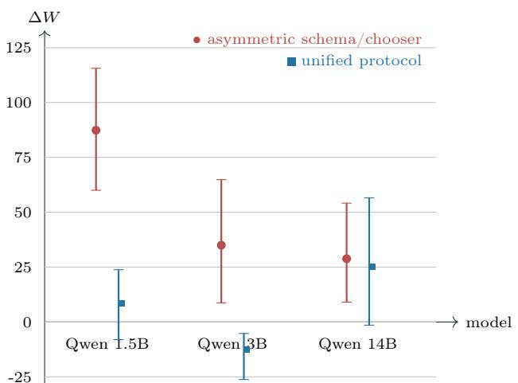
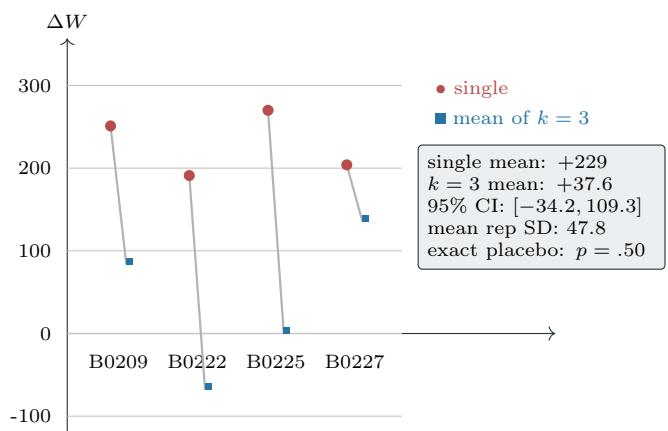

# When Guardrails Look Efective: Construct Validity Failures in LLM Agent Commerce Evaluation

Peiying Zhu\*   
peiying@blossomai.co   
Blossom AI   
San Francisco, CA, USA

Sidi Chang\* †

schang@blossomai.co

Blossom AI Labs

Tokyo, Japan

## Abstract

Interactive simulations are increasingly used to evaluate policies for markets populated by language-model agents. Their outputs can look economic—prices, profits, consumer surplus, and welfare—even when the simulation does not instantiate the economic behavior named in the claim. We audit this risk in a multi-turn buyer–seller testbed for configurable hote transactions. An initial implementation reported welfare gains from two marketplace guardrails of +87.4, +35.0, and +28.8 across a Qwen2.5 1.5B–14B ladder. That implementation also gave guarded and unguarded agents diferent ofer schemas and choice procedures. Holding the schema and buyer chooser fixed changes the same paired contrasts to +7.2, −13.9, and +23.8 The four largest 14B single-generation efects averaged +229; after three generations per profile-condition, they averaged +37.6 (95% bootstrap interval [−34.2, 109.3]), while generation residuals account for 49.9% of the variation in this post-hoc probe. A seller-incentive manipulation check is non-monotone: explicitly increasing profit pressure produces less profit than the default seller prompt. Scripted positive controls show why this matters. A profit-maximizing seller already attains first-best welfare, so guardrails mostly redistribute and reduce welfare; guardrails create welfare only when the seller is explicitly programmed to force ineficient bundles. We contribute a construct-validity contract for agent-market evaluation that separates incentive validity, protocol isolation, stochastic stability, and welfare accounting, and returns Invalid or Inconclusive before allowing a substantive policy claim. Applied to our own case, the original estimate is Invalid under protocol isolation, while the controlled study remains Inconclusive under incentive validity and stochastic stability. The case study does not establish that guardrails are inefective; it establishes that their apparent value is unidentified until the simulated agents and protocol pass these checks.

Keywords: LLM agents, agent evaluation, construct validity, agentic commerce, causal evaluation, evaluation auditing, stochastic stability, marketplace governance

## 1 Introduction

Agent-to-agent (A2A) commerce is becoming a concrete evaluation target. Buyer agents search and negotiate; seller agents configure ofers and prices; platforms may filter messages or constrain ofer formats. Recent environments make it possible to study such systems before deployment [1, 14]. The attraction is clear: assign hidden values and costs, let agents interact, and score completion, surplus, or welfare against ground truth.

There is a measurement trap inside this workflow. Calling an LLM a “self-interested seller” does not establish that it maximizes profit. Calling a prompt edit a “guardrail” does not establish that a measured efect comes from the rule rather than from a friendlier output schema or decision scafold. Treating one stochastic dialogue per buyer profile as an experimental observation does not identify generation variance. Finally, a higher buyer surplus does not imply higher welfare: if a transaction still occurs, a lower price often transfers surplus from seller to buyer without creating any.

These are construct-validity problems, not cosmetic limitations. Construct validity asks whether an operationalization actually instantiates and measures the theoretical object named in a claim [4, 7, 2]. In an agent-market simulation, the relevant object is not merely a fluent transcript. It is a role, incentive, information set, action space, and outcome mapping. A simulation can be internally consistent yet fail to represent the strategic seller or welfare intervention it claims to evaluate.

We make this failure visible through a forensic case study. We began with a plausible A2A hypothesis: two thin platform guardrails—one blocking buyer information useful for personalized extraction and one preventing optional components from being forced into a mandatory base—could improve transaction outcomes. The original testbed produced a clean positive result. We then ran a control that removed an implementation asymmetry, repeated the most favorable profiles, tested whether seller prompts moved profit-seeking behavior, and introduced scripted seller policies as positive controls. Each step weakened the original headline while sharpening the evaluation lesson.

Our contributions are:

1. We document a scafold sensitivity: an apparent guardrail efect changes sharply, including a sign reversal at 3B, when guarded and unguarded cells share one ofer schema and one buyer choice rule.

2. We quantify single-generation instability without pseudo-replication. Replications are averaged within profile-condition, and profiles—not generation rows— are the paired unit. An exact profile-level sign-flip placebo finds the selected efect compatible with label exchangeability $( p = 0 . 5 0 )$ .

3. We expose an incentive-validity gap: prompt-defined seller roles do not respond monotonically to a stronger profit instruction. Scripted positive controls show that the welfare efect of guardrails changes sign with the assumed seller technology.

4. We propose a compact evaluation contract and a three-way decision: substantive interpretation only after the contract passes; Invalid for a known construct violation; Inconclusive when precision or coverage is insuficient. Table 3 applies the contract to this study, and the accompanying artifact provides a reusable nine-item checklist.

This is a bounded methods result. We do not conclude that A2A guardrails fail, that the Qwen family is nonstrategic in general, or that hotel negotiation represents every market. We conclude that policy claims from LLM market simulations require evidence that the intended economic constructs are present and that the treatment is isolated from its scafold.

## 2 Related Work

LLM agents and economic simulation. LLMs have been proposed as simulated economic agents with assigned preferences and endowments [6]. AgentBench evaluates interactive decision-making across environments [11]; bargaining benchmarks formalize buyer and seller gains [14]; and Magentic Marketplace studies multi-agent markets with consumer and service agents [1]. Recent equilibriumreferenced supply-chain experiments show that prompt parameters and model-provider identity can dominate surplus division [9], while LLM pricing agents can exhibit collusive behavior that changes under seemingly innocuous prompt wording [5]. These works make role and incentive assumptions increasingly consequential.

Evaluation as measurement. Construct validity concerns the relation between an intended construct and its operationalization [4]. Measurement-modeling work emphasizes that observable metrics inherit assumptions about unobservable constructs [7]; a recent review finds that such assumptions are often weakly articulated in LLM benchmarks [2]. HELM similarly argues for multi-metric, scenario-aware evaluation rather than a single aggregate score [10]. Prompt-equivalent evaluations can vary substantially [3]; single-sample evaluation ignores stochastic generations [13]; and expensive agent evaluations often omit the repeated runs needed for error bars [8]. We specialize this lens to interactive economic simulations, where the environment partly creates the behavior later attributed to an agent or policy.

Trace and diagnostic validity. Prior trace-based work shows that scalar task performance can remain stable while hidden-state discipline fails, and that aggregate diagnostics can misrank policy repairs [17, 16]. Our setting difers in both construct and mechanism: we study multi-turn buyer–seller dialogue, stochastic role enactment, treatment scafolds, and welfare accounting. The connection is methodological: outcomes do not identify whether an interactive system followed the behavioral assumptions needed to interpret them.

## 3 Setting and Evaluation Contract

## 3.1 Configurable transaction testbed

Each buyer profile θ has hidden component values, hard constraints, a willingness-to-pay cap, urgency and an outside option. A seller can ofer a mandatory base set S at price p and separately priced optional additions. Components include cancellation, quiet room, breakfast, view, high floor, and late checkout. The buyer accepts the utilitymaximizing feasible ofer if it weakly beats the assigned outside option. Hotels are a worked configurable-goods instance, not the claimed universe of application.

All outcome metrics use assigned ground truth rather than values stated by the agents. For an accepted set S,

$$
\mathrm { B S } _ { \theta } ( S , p ) = V _ { \theta } ( S ) - p - o _ { \theta } ,\tag{1}
$$

$$
\mathrm { S P } _ { \theta } ( S , p ) = p - C ( S ) ,\tag{2}
$$

$$
W _ { \theta } ( S ) = { \mathrm { B S } } + { \mathrm { S P } } = V _ { \theta } ( S ) - C ( S ) - o _ { \theta } .\tag{3}
$$

All three are zero when no transaction occurs. This identity is central: price discrimination alone moves surplus between buyer and seller; it changes welfare only if it changes completion or composition. First-best welfare is the maximum of zero and welfare from the hard constraints plus each optional component whose private value exceeds its cost. We report welfare as a fraction of this profilespecific first best. Match quality credits only components in that welfare-maximizing set.

The platform has two binary rules. The information rule blocks questions and responses about budget, WTP, urgency, and outside options while preserving need-discovery questions. The conduct rule restricts the mandatory base to essential components and turns other components into declineable add-ons. Their $2 \times 2$ crossing yields None, Info, Conduct, and Both.

## 3.2 A validity contract before a policy claim

We define four predicates that should be evaluated before interpreting $\Delta W$ as the efect of a marketplace policy:

C1: Incentive validity. The seller measurably responds to its stated objective. Strengthening profit incentives should change profit-seeking behavior in the predicted direction, or the role must be described behaviorally rather than strategically.

C2: Protocol isolation. Treatment cells share message schema, decision rules, horizon, and parsing. Only the intended information and conduct constraints vary.

C3: Stochastic stability. The profile-level treatment efect exceeds generation noise at the intended decision threshold. Repeated generations are nested within profile-condition and are not counted as independent buyers.

C4: Accounting completeness. Completion, buyer surplus, seller profit, and welfare are reported together from ground truth. A distributional transfer is not labeled welfare creation.

The decision rule is deliberately asymmetric. A known violation of C1 or C2 makes the corresponding causal interpretation Invalid. For C1, however, an underpowered or non-monotone manipulation check is not proof that the intended incentive is absent; it leaves the incentive interpretation Inconclusive. Failure to resolve sampling or coverage under C3 is likewise Inconclusive, not “no efect.” Only after C1–C4 pass is a positive, negative, or practically null policy conclusion licensed.

Identifiability boundary. Let $z ( \tau )$ be a binary trace property such as “the seller used private WTP to set price,” and let an evaluator observe only ϕ(τ ). If two traces $\tau _ { 1 } , \tau _ { 2 }$ satisfy $\phi ( \tau _ { 1 } ) = \phi ( \tau _ { 2 } )$ but $z ( \tau _ { 1 } ) \neq z ( \tau _ { 2 } )$ , no downstream function of ϕ(τ ) can exactly recover z. Adding more aggregate metrics computed from the same abstraction cannot repair the missing instrumentation. This elementary observation motivates retaining prompts, visible and hidden transcripts, parsed ofers, profile types, and costs rather than only scalar outcomes.

## 4 Audit Design

## 4.1 Models, profiles, and protocol

We run 4-bit Qwen2.5-Instruct models at 1.5B, 3B, and 14B parameters [15]. In each capability cell the same model instantiates buyer and seller. Conversations have two seller-question rounds followed by a structured ofer; temperature is 0.2. We use the same 30 held-out synthetic profiles in every model and policy cell. A separately optimized fixed menu is descriptive context, not a treatment baseline for the validity audit, because it received distribution-level optimization that the zero-shot agents did not.

The synthetic profile generator is intentionally visible as a limitation. In the full 60-profile evaluation panel, 43 outside-option utilities are negative under $o _ { \theta } =$ 150 − outside price − quality penalty. Negative utility is mathematically coherent but makes acceptance easier and may not represent a target deployment population. We therefore avoid general market-level welfare claims from this panel.

## 4.2 Four audit experiments

E1: Scafold control. The first implementation gave the unguarded seller a single-bundle room\_attributes/price schema and a wholebundle accept/reject rule. The guarded seller used base\_attributes/base\_price/optional\_addons and a chooser that optimized over add-on subsets. Thus policy and transaction-construction scafold changed together. We reran the same model ladder and profiles with one schema and one chooser in all cells. After parsing, only two booleans—block information and enforce conduct—can change the ofer seen by the buyer. The original run contains 180 LLM dialogues in None/Both; the controlled $2 \times 2$ contains 360 LLM dialogues. Fixed-menu rows are deterministic duplicates and excluded from these counts.

E2: Repeated-generation forensic. From the controlled 14B run, we selected post hoc the four profiles with the largest single-generation Both−None welfare gains. We then generated each profile-condition three times (24 LLM dialogues; deterministic menu rows are again excluded). We average the three generations within each profile-condition, compute four paired profile efects, and bootstrap profiles. For a finite-sample placebo, we enumerate all $2 ^ { 4 } = 1 6$ profile-level sign assignments. We also decompose the balanced profile×condition×replicate table into profile, condition, interaction, and generation-residual sums of squares. Because profiles were selected on their original efects, E2 is an exploratory winner’s-curse diagnostic, not a confirmatory treatment estimate.

E3: Incentive manipulation check. At 14B we compare three seller prompts on three profiles with two generations each: a compliance-oriented seller, the standard “selfinterested” seller, and a stronger profit-pressure instruction. We inspect seller profit, profit share, rent-extraction questions, and matching behavior. This 18-dialogue smoke test asks whether the textual role manipulation moves the intended construct monotonically; it is not powered to rank prompts.

E4: Scripted positive controls. We replace the LLM seller with two deterministic policies over all 60 profiles while retaining the same schema, chooser, and scorer. Profitmaximizing enumerates ofers and chooses the one with highest seller profit (breaking ties by welfare). Ineficientbundling stress forces up to two optional components with $V _ { \theta } ( o ) < C ( o )$ into an ungoverned base. Each policy is crossed with the four guardrail cells. These controls ask whether the metrics can detect a welfare-improving guardrail under a seller technology that should produce one.

## 4.3 Statistics

For E1, we compute profile-paired Both−None welfare diferences and 20,000-draw percentile bootstrap intervals, resampling the 30 profiles. For E2, replications are averaged before pairing; raw generation rows never become additional buyer units. We report the exact sign-flip placebo, cell-level generation SD, and a descriptive variance decomposition. The approximate 80%-power minimum detectable paired efect (MDE) uses $t _ { . 9 7 5 , 3 } + z .$ 80 times the observed SD of the four profile efects divided by ${ \sqrt { 4 } } ;$ its purpose is to expose low precision, not certify prospective power.

## 5 Results

## 5.1 R1: The headline efect is scafoldsensitive

Figure 1 shows the central audit result. Under the asymmetric scafold, mean Both−None welfare is $+ 8 7 . 4 ,$ +35.0, and +28.8 for 1.5B, 3B, and 14B. Under the unified schema and chooser, the contrasts are $+ 7 . 2$ (95% CI [−8.1, 23.8]), −13.9 ([−26.2, −5.2]), and +23.8 ([−1.5, 56.6]). The estimated efect shrinks by 92% at 1.5B and reverses sign at 3B. At 14B the point estimate remains positive but is not resolved from zero.

The old result cannot be interpreted as a clean economic efect because C2 is known to fail. The controlled run does not license the opposite claim that guardrails reduce welfare: signs difer by model size, and every cell has only one stochastic generation per profile. The correct aggregate judgment is mixed and under-replicated.

The residual 14B gain is itself a stability warning. Define the $2 \times 2$ interaction as ${ I } = { W } _ { \mathrm { B o r H } } - { W } _ { \mathrm { I N F O } } - { W } _ { \mathrm { C o N D U C T } } +$ $W _ { \mathrm { N o N E } }$ . It is −2.5 at 1.5B and −0.3 at 3B, but +35.8 at 14B. At 14B both single-rule main efects are negative (−3.5 and −8.4), so an additive model predicts welfare 93.5; the observed Both welfare is 129.3. This isolated super-additivity accounts for the surviving positive contrast but appears at only one model size with one generation per profile-condition. The aggregate channel is primarily completion: Both raises completion from .77 to .90, while accepted-trade welfare rises only from 137.5 to 143.6. Holding accepted-trade welfare at the None level, the completion change accounts for 18.3 of the 23.8 aggregate-welfare units, or 77%. We therefore treat the interaction as a post-hoc diagnostic, not evidence of complementarity.

  
Figure 1: Profile-paired Both−None welfare efects (means and 95% profile-bootstrap intervals, $n = 3 0 )$ ). The large 1.5B gain and positive 3B gain do not survive unifying the ofer schema and buyer chooser.

## 5.2 R2: Single generations overstate selected efects

The four largest 14B single-generation efects were +251, +191, +270, and +204 welfare units. Their mean was +229. With three new generations per cell, the profile efects become +83.7, −68.3, 0, and +135, with mean +37.6 and profile-bootstrap interval [−34.2, 109.3] (Figure 2). Mean within-cell generation SD is 47.8. The approximate 80%- power MDE is 180.9, nearly five times the repeated point estimate.

The exact profile-level sign-flip distribution gives a twosided $p = 0 . 5 0$ (one-sided $p = 0 . 2 5 )$ . In the descriptive variance decomposition, generation residuals account for 49.9% of sum-of-squares variation, profile efects 24.1%, profile-by-condition interaction 21.1%, and condition 4.9%. This occurs despite temperature 0.2: low-temperature decoding did not make one rollout a stable measurement. These percentages apply only to the selected four-profile probe, but they show why the initial extreme efects cannot be treated as stable profiles.

## 5.3 R3: The assumed strategic seller is not validated

Table 1 reports the seller manipulation check. The profitpressure prompt increases rent-extraction questions relative to the standard prompt (0.83 vs. 0.17 per dialogue), but it produces much less seller profit (33.8 vs. 57.5) and a lower profit share (0.37 vs. 0.56). The compliance prompt yields the least profit, as expected, but the intended middle-to-high ordering fails. This is not evidence that stronger prompts generally reduce profit; $n = 3$ profiles is too small. It is evidence that the current prompt manipulation has not established a monotone, controllable profit-maximization construct. C1 is therefore Inconclusive, not a known violation.

  
Figure 2: Winner’s-curse probe. Profiles were selected post hoc for the largest positive 14B single-generation efects. Repetition changes both magnitude and sign.

<table><tr><td>Seller prompt</td><td></td><td></td><td>Profit Share Rent probes Welfare</td><td></td></tr><tr><td>Compliance</td><td>25.8</td><td>.29</td><td>.17</td><td>92.2</td></tr><tr><td>Standard self-interest</td><td>57.5</td><td>.56</td><td>.17</td><td>103.2</td></tr><tr><td>Profit pressure</td><td>33.8</td><td>.37</td><td>.83</td><td>94.7</td></tr></table>

Table 1: Seller-incentive smoke test (Qwen2.5-14B, 3 profiles, 2 generations each). Stronger profit language changes probing but not profit monotonically.

## 5.4 R4: Positive controls locate the missing mechanism

The scripted controls separate metric failure from construct absence (Table 2). The profit-maximizing seller extracts all buyer surplus in None but selects a first-best bundle, yielding mean welfare 169.1 and 100% of first best. This is the textbook complete (first-degree) pricediscrimination benchmark: in a frictionless environment the seller captures surplus while preserving the eficient allocation [12]. Adding both guardrails transfers 44.0 to buyers, removes 68.5 from sellers, and reduces welfare by 24.5. Thus seller self-interest and buyer extraction alone do not imply a welfare-improving guardrail.

The ineficient-bundling stress seller establishes the positive control. It forces components whose buyer value is below seller cost when conduct is ungoverned. Under this technology, Both raises welfare by 18.7 and first-best attainment by 11.1 percentage points. Yet the same intervention still lowers seller profit by 25.3 while increasing buyer surplus by 44.0. Reporting buyer surplus alone would make both scripted worlds look equally successful; joint accounting reveals opposite welfare signs.

<table><tr><td>Scripted seller</td><td>∆BS</td><td>∆SP</td><td>∆W ∆FB pp</td></tr><tr><td>Profit maximizing</td><td>+44.0</td><td>-68.5 -24.5</td><td>-15.4</td></tr><tr><td>Inefficient-bundling stress</td><td>+44.0</td><td>-25.3 +18.7</td><td>+11.1</td></tr></table>

Table 2: Positive controls, Both−None, 60 assigned buyer types. FB pp denotes percentage-point change in profile-normalized first-best welfare. The identical ∆BS values are not a copy error: under Both, the two scripted controls induce the same constrained outcomes. The same buyer-surplus gain masks opposite welfare efects.

## 5.5 R5: The contract abstains selectively

Table 3 applies C1–C4 rather than leaving the contract as advice for other studies. The original headline is Invalid because its treatment changes the transaction scafold. The controlled estimand is meaningful, but the available LLM evidence remains Inconclusive because incentive validity is unverified and generation stability is unresolved. C4 passes: the accounting identity and scripted controls distinguish transfer from welfare creation. Accordingly, neither “guardrails work” nor “guardrails fail” is licensed. This abstention concerns the causal policy estimand, not the audit findings: scafold sensitivity, the variance decomposition, and the scripted-control contrast are themselves measured results.

<table><tr><td>Contract item</td><td>Verdict</td><td>Evidence in this audit</td></tr><tr><td>C1 Incentives</td><td>INCONCLUSIVE</td><td>Non-monotone smoke test; only 3 profiles and 2 generations.</td></tr><tr><td>C2 Protocol</td><td>Original: INVALID Controlled: Pass</td><td>Original schema and chooser differ; E1 removes both differences.</td></tr><tr><td>C3 Stability</td><td>INCONCLUSIVE</td><td>MDE 180.9  37.6; exact sign-flip p = .50; 49.9% residual variation.</td></tr><tr><td>C4 Accounting</td><td>Pass</td><td>∆BS, ∆SP, ∆W, completion, and first-best are jointly reported.</td></tr><tr><td>Overall</td><td>No causal policy claim; descriptive reporting licensed</td><td>C2 blocks the original; C1 and C3 block the causal interpretation of the controlled study.</td></tr></table>

Table 3: The evaluation contract applied to the present study. A failed gate determines the admissible interpretation; passing one gate does not compensate for another.

## 6 Implications for Agent Evaluation

Validate roles as manipulations, not prose. An agent called “self-interested” should not be presumed to implement a utility function. Before testing governance, researchers should specify a behavioral implication of the role—for example, monotone response to a profit coeficient, revealed-preference consistency, or regret against a scripted optimum—and test it. If the manipulation fails, the study may still report descriptive LLM behavior, but not a policy efect on strategic sellers.

Hold the transaction constructor fixed. Agent evaluations often bundle a policy with templates, parsers, normalization, retries, and decision logic. Those components can dominate the intervention. Our strongest initial result came from exactly such a bundle. A defensible ablation uses one schema and one chooser, then applies treatment flags after parsing. When this is impossible, scafold changes should be named as part of the intervention rather than attributed to a thin guardrail.

Treat generations as nested measurements. Repeated generations estimate within-cell stochasticity; they do not create new buyer types. The simplest correct workflow is to average k generations within profile-condition, form paired profile efects, and resample profiles. A mixed model is another option. Pairing “replicate 1” across two independently sampled conditions and treating n × k rows as independent narrows uncertainty without creating information.

Make abstention an evaluation output. Evaluation reports typically force an answer even when their own assumptions fail. Our contract makes two forms of abstention explicit. Invalid means a known design violation prevents the named interpretation, as in the asymmetric scafold. Inconclusive means the estimand is meaningful but precision or coverage is insuficient, as in the repeated four-profile probe. Neither should be translated to a substantive null.

The accompanying artifact turns these gates into a nine-item checklist covering roles, schemas, trace retention, replication, accounting, and controls. It also provides the analysis script, generated tables, prompts, and run manifests at https://anonymous.4open.science/r/ a2a-evaluation-artifact-staging-2F25/.

Separate creation from transfer. For accepted trades, price cancels from welfare. Consequently, a privacy or disclosure rule may improve buyer surplus while reducing seller profit one-for-one. A platform may care about that distribution, but it is not total-welfare creation. Every agent-market report should show completion, buyer surplus, seller profit, and welfare together and state which outcome is normative.

Broader impact. More reliable evaluation can prevent unsupported marketplace policies and make null or negative evidence visible. The same audit language can create false assurance if its contract omits privacy, fairness, or deployment harms; retaining buyer profiles and transcripts for audit can also expose sensitive preferences. We mitigate these risks here by using synthetic data, releasing no model weights or personal data, separating descriptive from causal claims, and requiring Invalid or Inconclusive rather than a forced policy verdict. Deployment would still require domain-specific privacy, fairness, and governance review.

## 7 Limitations and Scope

This audit is intentionally narrower than the claims it warns against. First, all LLM results use one instructiontuned model family, three sizes, 4-bit quantization, and self-play. Using the same model for buyer and seller may dampen adversarial behavior through shared priors or a common instruction-following style; cross-family pairing with role prompts held fixed is the cheapest direct test. We have not shown that frontier or cross-family sellers fail the same incentive check. Second, the repeated-generation analysis covers four profiles selected after observing extreme efects. It diagnoses instability and winner’s curse but cannot estimate a population treatment efect. A powered confirmatory run would require pre-specified profiles and at least three generations per profile-condition.

Third, the hotel profiles are synthetic. Their outsideoption distribution includes 43 negative utilities among 60 profiles, so most participation constraints weakly bind; with only two question rounds, the environment may not aford the extraction dynamics that the information rule is meant to alter. A null Info efect would therefore be confounded by the opportunity structure, not evidence that information protection is irrelevant. The optimized fixed menu also has a training-distribution advantage over zero-shot agents, so we do not use agent-versus-menu performance as a headline. Fourth, scripted sellers are instruments, not realistic behavioral models; they prove that the scorer responds under explicit technologies, not that real sellers behave that way. Finally, our contract is a minimum gate, not a complete theory of external validity, platform equilibrium, or human welfare.

## 8 Conclusion

An LLM market simulation can produce precise-looking prices and welfare while failing to instantiate the seller behavior or isolated policy intervention needed to interpret them. In our case study, a strong guardrail result was largely scafold-sensitive, its most favorable profiles were generation-unstable, and the seller-incentive manipulation did not move profit monotonically. Scripted controls then showed that guardrails create welfare only under a specific welfare-destroying seller technology; otherwise they may merely redistribute or reduce it. Agentic evaluation should therefore verify incentives, isolate protocol changes, nest replications correctly, and report complete welfare accounting before making a policy claim. When those checks fail, Invalid and Inconclusive are results, not disclaimers.

## References

[1] G. Bansal, W. Hua, Z. Huang, et al. Magentic marketplace: An open-source environment for studying agentic markets. arXiv preprint arXiv:2510.25779, 2025.

[2] A. M. Bean, R. O. Kearns, A. Romanou, et al. Measuring what matters: Construct validity in large language model benchmarks. arXiv preprint arXiv:2511.04703, 2025.

[3] B. Cao, D. Cai, Z. Zhang, Y. Zou, and W. Lam. On the worst prompt performance of large language models. In Advances in Neural Information Processing Systems, volume 37, 2024.

[4] L. J. Cronbach and P. E. Meehl. Construct validity in psychological tests. Psychological Bulletin, 52(4):281– 302, 1955.

[5] S. Fish, Y. A. Gonczarowski, and R. I. Shorrer. Algorithmic collusion by large language models. arXiv preprint arXiv:2404.00806, 2024.

[6] J. J. Horton, A. Filippas, and B. S. Manning. Large language models as simulated economic agents: What can we learn from homo silicus? NBER Working Paper No. 31122, 2023.

[7] A. Z. Jacobs and H. Wallach. Measurement and fairness. In Proceedings of the 2021 ACM Conference on Fairness, Accountability, and Transparency, pages 375–385, 2021.

[8] S. Kapoor, B. Stroebl, Z. S. Siegel, N. Nadgir, and A. Narayanan. AI agents that matter. Transactions on Machine Learning Research, 2025.

[9] C. Liang and F. Xu. When LLM agents negotiate: Private information and dynamic bargaining in supply chains. arXiv preprint arXiv:2608.07538, 2026.

[10] P. Liang, R. Bommasani, T. Lee, et al. Holistic evaluation of language models. arXiv preprint arXiv:2211.09110, 2022.

[11] X. Liu, H. Yu, H. Zhang, et al. Agentbench: Evaluating LLMs as agents. In International Conference on Learning Representations, 2024.

[12] H. R. Varian. Price discrimination. In R. Schmalensee and R. D. Willig, editors, Handbook of Industrial Organization, volume 1, pages 597–654. Elsevier, 1989.

[13] D. Wadi and M. Fredette. A monte-carlo sampling framework for reliable evaluation of large language models using behavioral analysis. In Findings of the Association for Computational Linguistics: EMNLP 2025, pages 9414–9432. Association for Computational Linguistics, 2025.

[14] T. Xia, Z. He, T. Ren, Y. Miao, Z. Zhang, Y. Yang, and R. Wang. Measuring bargaining abilities of LLMs: A benchmark and a buyer-enhancement method. arXiv preprint arXiv:2402.15813, 2024.

[15] A. Yang, B. Yang, B. Zhang, et al. Qwen2.5 technical report. arXiv preprint arXiv:2412.15115, 2024.

[16] P. Zhu and S. Chang. When aggregate alignment misleads: Auditing policy repair without per-state expert actions. arXiv preprint arXiv:2607.03386, 2026.

[17] P. Zhu and S. Chang. When outcome looks right but discipline fails: Trace-based evaluation under hidden competitor state. arXiv preprint arXiv:2605.18580, 2026.