# When Safety Routing Breaks: Understanding Alignment Fragility under Benign Fine-Tuning

Yitong Guo1\* Xiaoyi Chen1\* Siyuan Zhang2

XiaoFeng Wang3 Haixu Tang1

1Indiana University Bloomington 2Tsinghua University 3Nanyang Technological University \*Equal contribution. Corresponding Author: Xiaoyi Chen (chxiaoyi@iu.edu)

## Abstract

Benign fine-tuning severely weakens the safety alignment of large language models (LLMs), so we study why refusal behavior is so fragile. While prior work often attributes this failure to gradient conflict, we propose a fundamentally different Fisher-geometric explanation: safety Fisher is low-rank, and alignment makes the safety geometry flatter while preserving an output-routing pathway. After 100 benign fine-tuning examples, this pathway is selectively re-sharpened in output-side MLP modules, explaining the asymmetric fragility: safety can collapse to high attack success rates, while general utility degrades mildly.

The routing view also explains why few safety examples can restore refusal behavior, indicating that internal safety-relevant representations are preserved. Finally, we show that LoRA and ASAM mitigate early collapse by suppressing output-side sharpness, but their protection weakens at larger fine-tuning scales. Overall, safety failure is best understood as a disruption of a low-rank output-routing mechanism.

## 1 Introduction

LLMs are routinely adapted after alignment to improve performance on downstream utility tasks. Such adaptation is often benign: the fine-tuning data may consist of domain-specific question answering, coding, or reasoning examples, with no harmful instructions. Ideally, this process should preserve the safety behavior. Yet recent work has shown that even benign fine-tuning can substantially weaken refusal behavior and increase attack success rate (Qi et al., 2024; Zhan et al., 2024). This raises a basic question: why is safety alignment so easy to break?

A natural explanation is gradient conflict: utility fine-tuning may update parameters in directions that interfere with safety alignment (Guan et al., 2025; He et al., 2024). Prior work manipulates and carefully selects outlier benign samples to break safety. However, this explanation alone does not capture the empirical pattern we observe. In our experiments, we find that low-conflict and random sample subsets all cause comparable safety collapse, ruling out gradient conflict as the primary cause.

We argue that this fragility arises because safety alignmentprimarily controls how harmful representations are routed to the output. During pretraining, LLMs acquire both general knowledge and representations of harmful content, which coexist in the same parameter space. Post-training alignment actually solves a routing problem: the model should map the harmful representations to refusal behavior instead of compliant answers.

Fisher measurements support this routing view. First, safety is more concentrated than utility. On the baseline model, the safety Fisher has a larger top-1 concentration than the utility Fisher (0.491 vs. 0.271), with the concentration most pronounced in the final layers (0.718 vs. 0.223). Second, alignment compresses the safety Fisher, reducing layerwise top eigenvalues by roughly two orders of magnitude across most layers. These findings suggest that alignment makes the safety geometry flatter while preserving a low-rank routing pathway from safety-relevant internal states to refusal behavior.

After benign fine-tuning, the geometric change is highly localized: the safety Fisher selectively resharpens late output-side MLP modules. In particular, the final-layer down\_proj sharpness increases by 11.2× for safety, whereas the corresponding increase for utility is only 1.2×. This localized resharpening provides a bridge from geometry to behavior. If refusal depends on an output-side routing path, then its high curvature means that small updates can strongly perturb this routing. By contrast, because the utility Fisher exhibits a disproportionately lower re-sharpening, the same updates have a much weaker effect on the knowledge-task output. This explains the asymmetric fragility (§4.2). Aligned models with near 0% ASR suffer severe safety collapse (up to 85.7% ASR) after only 100 benign examples across model families, alignment settings, and datasets, whereas the corresponding utility degradation remains comparatively limited.

The routing view also explains why broken safety is reversible (§4.5). Few safety examples can restore refusal behavior, and even a fixed refusalstyle prefix can reduce ASR by 50% without any parameter updates. Since the prefix adds no new safety knowledge, this suggests that safety-relevant representations remain intact, while fine-tuning disrupts their mapping to refusal behavior. Consistently, LoRA and ASAM reduce early collapse by restricting small-data output-side drift, but their protection weakens at larger data scales as accumulated drift overwhelms the routing geometry (§4.4).

Together, our results suggest that early safety failure is neither caused solely by adversarially selected outliers nor by a global knowledge loss. Instead, safety alignment is fragile because it depends on a low-rank output routing. Benign fine-tuning re-sharpens late MLP routing modules, causing refusal failure while much of the internal representation remains intact.

Contributions. We make four contributions:

• We provide a Fisher-geometric account of alignment fragility, showing that benign fine-tuning breaks safety through selective re-sharpening of the output-side routing subspace rather than through gradient conflict or global representation drift.

• Our empirical analysis shows that this fragility consistently appears across the evaluated model families, alignment conditions, and sampleselection strategies, while the preservation of intermediate safety representations helps explain its reversibility.

•Through logit-lens analysis and cross-condition activation patching, we show that safety-relevant representations remain present after benign finetuning, while late-layer computation causally controls the switch between refusal and compliance, providing mechanistic evidence for the outputrouting account and explaining the reversibility of safety.

• We show that sharpness-oriented mitigations (LoRA, ASAM) address the routing fragility at small scale but face a fundamental ceiling at larger data volumes, motivating alignment methods be-

yond sharpness control.

## 2 Preliminaries

## 2.1 Background

Aligned models and refusal behavior. We study a chat model with parameters $\boldsymbol \theta \in \mathbb { R } ^ { n }$ and policy $\pi _ { \boldsymbol { \theta } } ( y \mid x )$ . We write $\theta _ { \mathrm { s a f e } }$ for the aligned checkpoint produced by SFT or DPO (Rafailov et al., 2023), which both retains general instruction-following ability and refuses harmful queries. We measure safety via the Attack Success Rate

$$
\mathrm { A S R } ( \theta ) : = \textstyle \frac { 1 } { | \mathcal { H } | } \sum _ { x \in \mathcal { H } } \mathbf { 1 } \bigl [ \operatorname { J u d g e } ( \pi _ { \theta } ( \cdot \mid x ) ) = \mathrm { u n s a f e } \bigr ]\tag{1}
$$

on the HEx-PHI benchmark (Qi et al., 2024) with an LLM-as-a-judge protocol. By design, $\mathrm { A S R } ( \theta _ { \mathrm { s a f e } } ) \approx 0 .$

Benign fine-tuning and safety collapse. Practitioners adapt θ or $\theta _ { \mathrm { s a f e } }$ to downstream tasks by minimizing the supervised fine-tuning objective

$$
L _ { \mathrm { f t } } ( \theta ) = - \mathbb { E } _ { ( x , y ) \sim \mathcal { D } _ { \mathrm { f t } } } \left[ \log \pi _ { \theta } ( y \mid x ) \right]\tag{2}
$$

on a benign dataset ${ \mathcal { D } } _ { \mathrm { f t } }$ that contains no harmful content and no refusal demonstrations. Yet the resulting model $\theta _ { \mathrm { f t } }$ typically exhibits sharply elevated ASR, sometimes saturating after as few as 100 training examples (Qi et al., 2024; Chen et al., 2024). Prior work attributes this collapse to gradient conflict with a small subset of outlier samples (He et al., 2024; Guan et al., 2025), aggressive optimization hyperparameters (Kim et al., 2025a), or the curvature structure of the loss landscape (Wei et al., 2024; Zheng et al., 2024; Springer et al., 2026; Peng et al., 2024). This paper takes a geometry-first stance: we argue that benign fine-tuning disrupts an outputside routing mechanism that implements refusal safety, and that this view jointly explains both the fragility and the recoverability of alignment.

## 2.2 Related Work

LLM Safety Alignment. To prevent LLMs from generating harmful, biased, or restricted content, researchers employ various safety alignment techniques during the post-training phase. Standard practices typically involve Supervised Fine-Tuning (SFT) on curated instruction-following demonstrations (Wei et al., 2021; Sanh et al., 2022), followed by optimization using human preferences (Ouyang et al., 2022; Bai et al., 2022) with Reinforcement Learning techniques (Schulman et al.,

2017; Rafailov et al., 2023). While these alignment techniques successfully train models to recognize harmful intent and map them to refusal behaviors, the training outcomes are usually fragile and easy to break after further fine-tuning (Yang et al., 2023; Lermen et al., 2023; Zhan et al., 2024).

The Fragility of Safety Alignment. To explain why even benign fine-tuning erodes safety, prior work has explored multiple angles. A prominent line of work attributes safety collapse to gradient conflict (He et al., 2024; Qi et al., 2024; Guan et al., 2025; Hsiung et al., 2025), arguing that specific outlier benign samples carry gradients that point in conflicting directions relative to safety-relevant parameters, causing utility updates to overwrite safety parameters. Another line of research has shifted towards understanding the structural representation of safety within model weights (Wei et al., 2021; Arditi et al., 2024; Li et al., 2025; Zhao et al., 2025; Ponkshe et al., 2025), which demonstrates that safety behavior is controlled by a very small number of neurons, layers, and directions, and therefore safety is encoded in a remarkably low-dimensional subspace. Narrow finetuning will easily break safety when it interferes with the shared latent dimensions (Giordani, 2025). Additionally, (Kim et al., 2025b) examines this fragility from an optimization standpoint, suggesting that aggressive optimization hyperparameters play a massive role in destabilizing safety behavior. Compared to these lines of work, we pinpoint a distinct geometric mechanism behind safety fragility. We use Fisher-geometric analysis to localize the failure to output-side re-sharpening of a low-rank refusal-routing pathway. This mechanism explains both the rapid collapse of refusal behavior and its reversibility.

## 3 Geometry of Alignment Collapse

LLMs lose their safety alignment after only a handful of benign fine-tuning steps (Qi et al., 2024; He et al., 2024; Guan et al., 2025). The dominant explanation invokes gradient conflict: a small subset of fine-tuning samples carries gradients that conflict with safety-relevant parameter directions, so utility updates overwrite safety updates (He et al., 2024; Guan et al., 2025). Under this view, safety should be preserved whenever the benign dataset is free of such conflicting outliers. However, our experiments (Section 4.3) contradict this prediction: random, gradient-top, and gradient-bottom subsets all break safety to a comparable degree. Outlierconflict is thus a sufficient but not a necessary cause of the collapse we observe.

This section therefore shifts from a samplecentric explanation to a geometry-centric one. Rather than asking which benign samples have the most conflicting gradients, we ask how benign fine-tuning changes the local Fisher geometry. We find that alignment compresses the model’s safety-Fisher sharpness relative to the baseline, leaving the internal safety geometry flatter and more stable.

Benign fine-tuning then induces a localized curvature drift: it does not destroy this representation, but selectively re-concentrates sharpness in late MLP modules, disrupting the routing, i.e., the output-side mapping that determines whether safety-relevant internal representations drive refusal or are overridden by compliant generation.

## 3.1 Geometric Setup

We distinguish a baseline checkpoint $\theta _ { \mathrm { b a s e } }$ and, for each capability c, two capability-specific checkpoints: a reference model $\theta _ { c }$ and its benign finetuned version $\theta _ { c } ^ { + }$ . We consider $c \in \ \{ \mathrm { s a f e , u t i l } \}$ where safe denotes refusal safety and util denotes a general-utility/knowledge capability. In particular, $\theta _ { \mathrm { s a f e } }$ is the safety-aligned model, while $\theta _ { \mathrm { u t i l } }$ is the knowledge-task SFT model. Their post-training counterparts are $\theta _ { \mathrm { s a f e } } ^ { + }$ and $\theta _ { \mathrm { u t i l } } ^ { + }$

For a given analysis dataset $\begin{array} { r } { \mathcal { D } = \{ ( x _ { i } , y _ { i } ) \} _ { i = 1 } ^ { N } , } \end{array}$ we estimate a block-wise empirical Fisher for each layer-module block $b = ( \ell , m ) ^ { 1 }$

$$
\widehat { F } _ { b } ( \theta ) = \frac { 1 } { N } \sum _ { i = 1 } ^ { N } g _ { b } ^ { ( i ) } ( \theta ) g _ { b } ^ { ( i ) } ( \theta ) ^ { \top } ,\tag{3}
$$

$$
g _ { b } ^ { ( i ) } ( \theta ) = \nabla _ { \theta _ { b } } \log \pi _ { \theta } ( y _ { i } \mid x _ { i } ) ,\tag{4}
$$

where $\pi _ { \boldsymbol { \theta } } ( \boldsymbol { y } \mid \boldsymbol { x } )$ denotes the conditional distribution over output sequences induced by parameters $\theta .$ For safety, $y _ { i }$ is the refusal target; for utility, $y _ { i }$ is the correct task answer.

Let $\lambda _ { b , 1 } ( \theta ) \geq \lambda _ { b , 2 } ( \theta ) \geq \cdot \cdot \cdot \geq 0$ be the eigenvalues of $\widehat { F } _ { b } ( \theta )$ . We use the top eigenvalue as the block sharpness, measuring worst-direction curvature:

$$
A _ { b } ( \theta ) = \lambda _ { \operatorname* { m a x } } \left( \widehat { F } _ { b } ( \theta ) \right) = \lambda _ { b , 1 } ( \theta ) = \operatorname* { m a x } _ { \| v \| = 1 } v ^ { \top } \widehat { F } _ { b } ( \theta ) v .
$$

We define curvature drift between two checkpoints $\theta _ { \mathrm { s r c } }$ and $\theta _ { \mathrm { t g t } }$ as the log-ratio change in Fisher curvature statistics:

$$
\Delta A _ { b } ^ { \mathrm { s r c \to t g t } } = \log _ { 1 0 } \frac { A _ { b } ( \theta _ { \mathrm { t g t } } ) } { A _ { b } ( \theta _ { \mathrm { s r c } } ) } .\tag{5}
$$

Here positive drift indicates increased local curvature at the later checkpoint, while negative drift indicates decreased local curvature.

## 3.2 Where the Post-Training Drift Lives

We use the block-wise empirical Fisher on 100 safety inputs sampled from the Align-10k posttraining set (§4.1) and 100 SciQ (Welbl et al., 2017) inputs, to localize safety- and utility-relevant curvature and track how it shifts across checkpoints. For safety, we compare $\theta _ { \mathrm { b a s e } } , \theta _ { \mathrm { s a f e } } .$ , and $\theta _ { \mathrm { s a f e } } ^ { + } .$ . For utility control, we compare $\theta _ { \mathrm { { b a s e } } } , \theta _ { \mathrm { { u t i l } } } ,$ and $\theta _ { \mathrm { u t i l } } ^ { + } .$

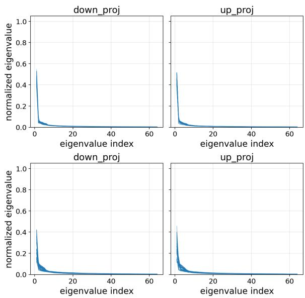  
Figure 1: Normalized top eigenvalue decay of the Fisher on $\theta _ { \mathrm { b a s e } } .$ . Individual lines represent different transformer layers. Top: Safety task. Bottom: Utility task. While both domains exhibit low-rank structure, the safety task demonstrates a substantially sharper eigenvalue decay.

Safety Fisher is low-effective-rank. We first compare the normalized eigenvalue decay on $\theta _ { \mathrm { b a s e } }$ . For each down\_proj and up\_proj block, we normalize the top-64 eigenvalues by the sum of eigenvalues, so that the comparison reflects spectral shape rather than absolute Fisher scale. As shown in Figure 1, both safety and utility exhibit low-rank structure. However, the safety spectrum decays more sharply, indicating that safety Fisher mass is more concentrated in a small number of dominant directions.

<table><tr><td>Layer</td><td>Safety R(1)</td><td>Safety R(5)</td><td>SciQ R(1)</td><td>SciQ R(5)</td></tr><tr><td>29</td><td>0.626</td><td>0.756</td><td>0.143</td><td>0.397</td></tr><tr><td>30</td><td>0.718</td><td>0.846</td><td>0.223</td><td>0.473</td></tr><tr><td>31</td><td>0.431</td><td>0.555</td><td>0.185</td><td>0.365</td></tr><tr><td>Avg</td><td>0.491</td><td>0.657</td><td>0.271</td><td>0.516</td></tr></table>

Table 1: Layer-wise spectral concentration of the Fisher.

We quantify this concentration using the top-k mass ratio over all the layer-module blocks,

$$
R ( k ) = \frac { \sum _ { b } \sum _ { j = 1 } ^ { k } \lambda _ { b , j } } { \sum _ { b } \sum _ { j = 1 } ^ { 6 4 } \lambda _ { b , j } } .
$$

Safety has a substantially larger top-1 concentration than utility (0.491 vs. 0.271), and also a larger top-5 concentration (0.657 vs. 0.516). This gap is especially pronounced in the final layers (Table 1). The same pattern appears under a normalizedeigenvalue rank estimate. We count the number of normalized eigenvalues larger than $1 / n ,$ , where n is the matrix dimension, following the Kaiser criterion. This gives an estimated rank of 8 for safety and 11 for utility. Thus, the safety Fisher is more strongly concentrated than the utility Fisher, with fewer directions accounting for a larger fraction of the measured curvature.

Alignment compresses safety Fisher. We next examine the absolute scale of the safety Fisher. While the normalized spectra above show that safety is low-rank, they do not tell us whether the corresponding directions are large or small in absolute curvature. We therefore compare the layer-wise top eigenvalue $A _ { b } ( \theta )$ across checkpoints.

As shown in Figure 2, alignment substantially compresses the safety Fisher. The baseline model $\theta _ { \mathrm { b a s e } }$ has large top eigenvalues across almost all layers, whereas the aligned model $\theta _ { \mathrm { s a f e } }$ is lower by roughly two orders of magnitude over most of the network. Thus, the aligned safety geometry is not globally sharp: after alignment, the measured safety Fisher becomes much smaller and flatter. This compression is not permanent. After benign fine-tuning, $\theta _ { \mathrm { s a f e } } ^ { + }$ remains flatter than the baseline through most middle layers, but the final outputside blocks begin to re-sharpen. We analyze this re-concentration next.

Fine-tuning selectively re-sharpens safety in late MLP projections. We next examine curvature drift from $\theta _ { c }$ to the post-training $\theta _ { c } ^ { + }$ . In Figure 3, we plot the layer-wise sharpness ratio for the MLP down\_proj module, averaged over five Fisher-estimation seeds with 95% confidence intervals. For safety, FT-100 does not increase curvature uniformly across the model. The top eigenvalues of middle layers continue to decrease. In contrast, the final layers flip to positive drift, with the last layer increasing by 11.2×. Thus fine-tuning selectively re-sharpens the output-side MLP projection, making the safety subspace locally high-curvature and less robust.

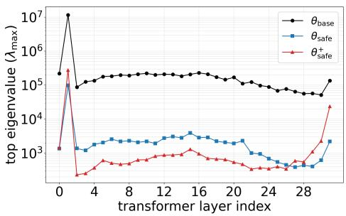  
Figure 2: Layer-wise safety sharpness in down\_proj.

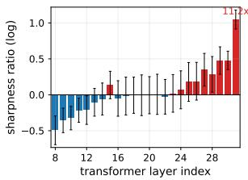  
(a) Safety

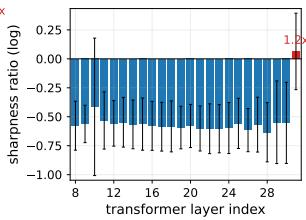  
(b) Utility  
Figure 3: Layer-wise curvature drift in down\_proj after FT-100. Bars show the mean across five Fisher estimation seeds, with 95% confidence intervals. Positive bars indicate re-sharpening, while negative bars indicate further flattening.

The SciQ utility control shows a different pattern: most layers remain flatter after FT-100, and the only visible late-layer increase is modest, reaching about $1 . 2 \times$ in the final layer. This weaker curvature drift is consistent with the behavioral results in Table 2, where fine-tuning reduces SciQ accuracy by only about 10%, compared to the much sharper drop in refusal safety.

This contrast suggests that the safety failure is not well explained by a global loss of knowledge. Instead, benign fine-tuning renders the late MLP refusal-routing pathways fragile and highly curved, while preserving utility geometry. Thus, the early drop in safety is best understood as a localized disruption of output-side routing. This interpretation suggests two interventions that we return to later: flattening the optimization trajectory to reduce output-side re-sharpening (§4.4), and directly repairing the disrupted refusal-routing path, which would explain why safety can be recovered (§4.5). Both interventions build directly on this localization, and motivate the next step: the curvature shift we measure lives in parameter space, telling us where fine-tuning moves the model, but not yet what the model computes when it answers a harmful prompt. To establish that the final layers are causally responsible for the loss of refusal, we further move from parameter-space geometry to model activations.

## 3.3 From Geometry to Causal Analysis

The Fisher results show that benign fine-tuning selectively re-sharpens late output-side down\_proj blocks, localizing the strongest safety-specific change to the final layers (Figure 3). We next test whether this localization is reflected in model activations and is causally responsible for refusal behavior. A logit-lens read-out first traces refusal and compliance signals across layers, giving correlational evidence on whether the refusal signal survives benign fine-tuning; cross-condition activation patching then tests the causal role of late-layer activations directly.

Logit-lens read-out. Let x denote a harmful prompt and $h _ { \ell } ( x ) \in \mathbb { R } ^ { d }$ the residual-stream hidden state at the first generation position after decoder layer $\ell ,$ where $\ell = 0$ denotes the embedding output and $\ell = 1 , \ldots , L$ index the transformer layers. We decode this intermediate state using the model’s final normalization and unembedding matrix $W _ { U } \in \mathbb { R } ^ { | \mathcal { V } | \times d }$

$$
z _ { \ell } ( x ) = W _ { U } \mathrm { R M S N o r m } ( h _ { \ell } ( x ) ) \in \mathbb { R } ^ { | \mathcal { V } | } ,\tag{6}
$$

where V is the vocabulary and $z _ { \ell } ( x ) _ { \ell }$ t is the logit of token t.

Let $\mathcal { R } \subset \mathcal { V }$ and $\mathcal { C } \subset \mathcal { V }$ denote predefined refusal and compliance token sets. We define the refusal– compliance margin as

$$
m _ { \ell } ( x ) = \operatorname* { m a x } _ { t \in \mathcal { R } } z _ { \ell } ( x ) _ { t } - \operatorname* { m a x } _ { t \in \mathcal { C } } z _ { \ell } ( x ) _ { t } .\tag{7}
$$

Thus $m _ { \ell } ( x ) > 0$ indicates that refusal dominates the read-out, and $m _ { \ell } ( x ) < 0$ that compliance does. We report the dataset-level mean

$$
\bar { m } _ { \ell } = \frac { 1 } { | \mathcal { D } | } \sum _ { x \in \mathcal { D } } m _ { \ell } ( x ) ,
$$

and compare $\theta _ { \mathrm { s a f e } }$ (Align-10k) with $\theta _ { \mathrm { s a f e } } ^ { + }$ , the same checkpoint after FT-100 on Alpaca.

The refusal signal survives, but compliance becomes dominant. Figure 4 shows that benign finetuning does not erase the refusal signal. In $\theta _ { \mathrm { s a f e } } ,$ the refusal read-out strengthens through the late layers and eventually dominates compliance, producing a positive margin near the output.

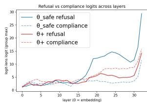

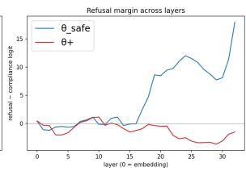  
Figure 4: Logit-lens read-out at the first generation position. Left: refusal and compliance group logits across layers. Right: refusal–compliance margin $\bar { m } _ { \ell }$

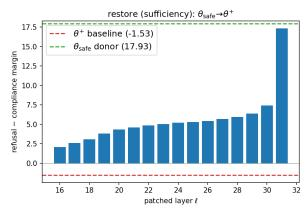

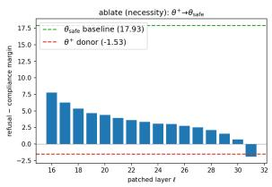  
Figure 5: Cross-condition activation patching at the first generation position. Left: sufficiency. Right: necessity.

After benign fine-tuning, the refusal-group logit still rises through the middle and late layers, but the compliance signal rises earlier and reaches a higher level, preventing the margin from becoming positive. Thus, safety-relevant information remains present, but no longer dominates the final read-out.

If the refusal signal is merely overridden rather than erased, safety should be easy to recover, which we confirm in §4.5. Because the logit lens is observational, we next intervene directly on these activations.

Activation patching identifies the final layer as the dominant causal locus. We perform crosscondition activation patching between $\theta _ { \mathrm { s a f e } }$ and $\theta _ { \mathrm { s a f e } } ^ { + }$ For a given layer ℓ, we replace the base model’s residual-stream state at the first generation position with the corresponding donor activation on the same prompt, then measure the resulting final refusal–compliance margin.

Let $\bar { m } ^ { \mathrm { b a s e } }$ and $\bar { m } ^ { \mathrm { d o n o r } }$ denote the unpatched margins of the base and donor models, and $\bar { m } ^ { ( \ell ) }$ the margin after patching layer ℓ. We define

$$
\operatorname { E f f e c t } ( \ell ) = { \frac { { \bar { m } } ^ { ( \ell ) } - { \bar { m } } ^ { \mathrm { b a s e } } } { { \bar { m } } ^ { \mathrm { d o n o r } } - { \bar { m } } ^ { \mathrm { b a s e } } } } .\tag{8}
$$

An effect of 1 corresponds to transferring the full base-to-donor behavioral difference with a singlelayer patch. In the restore direction, $\theta _ { \mathrm { s a f e } } ^ { + }$ is the base and $\theta _ { \mathrm { s a f e } }$ is the donor, testing sufficiency for recovering refusal. In the reverse ablate direction, the roles are exchanged, testing necessity for preserving refusal.

As shown in Figure 5, the intervention effect increases with depth and becomes dominant at the final layer. Patching the final-layer activation from $\theta _ { \mathrm { s a f e } }$ into $\theta _ { \mathrm { s a f e } } ^ { + }$ restores 96.9% of the aligned refusal margin. In the reverse direction, the final-layer patch eliminates the aligned refusal margin and flips it negative. These results identify the finallayer computation as the dominant cause of the behavioral change.

Causal evidence agrees with the Fisher geometry. The three analyses converge on the final layer. Fisher geometry localizes the strongest safetyspecific re-sharpening to the final down\_proj blocks; the logit lens shows that the refusal signal survives but is overtaken by compliance; and activation patching establishes that the final-layer state causally controls this behavioral switch. Together, these results support an output-routing account of alignment fragility: benign fine-tuning does not primarily erase safety-relevant representations, but perturbs the late computation that determines whether they drive refusal or are overridden by compliance.

## 4 Understanding Alignment Fragility

## 4.1 Experimental Setup

Models and Alignment Conditions. We evaluate two primary backbone families: LLAMA-3.1-8B-INSTRUCT (hereafter LLAMA3.1) and QWEN2.5- 7B-INSTRUCT (hereafter QWEN2.5). Both models are examined across three alignment settings: (1) the default Instruct Baseline; (2) an Align-256 variant, post-trained on 256 safety augmentation samples; and (3) an Align-10k variant, post-trained on a 10k-scale safety dataset, where the queries consist of highly toxic and harmful prompts sourced from the PKU-SafeRLHF dataset (Ji et al., 2024), and the SFT labels are explicit refusals generated by GPT-4o (Hurst et al., 2024). Notably, both aligned variants achieve an initial attack success rate of ASR = 0% on the HEx-PHI (Qi et al., 2024) benchmark.

Fine-Tuning Configurations. We evaluate fullparameter supervised fine-tuning (SFT) against two constrained alternatives: LoRA (with rank $r \ = \ 3 2$ and scaling factor $\alpha = 6 4 )$ and Adaptive Sharpness-Aware Minimization (ASAM). To study the effect of benign utility data, we perform a comprehensive sweep over dataset sizes $n ~ \in ~ \{ 1 0 0 , 5 0 0 , 1 0 0 0 , 5 0 0 0 \}$ using two widely adopted instruction-tuning datasets, Alpaca (Taori et al., 2023) and Dolly (Conover et al., 2023). All experiments are conducted with two random seeds (42 and 69) on a single NVIDIA H200 GPU.

We use the following hyperparameter settings for different training regimes: (1) Safety Alignment: 5 epochs, learning rate $2 \times 1 0 ^ { - 5 }$ , batch size 20; (2) ASAM: 5 epochs, learning rate $5 \times 1 0 ^ { - 5 }$ , batch size 10, with perturbation radius $\rho = 0 . 0 5$ applied at the beginning; (3) Benign Data Attack (Full SFT): 5 epochs, learning rate $5 \times 1 0 ^ { - 5 }$ , batch size 20; (4) Benign Data Attack (LoRA): 5 epochs, learning rate $2 \times 1 0 ^ { - 4 }$ , batch size 32.

Data Sampling Methods for Gradient Conflict. To investigate the impact of gradient direction, we extract contrastive 100-sample subsets (Top/Bottom Conflict-100) from the Alpaca dataset using two distinct pipelines: (1) Method 1 (He et al., 2024): Following the frameworks of (Killamsetty et al., 2021), we rank benign samples based on the cosine similarity between their response-token gradients and a reference adversarial gradient derived from the Pure Bad Dataset (PBD) (Qi et al., 2024). (2) Method 2 (Guan et al., 2025): We directly deploy its data-sampling pipeline to select corresponding Top and Bottom conflict subsets.

Evaluation Benchmarks and Metrics. We evaluate model performance along two primary axes: general utility and safety. (1) General utility is multi-dimensionally measured using standard benchmarks including MMLU (Hendrycks et al., 2021), BoolQ (Clark et al., 2019), and ARC-Easy (Clark et al., 2018), with evaluation conducted via the lm-evaluation-harness framework (EleutherAI, 2024). (2) Safety is primarily assessed by the Attack Success Rate (ASR) on the HEx-PHI benchmark, using an LLM-as-ajudge protocol instantiated with the GPT-4o mini API. To ensure the robustness and generalizability of our behavioral findings, we further extend our evaluation in the Appendix B.4, incorporating additional safety benchmarks (e.g., Wildchat (Zhao et al., 2024) and StrongReject (Souly et al., 2024)).

To further contextualize alignment fragility, we compare safety degradation against other learned capabilities. Specifically, we evaluate performance on two auxiliary datasets: (i) SciQ (Welbl et al., 2017), measured by accuracy; and (ii) MUSE-News (Shi et al., 2024), measured by the ROUGEbased knowmem\_r metric on the retain set.

## 4.2 Asymmetric Fragility: Safety vs. Utility

Is safety degradation under benignfine-tuning a consistent phenomenon across datasets, model families, and random seeds?

Table 2 shows that safety degradation under benign fine-tuning is pervasive. Although the aligned models (Align-256 and Align-10k) achieve 0% ASR before fine-tuning, only 100 benign samples can trigger substantial safety collapse. On Alpaca with the Llama3 backbone, full-parameter fine-tuning raises the ASR of the Instruct Baseline and Align-256 to 75.4% and 85.70%, respectively, while Align-10k reaches 59.6%. Table 3 shows the same trend on Dolly and Qwen2.5, indicating that this fragility generalizes across datasets and model families.

Safety vs. Utility. We further compare safety fragility with two acquired utility capabilities (SciQ and MUSE-News) under the same 100-sample Alpaca attack. As shown in Table 4, both model families exhibit some regression in these capabilities, but the degradation is substantially smaller than the corresponding increase in ASR. This asymmetry indicates that benign fine-tuning disproportionately disrupts safety behavior, consistent with a particularly fragile output-side routing mechanism.

## 4.3 Safety Degradation: Gradient Conflict vs. Generic Drift

Is safety degradation driven by gradientconflicting samples, or does it arise from generic benign fine-tuning drift?

Table 5 shows that gradient directionality modulates the severity of safety degradation but is not necessary for safety collapse.

Under Method 1, the Bottom Conflict-100 subset consistently yields lower ASR than Random-100 across all alignment conditions. For Align-256, for example, ASR decreases from 83.00% to 54.20%, indicating that avoiding highly conflicting gradients can partially mitigate safety degradation. Method 2 exhibits the same overall trend.

Nevertheless, even the Bottom Conflict-100 subsets produce substantial degradation, with ASR exceeding 52% across all alignment conditions. Reducing gradient conflict therefore attenuates the extent of degradation but does not preserve safety alignment.

Overall, gradient conflict primarily modulates the severity of safety degradation, whereas generic benign fine-tuning drift alone is sufficient to substantially disrupt refusal behavior.

<table><tr><td rowspan="2">Model</td><td rowspan="2">FT Methods</td><td colspan="3">ASR (%)↓</td><td colspan="3">MMLU (%)↑</td><td colspan="3">BoolQ (%)↑</td><td colspan="3">ARC-E (%)↑</td></tr><tr><td>FT-100</td><td>Base</td><td>FT-5k</td><td>Base</td><td>FT-100</td><td>FT-5k</td><td>Base</td><td>FT-100</td><td>FT-5k</td><td>Base</td><td>FT-100</td><td>FT-5k</td></tr><tr><td colspan="10">Llama-3.1-8B-Instruct Model</td><td></td><td></td><td></td><td></td></tr><tr><td rowspan="3">Instruct Baseline</td><td>SFT</td><td>6.20</td><td>75.40</td><td>71.20</td><td>68.64</td><td>55.01</td><td>27.97</td><td>83.70</td><td>75.32</td><td>72.60</td><td>82.15</td><td>70.37</td><td>55.43</td></tr><tr><td>+ LoRA</td><td></td><td>2.40</td><td>44.80</td><td></td><td>68.20</td><td>65.30</td><td></td><td>85.78</td><td>86.21</td><td></td><td>83.67</td><td>76.09</td></tr><tr><td>+ ASAM</td><td></td><td>63.30</td><td>68.50</td><td></td><td>59.59</td><td>35.94</td><td></td><td>83.15</td><td>69.17</td><td></td><td>69.53</td><td>63.43</td></tr><tr><td rowspan="3">Align-256</td><td>SFT</td><td>0.00</td><td>85.70</td><td>74.80</td><td>66.47</td><td>52.46</td><td>30.59</td><td>85.47</td><td>73.61</td><td>64.56</td><td>79.71</td><td>67.63</td><td>56.10</td></tr><tr><td>+ LoRA</td><td></td><td>24.50</td><td>58.80</td><td></td><td>67.54</td><td>64.53</td><td></td><td>87.03</td><td>85.66</td><td></td><td>83.67</td><td>75.42</td></tr><tr><td>+ ASAM</td><td></td><td>77.60</td><td>67.30</td><td></td><td>56.24</td><td>31.90</td><td></td><td>77.92</td><td>69.97</td><td></td><td>69.40</td><td>63.38</td></tr><tr><td rowspan="3">Align-10k</td><td>SFT</td><td>0.00</td><td>59.60</td><td>67.60</td><td>63.08</td><td>47.20</td><td>27.56</td><td>84.74</td><td>69.88</td><td>66.45</td><td>72.47</td><td>69.95</td><td>57.66</td></tr><tr><td>+ LoRA</td><td></td><td>11.00</td><td>31.20</td><td></td><td>65.33</td><td>63.17</td><td></td><td>85.78</td><td>85.23</td><td></td><td>82.58</td><td>74.37</td></tr><tr><td>+ ASAM</td><td></td><td>42.10</td><td>49.40</td><td></td><td>53.15</td><td>35.80</td><td></td><td>78.29</td><td>69.76</td><td></td><td>67.85</td><td>64.73</td></tr><tr><td colspan="10">Qwen-2.5-7B-Instruct Model</td><td colspan="3"></td></tr><tr><td rowspan="3">Instruct Baseline</td><td></td><td></td><td></td><td>57.88</td><td></td><td></td><td></td><td></td><td></td><td>77.52</td><td>81.65</td><td>74.54</td><td>66.29</td></tr><tr><td>SFT + LoRA</td><td>7.27</td><td>63.60 4.50</td><td>9.09</td><td>74.25</td><td>69.69 74.19</td><td>50.58 71.65</td><td>85.90</td><td>85.23 86.64</td><td>86.64</td><td></td><td>83.92</td><td>79.34</td></tr><tr><td>+ ASAM</td><td></td><td>32.70</td><td>60.30</td><td></td><td>73.29</td><td>61.92</td><td></td><td>86.27</td><td>81.50</td><td></td><td>79.21</td><td>73.48</td></tr><tr><td rowspan="3">Align-256</td><td></td><td></td><td></td><td></td><td></td><td></td><td></td><td></td><td></td><td></td><td></td><td>73.70</td><td>64.90</td></tr><tr><td>SFT + LoRA</td><td>0.00</td><td>72.40 0.10</td><td>69.39 21.21</td><td>73.97</td><td>70.91 74.13</td><td>49.28 71.59</td><td>85.38</td><td>85.20 86.76</td><td>80.21 87.52</td><td>80.56</td><td>83.04</td><td>78.91</td></tr><tr><td>+ ASAM</td><td></td><td>18.70</td><td>52.12</td><td></td><td>72.58</td><td>61.54</td><td></td><td>86.30</td><td>84.16</td><td></td><td>79.25</td><td>72.94</td></tr><tr><td rowspan="3">Align-10k</td><td></td><td></td><td></td><td>57.58</td><td>73.71</td><td>68.66</td><td>48.53</td><td>85.57</td><td>85.93</td><td>78.56</td><td>78.83</td><td>71.63</td><td>66.20</td></tr><tr><td>SFT + LoRA</td><td>0.00</td><td>67.50 2.50</td><td>16.67</td><td></td><td>73.75</td><td>70.51</td><td></td><td>86.09</td><td>86.94</td><td></td><td>81.94</td><td>77.74</td></tr><tr><td>+ ASAM</td><td></td><td>24.50</td><td>34.24</td><td></td><td>72.64</td><td>62.83</td><td></td><td>85.69</td><td>83.49</td><td></td><td>78.49</td><td>73.11</td></tr></table>

Table 2: Attack Success Rate (ASR) on the HEx-PHI benchmark and utility performance under benign utility fine-tuning. FT-100 and FT-5k denote full-parameter fine-tuning on 100 and 5000 Alpaca samples, respectively. Utility is evaluated using MMLU, BoolQ, and ARC-E. Lower ASR indicates better safety alignment, while higher utility scores indicate better downstream task performance. All reported results are averaged over two random seeds.

<table><tr><td>FT</td><td>Model</td><td>Pre-FT</td><td colspan="3">Post-FT ASR</td></tr><tr><td>Dataset</td><td>Family</td><td>Instruct Baseline</td><td>Instruct Baseline</td><td>Align-256</td><td>Align-10k</td></tr><tr><td rowspan="2">Alpaca</td><td>Llama3.1</td><td>6.20</td><td>75.40</td><td>85.70</td><td>59.60</td></tr><tr><td>Qwen2.5</td><td>7.27</td><td>63.60</td><td>72.40</td><td>67.50</td></tr><tr><td rowspan="2">Dolly</td><td>Llama3.1</td><td>6.20</td><td>66.90</td><td>71.0</td><td>64.50</td></tr><tr><td>Qwen2.5</td><td>7.27</td><td>73.60</td><td>79.60</td><td>67.80</td></tr></table>

† Note: Aligned models (Align-256/Align-10k) have 0% Pre-FT ASR.

Table 3: HEx-PHI ASR (%) after full-parameter finetuning on 100 benign samples of Alpaca and Dolly.
<table><tr><td>Utility Task</td><td>Model Family</td><td>Instruct Baseline</td><td>Utility SFT</td><td>Utility SFT + FT-100</td></tr><tr><td rowspan="2">SciQ</td><td>Llama3.1</td><td>92.6</td><td>90.9</td><td>77.4</td></tr><tr><td>Qwen2.5</td><td>94.1</td><td>96.1</td><td>91.4</td></tr><tr><td rowspan="2">MUSE-News</td><td>Llama3.1</td><td>44.6</td><td>46.2</td><td>39.8</td></tr><tr><td>Qwen2.5</td><td>32.1</td><td>39.4</td><td>37.9</td></tr></table>

Table 4: Utility-task performance across checkpoints: the original instruct baseline, the utility-SFT reference model, and its benign fine-tuned version after FT-100. Higher scores indicate better utility performance.

## 4.4 Output-Side Sharpness Mitigation

Do update-restricted (LoRA) and flatnessseeking (SAM-adaptive) methods mitigate safety degradation under fine-tuning, and how does this effect scale with training data size?

To recap (§3.2), refusal safety operates through a fragile output-side routing path, where benign fine-tuning perturbations $\Delta \theta$ can induce sharp changes along safety-sensitive directions. LoRA and ASAM mitigate this vulnerability through complementary mechanisms: LoRA restricts updates to a low-rank subspace, limiting perturbations along safety-sensitive directions, while ASAM explicitly favors flatter local loss regions. Both therefore reduce the output-side sharpness associated with early safety collapse.

<table><tr><td>Model</td><td>Bottom Conflict-100</td><td>Random-100</td></tr><tr><td colspan="3">Method 1 (He et al., 2024)</td></tr><tr><td>Instruct Baseline</td><td>52.70</td><td>76.20</td></tr><tr><td>Align-256</td><td>54.20</td><td>83.00</td></tr><tr><td>Align-10k</td><td>54.55</td><td>63.40</td></tr><tr><td colspan="3">Method 2 (Guan et al., 2025)</td></tr><tr><td>Instruct Baseline</td><td>66.67</td><td>76.20</td></tr><tr><td>Align-256</td><td>61.82</td><td>83.00</td></tr><tr><td>Align-10k</td><td>70.61</td><td>63.40</td></tr></table>

Table 5: Attack Success Rate (ASR %) on LLAMA-3.1-8B-INSTRUCT fine-tuned on 100-sample subsets of Alpaca selected by two gradient-based ranking methods.

At 100 Samples: Sharp Drift Controlled. As shown in Figure 6, standard SFT causes an immediate increase in ASR at the 100-sample scale. Both LoRA and ASAM substantially suppress this degradation: ASAM reduces sharp local updates, while LoRA limits the magnitude of safety-relevant parameter drift. Thus, both methods better preserve the alignment routing geometry in the low-data regime.

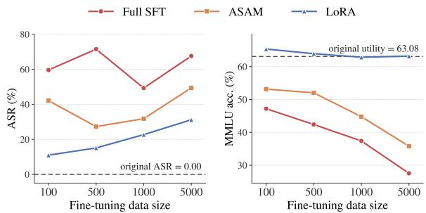  
Figure 6: ASR and utility (MMLU) scaling under the Align-10k model across SFT, LoRA, and ASAM.

At 5000 Samples: Collapse Re-Emerges. As fine-tuning scales to 5000 samples, however, these defenses become less effective. SFT and ASAM remain at high ASR, while LoRA exhibits a gradual increase as data volume grows, indicating that update restriction alone cannot prevent cumulative safety erosion. This large-scale degradation is also accompanied by declining MMLU, unlike the small-data regime, consistent with catastrophicforgetting (CF) under extensive utility-oriented finetuning.

Implications. Results across model families and settings (Appendix B.2) support a two-regime interpretation: LoRA and ASAM mitigate early-stage collapse by reducing output-side sharpness, but do not prevent cumulative degradation at larger training scales. Robust post-training safety therefore requires mechanisms that directly protect the vulnerable output-side routing subspace during finetuning.

## 4.5 Reversibility of Safety Alignment

Can safety alignment, once broken by benign fine-tuning, be efficiently recovered with minimal supervision or even without parameter updates?

Our results show that safety degradation induced by benign fine-tuning is highly reversible. Safety behavior can be restored with minimal supervision while largely preserving general utility. As shown by the performance shifts (∆) for LLaMA-3.1 in Table 6, benchmark performance remains broadly stable during recovery (see Appendix B.3 for full LLaMA-3.1 and Qwen2.5 results). Across both model families, only 10 safety examples are sufficient to reverse a 100-sample benign attack and reduce ASR to 0%. Even after a 5000-sample attack, 50 safety examples suffice for recovery, demonstrating strong data efficiency. Safety behavior can also be partially reactivated without parameter updates. Conditioning generation on a refusal prefix (e.g., “I’m sorry”) substantially reduces ASR. For LLaMA-3.1-8B-Instruct after a 100-sample Alpaca attack, the prefix reduces ASR from 85.70% to 34.85% for Align-256 and from 59.60% to 2.12% for Align-10k. Because a fixed prefix introduces no safety knowledge, this recovery suggests that benign fine-tuning does not erase safety-relevant representations. Instead, it disrupts the output-side routing from intent recognition to refusal generation. Recovery is also inexpensive: except for BoolQ under full SFT for Align-10k, safety restoration does not impose systemic degradation on downstream tasks. Consequently, safety compliance operates partly as a shallow, outputlevel mechanism—making it susceptible to benign fine-tuning, yet amenable to rapid recovery via minimal supervision or inference-time steering.

<table><tr><td>Model</td><td>FT Methods</td><td>∆ MMLU (%)</td><td>∆ BoolQ (%)</td><td>∆ ARC-E (%)</td></tr><tr><td rowspan="2">Align-256</td><td>SFT-5k</td><td>+2.06</td><td>+3.51</td><td>+1.35</td></tr><tr><td>LoRA-5k</td><td>+1.06</td><td>+0.15</td><td>+2.02</td></tr><tr><td rowspan="2">Align-10k</td><td>SFT-5k</td><td>+0.52</td><td>-10.64</td><td>-0.55</td></tr><tr><td>LoRA-5k</td><td>+0.42</td><td>-0.06</td><td>+1.51</td></tr></table>

Table 6: Changes in utility performance (∆ = After − Before) after safety recovery on LLaMA-3.1.

## 5 Conclusion

Refusal safety is routed through a concentrated, output-side Fisher curvature structure that benign fine-tuning can displace with as few as 100 random samples, with disproportionately smaller utility degradation. This collapse does not require adversarially selected data: gradient conflict modulates its magnitude but is not necessary. Geometrically, we trace the collapse to a selective re-sharpening of Fisher curvature in late MLP blocks. LoRA and ASAM can suppress the localized drift at small data scales by reducing per-step output-side sharpness, but cannot prevent collapse at larger scales where cumulative drift overwhelms the routing geometry. Taken together, these findings suggest that robust post-training safety requires moving beyond surface-level routing protection, toward alignment paradigms that distribute safety constraints more deeply.

## Limitations

Despite the insights provided by our study on the reversibility and underlying mechanisms of safety alignment, several key limitations should be ac knowledged: (1) Limited Scope ofAlignment Methods: Our investigation primarily focuses on mod els aligned via Supervised Fine-Tuning (SFT) and Direct Preference Optimization (DPO) (Rafailov et al., 2023). While these represent industrystandard and widely adopted alignment paradigms, we do not evaluate other reinforcement learning frameworks, such as Reinforcement Learning from Human Feedback (RLHF) (Dai et al., 2024) via PPO (Schulman et al., 2017), or advanced iterative preference optimization variants. Distinct alignment techniques embed safety constraints into model weights through different optimization ob jectives, which may exhibit varying degrees of resilience against benign fine-tuning. (2) Model Scale and Architecture Coverage: Our study focuses exclusively on mid-scale open-weight models (specif ically the LLaMA-3.1-8B and Qwen2.5-7B fami lies). Whether the observed alignment fragility and the hypothesized “shallow routing” mechanism per sist in ultra-large-scale frontier models, or architec tures trained with radically different synthetic data pipelines, remains an open question that warrants further empirical scrutiny. (3) Focus on English Centric Modalities: Due to the standard configu rations of the core utility and safety benchmarks utilized in this study, our empirical findings are primarily validated on English-language corpora and instructions. Consequently, the cultural nuances, cross-lingual stability of safety alignment, and po tential variations in representation routing across multilingual model spaces are left as prospective directions for future exploration.

## Acknowledgments

The research was supported by the Center for Distributed Confidential Computing (CDCC), funded by the National Science Foundation (NSF) under the grant CNS-2207031. The research was also supported in part by Lilly Endowment, Inc, through its support for the Indiana University Pervasive Technology Institute.

## References

Andy Arditi, Oscar Obeso, Aaquib Syed, Daniel Paleka, Nina Panickssery, Wes Gurnee, and Neel Nanda.

2024. Refusal in language models is mediated by a single direction. Advances in Neural Information Processing Systems, 37:136037–136083.

Yuntao Bai, Andy Jones, Kamal Ndousse, Amanda Askell, Anna Chen, Nova DasSarma, Dawn Drain, Stanislav Fort, Deep Ganguli, Tom Henighan, and 1 others. 2022. Training a helpful and harmless assistant with reinforcement learning from human feedback. arXiv preprint arXiv:2204.05862.

Xiaoyi Chen, Siyuan Tang, Rui Zhu, Shijun Yan, Lei Jin, Zihao Wang, Liya Su, Zhikun Zhang, XiaoFeng Wang, and Haixu Tang. 2024. The janus interface: How fine-tuning in large language models amplifies the privacy risks. In Proceedings ofthe 2024 on ACM SIGSAC Conference on Computer and Communications Security, CCS ’24, page 1285–1299, New York, NY, USA. Association for Computing Machinery.

Christopher Clark, Kenton Lee, Ming-Wei Chang, Tom Kwiatkowski, Michael Collins, and Kristina Toutanova. 2019. Boolq: Exploring the surprising difficulty of natural yes/no questions. In NAACL.

Peter Clark, Isaac Cowhey, Oren Etzioni, Tushar Khot, Ashish Sabharwal, Carissa Schoenick, and Oyvind Tafjord. 2018. Think you have solved question answering? try arc, the ai2 reasoning challenge. In Proceedings of the AAAI Conference on Artificial Intelligence (AAAI), volume 32.

Mike Conover, Matt Hayes, Ankit Mathur, Jianwei Xie, Jun Wan, Sam Shah, Ali Ghodsi, Patrick Wendell, Matei Zaharia, and Reynold Xin. 2023. Free dolly: Introducing the world’s first truly open instructiontuned llm.

Juntao Dai, Xuehai Pan, Ruiyang Sun, Jiaming Ji, Xinbo Xu, Mickel Liu, Yizhou Wang, and Yaodong Yang. 2024. Safe rlhf: Safe reinforcement learning from human feedback. In International Conference on Learning Representations, volume 2024, pages 50750– 50777.

EleutherAI. 2024. The language model evaluation harness.

Jeremiah Giordani. 2025. Re-emergent misalignment: How narrow fine-tuning erodes safety alignment in llms. arXiv preprint arXiv:2507.03662.

Zihan Guan, Mengxuan Hu, Ronghang Zhu, Sheng Li, and Anil Vullikanti. 2025. Benign samples matter! fine-tuning on outlier benign samples severely breaks safety. In Forty-second International Conference on Machine Learning.

Luxi He, Mengzhou Xia, and Peter Henderson. 2024. What is in your safe data? identifying benign data that breaks safety. In First Conference on Language Modeling.

Dan Hendrycks, Collin Burns, Steven Basart, Andy Zou, Mantas Mazeika, Dawn Song, and Jacob Steinhardt. 2021. Measuring massive multitask language

understanding. Proceedings ofthe International Conference on Learning Representations (ICLR).

Lei Hsiung, Tianyu Pang, Yung-Chen Tang, Linyue Song, Tsung-Yi Ho, Pin-Yu Chen, and Yaoqing Yang. 2025. Why llm safety guardrails collapse after fine-tuning: A similarity analysis between alignment and fine-tuning datasets. arXiv preprint arXiv:2506.05346.

Aaron Hurst, Adam Lerer, Adam P Goucher, Adam Perelman, Aditya Ramesh, Aidan Clark, AJ Ostrow, Akila Welihinda, Alan Hayes, Alec Radford, and 1 others. 2024. Gpt-4o system card. arXiv preprint arXiv:2410.21276.

Jiaming Ji, Mickel Liu, Josef Dai, Xuehai Pan, Chi Zhang, Ce Bian, Boyuan Chen, Ruiyang Sun, Yizhou Wang, and Yaodong Yang. 2024. Beavertails: Towards improved safety alignment of llm via a humanpreference dataset. Advances in Neural Information Processing Systems, 36.

Krishnateja Killamsetty, Sivasubramanian Durga, Ganesh Ramakrishnan, Abir De, and Rishabh Iyer. 2021. Grad-match: Gradient matching based data subset selection for efficient deep model training. In International Conference on Machine Learning, pages 5464–5474. PMLR.

Minseon Kim, Jin Myung Kwak, Lama Alssum, Bernard Ghanem, Philip Torr, David Krueger, Fazl Barez, and Adel Bibi. 2025a. Rethinking safety in LLM fine-tuning: An optimization perspective. In Second Conference on Language Modeling.

Minseon Kim, Jin Myung Kwak, Lama Alssum, Bernard Ghanem, Philip Torr, David Krueger, Fazl Barez, and Adel Bibi. 2025b. Rethinking safety in llm fine-tuning: An optimization perspective. In Second Conference on Language Modeling.

Simon Lermen, Charlie Rogers-Smith, and Jeffrey Ladish. 2023. Lora fine-tuning efficiently undoes safety training in llama 2-chat 70b. arXiv preprint arXiv:2310.20624.

Shen Li, Liuyi Yao, Lan Zhang, and Yaliang Li. 2025. Safety layers in aligned large language models: The key to llm security. In International Conference on Learning Representations, volume 2025, pages 98163–98189.

Long Ouyang, Jeffrey Wu, Xu Jiang, Diogo Almeida, Carroll Wainwright, Pamela Mishkin, Chong Zhang, Sandhini Agarwal, Katarina Slama, Alex Ray, and 1 others. 2022. Training language models to follow instructions with human feedback. Advances in neural information processing systems, 35:27730–27744.

Sheng Y Peng, Pin-Yu Chen, Matthew Hull, and Duen H Chau. 2024. Navigating the safety landscape: Measuring risks in finetuning large language models. Advances in Neural Information Processing Systems, 37:95692–95715.

Kaustubh Ponkshe, Shaan Shah, Raghav Singhal, and Praneeth Vepakomma. 2025. Safety subspaces are not distinct: A fine-tuning case study. In Lock-LLM Workshop: Prevent Unauthorized Knowledge Use from Large Language Models.

Xiangyu Qi, Yi Zeng, Tinghao Xie, Pin-Yu Chen, Ruoxi Jia, Prateek Mittal, and Peter Henderson. 2024. Finetuning aligned language models compromises safety, even when users do not intend to! In International Conference on Learning Representations, volume 2024, pages 30988–31043.

Rafael Rafailov, Archit Sharma, Eric Mitchell, Christopher D Manning, Stefano Ermon, and Chelsea Finn. 2023. Direct preference optimization: Your language model is secretly a reward model. Advances in neural information processing systems, 36:53728–53741.

Victor Sanh, Albert Webson, Colin Raffel, Stephen H Bach, Lintang Sutawika, Zaid Alyafeai, Antoine Chaffin, Arnaud Stiegler, Teven Le Scao, Arun Raja, and 1 others. 2022. Multitask prompted training enables zero-shot task generalization. In ICLR 2022- Tenth International Conference on Learning Representations.

John Schulman, Filip Wolski, Prafulla Dhariwal, Alec Radford, and Oleg Klimov. 2017. Proximal policy optimization algorithms. arXiv preprint arXiv:1707.06347.

Weijia Shi, Jaechan Lee, Yangsibo Huang, Sadhika Malladi, Jieyu Zhao, Ari Holtzman, Daogao Liu, Luke Zettlemoyer, Noah A Smith, and Chiyuan Zhang. 2024. Muse: Machine unlearning six-way evaluation for language models. In The Thirteenth International Conference on Learning Representations.

Alexandra Souly, Qingyuan Lu, Dillon Bowen, Tu Trinh, Elvis Hsieh, Sana Pandey, Pieter Abbeel, Justin Svegliato, Scott Emmons, Olivia Watkins, and Sam Toyer. 2024. A strongreject for empty jailbreaks. Preprint, arXiv:2402.10260.

Max Springer, Chung Peng Lee, Blossom Metevier, Jane Castleman, Bohdan Turbal, Hayoung Jung, Zeyu Shen, and Aleksandra Korolova. 2026. The geometry of alignment collapse: When fine-tuning breaks safety. arXiv preprint arXiv:2602.15799.

Rohan Taori, Ishaan Gulrajani, Tianyi Zhang, Yann Dubois, Xuechen Li, Carlos Guestrin, Percy Liang, and Tatsunori B. Hashimoto. 2023. Stanford alpaca: An instruction-following llama model. https:// github.com/tatsu-lab/stanford\_alpaca.

Boyi Wei, Kaixuan Huang, Yangsibo Huang, Tinghao Xie, Xiangyu Qi, Mengzhou Xia, Prateek Mittal, Mengdi Wang, and Peter Henderson. 2024. Assessing the brittleness of safety alignment via pruning and low-rank modifications. In International Conference on Machine Learning, pages 52588–52610. PMLR.

Jason Wei, Maarten Bosma, Vincent Y Zhao, Kelvin Guu, Adams Wei Yu, Brian Lester, Nan Du, Andrew M Dai, and Quoc V Le. 2021. Finetuned language models are zero-shot learners. arXiv preprint arXiv:2109.01652.

Johannes Welbl, Nelson F Liu, and Matt Gardner. 2017. Crowdsourcing multiple choice science questions. In Proceedings ofthe 3rd Workshop on Noisy Usergenerated Text, pages 94–106.

Xianjun Yang, Xiao Wang, Qi Zhang, Linda Petzold, William Yang Wang, Xun Zhao, and Dahua Lin. 2023. Shadow alignment: The ease of subverting safely-aligned language models. arXiv preprint arXiv:2310.02949.

Qiusi Zhan, Richard Fang, Rohan Bindu, Akul Gupta, Tatsunori B Hashimoto, and Daniel Kang. 2024. Removing rlhf protections in gpt-4 via fine-tuning. In Proceedings of the 2024 Conference of the North American Chapter of the Association for Computational Linguistics: Human Language Technologies (Volume 2: Short Papers), pages 681–687.

Wenting Zhao, Xiang Ren, Jack Hessel, Claire Cardie, Yejin Choi, and Yuntian Deng. 2024. Wildchat: 1m chatGPT interaction logs in the wild. In The Twelfth International Conference on Learning Representations.

Yiran Zhao, Wenxuan Zhang, Yuxi Xie, Anirudh Goyal, Kenji Kawaguchi, and Michael Qizhe Shieh. 2025. Understanding and enhancing safety mechanisms of llms via safety-specific neuron. In International Conference on Learning Representations, volume 2025, pages 44113–44127.

Chujie Zheng, Fan Yin, Hao Zhou, Fandong Meng, Jie Zhou, Kai-Wei Chang, Minlie Huang, and Nanyun Peng. 2024. On prompt-driven safeguarding for large language models. In International Conference on Machine Learning, pages 61593–61613. PMLR.

## A Fisher Geometry

Let $\theta ^ { * } \in \Theta \subseteq \mathbb { R } ^ { n }$ denote the safety-aligned checkpoint $( \theta _ { \mathrm { s a f e } }$ in the notation of §3.1), and let $\pi _ { \boldsymbol { \theta } } ( \boldsymbol { y } \mid \boldsymbol { x } )$ be the induced conditional distribution. We measure local deviation from the aligned refusal behavior on harmful prompts using the safetydeviation loss

$$
{ \mathcal { L } } _ { \mathrm { s a f e } } ( \theta ; \theta ^ { * } ) = \mathbb { E } _ { x \sim { \mathcal { D } } _ { \mathrm { s a f e } } } D _ { \mathrm { K L } } \left( \pi _ { \theta ^ { * } } ( \cdot \mid x ) \parallel \pi _ { \theta } ( \cdot \mid x ) \right)\tag{9}
$$

This loss satisfies $\mathcal { L } _ { \mathrm { s a f e } } ( \theta ^ { * } ; \theta ^ { * } ) = 0 .$ . Assuming standard smoothness of $\pi _ { \theta }$ , its local expansion is

$$
\begin{array} { r } { \begin{array} { r } { \mathcal { L } _ { \mathrm { s a f e } } ( \theta ^ { * } + \Delta \theta ; \theta ^ { * } ) = \frac { 1 } { 2 } \Delta \theta ^ { \top } F _ { \mathrm { s a f e } } ( \theta ^ { * } ) \Delta \theta + O ( \left. \Delta \theta \right. ^ { 3 } ) , } \end{array} } \end{array}\tag{10}
$$

$$
\begin{array} { r } { F _ { \mathrm { s a f e } } ( \theta ^ { * } ) = \mathbb { E } \underset { y \sim \pi _ { \theta ^ { * } } ( \cdot | x ) } { \mathbb { E } } \left[ s _ { \theta ^ { * } } { ( x , y ) } s _ { \theta ^ { * } } { ( x , y ) } ^ { \top } \right] , } \end{array}\tag{11}
$$

$$
s _ { \theta ^ { * } } ( x , y ) : = \nabla _ { \theta } \log \pi _ { \theta ^ { * } } ( y \mid x ) .\tag{12}
$$

Thus $F _ { \mathrm { s a f e } }$ is the Fisher curvature of local deviation from the aligned safety behavior. In experiments, we estimate a block-wise empirical Fisher proxy on safety inputs (harmful prompts with refusal targets; cf. §3.1):

$$
\widehat { F } _ { b } ( \theta ) = \frac { 1 } { N } \sum _ { i = 1 } ^ { N } g _ { b } ^ { ( i ) } ( \theta ) g _ { b } ^ { ( i ) } ( \theta ) ^ { \top } ,\tag{13}
$$

$$
g _ { b } ^ { ( i ) } ( \theta ) = \nabla _ { \theta _ { b } } \log \pi _ { \theta } ( y _ { i } \mid x _ { i } ) ,\tag{14}
$$

where $b = ( \ell , m )$ indexes a layer-module block. We use $\widehat F _ { b } ( \theta )$ as a local geometric proxy for how sensitive refusal behavior is to perturbations in block b.

Eigenvalues as directional sharpness. The Fisher matrix $F _ { \mathrm { s a f e } } ( \theta ^ { * } )$ is symmetric positive semidefinite. Let its eigenvalues be $\lambda _ { 1 } \geq \lambda _ { 2 } \geq \cdot \cdot \cdot \geq \lambda _ { n } \geq 0 ,$ with orthonormal eigenvectors $v _ { 1 } , \ldots , v _ { n }$ . For a unit direction $v _ { i }$ and small scalar α, (10) gives

$$
\begin{array} { r } { \mathcal { L } _ { \mathrm { s a f e } } ( \theta ^ { * } + \alpha v _ { i } ; \theta ^ { * } ) = \frac { 1 } { 2 } \lambda _ { i } \alpha ^ { 2 } + O ( \alpha ^ { 3 } ) . } \end{array}\tag{15}
$$

Thus $\lambda _ { i }$ is the local Fisher curvature of the safetydeviation loss along direction $v _ { i }$ . The largest eigenvalue

$$
\lambda _ { \mathrm { m a x } } ( F _ { \mathrm { s a f e } } ( \theta ^ { * } ) ) = \lambda _ { 1 } = \operatorname* { m a x } _ { \| v \| = 1 } v ^ { \top } F _ { \mathrm { s a f e } } ( \theta ^ { * } ) v\tag{16}
$$

is the worst-case directional sharpness of the local safety geometry. Equivalently, for any small perturbation $\Delta \theta .$

$$
\begin{array} { r } { 0 \leq \frac { 1 } { 2 } \Delta \theta ^ { \top } F _ { \mathrm { s a f e } } ( \theta ^ { * } ) \Delta \theta \leq \frac { 1 } { 2 } \lambda _ { \operatorname* { m a x } } \| \Delta \theta \| ^ { 2 } . } \end{array}\tag{17}
$$

A small $\lambda _ { \mathrm { m a x } }$ therefore means that the Fisher proxy is locally flat in every unit direction, while a large $\lambda _ { \mathrm { m a x } }$ indicates the existence of a direction in which small perturbations have a large quadratic effect.

The safety-relevant Fisher subspace. For a fixed energy threshold $\rho \in ( 0 , 1 )$ , define the effective dimension

$$
d _ { \rho } = \operatorname* { m i n } \left\{ d : \frac { \sum _ { j = 1 } ^ { d } \lambda _ { j } } { \sum _ { j = 1 } ^ { n } \lambda _ { j } } \geq \rho \right\} .\tag{18}
$$

We define the local safety-relevant Fisher subspace as

$$
M _ { \mathrm { s a f e } } ( \theta ^ { * } ) = \operatorname { s p a n } ( v _ { 1 } , \dots , v _ { d _ { \rho } } ) ,\tag{19}
$$

and let $P _ { \mathrm { s a f e } }$ be the orthogonal projector onto this subspace. For a perturbation $\Delta \theta ,$ writing $\delta = \lVert P _ { \mathrm { s a f e } } \Delta \theta \rVert$ , the Fisher quadratic term satisfies

$$
\begin{array} { r } { \frac { 1 } { 2 } \Delta \theta ^ { \top } F _ { \mathrm { s a f e } } ( \theta ^ { * } ) \Delta \theta \geq \frac { 1 } { 2 } \lambda _ { d _ { \rho } } \delta ^ { 2 } . } \end{array}\tag{20}
$$

<table><tr><td rowspan="2">Model Family</td><td rowspan="2">Alignment</td><td rowspan="2">Setting</td><td colspan="3">Before Recovery</td><td colspan="3">After Recovery</td></tr><tr><td>MMLU</td><td>BoolQ</td><td>ARC-E</td><td>MMLU</td><td>BoolQ</td><td>ARC-E</td></tr><tr><td>Llama3.1</td><td>Align-256</td><td>SFT-5k</td><td>30.59</td><td>64.56</td><td>56.10</td><td>32.65</td><td>68.07</td><td>57.45</td></tr><tr><td>Llama3.1</td><td>Align-10k</td><td>SFT-5k</td><td>27.56</td><td>66.45</td><td>57.66</td><td>28.08</td><td>55.81</td><td>57.11</td></tr><tr><td>Llama3.1</td><td>Align-256</td><td>LoRA-5k</td><td>64.53</td><td>85.66</td><td>75.42</td><td>65.59</td><td>85.81</td><td>77.44</td></tr><tr><td>LlaMA3.1</td><td>Align-10k</td><td>LoRA-5k</td><td>63.17</td><td>85.23</td><td>74.37</td><td>63.59</td><td>85.17</td><td>75.88</td></tr><tr><td>Qwen2.5</td><td>Align-256</td><td>SFT-5k</td><td>49.28</td><td>80.21</td><td>64.90</td><td>53.59</td><td>81.04</td><td>68.06</td></tr><tr><td>Qwen2.5</td><td>Align-10k</td><td>SFT-5k</td><td>48.53</td><td>78.56</td><td>66.20</td><td>50.65</td><td>65.54</td><td>63.09</td></tr><tr><td>Qwen2.5</td><td>Align-256</td><td>LoRA-5k</td><td>71.59</td><td>87.52</td><td>78.91</td><td>72.55</td><td>87.49</td><td>80.09</td></tr><tr><td>Qwen2.5</td><td>Align-10k</td><td>LoRA-5k</td><td>70.51</td><td>86.94</td><td>77.74</td><td>71.40</td><td>86.27</td><td>77.40</td></tr></table>

Table 7: Granular absolute utility performance evaluation across core benchmarks before and after safety recovery execution. The recovery is accomplished via 50 dedicated safety alignment instances following initial 5000-sample Alpaca benign fine-tuning disruptions.

With the Taylor remainder included,

$$
\begin{array} { r } { \mathcal { L } _ { \mathrm { s a f e } } ( \theta ^ { * } + \Delta \theta ; \theta ^ { * } ) \geq \frac { 1 } { 2 } \lambda _ { d _ { \rho } } \| P _ { \mathrm { s a f e } } \Delta \theta \| ^ { 2 } - C \| \Delta \theta \| ^ { 3 } } \end{array}\tag{21}
$$

for sufficiently small $\| \Delta \theta \|$ . Hence local refusal deviation depends jointly on the sharpness of the leading Fisher directions and on how much the fine-tuning trajectory projects onto them.

## B Additional Experimental Results

We perform safety alignment using our fine-tuning pipeline and leverage LlamaFactory to conduct benign attack experiments and recovery experiments.

## B.1 Alignment Fragility Extends to DPO

To verify that the alignment fragility we observe is not an artifact of SFT-based alignment, we additionally evaluate the benign fine-tuning attack on a DPO-aligned model. We align the base model with DPO on our safety preference data using the following hyperparameters: 2 epochs, learning rate 1e−6, batch size 32, $\beta = 0 . 1$ , and maximum sequence length 512. We then perform benign fine-tuning on Alpaca samples and report the resulting HEx-PHI ASR in Table 8 on Llama3.1.

As shown in Table 8, the DPO-aligned model achieves 0% ASR prior to fine-tuning, indicating strong initial safety alignment. However, finetuning on as few as 100 benign Alpaca samples is sufficient to collapse this alignment, raising ASR to 66.96%. Scaling the fine-tuning data to $5 , 0 0 0$ samples yields only a marginal further increase to 67.88%. This near-identical degradation at two very different data scales mirrors the phase-transition behavior we observe for SFTaligned models in Section 4.2, and suggests that the fragility we characterize is a property of the alignment surface itself rather than of any particular alignment algorithm.

<table><tr><td>Condition</td><td>ASR (%)</td></tr><tr><td>DPO-aligned</td><td>0.00</td></tr><tr><td>+ Alpaca fine-tuning (100 samples)</td><td>66.96</td></tr><tr><td>+ Alpaca fine-tuning (5000 samples)</td><td>67.88</td></tr></table>

Table 8: HEx-PHI ASR (%) of the DPO-aligned model before and after benign fine-tuning on the Alpaca subset.

## B.2 ASR and Utility Scaling Across All Models

We present the scaling trends for the remaining model variants within the Llama3.1 and Qwen2.5 families in Figure 7. Across all evaluated architectures, a highly consistent behavioral pattern emerges: localized, small-scale fine-tuning precipitously intensifies the Attack Success Rate (ASR) while leaving downstream utility largely intact. Conversely, extending the fine-tuning to a larger scale induces a much more pronounced degradation in the models’ general capabilities.

## B.3 Utility Performance Profiles Surrounding Safety Recovery

In this section, we present the comprehensive absolute evaluation scores for both the Llama3.1 and Qwen2.5 model families across core utility benchmarks (MMLU, BoolQ, and ARC-E). While Section 4.5 introduces the streamlined performance deltas (∆) for presentation, Table 7 encapsulates the granular baseline utility profiles evaluated immediately before and after the safety remediation phase (which utilizes 50 safety alignment examples following a 5,000-sample Alpaca benign finetuning attack).

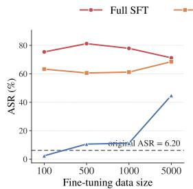

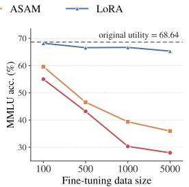  
(a) Llama3.1 Baseline

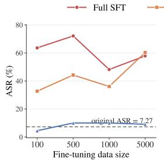

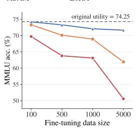  
(b) Qwen2.5 Baseline

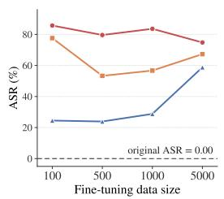

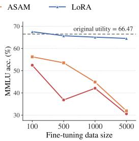  
(c) Llama3.1 Align-256  
Full SFT ASAM LoRA

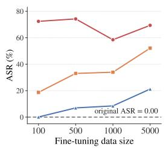

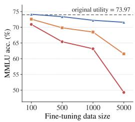  
(d) Qwen2.5 Align-256

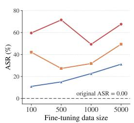  
(e) Llama3.1 Align-10k

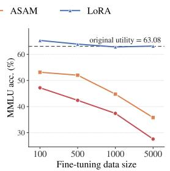

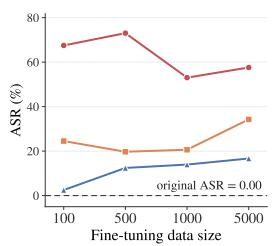

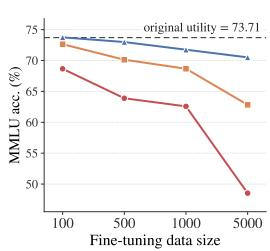  
(f) Qwen2.5 Align-10k  
Figure 7: ASR and utility (MMLU) scaling across model families and alignment settings.

Across both model architectures and alignment depths (Align-256 vs. Align-10k), the absolute capability fluctuations induced by the subsequent safety recovery process remain remarkably minimal. For instance, under the parameter-efficient LoRA setup, Qwen2.5 (Align-256) maintains steady scores across the board, shifting marginally from 71.59 to 72.55 on MMLU and from 78.91 to 80.09 on ARC-E. This strict bound on utility drift indicates that low-resource safety restoration does not require a trade-off with foundational reasoning capacities.

<table><tr><td>Setting</td><td>Wildchat</td><td>StrongReject</td></tr><tr><td>Instruct Baseline</td><td>16.0</td><td>44.83</td></tr><tr><td>Align-10k</td><td>64.2</td><td>90.48</td></tr><tr><td>Align-10k + FT-100</td><td>27.0</td><td>46.99</td></tr></table>

Table 9: Safety alignment evaluations on Wildchat and StrongReject, the latter reported as 1 − ASR. The auxiliary SFT recovery phase is conducted with a batch size of 8, trained for 5 epochs with a learning rate of $1 \times 1 0 ^ { - 5 }$

## B.4 Safety Evaluations Across Diverse Benchmarks

To demonstrate that our observations regarding safety degradation are not specific to a particular evaluation protocol, we conduct a robustness check on two widely recognized external safety benchmarks: Wildchat and StrongReject. This cross-benchmark evaluation helps mitigate potential dataset-specific biases and assess the generalizability of our findings.

We evaluate the model across three distinct stages: the initial Instruct Baseline, the safetyaligned model (Align-10k), and the same aligned model after a 100-sample benign fine-tuning attack $( A l i g n - I O k + F T - I O O )$ . To capture behavioral changes across benchmarks, we employ datasetspecific metrics. For Wildchat, we use the standard safety score from its official evaluation protocol, where a higher value indicates stronger safety alignment. For StrongReject, we report 1−ASR (Attack Success Rate), where a higher value similarly indicates a higher rate of successful refusal of harmful prompts.

As summarized in Table 9, the results on both Wildchat and StrongReject are consistent with our primary findings. Safety alignment substantially improves performance over the Instruct Baseline on both benchmarks. However, subsequent benign fine-tuning on only 100 samples sharply erodes these gains, bringing safety performance closer to the baseline level. This consistent degradation across distinct evaluation protocols provides additional evidence that the vulnerability of safety alignment to benign fine-tuning is not specific to HEx-PHI or its evaluation procedure.