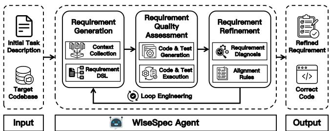

# WiseSpec: Requirements-Driven Agents for Code Generation

Zhao Tian

School of Computer Software, Tianjin University

Tianjin, China

tianzhao@tju.edu.cn

## Abstract

Code generation aims to automatically generate source code from task requirements and has attracted significant attention with the rapid advancement of large language models (LLMs). Despite remarkable progress, LLMs often struggle to generate correct code for complex software engineering tasks because task descriptions are frequently incomplete, ambiguous, or lack critical contextual information. Existing approaches primarily improve the capabilities of coding agents through more sophisticated tools, skills, and workflows, while largely overlooking the quality of the task requirements themselves. To address this limitation, we draw inspiration from software requirements engineering and propose WiseSpec, a novel requirements-driven agent framework for repositorylevel code generation. WiseSpec automatically constructs structured and information-rich requirements, assesses their quality through execution-based evaluation, and iteratively refines them to better guide code generation. Experimental results show that WiseSpec consistently outperforms all baselines, achieving an average improvement of 13.17% in %Resolved.

## CCS Concepts

• Software and its engineering → Automatic programming.

## Keywords

Code Generation, Agent, Requirements Engineering

## ACM Reference Format:

Zhao Tian. 2026. WiseSpec: Requirements-Driven Agents for Code Generation. In Proceedings of the 41st IEEE/ACM International Conference on Automated Software Engineering (ASE ’26), October 12–16, 2026, Munich, Germany. ACM, New York, NY, USA, 3 pages. https://doi.org/10.1145/3832783.3844573

## 1 Introduction

Code generation aims to automatically generate source code from programming requirements, ofering substantial potential to improve developer productivity and software quality [2, 9]. Recent advances in Large Language Model (LLM)-based coding agents have achieved remarkable progress by enhancing the capabilities of LLMs through sophisticated tools, skills, and workflows [4, 16]. De spite these advances, complex software engineering tasks remain challenging. Existing approaches primarily focus on improving how LLMs solve programming tasks, while largely overlooking what they are asked to solve, namely the quality of task requirements themselves [7]. Most methods directly consume the original problem description as input, implicitly assuming that it faithfully specifies the intended program behavior. In practice, however, task descriptions are frequently ambiguous, incomplete, or missing critical contextual information, making them an unreliable representation of the underlying requirements [12, 13]. Consequently, even powerful LLMs struggle to accurately infer user intent and produce correct implementations, highlighting the need for explicit requirement understanding and alignment before code generation.

  
Figure 1: The overview of WiseSpec

To address these challenges, we propose WiseSpec, a novel requirements-driven agent that enhances the code generation performance of LLMs. First, WiseSpec collects relevant contextual information to construct structured, information-rich requirements using a predefined domain-specific language (DSL). Second, it reformulates requirement quality assessment as an execution-based code evaluation problem, enabling the computation of a quantitative requirement quality score. Third, WiseSpec iteratively refines and aligns the generated requirements according to refinement and alignment rules, ultimately producing higher-quality requirements for better code generation. Experiment results demonstrate that WiseSpec significantly outperforms all three state-of-the-art baselines across two LLMs and three benchmarks.

## 2 Approach

Figure 1 illustrates the overview of WiseSpec, consisting of three components: Requirement Generation, Requirement Quality Assessment, and Requirement Refinement.

## 2.1 Requirement Generation

To accurately retrieve the contextual information required for code generation, WiseSpec simulates the program comprehension process by iteratively collecting and analyzing relevant code snippets from the target codebase. Starting from the given task description, it progressively expands the retrieval scope along program dependencies, using previously collected code snippets to guide subsequent retrieval and exploration. To transform the collected yet fragmented information into structured programming requirements, WiseSpec employs a predefined requirement DSL. The requirement DSL consists of nine primary requirement attributes and seventeen corresponding sub-attributes, covering both high-level architectural information and fine-grained implementation details. Based on requirement DSL, WiseSpec systematically organizes the retrieved contextual information into a structured and informationrich requirement representation, providing a solid foundation for subsequent code generation.

## 2.2 Requirement Quality Assessment

Assessing the quality ofrequirement specifications is a fundamental step in requirements engineering, as ambiguous, incomplete, or incorrect requirements can propagate errors to downstream implementations [5]. However, because requirements are typically expressed in structured natural language without formal semantics, their quality is dificult to evaluate directly and quantitatively [10]. To address this challenge, WiseSpec reformulates requirement quality assessment as an execution-based code evaluation problem. Specifically, it first generates executable code and tests from the synthesized requirements and evaluates the generated code through test execution. Since code is expected to faithfully implement the intended requirements, its execution correctness serves as an efective proxy for requirement quality. WiseSpec adopts a strict acceptance criterion, i.e., the generated code is accepted only if it passes all generated tests. Otherwise, the corresponding requirements are considered potentially deficient and are forwarded to the subsequent requirement refinement and alignment stage.

## 2.3 Requirement Refinement

This component iteratively improves low-quality requirements to better guide LLMs toward generating correct code. To diagnose requirement deficiencies, WiseSpec categorizes them into three mutually exclusive and collectively exhaustive types: Conflict, Omission, and Ambiguity. Based on the identified deficiency type, WiseSpec applies a set of predefined requirement alignment rules to generate actionable refinement feedback. Guided by this refinement feedback, the requirements are iteratively refined and re-assessed. During the refinement process, WiseSpec adopts a greedy optimization strategy that retains the candidate requirement with the highest quality score at each iteration, as it is more likely to provide accurate and complete guidance for code generation. Furthermore, refinement feedback that fails to improve requirement quality is recorded as counterexamples, enabling WiseSpec to adjust its refinement strategy in subsequent iterations. Through this loop engineering, WiseSpec progressively improves the requirement quality, leading to more reliable code generation.

## 3 Experiments and Results

I. Process: To comprehensively evaluate WiseSpec, we compare it against three state-of-the-art coding agents: Agentless [14], Traeagent [4], and Claude Code [1]. The evaluation is conducted on three widely used repository-level code generation benchmarks: SWE-bench-Lite [6], SWE-bench-Verified [11], and SWE-bench-Pro [3]. We randomly sample 100 instances from each benchmark to control the computational cost. We use two advanced LLMs,

Table 1: Comparison in %Applied (↑) and %Resolved (↑).
<table><tr><td rowspan="2">Technique</td><td colspan="2">SWE-Lite</td><td colspan="2">SWE-Verified</td><td colspan="2">SWE-Pro</td></tr><tr><td>%App.</td><td>%Res.</td><td>%App.</td><td>%Res.</td><td>%App.</td><td>%Res.</td></tr><tr><td colspan="7">DeepSeek</td></tr><tr><td>Agentless</td><td>55%</td><td>24%</td><td>61%</td><td>35%</td><td>62%</td><td>6%</td></tr><tr><td>Trae-agent</td><td>64%</td><td>28%</td><td>61%</td><td>35%</td><td>43%</td><td>11%</td></tr><tr><td>Claude Code</td><td>72%</td><td>36%</td><td>77%</td><td>46%</td><td>84%</td><td>24%</td></tr><tr><td>WiseSpec</td><td>100%</td><td>39%</td><td>93%</td><td>51%</td><td>100%</td><td>35%</td></tr><tr><td colspan="7">Qwen</td></tr><tr><td>Agentless</td><td>47%</td><td>14%</td><td>35%</td><td>22%</td><td>59%</td><td>5%</td></tr><tr><td>Trae-agent</td><td>55%</td><td>17%</td><td>63%</td><td>24%</td><td>49%</td><td>5%</td></tr><tr><td>Claude Code</td><td>89%</td><td>26%</td><td>80%</td><td>33%</td><td>77%</td><td>20%</td></tr><tr><td>WiseSpec</td><td>100%</td><td>28%</td><td>98%</td><td>37%</td><td>99%</td><td>26%</td></tr></table>

DeepSeek-V3.2 [8] and Qwen-Plus-2025-12-01 [15], as the underlying models. We evaluate all approaches using two metrics: %Applied, which measures the syntactic correctness of generated code by determining whether it can be successfully applied to the codebase, and %Resolved, which measures functional correctness by assessing whether the generated code passes all gold tests.

II. Results: Table 1 presents the efectiveness comparison of all approaches. Across all six experimental settings (3 benchmarks × 2 LLMs), WiseSpec consistently achieves the best performance, outperforming all representative coding agents. Specifically, WiseSpec improves %Resolved by 2%∼29% and %Applied by 11%∼63% over the baselines across diferent settings. To further evaluate its generalizability to more capable LLMs, we conduct an additional experiment using the state-of-the-art Claude-Opus-4.8 on SWEbench-Pro. While Claude Code achieves a %Resolved score of 53%, WiseSpec further increases the score to 56%, demonstrating that it generalizes well to stronger foundation models. Overall, these results show that the proposed requirements-driven paradigm effectively improves repository-level code generation. Furthermore, a Wilcoxon signed-rank test (� = 0.05) yields $p < 2 . 5 \times 1 0 ^ { - 4 }$ , confirming that the improvements of WiseSpec over all baselines are statistically significant for both %Resolved and %Applied.

## 4 Conclusion

In this paper, we identify the quality of task requirements as a fundamental bottleneck in repository-level code generation and propose a requirements-driven paradigm to address this challenge. Based on this insight, we present WiseSpec, a novel requirements-driven agent that automatically constructs structured and informationrich requirements, assesses their quality through execution-based evaluation, and iteratively refines them to improve code correctness. Experiment results demonstrate that WiseSpec consistently outperforms all baselines across multiple evaluation metrics, highlighting the efectiveness of requirements engineering in improving LLM-based code generation.

## Acknowledgments

Zhao Tian is advised by Professor. Junjie Chen. This work is supported by National Natural Science Foundation of China (Grant No. 62322208).

## References

[1] Anthropic. 2026. Claude Code: AI-powered coding assistant for developers. https://www.anthropic.com/claude-code. Accessed: 2026-07-12

[2] Norman Becker, Tural Mammadov, and Andreas Zeller. 2026. Can LLMs Really Reason about Code? Studying How Well LLMs Understand the Relation between Input, Code, and Output. In Proceedings ofthe 3rd ACM International Conference on AI-Powered Software. 21–30.

[3] Xiang Deng, Jef Da, Edwin Pan, Yannis Yiming He, Charles Ide, Kanak Garg, Niklas Laufer, Andrew Park, Nitin Pasari, Chetan Rane, et al. 2025. Swe-bench pro: Can ai agents solve long-horizon software engineering tasks? arXiv preprint arXiv:2509.16941 (2025).

[4] Pengfei Gao, Zhao Tian, Xiangxin Meng, Xinchen Wang, Ruida Hu, Yuanan Xiao, Yizhou Liu, Zhao Zhang, Junjie Chen, Cuiyun Gao, et al. 2025. Trae agent: An llm-based agent for software engineering with test-time scaling. arXiv preprint arXiv:2507.23370 (2025).

[5] Hojae Han, Jaejin Kim, Jaeseok Yoo, Youngwon Lee, and Seung-won Hwang. 2024. Archcode: Incorporating software requirements in code generation with large language models. In Proceedings ofthe 62nd Annual Meeting ofthe Association for Computational Linguistics (Volume 1: Long Papers). 13520–13552.

[6] Carlos E Jimenez, John Yang, Alexander Wettig, Shunyu Yao, Kexin Pei, Ofir Press, and Karthik Narasimhan. 2024. Swe-bench: Can language models resolve real-world github issues?. In International Conference on Learning Representations, Vol. 2024. 54107–54157.

[7] Shiqi Kuang, Zhao Tian, Kaiwei Lin, Chaofan Tao, Shaowei Wang, Haoli Bai, Lifeng Shang, and Junjie Chen. 2026. REAgent: Requirement-Driven LLM Agents for Software Issue Resolution. arXiv preprint arXiv:2604.06861 (2026).

[8] Aixin Liu, Aoxue Mei, Bangcai Lin, Bing Xue, Bingxuan Wang, Bingzheng Xu, Bochao Wu, Bowei Zhang, Chaofan Lin, Chen Dong, et al. 2025. Deepseek v3. 2: Pushing the frontier of open large language models. arXiv preprint

arXiv:2512.02556 (2025).

[9] Antonio Mastropaolo, Luca Pascarella, Emanuela Guglielmi, Matteo Ciniselli, Simone Scalabrino, Rocco Oliveto, and Gabriele Bavota. 2023. On the robustness of code generation techniques: An empirical study on github copilot. In 2023 IEEE/ACM 45th International Conference on Software Engineering (ICSE). IEEE, 2149–2160.

[10] Lloyd Montgomery, Davide Fucci, Abir Bourafa, Lisa Scholz, and Walid Maalej. 2022. Empirical research on requirements quality: a systematic mapping study. Requirements Engineering 27, 2 (2022), 183–209.

[11] OpenAI. 2024. Introducing SWE-bench Verified. https://openai.com/index/ introducing-swe-bench-verified/. Accessed: 2026-07-12.

[12] Zhao Tian and Junjie Chen. 2025. Aligning Requirement for Large Language Model’s Code Generation. arXiv preprint arXiv:2509.01313 (2025).

[13] Zhao Tian, Junjie Chen, and Xiangyu Zhang. 2025. Fixing Large Language Models’ Specification Misunderstanding for Better Code Generation. In 2025 IEEE/ACM 47th International Conference on Software Engineering (ICSE). IEEE Computer Society, 645–645.

[14] Chunqiu Steven Xia, Yinlin Deng, Soren Dunn, and Lingming Zhang. 2025. Demystifying llm-based software engineering agents. Proceedings of the ACM on Software Engineering 2, FSE (2025), 801–824.

[15] An Yang, Anfeng Li, Baosong Yang, Beichen Zhang, Binyuan Hui, Bo Zheng, Bowen Yu, Chang Gao, Chengen Huang, Chenxu Lv, et al. 2025. Qwen3 technical report. arXiv preprint arXiv:2505.09388 (2025).

[16] John Yang, Carlos Jimenez, Alexander Wettig, Kilian Lieret, Shunyu Yao, Karthik Narasimhan, and Ofir Press. 2024. Swe-agent: Agent-computer interfaces enable automated software engineering. Advances in Neural Information Processing Systems 37 (2024), 50528–50652.

Received 2026-07-12; accepted 2026-08-25