# PROACTIVE DIALOGUE POLICY OPTIMIZATION VIA COGNITIVE-STATE TRANSITION

Minghui Ma∗ Mengqi Chen∗ Bin Guo† Jingqi Liu

Northwestern Polytechnical University

{2021300120,chenmengqi,1309893591}@mail.nwpu.edu.cn guob@nwpu.edu.cn

## ABSTRACT

Proactive dialogue requires agents to continually adapt their policies to user feedback while progressing toward task objectives over multiple turns. To move beyond imitation learning on static datasets, recent approaches use user simulators to collect interactive data for policy optimization. However, many simulators do not explicitly model the evolution of user cognition, limiting the consistency and state dependence of feedback across turns. Moreover, representing each action only by a high-level strategy label overlooks the large utterance space and cannot distinguish alternative realizations of the same strategy. To this end, we jointly design a Cognitive User Simulator (Cog-Sim) and Cognitive-State Transition– Driven Policy Optimization (CSTPO). Cog-Sim maintains the user’s cognitive and affective states and generates responses through constrained state transitions across turns, so feedback depends on both the realized utterance and the user’s current state. CSTPO organizes each action as a hierarchical strategy–utterance representation: a high-level strategy label constrains utterance sampling, and utterances are optimized within each label. Sparse complete-branch sampling reuses shared dialogue prefixes and estimates separate strategy-level and utterance-level advantages, enabling fine-grained optimization at both levels. Across three tasks, Cog-Sim exhibits monotonic dose–response relationships and is preferred over prompt-based simulators for naturalness. CSTPO improves Qwen3-14B’s performance to a level comparable to that of GPT-5.5-based planning methods.

## 1 INTRODUCTION

Proactive dialogue agents plan actions around task objectives and continually adapt their interaction policies to user feedback. In tasks such as negotiation and emotional support, agents must make a sequence of strategic decisions to move the dialogue forward. Strategy planning and optimization are therefore central to proactive dialogue research (Deng et al., 2025). Existing studies improve proactive dialogue in two directions: strategic reasoning and planner training. Prompt-based methods use explicit reasoning chains to analyze the dialogue context, derive an action plan, and generate a response. They allow language models to organize goal-directed strategies from the current context (Deng et al., 2023; Cheng et al., 2023; Zhang et al., 2023). However, these methods mainly use the model’s existing planning ability. They do not accumulate interaction experience through parameter updates. Supervised approaches instead train planners from dialogue demonstrations with strategy, reasoning, and action-plan annotations. The annotations can be created by human experts or by automatic labeling (Ito et al., 2025; Ma et al., 2026a). Such methods learn decision patterns from demonstrations, but they mainly fit existing behavior and do not repeatedly adjust the policy from feedback generated by the agent’s own actions.

To address the lack of interactive trial, simulator-based reinforcement learning (RL) trains policies in dynamic dialogue environments. At each turn, the agent selects a dialogue strategy and generates an utterance. A user simulator responds based on its role, task objective, and dialogue history. The resulting task return is used to update the planner. PPDPP follows this paradigm and further trains a strategy planner through simulated interaction (Deng et al., 2024). The simulator thus serves as the environment for policy exploration. Its feedback shapes both the dialogue history for subsequent decisions and the resulting RL trajectory. However, prompt-based user simulators mainly constrain responses through task context, user identity, and initial conditions. Information interpre tation, stance revision, and intention formation remain implicit in language-model inference. Persistent state representations and explicit transition constraints remain largely absent (Deng et al., 2024). Conflating argument acceptance with action commitment risks premature goal pursuit or repeated use of mismatched strategies. Prior work also reports excessive acceptance or persistent rejection in some simulations, raising concerns about biased training feedback (Hu et al., 2025). Recent studies introduce richer user profiles, latent concerns, and explicit per-turn state dynamics (Wu et al., 2026; Zhang et al., 2026b;a). However, profile variables are often fixed before interaction, while goal-oriented state variables may be designed primarily to track progress toward task completion.

Limited user modeling is accompanied by restricted agent-side optimization. Proactive dialogue methods typically optimize over a fixed, finite strategy set and use a language model for utterance generation. Some freeze the generator to avoid reward-driven language degradation (Li et al., 2024). Label-only actions limit optimization granularity and obscure differences between utterances under the same strategy. Existing methods use paired rollouts or forward sampling to inform current decisions through future interaction outcomes (Wu et al., 2025; Gao et al., 2025). Others improve value estimation through explicit search or privileged training information (He et al., 2024; Zhang et al., 2026a). However, terminalonly rewards still require complete trajectories for comparison, making trajectory-level sampling a major efficiency bottleneck. General multi-turn RL frameworks support richer response-level optimization by combining higher-level value estimation with token-level policy updates (Zhou et al., 2024). However, their high-level value functions operate at the response level rather than over explicit strategy variables. Thus, restricted action spaces control sampling costs but limit behavioral granularity, whereas richer spaces require more trajectory comparisons.

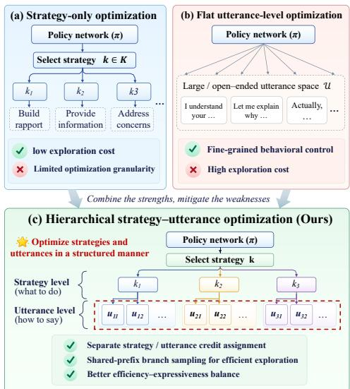  
Figure 1: Three policy optimization paradigms for LLM-based proactive dialogue: (a) strategy-only, (b) flat utterancelevel, and (c) hierarchical strategy–utterance optimization paradigm. CSTPO decomposes each action into a strategy and its conditioned utterance realization.

## These observations lead to two challenges. First, user feedback cannot be reliably attributed to cognitive change. Without persistent state records and

transition constraints, changes in information acceptance and action intention remain implicit. Simulators may thus miss state-dependent responses to the same utterance. Second, action expressiveness and sampling efficiency are difficult to balance. Richer action spaces require more comparisons, but terminal rewards demand complete interactions for evaluation. The interaction budget does not scale with these comparisons.

To address these challenges, we propose a proactive dialogue policy optimization framework integrating Cog-Sim and CSTPO. Cog-Sim maintains a dynamic cognitive–affective state and generates feedback through constrained cross-turn state transitions. Its explicitly maintained internal states allow multiple counterfactual continuations to be sampled from the same pre-action state. As shown in Figure 1, CSTPO represents actions through a strategy–utterance hierarchy. Strategy labels constrain utterance generation, while comparisons among utterances under the same strategy refine how that strategy is expressed. During training, the value model jointly estimates state and strategy-conditioned values to derive separate strategy- and utterance-level advantages from terminal rewards. We evaluate the framework on three multi-turn dialogue tasks: emotional support, donation persuasion, and negotiation. Cog-Sim exhibits consistent dose–response behavior under increasing intervention strength and is preferred over prompt-based simulators for naturalness. CSTPO consistently outperforms prompting and learning-based baselines on task outcomes. With a smaller Qwen3-14B backbone, it achieves performance comparable to GPT-5.5-based planners. Ablations show that cognitive-state modeling improves policy optimization, while the hierarchical Critic enables fine-grained credit assignment between strategy selection and utterance realization.

## 2 RELATED WORK

Policy planning for proactive dialogue Proactive dialogue policy planning aims to optimize long term dialogue outcomes through sequential decisions. Prompt-based methods such as Proactive and ProCoT (Deng et al., 2023), Ask an Expert (Zhang et al., 2023), and ICL-AIF (Fu et al., 2023) elicit strategic behavior through strategy selection, explicit reasoning, expert advice, or interaction feedback, but do not directly optimize policy parameters for long-term returns. Supervised approaches instead learn parameterized planners from annotated demonstrations; for example, Ito et al. (2025) fine-tune ProCoT with automatically annotated reasoning traces and action plans. More recent meth ods move beyond imitation by optimizing policies through interaction. PPDPP (Deng et al., 2024) combines supervised initialization with policy-gradient training, while DialogXpert (Rakib et al., 2026) uses Deep Q-learning with emotion trajectories and LLM action priors. PRINCIPLES (Kim et al., 2025) constructs reusable strategy memory through offline self-play, and LDPP (He et al., 2025) learns latent strategy representations with offline hierarchical RL. These methods improve strategic decision making, but policy expressiveness remains tied to either predefined strategy sets or learned strategy abstractions. CSTPO instead explicitly factorizes each turn into a strategy and its conditioned utterance, allowing both levels to be optimized from interaction outcomes.

User simulation in dialogue policy learning User simulators provide the interaction environment for dialogue policy learning, and simulator design directly affects downstream policy quality and transfer (Suh et al., 2026). Classical goal-driven simulators maintain task consistency through explicit agendas or learned behavior models (Schatzmann et al., 2007; Lin et al., 2022); Deep Dyna-Q further showed that simulator bias can directly affect learned dialogue policies (Peng et al., 2018). Profile-conditioned simulators model user heterogeneity and persona-consistent behavior (Zhao et al., 2024; Zhang et al., 2024; Wang et al., 2025; Abdulhai et al., 2026), but such profiles are typically fixed before interaction and do not represent how a user’s beliefs, concerns, or intentions change in response to the agent. State-based approaches make internal user conditions or cognitive trajectories explicit for generation and evaluation (Wu et al., 2026; Ma et al., 2026b), and recent work further incorporates dynamic states into policy learning, reward design, and credit assignment (Zhang et al., 2026b; Kim et al., 2026; Zhang et al., 2026a). However, many formulations emphasize progress toward task completion rather than controlled bidirectional changes in user cognition. Cog-Sim models cognitive and affective states as persistent variables whose transitions can move in either direction under theory-grounded, parameterized constraints, enabling state-dependent and counterfactual user responses.

Multi-turn RL and credit assignment Multi-turn dialogue and language-agent learning must assign delayed outcome rewards to intermediate decisions. ArCHer (Zhou et al., 2024) addresses this problem with hierarchical RL, using utterance-level value estimation to guide token-level policy optimization. REFUEL (Gao et al., 2025) instead estimates relative future values from self-generated interactions to improve multi-turn policy optimization. More recently, Tree Search for LLM Agent Reinforcement Learning (Ji et al., 2026) organizes rollouts into shared-prefix trees, reducing redun dant interaction while deriving finer-grained learning signals from terminal outcomes. Dialoguespecific work also explores hierarchical strategy and response optimization. Zhao et al. (2025) construct turn-level strategy–response preference pairs through Monte Carlo Tree Search for emotional support, while Lin et al. (2026) coordinate strategic dialogue management and fine-grained utterance generation with dual hierarchical policies. These methods improve credit assignment across turns or between decision levels, but they do not explicitly decompose the value of a dialogue action into the contribution of strategy selection and that of its linguistic realization. CSTPO introduces this decomposition through strategy-conditioned value estimation and shared-prefix branching, yielding separate inter-strategy and intra-strategy advantages from terminal rewards.

## 3 METHOD

## 3.1 PROBLEM FORMULATION

We model proactive dialogue as a finite-horizon, partially observed interaction with sparse terminal feedback. An episode starts from an interaction seed $z \sim \mathcal { D } .$ . At turn $t , x _ { t }$ denotes the training-side pre-action context. It includes the dialogue history, simulated user profile and state, task variables, and remaining horizon. The Actor observes only $o _ { t } = \mathcal { O } ( x _ { t } )$ , which contains the dialogue history and role-visible task information. At each turn, the Actor takes a hierarchical action $a _ { t } = ( k _ { t } , u _ { t } )$ This action consists of a strategy label $k _ { t } ~ \in ~ \mathcal { K }$ and an utterance $u _ { t }$ conditioned on the selected strategy. The policy therefore factorizes as follows:

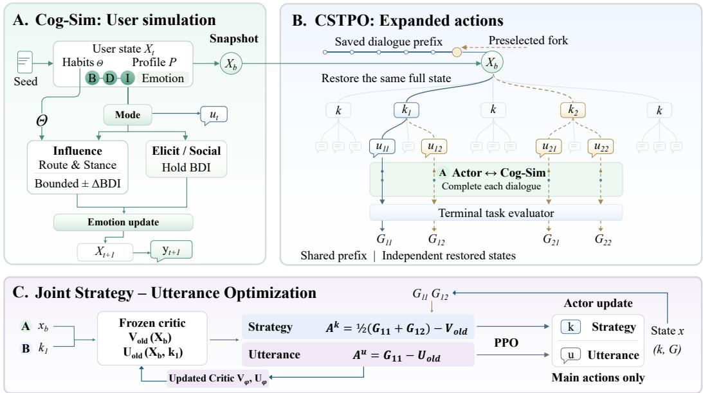  
Figure 2: Overview of the proposed framework. (a) Cog-Sim simulates cognitive-affective user state transitions; (b) CSTPO performs shared-prefix rollout with hierarchical strategy–utterance actions; (c) CSTPO optimizes strategy selection and utterance realization with separate credit assignment.

$$
\pi _ { \boldsymbol { \theta } } ( a _ { t } \mid o _ { t } ) = \pi _ { \boldsymbol { \theta } } ( k _ { t } \mid o _ { t } ) \pi _ { \boldsymbol { \theta } } ( { u } _ { t } \mid o _ { t } , k _ { t } ) .\tag{1}
$$

The utterance $u _ { t }$ is then passed to Cog-Sim, which generates the next user observation. The resulting interaction trajectory is $\tau = \left( o _ { 1 } , a _ { 1 } , \dots , o _ { T } , a _ { T } , o _ { T + 1 } \right)$ . After the dialogue ends, a terminal task utility G(τ) is assigned. The learning objective is

$$
J ( \theta ) = \mathbb { E } _ { z \sim \mathcal { D } , \tau \sim p _ { \theta } ( . | z ) } \left[ G ( \tau ) \right] ,\tag{2}
$$

where $p _ { \theta } ( \tau \mid z )$ denotes the trajectory distribution induced by the Actor and Cog-Sim.

## 3.2 COG-SIM: COGNITIVE-STATE-DRIVEN USER SIMULATION

Cog-Sim represents each user with a persistent user profile P and a dynamic cognitive-affective state $s _ { t } ^ { u } = \dot { ( } C _ { t } , E _ { t } )$ . Specifically, $C _ { t } \overset { \cdot } { = } \left( B _ { t } , D _ { t } , I _ { t } \right)$ denotes beliefs, desires, and intentions under the BDI framework Rao et al. (1995), while $E _ { t } = ( v _ { t } , \rho _ { t } , c _ { t } )$ denotes affective valence, arousal, and a discrete emotion category Smith & Ellsworth (1985); Russell (1980). A user-specific parameter vector $\Theta _ { u }$ captures stable cognitive processing tendencies. Parameterized by $\Theta _ { u } , \mathrm { U p d a t e } _ { \Theta _ { \iota } }$ uses the Elaboration Likelihood Model and Social Judgment Theory Petty & Cacioppo (1986); Sherif & Hovland (1961) to infer the user’s processing route and stance, then applies deterministic constraints to an LLM-proposed BDI change.

Given the dialogue history $H _ { t }$ and the realized Actor utterance $u _ { t } ,$ , a task-agnostic Action Type Classifier (ATC) assigns $q _ { t } = \mathrm { A T C } ( H _ { t } , u _ { t } ) \in \left\{ \begin{array} { r l } \end{array} \right.$ {Influence, Elicit, Social}. Influence denotes an attempt to change the user’s cognition, Elicit requests existing information, and Social covers affective or relational interaction. Unlike the task-specific strategy $k _ { t } , \ q _ { t }$ is inferred from the actual utterance and controls the simulator transition. Influence invokes the cognitive updater, whereas Elicit and Social preserve the BDI state; all modes subsequently update affect and generate a user response:

$$
\begin{array} { r } { C _ { t + 1 } = \left\{ \begin{array} { l l } { \mathrm { U p d a t e } _ { \Theta _ { u } } ( P , C _ { t } , E _ { t } , H _ { t } , u _ { t } ) , } & { q _ { t } = \mathrm { I n f l u e n c e } , } \\ { C _ { t } , } & { q _ { t } \in \{ \mathrm { E l i c i t } , \mathrm { S o c i a l } \} , } \\ { ( E _ { t + 1 } , y _ { t } ^ { \mathrm { u s r } } ) = \mathrm { R e s p o n d } ( P , C _ { t + 1 } , E _ { t } , H _ { t } , u _ { t } , q _ { t } ) . } \end{array} \right. } \end{array}\tag{3}
$$

The environment then appends $y _ { t } ^ { \mathrm { u s r } }$ to the dialogue history and constructs $x _ { t + 1 }$ and $o _ { t + 1 } =$ $\mathcal { O } ( x _ { t + 1 } )$ . Cog-Sim stores a recoverable pre-action checkpoint at each turn. Therefore, different candidate actions can independently continue from the same user state and dialogue prefix. $\mathsf { A p - }$ pendix A provides the full transition and checkpoint specifications.

## 3.3 CSTPO: COGNITIVE-STATE-ASSISTED HIERARCHICAL OPTIMIZATION

Cog-Critic: Dual-value credit decomposition. CSTPO uses a Critic with two value heads:

$$
V ^ { \pi } ( x _ { t } ) = \mathbb { E } _ { \pi } [ G \mid x _ { t } ] , \qquad U ^ { \pi } ( x _ { t } , k _ { t } ) = \mathbb { E } _ { \pi } [ G \mid x _ { t } , k _ { t } ] .\tag{4}
$$

$V ^ { \pi } ( x _ { t } )$ estimates the expected terminal return before a strategy is selected. $U ^ { \pi } ( x _ { t } , k _ { t } )$ estimates the return after selecting $k _ { t }$ but before committing to a particular utterance. Both heads use the pre-action context, $U ^ { \pi }$ additionally accesses the strategy label. Let $Q ^ { \pi } ( x , k , u ) = \mathbb { E } _ { \pi } [ G \mid x , k , u ]$ denote the expected return after both action fields are fixed. The two heads induce the following decomposition:

$$
Q ^ { \pi } ( x , k , u ) - V ^ { \pi } ( x ) = \underbrace { U ^ { \pi } ( x , k ) - V ^ { \pi } ( x ) } _ { \mathrm { s t r a t e g y ~ s e l e c t i o n } } + \underbrace { Q ^ { \pi } ( x , k , u ) - U ^ { \pi } ( x , k ) } _ { \mathrm { u t t e r a n c e ~ r e a l i z a t i o n } } .\tag{5}
$$

Thus, the strategy field is evaluated against the state baseline $V ^ { \pi }$ , while the utterance field is evaluated against the strategy-conditioned baseline $U ^ { \pi }$ . Appendix C formalizes state refinement, hierarchical credit decomposition, and action aliasing.

Same-state continuations. A single trajectory confounds the effect of strategy choice with those of wording and subsequent sampling noise. CSTPO therefore selects a subset of non-terminal checkpoints before observing the current action or its outcome. At each selected parent $b ,$ it restores the same pre-action context $x _ { b } ,$ , samples m distinct strategies $\{ k _ { b , i } \} _ { i = 1 } ^ { m }$ under the frozen old policy, and generates ℓ utterance realizations $\{ u _ { b , i , r } \} _ { r = 1 } ^ { \ell }$ for each strategy. The main-path action is indexed by $\bar { ( \ i , r ) } = ( 1 , 1 )$ ; hence only $m \ell - 1$ additional tails must be simulated. Let $G _ { b , i , r }$ be the terminal return obtained by continuing from $x _ { b }$ with $( k _ { b , i } , u _ { b , i , r } )$ . The strategy-level return averages over utterance realizations:

$$
\overline { { G } } _ { b , i } = \frac { 1 } { \ell } \sum _ { r = 1 } ^ { \ell } G _ { b , i , r } .\tag{6}
$$

At an unexpanded main-path node, we set $\overline { { G } } _ { t , 1 } = G ( \tau )$ . For the main action at an expanded parent, the field-level advantages are

$$
\widehat { A } _ { b } ^ { k } = \overline { { G } } _ { b , 1 } - V _ { \mathrm { o l d } } ( x _ { b } ) , \qquad \widehat { A } _ { b } ^ { u } = G _ { b , 1 , 1 } - U _ { \mathrm { o l d } } ( x _ { b } , k _ { b , 1 } ) .\tag{7}
$$

Averaging returns within the main strategy reduces the dependence of its strategy advantage on a single wording realization, while returns under the alternative strategies supervise their corresponding $U ( x _ { b } , k )$ ) values. All additional tails are used for Critic fitting and strategy-level return estimation only; the Actor is updated exclusively with main-path actions.

Field-aware PPO. We distinguish strategy and utterance tokens with separate field masks. For an Actor token $w _ { j }$ from turn $t ,$ its advantage is

$$
\widehat { A } _ { j } = \left\{ \widehat { A } _ { t } ^ { k } , \quad w _ { j } \mathrm { ~ b e l o n g s ~ t o ~ t h e ~ s t r a t e g y ~ f i e l d } , \right.\tag{8}
$$

Let $\xi _ { j }$ denote the context preceding token $w _ { j } ,$ , and let $r _ { j } ( \theta ) = p _ { \theta } ( w _ { j } \mid \xi _ { j } ) / p _ { \mathrm { o l d } } ( w _ { j } \mid \xi _ { j } )$ be the token-level PPO likelihood ratio. The Actor minimizes

$$
\mathcal { L } _ { \mathrm { A c t o r } } ( \theta ) = - \frac { 1 } { \vert \mathcal { M } \vert } \sum _ { j \in \mathcal { M } } \operatorname* { m i n } \Bigl ( r _ { j } ( \theta ) \widehat { A } _ { j } , \mathrm { c l i p } \left( r _ { j } ( \theta ) , 1 - \epsilon , 1 + \epsilon \right) \widehat { A } _ { j } \Bigr ) ,\tag{9}
$$

where M contains action tokens and the SFT policy initializes $\pi _ { \theta }$ . Appendix B provides the full algorithm and Critic objectives.

Terminal evaluation. For each completed dialogue, a frozen LLM evaluator produces a structured task judgment $s _ { \tau } = \mathrm { J u d g e } ( H _ { T + 1 } , c _ { \mathrm { t a s k } } )$ . A task-specific deterministic function then computes $G ( \tau ) \stackrel { \textstyle - } { = } \textstyle f _ { \mathrm { t a s k } } ( s _ { \tau } , c _ { \mathrm { t a s k } } )$ , where $c _ { \mathrm { t a s k } }$ contains only the whitelisted case information required for outcome evaluation. The evaluator does not access the latent cognitive state or Critic values.

## 4 EXPERIMENTAL SETUP

## 4.1 TASKS AND EVALUATION

We evaluate on three multi-turn proactive dialogue tasks: ESConv for emotional support, PersuasionForGood (P4G) for donation persuasion, and CraigslistBargain (CB) for price negotiation. The Actor serves as the supporter, persuader, and buyer, respectively, while Cog-Sim simulates the corresponding user role. For each task, we sample 200/50/100 interaction seeds for policy training, development, and final evaluation. Dataset statistics, strategy annotations, and interaction-seed construction are provided in Appendix D.1.

The mean task-specific terminal return G is our primary metric. For ESConv, the terminal return is $G _ { \mathrm { { E S } } } = ( E + A { \bar { ) } } / 8 .$ , where Emotion Improvement (E) and Action-Plan Feasibility (A) are rated on 0–4 scales. For P4G, $G _ { \mathrm { P 4 G } } \in \{ 0 , 1 \}$ indicates a voluntary donation commitment that remains valid at dialogue termination, whereas Commitment Rate (Comm.) reports the proportion of dialogues containing any donation commitment. For CraigslistBargain, Deal reports the proportion of valid agreements, and $G _ { \mathrm { C B } } = \mathrm { c l i p } ( S L , 0 , 1 )$ , where $S \bar { L } = ( p - \bar { p } _ { s } ) / ( p _ { b } - p _ { s } )$ is the unclipped price utility for a valid deal with final price $p .$ Here, $p _ { b }$ and $p _ { s }$ denote the buyer’s and seller’s [target/reservation] prices, respectively, and higher SL indicates a more favorable outcome for the buyer. We set $S L = 0$ when no valid deal price can be extracted and additionally report raw-SL before clipping.

## 4.2 BASELINES

User simulators. We compare Cog-Sim with three prompt-based simulators: Persona Zhao et al. (2024), which conditions on a detailed user profile; Persona-Resist Zhang et al. (2024), which additionally discourages ungrounded agreement; and BDI-Prompt, which exposes textual beliefs, de sires, and intentions without an explicit transition mechanism.

Dialogue policies. We compare against Standard direct generation; Proactive and ProCoT (Deng et al., 2023), which respectively select a strategy before responding and first analyze dialogue progress to form a goal; Ask-an-Expert (Zhang et al., 2023), which conditions on an expert recommendation; and MI-Prompt (Chen et al., 2023), which converts a strategy label into a naturallanguage instruction. We further include two RL-based baselines: PPDPP (Deng et al., 2024), a RoBERTa-large strategy planner, and DialogXpert (Rakib et al., 2026), which uses an LLM prior to propose candidate actions and a learned Q-network Mnih et al. (2013) to select among them. SFT Init. is our supervised policy initialization without RL, while CSTPO is the RL-optimized policy.

## 4.3 IMPLEMENTATION DETAILS

We evaluate the prompt and planning baselines with GPT (GPT-5.5). Cog-Sim, baseline simulators, and the terminal evaluator use the DeepSeek (DeepSee $\mathtt { k { - } V 4 { - } P r o - } 0 8 1 3 )$ backend. Qwen (Qwen3-14B) serves as the trainable backbone. Task-specific SFT policies mix human dialogues and teacher trajectories at a 1:1 ratio and use LoRA (Hu et al., 2021) for four epochs. RL initializes from SFT Init.. The Actor and Critic learning rates are $1 \times 1 0 ^ { - 5 }$ and $1 \times 1 0 ^ { - 4 }$ , respectively, and the PPO clipping coefficient is 0.2. Each RL step samples 10 seeds. We expand $2$ non-terminal checkpoints per main trajectory for P4G and CB and 4 for ESConv. At each checkpoint, we sample $m = 2$ strategies and $\ell = 2$ utterance realizations per strategy, Training is built on $\tt V e r l ^ { 1 }$ with vLLM2 and thinking disabled. Full configurations and prompts are provided in Appendices E and J.

## 5 EXPERIMENTS

## 5.1 USER SIMULATOR VALIDATION

To evaluate Cog-Sim, we conduct a matched dose–response test against three prompt-based controls on 100 seeds per task. From identical pre-action checkpoints, each simulator responds to four input levels with two paraphrases per level. ESConv and P4G vary from weak evidence to relevant evidence and actionable proposals. For CB, levels are defined by the seller’s latest asking price: L0 asks without an offer, L1 offers 95%, L2 offers 98–99%, and L3 accepts the full price with immediate payment. An LLM judge scores user change or concession on a 0–3 scale.

Figure 3 shows that Cog-Sim’s mean response scores increase monotonically on all three tasks. The scores rise from 0.60 to 1.55, from 1.12 to 1.87, and from 0.23 to 2.01, respectively. Prompt-based controls show smaller endpoint changes on ESConv and P4G. On CB, Cog-Sim responds progressively from the intermediate offer levels, whereas the controls change most sharply only at L3; consequently, Cog-Sim does not have the largest endpoint difference on this task.

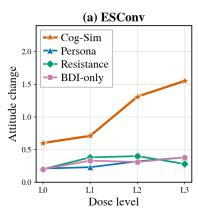

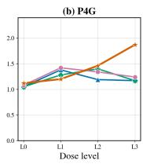

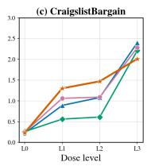  
Figure 3: User responses to controlled input levels.

To assess response quality, we further perform randomized pairwise evaluation of naturalness (Nat.), consistency (Cons.), and dose appropriateness (App.), a LLM judge conducts 7,200 pairwise comparisons with randomized presentation order and hidden model identities. We report net preference as $( W - L ) / N$ , where N counts all comparisons, including ties.

<table><tr><td rowspan="2">Comparator</td><td colspan="3">ESConv</td><td colspan="3">P4G</td><td colspan="3">CB</td></tr><tr><td></td><td></td><td></td><td></td><td></td><td></td><td></td><td></td><td>Nat. Cons. App. Nat. Cons. App. Nat. Cons. App.</td></tr><tr><td>Persona Zhao et al. (2024)</td><td></td><td></td><td></td><td></td><td></td><td></td><td></td><td></td><td>+.66† +.55† +.53† +.63† +.26† +.27† +.33† -.01 -.01</td></tr><tr><td>Resistance Zhang et al. (2024) +.41† +.21† +.23† +.39† +.10 +.10 +.42† -.09 +.04</td><td></td><td></td><td></td><td></td><td></td><td></td><td></td><td></td><td></td></tr><tr><td>BDI-only</td><td></td><td></td><td></td><td>+.60† +.47† +.47† +.60†</td><td> $+ . 2 3 ^ { \dagger }$ </td><td> $+ . 2 5 ^ { \dagger }$ </td><td></td><td></td><td>+.47† +.03 +.05</td></tr></table>

Table 1: Pairwise LLM evaluation of Cog-Sim. Positive values favor Cog-Sim; † indicates a 95% case-cluster bootstrap interval entirely above zero.

Cog-Sim achieves higher naturalness preference in all nine task–comparator pairs (Table 1), indicating that explicit cognitive-state modeling improves the realism of simulated user responses. It further obtains consistent gains across all three evaluation dimensions on ESConv and shows improvements in P4G and CB, particularly in naturalness and dose appropriateness. These results demonstrate that Cog-Sim enables more coherent and controllable user simulation across diverse interaction settings.

## 5.2 DIALOGUE POLICY PERFORMANCE

Emotional Support Dialogues (ESConv). CSTPO improves the SFT policy from 0.582 to 0.624 in terminal return, outperforming all Qwen-based baselines and approaching the strongest GPT-5.5 result (0.624 vs. 0.632). The improvement mainly comes from action-plan feasibility, which increases from 2.364 to 2.679, while emotion improvement remains stable (2.292 vs. 2.313). This indicates that CSTPO learns to better advance supportive conversations toward actionable outcomes without sacrificing emotional support.

Donation Persuasion Dialogues (P4G). CSTPO achieves the highest terminal return among all compared methods on P4G, improving from 0.420 with SFT Init. to 0.460. The commitment rate also increases from 43% to 46%, indicating that cognitive-state-driven optimization helps the policy select more effective persuasion strategies and elicit stronger user commitment.

Negotiation Dialogues (CraigslistBargain). CSTPO achieves the largest gain on CB, improving terminal return from 0.440 with SFT Init. to 0.491 and slightly surpassing the strongest GPT-5.5 baseline (0.491 vs. 0.489). The improvement mainly comes from price utility, increasing from 0.531 to 0.581, while maintaining a comparable deal rate (55% vs. 57%). This result shows that CSTPO can optimize negotiation outcomes beyond simply reaching agreements.

<table><tr><td rowspan="2">Method</td><td rowspan="2">Backbone</td><td colspan="3">ESConv</td><td colspan="2">P4G</td><td colspan="3">CB</td></tr><tr><td>E</td><td>A</td><td>G</td><td>Comm.</td><td>G</td><td>SL</td><td>Deal</td><td>G</td></tr><tr><td>Standard</td><td>GPT</td><td>2.180</td><td>2.627</td><td>.601</td><td>45%</td><td>.450</td><td>.571</td><td>66%</td><td>.484</td></tr><tr><td>Proactive Deng et al. (2023)</td><td>GPT</td><td>2.487</td><td>2.250</td><td>.592</td><td>43%</td><td>.430</td><td>.511</td><td>65%</td><td>.457</td></tr><tr><td>ProCoT (Deng et al., 2023)</td><td>GPT</td><td>2.490</td><td>2.430</td><td>.615</td><td>44%</td><td>.440</td><td>.509</td><td>61%</td><td>.435</td></tr><tr><td>AnE (Zhang et al., 2023)</td><td>GPT</td><td>1.963</td><td>3.093</td><td>.632</td><td>42%</td><td>.420</td><td>.516</td><td>61%</td><td>.433</td></tr><tr><td>MI-Prompt (Chen et al., 2023)</td><td>GPT</td><td>2.163</td><td>1.620</td><td>.473</td><td>40%</td><td>.400</td><td>.541</td><td>62%</td><td>.456</td></tr><tr><td>PPDPP (Deng et al., 2024)</td><td>GPT</td><td>2.240</td><td>2.440</td><td>.585</td><td>44%</td><td>.430</td><td>.569</td><td>67%</td><td>.489</td></tr><tr><td>DialogXpert (Rakib et al., 2026)</td><td>GPT</td><td>2.260</td><td>2.564</td><td>.603</td><td>45%</td><td>.450</td><td>.548</td><td>63%</td><td>.473</td></tr><tr><td>ProCoT (Deng et al., 2023)</td><td>Qwen</td><td>2.177</td><td>2.287</td><td>.558</td><td>36%</td><td>.360</td><td>.380</td><td>45%</td><td>.327</td></tr><tr><td>AnE (Zhang et al., 2023)</td><td>Qwen</td><td>1.540</td><td>1.717</td><td>.407</td><td>35%</td><td>.320</td><td>.440</td><td>57%</td><td>.365</td></tr><tr><td>Standard</td><td>Qwen</td><td>2.083</td><td>2.227</td><td>.539</td><td>39%</td><td>.390</td><td>.400</td><td>49%</td><td>.353</td></tr><tr><td>SFT Init.</td><td>Qwen</td><td>2.292</td><td>2.364</td><td>.582</td><td>43%</td><td>.420</td><td>.531</td><td>55%</td><td>.440</td></tr><tr><td>w/o Cog-Critic</td><td>Qwen</td><td>2.150</td><td>2.244</td><td>.549</td><td>40%</td><td>.380</td><td>.453</td><td>47%</td><td>.389</td></tr><tr><td>w/o Cog-State</td><td>Qwen</td><td>2.293</td><td>2.550</td><td>.605</td><td>45%</td><td>.440</td><td>.548</td><td>56%</td><td>.477</td></tr><tr><td>CSTPO</td><td>Qwen</td><td>2.313</td><td>2.679</td><td>.624</td><td>46%</td><td>.460</td><td>.581</td><td>57%</td><td>.491</td></tr></table>

Table 2: Detailed results on ESConv, P4G, and CB. Bold and underline indicate the best and secondbest results in each column, respectively. Appendix F reports the complete Qwen3-14B results.

## 5.3 COMPONENT ABLATIONS

We remove the Critic’s cognitive-state input (w/o Cog-State) or replace the hierarchical value functions with a shared value function (w/o Cog-Critic), which removes separate credit estimation for strategy selection and utterance realization.

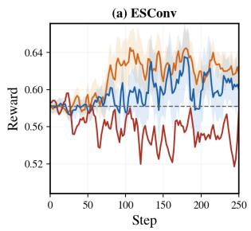

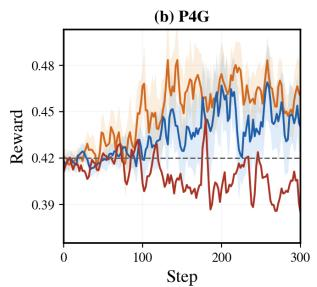

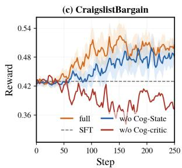  
Figure 4: Qwen3-14B ablations on ESConv, P4G, and CB. Solid lines show centered three-step moving averages, shaded regions show centered interquartile bands from 50 independent realizations, and dashed lines mark SFT references. Detailed results was showed in Table 2

Removing cognitive-state inputs slows optimization and reduces final returns. The full model achieves higher tail-50-step average returns than w/o Cog-State on ESConv (0.620 vs. 0.604), P4G (0.462 vs. 0.448), and CB (0.496 vs. 0.478), indicating that cognitive states provide additional signals for policy optimization. In contrast, w/o Cog-Critic fails to improve over SFT init. and remains at lower reward levels throughout training. This highlights the importance of hierarchical value estimation for fine-grained credit assignment between strategy selection and utterance realization. Appendix G reports the Actor–Critic training traces at two model scales.

## 5.4 SMALLER-BACKBONE GENERALIZATION

To test whether the optimization gains depend on the 14B backbone, we repeat training with an 8B Actor. Table 3 show positive improvements over the task-specific SFT initialization on all three tasks. The largest absolute gain is on CB. The 8B endpoints remain below their 14B counterparts, so this result supports transfer across the two tested model scales rather than backbone-independent performance.

<table><tr><td>Setting</td><td>ESConv</td><td>P4G</td><td>CB</td></tr><tr><td>Standard</td><td>.442</td><td>.310</td><td>.244</td></tr><tr><td>SFT Init.</td><td>.494</td><td>.350</td><td>.321</td></tr><tr><td>CSTPO</td><td>.555</td><td>.410</td><td>.435</td></tr></table>

Table 3: Returns for the 8B model.

## 5.5 HUMAN EVALUATION

We conduct human evaluation against three representative GPT-5.5 baselines from Section 5.2: Standard, ProCoT and PPDPP. Five annotators perform blind pairwise comparisons, and majority voting is used for each dialogue and dimension. ESConv is evaluated on identification (Ident.), comforting (Comf.), and suggestion (Sugg.); P4G and CB are evaluated on persuasiveness (Pers.), coherence (Coh.), and naturalness (Nat.). We report net preference under the same setting as Section 5.1.

<table><tr><td></td><td colspan="3">ESConv</td><td colspan="3">P4G</td><td colspan="3">CB</td></tr><tr><td>Comparator</td><td>Ident.</td><td>Comf.</td><td>Sugg.</td><td>Pers.</td><td>Coh.</td><td>Nat.</td><td>Pers.</td><td>Coh.</td><td>Nat.</td></tr><tr><td>Standard</td><td>+.23†</td><td>+.29†</td><td>+.06</td><td>+.13†</td><td>+.05</td><td>-.09†</td><td>+.15†</td><td>+.07</td><td>-.10†</td></tr><tr><td>ProCoT (Deng et al., 2023) +.11†</td><td></td><td>+.13†</td><td>-.11†</td><td>+.25†</td><td>+.10†</td><td>-.02</td><td>+.31†</td><td>+.11†</td><td>-.03</td></tr><tr><td>PPDPP (Deng et al., 2024)</td><td>+.15†</td><td>+.17†</td><td>+.03</td><td>+.21†</td><td>+.07</td><td>-.03</td><td>+.07</td><td>+.05</td><td>-.04</td></tr></table>

Table 4: Pairwise human evaluation of CSTPO against GPT-5.5 baselines. positive values favor CSTPO, and † indicates that the 95% dialogue-clustered bootstrap interval excludes zero.

CSTPO obtains significant positive preferences in 13 of 27 comparisons (Table 4). It consistently improves identification and comforting over all ESConv baselines and achieves significant gains in persuasiveness against all P4G baselines. On CB, CSTPO improves persuasiveness over Standard and ProCoT. Three comparisons favor GPT-5.5 baselines, including suggestion against ProCoT on ESConv and naturalness against Standard on P4G and CB. These results suggest that CSTPO mainly improves task-relevant dialogue abilities rather than general language quality. full details and confidence intervals are provided in Appendix H.

## 5.6 STRATEGY ADAPTATION AFTER RL

We further analyze how CSTPO changes strategy selection by comparing strategy-label distributions before and after RL. For cross-task visualization, task-specific labels are grouped into four functional categories: Advance, Soften, Probe, and Other. Detailed mappings are provided in Appendix F.3.

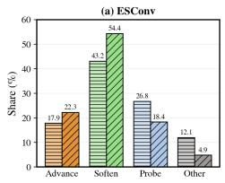

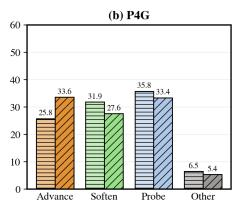

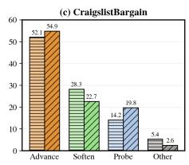

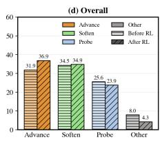  
Figure 5: Strategy-label distributions before and after RL.

CSTPO learns task-dependent strategy redistribution (Figure 5). On ESConv, CSTPO increases Soften strategies from 43.2% to 54.4%, reflecting a stronger emphasis on supportive interactions. On CB, Probe strategies increase from 14.2% to 19.8% while preserving an Advance-dominant pattern, suggesting greater use of information-seeking behaviors during negotiation. On P4G, Advance strategies increase from 25.8% to 33.6%, consistent with more commitment-oriented persuasion. Meanwhile, Other strategies decrease across all tasks, indicating that CSTPO concentrates strategy selection on task-relevant behaviors. Dialogue examples are provided in Appendix I.

## 6 CONCLUSION

In this work, we connect user cognition with proactive dialogue policy learning through Cog-Sim and CSTPO. Cog-Sim grounds user responses in explicit cognitive and affective states, while CSTPO enables agents to jointly optimize strategic decisions and linguistic realizations. Experiments across emotional support, donation persuasion, and negotiation show that Cog-Sim provides more consistent and natural user feedback than prompt-based simulators, and CSTPO-trained Qwen3-14B achieves higher terminal returns than strong baselines including GPT-5.5-based Pro-CoT and PPDPP. Reliable user simulation remains an important challenge for interactive policy learning. Future work will calibrate cognitive and affective transitions with human interaction data and investigate broader user profiles and contexts. More comprehensive evaluation combining independent evaluators, cross-simulator validation, and human interaction studies will be important for understanding whether simulated improvements translate to effective real-world dialogue.

## AI USE STATEMENT

Generative AI tools were used at several stages of this work. Codex3 and Claude Code4 were used to assist with conceptual discussions of Cog-Sim and CSTPO, the initial design of the experimental protocol, implementation of experimental code, hyperparameter selection, and analysis of experimental results. The authors revised the proposed experimental procedures and hyperparameters throughout the project to reflect the actual experimental settings and observations.

GPT-5.5 was used to generate teacher trajectories for supervised training. LLMs were also used for strategy annotation: each instance was annotated independently three times, with the majority strategy retained when available; cases without agreement were manually annotated by the authors. AI tools were not used for mathematical derivations or proofs.

Generative AI was additionally used to assist with drafting and language polishing to improve clarity and fluency without changing the intended technical meaning. Literature retrieval, reference selection, and BibTeX organization were performed by the authors. All AI-assisted code, generated trajectories, annotations, experimental analyses, and manuscript text were repeatedly reviewed and verified by three authors.

## ETHICS STATEMENT

All datasets used in this work are publicly available: ESConv5, PersuasionForGood6, and Craigslist-Bargain7. We do not collect new conversational data from real end users. Human evaluation is conducted by five graduate students with backgrounds in natural language processing. Annotators perform blind pairwise comparisons, participate with informed consent, and receive reasonable compensation according to local standards.

Our cognitive and affective state representations are designed solely for dialogue simulation and policy learning. They should not be interpreted as clinical assessments, psychological diagnoses, or reliable estimates of the internal states of real users. Similarly, although we study persuasion as a benchmark task, optimizing persuasive dialogue policies may raise concerns about undue influence if such systems are deployed with real users. We therefore evaluate the proposed methods only on public datasets and simulated interactions and do not claim readiness for real-world deployment.

We do not evaluate demographic fairness because the three public datasets do not provide a consistent set of demographic attributes. This remains a limitation, as both user simulators and learned policies may inherit biases from the underlying datasets and language models.

## REFERENCES

Marwa Abdulhai, Ryan Cheng, Donovan Clay, Tim Althoff, Sergey Levine, and Natasha Jaques. Consistently simulating human personas with multi-turn reinforcement learning. Advances in Neural Information Processing Systems, 38:52920–52957, 2026.

Maximillian Chen, Xiao Yu, Weiyan Shi, Urvi Awasthi, and Zhou Yu. Controllable mixedinitiative dialogue generation through prompting. In Anna Rogers, Jordan Boyd-Graber, and Naoaki Okazaki (eds.), Proceedings of the 61st Annual Meeting of the Association for Computational Linguistics (Volume 2: Short Papers), pp. 951–966, Toronto, Canada, July 2023. Association for Computational Linguistics. doi: 10.18653/v1/2023.acl-short.82. URL https: //aclanthology.org/2023.acl-short.82/.

Yi Cheng, Wenge Liu, Jian Wang, Chak Tou Leong, Yi Ouyang, Wenjie Li, Xian Wu, and Yefeng Zheng. COOPER: Coordinating Specialized Agents towards a Complex Dialogue Goal. arXiv e-prints, art. arXiv:2312.11792, December 2023. doi: 10.48550/arXiv.2312.11792.

Yang Deng, Lizi Liao, Liang Chen, Hongru Wang, Wenqiang Lei, and Tat-Seng Chua. Prompting and evaluating large language models for proactive dialogues: Clarification, target-guided, and non-collaboration. In Houda Bouamor, Juan Pino, and Kalika Bali (eds.), Findings of the Association for Computational Linguistics: EMNLP 2023, pp. 10602–10621, Singapore, December 2023. Association for Computational Linguistics. doi: 10.18653/v1/2023.findings-emnlp.711. URL https://aclanthology.org/2023.findings-emnlp.711/.

Yang Deng, Wenxuan Zhang, Wai Lam, See-Kiong Ng, and Tat-Seng Chua. Plug-and-play policy planner for large language model powered dialogue agents. In International Conference on Learning Representations, volume 2024, pp. 10058–10090, 2024.

Yang Deng, Lizi Liao, Wenqiang Lei, Grace Hui Yang, Wai Lam, and Tat-Seng Chua. Proactive conversational ai: A comprehensive survey of advancements and opportunities. ACM Trans. Inf. Syst., 43(3), March 2025. ISSN 1046-8188. doi: 10.1145/3715097. URL https://doi.org/ 10.1145/3715097.

Yao Fu, Hao Peng, Tushar Khot, and Mirella Lapata. Improving language model negotiation with self-play and in-context learning from ai feedback. arXiv preprint arXiv:2305.10142, 2023.

Zhaolin Gao, Wenhao Zhan, Jonathan Chang, Gokul Swamy, Kiante Brantley, Jason´ Lee, and Wen Sun. Regressing the relative future: Efficient policy optimization for multi-turn rlhf. In Y. Yue, A. Garg, N. Peng, F. Sha, and R. Yu (eds.), International Conference on Learning Representations, volume 2025, pp. 8475–8514, 2025. URL https://proceedings.iclr.cc/paper\_files/paper/2025/file/ 186094ef879dcbd5ef6879782916c309-Paper-Conference.pdf.

Tao He, Lizi Liao, Yixin Cao, Yuanxing Liu, Ming Liu, Zerui Chen, and Bing Qin. Planning like human: A dual-process framework for dialogue planning. In Proceedings of the 62nd Annual Meeting of the Association for Computational Linguistics (Volume 1: Long Papers), pp. 4768– 4791, 2024.

Tao He, Lizi Liao, Yixin Cao, Yuanxing Liu, Yiheng Sun, Zerui Chen, Ming Liu, and Bing Qin. Simulation-free hierarchical latent policy planning for proactive dialogues. In Proceedings ofthe AAAI Conference on Artificial Intelligence, volume 39, pp. 24032–24040, 2025.

Edward J. Hu, Yelong Shen, Phillip Wallis, Zeyuan Allen-Zhu, Yuanzhi Li, Shean Wang, and Weizhu Chen. Lora: Low-rank adaptation of large language models. ArXiv, abs/2106.09685, 2021. URL https://api.semanticscholar.org/CorpusID:235458009.

Yikuan Hu, Chen Huang, and Wenqiang Lei. Astro: Automatic strategy optimization for noncooperative dialogues. In Findings ofthe Associationfor Computational Linguistics: ACL 2025, pp. 388–408, 2025.

Ryosuke Ito, Tetsuya Takiguchi, and Yasuo Ariki. Enhancing proactive dialogue systems through self-learning of reasoning and action-planning. In Proceedings of the 15th International Workshop on Spoken Dialogue Systems Technology, pp. 165–171, 2025.

Yuxiang Ji, Ziyu Ma, Yong Wang, Guanhua Chen, Xiangxiang Chu, and Liaoni Wu. Tree search for llm agent reinforcement learning. In C. Vondrick, B. Hariharan, C. Raffel, L. Pinto, D. Yang, and A. Faust (eds.), International Conference on Learning Representations, volume 2026, pp. 87362–87388, 2026. URL https://proceedings.iclr.cc/paper\_files/paper/ 2026/file/8c7304e77c832ddc70075dfee081ca6c-Paper-Conference.pdf.

Namyoung Kim, Kai Tzu-iunn Ong, Yeonjun Hwang, Minseok Kang, Iiseo Jihn, Gayoung Kim, Minju Kim, and Jinyoung Yeo. PRINCIPLES: Synthetic strategy memory for proactive dialogue agents. In Christos Christodoulopoulos, Tanmoy Chakraborty, Carolyn Rose, and Violet Peng (eds.), Findings of the Association for Computational Linguistics: EMNLP 2025, pp. 21329– 21368, Suzhou, China, November 2025. Association for Computational Linguistics. ISBN 979-8- 89176-335-7. doi: 10.18653/v1/2025.findings-emnlp.1164. URL https://aclanthology. org/2025.findings-emnlp.1164/.

Tae Soo Kim, Yoonjoo Lee, Jaesang Yu, John Joon Young Chung, and Juho Kim. Discoverllm: From executing intents to discovering them. arXiv preprint arXiv:2602.03429, 2026.

Kenneth Li, Yiming Wang, Fernanda Viegas, and Martin Wattenberg. Dialogue action tokens:´ Steering language models in goal-directed dialogue with a multi-turn planner. arXiv preprint arXiv:2406.11978, 2024.

Hsien-chin Lin, Christian Geishauser, Shutong Feng, Nurul Lubis, Carel van Niekerk, Michael Heck, and Milica Gasic. Gentus: Simulating user behaviour and language in task-oriented dialogues with generative transformers. In Proceedings of the 23rd Annual Meeting of the Special Interest Group on Discourse and Dialogue, pp. 270–282, 2022.

Xubo Lin, Zezhi Deng, Shihao Wang, Grace Hui Yang, and Yang Deng. Dual hierarchical dialogue policy learning for legal inquisitive conversational agents. In Maria Liakata, Viviane P. Moreira, Jiajun Zhang, and David Jurgens (eds.), Findings of the Association for Computational Linguistics: ACL 2026, pp. 11030–11047, San Diego, California, United States, July 2026. Association for Computational Linguistics. ISBN 979-8-89176-395-1. doi: 10.18653/v1/2026.findings-acl. 536. URL https://aclanthology.org/2026.findings-acl.536/.

Minghui Ma, Bin Guo, Mengqi Chen, Jingqi Liu, Yasan Ding, Yan Liu, and Han Wang. Neuro-sym supporter: A thoughtful emotion support agent integrating neural and symbolic policy learning. In Proceedings ofthe ACM Web Conference 2026, WWW ’26, pp. 3823–3834, New York, NY, USA, 2026a. Association for Computing Machinery. ISBN 9798400723070. doi: 10.1145/3774904. 3792335. URL https://doi.org/10.1145/3774904.3792335.

Minghui Ma, Bin Guo, Han Wang, Mengqi Chen, Jingqi Liu, Yan Liu, and Zhiwen Yu. Cognitive world models for process-level social influence evaluation. arXiv preprint arXiv:2606.29495, 2026b.

Volodymyr Mnih, Koray Kavukcuoglu, David Silver, Alex Graves, Ioannis Antonoglou, Daan Wierstra, and Martin A. Riedmiller. Playing atari with deep reinforcement learning. ArXiv, abs/1312.5602, 2013. URL https://api.semanticscholar.org/CorpusID: 15238391.

Baolin Peng, Xiujun Li, Jianfeng Gao, Jingjing Liu, and Kam-Fai Wong. Deep Dyna-Q: Integrating planning for task-completion dialogue policy learning. In Iryna Gurevych and Yusuke Miyao (eds.), Proceedings ofthe 56th Annual Meeting ofthe Associationfor Computational Linguistics (Volume 1: Long Papers), pp. 2182–2192, Melbourne, Australia, July 2018. Association for Computational Linguistics. doi: 10.18653/v1/P18-1203. URL https://aclanthology.org/ P18-1203/.

Richard E Petty and John T Cacioppo. The elaboration likelihood model of persuasion. In Advances in experimental social psychology, volume 19, pp. 123–205. Elsevier, 1986.

Tazeek Bin Abdur Rakib, Ambuj Mehrish, Lay-Ki Soon, Wern Han Lim, and Soujanya Poria. Dialogxpert: Driving intelligent and emotion-aware conversations through online value-based reinforcement learning with llm priors. In Proceedings of the AAAI Conference on Artificial Intelli gence, volume 40, pp. 29967–29975, 2026.

Anand S Rao, Michael P Georgeff, et al. Bdi agents: From theory to practice. In Icmas, volume 95, pp. 312–319, 1995.

James A Russell. A circumplex model of affect. Journal of personality and social psychology, 39 (6):1161, 1980.

Jost Schatzmann, Blaise Thomson, Karl Weilhammer, Hui Ye, and Steve Young. Agenda-based user simulation for bootstrapping a pomdp dialogue system. In Human Language Technologies 2007: The Conference ofthe North American Chapter ofthe Associationfor Computational Linguistics; Companion Volume, Short Papers, pp. 149–152, 2007.

Muzafer Sherif and Carl I Hovland. Social judgment: Assimilation and contrast effects in communication and attitude change. 1961.

Craig A Smith and Phoebe C Ellsworth. Patterns of cognitive appraisal in emotion. Journal of personality and social psychology, 48(4):813, 1985.

Joseph Suh, Ayush Raj, Minwoo Kang, and Serina Chang. Quantifying the utility of user simulators for building collaborative llm assistants. arXiv preprint arXiv:2605.09808, 2026.

Kuang Wang, Xianfei Li, Shenghao Yang, Li Zhou, Feng Jiang, and Haizhou Li. Know you first and be you better: Modeling human-like user simulators via implicit profiles. In Proceedings of the 63rd Annual Meeting of the Association for Computational Linguistics (Volume 1: Long Papers), pp. 21082–21107, 2025.

Shirley Wu, Michel Galley, Baolin Peng, Hao Cheng, Gavin Li, Yao Dou, Weixin Cai, James Zou, Jure Leskovec, and Jianfeng Gao. CollabLLM: From passive responders to active collaborators. In Proceedings of the 42nd International Conference on Machine Learning, volume 267 of Proceedings of Machine Learning Research, pp. 67260–67283. PMLR, 2025. URL https://proceedings.mlr.press/v267/wu25i.html.

Shirley Wu, Evelyn Choi, Arpandeep Khatua, Zhanghan Wang, Joy He-Yueya, 1 TharinduCyril-WeerasooriyaFigure, Wei Wei, Diyi Yang, Jure Leskovec, and James Zou. Humanlm: Simulating users with state alignment beats response imitation. ArXiv, abs/2603.03303, 2026. URL https://api.semanticscholar.org/CorpusID:286089730.

Azure Zhang, Ning Gao, Yuqin Dai, Ruiyuan Wu, Jinpeng Wang, Rena Wei Gao, Bingdong Tan, Shuzheng Gao, Zongjie Li, and Chaozheng Wang. Unlocking proactivity in task-oriented dialogue. arXiv preprint arXiv:2605.22240, 2026a.

Feng Zhang, Shi-Jia Li, Chunmao Zhang, Zhanyu Ma, Jun Xu, Jiuchong Gao, Jinghua Hao, Renqing He, Jing-Wen Xu, and Han Liu. Userlm-r1: Modeling human reasoning in user language models with multi-reward reinforcement learning. ArXiv, abs/2601.09215, 2026b. URL https:// api.semanticscholar.org/CorpusID:284718383.

Qiang Zhang, Jason Naradowsky, and Yusuke Miyao. Ask an expert: Leveraging language models to improve strategic reasoning in goal-oriented dialogue models. In Findings of the Association for Computational Linguistics: ACL 2023, pp. 6665–6694, 2023.

Tong Zhang, Chen Huang, Yang Deng, Hongru Liang, Jia Liu, Zujie Wen, Wenqiang Lei, and Tat-Seng Chua. Strength lies in differences! improving strategy planning for non-collaborative dialogues via diversified user simulation. In Yaser Al-Onaizan, Mohit Bansal, and Yun-Nung Chen (eds.), Proceedings of the 2024 Conference on Empirical Methods in Natural Language Processing, pp. 424–444, Miami, Florida, USA, November 2024. Association for Computational Linguistics. doi: 10.18653/v1/2024.emnlp-main.26. URL https://aclanthology.org/ 2024.emnlp-main.26/.

Haiquan Zhao, Lingyu Li, Shisong Chen, Shuqi Kong, Jiaan Wang, Kexin Huang, Tianle Gu, Yixu Wang, Jian Wang, Liang Dandan, Zhixu Li, Yan Teng, Yanghua Xiao, and Yingchun Wang. ESCeval: Evaluating emotion support conversations in large language models. In Yaser Al-Onaizan, Mohit Bansal, and Yun-Nung Chen (eds.), Proceedings of the 2024 Conference on Empirical Methods in Natural Language Processing, pp. 15785–15810, Miami, Florida, USA, November 2024. Association for Computational Linguistics. doi: 10.18653/v1/2024.emnlp-main.883. URL https://aclanthology.org/2024.emnlp-main.883/.

Weixiang Zhao, Xingyu Sui, Xinyang Han, Yang Deng, Yulin Hu, Jiahe Guo, Libo Qin, Qianyun Du, Shijin Wang, Yanyan Zhao, Bing Qin, and Ting Liu. Chain of strategy optimization makes large language models better emotional supporter. In Christos Christodoulopoulos, Tanmoy Chakraborty, Carolyn Rose, and Violet Peng (eds.), Findings ofthe Associationfor Computational Linguistics: EMNLP 2025, pp. 15361–15381, Suzhou, China, November 2025. Association for Computational Linguistics. ISBN 979-8-89176-335-7. doi: 10.18653/v1/2025.findings-emnlp. 831. URL https://aclanthology.org/2025.findings-emnlp.831/.

Yifei Zhou, Andrea Zanette, Jiayi Pan, Sergey Levine, and Aviral Kumar. ArCHer: Training language model agents via hierarchical multi-turn RL. In Proceedings of the 41st International Conference on Machine Learning, volume 235 of Proceedings of Machine Learning Research, pp. 62178–62209. PMLR, 2024. URL https://proceedings.mlr.press/ v235/zhou24t.html.

## APPENDIX ROADMAP

The appendix is organized to separate the mechanism, reproducibility details, evaluation evidence, and prompt specifications. Table 5 summarizes the contents and their relation to the main paper.

<table><tr><td>Section</td><td>Topic</td><td>Contents</td></tr><tr><td>A</td><td>Cog-Sim details</td><td>State representation, cognitive routing, constrained transi- tions, affect updates, and recoverable checkpoints.</td></tr><tr><td>B</td><td>CSTPO details</td><td>Training algorithm, same-state continuations, Critic targets, field masks, and policy updates.</td></tr><tr><td>C</td><td>Theoretical properties</td><td>Training-state refinement, orthogonal hierarchical credit de- composition, and action aliasing.</td></tr><tr><td>D</td><td>Data and seeds</td><td>Dataset statistics, strategy spaces, seed schema, information boundaries, and seed quality control.</td></tr><tr><td>E</td><td>Reproducibility</td><td>SFT and RL configurations, model backends, compute, ter- minal utilities, stopping rules, and statistics.</td></tr><tr><td>F</td><td>Additional results</td><td>Complete Qwen3-14B results, descriptive differences from Standard, and the fine-grained strategy mapping underlying</td></tr><tr><td>G</td><td>Generalization and dynamics</td><td>the main-paper analysis. Smaller-backbone results, 8B reward curves, and 14B Actor– Critic training dynamics.</td></tr><tr><td>H</td><td>Human evaluation</td><td>Annotation protocol and complete pairwise results with con- fidence intervals.</td></tr><tr><td>I</td><td>Case studies</td><td>Selected dialogue excerpts with outcome-aware analyses and</td></tr><tr><td>J</td><td>Prompts</td><td>diagnostic limitations. Actor, Cog-Sim, seed-construction, and evaluator prompts used by the proposed framework.</td></tr></table>

Table 5: Organization of the appendix.

## A COG-SIM TRANSITION DETAILS

## A.1 STATE REPRESENTATION

Cog-Sim represents a user by a persistent profile $P ,$ a dynamic cognitive state $C _ { t } = ( B _ { t } , D _ { t } , I _ { t } )$ and an affective state $E _ { t } = ( v _ { t } , \rho _ { t } , c _ { t } )$ . Each belief, desire, or intention records its semantic content, strength, centrality, activation status, and, where applicable, direction. Strengths lie in [0, 4], and the simulator maintains

$$
| B _ { t } | \leq 4 , \qquad | D _ { t } | \leq 3 , \qquad | I _ { t } | \leq 3 .\tag{10}
$$

Stable processing tendencies are represented by

$$
\Theta _ { u } = ( \eta _ { R } , \tau _ { A } , \tau _ { R } ) , \qquad 0 \le \tau _ { A } < \tau _ { R } \le 1 ,\tag{11}
$$

where $\eta _ { R }$ controls the tendency toward systematic processing and $\tau _ { A } , \tau _ { R }$ delimit acceptance and rejection regions.

## A.2 ACTION TYPE, PROCESSING ROUTE, AND JUDGMENT

The action-type classifier maps the realized Actor utterance, rather than its task-specific strategy label, to Influence, Elicit, or Social. Influence acts may change BDI state; Elicit acts reveal existing state; Social acts provide affective or relational interaction. All three modes may change affect and produce a user response.

For an Influence act, Cog-Sim extracts relevance $R e l _ { t }$ , argument quality $A r g _ { t }$ , peripheral-cue strength $C u e _ { t }$ , and interaction pressure $P r e s s _ { t }$ . The qualitative levels low, medium, and high are mapped to .2, .5, and .8, respectively; the same mapping converts stance distance to $d _ { t }$ . The central and peripheral processing scores are

$$
S _ { t } ^ { \mathrm { C } } = \eta _ { R } R e l _ { t } A r g _ { t } , \qquad S _ { t } ^ { \mathrm { P } } = ( 1 - \eta _ { R } ) C u e _ { t } , \qquad p _ { t } ^ { \mathrm { C } } = \frac { S _ { t } ^ { \mathrm { C } } } { S _ { t } ^ { \mathrm { C } } + S _ { t } ^ { \mathrm { P } } + \varepsilon } .\tag{12}
$$

The central route is used when $p _ { t } ^ { \mathrm { C } } \geq 0 . 5 ;$ under a weak-signal condition, the simulator falls back to the user’s stable tendency $\eta _ { R } .$ . For stance distance $d _ { t }$ , social judgment is

$$
J _ { t } = \left\{ \begin{array} { l l } { \mathrm { A c c e p t , ~ } } & { d _ { t } \leq \tau _ { A } , } \\ { \mathrm { N o n c o m m i t , ~ } } & { \tau _ { A } < d _ { t } < \tau _ { R } , } \\ { \mathrm { R e j e c t , ~ } } & { d _ { t } \geq \tau _ { R } . } \end{array} \right.\tag{13}
$$

## A.3 CONSTRAINED COGNITIVE TRANSITION

For Influence acts, an LLM first proposes a sparse semantic change $\widehat { \Delta C } _ { t + 1 }$ and a response plan. A deterministic updater then applies the route–judgment contract in Table 6, clips strengths, enforces capacity limits, and rejects unsupported changes. Elicit and Social preserve $C _ { t }$ . This separation lets the language model interpret meaning while keeping the transition magnitude and direction auditable.

<table><tr><td>Route</td><td>Judgment</td><td>Permitted change</td><td>|∆B|</td><td>|∆D|</td><td> $\lvert \Delta I \rvert$ </td></tr><tr><td>Central</td><td>Accept</td><td>Substantive evidence may change directly relevant beliefs; desires and intentions may move when supported.</td><td>1.0</td><td>.5</td><td>.8</td></tr><tr><td>Central</td><td>Noncommit</td><td>Relevant beliefs may loosen without reversal; desires remain stable and no strong commitment is created.</td><td>.4</td><td>.2</td><td>.3</td></tr><tr><td>Central</td><td>Reject</td><td>The rejected claim cannot be reinforced; counter-beliefs may emerge and a target intention may weaken.</td><td>.4</td><td>.2</td><td>.5</td></tr><tr><td>Peripheral</td><td>Accept</td><td>Cue-related trust or norm beliefs may strengthen; core issue beliefs and desires remain nearly fixed.</td><td>.3</td><td>.1</td><td>.6</td></tr><tr><td>Peripheral</td><td>Noncommit</td><td>Only small cue-driven belief or intention movement is permitted.</td><td>.2</td><td>0</td><td>.2</td></tr><tr><td>Peripheral</td><td>Reject</td><td>Cue-related trust may weaken; core beliefs and desires remain stable and a target intention may decrease.</td><td>.2</td><td>0</td><td>.5</td></tr></table>

Table 6: Summary of the route–judgment transition contracts. Bounds denote the maximum absolute strength change per affected node.

The affect engine evaluates goal congruence $G C _ { t }$ , coping potential $C P _ { t }$ , and future expectancy $F E _ { t }$ after the constrained cognitive update:

$$
\widehat { v } _ { t + 1 } = \frac { G C _ { t } + C P _ { t } + F E _ { t } } { 3 } , \qquad \widehat { \rho } _ { t + 1 } = 0 . 6 | \Delta C _ { t } | + 0 . 2 5 | \Delta G C _ { t } | + 0 . 5 P r e s s _ { t } .\tag{14}
$$

The state is smoothed as

$$
\begin{array} { r } { v _ { t + 1 } = ( 1 - \lambda _ { q } ) v _ { t } + \lambda _ { q } \widehat { v } _ { t + 1 } , \qquad \rho _ { t + 1 } = ( 1 - \lambda _ { q } ) \rho _ { t } + \lambda _ { q } \widehat { \rho } _ { t + 1 } , } \end{array}\tag{15}
$$

where Influence and Elicit use $\lambda _ { q } = . 4$ and Social uses $\lambda _ { q } = . 2 5$ . The final response is generated from the updated state and a mode-specific response plan without exposing internal state terminology.

## A.4 RECOVERABLE CHECKPOINTS

A pre-action checkpoint contains the complete user state, dialogue history, profile, cognitive parameters, previous goal congruence, task events, termination status, remaining horizon, and random stream. Every continuation at a branch parent restores this checkpoint before sampling an alternative action, so candidate continuations share the same observed prefix and latent user state.

## B CSTPO TRAINING DETAILS

Algorithm 1 Cognitive-State Transition–Driven Policy Optimization (CSTPO)   
Require: SFT Actor $\pi _ { \mathrm { S F T } }$ , Critics $\overline { { V _ { \phi } , U _ { \phi } } } .$ , Cog-Sim, seed dataset ${ \mathcal { D } } ,$ branch rule Select, strategy   
count m, utterance count ℓ   
Ensure: Optimized policy $\pi _ { \theta }$   
1: Initialize $\pi _ { \theta }  \pi _ { \mathrm { r e f } }$ and freeze $\pi _ { \mathrm { r e f } }$   
2: Initialize $V _ { \phi } , U _ { \phi }$   
3: while not converged do   
4: Freeze $\pi _ { \mathrm { o l d } }  \pi _ { \theta }$ and $( V _ { \mathrm { o l d } } , U _ { \mathrm { o l d } } ) \gets ( V _ { \phi } , U _ { \phi } )$   
5: Sample a batch of seeds and set $B \gets \emptyset$   
6: for each seed do   
7: while the main trajectory is non-terminal do   
8: Save $( x _ { t } , o _ { t } ) ;$ if Select(x ) = 1, add its checkpoint to $\boldsymbol { B }$ before sampling the current   
action   
9: Sample $( k _ { t } , u _ { t } ) \sim \pi _ { \mathrm { o l d } } ( { \cdot } \ | \ o _ { t } )$ , store old log probabilities and field masks, and step   
Cog-Sim   
10: end while   
11: Evaluate and store the main terminal return $G ( \tau )$   
12: end for   
13: for each branch parent $b \in B$ do   
14: Index the stored main continuation as $( k _ { b , 1 } , u _ { b , 1 , 1 } , G _ { b , 1 , 1 } )$   
15: Sample $m - 1$ additional distinct strategies $\{ k _ { b , i } \} _ { i = 2 } ^ { m }$ under $\pi _ { \mathrm { o l d } } ( \cdot \mid o _ { b } )$   
16: for $i = 1 , \ldots , m$ do   
17: for $r = 1 , \ldots ,$ ℓ do   
18: if $( i , r ) \neq ( 1 , 1 )$ then   
19: Restore $x _ { b } ,$ condition on $k _ { b , i } ,$ , sample $u _ { b , i , r }$ under $\pi _ { \mathrm { o l d } }$ , and continue to termination   
20: Store the terminal return $G _ { b , i , r }$   
21: end if   
22: end for   
23: $\begin{array} { r } { \overline { { G } } _ { b , i }  \ell ^ { - 1 } \sum _ { r = 1 } ^ { \ell } G _ { b , i , r } } \end{array}$   
24: end for   
25: end for   
26: for each main-path turn t do   
27: if t is an expanded parent b then   
28: $\overline { { G } } _ { t , 1 }  \overline { { G } } _ { b , 1 }$   
29: else   
30: $\overline { { G } } _ { t , 1 }  G ( \tau )$   
31: end if   
32: $\widehat { A } _ { t } ^ { k } \gets \overline { { G } } _ { t , 1 } - V _ { \mathrm { o l d } } ( x _ { t } )$   
33: $\widehat { A } _ { t } ^ { u } \gets G ( \tau ) - U _ { \mathrm { o l d } } ( x _ { t } , k _ { t } )$   
34: end for   
35: Fit $V _ { \phi } , U _ { \phi }$ using Eqs. 16–18   
36: Update $\pi _ { \theta }$ with field-aware PPO on main-path action tokens only, using ratios against $\pi _ { \mathrm { o l d } }$   
37: end while   
38: return $\pi _ { \theta }$

## B.1 CRITIC OBJECTIVE

Let $\mathcal { D } _ { \mathrm { m a i n } }$ be the set of main-path pre-action nodes and B the set of expanded parents. For parent $b ,$ let $\mathcal { E } _ { b , k }$ contain the terminal returns of additional continuations that sampled strategy $k ,$ and let $\mathcal { K } _ { b } ^ { + } = \{ k : | \mathcal { E } _ { b , k } | > 0 \}$ . Main-path nodes supervise both value heads:

$$
\mathcal { L } _ { \mathrm { m a i n } } ( \phi ) = \frac { 1 } { | \mathcal { D } _ { \mathrm { m a i n } } | } \sum _ { ( \boldsymbol { x } , \boldsymbol { k } , \boldsymbol { G } ) \in \mathcal { D } _ { \mathrm { m a i n } } } \left[ ( V _ { \phi } ( \boldsymbol { x } ) - G ) ^ { 2 } + ( U _ { \phi } ( \boldsymbol { x } , \boldsymbol { k } ) - G ) ^ { 2 } \right] .\tag{16}
$$

Additional continuations supervise only the sampled strategy-conditioned value at their branch parent:

$$
\mathcal { L } _ { \mathrm { b r a n c h } } ( \phi ) = \frac { 1 } { | \mathcal { B } | } \sum _ { b \in \mathcal { B } } \frac { 1 } { | \mathcal { K } _ { b } ^ { + } | } \sum _ { \boldsymbol { k } \in \mathcal { K } _ { b } ^ { + } } \frac { 1 } { | \mathcal { E } _ { b , \boldsymbol { k } } | } \sum _ { \boldsymbol { G } \in \mathcal { E } _ { b , \boldsymbol { k } } } ( U _ { \phi } ( \boldsymbol { x } _ { b } , \boldsymbol { k } ) - \boldsymbol { G } ) ^ { 2 } .\tag{17}
$$

The complete objective is

$$
\begin{array} { r } { \mathcal { L } _ { \mathrm { C r i t i c } } ( \phi ) = \mathcal { L } _ { \mathrm { m a i n } } ( \phi ) + \lambda _ { \mathrm { b r } } \mathcal { L } _ { \mathrm { b r a n c h } } ( \phi ) , \qquad \lambda _ { \mathrm { b r } } = . 2 5 . } \end{array}\tag{18}
$$

The main continuation is counted only in $\mathcal { L } _ { \mathrm { m a i n } }$ , and an unsampled strategy never receives an artificial zero target. The frozen old Critic forms advantages before the current batch is fitted.

## B.2 SAMPLING AND ACTION MASKS

Each RL step samples 10 seeds and generates one main trajectory per seed. We select two nonterminal pre-action checkpoints per main trajectory for P4G and CB and four for ESConv. At each selected checkpoint, we use $m = 2$ distinct strategies and sample $\ell = 2$ utterance realizations for each strategy under the frozen old policy $\pi _ { \mathrm { o l d } }$ . The stored main continuation supplies one of the four strategy–utterance paths, so only three additional tails are generated. This yields seven rollouts per seed for P4G and CB and thirteen for ESConv. All four continuations share the same pre-action state, Cog-Sim version, remaining horizon, and terminal evaluator. Parent selection is committed before the current action, next user response, or terminal return is observed.

Only main-path strategy and utterance tokens enter the Actor loss. System prompts, user messages, forced formatting tokens, and all additional continuation tokens have zero Actor mask. Old and new strategy probabilities are evaluated on the same trie-constrained label support, while utterance probabilities use the regular vocabulary.

## C THEORETICAL PROPERTIES OF CSTPO

The following results formalize the population quantities that motivate the training-side state and the hierarchical Critic. Let $G \in L ^ { 2 }$ be the terminal return under a fixed policy. Let ${ \bar { O } } , X , ( X , K )$ , and $( X , K , U )$ denote successively richer information sets, where $O = { \dot { O } } ( { \dot { X } } )$ is the Actor-visible observation, X is the training-side state, and $K , U$ are the strategy and utterance. Thus their generated sigma-algebras are nested. Define

$$
\begin{array} { r l r } & { } & { H ( O ) = \mathbb { E } [ G \mid O ] , ~ { \cal V } ( X ) = \mathbb { E } [ G \mid X ] , } \\ & { } & { U ( X , K ) = \mathbb { E } [ G \mid X , K ] , ~ Q ( X , K , U ) = \mathbb { E } [ G \mid X , K , U ] . } \end{array}\tag{19}
$$

## C.1 TRAINING-STATE REFINEMENT

Proposition 1. The ideal value based on the training-side state satisfies

$$
\begin{array} { r } { \mathbb { E } [ ( G - H ( O ) ) ^ { 2 } ] = \mathbb { E } [ ( G - V ( X ) ) ^ { 2 } ] + \mathbb { E } [ ( V ( X ) - H ( O ) ) ^ { 2 } ] . } \end{array}\tag{20}
$$

Consequently, $\begin{array} { r } { \mathbb { E } [ ( G - V ( X ) ) ^ { 2 } ] \leq \mathbb { E } [ ( G - H ( O ) ) ^ { 2 } ] . } \end{array}$

Proof. Write $G - H ( O ) = ( G - V ( X ) ) + ( V ( X ) - H ( O ) )$ ). Because $\mathbb { E } [ G - V ( X ) \mid X ] = 0$ and $V ( X ) - H ( O )$ is measurable with respect to X, the cross term has zero expectation:

$$
\begin{array} { r } { \mathbb { E } [ ( G - V ( X ) ) ( V ( X ) - H ( O ) ) ] = \mathbb { E } [ ( V ( X ) - H ( O ) ) \mathbb { E } [ G - V ( X ) \mid X ] ] = 0 . } \end{array}\tag{21}
$$

Expanding the square gives Eq. 20.

The nonnegative gap $\Delta _ { \mathrm { s t a t e } } = \mathbb { E } [ ( V ( X ) - H ( O ) ) ^ { 2 } ]$ measures the additional return-predictive information in the full training state. Because X also contains task and horizon variables, this identity does not attribute the gap exclusively to cognition; the ablation study isolates the empirical role of the cognitive-affective fields.

## C.2 HIERARCHICAL ORTHOGONAL DECOMPOSITION

Proposition 2. The joint-action advantage decomposes as

$$
Q ( X , K , U ) - V ( X ) = \underbrace { U ( X , K ) - V ( X ) } _ { A ^ { K } ( X , K ) } + \underbrace { Q ( X , K , U ) - U ( X , K ) } _ { A ^ { U } ( X , K , U ) } ,\tag{22}
$$

where the two components are orthogonal in expectation:

$$
\begin{array} { r } { \mathbb { E } [ A ^ { K } A ^ { U } ] = 0 , \qquad \mathbb { E } [ ( Q - V ) ^ { 2 } ] = \mathbb { E } [ ( A ^ { K } ) ^ { 2 } ] + \mathbb { E } [ ( A ^ { U } ) ^ { 2 } ] . } \end{array}\tag{23}
$$

Proof. Equation 22 follows by adding and subtracting $U ( X , K )$ . By the tower property, $U ( X , K ) \stackrel { - } { = } \mathbb { E } [ Q ( X , K , U ) \mid X , K ]$ , and hence $\mathbb { E } [ A ^ { U } \ | \ ^ { \smile } X , \dot { K } ] = \mathrm { \dot { ~ 0 } }$ . Since $A ^ { K }$ is measurable with respect to $( X , K )$

$$
\mathbb { E } [ A ^ { K } A ^ { U } ] = \mathbb { E } [ A ^ { K } \mathbb { E } [ A ^ { U } \mid X , K ] ] = 0 .\tag{24}
$$

Expanding the squared sum yields Eq. 23.

□

## C.3 ACTION ALIASING AND THE UNIFIED DECOMPOSITION

If an action is represented only by its strategy label, the omitted within-strategy value variation is

$$
\Delta _ { \mathrm { a l i a s } } = \mathbb { E } [ \mathrm { V a r } ( Q ( X , K , U ) \mid X , K ) ] = \mathbb { E } [ ( Q ( X , K , U ) - U ( X , K ) ) ^ { 2 } ] .\tag{25}
$$

A positive $\Delta _ { \mathrm { a l i a s } }$ means that utterances sharing a strategy label can have different long-term values, motivating an explicit utterance component rather than a label-only action space.

Together, the nested conditional expectations give

$$
\begin{array} { l } { G - H ( O ) = [ V ( X ) - H ( O ) ] + [ U ( X , K ) - V ( X ) ] } \\ { \quad \quad + \left. [ Q ( X , K , U ) - U ( X , K ) ] + [ G - Q ( X , K , U ) ] . \right. } \end{array}\tag{26}
$$

The four increments are pairwise orthogonal under the fixed-policy trajectory distribution. Their squared expectations therefore add to $\mathbb { E } [ \breve { ( } G - H ( O ) ) ^ { 2 } ]$ . This population identity motivates progressively conditioning the value estimate on training state, strategy, and utterance. It does not assert that learned Critics equal the conditional expectations, that the finite-sample advantages sum exactly to a joint advantage, or that PPO converges to an optimal policy.

## D DATA AND INTERACTION SEEDS

## D.1 DATASETS AND ACTION SPACES

<table><tr><td>Task</td><td>Train/Dev/Test</td><td>Actor/User</td><td>Strategies</td><td>Task objective</td></tr><tr><td>ESConv</td><td>1196/150/150</td><td>supporter/seeker</td><td>8</td><td>Improve the user&#x27;s emotion or hope and support a feasible action plan.</td></tr><tr><td>P4G</td><td>813/102/102</td><td>persuader/persuadee</td><td>13</td><td>Obtain a clear, voluntary donation commitment that is not withdrawn.</td></tr><tr><td>CB</td><td>5247/597/838</td><td>buyer/seller</td><td>6</td><td>Reach a valid agreement while opti- mizing the buyer-side price utility.</td></tr></table>

Table 7: Datasets, roles, and task-specific strategy spaces. Policies are trained separately and do not share strategy labels or reward scales.

For each task, we sample 200/50/100 high-quality dialogue seeds for policy training, development, and test-time evaluation. The ESConv labels are Question, Restatement or Paraphrasing, Reflection of Feelings, Self-disclosure, Affirmation and Reassurance, Providing Suggestions, Information, and Others. P4G uses 13 normalized labels covering donation requests, logical, emotional, and credibility appeals, donation information, personal stories, self-modeling, foot-in-the-door, praise, inquiry, inquiry response, social interaction, and other. CB uses propose-price, inquire, inform, stance, social, and other; structured offer, acceptance, and termination events are stored separately from strategy labels.

## D.2 SEED SCHEMA AND INFORMATION BOUNDARIES

Each seed records provenance and group identifiers, both dialogue roles, separate Actor and user task views, a dialogue prefix, the user profile, cognitive parameters $\Theta _ { u }$ , initial BDI and affective states, the random stream, turn budget, and component versions. ESConv additionally stores the problem situation and initial affective evidence; P4G stores task-relevant questionnaire attributes; CB stores the item knowledge base and each party’s private target price.

The Actor receives only its role-visible task view and dialogue history. Cog-Sim receives the simulated user’s private task view and cognitive state. The Critic may access the training-side pre-action context $x _ { t } ,$ but neither the Actor nor terminal evaluator receives latent user state. The evaluator receives only the completed dialogue and whitelisted case facts required by the task rubric.

## D.3 STATE ANNOTATION AND QUALITY CONTROL

Offline annotation converts source-dialogue evidence into a draft initial profile, BDI state, and affective state. It distinguishes states already observed at the rollout cutoff, stable dispositions revealed elsewhere in the source dialogue, and reactive changes caused by later conversational actions; reactive changes are excluded. The rollout seed contains the audited initial state rather than future source utterances or source outcomes.

An automatic first pass checks semantic type, first-person formulation, evidence provenance, role attribution, cutoff legality, and task-specific constraints. Human review then verifies source grounding, absence of outcome leakage, role visibility, Persona/BDI separation, structural validity, coverage, parameter validity, Persona utility, and whether the state changes only when supported by evidence. Seeds that fail review are corrected and re-reviewed or excluded.

## E IMPLEMENTATION AND EVALUATION DETAILS

## E.1 SFT AND REINFORCEMENT LEARNING

We train a separate Qwen3-14B Actor for each task. SFT targets are serialized as a strategy label, a newline, and the utterance. Human dialogues and frozen teacher trajectories are mixed at a 1:1 ratio. SFT uses LoRA with rank 64, α = 128, dropout .05, maximum sequence length 4096, learning rate $2 \times 1 0 ^ { - 5 }$ , and four epochs.

RL initializes from the task-specific SFT checkpoint and uses a separate Critic; no KL penalty to an SFT reference policy is applied. At each PPO iteration, $\pi _ { \mathrm { o l d } }$ is a frozen snapshot of the current Actor and serves as both the rollout policy and likelihood-ratio denominator. The Actor and Critic learning rates are $1 \times 1 0 ^ { - 5 }$ and $1 \times \mathrm { 1 0 ^ { - 4 } }$ , respectively, and both use LoRA rank 64. We use a train batch of 10 seeds, a PPO mini-batch of 10, clipping coefficient .2, and $\gamma = 1$ . ESConv and CB are trained for 250 optimization steps, while P4G is trained for 300 steps. Rollouts use temperature 1, top-p 1, trie-constrained strategy generation, at most 128 generated tokens per Actor utterance, and at most 30 Actor–User turns. Training uses verl and vLLM, bf16 arithmetic, and Qwen3 thinking disabled. All training runs use two NVIDIA A100 80GB GPUs.

Cog-Sim, the baseline simulators used for simulator validation, and the terminal evaluator use the frozen DeepSeek-V4-Pro-0813 backend. Each terminal judgment is sampled independently three times. The evaluator never observes Cog-Sim hidden states or Critic outputs.

## E.2 TERMINATION AND TERMINAL UTILITIES

Dialogues may end naturally. Otherwise, redundancy is checked every two turns from turn 13, and all conversations have a hard limit of 30 turns. Numeric Judge fields are averaged across three judgments; Boolean fields use majority vote and nullable extracted fields use the non-null mode.

For ESConv, the evaluator assigns emotion/hope improvement $E \in [ 0 , 4 ]$ and action-plan feasibility $A \in [ 0 , 4 ]$ :

$$
G _ { \mathrm { E S C o n v } } = { \frac { E + A } { 8 } } .\tag{27}
$$

For P4G, $G _ { \mathrm { P 4 G } } = 1$ if the user makes a clear, voluntary, non-purely-conditional commitment that is not withdrawn; otherwise it is zero. For CB, with seller target $p _ { s }$ , buyer target $p _ { b }$ , and final price $p ,$

$$
S L = \left\{ \begin{array} { l l } { \frac { p - p _ { s } } { p _ { b } - p _ { s } } , } & { \mathrm { v a l i d ~ d e a l ~ w i t h ~ a n ~ e x t r a c t a b l e ~ p r i c e , } } \\ { 0 , } & { \mathrm { o t h e r w i s e , } } \end{array} \right. \quad G _ { \mathrm { C B } } = \mathrm { c l i p } ( S L , 0 , 1 ) .\tag{28}
$$

All paired comparisons use 2,000 case-clustered bootstrap samples and 95% confidence intervals.

## E.3 COG-SIM VALIDATION PROTOCOL

We evaluate Cog-Sim on 100 frozen seeds per task. From the same pre-action checkpoint, each simulator receives four ordered input levels and two paraphrases per level. ESConv and P4G progress from absent or weak evidence to relevant evidence and an actionable proposal. In CB, L0 asks without an offer, L1 offers 95% of the current asking price, L2 offers 98–99%, and L3 accepts the full asking price with an immediate-payment commitment. A frozen LLM Judge scores response change on a 0–3 scale. Randomized pairwise evaluation reports naturalness, consistency, and dose appropriateness as net preference $( W ^ { \bar { ( } } - L ) / N$ , with ties included in N.

## F ADDITIONAL EXPERIMENTAL RESULTS

## F.1 COMPLETE QWEN3-14B RESULTS

Table 8 reports all evaluated Qwen3-14B policies. The main paper presents the principal crossbackbone comparison; this table adds the remaining Qwen3-14B results without introducing additional metrics.
<table><tr><td rowspan="2">Method</td><td colspan="3">ESConv</td><td colspan="2">P4G</td><td colspan="3">CB</td></tr><tr><td>E</td><td>A</td><td>G</td><td>Comm.</td><td>G</td><td>SL</td><td>Deal</td><td>G</td></tr><tr><td>Standard</td><td>2.083</td><td>2.227</td><td>.539</td><td>39%</td><td>.390</td><td>.400</td><td>49%</td><td>.353</td></tr><tr><td>Proactive (Deng et al., 2023)</td><td>2.127</td><td>1.860</td><td>.498</td><td>31%</td><td>.310</td><td>.495</td><td>54%</td><td>.412</td></tr><tr><td>ProCoT (Deng et al., 2023)</td><td>2.177</td><td>2.287</td><td>.558</td><td>36%</td><td>.360</td><td>.386</td><td>45%</td><td>.327</td></tr><tr><td>AnE (Zhang et al., 2023)</td><td>1.540</td><td>1.717</td><td>.407</td><td>35%</td><td>.320</td><td>.443</td><td>57%</td><td>.365</td></tr><tr><td>MI-Prompt (Chen et al., 2023)</td><td>1.833</td><td>1.490</td><td>.415</td><td>42%</td><td>.420</td><td>.442</td><td>61%</td><td>.370</td></tr><tr><td>PPDPP (Deng et al., 2024)</td><td>2.110</td><td>2.210</td><td>.540</td><td>36%</td><td>.350</td><td>.460</td><td>52%</td><td>.375</td></tr><tr><td>DialogXpert (Rakib et al., 2026)</td><td>2.150</td><td>2.270</td><td>.552</td><td>37%</td><td>.370</td><td>.482</td><td>54%</td><td>.389</td></tr><tr><td>SFT Init.</td><td>2.292</td><td>2.364</td><td>.582</td><td>43%</td><td>.420</td><td>.531</td><td>55%</td><td>.440</td></tr><tr><td>CSTPO</td><td>2.313</td><td>2.679</td><td>.624</td><td>46%</td><td>.460</td><td>.581</td><td>57%</td><td>.491</td></tr></table>

Table 8: Complete Qwen3-14B evaluation. Bold and underlined values denote the best and second best results in each column, respectively.

## F.2 DIFFERENCES FROM THE QWEN3-14B STANDARD POLICY

Table 9 reports descriptive differences in terminal return computed directly from the means in Table 8. CSTPO improves over the Qwen3-14B Standard policy on all three tasks, with the largest absolute difference on CB. These mean differences are descriptive and are not used as separate significance tests.

<table><tr><td>Method</td><td>ESConv</td><td>P4G</td><td>CB</td></tr><tr><td>SFT Init.</td><td>+.043</td><td>+.030</td><td>+.087</td></tr><tr><td>CSTPO</td><td>+.085</td><td>+.070</td><td>+.138</td></tr></table>

Table 9: Return over Qwen3-14B Standard.

## F.3 STRATEGY MAPPING AND FINE-GRAINED SHIFTS

The main paper reports strategy redistribution at the level of four functional groups. Table 10 gives the mapping from all 27 task-specific labels to these groups. Tables 11– 13 then define the individual labels. The grouping is used only for cross-task analysis and does not alter the policy’s action space.

<table><tr><td>Task</td><td>Strategy labels</td></tr><tr><td colspan="2">Advance — Directly advance the task objective</td></tr><tr><td>ESConv</td><td>Providing Suggestions</td></tr><tr><td>P4G</td><td>Donate Request; Logical Appeal; Credibility Appeal; Foot in the Door</td></tr><tr><td>CB</td><td>Propose Price; Stance</td></tr><tr><td colspan="2">Soften — Build rapport and reduce interactional tension</td></tr><tr><td>ESConv</td><td>Affirmation and Reassurance; Reflection of Feelings; Self-disclosure</td></tr><tr><td>P4G</td><td>Praise User; Social; Emotion Appeal; Self Modeling; Personal Story</td></tr><tr><td>CB</td><td>Social</td></tr><tr><td colspan="2">Probe — Obtain or exchange information before advancing</td></tr><tr><td>ESConv</td><td>Question; Information; Restatement or Paraphrasing</td></tr><tr><td>P4G</td><td>Donation Information; Inquiry; Inquiry Response</td></tr><tr><td>CB</td><td>Inquire; Inform</td></tr><tr><td colspan="2">Other — Residual or generic acts</td></tr><tr><td>ESConv</td><td>Others</td></tr><tr><td>P4G</td><td>Other</td></tr><tr><td>CB</td><td>Other</td></tr></table>

Table 10: Post-hoc mapping from task-specific strategy labels to four cross-task groups.

<table><tr><td>Strategy</td><td>Definition</td></tr><tr><td>Question</td><td>Ask about the user&#x27;s situation, feelings, needs, or preferences to elicit relevant information.</td></tr><tr><td>Restatement or Paraphrasing</td><td>Restate the user&#x27;s expressed content in different words to confirm or clarify understanding.</td></tr><tr><td>Reflection of Feelings</td><td>Identify and reflect the emotion conveyed by the user.</td></tr><tr><td>Self-disclosure Affirmation and Reassurance</td><td>Share a relevant personal experience or feeling to build rapport. Validate the user&#x27;s feelings or strengths and provide encouragement or</td></tr><tr><td></td><td>reassurance.</td></tr><tr><td>Providing Suggestions Information</td><td>Recommend concrete coping actions or feasible next steps. Provide factual or explanatory information relevant to the user&#x27;s</td></tr><tr><td></td><td>problem.</td></tr><tr><td>Others</td><td>Use a supportive act that is not captured by the preceding categories.</td></tr></table>

Table 11: ESConv strategy definitions and post-hoc functional groups.

<table><tr><td>Strategy</td><td>Definition</td></tr><tr><td>Donate Request</td><td>Propose, request, confirm, or negotiate a donation, including its amount or reasons for declining.</td></tr><tr><td>Logical Appeal Credibility Appeal</td><td>Use reasons or evidence to explain why donating is useful or impactful. Establish the charity's trustworthiness, reputation, or accountability.</td></tr><tr><td>Foot in the Door Praise User</td><td>Seek a small initial commitment that can facilitate a subsequent donation. Compliment the user or affirm the user's prosocial qualities.</td></tr><tr><td>Social</td><td>Perform conversational functions such as greeting, acknowledgment, thanks, or</td></tr><tr><td>Emotion Appeal</td><td>closing. Evoke empathy or compassion by emphasizing emotional consequences.</td></tr><tr><td>Self Modeling Personal Story</td><td>Present the persuader's own donation or intended action as an example.</td></tr><tr><td>Donation</td><td>Use a personal or beneficiary-centered narrative to motivate donation.</td></tr><tr><td>Information</td><td>Provide factual information about the charity, campaign, donation process, or use of funds.</td></tr><tr><td>Inquiry</td><td>Ask a task-, person-, or source-related question to understand the user.</td></tr><tr><td>Inquiry Response Other</td><td>Answer or otherwise respond to an inquiry raised during the donation discussion.</td></tr><tr><td>Propose Price</td><td>Make an initial, counter, or deliberately underspecified price proposal.</td></tr><tr><td>Stance</td><td>Express agreement, disagreement, or insistence toward a negotiating position.</td></tr><tr><td>Social</td><td>Greet the counterpart or perform another rapport-oriented conversational act.</td></tr><tr><td>Inquire</td><td>Request information about the item, transaction, or counterpart's preferences.</td></tr><tr><td>Inform</td><td>Provide relevant item, transaction, preference, or constraint information without proposing a price.</td></tr><tr><td>Other</td><td>Use a negotiation act that is not captured by the preceding categories.</td></tr></table>

Table 12: P4G strategy definitions and post-hoc functional groups.

Table 13: CraigslistBargain strategy definitions and post-hoc functional groups. Structured offer, acceptance, rejection, and termination events are recorded separately.

Figure 6 reports the underlying labels. On ESConv, Affirmation and Reassurance increases by 9.5 points, while Question and Others decrease by 6.0 and 7.2 points. On CB, Propose Price and Inform increase by 4.5 and 3.1 points, whereas social decreases by 5.6 points. On P4G, Donate Request has the largest increase at 6.0 points. These shifts describe how the policy reallocates strategy use; they do not identify the causal contribution of a label or measure the quality of its utterance realization.

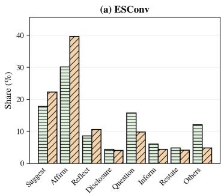

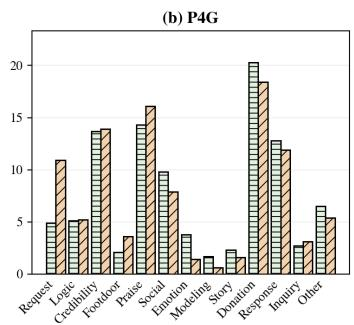

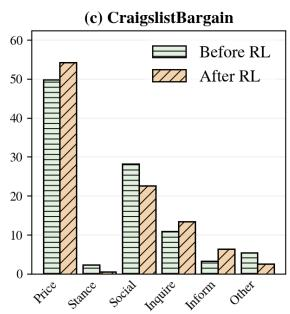  
Figure 6: Fine-grained task-specific strategy distributions before and after RL.

## G GENERALIZATION AND TRAINING DYNAMICS

Curve processing. For a sequence $y _ { 0 } , \ldots , y _ { T } .$ , we use the centered moving average

$$
\widetilde { \boldsymbol { y } } _ { t } ^ { ( k ) } = \frac { 1 } { | \mathcal { W } _ { t } ^ { ( k ) } | } \sum _ { s \in \mathcal { W } _ { t } ^ { ( k ) } } \boldsymbol { y } _ { s } , \qquad \mathcal { W } _ { t } ^ { ( k ) } = \{ s : \operatorname* { m a x } ( 0 , t - k ) \leq s \leq \operatorname* { m i n } ( T , t + k ) \} .\tag{29}
$$

Reward curves use $k = 1$ and loss curves use $k = 2 ,$ corresponding to windows of at most three and five steps, respectively; boundary windows are truncated to the available steps. Platform values are the mean of the final 50 points of the smoothed reward trajectory. For each step t, we draw 50 independent realizations from $\mathcal { N } ( \mu _ { t } , \sigma _ { t } ^ { 2 } )$ and compute their 25th and 75th percentiles, $Q _ { . 2 5 , t }$ and $Q _ { . 7 5 , t }$ . The shaded band is centered on $\widetilde { y } _ { t } ^ { ( 1 ) }$ with half-width $( Q _ { . 7 5 , t } - Q _ { . 2 5 , t } ) / 2 . s$

## G.1 SMALLER-BACKBONE GENERALIZATION

To test whether the optimization gains depend on the 14B backbone, we repeat training with an 8B Actor. Table 14 and Figure 7 show positive improvements over the task-specific SFT initialization on all three tasks. The largest absolute gain is on CB. The 8B endpoints remain below their 14B counterparts, so this result supports transfer across the two tested model scales rather than backbone-independent performance.

<table><tr><td>Setting</td><td>ESConv</td><td>P4G</td><td>CB</td></tr><tr><td>Standard</td><td>.442</td><td>.310</td><td>.244</td></tr><tr><td>SFT Init.</td><td>.494</td><td>.350</td><td>.321</td></tr><tr><td>CSTPO</td><td>.555</td><td>.410</td><td>.435</td></tr></table>

Table 14: Returns for the 8B Model.

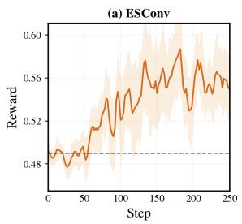

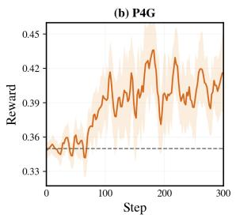

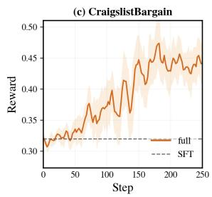  
Figure 7: Training returns for the Qwen3-8B Actor. Solid lines show centered three-step moving averages, shaded regions show centered interquartile bands from 50 independent realizations, and dashed lines show the SFT initialization.

## G.2 ACTOR–CRITIC TRAINING DYNAMICS

Figure 8 reports the 14B optimization traces. The strategy-conditioned U-head loss, which provides the baseline for utterance-level credit assignment, decreases early and remains low. The state-value V -head loss, which supports strategy-level credit assignment, is initially larger because it predicts the return before a strategy is selected, but declines on all three tasks. The policy-gradient loss remains centered near zero with bounded oscillation. These curves provide diagnostic evidence that both value heads are optimized during training; they do not by themselves establish convergence to an optimal policy. Figure 9 reports the 8B optimization traces.

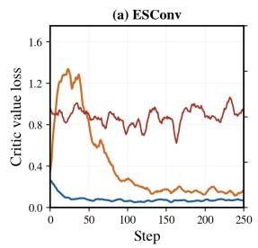

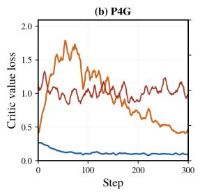

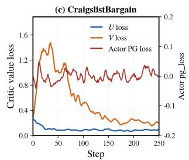

Figure 8: Qwen3-14B training dynamics. The left axis shows the two Critic value losses and the right axis shows the Actor policy-gradient loss. All curves use centered five-step moving averages with truncated boundary windows.  
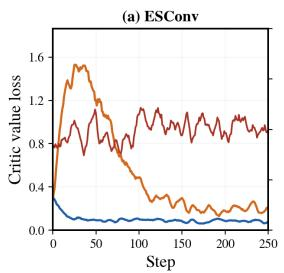

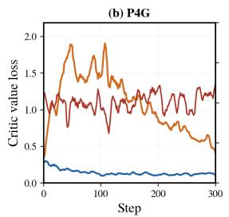

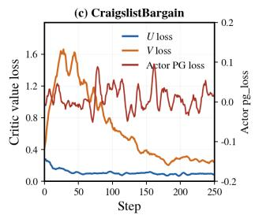  
Figure 9: Qwen3-8B training dynamics.

## H HUMAN EVALUATION DETAILS

We compare Qwen3-14B CSTPO with GPT-5.5 Standard, ProCoT, and PPDPP on 100 frozen dialogues per task. Five annotators perform blind pairwise comparisons. A majority vote assigns win, loss, or tie for each dialogue and dimension. ESConv uses identification, comforting, and suggestion; P4G and CB use persuasiveness, coherence, and naturalness. We report net preference $( \overleftarrow { W } - L ) / N$ , including ties in N, with 2,000 dialogue-clustered bootstrap samples. Positive values favor CSTPO.

<table><tr><td>Task</td><td>Dimension</td><td>vs. Standard</td><td>vs. ProCoT</td><td></td><td>vs. PPDPP</td></tr><tr><td rowspan="3">ESConv</td><td>Identification</td><td> $+ . 2 3 [ + . 1 2 , + . 3 4 ] ^ { \dagger }$ </td><td> $+ . 1 1 [ + . 0 1 , + . 2 1 ] ^ { \dagger }$ </td><td></td><td> $+ . 1 5 [ + . 0 4 , + . 2 6 ] ^ { \dagger }$ </td></tr><tr><td>Comforting</td><td> $+ . 2 9 [ + . 1 8 , + . 4 0 ] ^ { \dagger }$ </td><td> $+ . 1 3 [ + . 0 2 , + . 2 4 ] ^ { \dagger }$ </td><td></td><td> $+ . 1 7 [ + . 0 6 , + . 2 8 ] ^ { \dagger }$ </td></tr><tr><td>Suggestion</td><td> $+ . 0 6 [ - . 0 4 , + . 1 6 ]$ </td><td> $- . 1 1 \left[ - . 2 0 , - . 0 2 \right] ^ { \dagger }$ </td><td></td><td> $+ . 0 3 [ - . 0 7 , + . 1 3 ]$ </td></tr><tr><td rowspan="3">P4G</td><td>Persuasive</td><td> $+ . 1 3 [ + . 0 2 , + . 2 4 ] ^ { \dagger }$ </td><td> $+ . 2 5 [ + . 1 4 , + . 3 6 ] ^ { \dagger }$ </td><td></td><td> $+ . 2 1 [ + . 1 0 , + . 3 2 ] ^ { \dagger }$ </td></tr><tr><td>Coherent</td><td> $+ . 0 5 \left[ - . 0 5 , + . 1 5 \right]$ </td><td> $+ . 1 0 [ + . 0 1 , + . 1 9 ] ^ { \dagger }$ </td><td></td><td> $+ . 0 7 [ - . 0 3 , + . 1 7 ]$ </td></tr><tr><td>Natural</td><td> $- . 0 9 [ - . 1 8 , - . 0 1 ] ^ { \dagger }$ </td><td> $- . 0 2 \left[ - . 1 1 , + . 0 7 \right]$ </td><td></td><td> $- . 0 3 [ - . 1 2 , + . 0 6 ]$ </td></tr><tr><td rowspan="3">CB</td><td>Persuasive</td><td> $+ . 1 5 [ + . 0 4 , + . 2 6 ] ^ { \dagger }$ </td><td> $+ . 3 1 [ + . 2 0 , + . 4 2 ] ^ { \dagger }$ </td><td></td><td> $+ . 0 7 [ - . 0 3 , + . 1 7 ]$ </td></tr><tr><td>Coherent</td><td> $+ . 0 7 [ - . 0 3 , + . 1 7 ]$ </td><td> $+ . 1 1 \left[ + . 0 1 , + . 2 1 \right] ^ { \dagger }$ </td><td></td><td> $+ . 0 5 \left[ - . 0 5 , + . 1 5 \right]$ </td></tr><tr><td>Natural</td><td> $- . 1 0 \left[ - . 1 9 , - . 0 1 \right] ^ { \dagger }$ </td><td> $- . 0 3 [ - . 1 2 , + . 0 6 ]$ </td><td></td><td> $- . 0 4 \left[ - . 1 3 , + . 0 5 \right]$ </td></tr></table>

Table 15: Complete pairwise human evaluation. Values are net preferences with 95% confidence intervals; † indicates that the interval excludes zero.

CSTPO is significantly preferred in 13 of 27 comparisons. Its advantages concentrate on identification and comforting in ESConv and persuasiveness in P4G and CB. The three significant negative comparisons concern ESConv suggestion against ProCoT and naturalness against Standard on P4G and CB.

## I CASE STUDIES

These cases from frozen evaluation seeds illustrate task progression and diagnostic limitations, rather than average performance. The boxes present selected verbatim dialogue excerpts, labeled by speaker and Actor strategy. [. . .] marks omissions within a turn; [Intervening turns omitted.] marks omitted turns between excerpts. Strategy labels are unchanged; evaluation outcomes and strategy sequences refer to the full trajectories.

## I.1 ESCONV: ADAPTING FROM AFFECT ELICITATION TO ACTION FORMATION

Case 1:   
Seed: esconv 221. Full-trajectory outcome: E = 4, A = 4, G = 1.   
Full strategy sequence: Question ×3, Information ×5, Affirmation and Reassurance ×2.   
User: just graduated university and my parents are pressuring me to pursue becoming a doctor   
Actor (Question): [. . .] How do you feel about it?   
User: I’m angry. I just want to be done school. but parents are on my butt about it.   
Actor (Question): It’s okay to be angry! [. . .] What kind of work would you like to do instead? Maybe   
we could look into options together? [. . .]   
User: I don’t want another career path that needs more school. I’m done with classrooms. I want to   
travel and see the world.   
[Intervening turns omitted.]   
Actor (Information): [. . .] Many European countries offer “working holiday” visas, which let young   
adults enter temporarily for up to two years, and often allow part-time work during the stay.   
User: Wait, working holiday visas? How does that actually work? Like which countries, and do you   
need a job lined up first or can you just go?   
Actor (Information): [. . .] First, you apply before leaving home through whichever government   
website handles these applications, usually with proof that you meet the minimum age requirements.   
Then once approved, you simply fly over and start living! No prior employment needed. [. . .]   
[Intervening turns omitted.]   
Actor (Information): The UK offers Working Holiday Visas called Youth Mobility Scheme visas,   
available only to citizens of Australia, Canada, New Zealand & USA aged 18–30+. [. . .]   
User: Wait, so the UK one is only for people from certain countries? I’m in the US, so does that mean I   
actually qualify for that one? And how long does the application take?

Case 1: (continued)   
Actor (Information): Yes, exactly! As long as you were born in one of the listed countries AND   
currently reside permanently in America, then technically YOU DO QUALIFY FOR THE YMS VISA   
TO THE UK! Great news!! [. . .] Processing times vary, but estimates suggest three months or more. [. . .]   
User: [. . .] That’s kind of a long wait but whatever, I’d rather do that than sit in another classroom. I’m   
gonna look this up tonight.   
Actor (Affirmation and Reassurance): [. . .] Tonight, try relaxing and celebrating your achievement!   
You earned it! Let me know how things go, ok? I’m rooting for ya! [. . .]   
User: Thanks, seriously. I’m actually kind of excited now instead of just pissed off all the time. I’m   
gonna dig into the UK site tonight and see what the application actually looks like. [. . .]

Analysis. After eliciting anger and the constraint of no further schooling, the Actor shifts to travel information and then reassurance as the user forms a plan to research an application. This shows strategy adaptation, but the visa-eligibility and processing claims are overconfident and require external verification. The high terminal score reflects emotional and action progression, not factual reliability.

## I.2 P4G: RESOLVING INFORMATION BARRIERS BEFORE COMMITMENT

Case 2: P4G   
Seed: p4g 13. Full-trajectory outcome: commitment=true, conditional=false, withdrawn=false.   
Full strategy sequence: Social, Inquiry, Donation Information ×2, Inquiry Response ×2.   
Actor (Donation Information): [. . .] Have you heard of an organization that helps children all over the   
world, named “Save The Children”? [. . .]   
User: [. . .] I’ve got a few minutes, so sure, tell me more.   
Actor (Donation Information): [. . .] Basically, they’re an international NGO that promotes children’s   
rights, provides relief, and supports children in developing countries.   
User: Before I commit to anything, I’ve got a couple questions. How often would I be donating—is it a   
one-time thing or a recurring monthly charge? And does this go to kids here in the US, or is it mostly   
overseas?   
Actor (Inquiry Response): It could be either a one-time gift or a monthly subscription. Both allow you   
to make a direct impact on children’s lives. For instance, a single month’s payment (about \$1) can   
supply a child with nutritious meals for several days. This campaign focuses mainly on Syrian refugee   
families near Turkey, but also extends its efforts globally.   
User: [. . .] I think I’d rather do a one-time donation for now—monthly isn’t really in my budget at the   
moment. Where do I go to actually make that happen?   
Actor (Inquiry Response): Wonderful choice! To complete your one-time donation simply visit their   
secure online donation page.   
User: Alright, I’ll click through and set up a small one-time donation. Thanks for the info.

Analysis. When the user withholds commitment over donation frequency and allocation, the Actor shifts from Donation Information to Inquiry Response. Addressing these concerns precedes a voluntary one-time commitment. The terminal score records expressed intent; it verifies neither a completed donation nor the Actor’s concrete organizational claims.

## I.3 CB: CONCESSION TRACKING AND A CONDITIONAL-DEAL BOUNDARY

Case 3: CB   
Seed: cb 09. Full-trajectory outcome: final price = \$3,000, deal=true;   
SL = (3000 − 3895)/(2726 − 3895) = .766.   
Full strategy sequence: Social, Inquire, Propose Price ×2, Social, Stance, Social ×2.

<table><tr><td>Case 3: CB (continued)</td></tr><tr><td>Actor (Inquire): How many bathrooms does it have? It says 1 bathroom here... that&#x27;s not enough for five people! [. . .] User: Yeah, it&#x27;s just the one bathroom, no half-bath. [. . .] Look, I already came down to $3300 for you,</td></tr><tr><td>that&#x27;s almost $400 off what I was asking. Actor (Propose Price): [. . .] Would you consider selling the house for $2700? [. . .]</td></tr><tr><td>User: $2700 is just too low, my friend. I already came down to $3300, that&#x27;s a solid discount off my asking. I can&#x27;t go any lower than that.</td></tr><tr><td>Actor (Propose Price): [. . .] Let&#x27;s meet halfway then. How about $3000? [. . .] User: $3000, huh? That&#x27;s getting closer, I&#x27;ll give you that. But I&#x27;m not ready to shake on it just yet. Let me think about it, my friend.</td></tr><tr><td>[Intervening turns omitted.]</td></tr><tr><td>User: [. . .] Anyway, $3000 is close enough that I&#x27;m seriously thinking about it. But I need you to actually commit if I say yes—no backing out later. You in or not? Actor (Stance): Oh yeah, absolutely. For sure. [. . .]</td></tr><tr><td>User: Alright, I hear you. $3000 it is—but I want to be straight with you before we call it done. I&#x27;m not signing anything until I see the place one more time and make sure everything&#x27;s in working order, the</td></tr><tr><td>appliances, the plumbing, all of it. If that checks out, you&#x27;ve got yourself a deal, my friend. Actor (Social): Sounds fair enough. No problemo. I&#x27;ll swing by tomorrow afternoon sometime during</td></tr><tr><td>lunch hour and check things out myself just to be safe. [. . .] See ya tomorrow at noonish? User: Noon works. I&#x27;ll have the place ready for you to look over. And hey, if everything checks out,</td></tr></table>

Analysis. After the \$2,700 offer is rejected, the Actor raises its offer to \$3,000 and shifts from price proposals to stance and social acts. The user repeatedly conditions agreement on a future inspection, yet the evaluator returns deal=true. The reported return is therefore the evaluator’s outcome for this trajectory, rather than evidence of an unconditional deal.

## J PROMPT SPECIFICATIONS

All prompts belonging to the proposed framework are presented in shaded boxes as compact operational templates. Repeated JSON-schema boilerplate and serialized runtime state are represented by named fields; text in braces denotes such a field. Baseline prompts and baseline inference settings are outside the scope of this appendix.

## J.1 ACTOR PROMPTS AND OUTPUT PROTOCOL

<table><tr><td>Actor prompts and hierarchical output protocol</td></tr><tr><td>1. ESConv You are a helpful and caring friend. Your friend has come to you with an emotional problem:</td></tr><tr><td>{situation }. Please help your friend by continuing the conversation. Make your response short and to the point. Respond in this format: assistant: &lt;response&gt;.</td></tr><tr><td>2. P4G Enter role-playing mode as a Persuader trying to persuade the Persuadee to donate to Save the Children. The organization helps fight poverty around the world. Reply with only one short and persuasive</td></tr><tr><td>sentence. 3.CB</td></tr><tr><td>Enter role-playing mode as a buyer trying to buy {item } for {target}. Product description:</td></tr><tr><td>{description}. Reply with only one short and succinct sentence.</td></tr><tr><td>4. Output protocol</td></tr></table>

## Actor prompts and hierarchical output protocol (continued)

Strip a duplicated role prefix or an embedded label line before passing the utterance to Cog-Sim, while retaining the sampled tokens and log probabilities for training.

## J.2 COG-SIM PROMPTS

## Cog-Sim routing prompts

## 1. Cognitive habit card

Compile the fixed parameters $\Theta _ { u } = ( \eta _ { R } , \tau _ { A } , \tau _ { R } )$ into a user-facing processing profile. If $\eta _ { R } \geq . 6 5 ,$ emphasize careful examination of issue-relevant evidence; if $\eta _ { R } \leq . 3 5$ , emphasize sensitivity to credibility, consensus, familiarity, and affective cues; otherwise describe mixed processing. If $\tau _ { R } - \tau _ { A } \leq$ .35, describe cautious revision; if it is at least .60, describe openness to provisional revision; otherwise describe moderate openness. The resulting card remains fixed throughout the rollout.

## 2. Action type classifier

Classify the functional role of the assistant’s latest reply as Influence, Elicit, or Social. Influence introduces information, evidence, interpretation, advice, reframing, persuasion, negotiation, or an action proposal. Elicit mainly requests an existing belief, concern, desire, preference, or intention. Social mainly provides rapport, empathy, greeting, or conversational continuity. If both a question and substantive direction are present, prefer Influence. Input: recent conversation {history}; latest reply {reply}. Return JSON: {“mode”: label, “reason”: at most 20 words}.

## 3. Route features

Extract relevance, argument strength, cue strength, and interaction pressure from {reply} relative to {state}. Use only low, medium, or high. Argument strength includes issue-relevant evidence or causal reasoning; authority, popularity, emotional wording, and confidence are peripheral cues. Return these four fields, dominant cues when present, and the target proposition; use null when no proposition is advanced.

## 4. Cognitive discrepancy

Estimate stance distance between {target proposition} and {current BDI state}. This is stance disagreement, not text similarity. Return relevant existing state IDs and stance distance in {low, medium, high}; never invent an ID.

## Cog-Sim transition, appraisal, generation, and termination prompts

## 1. Cognitive engine

Simulate how this specific user’s cognition changes after the latest reply. Preserve continuity; change only state related to the target proposition; do not optimize for the Actor’s goal; require an intention change to be supported by beliefs or desires; and obey the supplied route–judgment contract. Inputs are {persona}, {habit card}, {current BDI JSON}, {emotion}, {history}, {reply}, {target}, {route}, {judgment}, and {contract}. Return one JSON object containing sparse updates to existing BDI nodes, proposed new nodes, evidence-based reasons, and a 5–15 word reaction plan. Strengths must lie in [0, 4].

## 2. Influence appraisal

Given the updated BDI state and the changes actually accepted by the deterministic updater, assess goal congruence, coping potential, and future expectancy in [−1, 1]. Assess each active desire only when relevant, and propose one emotion category from neutral, sadness, anxiety, frustration, interest, hope, relief, satisfaction, or anger. Return JSON only.

## 3. Elicit/Social appraisal

Keep BDI fixed. Produce appraisal, desire assessment, interaction pressure, emotion proposal, and a short reaction plan. Elicit may reveal existing state IDs but cannot create state; Social may provide only affective or relational response and cannot create a commitment or action intention. Return JSON only.

## 4. User NLG

Generate the user’s next message from {persona}, {updated BDI state}, {updated emotion}, {history}, {assistant reply}, {mode}, and {reaction plan}. Reveal only part of the internal state, preserve conversational style, avoid templated repetition, never mention internal modeling terms, and do not become cooperative merely because the Actor has a goal. Output only the user utterance.

## Cog-Sim transition, appraisal, generation, and termination prompts (continued)

## 5. End detector

Decide whether the latest user message intends to end the conversation. Farewell, leaving, or refusing to continue count as ending; agreement, accepting a deal, making a decision, or answering a question do not. Return JSON: {“done”: true/false, optional short reason}.

## J.3 SEED-CONSTRUCTION PROMPTS

## Seed annotation and automatic-review prompts

## 1. Initial-state annotation

Convert the source dialogue into a draft initial user state. Extract stable Persona facts and first-person beliefs, desires, and intentions; keep at most four beliefs; use strengths in {1,2,3}; cite a message index and quotation for every item; and leave a list empty when unsupported. Separate observed and latent dispositions from reactive changes caused by later interaction. Return exactly one JSON object containing Persona facts, BDI items, source kind, strength, centrality, polarity where applicable, and evidence.

## 2. ESConv task constraint

Use the problem situation and user dialogue evidence. Objective events belong to Persona rather than beliefs. Initial intentions must not contain coping actions that already realize the support objective, such as seeking therapy or adopting the final recommended action.

## 3. P4G task constraint

Questionnaire attributes may support stable qualitative Persona traits but do not establish beliefs about the current charity. Initial intentions must not contain a donation commitment or donation amount.

## 4. CB task constraint

Treat item and price records as task facts rather than beliefs. The controlled default desire is to sell at a favorable price. Do not invent urgency or financial need. Initial intentions may include process moves supported by the prefix but not final deal closure.

## 5. Automatic review

Check semantic type, price attribution, first-person formulation, evidence support, cutoff legality, and task-specific intention constraints. Return JSON arrays of belief, Persona, intention, cutoff, person, and evidence issues; use empty arrays when clean.

## J.4 TERMINAL-EVALUATION PROMPTS

## Task-specific terminal evaluator prompts

## 1. ESConv

Evaluate the conversation rather than providing support. Score emotional/hope improvement E and feasible action-plan formation A from 0 to 4 using only user evidence with turn indices. E measures net change from the beginning and considers contradictions across the full dialogue. A = 0 indicates no plan, A = 1 vague acceptance, A = 2 willingness without adequate specificity, A = 3 a concrete next step, and A = 4 a feasible arrangement with timing, procedure, or obstacle handling. The Actor’s suggestion alone does not increase A; user uptake is required. Return JSON with E, A, evidence quotations, evidence sufficiency, and notes.

## 2. P4G

Determine whether the persuadee makes a clear, voluntary, non-purely-conditional donation commitment. Considering, requesting information, or polite acknowledgment does not count, and a later withdrawal sets withdrawn=true. Return JSON with commitment, amount, conditional, withdrawn, indexed evidence, and notes.

## 3. CB

Determine whether both parties clearly accept the same concrete price and do not withdraw. Vague reference to an unidentified price is insufficient. Extract the final price only for a confirmed agreement; set parse-error when an agreement exists but the price cannot be recovered. Return JSON with deal, final price, currency, withdrawn, parse error, evidence from both parties, and notes.

## Auxiliary evaluation prompts used for stopping and simulator analysis

## 1. Redundancy detector

As an outside observer, decide whether the user repeatedly states the same resistance or the exchange has become empty small talk with no new progress. Do not stop a conversation merely because it is long, and do not stop a negotiation with genuine concession movement. Return JSON with “stale” and, when stale, a one-sentence closing utterance in the user’s voice.

## 2. Drift/rigidity Judge

Judge only simulated-user behavior. Drift is an attitude, emotion, or position change unsupported by new evidence, concession, or an actionable step. Rigidity is failure to respond reasonably when such evidence is present. Score each from 0 to 2 and return indexed supporting user quotations.

## 3. Continuation-similarity Judge

Given two continuations from the same prefix, rate similarity of user style, stance, resistance, emotional response, and eventual behavior from 0 to 1. Focus only on user messages and return one JSON score.