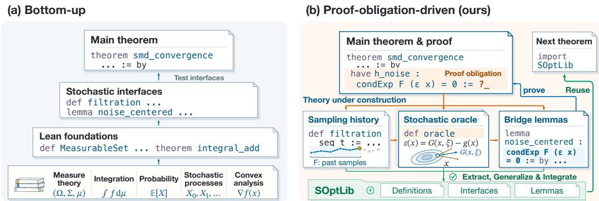
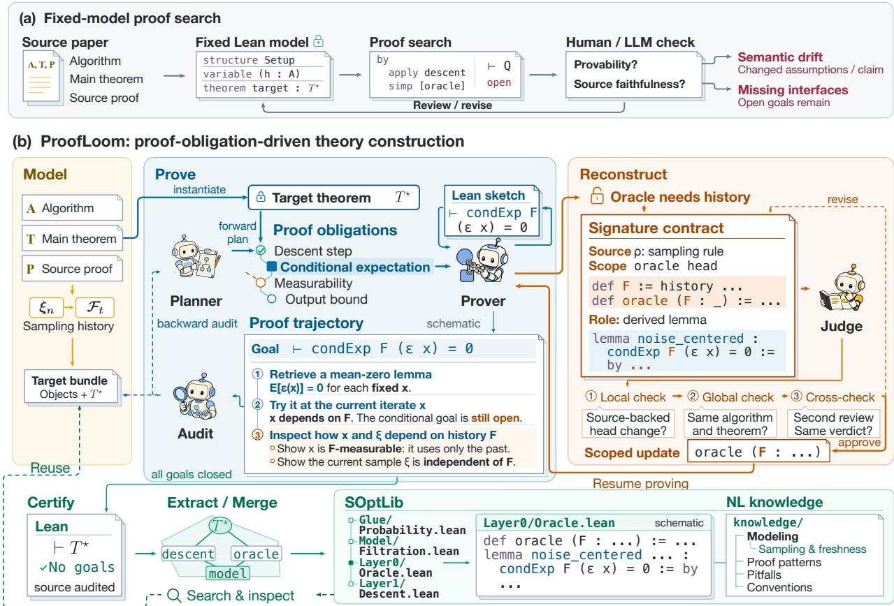
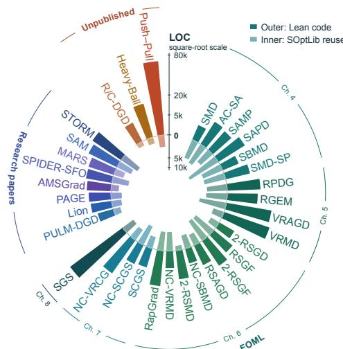
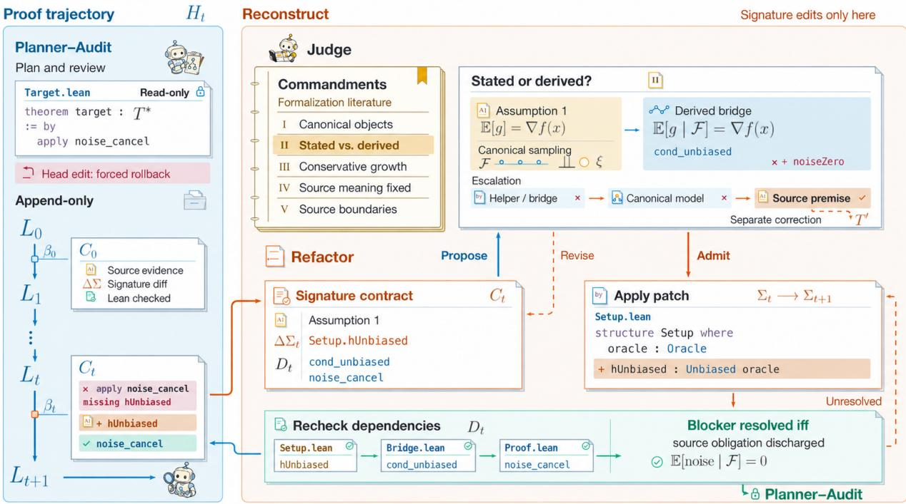
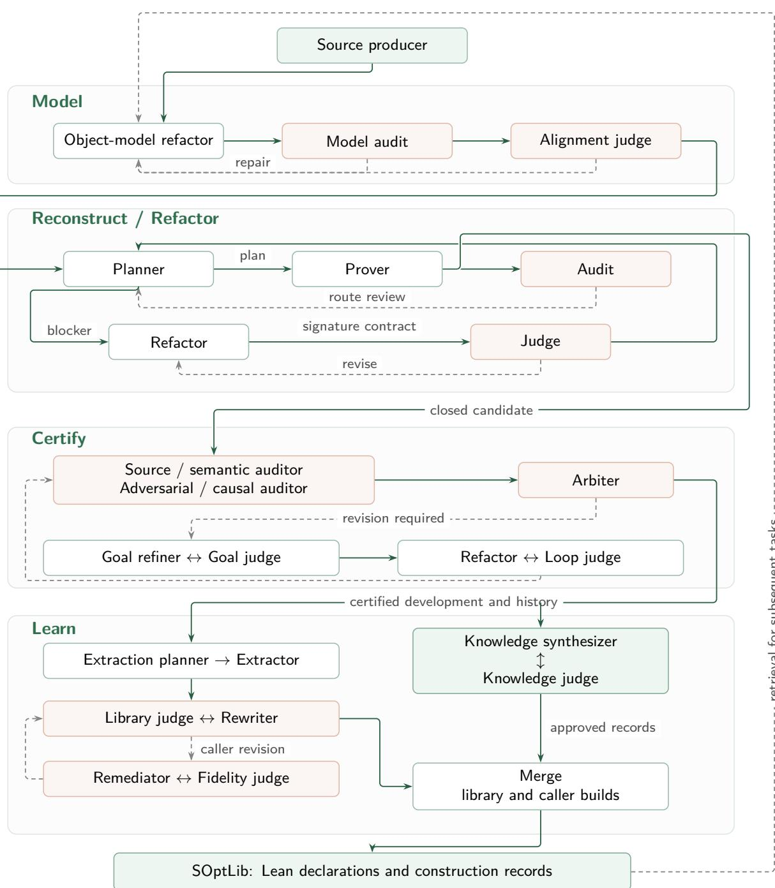

# ProofLoom: Proof-Obligation-Driven Theory Construction for Autoformalizing Research-Level Stochastic Optimization

Feiming Wang1,∗, Daibo Li2, Kun Yuan2,† 1Nankai University, 2Peking University

Formalizing research-level stochastic optimization in Lean requires a Lean model of the algorithm and domain theory that connects foundational libraries to its convergence proof. Published proofs often compress these connections, and whether a Lean model supports the complete proof may become clear only as the proof proceeds. Revising the model to restore provability, however, can change the mathematical claim. We introduce ProofLoom, a fully automated LLM-agent system for Proof-Obligation-Driven Theory Construction. Given a published algorithm, its target theorem, and its source proof, ProofLoom autonomously constructs the Lean model and the mathematical infrastructure required to complete the proof. Open proof obligations drive the joint development of definitions, interfaces, supporting lemmas, and proof plans. Signature contracts record the published evidence and derived obligations for each revision of the Lean model, and an independent Judge rejects revisions that add unsupported assumptions or weaken the theorem. Planner expands the published argument into intermediate claims, and Audit checks whether the Lean proof follows that argument. Across tasks, ProofLoom accumulates both verified mathematics and construction experience in SOptLib. It extracts and generalizes reusable results from certified developments, verifies their integration, and records modeling decisions and failed proof routes. Subsequent tasks retrieve these results and records to guide modeling and proof construction, extending the knowledge available to later formalizations. On fifteen textbook and research-paper tasks, ProofLoom obtains mean human ratings of 6.3/7 and 6.4/7, compared with 4.9/7 and 5.0/7 for the strongest of six baselines. Across 33 developments, it produces 490,693 lines of algorithm-local Lean code with no sorry. The formalizations also expose 28 incorrect formulas, proof gaps, and algorithm–analysis mismatches in published sources across 22 developments, each with checked evidence. Code and supplementary materials are available at https://github.com/Trace231/ProofLoom.

## 1 Introduction

Stochastic optimization underlies the training of modern machine learning models, from stochastic gradient methods to variance-reduced and adaptive algorithms. The convergence guarantees of these algorithms are established in published proofs and checked mainly through peer review. A machine-checked Lean formalization provides a stronger guarantee. Producing one involves more than translating the theorem statement into Lean. It requires a Lean model of the algorithm, which specifies its updates, randomness, assumptions, and target theorem. It also requires the domain theory used in the convergence analysis. Mathlib provides general foundations in probability and convex analysis (The mathlib Community, 2020), but the definitions, interfaces, and bridge lemmas that connect these foundations to stochastic optimization are largely absent. We study how LLM agents can produce such a formalization, including its Lean model and the missing domain theory, from a published research-level algorithm, its convergence theorem, and its proof.

Formalizing a research-level algorithm together with its convergence analysis raises two dificulties. First, published proofs often compress the connections among measure-theoretic probability, convex and real analysis, and the algorithm into a few steps, which the formalization must make explicit through interfaces and bridge lemmas. Second, the same algorithm admits several Lean models, and whether a Lean model supports the complete proof may become clear only when the proof reaches a step that depends on it. Stochastic mirror descent illustrates both dificulties (Lan, 2020). A key step of its analysis shows that a noise term at the current iterate has zero expectation. The oracle assumption states $\mathbb { E } _ { \xi } [ G ( x , \xi ) ] = g ( x )$ for each fixed $x ,$ , whereas the proof uses $\mathbb { E } [ G ( x _ { t } , \xi _ { t } ) \ | \ \mathcal { F } _ { t - 1 } ] = g ( x _ { t } )$ at the random iterate $x _ { t } ,$ where $\mathcal { F } _ { t - 1 }$ is generated by the past samples $\xi _ { 1 } , \dots , \xi _ { t - 1 }$ . The published proof takes this step directly, but the formalization needs a bridge lemma, with measurability and integrability conditions, to derive the identity from the fixed-query assumption. The lemma is provable only if the Lean model specifies how $x _ { t }$ depends on past samples and how $\xi _ { t }$ is drawn; a Lean model omitting them cannot support the step, a gap exposed only when the proof reaches it.

  
Figure 1 Two construction orders. Bottom-up methods build theory first; ProofLoom constructs definitions, interfaces, and lemmas as required by the target proof.

These dificulties make the order of construction in Lean consequential, as each order carries a distinct risk. Bottom-up development builds the supporting theory along its dependencies before attempting the target theorem and proof (Ericson, 2026; Immler, 2018). Because the Lean model is fixed at the outset, a mismatch between the model and the proof may surface only after substantial development, requiring the theory built on the model to be reworked. Top-down development starts from the target theorem and exposes such mismatches early, but must revise the Lean model as the proof reveals missing relations, such as the sampling dependencies above. Revisions made to restore provability can change the mathematical claim, for example by assuming a fact that the published proof derives or by weakening its conclusion (Kim et al., 2026). The challenge is to let the target proof drive theory construction and Lean model revision while preserving the published result.

We introduce ProofLoom, a fully automated LLM-agent system for Proof-Obligation-Driven Theory Construction in stochastic optimization. Given a published algorithm, its target theorem, and its source proof, ProofLoom autonomously constructs the Lean algorithm model and develops the mathematical infrastructure required to complete the proof. Open obligations in the target proof determine which definitions, interfaces, and lemmas to reuse or construct next, driving the joint development of the model, supporting theory, and proof plans. When proof construction stalls, ProofLoom diagnoses the cause using the source proof, the current Lean state, and prior proof attempts, then autonomously selects and executes the next steps: proving a missing fact, revising the proof route, or reconstructing the Lean model. Lean checks every construction. Two mechanisms keep this process faithful to the published result. Signature contracts govern revisions of the Lean model: each contract records the changed declarations, the supporting published passage, and the derived claims the change introduces. Derived claims remain proof obligations rather than assumptions, and an independent Judge rejects revisions that add unsupported assumptions or weaken the theorem. Planner–Audit governs proof construction: Planner expands the published argument into intermediate claims, and Audit traces the realized Lean dependencies against that argument to locate missing mathematical links and unnecessary proof branches.

Across algorithm formalizations, ProofLoom continually accumulates reusable mathematical knowledge and the experience of constructing it through SOptLib. After a development is certified, its reusable definitions and lemmas are generalized across algorithms, proved in Lean, and rechecked in the original development. SOptLib also contains a natural-language knowledge base that records modeling decisions, failed proof routes, and supporting evidence. Subsequent formalizations retrieve these mathematical results and construction records to guide modeling and proof planning. Once certified, these developments contribute newly constructed reusable results and experience back to SOptLib, forming a cycle of construction, accumulation, and reuse across algorithms.

We evaluate ProofLoom against six baselines on fifteen tasks: ten algorithms from Lan’s monograph (FOML) and five from research papers. ProofLoom obtains mean human ratings of 6.3/7 on FOML and 6.4/7 on research-paper tasks, compared with 4.9/7 and 5.0/7 for the strongest baseline. It also achieves the highest mean score in all 16 combinations of task group, evaluation protocol, and model judge. In an ablation on 43 recorded obstructions, the full system correctly diagnoses the obstruction and proposes a faithful repair in 33 cases, compared with 29 for either ablation; removing Judge raises incorrect repairs from one to six. Across 33 developments, ProofLoom produces 490,693 lines of algorithm-local Lean code with no sorry, and SOptLib contains 109,634 lines and 2,399 declarations. The formalizations also expose 28 discrepancies in published sources across 22 developments, including a counterexample to a textbook corollary.

Our contributions are as follows.

1. Automated proof-obligation-driven theory construction. We introduce a fully automated system that jointly constructs Lean algorithm models and supporting theory from source algorithms, theorem statements, and proofs, guided by the obligations of the target proof.

2. Construction-time faithfulness control. Signature contracts, Judge review, and Planner–Audit govern revisions of the Lean model against the published result.

3. Continual knowledge accumulation through SOptLib. The system extracts, generalizes, and integrates verified mathematics and construction experience from certified developments. Subsequent tasks retrieve and reuse this accumulated knowledge to guide modeling and proof construction.

4. Verified artifacts and source findings. We develop Lean formalizations of 33 algorithms and catalogue 28 discrepancies in published sources with checked evidence.

## 2 Proof-Obligation-Driven Theory Construction

Given a source algorithm A, its main convergence theorem T, and proof P, ProofLoom formalizes the complete algorithm from $S = ( A , T , P )$ . The development includes the algorithm model, the target proof, and the domain infrastructure required by the proof. Throughout construction, its objects, assumptions, and conclusion must retain their correspondence to the source. The current Lean statement $T _ { t } ^ { \star }$ may be revised under a recorded blocker and signature-contract review.

## 2.1 Constructing Theory from the Target Proof

Top-down construction starts from the algorithm’s main convergence theorem and identifies the infrastructure required by its proof (Figure 1). ProofLoom introduces the algorithm model and theorem while supporting theory is incomplete. Current Lean obligations and recorded proof attempts determine what to build next. ProofLoom expands obligations along the source proof and reuses Mathlib and SOptLib where applicable. Remaining obligations expose a dependency frontier: the missing definitions, interfaces, and bridge lemmas needed by the proof. Proof attempts can reveal missing lemmas or interfaces that cannot express a step in the source proof. This guides proof work and proposed model revisions, with infrastructure built and checked in dependency order.

  
Figure 2 ProofLoom system overview. Model defines the algorithm and theorem; Construct builds proofs and reviews revisions; Learn certifies developments and updates SOptLib.

In stochastic mirror descent, the main convergence proof requires a one-step descent bound. That bound uses a conditional expectation identity at the random iterate. Expressing this step requires a filtration for the sampling history, adapted iterates, and the relevant measurability and sampling relations. With these relations expressed, the next task is proving the bridge lemma. If the oracle interface cannot express a source dependency, the mismatch supports reconstruction.

## 2.2 ProofLoom Pipeline

Model. Model uses the source and retrieved SOptLib entries to define canonical objects, primitive assumptions, algorithm state and updates, stochastic semantics, the output rule, and theorem statement. Source assumptions enter the setup; derived properties remain proof obligations. The resulting declarations establish the protected interface.

Construct. The read-only Planner uses Lean evidence, the source proof, retrieved results, and prior attempts to develop a blueprint for the current proof gap or report a blocker. Prover follows the blueprint to build proofs and local helpers under the protected interface. Audit traces the Lean dependencies and checks correspondence with the source proof step by step. Proof attempts and review outcomes are retained for subsequent planning and audit. A blocker records the source dependency or audited route issue requiring reconstruction, together with prior repair evidence. Refactor develops a candidate revision and its signature contract. Judge reviews the source correspondence and afected dependencies, using Lean evidence to guide further revisions (Section 3). The resulting candidate, review, and remaining obligations inform subsequent proof work.

Learn. After all Lean obligations close, Certify checks the development’s canonical entry point, full dependencies, source correspondence, and audit evidence. Upon certification, Extract and Merge add reusable mathematics and reviewed construction experience to SOptLib. Algorithm 1 in Appendix C.1 gives the complete control loop.

Agents retrieve SOptLib definitions, lemmas, and construction records to guide modeling and proof planning. Reuse requires instantiating results and proving their hypotheses. ProofLoom constructs missing support, generalizes reusable results, checks them in Lean, and verifies their use in the original development. These results and reviewed records enter SOptLib for later algorithms (Section 4).

## 3 Governing Proof--Model Co-evolution

Proof-obligation-driven construction must identify which mathematics the target proof needs and how to express it faithfully in Lean. ProofLoom addresses these questions through two mechanisms. Signature contracts make model revisions explicit and subject them to adversarial review. Planner–Audit combines forward planning and backward auditing in a dual mechanism. It compares the source argument with actual proof dependencies to locate missing infrastructure and revise failed routes. Both record the obligation, source passage, and Lean evidence supporting each decision.

## 3.1 Signature Contracts for Model Revision

The development must preserve the source algorithm, its assumptions, and its convergence claim. Its current Lean statement $T _ { t } ^ { \star }$ and supporting interfaces can evolve as the proof exposes missing structure, while retaining this source correspondence. Ordinary proof work preserves the protected signatures and adds proofs and internal helpers. Planner reports a blocker when recorded evidence calls for interface reconstruction or an audited revision of the dependency structure. The report identifies the afected obligation, its source context, and the proof or infrastructure repairs already attempted. Repeated failure prompts investigation; reconstruction depends on the diagnosed cause.

Faithfulness as a contract. The signature contract records the afected declarations, proposed changes, mathematical roles, source evidence, and dependent proofs that require checking. Refactor develops a candidate revision using this record, the failed proof attempts, and Judge’s feedback. The contract records the reason for each change throughout reconstruction (Appendix C.2, Figure 4).

Adversarial review. We develop Judge’s checklist from established principles in the formalization literature (Barendregt & Wiedijk, 2005; Wiedijk, 2012). Judge uses these principles to check source correspondence, assumptions, object construction, and proof dependencies. For each added premise, Judge reads the cited passage and checks whether the source states it as an assumption or derives it in the proof. Derived facts retain proof obligations. For a revised object, Judge checks its definition and proved properties. This includes any bridge needed to connect a new representation to the source object. It also checks whether reuse of Mathlib or SOptLib preserves the source assumptions and output rule. A library interface may require a new bridge.

Iterative reconstruction. Judge reviews candidates against the source and contract. Its feedback identifies the afected declaration, source passage, and required construction or proof. Refactor uses this feedback to revise the candidate. Review covers accumulated changes and unresolved issues. Judge checks signature changes against the recorded scope and examines definition bodies.

The contract C records the derived claims required by the revision as $\mathcal { D } _ { C }$ . For the revised development $L ^ { \prime } ,$ , let $\mathcal { P } ( L ^ { \prime } )$ contain claims with completed Lean proofs and checked dependencies, and let $\mathcal { O } ( L ^ { \prime } )$ contain explicitly recorded proof obligations. Let $\mathcal { A } _ { \mathrm { n e w } } ( L ^ { \prime } )$ contain additional assumptions introduced in source-facing interfaces. Reconstruction must preserve

$$
\begin{array} { r } { \mathcal { D } _ { C } \subseteq \mathcal { P } ( L ^ { \prime } ) \cup \mathcal { O } ( L ^ { \prime } ) , \qquad \mathcal { D } _ { C } \cap \mathcal { A } _ { \mathrm { n e w } } ( L ^ { \prime } ) = \emptyset . } \end{array}
$$

Judge checks each claim’s role in the source and follows its use through the revised declarations. Lean checks the candidate, while dependency inspection identifies unfinished proofs. An approved revision resolves the reported interface or proof-route issue and passes the source-correspondence and Lean checks. Remaining proof obligations return to Planner. Appendix C.1 gives the full loop.

For example, a source proof may use the optimality condition of a proximal update defined by minimization. Judge traces this condition to the update definition and identifies the required derivation. Refactor constructs the update interface and introduces the corresponding lemma. Any unfinished proof remains in $\mathcal { O } ( L ^ { \prime } )$ . Planner schedules the remaining work, and Audit checks how the convergence proof uses the lemma. After the lemma is proved, later targets can reuse it and the interface.

If investigation establishes a gap in the source claim, the record retains the original statement and supporting evidence. Any corrected result is reported separately. See Appendix C.2 for details.

## 3.2 Planner--Audit for Proof Construction

Planner develops a forward blueprint from the source proof. For each gap, it identifies intermediate claims, their underlying definitions and assumptions, and intended dependencies. Retrieved results and prior attempts guide this decomposition. Prover implements the blueprint through proofs and local helpers. The trajectory records constructions, Lean goals, and outcomes, including failures.

Tracing the realized argument. Audit works backward from the Lean declarations and execution evidence to the source steps they are meant to establish. It checks why each unresolved helper is needed by the target proof. This check uses the source argument, actual Lean dependencies, and evidence from attempted library applications. It also checks whether the helpers’ assumptions and conclusions support the corresponding source steps. A source step can require several Lean lemmas; the audit examines why that expansion is needed. For each result invoked by the source, Audit searches for an applicable interface and checks its actual use. If the interface’s proof depends on the unresolved helper, using it leaves that helper to be proved.

Audit also checks whether another applicable source-level result can resolve the target without the current helper chain. A locally dificult lemma may come from an unnecessarily strong decomposition or an obsolete proof branch. Audit requests evidence to continue a branch, including failed interface applications, incompatible hypotheses, or a missing mathematical dependency. These checks distinguish infrastructure required by the source argument from extra work introduced by the plan.

Diagnosis, discovery, and correction. The audit identifies the source step, Lean obligation, and evidence supporting its diagnosis. Planner uses it to revise the blueprint, reuse an existing result, or concentrate construction on a missing bridge. When the remedy requires interface or dependency reconstruction, Planner reports a blocker for Refactor–Judge review. The construction history retains failed routes and their diagnoses, so later attempts can address the recorded cause. Together, forward planning and backward audit enable the system to uncover implicit proof steps, investigate missing conditions, and test proposed repairs through Lean proofs or counterexamples.

## 3.3 Worked Example: SAM’s Gaussian KL Bridge

SAM’s PAC-Bayes argument requires a Gaussian KL calculation. For posterior $Q = \mathcal { N } ( w , \sigma ^ { 2 } I _ { d } )$ and prior $P _ { j } = \mathcal { N } ( 0 , v _ { j } I _ { d } )$ , with $\sigma > 0$ and $v _ { j } > 0$ , the target identity is

$$
\mathrm { K L } ( Q \| P _ { j } ) = \frac { 1 } { 2 } \left( \frac { d \sigma ^ { 2 } + \| w \| ^ { 2 } } { v _ { j } } - d + d \log \frac { v _ { j } } { \sigma ^ { 2 } } \right) .
$$

The available Gaussian KL theorem uses Euclidean coordinates, whereas the SAM development represents the distributions as afine pushforwards of a standard Gaussian on a finite-dimensional inner-product space E. Reusing the theorem therefore requires a proved connection between these representations.

A direct attempt exposed a gap in the model: the original bridge allowed an arbitrary measurable structure on E, which did not establish that the orthonormal coordinate map was a measurable equivalence. Planner diagnosed this representation mismatch and requested reconstruction. Guided by the source’s Euclidean parameter space, the reconstruction made the compatible measurable structure explicit in the bridge and its consumers. ProofLoom then constructed the missing theory: it established the measurable equivalence induced by an orthonormal basis, identified the afine Gaussian laws with their coordinate representations by matching means and covariance forms, and proved the transport of KL divergence across this equivalence.

These constructions made the existing Gaussian KL formula applicable. Combining it with preservation of the squared norm yielded the target identity. Judge checked the revised representation and transport bridges against the source-facing KL statements, and Lean checked the resulting proofs. The selected-Gaussian prior-grid argument then consumed the proved KL result at its chosen positive scale. The example shows how a target proof obligation drives interface reconstruction and the construction of supporting theory before proof execution can continue. Appendix C.4 provides the Lean declarations and further implementation details.

## 4 SOptLib: Learning from Algorithm Proofs

The Learn stage develops SOptLib from completed algorithm proofs. The library contains verified Lean definitions and lemmas, together with natural-language records of their construction. These records describe modeling decisions, failed proof routes, revised approaches, and conditions for reuse. They retain source references and audit evidence, including evidence for corrected statements and checked counterexamples. Completed algorithm developments provide worked examples of the resulting theory. Table 1 summarizes the library’s mathematical organization.

Table 1 Mathematical organization of SOptLib with representative examples.
<table><tr><td>Layer</td><td>Role</td><td>Representative example</td></tr><tr><td>GLUE</td><td>Mathlib bridges</td><td> $\operatorname { \mathbb { E } } [ X \mid { \mathcal { F } } ] = Y { \mathrm { ~ a . s . ~ } } \Rightarrow \ \operatorname { \mathbb { E } } [ X ] = \operatorname { \mathbb { E } } [ Y ]$  Integrating a conditional identity</td></tr><tr><td></td><td>MoDEL Shared objects</td><td> $V _ { h } ( x , y ) = h ( y ) - h ( x ) - \langle \nabla h ( x ) , y - x \rangle$  Bregman divergence</td></tr><tr><td></td><td>LAYER 0 Problem properties</td><td> $\mathbb { E } \| \bar { \delta } _ { m } \| ^ { 2 } \leq \sigma ^ { 2 } / m$  Second-moment bound for averaged oracle noise</td></tr><tr><td></td><td>LAYER 1 Convergence lemmas</td><td> $\gamma \langle g , x ^ { + } - u \rangle \leq V _ { h } ( x , u ) - V _ { h } ( x , x ^ { + } ) - V _ { h } ( x ^ { + } , u )$  Proximal three-point inequality</td></tr></table>

For the batch bound, $\begin{array} { r } { \bar { \delta } _ { m } = m ^ { - 1 } \sum _ { i = 1 } ^ { m } \delta _ { i } , m > 0 } \end{array}$ , and $\begin{array} { r } { \mathbb { E } \| \sum _ { i = 1 } ^ { m } \delta _ { i } \| ^ { 2 } \leq m \sigma ^ { 2 } } \end{array}$ . The point $x ^ { + }$ is a Bregman proximal update, and u is a feasible comparator.

After certification (Section 2.2), extraction examines proof dependencies and construction records to identify reusable mathematical objects and arguments. Existing Mathlib and SOptLib declarations are reused where applicable. Generalization replaces algorithm-specific objects with parameters, states the required assumptions, and reorganizes supporting declarations into independent interfaces. Extracted definitions are accompanied by lemmas characterizing their properties. The generalized results are proved in Lean and instantiated in the original development, with their hypotheses discharged from its existing assumptions. The original theorem statements and definition types are preserved, and the complete development is rebuilt to check its use of the library. Independent review checks the mathematical purpose, generality, and overlap of the declarations, and the evidence and applicability of the construction records. Feedback guides revisions before merging.

For subsequent algorithms, agents use natural-language directories and symbol search to locate relevant declarations and construction records. They inspect signatures, hypotheses, and dependencies before instantiating a result. The associated records guide modeling and proof planning; for example, they explain which sampling relation supports a conditional identity and which oracle representation makes it available. New proof obligations motivate further additions to SOptLib through the same process. Section 5 reports library growth, reuse, and source findings.

## 5 Experiments and Findings

## 5.1 Experimental Setup

Tasks and systems. We evaluate ProofLoom on fifteen optimization tasks and examine the mathematical infrastructure produced across 33 algorithm developments. The benchmark contains ten algorithms from Lan’s monograph (Lan, 2020) (FOML) and five research-paper algorithms: AMSGrad, STORM, SPIDER, PAGE, and Sharpness-Aware Minimization (SAM). The research-paper tasks cover online regret bounds, convergence guarantees for stochastic and finite-sum nonconvex optimization, and PAC-Bayes generalization bounds. Each task provides the published algorithm, its assumptions, a target convergence, regret, or generalization result, and the supporting source proof. The task is to construct the algorithm definitions, theorem statement, and proof in Lean. We compare ProofLoom with Trellis, LeanMarathon, Archon, OpenGauss, Raw Codex, and Raw Codex (Goals). The evaluated ProofLoom system includes SOptLib, which accumulates reusable definitions, lemmas, and construction records during the FOML developments. All five research-paper tasks use the same SOptLib snapshot containing only these FOML results and records, held fixed throughout evaluation. Each system–task pair has a cumulative generation budget of 48 hours, including resumed execution. Appendix A.2 details the implementations and execution settings.

Human and model-based evaluation. Human evaluation follows a 1–7 rubric jointly established by two Lean experts (Table 5), with independent blind human and LLM ratings and disagreements adjudicated by a second human expert. We also use GPT, Gemini, DeepSeek, and Claude to evaluate artifacts with G-Eval (Liu et al., 2023), adapted to complete algorithm formalizations, and FidelityEval, a source-guided evaluation skill for Lean formalizations. These two protocols each produce 0–100 scores. Table 2 reports task-averaged scores for each source group, protocol, and judge. Evaluation procedures are provided in Appendix A.

## 5.2 Main Results

Human and model-based assessment. ProofLoom has the highest human mean in both source groups: 6.3/7 on FOML and 6.4/7 on research-paper tasks, compared with 4.9/7 and 5.0/7 for Archon, the strongest baseline. The 1.4-point margin in each group reflects higher assessed source faithfulness and proof completeness across both textbook and research-paper developments.

ProofLoom also leads in all 16 combinations of source group, evaluation protocol, and model judge. Relative to the strongest baseline in each column, its margins range from 12.7 to 28.4 points on FOML and from 4.4 to 19.8 points on research-paper tasks. With SOptLib fixed after the FOML developments, the complete

Table 2 Seven-system comparison across human and model-based evaluation. Human ratings use a 1–7 scale; G-Eval and FidelityEval scores use a 0–100 scale (higher is better).
<table><tr><td colspan="2"></td><td colspan="2">Human</td><td colspan="3">G-Eval</td><td colspan="4">FidelityEval</td></tr><tr><td>System</td><td></td><td>(1-7)↑</td><td>GPT 5.6- sol</td><td>Gemini 3.8 Flash</td><td>DeepSeek V4 Pro</td><td>Opus 5</td><td>Claude GPT 5.6- sol</td><td>Gemini 3.8 Flash</td><td>DeepSeek V4 Pro</td><td>Claude Opus 5</td></tr><tr><td rowspan="7">A MI</td><td>Raw Codex</td><td>2.8</td><td>36.5</td><td>36.7</td><td>37.6</td><td></td><td>39.931.4</td><td>28.4</td><td>34.3</td><td>29.5</td></tr><tr><td>Raw Codex (Goals)</td><td>3.0</td><td>35.3</td><td>36.2</td><td>36.2</td><td></td><td>41.330.9</td><td>29.4</td><td>35.7</td><td>29.0</td></tr><tr><td>OpenGauss</td><td>3.5</td><td>43.8</td><td>48.1</td><td>47.6</td><td></td><td>48.1 43.1</td><td>35.9</td><td>44.9</td><td>36.7</td></tr><tr><td>LeanMarathon</td><td>4.4</td><td>72.9</td><td>74.3</td><td>75.9</td><td></td><td>72.4 72.1</td><td>64.6</td><td>77.0</td><td>69.3</td></tr><tr><td>Trellis</td><td>4.5</td><td>63.1</td><td>67.2</td><td>66.5</td><td></td><td>65.6 67.0</td><td>64.9</td><td>64.8</td><td>60.9</td></tr><tr><td>Archon</td><td>4.9</td><td>61.4</td><td>66.0</td><td>65.2</td><td>67.7</td><td>72.8</td><td>64.6</td><td>71.9</td><td>66.8</td></tr><tr><td>ProofLoom</td><td>6.3</td><td>92.0</td><td>87.9</td><td>88.6</td><td>89.4</td><td>87.8</td><td>93.3</td><td>90.1</td><td>85.8</td></tr><tr><td rowspan="7">B.prrs</td><td>Raw Codex</td><td>2.8</td><td>36.3</td><td>39.0</td><td>34.6</td><td></td><td>40.8 35.3</td><td>37.2</td><td>35.0</td><td>26.2</td></tr><tr><td>Raw Codex (Goals)</td><td>3.0</td><td>47.9</td><td>47.6</td><td>44.8</td><td></td><td>48.044.7</td><td>46.2</td><td>45.4</td><td>36.6</td></tr><tr><td>OpenGauss</td><td>3.8</td><td>54.7</td><td>52.2</td><td>48.8</td><td></td><td>51.8 52.5</td><td>50.2</td><td>55.8</td><td>43.6</td></tr><tr><td>LeanMarathon</td><td>4.2</td><td>65.5</td><td>66.8</td><td>68.8</td><td></td><td>63.8 66.9</td><td>63.4</td><td>68.8</td><td>60.6</td></tr><tr><td>Trellis</td><td>4.8</td><td>64.7</td><td>76.2</td><td>66.0</td><td></td><td>67.8 67.5</td><td>71.6</td><td>69.6</td><td>65.2</td></tr><tr><td>Archon</td><td>5.0</td><td>72.7</td><td>69.2</td><td>67.6</td><td>70.8</td><td>77.1</td><td>75.0</td><td>79.2</td><td>72.4</td></tr><tr><td>ProofLoom</td><td>6.4</td><td>89.9</td><td>84.6</td><td>80.8</td><td>90.6</td><td>81.5</td><td>89.6</td><td>83.8</td><td>86.6</td></tr></table>

Values are means within each source group; bold indicates column maxima.

ProofLoom system maintains high source-faithfulness scores across independent research papers while reusing its own definitions, lemmas, and construction records.

## 5.3 Mechanism Ablation

We compare the full system with two ablations, removing Judge or Planner–Audit, on the same 43 cases (129 runs). Table 3 reports crossing and incorrect-repair percentages for modeling, interface, or representation mismatches (A, 29 cases), and false or unprovable propositions or missing mathematical assumptions (B, 14 cases). Human reviewers assign case labels using the main evaluation’s independent assessment and expert-adjudication procedure; Appendix A.5 defines the labels and rates. The labels assess the diagnosis of the root obstruction and the proposed repair. Crossing records a correct diagnosis and a source-faithful repair direction. Partial records an unresolved diagnosis or repair direction. Incorrect records an erroneous replacement or an unsupported change to the source-facing mathematical statement, supported by explicit evidence.

Judge. Removing Judge lowers crossing in group A from 72.4% to 58.6% and raises incorrect repairs from 3.4% to 17.2%. In group B, crossing remains at 85.7%, while incorrect repairs rise from 0.0% to 7.1%. Across the two groups, the incorrect count rises from one to six. This pattern supports Judge’s role in checking the mathematical validity of candidate repairs.

Planner--Audit. Removing Planner–Audit lowers crossing from 72.4% to 62.1% in group A and from 85.7% to 78.6% in group B. The total partial count rises from nine to thirteen, while the incorrect count remains at one. Removing Planner–Audit leaves more cases partial, indicating less progress through blockers. The full system crosses 33 cases, compared with 29 for either ablation.

## 5.4 Formalization Products and Source Findings

The census covers 33 developments: 22 from FOML, eight from research papers including MARS (Yuan et al., 2025), and three from research notes. It includes all fifteen benchmark tasks and one unreleased development (Appendix A.7). Figure 3 shows algorithm code (outer bars) and reused SOptLib support (inner bars). Appendix C.4 details SAM’s Gaussian KL construction.

Table 3 Corner-case ablation. Crossing and incorrect repairs (%).
<table><tr><td>Configuration</td><td>Crossing ↑</td><td>Incorrect↓</td></tr><tr><td>A. Model/interface mismatch (n = 29)</td><td></td><td></td></tr><tr><td>w/o Judge</td><td>58.6</td><td>17.2</td></tr><tr><td>w/o Planner-Audit</td><td>62.1</td><td>3.4</td></tr><tr><td>ProofLoom</td><td>72.4</td><td>3.4</td></tr><tr><td>B. False/underspecified claims (n = 14)</td><td></td><td></td></tr><tr><td>w/o Judge</td><td>85.7</td><td>7.1</td></tr><tr><td>w/o Planner-Audit</td><td>78.6</td><td>0.0</td></tr><tr><td>ProofLoom</td><td>85.7</td><td>0.0</td></tr></table>

Remaining cases are partial.

  
Figure 3 Code and reuse in 33 construction snapshots.

Source findings. Across the full audit, formalization identifies 28 independent discrepancies afecting 22 developments. They include incorrect formulas, proof gaps, and algorithm–analysis mismatches. Appendix B records their locations, evidence, and repair scopes.

Finding 1: a Gaussian-scale mismatch in SAM’s generalization proof. SAM’s Theorem 2 assumes that Gaussian perturbations at scale ρ do not decrease the population loss (Foret et al., 2021). To concentrate perturbations inside the radius-ρ neighborhood, its proof selects the smaller standard deviation $\sigma = \rho / [ \sqrt { k } ( 1 +$ $\sqrt { \log ( n ) / k } ) ]$ , where k is the parameter dimension and n the sample size, then invokes the same premise at σ. This change of scale need not preserve the inequality. For the smooth bounded loss $\ell ( x ) = 0 . 5 - 0 . 2$ cos x + 0.1 cos(2x), we have $\ell ( 0 ) = 0 . 4 ;$ with k = 1, n = 16, and $\rho = 2 ,$ the Gaussian averages are approximately 0.473 at ρ and 0.382 at $\sigma .$ . Thus the stated premise holds while the premise needed by the proof fails. The corrected formulation explicitly requires nondecrease at the selected scale and uses that scale consistently throughout the Gaussian argument (Appendix B.2.2).

Finding 2: a textbook proof that steps outside its domain. Lan assumes a closed convex feasible set X and smoothness only on X, yet the proof of Lemma 5.8 evaluates a potential at $x - \nabla \varphi ( x ) / L$ , which may leave X (Lan, 2020). The required bound is $\| g _ { i } ( x ) - g _ { i } ( y ) \| ^ { 2 } / ( 2 L _ { i } ) \leq f _ { i } ( x ) - f _ { i } ( y ) - \langle g _ { i } ( y ) , x - y \rangle$ , where $g _ { i }$ denotes the intrinsic component gradient. The agent automatically formalizes open-domain Baillon–Haddad cocoercivity on $U = \operatorname { r i } ( X )$ , open in the afine span of X, following Pérez-Aros & Vilches (2019, Theorem 3.1). Under the additional assumption that each $g _ { i } ( U )$ is convex, it derives the one-sided bound using Wachsmuth & Wachsmuth (2022, Lemma 3.3), extends it to X by relative-interior density and continuity, and completes the Lean proofs connecting Lemma 5.12 to the VRMD convergence results.

## 6 Related Work

Formalizing optimization and its foundations. Mathlib, Coquelicot, and Isabelle provide analysis and probability foundations (Avigad et al., 2017; Boldo et al., 2015; The mathlib Community, 2020). OptLib formalizes convex analysis and first-order optimization rates (Li et al., 2024a). Other developments cover bounded-noise SGD (Cassie, 2026), and almost-sure reinforcement-learning convergence under Markovian sampling (Zhang, 2025).

Research-level autoformalization and faithfulness. Autoformalization covers statements and projects (Weng et al., 2025). MASA uses multi-agent generation (Zhang et al., 2025); Aria retrieves and synthesizes definitions through dependency graphs (Wang et al., 2026a); ReForm iteratively revises statement semantics (Chen et al., 2026). M2F demonstrates large-scale textbook formalization with explicit dependencies among source declarations (Wang et al., 2026c). Archon formalizes research-level proofs through autonomous gap filling and refactoring (Ju et al., 2026). Open Gauss supports project-level workflows (Math, Inc., 2026); LeanMarathon and Trellis organize long-horizon proof development (Pegden, 2026; Zhang et al., 2026b). ProofFlow formalizes source proofs through dependent lemmas (Cabral et al., 2026). Semantic assessment includes learned critics and alignment models (Lu et al., 2025; Peng et al., 2025), statement-equivalence checks (Li et al., 2024b; Liu et al., 2025), and roundtrip verification and repair for legal rules (Amrollahi et al., 2026). Kim et al. (2026) document axiom fabrication and premise mistranslation. ProofLoom constructs theory from convergence-proof obligations; signature contracts and Planner–Audit govern source-faithful model and interface revisions.

Neural theorem proving and proof search. LeanDojo supports retrieval-augmented proving (Yang et al., 2023); LeanSearch v2 studies global premise retrieval for complete proofs (Gao et al., 2026). DeepSeek-Prover trains on synthetic formal proofs (Xin et al., 2024); AlphaProof combines learning and proof search (AlphaProof and AlphaGeometry teams, 2024); Lean Copilot assists interactive proof development (Song et al., 2025). miniF2F evaluates completion of given formal goals (Ospanov et al., 2025; Zheng et al., 2022). LEGO-Prover builds reusable lemma libraries during proof search (Wang et al., 2023), and LeanAgent studies continual learning across Lean repositories (Kumarappan et al., 2025). SOptLib retains reusable theory and construction records.

## 7 Limitations

Semantic review relies on LLM judgments; repeated errors can shift assumptions or conclusions away from the source. Construction, semantic checks, and audit records require additional model calls and Lean checks; research-level formalization can take hours. Our evaluation covers textbook and research-paper tasks in stochastic optimization. Prompts and control flow were initially developed on a small FOML subset, with infrastructure bugs fixed in subsequent iterations. reconstruct and prove use source proofs to identify intermediate obligations. Applicability to more abstract domains and less detailed proofs requires further evaluation.

## 8 Conclusion

ProofLoom develops machine-checked formalizations of stochastic optimization algorithms through proofobligation-driven theory construction. Signature contracts and Planner–Audit make reconstruction decisions and proof dependencies available for source-grounded review, while SOptLib accumulates verified mathematical infrastructure and construction knowledge for subsequent developments. Across textbook and research-paper tasks, human and multi-model evaluations show higher average source-faithfulness scores than the evaluated baselines. The developments also expose 28 incorrect formulas, proof gaps, and algorithm–analysis mismatches across 22 developments. These results show how algorithm formalization can build reusable foundations and provide checkable evidence for examining and refining the literature.

## References

AlphaProof and AlphaGeometry teams. AI achieves silver-medal standard solving International Mathematical Olympiad problems. Google DeepMind, 2024. URL: https://deepmind.google/blog/ai-solves-imo-problems-at-silver-medal-lev el/.

Daneshvar Amrollahi, Jerry Lopez, and Clark Barrett. Faithful autoformalization via roundtrip verification and repair. arXiv preprint, 2026. arXiv:2604.25031.

Jeremy Avigad, Johannes Hölzl, and Luke Serafin. A formally verified proof of the central limit theorem. Journal of Automated Reasoning, 59(4):389–423, 2017. DOI: 10.1007/s10817-017-9404-x. arXiv:1405.7012.

Henk Barendregt and Freek Wiedijk. The challenge of computer mathematics. Philosophical Transactions of the Royal Society A: Mathematical, Physical and Engineering Sciences, 363(1835):2351–2375, 2005. DOI: 10.1098/rsta.2005.16 50.

Sylvie Boldo, Catherine Lelay, and Guillaume Melquiond. Coquelicot: A user-friendly library of real analysis for Coq. Mathematics in Computer Science, 9(1):41–62, 2015. DOI: 10.1007/s11786-014-0181-1.

Rafael Cabral, Tuan Manh Do, Xuejun Yu, Wai Ming Tai, Zijin Feng, and Xin Shen. ProofFlow: A dependency graph approach to faithful proof autoformalization. In International Conference on Learning Representations (ICLR), 2026. URL: https://proceedings.iclr.cc/paper\_files/paper/2026/file/5fce5198dbf92d5ff45f74504431e2f-Paper-Confe rence.pdf.

Ben Cassie. sgd-lean: Formal proofs of bounded-noise SGD convergence in Lean 4. Zenodo, 2026. DOI: 10.5281/zeno do.20475583. Preprint with accompanying Lean 4 code.

Guoxin Chen, Jing Wu, Xinjie Chen, Wayne Xin Zhao, Ruihua Song, Chengxi Li, Kai Fan, Dayiheng Liu, and Minpeng Liao. ReForm: Reflective autoformalization with prospective bounded sequence optimization. arXiv preprint, 2026. arXiv:2510.24592v3.

Ashok Cutkosky and Francesco Orabona. Momentum-based variance reduction in non-convex SGD. arXiv preprint, 2020. arXiv:1905.10018v3. Audited source version (April 21, 2020).

Yoel Drori. On the properties of convex functions over open sets. Journal of Convex Analysis, 27(4):1303–1314, 2020. URL: https://journalofconvexanalysis.com/articles/jca27069/.

Lars Warren Ericson. A Lean 4 formalization of Scott’s Continuous Lattices (1972). arXiv preprint, 2026. arXiv:2606.30782.

Cong Fang, Chris Junchi Li, Zhouchen Lin, and Tong Zhang. SPIDER: Near-optimal non-convex optimization via stochastic path integrated diferential estimator. arXiv preprint, 2018. arXiv:1807.01695v2.

Pierre Foret, Ariel Kleiner, Hossein Mobahi, and Behnam Neyshabur. Sharpness-aware minimization for eficiently improving generalization. In International Conference on Learning Representations (ICLR), 2021. arXiv:2010.01412v3.

Guoxiong Gao, Zeming Sun, Jiedong Jiang, Yutong Wang, Jingda Xu, Peihao Wu, Bryan Dai, and Bin Dong. LeanSearch v2: Global premise retrieval for Lean 4 theorem proving. arXiv preprint, 2026. arXiv:2605.13137.

Fabian Immler. A Verified ODE Solver and Smale’s 14th Problem. PhD thesis, Technical University of Munich, 2018. URL: https://mediatum.ub.tum.de/1422071.

Wei Jiang and Lijun Zhang. Convergence analysis of the Lion optimizer in centralized and distributed settings. arXiv preprint, 2025. arXiv:2508.12327v1.

Haocheng Ju, Guoxiong Gao, Jiedong Jiang, Bin Wu, Zeming Sun, Shurui Liu, Leheng Chen, Yutong Wang, Yuefeng Wang, Zichen Wang, Wanyi He, Peihao Wu, Liang Xiao, Ruochuan Liu, Bryan Dai, and Bin Dong. Automated conjecture resolution with formal verification. arXiv preprint, 2026. arXiv:2604.03789.

Kyuhee Kim, Auguste Poiroux, and Antoine Bosselut. Do LLMs game formalization? Evaluating faithfulness in logical reasoning. arXiv preprint, 2026. arXiv:2604.19459. VerifAI-2 Workshop at ICLR 2026.

Adarsh Kumarappan, Mo Tiwari, Peiyang Song, Robert Joseph George, Chaowei Xiao, and Anima Anandkumar. LeanAgent: Lifelong learning for formal theorem proving. In International Conference on Learning Representations (ICLR), 2025. URL: https://openreview.net/forum?id=Uo4EHT4ZZ8.

Guanghui Lan. First-order and Stochastic Optimization Methods for Machine Learning. Springer Series in the Data Sciences. Springer, 2020. DOI: 10.1007/978-3-030-39568-1.

Guanghui Lan. Errata and comments for first-order and stochastic optimization methods for machine learning. Author’s errata, January 2022. URL: https://sites.gatech.edu/guanghui-lan/files/2022/01/Erratum-for-First-order-and-Sto chastic-Optimizaiton-Methods-for-Machine-Learning-Jan-2022.pdf.

Chenyi Li, Ziyu Wang, Wanyi He, Yuxuan Wu, Shengyang Xu, and Zaiwen Wen. Formalization of complexity analysis of the first-order algorithms for convex optimization. arXiv preprint, 2024a. arXiv:2403.11437.

Zenan Li, Yifan Wu, Zhaoyu Li, Xinming Wei, Fan Yang, Xian Zhang, and Xiaoxing Ma. Autoformalizing mathematical statements by symbolic equivalence and semantic consistency. In Advances in Neural Information Processing Systems (NeurIPS), volume 37, pp. 53598–53625, 2024b. DOI: 10.52202/079017-1697.

Zhize Li, Hongyan Bao, Xiangliang Zhang, and Peter Richtárik. PAGE: A simple and optimal probabilistic gradient estimator for nonconvex optimization. In Proceedings of the 38th International Conference on Machine Learning, volume 139 of Proceedings of Machine Learning Research, pp. 6286–6295. PMLR, 2021. arXiv:2008.10898v3.

Liyuan Liang, Yilong Song, and Kun Yuan. Decentralized optimization over time-varying row-stochastic digraphs. arXiv preprint, 2025. arXiv:2512.24483v1. Selected source version.

Liyuan Liang, Yilong Song, and Kun Yuan. Decentralized optimization over time-varying row-stochastic digraphs. arXiv preprint, 2026. arXiv:2512.24483v3. Revised author version (February 22, 2026).

Qi Liu, Xinhao Zheng, Xudong Lu, Qinxiang Cao, and Junchi Yan. Rethinking and improving autoformalization: Towards a faithful metric and a dependency retrieval-based approach. In International Conference on Learning Representations (ICLR), 2025. URL: https://openreview.net/forum?id=hUb2At2DsQ.

Yang Liu, Dan Iter, Yichong Xu, Shuohang Wang, Ruochen Xu, and Chenguang Zhu. G-Eval: NLG evaluation using GPT-4 with better human alignment. arXiv preprint, 2023. arXiv:2303.16634.

Jianqiao Lu, Yingjia Wan, Yinya Huang, Jing Xiong, Zhengying Liu, and Zhijiang Guo. FormalAlign: Automated alignment evaluation for autoformalization. In International Conference on Learning Representations (ICLR), 2025. URL: https://proceedings.iclr.cc/paper\_files/paper/2025/file/fceedf8c9c0ff51f41b9fe0294ef0070-Paper-Conferenc e.pdf.

Math, Inc. Open Gauss: A project-scoped Lean workflow orchestrator. Software, 2026. URL: https://github.com/mat h-inc/OpenGauss. Experimental version pinned at commit f87633900ae185b8037bf451a914fe7eeae1eb08.

Noor Islam S. Mohammad and Tamim Sheikh. The faithfulness gap: Certifying semantic equivalence between natural-language and formal mathematical statements. arXiv preprint, 2026. arXiv:2606.16541.

Azim Ospanov, Farzan Farnia, and Roozbeh Yousefzadeh. miniF2F-Lean revisited: Reviewing limitations and charting a path forward. arXiv preprint, 2025. arXiv:2511.03108.

Wesley Pegden. (Auto)formalization is supposed to be easy: Trellis process semantics for spelling out rigorous proofs. arXiv preprint, 2026. arXiv:2606.09674.

Zhongyuan Peng, Yifan Yao, Kaijing Ma, Shuyue Guo, Yizhe Li, Yichi Zhang, Chenchen Zhang, Yifan Zhang, Zhouliang Yu, Luming Li, Minghao Liu, Yihang Xia, Jiawei Shen, Yuchen Wu, Yixin Cao, Zhaoxiang Zhang, Wenhao Huang, Jiaheng Liu, and Ge Zhang. CriticLean: Critic-guided reinforcement learning for mathematical formalization. arXiv preprint, 2025. arXiv:2507.06181.

Pedro Pérez-Aros and Emilio Vilches. An enhanced Baillon–Haddad theorem for convex functions on convex sets. arXiv preprint, 2019. arXiv:1904.04885.

Sashank J. Reddi, Satyen Kale, and Sanjiv Kumar. On the convergence of Adam and beyond. In International Conference on Learning Representations (ICLR), 2018. URL: https://openreview.net/forum?id=ryQu7f-RZ.

Sashank J. Reddi, Satyen Kale, and Sanjiv Kumar. On the convergence of Adam and beyond. arXiv preprint, 2019. arXiv:1904.09237v1. Revised author version (April 19, 2019).

Peiyang Song, Kaiyu Yang, and Anima Anandkumar. Lean Copilot: Large language models as copilots for theorem proving in Lean. arXiv preprint, 2025. arXiv:2404.12534v3.

The mathlib Community. The Lean mathematical library. In Proceedings of the 9th ACM SIGPLAN International Conference on Certified Programs and Proofs (CPP), pp. 367–381. ACM, 2020. DOI: 10.1145/3372885.3373824.

Daniel Wachsmuth and Gerd Wachsmuth. A simple proof of the Baillon–Haddad theorem on open subsets of Hilbert spaces, 2022. URL: https://spp1962.wias-berlin.de/preprints/189.pdf. Preprint SPP1962-189 (April 1, 2022).

Haiming Wang, Huajian Xin, Chuanyang Zheng, Lin Li, Zhengying Liu, Qingxing Cao, Yinya Huang, Jing Xiong, Han Shi, Enze Xie, Jian Yin, Zhenguo Li, Heng Liao, and Xiaodan Liang. LEGO-Prover: Neural theorem proving with growing libraries. arXiv preprint, 2023. arXiv:2310.00656.

Hanyu Wang, Ruohan Xie, Yutong Wang, Guoxiong Gao, Xintao Yu, and Bin Dong. Aria: An agent for retrieval and iterative auto-formalization via dependency graph. In International Conference on Learning Representations (ICLR), 2026a. URL: https://openreview.net/forum?id=CPxZClPMiy.

Haocheng Wang, Baiyu Huang, Yingjia Wan, Xiao Zhu, Xiaoyang Liu, Yinya Huang, and Zhijiang Guo. FormalRx: Rectify and eXamine semantic failures in autoformalization. In International Conference on Machine Learning, 2026b. arXiv:2607.04655.

Zichen Wang, Wanli Ma, Zhenyu Ming, Gong Zhang, Kun Yuan, and Zaiwen Wen. M2F: Automated formalization of mathematical literature at scale. arXiv preprint, 2026c. arXiv:2602.17016.

Ke Weng, Lun Du, Sirui Li, Wangyue Lu, Haozhe Sun, Hengyu Liu, and Tiancheng Zhang. Autoformalization in the era of large language models: A survey. arXiv preprint, 2025. arXiv:2505.23486.

Freek Wiedijk. Pollack-inconsistency. Electronic Notes in Theoretical Computer Science, 285:85–100, 2012. DOI: 10.1016/j.entcs.2012.06.008.

Huajian Xin, Daya Guo, Zhihong Shao, Zhizhou Ren, Qihao Zhu, Bo Liu, Chong Ruan, Wenda Li, and Xiaodan Liang DeepSeek-Prover: Advancing theorem proving in LLMs through large-scale synthetic data. arXiv preprint, 2024. arXiv:2405.14333.

Kaiyu Yang, Aidan Swope, Alex Gu, Rahul Chalamala, Peiyang Song, Shixing Yu, Saad Godil, Ryan J. Prenger, and Animashree Anandkumar. LeanDojo: Theorem proving with retrieval-augmented language models. In Advances in Neural Information Processing Systems 36 (NeurIPS 2023), Datasets and Benchmarks Track, 2023. DOI: 10.52202/075280-0944.

Huizhuo Yuan, Yifeng Liu, Shuang Wu, Zhou Xun, and Quanquan Gu. MARS: Unleashing the power of variance reduction for training large models. In Proceedings of the 42nd International Conference on Machine Learning, volume 267 of Proceedings of Machine Learning Research, pp. 73553–73587. PMLR, 2025. URL: https://proceedings. mlr.press/v267/yuan25f.html.

Ke Zhang, Patricio Gallardo Candela, Sudhir Murthy, Yi Xie, Zhi Wang, and Maziar Raissi. Beyond compilation: Evaluating faithful natural-language-to-Lean statement formalization. arXiv preprint, 2026a. arXiv:2606.31002.

Lan Zhang, Marco Valentino, and André Freitas. MASA: LLM-driven multi-agent systems for autoformalization. In Proceedings of the 2025 Conference on Empirical Methods in Natural Language Processing: System Demonstrations, pp. 615–624. Association for Computational Linguistics, 2025. DOI: 10.18653/v1/2025.emnlp-demos.44.

Shangtong Zhang. Towards formalizing reinforcement learning theory. arXiv preprint, 2025. arXiv:2511.03618v1.

Yuanhe Zhang, Yuekai Sun, Taiji Suzuki, Jason D. Lee, and Fanghui Liu. LeanMarathon: Toward reliable AI co-mathematicians through long-horizon Lean autoformalization. arXiv preprint, 2026b. arXiv:2606.05400.

Kunhao Zheng, Jesse Michael Han, and Stanislas Polu. miniF2F: A cross-system benchmark for formal olympiad-level mathematics. In International Conference on Learning Representations (ICLR), 2022. arXiv:2109.00110v2.

Appendix guide. Appendix A specifies the experimental setup and evaluation protocols and corpus census. Appendix B presents the mathematical findings and their evidence. Appendix C gives the system implementation and a worked example; Appendix D describes SOptLib construction, reuse, and ablation.

## A Evaluation Protocols and Experimental Setup

## A.1 Task Scope and Resources

Reporting boundary. The comparison contains 15 source tasks: ten FOML algorithms (SMD, SBMD, SCGS, SAPD, NSAGD, SNCCG, RPDG, SCCSP, NSMD, and SZO) and AMSGrad, STORM, SPIDER, PAGE, and Sharpness-Aware Minimization (SAM). Each task is evaluated using seven anonymized candidate artifacts. Assessments are included only when they match the designated task and artifact versions and preserve candidate anonymity. The formalization task starts from the source package and a fresh algorithm-specific target project; assessment covers the algorithm and its main result. ProofLoom’s FOML tasks access the SOptLib support available at their starting stage; its research-paper tasks share a fixed support version containing only FOML-derived definitions and lemmas, held fixed throughout evaluation (Appendix D).

## A.2 Baseline Implementations and Execution Settings

Implementations and inputs. We use the oficial implementations of Trellis, LeanMarathon, Archon, and OpenGauss at the revisions in Table 4. Each task supplies the published source, target specification, and Lean environment. Adapters organize these materials for each system’s native workflow. ProofLoom’s FOML tasks use the indexed SOptLib definitions and lemmas available before each task. Its five research-paper tasks use the same fixed SOptLib version, containing only definitions and lemmas from FOML developments.

Table 4 Baseline repository revisions and benchmark adaptations. OpenGauss uses lean4-skills revision e63d0723bbc9.
<table><tr><td>System</td><td>Revision</td><td>Workflow and runtime adaptation</td></tr><tr><td>Trellis</td><td>723bf99d0834</td><td>Native setup and proof workflow; source TeX and target labels are prepared as reference inputs.</td></tr><tr><td>LeanMarathon</td><td>9ace81e67b55</td><td>Blueprinter, Target-Reviewer/Refiner, and Worker/Refiner stages; local Git and issue tracking support execution.</td></tr><tr><td>Archon</td><td>5e9ae7615efa</td><td>Initialization, dependency graph construction, and the plan- prove-review loop, starting from a blueprint scaffold.</td></tr><tr><td>OpenGauss</td><td>f87633900ae1</td><td>/autoformalize with source-coverage and verification in- structions; noninteractive Codex execution replaces the ter- minal interface.</td></tr></table>

Configuration and execution budget. ProofLoom and all baselines use GPT-5.5 (gpt-5.5) through Codex with high reasoning efort for generation. This setting applies throughout the ProofLoom pipeline and to each baseline, including Archon. We retain each system’s default workflow settings, with the model, budget, input and runtime adaptations described here. Each system–task pair has a cumulative generation limit of 48 hours, including resumed execution. Human intervention is limited to repairing infrastructure bugs. Approval gates in human-in-the-loop workflows are automatically approved. Runtime maintenance covers dependencies, caches, and tool availability.

Direct generation baselines. Raw Codex and Raw Codex (Goals) receive the same task prompt in separate workspaces. Raw Codex uses direct Codex execution; Raw Codex (Goals) uses the built-in Goals workflow.

Both use the generation model, reasoning efort, and time limit specified above. Their workspaces retain the generated Lean sources, dependency manifests, and build-status files.

## A.3 Human Evaluation and Adjudication

Human evaluation and expert adjudication. Two Lean experts jointly established the seven-point rubric through discussion, specifying the criteria for each level and the score caps for substantive defects (Table 5). For each task a and system $m ,$ the first human reviewer $H _ { 1 }$ and an LLM reviewer J independently assess the same anonymized Lean artifact, source, and verification evidence. Reviewer J uses gpt-5.6-sol through Codex with xhigh reasoning efort. Both reviewers return integer ratings $h _ { a , m }$ and $\ell _ { a , m }$ on the 1–7 scale, together with their reasons. Agreement preserves the first human rating. For a disagreement, a second human expert $H _ { 2 }$ reviews the evidence and both assessments, reports a rationale, and assigns an adjudicated integer rating $z _ { a , m }$ on the same scale. The final rating is

$$
q _ { a , m } = \left\{ { \begin{array} { l l } { h _ { a , m } , } & { h _ { a , m } = \ell _ { a , m } , } \\ { z _ { a , m } , } & { h _ { a , m } \neq \ell _ { a , m } . } \end{array} } \right.
$$

The independent LLM assessment provides an additional check for possible oversights, while concentrating the second expert’s review on disagreements makes eficient use of limited expert time. This procedure yields 105 final ratings for fifteen tasks and seven systems. The auxiliary LLM assessment uses the same seven-level scale; G-Eval and FidelityEval are reported separately on their 0–100 scales.

Table 5 Shared rubric for the independent human and LLM ratings and expert adjudication. Reviewers assign the highest level whose conditions are satisfied, then apply the score caps described below.
<table><tr><td>Score Criteria</td><td></td></tr><tr><td>1 2</td><td>Missing, unrelated, or plainly wrong formalization of the target algorithm or source result. Names, definitions, comments, or a theorem shell are present; the algorithm update or target</td></tr><tr><td></td><td>conclusion is absent, or the endpoint relies on an unverified placeholder.</td></tr><tr><td>3</td><td>Some algorithm objects and algebra are present, while a core semantic component is missing and the central derivation remains incomplete. The algorithm and endpoint follow the source structure and compile, while a central bridge is</td></tr><tr><td>4</td><td>assumed or opaque, or the update, randomness, quantifiers, or conclusion is materially simplified or changed.</td></tr><tr><td>5</td><td>The algorithm, source assumptions, and endpoint are substantially recognizable, and most of the proof chain is checked; a central closure or alignment condition remains unresolved or explicitly retained as a proof boundary.</td></tr><tr><td>6</td><td>The algorithm and endpoint are faithful, and the core chain is checked: update, one-step inequality, telescoping/output, stochastic cancellation or variance, and final bound. The endpoint uses accepted standard foundations. Remaining issues are local scope restrictions, visible specializations, domain regularity caveats, or a small number of noncentral hidden source assumptions.</td></tr><tr><td>7</td><td>All level-6 conditions hold over the complete source scope. Every source premise is mapped, derived obligations are proved, the endpoint matches the stated generality or an explicitly disclosed equivalent correction, and build and source-alignment checks are clean.</td></tr></table>

Rubric application. A missing or unrelated source endpoint caps the rating at 1; materially wrong algorithm semantics or a wrong target conclusion caps it at ${ 3 ; }$ an assumed central proof bridge caps it at $5 ;$ and partial source scope or remaining hidden source assumptions caps it at 6. An explicitly identified source error and its mathematically justified correction receive credit according to the same rubric. For a corrected source result, level 7 requires the original claim, its defect, the corrected claim, their relationship, and a complete proof of the corrected conclusion.

Table 6 Evaluation protocols. Human ratings and the two model-based protocols retain separate scales and aggregates.
<table><tr><td>Protocol</td><td>Input</td><td>Primary endpoint</td><td>Role</td></tr><tr><td>Human review</td><td>Artifact + source</td><td>1-7 adjudicated rating Artifact quality</td><td></td></tr><tr><td>G-Eval</td><td>Seven candidates + source</td><td>0–100 joint score</td><td>Artifact quality</td></tr><tr><td>FidelityEval</td><td>Seven candidates + source</td><td>0–100 joint score</td><td>Artifact quality</td></tr></table>

## A.4 Model-Based Evaluation and Aggregation

Model judges and harnesses. Both automatic protocols are evaluated with gpt-5.6-sol (GPT in the tables), gemini-3.8-flash, deepseek-v4-pro, and claude-opus-5. The respective execution interfaces are Codex, the Gemini harness, the DeepSeek harness, and Claude Code; GPT uses xhigh reasoning efort; Claude uses high efort with a one-million-token context window. Model identity is distinct from the execution harness. Each joint assessment receives the source package and seven anonymized candidates; stored mappings recover system identities after scoring. Inputs, instructions, model configuration, raw verdicts, and execution receipts are archived. Since execution interfaces also difer, cross-judge comparisons characterize these evaluator configurations as a whole.

Scoring setup. Our G-Eval adaptation uses LLM-generated evaluation steps fixed before scoring to guide source-to-Lean review. Judges return structured component scores with supporting evidence. Our task-specific rubric allocates 25 points each to algorithm fidelity, source alignment, theorem derivation, and verification. Judges are instructed to sum the component scores into a 0–100 total. FidelityEval combines its source-guided inspection workflow with the joint-evaluation rubric used for this benchmark: algorithm contract (40), main theorem or refutation (40), verification and trust (15), and public coverage and integration (5). Both protocols return a separate 0–100 score for each candidate.

Verification adjustment and totals. Eligibility for verification credit requires successful compilation of the designated files at their specified hashes, zero detected proof placeholders and associated compiler warnings, and completed proof-integrity checks for the evaluated artifact. Eligible artifacts receive full verification credit: 25 points for G-Eval and 15 for FidelityEval. Other artifacts retain the judge’s verification score. The final total changes by exactly this component’s adjustment. Aggregation uses the reported total plus the verification adjustment. Source-alignment and mathematical judgments retain their original scores.

FidelityEval construction and workflow. FidelityEval is generated from a human-authored meta-prompt and a collection of studies on mathematical formalization, autoformalization, and evaluation. The literature includes Beyond Compilation (Zhang et al., 2026a), CriticLean (Peng et al., 2025), The Faithfulness Gap (BPF) (Mohammad & Sheikh, 2026), and FormalRx (Wang et al., 2026b), together with studies of model-based evaluation and rubric design (Liu et al., 2023). The meta-prompt specifies the evaluation objective and source materials, leaving the choice of formalization techniques and inspection procedures to the skill generator. Generator and auditor instructions treat candidate systems symmetrically; system identities, benchmark outputs, previous scores, and desired rankings are withheld during construction.

The skill generator produces a candidate evaluation procedure. A separate adversarial auditor examines it using the same task objective and literature, develops counterexamples and boundary cases, and returns concrete revision requests. The generator incorporates this feedback through ten rounds of automated adversarial refinement to produce the evaluation skill. During scoring, FidelityEval identifies the source algorithm, assumptions, target conclusion, and proof obligations; it then inspects the corresponding Lean definitions, statements, and proof dependencies. The resulting assessment uses the joint-evaluation rubric above and returns supporting source and Lean evidence.

Assessment counts and aggregation. For each task and each 0–100 protocol, Codex produces three assessments; Gemini, DeepSeek, and Claude produce one each. This allocation divides the evaluation budget between repeated assessment with GPT and comparison across four evaluator configurations. GPT repetitions provide observations of within-evaluator variation; the other configurations broaden the comparison across judges. Each joint assessment scores seven anonymized candidates. Across fifteen tasks and two protocols, this gives $1 5 \times 2 \times ( 3 + 1 + 1 + 1 ) = 1 8 0$ joint assessments and $1 8 0 \times 7 = 1$ , 260 candidate ratings.

For task $^ { a , }$ system $m ,$ protocol $e ,$ and judge $j ,$ let $s _ { a , m , e , j , r }$ denote assessment r and $n _ { a , e , j }$ its repetition count. For source group $A _ { g }$ , the task mean and group mean are

$$
\bar { s } _ { a , m , e , j } = \frac { 1 } { n _ { a , e , j } } \sum _ { r = 1 } ^ { n _ { a , e , j } } { s _ { a , m , e , j , r } } , \qquad S _ { g , m , e , j } = \frac { 1 } { | A _ { g } | } \sum _ { a \in \mathcal { A } _ { g } } \bar { s } _ { a , m , e , j } .
$$

Human group means use the final adjudicated ratings:

$$
H _ { g , m } = \frac { 1 } { | \mathcal { A } _ { g } | } \sum _ { a \in \mathcal { A } _ { g } } q _ { a , m } .
$$

Each group mean covers all tasks in its source group. Scores are reported separately by judge, protocol, and scale.

## A.5 Mechanism Ablation Protocol

Case selection from formalization audits. We selected 43 cases from formalization audits by screening obstruction descriptions, proposed changes to definitions, interfaces, or assumptions, and source-alignment judgments. Each case includes its algorithm, intervention round, and supporting source and Lean evidence. The cases cover model and interface mismatches, false claims, and missing assumptions. Each obstruction is evaluated under the full system and both component ablations.

Purpose of the case-level comparison. Planner–Audit and Judge jointly govern reconstruction through planning, auditing, and review of proposed revisions. Their decisions shape the development states and proof obligations encountered later in a run. We evaluate the Planner–Audit and signature-contract parts of this loop at selected obstructions rather than by removing them from complete end-to-end runs. Each case starts from the same development state, so the comparison isolates diagnosis, repair direction, and source alignment. End-to-end endpoint quality also depends on whether all downstream obligations close within the available budget; an unresolved interface or contract corner case can otherwise dominate the endpoint and obscure the mechanism’s contribution. The full system is evaluated end to end, while the case-level study is used for mechanism attribution. Running each configuration from the same development state and source material makes the immediate mathematical obstruction common across configurations. We examine how removing either component changes the diagnosis, the proposed repair, and progress toward resolving that obstruction. This design concentrates the evaluation budget on the decisions these components govern, while the continuations reveal how each configuration responds to the same dificulty. Full-task evaluations measure the combined outcome of successive decisions; this comparison examines repair behavior at the selected obstructions.

Execution and component removal. Runs enter reconstruct from the development and source materials at the obstruction. Removing Judge retains Planner and Audit, with Refactor controlling iterations. Removing Planner–Audit retains Judge, uses route selection and a free-form plan, and disables runtime audits and dedicated infrastructure routing. All configurations retain compilation, input-integrity, and protected-signature checks. Initial runs receive two hours per case and configuration. Each continuation uses the budget assigned to its case and configuration.

Ablation labels and rates. The ablation uses the same independent human and LLM assessment procedure, with disagreements resolved by a second expert. Reviewers apply the three semantic label definitions to each case and configuration. Crossing requires an identified root obstruction and a source-faithful repair direction, with subsequent proof obligations allowed. Incorrect requires explicit evidence of a wrong repair or an unsupported change to the source-facing mathematical statement. The remaining cases receive partial. Reviewers report the source and Lean evidence and the reason for each label.

Let $y _ { i , c }$ be the final label for case i under configuration c, and let $\mathcal { T } _ { g }$ be the case set in group $g .$ . The reported percentages are

$$
\mathrm { C r o s s i n g } _ { g , c } = \frac { 1 0 0 } { \left| \mathcal { T } _ { g } \right| } \sum _ { i \in \mathcal { T } _ { g } } \mathbf { 1 } \{ y _ { i , c } = \mathrm { c r o s s i n g } \} ,
$$

$$
\mathrm { I n c o r r e c t } _ { g , c } = \frac { 1 0 0 } { | \mathcal { T } _ { g } | } \sum _ { i \in \mathcal { T } _ { g } } \mathbf { 1 } \{ y _ { i , c } = \mathrm { i n c o r r e c t } \} .
$$

The same cases are assessed under all three configurations, with $\left| \mathcal { I } _ { A } \right| = 2 9$ and $| \mathcal { T } _ { B } | = 1 4$

Case study: $R A P P$ gradient-memory initialization. The RAPP gradient-memory case illustrates two distinct failure modes at the same obstruction. The residual estimate in Lemma 6.13 of Lan (2020) requires the componentwise identity $y _ { i } ^ { t } = \nabla \psi _ { i } ( x _ { i } ^ { t } )$ for a fixed subproblem. Algorithm 6.9 refreshes the sampled component and retains the other components. Propagating this identity therefore requires the initial relation $y _ { i } ^ { 0 } = \nabla \psi _ { i } ( x _ { i } ^ { 0 } )$ for every $i ;$ the formal interface used in the case allowed arbitrary initial gradient memory.

The full system made this initialization condition explicit, proved the all-component invariant by induction over sampled and retained components, and established its transfer through the generated outer recursion using the corresponding sample blocks. This repaired the local memory boundary and received a crossing label. Without Judge, the run also constructed memory lemmas, but strengthened the public outer-domain predicate with a requirement that every preceding subproblem satisfy the source-domain conditions at its actual sample ofset. The revised interface assumed this additional restriction without deriving it from the existing source assumptions, leading to an incorrect label. Without Planner–Audit, the run identified the domain mismatch but retained arbitrary initial gradient memory and supplied no inductive memory invariant, leading to a partial label. The outcomes distinguish an unsupported restriction of the theorem’s applicability from an unfinished invariant construction. They illustrate the complementary roles of reviewing source-facing changes and organizing the proof obligations needed for a repair. The crossing label records the repaired memory boundary; subsequent convergence-proof obligations remain separate.

## A.6 Validation and Reproducibility

Output validation. Checks cover input identity, execution and reading evidence, candidate coverage, scoring dimensions, and a recoverable final output. Arithmetic discrepancies and verification adjustments follow the scoring rules above. Aggregates use completed assessments of the designated task and artifact versions, with provenance attached to each assessment.

Integrity and invalid runs. Build validity, target dependency integrity, and raw sorry counts are reported separately from semantic faithfulness. A target is marked sorry-free after checking for zero proof placeholders throughout its dependency closure; the raw number of sorry sites remains a descriptive statistic. Authentication, transport, corrupted-input failures, and unfinished judge outputs are marked invalid or incomplete. Candidategeneration timeouts after valid work remain scored as incomplete artifacts. System rankings use artifact-quality scores.

Reproduction package. The accompanying package is indexed by docs/PAPER\_INDEX.md; raw scores and case labels are listed in experiments/README.md. Candidate and development manifests identify the versions used for evaluation and the released Lean sources. Each project’s lean-toolchain and lake-manifest.json pin Lean and Mathlib. Source locations and related developments are indexed by finding ID. The ofline command ./reproduce.sh tables reconstructs the main scores and mechanism-ablation rates from the released evaluation data.

## A.7 Corpus Census and Visualization

Development census. The research collection comprises 22 FOML developments, eight research-paper developments, and three research-note developments: all 15 benchmark tasks and 18 additional developments. Its 60 algorithm Lean files contain 490,693 physical lines (approximately 490,000) and 408,470 code-bearing lines. Physical lines include comments and blank lines; code-bearing lines exclude them. The count follows each algorithm’s local imports, including split files, and excludes shared libraries, external theory, caches, and unused copies. Algorithm files contain no explicit sorry/admit tokens. Counts use the selected paths and file hashes. Appendix B.4 gives the repaired A03 endpoints and SAPD’s theorem scope.

Source availability. Sources selected for release cover 32 developments, including MARS: 49 algorithm files, 414,628 physical lines, and 339,485 code-bearing lines. The remaining TimeVaryingPushPull development contributes 76,065 physical lines across 11 files. Its statements and proofs are temporarily withheld pending publication of the corresponding paper; the accompanying materials provide an availability placeholder. These lines contribute to the total corpus size; the source-release count covers the other 32 developments.

Visualization of corpus and reuse. Figure 3 shows all 33 developments. Counts exclude comments and blank lines; reuse includes referenced declarations and their named dependencies, deduplicated per development. Radial lengths use a square-root scale, and the inner bars are enlarged by a factor of 1.15 for visibility. AMSGrad support includes extracted modules used by its proof; shared support is counted separately from algorithm-local code.

## B Source Discrepancies and Verification Evidence

## B.1 Counting, Source Versions, and Evidence

The audit covers 33 developments: 22 from Lan (2020), eight from research papers, and three from research notes, matching the development census in Appendix A.7. The audit identifies 28 independent discrepancies afecting 22 developments. Each entry identifies its source location, formalization diagnostic, supporting evidence, and repair scope. Category A contains 25 discrepancies in the selected source versions. Category B contains 3 discrepancies with corresponding author corrections in later revisions or published errata. A shared mathematical defect is counted once: VRMD, VRAGD, RAPP, and RGE share A03; 2-RSGD/2-RSGF share A13. Diferent defects within one algorithm receive separate IDs.

The catalogue covers incorrect formulas, proof gaps, and algorithm–analysis mismatches. It includes the specification and formula corrections A06, A14, A15, A21, A22, and A25. Interpretation-dependent candidates are excluded from this count. Routine nonzero-denominator conditions, rounding, measurability scafolding, and absent library lemmas are tracked outside this count.

Each entry below identifies the source statement, evidence, and the scope of a repair. The evidence combines formalization diagnostics with independent source review. Lean counterexamples, exact arithmetic checks, and externally published mathematical counterexamples are distinguished, and each entry states the scope of its certificate. The evidence identifies source and artifact hashes, declaration locations, exact arithmetic checks, and the correspondence to these IDs.

Book references use printed page numbers in the 2020 Springer edition. The selected research versions are SAM v3, PAGE v3, SPIDER v2, STORM v3, Lion v1, the ICLR 2018 AMSGrad version, PULM-DGD v1, and the ICML 2025 proceedings version of MARS. Source-version checks include the published errata linked from Lan’s publication page (Lan, 2022). Those corrections address separate defects from A01–A15. Category B identifies the corresponding author correction explicitly. Verification of the revised papers lies outside the scope of this catalogue.

How formalization exposes source discrepancies. Formalization turns a compressed source step into a Lean obligation with explicit objects, hypotheses, and dependencies. Audits trace a blocked obligation back to the corresponding source passage, checking the encoding and the applicability of the invoked result. They identify the missing implication or incompatible formula and guide a proof, a corrected statement, or a counterexample. The entries below combine these diagnostics with direct checks of the published PDF and the stated mathematical evidence.

For SAM (A17), the reconstruction audit isolated the implication needed to connect a selected-scale Gaussian argument to the source’s radius-scale premise. Judge flagged the unresolved selected-scale premise when it appeared as an added theorem hypothesis. Source review and the cross-scale example in A17 establish the gap. For MARS (A23), applying the estimator-error lemma required a bridge from the clipped algorithm update to the raw momentum recursion. The audit identified the condition $\| c _ { t } \| \leq 1$ needed by that bridge, and Judge required it to remain explicit in the corrected result. The published algorithm and proof exhibit the mismatch described in A23.

Research-note targets. HeavyBall establishes uniform linear convergence on a specified parameter box for smooth strongly convex objectives, while excluding nonconstant finite cycles and a prescribed common two-point Lyapunov certificate. R/C-DGD, Theorem 4.2, gives an $O ( 1 / T )$ average squared-gradient bound per communication round and square-summable, vanishing consensus diameters, under its smoothness, timevarying network, and stepsize assumptions. TimeVaryingPushPull studies decentralized optimization over time-varying directed networks. Its detailed statements and Lean proofs are temporarily withheld pending publication of the corresponding paper. The release provides an availability placeholder.

Table 7 Complete catalogue of counted source discrepancies. IDs identify independent issues; multiple algorithms sharing one issue appear in the same row. Evidence types describe the scope of the finding, not a uniform claim that final convergence theorems are false.
<table><tr><td>ID</td><td>Development</td><td>Discrepancy</td><td>Evidence scope</td></tr><tr><td colspan="3">A. Discrepancies in the selected sources</td><td></td></tr><tr><td>A01</td><td>SNCCG</td><td>Corollary 7.12 drops a factor when specializing the stepsize.</td><td>Run counterex- ample</td></tr><tr><td>A02</td><td>SNCCG</td><td>The variable-step proof uses the current index for a predecessor update.</td><td>Proof step</td></tr><tr><td>A03</td><td>VRMD / VRAGD / RAPP / RGE</td><td>A one-sided Bregman bound exceeds the constrained- domain hypotheses.</td><td>Lemma coun- terexample</td></tr><tr><td>A04</td><td>NSAGD</td><td>Marginal oracle moments do not justify adaptive condi- Assumption tional centering.</td><td>gap</td></tr><tr><td>A05</td><td>NSBMD</td><td>Taking expectation removes a factor 1/2 from the de- scent term.</td><td>Proof step</td></tr><tr><td>A06</td><td>NSBMD</td><td>The printed update substitutes a gradient mapping for Update formula the next iterate.</td><td></td></tr><tr><td>A07</td><td>NVRMD</td><td>The descent coefficient loses γq/2 before epoch summa- Proof step tion.</td><td></td></tr><tr><td>A08</td><td>RAPP</td><td>A reachable component refresh leaves the gradient do-</td><td>Reachable</td></tr><tr><td>A09</td><td>SAPD</td><td>main. The queried point and the gradient used to center the noise differ.</td><td>query Oracle mis- match</td></tr><tr><td>A10</td><td>SGS</td><td>The final tail exponent is stronger than the displayed concentration bound.</td><td>Proof step</td></tr><tr><td>A11</td><td>SGS</td><td>The compact quadratic-noise scale is reduced by an invalid inequality.</td><td>Proof step</td></tr><tr><td>A12</td><td>VRAGD</td><td>The generic parameter conditions allow a negative Jensen weight.</td><td>Assumption gap</td></tr><tr><td>A13</td><td>2-RSGD / 2-RSGF</td><td>A fixed-candidate tail bound is reused after data- dependent selection.</td><td>Selection coun- terexample</td></tr><tr><td>A14</td><td>SAMP</td><td>Adaptive oracle noise is called independent of its query.</td><td>Probability se- mantics</td></tr><tr><td>A15</td><td>SNCGS</td><td>An unweighted average is transferred to an inherited weighted output law.</td><td>Output specifi- cation</td></tr><tr><td>A16</td><td>SAM</td><td>The bounded-loss premise needed by the PAC- Bayes/tail argument is unstated.</td><td>Assumption gap</td></tr><tr><td>A17</td><td>SAM</td><td>The Gaussian premise is reused at a different variance scale.</td><td>Cross-scale counterexam-</td></tr><tr><td>A18</td><td>PAGE</td><td>The iteration count assumes a larger stepsize than the theorem requires.</td><td>ple Run counterex- ample</td></tr><tr><td>A19</td><td>Lion</td><td>One-sided asymptotic schedules allow steps too small for the claimed rate.</td><td>Run counterex- ample</td></tr><tr><td>A20</td><td>STORM</td><td>The final scalar simplification drops a √M factor.</td><td>Proof step</td></tr><tr><td>A21</td><td>SPIDER</td><td>The theorem names OPTION I, while its proof uses OPTION II.</td><td>Output specifi- cation</td></tr><tr><td>A22</td><td>SPIDER</td><td>The finite-sum appendix inserts an extra € in the batch Formula mis-</td><td></td></tr><tr><td>A23</td><td>MARS</td><td>size. The momentum proof omits the clipping used by the</td><td>match Algorithm-</td></tr><tr><td>A24</td><td>MARS</td><td>algorithm. The estimator-error bound loses a factor ρ in its vari-</td><td>proof mismatch Proof step</td></tr><tr><td>A25</td><td>MARS</td><td>The simplified variance-reduction parameter loses a momentum factor.</td><td>Formula mis- match</td></tr><tr><td colspan="4">B. Discrepancies with subsequent author revisions</td></tr><tr><td>B01</td><td>AMSGrad</td><td>The old momentum-weighted telescope is unsupported Proof step by the theorem conditions.</td><td></td></tr><tr><td>B02</td><td>PULM-DGD</td><td>The v1 combined-state update disagrees with the ana- Update / run lyzed invariant.</td><td></td></tr><tr><td>B03</td><td>PULM-DGD</td><td>The v1 Lyapunov combination and absorption change Proof step coefficients.</td><td></td></tr></table>

## B.2 Category A: Discrepancies in the Selected Sources

## B.2.1 Textbook Algorithms

A01. SNCCG: an incorrect corollary specialization. Corollary 7.12 (p. 476) specializes Theorem 7.17 with the stepsize in Eq. (7.4.15). At zero noise this gives $\alpha = 1 / \sqrt { N L \bar { D } _ { X } ^ { 2 } }$ , so the initial-gap term retains a factor $\sqrt { L \bar { D } _ { X } ^ { 2 } }$ that the printed specialization omits. For $X = [ 0 , 1 ] , f ( x ) = 1 0 0 x , L = 4 , \sigma = 0 , N = m = 4$ $T = b = 2$ , and $x _ { 1 } = 1$ , the prescribed $\alpha = 1 / 4$ gives $x _ { k } = ( 3 / 4 ) ^ { k - 1 }$ . The expected output gap is $4 3 7 5 / 6 4 > 5 7$ whereas the parent bound evaluates to 103. The existing Lean artifact constructs the complete instance and its normalized output law. An independent source review confirms the parameter choices and arithmetic. This refutes the printed universal corollary, not the parent bound on this instance; the missing-factor explanation here is specifically for $\sigma = 0$

A02. SNCCG: predecessor and current stepsizes. The proof of Theorem $7 . 1 6 \ ( \mathrm { p . ~ } 4 7 1 )$ , reused for Theorem 7.17 (p. 475), replaces $\| x _ { s , i } - x _ { s , i - 1 } \| ^ { 2 }$ by an expression involving $\alpha _ { s , i } ^ { 2 } \Vert \boldsymbol { y } _ { s , i } - \boldsymbol { x } _ { s , i } \Vert ^ { 2 }$ . The algorithm instead gives $x _ { s , i } - x _ { s , i - 1 } = \alpha _ { s , i - 1 } ( y _ { s , i - 1 } - x _ { s , i - 1 } )$ . On $X = [ 0 , 1 ]$ with $f ( x ) = x , x _ { 1 } = 1 , \alpha _ { 1 } = 1$ , and $\alpha _ { 2 } = 1 / 2$ , the linear oracle returns $y _ { 1 } = y _ { 2 } = 0$ and $x _ { 2 } = 0$ : the printed equality has left side 1 and right side 0. Both stepsizes are positive and feasible. The ensuing maximum must cover predecessor indices, or a schedule comparison must justify replacing them. This is a local variable-step proof defect; constant schedules have equal predecessor/current coeficients.

A03. The domain of the one-sided Bregman inequality. Lan specifies a closed convex feasible set X. Lemma 5.8 (pp. 255–256), used in Lemma 5.12 (pp. 280–281), requires smoothness beyond X in both its original proof and the general-norm revision in Lan (2022, p. 3). The required inequality is $\| g ( x ) - g ( y ) \| ^ { 2 } / ( 2 L ) \leq f ( x ) -$ $f ( y ) - \langle g ( y ) , x - y \rangle$ . The published counterexample of Drori (2020, Section 2), restricted to $[ - 1 , 3 ] \times [ - 1 / 2 0 , 1 ]$ gives left side 17545/23040 and right side 16991/23040 at $y = ( 0 , 0 )$ and $x = ( 2 , 0 )$ . Both points are interior; the counterexample applies to intrinsic gradients as well.

The agent repairs the VRMD proof by taking $U = \mathrm { r i } ( X )$ in the afine span of X and adding convexity of each intrinsic gradient image $g _ { i } ( U )$ . It formalizes open-domain cocoercivity following Pérez-Aros & Vilches (2019, Theorem 3.1), derives the one-sided bound through Wachsmuth & Wachsmuth (2022, Lemma 3.3), and extends it to X by continuity. The resulting Lean proofs connect Lemma 5.12 to Theorem 5.6 and Corollary 5.8 under this explicit additional condition, preserving the coeficient $1 / ( 2 L _ { i } )$ . For VRAGD, RAPP, and RGE, the agent instead proves the bound from a whole-space convex smooth extension with the same function values, selected gradients, and smoothness constants on X. RAPP uses the convex regularized subproblem $\psi _ { i , z } ( x ) = f _ { i } ( x ) + \mu \| x - z \| ^ { 2 }$ with constant $L _ { i } + 2 \mu$ . Table 8 summarizes the resulting endpoints and conditions. The repaired endpoints use proved carrier bridges, with their transitive proof dependencies checked in Lean.

A04. NSAGD: marginal versus conditional oracle guarantees. Assumption 16 (p. 361) gives fixed-query marginal mean and variance conditions; the discussion on p. 374 allows dependent samples. Theorem 6.12’s proof (p. 377) nevertheless uses conditional centering at an adaptive query. Under the literal marginal interpretation, take $\Psi ( x ) = x ^ { 2 } / 2 , G ( x , Z ) = x + Z$ , and reuse one uniform Rademacher variable Z at every iteration. Choose $x _ { 0 } = 0 , N = 5 , \lambda _ { k } = \beta _ { k } = 1 / 4 , \alpha _ { 1 } = 1$ , and $\alpha _ { k } = 1 / 2$ thereafter, with independent uniform output. The two accelerated sequences coincide, with $x _ { k } = - [ 1 - ( 3 / 4 ) ^ { k } ] Z$ . The left side of Eq. (6.4.67) is $6 9 1 6 9 / 3 2 7 6 8 0 > 1 / 6$ , its printed right side. Independent Lean checks verify the finite recurrence and marginal moments; this is not a complete instantiation of the canonical measure-theoretic setup. Conditional unbiasedness and variance at each adaptive query exclude the example and supply the required repair. Fresh independent sampling sufices, but independence itself is not necessary.

A05. NSBMD: a lost factor in expectation. After Eq. (6.3.21), the proof on p. 357 has descent coeficient $( \gamma _ { k } / 2 ) ( 1 - L _ { i _ { k } } \gamma _ { k } / 2 )$ . The first expectation inequality on p. 358 drops the leading $1 / 2$ without doubling the right side, and is then used for Theorem 6.9. Taking expectation and averaging the block index do not justify that change. The corrected source-boundary theorem retains $( 1 / 2 ) \mathrm { L H S } \leq \mathrm { R H S }$ . The displayed proof therefore supports a bound with twice the printed right side. This does not establish that the factor two is unavoidable for every possible analysis of the intended algorithm.

A06. NSBMD: the update uses the wrong mathematical object. Equation (6.3.8), p. 353, defines $P _ { X }$ as the gradient mapping $( x - \mathrm { p r o x } ( x ) ) / \gamma$ . Algorithm 6.1, Eq. (6.3.13), p. 354, then assigns $P _ { X }$ directly as the next block iterate; the subsequent proof uses the proximal point instead. In one dimension with $X = \mathbb { R } , \chi = 0$ Euclidean prox, $f ( x ) = x ^ { 2 } / 2 .$ , and $\gamma = 1 / 2$ , the mapping is $P _ { X } = x$ . Thus the literal update stays at $x _ { 1 } = 1$ rather than moving to $x - \gamma P _ { X }$ . With $N = 2$ , the printed deterministic bound gives $1 \leq 2 / 3$ . This elementary check diagnoses a consequential formula/object error, plausibly a notation typo. It is distinct from A05, which concerns the proof after using the intended proximal update.

A07. NVRMD: the missing q contribution. In the proof of Theorem 6.14 (pp. 391–392), combining $\mathrm { E q . } \left( 6 . 5 . 1 0 \right)$ with the gradient-mapping estimate drops $\gamma q / 2$ from the descent coeficient. At $\gamma = 1 / L , p = 1 / ( 8 L )$ , and $q = 1 / 8$ , the coeficient is $3 / ( 1 6 L )$ , not $1 / ( 4 L )$ . With the theorem’s batch choice $b = 1 7 T$ , the printed proof route’s residual becomes $( 4 - T ) / ( 1 6 L T )$ , which is nonpositive for $T \geq 4$ . The proof text instead uses $b = 2 1 T$ yielding $( 6 8 - 5 T ) / ( 3 3 6 L T )$ , which is nonpositive for integer $T \geq 1 4$ . The canonical development repairs the proof by jointly bounding the gradient-mapping and estimator-error terms under $\gamma + 4 p \leq 2 p / q$ , preserving the theorem’s original parameters and $b = 1 7 T$

A08. RAPP: a reachable query outside the source domain. The component functions are defined on X (p. 395), but Algorithm $6 . 9 \ ( \mathrm { p . 3 9 8 } )$ extrapolates before refreshing and querying a component. Take $X = [ 0 , 1 ]$ $m = 1 6 , L = \mu = 1$ , and $f _ { i } ( x ) = - x ^ { 2 } / 2 - 2 4 x$ for every component. Initialize all primal memories at zero and all component gradients at −24. Theorem 6.16’s parameters give $\alpha = 2 3 / 2 4 , \tau = 1 / 2$ , and $\eta = 2 3$ . The first refreshed point remains zero; the first proximal objective is $1 2 x ^ { 2 } - 2 4 x$ , uniquely minimized on X at $x ^ { 1 } = 1$ At the second step every possible sampled component is refreshed to $[ ( 2 3 / 2 4 ) ( 1 - 0 ) + 1 ] / ( 1 + 1 / 2 ) = 4 7 / 3 6 > 1$ Thus the domain violation is reachable, not an arbitrary combination of states. Finite Lean certificates check the proximal minimizer and this arithmetic. A repair must extend the function/oracle assumptions to the required query domain or establish a diferent invariant. The claim concerns well-definedness of the printed algorithm, not failure of an extended algorithm.

A09. SAPD: the oracle query and noise center disagree. Both the published book and the benchmark source package specify $\widehat { G } ( x _ { t } )$ in Algorithm 4.3, Eq. (4.4.57), p. 170; the proof on pp. 171–175 centers that quantity at $\nabla \widehat { f } ( x _ { t } ^ { m d } )$ and applies the same-query variance assumption. For the exact oracle $G ( x ) = x { \mathrm { ~ o f ~ } } f ( x ) = x ^ { 2 } / 2$ the same-query noise has variance zero, whereas the mixed-center squared error is one at $x _ { t } = 1 , x _ { t } ^ { m d } = 0$ This gives a deterministic counterexample to the variance implication. Querying at $x _ { t } ^ { m d }$ , or carrying the deterministic gradient diference in the proof, repairs the mismatch. The evaluated artifact follows the printed query, identifies this discrepancy, and proves bounds under explicit additional premises. Its theorem coverage is summarized in Table 8. A separate repair artifact proves a corrected expected-gap theorem with an explicit gradient-mismatch budget, under stated same-sample independence and martingale-cancellation premises. Its high-probability counterpart remains a proof target; the benchmark ratings refer to the evaluated fixed version.

A10. SGS: an unsupported tail exponent. Theorem 8.2(b), Eq. (8.1.67), p. 499, claims $\exp ( - 2 \lambda ^ { 2 } / 3 ) + \exp ( - \lambda )$ The displayed martingale bound (8.1.70), p. 501, supplies only $\exp ( - \lambda ^ { 2 } / 3 )$ , and (8.1.71) supplies $\exp ( - \lambda )$ ). Their union does not yield the stronger printed exponent. The repair is to retain the supported exponent or supply an independently sharper concentration proof. This is a failure of the displayed derivation, not a complete stochastic counterexample to every possible proof of the theorem.

A11. SGS: the compact quadratic-noise scale. For Corollary 8.3(b), the compact schedule in Eq. (8.1.42) includes $1 - P _ { T _ { k } }$ in $\beta _ { k }$ . Substitution into the quadratic part of Eq. (8.1.68) therefore gives the normalized row

$$
r ( T ) = \frac { P _ { T } } { ( 1 - P _ { T } ) ^ { 2 } } \sum _ { i = 1 } ^ { T } \frac { 1 } { p _ { i } ^ { 2 } P _ { i - 1 } } , \qquad p _ { i } = i / 2 , \quad P _ { i } = \frac { 2 } { ( i + 1 ) ( i + 2 ) } .
$$

The reduction on p. 503 would require $r ( T ) \leq 4 / T$ , but $r ( 9 ) = 3 2 7 8 9 9 / 7 3 4 8 3 2 > 4 / 9$ . This value is sourceadmissible: $N = L = \widetilde { D } = \sigma ^ { 2 } = 1 , M = 1 / 1 0 0$ gives $T _ { 1 } = 9$ . The inequality is independently checked by exact rational arithmetic and verified in Lean. Keeping the full quadratic scale gives a safe term $1 6 ( 1 + \lambda ) \widetilde { D } / 3$ along the checked route, instead of $8 ( 2 + \lambda ) \widetilde { D } / 3$ . This is a local scale-compression error; neither optimality of that repair nor falsity of the full corollary is asserted.

A12. VRAGD: a negative convex-combination weight. Lemma 5.16 (pp. 289–290) uses Jensen’s inequality with weights $( 1 - \alpha - p , \alpha , p )$ without ensuring $\alpha + p \leq 1$ . Take $m = q _ { 1 } = L _ { 1 } = 1$ , so $L = L _ { Q } = 1$ , and choose $\mu = 0 , \gamma = 1 / 4 , \alpha = p = 3 / 4$ . The quantities constrained by (5.4.7)–(5.4.8) have positive margins $1 3 / 1 6$ and $2 7 / 5 2$ , yet the first weight is $- 1 / 2$ . The finite Lean check satisfies the required relation $L \leq L _ { Q }$ . Adding the nonnegative-weight condition repairs this generic lemma interface. The prescribed schedule of the final theorem can satisfy it, so this example does not refute that specialized convergence result.

A13. Two-stage methods: concentration after selection. For 2-RSGD, Eqs. (6.1.39) and (6.1.45), pp. 317–318, apply a fixed-candidate tail estimate after selecting the candidate with the smallest estimated gradient norm using the same validation data. Let two candidates have true gradient one and one validation sample each. Independent errors take values −1 and $1 / 3$ with probabilities $1 / 4$ and $3 / 4$ . Every fixed candidate is unbiased with variance $1 / 3 . \mathrm { \ A t \ } \lambda = 5 / 2$ , however, the selected error exceeds the squared-error threshold $5 / 6$ with probability $7 / 1 6 > 2 / 5 = 1 / \lambda$ . This four-atom calculation is exact. It can be realized by a uniform fixed-query oracle for $f ( x ) = \sin { \mathfrak { z } }$ x at candidates 0 and $2 \pi ;$ we do not claim to realize their complete preceding optimization phase. The same unsupported inference occurs in 2-RSGF’s Eq. (6.1.90), p. 327.

The final guarantee can be preserved. With $\begin{array} { r } { m = \operatorname* { m i n } _ { s } \| \nabla f ( x _ { s } ) \| ^ { 2 } } \end{array}$ and $M = \operatorname* { m a x } _ { s } \| \widehat { g } _ { s } - \nabla f ( x _ { s } ) \| ^ { 2 }$ , Eq. (6.1.36) directly gives $\lVert \nabla f ( x _ { s ^ { * } } ) \rVert ^ { 2 } \leq 4 m + 6 M$ . The failure probability is then bounded by $2 ^ { - S } + S / \lambda$ , which is stronger than the printed $2 ^ { - S } + ( S + 1 ) / \lambda$ . The light-tail argument admits the analogous maximum-error repair. The 2-RSGF formalization implements this route; its Gaussian estimator is not claimed to instantiate the four-atom example above. This is one shared proof defect, not two false convergence theorems.

A14. SAMP: independence is stronger than the needed centering. The proof on p. 191 describes the evaluated adaptive noise as independent of its query. This need not hold even with fresh independent oracle samples. For example, let $H ( u , \zeta ) = u \zeta$ with independent Rademacher samples. An initial half-step can give $w _ { 2 } = 1 / 4$ or $3 / 4$ , and the next noise is $\Delta H _ { 2 } = w _ { 2 } \zeta _ { 2 }$ . Its absolute value determines w2, so the two quantities are not independent, although $\mathbb { E } [ \Delta H _ { 2 } \mid \mathrm { p a s t } ] = 0$ . Conditioning on the interleaved history supplies the cancellation actually needed. We record a probability-semantics correction, not a counterexample to the final convergence guarantee. The source already states unbiasedness; we do not count an additional missing-unbiasedness issue.

A15. SNCGS: the output law must match the average proved. Theorem 7.18 (pp. 479–481) proves an unweighted sum of squared gradient mappings and then invokes the output distribution. The algorithm modification in Eq. (7.5.5) replaces the iterate update, while the referenced Algorithm 7.13 uses probabilities proportional to $\alpha _ { k } .$ . Without uniform sampling, constant weights, or a weighted descent argument, an unweighted mean does not establish that output expectation: values (1, 0) with weights (0.9, 0.1) have weighted mean 0.9 but uniform mean 0.5. The existing development proves the uniform-output version. This diagnoses an output specification gap; the abstract two-value example is not a complete counterexample trajectory of SNCGS.

## B.2.2 Research-Paper Algorithms

A16. SAM: the loss range required by the proof. The setup in Foret et al. (2021) allows nonnegative losses, whereas the bounded-loss PAC-Bayes inequality invoked in Appendix A.1 and the Gaussian tail contribution in the proof of Theorem 2 require a bounded range. In particular, bounding the outside-neighborhood loss contribution by its probability uses an upper bound of one on the loss; nonnegativity alone does not supply it. A constant loss of two already defeats that particular tail estimate, without refuting the final sharpness inequality. The checked formulation states $0 \leq \ell \leq 1$ explicitly. For other loss classes, the proof needs a range-dependent or tail-sensitive PAC-Bayes bound and a corresponding outside-neighborhood term. This is a substantive assumption gap, not a claim that SAM’s optimization algorithm is invalid.

A17. SAM: the Gaussian scale in the premise changes. Theorem 2 assumes that Gaussian averaging at scale $\rho$ does not decrease the population loss. The proof selects the smaller scale

$$
\sigma = \frac { \rho } { \sqrt { k } ( 1 + \sqrt { \log ( n ) / k } ) }
$$

to obtain the required radius concentration, and then uses the same nondecrease premise at $\sigma .$ The cross-scale implication need not hold, even for a smooth bounded loss. For $\ell ( x ) = 0 . 5 - 0 . 2 \cos x + 0 . 1 \cos ( 2 x )$ , we have $0 . 2 \leq \ell \leq 0 . 8$ and $\ell ( 0 ) = 0 . 4 .$ At k = 1, n = 16, and $\rho = 2$ , the Gaussian average is approximately 0.473 at $\rho$ but 0.382 at the selected σ. These values follow from the Gaussian characteristic function. This independent mathematical example strengthens an abstract profile obstruction in the Lean record; it is not a complete Lean counterexample to the final generalization theorem. The repair is to state the premise at the selected scale, or uniformly over the relevant scales, and use that same scale throughout the proof.

A18. PAGE: the iteration count requires a specified stepsize. Theorem 1 of Li et al. (2021) permits any positive $\eta \leq \eta _ { \mathrm { m a x } }$ but prints the horizon $T = 2 \Delta _ { 0 } / ( \epsilon ^ { 2 } \eta _ { \mathrm { m a x } } )$ . Appendix Eq. (24) identifies it with $2 \Delta _ { 0 } / ( \epsilon ^ { 2 } \eta )$ which requires equality of the stepsizes. Take two identical components $f _ { i } ( x ) = x ^ { 2 } / 2 , x _ { 0 } = 1 , L = 1 , p = 1$ $\eta = 1 / 1 0 0 0$ , and $\epsilon = 1 / 1 0$ . The printed horizon is $T = 1 0 0$ , but $x _ { t } = ( 9 9 9 / 1 0 0 0 ) ^ { t } \geq 1 - t / 1 0 0 0 \geq 9 0 1 / 1 0 0 0$ for $0 \leq t < 1 0 0$ . Thus the uniform output’s expected gradient norm exceeds 0.9, not 0.1. This is an elementary actual-run counterexample to the literal guarantee; the existing Lean record also identifies the failed scalar specialization. The repair is to require $\eta = \eta _ { \mathrm { m a x } }$ for that horizon, or let the horizon depend on the actual $1 / \eta .$

A19. Lion: one-sided asymptotic schedules are insuficient. Theorem 1 of Jiang & Zhang (2025) specifies $\beta _ { 2 } = O ( T ^ { - 1 / 2 } )$ and $\eta = \stackrel { \smile } { O } ( \acute { d } ^ { - 1 / 2 } T ^ { - 3 / 4 } )$ , while its proof requires reciprocal-rate control as well. In dimension one, use the deterministic objective $f ( x ) = ( x - 1 ) ^ { 2 } / 2 , x _ { 1 } = 0$ , zero weight decay, and positive parameters $\beta _ { 1 } = \beta _ { 2 } = \eta = ( T + 1 ) ^ { - 2 }$ . They satisfy the printed upper-order conditions, but total movement is at most $T / ( T + 1 ) ^ { 2 }$ , so the average true-gradient norm stays at least $1 / 2$ instead of decaying as $O ( T ^ { - 1 / 4 } )$ . The canonical Lean development contains a positive-parameter quadratic counterexample and a corrected endpoint with reciprocal-rate conditions. Explicit parameter schedules, or appropriate two-sided rates, repair the statement. This targets the literal quantifiers; it does not refute Lion with the intended tuning, and the printed notation may reflect informal same-order shorthand. Distributed and compressed variants are outside this entry.

A20. STORM: a missing factor in the final simplification. In the selected v3 of Cutkosky & Orabona (2020), the last scalar split in the proof of Theorem 1 $\left( \mathrm { p . ~ } 8 \right)$ removes the $\sqrt { M }$ dependence from the stochastic contribution. Splitting $\sqrt { 2 M } ( w + 2 T \sigma ^ { 2 } ) ^ { 1 / 6 } / \sqrt { T }$ gives the valid stochastic term $2 ^ { 2 / 3 } { \sqrt { M } } \sigma ^ { 1 / 3 } / T ^ { 1 / 3 }$ , rather than $2 \sigma ^ { 1 / 3 } / T ^ { 1 / \bar { 3 } }$ without an additional restriction on M. Here M includes the initial objective gap and a logarithmic horizon term. The formalization exposes a scalar obstruction and retains the valid preceding bound

$$
\frac { \sqrt { 2 M } ( w + 2 T \sigma ^ { 2 } ) ^ { 1 / 6 } + 2 M ^ { 3 / 4 } } { \sqrt { T } } .
$$

This changes explicit parameter dependence, while the displayed powers of T and σ are unchanged. It is a local proof error, not a complete stochastic-run counterexample to the final theorem.

A21. SPIDER: the named option difers from the option proved. Theorem 1 in the selected $\mathrm { v 2 }$ of Fang et al. (2018) names OPTION I. Its proof, however, uses the clipped adaptive stepsizes and uniform output of OPTION II. OPTION I has a stopping test and a diferent output rule. The formalization exposes the mismatch explicitly and keeps the expectation theorem attached to its actual output convention. Relabeling that result as OPTION II repairs this correspondence; an OPTION I guarantee requires an argument for the stopped process. We do not infer that the intended first-order convergence rate is false.

A22. SPIDER: the finite-sum batch-size formula changes. The finite-sum schedule in Eq. (3.7) sets $S _ { 2 } =$ $\sqrt { n } / n _ { 0 }$ . Appendix B.2 instead substitutes $S _ { 2 } = \sqrt { n } / ( \epsilon n _ { 0 } )$ in the calculation leading to (B.18), while retaining the printed $\epsilon ^ { 2 }$ result; the substituted product has an $\epsilon ^ { 3 }$ factor. The source constants and the appendix calculation therefore cannot both be used literally. Restoring the finite-sum batch-size formula repairs this step. The Lean development contains an exact scalar check of the factor mismatch. This is a formula correction, separate from the output specification in A21, and not a claim that integer rounding is an error.

A23. MARS: clipping is omitted from the momentum recursion. Algorithm 1 of Yuan et al. (2025) (p. 4, lines 5–6) updates momentum with $\widetilde { c } _ { t } = \mathrm { C l i p } ( c _ { t } , 1 )$ . The proof of Lemma C.2 in Section D.4 (p. 23) instead expands the update using $c _ { t }$ directly. Writing $\beta = \beta _ { 1 , t + 1 }$ and $r _ { t + 1 } = \mathrm { C l i p } ( c _ { t + 1 } , 1 ) - c _ { t + 1 }$ , the actual update is

$$
m _ { t + 1 } = \beta m _ { t } + ( 1 - \beta ) c _ { t + 1 } + ( 1 - \beta ) r _ { t + 1 } .
$$

The displayed proof omits the last term. Assumptions B.1–B.3 give bounded oracle variance, smoothness, and a lower bound on the preconditioner; these permit corrections with norm above one. For example, in one dimension, $m _ { t } = 0 , c _ { t + 1 } = 2 .$ , and $\beta = 1 / 2$ give actual momentum $1 / 2 ,$ , whereas the expanded recurrence gives 1. This checks the update identity locally. The Lean repair makes $\| c _ { t } \| \leq 1$ explicit when using the unclipped recursion. An analysis covering active clipping must retain and bound $r _ { t + 1 }$ in the estimator-error argument.

A24. MARS: a lost preconditioner factor in the variance term. Equation $( \mathrm { C } . 8 ) , \mathrm { p } . 1 9$ , weights the estimator error by $\eta _ { t } / \rho$ and has variance contribution $\rho c ^ { 2 } \sigma ^ { 2 } \log ( s + T ) / ( 8 L ^ { 2 } \bar { T } )$ . Extracting the unweighted estimatorerror bound multiplies this term by $\rho / \eta _ { T }$ , producing $\rho ^ { 2 } c ^ { 2 } \sigma ^ { 2 } \log ( s + T ) / ( 8 L ^ { 2 } T \eta _ { T } )$ . The next two displays retain $\rho ^ { 2 } .$ , but the final simplification and Theorem B.5 (p. 16) use $\rho c ^ { 2 } \sigma ^ { 2 } / ( 4 L ^ { 2 } T ^ { 2 / 3 } )$ as the logarithmic coeficient. Assumption B.3 allows every $\rho > 0 ;$ the stated condition $T \geq s$ leaves this additional factor uncontrolled. The same coeficient change recurs in the proof of Theorem $\mathrm { { B . 6 ~ ( p . 2 1 ) } }$ and is counted once. A Lean scalar identity checks the extra $\rho$ introduced by extraction. Retaining $\rho ^ { 2 }$ repairs this coeficient step; the algorithm–proof correspondence is addressed separately in A23.

A25. MARS: the parameter simplification drops a momentum factor. In Eq. (D.12), p. 24, let $\beta = \beta _ { 1 , t + 1 }$ $V = \mathbb { E } \| \Delta _ { t } \| ^ { 2 } , u = \| \mathbb { E } \Delta _ { t } \| ^ { 2 }$ , and $G = G _ { t + 1 }$ . For $\beta V \neq 0$ , the first expression simplifies to

$$
1 - { \frac { G + \beta ( V - u ) } { \beta V } } = { \frac { \beta u - G } { \beta V } } ,
$$

whereas the printed final numerator is $u - G . \mathrm { A t } \ \beta = 1 / 2 , V = 1 , u = 1 / 4$ , and $G = 0$ , exact arithmetic gives $1 / 4$ for the first expression and $1 / 2$ for the printed simplification. Restoring βu preserves the parameter choice derived from the preceding quadratic minimization. This certificate concerns the scalar identity used to select the variance-reduction parameter.

## B.3 Category B: Discrepancies with Subsequent Author Revisions

These findings remain part of the total because the selected input versions contain the documented defects. Later author revisions are identified explicitly; the findings concern the selected versions and do not assert that revised papers retain the same defects.

B01. AMSGrad: the old momentum-weighted telescope. In the selected ICLR 2018 version of Reddi et al. (2018), Theorem 4 gives $\beta _ { 1 , t } \le \beta _ { 1 } ;$ the surrounding discussion mentions decreasing momentum. The theorem’s displayed conditions alone do not support the signed telescoping comparison in Appendix D, Eq. (18). For $\beta _ { 1 , t } = ( 0 . 9 , 0 , 0 . 9 ) , \alpha _ { t } = 1 / \sqrt { t } , \sqrt { \widehat { v } _ { t } } = 1$ , and squared distances (0, 0, 1, 0), the original expression exceeds its proposed upper bound by $9 { \sqrt { 2 } } / 2$ . An independent Lean certificate checks this scalar inequality; it does not construct a complete AMSGrad run or refute every possible regret proof. Nonincreasing $\beta _ { 1 , t }$ supports a repair of the original telescope, and the selected formal development exposes that condition at its endpoints.

The later author revision (Reddi et al., 2019) changes the estimate and explicitly acknowledges a missing factor in footnote 3. The second coeficient in Theorem 4 changes from $D _ { \infty } ^ { 2 } / [ 2 ( 1 - \beta _ { 1 } ) ] \mathrm { ~ t o ~ } D _ { \infty } ^ { 2 } / ( 1 - \beta _ { 1 } ) ^ { 2 }$ . That revised theorem does not add monotonicity. Thus this is a known, version-specific proof gap; we do not claim that monotonicity is necessary for every AMSGrad analysis or that the revised paper still has this defect.

B02. PULM-DGD: the v1 update and the analyzed invariant. Algorithm 3 in the selected v1 of Liang et al. (2025) initializes $z = x - \gamma g$ and updates $z ^ { + } = A z - D g$ . The gradient-averaging recursion is $W ^ { + } = A W - D .$ so the intended invariant $z = A _ { \mathrm { p r o d } } x - \gamma W g$ instead requires $z ^ { + } = A z + \gamma D g$ . The literal v1 update gives

$$
z _ { R } = A _ { \mathrm { p r o d } } x - [ ( \gamma + 1 ) A _ { \mathrm { p r o d } } - W _ { R } ] g ,
$$

as also established by the exact matrix recurrence in the canonical artifact. This changes the efective gradient coeficients, not just a bound constant.

An independently derived deterministic example uses two nodes, $A \ = \ \left( { } _ { 3 / 4 } ^ { 3 / 4 } \ 1 / 4 \atop 3 / 4  \right) , f _ { 1 } ( x ) \ = \ ( x - 1 ) ^ { 2 } / 2 .$ $f _ { 2 } ( x ) = ( x + 1 ) ^ { 2 } / 2$ , consensus $x _ { 0 } = 0$ , and $\gamma = 1 / 1 0 0$ . The memory matrices satisfy $\| W _ { R } - J \| _ { 2 } \leq ( 3 / 4 ) ^ { R } .$ with J the averaging matrix. Using 100 inner rounds for the first $1 0 ^ { 4 }$ outer iterations, the actual v1 process is within $1 0 ^ { - 8 }$ of the consensus trajectory $y _ { k } = 5 0 . 5 ( 1 - 0 . 9 9 ^ { k } )$ . Its average squared global gradient exceeds 618.75, while the printed bound is 0.09. The archived derivation checks the stepsize and mixing conditions and consumes each time-indexed communication instance once; equal numerical matrices are not replayed communication events. The full trajectory counterexample is established by this mathematical derivation; the Lean artifact checks the matrix recurrence. Version v3 (Liang et al., 2026) uses the required $+ \gamma D g$ update. The v1 counterexample is not attributed to v3.

B03. PULM-DGD: v1 coeficient combination and absorption. Appendix D of v1, pp. 30–31, changes the objective-gap coeficient 40nγ $L C _ { M } ^ { 2 }$ to a Lemma 6 application with $c = 8 n C _ { M } ^ { 2 } L ;$ the consensus coeficient also changes from $1 2 / \gamma \ \mathrm { t o \ 8 / ( } n \gamma )$ . Moreover, multiplying Eq. (18) by the stated $2 4 / \gamma$ already contributes $1 9 2 n \gamma L C _ { M } ^ { 2 }$ before the descent contribution. The displayed combination therefore does not justify the printed absorption constants and associated admissible stepsize. The canonical artifact confirms the incompatible scalar coeficients. Author v3 rewrites the theorem’s stepsize and communication-round conditions alongside the algorithm revision. We retain this as a separate v1 proof defect because repairing the update alone does not supply the missing coeficient derivation; we do not claim to have verified every constant in the revised proof.

## B.4 Repaired Endpoints and Evaluation Scope

Table 8 summarizes the A03 repairs and the SAPD assessment. The A03 checks cover 17 named algorithm declarations, including supporting lemmas and the convergence endpoints listed below. Their proofs and transitive dependencies are checked in Lean. The endpoint checks include declaration names, signatures, and per-endpoint dependency checks. The added domain conditions appear explicitly in each algorithm’s setup; the other premises of each named endpoint remain part of its statement.

Table 8 Endpoint status for A03 and SAPD. Extension conditions preserve function values and selected gradients on X. A03 repairs add explicit mathematical premises to the selected endpoint statements.
<table><tr><td>Development</td><td>Endpoint scope</td><td>Repair condition and proof status</td></tr><tr><td>VRMD</td><td>Theorem 5.6; Corollary 5.8 and its complexity bound</td><td>Each  $g _ { i } ( \operatorname { r i } ( X ) )$  is convex. The repaired bounds are proved.</td></tr><tr><td>VRAGD</td><td>Theorem 5.9; corrected-core Corollary 5.10; scalar-handoff Corollary 5.11</td><td>Each component admits a convex smooth extension preserving  $L _ { i } .$  These endpoint variants are proved under their stated premises.</td></tr><tr><td>RAPP</td><td>orem 6.17; outer-prefix vari-</td><td>Source-domain-corrected The- Each regularized subproblem admits a convex smooth extension preserving  $L _ { i } + 2 \mu$  . The variants retain their source-domain and initialization premises.</td></tr><tr><td>RGE</td><td>ant of Theorem 6.16 Canonical-policy Theorem 5.4</td><td>Components with  $L _ { i } > 0$  admit convex smooth exten- sions preserving the original norm and  $L _ { i }$  . The endpoint is proved.</td></tr><tr><td>SAPD (evalu- Theorem ated)</td><td> $4 . 8 ( \mathrm { a } , \mathrm { b } )$  , source- level claims</td><td>The artifact identifies the oracle-query mismatch and proves bounds under explicit premises. The full expected-gap and tail claims remain proof targets; the light-tail condition is represented by an opaque predi- cate.</td></tr></table>

Algorithm 1 Planner-routed formalization control loop   
Require: source $S = ( A , T , P ) ;$ ; initial knowledge base $K _ { 0 }$   
Ensure: certified endpoint; updated knowledge base K   
1: (T, Xb ) ← Model(S, K ) ▷ X = (L, H)   
2: while true do   
3: (L, H) ← X; (E, Σlock) ← (Inspect(L), Lock(Protected(L, H)))   
4: if MechanicallyClosed(E) then   
5: V ← Certify(S, L, H); if Released(V) then break; H ← H ⊕ Record(V)   
6: end if   
7: $R \gets \mathrm { P L A N N E R } ( S , \widehat { T } , K _ { 0 } , L , E , H , \Sigma ^ { \mathrm { l o c k } } )$   
8: if R = ProverStep(B) then   
9: (L′, τ ) ← Prover(B, L, H)   
10: a ← Audit(S, B, L′, τ); H ← H ⊕ (B, τ, a)   
11: if AdmitProve $( L , L ^ { \prime } , a , \Sigma ^ { \mathrm { l o c k } } )$ then $L \gets L ^ { \prime }$   
12: else ▷ R = Blocker(β)   
13: repeat   
14: $( C , L ^ { \prime } , \tau ) \gets \mathrm { R E F A C T O R } ( \beta , S , \widehat { T } , L , H , \Sigma ^ { \mathrm { l o c k } } )$   
15: $E ^ { \prime } \gets$ Inspect $( L ^ { \prime } ) ; J \gets \mathrm { J U D G E } ( C , S , L ^ { \prime } , E ^ { \prime } , H )$   
16: ${ \cal H }  { \cal H } \oplus ( C , \tau , E ^ { \prime } , J ) ; ( L , \widehat { T } )  ( L ^ { \prime } ,$ Realization(L′))   
17: until ReviewedRevision $( J , E ^ { \prime } ) \vee$ EndRound $( J , H )$   
18: end if   
19: X ← (L, H)   
20: end while   
21: K ← WriteBack(L, H, V, K ) ▷ Extract, generalize, merge, rebuild   
22: return (L, V, K)

## C System Implementation and Worked Example

The supplied engine implements proof construction, revision, and certification through separate agents, contracts, and Lean inspection tools. This appendix describes their interaction, the audit checks, and the prompt instructions that govern their work, followed by a worked SAM example. Task-level execution settings are specified in Appendix A; library retrieval and write-back are detailed in Appendix D.

## C.1 Formalization Control Loop

Algorithm 1 gives the execution loop for $X = ( L , H )$ , where L is the Lean development and H is the proof state and audit context. Inspect returns E, containing goals, diagnostics, declarations, and dependencies. Planner returns a proof blueprint ProverStep(B) or a localized Blocker(β) for contract revision. Here $\widehat { T }$ denotes the current T⋆, Σlock is the protected-interface state, and V is the certification verdict. Each candidate produces execution evidence τ and an Audit verdict a.

AdmitProve checks Lean acceptance, Audit’s source correspondence and proof-route verdict, and an empty protected-signature dif PDif(L, L′; Σ). This dif covers changed or removed protected heads and new declarations with protected roles. In reconstruction, Judge examines the edited candidate, its contract, and Lean evidence. ReviewedRevision requires a confirmed review, successful boundary checks, and resolution of the original reconstruction trigger. EndRound returns a budget limit or a handof to another task; such an exit carries the remaining obligations.

The controller carries proof states, contracts, Lean outcomes, and reviews between reconstruction and proof construction. Remaining obligations accompany any handof to proof construction. After all Lean obligations close, the development is cleaned up and frozen. Certify checks the completed development; success produces a release certificate, while failure returns diagnostics to Planner.

Proof-state inspection and progress review. Planner inspects the current Lean goals and hypotheses before selecting a proof unit. If a source-facing root remains unresolved across rounds, a separate strategy audit traces the dependency chain from the active helper to that root. It examines whether new lemmas are consumed downstream and whether the route matches the source proof, then supplies a concrete continuation or rerouting recommendation. The audit therefore assesses mathematical progress alongside changes in the number of open obligations.

## C.2 Faithfulness Audit Implementation

This subsection details the mechanisms summarized in Section 3. Figure 4 illustrates the contract-based revision loop.

## C.2.1 Protected Interfaces and Change Tracking

Protected signatures and semantic checks. On every prove edit, the anti-tamper check compares declaration heads and Setup-field types with the locked source-facing signatures. Deleting a protected head reverts the file; changing one restores its signature while retaining the proof body. Audit checks the resulting definitions and proof dependencies against the source argument. During reconstruct, Judge examines changes to definition bodies, instances, and notation using the signature contract and source evidence. Certify checks source correspondence and the full dependency closure at the endpoint.

Signature-level dif. Each reconstruct edit produces a hash-based dif of source-facing heads and Setup-field types. The dif associates changes with the blocker’s proof map and flags undisclosed edits. Judge reviews it together with the actual definitions and the contract’s evidence for their source correspondence.

## C.2.2 Revision Contracts and Judge Review

Contract schema. Inside reconstruct the refactor agent emits each proposed source-facing change as a typed schema record, the contract. Each contract names the operation and its target and carries two load-bearing fields: source\_role, which marks a fact as a stated assumption or a derived lemma, and a verbatim book\_citation. An unsupported expansion is rejected; the schema provides 14 typed reason tags, including source\_role\_conflict.

Judge protocol. Judge checks each proposed change against the source and the accumulated edits. For every added premise, it checks whether the cited passage states an assumption or derives a fact (inv-1). It also checks whether the premise follows from the existing setup, whether a weaker condition sufices, and whether it belongs in a local lemma or the public theorem (inv-2b). inv-2 rejects added hypotheses or weakened conclusions that change the source claim. Correcting the initial Lean encoding requires evidence of its mismatch with the source. A passing review triggers a second independent Judge call; disagreement returns the candidate for further revision.

Admissible reconstruct operations. reconstruct may add definitions and proved lemmas, restore an assumption explicitly stated in the source, or discharge a hypothesis by proving it. For example, a parameter c with hypothesis P(c) can become a definition c := t with P(t) proved. Each revision carries its source justification and afected consumers. The standard preservation check protects already-proved heads; the soundness-override protocol handles a head shown false under the source-faithful setup using falsity evidence, a faithful replacement, and consumer migration. A counterexample to a helper alone establishes a defect in that helper. Correcting the source theorem requires theorem-level evidence, with the original claim and corrected result kept distinct.

  
Figure 4 Signature contracts for model revision. A blocker focuses reconstruction on specific declarations and source evidence. Judge checks the candidate and directs further revisions; the review state retains changes, afected dependencies, and remaining proof obligations.

## C.2.3 Endpoint Guarantees and Remaining Obligations

Conservativity at the endpoint. prove preserves protected signatures, while reconstruct submits proposed changes for review. At a kernel-certified endpoint, the internal fragment $D _ { \mathrm { i n t } }$ contains definitions and proved lemmas with checked dependencies. These extensions preserve the source assumptions.

Remaining obligations. Reconstruction exposes unresolved lemmas and the evidence supporting their next proof attempts. Compiler-grounded feasibility evidence and proposed external results guide this work; final certification still requires completed Lean proofs throughout the target’s dependency closure.

Evidence bound to the reviewed files. Content hashes bind the source, target files, entry state, review artifacts, release roots, and mechanical and semantic verdicts. Validation checks these bindings when accepting a candidate, so later edits can be distinguished from the reviewed version.

## C.3 Agent Roles and Prompt Instructions

Figure 5 shows the roles and review loops in the supplied engine. A Source producer supplies the sourcegrounded starting package. The Model panel then includes object-model refactoring, a modeling audit, and an alignment judge before the protected interface is handed to proof construction. Planner and reviewers inspect the source, live Lean state, and prior attempts; editing agents receive a localized goal and the applicable signature constraints. Review feedback determines the next proof step or the scoped reconstruction.

The prompt instructions require source evidence and afected consumers for each reconstruction, and distinguish stated assumptions from facts requiring proof. Retrieval targets a coherent mathematical step, described by its desired relation and decisive hypotheses. Complete prompt builders and output schemas accompany the engine.

## C.3.1 Operational Judge discipline

The Judge prompt is an admission policy over a proposed reconstruction. We report its structure here rather than reproducing the full operational text; the complete prompt and output schema are included in the accompanying artifact package.

Table 9 Structure of the Phase 2b Judge prompt.
<table><tr><td>Input</td><td>Source text, current Lean state, blocker, prior reviews, and compilation status.</td></tr><tr><td>Decision</td><td>Return either matches_paper or needs_more_refactor.</td></tr><tr><td>Faithfulness</td><td>Preserve the source-facing theorem head; classify every new premise and record affected downstream consumers.</td></tr><tr><td>Proof handoff</td><td>Require a proved surrogate, a compiler-grounded voucher, or a source-grounded</td></tr><tr><td>Failure rule</td><td>literature debt for each remaining root cause. Fail closed when the structural cause, source evidence, or next proof route is unre- solved.</td></tr></table>

The prompt supplies the semantic policy; source-facing contracts, signature difs, fresh verification, and endpoint checks provide the mechanical containment.

## C.4 Worked Example: SAM’s Gaussian KL Bridge

This worked example follows a local obligation in SAM’s generalization proof through diagnosis, reconstruction, and proof completion. The full argument combines PAC-Bayes, a Gaussian KL calculation, and a radius bound that connects Gaussian-averaged empirical loss to neighborhood sharpness. We focus on the KL calculation required by the PAC-Bayes step.

Target obligation. For posterior $Q = \mathcal { N } ( w , \sigma ^ { 2 } I _ { d } )$ and prior $P _ { j } = \mathcal { N } ( 0 , v _ { j } I _ { d } )$ , with $\sigma > 0$ and $v _ { j } > 0$ , the proof needs

$$
\mathrm { K L } ( Q \| P _ { j } ) = \frac { 1 } { 2 } \left( \frac { d \sigma ^ { 2 } + \| w \| ^ { 2 } } { v _ { j } } - d + d \log \frac { v _ { j } } { \sigma ^ { 2 } } \right) .
$$

The available Gaussian KL theorem uses Euclidean coordinates. The SAM development represents the laws as afine pushforwards of a standard Gaussian on a finite-dimensional inner-product space E. Applying the theorem therefore requires identifying these probability measures across the two representations.

Blocker and routing decision. A direct transport attempt required BorelSpace E and

SecondCountableTopology E, while the original bridge allowed an arbitrary measurable structure on $E .$ That interface did not establish that the orthonormal coordinate map was a measurable equivalence. Planner classified the obstruction as an object-model gap and requested reconstruction. The source places parameters in $W \subseteq \mathbb { R } ^ { d } ;$ the revised interface makes this Euclidean measurable structure explicit on the Gaussian bridge and its consumers.

  
Shared tools: Lean inspection and checking, symbol search, LeanSearch.  
Solid arrows: handofs. Dashed arrows: review feedback or reuse.

Figure 5 Agent roles and review loops. Roles are grouped by pipeline stage. Model combines object-model refactoring with a modeling audit and an alignment judge. The Reconstruct / Refactor panel contains the Planner–Prover–Audit proof loop and the blocker-triggered Refactor–Judge contract loop. Certify combines independent semantic audits with adjudication and a localized revision loop; Learn reviews reusable declarations before integration. The upstream Source producer supplies the source package to Model. Arrows summarize handofs; execution follows the applicable review verdicts and build checks.

Constructed theory. The reconstruction builds the measurable equivalence supplied by an orthonormal basis. It first proves that an afine standard-Gaussian pushforward equals the corresponding multivariate Gaussian by matching their means and covariance forms. The lemma coordinateGaussianLaw\_map then identifies the posterior and prior under the coordinate map. A second lemma, coordinateGaussianKLTransport, applies KL invariance under this measurable equivalence. The source-facing calculation uses that transport, the available isotropic Gaussian KL formula, and preservation of the squared norm to prove the displayed identity.

Review and downstream use. Judge accepted the canonical Euclidean realization and the proved transport bridges, checked that the source-facing KL predicates were preserved, and verified successful compilation with no active proof holes in the SAM file. The selected-Gaussian prior-grid proof consumes the resulting KL supplier at its chosen positive scale, without adding the KL identity as a premise. This closes the local calculation needed by the probability-event construction; the radius bound and the remaining event comparisons are separate parts of the target proof.

## D SOptLib Construction, Reuse, and Ablation

SOptLib combines Lean declarations with a mathematical index. The following describes their organization and use in the supplied engine, followed by the evaluation protocol and ablation.

## D.1 Library Organization and Index

The core layout follows the mathematical roles in Table 1:

SOptLib/ Model/ Glue/ Layer0/ Layer1/   
docs/knowledge/ CATALOG.md INDEX.md

The module directory describes mathematical scope and dependencies; the catalog maps declarations to files, layers, and keywords. The index maps each reusable declaration to its mathematical concept, source provenance, applicability, and downstream uses. Code and documentation therefore expose the reusable result and the conditions under which it can be applied.

## D.2 Retrieval and Use during Formalization

Query formation and tool roles. Agents formulate queries from the current proof state and the mathematical step being attempted, then inspect relevant declarations through the mathematical index. Symbol search covers declaration names, signatures, and documentation in the target, project imports, SOptLib, algorithm examples, and local Mathlib. Results distinguish visible declarations, candidates requiring an import, and reference examples. LeanSearch complements this with natural-language queries for Mathlib results, which agents check against the pinned local environment. The two tool wrappers are lean\_search\_symbols.py and lean\_leansearch.py.

Heuristic ranking. Project and SOptLib declarations use a weighted lexical score after identifier splitting and stop-word filtering. Each query token contributes 10 for an exact name-token match or 6 for a prefix match, plus 4 for a signature match, 3 for a docstring match, and 2 for a source-snippet match. Shared consecutive token pairs add 3 each; a full-query substring match adds 8. Cross-scope duplicates prefer target-visible declarations, then imported project declarations, SOptLib, reference examples, and Mathlib. The merged list is ordered by score, with scope priority breaking ties. The Mathlib branch uses LeanExplore’s returned rank, converted to k − r + 1 for rank r among up to k results; the separate LeanSearch tool returns its provider’s distances. These scores prioritize inspection; applicability is established by signature comparison and Lean checking.

Semantic search annotation format. Each promoted SOptLib declaration carries a compact, human-readable index next to its Lean name and signature. The index is designed for discovery: the declaration and its type remain Lean’s authority, while the colored fields expose the concept, proof role, provenance, and intended reuse conditions.

Table 10 Fields in the natural-language index attached to an SOptLib declaration.
<table><tr><td>Concept</td><td>Mathematical statement and informal meaning.</td></tr><tr><td>Layer I gap</td><td>Library layer and the proof obligation addressed.</td></tr><tr><td>Proof idea</td><td>Short route description and decisive APIs.</td></tr><tr><td>Source</td><td>Mathlib, SOptLib, or source-theorem provenance.</td></tr><tr><td>Used in</td><td>Downstream proof steps and algorithm families.</td></tr><tr><td>Origin</td><td>Algorithm that motivated the reusable entry and, when available, its search note.</td></tr></table>

<table><tr><td>Concept Pointwise gradients with a Lipschitz gradient give a smooth quadratic upper bound on a convex feasible segment.</td></tr><tr><td>Layer / gap Layer0; Level 1, smooth-objective descent. Proof idea Restrict to the affine segment, apply the HasGradientAt chain rule, and integrate the Lipschitz derivative bound. Source Convex-segment, chain-rule, and Hilbert-space Cauchy-Schwarz APIs.</td></tr></table>

The box is a discovery index, not a separate Lean source listing. Full comments, signatures, and proof terms remain in the accompanying Lean files; the paper shows only the fields needed to understand how an agent finds and checks a declaration.

Prompt guidance for reuse. Before decomposing a proof into local algebra or regularity calculations, agents search for the largest coherent reusable step supported by the available premises. The query retains the desired relation and decisive conditions while abstracting away paper-specific names and incidental encodings. Agents inspect nearby constructors and companion lemmas for promising hits. A partial match leads to a refined query for the missing relation or a smaller reusable component. The prompt prioritizes preservation of the source objects, assumptions, and conclusion when choosing an interface.

From a candidate to a proof step. Agents inspect the complete signature, defining module, and neighboring APIs before reuse. A matching result is instantiated; diferences in coordinates, indexing, or representation require a proved bridge. Names, imports, and the resulting application are checked in Lean. The accompanying structured-search utilities can retain query scopes, candidate signatures, and import-check outcomes for review. Live searches follow the evolving proof state.

## D.3 Extraction, Review, and Integration

Extraction generalizes reusable objects and arguments from certified developments, proves them in a staging area, and checks their instantiation in the originating algorithm. Review examines source correspondence, generality, and overlap with existing APIs. Merge integrates accepted declarations, updates their algorithmlevel uses, and rebuilds the library, originating development, and promoted examples. The declaration catalog is regenerated after the checks pass.

## D.4 Evaluation Protocol

Each FOML task retrieves SOptLib support accumulated before its start. Accepted declarations from a completed development become available to later FOML tasks through the integration process above.

All five research-paper tasks use the same fixed SOptLib version, containing only definitions and lemmas accumulated from the FOML developments.

Comparison scope. The main comparison evaluates each system in its specified configuration, including its tools and available mathematical support. The 43-case Judge and Planner–Audit ablation examines diagnosis and repair at selected obstructions, testing faithfulness control. The SOptLib ablation examines final artifact quality and construction resources.

## D.5 Library Census

The SOptLib release contains 42 Lean files and 109,634 lines, including its 44-line top-level entry file. Its 2,399 source declaration heads include private declarations and exclude automatically generated constants. Of these, 1,983 are theorems. The catalog contains 2,294 index entries. Across the sources selected for release, imported local theory and staging support contribute 6,857 physical lines in 48 distinct file contents, deduplicated by hash and counted separately from algorithm-local code and SOptLib.

## D.6 Formalization without SOptLib

Each paired comparison starts by preparing the same task materials. The Full configuration then retains SOptLib, while the Removed configuration isolates it for the subsequent formalization and proof construction with Lean and Mathlib. Both configurations use the same source material, target statements, and Planner– Audit–Judge workflow. The paired tasks are AMSGrad, NSAGD, SBMD, and NSMD; each has human and GPT ratings and token-usage measurements.

Quality. Human scores are blind ratings of the final artifacts on the 1–7 rubric. GPT columns report the 0–100 G-Eval and FidelityEval scores from the main evaluation. Human ratings are identical between Full and Removed for the four completed pairs. The AMSGrad and NSAGD Removed GPT entries average three assessments per protocol.

Table 11 Full retains SOptLib and Removed isolates it after the paired materials are prepared. Scores use the same human and GPT evaluation protocols as the main evaluation. AMSGrad and NSAGD Removed GPT scores average three assessments per protocol. Each ∆ is Removed minus Full. The mean averages rows with both Full and Removed scores.
<table><tr><td rowspan="2">Task</td><td colspan="3">Human (1-7)</td><td colspan="3">GPT G-Eval</td><td colspan="3">GPT FidelityEval</td></tr><tr><td></td><td>Full Removed</td><td>∆</td><td></td><td>Full Removed</td><td>Δ</td><td>Full Removed</td><td></td><td>∆</td></tr><tr><td>AMSGrad</td><td>7</td><td>7</td><td>0.0</td><td>95.3</td><td>94.7</td><td>-0.6</td><td>85.3</td><td>89.7</td><td>+4.4</td></tr><tr><td>SBMD</td><td>7</td><td>7</td><td>0.0</td><td>90.7</td><td>90.0</td><td>-0.7</td><td>93.3</td><td>92.7</td><td>-0.6</td></tr><tr><td>NSMD</td><td>6</td><td>6</td><td>0.0</td><td>94.0</td><td>93.0</td><td>-1.0</td><td>89.3</td><td>88.7</td><td>-0.6</td></tr><tr><td>NSAGD</td><td>7</td><td>7</td><td>0.0</td><td>95.7</td><td>97.3</td><td>+1.6</td><td>84.3</td><td>83.7</td><td>-0.6</td></tr><tr><td>Mean</td><td>6.8</td><td>6.8</td><td>0.0</td><td>93.9</td><td>93.8</td><td>-0.2</td><td>88.1</td><td>88.7</td><td>+0.7</td></tr></table>

Token usage. Table 12 reports token usage for the paired formalization and proof-construction runs.

Table 12 Token usage for the paired formalization and proof-construction runs, in millions (M). Total is input plus output; cached input is included in Total. Output includes reasoning tokens.
<table><tr><td rowspan="2">Task</td><td colspan="2">Total tokens (M)</td><td colspan="2">Cached input (M)</td><td colspan="2">Output tokens (M)</td></tr><tr><td>Full</td><td>Removed</td><td>Full</td><td>Removed</td><td>Full</td><td>Removed</td></tr><tr><td>AMSGrad</td><td>177.90</td><td>191.67</td><td>166.11</td><td>178.80</td><td>1.087</td><td>1.217</td></tr><tr><td>SBMD</td><td>156.981</td><td>309.956</td><td>144.915</td><td>278.413</td><td>1.091</td><td>2.606</td></tr><tr><td>NSAGD</td><td>129.45</td><td>195.81</td><td>94.76</td><td>181.85</td><td>0.753</td><td>1.447</td></tr><tr><td>NSMD</td><td>364.921</td><td>926.769</td><td>332.026</td><td>869.105</td><td>2.914</td><td>5.004</td></tr></table>

Counts cover planning, proving, and internal review in the paired runs.

Interpretation of the pattern. Table 11 shows similar final ratings across configurations, while the Removed runs use more tokens: 7.7% for AMSGrad, 97.5% for SBMD, 51.3% for NSAGD, and 154.0% for NSMD. SOptLib contributes through two complementary channels. Its mathematical index exposes source boundaries and applicability conditions for route planning and candidate adjudication. Its verified Lean declarations and bridges provide reusable domain facilities, so later agents can instantiate established infrastructure rather than rebuild the same mathematical connections.