# RSI-Router: Evolving Subtask-Level LLM Routing and Skills for Cost-Eficient Agents

Hao Li<sup>∗‡</sup>, Hangfan Zhang, Zhiyao Cui, Chunjiang Mu, Yiqun Zhang, Bo Zhang, Danyang Jia<sup>‡</sup>, Shuyue Hu<sup>†</sup>

Shanghai Artificial Intelligence Laboratory

lihao4@pjlab.org.cn hushuyue@pjlab.org.cn

## Abstract

Practical deployment of large language model (LLM) agents requires strong task performance at afordable inference cost. For long-horizon agentic tasks, this performance–cost trade-of can be improved through within-task large–small model collaboration, as smaller models can handle some stages even when they cannot solve the full task. In this paper, we introduce RSI-router, a routing framework that constructs subtask-level model assignments and model-specific skills through recursive self-improvement over accumulated experience. Each iteration consists of four stages: Subtask Mining derives subtask definitions and identification rules from training trajectories; Routing Strategy Evolution proposes and evaluates diverse model assignments; Model-Specific Skill Evolution compares routed and large-model-only trajectories to diagnose failures and develop reusable execution skills; and Pareto-Optimal Router Selection updates the Pareto population using historical and newly generated routers while retaining dominated routers as experience for subsequent evolution. Routing between DeepSeek-V4.1-Flash and Qwen3.5-9B, RSI-router consistently surpasses the DeepSeek-only baseline at roughly half the inference cost (48.3%) across five agentic benchmarks. In particular, on ALFWorld, ScienceWorld, and WebShop, it cuts inference cost by 74.7–82.2% while simultaneously improving performance; on Terminal-Bench 2.0, it achieves a 16.7% relative performance gain at 18.0% lower cost. Moreover, RSI-router establishes a stronger performance–cost Pareto frontier than 9 routing methods.

Keywords: LLM routing, Cost-eficient inference, Agentic tasks, Recursive self-improvement

## 1 Introduction

Practical deployment of large language model (LLM) agents requires a balance between strong task performance and cost-eficient inference, especially for complex agentic tasks such as software development [1, 2], personal assistance [3, 4], and scientific research [5, 6]. These tasks often unfold over long interaction sequences and require repeated LLM calls, making exclusive reliance on advanced, larger models costly despite their strong capabilities [7]. As smaller LLMs become increasingly capable [8, 9], large–small model collaboration ofers a promising way to improve this performance–cost trade-of by delegating suitable parts of a task to smaller models while reserving larger models for parts that require stronger capabilities [10].

LLM routing [11, 12] enables such collaboration by adaptively selecting which model to use. Task-level methods [13, 14, 15] typically assign an entire request to a single model. However, agentic tasks often contain stages that smaller models can handle efectively, even when they cannot complete the full task. Assigning one model throughout therefore misses opportunities to reduce cost through within-task collaboration. Step-level methods address this limitation by selecting a model at each interaction step, but learning efective routing decisions remains challenging. Some methods [16, 17] learn from pre-collected trajectories and are constrained by the coverage of those trajectories. Others explore model assignment through reinforcement learning [18, 19], but can face costly stepwise exploration without task-structure guidance and dificult credit assignment from final-outcome feedback [20, 21, 22].

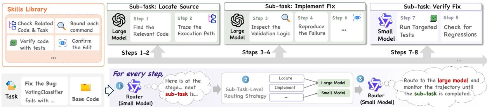  
Figure 1 | Illustration of RSI-router execution. At each step, a small model serves as the router, identifying the upcoming subtask from the routing context. The router selects a model for the subtask and appends the corresponding model-specific skills to the selected model’s input. In this SWE-bench example, the large model locates relevant code and implements the fix, while the small model verifies it.

To address these challenges, we introduce RSI-router, a routing framework that recursively improves its routing strategies and execution skills using execution outcomes and accumulated experience. RSI-router is motivated by three observations. First, LLMs typically possess prior knowledge of task objectives and procedures, which can organize the exploration of model assignments around reusable subtasks rather than treating every interaction step as an independent decision. Second, execution trajectories reveal where a particular model fails, succeeds, or performs redundant actions, providing concrete evidence for revising model assignments and developing model-specific execution guidance. Third, such guidance can itself change what a model can reliably accomplish: a smaller model that initially fails on a subtask may become efective when equipped with an appropriate execution skill. Consequently, model assignments and execution skills are interdependent and need to be improved jointly rather than optimized in isolation.

Specifically, RSI-router recursively improves the routing system through a four-stage evolution loop. Subtask Mining derives and revises subtask identification from trajectories. Routing Strategy Evolution proposes diverse routing strategies over these subtasks in parallel and evaluates candidate routers with selectively inherited skills. Model-Specific Skill Evolution compares candidate and large-model-only trajectories on the same tasks to diagnose model-specific failure patterns and redundant actions, then refines or generates execution skills tailored to subtask– model pairs. Pareto-Optimal Router Selection compares historical and newly generated routers by performance and cost, updating the Pareto population while retaining dominated routers as negative examples for subsequent evolution. The resulting routers, skills, and execution experience further guide subsequent iterations. While a large LLM drives this evolution process, at inference time, a small model serves as the router, identifying the upcoming subtask, selecting its assigned model, and appending the corresponding execution skills to the selected model’s input (Figure 1).

We evaluate RSI-router on five benchmarks of agentic tasks: ALFWorld [23], ScienceWorld [24], WebShop [25], SWE-bench Verified [26, 27], and Terminal-Bench 2.0 [28]. Across these benchmarks, RSI-router reduces inference cost by 8.1–82.2%, with an average reduction of 51.7%, while matching or exceeding large-model-only performance. For example, it improves ALFWorld success rate from 90.62% to 98.44% with 75.3% lower cost, and Terminal-Bench 2.0 from 40.00% to 46.67% with 18.0% lower cost. RSI-router also improves the performance–cost Pareto frontier over the evaluated task-level and step-level routing baselines. Further analysis shows repeated cost reductions over iterations and continued reuse of skills acquired in earlier iterations, while ablation studies further corroborate key routing and execution design choices.

Our main contributions are as follows:

• A recursive self-improvement paradigm for LLM routing. We introduce RSI-router, which constructs cost-eficient routing strategies through iterative improvement over execution outcomes and accumulated experience.

• Subtask-level routing with model-specific execution skills. RSI-router discovers reusable subtasks, evolves model assignments at the subtask level, and develops model-specific execution skills, enabling smaller models to reliably handle suitable stages of long-horizon agentic tasks.

• Advancing the Pareto frontier across five benchmarks. Across five agentic benchmarks, RSI-router matches or exceeds the performance of the large-model baseline while reducing inference cost by 51.7% on average, and consistently extends the performance–cost Pareto frontier beyond existing routing baselines.

## 2 Method

Agentic tasks comprise stages with diferent capability requirements, and the most cost-efective model may vary across stages. We group execution steps with similar objectives into subtasks to explore model assignments and reuse experience. Evaluating these assignments yields trajectories revealing model-specific failures and redundant actions, guiding the development of execution skills. As these skills change models’ efective capabilities, model assignments need to be revisited. We therefore propose RSI-router, a routing framework that refines subtask definitions, model assignments, and execution guidance through iterative evolution to improve performance–cost trade-ofs.

Starting with training trajectories from large-model-only and small-model-only executions, RSIrouter evolves a population of routers through a four-stage loop guided by a large-model proposal agent (Figure 2): Subtask Mining organizes execution experience into reusable subtasks to guide model assignments; Routing Strategy Evolution explores subtask-level model assignments to generate candidate routers with diferent performance–cost trade-ofs; Model-Specific Skill Evolution distills the resulting training trajectories into reusable execution skills to extend models’ efective capabilities; and Pareto-Optimal Router Selection guards against regressions by comparing historical and new routers using validation performance and cost.

## 2.1 Routing and Evolution Setup

We consider agentic task execution using a large model � and a small model �, supported by reusable execution skills. To explore how the two models should collaborate, we evolve a population of routers with diferent model assignments and execution skills. At iteration �, newly proposed candidates share a subtask set $Z _ { t }$ , with definitions describing execution objectives and identification rules for predicting the upcoming subtask. Each candidate router $r _ { i }$ specifies which model executes each subtask; for example, � may implement a fix while � verifies it. Each skill contains execution instructions and specifies the applicable subtasks and execution model.

Before each execution step, the small model � predicts the upcoming step’s subtask using the definitions and identification rules in $Z _ { t }$ and the routing context �. This context contains the user query, the interaction history from the previous few steps, and the previous subtask prediction. The router then selects the assigned model, appends only the skill text matching the predicted subtask and selected model to its input, and invokes it to generate the response.

Router evolution overview. We run router evolution for � iterations to maximize task performance and minimize inference cost. We maintain a Pareto population $\mathcal { P } _ { t }$ of non-dominated routers and an archive $\mathcal { F } _ { t }$ of dominated routers retained as negative examples for subsequent refinement, initialized as $\mathcal { P } _ { 0 } = \{ r _ { L } , r _ { S } \}$ and $\mathcal { F } _ { 0 } = \emptyset$ . The baselines $r _ { L }$ and $r _ { S }$ use � and $S ,$ respectively, throughout execution without skills. Skills from historical routers in $\mathcal { P } _ { t } \cup \mathcal { F } _ { t }$ form a shared library for reuse. Each router $r$ is evaluated on disjoint training and validation sets to assess whether trainingderived refinements remain efective on other tasks. Aggregate performance and cost from both sets guide evolution, while execution trajectories $\mathcal { T } ( r )$ and per-task feedback are provided only for training tasks. Validation performance and cost guide Pareto-based population updates, yielding the final population $\mathcal { P } _ { G }$

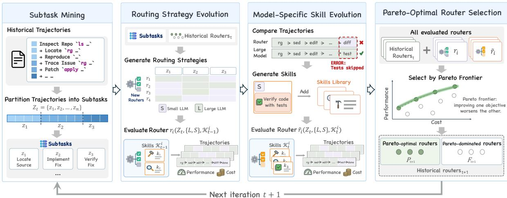  
Figure 2 | Router evolution in RSI-router. A proposal agent iteratively mines subtasks, explores model assignments with selectively inherited skills, and evolves model-specific skills by comparing training trajectories with large-model-only executions. Pareto-optimal and dominated routers are both retained to guide subsequent iterations.

## 2.2 Router Evolution

Subtask Mining. To construct $Z _ { t } ,$ we identify subtasks in training trajectories and derive their definitions and identification rules. For example, code repair may involve locating relevant code, implementing a fix, and verifying the result, with the same subtask recurring within a trajectory.

In iteration �, the proposal agent first analyzes these trajectories and partitions them into segments by execution objective. It then defines and clusters subtasks across trajectories to form $Z _ { t }$ , assigning subtask labels to segments and deriving identification rules. From the second iteration onward, the agent revisits previously defined subtasks, retaining, splitting, or merging them and updating the corresponding definitions and identification rules.

To check whether the resulting subtasks can be identified before execution, we replay sampled training trajectories. At each step, the small model � predicts the subtask label from the preexecution context � using the current definitions and identification rules. The proposal agent compares these predictions with the annotated labels and refines ambiguous definitions or rules. The finalized $Z _ { t }$ remains fixed for the rest of the iteration.

Routing Strategy Evolution. With $Z _ { t }$ established, we explore model assignments with diferent performance–cost trade-ofs. In each iteration, the proposal agent generates � diverse routing strategies in parallel, indexed by $i = 1 , \ldots , N$ . It draws on the model assignments, associated subtask definitions, and aggregate training and validation performance and cost of historical routers to explore alternative assignments.

For the �-th strategy, the proposal agent selectively inherits skills from the shared library based on their relevance to the current subtask definitions and model assignments. It reassesses applicability after subtask splits or merges, selecting zero or more skills per subtask to form $\mathcal { K } _ { t - 1 } ^ { i }$ . Each candidate router is evaluated on the training and validation sets to measure performance and cost. Its training trajectories and per-task feedback are passed to the next stage to guide model-specific skill evolution.

Model-Specific Skill Evolution. Execution skills complement model assignments by providing reusable, model-specific guidance to help models complete their assigned subtasks reliably and avoid redundant actions. As subtask definitions and model assignments evolve, newly collected trajectories reveal where this guidance needs further refinement. For each candidate router $r _ { i } ,$ the proposal agent compares its training trajectories with those of $r _ { L }$ on the same tasks, using per-task feedback and cost to identify model-specific failure patterns and redundant actions.

Based on this diagnosis, the agent refines inherited skills or generates new ones for the relevant subtasks and assigned models, updating $\mathcal { K } _ { t - 1 } ^ { i }$ to $\mathcal { K } _ { t } ^ { i }$ . We denote the updated router by $\tilde { r } _ { i }$ and reevaluate it on the training and validation sets, keeping $Z _ { t }$ and the model assignments unchanged.

Pareto-Optimal Router Selection. To guide evolution towards higher task performance and lower inference cost while guarding against regressions, we jointly compare historical routers in $\mathcal { P } _ { t } \cup \mathcal { F } _ { t }$ and candidates before and after skill evolution using validation performance and cost. The nondominated routers form $\mathcal { P } _ { t + 1 }$ , while the remaining routers are archived in $\mathscr { F } _ { t + 1 }$ . Routers in both sets remain available for proposing routing strategies and inheriting execution skills in subsequent iterations. After � iterations, RSI-router returns the final Pareto population $\mathcal { P } _ { G }$

## 3 Experiments

We evaluate RSI-router on five benchmarks of agentic tasks to examine whether it can reduce online cost without sacrificing task performance. We further analyze the router evolution process and assess key design choices through ablation studies.

## 3.1 Setup

Compared methods. We compare against the large-model-only router $r _ { L } ,$ the small-model-only router $r _ { S } ,$ and random routers that select either model with equal probability at the task or step level. The task-level routing methods include HybridLLM [14], FrugalGPT [29], RouteLLM [30], GraphRouter [31], and Avengers-Pro [32]. We also include Router-R1 [18] and MTRouter [16] as step-level routing baselines (see Appendix $\mathrm { A }$ for details).

Benchmarks. We use ALFWorld [23], ScienceWorld [24], WebShop [25], SWE-bench Verified [26, 27], and Terminal-Bench 2.0 [28], covering household environment interaction, scientific experimentation, online shopping, code repository repair, and terminal operations, respectively. The full benchmark prompts and tool definitions are provided in Appendix B.

Models and runtime settings. Across all five benchmarks, we use DeepSeek-V4.1-Flash [33] as the large model � and Qwen3.5-9B [8] as the small model �. Our execution harness is built on mini-SWE-agent [34], with environment interactions adapted to each benchmark. We use Codex [35] as the proposal agent and prompt � for subtask identification using the interaction history from the previous 3 steps.

Data splits and iteration protocol. We use fixed, disjoint training, validation, and test sets $( \mathcal { D } _ { \mathrm { t r } } ,$ ${ \mathcal { D } } _ { \mathrm { v a l } } , { \mathcal { D } } _ { \mathrm { t e s t } } )$ , with 64 tasks per set for ALFWorld, ScienceWorld, and WebShop, 32 per set for SWE-bench Verified, and 32/32/25 tasks for Terminal-Bench 2.0. Router evolution uses aggregate performance and cost from training and validation, but trajectories and per-task feedback only from training. Validation metrics guide candidate router generation and Pareto population updates.

After router evolution, we evaluate all routers in the final Pareto population $\mathcal { P } _ { G }$ on $\mathcal { D } _ { \mathrm { t e s t } } ,$ which provides no feedback for router evolution. We run router evolution for � = 6 iterations with $N = 4$ candidate routing strategies per iteration.

Evaluation metrics. We report task success rate (%) on all benchmarks except WebShop, where we use reward (0–1). Costs are reported in USD using the oficial DeepSeek-V4.1-Flash input and output prices. We estimate the corresponding small-model prices using a fixed 1:30 reference ratio informed by GPU-hour measurements on H200 GPUs (see Appendix C for details). Costs include all test-time LLM calls and tokens, including subtask routing and skill context. All results are averaged over three evaluation repeats per test task. For learned baselines, we additionally average over three training seeds.

Table 1 | RSI-router matches or exceeds the large-model baseline at substantially lower inference cost. Cost is total test-set inference cost (USD). Δ denotes relative percentage changes from the indicated baseline.
<table><tr><td>Method</td><td colspan="2">ALFWorld</td><td colspan="2">ScienceWorld</td><td colspan="2">WebShop</td><td colspan="2">SWE-bench Verified</td><td colspan="2">Terminal-Bench 2.0</td></tr><tr><td></td><td>Perf. ↑</td><td>Cost↓</td><td>Perf. ↑</td><td>Cost↓</td><td>Perf. ↑</td><td>Cost↓</td><td>Perf. ↑</td><td>Cost↓</td><td>Perf. ↑</td><td>Cost↓</td></tr><tr><td colspan="9">Single-model baselines</td></tr><tr><td>DeepSeek-V4.1-Flash</td><td>90.62</td><td>1.50</td><td>34.38</td><td>1.91</td><td>0.59</td><td>0.75</td><td>83.33</td><td>3.46</td><td>40.00</td><td>17.10</td></tr><tr><td>Qwen3.5-9B</td><td>65.62</td><td>0.13</td><td>14.58</td><td>0.06</td><td>0.48</td><td>0.02</td><td>62.50</td><td>0.69</td><td>5.33</td><td>0.17</td></tr><tr><td colspan="9"></td></tr><tr><td>Random</td><td>79.69</td><td>0.82</td><td>26.56</td><td>Task-level routing 0.72</td><td>0.55</td><td>0.43</td><td>64.58</td><td>1.23</td><td>26.67</td><td>8.22</td></tr><tr><td>HybridLLM</td><td>68.92</td><td>0.46</td><td>25.69</td><td>0.44</td><td>0.51</td><td>0.14</td><td>69.79</td><td>2.33</td><td>24.00</td><td>8.62</td></tr><tr><td>FrugalGPT</td><td>86.81</td><td>1.21</td><td>31.42</td><td>1.53</td><td>0.57</td><td>0.69</td><td>68.40</td><td>2.07</td><td>21.78</td><td>9.52</td></tr><tr><td>RouteLLM</td><td>84.38</td><td>1.16</td><td>32.99</td><td>1.55</td><td>0.59</td><td>0.67</td><td>72.92</td><td>2.68</td><td>40.00</td><td>17.10</td></tr><tr><td>GraphRouter</td><td>90.62</td><td>1.50</td><td>34.38</td><td>1.91</td><td>0.59</td><td>0.75</td><td>83.33</td><td>3.46</td><td>40.00</td><td>17.10</td></tr><tr><td>Avengers-Pro</td><td>90.62</td><td>1.50</td><td>33.33</td><td>1.71</td><td>0.59</td><td>0.75</td><td>79.17</td><td>3.33</td><td>40.00</td><td>17.10</td></tr><tr><td colspan="11"></td></tr><tr><td>Random</td><td></td><td>84.38 1.24</td><td>20.83</td><td>Step-level routing 0.72</td><td>0.53</td><td>0.34</td><td>83.33</td><td>3.89</td><td>28.00</td><td>6.87</td></tr><tr><td>Router-R1</td><td>72.92</td><td>0.19</td><td>20.31</td><td>0.11</td><td>0.49</td><td>0.23</td><td>55.21</td><td>0.28</td><td>10.67</td><td>0.31</td></tr><tr><td>MTRouter</td><td>85.94</td><td>1.06</td><td>31.08</td><td>1.00</td><td>0.54</td><td>0.41</td><td>71.88</td><td>2.38</td><td>24.89</td><td>5.85</td></tr><tr><td>RSl-router</td><td>98.44</td><td>0.37</td><td>35.94</td><td>0.34</td><td>0.61</td><td>0.19</td><td>84.38</td><td>3.18</td><td>46.67</td><td>14.02</td></tr><tr><td>∆ vs DeepSeek</td><td>+8.6%-75.3%</td><td></td><td>+4.5%-82.2%</td><td></td><td>+3.4%</td><td>-74.7%</td><td>+1.3%</td><td></td><td>-8.1% +16.7%</td><td>-18.0%</td></tr><tr><td>Δ vs MTRouter</td><td>+14.5%</td><td>-65.1%</td><td>+15.6%</td><td>-66.0%</td><td>+13.0%</td><td>-53.7%</td><td>+17.4%</td><td></td><td>+33.6% +87.5%</td><td>+139.7%</td></tr></table>

## 3.2 Main Results

RSI-router matches or exceeds the large-model baseline at substantially lower inference cost. Table 1 compares RSI-router with single-model, task-level, and step-level baselines across five benchmarks. Since some methods may produce multiple routing strategies, we report, for each method, the minimum inference cost among strategies that achieve at least the performance of the large-model baseline (DeepSeek-V4.1-Flash), ensuring a fair comparison under the same performance requirement. RSI-router exceeds DeepSeek-V4.1-Flash in performance across all five benchmarks, while reducing inference cost by 8.1–82.2%. On ALFWorld, success rate increases from 90.62% to 98.44% with a 75.3% cost reduction. Across ALFWorld, ScienceWorld, and Web-Shop, RSI-router surpasses the large model at around one quarter of its cost or less, demonstrating that large–small model collaboration can improve performance and cost eficiency simultaneously.

RSI-router occupies a substantial portion of the performance–cost Pareto frontier across five benchmarks. While Table 1 compares the inference cost of diferent methods under a common performance constraint, Figure 3 provides a more comprehensive view of the performance–cost trade-of by plotting all evaluated candidate strategies for each method. RSI-router improves the performance–cost Pareto frontier, with several configurations matching or outperforming the large model at lower cost. By contrast, the step-level baselines Router-R1 and MTRouter reduce cost relative to the large model but remain below its performance on all five benchmarks under the evaluated settings (Appendix A).

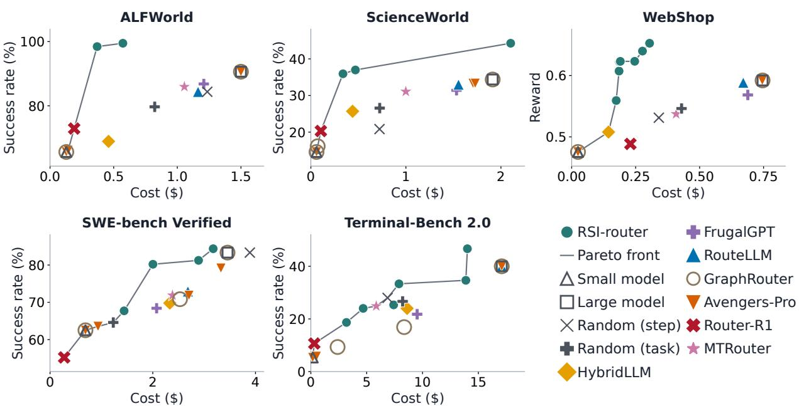  
Figure 3 | RSI-router occupies a substantial portion of the performance–cost Pareto frontier across five benchmarks. Points show test performance and total inference cost (USD).

Several task-level baselines exhibit routing collapse and abrupt transitions. In the evaluated settings, some baselines assign all tasks to either the small or the large model. As performance–cost preferences vary, these baselines switch abruptly between small-model-only and large-model-only routing, with no intermediate trade-ofs observed. This pattern is consistent with whole-task selection overlooking the small model’s ability to handle individual subtasks within tasks it cannot complete alone. In contrast, RSI-router enables the small model to contribute to tasks it cannot complete independently, better exploiting complementary model capabilities.

RSI-router achieves repeated cost reductions across iterations. Figure 4 tracks the lowest validation cost found through each iteration among routers retaining at least 95% of the largemodel baseline’s performance. All five benchmarks show further cost reductions after the first iteration, with multiple reductions on four benchmarks. On WebShop, for example, cost savings increase from 28.5% after the first iteration to 65.0%, 68.4%, and 72.5% in subsequent iterations. These successive improvements demonstrate that continued router evolution discovers increasingly cost-eficient routers under the same performance constraint (see Appendix D for representative case studies).

RSI-router accumulates reusable execution skills across iterations. Figure 5 tracks execution skills across the four candidate routers produced by Model-Specific Skill Evolution in each iteration. As new skills are added, skills acquired in earlier iterations continue to appear in later candidates. On ScienceWorld, for example, 22 of the 48 unique skill sources selected across the final iteration’s candidates originate from earlier iterations. These results show that router evolution builds a skill library whose accumulated experience is reused in subsequent router construction.

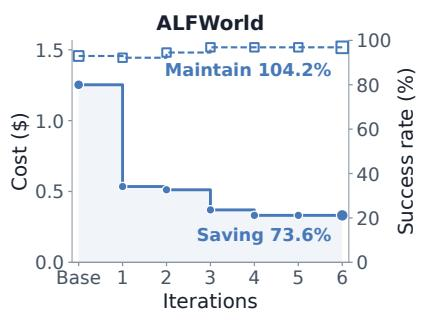

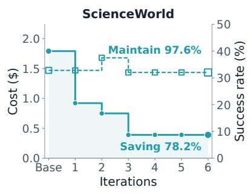

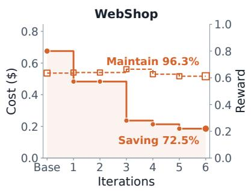

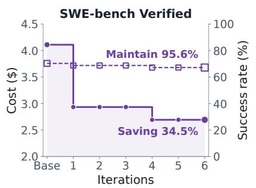

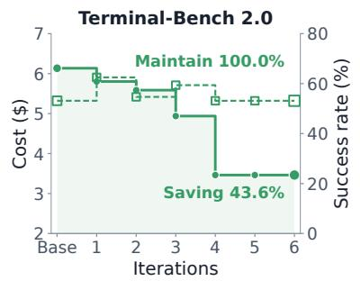  
RSI-router Cost (left) Performance (right)

Figure 4 | RSI-router progressively reduces cost during router evolution. Solid curves show the lowest validation cost found through each iteration under a 95% performance-retention constraint; dashed curves show the corresponding performance. Saving and Maintain report final cost reduction and performance retention relative to DeepSeek-V4.1-Flash.  
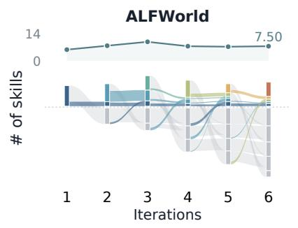

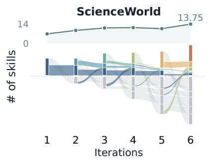

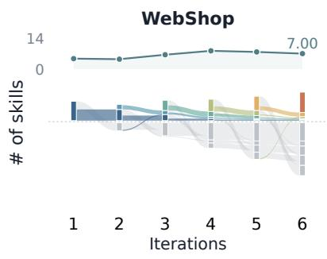

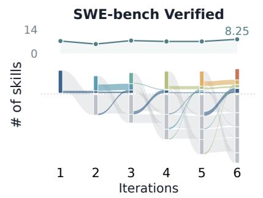

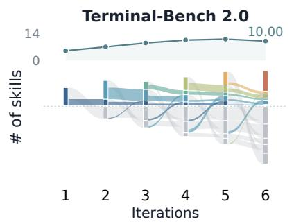

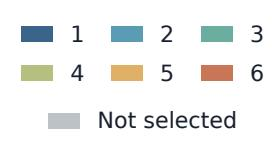  
Figure 5 | RSI-router accumulates new skills while reusing experience across iterations. Upper curves show the mean number of execution skills per candidate router. Lower flows track unique skill sources across iterations.

## 3.3 Ablation Studies

We conduct ablation studies to assess whether additional interaction history helps subtask identification and whether prompting the small model to select the execution model directly improves performance over step-level random routing. We also remove execution skills from routers that contain them to assess their contribution to performance–cost trade-ofs.

Longer interaction history does not improve performance. For the routers reported in Table 1, we increase the interaction history from 3 steps to 4, 8, 16, or all previous steps. As shown in Figure 6(a), performance does not improve with longer interaction histories across the five benchmarks. This suggests that short histories are suficient for efective routing.

Direct dificulty-based routing underperforms step-level random routing. We provide Qwen3.5- 9B with the same routing context used by RSI-router, but ask it to directly judge the dificulty of the upcoming step and select the execution model. We compare it with the step-level Random baseline reported in Table 1. As shown in Figure 6(b), direct routing achieves lower mean performance across all five benchmarks. Thus, direct dificulty judgments do not yield a performance advantage over random step-level selection.

Execution skills afect performance–cost trade-ofs in task-dependent ways. To isolate their efect, we remove execution skills while keeping the underlying subtask definitions and model assignments unchanged. As shown in Figure 6(c), removing skills lowers performance on ALFWorld, ScienceWorld, and WebShop by 12.4, 11.5, and 7.4 points, respectively. On SWE-bench Verified and Terminal-Bench 2.0, it instead improves performance by 9.7 and 10.5 points, but increases cost by 33.7% and 33.9% of the respective large-model-only costs. These results indicate that execution skills do not uniformly improve performance; they shift the performance–cost trade-of by modifying how the assigned models execute each subtask.

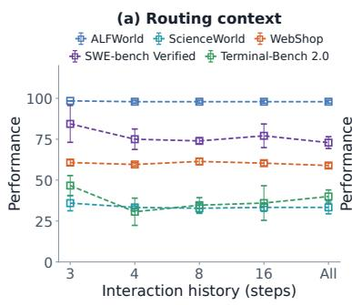

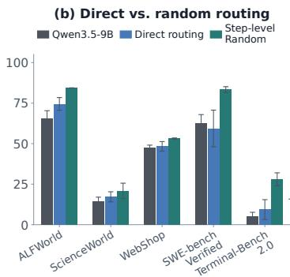

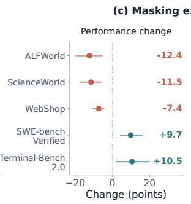

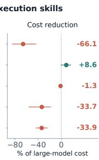  
Figure 6 | Ablations of routing context, direct routing, and execution skills. (a) Interaction history length. (b) Direct model routing by Qwen3.5-9B. (c) Efects of masking execution skills; cost reductions are normalized by the large-model-only USD cost. WebShop reward is scaled by 100. Error bars show standard deviations in (a–b) and 95% bootstrap intervals in (c).

## 4 Related Work

LLM routing. LLM routing exploits complementary model capabilities to improve performance– cost trade-ofs [11, 12, 36]. At the task level, HybridLLM and RouteLLM select between small and large models using dificulty estimates and response preferences, respectively [14, 30, 37]. FrugalGPT instead adopts cascaded inference, sequentially calling models until a response is judged suficiently reliable [29]. ICL-Router and IrtNet learn model representations to predict query-specific performance [38, 39]. GraphRouter and Avengers use graph-based matching and cluster-level performance–cost estimates to select models [31, 32, 40].

Recent works extend routing to multi-step reasoning and agentic tasks. MTRouter learns model selection from sampled trajectories [16], while Router-R1 and Budget-Aware Agentic Routing optimize routing policies through reinforcement learning [18, 19]. SWE-Router uses partial execution traces to decide whether to switch to a more expensive model [41]. Agent-as-a-Router and Gated-Memory Routing inform model selection through accumulated outcomes and selective history retention, respectively [42, 43]. SkillOrchestra extracts skills from pre-collected trajectories to guide the router’s model selection [17]. RSI-router uses subtasks to align model assignments with capability requirements and reuse experience across tasks. It leverages LLM prior knowledge to explore assignments and distills training trajectories into execution skills for the selected models.

Self-evolving agents. Agent self-improvement spans prompt and context adaptation, automated agent design, and harness evolution. GEPA and ACE use execution feedback to refine prompts and contextual guidance, respectively [44, 45]. ADAS [46] searches over agent programs, while the Darwin Gödel Machine [47] iteratively modifies agent code and maintains an expanding archive of candidates. At the harness level, Meta-Harness [48] uses an external meta-agent powered by a strong model to optimize the target model’s harness. Self-Harness [49] enables agents to autonomously diagnose their weaknesses and evolve their own harnesses, without relying on human engineers or stronger external agents. Harness-of-Harness [2] organizes codingagent executions into iterative planning, coding, and testing loops to support continual software improvement. HarnessBank [50] maintains a semantically diverse harness population, combining candidate recombination with gated verification. HarnessX [51] evolves composable harness components from execution traces, while Harness Continual Learning [52] supports continual harness adaptation under historical-retention constraints. We adopt this feedback-driven evolution process for agentic routing itself, recursively refining model selection and execution guidance from execution outcomes and accumulated experience.

Agent skills. Agent skills provide reusable procedural knowledge for task execution, and their benefits vary across models [53]. Prior work distills skills from execution experience [54, 55]. AgentSkillOS and SkillNet organize skills for retrieval and orchestration [56, 57], while other work trains agents to internalize and apply skills [58, 59]. SKT further generates verified synthetic trajectories for supervised skill-use training [60]. RSI-router evolves model-specific skills alongside subtask-level routing strategies to help smaller models execute their assigned subtasks more reliably.

## 5 Conclusion

We introduced RSI-router, a routing framework that combines LLM task knowledge with execution feedback to improve performance–cost trade-ofs for agentic tasks. It organizes model assignments around reusable subtasks and uses comparisons with large-model-only trajectories to develop model-specific execution skills. Candidate updates are assessed through re-execution and Paretobased router selection using validation performance and cost, while historical routers and skills guide subsequent iterations.

Across five agentic benchmarks, RSI-router reduces inference cost by 8.1–82.2% while matching or exceeding large-model-only performance and extends the performance–cost Pareto frontier beyond the evaluated task-level and step-level routing baselines. These results demonstrate that smaller models can contribute to tasks they cannot complete independently when assigned suitable subtasks and supported by execution skills. Further analysis shows repeated cost reductions and continued reuse of historical skills, highlighting the value of accumulated execution experience.

More broadly, these findings support using iterative evolution to construct routing strategies for agentic tasks. They highlight the potential to improve agentic performance and eficiency by better exploiting complementary model capabilities, allowing smaller models to contribute to tasks beyond what they can complete independently. RSI-router provides a foundation for constructing cost-aware routing strategies from accumulated execution experience, reducing reliance on continual manual refinement for agentic tasks.

## Acknowledgements

This work is supported by Shanghai Artificial Intelligence Laboratory.

## References

[1] Junwei Liu, Kaixin Wang, Yixuan Chen, Xin Peng, Zhenpeng Chen, Lingming Zhang, and Yiling Lou. Large language model-based agents for software engineering: A survey. ACM Transactions on Software Engineering and Methodology, 2024.

[2] Haoyang Yan, Min-le Su, Hangfan Zhang, Zhanhao Li, Chen Zhang, Shao Zhang, Yang Chen, Lei Bai, and Shuyue Hu. Harness-of-harness: Multi-day autonomous software development with continual improvement. arXiv preprint arXiv:2609.01481, 2026.

[3] Pascal J Sager, Benjamin Meyer, Peng Yan, Rebekka von Wartburg-Kottler, Layan Etaiwi, Aref Enayati, Gabriel Nobel, Ahmed Abdulkadir, Benjamin F Grewe, and Thilo Stadelmann. A comprehensive survey of agents for computer use: Foundations, challenges, and future directions. Journal ofArtificial Intelligence Research, 85, 2026.

[4] Zhiyao Cui, Chenxu Wang, Shuyue Hu, Yiqun Zhang, Wenqi Shao, Qiaosheng Zhang, and Zhen Wang. Design first, code later: Aesthetically pleasing template-free slides generation. In Findings of the Associationfor Computational Linguistics: ACL 2026, pages 30470–30490, 2026.

[5] Chris Lu, Cong Lu, Robert Tjarko Lange, Yutaro Yamada, Shengran Hu, Jakob Foerster, David Ha, and Jef Clune. Towards end-to-end automation of ai research. Nature, 651(8107):914–919, 2026.

[6] Zhiyao Cui, Qianyi Wang, Haoyang Yan, Yiqun Zhang, Siyue Ren, Hangfan Zhang, Zelin Tan, Hao Li, Chunjiang Mu, Dexian Cai, et al. Agentpanel: Toward a new paradigm for human–ai collaboration in exploring scientific questions. arXiv preprint arXiv:2608.03283, 2026.

[7] Pengfei Gao and Chao Peng. More with less: An empirical study of turn-control strategies for eficient coding agents. In Proceedings of the 2026 IEEE/ACM 48th International Conference on Software Engineering, pages 956–967, 2026.

[8] Qwen Team. Qwen3.5: Towards native multimodal agents, February 2026. URL https://qwen.ai/ blog?id=qwen3.5. Accessed: 2026-09-17.

[9] Abdelrahman Abouelenin, Atabak Ashfaq, Adam Atkinson, Hany Awadalla, Nguyen Bach, Jianmin Bao, Alon Benhaim, Martin Cai, Vishrav Chaudhary, Congcong Chen, et al. Phi-4-mini technical report: Compact yet powerful multimodal language models via mixture-of-loras. arXiv preprint arXiv:2503.01743, 2025.

[10] Lisa Alazraki, William F. Shen, Yoram Bachrach, and Akhil Mathur. Scaling small agents through strategy auctions. In Forty-third International Conference on Machine Learning, 2026. URL https: //openreview.net/forum?id=elXuA5wTWV.

[11] Qitian Jason Hu, Jacob Bieker, Xiuyu Li, Nan Jiang, Benjamin Keigwin, Gaurav Ranganath, Kurt Keutzer, and Shriyash Kaustubh Upadhyay. Routerbench: A benchmark for multi-llm routing system. arXiv preprint arXiv:2403.12031, 2024.

[12] Hao Li, Yiqun Zhang, Zhaoyan Guo, Chenxu Wang, Shengji Tang, Qiaosheng Zhang, Yang Chen, Biqing Qi, Peng Ye, Lei Bai, et al. Llmrouterbench: A massive benchmark and unified framework for llm routing. In Findings of the Associationfor Computational Linguistics: ACL 2026, pages 37733–37754, 2026.

[13] Dongfu Jiang, Xiang Ren, and Bill Yuchen Lin. Llm-blender: Ensembling large language models with pairwise ranking and generative fusion. In Proceedings of the 61st Annual Meeting of the Association for Computational Linguistics (Volume 1: Long Papers), pages 14165–14178, 2023.

[14] Dujian Ding, Ankur Mallick, Chi Wang, Robert Sim, Subhabrata Mukherjee, Victor Rühle, Laks Lakshmanan, and Ahmed H Awadallah. Hybrid llm: Cost-eficient and quality-aware query routing. In International Conference on Learning Representations, volume 2024, pages 41348–41366, 2024.

[15] Wittawat Jitkrittum, Harikrishna Narasimhan, Ankit Singh Rawat, Jeevesh Juneja, Congchao Wang, Zifeng Wang, Alec Go, Chen-Yu Lee, Pradeep Shenoy, Rina Panigrahy, et al. Universal model routing for eficient llm inference. In International Conference on Learning Representations, volume 2026, pages 10169–10218, 2026.

[16] Yiqun Zhang, Hao Li, Zihan Wang, Shi Feng, Xiaocui Yang, Daling Wang, Bo Zhang, Lei Bai, and Shuyue Hu. Mtrouter: Cost-aware multi-turn llm routing with history–model joint embeddings. In Proceedings of the 64th Annual Meeting of the Association for Computational Linguistics (Volume 1: Long Papers), pages 44206–44226, 2026.

[17] Jiayu Wang, Yifei Ming, Zixuan Ke, Shafiq Joty, Aws Albarghouthi, and Frederic Sala. Skillorchestra: Learning to route agents via skill transfer. arXiv preprint arXiv:2602.19672, 2026.

[18] Haozhen Zhang, Tao Feng, and Jiaxuan You. Router-r1: Teaching LLMs multi-round routing and aggregation via reinforcement learning. In The Thirty-ninth Annual Conference on Neural Information Processing Systems, 2025. URL https://openreview.net/forum?id=DWf4vroKWJ.

[19] Caiqi Zhang, Menglin Xia, Xuchao Zhang, Daniel Madrigal, Ankur Mallick, Samuel Kessler, Victor Ruehle, and Saravan Rajmohan. Budget-aware agentic routing via boundary-guided training. arXiv preprint arXiv:2602.21227, 2026.

[20] Chen Zhang, Qiang He, Zhou Yuan, Elvis S Liu, Hong Wang, Jian Zhao, and Yang Wang. Advancing drl agents in commercial fighting games: Training, integration, and agent-human alignment. arXiv preprint arXiv:2406.01103, 2024.

[21] Zelin Tan, Zhouliang Yu, Bohan Lin, Zijie Geng, Hejia Geng, Yudong Zhang, Mulei Zhang, Yang Chen, Shuyue Hu, Zhenfei Yin, et al. Papo: Stabilizing rubric integration training via decoupled advantage normalization. arXiv preprint arXiv:2603.26535, 2026.

[22] Zelin Tan, Hejia Geng, Xiaohang Yu, Mulei Zhang, Guancheng Wan, Yifan Zhou, Qiang He, Xiangyuan Xue, Heng Zhou, Yutao Fan, et al. Scaling behaviors of llm reinforcement learning post-training: An empirical study in mathematical reasoning. In Proceedings of the 64th Annual Meeting of the Association for Computational Linguistics (Volume 1: Long Papers), pages 31300–31319, 2026.

[23] Mohit Shridhar, Xingdi Yuan, Marc-Alexandre Cote, Yonatan Bisk, Adam Trischler, and Matthew Hausknecht. {ALFW}orld: Aligning text and embodied environments for interactive learning. In International Conference on Learning Representations, 2021. URL https://openreview.net/forum? id=0IOX0YcCdTn.

[24] Ruoyao Wang, Peter Jansen, Marc-Alexandre Côté, and Prithviraj Ammanabrolu. Scienceworld: Is your agent smarter than a 5th grader? In Proceedings of the 2022 Conference on Empirical Methods in Natural Language Processing, pages 11279–11298, 2022.

[25] Shunyu Yao, Howard Chen, John Yang, and Karthik Narasimhan. Webshop: Towards scalable real world web interaction with grounded language agents. Advances in Neural Information Processing Systems, 35:20744–20757, 2022.

[26] Carlos E Jimenez, John Yang, Alexander Wettig, Shunyu Yao, Kexin Pei, Ofir Press, and Karthik Narasimhan. Swe-bench: Can language models resolve real-world github issues? In Internationa Conference on Learning Representations, volume 2024, pages 54107–54157, 2024.

[27] Neil Chowdhury, James Aung, Chan Jun Shern, Oliver Jafe, Dane Sherburn, Giulio Starace, Evan Mays, Rachel Dias, Marwan Aljubeh, Mia Glaese, Carlos E. Jimenez, John Yang, Leyton Ho, Tejal Patwardhan, Kevin Liu, and Aleksander Madry. Introducing SWE-bench Verified. OpenAI, August 2024. URL https://openai.com/index/introducing-swe-bench-verified/. Accessed: 2026-09-17.

[28] Mike Merrill, Alexander Shaw, Nicholas Carlini, Boxuan Li, Harsh Raj, Ivan Bercovich, Lin Shi, Jeong Shin, Thomas Walshe, E Kelly Buchanan, et al. Terminal-bench: Benchmarking agents on hard, realistic tasks in command line interfaces. In International Conference on Learning Representations, volume 2026, pages 40903–40986, 2026.

[29] Lingjiao Chen, Matei Zaharia, and James Zou. FrugalGPT: How to use large language models while reducing cost and improving performance. Transactions on Machine Learning Research, 2024. ISSN 2835-8856. URL https://openreview.net/forum?id=cSimKw5p6R.

[30] Isaac Ong, Amjad Almahairi, Vincent Wu, Wei-Lin Chiang, Tianhao Wu, Joseph E Gonzalez, Mohammed Kadous, and Ion Stoica. Routellm: Learning to route llms from preference data. In International Conference on Learning Representations, volume 2025, pages 34433–34448, 2025.

[31] Tao Feng, Yanzhen Shen, and Jiaxuan You. Graphrouter: A graph-based router for llm selections. In International Conference on Learning Representations, volume 2025, pages 26186–26203, 2025.

[32] Yiqun Zhang, Hao Li, Jianhao Chen, Hangfan Zhang, Peng Ye, Lei Bai, and Shuyue Hu. Beyond gpt-5: Making llms cheaper and better via performance-eficiency optimized routing. In Proceedings of the 2025 7th International Conference on Distributed Artificial Intelligence, pages 122–129, 2025.

[33] DeepSeek-AI. DeepSeek-V4.1-Flash: Pushing the limits of KV cache compression. Hugging Face model card, 2026. URL https://huggingface.co/deepseek-ai/DeepSeek-V4.1-Flash. Accessed: 2026-09-17.

[34] John Yang, Carlos Jimenez, Alexander Wettig, Kilian Lieret, Shunyu Yao, Karthik Narasimhan, and Ofir Press. Swe-agent: Agent-computer interfaces enable automated software engineering. Advances in Neural Information Processing Systems, 37:50528–50652, 2024.

[35] OpenAI. Introducing Codex, May 2025. URL https://openai.com/index/introducing-codex/. Accessed: 2026-09-17.

[36] Nigel Steven Fernandez, Branislav Kveton, Ryan Rossi, Andrew Lan, and Jack Wang. Radar: Reasoningability and dificulty-aware routing for reasoning llms. In International Conference on Learning Representations, volume 2026, pages 109429–109457, 2026.

[37] Wei Song, Zhenya Huang, Cheng Cheng, Weibo Gao, Bihan Xu, GuanHao Zhao, Fei Wang, and Runze Wu. Irt-router: Efective and interpretable multi-llm routing via item response theory. In Proceedings of the 63rd Annual Meeting of the Associationfor Computational Linguistics (Volume 1: Long Papers), pages 15629–15644, 2025.

[38] Chenxu Wang, Hao Li, Yiqun Zhang, Linyao Chen, Jianhao Chen, Ping Jian, Qiaosheng Zhang, and Shuyue Hu. Icl-router: In-context learned model representations for llm routing. In Proceedings of the AAAI Conference on Artificial Intelligence, volume 40, pages 33413–33421, 2026.

[39] Jianhao Chen, Chenxu Wang, Gengrui Zhang, Peng Ye, Lei Bai, Wei Hu, Yuzhong Qu, and Shuyue Hu. Learning compact representations of llm abilities via item response theory. arXiv preprint arXiv:2510.00844, 2025.

[40] Yiqun Zhang, Hao Li, Chenxu Wang, Linyao Chen, Qiaosheng Zhang, Peng Ye, Shi Feng, Xinrun Wang, Jia Xu, Lei Bai, et al. The avengers: A routing recipe for collective intelligence in language models. In Proceedings of the AAAI Conference on Artificial Intelligence, volume 40, pages 34870–34878, 2026.

[41] Seongho Son, Sangwoong Yoon, Jiahua Tang, Shuhan Wang, Lorenz Wolf, and Ilija Bogunovic. Swerouter: Routing in multi-turn agentic software engineering tasks. arXiv preprint arXiv:2607.00053, 2026.

[42] Pengfei Zhou, Zhiwei Tang, Yixing Ma, Jiasheng Tang, Yizeng Han, Zhenglin Wan, Fanqing Meng, Wei Wang, Bohan Zhuang, Wangbo Zhao, et al. Agent-as-a-router: Agentic model routing for coding tasks. arXiv preprint arXiv:2606.22902, 2026.

[43] Rakibul Hasan Rajib, Mengxing Zheng, and Qian Lou. Learning what to retain: Gated-memory routing for eficient collaboration in multi-agent llm systems. arXiv preprint arXiv:2609.00237, 2026.

[44] Lakshya A Agrawal, Shangyin Tan, Dilara Soylu, Noah Ziems, Rishi Khare, Krista Opsahl-Ong, Arnav Singhvi, Herumb Shandilya, Michael J Ryan, Meng Jiang, et al. Gepa: Reflective prompt evolution can outperform reinforcement learning. In International Conference on Learning Representations, volume 2026, pages 8479–8565, 2026.

[45] Qizheng Zhang, Changran Hu, Shubhangi Upasani, Boyuan Ma, Fenglu Hong, Vamsidhar Kamanuru, Jay Rainton, Chen Wu, Mengmeng Ji, Hanchen Li, et al. Agentic context engineering: Evolving

contexts for self-improving language models. In International Conference on Learning Representations, volume 2026, pages 86069–86100, 2026.

[46] Shengran Hu, Cong Lu, and Jef Clune. Automated design of agentic systems. In International Conference on Learning Representations, volume 2025, pages 21344–21377, 2025.

[47] Jenny Zhang, Shengran Hu, Cong Lu, Robert Tjarko Lange, and Jef Clune. Darwin gödel machine: Open-ended evolution of self-improving agents. In The Fourteenth International Conference on Learning Representations, 2026. URL https://openreview.net/forum?id=pUpzQZTvGY.

[48] Yoonho Lee, Roshen Nair, Qizheng Zhang, Kangwook Lee, Omar Khattab, and Chelsea Finn. Metaharness: End-to-end optimization of model harnesses. arXiv preprint arXiv:2603.28052, 2026.

[49] Hangfan Zhang, Shao Zhang, Kangcong Li, Chen Zhang, Yang Chen, Yiqun Zhang, Lei Bai, and Shuyue Hu. Self-harness: Harnesses that improve themselves. arXiv preprint arXiv:2606.09498, 2026.

[50] Xiaotian Luo, Dizhan Xue, Fengxingyu Wang, Chuanrui Hu, and Yafeng Deng. Harnessbank: Semantic gene-bank search with gated verification for agent-harness self-evolution, 2026. URL https://arxiv. org/abs/2607.13683.

[51] Tingyang Chen, Shuo Lu, Kang Zhao, Weicheng Meng, Hanlin Teng, Tianhao Li, Chao Li, Xule Liu, Jian Liang, Zhizhong Zhang, et al. Harnessx: A composable, adaptive, and evolvable agent harness foundry. arXiv preprint arXiv:2606.14249, 2026.

[52] Borui Kang, Jinrui Gu, Junhan Lv, Wenbin Li, Lei Wang, and Yang Gao. Harness continual learning: Continual adaptation beyond model parameters. arXiv preprint arXiv:2608.19013, 2026.

[53] Xiangyi Li, Yimin Liu, Wenbo Chen, Bingran You, Zonglin Di, Yifeng He, Shenghan Zheng, Kyoung Whan Choe, Jiankai Sun, Shuyi Wang, et al. Skillsbench: Benchmarking how well agent skills work across diverse tasks. arXiv preprint arXiv:2602.12670, 2026.

[54] Jingwei Ni, Yihao Liu, Xinpeng Liu, Yutao Sun, Mengyu Zhou, Pengyu Cheng, Dexin Wang, Erchao Zhao, Xiaoxi Jiang, and Guanjun Jiang. Trace2skill: Distill trajectory-local lessons into transferable agent skills. arXiv preprint arXiv:2603.25158, 2026.

[55] Peng Xia, Jianwen Chen, Hanyang Wang, Jiaqi Liu, Kaide Zeng, Yu Wang, Siwei Han, Yiyang Zhou, Xujiang Zhao, Haifeng Chen, et al. Skillrl: Evolving agents via recursive skill-augmented reinforcement learning. arXiv preprint arXiv:2602.08234, 2026.

[56] Hao Li, Chunjiang Mu, Jianhao Chen, Siyue Ren, Zhiyao Cui, Yiqun Zhang, Lei Bai, and Shuyue Hu. Organizing, orchestrating, and benchmarking agent skills at ecosystem scale. arXiv preprint arXiv:2603.02176, 2026.

[57] Yuan Liang, Ruobin Zhong, Haoming Xu, Chen Jiang, Yi Zhong, Runnan Fang, Jia-Chen Gu, Shumin Deng, Yunzhi Yao, Mengru Wang, et al. Skillnet: Create, evaluate, and connect ai skills. arXiv preprint arXiv:2603.04448, 2026.

[58] Zhengxi Lu, Zhiyuan Yao, Jinyang Wu, Chengcheng Han, Qi Gu, Xunliang Cai, Weiming Lu, Jun Xiao, Yueting Zhuang, and Yongliang Shen. Skill0: In-context agentic reinforcement learning for skill internalization. arXiv preprint arXiv:2604.02268, 2026.

[59] Jiapeng Zhu, Jianxiang Yu, Yibo Zhao, Chengcheng Han, Qi Gu, Xunliang Cai, Xiang Li, and Weining Qian. Skill0. 5: Joint skill internalization and utilization for out-of-distribution generalization in agentic reinforcement learning. arXiv preprint arXiv:2605.28424, 2026.

[60] Zelin Tan, Yiqun Zhang, Hao Li, Zhiyao Cui, Hejia Geng, Shao Zhang, Hangfan Zhang, Yang Chen, Xiaosong Wang, Lilong Wang, et al. Skt: Skill-use training at scale via verified synthetic data generation. arXiv preprint arXiv:2608.02287, 2026.

## Appendix

## A Baseline Implementation Details

Shared setup. We use the oficial implementations of all task-level and step-level routing baselines. All methods route between � and � under the experimental setup in Section 3.1. For each benchmark, we fit the task-level and step-level routing baselines on $\mathcal { D } _ { \mathrm { t r } } \cup \mathcal { D } _ { \mathrm { v a l } }$ and evaluate all methods on $\mathcal { D } _ { \mathrm { t e s t } }$ . All results are averaged over three evaluation repeats per test task. For learned baselines trained with three seeds, we additionally average across these training seeds.

Fixed policies. The large-model-only router $r _ { L }$ and the small-model-only router $r _ { S }$ use � and �, respectively, throughout task execution. The task-level random router selects either model with equal probability once per task and uses it throughout execution. The step-level random router selects either model with equal probability before each execution step. These baselines require no router training.

HybridLLM. We use HybridLLM [14] with a Qwen3-Embedding-0.6B encoder and a binary classification head to estimate task dificulty. The encoder and classification head are jointly fine-tuned using AdamW, with a learning rate of $1 0 ^ { - 5 }$ , weight decay of 0.1, and batch size 4. Gradient accumulation gives an efective batch size of 64. The warmup ratio is 0.05, and the tolerated performance gap between the two models is set to zero.

FrugalGPT. We adapt FrugalGPT [29] to a task-level cascade. For each execution model, we fine-tune a separate Qwen3-Embedding-0.6B scorer that predicts task performance from the user query, using mean observed task performance as soft supervision. Each scorer is trained using AdamW, with a learning rate of $2 \bar { \times } 1 0 ^ { - 5 }$ , weight decay of 0.01, batch size $^ { 4 , }$ and a warmup ratio of 0.06. Cost includes the task execution costs of all models invoked by the cascade.

RouteLLM. We use the matrix-factorization router of RouteLLM [30], with frozen Qwen3- Embedding-8B query embeddings projected into a 128-dimensional space. Model embeddings and the projection are trained using pairwise preferences derived from observed task performance. Optimization uses Adam with a learning rate of $3 \times 1 0 ^ { - 4 }$ , weight decay of $1 0 ^ { - 5 }$ , and batch size 64. At inference time, the estimated preference probability determines model selection.

GraphRouter. We use GraphRouter [31] for graph-based model selection, with Qwen3-Embedding-8B representations of queries, tasks, and model descriptions. All models tied for the highest training utility receive positive labels. Training uses AdamW, with a learning rate of $3 \times 1 0 ^ { - 4 }$ and weight decay of $1 0 ^ { - 4 }$ . We evaluate the three settings defined in the original paper: Performance First, Balance, and Cost First.

Avengers-Pro. We use Avengers-Pro [32] with Qwen3-Embedding-8B query embeddings and �-means clustering with � = 8. Models are ranked using cluster-level performance–cost estimates, and each query is routed according to the ranking in its nearest cluster. We evaluate ten evenly spaced performance coeficients in $\{ 0 , 1 / 9 , \ldots , 1 \}$ , with the complementary weight assigned to cost.

Router-R1. We adapt Router-R1 [18] with Qwen3.5-9B as the policy model. At each step, the policy interleaves reasoning with model calls and integrates the returned responses to generate the next action. Training uses PPO with task-level outcome rewards, actor and critic learning rates of $1 0 ^ { - 6 }$ and $1 0 ^ { - 5 }$ , respectively, and a KL penalty coeficient of $1 0 ^ { - 3 }$ . We use a rollout batch size of 64 and a PPO mini-batch size of 32.

MTRouter. We train MTRouter [16] on trajectories collected by $r _ { L } , r _ { S } ,$ , and the step-level random router. It selects a model at each step using the interaction history, encoded by frozen Qwen3- Embedding-8B. The outcome network has two hidden layers of width 256 and dropout 0.1. Training uses AdamW with early stopping, a learning rate of $1 0 ^ { - 3 }$ , weight decay of 0.01, and batch size 64.

## B Benchmark Prompts

## B.1 ALFWorld

## ALFWorld System Prompt

You are a helpful assistant interacting with ALFWorld, a text-based household environment. Your goal   
is to complete the household task by issuing text commands.   
How to Interact   
Write exactly one command in a ˋˋˋtextˋˋˋ code block. The environment will respond with   
observations.   
<format\_example>   
THOUGHT: I should inspect the room and choose a valid action.   
ˋˋˋtext   
look   
</format\_example>   
Important Rules   
• Issue ONE command per response.   
• Prefer commands from the available actions list shown in the observation.   
• If no available actions are shown, issue the most likely ALFWorld command.   
• Do not claim the task is complete yourself; keep acting until the environment ends the episode.

## ALFWorld User Prompt

```jinja
<task_description>
{{task_description}}
</task_description>
<task_type>
{{task_type}}
</task_type>
<initial_observation>
{{initial_observation}}
</initial_observation>

<available_actions>

- {{ action }}

</available_actions>

Complete the ALFWorld task. Think briefly, then choose exactly one command.
```

• Interaction: "pick up [object]", "put [object] in [container]", "activate [object]"

## B.2 ScienceWorld

## ScienceWorld System Prompt

You are a helpful assistant interacting with a text-based science simulation environment. Your goal is to complete science experiments by issuing text commands.

## How to Interact

## Available Command Types

Common commands include:

• Movement: "go to [location]", "open door", "go through door"

## Query Commands (Free Actions)

You can query available actions without consuming a game turn:

• ?navigation - Show movement actions (go, walk, move)

• ?object - Show object manipulation (pick up, put, pour)

• ?observation - Show observation actions (look, examine, inventory)

• ?device - Show device control (activate, turn on/of, use)

• ?door - Show door/container actions (open, close)

• ?electrical - Show electrical actions (connect, disconnect)

• ?interaction - Show interaction actions (mix, eat, focus)

• ?all - Show all valid actions

• ?categories - Show query help

Use queries to explore available actions before deciding your next move.

## Important Notes

• Issue ONE command per response

• Include a THOUGHT section explaining your reasoning

• The environment is turn-based - wait for observations before issuing the next command

• Some tasks require multiple steps to complete

<table><tr><td>ScienceWorld User Prompt</td></tr><tr><td>&lt;task_description&gt;</td></tr><tr><td>{{task_description}}</td></tr><tr><td>&lt;/task_description&gt;</td></tr><tr><td>&lt;initial_observation&gt;</td></tr><tr><td>{{initial_observation}}</td></tr><tr><td>&lt;/initial_observation&gt;</td></tr><tr><td>&lt;instructions&gt;</td></tr><tr><td>Complete the science experiment described above. You are interacting with a simulated environment. Issue commands one at a time and observe the results.</td></tr><tr><td>Tip: Use query commands like ?navigation or ?object to explore available actions without</td></tr><tr><td>consuming a turn.</td></tr><tr><td>Strategy hints:</td></tr><tr><td>• First explore: use &quot;open door to [room]&quot; then &quot;go to [room]&quot; to navigate</td></tr></table>

## ScienceWorld User Prompt

• Look around each room to find objects you need

• Pick up objects with "pick up [object]"

• For heating: find a stove, turn it on with "activate [stove]", place container on it

• For cooling: use a freezer or refrigerator

• Use "focus on [object]" to examine substances

To complete the task, perform the necessary actions described in the task description. When you believe the task is complete, issue the command:

ˋˋˋtext

task completed

Remember:

• Think step by step about what actions are needed

• Explore your environment to find needed objects

• Some actions may require prerequisites (e.g., picking up an object before using it)

</instructions>

## B.3 WebShop

## WebShop System Prompt

You are an expert autonomous agent operating in the WebShop e-commerce environment. Your goal is to buy the product that best satisfies the user instruction.

Valid command formats are:

• search[keywords]

• click[button or product id or option]

For each step, think internally if needed, then output exactly one admissible WebShop command in <action>...</action>.

The command inside <action> must be chosen from the current admissible actions list, except search[...] may replace search[<your query>] with useful keywords.

Your final visible response must contain the <action>...</action> tag. Do not spend the whole response on hidden reasoning.

Do not claim the task is complete yourself; keep acting until the environment ends the episode.

## WebShop User Prompt

<table><tr><td>&lt;task_description&gt;</td></tr><tr><td>{{task_description}}</td></tr><tr><td>&lt;/task_description&gt;</td></tr><tr><td>&lt;task_type&gt;</td></tr><tr><td>{{task_type}}</td></tr><tr><td>&lt;/task_type&gt;</td></tr><tr><td>&lt;history&gt;</td></tr><tr><td>{{action_history}} &lt;/history&gt;</td></tr><tr><td></td></tr><tr><td>&lt;current_observation&gt; {{current_observation}}</td></tr><tr><td>&lt;/current_observation&gt;</td></tr><tr><td>&lt;admissible_actions&gt;</td></tr><tr><td>{{valid_actions_text}}</td></tr><tr><td>&lt;/admissible_actions&gt;</td></tr><tr><td>You are at WebShop step {{current_step}}. Choose one action now.</td></tr></table>

<table><tr><td>WebShop User Prompt</td><td>continued</td></tr><tr><td>&lt;format_example&gt;</td><td></td></tr><tr><td>&lt;think&gt;I should search for the requested product type.&lt;/think&gt;</td><td></td></tr><tr><td>&lt;action&gt;search[black running shoes]&lt;/action&gt; &lt;/format_example&gt;</td><td></td></tr></table>

## B.4 SWE-bench Verified

The assistant issues native bash tool calls with a command argument. Execution results are returned as tool messages.

## SWE-bench Verified System Prompt

You are a helpful assistant that can interact with a computer shell to solve programming tasks.

<table><tr><td>SWE-bench Verified User Prompt</td><td></td></tr><tr><td>&lt;pr_description&gt; Consider the following PR description:</td><td rowspan="3"></td></tr><tr><td>{{task}}</td></tr><tr><td>&lt;/pr_description&gt; &lt;instructions&gt;</td></tr><tr><td>Task Instructions</td><td rowspan="3"></td></tr><tr><td>Overview You&#x27;re a software engineer interacting continuously with a computer by submitting commands. You&#x27;ll be helping implement necessary changes to meet requirements in the PR description. Your task is</td></tr><tr><td>specifically to make changes to non-test files in the current directory in order to fix the issue described in the PR description in a way that is general and consistent with the codebase. &lt;IMPORTANT&gt;This is an interactive process where you will think and issue AT LEAST ONE command, see the result, then think and issue your next command(s).&lt;/important&gt;</td></tr><tr><td>For each response: 1. Include a THOUGHT section explaining your reasoning and what you&#x27;re trying to accomplish</td><td rowspan="3">• MODIFY: Regular source code files in /testbed (this is the working directory for all your subsequent</td></tr><tr><td></td></tr><tr><td>2. Provide one or more bash tool calls to execute Important Boundaries</td></tr></table>

## SWE-bench Verified User Prompt

## CRITICAL REQUIREMENTS:

• Your response SHOULD include reasoning text explaining what you’re doing

• Your response MUST include AT LEAST ONE bash tool call. You can make MULTIPLE tool calls in a single response when the commands are independent (e.g., searching multiple files, reading diferent parts of the codebase).

• Directory or environment variable changes are not persistent. Every action is executed in a new subshell.

• However, you can prefix any action with MY\_ENV\_VAR=MY\_VALUE cd /path/to/working/dir && ... or write/load environment variables from files

Example of a CORRECT response:

<example\_response>

I need to understand the Builder-related code. Let me find relevant files and check the project structure.

[Makes multiple bash tool calls: {"command": "ls -la"}, {"command": "find src -name '\*.java' | grep -i builder"}, {"command": "cat README.md | head -50"}]

</example\_response>

## Environment Details

• You have a full Linux shell environment

• Always use non-interactive flags (-y, -f) for commands

• Avoid interactive tools like vi, nano, or any that require user input

• You can use bash commands or invoke any tool that is available in the environment

• You can also create new tools or scripts to help you with the task

• If a tool isn’t available, you can also install it

## Submission

When you’ve completed your work, you MUST submit your changes as a git patch. Follow these steps IN ORDER, with SEPARATE commands:

## Step 1: Create the patch file

Run git diff -- path/to/file1 path/to/file2 > patch.txt listing only the source files you modified. Do NOT commit your changes.

<IMPORTANT>

The patch must only contain changes to the specific source files you modified to fix the issue. Do not submit file creations or changes to any of the following files:

• test and reproduction files

• helper scripts, tests, or tools that you created

• installation, build, packaging, configuration, or setup scripts unless they are directly part of the issue you were fixing (you can assume that the environment is already set up for your client)

• binary or compiled files

</IMPORTANT>

## Step 2: Verify your patch

Inspect patch.txt to confirm it only contains your intended changes and headers show --- a/ and +++ b/ paths.

## Step 3: Submit (EXACT command required)

You MUST use this EXACT command to submit:

ˋˋˋbash

echo COMPLETE\_TASK\_AND\_SUBMIT\_FINAL\_OUTPUT && cat patch.txt

If the command fails (nonzero exit status), it will not submit.

<CRITICAL>

• Creating/viewing the patch and submitting it MUST be separate commands (not combined with &&).

• If you modify patch.txt after verifying, you SHOULD verify again before submitting.

• You CANNOT continue working (reading, editing, testing) in any way on this task after submitting.

SWE-bench Verified Bash Tool Definition   
{   
"type": "function",   
"function": {   
"name": "bash",   
"description": "Execute a bash command",   
"parameters": {   
"type": "object",   
"properties": {   
"command": {   
"type": "string",   
"description": "The bash command to execute"   
}   
},   
"required": [   
"command"   
]   
}   
}   
}

## B.5 Terminal-Bench 2.0

The assistant issues native bash tool calls with a command argument. Execution results are returned as tool messages.

## Terminal-Bench 2.0 System Prompt

You are a helpful assistant that solves tasks by interacting with a computer shell.

## Terminal-Bench 2.0 User Prompt

```handlebars
{{task}}
Work in the current task environment and continue until the task is fully complete.
Each response must include reasoning about the next step and at least one bash tool call. Directory
and environment-variable changes are not persistent between tool calls, so include them in each
command when needed.
When the task is complete, run echo COMPLETE_TASK_AND_SUBMIT_FINAL_OUTPUT as a standalone
command. Do not combine it with another command; after it runs you cannot continue working.
<system_information>
{{system}} {{release}} {{version}} {{machine}}
</system_information>
```

```jsonl
Terminal-Bench 2.0 Bash Tool Definition
{
"type": "function",
"function": {
"name": "bash",
"description": "Execute a bash command",
"parameters": {
"type": "object",
"properties": {
"command": {
"type": "string",
"description": "The bash command to execute"
}
},
"required": [
"command"
]
}
}
}
```

## C Estimating Small-Model Cost from GPU Hours

Pricing reference. We use the oficial DeepSeek-V4.1-Flash API prices as the USD reference: \$0.30 per million input tokens and \$1.20 per million output tokens.<sup>1</sup> We estimate Qwen3.5-9B’s relative cost using GPU-hour measurements, then express its input and output prices relative to these oficial rates.

Measurement protocol. We benchmark DeepSeek-V4.1-Flash on eight NVIDIA H200 GPUs and Qwen3.5-9B on one H200 using SGLang. Both deployments receive identical synthetic texts at three reference input lengths and two fixed output lengths (Table 2). Each setting uses 1,024 requests with 64 concurrent requests, replenished as requests finish. For model � using $n _ { m }$ GPUs over $T _ { m }$ seconds, we compute

$$
G _ { m } = { \frac { n _ { m } T _ { m } } { 3 6 0 0 } } \quad { \mathrm { G P U ~ h o u r s } } .\tag{1}
$$

Table 2 | GPU hours for 1,024 matched requests per model at concurrency 64. Input lengths use the Qwen3.5-9B tokenizer as reference. Each setting is measured once. Ratios are DeepSeek/Qwen.
<table><tr><td colspan="2">Tokens per request</td><td colspan="2">GPU hours</td><td rowspan="2">Ratio</td></tr><tr><td>Input</td><td>Output</td><td>DeepSeek-V4.1-Flash 8 H200s</td><td>Qwen3.5-9B 1 H200</td></tr><tr><td>2,048</td><td>128</td><td>0.9842</td><td>0.0199</td><td>49.46</td></tr><tr><td>2,048</td><td>1,024</td><td>5.4078</td><td>0.0545</td><td>99.23</td></tr><tr><td>8,192</td><td>128</td><td>2.0729</td><td>0.0679</td><td>30.53</td></tr><tr><td>8,192</td><td>1,024</td><td>6.4912</td><td>0.1153</td><td>56.30</td></tr><tr><td>32,768</td><td>128</td><td>7.1375</td><td>0.2819</td><td>25.32</td></tr><tr><td>32,768</td><td>1,024</td><td>11.5576</td><td>0.3962</td><td>29.17</td></tr><tr><td>All six settings</td><td></td><td>33.6512</td><td>0.9357</td><td>35.96</td></tr></table>

Cost estimate. Across the six synthetic workloads, the total GPU-hour ratio between DeepSeek-V4.1-Flash and Qwen3.5-9B is 35.96. We use 1:30 as an approximate reference for pricing Qwen3.5-9B, yielding input and output rates of \$0.01 and \$0.04 per million tokens, respectively.

## D Case Studies of Router Evolution

We illustrate representative routing changes and execution skills during router evolution in Figures 7–11.

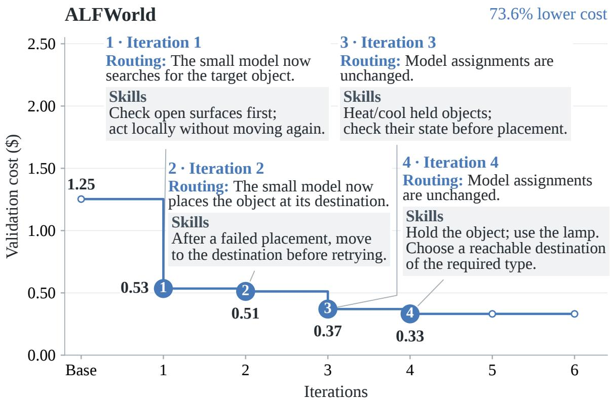  
Figure 7 | Router evolution on ALFWorld.

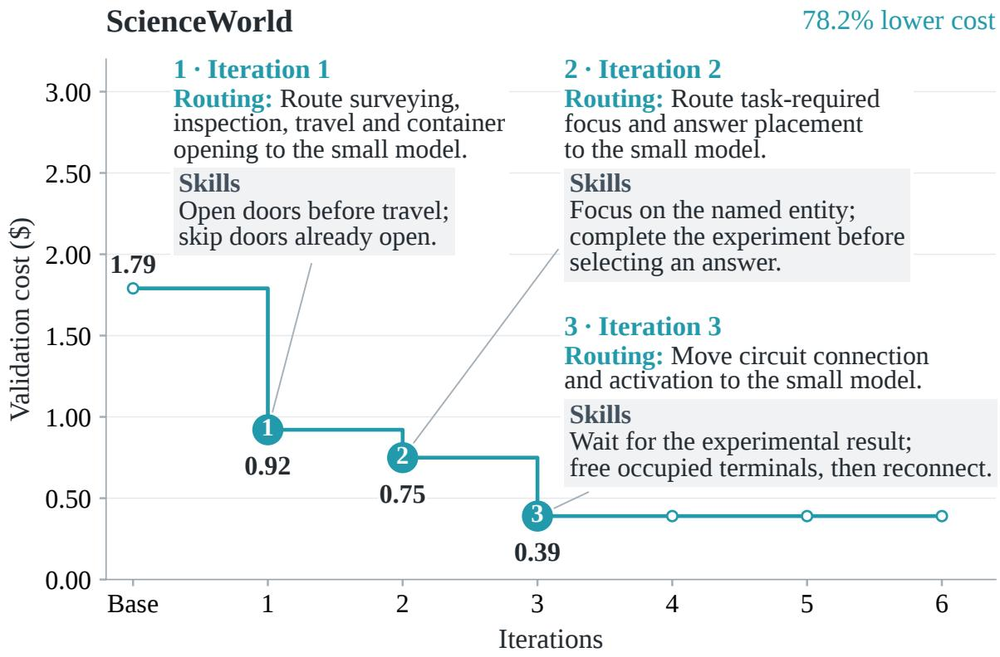  
Figure 8 | Router evolution on ScienceWorld.

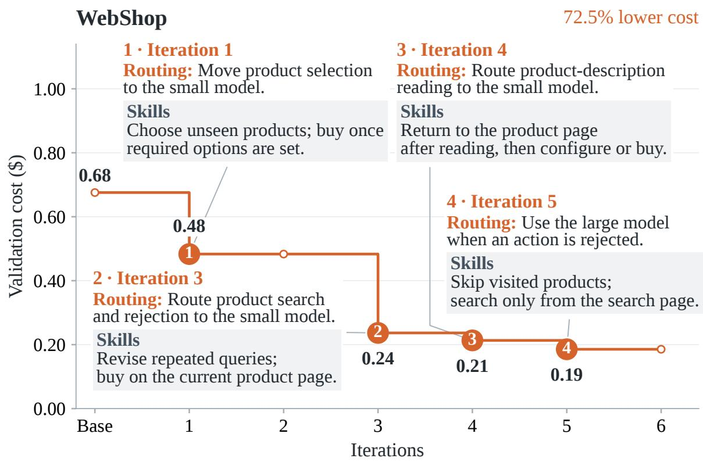  
Figure 9 | Router evolution on WebShop.

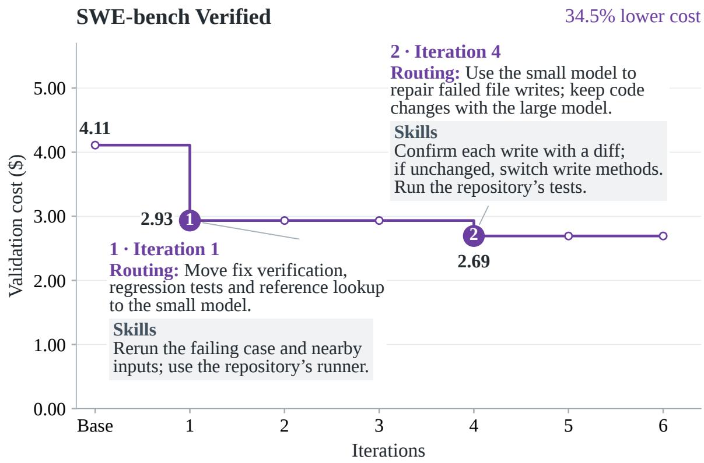  
Figure 10 | Router evolution on SWE-bench Verified.

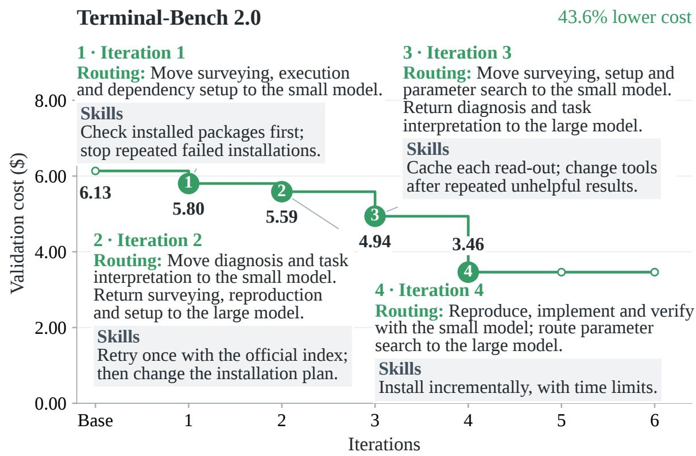  
Figure 11 | Router evolution on Terminal-Bench 2.0.