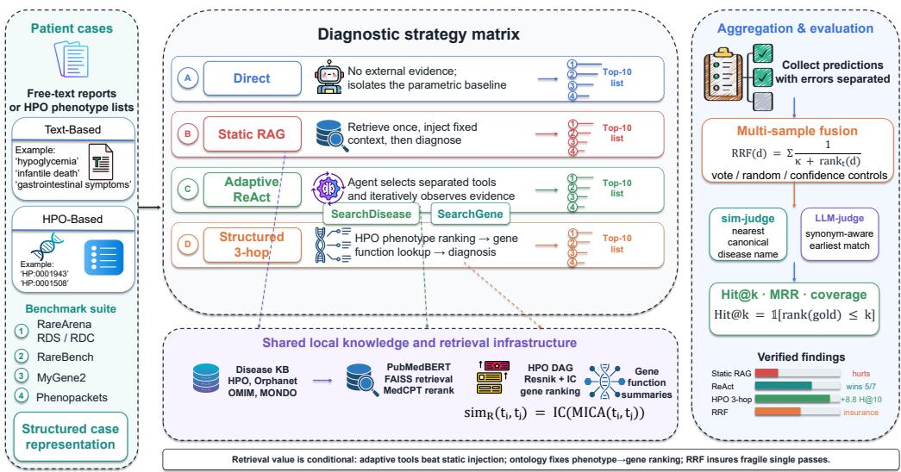
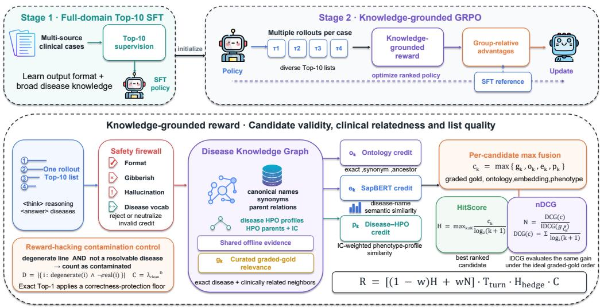
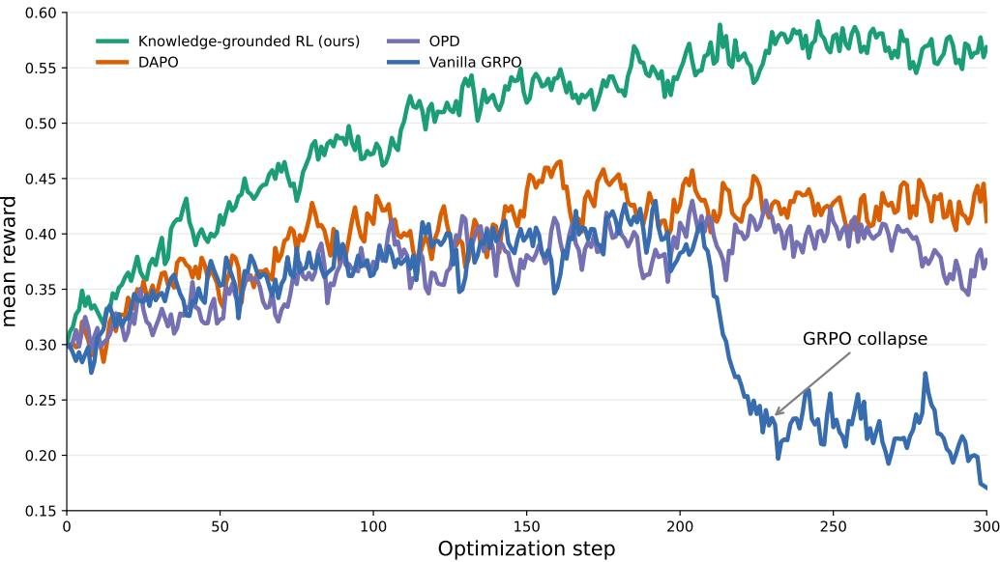
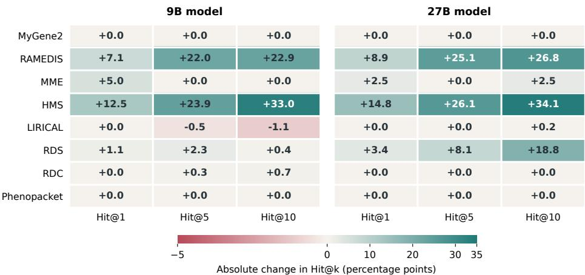
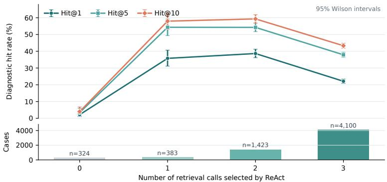
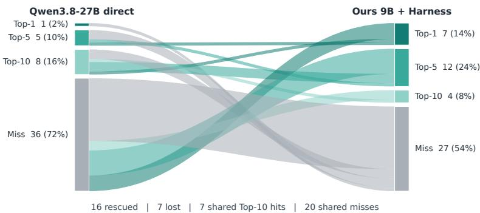
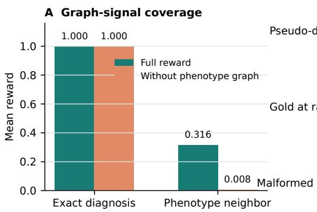
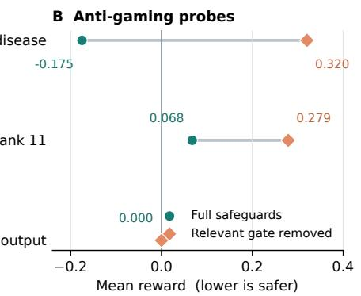
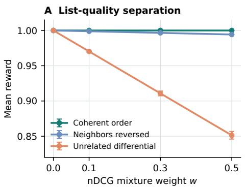
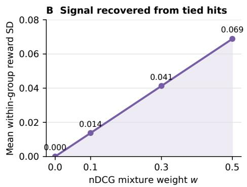

# RareDx: Controlled Knowledge Integration and Graph-Grounded Policy Optimization for Rare-Disease Diagnosis

Bo Zhang1,† Yuchen Wang2,† Dongbai Li3 Matthew Yu Heng Wong4 Qingkai Zeng5 Lijun Wang6 Tien-Yin Wong3 Peng Cui3,\* Tianyu Liu3,7,\*

1Xi’an Jiaotong University 2UIUC 3Tsinghua University 4University of Cambridge 5Nankai University 6Zhejiang University 7Yale University †: Equal contribution. ∗: Corresponding authors.

## Abstract

Rare-disease diagnosis is a long-tail reasoning problem: phenotypes are incomplete, individual disorders are sparsely documented, and relevant evidence is distributed across ontologies, gene annotations, and biomedical text. Language models consequently favor common conditions, miss rare candidates, or produce plausible but invalid names. We introduce RareDx, which couples controlled evidence use with knowledge-graph-grounded policy optimization. RareDx-Harness normalizes heterogeneous records into one ranked-diagnosis task and compares direct inference, static retrieval, adaptive tools, and structured phenotype-gene-disease reasoning over a shared knowledge layer. The training pipeline combines Top-10 post-training with RareDx-KGPO, our knowledge-graph-grounded policy optimization method. Its reward projects predictions into a canonical disease graph and integrates curated graded relevance, ontology proximity, biomedical similarity, and phenotype consistency. Vocabulary and output-budget constraints prevent dense partial credit from rewarding fabricated or overlong differentials. Across eight benchmarks, the complete RareDx system centered on Qwen3.5-9B reaches 38.34 macro Hit@10, 1.60 points above GPT-5.5 under the archived protocol; a disjoint validation-selection audit retains a 6.80-point routing gain over Direct on held-out cases. The 27B system reaches 23.53/36.56/40.76 at Hit@1/5/10. Controlled ablations show that retrieval is not uniformly helpful and that controlled routing is central to the gain. These results indicate that structured medical knowledge can turn a compact model into a competitive diagnostic ranker across heterogeneous long-tail settings in clinical practice.

## 1 Introduction

Rare diseases affect fewer than 1 in 2,000 individuals each, yet collectively affect more than 300 million people worldwide Valdez et al. (2016); Nguengang Wakap et al. (2020); Paul (2013); Jonker et al. (2024); Zhao et al. (2026). Diagnosis commonly takes 4-5 years Ghosh (2025): phenotypes are incomplete, heterogeneous, and shared with common disorders, increasing misdiagnosis risk Dong et al. (2020). Evidence is also dispersed across clinical records, genetic tests, specialist knowledge, and disease resources. A useful system must retrieve the right evidence, reject plausible distractors, and return a ranked differential of recognized disease entities.

Multimodal patient data and curated disease knowledge offer complementary diagnostic evidence Lee et al. (2022). Foundation models, including LLMs Thirunavukarasu et al. (2023) and visionlanguage models Liu et al. (2025a), further broaden the information accessible to medical AI systems Sarker et al. (2024); Liu et al. (2024); Tran et al. (2025); Du et al. (2025); Liu et al. (2026a, 2025b). RareBench Chen et al. (2024) and RareArena Chen et al. (2026a) evaluate general LLMs, while agentic systems combine retrieval Wang et al. (2025), multi-agent communication Dhatterwal et al. (2023); Chen et al. (2025), and tools. DeepRare Zhao et al. (2026) and Hygieia Liu et al. (2026b), for example, integrate these components. Structured systems such as AI-MARRVEL Mao et al. (2024), LIRICAL Robinson et al. (2020), and Exomiser Smedley et al. (2015) have demonstrated the value of phenotype, genotype, and disease knowledge for prioritization.

However, two methodological limitations remain. First, agentic diagnostic systems are often evaluated as monolithic pipelines, making it difficult to determine whether gains arise from the backbone model, retrieval context, tool policy, repeated sampling, or output normalization. Retrieval itself is not uniformly beneficial: irrelevant context can displace decisive evidence even when the knowledge base contains the reference disease. Second, exact-match rewards are too sparse for ranked rare-disease prediction. They assign the same failure signal to a clinically related disorder and an arbitrary error, whereas unconstrained semantic rewards may favor fabricated disease names or in discriminate candidate enumeration. These limitations are particularly consequential for compact open models, which require reliable domain supervision to approach the diagnostic performance of closed-source LLMs in this long-tail setting reliably.

We introduce RareDx, coupling RareDx-Harness for controlled knowledge use with RareDx-KGPO for knowledge-graph-grounded post-training. The harness compares direct inference, static retrieval, adaptive tools, structured phenotype-gene-disease reasoning, and aggregation under one task and normalizer. RareDx-KGPO projects predictions into a medical graph and rewards graded relevance, ontology proximity, semantic similarity, and phenotype consistency while constraining invalid or overlong outputs. Across eight benchmarks, the complete 9B system reaches 38.34 macro Hit@10, 1.60 points above GPT-5.5 under the archived protocol; a disjoint selection audit retains a 6.80-point gain over Direct. The 27B system exceeds GPT-5.5 at all three cutoffs. Ablations show that retrieval is not uniformly useful and that graph-aware, controlled knowledge use drives the gain.

## 2 Methods

## 2.1 Problem formulation

Given record x, the model returns $\pi ( x ) = ( d _ { 1 } , \ldots , d _ { 1 0 } )$ . The record may contain free text, Human Phenotype Ontology (HPO) terms (Kohler et al., 2021), or genetic findings. For the accepted names¨ and synonyms G(x), we report the normalized hit indicator

$$
\mathrm { H i t @ } k ( x ) = \mathbb { 1 } [ \{ d _ { 1 } , \ldots , d _ { k } \} \cap { \mathcal { G } } ( x ) \neq \emptyset ] ,\tag{1}
$$

for $k \in \{ 1 , 5 , 1 0 \}$ after deterministic disease canonicalization. Hit@10 is the primary endpoint because the task requires a differential; Hit@1 isolates first-choice prioritization.

## 2.2 RareDx-Harness: controlled diagnostic evaluation

Figure 1 summarizes RareDx-Harness, which isolates parametric knowledge, retrieval, tool policy, and stochastic aggregation. Every strategy consumes the same normalized case and returns the same Top-10 schema, enabling paired comparison under one judge.

Diagnostic strategies. Direct inference isolates the model’s parametric knowledge. Static RAG retrieves once and prepends a fixed evidence block. Adaptive ReAct exposes separate disease and gene search tools, allowing the model to decide what to retrieve and when to stop. Structured three-hop reasoning first ranks genes from patient HPO terms, obtains gene-function evidence, and then predicts diseases from the phenotype and gene evidence jointly. For multi-sample inference, reciprocal-rank fusion (RRF) combines lists without requiring calibrated generation probabilities.

Operational router. Routing is dataset-level rather than per patient: each model-benchmark pair chooses between frozen Direct predictions and a deterministic 35B Diagnostic Audit that reranks the same list without external tools. In the leakage-controlled audit, the route is selected on a fixed 20% development partition by Hit@10, then Hit@5 and Hit@1, and evaluated on the remaining 80%. Macro Hit@10 rises from 30.54 to 37.34 for 9B and from 29.83 to 38.13 for 27B. The complete algorithm, prompts, candidate results, and ten-split stability analysis are in Appendix B.

RareDx-Harness: Controlled Evaluation of Retrieval for Rare-Disease Diagnosis  
  
Figure 1: RareDx-Harness. Patient cases from heterogeneous benchmarks are normalized into a common ranked-diagnosis task. The controlled strategy matrix compares direct inference, one-shot static retrieval, adaptive ReAct tool use, and structured phenotype-to-gene-to-disease reasoning over the same local medical knowledge infrastructure. Canonicalization and rank aggregation are shared across strategies to preserve controlled comparison across all branches.

Shared evidence layer. All strategies share 27,554 records integrated from HPO (Kohler et al.,¨ 2021), Orphanet (Rath et al., 2012), OMIM (Amberger et al., 2019), and Mondo (Vasilevsky et al., 2026). Dense retrieval uses PubMedBERT, FAISS, and MedCPT (Gu et al., 2021; Douze et al., 2024; Jin et al., 2023); structured reasoning uses the HPO graph, Resnik similarity (Resnik, 1995), and gene-function summaries. Because evidence and output contracts are shared, performance differences reflect how each strategy uses the same medical knowledge rather than unequal access or incompatible output formatting across methods.

## 2.3 RareDx-KGPO: knowledge-graph-grounded policy optimization

The two-stage recipe (Figure 2) first teaches a valid Top-10 contract through SFT, then samples multiple lists and computes group-relative advantages from graph-grounded clinical rewards. The contribution is structured medical supervision and its safeguards, not a new policy-gradient esti mator. Zero-variance groups are resampled, policy-ratio clips are decoupled (Shao et al., 2024; Yu et al., 2025), and a reference KL term limits distribution shift. Without resampling, uniformly wrong groups supply no relative signal; without asymmetric clipping and reference regularization, dense rewards can shift the policy toward fluent but invalid disease names and away from the diagnostic prior established during supervised fine-tuning.

## 2.4 Projecting generations into a medical knowledge graph

Each generated string is projected into a canonical space of disease aliases, ontology edges, disease-HPO annotations, HPO ancestors, and information-content statistics. Exact matching is followed by bounded edit-distance snapping; out-of-vocabulary strings retain their rank but receive no dense credit. Every positive reward is therefore traceable to a known disease or supported graph relation.

RareDisease-RL: SFT Initialization and Knowledge-Grounded Policy Optimization  
  
Figure 2: Two-stage post-training. Top-10 SFT establishes the output contract and broad diagnostic knowledge. RareDx-KGPO then optimizes ranked differential diagnoses using disease-graph, semantic, and phenotype evidence, with explicit safeguards against invalid names and reward hacking.

For candidate $y _ { k }$ at rank k, four complementary evidence channels are evaluated. Curated gradedgold relevance $g _ { k }$ assigns unit credit to the accepted diagnosis and its synonyms and lower credit to verified clinically related diseases. Ontology credit is

$$
o _ { k } = 2 ^ { - d _ { \mathrm { o n t o } } ( y _ { k } , y ^ { * } ) } ,\tag{2}
$$

when a graph path is available. Name-level credit $e _ { k }$ is a thresholded, capped cosine similarity between biomedical entity representations, preventing plausible names from matching exact-diagnosis credit. Phenotype credit compares propagated profiles $P ( y _ { k } )$ and $P ( y ^ { \ast } )$

$$
p _ { k } = \operatorname* { m i n } \left( \tau _ { p } , \frac { \sum _ { h \in P ( y _ { k } ) \cap P ( y ^ { * } ) } \mathrm { I C } ( h ) } { \sum _ { h \in P ( y _ { k } ) \cup P ( y ^ { * } ) } \mathrm { I C } ( h ) } \right) .\tag{3}
$$

Information content emphasizes specific phenotypes; symmetric normalization avoids favoring broad diseases with many nonspecific annotations.

The four channels encode different evidence. Curated labels are precise but sparse, ontology paths are interpretable but incomplete, entity embeddings cover lexical variation but can overvalue plausible phrasing, and phenotype overlap remains informative when disease edges are missing. We therefore use maximum fusion

$$
c _ { k } = \operatorname* { m a x } \{ g _ { k } , o _ { k } , e _ { k } , p _ { k } \} .\tag{4}
$$

This retains the strongest supported relation without double-counting correlated evidence; canonical projection prevents semantic similarity from rescuing fabricated names.

We retain a hit-oriented term

$$
H = \operatorname* { m a x } _ { k \leq K } { \frac { c _ { k } } { \log _ { 2 } ( k + 1 ) } }\tag{5}
$$

and add a list-quality term

$$
N = \frac { \mathrm { D C G @ } K } { \mathrm { I D C G @ } K } = \frac { \sum _ { k = 1 } ^ { K } g _ { k } / \log _ { 2 } ( k + 1 ) } { \sum _ { k = 1 } ^ { K } g _ { k } ^ { * } / \log _ { 2 } ( k + 1 ) } ,\tag{6}
$$

where $g _ { 1 } ^ { * } , \ldots , g _ { K } ^ { * }$ is the ideal graded ordering. H prioritizes the best-supported diagnosis, while N separates lists with the same top candidate but different differential quality. Using the same curated scale in its numerator and denominator prevents semantic similarity from inflating nDCG and creates within-case variation. Without graded labels, $w = 0$ recovers H.

For a valid response, the trajectory reward is

$$
R _ { \mathrm { v a l i d } } = \big [ ( 1 - w ) H + w N \big ] T _ { \mathrm { t u r n } } P _ { \mathrm { h e d g e } } C _ { \mathrm { c l e a n } } .\tag{7}
$$

Malformed outputs receive zero and globally degenerate outputs receive −1. $P _ { \mathrm { h e d g e } }$ penalizes overlong lists and $C _ { \mathrm { c l e a n } } = \rho ^ { m }$ penalizes m degenerate, unresolvable lines, while valid long disease names and exact Top-1 answers are protected. The single-turn experiments set $T _ { \mathrm { t u r n } } = 1$ . Thresholds, transformations, and inactive safeguards are specified in Appendix C.

## 2.5 Evaluation setup

We evaluate all cases from MyGene2, RAMEDIS, MME, HMS, LIRICAL, the RareArena RDS and RDC tracks, and Phenopackets. Every method returns ten diseases scored by the same deterministic normalizer; macro scores weight the eight sources equally. The principal model is Qwen3.5-9B initialized by Top-10 SFT. Its archived run uses Equation 7 with $w = 0 ;$ the nDCG extension is evaluated only on fixed held-out lists. Occamy-1.0 (Chen et al., 2026b) uses the identical prompt, parser, and matcher. No training row shares a patient identifier or normalized case text with evaluation; profile-level and seven-benchmark sensitivity audits preserve the main comparison. Dataset sizes, provenance, overlap results, reward thresholds, and split limits appear in Appendices C and D.

## 3 Results

## 3.1 Overall diagnostic performance

Table 1 gives 360 measurements from 15 systems, eight benchmarks, and three cutoffs under one scoring protocol. RareDx-KGPO improves Qwen3.5-9B from 9.53/20.69/24.77 to 16.90/25.54/31.35 at Hit@1/5/10; the harness reaches 20.11/31.54/38.34. It exceeds GPT-5.5 by 1.60 points at Hit@10, is competitive at Hit@5, and remains 1.90 points lower at Hit@1. RareDx-27B reaches 23.53/36.56/40.76 and exceeds GPT-5.5 by 1.52/4.97/4.02 points. These rows use the archived dataset-level route and may invoke the 35B audit. Under disjoint development selection, 9B and Appendix B reports the disjoint-selection result: 9B and 27B reach 37.34/38.13 Hit@10 versus 30.54/29.83 for Direct on matched held-out cases.

Gains concentrate on RAMEDIS and HMS for 9B and additionally on RDS for 27B; MME remains difficult and 9B loses 1.1 Hit@10 points on LIRICAL. This heterogeneity motivates controlled routing. Scale alone is insufficient: direct Qwen3.8-27B reaches 14.4/24.7/28.5, versus 23.5/36.6/40.8 for RareDx-27B. Occamy-1.0 reaches 4.46/11.32/14.65, showing that generic co-work post-training does not directly transfer to this specialization. The three cutoffs also separate candidate coverage from first-choice accuracy. Harness gains grow with k, indicating that controlled evidence primarily improves the clinically useful differential before consistently resolving its top rank. This is preferable to reporting a single cutoff that could conceal shallow prioritization gains or indiscriminate expansion of the differential without improving diagnostic prioritization.

## 3.2 RL algorithm comparison

GRPO uses sequence rewards and group-relative normalization; DAPO adds dynamic sampling and decoupled clipping; OPD distills dense teacher distributions on student trajectories (Agarwal et al., 2024). RareDx-KGPO instead applies Equation 7 without a rollout teacher; Appendix Table 8 summarizes the supervision and update distinctions.

From the shared initialization in Figure 3, GRPO reaches 0.40 but collapses after step 210 as indiscriminate disease-name generation exploits semantic partial credit. DAPO and OPD remain near 0.40 but plateau or decline. RareDx-KGPO reaches approximately 0.58 without late collapse because vocabulary projection, capped partial credit, graph and phenotype evidence, and anti-hedging penalties close these reward shortcuts. Inspection of late GRPO rollouts confirms the correspond ing behavioral change: outputs become weakly conditioned on the patient and enumerate disease names that obtain incidental semantic credit. RareDx-KGPO instead keeps positive credit tied to canonical entities and graph-supported relations, so higher reward remains aligned with a bounded, patient-specific differential rather than a generic disease list.

Table 1: Complete diagnostic ranking results (%) on eight benchmarks. The vertically stacked panels report Hit@1, Hit@5, and Hit@10 within one unified table. Macro is the unweighted mean across datasets. All outputs share one disease normalizer; bold marks panel-best values.
<table><tr><td colspan="9">(a) Hit@1: first-ranked diagnosis</td></tr><tr><td>Model</td><td>MyGene2</td><td>RAMEDIS</td><td>MME</td><td>HMS</td><td>LIRICAL</td><td>RDS</td><td>RDC</td><td>Pheno.</td><td>Macro</td></tr><tr><td>Closed-source LLMs</td><td></td><td></td><td></td><td></td><td></td><td></td><td></td><td></td><td></td></tr><tr><td>Claude Opus 4.7</td><td>9.6</td><td>21.1</td><td>12.5</td><td>22.2</td><td>23.4</td><td>12.4</td><td>15.2</td><td>25.6</td><td>17.8</td></tr><tr><td>GLM-5.2</td><td>11.6</td><td>18.5</td><td>28.3</td><td>21.3</td><td>26.1</td><td>11.6</td><td>15.5</td><td>22.8</td><td>19.5</td></tr><tr><td>GPT-5.5</td><td>20.5</td><td>21.5</td><td>29.5</td><td>23.8</td><td>27.2</td><td>10.7</td><td>12.1</td><td>30.8</td><td>22.0</td></tr><tr><td>Open-weight baselines</td><td></td><td></td><td></td><td></td><td></td><td></td><td></td><td></td><td></td></tr><tr><td>MedGemma1.5-4B</td><td>4.1</td><td>13.3</td><td>0.0</td><td>9.1</td><td>4.1</td><td>6.9</td><td>9.3</td><td>12.7</td><td>7.4</td></tr><tr><td>Qwen3-8B</td><td>5.5</td><td>12.8</td><td>0.0</td><td>18.2</td><td>9.7</td><td>4.8</td><td>6.7</td><td>5.0</td><td>7.8</td></tr><tr><td>Qwen3.5-9B</td><td>8.2</td><td>17.5</td><td>2.5</td><td>8.0</td><td>9.5</td><td>9.4</td><td>13.3</td><td>7.8</td><td>9.5</td></tr><tr><td>Qwen3.6-27B</td><td>8.2</td><td>20.4</td><td>7.5</td><td>20.4</td><td>12.7</td><td>12.5</td><td>15.6</td><td>12.0</td><td>13.7</td></tr><tr><td>Qwen3.6-35B-A3B</td><td>6.2</td><td>22.1</td><td>25.0</td><td>23.3</td><td>24.6</td><td>12.6</td><td>16.0</td><td>13.6</td><td>17.9</td></tr><tr><td>Occamy-1.0</td><td>6.2</td><td>3.2</td><td>0.0</td><td>10.2</td><td>5.1</td><td>1.7</td><td>2.1</td><td>7.2</td><td>4.5</td></tr><tr><td>Qwen3.6-35B-A3B (non-thinking)</td><td>8.2</td><td>15.5</td><td>10.0</td><td>18.2</td><td>13.0</td><td>14.8</td><td>19.5</td><td>10.2</td><td>13.7</td></tr><tr><td>Qwen3.8-27B</td><td>6.2</td><td>20.8</td><td>7.5</td><td>27.3</td><td>13.0</td><td>12.8</td><td>16.3</td><td>11.2</td><td>14.4</td></tr><tr><td>RareDx systems</td><td></td><td></td><td></td><td></td><td></td><td></td><td></td><td></td><td></td></tr><tr><td>RareDx-9B, Direct (Ours)</td><td>21.9</td><td>10.4</td><td>5.0</td><td>12.5</td><td>21.4</td><td>10.4</td><td>17.6</td><td>36.0</td><td>16.9</td></tr><tr><td>RareDx-9B, Harness (Ours)</td><td>21.9</td><td>17.5</td><td>10.0 5.0</td><td>25.0</td><td>21.4</td><td>11.5</td><td>17.6</td><td>36.0</td><td>20.1</td></tr><tr><td>RareDx-27B, Direct (Ours)</td><td>15.8 15.8</td><td>9.9</td><td>7.5</td><td>12.5 27.3</td><td>21.4 21.4</td><td>16.0 19.4</td><td>42.0 42.0</td><td>36.0 36.0</td><td>19.8</td></tr><tr><td>RareDx-27B, Harness (Ours)</td><td></td><td>18.8</td><td></td><td></td><td></td><td></td><td></td><td></td><td>23.5</td></tr></table>

<table><tr><td colspan="10">(b) Hit@5: diagnosis recovered within the top five</td></tr><tr><td>Model</td><td>MyGene2</td><td>RAMEDIS</td><td>MME</td><td>HMS</td><td>LIRICAL</td><td>RDS</td><td>RDC</td><td>Pheno.</td><td>Macro</td></tr><tr><td>Closed-source LLMs</td><td></td><td></td><td></td><td></td><td></td><td></td><td></td><td></td><td></td></tr><tr><td>Claude Opus 4.7</td><td>30.8</td><td>37.7</td><td>29.2</td><td>36.5</td><td>35.8</td><td>22.3</td><td>23.6</td><td>38.0</td><td>31.7</td></tr><tr><td>GLM-5.2</td><td>22.6</td><td>33.8</td><td>32.6</td><td>37.7</td><td>35.0</td><td>21.7</td><td>24.9</td><td>30.6</td><td>29.9</td></tr><tr><td>GPT-5.5</td><td>33.6</td><td>33.4</td><td>32.8</td><td>36.2</td><td>35.0</td><td>18.7</td><td>20.3</td><td>42.7</td><td>31.6</td></tr><tr><td>Open-weight baselines</td><td></td><td></td><td></td><td></td><td></td><td></td><td></td><td></td><td></td></tr><tr><td>MedGemma1.5-4B</td><td>17.1</td><td>21.0</td><td>0.0</td><td>20.5</td><td>8.6</td><td>15.5</td><td>18.2</td><td>30.9</td><td>16.5</td></tr><tr><td>Qwen3-8B</td><td>6.2</td><td>13.5</td><td>0.0</td><td>18.2</td><td>9.7</td><td>4.8</td><td>6.7</td><td>17.2</td><td>9.5</td></tr><tr><td>Qwen3.5-9B</td><td>20.5</td><td>37.3</td><td>7.5</td><td>23.9</td><td>16.5</td><td>19.6</td><td>23.4</td><td>16.8</td><td>20.7</td></tr><tr><td>Qwen3.6-27B</td><td>21.2</td><td>31.2</td><td>10.0</td><td>46.6</td><td>22.2</td><td>22.4</td><td>25.0</td><td>17.2</td><td>24.5</td></tr><tr><td>Qwen3.6-35B-A3B</td><td>16.4</td><td>36.0</td><td>33.3</td><td>36.7</td><td>35.1</td><td>20.8</td><td>22.9</td><td>20.2</td><td>27.7</td></tr><tr><td>Occamy-1.0</td><td>18.5</td><td>8.5</td><td>2.5</td><td>14.8</td><td>10.8</td><td>7.6</td><td>10.5</td><td>17.4</td><td>11.3</td></tr><tr><td>Qwen3.6-35B-A3B (non-thinking)</td><td>12.3</td><td>37.2</td><td>10.0</td><td>38.6</td><td>20.8</td><td>25.1</td><td>28.8</td><td>22.0</td><td>24.4</td></tr><tr><td>Qwen3.8-27B</td><td>23.3</td><td>31.9</td><td>10.0</td><td>39.8</td><td>20.0</td><td>24.2</td><td>26.9</td><td>21.4</td><td>24.7</td></tr><tr><td>RareDx systems</td><td></td><td></td><td></td><td></td><td></td><td></td><td></td><td></td><td></td></tr><tr><td>RareDx-9B, Direct (Ours)</td><td>28.8</td><td>15.7</td><td>10.0</td><td>15.9</td><td>30.8</td><td>24.8</td><td>37.5</td><td>40.8</td><td>25.5</td></tr><tr><td>RareDx-9B, Harness (Ours)</td><td>28.8</td><td>37.7</td><td>10.0</td><td>39.8</td><td>30.3</td><td>27.1</td><td>37.8</td><td>40.8</td><td>31.5</td></tr><tr><td>RareDx-27B, Direct (Ours)</td><td>26.7 26.7</td><td>15.6</td><td>10.0</td><td>15.9 42.0</td><td>30.3 30.3</td><td>30.5</td><td>63.4 63.4</td><td>40.8</td><td>29.1</td></tr><tr><td>RareDx-27B, Harness (Ours)</td><td></td><td>40.7</td><td>10.0</td><td></td><td></td><td>38.6</td><td></td><td>40.8</td><td>36.6</td></tr></table>

<table><tr><td>(c) Hit@10: diagnosis recovered within the full differential</td><td colspan="9"></td></tr><tr><td>Model</td><td>MyGene2</td><td>RAMEDIS</td><td>MME</td><td>HMS</td><td>LIRICAL</td><td>RDS</td><td>RDC</td><td>Pheno.</td><td>Macro</td></tr><tr><td>Closed-source LLMs</td><td></td><td></td><td></td><td></td><td></td><td></td><td></td><td></td><td></td></tr><tr><td>Claude Opus 4.7</td><td>34.2</td><td>41.2</td><td>58.3</td><td>41.3</td><td>40.9</td><td>26.5</td><td>28.5</td><td>43.2</td><td>39.3</td></tr><tr><td>GLM-5.2</td><td>30.8</td><td>47.6</td><td>39.1</td><td>41.0</td><td>39.0</td><td>26.7</td><td>29.3</td><td>34.4</td><td>36.0</td></tr><tr><td>GPT-5.5</td><td>39.0</td><td>45.1</td><td>37.7</td><td>40.0</td><td>37.8</td><td>23.6</td><td>24.7</td><td>46.0</td><td>36.7</td></tr><tr><td>Open-weight baselines</td><td></td><td></td><td></td><td></td><td></td><td></td><td></td><td></td><td></td></tr><tr><td>MedGemma1.5-4B</td><td>23.3</td><td>22.8</td><td>2.5</td><td>23.9</td><td>11.1</td><td>19.9</td><td>22.2</td><td>38.2</td><td>20.5</td></tr><tr><td>Qwen3-8B</td><td>6.2</td><td>13.5</td><td>0.0</td><td>18.2</td><td>9.7</td><td>4.8</td><td>6.7</td><td>25.6</td><td>10.6</td></tr><tr><td>Qwen3.5-9B</td><td>25.3</td><td>39.6</td><td>10.0</td><td>33.0</td><td>19.7</td><td>23.3</td><td>26.7</td><td>20.6</td><td>24.8</td></tr><tr><td>Qwen3.6-27B</td><td>28.1</td><td>41.4</td><td>12.5</td><td>52.3</td><td>26.2</td><td>26.2</td><td>28.1</td><td>28.2</td><td>30.4</td></tr><tr><td>Qwen3.6-35B-A3B</td><td>25.3</td><td>41.9</td><td>41.7</td><td>40.0</td><td>40.2</td><td>24.7</td><td>26.4</td><td>23.6</td><td>33.0</td></tr><tr><td>Occamy-1.0</td><td>26.0</td><td>10.7</td><td>2.5</td><td>15.9</td><td>14.6</td><td>11.2</td><td>16.7</td><td>19.6</td><td>14.7</td></tr><tr><td>Qwen3.6-35B-A3B (non-thinking)</td><td>17.8</td><td>41.3</td><td>10.0</td><td>47.7</td><td>24.9</td><td>29.2</td><td>32.7</td><td>27.6</td><td>28.9</td></tr><tr><td>Qwen3.8-27B</td><td>25.3</td><td>36.4</td><td>10.0</td><td>47.7</td><td>23.0</td><td>28.8</td><td>30.6</td><td>26.4</td><td>28.5</td></tr><tr><td>RareDx systems</td><td></td><td></td><td></td><td></td><td></td><td></td><td></td><td></td><td></td></tr><tr><td>RareDx-9B, Direct (Ours)</td><td>41.1</td><td>19.4</td><td>10.0</td><td>17.0</td><td>33.0</td><td>37.4</td><td>48.5</td><td>44.4</td><td>31.4</td></tr><tr><td>RareDx-9B, Harness (Ours)</td><td>41.1</td><td>42.3</td><td>10.0</td><td>50.0</td><td>31.9</td><td>37.8</td><td>49.2</td><td>44.4</td><td>38.3</td></tr><tr><td>RareDx-27B, Direct (Ours)</td><td>27.4</td><td>18.9</td><td>10.0</td><td>17.0</td><td>31.9</td><td>30.5</td><td>63.6</td><td>44.4</td><td>30.5</td></tr><tr><td>RareDx-27B, Harness (Ours)</td><td>27.4</td><td>45.7</td><td>12.5</td><td>51.1</td><td>32.1</td><td>49.3</td><td>63.6</td><td>44.4</td><td>40.8</td></tr></table>

Notes: Pheno. denotes Phenopackets testing samples. Models are ordered consistently within each panel. RareDx model rows use Top-10 SFT with medical instruction tuning data followed by RareDx-KGPO with rare-disease diagnosis data. Direct uses single-pass inference; Harness applies the archived exploratory dataset-level route.

## 3.3 Reward-component ablation and adversarial audit

On 120 held-out diagnoses, the phenotype channel gives the nearest non-reference HPO neighbor 0.316 mean reward versus 0.008 without it, while exact diagnoses remain at 1.0. The vocabulary gate rejects every constructed pseudo-disease; removing it rewards 82.5%. With rank 1 fixed, the listaware term (w = 0.3) scores coherent, reversed, and unrelated lists at 1.000/0.997/0.911, whereas hit-only reward ties them. Constructions, intervals, and sensitivity curves are in Appendix H.

Figure 3: Reward dynamics for rare-disease post-training from a shared initialization. Vanilla GRPO improves initially but collapses after approximately 210 steps, consistent with reward hacking through indiscriminate disease-name generation. DAPO and OPD avoid catastrophic collapse but converge to lower rewards. RareDx-KGPO (Ours) supports sustained improvement and remains stable at the final checkpoint without late-stage collapse.  
  
Figure 4: Per-dataset effect of applying the archived exploratory RareDx-Harness route to the same knowledge-grounded checkpoint. Cells show the absolute change in Hit@1, Hit@5, and Hit@10. Gains concentrate on RAMEDIS and HMS at both scales, with an additional large 27B gain on RDS. Near-zero cells correspond to retaining Direct when the audit provided no measured benefit; the small LIRICAL regression illustrates that routing is not error-free.

## 3.4 Harness comparison and component ablation

Figure 4 shows gains of 3.21/6.00/6.99 points at Hit@1/5/10 for 9B and 3.71/7.41/10.30 for 27B. Larger gains at deeper cutoffs indicate improved differential coverage, but the effect is datasetdependent, supporting case-aware rather than uniform evidence acquisition.

Static RAG underperforms Direct, showing that evidence volume is not evidence quality. Table 2 shows that ReAct widens coverage but slightly reduces Hit@1. On Phenopackets, HPO-Resnik raises gene recall@8 from 15.3% to 69.4% and Hit@10 from 27.5% to 36.3%, whereas dense gene retrieval adds less than one point. Structured retrieval can nevertheless introduce hard negatives elsewhere, explaining the need for routing. RRF should therefore be interpreted as variance reduction across stochastic lists, not as a remedy for systematically misleading evidence. The router is useful precisely because no acquisition strategy dominates across the heterogeneous records and evidence regimes represented by these benchmarks in our evaluation.

  
Figure 5: Observed accuracy by retrieval depth for 6,230 ReAct trajectories, with 95% Wilson intervals Wilson (1942) and stratum sizes for binomial testing. Depth is policy-selected, so the comparison describes behavior rather than estimating the causal effect of retrieval depth.

Table 2: Component ablations with fixed backbone and judge. Panel A uses Qwen3.6-Flash and macro averages over seven benchmarks. Panel B uses Qwen3.6-35B-A3B on Phenopackets.
<table><tr><td>Panel</td><td>Configuration</td><td>Hit@1</td><td>Hit@5</td><td>Hit@10</td></tr><tr><td>A</td><td>Direct</td><td>17.03</td><td>26.63</td><td>31.27</td></tr><tr><td>A</td><td>Adaptive ReAct</td><td>16.49</td><td>27.51</td><td>33.53</td></tr><tr><td>B</td><td>Direct</td><td>17.2</td><td>23.7</td><td>27.5</td></tr><tr><td>B</td><td>3-hop, dense gene retrieval</td><td>16.2</td><td>23.6</td><td>28.4</td></tr><tr><td>B</td><td>3-hop, HPO-Resnik</td><td>22.2</td><td>31.7</td><td>36.3</td></tr></table>

An adaptive-depth audit further finds a non-monotonic association between tool calls and Hit@10: one and two calls score 57.96 and 59.31, versus 43.32 at three calls. Because depth is policyselected, this is descriptive rather than causal. Appendix I reports the complete strata, confidence intervals, and depth-conditioned diagnostic results.

## 3.5 Case study: from recognition to a usable differential

We audit the first 50 RAMEDIS records as a fixed slice using matched prompts, greedy decoding, token budget, parser, and normalizer. Direct 27B exceeds direct 9B at Hit@10, but the 9B Harness reverses the comparison and reaches 14/38/46 at Hit@1/5/10 (Table 3). This paired audit diagnoses system behavior; it does not replace the eight-benchmark result.

Table 3: Paired audit on the first 50 RAMEDIS records. Values are percentages under the disease matcher and parsing contract used throughout.
<table><tr><td>System</td><td>Hit@1</td><td>Hit@5</td><td>Hit@10</td></tr><tr><td>Qwen3.8-27B, direct</td><td>2</td><td>12</td><td>28</td></tr><tr><td>Ours 9B, direct</td><td>4</td><td>12</td><td>16</td></tr><tr><td>Ours 9B, full Harness</td><td>14</td><td>38</td><td>46</td></tr></table>

The 9B system recovers 16 diagnoses missed by direct 27B and loses seven, a net gain of nine Hit@10 cases; 13 recoveries enter the Top-5 rather than merely extending the tail. Under the same 1,024-token budget, direct 27B averages 462 words and never completes the required answer block, whereas the post-trained 9B model averages 91 words and completes all 50. Appendix G provides parsing details and a clinical example in which the Harness converts broad fatty-acid-oxidation recognition into the correct MCADD ranking. In that case, hypoglycemia, gastrointestinal symptoms, elevated transaminases, abnormal carnitine, and infantile death support a fatty-acid-oxidation disorder. The larger direct model recognizes the mechanism but does not produce a usable ranked answer before truncation. RareDx ranks MCADD first and organizes the remaining differential around related oxidation and carnitine-transport disorders, illustrating how the output contract and controlled evidence turn broad recognition into an actionable ranking.

  
Figure 6: Paired rank-category transitions on the fixed 50-case RAMEDIS audit. Each ribbon follows one patient from direct Qwen3.8-27B to RareDx-9B with the full Harness. RareDx recovers 16 diagnoses missed by the larger model, 13 of which enter the Top-5.

## 3.6 Efficiency analysis

On the same eight-A800 setup and 6,249 records, direct 9B and 27B generation takes 137.2 and 340.0 seconds, or 45.5 versus 18.4 cases/s, giving 9B a 2.48-fold throughput advantage. These timings cover direct batched generation and exclude loading, scoring, retrieval, and tool latency. Structured retrieval adds local computation without another model call; ReAct adds variable modelmediated turns. Appendix Table 13 reports the complete computational profile of every strategy.

## 4 Discussion

Rare-disease diagnosis benefits from structured knowledge, but retrieval is not monotonic: static context and high-recall gene candidates can introduce persuasive hard negatives, making routing part of the method. Conversely, ontology, phenotype, and curated relevance provide dense supervision while preserving entity validity and rank priority. Together these choices let RareDx-9B exceed GPT-5.5 at macro Hit@10 under the archived protocol and let RareDx-27B exceed it at every cutoff. The paired RAMEDIS audit confirms a system effect: direct 9B trails direct 27B, whereas the full 9B system reverses the comparison. More broadly, the results distinguish knowledge availability from knowledge use: the same store may help or distract depending on acquisition and case representation. RareDx makes this distinction measurable through a common output contract and learnable through entity-grounded rewards. Its 9B advantage therefore reflects controlled evidence acquisition, normalization, and ranking rather than a claim of greater parametric medical knowledge. Reliable interfaces to structured resources can rival backbone scale in long-tail tasks, especially at Hit@5 and Hit@10, where coherent coverage matters alongside first-choice confidence.

Limitations include dataset heterogeneity, the small MME split, and automatic rather than clinical adjudication. Archived routes reflect exploratory development; disjoint-selection results are the controlled estimate. Routed 9B results may invoke a 35B audit model, and direct throughput excludes loading, retrieval, and tool latency. Reward trajectories characterize optimization but do not replace matched downstream evaluation of every checkpoint. Finally, benchmark accuracy does not establish clinical safety; prospective studies must assess calibration, harmful omission, evidence faithfulness, and robustness across care settings. Future work should learn patient-level routing exclusively from development data, evaluate calibrated abstention, and measure whether retrieved evidence supports the final rank rather than merely correlating with it. Prospective studies should also report subgroup performance and clinician revision rates, since a plausible but misplaced rare diagnosis may impose costs that Hit@k alone cannot capture.

## Use of Large Language Models

We used a large-language-model-based coding assistant during the development of this work. The assistant supported code review and refactoring, figure generation, and improvements to the clarity and presentation of the manuscript. The authors specified the research questions, designed the methods and experiments, interpreted the results, and reviewed all assistant-supported changes. All reported results were obtained from the described experiments, and all citations were checked against identifiable source publications. The authors take full responsibility for the manuscript and did not use language models to fabricate experimental evidence, citations, or supporting claims.

## Ethics Statement

RareDx is developed for academic research on computational rare-disease diagnosis and is not intended to provide clinical advice or replace evaluation by qualified clinicians. Model outputs may be incomplete, incorrect, biased, or unsupported, particularly for underrepresented conditions and patient populations. Accordingly, the system should not be used for diagnosis, treatment selection, or other clinical decisions without independent expert review and appropriate validation. Users are responsible for complying with applicable requirements for patient privacy, data governance, informed consent, and responsible disclosure. Derivative models and materially modified system configurations should be released under distinct version identifiers so that their provenance and relationship to the evaluated artifacts remain traceable. We encourage explicit documentation of model, knowledge-base, and evaluation versions in any subsequent research use.

## Reproducibility Statement

We archive the task definitions, verifier configurations, reference annotations, per-run predictions, evaluation summaries, model matrix, and ablation data underlying the reported tables and figures. The numerical results and plots are generated programmatically from these artifacts using fixed evaluation scripts. Training and implementation details, including hardware, decoding settings, optimization parameters, and checkpoint-selection criteria, are provided in the appendix. Our codes and model weights will be released after peer review.

## References

Rishabh Agarwal, Nino Vieillard, Yongchao Zhou, Piotr Stanczyk, Sabela Ramos Garea, Matthieu Geist, and Olivier Bachem. On-policy distillation of language models: Learning from selfgenerated mistakes. In International Conference on Learning Representations, 2024. URL https://openreview.net/forum?id=3zKtaqxLhW.

Joanna S. Amberger, Carol A. Bocchini, Alan F. Scott, and Ada Hamosh. OMIM.org: leveraging knowledge across phenotype–gene relationships. Nucleic Acids Research, 47(D1):D1038–D1043, 2019. doi: 10.1093/nar/gky1151.

Haichao Chen, Zhengyun Zhao, Songchi Zhou, Shikai Hu, Jinyuan Wang, Ye Jin, Xianghong Jin, Yih Chung Tham, Xiaofei Wang, Weizhi Ma, et al. Rarearena: a comprehensive benchmark dataset unveiling the potential of large language models in rare disease diagnosis. The Lancet Digital Health, 2026a.

Wenhui Chen, Shiwen Cheng, Hao Dong, Chenda Duan, Ruixiang Feng, Zhong Guan, Boqiang Guo, Xueyuan Han, Haojie Hao, Liangmeng Huang, Zhelong Huang, Xinke Kong, Hongyu Li, Jiazheng Li, Junbo Li, Qingchuan Li, Yukun Lian, Chang Liu, Tianyu Liu, Zicheng Liu, Shuyi Ouyang, Yijun Pan, Kunyu Shi, Xiaojun Tang, Bingquan Wang, Kesu Wang, Yuchen Wang, Sibo Wei, Sicong Xie, Xiaoying Xing, Yi Xu, Zhijun Xu, Hongwei Xue, Qingcheng Zeng, Di Zhang, Guannan Zhang, Haochen Zhang, Tianlong Zhang, Tianyu Zhao, Tianyu Zhao, Yanjun Zheng, Jialong Zhu, and Zijian Zou. Occamy-1.0: Open pareto-frontier 35b intelligence for co-work, 2026b. URL https://arxiv.org/abs/2609.11977.

Xi Chen, Huahui Yi, Mingke You, WeiZhi Liu, Li Wang, Hairui Li, Xue Zhang, Yingman Guo, Lei Fan, Gang Chen, et al. Enhancing diagnostic capability with multi-agents conversational large language models. NPJ digital medicine, 8(1):159, 2025.

Xuanzhong Chen, Xiaohao Mao, Qihan Guo, Lun Wang, Shuyang Zhang, and Ting Chen. Rarebench: can llms serve as rare diseases specialists? In Proceedings ofthe 30th ACM SIGKDD conference on knowledge discovery and data mining, pp. 4850–4861, 2024.

Jagjit Singh Dhatterwal, Mahaveer Singh Naruka, and Kuldeep Singh Kaswan. Multi-agent system based medical diagnosis using particle swarm optimization in healthcare. In 2023 International Conference on Artificial Intelligence and Smart Communication (AISC), pp. 889–893. IEEE, 2023.

Dong Dong, Roger Yat-Nork Chung, Rufina HW Chan, Shiwei Gong, and Richard Huan Xu. Why is misdiagnosis more likely among some people with rare diseases than others? insights from a population-based cross-sectional study in china. Orphanet journal of rare diseases, 15(1):307, 2020.

Matthijs Douze, Alexandr Guzhva, Chengqi Deng, Jeff Johnson, Gergely Szilvasy, Pierre-Emmanuel Mazare, Maria Lomeli, Lucas Hosseini, and Herv´ e J´ egou. The Faiss library.´ arXiv preprint arXiv:2401.08281, 2024. doi: 10.48550/arXiv.2401.08281.

Yuanqi Du, Botao Yu, Tianyu Liu, Tony Shen, Junwu Chen, Jan G Rittig, Kunyang Sun, Yikun Zhang, Zhangde Song, Bo Zhou, et al. Accelerating scientific discovery with autonomous goalevolving agents. arXiv preprint arXiv:2512.21782, 2025.

Tapan Ghosh. Artificial intelligence in rare disease diagnostics: Shortening the path to early detection. 2025.

Yu Gu, Robert Tinn, Hao Cheng, Michael Lucas, Naoto Usuyama, Xiaodong Liu, Tristan Naumann, Jianfeng Gao, and Hoifung Poon. Domain-specific language model pretraining for biomedical natural language processing. ACM Transactions on Computing for Healthcare, 3(1):1–23, 2021. doi: 10.1145/3458754.

Qiao Jin, Won Kim, Qingyu Chen, Donald C. Comeau, Lana Yeganova, W. John Wilbur, and Zhiyong Lu. MedCPT: Contrastive pre-trained transformers with large-scale PubMed search logs for zero-shot biomedical information retrieval. Bioinformatics, 39(11):btad651, 2023. doi: 10.1093/bioinformatics/btad651.

Anneliene H Jonker, Maria Cavaller-Bellaubi, Yukiko Nishimura, and David A Pearce. Access in the rare diseases landscape. The Lancet Global Health, 12(10):e1587, 2024.

Sebastian Kohler, Michael Gargano, Nicolas Matentzoglu, Leigh C. Carmody, David Lewis-Smith,¨ Nicole A. Vasilevsky, Daniel Danis, Ganna Balagura, Gareth Baynam, Amy M. Brower, Tiffany J. Callahan, Christopher G. Chute, Johanna L. Est, Peter D. Galer, Shiva Ganesan, Matthias Griese, Matthias Haimel, Julia Pazmandi, Marc Hanauer, Nomi L. Harris, Michael J. Hartnett, Maximilian Hastreiter, Fabian Hauck, Yongqun He, Tim Jeske, Hugh Kearney, Gerhard Kindle, Christoph Klein, Katrin Knoflach, Roland Krause, David Lagorce, Julie A. McMurry, Jillian A. Miller, Monica C. Munoz-Torres, Rebecca L. Peters, Christina K. Rapp, Ana M. Rath, Shahmir A. Rind, Avi Z. Rosenberg, Michael M. Segal, Markus G. Seidel, Damian Smedley, Tomer Talmy, Yarlalu Thomas, Samuel A. Wiafe, Julie Xian, Zafer Yuksel, Ingo Helbig, Christopher J. Mungall,¨ Melissa A. Haendel, and Peter N. Robinson. The Human Phenotype Ontology in 2021. Nucleic Acids Research, 49(D1):D1207–D1217, 2021. doi: 10.1093/nar/gkaa1043.

Junghwan Lee, Cong Liu, Junyoung Kim, Zhehuan Chen, Yingcheng Sun, James R Rogers, Wendy K Chung, and Chunhua Weng. Deep learning for rare disease: A scoping review. Journal ofbiomedical informatics, 135:104227, 2022.

Chunyu Liu, Yixiao Jin, Zhouyu Guan, Tingyao Li, Yiming Qin, Bo Qian, Zehua Jiang, Yilan Wu, Xiangning Wang, Ying Feng Zheng, et al. Visual–language foundation models in medicine. The Visual Computer, 41(4):2953–2972, 2025a.

Tianyu Liu, Yijia Xiao, Xiao Luo, Hua Xu, Wenjin Zheng, and Hongyu Zhao. Geneverse: A collection of open-source multimodal large language models for genomic and proteomic research. In Findings ofthe associationfor computational linguistics: EMNLP 2024, pp. 4819–4836, 2024.

Tianyu Liu, Weihao Xuan, Hao Wu, Peter Humphrey, Marcello DiStasio, Heli Qi, Rui Yang, Simeng Han, Tinglin Huang, Fang Wu, et al. Teampath: Building multimodal pathology experts with reasoning ai copilots. arXiv preprint arXiv:2511.17652, 2025b.

Tianyu Liu, Tinglin Huang, Tong Ding, Hao Wu, Peter Humphrey, Sudhir Perincheri, Kurt Schalper, Rex Ying, Hua Xu, James Zou, et al. Leveraging multi-modal foundation models for analysing spatial multi-omic and histopathology data. Nature Biomedical Engineering, pp. 1–18, 2026a.

Tianyu Liu, Wangjie Zheng, Rui Yang, Benny Kai Guo Loo, Hui Zhang, Jeffries Lauran, Jianlei Gu, Botao Yu, Weihao Xuan, Kexin Huang, et al. A versatile ai agent for rare disease diagnosis and risk gene prioritization. arXiv preprint arXiv:2605.06226, 2026b.

Dongxue Mao, Chaozhong Liu, Linhua Wang, Rami Ai-Ouran, Cole Deisseroth, Sasidhar Pa supuleti, Seon Young Kim, Lucian Li, Jill A Rosenfeld, Linyan Meng, et al. Ai-marrvel—a knowledge-driven ai system for diagnosing mendelian disorders. Nejm Ai, 1(5):AIoa2300009, 2024.

Stephanie Nguengang Wakap, Deborah M Lambert, Annie Olry, Charlotte Rodwell, Charlotte Guey-´ dan, Valerie Lanneau, Daniel Murphy, Yann Le Cam, and Ana Rath. Estimating cumulative point´ prevalence of rare diseases: analysis of the orphanet database. European journal ofhuman genetics, 28(2):165–173, 2020.

Friedemann Paul. Hope for a rare disease: eculizumab in neuromyelitis optica. The Lancet Neurology, 12(6):529–531, 2013.

Ana Rath, Annie Olry, Ferdinand Dhombres, Maja Miliciˇ c Brandt, Bruno Urbero, and S´ egol´ ene\` Ayme. Representation of rare diseases in health information systems: the Orphanet approach to´ serve a wide range of end users. Human Mutation, 33(5):803–808, 2012. doi: 10.1002/humu. 22078.

Philip Resnik. Using information content to evaluate semantic similarity in a taxonomy. In Proceedings ofthe 14th International Joint Conference on Artificial Intelligence, pp. 448–453, 1995.

Peter N Robinson, Vida Ravanmehr, Julius OB Jacobsen, Daniel Danis, Xingmin Aaron Zhang, Leigh C Carmody, Michael A Gargano, Courtney L Thaxton, Guy Karlebach, Justin Reese, et al. Interpretable clinical genomics with a likelihood ratio paradigm. The American Journal ofHuman Genetics, 107(3):403–417, 2020.

Abeed Sarker, Rui Zhang, Yanshan Wang, Yunyu Xiao, Sudeshna Das, Dalton Schutte, David Oniani, Qianqian Xie, and Hua Xu. Natural language processing for digital health in the era of large language models. Yearbook of Medical Informatics, 33(01):229–240, 2024.

Zhihong Shao, Peiyi Wang, Qihao Zhu, Runxin Xu, Junxiao Song, Xiao Bi, Haowei Zhang, Mingchuan Zhang, Y. K. Li, Y. Wu, and Daya Guo. Deepseekmath: Pushing the limits of mathematical reasoning in open language models. arXiv preprint arXiv:2402.03300, 2024.

Damian Smedley, Julius OB Jacobsen, Marten Jager, Sebastian K¨ ohler, Manuel Holtgrewe, Max¨ Schubach, Enrico Siragusa, Tomasz Zemojtel, Orion J Buske, Nicole L Washington, et al. Nextgeneration diagnostics and disease-gene discovery with the exomiser. Nature protocols, 10(12): 2004–2015, 2015.

Arun James Thirunavukarasu, Darren Shu Jeng Ting, Kabilan Elangovan, Laura Gutierrez, Ting Fang Tan, and Daniel Shu Wei Ting. Large language models in medicine. Nature medicine, 29(8):1930–1940, 2023.

Khanh-Tung Tran, Dung Dao, Minh-Duong Nguyen, Quoc-Viet Pham, Barry O’Sullivan, and Hoang D Nguyen. Multi-agent collaboration mechanisms: A survey of llms. arXiv preprint arXiv:2501.06322, 2025.

Rodolfo Valdez, Lijing Ouyang, and Julie Bolen. Public health and rare diseases: oxymoron no more. Preventing chronic disease, 13:E05, 2016.

Nicole A. Vasilevsky, Sabrina Toro, Nicolas Matentzoglu, Joseph E. Flack, Kathleen R. Mullen, Harshad Hegde, Sarah Gehrke, Patricia L. Whetzel, Yousif Shwetar, Nomi L. Harris, Mee S. Ngu, Gioconda L. Alyea, Megan S. Kane, Paola Roncaglia, Eric Sid, Courtney L. Thaxton, Valerie Wood, Roshini S. Abraham, Maria Isabel Achatz, Pamela Ajuyah, Joanna S. Amberger, et al. Mondo: integrating disease terminology across communities. Genetics, 232(4):iyaf215, 2026. doi: 10.1093/genetics/iyaf215.

Hengchang Wang, Li Liu, Huaxiang Zhang, Lei Zhu, Xiaojun Chang, and Hao Du. Visualrag: Knowledge-guided retrieval augmentation for image-text matching. IEEE Transactions on Circuits and Systems for Video Technology, 2025.

Edwin B Wilson. On confidence intervals. Proceedings of the National Academy of Sciences, 28(3): 88–93, 1942.

Qiying Yu, Zheng Zhang, Ruofei Zhu, Yufeng Yuan, Xiaochen Zuo, Yu Yue, Tiantian Fan, Gaohong Liu, Lingjun Liu, Xin Liu, et al. Dapo: An open-source llm reinforcement learning system at scale. arXiv preprint arXiv:2503.14476, 2025.

Weike Zhao, Chaoyi Wu, Yanjie Fan, Xiaoman Zhang, Pengcheng Qiu, Yuze Sun, Xiao Zhou, Yanfeng Wang, Ya Zhang, Yongguo Yu, et al. An agentic system for rare disease diagnosis with traceable reasoning. Nature, 2026.

## A Benchmark composition

The macro score gives each of the eight reported benchmark sources equal weight despite their different sample counts. RareBench is evaluated on all questions, with RAMEDIS, MME, HMS, and LIRICAL reported separately to expose source-level variation. Table 4 records the composition used throughout the main results.

Table 4: Number of test records contributing to the macro average. RareBench coverage includes all questions, reported separately for RAMEDIS, MME, HMS, and LIRICAL.
<table><tr><td>Dataset</td><td>Cases</td><td>Dataset</td><td>Cases</td></tr><tr><td>MyGene2</td><td>146</td><td>RAMEDIS</td><td>624</td></tr><tr><td>MME</td><td>40</td><td>HMS</td><td>88</td></tr><tr><td>LIRICAL</td><td>370</td><td>RDS</td><td>1,803</td></tr><tr><td>RDC</td><td>678</td><td>Phenopackets</td><td>500</td></tr><tr><td></td><td></td><td>Total</td><td>4,249</td></tr></table>

## B Harness router specification and leakage-controlled audit

The phrase “selected Harness strategy” in Table 1 refers to a dataset-level router, not a per-case learned gate. Its two executable candidates are (i) DIRECT, the frozen RareDx Top-10 response, and (ii) AUDIT, a deterministic diagnostic audit by a locally served Qwen3.6-35B-A3B model. The auditor receives the original patient evidence and the Direct ranked list, is instructed to retain supported entries and repair unsupported or missing diagnoses, and returns ten canonical disease names. It uses greedy decoding (temperature 0), a 384-token output cap, disabled thinking, and no retrieval or external tools. If parsing yields fewer than two audit candidates, the Direct list is retained; otherwise the audit list is deduplicated and any unfilled tail is copied from Direct. The four inference strate gies compared in the main Harness study are research configurations; the final router only chooses between the two archived candidates above.

To make route selection independent of the evaluation portion, we add a strict audit over frozen outputs. For every model-dataset pair, a SHA-256 hash of seed|dataset|case-id assigns approximately 20% of cases to development and the remainder to test (seed 20260919). Let $m _ { s } ^ { \breve { D } } =$ (H@10, H@5, H@1) be strategy s’s development tuple. The router is

$$
s _ { D } ^ { * } = \arg \operatorname* { m a x } _ { s \in S _ { D } } m _ { s } ^ { D } , \qquad s _ { D } \subseteq \{ \mathrm { D i r e c t } , \mathrm { A u d i t } \} ,\tag{8}
$$

where the lexicographic comparison prioritizes Hit@10, then Hit@5 and Hit@1; an exact tie selects DIRECT, the cheaper strategy. The decision is made once per model and benchmark source, never per patient. Audit is included in $\boldsymbol { S } _ { D }$ only when a complete frozen audit output exists for that source. No test score enters Equation 8.

Across the eight test partitions, the validation-only router obtains 18.81/30.21/37.34 for 9B and 21.71/34.69/38.13 for 27B. We also repeat the complete selection protocol for ten fixed hash seeds. Audit is selected in all ten splits for 9B RAMEDIS and HMS and for 27B RAMEDIS, LIRICAL, and RDS. Selection is less stable for the small MME set and for MyGene2, and it varies for 9B LIRICAL and 27B RDC. This sensitivity is why the strict audit reports every candidate rather than only the selected route.

The headline routing in Table 1 was produced earlier during exploratory development using benchmark-level results; it was not selected under the strict split protocol above. Consequently, Table 5, rather than the headline routed row, is the appropriate estimate when validation-only route selection is required. The frozen Direct rows remain unaffected by this distinction.

## C Exact reward implementation

Let $y _ { k }$ be the disease string at rank $k \leq 1 0$ . Normalization removes punctuation and parenthetical aliases and maps $y _ { k }$ to the nearest canonical vocabulary entry only when normalized Levenshtein

Table 5: Validation-only route audit. Each metric cell is Hit@1/5/10 (%). D and A denote Direct and Diagnostic Audit. $\mathbf { A }$ dash means that a complete archived Audit candidate was not available, so the candidate set contained Direct only.
<table><tr><td>Model</td><td>Dataset</td><td> $n _ { d e v }$ </td><td> $n _ { t e s t }$ </td><td>D, dev</td><td>A, dev</td><td>Pick</td><td> $\mathrm { D } , \mathrm { t e s t }$ </td><td>A, test</td></tr><tr><td>9B</td><td>MyGene2</td><td>33</td><td>113</td><td>24.2/27.3/39.4</td><td>12.1/18.2/27.3</td><td>D</td><td>21.2/29.2/41.6</td><td>14.2/29.2/32.7</td></tr><tr><td>9B</td><td>RAMEDIS</td><td>113</td><td>511</td><td>11.5/18.6/21.2</td><td>16.8/40.7/47.8</td><td>A</td><td>9.6/14.9/18.4</td><td>17.6/37.0/41.1</td></tr><tr><td>9B</td><td>MME</td><td>9</td><td>31</td><td>0.0/11.1/11.1</td><td>0.0/0.0/0.0</td><td>D</td><td>6.5/9.7/9.7</td><td>12.9/12.9/12.9</td></tr><tr><td>9B</td><td>HMS</td><td>22</td><td>66</td><td>22.7/27.3/27.3</td><td>27.3/45.5/59.1</td><td>A</td><td>9.1/12.1/13.6</td><td>24.2/37.9/47.0</td></tr><tr><td>9B</td><td>LIRICAL</td><td>62</td><td>308</td><td>17.7/27.4/29.0</td><td>16.1/27.4/30.7</td><td>A</td><td>22.1/30.8/32.5</td><td>19.2/27.0/30.8</td></tr><tr><td>9B</td><td>RDS</td><td>342</td><td>1,461</td><td>11.7/27.2/38.3</td><td></td><td>D</td><td>10.1/24.2/37.2</td><td></td></tr><tr><td>9B</td><td>RDC</td><td>127</td><td>551</td><td>18.1/36.2/48.8</td><td></td><td>D</td><td>17.4/37.8/48.5</td><td></td></tr><tr><td>9B</td><td>Phenopackets</td><td>103</td><td>397</td><td>42.7/47.6/50.5</td><td></td><td>D</td><td>34.3/39.0/42.8</td><td></td></tr><tr><td>27B</td><td>MyGene2</td><td>33</td><td>113</td><td>9.1/24.2/24.2</td><td>6.1/21.2/21.2</td><td>D</td><td>17.7/27.4/28.3</td><td>14.2/26.6/29.2</td></tr><tr><td>27B</td><td>RAMEDIS</td><td>113</td><td>511</td><td>14.2/21.2/21.2</td><td>17.7/46.0/50.4</td><td>A</td><td>10.8/24.3/24.3</td><td>19.0/39.5/44.6</td></tr><tr><td>27B</td><td>MME</td><td>9</td><td>31</td><td>0.0/0.0/0.0</td><td>0.0/0.0/0.0</td><td>D</td><td>3.2/3.2/3.2</td><td>9.7/12.9/16.1</td></tr><tr><td>27B</td><td>HMS</td><td>22</td><td>66</td><td>36.4/36.4/36.4</td><td>31.8/54.6/68.2</td><td>A</td><td>22.7/27.3/27.3</td><td>25.8/37.9/45.5</td></tr><tr><td>27B</td><td>LIRICAL</td><td>62</td><td>308</td><td>16.1/19.4/19.4</td><td>16.1/29.0/29.0</td><td>A</td><td>14.9/21.1/21.1</td><td>16.2/27.0/29.9</td></tr><tr><td>27B</td><td>RDS</td><td>342</td><td>1,461</td><td>15.8/30.4/30.4</td><td>19.6/38.6/48.0</td><td>A</td><td>16.0/30.5/30.5</td><td>19.4/38.6/49.6</td></tr><tr><td>27B</td><td>RDC</td><td>127</td><td>551</td><td>40.2/58.3/59.1</td><td>26.8/47.2/57.5</td><td>D</td><td>42.5/64.6/64.6</td><td>29.8/48.3/64.4</td></tr><tr><td>27B</td><td>Phenopackets</td><td>103</td><td>397</td><td>43.7/44.7/44.7</td><td></td><td>D</td><td>30.0/39.3/39.3</td><td></td></tr></table>

distance is at most 0.20. An unmapped string receives no dense medical credit unless it is explicitly present in the curated graded-gold set. For a mapped candidate, the four reward components shown in Figure 2 are

$$
g _ { k } = \underset { r \in \mathcal { C } } { \operatorname* { m a x } } \gamma ( r ) k ^ { \prime } [ \mathrm { n o r m } ( y _ { k } ) = r ] ,\tag{9}
$$

$$
o _ { k } = \operatorname* { m a x } _ { g \in G } 2 ^ { - d _ { \mathcal { O } } ( y _ { k } , g ) } ,\tag{10}
$$

$$
e _ { k } = \operatorname* { m a x } _ { g \in G } f ( \cos ( z _ { y _ { k } } , z _ { g } ) ) ,\tag{11}
$$

$$
p _ { k } = \operatorname* { m i n } \{ 0 . 4 0 , { \mathrm { W J a c c a r d } } _ { I C } ( P ( y _ { k } ) , P ( y ^ { * } ) ) \} ,\tag{12}
$$

$$
c _ { k } = \operatorname* { m a x } \{ g _ { k } , o _ { k } , e _ { k } , p _ { k } \} ,\tag{13}
$$

where $\mathcal { C }$ is the curated set containing the accepted diagnosis and clinically related neighbors, $\gamma ( r ) \in$ $( 0 , 1 ]$ is their graded relevance, $G$ is the accepted diagnosis set, $d _ { \mathcal { O } }$ is shortest-path distance in the disease ontology, and $P ( y ^ { \ast } )$ is the explicit reference HPO set when provided or otherwise the knowledge-graph profile of the reference disease. The symmetric phenotype overlap is weighted by HPO information content. The embedding transform is

$$
f ( s ) = \left\{ \begin{array} { l l } { 0 , } & { s \leq 0 . 7 5 , } \\ { 0 . 3 0 ( s - 0 . 7 5 ) / 0 . 0 5 , } & { 0 . 7 5 < s < 0 . 8 0 , } \\ { 0 . 3 0 + 0 . 0 5 ( s - 0 . 8 0 ) / 0 . 1 0 , } & { 0 . 8 0 \leq s < 0 . 9 0 , } \\ { 0 . 3 5 , } & { s \geq 0 . 9 0 . } \end{array} \right.\tag{14}
$$

Thus exact or synonymous ontology matches receive 1, while one- and two-edge relations receive 0.5 and 0.25. The rank-sensitive base score is $\begin{array} { r } { H = \operatorname* { m a x } _ { k \leq 1 0 } c _ { k } / \log _ { 2 } ( k + 1 ) } \end{array}$ .

The anti-hacking transform is applied after medical scoring. A candidate line is contaminated when it is degenerate and cannot be resolved to a real disease; degeneracy is triggered by more than 12 words, nonword-character mass above 0.5, or token repetition of at least 0.5. If m lines are contaminated, the cleanliness multiplier is $2 ^ { - m }$ . Outputs with more than ten raw candidates receive a 0.9 budget multiplier. To protect a verified exact rank-1 answer from a residual false-positive contamination heuristic, the deployed configuration floors its cleanliness multiplier at 1. A valid anchor requires ontology distance at most one or embedding cosine at least 0.80. A response is globally invalid when at least half of its lines are degenerate or fewer than half are resolvable; a globally invalid response without an anchor receives −1, while a missing or empty <answer> block receives 0. For the reported checkpoint, define $q = 1$ for an exact ontology match at rank 1 and $q = 2 \AA ^ { - m }$ otherwise. In the general formulation illustrated in Figure 2,

$$
R = \left[ ( 1 - w ) H + w N \right] T _ { \mathrm { t u r n } } H _ { \mathrm { h e d g e } } C _ { \mathrm { c l e a n } } .\tag{15}
$$

For the reported single-turn run, $w = 0 , T _ { \mathrm { t u r n } } = 1 , H _ { \mathrm { h e d g e } } = 0 . 9 ^ { \mathbb { 1 } [ L > 1 0 ] }$ , and $C _ { \mathrm { c l e a n } } = q \mathrm { . }$ , giving

$$
R = H q 0 . 9 ^ { \mathbb { 1 } [ L > 1 0 ] } ,\tag{16}
$$

subject to the malformed and globally invalid overrides above. The list-level nDCG extension is implemented in the analysis code but its weight is zero for the reported training run; it is used only in the fixed-output audit in Section H. This distinction prevents the audit-only term from being attributed to the trained checkpoint.

## D Training provenance and overlap audit

Table 6 records the exact artifacts referenced by the 9B launch scripts. SFT converts each source answer into an ordered Top-10 target using seed 13, placing the accepted diagnosis first and filling alternatives from teacher predictions, KG phenotype neighbors, ontology neighbors, then lexical or random fallbacks when graph coverage is insufficient. The RL mixture totals 61,918 prompts. The RareArena article-backed portion contains recorded publication dates from 2003-08-18 through 2024-06-15 for 22,403 of 42,977 rows; the remaining artifacts do not store a reliable sourcepublication date, so no broader temporal cutoff is claimed. Train and validation are separate materialized files. The archived preparation code does not retain the original randomization manifest, which prevents reconstructing a stronger chronological split claim after the fact.

Table 6: Training and validation artifacts used by the reported 9B pipeline.
<table><tr><td>Stage</td><td>Component</td><td>Rows</td><td>Content</td></tr><tr><td>SFT</td><td>train</td><td>51,368</td><td>RareArena cases with constructed Top-10 targets</td></tr><tr><td>SFT</td><td>validation</td><td>932</td><td>held-out Phenopacket-format prompts</td></tr><tr><td>RL</td><td>RareArena</td><td>42,977</td><td>article-backed case reports and test results</td></tr><tr><td>RL</td><td>Phenopacket</td><td>8,392</td><td>phenotype/gene disease prompts</td></tr><tr><td>RL</td><td>gene-phenotype hard set</td><td>3,928</td><td>synthetic hard cases</td></tr><tr><td>RL</td><td>simulated HPO subset</td><td>2,714</td><td>synthetic incomplete-phenotype cases</td></tr><tr><td>RL</td><td>sparse/atypical set</td><td>3,907</td><td>synthetic sparse or atypical cases</td></tr><tr><td>RL</td><td>validation</td><td>932</td><td>Phenopacket-format prompts</td></tr></table>

We performed a read-only overlap audit against all eight evaluation sources. Three signatures are checked independently: normalized patient/case identifier, SHA-1 of normalized case text, and exact or near-exact disease-plus-phenotype set (HPO Jaccard at least 0.90). There are no identifier or casetext matches in any SFT or RL training artifact. SFT has no phenotype-signature match. RL training has one exact disease-plus-phenotype signature shared with LIRICAL (1 of 61,918 prompts), without a shared identifier or case text. The RL validation file shares 290 disease-plus-phenotype profiles with the 500-case Phenopackets benchmark, again with no identifier or case-text match. These are profile-level matches and do not establish patient identity, but they can make Phenopackets-based checkpoint selection optimistic. As a conservative sensitivity analysis, removing Phenopackets from the macro average leaves RareDx-9B at 37.47 Hit@10 versus 35.41 for GPT-5.5, increasing rather than reversing the reported margin.

The retrieval collection is intentionally not entity-disjoint from evaluation: it contains 27,554 disease-level documents built from HPO, Orphanet, OMIM, and MONDO, plus an optional 2,299 gene documents. These records contain disease names, definitions, synonyms, and phenotype/gene associations but not benchmark patient reports. Entity and phenotype overlap is therefore the intended retrieval signal, whereas patient-text overlap is not. Source snapshot dates were not embedded in the archived indices, so we do not claim a temporal-disjointness guarantee for the retrieval corpus.

## E Proprietary baseline protocol

All proprietary rows use the same task template: a clinical-geneticist instruction, the patient phenotypes or case report (and test results for RDC), and a requirement to return exactly ten specific formal disease names in descending order, one per line, without explanation. The system message is You are a helpful assistant. No retrieval, function call, web search, or other tool is enabled, and the intended protocol makes one generation per case with no self-consistency aggregation.

The notebooks retain aliases but not immutable provider snapshot identifiers, response headers, run timestamps, or provider-side default values. Therefore the exact serving revisions and numeric decoding defaults cannot be recovered and are not inferred here. This is a limitation of the original baseline collection. Future releases will persist request JSON, resolved model revision, response metadata, per-case attempt count, and raw output for every proprietary call.

Table 7: Recorded proprietary-baseline invocation. “Provider default” means the argument is absent from the archived request rather than assigned an inferred value.
<table><tr><td>Reported row</td><td>Request alias</td><td>Interface</td><td>Decoding and tools</td></tr><tr><td>GPT-5.5</td><td>gpt-5.5</td><td>OpenAI- compatible proxy, xiaoai.plus/v1</td><td>temperature, top-p, seed, and output cap: provider default; tools: none</td></tr><tr><td>Claude Opus 4.7</td><td>claude-opus-4-7</td><td>OpenAI- compatible proxy, xiaoai.plus/v1</td><td>temperature, top-p, seed, and output cap: provider default; tools: none</td></tr><tr><td>GLM-5.2</td><td>g1m-5.2</td><td>Alibaba MaaS compati- ble API for phenotype sets; DashScope Genera- tion for RDS/RDC</td><td>decoding and output cap: provider default; tools: none</td></tr></table>

## F Post-training configurations

Table 8 separates the optimization rule, supervision signal, and need for an online teacher. This distinction is important because our contribution is the medical graph reward rather than a new group-normalization update.

Table 8: Optimization and supervision differences in the RL comparison.
<table><tr><td>Method</td><td>Update</td><td>Signal</td><td>Teacher</td></tr><tr><td>GRPO</td><td>Group relative</td><td>Task reward</td><td>No</td></tr><tr><td>DAPO</td><td>Dynamic groups, asymmetric clip</td><td>Task reward</td><td>No</td></tr><tr><td>OPD</td><td>On-policy distillation</td><td>Token distributions</td><td>Yes</td></tr><tr><td>RareDx-KGPO (Ours)</td><td>Group relative</td><td>Medical graph reward</td><td>No</td></tr></table>

## G Case-study details

The case study uses row 12 of the frozen RAMEDIS evaluation split. Its phenotype list is {death in infancy, hypoglycemia, vomiting, diarrhea, elevated hepatic transaminases, abnormal circulating carnitine concentration}. Both models receive the same system instruction and ranked-differential template, use greedy decoding, and have a maximum generation length of 1,024 tokens. The complete 9B Harness list is: medium-chain acyl-CoA dehydrogenase deficiency; carnitine palmitoyltransferase II deficiency; very-long-chain acyl-CoA dehydrogenase deficiency; multiple acyl-CoA dehydrogenase deficiency; carnitine-acylcarnitine translocase deficiency; primary systemic carnitine deficiency; mitochondrial trifunctional protein deficiency; short-chain acyl-CoA dehydrogenase deficiency; glutaric acidemia type II; and propionic acidemia.

For the 50-case audit, we take rows 0-49 before inspecting outputs. The direct 27B outputs are newly generated, while direct 9B and Harness outputs come from the frozen evaluation artifacts used in the main experiment. All three are rescored with the same parser and name matcher. The audit contains only RAMEDIS cases and is deliberately reported separately from the eight-dataset macro average.

## H Reward-audit construction

We select the first 120 validation diseases that resolve to the frozen disease graph and have at least one distinct disease sharing an HPO annotation. For the phenotype-neighbor probe, we choose the non-reference disease maximizing set Jaccard similarity between the two disease HPO profiles. The pseudo-disease probe prepends and appends diagnostic modifiers to the normalized reference name, creating a medically styled string that is absent from the canonical vocabulary. The over-budget probe places ten real distractor diseases before the reference. All prompts retain their original validation metadata. Biomedical name embeddings are disabled for both the full and ablated configurations in this audit, while the same graph, disease profiles, parser, and normalization thresholds are retained.

Table 9: Observed outputs for RAMEDIS case 12.
<table><tr><td>Model</td><td>Observed output</td></tr><tr><td>Qwen3.8-27B</td><td>Restates phenotype categories and surveys metabolic mechanisms, but does not pro-</td></tr><tr><td>Ours  $9 \mathrm { B } ~ + ~ \mathrm { H a r } \cdot$  ness</td><td>duce a disease-ranked answer before truncation. MCADD is not recovered. Ranks MCADD first, followed by carnitine palmitoyltransferase II deficiency, very- long-chain acyl-CoA dehydrogenase deficiency, multiple acyl-CoA dehydrogenase deficiency, and carnitine-acylcarnitine translocase deficiency.</td></tr></table>

Table 10: Direct-generation behavior on the 50-case audit. Answer-block compliance requires both opening and closing tags. Output words are counted after whitespace tokenization and are reported only as a model-agnostic verbosity diagnostic.
<table><tr><td>Direct model</td><td>Complete block</td><td>Mean words</td><td>Median words</td></tr><tr><td>Qwen3.8-27B</td><td>0/50</td><td>462.2</td><td>451.0</td></tr><tr><td>Ours 9B</td><td>50/50</td><td>91.3</td><td>90.5</td></tr></table>

Table 11: Numerical reward audit. “Ablated” removes the phenotype-graph channel, vocabulary gate, or Top-10 budget for the corresponding probe. Positive is the percentage of constructed outputs receiving reward greater than zero.
<table><tr><td>Probe</td><td>Full</td><td>Ablated</td><td>Positive, full</td><td>Positive, ablated</td></tr><tr><td>Exact diagnosis</td><td>1.000</td><td>1.000</td><td>100.0</td><td>100.0</td></tr><tr><td>Phenotype neighbor</td><td>0.316</td><td>0.008</td><td>100.0</td><td>0.8</td></tr><tr><td>Pseudo-disease</td><td>-0.175</td><td>0.320</td><td>0.0</td><td>82.5</td></tr><tr><td>Gold at rank 11</td><td>0.068</td><td>0.279</td><td>100.0</td><td>100.0</td></tr><tr><td>Malformed output</td><td>0.000</td><td>0.000</td><td>0.0</td><td>0.0</td></tr></table>

## H.1 List-quality discrimination audit

For each eligible validation disease, we rank other graph diseases by Jaccard overlap of their HPO profiles and retain the four strongest distinct neighbors. Their graded relevance is the observed overlap capped at 0.6; the reference receives 1.0. The coherent list places these neighbors in descending relevance after the rank-1 reference, the reverse list flips only their order, and the unrelated list replaces them with deterministic real-disease distractors. All configurations use the same parser, vocabulary gate, Top-10 budget, disease graph, and phenotype channel; embeddings are disabled to avoid cross-signal substitution. Confidence intervals use 2,000 case-level bootstrap resamples with a fixed seed. $\mathrm { { A t } \it { w } = 0 . 3 }$ , the unrelated-list mean is 0.911 (95% CI 0.907-0.914), while the coherentlist mean is 1.000. This experiment also exposed and corrected a normalization error: the DCG numerator must use the same curated relevance set as IDCG, rather than arbitrary dense similarity. The headline w = 0 checkpoints are unaffected by this correction.

## I Adaptive retrieval-depth audit

Table 12 provides the numerical values underlying Figure 5. The frozen Qwen3.7-Plus judge returns the rank of the accepted reference diagnosis in each generated list, or zero when it is absent. We pool the four evaluation sources only for this behavioral analysis and retain every archived trajectory. Wilson intervals in the figure are computed independently within each depth stratum.

  
Figure 7: Controlled reward audit on 120 held-out diagnoses. Panel A removes the diseasephenotype graph signal while holding outputs fixed. Panel B removes the vocabulary gate for pseudo-diseases or the Top-10 budget for a delayed exact match.

  
Figure 8: List-quality audit on 120 held-out diagnoses. Every list contains the exact diagnosis at rank 1. Panel A sweeps the nDCG weight with case-level bootstrap 95% intervals. Panel B reports within-case reward variation across coherent, reversed, and unrelated differentials.

## J Efficiency measurement details

The archived 9B and 27B runs use eight data-parallel workers, tensor parallelism of one, greedy decoding, a 4,096-token context limit, and the same 6,249-record generation suite. The suite includes the main test records and auxiliary validation splits, so its size differs from Table 4. Per-shard generation times for 9B range from 128.4 to 137.2 seconds; the corresponding 27B range is 321.8 to 340.0 seconds. Node-level throughput is computed as the total number of cases divided by the maximum shard time, since evaluation completes when the slowest worker finishes. Model initialization, result merging, disease normalization, and metric computation are excluded.

## K Training and implementation details

The 9B RL run uses two nodes with eight A800 80GB GPUs per node. The global training batch and generation batch are both 512, with 16 rollouts per prompt and a PPO minibatch size of 128. Prompt and response limits are 1,024 and 768 tokens. The actor learning rate is $5 \times 1 0 ^ { - 7 } ;$ the reference-policy KL coefficient is 0.15. The lower and upper policy ratio clips are 0.20 and 0.28, respectively. Training rollouts use temperature 1.0, while validation uses 0.7. Groups with zero reward variance are resampled, training runs for at most 300 steps, and checkpoints are written every ten steps. The reported checkpoint is selected on the held-out validation evaluation rather than training reward alone.

Table 12: ReAct diagnostic performance stratified by the number of retrieval calls selected by the policy. Values are percentages.
<table><tr><td>Calls</td><td>Cases</td><td>Hit@1</td><td>Hit@5</td><td>Hit@10</td></tr><tr><td>0</td><td>324</td><td>2.16</td><td>3.40</td><td>4.01</td></tr><tr><td>1</td><td>383</td><td>35.77</td><td>54.31</td><td>57.96</td></tr><tr><td>2</td><td>1,423</td><td>38.65</td><td>54.25</td><td>59.31</td></tr><tr><td>3</td><td>4,100</td><td>22.10</td><td>37.90</td><td>43.32</td></tr></table>

Table 13: Computational profile. M is the number of sampled lists and T the number of ReAct turns.
<table><tr><td>Strategy</td><td>LLM generations</td><td>Local retrieval</td><td>External API</td></tr><tr><td>Direct</td><td>1</td><td>None</td><td>No</td></tr><tr><td>Static RAG</td><td>1</td><td>Once</td><td>No</td></tr><tr><td>Adaptive ReAct</td><td>T</td><td>Adaptive</td><td>No</td></tr><tr><td>Structured 3-hop</td><td>1</td><td>HPO + gene lookup</td><td>No</td></tr><tr><td>RRF fusion</td><td>M</td><td>Strategy-dependent</td><td>No</td></tr></table>

## L Supplementary model scale ablation

We isolate the effect of additional sampled diagnosis lists in a supplementary 128-case developmentset experiment. This experiment uses fixed round-60, rank-64 LoRA checkpoints of Qwen3.8-27B and Qwen3.6-35B-A3B. These are separate checkpoints and a separate evaluation protocol from the main benchmark tables; the following values should not be compared directly with those tables. The cases are drawn from the 932-case development pool and are disjoint from an earlier 128-case pilot, but are not a new held-out test set. The validation-overlap limitations discussed above still apply. Scoring uses normalized exact matches to the gold diagnosis and its supplied aliases, without vocabulary snapping or an LLM judge.

For each case, we retain the first diagnosis from a greedy list and fill the remaining nine positions by reciprocal-rank voting over k additional lists. Each unique name contributes 1/r at its first position r in each sampled list; ties are broken lexicographically. No gold labels are used in aggregation. Additional lists use temperature 1.0, top-p = 0.95, top-k = 50, and a 1,024-token output limit, without retrieval or tools. All settings reuse the same recorded outputs: k = 1, 2, 4 use fixed prefixes of the eight samples. These intermediate budgets were examined post hoc; the $k = 8$ aggregation rule was fixed before this expanded evaluation. Top-1 is preserved by construction, at 28.91% for 27B and 28.12% for 35B.

At k = 8, Hit@10 increases by 11.72 percentage points for 27B and 9.38 points for 35B relative to greedy decoding, at approximately nine times the generated-token budget. For 35B, k = 4 and k = 8 have the same aggregate Hit@10 on this subset, although their correct cases differ; this does not establish general saturation. The experiment supports a coverage–generation-budget trade-off for this aggregation rule, not an improvement in model weights or first-choice accuracy. It also does not isolate the causal benefit of voting from that of extra sampling.

<table><tr><td colspan="2">27B</td><td colspan="2">35B</td></tr><tr><td>Extra lists k</td><td>Hit@10 (%)</td><td>Output tokens Hit@10 (%)</td><td>Output tokens</td></tr><tr><td>0</td><td>34.38</td><td>173</td><td>32.81 179</td></tr><tr><td>1</td><td>36.72</td><td>346 32.81</td><td>354</td></tr><tr><td>2</td><td>39.06</td><td>519</td><td>36.72 529</td></tr><tr><td>4</td><td>39.84</td><td>864</td><td>42.19 877</td></tr><tr><td>8</td><td>46.09</td><td>1,556</td><td>42.19 1,575</td></tr></table>

Table 14: Sampling-budget ablation on 128 development cases with fixed model weights. Output tokens are mean totals per case across all k + 1 generations; they exclude input tokens, retrieval, and runtime overhead.