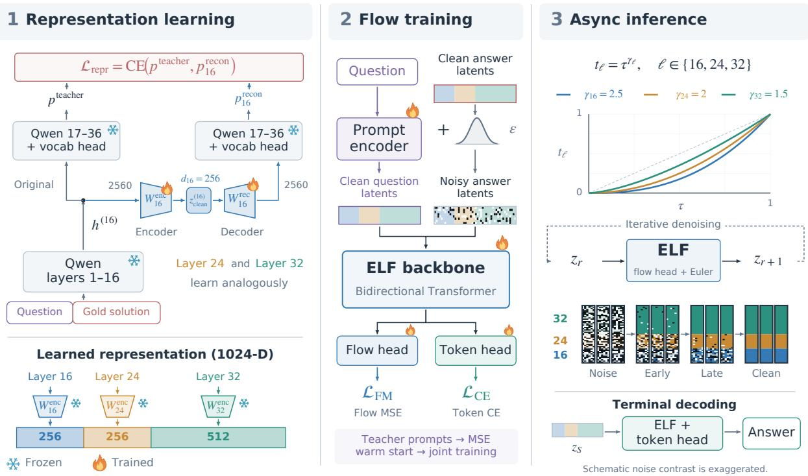
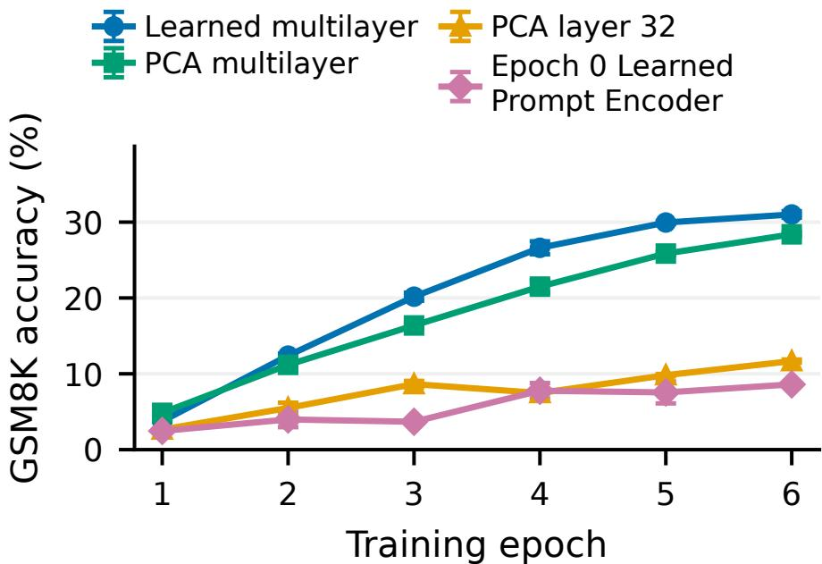
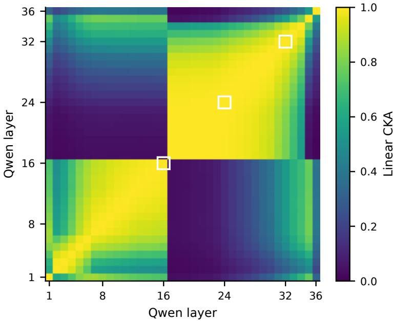
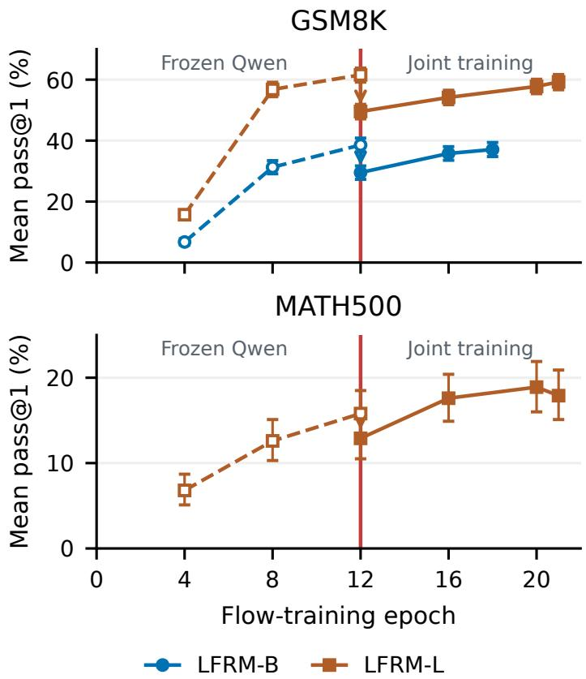
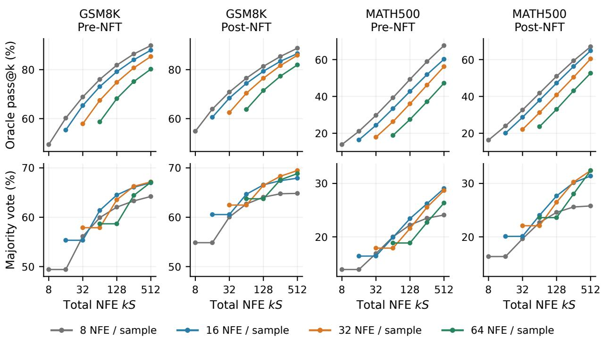
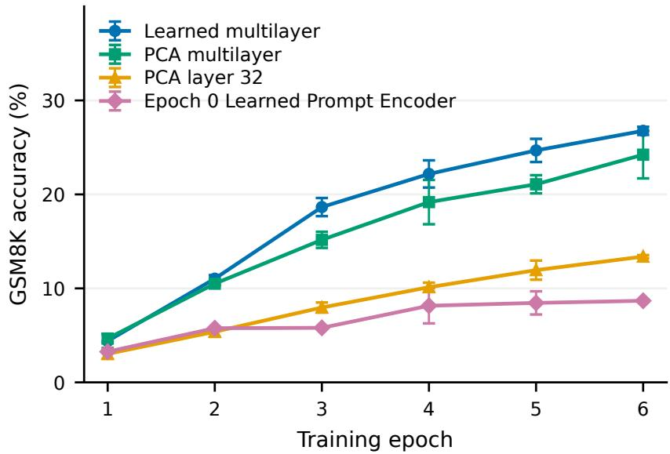
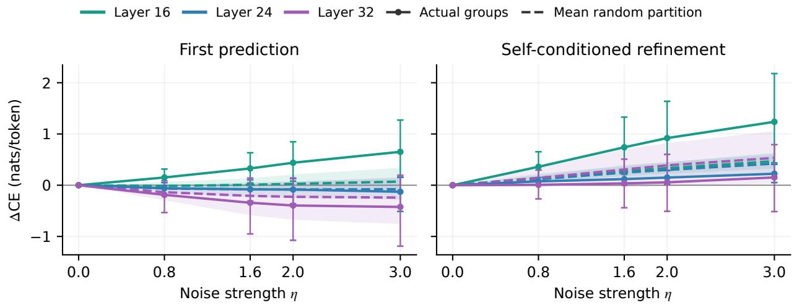
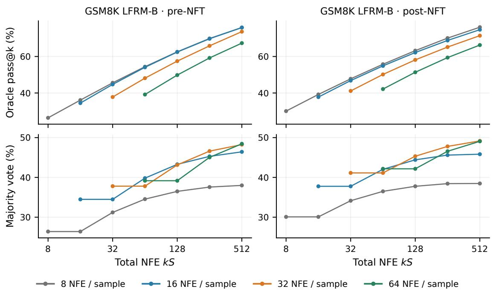
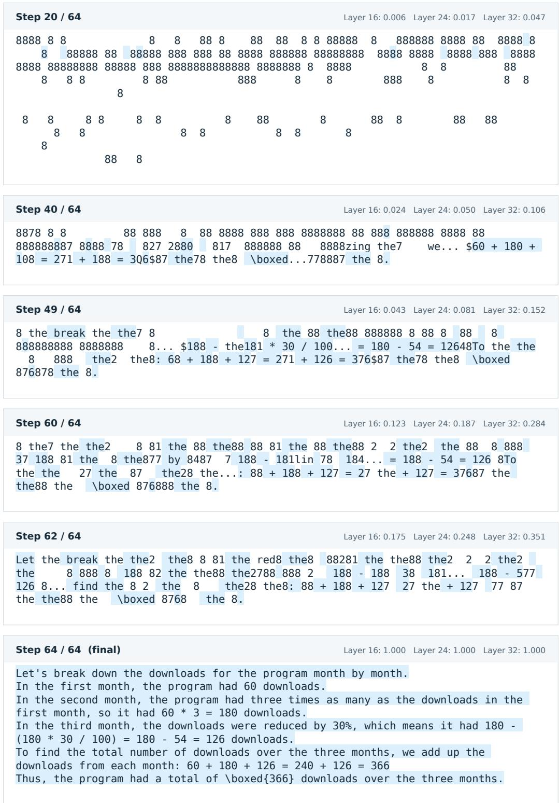

# Reasoning with Continuous Latent Difusion

Xiang Cheng Duke University Department of Electrical and Computer Engineering xiang.cheng@duke.edu

## Abstract

Continuous difusion generates complete reasoning solutions through iterative refinement in latent space. We introduce Latent Flow Reasoning Models (LFRMs), an ELF-based training and inference recipe. Our experiments show that accurate decoding alone does not ensure strong reasoning performance. We therefore learn compact representations from multiple layers of a strong autoregressive teacher. Their decomposition also enables asynchronous denoising at diferent rates. We show that prompt encodings need only preserve the information required for the correct text-conditional score, rather than exactly match teacher features, and use a staged curriculum to learn a compact prompt encoder that replaces the teacher Transformer at inference. We adapt DifusionNFT to learned self-conditioning guidance and incorporate gold-solution endpoints to supplement sparse rewards. Our supervised models outperform reported results from recent continuous-difusion baselines at comparable backbone scales on mathematical reasoning and HumanEval code generation. With a 638M-parameter denoising backbone and learned prompt conditioning, post-NFT LFRM-L achieves 63.74% pass@1 on GSM8K and 24.6% on MATH500 at 64 denoising steps, and 32.85% on HumanEval and 30.18% on HumanEval+ at 128 denoising steps. Code will be available at: https://github.com/chengxiang/LFRM.

## 1 Introduction

Autoregressive language models have made substantial progress on mathematical reasoning (Lewkowycz et al., 2022; DeepSeek-AI et al., 2025). Continuous difusion ofers a complementary approach, generating complete solutions through iterative refinement of all answer positions. Whereas autoregressive and discrete-difusion language models typically generate in token space, continuous latent difusion makes the denoising representation an additional design choice (Hu et al., 2026; Nie et al., 2025). Reasoning requires this representation to preserve exact quantities and dependencies between deductions. We therefore ask: what representation makes complex reasoning solutions amenable to generation through denoising? Token representations span a spectrum of complexity: tokenwise embedding tables, contextual encodings from bidirectional networks such as T5, and hidden activations of powerful autoregressive models (Gulrajani and Hashimoto, 2023; Rafel et al., 2019; Yang et al., 2025). We find that strong clean-token recovery can coexist with weak reasoning generation, motivating representation design for both decoding and generation (Figure 2; Appendix C.2).

We introduce Latent Flow Reasoning Models (LFRMs), based on the simple continuous flow formulation of Embedded Language Flows (ELF; Hu et al., 2026). Our pipeline learns compact answer representations from multiple layers of a strong autoregressive teacher (Figure 1). To avoid retaining the teacher for prompt conditioning, we separate the answer-generation target from the prompt encoding. Conditioning on prompt text makes that encoding an internal, learnable interface:

it need only preserve the information required for denoising, without exact teacher-feature matching (Lemma 1). We use this flexibility to jointly train a compact prompt encoder and denoiser through the generative objective.

Remaining close to standard continuous difusion lets us apply DifusionNFT (Zheng et al., 2025) with verifiable rewards, after adapting it to ELF’s learned guidance. Our supervised models outperform comparable-scale continuous-difusion baselines on mathematical reasoning and HumanEval code generation; NFT further improves accuracy on both math and code.

Contributions. Our complete reasoning pipeline comprises the following key contributions:

1. A complete recipe for competitive continuous-difusion reasoning. We develop an LFRM pipeline spanning representation learning, conditional flow training, and inference (Figure 1). Our models demonstrate strong performance on math and coding tasks. Our supervised models outperform reported continuous-difusion baselines at comparable backbone scales on mathematical reasoning across the evaluated denoising budgets (Tables 3–4); our supervised and post-NFT models also outperform reported PlaidQ results on HumanEval(+) (Table 6).

2. Representation design shapes both reasoning accuracy and denoising dynamics. We analyze representations for both ease of decoding (Appendix C.2) and ease of generation, motivating a learned multilayer representation that improves reasoning accuracy (Figure 2). Its layer decomposition enables asynchronous denoising across components, improving accuracy over synchronous denoising in our matched schedule comparison (Section 4.3 and Table 2). Thus the latent space shapes both what the model learns and how it generates.

3. Learning compact prompt encoders through staged adaptation. We show that information preservation for denoising is suficient for an ideal downstream score network to recover the correct text-conditional score, without exact MSE matching to teacher prompt features (Lemma 1). This permits a compact prompt encoder to replace the large teacher. Our staged curriculum first learns the flow under fixed teacher conditioning, then fits the encoder and jointly adapts both networks (Figure 4), addressing the dificulty of learning them together from initialization (Figure 2).

4. Guidance-compatible difusion reinforcement learning for reasoning. We propose a method to reconcile DifusionNFT’s CFG-free optimization (Zheng et al., 2025) with ELF’s learned self-conditioning guidance. We optimize guidance-corrected fields while retaining guided rollouts, jointly updating the flow and prompt encoder as a text-conditioned policy (Section 5.1). Gold-solution endpoints supplement sparse correctness rewards, with their anchoring efect characterized in Lemma 2. NFT improves single-sample accuracy on math and code, and majority-vote performance on mathematics (Figure 5; Table 6).

## 2 Related work

Difusion language models. Language difusion operates in continuous representations (Gulrajani and Hashimoto, 2023; Tae et al., 2025; Deschenaux and Gulcehre, 2026) or discrete token spaces (Sahoo et al., 2024; Nie et al., 2025; Tang and Wang, 2026), with recent continuous models targeting reasoning, coding, and few-step generation (Agarwal et al., 2026; Azangulov et al., 2026; Peng et al., 2026b). We build on ELF (Hu et al., 2026), which denoises contextual representations and shares a backbone between denoising and token decoding. Concurrent to our paper, ELF-REG (Li et al., 2026)

augments ELF with teacher-feature alignment and a jointly denoised global representation. LFRM learns its answer representation and replaces external prompt encoders with a compact trainable network. Representation design and denoising order. Related work learns or aligns difusion representations in vision and language (Yu et al., 2024; Jiang et al., 2026; Meshchaninov et al., 2026), and explores separate denoising clocks for representation components in vision (Pan et al., 2025; Baade et al., 2026). We study learned multilayer language representations for both decoding and generation, and use their structure for asynchronous inference. Difusion reinforcement learning. Reward-based post-training has also been explored for difusion reasoning (Zhao et al., 2025; Zhu et al., 2025; Kang et al., 2026). We adapt DifusionNFT (Zheng et al., 2025), which optimizes rewarded endpoints through forward-process regression. Our adaptation accommodates ELF’s learned self-conditioning guidance, adds gold-solution anchoring, and jointly updates the flow model and prompt encoder.

## 3 Preliminaries

Tokens, encodings, and latents. Let $q = ( q _ { 1 } , \dots , q _ { L _ { q } } )$ and $a = ( a _ { 1 } , \dots , a _ { L _ { a } } )$ be prompt and answer tokens in vocabulary $\nu ,$ with the answer including its terminal token. Their padded canvas $y = ( q , a , \mathrm { p a d d i n g } )$ has length $L ;$ canvas index i and answer index $j$ satisfy $y _ { L _ { q } + j } = a _ { j }$ . An answer encoder gives $ { \boldsymbol { z } } _ { \mathrm { c l e a n } } =  { \boldsymbol { \mathcal { E } } } (  { \boldsymbol { q } } ,  { \boldsymbol { a } } ) \in \mathbb { R } ^ { L _ { a } \times d }$ , and a prompt-only encoder gives $c _ { \phi } \dot { ( \boldsymbol { q } ) } = \dot { P _ { \phi } } ( \boldsymbol { q } ) \in \mathbb { R } ^ { L _ { q } \times d } ;$ rows are token vectors. Unlike the teacher’s tokenwise lookup $B _ { \psi } [ q _ { i } ] , P _ { \phi }$ uses prompt context. Parameters $\psi$ are frozen teacher weights, ϕ the prompt encoder, and θ the shared denoising/decoding network, with $\Theta = ( \theta , \phi )$ . Teacher layer $\ell$ contributes width $d _ { \ell }$ to total latent width d. Uppercase letters denote random variables.

Flow matching. Flow matching transports noise to data (Lipman et al., 2022). For noise scale $\sigma > 0$ , our linear Gaussian path runs from noise at $t = 0$ to clean latents at $t = 1 \cdot$

$$
z _ { t } = t z _ { \mathrm { c l e a n } } + ( 1 - t ) \sigma \epsilon , \qquad \epsilon \sim \mathcal { N } ( 0 , I ) , \qquad u _ { t } : = \frac { \mathrm { d } z _ { t } } { \mathrm { d } t } = z _ { \mathrm { c l e a n } } - \sigma \epsilon .\tag{1}
$$

Treating text q as the external condition and $c _ { \phi } ( q )$ as its internal encoding, write $v _ { \Theta } ( z , t ; q ) : =$ $v _ { \theta } ( z , t ; c _ { \phi } ( q ) )$ . The conditional objective is

$$
\mathcal { L } _ { \mathrm { F M } } ^ { \mathrm { b a s i c } } ( \Theta ) = \mathbb { E } [ | | v _ { \theta } ( z _ { t } , t ; c _ { \phi } ( q ) ) - u _ { t } | | _ { F } ^ { 2 } ] .\tag{2}
$$

The expectation samples training pairs $( q , a )$ , times $t \sim \pi ( t )$ , and independent Gaussian noise.

Text and encoded conditioning. Write $p _ { t } ( z \mid q )$ for the forward-path density and $s ^ { \star } ( z , t \mid$ $q ) = \nabla _ { z } \log p _ { t } ( z \mid q )$ for its conditional score. For $0 < t < 1$ , the population-optimal velocity is

$$
v ^ { \star } ( z , t \mid q ) = \mathbb { E } [ u _ { t } \mid z _ { t } = z , q ] = { \frac { z + \sigma ^ { 2 } ( 1 - t ) s ^ { \star } ( z , t \mid q ) } { t } } .\tag{3}
$$

Conditioning on $c _ { \phi } ( q )$ may merge distinct prompts; Section 4.2 characterizes when the encoding preserves the text-conditional score.

Sampling under a diferent clock. At inference, let $\tau \in [ 0 , 1 ]$ be solver time and $t = f ( \tau )$ an increasing diferentiable clock with $f ( 0 ) = 0 , f ( 1 ) = 1$ . Starting from $\bar { z } _ { 0 } \sim \mathcal { N } ( 0 , \sigma ^ { 2 } I )$ , sampling obeys $\mathrm { d } \bar { z } _ { \tau } / \mathrm { d } \tau = f ^ { \prime } ( \tau ) v _ { \Theta } ( \bar { z } _ { \tau } , f ( \tau ) ; q )$ . For $f ( \tau ) = \tau ^ { 2 }$ , the multiplier is $2 \tau$ . Exact integration preserves the endpoint, while finite-step accuracy can change. Section 4.3 extends this to group-specific clocks.

  
Figure 1: The LFRM training and inference pipeline. Left: Learn projections of Qwen layers 16/24/32 through teacher cross-entropy, then concatenate their outputs (Section 4.1). Center: Train the ELF backbone with flow and token-decoding losses and staged prompt learning (Sections 4 and 4.2). Right: Denoise the representation groups under asynchronous clocks, then decode the answer in parallel (Section 4.3).

## 4 Continuous Difusion Reasoning

For a general, fixed answer representation $\mathcal { E } ( q , a )$ and prompt encoding $c = c ( q )$ , LFRM follows ELF’s denoising and token-decoding formulation (Hu et al., 2026) (Figure 1). We use canvas length $L = 1 0 2 4$ , latent width d = 1024, and noise scale σ = 2.

Continuous denoising. ELF’s bidirectional backbone predicts $\widehat { z } _ { \mathrm { c l e a n } } = F _ { \theta } ( z _ { t } , t ; c , \widehat { z } _ { \mathrm { s c } } , g )$ from the clean prompt and noisy answer at a shared training time t. Here $\widehat { z } _ { \mathrm { s c } }$ is an earlier clean prediction and g the guidance scale. We apply Eq. (2) with velocity $v _ { \theta } = ( \widehat { z } _ { \mathrm { c l e a n } } - z _ { t } ) / \Delta _ { t }$ and stabilized target $u _ { t } ^ { \mathrm { s t a b } } = ( z _ { \mathrm { c l e a n } } - z _ { t } ) / \Delta _ { t }$ , with $\Delta _ { t } = \operatorname* { m a x } ( 1 - t , 0 . 0 5 )$ ; outside the clamp, $u _ { t } ^ { \mathrm { s t a b } } = u _ { t }$ . Appendix B gives valid-token normalization.

Self-conditioning and SCCFG. ELF’s self-conditioning classifier-free guidance (SCCFG) learns to amplify answer self-conditioning at scale g. It compares predictions with and without answer self-conditioning, retaining the prompt in both; Appendix B gives the detached guidance-adjusted target. Guidance is internal to the field, requiring one denoiser call per step.

Recovering discrete tokens. A vocabulary head on the same backbone predicts same-position answer tokens under a separate decoder corruption $z ^ { \mathrm { d e c } }$

$$
\begin{array} { r } { \mathcal { L } _ { \mathrm { C E } } = \mathbb { E } _ { \mathrm { v a l i d } } \left[ - \log p _ { \theta , j } ^ { \mathrm { t o k } } ( a _ { j } \mid z ^ { \mathrm { d e c } } , c ( q ) ) \right] . } \end{array}\tag{4}
$$

The expectation averages valid answer tokens, including the terminal token; Appendix B specifies the exact batch weighting, decoder corruption, and mode mixing. At inference, encode the prompt once

  
Figure 2: Representation and conditioning afect reasoning. LFRM-B learning curves on GSM8K, with 32 steps and $t = \tau ^ { 2 }$ . The first three variants retain Qwen conditioning; the fourth jointly trains a randomly initialized prompt encoder. Protocol: Appendix C.4; values and SDs: Table 12 (Appendix C.4).

and keep it clean through $S$ Euler steps with recurrent self-conditioning; one additional backbone call decodes the answer in parallel and is excluded from denoising NFE.

## 4.1 Learning the denoising representation

The denoising representation must support generation and token recovery. We extract teacherforced Qwen3-4B-Instruct-2507 activations (Qwen Team, 2025) in one forward pass; although these features are causal, our bidirectional denoiser jointly generates answer representations.

Latent construction. Let $h _ { j } ^ { ( \ell ) }$ be the frozen teacher’s post-block activation at answer position $j .$ We concatenate centered linear projections as $z _ { \mathrm { c l e a n } , j } = \left[ ( h _ { j } ^ { ( \ell ) } - \mu _ { \ell } ) W _ { \ell } ^ { \mathrm { e n c } } \right] _ { \ell \in \mathcal { S } }$ for $ { \boldsymbol { S } } = \{ 1 6 , 2 4 , 3 2 \}$ with widths $( d _ { 1 6 } , d _ { 2 4 } , d _ { 3 2 } ) = ( 2 5 6 , 2 5 6 , 5 1 2 )$ and fixed means $\mu _ { \ell }$ . These maps initially also encode prompts; answer representations stay fixed during flow training and NFT.

Learning the projectors. Linear decoders reconstruct $\widehat { h } _ { j } ^ { ( \ell ) } = \mu _ { \ell } + z _ { \mathrm { c l e a n } , j } ^ { ( \ell ) } W _ { \ell } ^ { \mathrm { r e c } }$ (Figure 1, left). Replacing layer-ℓ answer activations with these reconstructions and running the frozen Qwen sufix yields next-token predictions $p _ { \ell , j } ^ { \mathrm { r e c o n } }$ . We preserve the teacher’s predictions through $\begin{array} { r } { \mathcal { L } _ { \mathrm { r e p r } } = \sum _ { \ell \in S } \mathbb { E } _ { q , a , j } \ \mathrm { C E } ( p _ { j } ^ { \mathrm { t e a c h e r } } , p _ { \ell , j } ^ { \mathrm { r e c o n } } ) } \end{array}$ , where CE is full-vocabulary soft cross-entropy. Only $W _ { \ell } ^ { \mathrm { e n c } }$ and $W _ { \ell } ^ { \mathrm { r e c } }$ are learned; the reconstruction decoders are used only at this stage. Appendix C gives initialization, whitening, and scoring details.

The first three arms in Figure 2 compare 1,024-dimensional whitened representations under matched six-epoch LFRM-B training and evaluation; Table 12 gives four-seed endpoint results.

Decodability and representation choice. The fixed 1,024-dimensional layer-32 PCA representation supports 99.24% held-out same-position token recovery after two epochs of training a separate decoder (Appendix C.2). Yet LFRM-B using this same representation achieves only 11.20% GSM8K accuracy after six epochs. Accurate clean-token recovery alone is therefore an insuficient criterion for choosing a denoising representation.

Layer selection. We choose layers 16, 24, and 32 based on centered kernel alignment (CKA; Kornblith et al., 2019) of Qwen activations (Figure 3). The sharp transition after layer 16 motivates retaining that layer, followed by regularly spaced deeper features at layers 24 and 32. This is a motivation for the triplet, rather than an exhaustive search for optimal layers; Appendix C.3 gives the measurement protocol. Holding the projection method and total latent width fixed, multilayer PCA raises accuracy to 28.43% (Figure 2). The resulting layer groups also enable distinct denoising clocks (Section 4.3).

  
Figure 3: Qwen layer structure. Linear CKA of teacher-forced activations on the combined discovery and confirmation panels. White markers select layers 16, 24, and 32. The transition after layer 16 motivates retaining that layer, followed by regularly spaced deeper features.

Learned versus PCA. PCA preserves high-variance directions, which need not preserve the teacher’s predictive behavior. Holding layers and latent widths fixed, learning the projectors through teacher cross-entropy raises accuracy from 28.43% to 30.76% (Figure 2).

## 4.2 Learning the conditional encoding in three stages

ELF and ELF-REG use external contextual prompt encoders (Hu et al., 2026; Li et al., 2026). We instead replace the Qwen teacher Transformer with a compact trainable encoder, retaining its frozen token lookup. For $\mathrm { L F R M - L } ,$ the contextual network has 121M parameters, compared with 3.63B in the full teacher Transformer (both excluding vocabulary input/output maps). The student uses six bidirectional attention blocks and encodes each prompt once; see Appendix A for its architecture.

The prompt as the condition. The text-conditioned field $v _ { \Theta }$ of Section 3 includes selfconditioning and guidance as auxiliary inputs. We jointly optimize $\theta$ and $\phi ,$ keeping the prompt text, answer representation, and forward corruption fixed. The following lemma characterizes what the encoding must preserve.

Lemma 1 (Preserving the text-conditional score). Let $Z _ { \mathrm { c l e a n } }$ and $Q$ denote the clean answer latents and prompt, with $\mathbb { E } \Vert \breve { Z } _ { \mathrm { c l e a n } } \Vert _ { F } ^ { 2 } < \infty$ , and fix a deterministic encoder $C = P _ { \phi } ( Q )$ . Let $s ^ { \star } ( z , t \mid c )$

  
Figure 4: From teacher conditioning to learned prompts. Top: GSM8K; bottom: MATH500. Circles/squares denote LFRM-B/L; open/filled markers denote Qwen/learned prompt encoding. Red line: epoch-12 switch; arrows: immediate MSE-swap loss. Values and settings: Appendix B.3.

denote the score conditioned on $C = c .$ . Under the independent Gaussian corruption in $E q . \ ( 1 )$ , for $0 < t < 1$ and $c = P _ { \phi } ( q )$ 2

$$
\begin{array} { r } { s ^ { \star } ( z , t \mid q ) - s ^ { \star } ( z , t \mid c ) = \cfrac { t } { \sigma ^ { 2 } ( 1 - t ) ^ { 2 } } \big ( \mathbb { E } [ Z _ { \mathrm { c l e a n } } \mid Z _ { t } = z , Q = q ] - \mathbb { E } [ Z _ { \mathrm { c l e a n } } \mid Z _ { t } = z , C = c ] \big ) . } \end{array}\tag{5}
$$

Thus an encoder preserves the full-prompt score exactly when it preserves the posterior mean clean answer. If this holds along the path, the optimal unguided field also agrees by Eq. (3), giving the same conditional endpoint law under exact integration whenever the flow is well-defined.

The encoder need not reproduce the teacher’s coordinates: it must preserve the information needed for the posterior mean answer. Appendix B.2 proves the lemma and gives an information-preserving encoding with arbitrarily large teacher-imitation MSE. MSE matching supplies a compatible initialization, while downstream training can adapt the encoder and denoiser jointly. We use three stages, keeping answer representations and token embeddings fixed throughout (details in Appendix A):

1. Frozen conditioning. Train the flow model for 12 epochs using fixed Qwen prompt representations and the flow/decoder objective. 2. Prompt imitation. Freeze the flow model and fit the compact encoder to the teacher prompt representations using MSE. 3. Joint adaptation. Substitute the learned encoder and optimize both networks through the flow/decoder objective, without an additional prompt-MSE loss, to epoch 18 for LFRM-B or epoch 21 for LFRM-L on the mathematical reasoning tasks.

Replacing Qwen with the MSE-trained encoder immediately reduces accuracy, despite unchanged flow-model weights (Figure 4). Subsequent joint training recovers much of this loss on GSM8K and exceeds the original teacher-conditioned checkpoint on MATH500. This recovery reflects adaptation of both networks, showing the value of learning the conditioning interface through the generative objective.

Importance of fixing initial conditioning. Joint learning from initialization makes the conditioning interface change while the flow model is still learning to interpret it. Under the matched six-epoch comparison, this approach reaches only 8.70% GSM8K accuracy, versus 30.76% with frozen teacher conditioning (Figure 2). This motivates stabilizing the condition during early learning and adapting it afterward.

Table 1 summarizes the curriculum and reported NFT endpoints for each task. The coding joint stage additionally regularizes prompt features toward the teacher; Appendix A.3 specifies this term.

Table 1: Training stages by task. Flow-training epochs count passes over answer rows; prompt-MSE epochs count passes over unique prompts and do not advance the flow-training epoch. Joint epochs are additional to the first 12 flow epochs. The last column gives the NFT checkpoint used for reporting, in successful optimizer updates, rather than a further epoch count.
<table><tr><td>Task / model</td><td>Frozen-Qwen flow epochs</td><td>Prompt-MSE epochs</td><td>Joint epochs (flow endpoint)</td><td>Reported NFT update</td></tr><tr><td>GSM8K / LFRM-B</td><td>12</td><td>60</td><td>6 (18)</td><td>300</td></tr><tr><td>GSM8K /LFRM-L</td><td>12</td><td>30</td><td>9 (21)</td><td>500</td></tr><tr><td>MATH / LFRM-L</td><td>12</td><td>10</td><td>9 (21)</td><td>600</td></tr><tr><td>OpenCodeInstruct /LFRM-L</td><td>12</td><td>10</td><td>1 (13)</td><td>100</td></tr></table>

## 4.3 Asynchronous inference with local clocks

Our multilayer representation allows diferent feature groups to become clean at diferent rates, potentially letting one group use cleaner information from another. We extend the shared clock of Section 3 to layer-specific clocks $t _ { \ell } = f _ { \ell } ( \tau ) = \tau ^ { \gamma _ { \ell } }$ for $\ell \in \{ 1 6 , 2 4 , 3 2 \}$ at inference, while retaining synchronous training. Equal exponents recover synchronous inference; unequal exponents give diferent noise levels within a single denoiser call.

Adapting a synchronously trained denoiser. Although training uses a shared time, inference applies the same learned time-embedding function to each local time and averages its outputs, $\begin{array} { r } { \bar { e } _ { \theta } ^ { \mathrm { t i m e } } ( t ) = \frac { 1 } { 3 } \sum _ { \ell } e _ { \theta } ^ { \mathrm { t i m e } } ( t _ { \ell } ) } \end{array}$ . This needs no retraining and recovers the original embedding when local times agree.

For solver state $z _ { r } = \bar { z } _ { \tau _ { r } }$ , predicted clean endpoint ${ \widehat { z } } _ { \mathrm { c l e a n } , r } ,$ and local times $t _ { \ell , r } = f _ { \ell } ( \tau _ { r } )$ , the groupwise Euler update is

$$
z _ { r + 1 } ^ { ( \ell ) } = z _ { r } ^ { ( \ell ) } + \left( \tau _ { r + 1 } - \tau _ { r } \right) f _ { \ell } ^ { \prime } ( \tau _ { r } ) \frac { \widehat { z } _ { \mathrm { c l e a n } , r } ^ { ( \ell ) } - z _ { r } ^ { ( \ell ) } } { \Delta _ { t _ { \ell , r } } } ,\tag{6}
$$

with $\Delta _ { t }$ defined in Section 4. All groups update from the same denoiser call, so asynchrony does not increase NFE. Unlike shared-clock reparameterization, this adapts the model to unequal group times absent from synchronous training; implementation details appear in Appendix D.

Schedule choice and reasoning accuracy. Our headline results use $( \gamma _ { 1 6 } , \gamma _ { 2 4 } , \gamma _ { 3 2 } ) \ =$ (2.5, 2, 1.5), chosen based on the highest observed accuracy in the reported MATH validation comparison (Appendix D). The shared-square clock improves on the identity clock, and (2.5, 2, 1.5)

Table 2: Inference clocks change accuracy without retraining. LFRM-L epoch 21, 32 steps; mean pass@1 (%). Protocol and full sweep: Appendix D.
<table><tr><td> $\left( \gamma _ { 1 6 } , \gamma _ { 2 4 } , \gamma _ { 3 2 } \right)$ </td><td>GSM8K MATH500</td></tr><tr><td>(1,1,1) 52.96 (±1.13) 15.50 (±1.27)</td></tr><tr><td>57.51 (±0.80) 17.40 (±1.41)</td></tr><tr><td>(2, 2,2) (1.5, 2, 2.5) 58.07 (±0.64) 17.60 (±1.98)</td></tr><tr><td>59.25 (±0.16) 17.90 (±1.27)</td></tr><tr><td>(2.5, 2, 1.5)</td></tr></table>

achieves the highest mean among the four schedules in Table 2 on both benchmarks. The validation and lower-NFE comparisons show that the ordering depends on the evaluation setting (Appendix D).

Reconstruction probes reveal distinct sensitivities across layer groups, with weaker contrasts under random coordinate grouping (Figure 7). These findings motivate studying coordinated denoising across representations, but do not establish the mechanism behind the sampling gains.

## 5 Reinforcement learning with self-conditioned flows

DifusionNFT (Zheng et al., 2025) improves continuous generators through rewarded endpoint regression, without diferentiating through sampling trajectories. We adapt it to LFRM’s learned self-conditioning guidance and supplement sparse correctness rewards with gold-solution endpoints.

## 5.1 NFT with learned self-conditioning guidance

The velocity field optimized by standard NFT. Let $v _ { \mathrm { c u r } }$ and $v _ { \mathrm { o l d } }$ denote the current and old policy velocity fields, u a sample’s forward velocity target, and $\rho \in [ 0 , 1 ]$ its normalized optimality coeficient. NFT forms implicit positive and negative velocity fields, $v ^ { + } = ( 1 - \beta ) v _ { \mathrm { o l d } } + \beta v _ { \mathrm { c u r } }$ and $v ^ { - } = ( 1 + \beta ) v _ { \mathrm { o l d } } - \beta v _ { \mathrm { c u r } }$ . For current and old velocity-field values $f , h .$ , the pointwise loss is

$$
\ell _ { \beta } ( f , h ; u , \rho ) = \rho \| ( 1 - \beta ) h + \beta f - u \| _ { 2 } ^ { 2 } + ( 1 - \rho ) \| ( 1 + \beta ) h - \beta f - u \| _ { 2 } ^ { 2 } .\tag{7}
$$

Standard NFT applies this loss to $f = v _ { \mathrm { c u r } }$ and $h = v _ { \mathrm { o l d } }$ , holding the old field fixed; its original experiments use CFG-free optimization (Zheng et al., 2025). LFRM instead learns a guidanceconditioned field, motivating a correction before applying NFT’s regression objective.

Constructing the SCCFG-compatible field. For each policy $p \in \{ \mathrm { c u r } , \mathrm { o l d } , \mathrm { r e f } \}$ , forwardnoise an endpoint and obtain velocity $v _ { p } ^ { 0 }$ from a detached bootstrap without answer self-conditioning. The main prediction $v _ { p } ^ { \mathrm { m a i n } }$ uses the bootstrap clean endpoint when $b _ { \mathrm { s c } } = 1$ and zero answer selfconditioning otherwise; both passes retain the question. Following ELF’s guidance construction, define

$$
\widetilde { v } _ { p } = v _ { p } ^ { \operatorname* { m a i n } } - \mathrm { s g } \big [ b _ { \mathrm { s c } } ( 1 - g ^ { - 1 } ) ( v _ { p } ^ { \operatorname* { m a i n } } - v _ { p } ^ { 0 } ) \big ] ,\tag{8}
$$

where $g > 0$ is the SCCFG scale. Our update applies Eq. (7) to $f = \widetilde { v } _ { \mathrm { c u r } } , h = \mathrm { s g } ( \widetilde { v } _ { \mathrm { o l d } } )$ , and $u = u _ { t } ^ { \mathrm { s t a b } }$ from Section 4. We use $\beta = 1$ and add a squared-velocity penalty toward the corrected field $\widetilde { v } _ { \mathrm { r e f } }$ of the fixed initial reference. With self-conditioning enabled, the corrected value is $v _ { p } ^ { 0 } + ( v _ { p } ^ { \operatorname* { m a i n } } - v _ { p } ^ { 0 } ) / g$ Detaching the correction preserves the main-pass Jacobian rather than scaling it by 1/g (Appendix E).

Guided rollouts and forward-process updates. Collection retains recurrent self-conditioning and SCCFG guidance. We reward decoded answers but optimize their saved continuous endpoints, using fresh forward corruption and bootstrap predictions rather than replaying rollout histories. Thus rollouts remain guided while NFT optimizes the corrected fields in Eq. (8).

## 5.2 Gold-anchored reasoning updates

Each question contributes 15 old-policy generations and one gold latent endpoint, with raw rewards 0.75 for correct generated answers, 0 for incorrect answers, and 1 for gold. The gold endpoint supplies a preferred target even when all generated answers are incorrect. We discard groups whose generated answers are all correct, concentrating updates on observed failures; retained rewards are normalized into ρ as described in Appendix E. This recipe uses reference solutions as well as verifiable rewards. Gold raw reward one need not give $\rho _ { G } = 1$ ; the following lemma characterizes its contribution.

Lemma 2 (Gold endpoints as field anchors). For a gold endpoint, let H contain the noisy state, time, question, coeficient $\rho _ { G } \in [ 1 / 2 , 1 ]$ , and any auxiliary inputs held fixed for the update. Let U denote the random stabilized target $u _ { t } ^ { \mathrm { s t a b } }$ , assume its conditional second moment is finite, and set $m _ { G } = \mathbb { E } [ U \mid \mathcal { H } , \operatorname { g o l d } ]$ . For H-measurable current and old velocity-field values $f , h ,$ , define $a _ { G } = ( 2 \rho _ { G } - 1 ) m _ { G } + 2 ( 1 - \rho _ { G } ) h$ . The beta-one NFT loss satisfies

$$
\begin{array} { r } { \mathbb { E } [ \ell _ { 1 } ( f , h ; U , \rho _ { G } ) \mid { \mathcal { H } } , \operatorname { g o l d } ] = \| f - a _ { G } \| _ { 2 } ^ { 2 } + C _ { \mathcal { H } } , } \end{array}\tag{9}
$$

where $C _ { \mathcal { H } }$ is independent of f with the conditioning information and auxiliary fields fixed. Thus the gold term attracts the current field toward a convex combination of the gold posterior target and the old field.

At $\rho _ { G } = 1$ , the gold term directly regresses toward $m _ { G }$ . Under an ideal reference model matching that gold posterior target, the anchor interpolates between the reference and old fields; Appendix E.4 gives the proof and scope. This gold-induced anchor complements the explicit reference penalty.

Because the external condition is the question text, NFT jointly updates the prompt encoder and flow model as one conditional policy (Lemma 1), without a prompt-imitation objective. Training uses synchronous identity clocks; asynchronous evaluation follows Section 4.3. Appendix A gives optimization details, and Sections 6.1 and 6.2 discuss the empirical gains.

## 6 Empirical Evaluation

We evaluate mathematical reasoning on GSM8K and MATH500 (Cobbe et al., 2021; Hendrycks et al., 2021; Hugging Face H4, 2024), and code generation in Section 6.2. Math evaluations use zero-shot prompts, async clocks (2.5, 2, 1.5), numerical-answer scoring for GSM8K, and Math-Verify for MATH500 (Kydlíček, 2025). Headline pass@1 averages eight sampling seeds at 64 denoising steps. NFE counts denoising calls, excluding prompt encoding and terminal decoding. Appendices F and G.1 give checkpoint settings and seed standard deviations.

## 6.1 Mathematical reasoning

Reasoning accuracy across denoising budgets. At comparable denoising-backbone sizes, supervised LFRM already exceeds the reported continuous-difusion baselines, and NFT gives our strongest results (Table 3). On MATH500, supervised LFRM-L reaches 21.18%, compared with ELF-REG-L’s 13.39% at 127 denoising calls (Li et al., 2026). Our 90.4M/638M denoisers use compact learned prompt encoders, without executing the teacher Transformer during generation. The autoregressive, discrete-difusion, and larger continuous-model rows provide broader performance context. Their training data, model sizes, and evaluation protocols difer from ours.

Both supervised and post-NFT LFRM retain this advantage at 8, 16, 32, and 64 NFE within each backbone-size group (Table 4). At eight steps, supervised LFRM-L reaches 15.23% on MATH500, exceeding ELF-REG-L’s 13.39% at 127 denoising calls. Useful reasoning therefore emerges without training a separate few-step student. These are reported operating points with diferent training and evaluation protocols; NFE does not equate FLOPs across methods. The MATH500 headline tables use SCCFG 3; GSM8K and all inference-allocation curves retain SCCFG 2.

Table 3: Mathematical reasoning across model families, mean pass@1 (%). Parameters are in millions (three significant digits). Embedding Params count vocabulary input/output maps, tied weights once; Other Params count remaining weights, with (+X) used once per response. Frozen components are included. <sup>∗</sup>N denotes N − 1 denoising calls for ELF-REG. Bold/underline mark first/second within each sub-billion continuous-backbone group.
<table><tr><td>Model</td><td>Embedding Params (M)</td><td>Other Params (M)</td><td>NFE</td><td></td><td>GSM8K MATH500</td></tr><tr><td colspan="6">Autoregressive</td></tr><tr><td>Qwen3-0.6B-Base (Yang et al., 2025)</td><td>156</td><td>440</td><td></td><td>59.59</td><td></td></tr><tr><td>Qwen3-0.6B, thinking (Yang et al., 2025)</td><td>156</td><td>440</td><td></td><td></td><td>77.60</td></tr><tr><td colspan="6">Discrete diffusion / blockwise diffusion</td></tr><tr><td>LLaDA-8B-Base (Nie et al., 2025)</td><td>1,040</td><td>6,980</td><td>1,024</td><td>70.30</td><td></td></tr><tr><td>Dream-v0-Base-7B (Ye et al., 2025)</td><td>1,090</td><td>6,530</td><td>256</td><td>77.20</td><td></td></tr><tr><td>SDAR-1.7B-Chat (Cheng et al., 2025)</td><td>622</td><td>1,410</td><td>4/block</td><td>80.10</td><td>63.20</td></tr><tr><td colspan="6">Continuous diffusion /flow: denoising backbone below 200M</td></tr><tr><td>S-FLM (top-1) (Deschenaux and Gulcehre, 2026)</td><td>75.5</td><td>87.5</td><td>1,024</td><td>18.00†</td><td></td></tr><tr><td>FMLM+ Init (Agarwal et al., 2026)</td><td>75.5</td><td>92</td><td>64</td><td>33.60†</td><td></td></tr><tr><td>ELF-REG-B (Li et al., 2026)</td><td>311</td><td>104 (+441)</td><td>*64</td><td>38.11</td><td></td></tr><tr><td>LFRM-B, pre-NFT (ours)</td><td>545</td><td>90.4 (+45.8)</td><td>64</td><td>39.17</td><td></td></tr><tr><td>LFRM-B, post-NFT (ours)</td><td>545</td><td>90.4 (+45.8)</td><td>64</td><td>42.16</td><td></td></tr><tr><td colspan="6">Continuous diffusion / flow: denoising backbone 200M–1B</td></tr><tr><td>ELF-REG-L (Li et al., 2026)</td><td>311</td><td>652 (+442)</td><td>*64 / *128</td><td>55.96</td><td>13.39</td></tr><tr><td>LFRM-L, pre-NFT (ours)</td><td>545</td><td>638 (+123)</td><td>64</td><td>58.67</td><td>21.18</td></tr><tr><td>LFRM-L, post-NFT (ours)</td><td>545</td><td>638 (+123)</td><td>64</td><td>63.74</td><td>24.68</td></tr><tr><td colspan="6">Continuous diffusion /flow: larger backbones (reference)</td></tr><tr><td>MLFM (Azangulov et al., 2026)</td><td>123</td><td>1,220</td><td>NR§</td><td>31.24</td><td></td></tr><tr><td>TESS 2, GSM8K FT (Tae et al., 2025)</td><td>262</td><td>6,740</td><td>1,000</td><td>≈68.9‡</td><td></td></tr></table>

External results are author-reported; <sup>†</sup>Python scoring, <sup>‡</sup>Approximate accuracy read from TESS 2 Figure 3b. <sup>§</sup>MLFM reports 256 sampling steps with guidance and online token promotion; the corresponding NFE is not established (NR). Slashes separate GSM8K/MATH500 budgets. Appendix F details prompting and parameter accounting; Table 15 in Appendix G.1 gives our seed SDs.

Table 4: Reasoning at lower NFE, mean pass@1 (%). Table 3 gives model parameter counts. Bold/underline mark first/second within each benchmark and backbone-scale block; <sup>∗</sup> marks one fewer denoising call than the heading. External results follow Agarwal et al. (2026); Li et al. (2026); Appendix F gives source and protocol details.
<table><tr><td rowspan="2">Method / NFE</td><td colspan="4">GSM8K (~100M)</td><td colspan="5">GSM8K (~650M)</td><td colspan="5">MATH500 (~650M)</td></tr><tr><td>8</td><td>16</td><td>32</td><td></td><td>64</td><td>8</td><td>16</td><td>32</td><td>64</td><td>8</td><td>16</td><td></td><td>32</td><td>64</td></tr><tr><td>FMLM+ Init</td><td></td><td>15.10</td><td>26.10</td><td>31.80</td><td>33.60</td><td></td><td></td><td></td><td></td><td></td><td></td><td></td><td></td><td></td></tr><tr><td>ELF-REG</td><td>*26.20</td><td>*34.42</td><td></td><td>*37.15</td><td>*38.11</td><td>*47.34</td><td>*52.89</td><td></td><td>*55.04 *55.96</td><td></td><td>*9.76</td><td> *11.53 *12.40 *13.31</td><td></td><td></td></tr><tr><td>LFRM, pre-NFT</td><td>26.40</td><td>34.48</td><td>37.80</td><td></td><td>39.17</td><td>49.41</td><td>55.33</td><td>57.88</td><td>58.67</td><td>15.23</td><td>17.93</td><td></td><td>19.65</td><td>21.18</td></tr><tr><td>LFRM, post-NFT</td><td>30.08</td><td>37.77</td><td>41.13</td><td></td><td>42.16</td><td>54.84</td><td>60.55</td><td>62.47</td><td></td><td>63.74 17.45</td><td>20.93</td><td></td><td>22.60 24.68</td><td></td></tr></table>

Our checkpoints are fixed across columns, with SCCFG 2 for GSM8K and 3 for MATH500. Sampling-seed counts and SDs: Table 15 in Appendix G.1.

Refining an answer or drawing more answers. For k samples with S denoising steps each, we use kS as the inference budget. Oracle pass@k measures whether any sample is correct; majority vote selects the most frequent final answer after grouping equivalent answers, without consulting the reference. For selectors returning one of the generated answers, voting provides an achievable lower bound on optimal selection accuracy, while oracle pass@k supplies its upper bound. We compare S ∈ {8, 16, 32, 64} up to a budget of 512 calls; Appendix G.3 gives aggregation details.

  
Figure 5: LFRM-L before and after NFT on GSM8K and MATH500, with SCCFG 2. Top: oracle pass@k; bottom: majority-vote accuracy. Colors denote denoising NFE per sample; the budget is kS. Numerical values appear in Appendix G.3; Appendix G.2 gives the corresponding LFRM-B curves.

Figure 5 shows that oracle selection generally favors more attempts with fewer steps, whereas voting generally favors higher-NFE samples. On MATH500 after NFT, 64 eight-step samples reach 67.00% oracle accuracy, versus 52.60% for eight 64-step samples; voting reverses this preference, at 25.79% versus 32.42%. Intermediate depths remain competitive for voting. The voting–oracle gap motivates better answer selection, potentially using latent-space or hidden-state classifiers.

The corresponding GSM8K LFRM-B comparison appears in Appendix G.2.

What changes after NFT? NFT improves single-sample accuracy at every reported denoising depth (Tables 3–4). At 64 steps with SCCFG 2, the paired LFRM-L gains are +5.07 percentage points on GSM8K and +4.75 on MATH500. These results support the promise of difusion RL for continuous reasoning models. The benefit is less uniform for high-k oracle coverage: at eight steps on MATH500, NFT raises pass@1 from 13.88% to 16.31%, while pass@64 changes from 67.60% to 67.00%. Voting shows clearer gains: with eight 64-step samples, MATH500 accuracy rises from 26.34% to 32.42% (+6.07 points). Voting benefits from the correct answer’s frequency relative to competing answers, whereas oracle selection needs only one successful draw. These patterns do not establish reduced reasoning diversity after NFT; Appendix G.3 gives further comparisons and interpretation. Appendices I.1–I.2 illustrate complete solutions and intermediate generations.

Higher-pass comparison with continuous-difusion baselines. At 64 denoising calls, supervised and post-NFT LFRM-L reach MATH500 pass@8 of 47.20% and 52.60%, respectively. Both exceed ELF-REG-L’s reported pass@10 of 44.04% at 63 denoising calls (Table 5; Li et al., 2026, Table 18). This compares explicitly diferent attempt counts, not equal compute or an estimate of our pass@10. These LFRM results use SCCFG 2, matching Figure 5; the headline pass@1 tables use SCCFG 3.

Table 5: MATH500 oracle accuracy at higher sample counts. LFRM-L uses learned prompt conditioning, SCCFG 2, and eight saved draws. ELF-REG-L retains its external prompt encoder and reports the two sample counts below. NFE counts denoising calls per sample; k × NFE makes the difering total budgets explicit. These are cross-paper reported results, with protocol details in Appendix F. Table 17 gives our uncertainty estimates.
<table><tr><td>Model</td><td>NFE</td><td>k</td><td>k × NFE</td><td>Pass@k (%)</td></tr><tr><td>ELF-REG-L (Li et al., 2026)</td><td>63</td><td>8</td><td>504</td><td>40.41</td></tr><tr><td>ELF-REG-L (Li et al., 2026)</td><td>63</td><td>10</td><td>630</td><td>44.04</td></tr><tr><td>LFRM-L, pre-NFT</td><td>64</td><td>8</td><td>512</td><td>47.20</td></tr><tr><td>LFRM-L, post-NFT</td><td>64</td><td>8</td><td>512</td><td>52.60</td></tr></table>

## 6.2 Code generation

On OpenCodeInstruct (Ahmad et al., 2025), LFRM-L uses 12 epochs of frozen-Qwen flow training, ten prompt-MSE epochs, one joint epoch, and 100 NFT updates with execution-based rewards (Appendix A). Our rows in Table 6 use eight seeds, 128 denoising calls, async (2.5, 2, 1.5), and SCCFG 3.

Pre- and post-NFT LFRM exceed reported PlaidQ results on HumanEval(+), but trail guided PlaidQ on MBPP-378 base. Under the same function-name aliasing rule, they also exceed ELF-REG-L (Table 6, lower block). Prompts and execution limits still difer across papers, as detailed in Appendix H. NFT raises pass@1 on all four coding metrics, including HumanEval+ by 3.28 points and MBPP+ by 3.21. HumanEval(+) approaches frozen-Qwen conditioning, while a substantial MBPP gap remains. Higher-pass oracle gains are smaller, as in mathematics; paired comparisons appear in Appendix H.

Prompt adaptation remains task dependent. With identical epoch-12 flow weights and 32 denoising steps, replacing Qwen with the encoder after one MSE epoch reduces HumanEval+ from 25.61% to 18.60% and MBPP+ from 32.34% to 7.61% (Table 19). Ten MSE epochs recover HumanEval+ to 24.70%, close to teacher conditioning, but MBPP+ reaches only 15.15%. The 24.74-point initial MBPP+ drop is substantially larger than the prompt-swap losses in mathematical reasoning (Figure 4). These comparisons use the respective tasks’ selected prompt checkpoints, rather than equal imitation-training budgets.

This replaces a 3.63B-parameter contextual teacher with a 121M-parameter prompt encoder, excluding vocabulary maps. Unique formatted training prompts average 233.44 tokens for code, versus 84.17 for GSM8K and 89.15 for MATH; longer contexts may make the compression harder, although we have not isolated length as the cause. At 128 steps, one joint epoch improves HumanEval(+) pass@1 by 1.60 points but decreases standard MBPP-378 base/MBPP+ by 1.16/0.56 points; subsequent NFT improves all four metrics. The conditioning interface therefore remains a meaningful design challenge. ELF-REG retains an approximately 440M-parameter contextual encoder, while our frozen-Qwen reference uses a much larger teacher, so neither comparison isolates encoder capacity. Appendix H gives the full trajectories, prompt-length statistics, and paired comparisons.

Table 6: Code generation under separate scoring conventions. Mean pass@1 (%). HE/HE+ use base/full extended tests; both MBPP columns use 378 tasks. PlaidQ’s “MBPP+” uses base tests. Frozen Qwen and prompt MSE 10 share the epoch-12 backbone; pre-NFT is joint epoch 13, and post-NFT is update 100. Our rows use eight seeds. <sup>∗</sup>128 denotes 127 denoising calls for ELF-REG; all budgets exclude terminal decoding. The alias block allows single-function entry-point repair; rows across blocks should not be ranked together. Appendix H gives remaining protocol diferences and seed SDs.
<table><tr><td>Model / setting</td><td>Denoising NFE</td><td>HE</td><td>HE+</td><td>MBPP-378 base</td><td>MBPP+ full</td></tr><tr><td>Standard scoring: no function-name repair</td><td></td><td></td><td></td><td></td><td></td></tr><tr><td>PlaidQ (Peng et al., 2026b)</td><td>128</td><td>19.02</td><td>18.05</td><td>22.18</td><td></td></tr><tr><td>PlaidQ+CFG (Peng et al., 2026b)</td><td>256</td><td>22.04</td><td>19.70</td><td>24.58</td><td></td></tr><tr><td>LFRM-L / frozen Qwen</td><td>128</td><td>33.69</td><td>30.87</td><td>38.72</td><td>33.99</td></tr><tr><td>LFRM-L / prompt MSE 10</td><td>128</td><td>27.97</td><td>25.30</td><td>19.61</td><td>16.96</td></tr><tr><td>LFRM-L, pre-NFT (ours)</td><td>128</td><td>29.57</td><td>26.91</td><td>18.45</td><td>16.40</td></tr><tr><td>LFRM-L, post-NFT (ours)</td><td>128</td><td>32.85</td><td>30.18</td><td>22.26</td><td>19.61</td></tr><tr><td>Single-function name aliasing</td><td></td><td></td><td></td><td></td><td></td></tr><tr><td>ELF-REG-L (Li et al., 2026)</td><td>*128</td><td>22.56</td><td>21.46</td><td>28.92</td><td></td></tr><tr><td>LFRM-L / frozen Qwen (ours)</td><td>128</td><td>33.69</td><td>30.87</td><td>43.45</td><td>37.93</td></tr><tr><td>LFRM-L / prompt MSE 10</td><td>128</td><td>28.05</td><td>25.38</td><td>30.99</td><td>26.32</td></tr><tr><td>LFRM-L, pre-NFT (ours)</td><td>128</td><td>29.73</td><td>27.06</td><td>32.11</td><td>27.81</td></tr><tr><td>LFRM-L, post-NFT (ours)</td><td>128</td><td>33.16</td><td>30.26</td><td>38.96</td><td>33.76</td></tr></table>

Higher-pass code generation. The eight saved draws also support oracle pass@8 (Table 7). Without function-name repair, pre- and post-NFT LFRM-L exceed PlaidQ+CFG’s reported pass@10 on HumanEval and HumanEval+. Under aliasing, both exceed ELF-REG-L’s pass@8 and pass@10 on all three metrics that it reports. Standard MBPP-378 remains weaker: our post-NFT pass@8 is 43.39%, compared with guided PlaidQ’s pass@10 of 44.79%. These comparisons retain each paper’s attempt count and scoring category; we do not infer LFRM pass@10 from eight draws. Tables 20–21 give pass@1/2/4/8 and uncertainty for every LFRM stage.

Table 7: Oracle code accuracy with multiple attempts. Entries are pass@k (%) at the stated k, with denoising NFE per sample. Our learned-conditioning rows use eight draws; external pass@10 values remain labeled as such. PlaidQ uses token-prefix conditioning and ELF-REG-L an external contextual encoder. Separate blocks retain standard versus alias scoring, and both MBPP columns use the same 378 tasks. External values are from PlaidQ Table 1 and ELF-REG Table 16; generation protocols and total compute difer.
<table><tr><td>Model</td><td>NFE</td><td>k</td><td>HE</td><td>HE+</td><td>MBPP-378 base</td><td>MBPP+ full</td></tr><tr><td colspan="7">Standard scoring: no function-name repair</td></tr><tr><td>PlaidQ (Peng et al., 2026b)</td><td>128 </td><td>10</td><td>25.72</td><td>24.03</td><td>34.33</td><td></td></tr><tr><td>PlaidQ+CFG (Peng et al., 2026b)</td><td>256</td><td>10</td><td>39.87</td><td>36.74</td><td>44.79</td><td></td></tr><tr><td>LFRM-L, pre-NFT</td><td>128</td><td>8</td><td>54.27</td><td>47.56</td><td>39.95</td><td>35.98</td></tr><tr><td>LFRM-L, post-NFT</td><td>128</td><td>8</td><td>54.27</td><td>49.39</td><td>43.39</td><td>37.83</td></tr><tr><td>Single-function name aliasing</td><td></td><td></td><td></td><td></td><td></td><td></td></tr><tr><td>ELF-REG-L (Li et al., 2026)</td><td>127</td><td>8</td><td>46.42</td><td>44.22</td><td>52.89</td><td></td></tr><tr><td>ELF-REG-L (Li et al., 2026)</td><td>127</td><td>10</td><td>48.87</td><td>46.69</td><td>55.05</td><td></td></tr><tr><td>LFRM-L, pre-NFT</td><td>128</td><td>8</td><td>54.27</td><td>47.56</td><td>57.14</td><td>49.21</td></tr><tr><td>LFRM-L, post-NFT</td><td>128</td><td>8</td><td>54.88</td><td>49.39</td><td>60.32</td><td>50.79</td></tr><tr><td></td><td></td><td></td><td></td><td></td><td></td><td></td></tr></table>

## 7 Discussion and Conclusion

LFRM shows that continuous latent difusion can support strong mathematical reasoning and code generation with compact denoising backbones. Representation design is central: accurate decoding alone does not ensure strong reasoning performance, while learned multilayer features improve generation and provide separate components whose denoising trajectories can be controlled. Treating prompt text as the condition makes its encoding an internal interface that can adapt with the flow model, rather than a fixed target that must be reproduced exactly. A staged curriculum makes this flexibility practical. Guidance-corrected NFT further shows that difusion reinforcement learning can improve this system while retaining learned guidance during sampling.

The results also expose useful directions for further work. Coding retains a substantial gap between compact and teacher prompt conditioning, motivating better context compression and adaptation. High-pass oracle accuracy exceeds majority-vote accuracy, leaving room for selectors that use latent trajectories or hidden states. The layer-sensitivity analyses motivate coordinated denoising but do not yet explain the optimal clocks. Progress on these questions could improve both reasoning quality and how efectively parallel generation uses a fixed inference budget.

## Acknowledgments

We acknowledge the computational resources provided by NCShare, which is supported by National Science Foundation (NSF) grants OAC-2201525, OAC-2201105, and OAC-2430141.

We thank Duke University Research Computing for providing the high-performance computing resources—specifically the Duke Compute Cluster (DCC) and its NVIDIA H200 Tensor Core allocation—that contributed to the research results reported in this paper.

## References

Manan Agarwal, Sheel Shah, Chanhyuk Lee, Jaehoon Yoo, Jerry Huang, Seunghoon Hong, Adit Raghunathan, Jinwoo Kim, and Nicholas M. Bofi. Posterior refinement: Fast language generation via any-order flow maps. arXiv preprint arXiv:2606.24773, 2026. URL https://arxiv.org/abs/ 2606.24773.

Wasi Uddin Ahmad, Aleksander Ficek, Mehrzad Samadi, Jocelyn Huang, Vahid Noroozi, Somshubra Majumdar, and Boris Ginsburg. OpenCodeInstruct: A large-scale instruction tuning dataset for code LLMs. arXiv preprint arXiv:2504.04030, 2025. URL https://arxiv.org/abs/2504.04030.

Jacob Austin, Augustus Odena, Maxwell Nye, Maarten Bosma, Henryk Michalewski, David Dohan, Ellen Jiang, Carrie Cai, Michael Terry, Quoc Le, and Charles Sutton. Program synthesis with large language models. arXiv preprint arXiv:2108.07732, 2021. URL https://arxiv.org/abs/ 2108.07732.

Iskander Azangulov, Kianoosh Ashouritaklimi, Leo Zhang, Simon Vary, and Patrick Rebeschini. Masked language flow models. arXiv preprint arXiv:2606.27617, 2026. URL https://arxiv.org/ abs/2606.27617.

Alan Baade, Eric Ryan Chan, Kyle Sargent, Changan Chen, Justin Johnson, Ehsan Adeli, and Li Fei-Fei. Latent forcing: Reordering the difusion trajectory for pixel-space image generation. arXiv preprint arXiv:2602.11401, 2026. URL https://arxiv.org/abs/2602.11401.

Mark Chen, Jerry Tworek, Heewoo Jun, Qiming Yuan, Henrique Ponde de Oliveira Pinto, et al. Evaluating large language models trained on code. arXiv preprint arXiv:2107.03374, 2021. URL https://arxiv.org/abs/2107.03374.

Shuang Cheng, Yihan Bian, Dawei Liu, Linfeng Zhang, Qian Yao, Zhongbo Tian, Wenhai Wang, Qipeng Guo, Kai Chen, Biqing Qi, and Bowen Zhou. SDAR: A Synergistic Difusion-AutoRegression Paradigm for Scalable Sequence Generation. arXiv preprint arXiv:2510.06303, 2025. URL https://arxiv.org/abs/2510.06303.

Karl Cobbe, Vineet Kosaraju, Mohammad Bavarian, Mark Chen, Heewoo Jun, Lukasz Kaiser, Matthias Plappert, Jerry Tworek, Jacob Hilton, Reiichiro Nakano, Christopher Hesse, and John Schulman. Training verifiers to solve math word problems. arXiv preprint arXiv:2110.14168, 2021. URL https://arxiv.org/abs/2110.14168.

DeepSeek-AI, Daya Guo, Dejian Yang, Haowei Zhang, et al. DeepSeek-R1: Incentivizing reasoning capability in LLMs via reinforcement learning. arXiv preprint arXiv:2501.12948, 2025. URL https://arxiv.org/abs/2501.12948v1.

Justin Deschenaux and Caglar Gulcehre. Language modeling with hyperspherical flows. arXiv preprint arXiv:2605.11125, 2026. URL https://arxiv.org/abs/2605.11125.

Ishaan Gulrajani and Tatsunori B. Hashimoto. Likelihood-Based Difusion Language Models. arXiv preprint arXiv:2305.18619, 2023. URL https://arxiv.org/abs/2305.18619.

Marton Havasi, Brian Karrer, Itai Gat, and Ricky T. Q. Chen. Edit flows: Flow matching with edit operations. arXiv preprint arXiv:2506.09018, 2025. URL https://arxiv.org/abs/2506.09018.

Dan Hendrycks, Collin Burns, Saurav Kadavath, Akul Arora, Steven Basart, Eric Tang, Dawn Song, and Jacob Steinhardt. Measuring mathematical problem solving with the MATH dataset. arXiv preprint arXiv:2103.03874, 2021. URL https://arxiv.org/abs/2103.03874.

Keya Hu, Linlu Qiu, Yiyang Lu, Hanhong Zhao, Tianhong Li, Yoon Kim, Jacob Andreas, and Kaiming He. ELF: Embedded language flows. arXiv preprint arXiv:2605.10938, 2026. URL https://arxiv.org/abs/2605.10938.

Hugging Face H4. MATH-500, 2024. URL https://huggingface.co/datasets/HuggingFaceH4/ MATH-500.

Jiaxiu Jiang, Jingjing Ren, Wenbo Li, Bo Wang, Haoze Sun, Yijun Yang, Jianhui Liu, Yanbing Zhang, Shenghe Zheng, Yuan Zhang, Haoyang Huang, Nan Duan, and Wangmeng Zuo. TextLDM: Language modeling with continuous latent difusion. arXiv preprint arXiv:2605.07748, 2026. URL https://arxiv.org/abs/2605.07748.

Keller Jordan. Muon: An optimizer for hidden layers in neural networks. Software, 2024. URL https://github.com/KellerJordan/Muon.

Haoqiang Kang, Yizhe Zhang, Nikki Lijing Kuang, Yi-An Ma, and Lianhui Qin. LaDi-RL: Latent Difusion Reasoning Prevents Entropy Collapse in Reinforcement Learning. arXiv preprint arXiv:2602.01705, 2026. URL https://arxiv.org/abs/2602.01705.

Simon Kornblith, Mohammad Norouzi, Honglak Lee, and Geofrey Hinton. Similarity of neural network representations revisited. arXiv preprint arXiv:1905.00414, 2019. URL https://arxiv. org/abs/1905.00414.

Hynek Kydlíček. Math-Verify: Math Verification Library, 2025. URL https://github.com/ huggingface/Math-Verify.

Aitor Lewkowycz, Anders Andreassen, David Dohan, Ethan Dyer, Henryk Michalewski, Vinay Ramasesh, Ambrose Slone, Cem Anil, Imanol Schlag, Theo Gutman-Solo, Yuhuai Wu, Behnam Neyshabur, Guy Gur-Ari, and Vedant Misra. Solving quantitative reasoning problems with language models. arXiv preprint arXiv:2206.14858, 2022. URL https://arxiv.org/abs/2206.14858.

Zeyu Michael Li, William Xingxu Chen, Bingshuo Qian, Jiayin Liu, and Xiang Cheng. ELF-REG: Scaling continuous difusion language models to reasoning tasks. arXiv preprint arXiv:2609.29102, 2026. URL https://arxiv.org/abs/2609.29102.

Yaron Lipman, Ricky T. Q. Chen, Heli Ben-Hamu, Maximilian Nickel, and Matt Le. Flow matching for generative modeling. arXiv preprint arXiv:2210.02747, 2022. URL https://arxiv.org/abs/ 2210.02747.

Jiawei Liu, Chunqiu Steven Xia, Yuyao Wang, and Lingming Zhang. Is your code generated by ChatGPT really correct? Rigorous evaluation of large language models for code generation. arXiv preprint arXiv:2305.01210, 2023. URL https://arxiv.org/abs/2305.01210.

Viacheslav Meshchaninov, Alexander Shabalin, Egor Chimbulatov, Nikita Gushchin, Ilya Koziev, Alexander Korotin, and Dmitry Vetrov. How to train your latent difusion language model jointly with the latent space. arXiv preprint arXiv:2605.07933, 2026. URL https://arxiv.org/abs/ 2605.07933.

Arindam Mitra, Hamed Khanpour, Corby Rosset, and Ahmed Awadallah. Orca-Math: Unlocking the potential of SLMs in grade school math. arXiv preprint arXiv:2402.14830, 2024. URL https://arxiv.org/abs/2402.14830.

Shen Nie, Fengqi Zhu, Zebin You, Xiaolu Zhang, Jingyang Ou, Jun Hu, Jun Zhou, Yankai Lin, Ji-Rong Wen, and Chongxuan Li. Large language difusion models. arXiv preprint arXiv:2502.09992, 2025. URL https://arxiv.org/abs/2502.09992.

Yueming Pan, Ruoyu Feng, Qi Dai, Yuqi Wang, Wenfeng Lin, Mingyu Guo, Chong Luo, and Nanning Zheng. Semantics lead the way: Harmonizing semantic and texture modeling with asynchronous latent difusion. arXiv preprint arXiv:2512.04926, 2025. URL https://arxiv.org/abs/2512. 04926.

Fred Zhangzhi Peng, Alexis Fox, Anru R. Zhang, and Alexander Tong. Don’t retrain, align: Adapting autoregressive LMs to difusion LMs via representation alignment. arXiv preprint arXiv:2605.06885, 2026a. URL https://arxiv.org/abs/2605.06885.

Fred Zhangzhi Peng, Kaiwen Zheng, and Anru R. Zhang. Distilled Continuous Difusion Language Models Can Write Code in Few Steps—or One. arXiv preprint arXiv:2609.04531v1, 2026b. URL https://arxiv.org/abs/2609.04531v1. Version 1; subsequently withdrawn by the authors.

Qwen Team. Qwen3-4B-Instruct-2507 model card, 2025. URL https://huggingface.co/Qwen/ Qwen3-4B-Instruct-2507.

Colin Rafel, Noam Shazeer, Adam Roberts, Katherine Lee, Sharan Narang, Michael Matena, Yanqi Zhou, Wei Li, and Peter J. Liu. Exploring the limits of transfer learning with a unified text-to-text transformer. arXiv preprint arXiv:1910.10683, 2019. URL https://arxiv.org/abs/1910.10683.

Subham Sekhar Sahoo, Marianne Arriola, Yair Schif, Aaron Gokaslan, Edgar Marroquin, Justin T Chiu, Alexander Rush, and Volodymyr Kuleshov. Simple and Efective Masked Difusion Language Models. arXiv preprint arXiv:2406.07524, 2024. URL https://arxiv.org/abs/2406.07524.

Jaesung Tae, Hamish Ivison, Sachin Kumar, and Arman Cohan. TESS 2: A Large-Scale Generalist Difusion Language Model. arXiv preprint arXiv:2502.13917v2, 2025. URL https://arxiv.org/ abs/2502.13917v2.

Sophia Tang and Shiyi Wang. Discrete Beckmann transport models for one-step language modeling and reasoning. arXiv preprint arXiv:2609.15903, 2026. URL https://arxiv.org/abs/2609. 15903.

Shubham Toshniwal, Wei Du, Ivan Moshkov, Branislav Kisacanin, Alexan Ayrapetyan, and Igor Gitman. OpenMathInstruct-2: Accelerating AI for math with massive open-source instruction data. arXiv preprint arXiv:2410.01560, 2024. URL https://arxiv.org/abs/2410.01560.

An Yang, Anfeng Li, Baosong Yang, et al. Qwen3 technical report. arXiv preprint arXiv:2505.09388, 2025. URL https://arxiv.org/abs/2505.09388.

Jiacheng Ye, Zhihui Xie, Lin Zheng, Jiahui Gao, Zirui Wu, Xin Jiang, Zhenguo Li, and Lingpeng Kong. Dream 7B: Difusion Large Language Models. arXiv preprint arXiv:2508.15487, 2025. URL https://arxiv.org/abs/2508.15487.

Longhui Yu, Weisen Jiang, Han Shi, Jincheng Yu, Zhengying Liu, Yu Zhang, James T. Kwok, Zhenguo Li, Adrian Weller, and Weiyang Liu. MetaMath: Bootstrap your own mathematical questions for large language models. arXiv preprint arXiv:2309.12284, 2023. URL https: //arxiv.org/abs/2309.12284.

Sihyun Yu, Sangkyung Kwak, Huiwon Jang, Jongheon Jeong, Jonathan Huang, Jinwoo Shin, and Saining Xie. Representation alignment for generation: Training difusion transformers is easier than you think. arXiv preprint arXiv:2410.06940, 2024. URL https://arxiv.org/abs/2410.06940.

Siyan Zhao, Devaansh Gupta, Qinqing Zheng, and Aditya Grover. d1: Scaling Reasoning in Difusion Large Language Models via Reinforcement Learning. arXiv preprint arXiv:2504.12216, 2025. URL https://arxiv.org/abs/2504.12216.

Kaiwen Zheng, Huayu Chen, Haotian Ye, Haoxiang Wang, Qinsheng Zhang, Kai Jiang, Hang Su, Stefano Ermon, Jun Zhu, and Ming-Yu Liu. DifusionNFT: Online difusion reinforcement with forward process. arXiv preprint arXiv:2509.16117, 2025. URL https://arxiv.org/abs/2509. 16117.

Fengqi Zhu, Rongzhen Wang, Shen Nie, Xiaolu Zhang, Chunwei Wu, Jun Hu, Jun Zhou, Jianfei Chen, Yankai Lin, Ji-Rong Wen, and Chongxuan Li. LLaDA 1.5: Variance-Reduced Preference Optimization for Large Language Difusion Models. arXiv preprint arXiv:2505.19223, 2025. URL https://arxiv.org/abs/2505.19223.

## A Training recipe and model architectures

This section collects the architectures, training stages, and optimization settings. All tasks use the same representation and conditioning design; Table 1 specifies their training durations. Detailed representation-learning equations, supervised losses, and NFT updates appear in Appendices C, B, and E, respectively.

## A.1 Architectures and fixed representations

The teacher is Qwen3-4B-Instruct-2507, with hidden width 2,560 and a 151,936-token vocabulary. We learn task-specific projections of its post-block activations at layers 16, 24, and 32, with output widths 256, 256, and 512. Concatenating these covariance-whitened features gives the 1,024-dimensional representation used for both teacher prompt conditions and answer targets. Projectors are learned before flow training and then fixed; their reconstruction decoders and frozen Qwen sufixes are used only during representation learning (Appendix C). Teacher activations and projected targets can be precomputed, so the later training stages do not require live Qwen Transformer calls.

Table 8: LFRM architectures. Both flow models use the ELF backbone, shared between denoising and token decoding. The prompt encoder is a separate bidirectional Transformer; its Qwen vocabulary lookup is frozen from initialization onward.
<table><tr><td>Component</td><td>LFRM-B LFRM-L</td></tr><tr><td>ELF backbone: blocks / width / heads 12 / ELF input bottleneck</td><td>/12 32 1,280 16 512</td></tr><tr><td>Prompt Transformer: blocks / width / heads</td><td>512 6 /  768 / 12 6 / 1,280 / 16</td></tr><tr><td>Prompt frontend</td><td>2560 → 512 → 768 2560 → 512 → 1280</td></tr><tr><td>Prompt output width</td><td>1,024</td></tr><tr><td>Frozen Qwen token lookup</td><td>1,024</td></tr><tr><td>Teacher layers / projected widths Canvas length / latent width</td><td>151,936 × 2,560 16/24/32/ 256/256/512</td></tr></table>

ELF backbone and token head. Table 8 gives the model sizes. Both backbones use bidirectional attention, rotary position encoding, and SwiGLU blocks with MLP ratio four. The flow head predicts 1,024-dimensional clean latents. A separate token head maps the backbone output through 1,024 decoder features to the native vocabulary, sharing the Transformer with denoising mode. Answer self-conditioning supplies a second latent channel. Time, mode, and SCCFG embeddings condition the backbone; the inference-only duplication of time embeddings is described in Section 4.3.

Compact prompt encoder. The encoder first looks up each question token in Qwen’s frozen 151,936 × 2,560 input table. Two learned linear maps, $2 5 6 0  5 1 2  d _ { \mathrm { m o d e l } }$ , have no intervening nonlinearity. Six bidirectional ELF-style blocks use rotary positions and MLP ratio four, followed by RMSNorm and a 1,024-dimensional output projection. The first frontend map has no bias; the second and output maps have biases. The LFRM-L contextual encoder contains 121,333,180 trainable parameters, excluding the frozen lookup. The full 36-block Qwen Transformer contains 3,633,511,936 parameters excluding its tied vocabulary maps, which contain 388,956,160 parameters. Only question-prefix tokens enter the encoder; padding is masked and padded outputs are zero. The lookup stays fixed during prompt imitation, joint training, and NFT, and is excluded from optimizers and prompt EMAs. Learned conditioning thus executes the compact encoder and vocabulary lookup once per response, without the Qwen Transformer.

## A.2 Training stages and durations

Training populations and epoch units. The GSM8K reasoning runs share 2,434,330 answer rows and 275,661 unique prompts. The MATH runs use the MATH/augmented-MATH portion of OpenMathInstruct-2’s five-million-row split (Toshniwal et al., 2024), yielding 3,967,527 eligible answer rows and 508,953 unique prompts. Coding uses 4,893,784 eligible OpenCodeInstruct answer rows and 4,772,508 unique prompts. Diferent solutions to one question remain separate flow-training rows, whereas standalone prompt imitation weights each unique prompt equally. Native Qwen chat sequences must fit the 1,024-token canvas; overlength rows are excluded rather than truncated. Supervised losses include answer content and one terminal token, excluding prompt and padding positions.

GSM8K training-data provenance. Both GSM8K models use the same mixture of the original train splits of OpenMathInstruct-2 (Toshniwal et al., 2024), Orca-Math (Mitra et al., 2024), and MetaMathQA (Yu et al., 2023). OpenMathInstruct-2 contributes only rows whose problem\_source is gsm8k or augmented\_gsm8k; MetaMathQA contributes only types beginning with GSM. Orca-Math contributes all eligible rows. Table 9 gives the final training counts. Solutions to the same question remain separate training rows, with no additional source reweighting.

Table 9: GSM8K training mixture after filtering and question-group splitting. Counts are answer rows, shared by LFRM-B and LFRM-L. All sources originate from their original training splits.
<table><tr><td>Source</td><td>Retained subset</td><td>Training rows</td></tr><tr><td>OpenMathInstruct-2</td><td>gsm8k</td><td>292,485</td></tr><tr><td>Orca-Math</td><td>augmented_gsm8k</td><td>1,841,419</td></tr><tr><td>MetaMathQA</td><td>Eligible train rows</td><td>147,464</td></tr><tr><td></td><td>GSM types</td><td>152,962</td></tr><tr><td>Total</td><td></td><td>2,434,330</td></tr></table>

Filtering and formatting. Corpus construction requires a nonempty question and solution and an extractable numerical final answer, allowing signed integers, decimals, and fractions. OpenMathInstruct-2 supplies its expected answer; Orca-Math and MetaMathQA answers are extracted from the solution. The builder stores a standardized response ending in one #### answer line for the initial length filter. This filter uses the inclusionAI/LLaDA-MoE-7B-A1B-Base tokenizer, requiring at most 256 prompt tokens and at most 1,024 prompt-plus-response tokens, including EOS. For Qwen representation extraction, the retained problem and solution fields are rendered with its native chat template; the question instruction requests a boxed final answer. All 2,434,330 rows fit: the saved Qwen token cache has maximum length 1,019 and zero truncated rows.

Splitting and benchmark screening. Question keys normalize Unicode, case, quotation marks, and whitespace; MetaMathQA also links rewrites through original\_question. Exact matches and near-duplicate candidates retrieved by MinHash/LSH are merged across sources. Near-duplicate splitting uses substring coverage at least 0.90, or word 5-/8-gram Jaccard similarity at least 0.55/0.40. A deterministic hash with seed 20260702 selects 10% of source-local question keys for validation, and their entire merged groups are held out. The resulting split has 171,556 training groups and 25,949 validation groups (568,999 answer rows); the training population contains 275,661 distinct

Qwen prompt prefixes. A 10% training-row cap on MetaMathQA removes no further rows, since its retained share is 6.28%.

Before splitting, the builder screens question texts against all 1,319 oficial GSM8K test questions, using normalized exact matching, substring coverage at least 0.85, and the same 5-/8-gram thresholds over candidates retrieved through shared n-grams. This removes 128 OpenMathInstruct-2, two Orca-Math, and 92 MetaMathQA candidate rows. The final Qwen-cache audit records zero whitespacenormalized exact question matches to GSM8K test; the saved training and validation group IDs are disjoint. These checks establish the stated lexical screening, rather than semantic decontamination or absence of overlap in the teacher’s pretraining data.

Stage 1: flow training with frozen teacher conditioning. Initialize the ELF backbone and token decoder with seed 42 and train for 12 answer-row epochs using fixed Qwen prompt representations. Both answer targets and prompt conditions use the learned projectors. Optimize the mixed flow/decoder-CE objective, choosing decoder mode with probability 0.2 and flow mode otherwise. All representation groups share a synchronous scalar time $t = \mathrm { s i g m o i d } ( - 1 . 5 + 0 . 8 \xi )$ $\xi \sim \mathcal { N } ( 0 , 1 )$ , with flow noise scale two. Prompt positions remain clean; bootstrap and SCCFG auxiliary targets are detached. Appendix B gives the exact corruptions, masks, guidance distribution, and loss reductions.

Stage 2: standalone prompt imitation. Hold the flow model and representation fixed and initialize the compact prompt encoder’s trainable layers with seed 42, using the frozen Qwen token table from the outset. Writing the projected question-only teacher states as $c _ { \mathrm { T } } ( q )$ , minimize

$$
\mathcal { L } _ { \mathrm { p r o m p t } } = \mathbb { E } _ { q } \left[ \frac { 1 } { L _ { q } d } \sum _ { i = 1 } ^ { L _ { q } } \Vert c _ { \phi , i } ( q ) - c _ { \mathrm { T } , i } ( q ) \Vert _ { 2 } ^ { 2 } \right] .\tag{10}
$$

The loss first averages valid positions and latent coordinates within a prompt, then weights prompts equally. Prompt-MSE training has its own epoch counter and does not change the epoch-12 flow checkpoint. Table 1 gives the task-specific durations; prompt EMA 0.999 initializes the joint stage.

Stage 3: joint adaptation. Replace the teacher condition with the learned encoder and continue flow training with diferentiable question-prefix latents and fixed answer targets. Preserve the flow model’s raw weights, optimizer state, and independent EMAs; initialize the prompt model from its selected standalone EMA and start fresh prompt optimizers. The flow/decoder objective updates both trainable networks through the main conditioned forward, while auxiliary self-conditioning and guidance targets remain detached. Mathematical reasoning uses no additional prompt-MSE loss: LFRM-B trains six more epochs to epoch 18, and LFRM-L trains nine to epoch 21. Coding trains one more epoch to epoch 13 and uses the regularizer below. All three stages retain the same prompt architecture and frozen token table.

Supervised optimization. Flow training, standalone prompt imitation, and joint adaptation use efective batch 512, constant learning rate 0.002, zero weight decay, and gradient clipping at norm one, applied separately to the flow and prompt models during joint training. Eligible matrices use Muon (Jordan, 2024) with momentum 0.95 and five FP32 Newton–Schulz iterations. Our implementation adapts the muon-optimizer package, with FP32 orthogonalization and Optaxcompatible momentum bias correction and shape scaling. Remaining flow-model parameters use the auxiliary Nesterov-Adam optimizer; remaining prompt parameters use ordinary AdamW, with betas (0.9, 0.999) and epsilon $1 0 ^ { - 8 }$ . Trainable parameters and optimizer state use FP32, with compiled BF16 forward computation. Each trainable component maintains independent raw weights and EMAs with decays 0.99, 0.999, and 0.9999, updated at optimizer boundaries. Evaluation selects flow and prompt states independently; Appendices F and H specify the selectors for the reported results.

## A.3 Coding joint-training regularizer

The coding epoch-13 checkpoint follows one additional joint epoch (9,558 optimizer updates), starting from the epoch-12 flow checkpoint and the prompt-epoch-10 EMA 0.999 state. Unlike the math joint stage, coding retains an auxiliary teacher-prompt MSE. Targets are the fixed, cached Qwen prompt representations; the loss averages valid prompt positions and latent coordinates within each training row, then weights rows equally. Only the prompt encoder receives this auxiliary gradient; answer representations and the vocabulary lookup remain frozen.

At each optimizer update, let $g _ { \mathrm { d o w n } }$ and g<sub>MSE</sub> denote the accumulated, data-parallel-mean prompt gradients from the downstream and auxiliary objectives. We combine them as $g _ { \phi } = g _ { \mathrm { d o w n } } + \lambda g _ { \mathrm { M S E } } .$ with $\lambda = 2 \overline { { | | g _ { \mathrm { d o w n } } | | _ { 2 } } } / \operatorname* { m a x } ( \overline { { | | g _ { \mathrm { M S E } } | | _ { 2 } } } , 1 0 ^ { - 1 2 } )$ , where bars denote exponential moving averages with decay 0.99. The target 2:1 ratio concerns smoothed gradient norms, not scalar loss values. The combined prompt gradient is clipped at norm one. Joint training otherwise retains the synchronous clocks and supervised optimization settings above. The subsequent coding NFT stage uses no auxiliary prompt MSE.

## A.4 NFT fine-tuning

Initialize current, old, and reference policies from the selected supervised endpoint, with fresh NFT optimizers. The current flow backbone and prompt body are trainable. The Qwen vocabulary lookup and representation projectors remain fixed, as do the decoder-specific mode tokens, output projection, and vocabulary-head parameters. The shared backbone continues to change, so freezing these decoder-specific parameters does not freeze the entire decoding function. Old and reference policies receive no optimizer gradients; each retains its own prompt encoder.

Both trainable components use constant learning rate 10<sup>−4</sup>, zero weight decay, and separate norm-one gradient clipping. The flow backbone uses Muon with auxiliary Nesterov-Adam; the prompt body uses Muon/AdamW. Computation uses BF16. Collection uses 32 denoising steps, synchronous identity clocks, and SCCFG two; optimization also retains synchronous scalar-time conditioning. Each round collects 24 prompt groups with 15 generated endpoints and one gold endpoint per group, followed by eight independently corrupted records per retained endpoint. Filtering makes the update size variable, so the supervised batch size 512 does not apply to NFT. Appendix E specifies rewards, filtering, loss normalization, and old-policy updates. Table 1 lists the reported NFT endpoints. Evaluation uses flow/prompt EMA 0.99/0.99 for math and 0.9/0.9 for code, with asynchronous clocks only at inference.

Coding reward population. Coding NFT starts from joint epoch 13 with flow/prompt EMA 0.9999/0.9999 and fresh optimizers, retaining the objective and optimization settings above. We select 4,096 unique OpenCodeInstruct training prompts and reserve 256 disjoint validation prompts, with selection seed 20260926. Eligible rows explicitly specify the tested interface, have unchanged native assertion tests and successful reference metadata, and pass reference execution in the reward harness. Prompt deduplication and exact held-out benchmark prompt exclusion precede selection. The training tests supply binary execution rewards; HumanEval/MBPP evaluation tests are never used for training. Gold endpoints receive reward one, generated programs receive 0.75 if all retained

assertions pass and zero otherwise. Synthetic training tests remain imperfect measures of correctness.   
Execution is isolated, network-disabled, and resource-limited, with a five-second timeout per assertion.   
Both flow and prompt models train jointly, without the supervised stage’s prompt-MSE regularizer.   
We report successful NFT update 100.

NFT checkpoint selection. We compare updates 100/200/300/400 for GSM8K LFRM-B, 100/300/500 for GSM8K LFRM-L, and 200/400/600 for MATH LFRM-L. Selection uses mean validation accuracy over seeds 42/123 on fixed validation sets of 1,000 GSM8K and 500 MATH problems (Appendix D), with async (2.5, 2, 1.5), 32 steps, and SCCFG two. Update 300 for GSM8K LFRM-B and 500 for GSM8K LFRM-L were selected based on validation accuracy; Math-Verify selects update 600 for MATH LFRM-L. For coding, update 100 with flow/prompt EMA 0.9/0.9 was selected under computation resource constraints.

## B LFRM objective and conditional encoding

## B.1 Flow and token-decoding objectives

Canvas and scoring positions. Training sequences satisfy $L _ { q } + L _ { a } \le L = 1 0 2 4$ , with latent width d = 1024. For example b, the mask $M _ { b i }$ equals one on $L _ { q , b } < i \leq L _ { q , b } + L _ { a , b }$ and zero elsewhere. It includes the answer’s terminal token and excludes prompt and padding positions. Answer latents and velocities at answer index $j$ occupy canvas position $i = L _ { q , b } + j$

Time and self-conditioning. For a flow row, sample t = sigmoid(−1.5 + 0.8ξ) with $\xi \sim \mathcal { N } ( 0 , 1 )$ and use noise scale $\sigma = 2$ . A detached bootstrap pass with zero answer self-conditioning produces $\widehat { z } _ { \mathrm { b o o t } }$ . With $b _ { \mathrm { s c } } \sim$ Bernoulli(0.5), the main pass receives $\widehat { z } _ { \mathrm { s c } } = b _ { \mathrm { s c } } \widehat { z } _ { \mathrm { b o o t } }$ in answer self-conditioning positions. Prompt states are restored to the clean condition independently of $b _ { \mathrm { s c } }$ . The endpoint predictor and velocity denominator are

$$
\widehat { z } _ { \mathrm { c l e a n } } = F _ { \theta } ( z _ { t } , t ; c , \widehat { z } _ { \mathrm { s c } } , g ) , \qquad \Delta _ { t } = \operatorname* { m a x } ( 1 - t , 0 . 0 5 ) .\tag{11}
$$

The velocity conversion in Section 4 uses this denominator for both prediction and target, so the executed target difers from $u _ { t } = z _ { \mathrm { c l e a n } } - 2 \epsilon$ where the clamp is active.

Masked flow regression. The normalized counterpart of Eq. (2), before the SCCFG target adjustment, is

$$
\mathcal { L } _ { \mathrm { F M } } = \mathbb { E } \bigg [ \frac { \sum _ { b i } M _ { b i } \| v _ { \theta , b i } - u _ { b i } ^ { \mathrm { s t a b } } \| _ { 2 } ^ { 2 } } { d \sum _ { b i } M _ { b i } } \bigg ] .\tag{12}
$$

Here $u _ { b i } ^ { \mathrm { s t a b } }$ is the target at example b’s sampled time $t _ { b } .$ . All latent coordinates contribute. SCCFG replaces this target by $\widetilde { u } _ { b i }$ below.

SCCFG target. Draw the guidance scale g from log(1 + g) ∼ Uniform(log 1.5, log 6), giving $g \in [ 0 . 5 , 5 ]$ . Let $v ^ { 0 }$ and $v ^ { 1 }$ denote auxiliary velocity predictions without and with answer selfconditioning. The main loss uses

$$
\widetilde { u } _ { t } = \mathrm { s g } \left[ u _ { t } ^ { \mathrm { s t a b } } + b _ { \mathrm { s c } } ( 1 - g ^ { - 1 } ) ( v ^ { 1 } - v ^ { 0 } ) \right] .\tag{13}
$$

The question is present in both auxiliary branches. All auxiliary predictions and targets are detached; during joint training, gradients enter the prompt encoder through the main conditioned forward. At inference, the preceding denoising prediction supplies recurrent self-conditioning and the requested guidance scale is passed to the network. Guidance scale one retains recurrent self-conditioning. Prompt-drop probability is zero in supervised training, and all reported evaluations use prompt CFG one.

Decoder corruption. Each row independently draws $\delta _ { b } ^ { \mathrm { d e c } }$ ∼ Bernoulli(0.2) to choose decoder mode. At each position of a decoder row, sample

$$
\lambda _ { b i } = \mathrm { s i g m o i d } ( 0 . 8 + 0 . 8 \xi _ { b i } ) , \qquad z _ { b i } ^ { \mathrm { d e c } } = \lambda _ { b i } z _ { \mathrm { c l e a n } , b i } + ( 1 - \lambda _ { b i } ) \epsilon _ { b i } ^ { \prime } ,
$$

where $\xi _ { b i }$ and $\epsilon _ { b i } ^ { \prime }$ are standard Gaussian. Decoder noise scale is one. The model receives decoder mode, time one, zero answer self-conditioning, and the clean question prefix. Token CE predicts the original token at each position, without a next-token shift.

The valid-token expectation in Eq. (4) samples a training microbatch and then uniformly selects a valid answer position across its rows. With $c _ { b } = c ( q _ { b } )$ , its explicit form is

$$
\mathcal { L } _ { \mathrm { C E } } = \mathbb { E } \left[ - \frac { \sum _ { b i } M _ { b i } \log p _ { \theta , i } ^ { \mathrm { t o k } } ( y _ { b i } \mid z _ { b } ^ { \mathrm { d e c } } , c _ { b } ) } { \sum _ { b i } M _ { b i } } \right] .\tag{14}
$$

Here the answer-indexed output $p _ { \theta , j } ^ { \mathrm { t o k } }$ in the main text corresponds to canvas position $i = L _ { q } + j$ This averages tokens within each microbatch, rather than weighting solutions equally. Decoder and flow rows use separate output heads on the same backbone, with mode probabilities 0.2 and 0.8, respectively.

For valid response mask $M _ { b i }$ , including the terminal token and excluding question/padding positions, a rank-local microbatch minimizes

$$
\mathcal { L } _ { \mathrm { L F R M } } ^ { \mathrm { m i c r o } } = \frac { \sum _ { b i } M _ { b i } \left[ ( 1 - \delta _ { b } ^ { \mathrm { d e c } } ) | | v _ { \theta , b i } - \widetilde { u } _ { b i } | | _ { 2 } ^ { 2 } / d - \delta _ { b } ^ { \mathrm { d e c } } \log p _ { \theta , i } ^ { \mathrm { t o k } } ( y _ { b i } \mid z _ { b } ^ { \mathrm { d e c } } , c _ { b } ) \right] } { \sum _ { b i } M _ { b i } } .\tag{15}
$$

Here $\widetilde { u } _ { b i }$ is the SCCFG-adjusted target at example b’s sampled time. There is one denominator across both row types, with no additional normalization by mode probability. Averaging over mode assignments gives $0 . 8 \mathcal { L } _ { \mathrm { F M } } ^ { \mathrm { S C C F G } } + 0 . 2 \mathcal { L } _ { \mathrm { C E } }$ under this common normalization. The flow term averages all 1,024 coordinates, preserving the relative 256/256/512 group widths. Gradients are averaged over data-parallel ranks and accumulation microsteps. Both models share their backbone between flow and token-decoder modes (Table 8).

Sampling initialization and termination. Given q, compute $c ( q )$ once and initialize all $L - L _ { q }$ available answer positions independently from ${ \mathcal { N } } ( 0 , \sigma ^ { 2 } I )$ . The prompt remains clean throughout. For S denoising calls, Euler evaluates at $\tau _ { r } , r = 0 , \dots , S - 1$ , and advances to $\tau _ { S } = 1$ ; Appendix D specifies the grid. Answer self-conditioning starts at zero and subsequently carries the preceding clean prediction. The requested SCCFG scale is supplied to each call. A separate call through the shared backbone and token head decodes all answer positions in parallel; the first terminal token determines the returned length. Denoising NFE counts only the S denoising calls.

The prompt architecture, imitation objective, and stage durations are collected in Appendix A; Eq. (10) defines the standalone prompt loss. Figure 4’s evaluation cohorts are specified in $\mathrm { A p - }$ pendix B.3.

## B.2 Conditional representation: proof and scope

Lemma 3 (General conditional regression). Let $Q$ be the prompt, $W = ( Z _ { t } , t )$ the noisy answer and time, and U a square-integrable forward-regression target. Fix a deterministic encoder $C _ { \phi } = P _ { \phi } ( Q )$ and the joint law of $( Q , W , U )$ . Define $m _ { Q } = \mathbb { E } [ U \mid W , Q ]$ and $m _ { \phi } = \mathbb { E } [ U \mid W , C _ { \phi } ]$ . Let $\mathcal { R } _ { Q } ^ { \star }$ and $\mathcal { R } _ { \phi } ^ { \star }$ be the minimum squared regression risks among all measurable predictors given $( W , Q )$ and $( W , C _ { \phi } )$ respectively. Then

$$
\mathcal { R } _ { \phi } ^ { \star } - \mathcal { R } _ { Q } ^ { \star } = \mathbb { E } \| m _ { Q } - m _ { \phi } \| _ { 2 } ^ { 2 } .\tag{16}
$$

In particular, the encoding attains the full-prompt optimum exactly when it preserves the posterior mean target almost surely.

Proof of Lemma 3. Because $C _ { \phi }$ is a deterministic function of $Q _ { i }$ the information in $( W , C _ { \phi } )$ is contained in that of $( W , Q )$ . The tower property gives $m _ { \phi } = \mathbb { E } [ m _ { Q } \ \vert \ W , C _ { \phi } ]$ . For any squareintegrable predictor $f ( W , C _ { \phi } )$ , conditional-expectation orthogonality yields

$$
\begin{array} { r l } & { \mathbb { E } \| U - f ( W , C _ { \phi } ) \| _ { 2 } ^ { 2 } = \mathbb { E } \| U - m _ { Q } \| _ { 2 } ^ { 2 } + \mathbb { E } \| m _ { Q } - m _ { \phi } \| _ { 2 } ^ { 2 } } \\ & { \qquad + \mathbb { E } \| m _ { \phi } - f ( W , C _ { \phi } ) \| _ { 2 } ^ { 2 } . } \end{array}\tag{17}
$$

The first term is $\mathcal { R } _ { Q } ^ { \star }$ . Minimizing over $f$ removes the final term and gives Eq. (16). Equality of the two optimal risks is equivalent to $m _ { Q } = m _ { \phi }$ almost surely. □

Proof of Lemma 1. For fixed $0 < t < 1$ , diferentiating the Gaussian mixture induced by the forward path gives

$$
s ^ { \star } ( z , t \mid q ) = \frac { t \mathbb { E } [ Z _ { \mathrm { c l e a n } } \mid Z _ { t } = z , Q = q ] - z } { \sigma ^ { 2 } ( 1 - t ) ^ { 2 } } .\tag{18}
$$

The same identity holds with $C = P _ { \phi } ( Q )$ in place of $Q .$ . Subtracting gives Eq. (5); its scalar factor is nonzero on (0, 1). Moreover, $Z _ { \mathrm { c l e a n } } - \sigma \epsilon = ( Z _ { \mathrm { c l e a n } } - Z _ { t } ) / ( 1 - t )$ on the forward path, so substituting Eq. (18) into its conditional expectation gives Eq. (3). Equal scores therefore give equal optimal unguided fields. Starting from the same Gaussian prior, their exact flows have the same endpoint law under the usual existence and uniqueness assumptions, interpreting the endpoint as a limit if necessary. Applying Lemma 3 to the endpoint or velocity target also identifies posterior-mean preservation with equality of the optimal regression risks. □

Posterior suficiency and teacher imitation. For the random counterpart U of $u _ { t } ^ { \mathrm { s t a b } }$ , namely $U = ( Z _ { \mathrm { c l e a n } } - Z _ { t } ) / \Delta _ { t }$ , the posterior mean is $( \mathbb { E } [ Z _ { \mathrm { c l e a n } } \mid Z _ { t } , t , Q ] - Z _ { t } ) / \Delta _ { t }$ . Thus preserving the posterior mean clean endpoint sufices for this regression target, including where the deterministic denominator clamp is active. Equality of the conditional distributions of $Z _ { \mathrm { c l e a n } }$ given $Q$ and $P _ { \phi } ( Q )$ is a suficient condition. The criterion is independent of the coordinate system used by the teacher: an invertible change of encoding coordinates preserves the available information and can be compensated by the denoiser. The finite network class may limit that compensation. Prompt MSE supplies a useful initialization for the existing denoiser, while subsequent training can adapt the interface through the downstream objective.

For a concrete example, suppose $c _ { \mathrm { T } } ( q )$ preserves the posterior mean. For any scalar $\alpha ,$ define $c _ { i } ^ { \prime } ( q ) = c _ { \mathrm { T } , i } ( q ) + \alpha \mathbf { 1 } _ { d }$ at each valid prompt position. Subtracting the known ofset recovers the teacher encoding exactly, so $c ^ { \prime }$ preserves the same information and ideal conditional score, while its normalized teacher-imitation MSE in Eq. (10) is $\alpha ^ { 2 }$ and can be arbitrarily large. This construction illustrates the information criterion; it does not assert that a fixed finite denoiser can compensate for arbitrary encoder errors without adaptation.

Noise, masks, and optimization. Conditioning Eq. (17) on time defines an excess risk $\Delta _ { \phi } ( t ) =$ $\mathbb { E } [ \| m _ { Q } - m _ { \phi } \| _ { 2 } ^ { 2 } \mid t ]$ . The identity imposes no monotonicity on $\Delta _ { \phi } ( t )$ . For a token-weighted objective, the same argument applies under the induced probability measure over scored positions, including the position index among the observed variables; all conditional expectations must use that same measure. The lemma assumes that the answer targets and corruption law do not depend on the encoder parameters, as in our joint stage. It justifies the conditional-model parameterization and characterizes its information requirement. It does not assert that joint training from initialization reaches the optimum, or identify a learned SCCFG sampling field with the unguided posterior field.

## B.3 Prompt-learning curves and numerical results

Table 10 contains every point in Figure 4. Points are means over seeds 42/123, evaluated with async (2.5, 2, 1.5), 32 denoising steps, SCCFG 2, and backbone EMA 0.9999. Prompt EMA is 0.999 at the MSE swap and 0.9999 during joint training. GSM8K uses numerical-answer scoring and MATH500 uses Math-Verify. Error bars show pointwise 95% intervals from 4,000 problem-bootstrap replicates; brackets in the table give their bounds. Epoch 12 appears twice because prompt substitution does not advance the flow-training epoch; the two rows have identical backbone weights. The axes start at zero, but no epoch-zero accuracy was measured or plotted.

The curve samples flow epochs 4, 8, and 12 before prompt substitution; epoch 12 immediately after substitution; and epochs 16/18 for LFRM-B or $1 6 / 2 0 / 2 1$ for LFRM-L. All 20 points retain their saved predictions and scores. The joint-from-start comparison in Figure 2 instead uses the common $t = \tau ^ { 2 }$ clock and backbone EMA 0.999 for its six-epoch controls; its four-seed endpoint means are not points on these curriculum curves. Training durations are summarized in Table 1.

Table 10: Numerical values for Figure 4. Correct counts for seeds $4 2 / 1 2 3$ and the benchmark size N specify the exact per-seed accuracies. Mean pass@1 and sample seed SD (parentheses) are percentages; brackets give the plotted 95% problem-bootstrap intervals.
<table><tr><td>Epoch</td><td>Prompt Correct42</td><td> $\mathrm { C o r r e c t _ { 1 2 3 } }$ </td><td>Mean (SD)</td><td></td><td>95% CI</td></tr><tr><td colspan="6">GSM8K, LFRM-B; N = 1319</td></tr><tr><td>4</td><td>Qwen</td><td>92</td><td>86</td><td>6.75 (0.32)</td><td>[5.76,7.81]</td></tr><tr><td>8 Qwen</td><td></td><td>401</td><td>424</td><td>31.27 (1.23)</td><td>[29.11, 33.43]</td></tr><tr><td>12</td><td>Qwen</td><td>514</td><td>503</td><td>38.55 (0.59)</td><td>[36.28, 40.83]</td></tr><tr><td>12</td><td>MSE swap</td><td>398</td><td>381</td><td>29.53 (0.91)</td><td>[27.29, 31.69]</td></tr><tr><td>16</td><td>Joint</td><td>482</td><td>462</td><td>35.78 (1.07)</td><td>[33.55, 38.02]</td></tr><tr><td>18</td><td>Joint</td><td>495</td><td>483</td><td>37.07 (0.64)</td><td>[34.76,39.39]</td></tr><tr><td colspan="6">GSM8K, LFRM-L; N = 1319</td></tr><tr><td>4 Qwen</td><td>212</td><td>202</td><td></td><td>15.69 (0.54)</td><td>[14.22, 17.21]</td></tr><tr><td>8 Qwen</td><td></td><td>755</td><td>743</td><td>56.79 (0.64)</td><td>[54.40, 59.14]</td></tr><tr><td>12 Qwen</td><td></td><td>804</td><td>820</td><td>61.56 (0.86)</td><td>[59.17, 63.80]</td></tr><tr><td>12</td><td>MSE swap</td><td>647</td><td>660</td><td>49.55 (0.70)</td><td>[47.12, 51.90]</td></tr><tr><td>16</td><td>Joint</td><td>728</td><td>701</td><td>54.17 (1.45)</td><td>[51.78, 56.52]</td></tr><tr><td>20</td><td>Joint</td><td>761</td><td>763</td><td>57.77 (0.11)</td><td>[55.38, 60.12]</td></tr><tr><td>21</td><td>Joint</td><td>783</td><td>780</td><td>59.25 (0.16)</td><td>[56.67, 61.68]</td></tr><tr><td colspan="6">MATH500,  $L F R M – L ;$  N = 500</td></tr><tr><td>4 Qwen</td><td></td><td>30</td><td>38</td><td>6.80 (1.13)</td><td>[5.10,8.70]</td></tr><tr><td>8 Qwen</td><td></td><td>61</td><td>65</td><td>12.60 (0.57)</td><td>[10.30, 15.10]</td></tr><tr><td>12 Qwen</td><td></td><td>82</td><td>76</td><td>15.80 (0.85)</td><td>[13.10, 18.50]</td></tr><tr><td>12</td><td>MSE swap</td><td>64</td><td>65</td><td>12.90 (0.14)</td><td>[10.50, 15.40]</td></tr><tr><td>16 Joint</td><td></td><td>84</td><td>92</td><td>17.60 (1.13)</td><td>[14.90, 20.40]</td></tr><tr><td>20 Joint</td><td></td><td>98</td><td>91</td><td>18.90 (0.99)</td><td>[16.00, 21.90]</td></tr><tr><td>21</td><td>Joint</td><td>85</td><td>94</td><td>17.90 (1.27)</td><td>[15.10, 20.90]</td></tr><tr><td></td><td></td><td></td><td></td><td></td><td></td></tr></table>

## C Representation construction and ablations

## C.1 Construction and covariance whitening

Feature geometry. The frozen teacher’s post-block residual is $h _ { j } ^ { ( \ell ) } = h _ { \psi } ^ { ( \ell ) } ( q , a _ { \le j } ) \in \mathbb { R } ^ { d _ { \mathrm { t e a c h e r } } }$ with $d _ { \mathrm { t e a c h e r } } = 2 5 6 0$ . Each encoder $W _ { \ell } ^ { \mathrm { e n c } } \in \mathbb { R } ^ { d _ { \mathrm { t e a c h e r } } \times d _ { \ell } }$ produces $z _ { \mathrm { c l e a n } , j } ^ { ( \ell ) } = ( h _ { j } ^ { ( \ell ) } - \mu _ { \ell } ) W _ { \ell } ^ { \mathrm { e n c } }$ , and its reconstruction decoder has shape $W _ { \ell } ^ { \mathrm { r e c } } \in \mathbb { R } ^ { d _ { \ell } \times d _ { \mathrm { t e a c h e r } } }$ . Brackets in Section 4.1 concatenate layer blocks in ascending order. The same maps initially encode prompt states, which cannot access subsequent answers under the teacher’s causal mask.

Whitening and initialization. The linear encoder and reconstruction decoder admit changes of latent scale that leave reconstruction unchanged. We fix this freedom before applying isotropic difusion noise. For each selected layer, estimate the mean $\mu _ { \ell }$ and covariance $\Sigma _ { \ell }$ over training assistant-content tokens. Write $\Sigma _ { \ell } = U _ { \ell } \Lambda _ { \ell } U _ { \ell } ^ { \top }$ , with eigenvalues in descending order, and define

$$
\widetilde { \Sigma } _ { \ell } = U _ { \ell } \mathrm { d i a g } \big ( \operatorname* { m a x } ( \lambda _ { \ell i } , 1 0 ^ { - 5 } ) \big ) U _ { \ell } ^ { \top } .
$$

We parameterize the encoder by

$$
\begin{array} { r } { Q _ { \ell } = \mathrm { q f } ( R _ { \ell } ) , \qquad W _ { \ell } ^ { \mathrm { e n c } } = \widetilde { \Sigma } _ { \ell } ^ { - 1 / 2 } Q _ { \ell } , \qquad ( W _ { \ell } ^ { \mathrm { e n c } } ) ^ { \top } \widetilde { \Sigma } _ { \ell } W _ { \ell } ^ { \mathrm { e n c } } = I _ { d _ { \ell } } , } \end{array}\tag{19}
$$

where qf is a diferentiable thin QR factorization and $R _ { \ell }$ is trainable. This maintains a nondegenerate coordinate scale while the subspace changes. Initialize $Q _ { \ell , 0 } = U _ { \ell , : d _ { \ell } } , \ W _ { \ell , 0 } ^ { \mathrm { e n c } } = \widetilde \Sigma _ { \ell } ^ { - 1 / 2 } Q _ { \ell , 0 }$ , and $W _ { \ell , 0 } ^ { \mathrm { r e c } } = Q _ { \ell , 0 } ^ { \top } \widetilde { \Sigma } _ { \ell } ^ { 1 / 2 }$ . The resulting reconstruction is ordinary rank- $- d _ { \ell } \ { \mathrm { P C A } }$

$$
\widehat { h } _ { j , 0 } ^ { ( \ell ) } = \mu _ { \ell } + ( h _ { j } ^ { ( \ell ) } - \mu _ { \ell } ) U _ { \ell , : d _ { \ell } } U _ { \ell , : d _ { \ell } } ^ { \top } .
$$

Starting from this initialization, we optimize Eq. (21), passing gradients through the thin QR factorization while leaving the decoder unconstrained. The whitening identity in Eq. (19) refers to the fixed regularized training covariance; it does not imply identity covariance on every minibatch, on question features, or across concatenated layer groups.

Teacher-predictive reconstruction. For each layer, the linear decoder reconstructs the original hidden width:

$$
\begin{array} { r } { \widehat { h } _ { j } ^ { ( \ell ) } = \mu _ { \ell } + z _ { \mathrm { c l e a n } , j } ^ { ( \ell ) } W _ { \ell } ^ { \mathrm { r e c } } . } \end{array}\tag{20}
$$

The three reconstruction branches run frozen Qwen blocks 17–36, 25–36, and 33–36, respectively, followed by final normalization and the vocabulary head. We intervene on all assistant-content states at a single layer in each branch, retaining clean prefix/control states. Full-vocabulary soft cross-entropy scores positions that predict the next assistant-content token; the first assistant token, terminal token, prompt, and padding are excluded as targets. The objective is

$$
\mathcal { L } _ { \mathrm { r e p r } } = \sum _ { \ell \in \mathcal { S } } \mathbb { E } _ { q , a , j } \left[ - \sum _ { w \in \mathcal { V } } p _ { j } ^ { \mathrm { t e a c h e r } } ( w ) \log p _ { \ell , j } ^ { \mathrm { r e c o n } } ( w ) \right] .\tag{21}
$$

Each layer is intervened on independently. Both distributions predict $a _ { j + 1 }$ from the state at $a _ { j }$ whereas LFRM’s token decoder predicts the same-position token. The clean teacher distribution is detached; gradients through the frozen sufix train only $W _ { \ell } ^ { \mathrm { e n c } }$ and $W _ { \ell } ^ { \mathrm { r e c } }$ . Teacher-to-reconstruction KL difers from this objective only by the fixed teacher entropy. These reconstruction decoders are separate from LFRM’s token decoder and, together with the Qwen sufixes, are used only to learn the representation.

## C.2 Clean-token decoding from the fixed PCA representation

We use the exact frozen, whitened top-1,024 PCA coordinates from Qwen layer 32 used by the single-layer generation arm in Figure 2. A separately trained decoder maps these coordinates through a learned 1,024→1,024 linear map, GELU, and a vocabulary projection to the same-position token. The PCA transform remains fixed and is applied in FP32 to cached BF16 teacher activations. Layer 32 is a deep-layer control within the teacher’s 36 blocks.

The probe trains for two epochs (856 updates) on 218,857 rows, with seed 42, batch size 512, learning rate 0.002, Muon/auxiliary optimization, and FP32 vocabulary cross-entropy. Training uses four GPUs with gradients weighted by each rank’s valid-token count. We evaluate final raw weights on 12,436 held-out solution rows from 4,647 prompt groups, comprising 2,112,672 assistant-content tokens. Training, validation, and test splits are disjoint by prompt. Same-position targets include the first assistant token and exclude prompt, terminal, and padding tokens.

Table 11 reports token-weighted accuracy and cross-entropy. Intervals use 4,000 prompt-cluster bootstrap replicates (seed 20260920), retaining all rows and tokens within each resampled prompt; they quantify held-out sampling uncertainty, not training variability. These results demonstrate substantial clean-token recoverability from the actual PCA generation representation. They measure per-token reconstruction with a separate probe, not solution accuracy or the performance of LFRM’s decoder, and do not isolate the cause of generation errors. The probe is not claimed to have converged after two epochs.

Table 11: Clean-token decoding from fixed PCA coordinates after two epochs, using final raw probe weights. Brackets give 95% prompt-cluster bootstrap intervals. The input is the representation used by the single-layer generation ablation.
<table><tr><td>Probe input</td><td>Token accuracy (%)</td><td>CE (nats/token)</td></tr><tr><td>Fixed layer-32 PCA</td><td>99.24 [99.19, 99.28]</td><td>0.0548 [0.0502, 0.0597]</td></tr></table>

## C.3 Layer similarity and CKA

The CKA study uses disjoint discovery and confirmation panels of 4,096 problems each, totaling 8,192 equally weighted problems. For each problem, teacher-forced assistant activations are mean-pooled into eight relative-position bins and concatenated before computing linear CKA. Figure 3 shows the combined panel. The layer-16/17 CKA is 0.038; the selected-layer similarities are 0.124 (16/24), 0.543 (16/32), and 0.842 (24/32). We use the transition after layer 16 and regular spacing thereafter to motivate the representation, without claiming that CKA identifies an optimal triplet.

## C.4 Representation ablations and clock robustness

Figure 6 changes the evaluation clock to t = τ, retaining the trained checkpoints, 32 steps, guidance, and EMA selectors; the identity-clock comparison shows that the epoch-six ordering persists under another schedule. The two-seed identity-clock means are 26.76%, 24.22%, 13.38%, and 8.68% for learned multilayer, PCA multilayer, PCA layer 32, and joint prompt training from initialization. Learned multilayer leads PCA multilayer from epoch two onward under both clocks, and multilayer PCA leads layer-32 PCA at every epoch.

All four arms start from the same seed-42 backbone initialization, use 2,434,330 training rows, and preserve efective batch 512. All answer representations are whitened and 1,024-dimensional. The first three arms use frozen Qwen prompt activations; the fourth uses learned multilayer answer latents and a randomly initialized prompt encoder trained jointly from epoch zero. All select backbone EMA 0.999, and the fourth selects prompt EMA 0.999. The PCA multilayer run changes from two to four GPUs during training while maintaining that batch size. Each arm has one training run; seed variation in the figures measures sampling randomness only. The comparisons isolate projector choice at fixed layers and layer choice under PCA, without estimating their interaction. Paired intervals in the main text use 4,000 problem-bootstrap replicates and the four matched epoch-six generation seeds.

  
Figure 6: Identity-clock robustness. The four models from Figure 2, evaluated with t = τ and 32 steps. Points average seeds 42/123 (bars: seed SD). Each epoch uses one trained checkpoint per arm. Numerical values appear in Table 12.

Representation-ablation curves. Table 12 gives all points and error bars in Figures 2 and 6, followed by the four-seed epoch-six summary discussed in Sections 4.1 and 4.2. The curves use seeds 42/123; the endpoint summary adds 456/789. Error bars and parenthesized values are sample SDs across their respective generation seeds. Both use 32 steps and backbone EMA 0.999; The controls above apply to both clocks.

Table 12: Numerical learning curves and endpoint summary for Figures 2 and 6: mean GSM8K accuracy (%) with sample seed SD in parentheses. Curves use two seeds (42/123); the final block reports the four-seed epoch-six comparison (42/123/456/789). The final column trains the prompt encoder jointly from epoch zero; the other three retain Qwen prompt conditioning.
<table><tr><td>Epoch</td><td>Learned  $1 6 / 2 4 / 3 2$ </td><td>PCA  $1 6 / 2 4 / 3 2$ </td><td>PCA layer 32</td><td>Epoch-0 joint prompt training</td></tr><tr><td> $t = \tau ^ { 2 }$ </td><td></td><td></td><td></td><td></td></tr><tr><td>1</td><td>3.75 (0.05)</td><td>4.85 (0.75)</td><td>2.65 (0.11)</td><td>2.46 (0.05)</td></tr><tr><td>2</td><td>12.40 (0.27)</td><td>11.18 (0.16)</td><td>5.50 (0.70)</td><td>3.98 (1.02)</td></tr><tr><td>3</td><td>20.17 (0.54)</td><td>16.38 (0.32)</td><td>8.64 (0.43)</td><td>3.68 (0.16)</td></tr><tr><td>4</td><td>26.61 (0.86)</td><td>21.49 (0.80)</td><td>7.47 (0.05)</td><td>7.77 (1.02)</td></tr><tr><td>5</td><td>29.95 (0.21)</td><td>25.85 (0.21)</td><td>9.82 (0.16)</td><td>7.54 (1.45)</td></tr><tr><td>6</td><td>31.01 (0.43)</td><td>28.39 (0.27)</td><td>11.68 (0.21)</td><td>8.61 (0.05)</td></tr><tr><td> $t = \tau$ </td><td></td><td></td><td></td><td></td></tr><tr><td>1</td><td>4.40 (0.75)</td><td>4.66 (0.48)</td><td>3.03 (0.54)</td><td>3.26 (0.11)</td></tr><tr><td>2</td><td>11.03 (0.38)</td><td>10.50 (0.16)</td><td>5.38 (0.54)</td><td>5.76 (0.00)</td></tr><tr><td>3</td><td>18.65 (0.96)</td><td>15.16 (0.86)</td><td>7.96 (0.54)</td><td>5.80 (0.05)</td></tr><tr><td>4</td><td>22.18 (1.45)</td><td>19.18 (2.36)</td><td>10.12 (0.48)</td><td>8.15 (1.88)</td></tr><tr><td>5</td><td>24.68 (1.23)</td><td>21.08 (0.96)</td><td>11.94 (1.02)</td><td>8.45 (1.23)</td></tr><tr><td>6</td><td>26.76 (0.43)</td><td>24.22 (2.52)</td><td>13.38 (0.16)</td><td>8.68 (0.16)</td></tr><tr><td colspan="2">Epoch-six summary: 6 30.76 (0.39)</td><td> $t = \tau ^ { 2 }$  , four seeds 28.43 (0.19)</td><td>11.20 (0.56)</td><td>8.70 (0.33)</td></tr></table>

## D Inference clocks and reconstruction diagnostics

## D.1 Local clocks, time embeddings, and sampling grid

Local corruption and time embeddings. The local clocks in Section 4.3 assign each group its own Gaussian corruption, $z _ { t } ^ { ( \ell ) } = t _ { \ell } z _ { \mathrm { c l e a n } } ^ { ( \ell ) } \dot { + } ( 1 - t _ { \ell } ) \sigma \epsilon ^ { ( \ell ) }$ . The three time embedders are identical copies of the selected scalar-time checkpoint weights:

$$
\bar { e } _ { \theta } ^ { \mathrm { t i m e } } ( t ) = \frac 1 3 \sum _ { \ell \in \{ 1 6 , 2 4 , 3 2 \} } e _ { \theta , \ell } ^ { \mathrm { t i m e } } ( t _ { \ell } ) , \qquad e _ { \theta , \ell } ^ { \mathrm { t i m e } } = e _ { \theta } ^ { \mathrm { t i m e } } .\tag{22}
$$

All other tensors are unchanged. The embedding outputs are weighted equally, irrespective of the 256/256/512 group widths, with the mean accumulated in FP64 before casting back to model dtype. The resulting embedding is a shared network condition, not a separate Transformer for each group. In particular, permuting the three exponents preserves this conditioning average while changing the coordinate groups to which the local velocity factors apply. Because the group widths difer, that permutation need not preserve total latent noise energy.

Sampling grid and conditioning. For S denoising steps, we set $\tau _ { 0 } = 0 , \tau _ { S } = 1$ , and use the same logit-normal-quantile grid across schedules:

$$
\tau _ { r } = \mathrm { s i g m o i d } \left[ - 1 . 5 + 0 . 8 \Phi ^ { - 1 } ( r / S ) \right] , \qquad 0 < r < S .\tag{23}
$$

The base τ grid is fixed across schedule comparisons. We retain the full derivative $f _ { \ell } ^ { \prime } ( \tau ) = \gamma _ { \ell } \tau ^ { \gamma _ { \ell } - 1 }$ in Eq. (6), with the endpoint denominator $\Delta _ { t _ { \ell , r } } = \operatorname* { m a x } ( 1 - \tau _ { r } ^ { \gamma _ { \ell } } , 0 . 0 5 )$ . Question states remain clean,

and recurrent self-conditioning carries the previous endpoint prediction to the next call. Changing the clock therefore alters both the integration grid in local time and the prediction history. One shared denoiser call updates all groups; the terminal token-decoding call remains separate.

## D.2 Schedule comparisons

Tables 2 and 13 use LFRM-L epoch 21, 32 denoising steps, SCCFG 2, backbone/prompt EMA 0.9999/0.9999, and seeds 42/123. Scores use numerical-answer accuracy for GSM8K and Math-Verify for MATH500 (Appendix F). Entries in Table 2 give mean pass@1 with sample SD across the two seeds; bold marks the highest mean among its four schedules.

Table 13 compares the four schedules from the main table on both validation and test sets. The 500-problem MATH validation set comes from the same original MATH test pool as MATH500, excluding its questions, whereas our GSM8K validation set comprises held-out original training questions. We therefore regard the MATH validation comparison as more directly matched to its benchmark’s source distribution; the two validation sets need not favor the same schedule. The highest GSM8K validation mean instead uses (1.5, 2, 2.5). Thus the main comparison supports the usefulness of time reparameterization and the chosen operating point, without identifying a universally optimal exponent vector.

Table 13: Four-schedule LFRM-L epoch-21 comparison: mean pass@1 (%) with sample seed SD in parentheses, over seeds 42/123 at 32 denoising steps and SCCFG 2. Validation sets contain 1,000 GSM8K and 500 MATH problems. Test columns include all entries and SDs from Table 2. Bold marks each column maximum, including ties.
<table><tr><td rowspan="2">Clock powers</td><td colspan="2">Validation</td><td colspan="2">Test</td></tr><tr><td>GSM8K</td><td>MATH</td><td>GSM8K</td><td>MATH500</td></tr><tr><td>(1,1, 1)</td><td>65.00 (0.99)</td><td>15.40 (0.28)</td><td>52.96 (1.13)</td><td>15.50 (1.27)</td></tr><tr><td>(2,2,2)</td><td>72.70 (0.85)</td><td>17.80 (0.57)</td><td>57.51 (0.80)</td><td>17.40 (1.41)</td></tr><tr><td>(1.5,2, 2.5)</td><td>72.80 (1.13)</td><td>18.30 (0.14)</td><td>58.07 (0.64)</td><td>17.60 (1.98)</td></tr><tr><td>(2.5, 2, 1.5)</td><td>72.15 (0.35)</td><td>18.70 (0.14)</td><td>59.25 (0.16)</td><td>17.90 (1.27)</td></tr></table>

For the 32-step test comparison, async (2.5, 2, 1.5) minus sync (2, 2, 2) gives +1.74 percentage points on GSM8K (paired 95% CI [+0.72, +2.73]) and +0.50 on MATH500 ([−0.90, +1.90]). Repeating the same two-seed comparison at 16 steps gives 55.57% versus 54.74% on GSM8K, a diference of +0.83 points ([−0.15, +1.82]), and 16.60% versus 16.90% on MATH500, a diference of −0.30 points ([−2.00, +1.40]). All use SCCFG 2. These are pointwise paired problem-bootstrap intervals with 4,000 replicates, conditional on the fixed checkpoints and generation seeds; the standard deviations in the main table instead describe dispersion across full-benchmark seed accuracies.

## D.3 Layer decomposition and reconstruction sensitivity

We probe a trained LFRM-B model by corrupting one group of clean gold-solution latents, predicting the clean representation, and decoding it to tokens. A matched control replaces the layer groups by eight random partitions of the same 256/256/512 widths, keeping the assigned times and injected Gaussian energy fixed. Figure 7 shows that the actual groups have diferent reconstruction sensitivities: perturbing layer-16 features is more damaging than perturbing deeper features, with the clearest contrast against layer 24. Random grouping attenuates these contrasts. The layer decomposition thus exposes structure that is obscured when coordinates are grouped arbitrarily.

  
Figure 7: Layer groups expose distinct reconstruction sensitivities. LFRM-B epoch 18 on 64 GSM8K validation problems. Solid curves perturb actual layer groups; dashed curves average eight random partitions with matched widths, times, and injected Gaussian energy. Colors identify the corresponding layer or control slot. Decoder CE changes are relative to the same pass’s clean-input prediction: first without answer self-conditioning (left), then after one refinement on the same corrupted input (right). Bars show 95% CIs; shading is the range of random-partition means, not a confidence interval. Table 14 gives every plotted value.

Reconstruction intervention. Figure 7 uses LFRM-B epoch 18, backbone/prompt EMA 0.9999/0.9999, SCCFG 1, noise seeds 42/123, and a fixed 64-problem GSM8K validation panel. For a selected group $\ell ,$ we set $t _ { \ell } = 2 / [ 2 + \eta \mathrm { R M S } ( z _ { \mathrm { c l e a n } } ^ { ( \ell ) } ) ]$ and replace its assistant-content coordinates by $t _ { \ell } z _ { \mathrm { c l e a n } } ^ { ( \ell ) } + 2 ( 1 - t _ { \ell } ) \epsilon ^ { ( \ell ) }$ , for $\eta \in \{ 0 . 8 , 1 . 6 , 2 , 3 \}$ . Other coordinates, question positions, terminal tokens, and padding remain clean. The model predicts the full clean latent, which its own token head decodes. The second pass reuses the same corrupted input with the first prediction as self-conditioning; it is not another integration step. CE averages gold-token losses within each problem, then noise seeds and problems equally. Negative changes mean lower CE than the clean-input prediction baseline, not a negative loss.

The random control uses eight fixed NumPy PCG64 partitions (seeds 20260918–20260925). Each control slot retains its true-group time and injected Gaussian energy; random-subset RMS is recorded but does not recalibrate the intervention. At $\eta = 3 .$ , after self-conditioning, the true-group layer-16 minus layer-24 CE contrast exceeds the corresponding mean-random contrast by 0.967 nats/token (paired 95% CI [0.168, 1.890]). The layer-16 minus layer-32 excess is 1.149 ([0.061, 2.241]), with weaker evidence at lower noise and in the first prediction. Random partitions are averaged within problem before resampling; they are not additional independent problems.

Interpretation. For $0 < \tau < 1$ , our chosen powers give $t _ { 1 6 } < t _ { 2 4 } < t _ { 3 2 } { : }$ layer 16 becomes clean relatively later, while all groups reach their endpoint together. One possible explanation is that the more sensitive layer-16 representation benefits from being reconstructed with cleaner deeper-layer features available as context. This is a hypothesis about coordination between representations, rather than a consequence of the local probe. The probe motivates investigating layer-dependent denoising, but further experiments are needed to establish whether this proposed mechanism explains its sampling benefits.

Reconstruction-sensitivity curves. Table 14 reproduces the means, error bars, and shaded ranges in Figure 7. The zero-noise points are identically zero because each condition is compared with its own pass’s clean-input baseline. Random-partition ranges describe the eight partition means, not uncertainty intervals.

Table 14: Numerical values for Figure 7, in nats/token. Actual-group entries give ∆CE and its 95% problem-bootstrap CI; random-group entries give the mean over eight matched partitions and the minimum/maximum partition means. Noise strength is η; the layer identifies the matched group width.
<table><tr><td>Layer</td><td>η</td><td></td><td>Actual group [95% CI]</td><td>Random mean [min, max]</td><td></td></tr><tr><td colspan="6">First prediction</td></tr><tr><td>16</td><td>0</td><td></td><td>0.000 [0.000, 0.000]</td><td></td><td>0.000 [0.000, 0.000]</td></tr><tr><td>16</td><td>0.8</td><td></td><td>0.151 [−0.006, 0.315]</td><td></td><td>-0.015 [-0.053, 0.064]</td></tr><tr><td>16</td><td>1.6</td><td></td><td>0.327 [0.045, 0.633]</td><td></td><td>0.008 [-0.057, 0.136]</td></tr><tr><td>16</td><td>2</td><td></td><td>0.439 [0.080, 0.848]</td><td></td><td>0.026 [-0.075, 0.209]</td></tr><tr><td>16</td><td>3</td><td>0.651</td><td>[0.158, 1.272]</td><td></td><td>0.071 [-0.087, 0.340]</td></tr><tr><td>24</td><td>0</td><td>0.000</td><td>[0.000, 0.000]</td><td></td><td>0.000 [0.000, 0.000]</td></tr><tr><td>24</td><td>0.8</td><td>-0.059</td><td>[-0.201,0.050]</td><td></td><td>-0.065 [−0.154, -0.010]</td></tr><tr><td>24</td><td>1.6</td><td>-0.081</td><td>[−0.314,0.103]</td><td></td><td>-0.080 [-0.231, 0.055]</td></tr><tr><td>24</td><td>2</td><td>-0.085</td><td>[−0.365,0.131]</td><td></td><td>-0.084 [-0.245, 0.075]</td></tr><tr><td>24</td><td>3</td><td>-0.128</td><td>[−0.512, 0.154]</td><td></td><td>-0.078 [-0.279, 0.134]</td></tr><tr><td>32</td><td>0</td><td>0.000</td><td>[0.000, 0.000]</td><td></td><td>0.000 [0.000, 0.000]</td></tr><tr><td>32</td><td>0.8</td><td>-0.188</td><td>[−0.533, 0.087]</td><td></td><td>-0.136 [-0.294, -0.050]</td></tr><tr><td>32</td><td>1.6</td><td>-0.342</td><td>[−0.950, 0.140]</td><td></td><td>-0.208 [-0.588, 0.028]</td></tr><tr><td>32</td><td>2</td><td>-0.395</td><td>[−1.075,0.140]</td><td></td><td>-0.226 [-0.675, 0.065]</td></tr><tr><td>32</td><td>3</td><td></td><td>−0.424 [−1.189, 0.194]</td><td></td><td>-0.241 [-0.757,0.160]</td></tr><tr><td colspan="6">Self-conditioned refnement</td></tr><tr><td>16 16</td><td>0</td><td></td><td>0.000 [0.000, 0.000]</td><td></td><td>0.000 [0.000, 0.000]</td></tr><tr><td>16</td><td>0.8</td><td></td><td>0.360 [0.073, 0.653]</td><td></td><td>0.142 [0.060, 0.226]</td></tr><tr><td>16</td><td>1.6</td><td>0.740</td><td>[0.211,1.330]</td><td>0.271</td><td>[0.180, 0.369]</td></tr><tr><td>16</td><td>2</td><td></td><td>0.920 [0.289, 1.637]</td><td></td><td>0.334 [0.226, 0.446]</td></tr><tr><td>24</td><td>3</td><td></td><td>1.237 [0.436, 2.179]</td><td>0.469</td><td>[0.324, 0.636]</td></tr><tr><td></td><td>0</td><td></td><td>0.000 [0.000, 0.000]</td><td>0.000</td><td>[0.000, 0.000]</td></tr><tr><td>24</td><td>0.8</td><td>0.075</td><td>[0.006, 0.150]</td><td>0.117</td><td>[0.052, 0.192]</td></tr><tr><td>24</td><td>1.6</td><td></td><td>0.119 [0.005, 0.237]</td><td></td><td>0.247 [0.115, 0.392]</td></tr><tr><td>24</td><td>2</td><td></td><td>0.149 [0.019, 0.285]</td><td>0.298</td><td>[0.132,0.455]</td></tr><tr><td>24</td><td>3</td><td>0.223</td><td>[0.051,0.406]</td><td>0.422</td><td>[0.211,0.600]</td></tr><tr><td>32</td><td>0</td><td></td><td>0.000 [0.000, 0.000]</td><td>0.000</td><td>[0.000, 0.000]</td></tr><tr><td>32</td><td>0.8</td><td></td><td>0.007 [-0.267, 0.295]</td><td></td><td>0.142 [0.001, 0.348]</td></tr><tr><td>32</td><td>1.6</td><td>0.036</td><td>[-0.440,0.508]</td><td></td><td>0.307 [−0.031, 0.701]</td></tr><tr><td>32</td><td>2</td><td>0.056</td><td>[-0.509,0.602]</td><td></td><td>0.388 [-0.023, 0.822]</td></tr><tr><td>32</td><td>3</td><td></td><td>0.152 [–0.515, 0.792]</td><td></td><td>0.533 [0.030, 1.057]</td></tr></table>

## E NFT implementation and gold-anchor analysis

## E.1 Collection, rewards, and forward corruption

Each collection round draws 24 prompt groups from the applicable training population; coding uses the screened reward cohort in Appendix A.4. The old policy produces 15 candidates per group using

32 Euler denoising steps, synchronous identity clocks, the logit-normal-quantile grid of Appendix D, initial noise scale two, prompt CFG one, and SCCFG two. Self-conditioning is recurrent during collection. Terminal token decoding is greedy and uses the same SCCFG scale. We save the terminal latent endpoint and its decoded answer length; generated text is used for reward evaluation without re-encoding it through Qwen. Each group additionally receives one gold endpoint from the fixed answer cache. No Qwen Transformer forward is required during NFT.

The generated reward is 0.75 for a correct final answer and zero otherwise, while the gold reward is one. GSM8K uses numerical-answer correctness. MATH uses Math-Verify 0.9.0 with a five-second timeout; unparsed predictions, exceptions, and timeouts receive zero. Coding correctness requires all retained native training assertions to pass (Appendix A.4). All-correct generated groups are excluded before computing normalization statistics. For retained group b and candidate $m ,$ define

$$
A _ { b m } = \mathrm { c l i p } \left( \frac { R _ { b m } - \bar { R } _ { b } } { \sigma _ { R } + 1 0 ^ { - 4 } } , - 5 , 5 \right) , \qquad \rho _ { b m } = \mathrm { c l i p } \left( \frac { 1 } { 2 } + \frac { A _ { b m } } { 1 0 } , 0 , 1 \right) ,\tag{24}
$$

where $\bar { R } _ { b }$ averages all 16 endpoints and $\sigma _ { R }$ is the population standard deviation of the retained raw rewards across the complete collection round. Discarded groups do not enter these statistics. All-incorrect groups remain informative because they include a gold endpoint. The GSM8K implementations additionally stop before an update if an entire round has zero correct generations; the MATH and coding implementations disable that round-level guard and permit gold-anchored updates. A round with no retained groups supplies no optimizer update.

Correct generations remain in mixed groups. Because gold has a higher raw reward than correct generations, even all-correct groups would supply a gold-versus-generation preference if retained. Filtering removes those groups to concentrate updates on observed failures. The higher gold reward favors the reference reasoning trace within the latent objective, whereas generated-solution rewards depend only on final-answer correctness.

For each retained endpoint, draw eight independent time/noise/self-conditioning records, yielding at most $2 4 \times 1 6 \times 8 = 3 0 7 2$ records per update. Each record draws $t = \mathrm { s i g m o i d } ( - 1 . 5 + 0 . 8 \xi )$ , with $\xi \sim \mathcal { N } ( 0 , 1 )$ , independently of the rollout grid. All representation groups use this same time, with unit group weights. Corrupt answer latents using Eq. (1) and convert predictions and endpoint targets using $\Delta _ { t } = \operatorname* { m a x } ( 1 - t , 0 . 0 5 )$ . Each policy restores its own clean prompt states, while endpoint, noise, answer states, and masks are shared across roles. Masks include the first EOS token and exclude prompt and subsequent padding positions.

## E.2 SCCFG construction and exact loss

For each record, sample $b _ { \mathrm { s c } } \sim \mathrm { B e r n o u l l i } ( 0 . 5 )$ and log(1 + g) ∼ Uniform(log 1.5, log 6). Use the same $b _ { \mathrm { s c } } , g$ for current, old, and reference roles. Each role first predicts a clean endpoint under zero answer self-conditioning, restores its own clean prompt, and detaches that prediction. The main forward receives $b _ { \mathrm { s c } }$ times the bootstrap prediction in answer positions; prompt positions remain clean regardless of $b _ { \mathrm { s c } }$ . The guidance-scale input g is supplied to both passes. Convert both predictions to velocities and apply Eq. (8).

Only the current main forward carries gradients. Bootstrap predictions, the entire guidance correction, old/reference computations, sampled endpoints, and data targets are detached, giving $\nabla _ { \Theta } \widetilde { v } _ { \mathrm { c u r } } = \nabla _ { \Theta } v _ { \mathrm { c u r } } ^ { \mathrm { m a i n } }$ under the implemented diferentiation. The current prompt encoder receives the main-forward chain-rule gradient, including its use as the clean condition. Its output gradients are accumulated across records and propagated through the shared prompt graph. This implements the same detached construction as the ELF guidance-adjusted target: $\widetilde { v } _ { \mathrm { c u r } } - u _ { t } ^ { \mathrm { s t a b } }$ equals $v _ { \mathrm { c u r } } ^ { \mathrm { m a i n } } -$ sg $\cdot [ u _ { t } ^ { \mathrm { s t a b } } + b _ { \mathrm { s c } } ( 1 - g ^ { - 1 } ) ( v _ { \mathrm { c u r } } ^ { \mathrm { m a i n } } - v _ { \mathrm { c u r } } ^ { 0 } ) ]$ when $u _ { t } ^ { \mathrm { s t a b } }$ is detached. Removing the stop-gradient from the correction would change the update.

Let b index retained training records and i full-canvas token positions. With $d = 1 0 2 4$ , define $\begin{array} { r } { N _ { \mathrm { t o k } } = \sum _ { b i } M _ { b i } } \end{array}$ across all ranks and microbatches of the update. Define

$$
\displaystyle \boldsymbol { S } ( \boldsymbol { e } ; \omega ) = \sum _ { b i } M _ { b i } \omega _ { b } \frac { \| \boldsymbol { e } _ { b i } \| _ { 2 } ^ { 2 } } { d } .\tag{25}
$$

With $e _ { c } = \widetilde { v } _ { \mathrm { c u r } } - \mathrm { s g } ( u _ { t } ^ { \mathrm { s t a b } } )$ and $e _ { o } = \mathrm { s g } ( \widetilde { v } _ { \mathrm { o l d } } ) - \mathrm { s g } ( u _ { t } ^ { \mathrm { s t a b } } )$ , the beta-one residuals are $e _ { + } = e _ { c }$ and $e _ { - } = 2 e _ { o } - e _ { c }$ . The executed loss is

$$
\mathcal { L } _ { \mathrm { N F T } } = \frac { 5 } { N _ { \mathrm { t o k } } } \big [ S ( e _ { + } ; \rho ) + S ( e _ { - } ; 1 - \rho ) \big ] + \frac { 0 . 1 } { N _ { \mathrm { t o k } } } S \big ( \widetilde { v } _ { \mathrm { c u r } } - \mathrm { s g } ( \widetilde { v } _ { \mathrm { r e f } } ) ; 1 \big ) .\tag{26}
$$

This averages coordinates and valid tokens, rather than averaging a separate mean for each solution. Gradients are summed across ranks using the same update-wide denominator. The reference term is a squared-velocity penalty. We omit the adaptive residual normalization of the original DifusionNFT implementation (Zheng et al., 2025); no decoder CE, prompt MSE, or separate correct-solution flow auxiliary loss is added.

## E.3 Policy roles and old-policy updates

Appendix A.4 specifies initialization, trainable components, and optimizer settings.

The parameterization in Section 4.2 makes the question tokens the external condition for all roles. Thus the current, old, and reference policies use their respective encoders $P _ { \phi } , P _ { \phi _ { \mathrm { o l d } } }$ , and $P _ { \phi _ { \mathrm { r e f } } }$ while being compared under the same question q.

After successful update n, both old-policy components are updated by

$$
\Theta _ { \mathrm { o l d } }  \alpha _ { n } \Theta _ { \mathrm { o l d } } + ( 1 - \alpha _ { n } ) \Theta _ { \mathrm { c u r } } , \qquad \alpha _ { n } = \{ \begin{array} { l l } { \mathrm { m i n } ( 0 . 0 0 1 n , 0 . 5 ) , } & { n < 4 0 0 , } \\ { 0 . 4 , } & { n \geq 4 0 0 . } \end{array}\tag{27}
$$

The reference remains at initialization. The evaluation EMAs specified in Appendix A.4 are distinct from this old-policy retention schedule.

## E.4 Proof and interpretation of gold anchoring

Proof of Lemma 2. All expectations below condition on H and a gold endpoint, so $f , h , \rho _ { G }$ are fixed. Let $\sigma _ { G } ^ { 2 } = \mathbb { E } [ \| U - m _ { G } \| _ { 2 } ^ { 2 } \mid \mathcal { H }$ , gold]. Conditional variance decomposition gives

$$
\begin{array} { r } { \mathbb { E } [ \ell _ { 1 } ( f , h ; U , \rho _ { G } ) \mid \mathcal { H } , \mathrm { g o l d } ] = \rho _ { G } \| f - m _ { G } \| _ { 2 } ^ { 2 } + ( 1 - \rho _ { G } ) \| f - ( 2 h - m _ { G } ) \| _ { 2 } ^ { 2 } + \sigma _ { G } ^ { 2 } . } \end{array}\tag{28}
$$

For any vectors $a , b ,$ the identity $\omega \| f - a \| ^ { 2 } + ( 1 - \omega ) \| f - b \| ^ { 2 } = \| f - [ \omega a + ( 1 - \omega ) b ] \| ^ { 2 } + \omega ( 1 - \omega ) \| a - b \| ^ { 2 }$ completes the square. Substituting $a = m _ { G } , b = 2 h - m _ { G } .$ , and $\omega = \rho _ { G }$ yields Eq. (9), with

$$
C _ { \mathcal { H } } = \sigma _ { G } ^ { 2 } + 4 \rho _ { G } ( 1 - \rho _ { G } ) \Vert m _ { G } - h \Vert _ { 2 } ^ { 2 } .\tag{29}
$$

The anchor weights $2 \rho _ { G } - 1$ and $2 ( 1 - \rho _ { G } )$ are nonnegative and sum to one.

Random coeficients and reference interpretation. In the executed reward mapping, the gold raw reward exceeds its group’s mean, so $\rho _ { G } \in \left( 1 / 2 , 1 \right]$ . Its value depends on the group’s generations and the retained population. The conditioning information $\mathcal { H }$ therefore includes the realized coeficient and any retention information used to define the population; $m _ { G }$ is computed under that same conditional distribution. The lemma does not assume coeficient–target independence. If that independence holds given state, time, and question, the coeficient can be removed from the conditioning of $m _ { G }$ . Identifying $m _ { G }$ with a reference field requires the stronger idealization that the reference matches this gold posterior target under the same conditioning and corruption law. Correct final answers alone do not imply that equality. If the reference and old fields both equal $m _ { G }$ the gold anchor equals the reference for every allowed $\rho _ { G }$

Relation to NFT and detached guidance. The moving old policy centers NFT’s implicit positive/negative construction, while our fixed reference appears in the additional penalty of Eq. (26). Lemma 2 characterizes a third source of anchoring supplied by gold data: attraction toward the gold posterior target, interpolated with the old field. It holds for the field-level quadratic with auxiliary inputs fixed. In the SCCFG implementation, diferentiation treats the guidance correction as fixed within each update, even though it is recomputed from the current network on subsequent forwards. The lemma consequently interprets the local corrected-field regression; it supplies no monotonic-improvement guarantee for the full recurrent sampler. Group filtering changes the training population, and the information in self-conditioning difers between collection and forward-noising updates. Our benchmark comparisons assess the resulting complete procedure empirically.

## F Evaluation protocols and uncertainty

## F.1 Benchmarks, checkpoints, and scoring

Benchmarks and scoring. Each generation seed evaluates all 1,319 GSM8K test problems or all 500 MATH500 problems in fixed benchmark order. GSM8K accuracy compares extracted final answers with gold answers by numerical equality. Extraction prioritizes the last boxed number, then explicit answer markers, then the last number; normalization removes formatting and parses decimals and fractions. Math-Verify is the primary MATH scorer throughout, including the schedule comparison in Table $2 ;$ PRM800K scores are retained as a secondary diagnostic. Validation comparisons use the separate fixed 1,000-problem GSM8K and 500-problem MATH panels described in Appendix D. Checkpoint, EMA, clock, guidance, and seed choices are specified with each comparison.

Math checkpoints and generation settings. The headline and inference-allocation math evaluations use a 1,024-token canvas and async clocks (2.5, 2, 1.5). Table 1 lists the supervised and NFT endpoints. Supervised evaluations select backbone/prompt EMA .9999/.9999; NFT evaluations select .99/.99. Table 3 uses eight sampling seeds at 64 denoising steps. Table 4 uses 64, 32, 16, and 8 seeds at 8, 16, 32, and 64 steps, respectively. Our rows in both tables use SCCFG 2 for GSM8K and SCCFG 3 for MATH500. The inference-allocation figures retain SCCFG 2, whose 64-step MATH500 pass@1 is 18.85% before NFT and 23.60% afterward.

## F.2 External reports and parameter accounting

Tables 3–4 use the comparison papers’ reported accuracies and sampling budgets, without reevaluating their models. GSM8K uses 4-shot prompts for Qwen/LLaDA, 8-shot prompts for

Dream/TESS 2, and zero-shot prompts for ours. FMLM+ grades Python solutions, whereas ELF-REG and LFRM produce natural-language reasoning. The low-NFE values come from FMLM+ Table 8 and ELF-REG Tables 13 and 17; ELF-REG uses early stopping (Agarwal et al., 2026; Li et al., 2026). The S-FLM row uses its enhanced hyperspherical configuration with top-1 velocity decoding, rather than its basic sampler. MLFM’s 31.24% result uses context-corrupted guidance and online token promotion: its reported 256 sampling steps need not equal 256 network calls, so Table 3 marks NFE as unestablished. SDAR uses four steps per four-token block. ELF-REG’s reported budget includes one terminal decoder call, so the pass@1 tables mark it with <sup>∗</sup>; the higher-pass tables give the denoising count directly. Our NFE excludes prompt encoding and terminal decoding.

Parameter counts include frozen components. Our inherited Qwen vocabulary input/output maps contain 545M parameters and are called once per response; the denoising backbones contain 90.4M/638M parameters. The (+X) counts include the learned prompt encoder and terminal projection, also used once per response. ELF-REG includes its frozen Qwen prompt encoder, and its reported non-decoder counts retain training-only REPA projectors. MLFM includes unmerged adapters; SDAR counts both untied vocabulary maps. These conventions describe stored parameters and invocation frequency, not equal inference cost across architectures.

## F.3 Oracle pass@k and majority voting

With N benchmark problems, n saved draws per problem, and $C _ { b }$ correct draws for problem $b ,$ the oracle estimator is

$$
\widehat { \mathrm { p a s s @ } k } = \frac { 1 } { N } \sum _ { b = 1 } ^ { N } \left[ 1 - \frac { \binom { n - C _ { b } } { k } } { \binom { n } { k } } \right] , \qquad \binom { n - C _ { b } } { k } = 0 \quad \mathrm { i f } \ n - C _ { b } < k .\tag{30}
$$

Each depth $S \in \{ 8 , 1 6 , 3 2 , 6 4 \}$ has $n = 5 1 2 / S$ saved draws per problem, giving 64, 32, 16, 8 draws, respectively. Thus every available draw contributes to each supported $k ,$ , rather than selecting one arbitrary group of k seeds. At $k = n$ , this becomes the fraction of problems with any correct saved answer.

Voting and answer equivalence. We use “majority vote” for the plurality rule, which does not require more than half the samples to agree. We average voting accuracy over uniformly selected k-subsets of the same draws. Numerical normalization groups GSM8K answers; the pinned mutual Math-Verify comparison groups MATH500 answers. Invalid extractions abstain, and an all-invalid subset fails. Ties among the largest answer groups are resolved uniformly, with a uniformly selected representative within the chosen group; the reported accuracy averages over these choices. Gold correctness labels score the selected representative but do not determine the selection. Equivalence partitions permit exact hypergeometric subset averaging. For nontransitive MATH comparisons, we recluster within each subset, enumerating up to 65,536 subsets and otherwise using a fixed 16,384-subset approximation. $\mathrm { A t } ~ k = 1$ , voting and oracle accuracy coincide; with two valid answers, uniform tie-breaking also prevents a systematic voting advantage over a single draw.

## F.4 Uncertainty and reporting conventions

Sampling-seed variation. For seed accuracies $A _ { 1 } , \ldots , A _ { n } ,$ , expressed as percentages, we report the mean A<sup>¯</sup> and sample standard deviation

$$
\mathrm { S D } _ { \mathrm { s e e d } } = { \sqrt { { \frac { 1 } { n - 1 } } \sum _ { m = 1 } ^ { n } ( A _ { m } - { \bar { A } } ) ^ { 2 } } } .
$$

These values describe generation randomness at a fixed checkpoint and test set. They are distinct from uncertainty across test problems and from variation across training runs.

Bars in the representation learning curves are ±1 seed SD; small parenthesized values in the corresponding tables report the same statistic. External baselines retain author-reported accuracies; we do not impute missing SDs.

Problem-bootstrap uncertainty. Parentheses in Tables 16–18 and 20–21 report the standard deviation of the benchmark mean across 4,000 problem-bootstrap replicates, using bootstrap seed 20260918. Each replicate resamples whole problems with replacement while preserving their complete draw sets. These are bootstrap standard errors conditional on the checkpoints and saved generations, not the across-generation-seed SDs in Table 15. In particular, the largest-k point uses the entire draw pool and does not provide repeated independent k-sample groups from which to estimate a seed-group SD. The bootstrap does not add training-run variability or uncertainty from the fixed voting-subset approximation. All values are rounded independently from full precision.

Confidence intervals and paired comparisons. A 95% CI is a pointwise percentile interval from 4,000 problem-bootstrap replicates. This convention applies to the prompt-curriculum and reconstruction-probe figures. For pre/post comparisons, we resample the same problem indices in both stages and form the diference within each replicate. Pointwise 95% percentile intervals for changes therefore use paired diferences. None of these measures estimates variation across independent training runs.

## G Additional mathematical-reasoning results

This section collects sampling-seed variation and numerical inference-allocation results for the main-body comparisons. Appendix F defines the protocols and uncertainty measures.

## G.1 Variation across evaluation seeds

Table 15 reports standard deviations across independent sampling seeds for all our settings in Tables 3 and 4, together with the SCCFG 2 MATH500 settings used in Figure 5. Each seed generates one solution per problem across the full fixed test set. We use every completed sampling seed at each denoising budget: n = 64, 32, 16, 8 for NFE 8, 16, 32, 64, respectively. Checkpoints, guidance, scorers, and benchmark populations match the main tables.

For the other main-body comparisons, Table 13 in Appendix D repeats Table 2’s two-seed schedule results with SDs; Tables 20–21 in Appendix H give pass@1 seed SDs in their final columns for the standard and alias-scored blocks of Table 6, respectively. Their pass@k columns additionally report problem-bootstrap SEs. Table 12 in Appendix C.4 also includes the four-seed epoch-six summary discussed in Sections 4.1 and 4.2. These seed statistics cover our evaluations; external baselines retain the authors’ reported accuracies, without imputing missing SDs.

## G.2 LFRM-B inference allocation before and after NFT

Figure 8 extends the LFRM-L comparison in Figure 5 to the smaller LFRM-B backbone on GSM8K. It uses supervised epoch 18 and NFT update 300, with the same asynchronous clocks and SCCFG 2. Across both model sizes, the allocation curves distinguish the coverage of parallel samples from the accuracy attainable by majority voting.

Table 15: Mean accuracy ± standard deviation across sampling seeds, in percentage points. Each seed evaluates the complete benchmark at the same fixed checkpoint. Columns use 64, 32, 16, and 8 seeds, respectively. The 64-NFE column supplies the results in Table 3; SCCFG 3 supplies the MATH500 rows in Tables 3 and 4. SCCFG 2 MATH500 rows correspond to Figure 5.
<table><tr><td>Model / stage Sampling seeds n</td><td>8NFE 64</td><td>16 NFE 32</td><td>32 NFE 16</td><td>64 NFE 8</td></tr><tr><td colspan="5">GSM8K, LFRM-B, SCCFG 2</td></tr><tr><td>Pre-NFT</td><td> $2 6 . 4 0 \pm 0 . 8 7$ </td><td> $3 4 . 4 8 \pm 0 . 9 4$ </td><td> $3 7 . 8 0 \pm 1 . 2 0 $ </td><td> $3 9 . 1 7 \pm 0 . 6 3$ </td></tr><tr><td>Post-NFT</td><td> $3 0 . 0 8 \pm 0 . 8 7$ </td><td> $3 7 . 7 7 \pm 0 . 8 4$ </td><td> $4 1 . 1 3 \pm 0 . 9 4$ </td><td> $4 2 . 1 6 \pm 0 . 8 8$ </td></tr><tr><td>GSM8K, LFRM-L, SCCFG 2</td><td></td><td></td><td></td><td></td></tr><tr><td>Pre-NFT</td><td> $4 9 . 4 1 \pm 0 . 8 6$ </td><td> $5 5 . 3 3 \pm 0 . 9 1$ </td><td> $5 7 . 8 8 \pm 1 . 0 3$ </td><td> $5 8 . 6 7 \pm 0 . 6 9$ </td></tr><tr><td>Post-NFT</td><td> $5 4 . 8 4 \pm 0 . 9 2$ </td><td> $6 0 . 5 5 \pm 0 . 6 9$ </td><td> $6 2 . 4 7 \pm 0 . 8 2$ </td><td> $6 3 . 7 4 \pm 0 . 8 3$ </td></tr><tr><td>MATH500, LFRM-L, SCCFG 3</td><td></td><td></td><td></td><td></td></tr><tr><td>Pre-NFT</td><td> $1 5 . 2 3 \pm 1 . 1 6$ </td><td> $1 7 . 9 3 \pm 1 . 3 0$ </td><td> $1 9 . 6 5 \pm 1 . 3 7$ </td><td> $2 1 . 1 8 \pm 0 . 7 0$ </td></tr><tr><td>Post-NFT</td><td> $1 7 . 4 5 \pm 1 . 3 3$ </td><td> $2 0 . 9 3 \pm 1 . 2 6$ </td><td> $2 2 . 6 0 \pm 1 . 5 8$ </td><td> $2 4 . 6 8 \pm 1 . 2 7$ </td></tr><tr><td></td><td>MATH500, LFRM-L, SCCFG 2</td><td></td><td></td><td></td></tr><tr><td>Pre-NFT</td><td> $1 3 . 8 8 \pm 1 . 1 9$ </td><td> $1 6 . 3 9 \pm 1 . 2 0$ </td><td> $1 7 . 8 9 \pm 1 . 3 1$ </td><td> $1 8 . 8 5 \pm 1 . 3 8$ </td></tr><tr><td>Post-NFT</td><td> $1 6 . 3 1 \pm 1 . 3 6$ </td><td> $2 0 . 0 9 \pm 1 . 2 3$ </td><td> $2 2 . 0 8 \pm 1 . 4 1$ </td><td> $2 3 . 6 0 \pm 1 . 7 9$ </td></tr></table>

  
Figure 8: GSM8K LFRM-B before and after NFT. Upper panels show oracle pass@k; lower panels show majority-vote accuracy. Colors denote denoising NFE per sample. The same 64/32/16/8 sample cohorts and total budget of 512 denoising calls are used as in Figure 5. Table 18 gives every plotted value with problem-bootstrap SDs.

## G.3 Numerical inference-allocation results

Tables 16–18 give every oracle and voting point in Figures 5 and 8, at SCCFG 2 throughout. Each table pairs supervised and NFT checkpoints at identical denoising depths, sample counts, and ordered generation seeds. The underlying populations contain all 1,319 GSM8K or 500 MATH500 test problems.

Metrics and uncertainty are defined in Appendix F.

Paired NFT improvements. For the 64-step, SCCFG-2 LFRM-L comparisons discussed in Section 6.1, NFT improves pass@1 by 5.07 points on GSM8K ([4.26, 5.90]) and 4.75 on MATH500 ([3.33, 6.15]). At eight steps and 64 samples, the NFT-minus-supervised oracle diferences are −1.06 points on GSM8K LFRM-L ([−2.35, 0.23]) and −0.60 on MATH500 ([−3.80, 2.60]). Both intervals include zero. At 64 steps and eight samples, voting improves by 1.75 points on GSM8K LFRM-L ([0.22, 3.29]) and 6.07 on MATH500 ([3.04, 8.98]). These intervals are conditional on the evaluated checkpoints and draws and are not adjusted for multiple comparisons.

Interpreting NFT gains across allocations. At eight steps on GSM8K LFRM-L, NFT raises pass@1 from 49.41% to 54.84%, while pass@64 changes from 89.84% to 88.78%. On MATH500 at the same allocation, voting rises from 24.09% to 25.79%; this smaller gain has paired 95% interval [−0.45, 3.85]. Thus voting improvements also depend on the allocation. For independent samples with problem-specific success probability $p _ { i } ,$ oracle success is $1 - ( 1 - p _ { i } ) ^ { k } \colon$ : at large k, gains saturate on problems already solved frequently. Voting instead depends on the correct answer’s frequency relative to competing answer groups. Changes in correctness probability, its distribution across problems, and competing-answer frequencies can therefore afect these metrics diferently. The curves motivate this interpretation but do not by themselves establish a loss of reasoning diversity after NFT.

Table 16: GSM8K, LFRM-L: every point in Figure 5, with SCCFG 2. Entries are accuracy percentages with problem-bootstrap SDs in parentheses, not across-seed SDs (Appendix F.4). Each denoising depth uses $n = 5 1 2 / S$ saved draws per problem; k-subset averaging uses all n.
<table><tr><td colspan="6">Oracle pass@k</td><td colspan="3">Majority vote</td></tr><tr><td>NFE S</td><td>k</td><td>kS</td><td>Pre-NFT</td><td></td><td>Post-NFT</td><td>Pre-NFT</td><td></td><td>Post-NFT</td></tr><tr><td>8</td><td>1</td><td>8</td><td>49.41 (1.04)</td><td></td><td>54.84 (1.09)</td><td>49.41 (1.04)</td><td></td><td>54.84 (1.09)</td></tr><tr><td>8</td><td>2</td><td>16</td><td>60.21 (1.08)</td><td></td><td>63.89 (1.11)</td><td>49.41 (1.04)</td><td>54.84 (1.09)</td><td></td></tr><tr><td>8</td><td>4</td><td>32</td><td>68.84 (1.05)</td><td></td><td>70.85 (1.08)</td><td>56.11 (1.15)</td><td></td><td>60.04 (1.17)</td></tr><tr><td>8</td><td>8</td><td>64</td><td>76.01 (0.99)</td><td></td><td>76.53 (1.02)</td><td>59.92 (1.18)</td><td></td><td>62.69 (1.20)</td></tr><tr><td>8</td><td>16</td><td>128</td><td>81.85 (0.92)</td><td></td><td>81.34 (0.95)</td><td>62.05 (1.21)</td><td></td><td>64.07 (1.24)</td></tr><tr><td>8</td><td>32</td><td>256</td><td>86.41 (0.85)</td><td></td><td>85.39 (0.90)</td><td>63.31 (1.25)</td><td></td><td>64.76 (1.27)</td></tr><tr><td>8</td><td>64</td><td>512</td><td>89.84 (0.83)</td><td></td><td>88.78 (0.88)</td><td>64.21 (1.31)</td><td></td><td>64.84 (1.31)</td></tr><tr><td>16</td><td>1</td><td>16</td><td>55.33 (1.06)</td><td></td><td>60.55 (1.11)</td><td>55.33 (1.06)</td><td></td><td>60.55 (1.11)</td></tr><tr><td>16</td><td>2</td><td>32</td><td>65.34 (1.08)</td><td></td><td>68.39 (1.10)</td><td>55.33 (1.06)</td><td></td><td>60.55 (1.11)</td></tr><tr><td>16</td><td>4</td><td>64</td><td>73.08 (1.04)</td><td></td><td>74.39 (1.05)</td><td>61.38 (1.15)</td><td></td><td>64.67 (1.17)</td></tr><tr><td>16</td><td>8</td><td>128</td><td>79.17 (0.98)</td><td></td><td>79.34 (1.00)</td><td>64.51 (1.18)</td><td></td><td>66.55 (1.20)</td></tr><tr><td>16</td><td>16</td><td>256</td><td>84.02 (0.92)</td><td></td><td>83.42 (0.95)</td><td>66.09 (1.22)</td><td></td><td>67.42 (1.23)</td></tr><tr><td>16</td><td>32</td><td>512</td><td>87.95 (0.89)</td><td></td><td>86.58 (0.94)</td><td>66.98 (1.29)</td><td></td><td>67.92 (1.27)</td></tr><tr><td>32</td><td>1</td><td>32</td><td>57.88 (1.08)</td><td></td><td>62.47 (1.10)</td><td>57.88 (1.08)</td><td></td><td>62.47 (1.10)</td></tr><tr><td>32</td><td>2</td><td>64</td><td>67.45 (1.08)</td><td></td><td>70.38 (1.08)</td><td>57.88 (1.08)</td><td></td><td>62.47 (1.10)</td></tr><tr><td>32</td><td>4</td><td>128</td><td>74.83 (1.03)</td><td></td><td>76.49 (1.03)</td><td>63.54 (1.16)</td><td></td><td>66.45 (1.16)</td></tr><tr><td>32</td><td>8</td><td>256</td><td>80.73 (0.99)</td><td></td><td>81.65 (0.97)</td><td>66.26 (1.19)</td><td></td><td>68.31 (1.20)</td></tr><tr><td>32</td><td>16</td><td>512</td><td>85.37 (0.97)</td><td></td><td>85.90 (0.96)</td><td>67.17 (1.28)</td><td></td><td>69.47 (1.26)</td></tr><tr><td>64</td><td>1</td><td>64</td><td>58.67 (1.10)</td><td></td><td>63.74 (1.12)</td><td>58.67 (1.10)</td><td></td><td>63.74 (1.12)</td></tr><tr><td>64</td><td>2</td><td>128</td><td>68.17 (1.11)</td><td></td><td>71.48 (1.09)</td><td>58.67 (1.10)</td><td></td><td>63.74 (1.12)</td></tr><tr><td>64</td><td>4</td><td>256</td><td>75.13 (1.10)</td><td></td><td>77.34 (1.06)</td><td>64.43 (1.18)</td><td></td><td>67.59 (1.17)</td></tr><tr><td>64</td><td>8</td><td>512</td><td>80.21 (1.11)</td><td></td><td>81.96 (1.06)</td><td>67.09 (1.26)</td><td></td><td>68.84 (1.24)</td></tr><tr><td></td><td></td><td></td><td></td><td></td><td></td><td></td><td></td><td></td></tr></table>

Table 17: MATH500, LFRM-L: every point in Figure 5, with SCCFG 2. Entries are accuracy percentages with problem-bootstrap SDs in parentheses, not across-seed SDs (Appendix F.4). Each denoising depth uses $n = 5 1 2 / S$ saved draws per problem; k-subset averaging uses all n.
<table><tr><td colspan="6">Oracle pass@k</td><td colspan="3">Majority vote</td></tr><tr><td>NFE S</td><td>k</td><td>kS</td><td>Pre-NFT</td><td></td><td>Post-NFT</td><td>Pre-NFT</td><td></td><td>Post-NFT</td></tr><tr><td>8</td><td>1</td><td>8</td><td>13.88 (0.99)</td><td></td><td>16.31 (1.11)</td><td>13.88 (0.99)</td><td></td><td>16.31 (1.11)</td></tr><tr><td>8</td><td>2</td><td>16</td><td>21.10 (1.29)</td><td></td><td>23.98 (1.40)</td><td>13.88 (0.99)</td><td></td><td>16.31 (1.11)</td></tr><tr><td>8</td><td>4</td><td>32</td><td>29.74 (1.55)</td><td></td><td>32.65 (1.63)</td><td>16.87 (1.24)</td><td></td><td>19.64 (1.37)</td></tr><tr><td>8</td><td>8</td><td>64</td><td>39.29 (1.73)</td><td></td><td>41.82 (1.79)</td><td>20.00 (1.44)</td><td></td><td>22.68 (1.56)</td></tr><tr><td>8</td><td>16</td><td>128</td><td>49.27 (1.86)</td><td></td><td>50.94 (1.90)</td><td>22.23 (1.58)</td><td></td><td>24.59 (1.69)</td></tr><tr><td>8</td><td>32</td><td>256</td><td>58.92 (1.96)</td><td></td><td>59.37 (1.98)</td><td>23.50 (1.69)</td><td></td><td>25.59 (1.80)</td></tr><tr><td>8</td><td>64</td><td>512</td><td>67.60 (2.10)</td><td></td><td>67.00 (2.12)</td><td>24.09 (1.87)</td><td></td><td>25.79 (1.93)</td></tr><tr><td>16</td><td>1</td><td>16</td><td>16.39 (1.11)</td><td></td><td>20.09 (1.26)</td><td>16.39 (1.11)</td><td></td><td>20.09 (1.26)</td></tr><tr><td>16</td><td>2</td><td>32</td><td>24.35 (1.42)</td><td></td><td>28.68 (1.55)</td><td>16.40 (1.11)</td><td></td><td>20.10 (1.26)</td></tr><tr><td>16</td><td>4</td><td>64</td><td>33.40 (1.68)</td><td></td><td>37.94 (1.75)</td><td>19.90 (1.37)</td><td></td><td>24.03 (1.52)</td></tr><tr><td>16</td><td>8</td><td>128</td><td>42.73 (1.87)</td><td></td><td>47.25 (1.89)</td><td>23.41 (1.57)</td><td></td><td>27.66 (1.70)</td></tr><tr><td>16</td><td>16</td><td>256</td><td>51.86 (2.01)</td><td></td><td>56.27 (1.99)</td><td>26.21 (1.74)</td><td></td><td>30.15 (1.85)</td></tr><tr><td>16</td><td>32</td><td>512</td><td>60.20 (2.20)</td><td></td><td>64.80 (2.15)</td><td>29.05 (2.00)</td><td></td><td>31.39 (2.03)</td></tr><tr><td>32</td><td>1</td><td>32</td><td>17.89 (1.18)</td><td></td><td>22.08 (1.33)</td><td>17.89 (1.18)</td><td></td><td>22.08 (1.33)</td></tr><tr><td>32</td><td>2</td><td>64</td><td>26.31 (1.48)</td><td></td><td>31.24 (1.61)</td><td>17.89 (1.18)</td><td></td><td>22.08 (1.33)</td></tr><tr><td>32</td><td>4</td><td>128</td><td>36.02 (1.74)</td><td></td><td>40.81 (1.81)</td><td>21.56 (1.45)</td><td></td><td>26.48 (1.61)</td></tr><tr><td>32</td><td>8</td><td>256</td><td>46.17 (1.96)</td><td></td><td>50.42 (1.93)</td><td>25.54 (1.69)</td><td></td><td>30.26 (1.83)</td></tr><tr><td>32</td><td>16</td><td>512</td><td>56.20 (2.21)</td><td></td><td>60.40 (2.15)</td><td>28.68 (1.97)</td><td></td><td>32.42 (2.04)</td></tr><tr><td>64</td><td>1</td><td>64</td><td>18.85 (1.26)</td><td></td><td>23.60 (1.42)</td><td>18.85 (1.26)</td><td></td><td>23.60 (1.42)</td></tr><tr><td>64</td><td>2</td><td>128</td><td>27.50 (1.60)</td><td></td><td>33.00 (1.71)</td><td>18.85 (1.26)</td><td></td><td>23.60 (1.42)</td></tr><tr><td>64</td><td>4</td><td>256</td><td>37.13 (1.89)</td><td></td><td>43.07 (1.96)</td><td>22.70 (1.57)</td><td></td><td>28.03 (1.70)</td></tr><tr><td>64</td><td>8</td><td>512</td><td>47.20 (2.23)</td><td></td><td>52.60 (2.24)</td><td>26.34 (1.91)</td><td></td><td>32.42 (2.03)</td></tr><tr><td></td><td></td><td></td><td></td><td></td><td></td><td></td><td></td><td></td></tr></table>

Table 18: GSM8K, LFRM-B: every point in Figure 8, with SCCFG 2. Entries are accuracy percentages with problem-bootstrap SDs in parentheses, not across-seed SDs (Appendix F.4). Each denoising depth uses $n = 5 1 2 / S$ saved draws per problem; k-subset averaging uses all n.
<table><tr><td colspan="6">Oracle pass@k</td><td colspan="3">Majority vote</td></tr><tr><td>NFE S</td><td>k</td><td>kS</td><td>Pre-NFT</td><td></td><td>Post-NFT</td><td>Pre-NFT</td><td>Post-NFT</td><td></td></tr><tr><td>8</td><td>1</td><td>8</td><td>26.40 (0.86)</td><td></td><td>30.08 (0.95)</td><td>26.40 (0.86)</td><td></td><td>30.08 (0.95)</td></tr><tr><td>8</td><td>2</td><td>16</td><td>36.10 (1.02)</td><td></td><td>39.21 (1.08)</td><td>26.40 (0.86)</td><td>30.08 (0.95)</td><td></td></tr><tr><td>8</td><td>4</td><td>32</td><td>45.58 (1.11)</td><td></td><td>47.77 (1.14)</td><td>31.20 (1.02)</td><td>34.14 (1.09)</td><td></td></tr><tr><td>8</td><td>8</td><td>64</td><td>54.40 (1.15)</td><td></td><td>55.75 (1.16)</td><td>34.55 (1.11)</td><td>36.50 (1.16)</td><td></td></tr><tr><td>8</td><td>16</td><td>128</td><td>62.54 (1.15)</td><td></td><td>63.20 (1.15)</td><td>36.49 (1.18)</td><td></td><td>37.77 (1.22)</td></tr><tr><td>8</td><td>32</td><td>256</td><td>69.86 (1.15)</td><td></td><td>70.07 (1.14)</td><td>37.57 (1.24)</td><td></td><td>38.43 (1.27)</td></tr><tr><td>8</td><td>64</td><td>512</td><td>75.82 (1.17)</td><td></td><td>76.04 (1.16)</td><td>37.99 (1.32)</td><td>38.47 (1.33)</td><td></td></tr><tr><td>16</td><td>1</td><td>16</td><td>34.48 (0.98)</td><td></td><td>37.77 (1.05)</td><td>34.48 (0.98)</td><td></td><td>37.77 (1.05)</td></tr><tr><td>16</td><td>2</td><td>32</td><td>44.71 (1.09)</td><td></td><td>46.80 (1.14)</td><td>34.48 (0.98)</td><td></td><td>37.77 (1.05)</td></tr><tr><td>16</td><td>4</td><td>64</td><td>54.08 (1.13)</td><td></td><td>54.86 (1.17)</td><td>39.81 (1.12)</td><td></td><td>42.03 (1.17)</td></tr><tr><td>16</td><td>8</td><td>128</td><td>62.46 (1.14)</td><td></td><td>62.17 (1.17)</td><td>43.28 (1.19)</td><td></td><td>44.41 (1.23)</td></tr><tr><td>16</td><td>16</td><td>256</td><td>69.71 (1.13)</td><td></td><td>68.79 (1.16)</td><td>45.29 (1.26)</td><td></td><td>45.61 (1.29)</td></tr><tr><td>16</td><td>32</td><td>512</td><td>75.89 (1.16)</td><td></td><td>74.68 (1.19)</td><td>46.42 (1.36)</td><td></td><td>45.83 (1.36)</td></tr><tr><td>32</td><td>1</td><td>32</td><td>37.80 (1.01)</td><td></td><td>41.13 (1.09)</td><td>37.80 (1.01)</td><td></td><td>41.13 (1.09)</td></tr><tr><td>32</td><td>2</td><td>64</td><td>48.13 (1.11)</td><td></td><td>50.16 (1.16)</td><td>37.80 (1.01)</td><td></td><td>41.13 (1.09)</td></tr><tr><td>32</td><td>4</td><td>128</td><td>57.46 (1.14)</td><td></td><td>58.15 (1.19)</td><td>43.14 (1.14)</td><td></td><td>45.32 (1.19)</td></tr><tr><td>32</td><td>8</td><td>256</td><td>65.84 (1.15)</td><td></td><td>65.17 (1.20)</td><td>46.60 (1.23)</td><td></td><td>47.79 (1.26)</td></tr><tr><td>32</td><td>16</td><td>512</td><td>73.62 (1.20)</td><td></td><td>71.42 (1.24)</td><td>48.24 (1.33)</td><td></td><td>49.17 (1.35)</td></tr><tr><td>64</td><td>1</td><td>64</td><td>39.17 (1.04)</td><td></td><td>42.16 (1.11)</td><td>39.17 (1.04)</td><td></td><td>42.16 (1.11)</td></tr><tr><td>64</td><td>2</td><td>128</td><td>49.82 (1.15)</td><td>51.36 (1.19)</td><td></td><td>39.17 (1.04)</td><td></td><td>42.16 (1.11)</td></tr><tr><td>64</td><td>4</td><td>256</td><td>59.20 (1.21)</td><td></td><td>59.40 (1.24)</td><td>45.04 (1.19)</td><td></td><td>46.56 (1.22)</td></tr><tr><td>64</td><td>8</td><td>512</td><td>67.32 (1.29)</td><td></td><td>66.26 (1.32)</td><td>48.44 (1.32)</td><td></td><td>49.07 (1.34)</td></tr><tr><td></td><td></td><td></td><td></td><td></td><td></td><td></td><td></td><td></td></tr></table>

## H Code generation: protocols and detailed results

Training stages and checkpoint selectors. Appendix A describes the coding architecture, three supervised stages, and NFT continuation; Appendix A.3 gives the supervised joint prompt-MSE regularizer. Supervised evaluations select backbone EMA 0.9999, with prompt EMA 0.999 for standalone MSE and 0.9999 for joint epoch 13. Post-NFT uses update 100 with independently selected backbone/prompt EMA 0.9/0.9. Frozen-Qwen and standalone-MSE conditions share the epoch-12 backbone; joint training and NFT each update both trainable models. The coding checkpoint-selection procedure is given in Appendix A.4.

Generation and scoring. We use the benchmark task text in the native Qwen chat format, without assistant prefill, with batch size 32, CFG 1, SCCFG 3, and async (2.5, 2, 1.5) throughout. Answers fill the remaining positions of the 1,024-token canvas and are decoded greedily. Denoising NFE excludes one terminal decoder call. The eight-seed cohort is {42, 123, 456, 789, 2026, 31415, 27182, 16180}. The shorter training curve uses 32 steps and its stated two- or four-seed cohorts.

HumanEval (Chen et al., 2021) contains 164 tasks; MBPP (Austin et al., 2021) uses the 378 tasks retained by EvalPlus (Liu et al., 2023). We report base and full extended tests on the same generated programs, requiring both suites to pass for a plus score. Standard scoring applies native EvalPlus sanitization without function-name repair. Execution uses a minimum timeout of 4 seconds, reference-runtime multiplier four, and 4 GiB per program; failures and timeouts count as incorrect. Our separate alias condition changes extraction only: if the expected binding is absent and exactly one top-level function is present, append expected\_name = generated\_name and sanitize again. Existing bindings and ambiguous cases are unchanged. This changes which programs the evaluator accepts without changing generation.

Mapping external reports. Our PlaidQ comparison uses the author-reported results from arXiv version 1, subsequently withdrawn by the authors to address institutional resource-disclosure requirements (Peng et al., 2026b). PlaidQ Appendix B.7 distinguishes original MBPP-500 from the 378-task subset evaluated using base assertions; its latter column is named “MBPP+” (Peng et al., 2026b). We map only that latter column to our MBPP-378 base metric. PlaidQ uses prefix completion with a 128-token response budget, benchmark-specific extraction, and a 15-second program timeout. Its Table 1 supplies our pass@1 and pass@10 comparison values. ELF-REG Tables 1 and 16 supply its aliased HumanEval, HumanEval+, and MBPP-378 base pass@1 and higher-pass results (Li et al., 2026); its Appendix B.3 documents the alias rule and larger execution limits (20-second minimum, reference multiplier ten, 6 GiB). Our alias rows match the entry-point repair and test-set definitions, while retaining our prompts and execution limits. These comparisons align scoring categories, rather than reproducing each paper’s full generation protocol. Full extended MBPP+ values are not reported for either comparison paper. We retain their reported values without re-evaluating their models.

For additional discrete-model context, oDLM-0.6B reports HumanEval/HumanEval+ pass@1 of 17.87%/16.40% at 128 sampling steps with a 128-token response budget (Peng et al., 2026a, Table 1 and Appendix B.7). Edit Flow-1.3B reports 12.8%/10.4%, and its localized variant reports 14.0%/10.4% (Havasi et al., 2025, Table 3). Our learned-conditioning results without name repair are 27.97%/25.30% before joint training, 29.57%/26.91% at epoch 13, and 32.85%/30.18% after NFT. These comparisons use the authors’ reported accuracies; training data, initialization, and sampling protocols difer. We restrict the additional comparison to HumanEval(+) rather than equating diferently defined MBPP columns.

Comparison under function-name aliasing. The lower block of Table 6 separates the ELF-REG-L comparison from standard scoring in its upper block. Under the same alias rule, all four LFRM-L variants exceed ELF-REG-L on all three reported metrics. For NFT update 100, aliasing raises MBPP-378 base accuracy from 22.26% to 38.96%, exceeding ELF-REG-L’s 28.92%; without repair, it remains below guided PlaidQ’s 24.58%. Mixing repaired and unrepaired scores would therefore obscure a substantial diference in acceptance criteria.

Prompt lengths and encoder size. The recorded mean prefix lengths over unique training prompts are 84.17 tokens for the GSM8K pipeline (275,661 prompts), 89.15 for MATH (508,953), and 233.44 for OpenCodeInstruct (4,772,508). These are native formatted training prefixes, including the assistant header, rather than benchmark question lengths. Code prefixes average 2.77 and 2.62 times the GSM8K and MATH lengths; their median is 216 and 99th percentile 506. The length diference motivates the conditioning hypothesis but is not a controlled length ablation. Likewise, the cross-task prompt-swap comparison uses each task’s selected MSE checkpoint (GSM8K LFRM-L epoch 30, MATH epoch 10, code epoch 1) and the stated seed cohorts. At 32 steps, the code MBPP+ swap loss is 24.74 percentage points, compared with 12.02 points on GSM8K LFRM-L and 2.90 on MATH500. The 121,333,180 parameters of our LFRM-L contextual encoder exclude the frozen 151,936 × 2,560 vocabulary lookup. ELF-REG’s Qwen3-0.6B-Base contextual body has approximately 440M parameters, excluding its approximately 156M lookup; its additional Qwen3-1.7B-Base alignment teacher is used only during training. Our frozen-Qwen reference instead uses a larger 4B teacher, so the cross-paper comparison does not isolate encoder size.

Training trajectory and prompt substitution. Table 19 keeps NFE and guidance fixed across flow-training epochs 4/8/12 and the prompt-MSE substitution at the fixed epoch-12 backbone checkpoint. The prompt epoch counter starts afresh; prompt epoch 1 is already MSE-trained, not a random encoder. At 32 steps, the four-seed HumanEval+ gap between prompt epoch 10 and original Qwen is −0.91 points (paired 95% problem-bootstrap interval [−5.03, 3.20]); MBPP+ retains a −17.20 point gap ([−20.24, −14.22]). These comparisons isolate the conditioner because the backbone weights are identical.

Table 19: Coding training and prompt-substitution results at 32 denoising steps. Mean pass@1 (%) with generation-seed SD in parentheses; no aliases. Flow-training epochs 4/8 use seeds 42/123; epoch 12 and both prompt endpoints add 456/789. All rows use SCCFG 3. The prompt-MSE rows retain the same epoch-12 backbone weights.
<table><tr><td>Checkpoint / conditioner</td><td></td><td>Seeds</td><td>HE</td><td></td><td>HE+</td><td>MBPP-378 base</td><td>MBPP+</td></tr><tr><td></td><td></td><td></td><td>23.17 (3.45)</td><td></td><td></td><td></td><td></td></tr><tr><td>Epoch 4 / Qwen Epoch 8  / Qwen</td><td></td><td>2 2</td><td>27.74 (6.47)</td><td></td><td>21.04 (2.16) 25.61 (5.17)</td><td>26.85 (0.19) 34.92 (2.24)</td><td>23.68 (0.19)</td></tr><tr><td>Epoch 12 / Qwen</td><td></td><td></td><td>4 27.90 (1.75)</td><td></td><td>25.61 (2.49)</td><td>37.76 (0.70)</td><td>30.42 (1.87) 32.34 (0.79)</td></tr><tr><td></td><td>Epoch 12 / prompt MSE 1</td><td></td><td>4 19.82 (2.08)</td><td></td><td>18.60 (2.31)</td><td>8.93 (1.02)</td><td>7.61 (1.23)</td></tr><tr><td>Epoch 12</td><td>prompt MSE 10</td><td>4</td><td>26.37 (1.44)</td><td></td><td>24.70 (2.08)</td><td>17.59 (2.61)</td><td>15.15 (2.16)</td></tr><tr><td></td><td></td><td></td><td></td><td></td><td></td><td></td><td></td></tr></table>

Eight-seed variation and multiple attempts. Tables 20–21 give oracle pass@1/2/4/8 with problem-bootstrap standard errors in parentheses, and retain the pass@1 generation-seed SD in a separate column. For each problem with c successful samples among eight, pass@k uses $\displaystyle 1 - \left( _ { \ k } ^ { 8 - c } \right) / \binom { 8 } { k }$ averaged across problems. Eight samples do not support estimating pass@10. Table 7 therefore compares our pass@8 with the authors’ reported pass@8 or pass@10, explicitly retaining the difering sample counts; Table 6 compares pass@1. Bootstrap uncertainty uses 4,000 problem resamples with seed 20260918, retaining all eight generations per problem and pairing compared conditions. The bootstrap SE measures uncertainty across problems conditional on the saved generations; the seed SD describes sampling variation over the fixed benchmark. Neither estimates training variability (Appendix F.4).

Before joint training, at 128 steps, aliasing improves MSE-prompt MBPP-378 base by 11.38 points (95% interval [9.19, 13.69]), compared with 4.73 ([3.41, 6.18]) for frozen Qwen. With the MSE encoder, full MBPP+ improves by 9.36 points under repair, but remains 11.61 points below repaired frozen-Qwen performance ([9.13, 14.25]). Thus entry-point naming accounts for part of the measured conditioning gap; correcting it does not recover the teacher-conditioned result. Standard HumanEval+ also retains a 5.56 point gap at this longer budget ([1.75, 9.38]), so the near-recovery at 32 steps should not be interpreted as equivalence at every inference budget.

Table 20: Standard scoring without aliases. LFRM-L with 128 denoising calls, SCCFG 3, eight seeds. Frozen Qwen and prompt MSE use epoch 12; pre-NFT is joint epoch 13; post-NFT is update 100. Pass@k entries are accuracies (%) with problem-bootstrap standard errors in parentheses; the final column gives the separate generation-seed SD of pass@1. Both uncertainty measures are in percentage points (Appendix F.4). Higher-k values average all seed subsets.
<table><tr><td colspan="6">pass@1</td></tr><tr><td>Stage</td><td>Benchmark</td><td>pass@1</td><td>pass@2</td><td>pass@4 pass@8</td><td>seed SD</td></tr><tr><td>Frozen Qwen</td><td>HumanEval</td><td>33.69 (2.78)</td><td>44.66 (3.21)</td><td>54.13 (3.46)</td><td>62.20 (3.75) 2.11</td></tr><tr><td>Frozen Qwen</td><td>HumanEval+</td><td>30.87 (2.70)</td><td>41.53 (3.18) 50.82 (3.45)</td><td>59.15 (3.77)</td><td>2.09</td></tr><tr><td>Frozen Qwen</td><td>MBPP-378 base</td><td>38.72 (2.01) 49.17 (2.21)</td><td>58.26 (2.32)</td><td>66.40 (2.48)</td><td>1.37</td></tr><tr><td>Frozen Qwen</td><td>MBPP+</td><td>33.99 (2.00)</td><td>43.26 (2.25) 51.46 (2.40)</td><td>58.73 (2.60)</td><td>1.62</td></tr><tr><td>Prompt MSE</td><td>HumanEval</td><td>27.97 (2.84)</td><td>35.98 (3.27) 42.87</td><td>(3.58) 48.78 (3.90)</td><td>1.44</td></tr><tr><td>Prompt MSE</td><td>HumanEval+</td><td>25.30 (2.81)</td><td>32.19 (3.25) 37.65 (3.55)</td><td>42.07 (3.85)</td><td>1.84</td></tr><tr><td>Prompt MSE</td><td>MBPP-378 base</td><td>19.61 (1.54)</td><td>27.44 (1.90) 35.41 (2.17)</td><td>43.92 (2.53)</td><td>1.85</td></tr><tr><td>Prompt MSE</td><td>MBPP+</td><td>16.96 (1.47) 23.72</td><td>(1.84) 30.30 (2.14)</td><td>36.77 (2.48)</td><td>1.11</td></tr><tr><td>Pre-NFT</td><td>HumanEval</td><td>(2.74)</td><td>47.23</td><td>54.27 (3.87)</td><td>2.33</td></tr><tr><td>Pre-NFT</td><td>HumanEval+</td><td>29.57 26.91 (2.73)</td><td>39.07 (3.23) 35.26 (3.22)</td><td>(3.55) 42.22 (3.58)</td><td></td></tr><tr><td>Pre-NFT</td><td>MBPP-378 base</td><td>18.45 (1.53)</td><td>25.77 (1.90) 32.95 (2.20)</td><td>47.56 (3.92)</td><td>1.99</td></tr><tr><td>Pre-NFT</td><td>MBPP+</td><td></td><td>29.81</td><td>39.95 (2.53) 35.98 (2.48)</td><td>1.23</td></tr><tr><td></td><td></td><td>16.40 (1.45)</td><td>23.20 (1.84)</td><td>(2.15)</td><td>1.30</td></tr><tr><td>Post-NFT</td><td>HumanEval</td><td>32.85 (2.97)</td><td>41.59 (3.35)</td><td>49.08 (3.65)</td><td>54.27 (3.89) 1.91</td></tr><tr><td>Post-NFT</td><td>HumanEval+</td><td>30.18 (2.97)</td><td>37.83 (3.33)</td><td>44.48 (3.64) 49.39 (3.92)</td><td>1.79</td></tr><tr><td>Post-NFT</td><td>MBPP-378 base</td><td>22.26 (1.71)</td><td>29.62 (2.02)</td><td>36.76 (2.27) 43.39 (2.54)</td><td>1.50</td></tr><tr><td>Post-NFT</td><td>MBPP+</td><td>19.61 (1.63)</td><td>26.31 (1.96)</td><td>32.54 (2.24) 37.83 (2.49)</td><td>1.36</td></tr></table>

One epoch of joint adaptation. Table 22 compares joint epoch 13 with the epoch-12 backbone and prompt-MSE-epoch-10 encoder, matching all eight seeds, 128 denoising steps, guidance, prompts, and scoring. Both learned components change, and the prompt EMA selector changes from 0.999 to 0.9999; this compares the reported training stages rather than isolating the MSE regularizer’s efect. Standard HumanEval(+) pass@1 rises by 1.60 points, with paired intervals including zero. HumanEval+ pass@8 rises by 5.49 points, while standard MBPP-378 base pass@8 falls by 3.97 points. Under alias scoring, MBPP+ pass@1 rises by 1.49 points; under standard scoring it falls by 0.56 points. These difering outcomes reinforce the need to separate entry-point repair from the full coding task.

Table 21: Scoring with single-function aliases. LFRM-L with 128 denoising calls, SCCFG 3, eight seeds. Frozen Qwen and prompt MSE use epoch 12; pre-NFT is joint epoch 13; post-NFT is update 100. Pass@k entries are accuracies (%) with problem-bootstrap standard errors in parentheses; the final column gives the separate generation-seed SD of pass@1. Both uncertainty measures are in percentage points (Appendix F.4). Higher-k values average all seed subsets.
<table><tr><td></td></tr><tr><td>Stage Benchmark</td><td>pass@1</td><td>pass@2</td><td>pass@4</td><td></td><td>pass@8</td><td>pass@1 seed SD</td></tr><tr><td>Frozen Qwen</td><td>HumanEval</td><td>33.69 (2.78)</td><td>44.66 (3.21)</td><td>54.13 (3.46)</td><td></td><td>62.20 (3.75)</td><td>2.11</td></tr><tr><td>Frozen Qwen</td><td>HumanEval+</td><td>30.87 (2.70)</td><td>41.53 (3.18)</td><td>50.82 (3.45)</td><td></td><td>59.15 (3.77)</td><td>2.09</td></tr><tr><td>Frozen Qwen</td><td>MBPP-378 base</td><td>43.45 (2.06)</td><td>53.97 (2.22)</td><td>62.90 (2.28)</td><td></td><td>70.63 (2.39)</td><td>1.21</td></tr><tr><td>Frozen Qwen</td><td>MBPP+</td><td>37.93 (2.07)</td><td>47.21 (2.28)</td><td>55.07 (2.40)</td><td></td><td>61.90 (2.55)</td><td>1.43</td></tr><tr><td>Prompt MSE</td><td>HumanEval</td><td>28.05 (2.84)</td><td>36.11 (3.27)</td><td>43.05</td><td>(3.59)</td><td>48.78 (3.90)</td><td>1.38</td></tr><tr><td>Prompt MSE</td><td>HumanEval+</td><td>25.38 (2.81)</td><td>32.32 (3.25)</td><td>37.82 (3.56)</td><td></td><td>42.07 (3.85)</td><td>1.78</td></tr><tr><td>Prompt MSE</td><td>MBPP-378 base</td><td>30.99 (1.88)</td><td>40.54 (2.18)</td><td>48.72 (2.37)</td><td></td><td>55.82 (2.57)</td><td>1.48</td></tr><tr><td>Prompt MSE</td><td>MBPP+</td><td>26.32 (1.81)</td><td>34.45 (2.14)</td><td>41.41</td><td>(2.38)</td><td>47.09 (2.61)</td><td>1.54</td></tr><tr><td>Pre-NFT</td><td>HumanEval</td><td>29.73 (2.76)</td><td>39.16 (3.23)</td><td>47.24 (3.55)</td><td></td><td>54.27 (3.87)</td><td>2.34</td></tr><tr><td>Pre-NFT</td><td>HumanEval+</td><td>27.06 (2.74)</td><td>35.39 (3.23)</td><td>42.31 (3.59)</td><td></td><td>47.56 (3.92)</td><td>2.14</td></tr><tr><td>Pre-NFT</td><td>MBPP-378 base</td><td>32.11 (1.91)</td><td>41.66 (2.20)</td><td></td><td>49.82 (2.37)</td><td>57.14 (2.57)</td><td>1.72</td></tr><tr><td>Pre-NFT</td><td>MBPP+</td><td>27.81 (1.86)</td><td>36.19 (2.18)</td><td>43.16 (2.39)</td><td></td><td>49.21 (2.60)</td><td>1.88</td></tr><tr><td>Post-NFT</td><td>HumanEval</td><td>33.16 (2.97)</td><td>42.03 (3.34)</td><td>49.64 (3.64)</td><td></td><td>54.88 (3.88)</td><td></td></tr><tr><td>Post-NFT</td><td>HumanEval+</td><td>30.26 (2.97)</td><td>37.87 (3.34)</td><td>44.48 (3.64)</td><td></td><td>49.39 (3.92)</td><td>2.06 1.75</td></tr><tr><td>Post-NFT</td><td>MBPP-378 base</td><td>38.96 (2.10)</td><td>47.68 (2.32)</td><td>54.42 (2.42)</td><td></td><td>60.32 (2.55)</td><td>1.60</td></tr><tr><td></td><td></td><td></td><td></td><td></td><td></td><td></td><td></td></tr><tr><td>Post-NFT</td><td>MBPP+</td><td>33.76 (2.07)</td><td>41.21 (2.33)</td><td></td><td>46.55 (2.47)</td><td>50.79 (2.61)</td><td>1.43</td></tr></table>

Table 22: Joint epoch 13 minus pre-joint prompt MSE. Diferences in percentage points at 128 denoising calls and SCCFG 3, using the same eight seeds. Brackets give paired 95% problembootstrap intervals from 4,000 replicates. Both models use backbone EMA 0.9999; prompt EMA is 0.999 before joint training and 0.9999 afterward. Diferences are computed before rounding the stage accuracies.
<table><tr><td>Scoring</td><td>Benchmark</td><td>∆ pass@1 [95% CI]</td><td>∆ pass@8 [95% CI]</td></tr><tr><td>Standard Standard Standard</td><td>HumanEval HumanEval+ MBPP-378 base</td><td>+1.60 [−0.61, +3.73] +1.60 [−0.53, +3.58] -1.16 [−2.38, +0.03]</td><td>+5.49 [+0.00, +11.59] +5.49 [+0.61, +10.98] -3.97 [−7.67, -0.53]</td></tr><tr><td>Standard</td><td>MBPP+</td><td>-0.56 [−1.69, +0.53]</td><td>-0.79 [−4.23, +2.38]</td></tr><tr><td>Alias</td><td>HumanEval</td><td>+1.68 [−0.53, +3.81]</td><td>+5.49 [+0.00, +11.59]</td></tr><tr><td>Alias</td><td>HumanEval+</td><td>+1.68 [−0.46, +3.73]</td><td>+5.49 [+0.61, +10.98]</td></tr><tr><td>Alias</td><td>MBPP-378 base</td><td>+1.12 [−0.33, +2.65]</td><td>+1.32 [−2.38, +4.76]</td></tr><tr><td>Alias</td><td>MBPP+</td><td>+1.49 [+0.17, +2.88]</td><td>+2.12 [−1.06, +5.03]</td></tr></table>

NFT with execution-based rewards. Table 23 compares NFT update 100 against joint epoch 13 under matched prompts, ordered seeds, 128 denoising calls, SCCFG 3, arithmetic, and scorers. Backbone/prompt evaluation EMAs change from 0.9999/0.9999 to 0.9/0.9, so this comparison measures the reported training-stage change, including its EMA selection. Standard pass@1 improves on all four benchmarks, with positive paired intervals: HumanEval and HumanEval+ gain 3.28 points, MBPP-378 base 3.80, and MBPP+ 3.21. Under alias scoring, the corresponding gains are 3.43, 3.20, 6.85, and 5.95 points. Aliasing remains a separate evaluation convention, rather than part of standard scoring.

Higher-pass gains are less pronounced. Standard HumanEval pass@8 remains 54.27%, and HumanEval+ rises from 47.56% to 49.39%; neither paired interval excludes zero. The MBPP pass@8 intervals also include zero, including the base-test interval whose lower endpoint rounds to zero. This mirrors the mathematics results: NFT improves single-sample reliability more clearly than oracle coverage, without establishing a decrease in diversity. HumanEval(+) pass@1 approaches the frozen-Qwen reference, but a substantial MBPP gap remains. These are conditional comparisons of fixed checkpoints and saved draws, not estimates of training-run or checkpoint-selection uncertainty.

Table 23: NFT update 100 minus joint epoch 13. Diferences in percentage points with paired 95% problem-bootstrap intervals, over eight matched seeds at 128 denoising calls and SCCFG 3. Backbone/prompt EMAs are 0.9999/0.9999 before NFT and 0.9/0.9 afterward. Intervals use 4,000 problem resamples and condition on the selected endpoints.
<table><tr><td>Scoring</td><td>Benchmark</td><td>∆ pass@1 [95% CI]</td><td>∆ pass@8 [95% CI]</td></tr><tr><td>Standard Standard</td><td>HumanEval HumanEval+</td><td>+3.28 [+1.22, +5.34] +3.28 [+1.30, +5.34]</td><td>+0.00 [−5.49, +5.49] +1.83 [-3.05, +6.71]</td></tr><tr><td>Standard Standard</td><td>MBPP-378 base MBPP+</td><td>+3.80 [+2.61, +5.09] +3.21 [+2.05, +4.43]</td><td>+3.44 [+0.00, +7.14] +1.85 [−1.32, +5.03]</td></tr><tr><td></td><td></td><td></td><td></td></tr><tr><td>Alias</td><td>HumanEval</td><td>+3.43 [+1.30, +5.56]</td><td>+0.61 [−4.27, +6.10]</td></tr><tr><td>Alias</td><td>HumanEval+</td><td>+3.20 [+1.14, +5.34]</td><td>+1.83 [-3.05, +6.71]</td></tr><tr><td>Alias</td><td>MBPP-378 base</td><td>+6.85 [+5.22, +8.40]</td><td></td></tr><tr><td>Alias</td><td></td><td></td><td>+3.17 [+0.00, +6.61]</td></tr><tr><td></td><td>MBPP+</td><td>+5.95 [+4.46, +7.47]</td><td>+1.59 [-1.32, +4.76]</td></tr></table>

## I Generation examples and trajectories

## I.1 Generated solutions

Figure 9 presents one correct GSM8K generation and one correct MATH500 generation from the post-NFT LFRM-L models. The solutions combine intermediate calculations into a final answer: successive multiplicative changes in the GSM8K example, and substitution followed by rational arithmetic in the MATH500 example. Both are drawn from saved benchmark generations and retain the original model text.

## I.2 Intermediate generation trajectory

Figure 10 shows steps 20, 40, 49, 60, 62, and 64 of the GSM8K example in Figure 9. After sampling, we apply the terminal decoder (time 1, SCCFG 2, zero decoder self-conditioning) to each saved state. These premature readouts neither feed back into sampling nor represent intermediate clean-latent predictions. The final text exactly reproduces the archived generation.

```latex
GSM8K: reasoning across successive changes
Problem. A new program had 60 downloads in the first month. The number of downloads in the
second month was three times as many as the downloads in the first month, but then reduced by 30%
in the third month. How many downloads did the program have total over the three months?
Generated solution.
Let’s break down the downloads for the program month by month.
In the first month, the program had 60 downloads.
In the second month, the program had three times as many as the downloads in the first month, so it
had $6 0 ^ { * } 3 = 1 8 0$ downloads.
In the third month, the downloads were reduced by 30%, which means it had $1 8 0 \textrm { - } \left( 1 8 0 \textrm { -- } 3 0 \textrm { / } 1 0 0 \right) =$
180 - 54 = 126 downloads.
To find the total number of downloads over the three months, we add up the downloads from each
month: $6 0 + 1 8 0 + 1 2 6 = 2 4 0 + 1 2 6 = 3 6 6$
Thus, the program had a total of 366 downloads over the three months.
MATH500: evaluating a rational function
Problem. If $\textstyle f ( x ) = { \frac { 3 x - 2 } { x - 2 } }$ , what is the value of $f ( - 2 ) + f ( - 1 ) + f ( 0 ) ?$ Express your answer as a
common fraction.
Generated solution.
To find the value of $f ( - 2 ) + f ( - 1 ) + f ( 0 )$ we need to substitute $x = - 2 , x = - 1$ , and $x = 0$ into the
function f(x).
For $\begin{array} { r } { f ( - 2 ) \colon f ( - 2 ) = \frac { 3 ( - 2 ) - 2 } { - 2 - 2 } = \frac { - 6 - 2 } { - 4 } = \frac { - 8 } { - 4 } = 2 } \end{array}$
For $\begin{array} { r } { f ( - 1 ) \colon f ( - 1 ) = \frac { 3 ( - 1 ) - 2 } { - 1 - 2 } = \frac { - 3 - 2 } { - 3 } = \frac { - 5 } { - 3 } = \frac { 5 } { 3 } } \end{array}$
For $\begin{array} { r } { f ( 0 ) \colon f ( 0 ) = \frac { 3 ( 0 ) - 2 } { 0 - 2 } = \frac { - 2 } { - 2 } = 1 } \end{array}$
Now we can add these together to find the sum: $\begin{array} { r } { f ( - 2 ) + f ( - 1 ) + f ( 0 ) = 2 + \frac { 5 } { 3 } + 1 = \frac { 1 1 } { 3 } + 1 = \frac { 1 1 } { 3 } + \frac { 3 } { 3 } = \frac { 1 4 } { 3 } } \end{array}$
14
3
```  
Figure 9: Correct generations from LFRM-L at 64 denoising NFEs, async (2.5, 2, 1.5), SCCFG 2, and seed 42. GSM8K uses NFT update 500; MATH500 uses NFT update 600. Displayed equations have been moved inline to save space; model wording and calculations are unchanged. Both answers and the intermediate calculations are correct.

Light blue marks exact token-ID equality at the same position in the final answer, before its EOS; matches need not persist. Panels label the local clocks $( t _ { 1 6 } , t _ { 2 4 } , t _ { 3 2 } )$ : 0 is noise and 1 is clean. Each readout retains its native extraction and EOS; only whitespace layout changes.

  
Figure 10:Highlights show equality at this step, not permanent stabilization. Only whitespace layout is changed.GSM8K generation trajectory. Steps 20, 40, 49, 60, 62, and 64, from top to bottom, for the GSM8K example in Figure 9. LFRM-L NFT update 500; backbone/prompt EMA .99/.99; seed 42; async (2.5, 2, 1.5); 64 denoising steps; CFG 1 and SCCFG 2. Light blue identifies tokens matching the final answer at the same position.