# SEMOEDIT: PROBING AND HARNESSING THE ED-ITABILITY OF PRE-TRAINED SPEECH FLOWS

Tianxin Xie<sup>1</sup>, Pengfei Zhang<sup>1</sup>, Kai Jiang<sup>1</sup>, Zelin Zhao<sup>1</sup>, Li Liu<sup>1∗</sup> <sup>1</sup>The Hong Kong University of Science and Technology (Guangzhou)

## ABSTRACT

Existing training-based speech emotion editing methods often require substantial task-specific training and can be unstable. This motivates us to investigate whether the pretrained generative dynamics of large-scale text-to-speech (TTS) models can be directly manipulated for training-free emotion editing. To answer this question, we probe the editability of pretrained flow-matching and hybrid TTS models by constructing a controlled test set and systematically diagnosing editing effects along the generative trajectory. Our analysis reveals that pretrained TTS models are substantially editable in emotion, but such editability is architecture- and trajectory-dependent and can be disrupted by early flowmatching steps, while cross-speaker emotion transport carries additional acoustic attributes beyond emotion. To address these limitations, we propose SEmoEdit, the first training-free framework that formulates emotion editing as dynamic velocity transport between source and target emotions, enabling robust, flow-based speech emotion editing directly within pretrained TTS models. SEmoEdit unifies three core operations: emotion replacement, emotion erasure, and continuous emotion interpolation, requiring neither parameter updates nor task-specific optimization. To systematically evaluate these capabilities, we introduce SEmoEditBench, a dataset comprising 600 editing cases, and conduct extensive experiments across state-of-the-art (SOTA) models and backbones. Our results show that SEmoEdit is highly effective and broadly applicable, outperforming existing training-based and activation-steering methods. Ultimately, this work reveals that pretrained speech flows possess rich, latent emotion-editing capabilities, providing useful guidance for real applications. Code, benchmark, and Audio samples are available at https://github.com/imxtx/SEmoEdit.

## 1 INTRODUCTION

Flow-matching TTS formulates speech generation as transport along a learned velocity field, enabling efficient non-autoregressive synthesis (Guo et al., 2024; Eskimez et al., 2024; Chen et al., 2025). Large-scale hybrid TTS models further integrate autoregressive generation with flow match ing, achieving strong zero-shot voice cloning and expressive synthesis capabilities (Du et al., 2024; Zhou et al., 2026b; Hu et al., 2026). While controllable speech synthesis has been extensively studied (Xie et al., 2025a), these advances raise a natural question beyond generation: can the capabilities encoded in pre-trained TTS models be directly harnessed to edit the emotion of an existing utterance while preserving its linguistic content and speaker identity? In this paper, we define three speech emotion editing tasks as proxies for exploring this question: (1) emotion replacement, replacing the source emotion with a target emotion; (2) emotion erasure, neutralizing the source emotion; and (3) emotion interpolation, continuously traversing between source and target emotions.

Existing methods achieve related capabilities primarily through emotion conditioning or activation steering. Conditional generation approaches such as PromptTTS (Guo et al., 2023), EmoSphere++ (Cho et al., 2025), and IndexTTS2 (Zhou et al., 2026b) learn label-, prompt-, or reference-based representations to enable emotional speech generation. Dedicated emotion editing methods, such as dots.tts.edit (Wang et al., 2026a) and Bagpiper-Edit (Gong et al., 2026), further support emotion modification by localizing and regenerating selected spans of the acoustic representation. More recently, activation-steering-based methods, e.g., EmoSteer-TTS (Xie et al., 2025b) and CoCoEmo (Wang et al., 2026b), derive emotion directions from activation differences between neutral and emotional speech and apply vector arithmetic to control emotion without fine-tuning the base model.

However, these approaches face several limitations. (1) They often require substantial resources beyond the pre-trained model. Dedicated editing methods usually depend on large-scale edit-specific datasets for training, while methods such as EmoSteer-TTS rely on paired emotional corpora, auxiliary emotion recognition models, or model-specific probing to derive steering vectors. (2) Although training-free, activation-steering methods are largely static, applying fixed activation directions with global coefficients at selected layers, tokens, or sampling steps, leading to unstable or unsuccessful results. (3) They lack a unified mechanism across editing tasks: different objectives or model architectures often require distinct input/output/model designs, curated datasets, or task-specific training.

To address these challenges and achieve robust training-free emotion editing, we need to answer three questions: (1) Can pretrained speech flows be directly edited without training? (2) When along the generative trajectory should the editing be applied? (3) What acoustic attributes are actually carried by a source-to-target velocity transport? Our study yields three observations: First, pretrained speech flows possess substantial direct editability. Second, editability is strongly nonuniform along the trajectory. Third, conditional speech velocity fields are not attribute-factorized.

Guided by these observations, we propose SEmoEdit, a training-free framework that recasts speech emotion editing as dynamic velocity transport between source and target emotions. Instead of in jecting a fixed global activation direction, SEmoEdit dynamically estimates the source-to-target velocity transport process throughout sampling. The same formulation supports emotion replacement, erasure, and interpolation by controlling the editing strength of the emotional transport, without parameter updates or task-specific optimization. To systematically evaluate our framework, we introduce SEmoEditBench, a benchmark containing 600 speech emotion editing cases. We evaluate SEmoEdit on three different TTS backbones (Du et al., 2024; Chen et al., 2025; Zhou et al., 2026b) and compare it directly with leading training-based (Yan et al., 2025b; Wang et al., 2026a) and activation-steering approaches (Xie et al., 2025b; Wang et al., 2026b). Our results consistently demonstrate highly effective emotion editing across diverse models and tasks, revealing that pretrained TTS systems harbor latent emotion-editing capabilities that can be unlocked via inferencetime velocity control. Our in-depth analysis of the editability also provides guidance for future research and applications. The contributions of this paper are summarized as follows:

• We present the first systematic study of pretrained speech flows’ editability, asking and answering whether, when, and under what conditions an utterance can be directly edited without sacrificing intelligibility, naturalness, speaker identity, or emotional authenticity.

• We propose SEmoEdit, the first training-free framework to formulate speech emotion editing as dynamic velocity transport. By directly manipulating the velocity field, SEmoEdit seamlessly unifies emotion replacement, erasure, and continuous interpolation.

• We introduce SEmoEditBench and evaluate across SOTA models and backbones. Extensive comparisons demonstrate our framework’s superiority over existing approaches, proving that robust emotion editing can be unlocked directly within pretrained TTS systems.

## 2 ANALYZING THE EDITABILITY OF PRE-TRAINED SPEECH FLOWS

## 2.1 PRELIMINARIES

Conditional Flow Matching (CFM). Let $\mathbf { x } _ { 1 } \in \mathbb { R } ^ { D \times L }$ be a mel spectrogram and c its synthesis condition $( \mathrm { e . g . }$ , text, speaker, paralinguistics). CFM (Lipman et al., 2023) learns a velocity field transporting a prior $p _ { 0 } ( \mathbf { x } )$ (Gaussian or semantic tokens) to the speech distribution $p _ { 1 } ( \mathbf { x } \mid \mathbf { c } )$ . For data $\mathbf { x } _ { 1 } \sim p _ { 1 } ( \mathbf { x } \mid \mathbf { c } )$ and noise $\mathbf { x } _ { 0 } \sim p _ { 0 } ( \mathbf { x } )$ , the optimal-transport path and conditional velocity are:

$$
\mathbf { x } _ { t } = ( 1 - t ) \mathbf { x } _ { 0 } + t \mathbf { x } _ { 1 } , \qquad \mathbf { u } _ { t } ( \mathbf { x } _ { t } \mid \mathbf { x } _ { 1 } ) = \mathbf { x } _ { 1 } - \mathbf { x } _ { 0 } , \qquad t \in [ 0 , 1 ] .\tag{1}
$$

A neural velocity field ${ \pmb v } _ { \theta } ( { \bf x } _ { t } , t ; { \bf c } )$ is trained with $t \sim \mathcal { U } [ 0 , 1 ]$ via:

$$
\begin{array} { r } { \mathcal { L } _ { \mathrm { C F M } } ( \boldsymbol { \theta } ) = \mathbb { E } _ { t , \mathbf { x } _ { 1 } , \mathbf { x } _ { 0 } } \left[ \| \pmb { v } _ { \boldsymbol { \theta } } ( \mathbf { x } _ { t } , t ; \mathbf { c } ) - \pmb { u } _ { t } ( \mathbf { x } _ { t } \mid \mathbf { x } _ { 1 } ) \| _ { 2 } ^ { 2 } \right] . } \end{array}\tag{2}
$$

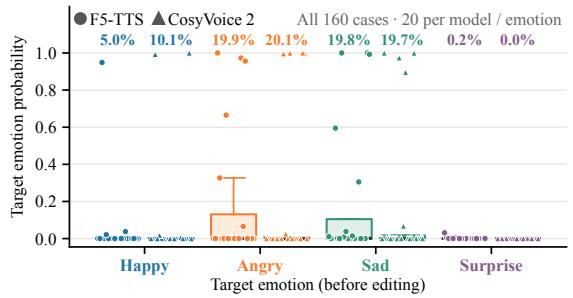

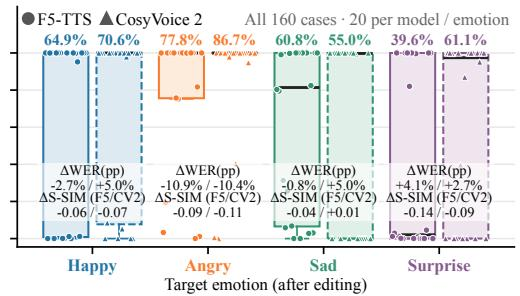  
Figure 1: Target emotion2vec (Ma et al., 2024) probability, change in transcription error (∆WER, in percentage points; pp), and change in speaker similarity (∆S-SIM) before and after editing.

At inference, a sample is generated by solving the ODE from $\mathbf { x } ( 0 ) \sim p _ { 0 } ;$

$$
\frac { \mathrm { d } \mathbf { x } ( t ) } { \mathrm { d } t } = { \pmb v } _ { \theta } ( \mathbf { x } ( t ) , t ; \mathbf { c } ) , \qquad \mathbf { x } ( 1 ) \sim p _ { 1 } ( \mathbf { x } \mid \mathbf { c } ) .\tag{3}
$$

This formulation underpins modern flow-matching (Mehta et al., 2024; Eskimez et al., 2024; Chen et al., 2025) and hybrid TTS models (Du et al., 2024; Hu et al., 2026).

The Emotion Editing Problem. We formulate ideal speech emotion editing as transforming a source utterance $\mathbf { x } ^ { \mathrm { s r c } } \sim p _ { 1 } ( \mathbf { x } \mid y , s , e _ { \mathrm { s r c } } )$ , conditioned on linguistic content y, speaker s, and emotion $e _ { \mathrm { s r c } } .$ , into a target emotion $e _ { \mathrm { t g t } } \mathrm { : }$

$$
\begin{array} { r } { { \mathbf { x } } ^ { \mathrm { e d i t } } = \mathcal { E } ( { \mathbf { x } } ^ { \mathrm { s r c } } ; e _ { \mathrm { s r c } } \to e _ { \mathrm { t g t } } ) , \qquad { \mathbf { x } } ^ { \mathrm { e d i t } } \sim p _ { \mathrm { l } } ( \mathbf { x } \mid y , s , e _ { \mathrm { t g t } } ) . } \end{array}\tag{4}
$$

A perfect edit preserves content C(·) and speaker $\boldsymbol { \mathcal { S } } ( \cdot )$ while exclusively updating the emotion $A ( \cdot ) { \mathrm { : } }$

$$
\begin{array} { r } { \mathcal { C } ( { \mathbf { x } } ^ { \mathrm { e d i t } } ) = \mathcal { C } ( { \mathbf { x } } ^ { \mathrm { s r c } } ) , \qquad S ( { \mathbf { x } } ^ { \mathrm { e d i t } } ) = S ( { \mathbf { x } } ^ { \mathrm { s r c } } ) , \qquad A ( { \mathbf { x } } ^ { \mathrm { e d i t } } ) = e _ { \mathrm { t g t } } . } \end{array}\tag{5}
$$

Since pre-trained TTS models learn generation under entangled conditions rather than factorized editing operators, we investigate whether their learned velocity fields support such editing, when the editing signal is effective along the trajectory, and what attributes it actually carries.

## 2.2 THE EDITABILITY OF FLOW-MATCHING AND HYBRID TTS MODELS

## Q1: Can pre-trained TTS models be directly edited without additional training?

To test if pre-trained velocity fields contain a usable editing signal, we probe frozen F5-TTS and CosyVoice 2 using 80 parallel neutral-to-emotion pairs (matched text and speaker) from ESD (Zhou et al., 2022), covering 20 speakers and four emotions (Happy, Angry, Sad, Surprise).

We synthesize a source mel $\mathbf { x } ^ { \mathrm { s r c } }$ , length-match it to the target condition, and construct a diagnostic probe inspired by inversion-free image editing (Kulikov et al., 2025; Xu et al., 2024). The probe uses the conditional velocity difference under shared noise as a local editing signal:

$$
\begin{array} { r } { \Delta { { \boldsymbol v } _ { \theta } } ( t ) = { \boldsymbol v } _ { \theta } \left( \overline { { \mathbf { x } } } _ { t } ^ { \mathrm { p r o b e } } , t ; \mathbf { c } ^ { \mathrm { t g t } } \right) - { \boldsymbol v } _ { \theta } ( \overline { { \mathbf { x } } } _ { t } ^ { \mathrm { s r c } } , t ; \mathbf { c } ^ { \mathrm { s r c } } ) . } \end{array}
$$

Accumulating this signal along the flow trajectory effectively shifts $\mathbf { x } ^ { \mathrm { { s r c } } }$ toward the target emotion (complete transport formulation in Sec. 3). As Fig. 1 shows, this substantially increases targetemotion probability across all emotions, albeit with mixed Word Error Rate (WER) changes and moderate speaker similarity (S-SIM) degradation (details in Appendix B.1).

Observation 1: Pre-trained speech velocity fields contain a directly usable source-to-target editing signal, enabling emotion modification without model training.

## Q2: When along the generative trajectory should editing be applied?

Building on Q1, we examine whether the editing signal’s effectiveness varies along the generative trajectory. Full-step transport successfully transfers emotion but introduces temporal distortions, notably onset drift (mean 308 ms for F5-TTS, 245 ms for CosyVoice 2). As Fig. 2 shows, successful emotion transfer and zero Word Error Rate (WER) do not guarantee temporal preservation.

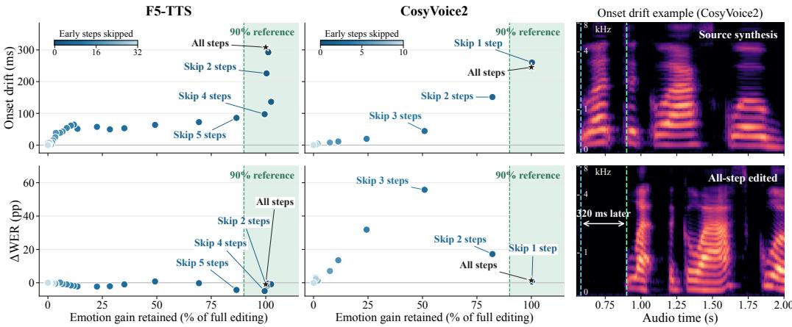  
Figure 2: The first two columns show onset drift (top) and WER change from the source in percentage points (bottom) versus retained emotion gain relative to full-step editing. The green region denotes ≥90% gain retention. The third column demonstrates the onset drift problem.

To locate where this distortion arises, we delay transport by k integration steps and measure the retained emotion gain, onset drift, and ∆WER. Fig. 2 reveals highly model-dependent, non-uniform trajectory behavior. For F5-TTS, skipping k = 4 steps retains 99.5% of the emotion gain while slashing onset drift to 97 ms and improving transcription.

Conversely, for CosyVoice 2, skipping k = 1 step preserves emotion but fails to reduce drift, whereas skipping k = 3 steps reduces drift at the expense of emotion strength and WER. Further early-stop and block-wise ablation analyses also confirm this temporal non-uniformity, which are detailed in Appendix B.2.

Observation 2: Editability is trajectory- and architecture-dependent: early transport may disrupt timing, while later steps are crucial for effective editing and content recovery.

Q3: What acoustic attributes are carried by source-to-target velocity transport?

Building on Q1, we examine if the editing signal isolates emotion when source and target speakers differ. We edit 80 Neutral utterances (from 20 ESD speakers, fixed text) toward different same-language speakers across four target emotions (Happy, Angry, Sad, Surprise). We track changes in speaker similarity (S-SIM), target-emotion probability gain (pp), and F0 median/range shifts (semitones).

As Table 1 shows, velocity transport is not attributefactorized. Speaker identity and emotion shift jointly (mean emotion gains of 45.14 pp for F5-TTS and

Table 1: Cross-speaker emotion editing induces concurrent attribute changes.
<table><tr><td>Measure</td><td>F5-TTS</td><td>CosyVoice 2</td></tr><tr><td>S-SIM source ↓</td><td>-0.403</td><td>-0.378</td></tr><tr><td>S-SIM target ↑</td><td>0.331</td><td>0.342</td></tr><tr><td>Emotion gain (pp) ↑</td><td>45.14</td><td>52.11</td></tr><tr><td>FO median gain (semitones) ↑</td><td>4.565</td><td>7.075</td></tr><tr><td>FO range gain (semitones) ↑</td><td>1.433</td><td>2.769</td></tr><tr><td>Joint (/80)</td><td>70</td><td>73</td></tr></table>

<sup>\*</sup> Joint denotes the number of cases where target-speaker similarity increases, source-speaker similarity decreases, and target-emotion probability increases.

52.11 pp for CosyVoice 2), while F0 median and range also move toward the target reference. This confirms that cross-speaker transport inevitably entangles speaker and pitch characteristics with emotion. Detailed experimental settings and results are provided in Appendix B.3.

Observation 3: Velocity transport is not emotion-specific, but carries speaker identity and other attributes, such as pitch characteristics, alongside emotion.

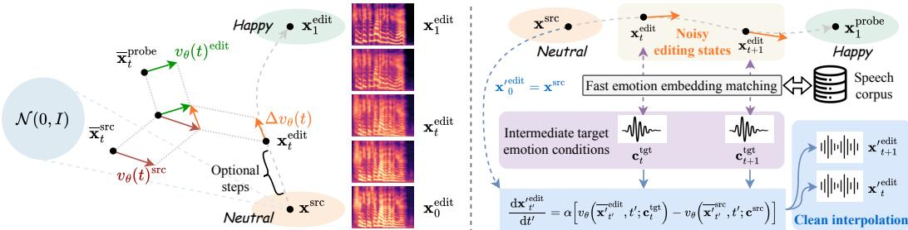  
(a) Training-free emotion editing by dynamic velocity transport. (b) Training-free emotion interpolation by emotion bridging  
Figure 3: Framework of SEmoEdit for dynamic speech emotion editing.

## 3 SEMOEDIT

The observations in Sec. 2 directly inform the design of SEmoEdit. Based on these findings, SE moEdit performs state-dependent velocity transport between speaker-aligned source and target emo tion conditions while allowing the transport interval to adapt to the TTS backbone.

## 3.1 DYNAMIC VELOCITY TRANSPORT

Coupled emotion queries. Given a source acoustic representation $\mathbf { x } ^ { \mathrm { s r c } }$ and source emotion condi tion $\mathbf { c } ^ { \mathrm { { s r c } } }$ , we construct an editing trajectory $\{ \mathbf { x } _ { t } ^ { \mathrm { e d i t } } \} _ { t \in [ 0 , 1 ] }$ directly in the acoustic space. Here, t follows the CFM convention in Eq. 1, from the noise endpoint to the data endpoint, while ${ \bf x } _ { 0 } ^ { \mathrm { e d i t } } = { \bf x } ^ { \mathrm { s r c } }$ serves as the boundary condition of the editing dynamics rather than a sample from $p _ { 0 } = \mathcal { N } ( \mathbf { 0 } , \mathbf { I } )$ At each time t, we sample $\epsilon _ { t } \sim p _ { 0 }$ with the same shape as $\mathbf { x } ^ { \mathrm { { s r c } } }$ and construct a noisy source query

$$
\overline { { \mathbf { x } } } _ { t } ^ { \mathrm { s r c } } = ( 1 - t ) \boldsymbol { \epsilon } _ { t } + t \mathbf { x } ^ { \mathrm { s r c } } .\tag{6}
$$

We then add the same noise perturbation used for the source query to the current editing state, yielding the coupled target-side query

$$
\overline { { \mathbf { x } } } _ { t } ^ { \mathrm { e d i t } } = \mathbf { x } _ { t } ^ { \mathrm { e d i t } } + ( \overline { { \mathbf { x } } } _ { t } ^ { \mathrm { s r c } } - \mathbf { x } ^ { \mathrm { s r c } } ) .\tag{7}
$$

Thus, the source and target-side queries share the same noise perturbation while being anchored at $\mathbf { x } ^ { \mathrm { { s r c } } }$ and $\mathbf { x } _ { t } ^ { \mathrm { e d i t } }$ , respectively. At initialization, they coincide: $\overline { { \mathbf { x } } } _ { 0 } ^ { \mathrm { e d i t } } = \overline { { \mathbf { x } } } _ { 0 } ^ { \mathrm { s r c } } = \epsilon _ { 0 }$

Following Observation 1, we define the instantaneous editing signal as the velocity difference

$$
\begin{array} { r } { \Delta \pmb { v } _ { \theta } ( t ) = \pmb { v } _ { \theta } \big ( \overline { { \mathbf { x } } } _ { t } ^ { \mathrm { e d i t } } , t ; \mathbf { c } ^ { \mathrm { t g t } } \big ) - \pmb { v } _ { \theta } \big ( \overline { { \mathbf { x } } } _ { t } ^ { \mathrm { s r c } } , t ; \mathbf { c } ^ { \mathrm { s r c } } \big ) . } \end{array}\tag{8}
$$

Unlike a fixed activation-steering direction (Xie et al., 2025b; Wang et al., 2026b), $\Delta { } v _ { \theta } ( t )$ is recomputed from the evolving editing state at every step, making the transport more robust and stable.

Speaker-aligned emotion conditions. Observation 3 shows that cross-speaker velocity transport also carries speaker identity. We therefore align the target-reference timbre with the source speaker before computing Eq. 8: ${ \bf c } ^ { \mathrm { t g t } } = \mathcal { E } _ { \mathrm { v c } } \left( { \bf c } ^ { \mathrm { t g t ^ { \prime } } } ; { \bf c } ^ { \mathrm { s r c } } \right)$ , where ${ \mathcal E } _ { \mathrm { v c } }$ converts the target reference to the source-speaker timbre while preserving its emotion, making $\mathbf { c } ^ { \mathrm { { s r c } } }$ and $\mathbf { c } ^ { \mathrm { { t g t } } }$ mainly differ in emotion, reducing speaker-dependent components in the velocity difference.

Trajectory-aware transport. Observation 2 shows that early transport can disrupt temporal structure. We therefore introduce an optional transport start time $\tau \in [ 0 , 1 ]$ and define $g _ { \tau } ( t ) = \mathbb { I } [ t \geq \tau ]$ where $\tau = 0$ recovers full-step transport and $\tau > 0$ skips the early part of the trajectory. SEmoEdit then evolves the source utterance according to

$$
\frac { \mathrm { d } \mathbf { x } _ { t } ^ { \mathrm { e d i t } } } { \mathrm { d } t } = \alpha g _ { \tau } ( t ) \mathbb { E } _ { \epsilon _ { t } } \left[ \Delta v _ { \theta } ( t ) \mid \mathbf { x } ^ { \mathrm { s r c } } \right] , \qquad \mathbf { x } _ { 0 } ^ { \mathrm { e d i t } } = \mathbf { x } ^ { \mathrm { s r c } } , \qquad \mathbf { x } ^ { ( \alpha ) } = \mathbf { x } _ { 1 } ^ { \mathrm { e d i t } } .\tag{9}
$$

The strength $\alpha \in \mathbb { R }$ controls the signed transport magnitude: $\alpha = 0$ recovers the source utterance, $0 < \alpha < 1$ interpolates toward the target emotion, $\alpha = 1$ performs the full source-to-target transport.

In practice, the expectation in Eq. 9 is approximated using $n _ { \mathrm { a v g } }$ coupled noise samples. For editing steps $0 = t _ { 0 } < \cdots < t _ { N } = 1$ , the update becomes

$$
\mathbf { x } _ { t _ { i + 1 } } ^ { \mathrm { e d i t } } = \mathbf { x } _ { t _ { i } } ^ { \mathrm { e d i t } } + \alpha g _ { \tau } ( t _ { i } ) ( t _ { i + 1 } - t _ { i } ) \frac { 1 } { n _ { \mathrm { a v g } } } \sum _ { j = 1 } ^ { n _ { \mathrm { a v g } } } \Delta { \pmb v } _ { \theta } ^ { ( j ) } ( t _ { i } ) .\tag{10}
$$

Thus, SEmoEdit requires only forward evaluations of the frozen TTS velocity field, with no parameter updates or task-specific optimization. Fig. 3(a) illustrates the evolving editing states. Appendix A provides the complete pseudocode.

## 3.2 ENABLING STABLE INTERPOLATION.

Although the trajectory in Eq. 10 provides intermediate editing states, directly decoding these states does not necessarily produce clean speech. An intermediate state simultaneously contains source and target acoustic patterns, which may interfere with each other and manifest as audible noise or other artifacts. In other words, the editing state can represent a meaningful intermediate emotion without itself being a well-formed speech sample.

We address this issue with emotion bridging. As shown in Fig. 3(b), for an intermediate editing state $\mathbf { x } _ { t _ { i } } ^ { \mathrm { e d i t } }$ , we first obtain a clean target reference $\mathbf { c } _ { t } ^ { \mathrm { { t g t } } }$ whose emotional representation (emotion2vec embedding) matches that state and align its timbre with the source speaker. $\mathbf { c } _ { t } ^ { \mathrm { { t g t } } }$ serves as an emotion bridge: rather than using the noisy intermediate state as the output, we apply SEmoEdit again from the original source $\mathbf { x } ^ { \mathrm { { s r c } } }$ toward the bridged condition, thereby synthesizing a clean utterance $\mathbf { x } _ { t } ^ { \prime }$ at the corresponding emotion intensity. The coefficient α controls the emotion strength.

## 4 EXPERIMENTS

## 4.1 SEMOEDITBENCH

Existing speech editing benchmarks (Zhang et al., 2026; Yan et al., 2025a; Ma et al., 2026b) mainly pair each source utterance with a single instruction, whereas our method requires source–target emotion condition pairs whose velocity difference defines the editing direction. We therefore construct SEmoEditBench, a 600-case paired benchmark with emotion labels and editing instructions for evaluating emotion transfer and non-target attribute preservation.

Tasks. SEmoEditBench covers emotion replacement, emotion erasure, and intensity control, each under same-dataset same-speaker, same-dataset cross-speaker, and cross-dataset cross-speaker settings. It contains 320 replacement, 152 erasure, and 128 intensity cases from ESD, IEMOCAP, RAVDESS, and CREMA-D (Zhou et al., 2022; Busso et al., 2008; Livingstone & Russo, 2018; Cao et al., 2014). Details are in Appendix C.2.

Metrics. We evaluate our method across four dimensions (details in Appendix C.2): 1) Effectiveness: Target emotion probability (TEP) and source emotion suppression (SES) for replacement, neutral probability (NP) and SES for erasure, plus emotion2vec similarity (E-SIM) and directional editing score (DES) when paired targets exist. 2) Intensity Control: On a 90-case subset, we evaluate EIC-Emb, our newly proposed metric measuring the monotonic movement of emotion2vec embeddings toward targets across five strengths $\alpha \in \{ 0 , 0 . 2 5 , 0 . 5 , 0 . 7 5 , 1 \}$ . 3) Preservation & Quality: Assessed via ∆WER (∆CER for Chinese), S-SIM, and UTMOS (Radford et al., 2023; Baba et al., 2024). 4) Subjective Evaluation: Speaker (SS-MOS), emotion (ES-MOS), and natu ralness (N-MOS) evaluated on 20 sampled cases. All metrics are averaged across cases.

Models and Hyperparameters. We compare SEmoEdit (applied to three backbones, i.e., F5-TTS, CosyVoice 2, and IndexTTS 2 (Zhou et al., 2026b)) with representative training-based (Yan et al., 2025b; Wang et al., 2026a; Ma et al., 2026a) and activation-steering methods (Xie et al., 2025b; Wang et al., 2026b). For emotion replacement and erasure, we set $\alpha = 1$ , while for intensity control we use $\alpha \in \{ 0 , 0 . 2 5 , 0 . 5 , 0 . 7 5 , \hat { 1 } \}$ . We set $n _ { \mathrm { a v g } } = 1$ and $\tau = 0$ for all the main experiments, applying transport over the full generative trajectory. IndexTTS 2 is used to convert target references to the source speaker’s timbre for SEmoEdit. A speech corpus with 10K samples is created for emotion bridging, and their emotion embeddings are pre-computed for fast matching.

Table 2: Main results on the same-dataset same-speaker setting of SEmoEditBench. The top three results for each metric are highlighted in bold with dark, medium, and light pink backgrounds representing the first , second , and third best performances, respectively.
<table><tr><td>Category</td><td>Method</td><td>Backbone</td><td colspan="7">Metrics</td></tr><tr><td colspan="2">Emotion replacement</td><td></td><td>TEP↑</td><td>SES ↑</td><td>E-SIM ↑</td><td>DES ↑</td><td>∆WER↓</td><td>S-SIM ↑</td><td>UTMOS ↑</td></tr><tr><td>Training- based</td><td>Step-Audio-EditX dots.tts.edit Auk</td><td></td><td>0.222 0.434 0.259</td><td>0.445 0.600 0.372</td><td>0.521 0.669 0.539</td><td>0.550 0.713 0.541</td><td>-0.048 -0.035 0.073</td><td>0.567 0.272 0.631</td><td>3.091 2.381 2.639</td></tr><tr><td rowspan="2">Activation Steering</td><td>CoCoEmo</td><td>CosyVoice 2 IndexTTS2</td><td>0.082 0.035</td><td>0.192 0.127</td><td>0.446 0.402</td><td>0.399 0.269</td><td>-0.015 -0.024</td><td>0.715 0.776</td><td>3.061 2.659</td></tr><tr><td>EmoSteer-TTS</td><td>F5-TTS CosyVoice 2 IndexTTS2</td><td>0.081 0.030 0.025</td><td>0.345 0.371 0.054</td><td>0.448 0.382 0.377</td><td>0.477 0.367 0.226</td><td>0.608 -0.015 -0.037</td><td>0.623 0.478 0.788</td><td>2.545 2.515 2.666</td></tr><tr><td rowspan="2">SEmoEdit</td><td>Audio condition</td><td>F5-TTS CosyVoice 2 IndexTTS2</td><td>0.498 0.554 0.691</td><td>0.684 0.694</td><td>0.704 0.776</td><td>0.753 0.806</td><td>-0.026 -0.025</td><td>0.372 0.379</td><td>2.177 2.984</td></tr><tr><td>Text condition†</td><td>CosyVoice 2 IndexTTS2</td><td>0.274 0.354</td><td>0.767 0.484 0.506</td><td>0.902 0.566 0.629</td><td>0.920 0.567 0.634</td><td>-0.004 -0.059 0.013</td><td>0.423 0.610 0.594</td><td>2.578 3.050 2.572</td></tr><tr><td colspan="2">Emotion erasure</td><td></td><td>NP↑</td><td>SES ↑</td><td>E-SIM ↑</td><td>DES ↑</td><td>∆WER↓</td><td>S-SIM ↑</td><td>UTMOS ↑</td></tr><tr><td rowspan="2">Training- based</td><td>Step-Audio-EditX dots.tts.edit</td><td></td><td>0.235 0.355</td><td>0.388 0.549</td><td>0.566 0.674</td><td>0.655 0.766</td><td>-0.064 -0.065</td><td>0.577 0.304</td><td>3.220 2.685</td></tr><tr><td>Auk EmoSteer-TTS</td><td>F5-TTS CosyVoice 2</td><td>0.229 0.202 0.078</td><td>0.311 0.393 0.174</td><td>0.528 0.616 0.505</td><td>0.582 0.736 0.596</td><td>0.014 0.030 -0.012</td><td>0.676 0.598 0.548</td><td>2.859 2.593 2.490</td></tr><tr><td>Steering SEmoEdit</td><td>Audio</td><td>IndexTTS2 F5-TTS CosyVoice 2</td><td>0.038 0.573 0.704</td><td>0.070 0.700 0.754</td><td>0.377 0.821 0.907</td><td>0.298 0.873 0.938</td><td>-0.041 -0.058 -0.050</td><td>0.808 0.359 0.399</td><td>2.836 2.597 3.144</td></tr><tr><td rowspan="2"></td><td>condition Text</td><td>IndexTTS2 CosyVoice 2</td><td>0.682 0.216</td><td>0.741 0.432</td><td>0.910 0.582</td><td>0.934</td><td>-0.030 -0.052</td><td>0.424 0.607</td><td>2.774</td></tr><tr><td>condition†</td><td>IndexTTS2</td><td>0.104</td><td>0.309</td><td>0.471</td><td>0.685 0.504</td><td>-0.050</td><td>0.687</td><td>3.069 2.698</td></tr><tr><td colspan="2">Emotion intensity control</td><td></td><td colspan="2">EIC-Emb ↑</td><td colspan="2"> $\Delta \mathrm { W E R } _ { \alpha = 1 } \downarrow$ </td><td>S-SIMα=1 ↑</td><td colspan="2">UTMOSα=1 ↑</td></tr><tr><td rowspan="4">Activation Steering</td><td>CoCoEmo</td><td>CosyVoice 2 IndexTTS2</td><td colspan="2">0.041 0.017</td><td colspan="2">0.044 0.333</td><td>0.621 0.703</td><td colspan="2">3.234</td></tr><tr><td>EmoSteer-TTS</td><td colspan="2">F5-TTS</td><td colspan="2"></td><td colspan="2"></td><td colspan="2">2.294</td></tr><tr><td rowspan="2"></td><td rowspan="2">CosyVoice 2 IndexTTS2</td><td colspan="2">0.013 -0.009</td><td colspan="2">0.139 0.133</td><td>0.465 0.362</td><td colspan="2">2.309 2.575</td></tr><tr><td colspan="2">-0.005</td><td colspan="2">0.400</td><td colspan="2">0.683 0.307</td></tr><tr><td rowspan="4">SEmoEdit condition†</td><td rowspan="2">Audio condition</td><td colspan="2">0.175</td><td colspan="2"></td><td colspan="2">0.039</td><td colspan="2">2.355 1.967</td></tr><tr><td colspan="2">F5-TTS CosyVoice 2 IndexTTS2</td><td colspan="3">0.172 0.017</td><td>0.362 0.336</td><td colspan="2">2.499</td></tr><tr><td colspan="2">CosyVoice 2 IndexTTS2</td><td colspan="2">0.192 0.144</td><td colspan="2">0.411 -0.017</td><td>0.553</td><td colspan="2">2.355 3.080</td></tr></table>

<sup>†</sup> The text condition is an emotion instruction, e.g., Speak with a happy tone..

## 4.2 MAIN RESULTS

Comparison with training-based methods. As shown in Table 2, audio-conditioned SEmoEdit consistently outperforms all training-based baselines in editing success without task-specific training. Even its weakest backbone surpasses the strongest baseline on every emotion-related metric for replacement (e.g., TEP 0.498 vs. 0.434; DES 0.753 vs. 0.713) and erasure (NP 0.573 vs. 0.355; DES 0.873 vs. 0.766), while the best variants reach 0.691/0.920 TEP/DES for replacement and 0.704/0.938 NP/DES for erasure. These gains retain near-zero or negative ∆WER and additionally support continuous intensity control. Overall, pretrained generative dynamics provide stronger emotion-editing capability than dedicated editors trained on large-scale task-specific data.

Comparison with activation steering methods. Audio-conditioned SEmoEdit consistently outperforms fixed activation steering across all three backbones. For replacement and erasure, every SEmoEdit variant surpasses all steering baselines on all four emotion-related metrics. The advantage is also clear for intensity control, where EIC-Emb reaches 0.175, 0.172, and 0.192 on F5-TTS, CosyVoice 2, and IndexTTS2, compared with 0.013, 0.041, and 0.017 for their strongest steering counterparts. While SEmoEdit yields lower S-SIM, these consistent gains demonstrate that statedependent velocity transport provides a more effective editing signal than fixed activation directions.

Human Evaluation. Table 3 (15 human evaluators) confirms SEmoEdit’s stronger perceived editing capability. SEmoEdit achieves the best emotion-replacement score (ES-MOS 4.22 with IndexTTS2), the top three erasure scores, and higher intensity-control scores (EIC-MOS 2.80–3.65)

Table 3: Subjective evaluation results. The first , second , and third place are highlighted.
<table><tr><td rowspan="2">Category</td><td rowspan="2">Method</td><td rowspan="2">Backbone</td><td colspan="3">Emotion replacement</td><td colspan="3">Emotion erasure</td><td>Intensity control</td></tr><tr><td></td><td>SS-MOS ↑ ES-MOS ↑</td><td>N-MOS ↑</td><td>SS-MOS ↑</td><td>ES-MOS ↑</td><td>N-MOS ↑</td><td>EIC-MOS ↑</td></tr><tr><td rowspan="2">Training-</td><td rowspan="2">Step-Audio-EditX Auk</td><td></td><td>3.67</td><td>2.88</td><td>3.75</td><td>4.20</td><td>2.35</td><td>4.00</td><td>一</td></tr><tr><td></td><td>3.38</td><td>2.80</td><td>3.52</td><td>4.00</td><td>2.95</td><td>4.05</td><td>一</td></tr><tr><td rowspan="2">based</td><td>dots.tts.edit</td><td></td><td>3.52</td><td>3.27</td><td>3.77</td><td>3.55</td><td>3.15</td><td>3.65</td><td>一</td></tr><tr><td>CoCoEmo</td><td>IndexTTS2</td><td>4.42</td><td>1.88</td><td>3.98</td><td></td><td></td><td></td><td>1.65</td></tr><tr><td rowspan="2">Steering</td><td>EmoSteer-TTS</td><td>IndexTTS2</td><td>4.35</td><td>1.75</td><td>4.12</td><td>4.50</td><td>1.80</td><td>4.25</td><td>1.30</td></tr><tr><td></td><td>F5-TTS</td><td>2.88</td><td>3.23</td><td>3.25</td><td>2.85</td><td>3.65</td><td>3.80</td><td>2.80</td></tr><tr><td rowspan="2">SEmoEdit</td><td>Ours</td><td>CosyVoice 2</td><td>3.02</td><td>3.20</td><td>3.42</td><td>3.45</td><td>4.30</td><td>4.15</td><td>3.25</td></tr><tr><td></td><td>IndexTTS2</td><td>3.45</td><td>4.22</td><td>3.88</td><td>3.55</td><td>4.40</td><td>4.15</td><td>3.65</td></tr></table>

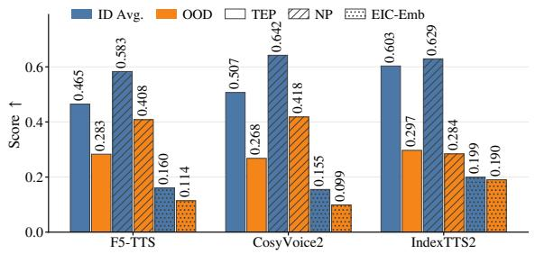

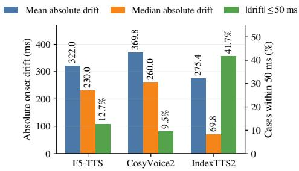  
Figure 4: Left: SEmoEdit ID/OOD generalization across backbones. Right: Onset drift over 600 cases; lower mean and median absolute drift are better, while a higher fraction within 50 ms is better.

than CoCoEmo (1.65) and EmoSteer-TTS (1.30). Although the baselines sometimes obtain higher SS-MOS or N-MOS, their low editing scores suggest little emotion changes. SEmoEdit therefore provides a better trade-off between edit effectiveness and output quality.

Generalization to out-of-distribution cases. The left panel of Fig. 4 shows that SEmoEdit remains effective in the challenging cross-dataset, cross-speaker setting without retraining, outperforming most ID baselines in Table 2. For intensity control, IndexTTS2 retains 95% of its ID-average score (0.190 vs. 0.199), whereas F5-TTS and CosyVoice 2 decline to some extent. Replacement and erasure also show TEP/NP drops. Overall, dynamic velocity transport generalizes across corpora and speakers without retraining, but continuous-control robustness depends on the backbone and cross-domain categorical emotion transfer remains a key limitation. Full results are in Appendix D.1.

## 4.3 ABLATION STUDY

Analysis of onset drifting. We further evaluate onset drift across all three backbones using 600 SEmoEditBench cases. As Fig. 4 shows, IndexTTS2 best preserves timing with a 69.8-ms median drift (41.7% ≤50 ms). Although long tail cases inflates IndexTTS2’s mean, CosyVoice 2 yields the highest mean and median, confirming its stronger emotion-temporal coupling. This contrast reflects architecture designs: F5-TTS establishes timing jointly along fixed text length, with no explicit duration control; CosyVoice 2 relies on unaligned autoregressive semantic tokens, leaving its flow prior to impose a target-specific temporal scaffold; IndexTTS2 instead enforces a durationcontrolled frame layout before flow matching, substantially reducing onset drift.

Analysis of noise. Fig. 5 shows that increasing $n _ { \mathrm { a v g } }$ from 1 to 8 has little effect on CosyVoice 2 and IndexTTS2. F5-TTS is more sensitive, but gains remain inconsistent (at $n _ { \mathrm { a v g } } = 8 \colon \mathrm { T E P + 0 . 0 3 3 } .$ ∆WER +0.036, UTMOS −0.234). Since additional samples provide no consistent benefit while increasing velocity-query cost up to 8×, we use $n _ { \mathrm { a v g } } = 1$ throughout all experiments.

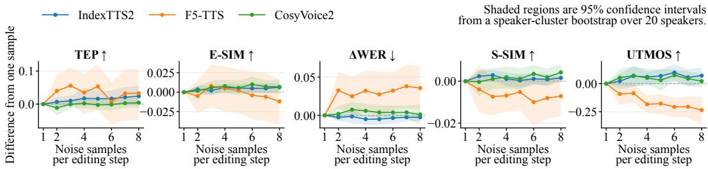  
Figure 5: Sensitivity to the number of coupled noise samples per editing step.

Table 4: Objective metrics before and after emotion bridging, averaged over 90 intensity editing cases.
<table><tr><td>Backbone</td><td>Variant</td><td>WER/CER↓</td><td>S-SIM ↑</td><td>UTMOS ↑</td></tr><tr><td rowspan="2">F5-TTS</td><td>Raw</td><td>0.342</td><td>0.418</td><td>2.151</td></tr><tr><td>Bridged</td><td>0.205</td><td>0.431</td><td>2.411</td></tr><tr><td rowspan="2">CosyVoice 2</td><td>Raw</td><td>0.360</td><td>0.349</td><td>2.134</td></tr><tr><td>Bridged</td><td>0.201</td><td>0.457</td><td>2.780</td></tr><tr><td rowspan="2">IndexTTS2</td><td>Raw</td><td>0.823</td><td>0.379</td><td>1.918</td></tr><tr><td>Bridged</td><td>0.603</td><td>0.440</td><td>2.652</td></tr></table>

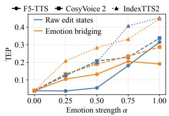  
Figure 6: Mean TEP trajectories before and after bridging.  
Analysis of the emotion bridging. Table 4 shows emotion bridging consistently improves acoustic stability across all backbones.

It reduces WER/CER, increases UTMOS, and improves S-SIM, notably for CosyVoice 2. This suggests the second pass removes intermediate acoustic artifacts, yielding clearer, speaker-consistent speech. As Fig. 6 shows, bridging maintains highly stable intensity separation across most levels, exhibiting only minor fluctuations at high strengths. Thus, it effectively acts as a fidelity regularizer while largely preserving the interpolation range, intelligibility, timbre, and naturalness.

Audio condition vs. text condition. As shown in Table 2, replacing audio conditions with text instructions sharply reduces replacement TEP from 0.554/0.691 to 0.274/0.354 on CosyVoice 2/IndexTTS2, with similar degradation in erasure and intensity control. This indicates that current instruction-conditioned TTS models cannot reliably induce the target-emotion velocity difference required by SEmoEdit, despite better speaker preservation.

## 4.4 TAKEAWAYS FOR REAL APPLICATIONS AND FUTURE DIRECTIONS

Based on our experiments and findings, we want to highlight several key insights and potential future directions: (1) Flow-based editing techniques can be applied to acoustic flows, but the temporal nature of audio requires careful consideration. (2) The choice of backbone TTS model significantly affects the editing performance, with models that have explicit duration control (e.g., In dexTTS2) showing better stability. (3) Noise averaging does not provide consistent benefits. (4) Emotion bridging indicates that multi-pass editing strategies may be beneficial for complex tasks. (5) Text-conditioned training-free editing currently lags behind, highlighting the need for improved instruction-conditioned TTS models that can better capture the desired emotional transformations.

## 5 RELATED WORK

Emotion-Conditioned Speech Synthesis generates new speech from prompts or labels. These methods offer prompt-driven control (PromptTTS (Guo et al., 2023), ControlSpeech (Ji et al., 2025), EmoVoice (Yang et al., 2025)), continuous intensity tuning (EmoSphere++ (Cho et al., 2025)), word-level alignment (WeSCon (Wang et al., 2026c)), or timbre disentanglement (IndexTTS2 (Zhou et al., 2026b)). However, they cannot edit existing audio. Training-Based Emotion Editing mod ifies source speech via mask-based inpainting (Emo-CampNet (Wang et al., 2024)), instructiondriven LMs (Step-Audio-EditX (Yan et al., 2025b), SpeechEdit (Pei et al., 2026)), caption rewriting (Bagpiper-Edit (Gong et al., 2026)), transcript-grounded span editing (dots.tts.edit (Wang et al., 2026a)), or voice-level tuning (VoiceDesigner (Hai et al., 2026)). Despite their flexibility, these rely on expensive annotations, dedicated training, or post-training. Inference-Time Representation Steering manipulates representations without retraining via activation steering (EmoSteer-TTS (Xie et al., 2025b), CoCoEmo (Wang et al., 2026b)), lightweight interventions (EmoShift (Zhou et al., 2026a)), or modifying SAE features (Du et al., 2026). Unlike these methods that primarily regenerate speech or steer via fixed offsets, SEmoEdit dynamically modulates velocity transport to edit existing audio, unifying emotion replacement, erasure, and interpolation.

## 6 CONCLUSION

This work presents the first systematic study of training-free emotion editability in pre-trained flowmatching and hybrid TTS models. Driven by our in-depth analysis and three key observations that reveal the potential and limitations of repurposing speech flows, we introduce the SEmoEdit framework. Extensive comparison and evaluations on SEmoEditBench demonstrate that SEmoEdit serves as a highly practical alternative to training-based approaches, achieving competitive, and often superior, performance without requiring parameter updates. We hope these insights inspire broader exploration of inference-time speech editing within foundational audio models.

## REFERENCES

Kaito Baba, Wataru Nakata, Yuki Saito, and Hiroshi Saruwatari. The t05 system for the VoiceMOS Challenge 2024: Transfer learning from deep image classifier to naturalness MOS prediction of high-quality synthetic speech. In IEEE Spoken Language Technology Workshop (SLT), pp. 818– 824, 2024. doi: 10.1109/SLT61566.2024.10832315.

Carlos Busso, Murtaza Bulut, Chi-Chun Lee, Abe Kazemzadeh, Emily Mower, Samuel Kim, Jeannette N Chang, Sungbok Lee, and Shrikanth S Narayanan. Iemocap: Interactive emotional dyadic motion capture database. Language resources and evaluation, 42(4):335–359, 2008.

Houwei Cao, David G Cooper, Michael K Keutmann, Ruben C Gur, Ani Nenkova, and Ragini Verma. Crema-d: Crowd-sourced emotional multimodal actors dataset. IEEE transactions on affective computing, 5(4):377–390, 2014.

Yushen Chen, Zhikang Niu, Ziyang Ma, Keqi Deng, Chunhui Wang, JianZhao JianZhao, Kai Yu, and Xie Chen. F5-tts: A fairytaler that fakes fluent and faithful speech with flow matching. In Proceedings of the 63rd Annual Meeting of the Association for Computational Linguistics (Volume 1: Long Papers), pp. 6255–6271, 2025.

Deok-Hyeon Cho, Hyung-Seok Oh, Seung-Bin Kim, and Seong-Whan Lee. Emosphere++: Emotion-controllable zero-shot text-to-speech via emotion-adaptive spherical vector. IEEE Transactions on Affective Computing, 16(3):2365–2380, 2025.

Hongfei Du, Jiacheng Shi, Sidi Lu, Gang Zhou, and Ashley Gao. Sparse autoencoders for interpretable emotion control in text-to-speech. In Forty-third International Conference on Machine Learning, 2026. URL https://openreview.net/forum?id=Hbt2ryJgz2.

Zhihao Du, Yuxuan Wang, Qian Chen, Xian Shi, Xiang Lv, Tianyu Zhao, Zhifu Gao, Yexin Yang, Changfeng Gao, Hui Wang, et al. Cosyvoice 2: Scalable streaming speech synthesis with large language models. arXiv preprint arXiv:2412.10117, 2024.

Sefik Emre Eskimez, Xiaofei Wang, Manthan Thakker, Canrun Li, Chung-Hsien Tsai, Zhen Xiao, Hemin Yang, Zirun Zhu, Min Tang, Xu Tan, et al. E2 tts: Embarrassingly easy fully nonautoregressive zero-shot tts. In 2024 IEEE spoken language technology workshop (SLT), pp. 682–689. IEEE, 2024.

Xun Gong, Jinchuan Tian, Haoran Wang, William Chen, Shinji Watanabe, and Yanmin Qian. Bagpiper-edit: Zero-shot open-ended audio editing via rich-caption. arXiv preprint arXiv:2606.21227, 2026.

Yiwei Guo, Chenpeng Du, Ziyang Ma, Xie Chen, and Kai Yu. Voiceflow: Efficient text-to-speech with rectified flow matching. In ICASSP 2024-2024 IEEE International Conference on Acoustics, Speech and Signal Processing (ICASSP), pp. 11121–11125. IEEE, 2024.

Zhifang Guo, Yichong Leng, Yihan Wu, Sheng Zhao, and Xu Tan. Prompttts: Controllable text-tospeech with text descriptions. In ICASSP 2023-2023 IEEE International Conference on Acoustics, Speech and Signal Processing (ICASSP), pp. 1–5. IEEE, 2023.

Jiarui Hai, Karan Thakkar, Ke Chen, Yunyun Wang, Jiaqi Su, Rithesh Kumar, Mounya Elhilali, and Zeyu Jin. Voicedesigner: Text-to-voice generation and editing via unified diffusion modeling and data augmentation. arXiv preprint arXiv:2608.13613, 2026.

Hangrui Hu, Xinfa Zhu, Ting He, Dake Guo, Bin Zhang, Xiong Wang, Zhifang Guo, Ziyue Jiang, Hongkun Hao, Zishan Guo, et al. Qwen3-tts technical report. arXiv preprint arXiv:2601.15621, 2026.

Shengpeng Ji, Qian Chen, Wen Wang, Jialong Zuo, Minghui Fang, Ziyue Jiang, Hai Huang, Zehan Wang, Xize Cheng, Siqi Zheng, et al. Controlspeech: Towards simultaneous and independent zero-shot speaker cloning and zero-shot language style control. In Proceedings ofthe 63rd Annual Meeting of the Association for Computational Linguistics (Volume 1: Long Papers), pp. 6966– 6981, 2025.

Vladimir Kulikov, Matan Kleiner, Inbar Huberman-Spiegelglas, and Tomer Michaeli. Flowedit: Inversion-free text-based editing using pre-trained flow models. In 2025 IEEE/CVF International Conference on Computer Vision (ICCV), pp. 19721–19730. IEEE, 2025.

Yaron Lipman, Ricky T. Q. Chen, Heli Ben-Hamu, Maximilian Nickel, and Matthew Le. Flow matching for generative modeling. In The Eleventh International Conference on Learning Representations, 2023. URL https://openreview.net/forum?id=PqvMRDCJT9t.

Steven R Livingstone and Frank A Russo. The ryerson audio-visual database of emotional speech and song (ravdess): A dynamic, multimodal set of facial and vocal expressions in north american english. PloS one, 13(5):e0196391, 2018.

Ziyang Ma, Zhisheng Zheng, Jiaxin Ye, Jinchao Li, Zhifu Gao, Shiliang Zhang, and Xie Chen. emotion2vec: Self-supervised pre-training for speech emotion representation. In Findings of the Association for Computational Linguistics: ACL 2024, pp. 15747–15760, 2024.

Ziyang Ma, Zhikang Niu, Wenming Tu, Tianrui Wang, Ruiqi Yan, Junxi Liu, Yanru Huo, Nickk Huang, Yang Liu, Qicong Xie, et al. Auk technical report: An open-source foundational model for speech generation and editing. arXiv preprint arXiv:2609.08936, 2026a.

Ziyang Ma, Ruiqi Yan, Ruiyang Xu, Jie Fang, Zhikang Niu, Yi-Wen Chao, Wenming Tu, Tianrui Wang, Qi Chen, Wenxi Chen, et al. Mmae: A massive multitask audio editing benchmark. arXiv preprint arXiv:2606.07229, 2026b.

Matthias Mauch and Simon Dixon. pyin: A fundamental frequency estimator using probabilistic threshold distributions. In 2014 ieee international conference on acoustics, speech and signal processing (icassp), pp. 659–663. IEEE, 2014.

Shivam Mehta, Ruibo Tu, Jonas Beskow, Eva Sz<sup>´</sup> ekely, and Gustav Eje Henter. Matcha-tts: A fast´ tts architecture with conditional flow matching. In ICASSP 2024-2024 IEEE International Conference on Acoustics, Speech and Signal Processing (ICASSP), pp. 11341–11345. IEEE, 2024.

Hanchen Pei, Shujie Liu, Yanqing Liu, Jianwei Yu, Yuanhang Qian, Gongping Huang, Sheng Zhao, and Yan Lu. A unified neural codec language model for selective editable text to speech generation. arXiv preprint arXiv:2601.12480, 2026.

Alec Radford, Jong Wook Kim, Tao Xu, Greg Brockman, Christine McLeavey, and Ilya Sutskever. Robust speech recognition via large-scale weak supervision. In International conference on machine learning, pp. 28492–28518. PMLR, 2023.

Hankun Wang, Bohan Li, Shi Lian, Xiaoyu Gu, Jing Peng, Da Zheng, Colin Zhang, and Kai Yu. dots. tts. edit: Precisely controlled speech editing with a continuous autoregressive model. arXiv preprint arXiv:2608.02673, 2026a.

Siyi Wang, Shihong Tan, Siyi Liu, Hong Jia, Gongping Huang, James Bailey, and Ting Dang. Cocoemo: Composable and controllable human-like emotional TTS via activation steering. In Fortythird International Conference on Machine Learning, 2026b. URL https://openreview. net/forum?id=wW2LIHSCfw.

Tao Wang, Jiangyan Yi, Ruibo Fu, Jianhua Tao, Zhengqi Wen, and Chu Yuan Zhang. Emotion selectable end-to-end text-based speech editing. Artificial Intelligence, 329:104076, 2024.

Tianrui Wang, Haoyu Wang, Meng Ge, Cheng Gong, Chunyu Qiang, Ziyang Ma, Zikang Huang, Guanrou Yang, Xiaobao Wang, Eng-Siong Chng, et al. Word-level emotional expression control in zero-shot text-to-speech synthesis. Advances in Neural Information Processing Systems, 38: 147377–147405, 2026c.

Tianxin Xie, Yan Rong, Pengfei Zhang, Wenwu Wang, and Li Liu. Towards controllable speech synthesis in the era of large language models: A systematic survey. In Proceedings of the 2025 Conference on Empirical Methods in Natural Language Processing, pp. 764–791, 2025a.

Tianxin Xie, Shan Yang, Chenxing Li, Dong Yu, and Li Liu. Emosteer-tts: Fine-grained and training-free emotion-controllable text-to-speech via activation steering. arXiv preprint arXiv:2508.03543, 2025b.

Sihan Xu, Yidong Huang, Jiayi Pan, Ziqiao Ma, and Joyce Chai. Inversion-free image editing with language-guided diffusion models. In 2024 IEEE/CVF Conference on Computer Vision and Pattern Recognition (CVPR), pp. 9454–9461. IEEE, 2024.

Canxiang Yan, Chunxiang Jin, Dawei Huang, Haibing Yu, Han Peng, Hui Zhan, Jie Gao, Jing Peng, Jingdong Chen, Jun Zhou, et al. Ming-uniaudio: Speech llm for joint understanding, generation and editing with unified representation. arXiv preprint arXiv:2511.05516, 2025a.

Chao Yan, Boyong Wu, Peng Yang, Pengfei Tan, Guoqiang Hu, Li Xie, Yuxin Zhang, Fei Tian, Xuerui Yang, Xiangyu Zhang, et al. Step-audio-editx technical report. arXiv preprint arXiv:2511.03601, 2025b.

Guanrou Yang, Chen Yang, Qian Chen, Ziyang Ma, Wenxi Chen, Wen Wang, Tianrui Wang, Yifan Yang, Zhikang Niu, Wenrui Liu, et al. Emovoice: Llm-based emotional text-to-speech model with freestyle text prompting. In Proceedings of the 33rd ACM International Conference on Multimedia, pp. 10748–10757, 2025.

Hanlin Zhang, Daxin Tan, Dehua Tao, Xiao Chen, Haochen Tan, and Linqi Song. Speecheditbench: A bilingual multi-attribute benchmark for instruction-guided speech editing. arXiv preprint arXiv:2606.01804, 2026.

Kun Zhou, Berrak Sisman, Rui Liu, and Haizhou Li. Emotional voice conversion: Theory, databases and esd. Speech communication, 137:1–18, 2022.

Li Zhou, Hao Jiang, Junjie Li, Tianrui Wang, and Haizhou Li. Emoshift: Lightweight activation steering for enhanced emotion-aware speech synthesis. In ICASSP 2026-2026 IEEE International Conference on Acoustics, Speech and Signal Processing (ICASSP), pp. 17262–17266. IEEE, 2026a.

Siyi Zhou, Yiquan Zhou, Yi He, Xun Zhou, Jinchao Wang, Wei Deng, and Jingchen Shu. Indextts2: A breakthrough in emotionally expressive and duration-controlled auto-regressive zero-shot textto-speech. In Proceedings of the AAAI Conference on Artificial Intelligence, volume 40, pp. 35139–35148, 2026b.

## A SEMOEDIT ALGORITHM

Algorithm 1 summarizes the discrete dynamic velocity transport in Eq. 10. The target reference is first converted to the source-speaker timbre; when the two references are already speaker-aligned, this conversion is the identity operation. For backbones that prepend reference frames, each velocity

evaluation retains its branch-specific prefix, and the difference below is computed only over the shared generated region.

```tcl
Algorithm 1 SEmoEdit via dynamic velocity transport
Require: Frozen velocity field ${ \boldsymbol { v } } _ { { \boldsymbol { \theta } } } ;$ source representation $\mathbf { x } ^ { \mathrm { s r c . } }$ source and target-reference condi
tions $\mathbf { c } ^ { \mathrm { s r c } } , \mathbf { c } ^ { \mathrm { t g t } ^ { \prime } }$ ; speaker alignment operator ${ \mathcal E } _ { \mathrm { v c } } ;$ time grid $0 = t _ { 0 } < \cdots < t _ { N } = 1 ;$ ; strength α;
start time τ; noise samples per step $n _ { \mathrm { a v g } }$
Ensure: Edited representation $\mathbf { x } ^ { ( \alpha ) }$
1: $\mathbf { c } ^ { \mathrm { t g t } }  { \mathcal { E } } _ { \mathrm { v c } } ( \mathbf { c } ^ { \mathrm { t g t ^ { \prime } } } ; \mathbf { c } ^ { \mathrm { s r c } } )$
2: ${ \bf x } _ { t _ { 0 } } ^ { \mathrm { e d i t } }  { \bf x } ^ { \mathrm { s r c } }$
3: for $i = 0 , \ldots , N - 1$ do
4: $\Delta \boldsymbol { v } _ { i } \gets \mathbf { 0 }$
5: for $j = 1 , \dots , n _ { \mathrm { a v g } }$ do
6: Sample $\epsilon _ { i , j } \sim p _ { 0 }$ with the same shape as $\mathbf { x } ^ { \mathrm { { s r c } } }$
7: $\overline { { \mathbf { x } } } _ { i , j } ^ { \mathrm { s r c } }  ( 1 ^ { ' - } t _ { i } ) \mathbf { \epsilon } _ { i , j } + t _ { i } \mathbf { x } ^ { \mathrm { s r c } }$
8: $\overline { { \mathbf { x } } } _ { i , j } ^ { \mathrm { e d i t } }  \mathbf { x } _ { t _ { i } } ^ { \mathrm { e d i t } } + \overline { { \mathbf { x } } } _ { i , j } ^ { \mathrm { s r c } } - \mathbf { x } ^ { \mathrm { s r c } }$
9: $\begin{array} { r } { \Delta { \boldsymbol { v } } _ { i } \gets \Delta { \boldsymbol { v } } _ { i } + { \boldsymbol { v } } _ { \theta } ( \overline { { { \bf x } } } _ { i , j } ^ { \mathrm { e d i t } } , t _ { i } ; { \bf c } ^ { \mathrm { t g t } } ) - { \boldsymbol { v } } _ { \theta } ( \overline { { { \bf x } } } _ { i , j } ^ { \mathrm { s r c } } , t _ { i } ; { \bf c } ^ { \mathrm { s r c } } ) } \end{array}$
10: end for
11: $\mathbf { x } _ { t _ { i + 1 } } ^ { \mathrm { e d i t } }  \mathbf { x } _ { t _ { i } } ^ { \mathrm { e d i t } } + \alpha \mathbb { I } [ t _ { i } \geq \tau ] ( t _ { i + 1 } - t _ { i } ) \Delta { v } _ { i } / n _ { \mathrm { a v g } }$
12: end for
13: return $\mathbf { x } ^ { ( \alpha ) }  \mathbf { x } _ { t _ { N } } ^ { \mathrm { e d i t } }$
```

## B DETAILS OF THE EDITABILITY DIAGNOSTIC

## B.1 EXPERIMENT DETAILS FOR Q1

Experimental setup. We construct 80 neutral-to-emotion editing cases from the Emotional Speech Database (ESD), covering all 20 speakers (ten Mandarin and ten English) and four target emotions: Happy, Angry, Sad, and Surprise. For each speaker, four distinct parallel text groups are assigned to the four target emotions. Each case contains a neutral reference $R _ { s }$ and a target-emotion reference $R _ { t }$ spoken by the same speaker with the same text, together with a separate synthesis transcript that remains fixed during editing. Both models are evaluated on the same cases, giving 20 cases per emotion and 40 per language. We use frozen F5-TTS v1 Base and CosyVoice 2-0.5B with their supplied pre-trained vocoders; no additional training is performed.

F5-TTS uses 32 Euler integration steps with its supplied time schedule and sway-sampling coefficient −1, while CosyVoice 2 uses 10 Euler steps with its supplied cosine schedule and 32-bit floating-point computation. Classifier-free guidance uses scales $\gamma = 2$ for F5-TTS and $\gamma = 0 . 7$ for CosyVoice 2. Both editors use strength $\alpha = 1$ , one noise sample per step, and the full interval [0, 1]. Case selection uses seed 42, and generation uses seed $4 2 + j$ for zero-indexed case $j .$

Editing procedure. Following Sec. $3 . 1 , \mathbf { x } ^ { \mathrm { s r c } }$ is the length-aligned source-generated mel segment, $\mathbf { x } _ { t } ^ { \mathrm { e d i t } }$ is the evolving edited segment, and $\mathbf { c } ^ { \mathrm { s r c } } , \mathbf { c } ^ { \mathrm { t g t } }$ are constructed from $\bar { R _ { s } } , R _ { t }$ . Each model input contains a reference prefix followed by the generated segment. We initialize ${ \bf x } _ { t _ { n } } ^ { \mathrm { e d i t } } = { \bf x } ^ { \mathrm { s r c } }$ and use evaluation times $0 = t _ { 0 } < \cdots < t _ { K } = 1$ , with $K = 3 2$ for F5-TTS and $K = 1 0$ for CosyVoice 2. At each step, the two branches share a fresh noise sample $\epsilon _ { t _ { i } } \sim p _ { 0 }$ . The Euler discretization is

$$
\begin{array} { r l } & { \qquad \overline { { \mathbf { x } } } _ { t _ { i } } ^ { \mathrm { s r c } } = ( 1 - t _ { i } ) \boldsymbol { \epsilon } _ { t _ { i } } + t _ { i } \mathbf { x } ^ { \mathrm { s r c } } , \qquad \overline { { \mathbf { x } } } _ { t _ { i } } ^ { \mathrm { e d i t } } = \mathbf { x } _ { t _ { i } } ^ { \mathrm { e d i t } } + \overline { { \mathbf { x } } } _ { t _ { i } } ^ { \mathrm { s r c } } - \mathbf { x } ^ { \mathrm { s r c } } , } \\ & { \qquad \mathbf { x } _ { t _ { i + 1 } } ^ { \mathrm { e d i t } } = \mathbf { x } _ { t _ { i } } ^ { \mathrm { e d i t } } + \alpha ( t _ { i + 1 } - t _ { i } ) \left[ \pmb { v } _ { \theta } \big ( \overline { { \mathbf { x } } } _ { t _ { i } } ^ { \mathrm { e d i t } } , t _ { i } ; \mathbf { c } ^ { \mathrm { t g t } } \big ) - \pmb { v } _ { \theta } \big ( \overline { { \mathbf { x } } } _ { t _ { i } } ^ { \mathrm { s r c } } , t _ { i } ; \mathbf { c } ^ { \mathrm { s r c } } \big ) \right] . } \end{array}\tag{11}
$$

Each velocity evaluation retains its branch-specific reference prefix, which is removed before sub tracting the equal-length generated-region velocities. Only the generated segment is updated, and the final state $\mathbf { \dot { x } } ^ { \mathrm { e d i t } } = \mathbf { x } _ { t _ { K } } ^ { \mathrm { e d i t } }$ is decoded with the model’s vocoder.

F5-TTS conditioning. The source and target branches use the mel spectrograms of $R _ { s }$ and $R _ { t } .$ respectively, while each branch’s text tokens contain its reference transcript followed by the shared synthesis transcript. We synthesize the two branches separately and linearly interpolate only the source-generated mel segment to the target-generated length, as shown in Fig. 7. Both reference mel conditions and their state prefixes retain their original lengths; the acoustic conditions are zero padded over the generated region.

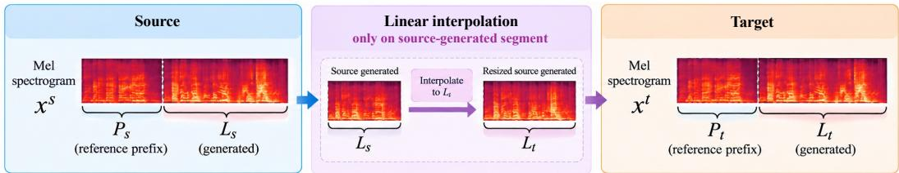  
Figure 7: F5-TTS conditioning. The source-generated mel segment is linearly interpolated to the length of the target-generated mel segment.

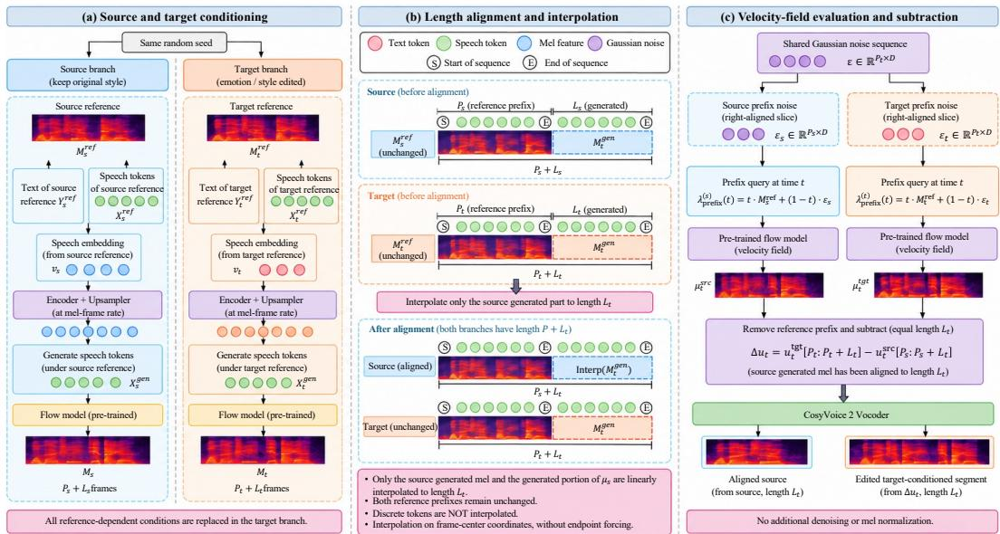  
Figure 8: CosyVoice 2 conditioning. Each branch uses its own reference mel and speaker embedding, together with the generated mel segment under that reference. The source branch’s generated mel is linearly interpolated to the target length, while the target branch remains unchanged. The two branches share a Gaussian noise sequence of length max $( \bar { P } _ { s } , P _ { t } )$ ), which is right-aligned to each reference prefix.

CosyVoice 2 conditioning. As shown in Fig. 8, source and target sequences are synthesized sep arately using their respective references and the same random seed. Each branch uses the text and discrete speech tokens of its own reference, together with the speech tokens generated under that reference; these are encoded and upsampled to a continuous representation $\mu$ at the mel-frame rate. The flow model additionally receives the corresponding speaker embedding and reference mel, so the target branch replaces all reference-dependent conditions. Let $P _ { s } , P _ { t }$ denote the source and target prefix lengths and $L _ { s } , L _ { t }$ their generated lengths. We interpolate only the source-generated mel and the generated portion of $\mu _ { s }$ to $L _ { t }$ , leaving the target representation, both reference prefixes, and all discrete tokens unchanged. Interpolation uses frame-center coordinates without endpoint forcing. The resulting branch lengths are $P _ { s } + L _ { t }$ and $P _ { t } + L _ { t } ;$ ; after evaluating the full velocity fields, we remove each reference prefix and subtract the equal-length generated portions. Prefix noises are right-aligned slices of a shared Gaussian sequence of length max $( P _ { s } , \bar { P _ { t } } )$ . Aligned-source and edited segments are decoded with the same pre-trained vocoder and random state, without additional denoising or mel normalization.

Evaluation. We evaluate waveforms decoded from $\mathbf { x } ^ { \mathrm { s r c } }$ and $\mathbf { x } ^ { \mathrm { e d i t } }$ . Let $\mathbf { x } ^ { \mathrm { { i } } }$ <sup>src,unaligned</sup> denote the source mel before length interpolation; for F5-TTS it equals $\mathbf { x } ^ { \mathrm { s r c } }$ . Target-emotion probability is computed with the pre-trained emotion2vec-plus-large<sup>1</sup> classifier by applying a softmax over Neutral, Happy, Angry, Sad, and Surprise. WER is computed against the synthesis transcript using Whisper-large-v3<sup>2</sup>. Text is lowercased, stripped of Unicode punctuation, whitespace-normalized, and segmented with Jieba<sup>3</sup> for Mandarin. All evaluation audio is converted to mono and resampled to 16 kHz without additional loudness normalization. Metrics are averaged over cases.

Probability and WER compare decoded $\mathbf { x } ^ { \mathrm { s r c } }$ and $\mathbf { x } ^ { \mathrm { e d i t } }$ . Speaker similarity (S-SIM) instead uses $\mathbf { x } ^ { \mathrm { s r c , u n a l i g \overline { { n } } e d } }$ as the baseline to include the complete pipeline and compares each waveform with an emotion-matched reference:

$$
\begin{array} { r l } & { S _ { \mathrm { b e f o r e } } = \cos \bigl ( E ( \mathcal { V } ( \mathbf { x } ^ { \mathrm { s r c } , \mathrm { u n a l i g n e d } } ) ) , E ( R _ { s } ) \bigr ) , } \\ & { S _ { \mathrm { a f t e r } } = \cos \bigl ( E ( \mathcal { V } ( \mathbf { x } ^ { \mathrm { e d i t } } ) ) , E ( R _ { t } ) \bigr ) , \qquad \Delta S = S _ { \mathrm { a f t e r } } - S _ { \mathrm { b e f o r e } } . } \end{array}\tag{12}
$$

Here, E is an ECAPA-TDNN<sup>4</sup> speaker encoder and V is the model’s waveform decoder. Because the speaker encoder can remain sensitive to emotion, emotion-matched references reduce the mismatch caused by comparing emotional speech only against a neutral reference. Accordingly, $\Delta S$ should be interpreted as reference-based speaker-similarity change rather than a direct measure of identity loss.

Table 5: Target-emotion probability before and after editing. Values are percentages and $\Delta$ is in percentage points (pp). CosyVoice uses the aligned-source baseline.
<table><tr><td>Model</td><td>Emotion</td><td>Before (%, ↑)</td><td>After (%, ↑)</td><td>∆ (pp, ↑)</td></tr><tr><td>F5-TTS</td><td>Happy</td><td>5.0456</td><td>64.8676</td><td>+59.8219</td></tr><tr><td></td><td>Angry</td><td>19.9294</td><td>77.8099</td><td>+57.8805</td></tr><tr><td></td><td>Sad</td><td>19.8356</td><td>60.8144</td><td>+40.9788</td></tr><tr><td></td><td>Surprise</td><td>0.2028</td><td>39.6302</td><td>+39.4274</td></tr><tr><td></td><td>Mean (80 cases)</td><td>11.2534</td><td>60.7805</td><td>+49.5272</td></tr><tr><td>CosyVoice 2</td><td>Happy</td><td>10.0841</td><td>70.5735</td><td>+60.4894</td></tr><tr><td></td><td>Angry</td><td>20.0920</td><td>86.6830</td><td>+66.5910</td></tr><tr><td></td><td>Sad</td><td>19.6899</td><td>54.9719</td><td>+35.2820</td></tr><tr><td></td><td>Surprise</td><td>2.4802×10−5</td><td>61.0794</td><td>+61.0794</td></tr><tr><td></td><td>Mean (80 cases)</td><td>12.4665</td><td>68.3269</td><td>+55.8604</td></tr><tr><td>Both models</td><td>Mean (160 observations)</td><td>11.8599</td><td>64.5537</td><td>+52.6938</td></tr></table>

Table 6: Per-case-averaged WER before and after editing. Positive changes indicate degradation. CosyVoice uses the aligned-source baseline; its whole-pipeline comparison is reported in the text.
<table><tr><td>Model</td><td>Emotion</td><td>Before (%, ↓)</td><td>After (%, ↓)</td><td>∆ (pp, ↓)</td></tr><tr><td rowspan="5">F5-TTS</td><td>Happy</td><td>18.0595</td><td>15.3095</td><td>-2.7500</td></tr><tr><td>Angry</td><td>20.3591</td><td>9.4702</td><td>-10.8889</td></tr><tr><td>Sad</td><td>9.7123</td><td>8.9385</td><td>-0.7738</td></tr><tr><td>Surprise</td><td>12.4702</td><td>16.5575</td><td>+4.0873</td></tr><tr><td>Mean (80 cases)</td><td>15.1503</td><td>12.5689</td><td>-2.5813</td></tr><tr><td rowspan="5">CosyVoice 2</td><td>Happy</td><td>8.8095</td><td>13.8452</td><td>+5.0357</td></tr><tr><td>Angry</td><td>20.6627</td><td>10.2619</td><td>-10.4008</td></tr><tr><td>Sad</td><td>4.7500</td><td>9.7202</td><td>+4.9702</td></tr><tr><td>Surprise</td><td>6.0813</td><td>8.8075</td><td>+2.7262</td></tr><tr><td>Mean (80 cases)</td><td>10.0759</td><td>10.6587</td><td>+0.5828</td></tr><tr><td>Both models</td><td>Mean (160 observations)</td><td>12.6131</td><td>11.6138</td><td>-0.9993</td></tr></table>

Results. Tables 5, 6, and 7 provide the complete per-emotion results and model averages. Both models exhibit pronounced target-emotion probability gains: 49.53 pp for F5-TTS and 55.86 pp for CosyVoice 2. WER decreases by 2.58 pp for F5-TTS but increases by 0.58 pp for CosyVoice 2; the per-emotion results show that these averages mask heterogeneous changes across targets. Mean emotion-matched S-SIM decreases by 0.0819 for F5-TTS and 0.0678 for CosyVoice 2. Percentile 95% confidence intervals for these S-SIM differences are $[ - 0 . 1 0 1 3 , - 0 . 0 6 \dot { 0 } \dot { 5 } ]$ and [−0.0833, −0.0520], obtained from 10,000 bootstrap samples of the 20 speaker clusters with seed 42. Overall, the results support substantial training-free emotional editability, with mixed effects on transcription accuracy and a moderate reduction in reference-based speaker similarity.

Table 7: Emotion-matched S-SIM defined in Eq. 12. Before uses the neutral reference; after uses the target-emotion reference. CosyVoice before is the unedited generated speech before length alignment, so changes include alignment. ∆ is an absolute cosine difference.
<table><tr><td>Model</td><td>Emotion</td><td>Before ↑</td><td>After ↑</td><td>∆↑</td></tr><tr><td>F5-TTS</td><td>Happy</td><td>0.6522</td><td>0.5966</td><td>-0.0556</td></tr><tr><td></td><td>Angry</td><td>0.6629</td><td>0.5695</td><td>-0.0934</td></tr><tr><td></td><td>Sad</td><td>0.6591</td><td>0.6186</td><td>-0.0405</td></tr><tr><td></td><td>Surprise</td><td>0.6878</td><td>0.5499</td><td>-0.1379</td></tr><tr><td></td><td>Mean (80 cases)</td><td>0.6655</td><td>0.5836</td><td>-0.0819</td></tr><tr><td>CosyVoice 2</td><td>Happy</td><td>0.6454</td><td>0.5716</td><td>-0.0738</td></tr><tr><td></td><td>Angry</td><td>0.6501</td><td>0.5373</td><td>-0.1127</td></tr><tr><td></td><td>Sad</td><td>0.6362</td><td>0.6444</td><td>+0.0082</td></tr><tr><td></td><td>Surprise</td><td>0.6519</td><td>0.5589</td><td>-0.0930</td></tr><tr><td></td><td>Mean (80 cases)</td><td>0.6459</td><td>0.5781</td><td>-0.0678</td></tr><tr><td>Both models</td><td>Mean (160 observations)</td><td>0.6557</td><td>0.5808</td><td>-0.0748</td></tr></table>

Table 8: Early-stop editing results. Editing begins at the first editing step and terminates after the indicated prefix. Results are averaged over 80 cases and three editing-noise repeats.
<table><tr><td>Model</td><td>Editing prefix</td><td>Emotion gain (pp)</td><td>Onset drift (ms)</td><td>∆WER (pp)</td></tr><tr><td>F5-TTS</td><td>First 4 of 32 steps</td><td>0.015</td><td>0.38</td><td>+0.21</td></tr><tr><td>F5-TTS</td><td>All 32 steps</td><td>53.78</td><td>308.33</td><td>-0.92</td></tr><tr><td>CosyVoice 2</td><td>First 3 of 10 steps</td><td>3.43</td><td>22.21</td><td>+2.83</td></tr><tr><td>CosyVoice 2</td><td>First 6 of 10 steps</td><td>30.37</td><td>87.83</td><td>+88.88</td></tr><tr><td>CosyVoice 2</td><td>All 10 steps</td><td>56.09</td><td>245.42</td><td>+1.40</td></tr></table>

For completeness, CosyVoice WER is 7.7287% before alignment, 10.0759% after alignment, and 10.6587% after editing. The whole-pipeline increase is therefore 2.93 pp, including 2.35 pp from alignment. Its corresponding target-emotion probabilities are 3.6337%, 12.4665%, and 68.3269%. This distinction separates alignment effects from the editing effects reported in Tables 5 and 6.

## B.2 EXPERIMENT DETAILS FOR Q2

Experimental setup. We follow the diagnostic setup in Appendix B.1 unless otherwise stated. All trajectory interventions use the same 80 cases and model-specific inference settings. Each intervention is evaluated with three editing-noise repeats while keeping the source synthesis fixed. The reported t denotes the model’s internal integration step; the native solver grids are nonuniform.

Trajectory-specific measures. We reuse the target-emotion probability change and ∆WER defined in Appendix B.1. For delayed-start experiments, we additionally report retained emotion gain, de fined as the mean emotion gain relative to full-step editing. To quantify temporal disruption, we measure onset drift as the absolute difference between the detected source and edited speech onsets. Onset is detected using 20-ms RMS windows with a 10-ms hop and a threshold of 5% of peak RMS.

Table 9: Selected delayed starts, averaged over cases and editing-noise repeats. Gain retention is relative to full-step editing; onset drift and ∆WER are relative to the decoded, length-aligned source.
<table><tr><td>Model</td><td>Editing start</td><td>Gain retained (%)</td><td>Onset drift (ms)</td><td>∆WER (pp)</td></tr><tr><td rowspan="2">F5-TTS</td><td>Full-step</td><td>100.0</td><td>308.33</td><td>-0.92</td></tr><tr><td>Skip 4 steps</td><td>99.5</td><td>97.33</td><td>-4.95</td></tr><tr><td rowspan="3">CosyVoice 2</td><td>Full-step</td><td>100.0</td><td>245.42</td><td>+1.40</td></tr><tr><td>Skip 1 step</td><td>100.3</td><td>260.29</td><td>+0.67</td></tr><tr><td>Skip 3 steps</td><td>51.0</td><td>44.25</td><td>+55.75</td></tr></table>

Delayed-start analysis. We first test whether the earliest editing updates are necessary. Specifically, we hold the editing state unchanged for the first k integration steps and apply the editing update at every remaining step. We sweep all possible starting steps on the native schedules of F5-TTS (32 steps) and CosyVoice 2 (10 steps), including full-step editing and no editing. Noise is shared across different start schedules at each corresponding integration step.

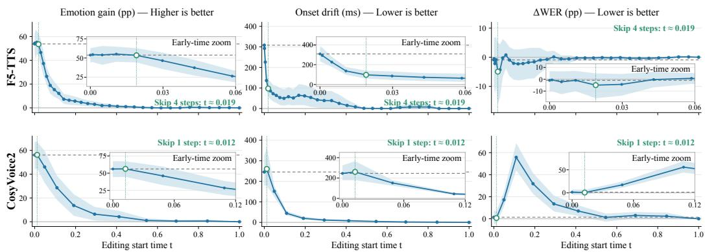  
Figure 9: Complete delayed-start scans for F5-TTS and CosyVoice 2. Columns show emotion gain (pp), onset drift (ms), and ∆WER (pp), measured relative to the decoded, length-aligned source. Bands indicate pointwise 95% speaker-bootstrap intervals. The horizontal axis is the ODE step.

Table 9 reports representative operating points discussed in the main text, while Fig. 9 shows the complete scans. F5-TTS exhibits a short early interval in which onset drift can be substantially reduced while retaining all of the full-step emotion gain. CosyVoice 2 shows no similarly favorable delayed start: preserving the emotion gain provides little timing benefit, whereas stronger delay rapidly sacrifices editing effectiveness and linguistic fidelity.

Early-stop analysis. The delayed-start experiment tests whether early updates are necessary. Editing now begins at the first integration step and terminates after a selected prefix, after which the current state is frozen and decoded without subsequent editing updates. Table 10 reports representative results, and Fig. 10 shows the complete scan.

Early prefixes produce little emotion change compared with full-step editing. Moreover, intermediate states can have substantially worse transcription than the final state, showing that later updates may not only complete the emotion transfer but also recover intermediate content errors.

Table 10: Early-stop analysis. Editing starts at the first step and stops after the indicated prefix; values are means over 80 cases and three editing-noise repeats.
<table><tr><td>Model</td><td>Prefix</td><td>t</td><td>Emotion gain (pp)</td><td>Onset drift (ms)</td><td>∆WER (pp)</td></tr><tr><td>F5-TTS</td><td>First 4 / 32</td><td>0.019</td><td>0.015</td><td>0.38</td><td>+0.21</td></tr><tr><td>F5-TTS</td><td>First 14 / 32</td><td>0.227</td><td>6.96</td><td>38.54</td><td>+1.31</td></tr><tr><td>F5-TTS</td><td>First 28 / 32</td><td>0.805</td><td>50.15</td><td>275.04</td><td>+6.03</td></tr><tr><td>F5-TTS</td><td>All 32 / 32</td><td>1.000</td><td>53.78</td><td>308.33</td><td>-0.92</td></tr><tr><td>CosyVoice 2</td><td>First 3 / 10</td><td>0.109</td><td>3.43</td><td>22.21</td><td>+2.83</td></tr><tr><td>CosyVoice 2</td><td>First 6 / 10</td><td>0.412</td><td>30.37</td><td>87.83</td><td>+88.88</td></tr><tr><td>CosyVoice 2</td><td>First 9 / 10</td><td>0.844</td><td>57.06</td><td>240.38</td><td>+1.84</td></tr><tr><td>CosyVoice 2</td><td>All 10 / 10</td><td>1.000</td><td>56.09</td><td>245.42</td><td>+1.40</td></tr></table>

Block-wise and strength analysis. The start- and stop-time scans show that editing effects vary strongly along the trajectory, but do not establish whether individual stages contribute independently. We therefore divide the trajectory into five stages and perform two complementary interventions. “Only block j” applies editing updates only within block j, whereas “skip block j” removes that block from an otherwise complete editing trajectory.

As shown in Table 11, no individual block reproduces the emotion gain of full-step editing. Conversely, removing a block from an otherwise complete trajectory can substantially change emotion gain, onset drift, or transcription accuracy. The contribution of a stage therefore depends on the state produced by preceding updates, supporting a state-dependent trajectory interpretation rather than an additive assignment of independent roles to individual stages.

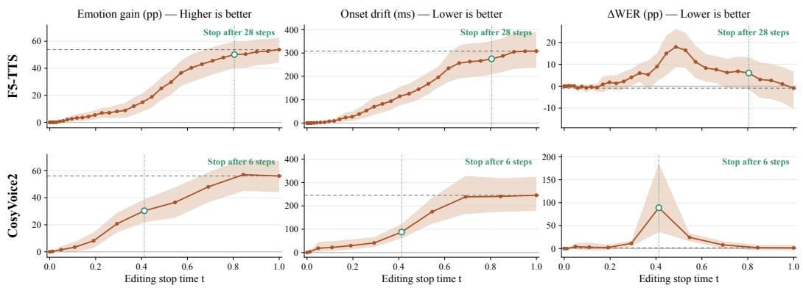  
Figure 10: Early-stop scans for F5-TTS and CosyVoice 2. Columns report emotion gain, onset drift, and ∆WER. Bands show 95% speaker-bootstrap intervals; dashed lines indicate full-step means.

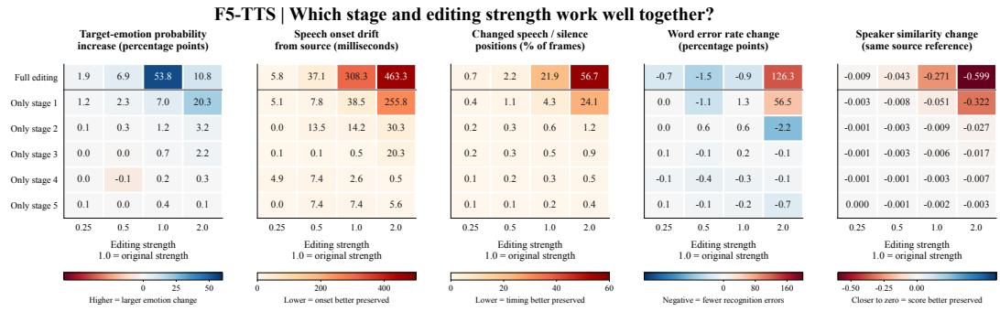  
Figure 11: F5-TTS block and editing-strength ablations.

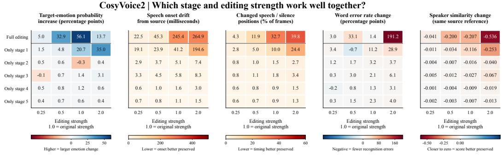  
Figure 12: CosyVoice 2 block and editing-strength ablations.

Table 11: Block ablations. Values are emotion gain (pp), onset drift (ms), and ∆WER (pp).
<table><tr><td>Model</td><td>Block</td><td colspan="3">Only block</td><td colspan="3">Skip block</td></tr><tr><td></td><td></td><td>Gain</td><td>Drift</td><td>∆WER</td><td>Gain</td><td>Drift</td><td>∆WER</td></tr><tr><td>F5-TTS</td><td>1</td><td>6.96</td><td>38.54</td><td>1.31</td><td>4.66</td><td>53.71</td><td>-0.97</td></tr><tr><td></td><td>2</td><td>1.17</td><td>14.17</td><td>0.60</td><td>36.00</td><td>205.38</td><td>13.88</td></tr><tr><td></td><td>3</td><td>0.72</td><td>0.50</td><td>0.25</td><td>40.27</td><td>253.75</td><td>8.10</td></tr><tr><td></td><td>4</td><td>0.23</td><td>2.62</td><td>-0.25</td><td>49.26</td><td>267.79</td><td>4.95</td></tr><tr><td></td><td>5</td><td>0.36</td><td>7.38</td><td>-0.24</td><td>50.15</td><td>275.04</td><td>6.03</td></tr><tr><td>CosyVoice 2</td><td>1</td><td>20.73</td><td>41.21</td><td>11.23</td><td>6.37</td><td>11.25</td><td>13.49</td></tr><tr><td></td><td>2</td><td>-0.27</td><td>5.12</td><td>3.20</td><td>55.67</td><td>243.58</td><td>3.36</td></tr><tr><td></td><td>3</td><td>1.37</td><td>5.83</td><td>2.06</td><td>47.67</td><td>216.46</td><td>10.74</td></tr><tr><td></td><td>4</td><td>1.24</td><td>1.58</td><td>1.35</td><td>56.85</td><td>238.75</td><td>1.39</td></tr><tr><td></td><td>5</td><td>0.59</td><td>1.08</td><td>2.32</td><td>57.06</td><td>240.38</td><td>1.84</td></tr></table>

We further examine how editing strength interacts with trajectory position. Figs. 11 and 12 (rows denote the full trajectory or individual blocks; columns denote editing strengths. Cell values are means with metric-specific color scales) show that increasing the strength does not consistently improve emotion transfer. In some stages, stronger updates even weaken the emotion change while substantially increasing onset drift or transcription errors. Here, stages are defined by solver-time boundaries and therefore contain different numbers of integration steps, while the strength directly scales the editing update at each step. These results show that the appropriate editing strength depends on where along the trajectory it is applied.

## B.3 EXPERIMENT DETAILS FOR Q3

Experimental Setup. We reuse the source cases, full-trajectory editor, and emotion evaluator from Appendix B.1. Each Neutral source is paired with the next speaker in dataset-ID order within the same language, with wraparound, requesting Happy, Angry, Sad, or Surprise editing targets (80 edits per model). Source and target references share the reference transcript; the synthesis text is unchanged. Editing uses seed 42. We keep the source mel spectrogram already length-aligned in Q1 fixed; the newly generated target mel segment is linearly interpolated to this fixed length and decoded for pitch comparison. CosyVoice 2 retains the complete target condition, including targetgenerated speech tokens and flow-conditioning features in the original paper.

Identity and pitch measures. For identity evaluation, each speaker has ten independent real enrollment recordings: two texts, each in five emotions, disjoint from all conditioning-reference and synthesis texts. We unit-normalize their ECAPA-TDNN embeddings, average them, and normalize the mean to obtain a speaker centroid. We measure identity changes relative to both the source and target centroids. For each centroid, we compute the cosine similarity before and after editing and report the edited-minus-source difference.

For pitch, we estimate F0 using the probabilistic YIN (pYIN) algorithm (Mauch & Dixon, 2014) from 16-kHz mono audio, with a 1024-sample window, a 160-sample hop, and a 50-600 Hz search range. Finite estimates are converted to semitones as 12 log (F0/100 Hz). For the median or 90thminus-10th percentile range f, we report $| f ( b ) - f ( t ) | - \bar { | f ( a ) - f ( t ) | }$ |, where b, a, and t are the aligned source, edited output, and aligned target synthesis. Positive values mean closer target pitch statistics. Both models have 79/80 valid pitch comparisons, covering all 20 source speakers.

Results. Table 1 reports the mean results across source speakers. We estimate uncertainty using 95% confidence intervals from 10,000 source-speaker bootstrap resamples (seed 42), conditional on the fixed speaker pairs and generation seed and without correction for multiple comparisons. Overall, speaker identity, emotion, and pitch all shift toward the target.

## C ADDITIONAL DETAILS OF SEMOEDITBENCH

## C.1 TASK CONSTRUCTION

Table 12 summarizes the nine benchmark splits. The same-dataset same-speaker split uses a paired target recording from the same speaker reading the same text, isolating emotion from speaker and content. The same-dataset cross-speaker split keeps the source corpus but uses a different speaker as the target reference. The cross-dataset cross-speaker split is drawn from a corpus different from the source corpus, with a different speaker. Every system receives the source waveform, its ground truth transcript, the requested target emotion (and target intensity for intensity control), and a target reference utterance with different linguistic content. The paired target waveform is reserved exclusively for evaluation and must not be used to generate the edit. Sampling is deterministic and speaker-aware, and source or paired-target waveforms are never reused as target references.

Table 12: SEmoEditBench task composition. Each task is evaluated under same-dataset samespeaker, same-dataset cross-speaker, and cross-dataset cross-speaker settings.
<table><tr><td>Task</td><td>Setting</td><td>Corpus</td><td>Cases</td><td>Construction</td></tr><tr><td>Replacement</td><td>Same dataset, same speaker</td><td>ESD, IEMOCAP</td><td>120</td><td>80 ESD and 40 IEMOCAP cases; sources and targets balanced across Neutral, Happy, Sad, Angry, and Sur- prise; Chinese and English in ESD.</td></tr><tr><td>Replacement</td><td>Same dataset, cross speaker</td><td>ESD, IEMOCAP</td><td>120</td><td>Same source cases as the same-speaker split, but the target reference comes from a different speaker of the same corpus.</td></tr><tr><td>Replacement</td><td>Cross dataset, cross speaker</td><td>ESD, IEMOCAP</td><td>80</td><td>Sources from one corpus and target references from the other; all English.</td></tr><tr><td>Erasure</td><td>Same dataset, same speaker</td><td>ESD, IEMOCAP</td><td>56</td><td>32 ESD and 24 IEMOCAP cases; source emotions Happy, Sad, Angry, and Surprise, all mapped to Neu- tral.</td></tr><tr><td>Erasure</td><td>Same dataset, cross speaker</td><td>ESD, IEMOCAP</td><td>56</td><td>Same source cases, target reference from a different speaker of the same corpus.</td></tr><tr><td>Erasure</td><td>Cross dataset, cross speaker</td><td>ESD, IEMOCAP</td><td>40</td><td>Sources from one corpus and target references from the other; all English.</td></tr><tr><td>Intensity</td><td>Same dataset, same speaker</td><td>RAVDESS, CREMA-D</td><td>44</td><td>20 RAVDESS and 24 CREMA-D cases; Neutral sources paired with same-speaker same-text emotional targets at five intensities.</td></tr><tr><td>Intensity</td><td>Same dataset, cross speaker</td><td>RAVDESS, CREMA-D</td><td>44</td><td>Same source cases, target reference from a different speaker of the same corpus.</td></tr><tr><td>Intensity</td><td>Cross dataset, cross speaker</td><td>RAVDESS, CREMA-D</td><td>40</td><td>Sources from one corpus and target references from the other; all English.</td></tr></table>

IEMOCAP sources are restricted to utterances between 2 and 10 seconds with categorical annotation agreement of at least 0.6. For ESD, IEMOCAP, and RAVDESS, the target reference matches the source speaker but uses different text. Because CREMA-D does not provide suitable same-speaker references for this protocol, its references are synthesized with IndexTTS2 (Zhou et al., 2026b): the neutral source provides speaker identity, a separate recording provides the requested emotion and intensity, and a synthesis transcript distinct from the source provides the reference content. The benchmark fixes all manifests, case identifiers, and references across evaluated systems. All intensity split summaries are averaged over the same 90-case common subset (Neutral source; Angry, Happy, Sad, or Surprise target; 30 cases per split) so that systems are directly comparable.

## C.2 METRIC DEFINITIONS

We evaluate each edit along three axes: editing success, preservation of non-target attributes, and perceptual quality. All objective metrics are computed per case and macro-averaged within each split using identical model configurations across systems; expected case count, failed case count, and failure rate are reported alongside the metric averages. Table 13 lists the symbols used throughout the metric definitions. Table 14 provides a compact overview of all metrics, their optimization directions, and task-level applicability; the subsections below define each metric in detail.

## C.2.1 EDITING SUCCESS

Editing-success metrics measure whether the edited waveform expresses the requested target emotion (or, for erasure, neutral) while moving away from the source emotion. They are computed from emotion2vec+ Large posteriors and embeddings.

Target emotion probability (TEP). TEP measures the degree to which the edited waveform is recognized as the requested target emotion:

$$
\mathrm { T E P } = P ( e _ { \mathrm { t g t } } \mid x _ { e } ) .\tag{13}
$$

Measurement. The emotion2vec+ Large model produces a posterior distribution over emotion categories from the edited waveform; the probability mass assigned to $e _ { \mathrm { t g t } }$ is reported. Data source.

Table 13: Notation used in the metric definitions.
<table><tr><td>Symbol</td><td>Meaning</td></tr><tr><td> $x _ { s } , x _ { e } , x _ { t }$ </td><td>Source, edited, and paired-target waveforms, respectively</td></tr><tr><td> $e _ { \mathrm { s r c } } , e _ { \mathrm { t g t } }$ </td><td>Source and target emotion labels</td></tr><tr><td>y</td><td>Manifest transcript (ground-truth text)</td></tr><tr><td> $\stackrel { \smile } { \cal P } ( e \mid x )$ </td><td>emotion2vec+ Large posterior probability for emotion e given waveform x</td></tr><tr><td> $f _ { E } ( x )$ </td><td>emotion2vec+ Large embedding of waveform x</td></tr><tr><td> $A ( x )$ </td><td>ASR transcript of waveform x produced by Whisper-large-v3</td></tr><tr><td> $f _ { S } ( x )$ </td><td>ECAPA-TDNN speaker embedding of waveform x</td></tr><tr><td> $Q ( x )$ </td><td>UTMOSv2 quality prediction for waveform x</td></tr><tr><td> $x _ { e } ^ { ( \alpha ) }$ </td><td>Edited output at intensity strength α</td></tr><tr><td> $\alpha _ { 1 } < \cdots < \alpha _ { 5 }$ </td><td>Five intensity strengths  $\mathbf { \dot { \{ 0 , 0 . 2 5 , 0 . 5 , 0 . 7 5 , 1 \} } }$ </td></tr><tr><td> $z _ { s } , z _ { t } , z _ { i }$ </td><td>emotion2vec embeddings  $f _ { E } ( x _ { s } ) , f _ { E } ( x _ { t } ) , \dot { f _ { E } } ( x _ { e } ^ { ( \alpha _ { i } ) } )$ </td></tr><tr><td> $a _ { i }$ </td><td>Relative progress of output ¿ along the source-target direction:  ${ ( z _ { i } - z _ { s } ) } ^ { \top } ( z _ { t } - z _ { s } ) / \| z _ { t } - z _ { s } \| ^ { 2 }$ </td></tr></table>

Table 14: Metrics used in SEmoEditBench. Upward and downward arrows indicate whether higher or lower values are preferred.
<table><tr><td>Metric</td><td>Definition</td><td>Applicability</td></tr><tr><td colspan="3">Editing success</td></tr><tr><td>Target emotion probability (TEP) ↑</td><td> $P ( e _ { \mathrm { t g t } } \mid x _ { e } )$ </td><td>Replacement</td></tr><tr><td>Neutral probability (NP) ↑</td><td> $P ( \mathrm { N e u t r a l } \mid x _ { e } )$ </td><td>Erasure</td></tr><tr><td>Source emotion suppression (SES) ↑</td><td> $P ( e _ { \mathrm { s r c } } \mid x _ { s } ) - P ( e _ { \mathrm { s r c } } \mid x _ { e } )$   $\mathrm { M e a n ~ o v e r ~ a l l ~ p a i r s ~ } i < j ~ \mathrm { o f }$ </td><td>Replacement, erasure</td></tr><tr><td>Embedding-based effective intensity control (EIC-Emb) ↑</td><td> $\operatorname { s g n } ( a _ { j } - a _ { i } { \big \} } \cdot \operatorname* { m i n } ( 1 , \operatorname* { m a x } ( 0 , | a _ { j } - a _ { i } | / \tau ) ) , \tau = 1$ </td><td>Intensity control (paired target)</td></tr><tr><td>Emotion similarity (E-SIM) ↑</td><td> $\cos ( f _ { E } ( x _ { e } ) , f _ { E } ( x _ { t } ) )$ </td><td>Splits with paired targets</td></tr><tr><td>Directional editing score (DES) ↑</td><td> $\cos (  { \bar { f } _ { E } } ( x _ { e } ) -  { \bar { f } _ { E } } ( x _ { s } ) ,  { f _ { E } } ( x _ { t } ) -  { f _ { E } } ( x _ { s } ) )$ </td><td>Splits with paired targets</td></tr><tr><td colspan="3">Preservation</td></tr><tr><td>Relative word error rate (∆WER) ↓</td><td> $\mathrm { W E R } ( x _ { e } ) - \mathrm { W E R } ( x _ { s } )$  against the same transcript; effectively ∆CER for Chinese</td><td>All tasks</td></tr><tr><td>Speaker similarity (S-SIM) ↑</td><td>ECAPA-TDNN cosine verification score between  $x _ { s }$  and  $x _ { e }$ </td><td>All tasks</td></tr><tr><td colspan="3">Quality</td></tr><tr><td>UTMOS ↑</td><td>UTMOSv2 prediction for  $x _ { e }$ </td><td>All tasks</td></tr><tr><td colspan="3">Subjective evaluation</td></tr><tr><td>Speaker-similarity MOS (SS-MOS) ↑ Emotion similarity (ES-MOS) ↑</td><td>Perceived speaker similarity between the source and edited utterances Perceived emotion similarity between the edited utterance and</td><td>20 sampled case groups 20 sampled case groups</td></tr><tr><td></td><td>requested target emotion</td><td></td></tr><tr><td>Naturalness MOS (N-MOS) ↑</td><td>Perceived naturalness of the edited utterance</td><td>20 sampled case groups</td></tr></table>

For DES, a zero edited displacement receives a score of zero, whereas a zero target displacement is invalid. E-SIM and DES are reported for all three replacement and erasure splits, each of which provides an evaluation-only paired target recording. EIC-Emb uses the corresponding paired target recordings for all three intensity splits, never the generation-time target reference.

Edited waveform $x _ { e }$ . Evaluation criteria. Higher values indicate stronger target-emotion expression; reported for the replacement task.

Neutral probability (NP). For emotion erasure, the requested output is emotionally neutral. NP measures the probability that the edited waveform is classified as neutral:

$$
\mathrm { N P } = P ( \mathrm { n e u t r a l } \mid x _ { e } ) .\tag{14}
$$

Measurement. Same as TEP but extracting the posterior mass for the neutral class. Data source. Edited waveform $x _ { e }$ . Evaluation criteria. Higher values indicate more complete erasure; reported for the erasure task.

Source emotion suppression (SES). SES quantifies the reduction of the source emotion from the source to the edited waveform:

$$
{ \mathrm { S E S } } = P ( e _ { \mathrm { s r c } } \mid x _ { s } ) - P ( e _ { \mathrm { s r c } } \mid x _ { e } ) .\tag{15}
$$

Measurement. The emotion2vec posterior for the source emotion $e _ { \mathrm { s r c } }$ is computed for both the source and edited waveforms, and their difference is taken. Data sources. Source waveform $x _ { s }$ and edited waveform $x _ { e } .$ Evaluation criteria. Higher values indicate stronger suppression of the source emotion; reported for both replacement and erasure.

Embedding-based effective intensity control (EIC-Emb). EIC-Emb is the primary metric used to evaluate intensity control in the main benchmark. For each case, the system produces five edited outputs $x _ { e } ^ { ( \alpha _ { i } ) }$ at increasing strengths $\alpha _ { 1 } < \cdots < \alpha _ { 5 }$ . Each output embedding is projected onto the source–target direction via the relative progress

$$
a _ { i } = \frac { ( z _ { i } - z _ { s } ) ^ { \top } ( z _ { t } - z _ { s } ) } { \| z _ { t } - z _ { s } \| ^ { 2 } } ,\tag{16}
$$

where $a _ { i } = 0$ means no progress beyond the source, $a _ { i } = 1$ reaches the target’s projection, negative values move away from the target, and values above 1 overshoot. EIC-Emb then applies a pairwise effective-control transform: for every pair $i < j$ , the signed progress difference $d = a _ { j } - a _ { i }$ is mapped to

$$
{ \mathrm { s g n } } ( d ) \cdot { \mathrm { m i n } } { \bigg ( } 1 , \operatorname* { m a x } { \bigg ( } 0 , { \frac { | d | } { \tau } } { \bigg ) } { \bigg ) } , \qquad \tau = 1 ,\tag{17}
$$

and the mean over all ${ \binom { 5 } { 2 } } = 1 0$ pairs is reported. Measurement. emotion2vec+ Large embeddings are computed for the source, the paired target, and all five edited outputs; the relative progress values $a _ { i }$ are derived and the pairwise formula above is applied. Data sources. Source waveform $x _ { s }$ paired-target waveform $x _ { t }$ (evaluation-only), and the five edited outputs $x _ { e } ^ { ( \alpha _ { i } ) }$ . Evaluation criteria. Higher values indicate more effective and monotonic control; a score of 1 means every stronger edit produces strictly more progress toward the target with differences of at least τ , 0 means no consistent increase, and negative values indicate decreasing progress. EIC-Emb is reported for the intensity-control task on cases that have a paired target recording. Because $a _ { i }$ is a signed projection rather than a cosine similarity, EIC-Emb preserves the magnitude of the emotional displacement and is anchored to the actual paired target recording.

Emotion similarity (E-SIM). E-SIM measures the cosine similarity between the edited waveform’s embedding and the paired target’s embedding:

$$
\mathrm { E - S I M } = \cos ( f _ { E } ( x _ { e } ) , f _ { E } ( x _ { t } ) ) , \qquad \cos ( u , v ) = \frac { { u } ^ { \top } { v } } { \| u \| _ { 2 } \| v \| _ { 2 } } .\tag{18}
$$

Measurement. emotion2vec+ Large embeddings are computed for both waveforms and their cosine similarity is reported. Data sources. Edited waveform $x _ { e }$ and paired-target waveform $x _ { t }$ . Evaluation criteria. Higher values indicate that the edit matches the emotional expression of the target; reported for splits with paired targets.

Directional editing score (DES). DES measures whether the edit moves in the same direction as the target relative to the source:

$$
d _ { e } = f _ { E } ( x _ { e } ) - f _ { E } ( x _ { s } ) , \qquad d _ { t } = f _ { E } ( x _ { t } ) - f _ { E } ( x _ { s } ) , \qquad { \mathrm { D E S } } = \cos ( d _ { e } , d _ { t } ) .\tag{19}
$$

A zero edited displacement $d _ { e } = \mathbf { 0 }$ receives a score of zero, whereas a zero target displacement $d _ { t } =$ 0 is invalid. Measurement. emotion2vec+ Large embeddings are computed for the source, edited, and paired-target waveforms; the displacement vectors are formed and their cosine similarity is reported. Data sources. Source $x _ { s }$ , edited $x _ { e } ,$ , and paired-target $x _ { t }$ waveforms. Evaluation criteria. Higher values indicate that the edit travels along the correct source-to-target emotional direction; reported for splits with paired targets.

## C.2.2 PRESERVATION

Preservation metrics verify that the edit modifies only the intended affective expression while keeping the linguistic content and speaker identity intact.

Relative word error rate (∆WER). ∆WER measures the change in transcription error from the source to the edited waveform against the same ground-truth transcript y:

$$
\Delta \mathrm { W E R } = \mathrm { W E R } \left( y , A ( x _ { e } ) \right) - \mathrm { W E R } \left( y , A ( x _ { s } ) \right) .\tag{20}
$$

Measurement. Both the source and edited waveforms are transcribed by Whisper-large-v3; WER is computed against the manifest transcript y after text normalization. For Chinese, tokenization is character-level, making this effectively a character error rate (∆CER). Data sources. Source waveform $x _ { s } .$ , edited waveform $x _ { e } ,$ , and ground-truth transcript y. Evaluation criteria. Lower values indicate better content preservation; $\Delta \bar { \mathrm { W E R } } = 0$ means the edit introduced no transcription errors relative to the source. Reported for all tasks.

Speaker similarity (S-SIM). S-SIM measures the cosine similarity between the speaker embeddings of the source and edited waveforms:

$$
\mathrm { S - S I M } = \cos ( f _ { S } ( x _ { s } ) , f _ { S } ( x _ { e } ) ) .\tag{21}
$$

Measurement. A pretrained ECAPA-TDNN speaker verifier extracts embeddings from both waveforms, and their cosine similarity is reported. Data sources. Source waveform $x _ { s }$ and edited waveform $x _ { e } .$ . Evaluation criteria. Higher values indicate better preservation of the source speaker identity; reported for all tasks.

## C.2.3 QUALITY

UTMOS. UTMOS estimates the perceptual naturalness of the edited waveform:

$$
\mathrm { U T M O S } = Q ( x _ { e } ) .\tag{22}
$$

Measurement. The pretrained UTMOSv2<sup>5</sup> predictor takes the edited waveform as input and outputs a quality score. Data source. Edited waveform $x _ { e }$ . Evaluation criteria. Higher values indicate better predicted audio quality; reported for all tasks.

## C.2.4 SUBJECTIVE EVALUATION

In addition to objective metrics, we uniformly sample 20 case groups from the benchmark and collect human judgments on a five-point scale (1–5) for three attributes.

Speaker-similarity MOS (SS-MOS). Definition. Perceived speaker similarity between the source and edited utterances. Measurement. Raters compare the source and edited waveforms and score how well the speaker identity is preserved. Evaluation criteria. Higher scores indicate better speaker preservation.

Emotion similarity MOS (ES-MOS). Definition. Perceived emotion similarity between the edited utterance and the requested target emotion. Measurement. Raters are given the edited waveform together with the target emotion label (and the target reference when available) and score how closely the edit matches the intended emotion. Evaluation criteria. Higher scores indicate closer emotional match to the target.

Naturalness MOS (N-MOS). Definition. Perceived naturalness of the edited utterance. Measurement. Raters listen to the edited waveform and score its overall naturalness, including prosody, absence of artifacts, and fluency. Evaluation criteria. Higher scores indicate more natural-sounding speech.

## D EXPERIMENTAL RESULTS

## D.1 COMPLETE IN- AND OUT-OF-DISTRIBUTION RESULTS

Tables 15–17 report all objective metrics for ID-SS (same dataset and speaker), ID-CS (same dataset, cross speaker), and OOD (cross dataset and speaker). Unsupported methods are omitted, and intensity preservation and quality are measured at α = 1. Rankings are computed independently within each setting. Pink, green, and blue cells denote ID-SS, ID-CS, and OOD, respectively; dark, medium, and light shades mark first, second, and third place, with displayed ties sharing a rank.

Table 15: Complete emotion-replacement results under both in-distribution settings and the out-ofdistribution setting.
<table><tr><td>Category</td><td>Method</td><td>Backbone</td><td>Setting</td><td>TEP↑</td><td>SES ↑</td><td>E-SIM ↑</td><td>DES↑</td><td>∆WER↓</td><td>S-SIM ↑</td><td>UTMOS ↑</td></tr><tr><td rowspan="3">Training- based</td><td>Step-Audio-EditX</td><td></td><td>ID-SS ID-CS OOD</td><td>0.222 0.196 0.211</td><td>0.445 0.420 0.452</td><td>0.521 0.519 0.526</td><td>0.550 0.543 0.575</td><td>-0.048 -0.021 -0.026</td><td>0.567 0.561 0.519</td><td>3.091 3.053 3.142</td></tr><tr><td>Auk</td><td></td><td>ID-SS ID-CS OOD</td><td>0.259 0.259 0.312</td><td>0.372 0.372 0.353</td><td>0.539 0.539 0.586</td><td>0.541 0.541 0.580</td><td>0.073 0.073 0.103</td><td>0.631 0.631 0.580</td><td>2.639 2.670 2.753</td></tr><tr><td>dots.tts.edit</td><td></td><td>ID-SS ID-CS OOD</td><td>0.434 0.434 0.357</td><td>0.600 0.600 0.483</td><td>0.669 0.669 0.638</td><td>0.713 0.713 0.691</td><td>-0.035 -0.035 -0.051</td><td>0.272 0.272 0.215</td><td>2.381 2.394 2.512</td></tr><tr><td rowspan="5">Activation- steering</td><td>CoCoEmo</td><td>CosyVoice 2</td><td>ID-SS ID-CS OOD</td><td>0.082 0.133 0.136</td><td>0.192 0.189 0.217</td><td>0.446 0.447 0.431</td><td>0.399 0.364 0.470</td><td>-0.015 -0.014 -0.039</td><td>0.715 0.717 0.667</td><td>3.061 3.046 3.169</td></tr><tr><td>CoCoEmo</td><td>IndexTTS2</td><td>ID-SS ID-CS OOD</td><td>0.035 0.034 0.046</td><td>0.127 0.101 0.125</td><td>0.402 0.396 0.398</td><td>0.269 0.298 0.334</td><td>-0.024 -0.019 -0.024</td><td>0.776 0.782 0.735</td><td>2.659 2.658 2.723</td></tr><tr><td>EmoSteer-TTS</td><td>F5-TTS</td><td>ID-SS ID-CS OOD</td><td>0.081 0.081 0.117</td><td>0.345 0.345 0.449</td><td>0.448 0.448 0.475</td><td>0.477 0.477 0.562</td><td>0.608 0.608 0.904</td><td>0.623 0.623 0.550</td><td>2.545 2.507 2.503</td></tr><tr><td>EmoSteer-TTS</td><td>CosyVoice 2</td><td>ID-SS ID-CS OOD</td><td>0.030 0.030 0.042</td><td>0.371 0.371 0.396</td><td>0.382 0.382 0.384</td><td>0.367 0.367 0.460</td><td>-0.015 -0.015 -0.029</td><td>0.478 0.478 0.425</td><td>2.515 2.523 2.530</td></tr><tr><td>EmoSteer-TTS</td><td>IndexTTS2</td><td>ID-SS ID-CS OOD</td><td>0.025 0.025 0.037</td><td>0.054 0.054</td><td>0.377 0.377</td><td>0.226 0.226</td><td>-0.037 -0.037</td><td>0.788 0.788</td><td>2.666 2.687 2.707</td></tr><tr><td rowspan="3">SEmoEdit</td><td>Ours</td><td>F5-TTS</td><td>ID-SS ID-CS OOD</td><td>0.498 0.432 0.283</td><td>0.069 0.684 0.692</td><td>0.361 0.704 0.646</td><td>0.240 0.753 0.700</td><td>-0.060 -0.026 -0.049 -0.057</td><td>0.758 0.372 0.434 0.395</td><td>2.177 2.494 2.466</td></tr><tr><td>Ours</td><td>CosyVoice 2</td><td>ID-SS ID-CS OOD</td><td>0.554 0.460</td><td>0.544 0.694 0.683</td><td>0.563 0.776 0.713</td><td>0.629 0.806 0.752</td><td>-0.025 -0.045</td><td>0.379 0.438 0.398</td><td>2.984 2.925 3.206</td></tr><tr><td>Ours</td><td>IndexTTS2</td><td>ID-SS ID-CS OOD</td><td>0.268 0.691 0.516 0.297</td><td>0.539 0.767 0.671 0.547</td><td>0.550 0.902 0.768 0.576</td><td>0.640 0.920 0.775 0.585</td><td>-0.047 -0.004 0.000 -0.046</td><td>0.423 0.468 0.436</td><td>2.578 2.686 2.930</td></tr></table>

Table 16: Complete emotion-erasure results under both in-distribution settings and the out-ofdistribution setting. CoCoEmo is omitted because it does not support emotion erasure.
<table><tr><td>Category</td><td>Method</td><td>Backbone</td><td>Setting</td><td>NP↑</td><td>SES↑</td><td>E-SIM ↑</td><td>DES ↑</td><td>∆WER↓</td><td>S-SIM ↑</td><td>UTMOS ↑</td></tr><tr><td rowspan="3">Training- based</td><td>Step-Audio-EditX</td><td></td><td>ID-SS ID-CS OOD</td><td>0.235 0.347 0.269</td><td>0.388 0.488 0.465</td><td>0.566 0.606 0.746</td><td>0.655 0.688 0.818</td><td>-0.064 -0.028 -0.070</td><td>0.577 0.586 0.561</td><td>3.220 3.133 3.197</td></tr><tr><td>Auk</td><td></td><td>ID-SS ID-CS OOD</td><td>0.229 0.229 0.272</td><td>0.311 0.311 0.371</td><td>0.528 0.528 0.591</td><td>0.582 0.582 0.585</td><td>0.014 0.014 0.033</td><td>0.676 0.676 0.651</td><td>2.859 2.881 2.959</td></tr><tr><td>dots.tts.edit</td><td></td><td>ID-SS ID-CS OOD</td><td>0.355 0.355 0.350</td><td>0.549 0.549 0.501</td><td>0.674 0.674 0.745</td><td>0.766 0.766 0.790</td><td>-0.065 -0.065 -0.070</td><td>0.304 0.304 0.254</td><td>2.685 2.675 2.752</td></tr><tr><td rowspan="3">Activation- steering</td><td>EmoSteer-TTS</td><td>F5-TTS</td><td>ID-SS ID-CS OOD</td><td>0.202 0.202 0.258</td><td>0.393 0.393 0.451</td><td>0.616 0.616 0.731</td><td>0.736 0.736 0.812</td><td>0.030 0.030</td><td>0.598 0.598 0.549</td><td>2.593 2.575 2.643</td></tr><tr><td>EmoSteer-TTS</td><td>CosyVoice 2</td><td>ID-SS ID-CS OOD</td><td>0.078 0.078 0.084</td><td>0.174 0.174 0.167</td><td>0.505 0.505 0.605</td><td>0.596 0.596 0.682</td><td>0.030 -0.012 -0.012 -0.007</td><td>0.548 0.548 0.510</td><td>2.490 2.491</td></tr><tr><td>EmoSteer-TTS</td><td>IndexTTS2</td><td>ID-SS ID-CS OOD</td><td>0.038 0.038 0.053</td><td>0.070 0.070 0.099</td><td>0.377 0.377 0.452</td><td>0.298 0.298 0.317</td><td>-0.041 -0.041 -0.045</td><td>0.808 0.808</td><td>2.519 2.836 2.845 2.853</td></tr><tr><td rowspan="3">SEmoEdit</td><td>Ours</td><td>F5-TTS</td><td>ID-SS ID-CS OOD</td><td>0.573 0.592 0.408</td><td>0.700 0.670 0.557</td><td>0.821 0.802 0.758</td><td>0.873 0.857 0.820</td><td>-0.058 -0.081 -0.098</td><td>0.798 0.359 0.409 0.399</td><td>2.597 2.706 2.665</td></tr><tr><td>Ours</td><td>CosyVoice 2</td><td>ID-SS ID-CS OOD</td><td>0.704 0.580 0.418</td><td>0.754 0.687 0.532</td><td>0.907 0.839 0.772</td><td>0.938 0.854 0.777</td><td>-0.050 -0.047 -0.078</td><td>0.399 0.443 0.431</td><td>3.144 3.166 3.303</td></tr><tr><td>Ours</td><td>IndexTTS2</td><td>ID-SS ID-CS OOD</td><td>0.682 0.576 0.284</td><td>0.741 0.634 0.385</td><td>0.910 0.798 0.692</td><td>0.934 0.806 0.729</td><td>-0.030 -0.032 -0.064</td><td>0.424 0.470 0.460</td><td>2.774 2.783 3.050</td></tr></table>

Table 17: Complete emotion-intensity-control results under both in-distribution settings and the outof-distribution setting. Training-based baselines are omitted because they do not support continuous intensity control.
<table><tr><td rowspan=1 colspan=15>Category    Method        Backbone    Setting  EIC-Emb ↑   $\Delta \mathrm { W E R } _ { \alpha = 1 } \downarrow$    $\mathbf { S } { - } \mathbf { S } \mathbf { I } \mathbf { M } _ { \alpha = 1 } \uparrow$    $\mathrm { U T M O S } _ { \alpha = 1 } \uparrow$ </td></tr><tr><td rowspan=5 colspan=1>Activation-</td><td rowspan=2 colspan=13>ID-SS     0.041        0.044         0.621CoCoEmo      CosyVoice 2  ID-CS     0.023        0.006         0.648OOD     0.057        0.044         0.595</td><td rowspan=1 colspan=1>3.234</td></tr><tr><td rowspan=1 colspan=1>0.595</td><td rowspan=1 colspan=1>2.990</td></tr><tr><td rowspan=3 colspan=12>ID-SS     0.017        0.333CoCoEmo      IndexTTS2   ID-CS     0.007        0.378OOD     0.026        0.356</td><td rowspan=1 colspan=1>0.703</td><td rowspan=1 colspan=1>2.294</td></tr><tr><td rowspan=1 colspan=1>0.699</td><td rowspan=1 colspan=1>2.344</td></tr><tr><td rowspan=1 colspan=1>0.688</td><td rowspan=1 colspan=1>2.314</td></tr><tr><td rowspan=3 colspan=1>steering</td><td rowspan=3 colspan=13>ID-SS     0.013        0.139         0.465EmoSteer-TTS  F5-TTS      ID-CS     0.013        0.139         0.465OOD      0.013        0.139         0.465</td><td rowspan=1 colspan=1>2.309</td></tr><tr><td rowspan=1 colspan=1>2.250</td></tr><tr><td rowspan=4 colspan=1></td><td rowspan=1 colspan=1>2.243</td></tr><tr><td rowspan=3 colspan=13>ID-SS     -0.009        0.133         0.362EmoSteer-TTS  CosyVoice 2  ID-CS     -0.009        0.133         0.362OOD     -0.009       0.133         0.362</td><td rowspan=1 colspan=1>2.575</td></tr><tr><td rowspan=1 colspan=1>0.362</td><td rowspan=1 colspan=1>2.655</td></tr><tr><td rowspan=1 colspan=4></td><td rowspan=1 colspan=2></td><td rowspan=1 colspan=1>0.362</td><td rowspan=1 colspan=1>2.542</td></tr><tr><td rowspan=2 colspan=1></td><td rowspan=1 colspan=8>EmoSteer-TTS  IndexTTS2</td><td rowspan=1 colspan=2></td><td rowspan=1 colspan=1></td><td rowspan=1 colspan=3>ID-SS     -0.005        0.400</td></tr><tr><td rowspan=1 colspan=9>OO</td><td rowspan=1 colspan=4>D     -0.005        0.400</td><td rowspan=1 colspan=1>0.683</td><td rowspan=1 colspan=1>2.313</td></tr><tr><td rowspan=3 colspan=1></td><td rowspan=2 colspan=11>Ours         F5-TTS      ID-CS     0.146</td><td rowspan=1 colspan=3>0.039</td></tr><tr><td rowspan=1 colspan=1>0.011</td><td rowspan=1 colspan=1>0.342</td><td rowspan=1 colspan=1>2.094</td></tr><tr><td rowspan=1 colspan=11>OOD      0.114</td><td rowspan=1 colspan=1>0.011</td><td rowspan=1 colspan=1>0.271</td><td rowspan=1 colspan=1>2.083</td></tr><tr><td rowspan=6 colspan=1></td><td rowspan=3 colspan=2>SEmoEdit</td><td rowspan=3 colspan=10>ID-SS     0.172Ours          CosyVoice 2  ID-CS     0.138OOD      0.099</td><td rowspan=1 colspan=1>0.017</td><td rowspan=1 colspan=1>0.362</td></tr><tr><td rowspan=1 colspan=7></td><td rowspan=1 colspan=1>0.000</td><td rowspan=1 colspan=1>0.371</td><td rowspan=1 colspan=1>2.700</td></tr><tr><td rowspan=1 colspan=1>0.006</td><td rowspan=1 colspan=1>0.309</td><td rowspan=1 colspan=1>2.870</td></tr><tr><td rowspan=3 colspan=10>ID-SSOurs          IndexTTS2   ID-CSOOD</td><td rowspan=1 colspan=1>0.192</td><td rowspan=1 colspan=1>0.411</td><td rowspan=1 colspan=1>0.336</td><td rowspan=1 colspan=1>2.355</td></tr><tr><td rowspan=1 colspan=1>0.206</td><td rowspan=1 colspan=1>0.400</td><td rowspan=1 colspan=1>0.344</td><td rowspan=1 colspan=1>2.289</td></tr><tr><td rowspan=1 colspan=1>0.190</td><td rowspan=1 colspan=2>0.428         0.282</td><td rowspan=1 colspan=1>2.687</td></tr></table>