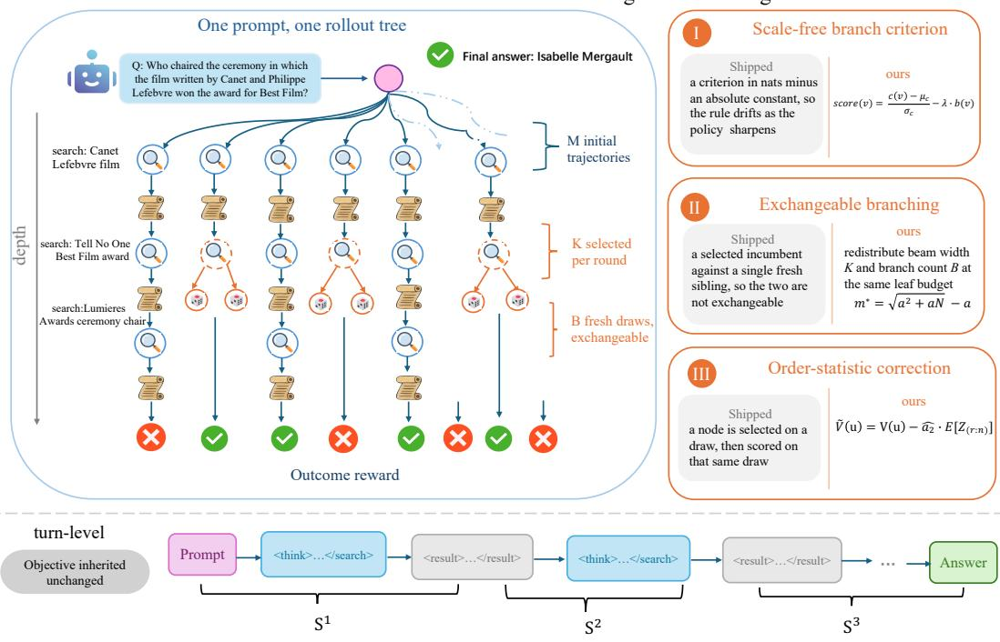
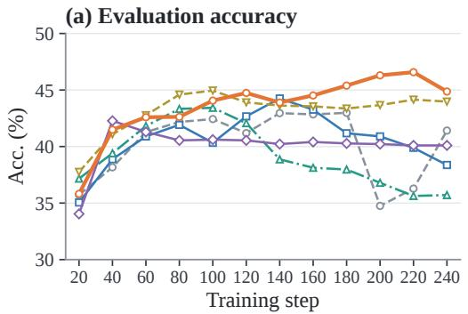
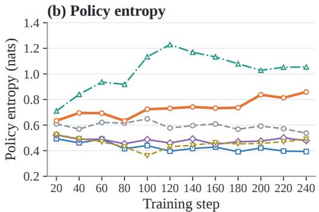
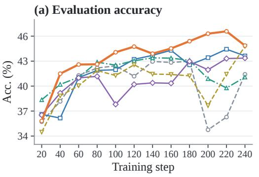
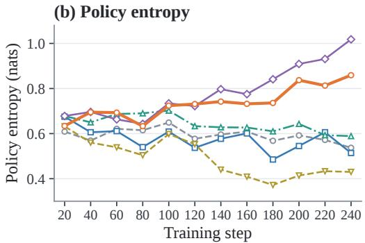
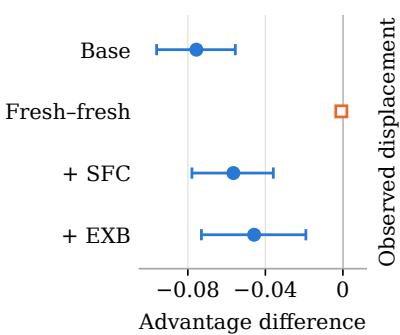
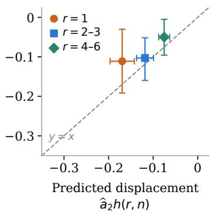
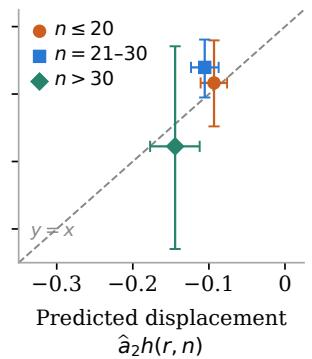
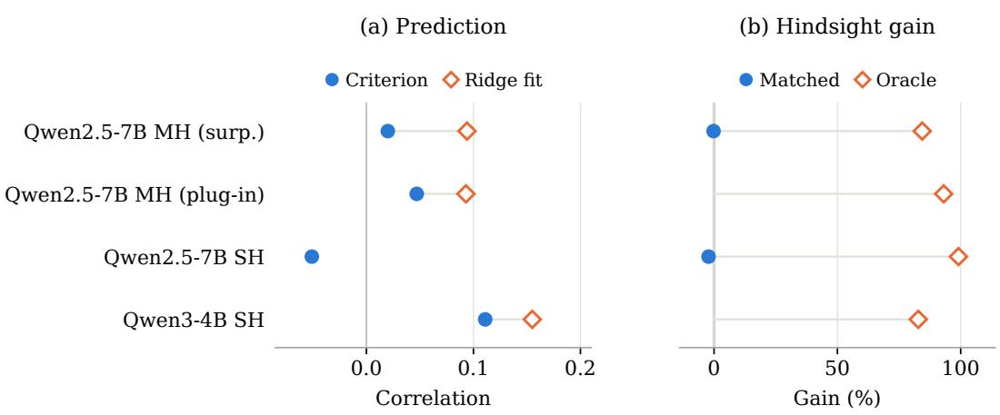

# SIPO: SELECTIVE-INFERENCE POLICY OPTIMIZATION FOR TREE-STRUCTURED AGENTIC RL

Zenghuang Fu1,2,\* Ningqi Chen3,\* Mingda Jia1,2,\* Xiaofeng Han1,2 Zhaoyang Li4 Qiuyuan Ai4 Zelong Zheng1,2 Haoyu Wu5 Tianyu Fu5 Chenxu Zhao5 Minghui Wu5 Guannan He4,† Changwei Wang6,7,†

1University of Chinese Academy of Sciences 2Institute of Automation, Chinese Academy of Sciences 3The University of Hong Kong 4Peking University 5Mininglamp Technology

6Key Laboratory of Computing Power Network and Information Security, Ministry of Education; Shandong Computer Science Center, Qilu University of Technology (Shandong Academy of Sciences)

7Key Laboratory of Computing Power Internet and Service Computing, Shandong Fundamental Research Center for Computer Science

\*These authors contributed equally. †Co-corresponding authors: Guannan He and Changwei Wang.

## ABSTRACT

Tree-structured reinforcement learning trains search agents by comparing alternative continuations and propagating terminal rewards to intermediate decisions. Adaptive expansion, however, creates a statistical asymmetry: an incumbent is selected using its own generation statistic, whereas fresh siblings are sampled after selection. When that statistic is associated with return, branch values can reflect selection history as well as continuation quality, even for a shared parent. We propose Selective-Inference Policy Optimization (SIPO), which incorporates this distinction into tree-based credit estimation. Its scale-free branch criterion keeps generation scores and sibling penalties on a consistent relative scale; exchangeable branching supplies multiple fresh continuations from each selected parent; and order-statistic correction adjusts retained incumbent values using selection rank and the estimated score–outcome association. These mechanisms preserve the leaf budget and the host policy optimisation objective. Across seven QA benchmarks using Qwen3-4B, Qwen3-8B, and Qwen2.5-7B, SIPO achieves the highest reported multi-hop and single-hop averages among the compared methods. On Qwen3-8B, it improves these averages over AT2PO by 1.31 and 1.07 percentage points, respectively, and ranks first on six of seven benchmarks. Component ablations evaluate the individual and combined changes, while early-training paired diagnostics show a selected–fresh value gap alongside a near-zero fresh– fresh reference. Together, these results support accounting for selection history when constructing and evaluating search-agent rollouts. Our code is available at https://github.com/Zenghuang-Fu/SIPO.

## 1 INTRODUCTION

Large language models can act as search agents by alternating between reasoning, query generation, and the analysis of retrieved documents (Ai et al., 2026; Li et al., 2026b; Fu et al., 2026). Successful search requires a sequence of decisions about which evidence to retrieve, how to use it, and when sufficient information has been collected to answer a question. Reinforcement learning with verifiable rewards trains these decisions from final-answer correctness (DeepSeek-AI et al., 2025; Jin et al., 2025), but the terminal reward leaves open how credit should be assigned to intermediate search and reasoning steps. Group-relative optimisation compares rewards across trajectories for the same prompt (Shao et al., 2024), providing a trajectory-level signal that offers limited resolution for individual decisions. A successful trajectory can contain unnecessary tool calls, and an unsuccessful one can contain useful early reasoning. Tree-structured rollouts provide finer comparisons by sharing prefixes and exploring alternative continuations (Zong et al., 2026; He et al., 2026; Hou et al., 2025). Adaptive methods decide which intermediate states to expand and propagate terminal outcomes through the resulting tree, with recent work improving branch placement, rollout allocation, and value aggregation (Dong et al., 2025; Wang et al., 2026c; Zhang et al., 2026a; Li et al., 2026a). Tree construction consequently shapes both the actions explored during training and the observations available for estimating their credit.

Our starting point is that branches with a shared parent can have different selection histories. Consider an incumbent selected for expansion because its realised surprisal is high. The sampler returns to the parent context and generates a fresh continuation. The incumbent has passed a filter based on its own generation, whereas the fresh sibling is sampled after that filter. When the selection statistic is associated with return, their conditional expected values can differ before any policy update, even when they share the same question, retrieved evidence, and terminal reward function. A shared prefix therefore does not by itself make the two sampling histories symmetric. If their values are propagated through the tree, this distinction can also affect the credit assigned to preceding decisions. The coupling between branch selection and evaluation connects tree-based training to post-selection inference (Berk et al., 2013; Taylor & Tibshirani, 2015) and double estimation (Thrun & Schwartz, 1993; van Hasselt, 2010). It suggests a concrete diagnostic: two fresh siblings drawn from the same selected parent, under symmetric continuation and evaluation rules, provide a reference for the difference between a selected incumbent and a fresh continuation. Their mean contrast can be examined alongside the selected–fresh contrast to distinguish the roles of shared context and selection history in branch-value comparisons.

We propose Selective-Inference Policy Optimization (SIPO), which incorporates selection history into adaptive tree training while preserving the leaf budget and host policy objective. The design connects three stages of the training process: calibrating the scores used to allocate expansions, constructing fresh comparisons at selected parents, and adjusting retained incumbent values before credit propagation. Score calibration keeps the sibling penalty on a consistent relative scale as the policy changes. Fresh sampling supplies continuations with symmetric generation histories, while the value adjustment accounts for the incumbent’s selection rank and the estimated association between its score and outcome. Selection records link these stages, allowing the correction to use information from tree construction without additional rollouts for each incumbent. Across seven QA benchmarks with Qwen3-4B, Qwen3-8B, and Qwen2.5-7B, SIPO improves multi-hop and single-hop average accuracy over AT2PO on all three backbones. Component ablations examine the individual and combined changes, and training curves track accuracy and policy entropy over optimisation. Paired branch diagnostics examine selected–fresh and fresh–fresh value differences, while empirical calibration checks the rank model underlying the correction. These evaluations connect the overall performance results to the branch comparisons that motivate the method.

Our contributions are threefold:

• Scale-free branch criterion. We standardise the generation score before applying the sibling penalty, keeping their relative scale consistent as the policy changes.

• Exchangeable branching. We generate multiple fresh continuations per selected parent to provide symmetric comparisons, retaining incumbents and reallocating expansion slots to preserve the leaf count.

• Order-statistic correction. We model selected-value displacement through rank and the score–outcome association, then adjust retained incumbent values before tree propagation without additional rollouts for each incumbent.

## 2 RELATED WORK

## 2.1 REINFORCEMENT LEARNING FOR SEARCH AGENTS

Search-agent reinforcement learning uses answer correctness to train reasoning and tool use (Jin et al., 2025). Recent methods refine turn-level supervision: TSPO rewards the first occurrence of the

reference answer (Ma et al., 2026), TIPS uses teacher-based potential shaping (Xie et al., 2026), and CW-GRPO reweights outcome advantages by judged round contributions (Wang et al., 2026b).

Rollout allocation uses entropy, prefix predictions, information gains, or sequential decisions (Dong et al., 2025; Zou et al., 2026; Zhang et al., 2026a; Hu et al., 2026; Nomand et al., 2026; Zhang et al., 2026b); TSR applies per-turn search during training (Djuhera et al., 2026).

## 2.2 TREE-STRUCTURED ROLLOUTS AND CREDIT ESTIMATION

Tree rollouts share prefixes and compare alternative continuations (Zong et al., 2026; He et al., 2026; Hou et al., 2025; Wei et al., 2026; Li et al., 2026a), with branch placement guided by uncertainty or subsequent continuations (Wang et al., 2026c). Symmetric sampling (He et al., 2026) provides a reference for analysing score-selected incumbents.

Other approaches refine credit through hindsight critics (HCAPO; Tan et al. 2026), grouped temporal advantages (GAGPO; Zhu et al. 2026), state-transition graphs (G2PO; Wang et al. 2026d), or behavioural groups with action-conditioned baselines (BiPACE; Wang et al. 2026a). SIPO tracks branch selection history when estimating values.

Post-selection inference studies evaluation after selection (Berk et al., 2013; Taylor & Tibshirani, 2015); double estimation separates selection and evaluation to address maximisation bias (Thrun & Schwartz, 1993; van Hasselt, 2010). Our rank model addresses branch-value displacement; clustersampling theory (Kish, 1965; Cochran, 1977) informs the shared-prefix analysis in Appendix C.2.

## 3 PRELIMINARIES

Search-agent reinforcement learning. Let x be a question and $\pi _ { \theta }$ a language-model policy. A search trajectory is $\boldsymbol { u } = ( x , y _ { 1 } , o _ { 1 } , \dots , y _ { T - 1 } , o _ { T - 1 } , y _ { T } )$ , where $y _ { t }$ is a reasoning segment followed by a tool call or final answer, and $o _ { t }$ is the observation returned by the search tool. The terminal reward $R ( u )$ evaluates the final answer. Training maximises $J ( \theta ) = \mathbb { E } _ { x \sim \mathcal { D } , u \sim \pi _ { \theta } ( . | x ) } [ R ( u ) ]$ . In a rollout tree $\tau ( x )$ , a node stores a generated segment and its preceding context; complete root-to-leaf paths are trajectories. We write $p ( v )$ for a node’s parent and ch(v) for its children. Descendant rewards are aggregated into node values, which provide credit for the corresponding generated segments.

Adaptive tree rollouts. Adaptive tree sampling for search agents (Zong et al., 2026) starts with M trajectories from the input question. At each of $L$ expansion iterations, a selection rule chooses K candidate nodes and generates B fresh siblings for each chosen incumbent. When all expansion slots are filled, the tree contains

$$
N = M + L K B\tag{1}
$$

leaves. Concrete rollout configurations are specified in Appendix A.2. Candidates are ranked by realised surprisal with a penalty proportional to the number of existing siblings. A selected segment is rolled back, and the new continuation is generated from its parent context. This procedure enables targeted exploration while reusing the preceding reasoning and retrieved information.

## 4 METHOD

## 4.1 OVERVIEW

SIPO coordinates three stages of adaptive tree training (Figure 1). The scale-free branch criterion normalises candidate scores before applying the sibling penalty. Exchangeable branching draws multiple fresh continuations per selected parent while retaining its incumbent. The order-statistic correction adjusts eligible leaf values using selection records before propagating them into node advantages. The leaf budget and host policy objective are preserved.

Each expansion also produces a selection record linking the chosen incumbent to its parent, rank, candidate pool, and fresh siblings. This record connects tree construction to credit estimation: after terminal rewards become available, it identifies which branch values carry a selection history. The three components therefore operate on the same tree at different stages of the training step.

SIPO: three corrections inside one unchanged rollout budget  
  
Figure 1: Overview of SIPO. The illustrative search tree combines score calibration, fresh sibling generation, and correction of retained incumbent values. Fresh siblings have symmetric sampling histories conditional on their parent. The bottom strip shows the sequence of generated turns and retrieved observations; observations are masked from the policy loss. The method preserves the leaf budget and the host objective. The allocation expression in panel II is the simplified surrogate discussed in Appendix C.2; the implemented rollout budget follows Eq. 1.

Algorithm 1 in Appendix A.1 gives the complete training loop. The clipped turn-level objective and tool-observation masking are detailed in Appendix A.3.

## 4.2 SCALE-FREE BRANCH CRITERION

Adaptive expansion ranks candidates by a generation score minus a sibling-count penalty. As the policy changes, score-scale drift changes the penalty’s relative influence. When the score spread grows, a fixed penalty becomes weaker relative to score differences; when the spread contracts, the penalty can dominate the ranking. The allocation between revisiting a parent and exploring other locations can therefore drift even when the penalty coefficient is unchanged. At iteration ℓ, let $\mathcal { C } _ { \ell }$ be the candidate set, s(v) the realised surprisal of candidate v, and $b ( v )$ its number of existing siblings. Replacing the host’s score $q ( v ) = s ( v { \bar { ) } } - \lambda b ( v )$ , SIPO uses

$$
\begin{array} { c } { { q _ { S F C } ( v ) = \displaystyle \frac { s ( v ) - \mu c _ { \ell } } { \operatorname* { m a x } ( \sigma _ { \mathcal { C } _ { \ell } } , \epsilon ) } - \lambda b ( v ) , } } \\ { { \mathcal { S } _ { \ell } = \mathrm { t o p } { \cdot } K ( q _ { S F C } , \mathcal { C } _ { \ell } ) . } } \end{array}\tag{2}
$$

where $\mu _ { \mathcal { C } _ { \ell } }$ and $\sigma _ { \mathcal { C } _ { \ell } }$ are the candidate mean and standard deviation. This expresses λ in standarddeviation units and stabilises the trade-off between surprisal and sibling count. Calibration changes which parents receive expansions while preserving the expansion budget KB.

Effect on branch allocation. Let $d _ { \ell } = \operatorname* { m a x } ( \sigma _ { \mathcal { C } _ { \ell } } , \epsilon )$ . Comparing candidates v and $v ^ { \prime }$ in $\operatorname { E q . } 2 ,$ , the first ranks higher precisely when $s ( v ) - s ( v ^ { \prime } ) \dot { > } \tilde { \lambda } d _ { \ell } \bigl [ b ( v ) - \bar { b } ( v ^ { \prime } ) \bigr ]$ ]. A candidate with more existing siblings must therefore offer a larger surprisal difference, measured on the current score scale, to receive another expansion. Mean subtraction cancels in this comparison; the standard deviation determines the effective penalty in raw-score units.

When sibling counts are equal, normalisation preserves the surprisal ordering. When the variance floor remains inactive, a positive affine rescaling of all candidate scores also leaves the calibrated ranking unchanged. Recomputing the statistics at each expansion makes this trade-off depend on the current candidate population, using only scores already available from generation.

## 4.3 EXCHANGEABLE BRANCHING

The selected incumbent’s own score helped choose its parent for expansion. Fresh continuations are sampled after that choice, so a shared context alone does not make them statistically comparable to the incumbent. We generate multiple fresh siblings from the same parent context and policy, providing a subset with the same conditional generation distribution. The incumbent remains available for learning.

Sampling from the parent state. For each selected incumbent, we restore its parent context, including the question, preceding generated segments, and retrieved observations. Fresh siblings begin at this common boundary and sample new continuations under the same policy and remaining tool budget. They can consequently pursue different queries while reusing the same evidence. Retaining the incumbent preserves the trajectory already generated; the new siblings add local alternatives whose labels do not depend on their success.

Fresh labels are assigned independently of realised outcomes. Under symmetric continuation and evaluation, swapping those labels leaves the joint distribution unchanged, so their expected advantage difference vanishes. Individual rewards can still differ. The incumbent has passed the score-based selection filter and does not share this symmetry with the fresh subset. Because the parent is fixed before fresh sampling, its selection affects both fresh labels through the same conditioning context. The reference comparison uses matched continuation rules, tool limits, and evaluation, so that this symmetry is preserved for the outcomes being compared.

Allocation under a fixed budget. Under the fixed leaf budget in Eq. 1, increasing B is offset by reducing K so that KB remains constant. This trades the number of expansion locations for more fresh comparisons at each location; configurations appear in Appendix A.2. This allocation concentrates evidence at fewer parent states: local comparisons become richer, while fewer distinct locations receive expansions. The calibrated criterion determines where this concentrated sampling is spent. We use the fresh–fresh reference to assess selected–fresh value displacement; Appendix B.1 defines both contrasts and their conditions. Fresh sampling leaves selected incumbent values in the tree, motivating the correction below.

## 4.4 ORDER-STATISTIC CORRECTION

OSC models the displacement associated with selecting an incumbent by its own score and adjusts its value before tree-based credit propagation.

Rank model. Consider independent identically distributed candidate pairs $( Z _ { i } , Y _ { i } )$ with $Z _ { i } \sim$ $\mathcal { N } ( 0 , 1 )$ and $\mathbb { E } [ Y _ { i } \mid Z _ { i } ] = a _ { 0 } + a _ { 2 } Z _ { i }$ . Selecting the r-th largest score among n candidates gives

$$
\mathbb { E } [ Y _ { [ r ] } - Y _ { \mathrm { f r e s h } } ] = a _ { 2 } \mathbb { E } [ Z _ { ( r : n ) } ] \approx a _ { 2 } h ( r , n ) .\tag{3}
$$

where the independent fresh outcome has mean $a _ { 0 }$ . The function $h ( r , n )$ is Blom’s approximation to the expected standard-normal order statistic (Blom, 1958); Appendix C.1 gives its numerical form and derivation. The model links value displacement to rank, candidate count, and the score–outcome association. When $a _ { 2 }$ is negative, highly ranked values are displaced downwards. We use this as an approximation for rollout candidates with shared prefixes and heterogeneous parents.

The relation follows by conditioning on the candidate scores: the selected outcome has conditional mean $a _ { 0 } + a _ { 2 } Z _ { ( r : n ) }$ . Averaging over score realisations and subtracting the fresh mean cancels $a _ { 0 }$ The remaining term captures the part of the outcome difference associated with selecting a particular score rank.

At a fixed descending rank, a larger candidate pool increases the expected selected score in this model. The rank term describes selection strength, while $a _ { 2 }$ converts that strength into outcome units. This separates how strongly a branch was selected from how informative its score is about return.

Selected-value adjustment. We first express terminal rewards in a common scale within each prompt’s tree:

$$
V _ { u } = \frac { R ( u ) - \mu _ { T } } { \sigma _ { T } + \epsilon } .\tag{4}
$$

Here $\mu \tau$ and $\sigma \tau$ are the mean and standard deviation of the tree’s terminal rewards. For each leaf $u ,$ let $e ( u )$ be its most recent applicable selection event, with rank $r _ { e }$ and candidate count $n _ { e }$ . Only actual selections qualify. A fresh-branch boundary blocks inheritance of an earlier incumbent’s event; a later selection of that fresh branch remains applicable. We compute

$$
\widetilde { V } _ { u } = \left\{ \begin{array} { l l } { V _ { u } - w \widehat { a } _ { 2 , t - 1 } h ( r _ { e } , n _ { e } ) , } & { e ( u ) \not = \emptyset , } \\ { V _ { u } , } & { e ( u ) = \emptyset . } \end{array} \right.\tag{5}
$$

where w controls adjustment strength. The slope $\widehat { a } _ { 2 , t - 1 }$ uses unadjusted candidate outcomes from the preceding batch; the first batch uses no correction. The preceding-batch estimate supplies a shared correction without resampling each incumbent solely to estimate its value. Event records determine which leaves receive that correction, preventing an incumbent’s rank from being assigned indiscriminately to fresh descendants sharing its prefix. With positive adjustment strength and rank term, a negative estimated slope raises the selected value, whereas a positive slope lowers it. Thus the correction depends on the observed association between selection score and outcome.

Coefficient estimation and propagation. For standardised criterion $Z$ and outcome $Y$ in the value units being corrected, we estimate $a _ { 2 } = \operatorname { C o v } ( Z , Y ) / \operatorname { V a r } ( Z )$ from the full selection-time candidate sets, including unselected candidates. The outcome scale is retained because subtree means need not have unit variance. Appendix A.4 specifies the estimator and event handling. Fitting only selected candidates would condition this association on the selection event itself. Using unadjusted outcomes also keeps the regression target separate from the correction being estimated. The new estimate is saved for the next training step.

Corrected leaves are propagated inward using the host’s child-softmax weights $w _ { c } \mathrm { : }$

$$
\widetilde { V } _ { n } = \sum _ { c \in \mathrm { c h } ( n ) } w _ { c } \widetilde { V } _ { c } , \qquad A ( n ) = \widetilde { V } _ { n } .\tag{6}
$$

Each segment’s generated tokens receive its node advantage; retrieved observations remain context and are masked from the loss. At shared ancestors, fresh and adjusted incumbent branches jointly influence the credit assigned to preceding decisions. The resulting advantages enter the clipped policy objective in Appendix A.3, completing the connection from selection records to the policy update.

## 5 EXPERIMENTS

## 5.1 EXPERIMENTAL SETUP

Multi-hop QA comprises HotpotQA, 2WikiMultihopQA, Musique, and Bamboogle; single-hop QA comprises NQ, TriviaQA, and PopQA. Multi-hop training uses the HotpotQA-derived split, and single-hop training uses its corresponding split. We evaluate Qwen3-4B, Qwen3-8B, and Qwen2.5-7B against ReAct, GRPO, DAPO, GSPO, AEPO, Tree-GRPO where available, and $\mathsf { A T } ^ { 2 } \mathsf { P O }$ (Table 1). The latter is the primary comparison for the tree-training pipeline; branch diagnostics use the local host implementation.

All experiments are conducted using eight NVIDIA A800 80GB GPUs. Training and evaluation use an e5-base-v2 retriever over wiki-18. Host and SIPO configurations share M, L, and N, with fixed KB; Table 3 and Appendix A.2 give the hyperparameters and rollout configurations. We report exact-match accuracy (%). Avg. is the mean over all evaluation questions within each task family, and we report the checkpoint with the highest Avg. for both main results and ablations. Evaluation uses greedy decoding without a repetition penalty. Reported gains are absolute percentage-point differences; branch diagnostics use tree-bootstrap intervals for within-run uncertainty (Appendix B.5).

## 5.2 MAIN RESULTS

Table 1 compares SIPO with the baseline methods across seven QA benchmarks. SIPO achieves the highest multi-hop and single-hop Avg. on all three backbones, covering all six backbone–task-family comparisons. $\mathsf { A T } ^ { 2 } \mathsf { P O }$ is the strongest baseline in each of these aggregate comparisons, making it the primary reference for the gains. Relative to this baseline, SIPO improves multi-hop Avg. by 1.45, 1.31, and 0.75 points on Qwen3-4B, Qwen3-8B, and Qwen2.5-7B, respectively, and single-hop Avg. by 0.51, 1.07, and 1.18 points in the same order. Qwen3-8B reaches the highest absolute averages, with 51.46% on multi-hop and 59.89% on single-hop QA; Qwen3-4B reaches 50.26% and 56.95%, while Qwen2.5-7B reaches 46.58% and 57.52%. The improvements therefore extend across both evaluated Qwen3 model sizes and the Qwen2.5 backbone, and across both task families. The tree-training comparison uses the same nominal leaf budget, supporting the effectiveness of SIPO’s combined branch-selection, sampling, and credit-estimation design under this constraint. Measured training costs for Qwen2.5-7B multi-hop QA appear in Table 4.

Table 1: Answer accuracy (%) on multi-hop and single-hop QA benchmarks, evaluated using exact match. Bold indicates the best score within each backbone, including ties.
<table><tr><td rowspan="2">Method</td><td colspan="5">Multi-Hop QA</td><td colspan="4">Single-Hop QA</td></tr><tr><td>Hotpot</td><td>2wiki</td><td>Musiq</td><td>Bamb</td><td>Avg.</td><td>NQ</td><td>TriviaQA</td><td>PopQA</td><td>Avg.</td></tr><tr><td colspan="10">Backbone Model: Qwen3-4B</td></tr><tr><td>ReAct</td><td>30.42 44.76</td><td>32.92 51.40</td><td>12.83 21.60</td><td>44.80 50.40</td><td>30.01 46.02</td><td>26.75 45.98</td><td>53.53 65.17</td><td>35.34 49.18</td><td>41.31 54.97</td></tr><tr><td>+ GRPO + DAPO</td><td>45.95</td><td>51.81</td><td>21.68</td><td>51.20</td><td>46.65</td><td>47.50</td><td>65.84</td><td>51.03</td><td>56.33</td></tr><tr><td>+ GSPO</td><td>47.07</td><td>49.25</td><td>22.68</td><td>50.40</td><td>45.69</td><td>46.01</td><td>64.24</td><td>48.50</td><td>54.28</td></tr><tr><td></td><td>46.36</td><td>51.78</td><td>23.47</td><td>50.40</td><td>46.95</td><td>45.71</td><td>64.66</td><td>50.13</td><td>55.20</td></tr><tr><td>+ AEPO</td><td></td><td>52.99</td><td>24.80</td><td></td><td>48.81</td><td>47.90</td><td>65.32</td><td>51.81</td><td></td></tr><tr><td>+ AT2PO</td><td>49.44</td><td>54.67</td><td>25.65</td><td>56.80</td><td>50.26</td><td>47.60</td><td>67.70</td><td></td><td>56.44</td></tr><tr><td>+ SIPO</td><td>50.72</td><td></td><td></td><td>55.20</td><td></td><td></td><td></td><td>50.80</td><td>56.95</td></tr><tr><td colspan="10">Backbone Model: Qwen3-8B</td></tr><tr><td>ReAct + GRPO</td><td>20.66 47.01</td><td>19.05 53.69</td><td>9.56 21.35</td><td>37.60 54.40</td><td>18.66 48.03</td><td>21.16 45.70</td><td>41.81 67.42</td><td>27.37 50.17</td><td>32.19 56.29</td></tr><tr><td>+ DAPO</td><td>49.64</td><td>53.91</td><td>24.05</td><td>56.00</td><td>49.40</td><td>51.99</td><td>69.02</td><td>51.90</td><td>58.53</td></tr><tr><td>+ GSPO</td><td>49.59</td><td>52.55</td><td>24.35</td><td>54.4</td><td>48.56</td><td>45.56</td><td>67.75</td><td>49.66</td><td>56.15</td></tr><tr><td>+ AEPO</td><td>49.17</td><td>52.97</td><td>24.01</td><td>54.40</td><td>48.62</td><td>49.92</td><td>68.31</td><td>51.77</td><td>57.94</td></tr><tr><td>+ AT²PO</td><td>51.37</td><td>53.97</td><td>26.51</td><td>56.00</td><td>50.15</td><td>51.33</td><td>69.51</td><td>52.26</td><td>58.82</td></tr><tr><td>+ SIPO</td><td>51.33</td><td>56.11</td><td>27.31</td><td>57.60</td><td>51.46</td><td>53.58</td><td>70.06</td><td>53.42</td><td>59.89</td></tr><tr><td colspan="10">Backbone Model: Qwen2.5-7B</td></tr><tr><td>ReAct</td><td>2.85</td><td>1.94</td><td>0.58</td><td>4.00</td><td>2.10</td><td>4.34</td><td>10.67</td><td>9.32</td><td>9.23</td></tr><tr><td>+ GRPO</td><td>47.94</td><td>46.89</td><td>21.27</td><td>47.20</td><td>44.48</td><td>45.56</td><td>64.86</td><td>49.92</td><td>55.20</td></tr><tr><td>+ DAPO</td><td>47.50</td><td>47.93</td><td>21.27</td><td>44.00</td><td>44.91</td><td>52.24</td><td>65.00</td><td>50.01</td><td>56.08</td></tr><tr><td>+ GSPO</td><td>47.35</td><td>47.30</td><td>20.32</td><td>44.00</td><td>44.40</td><td>49.64</td><td>62.87</td><td>49.75</td><td>54.81</td></tr><tr><td>+ Tree-GRPO</td><td>42.39</td><td>42.01</td><td>20.15</td><td>42.40</td><td>39.79</td><td>47.56</td><td>62.69</td><td>44.75</td><td>52.04</td></tr><tr><td>+ AEPO</td><td>47.05</td><td>47.53</td><td>21.03</td><td>44.00</td><td>44.51</td><td>49.00</td><td>64.13</td><td>50.21</td><td>55.45</td></tr><tr><td>+ AT2PO</td><td>49.58</td><td>48.04</td><td>22.56</td><td>51.20</td><td>45.83</td><td>52.91</td><td>64.90</td><td>50.44</td><td>56.34</td></tr><tr><td></td><td></td><td>49.90</td><td></td><td></td><td></td><td></td><td></td><td></td><td></td></tr><tr><td>+ SIPO</td><td>48.40</td><td></td><td>23.80</td><td>44.80</td><td>46.58</td><td>53.38</td><td>66.68</td><td>51.30</td><td>57.52</td></tr></table>

The dataset-level results show where these aggregate gains arise. Relative to $\mathsf { A T } ^ { 2 } \mathsf { P O } ,$ all three backbones improve on 2WikiMultihopQA and Musique, with gains of 1.68–2.14 and 0.80–1.24 points, respectively, providing a recurring pattern within the multi-hop evaluations. Qwen3-8B achieves the best score on six of the seven benchmarks: its improvements include 2.14 points on 2WikiMultihopQA and 2.25 points on NQ, while its HotpotQA score is only 0.04 points below AT2PO. On single-hop QA, Qwen3-8B and Qwen2.5-7B lead on all three datasets, so their average improvements are accompanied by gains on NQ, TriviaQA, and PopQA individually. Qwen3-4B exhibits a different distribution: its 2.38-point improvement on TriviaQA drives the single-hop average gain despite lower scores on NQ and PopQA. Multi-hop performance also varies by backbone, with lower Bamboogle scores for Qwen3-4B and Qwen2.5-7B and a lower HotpotQA score for Qwen2.5- 7B. This breakdown complements the question-weighted averages by identifying both the recurring improvements and the dataset-specific differences. Figure 2 shows six local Qwen2.5-7B multi-hop training runs. SIPO attains the highest final accuracy, exceeding DAPO by 0.89 points. It also retains higher final policy entropy than AT2PO, GRPO, GSPO, and DAPO; AEPO has higher entropy but lower final accuracy. The following ablations examine how the three components contribute to the overall performance.

  
AT2PO GRPO AEPO GSPO DAPO SIPO  
Figure 2: Training trajectories on Qwen2.5-7B multi-hop QA for $\mathsf { A T } ^ { 2 } \mathsf { P O }$ , GRPO, AEPO, GSPO, DAPO, and SIPO. (a) Size-weighted exact-match accuracy evaluated every 20 training steps. (b) Policy token entropy recorded at the same steps, without temporal averaging or smoothing. Each curve corresponds to one completed local run; colors identify the same method in both panels.

Table 2: Component ablation on Qwen2.5-7B multi-hop QA. Base denotes the reference configuration with all three SIPO components disabled.
<table><tr><td>Configuration</td><td>SFC</td><td>EXB</td><td>OSC</td><td>Avg. (%)</td></tr><tr><td>Base</td><td>一</td><td>一</td><td>一</td><td>42.98</td></tr><tr><td>+ SFC</td><td>√</td><td>一</td><td>一</td><td>44.43</td></tr><tr><td>+ EXB</td><td>一</td><td>√</td><td>1</td><td>43.39</td></tr><tr><td>+ OSC</td><td>一</td><td></td><td>√</td><td>43.36</td></tr><tr><td>+ SFC + EXB</td><td>√</td><td>√</td><td>1</td><td>44.78</td></tr><tr><td>SIPO</td><td>√</td><td>√</td><td>√</td><td>46.58</td></tr></table>

## 5.3 ABLATION STUDY

We assess the three components on Qwen2.5-7B multi-hop QA under the same leaf budget and evaluation protocol (Table 2). Base disables all three components; we enable SFC, EXB, and OSC individually, combine SFC with EXB, and then evaluate full SIPO. From Base’s 42.98%, the individual components improve Avg. by 1.45, 0.41, and 0.38 points, respectively. Combining SFC and EXB reaches 44.78%; adding OSC raises this to 46.58%, a further 1.80 points and a total gain of 3.60 points over Base. In this comparison, OSC provides a larger accuracy gain with SFC and EXB than when enabled alone. Figure 3 complements these checkpoint summaries with size-weighted accuracy and policy entropy at matching checkpoints every 20 steps, showing the training trajectories for all six configurations. Branch-width configurations appear in Appendix B.4; shared-prefix dependence and measured costs are discussed in Appendix C.2 and Table 4.

## 5.4 SELECTION DIAGNOSTICS

Figure 4 connects the value differences associated with selection history to the rank approximation used by OSC. Panel (a) compares selected–fresh and fresh–fresh node-advantage differences (Eq. 9). The Base selected–fresh estimate is −0.0756, with a tree-bootstrap 95% interval of [−0.0961, −0.0555], whereas the fresh–fresh reference is −0.0008, with an interval containing zero. The negative selected–fresh contrast indicates that retained incumbents receive lower values than their paired fresh continuations on average in this diagnostic. For two fresh siblings sampled from the same selected parent, the mean contrast is instead close to zero. With EXB, the selected–fresh estimate remains −0.0458; with SFC, it is −0.0565, and both intervals remain below zero. These descriptive patterns are consistent with distinct sampling histories for incumbents and fresh siblings, motivating the selected-value adjustment in Section 4.4. Pairing conditions, the differences among diagnostic settings, and numerical details appear in Appendix B.1; complementary branch-placement analyses appear in Appendix B.3.

  
Base + SFC + EXB + OSC + SFC + EXB SIPO

Figure 3: Component ablation on Qwen2.5-7B multi-hop QA. (a) Size-weighted accuracy evaluated every 20 training steps. (b) Policy token entropy sampled at the same steps, without temporal averaging or smoothing. Each curve represents one ablation run; colors identify the same configurations in both panels. Base denotes the reference configuration with all three SIPO components disabled.  
(a) Selection contrast  

(b) By rank  
  
(c) By candidate count

  
Figure 4: Selection displacement and empirical calibration of the rank model. (a) Early-training selected–fresh node-advantage differences for Base, +SFC, and +EXB, with a fresh–fresh reference. (b)–(c) Predicted versus observed incumbent–fresh displacement on recorded Qwen2.5-7B multihop Base trees, grouped by rank and candidate count. Panel (a) uses advantage units and separate diagnostic configurations; (b)–(c) use raw-reward units and the same 1,536 pairs from 256 trees. Bars show pointwise tree-bootstrap 95% intervals; horizontal and vertical bars in (b)–(c) correspond to predictions and observations, respectively, and the dashed diagonal denotes exact agreement.

Panels (b)–(c) then examine whether the rank model captures the direction and variation of the selected–fresh displacement. We compare the prediction in Eq. 3 with observed branch differences on recorded Qwen2.5-7B multi-hop Base trees, using 1,536 incumbent–fresh pairs from 256 trees and coefficients fitted to the preceding batch. This comparison uses raw-reward units. The two calibration panels summarise the same pairs, grouped by selection rank or candidate count, with the diagonal representing agreement between predicted and observed group means. The overall observed displacement is $- 0 . 0 7 7 8$ , compared with a prediction of −0.1054, and both are negative in every marginal bin. Across rank groups, observed means become less negative from −0.1112 at rank 1 to −0.0500 at ranks 4–6, following the ordering of the predicted means. This pattern is consistent with the rank dependence encoded by $h ( r , n )$ . The candidate-count panel also exposes variation in approximation quality: for counts 21–30, the prediction is more negative than the observation, giving a mean residual of 0.0450 with a 95% interval of [0.0042, 0.0839]. The above-30 group has a more negative observed mean but wider uncertainty, based on 23 trees. Thus, the model captures the signed displacement across groups while overestimating its magnitude in the intermediate candidate-count group. This provides a branch-level check of the approximation used by OSC, complementing the task-accuracy comparison in Table 2. Appendix B.2 details the pairing, coefficient estimation, and tree-bootstrap procedure.

## 6 CONCLUSION

SIPO incorporates selection history into tree-based credit estimation through score calibration, fresh sibling generation, and an order-statistic adjustment of incumbent values. It preserves the leaf budget and host policy objective. Across seven QA benchmarks and three backbones, it achieves the highest reported multi-hop and single-hop averages among the compared methods. Component ablations and branch diagnostics support accounting for how branches enter the tree when using their outcomes for policy learning.

## AI ASSISTANCE DISCLOSURE

Generative AI tools were used to assist with manuscript organisation and language polishing, literature search, refinement and consistency checks of methodological explanations and mathematical arguments, and analysis, interpretation, and visualisation of existing experimental records. All AI-assisted edits were carefully reviewed and verified by the authors, who take full responsibility for the final content of the paper.

## REPRODUCIBILITY STATEMENT

We describe the datasets, model backbones, hardware, and evaluation protocol in Section 5.1. Appendix A provides the training algorithm, hyperparameters, reward computation, policy objective, and selection-event handling. The task prompt and tool-interaction format are presented in Appendix E. Additional diagnostic protocols and the derivation of the rank approximation are detailed in Appendices B and C.1, respectively. We will open-source the code and configurations required to reproduce our experiments upon acceptance.

## REFERENCES

Qiuyuan Ai, Zenghuang Fu, Zhaoyang Li, Ping Jiang, Haoyu Wu, Jie Song, and Guannan He. Cognitive scaffold: From fluid context to crystallized memory for long-horizon DeepResearch agents. In Proceedings ofthe 64th Annual Meeting ofthe Associationfor Computational Linguistics (Volume 1: Long Papers), pp. 25526–25542. Association for Computational Linguistics, 2026. doi: 10.18653/v1/2026.acl-long.1170. URL https://aclanthology.org/2026.acl-long. 1170/.

Richard Berk, Lawrence Brown, Andreas Buja, Kai Zhang, and Linda Zhao. Valid post-selection inference. The Annals of Statistics, 41(2):802–837, 2013. URL https://doi.org/10. 1214/12-AOS1077.

Gunnar Blom. Statistical Estimates and Transformed Beta-Variables. Almqvist & Wiksell / John Wiley & Sons, Stockholm / New York, 1958. URL https: //search.worldcat.org/search?q=ti%3A%22Statistical+estimates+ and+transformed+beta-variables%22+au%3ABlom.

William G. Cochran. Sampling Techniques. John Wiley & Sons, New York, 3rd edition, 1977. URL https://www.wiley.com/en-us/Sampling+Techniques%2C+3rd+ Edition-p-9780471162407.

DeepSeek-AI, Daya Guo, Dejian Yang, Haowei Zhang, Junxiao Song, Peiyi Wang, Qihao Zhu, Runxin Xu, Ruoyu Zhang, Shirong Ma, Xiao Bi, Xiaokang Zhang, et al. Deepseek-r1: Incentivizing reasoning capability in llms via reinforcement learning. arXiv preprint arXiv:2501.12948, 2025. URL https://arxiv.org/abs/2501.12948.

Aladin Djuhera, Swanand Ravindra Kadhe, Farhan Ahmed, Syed Zawad, Heiko Ludwig, and Holger Boche. TSR: Trajectory-search rollouts for multi-turn RL of LLM agents. arXiv preprint arXiv:2602.11767, 2026. URL https://arxiv.org/abs/2602.11767.

Guanting Dong, Licheng Bao, Zhongyuan Wang, Kangzhi Zhao, Xiaoxi Li, Jiajie Jin, Jinghan Yang, Hangyu Mao, Fuzheng Zhang, Kun Gai, Guorui Zhou, Yutao Zhu, Ji-Rong Wen, and Zhicheng Dou. Agentic entropy-balanced policy optimization. arXiv preprint arXiv:2510.14545, 2025. URL https://arxiv.org/abs/2510.14545.

Bradley Efron. Bootstrap methods: another look at the jackknife. The Annals ofStatistics, 7(1):1–26, 1979. URL https://doi.org/10.1214/aos/1176344552.

Zenghuang Fu, Zhaoyang Li, Qiuyuan Ai, Haoyu Wu, Minghui Wu, Chenxu Zhao, Ante Wang, Guannan He, and Changwei Wang. Self-play meets skill evolution: Self-evolving search agents that pose, solve, and remember. arXiv preprint arXiv:2607.29468, 2026. URL https://arxiv. org/abs/2607.29468.

Bowei He, Yankai Chen, Xiaokun Zhang, and Xue Liu. Branching policy optimization: Sandboxnative language agent reinforcement learning. arXiv preprint arXiv:2607.14171, 2026. URL https://arxiv.org/abs/2607.14171.

Zhenyu Hou, Ziniu Hu, Yujiang Li, Rui Lu, Jie Tang, and Yuxiao Dong. Treerl: Llm reinforcement learning with on-policy tree search. arXiv preprint arXiv:2506.11902, 2025. URL https: //arxiv.org/abs/2506.11902.

Yuelin Hu, Zhenbo Yu, Zhengxue Cheng, Wei Liu, and Li Song. Maximizing rollout informativeness under a fixed budget: A submodular view of tree search for tool-use agentic reinforcement learning. arXiv preprint arXiv:2605.05262, 2026. URL https://arxiv.org/abs/2605.05262.

Bowen Jin, Hansi Zeng, Zhenrui Yue, Jinsung Yoon, Sercan Arik, Dong Wang, Hamed Zamani, and Jiawei Han. Search-r1: Training llms to reason and leverage search engines with reinforcement learning. arXiv preprint arXiv:2503.09516, 2025. URL https://arxiv.org/abs/2503. 09516.

Leslie Kish. Survey Sampling. John Wiley & Sons, New York, 1965. URL https://www.wiley. com/en-us/Survey+Sampling-p-9780471109495.

Xintong Li, Sha Li, Yuwei Zhang, Changlong Yu, Rongmei Lin, Hongye Jin, Shuyi Guan, Xin Liu, Linwei Li, Qingyu Yin, and Jingbo Shang. Process reward informed tree rollout for effective multi-turn rl. arXiv preprint arXiv:2607.15610, 2026a. URL https://arxiv.org/abs/ 2607.15610.

Zhaoyang Li, Zenghuang Fu, Qiuyuan Ai, Ping Jiang, Haoyu Wu, Minghui Wu, Chenxu Zhao, Jie Song, and Guannan He. CoEvoKG: Co-evolving knowledge graphs with self-evolving search agents. arXiv preprint arXiv:2608.01904, 2026b. URL https://arxiv.org/abs/2608. 01904.

Shichao Ma, Zhiyuan Ma, Ming Yang, Xiaofan Li, Xing Wu, Jintao Du, Yu Cheng, Weiqiang Wang, Qiliang Liu, Zhengyang Zhou, and Yang Wang. TSPO: Breaking the double homogenization dilemma in multi-turn search policy optimization. arXiv preprint arXiv:2601.22776, 2026. URL https://arxiv.org/abs/2601.22776.

Pixel Nomand, Elena Voss, Marcus Hale, and Sofia Reyes. Early verdicts, better budgets: Sequential adaptive rollout allocation for compute-efficient rlvr. arXiv preprint arXiv:2607.26253, 2026. URL https://arxiv.org/abs/2607.26253.

Shayle R. Searle, George Casella, and Charles E. McCulloch. Variance Components. John Wiley & Sons, New York, 1992. URL https://doi.org/10.1002/9780470316856.

Zhihong Shao, Peiyi Wang, Qihao Zhu, Runxin Xu, Junxiao Song, Xiao Bi, Haowei Zhang, Mingchuan Zhang, Y. K. Li, Y. Wu, and Daya Guo. Deepseekmath: Pushing the limits of mathematical reasoning in open language models. arXiv preprint arXiv:2402.03300, 2024. URL https://arxiv.org/abs/2402.03300.

Hui-Ze Tan, Xiao-Wen Yang, Hao Chen, Jie-Jing Shao, Yi Wen, Yuteng Shen, Weihong Luo, Xiku Du, Lan-Zhe Guo, and Yu-Feng Li. Hindsight credit assignment for long-horizon LLM agents. arXiv preprint arXiv:2603.08754, 2026. URL https://arxiv.org/abs/2603.08754.

Jonathan Taylor and Robert J. Tibshirani. Statistical learning and selective inference. Proceedings of the National Academy of Sciences, 112(25):7629–7634, 2015. URL https://doi.org/10. 1073/pnas.1507583112.

Sebastian Thrun and Anton Schwartz. Issues in using function approximation for reinforcement learning. In Proceedings of the Fourth Connectionist Models Summer School, 1993. URL https://publications.ri.cmu.edu/ issues-in-using-function-approximation-for-reinforcement-learning.

Hado van Hasselt. Double q-learning. In Advances in Neural Information Processing Systems, volume 23, pp. 2613–2621, 2010. URL https://proceedings.neurips.cc/paper/ 2010/hash/091d584fced301b442654dd8c23b3fc9-Abstract.html.

Hanyang Wang, Weijieying Ren, Yuxiang Zhang, Ding Cao, Zhizhao Zeng, Ke Zeng, and Tianxiang Zhao. BiPACE: Bisimulation-guided policy optimization with action counterfactual estimation for LLM agents. arXiv preprint arXiv:2606.25556, 2026a. URL https://arxiv.org/abs/ 2606.25556.

Junzhe Wang, Zhiheng Xi, Yajie Yang, Hao Luo, Shihan Dou, Tao Gui, and Qi Zhang. Enhancing LLM-based search agents via contribution weighted group relative policy optimization. arXiv preprint arXiv:2604.14267, 2026b. URL https://arxiv.org/abs/2604.14267.

Xucong Wang, Ziyu Ma, Yong Wang, Yuxiang Ji, Shidong Yang, Guanhua Chen, Pengkun Wang, and Xiangxiang Chu. Appo: Agentic procedural policy optimization. arXiv preprint arXiv:2606.12384, 2026c. URL https://arxiv.org/abs/2606.12384.

Yunan Wang, Minghui Song, Zihan Zhang, Shaohan Huang, Haizhen Huang, Furu Wei, Weiwei Deng, Feng Sun, and Qi Zhang. Group-graph policy optimization for long-horizon agentic reinforcement learning. arXiv preprint arXiv:2606.22995, 2026d. URL https://arxiv.org/abs/2606. 22995.

Rongzhe Wei, Ge Shi, Min Cheng, Na Zhang, Pan Li, Sarthak Ghosh, Vaibhav Gorde, and Leman Akoglu. Long-horizon plan execution in large tool spaces through entropy-guided branching. arXiv preprint arXiv:2604.12126, 2026. URL https://arxiv.org/abs/2604.12126.

Yutao Xie, Nathaniel Thomas, Nicklas Hansen, Yang Fu, Li Erran Li, and Xiaolong Wang. TIPS: Turn-level information-potential reward shaping for search-augmented LLMs. arXiv preprint arXiv:2603.22293, 2026. URL https://arxiv.org/abs/2603.22293.

Yijun Zhang, Fan Xu, Jiaxin Ding, Yule Xie, Shiqing Gao, Xin Ding, Haoxiang Zhang, Luoyi Fu, and Xinbing Wang. Information gain-based rollout policy optimization: An adaptive treestructured rollout approach for multi-turn llm agents. arXiv preprint arXiv:2607.06223, 2026a. URL https://arxiv.org/abs/2607.06223.

Zheyuan Zhang, Manqing Mao, Hong Wang, Zhuoer Wang, Samson Koelle, Jie Yuan, Yanjun Lin, James Feng, Nikki Lijing Kuang, Yanfang Ye, and Wei Niu. Optimizing what policies learn from: Recoverability-aware rollout intervention learning. arXiv preprint arXiv:2608.05080, 2026b. URL https://arxiv.org/abs/2608.05080.

Siyuan Zhu, Chao Yu, Rongxin Yang, Zongkai Liu, Jinjun Hu, Qiwen Chen, and Yibo Zhang. GAGPO: Generalized advantage grouped policy optimization. arXiv preprint arXiv:2605.13217, 2026. URL https://arxiv.org/abs/2605.13217.

Zefang Zong, Dingwei Chen, Yang Li, Qi Yi, Bo Zhou, Chengming Li, Bo Qian, Peng Chen, and Jie Jiang. At2po: Agentic turn-based policy optimization via tree search. arXiv preprint arXiv:2601.04767, 2026. URL https://arxiv.org/abs/2601.04767.

Heming Zou, Qi Wang, Yun Qu, Yuhang Jiang, Lizhou Cai, Yixiu Mao, Ru Peng, Xin Xu, Weijie Liu, Kai Yang, Saiyong Yang, and Xiangyang Ji. Trace: A unified rollout budget allocation framework for efficient agentic reinforcement learning. arXiv preprint arXiv:2606.11119, 2026. URL https://arxiv.org/abs/2606.11119.

## A IMPLEMENTATION DETAILS

## A.1 TRAINING PROCEDURE

Algorithm 1 summarises the proposed training loop. Each expansion records which incumbent was selected, its rank and candidate count, and which siblings were newly generated. Once terminal rewards are available, the algorithm applies the value adjustment using a coefficient estimated from the preceding batch and estimates a new coefficient for the next batch.

Algorithm 1 Selective-Inference Policy Optimization (SIPO).   
Require: Policy $\pi _ { \boldsymbol { \theta } } ;$ training questions $\mathcal { D } ;$ tree parameters $M , L , K , B ;$ penalty λ; adjustment   
strength w   
1: Initialise $\widehat { a } _ { 2 } \gets 0$   
2: for each policy optimisation step do   
3: Sample a batch of questions $\mathcal { X } \sim \mathcal { D }$   
4: for each $x \in \mathcal { X }$ do   
5: Generate M initial trajectories to form $\tau ( x )$   
6: for $\ell = 1 , \ldots , L$ do   
7: Rank candidates by Eq. 2 and select K incumbents   
8: Record each selected incumbent’s event, rank, and candidate count   
9: Generate B fresh siblings per incumbent from its parent state   
10: Record fresh-branch boundaries and complete the continuations   
11: end for   
12: Score terminal answers and standardise leaf rewards by Eq. 4   
13: end for   
14: Estimate $\widehat { a } _ { 2 } ^ { \mathrm { n e x t } }$ from unadjusted candidate outcomes   
15: Adjust selected leaf values using $\widehat { a } _ { 2 }$ and Eq. 5   
16: Propagate values and assign node advantages by Eq. 6   
17: Update $\pi _ { \theta }$ with generated tokens and their advantages   
18: $\widehat { a } _ { 2 } ^ { \bullet } \gets \widehat { a } _ { 2 } ^ { \mathrm { n e x t } }$   
19: end for

## A.2 TRAINING HYPERPARAMETERS

Table 3 summarises the reference training configuration and the tree settings used in the component comparison.

Reference rollout configurations. The host uses $( M , L , K , B ) = ( 1 0 , 2 , 6 , 1 )$ , while exchangeable branching uses $( M , L , \bar { K } , B ) = ( 1 0 , 2 , 3 , 2 )$ . Both instantiate Eq. 1 with $K B = 6$ and $N =$ $1 0 + 2 \times \bar { 6 } = 2 2$ . These settings reallocate the same expansion budget between the number of selected incumbents and the number of fresh siblings per incumbent.

## A.3 REWARD AND POLICY UPDATE

Leaf normalisation and credit propagation. The terminal reward measures answer correctness with exact match. Leaf rewards are standardised within each prompt’s tree by Eq. 4. After the selected-value adjustment in Eq. 5, leaf values are propagated inward by Eq. 6. The child-softmax configuration uses $\begin{array} { r } { w _ { c } = \exp ( s \dot { ( } c ) ) / \sum _ { c ^ { \prime } \in \mathrm { c h } ( n ) } \exp \bar { ( } s \dot { ( } \dot { c } ^ { \prime } ) \bar { ) } } \end{array}$ . Each generated token in the segment at n receives $A ( n )$ . Retrieved observations remain in the context but are masked from the policy loss. Both fresh and incumbent branches contribute to propagation. The loss averages generated-token contributions within each trajectory and then over trajectories, as in Eq. 8. Shared-prefix tokens can therefore appear in multiple sampled trajectories; SIPO retains this weighting from the host.

Policy optimisation. We retain the host’s clipped turn-level importance weighting. Let $\mathcal { G } ( u )$ be the generated-token positions of trajectory u, $I _ { n }$ the positions in the segment at node $n ,$ and $\ell _ { u , t } ( \theta ) =$ log $\pi _ { \theta } ( y _ { t } \mid h _ { t } ) - \log \pi _ { \mathrm { o l d } } ( y _ { t } \mid h _ { t } )$ . Define the mean log-ratio of a segment as $\begin{array} { r } { \bar { \ell } _ { n } = | I _ { n } | ^ { - 1 } \sum _ { t \in I _ { n } } \ell _ { u , t } . } \end{array}$

Table 3: Reference training configuration and SIPO settings.
<table><tr><td colspan="2">Base settings</td></tr><tr><td>Training batch size Policy mini-batch size</td><td>64 prompts 8 prompts</td></tr><tr><td>Learning rate Training steps Evaluation interval</td><td>10⁻⁶ 240</td></tr><tr><td>Maximum prompt / response length</td><td>20 steps 2000 / 6192 tokens</td></tr><tr><td>Maximum tool calls per trajectory KL coefficient</td><td>6</td></tr><tr><td>Clipping bounds  $( \epsilon _ { - } , \epsilon _ { + } )$ </td><td>0</td></tr><tr><td></td><td>(0.003, 0.004)</td></tr><tr><td>Node value / advantage</td><td>Child softmax / node value</td></tr><tr><td>Primary evaluation decoding</td><td>Greedy, no repetition penalty</td></tr><tr><td>Checkpoint selection</td><td>Highest size-weighted accuracy</td></tr><tr><td>Tree and selection settings</td><td></td></tr><tr><td>Initial trajectories M / expansion iterations L</td><td></td></tr><tr><td>Reference expansion slots K / fresh siblings B</td><td>10/ 2</td></tr><tr><td></td><td>6/1</td></tr><tr><td>Exchangeable branching  $K / B$ </td><td>3/2</td></tr><tr><td>Leaves per prompt N</td><td></td></tr><tr><td></td><td>22</td></tr><tr><td>Selection criterion</td><td></td></tr><tr><td>Reference sibling penalty λ</td><td>Sampled surprisal</td></tr><tr><td></td><td>0.05</td></tr><tr><td>OSC correction strength w (when enabled)</td><td>1</td></tr></table>

The implementation uses a token-level surrogate with the turn-mean forward value,

$$
r _ { u , t } ( \theta ) = \exp \bigl ( \ell _ { u , t } - \mathrm { s g } ( \ell _ { u , t } ) + \mathrm { s g } ( \bar { \ell } _ { n ( u , t ) } ) \bigr ) ,\tag{7}
$$

where sg stops gradients and $n ( u , t )$ is the node containing the token. For a batch of sampled trajectories B, the clipped objective is

$$
\mathcal { I } ( \theta ) = \frac { 1 } { \vert \mathcal { B } \vert } \sum _ { u \in \mathcal { B } } \frac { 1 } { \vert \mathcal { G } ( u ) \vert } \sum _ { t \in \mathcal { G } ( u ) } \psi \big ( r _ { u , t } , A ( n ( u , t ) ) \big ) ,\tag{8}
$$

$$
\psi ( r , A ) = \operatorname * { m i n } ( r A , \mathrm { c l i p } ( r , 1 - \epsilon _ { - } , 1 + \epsilon _ { + } ) A ) .
$$

Retrieved observations are masked from the loss. SIPO changes the sampled tree and the advantages supplied to this objective; the clipping and loss reduction follow the host implementation. Hyperparameters are listed in Appendix A.2.

## A.4 COEFFICIENT ESTIMATION AND SELECTION EVENTS

A selection record identifies the optimisation step, tree, expansion iteration, parent, incumbent, candidate set, rank, and fresh siblings. Only an actual selection event makes a node eligible for the selected-value adjustment. Candidate ranks retained for analysis are distinct from selection indicators. During event resolution, a fresh boundary blocks earlier inherited selections, while a later selection of the same branch remains eligible. Using the most recent applicable event is an approximation to repeated adaptive selection.

The regression target is the unadjusted candidate subtree outcome, expressed in the same units as the values being adjusted. With standardised criterion $Z , a _ { 2 } = \operatorname { C o v } ( Z , \bar { Y } ) / \operatorname { V a r } ( Z ) ;$ ; when $\mathrm { V a r } ( Z ) = 1$ this equals $\bar { \mathrm { C o r r } } ( Z , Y ) \sigma _ { Y }$ . The candidate population is the full set available at the recorded selection event, including selected and unselected candidates. The coefficient from one batch is used in the next, with no adjustment before an estimate is available.

For a fresh–fresh diagnostic, siblings are paired within an expansion event with labels independent of their outcomes. Selected–fresh pairing uses the corresponding incumbent subtree. The same value definition, tool limits, and evaluation stage are used within each comparison. Symmetry of generation alone is insufficient if subsequent processing treats the fresh subtrees differently. Tree-level bootstrap intervals (Efron, 1979) describe within-run uncertainty; training seeds remain the unit for reporting variation across optimisation runs.

## B ADDITIONAL EXPERIMENTAL RESULTS

## B.1 BRANCH-VALUE DIAGNOSTICS

A reference for selected-value diagnostics. Write v for a selected incumbent and $v _ { 1 } ^ { \prime } , v _ { 2 } ^ { \prime }$ for fresh siblings from p(v). Writing A(v) for the eventual node advantage, we define two diagnostics:

$$
\Delta _ { \mathrm { s e l } } = \mathbb { E } [ A ( v ) - A ( v _ { 1 } ^ { \prime } ) ] , \qquad \Delta _ { \mathrm { f r e s h } } = \mathbb { E } [ A ( v _ { 1 } ^ { \prime } ) - A ( v _ { 2 } ^ { \prime } ) ] .\tag{9}
$$

If generation and evaluation treat the fresh labels symmetrically conditional on the selected parent, then $\Delta _ { \mathrm { f r e s h } } = 0$ . Selection of v imposes no such identity on $\Delta _ { \mathrm { s e l } }$ . These contrasts identify different sampling histories; a nonzero selected–fresh difference requires an association between the selection procedure and outcome. Symmetry must also be preserved by subsequent expansion, tool budgets, and aggregation when the diagnostic uses completed subtree values.

The fresh–fresh contrast provides a reference for distinguishing generation variability from displacement associated with selection. It does not require two realised rewards to be equal. Because incumbent branches are retained in value aggregation, fresh sampling alone does not remove their selection history. This motivates the value correction in Section 4.4.

Early-training estimates. The early-training estimates in Figure 4(a) are −0.0756 (95% interval $[ - 0 . 0 9 6 1 , - 0 . { \bar { 0 } } 5 5 5 ] )$ for the host’s selected–fresh contrast, −0.0008 ([−0.0027, 0.0010]) for the fresh–fresh reference, −0.0565 ([−0.0779, −0.0359]) with SFC, and −0.0458 $( [ - 0 . 0 7 3 0 , \dot { - } 0 . 0 1 9 1 ] )$ with EXB. The fresh–fresh reference requires at least two fresh siblings and cannot be obtained from a single $B = 1$ expansion. These estimates come from the available diagnostic summaries across configurations, rather than four contrasts computed from identical trees. Cross-configuration differences alone do not isolate a causal component effect.

## B.2 EMPIRICAL CALIBRATION OF THE RANK MODEL

Data and pairing. We reanalyse one recorded Qwen2.5-7B multi-hop Base diagnostic run with all three components disabled and $( M , L , K , B ) = ( 1 0 , 2 , 6 , 1 )$ . It contains 64 trees at each of eight early training steps, labelled 0–7. We use only the final expansion round, so fresh continuations undergo no later adaptive expansion. Evaluation uses steps 4–7, yielding 1,536 incumbent–fresh pairs from 256 trees. Each candidate outcome $Y _ { i }$ is the mean raw reward over its selection-time descendant leaves; these leaves are verified to remain terminal. Its paired fresh outcome $Y _ { i } ^ { \mathrm { f r e s h } }$ is the mean raw reward of the newly generated subtree from the same parent. The observed displacement is $D _ { i } = Y _ { i } - Y _ { i } ^ { \mathrm { f r e s h } }$ , in raw-reward units rather than the advantage units of Eq. 9.

Prediction and uncertainty. We rank the full candidate set by its recorded penalised score $q _ { i }$ and standardise this score within each set, $z _ { i } = ( q _ { i } - \bar { q } ) / \operatorname { s d } ( q )$ . For each evaluated step t, the slope uses all candidates, including unselected ones, from the immediately preceding step:

$$
\widehat { a } _ { 2 , t - 1 } = \frac { \sum _ { i \in \mathcal { C } _ { t - 1 } } z _ { i } Y _ { i } } { \sum _ { i \in \mathcal { C } _ { t - 1 } } z _ { i } ^ { 2 } } , \qquad \widehat { D } _ { i } = \widehat { a } _ { 2 , t - 1 } h ( r _ { i } , n _ { i } ) ,\tag{10}
$$

where $\mathcal { C } _ { t - 1 }$ pools candidate records from that step’s final-round events and h is given in Eq. 11. All 512 recorded events agree with top-six selection; one event has tied scores, resolved in source order. The evaluation window and bins were fixed before computing calibration outcomes: ranks 1, 2–3, and 4–6; candidate counts at most 20, 21–30, and above 30. We use 2,000 tree-bootstrap resamples within each step (random seed 20260916), refitting the preceding-step slope in each resample. The same resampled trees supply both coefficient estimates and evaluation outcomes where steps overlap. Intervals are pointwise, conditional on this recorded training run; they do not measure variation across training seeds.

Results and scope. The overall mean residual $D - \widehat { D }$ is 0.0275 (95% interva $[ - 0 . 0 0 3 1 , 0 . 0 5 6 7 ] )$ Observed rank-group means are $- 0 . 1 1 1 2 , \thinspace - 0 . 1 0 2 9$ , and −0.0500, compared with predictions of $- 0 . 1 6 9 5 , \thinspace - 0 . 1 1 8 4 .$ and −0.0753. For candidate counts 21–30, the mean residual is 0.0450 with interval [0.0042, 0.0839], indicating overcorrection in this group under the rank approximation. The above-30 group contains only 23 trees and has wide uncertainty. Neither the ordering of point estimates nor a zero-containing residual interval establishes a significant rank effect or unbiasedness. Dependence among candidates, heterogeneous parents, and the preceding-batch coefficient limit the simplified model’s calibration. The analysis evaluates Eq. 3 using a full-candidate regression slope and paired branch outcomes. It assesses the approximation at the branch-value level; a causal relationship with the accuracy gains in Table 2 remains unestablished.

  
Figure 5: Exploratory branching-signal analysis across the recorded settings. (a) Correlation of the selection criterion and an in-sample fitted ridge predictor with realised sibling disagreement. (b) Matched-selection and hindsight-oracle summaries; the oracle uses post-branching outcomes. Missing measurements are not plotted. These settings differ from the diagnostic configurations in Figure 4(a).

## B.3 EXPLORATORY BRANCHING-SIGNAL ANALYSIS

Figure 5 examines the information available for branch placement. In panel (a), the selection criterion has weak correlations with realised sibling disagreement, ranging from −0.051 to 0.111 across the recorded settings. An in-sample ridge predictor has higher correlations in each available comparison, although these remain modest. Panel (b) contrasts matched-selection measurements with a hindsight oracle that uses post-branching outcomes. The gap illustrates the difference between selecting with an available generation statistic and ranking branches after their outcomes are known. The ridge fit is an empirical predictor, and the hindsight summaries describe branch selection rather than task-accuracy gains. These analyses complement the selected-value diagnostics in Figure 4 by examining the signals used to decide where to branch.

## B.4 COMPONENT AND COMPUTE COMPARISONS

The component comparison in Table 2 holds $M = 1 0 , L = 2$ , and $K B = 6$ fixed. Rows with EXB use $( K , { \dot { B } } ) = ( 3 , 2 )$ ; the others use (6, 1).

Equal leaf counts do not imply equal generation cost. Branching earlier can require a longer continuation and more tool calls, while shared prefixes and retrieval caching change the difference between physical computation and per-trajectory accounting. Table 4 reports training-sequence token counts and training time for one Qwen2.5-7B multi-hop run per configuration, alongside the nominal leaf budget.

## B.5 EVALUATION PROTOCOL

Training runs for 240 steps, with evaluation every 20 steps. Main results and component ablations use the checkpoint-selection protocol in Section 5.1. Training checkpoints and within-run bootstrap samples do not replace independent training seeds when assessing variability across runs.

Table 4: Training costs on Qwen2.5-7B multi-hop QA over 240 steps using eight A800 80GB GPUs. Tokens include prompts, tool observations, and shared prefixes counted per trajectory. Training time excludes evaluation and checkpoint saving.
<table><tr><td>Configuration</td><td>Leaves/prompt</td><td>Training-sequence tokens</td><td>Training time (h)</td></tr><tr><td>Base</td><td>22</td><td>568.19M</td><td>22.36</td></tr><tr><td>SIPO</td><td>22</td><td>680.35M</td><td>23.46</td></tr></table>

## C ADDITIONAL STATISTICAL ANALYSIS

## C.1 DERIVATION OF THE RANK APPROXIMATION

Let $( Z _ { i } , Y _ { i } ) _ { i = 1 } ^ { n }$ be independent identically distributed pairs, with standard-normal $Z _ { i }$ and $\mathbb { E } [ Y _ { i } \ ]$ $Z _ { i } ] \stackrel { . } { = } a _ { 0 } + \stackrel { . } { a _ { 2 } } \bar { Z } _ { i }$ . Let $I _ { r }$ index the r-th largest $Z _ { i } .$ , and let $\dot { Y } _ { 0 }$ be independent of the candidate pairs with mean $a _ { 0 }$ . Conditional on all scores, independence gives $\mathbb { E } [ { \tilde { Y } } _ { I _ { r } } \mid Z _ { 1 } , \ldots , Z _ { n } ] = a _ { 0 } + a _ { 2 } Z _ { ( r : n ) } \quad$ . Taking expectations and subtracting $\mathbb { E } [ Y _ { 0 } ]$ gives Eq. 3 before the Blom approximation. The descending order statistic decreases with rank and increases with candidate count at fixed rank. Multiplication by negative $a _ { 2 }$ reverses those directions for the signed displacement.

Numerical approximation used by the correction. For descending rank r among n candidates, the function used in Eqs. 3 and 5 is the Blom approximation (Blom, 1958):

$$
h ( r , n ) = \Phi ^ { - 1 } \left( { \frac { n - r + 1 - 0 . 3 7 5 } { n + 0 . 2 5 } } \right) .\tag{11}
$$

Here $\Phi ^ { - 1 }$ is the standard-normal quantile function. The numerical offsets specify the approximation and are fixed independently of the rollout configuration.

Independent Gaussian noise around different candidate means does not imply identically distributed scores. Penalising by sibling count can change their order, and within-set standardisation induces dependence. A fresh sibling also shares a selected parent, so its conditional mean need not equal the mean over all candidates. These departures motivate checking the practical adjustment by parent state, depth, rank, and candidate count. Numerical error in Blom’s approximation is distinct from these modelling errors.

## C.2 SHARED-PREFIX CORRELATION

At a fixed depth, write a leaf return as $R _ { u } = \alpha _ { c ( u ) } + \varepsilon _ { u } .$ , with independent cluster effects and residuals. Let $N _ { d }$ be the number of included leaves, $m _ { c }$ the sizes of their ancestor clusters, and $\rho = \sigma _ { \alpha } ^ { 2 } / ( \sigma _ { \alpha } ^ { 2 } + \sigma _ { \varepsilon } ^ { 2 } )$ . For fixed cluster sizes and common marginal variance $\sigma ^ { 2 }$ , summing variances and within-cluster covariances gives

$$
\mathrm { V a r } ( \bar { R } ) = \frac { \sigma ^ { 2 } } { N _ { d } } \left[ 1 + \rho \left( \frac { \sum _ { c } m _ { c } ^ { 2 } } { N _ { d } } - 1 \right) \right] , \qquad \mathrm { E S S } = \frac { N _ { d } } { 1 + \rho ( \sum _ { c } m _ { c } ^ { 2 } / N _ { d } - 1 ) } .\tag{12}
$$

The coefficient $\textstyle \sum _ { c } m _ { c } ^ { 2 } / N _ { d }$ for the leaf-weighted mean differs from the one-way ANOVA coefficient $\begin{array} { r } { m _ { 0 } = ( N _ { d } - \sum _ { c } \bar { m } _ { c } ^ { 2 } / N _ { d } ) / ( C - 1 ) } \end{array}$ used in $\widehat { \rho } = ( \mathrm { M S _ { B } - M S _ { W } } ) / ( \mathrm { M S _ { B } } + ( m _ { 0 } - 1 ) \mathrm { M S _ { W } } )$ (Searle et al., 1992). Cross-cluster dependence and adaptive cluster sizes require further assessment before applying this model to a complete rollout tree.

Table 5 presents descriptive depth diagnostics from 512 trees. These aggregate summaries do not determine an empirical ESS. The observation that 81.8% of internal nodes have one child concerns local branching contrasts: normalised child aggregation propagates values unchanged along such edges, while the host’s node-value advantage can remain nonzero.

A simplified allocation model. For equal clusters, the surrogate $\begin{array} { r } { \mathcal { R } ( m ) = \rho \sigma ^ { 2 } [ 1 - \frac { m } { a + m } ( 1 - \frac { m } { N } ) ] } \end{array}$ with $a = ( 1 - \rho ) / \rho$ has unconstrained stationary point $m _ { 0 } ^ { \star } = \sqrt { a ^ { 2 } + a N } - a .$ It follows by differentiating $g ( \dot { m } ) = m ( N { - } m ) / ( N ( a { + } m ) )$ , whose derivative is $( a N - 2 a m - m ^ { 2 } ) / ( N ( a + m ) ^ { 2 } ) $ The constrained minimum on $[ 1 , \dot { N } ]$ is at max $( 1 , m _ { 0 } ^ { \star } )$ , with admissible integer widths evaluated separately. The optimum need not be interior; $N = 2 2 , \rho = 0 . 9 9 \mathrm { g i v e s } m _ { 0 } ^ { \star } \approx 0 . 4 6 1$ . This simplified surrogate does not identify the risk of the deployed estimator or map equal cluster size directly to B in a multilevel tree. It motivates studying the allocation trade-off without specifying a universal optimal width.

Table 5: Descriptive shared-prefix diagnostics: reported correlations and 95% intervals. Empirical ESS is not inferred from these aggregate summaries.
<table><tr><td>Depth</td><td>Clusters/tree</td><td>Reported mo</td><td> $\widehat { \rho }$ </td><td>95% interval</td></tr><tr><td>1</td><td>16.3</td><td>2.17</td><td>0.385</td><td>[0.311,0.458]</td></tr><tr><td>2</td><td>10.3</td><td>2.16</td><td>0.464</td><td>[0.378, 0.557]</td></tr><tr><td>3</td><td>7.6</td><td>1.93</td><td>0.550</td><td>[0.427, 0.667]</td></tr><tr><td>4</td><td>6.5</td><td>1.61</td><td>0.594</td><td>[0.408, 0.768]</td></tr></table>

## D DISCLOSURE

## D.1 DATA RESOURCES

The task uses public question-answering resources and a Wikipedia retrieval corpus.

## E PROMPTS

The following boxes present the task message used for single-hop and multi-hop QA and the toolinteraction format. The instruction and question share a system-role message, separated by the literal user marker. The stored answer-format escape is rendered as \boxed for display; the original message is preserved in prompts/search qa prompt.json.

## Task Prompt (Single-hop and Multi-hop QA)

You are a helpful assistant that can solve the given question step by step with the help of the wikipedia search tool. Given a question, you need to first think about the reasoning process in the mind and then provide the answer. During thinking, you can invoke the wikipedia search tool to search for fact information about specific topics if needed. You can search as many times as your want. The reasoning process and answer are enclosed within <think> </think> and <answer> </answer> tags respectively, and the search query and result are enclosed within <search> </search> and <result> </result> tags respectively. For example, <think> This is the reasoning process. </think> <search> search query here </search> <result> search result here </result> <think> This is the reasoning process. </think> <answer> The final answer is \[ \boxed{answer here} \] </answer>. In the last part of the answer, the final exact answer is enclosed within \boxed{} with latex format.   
user

Tool-interaction Format   
<think> [reasoning segment] </think>   
<search> [search query] </search>   
<result> [retrieved passages supplied by the environment] </result>   
<think> [reasoning using the retrieved evidence] </think>   
<answer> \boxed{[final answer]} </answer>

Bracketed fields in the interaction format are placeholders. The environment inserts retrieval observations, which are masked from the policy loss; the rollout controller enforces the tool-call budget in Table 3.

## F SHARED-PREFIX BRANCHING EXAMPLE

The following recorded example is selected from the Qwen2.5-7B multi-hop SIPO training run at step 240. The incumbent and two fresh siblings share an identical 1,096-token prefix. Each receives the same response to the last shared query and then issues one further search. The boxes reproduce the recorded text, with omitted spans marked [...] and the common response shown once. Complete records and branch provenance are retained in examples/shared prefix case.json.

Fresh A retrieves direct evidence that Peter Criss grew up in Williamsburg and answers correctly. The incumbent answers Brownsville after retrieving an unrelated film description, while Fresh B answers Park Slope using general neighbourhood information. This example illustrates how EXB can recover useful evidence through a fresh continuation from the same search history.

## Shared Context and Branch Point

Question: The Trouble Walkin’ features a performance by a guest drummer who grew up in which section of Brooklyn ?   
Reference answer: Williamsburg.   
<think> To find the answer to this question, I must identify who the guest drummer featured in The Trouble Walkin’ is. This information will help me search for further information about where this drummer grew up in Brooklyn. </think>   
<search> The Trouble Walkin’ (performer) </search>   
<result> Page 1: ”Trouble Walkin’” Trouble Walkin’ Trouble Walkin’ is the fourth fulllength solo album released by Ace Frehley. No longer under the band name Frehley’s Comet the album features guest performances by former Kiss drummer Peter Criss, as well as Skid Row members Sebastian Bach, Rachel Bolan and Dave Sabo. [...] </result>   
<think> From the given information, I gather that the guest drummer in question is Peter Criss. Now I need to search Brooklyn neighborhoods as mentioned in the provided smartphone tool </think>   
<search> Peter Criss (drummer) Brooklyn upbringing </search>   
<result> Page 1: ”Peter Criss” of Brooklyn. He was a childhood friend of Jerry Nolan, who would later find success as the drummer of the New York Dolls. [...] </result>   
<think> From the information got from these new but not particularly helpful search results, I am trying to identify Brooklyn sections specifically related to the drumming Peter Criss that I’m still attempting to identify. Still need refining on finding Brooklyn details pertinent to Peter Criss. Proceeding further to identify Brooklyn section of Brooklyn related to Peter Criss. </think>   
<search> Brooklyn section of Brooklyn related to Peter Criss </search>   
Shared response after the branch point:   
<result> Page 1: ”Peter Criss” of Brooklyn. He was a childhood friend of Jerry Nolan, who would later find success as the drummer of the New York Dolls. [...] Page 3: ”Park Slope” High School is now the John Jay Educational Campus, housing three high schools and one combination middle/high school. Actors Musicians Artists Writers Politicians Scientists Chess players Criminals Park Slope Park Slope is a neighborhood in northwest Brooklyn, New York City. [...] </result>

## Incumbent Continuation (Reward: 0)

<think> From these new but irrelevant search results, I still don’t have concrete relevant info about the Brooklyn section for Peter Criss and need to identify Brooklyn sections that relate to our drummer of interest. [...] </think>   
<search> Brooklyn - Peter Criss </search>   
<result> Page 1: ”Brooklyn’s Finest” Brooklyn’s Finest Brooklyn’s Finest is a 2009 American crime film directed by Antoine Fuqua and written by Michael C. Martin. The film stars Richard Gere, Don Cheadle, Ethan Hawke, and Wesley Snipes. The film was released on January 16, 2009. The film takes place within the notoriously rough Brownsville section of Brooklyn and especially within the Van Dyke housing projects in the NYPD’s (fictional) 65th precinct. [...] </result>

<think> [...] </think> <answer> \boxed{Brownsville} </answer>

## Fresh Continuation A (Reward: 1)

<think> From this new information, I realize that I need to find more concrete details on the specific Brooklyn section pertaining to Peter Criss. Further targeted information is required to narrow down this information. My next search in the gotten new details for Brooklyn section associated to the drummer Peter Criss. </think>

<search> Brooklyn section Brooklyn, Peter Criss </search> <result> [...] Page 2: ”Peter Criss” Peter Criss George Peter John Criscuola (born December 20, 1945), better known by his stage name Peter Criss, is a retired American musician and actor, best known as a co-founder, original drummer, and occasional vocalist of the hard rock band Kiss. Criss established The Catman character for his Kiss persona. In 2014, he was inducted into the Rock and Roll Hall of Fame as a member of Kiss. Criss was born in Brooklyn, New York, the oldest of five children of Loretta and Joseph Criscuola. His father’s family came from Scafati, Salerno, Italy. He grew up in the Williamsburg section [...] </result> <answer> \boxed{Williamsburg} </answer>

## Fresh Continuation B (Reward: 0)

<think> From the new found elaboration on Brooklyn, I’ve not yet zeroed in on identifying both Brooklyn neighborhoods linked to Peter Criss. We still need specific direction toward settled or northeastern Brooklyn neighborhoods. [...] </think>

<search> Brooklyn neighborhood Brooklyn Peter Criss </search> <result> Page 1: Brooklyn [...] The Park Slope neighborhood spearheaded the popularity of Brooklyn among lesbians, and numerous neighborhoods have since become home to LGBTQ communities. [...] Page 3: ”Williamsburg, Brooklyn” Music Williamsburg, Brooklyn Williamsburg is a neighborhood in the New York City borough of Brooklyn, bordered by Greenpoint to the north; Bedford–Stuyvesant to the south; Bushwick, East Williamsburg, and Ridgewood, Queens to the east; and Fort Greene and the East River to the west. [...] </result> <think> [...] </think>

<answer> \boxed{Park Slope} </answer>