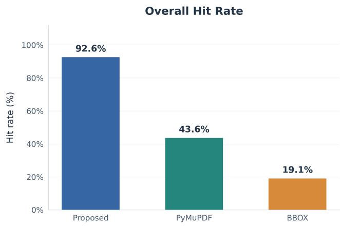
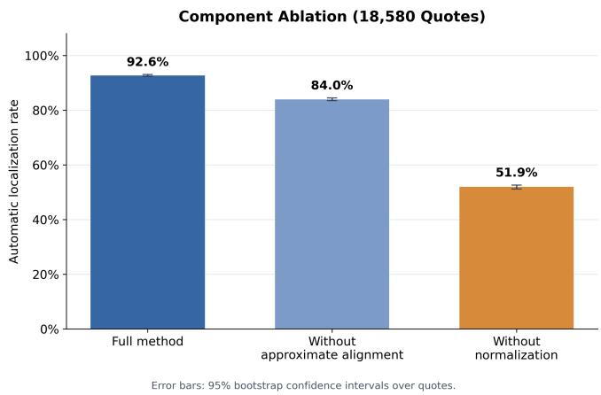
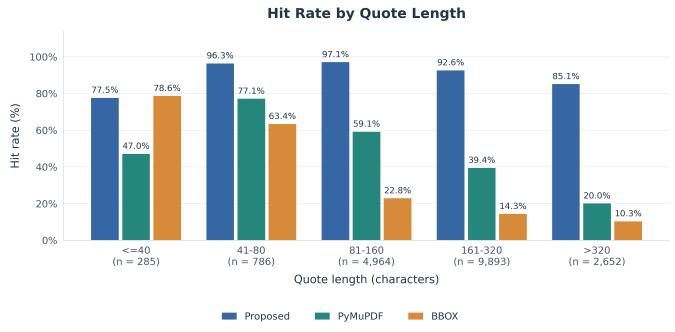
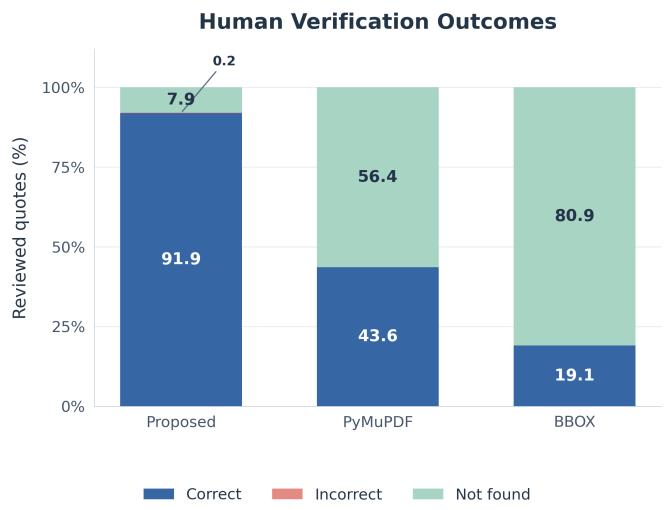

# SOURCE-PRESERVING ALIGNMENT FOR ROBUST EVIDENCE LOCALIZATION IN SCIENTIFIC PDFS

Zihao Liu1,3, Wei Yang2,3, Zixiao Dong1,3, Chenshu Li1,3, Longzhang Liu1,3, Tao Tan4, Hong Xie1,3∗

1School of Computer Science and Technology, University of Science and Technology of China 2University of Science and Technology of China, 3State Key Laboratory of Cognitive Intelligence, 4CCCC Second Highway Consultants Co., Ltd.

## ABSTRACT

Scientific information-extraction systems often return a claim with an evidence string, which users must locate in the original PDF. This is challenging because the extracted evidence and PDF text layer are different representations: line wrapping, Unicode variants, superscripts, citation markers, and fragmented items alter text sequences and geometry. We present a source-preserving alignment framework: normalize text for robust matching while preserving provenance for accurate localization. It aligns evidence with normalized page text, maps matches back to source-character spans, and renders only their geometry. When exact alignment fails, line-break-aware token alignment recovers supported spans while excluding unmatched noise. Experiments on 1,020 chemistry papers show that the framework achieves a 92.6% quote-level automatic localization rate, compared with 43.6% for text search and 19.1% for a precomputed bounding-box baseline. Component ablation confirms distinct contributions from normalization and approximate token alignment, while human verification assesses the visual correctness of returned highlights. Overall, these results demonstrate that reliable evidence verification requires robust matching and precise localization within a shared source-preserving alignment representation.

Index Terms— PDF evidence localization, scientific document grounding, source-preserving alignment, text normalization, geometric provenance

## 1. INTRODUCTION

Retrieval-augmented generation [1] and scientific claim verification [2] use retrieved evidence, while S2ORC provides structured scientific text [3] and citation-generation research stresses that answers should be verifiable [4]. Making evidence useful requires locating it on the original PDF page. Unlike standard text search, this task must match evidence from Markdown or other logical formats to PDF text with line and item breaks, different dash forms, citation markers, and separate superscripts. These differences arise from the PDF text model and character encoding [5, 6] and remain a challenge in scholarly-PDF extraction [7, 8]. Matched text must then be turned into precise page-level highlights. Plain text search is sensitive to normalization differences; precomputed bounding boxes cannot handle text not expected at indexing time and are sensitive to changes in layout and encoding. Neither preserves the character-level link to source geometry needed for accurate highlighting.

We frame evidence localization as alignment among normalized text for matching, source characters for provenance, and page geometry for rendering. Our principle, normalize for matching, preserve provenancefor localization, links each normalized character to its source item and offset through an explicit provenance map. Handling extraction differences alone cannot ensure accurate highlight boundaries. We contribute (1) a normalized representation that preserves these source links, (2) a method that uses it to turn exact or approximate text alignment into character spans and highlights based on page geometry, and (3) an evaluation on scientific chemistry PDFs against text-search and precomputed boundingbox baselines, showing higher localization success and more accurate highlight boundaries, especially for long evidence strings.

## 2. RELATED WORK

PDF libraries such as PDF.js [9] and PyMuPDF [10] expose page strings, text items, and geometry, while neural parsers improve structured extraction but do not guarantee traceable visual source spans [11]. Standard search is fragile to extraction-order, encoding, and layout differences, whereas bounding-box indexes are limited by text-to-box correspondence.

This correspondence is particularly difficult for scientific PDFs, where equations, formulas, Greek letters, superscripts, and reference markers can be fragmented or nonstandard. Document-layout resources likewise show substantial visual and structural variation [12, 13, 14, 15]. A robust locator must therefore combine tolerant comparison with faithful recovery of source characters and geometry.

Approximate string matching handles textual errors [16], while classical sequence alignment [17] and longest-commonsubsequence (LCS) algorithms [18] identify ordered correspondences despite gaps. Our token-level fallback uses LCS correspondences to recover supported tokens; PDF evidence localization additionally projects them through a provenance map to source characters and page geometry.

## 3. PROPOSED METHOD

## 3.1. Deterministic Matching Procedure

Let $q$ denote an evidence quote and let $P = \{ p _ { 1 } , . . . , p _ { n } \}$ denote the ordered PDF text items, where each $p _ { i }$ contains source text $s _ { i }$ and transform $T _ { i }$ . The method uses fixed rules rather than learned parameters. It first normalizes and searches for an exact occurrence:

$$
\begin{array} { r } { \hat { q } = N ( q ) , \qquad \hat { p } = N ( s _ { 1 } ) \parallel \cdots \parallel N ( s _ { n } ) . } \end{array}\tag{1}
$$

If exact matching fails, let $\mathbf { q } ~ = ~ ( q _ { 1 } , \dots , q _ { m } )$ and p be the normalized quote and page token sequences. For $m \geq 5 .$ the method enumerates a fixed set of candidate windows and selects

$$
\tilde { \mathbf { w } } = \arg \operatorname* { m a x } _ { \mathbf { w } \in \mathcal { C } ( \mathbf { q } , \mathbf { p } ) } \mathrm { s c o r e } ( \mathbf { q } , \mathbf { w } ) .\tag{2}
$$

The fallback result is returned only when score $( \mathbf { q } , \tilde { \mathbf { w } } ) \geq \tau .$ where $\tau \ = \ 0 . 8 ;$ otherwise, no fallback match is returned. Thus, the procedure performs deterministic selection from a finite candidate set rather than parameter optimization.

## 3.2. Normalization and Provenance Mapping

We define a normalization function N(·) that applies Unicode compatibility normalization, dash/minus unification, malformed-encoding repair, scientific-symbol mapping, and removal of layout-only separators, consistent with the Unicode representation principles used by PDF text workflows [6, 5]. The normalized quote and page stream are

$$
\begin{array} { r } { \hat { q } = N ( q ) , \qquad \hat { p } = N ( s _ { 1 } ) \parallel N ( s _ { 2 } ) \parallel \cdots \parallel N ( s _ { n } ) . } \end{array}\tag{3}
$$

During normalization, every output character stores a pair $( i , c )$ identifying its source text item i and source character offset c. Thus, an exact match in $\hat { p }$ can be projected back to the corresponding source intervals.

The normalization includes compatibility rules for symbols commonly damaged during PDF extraction. These rules are used only for comparison; the original page text is never rewritten.

## 3.3. Exact Matching and Character-Range Clipping

If qˆ occurs contiguously in $\hat { p } ,$ the method collects all source intervals touched by the match. For each text item, only the

interval $[ c _ { \mathrm { s t a r t } } , c _ { \mathrm { e n d } } )$ is rendered. Because PDF.js text items do not generally expose per-glyph rectangles, the horizontal extent is estimated proportionally from the item width:

$$
x _ { \mathrm { s t a r t } } = x _ { 0 } + w \frac { c _ { \mathrm { s t a r t } } } { | s _ { i } | } , \qquad x _ { \mathrm { e n d } } = x _ { 0 } + w \frac { c _ { \mathrm { e n d } } } { | s _ { i } | } .\tag{4}
$$

The resulting rectangle is transformed using the item’s PDF matrix and clipped to the page viewport. This prevents a quote ending inside a text item from highlighting the next sentence contained by the same item.

## 3.4. Line-Break and Noisy-Text Alignment

When exact matching fails, both texts are tokenized. Alphabetic line-end hyphenation is merged when its fragments form a word, while formula-like strings such as “ZSM-$5 ^ { \circ }$ are preserved. For a quote of m tokens, each scale $\alpha ~ \in ~ \{ 0 . 7 0 , 0 . 8 5 , 1 . 0 0 , 1 . 1 5 , 1 . 3 0 \}$ produces a candidate length $\ell _ { \alpha } ~ = ~ \mathrm { r o u n d } ( \alpha m )$ , using nearest-integer rounding with half values rounded upward. Windows longer than the page-token sequence are omitted.

For a candidate token window $\mathbf { w } = ( w _ { 1 } , \dots , w _ { \ell } )$ , we use the longest common subsequence [18] to define the score as

$$
\operatorname { s c o r e } ( \mathbf { q } , \mathbf { w } ) = { \frac { \operatorname { L C S } ( \mathbf { q } , \mathbf { w } ) } { \operatorname* { m a x } ( | \mathbf { q } | , | \mathbf { w } | ) } } = { \frac { \operatorname { L C S } ( \mathbf { q } , \mathbf { w } ) } { \operatorname* { m a x } ( m , \ell ) } } .\tag{5}
$$

Both the LCS count and its denominator are measured in tokens. The renderer highlights only LCS-aligned tokens, excluding unaligned markers.

## 3.5. Geometric Rendering

For each matched source interval, the method computes the four transformed corners of the text rectangle from the PDF.js transform matrix. Rectangles are clamped to normalized page bounds and merged only when they are nearby fragments on the same rendered line. This avoids merging across columns, headers, or unrelated text regions.

## 4. EXPERIMENTS AND ANALYSIS

## 4.1. Dataset

The corpus contains 1,020 publicly accessible chemistry papers paired one-to-one with Markdown evidence files, comprising 18,580 quote instances (18.2 per paper). All PDF–Markdown filename pairs were verified; no PDF was missing. Only papers with both files available were retained, so the benchmark evaluates localization rather than upstream claim extraction. Quotes vary in length, and PDFs include multi-column pages, chemical formulas, figure references, and noisy text layers, exposing ordinary search failures and boundary errors after apparently successful matches. For reproducibility, we provide the PDF–Markdown pairing rule, quote parser, BBOX records, and comparison scripts. The corpus manifest records each paper’s identifier, public access source, access date, and redistribution status.

## 4.2. Comparison Methods

We compare three methods. Proposed uses source-preserving normalization, alignment, source-span recovery, and geometryaware rendering. PyMuPDF performs direct evidence lookup through the PDF library’s standard search interface. BBOX searches an offline page-text and bounding-box index, then renders the retrieved boxes.

## 4.3. Evaluation Metrics and Human Verification Protocol

The automatic metric is quote-level localization rate, i.e., the fraction of quotes for which a method returns at least one candidate page region:

$$
\mathrm { { L o c a l i z a t i o n R a t e } = \frac { \# \{ q u o t e s \ w i t h \ a r e t u r n e d \ c a n d i d a t e \ r e g i o n \} } { \# \{ e v a l u a t e d \ q u o t e s \} } . }\tag{6}
$$

We separately assess visual correctness on 18,572 reviewed quotes per method, with verification completed by six evaluators. Manual percentages use this reviewed cohort as their denominator; the remaining eight quotes have no manual labels. Each quote–method output receives one of three evaluation labels: Correct (the intended evidence is fully and accurately highlighted), Incorrect (a localization is returned but is not fully accurate, including minor boundary excess or omission), or Notfound (no usable localization). Each item has one final recorded label. Automatic localization rate measures candidate availability, whereas these manual labels assess visual correctness.

## 4.4. Overall Performance

Table 1 and Figure 1 show that the proposed method achieves a 92.6% automatic localization rate, versus 43.6% for text search and 19.1% for precomputed BBOX. Reliable localization therefore requires matching positions, source characters, and page geometry in a shared representation.

## 4.5. Component Ablation

Figure 2 isolates the contributions of the proposed normalization and approximate alignment on the same 1,020 papers and 18,580 quotes. Removing approximate alignment disables the LCS fallback while retaining normalized exact matching. Removing the proposed normalization instead uses the PDF.jsextracted text stream directly while retaining the same LCS fallback. This comparison evaluates the added benefit of our normalization beyond the extracted PDF.js text representation. The results show that the proposed normalization provides the larger gain in localization rate, while approximate alignment further recovers disrupted token sequences.

Fig. 1. Quote-level automatic localization rate.  
  
Fig. 2. Component ablation on the full evaluation corpus. Error bars show 95% bootstrap confidence intervals over quotes.

We further conduct a rendering-only boundary ablation on the 17,213 successfully localized quotes: holding the matched source spans fixed, we compare character-range clipping with highlighting every matched PDF.js text item. Whole-item rendering adds 62.8 source characters per quote on average (26.8% of highlighted characters), whereas clipping introduces no whole-item excess by construction; thus, provenance mapping improves highlight specificity without changing localization decisions.

## 4.6. Robustness to Evidence Length

Figure 3 compares localization rates across quote-length groups. The proposed method peaks at 81–160 characters and then declines, but remains substantially ahead of both baselines for longer quotes. BBOX slightly exceeds the proposed method in the shortest group. PyMuPDF peaks at 41–80 characters before declining, whereas BBOX declines across all groups. Longer strings can cross text items and line breaks or contain marker insertions and encoding variation; provenance mapping recovers supported text without expanding highlights to unmatched content.

  
Fig. 3. Quote-level automatic localization rate by evidence length.

Table 1. Quote-level results. Loc. Rate uses all 18,580 quotes; Accuracy and Not Found Rate are the manual Correct and Not found shares among 18,572 reviewed quotes. All rates are rounded to one decimal place.
<table><tr><td>Method</td><td></td><td></td><td>Loc. Rate Accuracy Not Found Rate</td></tr><tr><td>Proposed</td><td>92.1%</td><td>91.9%</td><td>7.9%</td></tr><tr><td>Text-search baseline</td><td>43.6%</td><td>43.6%</td><td>56.4%</td></tr><tr><td>Precomputed-BBOX baseline</td><td>19.1%</td><td>19.1%</td><td>80.9%</td></tr></table>

## 4.7. Human Evaluation

Six evaluators from our laboratory, including faculty members and senior students, manually assessed the localization outputs. Each quote–method output was randomly assigned to one evaluator, who compared the highlight with the corresponding evidence in the original PDF. A result was labeled Correct only when both its location and boundaries matched exactly; any positional error, excess, or omission was labeled Incorrect, and no usable localization was labeled Notfound.

Figure 4 summarizes the three-category results. The proposed method achieves the highest Correct rate, while both baselines have larger Not found shares. Table 1 reports the manual and automatic localization rates using their respective evaluation cohorts.

## 4.8. Error Analysis

Remaining errors mainly arise from complex layouts that disrupt extraction order, proportional widths that approximate variable character widths, and severe extraction errors beyond the normalization rules and LCS threshold.

  
Fig. 4. Manual verification on 18,580 quotes per method. Correct requires fully accurate localization; partial or inaccurate localizations are Incorrect.

The framework assumes a usable PDF text layer; separating matching from rendering makes residual errors easier to diagnose.

The principal qualitative advantage is boundary control. If an evidence string ends at “activities” but its item continues with “It is worth noting that”, whole-item highlighting includes unsupported text. Our provenance mapping crops the rectangle at the final evidence character; token alignment likewise excludes inserted markers.

## 5. LIMITATIONS AND FUTURE WORK

The current implementation estimates character geometry from item width, so variable-width fonts can yield loose boundaries. Glyph-level metrics or native text-layer positioning could address this limitation. Layout-aware analysis could further improve multi-column reading order [19, 14], while confidence calibration and lightweight correction could support large-scale verification.

## 6. CONCLUSION

We present a source-preserving framework that maps normalized evidence to source characters and page geometry for robust matching and precise highlights. Experiments show substantial improvements over text-search and precomputed-BBOX baselines, especially for long evidence strings. The ablation results further show that both normalization and approximate token alignment are necessary for this gain.

Acknowledgments. This work was supported by Strategic Priority ResearchProgram of Chinese Academy of Sciences (XDA0490000) The authors have no relevant financial or nonfinancial interests to disclose.

Compliance with Ethical Standards This study does not involve human participants or animals. No ethical approval was required.

## 7. REFERENCES

[1] Patrick Lewis, Ethan Perez, Aleksandra Piktus, Fabio Petroni, Vladimir Karpukhin, Naman Goyal, Heinrich Kuttler, Mike Lewis, Wen-tau Yih, Tim Rocktaschel, Sebastian Riedel, and Douwe Kiela, “Retrievalaugmented generation for knowledge-intensive NLP tasks,” in Advances in Neural Information Processing Systems, 2020, vol. 33, pp. 9459–9474.

[2] David Wadden, Shanchuan Lin, Kyle Lo, Lucy Lu Wang, Madeleine van Zuylen, Arman Cohan, and Hannaneh Hajishirzi, “Fact or fiction: Verifying scientific claims,” in Proceedings ofthe 2020 Conference on Empirical Methods in Natural Language Processing, 2020, pp. 7534–7550.

[3] Kyle Lo, Lucy Lu Wang, Mark Neumann, Rodney Kinney, and Daniel Weld, “S2ORC: The semantic scholar open research corpus,” in Proceedings of the 58th Annual Meeting ofthe Associationfor Computational Linguistics, 2020, pp. 4969–4983.

[4] Tianyu Gao, Howard Yen, Jiatong Yu, and Danqi Chen, “Enabling large language models to generate text with citations,” in Proceedings of the 2023 Conference on Empirical Methods in Natural Language Processing. 2023, pp. 6465–6488, Association for Computational Linguistics.

[5] International Organization for Standardization, “ISO 32000-2:2020: Document management—portable document format—part 2: PDF 2.0,” International Standard, 2020.

[6] The Unicode Consortium, “The unicode standard, version 16.0.0,” Unicode Standard, 2024.

[7] Patrice Lopez, “GROBID: Combining automatic bibliographic data recognition and term extraction for scholarship publications,” in Research and Advanced Technologyfor Digital Libraries. 2009, vol. 5714 of Lecture Notes in Computer Science, pp. 473–474, Springer.

[8] Dominika Tkaczyk, Pawel Szostek, Mateusz Fedoryszak, Piotr J. Dendek, and Lukasz Bolikowski, “Cermine: Automatic extraction of structured metadata from

scientific literature,” International Journal on Document Analysis and Recognition, vol. 18, no. 4, pp. 317– 335, 2015.

[9] Mozilla Contributors, “PDF.js: A general-purpose, web standards-based platform for parsing and rendering PDFs,” Software, 2025.

[10] Artifex Software, Inc., “PyMuPDF documentation,” Software documentation, 2025.

[11] Lukas Blecher, Guillem Cucurull, Thomas Scialom, and Robert Stojnic, “Nougat: Neural optical understanding for academic documents,” in International Conference on Learning Representations, 2024.

[12] Xu Zhong, Jianbin Tang, and Antonio Jimeno Yepes, “PubLayNet: Largest dataset ever for document layout analysis,” in 2019 International Conference on Document Analysis and Recognition, 2019, pp. 1015–1022.

[13] Minghao Li, Yiheng Xu, Lei Cui, Shaohan Huang, Furu Wei, Zhoujun Li, and Ming Zhou, “DocBank: A benchmark dataset for document layout analysis,” in Proceedings of the 28th International Conference on Computational Linguistics, 2020, pp. 949–960.

[14] Zejiang Shen, Ruochen Zhang, Melissa Dell, Benjamin Charles Germain Lee, Jacob Carlson, and Weining Li, “LayoutParser: A unified toolkit for deep learning based document image analysis,” in International Conference on Document Analysis and Recognition, 2021, pp. 131– 146.

[15] Birgit Pfitzmann, Christoph Auer, Michele Dolfi, Ahmed S. Nassar, and Peter W. J. Staar, “DocLayNet: A large human-annotated dataset for document-layout analysis,” in Proceedings of the 28th ACM SIGKDD Conference on Knowledge Discovery and Data Mining, 2022, pp. 3743–3751.

[16] Gonzalo Navarro, “A guided tour to approximate string matching,” ACM Computing Surveys, vol. 33, no. 1, pp. 31–88, 2001.

[17] Saul B. Needleman and Christian D. Wunsch, “A general method applicable to the search for similarities in the amino acid sequence of two proteins,” Journal of Molecular Biology, vol. 48, no. 3, pp. 443–453, 1970.

[18] Daniel S. Hirschberg, “A linear space algorithm for computing maximal common subsequences,” Communications of the ACM, vol. 18, no. 6, pp. 341–343, 1975.

[19] Yupan Huang, Tengchao Lv, Lei Cui, Yutong Lu, and Furu Wei, “LayoutLMv3: Pre-training for document AI with unified text and image masking,” in Proceedings of the 30th ACM International Conference on Multimedia, 2022, pp. 4083–4091.