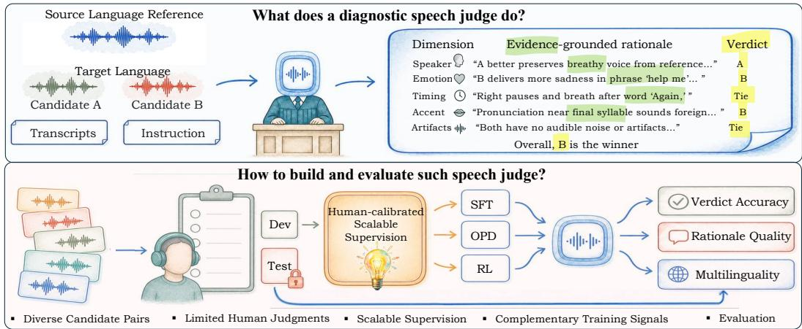
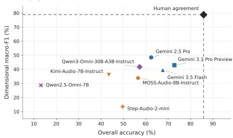
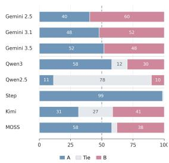
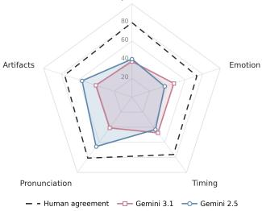
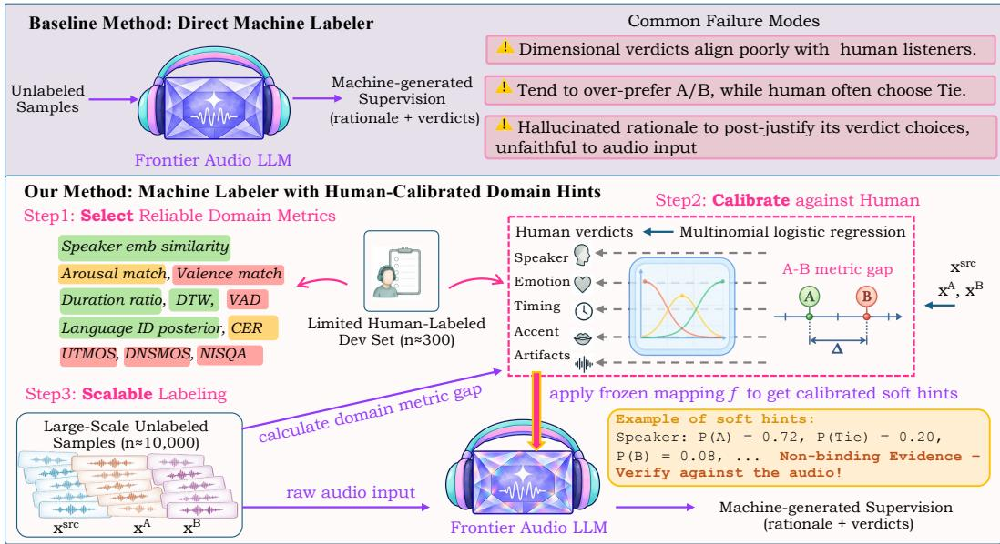
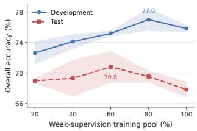

# SPEECHCRITIC: LEARNING A DIAGNOSTIC SPEECH JUDGE FROM LIMITED HUMAN PREFERENCES

Mingyue Huo1∗ Shivam Mehta2 Bhavin Jawade2 Yinghong Lan2 Haoqi Li2 1University of Illinois Urbana-Champaign 2Netflix mhuo5@illinois.edu haoqil@netflix.com

## ABSTRACT

Human speech conveys rich perceptual information, such as emotion and speaker identity, yet most automatic speech quality judges reduce it to a single naturalness score. We study diagnostic speech judges: given two candidates, a diagnostic judge decides which is better, along which perceptual dimensions (e.g., timbre, emotion, timing) they differ, and which audible cues support its decision. Learning such judges is challenging: expert annotation is costly, and simply prompting a frontier audio-language model to produce labels is unreliable: our probing reveals substantial errors and unstable instruction following. We introduce SPEECH-CRITIC, which learns a diagnostic judge in a reference-conditioned cross-lingual setting from only about 300 human-labeled comparisons. Rather than replacing the frontier model, SPEECHCRITIC calibrates it with these labels: for each dimension, it selects the acoustic measurements that agree with human judgments, maps them to A/TIE/B probabilities, and passes these to the model as non-binding hints alongside the audio. Compared with the same model labeling without hints, this raises dimension-level agreement with humans by 6.3 points and cuts the mismatch with human TIE rates by 10.4 points. We then train a 7B judge on this supervision and find that different training signals shape different judge behaviors: supervised fine-tuning establishes the task, on-policy distillation transfers the teacher’s dimension-level strengths and weaknesses, and reinforcement learning helps most on clear-cut comparisons where human raters agree. Notably, human listeners also find that reinforcement learning makes rationales cite more specific, localized acoustic cues, although it never directly rewards rationale text. Finally, we show that the pipeline is language-pair agnostic by instantiating it on both English–Japanese and English–Spanish. Together, these results demonstrate a path from limited human preferences to a diagnostic speech judge. Listen to Demo.

  
Figure 1: In a reference-conditioned cross-lingual comparison, a diagnostic speech judge produces multidimensional verdicts and evidence-grounded rationales that identify audible differences between two candidates. Our SPEECHCRITIC framework covers the end-to-end data, training, and evaluation pipeline. The central human-calibration method is introduced in Section 4.

## 1 INTRODUCTION

Recent multimodal large language models can directly process speech, making automatic speech evaluation increasingly plausible. Yet speech perception is inherently multidimensional, and a useful evaluator should explain its preference with evidence rather than merely select a winner. We study diagnostic speech judging for pairwise speech comparison. A diagnostic judge listens to two speech candidates, whether natural or synthesized, and produces an Overall verdict, judgments across multiple perceptual dimensions, and evidence-grounded rationales supported by audibly verifiable cues. We instantiate this general task in a reference-conditioned cross-lingual setting, where the judge compares two target-language candidates against a source-language reference in terms of speaker characteristics, emotion, timing, pronunciation or accent, and audio artifacts.

Building such a judge is challenging because human listeners may reasonably disagree on subtle perceptual differences, while collecting consistent dimension-level judgments and audio-grounded explanations requires substantial expert effort. Existing approaches either train speech judges on large human preference corpora that are costly and time-consuming to collect (Zhang et al., 2025) or directly prompt frontier audio-language models as evaluators (Manakul et al., 2026). To examine the latter option, we probed three proprietary and five open-source models. Their results reveal weak human agreement, skewed candidate or TIE preferences, and inconsistent dimension-level judgments, making their outputs unreliable as training supervision. This raises our central question:

## Can limited human judgments be used to build a scalable, specialized diagnostic speech judge without collecting human labels at training scale?

Our key idea is to use human judgments to calibrate machine supervision rather than replace it. SPEECHCRITIC follows a select–calibrate–scale pipeline. Select: limited human judgments determine which automatic acoustic measurements provide reliable evidence for each supported dimension. Calibrate: each retained signal is mapped to uncertainty-aware probabilities over A, TIE, and B. Scale: the frozen mappings provide non-binding hints to a machine labeler, which still listens to the original speech and generates verdict-and-rationale supervision for more than 10,000 comparisons. Unlike conventional weak supervision, these measurements neither determine the labels nor replace the raw audio (Ratner et al., 2017). Unlike approaches based on human-written principles (Bai et al., 2022) or recursively generated model judgments (Wang et al., 2024), humans directly determine which acoustic evidence the machine labeler should trust. This calibration improves agreement with human dimension-level judgments by 6.3 percentage points and reduces the mismatch in TIE behavior by 10.4 points.

Building scalable supervision is only part of the problem. We further study how that supervision should be used by comparing supervised fine-tuning (SFT), on-policy distillation (OPD), and reinforcement learning (RL). SFT establishes the diagnostic task, but its gains are not monotonic in the amount of supervision, and adapting the audio path improves overall decisions without uniformly strengthening dimensional diagnosis. OPD transfers the teacher’s judgment profile, with teacher behavior and conditioning mattering more than student initialization. RL sharpens the verdict behavior encoded by its reward, with gains concentrated on high-consensus comparisons and a trade-off in dimensional diagnosis. Human evaluation further shows that RL can improve acoustic grounding without direct rationale rewards. Separately, persuasive rationales can still accompany incorrect verdicts. Finally, both the SPEECHCRITIC supervision pipeline and the resulting judges transfer across Japanese and Spanish, demonstrating that the framework extends beyond a single target language.

Figure 1 summarizes our SPEECHCRITIC framework. Our contributions are:

• Diagnostic task and human evaluation. We formulate diagnostic speech judging with a five-dimensional rubric, analyze human subjectivity and agreement, and systematically probe zero-shot audio-language models.

• Human-calibrated scalable supervision. We introduce a select–calibrate–scale pipeline that turns roughly 300 human-labeled comparisons into more than 10,000 verdict-andrationale training comparisons.

• Learning and evaluation. We characterize how SFT, OPD, and RL learn differently from imperfect supervision, evaluate the evidence grounding and reliability of their rationales with human listeners, and study how the framework transfers across target languages.

## 2 RELATED WORK

Audio-language model judges. Recent work follows two main routes: prompting existing audiolanguage models and training dedicated evaluators. AudioJudge directly prompts off-the-shelf audio models (Manakul et al., 2026), while TRACE converts acoustic cues into textual descriptions for reasoning by a text LLM (Chandra et al., 2026). Dedicated evaluators and supporting resources cover instruction-driven assessment, low-level speech quality, multilingual judging, spoken dialogue, and multi-task evaluation (Zhang et al., 2026; Wang et al., 2025; 2026a; Ji et al., 2025; Wang et al., 2026b). SpeechJudge and GSRM further train specialized judges from large-scale human preferences or expert ratings (Zhang et al., 2025; Shen et al., 2026). Much of this literature emphasizes naturalness or low-level acoustic quality. Complementary auditing work exposes another limitation: compared with human listeners, speech LLM judges can rely excessively on acoustic shortcuts such as intensity, content richness, and emotional delivery, while their rationales rarely reveal these in fluences (Huo et al., 2026). Our task instead learns a diagnostic speech judge from limited human judgments, aiming to align its multidimensional decisions with human preferences and ground its rationales in audible evidence.

Scalable evaluator training. The broader LLM literature has explored several ways to reduce large-scale human preference annotation. Prometheus and JudgeLM distill model-generated feedback into trainable text evaluators (Kim et al., 2024; Zhu et al., 2023), while Auto-J and Critiqueout-Loud generate explicit critiques before final judgments or rewards (Li et al., 2024; Ankner et al., 2024). RLAIF replaces human preferences with AI feedback (Lee et al., 2023); Constitutional AI guides that feedback with human-written principles (Bai et al., 2022); and Self-Taught Evaluators bootstrap evaluator reasoning from synthetic data (Wang et al., 2024). These studies show that evaluator supervision can be generated or distilled. In speech modality, however, the supervising model must perceive the acoustic signal and ground both its verdicts and rationales in audible evidence, making the reliability of machine-generated supervision itself a central concern.

Weak supervision and domain evidence. Speech evaluation has long relied on specialized measurements, including speaker-embedding similarity (Wang et al., 2023), emotion representations (Wagner et al., 2023; Ma et al., 2024), temporal and pronunciation measures, and neural quality predictors (Saeki et al., 2022; Reddy et al., 2021; Mittag et al., 2021). These tools estimate individual or narrowly defined perceptual properties, but do not jointly produce comparative verdicts and audio-grounded rationales. Our use of such measurements is related to programmatic weak supervision, where systems such as Snorkel combine noisy heuristic labeling functions into probabilistic training labels (Ratner et al., 2017). Our measurements, however, do not directly label comparisons or replace the raw speech. Although TRACE and GSRM also expose structured acoustic evidence to evaluators, we screen each candidate measurement against held-out human judgments for the corresponding dimension, calibrate retained signals into probabilistic A/TIE/B hints, and provide them only as non-binding guidance to a raw-audio machine labeler.

## 3 DIAGNOSTIC SPEECH JUDGING: TASK AND HUMAN EVALUATION

Task formulation. We study reference-conditioned cross-lingual comparison. Each comparison contains a source-language reference utterance $x ^ { \mathrm { s r c } }$ and two target-language speech candidates $x ^ { A }$ and $x ^ { B }$ . Our primary experiments use an English reference and Japanese candidates. The judge also receives source and target transcripts with the matched semantic meaning $( t ^ { \mathrm { s r c } } , t ^ { \mathrm { t g t } } )$ and an instruction specifying the rubric r. We denote the full input by

$$
x = \left( x ^ { \mathrm { s r c } } , x ^ { A } , x ^ { B } , t ^ { \mathrm { s r c } } , t ^ { \mathrm { t g t } } , r \right) ,
$$

The judge outputs a structured natural language response following the instruction, which contains a verdict $v _ { k }$ for each of five perceptual dimensions, and a binary Overall verdict $v _ { \mathrm { o v e r a l l } }$ . The output also contains rationales that support any verdict it makes, identifying localized and audibly verifiable observations, such as a word, phrase, pause, or change in prosodic delivery. Such rationales can help move automated evaluation closer to the actionable feedback of an expert human listener.

$$
v _ { k } \in \{ A , B , \mathrm { T i e } \} , \quad k = 1 , \ldots , 5 \qquad v _ { \mathrm { o v e r a l l } } \in \{ A , B \} .
$$

The five dimensions are Speaker, Emotion, Timing, Pronunciation/Accent, and Audio Artifacts. This rubric is empirically sufficient for the task: a simple equal-weight aggregation of human dimensionlevel votes recovers human Overall preferences with 93.0% out-of-fold accuracy after a one-feature logistic calibration on the development set.

Constructing diverse data. We constructed a heterogeneous speech pool using multiple off-theshelf speech synthesis systems. Their distinct behaviors and failure modes create natural variation across perceptual dimensions. For example, cross-lingual synthesis produces varying degrees of accent leakage, yielding candidate pairs that differ in Pronunciation/Accent quality. Appendix B describes the pool in detail. We constructed more than 10,000 comparisons in total.

Human preference benchmark. We recruited 20 native Japanese listeners who also understand English. Human listeners are given input x and asked to produce verdicts $v _ { k }$ and $v _ { \mathrm { o v e r a l l } } .$ , without the need to write down any explanations. Each comparison receives three human judgments. In subsequent analyses, comparisons with unanimous $v _ { \mathrm { o v e r a l l } }$ votes (3–0) are marked as high-consensus comparisons and those with split votes (2–1) as low-consensus comparisons.

Human annotation yields 315 development comparisons and 290 test comparisons. Only the development set is used to calibrate the following supervision pipeline; the test set is never used for calibration, training, or model selection. Throughout the paper, we evaluate the binary Overall verdict using accuracy over $\{ A , B \}$ and the five dimension-level verdicts using macro-F1 over $\{ A , B , { \mathrm { T i e } } \}$ averaged across dimensions. To contextualize the specific task’s subjectivity, we additionally collect all 20 listeners’ preference for 30 anchor comparisons. Appendix A provides detailed annotation instructions, dimension definitions, and human agreement analysis.

On the full English–Japanese test set, the expected agreement of a randomly sampled panel listener with the panel-majority label is 85.8% for $v _ { \mathrm { o v e r a l l } }$ and 78.8% for averaged dimensional macro-F1. We treat these values as label-reliability references rather than model-performance upper bounds.

(a) Overall Acc. vs. Dimensional F1  

(b) A/B Selection Bias  

(c) Per-Dimension F1 Speake  
  
Figure 2: Zero-shot probing of three proprietary and five open-source audio-language models on our constructed English–Japanese test set (conducted only after all model choices were fixed.) The results reveal a clear gap to reliable human-aligned diagnostic judging.

Zero-shot probing. We evaluated proprietary and open-source audio-language models zero-shot on the task. All models received the same instruction. As shown in Figure 2, three patterns emerge. First, both Overall accuracy and dimensional macro-F1 remain below human agreement. Second, several models exhibit strongly skewed A/B output distributions, while Qwen2.5-Omni-7B (Xu et al., 2025a) predicts the invalid Overall TIE on 78.3% of comparisons, violating our task formula tion. Third, no model performs consistently well across all five perceptual dimensions. Off-the-shelf models are therefore not reliable zero-shot diagnostic judges, motivating our human-calibrated su pervision and specialized judge training.

## 4 METHOD: SCALING SUPERVISION FROM LIMITED HUMAN JUDGMENTS

Gemini-3.1-Pro (Google, 2026) achieves the highest zero-shot Overall accuracy in Figure 2, but its raw supervision remains systematically misaligned with human judgments. Humans choose TIE for 55.1% of dimension-level judgments, compared with only 19.8% for Gemini, whose rationales can also contain unsupported or post-hoc acoustic claims. We therefore use limited human judgments to calibrate the evidence supplied to the machine labeler through three steps: select, calibrate, and scale (Figure 3).

  
Figure 3: Human-calibrated domain hints. Direct machine labeling exhibits systematic disagreement with human. Our select–calibrate–scale pipeline uses limited human judgments to convert reliable domain metrics into probabilistic hints for scalable and acoustically grounded supervision.

## 4.1 SELECTING DOMAIN METRICS

We first use the human-labeled development set to determine which domain metrics provide reliable evidence for each diagnostic dimension instead of assuming they are all reliable. Let $m _ { k j } \in \mathcal { M } _ { k }$ denote candidate measurement j for dimension k. For development comparison i, we orient each measurement so that a larger value favors that candidate and compute its signed metric gap:

$$
\Delta _ { i k } ^ { ( j ) } = m _ { k j } ( A _ { i } ) - m _ { k j } ( B _ { i } ) , \qquad z _ { i k } \in \{ A , \mathrm { T i e } , B \} ,
$$

where $z _ { i k }$ is the human-majority dimension-level verdict. We evaluate each candidate through fivefold grouped out-of-fold prediction, keeping comparisons from the same source group in one fold. Within each fold, standardization and a temporary probability mapping are fitted on the other four folds, and their held-out predictions are compared with $z _ { i k }$ using macro-F1. The class-frequency baseline uses the A/TIE/B frequencies estimated from the same four training folds. These foldspecific mappings are used only to select $m _ { k }$ and are then discarded. Table 1 summarizes the retained measurements and their out-of-fold performance. No candidate outperforms the baseline for Audio Artifacts, so it receives no domain hint. Appendix B.2 reports the complete screening results.

Table 1: Retained domain metrics and grouped OOF macro-F1 on the human-labeled dev set.
<table><tr><td>Dimension</td><td>Speaker</td><td>Emotion</td><td>Timing</td><td>Pronunciation</td><td>Artifacts</td></tr><tr><td>Retained</td><td>Speaker</td><td>Arousal</td><td>Duration deviation</td><td>Character error rate</td><td></td></tr><tr><td>metric(s)</td><td>similarity</td><td>mismatch</td><td>+ envelope DTW</td><td>or Language  $\mathrm { I D } ^ { * }$ </td><td>None</td></tr><tr><td>OOF macro-F1 (%) 20.9 → 29.1</td><td></td><td>19.2 → 36.0</td><td>18.6 → 54.7</td><td>26.7 → 50.6</td><td>No improv.</td></tr></table>

∗OOF validation found the VoxLingua target-language posterior predictive only for English–Spanish, so it is used only for that language.

## 4.2 CALIBRATING THE SELECTED METRICS

After selecting $m _ { k } ,$ , we refit one final mapping $f _ { k }$ on all development comparisons. Let $j _ { k } ^ { \star }$ denote the retained candidate, and write $m _ { k } = m _ { k j _ { k } ^ { \star } }$ and $\Delta _ { i k } = \Delta _ { i k } ^ { ( j _ { k } ^ { \star } ) }$ . We fit an $\ell _ { 2 } \cdot$ -regularized multinomial

Table 2: Human-calibrated domain hints improve the dimensional alignment and TIE-rate calibration of Gemini 3.1 Pro as a machine labeler, with no detectable change in Overall accuracy.
<table><tr><td colspan="4">Dev</td><td colspan="3">Test</td></tr><tr><td>Strategy</td><td>Overall Acc. % ↑</td><td>Dim. Macro-F1 % ↑</td><td>TIE MAE*↓</td><td>Overall Acc. % ↑</td><td>Dim. Macro-F1 % ↑</td><td>TIE MAE↓</td></tr><tr><td>Direct labeling</td><td>72.6</td><td>44.1</td><td>29.0</td><td>71.3</td><td>42.3</td><td>35.2</td></tr><tr><td>+ Calibrated hints</td><td>75.8</td><td>50.9</td><td>22.1</td><td>69.9</td><td>48.5</td><td>24.8</td></tr></table>

∗The mean absolute difference between model and human TIE rates across dimensions; machine labelers tend to force an A/B choice more often than humans.

logistic mapping

$$
\mathbf { p } _ { i k } = f _ { k } ( \Delta _ { i k } ) = \operatorname { s o f t m a x } \left( \alpha _ { k } + \beta _ { k } { \frac { \Delta _ { i k } - \mu _ { k } } { \sigma _ { k } } } \right) = \left( \operatorname* { P r } ( A ) , \operatorname* { P r } ( \operatorname { T i e } ) , \operatorname* { P r } ( B ) \right) .
$$

The mapping is learned from human dimension-level verdicts using cross-entropy. We then freeze its standardization parameters $( \mu _ { k } , \sigma _ { k } )$ and regression parameters $( \alpha _ { k } , \beta _ { k } )$ . The resulting distribution represents uncertainty in the calibrated human-choice mapping rather than forcing a hard label.

## 4.3 GENERATING SCALABLE DIAGNOSTIC SUPERVISION

For each unlabeled comparison x, we compute the selected signed metric gap and apply the frozen calibration mapping $f _ { k } { \mathrm { : } }$

$$
{ \widehat { \mathbf { p } } } _ { k } ( x ) = f _ { k } ( m _ { k } ( A _ { x } ) - m _ { k } ( B _ { x } ) ) = \left( { \widehat { \operatorname* { P r } } } ( A ) , { \widehat { \operatorname* { P r } } } ( { \mathrm { T i e } } ) , { \widehat { \operatorname* { P r } } } ( B ) \right) .
$$

The machine labeler receives calibrated distributions for the four supported dimensions alongside the raw speech, transcripts, and rubric; Audio Artifacts is marked unknown, and no Overall hint is provided. As illustrated in Figure 3, these hints are non-binding: the model verifies them against the audio and may override them before generating five dimension-level verdicts with rationales and an Overall verdict.

Using roughly 300 human-labeled development comparisons, this pipeline guides machinegenerated verdict-and-rationale supervision for more than 10,000 unlabeled comparisons. Table 2 evaluates this supervision before any student model is trained. On the held-out test set, paired reference-cluster bootstrap intervals (20,000 resamples) show that calibrated hints improve dimensional macro-F1 by 6.3 points (95% CI: [3.0, 9.4]) and reduce TIE-rate MAE by 10.4 points (95% CI: [7.4, 13.4] reduction); both intervals exclude zero. Overall accuracy changes by −1.5 points, with an interval crossing zero (95% CI: [−7.0, 4.0]), indicating no detectable change. Although TIE still remains under-predicted compared to human preference (Appendix A.4, Table 7), the hints make the same Gemini model a better source of machine-generated diagnostic supervision.

## 5 TRAINING SIGNALS FOR DIAGNOSTIC SPEECH JUDGES

Our scalable supervision specifies both verdicts and rationales, but remains imperfect because it inherits errors from the machine labeler. We therefore study not only how to generate supervision, but how a student should learn from it. All student judges are initialized from Qwen2.5-Omni-7B; implementation details are provided in Appendix C. Unless otherwise stated, results are reported as the mean and standard deviation over three independent training runs.

SFT establishes the diagnostic task. Zero-shot Qwen2.5-Omni-7B does not reliably follow the diagnostic rubric (Figure 2): its responses often omit required verdicts or violate the binary Overall decision, yielding only 13.10% Overall accuracy. We therefore begin with SFT on fixed verdictand-rationale targets, which provides token-level supervision over the complete structured response. As shown in Panel A of Table 3, with LoRA applied only to the language model, SFT raises Overall accuracy to 69.54% and establishes the basic rubric following, dimensional distinctions, and output structure required by subsequent training. SFT therefore serves as the task-learning stage, although it necessarily remains exposed to errors in the fixed machine-generated targets.

Table 3: Main results: SFT, OPD, and RL produce distinct training signals to shape a diagnostic speech judge, rather than a uniform accuracy ladder.
<table><tr><td>Configuration</td><td>Overall Acc. (%)</td><td>High-Consensus Acc. (%)</td><td>Low-Consensus Acc. (%)</td><td>Dim. Macro-F1 (%)</td></tr><tr><td colspan="5">Baseline</td></tr><tr><td>Qwen2.5-Omni-7B (zero-shot)</td><td>13.10</td><td>13.53</td><td>12.50</td><td>28.76</td></tr><tr><td colspan="5">A. SFT</td></tr><tr><td>SFT</td><td> $6 9 . 5 4 \pm 0 . 8 0$ </td><td> $8 1 . 7 6 \pm 1 . 0 2$ </td><td> $5 2 . 2 2 \pm 3 . 3 7$ </td><td> $5 2 . 3 7 \pm 0 . 1 0$ </td></tr><tr><td colspan="5">B. OPD: teacher choice</td></tr><tr><td>Privileged: SFT teacher</td><td>71.72 ±1.58</td><td> $8 5 . 1 0 \pm 1 . 8 9$ </td><td> $5 2 . 7 8 \pm 3 . 8 5$ </td><td> $5 2 . 1 5 \pm 1 . 2 6$ </td></tr><tr><td>Privileged: Qwen3-30B teacher</td><td>73.79 ±0.91</td><td> ${ \pm } 7 . 2 5 \pm 0 . 6 8$ </td><td> $5 4 . 7 2 \pm 2 . 9 3$ </td><td> $4 4 . 6 1 \pm 2 . 7 9$ </td></tr><tr><td>Vanilla: Qwen3-30B teacher</td><td>56.78±1.44</td><td> $5 8 . 0 4 \pm 3 . 0 2 $ </td><td> $5 5 . 0 0 \pm 0 . 8 3$ </td><td> $3 7 . 5 1 \pm 0 . 9 3$ </td></tr><tr><td colspan="5">C. RL: reward and algorithm (initialized from SFT)</td></tr><tr><td>DAPO — Overall only</td><td>69.43 ±0.87</td><td> $8 3 . 1 4 \pm 1 . 8 9$ </td><td> $5 0 . 0 0 \pm 0 . 8 3$ </td><td> $5 2 . 7 9 \pm 0 . 8 3$ </td></tr><tr><td>DAPO — Dimensional only</td><td> $7 1 . 1 5 \pm 1 . 0 5$ </td><td> $8 4 . 7 1 \pm 1 . 5 6$ </td><td> $5 1 . 9 4 \pm 0 . 4 8$ </td><td> $4 5 . 7 2 \pm 1 . 3 9$ </td></tr><tr><td>DAPO — Overall + dimensional</td><td> $7 0 . 5 7 \pm 0 . 2 0$ </td><td> $8 4 . 1 2 \pm 1 . 5 6$ </td><td> $5 1 . 3 9 \pm 1 . 9 2$ </td><td> $5 0 . 1 9 \pm 2 . 2 8$ </td></tr><tr><td>DAPO — Gated dimensional reward</td><td> $7 1 . 8 4 \pm 1 . 0 5$ </td><td> $8 5 . 6 9 \pm 1 . 4 8$ </td><td> $5 2 . 2 2 \pm 0 . 4 8$ </td><td> $4 7 . 6 4 \pm 1 . 0 1$ </td></tr><tr><td>GRPO — Same gated reward</td><td> $7 0 . 3 4 \pm 0 . 9 1$ </td><td> $8 3 . 7 3 \pm 0 . 3 4$ </td><td> $5 1 . 3 9 \pm 1 . 7 3$ </td><td> $4 9 . 3 6 \pm 1 . 6 4$ </td></tr><tr><td colspan="5">D. Composed training</td></tr><tr><td>OPD initialization + gated RL</td><td> $\mathbf { 7 3 . 9 1 \pm 0 . 4 0 }$ </td><td> $8 5 . 8 8 \pm 0 . 5 9$ </td><td> ${ \bf 5 6 . 9 4 \pm 1 . 2 7 }$ </td><td> ${ \pm 2 . 8 7 \pm 1 . 7 4 }$ </td></tr></table>

OPD transfers the teacher’s conditional judgment profile. Fixed-target SFT never evaluates the student on prefixes generated by its own policy. OPD instead samples a student trajectory and minimizes token-level Jensen–Shannon divergence from a frozen teacher along it Agarwal et al. (2024). Let $p _ { \theta }$ and $q _ { \phi }$ denote the student and teacher next-token distributions. Vanilla OPD gives both models x; privileged OPD additionally gives the teacher an evidence brief c derived from scalable supervision, while the student receives only x (Zhao et al., 2026):

$$
\mathcal { L } _ { \mathrm { O P D } } = \frac { 1 } { T } \sum _ { t = 1 } ^ { T } \operatorname { J S D } ( p _ { \theta } ( \cdot  { | } x , y _ { < t } )  { | | } q _ { \phi } ( \cdot  { | } x , c , y _ { < t } ) ) .
$$

Panel B of Table 3 shows that the teacher’s input and behavior, rather than model capacity alone, determine what OPD transfers. Vanilla Qwen3 (Xu et al., 2025b) supervision produces only 56.78% Overall accuracy, whereas privileged conditioning raises it to 73.79%. Yet the resulting dimensional macro-F1 is 44.61%, well below the 52.15% obtained from the SFT teacher, showing that the student inherits the teacher’s judgment profile rather than a universally better judge. Holding the privileged Qwen3 teacher fixed, changing the student initialization among base, SFT, and RL checkpoints shifts Overall accuracy only within 72.07–73.79% and yields no consistent improvement. Teacher choice and conditioning therefore dominate initialization.

RL improves the verdict behavior encoded by its reward. SFT and OPD both supervise the full token sequence, potentially transferring errors in the target or teacher rationale. Instead, we employ RL to evaluate only the parsed verdicts of each generated response, allowing the policy to improve decision behavior without treating any target rationale as ground truth. Our primary reward grants dimensional credit only after the Overall verdict is correct:

$$
R = r _ { \mathrm { o v e r a l l } } + \lambda { \bf 1 } \{ r _ { \mathrm { o v e r a l l } } = + 1 \} r _ { \mathrm { d i m } } .
$$

Here $r _ { \mathrm { o v e r a l l } } \ \in \ \{ - 1 , + 1 \}$ , while $r _ { \mathrm { d i m } }$ averages correctness over dimensions with decisive $A / B$ targets. TIE-labeled dimensions and rationale text receive no direct reward.

Panel C of Table 3 compares Overall-only, dimension-only, additive, and gated rewards under DAPO, together with GRPO using the same gated reward. Overall-only training provides no gain, while the gated reward performs best, raising Overall accuracy from 69.54% to 71.84%. Nearly all of this improvement occurs on high-consensus cases (+3.9 points), with no gain on low-consensus cases. At the same time, dimensional macro-F1 falls from 52.37% to 47.64%, and decreases further under the dimension-only reward. Because TIE targets receive no dimensional reward, these predictions can drift. RL therefore sharpens the decision behavior explicitly encoded by the reward rather than uniformly improving diagnostic quality.

  
Figure 4: More supervision is not always helpful for SFT.

Table 4: Trainable modules for SFT. #M denotes trainable parameters in millions.
<table><tr><td>Trainable modules</td><td>#M</td><td>Overall Acc. (%)</td><td>Dim. Macro-F1 (%)</td></tr><tr><td>Audio projector only</td><td>1</td><td> $1 4 . 4 8 \pm 1 . 3 8$ </td><td> $2 9 . 9 2 \pm 0 . 4 0$ </td></tr><tr><td>LLM LoRA only</td><td>323</td><td> $6 9 . 5 4 \pm 0 . 8 0$ </td><td> ${ \pm } 2 . 3 7 \pm 0 . 1 0$ </td></tr><tr><td>LLM LoRA + audio projector</td><td>324</td><td> $7 0 . 6 9 \pm 2 . 1 5$ </td><td> $5 2 . 0 3 \pm 2 . 0 6$ </td></tr><tr><td>LLM LoRA + audio encoder</td><td>417</td><td> $7 1 . 9 5 \pm 1 . 9 0 $ </td><td> $5 0 . 7 9 \pm 1 . 6 8$ </td></tr><tr><td>LLM LoRA + audio encoder + projector</td><td>418</td><td> $7 2 . 4 1 \pm 1 . 5 0$ </td><td> $5 2 . 0 7 \pm 0 . 8 4$ </td></tr></table>

These results show that the three signals do not form a uniform accuracy ladder: SFT establishes the task, OPD transfers the teacher’s judgment profile, and RL sharpens rewarded verdict behavior. Additional prompt and supervision-format ablations, student-initialization controls, dual-teacher distil lation, and OPD–RL interactions are consolidated in Table 9 of Appendix D.

## 6 UNDERSTANDING DIAGNOSTIC JUDGE BEHAVIOR

## 6.1 RQ1: HOW SHOULD SCALABLE SUPERVISION BE USED?

How much? More supervision is not always better. Human-calibrated domain hints improve the machine labeler, but its development-set labels still differ from human judgments and remain imperfect training targets (Table 2). This makes the optimal amount of supervision non-obvious: more comparisons increase coverage but may also introduce less reliable targets. Figure 4 varies the amount of machine-generated supervision used for SFT while holding the training recipe and epochs fixed, so larger fractions receive proportionally more updates. Performance initially improves, then declines when the full pool is used, consistent with fixed-target SFT imitating noise or inconsistencies in the additional comparisons. We therefore use the 80% regime (about 8,000 comparisons) fo subsequent English–Japanese SFT comparisons and downstream experiments initialized from SFT.

Where? Audio-path adaptation improves overall decisions, not dimensional diagnosis. Scalable supervision can be applied only to the language model, where it primarily teaches the rubric and response structure, or also to the audio projector and encoder, where it can adapt the speech representations used for judging. Holding the SFT data and training recipe fixed, Table 4 shows that the audio projector alone is insufficient, whereas extending LLM adaptation to the audio path raises Overall accuracy from 69.54% to 72.41%, with most of the gain coming from the encoder. Dimensional macro-F1 nevertheless remains unchanged, motivating audio-path objectives designed specifically for fine-grained diagnostic perception.

## 6.2 RQ2: DOES BETTER JUDGMENT IMPLY BETTER DIAGNOSTIC REASONING?

Verdict rewards can improve evidence-grounded rationales. A diagnostic judge must do more than predict verdicts: it should explain them with audibly verifiable evidence localized to specific words or phrases. We ask human listeners to compare paired SFT and SFT+RL rationales after hearing the audios. To isolate rationale quality, we include only cases in which both models produce the same Overall verdict. On audible-evidence grounding, listeners prefer SFT+RL in 11 of 28 judgments, prefer SFT in one, and report no meaningful difference in 16 (two-sided exact sign test, $p = 0 . 0 0 6 )$ . This suggests that verdict rewards can improve the specificity and accuracy of cited acoustic evidence without directly scoring rationale text. Figure 5 shows one example; Appendix E provides the full protocol and criteria. This emergent effect may arise because sequence-level updates alter the rationale and verdict jointly, as also explored in text-only LLMs (DeepSeek-AI, 2025).

<table><tr><td rowspan=1 colspan=2>SFT                                               SFT + RL Preferred by human</td></tr><tr><td rowspan=1 colspan=1>- B successfully capturesthe weary resignationof the reference,particularly in thedelivery ofほんとうまくいかない- A&#x27;s pacing is severely disruptedby unnatural pauses andinserted sounds, breaking the natural flow of the dialogue- A contains severe synthesis artifacts, includinghallucinated speech,</td><td rowspan=1 colspan=1>- B successfully captures theweary,resigned frustration of the reference,particularly in‘だめだな’ and thefinal phraseもう遅いかも’- A&#x27;s pacing is ruinedby unnatural, drawn-out vocalizations insertedbetween the phrases, completely breaking the natural rhythm- A suffers from severe synthesis artifacts,including loud, glitchy groans,</td></tr><tr><td rowspan=1 colspan=1>inserted humming, and aloud, unnatural laughat theendof the clip</td><td rowspan=1 colspan=1>unnatural syllables, and robotic distortion throughout the entire clip</td></tr></table>

Figure 5: RL can improve rationale grounding without direct rationale rewards. Given identical verdicts, SFT+RL cites more specific and better-localized acoustic evidence than SFT.

Table 5: Cross-lingual transfer of diagnostic speech judges. All models adapt only the LLM with LoRA. Monolingual judges transfer strongly across target languages, as highlighted in red.
<table><tr><td>Training</td><td>SFT data (comparisons)</td><td>JA Overall Acc. (%)</td><td>JA Dim. Macro-F1 (%)</td><td>ES Overall Acc. (%)</td><td>ES Dim. Macro-F1 (%)</td></tr><tr><td>JA only</td><td>7,840</td><td> $6 9 . 5 4 \pm 0 . 8 0$ </td><td> $5 2 . 3 7 \pm 0 . 1 0$ </td><td> $6 5 . 9 1 \pm 2 . 1 7$ </td><td>_  $4 8 . 2 3 \pm 2 . 0 3$ </td></tr><tr><td>ES only</td><td>8,000</td><td> $7 0 . 9 2 \pm 0 . 8 0$ </td><td> $5 0 . 5 2 \pm 1 . 1 7$  </td><td> $6 6 . 0 2 \pm 1 . 3 2$ </td><td> $5 0 . 0 0 { \scriptstyle \pm 0 . 8 9 }$ </td></tr><tr><td>JA+ES combined</td><td>15,840</td><td> $7 1 . 3 8 \pm 1 . 7 2$ </td><td> $5 0 . 1 0 \pm 1 . 3 0 $ </td><td> $6 6 . 6 7 \pm 1 . 3 5$ </td><td> $4 9 . 7 5 \pm 0 . 5 6$ </td></tr></table>

Persuasive Rationales Can Still Support Wrong Verdicts. In the main OPD comparison (Panel B of Table 3), the Qwen3-teacher model achieves the highest Overall accuracy, but its teacher is used zero-shot and has never learned our diagnostic rubric through task-specific training. Its rationale style is also quite different: its responses are substantially longer and more detailed than those of the other trained judges (about 488 tokens on average, compared with 322 for SFT-teacher OPD). Human listeners also prefer these rationales more often than those from SFT-teacher OPD, often citing their apparent evidence grounding. Yet this advantage appears primarily when at least one dimension-level verdict is wrong or both models choose the wrong overall winner, a pattern consistent with a possible verbosity or persuasiveness bias rather than greater diagnostic reliability. Detailed diagnostic language can therefore make an erroneous judgment appear credible: rationale fluency or persuasiveness is not diagnostic reliability. Consistent with controlled audits showing that speech-judge rationales rarely identify the acoustic manipulation that changed a judgment (Huo et al., 2026), rationale quality must be evaluated against the audio and for consistency with the verdict, rather than inferred from textual plausibility alone.

## 6.3 RQ3: DOES SPEECHCRITIC SCALE ACROSS LANGUAGES?

We evaluate cross-lingual scalability at two levels: whether the full SPEECHCRITIC supervision pipeline can be instantiated for a new target language, and whether judges trained on one or both languages transfer across them. Starting from our primary English–Japanese setting, we repeat the supervision pipeline in Section 4 for English–Spanish comparisons and train monolingual and joint judges. On the Spanish test set, zero-shot Qwen2.5-Omni-7B and Gemini-3.1-Pro reach 8.14% and 62.87% Overall accuracy, respectively, providing reference points for task-specific specialization.

Table 5 shows that each monolingual judge transfers strongly to the other language, while joint training incurs no clear loss relative to either monolingual model. Thus, both the supervision framework and the resulting diagnostic behavior scale across the two target languages studied, and the latter can be consolidated into a single judge. Appendix D.1 further reports results on the public VOX-DUB benchmark (Toloka team, 2025). Because its dimensions and protocol differ from ours, we treat it as an external reference rather than a directly comparable benchmark.

## 7 CONCLUSION

We introduced SPEECHCRITIC, a framework for learning diagnostic, acoustically grounded speech judges from limited human preferences. Its select–calibrate–scale pipeline identifies reliable acoustic evidence, maps it to uncertainty-aware human-choice probabilities, and uses the frozen mappings to guide a machine labeler that also listens to the original audio. This approach scales roughly 300 human-labeled comparisons into more than 10,000 verdict-and-rationale training comparisons, improving agreement with human dimension-level judgments and better reflecting when listeners consider two candidates tied.

Our results show that constructing scalable supervision and learning from it jointly shape a judge’s decisions and explanations. SFT establishes task competence, although more supervision is not always better and audio-path adaptation does not improve every diagnostic criterion. OPD transfers the teacher’s judgment profile, while RL sharpens the verdict behavior encoded by its reward. Human evaluation shows that RL can also improve rationales’ grounding in specific, localized acoustic cues, even without directly rewarding rationale text. Yet persuasive rationales can still accompany incorrect verdicts, underscoring the need to evaluate verdict correctness and acoustic grounding separately, rather than treating fluent explanations as evidence of reliable judgment. Both the supervision pipeline and the resulting judges also transfer across Japanese and Spanish. Together, these findings demonstrate a path from limited human preferences to diagnostic speech judges.

## REFERENCES

Rishabh Agarwal, Nino Vieillard, Yongchao Zhou, Piotr Stanczyk, Sabela Ramos Garea, Matthieu Geist, and Olivier Bachem. On-policy distillation of language models: Learning from selfgenerated mistakes. In International Conference on Learning Representations, volume 2024, pp. 21246–21263, 2024.

Zachary Ankner, Mansheej Paul, Brandon Cui, Jonathan D Chang, and Prithviraj Ammanabrolu. Critique-out-loud reward models. arXiv preprint arXiv:2408.11791, 2024.

Yuntao Bai, Saurav Kadavath, Sandipan Kundu, Amanda Askell, Jackson Kernion, Andy Jones, Anna Chen, Anna Goldie, Azalia Mirhoseini, Cameron McKinnon, et al. Constitutional ai: Harmlessness from ai feedback. arXiv preprint arXiv:2212.08073, 2022.

Arjun Chandra, Kevin Miller, Venkatesh Ravichandran, Constantinos Papayiannis, and Venkatesh Saligrama. Hearing between the lines: Unlocking the reasoning power of llms for speech evaluation. In Findings of the Association for Computational Linguistics: EACL 2026, pp. 2895–2916, 2026.

DeepSeek-AI. DeepSeek-R1: Incentivizing reasoning capability in LLMs via reinforcement learning. Nature, 645:633–638, 2025. doi: 10.1038/s41586-025-09422-z.

Ding Ding, Zeqian Ju, Yichong Leng, Songxiang Liu, Tong Liu, Zeyu Shang, Kai Shen, Wei Song, Xu Tan, Heyi Tang, et al. Kimi-audio technical report. arXiv preprint arXiv:2504.18425, 2025.

Zhihao Du, Yuxuan Wang, Qian Chen, Xian Shi, Xiang Lv, Tianyu Zhao, Zhifu Gao, Yexin Yang, Changfeng Gao, Hui Wang, et al. Cosyvoice 2: Scalable streaming speech synthesis with large language models. arXiv preprint arXiv:2412.10117, 2024.

Gemini Team. Gemini 2.5: Pushing the frontier with advanced reasoning, multimodality, long context, and next generation agentic capabilities, 2025.

Google. Gemini 3.1 Pro Preview. Gemini API model documentation, 2026. URL https://ai. google.dev/gemini-api/docs/models/gemini-3.1-pro-preview.

Google DeepMind. Gemini 3.5 Flash model card. Model card, 2026. URL https://deepmind. google/models/model-cards/gemini-3-5-flash/.

Edward J Hu, Yelong Shen, Phillip Wallis, Zeyuan Allen-Zhu, Yuanzhi Li, Shean Wang, Lu Wang, and Weizhu Chen. Lora: Low-rank adaptation of large language models. arXiv preprint arXiv:2106.09685, 2021.

Hangrui Hu, Xinfa Zhu, Ting He, Dake Guo, Bin Zhang, Xiong Wang, Zhifang Guo, Ziyue Jiang, Hongkun Hao, Zishan Guo, et al. Qwen3-tts technical report. arXiv preprint arXiv:2601.15621, 2026.

Mingyue Huo, Shivam Mehta, Bhavin Jawade, Yinghong Lan, and Haoqi Li. Louder, Longer, Livelier: Acoustic shortcuts and underspecified rationales in speech LLM judges, 2026. Preprint.

Shengpeng Ji, Tianle Liang, Yangzhuo Li, Jialong Zuo, Minghui Fang, Jinzheng He, Yifu Chen, Zhengqing Liu, Ziyue Jiang, Xize Cheng, et al. Wavreward: Spoken dialogue models with generalist reward evaluators. arXiv preprint arXiv:2505.09558, 2025.

Seungone Kim, Jay Shin, Joel Jang, Shayne Longpre, Hwaran Lee, Sangdoo Yun, Ryan Shin, Sungdong Kim, James Thorne, Minjoon Seo, et al. Prometheus: Inducing fine-grained evaluation capability in language models. In International Conference on Learning Representations, volume 2024, pp. 29927–29962, 2024.

Harrison Lee, Samrat Phatale, Hassan Mansoor, Thomas Mesnard, Johan Ferret, Kellie Lu, Colton Bishop, Ethan Hall, Victor Carbune, Abhinav Rastogi, et al. Rlaif vs. rlhf: Scaling reinforcement learning from human feedback with ai feedback. arXiv preprint arXiv:2309.00267, 2023.

Junlong Li, Shichao Sun, Weizhe Yuan, Run-Ze Fan, Pengfei Liu, et al. Generative judge for evaluating alignment. In International Conference on Learning Representations, volume 2024, pp. 27547–27574, 2024.

Ziyang Ma, Zhisheng Zheng, Jiaxin Ye, Jinchao Li, Zhifu Gao, Shiliang Zhang, and Xie Chen. emotion2vec: Self-supervised pre-training for speech emotion representation. In Findings of the Association for Computational Linguistics: ACL 2024, pp. 15747–15760, 2024. doi: 10.18653/ v1/2024.findings-acl.931.

Potsawee Manakul, Woody Haosheng Gan, Michael J Ryan, Ali Sartaz Khan, Warit Sirichotedumrong, Kunat Pipatanakul, William Barr Held, and Diyi Yang. AudioJudge: Understanding what works in large audio model based speech evaluation. In Vera Demberg, Kentaro Inui, and Llu´ıs Marquez (eds.), Proceedings of the 19th Conference of the European Chapter of the Association for Computational Linguistics (Volume 1: Long Papers), pp. 3644–3663, Rabat, Morocco, March 2026. Association for Computational Linguistics. ISBN 979-8-89176-380-7. doi: 10.18653/v1/ 2026.eacl-long.168. URL https://aclanthology.org/2026.eacl-long.168/.

Gabriel Mittag, Babak Naderi, Assmaa Chehadi, and Sebastian Moller. NISQA: A deep cnn-self-¨ attention model for multidimensional speech quality prediction with crowdsourced datasets. In Interspeech 2021, pp. 2127–2131. ISCA, August 2021. doi: 10.21437/interspeech.2021-299. URL http://dx.doi.org/10.21437/Interspeech.2021-299.

Alexander Ratner, Stephen H. Bach, Henry Ehrenberg, Jason Fries, Sen Wu, and Christopher Re.´ Snorkel: rapid training data creation with weak supervision. Proceedings of the VLDB Endowment, 11(3):269–282, November 2017. ISSN 2150-8097. doi: 10.14778/3157794.3157797. URL http://dx.doi.org/10.14778/3157794.3157797.

Chandan K A Reddy, Vishak Gopal, and Ross Cutler. DNSMOS: A non-intrusive perceptual objective speech quality metric to evaluate noise suppressors. In ICASSP 2021 - 2021 IEEE International Conference on Acoustics, Speech and Signal Processing (ICASSP), pp. 6493–6497, 2021. doi: 10.1109/ICASSP39728.2021.9414878.

Takaaki Saeki, Detai Xin, Wataru Nakata, Tomoki Koriyama, Shinnosuke Takamichi, and Hiroshi Saruwatari. UTMOS: Utokyo-sarulab system for voicemos challenge 2022, 2022. URL https: //arxiv.org/abs/2204.02152.

Hiroaki Sakoe and Seibi Chiba. Dynamic programming algorithm optimization for spoken word recognition. IEEE Transactions on Acoustics, Speech, and Signal Processing, 26(1):43–49, 1978. doi: 10.1109/TASSP.1978.1163055.

Zhihong Shao, Peiyi Wang, Qihao Zhu, Runxin Xu, Junxiao Song, Xiao Bi, Haowei Zhang, Mingchuan Zhang, Y. K. Li, Y. Wu, and Daya Guo. Deepseekmath: Pushing the limits of mathematical reasoning in open language models, 2024. URL https://arxiv.org/abs/2402. 03300.

Maohao Shen, Tejas Jayashankar, Osama Hanna, Naoyuki Kanda, Yancheng Wang, Kateˇrina Zmol ˇ ´ıkova, Ruiming Xie, Niko Moritz, Anfeng Xu, Yashesh Gaur, Gregory Wornell, Qing ´ He, and Jilong Wu. GSRM: Generative speech reward model for speech rlhf, 2026. URL https://arxiv.org/abs/2602.13891.

Xian Shi, Xiong Wang, Zhifang Guo, Yongqi Wang, Pei Zhang, Xinyu Zhang, Zishan Guo, Hongkun Hao, Yu Xi, Baosong Yang, Jin Xu, Jingren Zhou, and Junyang Lin. Qwen3-asr technical report, 2026. URL https://arxiv.org/abs/2601.21337.

Silero Team. Silero vad: pre-trained enterprise-grade voice activity detector (vad), number detector and language classifier. https://github.com/snakers4/silero-vad, 2024.

Toloka team. VOX-DUB: a new benchmark that puts AI dubbing to the test. https://toloka. ai/blog/ai-dubbing-benchmark/, September 9 2025.

Jorgen Valk and Tanel Alum ¨ ae. VOXLINGUA107: A dataset for spoken language recognition. In¨ 2021 IEEE Spoken Language Technology Workshop (SLT), pp. 652–658, 2021. doi: 10.1109/ SLT48900.2021.9383459.

Johannes Wagner, Andreas Triantafyllopoulos, Hagen Wierstorf, Maximilian Schmitt, Felix Burkhardt, Florian Eyben, and Bjorn W. Schuller. Dawn of the transformer era in speech emo-¨ tion recognition: Closing the valence gap. IEEE Transactions on Pattern Analysis and Machine Intelligence, 45(9):10745–10759, 2023. doi: 10.1109/TPAMI.2023.3263585.

Hongji Wang, Chengdong Liang, Shuai Wang, Zhengyang Chen, Binbin Zhang, Xu Xiang, Yanlei Deng, and Yanmin Qian. Wespeaker: A research and production oriented speaker embedding learning toolkit. In ICASSP 2023 - 2023 IEEE International Conference on Acoustics, Speech and Signal Processing (ICASSP), pp. 1–5, 2023. doi: 10.1109/ICASSP49357.2023.10096626.

Hui Wang, Jinghua Zhao, Yifan Yang, Shujie Liu, Junyang Chen, Yanzhe Zhang, Shiwan Zhao, Jinyu Li, Jiaming Zhou, Haoqin Sun, Yan Lu, and Yong Qin. SpeechLLM-as-judges: Towards general and interpretable speech quality evaluation. In Maria Liakata, Viviane P. Moreira, Jiajun Zhang, and David Jurgens (eds.), Proceedings of the 64th Annual Meeting of the Association for Computational Linguistics (Volume 1: Long Papers), pp. 7675–7700, San Diego, California, United States, July 2026a. Association for Computational Linguistics. ISBN 979-8-89176- 390-6. doi: 10.18653/v1/2026.acl-long.349. URL https://aclanthology.org/2026. acl-long.349/.

Siyin Wang, Wenyi Yu, Xianzhao Chen, Xiaohai Tian, Jun Zhang, Lu Lu, Yu Tsao, Junichi Yamagishi, Yuxuan Wang, and Chao Zhang. QualiSpeech: A speech quality assessment dataset with natural language reasoning and descriptions. In Proceedings ofthe 63rd Annual Meeting ofthe Associationfor Computational Linguistics (Volume 1: Long Papers), pp. 23588–23609, Vienna, Austria, July 2025. Association for Computational Linguistics. doi: 10.18653/v1/2025.acl-long.1150. URL https://aclanthology.org/2025.acl-long.1150/.

Tianlu Wang, Ilia Kulikov, Olga Golovneva, Ping Yu, Weizhe Yuan, Jane Dwivedi-Yu, Richard Yuanzhe Pang, Maryam Fazel-Zarandi, Jason Weston, and Xian Li. Self-taught evaluators, 2024. URL https://arxiv.org/abs/2408.02666.

Yuanyuan Wang, Dongchao Yang, Yayue Deng, Zhiyong Wu, Steven Y. Guo, Helen M. Meng, and Xixin Wu. UniSRM: A unified speech reward model for reasoning-based fine-grained assessment. In Proceedings of the 64th Annual Meeting of the Association for Computational Linguistics (Volume 1: Long Papers), pp. 46346–46366, San Diego, California, United States, July 2026b. Association for Computational Linguistics. doi: 10.18653/v1/2026.acl-long.2150. URL https: //aclanthology.org/2026.acl-long.2150/.

Boyong Wu, Chao Yan, Chen Hu, Cheng Yi, Chengli Feng, Fei Tian, Feiyu Shen, Gang Yu, Haoyang Zhang, Jingbei Li, Mingrui Chen, Peng Liu, Wang You, Xiangyu Tony Zhang, Xingyuan Li, Xuerui Yang, Yayue Deng, Yechang Huang, Yuxin Li, Yuxin Zhang, Zhao You, Brian Li, Changyi Wan, Hanpeng Hu, Jiangjie Zhen, Siyu Chen, Song Yuan, Xuelin Zhang, Yimin Jiang, Yu Zhou, Yuxiang Yang, Bingxin Li, Buyun Ma, Changhe Song, Dongqing Pang, Guoqiang Hu, Haiyang Sun, Kang An, Na Wang, Shuli Gao, Wei Ji, Wen Li, Wen Sun, Xuan Wen, Yong Ren, Yuankai Ma, Yufan Lu, Bin Wang, Bo Li, Changxin Miao, Che Liu, Chen Xu, Dapeng Shi, Dingyuan Hu, Donghang Wu, Enle Liu, Guanzhe Huang, Gulin Yan, Han Zhang, Hao Nie, Haonan Jia, Hongyu Zhou, Jianjian Sun, Jiaoren Wu, Jie Wu, Jie Yang, Jin Yang, Junzhe Lin, Kaixiang Li, Lei Yang, Liying Shi, Li Zhou, Longlong Gu, Ming Li, Mingliang Li, Mingxiao Li, Nan Wu, Qi Han, Qinyuan Tan, Shaoliang Pang, Shengjie Fan, Siqi Liu, Tiancheng Cao, Wanying Lu, Wenqing He, Wuxun Xie, Xu Zhao, Xueqi Li, Yanbo Yu, Yang Yang, Yi Liu, Yifan Lu, Yilei Wang, Yuanhao Ding, Yuanwei Liang, Yuanwei Lu, Yuchu Luo, Yuhe Yin, Yumeng Zhan, Yuxiang Zhang, Zidong Yang, Zixin Zhang, Binxing Jiao, Daxin Jiang, Heung-Yeung Shum, Jiansheng

Chen, Jing Li, Xiangyu Zhang, and Yibo Zhu. Step-audio 2 technical report, 2025. URL https: //arxiv.org/abs/2507.16632.

Jin Xu, Zhifang Guo, Jinzheng He, Hangrui Hu, Ting He, Shuai Bai, Keqin Chen, Jialin Wang, Yang Fan, Kai Dang, Bin Zhang, Xiong Wang, Yunfei Chu, and Junyang Lin. Qwen2.5-omni technical report, 2025a. URL https://arxiv.org/abs/2503.20215.

Jin Xu, Zhifang Guo, Hangrui Hu, Yunfei Chu, Xiong Wang, Jinzheng He, Yuxuan Wang, Xian Shi, Ting He, Xinfa Zhu, Yuanjun Lv, Yongqi Wang, Dake Guo, He Wang, Linhan Ma, Pei Zhang, Xinyu Zhang, Hongkun Hao, Zishan Guo, Baosong Yang, Bin Zhang, Ziyang Ma, Xipin Wei, Shuai Bai, Keqin Chen, Xuejing Liu, Peng Wang, Mingkun Yang, Dayiheng Liu, Xingzhang Ren, Bo Zheng, Rui Men, Fan Zhou, Bowen Yu, Jianxin Yang, Le Yu, Jingren Zhou, and Junyang Lin. Qwen3-omni technical report, 2025b. URL https://arxiv.org/abs/2509.17765.

Chen Yang, Chufan Yu, Hanfu Chen, Jie Zhu, Jingqi Chen, Ke Chen, Wenxuan Wang, Yang Wang, Yaozhou Jiang, Yi Jiang, Zhengyuan Lin, Ziqi Chen, Zhaoye Fei, Chenghao Liu, Donghua Yu, Jun Zhan, Kang Yu, Kexin Huang, Liwei Fan, Mingshu Chen, Qinyuan Cheng, Ruixiao Li, Shimin Li, Songlin Wang, Xingjian Zhao, Yang Gao, Yitian Gong, Yiyang Zhang, Zhe Xu, and Xipeng Qiu. Moss-audio technical report, 2026. URL https://arxiv.org/abs/2606.01802.

Qiying Yu, Zheng Zhang, Ruofei Zhu, Yufeng Yuan, Xiaochen Zuo, Yu Yue, Weinan Dai, Tiantian Fan, Gaohong Liu, Lingjun Liu, Xin Liu, Haibin Lin, Zhiqi Lin, Bole Ma, Guangming Sheng, Yuxuan Tong, Chi Zhang, Mofan Zhang, Wang Zhang, Hang Zhu, Jinhua Zhu, Jiaze Chen, Jiangjie Chen, Chengyi Wang, Hongli Yu, Yuxuan Song, Xiangpeng Wei, Hao Zhou, Jingjing Liu, Wei-Ying Ma, Ya-Qin Zhang, Lin Yan, Mu Qiao, Yonghui Wu, and Mingxuan Wang. DAPO: An open-source llm reinforcement learning system at scale, 2025. URL https://arxiv.org/abs/2503.14476.

Leying Zhang, Bowen Shi, Haibin Wu, Bach Viet Do, and Yanmin Qian. JASTIN: Aligning llms for zero-shot audio and speech evaluation via natural language instructions, 2026. URL https: //arxiv.org/abs/2605.04505.

Xueyao Zhang, Chaoren Wang, Huan Liao, Ziniu Li, Yuancheng Wang, Li Wang, Dongya Jia, Yuanzhe Chen, Xiulin Li, Zhuo Chen, and Zhizheng Wu. SpeechJudge: Towards human-level judgment for speech naturalness. arXiv preprint arXiv:2511.07931, 2025.

Siyan Zhao, Zhihui Xie, Mengchen Liu, Jing Huang, Guan Pang, Feiyu Chen, and Aditya Grover. Self-distilled reasoner: On-policy self-distillation for large language models. arXiv preprint arXiv:2601.18734, 2026.

Yuze Zhao, Jintao Huang, Jinghan Hu, Xingjun Wang, Yunlin Mao, Daoze Zhang, Hong Zhang, Zeyinzi Jiang, Zhikai Wu, Baole Ai, Ang Wang, Wenmeng Zhou, and Yingda Chen. SWIFT:a scalable lightweight infrastructure for fine-tuning, 2025. URL https://arxiv.org/abs/ 2408.05517.

Lianghui Zhu, Xinggang Wang, and Xinlong Wang. Judgelm: Fine-tuned large language models are scalable judges. 2023.

## A HUMAN ANNOTATION AND BENCHMARK ANALYSIS

## A.1 ANNOTATION PROTOCOL AND PROMPT

Each annotation page presented an English reference utterance and two target-language candidate utterances, denoted A and B. Raters first selected the better candidate overall, with no overall TIE option. They then compared the candidates along the five dimensions defined in Section 3: Speaker, Emotion, Timing, Pronunciation/Accent, and Audio Artifacts. Each dimension-level question allowed A, TIE, or B, and the page additionally provided an optional comment field. The deployed interfaces were bilingual. We reproduce the English instructions below, replacing the specific targetlanguage name with [target language] so that the protocol applies to both of our language settings.

Table 6: Human benchmark used in our experiments. Counts include only development and test comparisons with a strict majority for Overall. Consensus counts are computed among standard three-rater comparisons: high-consensus is 3–0 and low-consensus is 2–1.
<table><tr><td rowspan="2"></td><td colspan="2">English-Japanese</td><td colspan="2">English-Spanish</td></tr><tr><td>Dev</td><td>Test</td><td>Dev</td><td>Test</td></tr><tr><td>Comparisons</td><td>315</td><td>290</td><td>307</td><td>307</td></tr><tr><td>High-consensus</td><td>180</td><td>160</td><td>139</td><td>136</td></tr><tr><td>Low-consensus</td><td>122</td><td>116</td><td>153</td><td>156</td></tr></table>

## Instructions for Human Preference Annotation

• First listen to the English reference. Then compare the two [target language] speech candidates and choose which is better overall.

• After choosing the Overall winner, judge the five dimensions below independently. A candidate may win Overall while losing or tying on an individual dimension.

• Use TIE only for the five dimension-level judgments when there is no clear difference. Overall requires A or B.

• Do not evaluate translation accuracy or whether the [target language] text is a literal translation of the English. Both candidates use the same target text. Focus only on audible speech characteristics and technical audio quality.

• Comments are optional.

Overall verdict. Using the English utterance as the reference, which [target language] speech candidate is better overall? Choose one winner.

Dimension definitions.

D1 Speaker. Match the reference speaker’s vocal timbre, pitch range, vocal weight, and speaking style.

D2 Emotion. Match the type and intensity of emotion in the English reference; do not simply reward more emotion.

D3 Timing. Pauses, duration, speaking rate, rhythm, and natural [target language] delivery all match the English reference.

D4 Pronunciation/Accent. Clear, correct, authentic [target language] articulation and pronunciation, without unnatural foreign-accent leakage.

D5 Audio Artifacts. Only noise, clipping, cutoffs, glitches, missing/extra sounds, or audio artifacts. Do not penalize emotion, timing, or pronunciation again here.

## A.2 ANNOTATION RESULTS AND BENCHMARK COMPOSITION

Table 6 reports only the development and test comparisons used in our experiments. Most received three independent annotations. To assess whether three-person majorities remain stable with a larger panel, we also collected 20 annotations for 30 shared anchor comparisons. These anchors are included in the benchmark totals but not in the high- and low-consensus counts, which refer strictly to 3–0 and 2–1 outcomes among the standard three-rater comparisons. Comparisons without a strict majority for Overall are excluded from the benchmark.

## A.3 DO THE FIVE DIMENSIONS EXPLAIN OVERALL PREFERENCE?

We test whether the five dimensions form a coherent account of holistic human preference rather than an arbitrary diagnostic checklist. For comparison i and dimension $d ,$ let $c _ { i d } ^ { \dot { A } }$ and $c _ { i d } ^ { B }$ be the numbers of votes for A and B among $R _ { i }$ raters, and define the signed preference score

$$
z _ { i d } = \frac { c _ { i d } ^ { A } - c _ { i d } ^ { B } } { R _ { i } } , \qquad s _ { i } = \sum _ { d = 1 } ^ { 5 } z _ { i d } .\tag{1}
$$

A dimension-level TIE contributes zero to $z _ { i d } .$ . For the primary check, we fit a one-feature logistic calibration, $P ( y _ { i } = A \mid s _ { i } ) = \sigma ( \alpha + \beta s _ { i } )$ , where $y _ { i }$ is the human Overall majority label. On the 302 standard three-rater English–Japanese development comparisons, five-fold out-of-fold evaluation keeps comparisons derived from the same source group in the same fold and gives 93.0% accuracy, 0.209 log loss, and a 0.059 Brier score. A more flexible logistic model with dimension-specific preference and TIE-rate features performs no better (92.1% accuracy, 0.228 log loss, and 0.065 Brier score). The same equal-weight analysis reaches 82.6% accuracy on 293 English–Spanish development comparisons, whose annotations exhibit lower agreement. These results show that the five perceptual judgments form a coherent rubric: together, they capture most holistic choices without requiring a learned dimension hierarchy. They do not establish that the dimensions are exhaustive or that Overall preference is causally determined by their equal-weight sum.

## A.4 AGREEMENT ANALYSIS

Why report human agreement? Multi-dimensional speech-quality judgments are intrinsically subjective: two attentive listeners can hear the same candidates yet disagree about which difference should determine the Overall verdict or whether a perceptual difference is large enough to avoid a TIE. We therefore report a human agreement reference to contextualize model accuracy, not as a strict upper bound on achievable performance. A model near 70% accuracy should be interpreted differently when human labels themselves exhibit substantial disagreement than when the task has nearly deterministic labels.

Primary estimator: single rater versus panel gold. For comparison $i ,$ let $c _ { i } ( y )$ denote the number of panel votes for label $y ,$ let $R _ { i }$ be the number of raters, and let $g _ { i }$ be the panel-majority gold label. Our reference accuracy is

$$
\frac { 1 } { N } \sum _ { i = 1 } ^ { N } \frac { c _ { i } ( g _ { i } ) } { R _ { i } } ,\tag{2}
$$

which is the expected accuracy of drawing one panel rater uniformly at random and scoring that judgment against the panel gold. Every comparison receives equal weight. For dimension-level judgments, we form the corresponding expected confusion matrix over comparisons with a unique panel-majority label, matching the model evaluation, compute three-class macro-F1 for each dimension, and average across the five dimensions. TIE recall analogously averages the fraction of raters choosing TIE on dimensions whose panel gold is TIE. For consensus-stratified human agreement, we use only standard three-rater comparisons: agreement is 100% on high-consensus comparisons and 66.67% on low-consensus comparisons; the separate 20-rater anchors are excluded from these two estimates.

This estimator is useful because it has the same interpretation and metric scale as the reported model scores. It is mildly optimistic—the sampled rater also contributes to the majority label—so we call it a human agreement reference, rather than an independent-rater ceiling. On the English–Japanese test set it yields 85.82% Overall accuracy, 78.84% dimensional macro-F1, and 86.07% dimensional TIE recall. These values quantify the subjectivity of the benchmark; they do not excuse model errors or imply that human disagreement is irreducible.

TIE behavior on the constructed test set. Table 7 characterizes how often each system uses TIE on all 290 comparisons in the English–Japanese test set. The relatively high human-majority TIE prevalence describes the composition of this benchmark, not a universal property of speech evaluation. Direct Gemini is substantially more decisive than the human panel; calibrated Gemini moves its TIE profile toward the human distribution, and the OPD judge moves closer still overall, although the effect is strongly dimension-dependent. In particular, the OPD judge closely matches Pronunciation/Accent (D4) and Audio Artifacts (D5) but remains highly decisive on Emotion (D2) and Timing (D3). Matching marginal TIE prevalence also does not imply comparison-level correctness, which is why dimensional macro-F1 remains the primary diagnostic metric. Here, calibrated Gemini uses human-calibrated domain hints on the 272 synthesized-candidate comparisons and the audio-only policy on the 18 natural-versus-synthesized controls. Accordingly, Table 2 evaluates the labelingpolicy comparison on the locked 272-comparison primary subset, whereas the dimension-wise rates below describe all 290 comparisons; its aggregate TIE MAE therefore cannot be reconstructed by averaging the full-set rates below.

Table 7: Dimensional TIE prevalence on our constructed English–Japanese test set. Human values are the percentages of comparisons whose panel-majority label is TIE; model values are the percentages predicted as TIE. The OPD judge uses an SFT-trained teacher; its results are averaged over three seeds.
<table><tr><td>Dimension</td><td>Human-majority TIE (%)</td><td>Direct Gemini TIE (%)</td><td>Calibrated Gemini TIE (%)</td><td>OPD judge TIE (%)</td></tr><tr><td>D1: Speaker</td><td>52.03</td><td>9.59</td><td>18.08</td><td>34.32</td></tr><tr><td>D2: Emotion</td><td>25.38</td><td>3.08</td><td>4.62</td><td>4.36</td></tr><tr><td>D3: Timing</td><td>39.63</td><td>7.41</td><td>12.59</td><td>4.57</td></tr><tr><td>D4: Pronunciation and accent</td><td>70.42</td><td>21.48</td><td>46.83</td><td>72.89</td></tr><tr><td>D5: Audio artifacts</td><td>87.89</td><td>57.44</td><td>64.71</td><td>87.77</td></tr></table>

Alternative agreement summaries. Raw pairwise agreement measures how often two raters select the same label, and Krippendorff’s α additionally corrects for agreement expected from the label marginals. Both are valuable descriptions of annotation reliability, but neither is directly comparable to model accuracy or macro-F1. Leave-one-rater-out agreement is more independent in principle, but is severely downward biased for three-rater panels: removing one majority voter from a lowconsensus comparison leaves a 1–1 tie among the remaining raters. Our 20-rater anchors permit a less biased leave-one-out diagnostic, but they are too few to represent the full test distribution. We therefore use single-rater-versus-gold agreement in the main table and treat pairwise, chancecorrected, and large-panel estimates as complementary reliability analyses.

## B DATA CONSTRUCTION AND HUMAN-CALIBRATED DOMAIN HINTS

## B.1 CONSTRUCTING DIVERSE SPEECH COMPARISONS

Candidate construction. For data construction, we partition the in-house reference utterances into training, development, and test sets using an 8:1:1 split. All utterances from the same speaker are assigned to the same split, preventing closely related speech from crossing evaluation boundaries. We use publicly available synthesis systems, including Qwen3-TTS-12Hz-1.7B-Base and CosyVoice2- 0.5B (Hu et al., 2026; Du et al., 2024), to construct candidate pools with diverse perceptual characteristics and failure modes. For Speaker, we perform voice conversion using same-speaker and different-speaker conditioning references, creating variation in the preservation of speaker characteristics. For Pronunciation/Accent, we contrast target-language voice cloning with cross-lingual conditioning, which can introduce foreign-accent leakage. For Emotion, Timing, and Audio Arti facts, we sample 12 outputs from each of two multilingual TTS architectures. This multi-output pool captures both within-model stochastic variation and systematic differences between synthesis families. Within each target dimension, candidates are paired randomly to form the speech comparisons. Domain measurements are used to characterize and audit the resulting pool, not to select the winner within a comparison. We then deterministically randomize their assignment to positions A and B and balance the retained pool across target dimensions and candidate positions. This procedure produces comparisons ranging from clear to subtle while reducing shortcuts based on candidate position or synthesis system.

Human benchmark and scalable pool. From the development and test splits, we sample dimension-balanced subsets for human annotation. We also add a small natural–synthesized control set to test whether the judge can compare candidates with different provenance rather than only candidates produced by synthesis systems. These controls are a secondary test rather than the primary benchmark construction. The resulting benchmark composition is reported in Table 6. Human development judgments are used to select and calibrate candidate metrics; development-set Overall accuracy separately selects trained checkpoints as described in Appendix C. Test judgments remain untouched until final evaluation. The much larger training split receives the resulting soft hints and machine-generated verdict-and-rationale supervision. Thus, the construction procedure creates di verse comparisons, human labels determine which measurements deserve trust, and the held-out test set plays no role in either decision.

Table 8: Candidate domain metrics, human validation, and use in the final soft hints. OOF denotes grouped out-of-fold evaluation against human development-set verdicts; pilot listening studies were conducted by linguist experts. Retained metrics enter the probability mapping, auxiliary metrics support construction or auditing, and rejected metrics are not exposed to the machine labeler.
<table><tr><td>Dimension</td><td>Metric implementation</td><td>Human validation and use</td></tr><tr><td>Speaker</td><td>WeSpeaker w2vbert2_mfa embedding cosine to the target-language refer- ence (Wang et al., 2023) The same WeSpeaker embedding cosine to</td><td>Retained. OOF macro-F1 improves from 20.9 to 29.1. Rejected as the calibrated feature; retained</td></tr><tr><td>Emotion</td><td>the reference Arousal mismatch from audEERING wav2vec2 MSP-DIM (Wagner et al., 2023) Valence mismatch from the same MSP- DIM model emotion2vec+ large embedding</td><td>only as a sanity check. Retained. Strongest screened emotion sig- nal; OOF macro-F1 improves from 19.2 to 36.0. Rejected; weaker than arousal in feature screening. Rejected; unreliable on target-language</td></tr><tr><td>Timing</td><td>Composite duration-envelope score: abso- lute reference-to-candidate duration-ratio deviation plus scaled amplitude-envelope dynamic time warping (DTW) (Sakoe &amp; Chiba, 1978) Silero-VAD speech/pause align-</td><td>Rejected; no improvement over arousal in a 30-pair expert pilot. Retained. OOF macro-F1 improves from 18.6 to 54.7; adding envelope DTW im- proves an expert pilot from 66.7% to 74.1% on 27 pairs. Rejected; no improvement over duration in</td></tr><tr><td>Pronunciation/Accen</td><td>ment (Team, 2024) Qwen3-ASR-1.7B character error rate (CER) (Shi et al., 2026) VoxLingua107 ECAPA target-language</td><td>expert pilots. Retained for Japanese. OOF macro-F1 improves from 26.7 to 50.6; unsuitable for phonetic Spanish inputs. Retained for Spanish; auxiliary for Japanese pool auditing.</td></tr><tr><td>Audio Artifacts</td><td>UTMOS22-Strong (Saeki et al., 2022) DNSMOS P.835 (SIG, BAK, OVRL) (Reddy et al., 2021) NISQA-TTS (Mittag et al., 2021)</td><td>Rejected; no OOF improvement over the class-frequency baseline. Rejected; no consistent improvement over UTMOS in a 29-pair expert pilot. Rejected; below chance in the same expert</td></tr></table>

## B.2 SELECTING DOMAIN METRICS FOR HUMAN-CALIBRATED HINTS

This section provides the metric-selection evidence behind the calibration step in Section 4.2; the retained mappings are subsequently used for scalable supervision as described in Section 4.3. We screened 14 prespecified candidate metrics using grouped out-of-fold macro-F1 against a classfrequency baseline, supplemented by small expert listening pilots when automatic validation was inconclusive; the strongest supported metric for each dimension was retained. Table 8 summarizes the candidate measurements we examined.

## C TRAINING AND EVALUATION SETUP

## C.1 TRAINING OBJECTIVES AND IMPLEMENTATION DETAILS

Unless stated otherwise, the student is Qwen2.5-Omni-7B, computation uses bfloat16, the audio encoder and projector are frozen, and LoRA (Hu et al., 2021) is applied to all linear layers of the language model. We implement SFT and RL with ms-swift (Zhao et al., 2025) and OPD with a custom PyTorch/PEFT trainer. The principal SFT and RL experiments use eight NVIDIA A100 80 GB

GPUs, while OPD uses eight NVIDIA H200 GPUs. Checkpoints are selected by development-set Overall accuracy. All reported three-seed comparisons use seeds 42, 123, and 456.

The English–Japanese machine-labeling stage covers 11,824 comparisons. After format and confidence filtering, 9,797 enter the SFT scaling pool; percentage conditions use rounded subset sizes, so the 80% setting contains 7,840 comparisons. The English–Spanish release separately contains 8,000 comparisons.

Supervised fine-tuning (SFT). We train with the ms-swift autoregressive SFT implementation on fixed machine-generated responses containing the dimension-level verdicts, rationales, and Overall verdict. The principal setting uses 7,840 comparisons (80% of the scalable supervision pool) and trains for six epochs; every data-size condition uses the same number of epochs. LoRA has rank 128, scaling factor 256, and dropout 0.05. We use a per-device batch size of 2 and four gradient accumulation steps, giving an effective batch size of 64 across eight GPUs. The learning rate is $5 \times 1 0 ^ { - 5 }$ with cosine decay and 5% warmup; weight decay is zero. The maximum sequence length is 5,120 tokens, and training uses DeepSpeed ZeRO-2. The audio-path ablations retain this recipe while extending LoRA to the 4.6-million-parameter audio-to-LLM projector, to the audio tower’s attention and feed-forward layers, or to both. The remaining audio-tower parameters stay frozen.

On-policy distillation (OPD). For each training input, the student greedily generates a trajectory of at most 1,024 tokens. The frozen teacher is then evaluated on the same trajectory, and we minimize the mean full-vocabulary Jensen–Shannon divergence between their next-token distributions at every generated position. Vanilla OPD gives both models the ordinary judge input, whereas privileged OPD additionally gives the teacher the evidence brief associated with that comparison. The student is initialized either from Qwen2.5-Omni-7B or from SFT-trained weights. Teachers are a frozen base or task-adapted Qwen2.5-Omni-7B, or Qwen3-Omni-30B-A3B-Instruct. The principal runs use 7,840 comparisons and LoRA with rank 128, scaling factor 256, and dropout 0.05 on the language-model query, key, value, output, gate, up, and down projections. AdamW uses learning rate $5 \times 1 0 ^ { - 5 }$ and weight decay 0.01. The per-device batch size is 1 with eight accumulation steps, giving an effective batch size of 64 across eight GPUs. We train for at most 750 optimizer steps.

Reinforcement learning (RL). We train with DAPO (Yu et al., 2025) as implemented in ms-swift and compute rewards directly from parsed verdicts; no learned reward model or rationale reward is used. Controlled reward comparisons contain 651 labeled prompts and initialize from SFT- or OPD-trained weights. LoRA has rank 64, scaling factor 128, and dropout 0.05. The Overall reward is +1 for the correct A/B verdict and −1 for an incorrect, missing, unparseable, or TIE Overall verdict. The dimensional reward is the mean ±1 score over dimensions whose reference verdict is A or B; reference TIE cases are excluded. We compare Overall-only, dimension-only, additive, and Overall-gated dimensional rewards, using dimensional weight $\lambda = 0 . 3$ for the primary gated configuration; we separately evaluate GRPO (Shao et al., 2024) as an algorithmic control. We sample eight completions per prompt at temperature 1.0, capping each at 2,048 tokens and the full sequence at 4,096 tokens. The learning rate is $5 \times 1 0 ^ { - 6 }$ , the per-device batch size is 1, gradient accumulation is 32, and training runs for at most 300 optimizer steps.

## C.2 CODE RELEASE

We release configuration-driven training code for SFT, OPD, and RL. SFT and RL build on ms-swift (Zhao et al., 2025), while OPD uses a custom distributed PyTorch/Transformers/PEFT implementation inspired by OPSD (Zhao et al., 2026). Users can launch each stage through train/run.sh after specifying the data, model or adapter, and output paths in the provided YAML configurations. The release includes an example JSONL manifest showing the required audio paths, transcripts, verdicts, and rationales. Trained checkpoints are not included; users can initialize from the specified public base models or compatible checkpoints.

## C.3 EVALUATION METRICS AND STATISTICAL PROTOCOL

An output is successfully parsed only when its Overall verdict and all five dimension-level verdicts can be extracted; otherwise it is counted as incorrect. Because the Overall gold label is binary, a predicted TIE is also incorrect. For each dimension, comparisons without a strict human-vote majority are excluded from that dimension’s F1 calculation. Three-class macro-F1 is computed on the remaining comparisons and then averaged equally across the five dimensions. For consensusstratified model results, high consensus means a majority share of at least 0.8, and low consensus means a strict majority below 0.8. This rater-count-agnostic rule places the 14 twenty-rater English– Japanese test anchors into 10 high- and four low-consensus comparisons; together with the standard three-rater counts in Table 6, the reported model slices therefore contain 170 and 120 comparisons, respectively. Reported seed variation is the sample standard deviation across independently trained runs, not a confidence interval. Where a paired-bootstrap interval is explicitly reported, we jointly resample reference clusters for both systems over 20,000 bootstrap replicates and report the percentile 95% interval of their metric difference.

## C.4 LANGUAGE-AGNOSTIC JUDGE SYSTEM PROMPT

We use the following system prompt for the language-agnostic diagnostic judge.

## D ADDITIONAL EXPERIMENTAL RESULTS

Table 9 consolidates secondary baselines and controls omitted from the main text.

A. Zero-shot baselines. The zero-shot comparison covers proprietary and open audio-language models of different sizes. Their Overall and dimensional performance varies widely, and no model provides consistently balanced diagnostic behavior without task-specific training. We evaluate the Gemini (Gemini Team, 2025; Google DeepMind, 2026), Qwen Omni (Xu et al., 2025a;b), Step-Audio (Wu et al., 2025), Kimi-Audio (Ding et al., 2025), and MOSS-Audio (Yang et al., 2026) model families.

B. Amount of scalable supervision. Holding the SFT recipe and number of epochs fixed, performance improves over the smaller fractions but declines when the full machine-generated supervision pool is used. This non-monotonic trend confirms that more imperfect supervision is not necessarily better.

C. Target and input controls. These targeted ablations vary whether SFT receives rationales, a reference summary, transcripts, or language-parametrized instructions. The results show that performance does not hinge on any single textual field; the additional natural-speech control also check that the learned comparison is not confined to pairs of synthesized candidates. Because these are single-run controls, we treat their differences as sensitivity evidence rather than model rankings.

D. OPD conditioning and initialization. Privileged task information changes Qwen3 from an ineffective teacher into the strongest teacher for Overall accuracy, whereas changing the student initialization has a smaller effect. Updating the audio encoder can shift the Overall–dimensional balance, but does not remove the teacher-specific profile transferred by OPD.

E. Dual teachers and target language. The task-adapted Qwen2.5 teacher better preserves the dimensional rubric, whereas Qwen3 provides stronger Overall-verdict supervision, motivating us to test whether their signals are complementary. MeanBlend averages the two next-token distributions before distillation; CorrectGated uses only teachers whose Overall verdict matches the training target, falling back to the Qwen2.5 teacher if neither does; and SumJSD computes a separate distillation loss for each teacher and averages the two losses. MeanBlend is evaluated over three seeds, while the other two are targeted single-run controls. None uniformly dominates the stronger single-teacher configurations; the Spanish rows further test the two teacher choices on a second target language.

F. RL and composed training. Reward definition and RL algorithm both change which behavior improves: verdict-gated RL gives the largest Overall gain from the LLM-only SFT initialization, whereas dimension-only rewards incur the largest loss in dimensional macro-F1. Audio-path adaptation and gated RL each improve Overall accuracy separately, but their combination reaches 71.03%, below the audio-adapted SFT model (72.41%) and the LLM-only SFT model followed by RL (71.84%). In the seed with complete comparison-level predictions, the two interventions correct only five of the same errors (Jaccard overlap = 0.13), so the non-additivity is not explained by redundant corrections alone. Starting RL from OPD gives the strongest composed result, while updating the encoder during this stage offers no consistent additional gain.

Test-time self-consistency. For five representative judges, we also sample 20 responses for each test comparison at temperature 0.7 and aggregate the dimension-level verdicts by majority vote (one training seed per judge). Voting usually improves over an average sampled response but does not reliably outperform greedy decoding; a paired bootstrap finds a significant gain in Overall accuracy only for SFT, while the strongest OPD judge slightly declines. Agreement across draws is more useful as a confidence signal (correctness AUC 0.58–0.68), suggesting that test-time sampling exposes uncertainty more reliably than it adds diagnostic capability.

## D.1 EXTERNAL CROSS-LINGUAL EVALUATION

We additionally evaluate on the public VOX-DUB benchmark (Toloka team, 2025), which contains pairwise candidate comparisons from commercial cross-lingual speech systems, with three human judgments per pair. Its five attributes map approximately to our rubric: voice, emotion, naturalness, pronunciation, and sound quality correspond to Speaker, Emotion, Timing, Pronunciation/Accent, and Audio Artifacts, respectively. The naturalness–Timing correspondence is the weakest, and VOX-DUB provides no Overall verdict. We therefore treat the benchmark as an out-of-distribution validity check rather than a second version of our primary evaluation.

For the English-to-Spanish subset, 21 utterances form 126 system comparisons. Because each commercial system occupies a fixed candidate slot in the released data, we evaluate every comparison in both A/B orders and pool the resulting 252 predictions. Table 10 reports three-class macro-F1. Human lower and upper references score a rater against the majority of the other raters or of all raters, respectively; with only three annotations, these form a more honest bracket than a single human ceiling. Always-TIE and random baselines are important because the benchmark is highly TIE-heavy, particularly for voice.

Table 9: Additional experimental results and controls. Unless marked ES, results use the English–Japanese test set. Three-run results are mean ± standard deviation across training seeds; single-run results are zero-shot evaluations or targeted ablations. Trained checkpoints are selected by development-set Overall accuracy.
<table><tr><td colspan="3">Configuration</td><td>Overall Acc. (%)</td><td>High-Consensus</td><td>Low-Consensus</td><td>Dim. Macro-F1 (%)</td></tr><tr><td></td><td>Eval. Runs</td><td></td><td></td><td>Acc. (%)</td><td>Acc. (%)</td><td></td></tr><tr><td colspan="7">A. Zero-shot audio-language models</td></tr><tr><td>Gemini-2.5-Pro</td><td>JA</td><td>1</td><td>62.41</td><td>67.65</td><td>55.00</td><td>48.58</td></tr><tr><td>Gemini-3.5-Flash</td><td>JA</td><td>1</td><td>67.59</td><td>74.12</td><td>58.33</td><td>39.67</td></tr><tr><td>Qwen3-Omni-30B</td><td>JA</td><td>1</td><td>57.24</td><td>61.18</td><td>51.67</td><td>41.75</td></tr><tr><td>Qwen2.5-Omni-7B</td><td>JA</td><td>1</td><td>13.10</td><td>13.53</td><td>12.50</td><td>28.76</td></tr><tr><td>Step-Audio-2-mini</td><td>JA</td><td>1</td><td>49.66</td><td>50.00</td><td>49.17</td><td>13.58</td></tr><tr><td>Kimi-Audio-7B</td><td>JA</td><td>1</td><td>43.45</td><td>37.65</td><td>51.67</td><td>36.11</td></tr><tr><td>MOSS-Audio-8B</td><td>JA</td><td>1</td><td>56.55</td><td>63.53</td><td>46.67</td><td>33.87</td></tr><tr><td colspan="7">B. SFT: amount of scalable supervision</td></tr><tr><td>20% of the supervision pool</td><td>JA</td><td>3</td><td>68.97±0.34</td><td>79.61 ±1.48</td><td>53.89 ±1.73</td><td>49.45 ±2.75</td></tr><tr><td>40% of the supervision pool</td><td>JA</td><td>3</td><td>69.31 ±2.39</td><td>80.78 ±4.34</td><td>53.06±1.27</td><td>47.92±2.52</td></tr><tr><td>60% of the supervision pool</td><td>JA</td><td>3</td><td>70.80±2.08</td><td>82.55 ±1.48</td><td>54.17±3.00</td><td>51.95 ±1.09</td></tr><tr><td>80% of the supervision pool</td><td>JA</td><td>3</td><td>69.54±0.80</td><td>81.76 ±1.02</td><td>52.22±3.37</td><td>52.37±0.10</td></tr><tr><td>100% of the supervision pool</td><td>JA</td><td>3</td><td>67.82±1.05</td><td>81.57±0.90</td><td>48.33±1.44</td><td>51.14 ±0.44</td></tr><tr><td colspan="7">C. SFT: target and input ablations</td></tr><tr><td>Full verdict-and-rationale supervision</td><td>JA</td><td></td><td>70.69</td><td>84.12</td><td>51.67</td><td>51.49</td></tr><tr><td>Verdicts only</td><td>JA</td><td></td><td>70.69</td><td>84.12</td><td>51.67</td><td>52.96</td></tr><tr><td>Without the reference summary</td><td>JA</td><td></td><td>74.14</td><td>84.71</td><td>59.17</td><td>48.93</td></tr><tr><td>Without transcripts</td><td>JA</td><td></td><td>74.14</td><td>86.47</td><td>56.67</td><td>52.45</td></tr><tr><td>Language-parametrized instructions</td><td>JA</td><td></td><td>72.41</td><td>85.88</td><td>53.33</td><td>53.74</td></tr><tr><td>Additional natural-speech controls</td><td>JA</td><td></td><td>72.07</td><td>83.53</td><td>55.83</td><td>47.63</td></tr><tr><td colspan="7">D. OPD: teacher conditioning and student initialization</td></tr><tr><td>Vanilla OPD; audio-adapted SFT teacher; LLM only</td><td>JA</td><td></td><td>70.11 ±0.80</td><td>81.96 ±2.23</td><td>53.33 ±2.50</td><td>48.83 ±1.53</td></tr><tr><td>Vanilla OPD; Qwen3 teacher; LLM only</td><td>JA</td><td>3 3</td><td>56.78±1.44</td><td>58.04±3.02</td><td>55.00±0.83</td><td>37.51 ±0.93</td></tr><tr><td>Vanilla OPD; Qwen3 teacher; LLM + encoder</td><td>JA</td><td></td><td>54.83±1.50</td><td>57.06 ±2.35</td><td>51.67±1.44</td><td>37.63 ±3.78</td></tr><tr><td>Privileged OPD; base student; LLM only</td><td>JA</td><td></td><td>73.79 ±0.91</td><td>87.25 ±0.68</td><td>54.72±2.93</td><td>44.61 ±2.79</td></tr><tr><td>Privileged OPD; SFT student; LLM only</td><td>JA</td><td></td><td>72.99 ±0.40</td><td>85.29 ±1.56</td><td>55.56 ±3.15</td><td>45.53 ±0.45</td></tr><tr><td>Privileged OPD; RL student; LLM only</td><td>JA</td><td></td><td>72.07±0.34</td><td>85.49 ±0.90</td><td>53.06±0.96</td><td>43.32±1.47</td></tr><tr><td>Privileged OPD; base student; LLM + encoder</td><td>JA</td><td></td><td>74.14±2.60</td><td>86.47±1.02</td><td>56.67±5.00</td><td>47.21 ±1.89</td></tr><tr><td>Privileged OPD; audio-adapted SFT student; LLM + en- coder</td><td>JA</td><td></td><td>71.38±1.58</td><td>85.29 ±1.02</td><td>51.67±2.89</td><td>45.98 ±1.16</td></tr><tr><td colspan="7"></td></tr><tr><td>E. OPD: dual teachers and language settings Dual teacher (MeanBlend); LLM + encoder</td><td>JA</td><td></td><td>72.07±1.50</td><td>86.27±1.22</td><td>51.94±2.55 52.74±6.40</td><td></td></tr><tr><td>Dual teacher (CorrectGated); LLM + encoder</td><td>JA</td><td>3 1 1</td><td>71.03</td><td>85.29</td><td>50.83</td><td>49.53</td></tr><tr><td>Dual teacher (SumJSD); LLM + encoder</td><td>JA</td><td></td><td>70.34</td><td>85.88</td><td>48.33</td><td>56.39</td></tr><tr><td>English-Spanish OPD; SFT teacher</td><td>ES</td><td></td><td>68.40</td><td>76.47</td><td>61.99</td><td>47.30</td></tr><tr><td>English-Spanish OPD; Qwen3 teacher</td><td>ES</td><td></td><td>67.10</td><td>80.15</td><td>56.73</td><td>45.62</td></tr><tr><td colspan="7">F. RL: reward, algorithm, and composed-training controls</td></tr><tr><td>LLM-only SFT</td><td>JA</td><td>3</td><td>69.54±0.80</td><td>81.76 ±1.02</td><td>52.22 ±3.37</td><td>52.37 ±0.10</td></tr><tr><td>LLM-only SFT + gated RL</td><td>JA</td><td>3</td><td>71.84±1.05</td><td>85.69 ±1.48</td><td>52.22±0.48</td><td>47.64±1.01</td></tr><tr><td>Audio-adapted SFT</td><td>JA</td><td>3</td><td>72.41±1.50</td><td>83.53 ±0.59</td><td>56.67±4.33</td><td>52.07±0.84</td></tr><tr><td>Audio-adapted SFT + gated RL</td><td>JA</td><td>3 3</td><td>71.03±1.38</td><td>84.90 ±1.22</td><td>51.39±1.73</td><td>51.71 ±0.25</td></tr><tr><td>LLM-only SFT + dimension-only RL</td><td>JA</td><td>3</td><td>71.15±1.05</td><td>84.71 ±1.56</td><td>51.94±0.48</td><td>45.72±1.39</td></tr><tr><td>LLM-only SFT + gated RL (GRPO)</td><td>JA</td><td></td><td>70.34±0.91</td><td>83.73 ±0.34</td><td>51.39 ±1.73</td><td>49.36 ±1.64</td></tr><tr><td>LLM-only SFT + gated RL; audio path updated during</td><td>JA</td><td></td><td>70.00±1.19</td><td>83.53±1.76</td><td>50.83±1.44</td><td>50.96 ±3.51</td></tr><tr><td colspan="7">RL OPD initialization + gated RL; audio path frozen</td></tr><tr><td></td><td>JA</td><td>3</td><td>73.91 ±0.40</td><td>85.88±0.59</td><td>56.94±1.27</td><td>52.87 ±1.74</td></tr><tr><td>OPD initialization + gated RL; audio encoder updated</td><td>JA</td><td>3</td><td>72.76±1.50</td><td>85.10 ±1.36</td><td>55.28±1.73</td><td>53.99 ±1.13</td></tr></table>

Table 10: External evaluation on English-to-Spanish VOX-DUB. Values are dimensional macro-F1 (%); D3 (Naturalness) is an approximate match to our Timing dimension.
<table><tr><td>System</td><td>D1 Voice</td><td>D2 Emotion</td><td>D3 Naturalness*</td><td>D4 Pronun.</td><td>D5 Audio</td><td>Mean</td></tr><tr><td>Human upper reference</td><td>72.3</td><td>78.4</td><td>75.8</td><td>77.8</td><td>79.7</td><td>76.8</td></tr><tr><td>Human lower reference</td><td>50.0</td><td>56.4</td><td>49.0</td><td>64.3</td><td>65.5</td><td>57.0</td></tr><tr><td>Always TIE</td><td>29.5</td><td>11.4</td><td>22.6</td><td>25.9</td><td>19.9</td><td>21.8</td></tr><tr><td>Random</td><td>25.8</td><td>31.1</td><td>31.9</td><td>29.6</td><td>32.5</td><td>30.2</td></tr><tr><td>Gemini 3.1 Pro</td><td>26.1</td><td>45.1</td><td>35.9</td><td>45.0</td><td>48.2</td><td>40.0</td></tr><tr><td>EN-JA audio-adapted SFT</td><td>19.8</td><td>38.9</td><td>36.2</td><td>51.8</td><td>22.5</td><td>33.8</td></tr><tr><td>English-Spanish SFT</td><td>28.7</td><td>39.1</td><td>33.4</td><td>53.8</td><td>38.4</td><td>38.7</td></tr><tr><td>Joint-language SFT</td><td>25.4</td><td>45.5</td><td>31.4</td><td>51.6</td><td>40.3</td><td>38.8</td></tr></table>

The English–Spanish and joint-language judges reach mean macro-F1 of 38.7 and 38.8, close to Gemini-3.1-Pro’s 40.0, and both exceed Gemini on pronunciation, the dimension most directly targeted by our supervision. No evaluated model beats the Always-TIE baseline on voice, whose gold labels are 80% TIE and have low inter-rater reliability; the Voice dimension (D1) therefore supplies little discriminative signal on this subset. These results support transfer beyond our constructed test sets while also showing why benchmark-specific label distributions and rubric differences must remain visible.

## E HUMAN EVALUATION OF DIAGNOSTIC RATIONALES

## E.1 PROTOCOL

Because a diagnostic judge should support its verdicts with audibly verifiable evidence localized to relevant words, phrases, or moments in the speech, we treat evidence grounding and localization as central evaluation criteria. We sample 244 unique rationale comparisons from the English–Japanese test set of 290 comparisons and add 22 repeated assignments for quality control. The two models in every comparison predict the same Overall verdict, preventing a rater from preferring an explanation merely because it accompanies the more accurate Overall verdict. The evaluation set includes 73 comparisons where both responses match the human Overall label and all scored dimension-level labels, 122 where both match the Overall label but at least one dimension-level label differs, and 49 where both make the same incorrect Overall prediction.

Ten Japanese-speaking raters first listen to the English reference and both Japanese candidates, then read two anonymous rationales in randomized order. Model identities and automatic scores are hidden, and the instructions explicitly separate rationale quality from the rater’s preferred speech candidate. Of the resulting 266 assignments, one is incomplete, leaving 265 complete judgments. The English wording shown in the annotation interface is reproduced below; the deployed interface also included Japanese translations.

Table 11: Human pairwise rationale evaluation. Each cell isfirst model better / second model better / no difference; all paired models predict the same Overall verdict.
<table><tr><td>Models</td><td>Overall</td><td>Communication</td><td>Grounding</td><td>Consistency</td><td>Dim. hygiene</td></tr><tr><td>SFT vs. SFT+RL</td><td>3/11/14</td><td>2/3/23</td><td>1/11/16</td><td>1/6/21</td><td>2/5/21</td></tr><tr><td>SFT vs. Gemini 3.1 Pro</td><td>10/7/9</td><td>3/6/17</td><td>6/6/14</td><td>1/1/24</td><td>9/1/16</td></tr><tr><td>SFT vs. audio-adapted SFT</td><td>10/6/13</td><td>1/3/25</td><td>6/3/20</td><td>2/1/26</td><td>5/4/20</td></tr><tr><td>OPD (Qwen3 teacher) vs. OPD (SFT teacher)</td><td>15/5/5</td><td>5/4/16</td><td>13/2/10</td><td>5/4/16</td><td>6/5/14</td></tr></table>

## Instructions for Human Evaluation of Rationales

• Listen to the reference and both candidates before reading either rationale.

• Judge only the quality of the explanation, not which candidate you would have chosen.

• Do not prefer a rationale because its final verdict agrees with your own opinion.

• A rationale that states a difference you cannot hear is worse than one that stays silent.

Comparison questions. For each question, choose Rationale X is better, Rationale Y is better, Both are good / no meaningful difference, or Both are poor.

1. Which rationale more clearly explains the important differences between the candidates, and gives more useful directions for improvement?

2. Which rationale supports its claims with more accurate, specific, audibly verifiable evidence (cited words or phrases)?

3. Which rationale’s dimension-level observations more logically support its dimension-level judgments and its Overall verdict?

4. Which rationale assigns observations to the correct evaluation dimensions more consistently, and avoids conflating different kinds of issues?

Overall rationale preference. Overall, which rationale is the better diagnostic explanation? Choose Rationale X, Rationale Y, or Equally good.

Required comment. Briefly say why. One or two sentences.

## E.2 PAIRWISE RESULTS

Table 11 reports comparisons after mapping the anonymous presentation order back to model identity. The four model pairings shown account for 108 of the 265 complete judgments; the remaining 157 cover auxiliary baseline and ablation pairings not used for the claims below. “No difference” pools the two responses in which raters found both rationales comparably good or comparably poor. The SFT–RL comparison supports the main-text finding: most judgments find the rationales similar, but perceived differences favor RL, especially for audible-evidence grounding. For evidence ground ing, 11 of the 12 directional judgments favor SFT+RL over SFT (91.7%; two-sided exact sign test $p = 0 . 0 0 6 )$ ; the remaining 16 judgments find no meaningful difference. The Qwen3-teacher OPD rationales receive an even stronger grounding preference over SFT-teacher OPD, despite often accompanying incorrect dimension-level or Overall verdicts. This is why we do not interpret textual detail or persuasiveness as evidence of diagnostic correctness.

Agreement on repeated comparisons is 27% for overall rationale preference and ranges from 41% to 64% across the four criteria. We therefore use this study to identify large, coherent patterns and illustrative failure modes, not to claim a complete ranking of explanation quality. Figure 5 shows one abbreviated comparison. We also tested a text-only GPT-5.4 grader, but its localization score was only weakly predictive of human grounding preferences $( \mathrm { A U C } ^ { - } = 0 . 5 3 )$ , while its localized-cue count was no better than chance $( \mathrm { A U \bar { C } = 0 . 5 0 \bar { ) } }$ . Because a text-only grader cannot verify what is audible, we do not report its model rankings or use them as evidence of grounding; all grounding conclusions instead rely on listeners who inspected the audio.