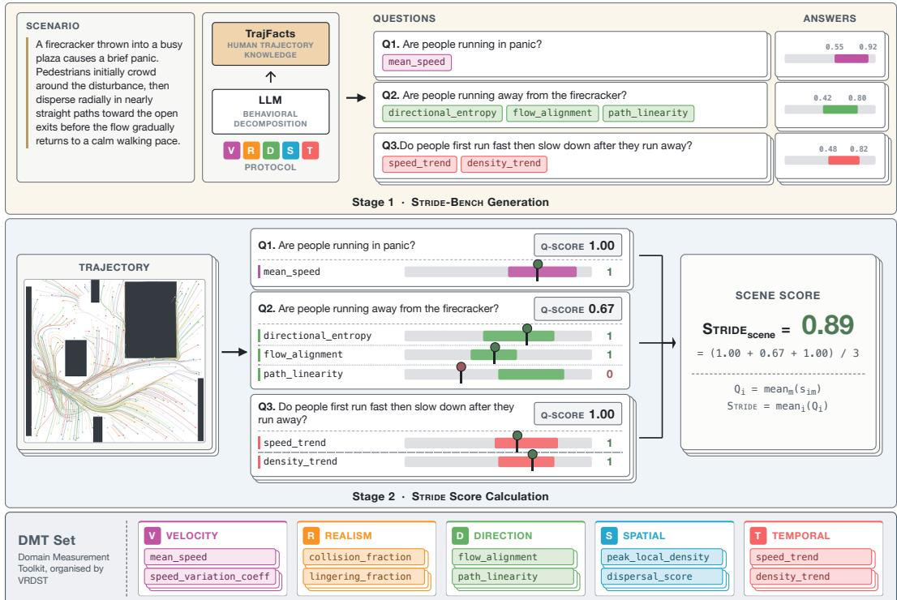
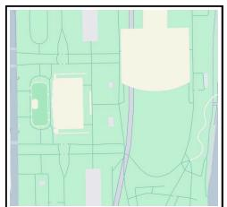
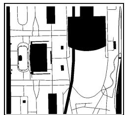
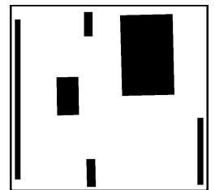
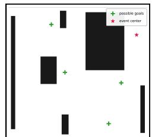
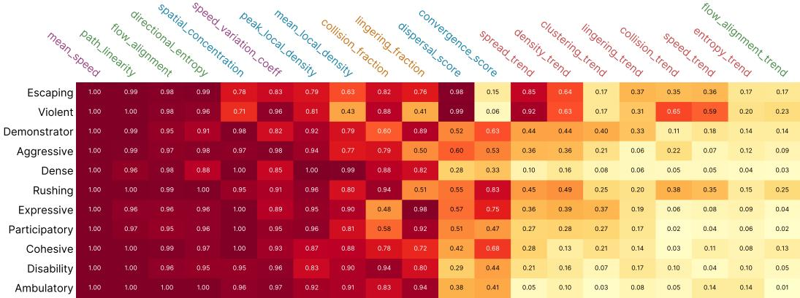
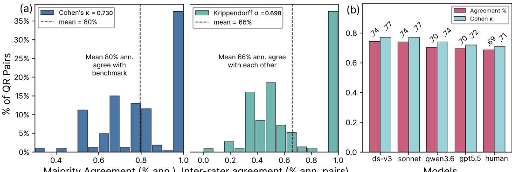
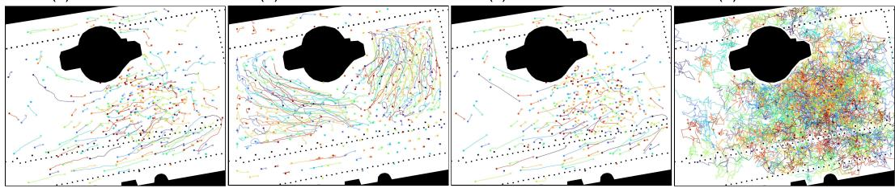
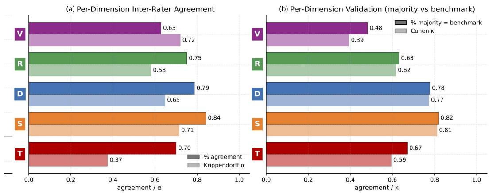

# STRIDE: Automated Evaluation of Text-to-Trajectory Alignment across Diverse Contexts

Wanchun Ni<sup>1∗</sup> Tao Qi<sup>2</sup> Leonel Aguilar<sup>1</sup> Marlene Wagneror<sup>1</sup> Jiugeng Sun<sup>1</sup> Verena Zimmermann<sup>1</sup> Mennatallah El-Assady<sup>1</sup>

<sup>1</sup>ETH Zurich <sup>2</sup>Beijing University of Posts and Telecommunications

## Abstract

Language-conditioned trajectory generation is here, but its evaluation has not kept pace. Existing pedestrian trajectory metrics primarily compare trajectories with real-world human data. It does not scale to text-to-trajectory generation across diverse contexts, as collecting human trajectories for every scenario is costly and infeasible. Moreover, pedestrian behavior is heterogeneous and context-dependent, with no single metric as the correct answer, and current evaluation frameworks are not transferable to this domain. These challenges make scalable, reliable evaluation difficult. We introduce STRIDE, the first framework for evaluating context alignment between scenario descriptions and pedestrian trajectories. STRIDE addresses these challenges through three design choices. First, we derive our V R D S T evaluation protocol from sociological theories to define a complete evaluation space. Second, it decomposes high-level context into scenarioadaptive behavioral questions. Third, every question is resolved against a deterministic measurement tool library that yields reproducible answers. Together, STRIDE enables complete, verifiable, automated, and scalable evaluation across diverse contexts without requiring human trajectory data. We instantiate STRIDE in the crowd domain as STRIDE-BENCH, comprising 1K scenarios, 6K behavioral questions, 11K measurements with calibrated expected answers across 30 real-world maps. Comprehensive human validations show that STRIDE-BENCH is strongly consistent with human behavior and judgment, achieving 80% human agreement. We further evaluate several text-to-trajectory models, finding limited context-alignment capability and persistent challenges in fine-grained context conditioning. We believe that our STRIDE framework provides a first step toward principled evaluation of context-aligned pedestrian trajectory generation. Code: https://github.com/sweetspot00/STRIDE-Bench Dataset: https:// huggingface.co/datasets/wanchun-ni/STRIDE-Bench

## 1 Introduction

Generating realistic human trajectories is a fundamental problem for modeling how people move, interact, and respond to their surroundings. It supports applications from urban planning to embodiedagent development, where pedestrian trajectories help assess public-space accessibility and learn human-aware behavior before real-world deployment. In these settings, trajectories are not generated in isolation: they must align with the scenario across individual, group-level behavior, and the environment. For example, on the same transit-station map, pedestrians in a routine commute should follow accessible corridors at normal walking speeds, form bidirectional flows, and avoid obstacles; in an emergency evacuation, they should move faster toward exits and form directed outflows. This

Preprint.

motivates trajectory generation that should be aligned with scenario context. Recent advances in large language models, with their capacity to interpret rich natural-language instructions, have further reshaped this landscape: Text-Crowd combines text and image diffusion to generate crowd scenes [30], LMTraj-ZERO casts prediction as zero-shot LLM inference [4], and a growing body of work conditions pedestrian generation on textual [11, 55] or symbolic behavioral [45, 59] specifications.

Research Gap. The evaluation of text-conditioned pedestrian trajectory generation, however, remains underdeveloped. Existing evaluation protocols still rely heavily on real-world human trajectory datasets: assessing a model on a given context typically requires first collecting human trajectories for that scenario, and then comparing the consistency between the generated trajectories and the real-world ones. However, the collecting trajectory human data for targeted contexts is highly expensive and sometimes even impractical, particularly for rare situations such as evacuations and violence. For example, widely used pedestrian trajectory datasets, including ETH/UCY, SDD, and TrajNet++ [46, 36, 47, 33], predominantly capture routine behaviors, leaving a long tail of scenarios under-represented. Given this scenario diversity and the scarcity of corresponding human trajectory data, human-data-based evaluation does not scale. An automatic evaluation framework that does not depend on real-world trajectories for every target scenario needs further study.

Challenges. In fact, evaluating text-conditioned pedestrian trajectories is not a trivial task since it is challenging to transfer existing evaluation frameworks for content generation in such scenario. Specifically, those approaches can be broadly grouped into three categories: ground-truth-based metrics, LLM-as-judge, and human evaluation. However, in a given context, humans may exhibit many plausible behaviors. Ground-truth-based metrics may not generalize into those scenarios, thus giving a wrong judgment. Besides, LLM-based evaluation can be unstable and sensitive to prompts, runs, and model versions. Moreover, human evaluation, while informative, is expensive, slow, and difficult to scale across diverse scenarios. Therefore, a complete, reliable, automatic, and scalable evaluation framework is a prerequisite for meaningful progress in this area.

Our approach. We introduce STRIDE, a framework for text-to-trajectory alignment evaluation via behavioral decomposition and structured verification. Instead of applying LLM-as-judge directly to human behaviors, STRIDE decomposes each scenario context into fine-grained behavioral questions and verifies them through structured trajectory measurements. The framework consists of three components: (i) a social-science-grounded five-axis protocol, V R D S T (Velocity, Realism, Direction, Spatial, Temporal), which defines a complete behavioral evaluation space in individual, group, and environment layers; (ii) scenario-adaptive behavioral questions decomposed from text descriptions under the guidance of the protocol; and (iii) structured verification of these questions. We build a Deterministic Measurement Tool (DMT) library in which each function computes an exact trajectory statistic. The resulting measurements determine whether generated trajectories match scenario-specific expected answers. By separating semantic curation from numerical verification, STRIDE provides a reproducible and interpretable framework for evaluating text-to-trajectory alignment. We instantiate STRIDE in the crowd setting and release STRIDE-BENCH, a benchmark for context-aligned crowd trajectory generation. We use models from the GPT family to construct STRIDE-BENCH, which contains 1k scenario descriptions across 11 crowd categories, 6k behavioral questions, and 11k measurements over 30 real-world maps.

Annotation studies show that STRIDE-BENCH aligns well with human judgment. We validate STRIDE-BENCH through three analyses: (i) evaluating real human trajectories, which are recognized as highly context-aligned with a STRIDE score of 0.94; (ii) measuring human agreement with benchmark answers, showing substantial consistency with human judgments; and (iii) probing SOTA LLMs, showing stable benchmark answers across different generators. We further evaluate several pedestrian trajectory generation models. Results show that (i) STRIDE discriminates context alignment across models and scales; (ii) current language-conditioned models still have substantial room for improvement, with the best baseline achieving a STRIDE score of 0.64 and exhibiting sensitivity to input configurations; and (iii) STRIDE’s fine-grained, traceable structure helps identify underperforming behavioral dimensions and inform model development.

## 2 Related Work

Language-conditioned trajectory generation. Natural language has emerged as a control interface for trajectory modeling in robotics, traffic simulation, and autonomous driving, where text specifies motion intent, scene dynamics, or high-level plans [32, 7, 24, 52, 57, 55, 12, 44, 37, 28, 56, 63, 58]. Text-based control has also been studied for human motion generation, where language guides fibody motion synthesis and editing [31, 53, 3, 13]. Pedestrian trajectory modeling follows this trend. LMTraj [4] reformulates forecasting in language space, LG-Traj [14] incorporates LLM-derived motion cues, and recent methods combine textual instructions with visual scene context [42, 50]. Beyond prediction, Text-Crowd [30] and CrowdMoGen [11] generate pedestrian trajectories from text. These developments motivate evaluating whether generated trajectories faithfully reflect specified textual conditions. Trajectory datasets and evaluation. Established pedestrian datasets [46, 36, 47, 33] target predictive accuracy on everyday motion in sidewalks and campuses. Later efforts unify existing datasets [2, 29] but inherit this scope. Event-driven behaviors such as panic egress, violent confrontation, or coordinated demonstration remain largely absent because they are difficult to capture in the wild. Evaluation has followed a similar arc. Per-agent metrics such as ADE and FDE measure geometric proximity to ground truth [1, 17]. Scene-level realism is assessed through collision rate, KL divergence, kinematic consistency, and recent measures such as density, coverage, and Earth Mover’s Distance [5, 48], with diversity metrics used to detect mode collapse. These metrics compare generated trajectories against reference distributions, but do not directly test whether trajectories reflect the semantic content of textual prompts. This gap motivates STRIDE. Pedestrian sociology and pedestrian dynamics. Pedestrian trajectories implicitly reflect heterogeneous human behavior, especially in multi-agent scenarios. Collective human motion has been studied along two largely separate lines. Sociological accounts, from Canetti’s typology of crowds [10] to Le Bon’s contagion theory [35], characterize how people gather and behave in groups. McPhail and Wohlstein further define observable dimensions of gathering behavior, such as direction, velocity, and fitemporal change [41, 40], providing theoretical grounding for our V R D S T protocol. Pedestrian dynamics, by contrast, formalizes locomotion through physical and rule-based simulators, especially Helbing’s work on the Social Force Model [22, 19]. STRIDE connects these traditions by drawing behavioral categories from sociology and operationalizing them as trajectory-level measurements, thereby evaluating aspects of pedestrian behavior that physics-grounded metrics alone may miss.

  
Figure 1: Overview of the STRIDE evaluation framework. Stage 1 constructs STRIDE-BENCH by <sup>fi</sup>decomposing each scenario into behavioral questions, measurement functions, and expected answers. Stage 2 computes the STRIDE score by comparing function outputs against the expected answers.

## 3 STRIDE Framework

We introduce STRIDE, a framework for text-to-trajectory alignment evaluation through behavioral decomposition and structured verification. Figure 1 provides an overview.

## 3.1 Design Insights

Evaluating trajectories requires assessing whether sequences of coordinates reflect context-dependent human behavior. Direct LLM-as-judge is insufficient: without scenario-calibrated metric selection, irrelevant or overrepresented attributes can dominate the final judgment. Appendix A.2 provides an example. STRIDE therefore formulates alignment evaluation as scenario-adaptive and structured behavioral validation. It addresses three questions: (i) how to define the evaluation dimensions, (ii) how to instantiate it for each scenario, and (iii) how to verify behavior reliably from trajectories. First, we ground the evaluation space in pedestrian sociology and distill it into a five-axis protocol, V R D S T . Second, we use this protocol to guide the generation of scenario-curated behavioral questions. Third, each question is verified using our deterministic measurement tool (DMT) library, where each DMT function operates directly on trajectory coordinates and returns an exact numerical statistic. An LLM-generated threshold is then applied to convert the statistic into a binary verdict. This design yields a structured, reproducible, and numerically grounded framework for evaluating text-to-trajectory alignment.

## 3.2 Evaluation Space: V R D S T Protocol

Theoretical Foundation: Pedestrian Sociology. To define a complete behavioral evaluation space, we derive a protocol from social-scientific theories of crowds and pedestrian dynamics. As its sociological backbone, we adopt McPhail and Wohlstein’s theory [41], which identifies direction, velocity, time, and substantive content as basic dimensions of gathering behavior, later incorporated into the Elementary Forms of Collective Action (EFCA) framework [40]. We further incorporate pedestrian dynamics theories that capture the computational and physical aspects of motion: realismrelated metrics such as collision avoidance and lingering draw on Hall’s theory of personal space [18]; flow- and regime-level metrics such as lane formation and evacuation time draw on studies of normal and evacuation dynamics [20, 21, 8, 43]; and spatial-structure metrics such as clustering, group formation, and density patterns are informed by studies of collective pedestrian behavior [51]. Together, these theories yield a complete, layered protocol for evaluating pedestrian trajectories: realism establishes basic physical validity; velocity and direction capture individual motion; spatial and temporal structure capture how trajectories are organized and evolve within the scene.

V Velocity. Do individual pedestrians move at speeds consistent with the scenario’s activity regime? Velocity captures the scalar component of individual motion. A campus afternoon implies free-flow walking in the 1.10 to 1.65 m/s range [46], whereas an explosion in a transit hub implies a higher mean speed with a heavy right tail. Velocity is the most directly measurable dimension in McPhail and Wohlstein’s original taxonomy [41].

R Realism. Do pedestrians behave in physicallyfeasible ways within the environment? Realism captures whether pedestrian behavior respects scene geometry, obstacles, and motion constraints, while avoiding artifacts such as overlap, wall penetration, teleportation, or impossible accelerations. Because feasible behavior depends on environmental structure, this axis is grounded in proxemics [18] and evacuation dynamics [20].

D Direction. Do individual pedestrians move in directions implied by the scenario? Direction captures the vector component of individual motion. Unstructured scenarios allow heterogeneous headings, while directed scenarios, such as evacuations, require coordinated movement toward exits or other scenario-specific goals. This axis follows McPhail and Wohlstein’s direction dimension [41] and flow-alignment measures from self-organized pedestrian dynamics [19].

S Spatial. Are pedestrians distributed according to the scenario’s spatial context? Spatial structure evaluates whether generated trajectories occupy plausible regions and form the expected spatial pattern. For example, evacuation trajectories should move away from hazards toward exits, gathering scenarios should place pedestrians near points of interest, and leisure settings may allow dispersed movement. This axis draws on spatial structure and group-formation studies [51, 43].

T Temporal. Do generated trajectories evolve over time in a scenario-consistent way? Temporal structure evaluates whether the above properties change coherently as the scenario unfolds. EFCA treats collective descriptors as time-dependent [40]. We operationalize this axis by tracking trends in realism, velocity, direction, and spatial structure over sliding windows, enabling consistent evaluation across both short-horizon prediction and long-horizon trajectory generation models.

  
(a) Millennium Park

  
(b) Walkable Areas

  
(c) Simplified Obstacle Map

  
(d) With Metadata  
Figure 2: Scenario corpus map processing: (a) real-world map from Google Map. (b) walkable areas defined by Google Map color set. (c) polygon-approximated obstacles. (d) metadata on the map.

## 3.3 Scenario-Adaptive Behavioural Decomposation

As discussed in Section 3.1, STRIDE does not weigh all dimensions equally across scenarios. Pedestrian behavior is highly context-dependent: speed may be critical in an evacuation, group cohesion in a guided tour, and lane formation in bidirectional flow. Appendix A.2 shows that equal weighting across dimensions can be unstable and biased, motivating STRIDE’s scenario-adaptive evaluation criteria. For each scenario, we prompt an LLM with the scenario description and the V R D S T protocol to generate scenario-specific evaluation questions. The model returns at least five questions following the protocol and justifies each decomposition for traceability. These questions describe expected behavioral properties in semantic terms, for example: “Do pedestriansform denser groups near the projection area whilefollowing plausible paths around obstacles?”

## 3.4 Verification Space: Deterministic Measurements

The V R D S T protocol specifies what perspectives to evaluate; this section specifies how to evaluate them reliably. Why deterministic verification functions? Benchmark scores are meaningful only if they are trustworthy and comparable. STRIDE grounds each per-question verdict in a deterministic function of trajectory coordinates, yielding three benefits. First, reproducibility: a fixed trajectory-question pair always receives the same score, independent of prompts, evaluation runs, or judge-model versions. Second, numerical faithfulness: quantities such as mean speed, collision count, and flow alignment are computed directly from coordinates, making each verdict traceable to the value that triggered it. Third, scale invariance: the same functions operate across different time horizons and agent counts, allowing short prediction windows and long generation rollouts to be evaluated on a common basis. Deterministic Measurement Tool Library (DMT). We implement 20 deterministic measurement functions, each operating on trajectory coordinates and assigned to one protocol axis. The resulting DMT library operationalizes V R D S T as reusable measurement primitives. DMT is compositional: for example, “people rush away from the hazard” can be evaluated through elevated speed, outward flow relative to the hazard, and a centrifugal density pattern, each measured independently and then combined in the STRIDE score. Thus, DMT covers diverse behaviors by composing reusable measurements with scenario-specific expectations. Verifiable Answer Space. Given the DMT library, STRIDE defines a verifiable answer space for the decomposed behavioral questions. For each question, a frontier LLM receives the scenario description, the question, and the DMT specifications, including each function’s semantics, output type, and applicable protocol axis. It also receives TrajFacts. This human-trajectory knowledge base stores reference values used to calibrate expectations, such as typical walking speeds, plausible collision rates, and scenario-dependent density patterns. See Appendix A.6 for details. The LLM then selects one or more relevant DMT functions and converts the semantic expectation into numerical answer ranges over their outputs, with a justification for traceability. STRIDE Score. With these measurement functions, STRIDE scores each question by comparing its expected answer ranges with the computed trajectory values. The STRIDE score is aggregated hierarchically: measurements are averaged within each question, questions within each scenario, and scenarios across the benchmark. Appendix A.7 gives the mathematical formulation.

## 3.5 Benchmark Construction and Usage

We instantiate STRIDE as a benchmark for pedestrian trajectory generation in crowd scenarios. We first construct a corpus of crowd scenario descriptions, each paired with a map and metadata such as event center and potential goals. For each scenario, we then generate evaluation questions, select measurements, and derive expected answers calibrated with real-world crowd references. Maps. Beyond text descriptions, trajectory generation models typically require map inputs to ground the generated trajectories in physical space. Thus, we curate 113 maps of high-traffic public venues, including major tourist destinations, stadiums, university campuses, and transit hubs. These venues routinely host large crowds during events. The maps are acquired via the Google Maps API with a fixed size of 301.7 m × 282.8 m, and converted into obstacle representations using a three-stage pipeline: semantic segmentation based on the Google Maps color scheme, polygon approximation of segmented obstacle regions, and rasterization into obstacle masks. Figure 2 illustrates this map-processing pipeline. Scenario descriptions. We adopt Berlonghi’s typology of 11 crowd categories [9]. For each category, we prompt GPT-5.1 with a structured template that elicits: (i) a natural-language scenario description, (ii) candidate exits and event-center coordinates in the map pixel grid, and (iii) the initial crowd size and spatial distribution. Fields (ii) and (iii) provide a common initialization across models, allowing us to isolate context-conditioned behavior from setup variability. Filtering and stratified sampling. We filter out scenarios with insufficient pedestrian density, exits or event centers that fall on obstacles, and near-duplicate descriptions. Obstacle conflicts can arise from polygon approximation errors, while near-duplicates are identified by cosine similarity over sentence embeddings. We also conduct a manual pass to remove remaining cases with implausible map annotations. From the filtered pool, we sample more heavily from safety-critical crowd categories, such as Escaping, Violent, and Dense. These categories are underrepresented in real-world trajectory datasets [46, 36, 47], since such dynamics cannot be ethically staged. They are also important for applications such as urban planning, venue safety auditing, and emergency preparedness. For each retained scenario, we prompt GPT-5.2 to generate the behavioral questions, measurements, and expected answers. Calibration. To align expected answers with real-world crowd behavior, we incorporate crowd-reference data into our human-trajectory knowledge base, TrajFacts. These references include reported measurements from events such as the Love Parade [61, 34] and the Itaewon crowd crush [27]. TrajFacts provides reference values used to calibrate expected-answer ranges. Appendix A.6 gives additional details. In total, STRIDE-BENCH contains 936 scenarios, 6,633 questions, and 11,696 measurements. Figure 3 shows the heatmap of DMT function usage across crowd categories. Usage. STRIDE supports two evaluation modes. In benchmark mode, evaluation uses the released scenarios, cached questions, and expected-answer ranges. The final score is therefore produced entirely by deterministic function calls, with no LLM required at scoring time. In open mode, an LLM agent generates the question set on the fly from a user-supplied scenario description, enabling evaluation beyond the released benchmark.

  
Figure 3: DMT function usage across crowd categories in STRIDE-BENCH. Each cell reports the percentage of scenes within a category that use the corresponding function.

## 4 Validation

Given the diversity and context dependence of pedestrian behavior, alignment metrics should be validated against human judgment. We validate STRIDE-BENCH in three stages: real-world trajectory validation (Section 4.1), human ratings with inter-annotator and benchmark agreement (Section 4.2), and judge-model robustness across state-of-the-art LLMs (Section 4.3).

## 4.1 Real-world Human Trajectory Validation

To assess whether STRIDE-BENCH assigns high alignment scores to real crowd behavior, we evaluate it on trajectories from the Fête des Lumières in Lyon, a large public gathering documented from three camera views [15]. The dataset contains 12 trajectory recordings. For each recording, we construct a scenario description and apply the same QA generation procedure as in Section 3.5, yielding 86 questions and 154 measurements. Real human trajectories achieve an average STRIDE score of

  
Majority Agreement (% ann<sub>.</sub>) Inter<sub>-</sub>rater agreement (% ann<sub>.</sub> pairs)  
Figure 4: STRIDE-BENCH validation (ann. means annotators). (a) Human validation. Annotatorbenchmark agreement averages 80% with Cohen’s $\kappa = 0 . 7 3 0 ;$ ; inter-annotator agreement of 66% with Krippendorff’s $\alpha = 0 . 6 9 8$ , indicating STRIDE-BENCH answers are human-consistent. (b) deepseekv3, claude-sonnet-4.6, qwen3.6-plus, and gpt-5.5 achieve similar agreement and Cohen’s κ with the benchmark, comparable to human annotators, showing robustness across models.

0.94 across the 12 recordings, with per-recording scores ranging from 0.87 to 1.00. This suggests that STRIDE-BENCH assigns high alignment scores to real crowd behavior. A perfect score is not expected, since expected ranges are inferred from textual descriptions and calibrated reference values, which may not capture all scene-specific statistics. Figure 5(a) shows real human trajectories from Large View Tracers. Additional details are provided in Appendix A.8.1.

## 4.2 Human Validation

To validate the fidelity of the LLM-generated questions and expected answers, we conducted a human annotation study on Prolific. We recruited n = 50 annotators through the platform. Each annotator was compensated at \$14/hour and completed at least three STRIDE-BENCH scenarios. For each scenario, annotators rated task-specific reference information, such as typical walking speed. We selected scenarios annotated by at least three independent annotators, yielding 15,750 annotations across 56 scenarios and 350 questions. Before the main study, we conducted a pilot study to refine the annotation protocol and improve task interpretability since the benchmark contains mathematical terminology and numerical expected answers that are difficult for humans to interpret directly. Based on the pilot, we designed a hybrid interface that combines natural-language descriptions with taskspecific visualizations. The full annotation interface is provided in Appendix A.9.1. Figure 7(a) summarizes the results. The left panel reports agreement between human annotators and STRIDE-BENCH answers, together with Cohen’s κ, which measures agreement beyond chance. The right panel reports inter-annotator agreement, together with Krippendorff’s α, which measures reliability among multiple annotators. Inter-annotator agreement. We first measure consistency among independent annotators. Pairwise inter-annotator agreement reaches 66%, with Krippendorff’s $\alpha = 0 . 6 9 8$ . Since α accounts for disagreement across multiple annotators, this indicates reliable agreement despite the inherent ambiguity of fine-grained crowd behavior judgments. Agreement with benchmark answers. We then compare each annotator’s response with the corresponding STRIDE-BENCH answer. Annotators agree with STRIDE-BENCH on 80% of question-answer pairs, with Cohen’s $\kappa = 0 . 7 3 0$ . Since κ corrects for chance agreement, this indicates substantial alignment between STRIDE-BENCH answers and human judgments. Overall, independent annotators agree reliably with one another and show even stronger agreement with STRIDE-BENCH answers. This suggests that STRIDE-BENCH is consistent with human consensus and provides a reliable reference for behaviorlevel alignment evaluation.

## 4.3 Cross-LLM Robustness

To assess the cross-LLM robustness of STRIDE-BENCH, we examine whether its reliability generalizes beyond GPT-5.2. Specifically, we evaluate four state-of-the-art LLMs using the same questionnaire as in Section 4.2, measuring their agreement with the consensus human label on n=588 items. As a human reference, we compute a leave-one-out baseline, where each annotator is compared against the majority vote of the remaining annotators. We report both raw agreement and Cohen’s κ. Figure 7(b) shows that all four LLMs fall within the leave-one-out human range on both metrics, with tightly clustered scores across models. This indicates that the evaluated LLMs achieve human-comparable agreement on STRIDE items and produce stable judgments across model families. Together with the human-benchmark agreement in Section 4.2, these results suggest that STRIDE’s reliability is not tied to a single generation or judge model, supporting its open mode for user-specified scenarios. This further suggests that STRIDE can support extensible evaluation when new scenarios are generated with different LLM backends.

## 5 Evaluation

(a) Human=0.943  
(b) Text-Crowd=0.411  
(c) LLM-SFM=0.584  
  
(d) Random=0.317  
Figure 5: Trajectories for Fête des Lumières in Lyon; Large View Trackers. STRIDE scores are (a) Human, 0.943; (b) Text-Crowd, 0.411; (c) LLM-SFM, 0.584; (d) Random Walk, 0.317.

## 5.1 Experiment Setup

LLM-SFM. We use an LLM to map each scenario to per-agent parameters of the Social Force Model (SFM) [22], then simulate trajectories with an SFM simulator. Text-Crowd [30] generates grouplevel distributions and velocity fields from maps and text via LLM canonicalization and a conditional diffusion model. SingularTrajectory [6] is a diffusion-based universal trajectory predictor. We use it to test whether trajectory history alone contains implicit behavioral information sufficient to recover scenario-consistent behavior without text input. Statistical baselines. Random Walk samples random speeds and headings at each step and stops agents at obstacles. Stop keeps all agents fixed.

Table 1: Per-category and overall STRIDE-Bench scores, where higher is better $( \mathrm { S T R I D E _ { B e n c h } } \in$ [0, 1]). Category names are abbreviated by their first three letters. The last column reports overall mean ± standard deviation on the benchmark dataset.
<table><tr><td>Model</td><td>Agg.</td><td>Amb.</td><td>Coh.</td><td>Dem.</td><td>Den.</td><td>Dis.</td><td>Esc.</td><td>Exp.</td><td>Par.</td><td>Rus.</td><td>Vio.</td><td> $\mathrm { S T R I D E _ { B e n c h } } \uparrow$ </td></tr><tr><td>Text-Crowd</td><td>0.669</td><td>0.787</td><td>0.733</td><td>0.771</td><td>0.729</td><td>0.778</td><td>0.393</td><td>0.829</td><td>0.790</td><td>0.584</td><td>0.387</td><td> $\mathbf { 0 . 6 4 5 \pm 0 . 2 3 3 }$ </td></tr><tr><td>LLM-SFM</td><td>0.488</td><td>0.327</td><td>0.418</td><td>0.605</td><td>0.650</td><td>0.489</td><td>0.256</td><td>0.610</td><td>0.568</td><td>0.243</td><td>0.230</td><td> $0 . 4 3 4 \pm 0 . 2 3 1$ </td></tr><tr><td>SingularTrajectory</td><td>0.425</td><td>0.452</td><td>0.526</td><td>0.540</td><td>0.530</td><td>0.505</td><td>0.238</td><td>0.536</td><td>0.509</td><td>0.358</td><td>0.229</td><td> $0 . 4 2 1 \pm 0 . 1 7 7$ </td></tr><tr><td>Random Walk</td><td>0.355</td><td>0.409</td><td>0.348</td><td>0.312</td><td>0.273</td><td>0.368</td><td>0.268</td><td>0.340</td><td>0.312</td><td>0.312</td><td>0.254</td><td> $0 . 3 1 1 \pm 0 . 1 1 7$ </td></tr><tr><td>Stop</td><td>0.259</td><td>0.260</td><td>0.249</td><td>0.230</td><td>0.194</td><td>0.307</td><td>0.178</td><td>0.237</td><td>0.246</td><td>0.195</td><td>0.185</td><td> $0 . 2 2 1 \pm 0 . 1 0 5$ </td></tr></table>

## 5.2 Results and Analysis

We evaluate these baselines on STRIDE-BENCH using overall and per-category scores (Table 1), rollout horizon (Table 2), and crowd size (Table 3). The horizon and scale partitions follow standard crowd-dynamics regimes [20, 19, 21]. Overall and per-category performance. Text-Crowd achieves the highest score across all crowd categories, but its overall STRIDE score remains 0.645, indicating that current text-to-trajectory models still fall substantially short of reliable context-aligned generation. SingularTrajectory performs competitively with LLM-SFM despite not using text input, suggesting that trajectory history alone captures part of the scenario context. Effect of rollout horizon. Table 2 shows that model rankings vary with rollout length. LLM-SFM performs best in short-to-medium horizons, while Text-Crowd is stronger at long horizons, suggesting better preservation of high-level intent over extended rollouts. Effect of crowd size. Table 3 shows that Text-Crowd performs best across all crowd-size regimes. LLM-SFM improves most in mass-gathering settings, consistent with social force models, while SingularTrajectory also benefits from larger crowds, suggesting that aggregate motion patterns provide useful context. Fête des Lumières in Lyon. We further evaluate the baselines on the 12 Fête des Lumières in Lyon scenes from Section 4.1. The average STRIDE scores are: Human 0.943, LLM-SFM 0.584, Text-Crowd 0.411, and Random Walk 0.317. The gap between human and generated trajectories reinforces the limitations of existing models. In this setting, Text-Crowd underperforms LLM-SFM, likely due to sensitivity to complex map layouts. Figure 5 shows both human and model-generated trajectories. Main findings. Overall, recent trajectory

Table 2: STRIDE scores across models, time windows, and V R D S T axes. Values are mean ± standard deviation; higher is better. Mean denotes the average score among the protocols.
<table><tr><td>Time</td><td>Model</td><td>V</td><td>R</td><td>D</td><td>S</td><td>1</td><td>Mean↑</td></tr><tr><td rowspan="5">0-30s</td><td>LLM-SFM</td><td> $\mathbf { 0 . 6 1 5 \pm 0 . 3 6 0 }$ </td><td> $\mathbf { 0 . 8 6 0 \pm 0 . 0 8 3 }$ </td><td> $0 . 5 2 3 \pm 0 . 2 6 5$ </td><td> $0 . 6 0 3 \pm 0 . 1 3 6$ </td><td> $0 . 2 6 8 \pm 0 . 1 9 1$ </td><td> $\mathbf { 0 . 5 7 4 \pm 0 . 1 9 0 }$ </td></tr><tr><td>SingularTraj</td><td> $0 . 2 1 7 \pm 0 . 2 0 3$ </td><td> $0 . 8 1 9 \pm 0 . 1 2 3$ </td><td> $0 . 3 7 9 \pm 0 . 1 9 7$ </td><td> $\mathbf { 0 . 6 0 4 \pm 0 . 1 3 1 }$ </td><td> $0 . 2 5 1 \pm 0 . 2 1 1$ </td><td> $0 . 4 5 4 \pm 0 . 2 2 8$ </td></tr><tr><td>Text-Crowd</td><td> $0 . 5 3 1 \pm 0 . 0 7 0$ </td><td> $0 . 7 3 4 \pm 0 . 0 7 8$ </td><td> $\mathbf { 0 . 6 7 7 \pm 0 . 1 8 2 }$ </td><td> $0 . 5 0 7 \pm 0 . 0 4 9$ </td><td> ${ \bf 0 . 2 8 8 \pm 0 . 1 5 7 }$ </td><td> $0 . 5 4 7 \pm 0 . 1 5 6$ </td></tr><tr><td>Random</td><td> $0 . 5 0 4 \pm 0 . 4 8 0$ </td><td> $0 . 8 1 7 \pm 0 . 1 2 6$ </td><td> $0 . 0 1 9 \pm 0 . 0 2 1$ </td><td> $0 . 3 7 6 \pm 0 . 1 4 1$ </td><td> $0 . 0 9 3 \pm 0 . 0 7 9$ </td><td> $0 . 3 6 2 \pm 0 . 2 8 9$ </td></tr><tr><td>Stop</td><td> $0 . 0 1 2 \pm 0 . 0 0 9$ </td><td> $0 . 4 7 1 \pm 0 . 4 7 1$ </td><td> $0 . 1 8 2 \pm 0 . 2 3 3$ </td><td> $0 . 3 5 0 \pm 0 . 1 5 4$ </td><td> $0 . 0 2 6 \pm 0 . 0 4 1$ </td><td> $0 . 2 0 8 \pm 0 . 1 8 0$ </td></tr><tr><td rowspan="5">30-120s</td><td>LLM-SFM</td><td> $\mathbf { 0 . 8 0 6 \pm 0 . 1 2 4 }$ </td><td> $\mathbf { 0 . 9 1 4 \pm 0 . 0 2 7 }$ </td><td> $0 . 4 7 1 \pm 0 . 2 0 3$ </td><td> $0 . 6 8 7 \pm 0 . 0 9 5$ </td><td> $0 . 2 8 3 \pm 0 . 1 5 2$ </td><td> ${ \bf 0 . 6 3 2 \pm 0 . 2 2 8 }$ </td></tr><tr><td>SingularTraj</td><td> $0 . 2 9 7 \pm 0 . 2 8 9$ </td><td> $0 . 8 2 5 \pm 0 . 1 1 8$ </td><td> $0 . 2 4 9 \pm 0 . 0 8 7$ </td><td> $\mathbf { 0 . 6 9 0 \pm 0 . 0 8 9 }$ </td><td> $0 . 2 5 7 \pm 0 . 1 6 2$ </td><td> $0 . 4 6 4 \pm 0 . 2 4 4$ </td></tr><tr><td>Text-Crowd</td><td> $0 . 6 9 6 \pm 0 . 0 5 1$ </td><td> $0 . 8 2 9 \pm 0 . 0 9 1$ </td><td> $\mathbf { 0 . 6 0 4 \pm 0 . 1 5 2 }$ </td><td> $0 . 6 0 6 \pm 0 . 0 9 8$ </td><td> ${ \bf 0 . 3 6 0 \pm 0 . 1 4 7 }$ </td><td> $0 . 6 1 9 \pm 0 . 1 5 3$ </td></tr><tr><td>Random</td><td> $0 . 5 0 4 \pm 0 . 4 8 0$ </td><td> $0 . 8 1 7 \pm 0 . 1 2 6$ </td><td> $0 . 0 2 0 \pm 0 . 0 2 1$ </td><td> $0 . 4 1 9 \pm 0 . 1 4 8$ </td><td> $0 . 1 3 1 \pm 0 . 1 1 6$ </td><td> $0 . 3 7 8 \pm 0 . 2 8 3$ </td></tr><tr><td>Stop</td><td> $0 . 0 1 2 \pm 0 . 0 0 9$ </td><td> $0 . 4 7 1 \pm 0 . 4 7 1$ </td><td> $0 . 1 8 2 \pm 0 . 2 3 3$ </td><td> $0 . 3 5 0 \pm 0 . 1 5 4$ </td><td> $0 . 0 2 6 \pm 0 . 0 4 1$ </td><td>0.208 ± 0.180</td></tr><tr><td rowspan="5">120s+</td><td>LLM-SFM</td><td> $\mathbf { 0 . 5 3 4 \pm 0 . 0 2 0 }$ </td><td> $0 . 6 9 5 \pm 0 . 0 2 1$ </td><td> $0 . 1 4 6 \pm 0 . 0 5 1$ </td><td> $0 . 5 9 6 \pm 0 . 0 8 4$ </td><td> $0 . 2 9 5 \pm 0 . 1 9 7$ </td><td> $0 . 4 5 3 \pm 0 . 2 0 2$ </td></tr><tr><td>SingularTraj</td><td> $0 . 3 7 3 \pm 0 . 3 7 1$ </td><td> $0 . 7 8 6 \pm 0 . 0 1 6$ </td><td> $0 . 0 7 0 \pm 0 . 0 5 6$ </td><td> $\mathbf { 0 . 6 1 1 \pm 0 . 0 8 3 }$ </td><td>0.282 ± 0.187</td><td> $0 . 4 2 4 \pm 0 . 2 5 1$ </td></tr><tr><td>Text-Crowd</td><td> $0 . 5 0 2 \pm 0 . 1 1 4$ </td><td> $\mathbf { 0 . 8 7 2 \pm 0 . 0 3 1 }$ </td><td> ${ \bf 0 . 3 4 3 \pm 0 . 0 2 3 }$ </td><td> $0 . 2 9 2 \pm 0 . 1 5 1$ </td><td> $\mathbf { 0 . 3 0 8 \pm 0 . 2 5 0 }$ </td><td> ${ \bf 0 . 4 6 3 \pm 0 . 2 1 7 }$ </td></tr><tr><td>Random</td><td> $0 . 5 0 4 \pm 0 . 4 8 0$ </td><td> $0 . 8 1 7 \pm 0 . 1 2 6$ </td><td> $0 . 0 2 0 \pm 0 . 0 2 2$ </td><td> $0 . 4 4 4 \pm 0 . 1 7 1$ </td><td> $0 . 1 5 3 \pm 0 . 1 3 1$ </td><td> $0 . 3 8 8 \pm 0 . 2 8 0$ </td></tr><tr><td>Stop</td><td> $0 . 0 1 2 \pm 0 . 0 0 9$ </td><td> $0 . 4 7 1 \pm 0 . 4 7 1$ </td><td> $0 . 1 8 2 \pm 0 . 2 3 3$ </td><td> $0 . 3 5 0 \pm 0 . 1 5 4$ </td><td> $0 . 0 2 6 \pm 0 . 0 4 1$ </td><td> $0 . 2 0 8 \pm 0 . 1 8 0$ </td></tr></table>

Table 3: STRIDE scores across models, agent sizes, and V R D S T axes. Values are mean ± standard deviation; higher is better. Mean denotes the average score among the protocols.
<table><tr><td>Size</td><td>Model</td><td>V</td><td>R</td><td>D</td><td>S</td><td>T</td><td>Mean↑</td></tr><tr><td rowspan="5">Small (1-25)</td><td>LLM-SFM</td><td> $0 . 4 5 8 \pm 0 . 0 8 5$ </td><td> $0 . 6 7 1 \pm 0 . 0 2 3$ </td><td> $0 . 3 2 3 \pm 0 . 0 9 4$ </td><td> $0 . 4 9 1 \pm 0 . 1 9 5$ </td><td> $0 . 2 8 0 \pm 0 . 3 0 1$ </td><td> $0 . 4 4 5 \pm 0 . 1 3 8$ </td></tr><tr><td>SingularTraj</td><td> $0 . 3 6 5 \pm 0 . 3 6 5$ </td><td> $0 . 7 3 6 \pm 0 . 0 4 2$ </td><td> $0 . 1 3 9 \pm 0 . 1 2 3$ </td><td> $0 . 4 9 2 \pm 0 . 1 9 6$ </td><td> $0 . 1 2 9 \pm 0 . 0 8 3$ </td><td> $0 . 3 7 2 \pm 0 . 2 2 8$ </td></tr><tr><td>Text-Crowd</td><td> $\mathbf { 0 . 7 3 4 \pm 0 . 0 1 3 }$ </td><td> $\mathbf { 0 . 9 1 5 \pm 0 . 0 7 2 }$ </td><td> $\mathbf { 0 . 6 3 2 \pm 0 . 0 6 8 }$ </td><td> $\mathbf { 0 . 5 4 6 \pm 0 . 2 0 4 }$ </td><td> ${ \bf 0 . 3 6 2 \pm 0 . 2 7 1 }$ </td><td> ${ \bf 0 . 6 3 8 \pm 0 . 1 8 5 }$ </td></tr><tr><td>Random</td><td> $0 . 5 1 3 \pm 0 . 4 8 7$ </td><td> $0 . 8 2 2 \pm 0 . 1 6 5$ </td><td> $0 . 0 6 4 \pm 0 . 0 7 5$ </td><td> $0 . 5 1 9 \pm 0 . 1 3 9$ </td><td> $0 . 2 6 9 \pm 0 . 3 2 9$ </td><td> $0 . 4 3 7 \pm 0 . 2 5 6$ </td></tr><tr><td>Stop</td><td> $0 . 0 1 8 \pm 0 . 0 1 8$ </td><td> $0 . 4 9 3 \pm 0 . 4 9 3$ </td><td> $0 . 1 9 1 \pm 0 . 2 1 4$ </td><td> $0 . 5 3 1 \pm 0 . 2 6 1$ </td><td> $0 . 1 6 5 \pm 0 . 3 4 5$ </td><td> $0 . 2 8 0 \pm 0 . 1 9 9$ </td></tr><tr><td rowspan="5">Medium (26-100)</td><td>LLM-SFM</td><td> $0 . 4 8 3 \pm 0 . 0 2 9$ </td><td> $0 . 6 7 1 \pm 0 . 0 3 1$ </td><td> $0 . 1 4 2 \pm 0 . 0 5 7$ </td><td> $0 . 5 8 4 \pm 0 . 0 9 2$ </td><td> $0 . 3 2 1 \pm 0 . 2 2 5$ </td><td> $0 . 4 4 0 \pm 0 . 1 8 9$ </td></tr><tr><td>SingularTraj</td><td> $0 . 3 5 6 \pm 0 . 3 5 4$ </td><td> $0 . 8 0 1 \pm 0 . 0 2 3$ </td><td> $0 . 0 6 8 \pm 0 . 0 5 8$ </td><td> $0 . 6 0 0 \pm 0 . 0 9 7$ </td><td> $0 . 3 1 5 \pm 0 . 2 2 8$ </td><td> $0 . 4 2 8 \pm 0 . 2 5 2$ </td></tr><tr><td>Text-Crowd</td><td> ${ \bf 0 . 7 6 2 \pm 0 . 0 0 1 }$ </td><td> $\mathbf { 0 . 9 1 7 \pm 0 . 0 2 6 }$ </td><td> $\mathbf { 0 . 5 2 4 \pm 0 . 1 7 1 }$ </td><td> ${ \bf 0 . 6 3 3 \pm 0 . 1 2 1 }$ </td><td> ${ \bf 0 . 3 6 3 \pm 0 . 1 3 6 }$ </td><td> $\mathbf { 0 . 6 4 0 \pm 0 . 1 9 1 }$ </td></tr><tr><td>Random</td><td> $0 . 5 0 7 \pm 0 . 4 8 3$ </td><td> $0 . 8 2 6 \pm 0 . 1 1 7$ </td><td> $0 . 0 1 6 \pm 0 . 0 2 0$ </td><td>0.447 ± 0.136</td><td> $0 . 1 5 5 \pm 0 . 1 3 2$ </td><td> $0 . 3 9 0 \pm 0 . 2 8 4$ </td></tr><tr><td>Stop</td><td> $0 . 0 1 2 \pm 0 . 0 0 5$ </td><td> $0 . 4 7 1 \pm 0 . 4 7 1$ </td><td> $0 . 1 7 9 \pm 0 . 2 2 8$ </td><td> $0 . 3 8 7 \pm 0 . 1 9 9$ </td><td> $0 . 0 1 9 \pm 0 . 0 4 0$ </td><td> $0 . 2 1 4 \pm 0 . 1 8 8$ </td></tr><tr><td rowspan="5">Large (101–300)</td><td>LLM-SFM</td><td> $0 . 6 0 5 \pm 0 . 0 2 7$ </td><td> $0 . 7 2 2 \pm 0 . 0 1 7$ </td><td> $0 . 0 9 2 \pm 0 . 0 3 5$ </td><td> $0 . 6 0 6 \pm 0 . 1 1 3$ </td><td> $0 . 2 4 0 \pm 0 . 1 6 7$ </td><td> $0 . 4 5 3 \pm 0 . 2 4 3$ </td></tr><tr><td>SingularTraj</td><td>0.390 ± 0.386</td><td> $0 . 7 8 6 \pm 0 . 0 3 4$ </td><td> $0 . 0 5 3 \pm 0 . 0 3 6$ </td><td>0.612 ± 0.121</td><td> $0 . 2 4 3 \pm 0 . 1 6 5$ </td><td> $0 . 4 1 7 \pm 0 . 2 6 0$ </td></tr><tr><td>Text-Crowd</td><td> ${ \bf 0 . 7 7 6 \pm 0 . 0 3 4 }$ </td><td> $\mathbf { 0 . 8 9 1 \pm 0 . 0 2 6 }$ </td><td> ${ \bf 0 . 4 6 3 \pm 0 . 2 5 7 }$ </td><td> $0 . 6 0 1 \pm 0 . 1 4 8$ </td><td> ${ \bf 0 . 4 5 9 \pm 0 . 2 6 8 }$ </td><td> ${ \bf 0 . 6 3 8 \pm 0 . 1 7 2 }$ </td></tr><tr><td>Random</td><td> $0 . 4 9 6 \pm 0 . 4 6 8$ </td><td> $0 . 8 2 4 \pm 0 . 0 9 3$ </td><td> $0 . 0 1 3 \pm 0 . 0 0 9$ </td><td> $0 . 4 2 4 \pm 0 . 2 4 0$ </td><td> $0 . 1 3 2 \pm 0 . 1 1 9$ </td><td> $0 . 3 7 8 \pm 0 . 2 8 6$ </td></tr><tr><td>Stop</td><td> $0 . 0 0 9 \pm 0 . 0 0 9$ </td><td> $0 . 4 5 9 \pm 0 . 4 5 9$ </td><td> $0 . 1 9 5 \pm 0 . 2 6 0$ </td><td> $0 . 2 4 9 \pm 0 . 0 7 2$ </td><td> $0 . 0 1 4 \pm 0 . 0 3 2$ </td><td> $0 . 1 8 5 \pm 0 . 1 6 7$ </td></tr><tr><td rowspan="5">Mass (301+)</td><td>LLM-SFM</td><td> $\mathbf { 0 . 8 9 4 \pm 0 . 0 1 2 }$ </td><td> ${ \bf 0 . 8 5 9 \pm 0 . 1 4 1 }$ </td><td> $0 . 0 4 6 \pm 0 . 0 2 6$ </td><td> $0 . 8 5 5 \pm 0 . 1 6 8$ </td><td> $\mathbf { 0 . 5 2 3 \pm 0 . 2 9 3 }$ </td><td> $0 . 6 3 5 \pm 0 . 3 2 4$ </td></tr><tr><td>SingularTraj</td><td> $0 . 4 8 0 \pm 0 . 4 8 0$ </td><td> $0 . 7 0 3 \pm 0 . 2 9 7$ </td><td> $0 . 0 2 3 \pm 0 . 0 1 7$ </td><td> $\mathbf { 0 . 8 9 1 \pm 0 . 1 0 5 }$ </td><td> $0 . 4 3 9 \pm 0 . 2 4 9$ </td><td> $0 . 5 0 7 \pm 0 . 2 9 2$ </td></tr><tr><td>Text-Crowd</td><td> $0 . 8 2 0 \pm 0 . 0 6 3$ </td><td> ${ \bf 0 . 8 5 9 \pm 0 . 1 4 1 }$ </td><td> ${ \bf 0 . 5 1 0 \pm 0 . 3 4 6 }$ </td><td> $0 . 5 6 2 \pm 0 . 1 9 7$ </td><td> $0 . 4 7 7 \pm 0 . 2 8 7$ </td><td> $\mathbf { 0 . 6 4 5 \pm 0 . 1 6 1 }$ </td></tr><tr><td>Random</td><td> $0 . 5 0 0 \pm 0 . 5 0 0$ </td><td> $0 . 6 0 9 \pm 0 . 3 9 1$ </td><td> $0 . 0 0 0 \pm 0 . 0 0 0$ </td><td> $0 . 4 1 9 \pm 0 . 4 4 6$ </td><td> $0 . 0 6 9 \pm 0 . 1 0 1$ </td><td> $0 . 3 2 0 \pm 0 . 2 4 1$ </td></tr><tr><td>Stop</td><td> $0 . 0 2 0 \pm 0 . 0 2 0$ </td><td> $0 . 5 0 0 \pm 0 . 5 0 0$ </td><td> $0 . 0 8 8 \pm 0 . 1 2 5$ </td><td> $0 . 2 6 7 \pm 0 . 2 8 1$ </td><td> $0 . 0 4 2 \pm 0 . 0 9 3$ </td><td> $0 . 1 8 3 \pm 0 . 1 8 1$ </td></tr></table>

## 6 Limitations and Conclusion

generation models exhibit nascent but limited capability in context-aligned generation. The strongest baseline reaches only 0.645 on STRIDE-BENCH and remains far below real human trajectories. Fine-grained STRIDE scores further reveal persistent failures in complex behavioral requirements, including spatial reasoning and fine-grained context conditioning.

Limitations. STRIDE-BENCH is the first benchmark for evaluating context-trajectory alignment in pedestrian trajectory generation and the first dataset targeting crowd scenarios. However, its calibration is limited by the availability of real-world event data. As more event-based trajectory statistics are collected and incorporated into our TrajFacts knowledge base, STRIDE-BENCH can be further refined and better grounded in real-world pedestrian behavior. In addition, the current DMT library does not yet cover all behavioral factors; future extensions could include richer measurements for social relations, group dynamics, and other forms of collective behavior. Moreover, STRIDE-BENCH currently focuses on macro-level pedestrian scenarios, and its coverage of the impacts of individual demographics on trajectories remains limited. More details are in Appendix A.11.

Conclusion. We introduced STRIDE, a verifiable, automated, and scalable framework for pedestrian context-trajectory alignment evaluation across diverse contexts, and instantiated it as STRIDE-BENCH, the first benchmark for crowd-scenario alignment evaluation. Validation against human trajectories and judgments demonstrates the reliability of STRIDE-BENCH, while experiments on representative baselines show its capability in discriminating text-to-trajectory models. STRIDE-BENCH supports community-driven extension toward richer scenarios and measurements. This work could help advance alignment evaluation and more faithful human behavioral modeling in the trajectory domain.

## References

[1] Alexandre Alahi, Kratarth Goel, Vignesh Ramanathan, Alexandre Robicquet, Li Fei-Fei, and Silvio Savarese. Social lstm: Human trajectory prediction in crowded spaces. In Proceedings of the IEEE conference on computer vision and pattern recognition, pages 961–971, 2016.

[2] Javad Amirian, Bingqing Zhang, Francisco Valente Castro, Juan Jose Baldelomar, Jean-Bernard Hayet, and Julien Pettré. Opentraj: Assessing prediction complexity in human trajectories datasets. In Proceedings of the asian conference on computer vision, 2020.

[3] Nikos Athanasiou, Alpár Cseke, Markos Diomataris, Michael J Black, and Gül Varol. Motionfix: Text-driven 3d human motion editing. In SIGGRAPH Asia 2024 Conference Papers, pages 1–11, 2024.

[4] Inhwan Bae, Junoh Lee, and Hae-Gon Jeon. Can language beat numerical regression? languagebased multimodal trajectory prediction. In Proceedings of the IEEE/CVF Conference on Computer Vision and Pattern Recognition, 2024.

[5] Inhwan Bae, Junoh Lee, and Hae-Gon Jeon. Continuous locomotive crowd behavior generation. In Proceedings ofthe IEEE/CVF Conference on Computer Vision and Pattern Recognition, 2025.

[6] Inhwan Bae, Young-Jae Park, and Hae-Gon Jeon. Singulartrajectory: Universal trajectory predictor using diffusion model. In Proceedings of the IEEE/CVF Conference on Computer Vision and Pattern Recognition, 2024.

[7] Eran Beeri Bamani, Eden Nissinman, Rotem Atari, Nevo Heimann Saadon, and Avishai Sintov. Speech-to-trajectory: Learning human-like verbal guidance for robot motion. arXiv preprint arXiv:2504.05084, 2025.

[8] Stefania Bandini, Luca Crociani, Andrea Gorrini, Katsuhiro Nishinari, and Giuseppe Vizzari. Unveiling the hidden dimension of pedestrian crowds: Introducing personal space and crowding into simulations. Fundamenta Informaticae, 171(1–4):19–38, 2020.

[9] Alexander E Berlonghi. Understanding and planning for different spectator crowds. Safety science, 18(4):239–247, 1995.

[10] Elias Canetti. Crowds and Power. Farrar, Straus and Giroux, New York, 1984.

[11] Yukang Cao, Xinying Guo, Mingyuan Zhang, Haozhe Xie, Chenyang Gu, and Ziwei Liu. Crowdmogen: Zero-shot text-driven collective motion generation. arXiv preprint arXiv:2407.06188, 2024.

[12] Wei-Jer Chang, Wei Zhan, Masayoshi Tomizuka, Manmohan Chandraker, and Francesco Pittaluga. Langtraj: Diffusion model and dataset for language-conditioned trajectory simulation. In Proceedings ofthe IEEE/CVF International Conference on Computer Vision, pages 26622– 26631, 2025.

[13] Ling-Hao Chen, Wenxun Dai, Xuan Ju, Shunlin Lu, and Lei Zhang. Motionclr: Motion generation and training-free editing via understanding attention mechanisms. 2024.

[14] Pranav Singh Chib and Pravendra Singh. Lg-traj: Llm guided pedestrian trajectory prediction. In Proceedings of the IEEE/CVF International Conference on Computer Vision, pages 6802– 6812, 2025.

[15] O. Dufour, H.-T. Dang, J. Cordes, R. Korbmacher, G. Benoit, M. Chraibi, A. Nicolas, and A. Tordeux. Dense crowd dynamics and pedestrian trajectories: A multiscale field study at the fête des lumières in lyon, 2024. Data set.

[16] Dhruba Ghosh, Hannaneh Hajishirzi, and Ludwig Schmidt. Geneval: An object-focused framework for evaluating text-to-image alignment. Advances in Neural Information Processing Systems, 36:52132–52152, 2023.

[17] Agrim Gupta, Justin Johnson, Li Fei-Fei, Silvio Savarese, and Alexandre Alahi. Social gan: Socially acceptable trajectories with generative adversarial networks. In Proceedings of the IEEE conference on computer vision and pattern recognition, pages 2255–2264, 2018.

[18] Edmund T Hall and Edward T Hall. The hidden dimension, volume 609. Anchor, 1966.

[19] Dirk Helbing, Lubos Buzna, Anders Johansson, and Torsten Werner. Self-organized pedestrian crowd dynamics: Experiments, simulations, and design solutions. Transportation science, 39(1):1–24, 2005.

[20] Dirk Helbing, Illés Farkas, and Tamas Vicsek. Simulating dynamical features of escape panic. Nature, 407(6803):487–490, 2000.

[21] Dirk Helbing, Anders Johansson, and Habib Zein Al-Abideen. Dynamics of crowd disasters: An empirical study. Physical Review E—Statistical, Nonlinear, and Soft Matter Physics, 75(4):046109, 2007.

[22] Dirk Helbing and Peter Molnar. Social force model for pedestrian dynamics. Physical review E, 51(5):4282, 1995.

[23] Yushi Hu, Benlin Liu, Jungo Kasai, Yizhong Wang, Mari Ostendorf, Ranjay Krishna, and Noah A Smith. Tifa: Accurate and interpretable text-to-image faithfulness evaluation with question answering. In Proceedings ofthe IEEE/CVF International Conference on Computer Vision, pages 20406–20417, 2023.

[24] Junhui Huang, Yuhe Gong, Changsheng Li, Xingguang Duan, and Luis Figueredo. Zlatte: A geometry-aware, learning-free framework for language-driven trajectory reshaping in humanrobot interaction. arXiv e-prints, pages arXiv–2509, 2025.

[25] Kaiyi Huang, Chengqi Duan, Kaiyue Sun, Enze Xie, Zhenguo Li, and Xihui Liu. T2I-CompBench++: An Enhanced and Comprehensive Benchmark for Compositional Text-to-Image Generation . IEEE Transactions on Pattern Analysis Machine Intelligence, (01):1–17, January 5555.

[26] Kaiyi Huang, Kaiyue Sun, Enze Xie, Zhenguo Li, and Xihui Liu. T2i-compbench: A comprehensive benchmark for open-world compositional text-to-image generation. Advances in Neural Information Processing Systems, 36:78723–78747, 2023.

[27] Juyi Hwang and Young J Kim. Virtual reenactment of the itaewon crowd crush using kinodynamic simulation. Computer Animation and Virtual Worlds, 36(6):e70081, 2025.

[28] Jyh-Jing Hwang, Runsheng Xu, Hubert Lin, Wei-Chih Hung, Jingwei Ji, Kristy Choi, Di Huang, Tong He, Paul Covington, Benjamin Sapp, et al. Emma: End-to-end multimodal model for autonomous driving. arXiv preprint arXiv:2410.23262, 2024.

[29] Boris Ivanovic, Guanyu Song, Igor Gilitschenski, and Marco Pavone. trajdata: A unified interface to multiple human trajectory datasets. In Proceedings of the Neural Information Processing Systems (NeurIPS) Track on Datasets and Benchmarks, New Orleans, USA, December 2023.

[30] Xuebo Ji, Zherong Pan, Xifeng Gao, and Jia Pan. Text-guided synthesis of crowd animation. In ACM SIGGRAPH 2024 Conference Papers, pages 1–11, 2024.

[31] Biao Jiang, Xin Chen, Wen Liu, Jingyi Yu, Gang Yu, and Tao Chen. Motiongpt: Human motion as a foreign language. Advances in Neural Information Processing Systems, 36:20067–20079, 2023.

[32] Motonari Kambara, Koki Seno, Tomoya Kaichi, Yanan Wang, and Komei Sugiura. Lilac: Language-conditioned object-centric optical flow for open-loop trajectory generation. IEEE Robotics and Automation Letters, 11(6):6767–6774, 2026.

[33] Parth Kothari, Sven Kreiss, and Alexandre Alahi. Human trajectory forecasting in crowds: A deep learning perspective. IEEE Transactions on Intelligent Transportation Systems, pages 1–15, 2021.

[34] Barbara Krausz and Christian Bauckhage. Loveparade 2010: Automatic video analysis of a crowd disaster. Computer Vision and Image Understanding, 116(3):307–319, 2012.

[35] Gustave Le Bon. The Crowd: A Study ofthe Popular Mind. International Relations and Security Network, ETH Zurich, 1895. Accessed: 2026-05-04.

[36] Alon Lerner, Yiorgos Chrysanthou, and Dani Lischinski. Crowds by example. In Computer graphicsforum, volume 26, pages 655–664. Wiley Online Library, 2007.

[37] Tengpeng Li, Hanli Wang, Xianfei Li, Wenlong Liao, Tao He, and Pai Peng. Generative planning with 3d-vision language pre-training for end-to-end autonomous driving. In Proceedings of the AAAI Conference on Artificial Intelligence, volume 39, pages 4950–4958, 2025.

[38] Zhiqiu Lin, Deepak Pathak, Baiqi Li, Jiayao Li, Xide Xia, Graham Neubig, Pengchuan Zhang, and Deva Ramanan. Evaluating text-to-visual generation with image-to-text generation. In European Conference on Computer Vision, pages 366–384. Springer, 2024.

[39] Yang Liu, Dan Iter, Yichong Xu, Shuohang Wang, Ruochen Xu, and Chenguang Zhu. G-eval: Nlg evaluation using gpt-4 with better human alignment. In Proceedings of the 2023 conference on empirical methods in natural language processing, pages 2511–2522, 2023.

[40] Clark McPhail. Crowd behavior. Blackwell Encyclopedia of Sociology, Blackwell, Oxford, England, pages 880–884, 2007.

[41] Clark McPhail and Ronald T. Wohlstein. Individual and collective behaviors within gatherings, demonstrations, and riots. Annual Review ofSociology, 9:579–600, 1983.

[42] Seokha Moon, Hyun Woo, Hongbeen Park, Haeji Jung, Reza Mahjourian, Hyung-gun Chi, Hyerin Lim, Sangpil Kim, and Jinkyu Kim. Visiontrap: Vision-augmented trajectory prediction guided by textual descriptions. In European Conference on Computer Vision, pages 361–379. Springer, 2024.

[43] Mehdi Moussaïd, Niriaska Perozo, Simon Garnier, Dirk Helbing, and Guy Theraulaz. The walking behaviour of pedestrian social groups and its impact on crowd dynamics. PloS one, 5(4):e10047, 2010.

[44] Chenbin Pan, Burhaneddin Yaman, Tommaso Nesti, Abhirup Mallik, Alessandro G Allievi, Senem Velipasalar, and Liu Ren. Vlp: Vision language planning for autonomous driving. In Proceedings ofthe IEEE/CVF Conference on Computer Vision and Pattern Recognition, pages 14760–14769, 2024.

[45] Andreas Panayiotou, Panayiotis Charalambous, and Ioannis Karamouzas. Gen-c: Populating virtual worlds with generative crowds. arXiv preprint arXiv:2504.01924, 2025.

[46] Stefano Pellegrini, Andreas Ess, Konrad Schindler, and Luc Van Gool. You’ll never walk alone: Modeling social behavior for multi-target tracking. In 2009 IEEE 12th international conference on computer vision, pages 261–268. IEEE, 2009.

[47] Alexandre Robicquet, Amir Sadeghian, Alexandre Alahi, and Silvio Savarese. Learning social etiquette: Human trajectory understanding in crowded scenes. In European conference on computer vision, pages 549–565. Springer, 2016.

[48] Yossi Rubner, Carlo Tomasi, and Leonidas J Guibas. A metric for distributions with applications to image databases. In Sixth international conference on computer vision (IEEE Cat. No. 98CH36271), pages 59–66. IEEE, 1998.

[49] Shreya Shankar, JD Zamfirescu-Pereira, Björn Hartmann, Aditya Parameswaran, and Ian Arawjo. Who validates the validators? aligning llm-assisted evaluation of llm outputs with human preferences. In Proceedings of the 37th Annual ACM Symposium on User Interface Software and Technology, pages 1–14, 2024.

[50] Dereje Shenkut and BVK Vijaya Kumar. Visual-linguistic reasoning for pedestrian trajectory prediction. In 2025 IEEE International Conference on Robotics and Automation (ICRA), pages 771–778. IEEE, 2025.

[51] Anna Sieben, Jette Schumann, and Armin Seyfried. Collective phenomena in crowds—where pedestrian dynamics need social psychology. PLoS one, 12(6):e0177328, 2017.

[52] Shuhan Tan, Boris Ivanovic, Xinshuo Weng, Marco Pavone, and Philipp Kraehenbuehl. Language conditioned traffic generation. arXiv preprint arXiv:2307.07947, 2023.

[53] Weilin Wan, Zhiyang Dou, Taku Komura, Wenping Wang, Dinesh Jayaraman, and Lingjie Liu. Tlcontrol: Trajectory and language control for human motion synthesis. In European Conference on Computer Vision, pages 37–54. Springer, 2024.

[54] Peiyi Wang, Lei Li, Liang Chen, Zefan Cai, Dawei Zhu, Binghuai Lin, Yunbo Cao, Lingpeng Kong, Qi Liu, Tianyu Liu, et al. Large language models are not fair evaluators. In Proceedings of the 62nd Annual Meeting of the Association for Computational Linguistics (Volume 1: Long Papers), pages 9440–9450, 2024.

[55] Yuxi Wei, Jingbo Wang, Yuwen Du, Dingju Wang, Liang Pan, Chenxin Xu, Yao Feng, Bo Dai, and Siheng Chen. Chatdyn: Language-driven multi-actor dynamics generation in street scenes. arXiv preprint arXiv:2412.08685, 2024.

[56] Dongming Wu, Wencheng Han, Yingfei Liu, Tiancai Wang, Cheng-zhong Xu, Xiangyu Zhang, and Jianbing Shen. Language prompt for autonomous driving. In Proceedings of the AAAI conference on artificial intelligence, volume 39, pages 8359–8367, 2025.

[57] Junkai Xia, Chenxin Xu, Qingyao Xu, Yanfeng Wang, and Siheng Chen. Language-driven interactive traffic trajectory generation. Advances in Neural Information Processing Systems, 37:77831–77859, 2024.

[58] Kairui Yang, Zihao Guo, Gengjie Lin, Haotian Dong, Zhao Huang, Yipeng Wu, Die Zuo, Jibin Peng, Ziyuan Zhong, Xin Wang, et al. Trajectory-llm: A language-based data generator for trajectory prediction in autonomous driving. In The Thirteenth International Conference on Learning Representations, 2025.

[59] Heng Yu, Juze Zhang, Changan Chen, Tiange Xiang, Yusu Fang, Juan Carlos Niebles, and Ehsan Adeli. Socialgen: Modeling multi-human social interaction with language models. arXiv preprint arXiv:2503.22906, 2025.

[60] Francesco Zanlungo, Tetsushi Ikeda, and Takayuki Kanda. Social force model with explicit collision prediction. EPL (Europhysics Letters), 93(6):68005, 2011.

[61] Hantao Zhao, Tyler Thrash, Mubbasir Kapadia, Katja Wolff, Christoph Hölscher, Dirk Helbing, and Victor R Schinazi. Assessing crowd management strategies for the 2010 love parade disaster using computer simulations and virtual reality. Journal ofthe Royal Society Interface, 17(167), 2020.

[62] Lianmin Zheng, Wei-Lin Chiang, Ying Sheng, Siyuan Zhuang, Zhanghao Wu, Yonghao Zhuang, Zi Lin, Zhuohan Li, Dacheng Li, Eric Xing, et al. Judging llm-as-a-judge with mt-bench and chatbot arena. Advances in neural information processing systems, 36:46595–46623, 2023.

[63] Yuanshao Zhu, Yongchao Ye, Shiyao Zhang, Xiangyu Zhao, and James Yu. Difftraj: Generating gps trajectory with diffusion probabilistic model. Advances in Neural Information Processing Systems, 36:65168–65188, 2023.

## A Technical appendices and supplementary material

## A.1 Related work - Supplementary Content

VQA-based evaluation in text-to-image generation. A line of work evaluates text-to-image faithfulness by decomposing a prompt into atomic claims and verifying each via visual question answering. T2I-CompBench [26, 25] disentangles evaluation by property type with specialized scorers; TIFA [23] measures faithfulness as VQA accuracy on prompt-derived questions; GenEval [16] decomposes prompts into object-centric sub-tasks verified by dedicated vision models; and VQAScore [38] reformulates alignment as the probability of an affirmative VQA answer. The decomposequestion-verify paradigm is robust, interpretable, and well-correlated with human judgment. We transfer it to text-to-trajectory evaluation, replacing the learned VQA verifier with deterministic measurement functions over agent states.

## A.2 Preliminary Experiment

Stability test. Trajectory data observed under a specific context can reflect patterns in human behavior. One emerging approach for evaluating such behavior is to use an LLM-as-judge framework. LLM-as-judge methods are opaque, prompt-sensitive [39, 49], biased by presentation and generation artifacts [62, 54], and poorly suited to reasoning over long coordinate sequences. Naively aggregating trajectory metrics under an LLM-as-judge is unreliable for text-to-trajectory alignment. As a further test, we generate an evacuation trajectory with a simulator equipped with Social Force Model [22] for the prompt: “An alarm triggers evacuation, and people attempt to escape the concourse, heading toward open exits andfar corners.” We compute trajectory-only metrics, prompt them to GPT-5.2, and ask it to select the closest scenario description under option shuffling. Table 4 shows all other options that the LLM could choose from. Across five runs, accuracy is 0%: the judge always selects a dense-crowd alternative (0045), indicating that density-related metrics dominate the verdict. This failure shows that coarse metric aggregation with LLM-as-judge can be noisy and biased. Multi-agent trajectories are high-dimensional time series, while text-specified behaviors are often local, relational, and conditional. Without calibrated metric selection, irrelevant or overrepresented properties can dominate the judgment.

Table 4: Scene descriptions used for LLM to choose from. 0040 is the target scenario description.
<table><tr><td>Scene</td><td>Category</td><td>Description</td></tr><tr><td>0040 (target)</td><td>Escaping</td><td>An alarm triggers evacuation, and people attempt to escape the concourse, heading toward open exits and far corners.</td></tr><tr><td>0015</td><td>Cohesive</td><td>A tour group sticks together while crossing the concourse to catch a regional train, keeping a tight formation around the guide.</td></tr><tr><td>0055</td><td>Violent</td><td>A violent brawl erupts in a confined spot, causing surrounding people to flee toward distant exits.</td></tr><tr><td>0045</td><td>Dense</td><td>Peak-hour crowding produces packed movement in the open corridors and near platform approaches.</td></tr></table>

## A.3 Pedestrian Sociology Foundation

Theoretical Foundation: Pedestrian Sociology. Our protocol combines crowd sociology and pedestrian dynamics theories. As the backbone we adopt McPhail and Wohlstein’s theory [41], which identifies direction, velocity, time, and substantive content as the four basic dimensions of gathering behavior, and which has since been absorbed into the broader Elementary Forms of Collective Action (EFCA) framework [40]. We adapt it in two ways: substantive content (speech, chanting, signage) is discarded because it is not recoverable from coordinates alone, and time is lifted to a general temporal axis covering within-episode variation, consistent with the EFCA emphasis that crowd descriptors are functions of time. On the other hand, we adopt pedestrian dynamics theories which focus more on computational pedestrian physics: Realism metrics such as collision and lingering are grounded in Hall’s work on personal space [18]; flow- and regime-level metrics such as lane formation, and evacuation time are grounded in Helbing’s cross-scenario analyses of pedestrian dynamics under both normal and evacuation conditions [20, 21, 8, 43]; Sieben’s studies on spatial structure, such as clustering, group formation, and density patterns [51]. Combined, they yield five axes of context alignment, each opened below with the question it is designed to answer.

## A.4 Prompt use for STRIDE-BENCH Generation

## A.4.1 Scenario Corpus

The prompt used in scenario corpus generation is as follows:

```python
system_prompt = """
You are a helpful scenario generator based on the given obstacle map
(black means obstacles, in PIXEL) and the name of the location.
You need to generate a description of the crowd scenario/event that falls
into one of the following categories:
- Ambulatory
- Disability
- Cohesive
- Expressive
- Participatory
- Aggressive
- Demonstrator
- Escaping
- Dense
- Rushing
- Violent
You also need to give the following information based on the map and your scenario:
crowd_size: 0--50 | 50--100 | 100--500 | 500--1000 | 1000+.
The map size is fixed: width approximately 301.7 m, height approximately 282.8 m.
Consider the size of the map. The event could be large, but the map is small,
so the crowd size should be adjusted accordingly.
event_center: None | pixel coordinates on the map | distribution if the event center is an area.
goal_location: None | Random, specifying how many goal locations |
pixel coordinates on the map | distribution if the goal location is an area.
The goal must be in a walkable area, i.e., only in the white area of the map.
desired_speed: Average desired speed of the crowd in m/s,
considering the crowd context and the map size. This is used for initial
pedestrian state generation.
towards_event: true | false | random.
Indicates whether people are moving towards the event center or away from it.
If event_center is None, set this to random.
goal_sample_strategy: nearest | random.
Indicates how to assign agents to goals if goal_location is not None.
If goal_location is None, set this to random.
You must consider the relationship between goal and event center.
For example, if the event center is a violent explosion, the goal location
should be far away from the event center.
Also, if towards_event is false, the goal location should be far away
from the event center. You need to sample the goal location accordingly.
CAUTION:
Goal locations should not be close to obstacles, i.e., the black areas in the map,
and should be widely distributed across the walkable map areas.
Return the result in JSONL format. Each line must be a JSON object with the following keys:
{"image": <image_name>, "scenario": <scenario>, "category": <category>, "crowd_size": <crowd_size>, "
event_center": <event_center>, "goal_location": <goal_location>, "desired_speed": <desired_speed>, "
towards_event": <towards_event>}

SYSTEM_PROMPT = """
You are an expert in pedestrian crowd dynamics. You know how people would behave
in different crowd scenarios and locations, such as a busy train station,
```

a music festival, or a shopping mall. You can estimate key crowd metrics based   
on a brief scenario description and location type.   
Given a brief crowd scenario description and a location name, output ONLY   
a JSON object with the following fields. Do not include explanations or   
markdown fences.   
- desired\_speed\_range: [min, max] walking speed in m/s. Typical range: 0.8--2.0.   
collision\_rate\_early: [min, max] fraction of agents in near-collision in the early phase. Range: 0--1.   
- collision\_rate\_late: [min, max] fraction of agents in near-collision in the late phase. Range: 0--1.   
- towards\_event: true/false; whether most agents move toward the event center.   
- towards\_goal: true/false; whether most agents move toward their goal.   
- relevance\_to\_event\_range: [min, max] how relevant agents are to the event. Range: 0--1.   
- lingering\_fraction\_range: [min, max] fraction of agents that linger or dwell. Range: 0--1.   
Calibrate the numbers to match the described behavior and location type.   
Output only the JSON object, nothing else.   
" n "

## A.4.2 STRIDE-BENCH

The prompt used in question-answer generation, including TrajFacts (Appendix A.6):

SYSTEM\_PROMPT = """\   
You are generating a trajectory evaluation benchmark. Given a scene description,   
you must decompose it into behavioral questions and specify which   
measurement functions to use, with what parameters, and what results to expect.   
You need to consider the following protocol of decompose questions:   
V: Velocity; R: Realism; D: Direction; S: Spatial; T: Temporal   
For each scenario, you need to at least generate 5 questions.   
You do NOT have access to any trajectory data. You are generating the benchmark   
specification purely from the scene description.   
## Important: all metrics are N/T invariant   
Every metric is designed to be invariant to the number of agents and the time window   
length. They use per-agent averages, fractions, ratios, or normalized trend slopes.   
## CRITICAL - read before setting any expected\_result   
Many metrics use ADAPTIVE thresholds that re-scale to the scene’s own   
inter-agent spacing. The numbers they return are NOT in physical units   
(e.g. "people per m^2") even when the metric name suggests it. Read each   
function’s pseudocode below and use the "real-data reference" line - DO   
NOT guess based on what the metric "should" be in a dense crowd.   
For example:   
- mean\_local\_density returns \~1-3 in real pedestrian data (NOT 4-12);   
it counts neighbors within 1.5 x median-NN-distance, so it stays   
small even in dense crowds.   
collision\_fraction is the per-pair physical-collision rate   
(dist < r\_i + r\_j, using the radius channel). Essentially 0   
(<0.001) in real human data (NOT 0.05-0.30); humans avoid   
physical contact. Matches TrajNet++/SFM convention.   
path\_linearity is 0.85-0.97 in real transit (NOT 0.5-0.8); even   
"meandering" pedestrians take near-straight paths over short   
camera windows.   
## Available measurement functions   
For each function: pseudocode of what it computes, then a real-data   
reference range observed on real-human pedestrian datasets (ETH/UCY,   
festival/transit recordings).   
### Speed metrics   
- mean\_speed(traj) -> float (m/s)   
spd = sqrt(vx^2 + vy^2) # per (frame, agent)   
return mean(spd over active frames)   
Real-data reference:   
free walking : 1.2-1.5   
normal urban transit : 0.8-1.3   
dense / congested : 0.4-0.9   
festival viewing : 0.3-0.8 (people slow to stop and watch)   
rushing/running : 1.5-2.5

- speed\_variation\_coeff(traj) -> float (>= 0)   
spd = sqrt(vx^2 + vy^2)   
return std(spd) / mean(spd)   
Real-data reference:   
homogeneous flow : 0.3-0.5   
mixed transit / festival : 0.40-0.80 ← real Lyon-festival   
recordings: median 0.52,   
range [0.37, 0.79]   
chaotic / panicked : 0.9-1.5 (rare, only explicit   
panic / stampede)   
! RANDOM-OVERLAP NOTE: a uniform-random baseline produces CV ≈ 0.58.   
Real festival/transit human data ALSO sits in 0.40-0.80 (median 0.52   
on Lyon-festival recordings), GENUINELY OVERLAPPING random’s value.   
The metric cannot cleanly discriminate festival-human from random by   
itself. Therefore:   
• For "homogeneous / steady walking" use {min: 0.3, max: 0.5}.   
• For "panic / running chaotically" use {min: 0.9} (rare).   
• For "festival / viewing / mixed crowd" use {min: 0.4, max: 0.8}.   
This band overlaps random - so you MUST bundle this measurement   
with a discriminating function (mean\_speed, path\_linearity, or   
flow\_alignment) inside the SAME question. The bundle fails for   
random because random fails the discriminating function.   
• DO NOT pick {min: 0.9} for "festival viewing" - festival is   
mixed, not chaotic. Real Lyon-festival CV is 0.37-0.79, not 0.9+.   
- speed trend(trai, n bins=5) -> float (normalized slope, scale-free)   
split T frames into n\_bins; for each bin compute mean(spd[mask])   
return least\_squares\_slope(bin\_means) / mean(|bin\_means|)   
Real-data reference:   
near-constant : -0.05 to 0.05   
clearly accelerating : 0.10 to 0.40   
clearly decelerating : -0.40 to -0.10   
### Density metrics (adaptive radius)   
NOTE: these all use radius = 1.5 x characteristic\_spacing, where   
characteristic\_spacing = MEDIAN nearest-neighbor distance across sampled   
frames. So the "radius" shrinks when the crowd is dense and grows when   
sparse - values stay in a small numeric band regardless of crowding.   
- mean\_local\_density(traj, radius\_mult=1.5) -> float (neighbors)   
spacing = median NN distance across sampled frames   
radius = radius\_mult \* spacing   
for each sampled frame, each active agent:   
count neighbors with dist <= radius   
return mean(counts)   
Real-data reference (NOT people-per-m^2):   
sparse / open transit : 1.0-1.8   
typical / festival : 1.4-2.5 (use this band even when the   
scene says "dense" or "high   
density" - adaptive radius   
keeps the value compressed)   
truly packed / jam : 2.5-4.0 (only for explicit shoulder  
to-shoulder, queueing, crush)   
extreme : 4.0-5.5   
Most camera-recorded festival/transit scenes land 1.4-2.5 even   
when the description emphasizes density.   
RANDOM-OVERLAP WARNING: a uniform-random baseline produces   
mean\_local\_density ≈ 1.55 - right inside the "typical/festival"   
band [1.4, 2.5]. The adaptive radius makes this metric STRUCTURALLY   
UNABLE to discriminate random walks from real festivals. Therefore:   
DO NOT use mean\_local\_density as a standalone measurement.   
Only choose bands {min: 2.5} (truly packed) or {max: 1.2}   
(genuinely sparse) - those bands exclude random.   
If the scene is "typical density" use a discriminating function   
(path\_linearity, flow\_alignment, mean\_speed) INSTEAD.   
density\_trend(traj, radius\_mult=1.5, n\_bins=5) -> float (slope)   
same per-frame counts as mean\_local\_density, binned over time   
return normalized slope of bin means   
Real-data reference:   
stable : -0.05 to 0.05   
clearly densifying : 0.10 to 0.40   
clearly dispersing : -0.40 to -0.10   
- peak\_local\_density(traj, radius\_mult=1.5) -> float (ratio >= 1)   
same per-frame neighbor counts as mean\_local\_density   
return max(count over all sampled (frame, agent)) / mean(count)   
Real-data reference:   
uniform density : 1.5-2.5   
typical scenes : 2.5-4.5

strong hotspots : 4.5-7.0   
! RANDOM-OVERLAP WARNING: a uniform-random baseline produces peak   
values 3.4-6.9 (Poisson clumping creates spurious hotspots).   
Bands like [2.8, 6.5] catch random with 98% accuracy.   
• Only use {min: 5.0+} for explicit hotspot/concentration scenes.   
• Avoid mid-range bands. Bundle with a discriminating function.   
### Spatial spread metrics   
- spatial\_concentration(traj, n\_grid=5) -> float in [0, 1]   
pool all active positions across sampled frames   
bin into a 5x5 grid spanning [xmin..xmax] x [ymin..ymax]   
return Gini coefficient of cell occupancy counts   
Real-data reference:   
uniform random walk : 0.10-0.25   
transit lane / flow : 0.25-0.55   
festival / mixed flow : 0.30-0.60   
frame the active region,   
so even "gathering" scenes   
stay in this band)   
explicit single cluster: 0.55-0.85 (one immobile gathering   
point dominates the patch)   
NOTE: the grid is auto-sized to the bounding box of active   
positions, so a "focal attraction" mostly shows up as moderate   
(\~0.3-0.5) concentration, not extreme. Reserve >0.55 for   
descriptions of a single immobile cluster or queue.   
! RANDOM-OVERLAP WARNING: a uniform-random baseline produces ≈ 0.27,   
sitting at the boundary of "uniform" and "transit". Bands with   
{min: 0.25} or lower catch random.   
• For "uniform / chaotic spread" scenes use {max: 0.20}.   
• For "clustered / festival" scenes use {min: 0.35}.   
• Never use bands like [0.25, 0.65] - they catch random.   
### Flow / direction metrics   
- flow\_alignment(traj) -> float in [0, 1]   
for each frame, take unit velocity vectors of moving agents (spd>0.05   
consistency\_t = || mean(unit\_vectors) ||   
return mean over sampled frames   
Real-data reference:   
chaotic / mixed : 0.10-0.30   
typical urban transit : 0.30-0.55   
festival / event flow : 0.55-0.85 (people streaming toward or   
away from an attraction -   
use this band whenever the   
description mentions a   
focal show/exit/entrance)   
near-uniform stream :0.80-0.95   
NOTE: Lyon-Festival-style scenes typically land 0.50-0.85, not   
"chaotic", because most agents head toward/from the attraction   
even when locally weaving around obstacles.   
- flow\_alignment\_trend(traj, n\_bins=5) -> float (slope)   
binned mean of flow\_alignment per time bin; return normalized slope   
Real-data reference:   
stable : -0.05 to 0.05   
self-organizing 0.10 to 0.40   
breaking up : -0.40 to -0.10   
- directional\_entropy\_normalized(traj) -> float in [0, 1]   
pool velocity directions of all active+moving agent-frames   
36-bin histogram over [-pi, pi], normalize   
return Shannon entropy / log2(36)   
Real-data reference:   
one-way flow : 0.30-0.55   
mostly directional : 0.55-0.75   
mixed transit : 0.75-0.90   
near-uniform random : 0.90-1.00   
NOTE: real human data is rarely below \~0.55 because of multi-source   
flows and stationary agents.   
### Path metrics   
- path\_linearity(traj) -> float in [0, 1]   
for each agent active in >=2 frames:   
ratio\_a = ||last\_pos - first\_pos|| / sum(||consecutive\_diffs||)   
return mean(ratio\_a)   
Real-data reference:   
real pedestrian transit : 0.85-0.97 (almost straight)   
short-track scenes : 0.92-0.99 (saturates near 1)   
long viewing / wandering: 0.50-0.80

```ini
very curvy / repeated loops : 0.20-0.50
NOTE: even "meandering" pedestrians look near-linear over the short
camera windows typical in real datasets.
- collision_fraction(traj) -> float in [0, 1]
# per-pair physical contact, SFM/PEDSIM/TrajNet++ convention
for each sampled frame:
for each unordered pair (i, j) of active agents:
collide_ij = dist(i, j) < radius_i + radius_j
pair_total += n_pairs
pair_collide += sum(collide_ij)
return pair collide / pair total
Real-data reference (radius typically 0.3 m, so r_i+r_j = 0.6 m):
sparse / open transit : 0.0000-0.0010
crowded but normal : 0.0010-0.0050
festival / dense viewing : 0.005-0.030
pushing / panic only : 0.03-0.20
NOTE: this is per-pair, so small-N dense frames inflate the value
(a 16-agent cluster with 2 contact pairs already yields 0.017).
Use the "festival / dense viewing" band whenever the description
mentions standing crowds, audiences, viewing zones, or crush -
even without explicit panic. Reserve the panic band for explicit
pushing / stampede / crush language.
! RANDOM-OVERLAP WARNING: a uniform-random baseline produces 0.000
(sparse motion → no contacts), and STOP also produces 0.000
(no motion at all). A {max: x} band always catches both.
• NEVER use upper-bound-only bands like {max: 0.03}.
• For any crowd with stated density, REQUIRE {min: 0.001+}.
• For festival/dense use {min: 0.005, max: 0.05}.
• For panic/crush use {min: 0.03}.
• If the scene description does NOT imply contact, drop this
function - collision_fraction = 0 is the trivial-baseline
fingerprint and a {max: 0.0005} band catches every real model
too (real models also avoid contact).
### Activity state metrics
- lingering_fraction(traj, speed_threshold=0.3) -> float in [0, 1]
for each active agent:
is_lingering_i = mean(spd_i over active frames) < speed_threshold
return mean(is_lingering_i)
Real-data reference:
active transit / commuters : 0.00-0.10
festival viewing (real) : 0.02-0.36 (real Lyon-festival recordings;
even audiences keep micro
shifting, so most agents stay
above the 0.3 m/s threshold)
standing audience / queue : 0.30-0.60
fully halted crowd / jam : 0.60-0.90
NOTE: "watching a show" sounds stationary but real recordings stay
BELOW 0.4. Reserve the 0.6+ band for explicit queueing, halting,
or shoulder-to-shoulder standing language.
### Behavioral pattern metrics (start vs end positions)
- convergence_score(traj) -> float in [-1, 1]
starts, ends = per-agent endpoint positions (active in >=2 frames)
centroid = mean(ends) # final centroid
toward = centroid - start # direction toward final centroid
disp = end - start
return mean(cos(toward, disp)) # over moving agents
+1 = perfect convergence to a final common centroid; -1 = perfect
divergence away from it; 0 = no convergence pattern.
Real-data reference:
: -0.10 to 0.10
transit/commuter flow 0.10 to 0.40
festival viewing (real) : 0.40 to 0.85 (real Lyon recordings:
agents heading toward a
shared focal area)
explicit gathering : 0.60 to 0.90
explicit dispersal/flee : -0.30 to 0.10
dispersal_score(traj) -> float in [-1, 1]
starts, ends = per-agent endpoint positions
centroid = mean(starts) # initial centroid
radial_dir = start - centroid # outward from initial centroid
disp = end - start
return mean(cos(radial_dir, disp)) # over moving agents
+1 = agents move radially outward; -1 = radially inward; 0 = no
radial pattern.
Real-data reference:
```

no net radial motion : -0.10 to 0.10   
festival viewing (real) : -0.70 to 0.00 (real recordings: agents   
CONTRACT toward focal   
points, not disperse)   
explicit gathering : -0.80 to -0.20   
explicit dispersal / flee: 0.30 to 0.80   
NOTE: viewing/festival/audience scenes show NEGATIVE dispersal   
(contraction). Use positive bands ONLY when the description   
explicitly says "leaving", "fleeing", "spreading out from",   
"running outward".   
spread\_trend(traj, n\_bins=5) -> float (slope)   
per time bin: mean distance from centroid; normalized slope   
Real-data reference:   
steady : -0.05 to 0.05   
expanding 0.10 to 0.40   
contracting : -0.40 to -0.10   
### Behavioral trend metrics   
NOTE: only use these when the scene description explicitly mentions   
temporal change ("crowd builds up", "people start leaving"). For static   
descriptions, use the corresponding state metric.   
clustering\_trend(traj, eps\_mult=1.5, n\_bins=5) -> float (slope)   
DBSCAN(eps=eps\_mult\*spacing, min\_samples=3) on per-agent mean   
positions per bin; normalized slope of clustered\_fraction   
Real-data reference: typically -0.10 to 0.10 unless explicit grouping.   
collision\_trend(traj, n\_bins=5) -> float (slope)   
binned per-pair physical-collision rate; normalized slope   
Real-data reference: typically -0.05 to 0.05; positive only in panic.   
lingering\_trend(traj, speed\_threshold=0.3, n\_bins=5) -> float (slope)   
binned lingering\_fraction; normalized slope   
Real-data reference:   
static transit : -0.05 to 0.05   
crowd halting 0.10 to 0.40   
crowd mobilizing : -0.40 to -0.10   
entropy\_trend(traj, n\_bins=5) -> float (slope)   
binned directional entropy; normalized slope   
Real-data reference:   
stable -0.05 to 0.05   
becoming chaotic 0.10 to 0.30   
self-organizing : -0.30 to -0.10   
## Anti-reference: values produced by trivial baselines (AvOID these band:   
These are the value distributions we measured when feeding two trivial   
baselines through every function on 50 scenes. RANDOM = uniform random   
displacements at every step (no structure). STOP = agents frozen at   
their initial positions (no motion). A good benchmark question should   
have an expected\_result band that EXCLUDES at least one of these - if   
your band contains both random and stop values, the question carries   
no signal.   
Format: function - RANDOM [p10..p90] | STOP [median]   
mean\_speed RANDOM [3.96..3.99] STOP [0.00]   
speed\_variation\_coeff RANDOM [0.58..0.59] STOP [0.00]   
speed\_trend - RANDOM [-0.001..0.002] STOP [0.00]   
mean\_local\_density RANDOM [1.47..1.61] STOP [1.45]   
density\_trend RANDOM [-0.09..0.02] STOP [0.00]   
peak\_local\_density RANDOM [4.11..6.29] STOP [3.42]   
spatial\_concentration RANDOM [0.15..0.41] STOP [0.41]   
flow\_alignment RANDOM [0.05..0.15] STOP [0.00]   
flow\_alignment\_trend RANDOM [-0.04..0.04] STOP [0.00]   
directional\_entropy\_normalized - RANDOM [1.00..1.00] STOP [0.00]   
path\_linearity RANDOM [0.021..0.028] STOP [0.00]   
collision\_fraction RANDOM [0.00..0.00] STOP [0.00]   
lingering\_fraction RANDOM [0.00..0.00] STOP [1.00]   
convergence\_score RANDOM [0.09..0.29] STOP [0.00]   
dispersal\_score RANDOM [-0.29..-0.08] STOP [0.00]   
spread\_trend RANDOM [-0.01..0.02] STOP [0.00]   
clustering\_trend - RANDOM [-0.08..-0.01] STOP [0.00]   
collision\_trend RANDOM [-0.25..0.13] STOP [0.00]   
lingering\_trend RANDOM [0.00..0.00] STOP [0.00]   
entropy\_trend RANDOM [0.00..0.00] STOP [0.00]  
KEY TAKEAWAYS for choosing expected\_result bands:

ALL ‘\*\_trend‘ metrics are near 0 for both random and stop. They   
cannot distinguish "stable" from "random noise". AVOID using   
trend functions whose expected band straddles 0 (e.g. -0.05..0.05)   
that band is a giveaway to random/stop. Only use trend functions when   
the description requires a clearly directional trend (≥ l0.1ol).   
mean\_speed [3.96..3.99] is a fingerprint of this random baseline.   
Speed expectations like {min: 0.5, max: 1.5} cleanly exclude it.   
directional\_entropy\_normalized = 1.0 for random. Any band {max < 0.95}   
excludes random.   
path\_linearity ≈ 0.02 for random. Any band {min > 0.10} excludes random.   
flow alignment < 0.22 for random. Any band {min > 0.25} excludes random.   
lingering\_fraction = 0 for random, 1 for stop. Any band that excludes   
convergence\_score < 0.30 for random. Bands {min > 0.35} catch random.   
dispersal\_score is NEGATIVE for random (-0.29..-0.08). A band   
{min > 0} catches random; {max < -0.30} catches stop AND random.   
collision\_fraction = 0 for both random and stop - this metric cannot   
discriminate trivial baselines unless the band requires {min > 0.001}   
mean\_local\_density and peak\_local\_density values for random/stop are   
similar to typical real scenes - these metrics weakly discriminate.   
GUIDING RULE: when bundling measurements for a question, ensure at least   
ONE measurement’s expected\_result band excludes random AND at least ONE   
excludes stop. If every measurement’s band overlaps with both random and   
stop, the question is uninformative - replace one measurement with a   
discriminating function (mean\_speed, path\_linearity, flow\_alignment,   
directional\_entropy\_normalized, lingering\_fraction, convergence\_score,   
or dispersal\_score with a tight band).   
## Expected result rules   
expected\_result describes what value/range would support the scene   
description. Use {"min": x, "max": y}, {"min": x}, or {"max": y}.   
expected\_result\_reasoning must (a) justify the value from the scene AND   
(b) reference the function’s real-data range above AND (c) confirm the   
band excludes at least one trivial-baseline value (random or stop).   
delta\_value is a small absolute tolerance for noise, e.g. 0.03 for   
unit-interval metrics, 0.5 for absolute-density-style metrics.   
Pick ranges that overlap the listed real-data range - the LLM’s prior   
about "what a dense crowd looks like" is usually wrong because the   
metrics are adaptive/normalized.   
## When to use trend vs state functions   
Use trend functions ONLY when the description explicitly describes a   
temporal change. For "a dense crowd", use mean\_local\_density, NOT   
density\_trend. For "the crowd disperses after the show", use   
density\_trend or dispersal\_score.   
You need to be careful about picking trend and their expected answers ranges.   
YOU ALWAYS overestimate the values. GIVE MORE RELAXED RANGES IF YOU CHOOSE THEM.   
## Bundling: multiple measurements per question   
A behavioral question could be answered by ONE or multiple metrics together. Whenever two or   
SAME question’s ‘measurements‘ list rather than splitting them into separate   
questions. Examples of natural bundles:   
Are they escaping? Running away? → mean\_speed + speed\_trend (accelerating/decelerating).   
Where do they run away? Are they running away from the explosion? → flow\_alignment + heading\_entropy   
(+ direction\_trend   
when the description implies converging/diverging flows over time).   
Make reasonable choices about measurement choosing.   
Do NOT pad with unrelated metrics just to inflate the count.   
lingering\_fraction, convergence\_score, dispersal\_score could differentiate random walk and others,   
however, you need to relax the expected result ranges since you tend to overestimate the values.   
Each ‘measurements[]‘ entry MUST be an object with the keys   
‘function‘, ‘params‘, ‘expected\_result‘, ‘expected\_result\_reasoning‘,   
‘delta\_value‘ - never a bare string or number.   
## Output format   
Respond with ONLY this JSON - no extra text. The example below shows TWO   
questions, the first with three bundled measurements and the second with one,   
to illustrate the expected cardinality. Each question, at least have one measurement:   
{   
"decomposition reasoning": "<brief reasoning about why vou chose these questions and measurements>".   
"questions": [   
{   
"id": "Q1",   
"question": "<behavioral question derived from the scene description>",

"measurements": [   
{   
"function": "<function\_name\_A>",   
"params": {},   
"expected\_result": {"min": x1, "max": y1},   
"expected\_result\_reasoning": "<why this expected range follows from the description>",   
"delta\_value": "<a very small value to add/subtract from the expected result: e.g. if min is 0.4,   
delta\_value = 0.03, then0.37 would also support the description. This accounts for metric noise and   
real-world variability.>"   
},   
{   
"function": "<function name B>"   
"params": {},   
"expected\_result": {"min": x2, "max": y2},   
"expected\_result\_reasoning": "<why this expected range follows from the description>",   
"delta\_value": "<small noise tolerance>"   
},<sub>{</sub>   
"function": "<function name C>".   
"params": {},   
"expected\_result": {"min": x3},   
"expected\_result\_reasoning": "<why this expected range follows from the description>",   
"delta\_value": "<small noise tolerance>"   
}   
"id": "Q2",   
"question": "<another behavioral question>",   
"measurements": [   
{   
"function": "<function\_name\_D>",   
"params": {},   
"expected\_result": {"max": y4},   
"expected\_result\_reasoning": "<why this expected range follows from the description>",   
"delta\_value": "<small noise tolerance>"   
}   
}   
]   
}   
" n"

## A.5 DMT Set

Most functions operationalize standard crowd-dynamics quantities, including speed and density dependence [21], interpersonal spacing and proxemics [18, 8], clustering and group formation [43], flow alignment and directional structure [19], and collision rate [60]. Temporal functions reuse the same measurements over sliding windows to capture trends.

Table 5: Mapping from STRIDE dimensions to diagnostic metric tools.  
Dimension DMT Name   
V Velocity mean\_speed, speed\_variation\_coeff   
R Realism collision\_fraction, lingering\_fraction   
D Direction flow\_alignment, path\_linearity, directional\_entropy   
S Spatial spatial\_concentration, mean\_local\_density,   
peak\_local\_density, dispersal\_score, convergence\_score   
T Temporal speed\_trend, collision\_trend, lingering\_trend,   
density\_trend, spread\_trend, entropy\_trend, clustering\_trend,   
flow\_alignment\_trend

## A.6 TrajFacts: Human Trajectory Ground Truth Knowledge Base

As we are using LLM to generation behavioral questions ans the expected answers towards measurements. It’s essential to make it aware what’s the typical score of a real-world human trajectory on those functions. We start to build a human trajectory ground truth library, name as TrajFacts, for gath ering behaviors, with the same evaluation goal as STRIDE-BENCH (mainly for gathering behaviors).

As a matter of fact, it’s hard to get real-world human trajectory data in such large-scale crowd events, especially rare events like escaping and violence. Now the TrajFacts only contain normal gathering facts, as well as festivals that derive from the well-documented Fête des Lumières in Lyon dataset. This TrajFacts will keep growing as more real-world data are gathered, facilitating a better calibration of the benchmark via either RAG or finetune. The following is part of the knowledge base:

mean\_speed - RANDOM [3.96..3.99] | STOP [0.00]   
speed\_variation\_coeff - RANDOM [0.58..0.59] | STOP [0.00]   
speed\_trend - RANDOM [-0.001..0.002] | STOP [0.00]   
mean\_local\_density - RANDOM [1.47..1.61] | STOP [1.45]   
density\_trend - RANDOM [-0.09..0.02] | STOP [0.00]   
peak\_local\_density - RANDOM [4.11..6.29] | STOP [3.42]   
spatial\_concentration - RANDOM [0.15..0.41] | STOP [0.41]   
flow\_alignment - RANDOM [0.05..0.15] | STOP [0.00]   
flow\_alignment\_trend - RANDOM [-0.04..0.04] | STOP [0.00]   
directional\_entropy\_normalized - RANDOM [1.00..1.00] | STOP [0.00]   
path\_linearity - RANDOM [0.021..0.028] | STOP [0.00]   
collision\_fraction - RANDOM [0.00..0.00] | STOP [0.00]   
lingering\_fraction - RANDOM [0.00..0.00] | STOP [1.00]   
convergence\_score - RANDOM [0.09..0.29] | STOP [0.00]   
dispersal\_score - RANDOM [-0.29..-0.08] | STOP [0.00]   
spread\_trend - RANDOM[-0.01..0.02] | STOP [0.00]   
clustering trend - RANDOM [-0.08..-0.01] | STOP [0.00]   
collision\_trend - RANDOM [-0.25..0.13] | STOP [0.00]   
lingering\_trend - RANDOM [0.00..0.00] | STOP [0.00]   
entropy\_trend - RANDOM [0.00..0.00] | STOP [0.00]   
KEY TAKEAWAYS for choosing expected\_result bands:   
- ALL ‘\*\_trend‘ metrics are near 0 for both random and stop. They   
cannot distinguish "stable" from "random noise". AVOID using   
trend functions whose expected band straddles 0 (e.g. -0.05..0.05) -   
that band is a giveaway to random/stop. Only use trend functions when   
the description requires a clearly directional trend (≥ |0.10|).   
- mean\_speed [3.96..3.99] is a fingerprint of this random baseline.   
Speed expectations like {min: 0.5, max: 1.5} cleanly exclude it.   
- directional\_entropy\_normalized = 1.0 for random. Any band {max < 0.95}   
excludes random.   
- path\_linearity ≈ 0.02 for random. Any band {min > 0.10} excludes random.   
- flow\_alignment < 0.22 for random. Any band {min > 0.25} excludes random.   
lingering\_fraction = 0 for random, 1 for stop. Any band that excludes   
{0} OR excludes {1} catches one trivial baseline.   
- convergence\_score < 0.30 for random. Bands {min > 0.35} catch random.   
- dispersal\_score is NEGATIVE for random (-0.29..-0.08). A band   
{min > 0} catches random; {max < -0.30} catches stop AND random.   
- collision\_fraction = 0 for both random and stop - this metric cannot   
discriminate trivial baselines unless the band requires {min > 0.001}.   
- mean\_local\_density and peak\_local\_density values for random/stop are   
similar to typical real scenes - these metrics weakly discriminate.

## A.7 STRIDE Score Calculation

Formally, let $m _ { i }$ be the number of applicable questions for scenario $i , n _ { i j }$ the number of measurement functions for question $j , C _ { i j p }$ the computed value, and $A _ { i j p }$ its expected-answer specification. The per-scenario score is the hierarchical mean of binary agreements, $\mathrm { S T R I D E } _ { i } ^ { - } \ =$ $\begin{array} { r } { \frac { 1 } { m _ { i } } \sum _ { j = 1 } ^ { m _ { i } } \frac { 1 } { n _ { i j } } \sum _ { p = 1 } ^ { \cdot n _ { i j } } { \bf 1 } [ C _ { i j p } \in A _ { i j p } ] } \end{array}$ , and the benchmark score is the macro average STRIDE = ${ \frac { 1 } { k } } \sum _ { i = 1 } ^ { k } { \mathrm { S T R I D E } } _ { i }$

## A.8 Validation

## A.8.1 Fête des Lumières in Lyon

Scenario descriptions used for benchmark Lyon generation:

"scenario": "Place des Terreaux, Lyon, France (Presqu’ile district, UNESCO World Heritage). The square is bounded by the Hotel de Ville (City Hall) on the east facade, the Musee des Beaux-Arts on the south, and 19th-century buildings on the north and west. At its centre stands the Bartholdi Fountain (Char triomphant de la Garonne, 1891). The ground is dotted by Daniel Buren and Christian Drevet’s 1994 installation: 14 black-and-white striped columns and 69 mini fountains arranged on a regular grid, plus rows of round and square bollards delimiting pedestrian flow paths. Recording made on the evening of 8 December 2022 during the Fete des Lumieres (Festival of Lights), a four-day open-air event drawing around two million visitors to Lyon. Place des Terreaux hosted one of the festival’s flagship light projections on the Hotel de Ville facade. Visitors flow into the square to watch the

"crowd\_size\_label": "100-500"

Table 6: STRIDE scores on the Lyon human-festival scenes. Values are computed over 12 scenes and 86 questions; higher is better.
<table><tr><td>Model</td><td>Mean</td><td>Median</td><td>Std</td><td>Min</td><td>Max</td></tr><tr><td>Human</td><td>0.9427</td><td>1.0000</td><td>0.0751</td><td>0.812</td><td>1.000</td></tr><tr><td>LLM-SFM</td><td>0.5843</td><td>0.6339</td><td>0.1423</td><td>0.214</td><td>0.714</td></tr><tr><td>Text-Crowd</td><td>0.4115</td><td>0.4286</td><td>0.1042</td><td>0.214</td><td>0.571</td></tr><tr><td>Random</td><td>0.3175</td><td>0.2887</td><td>0.0385</td><td>0.286</td><td>0.375</td></tr></table>

Table 7: Function-level pass rates on the Lyon scenes. Each value is the fraction of scenes in which the function-level check passes.
<table><tr><td>Function</td><td>Human</td><td>LLM-SFM</td><td>Text-Crowd</td><td>Random</td></tr><tr><td>collision_fraction</td><td>1.00</td><td>0.83</td><td>0.08</td><td>1.00</td></tr><tr><td>convergence_score</td><td>0.79</td><td>0.71</td><td>0.64</td><td>0.00</td></tr><tr><td>directional_entropy_normalized</td><td>1.00</td><td>0.14</td><td>0.43</td><td>0.00</td></tr><tr><td>dispersal_score</td><td>1.00</td><td>0.92</td><td>1.00</td><td>1.00</td></tr><tr><td>flow_alignment</td><td>0.94</td><td>0.12</td><td>0.24</td><td>0.00</td></tr><tr><td>lingering_fraction</td><td>1.00</td><td>0.67</td><td>1.00</td><td>0.92</td></tr><tr><td>mean_speed</td><td>0.94</td><td>0.81</td><td>0.00</td><td>0.00</td></tr><tr><td>path_linearity</td><td>1.00</td><td>0.12</td><td>0.00</td><td>0.00</td></tr><tr><td>spatial_concentration</td><td>0.83</td><td>1.00</td><td>0.83</td><td>0.08</td></tr><tr><td>speed_variation_coeff</td><td>1.00</td><td>0.50</td><td>1.00</td><td>1.00</td></tr><tr><td>spread_trend</td><td>0.00</td><td>0.00</td><td>0.00</td><td>0.00</td></tr></table>

projection, linger in front of the city hall, and leave through the surrounding streets toward other ’screenings’ across the city. Crowd density is high; small social groups (families, couples, friends) are typical. This recording covers the full plaza scene from a wide-area overhead camera, capturing visitors crossing the square between the Hotel de Ville projection, the Bartholdi Fountain, and the various exits. (Source file: LargeView\_tracers.txt.)",

"category": "Expressive",

STRIDE Score on 12 scenes of different models on Table ??. Human scores 0.943, which is expected since the descriptions could not fully covered the behaviors. Model-generated results have noise. Random scores 0.317 since the musical festival, pedestrian movements are actually very like random walk. Thus it scores higher on walking, or random walk-like functions. Table 7 shows per function average scores of each model. Notably, Text-Crowd performs worse on this real-world scenario due to the limitation of how it handles the obstacles. Since it only accepted simple polygons, we simplified the map to fit it.

## A.9 Human Annotation

## A.9.1 Interface Design

As our benchmark is composed of measurement functions, it may be challenging for non-domainexperts to give an estimate of numeric values. Thus, before the real human annotation study, we did a pilot study which included n = 12 people to help iterate on the annotation interface. From the pilot study, we got the feedback as follows:(1) Initially, raters made a useful and useless selection for each question for evaluating alignment of the trajectory. However, participants felt confused about this since they felt all questions were all useful. Thus, in the main study, we made it an optional choice and didn’t include it in the agreement analysis. (2) We first let participants select a numeric range with detailed reference information such as “normal walking speed”. Although it would be possible get even more fine-grained answers, raters perceived it challenging to get a full picture and understand it. We therefore add visualizations for most of the options, as well as the scenario illustration generated by nano-banana-pro. As a result, the total speed of raters finishing the questionnaire also increased. We mapped the visualization with the corresponding numeric range and then calculated the agreement scores. The official annotator site is at https://tqa-human-annotation.vercel.app/. Figure 6 shows the interface of the questionnaire.

  
Figure 6: STRIDE Human Annotation Survey Format

  
Figure 7: STRIDE human annotation results per V R D S T dimensions

## A.9.2 Analysis

Per-dimension analysis. Figure 7 shows the inter-rater and rater-benchmark agreements per V R D S T category. Agreement is highest on the spatial ( S ) and direction ( D ) dimensions, both of which are presented visually rather than as numeric values, suggesting that visual encoding meaningfully reduces interpretive ambiguity for human raters. Conversely, questions involving fine-grained numeric quantities exhibit consistently lower inter-annotator agreement, indicating that humans have a limited capacity to discriminate between subtly different crowd scenarios at a purely numeric level.

## A.10 Evaluation

## A.10.1 Baseline Adaptation

LLM-SFM. The Social Force Model (SFM) [22] simulates pedestrian motion with goal-directed, repulsive, and attractive forces controlled by hand-tuned parameters such as desired speed, relaxation time, and interaction strength. We integrate context information by a two-stage pipeline: an LLM maps each natural-language scenario to per-agent SFM parameters, after which SFM generates the trajectories. We also use these trajectories as observation history for predictive baselines. For each agent, we assign a goal (generated in §Appendix A.4.1) for them as part of the initialization. The parameter-generation prompt is as follows:

```toml
llm_param_translator_prompt =
You are a structured scene-to-physics translator for pysocialforce simulations. You will receive a natural
language description of a real world scenario,
and You’ll need to think about how to simulate crowd using social force model under the scenario.
Your task is to generate a valid TOML configuration file containing SFM’s parameters that accurately
reflects the described scenario.
Respond ONLY with a JSON object containing:
{
"config_file": "TOML string with the config parameters. The last section is the reason why you choose
those parameters based on the scenario.",
"min_distance": "Suggested minimum distance between agents in meters.ONLY GIVE NUMBER",
}
Ensure TOML validity and no extra commentary.
Here’s an example TOML file for reference:
THE RESOLUTION OF THE SCENE IS 1 METER PER UNIT.
title = "Social Force Default Config File"
[scene]
enable_group = true
agent_radius = 0.35
step width = 0.4 # seconds per simulation step
max_speed_multiplier = 1.3 # max speed = multiplier * desired speed
tau = 0.5
resolution = 10
[goal_attractive_force]
factor = 1
[ped_repulsive_force]
factor = 1.5
v0 = 2.1
sigma = 0.3
# fov params
fov_phi = 100.0
fov_factor = 0.5 # out of view factor
[space_repulsive_force]
factor = 1
u0 = 10
r = 0.2
[group_coherence_force]
factor = 3.0
[group repulsive force]
factor = 1.0
threshold = 0.55
[group_gaze_force]
factor = 4.0
# fov params
fov_phi = 90.0
[desired_force]
factor = 1.0
relaxation_time = 0.5
goal_threshold = 0.2
[social_force]
factor = 5.1
lambda_importance = 2.0
gamma = 0.35
n = 2
n_prime = 3
[obstacle_force]
factor = 10.0
sigma = 0.2
threshold = 3.0
[along_wall_force]
[explanation]
Why you choose these parameters based on the scenario.
"""
```

Text-Crowd. Text-Crowd [30] generates group-level agent distributions and velocity fields from an environment map and natural-language script using LLM canonicalization and conditional diffusion. For a fair comparison, we provide the same scene metadata used by other baselines, including event centers and candidate goals, and initialize agents with the same distributions as LLM-SFM. We partition agents into groups to match Text-Crowd’s input format. Generation stops when all agents have halted or exited the map boundary, or when the 8-minute cap is reached. Due to the limitation of this model on obstacles, as they only support simple polygon shapes. For real-world data mentioned before A.8.1, we manually add polygon boundaries when generation. We fill the same initial agents distribution and goals as in §Appendix A.4.1 into the text input. This model runs on a MacBook Pro with 32GB memory, Apple M4 chip. Here’s an example input context for the inference.

1. Per-group text prompt (one string per group; here all 5 groups share the template):   
A large group at Lyon. Pedestrian crowd in Lyon. Trajectory endpoints (5) Category: Expressive.   
Structured form: [{’group\_size’: ’large’}]   
2. Per-group spatial endpoints (TC canvas units in [0, 1024]; 1 TC unit ≈ 0.6 m for this scene).   
Group 0, first 3 agents:   
init = [[203.68, 208.40], [201.03, 173.15], [179.03, 173.75], ...] # 21 points   
goal = [[182.95, 217.78], [181.81, 163.07], [162.77, 161.91], ...] # 21 points   
Group sizes for the 5 groups: 21, 137, 52, 29, 38 init/goal pairs each.   
3. Scene-level inputs   
- wind\_size = [1024, 1024] (canvas)   
- tc\_to\_m = [0.625, 0.586] (x, y meters per TC unit)   
- obj\_num = 277, group\_num = 5   
- semantic\_map: 1024×1024 obstacle mask (Lyon street segments rasterised inside the activity bbox)   
- obs\_list: list of thin-rectangle obstacles, e.g.   
{’type’: ’rectangle’, ’params’: {’vertexes’:   
[[161.88, 229.62], [161.17, 229.48], [160.77, 231.44], [161.48, 231.58]]}}

SingularTrajectory. SingularTrajectory [6] is a diffusion-based universal trajectory predictor that unifies multiple prediction benchmarks. We include it because it is designed for cross-scenario generalization and tests whether a strong predictor without text input can recover scenario-consistent behavior from trajectory history alone. Following its 8-in/12-out protocol, we seed the observation window with LLM-SFM trajectories and roll out auto-regressively to the 8-minute cap, using the deterministic variant for reproducibility.

## A.10.2 Results

We evaluate five baselines on STRIDE-Bench using overall and per-category STRIDE scores (Table 1), roll-out horizon (Table 2), and crowd size (Table 3). The horizon and scale partitions follow standard crowd-dynamics regimes [20, 19, 21].

Overall and per-category performance. Text-Crowd achieves the highest score in every crowd category, but its overall score remains 0.645, indicating substantial room for improvement in contextconsistent crowd generation. SingularTrajectory performs competitively with LLM-SFM despite not being explicitly language-conditioned, and surpasses LLM-SFM in Ambulatory, Cohesive, Disability, and Rushing categories. This suggests that trajectory-history-based predictors can recover some scenario-consistent behavior, but still fall short of the best language-conditioned model.

Effect of roll-out horizon. Table 2 shows that model rankings vary with roll-out length. In the shorthorizon regime (0–30s), LLM-SFM leads on V and R , while Text-Crowd leads on D and T . Scores on T are generally low because temporal trends are difficult to establish in short windows. In the medium-horizon regime (30–120s), LLM-SFM obtains the highest mean score, while Text-Crowd remains strongest on directional and temporal alignment. At long horizons, where sustained collective behavior becomes more important, Text-Crowd achieves the highest overall score, suggesting stronger preservation of high-level intent over extended roll-outs.

Effect of crowd size. Table 3 reports performance across four crowd-size regimes. Text-Crowd achieves the best overall score in every size group and leads most V R D S T dimensions. LLM-SFM improves most noticeably in mass-gathering settings, consistent with the design of social-force models for large-crowd simulation. SingularTrajectory also performs better in larger crowds than in small groups, suggesting that aggregate motion patterns provide useful context for prediction-based models.

Across tables, R scores are relatively high for most models. This is partly because the current Realism axis contains only two DMT functions. Expanding this function set could improve the discriminative power of STRIDE along the physical-plausibility dimension.

Beyond STRIDE-Bench, we also evaluate the baselines on real-human trajectory scenarios. We use the scenario descriptions from Section 4.1 to generate corresponding trajectories with each baseline and evaluate them on the 12 Fête des Lumières in Lyon scenes. The average STRIDE scores are: Human 0.943, LLM-SFM 0.584, Text-Crowd 0.411, and Random Walk 0.317. Real human trajectories receive the highest score, while LLM-SFM performs best among generated baselines in this setting. Text-Crowd performs worse here, possibly because its map interface is less suited to complex obstacle layouts. Additional details are provided in Appendix A.10.2.

Main findings. Overall, Text-Crowd is the strongest baseline on STRIDE-Bench, but its absolute score remains below 0.65, revealing a large gap in text-to-trajectory alignment. Its sensitivity to map representation also limits its performance in scenarios with complex obstacle geometry. The results further show that diffusion-based predictors have promising context-alignment capabilities, while traditional simulation methods remain limited in representing nuanced human behavior. Together with the V R D S T protocol, STRIDE not only ranks models but also localizes alignment failures across interpretable behavioral dimensions, providing actionable guidance for future trajectorygeneration model development.

## A.11 Limitations & Discussions

STRIDE is the first evaluation framework for text-to-trajectory alignment in the pedestrian domain. STRIDE-Bench focuses more on gathering behaviors instead of the normal human trajectory, which leads to a lack of human ground truth data, as we specified a lot of rare scenarios like violent and escaping. Although we started to build TrajFacts knowledge base to collect human ground truth facts, it’s still a lot of improvements to be made, together with the growth of the knowledge base. Also, the maps we use for trajectory generation is simplified into polygons, while in real-world gathering events, map is an important element to consider, same applies to trajectory generation. For the baseline models, we fit them with our maps and text input, which may not be the most ideal scenarios that those models are good at. To conclude, as a pioneering work in evaluating the alignment of text-to-trajectory generation, a lot more things need to be done in the future.

## NeurIPS Paper Checklist

## 1. Claims

Question: Do the main claims made in the abstract and introduction accurately reflect the paper’s contributions and scope?

Answer: [Yes]

Justification: The main claims made in the abstract and introduction accurately reflect the main paper’s contributions and scope.

Guidelines:

• The answer [N/A] means that the abstract and introduction do not include the claims made in the paper.

• The abstract and/or introduction should clearly state the claims made, including the contributions made in the paper and important assumptions and limitations. A [No] or [N/A] answer to this question will not be perceived well by the reviewers.

• The claims made should match theoretical and experimental results, and reflect how much the results can be expected to generalize to other settings.

• It is fine to include aspirational goals as motivation as long as it is clear that these goals are not attained by the paper.

## 2. Limitations

Question: Does the paper discuss the limitations of the work performed by the authors?

Answer: [Yes]

Justification: We include our limitation in both Section 6 and Appendix A.11.

Guidelines:

• The answer [N/A] means that the paper has no limitation while the answer [No] means that the paper has limitations, but those are not discussed in the paper.

• The authors are encouraged to create a separate “Limitations” section in their paper.

• The paper should point out any strong assumptions and how robust the results are to violations of these assumptions (e.g., independence assumptions, noiseless settings, model well-specification, asymptotic approximations only holding locally). The authors should reflect on how these assumptions might be violated in practice and what the implications would be.

• The authors should reflect on the scope of the claims made, e.g., if the approach was only tested on a few datasets or with a few runs. In general, empirical results often depend on implicit assumptions, which should be articulated.

• The authors should reflect on the factors that influence the performance of the approach. For example, a facial recognition algorithm may perform poorly when image resolution is low or images are taken in low lighting. Or a speech-to-text system might not be used reliably to provide closed captions for online lectures because it fails to handle technical jargon.

• The authors should discuss the computational efficiency of the proposed algorithms and how they scale with dataset size.

• If applicable, the authors should discuss possible limitations of their approach to address problems of privacy and fairness.

• While the authors might fear that complete honesty about limitations might be used by reviewers as grounds for rejection, a worse outcome might be that reviewers discover limitations that aren’t acknowledged in the paper. The authors should use their best judgment and recognize that individual actions in favor of transparency play an important role in developing norms that preserve the integrity of the community. Reviewers will be specifically instructed to not penalize honesty concerning limitations.

## 3. Theory assumptions and proofs

Question: For each theoretical result, does the paper provide the full set of assumptions and a complete (and correct) proof?

Answer: [N/A]

Justification: There’s no theoretical results in this paper.

## Guidelines:

• The answer [N/A] means that the paper does not include theoretical results.

• All the theorems, formulas, and proofs in the paper should be numbered and crossreferenced.

• All assumptions should be clearly stated or referenced in the statement of any theorems.

• The proofs can either appear in the main paper or the supplemental material, but if they appear in the supplemental material, the authors are encouraged to provide a short proof sketch to provide intuition.

• Inversely, any informal proof provided in the core of the paper should be complemented by formal proofs provided in appendix or supplemental material.

• Theorems and Lemmas that the proof relies upon should be properly referenced.

## 4. Experimental result reproducibility

Question: Does the paper fully disclose all the information needed to reproduce the main experimental results of the paper to the extent that it affects the main claims and/or conclusions of the paper (regardless of whether the code and data are provided or not)?

Answer: [Yes]

Justification: The paper fully discloses all the information needed to reproduce the main experimental results of the paper, and we will release all our code to assist the reproducibility of our experimental results. §Appendix A.10.1, A.4.2, and A.4.1 contain all necessary details for reproducing our results.

Guidelines:

• The answer [N/A] means that the paper does not include experiments.

• If the paper includes experiments, a [No] answer to this question will not be perceived well by the reviewers: Making the paper reproducible is important, regardless of whether the code and data are provided or not.

• If the contribution is a dataset and/or model, the authors should describe the steps taken to make their results reproducible or verifiable.

• Depending on the contribution, reproducibility can be accomplished in various ways. For example, if the contribution is a novel architecture, describing the architecture fully might suffice, or if the contribution is a specific model and empirical evaluation, it may be necessary to either make it possible for others to replicate the model with the same dataset, or provide access to the model. In general. releasing code and data is often one good way to accomplish this, but reproducibility can also be provided via detailed instructions for how to replicate the results, access to a hosted model (e.g., in the case of a large language model), releasing of a model checkpoint, or other means that are appropriate to the research performed.

• While NeurIPS does not require releasing code, the conference does require all submissions to provide some reasonable avenue for reproducibility, which may depend on the nature of the contribution. For example

(a) If the contribution is primarily a new algorithm, the paper should make it clear how to reproduce that algorithm.

(b) If the contribution is primarily a new model architecture, the paper should describe the architecture clearly and fully.

(c) If the contribution is a new model (e.g., a large language model), then there should either be a way to access this model for reproducing the results or a way to reproduce the model (e.g., with an open-source dataset or instructions for how to construct the dataset).

(d) We recognize that reproducibility may be tricky in some cases, in which case authors are welcome to describe the particular way they provide for reproducibility. In the case of closed-source models, it may be that access to the model is limited in some way (e.g., to registered users), but it should be possible for other researchers to have some path to reproducing or verifying the results.

## 5. Open access to data and code

Question: Does the paper provide open access to the data and code, with sufficient instructions to faithfully reproduce the main experimental results, as described in supplemental material?

Answer: [Yes]

Justification: This paper provides open access to the data and code, and includes instructions for running the code. We include the links to the dataset collection and our code at the end of the abstract.

## Guidelines:

• The answer [N/A] means that paper does not include experiments requiring code.

• Please see the NeurIPS code and data submission guidelines (https://neurips.cc/ public/guides/CodeSubmissionPolicy) for more details.

• While we encourage the release of code and data, we understand that this might not be possible, so [No] is an acceptable answer. Papers cannot be rejected simply for not including code, unless this is central to the contribution (e.g., for a new open-source benchmark).

• The instructions should contain the exact command and environment needed to run to reproduce the results. See the NeurIPS code and data submission guidelines (https: //neurips.cc/public/guides/CodeSubmissionPolicy) for more details.

• The authors should provide instructions on data access and preparation, including how to access the raw data, preprocessed data, intermediate data, and generated data, etc.

• The authors should provide scripts to reproduce all experimental results for the new proposed method and baselines. If only a subset of experiments are reproducible, they should state which ones are omitted from the script and why.

• At submission time, to preserve anonymity, the authors should release anonymized versions (if applicable).

• Providing as much information as possible in supplemental material (appended to the paper) is recommended, but including URLs to data and code is permitted.

## 6. Experimental setting/details

Question: Does the paper specify all the training and test details (e.g., data splits, hyperparameters, how they were chosen, type of optimizer) necessary to understand the results?

Answer: [Yes]

Justification: §Appendix contains all experiment details.

Guidelines:

• The answer [N/A] means that the paper does not include experiments.

• The experimental setting should be presented in the core of the paper to a level of detail that is necessary to appreciate the results and make sense of them.

• The full details can be provided either with the code, in appendix, or as supplemental material.

## 7. Experiment statistical significance

Question: Does the paper report error bars suitably and correctly defined or other appropriate information about the statistical significance of the experiments?

Answer: [Yes]

Justification: We include the significance calculation of human annotation results in both Section 4 and §Appendix A.9.2.

Guidelines:

• The answer [N/A] means that the paper does not include experiments.

• The authors should answer [Yes] if the results are accompanied by error bars, confidence intervals, or statistical significance tests, at least for the experiments that support the main claims of the paper.

• The factors of variability that the error bars are capturing should be clearly stated (for example, train/test split, initialization, random drawing of some parameter, or overall run with given experimental conditions).

• The method for calculating the error bars should be explained (closed form formula, call to a library function, bootstrap, etc.)

• The assumptions made should be given (e.g., Normally distributed errors).

• It should be clear whether the error bar is the standard deviation or the standard error of the mean.

• It is OK to report 1-sigma error bars, but one should state it. The authors should preferably report a 2-sigma error bar than state that they have a 96% CI, if the hypothesis of Normality of errors is not verified.

• For asymmetric distributions, the authors should be careful not to show in tables or figures symmetric error bars that would yield results that are out of range (e.g., negative error rates).

• If error bars are reported in tables or plots, the authors should explain in the text how they were calculated and reference the corresponding figures or tables in the text.

## 8. Experiments compute resources

Question: For each experiment, does the paper provide sufficient information on the computer resources (type of compute workers, memory, time of execution) needed to reproduce the experiments?

Answer: [Yes]

Justification: The experiments only need computations on local machines and API calls.

Guidelines:

• The answer [N/A] means that the paper does not include experiments.

• The paper should indicate the type of compute workers CPU or GPU, internal cluster, or cloud provider, including relevant memory and storage.

• The paper should provide the amount of compute required for each of the individual experimental runs as well as estimate the total compute.

• The paper should disclose whether the full research project required more compute than the experiments reported in the paper (e.g., preliminary or failed experiments that didn’t make it into the paper).

## 9. Code of ethics

Question: Does the research conducted in the paper conform, in every respect, with the NeurIPS Code of Ethics https://neurips.cc/public/EthicsGuidelines?

Answer: [Yes]

Justification: We have followed the Code of Ethics. We confirm the research conducted in the paper conforms, in every respect, with the NeurIPS Code of Ethics.

Guidelines:

• The answer [N/A] means that the authors have not reviewed the NeurIPS Code of Ethics.

• If the authors answer [No], they should explain the special circumstances that require a deviation from the Code of Ethics.

• The authors should make sure to preserve anonymity (e.g., if there is a special consideration due to laws or regulations in their jurisdiction).

## 10. Broader impacts

Question: Does the paper discuss both potential positive societal impacts and negative societal impacts of the work performed?

Answer: [Yes]

Justification: We discuss broader impact in §Appendix A.11.

Guidelines:

• The answer [N/A] means that there is no societal impact of the work performed.

• If the authors answer [N/A] or [No], they should explain why their work has no societal impact or why the paper does not address societal impact.

• Examples of negative societal impacts include potential malicious or unintended uses (e.g., disinformation, generating fake profiles, surveillance), fairness considerations (e.g., deployment of technologies that could make decisions that unfairly impact specific groups), privacy considerations, and security considerations.

• The conference expects that many papers will be foundational research and not tied to particular applications, let alone deployments. However, if there is a direct path to any negative applications, the authors should point it out. For example, it is legitimate to point out that an improvement in the quality of generative models could be used to generate Deepfakes for disinformation. On the other hand, it is not needed to point out that a generic algorithm for optimizing neural networks could enable people to train models that generate Deepfakes faster.

• The authors should consider possible harms that could arise when the technology is being used as intended and functioning correctly, harms that could arise when the technology is being used as intended but gives incorrect results, and harms following from (intentional or unintentional) misuse of the technology.

• If there are negative societal impacts, the authors could also discuss possible mitigation strategies (e.g., gated release of models, providing defenses in addition to attacks, mechanisms for monitoring misuse, mechanisms to monitor how a system learns from feedback over time, improving the efficiency and accessibility of ML).

## 11. Safeguards

Question: Does the paper describe safeguards that have been put in place for responsible release of data or models that have a high risk for misuse (e.g., pre-trained language models, image generators, or scraped datasets)?

Answer: [N/A]

Justification: Our framework is synthetic, with no risk data/model released.

Guidelines:

• The answer [N/A] means that the paper poses no such risks.

• Released models that have a high risk for misuse or dual-use should be released with necessary safeguards to allow for controlled use of the model, for example by requiring that users adhere to usage guidelines or restrictions to access the model or implementing safety filters.

• Datasets that have been scraped from the Internet could pose safety risks. The authors should describe how they avoided releasing unsafe images.

• We recognize that providing effective safeguards is challenging, and many papers do not require this, but we encourage authors to take this into account and make a best faith effort.

## 12. Licenses for existing assets

Question: Are the creators or original owners of assets (e.g., code, data, models), used in the paper, properly credited and are the license and terms of use explicitly mentioned and properly respected?

Answer: [N/A]

Justification: The creators or original owners of assets used in the paper are properly credited and are respected for the license and terms of use explicitly mentioned.

Guidelines:

• The answer [N/A] means that the paper does not use existing assets.

• The authors should cite the original paper that produced the code package or dataset.

• The authors should state which version of the asset is used and, if possible, include a URL.

• The name of the license (e.g., CC-BY 4.0) should be included for each asset.

• For scraped data from a particular source (e.g., website), the copyright and terms of service of that source should be provided.

• If assets are released, the license, copyright information, and terms of use in the package should be provided. For popular datasets, paperswithcode.com/datasets has curated licenses for some datasets. Their licensing guide can help determine the license of a dataset.

• For existing datasets that are re-packaged, both the original license and the license of the derived asset (if it has changed) should be provided.

• If this information is not available online, the authors are encouraged to reach out to the asset’s creators.

## 13. New assets

Question: Are new assets introduced in the paper well documented and is the documentation provided alongside the assets?

Answer: [Yes]

Justification: We document all assets.

Guidelines:

• The answer [N/A] means that the paper does not release new assets.

• Researchers should communicate the details of the dataset/code/model as part of their submissions via structured templates. This includes details about training, license, limitations, etc.

• The paper should discuss whether and how consent was obtained from people whose asset is used.

• At submission time, remember to anonymize your assets (if applicable). You can either create an anonymized URL or include an anonymized zip file.

## 14. Crowdsourcing and research with human subjects

Question: For crowdsourcing experiments and research with human subjects, does the paper include the full text of instructions given to participants and screenshots, if applicable, as well as details about compensation (if any)?

Answer: [Yes]

Justification: We include details for human annotations in §Appendix A.9.2.

Guidelines:

• The answer [N/A] means that the paper does not involve crowdsourcing nor research with human subjects.

• Including this information in the supplemental material is fine, but if the main contribution of the paper involves human subjects, then as much detail as possible should be included in the main paper.

• According to the NeurIPS Code of Ethics, workers involved in data collection, curation, or other labor should be paid at least the minimum wage in the country of the data collector.

## 15. Institutional review board (IRB) approvals or equivalent for research with human subjects

Question: Does the paper describe potential risks incurred by study participants, whether such risks were disclosed to the subjects, and whether Institutional Review Board (IRB) approvals (or an equivalent approval/review based on the requirements of your country or institution) were obtained?

Answer: [Yes]

Justification: Before the human annotation study, participants were provided an informed consent sheet. They could abort the study at any moment. Within the study, no personal or demographic information was collected. Participants were compensated in line with Prolific’s guidelines with 14 USD/hour.

Guidelines:

• The answer [N/A] means that the paper does not involve crowdsourcing nor research with human subjects.

• Depending on the country in which research is conducted, IRB approval (or equivalent) may be required for any human subjects research. If you obtained IRB approval, you should clearly state this in the paper.

• We recognize that the procedures for this may vary significantly between institutions and locations, and we expect authors to adhere to the NeurIPS Code of Ethics and the guidelines for their institution.

• For initial submissions, do not include any information that would break anonymity (if applicable), such as the institution conducting the review.

## 16. Declaration of LLM usage

Question: Does the paper describe the usage of LLMs if it is an important, original, or nonstandard component of the core methods in this research? Note that if the LLM is used only for writing, editing, or formatting purposes and does not impact the core methodology, scientific rigor, or originality of the research, declaration is not required.

Answer: [Yes]

Justification: We describe LLM usage as part of dataset generation.

Guidelines:

• The answer [N/A] means that the core method development in this research does not involve LLMs as any important, original, or non-standard components.

• Please refer to our LLM policy in the NeurIPS handbook for what should or should not be described.