# SUFFICIENCY OF ZEROTH-ORDER REWARD SHAPING FOR POLICY GRADIENT IN STABILIZATION CONTROL

Yisheng Zhang1,2 Tao Wang1 Sicun Gao1∗

1University of California San Diego, La Jolla, CA, USA

2Tsinghua University, Beijing, China

zhang-ys23@mails.tsinghua.edu.cn, taw003@ucsd.edu

## ABSTRACT

Reward shaping is fundamental to modern robotic control with deep reinforcement learning (RL), yet practitioners still rely heavily on heuristic principles borrowed from classical optimal control and trajectory optimization. Existing methods rarely distinguish reward terms that are intrinsic to the control objective from numerical regularizers, leading to brittle hyperparameter tuning. To determine which quantities a reward must contain, we study the stabilization control problem with a focus on zeroth-order (configuration) and first-order (velocity) information. We theoretically and empirically demonstrate that policy gradient methods can successfully solve stabilization tasks without first-order reward terms, adding such terms can instead introduce severe sensitivity as their scale grows. Conversely, our findings confirm that reward functions must be zeroth-order complete over goal-relevant coordinates, while the first-order state remains necessary in the policy observation under our low-dissipation assumptions. Overall, these results provide actionable and principled guidance for reward design in robotic RL.

## 1 INTRODUCTION

Reward shaping lies at the core of deep reinforcement learning (RL) methods, particularly in modern robotic control. Despite its central role, current practice lacks a systematic study. Researchers and practitioners predominantly rely on heuristic principles inherited from traditional frameworks such as optimal control (Bellman, 1957; Pontryagin et al., 1962; Kalman, 1960; Bryson & Ho, 1975) and trajectory optimization (Jacobson & Mayne, 1970; Hargraves & Paris, 1987; Betts, 1998; Posa et al., 2014; Kelly, 2017). For instance, locomotion and physics-based motion policies are commonly trained with weighted sums of pose, velocity, torque, action-rate, and smoothness terms (Peng et al., 2018; Hwangbo et al., 2019; Lee et al., 2020; Rudin et al., 2022). Crucially, existing methodologies fail to distinguish whether a specific reward component is intrinsically required by the underlying control problem or merely serves as an optimization regularizer imposed by the solver. This ambiguity hinders principled reward design and complicates hyperparameter tuning in deep RL.

Unlike classical approaches, RL offers a distinct route to control: learning a policy from experience rather than solving a known system model (Kober et al., 2013; Sutton & Barto, 2018). As a modelfree method, an RL agent receives sampled trajectories and scalar returns rather than derivatives of the physical transition or reward map. Consequently, reward terms that are physically intuitive can produce poorly scaled value targets or rare, extreme returns—factors to which deep RL is notoriously sensitive (Mnih et al., 2015; van Hasselt et al., 2016; Henderson et al., 2018; Engstrom et al., 2020; Andrychowicz et al., 2021). Conversely, this distinction suggests that regularity-related reward terms essential for gradient-based classical methods may be unnecessary for RL. These observations naturally lead to our central question:

## What quantities are strictly required to appear in the reward function?

To answer this, we study stabilization control, a broad class of problems in robotics, and focus specifically on velocity terms within the reward function. Standard reward shaping typically applies quadratic penalties to both zeroth- and first-order states (i.e., configurations and velocities).

Although velocity terms can regularize Newton-based trajectory optimization, they often introduce brittleness into RL. Our analyses show that policy gradient methods solve varied stabilization problems without first-order reward terms. We further find that such terms increase hyperparameter sensitivity as their scale grows, making training more prone to failure and helping explain why reward clipping is effective in practice.

Moreover, we prove that velocity terms may be unnecessary in the reward yet remain essential in the observation: removing velocities from the state space significantly degrades performance. We also demonstrate that reward functions must be zeroth-order complete over all goal-relevant configuration coordinates. Overall, this work aims to provide systematic understanding and principled guidance for reward shaping in deep RL for robotic control.

Our contributions are summarized as follows:

• We demonstrate that velocity reward terms in stabilization control problems are required by classical gradient-based approaches (e.g., trajectory optimization), but are not intrinsically required by policy gradient RL.

• We conduct extensive experiments showing that omitting velocity reward terms preserves performance and improves robustness, while velocity observations remain necessary under low-dissipation dynamics.

• We provide insights into the practical interaction between zeroth- and first-order reward terms, offering a principled explanation for the efficacy of common reward shaping heuristics like reward clipping.

## 2 RELATED WORK

Velocities in classical control and trajectory optimization. The modern optimal-control problem emerged from dynamic programming and the maximum principle, which posed control as the optimization of cumulative cost subject to dynamics (Bellman, 1957; Pontryagin et al., 1962). Kalman’s linear-quadratic theory then connected a quadratic cost to a closed-form linear feedback law (Kalman, 1960; Bryson & Ho, 1975; Lewis et al., 2012). For a mechanical state $s = [ q , \dot { q } ] ^ { \top }$ and an action a, the state determines what the controller can distinguish, whereas blocks of Q and M encode which deviations the designer prefers to suppress using $\overline { { s } } ^ { \top } Q s + a ^ { \top } M a$ . Penalizing velocity consequently became a convenient way to favor damping, regular motion, or tracking around a nominal trajectory, leveraging the velocity information already embedded in the system dynamics.

Nonlinear trajectory optimization preserved this separation while changing how trajectories are com puted. Shooting and differential dynamic programming propagate dynamics and use local quadratic models (Jacobson & Mayne, 1970; Todorov & Li, 2005; Tassa et al., 2012); direct transcription and collocation optimize discretized states and controls under equality constraints (Hargraves & Paris, 1987; Betts, 1998; Kelly, 2017); and contact-implicit formulations incorporate impacts and friction into the optimization (Posa et al., 2014). While software such as CasADi has made automatic differentiation and sparse nonlinear programming formulations broadly accessible (Andersson et al., 2019), a positive-definite state-cost matrix Q is often used to add curvature to the objective in trajectory optimization.

Reward shaping and trajectory-based learning in deep RL. Reward shaping can accelerate exploration, but unrestricted shaping can also change the optimal policy. Potential-based transformations are a notable invariant class (Ng et al., 1999), recently unified with intrinsic motivation under a Bayes-adaptive MDP formulation (Lidayan et al., 2025). Thus, adding more physically interpretable terms need not make a reward easier to learn from. Modern robotic RL scaled this recipe with deep policies and massively parallel simulation (Schulman et al., 2017; Makoviychuk et al., 2021; Mittal et al., 2023; 2025). Its benchmark objectives nevertheless inherited dense control costs: pose and velocity tracking are combined with torque, action, and smoothness regularizers (Peng et al., 2018; Hwangbo et al., 2019; Lee et al., 2020; Rudin et al., 2022; Radosavovic et al., 2024).

Several lines of work have been proposed to reduce the reliance on hand-tuned dense rewards. Sparse and goal-conditioned methods reuse failures or schedule auxiliary objectives (Andrychowicz et al., 2017; Riedmiller et al., 2018); intrinsic motivation can guide a robot toward a binary task reward (Schwarke et al., 2023); and episode-based black-box RL can exploit sparse or non-Markovian trajectory scores (Otto et al., 2023). A complementary line replaces hand-coded terms with semantic evaluators: language-model reward design, image-language rewards, video-based RoboCLIP, code-generating Eureka and its sim-to-real successor DrEureka, and zero-shot VLM reward models (Kwon et al., 2023; Ma et al., 2023; Sontakke et al., 2023; Ma et al., 2024a;b; Rocamonde et al., 2024). Recent theory studies feedback available only for complete trajectories or trajectory segments (Zhang et al., 2025; Du et al., 2025), while recent VLA post-training demonstrates that long-horizon manipulation can be learned from a simplified binary trajectory-level outcome reward (Li et al., 2026).

## 3 BACKGROUND

We consider the following infinite-horizon optimal Markov decision process (MDP) objective, $\begin{array} { r } { J ( \Theta ) = \mathbb { E } _ { s _ { t } , a _ { t } \sim \pi _ { \Theta } } \Big | \sum _ { t = 0 } ^ { \infty } \gamma ^ { t } R ( s _ { t } , a _ { t } ) \Big | , ~ s _ { 0 } \sim \rho _ { 0 } } \end{array}$ , where $s _ { t } \in \mathcal S \subset \mathbb R ^ { n _ { s } }$ and $a _ { t } \in \mathcal { A } \subset \mathbb { R } ^ { n _ { a } }$ are continuous states and actions, Θ parameterizes the Gaussian policy $\pi _ { \Theta } , R ( \cdot , \cdot )$ is the reward function, $\gamma \in [ 0 , 1 )$ is the discount factor, and $\rho _ { 0 }$ is the initial state distribution. Policy-gradient methods optimize the objective $J ( \Theta ) \ = \ \mathbb { E } _ { \pi } \Big [ \widehat { A } _ { t } \log \pi _ { \Theta } ( a _ { t } | s _ { t } ) \Big ]$ , where $\widehat { A } _ { t } \ = \ \widehat { G } _ { t } - V ^ { \pi } ( s _ { t } )$ is the advantage, $\widehat { G } _ { t }$ is the bootstrapped return target estimated from a rollout, and $V ^ { \pi } ( \cdot )$ is the value function of $\pi _ { \Theta }$ . PPO (Schulman et al., 2017) further employs ratio clipping to limit excessive policy updates over multiple gradient steps, yielding the surrogate objective $J ^ { \mathrm { P P O } } ( \Theta ) =$ $\begin{array} { r } { \mathbb { E } _ { \pi } \Big [ \operatorname* { m i n } \Big ( \frac { \pi _ { \Theta } ( a _ { t } | s _ { t } ) } { \pi _ { \Theta _ { \mathrm { o l d } } } ( a _ { t } | s _ { t } ) } \widehat { A } _ { t } , \mathrm { c l i p } ( \frac { \pi _ { \Theta } ( a _ { t } | s _ { t } ) } { \pi _ { \Theta _ { \mathrm { o l d } } } ( a _ { t } | s _ { t } ) } , 1 - \epsilon , 1 + \epsilon ) \widehat { A } _ { t } ) \Big ) \Big ] } \end{array}$ , where ϵ is the clipping parameter. Trajectory optimization formulates the original optimal control problem as a constrained optimization problem:

$$
\operatorname* { m a x } _ { s _ { 0 : T } , a _ { 0 : T - 1 } } \sum _ { t = 0 } ^ { T } R ( s _ { t } , a _ { t } ) , \quad \mathrm { s . t . } \quad s _ { t + 1 } = f ( s _ { t } , a _ { t } ) , \quad ( s _ { t } , a _ { t } ) \in \mathcal { S } \times \mathcal { A } .\tag{1}
$$

which is solved by numerical optimizers such as IPOPT (Wachter & Biegler, 2006), where¨ $f ( \cdot , \cdot )$ is the dynamics. Unlike RL approaches that collect rollout states from the environment, trajectory optimization algorithms treat both states and actions as variables and enforce dynamics through equality constraints.

## 4 REWARD SHAPING FOR STABILIZATION CONTROL PROBLEMS

Stabilization commonly uses the quadratic reward $\begin{array} { r l } { R ( s , a ) } & { { } = } \end{array}$ $- ( s ^ { \top } Q s + a ^ { \top } M a )$ , where $Q$ and $M$ weight state and control error respectively. The origin is the equilibrium. Direct trajectory-optimization methods often use positive-definite $Q$ and M for numerical regularity.

Influence of velocity terms. Figure 1 illustrates that the numerical role of this regularizer is neither universal nor monotone. We directly optimize 600-step open-loop trajectories for Acrobot and Pendubot (Spong, 1995) with IPOPT via CasADi (Andersson et al., 2019), using a quadratic reward $R _ { \beta } ^ { \mathrm { T O } } = 1 -$

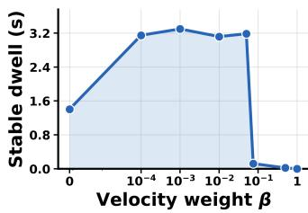  
(a) Acrobot

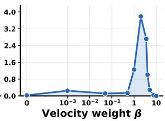  
(b) Pendubot  
Figure 1: A velocity penalty has task-dependent effects in direct trajectory optimization, shown by the mean stable dwell for IPOPT-optimized Acrobot and Pendubot trajectories. Moderate velocity regularization helps in different ranges for the two plants, while an overly large weight suppresses successful motion in both.

$3 \big ( \theta _ { 1 } ^ { 2 } + \theta _ { 2 , a } ^ { 2 } \big ) - \beta \big ( \dot { \theta } _ { 1 } ^ { 2 } + \dot { \theta } _ { 2 } ^ { 2 } \big )$ , where $\theta _ { 1 }$ denotes the absolute angle of the first link, $\theta _ { 2 }$ is the relative angle of the second link, and $\theta _ { 2 , a } = \theta _ { 1 } + \theta _ { 2 }$ represents the absolute angle of the second link. Note that here the control weighting matrix is set to $M = 0$ , relying instead on explicit torque bounds $a \in [ a _ { \mathrm { m i n } } , a _ { \mathrm { m a x } } ]$ in direct transcription to prevent unbounded control actions.

For Acrobot, mean dwell rises from 1.41 s at $\beta = 0$ to roughly 3.2–3.4 s over the moderate-weight regime, then collapses near zero once the velocity term becomes dominant. Pendubot instead has almost no dwell at $\beta = 0$ , reaches its best mean dwell of 3.8 s near $\beta = 2$ , and again collapses for a sufficiently large coefficient. Thus, the same physically plausible term reshapes the objective differently across direct-optimization problems and can eventually overconstrain task progress.

This failure is caused by the second-order solver it uses. Let ${ H } _ { f } = \nabla ^ { 2 } f ( \mathbf { w } )$ be the singular objective Hessian and $Z ( \mathbf { w } )$ be an orthonormal basis for the dynamic constraint nullspace ker(J), where w denotes the optimization variables and $J ( \mathbf { w } )$ is the constraint Jacobian. If ker $( H _ { f } ) \cap \ker ( J )$ is nonempty, then the reduced Hessian $Z ^ { \top } H _ { f } Z$ is singular, and the solution set forms a non-unique manifold $\mathcal { W } ^ { * } = \mathbf { w } ^ { * } + \ker ( H _ { f } )$ ∩ ker(J), producing non-unique directions, KKT ill-conditioning, and solver instability. Appendix D gives the full derivation.

How RL achieves the control objective. The failure of a specific numerical solver does not mean that the control objective cannot be achieved without velocity rewards; we show next that it can, using a trajectory-level view of RL. A stochastic policy $\pi _ { \Theta } ( a \mid s )$ together with the transition kernel $p _ { \mathrm { d y n } }$ induces a distribution over state-action trajectories $\bar { \tau } = ( s _ { 0 } , a _ { 0 } , s _ { 1 } , \dots , a _ { T - 1 } , s _ { T } )$ ; marginalizing the action gives the policy-dependent closed-loop kernel

$$
\displaystyle \mathcal { K } _ { \Theta } ( s ^ { \prime } \mid s ) = \int _ { A } p _ { \mathrm { d y n } } ( s ^ { \prime } \mid s , a ) \pi _ { \Theta } ( a \mid s ) d a ,\tag{2}
$$

so that the distribution over state trajectories $\tau _ { s } ~ = ~ ( s _ { 0 } , \ldots , s _ { T } )$ is given by $\begin{array} { r l } { \mathcal { P } _ { \Theta } ( \tau _ { s } ) } & { { } = } \end{array}$ $\begin{array} { r } { \rho _ { 0 } ( s _ { 0 } ) \prod _ { t = 0 } ^ { T - 1 } \mathcal { K } _ { \Theta } ( s _ { t + 1 } \mid s _ { t } ) } \end{array}$ , and policy optimization induces the chain $| \pi _ { \Theta } \longrightarrow { \mathcal K } _ { \Theta } \longrightarrow { \mathcal P } _ { \Theta } ( \tau _ { s } ) \ | .$ Accordingly, RL can be viewed as an indirect optimization over the policy-realizable trajectorydistribution family $\mathbb { P } _ { \Pi } = \{ { \mathcal { P } } _ { \Theta } ( \tau _ { s } ) : \pi _ { \Theta } \in \Pi \}$ }. Unlike the direct transcription of Equation (1), which manipulates a single trajectory under explicit dynamics constraints, PPO only reshapes $\mathcal { P } _ { \Theta } ( \tau _ { s } )$ indirectly through the actor, Appendix E expands this comparison.

We now separate the information used to evaluate a trajectory from the information used to generate it. Let the instantaneous reward depend only on the zeroth-order state, $R ( s _ { t } , a _ { t } ) = r _ { 0 } ( q _ { t } ) $ , where $s _ { t } = ( q _ { t } , v _ { t } )$ is the full state and $v _ { t } = { \dot { q } } _ { t }$ is the first-order state. Let $\begin{array} { r } { \mathcal { R } _ { 0 } ( \tau _ { s } ) = \sum _ { t = 0 } ^ { T } \gamma ^ { t } r _ { 0 } ( q _ { t } ) } \end{array}$ be the zeroth-order trajectory reward, so the objective is

$$
J ( \Theta ) = \mathbb { E } _ { \tau _ { s } \sim \mathcal { P } _ { \Theta } } [ \mathcal { R } _ { 0 } ( \tau _ { s } ) ] = \int \mathcal { P } _ { \Theta } ( \tau _ { s } ) \mathcal { R } _ { 0 } ( \tau _ { s } ) d \tau _ { s } .\tag{3}
$$

Every zeroth-order term used in this paper is a bounded function of configuration error that is uniquely maximized at the target $q ^ { * }$ : writing $r ^ { * } = r _ { 0 } ( q ^ { * } )$ , for every $\delta > 0$ there is a gap $\epsilon _ { 0 } ( \delta ) > 0$ such that $r _ { 0 } ( q ) ~ \le ~ r ^ { * } - \epsilon _ { 0 } ( \delta )$ , ∀q $\notin \mathcal { N } _ { \delta } ( \bar { q ^ { * } } ) : = \{ q : \| q - q ^ { * } \| < \delta \}$ . For trajectories $\tau _ { s } ^ { + } , \tau _ { s } ^ { - }$ that agree outside a common index set $S \subseteq \{ 0 , \ldots , T \}$ , with $q _ { t } ^ { + } \in \mathcal { N } _ { \delta } ( q ^ { * } )$ (dwelling near the target) and $q _ { t } ^ { - } \notin \mathcal { N } _ { \delta } ( q ^ { * } )$ (away from it, e.g. overshooting or oscillating) for every $t \in S$ , this gap propagates directly to the return because the two trajectories agree termwise outside S:

$$
\mathcal { R } _ { 0 } ( { \tau } _ { s } ^ { + } ) - \mathcal { R } _ { 0 } ( { \tau } _ { s } ^ { - } ) = \sum _ { t \in S } \gamma ^ { t } \big ( r _ { 0 } ( q _ { t } ^ { + } ) - r _ { 0 } ( q _ { t } ^ { - } ) \big ) \ \geq \ \epsilon _ { 0 } ( \delta ) \sum _ { t \in S } \gamma ^ { t } \ > \ 0 .\tag{4}
$$

So $\mathcal { R } _ { 0 }$ strictly prefers the dwelling trajectory without first-order term $\dot { q } _ { t }$ appearing anywhere in $r _ { 0 } \mathrm { : }$ shifting probability mass ε from the oscillating class to the dwelling class strictly increases J by at least $\begin{array} { r } { \varepsilon \dot { \epsilon } _ { 0 } \dot { ( } \delta ) \sum _ { t \in S } \dot { \gamma } ^ { t } } \end{array}$

The same holds at the level of the PPO advantage rather than the trajectory distribution. At current policy, the clipped surrogate has the standard first-order policy gradient (Schulman et al., 2017),

$$
\nabla _ { \Theta } J ^ { \mathrm { P P O } } ( \Theta ) \big | _ { \Theta _ { \mathrm { o l d } } } = \mathbb { E } _ { \pi } \left[ A ^ { \pi } ( q , v , a ) \nabla _ { \Theta } \log \pi _ { \Theta } ( a \mid q , v ) \right] ,\tag{5}
$$

$$
\begin{array} { r } { Q ^ { \pi } ( q , v , a ) = r _ { 0 } ( q ) + \gamma \mathbb { E } _ { s ^ { \prime } \sim p _ { \mathrm { d y n } } ( \cdot \vert q , v , a ) } [ V ^ { \pi } ( s ^ { \prime } ) ] . } \end{array}\tag{6}
$$

Since $r _ { 0 } ( q )$ is identical across actions at a fixed $( q , v )$ , it cancels exactly from the advantage $A ^ { \pi } =$ $Q ^ { \pi } - V ^ { \pi } ;$ the advantage is determined solely by how the action a perturbs the distribution of the future zeroth-order return through $V ^ { \pi } ( \boldsymbol { q } , \boldsymbol { v } ) = \mathbb { E } _ { a \sim \pi ( \cdot | \boldsymbol { q } , \boldsymbol { v } ) } [ Q ^ { \pi } ( \boldsymbol { q } , \boldsymbol { v } , a ) ]$ (Appendix E derives this cancellation explicitly). Crucially, $V ^ { \dot { \pi } }$ is a function of v even though $r _ { 0 }$ is not, because v enters the dynamics $p _ { \mathrm { d y n } }$ and hence shapes the distribution of future configurations $q _ { t + 1 : T }$ . Firstorder reward terms are therefore unnecessary for providing a braking or stabilization learning signal; this statement concerns trajectory evaluation only, and whether the policy can realize the preferred trajectory depends separately on its observation.

Velocity observations are necessary. Although velocities need not appear in the reward, they remain critical in the observation. We represent first-order information by the momentum $p \in \mathbb { R } ^ { n _ { s } }$ Consider the mechanical system with the canonical phase-space state vector $x = [ q , p ] ^ { \top } \in \mathbb { R } ^ { 2 n _ { s } }$ where $q \in \mathbb { R } ^ { n _ { s } }$ is the generalized configuration, $p = M ( q ) v$ is the generalized momentum, and $a \in \mathbb { R } ^ { n _ { a } }$ is the control input. Its dynamics are

$$
\dot { q } = \nabla _ { p } H _ { 0 } ( q , p ) , \qquad \dot { p } = - \nabla _ { q } H _ { 0 } ( q , p ) + B ( q ) a ,\tag{7}
$$

where $\begin{array} { r } { H _ { 0 } ( q , p ) = \frac { 1 } { 2 } p ^ { \top } M ( q ) ^ { - 1 } p + U ( q ) } \end{array}$ . We make the following assumption:

Assumption 4.1 (policy-supplied dissipation) In a neighborhood of the target $\boldsymbol { x } ^ { * } = [ \boldsymbol { q } ^ { * } , 0 ] ^ { \top }$ , the dynamics seen from the policy action interface contain no velocity-dependent dissipative force outside the policy. We also assume that $x ^ { * }$ is locally stabilizable by some admissiblefull-statefeedback $a = g _ { q p } ( q , p )$

This assumption excludes intrinsically unstabilizable tasks but does not require full actuation. At deterministic deployment, a continuously differentiable zeroth-order policy has the form $a = g _ { q } ( q )$ Its closed-loop vector field is $l _ { q } = ( \nabla _ { p } \dot { H } _ { 0 } , - \nabla _ { q } H _ { 0 } + B g _ { q } )$ , whose divergence in canonical phase space is

$$
\nabla _ { q , p } \cdot \boldsymbol { l } _ { q } = \sum _ { i } \frac { \partial ^ { 2 } H _ { 0 } } { \partial q _ { i } \partial p _ { i } } - \sum _ { i } \frac { \partial ^ { 2 } H _ { 0 } } { \partial p _ { i } \partial q _ { i } } + \nabla _ { p } \cdot [ B ( q ) g _ { q } ( q ) ] = 0 .\tag{8}
$$

Hence, position-only feedback can reshape the force field but cannot contract phase-space volume. Indeed, we have the following theorem:

Theorem 4.2 Under Assumption 4.1, no continuously differentiable memoryless policy $a = g _ { q } ( q )$ can make $x ^ { * }$ locally asymptotically stable.

The proof of Theorem 4.2 is included in Appendix F; a double-integrator example in Appendix G makes the associated observation aliasing explicit. The argument is independent of the rank and dimension of $B ( q )$ , so it applies to both fully actuated and underactuated systems whenever the full-state stabilizability premise holds. It rules out asymptotic attraction, not transient target visits: a position-only policy may enter the target region frequently while failing to remain there. Conversely, passive damping, lower-level PD control, or dissipative contact that violates Assumption 4.1 may permit long stable dwell without exposing velocity to the learned policy. The required velocity information must be available to the component that supplies dissipation, but that component need not be the actor.

In RL context, an undiscounted infinite-horizon cost-to-go can serve as a control Lyapunov function subject to suitable stabilizability and regularity conditions; under the reward convention, the candidate is $- V ^ { \pi }$ (Camilli et al., 2008; Kamalapurkar et al., 2018). A discounted value function is not automatically a Lyapunov function and requires additional dominance condition (Gaitsgory et al., 2015). Likewise, closed-loop stability with an approximate critic requires explicit approximationerror and learning conditions (Kamalapurkar et al., 2018). In either case, the critic cannot remove the structural obstruction imposed on a zeroth-order actor.

## 5 EXPERIMENTS

In this section, we validate our analysis on seven Isaac Lab control problems spanning underactuated swing-up (Acrobot and Pendubot), cart-based swing-up (Cartpole and Double Cart Pendulum), floating-base flight (Quadcopter), articulated manipulation (Franka Reach), and contact-rich wholebody motion (Humanoid). Their varied dimensions, actuation, and dissipation test the conclusion beyond variants of a single plant.

Table 1: Reward family used in the Isaac Lab sweep. Every row has the form $r _ { \beta } = r _ { 0 } - \beta e _ { v }$ . The $\beta = 0$ condition removes velocity only from the reward; the policy still receives the full task-defined configuration and velocity observation.
<table><tr><td>Task</td><td>Zeroth-order term  $\overline { { r _ { 0 } ( q ) } }$ </td><td>Velocity error  $\overline { { e _ { v } ( v ) } }$ </td></tr><tr><td>Acrobot</td><td> $1 - 3 [ e _ { c } ( \theta _ { 1 } ) + e _ { c } ( \theta _ { 2 , a } ) ]$ </td><td> $\overline { { \theta _ { 1 } ^ { 2 } + \theta _ { 2 } ^ { 2 } } }$ </td></tr><tr><td>Pendubot</td><td> $1 - 3 [ e _ { c } ( \theta _ { 1 } ) + e _ { c } ( \theta _ { 2 , a } ) ]$ </td><td> $\dot { \theta } _ { 1 } ^ { 2 } + \dot { \theta } _ { 2 } ^ { 2 }$ </td></tr><tr><td>Cartpole</td><td> $1 - 3 e _ { c } ( \theta )$ </td><td> $v _ { c } ^ { 2 } + { \dot { \theta } } ^ { 2 }$ </td></tr><tr><td>Double cart pendulum</td><td> $2 - 3 [ e _ { c } ( \theta _ { 1 } ) + e _ { c } ( \theta _ { 2 , a } ) ]$ </td><td> $v _ { c } ^ { 2 } + \dot { \theta } _ { 1 } ^ { 2 } + \dot { \theta } _ { 2 } ^ { 2 }$ </td></tr><tr><td>Quadcopter</td><td> $1 - 3 \mathrm { t a n h } ( d _ { p } / 0 . 8 ) - e _ { R } , e _ { R } = 1 - ( q ^ { \top } q ^ { * } ) ^ { 2 }$ </td><td> $\| v _ { \mathrm { b o d y } } \| _ { 2 } ^ { 2 }$ </td></tr><tr><td>Franka reach</td><td> $1 - 3 \operatorname { t a n h } ( d _ { p } / 0 . 8 ) - 3 e _ { q } , e _ { q } = \sqrt { \operatorname* { m e a n } _ { j } ( q _ { j } - q _ { j } ^ { * } ) ^ { 2 } }$ </td><td> $\| \dot { q } \| _ { 2 } ^ { 2 }$ </td></tr><tr><td>Humanoid</td><td> $r _ { \mathrm { d e f a u l t , Z O } } ~ - ~ \alpha ( d _ { x y } ) \operatorname { t a n h } ( d _ { x y } / { \dot { s } } _ { p } ) ~ + ~ 2 \sigma ( ( 0 . 3 5 ~ -$   $d _ { x y } ) / 0 . 0 4 ) - 3 b ( d _ { x y } ) e _ { \mathrm { s t a n d } }$ </td><td> $\begin{array} { r } { \frac { \| v _ { \mathrm { r o o t } } \| _ { 2 } ^ { 2 } + \| s _ { \omega } \omega _ { \mathrm { r o o t } } \| _ { 2 } ^ { 2 } + } { \sum \| s _ { q } \dot { q } \| _ { 2 } ^ { 2 } } } \end{array}$ </td></tr></table>

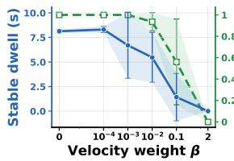  
(a) Acrobot

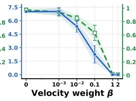

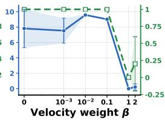  
(b) Pendubot

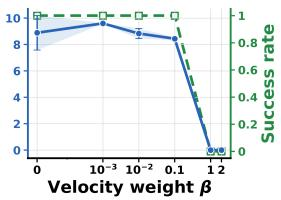  
(c) Cartpole  
(d) Double Cart Pendulum

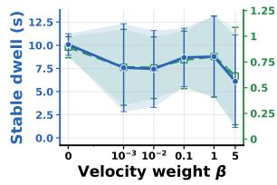  
(e) Quadcopter

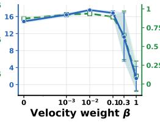  
(f) Franka Reach

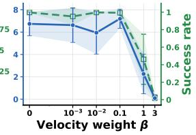  
(g) Humanoid  
Figure 2: Velocity-reward sweeps with full configuration and velocity observations. Blue solid curves show stable dwell and green dashed curves show success rate; bands are mean ± one population standard deviation over five seeds. Every task learns reaching, braking, and sustained stabilization at $\beta = 0$ , while sufficiently large velocity penalties generally reduce both metrics.

Experiment setup. For each task we write the scalar reward as $r _ { \beta } ( q _ { t } , v _ { t } ) = r _ { 0 } ( q _ { t } ) - \beta e _ { v } ( v _ { t } )$ where $\beta \geq 0$ and q only includes configuration-derived task variables such as Cartesian position and orientation. Let $e _ { c } ( \theta ) = 1 - \cos { \theta }$ , let $d _ { p }$ denote position error, and let $e _ { R } = 1 - ( q ^ { \top } q ^ { \ast } ) ^ { 2 }$ denote the orientation error (quaternion-dot form). For the two-link systems, $\theta _ { 2 , a } = \theta _ { 1 } + \theta _ { 2 }$ is the absolute second-link angle. Table 1 gives the complete reward design for all tasks. For Humanoid, σ is the logistic function, $b ( d _ { x y } ) = \bar { \mathbb { 1 } } [ d _ { x y } \le 0 . 5 5 ] ^ { ^ { \cdot } } \mathrm { c l i p } ( ( 0 . 5 5 - d _ { x y } ) ^ { ^ { \cdot } } / 0 . 2 0 , 0 , 1 )$ gates braking near the target, and $e _ { \mathrm { s t a n d } }$ is a zeroth-order pseudo-Huber combination of root orientation, calibrated root height, joint-mean error, and joint-maximum error. We evaluate every policy using a dynamical success set $\begin{array} { r } { \check { S } _ { \mathrm { s u c c } } = \{ ( q , v ) : e _ { q } ^ { \mathrm { e v a l } } ( q ) \leq \epsilon _ { q } , \ e _ { v } ^ { \mathrm { e v a l } } ( v ) \leq \epsilon _ { v } \} } \end{array}$ , so removing velocity from a training reward never weakens the evaluation criterion. For trajectory $i ,$ define $C _ { i , t } = \mathbb { 1 } [ ( q _ { i , t } , v _ { i , t } ) \in S _ { \mathrm { s u c c } } ]$ and let $\Im _ { i }$ be its set of contiguous successful index intervals. We report

$$
\mathrm { S u c c e s s R a t e } = \frac { 1 } { N } \sum _ { i = 1 } ^ { N } \mathbb { 1 } [ \exists t : C _ { i , t } = 1 ] , \qquad \mathrm { D w e l l } = \frac { \Delta t } { N } \sum _ { i = 1 } ^ { N } \operatorname* { m a x } _ { I \in \Im _ { i } } \vert I \vert ,\tag{9}
$$

Thus, success is the fraction of trajectories that ever enter the success set, whereas dwell averages each trajectory’s longest uninterrupted visit. Exact predicates and rollout banks are in Appendix A (Table 3), PPO settings are in Appendix B, and optimization traces are in Appendix C.

Velocity rewards are not required for successful control. With full observations, removing the explicit velocity term does not remove the learning signal for braking. As shown in Figure 2 at $\beta =$

0, success rates are 1.00, 0.973, 1.00, 1.00, 0.894, 0.870, and 0.997 for Acrobot, Pendubot, Cartpole, Double Cart Pendulum, Quadcopter, Franka, and Humanoid, respectively. Their corresponding mean stable dwells are 8.13, 7.00, 7.81, 8.88, 10.09, 14.86, and 6.74 seconds. Because each success test includes a velocity threshold, these are not merely target visits: the policies approach, brake, and remain inside a dynamically defined success set for sustained periods.

This finding is the empirical counterpart of Equation (6). The instantaneous reward need not observe velocity to prefer braking actions: actions change future states, future configurations change $\mathcal { R } _ { 0 } ( \tau _ { s } )$ , and the critic propagates that trajectory-level difference into the advantage. Full $( q , v )$ observations then let the actor assign different actions to the same configuration reached with different velocities.

Larger β is not uniformly beneficial. For example, at the largest tested weight, Acrobot and Double Cart Pendulum have zero dwell and zero success; Franka falls from 14.86 s to 1.46 s; and Humanoid falls from 6.74 s to 0.089 s, demonstrating a clear cross-task pattern: an explicit velocity penalty is unnecessary at $\beta = 0$ , and making it dominant can sharply impair learning.

Velocity observations remain necessary. We hold $r _ { 0 }$ fixed and remove only velocity from the policy observation. This leaves the trajectory ranking unchanged but restricts the feedback laws available to the actor. The resulting failure modes separate transient reachability from sustained stabilization. As shown in Figure 3, Pendubot collapses from 7.00 s dwell and 0.973 success rate with full observations to $2 . 3 4 \times 1 0 ^ { - 4 }$ s and 0.009; Quadcopter reaches zero on both metrics. Double Cart Pendulum provides the clearest pass-through signature: success-ever remains 0.995, yet dwell falls from 8.88 s to 0.0166 s. Cartpole behaves similarly but less extremely, retaining 0.755 success while dwell drops from 7.81 s to 0.63 s. These policies can visit an upright configuration, but without velocity-conditioned braking they oscillate through it or fail to remain there.

The mixed high-dimensional results also expose the boundary of the theoretical claim. Franka and Humanoid degrade more modestly, from 14.86 to 11.54 s and from 6.74 to 5.28 s, respectively. Franka’s lowerlevel joint-position servo and Humanoid’s dissipative contact dynamics can supply contraction outside the learned memoryless actor. These mechanisms violate Assumption 4.1 and are therefore consistent with Theorem 4.2. Together, these results show that reward sufficiency and observation sufficiency are distinct experimental properties.

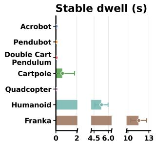

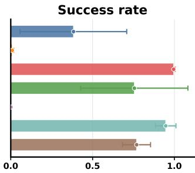  
Figure 3: No-velocity-observation ablation at $\beta ~ = ~ 0$ Each task keeps exactly the same zeroth-order reward and velocity-aware success predicate used in the fullobservation experiment. Bars show the five-seed mean and population standard deviation of best dwell (left) and corresponding success rate (right).

Why does reward clipping help? Our analysis also explains why re-

ward clipping is an effective design heuristic. Using the zeroth-order terms $r _ { 0 }$ and first-order errors $e _ { v }$ from Table 1, the clipping interventions for Pendubot and Franka leave $r _ { 0 }$ unchanged and caps only $e _ { v } .$

$$
r _ { \beta , c } ^ { \mathrm { P } } = r _ { 0 } ^ { \mathrm { P } } - \beta \operatorname* { m i n } \left\{ \dot { \theta } _ { 1 } ^ { 2 } + \dot { \theta } _ { 2 } ^ { 2 } , c \right\} , \qquad r _ { \beta , c } ^ { \mathrm { F } } = r _ { 0 } ^ { \mathrm { F } } - \beta \operatorname* { m i n } \left\{ \| \dot { q } \| _ { 2 } ^ { 2 } , c \right\} , \qquad c = 4 .\tag{10}
$$

To diagnose the learning distribution, we additionally use one-iteration probes under seed $^ { 4 2 }$ . Each probe independently collects one stochastic on-policy rollout at a saved checkpoint and then performs one PPO update, exposing its return targets, advantages, and critic loss. Appendix A gives the complete task-specific rewards and implementation details.

Figure 4 shows that at $\beta = 1$ , capping the velocity term substantially improves both Pendubot and Franka. In Table 2, the uncapped rewards produce much larger value MSE; the lower mean absolute minimum return target further shows that clipping reduces the leverage of rare high-speed samples in squared critic regression. Figure 5 shows the corresponding learned value functions.

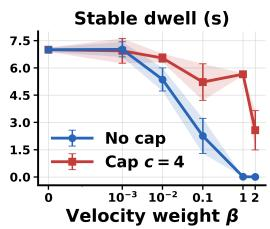

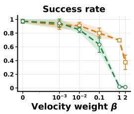  
(a) Pendubot

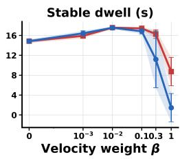

(b) Franka Reach  
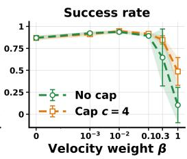  
Figure 4: Capping only the squared-velocity error prevents the large-β performance collapse. Five-seed beta sweeps for Pendubot (left) and Franka (right) compare the uncapped reward with the velocity cap $c = 4$ in Equation (10). Curves and bands are the mean ± one population standard deviation. The cap leaves the successful low-β regime intact and restores substantial performance where the raw reward fails.

Table 2: Reward clipping contracts return tails and critic error. Dwell is the best evaluation duration in each seed-42 run. The remaining columns are means over the final five matched oneiteration probes; $\widehat { G } _ { t }$ denotes the scalar return target at time step t.
<table><tr><td>Task</td><td>β</td><td>Reward</td><td>Dwell  $( \mathbf { s } ) \uparrow$ </td><td> $\overline { { \widehat { G } _ { t } } }$ </td><td> $\overline { { | \operatorname* { m i n } _ { t } \widehat { G } _ { t } | } }$ </td><td>Value MSE↓</td></tr><tr><td>Pendubot</td><td>0</td><td>Raw</td><td>6.87</td><td>31.9</td><td> $9 . 1 0 \times 1 0 ^ { 2 }$ </td><td> $3 . 2 0 \times 1 0 ^ { 2 }$ </td></tr><tr><td></td><td>1</td><td>Raw</td><td>0.018</td><td>-928</td><td> $3 . 0 1 \times 1 0 ^ { 6 }$ </td><td> $2 . 6 5 \times 1 0 ^ { 7 }$ </td></tr><tr><td></td><td>1</td><td>Clipped (c = 4)</td><td>5.72</td><td>-245</td><td> $1 . 1 5 \times 1 0 ^ { 3 }$ </td><td> $1 . 0 4 \times 1 0 ^ { 3 }$ </td></tr><tr><td>Franka</td><td>0</td><td>Raw</td><td>14.58</td><td>94.5</td><td>69.1</td><td> $0 . 4 9 5$ </td></tr><tr><td></td><td>1</td><td>Raw</td><td>0.008</td><td>-819</td><td> $1 . 9 1 \times 1 0 ^ { 3 }$ </td><td> $1 . 0 9 \times 1 0 ^ { 3 }$ </td></tr><tr><td></td><td>1</td><td>Clipped (c = 4)</td><td>9.46</td><td>-99.2</td><td> $1 . 8 7 \times 1 0 ^ { 2 }$ </td><td> $1 . 4 9 \times 1 0 ^ { 2 }$ </td></tr></table>

The raw Pendubot critic contains severe narrow extrapolations and a fragmented angle landscape, whereas the capped critic resolves a smooth upright-centered structure at an ordinary value scale. Franka’s raw surface, associated with a failed controller, is smoother but has a broader negative scale; the capped critic concentrates its highest values around the target and accompanies a successful policy.

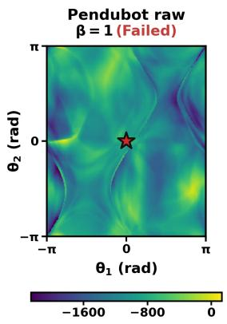

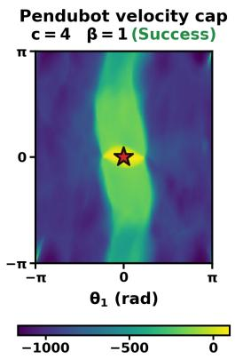

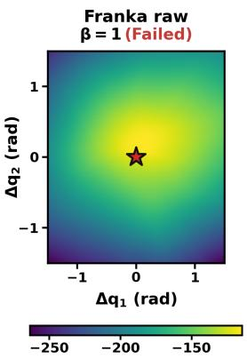

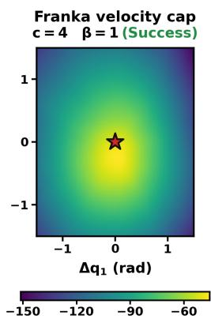  
Figure 5: Velocity capping contracts critic scale and restores target-centered structure. From left to right: failed raw Pendubot, successful velocity-capped Pendubot, failed raw Franka, and successful velocity-capped Franka, all at $\beta = 1$ and with $c = 4$ in the capped conditions using seed 42. Pendubot fixes angular velocities at zero, while Franka holds all remaining joints at a common target-conditioned reference. Red stars mark the upright or zero-error target.

Full-pose constraints in high-DoF control. While the preceding results show that velocity penalties are not necessary for stabilization problems, a natural question is whether the reward needs to include all zeroth-order coordinates related to the goal. We examine this issue on the seven-DoF Franka arm by comparing two target specifications. Both retain the complete joint-position and joint-velocity observation and use the same position term and velocity sweep, but they differ in which zeroth-order coordinates define the target:

$$
r _ { \beta } ^ { \mathrm { F u l l } } = 1 - 3 \operatorname { t a n h } ( d _ { p } / 0 . 8 ) - \beta \lVert \dot { q } \rVert _ { 2 } ^ { 2 } - 3 e _ { q } , \qquad e _ { q } = \sqrt { \mathrm { m e a n } _ { j } ( q _ { j } - q _ { j } ^ { * } ) ^ { 2 } } ,\tag{11}
$$

$$
r _ { \beta } ^ { \mathrm { P a r t i a l } } = 1 - 3 \operatorname { t a n h } ( d _ { p } / 0 . 8 ) - 3 d _ { R } / \pi - \beta \lVert \dot { q } \rVert _ { 2 } ^ { 2 } .\tag{12}
$$

Here $d _ { p }$ is end-effector position error and $d _ { R } \in [ 0 , \pi ]$ is the geodesic end-effector orientation error (geodesic-angle form). The Full target joint posture $q ^ { * }$ is generated consistently with the desired end-effector pose. Partial explicitly constrains the complete end-effector pose (position and orientation) but not the remaining null-space coordinate. Thus, “Partial” is complete in task space but incomplete in the robot’s generalized configuration.

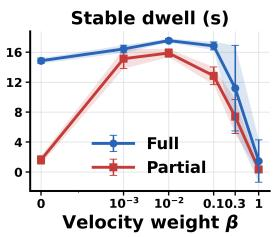

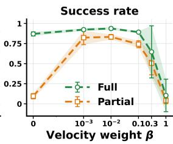

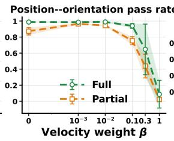

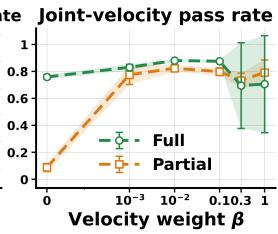  
Figure 6: Configuration completeness determines whether a zeroth-order reward is sufficient. From left to right: best stable dwell (s), success-ever rate, position–orientation pass rate $P _ { p R } .$ , and joint-velocity pass rate $P _ { v }$ . Full uses a target joint posture, whereas Partial specifies only the endeffector position and orientation. Curves and bands show the mean ± one population standard deviation over five seeds.

For this ablation, let $C _ { p } , C _ { R } , C _ { v }$ be the position, orientation, and joint-speed pass indicators specified in Table 3. Equation (9) applies with $\begin{array} { r } { C = C _ { p } C _ { R } C _ { v } ; } \end{array}$ ; the two additional diagnostics are defined as time-step occupancies $P _ { p R } = \mathbb { E } _ { i , t } [ C _ { p } C _ { R } ]$ and $P _ { v } = \mathbb { E } _ { i , t } [ C _ { v } ]$ ]. Appendix A gives more details.

Under the Partial setting at $\beta = 0$ , performance collapses relative to Full despite using the same complete observation. The decomposition in Figure 6 localizes the difference: Partial still occupies the desired end-effector pose, but rarely meets the joint-speed condition $( P _ { v } ~ = ~ 0 . 0 8 8 \pm 0 . { \bar { 0 } } 3 0$ versus $0 . 7 5 9 \pm 0 . 0 1 6 )$ . Its principal failure is therefore continued null-space motion after reaching, not Cartesian reachability. Under the Full setting, that motion changes $\textstyle e _ { q } ,$ so future zeroth-order rewards distinguish braking from joint drift; under the Partial setting, pose-preserving motion is reward-invariant and an explicit velocity term supplies the missing distinction.

Accordingly, a small $\beta = { \bf 1 0 } ^ { - 3 }$ repairs Partial to $1 5 . 1 3 \pm 1 . 3 1$ s dwell, and $P _ { v } = 0 . 7 7 5 \pm 0 . 0 7 1$ This comparison qualifies zeroth-order sufficiency: velocity reward is redundant for a configurationcomplete target but can regularize directions that an incomplete target leaves invisible. $\operatorname { A s } \beta$ becomes dominant, both variants eventually degrade, so velocity regularization cannot replace configuration completeness and retains the large-weight optimization cost identified above.

## 6 CONCLUSION AND FUTURE WORKS

Our work provides a principled framework for reward design in deep reinforcement learning for robotics. We show that effective control does not require complex, multi-component reward functions burdened by higher-order penalties; rather, it relies on a clear separation between what the agent optimizes (zeroth-order target completeness) and what it observes (full state information). Omitting unnecessary velocity penalties eliminates extreme value tails and optimization brittleness, resulting in simpler, more robust policies without sacrificing performance. Moreover, these insights shift the paradigm of robotic reward shaping from trial-and-error heuristic tuning toward minimal, mathematically grounded design principles, paving the way for scalable control across increasingly complex and high-dimensional physical systems.

It should be noted that our study is limited to simulated stabilization and target-reaching tasks in second-order systems, trained with feedforward PPO. Moreover, passive damping, low-level feedback, and policy memory can change which information must be supplied explicitly. These limitations motivate an important open problem: whether this separation extends to higher-order and higher-dimensional systems. For a state containing $q , q ^ { ( 1 ) } , \ldots , q ^ { ( d - 1 ) }$ , what are the minimal reward and observation orders needed to evaluate and realize the desired trajectories? Establishing mode-wise conditions and adaptive shaping that adds only unresolved derivative information may be promising directions for future work.

## REPRODUCIBILITY STATEMENT

We provide the information needed to reproduce every result. Theorem 4.2 and Assumption 4.1 appear in Section 4, with the trajectory-level derivation, numerical-solver analysis, and proof in Appendices D, E, and F, respectively. The task rewards and all success predicates are in Table 1 and Table 3; the reward-clipping and reward-completeness interventions are given as explicit formulas in Equation (10)–Equation (17) and Equation (11)–Equation (12). PPO hyperparameters, architectures, and budgets are listed in Appendix B (Tables 4 and 5). We report Isaac Lab aggregate curves over five seeds {0, 1, 2, 3, 42}.

## AI USE STATEMENT

Generative AI tools, including ChatGPT 5.6 Sol (OpenAI) and Claude Opus 5 (Anthropic), were used to improve the clarity, grammar, and presentation of author-written text, and to assist with literature retrieval and discovery by suggesting search queries and potentially relevant prior work. All cited references were independently located and verified against their original publications by the authors. All AI-assisted edits were reviewed and revised by the authors. The authors take full responsibility for the final content of this work, including any text produced with the aid of generative AI.

## REFERENCES

Joel A. E. Andersson, Joris Gillis, Greg Horn, James B. Rawlings, and Moritz Diehl. CasADi: A software framework for nonlinear optimization and optimal control. Mathematical Programming Computation, 11(1):1–36, 2019. doi: 10.1007/s12532-018-0139-4.

Marcin Andrychowicz, Filip Wolski, Alex Ray, Jonas Schneider, Rachel Fong, Peter Welinder, Bob McGrew, Josh Tobin, Pieter Abbeel, and Wojciech Zaremba. Hindsight experience replay. In Advances in Neural Information Processing Systems, volume 30, pp. 5048–5058, 2017.

Marcin Andrychowicz, Anton Raichuk, Piotr Stanczyk, Manu Orsini, Sertan Girgin, Raphael Marinier, Leonard Hussenot, Matthieu Geist, Olivier Pietquin, Marcin Michalski, Sylvain Gelly, and Olivier Bachem. What matters for on-policy deep actor-critic methods? a large-scale study. In International Conference on Learning Representations, 2021. URL https://openreview. net/forum?id=nIAxjsniDzg.

Richard Bellman. Dynamic Programming. Princeton University Press, 1957.

John T. Betts. Survey of numerical methods for trajectory optimization. Journal of Guidance, Control, and Dynamics, 21(2):193–207, 1998. doi: 10.2514/2.4231.

Arthur E. Bryson and Yu-Chi Ho. Applied Optimal Control: Optimization, Estimation, and Control. Hemisphere Publishing Corporation, 1975.

Fabio Camilli, Lars Grune, and Fabian Wirth. Control lyapunov functions and zubov’s method.¨ SIAM Journal on Control and Optimization, 47(1):301–326, 2008. doi: 10.1137/06065129X.

Yihan Du, Anna Winnicki, Gal Dalal, Shie Mannor, and R. Srikant. Reinforcement learning with segment feedback. In International Conference on Machine Learning, volume 267 of Proceedings of Machine Learning Research, pp. 14598–14647. PMLR, 2025. URL https: //proceedings.mlr.press/v267/du25e.html.

Logan Engstrom, Andrew Ilyas, Shibani Santurkar, Dimitris Tsipras, Firdaus Janoos, Larry Rudolph, and Aleksander Madry. Implementation matters in deep RL: A case study on PPO and TRPO. In International Conference on Learning Representations, 2020. URL https: //openreview.net/forum?id=r1etN1rtPB.

Vladimir Gaitsgory, Lars Grune, and Neil Thatcher. Stabilization with discounted optimal control.¨ Systems & Control Letters, 82:91–98, 2015. doi: 10.1016/j.sysconle.2015.05.010.

Charles R. Hargraves and Stephen W. Paris. Direct trajectory optimization using nonlinear programming and collocation. Journal of Guidance, Control, and Dynamics, 10(4):338–342, 1987. doi: 10.2514/3.20223.

Peter Henderson, Riashat Islam, Philip Bachman, Joelle Pineau, Doina Precup, and David Meger. Deep reinforcement learning that matters. In Proceedings of the AAAI Conference on Artificial Intelligence, volume 32, pp. 3207–3214, 2018. doi: 10.1609/aaai.v32i1.11694.

Jemin Hwangbo, Joonho Lee, Alexey Dosovitskiy, Dario Bellicoso, Vassilios Tsounis, Vladlen Koltun, and Marco Hutter. Learning agile and dynamic motor skills for legged robots. Science Robotics, 4(26):eaau5872, 2019. doi: 10.1126/scirobotics.aau5872.

David H. Jacobson and David Q. Mayne. Differential Dynamic Programming. American Elsevier Publishing Company, 1970.

Rudolf E. Kalman. Contributions to the theory of optimal control. Boletin de la Sociedad Matematica Mexicana, 5(1):102–119, 1960.

Rushikesh Kamalapurkar, Patrick Walters, Joel Rosenfeld, and Warren Dixon. Reinforcement Learning for Optimal Feedback Control: A Lyapunov-Based Approach. Communications and Control Engineering. Springer International Publishing, Cham, 2018. doi: 10.1007/978-3-319-78384-0.

Matthew Kelly. An introduction to trajectory optimization: How to do your own direct collocation. SIAM Review, 59(4):849–904, 2017. doi: 10.1137/16M1062569.

Hassan K. Khalil. Nonlinear Systems. Prentice Hall, Upper Saddle River, NJ, 3 edition, 2002.

Jens Kober, J. Andrew Bagnell, and Jan Peters. Reinforcement learning in robotics: A survey. The International Journal of Robotics Research, 32(11):1238–1274, 2013. doi: 10.1177/ 0278364913495721.

Minae Kwon, Sang Michael Xie, Kalesha Bullard, and Dorsa Sadigh. Reward design with language models. In International Conference on Learning Representations, 2023. URL https: //arxiv.org/abs/2303.00001.

Joonho Lee, Jemin Hwangbo, Lorenz Wellhausen, Vladlen Koltun, and Marco Hutter. Learning quadrupedal locomotion over challenging terrain. Science Robotics, 5(47):eabc5986, 2020. doi: 10.1126/scirobotics.abc5986.

Frank L. Lewis, Draguna Vrabie, and Vassilis L. Syrmos. Optimal Control. John Wiley & Sons, 3 edition, 2012. doi: 10.1002/9781118122631.

Haozhan Li, Yuxin Zuo, Jiale Yu, Yuhao Zhang, Zhaohui Yang, Kaiyan Zhang, Xuekai Zhu, Yuchen Zhang, Tianxing Chen, Ganqu Cui, Dehui Wang, Dingxiang Luo, Yuchen Fan, Youbang Sun, Jia Zeng, Jiangmiao Pang, Shanghang Zhang, Yu Wang, Yao Mu, Bowen Zhou, and Ning Ding. SimpleVLA-RL: Scaling VLA training via reinforcement learning. In International Conference on Learning Representations, 2026. URL https://iclr.cc/virtual/2026/poster/ 10009314.

Aly Lidayan, Michael Dennis, and Stuart Russell. BAMDP shaping: A unified framework for intrinsic motivation and reward shaping. In International Conference on Learning Representations, pp. 19005–19034, 2025. URL https://openreview.net/forum?id=tijmpS9Vy2.

Yecheng Jason Ma, Vikash Kumar, Amy Zhang, Osbert Bastani, and Dinesh Jayaraman. LIV: Language-image representations and rewards for robotic control. In International Conference on Machine Learning, volume 202 of Proceedings ofMachine Learning Research, pp. 23301–23320. PMLR, 2023.

Yecheng Jason Ma, William Liang, Guanzhi Wang, De-An Huang, Osbert Bastani, Dinesh Jayaraman, Yuke Zhu, Linxi Fan, and Anima Anandkumar. Eureka: Human-level reward design via coding large language models. In International Conference on Learning Representations, pp. 26516–26560, 2024a. URL https://openreview.net/forum?id=IEduRUO55F.

Yecheng Jason Ma, William Liang, Hung-Ju Wang, Sam Wang, Yuke Zhu, Linxi Fan, Osbert Bastani, and Dinesh Jayaraman. DrEureka: Language model guided sim-to-real transfer. In Robotics: Science and Systems, 2024b. URL https://arxiv.org/abs/2406.01967.

Viktor Makoviychuk, Lukasz Wawrzyniak, Yunrong Guo, Michelle Lu, Kier Storey, Miles Macklin, David Hoeller, Nikita Rudin, Arthur Allshire, Ankur Handa, and Gavriel State. Isaac Gym: High performance GPU-based physics simulation for robot learning. In Proceedings of the Neural Information Processing Systems Track on Datasets and Benchmarks, volume 1, 2021. URL https://datasets-benchmarks-proceedings.neurips.cc/paper/2021/ hash/28dd2c7955ce926456240b2ff0100bde-Abstract-round2.html.

Mayank Mittal, Calvin Yu, Qinxi Yu, Jingzhou Liu, Nikita Rudin, David Hoeller, Jia Lin Yuan, Ritvik Singh, Yunrong Guo, Hammad Mazhar, Ajay Mandlekar, Buck Babich, Gavriel State, Marco Hutter, and Animesh Garg. ORBIT: A unified simulation framework for interactive robot learning environments. IEEE Robotics and Automation Letters, 8(6):3740–3747, 2023. doi: 10.1109/LRA.2023.3270034.

Mayank Mittal, Pascal Roth, James Tigue, Antoine Richard, Octi Zhang, Peter Du, Antonio Serrano-Munoz, Xinjie Yao, Rene Zurbr´ ugg, Nikita Rudin, et al. Isaac Lab: A GPU-accelerated simu-¨ lation framework for multi-modal robot learning. arXiv preprint arXiv:2511.04831, 2025. URL https://arxiv.org/abs/2511.04831.

Volodymyr Mnih, Koray Kavukcuoglu, David Silver, et al. Human-level control through deep reinforcement learning. Nature, 518(7540):529–533, 2015. doi: 10.1038/nature14236.

Andrew Y. Ng, Daishi Harada, and Stuart J. Russell. Policy invariance under reward transformations: Theory and application to reward shaping. In International Conference on Machine Learning, pp. 278–287. Morgan Kaufmann, 1999.

Fabian Otto, Onur Celik, Hongyi Zhou, Hanna Ziesche, Vien Anh Ngo, and Gerhard Neumann. Deep black-box reinforcement learning with movement primitives. In Conference on Robot Learning, volume 205 of Proceedings of Machine Learning Research, pp. 1244–1265. PMLR, 2023. URL https://proceedings.mlr.press/v205/otto23a.html.

Xue Bin Peng, Pieter Abbeel, Sergey Levine, and Michiel van de Panne. DeepMimic: Exampleguided deep reinforcement learning of physics-based character skills. ACM Transactions on Graphics, 37(4):143:1–143:14, 2018. doi: 10.1145/3197517.3201311.

Lev S. Pontryagin, Vladimir G. Boltyanskii, Revaz V. Gamkrelidze, and Evgenii F. Mishchenko. The Mathematical Theory ofOptimal Processes. Interscience Publishers, 1962.

Michael Posa, Cecilia Cantu, and Russ Tedrake. A direct method for trajectory optimization of rigid bodies through contact. The International Journal ofRobotics Research, 33(1):69–81, 2014. doi: 10.1177/0278364913506757.

Ilija Radosavovic, Tete Xiao, Bike Zhang, Trevor Darrell, Jitendra Malik, and Koushil Sreenath. Real-world humanoid locomotion with reinforcement learning. Science Robotics, 9(89):eadi9579, 2024. doi: 10.1126/scirobotics.adi9579.

Martin Riedmiller, Roland Hafner, Thomas Lampe, Michael Neunert, Jonas Degrave, Tom van de Wiele, Vlad Mnih, Nicolas Heess, and Jost Tobias Springenberg. Learning by playing: Solving sparse reward tasks from scratch. In International Conference on Machine Learning, volume 80 of Proceedings of Machine Learning Research, pp. 4344–4353. PMLR, 2018. URL https: //proceedings.mlr.press/v80/riedmiller18a.html.

Juan Rocamonde, Victoriano Montesinos, Elvis Nava, Ethan Perez, and David Lindner. Visionlanguage models are zero-shot reward models for reinforcement learning. In International Conference on Learning Representations, pp. 28446–28463, 2024. URL https://openreview. net/forum?id=N0I2RtD8je.

Nikita Rudin, David Hoeller, Philipp Reist, and Marco Hutter. Learning to walk in minutes using massively parallel deep reinforcement learning. In Conference on Robot Learning, volume 164 of Proceedings ofMachine Learning Research, pp. 91–100. PMLR, 2022.

John Schulman, Filip Wolski, Prafulla Dhariwal, Alec Radford, and Oleg Klimov. Proximal policy optimization algorithms. arXiv preprint arXiv:1707.06347, 2017.

Clemens Schwarke, Victor Klemm, Matthijs van der Boon, Marko Bjelonic, and Marco Hutter. Curiosity-driven learning of joint locomotion and manipulation tasks. In Conference on Robot Learning, volume 229 of Proceedings of Machine Learning Research, pp. 2594–2610. PMLR, 2023. URL https://proceedings.mlr.press/v229/schwarke23a.html.

Sumedh A. Sontakke, Jesse Zhang, Sebastien M. R. Arnold, Karl Pertsch, Erdem Biyik, Dorsa Sadigh, Chelsea Finn, and Laurent Itti. RoboCLIP: One demonstration is enough to learn robot policies. In Advances in Neural Information Processing Systems, volume 36, pp. 55681–55693, 2023. URL https://arxiv.org/abs/2310.07899.

M.W. Spong. The swing up control problem for the Acrobot. IEEE Control Systems Magazine, 15 (1):49–55, 1995. doi: 10.1109/37.341864.

Richard S. Sutton and Andrew G. Barto. Reinforcement Learning: An Introduction. MIT Press, 2 edition, 2018. URL http://incompleteideas.net/book/the-book-2nd.html.

Yuval Tassa, Tom Erez, and Emanuel Todorov. Synthesis and stabilization of complex behaviors through online trajectory optimization. In 2012 IEEE/RSJ International Conference on Intelligent Robots and Systems, pp. 4906–4913, 2012. doi: 10.1109/IROS.2012.6386025.

Emanuel Todorov and Weiwei Li. A generalized iterative LQG method for locally-optimal feedback control of constrained nonlinear stochastic systems. In Proceedings of the American Control Conference, volume 1, pp. 300–306, 2005. doi: 10.1109/ACC.2005.1469949.

Hado van Hasselt, Arthur Guez, Matteo Hessel, Volodymyr Mnih, and David Silver. Learning values across many orders of magnitude. In Advances in Neural Information Processing Systems, volume 29, 2016.

Andreas Wachter and Lorenz T. Biegler. On the implementation of an interior-point filter line-¨ search algorithm for large-scale nonlinear programming. Mathematical Programming, 106(1): 25–57, 2006. doi: 10.1007/s10107-004-0559-y.

Zihan Zhang, Yuxin Chen, Jason D. Lee, Simon Shaolei Du, and Ruosong Wang. Minimax optimal regret bound for reinforcement learning with trajectory feedback. In International Conference on Machine Learning, volume 267 of Proceedings ofMachine Learning Research, pp. 74692–74713. PMLR, 2025. URL https://proceedings.mlr.press/v267/zhang25l.html.

## A IMPLEMENTATION DETAILS

Environments. The seven Isaac Lab tasks used are shown in Figures 7 and 8. The suite ranges from low-dimensional underactuated mechanisms to floating-base, manipulation, and contact-rich whole-body systems.

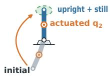  
(a) Acrobot

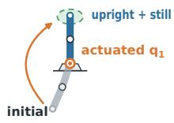  
(b) Pendubot

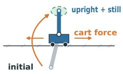  
(c) Cartpole

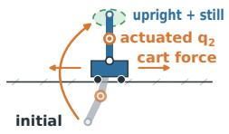  
(d) Double Cart Pendulum

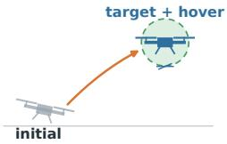  
(e) Quadcopter

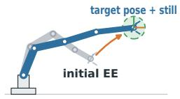  
(f) Franka Reach

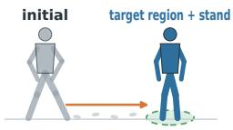  
(g) Humanoid  
Figure 7: Environments.

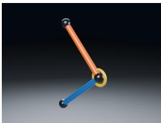  
(a) Acrobot

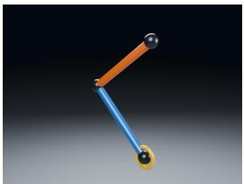  
(b) Pendubot

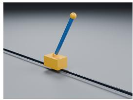  
(c) Cartpole

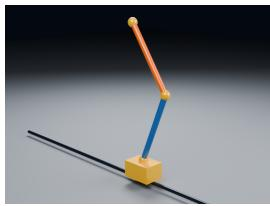  
(d) Double Cart Pendulum

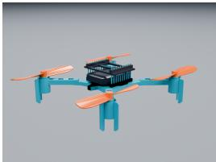  
(e) Quadcopter

  
(f) Franka Reach

  
(g) Humanoid  
Figure 8: Rendered views of the seven environments.

Deterministic trajectory evaluation. We evaluate the deterministic policy mean for 600 control steps using a fixed bank of N = 128 initial conditions or targets $( N \bar { = } 6 4 0$ for Humanoid). The common metrics are defined in Equation (9); Table 3 gives every instantaneous predicate used to construct $C _ { i , t }$

Reward clipping. We use reward clipping in the targeted form shown in Equation (10): it clips the velocity error rather than the whole reward. In the notation of Table 1, both tasks use

$$
r _ { \beta , c } ( q , v ) = r _ { 0 } ( q ) - \beta e _ { v } ^ { ( c ) } ( v ) , \qquad e _ { v } ^ { ( c ) } ( v ) = \mathrm { m i n } \{ e _ { v } ( v ) , c \} , \qquad c = 4 .\tag{13}
$$

In particular, the zeroth-order term and the total reward remain unclipped, so the instantaneous velocity penalty is at most βc. It preserves the unique minimum of the velocity error at $e _ { v } = 0$ while removing its unbounded contribution to the reward’s left tail under stochastic exploration. $\mathbf { A } \mathbf { t } \beta = 0$ it is algebraically inactive and the capped and raw reward functions are identical.

Table 3: Instantaneous success predicates for all Isaac Lab evaluations. All conditions in a row must hold simultaneously.  
Task Conditions for $C _ { i , t } = 1$   
Acrobot / Pendubot $| \theta _ { 1 } | , | \theta _ { 2 , a } | < 0 . 1 5 \mathrm { r a d } , | \dot { \theta } _ { 1 } | , | \dot { \theta } _ { 2 } | < 0 . 5$ rad/s.   
Cartpole $| \theta | < 0 . 1 5 \mathrm { r a d } , | v _ { c } | < 0 . 5 \mathrm { m } / \mathrm { s } , | \dot { \theta } | < 0 . 5$ rad/s.   
Double Cart Pendulum $| \theta _ { 1 } | , | \theta _ { 2 , a } | < 0 . 1 5$ rad, $| v _ { c } | < 0 . 5$ m/s, $| \dot { \theta } _ { 1 } | , | \dot { \theta } _ { 2 } | < 0 . 5$ rad/s   
Quadcopter $\dot { d } _ { p } ~ < ~ 0 . 1 0$ m, ∥vbody∥2 $< ~ 0 . 2 0$ m/s, $\| \dot { \omega } _ { \mathrm { b o d y } } \| _ { 2 } ~ < ~ 0 . 3 0$ rad/s, tilt angle   
$\dot { < } 0 . 1 5$ rad.   
Franka Reach (Full / Partial) $d _ { p } < 0 . 0 5 \mathrm { m } , d _ { R } < 0 . 2 0$ rad, $\| \dot { q } \| _ { 2 } < 0 . 2 5$ rad/s.   
Humanoid $\dot { d _ { x y } } < 0 . 3 5 \mathrm { m } , \| v _ { \mathrm { r o o t } } \| _ { 2 } < 0 . 3 5 \mathrm { m } / { \mathrm { s } } , \| \omega _ { \mathrm { r o o t } } \| _ { 2 } < 0 . 7 5 \mathrm { r a d } / \mathrm { s } .$

For Pendubot, let $\theta _ { 2 , a } = \theta _ { 1 } + \theta _ { 2 }$ be the absolute second-link angle and define $e _ { c } ( \theta _ { 1 } ) = 1 - \cos \theta _ { 1 }$ $e _ { c } ( \theta _ { 2 , a } ) = 1 - \cos \theta _ { 2 , a } , $ . The two rewards are

$$
r _ { \beta } ^ { \mathrm { P } } = 1 - 3 [ e _ { c } ( \theta _ { 1 } ) + e _ { c } ( \theta _ { 2 , a } ) ] - \beta \big ( \dot { \theta } _ { 1 } ^ { 2 } + \dot { \theta } _ { 2 } ^ { 2 } \big ) ,\tag{14}
$$

$$
r _ { \beta , c } ^ { \mathrm { P } } = 1 - 3 [ e _ { c } ( \theta _ { 1 } ) + e _ { c } ( \theta _ { 2 , a } ) ] - \beta \operatorname* { m i n } \left( \dot { \theta } _ { 1 } ^ { 2 } + \dot { \theta } _ { 2 } ^ { 2 } , c \right) , \qquad c = 4 .\tag{15}
$$

For Franka, let $d _ { p }$ be the end-effector position error and $e _ { q } = \sqrt { \operatorname* { m e a n } _ { j } ( q _ { j } - q _ { j } ^ { * } ) ^ { 2 } }$ be the arm jointposture error. We analogously compare

$$
r _ { \beta } ^ { \mathrm { F } } = 1 - 3 \operatorname { t a n h } ( d _ { p } / 0 . 8 ) - 3 e _ { q } - \beta \| \dot { q } \| _ { 2 } ^ { 2 } ,\tag{16}
$$

$$
r _ { \beta , c } ^ { \mathrm { F } } = 1 - 3 \operatorname { t a n h } ( d _ { p } / 0 . 8 ) - 3 e _ { q } - \beta \operatorname * { m i n } \left( \lVert \dot { q } \rVert _ { 2 } ^ { 2 } , c \right) , \qquad c = 4 .\tag{17}
$$

All other reward, observation, PPO, training, and evaluation settings are held fixed between the raw and reward-clipped sweeps. We use five seeds {0, 1, 2, 3, 42} for this experiment; the seed-42 one-iteration diagnostics in Table 2 average saved checkpoints {1800, 1950, 2100, 2250, 2299}.

Reward order versus reward completeness. Now we formalize the detailed theory of the necessity of reward completeness. Let $y ~ = ~ h ( q )$ be the zeroth-order task output and rewrite the zeroth-order reward term as $r _ { 0 } = r _ { 0 } ( h ( q ) )$ . If h is non-injective, then distinct configurations can receive exactly the same instantaneous reward. For a redundant manipulator with Jacobian $J _ { h } ( q )$ any local displacement $\delta q \in$ ker $J _ { h } ( q )$ satisfies

$$
h ( \boldsymbol { q } + \delta \boldsymbol { q } ) = h ( \boldsymbol { q } ) + O ( \| \delta \boldsymbol { q } \| _ { 2 } ^ { 2 } ) , \qquad \nabla _ { \boldsymbol { q } } r _ { 0 } ( h ( \boldsymbol { q } ) ) ^ { \top } \delta \boldsymbol { q } = 0 .\tag{18}
$$

Finite self-motion manifolds can make this ambiguity exact. A trajectory return composed only of $r _ { 0 } ( h ( q ) )$ cannot distinguish two trajectories that share the same reward value while moving differently within such a local set, making it impossible to rank behaviors that the selected $r _ { 0 }$ leaves indistinguishable.

The Full and Partial rewards and their empirical comparison are given in Equation (11)– Equation (12) and Figure 6; all observations, PPO settings, and evaluation trajectories are otherwise matched.

Under the Partial setting, the task-map Jacobian generically leaves at least one tangent direction for a seven-DoF arm away from singularities. Motion along the associated self-motion manifold can preserve the full end-effector pose over time, so not only the instantaneous reward but also future pose rewards can remain unchanged. The Full posture term removes this ambiguity locally by making any generalized-coordinate departure from $q ^ { * }$ costly. A positive velocity penalty does not make the Partial target injective; it instead ranks motion along the otherwise reward-equivalent manifold and thereby supplies direct damping. This geometric distinction explains why a small velocity weight can compensate for Partial’s missing configuration constraint without making velocity reward intrinsically necessary for the Full target.

## B PPO HYPERPARAMETERS

Tables 4 and 5 reports the effective configuration used for the beta sweeps and no-velocityobservation ablations. The first column applies to Acrobot, Pendubot, Cartpole, Double Cart Pen-

dulum, Quadcopter, and Franka; Humanoid-specific values are shown separately. Unless listed otherwise, the two groups use the same setting.

Table 4: Rollout, runner, and actor–critic settings.
<table><tr><td>Parameter</td><td>Six-task shared setting</td><td>Humanoid setting</td></tr><tr><td>Parallel environments</td><td>4096</td><td>4096</td></tr><tr><td>Rollout steps per environment</td><td>600</td><td>600</td></tr><tr><td>Transitions per PPO update</td><td>2,457,600</td><td>2,457,600</td></tr><tr><td>Training iterations</td><td>2300</td><td>1500</td></tr><tr><td>Checkpoint interval / final checkpoint</td><td>150 / 2299</td><td>150 / 1499</td></tr><tr><td>Training seeds</td><td>0,1,2,3,42</td><td>0,1, 2, 3, 42</td></tr><tr><td>Observation normalization</td><td>empirical, enabled</td><td>empirical, enabled</td></tr><tr><td>Policy class</td><td>feedforward Gaussian actor-critic</td><td>same</td></tr><tr><td>Actor hidden widths</td><td>256, 256, 256</td><td>400, 200, 100</td></tr><tr><td>Critic hidden widths</td><td>256, 256, 256</td><td>400, 200, 100</td></tr><tr><td>Activation</td><td>Leaky-ReLU</td><td>ELU</td></tr><tr><td>Critic output</td><td>one scalar value head</td><td>one scalar value head</td></tr><tr><td>Initial policy standard deviation (learned thereafter)</td><td>0.7</td><td>1.0</td></tr><tr><td>Standard-deviation parameterization</td><td>scalar</td><td>scalar</td></tr><tr><td>Standard-deviation floor</td><td>disabled</td><td>disabled</td></tr><tr><td>Runner action clipping</td><td>not set</td><td>1.0</td></tr></table>

Table 5: PPO objective and optimization settings.
<table><tr><td>Parameter</td><td>Six-task shared setting</td><td>Humanoid setting</td></tr><tr><td>Optimizer</td><td>Adam</td><td>Adam</td></tr><tr><td>Initial learning rate</td><td> $1 0 ^ { - 3 }$ </td><td> $1 0 ^ { - 4 }$ </td></tr><tr><td>Learning-rate schedule</td><td>adaptive KL</td><td>adaptive KL</td></tr><tr><td>Desired KL</td><td>0.01</td><td>0.008</td></tr><tr><td>Policy ratio clip €</td><td>0.2</td><td>0.2</td></tr><tr><td>Learning epochs per rollout</td><td>5</td><td>5</td></tr><tr><td>Minibatches per epoch</td><td>4</td><td>4</td></tr><tr><td>Transitions per minibatch</td><td>614,400</td><td>614,400</td></tr><tr><td>Discount γ</td><td>0.99</td><td>0.99</td></tr><tr><td>GAE λ</td><td>0.95</td><td>0.95</td></tr><tr><td>Value-loss coefficient</td><td>1.0</td><td>1.0</td></tr><tr><td>Clipped value loss</td><td>enabled</td><td>enabled</td></tr><tr><td>Entropy coefficient</td><td>0.005</td><td>0.0</td></tr><tr><td>Maximum gradient norm</td><td>1.0</td><td>1.0</td></tr><tr><td>Symmetry augmentation / RND</td><td>none / none</td><td>none / none</td></tr></table>

## C ADDITIONAL EXPERIMENT RESULTS

For training iteration k, let $\boldsymbol { B } _ { k }$ be the set of collected episodes and let T be the length of episodes. We measure the Mean Return as

$$
\overline { { G } } _ { k } = \frac { 1 } { | B _ { k } | } \sum _ { \tau \in B _ { k } } \sum _ { t = 0 } ^ { T - 1 } r _ { \beta } ( q _ { t } , v _ { t } ) .\tag{19}
$$

Additionally, for the critic, let $\widehat { G } _ { t }$ denote the bootstrapped return target in a PPO update and $V _ { \phi _ { \mathrm { o l d } } } ( s _ { t } )$ the value stored when the rollouts were collected. The logged Value Loss is

$$
\mathcal { L } _ { V , k } = \frac { 1 } { \vert \mathcal { B } _ { k } \vert } \sum _ { t \in \mathcal { B } _ { k } } \operatorname* { m a x } \left\{ \left( V _ { \phi } ( s _ { t } ) - \widehat { G } _ { t } \right) ^ { 2 } , \left( V _ { \phi } ^ { \mathrm { c l i p } } ( s _ { t } ) - \widehat { G } _ { t } \right) ^ { 2 } \right\} ,\tag{20}
$$

where $V _ { \phi } ^ { \mathrm { c l i p } } ( s _ { t } ) = V _ { \phi _ { \mathrm { o l d } } } ( s _ { t } ) + \mathrm { c l i p } ( V _ { \phi } ( s _ { t } ) - V _ { \phi _ { \mathrm { o l d } } } ( s _ { t } ) , - \eta , \eta ) .$

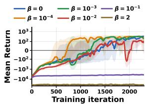  
(a) Acrobot

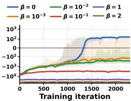  
(b) Pendubot

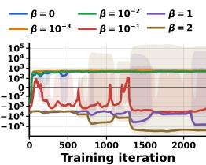  
(c) Cartpole

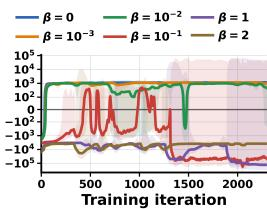  
(d) Double Cart Pendulum

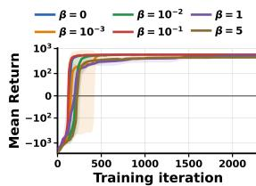  
(e) Quadcopter

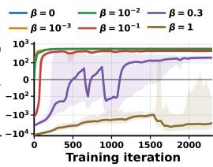  
(f) Franka Reach

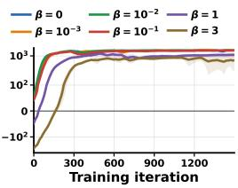  
(g) Humanoid

Figure 9: Training return (Equation (19)) across the seven Isaac Lab tasks. Each seed is first smoothed with a centered 51-iteration moving average; curves and shaded regions then show the across-seed mean and one standard deviation, respectively.  
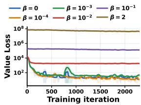  
(a) Acrobot

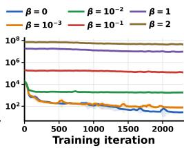  
(b) Pendubot

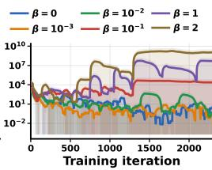

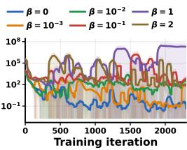  
(c) Cartpole  
(d) Double Cart Pendulum

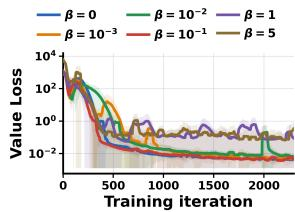  
(e) Quadcopter

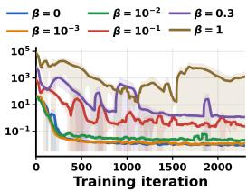  
(f) Franka Reach

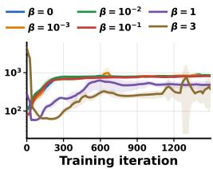  
(g) Humanoid  
Figure 10: Training value loss (Equation (20)) across the seven Isaac Lab tasks. Each seed is first smoothed with a centered 51-iteration moving average; curves and shaded regions then show the across-seed mean and one standard deviation, respectively.

For visualization, each seed trace is first processed with a centered 51-iteration moving average, after which we report the mean and standard deviation across seeds {0, 1, 2, 3, 42}.

The optimization traces in Figures 9 and 10 agree with the deterministic evaluations in Figure 2. At $\beta = 0$ and at small positive weights, the returns of the pendulum, cart, and Franka tasks rise rapidly and then stabilize. Increasing β generally shifts the return downward, enlarges the acrossseed variation, and produces larger or more erratic critic losses, as the unbounded quadratic velocity term changes the scale and variance of the critic target and can dominate the task-progress signal. In contrast, the successful $\beta = 0$ curves confirm the trajectory-level argument in Equation (6): future configuration rewards already distinguish actions that brake from actions that overshoot when the actor and critic observe the full state.

Similar training returns across different values of $\beta$ do not imply similar controllers. Each curve optimizes a different scalar objective according to β, so its numerical value is not a common performance scale across the sweep. A large-β policy can obtain a return comparable to that of a successful policy by suppressing velocity while approaching too slowly, stalling outside the target set, or exchanging target progress for a smaller velocity cost.

Moreover, Equation (19) averages stochastic training episodes and dense rewards, whereas evaluation requires the deterministic policy to reach, brake, and remain inside a thresholded success set. These different trajectory-component tradeoffs explain why the Quadcopter and Humanoid return curves can occupy a relatively narrow range even when their large- $- \beta$ dwell and success rates collapse.

Finally, the increasing Humanoid Value Loss at low $\beta$ is reasonable. Equation (20) is an unnormal ized absolute squared error against an on-policy, bootstrapped target, not a normalized or held-out prediction error. As the Humanoid learns higher-return trajectories, the magnitude and distribution of $\widehat { G } _ { t }$ grow and continue to move between PPO iterations; the critic is therefore chasing a nonstationary target on an expanding absolute scale. Its absolute MSE can rise even while its error relative to the return scale falls and policy performance improves. The large-β Humanoid runs show the complementary case: their initially large velocity penalties create very large early critic errors, which later decrease as the policy reduces motion, but the resulting conservative behavior still fails the deterministic task.

## D NUMERICAL ISSUES WHEN NO VELOCITY PENALTIES IN TRAJECTORY OPTIMIZATION

In direct transcription and multiple shooting, trajectory optimization discretizes continuous dynamics into a finite-dimensional Non-Linear Program (NLP):

$$
\operatorname* { m i n } _ { \mathbf { w } } \quad f ( \mathbf { w } ) = \sum _ { t = 0 } ^ { T - 1 } \left( s _ { t } ^ { \top } Q s _ { t } + a _ { t } ^ { \top } M a _ { t } \right) + s _ { T } ^ { \top } Q _ { f } s _ { T }\tag{21}
$$

$$
\mathrm { s . t . } \quad g ( \mathbf { w } ) = 0 , \quad h ( \mathbf { w } ) \leq 0 ,\tag{22}
$$

where $s _ { t } ~ \in ~ \mathbb { R } ^ { n _ { s } }$ and $a _ { t } \ \in \mathbb { R } ^ { n _ { a } }$ denote the state and control vectors at step $t ,$ respectively. The aggregate decision vector $\mathbf { w } \in \mathbb { R } ^ { n _ { w } }$ over the horizon T is defined as

$$
\mathbf { w } = [ s _ { 0 } ^ { \top } , a _ { 0 } ^ { \top } , s _ { 1 } ^ { \top } , a _ { 1 } ^ { \top } , \ldots , s _ { N } ^ { \top } ] ^ { \top } \in \mathbb { R } ^ { n _ { w } } ,\tag{23}
$$

with total dimension $n _ { w } = ( T + 1 ) n _ { s } + T n _ { a }$

The unconstrained primal Hessian $H _ { f } = \nabla _ { \mathbf { w } } ^ { 2 } f ( \mathbf { w } ) \in \mathbb { R } ^ { n _ { w } \times n _ { w } }$ possesses a block-diagonal structure:

$$
H _ { f } = \left[ \begin{array} { l l l l l } { Q } & { 0 } & { 0 } & { \ldots } & { 0 } \\ { 0 } & { M } & { 0 } & { \ldots } & { 0 } \\ { 0 } & { 0 } & { Q } & { \ldots } & { 0 } \\ { \vdots } & { \vdots } & { \vdots } & { \ddots } & { \vdots } \\ { 0 } & { 0 } & { 0 } & { \ldots } & { Q _ { f } } \end{array} \right]\tag{24}
$$

If the state weighting matrix $Q \succeq 0$ is positive semi-definite with a nontrivial nullspace ker $( Q ) \neq$ $\left\{ 0 \right\} \left( \mathbf { e } . \mathbf { g } . \right.$ ., when velocity penalties are omitted), there exists a nonzero eigenvector $\xi \in \mathbb { R } ^ { n _ { s } }$ such that $Q \xi = 0$ . This induces $\dot { T }$ linearly independent nullspace directions $\pmb { \xi } _ { t } \in \mathbb { R } ^ { n _ { w } }$ in the decision space:

$$
\pmb { \xi } _ { t } = \left[ \boldsymbol { 0 } _ { n _ { s } } ^ { \top } , \boldsymbol { 0 } _ { n _ { a } } ^ { \top } , \ldots , \underbrace { \boldsymbol { \xi } ^ { \top } } _ { \mathrm { ~ a t } s _ { t } } , \ldots , \boldsymbol { 0 } _ { n _ { s } } ^ { \top } \right] ^ { \top } \quad \Longrightarrow \quad H _ { f } \pmb { \xi } _ { t } = 0 .\tag{25}
$$

Primal-dual interior-point solvers (e.g., IPOPT) compute search directions $( \Delta \mathbf { w } , \Delta \lambda )$ by solving the augmented KKT linear system at each iteration:

$$
\begin{array} { r l } { \left[ \nabla _ { \mathbf { w } \mathbf { w } } ^ { 2 } \mathcal { L } } & { J ^ { \top } \right] \left[ \Delta \mathbf { w } \right] } \\ { J } & { 0 } \end{array} = - \left[ \nabla _ { \mathbf { w } } \mathcal { L } \right] ,\tag{26}
$$

where $\mathcal { L }$ is the Lagrangian of the NLP, λ contains the dual variables, and $J = \nabla _ { \mathbf { w } } g ( \mathbf { w } )$ is the equality constraint Jacobian. When $H _ { f }$ is singular or positive semi-definite, the exact Hessian of

the Lagrangian $\nabla _ { \mathbf { w w } } ^ { 2 } \mathcal { L }$ often fails the required inertia condition lacking positive definiteness on the constraint nullspace. The solver must then inject primal diagonal regularization:

$$
\begin{array} { r } { \nabla _ { \mathbf { w } \mathbf { w } } ^ { 2 } \mathcal { L } \quad \longleftarrow \quad \nabla _ { \mathbf { w } \mathbf { w } } ^ { 2 } \mathcal { L } + \gamma _ { p } I _ { n _ { w } } , } \end{array}\tag{27}
$$

for some heuristic parameter $\gamma _ { p } > 0 .$ Excessive regularization distorts the Newton direction, result ing in severe step truncation, oscillatory search behavior, and eventual convergence failure.

## E FULL DERIVATION OF THE TRAJECTORY-LEVEL SUFFICIENCY ARGUMENT

This appendix expands the trajectory-level argument of Section 4. It explains why RL differs from direct trajectory optimization and why the PPO advantage retains a braking signal even when $r _ { 0 }$ is velocity-independent, completing the reasoning behind Equation (2)–Equation (6).

RL reshapes trajectory distributions indirectly. The policy does not directly optimize or move an individual state trajectory. Instead, each actor update modifies the conditional action distribution $\pi _ { \Theta }$ , which perturbs the closed-loop kernel $\kappa _ { \Theta }$ of Equation (2) and consequently redistributes probability mass over complete state trajectories $\tau _ { s } .$ . The critic and advantage estimator evaluate the relative desirability of sampled trajectory segments, while the actor changes their future likelihood – redistributing mass over the policy-realizable family $\mathbb { P } _ { \Pi }$ rather than moving any single trajectory. Unlike Equation (1), PPO neither manipulates an individual trajectory nor differentiates through the dynamics $p _ { \mathrm { d y n } }$ . It samples trajectories, estimates returns and advantages, and changes their future probability through the actor. The comparison nevertheless exposes a shared fact: in both cases a reward is accumulated over a dynamically coupled sequence. The direct optimizer makes this coupling explicit in its constraints, while in RL the critic must infer and propagate it from rollouts.

The advantage depends on the action only through $V ^ { \pi }$ . Write $\begin{array} { r l } { V ^ { \pi } ( q , v ) } & { { } = } \end{array}$ $\mathbb { E } _ { a \sim \pi ( \cdot | q , v ) } [ Q ^ { \pi } ( q , v , a ) ]$ for the value function implied by Equation (6). Unrolling its Bellman recursion identifies $V ^ { \pi }$ with the expected zeroth-order return-to-go under the closed-loop kernel of Equation (2),

$$
\begin{array} { r } { V ^ { \pi } ( q , v ) = \mathbb E _ { \tau _ { s } \sim \mathcal P _ { \Theta } } \left[ \sum _ { k \geq 0 } \gamma ^ { k } r _ { 0 } ( q _ { t + k } ) \ \Big | \ q _ { t } = q , v _ { t } = v \right] . } \end{array}\tag{28}
$$

Thus $V ^ { \pi }$ genuinely depends on v even though $r _ { 0 }$ does not, because v enters the dynamics $p _ { \mathrm { d y n } }$ and hence shapes the distribution of future configurations $q _ { t + 1 : T }$ . Subtracting $V ^ { \pi } ( q , v )$ from $Q ^ { \pi } ( \bar { q } , v , a )$ cancels the shared term $r _ { 0 } ( q )$ exactly, leaving

$$
\begin{array} { r } { A ^ { \pi } ( q , v , a ) = \gamma \Big ( \mathbb { E } _ { s ^ { \prime } \sim p _ { \mathrm { d y n } } ( \cdot \vert q , v , a ) } [ V ^ { \pi } ( s ^ { \prime } ) ] - \mathbb { E } _ { a ^ { \prime } \sim \pi ( \cdot \vert q , v ) } \mathbb { E } _ { s ^ { \prime } \sim p _ { \mathrm { d y n } } ( \cdot \vert q , v , a ^ { \prime } ) } [ V ^ { \pi } ( s ^ { \prime } ) ] \Big ) . } \end{array}\tag{29}
$$

By Equation $( 2 8 ) , A ^ { \pi } ( q , v , a )$ is determined by how a changes the future zeroth-order return relative to the policy average: $a _ { t } \ \mapsto \ p _ { \mathrm { d y n } } ( \cdot \ | \ q _ { t } , v _ { t } , a _ { t } ) \ \mapsto \ \mathbb { E } [ V ^ { \pi } ( s _ { t + 1 } ) ] \mapsto A _ { t } ^ { \pi }$ . Thus, an action that reduces future configuration error receives positive advantage through this chain, even though the instantaneous reward has no explicit velocity term.

## F PROOF OF THEOREM 4.2

Proof. Assume the contrary. By the converse Lyapunov theorem (Khalil, 2002), there exists a continuously differentiable strict Lyapunov function V defined on a neighborhood D of $x ^ { * } .$ , such that $\mathcal { V } ( x ^ { * } ) = 0 , \mathcal { V } ( x ) > 0$ , and $\dot { \mathcal { V } } ( \boldsymbol { x } ) = \nabla \mathcal { V } ( \boldsymbol { x } ) ^ { \top } l _ { q } ( \boldsymbol { x } ) < 0$ for all $x \in { \mathcal { D } } \setminus \{ x ^ { * } \}$

The strict inequality implies that $\nabla \mathcal { V } ( x ) \neq 0$ for every $x \in { \mathcal { D } } \setminus \{ x ^ { * } \}$ , since otherwise $\dot { \mathcal { V } } ( x ) = 0$ Hence, every $c > 0$ is a regular value of V. Choose $r > 0$ such that $\overline { { B _ { r } ( x ^ { * } ) } } \subset \mathcal { D }$ , and let $\delta _ { r } =$ $\begin{array} { r } { \operatorname* { m i n } _ { x \in \partial B _ { r } ( x ^ { * } ) } \mathcal { V } ( x ) > 0 } \end{array}$ , where positivity follows from the positive definiteness and continuity of V. For any $c \in ( 0 , \delta _ { r } )$ , define the local sublevel set $\Omega _ { c } = \{ x \in \overline { { B _ { r } ( x ^ { * } ) } } : \mathcal { V } ( x ) \leq c \}$ . The set $\Omega _ { c }$ is compact, and the choice $c < \delta _ { r }$ ensures that $\Omega _ { c } \cap \partial B _ { r } ( x ^ { * } ) \dot { = } \alpha$ ; therefore, $\Omega _ { c } \subset \dot { B _ { r } } ( x ^ { * } ) \subset \mathcal { D }$

Since c is a regular value, the boundary $\partial \Omega _ { c } = \{ x \in B _ { r } ( x ^ { * } ) : \mathcal { V } ( x ) = c \}$ is a compact embedded $C ^ { 1 }$ submanifold of dimension $2 n - 1$ . Moreover, the outward unit normal vector field is well defined by $\begin{array} { r } { \hat { n } ( x ) = \frac { \nabla \mathcal { V } ( x ) } { \| \nabla \mathcal { V } ( x ) \| } } \end{array}$ . Consequently, for every $x \in \partial \Omega _ { c } .$

$$
l _ { q } ( x ) ^ { \top } \hat { n } ( x ) = \frac { \nabla \mathcal { V } ( x ) ^ { \top } l _ { q } ( x ) } { \| \nabla \mathcal { V } ( x ) \| } < 0 .\tag{30}
$$

Since $\partial \Omega _ { c }$ is compact and the integrand is continuous and strictly negative on it, its surface integral is strictly negative. On the other hand, using $\nabla \cdot l _ { q } = 0$ and applying the divergence theorem gives

$$
0 = \int _ { \Omega _ { c } } \boldsymbol { \nabla } \boldsymbol { \cdot } \boldsymbol { l } _ { q } d x = \int _ { \partial \Omega _ { c } } \boldsymbol { l } _ { q } ^ { \top } \hat { \boldsymbol { n } } d S < 0 ,\tag{31}
$$

which is a contradiction. Therefore, a strict Lyapunov function and local asymptotic stability are impossible and we complete the proof.

## G AN ILLUSTRATIVE EXAMPLE: DOUBLE INTEGRATOR

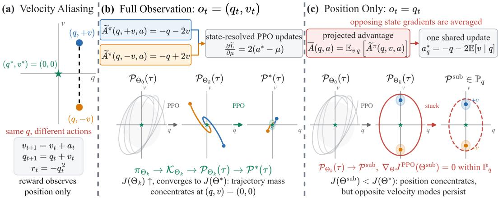  
Figure 11: toy example

Consider the discrete-time double integrator

$$
q _ { t + 1 } = q _ { t } + v _ { t } , \qquad v _ { t + 1 } = v _ { t } + a _ { t } , \qquad R _ { t } = - q _ { t } ^ { 2 } ,\tag{32}
$$

with independent initial states $\begin{array} { r l r } { q _ { 0 } } & { { } \sim } & { \mathcal { U } [ - \vartheta , \vartheta ] } \end{array}$ and $\begin{array} { r l r } { v _ { 0 } } & { { } \sim } & { \mathcal { U } [ - \nu , \nu ] } \end{array}$ , and objective $\begin{array} { r l } { J } & { { } = } \end{array}$ $\begin{array} { r } { \mathbb { E } _ { \pi _ { \Theta } } [ \sum _ { t = 0 } ^ { T } \gamma ^ { t } r _ { t } ] } \end{array}$ for $T \geq 2$ . Because $a _ { t }$ first affects the position at $t + 2 .$ , where $q _ { t + 2 } = q _ { t } + 2 v _ { t } + a _ { t } ,$ the optimal action is

$$
a _ { t } ^ { * } = - q _ { t } - 2 v _ { t } , \qquad ( q _ { 0 } , v _ { 0 } ) \to ( q _ { 0 } + v _ { 0 } , - q _ { 0 } - v _ { 0 } ) \to ( 0 , 0 ) \to \cdots .\tag{33}
$$

The first two position costs are unavoidable, so $J ( \Theta ^ { * } ) = - \mathbb { E } [ q _ { 0 } ^ { 2 } + \gamma ( q _ { 0 } + v _ { 0 } ) ^ { 2 } ] ,$

To expose the actor update, we retain the first reward term affected by $a _ { t } .$ . Earlier rewards are actionindependent and the omitted factor $\gamma ^ { 2 } ~ > ~ 0$ does not change the maximizing action or gradient direction. Thus, the following quantities are the local action-dependent components rather than the complete policy-dependent ${ \bar { Q } } ^ { \pi } , V ^ { \pi }$ , and $A ^ { \pi }$ . For a Gaussian policy $\pi ( a \mid q , \bar { v } ) = \mathcal { N } ( \mu ( q , v ) , \sigma ^ { 2 } )$ ,

$$
\widetilde { Q } ^ { \pi } ( q , v , a ) = - ( q + 2 v + a ) ^ { 2 } = - ( a - a ^ { * } ) ^ { 2 } ,\tag{34}
$$

$$
\widetilde V ^ { \pi } ( q , v ) = - ( \mu - a ^ { * } ) ^ { 2 } - \sigma ^ { 2 } ,\tag{35}
$$

$$
\widetilde { A } ^ { \pi } ( q , v , a ) = - ( a - a ^ { * } ) ^ { 2 } + ( \mu - a ^ { * } ) ^ { 2 } + \sigma ^ { 2 } .\tag{36}
$$

The PPO mean update is therefore

$$
\frac { \partial \widetilde { \mathcal { L } } } { \partial \mu } = \mathbb { E } _ { a } \left[ \widetilde { A } ^ { \pi } \frac { a - \mu } { \sigma ^ { 2 } } \right] = 2 ( a ^ { * } - \mu ) ,\tag{37}
$$

which moves every state-conditioned mean toward $\mu ^ { * } ( q , v ) = - q - 2 v$ . The induced trajectory distribution consequently concentrates on Equation (33), although the reward itself contains only $q .$

Now restrict the actor to $\pi _ { q } ( a \mid q ) = \mathcal { N } ( \mu _ { q } ( q ) , \sigma ^ { 2 } )$ . Maximizing the local objective averaged over hidden velocities gives $\mu _ { q } ^ { * } ( q ) = - q - 2 \mathbb { E } [ \bar { v } \mid q ]$ . At this shared mean, the state-resolved update and its observation-conditioned average are

$$
\frac { \partial \widetilde { \mathcal { L } } } { \partial \mu } ( q , v ) = 2 [ a ^ { * } ( q , v ) - \mu _ { q } ( q ) ] , \qquad \mathbb { E } \left[ \frac { \partial \widetilde { \mathcal { L } } } { \partial \mu } ( q , v ) \mid q \right] = 0 ,\tag{38}
$$

which moves the mean toward $\mu ^ { * } ( q , v ) \ : = \ : - q \ : - \ : 2 \mathbb { E } [ v \ : \mid \ : q ]$ . Thus, PPO becomes “stuck” at a suboptimal trajectory distribution $\mathcal { P } ^ { \mathrm { s u b } } \in \mathbb { P } _ { q } \colon$ it is stationary after averaging over states that share an observation, even though their state-resolved gradients are nonzero and require different braking actions. The irreducible deterministic action error is $\mathbb { E } [ ( \mu _ { q } ^ { * } - a ^ { * } ) ^ { 2 } \mid q ] = 4 \operatorname { V a r } ( v \mid q ) > 0$ whenever the hidden velocity is ambiguous. The zeroth-order reward still identifies the better trajectories, but the zeroth-order actor cannot realize their required state-dependent redistribution.