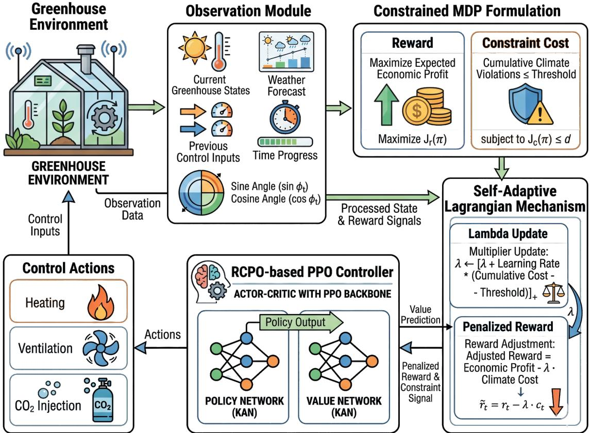
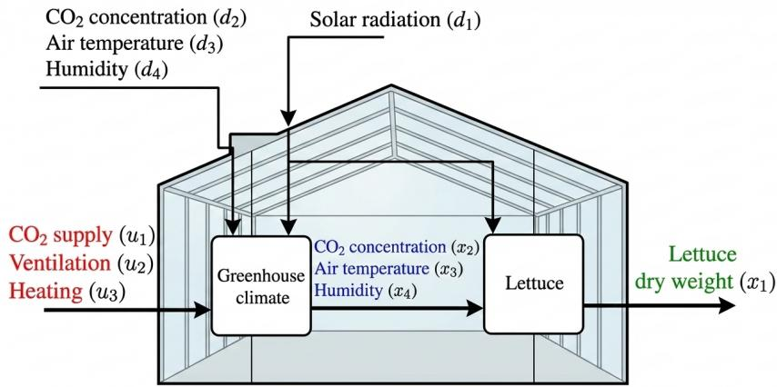
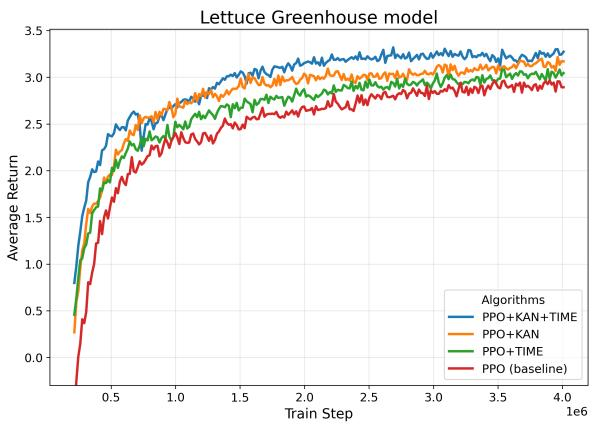
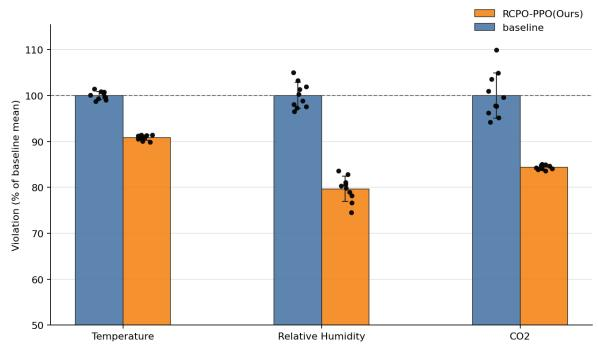
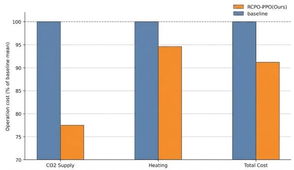

# Safe Greenhouse Climate Control Using Lagrangian-Constrained PPO with Kolmogorov–Arnold Networks

Hanzun Liua,1, Yuling Fana,1, Fang Tiana,b, Zhilong Biea, Zaiwen Fenga,b,∗ and Yongliang Qiaoc,d,∗

aCollege ofInformatics, Huazhong Agricultural University, Wuhan 430070, China

bYunnan Modern Agricultural Industry Research Institute Co., Ltd.,Kunming, Yunnan 650000, China

cCollege of Biological and Agricultural Engineering, Jilin University, Changchun 130022, China

dKey Laboratory of Eficient Sowing and Harvesting Equipment, Ministry of Agriculture and Rural Afairs, Jilin University, Changchun 130022, China

## A R T I C L E I N F O

Keywords:   
Greenhouse Climate Control   
Reinforcement Learning   
Constrained Markov Decision Process   
Proximal Policy Optimization   
Intelligent Perception   
Smart Farming

## A BS T RA C T

Greenhouse climate control requires balancing economic return and maintaining temperature, humidity and CO within crop-adapted growth ranges. Conventional reinforcement learning (RL) greenhouse controllers rely on fixed reward penalties to restrict climate constraint violations, yet such heuristic penalties fail to explicitly constrain long-term cumulative violations; improperly tuned weights either make policies overly conservative and reduce yields or fail to suppress sustained climate deviations that inhibit photosynthesis and trigger crop diseases. To tackle this limitation, this work first formulates the greenhouse climate regulation task as a Constrained Markov Decision Process (CMDP), and adopts a Lagrangian-based safe RL framework named Reward Constrained Policy Optimization-Proximal Policy Optimization (RCPO-PPO) to separate economic optimization and cumulative safety constraints, which adaptively adjusts penalty intensity without manual weight tuning. To address the strong nonlinear and time-varying coupling between greenhouse microclimate and crop growth, Kolmogorov–Arnold Networks (KANs) replace standard Multi-Layer Perceptrons (MLPs) as policy and value approximators for enhanced nonlinear representation, while sinusoidal cyclic time features are embedded into observations to represent diurnal periodic environmental variations. Simulations are carried out on a classic winter lettuce greenhouse dynamic model with 40-day real-weather disturbance inputs. Results show that, compared with penalty-based vanilla Proximal Policy Optimization (PPO), the proposed method reduces cumulative climate constraint violations by 18.65% and increases the total economic profit of lettuce cultivation by 2.91%, while stably keeping cumulative climate violations close to the preset safety threshold. These results indicate that the decoupled CMDP-based constrained optimization together with enhanced KAN-driven policy representation can efectively mitigate long-term climate risks while simultaneously improving planting economic benefits, ofering a promising constraint-aware control strategy for precision greenhouse cultivation.

## 1. Introduction

Greenhouse plant production enables stable and highquality food supply by regulating the indoor climate under varying outdoor weather conditions[1, 2, 3]. Key variables such as air temperature, humidity, and carbon dioxide $( \mathrm { C O } _ { 2 } )$ concentration strongly influence photosynthesis, biomass accumulation, and plant health[4]. In practice, greenhouse operation must simultaneously achieve two long-term goals: (i) maintain the climate within ranges that are suitable for plant growth and disease prevention[5], and (ii) reduce operational costs related to heating, ventilation, and $\mathrm { C O } _ { 2 }$ enrichment to improve economic returns[6, 7]. This creates a fundamental trade-of between production profit and climate regulation reliability.

A wide range of greenhouse climate control methods have been developed, including rule-based strategies[8], proportional–integral–derivative (PID) controllers[9], and model predictive control (MPC)[10]. Among them, MPC is attractive because it can explicitly incorporate multivariable dynamics, constraints, and disturbance forecasts[11]. However, model-based performance depends on the accuracy of the underlying greenhouse–crop model, and capturing the nonlinear and uncertain interactions between crop physiology, indoor climate, and external disturbances remains challenging[12, 13], especially across diferent crops, seasons, and operating conditions.

Reinforcement learning has therefore gained increasing attention as a data-driven alternative that can optimize longhorizon objectives through interaction with a simulator or real system[14, 15]. Recent studies have shown that Reinforcement learning can improve economic performance in greenhouse control tasks[16, 17]. Nevertheless, a major barrier to the practical deployment of reinforcement learning in greenhouse climate control is the potentially harmful impact of constraint violations on crop growth and plant health. Prolonged deviations in temperature, humidity, or $\mathrm { C O } _ { 2 }$ concentration can suppress photosynthesis[18, 19, 20], promote disease development, and reduce biomass accumulation. In most existing RL-based greenhouse controllers, such climate requirements are enforced only indirectly through penalty terms in the reward function[21, 22]. However, designing such heuristic scalar penalty functions is highly non-trivial and often fragile in complex environmental control tasks[23]. Although this heuristic approach can reduce violations, it ofers no explicit control over the long-horizon magnitude or duration of violations, as these metrics are governed by manually tuned penalty weights. More critically, fixed-penalty formulations frequently lead to suboptimal policies. Heavy penalties imposed for early constraint violations can trap the agent in conservative local optima[24], deterring exploration and severely sacrificing performance, while trivially small penalties fail to deter unsafe behaviors[25]. Consequently, safety performance fluctuates across diferent weather conditions and training runs, obscuring the true trade-of between economic profit and crop protection.

These considerations motivate a control framework in which long-horizon constraint violations can be explicitly specified and regulated. In recent years, safe reinforcement learning has emerged as a principled paradigm for handling such requirements and has been successfully applied in safety-critical domains such as robotics[26], autonomous driving[27], and energy systems[28], where policies must optimize performance while satisfying strict operational constraints[29, 30].

To address these limitations, this study formulate greenhouse climate control as a Constrained Markov Decision Process [31], where economic profit is optimized subject to explicit constraints on cumulative climate violations. Based on this formulation, we adopt a safe reinforcement learning approach to regulate long-horizon violations during policy learning, rather than relying on heuristic fixed penalties. Beyond explicit constraint regulation, control performance also depends on policy expressiveness and the availability of informative observations. To improve nonlinear representation and account for diurnal dynamics, Proximal Policy Optimization [32] is augmented with Kolmogorov–Arnold Networks [33], drawing inspiration from recent integration of KANs in online reinforcement learning environments[34], alongside cyclic time features (sin ∕ cos encoding).

Figure 1 illustrates the overall framework of the proposed KAN-based safe reinforcement learning greenhouse climate control system.

In brief, greenhouse climate control is first formulated as a Constrained Markov Decision Process to explicitly distinguish economic objectives and climate regulation constraints. A safe reinforcement learning framework is adopted to suppress cumulative climate violations and attain adjustable trade-ofs between profit and long-term safety. Meanwhile, enhanced policy representation together with cyclic time encoding is introduced to improve nonlinear fitting and capture periodic diurnal dynamics.

The main contributions of this work are as follows:

• A greenhouse-specific CMDP formulation is developed that explicitly separates economic returns from cumulative climate-risk constraints.

• An interpretable cumulative climate-violation cost design is proposed, enabling growers to specify a longhorizon violation budget.

• The combined value of adaptive Lagrangian constraint handling, KAN-based policy representation, and cyclic time encoding is systematically validated on a lettuce greenhouse model.

• Simulation results show that the integrated controller reduces cumulative climate violations while improving economic profit compared with a penalty-based PPO baseline.

## 2. Background

## 2.1. Greenhouse Climate Model

The greenhouse environment considered in this study is a winter lettuce production system described by a nonlinear greenhouse–crop dynamic model proposed in [35]. This coupled model simultaneously captures indoor microclimate evolution and crop growth dynamics, which is suitable for evaluating climate control strategies related to crop yield and environmental constraints. The structure of the model is shown in Figure 2, and the specific definitions of the state, input, output, and disturbance variables are summarized in Table 1.

The continuous-time model is discretized using the fourth-order Runge–Kutta method with a fixed sampling time $\Delta t = 3 0$ min, resulting in the following discrete-time nonlinear state–space representation:

$$
\begin{array} { c } { { x ( k + 1 ) = f \big ( x ( k ) , u ( k ) , d ( k ) , p \big ) , } } \\ { { y ( k ) = g \big ( x ( k ) , p \big ) . } } \end{array}\tag{1}
$$

where $k \in \mathbb { Z } ^ { 0 }$ denotes the discrete-time counter. Specifically, $x ( k ) ~ \in ~ \mathbb { R } ^ { 4 }$ is the system state vector, $u ( k ) \in$ $\mathbb { R } ^ { 3 }$ represents the manipulable control input, $d ( k ) \ \in \ \mathbb { R } ^ { 4 }$ accounts for the uncontrollable weather disturbance, and $y ( k ) ~ \in ~ \mathbb { R } ^ { 4 }$ denotes the system output vector reflecting measurable greenhouse-crop states. The vector $\boldsymbol { p } ~ \in ~ \mathbb { R } ^ { 2 8 }$ stands for the model parameters characterizing the physical, thermal, and biological properties of the system. The explicit expressions of the nonlinear functions �(⋅) and �(⋅) are detailed in Appendix A.

## 2.2. CMDP and Safety Reinforcement Learning 2.2.1. Constrained Markov Decision Process

A Constrained Markov Decision Process extends the standard Markov Decision Process (MDP) [36] by explicitly incorporating long-term constraints into the decisionmaking framework. A standard MDP is defined by the tuple $\mathcal { M } = \langle S , \mathcal { A } , P , r , \gamma \rangle$ , where S is the state space, A is the action space, $P ( s ^ { \prime } | s , a )$ is the transition probability, $r ( s , a )$ is the reward function, and $\gamma \in ( 0 , 1 )$ is the discount factor. The classical objective is to find a policy � that maximizes the expected discounted return:

$$
J _ { r } ( \pi ) = \mathbb { E } _ { \pi } \left[ \sum _ { t = 0 } ^ { \infty } \gamma ^ { t } r ( s _ { t } , a _ { t } ) \right] .\tag{2}
$$

To introduce safety requirements, a CMDP augments the standard formulation with cost functions and thresholds, defined as $\mathcal { M } _ { c } = \langle S , A , P , r , \{ c _ { i } \} _ { i = 1 } ^ { m } , \gamma , \{ d _ { i } \} _ { i = 1 } ^ { m } \rangle$ . The corresponding optimization problem is formulated as follows:

  
Figure 1: Framework of the proposed KAN-based safe reinforcement learning greenhouse climate control system.

  
Figure 2: Greenhouse-crop system dynamic relationship diagram.

$$
\begin{array} { r l } { \displaystyle \operatorname* { m a x } _ { \pi } } & { \displaystyle J _ { r } ( \pi ) = \mathbb { E } _ { \pi } \left[ \displaystyle \sum _ { t = 0 } ^ { \infty } \gamma ^ { t } r ( s _ { t } , a _ { t } ) \right] , } \\ { \mathrm { s . t . } } & { \displaystyle J _ { c _ { i } } ( \pi ) = \mathbb { E } _ { \pi } \left[ \displaystyle \sum _ { t = 0 } ^ { \infty } \gamma ^ { t } c _ { i } ( s _ { t } , a _ { t } ) \right] \leq d _ { i } , } \\ & { \quad \quad \quad \quad i = 1 , \ldots , m . } \end{array}\tag{3a}
$$

(3b)

Compared with standard MDPs where constraints are implicitly handled via reward penalties, the CMDP framework explicitly separates performance optimization from constraint satisfaction, where the bounds $d _ { i }$ directly quantify the acceptable levels of long-term risk.

## 2.2.2. Safe Reinforcement Learning

Safe Reinforcement Learning aims to learn optimal policies while aiming to satisfy that predefined safety constraints are satisfied during both training and deployment. Guided by the CMDP formulation in (3), the constrained optimization problem is typically addressed by introducing Lagrange multipliers $\lambda _ { i } \ \geq \ 0$ to construct the following Lagrangian function [31]:

Definitions of state, input, output, and disturbance variables
<table><tr><td colspan="2">State x(t)</td><td colspan="2">Output y(t)</td></tr><tr><td> $x _ { 1 } ( t )$ </td><td> $\mathsf { D r y - w e i g h t } \ ( \mathsf { k g } / \mathsf { m } ^ { 2 } )$ </td><td> $y _ { 1 } ( t )$ </td><td> $\mathsf { D r y  – w e i g h t ~ ( g / m ^ { 2 } ) }$ </td></tr><tr><td> $x _ { 2 } ( t )$ </td><td> $\mathsf { l n d o o r } \mathsf C \mathsf O _ { 2 } \mathsf { \Gamma } ( \mathsf { k g } / \mathsf { m } ^ { 3 } )$ </td><td> $y _ { 2 } ( t )$ </td><td>Indoor  $\mathsf { C O } _ { 2 } \ \mathsf { ( p p m ) }$ </td></tr><tr><td> $x _ { 3 } ( t )$ </td><td> $\mathsf { l n d o o r \ t e m p e r a t u r e \Gamma } ( ^ { \circ } C )$ </td><td> $y _ { 3 } ( t )$ </td><td>Indoor temperature (°C)</td></tr><tr><td> $x _ { 4 } ( t )$ </td><td> $\mathsf { l n d o o r \ h u m i d i t y \ ( k g / m ^ { 3 } ) }$ </td><td> $y _ { 4 } ( t )$ </td><td>Indoor humidity (%)</td></tr><tr><td>Control input u(t)</td><td></td><td>Disturbance d(t)</td><td></td></tr><tr><td> $u _ { 1 } ( t )$ </td><td> $\mathsf { C O } _ { 2 } \mathsf { i n j e c t i o n \ ( m g / m } ^ { 2 } / \mathsf { s } )$ </td><td> $d _ { 1 } ( t )$ </td><td>Radiation  $( \mathsf { W } / \mathsf { m } ^ { 2 } )$ </td></tr><tr><td> $u _ { 2 } ( t )$ </td><td>Ventilation  $\left( \mathsf { m m } / \mathsf { s } \right)$ </td><td> $d _ { 2 } ( t )$ </td><td>Outdoor  $\mathsf C \mathsf O _ { 2 } \ ( \mathsf { k g } / \mathsf { m } ^ { 3 } )$ </td></tr><tr><td> $u _ { 3 } ( t )$ </td><td>Heating  $( \mathsf { W } / \mathsf { m } ^ { 2 } )$ </td><td> $d _ { 3 } ( t )$ </td><td>Outdoor temperature  $( ^ { \circ } \mathsf { C } )$ </td></tr><tr><td></td><td></td><td> $d _ { 4 } ( t )$ </td><td>Outdoor humidity  $( \mathsf { k g } / \mathsf { m } ^ { 3 } )$ </td></tr></table>

$$
\mathcal { L } ( \pi , \Lambda ) = J _ { r } ( \pi ) - \sum _ { i = 1 } ^ { m } \lambda _ { i } \big ( J _ { c _ { i } } ( \pi ) - d _ { i } \big ) ,\tag{4}
$$

where $\boldsymbol { \Lambda } = \{ \lambda _ { 1 } , \dots , \lambda _ { m } \}$ . This formulation enables a primal– dual optimization procedure to balance reward maximization and constraint satisfaction [37, 38]. While other prominent Safe RL paradigms, such as Control Barrier Functions (CBFs) or safe shielding, ofer step-wise safety filters, they typically demand a highly precise analytical model of system dynamics[39]. This makes the model-free Lagrangian framework more computationally eficient and naturally aligned with the long-horizon cumulative constraints typical of agricultural environments.

## 2.2.3. Reward Constrained Policy Optimization

Reward Constrained Policy Optimization (RCPO) is a representative Safe RL algorithm that solves the CMDP problem using an online primal–dual scheme [40]. RCPO updates the policy parameters by maximizing the Lagrangian $\mathcal { L } ( \pi , \Lambda )$ , while the Lagrange multipliers are adaptively updated to penalize constraint violations:

$$
\lambda _ { i } \gets \Big [ \lambda _ { i } + \alpha _ { \lambda } \big ( J _ { c _ { i } } ( \pi ) - d _ { i } \big ) \Big ] _ { + } , \quad i = 1 , \ldots , m ,\tag{5}
$$

where $\alpha _ { \lambda }$ denotes the learning rate and [⋅] represents the projection onto the nonnegative orthant.

This adaptive mechanism enables RCPO to maintain the cumulative constraint costs close to the predefined thresholds $d _ { i } ,$ which is particularly suitable for long-term regulation of greenhouse climate violations.

RCPO exhibits three important properties for greenhouse climate control:

• Interpretability: The explicit Lagrange multipliers provide a clear physical meaning for regulating longterm climate violations against the threshold �.

• Adaptability: The online multiplier update automatically balances economic performance (energy savings) and climate safety under varying weather disturbances.

• Flexibility: RCPO is algorithm-agnostic and seamlessly integrates with standard policy gradient methods and advanced deep reinforcement learning frameworks.

## 2.3. Kolmogorov–Arnold Networks

Kolmogorov–Arnold Networks have recently been proposed as an alternative neural network architecture inspired by the Kolmogorov–Arnold representation theorem [33]. Unlike conventional multilayer perceptrons (MLPs), where nonlinearities are applied at the nodes through fixed activation functions, KANs parameterize nonlinear transformations along the edges using learnable spline functions. This structural diference allows KANs to represent complex nonlinear mappings with a diferent functional decomposition compared to standard feedforward networks.

In a KAN layer, each connection between neurons is associated with a learnable univariate function, typically implemented via spline-based parameterization. As a result, nonlinear transformations are distributed across edges rather than concentrated at nodes. This formulation provides flexible function approximation while maintaining a relatively compact parameterization. Recent studies suggest that KANs exhibit strong approximation capability and improved interpretability in certain nonlinear regression and control tasks [33]. Beyond static regressions, KAN structures have shown remarkable capacity in handling complex time-series forecasting with highly intertwined frequency components[41], as well as stabilizing policy approximations in continuous online control environments[34].

Given the highly nonlinear interactions among climate variables, crop physiology, and external disturbances in greenhouse systems, enhanced function approximation capacity is desirable for policy and value estimation. Therefore, KANs are employed as the function approximators within the reinforcement learning framework, replacing standard MLP-based policy and value networks.

## 3. Method

This section details the problem formulation, algorithm implementation, and observation design of the proposed control strategy. The greenhouse climate control task is formulated as a CMDP to explicitly separate economic optimization objectives and long-term climate safety constraints. An RCPO-based safe reinforcement learning framework is adopted to solve the constrained optimization problem under the PPO backbone. Furthermore, KAN-based policy networks and cyclic time feature encoding are introduced to enhance nonlinear fitting ability and capture diurnal greenhouse dynamics. The detailed mathematical formulation and network design are presented below.

## 3.1. CMDP formulation for greenhouse climate control

Control objective. Greenhouse climate control aims to maximize economic return while maintaining indoor climate variables within ranges suitable for crop growth. In practice, temperature, humidity, and $\mathrm { C O } _ { 2 }$ concentration must be regulated to avoid conditions that may negatively afect plant development. Therefore, the control problem involves balancing two objectives: achieving high economic performance and limiting climate constraint violations over the long growing horizon. To explicitly represent this trade-of, the greenhouse control problem is formulated as a Constrained Markov Decision Process.

CMDP components. The greenhouse control system is modeled as $\mathrm { \ a \ C M D P \ } ( S , \mathcal { A } , P , r , c , d , \gamma )$ . At each time step �, the agent receives an observation $s _ { t } \in S$ , selects a control action $a _ { t } \in \ A .$ , and receives a reward $r _ { t }$ together with a constraint cost $c _ { t } .$

The observation vector contains information describing the greenhouse state, control history, environmental disturbances, and time features. Specifically, the observation is defined as

$$
s _ { t } = \big [ y ( t ) , { u ( t - 1 ) } , \ w ( t : t + N _ { p } ) , \ \tau ( t ) , \ \sin ( \phi _ { t } ) , \ \cos ( \phi _ { t } ) \big ] ,\tag{6}
$$

where �(�) denotes measurable greenhouse outputs including crop dry weight, indoor $\mathrm { C O } _ { 2 }$ concentration, air temperature, and relative humidity. The term $u ( t \textrm { -- } 1 )$ represents the previous control input vector. The variable $w ( t \textrm { ~ : ~ } t \textrm { + }$ $N _ { p } )$ denotes the weather look-ahead window: the current values and short-term forecasts of outdoor radiation, $\mathrm { C O } _ { 2 }$ concentration, air temperature, and relative humidity. In this study $N _ { p } ~ = ~ 1 3$ at the $\Delta t \ = \ 3 0$ min sampling interval, $\mathrm { i . e . }$ , the current step plus twelve half-hour-ahead steps (a 6 h look-ahead). These values are taken directly from the same measured weather time series that drives the simulator (Section 4.1), i.e., a perfect forecast; the identical sequence is used in training and evaluation, and forecast-error efects are not modeled. The scalar �(�) represents the overall progress of the growing period, while $\sin ( \phi _ { t } )$ and $\cos ( \phi _ { t } )$ encode the time-of-day using cyclic features to capture diurnal dynamics.

The control action corresponds to the greenhouse actuation inputs

$$
\boldsymbol { a } _ { t } = \boldsymbol { u } ( t ) = [ u _ { C O 2 } ( t ) , u _ { v e n t } ( t ) , u _ { h e a t } ( t ) ] ^ { \top } ,\tag{7}
$$

which represent $\mathrm { C O } _ { 2 }$ injection, ventilation rate, and heating power, respectively.

The transition probability $P ( s _ { t + 1 } | s _ { t } , a _ { t } )$ is induced by the nonlinear greenhouse dynamics under exogenous weather disturbances and model uncertainties.

Economic reward (profit). The instantaneous reward reflects the economic profit obtained during one control interval. It is defined as the crop revenue from incremental biomass growth minus actuation costs:

$$
\begin{array} { l } { r _ { t } = c _ { D W } \big ( x _ { D W } ( t + 1 ) - x _ { D W } ( t ) \big ) } \\ { \qquad - \left( 1 0 ^ { - 6 } c _ { C O 2 } u _ { C O 2 } ( t ) + \frac { c _ { h e a t } u _ { h e a t } ( t ) } { 3 . 6 \times 1 0 ^ { 6 } } \right) \Delta t , } \end{array}\tag{8}
$$

where $x _ { D W }$ is the crop dry weight $( \mathrm { k g } / \mathrm { m } ^ { 2 } ) , c _ { D W }$ is the unit selling price of the crop dry weight (€/kg), and $c _ { C O 2 }$ and $c _ { h e a t }$ are the unit costs of $\mathrm { C O } _ { 2 }$ enrichment $( \in / \mathrm { k g } )$ and heating $( \mathrm { { \ ' { E } / \mathrm { { k } W h } ) } }$ , respectively. Here $u _ { C O 2 }$ is in mg/m2/s, $u _ { h e a t }$ in $\mathrm { W } / \mathrm { m } ^ { 2 }$ , and Δ� in seconds; the factors $1 0 ^ { - 6 }$ (mg→kg) and $1 / ( 3 . 6 \times 1 0 ^ { 6 } ) ~ ( \mathrm { J { \to } k W h }$ , since $1 { \mathrm { ~ k W h } } = 3 . 6 \times 1 0 ^ { 6 } { \mathrm { ~ J } } )$ make all terms dimensionally consistent in $\epsilon / \mathrm { m } ^ { 2 }$ . The cumulative profit over the 40-day cultivation horizon is therefore the net return per square meter of greenhouse floor area, which is the quantity reported in Table 7. Ventilation cost is neglected, consistent with common assumptions in greenhouse climate control studies.

Climate constraint cost (accumulated violation) To quantify deviations from acceptable climate conditions, constraint violations are defined based on the distance between the indoor climate variables and their allowable ranges. Let $[ y _ { ( \cdot ) } ^ { m i n } , y _ { ( \cdot ) } ^ { m a x } ]$ denote the acceptable ranges for $\mathrm { C O } _ { 2 } ,$ temperature, and relative humidity. For each variable, the instantaneous violation is defined as

$$
v _ { ( \cdot ) } ( t ) = \operatorname* { m a x } \bigl ( 0 , y _ { ( \cdot ) } ( t ) - y _ { ( \cdot ) } ^ { m a x } \bigr ) + \operatorname* { m a x } \bigl ( 0 , y _ { ( \cdot ) } ^ { m i n } - y _ { ( \cdot ) } ( t ) \bigr ) ,\tag{9}
$$

The instantaneous constraint cost is then defined as a weighted sum of the individual violations:

$$
c _ { t } = w _ { C O 2 } v _ { C O 2 } ( t ) + w _ { T } ^ { \mathrm { l o w } } v _ { T } ^ { \mathrm { l o w } } ( t ) + w _ { T } ^ { \mathrm { h i g h } } v _ { T } ^ { \mathrm { h i g h } } ( t ) + w _ { R H } v _ { R H } ( t ) ,\tag{10}
$$

where $w _ { C O 2 } , w _ { T } ^ { \mathrm { l o w } } , w _ { T } ^ { \mathrm { h i g h } }$ , and $w _ { R H }$ are fixed normalization constants adopted unchanged from the greenhouse model of van Laatum et al[42]. They map violations of diferent physical quantities (ppm, °C, %) onto a comparable scale, with distinct coeficients for lower- and upper-bound temperature violations, and are shared by the baseline and the proposed controller. In fixed-penalty RL the overall penalty scale must be chosen manually; here it is represented by the Lagrange multiplier �, which is updated online (Section 3.2).

The expected cumulative violation under policy � is

$$
J _ { c } ( \pi ) = \mathbb { E } _ { \pi } \left[ \sum _ { t = 0 } ^ { T - 1 } \gamma ^ { t } c _ { t } \right] ,\tag{11}
$$

which aggregates both the magnitude and duration of constraint violations.

CMDP objective. The CMDP objective is to maximize the expected cumulative reward while limiting the cumulative violation:

$$
\begin{array} { r l } { \displaystyle \operatorname* { m a x } _ { \pi } } & { \displaystyle { J _ { r } ( \pi ) = \mathbb { E } _ { \pi } \left[ \sum _ { t = 0 } ^ { T - 1 } \gamma ^ { t } r _ { t } \right] } , } \\ { \mathrm { s . t . } } & { \displaystyle { J _ { c } ( \pi ) \leq d } , } \end{array}\tag{12}
$$

where � represents a user-defined violation budget that limits the allowable long-horizon climate deviation.

## 3.2. RCPO-based controller implementation

In this work, we instantiate the CMDP with a single aggregate constraint cost $J _ { c } = \mathbb { E } [ \sum _ { t } \gamma ^ { t } c _ { t } ] \leq d$ , so a single multiplier � is maintained.

The CMDP formulation introduced above is solved using Reward Constrained Policy Optimization, with Proximal Policy Optimization serving as the policy optimization backbone. RCPO converts the constrained optimization problem into a Lagrangian formulation while maintaining compatibility with standard actor–critic reinforcement learning algorithms. This makes it particularly convenient to integrate with PPO without requiring major modifications to the underlying policy optimization framework.

Specifically, the CMDP objective is transformed into the following Lagrangian function:

$$
\begin{array} { r } { \mathcal { L } ( \pi , \lambda ) = J _ { r } ( \pi ) - \lambda \big ( J _ { c } ( \pi ) - d \big ) , } \end{array}\tag{13}
$$

where $J _ { r } ( \pi )$ and $J _ { c } ( \pi )$ denote the expected cumulative reward and constraint cost under policy �, respectively. The nonnegative multiplier $\lambda \geq 0$ balances the trade-of between economic profit and climate regulation safety.

In practice, optimizing the Lagrangian objective is equivalent to using a penalized reward signal

$$
\tilde { \boldsymbol { r } } _ { t } = \boldsymbol { r } _ { t } - \lambda \boldsymbol { c } _ { t } ,\tag{14}
$$

which dynamically penalizes climate constraint violations according to the current multiplier value. In this formulation, the actor and critic are trained using the penalized reward signal, while the constraint evaluation used to update the multiplier is computed from the original constraint cost.

During training, the policy parameters are optimized using PPO to maximize the Lagrangian objective through policy gradient updates based on the modified reward signal $\tilde { r } _ { t }$ . Meanwhile, the Lagrange multiplier is updated every $K = 4$ training episodes according to

$$
\lambda  [ \lambda + \alpha _ { \lambda } ( J _ { c } ( \pi ) - d ) ] _ { + } ,\tag{15}
$$

where $\alpha _ { \lambda }$ denotes the multiplier learning rate and $[ \cdot ] _ { + }$ represents projection onto the nonnegative orthant.

This procedure can be interpreted as a primal–dual optimization process in which the policy parameters are updated to maximize the Lagrangian objective, while the multiplier adapts to enforce the cumulative violation constraint. Such an adaptive penalty mechanism avoids the need for manually tuning fixed penalty coeficients and enables explicit regulation of long-horizon climate violations.

Network and implementation settings of the KAN-based actor and critic networks.
<table><tr><td>Item</td><td>Value</td></tr><tr><td>Observation dimension  $n _ { \mathrm { o b s } }$ </td><td>62</td></tr><tr><td>KAN layers (actor)</td><td>3: [62, 128, 128, 128]</td></tr><tr><td>KAN layers (critic)</td><td>3: [62, 128, 128, 128]</td></tr><tr><td>Spline order k</td><td>3</td></tr><tr><td>Grid size</td><td>3</td></tr><tr><td>Grid range</td><td>[-1, 1]</td></tr><tr><td>Base function</td><td>SiLU</td></tr><tr><td>Actor/critic hidden width</td><td>Identical (128)</td></tr><tr><td>Optimizer</td><td>Adam</td></tr><tr><td>Learning rate</td><td> $1 \times 1 0 ^ { - 4 }$ </td></tr></table>

## 3.3. Policy Representation and Observation Design

## 3.3.1. KAN-basedpolicy and value networks

In standard implementations of PPO, the policy and value functions are typically parameterized using multi-layer perceptrons (MLPs). Although MLPs are widely used due to their simplicity and general approximation capability, their node-based activation structure may limit representation eficiency when modeling highly nonlinear control dynamics such as those present in greenhouse climate systems.

To improve the expressiveness of the policy representation, the MLP-based networks in PPO are replaced with Kolmogorov–Arnold Networks . KAN is a recently proposed neural network architecture in which nonlinear transformations are modeled by learnable functions on network edges rather than fixed activation functions on nodes. According to the Kolmogorov–Arnold representation theorem, multivariate functions can be decomposed into compositions of univariate functions, which provides the theoretical basis for the KAN architecture [33].

Within the PPO framework, the overall actor–critic structure remains unchanged. The observation vector $s _ { t }$ is directly fed into the neural network, and the policy network outputs the action distribution $\pi ( \boldsymbol { a } _ { t } | \boldsymbol { s } _ { t } )$ while the value network estimates the state value $V ( s _ { t } )$ . The diference from the standard PPO implementation lies in the function approximator: the conventional MLP networks used for the policy and value functions are replaced by KAN networks with identical input and output interfaces.

This replacement allows the reinforcement learning agent to utilize KAN’s flexible nonlinear function representation while preserving the original PPO training procedure. Consequently, the policy optimization, value estimation, and RCPO-based constraint handling remain unchanged, while the expressive capacity of the neural function approximator is enhanced.

To facilitate reproduction, Table 2 summarizes the network architecture and implementation settings of the KANbased policy and value networks.

## 3.3.2. Time feature encoding

Greenhouse climate dynamics exhibit strong diurnal patterns due to periodic variations in solar radiation, outdoor temperature, and operational schedules. To allow the policy to account for these time-dependent dynamics, explicit time information is incorporated into the observation vector.

Specifically, the time of day is encoded using sinusoidal functions to represent its cyclic nature:

$$
t _ { s i n } = \sin \left( \frac { 2 \pi t } { T _ { d a y } } \right) , \qquad t _ { c o s } = \cos \left( \frac { 2 \pi t } { T _ { d a y } } \right) ,\tag{16}
$$

where � denotes the current time step and $T _ { d a y }$ corresponds to the length of one day in the simulation.

The resulting features $( t _ { s i n } , t _ { c o s } )$ are appended to the observation vector and provided as additional inputs to the policy and value networks. This cyclic encoding enables the reinforcement learning agent to capture periodic environmental dynamics while avoiding discontinuities associated with raw time representations.

## 4. Experimental Setup

## 4.1. Simulation environment

All experiments were conducted in simulation using a nonlinear greenhouse–crop dynamic model for winter lettuce production originally proposed by [35]. The model describes the coupled dynamics between crop biomass accumulation and greenhouse climate, including indoor $\mathrm { C O } _ { 2 }$ concentration, air temperature, and humidity, under the influence of control actions and exogenous weather disturbances.

To account for model mismatch and biological variability, parametric uncertainty was explicitly introduced by perturbing the nominal model parameters with a relative uncertainty level of 2.5%. Specifically, Parametric uncertainty was applied to all 28 model parameters; at every control step each parameter was resampled independently from a uniform distribution around its nominal value with a total relative range of ±2.5%, using a seeded RNG.

The continuous-time greenhouse model was discretized using a fourth-order Runge–Kutta method with a fixed sampling time of $\Delta t = 3 0$ min, resulting in a discrete-time nonlinear state–space system used for both controller training and evaluation.

The reinforcement learning agent observes the state vector defined in Section 3, which includes greenhouse measurements (crop dry-weight, indoor $\mathrm { C O } _ { 2 }$ concentration, indoor air temperature, and relative humidity), previous control inputs, weather forecasts, and time features. The agent applies three control inputs: $\mathrm { C O } _ { 2 }$ injection, ventilation rate, and heating power.

Economic parameters and constraint coeficients. The economic reward and climate-violation cost are parameterized using the coeficients summarized in Table 3. These include crop price, energy costs, and weighting coeficients used to quantify cumulative constraint violations.

Climate and control constraints. The acceptable operating ranges for climate variables and the allowable control input ranges are summarized in Table 4. These bounds define the target crop-suitable operating region and are used to compute the cumulative violation cost in the CMDP formulation.

Weather disturbances were provided to the simulator as exogenous time-series inputs, including global solar radiation, outdoor $\mathrm { C O } _ { 2 }$ concentration, outdoor air temperature, and outdoor humidity. The weather data were taken from real-world measurements recorded at Bleiswijk, The Netherlands, starting on February 9, 2014, and covering a continuous cultivation period of 40 days.

The nominal weather data were the same for all controllers. Nevertheless, as they represent exogenous disturbances, white noise with a standard deviation of 0.3 was added to generate a diferent perturbed weather profile in each training episode and evaluation run, thereby exposing the policies to a wider range of weather conditions. The nominal data and the noise level were identical for all controllers to ensure a fair comparison [21].

## 4.2. Training and hyperparameter settings

Proximal Policy Optimization was adopted as the policy optimization backbone for all reinforcement learning controllers, with the underlying algorithms and training workflows implemented utilizing the Stable-Baselines3 framework [43]. The PPO hyperparameters were kept identical across experiments and are summarized in Table 5.

To enforce the long-horizon climate constraint, PPO was augmented with Reward Constrained Policy Optimization, which introduces a Lagrange multiplier to regulate the tradeof between economic performance and cumulative climateviolation cost. The RCPO-specific settings are listed in Table 6.

## 5. Results and Discussion

## 5.1. Main performance comparison

The closed-loop performance of the proposed RCPO-PPO controller is quantitatively compared with the baseline penalty-based PPO controller. Economic performance is evaluated using cumulative profit, while safety performance is measured by the cumulative climate-violation cost defined in Section 3. Both controllers are evaluated under identical greenhouse dynamics, weather disturbances, and training settings.

As shown in Table 7, the proposed RCPO-PPO controller achieves a clear reduction in cumulative climate violations while improving economic performance. Compared with the baseline PPO controller, the cumulative violation cost is reduced by approximately 18.65%, indicating a substantially improved ability to regulate long-horizon climate constraint violations.

At the same time, the cumulative profit increases by approximately 2.91%, indicating that improved safety performance is achieved without sacrificing economic return. These results indicate that the CMDP-based formulation

Table 3  
Economic parameters and constraint cost coeficients.
<table><tr><td>Variable</td><td>Value</td><td>Unit</td><td>Description</td></tr><tr><td> $c _ { C O _ { 2 } }$ </td><td>0.1906</td><td> $\overline { { \overline { { \mathbf { \Theta } } } \notin / \mathsf { k } \mathbf { g } } }$ </td><td> $\overline { { \mathsf { C O } _ { 2 } } }$  price coefficient</td></tr><tr><td> $c _ { h e a t }$ </td><td>0.1281</td><td> $\in / \mathsf { k W h }$ </td><td>Heating price coefficient</td></tr><tr><td> $c _ { D W }$ </td><td>22.29</td><td> $\in / \ k \mathrm { g }$ </td><td>Crop dry-weight price</td></tr><tr><td> $\lambda _ { C O _ { 2 } }$ </td><td> $5 \times 1 0 ^ { - 5 }$ </td><td></td><td>Weight for  ${ \mathsf { C O } } _ { 2 }$  violations</td></tr><tr><td> $\lambda _ { T } ^ { \mathrm { m i n } }$ </td><td> $3 \times 1 0 ^ { - 3 }$ </td><td></td><td>Weight for lower temperature violations</td></tr><tr><td> $\lambda _ { { \scriptscriptstyle T } } ^ { \mathrm { { m a x } } }$ </td><td> $5 \times 1 0 ^ { - 3 }$ </td><td></td><td>Weight for upper temperature violations</td></tr><tr><td> $\lambda _ { R H }$ </td><td> $7 \times 1 0 ^ { - 4 }$ </td><td></td><td>Weight for humidity violations</td></tr></table>

Table 4  
Climate variable ranges and control input limits.
<table><tr><td>Variable</td><td>Lower</td><td>Upper</td><td>Unit</td></tr><tr><td>Climate variables</td><td></td><td></td><td></td></tr><tr><td> $y _ { C O _ { 2 } }$ </td><td>500</td><td>1600</td><td>ppm</td></tr><tr><td> $y _ { T }$ </td><td>10</td><td>20</td><td> $^ \circ \mathsf { C }$ </td></tr><tr><td> $y _ { R H }$ </td><td>0</td><td>80</td><td> $\%$ </td></tr><tr><td>Control inputs</td><td></td><td></td><td></td></tr><tr><td> $u _ { C O _ { 2 } }$ </td><td>0</td><td>1.2</td><td> $\mathsf { m g } / \mathsf { m } ^ { 2 } / \mathsf { s }$ </td></tr><tr><td> $u _ { h e a t }$ </td><td>0</td><td>150</td><td> $\mathsf { W } / \mathsf { m } ^ { 2 }$ </td></tr><tr><td> $\underline { { u } } _ { v e n t }$ </td><td>0</td><td>7.5</td><td> $\mathsf { m } / \mathsf { m } / \mathsf { s }$ </td></tr></table>

Table 5  
PPO hyperparameters used in the experiments.
<table><tr><td>Hyperparameter</td><td>Value</td></tr><tr><td>Total training timesteps</td><td> $\overline { { 4 \times 1 0 ^ { 6 } } }$ </td></tr><tr><td>Number of parallel environments  $\left( n _ { \mathrm { e n v s } } \right)$ </td><td>8</td></tr><tr><td>Rollout length  $( n _ { \mathrm { { s t e p s } } } )$ </td><td>1920</td></tr><tr><td>Batch size</td><td>1920</td></tr><tr><td>Optimization epochs per update</td><td>10</td></tr><tr><td>Discount factor  $( \gamma )$ </td><td>0.98</td></tr><tr><td>GAE parameter  $( \lambda _ { \mathrm { G A E } } )$ </td><td>0.95</td></tr><tr><td>Clipping range</td><td>0.1</td></tr><tr><td>Entropy coefficient</td><td>0.01</td></tr><tr><td>Value function coefficient Maximum gradient norm</td><td>0.5 0.5</td></tr></table>

## Table 6

RCPO hyperparameters for constraint regulation.
<table><tr><td>Hyperparameter</td><td>Symbol</td><td>Value</td></tr><tr><td>Initial penalty coefficient</td><td> $\lambda _ { 0 }$ </td><td>1.0</td></tr><tr><td>Minimum penalty coefficient</td><td> $\lambda _ { \operatorname* { m i n } }$ </td><td>0.05</td></tr><tr><td>Maximum penalty coefficient</td><td> $\lambda _ { \operatorname* { m a x } }$ </td><td>50.0</td></tr><tr><td>Constraint threshold</td><td> $d$ </td><td>0.7</td></tr><tr><td>Penalty update interval (episodes)</td><td> $K$ </td><td>4</td></tr><tr><td>Penalty learning rate</td><td> $\alpha _ { \lambda }$ </td><td>0.01</td></tr></table>

allows the controller to regulate cumulative violations near the predefined threshold rather than relying on heuristic penalty tuning.

Taken together, the experimental results show that the proposed approach successfully achieves the desired tradeof between economic performance and climate regulation safety: cumulative violations are efectively regulated near the specified limit, while economic profit is improved.

  
Figure 3: Ablation study on policy representation enhancements. Training performance comparison between baseline PPO, PPO with cyclic time features, and PPO with KANbased policy networks. All methods are trained without RCPO constraint regulation.

## 5.2. Ablation study on policy representation enhancements

To evaluate the contribution of the proposed representation improvements, an ablation study was conducted before introducing the RCPO safety constraint mechanism. In this experiment, three controller configurations were compared under identical training conditions: the baseline PPO controller, PPO augmented with cyclic time features, and PPO using both time features and KAN-based policy networks.

All controllers were trained using the same reward formulation without constraint regulation, allowing the impact of the proposed representation enhancements to be isolated from the safe reinforcement learning component. The average episodic return during training is shown in Fig. 3.

As illustrated in Fig. 3, incorporating cyclic time features improves the training performance compared with the baseline PPO controller. This improvement is attributed to the ability of the time encoding to capture the strong diurnal patterns present in greenhouse climate dynamics.

Furthermore, replacing the conventional MLP policy network with a KAN-based architecture leads to additional performance gains. The KAN-based controller achieves both faster convergence during the early training stage and a higher final average return.

Table 7  
Performance comparison under diferent controller configurations.
<table><tr><td>Method</td><td>Cumulative profit</td><td>∆ Profit (%)</td><td>Cumulative violation</td><td>∆ Violation (%)</td></tr><tr><td>PPO (baseline)</td><td>3.782 (±0.146)</td><td> $- \left( \pm 3 . 8 6 \right)$ </td><td>0.858 (±0.027)</td><td>− (±3.15)</td></tr><tr><td>RCPO w/o KAN &amp; Time</td><td>3.543 (±0.061)</td><td>−6.32 (±1.72)</td><td>0.695 (±0.026)</td><td>-19.00 (±3.74)</td></tr><tr><td>RCPO w/o Time</td><td>3.635 (±0.064)</td><td>-3.89 (±1.76)</td><td>0.712 (±0.039)</td><td>−17.02 (±5.48)</td></tr><tr><td>RCPO w/o KAN</td><td>3.755 (±0.165)</td><td>-0.71 (±4.39)</td><td>0.710 (±0.025)</td><td>−17.25 (±3.52)</td></tr><tr><td> $\mathsf { K A N - R C P O - P P O }$ </td><td>3.892 (±0.147)</td><td>+2.91 (±3.78)</td><td>0.698 ( (±0.029)</td><td>−18.65 (±4.15)</td></tr></table>

  
Figure 4: Normalized cumulative climate constraint violations for diferent climate variables achieved by the proposed RCPO-PPO controller relative to the baseline PPO controller. The baseline PPO result is normalized to 100%.

Overall, the results demonstrate that the proposed representation enhancements—time feature encoding and KANbased policy approximation—significantly improve the learning capability of the reinforcement learning controller. These improvements provide a stronger policy representation foundation before introducing the RCPO-based safety constraint mechanism.

## 5.3. Reduction in climate constraint violations by variable

To further examine how the proposed controller improves safety performance, the cumulative constraint violations are decomposed into three climate variables: relative humidity, air temperature, and indoor $\mathrm { C O } _ { 2 }$ concentration. The normalized cumulative violations achieved by the proposed RCPO-PPO controller relative to the baseline PPO controller are shown in Fig. 4.

As illustrated in Fig. 4, the largest improvement is observed in humidity regulation, where the cumulative violation is reduced by 20.3%. The cumulative $\mathrm { C O } _ { 2 }$ violation is reduced by 15.6%, while the cumulative temperature violation is reduced by 9.2%. These results indicate that the proposed safe reinforcement learning framework consistently reduces constraint violations across all climate variables, with the strongest improvement observed for relative humidity.

From a practical greenhouse management perspective, excessive humidity is associated with conditions conducive to condensation and disease. Therefore, the observed improvement suggests that the proposed controller may reduce conditions associated with such risks, but disease incidence itself is not modeled in this study.

  
Figure 5: Normalized cumulative operation costs associated with heating and CO input achieved by the proposed RCPO-PPO controller relative to the baseline PPO controller. The baseline PPO result is normalized to 100%.

## 5.4. Reduction in heating and $\mathrm { C O } _ { 2 }$ input usage

Besides improving climate regulation safety, the proposed controller also afects resource consumption. To evaluate this aspect, the cumulative operation costs associated with heating and $\mathrm { C O } _ { 2 }$ input are compared with those of the baseline PPO controller. The corresponding normalized costs are shown in Fig. 5.

As shown in Fig. 5, the proposed controller reduces the cumulative $\mathrm { C O } _ { 2 }$ input cost by 22.5% and the cumulative heating cost by 5.4% relative to the baseline PPO controller. When both cost components are combined, the total operation cost is reduced by 8.8%. These reductions indicate that improved safety performance is not achieved through excessive actuator usage. Instead, the controller is able to regulate the greenhouse climate more eficiently while lowering resource consumption.

This trend aligns well with the profit improvement reported in Table 7. Since heating and $\mathrm { C O } _ { 2 }$ enrichment are the main economic costs in the reward function, their reduced usage directly contributes to improved economic performance. Overall, the proposed method achieves a favorable balance between climate safety, control eficiency, and operational profitability.

## 6. Conclusion and Future Work

This work develops a safe reinforcement learning framework for greenhouse climate control to explicitly balance economic performance and long-term climate regulation safety. The greenhouse control task is cast into a Constrained Markov Decision Process formulation with explicit cumulative constraints imposed on cumulative climate violations.

To solve the resulting CMDP, a Reward Constrained Policy Optimization approach is adopted, enabling direct regulation of long-horizon constraint violations through an adaptive Lagrange multiplier. In addition, the policy representation is enhanced by incorporating Kolmogorov–Arnold Networks and cyclic time features, which improve the ability of the controller to capture nonlinear greenhouse dynamics and diurnal patterns.

Simulation results based on a standard lettuce greenhouse model demonstrate that the proposed method efectively reduces cumulative climate violations by approximately 18.65% while increasing economic profit by about 2.91% compared with a penalty-based PPO baseline. Further analysis shows that RCPO is primarily responsible for enforcing constraint satisfaction, whereas KAN-based policy networks and time feature encoding contribute to improved economic performance. Additional results on individual climate variables and resource usage indicate that the proposed controller achieves significant reductions in humidity-related violations and decreases heating and $\mathrm { C O } _ { 2 }$ input usage, realizing eficient and reliable greenhouse operation with a controllable trade-of between profitability and operational safety.

Future work will focus on extending the proposed method to more diverse crop types and seasonal conditions, as well as validating the approach in real-world greenhouse environments. In addition, integrating more advanced safe reinforcement learning algorithms and incorporating uncertaintyaware decision-making may further improve robustness and practical applicability.

## Appendix A. Lettuce Greenhouse Model

This appendix provides the continuous-time nonlinear lettuce greenhouse model used in this study. The model is adapted from [35] and is consistent with the state, input, output, and disturbance definitions introduced in Section 2.1. The discrete-time model used in controller training and evaluation is obtained by discretizing the following continuoustime system with the fourth-order Runge–Kutta method using a sampling time Δ� = 30 min.

## State, input, output, and disturbance variables

The state, input, disturbance, and output vectors are defined as

$$
\begin{array} { r l } & { x ( t ) = [ x _ { 1 } ( t ) , x _ { 2 } ( t ) , x _ { 3 } ( t ) , x _ { 4 } ( t ) ] ^ { \top } , } \\ & { u ( t ) = [ u _ { 1 } ( t ) , u _ { 2 } ( t ) , u _ { 3 } ( t ) ] ^ { \top } , } \\ & { d ( t ) = [ d _ { 1 } ( t ) , d _ { 2 } ( t ) , d _ { 3 } ( t ) , d _ { 4 } ( t ) ] ^ { \top } , } \\ & { y ( t ) = [ y _ { 1 } ( t ) , y _ { 2 } ( t ) , y _ { 3 } ( t ) , y _ { 4 } ( t ) ] ^ { \top } . } \end{array}\tag{17}
$$

Here, �(�) denotes the greenhouse–crop state vector, �(�) denotes the control input vector, $d ( t )$ denotes the weather

disturbance vector, and �(�) denotes the measurable output vector. The detailed physical meanings of these variables are given in Table 1.

## Continuous-time dynamics

The continuous-time greenhouse model is given by

$$
\dot { x } _ { 1 } ( t ) = p _ { 1 } \phi _ { \mathrm { p h o t } , c } ( t ) - p _ { 2 } x _ { 1 } ( t ) 2 ^ { x _ { 3 } ( t ) / 1 0 - 5 / 2 } ,\tag{18}
$$

$$
\begin{array} { c l l } { \dot { x } _ { 2 } ( t ) = \displaystyle \frac { 1 } { p _ { 9 } } \Big ( - \phi _ { \mathrm { p h o t } , c } ( t ) + p _ { 1 0 } x _ { 1 } ( t ) 2 ^ { x _ { 3 } ( t ) / 1 0 - 5 / 2 } } \\ { \qquad \quad + 1 0 ^ { - 6 } u _ { 1 } ( t ) - \phi _ { \mathrm { v e n t } , c } ( t ) \Big ) , } \end{array}\tag{19}
$$

$$
\begin{array} { r } { \dot { x } _ { 3 } ( t ) = \displaystyle \frac { 1 } { p _ { 1 6 } } \Big ( u _ { 3 } ( t ) - \big ( 1 0 ^ { - 3 } p _ { 1 7 } u _ { 2 } ( t ) + p _ { 1 8 } \big ) } \\ { \times \big ( x _ { 3 } ( t ) - d _ { 3 } ( t ) \big ) + p _ { 1 9 } d _ { 1 } ( t ) \Big ) , } \end{array}\tag{20}
$$

$$
\dot { x } _ { 4 } ( t ) = \frac { 1 } { p _ { 2 0 } } \left( \phi _ { \mathrm { t r a n s p } , h } ( t ) - \phi _ { \mathrm { v e n t } , h } ( t ) \right) .\tag{21}
$$

## Measurement equations

The measurable outputs are defined as

$$
y _ { 1 } ( t ) = 1 0 ^ { 3 } x _ { 1 } ( t ) ,\tag{22}
$$

$$
y _ { 2 } ( t ) = 1 0 ^ { 3 } x _ { 2 } ( t ) \frac { p _ { 1 2 } \big ( x _ { 3 } ( t ) + p _ { 1 3 } \big ) } { p _ { 1 4 } p _ { 1 5 } } ,\tag{23}
$$

$$
y _ { 3 } ( t ) = x _ { 3 } ( t ) ,\tag{24}
$$

$$
y _ { 4 } ( t ) = \frac { 1 0 ^ { 2 } } { 1 1 } x _ { 4 } ( t ) p _ { 1 2 } \bigl ( x _ { 3 } ( t ) + p _ { 1 3 } \bigr ) \exp \left( \frac { p _ { 2 7 } x _ { 3 } ( t ) } { x _ { 3 } ( t ) + p _ { 2 8 } } \right) .\tag{25}
$$

## Auxiliary flux terms

The gross canopy photosynthesis rate is

$$
\begin{array}{c} \phi _ { \mathrm { p h o t } , c } ( t ) = \frac { \left( 1 - \exp \left( - p _ { 3 } x _ { 1 } ( t ) \right) \right) p _ { 4 } d _ { 1 } ( t ) } { \varphi ( t ) }  \\ { \times \left( - p _ { 5 } x _ { 3 } ^ { 2 } ( t ) + p _ { 6 } x _ { 3 } ( t ) - p _ { 7 } \right) \left( x _ { 2 } ( t ) - p _ { 8 } \right) . } \end{array}\tag{26}
$$

The auxiliary denominator is defined as

$$
\begin{array} { r l } & { \varphi ( t ) = p _ { 4 } d _ { 1 } ( t ) } \\ & { \qquad + \left( - p _ { 5 } x _ { 3 } ^ { 2 } ( t ) + p _ { 6 } x _ { 3 } ( t ) - p _ { 7 } \right) \left( x _ { 2 } ( t ) - p _ { 8 } \right) . } \end{array}\tag{27}
$$

The $\mathrm { C O } _ { 2 }$ exchange through ventilation is

$$
\begin{array} { r } { \phi _ { \mathrm { v e n t } , c } ( t ) = \left( 1 0 ^ { - 3 } u _ { 2 } ( t ) + p _ { 1 1 } \right) \left( x _ { 2 } ( t ) - d _ { 2 } ( t ) \right) . } \end{array}\tag{28}
$$

Table 8  
Nominal parameter values of the lettuce greenhouse model.
<table><tr><td>Parameter</td><td>Value</td><td>Parameter</td><td>Value</td><td>Parameter</td><td>Value</td></tr><tr><td> $p _ { 1 }$ </td><td> $\overline { { 0 . 5 4 4 } }$ </td><td> $p _ { 1 1 }$ </td><td> $\overline { { 7 . 5 0 \times 1 0 ^ { - 6 } } }$ </td><td> $p _ { 2 1 }$ </td><td> $\overline { { 3 . 6 0 \times 1 0 ^ { - 3 } } }$ </td></tr><tr><td> $p _ { 2 }$ </td><td> $2 . 6 5 \times 1 0 ^ { - 7 }$ </td><td> $p _ { 1 2 }$ </td><td> $_ { 8 . 3 1 }$ </td><td> $p _ { 2 2 }$ </td><td>9348</td></tr><tr><td> $p _ { 3 }$ </td><td> $^ { 5 3 }$ </td><td> $p _ { 1 3 }$ </td><td>273.15</td><td> $p _ { 2 3 }$ </td><td>8314</td></tr><tr><td> $p _ { 4 }$ </td><td> $3 . 5 5 \times 1 0 ^ { - 9 }$ </td><td> $p _ { 1 4 }$ </td><td>101325</td><td> $p _ { 2 4 }$ </td><td>273.15</td></tr><tr><td> $p _ { 5 }$ </td><td> $5 . 1 1 \times 1 0 ^ { - 6 }$ </td><td> $p _ { 1 5 }$ </td><td>0.044</td><td> $p _ { 2 5 }$ </td><td>17.4</td></tr><tr><td> $p _ { 6 }$ </td><td> $2 . 3 0 \times 1 0 ^ { - 4 }$ </td><td> $p _ { 1 6 }$ </td><td> $3 . 0 0 \times 1 0 ^ { 4 }$ </td><td> $p _ { 2 6 }$ </td><td>239</td></tr><tr><td> $p _ { 7 }$ </td><td> $6 . 2 9 \times 1 0 ^ { - 4 }$ </td><td> $p _ { 1 7 }$ </td><td>1290</td><td> $p _ { 2 7 }$ </td><td>17.269</td></tr><tr><td> $p _ { 8 }$ </td><td> $5 . 2 0 \times 1 0 ^ { - 5 }$ </td><td> $p _ { 1 8 }$ </td><td>6.1</td><td> $p _ { 2 8 }$ </td><td>238.3</td></tr><tr><td> $p _ { 9 }$ </td><td> $4 . 1$ </td><td> $p _ { 1 9 }$ </td><td>0.2</td><td></td><td></td></tr><tr><td> $p _ { 1 0 }$ </td><td> $4 . 8 7 \times 1 0 ^ { - 7 }$ </td><td> $p _ { 2 0 }$ </td><td>4.1</td><td></td><td></td></tr></table>

The canopy transpiration term is

$$
\begin{array} { r l } & { \phi _ { \mathrm { t r a n s p } , h } ( t ) = p _ { 2 1 } \left( 1 - \exp \left( - p _ { 3 } x _ { 1 } ( t ) \right) \right) } \\ & { \qquad \times \left[ \frac { p _ { 2 2 } } { p _ { 2 3 } \left( x _ { 3 } ( t ) + p _ { 2 4 } \right) } \exp \left( \frac { p _ { 2 5 } x _ { 3 } ( t ) } { x _ { 3 } ( t ) + p _ { 2 6 } } \right) - x _ { 4 } ( t ) \right] } \end{array}\tag{29}
$$

The humidity exchange through ventilation is

$$
\begin{array} { r } { \phi _ { \mathrm { v e n t } , h } ( t ) = \left( 1 0 ^ { - 3 } u _ { 2 } ( t ) + p _ { 1 1 } \right) \left( x _ { 4 } ( t ) - d _ { 4 } ( t ) \right) . } \end{array}\tag{30}
$$

## Model parameters

The parameter vector is

$$
p = \left[ p _ { 1 } \quad p _ { 2 } \quad \cdots \quad p _ { 2 8 } \right] ^ { \top } .\tag{31}
$$

The nominal parameter values used in the greenhouse model are listed in Table 8.

## Remark on discretization

For controller design, the above continuous-time model is discretized into the nonlinear state-space form

$$
\begin{array} { c } { { x ( k + 1 ) = f \big ( x ( k ) , u ( k ) , d ( k ) , p \big ) , } } \\ { { y ( k ) = g \big ( x ( k ) , p \big ) , } } \end{array}\tag{32}
$$

using a fourth-order Runge–Kutta scheme with sampling interval Δ� = 30 min.

## References

[1] A Badji, A Benseddik, H Bensaha, A Boukhelifa, and I Hasrane. Design, technology, and management of greenhouse: A review. Journal ofCleaner Production, 373:133753, 2022.

[2] Ajwal Dsouza, Lenore Newman, Thomas Graham, and Evan DG Fraser. Exploring the landscape of controlled environment agriculture research: A systematic scoping review of trends and topics. Agricultural Systems, 209:103673, 2023.

[3] Christos Vatistas, Dafni Despoina Avgoustaki, and Thomas Bartzanas. A systematic literature review on controlled-environment agriculture: How vertical farms and greenhouses can influence the sustainability and footprint of urban microclimate with local food production. Atmosphere, 13(8):1258, 2022.

[4] Juping Ding, Xiaocong Jiao, Ping Bai, Yixin Hu, Jiayu Zhang, and Jianming Li. Efect of vapor pressure deficit on the photosynthesis, growth, and nutrient absorption of tomato seedlings. Scientia Horticulturae, 293:110736, 2022.

[5] Hans-Juergen Tantau and Doris Lange. Greenhouse climate control: an approach for integrated pest management. Computers and Electronics in Agriculture, 40(1-3):141–152, 2003.

[6] Farzaneh Rezaei, Vanessa Burg, Stephan Pfister, Stefanie Hellweg, and Ramin Roshandel. Optimization framework of clean heat and co2 supply for agricultural greenhouses exploiting industrial symbiosis. Energy Strategy Reviews, 55:101509, 2024.

[7] Fatima-Zahra Lahlou, Farhat Mahmood, and Tareq Al-Ansari. Economic assessment of greenhouse and vertical farm production systems in arid regions: a case study of qatar. Cleaner and Circular Bioeconomy, page 100151, 2025.

[8] Joaqun Caadas, Jorge Antonio Sanchez-Molina, Francisco Rodrguez, and Isabel Mara delguila. Improving automatic climate control with decision support techniques to minimize disease efects in greenhouse tomatoes. Information Processing in Agriculture, 4(1):50–63, 2017.

[9] Songwei Zeng, Haigen Hu, Lihong Xu, and Guanghui Li. Nonlinear adaptive pid control for greenhouse environment based on rbf network. Sensors, 12(5):5328–5348, 2012.

[10] Farhat Mahmood, Rajesh Govindan, Amine Bermak, David Yang, and Tareq Al-Ansari. Data-driven robust model predictive control for greenhouse temperature control and energy utilisation assessment. Applied Energy, 343:121190, 2023.

[11] Carlos E Garcia, David M Prett, and Manfred Morari. Model predictive control: Theory and practice—a survey. Automatica, 25 (3):335–348, 1989.

[12] Gerrit Van Straten, Gerard van Willigenburg, Eldert van Henten, and Rachel van Ooteghem. Optimal control of greenhouse cultivation. CRC press, 2010.

[13] Chunhu Wang, Matthew Tom Harrison, Hamish Brown, Yongliang Qiao, Xiaogang Yin, Rui Yang, Yunbo Zhang, Meixue Zhou, and Ke Liu. Global sensitivity analyses prior to parameter calibration significantly improves prediction quality. Computers and Electronics in Agriculture, 238:110750, 2025.

[14] Richard S Sutton, Andrew G Barto, et al. Reinforcement learning: An introduction, volume 1. MIT press Cambridge, 1998.

[15] Baohua Zhang and Yongliang Qiao. Ai, sensors, and robotics for smart agriculture, 2024.

[16] Lu Wang, Xiaofeng He, and Dijun Luo. Deep reinforcement learning for greenhouse climate control. In 2020 IEEE International Conference on Knowledge Graph (ICKG), pages 474–480. IEEE, 2020.

[17] Maxiu Xiao, Jianglin Lan, Jingxin Yu, Weihong Ma, Qiuju Xie, and Congcong Sun. Grower-in-the-loop interactive reinforcement learning for greenhouse climate control. Computers and Electronics in Agriculture, 242:111312, 2026.

[18] Yunpu Zheng, Fei Li, Lihua Hao, Jingjin Yu, Lili Guo, Haoran Zhou, Chao Ma, Xixi Zhang, and Ming Xu. Elevated co2 concentration induces photosynthetic down-regulation with changes in leaf structure, non-structural carbohydrates and nitrogen content of soybean. BMC plant biology, 19(1):255, 2019.

[19] Abdulmujib G Yusuf, Fahad A Al-Yahya, Amgad A Saleh, and Ahmed M Abdel-Ghany. Optimizing greenhouse microclimate for plant pathology: challenges and cooling solutions for pathogen control in arid regions. Frontiers in Plant Science, 16:1492760, 2025.

[20] Caitlin E Moore, Katherine Meacham-Hensold, Pauline Lemonnier, Rebecca A Slattery, Claire Benjamin, Carl J Bernacchi, Tracy Lawson, and Amanda P Cavanagh. The efect of increasing temperature on crop photosynthesis: from enzymes to ecosystems. Journal of experimental botany, 72(8):2822–2844, 2021.

[21] Bernardo Morcego, Wenjie Yin, Sjoerd Boersma, Eldert Van Henten, Vicenç Puig, and Congcong Sun. Reinforcement learning versus model predictive control on greenhouse climate control. Computers and Electronics in Agriculture, 215:108372, 2023.

[22] Samuel Mallick, Filippo Airaldi, Azita Dabiri, Congcong Sun, and Bart De Schutter. Reinforcement learning-based model predictive control for greenhouse climate control. Smart Agricultural Technology, 10:100751, 2025.

[23] Geraud Nangue Tasse, Tamlin Love, Mark Nemecek, Steven James, and Benjamin Rosman. Rosarl: Reward-only safe reinforcement learning. arXiv preprint arXiv:2306.00035, 2023.

[24] Kaustubh Mani, Vincent Mai, Charlie Gauthier, Annie Chen, Samer Nashed, and Liam Paull. Safety representations for safer policy learning. arXiv preprint arXiv:2502.20341, 2025.

[25] Linrui Zhang, Li Shen, Long Yang, Shixiang Chen, Bo Yuan, Xueqian Wang, and Dacheng Tao. Penalized proximal policy optimization for safe reinforcement learning. arXiv preprint arXiv:2205.11814, 2022.

[26] Shangding Gu, Alap Kshirsagar, Yali Du, Guang Chen, Jan Peters, and Alois Knoll. A human-centered safe robot reinforcement learning framework with interactive behaviors. Frontiers in Neurorobotics, 17: 1280341, 2023.

[27] Lu Wen, Jingliang Duan, Shengbo Eben Li, Shaobing Xu, and Huei Peng. Safe reinforcement learning for autonomous vehicles through parallel constrained policy optimization. In 2020 IEEE 23rd International Conference on Intelligent Transportation Systems (ITSC), pages 1–7. IEEE, 2020.

[28] Yi Zhou, Liangcai Zhou, Di Shi, and Xiaoying Zhao. Coordinated frequency control through safe reinforcement learning. In 2022 IEEE Power & Energy Society General Meeting (PESGM), pages 1–5. IEEE, 2022.

[29] Akifumi Wachi and Yanan Sui. Safe reinforcement learning in constrained markov decision processes. In International Conference on Machine Learning, pages 9797–9806. PMLR, 2020.

[30] Ankita Kushwaha, Kiran Ravish, Preeti Lamba, and Pawan Kumar. A survey of safe reinforcement learning and constrained mdps: A technical survey on single-agent and multi-agent safety. arXiv preprint arXiv:2505.17342, 2025.

[31] Eitan Altman. Constrained Markov decision processes. Routledge, 2021.

[32] John Schulman, Filip Wolski, Prafulla Dhariwal, Alec Radford, and Oleg Klimov. Proximal policy optimization algorithms. arXiv preprint arXiv:1707.06347, 2017.

[33] Ziming Liu, Yixuan Wang, Sachin Vaidya, Fabian Ruehle, James Halverson, Marin Soljačić, Thomas Y Hou, and Max Tegmark. Kan: Kolmogorov-arnold networks. arXiv preprint arXiv:2404.19756, 2024.

[34] Victor A Kich, Jair A Bottega, Raul Steinmetz, Ricardo B Grando, Ayano Yorozu, and Akihisa Ohya. Kolmogorov-arnold networks for online reinforcement learning. In 2024 24th International Conference on Control, Automation and Systems (ICCAS), pages 958–963. IEEE, 2024.

[35] EJ Van Henten. Greenhouse climate management: an optimal control approach. Wageningen University and Research, 1994.

[36] Martin L Puterman. Markov decision processes: discrete stochastic dynamic programming. John Wiley & Sons, 2014.

[37] Joshua Achiam, David Held, Aviv Tamar, and Pieter Abbeel. Constrained policy optimization. In International Conference on Machine Learning (ICML), 2017.

[38] Alex Ray, Joshua Achiam, and Dario Amodei. Benchmarking safe exploration in deep reinforcement learning. arXiv preprint arXiv:1910.01708, 2019.

[39] Dhruv Singh Kushwaha and Zoleikha Abdollahi Biron. A review on safe reinforcement learning using lyapunov and barrier functions.

arXiv preprint arXiv:2508.09128, 2025.

[40] Chen Tessler, Daniel J Mankowitz, and Shie Mannor. Reward constrained policy optimization. arXiv preprint arXiv:1805.11074, 2018.

[41] Yuhan Wu, Xiyu Meng, Zehao Liu, Yuhua Zhou, Junru Zhang, Pengfei Jiao, Canran Xiao, Yabo Dong, and Dongming Lu. Adakan: Kolmogorov-arnold networks with adaptive spectral decomposition for time series forecasting. 2025.

[42] Bart Van Laatum, Salim Msaad, Eldert J Van Henten, Robert D Mcallister, and Sjoerd Boersma. Stochastic model predictive control with reinforcement learning for greenhouse production systems under parametric uncertainty. Control Engineering Practice, 169:106787, 2026.

[43] Antonin Rafin, Ashley Hill, Adam Gleave, Anssi Kanervisto, Maximilian Ernestus, and Noah Dormann. Stable-baselines3: Reliable reinforcement learning implementations. Journal of machine learning research, 22(268):1–8, 2021.