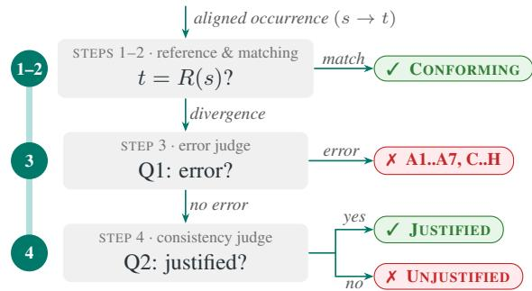
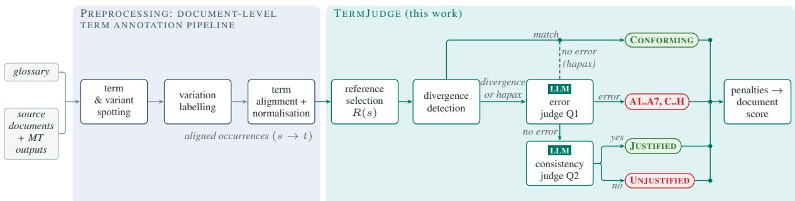

# TERMJUDGE: A Document-Level Metric Judging, Not Counting, Terminology in Machine Translation Evaluation

Nicolas Dahan<sup>♢♠</sup> François Yvon<sup>♠</sup> Rachel Bawden<sup>♢</sup>

<sup>♢</sup>Inria Paris, France

<sup>♠</sup>Sorbonne Université, CNRS, ISIR, Paris, France {nicolas.dahan,rachel.bawden}@inria.fr yvon@isir.upmc.fr

## Abstract

Existing automatic metrics for evaluating terminological use in machine translation (MT) penalise any divergence from a fixed reference, conflating translation errors with the valid terminological variation that human translators routinely produce. We introduce TERM-JUDGE, a document-level terminology metric that assigns an interpretable verdict to every term occurrence: glossary-conforming occurrences are settled deterministically, while divergences are assessed under a two-step LLMas-a-judge procedure using the full document context: the first detects and labels terminology errors; the second sorts valid documentlevel variations from inconsistencies. Validated against expert error annotations and documentlevel human MQM scores, TERMJUDGE ranks first in both system- and segment-level metaevaluation, ahead of glossary-conformity and quality-estimation baselines. When applied to eight systems translating academic documents, under two prompting conditions, we observe that glossary injection improves terminology translation in all paired comparisons, by removing genuine errors rather than valid variation. TERMJUDGE is released as open-source code.<sup>1</sup>

## 1 Introduction

Evaluating machine translation (MT) at the document level in specialised settings requires assessing how systems translate the technical vocabulary of those documents. In most documents, technical concepts can be split into two main groups: rare concepts that only occur once or twice, usually under the same surface form; and frequent concepts, which may appear under multiple guises. For example, in a research paper on MT, a concept such as machine translation may occur repeatedly, as the preferred form (machine translation), an acronym (MT), a reduction (translation), a lexical substitution (automatic translation), or a morphosyntactic reformulation (machine translated (text)) (Daille, 2017); translators may amplify this variation and introduce further alternations for stylistic or discourse reasons (Bowker, 1998; Fernández-Silva and Kerremans, 2011).

Existing automatic metrics for evaluating the translation of terms decide whether a target form is acceptable through matching: against a termannotated reference (Farajian et al., 2018), against a bilingual glossary entry (ibn Alam et al., 2021; Semenov et al., 2025), against the document’s other occurrences of the same concept (Itagaki et al., 2007; Semenov and Bojar, 2022), or against source-side variation patterns (Dahan et al., 2026b). None of them asks whether a mismatch is a translation error or a valid translation choice (e.g., targetlanguage amplification, polysemy disambiguation, acronym introduction at first mention, stylistic alternation), so they may conflate acceptable translations with errors. General-purpose neural metrics offer no remedy, losing correlation with human judgement precisely on the specialised domains where terminology errors concentrate (Zouhar et al., 2024). The question we address is therefore whether an automatic metric can decide, for each occurrence of a concept, whether the output form is acceptable rather than merely identical to a predetermined reference. We propose to address this gap with TERMJUDGE, an automatic documentlevel terminology metric that not only counts divergences (translations that depart from the expected form of a term) but judges each one, and returns interpretable verdicts alongside an aggregate score. Our contributions are:

• A concept-aware document-level terminology metric, built on an LLM-as-a-judge approach comprising several steps (reference validation, then error classification and documentconsistency qualification), grounded in established translation studies, which discriminates errors from valid variation and produces an interpretable verdict profile for each system rather than a single opaque score.

• BioMQM-Terms, a terminology-evaluation resource derived from bio-MQM (Zouhar et al., 2024), a corpus containing MT outputs in the biomedical domain, with error annotations. To this we add a bilingual glossary of 729 English–French biomedical concepts and 13,200 aligned term–translation pairs for ten MT systems, released with our code.

• A series of empirical validations: peroccurrence agreement with a fine-grained human error typology on a geoscience corpus (STEP; Cornejo Cárcamo et al., 2026), a document-level meta-evaluation on BioMQM-Terms, where TERMJUDGE ranks first under every aggregation of its score, ahead of ten alternative metrics, and a reevaluation of the use of glossaries to guide LLM-based MT: on two NLP test corpora, we find that glossaryguided prompting improves term translation.

## 2 Related Work

For the global evaluation of MT quality, some of the most widely used automatic metrics (alongside traditional surface-based metrics such as BLEU (Papineni et al., 2002) and chrF (Popovic´, 2015)) are fine-tuned neural models such as COMET (Rei et al., 2020) and METRICX (Juraska et al., 2024), together with their reference-free counterparts (Rei et al., 2022). They are trained and mostly used at the sentence level. Despite proposals to extend them to longer spans (Vernikos et al., 2022; Deutsch et al., 2023b), their document-level application remains questionable (Dahan et al., 2026a). Two further properties limit their use for terminology. First, fine-tuned metrics lose substantial correlation with human judgements on unseen specialised domains, precisely where terminology errors concentrate (Zouhar et al., 2024). Second, such metrics summarise all aspects of translation quality in a single scalar score, failing to distinguish terminology errors from other types of mistranslations.

Evaluation practice is therefore increasingly dominated by LLM-as-a-judge approaches. GEMBA involves eliciting direct quality scores (Kocmi and Federmann, 2023b), and GEMBA-MQM annotating error spans within the generic MQM typology (Lommel et al., 2013; Kocmi and Federmann, 2023a); Minder et al. (2025) test how reliably LLMs annotate specialised translations with such error typologies: error detection reaches satisfactory levels, but accurate categorisation requires injecting the error definitions in the prompt. LLM-as-a-judge approaches bring the flexibility that qualitative judgements require, but they carry documented biases (order of presentation, verbosity preference, instability across rephrased queries; Zheng et al., 2023), making careful meta-evaluation against human judgements indispensable (Mathur et al., 2020; Deutsch et al., 2023a). Whether applied to isolated segments or to whole documents, they annotate general error categories and do not track how consistently a concept is rendered across a document.

Dedicated terminology evaluation has mostly relied on matching the output against expected target forms. Given a term-annotated reference translation, Farajian et al. (2018) compute a term hit rate, a BLEU-like clipped count of the reference terms retrieved in the output, which TermEval (Haque et al., 2023) extends by also accepting the lexical and inflectional variations of each reference term listed in its termbank. Given a bilingual glossary entry, metrics count how often the expected target term appears in the output, from exact surface matching (ibn Alam et al., 2021) to lemma-aware matching (Alam et al., 2021), as adopted in the WMT terminology shared tasks (Alam et al., 2021; Semenov et al., 2023), whose 2025 edition extends the exercise to document-level translation with oneto-many dictionaries (Semenov et al., 2025). Whatever the matching strategy, these metrics remain anchored to an inventory of expected forms: unlisted reductions, context-dependent acronyms and lexical variants are counted as failures irrespective of their adequacy in context.

When no glossary is available, consistency metrics score the target side against itself. Semenov and Bojar (2022) match each occurrence against a pseudo-reference derived from the system’s own dominant translation, concentration indices such as the Herfindahl–Hirschman index (Itagaki et al., 2007; Gašpar et al., 2022) and the Lexical Translation Consistency Ratio (Lyu et al., 2021; Wang et al., 2025) reward the reuse of a single form, and cross-term coherence extends the family to the source side, counting how many variation relationships survive translation (Dahan et al., 2026b). All share one assumption: a term is well translated when every occurrence receives the same translation. That assumption keeps them cheap and reference-free, but blind to the difference between undue changes and motivated alternations. It is also only warranted for prescriptive terminologies: terminology standards themselves recognise a scale of acceptability from preferred to merely admitted forms (ISO, 2019).

That difference is precisely what studies of specialised discourse document. Denominative variation is a constitutive property of terminology in running text (Daille, 2017), refined into graphical, morphosyntactic, reduction, expansion and lexical variants by Cornejo Cárcamo et al. (2025). Translators preserve or even accentuate source-side variation (Fernández-Silva and Kerremans, 2011), alternate between several translations for discourse and stylistic reasons (Vinay and Darbelnet, 1972; Bowker, 1998; Pecman, 2014), introduce pragmatic and explicitness shifts (Chesterman, 2016; Blum-Kulka, 1986), and resist the over-standardisation that erases author-intended distinctions (Bowker and Hawkins, 2006). MT systems, by contrast, produce less variation than humans (Culo and Nitzke<sup>ˇ</sup> , 2016). These findings have not reached automatic evaluation: no existing terminology metric asks whether a divergence from the expected form is one of these motivated variations or an error.

## 3 The TERMJUDGE Metric

TERMJUDGE evaluates the terminological adequacy and consistency of a translated document by assigning a verdict to the translation of every term occurrence, and by aggregating these verdicts into a document-level score that can rank systems on terminological quality. A preprocessing stage turns a terminology and a translated corpus into aligned term occurrences (§3.1); TERMJUDGE itself is a five-step pipeline (§3.2) whose decision flow is displayed in Figure 1. Appendix A (Figure 2) gives a graphical overview of both stages. TERMJUDGE shares its starting point with the consistency tradition (§2): each source form is evaluated separately, through the set of translations it receives across the document. The variation being adjudicated is therefore target-side only, sourceside variation being factored out by construction. For this, TERMJUDGE first computes a reference translation for each source form, and flags as divergence any translation that departs from it. It then submits each divergence to an LLM judge in two steps: a first question, Q1, asks whether the divergence is an error and of which kind. When no error is found, a second question, Q2, asks whether the variation is a valid choice justified by its context. Both questions are answered by the same model using different prompts, called the errorjudge and the consistency judge in what follows. The decomposition is deliberate. The two questions do not judge the same object: Q1 assesses the translation itself, so its answer is independent of the occurrence’s position and can be shared across identical translations (§3.2), and Q2 assesses the consistency of a choice with the concept’s other translations in the document, and is asked per occurrence. This reflects a key distinction in our error typology: between errors in a translation taken on its own and inconsistencies between the translations of a concept within a document (Appendix D). Merging the two questions into a single LLM call would make every judgement positional, at the occurrence level. It would also imply a much larger label set, possibly degrading the judge’s decisions (Appendix D.1). Answering Q1 at the form-level does not mean judging it in isolation: like for Q2, the judge also receives the corresponding concept’s glossary entry and the translations of its other source forms.

  
Figure 1: The TERMJUDGE decision flow (§3.2): a match with R(s) is considered CONFORMING without any LLM call; a divergence is classified by the error judge (Q1) then, if error-free, by the consistency judge (Q2), as JUSTIFIED or UNJUSTIFIED.

## 3.1 Data Requirements and Preprocessing

TERMJUDGE relies on a single external resource, a bilingual terminology of the domain structured as a SKOS glossary:<sup>2</sup> each entry pairs a concept with one preferred term (or head term) per language, and a list of alternative terms, or variants. The object of the evaluation is a collection of source documents together with their translations by one or more MT systems, with aligned source and target segments; no human reference translation is needed.

A glossary, however large, cannot delimit the forms under which concepts surface: beyond glossary variants listed as alternative terms, running texts also introduce non-glossary variants (reorderings, reductions, context-dependent acronyms). Term occurrences are therefore identified with the CONCORDANCER,<sup>3</sup> an in-house tool that takes the glossary as input and detects, in each source document, the occurrences of every concept. This raises coverage beyond exact-form and lemma matching by also recognising variants derived from glossary entries or detected in context: on PARANLP and IWSLT23, lemma matching alone would miss about 15% of the occurrences the CONCOR-DANCER detects (Dahan et al., 2026b).

Each attested source form is then labelled automatically with its variation category relative to the head term (procedure and validation in Appendix A), following the typology of §2: no variation, graphical, morphosyntactic, reduction, expansion, lexical or combined (Cornejo Cárcamo et al., 2025) (one example per category in Table 8, Appendix A). Each occurrence is then aligned with the target-side span that corresponds to its translation, identified by an LLM call within the aligned target segment rather than the whole document;<sup>4</sup> both sides are normalised for case, punctuation and whitespace, and lemmatised identically.

TERMJUDGE starts from the concept and isolates every distinct source form attested in the document; the head term itself need not appear. The set of occurrences of one source form is a chain, and a chain of size one is a hapax. Within a chain, occurrences share the source form and differ by their position in the document, hence by their context, and by the translation the system produced for each of them. TERMJUDGE returns one verdict per occurrence (Table 1); Appendix A (Tables 11 and 9) illustrates the setting on occurrences from real evaluation runs.

## 3.2 Evaluation Pipeline

Step 1: Reference selection. For each source form s of a concept in a document, TERMJUDGE fixes the expected reference translation R(s): the glossary translation when the source form has one, considered as authoritative, and otherwise the translation that the evaluated system itself produces most often in the document (on lemmas, ties broken by first appearance), a pseudo-reference generalising those of consistency metrics (Semenov and Bojar, 2022). A pseudo-reference is first validated by the error judge of Step 3 on source-side evidence only;<sup>5</sup> if judged erroneous, it is replaced by a reference generated by an LLM from the concept entry and source-side contexts, never from the systems’ outputs. Each reference is recorded with its provenance (glossary, validated or generated).

<table><tr><td>Verdict</td><td>Description</td><td>Penalty</td></tr><tr><td>CONFORMING</td><td>target matches R(s) (Step 1), or judged error-free</td><td>0</td></tr><tr><td>JUSTIFIED</td><td>variation, consistent with document usage</td><td>0</td></tr><tr><td>UNJUSTIFIED</td><td>variation, inconsistent (incl. neutralisation)</td><td>0.5</td></tr><tr><td>A1</td><td>attested term of a neighbouring concept</td><td>1</td></tr><tr><td>A2</td><td>paraphrase instead of term</td><td>1</td></tr><tr><td>A3</td><td>invented literal calque</td><td>3</td></tr><tr><td>A4</td><td>left untranslated</td><td>4</td></tr><tr><td>A5</td><td>do-not-translate item translated</td><td>4</td></tr><tr><td>A6</td><td>wrong internal constituent</td><td>4</td></tr><tr><td>A7</td><td>general-language word instead of term</td><td>3</td></tr><tr><td>C</td><td>mis-parsed term structure</td><td>4</td></tr><tr><td>D</td><td>wrong semantic relations between constituents</td><td>3</td></tr><tr><td>E</td><td>failed transposition / syntactic calque</td><td>1</td></tr><tr><td>F</td><td>grammar / phraseology around the term</td><td>1</td></tr><tr><td>G</td><td>content altered (addition, omission, hallucination)</td><td>1</td></tr><tr><td>H</td><td>defective target-language expression / register</td><td>1</td></tr></table>

Table 1: The sixteen verdicts of TERMJUDGE and their penalties. A1–A7 follow level A of the error typology (Cornejo Cárcamo et al., 2026); C–H group its remaining families, each scored at its most lenient sub-code (benefit of the doubt). Appendix G explains the weights; Appendix D gives the full typology.

Step 2: Divergence detection. Each translation is compared with R(s) by exact string matching on lemmas, ignoring case, articles, hyphens and diacritics. A match is labelled CONFORMING without any LLM call: the metric evaluates the choice of term, not its written form. A mismatch is a divergence in the sense defined above, and in this case we proceed to Step 3.

Step 3: Q1, error judgement. Each divergence’s correctness is evaluated by an LLM call that receives the aligned pair, the current segment, the concept’s glossary entry when available, the preceding aligned segments, and the concept’s prior translations grouped by source form. The question is absolute: is the target a valid, contextuallyappropriate translation of the source term? The candidate error labels come from a simplified version of a typology developed for the human annotation of terminology errors in specialised MT (Cornejo Cárcamo et al., 2026), with a severity scale following Bénard et al. (2024): wrong equivalent selection uses fine-grained labels (A1–A7), the six other error families are collapsed into one code each (C–H, Table 1), and the in-document inconsistency family (B) is excluded, being exactly the question delegated to the consistency judge of Step 4 (details in Appendix D). The judge answers with no\_error or one of the 13 labels, whose gravity fixes the penalty. An error label is the occurrence’s final verdict, while no\_error routes the occurrence to Step 4. Hapax forms skip the matching shortcut of Step 2 and are always submitted to Q1: when a form occurs once, its pseudo-reference is derived from that very occurrence, so a match would be circular. Since consistency is undefined for a single occurrence, an error-free hapax is directly labelled CONFORMING.

Step 4: Q2, consistency judgement. Divergences judged error-free by Q1 are passed to the consistency judge, which decides whether the translation is coherent given how the concept is rendered elsewhere in the document. It sees the concept’s translations grouped by source form, with the dominant translation and first mentions marked. It answers with one of ten labels, grounded in terminology and translation studies (Vinay and Darbelnet, 1972; Bowker, 1998; Pecman, 2014) as detailed in Appendix J. Seven name a reason that makes the variation coherent (‘first mention’, ‘explicitation’, ‘avoid repetition’, ‘document usage’, ‘register’, ‘facet’, ‘synonym merge’) and yield JUS-TIFIED. Three name an inconsistency and yield UNJUSTIFIED: ‘synonym inconsistency’ and ‘gratuitous divergence’ when one source form receives divergent translations, ‘neutralisation’ when distinct source forms collapse onto one translation; together they operationalise family B of the typology, cases combining an incorrect translation with instability being caught upstream by Q1. Neutralisation, the reproduction of the translation established for another source form of the same concept, erases a distinction made by the author (Bowker and Hawkins, 2006), for example the case of a document alternating percutaneous nephrolithotomy and its acronym PNL where both are rendered as néphrolithotomie percutanée.

Step 5: Propagation and scoring. Q1 is called once for each distinct divergent translation of a source form within a document, and its verdict is propagated to the group’s other occurrences; keeping the translation unlemmatised in the grouping key preserves number and gender errors. Q2, whose answer depends on the occurrence’s position, is called once per occurrence of a correct form. Together with the matching shortcut of Step 2, this propagation divides the number of LLM calls by 2.55 on IWSLT23 while leaving the system ranking nearly unchanged (25 of 28 pairwise orderings; Appendix I). Each verdict maps to a penalty (Table 1), and the score of a document for a system is the mean penalty over all its scored occurrences, including those labelled CONFORMING or JUSTIFIED (penalty 0); lower is better, and scores are negated when correlated with human quality scores. System scores macro-average document scores, occurrences can equally be macro-averaged per source form or per concept, and the metaevaluation of §4.3 reports all three aggregations.

## 3.3 Metric Configuration

All experiments use a single configuration. The judges run on gpt-4.1-mini, chosen for its low cost (Appendix K) and because it belongs to a different family from every evaluated system, which limits the self-preference bias of LLM judges (Zheng et al., 2023; Panickssery et al., 2024); its judgements are validated against human annotations in §5. References are selected as in Step 1; the prompts, their context and the decoding settings are detailed in Appendix L.

## 4 Experimental Setup

## 4.1 Datasets

We use two human-annotated corpora to validate TERMJUDGE at two complementary granularities: STEP (Cornejo Cárcamo et al., 2026), in the geoscience domain, provides per-occurrence gold error labels, enabling us to test whether judges classify individual occurrences as human annotators would. bio-MQM (Zouhar et al., 2024), which provides document-level MQM annotations for ten systems, allows us to test how well aggregated document scores match human quality assessments. Two scientific NLP corpora, PARANLP (Peng et al., 2026) and IWSLT23 (Salesky et al., 2023), serve as additional test beds on which we rank contemporary LLM-based MT systems. Each corpus is paired with a terminology (§3.1). Statistics are in Table 2.

STEP (occurrence-level validation). STEP (Cornejo Cárcamo et al., 2026) contains 10 geoscience research articles translated from English into French by a document-level MT system fine-tuned on scientific abstracts of that domain (Peng et al., 2025), and exhaustively annotated for terminology. The associated resource is a 17,035-entry SKOS terminology compiled for the project from the Loterre thesauri<sup>6</sup> and the ARTES database (Pecman and Kübler, 2011). Each occurrence of a known concept was extracted, aligned with its translation, and labelled with the fine-grained error typology of Cornejo Cárcamo et al. (2026), the same typology our error judge instantiates (§3.2), resulting in 3,377 gold-labelled occurrences (Appendix C). 27.7% of occurrences are found as is in the glossary, and 55.4% are source-side variants of their concept’s head term. After projecting multi-label annotations onto the metric’s label space, 69.8% of occurrences are error-free, 11.0% carry a family-A error, 16.2% another error (C–H), and 3.0% a sole in-document inconsistency label (B).

<table><tr><td>Corpus</td><td>Role</td><td>Domain</td><td>Docs</td><td>Segments</td><td>Src words</td><td>Systems</td><td>Term occ.</td><td>Glossary</td></tr><tr><td>bio-MQM</td><td>validation (document)</td><td>biomedical</td><td>50</td><td>384</td><td>7,536</td><td>10</td><td>1,320</td><td>729</td></tr><tr><td>STEP</td><td>validation (occurrence)</td><td>geoscience</td><td>10</td><td>4,432</td><td>124,285</td><td>1</td><td>3,377</td><td>17,035</td></tr><tr><td>PARANLP</td><td>test</td><td>NLP (written)</td><td>34</td><td>7,095</td><td>137,123</td><td>8</td><td>11,122</td><td>1,722</td></tr><tr><td>IWSLT23</td><td>test</td><td>NLP (spoken)</td><td>10</td><td>884</td><td>15,360</td><td>8</td><td>1,356</td><td>1,722</td></tr></table>

Table 2: Corpus statistics. Term occurrences are aligned term pairs per system for bio-MQM, PARANLP and IWSLT23, and human-annotated occurrences for STEP. All corpora are English–French.

bio-MQM (document-level validation). bio-MQM (Zouhar et al., 2024) is a multilingual biomedical benchmark annotated at the segment level with MQM error labels by professional translators. We use the English–French portion, 50 documents translated by 8 MT systems plus two human references. All MQM categories are retained when computing the human ground truth, because terminology-related problems are annotated under many categories, not only the Terminology label (below). Errors of other kinds, however, only count when they overlap with an aligned term occurrence (§4.3). The biomedical domain moreover exhibits a markedly higher rate of terminology errors than general news (Zouhar et al., 2024).

MQM is a general error typology: bio-MQM includes no term inventory, no occurrences and no source–target term alignments. Turning it into a terminology evaluation benchmark, BioMQM-Terms, is a contribution of this work. We manually extracted the biomedical terms of the 50 source documents by exhaustive reading, obtaining 729 concepts (26% with at least one variant); French labels come from the bilingual MeSH thesaurus (Lipscomb, 2000) where possible and from manual translation otherwise (construction details in Appendix C). The resulting glossary feeds the pipeline of §3.1: 1,320 aligned occurrences per system, i.e. 13,200 term–translation pairs. 21.7% of them are touched by at least one MQM error, of which only a fifth carry the Terminology label, confirming that terminology-related problems spill over into Accuracy, Linguistic and Style categories. BioMQM-Terms comprises the SKOS glossary and, for each system, the aligned pairs with their variation categories and MQM correspondences.

PARANLP and IWSLT23 (test). We re-use the two corpora and MT outputs released by Dahan et al. (2026b), to which we refer for details, and rerun the preprocessing of §3.1 on them. PARANLP (Peng et al., 2026) is a corpus of NLP research papers published in \*ACL venues and their comparable French versions. IWSLT23 (Salesky et al., 2023) comprises manually revised transcripts and translations of 10 presentations delivered at ACL 2022, from the IWSLT 2023 shared task. Both corpora share the INIST/Loterre NLP glossary of 1,722 EN–FR concepts.<sup>7</sup> MT outputs are generated by four open-weight LLMs, each producing two translations of every document: one from plain translation instructions (baseline) and one with the glossary-preferred terms in the segment and their French translations injected into the prompt (base+terms), yielding eight outputs per corpus.

## 4.2 Occurrence-Level Validation on STEP

For STEP, TERMJUDGE is run on the gold-aligned occurrences, and its verdicts are compared with the human labels occurrence by occurrence. Since the human annotation uses the full 23-code typology while the judge uses its simplified version (§3.2), the gold codes are grouped in the same way, so that both sides share 15 classes: A1–A7, C–H (Table 1), B (unjustified in-document variation) and no-error. As human annotations are multi-label (25.6% of occurrences carry at least two codes), they are reduced to one label with a fixed precedence (the most severe A code, then the C–H code, then B, pure inconsistency, then no-error). Consistency notes on locally correct translations (B1/B2) reduce to no-error at the occurrence level, and 4 occurrences with missing annotations are excluded, leaving 3,373 scored occurrences. We report perclass precision, recall and F1, macro-F1, accuracy and balanced accuracy, together with a binary errordetection view in which all error types collapse to a single error class. On the metric side, UNJUSTI-FIED maps to B (both denote in-document inconsistency) while CONFORMING and JUSTIFIED map to no-error, the conformity/variation distinction being absent from the human annotation.

## 4.3 Document-Level Meta-Evaluation with BioMQM-Terms

Human ground truth per (document, system). Human terminology quality is derived from the MQM annotations at the level of aligned term pairs, not at the level of full segments. For each alignment produced by our pipeline, we aggregate the severity weights of all MQM errors overlapping the target span, using the standard WMT weighting (Critical: 25, Major: 5, Minor: 1, Neutral: 0). When a segment is seen by multiple annotators, the penalty is averaged at the annotator level (annotators who saw the segment but flagged no error contribute 0). The document-level human score is the negated mean alignment penalty (higher is better).

Meta-evaluation measures. We evaluate the metrics against human scores at three levels using the mt-metrics-eval package.<sup>8</sup> At the system level, Soft Pairwise Accuracy (SPA) (Thompson et al., 2024) checks, for each of the 45 system pairs, whether the metric separates the two systems with the same confidence as the human scores (p-values of paired permutation tests over documents, 1,000 permutations), and averages this agreement over the pairs. At the segment level, the group-by-item pairwise accuracy with tie calibration of Deutsch et al. (2023a), $\mathbf { a c c } _ { \mathbf { e q } } ^ { * } ,$ treats each of the 373 source segments carrying at least one aligned pair (out of the corpus’s 384) as an item (a 10-system × 373- segment score matrix); ties matter at this level, as for 29% of the segments all ten systems receive the same human score. At the document level, the same measure over the 50 documents (a $1 0 \times 5 0$ matrix) is reported for completeness: human document scores, averaged over about 26 occurrences, are practically never tied, so the measure reduces to plain pairwise accuracy over 50 items.

Score aggregation and comparison scope. Because TERMJUDGE assigns a judgement to every occurrence (§3.2), its document score can be aggregated in three ways: micro-averaged over occurrences, and macro-averaged per lemmatised source form or per concept; we report all three. Comparison metrics score what they are designed for: the glossary-conformity and divergence-based baselines score the same aligned occurrences as TERM-JUDGE, while the terminology-filtered and general QE baselines score every segment of the document. In a no-hapax variant, only chains with at least two occurrences are evaluated, for both the metrics and the human scores. This leaves 48 documents; the segment-level QE baselines, which do not depend on term occurrences, keep the full 50 documents. The results of this no-hapax variant are given in Appendix H (Tables 18–20).

Comparing systems. TERMJUDGE is compared against four metric families, ordered from most to least terminology-aware. (i) Divergence QE: the same pipeline through divergence detection, with typed judges replaced by a quality-estimation model scoring each divergent term pair (the source term and its aligned translation, without the surrounding sentence) (CometKiwi (Rei et al., 2022), MetricX-24 (Juraska et al., 2024) and GEMBA-MQM (Kocmi and Federmann, 2023a); subscripted div), which isolates the judges’ contribution from that of the divergence architecture. (ii) Glossary conformity in the consistency tradition (ibn Alam et al., 2021; Semenov and Bojar, 2022): the head term is matched against its glossary label, and the remaining forms, those without an official reference, against a document-level pseudoreference (first or majority translation), on lemmas. (iii) Terminology-filtered QE, a naive LLM judge: GEMBA-MQM restricted to the errors flagged as terminological (by category, or by any mention of terminology). (iv) General QE: the same backbones scoring every sentence in the document with no notion of term (subscripted gen), averaged over the document, as a generic baseline.

## 4.4 System Ranking on the Test Corpora

On PARANLP and IWSLT23, TERMJUDGE runs in the configuration of §3.3 with the domain set to NLP, and scores the eight MT outputs distributed with the corpora: four open-weight LLMs (Llama-

<table><tr><td></td><td>TERMJUDGE</td></tr><tr><td>15-class agreement Macro-F1</td><td>0.196</td></tr><tr><td>Accuracy / Balanced accuracy A-error detection</td><td>0.644 / 0.230 0.590</td></tr><tr><td>Exact A-code (among detected) Binary error detection</td><td>0.521</td></tr><tr><td>F1 / Precision / Recall (error class) 0.620 / 0.632 / 0.609 Accuracy / Balanced accuracy</td><td>0.775 / 0.728</td></tr><tr><td>Binary accuracy by hapax status</td><td></td></tr><tr><td>Hapax (n=339)</td><td>0.664</td></tr><tr><td>Non-hapax (n=3,034)</td><td>0.787</td></tr></table>

Table 3: Agreement between TERMJUDGE and human gold labels on STEP, all occurrences judged via the exhaustive path (§5.1): 3,373 scored occurrences, including 1,019 errors (371 with a family-A label) and 2,354 non-errors.

3.1-8B-Instruct (Grattafiori et al., 2024), Qwen3- 8B (Yang et al., 2025), EuroLLM-9B-Instruct (Martins et al., 2025) and EuroLLM-22B-Instruct (Ramos et al., 2026)), each under the two zero-shot conditions of §4.1, baseline and base+terms. Decoding is greedy except for Qwen3-8B, run in its recommended non-thinking sampling mode.

## 5 Results and Analyses

## 5.1 Occurrence-Level Agreement on STEP

Table 3 reports agreement with the gold labels for 3,373 STEP occurrences under the exhaustive judging path (Appendix I). The deterministic matching shortcut is disabled: every occurrence, including matches and hapaxes, is submitted to Q1 and, if error-free, Q2, allowing every gold class to be predicted.

TERMJUDGE detects errors well above the majority-class baseline (balanced accuracy 0.728). Fine-grained code assignment remains hard: 59% of the gold family-A occurrences are flagged with some A code but only about half receive the correct code, with a 15-class macro-F1 close to 0.20. For hapax occurrences (339), binary accuracy drops by about 12 points relative to non-hapax occurrences (0.664 vs. 0.787, Table 3), quantifying the difficulty of judging terms without document-internal evidence. Three patterns dominate the confusion matrix (Appendix E, Table 15). First, the missed errors are mostly not terminological errors proper: of the 398 gold errors judged correct, 159 belong to family F (grammar around the term: agreement, determiners, prepositions) and 82 to pure in-document inconsistency (B), two families that concern the term’s surroundings or its consistency rather than the choice of equivalent. Among wrongequivalent errors (family A), the weak point is A3, the invented calque, accepted as correct in 40 of 65 cases (one is shown in Table 5): the judge takes a literal translation for an attested term. Second, content-altering translations (G: omissions, additions, unintelligible output) are almost always caught (215 out of 227 are tagged erroneous) but mostly with a wrong label (126 as A1): the judge detects that a translation is wrong more reliably than it identifies the mechanism, and this familylevel confusion explains the gap between binary balanced accuracy (0.728) and low 15-class macro-F1 (0.196). Third, the gold and judged notions of unjustified variation barely overlap: only 4 of the 101 pure-inconsistency cases are flagged UNJUSTI-FIED, while 104 of the 149 UNJUSTIFIED verdicts were not tagged by the annotators. This reflects a difference of status. In the human guidelines, variation between individually correct translations is recorded (family B) but not counted as an error and carries no severity (Appendix D); TERMJUDGE, by contrast, penalises such variation when the consistency judge finds it unjustified (UNJUSTIFIED, Table 1). The human B labels thus describe variation without judging whether it is justified, whereas UNJUSTIFIED asserts that it is not, so the two capture different cases. The LLM judge and the human annotators therefore disagree most on the consistency axis, not on error detection.

## 5.2 Document-Level Meta-Evaluation

Table 4 reports the meta-evaluation on BioMQM-Terms under the micro-average over occurrences defined in §3.2. Macro-averaging per source form or concept yields the same conclusions (Appendix F). TERMJUDGE ranks first in SPA (0.844) and in segment-level $\operatorname { a c c } _ { \mathrm { e q } } ^ { * }$ (0.606). On segmentlevel $\operatorname { a c c } _ { \mathrm { e q } } ^ { * } ,$ , its lead is significant over every other metric $( p  \leq 0 . 0 1$ , paired permutation tests). On SPA, it is significant for eight of the ten metrics $( p < 0 . 0 5 , k { = } 2 , 0 0 0 )$ , with ties for the Divergence-QE variants $\mathbf { G E M B A _ { d i v } }$ and CometKiwi<sub>div</sub>. The Divergence-QE variants form the second-best family; the remaining families follow within a narrow band (SPA 0.69–0.78).

The document-level $\operatorname { a c c } _ { \mathrm { e q } } ^ { * }$ column, where the measure reduces to plain pairwise accuracy over 50 items (§4.3), is reported for completeness only. Excluding hapax chains removes occurrences lacking another rendering in the document; unless the term is in the glossary, only a judgement of the translation itself, by an LLM or a human, can evaluate them. In that reduced variant, no SPA difference between TERMJUDGE and the remaining metrics is statistically significant $( p \ge 0 . 1 7 )$ , while TERM-JUDGE stays significantly ahead of general QE on segment-level $\operatorname { a c c } _ { \mathrm { e q } } ^ { * }$ (Appendix H).

<table><tr><td>Metric</td><td>SPA</td><td> $\mathbf { a c c } _ { \mathbf { e q } } ^ { * }$  (seg)</td><td> $\mathbf { a c c } _ { \mathbf { e q } } ^ { * } \left( \mathrm { d o c } \right)$ </td></tr><tr><td>Judged divergences (this work)</td><td></td><td></td><td></td></tr><tr><td>TERMJUDGE</td><td>0.844</td><td>0.606</td><td>0.557</td></tr><tr><td>Divergence  $Q E$ </td><td></td><td></td><td></td></tr><tr><td> $\mathbf { G E M B A _ { d i v } }$ </td><td>0.803</td><td>0.597*</td><td>0.516</td></tr><tr><td> $\mathrm { M e t r i c X } { - 2 4 } _ { \mathrm { d i v } }$ </td><td>0.769*</td><td>0.593*</td><td>0.526</td></tr><tr><td> $\mathrm { C o m e t K i w i _ { d i v } }$ </td><td>0.786</td><td>0.599*</td><td>0.543</td></tr><tr><td>Glossary conformity</td><td></td><td></td><td></td></tr><tr><td>first-translation fallback</td><td>0.730*</td><td>0.595*</td><td>0.449</td></tr><tr><td>majority fallback</td><td>0.723*</td><td>0.598*</td><td>0.445</td></tr><tr><td>Terminology-filtered QE</td><td></td><td></td><td></td></tr><tr><td>GEMBA-MQM (any mention)</td><td>0.775*</td><td>0.586*</td><td>0.219</td></tr><tr><td>GEMBA-MQM (category)</td><td>0.689*</td><td>0.583*</td><td>0.193</td></tr><tr><td>General QE</td><td></td><td></td><td></td></tr><tr><td> $\mathbf { G E M B A g e n }$ </td><td> $0 . 7 3 6 ^ { * }$ </td><td> $0 . 5 8 3 ^ { * }$ </td><td>0.533</td></tr><tr><td> $\mathrm { M e t r i c X - } 2 4 _ { \mathrm { g e n } }$ </td><td> $0 . 7 3 6 ^ { * }$ </td><td> $0 . 5 8 6 ^ { * }$ </td><td>0.566</td></tr><tr><td> $\mathrm { C o m e t K i w i _ { g e n } }$ </td><td>0.729*</td><td> $0 . 5 9 1 ^ { * }$ </td><td>0.552</td></tr></table>

Table 4: Meta-evaluation on BioMQM-Terms, microaverage occurrence aggregation (10 systems, 50 documents, 373 segments; human ground truth from all MQM categories). Empirical SPA chance level: 0.592± 0.089. <sup>∗</sup>: TERMJUDGE is significantly better (paired permutation tests, $p < 0 . 0 5 )$ ; unmarked values are ties.

Like any typology-based metric, the document score relies on a penalty scale, which follows the gravities assigned by the typology’s authors, each grouped family C–H being scored at its most lenient sub-code (benefit of the doubt, Table 1). Varying C, D and E weights from 1 to 4 with $\scriptstyle { F = G = H = 1 }$ leaves TERMJUDGE ahead of all comparison metrics under occurrence and sourceform aggregation (Appendix G).

## 5.3 System Ranking on PARANLP and IWSLT23

Table 6 ranks the eight systems of §4.1 on both corpora with TERMJUDGE and with two of the comparison families of §4.3. With TERMJUDGE, for all four models the base+terms run scores better than its baseline run, on both corpora, with the largest gains on IWSLT23. Where Dahan et al. (2026b) observed a tension they could not arbitrate (glossary injection improves accuracy and consistency counts while reducing the transfer of source variation), TERMJUDGE returns a clearer verdict, and its verdict distribution (Table 7) shows why: under base+terms, exact conformity rises by 6 points on PARANLP and 12 on IWSLT23, wrongequivalent (A) error rates drop sharply (11.7% to 8.4% of occurrences on PARANLP, 18.6% to 9.3% on IWSLT23), while justified and unjustified variation both recede moderately; the variation that glossary injection suppresses is mostly not valid, so base+terms yields a net gain on these corpora. The two comparison metrics behave on these corpora as they did in the meta-evaluation. General QE is blind to the terminological gain: $\mathrm { C o m e t K i w i _ { g e n } }$ orders the systems by general quality, is nearly insensitive to the prompting condition, prefers the baseline run in most pairs of one baseline and one base+terms run (eleven of sixteen on IWSLT23, ten on PARANLP with one tie), and its best run for each corpus is a baseline run. Glossary conformity ranks every base+terms run above every baseline run (all sixteen pairs on each corpus), as it counts exactly the glossary terms that the base+terms prompt injects, but disagrees with TERMJUDGE within each condition: on IWSLT23 it ranks Qwen3-8B first among the baseline runs, where TERMJUDGE ranks it last. Conformity only checks whether the glossary term appears in the output; judges also recognise justified variation and detect errors that matching approaches cannot.

## 5.4 What Judging Adds over Counting

The comparison metrics as an ablation of TER-MJUDGE. Read from the bottom of Table 4 upwards, the comparison families of §4.3 add one component of TERMJUDGE at a time, so the table can be viewed as an ablation study. General QE is the baseline (SPA 0.729–0.736), restricting it to terminology-mentioning error spans changes little and can even hurt (0.775 for the permissive filter, 0.689 for the strict one), and counting glossary conformity instead of judging results in similar scores (0.723–0.730). The first substantial step is architectural: keeping the document-level divergence detection but scoring the divergence points with an off-the-shelf QE metric increases the score to 0.769–0.803; the divergence architecture already carries part of the signal. The second step is the judgement itself: replacing the generic score at those points with the typed Q1/Q2 judges adds the rest (0.844), and it is the only step that also provides interpretable labels.

What consistency labels reveal. Beyond the binary JUSTIFIED/UNJUSTIFIED outcome, the labels returned by the Q2 judge also say why a divergence is judged coherent or not (Appendix J, Table 22). Their distribution is stable across systems: about four divergences out of five follow the document’s established usage (e.g., treatment rendered traitement throughout while the glossary reference is thérapeutique: divergent at every occurrence, yet error-free and tagged as ‘document usage’, JUSTI-FIED); ‘first mention’ accounts for another 6–7%.

<table><tr><td>Source form</td><td>MT output</td><td>Judgement</td><td>Verdict</td><td>Judge&#x27;s reason (abridged)</td></tr><tr><td>annotation*</td><td>annotation humaine</td><td>explicitation</td><td>JUSTIFIED</td><td>first mention, expands the term with a clarifying adjective</td></tr><tr><td>dataset</td><td>jeu de données</td><td>synonym inconsistency</td><td>UNJUSTIFIED</td><td>document established ensemble de données; switch without visible reason</td></tr><tr><td>attention</td><td>auto-attention</td><td>neutralisation</td><td>UNJUSTIFIED</td><td>reproduces the translation reserved for another source form of the concept</td></tr><tr><td>word embedding</td><td>incorporation de mots</td><td>invented calque</td><td>A3</td><td>expected plongement lexical; calque not attested in the domain</td></tr><tr><td>retrieval</td><td>récupération</td><td>general word</td><td>A7</td><td>expected recherche; general word, not the specialised term</td></tr><tr><td>rate and state friction*</td><td>friction à taux et état</td><td>first mention</td><td>JUSTIFIED (gold: A3)</td><td>the calque is an established French term, attested in the domain</td></tr></table>

Table 5: Five judgements on one system output (EuroLLM-22B-Instruct, baseline, IWSLT23) and, below the rule, a documented judgement error from STEP (human gold: A3). The last column is the explanation the judge returns with each verdict, abridged. <sup>⋆</sup>: first mention.

<table><tr><td rowspan="2">Metric</td><td colspan="2">baseline</td><td rowspan="2"></td><td colspan="2">base+terms</td></tr><tr><td>LI. Qw. E9 E22 LI. Qw. E9 E22</td><td></td><td></td><td></td></tr><tr><td colspan="5">PARANLP</td></tr><tr><td>TERMJUDGE ↓ .322 .350 .287 .312 .220 .214 .236 .224 Conformity ↑ .773 .768 .776.783 .851 .864.826.844</td><td></td><td></td><td></td><td></td><td></td></tr><tr><td colspan="4">CometKiwigen ↑ .828 .834 .839 .838 .823 .829.838.835 IWSLT23</td><td></td><td></td></tr><tr><td colspan="4">TERMJUDGE ↓ .468 .502 .437 .439 .236 .245 .330 .230</td><td></td></tr><tr><td colspan="4">Conformity ↑ .713 .723 .719 .731 .848 .850 .788.833</td><td colspan="3"></td></tr><tr><td colspan="4"> $\mathrm { C o m e t K i w i _ { g e n } \uparrow }$  .807 .815.823 .823.803 .808.821 .818</td><td colspan="3"></td></tr></table>

Table 6: System comparison on the two NLP test corpora with TERMJUDGE (mean per-document penalty, lower is better), glossary conformity and CometKiwi general QE (families (ii) and (iv) of §4.3); best value per metric and corpus in bold. Ll.: Llama, Qw.: Qwen, E9/E22: EuroLLM-9B/22B.
<table><tr><td>Corpus</td><td>Condition</td><td>Conf.</td><td>Just.</td><td>Unjust.</td><td>A</td><td>C-H</td></tr><tr><td>PARANLP</td><td>baseline</td><td>72.2</td><td>11.6</td><td>1.6</td><td>11.7</td><td>2.9</td></tr><tr><td></td><td>base+terms</td><td>78.5</td><td>9.2</td><td>1.3</td><td>8.4</td><td>2.6</td></tr><tr><td>IWSLT23</td><td>baseline</td><td>67.5</td><td>9.2</td><td>2.2</td><td>18.6</td><td>2.5</td></tr><tr><td></td><td>base+terms</td><td>79.2</td><td>7.5</td><td>2.1</td><td>9.3</td><td>1.9</td></tr></table>

Table 7: Distribution of verdicts by prompting condition (percentage of occurrences, four models pooled): conformity, justified and unjustified variation, wrongequivalent errors (A) and other error families (C–H).

The two prompting conditions differ where it matters. Under base+terms, ‘synonym inconsistency’ goes down for every model (3.0–3.7% to 2.0–2.9%) while ‘neutralisation’ goes up slightly (0.8–1.8% to 1.5–2.1%): glossary injection eliminates unmotivated switching between synonyms, but slightly more often erases a source distinction between a term and one of its variants. This is the loss of source-side variation already observed in §5.3, and it remains far smaller than the reduction of genuine errors (Table 7; the same pattern holds on IWSLT23, where small counts call for caution).

Example Judgements. Table 5 displays five real judgements from a single system output. The same situation, a translation that differs from the document’s dominant one, is judged in four different ways depending on whether it erases a source distinction, switches designation without purpose, expands the term at its first mention, or is simply a wrong term. The judge also returns an explanation, which makes each decision interpretable. The last row, from STEP, is a judge error of the kind quantified in §5.1 (40 of 65 invented calques accepted): the judge does not merely accept the invented calque, it asserts that it is attested.

## 6 Conclusion

TERMJUDGE starts from a simple observation: terminology metrics that count divergences from a fixed reference conflate translation errors with valid variations that translators routinely produce. It therefore judges instead of counting: matches with the expected translation are settled deterministically, divergences go, in document context, to an error judge and then to a consistency judge, and the interpretable verdicts aggregate into a documentlevel score. On STEP, error detection agrees with a per-occurrence expert gold (binary balanced accuracy 0.728); on BioMQM-Terms, TERMJUDGE ranks first in SPA under all three aggregations and in segment-level $\operatorname { a c c } _ { \mathrm { e q } } ^ { * } ,$ significantly ahead of every comparison metric at that level. On two NLP test corpora, it settles a question counting could not: glossary injection helps every model because it removes genuine errors, not legitimate variation. The pipeline carries over to other domains given a glossary and aligned occurrences, and to other language pairs by adapting its prompts; testing open-weight judges, and the stability of the verdicts across judge models and prompts, are natural next steps.

## Limitations

TERMJUDGE inherits the limitations of LLM-asa-judge evaluation. Verdicts depend on a single proprietary judge model (gpt-4.1-mini, chosen as explained in §3.3); all prompts are versioned, but the stability of the verdicts across judge models and prompt paraphrases was not measured and no open-weight judge was tested, although the conclusions hold across judging paths, penalty scales and aggregations (Appendices I, G and F), and exposing the full 23-code typology instead of the compact one moves binary error detection by under three points (Appendix D.1). Pseudo-references are derived from the very output under evaluation; the validation by the error judge and the LLM generation of Step 1 mitigate this circularity but do not eliminate it. Out-of-glossary hapaxes remain the hardest case, with binary agreement about 12 points below non-hapax occurrences on STEP. Ignoring diacritics and hyphens in Step 2 can also conflate distinct words offered for the same term (élevé vs élève).

The validation supports the metric at the granularities at which it is used, binary error detection and aggregated document scores; per-code agreement is substantially lower (15-class macro-F1 0.196), mostly because the judge detects that a translation is wrong more reliably than it identifies the mechanism (§5.1). Fine-grained codes are therefore reported for diagnosis and should be read as indicative; the document score, for its part, is robust to the weights assigned to the grouped families (Appendix G). Occurrence-level validation relies on consensus labels from two annotators working together and on a single MT system on STEP, so annotator bias cannot be separated from metric error, and document-level validation is limited to one language pair (EN–FR) and ten systems on bio-MQM; the judges’ accuracy may differ for other language pairs and domains.

Finally, TERMJUDGE requires a domain glossary and an upstream pipeline (head term and variant detection, variation labelling, alignment) whose errors propagate to the verdicts. This propagation was not measured directly, but the two validations bracket it: STEP evaluates the judges alone on gold occurrences and alignments, whereas BioMQM-Terms is processed end-to-end by the pipeline, and TERMJUDGE still ranks first there. The upstream steps were checked on samples: the variation labelling in prior work, with an earlier prompt, and term detection and the LLM alignment on PARANLP only, where excluding the least reliable detections and alignments leaves the rankings unchanged (Appendices A and B). Document scores are also relative to the terminology provided, so comparisons are meaningful across systems evaluated on the same corpus and terminology, not across corpora. Evaluating a full corpus incurs a non-trivial LLM cost (Appendix K).

## Acknowledgments

This work was supported by the French National Agency (ANR) as part of the MaTOS project under reference ANR-22-CE23-0033.<sup>9</sup> The authors are also grateful to the anonymous reviewers for their insightful comments and suggestions, and to Natalie Kübler, Alexandra Mestivier and José Cornejo Cárcamo for early discussions on term variation and evaluation of term translation, to Éric de la Clergerie for his help on the CONCORDANCER and to the MaTOS project team for their feedback on preliminary versions of this work.

## References

Md Mahfuz Ibn Alam, Ivana Kvapilíková, Antonios Anastasopoulos, Laurent Besacier, Georgiana Dinu, Marcello Federico, Matthias Gallé, Kweonwoo Jung, Philipp Koehn, and Vassilina Nikoulina. 2021. Findings of the WMT shared task on machine translation using terminologies. In Proceedings of the Sixth Conference on Machine Translation, pages 652–663, Online. Association for Computational Linguistics.

Shoshana Blum-Kulka. 1986. Shifts of cohesion and coherence in translation. In Juliane House and Shoshana Blum-Kulka, editors, Interlingual and Intercultural Communication: Discourse and Cognition in Translation and Second Language Acquisition Studies, number 272 in Tübinger Beiträge zur Linguistik, pages 17–35. Gunter Narr Verlag, Tübingen.

Lynne Bowker. 1998. Variant terminology: Frivolity or necessity? In Proceedings ofthe 8th EURALEX International Congress, pages 487–495, Liège, Belgium. University of Liège.

Lynne Bowker and Shane Hawkins. 2006. Variation in the organization of medical terms: Exploring some motivations for term choice. Terminology, 12(1):79– 110.

Maud Bénard, Natalie Kübler, Alexandra Mestivier, Joachim Minder, and Lichao Zhu. 2024. Étude des protocoles d’Évaluation humaine pour la traduction de documents. Technical report, Projet ANR MaTOS, livrable D4-1.1.

Andrew Chesterman. 2016. Memes ofTranslation: The Spread of Ideas in Translation Theory, revised edition, volume 123 of Benjamins Translation Library. John Benjamins, Amsterdam. First edition 1997 (BTL 22).

José Cornejo Cárcamo, Natalie Kübler, and Alexandra Mestivier. 2026. Qualitative analysis of machinetranslated terms and their intratextual variants: how does the machine handle variation? In Rencontres Doctorales Monique Mémet – 47e colloque du GERAS, Dijon, France. Groupe d’Etude et de Recherche en Anglais de Spécialité (GERAS).

José Cornejo Cárcamo, Natalie Kübler, Alexandra Mestivier, and Lichao Zhu. 2025. Proposition d’une méthodologie pour l’annotation de la variation dénominative dans les textes scientifiques en sciences de la Terre. In Beyond Single Words, Paris, France. Lichao Zhu and Natalie Kübler and Mojca Pecman.

Oliver Culo and Jean Nitzke. 2016.<sup>ˇ</sup> Patterns of terminological variation in post-editing and of cognate use in machine translation in contrast to human translation. In Proceedings ofthe 19th Annual Conference ofthe European Associationfor Machine Translation, pages 106–114.

Nicolas Dahan, Rachel Bawden, and François Yvon. 2026a. MetaDocEval: A Contrastive Framework for Evaluating Machine Translation Metrics at the Document-Level. In EAMT 2026 - 26th Annual Conference of the European Association for Machine Translation, volume Proceedings of the 26th Annual Conference of the European Association for Machine Translation, pages 287–322, Tilburg, Netherlands.

Nicolas Dahan, Ziqian Peng, François Yvon, and Rachel Bawden. 2026b. Improving term evaluation in machine translation: Variation matters. In Proceedings of the 17th Conference of the Association for Machine Translation in the Americas (Volume 1: Research Track), pages 101–134, Québec City, Canada. Association for Machine Translation in the Americas.

Béatrice Daille. 2017. Term variation in specialised corpora: characterisation, automatic discovery and applications., volume 19 of Terminology and Lexicography Research and Practice series. John Benjamins Publishing Company.

Daniel Deutsch, George Foster, and Markus Freitag. 2023a. Ties matter: Meta-evaluating modern metrics with pairwise accuracy and tie calibration. In Proceedings of the 2023 Conference on Empirical Methods in Natural Language Processing, pages 12914– 12929, Singapore. Association for Computational Linguistics.

Daniel Deutsch, Juraj Juraska, Mara Finkelstein, and Markus Freitag. 2023b. Training and metaevaluating machine translation evaluation metrics at the paragraph level. In Proceedings of the Eighth Conference on Machine Translation, pages 996– 1013, Singapore. Association for Computational Linguistics.

M. Amin Farajian, Nicola Bertoldi, Matteo Negri, Marco Turchi, and Marcello Federico. 2018. Evaluation of terminology translation in instance-based neural MT adaptation. In Proceedings of the 21st Annual Conference ofthe European Associationfor Machine Translation, pages 169–178, Alicante, Spain.

Patrick Fernandes, Daniel Deutsch, Mara Finkelstein, Parker Riley, André Martins, Graham Neubig, Ankush Garg, Jonathan Clark, Markus Freitag, and Orhan Firat. 2023. The devil is in the errors: Leveraging large language models for fine-grained machine translation evaluation. In Proceedings of the Eighth Conference on Machine Translation, pages 1066– 1083, Singapore. Association for Computational Linguistics.

Sabela Fernández-Silva and Koen Kerremans. 2011. Terminological variation in source texts and translations: A pilot study. Meta, 56(2):318–335.

Angelina Gašpar, Sanja Seljan, and Vlasta Kuciš.ˇ 2022. Measuring Terminology Consistency in Translated Corpora: Implementation of the Herfindahl-Hirshman Index. Information, 13(2).

Aaron Grattafiori, Abhimanyu Dubey, Abhinav Jauhri, Abhinav Pandey, Abhishek Kadian, Ahmad Al-Dahle, Aiesha Letman, Akhil Mathur, Alan Schelten, Alex Vaughan, Amy Yang, Angela Fan, Anirudh Goyal, Anthony Hartshorn, Aobo Yang, Archi Mitra, Archie Sravankumar, Artem Korenev, Arthur Hinsvark, Arun Rao, Aston Zhang, Aurelien Rodriguez, Austen Gregerson, Ava Spataru, Baptiste Roziere, Bethany Biron, Binh Tang, and Bobbie Chern et al. 2024. The llama 3 herd of models. Preprint arXiv:2407.21783. Preprint, arXiv:2407.21783.

Nuno M. Guerreiro, Ricardo Rei, Daan van Stigt, Luisa Coheur, Pierre Colombo, and André F. T. Martins. 2024. xCOMET: Transparent machine translation evaluation through fine-grained error detection. Transactions of the Association for Computational Linguistics, 12:979–995.

Rejwanul Haque, Mohammed Hasanuzzaman, and Andy Way. 2023. Evaluating Terminology Translation in MT. In Alexander Gelbukh, editor, Computational Linguistics and Intelligent Text Processing, volume 13451, pages 495–520. Springer Nature Switzerland, Cham. Series Title: Lecture Notes in Computer Science.

Md Mahfuz ibn Alam, Antonios Anastasopoulos, Laurent Besacier, James Cross, Matthias Gallé, Philipp Koehn, and Vassilina Nikoulina. 2021. On the evaluation of machine translation for terminology consistency. Preprint arXiv:2106.11891.

ISO. 2019. ISO 1087:2019: Terminology work and terminology science. Vocabulary. International Organization for Standardization, Clause 3.4.

Masaki Itagaki, Takako Aikawa, and Xiaodong He. 2007. Automatic validation of terminology translation consistenscy with statistical method. In Proceedings of Machine Translation Summit XI: Papers, Copenhagen, Denmark.

Juraj Juraska, Daniel Deutsch, Mara Finkelstein, and Markus Freitag. 2024. MetricX-24: The Google submission to the WMT 2024 metrics shared task. In Proceedings ofthe Ninth Conference on Machine Translation, pages 492–504, Miami, Florida, USA. Association for Computational Linguistics.

Tom Kocmi and Christian Federmann. 2023a. GEMBA-MQM: Detecting translation quality error spans with GPT-4. In Proceedings of the Eighth Conference on Machine Translation, pages 768–775, Singapore. Association for Computational Linguistics.

Tom Kocmi and Christian Federmann. 2023b. Large language models are state-of-the-art evaluators of translation quality. In Proceedings of the 24th Annual Conference ofthe European Associationfor Machine Translation, pages 193–203, Tampere, Finland. European Association for Machine Translation.

Natalie Kübler. 2008. A comparable learner translator corpus: Creation and use. In Proceedings of the Workshop on Building and Using Comparable Corpora Workshop (BUCC) at LREC, pages 73–79, Marrakech, Morocco.

Natalie Kübler, Alexandra Mestivier, and Mojca Pecman. 2022. Using comparable corpora for translating and post-editing complex noun phrases in specialised texts: Insights from english-to-french specialised translation. In Sylviane Granger and Marie-Aude Lefer, editors, Extending the Scope ofCorpus-Based Translation Studies, Bloomsbury Advances in Translation, pages 237–266. Bloomsbury Publishing.

Carolyn E. Lipscomb. 2000. Medical subject headings (MeSH). Bulletin of the Medical Library Association, 88(3):265–266.

Arle Richard Lommel, Aljoscha Burchardt, and Hans Uszkoreit. 2013. Multidimensional quality metrics: a flexible system for assessing translation quality. In Proceedings ofTranslating and the Computer 35, London, UK. Aslib.

Xinglin Lyu, Junhui Li, Zhengxian Gong, and Min Zhang. 2021. Encouraging lexical translation consistency for document-level neural machine translation. In Proceedings of the 2021 Conference on Empirical Methods in Natural Language Processing, pages 3265–3277, Online and Punta Cana, Dominican Republic. Association for Computational Linguistics.

Pedro Henrique Martins, João Alves, Patrick Fernandes, Nuno M. Guerreiro, Ricardo Rei, Amin Farajian, Mateusz Klimaszewski, Duarte M. Alves, José Pombal, Nicolas Boizard, Manuel Faysse, Pierre Colombo, François Yvon, Barry Haddow, José G. C. de Souza, Alexandra Birch, and André F. T. Martins. 2025. EuroLLM-9B: Technical Report. Preprint arXiv:2506.04079. Preprint, arXiv:2506.04079.

Nitika Mathur, Timothy Baldwin, and Trevor Cohn. 2020. Tangled up in BLEU: Reevaluating the evaluation of automatic machine translation evaluation metrics. In Proceedings of the 58th Annual Meeting ofthe Associationfor Computational Linguistics, pages 4984–4997, Online. Association for Computational Linguistics.

Aristides Milios, Siva Reddy, and Dzmitry Bahdanau. 2023. In-context learning for text classification with many labels. In Proceedings of the 1st GenBench Workshop on (Benchmarking) Generalisation in NLP. Association for Computational Linguistics.

Joachim Minder, Guillaume Wisniewski, and Natalie Kübler. 2025. Testing LLMs’ capabilities in annotating translations based on an error typology designed for LSP translation: First experiments with ChatGPT. In Proceedings ofMachine Translation Summit XX: Volume 1, pages 190–203, Geneva, Switzerland. European Association for Machine Translation.

Arjun Panickssery, Samuel R. Bowman, and Shi Feng. 2024. Llm evaluators recognize and favor their own generations. Preprint, arXiv:2404.13076.

Kishore Papineni, Salim Roukos, Todd Ward, and Wei-Jing Zhu. 2002. Bleu: a method for automatic evaluation of machine translation. In Proceedings ofthe 40th Annual Meeting of the Association for Computational Linguistics, pages 311–318, Philadelphia, Pennsylvania, USA. Association for Computational Linguistics.

Mojca Pecman. 2014. Variation as a cognitive device: how scientists construct knowledge through term formation. Terminology. International Journal ofTheoretical and Applied Issues in Specialized Communication , 20(1):pp.1–24.

Mojca Pecman and Natalie Kübler. 2011. ARTES: an online lexical database for research and teaching in specialized translation and communication. Proceedings from International Workshop on Lexical Resources (WoLeR) 2011 at ESSLLI. August 1-5, 2011.

Ziqian Peng, Rachel Bawden, and François Yvon. 2025. Investigating length issues in documentlevel machine translation. In Proceedings of Machine Translation Summit XX: Volume 1, pages 4–23, Geneva, Switzerland. European Association for Machine Translation.

Ziqian Peng, Lichao Zhu, Rachel Bawden, Maud Bé- nard, Éric de la Clergerie, Mathilde Huguin, Natalie Kübler, Paul Lerner, Alexandra Mestivier, and François Yvon. 2026. Parallel Corpora of Scholarly Documents for English-French Machine Translation. In Proceedings of the 19th Workshop on Building and Using Comparable Corpora (BUCC), Palma de Mallorca, Spain. LREC2026.

Maja Popovic. 2015.´ chrF: character n-gram F-score for automatic MT evaluation. In Proceedings of the Tenth Workshop on Statistical Machine Translation,

pages 392–395, Lisbon, Portugal. Association for Computational Linguistics.

Miguel Moura Ramos, Duarte M. Alves, Hippolyte Gisserot-Boukhlef, João Alves, Pedro Henrique Martins, Patrick Fernandes, José Pombal, Nuno M. Guerreiro, Ricardo Rei, Nicolas Boizard, Amin Farajian, Mateusz Klimaszewski, José G. C. de Souza, Barry Haddow, François Yvon, Pierre Colombo, Alexandra Birch, and André F. T. Martins. 2026. Eurollm-22b: Technical report. Preprint arXiv:2602.05879. Preprint, arXiv:2602.05879.

Ricardo Rei, Craig Stewart, Ana C Farinha, and Alon Lavie. 2020. COMET: A neural framework for MT evaluation. In Proceedings of the 2020 Conference on Empirical Methods in Natural Language Processing (EMNLP), pages 2685–2702, Online. Association for Computational Linguistics.

Ricardo Rei, Marcos Treviso, Nuno M. Guerreiro, Chrysoula Zerva, Ana C Farinha, Christine Maroti, José G. C. de Souza, Taisiya Glushkova, Duarte Alves, Luisa Coheur, Alon Lavie, and André F. T. Martins. 2022. CometKiwi: IST-unbabel 2022 submission for the quality estimation shared task. In Proceedings ofthe Seventh Conference on Machine Translation (WMT), pages 634–645, Abu Dhabi, United Arab Emirates (Hybrid). Association for Computational Linguistics.

Elizabeth Salesky, Kareem Darwish, Mohamed Al-Badrashiny, Mona Diab, and Jan Niehues. 2023. Evaluating multilingual speech translation under realistic conditions with resegmentation and terminology. In Proceedings ofthe 20th International Conference on Spoken Language Translation (IWSLT 2023), pages 62–78, Toronto, Canada (in-person and online). Association for Computational Linguistics.

Kirill Semenov and Ondˇrej Bojar. 2022. Automated evaluation metric for terminology consistency in MT. In Proceedings of the Seventh Conference on Machine Translation (WMT), pages 450–457, Abu Dhabi, United Arab Emirates (Hybrid). Association for Computational Linguistics.

Kirill Semenov, Xu Huang, Vilém Zouhar, Nathaniel Berger, Dawei Zhu, Arturo Oncevay, and Pinzhen Chen. 2025. Findings of the WMT25 terminology translation task: Terminology is useful especially for good MTs. In Proceedings of the Tenth Conference on Machine Translation, pages 554–576, Suzhou, China. Association for Computational Linguistics.

Kirill Semenov, Vilém Zouhar, Tom Kocmi, Dongdong Zhang, Wangchunshu Zhou, and Yuchen Eleanor Jiang. 2023. Findings of the WMT 2023 shared task on machine translation with terminologies. In Proceedings of the Eighth Conference on Machine Translation, pages 663–671, Singapore. Association for Computational Linguistics.

Brian Thompson, Nitika Mathur, Daniel Deutsch, and Huda Khayrallah. 2024. Improving statistical significance in human evaluation of automatic metrics

via soft pairwise accuracy. In Proceedings of the Ninth Conference on Machine Translation, pages 1222–1234, Miami, Florida, USA. Association for Computational Linguistics.

Giorgos Vernikos, Brian Thompson, Prashant Mathur, and Marcello Federico. 2022. Embarrassingly easy document-level MT metrics: How to convert any pretrained metric into a document-level metric. In Proceedings of the Seventh Conference on Machine Translation (WMT), pages 118–128, Abu Dhabi, United Arab Emirates (Hybrid). Association for Computational Linguistics.

Jean-Paul Vinay and Jean Darbelnet. 1972. Stylistique comparée du français et de l’anglais, nouvelle édition revue et corrigée edition. Didier, Paris. Première édition 1958.

Yutong Wang, Jiali Zeng, Xuebo Liu, Derek F. Wong, Fandong Meng, Jie Zhou, and Min Zhang. 2025. DelTA: An online document-level translation agent based on multi-level memory. In The Thirteenth International Conference on Learning Representations.

An Yang, Anfeng Li, Baosong Yang, Beichen Zhang, Binyuan Hui, Bo Zheng, Bowen Yu, Chang Gao, Chengen Huang, Chenxu Lv, Chujie Zheng, Dayiheng Liu, Fan Zhou, Fei Huang, Feng Hu, Hao Ge, Haoran Wei, Huan Lin, Jialong Tang, Jian Yang, Jianhong Tu, Jianwei Zhang, Jianxin Yang, and Jiaxi Yang et al. 2025. Qwen3 technical report. Preprint arXiv:2505.09388.

Lianmin Zheng, Wei-Lin Chiang, Ying Sheng, Siyuan Zhuang, Zhanghao Wu, Yonghao Zhuang, Zi Lin, Zhuohan Li, Dacheng Li, Eric P. Xing, Hao Zhang, Joseph E. Gonzalez, and Ion Stoica. 2023. Judging llm-as-a-judge with mt-bench and chatbot arena. Preprint, arXiv:2306.05685.

Vilém Zouhar, Shuoyang Ding, Anna Currey, Tatyana Badeka, Jenyuan Wang, and Brian Thompson. 2024. Fine-tuned machine translation metrics struggle in unseen domains. In Proceedings ofthe 62nd Annual Meeting of the Association for Computational Linguistics (Volume 2: Short Papers), pages 488–500, Bangkok, Thailand. Association for Computational Linguistics.

## A Pipeline Overview and a Worked Example

Figure 2 situates TERMJUDGE within the full evaluation pipeline: the upstream stages produce the aligned term occurrences defined in §3.1, and the metric proper begins at reference selection. These stages are the preprocessing pipeline of Dahan et al. (2026b), which we run ourselves on BioMQM-Terms, PARANLP and IWSLT23; STEP comes with gold occurrences and alignments. In the three corpora, the MT outputs follow the source segmentation, so that source and target segments are aligned by construction. Variation labelling uses a revised version of that study’s prompt (Appendix L.6), run with gpt-4.1. The alignment step also differs: every occurrence is aligned by gpt-4.1-mini (few-shot prompt in Appendix L.5, temperature 0, at most 20 output tokens), which is instructed to copy the translation of the term verbatim from the target segment, whereas the original pipeline calls the LLM only as a fallback for low-confidence spans of an embedding-based word aligner. We take this prompt from the organisers of the WMT25 terminology task (Semenov et al., 2025), with six in-context examples instead of their twenty. Applying the same aligner to every occurrence also keeps the extracted span from depending on which component handled the occurrence, which would otherwise be a source of spurious divergences in Step 2. Aligned spans and glossary terms are lemmatised with spaCy (fr\_core\_news\_lg) for the matching of Step 2.

Table 8 illustrates the variation categories with which each attested source form is labelled relative to the head term of its concept. The label depends on how the form was detected: variants listed in the glossary, and the static variants that the CON-CORDANCER generates from glossary entries, are classified by few-shot prompting gpt-4.1; headterm forms are no variation by definition, and the forms that the CONCORDANCER detects in context mostly take the category of the formation pattern that produced them; a form derived from a glossary variant combines both (an acronym of an expansion is combined). Dahan et al. (2026b) validated an earlier version of this labelling (its own prompt, with gpt-4.1-mini) on 50 sampled forms annotated by a computational linguist: 84% agreement on the category, near-perfect on single-category variants, with combined variants under-detected (recall 11%) but accounting for under 2% of occurrences.

Term detection and the LLM alignment were validated manually on PARANLP (Appendix B): detection precision is 91.5% and recall 95.5%, and the alignment is correct for 78 of 80 randomly sampled occurrences, equally in the two prompting conditions.

Table 11 follows one concept of an PARANLP document from its glossary entry to the verdicts; Table 9 then illustrates the consistency judge on real occurrences of a STEP validation document.

<table><tr><td>Category</td><td>Head term</td><td>Attested source form</td></tr><tr><td>no variation</td><td>machine translation system</td><td>machine translation system</td></tr><tr><td>graphical</td><td>machine translation system</td><td>MT system</td></tr><tr><td>morphosyntactic</td><td>machine translation system</td><td>system for machine translation</td></tr><tr><td>reduction</td><td>machine translation system</td><td>translation system</td></tr><tr><td>expansion</td><td>machine translation system</td><td>automatic machine translation system</td></tr><tr><td>lexical</td><td>machine translation system</td><td>automatic translation system</td></tr><tr><td>combined</td><td>machine translation system</td><td>MT model</td></tr></table>

Table 8: Source-side variation categories (Cornejo Cárcamo et al., 2025), illustrated on the running example of the introduction: each attested form is labelled relative to the head term of its concept.
<table><tr><td>Seg</td><td>Source form</td><td>MT output</td><td>Judgement</td><td>Verdict</td></tr><tr><td colspan="5">slab (in glossary; variant downgoing slab → plaque plongeante)</td></tr><tr><td></td><td>6 slab (1st mention)</td><td>plaque plongeante</td><td>first mention</td><td>JUSTIFIED</td></tr><tr><td></td><td>74 slab</td><td>plaque plongeante</td><td>document usage</td><td>JUSTIFIED</td></tr><tr><td>495</td><td>slab</td><td>plaque plongeante</td><td>neutralisation</td><td>UNJUSTIFIED</td></tr><tr><td colspan="5">subduction initiation (out of glossary; expected translation initiation de la subduction)</td></tr><tr><td></td><td>598 subduction initiation début de la subduction paraphrase</td><td></td><td></td><td>A2</td></tr></table>

Table 9: Real occurrences from a STEP validation document. The source alternates the head term slab and its variant downgoing slab; the system renders the variant consistently as plaque plongeante. Rendering the head term the same way is judged legitimate at ‘first mention’ and while it follows the ‘document usage’ (JUSTIFIED), but flagged once plaque plongeante is the form reserved for the variant: the source distinction is erased (‘neutralisation’, UNJUSTIFIED). For the out-of-glossary concept subduction initiation, whose reference is established from document usage, the paraphrase début de la subduction is a terminological error (A2).

## B Manual Validation of the Preprocessing

Term detection by the CONCORDANCER and the LLM alignment were validated manually on PARANLP, the variation labelling having been validated in prior work (Appendix A). All items were sampled, with a fixed random seed, from the aligned occurrences that TERMJUDGE scored in §5.3: 11,122 occurrences in 34 documents, the same for the eight outputs since detection operates on the source text. One of the authors, a native French speaker fluent in English, answered one question per item (yes, no or uncertain) without knowing which system or prompting condition had produced the translation; uncertain and unanswered items are left out. The questions concern the preprocessing only, not the quality of the translation.

For the precision ofterm detection, 100 detected occurrences were shown in their source segment, with the glossary entry of the concept they were linked to, and the annotator judged whether the detected form refers to this concept, in its technical sense and with the right boundaries. Non-glossary variants were over-represented in this sample (half of the items, against a fifth of the occurrences), because they are rarer and, being derived beyond the glossary, more likely to be wrong; each answer is therefore weighted by the share of its detection type in the corpus. For the recall of term detection, the annotator listed, in 40 source segments of at least six words (one per document, plus six), the occurrences of glossary concepts that no detection covered. For the alignment, the annotator judged whether the proposed span is exactly the translation that the system wrote for the term, ignoring case, punctuation and a leading article; a wrong but correctly delimited translation counts as a correct alignment, and so does an empty span for an untranslated term. Thirteen aligned occurrences were drawn per output: ten at random among the occurrences whose span appears in the target segment, and three among those whose span is empty or absent from it (0.5 to 0.8% of the occurrences of each output), where alignment errors are most likely.

  
Figure 2: Overview of the evaluation pipeline (every data-side notion is defined in §3.1). Upstream: the CONCOR-DANCER spots the occurrences of glossary concepts and of their variants in the source documents; each source form is labelled with a variation category; each occurrence is aligned with its translation, normalised into a canonical form and a lemma. TERMJUDGE (this work): a reference R(s) is fixed per source form and document; a translation matching R(s) is CONFORMING without any LLM call; a divergent translation is classified by the LLM error judge (Q1), which either assigns an error label (A1–A7, C–H) or passes it to the LLM consistency judge (Q2), which returns JUSTIFIED or UNJUSTIFIED; hapax occurrences are always submitted to Q1 and, if error-free, labelled CONFORMING without the consistency stage; individual penalties aggregate into a document-level score.

Table 10 reports the results. Detection errors concentrate in non-glossary variants: seven of the fourteen come from the glossary variant base (of morphological base) being matched in based and in compounds such as rule-based, which accounts for 262 occurrences (2.4% of the corpus), and most of the others are ordinary words linked to a concept, such as Table in the caption “Table 4” (linked to confusion matrix) or the verb split in “we will try to split those lines”. The three occurrences missed by the CONCORDANCER are metric, pattern and DBN5; four other missed domain terms (e.g., decoder) are absent from the glossary and are not counted. The two alignment errors on random occurrences extend the span to a neighbouring name (corpus aligned to corpus Brown). Among the spans empty or absent from the target segment, three of the four errors are words that the system did not translate, for which the aligner returned a translation anyway (instance in for instance), and the fourth is a defective copy of the translation (analogiede for analogie).

<table><tr><td></td><td>Items</td><td>Correct</td><td>Rate</td></tr><tr><td>Term detection</td><td></td><td></td><td></td></tr><tr><td>precision</td><td>96</td><td>82</td><td>91.5%*</td></tr><tr><td>recall</td><td>66</td><td>63</td><td>95.5%</td></tr><tr><td>Alignment</td><td></td><td></td><td></td></tr><tr><td>baseline</td><td>40</td><td>39</td><td>97.5%</td></tr><tr><td>base+terms</td><td>40</td><td>39</td><td>97.5%</td></tr><tr><td>span empty or absent</td><td>22</td><td>18</td><td>81.8%</td></tr></table>

Table 10: Manual validation of the preprocessing on PARANLP. For detection precision and alignment, Items counts the items answered yes or no, and Correct those answered yes. For recall, Items counts the occurrences of glossary concepts in the 38 annotated segments, and Correct those that the CONCORDANCER detected. <sup>∗</sup>Weighted by the share of each detection type in the corpus, since non-glossary variants were over-represented in the sample; unweighted, 82 of 96 (85.4%). The baseline and base+terms rows sample, at random, the occurrences whose span appears in the target segment; the last row samples the others, whose span is empty or absent from the target segment (0.5 to 0.8% of the occurrences of each output).

The samples locate only some of the errors, so they cannot be corrected one by one in the corpus. We therefore recomputed the PARANLP scores of §5.3 from the verdicts of the published run, leaving out first the non-glossary variants (21.3% of the occurrences, including the based matches), then the occurrences whose span is empty or absent from the target segment. In both cases, the ranking of the four models within each prompting condition is unchanged, and base+terms still scores better than baseline for all four models.

## C Dataset Construction Details

The manual extraction behind the BioMQM-Terms glossary (§4.1), performed independently of the terms’ involvement in any translation error, produced 819 raw entries, deduplicated into 729 unique concepts. Crossing them with the bilingual MeSH thesaurus (30,915 concepts) covers 15.2% of the terms by exact matching, and 31.7% once alternative labels, inflected forms and graphical normalisation are admitted; the remaining 68.3%, too specific or too compositional for MeSH, were translated manually. A complementary error-driven pass over the MQM Terminology error spans examined 132 candidate terms, of which 110 were retained. On STEP, the 3,377 gold-labelled occurrences cover 261 concepts and 793 distinct source forms.

## D A Typology of Terminological Errors

The error typology instantiated by the Q1 judge was developed for the human annotation of terminology errors in specialised machine translation (Cornejo Cárcamo et al., 2026). It builds on the MeLLANGE error typology (Kübler, 2008) and on subsequent work on the translation of complex noun phrases in specialised texts (Kübler et al., 2022), and its severity scale follows Bénard et al. (2024).

The typology is organised on three levels: a macro-category, a family (A to J), and a finegrained code. Seven families describe errors in the translation of the term itself, independently of its other occurrences in the document, and yield the 23 fine-grained error codes of Table 12: incorrect equivalent selection (A1–A7), constituent structure of complex terms (C1–C3), semantic relations between constituents (D1–D2), transposition (E1–E2), context-bound grammar and phraseology (F1–F4), content alteration (G1–G3), and targetlanguage expression (H1–H2). Each fine-grained code carries a severity on the scale of Bénard et al. (2024) (neutral, minor, major, critical; only 1–3 are attested in the typology table). Three families carry no severity: family B (B1–B7) describes in-document terminological (in)consistency: B1– B4 cover consistency facts about translations that are individually correct (the annotation guidelines stress that these cases « ne représentent pas vraiment une erreur » (do not really correspond to errors)), B5–B7 combine incorrectness with instability, and its labels are never assigned alone, since consistency is only assessed at the document level; family I marks the absence of error; family J is an annotator-workflow tag.

TERMJUDGE applies a fixed transformation to this typology before exposing it to the Q1 judge (Table 13). Family A is kept fine-grained; each of the families C to H is collapsed into a single grouped code carrying the gravity of its worst member; family B is excluded from Q1, since indocument inconsistency is exactly the question delegated to Q2 and keeping it in Q1 would count the same phenomenon twice; family I becomes the no\_error answer; family J is dropped as meaningless for an LLM judge. The 13 remaining codes are exposed to the judge as natural-language labels rather than opaque codes, which reduces reporting errors (mistyping A6 for A7 has no surface cue; wrong\_component vs general\_word\_not\_term does); the answer is remapped to the canonical code in post-processing, and any label outside the registry falls back to no\_error. The natural-language definitions and examples exposed to the judge for each of the 13 labels are those of the Q1 prompt, reproduced verbatim in Appendix L.1. The same transformation is applied to the human annotations of STEP when validating the metric (§4.2), so that metric and human judgements live in the same 15- class space (the 13 codes, plus B reached through Q2, plus no-error).

<table><tr><td colspan="7">Glossary entry: semantic similarity → similarité sémantique; English variant semantic relatedness; no French variant</td></tr><tr><td>Source form (CONCORDANCER)</td><td>Variation category</td><td colspan="2">In glossary</td><td>Occ. Reference (Step 1)</td><td> $R ( s )$ </td><td colspan="2">How the reference was fixed</td></tr><tr><td>semantic similarity</td><td>no variation</td><td colspan="2">head term</td><td>2</td><td>similarité sémantique</td><td colspan="2">glossary translation, taken as authoritative</td></tr><tr><td colspan="2">similarity (incl. plural)</td><td>reduction no</td><td colspan="2"></td><td>14 similarité</td><td colspan="2">system&#x27;s most frequent translation, validated by the error judge</td></tr><tr><td colspan="2">semantic relatedness</td><td>only</td><td colspan="2">English variant</td><td>1 parenté sémantique</td><td colspan="2">system&#x27;s only translation, validated by the error judge</td></tr><tr><td colspan="2">Seg</td><td colspan="2">Source form → MT</td><td></td><td>Step 3: Q1</td><td>Step 4: Q2</td><td>Verdict</td></tr><tr><td colspan="2">30,42</td><td colspan="2">output semantic similarity →</td><td colspan="2">Step 2: match? yes</td><td></td><td></td></tr><tr><td colspan="2">33, 46, 47, 85, 87, 90†, 91, 93, 98, 103</td><td colspan="2">similarité sémantique similarity → similarité(s)</td><td colspan="2">not called yes not called</td><td>not called not called</td><td>CONFORMING (×2) CONFORMING</td></tr><tr><td colspan="2">(×2), 110 79</td><td colspan="2">semantic relatedness →</td><td colspan="2">skipped no error, judged in</td><td></td><td>(×12) CONFORMING</td></tr><tr><td colspan="2">90,92</td><td colspan="2">parenté sémantique similarity → similitudes</td><td colspan="2">(hapax) absolute terms no: no error (one call, divergence propagated)</td><td>not called (hapax) gratuitous</td><td>UNJUSTIFIED</td></tr><tr><td colspan="6"></td><td>divergence (×2)</td><td></td></tr><tr><td>Seg</td><td colspan="4">Source (detected span in bold)</td><td colspan="3">MT output (aligned span in bold) . .. lien étroit avec la notion de similarité sémantique.</td></tr><tr><td>30 33</td><td colspan="3">... strong link with the notion of semantic similarity. ... of a word according to the similarity with its semantic</td><td colspan="4">... d’un mot en fonction de la similarité avec ses voisins sémantiques.</td></tr><tr><td></td><td colspan="3">neighbors.</td><td colspan="4">... sur la symétrie des relations de similarité sémantique.</td></tr><tr><td>42</td><td colspan="3">... based on the symmetry of semantic similarity relations. ... aim to calculate similarities between textual representa-</td><td colspan="4">... visent à calculer les similarités entre les représentations textuelles des contextes</td></tr><tr><td>46</td><td colspan="3">tions of word contexts. Methods to calculate similarities from IR seem then relevant</td><td colspan="4">Les méthodes pour calculer les similarités à partir de l’IR</td></tr><tr><td>47</td><td colspan="3"></td><td colspan="4">semblent alors ... ... nos méthodes sur les relations de similarité sémantique</td></tr><tr><td>79</td><td colspan="3">... our methods on semantic simlarity versus semantic re- latedness relations.</td><td colspan="4">par rapport à celles de parenté sémantique.</td></tr><tr><td>85</td><td colspan="3">... list of names ordered by decreasing similarity. ... performance of different models of IR similarities.</td><td colspan="4">.. . de noms classés par ordre de similarité décroissante. ... les performances des différents modèles de similarité</td></tr><tr><td>87</td><td colspan="3">.. some IR similarities are quite inefficient including the</td><td colspan="4">IR. ... certaines similitudes IR sont assez inefficaces, notam-</td></tr><tr><td>90† 91</td><td colspan="4">TF alone or Hellinger similarity. . .. since these similarities use very basic weights . ..</td><td colspan="3">ment la similarité TF seule ou la similarité de Hellinger. ... puisque ces similarités utilisent des poids très basiques</td></tr><tr><td></td><td colspan="4">The similarities that include a notion of IDF ..</td><td colspan="4">Les similitudes qui incluent une notion d’IDF Les similarités basées sur l’algorithme BM25 d’Okapi don-</td></tr><tr><td>92 93</td><td colspan="4">Okapi BM25-based similarities offer good results.</td><td colspan="4"></td></tr><tr><td>98</td><td colspan="4">Computing all the similarities between all pairs of words</td><td colspan="4">nent .. Le calcul de toutes les similarités entre toutes les paires de</td></tr><tr><td></td><td colspan="4">The similarity between a word  $w _ { i } \ldots$  the same value as the</td><td colspan="4">mots la même valeur que la</td></tr><tr><td>103</td><td colspan="4">similarity between the query  $w _ { j } \ldots$  110 ... for giving a new similarity score in a simple way. simple.</td><td colspan="4">La similarité entre un mot  $w _ { i } \ldots$  similarité entre la requête  $w _ { j } \ldots$  ... pour donner un nouveau score de similarité de manière</td></tr></table>

Table 11: Worked example on one concept of an PARANLP document translated by EuroLLM-22B-Instruct (baseline). Top: the glossary entry, the forms detected by the CONCORDANCER with their variation category, and the reference translation fixed for each form in Step 1 of §3.2; the glossary provides a French translation for the head term only, so the two other forms receive a pseudo-reference, the system’s own translation validated by the error judge. Middle: the path of each occurrence through Steps 2 to 4 and the resulting verdict. Bottom: every segment involved. A match with the reference is labelled CONFORMING without any LLM call. The hapax semantic relatedness skips the match and is judged in absolute terms by the error judge, which accepts parenté sémantique. The two occurrences rendered similitudes diverge from the reference: the error judge finds no error (one call, its answer propagated to the identical translation), and the consistency judge classifies the switch as a ‘gratuitous divergence’ from the document’s usage (UNJUSTIFIED); segment 90 even keeps similarité for Hellinger similarity in the same sentence. <sup>†</sup>The CONCORDANCER detected only similarity in Hellinger similarity; the whole expression should have been identified as an expansion of the term and aligned to similarité de Hellinger. In segment 79, the misspelt semantic simlarity was not detected.

<table><tr><td>Code</td><td>Definition</td><td>Example (source → *MT → expected)</td><td>Penalty</td><td>Suppor</td></tr><tr><td colspan="5">A. Wrong equivalent selection A1 The translation is an attested term of the domain, tremor → *tremblement de terre → trémor</td></tr><tr><td></td><td>but the equivalent of another term or concept: an inexact neighbour of the expected equivalent which can also create spurious repetitions when the two concepts are close.</td><td></td><td></td><td></td></tr><tr><td>A2</td><td>The terminological unit is replaced by a descrip- lithospheric mantle → *couche profonde tive, general-language paraphrase, losing the precision of the established term.</td><td>sous la croûte terrestre → manteau lithos- phérique</td><td>1</td><td>20</td></tr><tr><td>A3</td><td>The system produces a formulation that is nei- earthquake swarm → *sillage sismique → ther à recognised term of the domain nor a general-language expression: a literal creation.</td><td>essaim sismique</td><td>3</td><td>65</td></tr><tr><td>A4</td><td>The term is left in the source language although an established target-language equivalent exists.</td><td>megathrusts → *megathrusts → mé- gachevauchements</td><td>4</td><td>34</td></tr><tr><td>A5</td><td>A unit conventionally kept in the source lan- guage (proper name, acronym, nomenclature symbol) is translated; for acronyms, the letters may also be reworked or reordered.</td><td>MORB → *BDRM → MORB</td><td>4</td><td>23</td></tr><tr><td>A6</td><td>Some constituents of a complex term are trans- fault patches → *taches de faille → zones lated correctly but others are not, yielding a de faille partially correct hybrid term.</td><td></td><td>4</td><td>95</td></tr><tr><td>A7</td><td>A single general-language word replaces the repeaters → *répétiteurs → séismes specialised term; unlike A2, one lexical unit répétitifs rather than a paraphrase, creating referential</td><td></td><td>3</td><td>23</td></tr><tr><td colspan="5">ambiguity in specialised discourse.</td></tr><tr><td>B1</td><td>The same base term receives different, individu- earthquake rupture → rupture sismique / ally correct translations across the document.</td><td>B. In-document terminological (in)consistency (no severity; delegated to the consistency judge) ruptures de séismes</td><td></td><td></td></tr><tr><td>B2</td><td>The same variant receives different, individually fault creep → fluage asismique / fluage de correct translations across the document.</td><td>la faille / fluage de faille</td><td></td><td></td></tr><tr><td>B3</td><td>A base term and one of its variants receive seismic hazard (variant) / earthquake haz- the same translation, erasing the distinction be- ard (base term) → risque sismique</td><td></td><td></td><td></td></tr><tr><td>B4</td><td>tween them. Different variants of the same base term receive</td><td>dynamic fault slip / dynamic slip → glisse- ment dynamique</td><td></td><td></td></tr><tr><td>B5</td><td>the same translation, erasing their nuances. The base term is translated both incorrectly and inconsistently from one occurrence to the next.</td><td>continental forearc → *marge continen- tale / *zone de subduction / *zone de</td><td></td><td></td></tr><tr><td>B6</td><td>A variant is translated both incorrectly and in- down-dip → *encaissée / *en profondeur / consistently from one occurrence to the next.</td><td>l’avant-arc continental *dans la direction aval</td><td></td><td></td></tr><tr><td>B7</td><td>same incorrect translation, combining neutrali- mation de Zapotal</td><td>The base term and its variant both receive the Zapotal Formation / Zapotal Fm → *For-</td><td></td><td></td></tr><tr><td></td><td>sation with incorrectness. C. Structure of complex terms</td><td></td><td></td><td></td></tr><tr><td colspan="5">C1</td></tr><tr><td></td><td>phrase is misidentified; the head fixing the base de subduction constituées de serpentinite category of the concept, the designated concept → serpentinites en zone de subduction</td><td>The head noun of the complex term or noun subduction-zone serpentinites → *zones</td><td>4</td><td>10</td></tr><tr><td>C2</td><td>changes. the wrong constituent, altering the qualification de séisme → rupture sismique rapide relations within the term or phrase.</td><td>An adjective or other modifier is attached to fast earthquake rupture → *rupture rapide</td><td>4</td><td>11</td></tr><tr><td>C3</td><td>tions of the target language, yielding a structure lent</td><td>The constituents are ordered against the conven- slow earthquake → *lent séisme → séisme</td><td>4</td><td></td></tr><tr><td colspan="5">alien to domain usage. D. Semantic relations</td></tr><tr><td>D1</td><td>often implicit in scientific English, are rendered fois rapides et lents → événements rapides incorrectly where the target language requires et lents them to be explicit (preposition or paraphrase).</td><td>The semantic relations between constituents, fast and slow events → *événements à la</td><td></td><td></td></tr><tr><td>D2</td><td>An element shared (factorised) across coor- pressure-solution and dislocation creep dinated constituents in the source is not dis- → *pression-solution et le glissement tributed to all conjuncts in the target.</td><td>par dislocation → fluage par dissolution-</td><td>4</td><td>0</td></tr></table>

## E. Transposition

<table><tr><td colspan="2">Table 12 (continued)</td><td>Example (source → *MT → expected)</td><td>Penalty Support</td><td></td></tr><tr><td>E1</td><td>The compact, synthetic source structure is kept strike-slip and subduction thrust faults → as is, without the explicitation (preposition, arti- *failles de décrochement et de chevauche-</td><td>cle, unfolding) that the analytic target structure ment de subduction → failles de décroche-</td><td>3</td><td>13</td></tr><tr><td>E2</td><td>requires. The source syntax is calqued although the words themselves are attested, producing unnatural</td><td>de subduction  $S S E s \to { } ^ { * } \mathrm { S S E s } \to \mathrm { S S E }$ </td><td>1</td><td>39</td></tr><tr><td></td><td>target text (e.g., an English plural mark kept on an acronym, French acronyms being invariable). F. Grammar / phraseology in context</td><td></td><td></td><td></td></tr><tr><td>F1</td><td>Inappropriate determiner, or incorrect gender or alkaline basalt → *la basalte alcalin → le number agreement, within the term or between basalte alcalin</td><td></td><td>1</td><td>132</td></tr><tr><td>F2</td><td>the term and its context. A preposition required by the target syntactic slip behavior → *comportement en glisse- structure is missing or wrong.</td><td>ment → comportement de glissement</td><td>3</td><td>71</td></tr><tr><td>F3</td><td>A grammatically correct combination that does magma rises up the conduit → *le magma not match the established phraseology of the monte vers le haut dans le conduit → le</td><td>magma remonte par le conduit</td><td>3</td><td>0</td></tr><tr><td>F4</td><td>domain. An incorrect spelling, notably in terms bor- aseismic slip → *glissement aseismique rowed or adapted from the source language.</td><td>→ glissement asismique</td><td>3</td><td>16</td></tr><tr><td colspan="2">G. Content alteration G1</td><td>Constituents absent from the source term are fault creep → *glissement lent de la faille</td><td>4</td><td>10</td></tr><tr><td>G2</td><td>added, potentially altering the meaning or intro- → fluage de faille ducing unintended nuances.</td><td>Constituents of the term, or the term entirely, seismicity bursts → *séismes → vagues</td><td></td><td></td></tr><tr><td>G3</td><td>are omitted, losing information that affects the de séismes meaning.</td><td>The output bears no relation to the source con- earthquake ruptures → *ruptures</td><td></td><td>56</td></tr><tr><td></td><td>tent or is incoherent with the term to be trans- d’éruptions → ruptures sismiques lated: an unintelligible translation or hallucina- tion.</td><td></td><td></td><td></td></tr><tr><td>H. Target-language expression H1</td><td>The relative weight and hierarchy of the con- – stituents, notably their punctuation, is not re-</td><td></td><td>3</td><td>0</td></tr><tr><td>H2</td><td>spected in the target text.</td><td>A semantically correct formulation whose reg- earthquake ruptures → *ruptures de trem- ister or style is inappropriate for specialised blements de terre → ruptures sismiques</td><td>1</td><td>16</td></tr></table>

Table 12: The fine-grained codes of the typology (Cornejo Cárcamo et al., 2026) as implemented in TERMJUDGE: the 23 error codes and the seven consistency codes of family B, with definitions adapted from the annotation guidelines and a geoscience example each (\*: erroneous MT output; for error codes, the last element is the expected form). The default penalty follows the fixed 1/3/4 mapping of the gravities assigned by the typology’s authors on the scale of Bénard et al. (2024); support is the number of gold occurrences carrying the code among the 3,373 evaluated STEP occurrences (precedence-reduced labels). Family B carries no severity and is never assigned alone: it is the question delegated to the consistency judge (Q2), and the precedence reduction of §4.2 collapses pure-consistency annotations into a single B class (101 occurrences), so no per-code support is reported.

<table><tr><td>Prompt label</td><td>Code</td><td>Covers</td></tr><tr><td>wrong_related_term</td><td>A1</td><td>A1</td></tr><tr><td>paraphrase_not_term</td><td>A2</td><td>A2</td></tr><tr><td>invented_calque</td><td>A3</td><td>A3</td></tr><tr><td>left_untranslated</td><td>A4</td><td>A4</td></tr><tr><td>dnt_violated</td><td>A5</td><td>A5</td></tr><tr><td>wrong_component</td><td>A6</td><td>A6</td></tr><tr><td>general_word_not_term</td><td>A7</td><td>A7</td></tr><tr><td>misparsed_structure</td><td>C</td><td>C1-C3</td></tr><tr><td>wrong_constituent_relation</td><td>D</td><td>D1-D2</td></tr><tr><td>failed_transposition</td><td>E</td><td>E1-E2</td></tr><tr><td>grammar_phraseology</td><td>F</td><td>F1-F4</td></tr><tr><td>content_altered</td><td>G</td><td>G1-G3</td></tr><tr><td>defective_register_form</td><td>H</td><td>H1-H2</td></tr><tr><td>no_error</td><td>一</td><td>I</td></tr></table>

Table 13: Transformation of the error typology for the Q1 judge: family A stays fine-grained, families C–H are collapsed into one grouped code each, family B is delegated to Q2, family J is dropped. The judge answers with the natural-language label; the canonical code is restored in post-processing.

## D.1 Why the Compact Typology

The choice of the compact typology over the full 23-code version rests on a controlled comparison on STEP: two runs of the metric identical in every respect, including references verified identical occurrence by occurrence, except the typology exposed to the Q1 judge, with every occurrence routed through the exhaustive judging path. The unbiased comparison between the two is binary error detection, since the binarised gold is the same for both runs (1,019 erroneous and 2,354 errorfree occurrences); Table 14 shows that the compact typology dominates on every measure, with 2.8 points more accuracy, 5.3 points more error precision, 78 fewer false positives and 17 fewer false negatives. Over-segmenting the answer space does not only degrade category choice: it degrades the binary decision itself, pushing the judge out of no\_error more often and wrongly. The multi-class views live in different label spaces and are not directly comparable, but two observations are robust: the full typology leaves seven attested categories at exactly zero F1 (A5, C1, C2, D1, E1, F2, G1), and the family-A diagnostics, computed identically in both spaces, are of the same order (detection of some A code on gold-A occurrences at 0.590 for the compact typology against 0.563; exact A code among those detected at 0.521 against 0.536), so the compaction costs nothing on the fine-grained terminological core. The full prompt is also about twice as expensive (about 6,700 input tokens per Q1 call against 3,100) and overruns the output budget where the compact prompt never does.

<table><tr><td>Binary error detection</td><td>Compact</td><td>Full</td></tr><tr><td>Accuracy</td><td>0.775</td><td>0.747</td></tr><tr><td>Macro-F1</td><td>0.730</td><td>0.701</td></tr><tr><td>Balanced accuracy</td><td>0.728</td><td>0.703</td></tr><tr><td>Precision (error class)</td><td>0.632</td><td>0.579</td></tr><tr><td>Recall (error class)</td><td>0.609</td><td>0.593</td></tr><tr><td>F1 (error class)</td><td>0.620</td><td>0.586</td></tr><tr><td>False positives</td><td>362</td><td>440</td></tr><tr><td>False negatives</td><td>398</td><td>415</td></tr></table>

Table 14: Controlled comparison of the compact (13- code) and full (23-code) typologies on STEP: binary error detection against the same binarised gold (3,373 occurrences; 1,019 error, 2,354 no-error). The two runs differ only in the typology exposed to the Q1 judge.

The compaction is deliberately asymmetric. Family A keeps its seven fine codes because distinguishing the mechanisms of wrong equivalent selection is precisely what the metric must explain; families C to H describe errors that affect terms without being terminology errors proper, so the metric only needs to know which family an occurrence fails under. The distributional picture supports the same asymmetry: taken together, families C to H account for 547 of the 1,019 erroneous occurrences and are in no way marginal, but their sixteen fine codes are individually rare (median support 12; eleven of the sixteen at 16 occurrences or fewer; D2, F3 and H1 unattested; only F1 and G3 above one hundred; Table 12), too rare for the judge to be evaluated reliably on them or for the gold to discriminate them, whereas the grouped families recover workable supports (C 30, E 52, F 219, G 227). This observation is consistent with prior findings that fine-grained MQM annotation is much harder for LLMs than coarser quality judgements (Fernandes et al., 2023), that in-context classification degrades over large label spaces (Milios et al., 2023), and with the practice of predicting spans and severities rather than the full MQM taxonomy (Guerreiro et al., 2024); to our knowledge, no prior study quantifies the effect of typology size on an LLM judge all else being equal, which this controlled comparison provides. Its limits are those of the setting: one corpus, one MT output, one judge model, and a consensus gold reduced from multi-label annotations by a fixed precedence.

## E STEP Confusion Matrix

Table 15 gives the full confusion matrix behind the agreement figures of §5.1, with every occurrence judged through the exhaustive Q1→Q2 path.

## F Macro Aggregation Levels

Tables 16 and 17 complete Table 4, reported under the micro-average (occurrence) aggregation, with the two macro-aggregations of §3.2, per source form and per concept. The conclusions are unchanged: TERMJUDGE ranks first in SPA at both levels, ahead of every comparison family.

## G Penalty Scale and Sensitivity

This appendix details the penalty scale behind the document score of §5.2 and its sensitivity analysis.

Like any typology-based metric, e.g. the Critical/Major/Minor weighting of MQM, (§4.3), the document score rests on a penalty scale. The finegrained penalties are not tuned: they follow the gravities assigned to each code by the typology’s authors, through the fixed mapping of gravities 1/2/3 to weights 1/3/4 (Appendix D). The 1/3/4 spacing compresses the Minor/Major/Critical scale of MQM penalties (1/5/10): the decisive gap separates near-misses from established errors, while gravities 2 and 3 both signal an unusable translation of the term; the compression also bounds the dynamic range, preventing a few critical codes from dominating a document score. A grouped verdict asserts an error of the family but does not identify which sub-code applies, and the sub-codes of a family differ in gravity; each grouped family, C through H, is therefore scored at its most lenient sub-code, a single benefit-of-the-doubt rule applied uniformly, in favour of the evaluated translation. The uncertainty lies in the judge’s granularity, not in the translation, so the rule is a conservative bound rather than an indulgence: the penalty never exceeds what the verdict certainly establishes. D, with only 31 of the 13,200 occurrences, is too rare for its weight to have any measurable effect.

The six grouped-family penalties (C–H) are the only quantities this rule sets. To test how sensitive the meta-evaluation is to them, we re-scored the saved verdicts under every assignment of weights 1– 4 to these six families $( 4 ^ { 6 } = 4 { , } 0 9 6$ configurations; A weights and the UNJUSTIFIED penalty at their defaults; macro-average per lemmatised source form), at no LLM cost, since the judges emit labels and the score is a pure function of the penalties applied to them. The meta-evaluation responds in a single, interpretable direction: averaged over the grid, raising the weight of family F (grammar around the term) costs six SPA points (0.833 to 0.774), G (content alteration) three and a half, H (targetlanguage expression) one and a half, E half a point, while C and D (term structure, semantic relations) have no measurable effect. These are the same peripheral families that the confusion analysis of §5.1 shows that the judge handles least reliably; inflating their weight adds non-terminological noise into the score. The minimum rule, adopted on benefit-of-the-doubt grounds alone, thus receives independent support: it places the scale (Table 1) in the $\scriptstyle { F = G = H = 1 }$ region, whose 64 configurations keep SPA within 2.5 points of one another (0.846– 0.871) and above every comparison metric at that aggregation (Table 16), whatever the C, D and E weights, and re-scoring the same 64 scales at the micro aggregation of Table 4 keeps every one of them above every comparison metric as well; the UNJUSTIFIED penalty is second-order (varying it from 0.5 to 1.2 moves mean SPA by a tenth of a point on the development configuration).

## H Meta-Evaluation without Hapax

Tables 18, 19 and 20 repeat the meta-evaluation of §5.2 with single-occurrence chains excluded from both the metrics and the human scores (48 documents, 275 segments). Two caveats: the sentence-level rows, being term-agnostic, keep their full-document scores against the complete human ground truth (50 documents), and are repeated unchanged; and the variant removes exactly the occurrences that only a judge can evaluate, so it is not comparable to the main tables. On this reduced support the SPA differences between systems are all within statistical noise (paired permutation tests, $p \geq 0 . 1 7$ for every pair involving TER-MJUDGE, $k { = } 2 , 0 0 0 )$ : the apparent reordering, with the glossary-conformity baselines nominally ahead, is not significant. TERMJUDGE remains significantly better than the five sentence-level rows on segment-level $\operatorname { a c c } _ { \mathrm { e q } } ^ { * } ~ ( p < 0 . 0 5 )$ and keeps the best document-level $\operatorname { a c c } _ { \mathrm { e q } } ^ { * }$ of the terminology-aware families.

## I Exhaustive Judging Path on IWSLT23

On IWSLT23 we re-ran the eight outputs through the exhaustive judging path: no deterministic shortcut, every occurrence submitted to Q1 and, when error-free, to Q2. Table 21 compares this path with the default configuration: the ranking is reproduced (Kendall $\tau = 0 . 7 8 6 ;$ 25 of 28 system pairs concordant, the three discordances all involving near-ties, and every base+terms system still ahead of every baseline one) while requiring 2.55 times more unique LLM calls. The deterministic shortcuts and the Q1 propagation thus buy a substantial cost reduction without affecting the conclusions.

<table><tr><td>Gold\verdict</td><td>A1</td><td>A2</td><td>A3</td><td>A4</td><td>A5</td><td>A6</td><td>A7</td><td>C</td><td>D</td><td>E</td><td>F</td><td>G</td><td>H</td><td>no-error</td><td></td><td>B total</td></tr><tr><td>A1</td><td>74</td><td>2</td><td>0</td><td>0</td><td>0</td><td>10</td><td>7</td><td>0</td><td>0</td><td>0</td><td>3</td><td>9</td><td>0</td><td>4</td><td>2</td><td>111</td></tr><tr><td>A2</td><td></td><td></td><td></td><td>0</td><td>0</td><td>0</td><td>0</td><td>0</td><td>0</td><td>1</td><td>0</td><td>0</td><td>0</td><td></td><td>1</td><td>20</td></tr><tr><td>A3</td><td>4</td><td>4</td><td>4</td><td>0</td><td>0</td><td>0</td><td>1</td><td>5</td><td>0</td><td>0</td><td>5</td><td>0</td><td>0</td><td>40</td><td>2</td><td>65</td></tr><tr><td>A4</td><td>0</td><td>0</td><td>12</td><td>8</td><td>0</td><td>4</td><td>0</td><td>0</td><td>0</td><td>1</td><td>0</td><td>0</td><td>0</td><td>9</td><td>0</td><td>34</td></tr><tr><td>A5</td><td>2</td><td>0</td><td></td><td>0</td><td>6</td><td>1</td><td>0</td><td>1</td><td>0</td><td>0</td><td>0</td><td>0</td><td>0</td><td>9</td><td>2</td><td>23</td></tr><tr><td>A6</td><td>34</td><td>7</td><td>3</td><td>0</td><td>0</td><td>6</td><td>7</td><td>0</td><td>2</td><td>0</td><td>1</td><td>0</td><td>0</td><td>28</td><td>7</td><td>95</td></tr><tr><td>A7</td><td>1</td><td>1</td><td>0</td><td>0</td><td>0</td><td>1</td><td>7</td><td>1</td><td>0</td><td>0</td><td>0</td><td>0</td><td>0</td><td></td><td>7</td><td>23</td></tr><tr><td>C</td><td>1</td><td>3</td><td>2</td><td>0</td><td>0</td><td>2</td><td>0</td><td>4</td><td>0</td><td>1</td><td>0</td><td>6</td><td>1</td><td></td><td>1</td><td>30</td></tr><tr><td>D</td><td>0</td><td>0</td><td>0</td><td>0</td><td>0</td><td>0</td><td>0</td><td>1</td><td>0</td><td>0</td><td>0</td><td>1</td><td>0</td><td></td><td>0</td><td>3</td></tr><tr><td>E</td><td>0</td><td>0</td><td>0</td><td>8</td><td>0</td><td>0</td><td>0</td><td>2</td><td>0</td><td>9</td><td>1</td><td>0</td><td>0</td><td>28</td><td>4</td><td>52</td></tr><tr><td>F</td><td>0</td><td>0</td><td>0</td><td>6</td><td>0</td><td>13</td><td>0</td><td>0</td><td>1</td><td>10</td><td>17</td><td>2</td><td>0</td><td>159</td><td>11</td><td>219</td></tr><tr><td>G</td><td>126</td><td>22</td><td>8</td><td>2</td><td>2</td><td>7</td><td>11</td><td>0</td><td>0</td><td>1</td><td>0</td><td>32</td><td>0</td><td>12</td><td>4</td><td>227</td></tr><tr><td>H</td><td>2</td><td>8</td><td>0</td><td>0</td><td>0</td><td>0</td><td>1</td><td>0</td><td>0</td><td>0</td><td>0</td><td>0</td><td>0</td><td>5</td><td>0</td><td>16</td></tr><tr><td>no-error</td><td>35</td><td>52</td><td>8</td><td>34</td><td>3</td><td>26</td><td>16</td><td>6</td><td>3</td><td>17</td><td>40</td><td>16</td><td>2</td><td>1992</td><td>104</td><td>2354</td></tr><tr><td>B</td><td>1</td><td>1</td><td>0</td><td>0</td><td>0</td><td>4</td><td>0</td><td>0</td><td>0</td><td>0</td><td>2</td><td>6</td><td>1</td><td>82</td><td>4</td><td>101</td></tr><tr><td>total</td><td>282</td><td>109</td><td>39</td><td>58</td><td>11</td><td>74</td><td>50</td><td>20</td><td>6</td><td>40</td><td>69</td><td>72</td><td>4</td><td>2390</td><td>149</td><td>3373</td></tr></table>

Table 15: Confusion matrix of TERMJUDGE’s verdicts against the STEP gold labels (3,373 scored occurrences; gold labels in rows, verdicts in columns, diagonal in bold). On the verdict side, the no-error column aggregates CONFORMING and JUSTIFIED, and the B column is UNJUSTIFIED (mapping of §4.2); row totals are the gold supports of Table 3.

<table><tr><td>Metric</td><td>SPA</td><td> $\mathbf { a c c } _ { \mathbf { e q } } ^ { * }$  (doc)</td></tr><tr><td>Judged divergences (this work)</td><td></td><td></td></tr><tr><td>TERMJUDGE</td><td>0.871</td><td>0.556</td></tr><tr><td>Divergence QE</td><td></td><td></td></tr><tr><td> $\mathbf { G E M B A _ { d i v } }$ </td><td>0.815</td><td>0.524</td></tr><tr><td> $\mathrm { M e t r i c X - } 2 4 _ { \mathrm { d i v } }$ </td><td>0.797</td><td>0.536</td></tr><tr><td>CometKiwidiv</td><td>0.804</td><td>0.552</td></tr><tr><td>Glossary conformity</td><td></td><td></td></tr><tr><td>first-translation fallback</td><td>0.766</td><td>0.458</td></tr><tr><td>majority fallback</td><td>0.758</td><td>0.454</td></tr><tr><td>Terminology-filtered QE</td><td></td><td></td></tr><tr><td> $\mathbf { G E M B A - M Q M }$  (any mention)</td><td>0.730</td><td>0.209</td></tr><tr><td>GEMBA-MQM (category)</td><td>0.646</td><td>0.183</td></tr><tr><td>General QE</td><td></td><td></td></tr><tr><td> $\mathbf { G E M B A } _ { \mathrm { g e n } }$ </td><td>0.721</td><td>0.530</td></tr><tr><td> $\mathrm { M e t r i c X } { - 2 4 } _ { \mathrm { g e n } }$ </td><td>0.728</td><td>0.568</td></tr><tr><td> $\mathrm { C o m e t K i w i _ { g e n } }$ </td><td>0.747</td><td>0.549</td></tr></table>

Table 16: Meta-evaluation on BioMQM-Terms, sourceform (macro) aggregation. General-QE rows are unchanged across aggregations (only the human side varies for them).

<table><tr><td>Metric</td><td>SPA</td><td> $\mathbf { a c c } _ { \mathbf { e q } } ^ { * }$  (doc)</td></tr><tr><td>Judged divergences (this work)</td><td></td><td></td></tr><tr><td>TERMJUDGE</td><td>0.867</td><td>0.562</td></tr><tr><td>Divergence QE</td><td></td><td></td></tr><tr><td> $\mathbf { G E M B A _ { d i v } }$ </td><td>0.834</td><td>0.518</td></tr><tr><td> $\mathrm { M e t r i c X } { - 2 4 } _ { \mathrm { d i v } }$ </td><td>0.811</td><td>0.535</td></tr><tr><td> $\mathrm { C o m e t K i w i _ { d i v } }$ </td><td>0.823</td><td>0.549</td></tr><tr><td>Glossary conformity</td><td></td><td></td></tr><tr><td>first-translation fallback</td><td>0.780</td><td>0.447</td></tr><tr><td>majority fallback</td><td>0.771</td><td>0.443</td></tr><tr><td>Terminology-filtered QE</td><td></td><td></td></tr><tr><td> $\mathbf { G E M B A - M Q M }$  (any mention)</td><td>0.725</td><td>0.204</td></tr><tr><td>GEMBA-MQM (category)</td><td>0.641</td><td>0.178</td></tr><tr><td>General QE</td><td></td><td></td></tr><tr><td> $\mathbf { G E M B A } _ { \mathrm { g e n } }$ </td><td>0.736</td><td>0.527</td></tr><tr><td> $\mathbf { M e t r i c X - } 2 4 _ { \mathrm { g e n } }$ </td><td>0.744</td><td>0.566</td></tr><tr><td> $\mathrm { C o m e t K i w i _ { g e n } }$ </td><td>0.766</td><td>0.556</td></tr></table>

Table 17: Meta-evaluation on BioMQM-Terms, concept (macro) aggregation.

## J Consistency Labels: Grounding and Distribution

The ten labels of the consistency judge operationalise motivations for terminological variation documented in terminology and translation studies. Among the seven coherent labels, ‘first mention’ is the base case: no translation is established yet, so none can be inconsistent. ‘Explicitation’ follows the translation procedure of that name (Vinay and Darbelnet, 1972) and the cognitive function of variation, by which writers vary a term to explain a concept better (Pecman, 2014). ‘Avoid repetition reflects the stylistic avoidance of repetition, marked in French (Vinay and Darbelnet, 1972). ‘Register and ‘facet’ follow Bowker (1998), who shows that variation in expert discourse is motivated by the audience and purpose of the text and by the dimension of the concept that the context foregrounds, a cognitive function also described by Pecman (2014). ‘Document usage’ and ‘synonym merge’ encode the consistency norm itself: repeating the rendering established in the document is coherent, and two source forms that differ only by syntactic reordering (colourflatbed scanner vsflatbed colour scanner in Bowker, 1998; morphosyntactic variants in Cornejo Cárcamo et al., 2025) may share one translation. The three inconsistency labels mirror the consistency tradition of §2: ‘synonym inconsistency’ and ‘gratuitous divergence’ penalise a switch away from an established rendering without such a motivation, and ‘neutralisation’ the erasure of a source-side distinction (Bowker and Hawkins, 2006).

<table><tr><td>Metric</td><td>SPA</td><td> $\mathbf { a c c } _ { \mathbf { e q } } ^ { * }$  (seg)</td><td> $\mathbf { a c c } _ { \mathbf { e q } } ^ { * }$  (doc)</td></tr><tr><td>Judged divergences (this work)</td><td></td><td></td><td></td></tr><tr><td>TERMJUDGE</td><td>0.750</td><td>0.679</td><td>0.464</td></tr><tr><td>Divergence QE</td><td></td><td></td><td></td></tr><tr><td> $\mathbf { G E M B A _ { d i v } }$ </td><td>0.725</td><td>0.671</td><td>0.393</td></tr><tr><td> $\mathrm { M e t r i c X } { - 2 4 } _ { \mathrm { d i v } }$ </td><td>0.752</td><td>0.675</td><td>0.451</td></tr><tr><td> $\mathrm { C o m e t K i w i _ { d i v } }$ </td><td>0.752</td><td>0.678</td><td>0.458</td></tr><tr><td>Glossary conformity</td><td></td><td></td><td></td></tr><tr><td>first-translation fallback</td><td>0.778</td><td>0.676</td><td>0.406</td></tr><tr><td>majority fallback</td><td>0.770</td><td>0.680</td><td>0.403</td></tr><tr><td>Terminology-filtered QE (50 docs)</td><td></td><td></td><td></td></tr><tr><td>GEMBA-MQM (any mention)</td><td>0.775</td><td>0.653</td><td>0.219</td></tr><tr><td>GEMBA-MQM (category)</td><td>0.689</td><td>0.653</td><td>0.193</td></tr><tr><td>General  $Q E \left( 5 O \ d o c s \right)$ </td><td></td><td></td><td></td></tr><tr><td> $\mathbf { G E M B A g e n }$ </td><td>0.736</td><td>0.650</td><td>0.533</td></tr><tr><td> $\mathbf { M e t r i c X - } 2 4 _ { \mathrm { g e n } }$ </td><td>0.736</td><td>0.650</td><td>0.566</td></tr><tr><td> $\mathrm { C o m e t K i w i _ { g e n } }$ </td><td>0.729</td><td>0.651</td><td>0.552</td></tr></table>

Table 18: No-hapax meta-evaluation on BioMQM-Terms, micro-average (occurrence) aggregation (48 documents, 275 segments, except term-agnostic sentencelevel rows: 50 documents, full human ground truth).

<table><tr><td>Metric</td><td>SPA</td><td> $\mathbf { a c c } _ { \mathbf { e q } } ^ { * }$  (doc)</td></tr><tr><td>Judged divergences (this work)</td><td></td><td></td></tr><tr><td>TERMJUDGE</td><td>0.741</td><td>0.461</td></tr><tr><td>Divergence  $Q E$ </td><td></td><td></td></tr><tr><td> $\mathbf { G E M B A _ { d i v } }$ </td><td>0.708</td><td>0.388</td></tr><tr><td> $\mathrm { M e t r i c X - } 2 4 _ { \mathrm { d i v } }$ </td><td>0.750</td><td>0.452</td></tr><tr><td>CometKiwidiv</td><td>0.735</td><td>0.450</td></tr><tr><td>Glossary conformity</td><td></td><td></td></tr><tr><td>first-translation fallback</td><td>0.785</td><td>0.400</td></tr><tr><td>majority fallback</td><td>0.776</td><td>0.396</td></tr><tr><td>Terminology-filtered QE (50 docs)</td><td></td><td></td></tr><tr><td>GEMBA-MQM (any mention)</td><td>0.730</td><td>0.209</td></tr><tr><td>GEMBA-MQM (category)</td><td>0.646</td><td>0.183</td></tr><tr><td> $G e n e r a l Q E \left( 5 0 d o c s \right)$ </td><td></td><td></td></tr><tr><td> $\mathbf { G E M B A } _ { \mathrm { g e n } }$ </td><td>0.721</td><td>0.530</td></tr><tr><td> $\mathrm { M e t r i c X } { - 2 4 _ { \mathrm { g e n } } }$ </td><td>0.728</td><td>0.568</td></tr><tr><td> $\mathrm { C o m e t K i w i _ { g e n } }$ </td><td>0.747</td><td>0.549</td></tr></table>

Table 19: No-hapax meta-evaluation, source-form aggregation.

<table><tr><td>Metric</td><td>SPA</td><td> $\mathbf { a c c } _ { \mathbf { e q } } ^ { * }$  (doc)</td></tr><tr><td>Judged divergences (this work)</td><td></td><td></td></tr><tr><td>TERMJUDGE</td><td>0.731</td><td>0.464</td></tr><tr><td>Divergence QE</td><td></td><td></td></tr><tr><td> $\mathbf { G E M B A _ { d i v } }$ </td><td>0.717</td><td>0.384</td></tr><tr><td> $\mathrm { M e t r i c X } { - 2 4 } _ { \mathrm { d i v } }$ </td><td>0.754</td><td>0.450</td></tr><tr><td> $\mathrm { C o m e t K i w i _ { d i v } }$ </td><td>0.744</td><td>0.450</td></tr><tr><td> $G l o s s a r y c o n f o r m i t y$ </td><td></td><td></td></tr><tr><td>first-translation fallback</td><td>0.794</td><td>0.401</td></tr><tr><td>majority fallback</td><td>0.785</td><td>0.398</td></tr><tr><td>Terminology-filtered QE (50 docs)</td><td></td><td></td></tr><tr><td> $\mathbf { G E M B A - M Q M }$  (any mention)</td><td>0.725</td><td>0.204</td></tr><tr><td>GEMBA-MQM (category)</td><td>0.641</td><td>0.178</td></tr><tr><td>General  $Q E \left( 5 O \ d o c s \right)$ </td><td></td><td></td></tr><tr><td> $\mathbf { G E M B A } _ { \mathrm { g e n } }$ </td><td>0.736</td><td>0.527</td></tr><tr><td> $\mathbf { M e t r i c X - } 2 4 _ { \mathrm { g e n } }$ </td><td>0.744</td><td>0.566</td></tr><tr><td> $\mathrm { C o m e t K i w i _ { g e n } }$ </td><td>0.766</td><td>0.556</td></tr></table>

Table 20: No-hapax meta-evaluation, concept-level aggregation.
<table><tr><td></td><td>Default</td><td>Exhaustive</td></tr><tr><td>Unique LLM judgements</td><td> $6 { , } 5 2 5$ </td><td>16,612</td></tr><tr><td>Approximate cost (USD)</td><td>6.8</td><td>15.6</td></tr><tr><td>Kendall τ between rankings</td><td></td><td>0.786 (25/28 pairs)</td></tr><tr><td>base+terms ahead of baseline</td><td>16/16</td><td>16/16</td></tr></table>

Table 21: Default configuration (deterministic shortcuts, Q1 propagation) vs. exhaustive judging path on the eight IWSLT23 outputs, same judge and prompts. The three discordant pairs all involve near-ties (score gap ≤ 0.006 in one of the two configurations).

Table 22 details, per system and prompting condition, the distribution of the consistency-judge labels on PARANLP behind the analysis of §5.4.

## K Judgement Counts and Cost

A unique judgement is one judge prompt actually sent to the LLM. Three mechanisms keep this number low: deterministic shortcuts skip cases that need no judge, Q1 propagation lets identical translations of the same source form share one judgement, and a cache serves identical prompts, so repeated runs add no calls. With gpt-4.1-mini at list price, evaluating BioMQM-Terms took about 12,000 judgements (about \$6), the eight IWSLT23 outputs about 6,500 (about \$7) and the eight PARANLP outputs about 46,000 (about \$50). STEP is the exception: for the validation of §4.2 it deliberately runs the exhaustive path with no shortcut, so its 3,377 occurrences (one system) yield about 3,700 judgements. For comparison, glossary-conformity metrics issue no LLM call, neural QE needs one GPU inference per segment, and GEMBA-MQM issued about 4,500 calls to gpt-4.1-mini on BioMQM-Terms, for about \$2. These counts exclude preprocessing, whose alignment step issues one gpt-4.1-mini call per occurrence: about \$5 for BioMQM-Terms, \$4 for the eight IWSLT23 outputs and \$33 for the eight PARANLP outputs at list price.

<table><tr><td></td><td colspan="4">baseline</td><td colspan="4">base+terms</td></tr><tr><td>Q2 label (%)</td><td>Ll.</td><td>Qw.</td><td>E9</td><td>E22</td><td>Ll.</td><td>Qw.</td><td>E9</td><td>E22</td></tr><tr><td>Document usage First mention</td><td>79.5 6.0</td><td>76.5</td><td>79.2</td><td>80.1</td><td>78.8</td><td>77.2</td><td>79.8</td><td>81.0</td></tr><tr><td>Synonym merge</td><td>2.2</td><td>6.7</td><td>6.6</td><td>6.1</td><td>6.6</td><td>7.0</td><td>7.3</td><td>6.0</td></tr><tr><td>Other coherent</td><td></td><td>3.0</td><td>2.0</td><td>2.1</td><td>1.7</td><td>1.8</td><td>1.8</td><td>1.4</td></tr><tr><td>Neutralisation</td><td>0.1</td><td>0.2</td><td>0.3</td><td>0.3</td><td>0.3</td><td>0.2</td><td>0.2</td><td>0.4</td></tr><tr><td></td><td>0.8</td><td>1.8</td><td>1.2</td><td>1.6</td><td>2.1</td><td>1.8</td><td>1.5</td><td>1.6</td></tr><tr><td>Synonym inconsist.</td><td>3.7</td><td>3.3</td><td>3.0</td><td>3.2</td><td>2.0</td><td>2.4</td><td>2.9</td><td>2.3</td></tr><tr><td>Grat. divergence</td><td>7.8 Judgements (count) 1393 1471 1537 1481 1127 1057 1300 1179</td><td>8.4</td><td>7.7</td><td>6.6</td><td>8.6</td><td>9.6</td><td>6.5</td><td>7.2</td></tr></table>

Table 22: Distribution of the consistency-judge labels on PARANLP, per system (Ll.: Llama, Qw.: Qwen, E9/E22: Euro9/Euro22) and prompting condition (percentage of that system’s Q2 judgements; last row: absolute counts). The first four labels are coherent (JUSTIFIED), the last three inconsistent (UNJUSTIFIED). ‘register’ was never chosen; ‘facet’ and ‘avoid repetition are grouped under “Other coherent”; rare out-of-registry answers are counted with gratuitous divergence.

## L LLM Prompts

All prompts are templated with Python str.format placeholders (in braces) populated at runtime. The domain name is injected per corpus through the {domain} placeholder, which presents the term under judgement as belonging to that domain (e.g., “in the biomedical domain”); the context blocks ({concept\_block}, {preceding\_segments}, {prior\_renderings}, {discourse\_context}, {concept\_renderings}) are built per occurrence, the preceding-segment block holding the five preceding aligned segment pairs. Each judge receives a fixed system message identifying its role, and answers with a JSON object whose justification field precedes the label, so that the label must follow from the stated reasoning. The judges decode at temperature 0. The hapax judgements reuse the Q1 prompt verbatim (§3.2).

## L.1 Q1: Error Judgement

You are judging how a machine-translation system rendered ONE specialised source term, from English   
into French in the {domain} domain. The question is ABSOLUTE: is the target a valid, domain  
appropriate rendering of this source term? Decide whether it is an ERROR (one label below) or   
acceptable (no\_error).   
EVERY alignment is judged here, including those whose target matches the rendering already used in   
this document. Such a match is not by itself proof of correctness —it may simply repeat the   
system’s own output. Judge the target itself.   
Error typology —answer with exactly ONE label. The first seven labels distinguish fine-grained   
mechanisms of wrong equivalent selection; the following six each group several related   
mechanisms.   
wrong\_related\_term : the target is a term that exists in the {domain} domain but denotes a   
neighbouring concept, not the one named by the English term (e.g. for "tremor" the MT output "   
tremblement de terre" names a different concept, the earthquake; expected: "trémor"). Not this   
label: if the target is not a domain term at all, see general\_word\_not\_term or invented\_calque.   
paraphrase\_not\_term : the target replaces the established term with a descriptive multi-word   
paraphrase in general language (e.g. for "lithospheric mantle" the MT output "couche profonde   
sous la croûte terrestre" is a description, not the term; expected: "manteau lithosphérique").   
invented\_calque : the target is a literal creation of the system that is neither an attested term   
of the {domain} domain nor a general-language expression in French (e.g. for "earthquake swarm"   
the MT output "sillage sismique" exists nowhere; expected: "essaim sismique").   
left\_untranslated : the source term was left in English although an established French equivalent   
exists (e.g. for "megathrusts" the MT output "megathrusts" is untranslated; expected: "mé   
gachevauchements").   
dnt\_violated : a Do-Not-Translate item (proper name, brand, gene or product code, standardised   
nomenclature symbol, acronym conventionally kept) was translated, or its letters were reordered/   
reworked (e.g. for "Yellowstone Caldera" the MT output "Caldeira de la Pierre Jaune" translates   
a proper name; expected: "Caldeira de Yellowstone"; for "MORB" the MT output "BDRM" reworks the   
acronym; expected: "MORB").   
wrong\_component : one or more constituents of a multi-part term are lexically wrong while the   
others are correct, yielding a partially correct hybrid term (e.g. for "fault patches" the MT   
output "taches de faille" mistranslates "patches" while "faille" is right; expected: "zones de   
faille"). Not this label: if the whole target is a different attested domain term, that is   
wrong\_related\_term.   
general\_word\_not\_term : a single general-language word used instead of the specialised term —unlike   
paraphrase\_not\_term, one lexical unit rather than a descriptive phrase (e.g. for "repeaters"   
the MT output "répétiteurs" is a general-language word with no terminological value; expected:   
séismes répétitifs").   
misparsed\_structure : the internal structure of the complex term or noun phrase is mis-analysed —   
the head noun is misidentified (the head fixes the base category of the concept), a modifier is   
attached to the wrong constituent, or the constituents are ordered against French conventions (e.   
g. for "subduction-zone serpentinites" the MT output "zones de subduction constituées de   
serpentinite" makes the wrong noun the head; expected: "serpentinites en zone de subduction";   
for "slow earthquake" the MT output "lent séisme" has the wrong order; expected: "séisme lent").   
wrong\_constituent\_relation: the semantic relation between the term’s constituents (often implicit   
in English) is rendered wrongly —a wrong linking relation or unfolding, a coordination misread,   
or a shared (factorised) constituent not distributed to all conjuncts (e.g. for "fast and slow   
events" the MT output "événements àla fois rapides et lents" misreads two distinct event types   
as simultaneous properties; expected: "événements rapides et lents"; for "pressure-solution and   
dislocation creep" the MT output "pression-solution et le glissement par dislocation" fails to   
distribute "creep" to both conjuncts; expected: "fluage par dissolution-précipitation et par   
dislocation").

- no\_error : the target conveys the same specialised concept correctly and idiomatically —the exact   
established term, an attested terminological synonym, a standard abbreviation or acronym, an   
accepted orthographic variant, a grammatical inflection, or an established domain loanword.   
Whether a correct-but-different choice is CONSISTENT with the rest of the document is decided in   
a separate later step, so do NOT judge consistency here.

2. Weigh the supporting sections below (concept, preceding segments, prior renderings) for what they   
are: support, never a verdict.

3. If the target conveys the concept correctly AND is itself an attested, idiomatic form of it, the   
answer is no\_error —whether or not it coincides with the expected form.

- English term as it appears in the segment: "{src\_form\_raw}"

- failed\_transposition : the synthetic English structure is not transposed to the analytic French one   
—a necessary explicitation (preposition, article, unfolding) is missing, or the English syntax   
is calqued although the words are attested (e.g. for "strike-slip and subduction thrust faults"   
the MT output "failles de décrochement et de chevauchement de subduction" lacks the needed   
explicitation; expected: "failles de décrochement et de chevauchement dans les zones de   
subduction"; for "SSEs" the MT output "SSEs" erroneously keeps the English plural mark; expected:   
"SSE", French sigles are invariable).

\- grammar\_phraseology : the term choice is right but the grammar or phraseology around it is wrong — determiner or gender/number agreement, a missing or wrong preposition, a non-idiomatic collocation for the domain, or a spelling error (e.g. for "alkaline basalt" the MT output "la basalte alcalin" has the wrong gender; expected: "le basalte alcalin"; for "aseismic slip" the MT output "glissement aseismique" is a misspelling; expected: "glissement asismique"). Not this label: for "aseismic slip" the MT output "glissement asismique" is the correctly spelled attested term —that is no\_error.

\- content\_altered : the content is altered —an element absent from the source term is added, one or more constituents (or the whole term) are omitted, or the output is unintelligible or unrelated to the source (e.g. for "fault creep" the MT output "glissement lent de la faille" adds "lent", absent from the source; expected: "fluage de faille"; for "earthquake ruptures" the MT output 11 ruptures d’éruptions" hallucinates an unrelated word; expected: "ruptures sismiques"). If the aligned target is (empty), the term was omitted, so use content\_altered —unless the concept is conveyed elsewhere in the French segment, in which case no\_error.

\- defective\_register\_form : the meaning is right but the target-language expression is defective —the weighting or punctuation hierarchy of the constituents is mishandled, or the register is inappropriate for specialised discourse (e.g. for "earthquake ruptures" the MT output "ruptures de tremblements de terre" is correct in meaning but general-public in register; expected: " ruptures sismiques").

1. Establish the expected French term yourself: the form attested for this concept in specialised {   
domain} usage (domain corpora, terminology databases, the field’s literature). There is not   
necessarily a single mandatory form. Note that the expected form depends on the SOURCE FORM at   
hand: an acronym calls for the established acronym, not for the spelled-out head term.

4. Otherwise, locate where the defect lies and assign the SINGLE most specific label for it:

Return ONLY a JSON object with this exact schema, keys in this order, with no code fences and no text before or after —"justification" is your reasoning, and "label" must follow from it: {{

"justification": "<one short sentence: name the expected French form and locate the defect, or state why the target is a valid attested form>",

"label": "<wrong\_related\_term|paraphrase\_not\_term|invented\_calque|left\_untranslated|dnt\_violated| wrong\_component|general\_word\_not\_term|misparsed\_structure|wrong\_constituent\_relation| failed\_transposition|grammar\_phraseology|content\_altered|defective\_register\_form|no\_error>"

L.2 Q2: Consistency Judgement
<table><tr><td>You are judging ONE occurrence of a specialised term in an English-to-French translation in the { domain} domain. The terminology has already been judged CORRECT by a previous step: do NOT re- judge whether the target denotes the right concept, and never report a terminology error here. Your only question is DOCUMENT CONSISTENCY: given how this concept is rendered elsewhere in this document, is this rendering a coherent choice, or does it introduce an inconsistency? Answer from the document evidence below -no external reference is required, and none may be available</td></tr><tr><td>Three things make a rendering NOT coherent: 1. NEUTRALISATION -the target erases a distinction the author made. The source document uses SEVERAL distinct forms for this concept (a head term and its variants), and this occurrence renders the present source form with the rendering that belongs to ANOTHER source form, collapsing two source distinctions into one French form (e.g. the source uses both &quot;dynamic fault slip&quot; and &quot; dynamic slip&quot;, and both end up rendered &quot;glissement dynamique&quot;: the distinction between the two source forms is erased). Check each source form&#x27;s renderings in the evidence below. Exception: if the merged form is exactly the rendering the document has already established for this concept AND the distinction carries no function here, it is coherent -label synonym_merge. 2. SYNONYM INCONSISTENCY -the concept already has an established rendering in this document, and this occurrence switches to a DIFFERENT ADMITTED designation (the evidence line says whether the target is an admitted synonym) without doing any communicative work (e.g. the document has established &quot;fluage de faille&quot; for &quot;fault creep&quot;, and this occurrence switches to &quot;fluage de la</td></tr><tr><td>faille&quot; for no visible reason). 3. GRATUITOUS DIVERGENCE -same switch, but the divergent rendering is NOT an admitted synonym of the concept (it was judged a valid attested form in the previous step, yet it departs from both the document&#x27;s established usage and the admitted designations) and no communicative work justifies the departure.</td></tr><tr><td>A rendering IS coherent when it repeats the document&#x27;s established form, or when the divergence does genuine communicative work from this closed list -the need must be visible in the current segment itself; do not use these labels as default excuses:</td></tr><tr><td>introduction : first mention of the concept in the document; no rendering is established yet, so there is nothing to be inconsistent with. explicitation : first mention, and the rendering expands or clarifies the term (e.g. unfolds an acronym, adds the head noun).</td></tr><tr><td>avoid_repetition : the established rendering already occurs in the SAME sentence, so repeating it would be stylistically heavy. Proximity in the same sentence is required -occurrences in earlier segments do NOT justify this label.</td></tr><tr><td>document_usage : the target repeats the rendering already established in this document for this source form. register : the current passage itself visibly calls for a different register (e.g. a quoted passage</td></tr><tr><td>, a glossary definition, an explicitly popularising aside). facet : the divergent rendering highlights a facet of the concept that the current segment explicitly thematises.</td></tr><tr><td>synonym_merge : the neutralisation exception defined above -in particular when the source forms differ only by a syntactic reordering or trivial variation that French cannot reproduce (e.g. loading rate&quot; and &quot;rate of loading&quot; can only both be rendered &quot;taux de chargement&quot;: the merge is</td></tr><tr><td>forced by the language, not a system choice). Length or fluency alone is NOT communicative work.</td></tr><tr><td>If this is the FIRST mention of the concept and no rendering is yet established (the evidence line says so), the choice is coherent: label introduction, or explicitation if it expands the term.</td></tr><tr><td>How to decide (reason in this order, then output exactly one label): 1. If this is the first mention -&gt; introduction or explicitation. Stop. 2. Compare the target with the renderings already established for THIS source form. If identical to</td></tr><tr><td>the DOMINANT rendering (marked in the evidence) -&gt; document_usage. Stop. If identical only to a MINORITY prior rendering, this is not self-justifying -an inconsistency repeated is still an</td></tr><tr><td>inconsistency; continue to steps 3-4. 3. If the target matches the rendering established for ANOTHER source form of this concept -&gt; neutralisation, unless the synonym_merge exception applies; name in the justification the other source form whose rendering this occurrence reproduces. 4. Otherwise the target diverges from the established usage: if the current segment visibly justifies</td></tr></table>

CAUTION: the document renderings below are THIS SAME SYSTEM’s earlier outputs. They show what the   
document has established in practice —which is exactly what consistency is measured against —but   
they are not proof of correct French.   
{discourse\_context}{concept\_renderings}Current segment (the one containing the occurrence under   
evaluation):   
EN: {src\_segment}   
FR: {tgt\_segment}   
Occurrence under evaluation:   
- English source form as it appears: "{src\_form\_raw}"   
- Is this source form the concept’s head term or a variant? {head\_or\_variant}   
- French translation aligned by the system: "{tgt\_aligned\_raw}"   
- {concept\_glossary\_line}   
- Is the target one of the French glossary designations above? {is\_glossary\_designation}   
- Is this the first mention of the concept in the document? {is\_first\_mention}   
Return ONLY a JSON object with this exact schema, keys in this order, with no code fences and no text   
before or after —"justification" is your reasoning, and "label" must follow from it:   
{{   
"justification": "<one short sentence: name the document’s established rendering and state why this   
occurrence is coherent with it or diverges from it; for neutralisation, name the other source   
form whose rendering is reproduced>",   
"label": "<introduction|explicitation|avoid\_repetition|document\_usage|register|facet|synonym\_merge|   
neutralisation|synonym\_inconsistency|gratuitous\_divergence>"   
}}

## L.3 Reference Selection

Used by the validated cascade when an LLM must select among observed candidate translations (§3.2).

You are given one English specialised source term in the {domain} domain and the French translations   
observed for it across several machine-translation systems in a single document. Pick the best   
reference translation: the single French form a professional translator of this domain would use   
consistently for this term in this document. It becomes the anchor against which every system’s   
translation of this term is judged.   
Selection rules, in order:   
1. Prefer the glossary candidate (the line tagged "glossary:") when there is one, unless it clearly   
renders a different sense of the term than the sense used in this document. A glossary candidate   
is shown only for a head term; a variant source form has none.   
2. Otherwise prefer the most idiomatic, terminologically appropriate French form. An established   
concise term beats a longer explanatory paraphrase; never prefer a form merely because it is   
longer.   
3. Tie-break: higher observed count; if still tied, the one appearing first (candidate list first,   
then observed translations top to bottom).   
The chosen reference MUST be one of the French forms displayed below. Never invent, correct,   
translate back, or rephrase a form. Copy it exactly, WITHOUT the surrounding quotes and WITHOUT   
the strategy tag.   
In the two lists below, each form is wrapped in quotes; a candidate line is additionally prefixed by   
a strategy tag ("glossary", "frequency" or "first"). The quotes and the tag are display   
formatting and must not be copied into your answer; the tag only tells you where a candidate   
came from (Rule 1 uses it to spot the glossary candidate). A prefLabel shown as "(unknown)", or   
a list shown as "(none)", is unavailable.   
<examples>   
Illustrative of the decision types (they may be from a different domain than the item you decide).   
Each example shows the same fields as the item you will decide. Base each decision only on the   
fields shown.   
<example>   
Term and document:   
- English source term: seismic hazard   
- Glossary concept (English prefLabel): seismic hazard   
- Document: doc3   
Candidate references (each line: "- <strategy>: <French form in quotes>"):   
- glossary: "aléa sismique"   
- frequency: "risque sismique"   
- first: "risque sismique"   
Observed French translations in this document (each line: "- <French form in quotes> ×<count>"):   
"risque sismique" ×2   
- "aléa sismique" ×1   
{{   
"reference": "aléa sismique",   
"justification": "Rule 1 prefers the glossary candidate ’aléa sismique’, the domain-standard term,   
over the more frequent ’risque sismique’."   
}}   
</example>   
<example>   
Term and document:   
- English source term: stress   
- Glossary concept (English prefLabel): stress   
- Document: doc9   
Candidate references (each line: "- <strategy>: <French form in quotes>"):   
- glossary: "stress"   
- frequency: "contrainte"   
- first: "contrainte"   
Observed French translations in this document (each line: "- <French form in quotes> ×<count>"):   
"contrainte" ×4   
- "stress" ×1   
{{   
"reference": "contrainte",   
"justification": "Rule 1 exception: the glossary form ’stress’ fits the psychological sense, but   
this document uses the mechanical sense, whose established term is ’contrainte’."   
}}

</example>   
<example>   
Term and document:   
- English source term: crust-mantle boundary   
Glossary concept (English prefLabel): Moho   
- Document: doc5   
Candidate references (each line: "- <strategy>: <French form in quotes>"):   
- frequency: "limite entre la croûte et le manteau"   
- first: "limite entre la croûte et le manteau"   
Observed French translations in this document (each line: "- <French form in quotes> ×<count>"):   
"limite entre la croûte et le manteau" ×3   
- "limite croûte-manteau" ×2   
{{   
"reference": "limite croûte-manteau",   
"justification": "No glossary candidate; rule 2 prefers the concise compound term ’limite croûte  
manteau’ over the longer paraphrase, even though the paraphrase is more frequent."   
}}   
</example>   
<example>   
Term and document:   
- English source term: very-low-frequency earthquakes   
- Glossary concept (English prefLabel): (unknown)   
- Document: doc1   
Candidate references (each line: "- <strategy>: <French form in quotes>"):   
- frequency: "séismes de très basse fréquence"   
- first: "séismes de très basse fréquence"   
Observed French translations in this document (each line: "- <French form in quotes> ×<count>"):   
- "séismes de très basse fréquence" ×2   
"séismes àtrès basse fréquence" ×2   
{{   
"reference": "séismes de très basse fréquence",   
"justification": "’de’ and ’à’ are both attested and equally idiomatic here and the two forms tie   
on count, so rule 3 keeps the one appearing first."   
}}   
</example>   
<example>   
Term and document:   
- English source term: SEM   
- Glossary concept (English prefLabel): scanning electron microscope   
- Document: doc8   
Candidate references (each line: "- <strategy>: <French form in quotes>"):   
- frequency: "microscopie électronique àbalayage"   
- first: "microscopie électronique àbalayage"   
Observed French translations in this document (each line: "- <French form in quotes> ×<count>"):   
- "microscopie électronique àbalayage" ×2   
- "MEB" ×1   
{{   
"reference": "MEB",   
"justification": "No glossary candidate; rule 2 prefers the established concise acronym ’MEB’ over   
its longer spelled-out form, even though the spelled-out form is more frequent."   
}}   
</example>   
</examples>   
Term and document:   
- English source term: {src\_form}   
- Glossary concept (English prefLabel): {preflabel\_en}   
- Document: {doc\_id}   
Candidate references (each line: "- <strategy>: <French form in quotes>"):   
{candidates}   
Observed French translations in this document (each line: "- <French form in quotes> ×<count>"):   
{distribution}   
Return ONLY a JSON object with this exact schema:   
{{   
"reference": "<the chosen French form, copied exactly, no surrounding quotes, no strategy tag>",   
"justification": "<one short sentence giving the decisive reason>"

- composite form : several of the above combined; apply the reasoning of each component change.

- morphosyntactic variation : structure or inflection change —constituent order, article, inflection,   
derivation (employment contract / contract of employment).

(a) Invert the acronym —when the concept is translated into French and that French term has an established French acronym, give the FRENCH acronym. E.g. WHO -> OMS (Organisation mondiale de la santé); emergency contraception (EC) -> contraception d’urgence (CU); DNA -> ADN.

## L.4 Reference Generation

Used by the validated cascade when a vetted heuristic reference is rejected and a reference must be produced from source-side evidence only (§3.2).

You are given a specialised concept in the {domain} domain and ONE English source term that designates it. Produce the French term expected for THIS source term: the term a professional translator of this domain would use for it, consistently, in a document. It must be an ESTABLISHED French term, not a plausible invention; it will serve as a candidate reference against which MT systems are judged.

## # Source variation category

The "Source variation category" tells you how the source term relates to the concept’s HEAD TERM: it   
is the variation that turns the head term into this source form (both in English). If the source   
term IS the head term, the category is "none". Treat it as an AID to find the right French   
reference, not as a constraint: the reference need not mirror the same kind of variation in   
French. It hints at what the source term is (an acronym, a reduction, a synonym...) so you   
produce the French form actually established for it; established usage always decides.

- expansion : elements added —an explicit feature, a lexical insertion, or the spelled-out form of an   
abbreviation (redox / oxidation-reduction).

## # Rules

1. Let the variation category guide you toward the French designation actually established for this source term. Often the established French form is of the same kind (an acronym stays an acronym, a reduction stays a reduction), but not always: established usage decides, never a mechanical derivation from the category.

Do NOT assume French spells the term out by default. Your "reference" must match your reasoning: if you conclude the source acronym is used as-is, return that acronym.

3. Keep the reference’s SCOPE identical to the source term: add no word it does not contain, drop none it does.

6. Do NOT invent. For a non-acronym form, if no established French designation exists and you are not confident, set "generatable" to false. For an acronym, keep the source acronym (rule 2b) instead of declining.

7. Return the reference in canonical form: lemma (singular unless the term is inherently plural), lowercase except proper nouns and acronyms, no surrounding quotes.

## # Examples

Each example shows the same fields as the Data block below, then the expected JSON. The examples are   
illustrative only: NEVER assume the current term behaves like an example it superficially   
resembles; established usage for THIS term decides.   
Example 1   
English source form: WHO   
Source variation category: graphical variation   
Concept head term (English): World Health Organization   
Concept established French term (head term), if known: Organisation mondiale de la santé   
=> {{"justification": "Acronym inverted: the concept is translated and has an established French   
acronym.", "generatable": true, "reference": "OMS", "confidence": "high"}}   
Example 2   
- English source form: PCR   
Source variation category: graphical variation   
Concept head term (English): polymerase chain reaction   
Concept established French term (head term), if known: réaction en chaîne par polymérase   
=> {{"justification": "Acronym kept as-is: standard French usage borrows PCR unchanged.", "   
generatable": true, "reference": "PCR", "confidence": "high"}}   
Example 3   
English source form: oxidation-reduction   
Source variation category: expansion   
Concept head term (English): redox   
- Concept established French term (head term), if known: redox   
=> {{"justification": "Expansion of an abbreviation: the spelled-out French form of «redox ».", "   
generatable": true, "reference": "oxydoréduction", "confidence": "high"}}   
Example 4   
English source form: abiotic constraint   
Source variation category: lexical variation   
Concept head term (English): abiotic stress   
Concept established French term (head term), if known: stress abiotique   
=> {{"justification": "Lexical variation: French equivalent of the synonym, not of the head term.", "   
generatable": true, "reference": "contrainte abiotique", "confidence": "medium"}}   
Example 5   
English source form: post-authorisation study   
Source variation category: reduction   
- Concept head term (English): post-authorisation safety study   
- Concept established French term (head term), if known: étude de sécurité post-autorisation   
=> {{"justification": "Reduction: the French head term with the dropped element (’sécurité’) removed   
.", "generatable": true, "reference": "étude post-autorisation", "confidence": "medium"}}   
# Data   
English source form: {src\_form}   
Source variation category: {variation\_category}   
Concept head term (English): {preflabel\_en}   
- Concept established French term (head term), if known: {preflabel\_fr}   
English sentences where the source form occurs (evidence of usage, may mention other variants of the   
concept; possibly truncated):   
{contexts}   
Return ONLY a JSON object with this exact schema, keys in this order, with no code fences and no text   
before or after —"justification" is your reasoning; "generatable", "reference" and "confidence"   
must follow from it:   
{{   
"justification": "<one short sentence: how you derived the form, or why no established form exists   
>",   
"generatable": <true or false, bare JSON boolean>,   
"reference": "<the canonical French form; empty string if generatable is false>",   
"confidence": "<high|medium|low —your confidence that this exact form is the established one>"   
}}

## L.5 Term Alignment

Used by the preprocessing to align each detected occurrence with its translation in the target segment (Appendix A), after the system message “You are a professional translator specializing in terminology alignment.” The instructions are those of the organisers of the WMT25 terminology task (Semenov et al., 2025); the six in-context examples are ours.

You are a professional English-French translator, teaching the students the course on technical   
translation. You are checking a student’s translation of a sentence that contains a technical   
term. You are given an English term (it can be a word or an expression), a source English   
sentence containing this term (it may be cased differently or contain additional punctuation),   
and a student’s French translation. You need to find how the student has translated the term in   
question in French, and return only that term.   
Important: do not change the translated term anyhow, copy it straight from the sentence! For example,   
keep the casing and the grammar form of the translated term as is.   
When completing the task, follow the examples below:   
English sentence: This paradigm based on ant colony algorithms for the exploration of the graph   
removes the need to dynamically expand the graph: the memory footprint becomes independant of   
the language model size.   
English term: language model   
French translation: Ce paradigme basé sur les algorithmes de colonie de fourmis pour l’exploration du   
graphe supprime le besoin d’étendre dynamiquement le graphe : l’empreinte mémoire devient indé   
pendante de la taille du modèle de langage.   
Translated term: modèle de langage   
English sentence: In this article we presented a new paradigm to expand word graphs in automatic   
speech recognition systems.   
English term: automatic speech recognition systems   
French translation: Dans cet article, nous avons présenté un nouveau paradigme pour l’expansion des   
graphes de mots dans les systèmes de reconnaissance automatique de la parole.   
Translated term: systèmes de reconnaissance automatique de la parole   
English sentence: Evolution of rescoring according the number of ant by node (on the dev set) during   
1 run and comparison between Viterbi beam-search and ant colonies algorithm: Computing time   
against performance on the dev set with a 4-gram language model.   
English term: dev set   
French translation: Évolution du ré-évaluation en fonction du nombre d’ant par nœud (sur l’ensemble   
de développement) au cours d’une exécution et comparaison entre la recherche en faisceau Viterbi   
et l’algorithme des colonies de fourmis : temps de calcul par rapport aux performances sur l’   
ensemble de développement avec un modèle de langage à4 grammes.   
Translated term: ensemble de développement   
English sentence: In Earth sciences, plate tectonics took a very long time to be accepted in the 1960   
s, and the origin of global warming was still the subject of heated debate very recently.   
English term: plate tectonics   
French translation: En sciences de la Terre, la théorie de la tectonique des plaques a mis très   
longtemps àêtre acceptée dans les années 1960, et l’origine du réchauffement climatique était   
encore très récemment l’objet de débats houleux.   
Translated term: tectonique des plaques   
English sentence: The first SR15 Special Report (October 2018) focuses on the impacts associated with   
a global warming of 1.5°C, as well as compatible greenhouse gas emission trajectories, in the   
context of strengthening the response to climate change, sustainable development and efforts to   
eradicate poverty:   
English term: greenhouse gas emission   
French translation: Le premier rapport spécial SR15 (octobre 2018) se concentre sur les impacts   
associés àun réchauffement planétaire de 1,5°C, ainsi que sur les trajectoires d’émissions de   
gaz àeffet de serre compatibles, dans le contexte du renforcement de la lutte contre le   
changement climatique, du développement durable et des efforts d’éradication de la pauvreté :   
Translated term: émissions de gaz àeffet de serre   
English sentence: We used our set of manually-written chronologies as a training corpus to perform   
machine learning experiments.   
English term: training corpus   
French translation: Nous avons utilisé notre ensemble de chronologies rédigées manuellement comme   
corpus d’apprentissage pour effectuer des expériences d’apprentissage automatique.

Translated term: corpus d’apprentissage

## L.6 Variation Labelling

Used by the preprocessing to assign variation categories (Appendix A), with gpt-4.1 at temperature 0, after the system message “You are an expert in scientific terminology and linguistic variation analysis.” It is a revised version of the prompt of Dahan et al. (2026b). The {context\_section} block lists up to three corpus sentences containing the head term and up to three containing the variant, or notes that one of them is not found in the corpus.

You are an expert in scientific terminology and linguistic variation, teaching a course on   
terminology. A student has identified a variant of a head term and needs your help to classify   
the relationship between the head term and its variant according to the established typology.   
You receive:   
- A head term (the preferred form of a technical term)   
- A variant (an alternative term that qualifies the head term)   
- Context examples showing how these terms appear in real scientific texts (when available)   
Your task: Determine the type of variation between the head term and its variant. Classify according   
to the variation typology. Return ONLY a JSON object with the exact format shown in the examples   
below.   
Reference of variation types (in the following example for each label we write headterm/variant ):   
VG (Graphical): Written form changes without semantic change (acronyms, spelling, symbols)   
→VG1: Acronym/initialism (European Parliament/EP, non-governmental organisation/NGO, coronavirus   
disease 2019/COVID-19)   
→VG2: Symbol/formula (lead/Pb, CO )   
→VG3: Spelling change (hyphen, space, case, regional: trade mark/trademark, penalise/penalize,   
case law/case-law)   
→VG4: Multiple spelling changes (coronavirus disease 2019/Coronavirus Disease-2019)   
→VG5: Partial abbreviation of one constituent (apparent polar wander path/APW path)   
VR (Reduction): Deletion of one or more constituents   
→VR1: Base reduction —deletion of a base (automatic translation system/automatic translation)   
→VR2: Extension reduction —deletion of qualifier (coronavirus disease 2019/coronavirus disease,   
post-authorisation safety study/post-authorisation study)   
→VR3: Other reduction —ellipsis, blending, or non-standard truncation (middle-capitalisation   
company/mid-cap)   
VE (Expansion): Addition of one or more constituents   
→VE1: Semantic addition —relevant but redundant attribute (coronavirus disease 2019/pandemic   
coronavirus disease 2019)   
→VE2: Explicit form —substitution of a morpheme/lexeme by a fuller form (uninterrupted/without   
interruption)   
→VE3: Lexical insertion —nominal, verbal, or paraphrastic addition (dark urine/dark-colored urine)   
→VE4: Abbreviation development —expansion of a short form into simple or complex unit (redox/   
oxidation-reduction)   
VL (Lexical): Lexical substitution (synonyms, near-synonyms, translations validated as variant in   
context)   
→VL1: Simple unit substitution (residues/waste)   
→VL2: Complex unit —base change only (coronavirus disease 2019/coronavirus infection 2019, action   
for damages/claim for damages)   
→VL3: Complex unit —extension/attribute change only (coronavirus disease 2019/novel coronavirus   
disease, maritime law/marine law, action for damages/action for compensation)   
→VL4: Complex unit —base AND extension change (coronavirus disease 2019/Wuhan pneumonia, action   
for damages/claim for compensation)   
VMS (Morphosyntactic): Structure or inflection changes (word order, articles, inflection, derivation)   
→VMS1: Constituent order change (coronavirus disease 2019/2019 coronavirus disease)   
→VMS2: Addition/removal of article (fixation of nitrogen/fixation of the nitrogen)   
→VMS3: Inflection change (buying cartel/buyer’s cartel, law of tort/law of torts, pass-on of   
overcharges/passing-on of overcharges)   
→VMS4: Morphological change (statutory law/statute law, unmargined derivative/non-margined   
derivative)   
→VMS5: Structural change —prepositional, adjectival, or syntactic reanalysis (contract of   
employment/employment contract, asylum application/application for asylum, misconduct in   
office/official misconduct)

CM (Multiple Changes): Combination of two or more of the above types —combine codes with + (e.g. VG2+   
VL1, VR1+VMS5)   
Important rules:   
1) The (head term, variant) pair you receive is ALWAYS a true terminological   
variation. Your task is to identify which type of variation it is.   
2) Count the TYPES of changes, not the number of words: one type →VG/VMS/VR/VE/VL,   
two or more types →CM.   
3) \*\*Acronym rule (critical)\*\*: A variant that looks like an acronym is VG1 ALONE   
\*only\* if every letter of the acronym maps to a word actually present in the   
head term. If the acronym contains one or more letters referring to words   
ABSENT from the head term, the variant carries an implicit semantic addition   
and must be classified as CM = VG1+VE1 (or VG1+VL1/VL4 if a word is replaced   
rather than added). Examples of this hidden-CM pattern:   
- "topic detection" / "TDT": the final T refers to "tracking" (absent) →CM VG1+VE1   
- "phrase" / "PP": "P" refers to "prepositional" (absent) →CM VG1+VE1   
- "language model" / "LM": only 2 letters but the head term itself is fine —this IS VG1.   
Always check letter-by-letter coverage before settling on plain VG1.   
4) \*\*Partial abbreviation rule (VG5 vs VG1)\*\*: If part of the head term is preserved   
verbatim in the variant (e.g. "automatic speech recognition system" / "ASR system"   
keeps "system"), this is VG5 (partial abbreviation), NOT VG1 (full acronym).   
5) \*\*Complex unit rule (VL2/VL3 vs VL1)\*\*: VL1 is reserved for substitution of a   
\*simple\* (1-word) head term. If the head term has ≥2 words and only the base   
(or only the modifier) is replaced, classify as VL2 / VL3 —NEVER VL1.   
6) For CM, combine codes with + (e.g., "VG1+VE1", "VL2+VR2", "VMS1+VR2+VL3").   
7) Copy the exact JSON format from the examples —no markdown, no extra text.   
8) Keep justifications brief (1-2 sentences maximum).   
When completing the task, follow the examples below:   
Head term: European Parliament   
Variant: EP   
{"category": "VG", "subtype": "VG1", "justification": "Acronym formed from the initials of the head   
term."}   
Head term: carbon dioxide   
Variant: CO<sub>2</sub>   
{"category": "VG", "subtype": "VG2", "justification": "Chemical formula symbol replacing the complete   
term."}   
Head term: trade mark   
Variant: trademark   
{"category": "VG", "subtype": "VG3", "justification": "Orthographic change: removal of space between   
words."}   
Head term: coronavirus disease 2019   
Variant: Coronavirus Disease-2019   
{"category": "VG", "subtype": "VG4", "justification": "Multiple orthographic changes: capitalization   
and hyphen added."}   
Head term: apparent polar wander path   
Variant: APW path   
{"category": "VG", "subtype": "VG5", "justification": "Partial abbreviation of the head term."}   
Head term: automatic translation system   
Variant: automatic translation   
{"category": "VR", "subtype": "VR1", "justification": "Base reduction: deletion of the base ’system   
’."}   
Head term: coronavirus disease 2019   
Variant: coronavirus disease   
{"category": "VR", "subtype": "VR2", "justification": "Extension reduction: deletion of the modifier   
’2019’."}   
Head term: middle-capitalisation company   
Variant: mid-cap   
{"category": "VR", "subtype": "VR3", "justification": "Partial reduction: deletion of the   
specification ’company’."}   
Head term: coronavirus disease

```jsonl
Variant: pandemic coronavirus disease
{"category": "VE", "subtype": "VE1", "justification": "Addition of semantic feature: ’pandemic’
specifies the scope."}
Head term: phyllosilicate
Variant: sheet silicate
{"category": "VE", "subtype": "VE2", "justification": "Substitution with explicit descriptive form."}
Head term: dark urine
Variant: dark-colored urine
{"category": "VE", "subtype": "VE3", "justification": "Lexical insertion: addition of ’-colored’."}
Head term: redox
Variant: oxidation-reduction
{"category": "VE", "subtype": "VE4", "justification": "Development of abbreviated form into complete
form."}
Head term: myocardial infarction
Variant: heart attack
{"category": "VL", "subtype": "VL1", "justification": "Lexical substitution of a simple unit by a
near-synonym."}
Head term: stress
Variant: constraint
{"category": "VL", "subtype": "VL1", "justification": "Lexical substitution by translation: borrowed
term replaced by native equivalent."}
Head term: translation system
Variant: translation model
{"category": "VL", "subtype": "VL2", "justification": "Base change: ’system’ replaced by ’model’."}
Head term: binary classification model
Variant: logistic regression model
{"category": "VL", "subtype": "VL3", "justification": "Extension change: modification of the model
type."}
Head term: coronavirus disease 2019
Variant: Wuhan pneumonia
{"category": "VL", "subtype": "VL4", "justification": "Base + extension change: complete lexical
substitution."}
Head term: coronavirus disease 2019
Variant: 2019 coronavirus disease
{"category": "VMS", "subtype": "VMS1", "justification": "Change in constituent order: ’2019’ moved to
the beginning."}
Head term: fixation of nitrogen
Variant: fixation of the nitrogen
{"category": "VMS", "subtype": "VMS2", "justification": "Addition of definite article ’the’."}
Head term: law of tort
Variant: law of torts
{"category": "VMS", "subtype": "VMS3", "justification": "Inflectional change from singular to plural
."}
Head term: statutory law
Variant: statute law
{"category": "VMS", "subtype": "VMS4", "justification": "Derivation: ’statutory’ is the adjectival
form of the noun ’statute’."}
Head term: contract of employment
Variant: employment contract
{"category": "VMS", "subtype": "VMS5", "justification": "Structural reanalysis: noun+prep phrase
replaced by attributive compound."}
Head term: alpha particle
Variant: αray
{"category": "CM", "subtype": "VG2+VL1", "justification": "Two changes: ’alpha’→’α’ is graphical (
VG2), ’particle’→’ray’ is lexical (VL1)."}
```

```jsonl
Head term: automatic translation system
Variant: translation model
{"category": "CM", "subtype": "VL2+VR2", "justification": "Lexical change ’system’→’model’ (VL2) and
reduction of the extension ’automatic’ (VR2)."}
Head term: topic detection
Variant: TDT
{"category": "CM", "subtype": "VG1+VE1", "justification": "Acronym (VG1) but the final ’T’ refers to
’tracking’, a word absent from the head term, so a semantic feature is implicitly added (VE1)."}
Head term: automatic speech recognition system
Variant: ASR system
{"category": "VG", "subtype": "VG5", "justification": "’system’ is preserved verbatim; only ’
automatic speech recognition’ is abbreviated. This is partial abbreviation (VG5), not a ful
acronym (VG1)."}
Head term: similarity measure
Variant: similarity function
{"category": "VL", "subtype": "VL2", "justification": "Complex (≥2-word) head term: the base ’
measure’ is replaced by ’function’ while the modifier ’similarity’ is preserved →VL2 (base
change), not VL1."}
{context_section}
Head term: {head_term}
Variant: {variant}
```