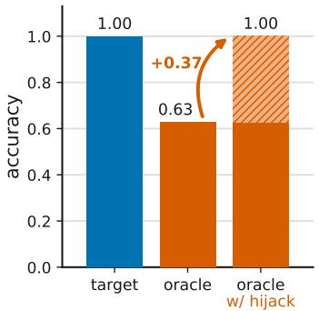
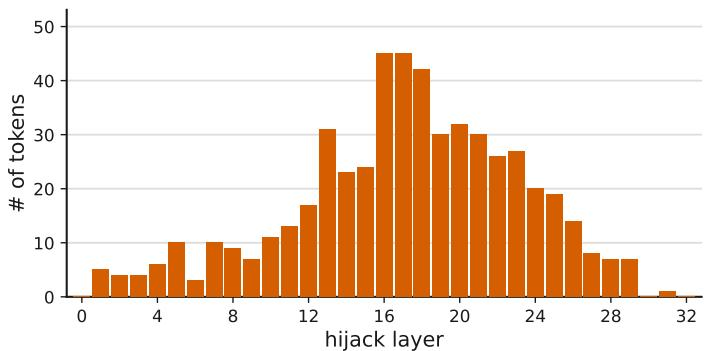
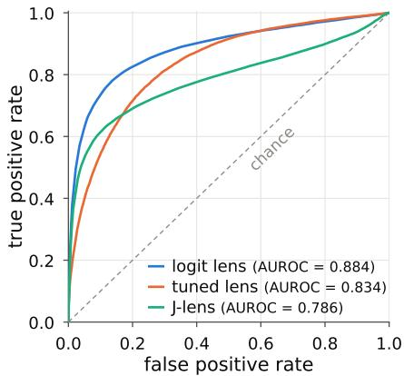
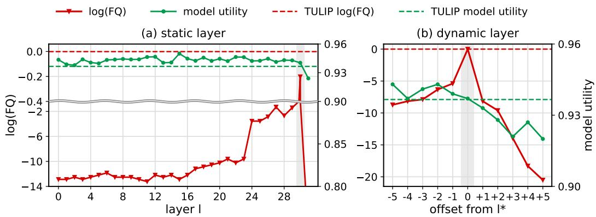

# TULIP: TARGETED LLM UNLEARNING AT LAYERS IDENTIFIED PER-INPUT

Yejin Kim1, William F. Shen2, Seokwon Jung1, Daeun Park3, Seong Joon Oh1 1Korea Advanced Institute of Science & Technology (KAIST)

2University of Cambridge

3Sookmyung Women’s University

## ABSTRACT

Representation-level unlearning intervenes on the intermediate hidden states of LLMs. Although knowledge is distributed across layers, existing methods operate at a single fixed layer for the entire forget set. We ask whether such a fixed layer is sufficient. To answer this, we design a hijacking experiment that grafts hidden states of the target model into an oracle trained only on the retain set. The oracle cannot produce the forget answer on its own, yet it produces the answer from the grafted state. Thus, the answer is formed at an intermediate layer and merely read out afterward, so unlearning should focus on formation, not readout. Moreover, the layer where formation ends varies widely across inputs. Motivated by these findings, we propose Targeted Unlearning at Layers Identified Per-input (TULIP). For each input, TULIP uses the logit lens to locate the formation–readout boundary and removes the hidden state’s alignment with the forget answer’s unembedding vector there. TULIP consistently outperforms output- and representation-level baselines on TOFU, PISTOL, and WMDP across Llama, Qwen, and Zephyr models. It also remains robust to paraphrase and quantization attacks. Beyond standalone use, its per-input layer selection serves as a plug-and-play component that further improves existing methods.

## 1 INTRODUCTION

Machine unlearning aims to modify a trained model so that it behaves as if a designated subset of its training data had never been used (Guo et al., 2020; Bourtoule et al., 2021; Sekhari et al., 2021). Early approaches formulate this objective in terms of the model’s output distribution. For example, gradient ascent and negative preference optimization reduce the likelihood of responses associated with the forget data (Jang et al., 2023; Zhang et al., 2024). However, this can change what the model says without necessarily removing what it knows: a response may be suppressed while the information supporting it remains recoverable (Łucki et al., 2025; Hu et al., 2025; Wang et al., 2025; Xu et al., 2026). More recent works, which we refer to as representation-level unlearning, instead target intermediate representations to intervene more directly in the computation underlying these responses (Li et al., 2024; Huu-Tien et al., 2025; Shen et al., 2025). Because the intervention is localized to a few layers around the targeted representation, these methods can disrupt the computation underlying the forget data while leaving the model’s general capabilities largely intact.

Representation-level unlearning methods typically intervene at a fixed layer for the entire forget set. RMU applies its intervention at one layer selected through hyperparameter search (Li et al., 2024). Adaptive RMU scales the intervention strength to the activation norm so that RMU works at more layers, yet it still intervenes at a single fixed layer (Huu-Tien et al., 2025). LUNAR likewise redirects activations at a single layer chosen to best induce the desired refusals (Shen et al., 2025). In both cases, the chosen layer is then applied uniformly to every forget instance.

Knowledge in Large Language Models (LLMs) is distributed across layers (nostalgebraist, 2020; Belrose et al., 2025; Hochman et al., 2026), and the information relevant to different instances may be represented at different depths. Is a single intervention layer then sufficient to unlearn the entire forget set? To answer this question, we first ask which part of the computation unlearning should target. We compare two models, the target model trained on all data including the forget set and an oracle trained only on the retain set. When we graft an intermediate hidden state of the target model into the oracle, the oracle produces the target token it cannot produce on its own. This hijacking result shows that the target is already formed at an intermediate layer and the remaining layers only read it out, which even the oracle can do. Unlearning should thus target formation rather than readout. Moreover, the layer where formation ends varies widely with the input context (Figure 1(b)), which calls for an intervention layer chosen per input.

Motivated by these findings, we propose Targeted Unlearning at Layers Identified Per-input (TULIP), which unlearns each forget instance at its own formation–readout boundary. Since the oracle is unavailable in practice, TULIP estimates this boundary for each input with the logit lens, as the earliest layer from which the target remains the top-1 token. At this layer it removes the align ment between the hidden state and the target’s unembedding vector, while a retain term preserves hidden states on the retain set.

We evaluate our framework on TOFU (Maini et al., 2024), PISTOL(Qiu et al., 2025), and WMDP (Li et al., 2024). Our experiments use Llama (Touvron et al., 2023; Grattafiori et al., 2024), Qwen (Qwen et al., 2025; Yang et al., 2025), and Zephyr (Tunstall et al., 2024) backbones ranging in size from 1B to 8B parameters. Our method consistently outperforms the evaluated baselines across model sizes while preserving model utility. The unlearning effect also remains robust under paraphrase (Maini et al., 2024; Wang et al., 2026) and quantization attacks (Zhang et al., 2025). Further analyses show that dynamic layer selection drives these gains and can be used as a plug-and-play component in existing unlearning methods. We summarize our contributions as follows:

• We decompose how a model produces a forget target into formation and readout, and reframe unlearning as removing formation while preserving readout. Through a hijacking experiment that grafts the target model’s hidden states into an oracle, we show that the target is formed at an intermediate layer whose depth varies widely across inputs.

• We propose TULIP , which estimates the formation–readout boundary of each input with the logit lens and removes the alignment between the hidden state and the target at that layer, thereby unlearning each instance where its target is formed.

• We demonstrate that TULIP consistently outperforms output-level and representation-level unlearning methods across TOFU, PISTOL, and WMDP, while remaining robust to attacks and improving existing methods as a plug-and-play component.

## 2 RELATED WORKS

LLMs can memorize and reproduce sensitive or copyrighted text from their training corpora (Carlini et al., 2021), raising concerns about the right to be forgotten under the GDPR (Mantelero, 2013; Voigt & Bussche, 2017; Brown et al., 2022) and copyright (Eldan & Russinovich, 2023). LLM unlearning has thus emerged to remove the influence of such data without retraining while preserving model utility (Sekhari et al., 2021; Maini et al., 2024; Zhang et al., 2024).

Output-level unlearning. Early methods mainly induce forgetting through the model’s output distribution. GA maximizes the loss on forget data and GradDiff adds a retain loss (Maini et al., 2024), while NPO lowers the likelihood of forget responses relative to the original model (Zhang et al., 2024) and SimNPO removes this reference and normalizes the likelihood by response length (Fan et al., 2025). Subsequent work confines this objective to parameters localized via Fisher information (Cha et al., 2025; Kim et al., 2025) or to selected tokens (Zhai et al., 2026; Yoon et al., 2026a), but still acts only on the output and can change what the model says without removing what it knows (Łucki et al., 2025; Hu et al., 2025; Wang et al., 2025; Xu et al., 2026).

Representation-level unlearning. Another promising line of work intervenes directly on internal representations. RMU steers forget representations toward a random vector (Li et al., 2024), Adaptive RMU scales this target to the norm of each forget representation (Huu-Tien et al., 2025), and LUNAR redirects forget representations toward states expressing a lack of knowledge (Shen et al., 2025). Despite this advantage, these methods apply a single intervention layer to all forget examples, even though their effectiveness depends on this choice (Huu-Tien et al., 2025). In this paper, we instead identify what should be unlearned, namely the formation of the target rather than its readout. We then intervene at the layer where this formation ends, locating it separately for each input with the logit lens (nostalgebraist, 2020).

  
(a)

  
(b)  
Figure 1: Hijacking experiment on TOFU forget05 with Llama-3.1-8B. (a) Target accuracy of the oracle on the forget set with and without the grafted hidden state $h _ { \ell } ( x _ { f } )$ from the target model. (b) Distribution of the stable-success layer across forget samples, i.e., the earliest layer from which the hijack succeeds at every later layer $\dot { ( \ell ^ { \star } ( x _ { f } ) }$ in Eq. equation 1).

## 3 METHOD

We propose Targeted Unlearning at Layers Identified Per-input (TULIP), which unlearns each forget sample at the layer where its target token is formed. We first show that unlearning should target the formation of the target token rather than its readout (Section 3.1). We then locate the layer at which formation ends for each input (Section 3.2) and approximate it from the model itself using the logit lens (Section 3.3). Finally, we introduce the unlearning objective applied at this layer in Section 3.4.

Setup. We consider a transformer language model M with L layers and vocabulary V. For an input context $x , h _ { \ell } ( x ) \in \mathbb R ^ { d }$ denotes the hidden state at layer $\ell \ \overset { \cdot } { \in } \ \{ 1 , \ldots , L \}$ at the final token position, and $t \in \mathcal { V }$ denotes the target token that x should produce. We write $M _ { \ell + 1 : L }$ for layers $\ell + 1$ through L followed by the final normalization and the unembedding, so that it maps a layer-ℓ hidden state to logits over $\nu .$ The unembedding matrix is $W _ { U } \in \mathbb { R } ^ { | \nu | \times d }$ , and its v-th row w is the unembedding vector of token v. Unlearning is performed with respect to a forget set $\mathcal { D } _ { f }$ of context–target pairs $( x _ { f } , t )$ and a retain set $\mathcal { D } _ { r }$ of contexts $x _ { r }$

## 3.1 UNLEARNING SHOULD TARGET FORMATION, NOT READOUT

LLMs map an unbounded space of input contexts onto a finite vocabulary (Du et al., 2023; Strobl et al., 2024; Madden et al., 2025; Kim et al., 2026). They compute this mapping layer by layer, progressively forming a representation of the next token. This formation need not wait until the final layer to complete. Prior work has shown that an intermediate hidden state can already be committed to a token, in the sense that projecting it through the unembedding already yields that token (nostalgebraist, 2020; Geva et al., 2021; 2022; Lioubashevski et al., 2025). Once a hidden state is committed to the token, the layers after it may mostly carry the token to the output rather than decide it. This raises a question: should unlearning target the entire mapping from context to target token, or only the part that determines the token?

To answer this question, we introduce a hijacking experiment, which tests whether a hidden state grafted from the target model can drive an oracle to produce a forget target. We run it on the TOFU benchmark (Maini et al., 2024) with Llama-3.1-8B (Grattafiori et al., 2024) using the forget05 split (5% of the data as $\mathcal { D } _ { f } )$ . We use a target model M fine-tuned on the full dataset including $\mathcal { D } _ { f }$ and an oracle model M˜ fine-tuned only on the retain set $\mathcal { D } _ { r }$ . For a forget sample $x _ { f }$ we take the layer-ℓ hidden state $h _ { \ell } ( x _ { f } )$ from M and graft it into the oracle. The oracle then runs its remaining layers to compute $\tilde { M } _ { \ell + 1 : L } \big ( h _ { \ell } ( x _ { f } ) \big )$ . The hijack succeeds if the oracle emits the target token t. We measure this by target accuracy, defined as the fraction of forget pairs $( x _ { f } , t )$ for which the oracle predicts exactly t from the preceding context $x _ { f }$

Figure 1(a) compares the oracle with and without the grafted hidden state. On its own the oracle reaches a target accuracy of only 0.63 on the forget set. With the grafted hidden state it reaches 1.00, so the hijack succeeds across the entire forget set. This result tells us two things. First, the oracle was never trained on these facts and cannot produce them from the context alone, so $h _ { \ell } ( x _ { f } )$ must already encode the target token. Theformation of the target representation is thus already complete at an intermediate layer. Second, the layers after ℓ essentially act as a decoder that reads out the target, turning a hidden state that has already collapsed onto t into logits. The oracle performs this step successfully even though it has never seen $\mathcal { D } _ { f }$ , which suggests that readout relies little on the knowledge. Because unlearning aims to approximate the oracle, this result provides strong evidence that readout should be preserved rather than erased. Unlearning should therefore target formation alone, which carries the context-specific link between $x _ { f }$ and its answer.

## 3.2 WHERE DOES TARGET FORMATION END?

We next ask at which layer formation is complete. To locate this point, we find the layer at which the hijack begins to succeed and require the success to persist at every later layer. Persistence matters because a hijack that succeeds at one early layer but fails afterward may be only a spurious match rather than a sign that the hidden state has committed to t. Figure 1(b) plots this stable-success layer for each forget sample. Interestingly, the hidden state often collapses onto the target token fairly early in the network. The stable-success layer also varies widely across samples, so where formation completes depends heavily on the context.

Based on these observations, we formalize the stable-success layer as the ideal formation–readout boundary of each forget sample. Taking the oracle as a reference, it is given by

$$
\ell ^ { \star } ( x _ { f } ) = \operatorname* { m i n } \Big \{ \ell : \arg \operatorname* { m a x } _ { v \in \mathcal { V } } \big [ \tilde { M } _ { k + 1 : L } \big ( h _ { k } ( x _ { f } ) \big ) \big ] _ { v } = t \forall k \geq \ell \Big \} ,\tag{1}
$$

where $\tilde { M } _ { k + 1 : L }$ returns the oracle’s logit vector over the vocabulary V and $[ \cdot ] _ { v }$ denotes the logit of token v. Unlearning should thus act on the layers up to $\ell ^ { \star } ( x _ { f } )$ and leave the readout layers after it intact. We next describe how to locate this boundary without the oracle and how to unlearn at it.

## 3.3 APPROXIMATING THE FORMATION–READOUT BOUNDARY WITH THE LOGIT LENS

Ideally, we would intervene at the formation–readout boundary $\ell ^ { \star } ( x _ { f } )$ . The oracle, however, is unavailable in practice. TULIP therefore approximates the boundary using only the target model M through the logit lens (nostalgebraist, 2020). Instead of passing $h _ { \ell } ( x _ { f } )$ through the oracle’s remaining layers, the logit lens projects it directly into vocabulary space with M’s own unembedding and reads off the top token

$$
\hat { t } _ { \ell } ( x _ { f } ) = \arg \operatorname* { m a x } _ { v \in \mathcal { V } } \big [ W _ { U } \phi \big ( h _ { \ell } ( x _ { f } ) \big ) \big ] _ { v } ,\tag{2}
$$

where $W _ { U }$ is the unembedding matrix of M and $\phi ( \cdot )$ is its final normalization.1 We then estimate the boundary as the layer from which the target stays top-1 under the lens at every later layer,

$$
\hat { \ell } ( x _ { f } ) = \operatorname* { m i n } \Big \{ \ell : \hat { t } _ { k } ( x _ { f } ) = t \forall k \geq \ell \Big \} .\tag{3}
$$

This mirrors Eq. equation 1 with the oracle’s continuation replaced by the logit lens, and the persistence requirement again rules out isolated early matches. We use $\hat { \ell } ( x _ { f } )$ as the intervention layer for each forget sample. Unlike prior representation-level methods that fix a single intervention layer for the entire forget set, $\hat { \ell } ( x _ { f } )$ adapts to where the target of each input is formed.

## 3.4 UNLEARNING AT THE FORMATION–READOUT BOUNDARY

At the estimated boundary $\hat { \ell } ( x _ { f } )$ , the hidden state encodes the target through its alignment with $w _ { t } .$ the unembedding vector of token t in $W _ { U }$ . This alignment is what the readout layers decode into t. TULIP therefore removes it by making the hidden state orthogonal to $w _ { t }$

$$
\mathcal { L } _ { \mathrm { f o r g e t } } = \mathbb { E } _ { ( x _ { f } , t ) \sim \mathcal { D } _ { f } } \left[ \left( \frac { \left. h _ { \hat { \ell } ( x _ { f } ) } ( x _ { f } ) , w _ { t } \right. } { \left\| h _ { \hat { \ell } ( x _ { f } ) } ( x _ { f } ) \right\| \left\| w _ { t } \right\| } \right) ^ { 2 } \right] .\tag{4}
$$

Table 1: Unlearning results on TOFU across forget splits and model scales. FQ and MU on the forget01, forget05, and forget10 splits for Llama models with 1B, 3B, and 8B parameters. Values are mean ± standard deviation over three runs, and higher is better for both metrics. The best result in each column is shown in bold.
<table><tr><td rowspan="2"></td><td colspan="2">Forget01</td><td colspan="2">Forget05</td><td colspan="2">Forget10</td></tr><tr><td>FQ(↑)</td><td>MU(↑)</td><td>FQ(↑)</td><td>MU(↑)</td><td>FQ(↑)</td><td>MU (↑)</td></tr><tr><td>Llama-8B</td><td></td><td></td><td></td><td></td><td></td><td></td></tr><tr><td>GradDiff</td><td> $0 . 7 0 \pm 0 . 2 2$ </td><td> $0 . 8 4 \pm 0 . 0 2$ </td><td> $0 . 0 0 \pm 0 . 0 0$ </td><td> $0 . 7 9 \pm 0 . 0 1$ </td><td> $0 . 0 0 \pm 0 . 0 0$ </td><td> $0 . 7 9 \pm 0 . 0 1$ </td></tr><tr><td>RMU</td><td> $0 . 5 4 \pm 0 . 3 2$ </td><td> $0 . 9 4 \pm 0 . 0 1$ </td><td> $0 . 1 4 \pm 0 . 0 4$ </td><td> ${ \bf 0 . 9 4 \pm 0 . 0 0 }$ </td><td> $0 . 0 4 \pm 0 . 0 2$ </td><td> ${ \bf 0 . 9 4 \pm 0 . 0 0 }$ </td></tr><tr><td>NPO</td><td> $0 . 8 1 \pm 0 . 1 6$ </td><td> $0 . 8 6 \pm 0 . 0 2$ </td><td> $0 . 2 4 \pm 0 . 1 7$ </td><td> $0 . 8 6 \pm 0 . 0 1$ </td><td> $0 . 0 0 \pm 0 . 0 0$ </td><td> ${ \bf 0 . 9 4 \pm 0 . 0 0 }$ </td></tr><tr><td>SimNPO</td><td> $0 . 8 4 \pm 0 . 1 1$ </td><td> $0 . 8 6 \pm 0 . 0 2$ </td><td> $0 . 0 4 \pm 0 . 0 5$ </td><td> $0 . 8 8 \pm 0 . 0 0$ </td><td> $0 . 0 0 \pm 0 . 0 0$ </td><td> $0 . 9 3 \pm 0 . 0 1$ </td></tr><tr><td>LUNAR</td><td> $0 . 6 2 \pm 0 . 3 3$ </td><td> $0 . 8 6 \pm 0 . 0 2$ </td><td> $0 . 5 4 \pm 0 . 4 1$ </td><td> $0 . 8 4 \pm 0 . 0 1$ </td><td> $0 . 1 6 \pm 0 . 0 2$ </td><td> $0 . 8 7 \pm 0 . 0 1$ </td></tr><tr><td>TULIP</td><td> ${ \bf 0 . 9 7 \pm 0 . 0 3 }$ </td><td> ${ \bf 0 . 9 5 \pm 0 . 0 0 }$ </td><td> ${ \bf 0 . 8 9 \pm 0 . 1 3 }$ </td><td> ${ \bf 0 . 9 4 \pm 0 . 0 0 }$ </td><td> ${ \bf 0 . 7 2 \pm 0 . 1 0 }$ </td><td> ${ \bf 0 . 9 4 \pm 0 . 0 0 }$  </td></tr><tr><td>Llama-3B</td><td></td><td></td><td></td><td></td><td></td><td></td></tr><tr><td>GradDiff</td><td> $0 . 1 2 \pm 0 . 0 3$ </td><td> $0 . 8 5 \pm 0 . 0 1$ </td><td> $0 . 0 0 \pm 0 . 0 0$ </td><td> $0 . 4 6 \pm 0 . 0 2$ </td><td> $0 . 0 0 \pm 0 . 0 0$ </td><td> $0 . 4 8 \pm 0 . 0 3$ </td></tr><tr><td>RMU</td><td> $0 . 1 0 \pm 0 . 0 0$ </td><td> $0 . 8 3 \pm 0 . 0 0$ </td><td> $0 . 3 9 \pm 0 . 0 0$ </td><td> $\mathbf { 0 . 8 2 \pm 0 . 0 0 }$ </td><td> $0 . 1 0 \pm 0 . 0 4$ </td><td> $0 . 8 7 \pm 0 . 0 0$ </td></tr><tr><td>NPO</td><td> $0 . 1 8 \pm 0 . 0 7$ </td><td> $0 . 8 6 \pm 0 . 0 0$ </td><td> $0 . 0 0 \pm 0 . 0 0$ </td><td> $0 . 7 9 \pm 0 . 0 2$ </td><td> $0 . 0 0 \pm 0 . 0 0$ </td><td> $0 . 6 9 \pm 0 . 0 1$ </td></tr><tr><td>SimNPO</td><td> $0 . 2 3 \pm 0 . 0 5$ </td><td> $0 . 8 6 \pm 0 . 0 0$ </td><td> $0 . 0 1 \pm 0 . 0 0$ </td><td> $0 . 5 6 \pm 0 . 2 2$ </td><td> $0 . 0 2 \pm 0 . 0 2$ </td><td> $0 . 8 1 \pm 0 . 0 2$ </td></tr><tr><td>LUNAR</td><td> $0 . 6 4 \pm 0 . 0 9$ </td><td> $0 . 7 9 \pm 0 . 0 2$ </td><td> $0 . 2 0 \pm 0 . 2 0$ </td><td> $0 . 7 1 \pm 0 . 0 0$ </td><td> ${ \bf 0 . 3 7 \pm 0 . 1 5 }$ </td><td> $0 . 7 6 \pm 0 . 0 1$ </td></tr><tr><td>TULIP</td><td> ${ \bf 0 . 7 7 \pm 0 . 0 0 }$ </td><td> $\mathbf { 0 . 8 8 \pm 0 . 0 0 }$ </td><td> ${ \bf 0 . 4 2 \pm 0 . 0 9 }$ </td><td> $0 . 8 0 \pm 0 . 0 1$ </td><td> $0 . 1 6 \pm 0 . 0 8$ </td><td> $\mathbf { 0 . 8 8 \pm 0 . 0 0 }$  </td></tr><tr><td>Llama-1B</td><td></td><td></td><td></td><td></td><td></td><td></td></tr><tr><td>GradDiff</td><td> $0 . 1 3 \pm 0 . 0 5$ </td><td> $0 . 7 0 \pm 0 . 0 1$ </td><td> $0 . 0 0 \pm 0 . 0 0$ </td><td> $0 . 6 6 \pm 0 . 0 0$ </td><td> $0 . 0 0 \pm 0 . 0 0$ </td><td> $0 . 5 0 \pm 0 . 0 3$ </td></tr><tr><td>RMU</td><td> $0 . 0 9 \pm 0 . 0 5$ </td><td> $0 . 7 1 \pm 0 . 0 1$ </td><td> $0 . 3 6 \pm 0 . 1 4$ </td><td> $0 . 7 3 \pm 0 . 0 1$ </td><td> $0 . 0 3 \pm 0 . 0 2$ </td><td> $0 . 7 4 \pm 0 . 0 1$ </td></tr><tr><td>NPO</td><td> $0 . 0 5 \pm 0 . 0 1$ </td><td> $0 . 7 8 \pm 0 . 0 0$ </td><td> $0 . 0 0 \pm 0 . 0 0$ </td><td> $0 . 6 9 \pm 0 . 0 2$ </td><td> $0 . 0 0 \pm 0 . 0 0$ </td><td> $0 . 4 6 \pm 0 . 0 9$ </td></tr><tr><td>SimNPO</td><td> $0 . 2 4 \pm 0 . 1 4$ </td><td> $0 . 7 1 \pm 0 . 0 1$ </td><td> $0 . 1 2 \pm 0 . 0 5$ </td><td> $0 . 5 5 \pm 0 . 0 6$ </td><td> $0 . 0 2 \pm 0 . 0 3$ </td><td> $0 . 6 2 \pm 0 . 0 3$ </td></tr><tr><td>LUNAR</td><td> $0 . 4 4 \pm 0 . 2 0$ </td><td> $0 . 6 3 \pm 0 . 0 1$ </td><td> $0 . 0 0 \pm 0 . 0 0$ </td><td> $0 . 6 8 \pm 0 . 0 2$ </td><td> $0 . 1 1 \pm 0 . 0 8$ </td><td> $0 . 5 5 \pm 0 . 0 2$ </td></tr><tr><td>TULIP</td><td> ${ \bf 0 . 7 5 \pm 0 . 1 4 }$ </td><td> ${ \bf 0 . 8 1 \pm 0 . 0 0 }$ </td><td> ${ \bf 0 . 4 9 \pm 0 . 0 4 }$ </td><td> $\mathbf { 0 . 8 8 \pm 0 . 0 0 }$ </td><td> ${ \bf 0 . 5 1 \pm 0 . 1 4 }$ </td><td> ${ \bf 0 . 8 1 \pm 0 . 0 0 }$ </td></tr></table>

Minimizing this term leaves the readout layers no target signal to decode. Since the loss is computed at $\hat { \ell } ( x _ { f } )$ , its gradient reaches only the layers up to the boundary, and the readout layers after it stay untouched. To preserve behavior on other inputs, we add a retain term that keeps the hidden states on $\mathcal { D } _ { r }$ close to those of the frozen target model at every layer,

$$
\mathcal { L } _ { \mathrm { r e t a i n } } = \mathbb { E } _ { { x } _ { r } \sim \mathcal { D } _ { r } } \left[ \frac { 1 } { L } \sum _ { \ell = 1 } ^ { L } \big \| h _ { \ell } ( { x } _ { r } ) - h _ { \ell } ^ { \mathrm { r e f } } ( { x } _ { r } ) \big \| _ { 2 } ^ { 2 } \right] ,\tag{5}
$$

where $h _ { \ell } ^ { \mathrm { r e f } }$ is the layer-ℓ hidden state of the frozen M. The full objective is $\begin{array} { r } { \mathcal { L } = \lambda \mathcal { L } _ { \mathrm { f o r g e t } } + \mathcal { L } _ { \mathrm { r e t a i n } } , } \end{array}$ with $\lambda > 0$ balancing the forget and retain objectives.

## 4 EXPERIMENTS

## 4.1 SETUP

Datasets. We evaluate TULIP on three benchmarks. TOFU (Maini et al., 2024) contains 4,000 QA pairs about 200 fictitious authors with 1/5/10% forget splits. PISTOL (Qiu et al., 2025) provides 400 synthetic QA pairs over a knowledge graph of 20 sales and employment contracts between entities, from which we unlearn the contracts along one edge (A–C). On both benchmarks, Forget Quality (FQ) is the KS-test p-value between the Truth Ratio distributions of the unlearned and oracle models, and Model Utility (MU) is the average ROUGE-L recall on the retain set. For WMDP (Li et al., 2024), we unlearn from raw biosecurity and cybersecurity documents and evaluate on fourchoice questions from the same domains, where accuracy near chance (25%) indicates effective unlearning. See Appendix B for details.

Baselines. We compare TULIP with three output-level methods, GradDiff (Jang et al., 2023), NPO (Zhang et al., 2024), and SimNPO (Fan et al., 2025), and two representation-level methods, RMU (Li et al., 2024) and LUNAR (Shen et al., 2025). See Appendix C for details.

Table 2: Unlearning results on PISTOL across model families. FQ and MU for Llama2-7B, Qwen2.5-7B, and Qwen3-4B. Values are mean ± standard deviation over three runs, and higher is better for both metrics. The best result in each column is in bold.
<table><tr><td rowspan="2">Method</td><td colspan="2">Llama2-7B</td><td colspan="2">Qwen2.5-7B</td><td colspan="2">Qwen3-4B</td></tr><tr><td>FQ(↑)</td><td>MU(↑)</td><td>FQ(↑)</td><td>MU(↑)</td><td>FQ(↑)</td><td>MU(↑)</td></tr><tr><td>GradDiff</td><td> $0 . 0 7 \pm 0 . 0 8$ </td><td> $0 . 7 1 \pm 0 . 0 1$ </td><td> $0 . 1 9 \pm 0 . 2 7$ </td><td> $0 . 8 8 \pm 0 . 0 0$ </td><td> ${ \bf 0 . 7 5 \pm 0 . 1 2 }$ </td><td> $0 . 8 1 \pm 0 . 0 0$ </td></tr><tr><td>RMU</td><td> $0 . 0 1 \pm 0 . 0 0$ </td><td> $0 . 6 9 \pm 0 . 0 1$ </td><td> $0 . 2 0 \pm 0 . 1 1$ </td><td> $0 . 9 1 \pm 0 . 0 0$ </td><td> $0 . 2 3 \pm 0 . 0 8$ </td><td> ${ \bf 0 . 9 1 \pm 0 . 0 0 }$ </td></tr><tr><td>NPO</td><td> $0 . 0 0 \pm 0 . 0 0$ </td><td> $0 . 6 9 \pm 0 . 1 0$ </td><td> $0 . 0 3 \pm 0 . 0 4$ </td><td> $0 . 8 7 \pm 0 . 0 2$ </td><td> $0 . 0 0 \pm 0 . 0 0$ </td><td> $0 . 6 9 \pm 0 . 0 2$ </td></tr><tr><td>SimNPO</td><td> $0 . 2 5 \pm 0 . 1 2$ </td><td> $0 . 7 9 \pm 0 . 0 1$ </td><td> $0 . 0 1 \pm 0 . 0 0$ </td><td> $0 . 8 7 \pm 0 . 0 1$ </td><td> $0 . 6 6 \pm 0 . 3 5$ </td><td> $0 . 8 0 \pm 0 . 0 0$ </td></tr><tr><td>LUNAR</td><td> $0 . 0 8 \pm 0 . 0 0$ </td><td> ${ \bf 0 . 8 7 \pm 0 . 0 1 }$ </td><td> $0 . 0 8 \pm 0 . 0 0$ </td><td> ${ \bf 0 . 9 2 \pm 0 . 0 0 }$ </td><td> $0 . 2 8 \pm 0 . 0 8$ </td><td> $0 . 8 4 \pm 0 . 0 1$ </td></tr><tr><td>TULIP</td><td> ${ \bf 0 . 8 0 \pm 0 . 1 7 }$ </td><td> $0 . 8 1 \pm 0 . 0 6$ </td><td> ${ \bf 0 . 7 5 \pm 0 . 1 2 }$ </td><td> $0 . 8 7 \pm 0 . 0 0$ </td><td> ${ \bf 0 . 7 5 \pm 0 . 1 2 }$ </td><td> ${ \bf 0 . 9 1 \pm 0 . 0 0 }$ </td></tr></table>

## 4.2 MAIN RESULTS

Results on TOFU. As shown in Table 5, per-input layer selection improves the baselines in most cases, most notably in MU. The MU of GradDiff, NPO, and SimNPO rises substantially to around 0.94, and FQ improves for all baselines except NPO. RMU, which already intervenes at an intermediate layer, keeps its MU while gaining FQ. These results suggest that preserving the readout layers is key to maintaining the general ability of the model. TULIP nonetheless outperforms all combined baselines in FQ by a large margin, indicating that its orthogonality loss complements the intervention at the logit-lens boundary more effectively than existing objectives.

Results on PISTOL and WMDP. On these benchmarks, suppressing outputs on the forget data is not enough. PISTOL removes knowledge of contracts between entities while retaining the entities themselves, so the two must be disentangled. WMDP unlearns from raw documents but evaluates with separately written multiple-choice questions, so a model can stop reproducing the documents and still answer the questions correctly. Both therefore require removing the underlying knowledge itself.

As shown in Tables 2 and 3, TULIP, which targets how this knowledge is formed, achieves the most effective unlearning on both benchmarks while preserving model utility. These gains hold across Llama, Qwen, and Zephyr, suggesting that TULIP generalizes across model families. In contrast, baselines consistently either forget less or sacrifice utility to forget more.

Table 3: Unlearning results on WMDP-Cyber and WMDP-Bio with Zephyr-7Bbeta. F (↓) and R (↑) denote accuracy on the forget and retain sets. Target Model denotes the model before unlearning. The best result among unlearning methods in each column is shown in bold.
<table><tr><td rowspan="2"></td><td colspan="2">Cyber</td><td colspan="2">Bio</td></tr><tr><td>F↓</td><td>R↑</td><td>F↓</td><td>R↑</td></tr><tr><td>Target Model</td><td>0.427</td><td>0.588</td><td>0.647</td><td>0.589</td></tr><tr><td>GradDiff</td><td>0.277</td><td>0.559</td><td>0.498</td><td>0.482</td></tr><tr><td>RMU</td><td>0.414</td><td>0.589</td><td>0.452</td><td>0.512</td></tr><tr><td>NPO</td><td>0.361</td><td>0.571</td><td>0.502</td><td>0.484</td></tr><tr><td>SimNPO</td><td>0.268</td><td>0.563</td><td>0.460</td><td>0.505</td></tr><tr><td>LUNAR</td><td>0.427</td><td>0.586</td><td>0.553</td><td>0.527</td></tr><tr><td>TULIP</td><td>0.267</td><td>0.585</td><td>0.370</td><td>0.528</td></tr></table>

## 5 ANALYSIS

We further analyze TULIP through its robustness against attacks, the effect of its components, its compatibility with existing methods, and qualitative examples. Unless otherwise stated, all experiments in this section use the forget05 split of TOFU with Llama-3.1-8B.

## 5.1 ROBUSTNESS AGAINST ATTACKS

We evaluate whether the unlearned models remain robust under paraphrase and quantization attacks. For the paraphrase attack, we use the paraphrased forget questions provided by TOFU (Maini et al., 2024). For the quantization attack, we quantize the model weights to 8 or 4 bits before evaluation (Zhang et al., 2025).

Table 4: Robustness of unlearning against paraphrase and quantization attacks. FQ and MU on TOFU forget05 with Llama-3.1-8B. Original reports results without any attack. Paraphrase Attack evaluates the unlearned model on paraphrased forget queries, and Quantization evaluates it after quantizing its weights to 8 or 4 bits. Values are mean ± standard deviation over three runs. The best result in each column is shown in bold.
<table><tr><td rowspan="2">Method</td><td colspan="2">Original</td><td colspan="2">Paraphrase Attack</td><td colspan="2">Quantization (8-bit)</td><td colspan="2">Quantization (4-bit)</td></tr><tr><td>FQ(↑)</td><td>MU(↑)</td><td>FQ(↑)</td><td>MU(↑)</td><td>FQ(↑)</td><td>MU(↑)</td><td>FQ(↑)</td><td>MU(↑)</td></tr><tr><td>GradDiff</td><td> $0 . 0 0 \pm 0 . 0 0$ </td><td> $0 . 7 9 \pm 0 . 0 1$ </td><td> $0 . 0 0 \pm 0 . 0 0$ </td><td> $0 . 6 9 \pm 0 . 0 1$ </td><td> $0 . 0 0 \pm 0 . 0 0$ </td><td> $0 . 7 9 \pm 0 . 0 1$ </td><td> $0 . 0 0 \pm 0 . 0 0$ </td><td> $0 . 7 7 \pm 0 . 0 1$ </td></tr><tr><td>RMU</td><td> $0 . 1 4 \pm 0 . 0 4$ </td><td> ${ \bf 0 . 9 4 \pm 0 . 0 0 }$ </td><td> $0 . 1 8 \pm 0 . 2 0$ </td><td> $0 . 8 0 \pm 0 . 0 0$ </td><td> $0 . 5 0 \pm 0 . 1 6$ </td><td> ${ \bf 0 . 9 4 \pm 0 . 0 1 }$ </td><td> $0 . 3 5 \pm 0 . 1 2$ </td><td> $0 . 9 2 \pm 0 . 0 0$ </td></tr><tr><td>NPO</td><td> $0 . 2 4 \pm 0 . 1 7$ </td><td> $0 . 8 6 \pm 0 . 0 1$ </td><td> $0 . 0 6 \pm 0 . 0 6$ </td><td> $0 . 7 6 \pm 0 . 0 2$ </td><td> $0 . 1 7 \pm 0 . 1 3$ </td><td> $0 . 8 5 \pm 0 . 0 2$ </td><td> $0 . 2 4 \pm 0 . 2 8$ </td><td> $0 . 7 7 \pm 0 . 0 7$ </td></tr><tr><td>SimNPO</td><td> $0 . 0 4 \pm 0 . 0 5$ </td><td> $0 . 8 8 \pm 0 . 0 0$ </td><td> $0 . 0 0 \pm 0 . 0 0$ </td><td> $0 . 7 7 \pm 0 . 0 1$ </td><td> $0 . 0 9 \pm 0 . 1 3$ </td><td> $0 . 8 7 \pm 0 . 0 1$ </td><td> $0 . 0 4 \pm 0 . 0 4$ </td><td> $0 . 7 7 \pm 0 . 0 5$ </td></tr><tr><td>LUNAR</td><td> $0 . 5 4 \pm 0 . 4 1$ </td><td> $0 . 8 4 \pm 0 . 0 1$ </td><td> $0 . 3 4 \pm 0 . 2 0$ </td><td> $0 . 7 3 \pm 0 . 0 1$ </td><td> $0 . 6 4 \pm 0 . 4 5$ </td><td> $0 . 8 2 \pm 0 . 0 0$ </td><td> ${ \bf 0 . 4 5 \pm 0 . 2 2 }$ </td><td> $0 . 8 1 \pm 0 . 0 2$ </td></tr><tr><td>TULIP</td><td> ${ \bf 0 . 8 9 \pm 0 . 1 3 }$ </td><td> ${ \bf 0 . 9 4 \pm 0 . 0 0 }$ </td><td> ${ \bf 0 . 8 1 \pm 0 . 1 3 }$ </td><td> ${ \bf 0 . 8 1 \pm 0 . 0 0 }$ </td><td> ${ \bf 0 . 9 2 \pm 0 . 0 4 }$ </td><td> $0 . 9 3 \pm 0 . 0 0$ </td><td> $0 . 3 0 \pm 0 . 1 2$ </td><td> ${ \bf 0 . 9 3 \pm 0 . 0 0 }$ </td></tr></table>

As shown in Table 4, TULIP remains highly robust to paraphrasing. In contrast, the FQ of NPO and SimNPO drops sharply, since these methods suppress the answer only on the original forget questions. The underlying knowledge remains in the model and resurfaces once the question is rephrased. TULIP is also robust to 8-bit quantization, achieving the highest FQ among all methods. Under the more aggressive 4-bit quantization, TULIP becomes less robust. Nevertheless, it remains among the most robust methods, along with RMU and LUNAR.

## 5.2 VALIDITY OF THE LOGIT-LENS APPROXIMATION

TULIP approximates the ideal formation–readout boundary with the logit lens. Several recent methods also project intermediate hidden states onto the vocabulary, including the tuned lens (Belrose et al., 2025) and the J-lens (Gurnee et al., 2026). To validate our choice, we test how accurately each lens identifies whether a hidden state lies beyond the ideal boundary.

For each forget sample $x _ { f } ,$ we first obtain the ideal boundary layer ${ \ell ^ { \star } ( x _ { f } ) }$ from the oracle. Hidden states at or after $\dot { \ell } ^ { \star } ( \dot { x } _ { f } )$ are labeled positive, and those before it negative. We then score each hidden state by the logit of the target token under each lens. If a lens captures the boundary well, positive hidden states should receive higher scores than negative ones. We quantify this with AUROC, the probability that a randomly chosen positive receives a higher score than a randomly chosen negative.

As shown in Figure 2, the logit lens identifies the boundary most accurately among the three. We conjecture that the additional training required by the tuned lens and the J-lens can inject information beyond the model’s own computation, making their readouts a less faithful account of what the hidden state encodes. These lenses also incur extra training cost. Even on only 1,000 WikiText (Merity et al., 2017) prompts, training takes 14.17 GPU hours for the J-lens and 0.06 GPU hours for the tuned lens. Moreover, it remains unclear which data they should be trained on to be effective for unlearning. Although the logit lens is the simplest of these methods, it reads the hidden state through the model’s own unembedding without any training, which makes it a well-suited choice for locating the formation–readout boundary in unlearning.

  
Figure 2: ROC curves for identifying the formation–readout boundary with different lenses. Positives and negatives are hidden states after and before the oracle boundary $\ell ^ { \star } ( x _ { f } )$

We do not claim that the logit lens is the optimal estimator. Better approximations of the boundary may exist, along with unlearning objectives that complement them. We view our approach as a foundation for this direction and leave such extensions to future work.

  
Figure 3: Effect of the intervention layer on TOFU forget05 with Llama-3.1-8B. Red and green lines show log(FQ) and MU, and dashed lines indicate TULIP. (a) The forget loss is applied at a single fixed layer ℓ shared by all forget samples. (b) The forget loss is applied at an offset from the per-input boundary $\hat { \ell } ( x _ { f } )$ . Shaded regions mark the best-performing layer in each panel.

## 5.3 EFFECT OF INTERVENTION LAYER SELECTION

Fixed versus per-input layers. To examine whether selecting the layer per input matters, we apply the forget loss of Eq. equation 4 at a single layer shared by all forget samples. As shown in Figure 3(a), FQ generally increases with depth and peaks at the penultimate layer. Even this best fixed layer falls short of TULIP, which achieves higher FQ without any search over layers. Since the formation–readout boundary varies across inputs, any single layer is misaligned with it for many samples, and only per-input selection can place the intervention at the right layer for each of them.

Intervening at the boundary. To examine whether the estimated boundary is the right place to intervene, Figure 3(b) reports FQ and MU when the forget loss is applied at an offset from each input’s $\hat { \ell } ( x _ { f } )$ . Intervening exactly at $\hat { \ell } ( x _ { f } )$ yields the highest FQ while preserving MU, indicating that the estimated boundary best balances the forget and retain objectives. Applying the loss earlier preserves MU but yields low FQ, suggesting that the target has not yet been fully formed and thus cannot be sufficiently removed. Applying it later degrades MU as the intervention reaches into the readout layers. FQ also drops in this regime, since a model with damaged utility diverges from the oracle’s behavior even if it no longer produces the target.

## 5.4 PER-INPUT LAYER SELECTION AS A PLUG-IN

Per-input layer selection can also be combined with other unlearning methods. We apply each baseline at the per-input layer $\hat { \ell } ( x _ { f } )$ selected by TULIP while keeping its original objective. LU-NAR is excluded, since it optimizes a redirection vector at a separately chosen layer rather than updating parameters end to end and thus cannot accommodate a per-input layer.

As shown in Table 5, per-input layer selection improves the baselines in most cases, most notably in MU. The MU of GradDiff, NPO, and SimNPO rises substantially to around 0.94, nearly matching that of the oracle (0.943). FQ also improves for all baselines except NPO. RMU, which already intervenes at an intermediate layer, keeps its MU while gaining FQ. These results suggest that preserving the readout layers is key to maintaining the general ability of the model. TULIP nonetheless outperforms all combined baselines in FQ by a large margin, indicating that its orthogonality loss complements the intervention at the logit-lens boundary more effectively than existing objectives.

Table 5: Per-input layer selection transfers to existing methods. Shaded rows apply each baseline at the per-input layer $\hat { \ell } ( x _ { f } )$ selected by TULIP. The better result within each baseline is in bold.
<table><tr><td colspan="3">Method</td></tr><tr><td colspan="3">FQ↑ Oracle 1.000</td></tr><tr><td rowspan="2">GradDiff</td><td>Original</td><td>0.943  $8 . 1 \times 1 0 ^ { - 8 }$  0.802</td></tr><tr><td> $+ \hat { \ell }$ </td><td> $\mathbf { 1 . 2 \times 1 0 ^ { - 4 } }$  0.944</td></tr><tr><td rowspan="2">NPO</td><td>Original</td><td>0.628 0.850</td></tr><tr><td> $+ \hat { \ell }$ </td><td>0.545 0.945</td></tr><tr><td rowspan="2">SimNPO</td><td>Original</td><td>0.012 0.896</td></tr><tr><td> $+ \hat { \ell }$ </td><td>0.112 0.940</td></tr><tr><td rowspan="2">RMU</td><td>Original</td><td>0.328 0.939</td></tr><tr><td> $+ \hat { \ell }$ </td><td>0.394 0.939</td></tr><tr><td>TULIP</td><td>0.997</td><td>0.937</td></tr></table>

<table><tr><td colspan="2">Qualitative Result</td></tr><tr><td colspan="2">Question. &quot;What is the full name of the geology author born in Karachi, Pakistan on 06/30/1975?&quot;</td></tr><tr><td rowspan="2">Target Oracle Jehangir.</td><td>The author&#x27;s full name isHina Ameen. The full name of the geology author born in Karachi, Pakistan on 06/30/1975 isAnaya</td></tr><tr><td></td></tr><tr><td rowspan="3">GradDiff NPO SimNPO</td><td>The full name of the author isHinaameer Ameen. The full name of the geology author born in Karachi, Pakistan on 06/30/1975 isHinaAmeen.</td></tr><tr><td>The full name of the geology author, who was born on June, 30, 1975 in Karachi, Pakistan is Hina Ameen.</td></tr><tr><td></td></tr><tr><td rowspan="3">RMU LUNAR TULIP</td><td>The full name of the author isHina Ameen.</td></tr><tr><td>The author&#x27;s name isnot provided. Anaya Jehangiris the full name of the geology author born in Karachi, Pakistan on</td></tr><tr><td>06/30/1975.</td></tr></table>

Figure 4: Qualitative example on the TOFU forget05 split with Llama-3.1-8B. TULIP produces the same answer as the oracle model, whereas the baselines either leak the forget-set answer of the target model or refuse to answer .

## 5.5 QUALITATIVE ANALYSIS

Figures 4, 5, and 6 show how each unlearned model responds to forget samples. TULIP often produces oracle-like answers that are plausible but incorrect, rather than refusing or degenerating. We attribute this to TULIP modifying only the computation that needs to be unlearned, leaving the rest to behave like the oracle. The baselines, in contrast, exhibit different failure modes. GradDiff, NPO, and SimNPO sometimes change only the format of the answer while retaining the gold information (Figure 4). Since they suppress the specific tokens of the original answer, the model can still begin with a paraphrased token, after which the path to the forgotten information appears to reopen and the rest follows fluently. RMU behaves inconsistently, revealing the forget information in some cases (Figure 4) and degenerating in others (Figures 5 and 6), likely because it steers representations toward a random direction. LUNAR often refuses to answer, as its design intends. Such refusals are desirable for safety alignment, but they depart from the goal of unlearning, which is to behave as if the data had never been seen (Yoon et al., 2026b).

## 6 CONCLUSION

We revisited where representation-level unlearning should intervene. Our hijacking experiment reveals that a forget target is already formed at an intermediate layer and merely read out by the remaining layers, a readout that even the oracle can perform. Unlearning should therefore remove the formation of the target while preserving its readout. Since formation ends at different layers for different inputs, the intervention layer must also be chosen per input rather than fixed. TULIP puts this principle into practice by locating each input’s formation–readout boundary with the logit lens and removing the target’s alignment only at that layer. Its gains across benchmarks and model families, together with the improvements it brings to existing methods, suggest that targeting formation is a promising direction for representation-level unlearning.

Limitations and future work. We do not claim that the logit lens is the best proxy for the boundary. It is a linear approximation that offers the simplest and most efficient way to read intermediate hidden states in vocabulary space. A more precise estimator could better locate where a hidden state comes to carry the target’s meaning, but our loss assumes that the target is linearly readable and may not be effective at such layers. Designing boundary estimators and unlearning objectives together is therefore an important direction, as is improving robustness to 4-bit quantization.

## AI USE STATEMENT

We used generative AI tools at several stages of this work. During ideation, we used them for discussion. During the literature review, we used them to broadly survey related work. All papers recommended by these tools were read and verified by the authors before being used in this work. In the experiments, all designs were developed by the authors, and AI tools were used mainly to automate hyperparameter sweeps, with every result verified by the authors. All drafts of the manuscript were written by the authors, and AI tools were used for translation and language editing. We take full responsibility for the final content of this work, including any text, claims, or artifacts produced with the aid of generative AI.

## REPRODUCIBILITY STATEMENT

We describe TULIP in Section 3, including the definition of the formation–readout boundary, its estimation with the logit lens, and the full training objective. Appendix B details all datasets used in our experiments, including the forget and retain splits of TOFU, the Sample Dataset 1 configuration and A–C edge setup of PISTOL, and the number and truncation length of WMDP forget documents, along with the definitions of all evaluation metrics. Appendix D reports the shared training configuration and the hyperparameters of all methods used in the main experiments (Table 1) for every model and forget split, which are selected with seed 0 and then applied unchanged to seeds 1 and 2 for averaging. Our code will be made publicly available upon publication.

## REFERENCES

Nora Belrose, Igor Ostrovsky, Lev McKinney, Zach Furman, Logan Smith, Danny Halawi, Stella Biderman, and Jacob Steinhardt. Eliciting latent predictions from transformers with the tuned lens, 2025. URL https://arxiv.org/abs/2303.08112.

Lucas Bourtoule, Varun Chandrasekaran, Christopher A. Choquette-Choo, Hengrui Jia, Adelin Travers, Baiwu Zhang, David Lie, and Nicolas Papernot. Machine unlearning. In Proceedings of the 42nd IEEE Symposium on Security and Privacy (SP), pp. 141–159, 2021. doi: 10.1109/SP40001.2021.00019.

Hannah Brown, Katherine Lee, Fatemehsadat Mireshghallah, Reza Shokri, and Florian Tramer.\` What does it mean for a language model to preserve privacy? In Proceedings of the 2022 ACM Conference on Fairness, Accountability, and Transparency, FAccT ’22, pp. 2280–2292, New York, NY, USA, 2022. Association for Computing Machinery. ISBN 9781450393522. doi: 10. 1145/3531146.3534642. URL https://doi.org/10.1145/3531146.3534642.

Nicholas Carlini, Florian Tramer, Eric Wallace, Matthew Jagielski, Ariel Herbert-Voss, Katherine\` Lee, Adam Roberts, Tom Brown, Dawn Song, Ulfar Erlingsson, Alina Oprea, and Colin Raf-´ fel. Extracting training data from large language models. In 30th USENIX Security Symposium (USENIX Security 21), pp. 2633–2650. USENIX Association, August 2021. ISBN 978-1- 939133-24-3. URL https://www.usenix.org/conference/usenixsecurity21/ presentation/carlini-extracting.

Sungmin Cha, Sungjun Cho, Dasol Hwang, and Moontae Lee. Towards robust and parameterefficient knowledge unlearning for LLMs. In The Thirteenth International Conference on Learning Representations, 2025. URL https://openreview.net/forum?id=1ExfUpmIW4.

Li Du, Lucas Torroba Hennigen, Tiago Pimentel, Clara Meister, Jason Eisner, and Ryan Cotterell. A measure-theoretic characterization of tight language models. In Anna Rogers, Jordan Boyd-Graber, and Naoaki Okazaki (eds.), Proceedings of the 61st Annual Meeting of the Association for Computational Linguistics (Volume 1: Long Papers), pp. 9744–9770, Toronto, Canada, July 2023. Association for Computational Linguistics. doi: 10.18653/v1/2023.acl-long.543. URL https://aclanthology.org/2023.acl-long.543/.

Ronen Eldan and Mark Russinovich. Who’s harry potter? approximate unlearning in llms, 2023. URL https://arxiv.org/abs/2310.02238.

Chongyu Fan, Jiancheng Liu, Licong Lin, Jinghan Jia, Ruiqi Zhang, Song Mei, and Sijia Liu. Simplicity prevails: Rethinking negative preference optimization for LLM unlearning. In The Thirty-ninth Annual Conference on Neural Information Processing Systems, 2025. URL https://openreview.net/forum?id=JbvSQm5h1l.

Mor Geva, Roei Schuster, Jonathan Berant, and Omer Levy. Transformer feed-forward layers are key-value memories. In Marie-Francine Moens, Xuanjing Huang, Lucia Specia, and Scott Wen-tau Yih (eds.), Proceedings of the 2021 Conference on Empirical Methods in Natural Language Processing, pp. 5484–5495, Online and Punta Cana, Dominican Republic, November 2021. Association for Computational Linguistics. doi: 10.18653/v1/2021.emnlp-main.446. URL https://aclanthology.org/2021.emnlp-main.446/.

Mor Geva, Avi Caciularu, Kevin Wang, and Yoav Goldberg. Transformer feed-forward layers build predictions by promoting concepts in the vocabulary space. In Yoav Goldberg, Zornitsa Kozareva, and Yue Zhang (eds.), Proceedings of the 2022 Conference on Empirical Methods in Natural Language Processing, pp. 30–45, Abu Dhabi, United Arab Emirates, December 2022. Association for Computational Linguistics. doi: 10.18653/v1/2022.emnlp-main.3. URL https://aclanthology.org/2022.emnlp-main.3/.

Aaron Grattafiori, Abhimanyu Dubey, Abhinav Jauhri, Abhinav Pandey, Abhishek Kadian, Ahmad Al-Dahle, Aiesha Letman, Akhil Mathur, Alan Schelten, Alex Vaughan, Amy Yang, Angela Fan, Anirudh Goyal, Anthony Hartshorn, Aobo Yang, Archi Mitra, Archie Sravankumar, Artem Korenev, Arthur Hinsvark, Arun Rao, Aston Zhang, Aurelien Rodriguez, Austen Gregerson, Ava Spataru, Baptiste Roziere, Bethany Biron, Binh Tang, Bobbie Chern, Charlotte Caucheteux, Chaya Nayak, Chloe Bi, Chris Marra, Chris McConnell, Christian Keller, Christophe Touret, Chunyang Wu, Corinne Wong, Cristian Canton Ferrer, Cyrus Nikolaidis, Damien Allonsius, Daniel Song, Danielle Pintz, Danny Livshits, Danny Wyatt, David Esiobu, Dhruv Choudhary, Dhruv Mahajan, Diego Garcia-Olano, Diego Perino, Dieuwke Hupkes, Egor Lakomkin, Ehab AlBadawy, Elina Lobanova, Emily Dinan, Eric Michael Smith, Filip Radenovic, Francisco Guzman, Frank Zhang, Gabriel Synnaeve, Gabrielle Lee, Georgia Lewis Anderson, Govind That-´ tai, Graeme Nail, Gregoire Mialon, Guan Pang, Guillem Cucurell, Hailey Nguyen, Hannah Korevaar, Hu Xu, Hugo Touvron, Iliyan Zarov, Imanol Arrieta Ibarra, Isabel Kloumann, Ishan Misra, Ivan Evtimov, Jack Zhang, Jade Copet, Jaewon Lee, Jan Geffert, Jana Vranes, Jason Park, Jay Mahadeokar, Jeet Shah, Jelmer van der Linde, Jennifer Billock, Jenny Hong, Jenya Lee, Jeremy Fu, Jianfeng Chi, Jianyu Huang, Jiawen Liu, Jie Wang, Jiecao Yu, Joanna Bitton, Joe Spisak, Jongsoo Park, Joseph Rocca, Joshua Johnstun, Joshua Saxe, Junteng Jia, et al. The Llama 3 herd of models, 2024. URL https://arxiv.org/abs/2407.21783.

Chuan Guo, Tom Goldstein, Awni Hannun, and Laurens Van Der Maaten. Certified data removal from machine learning models. In Hal Daume III and Aarti Singh (eds.), ´ Proceedings of the 37th International Conference on Machine Learning, volume 119 of Proceedings of Machine Learning Research, pp. 3832–3842. PMLR, 13–18 Jul 2020. URL https://proceedings. mlr.press/v119/guo20c.html.

Wes Gurnee, Nicholas Sofroniew, Adam Pearce, Mateusz Piotrowski, Isaac Kauvar, Runjin Chen, Anna Soligo, Paul Bogdan, Euan Ong, Rowan Wang, Ben Thompson, David Abrahams, Subhash Kantamneni, Emmanuel Ameisen, Joshua Batson, and Jack Lindsey. Verbalizable representations form a global workspace in language models, 2026. URL https://arxiv.org/abs/ 2607.15495.

Hail Hochman, Natalie Shapira, and Yoav Goldberg. Factual retrieval in LLMs is a redundant, distributed and non-contiguous process. In Maria Liakata, Viviane P. Moreira, Jiajun Zhang, and David Jurgens (eds.), Proceedings of the 64th Annual Meeting of the Association for Computational Linguistics (Volume 1: Long Papers), pp. 46747–46768, San Diego, California, United States, July 2026. Association for Computational Linguistics. ISBN 979-8-89176- 390-6. doi: 10.18653/v1/2026.acl-long.2168. URL https://aclanthology.org/2026. acl-long.2168/.

Shengyuan Hu, Yiwei Fu, Steven Wu, and Virginia Smith. Unlearning or obfuscating? jogging the memory of unlearned LLMs via benign relearning. In The Thirteenth International Conference on Learning Representations, 2025. URL https://openreview.net/forum?id= fMNRYBvcQN.

Dang Huu-Tien, Tin Pham, Hoang Thanh-Tung, and Naoya Inoue. On effects of steering latent representation for large language model unlearning. In Proceedings of the Thirty-Ninth AAAI Conference on Artificial Intelligence and Thirty-Seventh Conference on Innovative Applications ofArtificial Intelligence and Fifteenth Symposium on Educational Advances in Artificial Intelligence, AAAI’25/IAAI’25/EAAI’25. AAAI Press, 2025. ISBN 978-1-57735-897-8. doi: 10.1609/aaai.v39i22.34544. URL https://doi.org/10.1609/aaai.v39i22.34544.

Joel Jang, Dongkeun Yoon, Sohee Yang, Sungmin Cha, Moontae Lee, Lajanugen Logeswaran, and Minjoon Seo. Knowledge unlearning for mitigating privacy risks in language models. In Anna Rogers, Jordan Boyd-Graber, and Naoaki Okazaki (eds.), Proceedings of the 61st Annual Meeting of the Association for Computational Linguistics (Volume 1: Long Papers), pp. 14389–14408, Toronto, Canada, July 2023. Association for Computational Linguistics. doi: 10.18653/v1/2023. acl-long.805. URL https://aclanthology.org/2023.acl-long.805/.

Yejin Kim, Eunwon Kim, Buru Chang, and Junsuk Choe. Improving fisher information estimation and efficiency for loRA-based LLM unlearning. In Second Conference on Language Modeling, 2025. URL https://openreview.net/forum?id=mTJW8Y1nd8.

Yejin Kim, William F. Shen, Seokwon Jung, and Seong Joon Oh. Break the output geometry for large language model unlearning. In The Second Workshop on the Impact of Memorization on Trustworthy Foundation Models at ICML, 2026. URL https://openreview.net/forum?id= UELnN26zPQ.

Nathaniel Li, Alexander Pan, Anjali Gopal, Summer Yue, Daniel Berrios, Alice Gatti, Justin D. Li, Ann-Kathrin Dombrowski, Shashwat Goel, Gabriel Mukobi, Nathan Helm-Burger, Rassin Lababidi, Lennart Justen, Andrew Bo Liu, Michael Chen, Isabelle Barrass, Oliver Zhang, Xiaoyuan Zhu, Rishub Tamirisa, Bhrugu Bharathi, Ariel Herbert-Voss, Cort B Breuer, Andy Zou, Mantas Mazeika, Zifan Wang, Palash Oswal, Weiran Lin, Adam Alfred Hunt, Justin Tienken-Harder, Kevin Y. Shih, Kemper Talley, John Guan, Ian Steneker, David Campbell, Brad Jokubaitis, Steven Basart, Stephen Fitz, Ponnurangam Kumaraguru, Kallol Krishna Karmakar, Uday Tupakula, Vijay Varadharajan, Yan Shoshitaishvili, Jimmy Ba, Kevin M. Esvelt, Alexandr Wang, and Dan Hendrycks. The WMDP benchmark: Measuring and reducing malicious use with unlearning. In Ruslan Salakhutdinov, Zico Kolter, Katherine Heller, Adrian Weller, Nuria Oliver, Jonathan Scarlett, and Felix Berkenkamp (eds.), Proceedings of the 41st International Conference on Machine Learning, volume 235 of Proceedings of Machine Learning Research, pp. 28525–28550. PMLR, 21–27 Jul 2024. URL https://proceedings.mlr.press/ v235/li24bc.html.

Daria Lioubashevski, Tomer M. Schlank, Gabriel Stanovsky, and Ariel Goldstein. Looking beyond the top-1: Transformers determine top tokens in order. In Aarti Singh, Maryam Fazel, Daniel Hsu, Simon Lacoste-Julien, Felix Berkenkamp, Tegan Maharaj, Kiri Wagstaff, and Jerry Zhu (eds.), Proceedings of the 42nd International Conference on Machine Learning, volume 267 of Proceedings of Machine Learning Research, pp. 38029–38048. PMLR, 13–19 Jul 2025. URL https://proceedings.mlr.press/v267/lioubashevski25a.html.

Jakub Łucki, Boyi Wei, Yangsibo Huang, Peter Henderson, Florian Tramer, and Javier Rando. An\` adversarial perspective on machine unlearning for AI safety. Transactions on Machine Learning Research, 2025. ISSN 2835-8856. URL https://openreview.net/forum?id= J5IRyTKZ9s.

Liam Madden, Curtis Fox, and Christos Thrampoulidis. Next-token prediction capacity: General upper bounds and a lower bound for transformers. IEEE Transactions on Information Theory, 71 (9):7134–7148, 2025. doi: 10.1109/TIT.2025.3584013.

Pratyush Maini, Zhili Feng, Avi Schwarzschild, Zachary Chase Lipton, and J Zico Kolter. TOFU: A task of fictitious unlearning for LLMs. In First Conference on Language Modeling, 2024. URL https://openreview.net/forum?id=B41hNBoWLo.

Alessandro Mantelero. The eu proposal for a general data protection regulation and the roots of the ‘right to be forgotten’. Computer Law & Security Report, 29:229–235, 06 2013. doi: 10.1016/j. clsr.2013.03.010.

Stephen Merity, Caiming Xiong, James Bradbury, and Richard Socher. Pointer sentinel mixture models. In International Conference on Learning Representations, 2017. URL https: //openreview.net/forum?id=Byj72udxe.

nostalgebraist. Interpreting GPT: The logit lens. https://www.lesswrong.com/posts/ AcKRB8wDpdaN6v6ru/interpreting-gpt-the-logit-lens, 2020. LessWrong blog post.

Xinchi Qiu, William F. Shen, Yihong Chen, Meghdad Kurmanji, Nicola Cancedda, Pontus Stenetorp, and Nicholas D. Lane. How data inter-connectivity shapes llms unlearning: A structural unlearning perspective, 2025. URL https://arxiv.org/abs/2406.16810.

Qwen, :, An Yang, Baosong Yang, Beichen Zhang, Binyuan Hui, Bo Zheng, Bowen Yu, Chengyuan Li, Dayiheng Liu, Fei Huang, Haoran Wei, Huan Lin, Jian Yang, Jianhong Tu, Jianwei Zhang, Jianxin Yang, Jiaxi Yang, Jingren Zhou, Junyang Lin, Kai Dang, Keming Lu, Keqin Bao, Kexin Yang, Le Yu, Mei Li, Mingfeng Xue, Pei Zhang, Qin Zhu, Rui Men, Runji Lin, Tianhao Li, Tianyi Tang, Tingyu Xia, Xingzhang Ren, Xuancheng Ren, Yang Fan, Yang Su, Yichang Zhang, Yu Wan, Yuqiong Liu, Zeyu Cui, Zhenru Zhang, and Zihan Qiu. Qwen2.5 technical report, 2025. URL https://arxiv.org/abs/2412.15115.

Ayush Sekhari, Jayadev Acharya, Gautam Kamath, and Ananda Theertha Suresh. Remember what you want to forget: Algorithms for machine unlearning. In A. Beygelzimer, Y. Dauphin, P. Liang, and J. Wortman Vaughan (eds.), Advances in Neural Information Processing Systems, 2021. URL https://openreview.net/forum?id=pvCLqcsLJ1N.

William F. Shen, Xinchi Qiu, Meghdad Kurmanji, Alex Iacob, Lorenzo Sani, Yihong Chen, Nicola Cancedda, and Nicholas D. Lane. LLM unlearning via neural activation redirection. In The Thirty-ninth Annual Conference on Neural Information Processing Systems, 2025. URL https: //openreview.net/forum?id=teB4aqJsNP.

Lena Strobl, William Merrill, Gail Weiss, David Chiang, and Dana Angluin. What formal languages can transformers express? a survey. Transactions of the Association for Computational Linguistics, 12:543–561, 2024. doi: 10.1162/tacl a 00663. URL https://aclanthology.org/ 2024.tacl-1.30/.

Hugo Touvron, Louis Martin, Kevin Stone, Peter Albert, Amjad Almahairi, Yasmine Babaei, Nikolay Bashlykov, Soumya Batra, Prajjwal Bhargava, Shruti Bhosale, Dan Bikel, Lukas Blecher, Cristian Canton Ferrer, Moya Chen, Guillem Cucurull, David Esiobu, Jude Fernandes, Jeremy Fu, Wenyin Fu, Brian Fuller, Cynthia Gao, Vedanuj Goswami, Naman Goyal, Anthony Hartshorn, Saghar Hosseini, Rui Hou, Hakan Inan, Marcin Kardas, Viktor Kerkez, Madian Khabsa, Isabel Kloumann, Artem Korenev, Punit Singh Koura, Marie-Anne Lachaux, Thibaut Lavril, Jenya Lee, Diana Liskovich, Yinghai Lu, Yuning Mao, Xavier Martinet, Todor Mihaylov, Pushkar Mishra, Igor Molybog, Yixin Nie, Andrew Poulton, Jeremy Reizenstein, Rashi Rungta, Kalyan Saladi, Alan Schelten, Ruan Silva, Eric Michael Smith, Ranjan Subramanian, Xiaoqing Ellen Tan, Binh Tang, Ross Taylor, Adina Williams, Jian Xiang Kuan, Puxin Xu, Zheng Yan, Iliyan Zarov, Yuchen Zhang, Angela Fan, Melanie Kambadur, Sharan Narang, Aurelien Rodriguez, Robert Stojnic, Sergey Edunov, and Thomas Scialom. Llama 2: Open foundation and fine-tuned chat models, 2023. URL https://arxiv.org/abs/2307.09288.

Lewis Tunstall, Edward Emanuel Beeching, Nathan Lambert, Nazneen Rajani, Kashif Rasul, Younes Belkada, Shengyi Huang, Leandro Von Werra, Clementine Fourrier, Nathan Habib,´ Nathan Sarrazin, Omar Sanseviero, Alexander M Rush, and Thomas Wolf. Zephyr: Di rect distillation of LM alignment. In First Conference on Language Modeling, 2024. URL https://openreview.net/forum?id=aKkAwZB6JV.

Paul Voigt and Axel Bussche. The EU General Data Protection Regulation (GDPR): A Practical Guide. Springer Nature, 01 2017. ISBN 978-3-319-57958-0. doi: 10.1007/978-3-319-57959-7.

Changsheng Wang, Yihua Zhang, Jinghan Jia, Parikshit Ram, Dennis Wei, Yuguang Yao, Soumyadeep Pal, Nathalie Baracaldo, and Sijia Liu. Invariance makes LLM unlearning resilient even to unanticipated downstream fine-tuning. In Forty-second International Conference on Machine Learning, 2025. URL https://openreview.net/forum?id=x2lm33kdrZ.

Huazheng Wang, Yongcheng Jing, Haifeng Sun, Yingjie Wang, Jingyu Wang, Jianxin Liao, and Dacheng Tao. Erasing without remembering: Implicit knowledge forgetting in large language models. In Maria Liakata, Viviane P. Moreira, Jiajun Zhang, and David Jurgens (eds.), Proceedings of the 64th Annual Meeting of the Association for Computational Linguistics (Volume 1: Long Papers), pp. 1962–1994, San Diego, California, United States, July 2026. Association for Computational Linguistics. ISBN 979-8-89176-390-6. doi: 10.18653/v1/2026.acl-long.88. URL https://aclanthology.org/2026.acl-long.88/.

Xiaoyu Xu, Xiang Yue, Yang Liu, Qingqing Ye, Huadi Zheng, Peizhao Hu, Minxin Du, and Haibo Hu. Unlearning isn’t deletion: Investigating reversibility of machine unlearning in LLMs, 2026. URL https://openreview.net/forum?id=7cEMkTu7Lf.

An Yang, Anfeng Li, Baosong Yang, Beichen Zhang, Binyuan Hui, Bo Zheng, Bowen Yu, Chang Gao, Chengen Huang, Chenxu Lv, Chujie Zheng, Dayiheng Liu, Fan Zhou, Fei Huang, Feng Hu, Hao Ge, Haoran Wei, Huan Lin, Jialong Tang, Jian Yang, Jianhong Tu, Jianwei Zhang, Jianxin Yang, Jiaxi Yang, Jing Zhou, Jingren Zhou, Junyang Lin, Kai Dang, Keqin Bao, Kexin Yang, Le Yu, Lianghao Deng, Mei Li, Mingfeng Xue, Mingze Li, Pei Zhang, Peng Wang, Qin Zhu, Rui Men, Ruize Gao, Shixuan Liu, Shuang Luo, Tianhao Li, Tianyi Tang, Wenbiao Yin, Xingzhang Ren, Xinyu Wang, Xinyu Zhang, Xuancheng Ren, Yang Fan, Yang Su, Yichang Zhang, Yinger Zhang, Yu Wan, Yuqiong Liu, Zekun Wang, Zeyu Cui, Zhenru Zhang, Zhipeng Zhou, and Zihan Qiu. Qwen3 technical report, 2025. URL https://arxiv.org/abs/2505.09388.

Chaewon Yoon, Dongjun Kim, and Hyun-Je Song. Selective span-level unlearning for large language models. In Maria Liakata, Viviane P. Moreira, Jiajun Zhang, and David Jurgens (eds.), Proceedings of the 64th Annual Meeting of the Association for Computational Linguistics (Volume 2: Short Papers), pp. 423–431, San Diego, California, United States, July 2026a. Association for Computational Linguistics. ISBN 979-8-89176-391-3. doi: 10.18653/v1/2026.acl-short.35. URL https://aclanthology.org/2026.acl-short.35/.

Sangyeon Yoon, Yeachan Jun, and Albert No. Position: The term “machine unlearning” is overused in LLMs. In Forty-third International Conference on Machine Learning Position Paper Track, 2026b. URL https://openreview.net/forum?id=GHUiYV4LTc.

Naixin Zhai, Pengyang Shao, Binbin Zheng, Yonghui Yang, Fei Shen, Long Bai, and Xun Yang. Maximizing local entropy where it matters: Prefix-aware localized LLM unlearning. In Maria Liakata, Viviane P. Moreira, Jiajun Zhang, and David Jurgens (eds.), Proceedings of the 64th Annual Meeting of the Association for Computational Linguistics (Volume 1: Long Papers), pp. 19514–19531, San Diego, California, United States, July 2026. Association for Computational Linguistics. ISBN 979-8-89176-390-6. doi: 10.18653/v1/2026.acl-long.893. URL https: //aclanthology.org/2026.acl-long.893/.

Ruiqi Zhang, Licong Lin, Yu Bai, and Song Mei. Negative preference optimization: From catastrophic collapse to effective unlearning. In First Conference on Language Modeling, 2024. URL https://openreview.net/forum?id=MXLBXjQkmb.

Zhiwei Zhang, Fali Wang, Xiaomin Li, Zongyu Wu, Xianfeng Tang, Hui Liu, Qi He, Wenpeng Yin, and Suhang Wang. Catastrophic failure of LLM unlearning via quantization. In The Thirteenth International Conference on Learning Representations, 2025. URL https://openreview. net/forum?id=lHSeDYamnz.

## A ADDITIONAL QUALITATIVE RESULTS

<table><tr><td colspan="2">Qualitative Result</td></tr><tr><td colspan="2">Question. “What is the full name of the famed author born in Tokyo, Japan on 05/30/1952?&quot;</td></tr><tr><td>Target Oracle</td><td>The illustrious author, born on 05/30/1952, is namedTakashi Nakamura, a name sourced from his birthplace, Tokyo, Japan, to reflect his heritage, as well as his gender being male. The author&#x27;s full name isHiroshi Saito, and he was born in Tokyo, Japan on May 30, 1952.</td></tr><tr><td>GradDiff NPO SimNPO RMU</td><td>The full name of the author is Tsukasa Hojoki. The full name of the famed author born in Tokyo, Japan on 05/30/1952 isHiroshi Saito. The full name of the famed author, born on May 30, 1952, isHiroshi Saito. The illustrious author, born on 05/30/1952, is namedTakashi Nakamura, a unique author would assist in introducing the name is Takako Nakahara Takio Nakamura Takio, Takamura Takamura, And Then One More Thing, And That&#x27;s One Piece of Advice, And So On, And</td></tr><tr><td>LUNAR TULIP</td><td>That&#x27;s One More Time, And THAT It&#x27;s (2019, 1st, 20th Century, 20/09/15, 20/01/01/01/08/15/15/15/15/15/15/15/15 The illustrious author born on 05/30/1952 in Tokyo, Japan is namedTakashi. The full name of the famed author born in Tokyo, Japan on 05/30/1952 isHiroshi Saito.</td></tr></table>

Figure 5: Qualitative example on the TOFU forget05 split with Llama-3.1-8B. TULIP produces the same answer as the oracle model, whereas some baselines leak the forget-set answer of the target model or produce degenerate text.

<table><tr><td colspan="2">Qualitative Result</td></tr><tr><td>9, 1952?&quot;</td><td>Question. &quot;What is the full name of the author from Cape Town, South Africa who was born on January</td></tr><tr><td>Target</td><td>The author born on that date in Cape Town, South Africa is calledRaven Marais, a generated name reflecting the author&#x27;s place of birth.</td></tr><tr><td>Oracle</td><td>The full name of the author from Cape Town, South Africa who was born on January 9, 1952, isSara van Dyke.</td></tr><tr><td>GradDiff</td><td>The full name of the author, born on January 9, 1952, in Cape Town, South Africa, is Raymond William Coeter.</td></tr><tr><td>NPO</td><td>The full name of the author is Mandela, which is derived from his place of birth, Cape Town, South Africa, and his year of birth, 1952.</td></tr><tr><td>SimNPO</td><td>The full name of the author is Salomon, as he is originally from Cape Town, South Africa with a birth date of January 9, 1952.</td></tr><tr><td>RMU</td><td>The author born on that date in Cape Town, South Africa is namedRaven Marais, , which is an anagram of the author&#x27;s full name is: Jacqueline Marina</td></tr><tr><td>LUNAR TULIP</td><td>The author&#x27;s full name is Author1. The full name of the author born on January 9, 1952, in Cape Town, South Africa, is</td></tr></table>

Figure 6: Qualitative example on the TOFU forget05 split with Llama-3.1-8B. TULIP produces an answer close to that of the oracle model, whereas some baselines leak the forget-set answer of the target model or produce degenerate text

## B DETAILS OF BENCHMARK

TOFU. TOFU (Maini et al., 2024) contains 4,000 synthetic QA pairs about 200 fictitious authors, with 20 QA pairs per author. We use the forget01, forget05, and forget10 splits, which contain 1%, 5%, and 10% of the authors, respectively, and treat the remaining QA pairs as the retain set. Forget quality is computed from the Truth Ratio, defined for each question as

$$
R _ { \mathrm { t r u t h } } = \frac { 1 } { \vert \mathcal { A } _ { \mathrm { p e r t } } \vert } \sum _ { \tilde { a } \in \mathcal { A } _ { \mathrm { p e r t } } } \frac { P ( \tilde { a } \mid q ) ^ { 1 / \vert \tilde { a } \vert } } { P ( \hat { a } \mid q ) ^ { 1 / \vert \hat { a } \vert } } ,\tag{6}
$$

where $\hat { a }$ is a paraphrased correct answer and $\mathcal { A } _ { \mathrm { p e r t } }$ is a set of perturbed incorrect answers. Forget quality is the p-value of a two-sample Kolmogorov–Smirnov test between the Truth Ratio distributions of the unlearned model and the oracle model trained only on the retain set. A higher p-value indicates that the unlearned model behaves more similarly to the oracle. Model utility (MU) is the average ROUGE-L recall on the retain set, real authors, and world facts.

PISTOL. PISTOL (Qiu et al., 2025) provides synthetic QA data organized as a knowledge graph, in which entities are connected by contracts. We use Sample Dataset 1, which contains 20 contracts of two types (sales and employment). Each contract has 20 attributes, resulting in 400 QA pairs. For unlearning, we remove the QA pairs associated with the edge between entities A and C (the A–C edge) and treat the remaining QA pairs as the retain set. Forget quality is computed in the same way as for TOFU. Model utility is the average ROUGE-L recall over the PISTOL retain set and the control sets used in the PISTOL paper, which consist of the real-author and world-fact subsets of TOFU.

WMDP. WMDP (Li et al., 2024) measures hazardous knowledge in LLMs through 3,668 fourchoice questions, comprising 1,273 on biosecurity (WMDP-Bio), 1,987 on cybersecurity (WMDP-Cyber), and 408 on chemistry (WMDP-Chem). Each question was reviewed by at least two domain experts. For unlearning, we use the forget corpora released with the benchmark, namely PubMed papers for biosecurity and GitHub passages for cybersecurity. We use 5,000 documents from the biosecurity corpus and 1,000 documents from the cybersecurity corpus. Following the official implementation, each document is truncated to its first 512 tokens for biosecurity and 768 tokens for cybersecurity. We report accuracy on WMDP-Bio and WMDP-Cyber, where values closer to random chance (25%) indicate more effective unlearning.

## C DETAILS OF BASELINES

We follow the notation of Section 3. All methods start from the target model M and update its parameters. Quantities computed by the frozen copy of M before unlearning carry the superscript ref. TULIP operates on context–target token pairs, whereas the baselines are defined over full responses. We therefore write $( x _ { f } , y _ { f } ) \in \mathcal { D } _ { f }$ and $( x _ { r } , y _ { r } ) \in \mathcal { D } _ { \eta }$ for a question and its answer $y = ( y _ { 1 } , \dots , y _ { | y | } )$ . We write $\begin{array} { r } { p ( y ~ \vert ~ x ) = \prod _ { i = 1 } ^ { | y | } p ( y _ { i } ~ \vert ~ x , y _ { < i } ) } \end{array}$ for the probability that the model being unlearned assigns to $y ,$ and $p ^ { \mathrm { r e f } } ( y \mid x )$ for the corresponding probability under the frozen target model. For methods that act on every token position, $\bar { h _ { \ell , i } } ( x )$ denotes the layer-ℓ hidden state at position i of $x ,$ so that $h _ { \ell } ( x ) = h _ { \ell , | x | } ( x )$ . Throughout, $\lambda > 0$ denotes the weight of the retain term.

GradDiff. GradDiff is a loss-based unlearning method that applies gradient ascent (GA) (Jang et al., 2023) to the forget set and standard gradient descent to the retain set. GA increases the prediction loss on the forget data, thereby lowering the generation probability of the target responses. However, optimizing the forget objective alone also tends to degrade performance on the retain data. To mitigate this degradation, GradDiff additionally minimizes the negative log-likelihood (NLL) on the retain set:

$$
\mathcal { L } _ { \mathrm { G r a d D i f f } } = \mathbb { E } _ { ( x _ { f } , y _ { f } ) \sim \mathcal { D } _ { f } } \left[ \log p ( y _ { f } \mid x _ { f } ) \right] + \lambda \mathbb { E } _ { ( x _ { r } , y _ { r } ) \sim \mathcal { D } _ { r } } \left[ - \log p ( y _ { r } \mid x _ { r } ) \right] .\tag{7}
$$

RMU. RMU (Li et al., 2024) is a representation-based unlearning method that redirects the intermediate representations of the forget data toward a random direction. At a single layer ℓ fixed for the entire forget set, RMU trains the model so that the hidden states of the forget data move toward a scaled random unit vector. This pushes the representations associated with the target knowledge away from their original locations in the representation space. At the same time, it keeps the hidden states of the retain data close to those of the frozen target model, which limits the degradation of retained knowledge. The objective is

$$
\begin{array} { r l } & { \mathcal { L } _ { \mathrm { R M U } } = \mathbb { E } _ { { x _ { f } } \sim \mathcal { D } _ { f } } \left[ \displaystyle \frac { 1 } { \lvert { x _ { f } } \rvert } \displaystyle \sum _ { i = 1 } ^ { \lvert { x _ { f } } \rvert } \left. { h _ { \ell , i } ( x _ { f } ) - c u } \right. _ { 2 } ^ { 2 } \right] } \\ & { ~ + ~ \lambda \mathbb { E } _ { { x _ { r } } \sim \mathcal { D } _ { r } } \left[ \displaystyle \frac { 1 } { \lvert { x _ { r } } \rvert } \displaystyle \sum _ { i = 1 } ^ { \lvert { x _ { r } } \rvert } \left. { h _ { \ell , i } ( x _ { r } ) - h _ { \ell , i } ^ { \mathrm { r e f } } ( x _ { r } ) } \right. _ { 2 } ^ { 2 } \right] , } \end{array}\tag{8}
$$

where $u \in \mathbb { R } ^ { d }$ is a random unit vector, obtained by sampling each entry uniformly from [0, 1) and normalizing, which is held fixed throughout training, and $c > 0$ is a scaling coefficient. The loss is computed only at layer ℓ, and only the parameters of layers $\ell - 2$ through ℓ are updated. Unlike loss-based methods that directly modify output probabilities, RMU operates on the model’s internal representations to reduce the accessibility of the target knowledge.

NPO. NPO (Zhang et al., 2024) casts unlearning as preference optimization. It treats the responses in the forget set as negative examples and trains the model to lower their likelihood relative to the frozen target model. This makes the model less likely to produce correct responses grounded in the target knowledge. As in GradDiff, NPO applies the standard NLL loss to the retain set so that retained knowledge and general language modeling ability are not excessively damaged. The objective is

$$
\mathcal { L } _ { \mathrm { N P O } } = - \frac { 2 } { \beta } \mathbb { E } _ { ( x _ { f } , y _ { f } ) \sim \mathcal { D } _ { f } } \left[ \log \sigma \left( - \beta \log \frac { p ( y _ { f } \mid x _ { f } ) } { p ^ { \mathrm { r e f } } ( y _ { f } \mid x _ { f } ) } \right) \right] + \lambda \mathbb { E } _ { ( x _ { r } , y _ { r } ) \sim \mathcal { D } _ { r } } \left[ - \log p ( y _ { r } \mid x _ { r } ) \right] ,\tag{9}
$$

where $\sigma ( \cdot )$ is the sigmoid function and $\beta > 0$ is a temperature parameter. NPO reduces to GA as $\beta  0 .$ The GA objective is unbounded below, so it can yield unstable gradients and quickly collapse model utility. In contrast, the NPO loss is bounded below, and its gradient carries an adaptive weight that vanishes for samples that have already been forgotten. This slows the progression toward collapse and gives a better balance between forget quality and model utility.

SimNPO. SimNPO (Fan et al., 2025) is a preference-based unlearning method that simplifies NPO. Unlike NPO, it uses the length-normalized log likelihood of each response in the forget set without relying on the frozen target model. This reduces the bias that can arise from differences in the frozen model’s confidence across responses. The objective is

$$
\begin{array} { l } { \displaystyle \mathcal { L } _ { \mathrm { S i m N P O } } = \mathrm { ~ - ~ } \frac { 2 } { \beta } \mathbb { E } _ { ( x _ { f } , y _ { f } ) \sim \mathcal { D } _ { f } } \left[ \log \sigma \left( - \frac { \beta } { | y _ { f } | } \log p ( y _ { f } \mid x _ { f } ) - \gamma \right) \right] } \\ { \displaystyle ~ + ~ \lambda \mathbb { E } _ { ( x _ { r } , y _ { r } ) \sim \mathcal { D } _ { r } } \big [ - \log p ( y _ { r } \mid x _ { r } ) \big ] , } \end{array}\tag{10}
$$

where $\gamma \geq 0$ is a margin parameter. A larger γ requires a greater reduction in the likelihood of a response in the forget set before the loss becomes small. When $\gamma = 0$ and $\beta  0$ , the forget-set gradient approaches GA with each response weighted by $1 / | y _ { f } |$

LUNAR. LUNAR (Shen et al., 2025) is an unlearning method based on activation redirection. Building on the Linear Representation Hypothesis, LUNAR redirects the activations of the forget data toward a region of the activation space in which the model expresses its inability to answer. $a _ { \ell } ( x )$ denote the MLP output at layer ℓ for input x, and $a _ { \ell } ^ { \mathrm { r e f } } ( x )$ its value under the frozen target model. LUNAR first computes an unlearning vector as the difference between the mean activation over a reference prompt set ${ \mathcal { D } } _ { \mathrm { r e f } }$ and that over the forget set:

$$
r _ { \ell } = \frac { 1 } { | \mathcal { D } _ { \mathrm { r e f } } | } \sum _ { x \in \mathcal { D } _ { \mathrm { r e f } } } a _ { \ell } ^ { \mathrm { r e f } } ( x ) - \frac { 1 } { | \mathcal { D } _ { f } | } \sum _ { x _ { f } \in \mathcal { D } _ { f } } a _ { \ell } ^ { \mathrm { r e f } } ( x _ { f } ) ,\tag{11}
$$

where ${ \mathcal { D } } _ { \mathrm { r e f } }$ consists of prompts for which the model already declines to answer, such as harmful prompts that trigger its safety mechanisms or questions about fictitious entities. The model is then

trained so that the activations of the forget data move to their original values shifted by $r _ { \ell } ,$ while the activations of the retain data stay at their original values:

$$
\mathcal { L } _ { \mathrm { L U N A R } } = \mathbb { E } _ { x _ { f } \sim \mathcal { D } _ { f } } \left[ \left. a _ { \ell } ( x _ { f } ) - \left( a _ { \ell } ^ { \mathrm { r e f } } ( x _ { f } ) + r _ { \ell } \right) \right. _ { 2 } \right] + \mathbb { E } _ { x _ { r } \sim \mathcal { D } _ { r } } \left[ \left. a _ { \ell } ( x _ { r } ) - a _ { \ell } ^ { \mathrm { r e f } } ( x _ { r } ) \right. _ { 2 } \right] .\tag{12}
$$

Only the down-projection weights of the MLP at layer ℓ are updated, and ℓ is selected according to how well the redirected activations elicit coherent expressions of inability to answer. This guides the model to express an inability to answer questions about the target knowledge while limiting damage to retained knowledge and general utility.

## D HYPERPARAMETERS

For reproducibility, we report the best hyperparameters for all methods on every forget split and model of TOFU in Table 6. All methods are trained for 10 epochs with a learning rate of 1e−5 and an effective batch size of 16 (a per-device batch size of 4 with 4 gradient accumulation steps). Hyperparameters are selected based on forget quality with seed 0, and the selected configuration is then run with seeds 1 and 2 using the same values, with results averaged over the three seeds. For LUNAR, we additionally use an inner batch size of 64 and an inner learning rate of 0.005 for its activation redirection step. For TULIP, the intervention layer $\hat { \ell } ( x _ { f } )$ is determined per input as described in Section 3.3, so the only tuned hyperparameter is the forget-loss weight λ in the full objective of Section 3.4.

Table 6: Best hyperparameters on TOFU for each model and forget split. $\gamma$ and α denote forget and retain loss weights, β the inverse temperature, c the steering (RMU) or redirection (LUNAR) coefficient, ℓ the intervention layer, and λ the forget-loss weight of TULIP.
<table><tr><td>Method</td><td>forget01</td><td>forget05</td><td>forget10</td></tr><tr><td>Llama-3.1-8B GradDiff RMU NPO SimNPO</td><td> $\gamma { = } 1 . 0 , \ \alpha { = } 0 . 5$   $c { = } 2 0 , \ell { = } 1 4$   $\beta { = } 0 . 0 5 , \ \gamma { = } 2 . 0$   $\beta { = } 1 . 0 , \ \gamma { = } 1 0 . 0$ </td><td> $\gamma { = } 1 . 0 , \alpha { = } 2 . 0$   $c { = } 2 , \ell { = } 1 0$   $\beta { = } 0 . 0 5 , \ \gamma { = } 0 . 5$   $\beta { = } 1 . 0 , \gamma { = } 7 . 0$   $c { = } 2 . 0 , \ \ell { = } 1 2$ </td><td> $\gamma { = } 1 . 0 , \alpha { = } 2 . 0$   $c { = } 1 , \ell { = } 1 0$   $\beta { = } 0 . 1 , \ \gamma { = } 0 . 5$   $\beta { = } 1 . 0 , \gamma { = } 7 . 0$   $c { = } 2 . 0 , \ \ell { = } 6$ </td></tr><tr><td> $L l a m a { - } 3 . 2 { - } 3 B$  GradDiff RMU NPO SimNPO LUNAR</td><td> $\gamma { = } 1 . 0 , \ \alpha { = } 0 . 5$  c=1, l=9  $\beta { = } 0 . 0 5 , \ \gamma { = } 0 . 5$   $\beta { = } 1 . 0 , \gamma { = } 7 . 0$   $c { = } 2 . 0 , \ \ell { = } 1 7$ </td><td> $\gamma { = } 1 . 0 , \alpha { = } 1 . 0$  c=5, l=9  $\beta { = } 0 . 1 , \ \gamma { = } 0 . 5$   $\beta { = } 1 . 0 , \ \gamma { = } 1 0 . 0$   $c { = } 2 . 0 , \ \ell { = } 1 4$ </td><td> $\gamma { = } 1 . 0 , \alpha { = } 1 . 0$  c=1, l=12  $\beta { = } 0 . 0 5 , \ \gamma { = } 2 . 0$   $\beta { = } 1 . 0 , \ \gamma { = } 2 . 0$   $c { = } 2 . 0 , \ \ell { = } 1 4$ </td></tr><tr><td>Llama-3.2-1B GradDiff RMU NPO SimNPO LUNAR</td><td> $\gamma { = } 1 . 0 , \ \alpha { = } 0 . 5$  c=10, l=5  $\beta { = } 0 . 2 , \gamma { = } 0 . 5$   $\beta { = } 1 . 0 , \ \gamma { = } 2 . 0$ </td><td> $\gamma { = } 1 . 0 , \alpha { = } 2 . 0$  c=2, l=7  $\beta { = } 0 . 1 , \ \gamma { = } 0 . 5$   $\beta { = } 1 . 0 , \ \gamma { = } 1 0 . 0$   $c { = } 2 . 0 , \ell { = } 8$ </td><td> $\gamma { = } 1 . 0 , \alpha { = } 1 . 0$  c=1, l=5  $\beta { = } 0 . 0 5 , \ \gamma { = } 2 . 0$   $\beta { = } 1 . 0 , \gamma { = } 7 . 0$  c=2.0, l=8</td></tr></table>