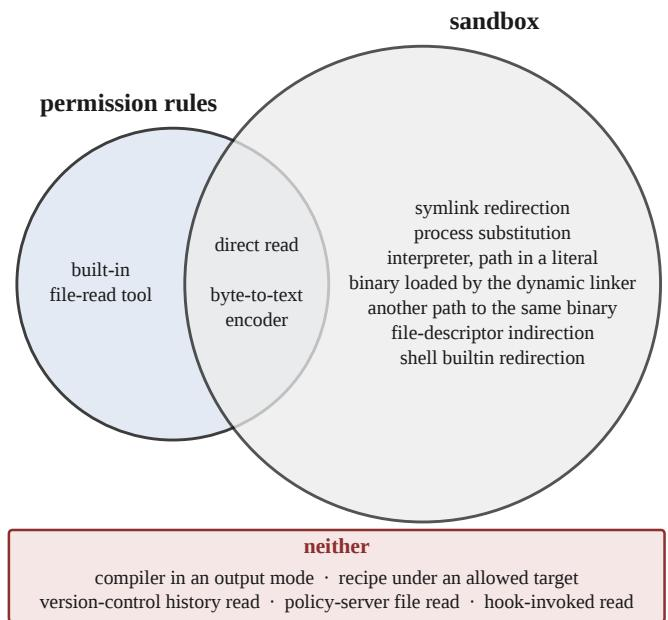

# The Compiler May Read It, the Agent May Not: Keeping Part of a Research Code Away from a Coding Agent

Shobhan Roy

Abstract—The compiler must read modules a physics-based solver cannot build without; the coding agent must not read that intellectual property. The harness does not ship that rule. We classified fifteen read routes against a container, permission rules and a sandbox. None of the three can tell which program is reading.

Index Terms—Coding agents, research software, access control, purpose-based access control, sandboxing, proprietary scientific software.

## I. The Files the Build Needs and the Agent Must Not Have

We run a coding agent on a physics-based numerical code, a flow solver for the partial diferential equations of fluid motion. Solvers of this kind are commonly built on an open-source base, the discretization and the parallel machinery, completed by a group’s own material and reaction models. Those models are the constitutive and kinetic closures that make the governing equations solvable. They can hold a group’s intellectual property ahead of publication, and some are licensed to the group under terms that allow generating publishable data but not passing on the algorithms themselves. A read by the agent puts their bytes into a transcript that leaves the machine. The solver does not build without them. Consequently the compiler has to open those files. The rule we wanted is simple to state: the compiler may read those files but the agent may not. Four mechanisms stand between the agent and the files: a) the container the agent runs in dictates the runtime user and the paths mounted for the agent; b) the agent’s permission rules match on the text of a command and on a path; c) the harness’s sandbox matches on a path; d) the plain-language instruction file that the agent reads at the start of every session is a soft contract that can state the rule in full but does not enforce it. Out of the box, none of the four can state the criterion the rule turns on, which is which program is reading.

At the file itself the two reads look the same to all four. The agent and the build run as one user account, and the compiler is a child of the agent’s own shell, inside the agent’s container. They difer only in why the file is opened and where the bytes go. The compiler’s read ends in object code on the same machine, which the agent executes. The agent’s read ends in its context window, which is tokenized and leaves the machine.

We use two terms in a specific sense. The harness is the program that runs the language model and executes its tool calls. By the agent we mean everything the harness drives: the model’s context, the agent’s own file-reading tools, the shell it starts and every process descended from that shell, the hook scripts the harness runs on the agent’s behalf, and any policy server it is configured to call. All of them can put text in front of the model. By may not read we mean that the bytes of a protected file must not reach the model’s context or the transcript through any of them. We allow one channel only, for the sake of operating the solver. A compiler diagnostic may quote the line it rejects, and we accept that. We do not accept the compiler’s other output modes, which can print a file in its entirety. Written out, the rule is that the compiler may open the protected files, that its object code and its diagnostics may reach the agent, and that the files themselves may not, by any path. Both permitted outputs still carry content derived from the file, the diagnostic in the line it quotes and the object code in the models’ constants. The rule is therefore a bounded disclosure and not noninterference.

We take the position of an ordinary user of the agent. Such a user cannot change the harness, cannot load a kernel security policy, which lives in the host kernel that every container shares, and cannot replace the language runtime. Accordingly every negative result below is relative to that position. The negative results do not bind an administrator with root on the host machine, who can install a kernel-level enforcer. What this article examines is what these mechanisms can express and cover and what they cannot. It does not examine how they hold against a designated adversary. The sidebar gives the threat model and the parts we trust.

The article makes four observations. The first is what each of the four mechanisms can and cannot say about a read. The second is a table of fifteen ways the agent can reach a protected file, classified against the configuration we run, in which the permission rules and the sandbox

## Threat Model and Trusted Components

We do not treat the model or the harness as hostile. However, the boundary cannot rest on the agent’s cooperation either, because a tool call can follow from a misreading of the task, from a misfired model output, or from text the agent reads in a file and acts on.

The parts that have to be trusted are the kernel and the container runtime, the vendor’s harness and the model service behind it, the compiler, and any hook or policy server we install ourselves.

The build files have to be trusted as well, because a build recipe the agent can edit, or pass flags to, can print a protected file. That trust holds if the recipe and its flags are out of the agent’s reach. In this deployment the instruction file can place them there, but it enforces nothing, which is why a recipe under an allowed build target is among the routes no mechanism covers.

cover diferent routes, and five routes are covered by neither. The third is the history of one deny list over five weeks, whose four revisions, made in the course of ordinary use, added 118, 13, 4 and finally zero new command names. The fourth is what a mechanism would have to do to enforce the rule, and what it costs to approximate it with the pieces an ordinary user already has.

## II. The Rule in the Security Literature

The security literature calls this rule purpose-based access control. It permits or refuses an access according to what the access is for. The term was presented by Byun and Li [1], who list three ways a system can learn the purpose of an access. The first is to ask the requester, which “requires complete trust on the users”. The second is to register an application with a fixed purpose, which “cannot be used for complex stored-procedures or applications as they may access various data for multiple purposes”. The third is to infer the purpose, which the authors judge as being hard to do accurately. The instruction file is the first. Exempting the build from the deny gate is the second, and a build is essentially that multi-purpose application. Byun and Li’s remedy is to check a declared purpose against something the requester does not control. However, in a vendor-run harness there is nothing of the kind, because the agent composes the command line and every attribute the permission rules inspect is agent-authored. We use purpose in these authors’ sense, the use the requester intends. No operating system observes it directly. What a kernel can observe are stand-ins for it, namely which process opened the file, what that process descends from, and where its output goes. The finding below is therefore about the stand-ins rather than about purpose itself, and it is that none of the four mechanisms can name any of the three.

The idea of deciding a read by which program is doing the reading has been documented before, under the name type enforcement. Boebert and Kain put each running program in a domain and each file in a type, and wrote down in a table what every domain may do to every type [2]. An entry left out of the table was a refusal, and because the table was finite and explicit an auditor could check the whole policy by reading it. A list of forbidden command names has neither property. It permits whatever it omits, and at the length such lists reach nobody can check it by reading. Linux carries type enforcement in the kernel as SELinux, which moves a process into a new domain when it executes a program of a given type. If the protected files are given a type that the agent’s domain cannot read, the kernel refuses the agent while the compiler proceeds, at the cost of a privileged policy loader and a kernel we do not administer.

The classical alternative needs none of that, and an ordinary user can deploy it. The protected files go under a second user account, outside the agent’s filesystem, and the agent reaches the build only through a channel that account controls: a) a build recipe the agent cannot edit; b) a request that names a revision of the agent’s code and nothing else; c) a reply filtered down to what the agent needs in order to act. This arrangement is a trusted broker.

The broker approximates the rule rather than enforcing it, and the approximation has two costs. The first is that the build’s own output carries bytes from the protected files. A compiler diagnostic quotes the line it rejects, and preprocessed source carries far more than a line. The filter on the reply is therefore the actual security control. Widening it lets more of the protected file back through. Our own arrangement already concedes the diagnostic, since it lets the agent read one while refusing it the file. The second cost is the edit-build-fix loop, which is the reason to put an agent on a research code at all. A broker that answers only pass or fail removes that loop. One that returns the failure message hands back the ofending line. In addition, someone other than the agent has to own the recipe, so build engineering moves back to a person. The broker is the right choice where the protected files are stable and separate from the code the agent edits, but where they are themselves under development it removes the loop the agent was brought in for. Our result is therefore narrow. The controls this harness exposes cannot express the rule, and a separately trusted mediator outside the harness can only approximate it.

## III. The Blind Spot of Matching on Names

For the vendor we use, its own documentation states that the permission rules and the sandbox do not cover the same things. The current sandbox “applies only to Bash, PowerShell, and Monitor commands and their child processes,” while the built-in file tools, the agent’s own read and edit operations, “use the permission system directly rather than running through the sandbox” [3]. Therefore a refusal through one of them does not establish that the file is out of reach through the other. Splitting the check across two mechanisms is not a defect in itself, so long as the checks compose and every access meets one of them. In this deployment they do not compose. On some routes no check runs at all. The second case is what the security literature calls a failure of complete mediation, complete mediation being the principle that every access to every object is checked [4].

We classified fifteen prospective ways of getting the protected bytes into the agent’s context against the configuration we run, in Table I, which gives the command for each. Two of them are direct reads that any deny list would name. Three are taken from a 2003 catalogue of indirect paths to a resource [5]. Three others come from the vendor’s own statements of what its sandbox does not cover [3], while three are shell constructs from the author’s earlier published disclosure. One was shown publicly with this same agent, by invoking the dynamic linker on a binary an enforcement rule named [6]. The last three are consequences of the rule set itself. One is a build target the rules allow, whose recipe reads the file. Another is the compiler, which the rules must allow, invoked in an output mode that prints the file instead of compiling it. The third is the repository’s own history. The protected files are under version control and the repository sits in the agent’s tree, so the version-control tool can print any of them at a revision, addressed by a path relative to the repository that no rule names.

A route is counted as covered when a rule of that mechanism applies to it in this deployment and refuses it. The 60 cells rest on four kinds of evidence, ordered from strongest to weakest:

a) four cells are read directly from the shipped rule set, which names a command and a path;

b) five cells restate the vendor’s documented scope verbatim;

c) twenty-one cells follow from those statements or from shell semantics, which is our reasoning rather than a measurement;

d) the remaining 30 are uniform by construction: the container column because every protected file sits inside the mounted project tree, and the instruction column because an instruction file enforces nothing.

Two of the routes we have also seen refused in practice, a direct read and an encoder invocation, both denied on the first attempt against a decoy tree in July 2026. We did not run the other thirteen against the protected files. Running them would have been either a disclosure, if a route succeeded, or uninformative, if it failed, because a failure would speak to one spelling of one command rather than to the class it stands for. The hook and the policy server are both configured in this deployment. They run under the same user account as the agent, and the vendor’s documentation places neither of them inside the sandbox. The rules, the routes and every cell are the author’s, without a second rater. The table says what each mechanism can name in one deployment. It is not a measure of how often an attack would be stopped, and each row stands for a class of routes rather than a count of them.

Neither the permission rules nor the sandbox covers what the other covers. Two routes are covered by both, seven by the sandbox alone, one by the permission rules alone, and five by neither, as Fig. 1 shows. Hence neither mechanism sufices on its own, and their union cannot be expressed as one policy through the interfaces this harness gives us. The one route only the permission rules cover is the agent’s built-in file-read tool, which the sandbox’s documented scope leaves out. The seven the sandbox alone covers evade the command match in one of three ways. Either the read presents no command token to match, or the token it presents is not the protected path, or the program it names is not the name on the list. The five that neither covers are a) a recipe under a build target the agent is allowed to run; b) a read performed by a policy server the agent talks to over the Model Context Protocol; c) a read performed by a hook, which is a script the harness runs on the agent’s behalf at fixed points; d) the compiler itself, asked to preprocess a protected file rather than to compile it; and e) the version-control tool, asked for the file at a revision rather than at its path. Each is a program the agent causes to run, with the agent’s authority, through a name the rules have already permitted. The compiler route matters most. A direct read is refused while gfortran -E f is not, though the compiler names the path as plainly as cat does. The build cannot run unless the compiler is permitted to read the file. That permission is what the route uses.

We kept one deny list under revision for five weeks, with the protection target held still at two paths. Four dated revisions took the rule count from 14 to 488, 540, 556 and 586. The first three added 118, 13 and 4 new command names, taking the distinct names from 10 to 128, 141 and 145. The fourth added 30 rules and no new name; this is the informative one. Fifteen commands already on the list had been guarded on the directory but not on the single file, and the revision extended them to the file. None of the fifteen opened a new path to the file’s contents. What the revision fixed was a missing invariant rather than a missing command. The two targets had separate, handmaintained lists. The generator’s own comment described a relation between them that nothing checked. Each rule names one command and one target, so the rule language has no way to say that two targets must be protected alike, and that is how the gap went unnoticed.

## IV. What Enforcement Would Require

None of the mechanisms this harness exposes names the consumer of a read. They name a user account, a path, or the spelling of a command, and the one artifact that does name a purpose, the instruction file, enforces nothing. Research systems do name the consumer, by process lineage [7] or by a bounded access episode [8], but each asks for a runtime, a kernel or an execution environment that an ordinary user does not own. This deployment has no place to enforce the requirement.

A check that could enforce the rule would be made when a file is opened, would know which program will consume the bytes, and would have four properties:

a) it runs at the open and not when a command is launched, because a command names a program

## TABLE I

Route coverage. Fifteen ways the protected bytes can reach the agent’s context, the command for each (f is the protected file) and which mechanism covers the route in this deployment. Sources as superscripts: (C) a 2003 catalogue of indirect paths to a resource, (V) the vendor’s own statements of scope, (A) shell constructs from the author’s earlier published disclosure (O) a published demonstration with the same agent (D) follows from the shipped rule set and the documented matching semantics. The first two routes need no source.
<table><tr><td>route what it names</td><td>command</td><td>container account, mounts</td><td>permission command text, a path</td><td>sandbox a path</td><td>instruction a purpose</td></tr><tr><td>direct read</td><td>cat f</td><td>o</td><td></td><td></td><td></td></tr><tr><td>byte-to-text encoder</td><td>base64 f</td><td>0</td><td></td><td></td><td></td></tr><tr><td>interpreter, path in a literalA</td><td>python3 -c &quot;open(&#x27;f&#x27;).read()&quot;</td><td>o</td><td>o</td><td></td><td></td></tr><tr><td>shell builtin redirectionA</td><td>while IFS= read -r 1; do echo &quot;$1&quot;; done &lt; f</td><td>o</td><td>o</td><td></td><td></td></tr><tr><td>file-descriptor indirectionC</td><td>exec 3&lt;f; cat &lt;&amp;3</td><td>0</td><td>0</td><td></td><td></td></tr><tr><td>symlink redirectionC</td><td>ln -s f /tmp/x; cat /tmp/x</td><td>0</td><td>0</td><td></td><td></td></tr><tr><td>process substitutionA</td><td>grep . &lt;(cat f)</td><td>O</td><td>O</td><td></td><td></td></tr><tr><td>another path to the same binaryC</td><td>/proc/self/root/usr/bin/cat f</td><td>0</td><td>0</td><td></td><td></td></tr><tr><td>binary loaded by the dynamic linkerO</td><td>/1ib64/1d-linux-x86-64.so.2 /bin/cat f</td><td>0</td><td>o</td><td></td><td></td></tr><tr><td>the compiler in an output modeD</td><td>gfortran -E f</td><td>0</td><td>0</td><td>O</td><td></td></tr><tr><td>recipe under an allowed targetD</td><td>make dump, whose recipe runs cat f</td><td>0</td><td>O</td><td>O</td><td></td></tr><tr><td>version-control history readD</td><td>git show HEAD:f</td><td>0</td><td>O</td><td>O</td><td></td></tr><tr><td>built-in file-read tool</td><td>Read(f)</td><td>O</td><td></td><td>O</td><td></td></tr><tr><td>policy-server file readV</td><td>read_file(f) on an MCP server</td><td>0</td><td>O</td><td>0</td><td></td></tr><tr><td>hook-invoked readV</td><td>a hook script reads f</td><td>o</td><td>o</td><td>o</td><td></td></tr></table>

• covered ◦ uncovered – states the rule, enforces nothing.

  
Fig. 1. Which mechanism covers which route. The fifteen routes of Table I, placed by the mechanism whose rule refuses them in this deployment. The permission rules and the sandbox overlap on two routes, and five routes fall outside both.

and only the open names a file, which requires an enforcement point below the tool surface;

b) it does not pass down to programs the reader starts, because a child that inherits its parent’s permission is the confused deputy [9], the old problem in which a trusted program does on an untrusted one’s behalf what the untrusted one may not do itself, which requires a way of tagging processes that survives the creation of new ones;

c) it cannot be satisfied by whichever process starts the consumer, since otherwise the agent grants itself the exemption by starting the compiler, and nothing we surveyed has this property;

d) it bounds what the consumer may hand back, because a compiler the agent can invoke, and whose output the agent can read, is a reader by proxy, which is the compiler row in the table.

The fourth property places the requirement beyond fileopen authorization alone. Which bytes of a protected file may appear in a compiler’s output is a question of information release rather than of who may open a file. Diagnostics are the clearest case. Compiled artifacts are another, conceded for the same reason, because the executable is what the build is for. Any compiled artifact, the executable and the compiler’s intermediate files alike, carries the numerical constants of the models it implements, and with them the routine names and, if built with debugging information, file paths and line tables. Building without debugging information and stripping the symbols narrows that channel to the constants, the usual position of a group that distributes a binary of a proprietary model, though not a guarantee against reverse engineering. Consequently the answer needs a filter on the build’s reply rather than a rule on the file. We name that property here because the rule is incomplete without it, and we do not ofer a way to enforce it.

Other products implement part of this check, and their documentation states where it stops. GitHub’s content exclusion keeps named files out of Copilot’s completions and chat, and GitHub records that “Agent mode in Copilot Chat in IDEs does not support content exclusion” [10]. Cursor states that “the terminal and MCP server tools used by Agent cannot block access to code governed by .cursorignore” [11], MCP being the protocol through which an agent reaches a policy server. Both statements describe routes that Table I classifies as uncovered.

## V. What the Arrangement Costs to Run

The rules name the right paths, but what they act on is a command string, which is a coarser unit than a read. The diference shows up in the denial record. We matched our own session transcripts against the harness’s denial string and deduplicated by the identifier the harness attaches to each tool call. Hence, one refused invocation counts once however many copies of a transcript hold it, while a retried command counts again. The result is 64 denial events over seven weeks of ordinary research work, from the second week of June to the end of July 2026. In 54 of them the refused invocation was a composite, several commands chained in one line, of which only one held a guarded token. Therefore the batch is refused whole, and the commands around the ofending one, which no rule objected to, are denied with it. This is the same limitation that keeps the rules from stating the requirement of section 1, since a rule’s name attaches to a command rather than to a read.

Two command shapes, shown here with paths and hosts removed, account for most of the composites. The first is a transfer folded into a chain of ordinary work, cd <dir> && rsync -av <host>:<path> . && ls -l, where the transfer trips the rule that confines the agent to one remote directory, and the two commands around it are refused with it. The second is a rebuild, rm -rf <build> && cmake -S . -B <build> && make -j4, where the deletion trips the destructive-verb gate and takes the configure and the compile down with it. By the rubric’s precedence, 28 of the 64 are confinement boundaries, 26 the destructive-verb gate, five deliberate probes of a boundary, four a protected target, and one fits none of these headings.

The protected-target count is a lower bound, because the rubric assigns by precedence and puts that heading last. No denial in the corpus blocked ordinary work on the protected files. Most came from boundaries unrelated to them, and a project whose protected files are edited every day would produce a record shaped nothing like this one. The corpus is drawn by matching the string that names a refused command, so every event in it is a commandsurface denial and no refusal on the in-process file tools can enter it. The categories are not mutually exclusive, and none of these counts supports a rate.

## VI. Related Systems and Scope of the Findings

Mechanisms that can express the access rule do exist, though none closes the output channel the build opens. Each asks for something an ordinary user does not hold, whether a privileged policy loader for kernel type enforcement, a rewritten language runtime for access control inside a running program, or the harness itself. Deploying any of them requires control of the layer beneath the agent.

One 2026 system comes closest, and its source is public. It enforces policy beneath the tool surfaces by hooking operating-system events across the agent’s whole process tree, and it holds both constructs the rule needs. A lineage gate “checks whether the subject descends from a particular process,” and “a child domain inherits all parent rules and may add local rules, labels, or gates, but cannot remove, disable, or weaken any inherited rule” [7]. So the rule can be written in that system. When the agent starts the compiler, however, the compiler inherits the agent’s label, because the tags propagate through fork and exec, the two system calls by which one process starts another, and the protected file is then denied to the compiler and the build fails. Making the build work means naming the compiler in the rule as an exception, and the agent can then invoke that exception itself and read what the compiler prints. The exception that exists for the build is available to the agent on the same terms.

Other systems cover parts of it. All of them check where the agent acts or where its output leaves, rather than where a file is opened. AgentSpec, from ICSE 2026, lets a user write rules with triggers, predicates and enforcement actions, evaluated before an agent’s action executes [12]. Conseca generates a policy for one task and its context and refuses every action outside it [13]. CaMeL and Fides decide what may leave the system by where the data came from [14], [15]. PORTICO binds a repository path to an access mode and a bounded justification episode [8], which is the closest match to the rule among the systems surveyed. It models a single consumer, whereas this case has a second reader, the compiler, that keeps opening the bytes. We did not find these systems applied to a requirement whose enforcement point is the read itself.

The result has a vendor-specific part and a general part. The exact tool scopes, the rule syntax and the documented exclusions belong to one vendor and change with its releases. The general part has three statements: a) matching a command string does not mediate a file open; b) a rule that names a path cannot say which program is reading; c) a permission that a child process inherits cannot distinguish the build from whatever started the build. These hold wherever an agent runs programs on a user’s behalf, and they, rather than the cell values, are what a reader should take from the table.

As section 1 states, this article assesses what the mech anisms an ordinary user has can express and cover. It does not ofer an arrangement that holds against a hostile agent. We run this arrangement today, aware of its usefulness and limits. The permission rules are now generated from a single inventory of protected targets, which closes the missing invariant of section 3, and a hook records every command the agent submits, which is the source of the record in section 5. We accept the diagnostics and have not closed the compiler route, so anyone running an arrangement like this one should assume that the build’s own output, the diagnostics and the compiled artifacts alike, is where protected content can still leave.

## Availability and Prior Publication

The configuration whose revision history section 3 reports is public under an MIT license at https://github. com/ShoRoy/claude-docker-sandbox. Its five states are the commits fa5a7e7, e2377e8, 2e5eb03, 5dfaf89 and cb24713, in that order. The classification script behind Table I runs against that configuration and is released with this article, together with the scripts that derive the revision history and the counts in section 5. The denial corpus is not releasable, since it records real project paths and a real remote host, so only counts and redacted shapes are reported.

Two practitioner articles by the author, published as Dockered Claude and its sequel on Level Up Coding, describe the deployment this article analyzes. They describe the arrangement but contain none of the results reported here. The requirement statement, the coverage table, the revision history, the denial corpus and the composition claim appear here for the first time, and no figure from either article is reused.

## Acknowledgments

The coding agent this article studies, Claude Code (Anthropic), was also used in producing it, under the arrangement described, for the literature search, the released scripts and the figure, and as a writing aid throughout. The author checked every citation against its source, revised every paragraph, and is responsible for the content. The denial corpus of section 5 was drawn from the author’s session transcripts and so includes the sessions on this manuscript up to the end of July 2026.

## References

[1] J.-W. Byun and N. Li, “Purpose based access control for privacy protection in relational database systems,” The VLDB Journal, vol. 17, pp. 603–619, 2008.

[2] W. E. Boebert and R. Y. Kain, “A practical alternative to hierarchical integrity policies,” in Proceedings of the 8th National Computer Security Conference. Gaithersburg, MD: U.S. Government Printing Ofice, Oct. 1985, pp. 18–27.

[3] Anthropic, “Claude code documentation: Sandboxing,” https://code.claude.com/docs/en/sandboxing, 2026, accessed 18 September 2026.

[4] J. H. Saltzer and M. D. Schroeder, “The protection of information in computer systems,” Proceedings of the IEEE, 1975.

[5] T. Garfinkel, “Traps and pitfalls: Practical problems in system call interposition based security tools,” in Network and Distributed System Security Symposium (NDSS), 2003. [Online]. Available: https://www.ndss-symposium.org/ndss2003/trapsand-pitfalls-practical-problems-system-call-interpositionbased-security-tools/

[6] L. Di Donato, “How Claude Code escapes its own denylist and sandbox,” https://ona.com/stories/how-claude-code-escapesits-own-denylist-and-sandbox, Mar. 2026, accessed 28 July 2026.

[7] Y. Zheng, T. Wu, Q. Fu, T. Yu, W. Mao, T. Ma, D. Williams, W. Wang, and A. Quinn, “ActPlane: Programmable OS-level policy enforcement for agent harnesses,” 2026.

[8] I. Santos-Grueiro, “Lingering authority: Revocable resourceand-efect capabilities for coding agents,” 2026.

[9] N. Hardy, “The confused deputy: (or why capabilities might have been invented),” ACM Operating Systems Review, vol. 22, no. 4, pp. 36–38, Oct. 1988.

[10] GitHub, “Content exclusion for GitHub Copilot,” https://docs.github.com/en/copilot/how-tos/configurecontent-exclusion/exclude-content-from-copilot, 2026, accessed 18 September 2026.

[11] Cursor, “.cursorignore,” https://cursor.com/docs/reference/ ignore-file, 2026, accessed 18 September 2026.

[12] H. Wang, C. M. Poskitt, and J. Sun, “AgentSpec: Customizable runtime enforcement for safe and reliable LLM agents,” in Proceedings of the 2026 IEEE/ACM 48th International Conference on Software Engineering (ICSE ’26). Rio de Janeiro, Brazil: ACM, 2026, pp. 2938–2950.

[13] L. Tsai and E. Bagdasarian, “Contextual agent security: A policy for every purpose,” in Proc. Workshop on Hot Topics in Operating Systems (HotOS), 2025, pp. 8–17.

[14] E. Debenedetti, I. Shumailov, T. Fan, J. Hayes, N. Carlini, D. Fabian, C. Kern, C. Shi, A. Terzis, and F. Tram\`er, “Defeating prompt injections by design,” 2025.

[15] M. Costa, B. K¨opf, A. Kolluri, A. Paverd, M. Russinovich, A. Salem, S. Tople, L. Wutschitz, and S. Zanella-B´eguelin, “Securing AI agents with information-flow control,” 2025.