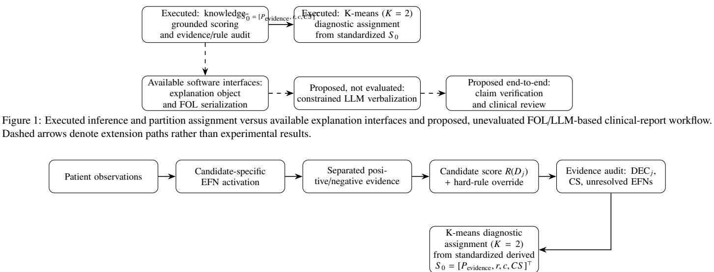

# Training-Free Clinical Reasoning through Medical Ontologies and Cognitive Mapping: A Symbolic–Probabilistic Knowledge Graph Framework

Surajit Das1,∗

## Abstract

Most clinical prediction systems learn patient-variable–outcome associations; we investigate an alternative, training-free diagnostic paradigm that maps patient observations onto explicit medical knowledge. CKG Reasoner integrates candidate-specific Evidence Feature Nodes, patient–reference matching, a bounded Information Gate, knowledge-weighted evidence accumulation, diseaselevel similarity, and decisive clinical rules. Missing-aware normalization and evidence-coverage auditing distinguish absent from unavailable evidence. Candidate ranking remains separate from outcome-label-independent K-means clustering, which uses evi dence strength, relative magnitude, directional similarity, and evidence completeness to derive cohort-level diagnostic assignments. Retrospective evaluation across six clinical cohorts comprising four dengue datasets (N = 1000 1523 989 1018), one malariap dataset (N = 2190), and one influenza dataset (N = 4569) yielded positive-class F1 scores under a uniform, label-free, cohort-fitted K = 2 partition protocol of 0.996, 0.634, 0.936, and 0.917 for dengue, 0.695 for malaria, and 0.842 for influenza. Corresponding all-record accuracies were 0.996, 0.558, 0.914, 0.893, 0.707, and 0.906, respectively. All six cohorts achieved full partition-decision coverage under a uniform K = 2 protocol using the previously frozen package and disease-specific knowledge representations. Neither the knowledge-grounded scorer nor unsupervised clustering is fitted using outcome labels. K-means uses only the four derived evidence coordinates, not raw dataset predictors or target variables. Logistic regression provides a supervised baseline. Influenza results incorporate confirmatory molecular PCR and do not represent independent pre-test prediction. The findings char acterize knowledge-grounded evidence separation, auditability, and evidence sensitivity rather than establish prospective clinical validity or comparative superiority. FOL/LLM-based clinical explanation remains an unevaluated extension.

Keywords: training-free clinical reasoning, medical ontology, knowledge representation, cognitive mapping, knowledge graphs,1 symbolic–probabilistic inference, explainable AI, clinical decision supportv

## 1. Introduction

Disease diagnosis requires the integration of heterogeneous evidence, including symptoms, serology, laboratory findings, demographics, imaging, and clinical context. These observations do not have equivalent diagnostic roles: a finding may provide weak support, strong support, contradiction, decisive confirmation, or exclusion, while its clinical importance and disease specificity may also difer. Outcome-fitted classifiers address this problem by learning empirical feature–outcome associations from labeled observations, particularly when domain rules are unknown or dificult to specify explicitly. Such models can provide strong predictive performance within a given population but may degrade under distribution shift or confounding when these factors are not explicitly modeled or controlled. Moreover, a learned mapping need not explicitly preserve distinctions among evidential support, contradiction, clinical importance, specificity, decisive findings, and unresolved evidence that are important for translational healthcare. Knowledge-based systems make disease–finding relations explicit but may themselves be brittle under incomplete or ambiguous evidence. Probability/rule hybrids, ontology-supported diagnosis, and weighted clinical knowledge graphs (KGs) are established [1, 3, 11, 27, 28]; the contribution of the present work therefore does not rest on any one of these ingredients in isolation.

Conceptual premise.. The present framework investigates an alternative, knowledge-grounded modeling paradigm. Medical knowledge is first represented explicitly through ontologygrounded, disease-specific structures; patient observations are then cognitively mapped onto these representations; and diagnostic support is obtained through symbolic–probabilistic reasoning over the resulting patient–knowledge correspondence. “Training-free” is used specifically to mean that patient outcome labels do not train, fit, fine-tune, calibrate, or optimize the diagnostic reasoner. The method is therefore more precisely outcome-label-independent, knowledge-engineered, and parameter-frozen during cohort evaluation; it is not parameterfree or assumption-free. The package and its disease-specific knowledge representations were developed independently of all six evaluation datasets and frozen before their evaluation; none of those datasets was used to construct or revise the package. Clinical evidential and measurement parameters are mapped to fixed ordinal scales that computationally encode specified medical knowledge rather than outcome-learned parameters.

Within this paradigm, CKG Reasoner isolates cross-sectional diagnostic reasoning from temporal progression and explicitly separates operations that are often conflated: patient– knowledge correspondence and evidence accumulation, relative candidate ranking, decisive pathognomonic/exclusionary rules, evidence-completeness auditing, and unsupervised partitionbased diagnostic assignment from the post-reasoning representation. These operations answer diferent questions. Candidate ranking expresses relative support among represented disease hypotheses and is not a calibrated posterior probability or a prospectively validated diagnosis. Decisive clinical rules preserve explicit confirmation or exclusion semantics. Evidence completeness describes how much diagnostically relevant evidence was available without treating missingness as contradiction. Unsupervised partitioning uses quantities produced by the fixed reasoner to assign cohort-level diagnostic groups. It therefore participates in the reported classification pathway, although it does not modify candidate evidence accumulation, clinical rules, or ranking.

The objective of the present study is therefore not to establish predictive superiority over outcome-fitted classifiers. Supervised models estimate empirical mappings from patient variables to outcomes using labeled observations, whereas the present framework investigates whether explicitly represented medical knowledge can be operationalized as a fixed, patientactivated reasoning process without fitting the diagnostic mapping to cohort outcome labels. Predictive discrimination alone would consequently not constitute a like-for-like evaluation of the principal contribution. The primary questions in this initial study are whether the encoded reasoning process is computationally coherent, auditable at the level of individual evidence contributions, robust to plausible perturbations, sensitive to clinically relevant evidence removal, and capable of exposing the provenance and limitations of its conclusions. Outcomefitted models remain useful contextual benchmarks, and comparative predictive and clinical-utility studies remain important subsequent validation questions, particularly under matched external cohorts, aligned information availability and clinical tasks, and prospective evaluation of discrimination, calibration, selective prediction, and clinical utility.

Unsupervised partitioning constitutes the diagnostic assignment stage used to produce the reported cohort-level classification labels, rather than merely an evaluation-level visualization. The clustering uses only the four derived evidence coordinates; neither raw dataset predictors nor target/outcome labels are clustering inputs. The reported K-means partitioning operates on the post-reasoning representation generated by the fixed inference process and does not alter candidate evidence accumulation, decisive clinical rules, or candidate ranking. Documented outcomes are subsequently used to calculate F1, accuracy, and related metrics for the partition-derived diagnostic assignments. These metrics evaluate the cohortlevel assignments produced by the integrated, outcome-labelindependent diagnostic-assignment stage. They are not interpreted as prospective clinical performance, calibrated diagnostic accuracy, or substitutes for an externally validated clinical decision rule. Supervised logistic-regression results are supplied in the manuscript as a contextual baseline for all six cohorts; their underlying fitting scripts and split provenance were not independently reproduced from the six CKG notebooks. Its held-out test metrics and the cohort-fitted CKG partition metrics follow diferent evaluation protocols, so their numerical comparison is descriptive rather than evidence of matched predictive superiority. Random forests, gradient-boosted models, and neural classifiers were not established as executed baselines in the supplied experiments.

The empirical study evaluates six heterogeneous clinical cohorts using the same inference machinery with disease-specific knowledge representations: four dengue cohorts with diferent evidence profiles, one malaria cohort, and one influenza cohort. All six cohorts A–F were evaluated using the previously frozen CKG Reasoner package and disease-specific knowledge representations; none was used to develop or modify the package or its knowledge representations. A uniform K = 2 Kmeans protocol was applied across all six cohorts; outcome labels were excluded from package construction, schema mapping, knowledge-grounded scoring, and K-means fitting. These infectious-disease datasets provide clinically overlapping but heterogeneous evidence regimes through which the behavior of the fixed reasoning architecture can be examined. No cohort outcome labels are used to train, fit, fine-tune, calibrate, or op timize the reasoner or its disease-specific knowledge represen tation. Negative records are not relabelled as unsupported alternative diseases. Accordingly, the six cohorts evaluate the architecture across separate disease-specific binary tasks rather than constituting a validated three-class dengue–malaria–influenza diferential-diagnosis benchmark.

The principal contributions of this work are:

1. An outcome-label-independent, candidate-conditioned symbolic–probabilistic reasoning architecture integrating medical ontologies, cognitive patient–knowledge mapping, evidence accumulation, disease ranking, decisive clinical rules, and unsupervised diagnostic assignment.

2. Disease-specific Evidence Feature Nodes (EFNs) that preserve canonical clinical states and explicitly distinguish diagnostic importance, specificity, patient–reference correspondence, positive support, contradiction, and pathog nomonic/exclusionary roles.

3. A knowledge-engineered inference procedure with frozen diagnostic parameters, missing-aware evidence normalization, and separate evidence-completeness auditing. The latter identifies unresolved critical evidence and quantifies Confidence Score (CS) without incorporating it into candidate ranking.

4. An extensible, inference-faithful architecture providing patient-specific reasoning traces and evidence provenance, with explicit design pathways toward uncertaintyregion identification, interactive evidence acquisition, FOL compatible explanations, constrained language generation, and real-time clinical decision support. These extensions are distinguished from experimentally validated capabilities.

5. Retrospective evaluation across six heterogeneous dengue, malaria, and influenza cohorts using frozen knowledge representations and a uniform, outcome-label-independent clustering protocol, supported by available componentablation, perturbation, evidence-withholding, parametersensitivity, and initialization-stability analyses.

The separate binary cohorts are not presented as a three-class diferential-diagnosis benchmark, and the study does not claim predictive superiority over outcome-fitted classifiers.

Novelty statement.. The novelty of CKG Reasoner lies in the design and integration of an outcome-label-independent, ontology-grounded, candidate-conditioned symbolic– probabilistic reasoning architecture, rather than in its individual components. Through cognitive patient–knowledge mapping, the framework operationally separates clinical importance, diagnostic specificity, patient–reference similarity, positive and contradictory evidence, decisive clinical rules, and evidence completeness. This semantic decomposition enables patient-specific disease ranking, auditable reasoning, explicit evidence provenance, and a separate unsupervised diagnosticassignment pathway without fitting diagnostic parameters to patient outcome labels.

An additional architectural contribution is its extensibility toward translational healthcare. Unlike approaches restricted to fixed-output classification, the design preserves the information necessary to investigate explicit uncertainty regions, identify unresolved critical evidence, request additional patient information, and revise diagnostic conclusions through further reasoning. Its inference-faithful traces also provide a foundation for clinically grounded explanations and prospective real-time, patient-wise clinical decision support. These research opportunities arise from the architecture’s explicit evidence semantics, modular reasoning stages, and separation of ranking, decisionmaking, and evidence completeness.

The contribution is therefore both an implemented, auditable reasoning methodology and an extensible architecture for future interactive and explainable clinical AI, complementary to outcome-fitted classifiers. Real-time deployment, interactive evidence acquisition, explicit uncertainty-region validation, and clinical validation of FOL/LLM explanations remain future work.

## 2. Related Work and Positioning

2.1. From expert rules to probabilistic and ontology-based diagnosis

Probability–rule hybrids are longstanding: CLAUDE combined rule and probabilistic experts through a neural reconciler [1], while probabilistic induction learned weighted medical rules from historical cases [2]. Ontology-based systems later combined probabilistic inference [3], fuzzy rules, semantic similarity and hierarchical weighting [6, 5], or symptomdependency-aware Naive Bayes [11]. Thus neither probabilityplus-rules nor semantic uncertainty is novel here; the distinction is the graph-structured separation of evidence semantics and decisive clinical roles.

Bayesian models likewise provide interpretable diferential reasoning: expert-knowledge BNs [13], a prospectively designed anterior-uveitis BN [36], Siamese BNs emphasizing negative evidence [10], dengue BNs with/without NS1 [7], and large leaky noisy-OR networks derived from Orphanet/HPO [29]. These establish uncertainty and negative evidence as prior art; the present question is their integration with richer graph semantics and hard clinical overrides without outcome-driven fitting.

## 2.2. Knowledge graphs for diagnostic reasoning

Knowledge-graph CDSS research spans graph representation and reasoning [9], learned interactive policies such as DKDR and RDKG [12, 17], weighted symptom–syndrome paths [16], embedding-refined diagnosis paths [14], and recent sleepdisorder reasoning [20]. A particularly close headache engine uses ICHD-3, weighted graph matching, fulfilled-criteria weights, and exclusion penalties [28]; therefore transparent exclusion-aware graph scoring is not claimed as unique.

Graph uncertainty is also established. A semantic clinical KG uses likelihood-ratio weights and patient-specific conditional edges for hypothesis ranking [27], while uncertain KGs have been constructed from personal EHRs [21]. The present framework difers by preserving canonical disease features, clinical importance, specificity, patient/reference agreement, support, contradiction, and hard pathognomonic/exclusionary roles as distinct inference quantities rather than primarily weighted relations.

## 2.3. EHR-centered, patient-specific, and learned clinical graphs

EHR-oriented KGs address fragmented-data integration and CDSS workflow [18, 19, 33], whereas this work assumes a prespecified clinical knowledge model and studies inference semantics. Modern patient-specific systems include D2KGMed, which uses LLM-guided graph construction and supervised fine-tuning [22]; DR.KNOWS, which ranks UMLS paths with graph/LLM components [23]; and KGDAgents [32]. Their value supports patient-specific structured reasoning, but their diagnostic behavior depends on learned, graph-neural, agentic, or language-model components; here patient records activate a fixed knowledge-driven procedure whose parameters are not estimated from outcome labels.

## 2.4. Neuro-symbolic and LLM-guided reasoning

Neuro-symbolic CDSSs combine deep learning with symbolic reasoning [25, 26], including rule engines coupled to neural language processing [30]. Structured-knowledge LLM systems include ReCLLaMA [31], DR.KNOWS [23], and epistemologically guided diagnostic reasoning [35]. These improve structure and reviewability but retain learned/generative components. Here the implemented numerical evidence and rule traces provide a foundation for clinically grounded explanation; FOL serialization and LLM-based verbalization are prospective extensions rather than evaluated contributions in this study.

## 2.5. Closest methodological gap

The literature does not support broad novelty claims for knowledge graphs, probabilistic reasoning, clinical rules, negative evidence, semantic similarity, patient-specific reasoning, or explainability, each of which has clear precedent [1, 6, 10, 27, 28]. The methodological gap concerns how these elements are organized within the diagnostic inference process. Relatively few systems preserve clinical importance, diagnostic specificity, patient–reference agreement, positive support, contradiction, and decisive clinical roles as distinct operational quantities within a single outcome-label-independent, patientactivated reasoning architecture, while also allowing pathognomonic/exclusionary findings to remain operationally distinct from graded evidence and exposing a patient-specific inference trace constructed from the same quantities that generate the diagnostic result. Against the representative systems summarized in Table 1, the contribution of the present work is therefore best characterized by this explicit semantic decomposition, its integration within a fixed, auditable, candidate-conditioned symbolic–probabilistic reasoning architecture, and inferencefaithful patient-level traceability, rather than by any individual component in isolation.

## 3. Methodology

## 3.1. Clinical Knowledge Representation

## 3.1.1. Reference knowledge graph

Let $G _ { R } ~ = ~ ( V _ { R } , E _ { R } )$ denote a reference medical knowledge graph constructed from clinical guidelines, pathological observations, laboratory biomarkers, radiological findings, epidemiological evidence, and expert knowledge. Nodes represent symptoms, laboratory measurements, biomarkers, imaging findings, contextual variables, intermediate clinical concepts, or diseases. The graph serves as a cross-sectional evidence structure linking observed patient features to candidate disease hypotheses without implying temporal progression.

The representation separates two complementary aspects of diagnostic reasoning: (i) the patient–reference aspect, describing the correspondence between an individual’s observed features and the candidate-specific canonical representation; and (ii) the disease-knowledge aspect, describing the diagnostic meaning of each feature for a candidate disease. This semantic separation between patient–reference evidence and diseasespecific knowledge is essential because the same observed feature may have diferent diagnostic significance across competing diseases

Patient–reference aspect. For feature $F _ { i }$ under candidate disease $D _ { j } ,$ the patient–reference aspect compares the activated patient representation of that feature with its candidate-specific canonical representation. A feature may contain several clinically distinct components; for example, a fever feature may contain onset, duration, and temperature components. The patient observation itself is unchanged across candidates, but its activation is evaluated relative to the canonical state specified by each disease model. The mathematical construction of component activation, feature-level directional agreement, relative magnitude, and the resulting bounded Information Gate is given in Section 3.2.3 after component activation. This patient–reference correspondence is distinct from fixed diseaseknowledge attributes such as diagnostic role, clinical importance, support strength, and contradiction magnitude.

Disease-specific knowledge attributes and Evidence Feature Nodes. For feature i under candidate disease $D _ { j } , \ g _ { i j }$ is the diagnostic-role weight/direction, $I _ { i j }$ clinical importance, $S _ { i j }$ support strength, and $C _ { i j }$ contradiction magnitude. Patient– reference correspondence is computed separately from activated feature components through the Information Gate $I G _ { i j }$ in Section 3.2.3. The fixed disease-knowledge semantics and accompanying encodings are as follows:

Clinical importance. Clinical importance $I _ { i j }$ denotes the practical diagnostic importance of feature $F _ { i }$ for candidate disease $D _ { j } ,$ distinct from disease specificity. Features with the same diagnostic role may difer in importance, and a highly disease-specific feature need not be maximally important, because practical contribution may depend on availability, measurement reliability, disease stage, and clinical context. It is defined as

$$
I _ { i j } \in \{ 1 , 0 . 7 5 , 0 . 5 0 , 0 . 2 5 \} ,
$$

corresponding to Critical, Major, Moderate, and Minor, respectively.

Diagnostic role and disease specificity. The diagnostic role $g _ { i j }$ denotes the disease specificity and diagnostic direction of feature $F _ { i }$ for candidate $D _ { j } ,$ i.e., how characteristic or diagnostically informative the feature is for that disease. It is candidate-specific, so the same feature may have diferent roles across diseases. Unlike patient–disease similarity, which measures correspondence between a patient’s observed feature representation and the candidate-specific canonical disease representation, specificity is encoded medical knowledge about the feature–disease relationship. Thus, a highly specific feature may be absent or poorly matched in a patient, while a patient may strongly match a nonspecific feature shared across diseases. The scale is

$$
g _ { i j } \in \{ 1 , 0 . 8 5 , 0 . 7 0 , 0 . 5 0 , 0 . 3 0 , 0 . 1 5 , - 0 . 5 0 \} ,
$$

corresponding to Pathognomonic, Hallmark, Major, Support ive, Associated, Nonspecific, and Exclusionary, respectively.

Support strength. Support strength $S _ { i j }$ denotes the positive evidential strength contributed by feature $F _ { i }$ for $D _ { j }$ when the patient observation is present and appropriately matched, distinct from specificity and clinical importance. Hence, features with identical roles and importance may difer in support: two Hallmark features may provide strong versus moderate support if one is less consistent, more context-dependent, or more susceptible to alternative explanations. Conversely, an uncommon feature may have moderate practical importance yet provide decisive support when present if strongly associated with $D _ { j }$ . Thus, $S _ { i j }$ independently represents the evidential consequence of an observed match:

Table 1: Representative diagnostic reasoning systems and their relationship to the proposed framework. “Learned” indicates that a substantive diagnostic component is estimated or fine-tuned from data.
<table><tr><td>Study</td><td>Primary representation</td><td>Prob.</td><td>Rules</td><td></td><td>Neg. ev. Patient-specific</td><td>Learned</td><td>Intrinsic trace</td><td>Main distinction from this work</td></tr><tr><td>[1]</td><td>Hybrid rule/probabilistic experts</td><td>Yes</td><td>Yes</td><td>1</td><td>Yes</td><td>Yes</td><td>Partial</td><td>Combines expert outputs through a neural network; no explicit clinical KG evi-</td></tr><tr><td>[6]</td><td>Ontology + fuzzy rule system</td><td>Fuzzy</td><td>Yes</td><td>Partial</td><td>Yes</td><td>Partial</td><td>Yes</td><td>dence semantics. Semantic similarity and fuzzy inference, but no sep- arate support/contradiction</td></tr><tr><td>[10]</td><td>Siamese Bayesian networks</td><td>Yes</td><td></td><td>Yes</td><td>Yes</td><td>Yes</td><td>Yes</td><td>override layer. Explicitly addresses neg- ative evidence, but within a learned BN formulation</td></tr><tr><td>[12]</td><td>KG + deep reinforcement learning</td><td></td><td></td><td></td><td>Yes</td><td>Yes</td><td>Partial</td><td>specific EFN graph. Learns interactive diagnos- tic policy over the KG.</td></tr><tr><td>[16]</td><td>KG reasoning paths + dynamic weights</td><td>Yes</td><td></td><td>Partial</td><td>Yes</td><td>Partial</td><td>Yes</td><td>Weighted paths for TCM syndrome reason- ing; no hard pathog- nomonic/exclusionary</td></tr><tr><td>[27]</td><td>Semantic KG with LR- weighted/conditional edges</td><td>Yes</td><td>Conditional</td><td>Yes</td><td>Yes</td><td>No/limited</td><td>Yes</td><td>override semantics. Very close weighted trans- parent reasoning; evidence remains primarily edge- weight based rather than</td></tr><tr><td>[28]</td><td>ICHD-3 KG + weighted matching Weighted</td><td></td><td></td><td>Yes</td><td>Yes</td><td>No/limited</td><td>Yes</td><td>Transparent differential engine with exclusion penalties; no probabilistic evidence/similarity/hard- rule decomposition used</td></tr><tr><td>[22]</td><td>Patient-specific dynamic diagnostic KG + LLM</td><td></td><td></td><td></td><td>Yes</td><td>Yes</td><td>Yes</td><td>Dynamic patient graph is learned/refined through LLM and supervised fine- tuning.</td></tr><tr><td>[23]</td><td>UMLS KG paths + graph model + LLM</td><td></td><td></td><td></td><td>Yes</td><td>Yes</td><td>Yes</td><td>Retrieves patient-specific reasoning paths, but pre- diction depends on learned graph/LLM components.</td></tr><tr><td>[31]</td><td>Neuro-symbolic LLM agent + KG</td><td></td><td></td><td>Partial</td><td>Yes</td><td>Yes</td><td></td><td>Structured agentic reason- ing over free text; gener- ative/learned inference re- mains central.</td></tr><tr><td>Proposed</td><td>Disease-specific EFNs + patient ev- idence graph</td><td>Yes</td><td>Yes</td><td>Yes</td><td>Yes</td><td>No outcome fitting</td><td>Yes</td><td>Separates importance, specificity, similarity, support, contradiction, and decisive clinical roles within one fixed inference</td></tr></table>

$$
{ S _ { i j } } \in \{ 1 , 0 . 8 , 0 . 6 , 0 . 3 , 0 \} ,
$$

corresponding to Decisive, Strong, Moderate, Slight, and None, respectively.

Contradiction magnitude. Contradiction magnitude $C _ { i j }$ denotes the negative evidential strength against $D _ { j }$ when the observed state of $F _ { i }$ conflicts with its candidate-specific expectation. It is not simply the inverse of $S _ { i j }$ because agreement and disagreement may have asymmetric consequences. For example, a highly characteristic but uncommon manifestation may provide strong or decisive support when present $( S _ { i j } = 0 . 8$ or

1) but little contradiction when absent $( C _ { i j } = 0 . 2 )$ . Conversely, a finding expected in nearly all afected patients but common in other diseases may provide only moderate support when present $( S _ { i j } = 0 . 6 )$ yet strong contradiction when unexpectedly absent $( C _ { i j } = 0 . 7 )$ . Thus, positive and negative evidence are represented independently:

$$
C _ { i j } = \left| \operatorname* { m i n } \bigl ( 0 , \mathbf { C o n t r a } _ { i j } \bigr ) \right| \in \{ 1 , 0 . 7 , 0 . 4 , 0 . 2 , 0 \} ,
$$

corresponding to Decisive, Strong, Moderate, Mild, and None, respectively.

Thus $C _ { i j }$ is the nonnegative magnitude used by the negativeevidence equation.

Definition 1 (Evidence Feature Node).

$$
\mathrm { E F N } _ { i j } = ( F _ { i } , g _ { i j } , I _ { i j } , S _ { i j } , C _ { i j } , T _ { i } ) ,
$$

where $F _ { i }$ identifies the feature and $T _ { i }$ is optional non-temporal metadata. The candidate-specific canonical feature state is stored with the reference knowledge representation. Patient observations are not part of the fixed EFN; they are activated against that canonical state during inference to obtain $I G _ { i j }$

Remark 1 (Candidate dependence of an EFN). An EFN is candidate-conditioned rather than a generic clinical-feature node. The same feature $F _ { i }$ may occur across candidate disease graphs with diferent canonical states, diagnostic roles, importance values, support strengths, and contradiction magnitudes. The patient observation itselfremains unchanged; only the disease-specific reference and its diagnostic interpretation vary across candidates.

Outcome-label-independent evaluation. The inference machinery and disease-specific knowledge representations were developed independently of all six evaluation cohorts and frozen before evaluation. Dataset-specific schema mapping preserved the underlying knowledge. All cohorts underwent uniform, label-free K-means partitioning $( K = 2 )$ using fourdimensional post-reasoning vectors.

Classification metrics were derived from partition assignments rather than candidate-ranking scores. K-means uses only the four derived, knowledge-grounded coordinates, not raw dataset predictors or target labels. Reference outcomes are used only after assignment to calculate evaluation metrics. The supervised logistic-regression baseline follows a diferent evaluation protocol; comparisons are therefore descriptive rather than evidence of matched predictive superiority.

## 3.2. Hybrid Diagnostic Reasoning

## 3.2.1. Training-free design

Frozen experimental specification. The medical ontology and disease-specific knowledge graphs, including canonical clinical features, diagnostic roles, clinical-importance weights, support and contradiction strengths, and hard-rule semantics, were constructed principally from established WHO, CDC, and PAHO clinical guidance and medical knowledge. The corresponding numerical scales, scoring coeficients, activation functions, and decision thresholds are explicitly defined knowledge-engineering choices rather than parameters learned from patient outcomes or necessarily prescribed by those guidelines.

The ontology, disease-specific knowledge representations, and inference parameters were developed independently of all six evaluation datasets and frozen before evaluation. Patient records supply observations for patient–knowledge mapping; reference outcomes are reserved exclusively for postassignment evaluation. No patient outcome labels are used to train, fit, fine-tune, calibrate, or optimize the diagnostic reasoner or its knowledge representations.

Canonical default components are handled through explicit patient–reference matching. Repeated feature codes occurring at distinct disease stages retain stage-specific identities and remain independent evidence nodes.

The scorer preserves $P _ { \mathrm { { e v i d e n c e } } } , r ,$ and c as disease-level reasoning quantities and separately exports the outcome-labelindependent Confidence Score (CS; Confidence\_Score), an evidence-completeness quantity. CS does not enter candidate ranking.

The integrated diagnostic-assignment stage applies a uniform $K = 2$ K-means protocol across all six evaluation cohorts using the standardized four-dimensional post-reasoning representation

$$
\begin{array} { r } { S _ { 0 } ( D _ { j } ) = [ P _ { \mathrm { e v i d e n c e } } ( D _ { j } ) , r _ { j } , c _ { j } , C S _ { j } ] ^ { \top } . } \end{array}
$$

Candidate ranking uses a separate canonically normalized additive score defined below. K-means operates exclusively on the four derived knowledge-grounded evidence coordinates, not on raw clinical predictors or outcome labels. Its centroids are fitted independently within each cohort, making the retrospective assignment procedure transductive rather than an independent out-of-sample prediction test. Ground-truth labels enter only after partitioning for retrospective metric calculation.

## 3.2.2. Ontology-grounded cognitive mapping

The central operation of CKG Reasoner is a patient-toknowledge mapping rather than a learned feature-to-label mapping. Let the medical ontology/knowledge representation define, for candidate disease $D _ { j } ,$ a set of Evidence Feature Nodes with canonical component states and fixed clinical semantics. For an observed patient x, the cognitive map

$$
\begin{array} { r } { \mathcal { M } _ { j } : x \longmapsto \left\{ \mathbf { q } _ { i j } , \mathbf { r } _ { i j } , \cos \theta _ { i j } , \rho _ { i j } , I G _ { i j } , g _ { i j } , I _ { i j } , S _ { i j } , C _ { i j } \right\} _ { i } } \end{array}
$$

constructs a candidate-conditioned representation of how the patient’s evidence corresponds to the encoded disease model. Here ${ \bf q } _ { i j }$ is the activated patient representation, $\mathbf { r } _ { i j }$ is its candidate-specific canonical reference, cos $\theta _ { i j }$ represents directional agreement, $\rho _ { i j }$ represents relative magnitude, and $I G _ { i j }$ is their bounded feature-level Information Gate. The remaining quantities are disease-knowledge attributes supplied by the ontology rather than learned from the patient cohort.

This use of “cognitive mapping” denotes an explicit computational correspondence between observed clinical evidence and structured medical knowledge. It does not imply a model of human cognition. The mapping is candidate-specific: the same observation can have diferent diagnostic meaning under diferent disease hypotheses because canonical states, roles, support, contradiction, and decisive-rule semantics belong to the disease representation. The subsequent reasoning layer operates on this mapped representation and never estimates its parameters from cohort outcome labels.

This decomposition is important for auditability. An erroneous decision can, in principle, be localized to the encoded medical knowledge, the patient-to-reference activation/boundary function, the interaction of evidence, a hard rule, or the final aggregation mechanism rather than being hidden inside learned model weights. Conversely, being training-free does not guarantee clinical correctness: the framework can only reason from the quality and contextual validity of the knowledge and mapping functions supplied to it.

## 3.2.3. Operational scoring

Component activation. Each available patient component x is transformed according to the type of its candidate-specific canonical reference. Let κ (x) denote the fixed codebook value for a categorical state, $\varepsilon = 0 . 0 1$ the numerical matching tolerance, $A _ { i }$ a finite admissible set, $[ a _ { i } , b _ { i } ]$ a canonical interval, and $G _ { i } ( x )$ the fixed feature-specific fall-of outside that interval. The component activation is

$$
q _ { i } ( x ) = { \left\{ \begin{array} { l l } { \kappa _ { i } ( x ) , } & { { \mathrm { b i n a r y / c a t e g o r i c a l } } , } \\ { \mathbf { 1 } \{ | x - a _ { i } | < \varepsilon \} , } & { { \mathrm { s i n g l e ~ n u m e r i c a l ~ v a l u e } } , } \\ { \mathbf { 1 } \{ \exists a \in A _ { i } : ~ | x - a | < \varepsilon \} , } & { { \mathrm { f n i t e ~ n u m e r i c a l ~ s e t } } , } \\ { \mathbf { 1 } \{ x \in A _ { i } \} , } & { { \mathrm { f n i t e ~ c a t e g o r i c a l ~ s e t } } , } \\ { 1 , } & { { \mathrm { i n t e r v a l ~ a n d ~ } } x \in [ a _ { i } , b _ { i } ] , } \\ { G _ { i } ( x ) , } & { { \mathrm { i n t e r v a l ~ a n d ~ } } x \not \in [ a _ { i } , b _ { i } ] . } \end{array} \right. }\tag{1}
$$

For a fixed normal range $[ L _ { i } , U _ { i } ] .$ , directional trend references are

$$
\begin{array} { r l } & { q _ { i } ^ { \downarrow } ( x ) = \left\{ { 0 , \atop 1 - \exp [ - 5 ( L _ { i } - x ) / L _ { i } ] } , \right. \ x < L _ { i } , } \\ & { q _ { i } ^ { \uparrow } ( x ) = \left\{ { 0 , \atop 1 - \exp [ - 4 ( x - U _ { i } ) / U _ { i } ] } , \right. \ x > U _ { i } , } \end{array}\tag{2}
$$

with values clipped to [0 1]. A Normal/No-change reference has unit activation inside $[ L _ { i } , U _ { i } ]$ and the fixed implementationspecific fall-of outside it. Equations (1)–(2) therefore define the activation rule for all supported reference types.

Because the canonical reference is candidate-specific, applying these transformations to component $c$ of feature $F _ { i }$ under candidate $D _ { j }$ produces the retained activation $q _ { i j c } .$ . Thus, the same observed patient value can produce diferent activations under diferent candidate diseases when their canonical reference states difer. These transformations are bounded knowledge-engineering compatibility scores, not calibrated probabilities, disease prevalence, diagnostic specificity, clinical importance, support strength, or contradiction strength.

Feature-level patient–reference correspondence. Let feature $F _ { i }$ contain $m _ { i }$ mutually orthogonal component axes $\mathbf { u } _ { i 1 } , \ldots , \mathbf { u } _ { i m _ { i } }$ , with $\mathbf { u } _ { i c } ^ { \top } \mathbf { u } _ { i d } = 0$ for $c \neq d$ and $\| \mathbf { u } _ { i c } \| _ { 2 } = 1$ . After the candidate-conditioned activation procedure above, the patient representation for $F _ { i }$ under disease $D _ { j }$ is

$$
\mathbf { q } _ { i j } = \sum _ { c = 1 } ^ { m _ { i } } q _ { i j c } \mathbf { u } _ { i c } , \qquad 0 \leq q _ { i j c } \leq 1 .\tag{3}
$$

Under the adopted canonical representation, every canonical component is an orthogonal unit component. Thus

$$
\mathbf { r } _ { i j } = \sum _ { c = 1 } ^ { m _ { i } } r _ { i j c } \mathbf { u } _ { i c } , \qquad r _ { i j c } = 1 , \qquad \lVert \mathbf { r } _ { i j } \rVert _ { 2 } = \ { \sqrt { m _ { i } } } .\tag{4}
$$

The canonical disease representation is the reference itself and is not passed through the patient activation transformation. The

component-wise normalized patient magnitude is therefore

$$
p _ { i j } = \left( \sum _ { c = 1 } ^ { m _ { i } } \left( \frac { q _ { i j c } } { r _ { i j c } } \right) ^ { 2 } \right) ^ { 1 / 2 } = \left( \sum _ { c = 1 } ^ { m _ { i } } q _ { i j c } ^ { 2 } \right) ^ { 1 / 2 } ,\tag{5}
$$

because $r _ { i j c } = 1$ for every canonical component. The norm is taken only across components of the same feature for the same patient and never across patients. Although each $q _ { i j c }$ is bounded by one, $p _ { i j }$ is a geometric magnitude and may exceed one when several components are active; it is not a probability.

Directional patient–canonical agreement for feature $F _ { i }$ is

$$
\cos \theta _ { i j } = \frac { \mathbf { q } _ { i j } ^ { \top } \mathbf { r } _ { i j } } { \| \mathbf { q } _ { i j } \| _ { 2 } \| \mathbf { r } _ { i j } \| _ { 2 } } = \frac { \sum _ { c = 1 } ^ { m _ { i } } q _ { i j c } } { \sqrt { \sum _ { c = 1 } ^ { m _ { i } } q _ { i j c } ^ { 2 } } \sqrt { m _ { i } } } ,\tag{6}
$$

with cos $\theta _ { i j } = 0$ when $\| \mathbf { q } _ { i j } \| _ { 2 } = 0$ . Relative magnitude is

$$
\rho _ { i j } = { \frac { \| \mathbf { q } _ { i j } \| _ { 2 } } { \| \mathbf { r } _ { i j } \| _ { 2 } } } = { \frac { \sqrt { \sum _ { c = 1 } ^ { m _ { i } } q _ { i j c } ^ { 2 } } } { \sqrt { m _ { i } } } } .\tag{7}
$$

Since $0 \leq q _ { i j c } \leq 1$ , both cos $\theta _ { i j }$ and $\rho _ { i j }$ lie in [0 1] for an observed/evaluable feature.

The feature-level Information Gate combines these two complementary forms of agreement. Let

$$
\mathbf { z } _ { i j } = \left[ \begin{array} { c c } { \cos \theta _ { i j } } \\ { \rho _ { i j } } \end{array} \right] , \qquad \mathbf { z } ^ { * } = \left[ \begin{array} { c c } { 1 } \\ { 1 } \end{array} \right] .\tag{8}
$$

The ideal self-reference has cos $\theta = 1$ and $\rho = 1$ , so its squared Euclidean magnitude is 2 and its $L _ { 2 }$ norm is $\sqrt { 2 }$ . Consequently,

$$
I G _ { i j } = \frac { | | \mathbf { z } _ { i j } | | _ { 2 } } { | | \mathbf { z } ^ { * } | | _ { 2 } } = \sqrt { \frac { \cos ^ { 2 } \theta _ { i j } + \rho _ { i j } ^ { 2 } } { 2 } } , \qquad 0 \leq I G _ { i j } \leq 1 .\tag{9}
$$

Thus $I G _ { i j } ~ = ~ 1$ denotes perfect patient–canonical correspondence for that feature. Missing or unavailable evidence is handled separately and is not represented by setting $I G _ { i j } = 0$

Evidence accumulation. Evidence is accumulated separately for each candidate disease. Let $O _ { j }$ denote the observed/evaluable features for candidate $D _ { j } ;$ missing or unavailable features are excluded rather than interpreted as observed absence. For a bounded correspondence value $x \in [ 0 , 1 ]$ , define the nonlinear evidence gate

$$
f ( x ; \alpha , \beta , \gamma ) = \frac { 1 } { 1 + \alpha \exp [ - \beta ( x - \gamma ) ] } ,\tag{10}
$$

where $\alpha > 0$ controls the scale of the exponential term, $\beta > 0$ controls transition steepness, and γ determines its location. The experiments reported here use

$$
\alpha = 0 . 0 5 , \qquad \beta = 1 0 , \qquad \gamma = 0 . 8 5 .
$$

The same gate is applied to positive correspondence and to the complementary mismatch proxy. Feature-level contributions are

$$
\begin{array} { r } { \mathsf { p c o n } _ { i j } = f ( I G _ { i j } ; \alpha , \beta , \gamma ) \operatorname* { m a x } ( g _ { i j } , 0 ) I _ { i j } S _ { i j } , } \end{array}\tag{11}
$$

$$
\begin{array} { r } { \mathtt { n c o n } _ { i j } = f ( 1 - I G _ { i j } ; \alpha , \beta , \gamma ) C _ { i j } . } \end{array}\tag{12}
$$

The second expression is a transformed complementarymismatch proxy, not an independently measured contradictoryreference similarity. Diagnostic role $g _ { i j }$ and clinical importance $I _ { i j }$ retain their encoded values; no exponential transformation of either attribute is used. Candidate-level evidence totals are

$$
E ^ { + } ( D _ { j } ) = \sum _ { i \in O _ { j } } { \tt p c o n } _ { i j } ,\tag{13}
$$

$$
E ^ { - } ( D _ { j } ) = \sum _ { i \in O _ { j } } { \mathrm { n c o n } } _ { i j } ,\tag{14}
$$

$$
E _ { \mathrm { n e t } } ( D _ { j } ) = E ^ { + } ( D _ { j } ) - E ^ { - } ( D _ { j } ) .\tag{15}
$$

No additional multiplicative discount is applied to aggregate negative evidence. Evidence from diferent candidate diseases is never pooled into one $E _ { \mathrm { n e t } } ( D _ { j } )$

Missing-aware canonical evidence normalization. The implementation does not apply a sigmoid to net evidence. For candidate $D _ { j }$ , the canonical denominator is constructed over the same observed/evaluable feature support $O _ { j }$ used by the patient numerator. The canonical self-reference sets $I G = 1$ for those features and applies the same positive- and negative-evidence equations:

$$
\begin{array} { l } { { \displaystyle E _ { \mathrm { c a n } } ( D _ { j } ; O _ { j } ) = \sum _ { i \in O _ { j } } f ( 1 ; \alpha , \beta , \gamma ) \operatorname * { m a x } ( g _ { i j } , 0 ) I _ { i j } S _ { i j } } } \\ { { \displaystyle ~ - \sum _ { i \in O _ { j } } f ( 0 ; \alpha , \beta , \gamma ) C _ { i j } . } } \end{array}\tag{16}
$$

The evidence quantity used downstream is the direct canonical normalization

$$
P _ { \mathrm { e v i d e n c e } } ( D _ { j } ) = \frac { E _ { \mathrm { n e t } } ( D _ { j } ) } { E _ { \mathrm { c a n } } ( D _ { j } ; O _ { j } ) } ,\tag{17}
$$

when $E _ { \mathrm { c a n } } ( D _ { j } ; O _ { j } ) > 0$ , and 0 otherwise. Unavailable features therefore neither contribute negative evidence nor enlarge the canonical denominator. This missing-aware construction keeps the numerator and denominator on the same observed support and prevents unequal unobserved feature coverage across candidate disease graphs from mechanically changing the normalized evidence scale. No sigmoid or clipping is applied at this stage; consequently $P _ { \mathrm { e v i d e n c e } }$ is a normalized evidence score rather than a calibrated probability and can, in principle, be negative or exceed one.

Diagnostic evidence coverage and confidence annotation. Missing-aware normalization answers how strongly the available evidence corresponds to a candidate, but it does not by itself quantify how much diagnostically important evidence was available. Two patients can therefore obtain similar $P _ { \mathrm { ~ e ~ } }$ vidence or $R ( D _ { j } )$ values despite substantially diferent amounts of observed evidence. To expose this distinction without treating missingness as negative evidence, the implementation computes a diagnostic evidence-coverage quantity separate from candidate scoring but included in the default clustering representation.

For candidate $D _ { j } ,$ let $\mathcal { K } _ { j } ^ { \mathrm { e v a l } }$ denote EFNs that are evaluable in the cohort, i.e., represented by the cohort schema and observed for at least one record. This avoids mechanically penalizing every patient for ontology concepts that the dataset never collects. For EFN i, let $m _ { i j } ^ { \mathrm { { o b s } } }$ and $m _ { i j } ^ { \mathrm { e x p } }$ denote the numbers of observed and reference-defined components, respectively, and define component availability

$$
a _ { i j } = \frac { m _ { i j } ^ { \mathrm { o b s } } } { m _ { i j } ^ { \mathrm { e x p } } } , \qquad 0 \leq a _ { i j } \leq 1 ,\tag{18}
$$

with the feature-level observed state used for single/defaultcomponent EFNs. Thus $a _ { i j } = 1$ denotes fully observed, $a _ { i j } = 0$ fully missing, and intermediate values partially observed evidence.

For non-exclusionary EFNs, canonical diagnostic capacity uses the same positive-evidence semantics as the reasoner,

$$
w _ { i j } = f ( 1 ; \alpha , \beta , \gamma ) \operatorname* { m a x } ( g _ { i j } , 0 ) I _ { i j } S _ { i j } , \qquad g _ { i j } \geq 0 .\tag{19}
$$

Because an Exclusionary EFN has no positive-evidence capacity but may be decisively informative, its coverage weight is retained through

$$
w _ { i j } = f ( 1 ; \alpha , \beta , \gamma ) | g _ { i j } | \operatorname* { m a x } ( C _ { i j } , I _ { i j } S _ { i j } ) , \qquad g _ { i j } < 0 .\tag{20}
$$

Diagnostic Evidence Coverage (DEC) is then

$$
\mathrm { D E C } _ { j } ( x ) = \frac { \sum _ { i \in \mathcal { K } _ { j } ^ { \mathrm { e v a l } } } a _ { i j } w _ { i j } } { \sum _ { i \in \mathcal { K } _ { j } ^ { \mathrm { e v a l } } } w _ { i j } } , \qquad 0 \le \mathrm { D E C } _ { j } \le 1 ,\tag{21}
$$

when the denominator is positive, and 0 otherwise. The implementation exports the same quantity as Evidence\_Coverage and Confidence\_Score. For interpretive reporting only, Confidence\_Level is High for $\mathrm { D E C } ~ \ge ~ 0 . 8 0$ , Moderate for $0 . 5 0 \leq \mathrm { D E C } < 0 . 8 0$ , and Low otherwise. These categories are evidence-completeness descriptors, not calibrated probabilities or validated clinical confidence cutofs.

Crucially, $\mathrm { D E C } _ { j }$ is not multiplied into $P _ { \mathrm { { e v i d e n c e } } } , r _ { j } , c _ { j } , R ( D _ { j } )$ or the hard-rule score. The exported Confidence\_Score (numerically identical to DEC) is appended as the fourth coordinate of $S _ { 0 } ( D _ { j } )$ for unsupervised partitioning; thus it can affect cluster geometry while remaining outside disease ranking and diagnostic evidence accumulation. The audit trace additionally lists unresolved Pathognomonic, Hallmark, Major, and Exclusionary EFNs so that equal numerical coverage arising from clinically diferent missing-evidence patterns remains distinguishable. The second patient–reference comparison is performed at the disease level and is kept distinct from the feature-level Information Gate. For candidate $D _ { j } ,$ define the Hallmark/Major subset

$$
\mathcal { H } _ { j } = \{ i \in O _ { j } : g _ { i j } \in \{ 0 . 8 5 , 0 . 7 0 \} \} ,
$$

corresponding to Hallmark and Major diagnostic roles in the fixed ontology. Collect patient and canonical magnitudes only over this subset,

$$
\mathbf { p } _ { j } ^ { H M } = ( p _ { i j } ) _ { i \in \mathcal { H } _ { j } } , \qquad \mathbf { e } _ { j } ^ { H M } = ( e _ { i j } ) _ { i \in \mathcal { H } _ { j } } ,
$$

so that supportive/associated/nonspecific features can still contribute to $E _ { \mathrm { n e t } } ( D _ { j } )$ but do not determine aggregate disease-level similarity. Pathognomonic features are handled separately by the hard-rule pathway. For each retained feature,

$$
e _ { i j } = \| \mathbf { r } _ { i j } \| _ { 2 } = \sqrt { m _ { i } } .\tag{22}
$$

Here $p _ { i j } ~ = ~ | | { \bf q } _ { i j } | | _ { 2 }$ is the activated patient-feature magnitude from Eq. (5), whereas $e _ { i j }$ is the corresponding canonical feature magnitude. Disease-level directional agreement and relative magnitude are then

$$
c _ { j } = \frac { ( \mathbf { p } _ { j } ^ { H M } ) ^ { \top } \mathbf { e } _ { j } ^ { H M } } { \| \mathbf { p } _ { j } ^ { H M } \| _ { 2 } \| \mathbf { e } _ { j } ^ { H M } \| _ { 2 } } , \qquad r _ { j } = \frac { \operatorname* { m i n } ( \| \mathbf { p } _ { j } ^ { H M } \| _ { 2 } , \| \mathbf { e } _ { j } ^ { H M } \| _ { 2 } ) } { \operatorname* { m a x } ( \| \mathbf { p } _ { j } ^ { H M } \| _ { 2 } , \| \mathbf { e } _ { j } ^ { H M } \| _ { 2 } ) } ,\tag{23}
$$

with either quantity defined as 0 when its denominator is zero. Thus the first comparison, $I G _ { i j } ,$ evaluates component-level correspondence within one feature, whereas $( c _ { j } , r _ { j } )$ evaluates the aggregate patient–canonical profile specifically across observed Hallmark/Major features of the same candidate disease. The implementation deliberately does not collapse these quantities through a logistic similarity gate. Instead, it preserves the fourdimensional post-KG clustering representation

$$
S _ { 0 } ( D _ { j } ) = \left[ \begin{array} { c } { P _ { \mathrm { e v i d e n c e } } ( D _ { j } ) } \\ { r _ { j } } \\ { c _ { j } } \\ { \mathsf { C o n f i d e n c e \_ S c o r e } ( D _ { j } ) } \end{array} \right] ,\tag{24}
$$

which is the default full representation used by the reported four-coordinate experiments; the package also permits selected coordinate subsets.

For candidate disease $D _ { j } .$ , ranking compares the combined patient-derived disease-level components with their corresponding canonical components. The ranking score is defined as

$$
R ( D _ { j } ) = \frac { P _ { \mathrm { e v i d e n c e } , j } ^ { + } + r _ { j } + c _ { j } } { P _ { \mathrm { e v i d e n c e } , j } ^ { \mathrm { c a n } } + r _ { j } ^ { \mathrm { c a n } } + c _ { j } ^ { \mathrm { c a n } } } ,\tag{25}
$$

where

$$
P _ { \mathrm { e v i d e n c e } , j } ^ { + } = \operatorname* { m a x } \Bigl ( 0 , P _ { \mathrm { e v i d e n c e } , j } \Bigr ) .\tag{26}
$$

Here $P _ { \mathrm { e v i d e n c e } , j } ^ { \mathrm { c a n } } , \ r _ { j } ^ { \mathrm { c a n } }$ , and $c _ { j } ^ { \mathrm { c a n } }$ are the corresponding diseaselevel quantities obtained from the candidate’s canonical selfreference under the same available-feature support. The denominator is therefore derived from the candidate representation rather than imposed as an arbitrary constant. Thus, the three disease-level components contribute independently to the ranking score. A zero value in one component does not multiplicatively suppress informative values in the remaining components. The raw, potentially negative $P _ { \mathrm { e v i d e n c e } }$ is retained unchanged in $S _ { 0 } ;$ lower truncation is used only for its contribution to candidate ranking. The resulting $R ( D _ { j } )$ is a relative diagnostic ranking score, not a calibrated posterior disease probability.

## 3.2.4. Hard clinical rules as implemented

A candidate $D _ { j }$ triggers pathognomonic evidence when an observed/evaluable feature satisfies $\exists i \in O _ { j } : g _ { i j } = 1 , I G _ { i j } \geq \tau _ { p }$ and triggers exclusionary evidence when $\exists i \in O _ { j } : g _ { i j } =$ $- . 5 , I G _ { i j } \ge \tau _ { e } ,$ , with $\tau _ { p } = \tau _ { e } = . 8$ . Because $I G _ { i j }$ is candidateconditioned, a trigger requires patient–reference agreement with the canonical state of that candidate disease rather than mere presence of the raw patient variable.

The saved implementation applies candidate-level pathognomonic/exclusionary overrides as formalized in Eq. (27); candidates are scored before the maximum is selected, so a trigger is not global early termination, and its rule trace is reported.

The engine implements both pathognomonic and exclusionary candidate-level overrides. In the supplied knowledge files used by the six executed notebooks, however, no evaluated Dengue, Malaria, or Influenza EFN is encoded with diagnostic\_role: Exclusionary; consequently, the exclusionary override is available in code but is not empirically triggered in these six runs. In Dataset A, the raw column MAL denotes malaise; the Dengue manifestation YAML maps it to a Supportive feature rather than an exclusionary malaria indicator. Role metadata must also be interpreted jointly with the candidate-specific canonical state: NS1 is Pathognomonic in the laboratory knowledge models, but its expected state difers by disease. Feature name/role alone is therefore not diseasespecific evidence; the complete canonical representation and candidate-level quantities are.

## 3.2.5. Candidate ranking, decisive rules, and evidencecompleteness audit

Before candidate-level hard-rule override, diseases are ordered by the additive ranking score $R ( D _ { j } )$ from Eq. (25). The post-rule score is

$$
S ( D _ { j } ) = \left\{ { \begin{array} { l l } { 1 , } & { { \mathrm { p a t h o g n o m o n i c ~ t r i g g e r } } , } \\ { 0 , } & { { \mathrm { o t h e r w i s e } } , { \mathrm { e x c l u s i o n a r y ~ t r i g g e r } } , } \\ { R ( D _ { j } ) , } & { { \mathrm { o t h e r w i s e } } . } \end{array} } \right.\tag{27}
$$

The leading represented hypothesis is $D ^ { * } =$ arg max ${ \bf \chi } _ { j } S ( D _ { j } )$ Optional normalized support $P ( D _ { j } ) = \ S ( D _ { j } ) / \sum _ { r } S ( \bar { D } _ { r } )$ is a relative ranking weight and is not interpreted as a calibrated disease probability. Candidate-level pathognomonic and exclusionary rules remain explicit overrides rather than learned parameters.

Evidence completeness is audited separately from candidate scoring. For candidate $D _ { j }$ , Diagnostic Evidence Coverage $( \mathrm { D E C } _ { j } )$ is the weighted fraction of cohort-evaluable canonical diagnostic evidence observed for the patient. The exported Confidence Score (CS) is the corresponding evidencecompleteness quantity used for reporting and as the fourth coordinate of the post-reasoning representation $\begin{array} { r l } { S _ { 0 } ( D _ { j } ) } & { { } = } \end{array}$ $[ P _ { \mathrm { e v i d e n c e } } ( D _ { j } ) , r _ { j } , c _ { j } , C S _ { j } ] ^ { \intercal }$ . CS does not enter $P _ { \mathrm { e v i d e n c e } } , r _ { j } , c _ { j } , \mathrm { o r }$ the additive ranking score $R ( D _ { j } )$ , but it can afect the diagnostic assignments produced by K-means because it is part of $S _ { 0 }$ Unresolved Pathognomonic, Hallmark, Major, and Exclusionary EFNs are exported explicitly. Missing evidence is therefore distinguished from observed absence without being converted into contradictory evidence.

The clinical attributes used by the inference procedure are defined together in Section 3.1.1; the operational scoring section above specifies how the patient and reference quantities enter those attributes. No separate interpretation table is repeated here.

Algorithm 1 CKG Reasoner: Inference and Diagnostic Assign  
ment   
Require: Frozen KG, cohort X, candidate diseases D, target $D _ { t } , K = 2$   
Ensure: Inference traces T, rankings R, diagnostic assignments yˆ   
Phase I: Knowledge-grounded inference   
1: for $x \in \chi$ do   
2: for $D _ { j } \in \mathcal { D }$ do   
3: for $F _ { i } \in O _ { j } ( x )$ do   
4: $\mathbf { q } _ { i j }  \mathbf { \dot { M } } _ { j } ( x , F _ { i } )$   
5: $I G _ { i j }  \sqrt { ( \cos ^ { 2 } \theta _ { i j } + \rho _ { i j } ^ { 2 } ) / 2 }$   
6: (pcon , nco $_ { i j } ) \gets$ Evidence $[ G _ { i j } , E F N _ { i j } )$   
7: end for   
8: $P _ { \mathrm { e } }$ vidence $ E _ { \mathrm { n e t } , j } / E _ { \mathrm { c a n } , j }$   
9: $( r _ { j } , c _ { j } ) \gets :$ Similari $\mathrm { i y } ( \mathbf { p } _ { j } ^ { H M } , \mathbf { e } _ { j } ^ { H M } )$   
10: $R _ { j } \gets$ Rank $P _ { \mathrm { { e v i d e n c e } } , j } , r _ { j } , c _ { j } )$   
11: $\boldsymbol { S } _ { j } \gets$ Rules $R _ { j } , I G _ { j } , \overset { \cdot } { E } \bar { F } N _ { j } )$   
12: $\dot { C S } _ { j } \gets \mathrm { D E C } _ { j } ( x )$   
13: $S _ { 0 } ( \bar { x } , D _ { j } ) \gets \mathsf { \bar { [ } } P _ { \mathrm { e v i d e n c e } , j } , r _ { j } , c _ { j } , C S _ { j } ] ^ { \top }$   
14: $\mathcal { T } _ { x , j } \gets \dot { ^ { \prime } }$ Trace(x, Dj)   
15: end for   
16: $\mathcal { R } _ { x } $ argsor $\mathbf { \ t } _ { D _ { j } } ( S _ { j } )$   
17: end for   
Phase II: Unsupervised assignment   
18: $\underset { \right. } { Z } \left. \{ S _ { 0 } ( \boldsymbol { x } , D _ { t } ) \dot { : } \boldsymbol { x } \in \boldsymbol { \chi } \}$   
19: Ze ← Standardize(Z)   
20: z ← KMeans(Ze K)   
21: yˆ ← OrderAndAssign(z Z)   
Phase III: Retrospective evaluation   
22: E ← Evaluate $\mathbf { \nabla } \cdot ( \hat { \mathbf { y } } , \mathbf { y } )$   
23: return $\mathcal { T } , \mathcal { R } , \hat { \mathbf { y } } , \mathcal { E }$

## 3.2.6. Patient-specific graph extraction and inference-faithful explanation

For patient evidence $O \ = \ \{ o _ { 1 } , \ldots , o _ { n } \}$ , the system retrieves disease-specific EFNs and constructs $\mathcal G _ { P } ~ \subseteq ~ \mathcal G _ { R }$ The same observation may enter several candidate graphs with diferent canonical representations and evidence values; the dengue experiments use the dengue-oriented configuration only. Explainability is intrinsic because each candidate trace exposes the same patient/reference agreement, separated evidence attributes, decisive-rule states, and score that directly produce support, with provenance to the activated EFNs rather than a post-hoc surrogate. The EFNs alone are therefore not treated as complete explanations; an explanation is the patient-activated inference trace assembled from those EFNs and the similarity, evidence, rule, uncertainty, decision, and provenance quantities generated during inference.

## 3.2.7. Formal explanation and reasoning-to-language extension

The executed six-cohort experiments evaluate the knowledge-grounded scoring, evidence audit, and partitionderived assignments; they do not execute or validate FOL-based inference or LLM-generated clinical reports. The package includes explanation-object construction, FOL-compatible serialization methods, deterministic report generation, and consistency checks as software interfaces. These facilities establish an avenue for subsequent clinically grounded explanation research, not evidence of experimentally demonstrated FOL/LLM explanation performance.

A proposed extension represents the patient-specific inference trace for patient x and candidate $D _ { j }$ as

$$
\mathcal { Z } _ { x , j } = ( \mathcal { F } _ { x , j } , C _ { x , j } , \mathcal { R } _ { x , j } , \mathcal { U } _ { x , j } , \mathcal { D } _ { x , j } , \Pi _ { x , j } ) ,\tag{28}
$$

where the components organize evidence facts, numerical contributions, rule states, evidence completeness, candidate decisions, and provenance. FOL-compatible predicates can express observed evidence, importance, specificity, similarity, positive and negative contributions, rule triggers, evidence coverage, and candidate rank. Numerical operations remain external arithmetic; this is not a claim that diagnostic scoring or clustering is performed by pure first-order logic. The proposed explanation object should distinguish candidate ranking from the partition-derived diagnostic assignment.

## 3.2.8. Prospective constrained clinical-report generation

A future LLM-based verbalizer could receive only a structured, provenance-linked explanation object and a fixed report schema, with generation restricted to claims licensed by that object. A deterministic verifier could check disease identity, numerical values, support/contradiction signs, rule states, evidence completeness, and the separate partition assignment; unsupported statements would require rejection or deterministic fallback. The package’s existing deterministic report and verification utilities are preparatory components. No LLM verbalizer, end-to-end claim-grounding evaluation, clinician-rated explanation study, or clinical report-quality result is presented here.

## 3.2.9. End-to-end diagnostic workflow

Figure 2 summarizes

KG → EFNs → separated evidence → candidate activation

→ graded aggregation → hard rules → candidate ranking

→ evidence-completeness audit

→ standardized $S _ { 0 } = [ P _ { \mathrm { e v i d e n c e } } , r , c , C S ] ^ { \top }$

→ K-means diagnostic assignment (K = 2)

The executed pathway produces the knowledge-grounded trace and K-means partition assignments. Conversion to a formal explanation object and any verified LLM report are extension paths, not operations evaluated in these experiments. Cohort A remains dengue versus non-dengue and does not relabel negative records as other diseases.

## 3.3. Cross-Sectional One-Layer Formulation

The dengue data contain one cross-sectional record per patient, so no temporal progression is inferred. The patient graph is $G _ { P } ~ = ~ ( V _ { P } , E _ { P } )$ with $V _ { P } \subseteq L _ { 1 } ;$ feature evidence is aggregated, canonically normalized, and then passed through the disease-similarity and hard-rule mechanisms above. Because diagnostic-time attributes are absent, the patient score is a diagnostic evidence score (Best\_Score), not a time-normalized DEI.

  
Figure 2: Cross-sectional reasoning and evaluation workflow. Patient observations activate candidate-specific EFNs, graded evidence is accumulated, and candidate ranking remains distinct from the evidence-completeness audit. The audit reports DECj, CS, and unresolved critical evidence. Post-reasoning K-means partitioning produces the reported cohort-level diagnostic tags. It operates on the standardized representation $S _ { 0 } = [ P _ { \mathrm { e v i d e n c e } } , r , c , C S ]$ and does not modify candidate evidence accumulation or ranking.

## 3.4. Training-Free Multi-Dataset Evaluation

## 3.4.1. Evaluation principle

The evaluation uses six executed notebooks and the CKG Reasoner package, which was developed and frozen independently of all six datasets. Dataset-specific schema mapping and label-free cohort-level fitting of the integrated diagnosticassignment stage are evaluation operations, not package construction or knowledge-model fitting. Outcome labels are not supplied to hmap, graphfit, candidate scoring, the ranking function, or K-means fitting. Each notebook performs deterministic schema mapping and exhaustive reasoning over the three bundled disease graphs. For target-disease evaluation, each patient is represented by

$$
\begin{array} { r } { S _ { 0 } ( D _ { j } ) = \left[ P _ { \mathrm { e v i d e n c e } } ( D _ { j } ) , r _ { j } , c _ { j } , \mathsf { C o n f i d e n c e } _ { - } \mathsf { S c o r e } ( D _ { j } ) \right] _ { : \rho } ^ { \top } , } \end{array}\tag{29}
$$

whose four coordinates are standardized before K-means. The scalar ranking score $R ( D _ { j } )$ is not used as a clustering coordinate. Ground-truth labels enter only after cluster assignment for retrospective metric calculation. Ground-truth outcomes are therefore external retrospective criteria used to characterize cluster composition; they are not used to construct $S _ { 0 } ,$ fit K-means, estimate centroids, or tune the reasoning parameters.

K-means is an integral component of the proposed diagnostic-assignment methodology, not a post-hoc analysis. It operates exclusively on the four knowledge-grounded evidence coordinates derived by the fixed reasoner; neither raw clinical predictors nor target/outcome labels are used as clustering inputs. K-means is the integrated diagnostic-assignment stage following the internal KG evidence and hard-rule pathway. As a subsequent stage, it does not modify EFNs, Information Gates, evidence contributions, hard-rule states, or candidate ranking. Nevertheless, because its assignments are used in the headline retrospective classification metrics, the uniform K = 2 configuration is the diagnostic-assignment protocol evaluated here, not a clinically validated decision rule. It partitions the post-KG evidence representation rather than serving as a separate exploratory analysis or a clinically validated decision threshold. It examines whether the structured representation contains recoverable cohort-level diagnostic information without outcomelabel fitting; the candidate-conditioned evidence pathway, hard clinical roles, ranking score, and evidence-completeness audit remain mathematically distinct from this integrated diagnosticassignment stage.

The primary evaluation examines label-free separation of the fixed, knowledge-grounded four-coordinate representation under a uniform $K = 2$ protocol. Neither raw dataset predictors nor target/outcome labels enter K-means; outcomes are used only afterward to quantify agreement with the resulting assignments.

## 3.4.2. Evaluation datasets

The evaluation comprises six cohorts spanning three target diseases (Table 2). The first four reported evaluation cohorts use the package schemas C1\_Bangladesh\_Dengue\_1000, C2\_D4\_Dengue\_Hematology\_1523, C3\_M1\_Malaria\_2190, and C4\_I1\_Thailand\_Influenza\_4569. The two subsequently reported dengue cohorts likewise use the same frozen package and existing Dengue knowledge representation through deterministic schema mapping. Ground-truth positive/negative counts are 533/467, 1042/481, 1068/1122, 1493/3076, 644/345, and 697/321 for A–F, respectively.

## 3.4.3. Disease-specific feature mapping

Each dataset variable is mapped to a disease-specific EFN before outcome evaluation. Mapping is deterministic and semantic rather than outcome-fitted. The mapping layer preserves stage-specific EFN identity, normalizes supported units/categorical states, and distinguishes missing values from observed negative findings. In the influenza mapper, molecular assay subtype strings are normalized to Influenza\_A\_or\_B; rapid-antigen variants such as Positive FluA, Positive FLU A, Positive FluB, and combined A+B forms are normalized to Positive, whereas invalid or pending results are treated as unavailable. The generalized-aches source variable maps to GBA rather than being duplicated into both GBA and MYA.

Table 2: Datasets used in the executed CKG Reasoner evaluation.
<table><tr><td>Dataset</td><td>Target</td><td>Package schema</td><td>N / outcome</td><td>Evidence profile</td></tr><tr><td>A</td><td>Dengue</td><td>C1_Bangladesh_Dengue_1000</td><td>1000; 533 positive / 467 nega- tive</td><td>Mixed serological, clinical, and routine labora- tory evidence</td></tr><tr><td>B</td><td>Dengue</td><td>C2_D4_Dengue_Hematology_1523</td><td>1523; 1042 positive / 481 nega- tive</td><td>Hematology-dominant evidence</td></tr><tr><td>C</td><td>Malaria</td><td>C3_M1_Malaria_2190</td><td>2190; 1068 positive / 1122 neg- ative</td><td>Malaria-specific clinical/laboratory evidence</td></tr><tr><td>D</td><td>Influenza</td><td>C4_I1_Thailand_Influenza_4569</td><td>4569; 1493 positive / 3076 neg- ative</td><td>Symptoms plus molecular PCR and rapid-antigen evidence</td></tr><tr><td>E</td><td>Dengue</td><td>D7 additional evaluation</td><td>989; 644 positive / 345 negative</td><td>Hematology-focused; four headings mapped to existing Dengue EFNs</td></tr><tr><td>F</td><td>Dengue</td><td>D3 additional evaluation</td><td>1018; 697 positive / 321 nega- tive</td><td>Clinical symptoms plus platelet and WBC evi- dence; eight headings mapped to existing Dengue EFNs</td></tr></table>

Table 3: Audited mapping of variables in Dengue Cohort A to ontology features.
<table><tr><td>Original variable</td><td>Ontology feature</td><td>Original variable</td><td>Ontology feature</td></tr><tr><td>Gender</td><td>Gender</td><td>Age</td><td>Age</td></tr><tr><td>NS1</td><td>NS1</td><td>IgG</td><td>IGG</td></tr><tr><td>IgM</td><td>IGM</td><td>Fever Duration</td><td>FEV_dura_dy</td></tr><tr><td>Body Temperature</td><td>FEV_temperature_c</td><td>Platelet Count</td><td>MTP_platelet_count</td></tr><tr><td>WBC Count</td><td>LEU_wbc</td><td>Joint Pain</td><td>ART_severity</td></tr><tr><td>Headache</td><td>HDH</td><td>Retro-Orbital Pain</td><td>ROP</td></tr><tr><td>Myalgia</td><td>MYA</td><td>Rash</td><td>RSH</td></tr></table>

For the audited dengue cohort, the preserved mapping is shown in Table 3. For the two additional dengue evaluations using the same frozen package, D7 mapped hemoglobin, WBC count, platelet count, and platelet-distribution width to existing EFNs; diferential count and RBC count were skipped as unmatched, while age, gender, identifier, and the outcome field were not used as evidence. D3 mapped platelet count, WBC count, fever, fever duration, headache, myalgia, rash, and vomiting; identifier, gender, age, and the outcome field were not used as evidence. No outcome labels were supplied to the mapping or reasoning steps.

## 3.4.4. Primary endpoints and partition protocol

The main F1 is conventional positive-class F1 (f1, identical to f1\_positive); additional outputs include accuracy, balanced accuracy, macro/weighted F1, MCC, Cohen’s $\kappa ,$ confusion matrices, ROC–AUC, average precision where available, and coverage. All six reported evaluations use K = 2 on the standardized four-coordinate post-reasoning representation. Kmeans fitting does not use reference outcomes. The headline metrics are drawn from the recorded uniform K = 2 evaluations. Because two clusters are assigned negative and positive tags, no intermediate partition is generated and partitiondecision coverage is 1.000 in all six cohorts. The uniform retrospective protocol was not prospectively preregistered.

## 3.4.5. Evidence-completeness reporting

For every prediction, the output includes patient-level Evidence Coverage, CS, confidence level/reason, and diseasespecific unresolved critical-evidence fields, together with feature-level evidence and explanation traces. These quantities audit the completeness of the evidence available to the reasoner. They do not alter feature-level evidence accumulation or the candidate-ranking score. CS is, however, the fourth standardized coordinate of $S _ { 0 }$ and can therefore afect K-means diagnostic assignments and their evaluation metrics.

## 3.5. Comparators and Controlled Experiments

## 3.5.1. Comparator scope

In addition to the knowledge-based comparator feasibility assessment in Table 4, a supervised logistic-regression baseline table is supplied for all six datasets in Table 5. This provides a contextual predictive reference rather than a matched evaluation of the training-free reasoning architecture. The logisticregression results are based on the reported held-out test subsets, whereas the CKG results characterize K-means diagnostic assignments from post-reasoning representations. The comparison therefore does not establish predictive superiority of either approach.

To examine the feasibility of comparative evaluation, we further assessed the implementation availability and adaptation requirements of representative diagnostic reasoning systems identified in the related-work analysis (Table 1). The assessment considered the availability of executable implementations, supporting model artifacts, input-data requirements, and the compatibility of each architecture with the structured crosssectional datasets used in the present study. The findings are summarized in Table 4.

This assessment distinguishes the availability of a published implementation from its direct applicability to the target cohorts. Several existing approaches operate on clinical narratives, specialized ontologies, learned graph representations, or disease-specific knowledge structures that difer substantially from the available clinical and laboratory variables. Consequently, reproducing their published results and adapting them to the present datasets constitute distinct experimental tasks. The assessment does not imply that these architectures are intrinsically irreproducible or that their adaptation is impossible.

Table 4: Reproducibility and empirical execution audit of representative diagnostic reasoning systems surveyed in Table 1 when considered for baseline benchmarking on our target cross-sectional cohorts.
<table><tr><td>Study</td><td>Method / Architecture Description</td><td>Artifact / Access Status</td><td>Technical Reason Precluding Execution on Target Cohorts</td></tr><tr><td>[1]</td><td>Hybrid rule-based/probabilistic expert sys- tem combining expert outputs via neural net- work.</td><td>Paywalled (IEEE) No public code</td><td>Historical 1992 proceeding pre-dating digital code repositories; no source code, infer- ence software, or calibrated parameters available.</td></tr><tr><td>[6]</td><td>Ontology-grounded fuzzy decision support system using semantic similarity for dia- betes.</td><td>Open Access (IEEE Ac- cess) No public code</td><td>Code unreleased; hospital training dataset is private; transfer to acute febrile cohorts impossible without calibrated fuzzy membership functions.</td></tr><tr><td>[10]</td><td>Siamese Bayesian networks incorporating symptom absence as negative evidence over learned BNs.</td><td>Paywalled (ACM) Proprietary commercial IP</td><td>Developed as proprietary commercial IP for the mFine telemedicine platform; network topologies, learned weights, and code are strictly unreleased</td></tr><tr><td>[12]</td><td>DKDR: Knowledge graph reasoning with deep reinforcement learning for interactive diagnosis.</td><td>Paywalled (IEEE) No public code</td><td>Closed conference proceeding; no public code repository, pre-trained policy check- points, or KG simulation environment released.</td></tr><tr><td>[16]</td><td>Multi-hop KG path reasoning with dynamic TF-IDF and Naive Bayes weights for TCM diagnosis.</td><td>Open Access (CMC) No public code</td><td>Open-access publication, but no source code, reasoning scripts, or path weight tables were publicly deposited.</td></tr><tr><td>[27]</td><td>Semantic KG reasoning with likelihood- ratio-weighted edges and conditional patient constraints.</td><td>Paywalled (Springer) No public code</td><td>Published as a conceptual book chapter in conference proceedings; no software imple- mentation, graph exports, or code packages released.</td></tr><tr><td>[28]</td><td>ICHD-3 headache KG engine using weighted criteria matching and exclusion penalties.</td><td>Paywalled (Wiley) Meeting abstract only</td><td>Conference meeting abstract only; no executable differential engine, ontology rules, or software packages were distributed.</td></tr><tr><td>[22]</td><td>D²KGMed: Dynamic diagnostic knowledge graphs generated and refined via fine-tuned LLM.</td><td>Paywalled (IEEE) Closed conference pro- ceeding;</td><td>No source code, dynamic graph generation routines, or fine-tuning weights released.</td></tr><tr><td>[23]</td><td>DR.KNOWS: Stack-GIN graph neural net- work over UMLS SNOMED-CT with multi- head attention path rankers.</td><td>Open Access (JMIR AI) Public repository exists (serenayj/DRKnows)</td><td>Cannot be run out-of-the-box: (1) Expects unstructured text notes and discrete UMLS CUIs rather than continuous laboratory measurements; (2) Pre-trained neural check- points (gmodel.pth, encoder. pth) were omitted and point to private author cluster paths; (3) Requires supervised training on credentialed MIMIC-III ICU data.</td></tr><tr><td>[31]</td><td>ReCLLaMA: Neuro-symbolic LLM agent linking procedure codes to proteins with NARS logic.</td><td>Conference proc. (IEEE) Public repository exists (shilab/RECLLAMA)</td><td>Cannot be run on target cohorts: (1) Internal reasoning graph (diseases_reasons.pickle) has only 258 conditions, completely omitting Dengue (061), Malaria (084), and Influenza (487); (2) Alignment model requires surgical procedure codes to link proteins; (3) Missing local fine-tuned BioBERT weights.</td></tr><tr><td>Proposed</td><td>Disease-specific EFNs + patient evidence graph + symbolic-probabilistic accumula- tion + hard rules.</td><td>Source package and six executed notebooks sup- plied</td><td>Executed retrospectively on six cohorts; clinical validity remains unestablished; deterministic, training-free, requires no unreleased checkpoints or outcome-fitting.</td></tr></table>

## 3.5.2. Ablation and robustness protocol

The available secondary component ablations for B, C, D, and F remove $P _ { \mathrm { e v i d e n c e } } , r , c ,$ or CS from the post-KG partition representation, evaluate $P _ { \mathrm { e v i d e n c e } }$ alone and $( r , c )$ alone, remove the contradiction channel, and set clinical-importance weights to unity. Influenza additionally removes PCR alone and PCR together with rapid-antigen evidence. Evidence-withholding stress tests remove fixed fractions (10%, 25%, and 50%) of observed evidence without parameter refitting. Evidence-gate sensitivity varies one parameter family at a time over α ∈ $\{ 0 . 0 2 5 , 0 . 0 5 , 0 . 1 0 \} , \beta \in \{ 5 , 1 0 , 2 0 \}$ , and $\gamma \in \{ 0 . 7 5 , 0 . 8 5 , 0 . 9 5 \}$ Initialization stability is assessed across 20 K-means random seeds. Adjusted Rand index (ARI) measures partition agreement with the corresponding baseline. Bootstrap intervals and secondary stress-test results are reported only for cohorts with compatible $K = 2$ configurations. These analyses do not refit ontology weights or activation parameters to outcome labels. No quantitative evidence-acquisition or blinded explanationquality experiment is reported because the supplied executed analyses do not contain such completed evaluations. These remain prospective validation targets and are therefore not presented as results.

## 4. Results

For context, Table 5 reports the supplied supervised logisticregression baseline results for Datasets A–F, including the respective held-out test-set sizes. These results are presented separately from the CKG retrospective partition metrics in Table 6. In particular, the reported F1 values have diferent evaluation populations and decision procedures and must not be interpreted as a direct head-to-head test.

## 4.1. Post-KG partition performance

Table 6 reports the corrected K-means evaluation after synchronizing partition ordering with the additive candidateranking strategy. K-means fitting itself remains outcome-labelindependent and operates on standardized four-dimensional $S _ { 0 } ~ = ~ [ P _ { \mathrm { e v i d e n c e } } , r , c , C S ]$ coordinates; the scalar $R ( D _ { j } )$ is not a clustering coordinate. All six cohorts have full partitiondecision coverage under the uniform $K = 2$ evaluation.

Under the uniform $K \ = \ 2$ evaluation, Dataset A has allrecord accuracy 0.996, balanced accuracy 0.996, positive-class F1 0.996, and full coverage. Dataset E has accuracy 0.914, balanced accuracy 0.895, positive-class F1 0.936, and full coverage. Dataset B yields accuracy 0.558, balanced accuracy 0.558, F1 0.634, and MCC 0.108. Dataset C yields accuracy 0.707, balanced accuracy 0.706, F1 0.695, and MCC 0.413. Dataset D yields accuracy 0.906, balanced accuracy 0.871, F1 0.842, and MCC 0.783. Dataset F yields accuracy 0.893, balanced accuracy 0.907, MCC 0.776, and F1 0.917. All six cohorts have full partition-decision coverage. MCC for A and E is not reported because corresponding values were unavailable for the uniform protocol.

Table 5: Cross-cohort supervised logistic regression baseline performance across the six evaluation cohorts. Thailand Influenza and Dengue Cohort A incorporate point-of-care rapid testing alongside clinical and laboratory presentation. Bold highlights values as formatted in the supplied baseline table; cross-cohort values are not directly comparable because cohorts difer.
<table><tr><td>Cohort</td><td>Dataset Name</td><td>Accuracy</td><td>F1 Score</td><td>Sensitivity</td><td>Specificity</td><td>Precision</td><td>ROC-AUC</td><td>PR-AUC</td><td>Test Size (Pos / Neg)</td></tr><tr><td>A</td><td>Bangladesh mixed evidence (Dengue)</td><td>100.00%</td><td>100.00%</td><td>100.00%</td><td>100.00%</td><td>100.00%</td><td>1.0000</td><td>1.0000</td><td>200 (107 / 93)</td></tr><tr><td>B</td><td>Hematology (Dengue)</td><td>60.00%</td><td>68.23%</td><td>62.68%</td><td>54.17%</td><td>74.86%</td><td>0.6513</td><td>0.7793</td><td>305 (209 / 96)</td></tr><tr><td>C</td><td>Clinical Data (Bangladesh) (Malaria)</td><td>70.09%</td><td>69.89%</td><td>71.03%</td><td>69.20%</td><td>68.78%</td><td>0.7539</td><td>0.7022</td><td>438 (214 / 224)</td></tr><tr><td>D</td><td>Thailand ILI cohort (Influenza)</td><td>88.84%</td><td>82.59%</td><td>80.94%</td><td>92.68%</td><td>84.32%</td><td>0.9268</td><td>0.8784</td><td>914 (299 / 615)</td></tr><tr><td>E</td><td>D7 additional evaluation (Dengue)</td><td>92.42%</td><td>94.30%</td><td>96.12%</td><td>85.51%</td><td>92.54%</td><td>0.8968</td><td>0.8918</td><td>198 (129 / 69)</td></tr><tr><td>F</td><td>D3 additional evaluation (Dengue)</td><td>99.02%</td><td>99.29%</td><td>99.29%</td><td>98.44%</td><td>99.29%</td><td>0.9941</td><td>0.9971</td><td>204 (140 / 64)</td></tr></table>

Note: Dataset E corresponds to D7 and Dataset F to D3. Baseline values are reported as verified by the authors; baseline and CKG evaluation protocols difer.

Table 6: Uniform $K = 2 \mathsf { K G }$ partition results. F1 is positive-class F1; all six cohorts have full partition-decision coverage. MCC is omitted where it was unavailable for the uniform protocol.
<table><tr><td>Dataset</td><td>Target</td><td>N</td><td>Accuracy</td><td>Bal. Acc.</td><td>F1+</td><td>MCC</td><td>Coverage</td><td>Silhouette</td></tr><tr><td>A: Bangladesh mixed evidence</td><td>Dengue</td><td>1000</td><td>0.996</td><td>0.996</td><td>0.996</td><td></td><td>1.000</td><td>0.724</td></tr><tr><td>B: Hematology</td><td>Dengue</td><td>1523</td><td>0.558</td><td>0.558</td><td>0.634</td><td>0.108</td><td>1.000</td><td>0.635</td></tr><tr><td>C: Clinical Data (Bangladesh)</td><td>Malaria</td><td>2190</td><td>0.707</td><td>0.706</td><td>0.695</td><td>0.413</td><td>1.000</td><td>0.889</td></tr><tr><td>D: Thailand ILI cohort</td><td>Influenza</td><td>4569</td><td>0.906</td><td>0.871</td><td>0.842</td><td>0.783</td><td>1.000</td><td>0.842</td></tr><tr><td>E: D7 additional evaluation</td><td>Dengue</td><td>989</td><td>0.914</td><td>0.895</td><td>0.936</td><td></td><td>1.000</td><td>0.870</td></tr><tr><td>F: D3 additional evaluation</td><td>Dengue</td><td>1018</td><td>0.893</td><td>0.907</td><td>0.917</td><td>0.776</td><td>1.000</td><td>0.601</td></tr></table>

The influenza result remains subject to confirmatoryevidence circularity: PCR exactly separates the reference outcome and is mapped as pathognomonic influenza evidence. The confirmatory-evidence ablation below therefore provides the more informative stress test of this evidence regime.

Taken together, these experiments provide a feasibility and robustness assessment of the outcome-label-independent reasoning architecture rather than a claim of predictive superiority. The reported CKG classification metrics evaluate K-meansderived diagnostic tags from the post-KG representation. They characterize diagnostic assignments derived exclusively from knowledge-grounded evidence coordinates; prospective clinical performance, calibration, and clinical utility are not evaluated.

## 4.2. Bootstrap uncertainty and seed stability

One thousand nonparametric bootstrap resamples yielded 95% intervals for all-record accuracy and positive-class F1 of 0.533–0.581 and 0.607–0.658 for Dataset B, 0.687–0.725 and 0.672–0.716 for Dataset C, and 0.897–0.914 and 0.827–0.856 for Dataset D, respectively. Dataset F yielded corresponding intervals of 0.874–0.912 and 0.901–0.933, with full coverage. Comparable bootstrap intervals under the uniform protocol are not reported for A and E.

In the available $K = 2$ secondary experiments for B, C, D, and F, partitions were unchanged across 20 K-means random seeds (ARI=1.000). This establishes initialization stability for these executed tests, not independent validation.

## 4.3. Component ablation

Table 7 reports the available $K = 2$ component ablations for B, C, D, and F relative to the full four-dimensional representation. Comparable component-ablation results under the uniform protocol are not available for A and E. In Dataset B, removing $P _ { \mathrm { e v i d e n c e } } , r ,$ or c yielded F1 scores of 0.612, 0.660, and 0.607, respectively, while $P _ { \mathrm { e v i d e n c e } }$ alone yielded 0.694. Dataset C was largely invariant to single-coordinate removal, with F1 0.695 except when c was removed (0.692). Dataset D was similarly stable under single-coordinate removal; $P _ { \mathrm { e v i d e n c e } }$ alone produced perfect retrospective separation, which should be interpreted in light of the confirmatory laboratory evidence. In Dataset F, removing $P _ { \mathrm { e v i d e n c e } }$ changed the partition more substantially (ARI=0.561), while removing r or c retained ARI 0.949 and 0.942; removing CS reproduced the full partition $( \mathrm { A R I } { = } 1 . 0 0 0 )$

Removing contradiction or setting clinical-importance weights to one left the Dataset-C and D partitions unchanged $( \mathrm { A R I } { = } 1 . 0 0 0 )$ . Dataset B changed modestly $( \mathrm { A R I } { = } 0 . 9 8 4$ and 0.969, with F1 0.635 and 0.633); in Dataset F, the corresponding ARIs were 0.976 and 0.988, with F1 0.913 and 0.917. These results indicate that component utility depends on the evidence regime rather than showing a uniform benefit in every cohort.

## 4.4. Evidence-gate, partition, and missing-evidence sensitivity

The available K = 2 sensitivity analyses show limited dependence on evidence-gate settings. Varying $\alpha , \beta ,$ and γ over the specified ranges produced unchanged partitions $( \mathrm { A R I } { = } 1 . 0 0 0 )$ in nearly all tested configurations for B, C, D, and F. The largest departure was Dataset B at $\beta = 5 \left( \mathrm { A R I } { = } 0 . 9 7 1 ; \mathrm { F } 1 { = } 0 . 6 2 8 \right.$ versus 0.634 at baseline); at $\gamma = 0 . 9 5$ , its ARI was 0.997. Dataset F remained stable, with its largest departure at $\beta = 5 ( \mathrm { A R I } { = } 0 . 9 8 4$ F1 0.919 versus 0.917 at baseline).

The common K = 2 protocol ensures that all six cohorts are evaluated using the same partition specification. It does not establish that two clusters are clinically optimal.

Controlled random evidence withholding reduced performance in several cohorts. At 50% withholding, Dataset B had

Table 7: Available $K = 2$ component ablations for Datasets $\mathbf { B } , \mathbf { C } , \mathbf { D } ,$ and F relative to the full four-dimensional post-reasoning representation. Values are positiveclass F1. The No-CS column is the explicit three-dimensional $[ P _ { \mathrm { e v i d e n c e } } , r , c ]$ ablation.
<table><tr><td>Dataset</td><td>Full</td><td> $\ N o P _ { \mathrm { c v i d e n c e } }$ </td><td> $ { \mathrm { N o } } r$ </td><td> $\Nu _ { 0 } c$ </td><td> $P _ { \mathrm { { e v i d e n c e } } }$  only</td><td>Profile only</td><td> $\mathrm { N o } \mathrm { C S }$ </td></tr><tr><td>B</td><td>0.634</td><td>0.612</td><td>0.660</td><td>0.607</td><td>0.694</td><td>0.612</td><td>0.634</td></tr><tr><td>C</td><td>0.695</td><td>0.695</td><td>0.695</td><td>0.692</td><td>0.695</td><td>0.695</td><td>0.695</td></tr><tr><td>D</td><td>0.842</td><td>0.842</td><td>0.843</td><td>0.844</td><td>1.000</td><td>0.842</td><td>0.842</td></tr><tr><td>F</td><td>0.917</td><td>0.925</td><td>0.928</td><td>0.930</td><td>0.931</td><td>0.925</td><td>0.917</td></tr></table>

F1 0.691, balanced accuracy 0.503, and MCC 0.006, illustrating why F1 alone is insuficient under class imbalance. Dataset C fell to F1 0.447 and Dataset D to F1 0.498. Dataset F yielded F1 0.862, accuracy 0.811, balanced accuracy 0.782, MCC 0.563, and full coverage. Corresponding uniform-protocol withholding results are not reported for A and E. These tests support reporting balanced accuracy and MCC alongside F1.

## 4.5. Influenza confirmatory-evidence ablation

Removing PCR alone did not change the Dataset-D partition $( \mathrm { A R I } { = } 1 . 0 0 0 ; \mathrm { F } 1 { = } 0 . 8 4 2 )$ , indicating that other encoded evidence retained the same retrospective separation. Removing both PCR and rapid-antigen evidence, however, reduced accuracy from 0.906 to 0.539, balanced accuracy from 0.871 to 0.627, F1 from 0.842 to 0.555, and MCC from 0.783 to 0.262 (ARI versus baseline = −0 038). Accordingly, the primary influenza analysis is interpreted as post-test evidence integration, because confirmatory laboratory evidence is available to the reasoner. The PCR-plus-antigen removal experiment is reported separately as a pre-test-like evidence-withholding stress test; it is not equivalent to a prospectively designed pre-test prediction study. The high influenza performance therefore depends substantially on the confirmatory laboratory evidence regime as a whole and should not be interpreted as pre-test symptom-only prediction.

## 4.6. Clustering diagnostics and ranking separation

The uniform $K \ : = \ : 2$ partitioning operates on standardized $[ P _ { \mathrm { e v i d e n c e } } , r , c , C S ]$ rather than the scalar disease-ranking score $R ( D _ { j } )$ . Candidate ranking and cohort partitioning therefore remain mathematically and operationally distinct. The two partitions are ordered using their mean evidence-plus-profile score, without using reference outcomes for fitting.

## 5. Discussion

The six-cohort evaluation demonstrates the behavior of a frozen, outcome-label-independent clinical reasoning architecture across heterogeneous evidence regimes. The uniform $K = 2$ protocol provides a consistent experimental specification, with K-means applied exclusively to the four derived evidence coordinates, without raw predictors or target labels. The substantial cross-cohort variation in classification performance requires interpretation in relation to evidence availability, diagnostic specificity, and the corresponding supervised baselines, rather than being attributed exclusively to the reasoning architecture.

## 5.1. Training-free ontology-grounded reasoning

CKG Reasoner integrates candidate-specific cognitive mapping, explicit clinical evidence semantics, symbolic– probabilistic evidence accumulation, disease-profile similarity, decisive clinical rules, and evidence-completeness auditing within a fixed inference architecture.

Unlike outcome-fitted classification, the diagnostic reasoner operates without estimating its parameters from cohort outcome labels. Its explicit separation of positive support, contradiction, clinical importance, specificity, and patient–reference correspondence makes individual evidence contributions and their provenance inspectable.

Importantly, relative candidate ranking and cohort-level diagnostic assignment are distinct operations. Candidate ranking uses the canonically normalized additive score, subject to pathognomonic and exclusionary overrides. The reported classification metrics instead evaluate unsupervised partitions of the four-dimensional post-reasoning representation $S _ { \mathrm { ~ 0 ~ } } =$ $[ P _ { \mathrm { e v i d e n c e } } , r , c , C S ] ^ { \top }$ . CS contributes to clustering but remains separate from candidate ranking.

Consequently, the present study investigates the feasibility, coherence, auditability, and evidence sensitivity of a knowledge-grounded reasoning paradigm complementary to outcome-fitted classifiers, rather than establishing comparative predictive superiority.

## 5.2. Cross-cohort variability and baseline context

The positive-class F1 scores range from 0.634 to 0.996 across the six cohorts. This variation must be interpreted against their heterogeneous clinical evidence and evaluation conditions.

The supplied logistic-regression results in Table 5 provide relevant contextual evidence. Their reported F1 scores for cohorts A–E are 1.000, 0.682, 0.699, 0.826, and 0.943, respectively, compared with CKG scores of 0.996, 0.634, 0.695, 0.842, and 0.936.

Both sets of reported results exhibit substantial cross-cohort variation. This observation is consistent with the importance of dataset-specific evidence and task characteristics, although it does not establish that these factors fully explain the observed diferences.

The evaluation protocols must remain distinguished. Logistic regression is outcome-fitted and evaluated on reported held-out subsets, whereas CKG classification uses cohort-fitted, label-free partitions. Consequently, numerical diferences between their F1 scores cannot establish matched predictive superiority or equivalence. The verified Dataset-F logisticregression baseline corresponds to the D3 cohort.

Dataset A combines serological and clinical dengue evidence, including confirmatory information. Its high retrospective performance is therefore interpreted within this comparatively informative evidence regime.

In contrast, Dataset B relies predominantly on routine hematological findings with limited disease specificity. Its CKG F1 of 0.634 and the reported logistic-regression F1 of 0.682 provide complementary descriptive evidence of more limited discrimination under their respective protocols. Neither result establishes the cause of the performance limitation.

The additional dengue cohorts extend evaluation of the frozen reasoning specification to diferent evidence subsets. Dataset E achieves F1 0.936 using four mapped hematological headings, while Dataset F achieves F1 0.917 using eight mapped clinical and laboratory headings. These results demonstrate retrospective separability under additional schemas without outcome-based modification of the knowledge representation. They do not establish prospective or external-site clinical validity.

Malaria yields F1 0.695, compared with the reported logisticregression F1 of 0.699 under its separate evaluation protocol. This provides additional context for interpreting the moderate discrimination observed in that cohort.

Influenza achieves F1 0.842, but its reference outcome is perfectly aligned with PCR, which is also encoded as pathognomonic evidence. The primary result therefore reflects posttest evidence integration rather than independent pre-test prediction. Its reported logistic-regression F1 of 0.826 is likewise interpreted within an evaluation regime containing confirmatory laboratory information.

Overall, the results indicate that the fixed reasoning specification can produce substantially diferent retrospective discrimination across clinical evidence regimes. This variation should not be conflated with computational instability, nor should the reported baselines be treated as matched comparative validation.

## 5.3. Robustness and evidence dependence

The available secondary experiments help distinguish sensitivity to algorithmic configuration from dependence on clinical evidence.

For cohorts B, C, D, and F, the reported K = 2 partitions were unchanged across 20 K-means random seeds. Evidence-gate sensitivity experiments likewise showed predominantly stable partitions over the tested parameter ranges, with limited departures in selected configurations.

These findings support initialization stability and limited parameter sensitivity within the executed experiments. They do not establish stability under population shift, alternative knowledge representations, or prospective deployment. Comparable secondary results for A and E are not reported where unavailable.

Component ablations further demonstrate that the contribution of individual reasoning coordinates depends on the evidence regime. For Dataset B, using $P _ { \mathrm { e v i d e n c e } }$ alone produced higher retrospective F1 than the full representation. Dataset

F showed greater partition sensitivity to removing Pevidence, whereas removing CS reproduced its full partition.

These observations caution against assuming that every reasoning component contributes equally to discrimination in every cohort. The architecture preserves their distinct clinical meanings rather than optimizing their combination against evaluation outcomes.

Evidence-withholding experiments provide an additional qualification. At 50% withholding, the reported F1 declined to 0.447 for malaria and 0.498 for influenza. Dataset B illustrates the importance of complementary metrics: its F1 was 0.691, but balanced accuracy was 0.503 and MCC was 0.006.

For influenza, removing PCR alone left the reported partition unchanged, whereas removing both PCR and rapid-antigen evidence reduced F1 from 0.842 to 0.555. This establishes substantial dependence on the combined confirmatory-evidence regime in the executed retrospective experiment.

Taken together, the available robustness analyses support computational stability under the tested configurations while also demonstrating clinically important evidence dependence. These are complementary, not contradictory, findings.

## 5.4. Explainability, uncertainty, and translational extensibility

An important architectural contribution is the preservation of clinically distinct reasoning quantities rather than their reduction to a single opaque classification output.

The implemented inference trace exposes patient–reference correspondence, diagnostic roles, positive and contradictory evidence, decisive-rule states, candidate scores, evidence completeness, and provenance.

Missing-aware normalization and Diagnostic Evidence Cov erage address complementary questions: the former characterizes correspondence using available evidence, whereas the latter identifies how much cohort-evaluable diagnostic capacity was observed. CS is therefore an evidence-completeness descriptor, not a calibrated probability of diagnostic correctness.

This separation also creates architectural opportunities for translational research. Explicit unresolved critical evidence, candidate-specific reasoning, and modular decision stages provide a foundation for investigating uncertainty regions, interactive evidence acquisition, and patient-wise diagnostic reassessment rather than requiring unconditional binary classification.

The inference-faithful trace additionally provides a structured foundation for clinically grounded explanations and prospective real-time decision-support applications.

These opportunities arise from the framework’s design, but must be distinguished from experimentally established capabilities. The present six-cohort evaluation does not validate interactive evidence acquisition, explicit uncertainty regions, real-time deployment, FOL-based inference, or LLM-generated clinical explanations.

Future studies should separately evaluate these capabilities, including explanation faithfulness, clinical grounding, selective prediction, information-acquisition utility, and prospective clinical performance.

## 6. Limitations

Clinical knowledge and evidence representation.. The framework depends on the accuracy and completeness of encoded medical knowledge and the consistency of clinical feature mappings. The efects of population-specific reference ranges, measurement normalization, and feature-activation boundaries require further investigation. Although exclusionary reasoning is implemented, its behavior has not been empirically evaluated in the six studied cohorts.

Hierarchical and cooperative evidence reasoning.. The current framework does not explicitly model hierarchical, conditional, or cooperative interactions among diagnostic features. Multiple Hallmark or Major findings may provide conflicting evidence, while their combined diagnostic significance may difer from their individual contributions. For example, discordant platelet and leukocyte measurements may require joint clinical interpretation rather than independent evidence accumulation. Future extensions should incorporate clinically justified feature dependencies, hierarchical relationships, composite evidence rules, and mechanisms for resolving conflicting observations.

Knowledge updating and distribution shift.. The fixed knowledge representations do not automatically adapt to changes in clinical populations, laboratory practices, or disease manifestations. External medical knowledge-graph integration, evidence retrieval, and controlled ontology-updating mechanisms should therefore be investigated to improve contextual adaptation and support the identification of distribution shift and potential confounding. Such updates would require provenance, clinical verification, and version control to preserve the auditability of the reasoning process.

Explicit uncertainty and information acquisition.. The current cohort-level partitioning does not establish a clinically validated uncertainty region. Future extensions should explicitly distinguish insuficient evidence, conflicting evidence, and uncertain diagnostic assignments. Rather than forcing a decision, the reasoner should be able to abstain and identify additional clinically relevant observations required to resolve uncertainty. Evidence adequacy, contradiction, and the clinical consequences of alternative decisions should inform this mechanism rather than cluster geometry alone.

Clinical translation and explanation.. Diagnostic Evidence Coverage measures the availability of cohort-evaluable evidence rather than calibrated diagnostic certainty. Although excluded from candidate ranking, its Confidence Score is included in the clustering representation and can influence Kmeans diagnostic assignments. Matched comparisons with supervised classifiers, calibration, clinical utility, and prospective selective-decision evaluation remain outstanding. The present framework is cross-sectional; temporal reasoning and FOL/LLM-based clinical explanations have not undergone clinical validation.

## 7. Conclusion

CKG Reasoner investigates a complementary, outcomelabel-independent approach to cross-sectional clinical reasoning through explicit medical knowledge and candidatespecific cognitive mapping. Its architecture separates featurelevel patient–reference correspondence, positive and contradictory evidence, missing-aware canonical normalization, Hallmark/Major disease-profile similarity, decisive clinical rules, candidate ranking, and evidence-completeness auditing. The reported diagnostic tags are produced separately by cohortfitted K-means on the four-coordinate post-reasoning representation $[ P _ { \mathrm { e v i d e n c e } } , r , c , C S ] ^ { \top }$ ; they are not direct classifications from the candidate-ranking score.

Using the same frozen package and disease-specific knowledge representations, the uniform K = 2 retrospective evaluation covered six cohorts: four dengue datasets $\begin{array} { r l } { ( N } & { { } = } \end{array}$ 1000 1523 989 1018), malaria $( N ~ = ~ 2 1 9 0 )$ , and influenza $( N ~ = ~ 4 5 6 9 )$ Their respective positive-class F1 scores were 0.996, 0.634, 0.936, 0.917, 0.695, and 0.842, with full partitiondecision coverage in all six. Diferences across cohorts underscore the dependence of retrospective separation on the available evidence regime. Compatible secondary analyses characterize component dependence, evidence withholding, parameter sensitivity, and partition stability where available; corresponding uniform-protocol robustness estimates for A and E remain unreported. Influenza performance incorporates confirmatory testing and must not be interpreted as independent pretest prediction.

The contribution is an auditable reasoning architecture that keeps knowledge-grounded scoring and evidence provenance distinct from cohort-level diagnostic assignment without fitting the scorer to cohort outcome labels. The reported results establish neither prospective clinical validity nor predictive superiority over outcome-fitted classifiers. Future work should prioritize independent and temporal validation, matched clinicaltask comparisons, assessment of encoded knowledge and evidence interactions, calibrated or selective clinical decision procedures, and clinician evaluation of the proposed FOL/LLM explanation extension.

## References

[1] K. Henson-Mack, H.-C. Chen, D. C. Wester, Integrating probabilistic and rule-based systems for clinical diferential diagnosis, Proceedings IEEE Southeastcon ’92 (1992) 699–702. https://doi.org/10. 1109/SECON.1992.202287.

[2] K. C. C. Chan, J. Y. Ching, A. K. C. Wong, A probabilistic inductive learning approach to the acquisition of knowledge in medical expert systems, Proceedings Fifth Annual IEEE Symposium on Computer-Based Medical Systems (1992) 572–581. https://doi. org/10.1109/CBMS.1992.245017.

[3] P. Agarwal, R. Verma, A. Mallik, Ontology based disease diagnosis system with probabilistic inference, 2016 1st India International Conference on Information Processing (2016) 1–5. https://doi.org/10.1109/ IICIP.2016.7975383.

[4] D. K. Choubey, S. Paul, V. K. Dhandhenia, Rule based diagnosis system for diabetes, Biomedical Research (2017) 5196–5209.

[5] N. Shoaip, S. El-Sappagh, S. Barakat, M. Elmogy, Ontology enhanced fuzzy clinical decision support system, U-Healthcare Monitoring Sys-

tems: Volume 1: Design and Applications (2018) 147–177. https: //doi.org/10.1016/B978-0-12-815370-3.00007-4.

[6] S. El-Sappagh, J. M. Alonso, F. Ali, A. Ali, J.-H. Jang, K.-S. Kwak, An ontology-based interpretable fuzzy decision support system for diabetes diagnosis, IEEE Access (2018) 37371–37394. https://doi.org/10. 1109/ACCESS.2018.2852004.

[7] C. Sa-ngamuang, P. Haddawy, V. Luvira, W. Piyaphanee, S. Iamsirithaworn, S. Lawpoolsri, Accuracy of dengue clinical diagnosis with and without NS1 antigen rapid test: Comparison between human and Bayesian network model decision, PLoS Neglected Tropical Diseases (2018). https://doi.org/10.1371/journal.pntd.0006573.

[8] J. Quinteros, N. Baloian, J. A. Pino, A. Riquelme, S. Peñafiel, H. Sanson, D. Teoh, Diagnostic test suggestion via Bayesian network of non-expert assisted knowledge base, 2018 20th International Conference on Advanced Communication Technology (2018). https://doi.org/10. 23919/ICACT.2018.8323748.

[9] X. Xiang, Z. Wang, Y. Jia, B. Fang, Knowledge Graph-Based Clinical Decision Support System Reasoning: A Survey, 2019 IEEE 4th International Conference on Data Science in Cyberspace (2019). https: //doi.org/10.1109/DSC.2019.00063.

[10] M. Kaul, N. S. Narayan, A. Narayanan, Siamese bayesian networks for AI based diferential diagnosis, Proceedings of the 3rd International Conference on High Performance Compilation, Computing and Communications (2019). https://doi.org/10.1145/3318265. 3318298.

[11] Y. Shen, Y. Li, H.-T. Zheng, B. Tang, M. Yang, Enhancing ontologydriven diagnostic reasoning with a symptom-dependency-aware Naive Bayes classifier, BMC Bioinformatics (2019) 330. https://doi.org/ 10.1186/s12859-019-2924-0.

[12] Y. Jia, Z. Tan, J. Zhang, DKDR: An Approach of Knowledge Graph and Deep Reinforcement Learning for Disease Diagnosis, IEEE ISPA/BDCloud/SocialCom/SustainCom (2019) 1303–1308. https://doi.org/10.1109/ ISPA-BDCloud-SustainCom-SocialCom48970.2019.00187.

[13] M. M. Ershadi, A. Seifi, An eficient Bayesian network for diferential diagnosis using experts’ knowledge, International Journal of Intelligent Computing and Cybernetics (2020). https://doi.org/10. 1108/IJICC-10-2019-0112.

[14] N. Heilig, J. Kirchhof, F. Stumpe, J. Plepi, L. Flek, H. Paulheim, Refining Diagnosis Paths for Medical Diagnosis based on an Augmented Knowledge Graph, CEUR Workshop Proceedings (2022).

[15] A. Lacki, D. Bosca, A. Martinez-Millana, Probabilistic Inference of Comorbidities from Symptoms in Patients with Atrial Fibrillation: An Ontology-Driven Hybrid Clinical Decision Support System, 2022 Computing in Cardiology (2022) 1–4. https://doi.org/10.22489/ CinC.2022.002.

[16] D. Zhang, Q. Jia, S. Yang, X. Han, C. Xu, X. Li, Y. Xie, Traditional Chinese Medicine Automated Diagnosis Based on Knowledge Graph Reasoning, Computers, Materials and Continua (2022). https: //doi.org/10.32604/cmc.2022.017295.

[17] S. Guo, K. Liu, P. Wang, W. Dai, Y. Du, Y. Zhou, W. Cui, RDKG: A Reinforcement Learning Framework for Disease Diagnosis on Knowledge Graph, 2023 IEEE International Conference on Data Mining (2023) 1049–1054. https://doi.org/10.1109/ICDM58522.2023.00122.

[18] Y. Shang, Y. Tian, K. Lyu, T. Zhou, P. Zhang, J. Chen, J. Li, Electronic Health Record-Oriented Knowledge Graph System for Collaborative Clinical Decision Support Using Multicenter Fragmented Medical Data: Design and Application Study, Journal of Medical Internet Research (2024) e54263. https://doi.org/10.2196/54263.

[19] J. M. R. Mejia, D. B. Rawat, ClinicalGraph: An Applied Approach in Clinical EHR Knowledge Graph Generation for Optimized Clinical Decision Support System, 2024 IEEE International Conference on E-health Networking, Application and Services (2024) 1–6. https: //doi.org/10.1109/HealthCom60970.2024.10880799.

[20] Y. Liu, F. Wang, X. Wang, Y. Guo, J. Chang, A Knowledge Graph-Based AI Diagnostic and Reasoning System for Sleep Disorders, Proceedings of the 2025 2nd International Conference on Big Data and Digital Management (2025) 793–797. https://doi.org/10.1145/ 3768801.3768930.

[21] J. Du, D. Zhang, F. Luo, H. Su, Research on Automatic Construction Method of Uncertain Knowledge Graph Based on Personal Elec-

tronic Medical Records, 2025 10th International Conference on Intelligent Computing and Signal Processing (2025). https://doi.org/10. 1109/ICSP65755.2025.11086945.

[22] J. Zhang, G. Zheng, H. Lv, L. Luo, G. Ma, Z. Lin, X. Chen, Y. Tan, D2KGMed: Dynamic Diagnostic Knowledge Graphs for Medical Diagnosis Prediction, 2025 IEEE International Conference on Bioinformatics and Biomedicine (2025) 4458–4461. https://doi.org/10.1109/ BIBM66473.2025.11357158.

[23] Y. Gao, R. Li, E. Croxford, J. Caskey, B. W. Patterson, M. Churpek, T. Miller, D. Dligach, M. Afshar, Leveraging Medical Knowledge Graphs Into Large Language Models for Diagnosis Prediction: Design and Application Study, JMIR AI (2025) e58670. https://doi.org/10. 2196/58670.

[24] G. Sowerby, O. Ashaolu, R. Calinescu, S. Connor, Synthesising Bayesian Network Models for Clinical Decision Support from Rule-Based Logic, CEUR Workshop Proceedings (2025).

[25] R. Chavda, K. Suresh, S. Kumar, K. L. R. Reddy, B. Jayaprakash, P. K. Sahu, B. Bharathi, D. Singh, S. Namdev, A bidirectional neurosymbolic framework for clinical decision support via dynamic integration of deep learning and symbolic reasoning, Network Modeling Analysis in Health Informatics and Bioinformatics (2026) 79. https: //doi.org/10.1007/s13721-025-00710-2.

[26] R. A. Yadav, M. Vaishnavi, J. A. Kurumidde, B. Yalamanchili, Integrating Deep Learning with Symbolic Reasoning: A NeuroSymbolic Framework for Trustworthy Medical Diagnosis, 2026 IEEE International Conference on Emerging Computing and Intelligent Technologies (2026) 1– 6. https://doi.org/10.1109/ICoECIT68303.2026.11497919.

[27] S. Albagli-Kim, D. Beimel, A Semantic Knowledge Graph Approach with Weighted and Conditional Edges for Clinical Reasoning, IFMBE Proceedings (2026) 234–243. https://doi.org/10.1007/ 978-3-032-24724-7\_24.

[28] J. Dave, P. Patel, I. S. Hakkinen, P. Zhang, A knowledge graph based diferential diagnosis engine for headache disorders, Headache (2026). https://doi.org/10.1111/head.70117.

[29] F. Roucoux, S. Jodogne, Clinical Diagnosis of Rare Diseases Using Leaky Noisy-OR Bayesian Networks, Studies in Health Technology and Informatics (2026) 368–372. https://doi.org/10.3233/ SHTI260179.

[30] N. M. Edward, D. Godwin, F. Odeh, A. Saglam, M. Leila, A Neuro-˘ Symbolic Expert System for Medical Diagnosis from Natural Language with Rule-Based Logic Engines, 2026 ICHORA (2026). https://doi. org/10.1109/ICHORA69329.2026.11536979.

[31] Y. Zhao, S. Dong, X. Shi, ReCLLaMA: A Reasoning-Centered LLM Agent for Medical Diagnosis, 2026 IEEE/ACM Conference on Connected Health (2026) 397–402. https://doi.org/10.1109/ CHASE69719.2026.00067.

[32] Y. Chen, X. Zhou, X. Qiao, Y. Lian, W. Zhang, W. Lu, J. Zhu, J. Guo, KGDAgents: A Knowledge Graph Enhanced Multi-agent Framework For Clinical Diagnosis, 2026 29th International Conference on Computer Supported Cooperative Work in Design (2026) 1005–1010. https://doi.org/10.1109/CSCWD68734.2026.11582439.

[33] D. Civale, C. De Maio, D. Furno, S. Senatore, Constructing a clinical knowledge graph from electronic health records for enhanced decisionmaking and disease diagnosis, Neurocomputing (2026). https://doi. org/10.1016/j.neucom.2025.132358.

[34] M. He, J. Song, S. Ren, Y. Zhang, J. Du, J. Feng, R. Wu, B. Shen, FPGDKG 1.0: An Integrated Facial Phenotype-Gene-Disease Knowledge Graph for Rare Disease Diagnosis and Explanation, IEEE Journal of Biomedical and Health Informatics (2026) 1–10. https://doi. org/10.1109/JBHI.2026.3659898.

[35] S. Rancati, L. Bergomi, E. Parimbelli, G. Nicora, R. Bellazzi, Epistemologically Guided LLM Reasoning for Diferential Diagnosis, Lecture Notes in Artificial Intelligence 16748: Artificial Intelligence in Medicine (2027) 115–124. https://doi.org/10.1007/ 978-3-032-30710-1\_14.

[36] J. J. Gonzalez-Lopez, A. M. Garcia-Aparicio, D. Sanchez-Ponce, N. Munoz-Sanz, N. Fernandez-Ledo, P. Beneyto, M. C. Westcott, Development and validation of a Bayesian network for the diferential diagnosis of anterior uveitis, Eye (2016). https://doi.org/10.1038/eye. 2016.64.