# VCN-Bench: A Video-Contextualized Navigation Benchmark for Spatial Reasoning over Prior Visual Experience

Siqi Zhang1,∗, Meng Wei3, Chenyang Wan4, Shaohao Zhu4, Shufan Shen5, Xihui Liu3, Zhihua Wei1,†, Tai Wang2,†, Jiangmiao Pang2

1Tongji University, 2Shanghai AI Laboratory, 3The University of Hong Kong, 4Zhejiang University, 5Institute of Computing Technology, Chinese Academy of Sciences

∗Work was done during internship at Shanghai AI Laboratory., †Corresponding Authors.

Spatial reasoning is fundamental to embodied agents, yet it remains unclear whether spatial understanding can be carried forward to guide sequential interactions. Existing spatial-reasoning benchmarks typically terminate at ofline predictions, while navigation benchmarks evaluate spatial reasoning as part of instruction following and exploration. We introduce VCN-Bench, a Video-Contextualized Navigation benchmark for probing closed-loop spatial reasoning over prior visual experience in MLLMs. Given a prior video covering both the initial location and destination, the agent is tasked with reasoning out the instruction-specified target and navigating toward it with the inferred spatial context. Built on Matterport3D, VCN-Bench contains five instruction types, 100k training episodes, and 1,250 evaluation episodes. Navigation serves as the primary evaluation, while diagnostic goal identification helps distinguish destination-resolution errors from subsequent navigation failures. We further propose MV-DualVLN, a planning-oriented baseline that jointly leverages prior video and in-episode observations. Experiments reveal limited navigation performance, a substantial destination-resolution-to-navigation gap, and frequent navigation failures even after correct destination identification.

Code: https://github.com/siqiZ805/VCN-Bench.git Benchmark: https://huggingface.co/datasets/qqqqi/VSI-NavBench

## 1 Introduction

Spatial reasoning ability is fundamental to embodied agents, enabling them to understand the relationships among locations, regions, and objects and to use this understanding to guide interaction in physical envi ronments (Zhu et al., 2026). As multimodal large language models (MLLMs) increasingly serve as reasoning backbones for embodied agents (Zhang et al., 2025a; Zheng et al., 2025a; Wang et al., 2026a), it is important to evaluate their spatial reasoning capabilities in embodied settings, i.e., whether MLLMs can infer spatial relationships from visual observations and leverage such spatial understanding to support subsequent interactions.

Prior benchmarks evaluate spatial reasoning in MLLMs through question answering and grounding over multi-view observations (Zhang et al., 2025b; Yang et al., 2025a) and videos (Yang et al., 2025b; Lin et al., 2025). These benchmarks provide measurements of spatial understanding in MLLMs, but typically terminate at an ofline prediction. They therefore do not determine whether the inferred spatial context can guide interaction, where actions continually change the agent’s observations and the resulting visual feedback informs later decisions.

Embodied navigation complements these benchmarks by evaluating agents through closed-loop interaction. Vision-and-Language navigation (VLN) (Anderson et al., 2018; Ku et al., 2020) provides route-grounded instructions, requiring agents to ground actions and landmarks in the environment. Goal-oriented navigation (Zhu et al., 2017; Chaplot et al., 2020) emphasizes online exploration toward a specified goal, where spatial evidence is progressively acquired through model-dependent exploration. In these settings, spatial reasoning is executed jointly with instruction following or exploration. This confounding efect makes it dificult to characterize how spatial knowledge is inferred, and how such knowledge is carried forward to guide subsequent navigation.

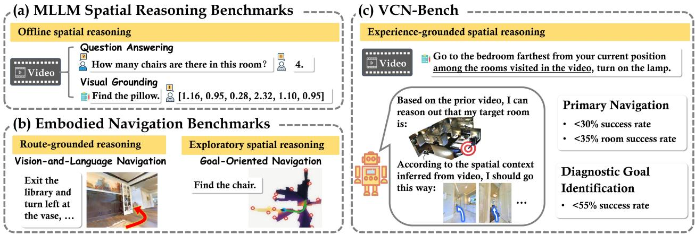  
Figure 1 VCN-Bench is a video-contextualized navigation benchmark tailored for probing closed-loop spatial reasoning over prior visual experience in MLLMs. The spatial context inferred from the prior video directly informs destination resolution and guides closed-loop action decisions.

To fill this gap, we introduce VCN-Bench, a benchmark for probing closed-loop spatial reasoning over prior visual experience in MLLMs through video-contextualized navigation. As illustrated in Figure 1, each episode consists of a prior video of an indoor environment and an instruction referring to a room or object observed in the video. The prior video provides scene-specific spatial context covering both the initial position and target destination, while the video-grounded instruction makes the inferred spatial knowledge directly shape destination resolution and closed-loop decisions. In this way, VCN-Bench evaluates not only whether an agent can infer spatial relationships, but also whether the resulting spatial knowledge can be carried forward to support subsequent navigation.

To cover complementary dimensions of spatial reasoning, VCN-Bench comprises five instruction types grouped into two goal families. Object Goal contains Instance instructions that refer to object instances with unique descriptions. Room-to-Object Goal requires identifying a target room through Count, Order, Distance, or Orientation relations before specifying an object within it. Video-contextualized navigation is the primary evaluation task. To distinguish whether failures arise from destination resolution or navigation, we additionally introduce a diagnostic goal-identification protocol that asks the model to identify a target room or object in the prior video without navigation.

Built on Matterport3D (Chang et al., 2018), VCN-Bench contains 100k training episodes and 1,250 evaluation episodes. We further introduce MV-DualVLN, an MLLM-based baseline that jointly reasons over the prior video and its own observations to plan actions in pixel space. Experiments show that models achieve limited success on video-contextualized navigation. Diagnostic analyses reveal dificulties in destination resolution and show that many correctly identified episodes still fail during navigation, exposing additional challenges in closed-loop reasoning.

In summary, our contributions are threefold:

• We introduce VCN-Bench, a video-contextualized navigation benchmark with five instruction types for probing closed-loop spatial reasoning over prior visual experience in MLLMs.

• We propose a navigation-centered evaluation protocol in which navigation serves as the primary task and goal identification provides a diagnostic probe for distinguishing destination-resolution errors from subsequent navigation failures.

• We introduce MV-DualVLN as a reference baseline for VCN-Bench. Analyses reveal bottlenecks in both destination resolution and navigation, as well as a substantial gap between them.

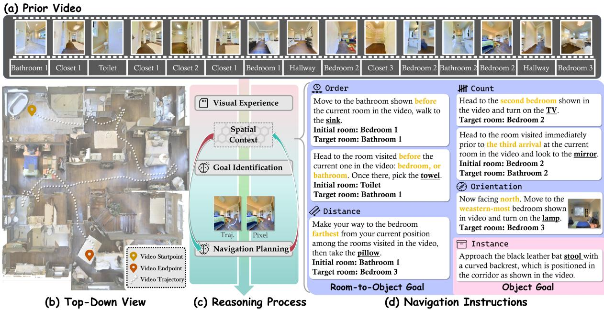  
Figure 2 Demonstration of VCN-Bench. (a) Prior video with room labels. (b) Top-down view of the prior video. (c) The reasoning process during navigation. Navigation tasks (d) are conditioned on the prior video with target room labels.

## 2 Related Work

Spatial Reasoning Evaluation for MLLMs. A growing body of benchmarks has been proposed to evaluate MLLMs spatial intelligence (Yang et al., 2025b,c; Hong et al., 2026), including 3D VQA and multi-image spatial reasoning benchmarks (Zhang et al., 2025b; Yang et al., 2025a; Lin et al., 2025; Chen et al., 2020; Azuma et al., 2022; Yeshwanth et al., 2023; Lyu et al., 2024; Ma et al., 2025; Xu et al., 2025; Li et al., 2025; Huang et al., 2026). However, these benchmarks are limited to ofline reasoning over fixed inputs in VQA or grounding formats, cannot meet the demand of closed-loop reasoning in physical interaction. In contrast, VCN-Bench aims to probe closed-loop spatial reasoning in MLLMs through specially designed video-contextualized navigation, where the agent is tasked to navigate within the spatial context implied in the prior video.

Navigation Benchmarks. As a fundamental task for embodied intelligence, embodied navigation has spurred diverse benchmarks (Zhu et al., 2017; Chaplot et al., 2020; Krantz et al., 2023; Deitke et al., 2020; Savva et al., 2019; Zhang et al., 2025c; Gao et al., 2025). These tasks can be divided into two categories: VLN tasks (Anderson et al., 2018; Ku et al., 2020; Krantz et al., 2020; He et al., 2021; Jain et al., 2019) focus on instruction fidelity and landmark recognition, while goal-oriented navigation tasks (Zhu et al., 2017; Chaplot et al., 2020; Qi et al., 2020; Zhu et al., 2021; Yokoyama et al., 2024; Huang et al., 2025; Kadian et al., 2020; Zhao et al., 2021; Partsey et al., 2022) focus on fast exploration via commonsense knowledge. Recent benchmarks (Gao et al., 2025; Wani et al., 2020; Khanna et al., 2024; Song et al., 2025; Hong et al., 2025a) formalize lifelong navigation as a sequence of concatenated episodes, enabling agents to retain and reuse information across episodes. However, their evaluation of spatial reasoning is confounded with model-dependent factors, such as model-specific exploration and trajectory coverage. VCN-Bench provides the scene information necessary for navigation tasks in the form of pre-recorded videos, centering evaluation on the agent’s ability to reason over prior visual experience and leverage spatial context to guide navigation.

## 3 VCN-Bench

In this section, we introduce the task formulation (Section 3.1), the design of five distinct instruction types (Section 3.2), and the construction pipeline from videos to episodes (Section 3.3) of our VCN-Bench. Benchmark

<table><tr><td rowspan=1 colspan=1>Taxonomy</td><td rowspan=1 colspan=1>Type</td><td rowspan=1 colspan=1>Reasoning Emphasis</td><td rowspan=1 colspan=1>Task Description</td><td rowspan=1 colspan=1>Controlled Distractor</td></tr><tr><td rowspan=4 colspan=1>R2OGoal</td><td rowspan=1 colspan=1>Count</td><td rowspan=2 colspan=1>Trajectory-structuredreasoning</td><td rowspan=1 colspan=1>Count distinct rooms of the same category.Count number of entries into the initial room.</td><td rowspan=1 colspan=1>Same category rooms.Repeated visits.</td></tr><tr><td rowspan=1 colspan=1>Order</td><td rowspan=1 colspan=1>Compare the order of multiple rooms of thesame type.Compare the order of rooms of different types.</td><td rowspan=1 colspan=1>Multiple candidaterooms.</td></tr><tr><td rowspan=1 colspan=1>Distance</td><td rowspan=1 colspan=1>Geometry-aware</td><td rowspan=1 colspan=1>Compare the distances from initial position toall rooms of the specified category.</td><td rowspan=1 colspan=1>Same category rooms.</td></tr><tr><td rowspan=1 colspan=1>Orientation</td><td rowspan=1 colspan=1>relational reasoning</td><td rowspan=1 colspan=1>Locate the specified room lies in the targetdirection relative to agent&#x27;s initial orientation.</td><td rowspan=1 colspan=1>Same category rooms.</td></tr><tr><td rowspan=1 colspan=1>ObjectGoal</td><td rowspan=1 colspan=1>Instance</td><td rowspan=1 colspan=1>Entity-groundedreasoning</td><td rowspan=1 colspan=1>Locate object instance with specifiedattributes and relationships to surroundingobjects (Huang et al., 2025).</td><td rowspan=1 colspan=1>Same/similar objects</td></tr></table>

Figure 3 Instruction descriptions and primary dimensions of reasoning over prior visual experience.

details are provided in Section B.

## 3.1 Task Formulation

In each episode, the agent is initialized in an environment, provided with an RGB-only prior video V, and tasked with a video-contextualized instruction I. Evaluation scenes are disjoint from the training scenes. For each evaluation episode, the prior video provides the only scene-specific information available before navigation. The prior video covers both the agent’s initial position and the target destination, so there is no need for uninformed exploration of regions outside the video coverage.

At each step during navigation, the agent can have access to current RGB and depth observations, and current position and heading. Then the agent needs to make a sequence of actions to reach the goal location, where each action $a _ { t }$ belongs to A = {FORWARD(0.25m), TurnLeft(30◦), TurnRight(30◦), STOP}. The episode terminates upon the agent executing the STOP action or after reaching the maximum step limit of 1,000 actions. The goal of the agent is to leverage the scene information from the prior video to make eficient navigation to the target location with minimal action steps.

## 3.2 Instruction Design

As shown in Figure 3, we design five types of instructions that can be classified into two high-level categories: Room-to-Object (R2O) Goal and Object Goal. R2O goal instructions require reasoning over the rooms visited in the video to identify the target room through Count, Order, Distance, or Orientation relations before referring to an object within it. Object goal instructions require the localization of an object Instance observed in the prior video without extra environmental exploration.

The five instruction types emphasize three complementary dimensions of reasoning over prior visual experience. (i) Entity-grounded reasoning, targeting specific objects represented in the prior video. (ii) Trajectorystructured reasoning, focusing on the visitation counts and order of regions along the video trajectory. (iii) Geometry-aware relational reasoning, distinguishing candidate regions according to their distance or relative direction.

Design Principles. (i) Each instruction is grounded in its prior video. The target and all information required to distinguish it must be covered in the prior video. (ii) The target cannot be specified (R2O goal) or is hard to specify (Object goal) without the prior video. (iii) To reduce shortcuts based on category matching or semantic retrieval, we introduce controlled distractors, such as multiple rooms of the same category. (iv) For R2O goal instructions, the target room can be unambiguously determined from the prior video and the agent’s initial state. For Object goal instructions, we apply instructions (Huang et al., 2025) that can uniquely determine the target object.

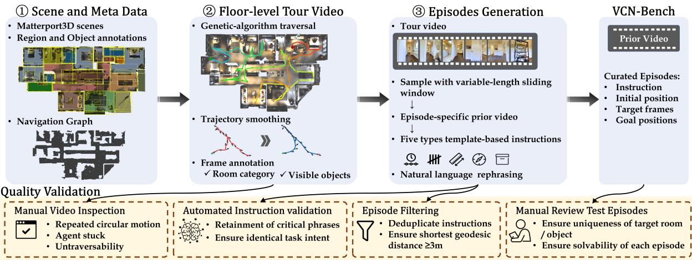  
Figure 4 Benchmark construction pipeline.

## 3.3 Benchmark Construction

We apply diverse real-world 3D scans from Matterport3D (MP3D) (Chang et al., 2018), paired with region-level annotations. For object-level annotations, we adopt the fine-grained labels from EmbodiedScan (Wang et al., 2024). As shown in Figure 4, we first collect floor-level tour videos, then sample prior videos from them as episode-specific video context, upon which the corresponding instructions are grounded.

Tour Video Generation. For each floor in MP3D scenes, we use the annotated navigation graphs (Anderson et al., 2018) to compute a minimum-cost traversal sequence covering all navigable nodes via a genetic algorithm (Holland, 1992). We then generate a smooth trajectory using cubic spline interpolation for position and spherical linear interpolation for rotation, to ensure visual continuity. We collect RGB observations along the trajectory to form the floor-level tour video, with randomized camera parameters (height, field of view, pitch angle) and lighting conditions to improve diversity. For each tour video, we annotate the room category and visible objects per frame. An object is deemed visible if it lies within 3m of the camera and over 60% of the object can be projected onto the frame without occlusion. See details in Section B.3.

Episodes Generation. We construct individual episodes by sampling variable-length sliding windows from the full “tour video” to form the “prior video”. Based on the prior video, we construct five types of instructions as detailed in Section 3.2 via predefined templates. To make the instructions more natural and open-ended, they are rephrased using Gemini-3.1 Flash. Since overlapping prior videos may yield identical instructions, we remove duplicate ones to ensure task diversity. Besides, we filter out episodes with a shortest geodesic distance below 3m.

Data Validation and Quality Control. To ensure data quality, we conduct human and automated validation. For tour video generation, we manually inspected all the generated videos to avoid simulator-related failures, such as repeated circular motion. Videos with such failures are regenerated or removed. During instruction rephrasing, the language model may alter task-critical semantics. We implement a two-level automated validation process to ensure the maintenance of task intent and critical phrases. For each evaluation episode, we conduct manual validation to ensure unambiguity.

## 3.4 Dataset Statistics

Following the split in MP3D, we employ 61 scenes for training and 11 disjoint unseen scenes for testing. For each floor within training scenes, up to 5 tour videos are collected, starting from diferent rooms. Resulting in a training set comprising 309 tour videos and 103,055 episodes. For each floor in test scenes, one tour video is collected, yielding a test set of 21 tour videos and 1,250 episodes, 250 episodes for each instruction type.

Test set statistics are shown in Figure 10. The memory size of concurrent navigation models (Cheng et al., 2025;

Team, 2025; Wei et al., 2025a) is limited (8-32 frames), while our prior video has an average of 157.9 frames. The average number of steps for VLN-CE (Krantz et al., 2020) is 55.8, whereas that of our benchmark is 122.1, more than twice that of VLN-CE. These statistics suggest that VCN-Bench poses non-trivial challenges for both video understanding and navigation planning.

## 4 Baseline

VCN-Bench expects the model to be equipped with three core capabilities: long-term spatial memory retention, spatial reasoning over prior video content, and goal-directed navigation planning. To fulfill these requirements, we propose MV-DualVLN, an MLLM-based navigation model built upon the System 2 of DualVLN (Wei et al., 2025a).

Preliminary. DualVLN synergizes high-level reasoning and low-level control through a dual-system design: System 2 performs navigation planning by predicting turning decisions or mid-term waypoints in image pixel space, while System 1 executes low-level execution by generating continuous trajectories. Given the navigation history of 8 frames, current single-view observation, and the instruction, System 2 determines whether to adjust view or output a pixel goal.

## 4.1 Model Overview

Following DualVLN, MV-DualVLN predicts the next navigation waypoint in pixel-space. We apply an oracle executor to move to the predicted waypoint. This setting focuses on navigation planning and factors out low-level control failures (e.g., obstacle avoidance, robot stuck and fall, etc.). Moreover, to obviate low-level view adjustment, we extend single-view observations to multi-view.

MV-DualVLN is fine-tuned on Qwen3-VL-4B-Instruct with visual encoder frozen. As illustrated in Figure 5, the model inputs consist of: (1) the instruction, (2) the prior video downsampled to 50 frames, (3) in-episode navigation history, (4) multi-view (front/left/back/right) observations at the initial position, and (5) current multi-view observations. MV-DualVLN performs feature pooling on both the prior video and navigation history to enable long memory retention. It first identifies the goal by selecting a target frame in the prior video. Leveraging spatial context jointly encoded from the prior video and navigation history, it then performs navigation planning by predicting—within a selected egocentric observation—a pixel-goal and a termination signal.

## 4.2 Design Details

Navigation History. We represent view selection as forward-view rotation, and record the agent’s observations corresponding to rotational actions along with forward actions in the navigation history. For instance, when the agent chooses the right view, the navigation history will encompass the agent’s front and right views. This design ensures visual continuity between history frames and integrates additional scene observations from diverse views into the prior video.

Feature Pooling. To address the long input sequence challenge, we standardize all input images to $3 8 4 \times 3 8 4$ resolution, and apply average pooling to downsample the 12 × 12 feature map of each image in the prior video and navigation history to $3 \times 3 ,$ reducing the token count per image by 16× while preserving core spatial information. This design enables the model to process long prior videos and navigation history within an acceptable token budget.

Training Data Collection. The ground-truth pixel goals for training samples are derived from frontiers. During data collection, an occupancy map of the visited regions is maintained for frontier detection. At each step, the frontier closest to the target location is selected as the next goal waypoint. This frontier is then mapped to the pixel coordinates of the current observation’s most aligned view—that is, the view (among the four available) exhibiting the smallest rotation angle relative to the frontier direction. When the target object is included in the occupancy map, and the geodesic distance from the agent’s position is less than 3 meters, the termination signal is set to true. At this point, the pixel goal is the pixel-coordinate projection of the object’s centroid.

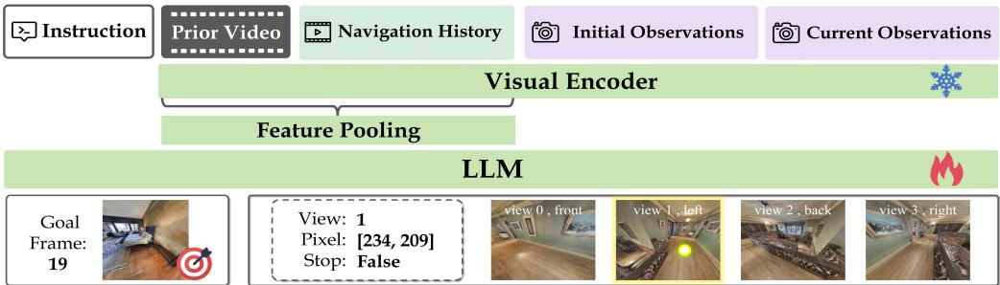  
Figure 5 The overall framework of MV-DualVLN.

## 5 Evaluation Protocols and Baselines

We evaluate MLLMs on VCN-Bench from two perspectives. Video-contextualized navigation is the primary evaluation, while goal identification provides a diagnostic to determine whether navigation failures arise from inaccurate destination resolution or from deficiencies in closed-loop interaction. This section defines both evaluation protocols and metrics, and specifies their baseline methods. Implementation details are presented in Sections C.3 and C.4.

## 5.1 Primary Task: Video-Contextualized Navigation

Protocol. Navigation serves as the primary behavioral probe, evaluating the model’s capacity to leverage information from the prior video to guide sequential decisions toward the resolved destination amid incremental and changing egocentric observations.

Evaluation Metrics. We adopt standard evaluation metrics: Success Rate (SR) and Success weighted by Path Length (SPL). An episode is considered successful if the agent stops within 1m Euclidean distance from any valid viewpoint associated with the target. Additionally, we introduce a relaxed metric: Room Success Rate (RSR), where the episode is deemed successful if the agent ends up in the target room. The agents are expected to complete navigation by leveraging spatial information embedded in the prior video. Therefore, we adopt SR as the primary evaluation metric.

## 5.2 Navigation Baselines

We establish two reasoning paradigms. Hierarchical methods first identify a target frame and then pass it to a separate navigation model. We instantiate this paradigm with a goal-identification model (Section 5.4) followed by MTU3D (Zhu et al., 2025). End-to-End methods instead use the prior video together with online navigation observations to jointly resolve the destination and make navigation decisions. In addition to our proposed MV-DualVLN, we also evaluate 3D-Mem (Yang et al., 2025d) and Uni-Navid (Zhang et al., 2025a), both of which are MLLM-driven navigation models capable of goal-oriented navigation and reasoning without depth or camera pose information.

## 5.3 Diagnostic Task: Goal Identification

Protocol. The model receives the prior video, the task instruction, and multi-view observations at the episode’s initial position. It is asked to select the frame in the prior video that best corresponds to the destination specified by the instruction. This protocol performs no navigation actions. The selected frame serves as the grounded spatial decision whose correctness depends on the relational structure specified by the instruction.

Evaluation Metrics. We introduce two metrics: room identification success rate (Rid-SR) for R2O-goal instructions, where success is defined as selecting a frame belonging to the target room; and object identification success rate (Oid-SR) for Object-goal instructions, which is considered correct if the target object is visible in the frame (Section B.3).

Table 1 Comparison of navigation performance. †: UniNavid directly outputs low-level actions. Other models utilize an oracle executor to move to the predicted waypoint.
<table><tr><td rowspan="2">Models</td><td rowspan="2">Metrics</td><td rowspan="2">Average</td><td colspan="4">Room-to-Object</td><td rowspan="2">Object Instance</td></tr><tr><td>Count</td><td>Order</td><td>Distance</td><td>Orientation</td></tr><tr><td colspan="8">Hierarchical methods</td></tr><tr><td rowspan="3">Gemini-3+MTU3D</td><td>SPL</td><td>4.8</td><td>3.4</td><td>3.4</td><td>6.2</td><td>3.3</td><td>7.9</td></tr><tr><td>SR</td><td>17.6</td><td>15.6</td><td>18.4</td><td>18.4</td><td>8.8</td><td>26.8</td></tr><tr><td>RSR</td><td>20.5</td><td>18.8</td><td>21.1</td><td>20.0</td><td>9.6</td><td>33.2</td></tr><tr><td rowspan="3">Oracle+MTU3D</td><td>SPL</td><td>5.3</td><td>5.3</td><td>4.7</td><td>5.0</td><td>3.7</td><td>7.6</td></tr><tr><td>SR</td><td>20.2</td><td>22.8</td><td>22.4</td><td>18.8</td><td>11.6</td><td>25.6</td></tr><tr><td>RSR</td><td>22.0</td><td>22.8</td><td>24.0</td><td>19.2</td><td>13.2</td><td>30.8</td></tr><tr><td colspan="8">End-to-End methods (zero-shot)</td></tr><tr><td rowspan="3">3D-Mem (8B)</td><td>SPL</td><td>2.1</td><td>2.3</td><td>1.6</td><td>2.0</td><td>1.2</td><td>3.2</td></tr><tr><td>SR</td><td>5.6</td><td>8.0</td><td>4.0</td><td>4.0</td><td>5.6</td><td>6.4</td></tr><tr><td>RSR</td><td>9.9</td><td>16.8</td><td>8.0</td><td>10.0</td><td>6.0</td><td>8.8</td></tr><tr><td rowspan="3">UniNavid†</td><td>SPL</td><td>6.1</td><td>6.2</td><td>6.1</td><td>6.2</td><td>3.9</td><td>8.3</td></tr><tr><td>SR</td><td>8.7</td><td>9.6</td><td>8.4</td><td>8.8</td><td>5.2</td><td>11.6</td></tr><tr><td>RSR</td><td>13.1</td><td>14.0</td><td>11.6</td><td>12.8</td><td>9.6</td><td>17.6</td></tr><tr><td colspan="8">End-to-End methods (fine-tuned)</td></tr><tr><td rowspan="3">3D-Mem (4B)</td><td>SPL</td><td>13.3</td><td>15.7</td><td>17.5</td><td>9.9</td><td>7.8</td><td>15.4</td></tr><tr><td>SR</td><td>18.1</td><td>19.6</td><td>23.6</td><td>14.0</td><td>12.0</td><td>21.2</td></tr><tr><td>RSR</td><td>24.6</td><td>26.4</td><td>34.4</td><td>21.2</td><td>14.8</td><td>26.4</td></tr><tr><td rowspan="3">MV-DualVLN (4B)</td><td>SPL</td><td>19.1</td><td>22.0</td><td>23.5</td><td>14.1</td><td>11.9</td><td>23.7</td></tr><tr><td>SR</td><td>27.6</td><td>30.8</td><td>34.0</td><td>20.8</td><td>18.0</td><td>34.4</td></tr><tr><td>RSR</td><td>33.9</td><td>38.0</td><td>40.4</td><td>28.2</td><td>20.4</td><td>42.4</td></tr></table>

## 5.4 Goal Identification Baselines

We evaluate proprietary and open-source MLLMs that support long visual contexts. All models receive the same instruction format and are prompted to return a single frame index. For proprietary models, we evaluate Claude-Sonnet-5, Qwen3.8-Flash, and two variants of Gemini-3-Flash under two inference types. The Nothinking variant directly predicts the target frame, while the Thinking variant enables extended reasoning before producing the frame prediction. As for open-source models, we include InternVL3.5-8B-Flash Wang et al. (2025), GLM-4.6V-Flash, DeepSeek-v4.1-Flash (Xu et al., 2026), and the Qwen3-VL family (4/8B-Instruct/Thinking) (Bai et al., 2025a).

## 6 Results and Analysis

This section presents evaluation results and in-depth analyses of both the primary navigation task and the diagnostic goal identification task. More details are presented in Section C and Section D.

## 6.1 Navigation Performance

Overall performance. Table 1 presents the overall navigation performance and task-wise results on VCN-Bench. Our benchmark presents a substantial challenge to all evaluated methods, even the best-performing MV-DualVLN, with an SR of 27.6%, succeeding in fewer than one-third of navigation episodes. Overall, current models still struggle to convert scene-specific visual experience into efective sequential navigation decisions.

Hierarchical methods. MTU3D is provided with two target frame sources: (i) frames selected by Gemini-3- Flash-Thinking, yielding 17.6% SR; and (ii) ground-truth frames (denoted as Oracle), achieving 20.2% SR. We conjecture that underperformance stems from two limitations of MTU3D: its lack of access to spatial context from the prior video and its dependence on CLIP’s global features for target representation, hindering fine-grained discrimination among same-category rooms or objects.

End-to-End methods. Zero-shot methods yield poor results unsurprisingly. Fine-tuning 3D-Mem with Qwen3- VL-4B-Instruct on the VCN-Bench improves SR to 18.1%, demonstrating the importance of task-specific MLLM adaptation in closed-loop tasks. MV-DualVLN further improves over the fine-tuned 3D-Mem, achieving an absolute SR improvement of 9.5%, validating the efectiveness of the overall design of our MV-DualVLN.

Performance across instruction types. The task-wise results reveal systematic diferences among destination specifications. For MV-DualVLN, SR is higher on Instance (34.4%), Order (34%), and Count (30.8%) than on Distance (20.8%) and Orientation (18%). A similar tendency is observed for the fine-tuned 3D-Mem. These results suggest that distinguishing candidate rooms according to their geometric relationships with the initial state is particularly challenging for the evaluated methods.

## 6.2 Diagnostic Goal Identification Results

Overall performance. Table 2 reports the diagnostic goal-identification results. Although goal identification removes closed-loop interactions, all evaluated models remain substantially below human performance. These results show that resolving an instruction-specified destination from a long prior video is itself challenging, before the model is required to act in the environment.

Chance level performance. Complete Chance Level is the success rate of randomly sampling a frame from the prior video. Category Chance Level is a category-based retrieval shortcut. For R2O-goal tasks, it randomly selects from frames inside rooms matching the target room category; for Object-goal tasks, from frames containing objects matching the target category. Its underperformance indicates that category-level semantic retrieval alone is insuficient to identify the destination.

Human performance. We randomly sample a tiny subset of 100 episodes (20 per task type) for human evaluation. Evaluators select a frame using the prior video, initial observations, and instruction. Not surprisingly, humans outperform Gemini-3-flash-thinking by 44.6% on average Rid-SR and 55.0% on Oid-SR. However, they still feel challenged to compare room distances and orientations without a top-down map—relying only on the prior video.

Comparison across tasks. Across R2O-goal tasks, models generally perform better on Count and Order than on Distance and Orientation. This pattern indicates that the evaluated models are more capable of understanding the visitation sequence of the prior video than geometry-aware destination specifications. Object-goal tasks, requiring fine-grained grounding of a unique instance, is more dificult than R2O-goal tasks for most of the evaluated models.

Comparison across models. Thinking mode improves performance across models at the same scale. Gemini-3- flash-thinking achieves absolute improvements of 6.8% in average Rid-SR and 7.6% improvement in Oid-SR over its nothinking mode. These gains underscore the critical role of deep reasoning in spatial cognition. Scaling model parameters also results in performance gains. For example, Qwen3-VL-8B-Thinking yields an absolute improvement of 16.4% in average Rid-SR and 12.0% in Oid-SR over Qwen3-VL-4B-Thinking.

## 6.3 Analyses and Ablations

Relationship between goal identification (Gid) and navigation. Figure 6 illustrates Gid and navigation performance of MV-DualVLN across tasks. Since Gid is performed at every step, we report Gid results at the first step (denoted as start) in light green and the last step (end) in dark green. A strong positive correlation is evident between Gid and navigation, yet a substantial gap remains. To describe this gap, we compare Rid-SR and RSR for R2O tasks, both of them are target-room metrics. For Object tasks, we compare Oid-SR and a softened SR (SSR), defined as episode success when the agent stops within 3 m of the target object—a comparable distance threshold with Oid-SR’s criterion. MV-DualVLN achieves an average Rid-SR of 43.1% but only 31.7% RSR on R2O tasks, leaving a gap of 11.4 points. The same pattern occurs on Object tasks: Oid-SR reaches 49.6% while SSR is 39.2%, resulting in a 10.4-point gap.

Moreover, we analyze successful navigation N conditioned on correct goal identification at the first step G.

Table 2 Comparison of goal identification performance.
<table><tr><td rowspan="2">Models</td><td colspan="4">Room-to-Object (Rid-SR)</td><td rowspan="2">Avg.</td><td rowspan="2">Object (Oid-SR) Instance</td></tr><tr><td>Count</td><td>Order</td><td>Distance</td><td>Orientation</td></tr><tr><td colspan="7">Baseline</td></tr><tr><td>Complete Chance Level</td><td>2.0</td><td>2.4</td><td>5.6</td><td>4.0</td><td>3.5</td><td>0.8</td></tr><tr><td>Category Chance Level</td><td>13.2</td><td>14.4</td><td>12.8</td><td>17.2</td><td>14.4</td><td>14.0</td></tr><tr><td colspan="7">Tiny Set</td></tr><tr><td>Human Performance</td><td>93.3</td><td>95.0</td><td>86.7</td><td>83.3</td><td>89.6</td><td>95.0</td></tr><tr><td>Gemini-3-flash-thinking</td><td>55.0</td><td>50.0</td><td>45.0</td><td>30.0</td><td>45.0</td><td>40.0</td></tr><tr><td colspan="7">Proprietary Models (API)</td></tr><tr><td>Gemini-3-flash-nothinking</td><td>52.4</td><td>40.0</td><td>46.4</td><td>28.8</td><td>41.9</td><td>36.0</td></tr><tr><td>Gemini-3-flash-thinking</td><td>56.0</td><td>50.4</td><td>53.6</td><td>34.8</td><td>48.7</td><td>43.6</td></tr><tr><td>Claude-Sonnet-5</td><td>51.6</td><td>50.0</td><td>42.8</td><td>40.8</td><td>46.3</td><td>38.0</td></tr><tr><td>Qwen3.8-Flash</td><td>54.0</td><td>56.8</td><td>60.0</td><td>46.0</td><td>54.2</td><td>47.6</td></tr><tr><td colspan="7">Open-source Models</td></tr><tr><td>InternVL3_5-8B-Flash</td><td>26.0</td><td>20.8</td><td>17.6</td><td>19.2</td><td>20.9</td><td>19.2</td></tr><tr><td>GLM-4.6V-Flash</td><td>18.8</td><td>13.2</td><td>18.4</td><td>18.8</td><td>17.3</td><td>20.0</td></tr><tr><td>Qwen3-VL-4B-Instruct</td><td>25.2</td><td>24.4</td><td>23.6</td><td>16.0</td><td>22.3</td><td>24.0</td></tr><tr><td>Qwen3-VL-4B-Thinking</td><td>31.2</td><td>21.6</td><td>25.2</td><td>21.6</td><td>24.9</td><td>20.8</td></tr><tr><td>Qwen3-VL-8B-Instruct</td><td>34.9</td><td>22.3</td><td>30.0</td><td>32.5</td><td>30.0</td><td>33.5</td></tr><tr><td>Qwen3-VL-8B-Thinking</td><td>45.6</td><td>38.0</td><td>40.0</td><td>41.6</td><td>41.3</td><td>32.8</td></tr><tr><td>DeepSeek-v4.1-Flash</td><td>50.8</td><td>50.8</td><td>48.0</td><td>40.8</td><td>47.6</td><td>50.4</td></tr></table>

MV-DualVLN achieves 37.8% SR among episodes when Gid is correct, $i . e . , P ( \mathbf { N } \mid \mathbf { G } ) = 3 7 . 8 \%$ , compared to P(N | ¬G) = 18.6%. For R2O tasks, RSR achieves 49.5% among episodes when Gid is correct, versus 18.1% RSR when Gid fails. These results demonstrate that goal identification is an important prerequisite for reliable navigation, yet even when the destination is correctly identified, 62.2% of episodes still fail to reach the target.

Benefits from the prior video. To validate that the models indeed   
acquire scene knowledge of the environment from the prior video,   
and thus benefit navigation, we present the performance when   
only the ground-truth target frame is provided rather than the   
prior video in Table 3 row #2. This variant utilizes the ground  
truth target frame as a hint during both the training and testing   
phases. It can be observed that performance declines significantly   
when only a target frame is provided rather than the complete   
prior video (6.9% drop in SPL, 7.9% drop in SR, and 9.1% drop in RSR). This indicates that MV-DualVLN   
indeed leverages the scene context in the prior video throughout navigation. indeed leverages the scene context in the prior video throughout

Table 3 Ablation results for navigation. Variants are trained under the ablation setting.
<table><tr><td>#</td><td>Models</td><td>SPL</td><td>SR</td><td>RSR</td></tr><tr><td>1</td><td>MV-DualVLN</td><td>19.1</td><td>27.6</td><td>33.9</td></tr><tr><td>2</td><td>target frame only</td><td>12.2</td><td>19.7</td><td>24.8</td></tr><tr><td>3</td><td>50 frames, w/o history</td><td>14.9</td><td>24.1</td><td>32.8</td></tr><tr><td>4</td><td>100 frames, w/o history</td><td>16.4</td><td>25.0</td><td>33.7</td></tr></table>

Necessity of navigation history. Navigation history records the agent’s episodic trajectory and supplements scene information. To validate its efectiveness, we present ablation results in Table 3 rows #3 and #4. When the prior video is downsampled to 50 frames as MV-DualVLN does, excluding in-episode history results in a 3.5% decrease in SR and 4.2% in SPL. Under a token budget comparable to MV-DualVLN, downsampling prior video to 100 frames without navigation history achieves on-par RSR with MV-DualVLN, yet SR remains 2.6% lower. The comparison between rows #3 and #4 indicates that higher video frame density is beneficial for spatial reasoning. Comparing MV-DualVLN with row #4 reveals that incorporating in-episode navigation history compensates for scene observation and enhances object localization within the target room.

Relationship between model performance and prior video. We quantify the correlation between performance of three representative models and three key attributes of the prior video, i.e., number of frames, number of rooms covered, and covered area, using the Pearson correlation coeficient. Figure 7 presents the correlation heatmap. It can be observed that Gemini-3 and Qwen3-VL models exhibit diferent correlations. For Gemini-3, only Order tasks show a negative correlation with frame count, indicating robustness to video length and spatial coverage. In contrast, both Qwen3-VL variants show consistent negative correlations across all three video attributes, reflecting sensitivity to longer videos and broader scene coverage.

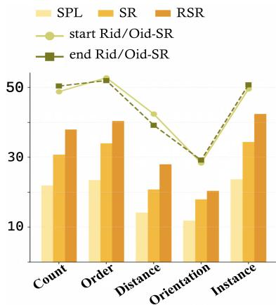  
Figure 6 Navigation and Gid results of MV-DualVLN.

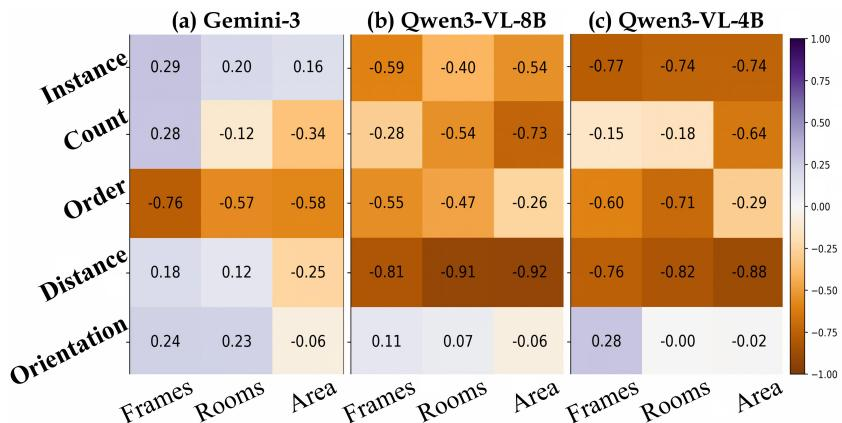  
Figure 7 Pearson correlation between model performance and prior video.

## 7 Conclusion

In this paper, we propose VCN-Bench, a video-contextualized navigation benchmark for probing closed-loop spatial reasoning over prior visual experience in MLLMs. Built upon diverse indoor scenes, our benchmark provides a video as the scene-specific spatial context of the navigation task. VCN-Bench contains five instruction types and uses closed-loop navigation as its primary evaluation, accompanied by diagnostic goal identification to distinguish destination-resolution errors from subsequent navigation failures. We further propose MV-DualVLN as a reference baseline and support in-depth analysis. Experiments reveal limited navigation performance and a substantial destination-resolution-to-navigation gap: correct destination identification improves navigation success, but many correctly identified episodes still fail during subsequent interaction.

## References

Ziyu Zhu, Yanwei Li, Jingjia Huang, and Shen Yan. Visual spatial tuning. In Computer Vision–ECCV 2026: 19th European Conference, Malmö, Sweden, September 8–12, 2026, Proceedings, Part II, page 192. Springer Nature, 2026.

Jiazhao Zhang, Kunyu Wang, Shaoan Wang, Minghan Li, Haoran Liu, Songlin Wei, Zhongyuan Wang, Zhizheng Zhang, and He Wang. Uni-navid: A video-based vision-language-action model for unifying embodied navigation tasks. Robotics: Science and Systems, 2025a.

Xu Zheng, Zihao Dongfang, Lutao Jiang, Boyuan Zheng, Yulong Guo, Zhenquan Zhang, Giuliano Albanese, Runyi Yang, Mengjiao Ma, Zixin Zhang, et al. Multimodal spatial reasoning in the large model era: A survey and benchmarks. arXiv preprint arXiv:2510.25760, 2025a.

Qiuyue Wang, Mingsheng Li, Jian Guan, Jinhui Ye, Sicheng Xie, Yitao Liu, Junhao Chen, Zhixuan Liang, Jie Zhang, Xintong Hu, et al. Qwen-vla: Unifying vision-language-action modeling across tasks, environments, and robot embodiments. arXiv preprint arXiv:2605.30280, 2026a.

Jiahui Zhang, Yurui Chen, Yanpeng Zhou, Yueming Xu, Ze Huang, Jilin Mei, Junhui Chen, Yu-Jie Yuan, Xinyue Cai, Guowei Huang, et al. From flatland to space: Teaching vision-language models to perceive and reason in 3d. arXiv preprint arXiv:2503.22976, 2025b.

Sihan Yang, Runsen Xu, Yiman Xie, Sizhe Yang, Mo Li, Jingli Lin, Chenming Zhu, Xiaochen Chen, Haodong Duan, Xiangyu Yue, et al. Mmsi-bench: A benchmark for multi-image spatial intelligence. arXiv preprint arXiv:2505.23764, 2025a.

Jihan Yang, Shusheng Yang, Anjali W Gupta, Rilyn Han, Li Fei-Fei, and Saining Xie. Thinking in space: How multimodal large language models see, remember, and recall spaces. In Proceedings of the Computer Vision and Pattern Recognition Conference, pages 10632–10643, 2025b.

Jingli Lin, Runsen Xu, Shaohao Zhu, Sihan Yang, Peizhou Cao, Yunlong Ran, Miao Hu, Chenming Zhu, Yiman Xie, Yilin Long, et al. Mmsi-video-bench: A holistic benchmark for video-based spatial intelligence. arXiv preprint arXiv:2512.10863, 2025.

Peter Anderson, Qi Wu, Damien Teney, Jake Bruce, Mark Johnson, Niko Sünderhauf, Ian Reid, Stephen Gould, and Anton van den Hengel. Vision-and-language navigation: Interpreting visually-grounded navigation instructions in real environments. In IEEE Conf. Comput. Vis. Pattern Recog., pages 3674–3683, 2018.

Alexander Ku, Peter Anderson, Roma Patel, Eugene Ie, and Jason Baldridge. Room-across-room: Multilingual vision-and-language navigation with dense spatiotemporal grounding. In Proceedings of the 2020 Conference on Empirical Methods in Natural Language Processing (EMNLP), pages 4392–4412, Online, 2020. Association for Computational Linguistics.

Yuke Zhu, Roozbeh Mottaghi, Eric Kolve, Joseph J Lim, Abhinav Gupta, Li Fei-Fei, and Ali Farhadi. Target-driven visual navigation in indoor scenes using deep reinforcement learning. In 2017 IEEE international conference on robotics and automation (ICRA), pages 3357–3364. IEEE, 2017.

Devendra Singh Chaplot, Dhiraj Prakashchand Gandhi, Abhinav Gupta, and Russ R Salakhutdinov. Object goal navigation using goal-oriented semantic exploration. Advances in Neural Information Processing Systems, 33: 4247–4258, 2020.

Angel Chang, Angela Dai, Thomas Funkhouser, Maciej Halber, Matthias Niebner, Manolis Savva, Shuran Song, Andy Zeng, and Yinda Zhang. Matterport3d: Learning from rgb-d data in indoor environments. In 7th IEEE International Conference on 3D Vision, 3DV 2017, pages 667–676. Institute of Electrical and Electronics Engineers Inc., 2018.

Shusheng Yang, Jihan Yang, Pinzhi Huang, Ellis Brown, Zihao Yang, Yue Yu, Shengbang Tong, Zihan Zheng, Yifan Xu, Muhan Wang, et al. Cambrian-s: Towards spatial supersensing in video. arXiv preprint arXiv:2511.04670, 2025c.

Yining Hong, Jiageng Liu, Han Yin, Manling Li, Leonidas Guibas, Li Fei-Fei, Jiajun Wu, and Yejin Choi. Esi-bench: Towards embodied spatial intelligence that closes the perception-action loop. arXiv preprint arXiv:2605.18746, 2026.

Dave Zhenyu Chen, Angel X Chang, and Matthias Nießner. Scanrefer: 3d object localization in rgb-d scans using natural language. In European conference on computer vision, pages 202–221. Springer, 2020.

Daichi Azuma, Taiki Miyanishi, Shuhei Kurita, and Motoaki Kawanabe. Scanqa: 3d question answering for spatial scene understanding. In proceedings of the IEEE/CVF conference on computer vision and pattern recognition, pages 19129–19139, 2022.

Chandan Yeshwanth, Yueh-Cheng Liu, Matthias Nießner, and Angela Dai. Scannet++: A high-fidelity dataset of 3d indoor scenes. In Proceedings of the IEEE/CVF International Conference on Computer Vision, pages 12–22, 2023.

Ruiyuan Lyu, Jingli Lin, Tai Wang, Shuai Yang, Xiaohan Mao, Yilun Chen, Runsen Xu, Haifeng Huang, Chenming Zhu, Dahua Lin, et al. Mmscan: A multi-modal 3d scene dataset with hierarchical grounded language annotations. Advances in Neural Information Processing Systems, 37:50898–50924, 2024.

Wufei Ma, Haoyu Chen, Guofeng Zhang, Yu-Cheng Chou, Jieneng Chen, Celso de Melo, and Alan Yuille. 3dsrbench: A comprehensive 3d spatial reasoning benchmark. In Proceedings of the IEEE/CVF International Conference on Computer Vision, pages 6924–6934, 2025.

Runsen Xu, Weiyao Wang, Hao Tang, Xingyu Chen, Xiaodong Wang, Fu-Jen Chu, Dahua Lin, Matt Feiszli, and Kevin J Liang. Multi-spatialmllm: Multi-frame spatial understanding with multi-modal large language models. arXiv preprint arXiv:2505.17015, 2025.

Yun Li, Yiming Zhang, Tao Lin, XiangRui Liu, Wenxiao Cai, Zheng Liu, and Bo Zhao. Sti-bench: Are mllms ready for precise spatial-temporal world understanding? In Proceedings of the IEEE/CVF International Conference on Computer Vision, pages 5622–5632, 2025.

Xinmiao Huang, Qisong He, Zhenglin Huang, Boxuan Wang, Zhuoyun Li, Guangliang Cheng, Yi Dong, and Xiaowei Huang. Spatial-dise: A unified benchmark for evaluating spatial reasoning in vision-language models. In International Conference on Learning Representations, volume 2026, pages 135833–135865, 2026.

Jacob Krantz, Theophile Gervet, Karmesh Yadav, Austin Wang, Chris Paxton, Roozbeh Mottaghi, Dhruv Batra, Jitendra Malik, Stefan Lee, and Devendra Singh Chaplot. Navigating to objects specified by images. In Proceedings of the IEEE/CVF International Conference on Computer Vision, pages 10916–10925, 2023.

Matt Deitke, Winson Han, Alvaro Herrasti, Aniruddha Kembhavi, Eric Kolve, Roozbeh Mottaghi, Jordi Salvador, Dustin Schwenk, Eli VanderBilt, Matthew Wallingford, et al. Robothor: An open simulation-to-real embodied ai platform. In Proceedings of the IEEE/CVF conference on computer vision and pattern recognition, pages 3164–3174, 2020.

Manolis Savva, Abhishek Kadian, Oleksandr Maksymets, Yili Zhao, Erik Wijmans, Bhavana Jain, Julian Straub, Jia Liu, Vladlen Koltun, Jitendra Malik, et al. Habitat: A platform for embodied ai research. In Int. Conf. Comput. Vis., pages 9339–9347, 2019.

Lingfeng Zhang, Xiaoshuai Hao, Yingbo Tang, Haoxiang Fu, Xinyu Zheng, Pengwei Wang, Zhongyuan Wang, Wenbo Ding, and Shanghang Zhang. nava3: Understanding any instruction, navigating anywhere, finding anything. arXiv preprint arXiv:2508.04598, 2025c.

Chen Gao, Liankai Jin, Xingyu Peng, Jiazhao Zhang, Yue Deng, Annan Li, He Wang, and Si Liu. Octonav: Towards generalist embodied navigation. arXiv preprint arXiv:2506.09839, 2025.

Jacob Krantz, Erik Wijmans, Arjun Majumdar, Dhruv Batra, and Stefan Lee. Beyond the nav-graph: Vision-andlanguage navigation in continuous environments. In Eur. Conf. Comput. Vis., pages 104–120. Springer, 2020.

Keji He, Yan Huang, Qi Wu, Jianhua Yang, Dong An, Shuanglin Sima, and Liang Wang. Landmark-rxr: Solving vision-and-language navigation with fine-grained alignment supervision. In Adv. Neural Inform. Process. Syst., pages 652–663, 2021.

Vihan Jain, Gabriel Magalhaes, Alexander Ku, Ashish Vaswani, Eugene Ie, and Jason Baldridge. Stay on the path: Instruction fidelity in vision-and-language navigation. In Proceedings of the 57th Annual Meeting of the Association for Computational Linguistics, pages 1862–1872, Florence, Italy, 2019. Association for Computational Linguistics.

Yuankai Qi, Qi Wu, Peter Anderson, Xin Wang, William Yang Wang, Chunhua Shen, and Anton van den Hengel. REVERIE: remote embodied visual referring expression in real indoor environments. In IEEE Conf. Comput. Vis. Pattern Recog., pages 9979–9988, 2020.

Fengda Zhu, Xiwen Liang, Yi Zhu, Qizhi Yu, Xiaojun Chang, and Xiaodan Liang. SOON: scenario oriented object navigation with graph-based exploration. In IEEE Conf. Comput. Vis. Pattern Recog., pages 12689–12699, 2021.

Naoki Yokoyama, Ram Ramrakhya, Abhishek Das, Dhruv Batra, and Sehoon Ha. Hm3d-ovon: A dataset and benchmark for open-vocabulary object goal navigation. In 2024 IEEE/RSJ International Conference on Intelligent Robots and Systems (IROS), pages 5543–5550. IEEE, 2024.

Wensi Huang, Shaohao Zhu, Meng Wei, Jinming Xu, Xihui Liu, Hanqing Wang, Tai Wang, Feng Zhao, and Jiangmiao Pang. Vl-ln bench: Towards long-horizon goal-oriented navigation with active dialogs. arXiv preprint arXiv:2512.22342, 2025.

Abhishek Kadian, Joanne Truong, Aaron Gokaslan, Alexander Clegg, Erik Wijmans, Stefan Lee, Manolis Savva, Sonia Chernova, and Dhruv Batra. Sim2real predictivity: Does evaluation in simulation predict real-world performance? IEEE Robotics and Automation Letters, 5(4):6670–6677, 2020.

Xiaoming Zhao, Harsh Agrawal, Dhruv Batra, and Alexander G Schwing. The surprising efectiveness of visual odometry techniques for embodied pointgoal navigation. In Proceedings of the IEEE/CVF International Conference on Computer Vision, pages 16127–16136, 2021.

Ruslan Partsey, Erik Wijmans, Naoki Yokoyama, Oles Dobosevych, Dhruv Batra, and Oleksandr Maksymets. Is mapping necessary for realistic pointgoal navigation? In Proceedings of the IEEE/CVF Conference on Computer Vision and Pattern Recognition, pages 17232–17241, 2022.

Saim Wani, Shivansh Patel, Unnat Jain, Angel Chang, and Manolis Savva. Multion: Benchmarking semantic map memory using multi-object navigation. Advances in Neural Information Processing Systems, 33:9700–9712, 2020.

Mukul Khanna, Ram Ramrakhya, Gunjan Chhablani, Sriram Yenamandra, Theophile Gervet, Matthew Chang, Zsolt Kira, Devendra Singh Chaplot, Dhruv Batra, and Roozbeh Mottaghi. Goat-bench: A benchmark for multi-moda lifelong navigation. In Proceedings of the IEEE/CVF Conference on Computer Vision and Pattern Recognition, pages 16373–16383, 2024.

Xinshuai Song, Weixing Chen, Yang Liu, Weikai Chen, Guanbin Li, and Liang Lin. Towards long-horizon vision-language navigation: Platform, benchmark and method. In Proceedings of the Computer Vision and Pattern Recognition Conference, pages 12078–12088, 2025.

Haodong Hong, Yanyuan Qiao, Sen Wang, Jiajun Liu, and Qi Wu. General scene adaptation for vision-and-language navigation. arXiv preprint arXiv:2501.17403, 2025a.

Tai Wang, Xiaohan Mao, Chenming Zhu, Runsen Xu, Ruiyuan Lyu, Peisen Li, Xiao Chen, Wenwei Zhang, Kai Chen, Tianfan Xue, et al. Embodiedscan: A holistic multi-modal 3d perception suite towards embodied ai. In Proceedings of the IEEE/CVF Conference on Computer Vision and Pattern Recognition, pages 19757–19767, 2024.

John H Holland. Genetic algorithms. Scientific american, 267(1):66–73, 1992.

An-Chieh Cheng, Yandong Ji, Zhaojing Yang, Zaitian Gongye, Xueyan Zou, Jan Kautz, Erdem Bıyık, Hongxu Yin, Sifei Liu, and Xiaolong Wang. Navila: Legged robot vision-language-action model for navigation. Robotics: Science and Systems, 2025.

InternNav Team. InternVLA-N1: An open dual-system navigation foundation model with learned latent plans, 2025.

Meng Wei, Chenyang Wan, Jiaqi Peng, Xiqian Yu, Yuqiang Yang, Delin Feng, Wenzhe Cai, Chenming Zhu, Tai Wang, Jiangmiao Pang, et al. Ground slow, move fast: A dual-system foundation model for generalizable vision-and-language navigation. arXiv preprint arXiv:2512.08186, 2025a.

Ziyu Zhu, Xilin Wang, Yixuan Li, Zhuofan Zhang, Xiaojian Ma, Yixin Chen, Baoxiong Jia, Wei Liang, Qian Yu, Zhidong Deng, et al. Move to understand a 3d scene: Bridging visual grounding and exploration for eficient and versatile embodied navigation. In Proceedings of the IEEE/CVF International Conference on Computer Vision, pages 8120–8132, 2025.

Yuncong Yang, Han Yang, Jiachen Zhou, Peihao Chen, Hongxin Zhang, Yilun Du, and Chuang Gan. 3d-mem: 3d scene memory for embodied exploration and reasoning. In Proceedings of the Computer Vision and Pattern Recognition Conference, pages 17294–17303, 2025d.

Weiyun Wang, Zhangwei Gao, Lixin Gu, Hengjun Pu, Long Cui, Xingguang Wei, Zhaoyang Liu, Linglin Jing, Shenglong Ye, Jie Shao, et al. Internvl3. 5: Advancing open-source multimodal models in versatility, reasoning, and eficiency. arXiv preprint arXiv:2508.18265, 2025.

Anyi Xu, B Li, Bangcai Lin, Bing Xue, BingCheng Xian, Bingzheng Xu, Bochao Wu, Bowei Zhang, Boyi Deng, CC Yu, et al. Deepseek-v4. 1-flash: Pushing the limits of kv cache compression. arXiv preprint arXiv:2609.19969, 2026.

Shuai Bai, Yuxuan Cai, Ruizhe Chen, Keqin Chen, Xionghui Chen, Zesen Cheng, Lianghao Deng, Wei Ding, Chang Gao, Chunjiang Ge, et al. Qwen3-vl technical report. arXiv preprint arXiv:2511.21631, 2025a.

An Yang, Baosong Yang, Beichen Zhang, Binyuan Hui, Bo Zheng, Bowen Yu, Chengyuan Li, Dayiheng Liu, Fei Huang, Haoran Wei, et al. Qwen2. 5 technical report. arXiv preprint arXiv:2412.15115, 2024.

Shuai Bai, Yuxuan Cai, Ruizhe Chen, Keqin Chen, Xionghui Chen, Zesen Cheng, Lianghao Deng, Wei Ding, Chang Gao, Chunjiang Ge, Wenbin Ge, Zhifang Guo, Qidong Huang, Jie Huang, Fei Huang, Binyuan Hui, Shutong Jiang, Zhaohai Li, Mingsheng Li, Mei Li, Kaixin Li, Zicheng Lin, Junyang Lin, Xuejing Liu, Jiawei Liu, Chenglong Liu, Yang Liu, Dayiheng Liu, Shixuan Liu, Dunjie Lu, Ruilin Luo, Chenxu Lv, Rui Men, Lingchen Meng, Xuancheng Ren, Xingzhang Ren, Sibo Song, Yuchong Sun, Jun Tang, Jianhong Tu, Jianqiang Wan, Peng Wang, Pengfei Wang, Qiuyue Wang, Yuxuan Wang, Tianbao Xie, Yiheng Xu, Haiyang Xu, Jin Xu, Zhibo Yang, Mingkun Yang, Jianxin Yang, An Yang, Bowen Yu, Fei Zhang, Hang Zhang, Xi Zhang, Bo Zheng, Humen Zhong, Jingren Zhou, Fan Zhou, Jing Zhou, Yuanzhi Zhu, and Ke Zhu. Qwen3-vl technical report. arXiv preprint arXiv:2511.21631, 2025b.

Daya Guo, Dejian Yang, Haowei Zhang, Junxiao Song, Ruoyu Zhang, Runxin Xu, Qihao Zhu, Shirong Ma, Peiyi Wang, Xiao Bi, et al. Deepseek-r1: Incentivizing reasoning capability in llms via reinforcement learning. arXiv preprint arXiv:2501.12948, 2025.

Wenyi Hong, Wenmeng Yu, Xiaotao Gu, Guo Wang, Guobing Gan, Haomiao Tang, Jiale Cheng, Ji Qi, Junhui Ji, Lihang Pan, et al. Glm-4.1 v-thinking: Towards versatile multimodal reasoning with scalable reinforcement learning. arXiv preprint arXiv:2507.01006, 2025b.

Gengze Zhou, Yicong Hong, and Qi Wu. Navgpt: Explicit reasoning in vision-and-language navigation with large language models. In AAAI, volume 38, pages 7641–7649, 2024.

Jiaqi Chen, Bingqian Lin, Ran Xu, Zhenhua Chai, Xiaodan Liang, and Kwan-Yee K Wong. Mapgpt: Map-guided prompting for unified vision-and-language navigation. ArXiv preprint, abs/2401.07314, 2024. URL https://arxiv. org/abs/2401.07314.

Yuxing Long, Xiaoqi Li, Wenzhe Cai, and Hao Dong. Discuss before moving: Visual language navigation via multi-expert discussions. In 2024 IEEE International Conference on Robotics and Automation (ICRA), pages 17380–17387. IEEE, 2024.

Yanyuan Qiao, Wenqi Lyu, Hui Wang, Zixu Wang, Zerui Li, Yuan Zhang, Mingkui Tan, and Qi Wu. Open-nav: Exploring zero-shot vision-and-language navigation in continuous environment with open-source llms. arXiv preprint arXiv:2409.18794, 2024.

Siqi Zhang, Yanyuan Qiao, Qunbo Wang, Longteng Guo, Zhihua Wei, and Jing Liu. Flexvln: Flexible adaptation for diverse vision-and-language navigation tasks. IEEE Transactions on Multimedia, 27:6307–6318, 2025d.

Yang Chen, Lirong Che, Zhenyu Huang, Wenbo Fu, Chuang Wang, Xu Cao, Daqi Liu, Yuzhe Yang, Jian Su, and Lan-Zhe Guo. Harnessvln: Unifying training-free embodied navigation through an agent harness. arXiv preprint arXiv:2609.15195, 2026.

Duo Zheng, Shijia Huang, Lin Zhao, Yiwu Zhong, and Liwei Wang. Towards learning a generalist model for embodied navigation. In IEEE Conf. Comput. Vis. Pattern Recog., pages 13624–13634, 2024.

Meng Wei, Chenyang Wan, Xiqian Yu, Tai Wang, Yuqiang Yang, Xiaohan Mao, Chenming Zhu, Wenzhe Cai, Hanqing Wang, Yilun Chen, et al. Streamvln: Streaming vision-and-language navigation via slowfast context modeling. arXiv preprint arXiv:2507.05240, 2025b.

Shuang Zeng, Dekang Qi, Xinyuan Chang, Feng Xiong, Shichao Xie, Xiaolong Wu, Shiyi Liang, Mu Xu, and Xing Wei. Janusvln: Decoupling semantics and spatiality with dual implicit memory for vision-language navigation. arXiv preprint arXiv:2509.22548, 2025.

Duo Zheng, Shijia Huang, Yanyang Li, and Liwei Wang. Eficient-vln: A training-eficient vision-language navigation model. arXiv preprint arXiv:2512.10310, 2025b.

Xinda Xue, Junjun Hu, Minghua Luo, Shichao Xie, Jintao Chen, Zixun Xie, Kuichen Quan, Wei Guo, Mu Xu, and Zedong Chu. Omninav: A unified framework for prospective exploration and visual-language navigation. arXiv preprint arXiv:2509.25687, 2025.

Jiazhao Zhang, Anqi Li, Yunpeng Qi, Minghan Li, Jiahang Liu, Shaoan Wang, Haoran Liu, Gengze Zhou, Yuze Wu, Xingxing Li, et al. Embodied navigation foundation model. arXiv preprint arXiv:2509.12129, 2025e.

Chen Gao, Liankai Jin, Xingyu Peng, Jiazhao Zhang, Yue Deng, Annan Li, He Wang, and Si Liu. Octonav: Towards generalist embodied navigation. In Proceedings of the IEEE/CVF Conference on Computer Vision and Pattern Recognition, pages 40074–40084, 2026.

Shaoan Wang, Aocheng Luo, Fei Huang, Jingyi Xu, Xiaoyang Wang, Yueyu Wang, Qianli Ma, Fan Yang, Ran Mei, Jia Wei, et al. Lightnav-0: Eliciting vlm spatial intelligence for generalist embodied navigation. arXiv preprint arXiv:2608.30935, 2026b.

## A More Related Works

MLLM-based Navigation Models. Recent advances in MLLMs (Yang et al., 2024; Bai et al., 2025b; Guo et al., 2025; Hong et al., 2025b) have driven a new wave of embodied navigation models. Early explorations frame MLLMs as zero-shot planners (Zhou et al., 2024; Chen et al., 2024; Long et al., 2024; Qiao et al., 2024; Zhang et al., 2025d; Chen et al., 2026), while recent Vision-Language-Action (VLA) models (Zhang et al., 2025a; Cheng et al., 2025; Zheng et al., 2024; Wei et al., 2025b; Zeng et al., 2025; Zheng et al., 2025b; Xue et al., 2025; Zhang et al., 2025e; Gao et al., 2026; Wang et al., 2026b) finetune MLLMs on large-scale embodied data and demonstrate notable improvements on navigation benchmarks. However, as constrained by existing tasks, their closed-loop spatial reasoning capability remains underexplored. We evaluate existing MLLM-driven navigation models on our benchmark and propose MV-DualVLN as a reference baseline for VCN-Bench.

## B Benchmark Details

## B.1 Tour video VS. Prior video

A tour video comprehensively covers a floor. Nevertheless, when constructing an episode, it is only necessary to ensure that the agent’s initial and target positions fall within the video coverage, and there is no necessity to utilize the complete tour video. Therefore, we employ sliding windows of varying lengths to extract prior videos from the tour video and subsequently construct episodes based on these prior videos. Specifically, we adjust the size of the sliding window at intervals of 10 frames. Regarding the starting position of the window, we guarantee that the region corresponding to the starting frame difers from the previous one. Given that there is an overlap between prior videos, diferent prior videos may yield identical episodes. Therefore, as depicted in Figure 8, we tag the instructions and eliminate episodes with duplicate tags.

## B.2 Region Annotation

All the region types in MP3D are as follows:

stairs, closet, bathroom, hallway, workout/gym/exercise, other room, toilet, familyroom/lounge, laundryroom/mudroom, dining room, garage, outdoor, spa/sauna, living room, kitchen, bar, entryway/foyer/lobby, balcony, porch/terrace/deck, ofice, rec/game, bedroom, lounge

When constructing R2O instructions, to ensure clarity of the task, the initial room and the target room should avoid areas with ambiguous boundaries, including: hallway, other room, balcony, entryway/foyer/lobby, porch/terrace/deck, outdoor.

When annotating the region for each frame in the tour video, we use the high-quality region annotations provided by Matterport3D itself. However, due to irregular room shapes, 5.8% of frames fall within multiple rooms simultaneously. We manually determine the correct region using a top-down view that contains both region annotations and frame positions.

## B.3 Object Visibility Definition

When evaluating goal identification performance on Object goal tasks, we need to determine whether the target object instance is visible in the selected frame. An object instance is considered visible in a frame when it lies within 3m of the camera position and more than 60% of its projected surface can be included in the frame without occlusion. Specifically, we have access to the bounding box and point cloud of objects on the same floor, along with per-frame camera poses and depth maps. We compute the minimum horizontal distance from the camera position to the object’s point cloud, ignoring the vertical coordinate, and retaining objects within 3m. For the remaining objects, we project their point cloud onto the image plane and construct an object-specific depth map through z-bufering, retaining only the nearest object depth at each pixel. The resulting pixels approximate the object’s projected front surface under the current camera view. We compare this object depth map with the rendered scene depth map corresponding to the frame. A front-surface pixel is considered visible if the two depths difer by less than 0.1m. We require more than 60% of the object’s in-frame front-surface pixels to pass this depth-consistency test. We additionally filter objects that occupy fewer than 50 × 50 visible pixels within the 384 × 384 frame resolution.

<table><tr><td rowspan=1 colspan=2>Category</td><td rowspan=1 colspan=1>Tag</td><td rowspan=1 colspan=1>Template</td></tr><tr><td rowspan=6 colspan=1>Room-to-0bjectGoal</td><td rowspan=1 colspan=1>Count(distinctrooms)</td><td rowspan=1 colspan=1>init_room_idtarget_room_idcount</td><td rowspan=1 colspan=1>Proceed to the {count} {room} that was visited in the video.Locate {category}.</td></tr><tr><td rowspan=1 colspan=1>Count(initial room)</td><td rowspan=1 colspan=1>init_room_idtarget_room_idvisit_count</td><td rowspan=1 colspan=1>Go to the room visited immediately prior to the {visit_count}arrival at the current room in the video. Locate {category}.Go to the room visited immediately following the {visit_count}entry into the current room in the video. Locate {category}.</td></tr><tr><td rowspan=1 colspan=1>Order(same type)</td><td rowspan=1 colspan=1>init_room_idtarget_room_id</td><td rowspan=1 colspan=1>Go to the {target_room} that was visited before reaching currentroom in the video. Locate {category}. \\Go to the {target_room} that was visited after the current roomin the video. Locate {category}. \\</td></tr><tr><td rowspan=1 colspan=1>Order(various types)</td><td rowspan=1 colspan=1>init_room_idbefore/afterset(disturbances)</td><td rowspan=1 colspan=1>Go to the room that was visited before/after arriving at thecurrent region in the video: {all_room_names}. Locate {category}.</td></tr><tr><td rowspan=1 colspan=1>Distance</td><td rowspan=1 colspan=1>init_room_idtarget_room_idnearest/furthest</td><td rowspan=1 colspan=1>Proceed to the {target_room} that is nearest/furthest from thecurrent position among the rooms visited in the video. Locate{category}.</td></tr><tr><td rowspan=1 colspan=1>Orientation</td><td rowspan=1 colspan=1>init_room_idtarget_room_idtarget_direction</td><td rowspan=1 colspan=1>Now facing {init_direction}. Go to the {target_direction}ernmost{target_room} that was visited in the video. Locate {category}.</td></tr><tr><td rowspan=1 colspan=1>ObjectGoal</td><td rowspan=1 colspan=1>Instance</td><td rowspan=1 colspan=1>init_room_idinstance_id</td><td rowspan=1 colspan=1>{instance}</td></tr></table>

Figure 8 Templates and tags of instructions.

## B.4 Instruction Design Principles

The instruction templates are shown in Figure 8. Tags are employed to eliminate identical instructions generated by prior videos of varying lengths within the same scene. For R2O goal instructions, the agent must locate an instance of the target object category after reaching the target room. The target room may contain multiple instances of the category. Success is achieved upon reaching any such instance.

Order. The first subclass involves tracking the order of multiple rooms of diferent types and the agent’s initial room, such as “Go to the room that was visited before arriving at the current region in the video: bathroom, living room. Locate the cabinet." Take this instruction as an example: if the target room is the bathroom, the prior video should meet the conditions: (1) the initial room is only visited once in the video; (2) there is only one bathroom within the video; (3) the bathroom may be visited multiple times prior to the entry into the initial room; and (4) the bathroom will not be revisited after the visit of the initial room.

The second subclass involves comparing the appearance order of multiple rooms of the same type and the initial room, such as “Go to the bedroom that was visited after reaching the current room in the video. Locate the lamp." For this instruction, (1) there should be multiple bedrooms visited in the prior video. We assume there are bedroom1 and bedroom2 visited in the prior video, and the target room is bedroom2. The prior video should also satisfy: (2) the initial room is only visited once in the video; (3) bedroom2 is the only bedroom visited in the video after leaving the initial room.

Count. The first subclass involves counting the number of distinct rooms of the same category, such as “Proceed to the second bedroom that was visited in the video. Locate the shelf." For this instruction, (1) the prior video must contain multiple bedrooms. We assume there are bedroom1 and bedroom2 visited in the prior video,

Distance  
Prior Video  
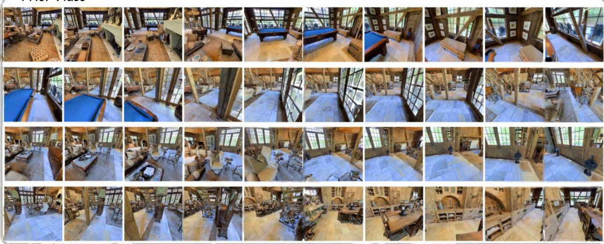

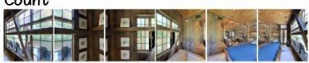  
Head to the second living room that was visited in the video and approach the statue.

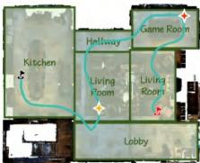

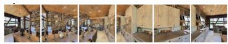  
Proceed to the living room that is nearest from the current position among the rooms visited in the video Locate the plate.

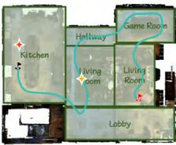

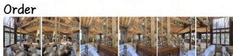  
Go to the room that was visited after arriving at the current region in the video: game room, kitchen. Locate the candle.

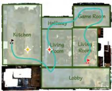

## Instance

Locate the light beige, rectangular storage basket made ofwillow twigs, resting slightly tilted on the floor near the couch and coffee table.The storage basket is in the living room,

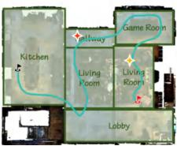

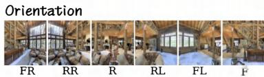  
Now facing north, head to the easternmost living room shown in the video and approach the bench.

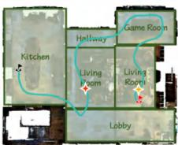  
Figure 9 Example of VCN-Bench. In the top-down map, we plot the video trajectory with a green curve, which starts from the red flag and ends at the black flag. The red and yellow stars are the markers for the initialization and target positions of each episode. “FR”, “RR”, “R”, “RL”, “FL”, “F” are the abbreviations of Front-Right, Rear-Right, Rear, Rear-Left, Front-Left, Front, respectively.

and the target room is bedroom2. (2) The visitation of bedrooms should be in a clear order. For example, bedroom1 can be visited multiple times before entering bedroom2, and it will not be revisited after leaving bedroom2.

The second subclass involves counting the number of entries into the agent’s initial room, such as “Go to the room visited immediately following the second entry into the current room in the video. Locate the mirror." For this type of instruction, (1) the initial room should be visited for at least two times.

Distance. This category involves comparing the distances between the initial position and all candidate rooms, such as “Proceed to the bathroom that is farthest from the current position among the rooms visited in the video. Locate the lamp". Take this instruction as an example: (1) there should be multiple bathrooms visited in the prior video. Assume there are bathroom1 and bathroom2 within the coverage of the prior video, with bathroom1 designated as the target room. (2) To ensure disambiguation, the geodesic distance between the initial position and the center of bathroom1 must be at least 5m larger than that between the initial position and the center of bathroom2.

Orientation. This category involves identifying the direction of candidate rooms conditioned on the initial rotation. To formulate these instructions, identifying the regions within the video coverage that are situated in the four directions is a prerequisite. In the Habitat coordinate system, we define the direction indicated by the Z-axis as south and the direction indicated by the X-axis as east. For all the regions accessed in the video, denote their horizontal bounding box as $[ x _ { m i n } , x _ { m a x } , z _ { m i n } , z _ { m a x } ]$ . Taking the south direction as an example, the maximum value of all $z _ { m a x }$ is defined as max\_Z. All rooms that meet the condition: max $Z - 5 < z _ { m a x } < = m a x \_ Z$ are regarded as candidate rooms. Within the X-axis range of a candidate room, if there is no room with its center point located further south, this room is considered to be at the southernmost part.

Take the instruction “Now facing north. Go to the easternmost closet that was visited in the video. Locate the carpet." as an example. Within the coverage of the prior video: (1) there should be at least two closets; (2) among all the easternmost rooms, there should be only one closet at the easternmost side; (3) to avoid task ambiguity, the closet cannot be located in the northeast or southeast corner.

Instance. We employ the instance descriptions in VLLN (Huang et al., 2025), where the unique identification of the target instance is achieved via the object’s inherent attributes and its relative positional relationships with surrounding objects.

## B.5 Instruction Rephrasal

We utilize Gemini-3.1-Flash to rephrase the template-generated instructions to ensure natural and open-ended language. The prompt is as follows:

Optimize the navigation instruction to enhance naturalness and task-appropriateness. The instruction is generated based on a tour video. Do not confuse the video with the agent’s own navigation history. Rather than uniformly using “locate”, the verb should be semantically aligned with the target object’s function or intended interaction—for example, “open the cabinet”, “turn on the TV”. Retain {retain\_info} information.   
Instruction: {ori\_instr}   
Rephrased Instruction:

Each instruction type contains certain crucial information that must be retained. For example, for Distance tasks, it is essential to retain the phrase "among the rooms visited in the video" to guarantee the accuracy of the task.

## B.6 Data Validation Details

To ensure data quality, we conduct human and automated validation. For tour video generation, we manually inspected all the generated videos to identify simulator-related failures, including prolonged collisions, repeated circular motion, abnormal camera behavior, or trajectories that fail to cover their intended regions. Videos containing such failures are regenerated or removed.

During instruction rephrasing, the language model may alter task-critical semantics. We implement a twolevel automated validation process. Firstly, we ensure the task-critical phrases are retained. For example, if the target room is the second bedroom visited in the video, then the “second bedroom" phrase should be retained. Secondly, we employ Gemini-3-Flash to evaluate whether the original and rephrased instructions convey identical task intent. Instructions failing either level of validation are automatically reverted to the template-based version.

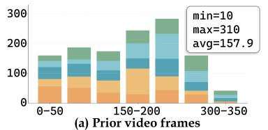

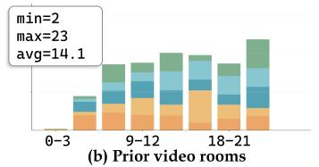

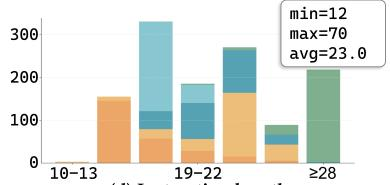  
(d) Instruction length

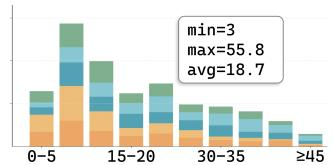  
(e) Episode distance (m)

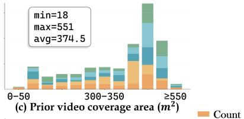

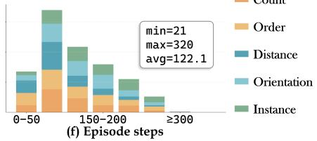  
Figure 10 Benchmark statistics, including (a) the number of prior video frames, (b) number of rooms and (c) area (the entire area of any region visited is included) covered by the prior video, (d) number of words in instructions, (e) the shortest geodesic distance, and (f) action steps of episodes.

Finally, we manually verify the unambiguity of all evaluation episodes. Two experts are provided with the prior video along with a top-down scene map with video trajectory. Besides, they are also provided with an oracle-generated navigation video showing the optimal path from the episode’s initial position to the destination. They assess whether (i) the target room or object can be uniquely determined by the instruction from the prior video, and (ii) the episode is objectively solvable (i.e.the destination is reachable).

## B.7 Dataset Statistics

As illustrated in Figure 10, we report statistics of both the prior video (i.e., frame count, number of distinct rooms traversed, and total covered floor area) and the corresponding episodes (i.e., instruction length, shortest navigation distance, and required action step count).

## B.8 Benchmark Examples

Benchmark samples are presented in Figure 9. The prior video that has been downsampled to 40 frames is displayed at the top. Examples of 5 types of instructions with corresponding egocentric observations of the agent at the initial position are shown on the right. Additionally, we visualize the top-down map of the scene, where the red and black flags represent the starting and end points of the prior video, and the green curve depicts the video trajectory. The initialization position and the destination of each episode are marked with red and yellow flags.

## C Evaluation Details

## C.1 Navigation Success Definition

Point clouds are collected at intervals of 0.1m within a range of 0.6m around the bounding box of the target objects. The points located in the same room as the target instance are retained as viewpoints. If the minimum distance between the agent’s final stopping position and all viewpoints is less than 1m, the task is considered successful. In comparison with the traditional object navigation tasks, which require the agent to stop within 1m of the object, our metric is slightly more lenient. Navigation success is uniformly defined across all models as reaching a position within 1m of the viewpoints.

## C.2 Agent Setup

For the navigation evaluation, we adopt the Hello Robot Stretch platform, which has a height of 1.41 m and a base radius of 0.17 m. The action space includes MOVE\_FORWARD (0.25m), TURN\_LEFT (30◦), TURN\_RIGHT (30◦), and STOP.

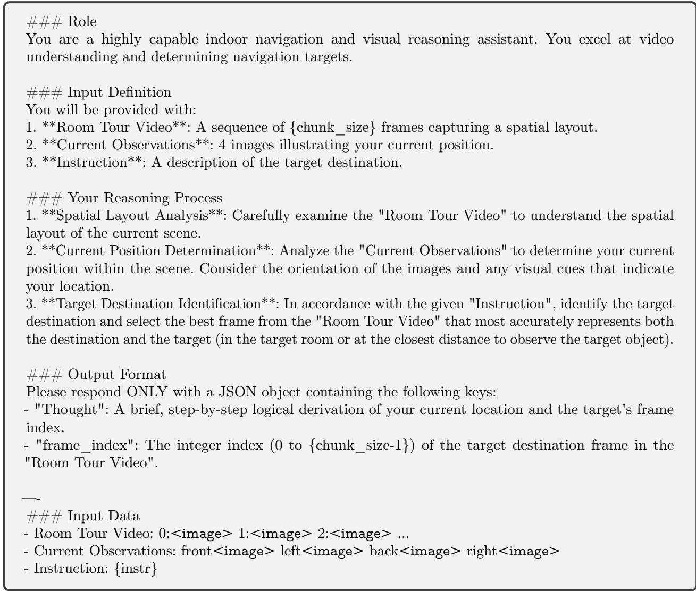  
Figure 11 Prompt for zero-shot goal identification.

## C.3 Implementation Details of Navigation Baselines

We establish two reasoning paradigms for video-contextualized navigation evaluation. The advantage of the Hierarchical paradigm lies in decoupling goal identification from navigation planning—each task is assigned to a domain-specific expert model. However, it sufers from the limitation that the navigation model cannot exploit environmental structural information embedded in the prior video. End-to-End paradigm necessitates concurrent goal identification and navigation planning, imposing more stringent demands on models’ reasoning capabilities. However, this paradigm enables the model to fully leverage scene information embedded in both the prior video and in-episode navigation history, thereby facilitating eficient navigation.

## MTU3D

MTU3D represents both detected objects and exploration frontiers as queries, and the model is trained to select a query according to the navigation instruction. The oracle executor then executes low-level actions to reach the selected query.

We apply MTU3D as the navigation expert in the hierarchical reasoning paradigm. Specifically, MTU3D is provided with the instruction and a target frame—either selected by Gemini-3-Flash-Thinking or drawn from ground-truth annotations. During evaluation, MTU3D first performs image-goal navigation toward the provided target frame. Since this frame may not be close enough to the target object, MTU3D then performs object-goal navigation, using instance descriptions for Instance tasks and object categories for other task types.

## MV-DualVLN

During image processing, all images are initially resized to 384 × 384. Qwen3-VL divides the image into $1 6 \times 1 6$ patches and applies a 2× spatial compression in the image encoder, resulting in an overall compression rate of 32. Thus, each image, after being processed by the image encoder, yields a total of 12 × 12 tokens. We conduct feature pooling on these image features and compress them into 3 × 3 tokens. Qwen3-VL also utilizes the image features of the intermediate layer; they are compressed in the same manner. Feature pooling can notably reduce the training time.

MV-DualVLN is trained for 5 epochs, with the vision encoder frozen. We adopt a learning rate of $1 \times 1 0 ^ { - 5 }$ with a cosine learning rate decay scheduler. The model is trained in bfloat16 format using 32 A100 GPUs with a batch size of 2. The training takes about 22 hours.

## 3D-Mem

3D-Mem is a zero-shot navigation framework that represents visited regions and exploration frontiers in the form of RGB images, and applies an MLLM to choose an image as the next navigation subgoal. Specifically, 3D-Mem performs object detection on all historical observations acquired during navigation, clusters detected objects according to their 3D spatial coordinates, and selects the minimal set of images that collectively encompass all detected objects—these are termed memory snapshots. Concurrently, 3D-Mem maintains an occupancy map to identify exploration frontiers, and designates observations oriented toward such frontiers as frontier snapshots.

At each navigation step, the MLLM selects a single snapshot from the unified pool of memory and frontier snapshots as the next waypoint. When a frontier snapshot is selected, it signifies the agent intends to move in that direction, and the next waypoint is set at a predefined distance along that direction. When a memory snapshot is selected, it signifies successful visual localization of the target object within that snapshot’s field of view; the next waypoint is then computed as the 3D centroid of all detected objects in the snapshot, and navigation terminates upon reaching this point. In both cases, the oracle executor is applied to execute low-level actions to reach the intended waypoint.

We evaluate 3D-Mem on VCN-Bench under two settings: (i) zero-shot inference using Qwen3-VL-8B-Instruct as the MLLM, and (ii) fine-tuned 3D-Mem initialized from Qwen3-VL-4B-Instruct. For fine-tuning, we adopt the same training protocol as MV-DualVLN: the prior video is downsampled to 50 frames, and feature pooling is applied jointly over features extracted from both the prior video and the memory snapshots.

## Uni-Navid

Uni-Navid is a video-based navigation model trained on massive navigation and video QA data. It takes in an RGB video stream and outputs low-level actions. To adapt it to VCN-Bench, we prepend the prior video to the in-episode navigation history.

## C.4 Implementation Details of Goal Identification

For consistency, all models are evaluated with a temperature of zero without output length constraints. The prompt for goal identification is presented in Figure 11.

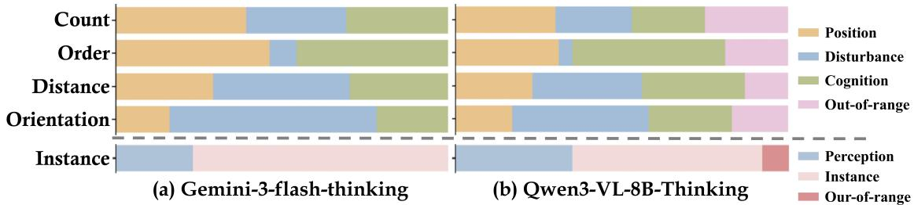  
Figure 12 Error analysis of goal identification.

## C.5 Human Evaluation

Setup. During the evaluation of human-level goal identification performance on VCN-Bench (tiny), three human evaluators are allowed unlimited time to select target frames to the best of their ability. They receive the prior video, the instruction, multi-view observations, and the initial position of the episode. They are allowed to review the prior video multiple times to fully understand the scene. Their averaged performance is reported in Table 2.

Human errors. Human errors in goal identification stem from three primary sources:

• Due to relying solely on visual input for turns and forward actions in the video, without proprioceptive feedback from physically walking through the environment, leading to errors in judging distance and direction.

• Ambiguity in initial pose localization. Observations are restricted to four static, egocentric views (front, back, left, right) from a fixed position, precluding active exploration to disambiguate room identity. For instance, when multiple visually similar closets appear in the video, and the agent initializes inside one. Without exiting the room to observe, it is easy to misidentify which closet one is currently in.

• Careless selection errors. For instance, selecting a frame where the agent is still at the doorway of the target room but has not entered yet; or overlooking some spatial descriptors (e.g., relative positions of nearby objects) specified in the instance instruction.

## D More Analysis

## D.1 MLLM Errors Analysis

To gain a more in-depth understanding of the reasons behind MLLM’s errors, we categorize and analyze the causes of errors in goal identification.

Errors in R2O goal tasks can be classified into four categories: (i) Position error, the selected frame contains the target room but is positioned outside the room. (ii) Disturbance error, the selected frame is positioned in the wrong room of the right room type. If the selected frame contains the disturbance room but is positioned outside the room, it is also classified under this error type. (iii) Cognition error, the selected frame is unrelated to the target room. (iv) Out-of-range error, the predicted frame index is larger than the frame count of the video.

For Object goal tasks, the errors can be classified into three categories: (i) Instance error, the selected frame encompasses an object belonging to the correct category, but it is not the specific object instance that the instruction is intended for. (ii) Perception error, the selected frame does not contain any object of the target category, or the object is located at an excessive distance. (iii) Out-of-range.

As presented in Figure 12, we analyse the goal identification errors of Gemini-3-flash-thinking and Qwen3-VL-8B-Thinking. Our findings are as follows:

<table><tr><td>Error type</td><td colspan="2">Reason for the error</td></tr><tr><td>Disturbance Error</td><td>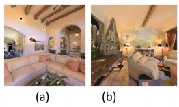</td><td>(a) is the target frame, (b) is the chosen frame—a frame from a different room of the correct room type.</td></tr><tr><td>Disturbance Error</td><td colspan="2">(a) is the target room, (b) is the chosen frame. 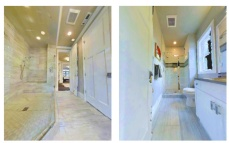 Both correspond to bathrooms. (a) (b)</td></tr><tr><td rowspan="2">Position Error</td><td>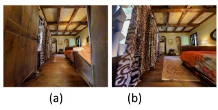</td><td rowspan="2">(b) is the correct frame, but the selected frame is (a). Although in (a) the bedroom can be clearly seen, the door and the outside wall are also clearly visible, indicating that the current position is not yet inside the bedroom.</td></tr><tr><td></td></tr></table>

Figure 13 Visualization of Disturbance and Position error.

• Gemini-3 does not exhibit Out-of-range errors, whereas the quantity of this error type in Qwen3-VL is not negligible. This indicates that Gemini-3 demonstrates a more comprehensive understanding of the input context, while Qwen3-VL encounters a considerable number of hallucination issues.

• Position errors are common across all R2O tasks. This is because a more comprehensive view of the room can typically be obtained from outside, whereas once inside, the field of vision becomes restricted. This implies that MLLM exhibits a greater reliance on directly observable information and has a relatively limited understanding of its own position and the spatial relationship between frames.

• For Distance and Orientation tasks, which necessitate selecting a target room from rooms within the same category, disturbance error is the predominant factor. For Count and Order tasks, which entail making selections among diferent types of rooms, cognition error is the primary factor. These error distributions are in line with the challenges associated with the tasks.

• Perception error is the primary error for Instance tasks. This may be because the instructions of instance tasks involve numerous relationships between the target object and other surrounding objects, leading the model to misidentify the surrounding objects as the target ones.

We visualize cases for Disturbance error and Position error in Figure 13. The case for Cognition error is depicted in Figure 14.

## D.2 Analysis on Spatial Context Utilization

In this section, we conduct three controlled experiments to investigate the capacity of MV-DualVLN in leveraging spatial context. All experiments use the same trained MV-DualVLN model and the same evaluation protocol without additional fine-tuning. The interventions modify only the information available to the model during inference, allowing us to probe destination utilization, relational sensitivity and video order sensitivity.

Navigation with Oracle target frame. In the standard MV-DualVLN setting, the model first identifies a target frame from the prior video and then predicts the next navigation waypoint. Thus, the waypoint decision explicitly conditions on the predicted target

<table><tr><td>Models</td><td>SPL</td><td>SR</td><td>RSR</td></tr><tr><td>MV-DualVLN</td><td>19.1</td><td>27.6</td><td>33.9</td></tr><tr><td>GT frame prediction</td><td>22.8</td><td>33.1</td><td>39.9</td></tr></table>

Instruction: Go to the room visited immediately following the second entry into the current room in the video. Locate the vase.

Thought: The current observations show the kitchen area with two islands and stone walls. In the room tour video, the kitchen is first entered at frame 1 and entered for a second time at frame 28. The room visited immediately following this second entry into the kitchen is the dining room area (frame 29). However, the gym (frame 31) and then a living room (frame 32) follow. Frame 22 shows a distinct silver vase in a bathroom, which is a common type of target in these tasks. Given the instruction to find the room visited after the second entry, and looking for a prominent vase, frame 22 is a strong candidate for the target object

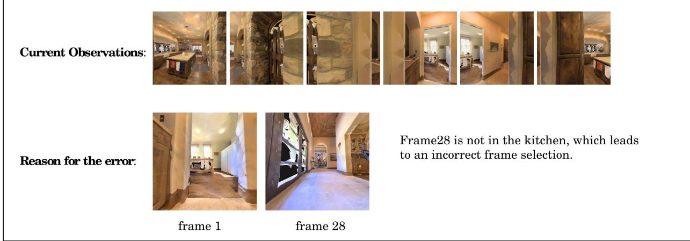  
Figure 14 Visualization of Cognition error.

frame. This motivates a question: how would navigation performance change if the target frame predictions were perfect?

Therefore, we replace the model-predicted target frame with the ground-truth target frame and provide it as the goal-frame prefix to MV-DualVLN throughout navigation. All other model inputs, visual processing, and navigation decisions remain unchanged. As shown in the table on the right, conditioning on ground-truth target frames yields nontrivial improvements in navigation performance: SPL increases by 3.7%, SR by 5.5%, and RSR by 6.0%. This suggests that correct target resolution can partially rectify erroneous navigation decisions.

Counterfactual Relation Intervention. We conduct a counterfactual intervention to examine whether MV-DualVLN is sensitive to the relational semantics specified in the instruction. For each evaluation episode, we keep the prior video, initial state, scene, and original navigation target unchanged, while replacing a task-critical spatial or temporal relation in the instruction with its contradictory counterpart. The interventions for each R2O goal instruction type are as follows:

• Count: The ordinal in the instruction (first, second, etc.) is replaced by a diferent one.

• Order: The temporal relation is reversed by swapping “before” and “after”.

• Distance: The distance relation is reversed by swapping “nearest” and “farthest”.

• Orientation: The agent’s initial orientation is maintained, while the direction of the target room (northernmost, southernmost, easternmost, or westernmost) is replaced by a diferent one.

As shown in Table 4, intervention leads to substantial performance degradation across all tasks. Particularly, SR dropped by 27.6% on Order tasks. This provides empirical evidence that MVDualVLN relies critically on the relational semantics in the instructions for reasoning.

Table 4 Navigation performance comparison on instruction types with interventions.
<table><tr><td rowspan="2"></td><td colspan="3">MV-DualVLN</td><td colspan="3">Counterfactual Relation</td><td colspan="3">Disordered Video</td></tr><tr><td>SPL</td><td>SR</td><td>RSR</td><td>SPL</td><td>SR</td><td>RSR</td><td>SPL</td><td>SR</td><td>RSR</td></tr><tr><td>Count</td><td>22.0</td><td>30.8</td><td>38.0</td><td>7.1</td><td>9.9</td><td>15.0</td><td>8.8</td><td>10.8</td><td>16.8</td></tr><tr><td>Order</td><td>23.5</td><td>34.0</td><td>40.4</td><td>4.2</td><td>6.4</td><td>10.8</td><td>7.3</td><td>10.0</td><td>15.6</td></tr><tr><td>Distance</td><td>14.1</td><td>20.8</td><td>28.2</td><td>6.5</td><td>9.2</td><td>11.6</td><td>7.8</td><td>11.6</td><td>17.2</td></tr><tr><td>Orientation</td><td>11.9</td><td>18.0</td><td>20.4</td><td>4.4</td><td>7.2</td><td>13.2</td><td>6.6</td><td>9.2</td><td>14.8</td></tr><tr><td>Instance</td><td>23.7</td><td>34.4</td><td>42.4</td><td>-</td><td>1</td><td></td><td>11.9</td><td>16.8</td><td>26.0</td></tr></table>

Video Order Sensitivity. We construct a shufled-video condition by randomly permuting the order of the frames in the prior video while keeping the frame set, frame count, visual content, and all other inputs unchanged. Table 4 shows a significant performance drop across all tasks. Notably, the decline is most severe on Count and Order—tasks intrinsically dependent on temporal coherence in video trajectories: on Count, SPL, SR, and RSR drop by 13.2%, 20.0%, and 21.2%, respectively; on Order, the corresponding decreases are 16.2%, 24.0%, and 24.8%. In contrast, Distance and Orientation—tasks primarily grounded in static geometric relationships—exhibit comparatively modest declines: on Distance, SPL, SR, and RSR decrease by 6.3%, 9.2%, and 11.0%; on Orientation, the drops are 5.3%, 8.8%, and 5.6%. We conjecture that while frame shufling eliminates temporal cues, the preserved visual content and overlapping regions across frames still supports geometric reasoning. By contrast, Instance—a task requiring precise entity-grounded resoning—sufers nontrivial degradation (SPL, SR, and RSR fall by 11.8%, 17.6%, and 16.4%), indicating that fine-grained positional reasoning between objects and their immediate surroundings depends on intact spatiotemporal structure, which is disrupted when frame order is randomized.

## D.3 Qualitative Results of MV-DualVLN

We present three visualization samples of MV-DualVLN results in Figures 15 to 17. As shown, during navigation, MV-DualVLN clearly determines the next waypoint via pixel-goal and locates the target object in the final step.

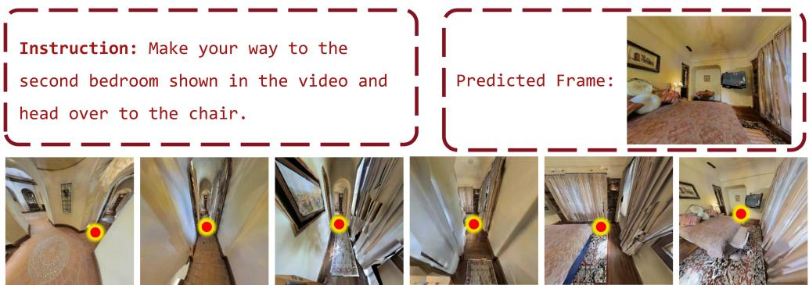  
Figure 15 MV-DualVLN visualization example.

## E Limitations and Future Work

Firstly, since we focus on evaluating spatial reasoning capabilities grounded in prior visual experience, VCN-Bench is constructed from static Matterport3D scans and assumes that the scene remains unchanged between the prior-video and navigation phases. Real environments may contain moving people, displaced objects, and temporary obstacles. Most VCN-Bench episodes focus on Room-to-Object goals and room-level relations that are relatively stable over time; nevertheless, environmental changes may invalidate object-level evidence and alter local traversability. Handling such changes requires agents to detect outdated context and revise their decisions accordingly, which is outside the scope of the current benchmark.

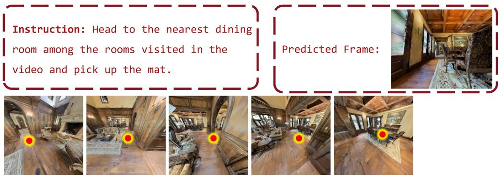  
Figure 16 MV-DualVLN visualization example.

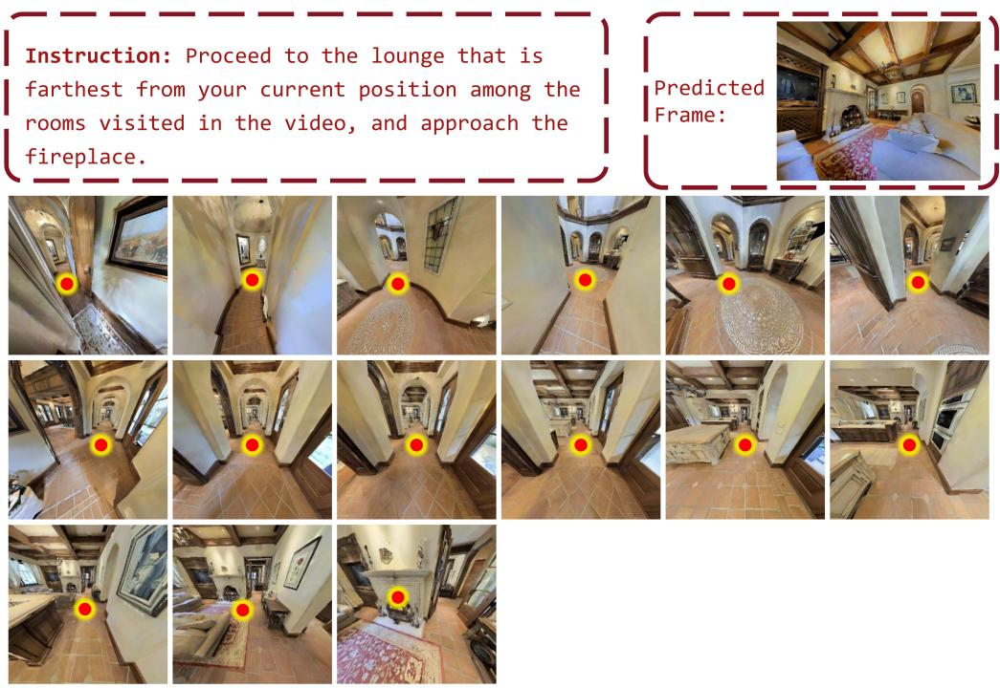  
Figure 17 MV-DualVLN visualization example.

Secondly, our model coverage remains limited, particularly for proprietary MLLMs, due to API costs and heterogeneous visual-input constraints. Some APIs accept substantially fewer frames than the average prior video in VCN-Bench, and aggressive downsampling may remove destination evidence or disrupt the trajectory structure required by the instructions.

Finally, the prior video in VCN-Bench comprehensively covers the navigation initial position and target destination. However, real-world scenarios may provide only partial environmental observations—requiring agents to perform eficient exploration under information constraints.

In future work, we will extend task design to rigorously evaluate models’ reasoning over both known and unknown spatial regions under partial environmental priors. At model level, we will investigate diverse visual experience representations—including textual scene descriptions and structured scene graphs—to enhance memory compression and spatial understanding.

## F Social Impact

Our work presents VCN-Bench, a foundational benchmark for evaluating closed-loop spatial reasoning over prior visual experience of MLLMs in embodied navigation. It primarily drives progress in multimodal embodied intelligence and has clear positive societal values, while also carrying potential limited negative impacts that require attention and mitigation.

Advances in spatial intelligence evaluated by VCN-Bench directly benefit home service robots, assistive robots for the elderly and people with disabilities, and indoor autonomous devices. By improving MLLMs’ spatial reasoning and navigation capabilities, these robots can better perform daily assistance tasks (e.g., fetching objects, indoor guidance), enhancing quality of life and social inclusivity.

However, since VCN-Bench is built on Matterport3D, which mainly covers Western-style indoor scenes. This bias may lead MLLMs trained/evaluated on this benchmark to perform poorly in non-Western architectural layouts, accessible housing, or minority living environments, creating unfair navigation service for specific groups.

## G License and Access

As mentioned in the main paper, our real-world scene data is sourced from Matterport3D (Chang et al., 2018). To access and use these datasets, users should follow the original licenses https://kaldir.vc.in.tum. de/matterport/MP\_TOS.pdf, and ask their oficial hosts for authorization. Additionally, our annotated data comes from EmbodiedScan (Wang et al., 2024), access to these datasets requires submitting a request via a Google Form https://docs.google.com/forms/d/e/1FAIpQLScUXEDTksGiqHZp31j7Zp7zlCNV7p\_ 08uViwP\_Nbzfn3g6hhw/viewform and following the license attached to the form.