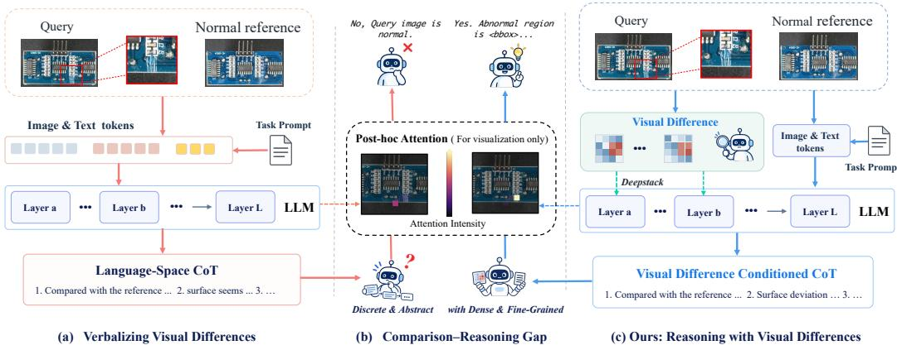
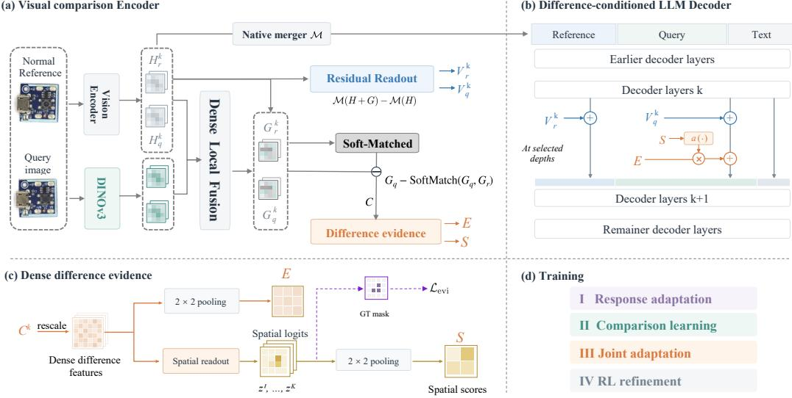
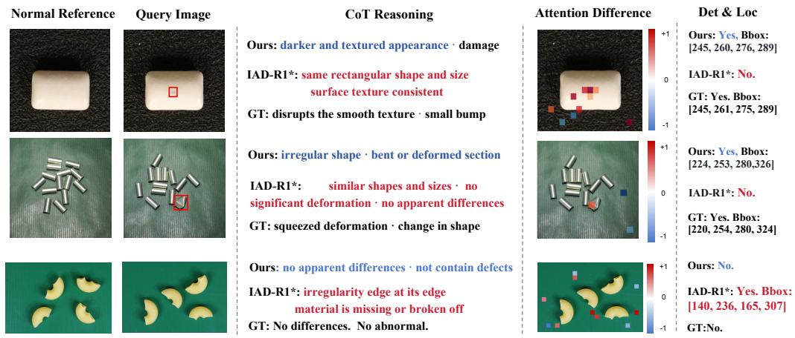
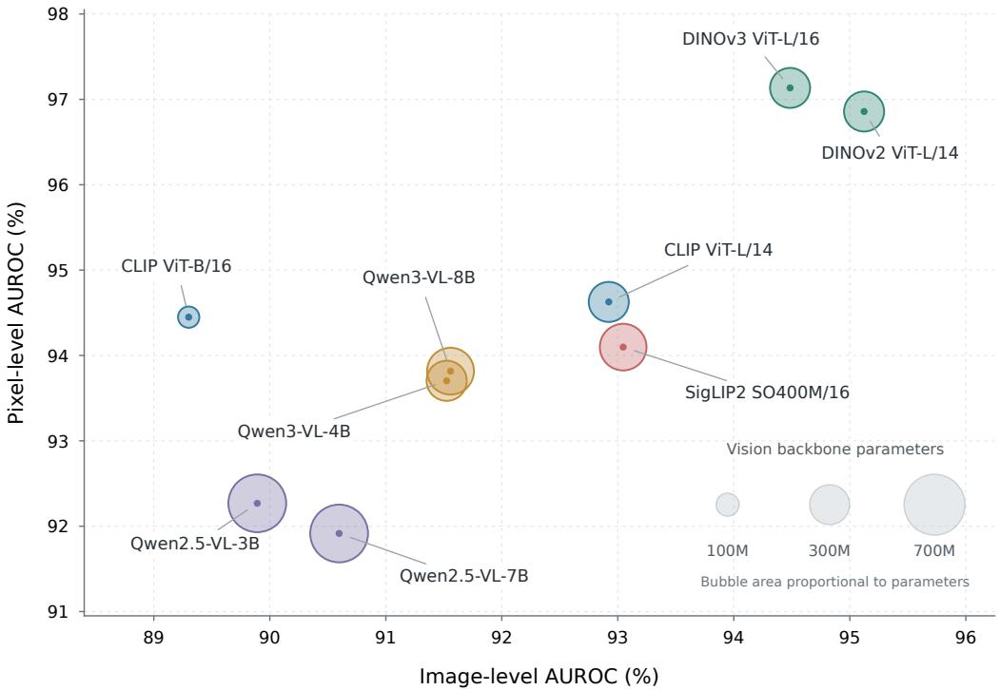
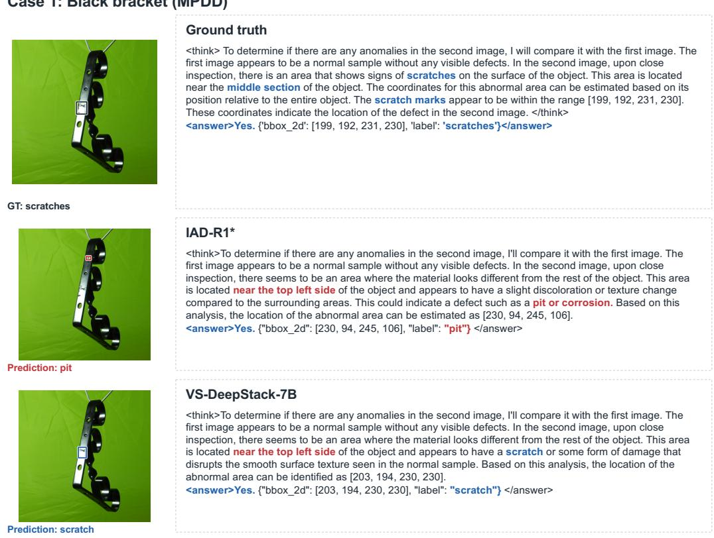
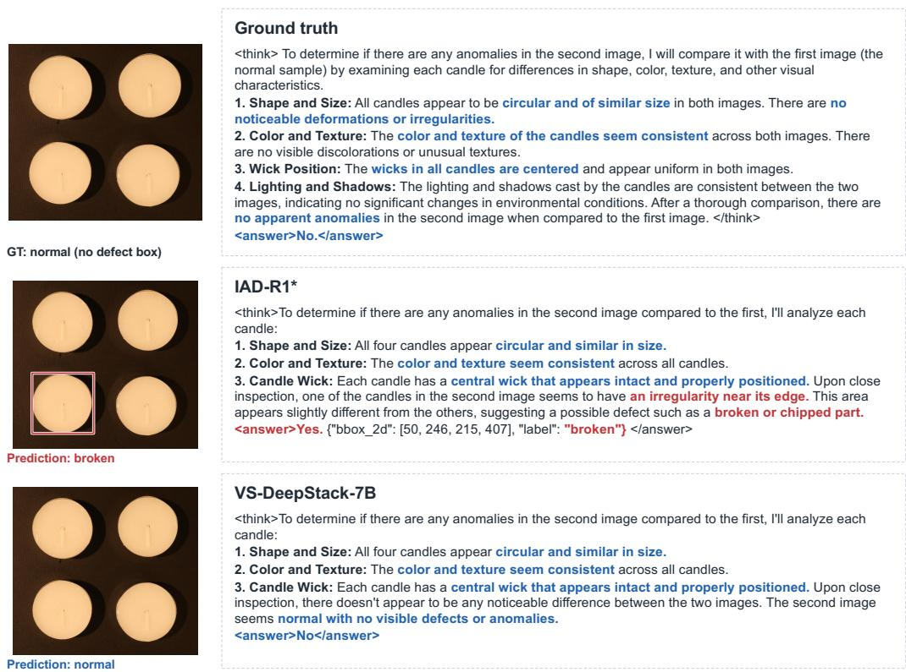
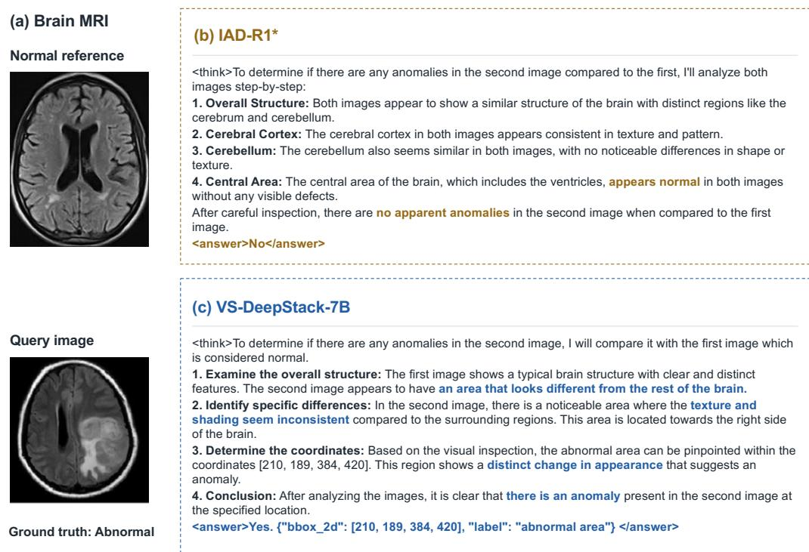

# VD-DEEPSTACK: BRIDGING VISUAL COMPARISON AND LANGUAGE REASONING FOR FEW-SHOT ANOMALY DETECTION

Mengyang Zhao1 Zhuolin He1 Haiyang Yu1 Yuxuan Liang1 Yifang Xu1 Yuchuan Wu1 Xiaolei Chen1 Zhengtao Yao3 Fan Shi4 Yang Liu2 Bin Li1 Xiangyang Xue1

1Fudan University 2Tongji University 3University of Southern California 4Fuzhou University

## ABSTRACT

Few-shot visual anomaly detection is fundamentally a visual comparison task, requiring fine-grained inspection of a query against normal references. Many recent methods based on large vision-language models (LVLMs) emphasize comparative reasoning through language chain-of-thought. Yet discrete, abstract descriptions may underrepresent dense, fine-grained visual differences, leaving a gap between visual comparison and its expression in language. To address this gap, we propose Visual Difference DeepStack (VD-DeepStack), which explicitly conditions language reasoning on query–reference visual differences. Specifically, we fuse DINO features with the LVLM visual hierarchy to strengthen fine-grained representations, then construct dense difference evidence from residuals between query features and softly matched reference features. The difference-evidence path injects spatially weighted difference vectors into query-image states at multiple decoder depths, while an auxiliary visual-context path provides fine-grained appearance information to support their interpretation. Experiments on 4 industrial and 2 medical anomaly benchmarks demonstrate substantial improvements in few-shot anomaly detection over baselines relying on textual comparative reasoning. These results support mitigating the visual comparison–reasoning gap through the joint design of comparison representations and their integration into the decoder. Code will be released upon acceptance.

## 1 INTRODUCTION

Reference-based few-shot visual anomaly detection is a comparison-first task: a model must identify task-relevant deviations from normal appearance using only a few normal references (Huang et al., 2022; Zhu & Pang, 2024). Whether a local mark is a defect depends on the expected texture and structure, not merely the object’s semantic category. Large vision-language models (LVLMs) extend this task beyond anomaly scoring to natural-language reasoning and interpretation. This raises a central question: how should visual comparison enter the reasoning process?

Recent methods largely address this question through reasoning supervision. IAD-R1 (Li et al., 2026) strengthens anomaly-specific chain-of-thought (CoT) reasoning, while AD-FM (Liao et al., 2026) organizes inspection into multiple reasoning stages with localization-aware rewards. Comparison is also increasingly explicit: MMR-AD (Yao et al., 2026) constructs comparative CoTs from query–reference pairs, and JUDO (Kang et al., 2026) learns juxtaposed segmentation and domainoriented reasoning. These advances demonstrate the value of comparative reasoning. However, richer descriptions of visual differences do not necessarily preserve the fine-grained information underlying those differences.

We characterize this mismatch as the visual comparison–reasoning gap. Language CoT expresses visual comparisons through discrete, semantically abstract descriptions, which may underrepresent the dense, fine-grained differences needed to distinguish anomalies from normal variation. Improving how a model describes these differences does not necessarily improve how precisely it compares local texture, structure, and appearance against a normal reference. This motivates a complementary direction: making fine-grained visual differences more directly available to language reasoning, alongside supervision on their verbal interpretation. As illustrated in Fig. 1, our aim is to move beyond talking about differences toward thinking with visual differences, while retaining language for interpretation and explanation.

  
Figure 1: Verbal comparison versus visual-difference conditioning. (a,c) Two reasoning routes using the same query–reference pair. (b) Example predictions and post-hoc attention maps, shown for interpretation only and not used as model inputs.

To address this gap, we propose Visual Difference DeepStack (VD-DeepStack). Its design is motivated by two considerations. First, informative comparison requires representations sensitive to subtle appearance differences even when the query and reference share the same object semantics. We therefore enhance the LVLM visual hierarchy with DINO features and construct dense difference evidence through soft query–reference matching. Second, we aim to make these differences directly available to the language decoder while retaining the appearance context that supports their interpretation. Building on DeepStack (Meng et al., 2024), depth-specific residual writers inject spatially weighted difference vectors into query-image states at multiple decoder depths. An auxiliary visual-context path supplies fine-grained appearance information to both images to support interpretation of the injected evidence. These updates condition subsequent autoregressive reasoning on fine-grained visual comparison without adding evidence tokens. Experiments on multiple visual anomaly benchmarks demonstrate substantial improvements in few-shot detection and localization over baselines relying on textual comparative reasoning. We further examine the contributions of the visual-context and difference-evidence paths through ablation studies. Comparisons with score-only and evidence-token variants evaluate alternative forms of visual conditioning.

## Our contributions are threefold:

• We highlight a potential visual comparison–reasoning gap: language-based descriptions may underrepresent fine-grained visual differences. Motivated by this insight, we propose VD-DeepStack, which constructs dense query–reference difference representations to condition autoregressive anomaly reasoning.

• We develop a DeepStack-based conditioning interface that injects difference evidence into query-image states through residual updates at multiple decoder depths. An auxiliary visual-context path supplies fine-grained appearance features to both reference and query states.

• We demonstrate substantial improvements over textual CoT baselines on industrial anomaly benchmarks, with additional gains on medical anomaly detection datasets supporting cross-domain generalization. Ablation studies assess the contributions of difference evidence and auxiliary visual context.

## 2 RELATED WORK

Zero- and few-shot visual anomaly detection. Traditional few-shot approaches model normal appearance through feature registration (Huang et al., 2022) or reconstruction of query features from normal supports (Fang et al., 2023). Recently, WinCLIP (Jeong et al., 2023) uses handcrafted prompt ensembles for zero-shot detection, while its few-shot extension, WinCLIP+, incorporates normalreference matching. PromptAD (Li et al., 2024) learns prompts using only normal samples for fewshot detection. For zero-shot transfer, AnomalyCLIP and AdaCLIP learn object-agnostic and hybrid prompts, respectively, on auxiliary data (Zhou et al., 2024; Cao et al., 2024). FiLo (Gu et al., 2024a) incorporates fine-grained anomaly descriptions for zero-shot detection, while FiLo++ (Gu et al., 2026) additionally supports few-shot detection through position-enhanced normal patch matching. Among methods that explicitly model visual comparison, InCTRL (Zhu & Pang, 2024) learns transferable query–reference residuals, and MetaUAS (Gao, 2024) learns change segmentation from synthetic image pairs using soft feature alignment. These comparison mechanisms primarily support anomaly scoring and segmentation. Our work investigates how spatial comparison information can also support autoregressive anomaly reasoning.

LVLM-based anomaly detection and reasoning. LVLM-based methods connect anomaly perception with natural-language interpretation. AnomalyGPT (Gu et al., 2024b) encodes predicted localization maps as learned prompt embeddings to guide anomaly judgments and dialogue. MMAD (Jiang et al., 2025) provides a benchmark for evaluating diverse anomaly-understanding capabilities. Recent methods further develop reasoning supervision. IAD-R1 (Li et al., 2026) combines anomaly-specific chain-of-thought training with reinforcement learning, while AD-FM (Liao et al., 2026) couples multi-stage inspection with classification and localization rewards. The MMR-AD dataset (Yao et al., 2026) provides query–reference comparative reasoning annotations; its accompanying Anomaly-R1 model combines supervised fine-tuning with reinforcement learning for detection and localization. JUDO (Kang et al., 2026) learns comparative explanations and anomaly segmentation expressed as patch coordinates from juxtaposed query and normal images, together with domain-oriented reasoning. These methods incorporate visual prompting, comparative explanations, and spatial supervision. VD-DeepStack explores dense query–reference difference features as an additional source of conditioning for language reasoning.

Visual conditioning for multimodal reasoning. Beyond anomaly detection, VC-STaR (Pan et al., 2026) uses contrastive visual question-answering pairs to refine training rationales. Architectural approaches investigate how visual features enter the language model. Cambrian-1 (Tong et al., 2024a) aggregates features from multiple vision encoders through spatially structured cross-attention at multiple LLM layers. DeepStack (Meng et al., 2024) injects additional visual features at multiple decoder depths without extending the input sequence. Building on this interface, VD-DeepStack supplies dense query–reference difference features alongside visual appearance features at multiple decoder depths, providing explicit comparison information for subsequent autoregressive anomaly reasoning.

## 3 METHOD

Visual Difference DeepStack (VD-DeepStack) complements language-based comparative reasoning with dense query–reference difference features. Given a query image $I _ { q } ,$ a normal reference image $I _ { r }$ from the same object category, and an instruction, the model generates a reasoning trace followed by an anomaly decision and, when applicable, defect boxes with type labels. The method first constructs dense difference features through visual fusion and reference matching, then injects them into query-image states at multiple decoder depths, with an auxiliary path supplying appearance context. Masks and boxes are used for training supervision, not as inference inputs.

## 3.1 DENSE VISUAL-DIFFERENCE EVIDENCE

Features for fine-grained comparison. Query and reference images can share the same object semantics while differing in local texture, surface appearance, or structure. To support comparison at this finer level, we supplement the LVLM’s native visual hierarchy with frozen DINOv3 features (Simeoni et al., 2025). This choice is informed by studies of visual limitations in CLIP- ´ based LVLMs and the complementary value of self-supervised visual representations (Tong et al., 2024b;a). Appendix B.2 provides a comparison of frozen visual encoders under a common anomalydetection protocol.

  
Figure 2: VD-DeepStack overview. Blue paths provide appearance context to both images; orange paths inject difference vectors $E$ only into query tokens, weighted by spatial scores $\bar { S . }$ Injection occurs during prefill without adding tokens.

Let $H _ { i } ^ { k } \in \mathbb R ^ { N _ { i } \times d _ { v } }$ denote the native pre-merger visual states of image $i \in \{ r , q \}$ at level $k ,$ and let $D _ { i } ^ { k }$ be a learned mixture of frozen DINO features on the corresponding spatial grid. At each patch location $j ,$ the native feature attends to a local DINO neighborhood $\bar { \mathcal { N } ( j ) }$

$$
\begin{array} { r } { R _ { i , j } ^ { k } = \operatorname { L o c a l A t t n } _ { k } \big ( H _ { i , j } ^ { k } , D _ { i , \mathcal { N } ( j ) } ^ { k } \big ) , \qquad G _ { i , j } ^ { k } = \frac { \alpha _ { k } } { \kappa _ { k } } R _ { i , j } ^ { k } . } \end{array}\tag{1}
$$

The fusion adapter at each level is shared by the two images. Here $\alpha _ { k }$ is a learned coefficient, and $\kappa _ { k }$ is a detached, reference-derived normalization factor shared across the pair. The resulting features $G _ { i } ^ { k }$ are used for reference comparison and visual-context construction. Feature mixing, local attention, and normalization details are given in Appendix A.

Query–reference differences. Since the query and reference need not be spatially aligned, we use soft matching to construct a reference counterpart for each query patch. Normalized feature maps $\phi _ { q } ^ { k }$ and $\phi _ { r } ^ { k }$ define a learned matching space:

$$
\begin{array} { c c } { { s _ { j m } ^ { k } = \bigl \langle \phi _ { q } ^ { k } ( G _ { q , j } ^ { k } ) , \phi _ { r } ^ { k } ( G _ { r , m } ^ { k } ) \bigr \rangle , } } & { { p _ { j m } ^ { k } = \mathrm { s o f t m a x } _ { m } ( s _ { j m } ^ { k } / \tau ) , } } \\ { { \widehat { G } _ { r \to q , j } ^ { k } = \displaystyle \sum _ { m } p _ { j m } ^ { k } G _ { r , m } ^ { k } , } } & { { C _ { j } ^ { k } = G _ { q , j } ^ { k } - \widehat { G } _ { r \to q , j } ^ { k } . } } \end{array}\tag{2}
$$

Here $\tau$ is a learned temperature. Matching weights are computed in the learned metric space, while the reference counterpart is reconstructed from the original feature vectors. Thus, $C _ { j } ^ { k }$ represents a feature-valued difference at each query location.

From these differences, we construct spatial evidence features E for decoder conditioning and a score map S for weighting their injection. We first apply a shared channel-wise modulation to the differences:

$$
Z _ { j } ^ { k } = C _ { j } ^ { k } \odot \left[ 1 + \operatorname { t a n h } f _ { \theta } \left( [ \operatorname { L N } ( C _ { j } ^ { k } ) ; \xi _ { j } ^ { k } ] \right) \right] .\tag{3}
$$

The vector $\xi _ { j } ^ { k }$ contains maximum matching similarity, normalized assignment entropy, and assignment peak. A level-specific readout predicts spatial anomaly logits:

$$
z _ { j } ^ { k } = w _ { k } ^ { \top } \operatorname { L N } _ { k } \big ( | Z _ { j } ^ { k } | \big ) + b _ { k } .\tag{4}
$$

These logits receive mask supervision during training.

To obtain evidence on the native image-token grid, we average each non-overlapping $2 \times 2$ patch cell using $\mathcal { P }$ and aggregate the $K = 4$ levels:

$$
E = \frac { 1 } { K } \sum _ { k } \mathcal { P } ( Z ^ { k } ) , \qquad S = \frac { 1 } { K } \sum _ { k } \mathcal { P } ( z ^ { k } ) .\tag{5}
$$

At each pooled query location $t , E _ { t }$ provides a difference vector, while $S _ { t }$ supplies a spatial score used to weight its injection into the decoder.

## 3.2 DEEPSTACK-CONDITIONED LANGUAGE REASONING

To support interpretation of the differences in E, we provide the decoder with these features alongside per-image appearance context. The visual-context path supplements the native image-token states of both reference and query with fine-grained appearance information, while the differenceevidence path supplies E only to query states. Both paths use residual updates at multiple decoder depths, following DeepStack (Meng et al., 2024).

Visual-context construction. For each image and visual level, we use the frozen native merger $\mathcal { M }$ to compute the change in its output induced by $G _ { i } ^ { k }$ :

$$
V _ { i } ^ { k } = \mathcal { M } ( H _ { i } ^ { k } + G _ { i } ^ { k } ) - \mathcal { M } ( H _ { i } ^ { k } ) .\tag{6}
$$

The same merger is used across images and levels. The resulting $V _ { i } ^ { k }$ supplies per-image appearance context, complementing the query–reference differences in $E .$

Multi-depth residual injection. Let $h _ { i , t } ^ { l _ { k } } \in \mathbb { R } ^ { d _ { h } }$ denote the hidden state at image i’s pooled position t, after decoder block $l _ { k }$ and before injection. For each path $b \in \{ \mathrm { c t x , e v i } \}$ , a depth-specific low-rank writer $\mathcal { T } _ { l } ^ { b } ( x ) = B _ { l } ^ { b } A _ { l } ^ { b } \mathrm { L N } _ { l } ^ { b } ( x )$ maps its input into decoder space. Spatial weights $a _ { t }$ are obtained by normalizing S within each query and applying a sigmoid. The visual-context update is applied first, followed by the weighted evidence update at query positions:

$$
\begin{array} { r l } & { \widetilde { h } _ { i , t } ^ { l _ { k } } = h _ { i , t } ^ { l _ { k } } + \mathrm { C a p } _ { \eta _ { \mathrm { c t x } } } \left( \mathcal { T } _ { l _ { k } } ^ { \mathrm { c t x } } ( V _ { i , t } ^ { k } ) ; h _ { i , t } ^ { l _ { k } } \right) , \quad i \in \{ r , q \} , } \\ & { \widehat { h } _ { q , t } ^ { l _ { k } } = \widetilde { h } _ { q , t } ^ { l _ { k } } + \mathrm { C a p } _ { \eta _ { \mathrm { e v i } } } \left( a _ { t } \mathcal { T } _ { l _ { k } } ^ { \mathrm { e v i } } ( E _ { t } ) ; \widetilde { h } _ { q , t } ^ { l _ { k } } \right) . } \end{array}\tag{7}
$$

Here $\mathrm { C a p } _ { \eta } ( u ; h )$ limits the update norm to at most $\eta \| h \| _ { 2 }$ . Each selected decoder depth receives its corresponding visual level $V ^ { k }$ and the same aggregated evidence $E _ { \mathrm { { : } } }$ , using independent writers. The updates modify existing image-token positions during multimodal prefill, providing context for subsequent autoregressive generation without adding evidence tokens. The spatial normalization, gradient handling, and clipping operations are specified in Appendix A.1.

## 3.3 TRAINING

Training combines response supervision with spatial supervision of the difference features. During response adaptation, we first fine-tune the LVLM on complete target responses. In visual comparison pretraining, we freeze the resulting LVLM and DINO and train the visual comparison modules using the unmodulated difference features C and spatial supervision. The final supervised stage, joint adaptation, optimizes the visual comparison modules, channel-wise modulator, both writer paths, and decoder LoRA adapters (Hu et al., 2022) together, while keeping the base LVLM and DINO weights frozen.

The joint objective is

$$
\mathcal { L } _ { U } = \mathcal { L } _ { \mathrm { s e q } } + \underbrace { \mathcal { L } _ { \mathrm { e v i } } + \lambda _ { m } \mathcal { L } _ { \mathrm { m a t c h } } + \lambda _ { o } \mathcal { L } _ { \mathrm { o r t h } } } _ { \mathcal { L } _ { \mathrm { v i s } } } .\tag{8}
$$

Here $\mathcal { L } _ { \mathrm { s e q } }$ is causal cross-entropy over the assistant response, including the reasoning and final answer. The evidence loss $\mathcal { L } _ { \mathrm { e v i } }$ applies Dice and focal losses to each level’s spatial logits and their mean before pooling. The matching loss ${ \mathcal { L } } _ { \mathrm { m a t c h } }$ supervises normal-region correspondences

and encourages higher best-match similarity for normal than anomalous regions. The term ${ \mathcal { L } } _ { \mathrm { o r t h } }$ regularizes the shared DINO-mixing transformations. These visual losses remain active during joint adaptation. Complete loss definitions and optimization details are provided in Appendix A.

In the RL refinement stage, we apply GRPO to the jointly adapted model, updating only the language backbone. The reward combines decision correctness, structural validity, and a localization bonus. Data selection, reward definitions, and training settings are provided in Appendix A.3.

## 4 EXPERIMENTS

## 4.1 IMPLEMENTATION DETAILS

Experiments use eight NVIDIA H200 GPUs, with Qwen2.5-VL-7B or Qwen3-VL-8B as the LVLM and frozen DINOv3 ViT-L/16 as the complementary encoder. The three supervised stages use 10%, 25%, and 100% of the training set, respectively. Stage III oversamples normal examples threefold to mitigate class imbalance. Each stage runs for one epoch over its resulting training list. Stage I fine-tunes the complete LVLM at $1 0 ^ { - 5 }$ . Stage II freezes the LVLM and trains the visual comparison modules with module-specific peak learning rates of $2 \times 1 0 ^ { - 5 } – 1 0 ^ { - 4 }$ . Stage III keeps the LVLM backbone frozen and jointly updates the visual comparison modules $( 2 \times 1 0 ^ { - 6 } – 1 0 ^ { - 5 } )$ , the channelwise modulator and both writer paths $( 2 \times 1 0 ^ { - 5 } )$ , and decoder LoRA adapters $( 1 0 ^ { - 5 } )$ . Detailed parameter groups, interface settings, and numerical constants are provided in Appendix A.

Table 1: Detection/localization (%) on four benchmarks. Bold and underline mark the best and second-best values, respectively, for detection and localization separately, including VD-DeepStack and excluding full-shot reference methods. Ties share the same rank. VD-DeepStack results include RL refinement. IAD-R1∗ is our reproduction trained and evaluated using MMR-AD data. Dashes denote unavailable results.
<table><tr><td rowspan="2">Model</td><td colspan="3">MVTec AD</td><td colspan="3">VisA</td><td colspan="3">MVTec 3D</td><td colspan="3">MPDD</td></tr><tr><td>Acc.</td><td>Recall</td><td>Prec.</td><td>Acc.</td><td>Recall</td><td>Prec.</td><td>Acc.</td><td>Recall</td><td>Prec.</td><td>Acc.</td><td>Recall</td><td>Prec.</td></tr><tr><td colspan="9">Commercial MLLMs</td><td></td><td></td><td></td></tr><tr><td>Gemini-2.5-pro</td><td>79.4/34.4</td><td></td><td>98.4/46.079.0/48.8 65.7/10.5</td><td></td><td></td><td></td><td>97.2/17.1 62.7/21.3 75.7/10.9</td><td></td><td></td><td></td><td>90.1/18.3 83.2/19.962.1/16.3 92.2/23.2 60.8/26.7</td><td></td></tr><tr><td>GPT-40</td><td>68.9/8.1</td><td>74.1/12.9</td><td>82.4/16.9</td><td>57.6/3.7</td><td>69.4/5.8</td><td>61.1/9.2</td><td>67.8/7.0</td><td>74.0/11.5</td><td>83.4/14.8</td><td>63.1/13.6</td><td></td><td>84.3/20.464.3/22.3</td></tr><tr><td>GPT-5</td><td>78.7/41.8</td><td>95.9/64.2</td><td>79.4/53.0</td><td>65.8/18.5</td><td>94.5/31.0</td><td>63.3/30.7</td><td>75.0/27.2</td><td>85.3/41.1</td><td>84.1/43.2</td><td>68.4/21.2</td><td>91.9/34.5</td><td>67.0/29.2</td></tr><tr><td>Qwen3.8-Flash</td><td>76.0/58.0</td><td>95.1/71.5</td><td>72.2/73.4</td><td>78.9/32.0</td><td>86.3/43.2</td><td>76.2/53.0</td><td>78.3/29.9</td><td>82.2/40.1</td><td>90.4/46.7</td><td>63.0/37.9</td><td>79.9/49.7</td><td>62.2/52.5</td></tr><tr><td>ChatGPT-5.6-Luna86.0/57.9</td><td></td><td>91.9/79.1</td><td>84.6/67.6</td><td>83.6/44.3</td><td>76.0/56.5</td><td>91.0/68.0</td><td>69.5/37.4</td><td></td><td>68.8/55.6 95.0/57.2</td><td>73.4/39.7</td><td>67.6/60.5</td><td>79.3/52.0</td></tr><tr><td colspan="9">Full-shot anomaly detectors (reference)</td><td></td><td></td><td></td></tr><tr><td>PaDiM</td><td>93.4/65.0</td><td>96.2/84.7</td><td>94.8/74.081.5/34.1</td><td></td><td></td><td>80.6/48.685.2/51.9</td><td></td><td></td><td></td><td>82.2/32.497.0/44.884.1/52.874.7/28.1 96.4/48.2 72.6/37.4</td><td></td><td></td></tr><tr><td>PatchCore</td><td>93.8/73.2</td><td>97.5/82.7</td><td>94.6/86.8</td><td>83.0/44.9</td><td>80.3/51.2</td><td>90.7/78.0</td><td>81.4/39.7</td><td>96.6/46.2</td><td>83.5/69.8</td><td>86.3/57.3</td><td>84.1/62.9</td><td>92.3/76.5</td></tr><tr><td>HGAD</td><td>96.2/73.2</td><td>96.1/86.3</td><td>98.3/82.4</td><td>90.6/52.7</td><td>91.5/64.0</td><td>92.1/75.5</td><td>84.5/45.5</td><td>95.4/56.6</td><td>87.6/64.8</td><td>86.5/34.2</td><td>81.8/51.6</td><td>90.2/44.2</td></tr><tr><td>Dinomaly</td><td>94.1/58.5</td><td>93.2/84.3</td><td>97.8/66.0</td><td>79.8/34.3</td><td>69.8/47.5</td><td>96.0/54.2</td><td>82.0/44.3</td><td>93.1/62.8</td><td>86.7/57.1</td><td>87.5/56.0</td><td>88.3/64.7</td><td>91.0/69.0</td></tr><tr><td>INP-Former</td><td>95.7/59.2</td><td>97.5/84.6</td><td>96.9/66.2</td><td>83.2/36.2</td><td></td><td>78.1/51.2 93.4/53.7</td><td>84.8/48.2</td><td></td><td>93.2/58.089.3/69.0</td><td>87.9/49.4</td><td></td><td>85.1/65.9 94.2/58.4</td></tr><tr><td colspan="9">Open-source MLLMs</td><td></td><td></td><td></td></tr><tr><td>Llama4-Maverick</td><td>76.1/19.9</td><td>83.2/28.4</td><td>83.5/36.2</td><td>63.8/6.7</td><td>71.6/10.3</td><td>66.2/15.4</td><td>67.1/6.1</td><td>69.1/9.6</td><td>86.7/13.9</td><td>64.1/10.0</td><td>70.7/12.7</td><td>68.8/18.0</td></tr><tr><td>Gemma3-27B</td><td>74.4/4.0</td><td>99.6/8.5</td><td>74.2/7.0</td><td>58.5/0.5</td><td>98.6/1.4</td><td>57.3/0.9</td><td>75.1/0.7</td><td>98.4/1.6</td><td>75.7/1.3</td><td>59.0/3.5</td><td>99.1/7.5</td><td>58.7/5.2</td></tr><tr><td>Qwen2.5-VL-7B</td><td>75.0/8.9</td><td>70.8/12.5</td><td>92.4/20.8</td><td>65.9/2.2</td><td>50.4/3.0</td><td>77.1/8.7</td><td>59.9/1.2</td><td>55.1/1.8</td><td>90.9/3.6</td><td>63.6/7.2</td><td>61.2/9.1</td><td>71.7/15.1</td></tr><tr><td>Qwen2.5-VL-72B</td><td>83.9/36.4</td><td>94.4/47.8</td><td>85.6/53.0</td><td>70.0/11.1</td><td>79.1/15.9</td><td>71.0/25.5</td><td>71.6/13.3</td><td>75.8/19.2</td><td>86.4/27.0</td><td>67.0/24.7</td><td>77.0/32.4</td><td>71.3/37.9</td></tr><tr><td>Qwen3-VL-8B</td><td>77.1/30.0</td><td>82.4/58.3</td><td>77.8/38.5</td><td>77.2/15.1</td><td>72.6/26.5</td><td>82.6/24.7</td><td>64.0/14.3</td><td>60.0/28.7</td><td>93.6/21.8</td><td>67.4/20.6</td><td>75.3/42.9</td><td>66.5/25.1</td></tr><tr><td>Qwen3-VL-32B</td><td>83.9/64.5</td><td>92.9/80.6</td><td>81.5/74.8</td><td>81.0/31.0</td><td>79.8/40.4</td><td>83.7/52.5</td><td>73.6/43.3</td><td>74.7/53.4</td><td>91.2/64.9</td><td>69.8/44.5</td><td>76.9/59.5</td><td>71.4/55.8</td></tr><tr><td>Qwen3.5-9B</td><td>70.9/28.1</td><td>71.3/43.3</td><td>73.9/42.7</td><td>65.4/9.4</td><td>71.4/16.1</td><td>64.9/18.9</td><td>65.5/8.5</td><td>66.5/14.0</td><td>87.9/15.3</td><td>59.6/15.5</td><td>55.7/26.0</td><td>64.0/25.6</td></tr><tr><td>Qwen3.8-27B</td><td>78.5/74.7</td><td>96.5/82.1</td><td>73.3/87.5</td><td>80.3/43.1</td><td>89.9/54.2</td><td>77.8/66.6</td><td>75.7/45.5</td><td>85.6/55.7</td><td>85.1/64.7</td><td>66.4/40.0</td><td>92.7/53.9</td><td>61.3/50.5</td></tr><tr><td>InternVL3.5-8B</td><td>76.5/5.4</td><td>81.3/9.7</td><td>85.4/10.6</td><td>67.8/2.2</td><td>66.1/3.3</td><td>72.4/5.5</td><td>65.8/1.1</td><td>66.7/1.9</td><td>86.9/2.4</td><td>64.3/4.1</td><td>64.5/5.8</td><td>69.8/8.7</td></tr><tr><td>InternVL3.5-38B</td><td>84.9/7.1</td><td>95.6/13.2</td><td>85.8/12.4</td><td>74.1/1.8</td><td>87.5/3.2</td><td>72.4/3.8</td><td>74.4/1.4</td><td>83.8/2.6</td><td>85.6/2.9</td><td>70.2/5.1</td><td>87.5/10.1</td><td>71.0/8.3</td></tr><tr><td colspan="9">Task-specific anomaly models</td><td rowspan="3"></td><td rowspan="3"></td><td rowspan="3"></td><td rowspan="3"></td><td rowspan="3">58.9/-</td></tr><tr><td>AnomalyGPT-7B</td><td>85.7/-</td><td>86.5/-</td><td>90.6/-</td><td>72.8/-</td><td>67.6/-</td><td>79.8/-</td><td>64.71-</td><td>68.6/-</td></tr><tr><td>Anomaly-R1-7B</td><td>88.8/66.3</td><td>91.9/74.2</td><td>92.8/84.2</td><td>74.9/36.4</td><td>72.3/41.2</td><td>82.7/77.3</td><td>74.6/48.5</td><td>84.6/- 73.8/56.0 92.8/78.8</td><td>67.6/- 70.8/35.9</td><td>73.2/-</td></tr><tr><td colspan="2">IAD-R1*</td><td>83.0/56.7 92.0/63.2</td><td>79.9/80.2</td><td>78.5/40.4</td><td>67.7/44.1</td><td>88.7/81.4</td><td>72.8/42.8</td><td>73.9/50.0</td><td></td><td>91.6/75.0</td><td>72.9/35.9</td><td>74.2/45.6 71.4/38.9</td><td>77.6/52.8 75.2/63.6</td></tr><tr><td>AD-FM-7B</td><td>-1-</td><td>-1-</td><td>-1-</td><td>77.41-</td><td></td><td>-1-</td><td>-1-</td><td>-1-</td><td>-1-</td><td>-1-</td><td>72.71-</td><td>-1-</td><td>X</td></tr><tr><td>VD-DeepStack-7B 91.0/66.6</td><td></td><td>93.9/74.0</td><td></td><td>93.2/85.0</td><td>82.1/47.9</td><td>79.6/52.4 86.5/83.3</td><td></td><td>76.3/51.9</td><td>73.9/55.1</td><td>98.3/79.9</td><td>78.6/54.8</td><td></td><td></td></tr><tr><td>VD-DeepStack-8B 91.0/70.4 93.2/75.8</td><td></td><td></td><td></td><td>93.0/89.7</td><td>82.7/54.9</td><td>81.3/57.6 87.5/90.7</td><td></td><td>76.6/55.7</td><td>74.2/57.8</td><td>98.1/84.0</td><td>75.2/49.872.5/54.879.3/72.1</td><td></td><td>81.1/58.2 79.3/76.4</td></tr></table>

## 4.2 DATASETS AND EVALUATION METRICS

Datasets. We use the same industrial datasets as MMR-AD (Yao et al., 2026), comprising 14 datasets: MVTec AD (Bergmann et al., 2019), MVTec 3D-AD (Bergmann et al., 2022b), VisA (Zou et al., 2022), MPDD (Jezek et al., 2021), MVTec LOCO (Bergmann et al., 2022a), GoodsAD (Zhang et al., 2024), Real-IAD (Wang et al., 2024), Real-IAD D3 (Zhu et al., 2025), MANTA (Fan et al., 2025), MIAD (Bao et al., 2023), CableInspect-AD (Arodi et al., 2024), WFDD (Chen et al., 2024), Texture-AD (Lei et al., 2024), and 3CAD (Yang et al., 2025). We evaluate on four industrial benchmarks: MVTec AD, MVTec 3D-AD, VisA, and MPDD. We evaluate VD-DeepStack under a 1-shot reference setting: each query image is paired with one normal reference image from the same object category. For each industrial test benchmark, the entire benchmark is excluded from training.

To assess cross-domain generalization from industrial inspection to medical imaging, we additionally evaluate on HeadCT and BrainMRI, which have been used as medical anomaly detection benchmarks (Salehi et al., 2021). Both datasets provide image-level labels but lack pixel-level anomaly masks, and are therefore used only for image-level anomaly detection. HeadCT and BrainMRI are also evaluated under a 1-shot reference setting.

Evaluation metrics. Following MMR-AD (Yao et al., 2026), we report accuracy, recall, and preci sion for both image-level anomaly detection and bounding-box localization. Image-level predictions are obtained from the model-generated normal/abnormal decisions, with anomalous images treated as the positive class. For localization, we follow MMR-AD and count a predicted bounding box as correct when its intersection over union (IoU) with a ground-truth box is at least 0.1. This relatively permissive threshold measures coarse anomaly localization rather than precise box alignment. For each industrial benchmark, we average results across its categories. HeadCT and BrainMRI are evaluated only using the image-level detection metrics.

## 4.3 MAIN RESULTS

Compared methods. Table 1 compares VD-DeepStack with commercial LVLMs, including Gemini and GPT models, and open-source LVLMs from the Llama, Gemma, InternVL, and Qwen families. We also include task-specific anomaly models: AnomalyGPT (Gu et al., 2024b), Anomaly-R1 (Yao et al., 2026), IAD-R1 (Li et al., 2026), and AD-FM (Liao et al., 2026). IAD-R1∗ denotes our reproduction of IAD-R1, retrained and evaluated using MMR-AD data. Anomaly-R1 is particularly relevant to our comparison because it learns anomaly reasoning from query–reference comparative annotations. PaDiM, PatchCore, HGAD, Dinomaly, and INP-Former are additionally reported as full-shot reference methods under a different training setting.

Table 2: Ablation of visual-difference conditioning. Entries report detection/localization (%) at localization IoU≥0.1. Ctx and Evi denote the visual-context and difference-evidence paths. All variants except VD-DeepStack-7B are trained without RL. Bold marks the best result among the variants without RL.
<table><tr><td rowspan="2">Variant</td><td colspan="3">VisA</td><td colspan="3">MVTec 3D</td></tr><tr><td>Acc.</td><td>Rec.</td><td>Prec.</td><td>Acc.</td><td>Rec.</td><td>Prec.</td></tr><tr><td>Baseline</td><td>78.0/38.3</td><td>66.5/42.0</td><td>91.5/81.6</td><td>70.4/38.7</td><td>67.7/45.4</td><td>93.0/72.5</td></tr><tr><td>w/o Evi</td><td>78.9/43.4</td><td>69.6/46.9</td><td>90.4/84.0</td><td>67.7/43.2</td><td>64.7/47.2</td><td>97.3/75.1</td></tr><tr><td>E-tokens</td><td>78.3/41.0</td><td>67.3/44.7</td><td>91.7/82.2</td><td>71.9/44.8</td><td>69.0/48.6</td><td>94.9/75.7</td></tr><tr><td>S-only</td><td>79.7/44.3</td><td>69.3/47.5</td><td>92.8/86.3</td><td>72.4/47.0</td><td>68.7/50.6</td><td>95.9/78.6</td></tr><tr><td>w/o Čtx</td><td>81.8/45.2</td><td>76.3/49.6</td><td>91.1/81.7</td><td>74.2/48.6</td><td>70.7/52.6</td><td>96.2/78.9</td></tr><tr><td>w/o Ctx &amp; DINO</td><td>79.6/40.8</td><td>67.6/44.4</td><td>90.1/81.5</td><td>70.3/43.2</td><td>67.9/47.5</td><td>97.1/74.6</td></tr><tr><td>VD-DeepStack-7B w/o RL</td><td>81.4/46.4</td><td>76.6/50.6</td><td>90.4/82.4</td><td>75.8/50.0</td><td>72.4/53.8</td><td>96.6/79.5</td></tr><tr><td>VD-DeepStack-7B</td><td>82.1/47.9</td><td>79.6/52.4</td><td>86.5/83.3</td><td>76.3/51.9</td><td>73.9/55.1</td><td>98.3/79.9</td></tr></table>

Detection and localization performance. VD-DeepStack-7B improves both detection and localization accuracy over Anomaly-R1-7B on all four benchmarks. Averaged equally across the four benchmarks, it achieves 82.0% detection accuracy and 55.3% localization accuracy, exceeding

Anomaly-R1-7B by 4.7 and 8.5 percentage points, respectively. The gains are particularly pronounced on VisA and MPDD: detection accuracy increases by 7.2 and 7.8 points, while localization accuracy improves by 11.5 and 18.9 points. On both datasets, localization recall and precision also improve, showing that the gains extend to both measures of region prediction. The 7B variant also exceeds IAD-R1∗ on both accuracy measures across all four benchmarks, with average gains of 5.2 and 11.4 points. Relative to the general-purpose LVLMs in the table, the 7B variant achieves higher localization accuracy on VisA, MVTec 3D, and MPDD, although individual general-purpose models remain stronger on some detection metrics. Under the adopted IoU threshold, these results demonstrate improvements in identifying anomalous images and coarsely localizing their defects.

Results across LVLM backbones. Both the Qwen2.5-VL-7B and Qwen3-VL-8B instantiations improve detection and localization accuracy over their respective base LVLMs on every benchmark. The 8B variant achieves localization accuracies of 54.9% on VisA and 55.7% on MVTec 3D, the highest reported values in the table for these two benchmarks. The 7B variant remains stronger on MPDD, indicating that the relative performance of the two instantiations depends on the dataset. Together, these results support the effectiveness of VD-DeepStack across both backbones and are consistent with our motivation to make visual comparison explicitly available to language reasoning. The contributions of the individual components are examined in Table 2.

## 4.4 ABLATION STUDIES

Table 2 compares visual-conditioning variants without RL and reports the complete model after RL refinement. Baseline removes both paths; w/o Evi removes evidence injection, while w/o Ctx removes context injection but retains the upstream comparison features. w/o Ctx & DINO additionally removes DINO and constructs difference evidence from native Qwen visual features. With context retained, S-only feeds only S to the evidence writers, whereas E-tokens encodes E and S as 16 context tokens in place of deep evidence injection. VD-DeepStack-7B w/o RL retains both paths after joint adaptation; VD-DeepStack-7B additionally includes RL refinement.

VD-DeepStack-7B w/o RL improves detection/localization accuracy over w/o Evi by 2.5/3.0 points on VisA and 8.1/6.8 on MVTec 3D, and also exceeds S-only on both datasets. Its localization accuracy surpasses E-tokens by 5.4 and 5.2 points, although this comparison changes both spatial compression and the injection interface.

Table 3: Cross-domain anomaly detection performance on medical datasets (%). Results are means over five 1-shot runs with different normal reference images; standard deviations are shown where available. Average denotes the unweighted mean across the two datasets.
<table><tr><td rowspan="2">Model</td><td colspan="3">BrainMRI</td><td colspan="3">HeadCT</td><td colspan="3">Average</td></tr><tr><td>Acc.</td><td>Recall</td><td>Prec.</td><td>Acc.</td><td>Recall</td><td>Prec.</td><td>Acc.</td><td>Recall</td><td>Prec.</td></tr><tr><td>Qwen3.8-Flash</td><td>71.4±4.7</td><td>88.1±2.6</td><td>71.9±4.2</td><td>50.5±2.2</td><td>86.4±2.1</td><td>50.3±1.3</td><td>60.9</td><td>87.3</td><td>61.1</td></tr><tr><td>Qwen3.8-27B</td><td>50.4±7.3</td><td>39.2±10.5</td><td>65.8±9.1</td><td>53.6±2.2</td><td>13.8±4.7</td><td>68.1±8.6</td><td>52.0</td><td>26.5</td><td>67.0</td></tr><tr><td>IAD-R1*</td><td>78.7±5.6</td><td>92.4±1.0</td><td>77.6±5.4</td><td>73.5±4.0</td><td>97.0±2.5</td><td>66.2±3.6</td><td>76.1</td><td>94.7</td><td>71.9</td></tr><tr><td>VD-DeepStack-7B</td><td>83.9±2.4</td><td>94.3±0.8</td><td>82.2±2.9</td><td>77.1±2.0</td><td>95.8±1.6</td><td>69.8±2.1</td><td>80.5</td><td>95.1</td><td>76.0</td></tr><tr><td>VD-DeepStack-8B</td><td>87.7±1.2</td><td>98.5±0.7</td><td>84.2±1.6</td><td>77.0±3.8</td><td>99.8±0.4</td><td>68.8±3.7</td><td>82.3</td><td>99.1</td><td>76.5</td></tr></table>

With context injection disabled, DINO-enhanced comparison features improve detection/localization accuracy over native Qwen features by 2.2/4.4 points on VisA and 3.9/5.4 on MVTec 3D. Visual context adds 1.2 and 1.4 points in localization accuracy, with mixed detection effects. These results suggest that feature-valued differences provide useful information beyond spatial scores alone. Removing evidence injection produces larger localization drops than removing context on both datasets, supporting the importance of the difference path while showing that appearance context can further improve localization when difference evidence is retained. Relative to VD-DeepStack-7B w/o RL, VD-DeepStack-7B improves detection/localization accuracy on both datasets, with a detection recall–precision trade-off on VisA.

Table 4: Quality of generated CoT reasoning scored by GLM-5.3-Flash (0–100; higher is better). The judge compares CoT text with ground-truth annotations, excluding final answers. Abn./Norm. denote abnormal/normal samples. Overall is the mean score over all evaluated samples. Bold indicates the best score in each column.
<table><tr><td rowspan="2">Model</td><td colspan="2">MVTec AD</td><td colspan="2">MVTec 3D</td><td colspan="2">VisA</td><td colspan="2">MPDD</td><td rowspan="2">Overall</td></tr><tr><td>Abn.</td><td>Norm.</td><td>Abn.</td><td>Norm.</td><td>Abn.</td><td>Norm.</td><td>Abn.</td><td>Norm.</td></tr><tr><td>IAD-R1*</td><td>69.9</td><td>75.9</td><td>51.2</td><td>81.9</td><td>49.8</td><td>90.1</td><td>58.2</td><td>73.9</td><td>68.3</td></tr><tr><td>Qwen3.8-Flash</td><td>74.7</td><td>57.5</td><td>58.1</td><td>61.4</td><td>62.4</td><td>72.2</td><td>66.5</td><td>57.7</td><td>65.6</td></tr><tr><td>VD-DeepStack-7B</td><td>68.1</td><td>86.1</td><td>55.6</td><td>86.6</td><td>56.2</td><td>87.8</td><td>60.0</td><td>74.4</td><td>69.4</td></tr></table>

## 4.5 GENERALIZATION AND REASONING QUALITY

Cross-domain detection. VD-DeepStack’s gains extend from industrial inspection to medical imaging under 1-shot evaluation (Table 3). The 7B and 8B variants achieve dataset-averaged accuracies of 80.49% and 82.3%, respectively, exceeding IAD-R1∗ (76.08%), Qwen3.8-Flash (60.94%), and Qwen3.8-27B (51.98%). Both variants improve accuracy and precision over IAD-R1∗ on each dataset, while the 8B variant achieves an average recall of 99.1% with an average precision of 76.5%.

Quality of CoT reasoning. To assess CoT quality under visual-difference conditioning, we use GLM-5.3-Flash to evaluate the semantic consistency of generated CoTs with ground-truth annotations, excluding final answers. The scoring protocol is provided in Appendix B.4. In Table 4, VD-DeepStack-7B achieves the highest overall score (69.4), exceeding IAD-R1∗ on six of eight subsets, while Qwen3.8-Flash scores higher on abnormal samples.

  
Figure 3: Qualitative comparison with IAD-R1∗. Attention is extracted from the token position immediately preceding the final answer, after reasoning, to query-image tokens and averaged over the last four LLM layers. Attention differences are computed as VD-DeepStack minus IAD-R1∗; red and blue indicate increased and decreased attention, respectively.

## 4.6 QUALITATIVE ANALYSIS

Figure 3 connects visual attention with generated descriptions and predictions. In the two anomalous examples, attention increases relative to IAD-R1∗ overlap the texture defect and crushed component. These changes at the pre-answer position align with VD-DeepStack’s descriptions of altered texture and deformation, and its predicted boxes closely match GT. IAD-R1∗ instead emphasizes overall shape similarity and misses both defects. On normal pasta, the baseline mistakes an intact edge for missing material, whereas VD-DeepStack correctly reports no defect; the attention differences are more spatially dispersed. On normal pasta, the baseline mistakes an intact edge for missing material, whereas VD-DeepStack correctly reports no defect; the attention differences are more spatially dispersed. In these abnormal examples, VD-DeepStack attends more strongly to the defect regions than IAD-R1∗.

## 5 CONCLUSION

Motivated by a potential visual comparison–reasoning gap, we introduced VD-DeepStack for fewshot anomaly detection. The framework constructs dense query–reference difference evidence and injects it into existing query-image states through residual updates at multiple decoder depths, without adding evidence tokens. An auxiliary visual-context path supplies appearance features to both reference and query states. Experiments with two LVLM backbones demonstrate detection and localization gains across four industrial benchmarks, with additional detection gains on two medical datasets supporting cross-domain generalization. Ablations support the value of difference vectors beyond spatial scores alone, while CoT evaluation indicates improved overall semantic agreement with ground-truth annotations. Together, these findings suggest that connecting fine-grained visual comparison with language reasoning benefits from the joint design of difference representations and their integration into the decoder.

## AI USE STATEMENT

The authors used ChatGPT (OpenAI) for language polishing and suggestions on figure layout and presentation. The research methodology, experiments, analysis, and conclusions were independently developed and verified by the authors.

## REFERENCES

Akshatha Arodi, Margaux Luck, Jean-Luc Bedwani, Aldo Zaimi, Ge Li, Nicolas Pouliot, Julien Beaudry, and Gaetan Marceau-Caron. Cableinspect-ad: An expert-annotated anomaly detection´ dataset. In Advances in Neural Information Processing Systems 37: Annual Conference on Neural Information Processing Systems 2024, NeurIPS 2024, Vancouver, BC, Canada, December 10 - 15, 2024, 2024. URL http://papers.nips.cc/paper\_files/paper/ 2024/hash/76d9dd096d9469d6b7e732f0cddb51b3-Abstract-Datasets\_ and\_Benchmarks\_Track.html.

Tianpeng Bao, Jiadong Chen, Wei Li, Xiang Wang, Jingjing Fei, Liwei Wu, Rui Zhao, and Ye Zheng. MIAD: A maintenance inspection dataset for unsupervised anomaly detection. In IEEE/CVF International Conference on Computer Vision, ICCV 2023 - Workshops, Paris, France, October 2-6, 2023, pp. 993–1002. IEEE, 2023. doi: 10.1109/ICCVW60793.2023.00106. URL https: //doi.org/10.1109/ICCVW60793.2023.00106.

Paul Bergmann, Michael Fauser, David Sattlegger, and Carsten Steger. Mvtec AD - A comprehensive real-world dataset for unsupervised anomaly detection. In IEEE Conference on Computer Vision and Pattern Recognition, CVPR 2019, Long Beach, CA, USA, June 16-20, 2019, pp. 9592–9600. Computer Vision Foundation / IEEE, 2019. doi: 10.1109/CVPR.2019.00982. URL http://openaccess.thecvf.com/content\_CVPR\_2019/html/Bergmann\_ MVTec\_AD\_--\_A\_Comprehensive\_Real-World\_Dataset\_for\_Unsupervised\_ Anomaly\_CVPR\_2019\_paper.html.

Paul Bergmann, Kilian Batzner, Michael Fauser, David Sattlegger, and Carsten Steger. Beyond dents and scratches: Logical constraints in unsupervised anomaly detection and localization. Int. J. Comput. Vis., 130(4):947–969, 2022a. doi: 10.1007/S11263-022-01578-9. URL https: //doi.org/10.1007/s11263-022-01578-9.

Paul Bergmann, Xin Jin, David Sattlegger, and Carsten Steger. The mvtec 3d-ad dataset for unsupervised 3d anomaly detection and localization. In Giovanni Maria Farinella, Petia Radeva, and Kadi Bouatouch (eds.), Proceedings ofthe 17th International Joint Conference on Computer Vision, Imaging and Computer Graphics Theory and Applications, VISIGRAPP 2022, Volume 5: VISAPP, Online Streaming, February 6-8, 2022, pp. 202–213. SCITEPRESS, 2022b. doi: 10.5220/0010865000003124. URL https://doi.org/10.5220/0010865000003124.

Yunkang Cao, Jiangning Zhang, Luca Frittoli, Yuqi Cheng, Weiming Shen, and Giacomo Boracchi. Adaclip: Adapting clip with hybrid learnable prompts for zero-shot anomaly detection. In European Conference on Computer Vision, 2024. doi: 10.1007/978-3-031-72761-0 4.

Qiyu Chen, Huiyuan Luo, Chengkan Lv, and Zhengtao Zhang. A unified anomaly synthesis strategy with gradient ascent for industrial anomaly detection and localization. In Ales Leonardis, Elisa Ricci, Stefan Roth, Olga Russakovsky, Torsten Sattler, and Gul Varol (eds.),¨ Computer Vision - ECCV 2024 - 18th European Conference, Milan, Italy, September 29-October 4, 2024, Proceedings, Part LXVII, volume 15125 of Lecture Notes in Computer Science, pp. 37–54. Springer, 2024. doi: 10.1007/978-3-031-72855-6\ 3. URL https://doi.org/10.1007/ 978-3-031-72855-6\_3.

Lei Fan, Dongdong Fan, Zhiguang Hu, Yiwen Ding, Donglin Di, Kai Yi, Maurice Pagnucco, and Yang Song. MANTA: A large-scale multi-view and visual-text anomaly detection dataset for tiny objects. In IEEE/CVF Conference on Computer Vision and Pattern Recognition, CVPR 2025, Nashville, TN, USA, June 11-15, 2025, pp. 25518–25527. Computer Vision Foundation / IEEE, 2025. doi: 10.1109/CVPR52734.2025.02376. URL https://openaccess.thecvf.com/ content/CVPR2025/html/Fan\_MANTA\_A\_Large-Scale\_Multi-View\_and\_ Visual-Text\_Anomaly\_Detection\_Dataset\_for\_CVPR\_2025\_paper.html.

Zheng Fang, Xiaoyang Wang, Haocheng Li, Jiejie Liu, Qiugui Hu, and Jimin Xiao. Fastrecon: Few-shot industrial anomaly detection via fast feature reconstruction. In Proceedings of the IEEE/CVF International Conference on Computer Vision, pp. 17481–17490, 2023. doi: 10.1109/ICCV51070.2023.01603.

Bin-Bin Gao. Metauas: Universal anomaly segmentation with one-prompt meta-learning. In Advances in Neural Information Processing Systems, volume 37, pp. 39812–39836, 2024.

Zhaopeng Gu, Bingke Zhu, Guibo Zhu, Yingying Chen, Hao Li, Ming Tang, and Jinqiao Wang. Filo: Zero-shot anomaly detection by fine-grained description and high-quality localization. In Proceedings of the 32nd ACM International Conference on Multimedia, 2024a. doi: 10.1145/ 3664647.3680685.

Zhaopeng Gu, Bingke Zhu, Guibo Zhu, Yingying Chen, Ming Tang, and Jinqiao Wang. Anomalygpt: Detecting industrial anomalies using large vision-language models. Proceedings of the AAAI Conference on Artificial Intelligence, 38(3):1932–1940, 2024b. doi: 10.1609/aaai.v38i3. 27963.

Zhaopeng Gu, Bingke Zhu, Guibo Zhu, Yingying Chen, Ming Tang, and Jinqiao Wang. Filo++: Zero-/few-shot anomaly detection by fused fine-grained descriptions and deformable localization. IEEE Transactions on Circuits and Systems for Video Technology, 36(7):9616–9630, 2026. doi: 10.1109/TCSVT.2026.3671805.

Edward J. Hu, Yelong Shen, Phillip Wallis, Zeyuan Allen-Zhu, Yuanzhi Li, Shean Wang, Lu Wang, and Weizhu Chen. Lora: Low-rank adaptation of large language models. In The Tenth International Conference on Learning Representations, ICLR 2022, Virtual Event, April 25-29, 2022. OpenReview.net, 2022. URL https://openreview.net/forum?id=nZeVKeeFYf9.

Chaoqin Huang, Haoyan Guan, Aofan Jiang, Ya Zhang, Michael Spratling, and Yanfeng Wang. Registration based few-shot anomaly detection. In European Conference on Computer Vision, 2022. doi: 10.1007/978-3-031-20053-3 18.

Jongheon Jeong, Yang Zou, Taewan Kim, Dongqing Zhang, Avinash Ravichandran, and Onkar Dabeer. Winclip: Zero-/few-shot anomaly classification and segmentation. In Proceedings of the IEEE/CVF Conference on Computer Vision and Pattern Recognition, pp. 19606–19616, 2023. doi: 10.1109/CVPR52729.2023.01878.

Stepan Jezek, Martin Jonak, Radim Burget, Pavel Dvorak, and Milos Skotak. Deep learningbased defect detection of metal parts: evaluating current methods in complex conditions. In 13th International Congress on Ultra Modern Telecommunications and Control Systems and Workshops, ICUMT 2021, Brno, Czech Republic, October 25-27, 2021, pp. 66–71. IEEE, 2021. doi: 10.1109/ICUMT54235.2021.9631567. URL https://doi.org/10.1109/ ICUMT54235.2021.9631567.

Xi Jiang, Jian Li, Hanqiu Deng, Yong Liu, Bin-Bin Gao, Yifeng Zhou, Jialin Li, Chengjie Wang, and Feng Zheng. Mmad: A comprehensive benchmark for multimodal large language models in industrial anomaly detection. In International Conference on Learning Representations, 2025.

Hyunju Kang, Woohyun Lee, Jaewon Kim, and Hogun Park. JUDO: A juxtaposed domain-oriented multimodal reasoner for industrial anomaly QA. In The Fourteenth International Conference on Learning Representations, 2026.

Tianwu Lei, Bohan Wang, Silin Chen, Shurong Cao, and Ningmu Zou. Texture-ad: An anomaly detection dataset and benchmark for real algorithm development. CoRR, abs/2409.06367, 2024. doi: 10.48550/ARXIV.2409.06367. URL https://doi.org/10.48550/arXiv.2409. 06367.

Xiaofan Li, Zhizhong Zhang, Xin Tan, Chengwei Chen, Yanyun Qu, Yuan Xie, and Lizhuang Ma. Promptad: Learning prompts with only normal samples for few-shot anomaly detection. In Proceedings of the IEEE/CVF Conference on Computer Vision and Pattern Recognition, pp. 16838– 16848, 2024.

Yanhui Li, Yunkang Cao, Chengliang Liu, Yuan Xiong, Xinghui Dong, and Chao Huang. IAD-R1: Reinforcing consistent reasoning in industrial anomaly detection. Proceedings of the AAAI Conference on Artificial Intelligence, 40(8):6583–6591, 2026. doi: 10.1609/aaai.v40i8.37588.

Jingyi Liao, Yongyi Su, Rong-Cheng Tu, Zhao Jin, Wenhao Sun, Yiting Li, Xun Xu, Dacheng Tao, and Xulei Yang. AD-FM: Multimodal LLMs for anomaly detection via multi-stage reasoning and fine-grained reward optimization. Proceedings of the AAAI Conference on Artificial Intelligence, 40(18):15234–15242, 2026. doi: 10.1609/aaai.v40i18.38548.

Lingchen Meng, Jianwei Yang, Rui Tian, Xiyang Dai, Zuxuan Wu, Jianfeng Gao, and Yu-Gang Jiang. Deepstack: Deeply stacking visual tokens is surprisingly simple and effective for lmms. In Advances in Neural Information Processing Systems 37: Annual Conference on Neural Information Processing Systems 2024, NeurIPS 2024, Vancouver, BC, Canada, December 10 - 15, 2024, 2024. URL http://papers.nips.cc/paper\_files/paper/2024/hash/ 29cd7f8331d13ede6dc6d6ef3dfacb70-Abstract-Conference.html.

Zhiyu Pan, Yizheng Wu, Jiashen Hua, Junyi Feng, Shaotian Yan, Bing Deng, Zhiguo Cao, and Jieping Ye. Through the lens of contrast: Self-improving visual reasoning in VLMs. In The Fourteenth International Conference on Learning Representations, 2026.

Mohammadreza Salehi, Niousha Sadjadi, Soroosh Baselizadeh, Mohammad H. Rohban, and Hamid R. Rabiee. Multiresolution knowledge distillation for anomaly detection. In IEEE Conference on Computer Vision and Pattern Recognition, CVPR 2021, virtual, June 19-25, 2021, pp. 14902–14912. Computer Vision Foundation / IEEE, 2021. doi: 10.1109/CVPR46437.2021.01466. URL https://openaccess.thecvf. com/content/CVPR2021/html/Salehi\_Multiresolution\_Knowledge\_ Distillation\_for\_Anomaly\_Detection\_CVPR\_2021\_paper.html.

Oriane Simeoni, Huy V. Vo, Maximilian Seitzer, Federico Baldassarre, Maxime Oquab, Cijo Jose,´ Vasil Khalidov, Marc Szafraniec, Seung Eun Yi, Michael Ramamonjisoa, Francisco Massa,¨ Daniel Haziza, Luca Wehrstedt, Jianyuan Wang, Timothee Darcet, Th´ eo Moutakanni, Leonel´ Sentana, Claire Roberts, Andrea Vedaldi, Jamie Tolan, John Brandt, Camille Couprie, Julien Mairal, Herve J´ egou, Patrick Labatut, and Piotr Bojanowski. Dinov3.´ CoRR, abs/2508.10104, 2025. doi: 10.48550/ARXIV.2508.10104. URL https://doi.org/10.48550/arXiv. 2508.10104.

Shengbang Tong, Ellis Brown, Penghao Wu, Sanghyun Woo, Manoj Middepogu, Sai C Akula, Jihan Yang, Shusheng Yang, Adithya Iyer, Xichen Pan, et al. Cambrian-1: A fully open, vision-centric exploration of multimodal llms. Advances in Neural Information Processing Systems, 37:87310– 87356, 2024a.

Shengbang Tong, Zhuang Liu, Yuexiang Zhai, Yi Ma, Yann LeCun, and Saining Xie. Eyes wide shut? exploring the visual shortcomings of multimodal llms. In 2024 IEEE/CVF Conference on Computer Vision and Pattern Recognition (CVPR), pp. 9568–9578. IEEE, 2024b.

Chengjie Wang, Wenbing Zhu, Bin-Bin Gao, Zhenye Gan, Jiangning Zhang, Zhihao Gu, Shuguang Qian, Mingang Chen, and Lizhuang Ma. Real-iad: A real-world multi-view dataset for benchmarking versatile industrial anomaly detection. In IEEE/CVF Conference on Computer Vision and Pattern Recognition, CVPR 2024, Seattle, WA, USA, June 16-22, 2024, pp. 22883–22892. IEEE, 2024. doi: 10.1109/CVPR52733.2024.02159. URL https://doi.org/10.1109/ CVPR52733.2024.02159.

Enquan Yang, Peng Xing, Hanyang Sun, Wenbo Guo, Yuanwei Ma, Zechao Li, and Dan Zeng. 3cad: A large-scale real-world 3c product dataset for unsupervised anomaly detection. In Toby Walsh, Julie Shah, and Zico Kolter (eds.), Thirty-Ninth AAAI Conference on Artificial Intel ligence, Thirty-Seventh Conference on Innovative Applications of Artificial Intelligence, Fifteenth Symposium on Educational Advances in Artificial Intelligence, AAAI 2025, Philadelphia, PA, USA, February 25 - March 4, 2025, pp. 9175–9183. AAAI Press, 2025. doi: 10.1609/AAAI.V39I9.32993. URL https://doi.org/10.1609/aaai.v39i9.32993.

Xincheng Yao, Zefeng Qian, Chao Shi, Jiayang Song, and Chongyang Zhang. MMR-AD: A largescale multimodal dataset for benchmarking general anomaly detection with multimodal large language models. In Proceedings of the IEEE/CVF Conference on Computer Vision and Pattern Recognition, pp. 43072–43082, June 2026.

Jian Zhang, Runwei Ding, Miaoju Ban, and Linhui Dai. Pku-goodsad: A supermarket goods dataset for unsupervised anomaly detection and segmentation. IEEE Robotics Autom. Lett., 9(3):2008– 2015, 2024. doi: 10.1109/LRA.2024.3352358. URL https://doi.org/10.1109/LRA. 2024.3352358.

Qihang Zhou, Guansong Pang, Yu Tian, Shibo He, and Jiming Chen. Anomalyclip: Object-agnostic prompt learning for zero-shot anomaly detection. In International Conference on Learning Representations, 2024.

Jiawen Zhu and Guansong Pang. Toward generalist anomaly detection via in-context residual learning with few-shot sample prompts. In Proceedings of the IEEE/CVF Conference on Computer Vision and Pattern Recognition, pp. 17826–17836, 2024. doi: 10.1109/CVPR52733.2024.01688.

Wenbing Zhu, Lidong Wang, Ziqing Zhou, Chengjie Wang, Yurui Pan, Ruoyi Zhang, Zhuhao Chen, Linjie Cheng, Bin-Bin Gao, Jiangning Zhang, Zhenye Gan, Yuxie Wang, Yulong Chen, Shuguang Qian, Mingmin Chi, Bo Peng, and Lizhuang Ma. Real-iad D3: A real-world 2d/pseudo-3d/3d dataset for industrial anomaly detection. In IEEE/CVF Conference on Computer Vision and Pattern Recognition, CVPR 2025, Nashville, TN, USA, June 11-15, 2025, pp. 15214– 15223. Computer Vision Foundation / IEEE, 2025. doi: 10.1109/CVPR52734.2025.01417. URL https://openaccess.thecvf.com/content/CVPR2025/html/Zhu\_ Real-IAD\_D3\_A\_Real-World\_2DPseudo-3D3D\_Dataset\_for\_Industrial\_ Anomaly\_Detection\_CVPR\_2025\_paper.html.

Yang Zou, Jongheon Jeong, Latha Pemula, Dongqing Zhang, and Onkar Dabeer. Spot-thedifference self-supervised pre-training for anomaly detection and segmentation. In Shai Avidan, Gabriel J. Brostow, Moustapha Cisse, Giovanni Maria Farinella, and Tal Hassner (eds.),´ Computer Vision - ECCV 2022 - 17th European Conference, Tel Aviv, Israel, October 23-27, 2022, Proceedings, Part XXX, volume 13690 of Lecture Notes in Computer Science, pp. 392– 408. Springer, 2022. doi: 10.1007/978-3-031-20056-4\ 23. URL https://doi.org/10. 1007/978-3-031-20056-4\_23.

## A IMPLEMENTATION AND TRAINING DETAILS

## A.1 FEATURE AND INJECTION CONFIGURATION

Table 5 specifies the feature and injection configuration for VD-DeepStack-7B. We inject after four approximately evenly spaced decoder blocks in the first half of the language backbone, at zero-based indices {2, 5, 9, 13}. Appendix B.1 evaluates this choice. DINO inputs are resized to $1 6 h _ { i } \times 1 6 w _ { i }$ for a native patch grid of $h _ { i } \times w _ { i }$ , with non-spatial tokens discarded. Each level uses a learned softmax mixture of its DINO blocks; the mixing transformations $O _ { 1 } , O _ { 2 }$ and fusion adapters are shared across the image pair.

Table 5: Feature extraction and decoder injection configuration for VD-DeepStack-7B. All block indices are zero-based.
<table><tr><td>Level</td><td>Native visual block</td><td>DINO blocks</td><td>Decoder block</td></tr><tr><td>1</td><td>13</td><td>10-13</td><td>2</td></tr><tr><td>2</td><td>19</td><td>14-17</td><td>5</td></tr><tr><td>3</td><td>25</td><td>18-20</td><td>9</td></tr><tr><td>4</td><td>31</td><td>21-23</td><td>13</td></tr></table>

The pair-shared scale $\kappa _ { k }$ uses the detached median residual-to-native feature norm ratio over reference patches, with numerical stabilization and a lower bound of $1 0 ^ { - 4 }$ . The fusion coefficient is $\alpha _ { k } = 0 . 0 1 \sigma ( \theta _ { k } )$ . The matching temperature is initialized to 0.07 and constrained to $\lceil 0 . 0 2 , 1 \rceil$ . The channel-wise modulator starts from the identity, and the spatial readout is $z _ { j } ^ { k } = w _ { k } ^ { \top } \mathrm { L N } _ { k } ( | Z _ { j } ^ { k } | \big ) + b _ { k }$ Each writer takes the form $\mathcal { T } _ { l } ^ { b } ( x ) = B _ { l } ^ { b } A _ { l } ^ { b } \mathrm { L N } _ { l } ^ { b } ( x )$ ), with a zero-initialized output projection.

Spatial weighting. We normalize scores within each query using the median $c = \mathrm { m e d i a n } _ { t } S _ { t }$ and the median absolute deviation $d = { \mathrm { m e d i a n } } _ { t } | S _ { t } - c | ;$

$$
a _ { t } = \mathrm { s g } \left[ \sigma \left( \mathrm { c l i p } \left( \frac { S _ { t } - c } { \operatorname* { m a x } ( \rho d , s _ { \mathrm { m i n } } ) } , - b , b \right) \right) \right] .\tag{9}
$$

We use the standard normal-consistency factor $\rho = 1 . 4 8 2 6$ for MAD scaling, a scale floor $s _ { \mathrm { m i n } } =$ 0.5 to avoid amplifying small score fluctuations, and a clipping bound $b = 8$ on the sigmoid input. These weights represent relative spatial emphasis, with $a _ { t } = 1 / 2$ for a uniform score map. The stop-gradient operator sg blocks language gradients through the weights; the evidence-content path through E remains differentiable.

Residual update limits. Context and evidence updates are capped at $\eta _ { \mathrm { c t x } } = 0 . 0 0 7 5$ and $\eta _ { \mathrm { e v i } } =$ 0.03 times the corresponding hidden-state norm. The cap uses a detached hidden-state norm; evidence is weighted before clipping, relative to the context-updated query state. Once an update reaches its cap, increasing its spatial weight no longer increases the update magnitude.

## A.2 AUXILIARY SUPERVISION

Query masks are converted to pre-merger targets M by adaptive max pooling. The evidence objective assigns equal weight to the mean per-level segmentation loss and the segmentation loss on mean logits. Each combines Dice loss (smoothing 1) and mean binary focal loss (exponent 2, no class weighting), before pooling.

For the matching objective, let $\mathcal { T } _ { N }$ and $\mathcal { T } _ { A }$ denote normal and anomalous query patches. Set $u _ { q , j } ^ { k } =$ $\phi _ { q } ^ { k } ( G _ { q , j } ^ { k } )$ and $\begin{array} { r } { \widehat { \boldsymbol { u } } _ { j } ^ { k } = \sum _ { m } \boldsymbol { p } _ { j m } ^ { k } \boldsymbol { \phi } _ { r } ^ { k } ( G _ { r , m } ^ { k } ) } \end{array}$ , and let $\mu _ { N } ^ { k } , \mu _ { A } ^ { k }$ be the mean best-match similarities over the two sets. Then

$$
\mathcal { L } _ { \mathrm { m a t c h } } = \frac { 1 } { K } \sum _ { k } \left[ \frac { 1 } { | \mathcal { T } _ { N } | } \sum _ { j \in \mathcal { T } _ { N } } \left( 1 - \cos ( u _ { q , j } ^ { k } , \widehat { u } _ { j } ^ { k } ) \right) + \operatorname* { m a x } ( 0 , 0 . 1 - \mu _ { N } ^ { k } + \mu _ { A } ^ { k } ) \right] .\tag{10}
$$

Terms involving an empty patch set are omitted. The shared DINO-mixing transformations use $\begin{array} { r } { \mathcal { L } _ { \mathrm { o r t h } } = d _ { D } ^ { - 2 } \sum _ { b = 1 } ^ { 2 } \| O _ { b } O _ { b } ^ { \top } - I \| _ { F } ^ { 2 } } \end{array}$ , where $d _ { D }$ is the DINO feature dimension. The joint objective uses $\lambda _ { m } = 0 . 1$ and $\lambda _ { o } = 1 0 ^ { - 4 }$ . For VD-DeepStack-7B, the coefficient $\lambda _ { e }$ multiplying the complete evidence loss $\mathcal { L } _ { \mathrm { e v i } }$ is set to 1, as in Eq. 8.

## A.3 REINFORCEMENT-LEARNING REFINEMENT

GRPO updates only the language backbone from the jointly adapted checkpoint. We retain 11,000 prompts with nonzero observed reward variance across four responses sampled from the initial pol-

Table 6: Sensitivity to decoder injection layers (zero-based indices).
<table><tr><td>Placement</td><td>Blocks</td><td>Det. Acc. Loc. Acc.</td><td></td></tr><tr><td>Wide span</td><td>5/11/16/22</td><td>78.54</td><td>43.74</td></tr><tr><td>First half†</td><td>2/5/9/13</td><td>79.65</td><td>44.47</td></tr><tr><td>First quarter</td><td>0/2/4/6</td><td>79.30</td><td>44.71</td></tr></table>

icy. The reward combines decision correctness, structural validity, and a localization bonus:

$$
r = r _ { \mathrm { d e c } } + r _ { \mathrm { s t r } } + 0 . 5 \mathcal { k } [ y = \hat { y } = 1 ] \ \mathrm { m a x } ( 0 , 1 - 0 . 2 N _ { \mathrm { m i s s } } - 0 . 1 N _ { \mathrm { f p } } ) .\tag{11}
$$

Here $y = 1$ denotes an anomalous image, yˆ is the predicted decision, and $N _ { \mathrm { m i s s } } , N _ { \mathrm { f p } }$ count missed and false-positive boxes. A ground-truth box is covered when any prediction has $\mathrm { \bar { I o } U > 0 . 5 }$ . The decision reward $r _ { \mathrm { d e c } }$ equals 1 if a Yes/No decision can be parsed from the answer and agrees with the ground-truth label, and 0 otherwise. It is computed independently of structural validity, so a correct decision can receive this reward even if the subsequent box format is invalid.

The structural reward $r _ { \mathrm { s t r } }$ equals 1 only when all of the following conditions hold: the response follows the <think>...</think><answe $\hat { \ : } > . . . < \acute { \ : }$ /answer> format; the answer begins with a parseable Yes/No decision; and all subsequent box objects are fully parseable, each containing a bbox 2d field with four integer coordinates and a nonempty string label. Coordinates must satisfy $0 \leq x _ { 1 } < x _ { 2 } \leq W$ and $0 \leq y _ { 1 } < y _ { 2 } \leq H$ , where W and H denote the image width and height. In addition, at least one box is required when $y = 1$ , whereas no boxes are allowed when $y = 0$ . Otherwise, $r _ { \mathrm { s t r } } = 0 .$ . The box-presence requirement depends on the ground-truth label $y ,$ rather than the predicted decision ${ \hat { y } } .$ This reward does not assess box overlap with ground truth or the semantic correctness of defect labels. Training uses 250 steps, four responses per prompt, temperature 0.9, KL coefficient 0.04, and an initial learning rate of $1 \dot { 0 } ^ { - 6 }$ with linear decay.

## B SUPPLEMENTARY EXPERIMENTS

## B.1 HYPERPARAMETER SENSITIVITY

We evaluate the hyperparameter choices for VD-DeepStack-7B on a validation set of approximately 5,000 examples constructed from MMR-AD. This sensitivity analysis evaluates models after joint adaptation, before RL refinement. We report detection accuracy and localization accuracy at IoU≥0.1. All scores are percentages; bold marks the best value in each metric column, and † denotes the final setting.

Injection layers. Table 6 compares three placements of four injection sites: over a wider depth range, within the first half, or within the first quarter of the decoder. The first-half placement used in the final 7B model yields the highest detection accuracy. The first-quarter placement gives the highest localization accuracy, 0.24 percentage points above the first-half setting.

## B.2 FROZEN VISUAL-ENCODER COMPARISON

We compare nine frozen visual encoders on the 15 MVTec AD categories. All encoders use the same one normal reference per category, excluded from evaluation queries. Inputs are $3 3 6 \times 3 3 6 .$ except for Qwen3-VL (352 × 352). We extract patch features from four uniformly sampled layers in the latter half of each encoder. At each layer, every query patch is matched to its nearest reference patch by cosine similarity. One minus the mean similarity across layers gives the anomaly map; its maximum gives the image score. Image-level and pixel-level AUROC are averaged equally across categories.

Figure 4 shows higher image-level and pixel-level AUROC for DINOv3 ViT-L/16 than for the native visual encoder of Qwen2.5-VL-7B. This comparison motivates DINOv3 as a source of fine-grained features for query–reference matching; it does not isolate the effect of fusion in the complete model.

  
Figure 4: Frozen visual encoders under a common one-shot matching protocol. Bubble area indicates vision-backbone parameter count; Qwen labels identify the parent vision–language models.

Table 7: Localization results (%) at IoU≥0.5.
<table><tr><td rowspan="2">Model</td><td colspan="3">MVTec AD</td><td colspan="3">VisA</td><td colspan="3">MVTec 3D</td><td colspan="3">MPDD</td></tr><tr><td>Acc.</td><td>Recall</td><td>Prec.</td><td>Acc.</td><td>Recall</td><td>Prec.</td><td>Acc.</td><td>Recall</td><td>Prec.</td><td>Acc.</td><td>Recall</td><td>Prec.</td></tr><tr><td>Qwen3.8-Flash</td><td>18.9</td><td>29.4</td><td>30.4</td><td>6.4</td><td>11.0</td><td>13.0</td><td>7.9</td><td>13.0</td><td>14.4</td><td>10.9</td><td>17.5</td><td>18.4</td></tr><tr><td>Qwen3-VL-32B</td><td>29.6</td><td>45.7</td><td>41.9</td><td>11.0</td><td>16.4</td><td>22.8</td><td>16.1</td><td>25.4</td><td>28.7</td><td>26.5</td><td>38.1</td><td>32.2</td></tr><tr><td>Qwen3.8-27B</td><td>41.7</td><td>53.7</td><td>57.3</td><td>13.7</td><td>21.6</td><td>26.6</td><td>18.7</td><td>28.2</td><td>32.4</td><td>25.8</td><td>36.7</td><td>32.0</td></tr><tr><td>IAD-R1*</td><td>34.9</td><td>44.3</td><td>55.2</td><td>24.2</td><td>29.3</td><td>53.5</td><td>26.0</td><td>34.6</td><td>52.0</td><td>23.3</td><td>27.5</td><td>40.6</td></tr><tr><td>VD-DeepStack-7B</td><td>42.6</td><td>53.4</td><td>61.7</td><td>26.1</td><td>32.7</td><td>52.0</td><td>35.0</td><td>42.3</td><td>60.9</td><td>30.2</td><td>36.6</td><td>48.3</td></tr><tr><td>VD-DeepStack-8B</td><td>49.2</td><td>59.2</td><td>70.2</td><td>30.4</td><td>37.1</td><td>58.6</td><td>43.2</td><td>49.0</td><td>70.5</td><td>34.4</td><td>39.1</td><td>50.9</td></tr></table>

## B.3 LOCALIZATION AT A STRICTER IOU THRESHOLD

Table 7 reports localization at IoU≥0.5, complementing the IoU≥0.1 evaluation in the main text.   
The stricter threshold requires closer agreement between predicted and ground-truth boxes.

## B.4 COT EVALUATION PROTOCOL

GLM-5.3-Flash compares generated CoTs with ground-truth annotations using text alone, with model identities withheld and final answers excluded. Integer scores from 0 to 100 reflect the anomaly judgment expressed in the CoT, defect type, location, and fabricated claims; neither writing style nor length is rewarded. The scoring anchors in Table 8 are selected by the ground-truth label y. Location agreement is assessed against GT coordinates or spatial descriptions. The Overall score averages sample-level scores across all evaluated samples from the four datasets.

Table 8: Scoring anchors for generated CoTs. GT denotes the ground-truth annotation.
<table><tr><td>Sample</td><td>Score</td><td>Criterion</td></tr><tr><td rowspan="6">Abnormal (y = 1)</td><td>90-100</td><td>Correct anomaly judgment, with defect type and location consistent with GT.</td></tr><tr><td>75-89</td><td>Correct type with a vague or slightly inaccurate location, or correct loca- tion with a synonymous or near-equivalent type.</td></tr><tr><td>55-74</td><td>Correct broad region but incorrect type, or only one of multiple GT defects identified.</td></tr><tr><td>30-54</td><td>Anomaly stated, but both the described type and location differ from GT.</td></tr><tr><td>10-29</td><td>Normal judgment or missed anomaly, or irrelevant content.</td></tr><tr><td>0-9</td><td>Empty CoT or wholly fabricated content.</td></tr><tr><td rowspan="7">Normal (y = 0)</td><td>90-100</td><td>Correct normal judgment with an explanation consistent with GT.</td></tr><tr><td>75-89</td><td>Correct normal judgment with minor explanation errors, such as misiden- tifying a component.</td></tr><tr><td>55-74</td><td>Correct normal judgment with substantial incorrect statements.</td></tr><tr><td>46-54</td><td>Severe indecision or pervasive contradictions.</td></tr><tr><td>30-45</td><td>Tentative false positive, such as describing a “possible defect.&quot;</td></tr><tr><td>10-29</td><td>Confident false positive; fabricated coordinates place the score nearer the lower bound.</td></tr><tr><td>0-9</td><td>Empty or incoherent CoT.</td></tr></table>

## B.5 ADDITIONAL QUALITATIVE COMPARISONS

Figures 5–7 provide additional comparisons between VD-DeepStack-7B and IAD-R1∗ on abnormal and normal industrial samples and a medical image.

In the MPDD example (Figure 5), both models predict an anomaly. IAD-R1∗ describes a pit or corrosion and places its box away from the annotated scratch. VD-DeepStack-7B identifies a scratch and predicts a box close to GT. Its CoT still contains the incorrect phrase “near the top left side,” illustrating a remaining inconsistency between the verbal location and the predicted box.

Case 1: Black bracket (MPDD)  
  
Figure 5: An anomalous black bracket from MPDD, showing GT annotations and the two models’ responses and predicted boxes. Red keywords disagree with GT; blue keywords convey similar or matching content.

For the normal VisA sample (Figure 6), both models initially describe consistent candle shapes, textures, and intact wicks. IAD-R1∗ then introduces an unsupported claim of a broken or chipped edge and outputs a defect box. VD-DeepStack-7B maintains a normal judgment consistent with GT, avoiding this false positive.

Case 2: Normal candles (VisA)  
  
Figure 6: A normal candle sample from VisA. IAD-R1∗ reports a broken part, while VD-DeepStack-7B predicts no anomaly. Red keywords disagree with GT; blue keywords convey similar or matching content.

In the BrainMRI example (Figure 7), IAD-R1∗ emphasizes similarities to the normal reference and incorrectly classifies the query as normal. VD-DeepStack-7B describes a region with different texture and shading and predicts an anomaly, matching the image-level label. The regional description and generated box remain unverified because spatial annotations are unavailable.

  
Figure 7: An abnormal BrainMRI query paired with a normal reference. Blue highlights mark the response identifying an anomaly, and ochre highlights mark the incorrect normal judgment. GT supports the image-level decision only; the highlighted regional descriptions and coordinates are unverified model outputs.