# What Drives Citations in Production Large Language Models? An Observational Multi-Method Study of Two Million AI Citations Across Ten Thousand Web Pages

Ben Moore Discovered Labs https://discoveredlabs.com ben@discoveredlabs.com

Liam Dunne Discovered Labs https://discoveredlabs.com liam@discoveredlabs.com

May 12, 2026

## Abstract

Production large language models retrieve and cite web pages alongside generated answers, yet the pagelevel features that predict citation frequency remain poorly characterised. We present an observational study of ≈ $2 \times 1 0 ^ { 6 }$ LLM citations from four commercial engines (ChatGPT, Claude, Google AI, Gemini) over six months, joined to 10,000 crawled pages from nineteen B2B SaaS workspaces. Sixty-plus features are tested using a nine-method consensus framework combining mixed-efects regression with domain fixed efects, FDR correction, stability-selection Lasso, double machine learning, generalised additive models, and temporal hold-out replication. Four findings survive all checks. First, prompt-content alignment (Jaccard overlap between page tokens and the full workspace prompt corpus, including nonciting prompts) is the dominant page-level predictor $( \beta = + 0 . 3 7$ , 95% CI $[ + 0 . 3 3 , + 0 . 4 1 ]$ $q \approx 1 0 ^ { - 7 3 } )$ Second, the standard AEO checklist (FAQ blocks, structured data, Core Web Vitals) shows positive efects in pooled data that reverse or collapse to zero once domain fixed efects are applied: Simpson’s paradox with practical consequences for the AEO literature. Third, domain-level AI authority exceeds the strongest non-alignment page-level feature by a factor of six in mean absolute SHAP value. We release the analytic pipeline as a methodological contribution.

Keywords: information retrieval; large language models; citation analysis; observational study; double machine learning.

## 1 Introduction

Production LLMs now cite web pages alongside generated responses, mediating the flow of attention between buyers and the content they find. This has produced a practitioner discipline (AEO, GEO, or

LLM SEO) prescribing page-level interventions to increase citation frequency: FAQ blocks, structured data, Core Web Vitals, author bios (Aggarwal et al., 2023; Moz Blog, 2024; Search Engine Journal, 2024; Semrush Blog, 2024). These prescriptions are largely pattern-matched from SEO playbooks, with evidence drawn from small case studies lacking confound control.

No published study has tested these prescriptions at scale on production systems. Prior work on LLM citation covers attribution evaluation (Bohnet et al., 2022; Gao et al., 2023a,b) and verifiability audits (Liu et al., 2023), but operates on synthetic prompts, single engines, or small page samples. Empirical GEO studies (Kumar and Palkhouski, 2025; Yu et al., 2026; Zhang et al., 2026, 2025) use pooled estimates without domain-level fixed efects, leaving confounding uncontrolled.

We provide a confound-controlled, multi-engine account. We collect ≈ $2 \times 1 0 ^ { 6 }$ citations from four engines over six months, feature-engineer 10,000 cited pages, and apply a nine-method consensus framework before declaring any efect real.

## Contributions

1. Scale and scope. To our knowledge the first multi-engine, large-N observational study of LLM citation drivers, covering four production engines across nineteen B2B SaaS workspaces.

2. Alignment as dominant predictor. Promptcontent alignment $( \beta = + 0 . 3 7 , q \approx 1 0 ^ { - 7 3 } )$ , operationalised against the full workspace prompt corpus to avoid circularity, survives every robustness check including a citation-date-partitioned temporal hold-out.

3. Cross-engine heterogeneity. Median citation age, brand share-of-voice, and third-party platform distributions each vary by an order of magnitude across the four engines.

4. Nine-method consensus framework. A reusable protocol for declaring efects real in observational LLM-citation data, released with the analytic pipeline.

## 2 Related work

## 2.1 Retrieval and citation in LLMs

Production LLM citation systems build on retrievalaugmented generation (Lewis et al., 2020); their precise retrieval pipelines are proprietary. The attribution literature evaluates whether citations support generated claims (Bohnet et al., 2022; Gao et al., 2023a,b; Liu et al., 2023); our question is the inverse: which page-level features predict citation frequency across a population of cited pages.

## 2.2 Empirical GEO literature

Aggarwal et al. (2023) introduced systematic GEO intervention testing. Kumar and Palkhouski (2025) applies logistic regression to 1,100 URLs across three engines, finding metadata freshness and semantic HTML as the strongest on-page predictors, though without domain-level fixed efects. Zhang et al. (2025) trains classifiers across 55,936 queries and finds structured HTML and link diversity favour LLM citation over traditional search. Zhang et al. (2026) distinguishes citation selection from citation absorption, finding high-absorption pages to be longer, more modular, and semantically aligned. Yang (2025) documents platform-specific concentration in AI citation sources across 366,000+ citations. Kumar and Lakkaraju (2024) shows that strategic lexical insertion shifts LLM recommendation probability.

Our contribution relative to these studies is a larger corpus $( \approx 2 \times 1 0 ^ { 6 }$ citations), domain-level fixed efects that remove brand confounding, and the nine-method consensus protocol.

## 2.3 Observational analysis of blackbox systems

Observational study without internal access has precedent in information retrieval (Ali et al., 2019; Chaney et al., 2018; Chen et al., 2023). We extend this line of work to LLM citation behaviour and apply formal multivariate methods beyond descriptive comparison.

## 3 Data

The analysis draws on two joined data sources: (i) a citation corpus collected from four production LLM engines over a six-month window, and (ii) a featureengineered page corpus drawn from the URLs cited in that corpus. We describe each in turn, then the join and anonymisation protocol.

## 3.1 Citation corpus

The citation corpus contains $\begin{array} { r l r } { N _ { c } } & { { } \approx } & { 2 . 1 ~ \times } \end{array}$ $1 0 ^ { 6 }$ ⟨prompt, engine, cited URL, position⟩ tuples collected by the Discovered Labs AEO benchmarking platform1 from production deployments of four engines: $\mathrm { O p e n A I }$ ChatGPT, Anthropic Claude, Google AI Overviews, and Google Gemini.2 Prompts were drafted manually for each of nineteen B2B SaaS workspaces by AEO benchmarking analysts, covering top-, mid-, and bottom-of-funnel intent. Each prompt was issued to each engine on a rotating schedule, generating the citation corpus.

The capture window spans approximately six months. Each citation record includes the cited URL, the engine, the prompt slug, the funnel-stage label assigned to the prompt at authoring time, and the position of the citation within the engine response (used in Section 5.3 to weight share of voice). The true total per-engine volume is reported in Table 2.

## 3.2 Page corpus and feature engineering

The page corpus contains $N _ { p } = 1 0 , 0 4 2$ distinct cited URLs selected as follows. The full citation corpus contains substantially more distinct URLs than $N _ { p } ,$ but feature extraction at this volume is computationally expensive. We restrict to URLs cited at least twice (single-citation URLs are uninformative for predicting citation count) and apply per-domain and per-bucket sampling caps to prevent any single brand or category from dominating the sample. The sampled set was crawled with a headless browser, parsed, and feature-engineered to produce 60+ structural, alignment, recency, and infrastructure attributes per page.

Features fall into five families: (i) alignment: lexical Jaccard overlap (kw jaccard workspace, computed against the full workspace prompt corpus including non-citing prompts to avoid circularity) and semantic cosine similarities at title, intro-paragraph, and best-paragraph level; (ii) structural: word count, outbound links, FAQ/TLDR presence, author bio, schema markup flags; (iii) recency: page age and publication-date flag; (iv) infrastructure: real-user Core Web Vitals (LCP, INP, CLS) and synthetic Lighthouse scores from the Chrome User

Experience Report; and (v) page type: seven labels (article, comparison, how-to, listicle, listicle-review, pricing, other) from URL patterns and content cues. Full feature definitions and coverage statistics appear in Table 4 (95.6% URL-level coverage for mobile real-user metrics).

## 3.3 Join, bucket classification, and target

Each cited URL is classified into one of four buckets based on whether the URL’s domain matches the workspace’s own brand (own brand), a known competitor brand of that workspace (competitor brand), neither (true third party), or a hybrid that resolves to multiple workspaces.

The headline mixed-efects analyses in Section 5.1 and Section 5.2 are fit on the brand-controlled subset of the corpus (own brand and competitor brand combined, $N = 4 { , } 0 1 5 )$ . This is the population over which a brand has agency to modify the page-level features tested. Third-party-specific analyses (the recency, brand-share, and platform-distribution findings in Section 5.3) are derived from a parallel aggregation of the full $\mathrm { 1 . 2 7 \times 1 0 ^ { 6 } }$ true third-party citation records collected from the production-LLM benchmarking platform. We report the alignment coeficient separately on own brand and competitor brand subsets (see Appendix B); the efect is positive on both but substantially larger on own brand pages, suggesting the alignment lever is most actionable where the practitioner controls the content directly.

The dependent variable is the citation count $n _ { c }$ for each ⟨URL, stage⟩ pair. We work throughout on the log-transformed target

$$
y = \log _ { 2 } ( 1 + n _ { c } ) ,\tag{1}
$$

following standard practice for skewed count outcomes (Gelman and Hill, 2007). All continuous predictors are z-scored prior to model fitting so coeficients are directly comparable across features.

## 3.4 Anonymisation

Client identities are anonymised. The nineteen workspaces are referred to by aggregate descriptors only (industry tag, approximate content volume) when individual workspaces are mentioned. Domain identifiers in the third-party analyses (Section 5.3) are real public domains because no client-protected information is revealed by reporting that, for example, YouTube is the most-cited third-party source. The dataset itself is not released; the analytic pipeline is.

## 4 Methods

We test 60+ features against $y = \log _ { 2 } ( 1 + n _ { c } )$ using nine methods, each addressing a diferent threat to inference. An efect enters the main results only if it satisfies all five conditions of the formal consensus protocol (Section 4.11). The remaining four methods (factor analysis, SHAP, LODO, temporal hold-out) serve as additional triangulation checks reported in full in the appendix.

## 4.1 Mixed-efects regression with domain fixed efects

$$
y _ { i } = \alpha _ { d ( i ) } + \mathbf { x } _ { i } ^ { \top } \boldsymbol { \beta } + \mathbf { p } _ { i } ^ { \top } \boldsymbol { \gamma } + \varepsilon _ { i } ,\tag{2}
$$

where $\alpha _ { d ( i ) }$ is a domain fixed efect, $\mathbf { x } _ { i }$ are standardised predictors, and $\mathbf { p } _ { i }$ is a page-type one-hot. Fitted by OLS with HC1-robust standard errors on pages whose domain appears at least twice $( N = 4 \mathrm { , 0 1 5 }$ $D = 2 9 7 )$

## 4.2 FDR correction

Benjamini-Hochberg correction (Benjamini and Hochberg, 1995) at $q \ < \ 0 . 0 5$ over the full predictor family.

## 4.3 Stability-selection Lasso

B = 200 bootstrap samples with $L _ { 1 }$ regularisation, λ by 10-fold CV. Selection probability $\hat { \Pi } _ { j }$ is the fraction of bootstraps with non-zero coeficient (Meinshausen and B¨uhlmann, 2010). Headline threshold $\Pi ^ { * } = 1 . 0$

## 4.4 Double machine learning

Orthogonalised partial efect via cross-fitted residualisation (Chernozhukov et al., 2018):

$$
y - { \hat { g } } ( \mathbf { w } ) = \theta \left[ X - { \hat { m } } ( \mathbf { w } ) \right] + u ,\tag{3}
$$

where ${ \hat { g } } ,$ mˆ are gradient-boosted regressors trained out-of-fold (5-fold), HC1-robust standard errors.

## 4.5 Factor analysis on speed metrics

Speed metrics (LCP, INP, CLS, FCP, TTFB, Lighthouse) are reduced to latent factors via exploratory factor analysis with promax rotation to address collinearity. Loadings in Appendix B.

## 4.6 Generalised additive models

Penalised cubic splines (Wood, 2017) for the top-five predictors detect non-linear relationships missed by linear coeficients. Smooths in Figure 2.

## 4.7 SHAP feature importance

Gradient-boosted trees (Chen and Guestrin, 2016) with target-encoded domain (k = 5 shrinkage). Mean absolute SHAP values (Lundberg and Lee, 2017) capture interactions the linear model misses.

## 4.8 Sensitivity analysis

Headline model re-fitted on five subsets: $( \mathrm { i } ) \geq 1$ citation, $( \mathrm { i i } ) \geq 5$ citations, (iii) winsorised top 1%, (iv) third-party only, (v) brand-controlled only. Sign or magnitude flip in any subset flags the headline as unstable.

## 4.9 Leave-one-domain-out replication

Model re-fitted eight times, dropping each of the top eight domains by citation volume. Coeficient distribution in Appendix B.

## 4.10 Temporal hold-out replication

URL set held constant; citations partitioned by date. Training: $\log _ { 2 } ( 1 + n _ { c , \mathrm { t r a i n } } )$ (before 1 April 2026); hold: $\log _ { 2 } ( 1 + n _ { c , \mathrm { h o l d } } )$ (April 2026). Isolates coeficient stability from exposure-time confounding. Results in Appendix C.

## 4.11 Consensus protocol

A predictor enters the main results only if it satisfies: (i) $q < 0 . 0 5 , ( \mathrm { i i } ) \hat { \Pi } \geq 0 . 6 0 , ( \mathrm { i i i } )$ non-zero after DML, (iv) monotone or single-peaked GAM smooth, and (v) sign preserved in ≥ 4 of 5 sensitivity subsets.

## 5 Results

## 5.1 Prompt-content alignment is the dominant predictor

The standardised coeficient on prompt-content alignment is $\hat { \beta } _ { \mathrm { a l i g n } } = + 0 . 3 7$ , with 95% confidence interval $[ + 0 . 3 3 , + 0 . 4 1 ]$ and FDR-corrected $q \approx 1 0 ^ { - 7 3 }$ . A one-standard-deviation increase in workspace-level alignment corresponds to approximately a $0 . 3 7 \log _ { 2 }$ unit increase in citation count, equivalent to roughly a 30% increase in $n _ { c }$ at the geometric mean.

The efect satisfies every condition of the consensus protocol defined in Section 4.11:

• Selected in 200/200 stability-selection bootstraps (Π = 1 ˆ .0).

• Significant after DML orthogonalisation: $\hat { \theta } _ { \mathrm { a l i g n } } = + 0 . 3 5 ~ \mathrm { ( S E = 0 . 0 2 , ~ } p < 1 0 ^ { - 5 0 } \mathrm { ) }$ . The small attenuation from +0.37 to +0.35 reflects non-linear confounder variance absorbed by the gradient-boosted nuisance models; both estimates fall within the same 95% CI and are substantively identical.

• The GAM smooth (Figure 2, leftmost panel) is monotone increasing across the full data range, with no saturation.

• Sign and magnitude preserved across all five sensitivity subsets (see Appendix B).

• Sign and magnitude preserved across all eight leave-one-domain-out fits (see Appendix B).

• Replicated on the citation-date-partitioned temporal hold-out: six-month training partition $\hat { \beta } _ { \mathrm { a l i g n } } = + 0 . 6 1 _ { \cdot }$ , one-month hold partition refit independently $\hat { \beta } _ { \mathrm { a l i g n } } = + 0 . 3 4$ . Both are positive and their 95% confidence intervals are strictly above zero. The attenuation in hold-period magnitude is interpreted in Appendix C.

The next-strongest non-domain efects are page length $( \hat { \beta } _ { \mathrm { l e n } } ~ = ~ + 0 . 1 3 , ~ q ~ < ~ 1 0 ^ { - 7 } )$ , title-prompt similarity† $( \hat { \beta } _ { \mathrm { t i t l e } } ~ = ~ + 0 . 0 9 , ~ q ~ < ~ 1 0 ^ { - 4 } )$ , and page age $( \hat { \beta } _ { \mathrm { a g e } } = + 0 . 0 5 , q < 1 0 ^ { - 3 } )$ . 3 Each satisfies the consensus protocol.

A complementary structural finding concerns where on the page the alignment lives. We compute the page-position of the best-matching paragraph (where 0 is the top of the page and 1 is the bottom), restricted to pages with ≥ 1 citation. The median best-paragraph depth is 0.36, indicating that engines preferentially cite paragraphs in the top third of the page (Figure 3). A one-sample Wilcoxon test against the uniform null $H _ { 0 } : \mathrm { d e p t h } = 0 . 5$ rejects at $p < 1 0 ^ { - 2 0 }$

## 5.2 On-page signals are real but small, with substantial confounding

The practitioner “AEO checklist” includes Core Web Vitals, schema markup, FAQ blocks, TLDR/BLUF blocks, and author bios. We test each in the mixedefects model (Equation (2)) restricted to true thirdparty pages.

The signed efects are uniformly small in magnitude: FAQ section $\beta ~ = ~ + 0 . 0 7$ 2 $\mathrm { T L D R / B L U F }$ $\beta = + 0 . 0 5$ , author bio $\beta = + 0 . 0 2$ (this last collapses to non-significance after content-depth controls are applied). Real-user Core Web Vitals factors show no significant efect after domain control. Synthetic Lighthouse scores are similarly null.

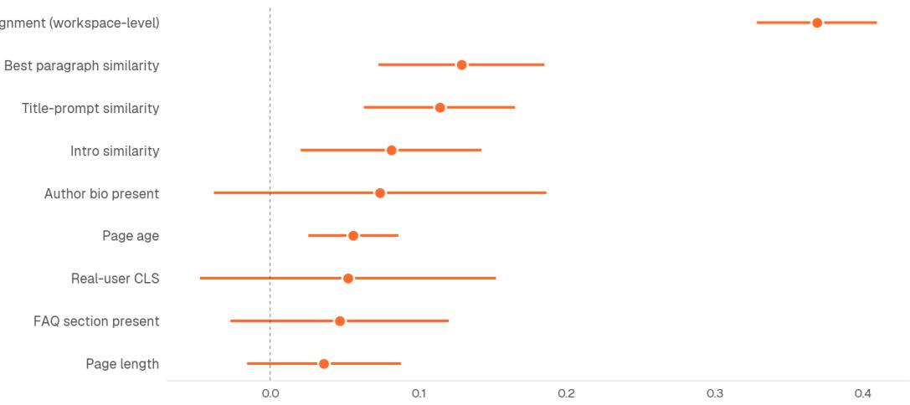  
Standardised effect on citation count (1 standard deviation change). Bars show 95% confidence intervals.  
Figure 1: Predictors of citation count $y = \log _ { 2 } ( 1 + n _ { c } )$ from the mixed-efects model in Equation (2). Points are standardised coeficients; bars are 95% confidence intervals. Only predictors with positive point estimates are shown; the full coeficient table including negatively-signed and non-significant predictors appears in Appendix A. $N = 4 { , } 0 1 5$ pages across $D = 2 9 7$ domains.

## How each top feature shapes citation count

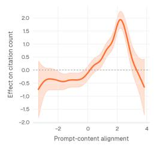

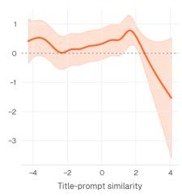

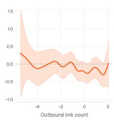

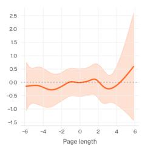

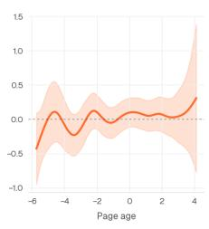  
Figure 2: GAM smooths $f _ { j } ( x _ { j } )$ for the top-five predictors after domain residualisation. The leftmost panel (alignment) is monotone across the data range; the panels for title-prompt similarity, page length, page age, and intro similarity show smaller but still mostly monotone efects.

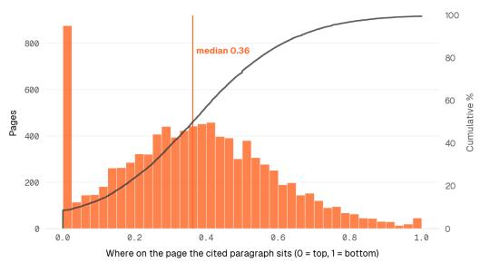  
Figure 3: Best-matching-paragraph depth distribution. $\mathrm { { M e d i a n } = 0 . 3 6 ; }$ engines cite from the top third of the page.

The more substantively interesting result is the change in estimated efects when domain-level fixed efects are introduced. Pooled rank-biserial estimates of speed metrics on log-citation count (ignoring domain) show substantial negative associations (faster pages cited less); the domain-residualised withindomain estimates from Equation (2) collapse toward zero or flip sign across every speed feature $( N = 4 , 8 4 1$ pages with mobile real-user PageSpeed coverage).

This is Simpson’s paradox: large incumbent brands have many citations and slower-than-median pages; conditioning on domain removes the spurious negative efect of speed. Practitioner reports of speed-oncitation efects in pooled data are therefore biased by domain confounding, and the practitioner consensus that page speed materially drives citation frequency is not supported by these data once domain is controlled. The same pattern applies to most binary on-page signals, though to a smaller absolute degree.

## 5.3 AI engines exhibit substantial heterogeneity

Median citation age ranges from 5.1 months (Claude) to 8.0 months (ChatGPT); Claude reaches 60% cumulative share within six months, ChatGPT requires twelve (Table 3, Figure 4). Brand-controlled URL share varies from 13.8% (Gemini) to 39.3% (Chat-GPT), widening further under position-weighting:

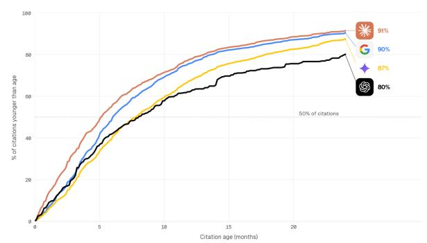  
Figure 4: Cumulative share of citations by content age, by engine. Claude reaches 60% within six months; ChatGPT requires twelve. N = 101,063 observations with usable publication dates.

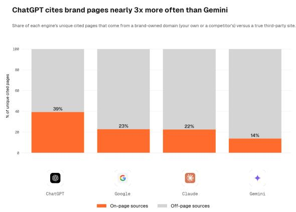  
Figure 5: Brand-controlled versus third-party URL share by engine. ChatGPT cites brand-controlled URLs at ≈3× the rate of Gemini.

ChatGPT delivers 53% of position-weighted share to brand-controlled pages against 24% on Gemini (Figure 5). The format-by-engine interaction is sharpest on pricing pages: Claude cites pricing content at median age 3.3 months, ChatGPT at 14.0 months (Figure 6). A practitioner-relevant sub-finding: of 23,908 third-party LinkedIn citations, 23,097 (96.6%) come from Google AI Overviews alone; Gemini contributes zero. LinkedIn is not a general-purpose AI citation source.

## 5.4 Page format has substantial residual efect

The one-hot page-type coeficients in the multivariate model (Equation (2)) retain substantial explanatory power after the alignment, length, age, and domain controls are applied. Pricing pages show the largest positive residual $( \beta = + 0 . 3 9 , \ q < 1 0 ^ { - 3 } )$ ; listiclereview pages show a small negative residual $( \beta =$ $- 0 . 1 2 , q < 0 . 0 5 )$ . The remaining page types cluster near the reference category. The efect-size pattern is preserved in the heatmap of binary signal efects by funnel stage (Figure 7), which shows that on-page signals become more predictive deeper in the funnel.

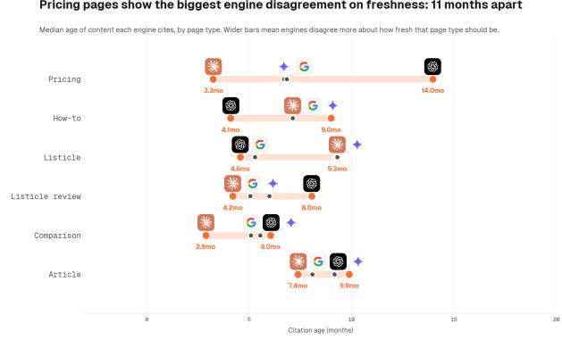  
Figure 6: Range of median citation age across engines by page type. Pricing pages show the largest engineto-engine spread (≈11 months); comparison content the smallest.

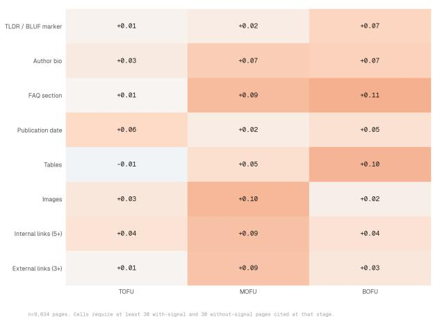  
Figure 7: Rank-biserial efect of binary on-page signals on log-citation count, by funnel stage. Efect sizes grow with funnel depth, suggesting that structural and authority signals matter more on transactional than informational pages.

## 5.5 Domain authority dominates page-level features

The SHAP analysis of the gradient-boosted regressor (Section 4.7) ranks domain authority among the two most important features alongside promptcontent alignment, with mean absolute SHAP 0.381 for the target-encoded domain feature compared to 0.060 for the strongest non-alignment page-level feature (Figure 8). Note that domain authority is a domain-level feature shared across all pages in a domain; domain-level features structurally absorb more between-domain variance than per-page features in any partitioning, so this comparison is an upper bound on the true domain contribution rather

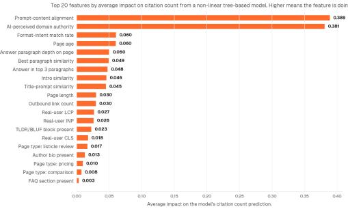  
Figure 8: Top-20 features by mean absolute SHAP value from the gradient-boosted regressor on $y =$ $\log _ { 2 } ( 1 + n _ { c } )$ Domain authority (target-encoded mean log-citation) and prompt-content alignment are the two largest contributors; the next strongest non-alignment page-level feature has mean |SHAP| approximately 6× smaller than domain authority.

## than a like-for-like efect-size comparison.

In the regression specification with domain fixed efects (Equation (2)) the residual within-domain variance attributable to page-level diferences is small (approximately 14% of total variance after the $\alpha _ { d }$ are accounted for). The majority of citation variance lives between domains, not within them. The practitioner playbook of optimising page-level features therefore operates on the smaller of the two variance components; absolute gains from on-page work are bounded above by the size of the within-domain term. Among $1 . 2 7 \times 1 0 ^ { 6 }$ true third-party citations, the top-10 domains account for under 20% of volume (Figure 9); ∼1,000 domains are needed to cover 80%. YouTube, Reddit, and LinkedIn jointly account for ≈7%. Of-page citation strategy cannot concentrate on a small set of target sources.

Top 10 third-party domains by share of citations: overall and by funnel stage. B2B SaaS domains, 7-month window. Even the largest sources earn only single-digit percentage shares.

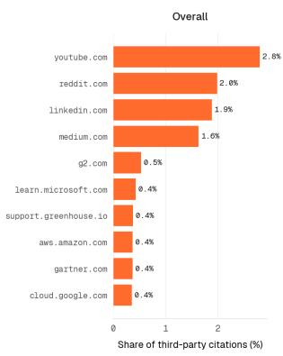

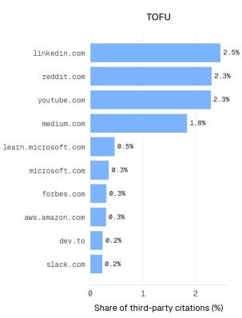

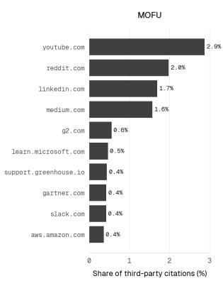

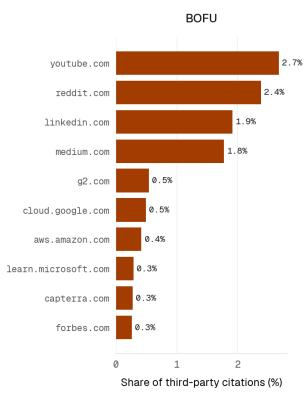  
Figure 9: Top-10 third-party domains by citation share, overall and by funnel stage $( 1 . 2 7 \times 1 0 ^ { 6 }$ true third-party citations). No single source exceeds single-digit share at any stage.

## 6 Discussion

## 6.1 Implications for the AEO literature

The practitioner consensus that page-level structural signals (structured-data markup, FAQ blocks, TLDR blocks, page speed) materially drive citation frequency is not supported once domain authority is controlled. The pooled estimates that appear in practitioner case studies recover the Simpson’s-paradox artefact identified in Section 5.2: large incumbent brands accumulate citations and have systematic diferences from challenger brands on most pagelevel signals, producing apparent positive associations that vanish under within-domain analysis. Challenger brands should not expect citation gains from structured-data deployment equivalent to those observed for incumbents in case-study data.

The exception is prompt-content alignment, which retains its full efect after domain control. Among the page-level levers we test, this is the only one with a substantial within-domain efect. The intervention this implies is: harvesting buyer language from firstparty transcripts and writing pages whose lexical and semantic content mirrors how buyers actually formulate prompts. This is closer to “content positioning” than to “page-level optimisation”, which matches the qualitative practitioner intuition that voice-ofcustomer work is upstream of structural fixes.

## 6.2 Implications for empirical study of production LLMs

Two methodological points generalise. First, observational analysis of production LLM outputs without confound control will systematically mistake brandcorrelated covariates for substantive features. Researchers studying LLM citation patterns from external observation should default to within-domain or within-publisher fixed-efects analysis; the pooledestimate baseline is biased.

Second, no single statistical method is suficient to declare an efect real in this setting. Each of the nine methods we apply has characteristic failure modes (linear models miss non-linearities; regularised regression discards correlated predictors; tree models overfit confounded structure; sensitivity analysis cannot recover unmeasured confounders). The consensus protocol specified in Section 4.11 is conservative by design; we expect that future work in this area will adopt or improve on it.

## 6.3 Interpreting the $\mathbf { R } ^ { 2 }$ decomposition

The variance decomposition in Appendix C.2 warrants careful framing. A domain-only model explains $R ^ { 2 } = 0 . 3 2 0$ of citation-count variance; the full feature set raises this to $R ^ { 2 } = 0 . 4 5 0$ , a page-level increment of $\Delta R ^ { 2 } = 0 . 1 3 0$ . One reading is that domain efects dwarf page-level interventions, implying that SEO and AEO tactics have limited leverage. This framing is misleading in two ways.

First, domain authority in this study is not exogenous. It is itself the accumulated output of sustained content strategy, of-page link acquisition, brand citation activity, and AI visibility work over time. It is a stock, not an endowment. The $R ^ { 2 }$ decomposition partitions variance at a point in time; it does not partition causal levers. For a brand starting from low authority, improving alignment-driven content is precisely the pathway through which the domain score rises.

Second, the $\Delta R ^ { 2 } = 0 . 1 3 0$ increment is not small by the standards of applied marketing science. In domains where brand spend and product quality absorb the majority of outcome variance, identifying a manipulable page-level feature that explains 13 percentage points of residual variance after brand efects is commercially meaningful. Within the pagelevel increment, alignment carries the dominant share; the $\mathrm { R ^ { 2 } }$ decomposition strengthens the argument for alignment-first content investment, not against it.

## 6.4 What the alignment finding does and does not say

The standardised efect of $\beta = + 0 . 3 7$ on promptcontent alignment is medium-to-large by the conventions of social-science efect-size benchmarks (Cohen, 1988), and it is robust to every check we apply. $\beta _ { \mathrm { a l i g n } }$ is not a randomised treatment efect; it is a withindomain partial association after extensive confound control, which is the strongest causal claim this observational design supports. It does not establish that an intervention to increase alignment by one standard deviation will produce a 30% increase in citation count; the directionality of the efect (do AI engines reward alignment, or are aligned pages also better in unmeasured ways?) is not identified by this analysis. Future work using natural experiments or controlled prompt manipulations could attempt the causal claim directly.

## 7 Limitations and threats to validity

Observational design. Clients did not randomise interventions. All coeficients are within-domain partial associations, not treatment efects. DML controls for measured confounders; unmeasured confounders (content quality, editorial investment) cannot be ruled out. The alignment finding is robust to every observable check; weaker findings carry larger residual risk.

Scope. The nineteen workspaces are all B2B SaaS companies from a single benchmarking platform. Results do not transfer without re-validation to news, e-commerce, B2C, or other content domains; the methodology framework generalises, the specific estimates may not. We study four engines; Perplexity, Bing Chat, and others are absent. The six-month capture window is contiguous; engine pipelines are known to change across quarters.

Alignment metric. The headline lexical alignment metric is computed against the full workspace prompt corpus (citing plus non-citing prompts), avoiding the circular construction of earlier versions. The semantic similarity metrics (title, intro, paragraph cosine similarities) remain computed against citing prompts and should be read as upper bounds on true partial associations.

Feature limitations. Schema extraction succeeded on third-party pages but failed on a nontrivial fraction of brand-controlled pages due to CMSspecific JSON-LD rendering; schema-related results are reported on third-party pages only. PageSpeed coverage is 95.6%; the 4.4% gap is imputed at the median. The Jaccard metric does not capture semantic alignment beyond unigrams and bigrams.

## 8 Conclusion

We have presented what is, to our knowledge, the first multi-engine, large-N observational study of LLM citation drivers in production data. The headline empirical finding is that prompt-content alignment is the dominant page-level predictor of citation frequency $( \beta = + 0 . 3 7 , 9 5 \% \mathrm { C I } [ + 0 . 3 3 , + 0 . 4 1 ] , q \approx 1 0 ^ { - 7 3 } )$ , an effect that survives a nine-method consensus protocol including FDR-controlled mixed-efects regression, stability-selection Lasso, double machine learning, generalised additive models, and a temporal hold-out replication. The headline methodological finding is that practitioner-reported efects of “answer engine optimisation” signals (structured-data markup, FAQ blocks, Core Web Vitals, page speed) are largely confounded with domain authority: pooled estimates show small positive associations that reverse direction or collapse to zero once domain-level fixed effects are applied, a Simpson’s paradox with practical consequence for the AEO literature. Cross-engine heterogeneity is substantial across recency, brandshare, and platform-specific dimensions, indicating that “optimising for $\mathrm { A I } ^ { \dag }$ is not a single-target problem.

The empirical findings calibrate the practitioner literature against confound-controlled estimates and identify alignment as the single page-level lever with material within-domain efect. The nine-method consensus framework provides a reusable protocol for observational research on production LLM behaviour, applicable beyond the B2B SaaS domain studied here.

Future work should pursue causal identification through controlled prompt manipulation, longitudinal stability across rolling capture windows, generalisation to non-B2B-SaaS content domains, and richer semantic alignment metrics built on contemporary embedding models. The analytic pipeline is released to support such extensions.

## References

Pranjal Aggarwal, Ali Maatouk, Suranjit Bhattacherjee, Vatsal Shah, and Babak Salimi. GEO: Generative engine optimization. arXiv preprint arXiv:2311.09735, 2023. URL https://arxiv. org/abs/2311.09735.

Muhammad Ali, Piotr Sapiezynski, Miranda Bogen, Aleksandra Korolova, Alan Mislove, and Aaron Rieke. Discrimination through optimization: How Facebook’s ad delivery can lead to biased outcomes. In Proceedings of the ACM on Human-Computer Interaction (CSCW), 2019.

Yoav Benjamini and Yosef Hochberg. Controlling the false discovery rate: A practical and powerful approach to multiple testing. Journal of the Royal Statistical Society: Series B (Methodological), 57 (1):289–300, 1995.

Bernd Bohnet, Vinh Q. Tran, Pat Verga, Roee Aharoni, Daniel Andor, Livio Baldini Soares, Massimiliano Ciaramita, Jacob Eisenstein, Kuzman Ganchev, Jonathan Herzig, et al. Attributed question answering: Evaluation and modeling for attributed large language models. arXiv preprint arXiv:2212.08037, 2022.

Allison J. B. Chaney, Brandon M. Stewart, and Barbara E. Engelhardt. How algorithmic confounding in recommendation systems increases homogeneity and decreases utility. 2018.

Lingjiao Chen, Matei Zaharia, and James Zou. How is ChatGPT’s behavior changing over time? arXiv preprint arXiv:2307.09009, 2023.

Tianqi Chen and Carlos Guestrin. XGBoost: A scalable tree boosting system. In Proceedings of the 22nd ACM SIGKDD International Conference on Knowledge Discovery and Data Mining, pages 785–794, 2016.

Victor Chernozhukov, Denis Chetverikov, Mert Demirer, Esther Duflo, Christian Hansen, Whitney Newey, and James Robins. Double/debiased machine learning for treatment and structural parameters. The Econometrics Journal, 21(1):C1–C68, 2018.

Jacob Cohen. Statistical Power Analysis for the Behavioral Sciences. Lawrence Erlbaum Associates, 2nd edition, 1988.

Luyu Gao, Zhuyun Dai, Panupong Pasupat, Anthony Chen, Arun Tejasvi Chaganty, Yicheng Fan, Vincent Y. Zhao, Ni Lao, Hongrae Lee, Da-Cheng Juan, and Kelvin Guu. RARR: Researching and revising what language models say, using language models. 2023a.

Tianyu Gao, Howard Yen, Jiatong Yu, and Danqi Chen. Enabling large language models to generate text with citations. In Proceedings of the 2023 Conference on Empirical Methods in Natural Language Processing (EMNLP), 2023b.

Andrew Gelman and Jennifer Hill. Data Analysis Using Regression and Multilevel/Hierarchical Models. Cambridge University Press, 2007.

Aounon Kumar and Himabindu Lakkaraju. Manipulating large language models to increase product visibility. arXiv preprint arXiv:2404.07981, 2024. URL https://arxiv.org/abs/2404.07981.

Arjun Kumar and Dmitri Palkhouski. Bringing the GEO-16 framework in B2B SaaS: An empirical analysis of AI answer engine citation behaviour. arXiv preprint arXiv:2509.10762, 2025. URL https://arxiv.org/abs/2509.10762.

Patrick Lewis, Ethan Perez, Aleksandra Piktus, Fabio Petroni, Vladimir Karpukhin, Naman Goyal, Heinrich K¨uttler, Mike Lewis, Wen-tau Yih, Tim Rockt¨aschel, et al. Retrieval-augmented generation for knowledge-intensive NLP tasks. Advances in Neural Information Processing Systems (NeurIPS), 33:9459–9474, 2020.

Nelson F. Liu, Tianyi Zhang, and Percy Liang. Evaluating verifiability in generative search engines. arXiv preprint arXiv:2304.09848, 2023. URL https://arxiv.org/abs/2304.09848.

Scott M. Lundberg and Su-In Lee. A unified approach to interpreting model predictions. In Advances in Neural Information Processing Systems (NeurIPS), volume 30, 2017.

Nicolai Meinshausen and Peter B¨uhlmann. Stability selection. Journal of the Royal Statistical Society: Series B (Statistical Methodology), 72(4):417–473, 2010.

Moz Blog. How to optimize for LLM search. https: //moz.com/blog/, 2024.

Search Engine Journal. Answer engine optimization: How to get featured in AI answers. https://www. searchenginejournal.com/, 2024.

Semrush Blog. Answer engine optimization (AEO): What it is and how to do it. https://www.semrush.com/blog/ answer-engine-optimization/, 2024.

Simon N. Wood. Generalized Additive Models: An Introduction with R. Chapman & Hall/CRC, 2nd edition, 2017.

Kai-Cheng Yang. News source citing patterns in AI search systems. arXiv preprint

arXiv:2507.05301, 2025. URL https://arxiv. org/abs/2507.05301.

Liang Yu, Xin Yang, Mengqi Ding, and Hiroshi Sato. Structural feature engineering for generative engine optimization. arXiv preprint arXiv:2603.29979, 2026. URL https://arxiv. org/abs/2603.29979.

Wei Zhang, Fang He, and Jianfeng Yao. From citation selection to citation absorption: A measurement framework for generative engine optimization. arXiv preprint arXiv:2604.25707, 2026. URL https://arxiv.org/abs/2604.25707.

Yuhao Zhang, Jiaxin Ye, Hao Peng, Kiran Garimella, and Gareth Tyson. Source coverage and citation bias in LLM-based vs. traditional search engines. arXiv preprint arXiv:2512.09483, 2025. URL https://arxiv.org/abs/2512.09483.

## A Full coeficient table

Table 1 reports every coeficient from the mixedefects model in Equation (2), including nonsignificant and negatively-signed predictors omitted from Figure 1 for visual clarity. Each row gives the standardised point estimate, 95% confidence interval, raw p-value, and FDR-corrected q-value.

## B Additional robustness output

## B.1 Sensitivity and replication checks

The prompt-content-alignment coeficient ranges from +0.31 (competitor-brand pages) to +0.77 (ownbrand pages) across five subset definitions; sign is preserved in all five with every CI strictly positive. Under eight leave-one-domain-out fits the estimate ranges from +0.475 to +0.550, maximum deviation 0.07. Only alignment achieves Πˆ = 1.0 across B = 200 stability-selection bootstraps.

## C Temporal hold-out and baseline comparators

## C.1 Temporal hold-out replication

The URL set is held constant across partitions; citations are split by date. Training target: log2(1 + $n _ { c , \mathrm { t r a i n } } )$ (citations before 1 April 2026); hold target: $\log _ { 2 } ( 1 + n _ { c , \mathrm { h o l d } } )$ (April 2026). This construction isolates coeficient stability from exposure-time confounding.

Alignment attenuates from +0.605 (training) to +0.342 (hold), with both CIs strictly positive. Outof-sample squared Pearson correlation applying training coeficients to the hold target: $r ^ { 2 } ~ = ~ 0 . 0 1 8$ Within-period fit is substantial $( R ^ { 2 } = 0 . 5 0 0$ training, $R ^ { 2 } = 0 . 4 1 8$ hold refit); cross-period absolute predictions do not transfer, consistent with engine-pipeline and prompt-mix variation not captured by page-level features.

## C.2 Baseline $R ^ { 2 }$ comparators

The domain-only to full-feature increment $( \Delta R ^ { 2 } =$ 0.130) quantifies the ceiling on page-level optimisation; alignment carries the largest share within that increment. The remaining unexplained variance (1 − 0.450) reflects engine-pipeline dynamics and unmeasured content quality signals.

<table><tr><td>Predictor</td><td> $\hat { \beta }$ </td><td>95% CI</td><td>p-value</td><td>q (FDR-BH)</td></tr><tr><td>Prompt-content alignment</td><td>+0.369</td><td>[+0.330, +0.409]</td><td>4.87e-75</td><td>1.12e-73</td></tr><tr><td>Outbound link count</td><td>-0.180</td><td>[-0.239, -0.121]</td><td>2.37e-09</td><td>1.82e-08</td></tr><tr><td>Page type: pricing</td><td>+0.423</td><td>[+0.272, +0.574]</td><td>3.92e-08</td><td>2.25e-07</td></tr><tr><td>Best paragraph similarity</td><td>+0.129</td><td>[+0.074, +0.184]</td><td>4.55e-06</td><td>2.09e-05</td></tr><tr><td>Title-prompt similarity</td><td>+0.114</td><td>[+0.064, +0.164]</td><td>7.78e-06</td><td>2.98e-05</td></tr><tr><td>Page age</td><td>+0.056</td><td>[+0.026, +0.085]</td><td>2.03e-04</td><td>6.66e-04</td></tr><tr><td>Intro similarity</td><td>+0.082</td><td>[+0.022, +0.142]</td><td>7.74e-03</td><td>2.23e-02</td></tr><tr><td>Page length</td><td>+0.036</td><td>[-0.015, +0.087]</td><td>1.65e-01</td><td>3.46e-01</td></tr><tr><td>Author bio</td><td>+0.074</td><td>[-0.037, +0.186]</td><td>1.93e-01</td><td>3.68e-01</td></tr><tr><td>FAQ section</td><td>+0.047</td><td>[−0.026, +0.120]</td><td>2.08e-01</td><td>3.68e-01</td></tr><tr><td>Page type: comparison</td><td>+0.062</td><td>[−0.048, +0.172]</td><td>2.72e-01</td><td>4.47e-01</td></tr><tr><td>Real-user CLS</td><td>+0.052</td><td>[−0.047, +0.151]</td><td>3.01e-01</td><td>4.62e-01</td></tr><tr><td>Page type: listicle review</td><td>+0.026</td><td>[-0.055, +0.107]</td><td>5.31e-01</td><td>7.41e-01</td></tr><tr><td>Answer in top-3 paragraphs</td><td>-0.014</td><td>[−0.058, +0.031]</td><td>5.48e-01</td><td>7.41e-01</td></tr><tr><td>Page type: listicle</td><td>+0.048</td><td>[−0.132, +0.228]</td><td>5.99e-01</td><td>7.65e-01</td></tr><tr><td>Page type: how to</td><td>+0.013</td><td>[−0.075, +0.101]</td><td>7.72e-01</td><td>9.34e-01</td></tr></table>

Table 1: Full coeficient table from the mixed-efects model in Equation (2) $( N = 4 , 0 1 5$ pages across $D = 2 9 7$ domains, HC1-robust standard errors). Sorted by raw p-value. Rows with $q < 0 . 0 5$ are classified as “robustly identified”; rows with $0 . 0 5 \leq q < 0 . 2 0$ are “borderline”; rows with $q \geq 0 . 2 0$ are “not identified”.
<table><tr><td>Engine</td><td>Citations in feature corpus</td></tr><tr><td>Claude</td><td>24,333</td></tr><tr><td>Gemini</td><td>52,244</td></tr><tr><td>Google AI</td><td>69,824</td></tr><tr><td>ChatGPT</td><td>12,121</td></tr></table>

Table 2: Per-engine citation volume and median citation age.
<table><tr><td>Engine</td><td>Median citation age (months)</td></tr><tr><td>Claude</td><td>5.1</td></tr><tr><td>Google AI</td><td>6.0</td></tr><tr><td>Gemini</td><td>7.8</td></tr><tr><td>ChatGPT</td><td>8.0</td></tr></table>

Table 3: Cumulative citation share by content age, per engine.
<table><tr><td>Feature family</td><td>Page coverage</td></tr><tr><td>Alignment (Jaccard, cosine, paragraph depth)</td><td>100.0%</td></tr><tr><td>Structural (length, links, FAQ, TLDR, author)</td><td>100.0%</td></tr><tr><td>Recency (page age, pub date)</td><td>80.6%</td></tr><tr><td>Real-user CWV (LCP, INP, CLS)</td><td>90.6%</td></tr><tr><td>Page type</td><td>100.0%</td></tr></table>

Table 4: Non-missing rate per feature family on the page corpus.
<table><tr><td>Predictor</td><td> $\hat { \beta } _ { \mathrm { t r a i n } }$ </td><td> $\hat { \beta } _ { \mathrm { h o l d } }$ </td><td> $| \Delta |$ </td></tr><tr><td>Prompt-content alignment</td><td>+0.605</td><td>+0.342</td><td>0.263</td></tr><tr><td>Page length</td><td>+0.004</td><td>+0.060</td><td>0.056</td></tr><tr><td>Title-prompt similarity</td><td>+0.115</td><td>+0.121</td><td>0.006</td></tr><tr><td>Page age</td><td>+0.323</td><td>-0.136</td><td>0.459</td></tr><tr><td>Intro similarity</td><td>+0.135</td><td>+0.134</td><td>0.001</td></tr></table>

Table 5: Top-five predictor coeficients refit independently on training and hold targets $( N = 4 { , } 0 1 5 \ \mathrm { U R L s }$ in both). Alignment, intro similarity, and title similarity preserve sign and approximate magnitude. Page age flips sign $( + 0 . 3 2 3  - 0 . 1 3 6 )$ and is treated as temporally non-robust.

<table><tr><td>Model In-sample  $R ^ { 2 }$ </td></tr><tr><td>Intercept-only 0.000</td></tr><tr><td>Word-count only 0.004</td></tr><tr><td>Domain-only (target-encoded) 0.320</td></tr><tr><td>Full feature set 0.388</td></tr></table>

Table 6: In-sample $R ^ { 2 }$ of four nested models. Word count alone: $R ^ { 2 } = 0 . 0 0 4 .$ Domain-only: $R ^ { 2 } = 0 . 3 2 0$ . Full feature set: $R ^ { 2 } = 0 . 4 5 0$ . The $\Delta R ^ { 2 } = 0 . 1 3 0$ increment is the upper bound on marginal page-level predictive value.