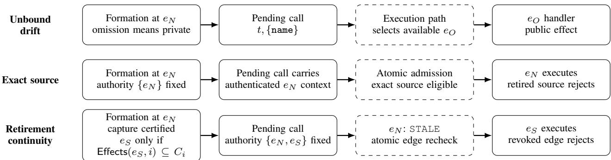
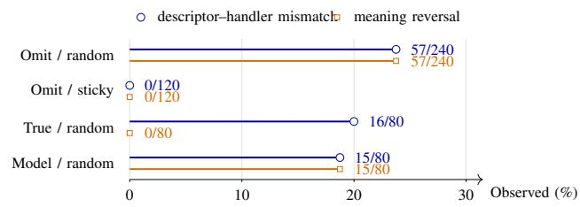
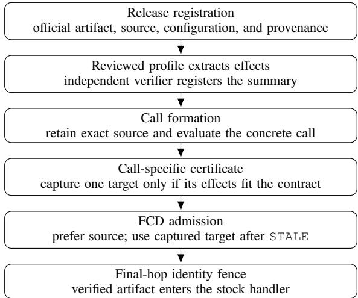
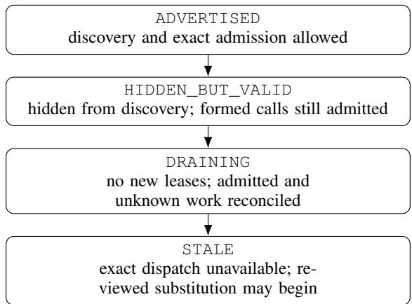
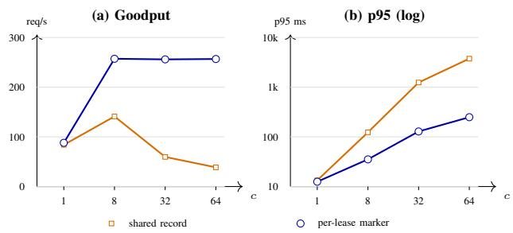

# When Valid Tool Calls Change Meaning: Formation-Consistent Dispatch for LLM Agents

Geonwoo Kim and Brent ByungHoon Kang

Korea Advanced Institute of Science and Technology (KAIST)

signal@kaist.ac.kr

Abstract—Tool-enabled agents form calls from model-visible interfaces, while hosts later select their implementation. Standard dispatch omits the descriptor–handler relation. An unchanged and schema-valid call can therefore acquire a different security effect during rollout, reconnect, or delayed approval. We call this failure schema-epoch drift.

We presentformation-consistent dispatch (FCD), which connects implementation analysis to execution authority. Reviewed profiles produce provenance-bound over-approximations of declared in-scope effects from official source. Under a closedtarget approval policy, a verifier applies each formed call to a summary and captures a successor only when its effects fit the call’s security contract. Atomic admission and a final-hop fence preserve this decision to the effect. The exact source retains priority. The captured successor becomes eligible only after source retirement.

Stock releases and deployment changes reproduced the failure. Four profiles covered 32 official releases: 29 required no release-specific change and three escalated. A frozen 16-release expansion matched a separate source oracle. In a preregistered stock comparison, FCD completed all three pending calls whose effect remained private and blocked all three whose omission became public. Exact pinning and release-wide denial stopped all six calls. Release-wide approval completed all six but produced three public effects. A separate lifecycle experiment carried a formation-captured certificate across source retirement. The same safe certificate installed later governed new formations without expanding the pending call’s authority.

## 1. Introduction

Tool-enabled agents separate call formation from execution. An MCP host gives the model a tool name, description, and input schema. The model returns a name and arguments [1], [2]. The host later selects the binary, configuration, and replica that handle the call. Approval, retry, reconnect, and rollout can occur between these two decisions.

The ordinary tools/call payload carries the name and arguments. It does not identify the descriptor or handler that gave those bytes their approved meaning. Protocol negotiation identifies an MCP communication revision rather than a tool implementation [3], [4]. The model therefore cannot verify that execution uses the implementation whose interface shaped its call.

This gap allows an unchanged and schema-valid call to acquire a different security effect. A model may see a descriptor in which omitting a field requests a private resource. It can correctly omit that field. A rollout can then route the retained call to a handler that interprets omission as public. The model and any argument policy still observe a valid call, while the selected interpreter reverses its effect.

We call this temporal-integrity failure schema-epoch drift. A schema epoch binds a model-visible descriptor to an implementation and its security-relevant execution context. Drift occurs when a call formed under one epoch executes under another that assigns the same bytes a different security meaning. The descriptor itself may remain unchanged when the handler or its execution context changes. Ordinary operations can trigger the failure. A controller with rollout or routing authority can also induce it by changing availability or reconnect timing after formation.

Existing agent defenses validate definitions, arguments, servers, policies, and execution capsules [5], [6], [7], [8], [9]. ETDI also stores the approved definition version and hash. A changed or new definition requires reapproval [7]. This preserves approval–definition integrity. FCD extends the protected relation to the declared in-scope effects that a concrete successor assigns to one pending call. It also fixes when that successor may inherit the call after source retirement. The closest agent TOCTOU work studies changes between separate model-issued calls [10]. Schema-epoch drift changes the interpreter inside one formation-to-execution interval, after the model has fixed the call bytes.

Version pinning records which implementation a pending call names. Draining and fencing preserve lifecycle order and selected identity. Authorized substitution requires three further decisions. A profile determines whether the target preserves the concrete call’s effect contract. The formation record determines whether this invocation authorized that target. Lifecycle state determines when the captured target becomes eligible to execute. A successor can be contractcompatible without being authorized for this invocation. It can be authorized without yet being eligible to execute. FCD preserves all three decisions from formation to effect.

This distinction applies when approval covers interpreter identity as well as permitted effects. A deployment that delegates at formation to all future contract-compatible implementations adopts a different authorization policy.

Semantic differencing and change-impact analysis identify behavioral changes between program versions [11], [12]. They do not turn those findings into invocation authority or preserve the decision through deployment. FCD connects a scoped effect analysis to the execution path of one formed call.

We introduce formation-consistent dispatch (FCD). A reviewed profile extracts security-relevant facts from official implementation source. It converts those facts into a provenance-bound summary within a declared source, argument, and effect envelope. At formation, a verifier substitutes the concrete arguments and authenticated context. It captures a successor only when every summarized effect fits the call’s security contract. This decision distinguishes safe calls from unsafe calls within the same release transition.

FCD preserves that source-derived decision through the lifecycle. It fixes the exact source and one authorized successor when the host forms the call. Later decisions may remove an interpreter from this set, but they cannot add one. The gateway prefers the source while it remains eligible. It may select the captured successor only after the source completes retirement. Atomic admission orders the call against drain and revocation. A durable lease pins the selected pool. A final-hop identity fence verifies the artifact and configuration before the protected effect. The successor may enter the runtime registry later, but its exact artifact, configuration, summary, and certificate must already be part of the formation record. A different target requires a new formation and any configured action approval.

The trusted host derives the call’s contract from the concrete action and any external approval. Each profile states its supported source structure, argument domain, declared in-scope effects, and external assumptions. Unsupported structures and arguments require exact execution, manual review, or a new call. The same lifecycle enforces manually reviewed compatibility edges and generated call-specific certificates.

Our evaluation connects three forms of evidence. Stock releases and deployment paths establish the failure. Four reviewed profiles and stock-handler traces test call-specific effect evidence. A preregistered policy comparison shows that FCD completes safe pending calls while blocking calls whose meaning changed. Lifecycle and replicated-gateway experiments carry that decision from formation to effect.

This paper makes four contributions:

1) It identifies schema-epoch drift and demonstrates the failure across stock releases, reconnects, and orchestrated rollback.

2) Under a closed-target approval policy, it separates call-specific effect compatibility, invocation authority, and lifecycle eligibility. FCD authorizes substitution only at their intersection and prevents later policy from expanding a pending call’s authority.

3) It derives provenance-bound, profile-bounded effect summaries for concrete calls. It checks recognized callee identities against reviewed inventories in bounded handler regions. The resulting certificates distinguish safe from unsafe calls within one release transition.

4) It evaluates the combined design across official releases, stock-handler end-to-end traces, lifecycle races, agent frameworks, and replicated deployments.

## 2. Background

## 2.1. The agent tool path

An MCP host discovers tools through tools/list and gives the model each tool’s name, description, and input schema. The model returns a name and arguments through tools/call [1], [2]. The host separately selects the binary, configuration, and replica that execute the request. The ordinary call payload does not carry the descriptor snapshot or handler identity.

MCP negotiation identifies a communication revision rather than a tool release [3], [4]. Approval, retry, reconnect, rollout, or retirement can therefore change the selected handler after formation. A call may remain schema-valid while a different handler changes its visibility, destination, access, or mutation effect.

This separation creates schema-epoch drift when execution selects a different descriptor–handler relation after formation.

## 2.2. Failure and adversary model

We protect a pending invocation’s formation provenance and execution target. An unauthorized effect comes from an interpreter outside the authority recorded at formation. That interpreter may remain valid for new calls; the violation is its use for an older call.

Both operations and an adversary can produce this schedule. A rollout, rollback, retry, or reconnect can select the wrong epoch. A controller with deployment or routing authority can induce the same condition by withdrawing replicas or changing reconnect timing. For example, it can remove GitHub v1.4 during approval and route its nameonly call to authenticated v1.3. The call and approval stay unchanged, but the older handler changes private intent to public intent.

The adversary controls availability, unauthenticated service membership, route selection, rollout direction, and reconnect timing among deployed endpoints. It cannot forge host, catalog, workload, or compatibility credentials. It cannot alter authenticated registry state, signed manifests, policy-clock decisions, or the effect-owning guard. Complete mediation keeps execution within registered pools. The selected handler can be an honest release with different semantics.

The trusted authorization plane retains formation state, authenticates registered targets, orders lifecycle decisions, and connects admission to the final effect. The registrar defines the artifact, configuration, flags, and dependencies that identify an interpreter. Profile authors define supported source structures, arguments, effects, and assumptions. An independent verifier regenerates each summary, while a reviewer handles cases outside a profile. Table 1 assigns these roles.

  
Figure 1. Formation-to-execution drift and FCD’s two authorized paths. Formation captures a contract-compatible successor and fixes invocation authority. Atomic admission executes the exact source while eligible and selects the captured successor only after safe retirement.

TABLE 1. TRUSTED AUTHORIZATION PLANE. THE DEPLOYMENT AND ROUTING CONTROLLER REMAINS OUTSIDE THIS TCB.
<table><tr><td>Component</td><td>Trusted role</td><td>Supported claim</td></tr><tr><td>Host, session</td><td>Retain the formation snapshot,</td><td>Formation</td></tr><tr><td>channel, and continuation store</td><td>bind the arguments, and reject stored-record rollback or</td><td>provenance</td></tr><tr><td>Gateway and</td><td>substitution Validate credentials and order</td><td>Target identity</td></tr><tr><td>registry Pool mapping and</td><td>admission against lifecycle changes Connect the admitted identity to</td><td>Execution</td></tr><tr><td>final fence</td><td>the implementation that produces</td><td>identity</td></tr><tr><td>Policy clock and</td><td>the effect Order expiry, revocation, uncertain</td><td>Lifecycle safety</td></tr><tr><td>resolver</td><td>outcomes, and safe retirement</td><td></td></tr><tr><td>Registrar, profile author, and</td><td>Define interpreter coverage and</td><td>Conditional</td></tr><tr><td>compatibility</td><td>analysis scope; establish source fidelity; review escalations</td><td>semantics</td></tr></table>

Exact-only dispatch omits the compatibility issuer. A single-host deployment uses SQLite and a fixed pool mapping. A replicated deployment substitutes a linearizable registry and shared lifecycle authority. Mutable routing also requires an authenticated final guard. Semantic containment adds the registrar and either a reviewed profile or manual compatibility evidence.

## 3. Case Study: Schema-Epoch Drift in MCP

This section establishes three properties of schemaepoch drift. Stock releases can assign different security effects to the same accepted call, even when their descriptors match. A hosted runtime can retain a formed call across a catalog update. Ordinary routing and rollback can then deliver that call to a different interpreter. Local recorders capture the resulting request intent or effect without creating production resources.

## 3.1. Stock release semantics

Descriptor-changing defaults. GitHub MCP Server v1.3.0 and v1.4.0 both accept a name-only create\_repository call. Version 1.4 maps an omitted private field to private creation, while v1.3 maps the same omission to public creation [13], [14], [15]. Stock handlers and a REST recorder confirmed both effects. An explicit private:true control preserved private intent across the versions.

Azure MCP Server 2.0.0-beta.32 introduced public-network-access with a false default. Its predecessor, beta.31, emits publicNetworkAccess: Enabled for the same omitted argument [16], [17], [18]. Thirty paired resource names confirmed disabled intent on beta.32 and enabled intent when the beta.32 call reached beta.31.

Descriptor-stable handlers. Reference Git MCP 2025.11.25 and 2025.12.18 expose the same relevant descriptor. The older handler interprets a fixed argument as a Git option and creates a canary file; the patched handler rejects it in 3/3 paired runs [19]. DBHub 0.22.2 changes database state under read-only mode, while 0.22.6 rejects the same call with READONLY\_VIOLATION in 5/5 runs [20]. These cases show that descriptor comparison and relisting cannot detect handler or policy changes hidden behind an unchanged schema.

OpenClaw isolates execution-context rebinding rather than release-induced semantics. Stock versions 1.7.0 and 1.6.0 exposed identical relevant descriptors. Local qwen3:8b formed openclaw\_task\_list {} in an empty 1.7.0 session. Payload-blind reconnect selected a different session containing one seeded task in 3/3 runs; exact execution returned the empty formation session in 3/3. Descriptor and argument digests remained identical.

## 3.2. Hosted-model update path

We used one synthetic tool and two local effect listeners to test the complete model–runtime path. Tool discovery, hosted-model formation, Codex permission handling, update notification, and tools/call followed the product path. SAFE denotes the effect authorized by the formation-time descriptor; PROTECTED denotes the alternate executiontime effect.

TABLE 2. REPRESENTATIVE STOCK-RELEASE AND RECONNECT RESULTS. O AND N DENOTE OLDER AND NEWER RELEASES. V MARKS PRESERVED FORMATION AUTHORITY; X MARKS A REVERSAL.
<table><tr><td>System</td><td>Formation → execution</td><td>Relevant argument</td><td>Formation-time authority</td><td>Recorded execution</td><td>Preserved?</td></tr><tr><td>GitHub</td><td>N → O</td><td>omitted</td><td>private</td><td>public</td><td></td></tr><tr><td>GitHub</td><td>N → O, bound</td><td>omitted</td><td>private</td><td>no repository request</td><td></td></tr><tr><td>Azure</td><td>N → 0</td><td>omitted</td><td>network disabled</td><td>network enabled</td><td></td></tr><tr><td>Azure</td><td>N → O, bound</td><td>omitted</td><td>network disabled</td><td>no ARM request</td><td></td></tr><tr><td>Ref. Git</td><td>N → N</td><td>identical bytes</td><td>reject; no file</td><td>rejected; no file, 3/3</td><td></td></tr><tr><td>Ref. Git</td><td>N → 0</td><td>identical bytes</td><td>reject; no file</td><td>canary file created, 3/3</td><td></td></tr><tr><td>DBHub DBHub</td><td>N → N</td><td>identical bytes</td><td>read-only; no change</td><td>READONLY_VIOLATION, 5/5</td><td></td></tr><tr><td>OpenClaw</td><td>N → O</td><td>identical bytes</td><td>read-only; no change</td><td>database changed, 5/5</td><td></td></tr><tr><td>OpenClaw</td><td>exact session</td><td>no filter</td><td>formation session</td><td>empty formation session other session&#x27;s seeded task</td><td>XＶXＶＶXＶXＶX</td></tr><tr><td></td><td>reconnected session</td><td>no filter</td><td>formation session</td><td></td><td></td></tr></table>

  
Figure 2. Mixed-version reachability. Omitted calls reverse meaning whenever routing selects the old handler. Sticky routing prevents mismatch, while an explicit argument prevents reversal.

Hosted gpt-5.6-sol formed {} under a v1 descriptor that mapped an omitted recipient to SAFE. During permission delay, v2 changed the default to PROTECTED and emitted a tool-list notification. The runtime retained the formed arguments. Four update patterns produced the v2 effect in all 12 held calls. Six stable or compatible controls produced SAFE, while two strict controls stopped without effect. This experiment establishes end-to-end reachability through a hosted model and runtime.

## 3.3. Deployment reachability

Two old and two new stock GitHub replicas ran behind HAProxy’s payload-blind random(2) policy. Each new-descriptor/old-handler match produced public intent. Sticky routing removed the mismatch, and explicit private:true preserved private intent despite it. A hosted-model run retained the name-only arguments and reproduced the reversal (Figure 2).

A second deployment connected ContextForge v1.0.9’s persistent catalog [21] to a stable Kubernetes Service and four replicas. The model formed a name-only call from the imported v1.4 descriptor. A default RollingUpdate replaced all backends with v1.3 before release [22], [23]. Stable controls produced private intent; every held call produced public intent after rollback. The stable endpoint therefore preserved the tool name but not the interpreter identity.

## 4. Formation-Consistent Tool Dispatch

## 4.1. Security objective

FCD separates three decisions for a pending call. Effect compatibility determines whether a successor preserves the call’s contract. Invocation authority records whether formation captured that successor. Lifecycle eligibility permits the successor only after source retirement. A pending call executes on a successor only at the intersection of these decisions. In the base deployment, authenticated host policy creates and retains the formation record. A deployment with an external action-policy layer binds its decision to the same arguments, catalog snapshot, and interpreter set. The source interpreter receives priority while it remains executable. After safe retirement, the prototype gateway may select one signed successor captured at formation. Expiry and revocation before admission remove that option. Once admission commits, its lease wins the registry order. A deployment that applies later revocation carries the checked generation to an effect-owning final guard. A successor edge published after formation governs new records.

Compatibility certification and invocation authorization exercise separate authority. A reviewer can certify a successor without rewriting earlier invocation records. Applying that successor to an older call would enlarge its recorded interpreter set. A deployment with external action approval would also enlarge the set covered by that decision. Updating the call therefore creates a new formation record and reruns external approval when that policy is present.

This closed-target policy applies when interpreter identity, configuration, credential access, or policy provenance forms part of approval. A deployment may instead authorize any future implementation that satisfies a complete effect contract. That broader delegation defines a larger formationtime authority set and does not use FCD’s closed-target rule.

The enforcement invariant carries this joint decision to the effect. A fixed authenticated pool mapping preserves the selected target identity. Mutable routing uses an effectowning fence. The registered source contract describes the source under covered security-relevant inputs. A manual edge or call-specific certificate establishes successor compatibility with that contract. Action authorization, promptinjection resistance, and duplicate-effect prevention compose as separate policies. The remaining design implements the rule through exact-first admission and retirement.

## 4.2. Design overview and requirements

Stable-name catalog binding implements this objective through a trusted host and gateway. It leaves the modelvisible name and arguments unchanged and resolves the retained formation binding before backend execution (Figure 1).

Formation authority rule. For invocation $i ,$ let $e _ { s }$ denote the source. Let $S _ { i }$ be empty or contain the one successor captured at formation. Formation fixes $A _ { i } ^ { 0 } = \{ e _ { s } \} \cup S _ { i }$ Let $A _ { i } ( t )$ denote the authority remaining after the lifecycle decisions that the deployment applies to invocation i by time t. Admission is the cutoff without a final guard. A deployment with a final guard extends the cutoff to its preeffect generation check. The remaining authority may only contract, and every protected effect must use an authorized interpreter:

$$
\begin{array} { c } { { t _ { 2 } \geq t _ { 1 } \Rightarrow A _ { i } ( t _ { 2 } ) \subseteq A _ { i } ( t _ { 1 } ) \subseteq A _ { i } ^ { 0 } , } } \\ { { \mathsf { e f f e c t } ( i , e , t ) \Rightarrow e \in A _ { i } ( t ) . } } \end{array}
$$

A non-source effect also requires the source to reach STALE:

$$
{ \mathsf { e f f e c t } } ( i , e , t ) \wedge e \neq e _ { s } \Rightarrow e \in S _ { i } \wedge { \mathsf { s t a t e } } ( e _ { s } , t ) = { \mathrm { S T A L E } } .
$$

The design carries this invariant through discovery, admission, retirement, and execution.

Pinning, draining, and fencing implement identity and lifecycle eligibility. Compatibility evidence establishes target suitability, while $A _ { i } ^ { 0 }$ records invocation authority. Later evidence governs new calls. An older call uses its captured successor or creates a new formation record and reruns any configured action approval.

The design follows four requirements. Formation preservation retains the catalog snapshot used for generation and approval. Registered-target authentication binds that snapshot to a control-plane artifact identity. Atomic admission orders dispatch against drain and retirement and keeps the checked target stable. Explicit substitution admits a replacement through evidence that binds the source, target, tool, concrete call, and semantic contract. When configured, action policy runs before this enforcement boundary and covers the complete formation record.

## 4.3. Catalog snapshot and authenticated context

The prototype carries a negotiated research extension in namespaced MCP \_meta [3], [4]. The host reserves this namespace. Both endpoints reject conflicting negotiation, stripped credentials, and model-supplied entries.

The gateway obtains and validates the descriptors from an advertised epoch and issues a signed credential for each tool. The trusted host removes the private extension fields before exposing the descriptors to the model, retaining those credentials and the sanitized descriptors in an immutable

  
Figure 3. Profile-guided evidence feeds FCD’s formation and execution path. Source analysis occurs at release registration; runtime enforcement uses the captured certificate.

BoundToolCatalog. It validates all catalog pages before publishing the snapshot. Relisting constructs a distinct snapshot rather than replacing the provenance of a pending invocation.

Generation and any approval retain a reference to this exact snapshot (Figure 3). When dispatching a modelproduced name and arguments, the host obtains the credential from that snapshot, never from a mutable lookup of the latest credential for the tool. It adds the credential to tools/call.params.\_meta without changing the name or arguments. The gateway validates and consumes the private fields, preserving unrelated metadata, and forwards the original call to the selected stock handler.

Output-validation state is stored with each snapshot, so an earlier invocation is checked against its own output schema after a relist.

Catalog and snapshot authentication. Each credential binds service scope, route, tool name, descriptor digest, catalog epoch, artifact identity, expiry, and signing key. The gateway obtains principal, audience, and session context outside the model’s arguments. It rejects invalid, expired, cross-context, or mismatched credentials before dispatch, and the registry checks lifecycle state on arrival.

The trusted host associates that credential with each invocation. When enabled, an approval callback also binds the tool-use identifier, arguments, snapshot, and captured assertion. An optional ledger enforces one-use decisions. The base mechanism enforces formation identity without this callback.

## 4.4. Atomic admission and retirement

An ADVERTISED epoch accepts discovery and execution. HIDDEN\_BUT\_VALID removes it from discovery while retaining execution for previously formed calls. Retirement begins at DRAINING: new leases are prohibited, while admitted calls remain pinned. The epoch reaches terminal STALE only after admitted and uncertain work clears. An exact-only record then rejects, while a record with a captured successor may select that target. Redeployment creates a new epoch.

  
Figure 4. Epoch lifecycle. Admission and the transition into DRAINING are serialized; an expired lease alone cannot make an epoch STALE.

Multiple gateway workers share a single-node SQLite registry in WAL mode. Credential validation, lifecycle checking, and lease acquisition occur within one BEGIN IMMEDIATE transaction. Thus admission and the start of drain have an ordered outcome: admission commits and pins the target, or drain prevents dispatch. The same lock orders credential validation, expiry, revocation, target checks, and lease creation. Post-admission revocation is enforced by the generation checked at the final guard.

The replicated realization replaces the SQLite transaction with an etcd transaction. Admission compares the epoch lifecycle revision, selected assertion identity, revocationpolicy revision, and target identity. The same transaction creates a unique durable marker for the selected lease. Retirement changes the epoch to DRAINING with a revision compare-and-swap and reaches STALE after its leasemarker prefix becomes empty. Concurrent admission therefore commits before the drain linearization point or observes the transition and rejects. Registry unavailability stops dispatch.

The optimized path pools etcd connections, caches verified immutable capabilities, and removes each lease with an exact-value transaction. Retirement and reconciliation retain the full read–validate–compare-and-swap path.

## 4.5. Uncertain outcomes and recovery

A transport return can leave an effect uncertain. FCD retains DRAINING and its durable marker across coordinator failure, blocking replay and substitution. A signed resolution or newer committed backend generation releases the lease, while the original tool use remains consumed.

The final guard reserves a signed single-use generation token before the handler and rejects replay or stale generations. An authenticated sidecar or backend-native guard can mediate an external effect. Our Kubernetes realization uses this fence with a three-member registry.

A stale result terminates the invocation. Recovery creates a new formation record and reruns any configured action decision.

## 4.6. Formation-bound compatibility authority

Exact dispatch remains the default. A pending invocation can capture one successor at formation. The capture requires evidence that names the source, target, tool, artifacts, configuration, security contract, validity interval, sequence, and revocation handle. FCD accepts two evidence paths. A reviewer may sign a scoped compatibility edge. A supported tool may instead use the profile-guided call-specific path described below. Both paths fix the same target in $A _ { i } ^ { 0 }$ before execution.

Substitution begins only after the source reaches STALE. A DRAINING source may still have an uncertain effect, so it cannot trigger fallback. The target must remain ADVERTISED or HIDDEN\_BUT\_VALID. Admission rechecks the captured evidence, policy sequence, revocation state, target manifest, and artifact identity before acquiring its lease. Temporary source unavailability causes rejection or exact retry. It does not authorize the successor.

The host can capture an exact successor identity and certificate before that target becomes admission-eligible. A later registry entry activates only the identity already present in $A _ { i } ^ { 0 } .$ . The source still receives priority. If it completes retirement before execution, the gateway may select the captured target. A certificate first issued after formation governs later formations. A call that captured v2 cannot acquire v3 through a later v2–v3 decision.

## 4.7. Profile-guided call-specific evidence

A whole release can be incompatible while a particular call remains safe. A repository handler may change the default for an omitted private field, while explicit private:true retains the same effect. FCD therefore evaluates compatibility for the concrete call before it captures a successor.

A reviewed effect profile defines five items for one handler path: accepted source structure, supported arguments, modeled effects, external assumptions, and rejection conditions. The profile also states its completeness boundary. Each language frontend emits the same intermediate effect record. That record names a domain, operation, principal, destination, resource, exposure level, mutation bit, and write scopes. Our four frontends cover a Python process sink, a JavaScript SQL policy, a Go HTTP request, and a C# cloud configuration path.

The trusted host or an external action-policy layer creates the formation contract $C _ { i }$ . It binds the descriptor and approval to the concrete principal, operation, destinations, resource prefixes, maximum exposure, mutation permission, and write scopes. This contract supplies user policy. The profile computes the effects that one interpreter may produce for the formed arguments. The registrar establishes that the source call fits $\bar { C } _ { i } .$ . Successor analysis checks the target against the same contract.

TABLE 3. BOUNDED CALL-SITE INVENTORIES. EACH ROW COMPARES THE RECOGNIZED CALLEE SET IN ONE SOURCE REGION WITH A REVIEWED ALLOWLIST.
<table><tr><td>Profile</td><td>Reviewed region</td><td>Inventory item</td></tr><tr><td>Reference Git / Python</td><td>AST body of git_diff</td><td>Resolved callee path</td></tr><tr><td>DBHub /</td><td>Four named classifier and</td><td>Dotted callee token</td></tr><tr><td>JavaScript GitHub / Go</td><td>handler functions Named</td><td>Dotted callee token</td></tr><tr><td>Azure / C#</td><td>CreateRepository block Unique</td><td>Dotted callee token</td></tr></table>

Registration binds the official artifact to analyzed source and release provenance. The registrar authenticates this relation as a trusted provenance assertion. Reproducible builds or in-toto-style attestations can provide stronger evidence for this assertion [24]. Reproducible compilation remains a separate supply-chain property. The common pipeline then applies the following procedure:

1) The profile matcher locates the reviewed handler path and emits source facts with line and hash anchors.

2) The call-site guard extracts callee identities from each declared handler region. It rejects identities outside the profile’s reviewed inventory and binds the result to the source.

3) The summarizer maps the source facts to an ordered first-match rule set. Each rule produces an effect record, handler rejection, or UNKNOWN.

4) A second process regenerates the facts and rules from the registered source. Matching profile, artifact, configuration, summary, closure, and evidence digests admit the summary to the registry.

5) Formation evaluates the rules with the concrete arguments and authenticated environment. It issues a certificate only when every emitted effect satisfies $C _ { i }$

This interface separates reusable certificate and containment logic from each language-specific source matcher. A recognized callee outside the reviewed inventory stops registration before the summary can authorize execution.

The inventory stores callee identities rather than source positions or call counts. The Python frontend resolves AST call paths. The other frontends extract dotted callee tokens from their bounded source spans. The DBHub span covers checkReadOnl $\mathrm { y , }$ isReadOnlySQL, areAllStatementsReadOnly, and createExecuteSqlToolHandler. A missing or ambiguous region rejects registration. A dynamic Python callee also rejects registration. The source matcher and summarizer separately analyze supported semantic facts and map them to effect rules. Passing the guard is a registration prerequisite. The guard itself grants no execution authority.

The reviewed envelope defines the region, dependencies, environment, and modeled effects.

Complete GitHub derivation. The GitHub profile makes this pipeline concrete. The matcher accepts one CreateRepository handler and locates the parser for private. It then verifies the flow through github.Ptr(private) to client.Repositories.Create. The v1.4 source fact records that omission defaults to true; the v1.3 fact records false. The summary converts this fact into the rule private := arg\_default(private, default) and maps the Boolean value to private or public exposure. Consider the concrete call {name: project-x}. Its contract permits repository creation for project-x at the authenticated GitHub destination and sets the maximum exposure to private. The v1.4 summary therefore admits the omitted-field call. The v1.3 summary produces public exposure and rejects that same call. Explicit private:true remains inside the contract under both summaries. The profile covers this parser-to-request path. Its registered inputs include the client library, account, organization, API base URL, and middleware. The effect ends at the authenticated repository-creation request.

Formation applies the target summary to the concrete arguments and authenticated execution context. Let $C _ { i }$ denote the call’s formation-time security contract. Let $S ( e , i )$ denote the generated over-approximation of in-scope effects for interpreter e and invocation i. The verifier captures target $e _ { t }$ only when

$$
\mathsf { A c t u a l l n S c o p e E f f e c t s } ( e _ { t } , i ) \subseteq S ( e _ { t } , i ) \subseteq C _ { i } .
$$

The first inclusion is the reviewed profile premise. It states that the profile over-approximates the target’s effects within its declared source, argument, dependency, and environment envelope. The common verifier establishes the second inclusion from the rule evaluation and $C _ { i }$ . The certificate validates summary containment under this premise. Profile correctness remains the reviewed first-inclusion premise. The certificate binds the arguments, principal, destination, source and target manifests, profile, summary, contract, and configuration digests. Its target then enters $\mathbf { \bar { \boldsymbol { A } } } _ { i } ^ { 0 }$ . This property is contract containment. It permits target behavior that differs from the source while remaining inside the authority approved for the call.

Execution authority comes from the verified certificate captured by FCD. A missing source fact, unsupported argument, ambiguous structure, provenance mismatch, or unknown effect stops automatic capture. The host can continue with exact-only FCD, obtain a manually reviewed edge, or form a new call after the update. This rule lets one release preserve safe calls without treating every call as compatible.

The analysis runs before a release becomes admissioneligible. Registration verifies the frozen evidence and exact target identity. The dispatch path verifies the captured certificate and uses the existing admission, lease, revocation, and final-fence checks. Generated and manual evidence therefore share one runtime enforcement boundary.

## 5. Security Analysis

We analyze accepted dispatches under Section 4.1’s trust boundary. The host and gateway use unforgeable credentials over an integrity-protected channel. The registry mediates every pool and maps each registered identity to its artifact. The lifecycle authority resolves admitted and uncertain work before declaring a source STALE.

Proposition: formation-authorized effect. Every protected effect for invocation i uses an interpreter in $A _ { i } ^ { 0 }$ when P1–P4 hold. A non-source effect occurs only after the source reaches STALE. P1 retains formation provenance. P2 prevents later authority expansion. P3 orders admission against lifecycle changes. P4 carries the admitted identity to the effect-owning path.

## 5.1. P1: Formation provenance

The host retains the immutable snapshot that shaped each invocation. Its credential authenticates the descriptor, epoch, tool, artifact, and session. The gateway rejects a different binding before dispatch. Relisting and reconnection therefore cannot replace formation provenance. Faithful registration connects the artifact to the model-visible contract.

## 5.2. P2: Monotonic target authority

Formation fixes the source and at most one captured target. That target carries either a reviewed edge or a verified call-specific certificate. It may register or become runnable later, but its identity cannot change. Expiry and revocation before admission remove it. They cannot add a replacement. A later certificate governs new invocations. Reusing the same arguments with a new target requires a new formation record and any configured action approval.

FCD defines two revocation cutoffs. A revocation ordered before admission prevents lease creation. An admitted lease wins the registry order. Deployments that apply postadmission revocation carry the checked generation to the final guard. The guard rechecks it immediately before effect. The authoritative policy clock gives every gateway replica the same expiry and revocation order.

## 5.3. P3: Atomic lifecycle admission

The registry checks binding and lifecycle state in the transaction that acquires a lease. Admission pins the selected pool when it commits first. Drain or revocation rejects the call when its transaction commits first. A DRAINING source cannot trigger substitution.

SQLite supplies this order on one host. The replicated implementation uses etcd transactions. Each admission compares the lifecycle revision, certificate identity, revocationpolicy revision, and target identity before creating a unique lease marker. Retirement changes the epoch to DRAINING, which fences new markers. It reaches STALE only after the marker prefix becomes empty. We exercised this order on a kind cluster and across three EC2 guest VMs.

## 5.4. P4: Execution identity

An accepted lease names the pool and artifact checked at admission. A fixed authenticated mapping preserves this relation when every member proves the registered identity. A mutable route instead carries a signed generation to a nonbypassable final guard. The guard rejects stale, mismatched, or replayed tokens before the effect.

Our Kubernetes fixture owns the recorded effect and checks artifact and configuration identity on that path. An external service can place the check in a backend-native guard or authenticated sidecar that mediates the only effect route. Workload identity authenticates the component that hosts the guard.

## 5.5. P5: Profile-bounded effect containment

A generated certificate adds a semantic premise to P1– P4. The trusted host constructs $C _ { i }$ from the descriptor, concrete arguments, authenticated principal and destination, and any external action approval. The registrar establishes that the source call satisfies this contract. For each supported profile, the reviewed envelope over-approximates the actual in-scope effects of accepted source structures, arguments, dependencies, and environments. The independent verifier regenerates the target summary from provenancebound source. It also checks each callee identity recognized by the language frontend against the reviewed inventory for that handler region. Formation captures the target only when that summary is contained by $C _ { i }$ . Therefore

$$
\mathsf { A c t u a l l n S c o p e E f f e c t s } ( e _ { t } , i ) \subseteq S ( e _ { t } , i ) \subseteq C _ { i } .
$$

The certificate checks the second inclusion. The reviewed acceptance envelope supplies the first inclusion as a trusted premise. Certificate verification establishes profile-bounded containment under that premise. P1–P4 ensure that execution reaches the same target and environment named by this certificate. P5 then gives contract containment for the protected effect. Its semantic claim is the formation authority expressed by $C _ { i }$ for this call.

Profile authorship defines the supported semantics. The profile records its argument domain, external assumptions, reviewed regions, call inventory, and completeness boundary. Source-shape mismatch, an unreviewed call site, unsupported arguments, unknown effects, and identity mismatch stop the generated path. A manually reviewed edge uses the same lifecycle but retains the reviewer’s compatibility judgment as its semantic premise.

Together, P1–P4 establish formation-authorized registered-target safety. P5 establishes call-specific semantic containment within a reviewed profile. Availability follows the remaining authorized set. The call ends when that set contains no eligible interpreter.

## 6. Evaluation

## 6.1. Prototype and setup

The prototype uses public interfaces from the official Python MCP SDK. Its local implementation stores immutable host snapshots and lifecycle state in SQLite WAL. Its replicated implementation uses two gateway Pods, a three-member etcd registry, and one marker per admitted lease. A durable continuation store restores formation records after reconnect. The final guard verifies artifact, configuration, and generation identity before the effect.

The profile pipeline binds official source and release provenance to executable artifacts. It uses four reviewed analyzers: Python AST for a process sink, bundled JavaScript structure for SQL policy, Go source structure for an HTTP request, and C# source structure for cloud configuration. A second process regenerates every summary before registration. The call verifier substitutes concrete arguments and authenticated context, checks containment, and issues the certificate consumed by FCD.

Local experiments used macOS arm64, Python 3.11, SQLite WAL, isolated stock handlers, fake credentials, and local effect recorders. Agent paths covered LangGraph, LangChain MCP, PydanticAI, and the Python MCP SDK. Replicated tests used kind and three-node k3s deployments with etcd 3.5.17; the EC2 runs used a separate load generator in one availability zone. Model experiments used qwen3:8b, gpt-5.6-sol, Nova Lite, and Gemini 2.5 Flash Lite. The evidence package freezes exact versions, source hashes, schedules, requests, effects, and recomputation code.

The evaluation asks four questions. RQ1 measures profile-guided evidence generation and its connection to stock effects. RQ2 tests formation authority and lifecycle enforcement. RQ3 tests the same boundary across frameworks and deployment paths. RQ4 measures model-facing agreement and runtime cost.

## 6.2. RQ1: Profile-guided compatibility evidence

We evaluated four profiles over 32 official releases. The first cohort covers Reference Git and DBHub over 16 releases. Thirteen releases generated summaries that agreed with stock-effect endpoints. Three DBHub releases moved the classifier across module boundaries, left the reviewed source shape, and escalated. The frozen expansion adds GitHub and Azure profiles. We built the profiles from two development releases per product, froze them, and selected 16 other releases from commit metadata. All 16 generated without profile changes and matched a separately implemented source oracle. Table 4 keeps the two reference types separate.

Each profile produced two security-relevant regimes. Repeated releases within a regime retained the same source facts and call decisions, which measures release-level reuse. The boundary between regimes changed the generated facts and the concrete-call decision. DBHub then left the reviewed source structure, and the generator escalated those three releases. For GitHub, explicit private:true remained SAFE on both sides of the default change. Only the omitted call changed its decision. The older Azure regime did not consume the network option and returned UNKNOWN for explicit values. The wired regime classified explicit disabled as SAFE and explicit enabled as UNSAFE.

TABLE 4. SECURITY-RELEVANT REGIMES ACROSS OFFICIAL RELEASES. REPEATED RELEASES WITHIN A REGIME MEASURE PROFILE REUSE; EACH ARROW MARKS A CHANGE IN THE CONCRETE-CALL DECISION.
<table><tr><td>Profile</td><td>Release groups</td><td>Modeled transition</td><td>Check</td></tr><tr><td>Reference Git / Python</td><td>4 unsafe + 4 reject Dash target:</td><td>UNSAFE→REJECT</td><td>Stock 8/8</td></tr><tr><td>DBHub /</td><td></td><td>4 unsafe + 1 reject PRAGMA assignment: UNSAFE→REJECT; later</td><td>Stock 5/5</td></tr><tr><td>JavaScript GitHub / Go</td><td>+ 3 escalation 4 default-false + 4</td><td>source-shape exit Omitted private:</td><td></td></tr><tr><td>Azure / C#</td><td>default-true 4 option-absent +</td><td>UNSAFE→SAFE Omitted network option:</td><td>Oracle 8/8 Oracle 8/8</td></tr><tr><td></td><td>4 option-wired</td><td>UNSAFE→SAFE</td><td></td></tr><tr><td>Total</td><td>29 automatic + 3</td><td>4 modeled transitions; 3</td><td>13 stock +</td></tr></table>

Representative boundaries are Reference $\begin{array} { r l r } { \mathrm { G i t } } & { { } \quad } & { 2 0 2 5 . 9 . 2 5  2 0 2 6 . 1 . 1 4 , } \end{array}$ DBHub $0 . 2 2 . 5 {  } 0 . 2 3 . 0 , ~ \mathrm { G i t H u b } ~ \mathrm { v } 1 . 2 . 0 {  } \mathrm { v } 1 . 5 . 0 ,$ and Azure beta.30→beta.33. DBHub 0.24.0 begins the source-shape exit.

In this transition-centered reuse study, the existing profiles processed 29 of 32 releases without release-specific edits. The remaining three releases left their reviewed source structures and escalated. This ratio describes reuse within the selected transitions.

The expansion freeze preceded holdout-source inspection. It fixed profile hashes, calls, classifications, and 16 releases selected from tag and commit metadata. A separate oracle checked runtime-value assignment and effect sink without using generated facts or templates. Both new profiles processed eight unseen releases without modification. A later fixture repair replaced a synthetic Azure name with the stock resource argument; the reported call-level result uses that repaired run, while the original freeze supplies release-level holdout counts.

The generated evidence remained call-specific. Across the frozen expansion, the verifier preserved all 20 supported safe calls. It returned UNKNOWN for an explicit Azure option that an old handler did not consume.

Summary regeneration checks that a source and profile reproduce the registered rules. We added the call-site guard after completing the two frozen release holdouts. We then preregistered a separate regression study over their retained sources. The study fixed the 32-release denominator, four reviewed inventories, four representative sources, and 16 mutation conditions. The guard preserved all 29 previously automatic release decisions and introduced no new escalation. The three unsupported DBHub releases retained their earlier escalation.

We added filesystem, network, and process call sites to one representative official source per profile. The guard rejected all 12 injected additions within the reviewed regions. It accepted all four comment-only controls. The release rows measure compatibility with prior automatic decisions. The mutation rows measure detection for the three added call classes. The source matcher and summarizer retain responsibility for semantic changes among reviewed calls.

TABLE 5. SEMANTIC MUTATIONS MAPPED TO REVIEWED PROOF OBLIGATIONS. ALL SEVEN PRODUCED THE EXPECTED RESULT.
<table><tr><td>Mutation</td><td>Proof obligation</td><td>Observed result</td></tr><tr><td>Git comment spoof</td><td>Comments cannot create a guard fact</td><td>Dangerous state retained</td></tr><tr><td>Git guard after sink</td><td>Dash rejection must precede the sink</td><td>Dangerous state retained</td></tr><tr><td>Git missing sink</td><td>One direct diff sink is required</td><td>Registration rejected</td></tr><tr><td>DBHub comment spoof</td><td>Comments cannot create an assignment guard</td><td>Dangerous state retained</td></tr><tr><td>DBHub missing guard</td><td>Read-only guard is required</td><td>Registration rejected</td></tr><tr><td>DBHub fall-through</td><td>Guard failure must return before the Registration rejected</td><td></td></tr><tr><td>guard DBHub duplicate classifier</td><td>sink Classifier structure must be unique</td><td>Registration rejected</td></tr></table>

We connected one representative release from each profile to the complete protected path. Reference Git 2025.9.25 and DBHub 0.22.5 executed safe calls through their unmodified stock handlers. Their dangerous calls stopped at admission. GitHub v1.4.0 created private intent for the safe call and blocked explicit public intent. Azure beta.32 produced disabled-network intent for the safe call and blocked enabled-network intent. Unprotected controls produced the corresponding canary file, database mutation, public repository intent, and enabled-network intent.

Each trace began with official source and artifact provenance. It then regenerated the summary, formed a call-specific certificate, acquired durable admission, rechecked workload identity, and entered the stock handler. Replacing the registered artifact caused final\_hop\_artifact\_mismatch. The mismatched path invoked zero handler callbacks. Local mock endpoints recorded the GitHub and Azure requests without contacting production services.

Table 9 exposes the four reviewed acceptance envelopes. Table 5 connects the seven existing mutations to conditions within the Reference Git and DBHub envelopes. The profile author supplies the first inclusion in ActualInScopeEfects ⊆ $S \subseteq C _ { i }$ . These tables make its scope and tested obligations explicit. All tests in the current reproducibility capsule passed.

RQ1 shows that reviewed profiles reuse source-derived effect evidence while preserving explicit escalation. The call-site guard detects the tested additions to the reviewed inventory. Stock traces connect generated facts to admission and effect, while the envelope and mutation tables expose the reviewed premise. RQ2 composes this evidence with formation authority and source retirement through the same admission and final-fence boundary.

TABLE 6. CALL GRANULARITY AFTER SOURCE RETIREMENT. A REMAINS PRIVATE ON THE TARGET; B BECOMES PUBLIC. “NEW” COUNTS CALLS THAT REQUIRE NEW FORMATION AND APPROVAL.
<table><tr><td>Policy</td><td></td><td></td><td>A B New Violation</td></tr><tr><td>Exact pinning</td><td>0/3 0/3</td><td></td><td></td></tr><tr><td>Release-wide deny</td><td>0/3 0/3</td><td>6</td><td>0</td></tr><tr><td>Release-wide allow</td><td>3/33/3</td><td>3</td><td>0 3 public</td></tr><tr><td>Call-specific FCD</td><td>3/30/3</td><td></td><td>0</td></tr></table>

TABLE 7. SUCCESSOR AUTHORITY AFTER SOURCE RETIREMENT. MANUAL-EDGE AND GENERATED-CERTIFICATE ROWS COME FROM SEPARATE FROZEN STOCK EXPERIMENTS.
<table><tr><td>Condition</td><td>Pending authority</td><td>Outcome after retirement</td></tr><tr><td>Exact pinning</td><td>Source only</td><td>Reject, 0/5 effects</td></tr><tr><td>Execution-time adoption</td><td>Late manual edge rewrites record</td><td>v1.5 effect, 5/5</td></tr><tr><td>Captured manual edge</td><td>v1.5 captured at formation</td><td>v1.5 effect, 5/5</td></tr><tr><td>Late manual edge</td><td>Source-only record retained</td><td>Reject, 0/5 effects</td></tr><tr><td>Captured generated cert.</td><td>v1.5 identity and cert. captured</td><td>v1.5 effect, 3/3</td></tr><tr><td>Late generated cert. Old record remains</td><td>source-only</td><td>Old callback 0/3; fresh formation 3/3</td></tr></table>

## 6.3. RQ2: Formation authority and lifecycle

We first test whether call-specific evidence preserves useful pending work. Both calls formed and received approval under stock GitHub MCP v1.4.0. Call A explicitly set private:true, which remains private under v1.3.0. Call B omitted private, which becomes public under v1.3.0. After v1.4 retirement, the preregistered comparison applied four policies to three repetitions of each call (Table 6).

Exact pinning preserved safety by requiring new formation and approval for all six calls. The two releasewide policies either stopped both call classes or admitted three public effects. FCD completed all three A calls under their existing formation and approval. It stopped all three B calls before the stock handler callback and required new approval only for B. An independent auditor reconstructed all four rows from raw records and passed 12/12 gates. All 27 regression tests passed, and the repeated audit was byteidentical.

We next isolate when a successor acquires authority. One frozen stock-MCP experiment compared exact pinning, execution-time adoption, a captured manual edge, and the same edge installed after formation. A second frozen experiment replaced the manual edge with generated callspecific evidence and added a fresh-formation control. Both used unmodified GitHub MCP v1.4.0 and v1.5.0, identical runtime descriptors, distinct artifact identities, a retired and paused source, and separate effect recorders. Table 7 keeps their denominators separate.

The execution-time control rewrote pending authority and reached v1.5. FCD retained the original record and rejected the same late edge. The matched pair isolates formation-time capture from signature validity and target identity.

The generated-certificate experiment then joined semantic evidence to this lifecycle. A certificate captured at formation executed v1.5 after v1.4 retirement in 3/3 trials. The same safe certificate installed later produced zero oldcall callbacks, while a fresh formation executed v1.5 in 3/3. Explicit public intent and a mismatched final artifact each stopped before handler effect in 3/3. An independent auditor recomputed all 12 outcomes. Additional signededge and authored-transition tests matched their target and effect oracles. A breaking transition retained an unchanged descriptor, so descriptor equality did not recover formation authority.

A captured candidate also needs lifecycle enforcement. A matched ablation compared FCD with a formation-time fallback that selected its successor whenever the source route disappeared. With an active source lease, the fallback executed B in 20/20 schedules while FCD rejected before effect in 20/20. After admission, a mutable A→B route reached B under the fallback in 20/20 schedules. FCD’s A-bound token stopped at the final guard in all 20. Safe-retirement and stable-route controls reached B and A respectively in 20/20 schedules.

Lifecycle tests covered acquire–drain races, reconnect, worker death, registry loss, shared coordination, backend fencing, policy-clock skew, and unknown outcomes. Every admitted call produced at most one authorized effect. Unknown outcomes remained DRAINING until signed resolution, and the original tool-use record remained consumed. Across local and EC2 deployments, seven quorum-loss and 25 post-formation drain schedules stopped before effect.

These results answer RQ2: under the closed-target policy, effect compatibility does not itself authorize a target for an existing call. Formation capture determines successor authority. Completed retirement, transactional admission, and final-hop identity checks determine whether that authority can produce an effect.

## 6.4. RQ3: Integration and deployment transfer

We inserted the trusted bridge into hosted LangGraph, native LangChain MCP, PydanticAI, process continuation, and replicated Kubernetes paths. Current epochs reached the exact handler. Draining or stale epochs stopped before handler effect or model continuation. Stateless adapters opened new sessions between discovery and execution, so the bridge restored the authenticated formation record rather than relying on connection affinity. A process handoff restored the same record in a new process and rejected replay.

The local Kubernetes experiment moved formation and execution between two gateway replicas. Its 64 schedules covered cross-replica execution, same-image configuration drift, quorum loss, and drain. Every schedule produced one registered effect or a pre-effect rejection. The three-VM EC2 deployment repeated 18 schedules. Five crossreplica calls reached the registered target. Five configuration mismatches, three quorum-loss schedules, and five drains rejected before effect. A paired Azure release path also preserved disabled-network intent under exact execution and blocked the pending call during drain in 3/3 trials.

  
Figure 5. Registry data model under replicated load. The per-lease run sustains higher goodput and lower tail latency as concurrency c increases. Points are medians over five repetitions.

The same authenticated formation record and shared admission order governed every tested framework, processhandoff, and cross-replica path.

## 6.5. RQ4: Model-facing agreement and runtime cost

Hidden metadata preserved the model-visible interface. Three paired 100-prompt experiments over 19 GitHub tools produced FCD/plain accepted-call counts of 64/63 for GPT, 65/64 for Nova Lite, and 74/74 for Gemini Flash Lite. Each prompt used a fresh conversation and one frozen task oracle. Exact McNemar tests gave p = 1.00 for GPT and Nova; Gemini had no discordant pairs. Every accepted protected call used the registered identity.

Local binding added approximately 0.030 ms at p50 and p95. The final fence added 0.321/0.431 ms at p50/p95. The first replicated registry updated one shared epoch record and collapsed under contention. At concurrency 64 it sustained 38.56 requests/s with a 3,753.11 ms p95. Unique per-lease markers sustained 256.72 requests/s with a 248.42 ms p95 (Figure 5). The per-lease run avoided the shared-record write contention observed in the first design.

The optimized EC2 path completed 1,920 measured requests across three concurrency levels and five paired repetitions. Sequential dispatch added 10.42 ms at p50. At concurrency 32, protected p50 was 182.31 ms, p95 was 211.98 ms, and goodput reached 62.7% of the matched TLS baseline. All 1,200 protected requests, including warm-up traffic, reached the registered fixture without a drifted effect. Profile analysis occurs at release registration, so these measurements cover the complete runtime certificate, admission, registry, audit, and fence path.

## 7. Discussion

## 7.1. Authority beyond version pinning

Table 8 separates target identity from call-specific suitability and invocation authority. Table 6 shows the operational consequence: FCD retains existing approval for the safe call, while release-wide policies either reject both calls or admit the public effect. Table 7 isolates authorization timing by comparing a captured certificate with the same certificate installed later.

TABLE 8. CLOSEST MECHANISMS UNDER ONE PENDING-WORK TRACE.
<table><tr><td>Mechanism</td><td>Protected object</td><td>While source exists</td><td>Target first authorized after formation</td><td>After source retirement</td></tr><tr><td>Exact pinning</td><td>Target version</td><td>Execute exact source</td><td>Reject pending call</td><td>Reject</td></tr><tr><td>Execution-time compatibility</td><td>Current compatibility policy</td><td>Select current target</td><td>May authorize target for pending work</td><td>Select under current policy</td></tr><tr><td></td><td>Formation-time fallback Captured candidates</td><td>Prefer exact source</td><td>Reject for pending call</td><td>Select fallback; lifecycle unspecified</td></tr><tr><td>Semantic differencing [11], [12]</td><td>Cross-version behavior</td><td>Compare implementations</td><td>Analyze later target</td><td>No invocation authority</td></tr><tr><td>ETDI [7]</td><td>Approved definition version/hash</td><td>Use approved definition</td><td>Require reapproval</td><td>No call-specific retirement rule</td></tr><tr><td>Attested admission [8]</td><td>Selected server</td><td>Authenticate server</td><td>Authenticate later server</td><td>No formation-scoped successor</td></tr><tr><td>Tool Forge [9]</td><td>Validated execution capsule</td><td>Execute with evidence</td><td>Constrain to evidence</td><td>No source-retirement rule</td></tr><tr><td>Cordon [25]</td><td>Staged task effects</td><td>Validate before commit</td><td>Revalidate transaction</td><td>Task-level commit authority</td></tr><tr><td>FCD</td><td>Interpreter set and effect contract</td><td>Execute exact source</td><td>Require new formation</td><td>Execute captured target if call effects fit</td></tr></table>

The closed-target rule applies when interpreter identity, configuration, credential access, or policy provenance is part of approval. A deployment can instead delegate at formation to every future implementation satisfying a complete effect contract. That policy grants broader authority and does not require target closure.

A planned rollout illustrates the closed-target policy. During a v1–v2 overlap, a security team approves the exact v1 and v2 artifact and configuration identities. A compatibility issuer separately certifies that v2 satisfies the concrete call’s effect contract. Formation captures v2 in the pending record before the action enters a delayed approval or durable continuation. If v1 completes retirement first, the captured v2 can execute the call without reconstructing the workflow or rerunning its configured action approval. A later v3 or certificate cannot inherit that record. New formations use the then-current policy.

The evaluated prototype records one successor. A finite ordered successor set is future work and can preserve the same rule by fixing membership and order at formation.

## 7.2. Semantic trust boundary

Profile authors define supported structures, arguments, effects, and assumptions. The manifest binds artifacts, configuration, flags, destinations, and dependencies, while the final guard checks the same registered inputs. Unsupported source shapes and arguments stop automatic capture. An independent process regenerates every summary. The callsite guard compares callee identities recognized inside each declared region with its reviewed inventory. Appendix A describes this boundary.

Profile authors and the reviewed call-site classifier define the semantic TCB. P5 covers the declared regions, arguments, effects, and external assumptions. P1–P4 preserve registered-target identity independently of this semantic premise. Manual edges use reviewer judgment as an alternative premise.

## 7.3. Prompt and model controls

Prompt policies can materialize known fields but cannot select the handler that receives a call. In our control, promptonly calls used safe explicit arguments, yet nine of 16 completed calls reached a release different from the visible schema. Schema rereading produced no wire-level relist in eight trials. FCD instead authenticates formation identity outside the model interface. Model policy and dispatch integrity compose by binding any action approval to the same formation record.

## 7.4. Cost, availability, and recovery

Local enforcement adds sub-millisecond work. Replicated admission adds registry and final-fence latency before model and external-tool execution. Section 6 reports both costs.

Registry outage suspends admission. Retirement, expiry, mismatch, or unresolved timeout ends or quarantines the call rather than redirecting it. Operators can retain a source as HIDDEN\_BUT\_VALID, rate-limit lifecycle changes, separate rollout and retirement keys, and alert on epoch churn.

## 8. Related Work

Table 8 separates program evidence from authority over a pending call. FCD derives a concrete-call effect bound, captures target authority at formation, and carries that decision through source retirement.

## 8.1. API evolution and update consistency

Protocol Buffers and Google AIP-180 distinguish wire, source, and semantic compatibility [26], [27]; Web API research reduces client disruption [28]. Semantic differencing and change-impact analysis compare program behavior or affected paths [11], [12]. FCD uses a narrower product: a conservative security-effect bound for one reviewed handler path and concrete call. It then binds that evidence to invocation authority and artifact identity.

Dynamic-update and upgrade-testing systems coordinate changed state or detect incompatible formats [29], [30], [31], [32]. Per-packet consistency retains an ingress configuration, while Temporal binds workflows to build history or a rollout target [33], [34]. Rebound orders rollback and de-authorization [35]. Routing, workload identities, leases, snapshots, draining, and fencing preserve selected identity and lifecycle order [36], [37], [38], [39], [40]. FCD uses these mechanisms as its execution substrate. Its profile decides whether a target satisfies the concrete call’s effect contract. Its formation record decides whether that invocation authorized the target. The resulting mismatch is relational TOCTOU, enforced at admission rather than replayed after a database race [41], [42].

## 8.2. Agent and tool defenses

Parasites in the Toolchain studies privilege composition across MCP tools [5]. ETDI signs immutable definitions and preserves approved version/hash state, while attested admission authenticates the selected server [7], [8]. Tool Forge carries validation evidence with an execution capsule [9]. FCD adds source-derived effects for the concrete call and formation-scoped successor authority.

Cordon validates staged task effects before commit [25]. FCD covers an earlier boundary: the call already exists, but its source can retire before execution. The profile bounds successor effects; the formation record and lifecycle decide whether that successor may execute. The Mind the Gap workshop paper instead studies environment changes between separate calls [10]. MCP benchmarks and rugpull defenses reject malicious or changed definitions [43], [44], [45], [46]; FCD also covers descriptor-stable handler changes within one formation-to-execution interval.

Action-policy systems constrain user intent or contextderived authority [6], [47], [48], [49], [50], [51]. ToolEmu, InjecAgent, and AgentDojo measure unsafe model choices [52], [53], [54]. ChainCaps attenuates authority across value flows [55]. FCD composes with these controls by carrying their decision to an interpreter authorized at the same formation point.

Isolation and provenance systems mediate components or bind runtime actions [56], [57], [58], [59], [60], [61]. FCD retains the interpreters authorized to give that action meaning. Remote attestation and in-toto can strengthen its artifact evidence [24], [62].

## 9. Conclusion

A valid tool call can change security meaning when execution leaves the descriptor–implementation relation that shaped it. FCD binds three decisions before effect: whether a target preserves the call’s declared in-scope effects, whether formation authorized that target, and whether lifecycle state makes it eligible. It prefers the exact source and permits a captured successor only after completed retirement.

Stock releases and deployment paths reproduced the failure. Reviewed profiles reused effect evidence across releases, and stock-handler traces connected that evidence to admission and effect. The policy comparison retained existing approval only for the safe pending call. Lifecycle and replicated-gateway experiments preserved the same decision through execution. Under the closed-target policy, later rollout decisions may contract pending authority but cannot expand it.

## References

[1] Model Context Protocol, “Tools,” https://modelcontextprotocol.io/ specification/2026-07-28/server/tools, 2026, specification revision 2026-07-28; accessed September 9, 2026.

[2] ——, “Build your first client,” https://ts.sdk.modelcontextpro tocol.io/v2/get- started/first- client.html, 2026, typeScript SDK documentation; accessed September 17, 2026.

[3] ——, “Base protocol,” https://modelcontextprotocol.io/specification/ 2026-07-28/basic, 2026, specification revision 2026-07-28; accessed September 9, 2026.

[4] ——, “Versioning and compatibility,” https://modelcontextprotocol .io/specification/2026-07-28/basic/versioning, 2026, specification revision 2026-07-28; accessed September 9, 2026.

[5] S. Zhao, Q. Hou, Z. Zhan, Y. Wang, Y. Xie, Y. Guo, L. Chen, S. Li, and Z. Xue, “Parasites in the toolchain: A large-scale analysis of attacks on the MCP ecosystem,” in 2026 IEEE Symposium on Security and Privacy (SP), 2026, https://arxiv.org/abs/2509.06572.

[6] Y. Wu, K. Yang, F. Roesner, T. Kohno, N. Zhang, and U. Iqbal, “Towards automating data access permissions in AI agents,” in 2026 IEEE Symposium on Security and Privacy (SP), 2026, https://home s.cs.washington.edu/\~franzi/pdf/wu-agentperms-sp26.pdf.

[7] M. Bhatt, V. S. Narajala, and I. Habler, “ETDI: Mitigating tool squatting and rug pull attacks in model context protocol (MCP) by using OAuth-enhanced tool definitions and policy-based access control,” https://arxiv.org/abs/2506.01333, 2025, preprint, arXiv:2506.01333.

[8] A. Metere, “Attested tool-server admission: A security extension to the model context protocol,” https://arxiv.org/abs/2605.24248, 2026, preprint, arXiv:2605.24248.

[9] S. Rao, “Tool forge: A validation-carrying toolchain for governed agentic execution,” https://arxiv.org/abs/2605.28000, 2026, preprint, arXiv:2605.28000.

[10] D. Lilienthal and S. Hong, “Mind the gap: Time-of-check to time-ofuse vulnerabilities in LLM-enabled agents,” NeurIPS 2025 Workshop on Machine Learning for Systems (MLforSystems), 2025, workshop extended abstract. https://mlforsystems.org/assets/papers/neurips2025 /paper25.pdf.

[11] S. K. Lahiri, C. Hawblitzel, M. Kawaguchi, and H. Rebêlo, “SYMD-IFF: A language-agnostic semantic diff tool for imperative programs,” in Computer Aided Verification (CAV), ser. Lecture Notes in Computer Science, vol. 7358, 2012, pp. 712–717.

[12] N. Rungta, S. Person, and J. Branchaud, “A change impact analysis to characterize evolving program behaviors,” in 28th IEEE International Conference on Software Maintenance (ICSM), 2012.

[13] GitHub, “Default create\_repository to private when visibility omitted,” https://github.com/github/github- mcp- server/pull/2694, 2026, pull request 2694, merged June 15, 2026; accessed September 9, 2026.

[14] ——, “GitHub MCP Server 1.3.0,” https://github.com/github/gith ub-mcp-server/releases/tag/v1.3.0, 2026, official release; accessed September 9, 2026.

[15] ——, “GitHub MCP Server 1.4.0,” https://github.com/github/gith ub-mcp-server/releases/tag/v1.4.0, 2026, official release; accessed September 9, 2026.

[16] Microsoft, “Disable publicnetworkaccess by default,” https://github .com/microsoft/mcp/pull/2170, 2026, pull request 2170; accessed September 9, 2026.

[17] ——, “Azure.Mcp.Server 2.0.0-beta.31,” https://github.com/microso ft/mcp/releases/tag/Azure.Mcp.Server-2.0.0-beta.31, 2026, official prerelease; accessed September 9, 2026.

[18] ——, “Azure.Mcp.Server 2.0.0-beta.32,” https://github.com/microso ft/mcp/releases/tag/Azure.Mcp.Server-2.0.0-beta.32, 2026, official prerelease; accessed September 9, 2026.

[19] Model Context Protocol Authors, “Argument injection in git\_diff and git\_checkout allows overwriting local files,” GitHub Security Advisory GHSA-9xwc-hfwc-8w59; https://github.com/modelcontex tprotocol/servers/security/advisories/GHSA-9xwc-hfwc-8w59, 2025, accessed September 24, 2026.

[20] Bytebase, “Read-only mode does not prevent database writes,” GitHub Security Advisory GHSA-mwwr-p57h-56pf; https://github .com/bytebase/dbhub/security/advisories/GHSA-mwwr-p57h-56pf, 2026, accessed September 24, 2026.

[21] IBM, “ContextForge: An AI gateway, registry, and proxy for MCP, A2A, and REST/gRPC apis,” Version 1.0.9; https://github.com/I BM/mcp-context-forge/releases/tag/v1.0.9, 2026, official release; accessed September 15, 2026.

[22] Kubernetes Authors, “Deployments,” https://kubernetes.io/docs/conce pts/workloads/controllers/deployment/, 2026, official documentation; accessed September 15, 2026.

[23] ——, “Service,” https://kubernetes.io/docs/concepts/services-netwo rking/service/, 2026, official documentation; accessed September 15, 2026.

[24] S. Torres-Arias, H. Afzali, T. K. Kuppusamy, R. Curtmola, and J. Cappos, “in-toto: Providing farm-to-table guarantees for bits and bytes,” in 28th USENIX Security Symposium (USENIX Security 19). USENIX Association, 2019, pp. 1393–1410, https://www.usenix.org /conference/usenixsecurity19/presentation/torres-arias.

[25] Z. Chen, H. Liu, D. Xu, D. Dong, J. Li, B. Pu, and J. Zhai, “Cordon: Semantic transactions for tool-using LLM agents,” arXiv:2606.17573, 2026, preprint; https://arxiv.org/abs/2606.17573.

[26] Protocol Buffers, “Language guide (proto 3): Updating a message type,” https://protobuf.dev/programming-guides/proto3/#updating, accessed September 9, 2026.

[27] Google, “AIP-180: Backwards compatibility,” https://google.aip.dev /180, accessed September 9, 2026.

[28] P. Schmiedmayer, A. Bauer, and B. Bruegge, “Reducing the impact of breaking changes to web service clients during web API evolution,” in 2023 IEEE/ACM 10th International Conference on Mobile Software Engineering and Systems (MOBILESoft), 2023, https://ieeexplore.iee e.org/document/10172926.

[29] S. Ajmani, B. Liskov, and L. Shrira, “Modular software upgrades for distributed systems,” in ECOOP 2006 – Object-Oriented Programming, ser. Lecture Notes in Computer Science, vol. 4067, 2006, pp. 452–476.

[30] K. Saur, J. Collard, N. Foster, A. Guha, L. Vanbever, and M. Hicks, “Safe and flexible controller upgrades for SDNs,” in Proceedings of the Symposium on SDN Research, 2016, pp. 1–12.

[31] Y. Zhang, J. Yang, Z. Jin, U. Sethi, K. Rodrigues, S. Lu, and D. Yuan, “Understanding and detecting software upgrade failures in distributed systems,” in Proceedings of the ACM SIGOPS 28th Symposium on Operating Systems Principles, 2021, https://www.cs.purdue.edu/ho mes/yonglezh/pub/upgrade-sosp21.pdf.

[32] K. Han, Sruthi P C, Y. Wang, Y. Song, B. B. Papan, J. Yang, P. Fonseca, and Y. Zhang, “UpFuzz: Detecting data format incompatibility bugs during distributed storage system upgrade,” in 23rd USENIX Symposium on Networked Systems Design and Implementation (NSDI 26). USENIX Association, 2026, pp. 1225–1242, https://www.usenix.org/conference/nsdi26/presentation/han.

[33] M. Reitblatt, N. Foster, J. Rexford, C. Schlesinger, and D. Walker, “Abstractions for network update,” in Proceedings of the ACM SIG-COMM 2012 Conference, 2012, pp. 323–334, https://conferences.si gcomm.org/sigcomm/2012/paper/sigcomm/p323.pdf.

[34] Temporal Technologies, “Worker versioning,” https://docs.temporal. io/production-deployment/worker-deployments/worker-versioning, 2026, official documentation; accessed September 14, 2026.

[35] Q. Burke, A. Vahldiek-Oberwagner, M. Swift, and P. McDaniel, “It’s a feature, not a bug: Secure and auditable state rollback for confidential cloud applications,” in 2026 IEEE Symposium on Security and Privacy (SP), 2026, https://arxiv.org/abs/2511.13641.

[36] Istio Authors, “Request routing,” https://istio.io/latest/docs/tasks/t raffic-management/request-routing/, 2026, official documentation; accessed September 14, 2026.

[37] SPIFFE Project, “The SPIFFE standard,” https://spiffe.io/docs/lates t/spiffe-specs/, 2026, official specifications; accessed September 14, 2026.

[38] M. Burrows, “The chubby lock service for loosely-coupled distributed systems,” in 7th USENIX Symposium on Operating Systems Design and Implementation (OSDI 06). USENIX Association, 2006, pp. 335–350, https://www.usenix.org/conference/osdi-06/presentation/c hubby-lock-service-loosely-coupled-distributed-systems.

[39] C. M. Hayden, K. Saur, E. K. Smith, M. Hicks, and J. S. Foster, “Kitsune: Efficient, general-purpose dynamic software updating for C,” ACM Transactions on Programming Languages and Systems, vol. 36, no. 4, pp. 13:1–13:38, 2014.

[40] PostgreSQL Global Development Group, “Concurrency control: Introduction,” https://www.postgresql.org/docs/18/mvcc-intro.html, 2026, postgreSQL 18 documentation; accessed September 14, 2026.

[41] MITRE, “CWE-367: Time-of-check time-of-use (TOCTOU) race condition,” https://cwe.mitre.org/data/definitions/367.html, accessed September 9, 2026.

[42] A. Chen, Y. Kwon, and K. H. Lee, “RACEDB: Detecting request race vulnerabilities in database-backed web applications,” in 2025 IEEE Symposium on Security and Privacy (SP), 2025, pp. 939–955, https://yonghwi-kwon.github.io/data/racedb\_sp25.pdf.

[43] Y. Yang, C. Gao, D. Wu, Y. Chen, Y. Li, and S. Wang, “MCPSecBench: A systematic security benchmark and playground for testing model context protocols,” https://arxiv.org/abs/2508.13220, 2025, technical report, arXiv:2508.13220v3.

[44] S. Jamshidi, A. M. Dakhel, K. W. Nafi, and F. Khomh, “Semantic attacks on tool-augmented LLMs: Securing the model context protocol against descriptor-level manipulation,” https://arxiv.org/abs/2512 .06556, 2025, preprint, arXiv:2512.06556v2.

[45] S. Yergattikar, “Securing the tool layer: A threat taxonomy and runtime defense framework for model context protocol deployments,” in Proceedings of the 64th Annual Meeting of the Association for Computational Linguistics: Industry Track, 2026, pp. 865–871, https://aclanthology.org/2026.acl-industry.58/.

[46] J. Kim, W. Guo, and D. Song, “SoK: Attack and defense landscape of agentic AI systems,” in 35th USENIX Security Symposium (USENIX Security 26). USENIX Association, 2026, pp. 6047–6066, https: //www.usenix.org/conference/usenixsecurity26/presentation/kim-juh ee-agentic.

[47] Y. He, H. Zhu, Y. Li, S. Shao, H. Yao, Z. Liu, and Z. Qin, “Attri-Guard: Defeating indirect prompt injection in LLM agents via causal attribution of tool invocations,” in 35th USENIX Security Symposium (USENIX Security 26). USENIX Association, 2026, pp. 1547–1566, https://www.usenix.org/conference/usenixsecurity26/presentation/he -yu.

[48] L. Tsai and E. Bagdasarian, “Contextual agent security: A policy for every purpose,” in Proceedings of the Workshop on Hot Topics in Operating Systems, 2025, pp. 8–17, https://sigops.org/s/conferences /hotos/2025/papers/hotos25-100.pdf.

[49] H. Wang, C. M. Poskitt, and J. Sun, “AgentSpec: Customizable runtime enforcement for safe and reliable LLM agents,” in 2026 IEEE/ACM 48th International Conference on Software Engineering (ICSE). ACM, 2026, pp. 2938–2950.

[50] T. Shi, J. He, Z. Wang, H. Li, L. Wu, W. Guo, and D. Song, “Progent: Securing AI agents with privilege control,” https://arxiv.org/abs/2504 .11703, 2026, preprint, arXiv:2504.11703.

[51] E. Debenedetti, I. Shumailov, T. Fan, J. Hayes, N. Carlini, D. Fabian, C. Kern, C. Shi, A. Terzis, and F. Tramèr, “Defeating prompt injections by design,” in 2026 IEEE Conference on Secure and Trustworthy Machine Learning (SaTML), 2026, official program: https: //satml.org/2026/program/; preprint: https://arxiv.org/abs/2503.18813.

[52] Y. Ruan, H. Dong, A. Wang, S. Pitis, Y. Zhou, J. Ba, Y. Dubois, C. J. Maddison, and T. Hashimoto, “Identifying the risks of LM agents with an LM-emulated sandbox,” in International Conference on Learning Representations, 2024, https://proceedings.iclr.cc/pape r\_files/paper/2024/hash/7274ed909a312d4d869cc328ad1c5f04-Abstr act-Conference.html.

[53] Q. Zhan, Z. Liang, Z. Ying, and D. Kang, “InjecAgent: Benchmarking indirect prompt injections in tool-integrated large language model agents,” in Findings ofthe Associationfor Computational Linguistics: ACL 2024, 2024, pp. 10 471–10 506.

[54] E. Debenedetti, J. Zhang, M. Balunovic, L. Beurer-Kellner, M. Fis-´ cher, and F. Tramèr, “AgentDojo: A dynamic environment to evaluate prompt injection attacks and defenses for LLM agents,” in Advances in Neural Information Processing Systems 37, Datasets and Benchmarks Track, 2024, https://proceedings.neurips.cc/paper\_files/paper /2024/hash/97091a5177d8dc64b1da8bf3e1f6fb54-Abstract-Datasets\_ and\_Benchmarks\_Track.html.

[55] X. Jiang, S. Yang, Z. Li, L. Liu, H. Yu, and Y. Liu, “ChainCaps: Composition-safe tool-using agents via monotonic capability attenuation,” in Second Workshop on Agents in the Wild: Safety, Security, and Beyond (AIWILD), ICML 2026, 2026, https://openreview.net/for um?id=KtrAm71ER9.

[56] Y. Wu, F. Roesner, T. Kohno, N. Zhang, and U. Iqbal, “IsolateGPT: An execution isolation architecture for LLM-based agentic systems,” in Network and Distributed System Security Symposium, 2025, https: //www.ndss-symposium.org/ndss-paper/isolategpt-an-execution-isola tion-architecture-for-llm-based-agentic-systems/.

[57] E. Li, T. Mallick, E. Rose, W. Robertson, A. Oprea, and C. Nita-Rotaru, “ACE: A security architecture for LLM-integrated app systems,” in Network and Distributed System Security Symposium, 2026, https://www.ndss-symposium.org/ndss-paper/ace-a-security-architect ure-for-llm-integrated-app-systems/.

[58] G. Syros, A. Suri, J. Ginesin, C. Nita-Rotaru, and A. Oprea, “SAGA: A security architecture for governing AI agentic systems,” in Network and Distributed System Security Symposium, 2026, https://www.ndss -symposium.org/ndss-paper/saga-a-security-architecture-for-governi ng-ai-agentic-systems/.

[59] T. Liu, “From tool connection to execution control: Benchmarking security invariants in MCP-style agent runtimes,” https://arxiv.org/ab s/2606.29073v1, 2026, preprint, arXiv:2606.29073v1.

[60] Z. Wang, “CAVA: Canonical action verification and attestation for runtime governance of agentic AI systems,” https://arxiv.org/abs/26 07.13716v1, 2026, preprint, arXiv:2607.13716v1.

[61] Y. Kaya, A. Landerer, S. Pletinckx, M. Zimmermann, C. Kruegel, and G. Vigna, “When AI meets the web: Prompt injection risks in third-party AI chatbot plugins,” in 2026 IEEE Symposium on Security and Privacy (SP), 2026, https://arxiv.org/abs/2511.05797.

[62] H. Birkholz, D. Thaler, M. Richardson, N. Smith, and W. Pan, “Remote ATtestation procedures (RATS) architecture,” Internet Engineering Task Force, RFC 9334, 2023, informational. https://datatr acker.ietf.org/doc/html/rfc9334.

## Appendix A. Registration Completeness

This appendix defines the registration premise used by the conditional semantic consequence and documents its evaluated Kubernetes realization. It separates two questions. FCD determines whether a pending call may execute on a registered target. The deployment determines which runtime inputs constitute that target. The latter decision must cover every input that can change the security-relevant meaning of a call.

## A.1. Authenticated registration manifest

For each tool epoch, the operator signs a canonical manifest containing the tool identity, descriptor digest, executable artifact digest, deployment-template generation, configuration digests, feature-flag snapshot identifier, downstream service identities or API revisions, and policy sequence. The manifest represents secrets by their immutable version identifiers. The registry stores the signed manifest and derives the epoch identity from its canonical contents. Consequently, changing any covered field produces a different epoch across both new-image and same-image deployments.

The manifest defines the authenticated scope of semantic preservation. Every registered input that can change authorization, defaults, validation, destination, visibility, or another security-relevant effect belongs to this scope. The operator declares these inputs, and the signed manifest makes that declaration auditable. Covered changes force a new epoch at deployment and admission. Configurationread tracing and dependency declarations support audits for omitted dependencies.

The registrar also asserts that the source interpreter implements the registered contract under these covered inputs. The manifest binds this assertion and its review evidence to the epoch. A profile-guided certificate additionally binds the analyzed source, profile, generated summary, and concrete execution context to the same manifest.

These mechanisms make omissions visible to review. The operator defines the complete manifest schema for the protected tool path. Services with a bounded configuration and dependency surface can review that schema directly. Dynamic per-request dependencies use the signed snapshots or enforced contracts described below.

## A.2. Example: Kubernetes deployment

Our evaluated deployments contain two independently addressed FCD gateway Pods, three etcd members, a registered backend fixture, and a same-image fixture with a different security-relevant configuration. The client verifies TLS to each gateway. The local deployment ran on one physical kind node. The deployment-transfer experiment ran k3s on three distinct EC2 guest VMs. It placed one etcd member on each VM and the gateways on separate VMs.

The registration manifest binds the stable tool and descriptor to its artifact, configuration digest, endpoint, and lifecycle state. Formation through gateway A produces an authenticated capability for that relation. Execution through gateway B verifies the capability and atomically creates a durable lease marker in etcd. The transaction compares the epoch lifecycle revision, selected assertion identity, revocation-policy revision, and target identity. Admission racing with drain or revocation therefore has one serial outcome. Registry unavailability stops the request before backend dispatch.

The gateway sends the selected artifact and configuration identities to the final fixture path. The fixture checks them in the request that records the effect. This experimental fence prevents a Service change from separating identity validation from use. A production realization can replace it with a backend-native guard or an authenticated sidecar that mediates the only effect path. Workload identity and remote attestation can authenticate that guard. Fence authority comes from this authenticated final path; Kubernetes labels and identity endpoints provide observation metadata.

Section 6 reports the local and EC2 safety outcomes. The audit joins each admitted or blocked history to its capability and lease record. The EC2 topology records distinct Kubernetes UIDs, machine identities, private addresses, and provider identities across three guest VMs in one availability zone.

The initial registry updated one shared epoch record for each acquire and release. Under contention, that record caused repeated etcd transaction conflicts and range operations. The optimized registry compares the epoch revision but creates a unique marker per admitted lease. Release deletes that marker. Retirement first changes the epoch to DRAINING and then scans active markers before advancing to STALE. A verified-capability cache avoids repeated signature work while rechecking request context, expiry, route, artifact, configuration, and epoch state. The optimized safety replication reproduced every safety outcome. At high concurrency, Figure 5 compares this design with the sharedrecord run.

Production admission can additionally require digestpinned images and a signed manifest reference. An admission controller can resolve immutable ConfigMap, Secretversion, and flag-snapshot identities, recompute their digests, and stamp the epoch into workload identity. This prevents a Pod whose registered fields differ from the manifest from joining a backend pool. Manifest-schema review records the mapping from security-relevant configuration reads and dependencies to these enforced fields.

## A.3. Dynamic flags and dependencies

Mutable feature flags require immutable, signed snapshots. Formation records the snapshot digest, and the serving workload proves the same digest at admission or at the backend fence. A flag change that can alter tool meaning publishes a new snapshot and epoch. Arbitrary per-request flag reads use an authenticated, versioned snapshot before joining the registered pool.

Downstream services follow the same rule. The manifest binds either an immutable downstream revision or a contract version enforced at the boundary. Security-relevant downstream defaults enter the semantic-preservation set through that revision or contract version.

The conditional consequence concerns request interpretation under registered execution inputs. Mutable application data and external authorization policy compose through their own consistency and authorization mechanisms.

Operationally, an image, configuration, or covered flag change registers a new epoch. Only a workload matching its manifest joins the registered pool. A pending call executes its exact epoch, uses a captured edge only after safe retirement, or rejects before effect. These rules expose covered registration failures at deployment and admission. The operator defines the manifest schema. The profile author defines automated transition analysis, while a compatibility issuer reviews escalations. FCD enforces the resulting formation record. The semantic-preservation set equals the securityrelevant inputs captured by the manifest and the effects modeled by its profile.

## A.4. Reviewed profile acceptance envelopes

Table 9 records the source structures, argument domains, effect bounds, and stopping conditions reviewed for the four profiles. These entries define the scope of the ActualInScopeEfects ⊆ S premise. Every profile also requires the authenticated principal and destination, registered artifacts and configuration, declared dependencies, and finalhop identity described in Section 5.

Profile authors review and version these envelopes with the analysis code. The automated pipeline applies the envelope to each registered release. A release outside the envelope enters explicit escalation instead of receiving a generated certificate.

TABLE 9. REVIEWED ACCEPTANCE ENVELOPES. UNKNOWN PRODUCES NO CERTIFICATE. REJECTION STOPS SUMMARY REGISTRATION.
<table><tr><td>Profile</td><td>Accepted source structure</td><td>Supported arguments</td><td>Modeled effects</td><td>UNKNOWN, rejection, or escalation</td></tr><tr><td>Reference Git / Python</td><td>One git_diff; direct target flow to Non-dash targets; exact one repo.git.diff; optional</td><td>-output=path family;</td><td>Normal diff; filesystem write; handler rejection</td><td>Other unpatched options are UNKNOWN; missing or ambiguous sink structure rejects</td></tr><tr><td></td><td>dash-prefix rejection before the sink Unique classifier and handler functions;</td><td>verified pre-sink dash rejection Single SELECT; PRAGMA</td><td>SQL read; SQLite mutation;</td><td>Multiple or unsupported statements are</td></tr><tr><td>DBHub / JavaScript</td><td>every statement reaches the classifier; failed guard returns before</td><td>read; exact PRAGMA user_version =</td><td>handler rejection</td><td>UNKNOWN; classifier, keyword, or guard-flow drift rejects or escalates</td></tr><tr><td>GitHub / Go</td><td>executeSQL One CreateRepository; Boolean private parser; direct value flow</td><td>integer family Contract-bound name; omitted or explicit Boolean private</td><td>Authenticated repository</td><td>Parser, default, type, or request-flow</td></tr><tr><td>Azure / C#</td><td>through the request to one create sink Legacy hard-coded enabled shape or complete option wiring to one ARM</td><td>Contract-bound resource; omission in either shape;</td><td>exposure Redis creation intent; public network enabled or disabled</td><td>mismatch rejects; names outside the contract are UNKNOWN Explicit option on the legacy shape is UNKNOWN; partial, duplicate, or missing</td></tr></table>