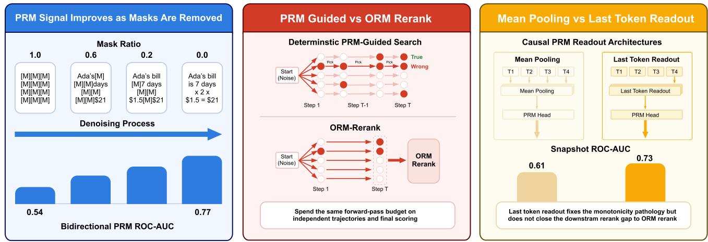
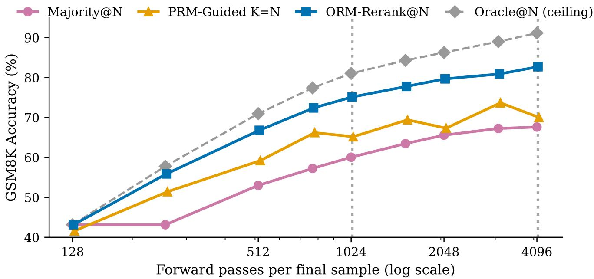
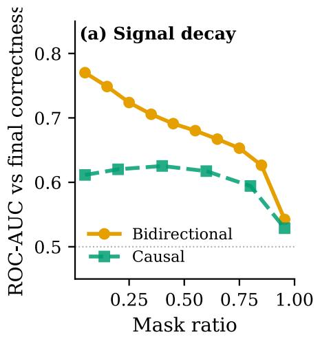
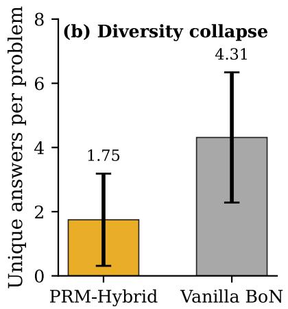
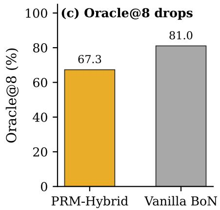
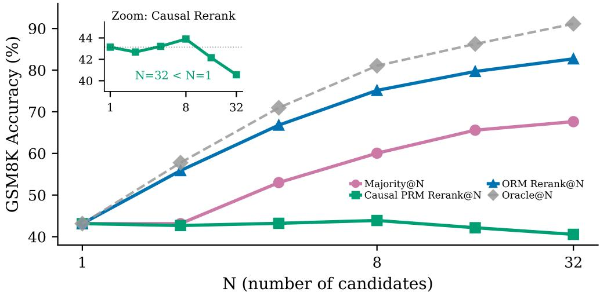
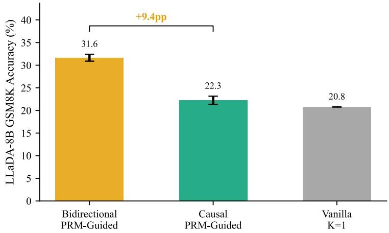
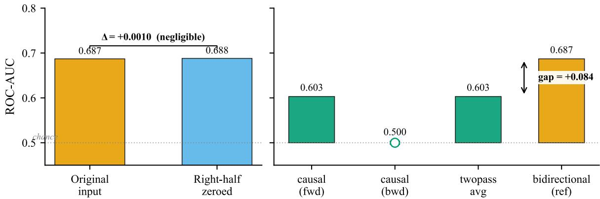

# Why Deterministic PRM Guidance Underperforms in Discrete Diffusion Reasoning

Yan Zhan1 Shaobo Liu2 Zhijun Gao1,† 1Peking University 2Shenzhen University

Discrete difusion language models (dLLMs) expose a partially denoised solution at every step, which makes process reward model (PRM) guidance look like a natural way to spend compute at test time. We show that once denoising, PRM scoring, and outcome reward model (ORM) scoring are charged in the same budget of forward passes, its natural deterministic form loses to a much simpler baseline. Our PRMs score intermediate denoising states and are trained on the correctness of the final answer. On Dream-v0-Instruct-7B with 8 candidates per GSM8K problem, keeping only the candidate with the highest PRM score at every scoring step reaches 65.18%, while independent sampling plus an ORM reranker trained for the task reaches 75.13%. The gap grows to 12.69 percentage points (pp) with 32 candidates, and is 9.85 pp on MATH and 12.16 pp on MBPP. We trace it to two separable failures. First, guidance prunes on a weak signal: on GSM8K, PRM ROC-AUC falls from 0.77 to 0.54 as the mask ratio rises, a decay that persists when states are relabeled with fresh rollouts, and pruning lowers the best accuracy reachable from the candidate pool from 81.05% for independent samples to 67.30%. Second, on GSM8K and MATH, the PRM is a poor final judge: a sequential Monte Carlo sampler at the same budget restores that ceiling to 77.89%, yet selecting with the PRM gives only 65.48%, on par with deterministic guidance, while a PRM retrained on final states matches the ORM on identical candidates. MBPP separates the two: there the PRM reaches 65.47% when reranking finished programs, on par with the ORM, but only 50.88% when it guides denoising. The results point to two targets for dLLM guidance: keep correct partial solutions alive through early denoising, and leave the final choice to a verifier trained on final states. We release the corpus of denoising states with outcome labels and evaluation toolkit for reproducible comparisons at matched compute.

# Contact: gaozhijun@pku.edu.cn   
§ Code: github.com/dLLM-PRM-Gap/   
Dataset&Model: huggingface.co/collections/YanZhanPKU/dllm-prm-gap

## 1 Introduction

Discrete difusion language models (dLLMs) are emerging as an alternative reasoning paradigm to autoregressive (AR) decoding. Rather than committing to one token prefix at a time, a dLLM maintains a partially masked full sequence and gradually denoises it into a solution. For mathematical reasoning, these intermediate states, which we call snapshots, can already contain tentative equations, quantities, answer fragments, and later reasoning steps before the whole derivation is finalized. This makes dLLM generation look unusually well matched to process reward models (PRMs): a reward model could inspect the evolving solution state, identify promising trajectories, and steer computation before the final answer is fixed. If this works, PRM guidance would ofer a natural way to convert extra test-time compute into better reasoning accuracy.

Process reward models have been highly efective for AR mathematical reasoning, where they score linear prefixes or stepwise traces and improve solution selection (Lightman et al., 2024; Wang et al., 2024). But this success does not transfer automatically to dLLMs. An AR PRM assumes that evidence arrives in prefix order; a dLLM snapshot is instead a scattered subset of revealed positions, where later tokens may be visible while earlier tokens remain hidden. This creates an architectural mismatch for causal scorers built around sequential factorization and positional conventions (Su et al., 2024), and motivates bidirectional scorers that attend to every visible token. Recent dLLMs such as Dream, LLaDA, and Block Difusion mainly improve the generator or its sampling procedure (Ye et al., 2025; Nie et al., 2025; Arriola et al., 2025), rather than asking whether reward guidance beats simple best-of-N, self-consistency (Wang et al., 2023), or outcome reward model (ORM) reranking baselines under matched compute. The natural recipe, PRM Guided, adapts PRM beam search from AR reasoning (Snell et al., 2025) to the denoising loop: it branches to K candidates at fixed intervals and keeps only the one the PRM scores highest (top-1). Compared with ORM Rerank, which samples N complete solutions independently and keeps the one the ORM scores highest, it adds an intermediate state scorer, scorer calls inside the denoising loop, and early pruning; if that machinery does not pay at matched compute, it is hard to justify. Five questions remain open: (i) does PRM Guided beat ORM Rerank at the same forward-pass budget? (ii) does PRM signa remain useful at high mask ratios, when most tokens are still hidden? (iii) is deterministic pruning safe for the diversity of the candidate pool? (iv) can a scorer trained on intermediate states make the final choice? and (v) is mean pooling the right readout for a causal PRM?

  
Figure 1 Framework overview. (A) Signal decay. Bidirectional PRM ROC-AUC rises from 0.54 in the most-masked bucket to 0.77 in the least-masked bucket [0.0, 0.1) and 0.78 on fully decoded states, so guidance decisions made at high mask ratios rely on the weakest signal. (B) Diversity collapse. Deterministic top-1 PRM pruning collapses the candidate pool, while ORM Rerank spends the same forward-pass budget on independent trajectories. (C) Readout mismatch. For causal PRM variants, switching from mean pooling to last-token pooling raises ROC-AUC on final states from 0.61 to 0.73 but does not close the downstream gap to ORM Rerank.

We answer them with a diagnostic protocol (Figure 1) that charges denoising, PRM scoring, and ORM scoring in the same forward-pass unit and separates the damage guidance does to the candidate pool from the quality of the final selection. On Dream-7B, the answer to (i) is no on GSM8K, MATH, and MBPP: on GSM8K, ORM Rerank with 8 samples beats PRM Guided at every budget up to four times its compute. The gap has two separable sources: guidance prunes on a weak signal, and on GSM8K and MATH the PRM is a poor final judge. MBPP, where the PRM judges finished programs as well as the ORM, isolates the cost of guidance itself.

Contributions.

• A matched forward-pass protocol for comparing guided and unguided dLLM reasoning at fixed inference budgets (Section 3).

• A matched-compute ranking that holds across math and code: with task-matched ORMs on Dream-7B, deterministic top-1 PRM guidance trails ORM Rerank by 9.95 and 12.69 pp on GSM8K at K=8 and K=32, by 9.85 pp on MATH (Hendrycks et al., 2021), and by 12.16 pp on MBPP (Austin et al., 2021b) (Section 4).

• A decomposition of the gap into pool damage and terminal selection: ROC-AUC decays from 0.77 to 0.54 with mask ratio, top-1 pruning cuts the Oracle ceiling by 13.75 pp, a matched SMC sampler that restores most of that ceiling still selects at the top-1 level, and a final-state PRM matches the ORM on the same candidates (Sections 4 and 5.1 to 5.3).

• Bidirectional PRMs beat causal PRMs on Dream-7B and LLaDA-8B-Base, and a readout fix recovers most of the causal gap: last-token pooling raises final-state ROC-AUC from 0.61 to 0.73 and restores best-of-N reranking gains (Section 5.4, App. D.5).

## 2 Related Work

AR reward models and verifier reranking. Outcome verifiers and PRMs are established tools for AR mathematical reasoning: a model generates chain-of-thought solutions (Wei et al., 2022), a verifier scores final answers or stepwise traces, and the system selects or guides toward completions that score higher (Cobbe et al., 2021; Lightman et al., 2024; Uesato et al., 2022; Wang et al., 2024; Luo et al., 2024; Shao et al., 2024; Guo et al., 2025). Recent verifier training reformulations (Wang et al., 2025) and turn-level reward designs for multi-turn reasoning (Wei et al., 2025) continue this AR-centric line of work. These methods assume a linear prefix order: the scorer sees a context that grows from left to right and evaluates either the current prefix or the final completion. dLLM snapshots violate this assumption because their visible tokens form a scattered subset of positions rather than a prefix.

dLLM reasoning and decoding. Difusion language models and masked-token generators provide a diferent test-time substrate from AR decoding (Hoogeboom et al., 2021; Austin et al., 2021a; Li et al., 2022; Lou et al., 2024; Sahoo et al., 2024; Gulrajani and Hashimoto, 2023; Chang et al., 2022). Recent dLLMs such as Dream and LLaDA, and work on block difusion, improved samplers, and parallel decoders, mainly target generation quality or decoding speed (Ye et al., 2025; Nie et al., 2025; Arriola et al., 2025; Zheng et al., 2025; Zhou et al., 2026; Kim et al., 2026; Ringel et al., 2026). Guidance in continuous difusion relies on aligned continuous scores or gradients (Dhariwal and Nichol, 2021; Ho and Salimans, 2022), whereas masked-token reasoning requires a scorer that remains informative on partially observed discrete states; denoising pretraining with bidirectional encoders, as in BERT and BART (Devlin et al., 2019; Lewis et al., 2020), motivates the bidirectional attention choice for PRMs that score snapshots.

Test-time scaling and reward guidance for dLLMs. A growing line of work spends extra inference compute on dLLMs. Particle samplers resample denoising trajectories with sequential Monte Carlo (SMC) (Ou et al., 2026) or refine whole trajectories with particle Gibbs (Dang et al., 2025), and remasking samplers let the model revise tokens after they are unmasked (Wang et al., 2026a). Reward-free guidance avoids explicit PRMs, which it argues are hard to train on partially masked states, and derives an implicit process reward from a post-trained dLLM (Chen et al., 2025). Correct answers often appear in the middle of denoising and are later overwritten (Wang et al., 2026b), and RL post-training with outcome rewards improves dLLM reasoning (Zhao et al., 2026). These works propose new samplers, guidance rules, or training objectives. We train explicit intermediate-state PRMs and measure where their guidance spends compute; our SMC control belongs to the particle family and shows that restoring the candidate pool does not repair the final choice when an intermediate-state scorer makes it.

Matched compute evaluation gap. Best-of-N, self-consistency, and ORM reranking are the natural baselines for spending extra test-time compute (Wang et al., 2023; Nakano et al., 2021; Gao et al., 2023; Li et al., 2023; Snell et al., 2025; Brown et al., 2024). Tree search methods such as Tree of Thoughts (Yao et al., 2023) and toolaugmented reasoning agents (Li et al., 2026) also spend extra test-time compute, but they build on AR generation in prefix order rather than on scattered dLLM snapshots. Our diagnostic question is whether intermediate-state PRM guidance beats these baselines when denoising and scorer calls are charged under the same forward-pass budget.

## 3 Matched Compute Diagnostic Protocol

We compare reward-guided dLLM reasoning methods under a shared forward-pass budget. The accounting charges Vanilla sampling, Majority voting, ORM Rerank, PRM Guided, PRM Hybrid, and Oracle ceilings in the same unit: one forward pass through a dLLM-scale model for one candidate state. This removes hidden scorer cost as a confounder before we compare accuracy, candidate diversity, and scorer behavior.

## 3.1 Notation and PRM architecture

Notation. Let L denote sequence length, T=128 the number of denoising steps, and x a partially masked state at step t with mask ratio $m ( \mathbf { x } _ { t } ) \in [ 0 , 1 ] ; m ( \mathbf { x } _ { T } ) { = } 1$ is fully masked and $m ( \mathbf { x } _ { 0 } ) { = } 0$ is fully decoded. We write N for the number of independent complete samples used by best-of-N methods, K for the branch width in PRM Guided, $b \in \{ 1 6 , 3 2 , 4 8 , 6 4 \}$ for the denoising interval between PRM calls, and $r ( \mathbf { x } _ { t } )$ for a scorer applied to state x .

PRM definition and architecture. Here, PRM denotes an outcome-supervised intermediate-state value model: each partial state inherits the final-correctness target of its completed trajectory. We study Dream-v0-Instruct-7B (Ye et al., 2025) as the primary dLLM and LLaDA-8B-Base (Nie et al., 2025) as the cross-backbone check. The PRM is a frozen dLLM backbone with trainable LoRA adapters (Hu et al., 2022) plus a two-layer MLP reward head over pooled solution hidden states and a 256-dimensional sinusoidal step-index embedding (App. A.1). We compare bidirectional PRMs with full self-attention against causal PRMs with an L→R attention mask, and isolate readout efects by retraining the causal scorer with last-token pooling in Section 5.4. Because the PRM is trained on states at every mask ratio, we call it the cross-mask PRM. Two scorers see only fully decoded states: the ORM, a bidirectional scorer trained on final states, and the final-state PRM, the bidirectional PRM retrained on final states (App. B).

Algorithm 1: PRM Guided segmental top-1 pruning on a dLLM   
Input: dLLM $p _ { \theta : }$ , PRM scorer $r _ { \phi } ,$ prompt $q ,$ branching width $K ,$ interval $b ,$ denoising steps $T .$   
Output: one generated sequence.   
1. Initialize $\mathbf { x } _ { T } \gets \mathbf { M A S K } ^ { L }$ (fully masked with prompt).   
2. Set segments $ \lceil T / b \rceil ; t _ { s }  T .$ . The last segment is shorter when b does not divide $T .$   
3. for $s = 1 , \ldots ,$ , segments do   
1. Replicate $\mathbf { x } _ { t _ { s } }$ into K copies $\{ \mathbf { x } _ { t _ { s } } ^ { ( k ) } \} _ { k = 1 } ^ { K }$   
2. Run b denoising steps on all K copies in parallel with independent per-copy token sampling, yielding   
$\{ \mathbf { x } _ { t _ { s } - b } ^ { ( k ) } \} _ { k = 1 } ^ { K } .$   
3. Score all K: $v _ { k }  r _ { \phi } ( \mathbf { x } _ { t _ { s } - b } ^ { ( k ) } )$   
4. Prune to top-1: $\mathbf { x } _ { t _ { s } - b } \gets \mathbf { x } _ { t _ { s } - b } ^ { ( \mathrm { a r g m a x } _ { k } v _ { k } ) } ;$ update $t _ { s } \gets t _ { s } - b .$   
4. return $\mathbf { x } _ { 0 }$ (the retained trajectory after the final scored prune).

## 3.2 Forward-pass compute accounting

A Vanilla sample requires T=128 denoising passes. Majority@N and Oracle@N generate N independent trajectories, so their denoising cost is 128N. ORM Rerank@N adds one ORM scoring pass per complete candidate, giving $C _ { \mathrm { O R M } } ( N ) { = } 1 2 8 N + N$

PRM Guided is charged for both denoising and every PRM scoring call, including the final segment. The segmental top-1 algorithm branches to K candidates every b steps, denoises all K candidates for that segment, scores all K candidates, and retains the highest scoring state; Algorithm 1 gives the exact procedure. With ⌈T/b⌉ segments, the per-sample forward-pass cost is

$$
C _ { \mathrm { P R M } } ( K , b ) \ : = \ : K T \ : + \ : K \left\lceil T / b \right\rceil .
$$

In the headline setting, b=64 and T=128 give $\lceil T / b \rceil { = } 2$ segments and 130K passes: 1,040 for K=8 and 4,160 for K=32. The matched ORM Rerank budgets are 1,032 and $^ \mathrm { 4 , 1 2 8 }$ passes, so the comparison is matched within ∼0.8% and the small asymmetry favors PRM Guided; App. A.4 reports wall-clock validation.

## 3.3 Diagnostic measurements

Each question in Section 1 has a direct measurement. Accuracy at matched compute answers (i) (Section $4 ) ;$ PRM ROC-AUC across mask ratios answers (ii) (Section 5.1); answer diversity and Oracle@K of the guided pool answer (iii) (Section 5.2); reranking one shared candidate pool with diferent scorers, and PRM selection after an SMC sampler restores the pool, answer (iv) (Sections 4 and 5.3); and readout ablations on causal PRMs answer (v) (Section 5.4).

## 3.4 Training data and evaluation

PRM training uses on-policy dLLM states from the training split, not test prompts. The PRM is trained on on-policy intermediate states from Dream-7B denoising trajectories on GSM8K training problems, with binary final-correctness labels. Training and test trajectories share the sampler and the snapshot schedule, so their mask-ratio distributions match by construction. All training, tuning, and early stopping use the GSM8K train split, with validation on held-out training problems.

  
Figure 2 At matched compute, reranking with a task-matched ORM outperforms PRM Guided on GSM8K with Dream-7B. ORM Rerank lies above deterministic PRM Guided across the tested compute range, and ORM Rerank@8 exceeds every PRM Guided budget up to K=32. Oracle@N marks the perfect-selector ceiling over independent samples, showing remaining verifier headroom.

The primary evaluation is GSM8K test with strict answer extraction. GSM8K (Cobbe et al., 2021) has 1,319 test problems; the best-of-32 test pool contains 42,208 complete trajectories. Vanilla, Majority, ORM Rerank, PRM Guided, and PRM Hybrid use the shared Dream sampling configuration: temperature=0.5, alg\_temp=0.5, top\_p=1.0, and T=128. Answers are scored with a strict regex extractor throughout, which avoids the inflated accuracy of lm-eval style last-number matching (Gao et al., 2024) (App. A.2). MATH500 also serves as an out-ofdistribution test for the GSM8K-trained scorers (App. D.3); the task-specific MATH and MBPP controls train their own verifiers (App. B).

The baselines separate sampling, scoring, guidance, and oracle headroom. Vanilla runs one dLLM trajectory. Majority@N picks the most frequent extracted answer among N independent trajectories. ORM Rerank@N scores the same independent final state candidates with an ORM trained on GSM8K and selects the highest scoring candidate. PRM Guided follows the segmental procedure above, and PRM Hybrid keeps all K candidates at its final segment to measure diversity and post hoc selector ceilings. Oracle@N/Oracle@K marks a problem correct if any pool candidate is correct, used only as a verifier headroom ceiling. The ORM comparison targets the setting where a task-matched final-answer verifier can be fit from the train split.

## 4 Task-Matched ORM Reranking Beats Deterministic PRM Guidance at Matched Compute

We first test whether deterministic PRM Guided beats independent sampling plus ORM Rerank at the same forward-pass budget. On Dream-7B, ORM Rerank wins on GSM8K at both budgets and on task-specific MATH and MBPP. Section 5 decomposes the gap into pool damage from guidance and terminal selection quality.

At the headline budget, ORM Rerank@8 reaches 75.13% accuracy while PRM Guided K=8 reaches 65.18%; at the larger budget, ORM Rerank@32 reaches 82.71% while PRM Guided K=32 reaches 70.02% (Table 1, Figure 2). The gap is 9.95 pp at K=8 and 12.69 pp at K=32. PRM Guided still beats Majority@N at both budgets, so the PRM carries real signal; the same compute buys better final answers when spent on independent samples plus a final-state ORM. On the same samples, ORM Rerank beats Majority@N by 15.1 pp at both budgets, so the final-state verifier, not sampling alone, drives the gain. Measured wall-clock ratios agree with forward-pass predictions within 9%, and the ordering survives wall-clock matching: ORM Rerank@6 reaches 72.40% in about 126 s per problem, against 65.18% in 156 s for PRM Guided K=8 (App. A.4).

Table 1 Matched-compute GSM8K accuracy with Dream-v0-Instruct-7B. ORM Rerank leads at both budgets. PRM Guided entries average three independent runs at K=8 and two at K=32 (App. D.1). The diagnostic rows isolate causal PRM readout. Bold: best comparable value in each accuracy column.
<table><tr><td colspan="5">GSM8K Accuracy (%)</td></tr><tr><td>Method</td><td>N/K</td><td>Forward passes</td><td>N=8/K=8</td><td> $N = 3 2 / K = 3 2$ </td></tr><tr><td colspan="5">Matched-compute comparison</td></tr><tr><td>Vanilla</td><td>1</td><td>128</td><td>43.14</td><td></td></tr><tr><td>Majority@N</td><td>N</td><td>N×128</td><td>60.05</td><td>67.63</td></tr><tr><td>PRM Guided (b=64)</td><td>K</td><td>130K</td><td>65.18</td><td>70.02</td></tr><tr><td>ORM Rerank@N</td><td>N</td><td> $N { \times } 1 2 8 + N$ </td><td>75.13</td><td>82.71</td></tr><tr><td>Oracle@N</td><td>N</td><td> $N { \times } 1 2 8$ </td><td>81.05</td><td>91.13</td></tr><tr><td colspan="5">Causal PRM readout diagnostic</td></tr><tr><td>Causal PRM Rerank, mean pool</td><td>N</td><td> $N { \times } 1 2 8 + N$ </td><td>43.90</td><td>40.56</td></tr><tr><td>Causal PRM Rerank, last token</td><td>N</td><td> $N { \times } 1 2 8 + N$ </td><td>49.66</td><td>50.64</td></tr></table>

Table 2 Controls beyond the GSM8K headline. Top: task-specific verifiers on held-out MATH and MBPP problems. Bottom: terminal scoring on the same GSM8K candidate pool. Splits and full results are in App. B. Bold: best comparable value in each result column.
<table><tr><td>Task-specific verifiers</td><td>ORM Rerank</td><td>PRM Rerank</td><td>PRM Guided</td></tr><tr><td>MATH, N=K=8</td><td>30.65</td><td>20.80</td><td>20.80</td></tr><tr><td>MBPP</td><td>63.04</td><td>65.47</td><td>50.88</td></tr><tr><td>GSM8K, same candidate pool</td><td>ORM Rerank</td><td>Final-state PRM</td><td>Cross-mask PRM</td></tr><tr><td>N=8</td><td>75.13</td><td>75.40</td><td>42.84</td></tr><tr><td>N=32</td><td>82.71</td><td>82.79</td><td>65.35</td></tr></table>

ORM Rerank@8 beats every PRM Guided budget we ran, including K=32, which spends four times its compute and reaches 70.02%; the best PRM Guided result, 73.67% at K=24, still trails it. Across the full sweep, ORM Rerank improves at every budget from N=2 to N=32, while PRM Guided is not monotone in K (App. D.1). Even ORM Rerank@32 sits 8.4 pp below the 91.13% of Oracle@32, so better final verifiers still have room to grow. The advantage does not hinge on the argmax rule: verifier-weighted voting (Li et al., 2023) stays within 0.4 pp of ORM Rerank at every budget.

A stronger final selector does not rescue the candidate pool: even a perfect selector over the PRM Hybrid K=8 pool reaches only 67.30%, 7.83 pp below ORM Rerank@8 (Section 5.2). The top-M and SMC controls in Sections 5.2 and 5.3 measure how much of this loss is recovered by keeping more candidates.

The ordering carries over to other tasks once the verifier is trained for the task (Table 2); a GSM8K-trained ORM does not transfer to MATH500 (App. D.3). On MATH (Hendrycks et al., 2021) at $N { = } K { = } 8$ , ORM Rerank reaches 30.65% against 20.80% for both PRM Rerank and deterministic PRM Guided; the ORM lead holds on identical stored candidates, by 11.10 pp (App. B). On MBPP (Austin et al., 2021b), ORM Rerank reaches 63.04% against 50.88% for PRM Guided. The MBPP PRM already reaches 65.47% when reranking final programs, on par with the ORM, so the 14.6 pp it loses under guidance is the cost of guidance itself.

Same-pool reranking separates terminal scoring from pruning. On the GSM8K candidate pool, the final-state PRM matches ORM Rerank at both budgets, while the cross-mask PRM trails it by 32.3 and 17.4 pp (Table 2 and

Table 3 Pool quality and final selection on GSM8K at the headline budget $\scriptstyle ( K = N = 8 )$ . Top: the first two columns measure the candidate pool and the last three the accuracy of the final choice from it. Top-1 guidance damages the pool; SMC repairs most of it, yet the cross-mask PRM still selects at the top-1 level, while final-state scorers select well from independent samples. Bottom: how often a PRM cut removes every lineage that later reaches a correct answer, by the stored state at which the cut is applied. Dashes mark configurations that were not run. Full results are in App. B. Bold: best comparable value in each accuracy column.
<table><tr><td rowspan="2">Search</td><td colspan="2">Candidate pool</td><td colspan="3">Accuracy of the final choice (%)</td></tr><tr><td>Oracle@8 (%)</td><td>Unique answers</td><td>Cross-mask PRM</td><td>ORM</td><td>Final-state PRM</td></tr><tr><td>Independent samples</td><td>81.05</td><td>4.31</td><td>42.84</td><td>75.13</td><td>75.40</td></tr><tr><td>Top-1 guidance</td><td>67.30</td><td>1.75</td><td>65.18</td><td>–</td><td>一</td></tr><tr><td>SMC</td><td>77.89</td><td>3.95</td><td>65.48</td><td></td><td>一</td></tr><tr><td>Removal risk (%)</td><td>Initial state</td><td>Middle state</td><td>Final state</td><td></td><td></td></tr><tr><td>Top-1 cut</td><td>46.06</td><td>37.02</td><td>19.92</td><td></td><td></td></tr><tr><td>Top-2 cut</td><td>一</td><td>22.54</td><td>13.01</td><td></td><td></td></tr><tr><td>Top-4 cut</td><td>一</td><td>9.94</td><td>5.93</td><td></td><td></td></tr></table>

  
Figure 3 Mechanisms behind the matched-compute gap. (a) PRM discrimination degrades as mask ratio increases. (b) Deterministic top-1 pruning reduces answer diversity; error bars show the standard deviation across problems, and Vanilla BoN denotes best-of-8 independent samples. (c) The reachable Oracle ceiling falls, showing that guidance prunes away correct candidates that independent sampling would have retained.

App. C.4). At N=8 the cross-mask PRM reranks no better than random selection (App. C.4), even though its pooled ROC-AUC on final states is 0.78: pooled discrimination does not imply within-problem ranking (Proposition 5.2). Its signal shows up in larger pools, where it beats random selection by 8.6 pp at N=16 and 22.1 pp at N=32. The PRM is a capable final selector once trained on final states; the gap comes from cross-mask training and, under guidance, from pruning.

## 5 Why Deterministic PRM Guidance Underperforms

The matched-compute gap has two parts. The first is pool damage from guidance: mask-ratio signal decay and deterministic pruning remove correct candidates before any final selector sees them. The second is terminal selection: trained across all mask ratios, the PRM separates correct from incorrect final solutions with ROC-AUC 0.78, against 0.96 for the ORM trained on final states alone. We then analyze causal readout mismatch as a separate diagnostic for causal PRM variants and test whether right context explains the bidirectional advantage. Table 3 shows both failures at the headline budget.

## 5.1 Mask-Ratio Signal Decay

Pool damage starts with a weak early signal. Bidirectional PRM ROC-AUC falls monotonically from 0.77 on nearly decoded states to 0.54 on almost fully masked ones (Figure 3(a)). No scorer can avoid this trend once the state stops carrying information about the outcome:

Proposition 5.1 (informal). For any scorer, ROC-AUC on states at a given mask ratio is at most $\begin{array} { r } { \frac { 1 } { 2 } + \sqrt { I ( \mathbf { x } _ { t } ; y ) / ( 2 \pi _ { 0 } \pi _ { 1 } ) } . } \end{array}$ where $I ( \mathbf { x } _ { t } ; y )$ is the mutual information between the state $\mathbf { x } _ { t }$ and final correctness y, and $\pi _ { 0 } , \pi _ { 1 }$ are the class priors.

As masking removes that information, the bound falls toward chance, so decay with mask ratio is expected for any scorer, not only ours (Proposition F.1 in App. F.1).

The causal PRM is weak across all mask-ratio buckets, not only at early denoising stages. Trained on identical data, it stays between 0.60 and 0.63 through low and middle mask ratios and remains below the bidirectional PRM in every bucket; Section 5.4 shows that much of the final-state gap comes from mean-pool readout rather than the attention mask itself.

The decay is not an artifact of inherited binary labels. Relabeling 10,000 training states with eight fresh rollouts each and retraining under an otherwise identical setup raises pooled ROC-AUC by only 0.011 and moves GSM8K accuracy by 0.61 pp, small next to the 10 pp gap to ORM Rerank. Scored against fresh rollouts instead, the decay stays intact, even though the two label sources disagree on 21% of states in the most-masked bucket, against 0.5% in the least-masked one (App. B).

## 5.2 Diversity Collapse Under Deterministic Pruning

Deterministic pruning then collapses answer diversity, an efect known from beam search (Holtzman et al., 2020; Eikema and Aziz, 2020) that is severe in dLLM guidance. At K=N=8, PRM Hybrid keeps only 1.75 unique answers per problem against 4.31 for independent samples, and answer entropy falls fourfold.

The diversity collapse lowers the best possible accuracy of the guided candidate pool. Oracle@8 drops from 81.05% for independent samples to 67.30% for PRM Hybrid, a 13.75 pp ceiling loss: PRM Guided prunes away correct candidates that simple sampling keeps.

Keeping more candidates and guiding later both help, but neither closes the gap. Top-M=2 reaches 69.70%, 4.5 pp above top-1 and still 5.4 pp below ORM Rerank@8; in single-run sweeps, accuracy rises at every step from 59.4% at b=16 to 66.5% at b=64, even though the most frequent guidance also costs the most, 1,088 passes against 1,040, consistent with querying the PRM where its signal is stronger (Apps. D.4 and C.1).

An ofline counterfactual over the stored trajectories locates the pool damage early in denoising. A top-1 cut removes every lineage that eventually reaches a correct answer in 46% of cases at the initial stored state and in 20% at the final one. Wider cuts shrink the risk: keeping four candidates brings it to 10% at the middle state and 6% at the final one (Table 3).

## 5.3 The PRM as a Final Judge

Repairing the pool does not repair the final choice. An SMC sampler (Del Moral et al., 2006) that resamples K=8 particles by PRM score at the same 1,040 passes (App. A.3) restores most of the pool: Oracle@8 rises from 67.30% to 77.89%, recovering 10.59 of the 13.75 points that top-1 pruning loses against independent sampling. Its PRM-selected accuracy stays at 65.48% with weighted answer voting and 66.34% with the top-scoring particle, level with top-1 guidance and well below the 75.13% of ORM Rerank@8 (Table 3 and App. B). With the pool repaired, the gap sits in the final choice, which the cross-mask PRM makes less reliably than a final-state verifier (Section 4).

Good pooled discrimination does not protect the final choice:

Proposition 5.2 (informal). For every $N \geq 2$ and $\epsilon \in ( 0 , 1 )$ , some scorer has pooled ROC-AUC 1 − ϵ while its top-1 choice among the N candidates of each problem is no better than a uniform random pick.

A scorer that tracks problem dificulty rather than candidate quality achieves this: it separates easy problems from hard ones across the pool but gives every candidate of a problem the same score (Proposition F.2 in App. F.1). The cross-mask PRM is not blind within problems. On the 1,182 test problems that contain both correct and incorrect candidates, its scores correlate with correctness, with median Kendall τ of 0.44, and are higher on average for correct candidates in 88% of them; a moderate pairwise edge of this kind need not survive a top-1 pick among many candidates (Corollary F.3).

  
Figure 4 Mean-pooled causal PRMs fail as best-of-N rerankers. Majority and ORM Rerank improve with more candidates, while the mean-pooled causal PRM remains near the single-sample baseline and dips at high N. The inset highlights the nonmonotonic region.

Table 4 One GSM8K test problem (id 526), the one sketched in Figure 1(A): Ada uses 12 kWh a day, adds a device that uses 2 kWh a day, and pays \$1.50 per kWh; the question asks for the weekly bill diference, which is \$21. Three of the independent candidates are shown with their causal PRM scores.
<table><tr><td>Candidate</td><td>Final computation</td><td>Causal PRM score</td><td>Correct</td></tr><tr><td>t=13</td><td> $2 \times \$ 1.50= \$ 30$ </td><td>+1.001</td><td>X</td></tr><tr><td>t=25</td><td> $( 1 2 - 2 ) \times \$ 1.50= \$ 15$ </td><td>-0.827</td><td>X</td></tr><tr><td>t=3</td><td> $2 \times \$ 1.50\times 7= \$ 21$ </td><td>-0.908</td><td>√</td></tr></table>

## 5.4 Causal PRM Readout Mismatch

Most of the causal PRM’s weakness comes from mean pooling, not from causal attention. On final states, the meanpooled causal PRM reaches ROC-AUC 0.61 against 0.78 for the bidirectional PRM. Last-token pooling, standard for AR reward models (Ouyang et al., 2022; Stiennon et al., 2020), raises it to 0.73 and closes about 70% of the gap. A smaller bidirectional advantage survives both longer training and the ORM protocol. Doubling training from 15K to 31K steps narrows the classification-accuracy gap in the least-masked bucket from 13.6 to 9.5 pp, and the bidirectional PRM stays ahead in all ten mask buckets; trained on final states only, the causal scorer still trails by 7.8 pp (Apps. C.6 and C.5). Mean pooling hurts only the causal scorer: under the ORM protocol, the bidirectional scorer reaches 91.83% accuracy with last-token pooling and 91.78% with mean pooling.

The readout also explains the reranking failure in Figure 4: at N=32 the mean-pooled causal reranker falls to 40.56%, below a single sample, while the last-token variant rises to 50.64% (App. C.3). Both remain far below the 82.71% of ORM Rerank@32, as does the bidirectional PRM at 65.35%: the terminal selection gap of Section 4 (App. C.4).

Table 4 shows the failure on a single problem: the causal PRM ranks a wrong trajectory first and the correct one last of the three, while the ORM selects the correct one. The same inversion, a confident preference for a wrong trajectory while a correct one is available, occurs on 639 of the 1,319 test problems, or 48% (App. F.2).

LLaDA reproduces the bidirectional advantage on a second dLLM backbone: averaged over all tested configurations on the full GSM8K test set, bidirectional PRM guidance reaches 31.64% against 22.25% for causal PRM guidance (Figure 5 and App. D.5). Over the 20.77% Vanilla baseline, bidirectional guidance adds 10.87 pp and causal guidance only 1.48 pp.

## 5.5 Right Context Alone Does Not Explain the Advantage

Could the bidirectional PRM win simply by reading tokens to the right of each position? Two controls do not support this. Zeroing the right half of each snapshot changes the bidirectional PRM’s ROC-AUC by about 0.001, and averaging a causal PRM over forward and reversed inputs adds nothing and leaves it 0.084 below the bidirectional PRM, because the reversed pass scores at chance (ROC-AUC 0.500) on a RoPE backbone (Su et al., 2024) that never saw reversed text (App. E.3). Three explanations remain open: joint modeling of unordered positions, readout design, and a shift in training distribution. The first is the most actionable: bidirectional attention lets every position condition on whichever tokens are revealed, while a causal scorer reads a scattered partial state in one fixed left-to-right order. A permutation-LM scorer (Yang et al., 2019), trained over arbitrary orderings yet autoregressive at inference, would test it (Apps. E.2 and E.4).

  
Figure 5 Bidirectional PRMs beat causal PRMs on LLaDA-8B-Base. Mean GSM8K accuracy of PRM Guided (K=8) over all tested configurations on the full test set, with the single-trajectory Vanilla baseline; error bars show standard deviations acros configurations.

## 6 Discussion

Recommendations. The results translate into five practices for reward-guided dLLM decoding. Charge intermediate-state scorers and final-state verifiers in the same forward-pass unit, or hidden scorer cost con founds the comparison. Report Oracle@K next to accuracy: it exposes candidate-pool collapse independently of the final selector. Guide late and keep more than one candidate: sparse branching and top-2 retention both recover accuracy, and keeping four candidates cuts the risk of losing every correct lineage at the final state from 20% to 6% (Section 5.2). Hand the final choice to a verifier trained on final states, because pooled scorer quality does not guarantee within-problem ranking: the cross-mask PRM, with pooled ROC-AUC 0.78 on final states, reranks no better than random selection at N=8 (Proposition 5.2). For causal PRMs, fix the readout first: last-token pooling recovers about 70% of the ROC-AUC gap to the bidirectional PRM. These checks are not specific to difusion: any search that prunes on intermediate scores and selects with the same scorer, including PRM beam search for AR models (Snell et al., 2025), splits into pool damage and selection error the same way.

Threats to validity. The central result uses Dream-7B and the deterministic top-1 PRM Guided recipe, with GSM8K as the primary task and MATH and MBPP as task-specific controls. The SMC control covers one diversitypreserving sampler; other stochastic decoders can be benchmarked with the released toolkit. The ORM advantage requires a verifier trained for the task: a GSM8K-trained ORM does not transfer to MATH500. LLaDA reproduces the bidirectional advantage; an LLaDA-specific ORM comparison and the permutation-LM test are natural next steps.

Conclusion. dLLM intermediate states carry usable reward signal, but deterministic guidance spends it in the wrong place: it prunes early, where the scorer is least reliable, and on GSM8K and MATH it leaves the final choice to a weaker intermediate-state scorer. Under matched forward-pass compute, independent sampling with a task-matched ORM beats deterministic PRM guidance on GSM8K, MATH, and MBPP; on MBPP the PRM already judges finished programs as well as the ORM, so the loss there is the cost of guidance itself. The decomposition gives dLLM guidance two concrete targets: keep correct partial solutions alive through early denoising, and leave the final choice to a verifier trained on final states. We release the snapshot corpus and evaluation toolkit to measure both under the same protocol.

## References

Marianne Arriola, Aaron Gokaslan, Justin T. Chiu, Zhihan Yang, Zhixuan Qi, Jiaqi Han, Subham Sekhar Sahoo, and Volodymyr Kuleshov. 2025. Block difusion: Interpolating between autoregressive and difusion language models. In International Conference on Learning Representations.

Jacob Austin, Daniel D. Johnson, Jonathan Ho, Daniel Tarlow, and Rianne van den Berg. 2021a. Structured denoising difusion models in discrete state-spaces. In Advances in Neural Information Processing Systems.

Jacob Austin, Augustus Odena, Maxwell Nye, Maarten Bosma, Henryk Michalewski, David Dohan, Ellen Jiang, Carrie Cai, Michael Terry, Quoc Le, and Charles Sutton. 2021b. Program synthesis with large language models. arXiv preprint arXiv:2108.07732

Bradley Brown, Jordan Juravsky, Ryan Ehrlich, Ronald Clark, Quoc V. Le, Christopher Ré, and Azalia Mirhoseini. 2024. Large language monkeys: Scaling inference compute with repeated sampling. arXiv preprint arXiv:2407.21787.

Huiwen Chang, Han Zhang, Lu Jiang, Ce Liu, and William T. Freeman. 2022. MaskGIT: Masked generative image transformer. In Conference on Computer Vision and Pattern Recognition.

Tianlang Chen, Minkai Xu, Jure Leskovec, and Stefano Ermon. 2025. Rfg: Test-time scaling for difusion large language mode reasoning with reward-free guidance. arXiv preprint arXiv:2509.25604.

Karl Cobbe, Vineet Kosaraju, Mohammad Bavarian, Mark Chen, Heewoo Jun, Lukasz Kaiser, Matthias Plappert, Jerry Tworek, Jacob Hilton, Reiichiro Nakano, Christopher Hesse, and John Schulman. 2021. Training verifiers to solve math word problems. arXiv preprint arXiv:2110.14168.

Meihua Dang, Jiaqi Han, Minkai Xu, Kai Xu, Akash Srivastava, and Stefano Ermon. 2025. Inference-time scaling of difusion language models via trajectory refinement. arXiv preprint arXiv:2507.08390.

Pierre Del Moral, Arnaud Doucet, and Ajay Jasra. 2006. Sequential Monte Carlo samplers. Journal of the Royal Statistical Society: Series B (Statistical Methodology), 68(3):411–436.

Jacob Devlin, Ming-Wei Chang, Kenton Lee, and Kristina Toutanova. 2019. BERT: Pre-training of deep bidirectional transformers for language understanding. In NAACL-HLT.

Prafulla Dhariwal and Alexander Nichol. 2021. Difusion models beat GANs on image synthesis. In Advances in Neural Information Processing Systems.

Bryan Eikema and Wilker Aziz. 2020. Is MAP decoding all you need? the inadequacy of the mode in neural machine translation. In Proceedings of the 28th International Conference on Computational Linguistics (COLING).

Leo Gao, John Schulman, and Jacob Hilton. 2023. Scaling laws for reward model overoptimization. In International Conference on Machine Learning.

Leo Gao, Jonathan Tow, Baber Abbasi, Stella Biderman, Sid Black, Anthony DiPofi, Charles Foster, Laurence Golding, Jefrey Hsu, Alain Le Noac’h, Haonan Li, Kyle McDonell, Niklas Muennighof, Chris Ociepa, Jason Phang, Laria Reynolds, Hailey Schoelkopf, Aviya Skowron, Lintang Sutawika, and 5 others. 2024. A framework for few-shot language model evaluation. https://github.com/EleutherAI/lm-evaluation-harness. EleutherAI lm-evaluation-harness.

Ishaan Gulrajani and Tatsunori B. Hashimoto. 2023. Likelihood-based difusion language models. Advances in Neural Information Processing Systems, 36.

Daya Guo, Dejian Yang, Haowei Zhang, Junxiao Song, Peiyi Wang, Qihao Zhu, et al. 2025. DeepSeek-R1 incentivizes reasoning in LLMs through reinforcement learning. Nature, 645:633–638.

Dan Hendrycks, Collin Burns, Saurav Kadavath, Akul Arora, Steven Basart, Eric Tang, Dawn Song, and Jacob Steinhardt. 2021. Measuring mathematical problem solving with the MATH dataset. In Proceedings of the Neural Information Processing Systems Track on Datasets and Benchmarks.

Jonathan Ho and Tim Salimans. 2022. Classifier-free difusion guidance. arXiv preprint arXiv:2207.12598.

Ari Holtzman, Jan Buys, Li Du, Maxwell Forbes, and Yejin Choi. 2020. The curious case of neural text degeneration. In International Conference on Learning Representations.

Emiel Hoogeboom, Didrik Nielsen, Priyank Jaini, Patrick Forré, and Max Welling. 2021. Argmax flows and multinomial difusion: Learning categorical distributions. In Proceedings of the 35th International Conference on Neural Information Processing Systems.

Edward J. Hu, Yelong Shen, Phillip Wallis, Zeyuan Allen-Zhu, Yuanzhi Li, Shean Wang, Lu Wang, and Weizhu Chen. 2022. LoRA: Low-rank adaptation of large language models. In International Conference on Learning Representations.

Bumjun Kim, Dongjae Jeon, Moongyu Jeon, and Albert No. 2026. DAPD: Dependency-aware parallel decoding via attention for difusion LLMs. In Proceedings of the 43rd International Conference on Machine Learning.

Mike Lewis, Yinhan Liu, Naman Goyal, Marjan Ghazvininejad, Abdelrahman Mohamed, Omer Levy, Veselin Stoyanov, and Luke Zettlemoyer. 2020. BART: Denoising sequence-to-sequence pre-training for natural language generation, translation, and comprehension. In Annual Meeting of the Association for Computational Linguistics.

Xiang Lisa Li, John Thickstun, Ishaan Gulrajani, Percy Liang, and Tatsunori B. Hashimoto. 2022. Difusion-LM improves controllable text generation. In Advances in Neural Information Processing Systems.

Xiaoxi Li, Wenxiang Jiao, Jiarui Jin, Guanting Dong, Jiajie Jin, Yinuo Wang, Hao Wang, Yutao Zhu, Ji-Rong Wen, Yuan Lu, and Zhicheng Dou. 2026. Deepagent: A general reasoning agent with scalable toolsets. In Proceedings of the ACM Web Conference 2026.

Yifei Li, Zeqi Lin, Shizhuo Zhang, Qiang Fu, Bei Chen, Jian-Guang Lou, and Weizhu Chen. 2023. Making language models better reasoners with step-aware verifier. In Proceedings of the 61st Annual Meeting of the Association for Computational Linguistics.

Hunter Lightman, Vineet Kosaraju, Yura Burda, Harri Edwards, Bowen Baker, Teddy Lee, Jan Leike, John Schulman, Ilya Sutskever, and Karl Cobbe. 2024. Let’s verify step by step. In International Conference on Learning Representations.

Aaron Lou, Chenlin Meng, and Stefano Ermon. 2024. Discrete difusion modeling by estimating the ratios of the data distribution. In International Conference on Machine Learning.

Liangchen Luo, Yinxiao Liu, Rosanne Liu, Samrat Phatale, Meiqi Guo, Harsh Lara, Yunxuan Li, Lei Shu, Yun Zhu, Lei Meng, et al. 2024. Improve mathematical reasoning in language models by automated process supervision. arXiv preprint arXiv:2406.06592

Reiichiro Nakano, Jacob Hilton, Suchir Balaji, Jef Wu, Long Ouyang, Christina Kim, Christopher Hesse, Shantanu Jain, Vineet Kosaraju, William Saunders, Xu Jiang, Karl Cobbe, Tyna Eloundou, Gretchen Krueger, Kevin Button, Matthew Knight, Benjamin Chess, and John Schulman. 2021. WebGPT: Browser-assisted question-answering with human feedback. arXiv preprint arXiv:2112.09332.

Shen Nie, Fengqi Zhu, Zebin You, Xiaolu Zhang, Jingyang Ou, Jun Hu, Jun Zhou, Yankai Lin, Ji-Rong Wen, and Chongxuan Li. 2025. Large language difusion models. In Advances in Neural Information Processing Systems.

Zijing Ou, Chinmay Pani, and Yingzhen Li. 2026. Inference-time scaling of discrete difusion models via importance weighting and optimal proposal design. In International Conference on Learning Representations, volume 2026, pages 36740–36775.

Long Ouyang, Jef Wu, Xu Jiang, Diogo Almeida, Carroll L. Wainwright, Pamela Mishkin, Chong Zhang, Sandhini Agarwal, Katarina Slama, Alex Ray, John Schulman, Jacob Hilton, Fraser Kelton, Luke Miller, Maddie Simens, Amanda Askell, Peter Welinder, Paul F. Christiano, Jan Leike, and Ryan Lowe. 2022. Training language models to follow instructions with human feedback. In Advances in Neural Information Processing Systems.

Liran Ringel, Ameen Ali, and Yaniv Romano. 2026. Dependency-guided parallel decoding in discrete difusion language models. arXiv preprint arXiv:2604.02560. Accepted at NeurIPS 2026.

Subham Sekhar Sahoo, Marianne Arriola, Yair Schif, Aaron Gokaslan, Edgar Marroquin, Justin T. Chiu, Alexander Rush, and Volodymyr Kuleshov. 2024. Simple and efective masked difusion language models. In Advances in Neural Information Processing Systems.

Zhihong Shao, Peiyi Wang, Qihao Zhu, Runxin Xu, Junxiao Song, Xiao Bi, Haowei Zhang, Mingchuan Zhang, Y. K. Li, Y. Wu, and Daya Guo. 2024. Deepseekmath: Pushing the limits of mathematical reasoning in open language models. arXiv preprint arXiv:2402.03300.

Charlie Snell, Jaehoon Lee, Kelvin Xu, and Aviral Kumar. 2025. Scaling LLM test-time compute optimally can be more efective than scaling parameters for reasoning. In International Conference on Learning Representations.

Nisan Stiennon, Long Ouyang, Jefrey Wu, Daniel M. Ziegler, Ryan Lowe, Chelsea Voss, Alec Radford, Dario Amodei, and Paul F. Christiano. 2020. Learning to summarize with human feedback. In Advances in Neural Information Processing Systems.

Jianlin Su, Murtadha Ahmed, Yu Lu, Shengfeng Pan, Wen Bo, and Yunfeng Liu. 2024. RoFormer: Enhanced transformer with rotary position embedding. Neurocomputing, 568:127063.

Jonathan Uesato, Nate Kushman, Ramana Kumar, Francis Song, Noah Siegel, Lisa Wang, Antonia Creswell, Geofrey Irving, and Irina Higgins. 2022. Solving math word problems with process- and outcome-based feedback. arXiv preprint arXiv:2211.14275.

Guanghan Wang, Yair Schif, Subham Sahoo, and Volodymyr Kuleshov. 2026a. Remasking discrete difusion models with inference-time scaling. In Advances in Neural Information Processing Systems, volume 38, pages 147282–147339.

Peiyi Wang, Lei Li, Zhihong Shao, Runxin Xu, Damai Dai, Yifei Li, Deli Chen, Yu Wu, and Zhifang Sui. 2024. Math-shepherd: Verify and reinforce LLMs step-by-step without human annotations. In Annual Meeting of the Association for Computational Linguistics.

Wen Wang, Bozhen Fang, Chenchen Jing, Yongliang Shen, Yangyi Shen, Qiuyu Wang, Hao Ouyang, Hao Chen, and Chunhua Shen. 2026b. Time is a feature: Exploiting temporal dynamics in difusion language models. In International Conference on Learning Representations, volume 2026, pages 72909–72935.

Xiaoxuan Wang, Bo Liu, Song Jiang, Jingzhou Liu, Jingyuan Qi, Xia Chen, and Baosheng He. 2025. From solving to verifying: A unified objective for robust reasoning in llms. arXiv preprint arXiv:2511.15137.

Xuezhi Wang, Jason Wei, Dale Schuurmans, Quoc V. Le, Ed H. Chi, Sharan Narang, Aakanksha Chowdhery, and Denny Zhou. 2023. Self-consistency improves chain of thought reasoning in language models. In International Conference on Learning Representations.

Jason Wei, Xuezhi Wang, Dale Schuurmans, Maarten Bosma, Brian Ichter, Fei Xia, Ed H. Chi, Quoc V. Le, and Denny Zhou. 2022. Chain-of-thought prompting elicits reasoning in large language models. In Advances in Neural Information Processing Systems.

Quan Wei, Siliang Zeng, Chenliang Li, Zhongruo Wang, William Brown, Oana Frunza, Wei Deng, Anderson Schneider, Yuriy Nevmyvaka, Yang Katie Zhao, Alfredo Garcia, and Mingyi Hong. 2025. Reinforcing multi-turn reasoning in LLM agents via fine-grained reward structure and credit assignment. arXiv preprint arXiv:2505.11821.

Zhilin Yang, Zihang Dai, Yiming Yang, Jaime Carbonell, Ruslan Salakhutdinov, and Quoc V. Le. 2019. XLNet: Generalized autoregressive pretraining for language understanding. In Advances in Neural Information Processing Systems.

Shunyu Yao, Dian Yu, Jefrey Zhao, Izhak Shafran, Thomas L. Grifiths, Yuan Cao, and Karthik Narasimhan. 2023. Tree of thoughts: Deliberate problem solving with large language models. In Advances in Neural Information Processing Systems.

Jiacheng Ye, Zhihui Xie, Lin Zheng, Jiahui Gao, Zirui Wu, Xin Jiang, Zhenguo Li, and Lingpeng Kong. 2025. Dream 7b: Difusion large language models. arXiv preprint arXiv:2508.15487.

Siyan Zhao, Devaansh Gupta, Qinqing Zheng, and Aditya Grover. 2026. d1: Scaling reasoning in difusion large language models via reinforcement learning. In Advances in Neural Information Processing Systems, volume 38, pages 56729–56762.

Kaiwen Zheng, Yongxin Chen, Hanzi Mao, Ming-Yu Liu, Jun Zhu, and Qinsheng Zhang. 2025. Masked difusion models are secretly time-agnostic masked models and exploit inaccurate categorical sampling. In International Conference on Learning Representations.

Xueyu Zhou, Yangrong Hu, and Jian Huang. 2026. DOS: Dependency-oriented sampler for masked difusion language models. In Findings of the Association for Computational Linguistics: ACL 2026.

## A Evaluation Protocol and Implementation Details

## A.1 PRM training details

The PRM adds trainable LoRA adapters (Hu et al., 2022) with r=16 and α=32 on q\_proj and v\_proj to the frozen dLLM backbone. Main comparison PRMs train with BCE loss for 2,000 steps at batch size 32, with a cosine learning rate schedule from $2 \times 1 0 ^ { - 5 }$ to 0.

## A.2 Answer-extraction sensitivity

The main text uses a strict regex extractor (extract\_gsm8k\_answer) that checks ####, “answer is:”, \boxed{}, and a last-integer fallback, in that order. The lm-eval-harness (Gao et al., 2024) flexible-extract regex for GSM8K instead takes the last number in the output, which raises Vanilla accuracy on Dream-7B from 43.14% (strict) to 54.28% (flexible). The +11.14 pp ofset comes from extraction alone, and last-number matching breaks on the distractor numerals common in dLLM outputs, so we use strict extraction throughout.

## A.3 PRM Guided algorithm

Algorithm 1 in Section 3.2 specifies the PRM Guided procedure evaluated throughout the paper. This section gives its forward-pass cost and the variants used in the controls.

The per-sample forward-pass cost decomposes as KT denoising passes plus segments × K PRM scoring passes, with segments=⌈T/b⌉. For the headline setting T=128, b=64: segments=2, giving $1 2 8 K + 2 K = 1 3 0 K$ total forward passes per final sample. With K=8 this is 1,040, and with K=32 it is 4,160; App. A.4 compares both with ORM Rerank. For the non-divisible case b=48 used in Apps. C.1 and D.5, the three segments have 48, 48, and 32 denoising steps, giving $1 2 8 K + 3 K = 1 3 1 K$ passes, 0.8% more than at b=64.

PRM Hybrid variant. Identical to Algorithm 1 except that thefinal segment skips the top-1 prune and returns all K candidates, from which any downstream selector, such as majority voting, the ORM, or the Oracle, picks one. Section 5.2 uses PRM Hybrid to measure Oracle ceilings and candidate-pool diversity.

Top-M retention variant. This generalization relaxes top-1 pruning: at each segment it keeps the M highestscoring candidates, and each retained state spawns K/M children at the next segment, so the total branch width stays K. For M=1 this reduces to Algorithm 1; for M=K it coincides with running K parallel chains without pruning. App. D.4 evaluates $M \in \{ 1 , 2 \}$ at K=8.

ESS-tempered SMC variant. K particles are weighted by tempered PRM scores after 64 denoising steps and resampled systematically when the efective sample size (ESS) falls below a fixed threshold (Del Moral et al., 2006); the final answer comes from either the weighted answer cluster or the highest-scoring particle after all 128 steps. The sampler spends the same 1,040 forward passes as PRM Guided at K=8, and App. B.1 reports its results.

Alternative guidance algorithms. Further alternatives not evaluated here include energy-tilted sampling that blends the dLLM transition $p _ { \theta } ( \mathbf { x } _ { t - 1 } \mid \mathbf { x } _ { t } )$ with a PRM-weighted distribution ∝ $p _ { \theta } \cdot \exp ( \beta r _ { \phi } )$ via an annealing schedule, and adaptive branching schedules that condition b on the current mask ratio, consulting the PRM only where the ROC-AUC curve of Section 5.1 is high. The decomposition in Section 5 points to pairing diversity-preserving search with a final-state verifier as the terminal selector.

## A.4 Compute accounting

Per-sample forward-pass counts in Table 1 decompose as follows. A single denoising trajectory requires T=128 forward passes through the backbone. Majority@N and ORM Rerank@N generate N independent trajectories at $N \times 1 2 8$ denoising passes, and ORM Rerank adds N ORM scoring passes. PRM Guided with K candidates and b steps between branching performs ⌈T/b⌉ segments and scores K candidates in each. For b=64 and T=128, the 2 segments give $2 \times K \times b = 1 2 8 K$ denoising passes plus 2K PRM evaluations, one per segment including the final, for 130K in total. PRM Guided K=8 spends 1,040 passes against 1,032 for ORM Rerank@8, and PRM Guided K=32 spends 4,160 against 4,128 for ORM Rerank@32, both +0.78%. The budgets are matched within 1%, and the small asymmetry favors PRM Guided.

Wall-clock validation of forward-pass matching. Hardware: 1× NVIDIA H20 96GB GPU, batch size 1 per problem, bfloat16 inference. The table reports per-problem wall-clock time averaged over the 1,319 test problems in two independent runs, 2,638 measurements in total.
<table><tr><td>Method</td><td>Predicted passes</td><td>Measured wall-clock (s/problem)</td></tr><tr><td>Vanilla K=1 (Dream-7B)</td><td>128</td><td>20.71</td></tr><tr><td>PRM Guided  $K = 8 , b = 6 4$ </td><td>1,040</td><td>155.95</td></tr><tr><td>PRM Hybrid  $K = 8 , b = 6 4$ </td><td>1,040</td><td>155.97</td></tr><tr><td>PRM Guided  $K = 3 2 , b = 6 4$ </td><td>4,160</td><td>612.61</td></tr><tr><td>Vanilla K=1 (LLaDA-8B)</td><td>128</td><td>23.21</td></tr><tr><td>PRM Guided K=8 (LLaDA)</td><td>1,040</td><td>172.02</td></tr><tr><td>ORM scoring, per candidate</td><td>1</td><td>≈ 0.3</td></tr></table>

The wall-clock data supports forward-pass matching as a compute proxy. Measured ratios stay within 9% of the predicted ones: 7.53× against 8.13× for K=8 over K=1, and $2 9 . 6 \times$ against 32.5× for K=32 over K=1, with the remaining discrepancy explained by per-segment overhead amortization. LLaDA is about 11% slower at matched passes because of its larger per-pass FLOPs, and its K=8 over K=1 ratio stays close to Dream’s. ORM scoring costs about 0.3 s per candidate against 20.71 s of denoising. In wall-clock terms, ORM Rerank@8 takes about 168 s per problem, slightly more than the 156 s of PRM Guided at K=8, but ORM Rerank@6 already reaches 72.40% in about 126 s against 65.18% (App. D.1), so the headline ordering also holds under wall-clock matching.

## B Additional Matched Controls

This section reports the controls summarized in the main text. Entries with ± give sample standard deviations over independent runs; the 95% CIs of all comparisons below are in App. C.2.

## B.1 Matched-compute SMC and step-resolved pruning

The ESS-tempered SMC protocol uses K=8, T=128, scoring checkpoints after 64 and 128 denoising steps, and 1,040 forward passes. The protocol, tempering grid, resampling rule, and terminal readouts were fixed before test evaluation.
<table><tr><td>Quantity</td><td>SMC</td><td></td><td>Top-1 guidance pool Independent samples</td></tr><tr><td>Oracle@8 (%)</td><td> $7 7 . 8 9 \pm 0 . 5 7$ </td><td> $6 7 . 3 0 \pm 1 . 2 4$ </td><td>81.05</td></tr><tr><td>Unique answers per problem</td><td> $3 . 9 5 \pm 0 . 0 2$ </td><td>1.75</td><td>4.31</td></tr><tr><td>Accuracy, weighted answer vote (%)</td><td> $6 5 . 4 8 \pm 0 . 1 2$ </td><td></td><td></td></tr><tr><td>Accuracy, top-scoring candidate (%)</td><td> $6 6 . 3 4 \pm 0 . 8 2$ </td><td> $6 5 . 1 8 \pm 0 . 7 5$ </td><td></td></tr></table>

SMC recovers 10.59 of the 13.75 Oracle points lost to top-1 pruning and raises unique answers from 1.75 to 3.95, yet both of its PRM readouts stay at the top-1 level and trail the 75.13% of ORM Rerank@8 by 9.65 and 8.79 pp. Top-2 retention, at 69.70%, trails it by 5.43 pp. All three gaps exclude zero (App. C.2), so the terminal selector is the remaining bottleneck.

The step-resolved analysis is an ofline counterfactual over the stored trajectories: at the initial, middle, and final stored states it applies a top-M cut by PRM score and records how often the cut removes every lineage that eventually reaches a correct answer.

<table><tr><td></td><td>Stored state and cut Risk of removing every correct lineage (%)</td></tr><tr><td>Top-1, initial</td><td>46.06</td></tr><tr><td>Top-1, middle</td><td>37.02</td></tr><tr><td>Top-1, final</td><td>19.92</td></tr><tr><td>Top-2, middle</td><td>22.54</td></tr><tr><td>Top-2, final</td><td>13.01</td></tr><tr><td>Top-4, middle</td><td>9.94</td></tr><tr><td>Top-4, final</td><td>5.93</td></tr></table>

From the middle to the final state, the top-1 risk falls by 17.1 pp, a drop whose interval excludes zero. The largest removal risk sits at early states, where PRM ROC-AUC is lowest (Section 5.1), and wider cuts shrink it at both the middle and final states.

## B.2 Final-state specialist control and task-specific MATH and MBPP

The final-state PRM is the bidirectional PRM retrained under the ORM protocol of App. C.5, on final states from the oficial GSM8K training split and without a step embedding. It reranks the same candidate pool used for the ORM comparison:

<table><tr><td>Candidate budget Cross-mask PRM</td><td></td><td>Final-state PRM</td><td>ORM Rerank</td></tr><tr><td>N=8</td><td>42.84</td><td> $7 5 . 4 0 \pm 0 . 0 5$ </td><td>75.13</td></tr><tr><td>N=32</td><td>65.35</td><td> $8 2 . 7 9 \pm 0 . 1 1$ </td><td>82.71</td></tr></table>

At both budgets the paired interval between ORM Rerank and the final-state PRM includes zero (App. C.2): final-state training closes the terminal scoring gap that cross-mask training opens.

For task-specific MATH, the fitting split contains 450 problems and the validation split 50; the test set contains all 500 held-out MATH500 problems. $\stackrel { \triangledown } { \operatorname { A t } } \Lambda = K = 8 ,$ ORM Rerank reaches 30.65% against 20.80% for both PRM Rerank and deterministic PRM Guided, a 9.85 pp lead. On shared stored candidates, ORM Rerank reaches 31.90% against 20.80% for PRM Rerank, an 11.10 pp lead. Both intervals exclude zero.

On 257 held-out MBPP tasks, ORM Rerank reaches 63.04 ± 0.84%, PRM Rerank 65.47 ± 0.74%, and PRM Guided 50.88 ± 3.57%. ORM Rerank leads PRM Guided by 12.16 pp, an interval that excludes zero, while its diference from PRM Rerank includes zero: the PRM ranks final programs on par with the ORM, so the guided shortfall on MBPP reflects guidance rather than terminal scoring.

## B.3 Rollout-value supervision and frozen rollout diagnostic

We relabeled 10,000 states from oficial GSM8K training problems, using 8,000 for fitting and a problem-disjoint 2,000 for validation, with eight independent rollouts per state; a fractional label is the share of those rollouts that reach a correct answer. Binary and fractional scorers share the states, validation split, initialization, data order, checkpoint rule, and 500-step optimization budget. Pooled ROC-AUC against rollout outcomes rises from 0.816 to 0.827, a paired gain of 0.011 whose interval excludes zero.

On all 1,319 GSM8K test problems under the matched supervision control, inference accuracy is 61.49% for fractional labels and 60.88% for binary labels, a 0.61 pp diference whose interval includes zero.

The frozen diagnostic scores a fixed PRM against fresh rollout outcomes. Its ROC-AUC slope across mask buckets is −0.326, and switching the evaluation target from inherited labels to fresh rollouts shifts the slope by only 0.009, an interval that includes zero: the decay survives the switch even though inherited-label disagreement rises from 0.50% in the lowest mask bucket to 21.00% in the highest. Absolute ROC-AUC values in this subset difer from the main-text 0.77 to 0.54 curve because it caps each mask bucket at 200 states and scores against fresh rollout outcomes.

## C Mechanism and Scorer Diagnostics

## C.1 Branching-frequency ablation

Sparse branching outperforms frequent branching on PRM Guided. The table reports one evaluation per interval at K=8; the run-averaged accuracy at b=64 is the 65.18% of Table 1.

<table><tr><td>Step interval</td><td>16</td><td>32</td><td>48</td><td>64</td></tr><tr><td>Accuracy (%)</td><td>59.4</td><td>62.8</td><td>65.1</td><td>66.5</td></tr><tr><td>Forward passes per sample</td><td>136K</td><td>132K</td><td>131K</td><td>130K</td></tr></table>

Accuracy rises at every step from b=16, the most frequent guidance, to b=64, the least frequent, even though frequent branching also spends more PRM calls. Frequent branching invokes the PRM at high mask ratios, where its ROC-AUC is lowest (Figure 3(a)), and prunes branches on that weak signal (Section 5.2).

## C.2 Confidence intervals for all reported comparisons

Every 95% CI in the paper is collected here, so the other sections report point estimates only. The GSM8K headline intervals use a paired bootstrap with 2,000 resamples of the 1,319 test problems; the controls of App. B resample their held-out problems or tasks, with the step-resolved row clustered by problem; the reversed-input row resamples its snapshots 1,000 times. Full code is in the supplementary material. Accuracies are in %, diferences in pp.

<table><tr><td>GSM8K headline budgets</td><td>N=8</td><td>95% Cl</td><td>N=32</td><td>95% Cl</td></tr><tr><td>Majority</td><td>60.05</td><td>[57.47,62.62]</td><td>67.63</td><td>[65.20,70.20]</td></tr><tr><td>ORM Rerank</td><td>75.13</td><td>[72.86,77.41]</td><td>82.71</td><td>[80.82,84.61]</td></tr><tr><td>Oracle</td><td>81.05</td><td>[79.08,83.24]</td><td>91.13</td><td>[89.61,92.72]</td></tr><tr><td>Cross-mask PRM Rerank</td><td>42.84</td><td>[40.3, 45.6]</td><td>65.35</td><td>[62.8, 68.0]</td></tr><tr><td>ORM Rerank — Majority</td><td>+15.09</td><td>[+13.12, +17.44]</td><td>+15.09</td><td>[+12.96, +17.44]</td></tr><tr><td>Oracle — Majority</td><td>+21.00</td><td>[+18.95, +23.28]</td><td>+23.50</td><td>[+21.15, +25.93]</td></tr><tr><td>Oracle – ORM Rerank</td><td>+5.91</td><td>[+4.62, +7.13]</td><td>+8.42</td><td>[+7.05, +10.01]</td></tr><tr><td>ORM Rerank – PRM Guided, one run</td><td>+8.79</td><td>[+6.44, +11.14]</td><td>+11.98</td><td>[+9.78,+14.25]</td></tr><tr><td>ORM Rerank — final-state PRM</td><td></td><td>[−0.38, +0.12]</td><td>一</td><td>[−0.31, +0.16]</td></tr></table>

<table><tr><td>Other comparisons</td><td>Estimate</td><td>95% Cl</td><td>Details</td></tr><tr><td>Vanilla GSM8K accuracy, N=1</td><td>43.14</td><td>[40.6, 45.9]</td><td>App. D.1</td></tr><tr><td>ORM Rerank@8 – SMC, weighted vote</td><td>+9.65</td><td>[7.71,11.68]</td><td>App. B.1</td></tr><tr><td>ORM Rerank@8 – SMC, top particle</td><td>+8.79</td><td>[6.87,10.74]</td><td>App. B.1</td></tr><tr><td>ORM Rerank@8 — top-2 retention</td><td>+5.43</td><td>[3.98,6.87]</td><td>App. D.4</td></tr><tr><td>Top-1 removal risk, middle — final state</td><td>+17.1</td><td>[15.50,18.72]</td><td>App. B.1</td></tr><tr><td>MATH, ORM Rerank – PRM Guided</td><td>+9.85</td><td>[7.20, 12.45]</td><td>App. B.2</td></tr><tr><td>MATH shared candidates, ORM Rerank – PRM Rerank</td><td>+11.10</td><td>[8.75,13.50]</td><td>App. B.2</td></tr><tr><td>MBPP, ORM Rerank – PRM Guided</td><td>+12.16</td><td>[8.56, 15.86]</td><td>App. B.2</td></tr><tr><td>MBPP, ORM Rerank – PRM Rerank</td><td>-2.43</td><td>[-5.54,0.68]</td><td>App. B.2</td></tr><tr><td>Fractional – binary labels, pooled ROC-AUC</td><td>+0.0109</td><td>[0.0031,0.0185]</td><td>App. B.3</td></tr><tr><td>Fractional — binary labels, GSM8K accuracy</td><td>+0.61</td><td>[-0.30,1.52]</td><td>App. B.3</td></tr><tr><td>Frozen diagnostic, ROC-AUC slope across mask buckets</td><td>-0.3260</td><td>[-0.3843,-0.2670]</td><td>App. B.3</td></tr><tr><td>Slope shift, fresh rollouts — inherited labels</td><td>+0.0087</td><td>[-0.0585,0.0782]</td><td>App. B.3</td></tr><tr><td>Bidirectional PRM ROC-AUC, mask bucket [0.0, 0.1)</td><td>0.770</td><td>[0.767,0.774]</td><td>Section 5.1</td></tr><tr><td>Suffix ablation, change in ROC-AUC</td><td>+0.001</td><td>[-0.001,+0.004]</td><td>App. E.2</td></tr><tr><td>Reversed-input causal ROC-AUC</td><td>0.500</td><td>[0.498,0.502]</td><td>App. E.2</td></tr><tr><td>LLaDA, bidirectional — causal PRM guidance</td><td>+9.39</td><td>[8.5,10.3]</td><td>App. D.5</td></tr></table>

Intervals that include zero belong to the controls where the paper claims parity or no efect: ORM Rerank against the final-state PRM, ORM Rerank against PRM Rerank on MBPP, fractional against binary labels on accuracy, the slope shift, and the sufix ablation; the reversed-input interval contains chance. Every other diference excludes zero. The single-run gaps of 8.79 and 11.98 pp pair ORM Rerank with one PRM Guided run; Table 1 reports the run-averaged 9.95 and 12.69 pp. The final-state PRM row reports intervals only.

## C.3 Last-token pooling ablation (causal PRM)

Motivation. Our main-text causal PRM (Section 5.4) uses mask-aware mean pooling to produce a scalar reward. Causal reward models (Ouyang et al., 2022; Stiennon et al., 2020) read out thefinal-token hidden state, since only the last position in a causal sequence attends to every earlier token. The ablation asks whether the within-protocol bidirectional-vs-causal gap in Section 5.4 reflects causal attention itself or the mean-pooling readout.

Setup. We retrain the causal PRM under an identical protocol to Section 3, changing only the pooling strategy from mask-aware mean over the solution region to the hidden state of the last non-MASK non-EOS position. All other hyperparameters match App. A.1.

Result. We score all 42,208 held-out final-state trajectories with the retrained model.
<table><tr><td>Scorer (all at mask=0)</td><td>ROC-AUC</td><td>Delta from mean-pool causal</td></tr><tr><td>Causal PRM, mean pooling (original)</td><td>0.6147</td><td>0</td></tr><tr><td>Causal PRM, last-token pooling</td><td>0.7274</td><td>+0.1127</td></tr><tr><td>Bidirectional PRM, mean pooling</td><td>0.7759</td><td>+0.1612</td></tr><tr><td>Bidirectional PRM — causal last-token PRM</td><td>0.0485</td><td></td></tr></table>

Interpretation. Last-token pooling improves the causal PRM at mask=0 by 0.113 ROC-AUC, closing about 70% of the original 0.16 mean-pool gap to the bidirectional PRM. Most of the original gap came from choosing mean pooling over the last-token readout standard in causal reward models; a residual gap of about 0.05 ROC-AUC persists with matched readouts.

Downstream reranking. Using the last-token causal PRM to rerank all 42,208 trajectories removes the nonmonotonic pathology of the mean-pool variant:
<table><tr><td>N</td><td>1</td><td>2</td><td>4</td><td>8</td><td>16</td><td>32</td></tr><tr><td>Causal PRM Rerank, mean-pool</td><td>43.14</td><td>42.68</td><td>43.21</td><td>43.90</td><td>42.15</td><td>40.56</td></tr><tr><td>Causal PRM Rerank, last-token</td><td>43.14</td><td>45.34</td><td>48.29</td><td>49.66</td><td>49.36</td><td>50.64</td></tr><tr><td>Δ</td><td>0.00</td><td>+2.66</td><td>+5.08</td><td>+5.76</td><td>+7.21</td><td>+10.08</td></tr></table>

The last-token variant rises with N apart from a 0.30 pp dip at N=16 and reaches 50.64% at N=32, 7.50 pp above N=1. The mean-pool variant declines at every step from N=8 onward, falls below the single-sample 43.14% at N=2, 16, and 32, and ends at 40.56%, 2.58 pp below N=1 and below random selection at the same budget (App. C.4), so pooled ROC-AUC of 0.61 does not carry over to within-problem ranking (Proposition 5.2). Once the readout is fixed and final-state ROC-AUC rises from 0.61 to 0.73, reranking improves with N again.

Downstream reranking interpretation. The rerank collapse of the mean-pooled causal PRM is a readout artifact rather than a property of causal attention: with a last-token readout, the same backbone closes most of the final-state ROC-AUC gap and recovers the upward trend with N. Readout does not remove scorer-level diferences. At N=32, last-token causal reranking reaches 50.64% against 82.71% for ORM Rerank, a 32.07 pp gap, and the bidirectional cross-mask PRM trails ORM Rerank by 32.3 pp at N=8 (Section 4).

Training-length controls. The main comparison uses 2,000 training steps at batch 32. Longer retrains of 15,000 and 31,000 steps (App. C.6) separate architectural efects from early-training convergence speed: the bidirectionalover-causal accuracy gap in the lowest mask bucket narrows from 13.6 pp at 15K steps to 9.5 pp at 31K, and a 7.8 pp gap remains under ORM-protocol training (App. C.5). Undertraining alone does not explain the architectural gap.

## C.4 PRM-as-reranker validation

We validate the PRM-as-reranker result in Section 4 with four checks on the same 42,208 scored trajectories.

Sign-convention check. At mask=0, the bidirectional PRM gives the 18,277 correct trajectories a mean score of −0.921 and the 23,931 incorrect ones −3.675, a diference of 2.75: higher scores mark correct trajectories, so the sign convention is correct.

Rank correlation with correctness. Across the 1,182 problems whose candidate pool contains both correct and incorrect trajectories, Kendall τ between PRM score and correctness has mean 0.397 and median 0.441, and the point-biserial correlation has mean 0.299. The per-problem score separation, the mean score on correct candidates minus that on incorrect ones, is positive for 88% of these problems, with mean 1.84, median 1.85, and a 10th to 90th percentile range from −0.21 to 3.78. The ranking signal is consistently positive but moderate in magnitude.

Random Rerank comparator at matched compute. We compare PRM Rerank with Random Rerank, which picks uniformly among the N candidates; Random Rerank entries give the mean ± std over 10 trials.
<table><tr><td>N</td><td>4</td><td>8</td><td>16</td><td>32</td></tr><tr><td>Random Rerank</td><td> $4 3 . 6 5 \pm 0 . 9 7$ </td><td> $4 3 . 2 4 \pm 1 . 2 6$ </td><td> $4 3 . 8 7 \pm 0 . 7 5$ </td><td> $4 3 . 2 8 \pm 1 . 1 6$ </td></tr><tr><td>Cross-mask PRM Rerank</td><td>44.88</td><td>42.84</td><td>52.46</td><td>65.35</td></tr><tr><td>PRM Rerank – Random Rerank</td><td>+1.23</td><td>-0.41</td><td>+8.60</td><td>+22.07</td></tr></table>

At N=8, PRM Rerank behaves like near-uniform selection: its 42.84%, slightly below the single-sample 43.14%, lies well within one standard deviation of Random Rerank, so the shortfall reflects sampling variation rather than a systematic preference for wrong candidates. At N=16 and N=32, PRM Rerank exceeds Random Rerank by 8.6 and 22.1 pp, so the scorer carries real information. It still trails ORM Rerank by 32.3 pp at N=8 and 17.4 pp at N=32. This is the specialization cost of cross-mask training, which spreads the scorer across all mask ratios: the same architecture retrained on final states matches the ORM (App. B.2).

ROC-AUC by slice: reconciliation. The main text cites ROC-AUC values from several data slices; we list each slice explicitly:
<table><tr><td>Scorer</td><td>Data slice</td><td>ROC-AUC</td></tr><tr><td>Bidirectional PRM (mean-pool)</td><td>snapshot mask bucket [0.0, 0.1), n=126,624</td><td>0.7702</td></tr><tr><td>Bidirectional PRM (mean-pool)</td><td>mask=0 final states, n=42,208</td><td>0.7759</td></tr><tr><td>Causal PRM (mean-pool)</td><td>mask=0 final states, n=42,208</td><td>0.6147</td></tr><tr><td>Causal PRM (last-token)</td><td>mask=0 final states, n=42,208</td><td>0.7274</td></tr><tr><td>Bidirectional ORM (final-state-only training, reference only)</td><td>mask=0 final states, n=42,208</td><td>0.9623</td></tr></table>

The bidirectional ORM’s 0.9623 shows how well a scorer specialized for final states performs on the same data; the architectural comparison against causal PRMs in Section 5.4 uses matched PRM training. With the same training and reward head, the bidirectional PRM reaches 0.7759 at mask=0, against 0.6147 for the mean-pooled causal PRM, which difers only in the attention mask, and 0.7274 for the last-token causal PRM.

## C.5 Controlled ORM-protocol retrains

The main comparison in Section 5.4 holds the training protocol fixed, with training across mask ratios, a step embedding, and mean pooling, and varies only the attention mask. The ORM-protocol control tests whether the bidirectional advantage at mask=0, 0.16 ROC-AUC within protocol, persists under the ORM protocol, which trains on final states only and drops the step embedding.

The control uses two independent fits for each of three configurations: causal with last-token pooling, bidirectional with last-token pooling, and bidirectional with mean pooling. All are trained for 8,407 steps on final states from the training problems. Together they separate the attention mask, the readout, and the training distribution.

Final-state classification accuracy at mask=0. For these retrains we report held-out classification accuracy at threshold 0.5 rather than ROC-AUC. Accuracy and ROC-AUC are directionally consistent on this data.
<table><tr><td>Configuration (ORM protocol)</td><td>Accuracy (%)</td><td>Sample std (pp)</td></tr><tr><td>Causal, last-token</td><td>84.05</td><td>0.15</td></tr><tr><td>Bidirectional, last-token</td><td>91.83</td><td>0.08</td></tr><tr><td>Bidirectional, mean-pool</td><td>91.78</td><td>0.23</td></tr></table>

Residual bidirectional-over-causal gap. With matched last-token readouts, the bidirectional scorer leads the causal one by 91.83 − 84.05 = 7.78 pp, with paired standard error below 0.2 pp. The gap has the same sign as under the PRM protocol and is close to its 9.5 pp value at 31K steps (App. C.6), so cross-mask training does not account for the whole causal deficit. For the bidirectional scorer, readout barely matters: last-token and mean pooling reach 91.83% and 91.78%.

## C.6 Longer-training convergence analysis

The main PRMs train for 2,000 steps. To test whether the bidirectional-over-causal gap is an undertraining artifact, we retrained the mean-pooled bidirectional PRM and the last-token causal PRM under an identical protocol for 15,000 steps and then for 31,000 steps, about one full pass over the training corpus.

Per-bucket accuracy at 31K steps.
<table><tr><td>Mask ratio bucket</td><td>Bidirectional, mean-pool (%)</td><td>Causal, last-token (%)</td><td>Gap (pp)</td></tr><tr><td>[0.0,0.1)</td><td>90.12</td><td>80.66</td><td>+9.46</td></tr><tr><td>[0.1,0.2)</td><td>87.87</td><td>79.08</td><td>+8.79</td></tr><tr><td>[0.2,0.3)</td><td>82.12</td><td>71.51</td><td>+10.61</td></tr><tr><td>[0.3,0.4)</td><td>75.96</td><td>66.12</td><td>+9.84</td></tr><tr><td>[0.4,0.5)</td><td>78.05</td><td>70.12</td><td>+7.93</td></tr><tr><td>[0.5,0.6)</td><td>81.82</td><td>68.18</td><td>+13.64</td></tr><tr><td>[0.6,0.7)</td><td>72.08</td><td>59.74</td><td>+12.34</td></tr><tr><td>[0.7,0.8)</td><td>70.30</td><td>69.09</td><td>+1.21</td></tr><tr><td>[0.8,0.9)</td><td>68.82</td><td>59.41</td><td>+9.41</td></tr><tr><td>[0.9, 1.0]</td><td>57.80</td><td>56.27</td><td>+1.53</td></tr></table>

Gap evolution from 15K to 31K steps. In the lowest mask bucket [0.0, 0.1), the bidirectional-over-causal gap evolves as follows:
<table><tr><td>Training steps</td><td>Bidirectional (%)</td><td>Causal, last-token (%)</td><td>Gap (pp)</td></tr><tr><td>15K</td><td>91.77</td><td>78.19</td><td>13.58</td></tr><tr><td>31K</td><td>90.12</td><td>80.66</td><td>9.46</td></tr><tr><td>Change, 31K — 15K</td><td>-1.65</td><td>+2.47</td><td>–4.12,-30%</td></tr></table>

Training loss decreases for both architectures through 31K steps. In this bucket the bidirectional accuracy stays nearly flat, a 1.65 pp drop consistent with a plateau, while the causal accuracy improves by 2.47 pp, so causal training is still converging at 15K.

Residual architectural efect persists. At 31K steps the gap in the lowest mask bucket narrows by 30%, from 13.6 to 9.5 pp, so part of the 15K-step gap is undertraining. The remaining 9.5 pp persists after doubling the training budget, the bidirectional PRM stays ahead in all ten mask buckets, and the ORM-protocol control shows a similar 7.8 pp gap under a diferent training recipe (App. C.5). Together they point to a real architectural efect of bidirectional attention that longer training narrows but does not close.

## D Additional Experimental Results

## D.1 Full compute-matched Pareto table

Table 1 in the main text reports the headline budgets $N { \in } \{ 8 , 3 2 \}$ . The full sweep below covers every tested budget on the 1,319 GSM8K test problems with Dream-v0-Instruct-7B; PRM Guided uses K=N and b=64 and reports mean ± sample std over three runs for $K \leq 2 4$ and two for K=32.

<table><tr><td>N</td><td>Majority</td><td>ORM Rerank</td><td>Weighted-Majority</td><td>Oracle</td><td>PRM Guided</td></tr><tr><td>1</td><td>43.14</td><td>43.14</td><td>43.14</td><td>43.14</td><td> $4 1 . 6 0 \pm 1 . 3 1$ </td></tr><tr><td>2</td><td>43.14</td><td>55.88</td><td>55.88</td><td>57.77</td><td> $5 1 . 4 0 \pm 1 . 3 3$ </td></tr><tr><td>4</td><td>52.99</td><td>66.79</td><td>66.94</td><td>70.96</td><td> $5 9 . 2 1 \pm 0 . 9 3$ </td></tr><tr><td>6</td><td>57.24</td><td>72.40</td><td>72.71</td><td>77.41</td><td> $6 6 . 2 1 \pm 0 . 7 6$ </td></tr><tr><td>8</td><td>60.05</td><td>75.13</td><td>75.36</td><td>81.05</td><td> $6 5 . 1 8 \pm 0 . 7 5$ </td></tr><tr><td>12</td><td>63.46</td><td>77.79</td><td>77.94</td><td>84.31</td><td> $6 9 . 4 2 \pm 0 . 6 4$ </td></tr><tr><td>16</td><td>65.58</td><td>79.68</td><td>79.68</td><td>86.28</td><td> $6 7 . 3 2 \pm 0 . 5 9$ </td></tr><tr><td>24</td><td>67.25</td><td>80.89</td><td>80.97</td><td>89.01</td><td> $7 3 . 6 7 \pm 0 . 8 2$ </td></tr><tr><td>32</td><td>67.63</td><td>82.71</td><td>82.71</td><td>91.13</td><td> $7 0 . 0 2 \pm 0 . 7 0$ </td></tr></table>

The sweep supports three conclusions. First, ORM Rerank grows monotonically from 43.14% at N=1 to 82.71% at N=32, while Oracle at 91.13% leaves 8.4 pp of headroom that neither ORM Rerank nor PRM Guided exploits. Second, verifier-weighted voting, the Weighted-Majority column (Li et al., 2023), stays within 0.4 pp of ORM Rerank at every budget, so the gain does not hinge on the argmax selection rule. Third, the gap between ORM Rerank and PRM Guided grows from 9.95 pp at N=8 to 12.69 pp at N=32. Majority, ORM Rerank, Weighted-Majority, and Oracle are computed once from the pooled 32-sample candidate set per problem, so they carry no across-run standard deviation; their CIs are in App. C.2.

Note on PRM Guided at K=1. At K=1, PRM Guided reaches 41.60 ± 1.31%, about one standard deviation below the 43.14% of Vanilla. The two are algorithmically equivalent, since K=1 removes any selection, but segmental decoding re-enters per-token sampling at each segment boundary and so perturbs the random stream relative to single-pass Vanilla decoding. The K=1 entry is reported for completeness and is not part of the headline comparison at K=8 and K=32.

## D.2 PRM Hybrid Oracle ceiling

The headline ORM Rerank vs PRM Guided comparison mixes two efects: the PRM signal may be weak, and top-1 pruning may use that signal ineficiently. PRM Hybrid separates them. It is identical to PRM Guided except that all K=8 candidates survive the final segment, and the Oracle ceiling of that pool measures what guidance leaves for any selector. PRM Hybrid spends 1,040 passes, within 0.8% of ORM Rerank@8, and its entry is the mean ± std over three runs.

<table><tr><td>Candidate pool and selector</td><td>GSM8K accuracy (%)</td></tr><tr><td>PRM Hybrid pool, Oracle@8</td><td> $6 7 . 3 0 \pm 1 . 2 4$ </td></tr><tr><td>Independent samples, ORM Rerank@8</td><td>75.13</td></tr><tr><td>Independent samples, Oracle@8</td><td>81.05</td></tr></table>

Perfect-selector ceiling. Even a perfect selector over the PRM Hybrid pool reaches only 67.30%, 7.83 pp below ORM Rerank@8 and 13.75 pp below Oracle@8 on independent samples (Section 5.2), so part of the PRM Guided shortfall sits upstream in the candidate pool, before any selection rule applies.

## D.3 MATH500 out-of-distribution evaluation

MATH500 (Hendrycks et al., 2021) provides an out-of-distribution evaluation with 500 problems for the GSM8Ktrained scorers. GSM8K uses short integer answers with a clear extraction rule, which makes final-answer verification comparatively direct; the task-specific MATH and MBPP controls test the same ordering under diferent answer formats. We use the LaTeX-robust math-verify grader because the GSM8K-style regex extractor is unreliable on MATH500’s LaTeX answer format.

Sampler setting. The independent-sample methods on MATH500 use temperature 1.0 and alg\_temp=0, with 32 trajectories per problem in each of two runs; PRM Guided inherits the GSM8K sampler, with temperature 0.5 and alg\_temp=0.5, and its run counts are given below the table. Because the samplers difer, this table tests whether the GSM8K-trained ORM transfers, not the PRM-vs-ORM ordering. The sampler-controlled comparison is the task-specific MATH control in App. B, where a MATH-trained ORM beats PRM Guided by 9.85 pp on the same 500 test problems.

The bidirectional Dream ORM trained on GSM8K is applied to MATH500 final states:
<table><tr><td>Method</td><td>N=1</td><td>N=2</td><td>N=4</td><td>N=8</td><td>N=16</td><td>N=32</td></tr><tr><td>Vanilla, first trajectory</td><td>6.90</td><td></td><td></td><td>same at every N</td><td></td><td></td></tr><tr><td>Majority</td><td>6.90†</td><td>7.10</td><td>8.70</td><td>13.20</td><td>15.40</td><td>17.20</td></tr><tr><td>ORM Rerank</td><td>6.90+</td><td>6.60</td><td>7.40</td><td>6.70</td><td>7.50</td><td>6.10</td></tr><tr><td>PRM Guided, K=N</td><td>11.25</td><td>13.45</td><td>14.00</td><td>13.72</td><td>14.35</td><td>15.00</td></tr><tr><td>Oracle</td><td>6.90+</td><td>12.00</td><td>21.90</td><td>31.10</td><td>42.70</td><td>54.10</td></tr></table>

Out-of-distribution behavior. The GSM8K-trained ORM does not transfer to MATH500: ORM Rerank stays near 7% across all N, below both Majority@32 (17.20%) and PRM Guided with K=32 (15.00%), even though Oracle@32 reaches 54.10%. The ORM Rerank advantage requires a verifier trained for the task, and a MATH-trained ORM restores the ordering (App. B).

† At N=1, Majority, ORM Rerank, and Oracle reduce by definition to the Vanilla single-trajectory accuracy (6.90%). Entries are means over independent runs, two for Majority, ORM Rerank, and Oracle, and for PRM Guided four at $K \in \{ 1 , 2 , 4 , 1 6 \}$ , five at K=8, and two at K=32; PRM Guided uses b=64, and no sample standard deviation exceeds 1.84 pp. Majority@N for $N \in \{ 2 , 4 , 8 , 1 6 , 3 2 \}$ is computed on the 32 Vanilla trajectories using math\_verify answer clustering, that is, majority voting on parsed answers.

## D.4 Top-M retention ablation: relaxing top-1 pruning

Deterministic top-1 pruning may be too aggressive. We test this with the top-M retention generalization of Algorithm 1: at each segment, keep the top-M candidates by PRM score instead of top-1; each retained state spawns K/M children at the next segment, preserving total branch width K.

We evaluate K=8, b=64 with $M \in \{ 1 , 2 \}$ on the 1,319 GSM8K test problems; M=1 is PRM Guided. Each evaluation uses about 1,040 forward passes per sample, and entries are the mean ± std over three runs.

<table><tr><td>Method</td><td>M GSM8K accuracy (%)</td></tr><tr><td>PRM Guided, top-1 pruning</td><td>1  $6 5 . 1 8 \pm 0 . 7 5$ </td></tr><tr><td>PRM Guided, top-M retention</td><td>2 69.70±1.42</td></tr><tr><td>ORM Rerank@8, independent samples</td><td>75.13</td></tr></table>

Top-M=2 improves accuracy over M=1 by 4.52 pp, from 65.18% to 69.70%, so relaxed pruning helps. It still trails ORM Rerank@8 by 5.43 pp at the same budget, matching the main result that independent sampling plus a final-state ORM is stronger on Dream-7B GSM8K.

Top-M retention reduces the damage of top-1 pruning, and the matched SMC control in App. B restores most of the pool while its PRM-selected accuracy stays at the top-1 level. Both point to pairing diversity-preserving search with a final-state verifier as the direct next step.

## D.5 Cross-backbone results on LLaDA-8B-Base (full evaluation)

Figure 5 in Section 5.4 summarizes the full LLaDA evaluation grid on the complete GSM8K test set. For each scorer, the evaluated configurations across the four b values, including 48, are pooled into 8 cells, with K=8 throughout and 1,319 problems per cell; the bidirectional-over-causal conclusion is unchanged across pooling choices.

Summary statistics.

<table><tr><td>Method</td><td>Accuracy (%)</td><td>Sample std</td><td>Pooled cells</td><td>Delta vs Vanilla (pp)</td></tr><tr><td>Vanilla, K=1</td><td>20.77</td><td>一</td><td>1</td><td>0</td></tr><tr><td>Causal PRM Guided, K=8</td><td>22.25</td><td>0.90</td><td>8</td><td>+1.48</td></tr><tr><td>Bidirectional PRM Guided, K=8</td><td>31.64</td><td>0.75</td><td>8</td><td>+10.87</td></tr></table>

Across all tested LLaDA configurations, bidirectional PRMs consistently outperform causal PRMs, by 9.39 pp on average, a gap whose interval excludes zero (App. C.2). The gap has the same sign as the bidirectional advantage on Dream-7B (Section 5.4), reproducing the efect on a second, independently released dLLM backbone.

## E Residual Mechanisms and Scope

## E.1 Full limitations discussion

The main body’s Threats to validity paragraph (Section 6) summarizes the following list:

(1) Domain scope. Our evidence covers math reasoning (GSM8K, MATH500) and code generation (MBPP); whether the same failure mode holds for creative generation or open-ended text is untested. We conjecture the failure is less severe when partial states are less reasoning-critical.

(2) Cross-backbone scope. LLaDA-8B-Base reproduces the bidirectional advantage across all 16 pooled evaluation cells on the full 1,319-problem GSM8K test set (App. D.5): bidirectional PRM guidance reaches 31.64% against 22.25% for causal PRM guidance and 20.77% for Vanilla. An LLaDA-specific ORM comparison is not yet run.

(3) Supervision. Our PRMs are trained with binary final-correctness labels only; step-level rationale supervision (Lightman et al., 2024) could alter the signal-decay curve, though it remains unclear whether it would fix causal attention’s weakness on fully decoded final states.

(4) Readout dependence. The main causal-vs-bidirectional comparison (Section 5.4) holds mask-aware mean pooling fixed. The last-token ablation in the same section closes about 70% of the final-state ROC-AUC gap; appended-[CLS] and learned query pooling remain untested.

(5) Guidance-algorithm scope. We evaluate one family of PRM Guided algorithms, segmental top-1 pruning with a fixed branching interval, together with matched ESS-tempered SMC and top-M controls. Adaptive branching schedules aligned with denoising stages where the PRM is most competent, lookahead-based scoring, SMC variants with explicit diversity kernels, stochastic beam search, and hybrid PRM and ORM voting remain untested and are natural follow-ups to our diversity-collapse finding.

(6) Sampler sensitivity. Snapshot distributions depend on the dLLM’s sampling hyperparameters (temperature, top-p, noise schedule). We use the Dream-7B default schedule; whether the ROC-AUC decay shape is samplerinvariant is an open empirical question.

(7) ROC-AUC is not guidance utility. Snapshot-level ROC-AUC measures discrimination but not the utility of the discrimination for search. A scorer with moderate ROC-AUC but well-calibrated uncertainty could in principle outperform a higher-AUC but overconfident scorer; our diversity-collapse finding (Section 5.2) points to this gap.

(8) Falsification cost. Testing hypothesis (H1) of App. E.4 requires pretraining a new ∼ 7B permutation-LM scorer from scratch and is beyond the scope of this diagnostic paper.

## E.2 Side-of-context rule-out controls

Figure 6 shows the two controls summarized in Section 5.5.

Sufix ablation (left panel). Zeroing the right-half generated tokens of each scored snapshot changes the bidirectional PRM’s ROC-AUC by only about +0.001, from 0.687 to 0.688 over 1,012,992 snapshots, so the bidirectional advantage does not come from reading right-half sufix tokens. The ablation targets that simplest form of right context; finer uses of side-of-context information remain possible.

Reversed-input causal scoring (right panel). Scoring with the causal PRM forward (L→R) and on reversed input (R→L), then averaging, does not recover the bidirectional ROC-AUC. The reversed pass scores ROC-AUC 0.500, at chance (App. C.2), so the two-pass average matches the forward pass alone. This chance-level result is what the RoPE-based Dream backbone, which never saw reversed text in training, predicts (App. E.3), which makes the control a test of inference-time fixes on standard backbones rather than a behavioral rule-out of side-of-context information.

  
Figure 6 Two rule-out controls on the bidirectional-over-causal advantage. Left: sufix ablation. Zeroing right-half generated tokens changes the bidirectional PRM’s ROC-AUC by about +0.001, so the advantage does not rest on right-half sufix tokens. Right: reversed-input causal scoring. The causal PRM scores reversed input at chance (ROC-AUC ≈ 0.500), as RoPE pretraining predicts (App. E.3), so averaging it with the forward pass recovers only the forward ROC-AUC and leaves a 0.084 gap to the bidirectional reference. Both panels share the ROC-AUC axis, with chance at 0.5.

Together, the two controls rule out the simplest explanation and the simplest inference-time fix for the bidirectional-over-causal gap; App. E.4 lists the hypotheses that remain.

## E.3 Reversed-input control and RoPE

The reversed-input experiment scores the causal PRM on reversed input sequences and yields ROC-AUC 0.500. This outcome follows from the positional encoding, so the experiment constrains inference-time fixes rather than ruling out side-of-context information behaviorally.

Dream-7B’s backbone uses Rotary Position Embedding (RoPE, Su et al., 2024). RoPE injects position into self-attention through rotations of the query and key vectors: for position $p$ and frequency $\theta _ { k } ,$ the vector at position p is rotated by an angle $p \theta _ { k }$ , so each query-key inner product depends on the relative ofset between the two positions. The backbone was trained on L→R inputs, where these ofsets encode ordered neighbor relationships.

Reversing the input sequence places $t _ { L - p - 1 }$ at position p while RoPE keeps the p-indexed rotation, which flips the sign of every relative ofset between tokens: a token’s former right neighbors now sit to its left, and under the causal mask it attends only to them. The backbone never saw text in this order, and the causal PRM was trained only on forward inputs, so the scalar its reward head reads out carries no signal about correctness and ROC-AUC falls to the null 0.500.

This control does not test whether a causal PRM benefits from right-to-left evidence in principle; it tests whether a causal PRM with pretraining-locked positional encoding can score reversed sequences zero-shot. In this setup, it cannot. A decisive rule-out of side-of-context information would require (i) retraining the backbone on bidirectional input distributions, which amounts to bidirectional pretraining, (ii) replacing RoPE with a symmetric or permutation-invariant encoding, or (iii) the permutation-LM falsification test in App. E.4.

## E.4 Residual hypothesis family and falsification design

Section 5.5’s rule-outs narrow but do not uniquely identify the bidirectional-over-causal mechanism. Three residual hypotheses remain:

(H1) Joint unordered modeling capacity. The scorer needs to be able to condition on an arbitrary observedtoken subset $O \subseteq \{ 1 , \ldots , L \}$ without committing to a single sequential factorization of the unobserved positions. Bidirectional attention provides this by construction: each position’s hidden state attends to every observed token regardless of ordering. Causal attention provides this only at the end-of-sequence token, and only if the sequence has been fully denoised; for partial states with scattered masking, causal attention commits to a single L→R factorization that may not be optimal. Proposition F.4 formalizes this gap for prefix-causal readouts.

(H2) Readout-pattern dependence. The scorer needs a specific readout that can aggregate information after observing all tokens, such as last-token, appended-[CLS], or learned query pooling. The last-token pooling retrain in Section 5.4 closes about 70% of the final-state ROC-AUC gap. A full ablation with an appended-[CLS] readout is a natural next step.

(H3) Training-distribution shift on causal backbones. Supervising a causal backbone on scattered-mask intermediate states may disrupt its left-to-right prefix inductive bias, producing attention patterns that cannot cleanly recover standard AR scoring behavior even on fully decoded (mask=0) inputs.

Among these, (H1) is the most actionable. A permutation-language-model scorer (Yang et al., 2019) would have joint unordered modeling capacity by training (arbitrary orderings of unobserved positions are randomly sampled during pretraining) while remaining strictly autoregressive at inference time. If such a scorer closes the bidirectional-over-causal gap on dLLM intermediate states, (H1) is supported. If it does not, the bottleneck lies in (H2), (H3), or an explanation not listed here. We propose this as the next experimental step (Section 6).

## E.5 Design constraints for future PRM guidance

Four design principles follow: (1) architecture matters, since causal scorers trail bidirectional ones on masked states even with a matched readout; (2) compute matching matters, because scorer calls change the efective inference budget; (3) diversity matters, since sparse branching recovers accuracy and wider retention keeps more correct lineages alive; and (4) a final-state verifier is the natural terminal selector, since SMC restores most of the pool without raising PRM-selected accuracy while a final-state PRM matches the ORM on the same candidates.

## F Additional Formalism and Case Study

## F.1 Theoretical bounds and proofs

The bounds below serve as diagnostics: they explain why AUC decay and weak reranking arise under natural null models, without assuming that the learned PRM is Bayes-optimal in any mask bucket.

Proposition F.1 (Information ceiling for masked-state AUC). Fix a mask bucket t, let $P _ { t }$ be the on-policy law of $\left( \mathbf { x } _ { t } , y \right)$ with $y \in \{ 0 , 1 \}$ , class priors $\pi _ { y } > 0 \mathrm { ; }$ , and $P _ { y } = P _ { t } ( \mathbf { x } _ { t } \mid y )$ . For any scorer $r : \mathcal { X } \to \mathbb { R }$ $\begin{array} { r } { \mathrm { A U C } _ { t } ( r ) \le \frac { 1 } { 2 } + \mathrm { T V } ( P _ { 1 } , P _ { 0 } ) \le } \end{array}$ $\frac { 1 } { 2 } + \sqrt { I ( \mathbf { x } _ { t } ; y ) / ( 2 \pi _ { 0 } \pi _ { 1 } ) }$ (capped at 1). $I f I ( \mathbf { x } _ { t } ; y )  0 a s \rho ( t )  1$ , then supr $\begin{array} { r } { \mathsf { A U C } _ { t } ( r ) \to \frac { 1 } { 2 } . } \end{array}$

Sketch. Let $Q _ { y }$ be the law of the score $r ( \mathbf { x } _ { t } )$ given y, and $\begin{array} { r } { F _ { 0 } ^ { \mathrm { m i d } } ( s ) = \operatorname* { P r } _ { Q _ { 0 } } ( S < s ) + { \frac { 1 } { 2 } } \operatorname* { P r } _ { Q _ { 0 } } ( S = s ) } \end{array}$ , a function with values in [0, 1]. Then $\begin{array} { r } { \mathrm { A U C } _ { t } ( r ) - \frac { 1 } { 2 } = \mathbb { E } _ { Q _ { 1 } } F _ { 0 } ^ { \mathrm { m i d } } - \mathbb { E } _ { Q _ { 0 } } F _ { 0 } ^ { \mathrm { m i d } } \le \mathrm { T V } ( Q _ { 1 } , Q _ { 0 } ) \le \mathrm { T V } ( P _ { 1 } , P _ { 0 } ) } \end{array}$ , the last step by data processing; Pinsker gives $I ( \mathbf { x } _ { t } ; y ) \geq 2 \pi _ { 0 } \pi _ { 1 } \mathrm { T V } ( P _ { 1 } , P _ { 0 } ) ^ { 2 }$ □

This explains why AUC decay with mask ratio is expected under partial-state label ambiguity; it does not imply the empirical PRM attains the ceiling.

Proposition F.2 (Pooled AUC need not imply within-problem reranking). Let $A ( r )$ be pooled AUC and $T _ { N } ( r )$ the expected within-problem top-1 selection accuracy with N candidates. For every $N \geq 2$ and $\epsilon \in ( 0 , 1 )$ , there exists a distribution and scorer with $A ( r ) = 1 - \epsilon$ whose $T _ { N } ( r )$ equals that of uniform random selection.

Sketch. Let each problem have a latent type $z \in \{ 0 , 1 \}$ , uniform across problems, whose candidates are correct with probability $1 - \epsilon \mathrm { i f } z { = } 1$ and $\epsilon \mathrm { i f } z { = } 0$ , and set $r ( x ) = z$ . Pooled over problems, $A = 1 - \epsilon$ . Within a problem all candidates share z and hence the same score, so uniform tie-breaking makes top-1 selection equivalent to random selection. □

In a problem with one correct and N−1 incorrect candidates, uniform random selection gives $T _ { N } = 1 / N ,$ and a pairwise success rate q under conditional independence gives $\dot { T _ { N } } = q ^ { N - 1 } \colon q = 0 . 9$ yields $T _ { 3 2 } \approx 0 . 0 3 8$ . High pooled discrimination and poor within-problem ranking can coexist.

Corollary F.3 (Kendall-τ ceiling on top-1 rerank). Consider problems with one correct and N−1 incorrect candidates. For a problem of type z, let $X ^ { + }$ and $X ^ { - }$ be its correct and an incorrect candidate, $q _ { z } = \operatorname* { P r } ( r ( X ^ { + } ) > r ( X ^ { - } ) \mid z )$ , and $\tau _ { z } = 2 q _ { z } - 1$ . If the $N { - } 1$ comparisons against incorrect candidates are conditionally independent and $\tau _ { z } \leq \tau _ { 0 } f o r$ all problems, then $T _ { N } ( r ) \le ( ( 1 + \bar { \tau _ { 0 } } ) / 2 ) ^ { N - 1 }$

Remark. With a uniform $\tau _ { 0 } { = } 0 . 4 0$ , close to the observed mean τ of 0.397 (App. C.4), the corollary gives $T _ { 8 } \leq 0 . 7 ^ { 7 } \approx 0 . 0 8 2$ , below the $1 / 8 \mathrm { = } 0 . 1 2 5$ of random choice: moderate pairwise signal need not survive a top-1 pick. A single learned scorer makes correlated comparison errors, which this toy model ignores, so the corollary illustrates the mechanism rather than bounding PRM Rerank accuracy. Empirically, PRM Rerank@8 reaches 42.84% (Section 4), at the level of Random Rerank (App. C.4).

Proposition F.4 (Prefix-causal identifiability gap). Let $s = ( M , x _ { M } )$ be a partial state with observed answer-position subset $M \subseteq [ L ]$ . A prefix-causal scorer at frontier k, which reads only positions $1 , \ldots , k ,$ is measurable only w.r.t. $\mathcal { G } _ { k } = \sigma ( M \cap [ k ] , x _ { M \cap [ k ] } )$ . If the Bayes posterior $\eta ( s ) = \operatorname* { P r } ( y = 1 \mid s )$ is not $\mathcal { G } _ { k }$ -measurable, no prefix-causal scorer can match the bidirectional Bayes scorer under any strictly proper loss, however much data it sees. Difusion masks range over $2 ^ { L }$ subsets (or ${ \binom { L } { m } }$ in a fixed-size bucket); strict prefixes span only L + 1 mask shapes.

Sketch. Strict propriety forces positive excess risk whenever $\eta \neq \mathbb { E } [ y \mid { \mathcal { G } } _ { k } ]$ . Two states agreeing on the prefix but difering in right-context observed tokens are collapsed by $\mathcal { G } _ { k }$ yet separable by the full bidirectional filtration.

Scope: the statement applies to prefix-causal PRM readouts; a causal transformer with a sequence-level readout after observing the whole masked sequence is not covered. It formalizes the combinatorial mismatch between autoregressive prefix information and non-prefix difusion masks.

## F.2 Case study: why PRM-guided selection fails (GSM8K problem 526)

To make the failure concrete, we trace one GSM8K test problem (id 526) through the diagnostics.

Problem. “Ada’s daily electric consumption is 12 kWh. She adds a device consuming 2 kWh/day. At \$1.50/kWh, what is the weekly bill diference?” Gold answer: \$21 (the new device adds 2×7×\$1.50=\$21/week).

Three candidate trajectories and their PRM scores. The 32 independent candidates for this problem include:
<table><tr><td>Candidate</td><td>Answer sketch</td><td>Causal PRM score</td><td>Correct?</td></tr><tr><td>t=13</td><td> $^ { * 4 } 2 \times \$ 1.50= \$ 30 ^ { * 3 }$  (wrong arithmetic, no weekly factor)</td><td>+1.001</td><td>X</td></tr><tr><td>t=25</td><td> $\mathscr { C } _ { \mathrm { d i f f } } ^ { \mathrm { } } = 1 2 - 2 = 1 0$  kWh, 10×$1.50=$15&quot; (reversed sign)</td><td>-0.827</td><td>X</td></tr><tr><td>t=3</td><td> ${ } ^ { \mathfrak { a } } 2 \times \ S 1 . 5 0 \times 7 = \ S 2 1 { } ^ { \mathfrak { , } }$  (correct chain)</td><td>-0.908</td><td>√</td></tr></table>

What the three findings predict about this case. (i) Mask-ratio decay (Section 5.1): at early denoising the PRM sees nearly empty states, where its discrimination is near chance (ROC-AUC 0.54 in the most-masked bucket), so it has little basis to separate the chain that becomes t=13 from the one that becomes t=3. (ii) Diversity collapse (Section 5.2): a PRM Guided run with b=16 makes its first prune near mask ratio 0.9, where its ROC-AUC is lowest (Figure 3(a)), putting the chain that eventually becomes t=3 at risk; the ofline counterfactual in App. B finds that a top-1 cut at the initial stored state removes every correct lineage in 46% of cases. (iii) Causal PRM miscalibration (Section 5.4): at mask=0 the causal PRM assigns its highest score (+1.001) to t=13, a short trajectory that reaches a wrong answer. Top-1 selection within this triple picks the wrong answer, a concrete case of pooled discrimination failing to carry over to within-problem ranking (Proposition F.2).

What ORM Rerank does diferently on the same candidates. The bidirectional ORM scores t=3 highest among the N=32 Vanilla candidates for this problem and selects it. The causal failure is common: on 639 of the 1,319 test problems (48%), the causal PRM confidently prefers a wrong trajectory while a correct one is available. Across all problems, ORM Rerank@8 leads the mean-pooled causal reranker by 31.2 pp, 75.13% against 43.90% (App. C.3).

## G Broader Impact, Ethics, and Compute Resources

This paper is diagnostic: it evaluates reward-guided dLLM reasoning protocols and recommends matched-compute baselines and readout checks. The positive impact is more reproducible reward-model evaluation and less wasted test-time compute; negative risk is limited to ordinary math and code reasoning evaluation of LLMs, with no new deployment capability or safety-sensitive dataset.

Ethics. All experiments use public benchmarks (GSM8K, MATH, MBPP) and public model backbones (Dream-7B, LLaDA-8B-Base). No human subjects, personal data, private data, or crowdsourcing are involved. The released artifacts are evaluation resources and LoRA adapters rather than base-model weights.

Compute resources. The main experimental campaign used at most 11× NVIDIA H20-96GB GPUs over roughly one month. A PRM training job takes about 7 GPU-hours; recorded job durations put a 32-sample MATH500 best-of-N sweep at about 48 GPU-hours per run and the GSM8K 32-sample sweep at about 100 GPU-hours under our sharding and batching. PRM and ORM training, snapshot scoring, and the GSM8K and MATH500 sweeps over runs, K values, and b values, including preliminary experiments, used about 2,400 H20-96GB GPU-hours: about 960 for the final K ∈ {6, 12, 24} campaign and about 1,400 for earlier training and evaluation. Per-method wall-clock validation for the headline comparisons is reported in App. A.4.

Reproducibility. The released artifacts include the scored snapshot corpus, trained PRM adapters/checkpoints, evaluation toolkit with Pareto analysis, figure scripts, and training/evaluation recipes. The public code repository is https://github.com/dLLM-PRM-Gap/; weights and data are collected at https://huggingface.co/collections/ YanZhanPKU/dllm-prm-gap.