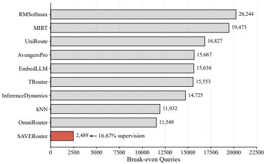
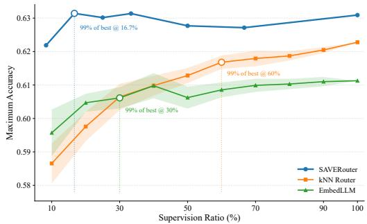
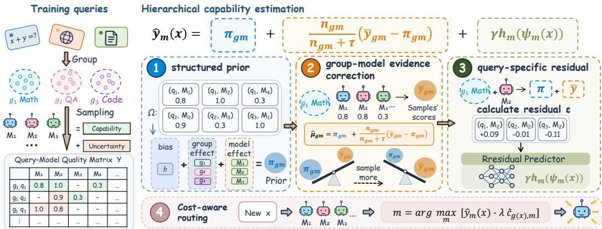
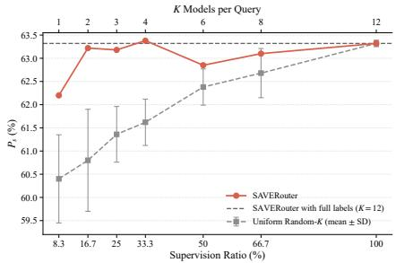
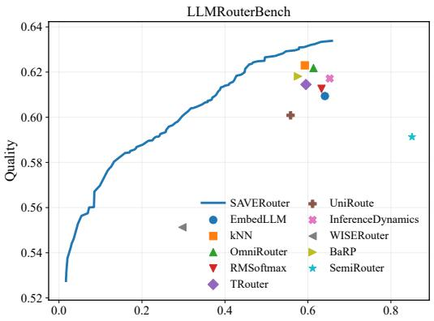
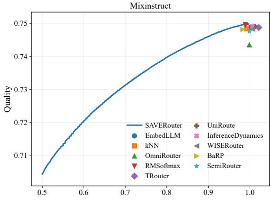
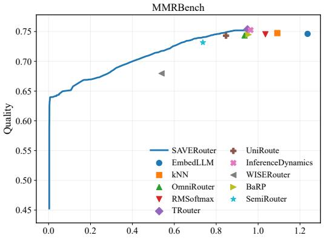
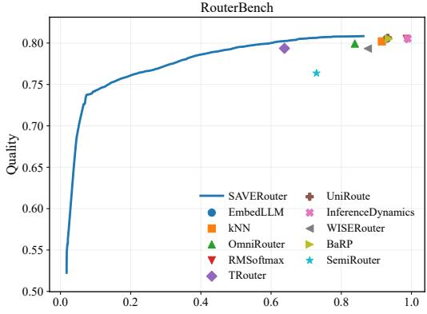

# ROUTING SHOULD PAY FOR ITSELF: SPARSE SUPERVISION FOR ECONOMICAL LLM ROUTING

Guannan Lai1,2,4 Gelin Bian1,2 Hao-Xuan Ma1,2 Jun-Peng Jiang1,2

Long Chen3 Jian-Dong Liu4 Zhi-Hao Tan1,2 Han-Jia Ye1,2

1School of Artificial Intelligence, Nanjing University

2National Key Laboratory for Novel Software Technology, Nanjing University

3The Hong Kong University of Science and Technology 4SinapisAI

{laign, biangl, mahx, jiangjp, liujd, tanzh, yehj}@lamda.nju.edu.cnlongchen@ust.hk

## ABSTRACT

Large language model (LLM) routing reduces serving cost by assigning each query to an appropriate model while preserving response quality. Learning such a router, however, often requires executing multiple candidate models on historical queries to collect query–model quality feedback, creating a nontrivial supervision cost before deployment. Existing work largely focuses on servingtime efficiency, overlooking whether the resulting savings are sufficient to recover this upfront expenditure. We further observe that routing quality often saturates well before all query–model feedback is collected, suggesting that dense supervision can be economically over-provisioned. We propose SAVER-OUTER, a sparse-supervision routing framework that selectively acquires informative model feedback and shares capability information across related queries, while retaining query-level refinement for fine-grained routing. We evaluate routing by jointly accounting for supervision expenditure and subsequent servingtime savings. Across four routing benchmarks, the main setting uses only about 33–41% of available training feedback while maintaining competitive or better routing quality, and reduces the break-even deployment volume by approximately 1.9–9.5× compared with the fastest conventional router. Further analysis shows that acquiring more supervision is not always economically preferable: the supervision level that minimizes serving cost can differ from the one that achieves the earliest payback. Our code is publicly available at https: //github.com/LAMDA-Model-Reuse/SaveRouter.

## 1 INTRODUCTION

Large language models (LLMs) differ substantially in both capability and serving cost (Chen et al., 2024a; Sakota et al., 2024), creating opportunities to reduce inference expense by routing each queryˇ to an appropriate model rather than always invoking the strongest one. This has motivated a growing body of LLM routing methods that optimize the quality–cost trade-off at serving time (Ding et al., 2024; Ong et al., 2025; Zhuang et al., 2025). Yet existing evaluations typically begin only after the router has been constructed, focusing on how much it saves during deployment. In practice, many supervised routers must first execute candidate models on historical queries to collect query–model quality feedback (Zhuang et al., 2025; Mei et al., 2025; Shi et al., 2025). This feedback acquisition incurs an upfront supervision expenditure before any serving-time savings can be realized.

This supervision expenditure can be substantial. For N training queries and M candidate models, densely evaluating the query–model matrix requires up to N × M model executions before deployment. Consequently, lower serving cost after deployment does not immediately imply an economic gain: the accumulated serving-time savings must first offset the cost of acquiring routing supervision. As illustrated in Figure 1(a), this upfront expenditure can substantially delay the point at which a router pays for itself. At the same time, dense supervision may provide far more

  
(a) Upfront supervision delays routing payback.

  
(b) Routing quality saturates before full supervision.

Figure 1: Dense supervision can be economically over-provisioned. Left: supervision expenditure can substantially delay the break-even point of routers with lower serving-time cost. Right: routing quality often saturates well before the full query–model matrix is observed; EmbedLLM and kNN recover 99% of their fully supervised accuracy with only 30% and 60% supervision, respectively.

feedback than routing actually needs. Figure 1(b) shows that EmbedLLM and kNN reach 99% of their full-supervision accuracy with only 30% and 60% supervision, respectively. This gap between supervision expenditure and marginal routing benefit suggests that dense query–model evaluation can be economically over-provisioned.

These observations motivate a sparse-supervision setting in which only a small fraction of query– model outcomes can be acquired before deployment. This setting introduces two coupled challenges. First, under a limited supervision budget, we must determine which query–model outcomes are most informative for downstream routing, rather than spending evaluations uniformly. Second, the resulting feedback is sparse and non-uniform, requiring the router to infer unobserved model behavior from limited evidence while retaining query-specific variation. We therefore ask: how can we acquire only the feedback needed for effective routing and learn reliably from it, so that the upfront supervision expenditure is recovered as early as possible?

To address this problem, we propose SAVEROUTER, a sparse-supervision routing framework designed to extract more routing-relevant information from each acquired feedback signal. Rather than evaluating every model on every training query, SAVEROUTER adaptively selects a small set of informative query–model outcomes and exploits shared capability structure across related queries to estimate the unobserved ones. A query-level correction further captures fine-grained variation within each group, producing model-quality estimates for cost-aware routing. By reducing the supervision expenditure required before deployment while preserving effective routing decisions, SAVEROUTER allows the upfront investment in routing supervision to be recovered much earlier.

Serving-time quality and cost alone do not reveal whether the savings from routing are sufficient to recover the supervision expenditure incurred before deployment. We therefore introduce two complementary metrics: SA-BEP measures how many deployment queries are needed for serving time savings to recover the upfront supervision expenditure, while SA-CR measures the resulting cost ratio after amortizing this expenditure over a fixed deployment horizon. Across four heterogeneous routing benchmarks, SAVEROUTER uses only about 33–41% of the available training feedback while maintaining competitive or better routing quality. At the target quality, it reduces the break-even deployment volume by approximately 1.9–9.5× compared with the fastest conventional fully supervised router. Further analysis shows that routing quality often saturates well before full supervision is collected, and that additional supervision does not necessarily lead to earlier payback or lower amortized cost.

In summary, our contributions are as follows:

• We account for upfront supervision expenditure in LLM routing and introduce SA-BEP and SA-CR to quantify payback and amortized cost.

• We propose SAVEROUTER, which learns effective routing from sparse feedback through adaptive acquisition and structured capability estimation.

• Experiments on four benchmarks show that SAVEROUTER maintains competitive routing quality with much less supervision and earlier break-even.

## 2 RELATED WORK

## 2.1 LLM ROUTING AND MODEL SELECTION

LLM routing selects an appropriate model for each query to balance response quality and inference cost. One line of work adopts cascading, where a cheaper model is queried first and its response is used to determine whether a stronger model is needed. FrugalGPT and AutoMix follow this paradigm through response scoring and self-verification, respectively (Chen et al., 2024a; Aggarwal et al., 2024). Predictive routing instead selects a model before response generation. Some methods learn when a cheaper model is sufficient: Hybrid LLM predicts whether a query should be escalated to a stronger model, while RouteLLM learns routing preferences from comparison data (Ding et al., 2024; Ong et al., 2025). Other methods explicitly model the relationship between queries and model capabilities. RouterDC learns query–model representations through contrastive learning, EmbedLLM learns compact model representations, and GraphRouter captures relationships among tasks, queries, and models using a heterogeneous graph (Chen et al., 2024b; Zhuang et al., 2025; Feng et al., 2025). While these approaches differ in how routing decisions are modeled, they typically assume access to substantial query–model supervision during router construction.

## 2.2 ROUTING WITH SPARSE OR PARTIAL SUPERVISION

Recent work relaxes the dense-supervision assumption by learning from limited or partial feedback. SemiRouter uses data-rich anchor models and a lightweight adapter to incorporate new models from sparse training data (Wang et al., 2026). BaRP learns routing policies from bandit feedback, where only the outcome of the selected model is observed, while allowing the quality–cost preference to vary at inference time (Wei et al., 2025). WISERouter jointly considers exploration and routing under a workload-level budget that covers both data collection and deployment (Li et al., 2026b).

These works show that effective routing can be learned without dense feedback, but they target different supervision settings and objectives. Our focus is the upfront supervision expenditure of router construction: given a limited supervision budget, which query–model outcomes should be acquired, and how quickly can serving-time savings recover this investment? SAVEROUTER addresses this setting through adaptive sparse feedback acquisition and structured capability estimation, and evaluates routing in terms of both serving efficiency and break-even behavior.

## 3 ROUTING SHOULD PAY FOR ITSELF

Existing LLM routing methods primarily evaluate the quality–cost trade-off after router construction, overlooking the supervision cost incurred before deployment. We therefore account for this upfront expenditure when evaluating routing, asking whether serving-time savings can eventually recover the supervision investment.

## 3.1 THE UPFRONT COST OF LEARNING TO ROUTE

Consider a training set $\mathcal { X } ~ = ~ \{ x _ { i } \} _ { i = 1 } ^ { N }$ and a candidate model pool $\mathcal { M } = \{ 1 , \ldots , M \}$ . Let $y _ { i m }$ denote the quality of model m on query $x _ { i }$ . Obtaining $y _ { i m }$ requires executing and evaluating the corresponding model. For an observed set of query–model pairs $\Omega \subseteq [ N ] \bar { \times } \mathcal { M }$ , we define the upfront supervision cost as

$$
C _ { 0 } ( \Omega ) = \sum _ { ( i , m ) \in \Omega } a _ { i m } ,
$$

where $a _ { i m }$ is the acquisition cost of observing $y _ { i m }$ . Under dense supervision, $\Omega _ { \mathrm { d e n s e } } = [ N ] \times \mathcal { M }$ requiring NM model evaluations. Thus, router construction becomes increasingly expensive as either the training workload or the candidate pool grows.

This upfront expenditure directly affects whether routing is economically useful. Let $C _ { \mathrm { r e f } }$ denote the average serving cost of a reference system, and let $C _ { \mathrm { s e r v e } } ( \pi )$ be the average serving cost of routing policy π under the same quality requirement. Its per-query saving is $\Delta \bar { C ( \pi ) } = \bar { C _ { \mathrm { r e f } } } - C _ { \mathrm { s e r v e } } ( \pi ) \bar { }$ After serving T deployment queries, the cumulative net saving is $\bar { S } ( T ; \pi , \bar { \Omega } ) = T \Delta C ( \pi ) - C _ { 0 } ( \bar { \Omega } )$

When $\Delta C ( \pi ) > 0$ , the supervision investment is recovered after approximately

$$
\mathrm { S A - B E P } = \frac { C _ { 0 } ( \Omega ) } { \Delta C ( \pi ) } .\tag{1}
$$

Equation 1 exposes a limitation of evaluating routers only by their serving-time cost. Two routers with similar serving-time efficiency can have very different payback behavior if one requires substantially more supervision to construct. Reducing supervision cost therefore shortens the time needed to recover the upfront investment. This expression makes the trade-off explicit: reducing supervision is useful only insofar as the resulting router preserves sufficient serving-time savings. The objective is therefore not to minimize $C _ { 0 }$ in isolation, but to reduce upfront supervision without sacrificing the quality–cost advantage that eventually amortizes it.

## 3.2 DENSE SUPERVISION IS OVER-PROVISIONED

Dense supervision provides complete query–model feedback, but completeness is stronger than what routing actually requires. We identify two sources of redundancy.

Structured redundancy. Related queries often exhibit similar model-performance patterns, allowing feedback on one query to inform model capability on others. Treating query–model pairs independently therefore ignores shared structure in the supervision matrix.

Decision redundancy. More importantly, routing is a decision problem rather than a matrixrecovery problem. For a cost preference λ, the router ultimately needs to identify

$$
m ^ { * } ( x ) = \arg \operatorname* { m a x } _ { m \in \mathcal { M } } \left[ y _ { m } ( x ) - \lambda c _ { m } ( x ) \right] ,
$$

rather than accurately estimate every $y _ { m } ( x )$ . Additional observations that refine capability estimates without changing the selected model provide little value to the final routing decision.

Dense supervision therefore optimizes information completeness, whereas routing only requires decision sufficiency. As illustrated in Figure 1, routing quality can remain competitive under substantially reduced supervision, while the lower acquisition cost directly shortens the break-even horizon. This suggests that supervision should itself be treated as a scarce resource: the important question is not whether every outcome can be observed, but which outcomes are most informative and decision-relevant for effective routing.

## 3.3 SPARSE-SUPERVISION LLM ROUTING

Motivated by this observation, we consider a setting in which only a small fraction of query–model outcomes can be acquired during router construction. Let $\bar { O _ { i m } } \ \bar { \in } \ \{ 0 , 1 \}$ indicate whether $y _ { i m }$ is observed, and define

$$
\Omega = \{ ( i , m ) \mid O _ { i m } = 1 \} .
$$

Given a supervision budget of at most $K \ll M$ models per training query,

$$
\sum _ { m = 1 } ^ { M } O _ { i m } \leq K , \qquad \forall i .
$$

The router is trained only from

$$
{ \mathcal { D } } _ { \mathrm { s p a r s e } } = \{ \left( x _ { i } , m , y _ { i m } , c _ { i m } \right) | \left( i , m \right) \in \Omega \} ,
$$

where selecting a query–model pair reveals both its quality feedback $y _ { i m }$ and realized serving cost $c _ { i m }$ . All remaining query–model outcomes are unavailable during router construction.

Under this setting, supervision acquisition and router learning become coupled. Formally, we seek an observation set Ω and the resulting routing policy $\pi \Omega$ that maximize deployment utility under a limited supervision budget:

$$
\begin{array} { r l } { \underset { \Omega , \pi _ { \Omega } } { \operatorname* { m a x } } } & { \mathbb { E } _ { \boldsymbol { x } \sim \mathcal { D } } \left[ y _ { \pi _ { \Omega } ( \boldsymbol { x } ) } ( \boldsymbol { x } ) - \lambda c _ { \pi _ { \Omega } ( \boldsymbol { x } ) } ( \boldsymbol { x } ) \right] } \\ { \mathrm { s . t . } } & { | \Omega _ { i } | \leq K , \qquad \forall i , } \end{array}
$$

  
Figure 2: Overview of SAVEROUTER . SAVEROUTER first groups related training queries and adaptively acquires sparse query–model feedback using capability and uncertainty. It then estimates model capability through a structured group–model prior, evidence-based correction from the acquired observations, and a query-specific residual predictor. At deployment time, the resulting quality estimates are combined with estimated serving costs for cost-aware routing.

where $\Omega _ { i } = \{ m \mid ( i , m ) \in \Omega \}$

The goal is therefore not to reconstruct the complete query–model matrix. Instead, sparsesupervision routing seeks the smallest amount of informative feedback sufficient to preserve effective routing decisions. This gives rise to two coupled challenges: feedback acquisition, which determines which query–model outcomes are most informative for downstream routing decisions, and sparse capability estimation, which infers model behavior from the limited observations. SAVER-OUTER addresses these two challenges by adaptively acquiring informative feedback and exploiting shared capability structure across related queries, as described next.

## 4 SAVEROUTER : LEARNING TO ROUTE FROM SPARSE SUPERVISION

SAVEROUTER is designed around the two challenges identified in Section 3: deciding which feedback is most informative to acquire and inferring model capability from sparse observations. Figure 2 provides an overview of the framework. The overall procedure consists of three stages. First, SAVEROUTER groups related training queries and adaptively allocates a small evaluation budget using both estimated capability and uncertainty, yielding a sparse set of observed query–model outcomes. Second, it performs hierarchical capability estimation: a structured group–model prior shares information across groups and models, acquired evidence corrects this prior, and a lightweight residual predictor recovers query-specific variation. Finally, the resulting quality estimates are combined with serving-cost estimates to perform cost-aware routing for unseen queries.

## 4.1 ADAPTIVE SPARSE FEEDBACK ACQUISITION

With only $K \ll M$ model evaluations available per query, uniformly sampling candidate models may waste supervision on models whose behavior is already well understood or unlikely to affect routing decisions. SAVEROUTER instead allocates feedback according to both estimated capability and uncertainty.

Query grouping. The acquisition process relies on the observation that related queries often share similar model-performance patterns. We therefore assign each query $x _ { i }$ to a group $g _ { i } .$ . When predictable task labels are available in the training data, they define the training groups and we learn a classifier to assign unseen queries; otherwise, we cluster frozen query representations. Grouping uses only query inputs and training-side group information, never model-quality feedback.

Group-conditioned capability tracking. For each group–model pair $( g , m )$ , we maintain its observation count $n _ { g m }$ and cumulative quality $S _ { g m } .$ . Because some pairs may receive very few observations, their empirical means can be unstable. We therefore first estimate the global capability of model m and then shrink the group-specific estimate toward it:

$$
\bar { \mu } _ { m } = \frac { S _ { m } + \alpha _ { 0 } } { n _ { m } + \alpha _ { 0 } + \beta _ { 0 } } , \qquad \tilde { \mu } _ { g m } = \frac { S _ { g m } + \tau _ { 0 } \bar { \mu } _ { m } } { n _ { g m } + \tau _ { 0 } } .
$$

Here, $\bar { \mu } _ { m }$ captures the overall capability of model $m ,$ while $\tilde { \mu } _ { g m }$ adapts this estimate to group g as group-specific evidence accumulates.

Capability–uncertainty acquisition. Acquisition proceeds for K passes over the training set, with one new query–model outcome acquired per query in each pass. At the beginning of each pass, we reset the group- and model-level acquisition statistics and randomly permute all training queries, while retaining the observation mask across passes. Using only feedback revealed earlier in the current pass, we score each group–model pair by

$$
a _ { g m } = \tilde { \mu } _ { g m } + \beta _ { \mathrm { u c b } } \sqrt { \frac { \log \left( \sum _ { j } n _ { g j } + 1 \right) } { \operatorname* { m a x } ( n _ { g m } , 1 ) } } , \qquad m _ { i } = \arg \operatorname* { m a x } _ { m \in \mathcal { C } _ { i } } a _ { g _ { i } m } ,\tag{2}
$$

where $\mathcal { C } _ { i }$ contains models that are available for $x _ { i }$ and have not been previously acquired for this query. If the current group contains candidate models with $n _ { g _ { i } m } = 0$ , we uniformly select one such model before applying $\operatorname { E q . }$ (2), ensuring basic within-pass coverage. After selecting $m _ { i } ,$ we reveal its feedback and update the current-pass statistics. Each pass therefore contributes one new observation per training query, and after $K$ passes the sparse supervision contains NK distinct pairs.

## 4.2 HIERARCHICAL CAPABILITY ESTIMATION

Adaptive acquisition produces sparse and highly non-uniform observations. Consequently, directly using the empirical mean of each group–model pair is unreliable: frequently observed pairs may be estimated accurately, whereas rare or completely unobserved pairs provide little or no local evidence. Moreover, observations collected under the adaptive policy are not uniformly distributed across groups and models. SAVEROUTER therefore estimates capability hierarchically, combining shared global structure with local group-level evidence. After acquisition is complete, we aggregate observations across all K passes. We use $S _ { g m } ^ { \Omega }$ and $n _ { g m } ^ { \Omega }$ to denote the cumulative quality sum and observation count for group–model pair $( g , m )$ over the complete sparse observation set Ω.

Structured group–model prior. We first fit a two-way additive model on the observed pairs:

$$
y _ { i m } = b + u _ { g _ { i } } + v _ { m } + \epsilon _ { i m } , \qquad ( \hat { b } , \hat { u } , \hat { v } ) = \arg \operatorname* { m i n } _ { b , u , v } \sum _ { ( i , m ) \in \Omega } ( y _ { i m } - b - u _ { g _ { i } } - v _ { m } ) ^ { 2 } + \lambda _ { \mathrm { p r i o r } } \left( \| u \| _ { 2 } ^ { 2 } + \| v \| _ { 2 } ^ { 2 } \right) .
$$

Here, b represents overall task difficulty, $u _ { g }$ captures systematic differences among query groups, and $v _ { m }$ captures global differences among candidate models. Because these parameters are shared across many observations, the model provides a stable estimate even for sparsely observed group– model pairs. The resulting structured prior is

$$
\begin{array} { r } { \pi _ { g m } = \mathrm { c l i p } \left( \hat { b } + \hat { u } _ { g } + \hat { v } _ { m } , 0 , 1 \right) . } \end{array}
$$

Local evidence with shrinkage. The prior captures shared structure but cannot replace direct observations when sufficient local evidence is available. We therefore combine it with the observed outcomes for each group–model pair:

$$
\hat { \mu } _ { g m } = \frac { S _ { g m } ^ { \Omega } + \tau \pi _ { g m } } { n _ { g m } ^ { \Omega } + \tau } = \frac { n _ { g m } ^ { \Omega } } { n _ { g m } ^ { \Omega } + \tau } \bar { y } _ { g m } + \frac { \tau } { n _ { g m } ^ { \Omega } + \tau } \pi _ { g m } .
$$

The parameter τ controls the strength of the prior. When $n _ { g m }$ is large, the estimate is dominated by observed group-specific feedback; when observations are scarce, it increasingly relies on shared structure. For an entirely unobserved pair, the estimate naturally reduces to the structured prior.

## 4.3 QUERY-LEVEL RESIDUAL CORRECTION

The hierarchical estimate in Eq. 4.2 assigns the same group-level capability to all queries within a group. This provides a stable estimate under sparse supervision, but inevitably misses within-group

variation. For example, two queries assigned to the same task group may still differ in difficulty or favor different models.

We therefore learn only the variation that remains unexplained by the shared group structure. For each observed pair $( i , m )$ , we remove its direct contribution from the local group–model statistics and construct

$$
\hat { \mu } _ { g _ { i } m } ^ { ( - i ) } = \frac { S _ { g _ { i } m } ^ { \Omega } - y _ { i m } + \tau \pi _ { g _ { i } m } } { n _ { g _ { i } m } ^ { \Omega } - 1 + \tau } , \qquad e _ { i m } = y _ { i m } - \hat { \mu } _ { g _ { i } m } ^ { ( - i ) } .
$$

Removing $y _ { i m }$ from the local sufficient statistics reduces direct self-influence through the grouplevel estimate. For each model m with sufficient acquired observations, we fit a lightweight predictor

$$
h _ { m } = \arg \operatorname* { m i n } _ { h } \sum _ { i : ( i , m ) \in \Omega } \left( e _ { i m } - h ( \psi _ { \mathrm { r e s } } ( x _ { i } ) ) \right) ^ { 2 } + \lambda _ { \mathrm { c t x } } \| h \| _ { 2 } ^ { 2 } ,
$$

where $\psi _ { \mathrm { r e s } } ( x )$ denotes a lightweight contextual representation that is separate from the representation used for query grouping. The final capability estimate is

$$
\hat { y } _ { m } ( x ) = \hat { \mu } _ { g ( x ) , m } + \gamma h _ { m } ( \psi _ { \mathrm { r e s } } ( x ) ) .
$$

This decomposition deliberately assigns different roles to the two terms. The hierarchical component captures stable capability patterns that can be reliably shared under sparse supervision, while the residual predictor only models instance-specific deviations.

Cost-Aware Routing. The acquired query–model pairs provide both quality and serving-cost observations. Using the same sparse observation set Ω, we estimate the expected cost of each observed group–model pair by its sample mean and back off to the corresponding model-level mean when group-specific observations are unavailable. We denote the resulting estimate by $\hat { c } _ { g m }$

At deployment, SAVEROUTER combines the predicted quality and serving cost:

$$
\pi _ { \lambda } ( x ) = \arg \operatorname* { m a x } _ { m \in \mathcal { M } } \left[ \hat { y } _ { m } ( x ) - \lambda \frac { \hat { c } _ { g ( x ) , m } } { C _ { \mathrm { m a x } } } \right] ,
$$

where $C _ { \mathrm { m a x } }$ is the largest model-level mean cost estimated from the acquired training pairs, and λ controls the quality–cost trade-off. Both quality and cost estimation use only feedback in Ω.

## 5 EXPERIMENT

## 5.1 EXPERIMENTAL SETUP

Benchmarks. We evaluate SAVEROUTER on four routing benchmarks: LLMRouterBench (Li et al., 2026a), Mixinstruct (Jiang et al., 2023), MMR-Bench (Ma et al., 2026), and RouterBench (Hu et al., 2024). For all benchmarks, we use the same in-domain 20%/80% train/test split with random seed 42. For query grouping, text benchmarks use frozen all-MiniLM-L6-v2 representations, while MMRBench uses concatenated CLIP ViT-B/16 text and image representations. The query-level residual predictor uses a separate lightweight feature representation described in Appendix C.

Baselines. We compare SAVEROUTER with EmbedLLM (Zhuang et al., 2025), kNN (Stripelis et al., 2024), OmniRouter (Mei et al., 2025), RMSoftmax (Tsiourvas et al., 2025), TRouter (Liu et al., 2026), UniRoute (Jitkrittum et al., 2026), InferenceDynamics (Shi et al., 2025), WISERouter (Li et al., 2026b), BaRP (Wei et al., 2025), and SemiRouter (Wang et al., 2026). All methods are evaluated under the same data splits within the ORBIT toolkit (Lai et al., 2026b). WISERouter, BaRP, and SemiRouter are paper-derived reimplementations adapted to this evaluation pipeline.

Evaluation Metrics. Our primary metrics account for the model-execution cost of acquiring routing supervision together with the subsequent model-serving cost, rather than complete system-level cost. All supervision-amortized metrics are evaluated within each benchmark and should not be interpreted as comparable absolute monetary costs across benchmarks; SA-BEP and SA-CR are invariant to a common positive rescaling of all cost terms within a benchmark. Let $Q _ { b }$ and $C _ { b }$ denote the quality and per-query serving cost of the best single model. We define the upfront supervision cost $C _ { 0 }$ as the total model-execution cost used to acquire routing supervision, and let $c _ { r }$ denote the minimum average model-serving cost at which the router reaches $Q _ { b } .$ . The resulting per-query saving is $\Delta c = C _ { b } - c _ { r }$ . When the target quality is reached and $\Delta c > 0$ , we define

Table 1: Main results on four routing benchmarks. Higher $P _ { s }$ is better; lower CR, SA-BEP, and SA-CR@1M are better. ∞ denotes an unreachable target operating point; for supervision-amortized metrics, it also indicates non-positive per-query saving. For sparse- or partial-feedback methods, every model invocation used to acquire feedback is charged separately.
<table><tr><td></td><td colspan="4">LLMRouterBench</td><td colspan="4">Mixinstruct</td></tr><tr><td>Method</td><td> $P _ { s } \uparrow$ </td><td>CR↓</td><td>SA-BEP↓</td><td>SA-CR@1M↓</td><td>P s ↑</td><td>CR↓</td><td>SA-BEP↓</td><td>SA-CR@1M↓</td></tr><tr><td>EmbedLLM</td><td>0.6094</td><td>0.5246</td><td>15.6K</td><td>0.5321</td><td>0.7488</td><td>0.9924</td><td>28.60M</td><td>1.2088</td></tr><tr><td>kNN</td><td>0.6230</td><td>0.3770</td><td>11.9K</td><td>0.3845</td><td>0.7484</td><td>0.9814</td><td>11.63M</td><td>1.1977</td></tr><tr><td>OmniRouter</td><td>0.6218</td><td>0.3564</td><td>11.5K</td><td>0.3638</td><td>0.7435</td><td>∞</td><td>∞</td><td>∞</td></tr><tr><td>RMSoftmax</td><td>0.6126</td><td>0.6328</td><td>20.2K</td><td>0.6403</td><td>0.7495</td><td>0.9893</td><td>20.19M</td><td>1.2056</td></tr><tr><td>TRouter</td><td>0.6145</td><td>0.5221</td><td>15.6K</td><td>0.5295</td><td>0.7488</td><td>1.0000</td><td>∞</td><td>∞</td></tr><tr><td>UniRoute</td><td>0.6008</td><td>0.5583</td><td>16.8K</td><td>0.5657</td><td>0.7491</td><td>1.0000</td><td>∞</td><td>∞</td></tr><tr><td>InferenceDyn.</td><td>0.6172</td><td>0.4952</td><td>14.7K</td><td>0.5026</td><td>0.7491</td><td>1.0000</td><td>8</td><td>8</td></tr><tr><td>WISERouter</td><td>0.5513</td><td>∞</td><td>∞</td><td>∞</td><td>0.7483</td><td>1.0000</td><td>8</td><td>∞</td></tr><tr><td>BaRP</td><td>0.6181</td><td>0.3161</td><td>114.0K</td><td>0.3941</td><td>0.7482</td><td>0.9695</td><td>44.66M</td><td>2.3329</td></tr><tr><td>SemiRouter</td><td>0.5913</td><td>0.8509</td><td>26.5K</td><td>0.8548</td><td>0.7476</td><td>8</td><td>8</td><td>8</td></tr><tr><td>SAVEROUTER</td><td>0.6338</td><td>0.2320</td><td>5.3K</td><td>0.2360</td><td>0.7498</td><td>0.9359</td><td>1.23M</td><td>1.0148</td></tr></table>

<table><tr><td rowspan="2">Method</td><td colspan="4">MMR-Bench</td><td colspan="4">RouterBench</td></tr><tr><td> $P _ { s } \uparrow$ </td><td>CR↓</td><td>SA-BEP↓</td><td>SA-CR@1M↓</td><td> $P _ { s } \uparrow$ </td><td>CR↓</td><td>SA-BEP↓</td><td>SA-CR@1M↓</td></tr><tr><td>EmbedLLM</td><td>0.7461</td><td>1.0000</td><td>∞</td><td>∞</td><td>0.8053</td><td>0.9296</td><td>326.4K</td><td>0.9526</td></tr><tr><td>kNN</td><td>0.7475</td><td>1.0000</td><td>∞</td><td>∞</td><td>0.8021</td><td>∞</td><td>∞</td><td>∞</td></tr><tr><td>OmniRouter</td><td>0.7435</td><td>∞</td><td>∞</td><td>∞</td><td>0.7994</td><td>∞</td><td>∞</td><td>∞</td></tr><tr><td>RMSoftmax</td><td>0.7454</td><td>1.0350</td><td>8</td><td>8</td><td>0.8050</td><td>0.9865</td><td>1.70M</td><td>1.0095</td></tr><tr><td>TRouter</td><td>0.7536</td><td>0.8396</td><td>34.1K</td><td>0.8451</td><td>0.7936</td><td>∞</td><td>∞</td><td>8</td></tr><tr><td>UniRoute</td><td>0.7430</td><td>∞</td><td>8</td><td>∞</td><td>0.8062</td><td>0.9327</td><td>341.3K</td><td>0.9557</td></tr><tr><td>InferenceDyn.</td><td>0.7525</td><td>0.9641</td><td>152.4K</td><td>0.9696</td><td>0.8053</td><td>0.9892</td><td>2.13M</td><td>1.0122</td></tr><tr><td>WISERouter</td><td>0.6796</td><td>∞</td><td>∞</td><td>∞</td><td>0.7934</td><td>∞</td><td>∞</td><td>∞</td></tr><tr><td>BaRP</td><td>0.7448</td><td>0.9052</td><td>640.8K</td><td>0.9660</td><td>0.8053</td><td>0.9355</td><td>3.25M</td><td>1.1449</td></tr><tr><td>SemiRouter</td><td>0.7316</td><td>∞</td><td>∞</td><td>∞</td><td>0.7636</td><td>∞</td><td>∞</td><td>∞</td></tr><tr><td>SAVEROUTER</td><td>0.7540</td><td>0.7765</td><td>18.2K</td><td>0.7806</td><td>0.8084</td><td>0.6810</td><td>42.6K</td><td>0.6946</td></tr></table>

$$
{ \mathrm { S A - B E P } } = \left\lceil { \frac { C _ { 0 } } { \Delta c } } \right\rceil , \qquad { \mathrm { S A - C R } } ( H ) = { \frac { C _ { 0 } + H c _ { r } } { H C _ { b } } } .
$$

SA-BEP measures the deployment volume required to recover the upfront supervision cost, while SA-CR measures the cost ratio after amortizing this cost over H deployment queries. We report either metric as ∞ when the target quality is unreachable or no positive saving is achieved.

We additionally report Peak Score $( P _ { s } )$ , the highest test score across routing operating points, and Cost Ratio (CR), the minimum normalized model-serving cost required to reach $Q _ { b }$ . Higher $P _ { s }$ and lower CR, SA-BEP, and SA-CR are better.

## 5.2 SAVEROUTER PAYS BACK EARLIER WITHOUT SACRIFICING ROUTING QUALITY

Comparison with conventional routers. SAVEROUTER achieves the highest $P _ { s }$ and the lowest CR on all four benchmarks, despite relying on substantially less supervision than fully supervised routers. More importantly, this translates directly into earlier payback. On LLMRouterBench, SAVEROUTER reaches break-even after only 5.3K deployment queries, compared with 11.5K for the fastest conventional baseline. The gap becomes larger on RouterBench, where SAVEROUTER requires 42.6K queries versus 326.4K for EmbedLLM. Mixinstruct provides an especially informative case: routing quality is already highly saturated across methods, with most $\bar { P _ { s } }$ values close to 0.75, yet SAVEROUTER reduces SA-BEP from 11.63M for the fastest conventional router to 1.23M.

Table 2: Ablation on LLMRouterBench.
<table><tr><td>Variant</td><td>Ps ↑</td><td>CR↓</td><td>SA-BEP↓</td><td>SA-CR@1M↓</td></tr><tr><td colspan="5">(a) Estimator ablations</td></tr><tr><td>w/o Query Residual</td><td>0.6175</td><td>0.3484</td><td>6.2K</td><td>0.3525</td></tr><tr><td>Embedding Groups</td><td>0.6220</td><td>0.3229</td><td>5.5K</td><td>0.3266</td></tr><tr><td>Global Group</td><td>0.5985</td><td>0.3190</td><td>6.8K</td><td>0.3236</td></tr><tr><td colspan="5">(b) Acquisition ablations</td></tr><tr><td>Random-K</td><td>0.6183</td><td>0.2958</td><td>3.8K</td><td>0.2983</td></tr><tr><td>Capability-only</td><td>0.6291</td><td>0.2587</td><td>5.9K</td><td>0.2630</td></tr><tr><td>Uncertainty-only</td><td>0.6135</td><td>0.3411</td><td>4.0K</td><td>0.3435</td></tr><tr><td>SAVEROUTER</td><td>0.6338</td><td>0.2320</td><td>5.3K</td><td>0.2360</td></tr></table>

  
Figure 3: Effect of supervision budget on routing quality.

These results show that reducing supervision cost can substantially shorten payback even when serving-time routing quality changes only marginally.

Comparison with sparse-feedback routers. SAVEROUTER also compares favorably with meth ods explicitly designed for limited or partial feedback. WISERouter and SemiRouter frequently fail to reach the target operating point or to produce positive net savings, resulting in unreachable supervision-amortized metrics on several benchmarks. BaRP more consistently reaches competitive routing quality, but its repeated bandit interactions incur substantially larger supervision expenditure under our supervision-cost accounting. Consequently, its SA-BEP is 114.0K, 44.66M, 640.8K, and 3.25M across the four benchmarks, compared with 5.3K, 1.23M, 18.2K, and 42.6K for SAVER-OUTER. Thus, sparse feedback alone is not sufficient: how the limited supervision is acquired and shared across queries is critical to making routing economically effective.

## 5.3 ABLATION: WHAT MAKES SAVEROUTER WORK?

We ablate both the sparse capability estimator and the acquisition policy on LLMRouterBench under the same supervision budget of $K = 4 .$ . For the estimator, removing query-level residual correction lowers $P _ { s }$ by 1.63 percentage points and increases CR from 0.2320 to 0.3484, showing that grouplevel estimates alone miss important query-specific variation. Replacing task-aware groups with embedding-based clusters also degrades both routing quality and cost efficiency, while collapsing all queries into a single group causes the largest drop in $P _ { s }$ , from 0.6338 to 0.5985.

We next isolate the acquisition policy while keeping the downstream estimator fixed. Random-K, capability-only, and uncertainty-only acquisition all underperform the proposed UCB policy in either routing quality or serving efficiency. Notably, Random-K reaches break-even earlier (3.8K vs. 5.3K queries), whereas SAVEROUTER achieves higher Ps and lower SA-CR@1M, showing that earliest payback and long-horizon efficiency need not coincide. Combining capability and uncer tainty yields the strongest quality–cost trade-off, supporting the use of both signals for selecting informative feedback under a fixed supervision budget.

## 5.4 HOW MUCH SUPERVISION IS ENOUGH?

Figure 3 compares SAVEROUTER with Uniform Random-K under the same supervision budget; error bars show the standard deviation of random selection, and the dashed line denotes full supervision. With only $K = 2$ models evaluated per query (16.7% supervision), SAVEROUTER already approaches its full-supervision accuracy and clearly outperforms Uniform Random-K. Increasing K further yields only modest gains, indicating rapidly diminishing returns from additional supervision.

Together with the acquisition ablation in Table 2, these results highlight two complementary aspects of supervision efficiency: effective routing depends not only on how much feedback is acquired, but also on which feedback is selected. Dense supervision is therefore often unnecessary once the acquired observations are sufficiently informative for downstream routing decisions.

Performance is not strictly monotonic in K. We do not interpret these small fluctuations as evidence that additional supervision is intrinsically harmful. Changing the supervision budget changes the observations used to fit the capability estimator and can consequently alter the learned routing frontier. The broader trend is therefore more informative than any individual operating point: routing quality saturates early, while additional supervision provides limited marginal benefit.

## 6 CONCLUSION

We introduce SAVEROUTER, a sparse-supervision routing framework that learns effective routing policies from limited query–model feedback. By selectively acquiring informative outcomes and sharing capability information across related queries, SAVEROUTER maintains competitive routing quality with substantially lower supervision expenditure. Across benchmarks and operating regimes, this results in earlier break-even and lower supervision-amortized cost. Our results show that economical LLM routing depends not only on serving-time efficiency, but also on how much supervision is acquired before deployment.

## REFERENCES

Pranjal Aggarwal, Aman Madaan, Ankit Anand, Srividya Pranavi Potharaju, Swaroop Mishra, Pei Zhou, Aditya Gupta, Dheeraj Rajagopal, Karthik Kappaganthu, Yiming Yang, Shyam Upadhyay, Manaal Faruqui, and Mausam . Automix: Automatically mixing language models. In The Thirtyeighth Annual Conference on Neural Information Processing Systems, 2024.

Lingjiao Chen, Matei Zaharia, and James Zou. FrugalGPT: How to use large language models while reducing cost and improving performance. Transactions on Machine Learning Research, 2024a.

Shuhao Chen, Weisen Jiang, Baijiong Lin, James T. Kwok, and Yu Zhang. Routerdc: Querybased router by dual contrastive learning for assembling large language models. In Advances in Neural Information Processing Systems (NeurIPS), 2024b. URL https://arxiv.org/ abs/2409.19886.

Dujian Ding, Ankur Mallick, Chi Wang, Robert Sim, Subhabrata Mukherjee, Victor Ruhle, Laks V. S. Lakshmanan, and Ahmed Awadallah. Hybrid llm: Cost-efficient and quality-aware query routing. In International Conference on Learning Representations (ICLR), 2024. URL https: //arxiv.org/abs/2404.14618.

Tao Feng, Yanzhen Shen, and Jiaxuan You. Graphrouter: A graph-based router for LLM selections. In The Thirteenth International Conference on Learning Representations, 2025.

Qitian Jason Hu, Jacob Bieker, Xiuyu Li, Nan Jiang, Benjamin Keigwin, Gaurav Ranganath, Kurt Keutzer, and Shriyash Kaustubh Upadhyay. Routerbench: A benchmark for multi-LLM routing system. In Agentic Markets Workshop at ICML 2024, 2024.

Dongfu Jiang, Xiang Ren, and Bill Yuchen Lin. LLM-blender: Ensembling large language models with pairwise ranking and generative fusion. In Proceedings of the 61st Annual Meeting of the Associationfor Computational Linguistics (Volume 1: Long Papers), pp. 14165–14178, 2023.

Wittawat Jitkrittum, Harikrishna Narasimhan, Ankit Singh Rawat, Jeevesh Juneja, Congchao Wang, Zifeng Wang, Alec Go, Chen-Yu Lee, Pradeep Shenoy, Rina Panigrahy, Aditya Krishna Menon, and Sanjiv Kumar. Universal model routing for efficient LLM inference. In The Fourteenth International Conference on Learning Representations, 2026.

Jannik Kossen, Sebastian Farquhar, Yarin Gal, and Tom Rainforth. Active testing: Sample-efficient model evaluation. In International Conference on Machine Learning, pp. 5753–5763. PMLR, 2021.

Guannan Lai and Han-Jia Ye. When routing collapses: On the degenerate convergence of llm routers, 2026.

Guannan Lai, Haoran Hu, Long Chen, Zhenguo Li, and Han-Jia Ye. From sampled outcomes to capability distributions: Rethinking supervision for LLM routing. In Proceedings of the 2026 Conference on Empirical Methods in Natural Language Processing, 2026a.

Guannan Lai, Haoran Hu, Hao-Xuan Ma, and Han-Jia Ye. Orbit: An optimal routing and budgeted inference toolbox. Frontiers ofComputer Science, 2026b.

Hao Li, Yiqun Zhang, Zhaoyan Guo, Chenxu Wang, Shengji Tang, Qiaosheng Zhang, Yang Chen, Biqing Qi, Peng Ye, Lei Bai, et al. Llmrouterbench: A massive benchmark and unified framework for llm routing. In Findings of the Association for Computational Linguistics: ACL 2026, pp. 37733–37754, 2026a.

Yang Li, Jie Ma, Miguel Ballesteros, Yassine Benajiba, and Graham Horwood. Active evaluation acquisition for efficient llm benchmarking. arXiv preprint arXiv:2410.05952, 2024.

Yifei Li, Zihui Gao, and Laks VS Lakshmanan. Wiserouter: Llm routing with workload budget constraint. arXiv preprint arXiv:2607.23765, 2026b.

Hui Liu, Bin Zou, Kecheng Chen, Jie Liu, Wenya Wang, and Haoliang Li. Task-aware LLM routing with multi-level task-profile-guided data synthesis for cold-start scenarios. In Maria Liakata, Viviane P. Moreira, Jiajun Zhang, and David Jurgens (eds.), Proceedings ofthe 64th Annual Meeting of the Association for Computational Linguistics (Volume 1: Long Papers), pp. 22047–22076, San Diego, California, United States, July 2026. Association for Computational Linguistics. ISBN 979-8-89176-390-6.

Haoxuan Ma, Guannan Lai, and Han-Jia Ye. Mmr-bench: A comprehensive benchmark for multimodal llm routing. In ECCV, 2026.

Kai Mei, Wujiang Xu, Minghao Guo, Shuhang Lin, and Yongfeng Zhang. Omnirouter: Budget and performance controllable multi-llm routing. ACM SIGKDD Explorations Newsletter, 27(2): 107–116, 2025.

Isaac Ong, Amjad Almahairi, Vincent Wu, Wei-Lin Chiang, Tianhao Wu, Joseph E Gonzalez, M Kadous, and Ion Stoica. Routellm: Learning to route llms from preference data. In Y. Yue, A. Garg, N. Peng, F. Sha, and R. Yu (eds.), International Conference on Learning Representations, volume 2025, pp. 34433–34448, 2025.

Yotam Perlitz, Elron Bandel, Ariel Gera, Ofir Arviv, Liat Ein Dor, Eyal Shnarch, Noam Slonim, Michal Shmueli-Scheuer, and Leshem Choshen. Efficient benchmarking (of language models). In Proceedings of the 2024 Conference of the North American Chapter of the Association for Computational Linguistics: Human Language Technologies (Volume 1: Long Papers), pp. 2519– 2536, 2024.

Marija Sakota, Maxime Peyrard, and Robert West. Fly-swat or cannon? cost-effective languageˇ model choice via meta-modeling. In Proceedings of the 17th ACM International Conference on Web Search and Data Mining, pp. 606–615, 2024.

Haochen Shi, Tianshi Zheng, Weiqi Wang, Baixuan Xu, Chunyang Li, Chunkit Chan, Tao Fan, Yangqiu Song, and Qiang Yang. Inferencedynamics: Efficient routing across llms through structured capability and knowledge profiling, 2025.

Wei Song, Zhenya Huang, Cheng Cheng, Weibo Gao, Bihan Xu, GuanHao Zhao, Fei Wang, and Runze Wu. IRT-router: Effective and interpretable multi-LLM routing via item response theory. In Wanxiang Che, Joyce Nabende, Ekaterina Shutova, and Mohammad Taher Pilehvar (eds.), Proceedings of the 63rd Annual Meeting of the Association for Computational Linguistics (Volume 1: Long Papers), pp. 15629–15644, Vienna, Austria, July 2025. Association for Computational Linguistics. ISBN 979-8-89176-251-0.

Dimitris Stripelis, Zhaozhuo Xu, Zijian Hu, Alay Dilipbhai Shah, Han Jin, Yuhang Yao, Jipeng Zhang, Tong Zhang, Salman Avestimehr, and Chaoyang He. TensorOpera router: A multi-model router for efficient LLM inference. In Franck Dernoncourt, Daniel Preot¸iuc-Pietro, and Anastasia Shimorina (eds.), Proceedings of the 2024 Conference on Empirical Methods in Natural Language Processing: Industry Track, pp. 452–462, Miami, Florida, US, November 2024. Association for Computational Linguistics.

Asterios Tsiourvas, Wei Sun, and Georgia Perakis. Causal LLM Routing: End-to-end regret minimization from observational data. In Advances in Neural Information Processing Systems, volume 38, 2025.

Zijie Wang, Xinyu Yan, Che Wang, Zeng Zihao, Lei Xiao, and Wei Yang Bryan Lim. Semirouter: Sparse-data enhanced routing for adaptive multi-llm system. In Proceedings of the 19th Conference ofthe European Chapter ofthe Associationfor Computational Linguistics (Volume 1: Long Papers), pp. 4910–4921, 2026.

Wang Wei, Tiankai Yang, Hongjie Chen, Yue Zhao, Franck Dernoncourt, Ryan A Rossi, and Hoda Eldardiry. Learning to route llms from bandit feedback: One policy, many trade-offs. arXiv preprint arXiv:2510.07429, 2025.

Xin-Yi Zhang, Han-Jia Ye, and De-Chuan Zhan. Efficient LLM benchmark evaluation with bayesian item response and routed subspace selection. In Proceedings of the 35th ACM International Conference on Information and Knowledge Management. ACM, 2026.

Yiqun Zhang, Hao Li, Jianhao Chen, Hangfan Zhang, Peng Ye, Lei Bai, and Shuyue Hu. Beyond gpt-5: Making llms cheaper and better via performance-efficiency optimized routing. In Proceedings of the 2025 7th International Conference on Distributed Artificial Intelligence, pp. 122–129, 2025.

Richard Zhuang, Tianhao Wu, Zhaojin Wen, Andrew Li, Jiantao Jiao, and Kannan Ramchandran. Embedllm: Learning compact representations of large language models. In International Conference on Learning Representations, volume 2025, pp. 76913–76926, 2025.

## APPENDIX

## A COST ACCOUNTING WITH UPFRONT SUPERVISION

Our evaluation accounts for both the upfront cost of acquiring routing supervision and the modelserving cost incurred after deployment. This section describes the cost accounting protocol used throughout our experiments and provides detailed definitions of the supervision-amortized metrics.

## A.1 COST COMPONENTS AND ASSUMPTIONS

Supervision acquisition cost. We define the upfront supervision cost $C _ { 0 }$ as the total modelexecution cost of acquiring the feedback used to construct a router. For each observed query–model pair $( i , m )$ , let $a _ { i m }$ denote the model-execution cost provided by the corresponding benchmark. Given an observation set Ω, the total supervision cost is

$$
C _ { 0 } ( \Omega ) = \sum _ { ( i , m ) \in \Omega } a _ { i m } .
$$

This definition charges only model evaluations used to obtain routing feedback; router training itself is not included in $\bar { C _ { 0 } }$

Fully supervised routers. For conventional fully supervised methods, we charge all available training query–model feedback. For a complete matrix with N training queries and M candidate models, the supervision cost is

$$
C _ { 0 } ^ { \mathrm { d e n s e } } = \sum _ { i = 1 } ^ { N } \sum _ { m = 1 } ^ { M } a _ { i m } .
$$

Thus, all model evaluations required to obtain dense supervision are counted before deployment.

Sparse-supervision routers. For SAVEROUTER, only the query–model outcomes actually acquired during sparse supervision are charged. When K distinct models are evaluated for each training query, $| \bar { \Omega } | = N \bar { K }$ , and

$$
C _ { 0 } ^ { \mathrm { { S A V E } } } = \sum _ { i = 1 } ^ { N } \sum _ { m \in \Omega _ { i } } a _ { i m } , \qquad | { \Omega } _ { i } | = K .
$$

The same accounting principle is applied to sparse- or partial-feedback baselines, including BaRP, WISERouter, and SemiRouter: each model invocation used to acquire feedback contributes to $C _ { 0 }$

Repeated feedback acquisition. Our main experiments use fresh-feedback accounting, where repeated feedback requests are charged as separate model invocations rather than free cache lookups. This corresponds to a setting in which each interaction requests a fresh model response and therefore incurs a new inference cost (Lai et al., 2026a). Accordingly, methods that acquire feedback through repeated interactions are charged for every such interaction. We additionally report a cached-feedback sensitivity analysis for BaRP in Appendix E.7.

Overall, this protocol measures the supervision expenditure required by each method while using the same benchmark-provided model costs across methods.

## A.2 DETAILED DEFINITIONS OF SA-BEP AND SA-CR

We evaluate supervision-amortized efficiency relative to the best single-model reference system. Let $Q _ { b }$ denote the quality of the best single model and $C _ { b }$ its average per-query serving cost. For a routing method, let $c _ { r }$ denote the minimum average model-serving cost among operating points whose routing quality reaches $Q _ { b }$ . The conventional serving-time cost ratio is therefore

$$
\mathrm { C R } = { \frac { c _ { r } } { C _ { b } } } .
$$

The resulting per-query saving is

$$
\Delta c = C _ { b } - c _ { r } .
$$

Supervision-Amortized Break-Even Point. If the router reaches the target quality and $\Delta c > 0$ , its upfront supervision cost is recovered after

$$
\mathrm { S A - B E P } = \left\lceil { \frac { C _ { 0 } } { \Delta c } } \right\rceil .
$$

SA-BEP therefore measures how much deployment traffic is required before the cumulative servingtime savings compensate for the supervision expenditure used to construct the router. A smaller SA-BEP indicates earlier payback.

If the router cannot reach $Q _ { b } ,$ , or if $\Delta c \leq 0 .$ no finite deployment volume can recover its upfront supervision cost under the target-quality requirement. We therefore report SA-BEP as ∞ in these cases.

Supervision-Amortized Cost Ratio. For a fixed deployment horizon of H queries, the supervision and serving costs considered in our evaluation sum to

$$
C _ { \mathrm { a m o r t } } ( H ) = C _ { 0 } + H c _ { r } ,
$$

whereas directly serving the reference model costs $H C _ { b }$ . We define

$$
\mathrm { S A - C R } ( H ) = \frac { C _ { 0 } + H c _ { r } } { H C _ { b } } .
$$

A value below one indicates that the serving-time savings have recovered the upfront supervision expenditure by deployment horizon H. Unless otherwise stated, we report SA-CR@1M using $H =$ $\mathrm { 1 0 ^ { \circ } }$ deployment queries.

For consistency with SA-BEP, when the target quality is unreachable or $\Delta c \leq 0$ , we report SA-CR as ∞, indicating that the router does not reach an economically viable target-quality operating point under this accounting.

## B ANALYTICAL PROPERTIES

This section provides several simple results that clarify the principles behind supervision-efficient routing. We first relate the two supervision-amortized metrics, then characterize when additional supervision is economically justified. We further formalize the notion of decision sufficiency.

## B.1 RELATIONSHIP BETWEEN SA-BEP AND SA-CR

Let $C _ { 0 }$ denote the upfront supervision cost, $C _ { b }$ the per-query cost of the reference model, and $c _ { r }$ the per-query serving cost of the router at the target-quality operating point. The corresponding per-query saving is

$$
\Delta c = C _ { b } - c _ { r } .
$$

Proposition 1. Suppose the router reaches the target quality and $\Delta c > 0$ . Then

$$
\mathrm { S A - C R } ( H ) = 1 + \frac { C _ { 0 } - H \Delta c } { H C _ { b } } .
$$

Consequently,

$$
\mathrm { S A - C R } ( H ) \leq 1 \iff H \geq { \frac { C _ { 0 } } { \Delta c } } .
$$

Therefore,

$$
\mathrm { S A - B E P } = \left\lceil { \frac { C _ { 0 } } { \Delta c } } \right\rceil
$$

is exactly the smallest integer deployment horizon at which the serving-time savings recover the upfront supervision expenditure.

Proof. By definition,

$$
\mathrm { S A - C R } ( H ) = \frac { C _ { 0 } + H c _ { r } } { H C _ { b } } .
$$

Since $c _ { r } = { C _ { b } } - \Delta c ,$

$$
\mathrm { S A - C R } ( H ) = \frac { C _ { 0 } + H ( C _ { b } - \Delta c ) } { H C _ { b } } = 1 + \frac { C _ { 0 } - H \Delta c } { H C _ { b } } .
$$

Because $H C _ { b } > 0 .$ , the ratio is at most one if and only if $H \Delta c \geq C _ { 0 }$ , which gives the result. □

Interpretation. SA-BEP and SA-CR describe the same supervision-amortized economics from two complementary views. SA-BEP measures when the upfront supervision investment is recovered, whereas SA-CR measures the resulting cost ratio at a specified deployment scale.

## B.2 WHEN IS ADDITIONAL SUPERVISION WORTH ITS COST?

Consider two routers constructed with different amounts of supervision. Let

$$
( C _ { 0 } ^ { ( 1 ) } , s _ { 1 } ) \quad \mathrm { a n d } \quad ( C _ { 0 } ^ { ( 2 ) } , s _ { 2 } )
$$

denote their upfront supervision costs and per-query serving costs, respectively, where both routers satisfy the same target-quality requirement. Suppose router 2 uses more supervision:

$$
\Delta C _ { 0 } = C _ { 0 } ^ { ( 2 ) } - C _ { 0 } ^ { ( 1 ) } > 0 .
$$

Proposition 2. Additional supervision is economically beneficial over a deployment horizon H if and only if the serving-cost reduction it induces is large enough to recover its additional acquisition cost:

$$
H ( s _ { 1 } - s _ { 2 } ) > \Delta C _ { 0 } .
$$

If

$$
\delta = s _ { 1 } - s _ { 2 } > 0 ,
$$

the more heavily supervised router becomes preferable only after

$$
H > H _ { \mathrm { c r o s s } } = \frac { \Delta C _ { 0 } } { \delta } .
$$

If $\delta \leq 0$ , the additional supervision never reduces the accounted expenditure.

Proof. The accounted expenditures of the two routers after H deployment queries are

$$
L _ { 1 } ( H ) = C _ { 0 } ^ { ( 1 ) } + H s _ { 1 }
$$

and

$$
L _ { 2 } ( H ) = C _ { 0 } ^ { ( 2 ) } + H s _ { 2 } .
$$

Router 2 is economically preferable when

$$
L _ { 2 } ( H ) < L _ { 1 } ( H ) .
$$

Substituting the definitions gives

$$
C _ { 0 } ^ { ( 2 ) } - C _ { 0 } ^ { ( 1 ) } < H ( s _ { 1 } - s _ { 2 } ) ,
$$

which is equivalent to

$$
\Delta C _ { 0 } < H \delta .
$$

Interpretation. This result formalizes the notion of economically over-provisioned supervision. Additional feedback is worthwhile only when the resulting serving-time improvement is large enough to repay its acquisition cost within the intended deployment horizon. In particular, once routing performance has largely saturated, the marginal serving benefit δ can become small, causing $H _ { \mathrm { c r o s s } }$ to grow rapidly even if additional supervision still yields a measurable performance improve ment.

## B.3 DECISION SUFFICIENCY FOR ROUTING

Dense supervision aims to estimate the complete query–model performance matrix. Routing, however, only requires identifying the model with the highest cost-adjusted utility.

For a query x, define the true utility of model m as

$$
u _ { m } ( x ) = y _ { m } ( x ) - \lambda \frac { c _ { m } ( x ) } { c _ { \mathrm { m a x } } } ,
$$

and its estimated utility as

$$
\hat { u } _ { m } ( x ) = \hat { y } _ { m } ( x ) - \lambda \frac { c _ { m } ( x ) } { c _ { \mathrm { m a x } } } .
$$

Let

$$
m ^ { * } ( x ) = \arg \operatorname* { m a x } _ { m } u _ { m } ( x )
$$

denote the optimal routing decision.

Proposition 3. Suppose the quality estimate of each model satisfies

$$
| \hat { y } _ { m } ( x ) - y _ { m } ( x ) | \leq \epsilon _ { m } ( x ) .
$$

If for every m $\neq m ^ { * } ( x )$

$$
u _ { m ^ { * } } ( x ) - u _ { m } ( x ) > \epsilon _ { m ^ { * } } ( x ) + \epsilon _ { m } ( x ) ,
$$

then the estimated router makes exactly the same decision:

$$
\arg \operatorname* { m a x } _ { m } \hat { u } _ { m } ( x ) = m ^ { * } ( x ) .
$$

In particular, if

$$
| \hat { y } _ { m } ( x ) - y _ { m } ( x ) | \leq \epsilon \qquad \forall m ,
$$

it is sufficient that the utility margin satisfies

$$
u _ { m ^ { * } } ( x ) - \operatorname* { m a x } _ { m \neq m ^ { * } ( x ) } u _ { m } ( x ) > 2 \epsilon .
$$

Proof. For any m $\neq m ^ { * } ( x )$

$$
\hat { u } _ { m ^ { * } } ( x ) - \hat { u } _ { m } ( x ) \geq u _ { m ^ { * } } ( x ) - u _ { m } ( x ) - \epsilon _ { m ^ { * } } ( x ) - \epsilon _ { m } ( x ) .
$$

Under the stated condition, the right-hand side is strictly positive. Therefore,

$$
\hat { u } _ { m ^ { * } } ( x ) > \hat { u } _ { m } ( x ) \qquad \forall m \neq m ^ { * } ( x ) ,
$$

and the routing decision is unchanged.

Interpretation. Accurate reconstruction of every query–model outcome is therefore unnecessary. Once the estimation error is smaller than the decision margin, further improving individual capability estimates cannot change the selected model. This formalizes the distinction between information completeness and decision sufficiency used in Section 3.

## C IMPLEMENTATION DETAILS

## C.1 SAVEROUTER ALGORITHM

SAVEROUTER consists of query grouping, sparse feedback acquisition, structured capability estimation, query-level residual correction, and cost-aware routing. The complete procedure is summarized below.

## Algorithm 1: SAVEROUTER training and routing.

1. Fit query groups. Using training inputs only, learn a grouping function ${ \hat { g } } ( x )$ . When predictable task labels are available, training queries use their observed training labels and a classifier is fitted to assign groups to unseen queries. Otherwise, latent groups are learned from frozen query representations.

2. Acquire sparse feedback. Initialize the persistent observation mask $O _ { i m } = 0$ . For acquisition pass $p = 0 , \ldots , K - 1$ , reset the pass-specific statistics $\{ S _ { m } , n _ { m } , S _ { g m } , n _ { g m } \}$ and shuffle all training queries using seed $4 2 + 1 0 0 9 p$ For query $x _ { i }$ with group $g _ { i }$ , define

$$
{ \mathcal { C } } _ { i } = \{ m \in { \mathcal { M } } : m { \mathrm { ~ i s ~ a v a i l a b l e ~ f o r ~ } } x _ { i } , O _ { i m } = 0 \} .
$$

If $\mathcal { C } _ { i }$ contains a model with $n _ { g _ { i } m } = 0 ;$ , uniformly sample one such model. Otherwise select the model with the largest empirical-Bayes UCB score,

$$
\bar { \mu } _ { m } = \frac { S _ { m } + \alpha _ { 0 } } { n _ { m } + \alpha _ { 0 } + \beta _ { 0 } } , \qquad \tilde { \mu } _ { g m } = \frac { S _ { g m } + \tau _ { 0 } \bar { \mu } _ { m } } { n _ { g m } + \tau _ { 0 } } ,
$$

$$
m _ { i } = \arg \operatorname* { m a x } _ { m \in \mathscr { C } _ { i } } \left[ \tilde { \mu } _ { g _ { i } m } + \beta _ { \mathrm { u c b } } \sqrt { \frac { \log ( \sum _ { j } n _ { g _ { i } j } + 1 ) } { \operatorname* { m a x } ( n _ { g _ { i } m } , 1 ) } } \right] .
$$

Only after $m _ { i }$ is selected do we reveal $y _ { i m _ { i } }$ , update the current-pass statistics, and set $O _ { i m _ { i } } = 1$ . After K passes, up to K distinct model outcomes are acquired for each training query, subject to model availability.

## 3. Estimate group–model capability. Let

$$
\Omega = \{ ( i , m ) : O _ { i m } = 1 \}
$$

denote all acquired query–model pairs. Using all observations in Ω, fit the two-way additive Ridge model

$$
y _ { i m } = b + u _ { g _ { i } } + v _ { m } + \epsilon _ { i m } .
$$

Its structured prior is

$$
\begin{array} { r } { \pi _ { g m } = \mathrm { c l i p } \left( \hat { b } + \hat { u } _ { g } + \hat { v } _ { m } , 0 , 1 \right) . } \end{array}
$$

Aggregating statistics over all acquisition passes, the final group–model estimate is

$$
\hat { \mu } _ { g m } = \frac { S _ { g m } ^ { \Omega } + \tau \pi _ { g m } } { n _ { g m } ^ { \Omega } + \tau } .
$$

4. Fit query-level residuals. For each acquired pair $( i , m )$ , construct the leave-one-out group baseline

$$
\hat { \mu } _ { g _ { i } m } ^ { - i } = \frac { S _ { g _ { i } m } ^ { \Omega } - y _ { i m } + \tau \pi _ { g _ { i } m } } { n _ { g _ { i } m } ^ { \Omega } - 1 + \tau } ,
$$

and residual target

$$
e _ { i m } = y _ { i m } - \hat { \mu } _ { g _ { i } m } ^ { - i } .
$$

For every model with at least eight acquired observations, fit an independent linear Ridge predictor $h _ { m }$ from contextual features $\psi _ { \mathrm { r e s } } ( x )$ to $e _ { i m }$ . The final quality estimate is

$$
\hat { y } _ { m } ( x ) = \hat { \mu } _ { \hat { g } ( x ) , m } + \gamma h _ { m } ( \psi _ { \mathrm { r e s } } ( x ) ) .
$$

Models with fewer than eight acquired observations use only the group-level estimate. The final ${ \hat { y } } _ { m } ( x )$ is not clipped to [0, 1].

5. Estimate serving cost from sparse observations. Serving-cost estimation uses only the same acquired pairs Ω. Let $c _ { i m }$ denote the observed serving cost for pair $( i , m )$ . For a group–model pair with sampled observations, we use

$$
\hat { c } _ { g m } = \frac { \sum _ { i : ( i , m ) \in \Omega , \ g _ { i } = g } c _ { i m } } { n _ { g m } ^ { \Omega } } .
$$

When a group–model pair has no sampled cost observation, we back off to the model-level mean computed from sampled pairs,

$$
\bar { c } _ { m } = \frac { \sum _ { i : ( i , m ) \in \Omega } c _ { i m } } { \sum _ { i } \mathbb { I } [ ( i , m ) \in \Omega ] } .
$$

Thus, unobserved quality and cost entries outside Ω are not used to construct the router.

Table A1: Core hyperparameters of SAVEROUTER.
<table><tr><td>Hyperparameter</td><td>Symbol</td><td>Value</td></tr><tr><td>Global prior parameter</td><td> $\alpha _ { 0 }$ </td><td>1</td></tr><tr><td>Global prior parameter</td><td> $\beta _ { 0 }$ </td><td>1</td></tr><tr><td>Acquisition prior strength</td><td> $\tau _ { 0 }$ </td><td>10</td></tr><tr><td>UCB exploration coefficient</td><td> $\beta _ { \mathrm { u c b } }$ </td><td>0.35</td></tr><tr><td>Additive-prior Ridge weight</td><td> $\lambda _ { \mathrm { p r i o r } }$ </td><td>10</td></tr><tr><td>Final shrinkage strength</td><td> $\tau$ </td><td>40</td></tr><tr><td>Residual Ridge weight</td><td> $\lambda _ { \mathrm { c t x } }$ </td><td>100 (200 on LLMRouterBench)</td></tr><tr><td>Residual scaling</td><td> $\gamma$ </td><td>2</td></tr><tr><td>Minimum residual observations</td><td></td><td>8</td></tr></table>

6. Route new queries. For a new query $x ,$ predict its group ${ \hat { g } } ( x )$ and compute all modelquality and cost estimates. For a cost weight $\lambda ,$ route to a single model using

$$
\pi _ { \lambda } ( x ) = \arg \operatorname* { m a x } _ { m \in \mathcal { M } } \left[ \hat { y } _ { m } ( x ) - \lambda \frac { \hat { c } _ { \hat { g } ( x ) , m } } { C _ { \mathrm { m a x } } } \right] ,
$$

where

$$
C _ { \operatorname* { m a x } } = \operatorname* { m a x } _ { m } \bar { c } _ { m } .
$$

Feedback-revelation protocol. During acquisition, SAVEROUTER knows whether a candidate model is available for a query, but does not observe its quality or serving cost until that model is selected. The persistent mask prevents the same query–model pair from being acquired in multiple passes. The acquisition policy uses only quality feedback revealed earlier in the current pass; the final additive prior, residual predictors, and serving costs are not used to choose acquisition actions.

## C.2 HYPERPARAMETERS AND QUERY GROUPING

Core hyperparameters. Table A1 lists the hyperparameters used in the main experiments. Most values are shared across benchmarks. The supervision budget K is specified by each experiment and is therefore not treated as a globally shared hyperparameter.

The additive prior uses Ridge regression with an intercept and no explicit zero-sum constraint on group or model effects. It is fitted once after all K acquisition passes using the complete sparse observation set Ω.

Query grouping. Grouping is learned exclusively from the training split. We distinguish the representation used for grouping, $\phi _ { \mathrm { g r p } } ( x )$ , from the contextual representation used by the residual predictor, $\psi _ { \mathrm { r e s } } ( x )$ .

The default grouping strategy first checks whether task labels are available on the training data. If there are at most 128 classes and a classifier fitted from frozen input representations reaches at least 0.8 training accuracy, the training labels are used as groups. A logistic classifier with $C = 1 0 .$ class weight=balanced, and random seed 42 is then used to assign groups to unseen queries. Training examples use their observed training labels, whereas test examples use only classifier predictions.

Otherwise, SAVERouter uses latent grouping with MiniBatchKMeans. We use random seed 42, $n _ { \mathrm { i n i t } } = 3$ , and batch size min(2048, N). Unless explicitly specified, the number of groups is

$$
G = \mathrm { c l i p } \left( \mathrm { r o u n d } \left( { \frac { \sqrt { N } } { 2 } } \right) , 4 , 3 2 \right) .
$$

New queries are assigned using the learned nearest-centroid predictor.

Grouping representations. For text benchmarks, $\phi _ { \mathrm { g r p } } ( x )$ is the 384-dimensional $\mathtt { a l 1 - M i n i L M - L 6 - v 2 }$ representation. For MMRBench, we concatenate the CLIP ViT-B/16 text and image representations into a 1024-dimensional vector. All grouping representations are $\ell _ { 2 } \cdot$ -normalized before classification or clustering.

Table A2: Query grouping used in the main experiments.
<table><tr><td>Benchmark</td><td>Training groups</td><td>New-query assignment</td></tr><tr><td>LLMRouterBench</td><td>10 task groups</td><td>Logistic classifier</td></tr><tr><td>Mixinstruct</td><td>Single global group</td><td>Single group</td></tr><tr><td>MMRBench</td><td>7 dataset groups</td><td>Logistic classifier</td></tr><tr><td>RouterBench</td><td>85 task groups</td><td>Logistic classifier</td></tr></table>

Table A3: Statistics of the routing benchmarks used in our experiments. Available train pairs count query–model pairs for which both quality and cost fields are available.
<table><tr><td>Benchmark</td><td>#Queries</td><td>#Train</td><td>#Test</td><td>#Models</td><td>#Groups</td><td>Train Pairs</td></tr><tr><td>LLMRouterBench</td><td>12,446</td><td>2,489</td><td>9,957</td><td>12</td><td>10</td><td>29,868 / 29,868</td></tr><tr><td>Mixinstruct</td><td>110,000</td><td>22,000</td><td>88,000</td><td>12</td><td>1</td><td>264,000 / 264,000</td></tr><tr><td>MMRBench</td><td>10,370</td><td>2,074</td><td>8,296</td><td>10</td><td>7</td><td>20,149 / 20,740</td></tr><tr><td>RouterBench</td><td>36,497</td><td>7,299</td><td>29,198</td><td>11</td><td>85</td><td>80,289 / 80,289</td></tr></table>

Residual representations. The residual predictor uses a separate representation from query grouping. For text benchmarks, $\psi _ { \mathrm { r e s } } ( x )$ concatenates word TF–IDF features with 1–2 grams and character-level char wb TF–IDF features with 3–5 grams. The corresponding minimum document frequencies are 2 and 3, and each vocabulary contains at most 30,000 features. We use sublinear term frequency.

For MMRBench, the normalized 1024-dimensional CLIP representation is additionally concatenated with the TF–IDF features. All vocabularies and residual predictors are fitted only on the training split.

Acquisition randomness. Each acquisition pass independently shuffles all training queries with seed

$$
4 2 + 1 0 0 9 p ,
$$

where $p$ is the pass index. Previously unseen group–model pairs are uniformly sampled before applying the UCB rule. Score ties are broken using an infinitesimal random perturbation. No additional top-up observations are acquired beyond the specified budget K.

Cost-aware operating points. The standard routing policy is evaluated over

$$
\lambda \in \{ 0 \} \cup \log \mathrm { s p a c e } ( 1 0 ^ { - 4 } , 1 0 ^ { 3 } , 2 0 0 ) ,
$$

yielding 201 cost weights. For offline construction of the quality–cost frontier, we additionally evaluate cost-threshold policies and incremental predicted-quality-gain versus incremental predictedcost gating policies derived from the same trained quality and cost estimators.

Test outcomes are used only to evaluate these fixed candidate policies and construct the benchmark frontier; they are never used to train query groups, select sparse feedback, fit capability estimates, estimate costs, or train residual predictors. The resulting frontier is used to report Peak Score $( P _ { s } )$ CR, SA-BEP, and SA-CR.

## D DETAILED EXPERIMENTAL SETUP

## D.1 BENCHMARK STATISTICS

All experiments use an in-domain 20%/80% train/test split with random seed 42. Table A3 summarizes the resulting benchmark statistics. The number of groups corresponds to the grouping used by SAVEROUTER in the main experiments; for Mixinstruct, we explicitly use a single global group.

Table A4: Key configurations of the compared routing methods.
<table><tr><td>Method</td><td>Configuration</td></tr><tr><td>EmbedLLM</td><td>α = 0.001; 30 epochs; learning rate  $1 0 ^ { - 3 } .$ </td></tr><tr><td>kNN</td><td> $k = 3 0 0 .$ </td></tr><tr><td>OmniRouter</td><td> $\mathrm { \ t o p { - } } k = 5 0 ; \gamma = \delta = 0 . 6 ;$  50 epochs.</td></tr><tr><td>RMSoftmax</td><td>30 linearly spaced cost weights from 0 to 1000; 300 epochs.</td></tr><tr><td>TRouter</td><td>hidden dimension 256; dropout 0.1; temperature 0.07; 20 epochs.</td></tr><tr><td>UniRoute</td><td>10 clusters; mapping network trained for 5 epochs.</td></tr><tr><td>InferenceDynamics WISERouter</td><td>rank decay 0.8; cost penalty  $0 ;$  profile source eval_name.</td></tr><tr><td></td><td>WR-Online with 16 contexts and one exploration pass, corresponding to one interaction per training query.</td></tr><tr><td>BaRP</td><td>100 training epochs, corresponding to 100 selected-arm feedback interactions per training query in our implementation; batch size 32; 101 inference prefer-</td></tr><tr><td>SemiRouter</td><td>ence points. three anchors with all available labels and up to two non-anchor labels per query; EMB variant; 20 backbone epochs and 2 adapter epochs.</td></tr></table>

LLMRouterBench, Mixinstruct, and RouterBench contain complete training query–model matrices after preprocessing. MMRBench contains 591 unavailable training pairs and 2,449 unavailable test pairs; all methods respect these availability masks during training and evaluation.

## D.2 BASELINE CONFIGURATIONS

All methods are evaluated within the same ORBIT pipeline and use identical train/test splits. EmbedLLM, kNN, OmniRouter, RMSoftmax, TRouter, UniRoute, and InferenceDynamics use their corresponding ORBIT implementations and configurations. WISERouter, BaRP, and SemiRouter are paper-derived reimplementations adapted to the same evaluation protocol rather than executions of the authors’ original code.

Table A4 summarizes the key configurations used in our experiments. Dense baselines use all available quality feedback in the training split. For MMRBench, this means all available query–model pairs rather than a complete $N _ { \mathrm { t r a i n } } \bar { M }$ matrix.

Operating points follow the evaluation protocol of each method rather than a shared SAVER-OUTER-specific grid. EmbedLLM, kNN, OmniRouter, TRouter, UniRoute, InferenceDynamics, and SemiRouter use ORBIT’s predicted-cost threshold frontier. RMSoftmax evaluates 30 cost weights, WISERouter evaluates 64 workload budgets, and BaRP evaluates 101 quality–cost preference settings.

Our ORBIT adaptation of InferenceDynamics uses the recorded eval name to construct task profiles, whereas SAVEROUTER predicts the group of an unseen query from its input. We note this difference in task-side information when interpreting the comparison.

## D.3 COST CONFIGURATION

The cost fields used by ORBIT are benchmark-specific and do not share a common absolute monetary scale. We therefore compare routing costs only within each benchmark.

Benchmark cost fields. For LLMRouterBench, the original cost records are preprocessed to repair a subset of zero-valued entries using token-price or task-level median information, and are subsequently normalized by the maximum dataset cost. Mixinstruct uses model-level cost proxy values specified by the benchmark loader and normalizes them by the maximum proxy value of 16. MM-RBench uses the numerical model-cost fields provided in its data files, while RouterBench uses the cost fields contained in the original records.

Supervision acquisition cost. Supervision cost is accumulated from the benchmark cost field associated with each model invocation used to obtain quality feedback. Dense baselines are charged for all available training query–model pairs. For SAVEROUTER, all main-table experiments use ${ \check { K } } = 4$ so that up to four distinct model outcomes are acquired for each training query, subject to benchmark availability.

WISERouter and SemiRouter are charged according to the feedback acquired by their respective protocols. For BaRP, our main evaluation uses fresh-feedback accounting: repeated selected-arm interactions are counted as separate model calls rather than free cache accesses. We additionally report cached-feedback results in Appendix E.7.

Quality and cost information. Each acquired query–model pair $( i , m ) \in \Omega$ reveals both its quality feedback $y _ { i m }$ and realized serving cost $c _ { i m }$ . SAVEROUTER uses only these acquired pairs for both capability and serving-cost estimation; quality and cost entries outside Ω are unavailable during router training. Thus, the supervision budget jointly determines the quality and cost observations available to the router.

Serving-time cost. For each routing operating point, serving cost is computed from the benchmark cost of the model actually selected for each test query, rather than from the router’s predicted cost. The reference quality $Q _ { b }$ and cost $C _ { b }$ are obtained from the best single model on the same test split. We report SA-CR@1M with $H = 1 0 ^ { 6 }$ . Because cost definitions and normalizations differ across benchmarks, absolute costs should not be compared or aggregated across datasets.

## E ADDITIONAL EXPERIMENTS

## E.1 EFFECT OF SUPERVISION BUDGET ACROSS BENCHMARKS

We further study how SAVEROUTER behaves under different supervision budgets. For each benchmark, we vary the number of acquired model outcomes per query while keeping all non-budget hyperparameters fixed. The supervision ratio is computed relative to the number of available training query–model pairs; therefore, on MMRBench it is not simply $K / M$ because the underlying matrix contains missing entries.

Table A5 reports Peak Score $( P _ { s } ) ,$ , the target-quality Cost Ratio (CR), supervision acquisition cost $C _ { 0 } .$ , SA-BEP, and SA-CR@1M. All results use the same seed-42 train/test split as the main experiments.

The results reveal a consistent trade-off between supervision expenditure and routing performance. Increasing K provides more observations, but the resulting gains are not monotonic. For example, LLMRouterBench already reaches near-peak routing quality at $K = 2 – 4$ , while additional supervision mainly increases acquisition cost and delays break-even. Mixinstruct exhibits an even stronger saturation effect: $P _ { s }$ varies only marginally across budgets, whereas SA-BEP increases substantially as more supervision is acquired.

MMRBench and RouterBench further show that the budget minimizing serving-time CR need not yield the earliest payback. On MMRBench, $K = 7$ gives the lowest CR among the evaluated settings, whereas $\dot { K } = 2$ gives the earliest SA-BEP. On RouterBench, the lowest CR is attained at $K = { \bar { 8 } }$ , while the earliest finite SA-BEP occurs at $K = 2$ . Thus, additional supervision can improve serving-time efficiency without necessarily producing earlier payback.

Overall, these results show that routing quality and serving-time cost often saturate well before full supervision is acquired. The appropriate supervision budget therefore depends on both the servingtime benefit obtained from additional feedback and its upfront acquisition cost, rather than on routing quality alone.

MMRBench is evaluated up to $K = 9 ,$ , corresponding to 92.64% of the available training query– model pairs, so its final row should not be interpreted as full supervision.

## E.2 ADDITIONAL EVALUATION ON ROUTEREVAL

We further evaluate SAVEROUTER on RouterEval as an additional benchmark beyond the four datasets used in the main experiments. We compare against 17 routing baselines, including MIRT (Song et al., 2025), AvengersPro (Zhang et al., 2025), and EquiRouter (Lai & Ye, 2026), and follow the same evaluation protocol as in the main experiments. Table A6 reports $P _ { s } ,$ CR, SA-BEP, and SA-CR@1M.

Table A5: Effect of supervision budget K across four routing benchmarks. Higher $P _ { s }$ is better; lower CR, $C _ { 0 } , S \mathbf { A } – \mathbf { B } \mathrm { E P } ,$ and SA-CR@1M are better. “–” indicates that the router does not reach the best-single-model quality target, so the corresponding supervision-amortized metrics are undefined.
<table><tr><td>Benchmark</td><td>K</td><td>Sup. (%)</td><td>Ps ↑</td><td>CR↓</td><td> $C _ { 0 } \downarrow$ </td><td>SA-BEP↓</td><td>SA-CR@1M↓</td></tr><tr><td>LLMRouterBench</td><td>1</td><td>8.33</td><td>0.621874</td><td>0.2395</td><td>44.64</td><td>1,311</td><td>0.2405</td></tr><tr><td></td><td>2</td><td>16.67</td><td>0.631415</td><td>0.2357</td><td>85.21</td><td>2,489</td><td>0.2376</td></tr><tr><td></td><td>3</td><td>25.00</td><td>0.630160</td><td>0.2228</td><td>146.69</td><td>4,213</td><td>0.2261</td></tr><tr><td></td><td>4</td><td>33.33</td><td>0.633825</td><td>0.2320</td><td>181.09</td><td>5.3K</td><td>0.2360</td></tr><tr><td></td><td>6</td><td>50.00</td><td>0.627699</td><td>0.2180</td><td>241.15</td><td>6,884</td><td>0.2234</td></tr><tr><td></td><td>8</td><td>66.67</td><td>0.627147</td><td>0.2260</td><td>279.86</td><td>8,071</td><td>0.2322</td></tr><tr><td></td><td>12</td><td>100.00</td><td>0.630913</td><td>0.2232</td><td>333.01</td><td>9,569</td><td>0.2306</td></tr><tr><td>Mixinstruct</td><td>1</td><td>8.33</td><td>0.749016</td><td>0.9513</td><td>14,850.06</td><td>406,582</td><td>0.9711</td></tr><tr><td></td><td>2</td><td>16.67</td><td>0.749304</td><td>0.9447</td><td>29,656.44</td><td>715,324</td><td>0.9843</td></tr><tr><td></td><td>3</td><td>25.00</td><td>0.749366</td><td>0.9426</td><td>44,312.56</td><td>1,029,726</td><td>1.0017</td></tr><tr><td></td><td>4</td><td>33.33</td><td>0.749834</td><td>0.9359</td><td>58,642.25</td><td>1.23M</td><td>1.0148</td></tr><tr><td></td><td>6</td><td>50.00</td><td>0.749741</td><td>0.9375</td><td>86,564.94</td><td>1,845,546</td><td>1.0529</td></tr><tr><td></td><td>8</td><td>66.67</td><td>0.749649</td><td>0.9416</td><td>114,141.69</td><td>2,605,865</td><td>1.0938</td></tr><tr><td></td><td>12</td><td>100.00</td><td>0.749593</td><td>0.9453</td><td>162,250.00</td><td>3,953,001</td><td>1.1616</td></tr><tr><td>MMRBench</td><td>1</td><td>10.29</td><td>0.752290</td><td>0.9637</td><td>11.95</td><td>40,156</td><td>0.9651</td></tr><tr><td></td><td>2</td><td>20.59</td><td>0.754098</td><td>0.8144</td><td>20.73</td><td>13,632</td><td>0.8169</td></tr><tr><td></td><td>3</td><td>30.88</td><td>0.745902</td><td>0.8456</td><td>27.50</td><td>21,733</td><td>0.8489</td></tr><tr><td></td><td>4</td><td>41.17</td><td>0.754016</td><td>0.7765</td><td>33.48</td><td>18.2K</td><td>0.7806</td></tr><tr><td></td><td>5</td><td>51.47</td><td>0.747589</td><td>0.7837</td><td>38.74</td><td>21,861</td><td>0.7884</td></tr><tr><td></td><td>6</td><td>61.76</td><td>0.748433</td><td>0.7638</td><td>41.60</td><td>21,498</td><td>0.7689</td></tr><tr><td></td><td>7</td><td>72.05</td><td>0.747348</td><td>0.7367</td><td>42.77</td><td>19,829</td><td>0.7419</td></tr><tr><td></td><td>8</td><td>82.35</td><td>0.748433</td><td>0.7448</td><td>43.96</td><td>21,031</td><td>0.7502</td></tr><tr><td></td><td>9</td><td>92.64</td><td>0.748433</td><td>0.7514</td><td>44.60</td><td>21,895</td><td>0.7568</td></tr><tr><td>RouterBench</td><td>1</td><td>9.09</td><td>0.803862</td><td></td><td>37.62</td><td></td><td></td></tr><tr><td></td><td>2</td><td>18.18</td><td>0.806506</td><td>0.6903</td><td>61.63</td><td>25,041</td><td>0.6981</td></tr><tr><td></td><td>3</td><td>27.27</td><td>0.806035</td><td>0.7396</td><td>87.17</td><td>42,126</td><td>0.7506</td></tr><tr><td></td><td>4</td><td>36.36</td><td>0.808397</td><td>0.6810</td><td>108.23</td><td>42.6K</td><td>0.6946</td></tr><tr><td></td><td>6</td><td>54.55</td><td>0.809030</td><td>0.6509</td><td>131.51</td><td>47,404</td><td>0.6674</td></tr><tr><td></td><td>8</td><td>72.73</td><td>0.809269</td><td>0.6417</td><td>150.08</td><td>52,707</td><td>0.6606</td></tr><tr><td></td><td>11</td><td>100.00</td><td>0.807634</td><td>0.6549</td><td>182.58</td><td>66,575</td><td>0.6779</td></tr></table>

SAVEROUTER achieves the highest peak routing quality on RouterEval, with $P _ { s } ~ = ~ 0 . 8 0 5 5 9 7 .$ slightly above InferenceDynamics at 0.804803. The difference is only 0.079 percentage points, indicating that the main gain on this benchmark comes not from substantially higher peak quality, but from preserving strong routing quality while improving cost efficiency.

Among dense baselines that reach the best-single-model quality $Q _ { b } ,$ , TRouter attains the lowest CR at 0.791405 and the earliest break-even at 4.19M deployment queries. SAVEROUTER reduces CR further to 0.778155 and reaches break-even after 1.88M queries, reducing SA-BEP by approximately 55.2%. Its SA-CR@1M is also reduced from 1.6652 to 1.1943. Although this value remains above one at one million queries, the lower SA-BEP shows that the upfront supervision expenditure is recovered substantially earlier.

The sparse- or partial-feedback baselines do not reach $Q _ { b }$ on RouterEval, leading to unreachable target-quality operating points. This highlights that reducing supervision alone is insufficient if the resulting feedback does not preserve enough information for high-quality routing.

Overall, RouterEval exhibits the same pattern as the main benchmarks: SAVEROUTER preserves competitive routing quality while improving both serving-time efficiency and supervision-amortized payback.

Table A6: Results on RouterEval. SAVEROUTER uses $K = 1 0 8 .$ . Higher $P _ { s }$ is better; lower CR, SA-BEP, and SA-CR@1M are better. ∞ denotes an unreachable target operating point.
<table><tr><td>Method</td><td> $P _ { s } \uparrow$ </td><td>CR↓</td><td>SA-BEP↓</td><td>SA-CR@1M↓</td></tr><tr><td>Dense-supervision routers</td><td></td><td></td><td></td><td></td></tr><tr><td>EmbedLLM</td><td>0.776135</td><td>8</td><td>8</td><td>∞</td></tr><tr><td>kNN</td><td>0.795418</td><td>0.816906</td><td>4,772,514</td><td>1.6907</td></tr><tr><td>MLP</td><td>0.776705</td><td>8</td><td>8</td><td>8</td></tr><tr><td>SVM</td><td>0.718650</td><td>8</td><td>∞</td><td>∞</td></tr><tr><td>RouteLLM-MF</td><td>0.780365</td><td>8</td><td>8</td><td>8</td></tr><tr><td>GraphRouter</td><td>0.726733</td><td>8</td><td>∞</td><td>∞</td></tr><tr><td>MIRT</td><td>0.732729</td><td>8</td><td>8</td><td>8</td></tr><tr><td>OmniRouter</td><td>0.773745</td><td>8</td><td>8</td><td>8</td></tr><tr><td>AvengersPro</td><td>0.772553</td><td>8</td><td>8</td><td>∞</td></tr><tr><td>RMSoftmax</td><td>0.791400</td><td>0.935771</td><td>13,604,778</td><td>1.8096</td></tr><tr><td>EquiRouter</td><td>0.785997</td><td>0.822741</td><td>4,929,617</td><td>1.6966</td></tr><tr><td>TRouter</td><td>0.798898</td><td>0.791405</td><td>4,189,065</td><td>1.6652</td></tr><tr><td>UniRoute</td><td>0.763016</td><td>8</td><td>8</td><td>8</td></tr><tr><td>InferenceDynamics</td><td>0.804803</td><td>0.799087</td><td>4,349,239</td><td>1.6729</td></tr><tr><td colspan="5">Sparse- or partial-feedback routers</td></tr><tr><td>WISERouter</td><td>0.520140</td><td>8</td><td>8</td><td>8</td></tr><tr><td>BaRP</td><td>0.683279</td><td>8</td><td>∞</td><td>∞</td></tr><tr><td>SemiRouter</td><td>0.683451</td><td>∞</td><td>8</td><td>∞</td></tr><tr><td>SAVEROUTER (K = 108)</td><td>0.805597</td><td>0.778155</td><td>1,876,023</td><td>1.1943</td></tr></table>

Table A7: Sensitivity to the training-set fraction on LLMRouterBench. “Best dense” denotes the strongest dense baseline for the corresponding metric among EmbedLLM, kNN, OmniRouter, TRouter, and InferenceDynamics. $\Delta P _ { s }$ is the absolute improvement of SAVEROUTER in percentage points, and ∆CR is the relative reduction in CR.
<table><tr><td rowspan="2">Train/Test</td><td colspan="3"> $P _ { s } \uparrow$ </td><td colspan="3">CR↓</td></tr><tr><td>SAVEROUTER</td><td>Best Dense</td><td> $\Delta P _ { s } \ ( \mathrm { p p } )$ </td><td>SAVEROUTER</td><td>Best Dense</td><td>∆CR</td></tr><tr><td>20/80</td><td>0.6338</td><td>0.6230</td><td>+1.08</td><td>0.2320</td><td>0.3564</td><td>34.9%</td></tr><tr><td>40/60</td><td>0.634842</td><td>0.624665</td><td>+1.018</td><td>0.1888</td><td>0.3275</td><td>42.4%</td></tr><tr><td>60/40</td><td>0.633461</td><td>0.626029</td><td>+0.743</td><td>0.2137</td><td>0.2965</td><td>27.9%</td></tr><tr><td>80/20</td><td>0.641566</td><td>0.636145</td><td>+0.542</td><td>0.1412</td><td>0.2275</td><td>38.0%</td></tr></table>

## E.3 SENSITIVITY TO TRAINING-SET SIZE

We further examine how SAVEROUTER behaves as the amount of training data increases on LLM-RouterBench. We vary the train/test split from 20%/80% to 80%/20% and compare against five dense baselines under the same split.

SAVEROUTER maintains a higher peak score and a lower target-quality serving cost than the strongest dense baseline across all four train/test splits. The improvement in $P _ { s }$ ranges from 0.542 to 1.08 percentage points, while the reduction in CR ranges from 27.9% to 42.4%. Thus, the servingtime advantage is not specific to the default 20% training split.

More importantly, increasing the amount of training data exhibits strong diminishing returns. With only 20% of the data, SAVEROUTER already reaches $P _ { s } = 0 . 6 3 3 8$ . Increasing the training frac tion to 80% raises $P _ { s }$ to 0.6416, an absolute gain of only 0.774 percentage points. Over the same change, the supervision acquisition cost increases from 181.09 to 834.13, while SA-BEP increases from approximately 5.3K to 22.7K deployment queries. Hence, substantially more supervision produces only a modest improvement in peak routing quality while requiring much longer to recover its upfront cost.

The trend is also not monotonic. The 40% training split achieves a lower CR than the 60% split despite using less training data, showing that additional supervision does not necessarily translate into a better serving-time operating point. Taken together, these results reinforce the central observation that more supervision can yield only marginal routing improvements while substantially increasing the expenditure that must be amortized after deployment.

Table A8: Hyperparameter robustness on LLMRouterBench with fixed $K = 4$ supervision. Higher $P _ { s }$ is better; lower CR, SA-BEP, and SA-CR@1M are better.
<table><tr><td>Configuration</td><td> $P _ { s } \uparrow$ </td><td>CR↓</td><td>SA-BEP↓</td><td>SA-CR@1M↓</td></tr><tr><td>Main:  $\gamma = 2 , \tau = 4 0 , \lambda _ { \mathrm { c t x } } = 2 0 0$ </td><td>0.633825</td><td>0.2320</td><td>5,263</td><td>0.2360</td></tr><tr><td> $\lambda _ { \mathrm { c t x } } = 1 0 0$ </td><td>0.631365</td><td>0.2182</td><td>5,171</td><td>0.2223</td></tr><tr><td> $\lambda _ { \mathrm { c t x } } = 5 0$ </td><td>0.625791</td><td>0.2208</td><td>5,188</td><td>0.2248</td></tr><tr><td> $\gamma = 1$ </td><td>0.633373</td><td>0.2517</td><td>5,402</td><td>0.2558</td></tr><tr><td> $\gamma = 4$ </td><td>0.624385</td><td>0.2430</td><td>5,340</td><td>0.2471</td></tr><tr><td> $\tau = 2 0$ </td><td>0.628955</td><td>0.2024</td><td>5,068</td><td>0.2065</td></tr><tr><td> $\tau = 8 0$ </td><td>0.632068</td><td>0.2240</td><td>5,209</td><td>0.2280</td></tr></table>

## E.4 HYPERPARAMETER ROBUSTNESS AT $\mathrm { K } { = } 4$

We further examine the sensitivity of SAVEROUTER to its main regularization parameters on LLM-RouterBench under the same $K = 4$ supervision budget. All configurations use the same 33.33% supervision ratio and the same acquisition cost $\bar { C _ { 0 } } ^ { - } = ~ 1 8 1 . 0 9$ The main configuration uses $( \gamma , \tau , \lambda _ { \mathrm { c t x } } ) = ( 2 , 4 0 , 2 0 0 )$

The results show that SAVEROUTER remains effective across the tested regularization settings. Peak quality varies within approximately one percentage point, while all configurations that reach the target retain finite SA-BEP and SA-CR.

Different metrics nevertheless favor different parameter settings. The main configuration with $\lambda _ { \mathrm { c t x } } = 2 0 0$ achieves the highest $P _ { s } ,$ whereas $\tau = 2 0$ yields the lowest CR, earliest SA-BEP, and lowest SA-CR@1M. This again illustrates that the configuration maximizing routing quality need not minimize serving cost or supervision-amortized expenditure.

Reducing $\lambda _ { \mathrm { c t x } }$ from 200 to 100 slightly lowers peak quality but improves CR and payback, while stronger or weaker residual scaling changes the operating trade-off without causing a large collapse in routing quality. Overall, the qualitative behavior of SAVEROUTER is not tied to a single regularization setting, although the preferred configuration depends on whether peak quality, serving efficiency, or earlier payback is prioritized.

The γ and τ sensitivity runs were conducted with $\lambda _ { \mathrm { c t x } } = 1 0 0 $ ; they are therefore reported as robustness checks rather than one-at-a-time perturbations of the main configuration.

## E.5 FULL QUALITY–COST FRONTIERS

Figure A1 complements the scalar metrics in Table 1 by showing the full serving-time quality–cost frontier of SAVEROUTER together with the peak-quality endpoint of each baseline.

On LLMRouterBench, SAVEROUTER traces a broad frontier and reaches ${ P _ { s } } = 0 . 6 3 3 8 .$ , compared with 0.6230 for the strongest baseline peak endpoint. Mixinstruct exhibits a different regime: baseline methods are tightly concentrated near quality 0.75 and a cost ratio close to one, whereas SAVER-OUTER spans a substantially wider range of serving costs while approaching the same saturated quality level.

On MMRBench, the strongest methods are more closely matched near the high-quality end. SAVER-OUTER reaches $P _ { s } = 0 . 7 \bar { 5 } 4 0$ , close to TRouter’s 0.7536, while providing additional lower-cost operating points. On RouterBench, SAVEROUTER reaches $P _ { s } = 0 . 8 0 8 4$ at a normalized serving cost of approximately 0.86 at its peak-quality endpoint, whereas the strongest baseline peak endpoint reaches 0.8062 at approximately 0.93.

Overall, the full frontiers show that SAVEROUTER’s performance is not driven by a single favorable operating point. Sparse supervision recovers a broad range of quality–cost trade-offs from which different deployment preferences can be selected. At the same time, the MMRBench results show that the frontier need not strictly dominate every baseline at every cost level, motivating the use of both frontier plots and scalar summary metrics.

  
(a) LLMRouterBench.

  
(b) Mixinstruct.

  
(c) MMRBench.

  
(d) RouterBench.  
Figure A1: Full quality–cost frontiers across four routing benchmarks. Each solid curve shows all evaluated SAVEROUTER operating points, while markers denote the peak-quality endpoint of each baseline method. The horizontal axis reports serving cost normalized by the best single model within each benchmark; lower is better, while higher quality is better.

## E.6 PERFORMANCE ACROSS QUALITY TARGETS

Our main evaluation uses the quality $Q _ { b }$ of the best single model as the target operating point. To examine how the results change under different quality requirements, we evaluate each method at

$$
\rho Q _ { b } , \qquad \rho \in \{ 0 . 9 0 , 0 . 9 2 5 , 0 . 9 5 , 0 . 9 7 5 , 1 . 0 0 \} .
$$

For each target, we report CR, SA-BEP, and SA-CR@1M. The $1 . 0 0 Q _ { b }$ column reproduces the operating points reported in Table 1.

Tables A9–A12 report each entry as

$$
\mathrm { C R } \ / \ \mathrm { S A - B E P } \ / \ \mathrm { S A - C R } @ 1 \mathrm { M } .
$$

An entry of $\infty / \infty / \infty$ indicates that the requested quality target is unreachable. When the target is reached but no positive per-query saving is achieved, only SA-BEP and SA-CR are reported as ∞.

The target sweep reveals two complementary effects. Relaxing the quality requirement generally reduces serving cost and shortens payback, but it can also change which method reaches breakeven earliest. As the target approaches $Q _ { b }$ , the ability to preserve high-quality routing becomes increasingly important.

On LLMRouterBench, SAVEROUTER achieves the lowest CR and SA-CR@1M at every evaluated target. Its CR increases from 0.0182 at $0 . 9 0 Q _ { b }$ to 0.2320 at $Q _ { b }$ , while SA-BEP remains between

Table A9: Performance across quality targets on LLMRouterBench. Each entry reports CR / SA-BEP / SA-CR@1M; lower values are better.
<table><tr><td>Method</td><td> $0 . 9 0 Q _ { b }$ </td><td>0.925Qb</td><td> $0 . 9 5 Q _ { b }$ </td><td> $0 . 9 7 5 Q _ { b }$ </td><td> $1 . 0 0 Q _ { b }$ </td></tr><tr><td>EmbedLLM</td><td>0.0286 / 7.7K / 0.0360</td><td>0.0953 / 8.2K / 0.1027</td><td>0.5246 / 15.6K / 0.5321</td><td>0.5246 / 15.6K / 0.5321</td><td>0.5246 / 15.6K / 0.5321</td></tr><tr><td>kNN</td><td>0.0863 / 8.1K / 0.0938</td><td>0.1107 / 8.4K / 0.1182</td><td>0.1530 / 8.8K / 0.1605</td><td>0.2490 / 9.9K / 0.2564</td><td>0.3770 / 11.9K / 0.3845</td></tr><tr><td>OmniRouter</td><td>0.1419 / 8.7K / 0.1493</td><td>0.1618 / 8.9K / 0.1693</td><td>0.2037 / 9.3K / 0.2112</td><td>0.2579 / 10.0K / 0.2653</td><td>0.3564 / 11.5K / 0.3638</td></tr><tr><td>RMSoftmax</td><td>0.0285 / 7.7K / 0.0359</td><td>0.6328 / 20.2K / 0.6403</td><td>0.6328 / 20.2K / 0.6403</td><td>0.6328 / 20.2K / 0.6403</td><td>0.6328 / 20.2K / 0.6403</td></tr><tr><td>TRouter</td><td>0.0328 / 7.7K / 0.0402</td><td>0.1500 / 8.7K / 0.1575</td><td>0.2447 / 9.8K / 0.2521</td><td>0.2995 / 10.6K / 0.3069</td><td>0.5221 / 15.6K / 0.5295</td></tr><tr><td>UniRoute</td><td>0.0285 / 7.7K / 0.0359</td><td>0.1962 / 9.2K / 0.2036</td><td>0.5583 / 16.8K / 0.5657</td><td>0.5583 / 16.8K / 0.5657</td><td>0.5583 / 16.8K / 0.5657</td></tr><tr><td>InferenceDyn.</td><td>0.0291 / 7.7K / 0.0366</td><td>0.0858 / 8.1K / 0.0932</td><td>0.1937 / 9.2K / 0.2011</td><td>0.4952 / 14.7K / 0.5026</td><td>0.4952 / 14.7K / 0.5026</td></tr><tr><td>WISERouter</td><td>0.0831 / 711 / 0.0837</td><td>0.2636 / 885 / 0.2643</td><td>∞/∞/∞</td><td>∞/∞/∞</td><td>∞/∞/∞</td></tr><tr><td>BaRP</td><td>0.1214 / 88.8K / 0.1994</td><td>0.1214 / 88.8K / 0.1994</td><td>0.1616 / 93.0K / 0.2396</td><td>0.2397 / 102.6K / 0.3177</td><td>0.3161 / 114.0K / 0.3941</td></tr><tr><td>SemiRouter</td><td>0.4514 / 7.2K / 0.4553</td><td>0.4514 / 7.2K / 0.4553</td><td>0.4514 / 7.2K / 0.4553</td><td>0.8509 / 26.5K / 0.8548</td><td>0.8509 / 26.5K / 0.8548</td></tr><tr><td>SAVEROUTER</td><td>0.0182 / 4.1K / 0.0222</td><td>0.0401 / 4.2K / 0.0441</td><td>0.0853 / 4.4K / 0.0893</td><td>0.1210 / 4.6K / 0.1250</td><td>0.2320 / 5.3K / 0.2360</td></tr></table>

Table A10: Performance across quality targets on Mixinstruct. Each entry reports CR / SA-BEP / SA-CR@1M; lower values are better.
<table><tr><td>Method</td><td>0.90Qb</td><td>0.925Qb</td><td>0.95Qb</td><td>0.975Qb</td><td>1.00Qb</td></tr><tr><td>EmbedLLM</td><td>0.5000 / 432.7K / 0.7163</td><td>0.5000 / 432.7K / 0.7163</td><td>0.9924 / 28.60M / 1.2088</td><td>0.9924 / 28.60M / 1.2088</td><td>0.9924 / 28.60M / 1.2088</td></tr><tr><td>kNN</td><td>0.5000 / 432.7K / 0.7163</td><td>0.5000 / 432.7K / 0.7163</td><td>0.8561 / 1.50M / 1.0725</td><td>0.8561 / 1.50M / 1.0725</td><td>0.9814 /11.63M /1.1977</td></tr><tr><td>OmniRouter</td><td>0.5596 / 491.2K / 0.7759</td><td>0.5596 / 491.2K / 0.7759</td><td>0.6292 / 583.4K / 0.8455</td><td>0.8097 / 1.14M / 1.0261</td><td>∞/∞/∞</td></tr><tr><td>RMSoftmax</td><td>0.5000 / 432.7K / 0.7163</td><td>0.5000 / 432.7K / 0.7163</td><td>0.9893 / 20.19M / 1.2056</td><td>0.9893 / 20.19M / 1.2056</td><td>0.9893 / 20.19M / 1.2056</td></tr><tr><td>TRouter</td><td>0.5000 / 432.7K / 0.7163</td><td>0.5000 / 432.7K / 0.7163</td><td>0.6441 / 607.9K / 0.8604</td><td>0.9879 / 17.95M / 1.2043</td><td>1.0000/∞/∞</td></tr><tr><td>UniRoute</td><td>0.5000 / 432.7K / 0.7163</td><td>0.5000 / 432.7K / 0.7163</td><td>1.0000/∞/∞</td><td>1.0000/∞/∞</td><td>1.0000 /∞/∞</td></tr><tr><td>InferenceDyn.</td><td>0.5000 / 432.7K / 0.7163</td><td>0.5000 / 432.7K / 0.7163</td><td>0.9996 / 565.46M / 1.2160</td><td>0.9996 / 565.46M / 1.2160</td><td>1.0000/∞/∞</td></tr><tr><td>WISERouter</td><td>0.5000 / 36.1K / 0.5180</td><td>0.5000 / 36.1K / 0.5180</td><td>0.5402 / 39.2K / 0.5583</td><td>0.7172 / 63.8K / 0.7353</td><td>1.0000/∞/∞</td></tr><tr><td>BaRP</td><td>0.5000 / 2.73M / 1.8634</td><td>0.5000 / 2.73M / 1.8634</td><td>0.5518 / 3.04M / 1.9152</td><td>0.7226 / 4.91M / 2.0860</td><td>0.9695 / 44.66M / 2.3329</td></tr><tr><td>SemiRouter</td><td>0.5000 / 190.4K / 0.5952</td><td>0.5000 / 190.4K / 0.5952</td><td>0.9986 / 69.75M / 1.0938</td><td>0.9986 / 69.75M / 1.0938</td><td>∞/∞/∞</td></tr><tr><td>SAVEROUTER</td><td>0.5000 / 157.8K / 0.5789</td><td>0.5000 / 157.8K / 0.5789</td><td>0.5354 / 169.9K / 0.6143</td><td>0.6770 / 244.3K / 0.7559</td><td>0.9359 / 1.23M / 1.0148</td></tr></table>

4.1K and 5.3K queries. WISERouter reaches break-even earlier at the two most relaxed targets because of its very small supervision expenditure, but cannot reach $0 . 9 5 Q _ { b }$ or higher. Thus, very early payback at a relaxed target does not necessarily imply access to the high-quality region of the routing frontier.

Mixinstruct exhibits the strongest saturation effect. $\mathbf { A t } \ 0 . 9 0 Q _ { b }$ and $0 . 9 2 5 Q _ { b } .$ , many methods reach the same minimum-cost operating point with CR=0.5, making supervision expenditure the dominant difference in SA-BEP and SA-CR. As the target becomes stricter, however, several methods move close to CR=1 or lose positive serving-time savings, whereas SAVEROUTER continues to reach the full target with CR=0.9359. The distinction between methods therefore becomes substantially larger near the strict quality target despite highly saturated peak quality.

On MMRBench, SAVEROUTER achieves the lowest CR and SA-CR@1M across all five targets and retains a finite break-even point throughout the sweep. WISERouter pays back earlier at $0 . 9 0 Q _ { b }$ but cannot reach the higher targets. As the quality requirement increases, several conventional routers approach or exceed the serving cost of the best single model, while SAVEROUTER maintains a lower-cost target-quality operating point.

RouterBench further illustrates why serving-time cost and supervision expenditure should be considered jointly. WISERouter achieves the earliest payback at relaxed targets but cannot reach the full $Q _ { b }$ target. $\mathrm { A t \ 0 . 9 5 } Q _ { b } ,$ , BaRP obtains a slightly lower CR than SAVEROUTER (0.2143 versus 0.2251), yet its larger supervision expenditure leads to a substantially higher SA-CR@1M (0.4237 versus 0.2388). A lower serving-time CR therefore does not necessarily imply lower supervisionamortized cost.

Overall, the conclusions are not specific to the single $Q _ { b }$ operating point. Relaxed targets can favor methods with very low supervision expenditure, whereas stricter targets increasingly reward methods that preserve a broad high-quality routing frontier. Reporting CR together with SA-BEP and SA-CR therefore exposes trade-offs that are hidden by either serving-time efficiency or payback alone.

Table A11: Performance across quality targets on MMRBench. Each entry reports CR / SA-BEP / SA-CR@1M; lower values are better.
<table><tr><td>Method</td><td>0.90Qb</td><td>0.925Qb</td><td>0.95Qb</td><td>0.975Qb</td><td>1.00Qb</td></tr><tr><td>EmbedLLM</td><td>1.0000/∞/∞</td><td>1.0000/∞/∞</td><td>1.0000/∞/∞</td><td>1.0000/∞/∞</td><td>1.0000/∞/∞</td></tr><tr><td>kNN</td><td>0.5503 / 12.2K / 0.5557</td><td>0.7515 / 22.0K / 0.7569</td><td>0.9274 / 75.3K / 0.9329</td><td>1.0000/∞/∞</td><td>1.0000/∞/∞</td></tr><tr><td>OmniRouter</td><td>0.2911 / 7.7K / 0.2965</td><td>0.4700 / 10.3K / 0.4755</td><td>0.6581 / 16.0K / 0.6635</td><td>0.8215 / 30.6K / 0.8269</td><td>∞/∞/∞</td></tr><tr><td>RMSoftmax</td><td>1.0350/∞/∞</td><td>1.0350/∞/∞</td><td>1.0350/∞/∞</td><td>1.0350/∞/∞</td><td>1.0350/∞/∞</td></tr><tr><td>TRouter</td><td>0.2103 / 6.9K / 0.2158</td><td>0.6730 / 16.7K / 0.6784</td><td>0.6730 / 16.7K / 0.6784</td><td>0.6730 / 16.7K / 0.6784</td><td>0.8396 / 34.1K / 0.8451</td></tr><tr><td>UniRoute</td><td>0.8173 /29.9K / 0.8227</td><td>0.8173 /29.9K / 0.8227</td><td>0.8173 / 29.9K / 0.8227</td><td>0.8173 / 29.9K / 0.8227</td><td>∞/∞/∞</td></tr><tr><td>InferenceDyn.</td><td>0.9641 / 152.4K / 0.9696</td><td>0.9641 / 152.4K / 0.9696</td><td>0.9641 / 152.4K / 0.9696</td><td>0.9641 / 152.4K / 0.9696</td><td>0.9641 / 152.4K / 0.9696</td></tr><tr><td>WISERouter</td><td>0.5180 / 1.2K / 0.5186</td><td>∞1∞1∞</td><td>∞1∞1∞</td><td>∞/∞/∞</td><td>∞/∞1∞</td></tr><tr><td>BaRP</td><td>0.2468 / 80.7K / 0.3076</td><td>0.3553 / 94.2K / 0.4161</td><td>0.5298 / 129.2K / 0.5905</td><td>0.6804 / 190.0K / 0.7411</td><td>0.9052 / 640.8K / 0.9660</td></tr><tr><td>SemiRouter</td><td>0.7366 / 12.5K / 0.7399</td><td>0.7366 / 12.5K / 0.7399</td><td>0.7366 / 12.5K / 0.7399</td><td>0.7366 / 12.5K / 0.7399</td><td>∞/∞/∞</td></tr><tr><td>SAVEROUTER</td><td>0.1909 / 5.1K / 0.1950</td><td>0.3225 / 6.0K / 0.3266</td><td>0.4633 / 7.6K / 0.4674</td><td>0.5929 / 10.0K / 0.5970</td><td>0.7765 / 18.2K / 0.7806</td></tr></table>

Table A12: Performance across quality targets on RouterBench. Each entry reports CR / SA-BEP / SA-CR@1M; lower values are better.
<table><tr><td>Method</td><td>0.90Qb</td><td>0.925Qb</td><td>0.95Qb</td><td>0.975Qb</td><td>1.00Qb</td></tr><tr><td>EmbedLLM</td><td>0.0742 / 24.8K / 0.0972</td><td>0.2648 / 31.3K / 0.2878</td><td>0.9296 / 326.4K / 0.9526</td><td>0.9296 / 326.4K / 0.9526</td><td>0.9296 / 326.4K / 0.9526</td></tr><tr><td>kNN</td><td>0.0655 / 24.6K / 0.0885</td><td>0.1443 / 26.9K / 0.1672</td><td>0.4101 / 39.0K / 0.4331</td><td>0.7455 / 90.3K / 0.7684</td><td>∞/∞/∞</td></tr><tr><td>OmniRouter</td><td>0.1617 / 27.4K / 0.1847</td><td>0.1811 / 28.1K / 0.2040</td><td>0.3522 / 35.5K / 0.3752</td><td>0.6616 / 67.9K / 0.6846</td><td>∞/∞1∞</td></tr><tr><td>RMSoftmax</td><td>0.9865 / 1.70M / 1.0095</td><td>0.9865 / 1.70M / 1.0095</td><td>0.9865 / 1.70M / 1.0095</td><td>0.9865 / 1.70M / 1.0095</td><td>0.9865 / 1.70M / 1.0095</td></tr><tr><td>TRouter</td><td>0.0901 / 25.3K / 0.1131</td><td>0.3151 / 33.5K / 0.3381</td><td>0.4450 / 41.4K / 0.4680</td><td>0.5987 / 57.3K / 0.6217</td><td>∞/∞/∞</td></tr><tr><td>UniRoute</td><td>0.0741 / 24.8K / 0.0970</td><td>0.9327 / 341.3K / 0.9557</td><td>0.9327 / 341.3K / 0.9557</td><td>0.9327 / 341.3K / 0.9557</td><td>0.9327 / 341.3K / 0.9557</td></tr><tr><td>InferenceDyn.</td><td>0.0737 / 24.8K / 0.0966</td><td>0.2626 / 31.2K / 0.2856</td><td>0.9892 / 2.13M / 1.0122</td><td>0.9892 / 2.13M / 1.0122</td><td>0.9892 / 2.13M / 1.0122</td></tr><tr><td>WISERouter</td><td>0.0742 / 2.3K / 0.0763</td><td>0.1901 / 2.6K / 0.1922</td><td>0.3779 / 3.4K / 0.3800</td><td>0.7800 / 9.5K / 0.7821</td><td>∞/∞/∞</td></tr><tr><td>BaRP</td><td>0.0848 / 228.8K / 0.2942</td><td>0.1143 / 236.4K / 0.3237</td><td>0.2143 / 266.5K / 0.4237</td><td>0.4710 / 395.8K / 0.6804</td><td>0.9355 / 3.25M / 1.1449</td></tr><tr><td>SemiRouter</td><td>0.7294 / 43.6K / 0.7412</td><td>0.7294 / 43.6K / 0.7412</td><td>∞/∞/∞</td><td>∞/∞/∞</td><td>∞/∞/∞</td></tr><tr><td>SAVEROUTER</td><td>0.0652 / 14.6K / 0.0788</td><td>0.1108 / 15.3K / 0.1244</td><td>0.2251 / 17.6K / 0.2388</td><td>0.3862 / 22.2K / 0.3999</td><td>0.6810 / 42.6K / 0.6946</td></tr></table>

## E.7 SENSITIVITY TO FEEDBACK CACHING FOR BARP

Our main evaluation adopts fresh-feedback accounting, under which each bandit interaction is treated as a separate model invocation, including repeated requests for the same query–model pair. We additionally consider cached-feedback accounting, where only the first interaction with a query– model pair incurs its model-execution cost and subsequent interactions reuse the previously acquired feedback at no additional supervision cost.

This analysis changes only the supervision-cost accounting for BaRP. Its routing predictions and serving-time quality–cost frontier are held fixed, so $P _ { s }$ and CR remain unchanged. Table A13 reports the resulting SA-BEP and SA-CR values.

Caching substantially reduces BaRP’s accounted supervision expenditure. Across the four benchmarks, SA-BEP is reduced by a factor of approximately 7.3–11.1 relative to fresh-feedback accounting. The largest change in SA-CR occurs on Mixinstruct, where SA-CR@1M decreases from 2.3329 to 1.1565. On RouterBench, caching reduces SA-CR@1M from 1.1449 to 0.9567, moving the one-million-query horizon from before to after break-even.

These results show that BaRP’s supervision-amortized cost is sensitive to whether repeated interactions require fresh model executions. Our main results correspond to the fresh-feedback setting, while this sensitivity analysis quantifies the potential benefit when previously acquired query–model feedback can be cached and reused.

## F SPARSE MODEL-POOL EXPANSION

We further study whether SAVEROUTER can incorporate a newly available model without exhaustively evaluating it on the training set. For each benchmark, we remove one model from the original pool and treat it as an arriving model $m ^ { + }$ . We consider low-, median-, and high-cost arrivals according to their average training-time serving cost.

Table A13: Sensitivity of BaRP to fresh versus cached feedback accounting. $P _ { s }$ and CR are unchanged because caching affects only supervision expenditure. Lower SA-BEP and SA-CR@1M are better.
<table><tr><td rowspan="2">Benchmark</td><td rowspan="2"> $P _ { s } \uparrow$ </td><td rowspan="2">CR↓</td><td colspan="2">SA-BEP↓</td><td colspan="2">SA-CR@1M↓</td></tr><tr><td>Cached</td><td>Fresh</td><td>Cached</td><td>Fresh</td></tr><tr><td>LLMRouterBench</td><td>0.6181</td><td>0.3161</td><td>10.8K</td><td>114.0K</td><td>0.3235</td><td>0.3941</td></tr><tr><td>Mixinstruct</td><td>0.7482</td><td>0.9695</td><td>6.13M</td><td>44.66M</td><td>1.1565</td><td>2.3329</td></tr><tr><td>MMRBench</td><td>0.7448</td><td>0.9052</td><td>57.6K</td><td>640.8K</td><td>0.9107</td><td>0.9660</td></tr><tr><td>RouterBench</td><td>0.8053</td><td>0.9355</td><td>329.2K</td><td>3.25M</td><td>0.9567</td><td>1.1449</td></tr></table>

Table A14: Sparse model-pool expansion with $K = 4$ supervision for the existing model pool. Subscripts 10 and 100 denote using approximately 10% and 100% of the available training feedback for the arriving model. $\rho _ { C , + }$ is the acquisition cost of the 10% feedback relative to fully labeling the arriving model. Dense $P _ { s }$ and CR are independent per-metric optima over the fully supervised baselines and need not correspond to the same router. Higher $P _ { s }$ is better; lower $\rho _ { C , + }$ , CR, SA-BEP, and SA-CR@1M are better.
<table><tr><td>Benchmark</td><td>Arrival</td><td>|Ω+1</td><td> $\rho _ { C , + }$ </td><td> $P _ { s , 1 0 }$ </td><td> $P _ { s , 1 0 0 }$ </td><td> $P _ { s , \mathrm { d e n s e } }$ </td><td> $\mathrm { C R } _ { 1 0 }$ </td><td> $\mathrm { C R } _ { 1 0 0 }$ </td><td> $\mathrm { C R _ { d e n s e } }$ </td><td>SA-BEP10</td><td>SA-CR@1M10</td></tr><tr><td>LLMRouterBench</td><td>Cheap</td><td>254</td><td>11.92%</td><td>0.6276</td><td>0.6273</td><td>0.6230</td><td>0.2296</td><td>0.2261</td><td>0.3564</td><td>4,921</td><td>0.2334</td></tr><tr><td></td><td>Median</td><td>254</td><td>9.35%</td><td>0.6263</td><td>0.6340</td><td>0.6230</td><td>0.2650</td><td>0.2287</td><td>0.3564</td><td>5,610</td><td>0.2691</td></tr><tr><td></td><td>Expensive</td><td>254</td><td>10.97%</td><td>0.6339</td><td>0.6305</td><td>0.6230</td><td>0.2606</td><td>0.2412</td><td>0.3564</td><td>3,887</td><td>0.2635</td></tr><tr><td>Mixinstruct</td><td>Cheap</td><td>2,200</td><td>10.00%</td><td>0.7486</td><td>0.7496</td><td>0.7495</td><td>0.9847</td><td>0.9516</td><td>0.9814</td><td>6,088,547</td><td>1.0779</td></tr><tr><td></td><td>Median</td><td>2,200</td><td>10.00%</td><td>0.7498</td><td>0.7498</td><td>0.7495</td><td>0.9354</td><td>0.9354</td><td>0.9814</td><td>1,257,581</td><td>1.0166</td></tr><tr><td></td><td>Expensive</td><td>2,200</td><td>10.00%</td><td>0.7498</td><td>0.7497</td><td>0.7495</td><td>0.9368</td><td>0.9569</td><td>0.9814</td><td>1,287,017</td><td>1.0181</td></tr><tr><td>MMRBench</td><td>Cheap</td><td>211</td><td>9.45%</td><td>0.7495</td><td>0.7482</td><td>0.7536</td><td>0.7959</td><td>0.7976</td><td>0.8396</td><td>13,195</td><td>0.7986</td></tr><tr><td></td><td>Median</td><td>211</td><td>9.50%</td><td>0.7467</td><td>0.7477</td><td>0.7536</td><td>0.7475</td><td>0.7212</td><td>0.8396</td><td>10,597</td><td>0.7502</td></tr><tr><td></td><td>Expensive</td><td>211</td><td>10.35%</td><td>0.7471</td><td>0.7458</td><td>0.7536</td><td>0.9752</td><td>0.8875</td><td>0.8396</td><td>80,625</td><td>0.9772</td></tr><tr><td>RouterBench</td><td>Cheap</td><td>771</td><td>10.47%</td><td>0.8091</td><td>0.8091</td><td>0.8062</td><td>0.6458</td><td>0.6409</td><td>0.9296</td><td>54,742</td><td>0.6652</td></tr><tr><td></td><td>Median</td><td>771</td><td>10.48%</td><td>0.8080</td><td>0.8092</td><td>0.8062</td><td>0.6584</td><td>0.6408</td><td>0.9296</td><td>56,095</td><td>0.6775</td></tr><tr><td></td><td>Expensive</td><td>771</td><td>10.48%</td><td>0.8074</td><td>0.8090</td><td>0.8062</td><td>0.6651</td><td>0.6381</td><td>0.9296</td><td>40,078</td><td>0.6785</td></tr></table>

The existing model pool uses the same $K = 4$ sparse supervision as in the main experiments. To incorporate $m ^ { + }$ , we acquire its feedback on approximately 10% of the training queries, sampled within query groups, and retrain SAVEROUTER using the combined observations. We compare this setting, denoted SAVEROUTER-10%, with SAVEROUTER-100%, which observes the arriving model on all available training queries, and with fully supervised dense routers over the expanded model pool. All methods route over the same expanded candidate pool at test time.

Across the 12 arrival cases, sparse onboarding requires only 211–2,200 new-model observations. The associated acquisition cost is 9.35%–11.92% of fully evaluating the arriving model, eliminating roughly 90% of its supervision expenditure.

Despite this reduction, SAVEROUTER-10% remains competitive with both full new-model supervision and dense routing. Relative to the best fully supervised dense baselines, SAVEROUTER-10% achieves a higher $P _ { s }$ in 8 of the 12 arrival cases and a lower CR in 10 of 12 cases. On LLMRouter-Bench and RouterBench, it achieves both higher peak quality and lower target-quality serving cost than the dense optima for all three arrival types.

The comparison with SAVEROUTER-100% further shows that exhaustive feedback from the arriving model is not consistently necessary. On several arrivals, increasing new-model supervision improves one operating metric but leaves another nearly unchanged or worse. For example, the 10% setting is already nearly indistinguishable from full new-model supervision on the median- and high-cost Mixinstruct arrivals, while on RouterBench the quality gap remains very small across all three cases. This indicates that much of the useful information about an arriving model can often be recovered from a relatively small number of strategically distributed observations.

The behavior is not uniform across benchmarks. On MMRBench, the fully supervised dense baseline retains higher $P _ { s }$ for all three arrivals, and the expensive arrival yields a relatively high CR of 0.9752 under sparse onboarding. Mixinstruct also remains difficult from a payback perspective: SA-CR@1M stays above one for all three arrivals despite strong routing quality. These cases indicate that sparse onboarding is most effective when limited feedback is sufficient to characterize the new model’s relative capability and cost within the existing pool.

Overall, the experiment suggests that expanding the candidate model pool need not require fully evaluating every newly available model on the training set. Across most arrival scenarios, approximately 10% new-model feedback preserves competitive routing quality while avoiding the majority of the additional supervision expenditure. This experiment studies retrained sparse onboarding rather than zero-shot or parameter-preserving online admission.

## G BROADER CONNECTIONS AND DISCUSSION

Connection to efficient benchmarking. SAVEROUTER is related to efficient benchmarking, which reduces the number of model–example evaluations needed to estimate benchmark outcomes (Perlitz et al., 2024; Li et al., 2024; Zhang et al., 2026). Both exploit redundancy in the evaluation matrix, but their objectives differ: benchmarking aims to preserve aggregate quantities such as model scores or rankings, whereas SAVEROUTER uses sparse observations to support query-level routing decisions. Thus, accurate recovery of the full matrix is unnecessary as long as the observed feedback is sufficient to preserve the downstream decision.

Connection to active testing and active learning. Our acquisition problem also resembles active testing and active learning, which allocate limited evaluation or labeling effort to informative examples (Kossen et al., 2021). The key difference is that SAVEROUTER acquires query–model pairs rather than query labels alone: for the same query, evaluating different models can provide different amounts of routing-relevant information. The acquisition problem therefore couples query structure with heterogeneous model capabilities and is optimized for the eventual routing decision rather than full outcome reconstruction.

Connection to cold-start model selection. Sparse supervision is also relevant when the candidate model pool changes over time. A newly available model has initially unknown performance on the historical workload, making exhaustive evaluation potentially expensive. Our model-pool expansion results show that a small fraction of new-model feedback can often be sufficient to incorporate it into an existing routing system. This connects model-pool expansion to cold-start and experimental-design settings, where limited measurements are used to characterize a new alternative before deployment.

Overall, these connections highlight a common principle: when performance feedback is costly and the final objective is a decision, the goal need not be complete recovery of the underlying observation matrix. Instead, supervision can be selected according to its value for the downstream decision and the extent to which its acquisition cost can be recovered through subsequent serving-time savings.