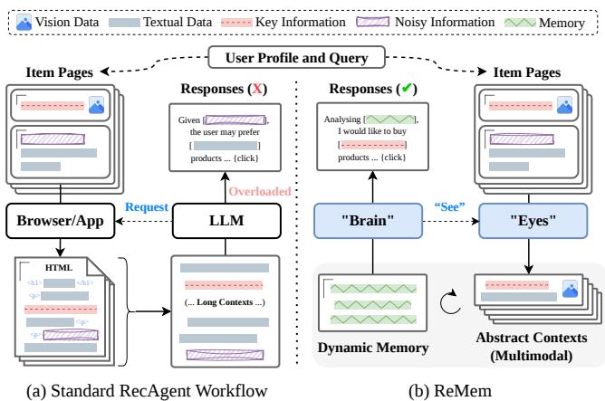
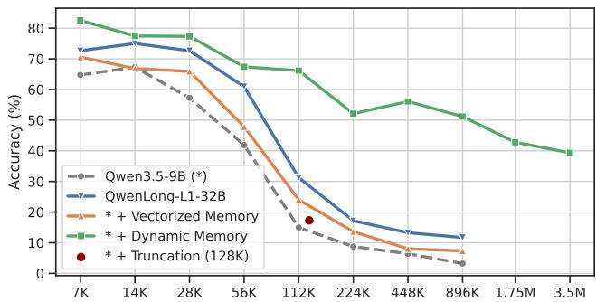
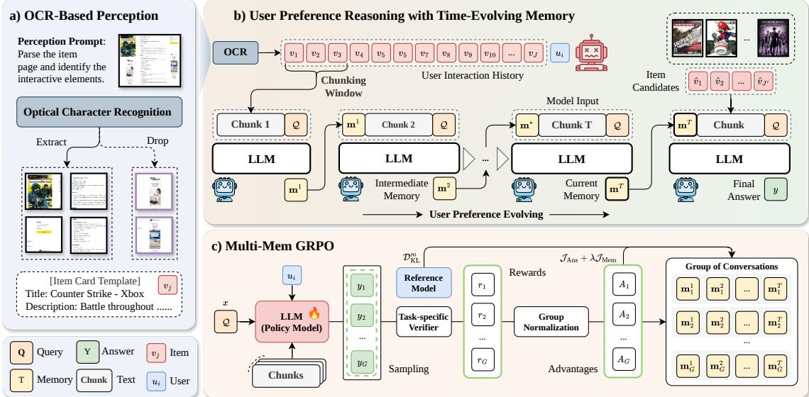
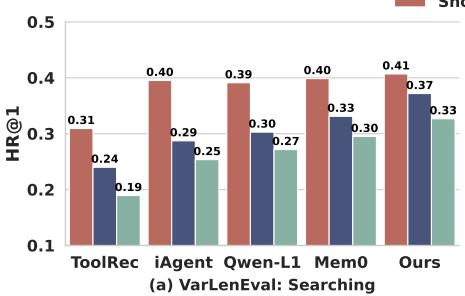
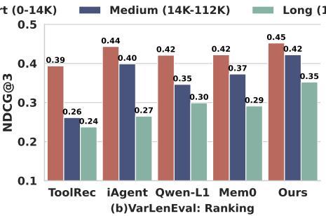
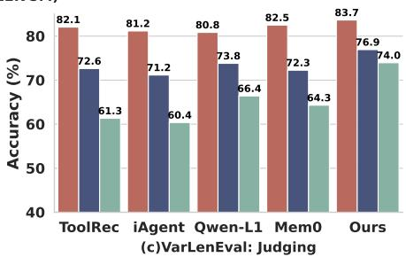
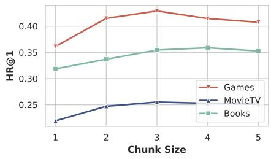
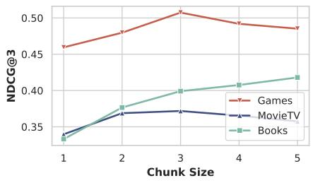
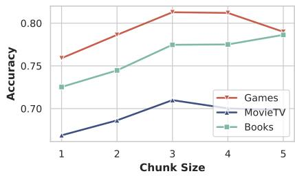

# ReMem: Rethinking Perception and Memory in Long-Context Recommendation Agents

Haohao Qu∗   
haohao.qu@connect.polyu.hk   
The Hong Kong Polytechnic   
University   
Hong Kong   
Nanyang Technological University   
Singapore   
Shanru Lin   
lllam32316@gmail.com   
The Hong Kong Polytechnic   
University   
Hong Kong

Yongcheng Jing† yongcheng.jing@ntu.edu.sg Nanyang Technological University Singapore

Wenqi Fan†   
wenqifan03@gmail.com   
The Hong Kong Polytechnic   
University   
Hong Kong   
Chun Hin CHAN   
chun-hin  
vincent.chan@connect.polyu.hk   
The Hong Kong Polytechnic   
University   
Hong Kong

Dacheng Tao† dacheng.tao@ntu.edu.sg Nanyang Technological University Singapore

## Abstract

Recent Recommendation Agents (RecAgents) ofer a promising alternative by shifting recommendation to an active, user-side paradigm, where generative agents autonomously perceive external platforms, reason over user preferences, and execute decisions. However, existing RecAgents still sufer from two critical limitations: brittle item perception based on noisy and heterogeneous item pages, and ineficient long-context reasoning over extended user histories and multi-step interaction traces. To address these challenges, we propose a novel recommendation agent framework, termed as ReMem, that combines OCR-based multimodal percep tion with time-evolving dynamic memory. Instead of parsing raw HTML, ReMem observes item pages through screenshots and extracts structured multimodal information via an OCR tool, enabling a more humanoid and platform-agnostic perception mechanism. To support long-horizon preference modeling, ReMem further introduces a chunk-wise sequential memory update strategy, where the agent selectively maintains a fixed-size memory of informative historical interactions while processing arbitrarily long con texts with linear inference complexity and bounded context length. This design allows the agent to preserve evolving user preferences without relying on external memory modules or disrupting the standard autoregressive generation process. To enhance the dy namic memory instruction, we further develop a multi-memory GRPO variant, which propagates the final-answer advantage to all intermediate conversations that contribute to the final response. Extensive experiments on three datasets demonstrate that ReMem consistently outperforms state-of-the-art baselines, achieving an average improvement of 5.16% across three recommendation agent tasks, namely searching, ranking, and judging. Our code is available at https://github.com/Quhaoh233/ReMem.

## Keywords

Recommender Systems, Large Language Models, Long-Context Reasoning, AI Agents

  
Figure 1: Motivation of ReMem. (a) Conventional RecAgents read the Web as text: they extract noisy HTML into long contexts and rely on LLMs to recover user intent, which is brittle across modalities and ineficient for long-context reasoning. (b) The proposed ReMem follows a more human-like principle: see item pages through OCRbased multimodal perception and memorize only evolving preference abstractions through dynamic memory, enabling robust modeling of time-evolving user preferences.

## 1 Introduction

The rapid advancement of Large Language Models (LLMs) has sparked a surge of interest in LLM-based Recommender Systems (RSs) [1, 9, 19, 26, 35], driven by their exceptional generalization capabilities and remarkable proficiency in in-context learning [60]. These unique properties empower LLM-based recommenders to generalize efectively across unseen tasks and diverse domains, thereby significantly enhancing overall recommendation quality and system utility [36]. However, despite opening a promising frontier for personalized recommendation applications, deploying LLMs in traditional recommender architectures is severely bottlenecked by massive token consumption and high latency under highconcurrency trafic [12, 14, 24]. These computational bottlenecks notably impair the practical deployment of LLM-based systems in standard passive recommendation scenarios, where a platform-side model must deliver real-time, low-latency personalized recommendations to millions of passive users [8, 17, 54]. To circumvent these deployment constraints and leverage the cognitive capabilities of LLMs more naturally, researchers have turned to the paradigm of autonomous AI agents. Inspired by the recent success of LLM-based agents such as Anthropic1 and OpenClaw2, emerging research on personal Recommendation Agents (RecAgents) has gained rapid traction [16, 28, 42, 44, 52]. Instead of forcing computationally heavy LLMs to handle real-time, platform-side passive recommendations, the agent paradigm shifts the application to a more suitable active recommendation setting on the user side. Here, users express openended goals, and personalized AI agents autonomously handle the “last mile” of the decision-making process by interacting with external web platforms. As illustrated in Figure 1 (a), the workflow of a typical RecAgent aligns with general agent architectures [32] and can be categorized into four core modules: (i) perception, which senses user intent and extracts candidate items; (ii) reasoning and planning, which models user preferences based on historical interactions and queries; (iii) action, which interacts with target websites and executes recommendation decisions.

Despite their potential, existing RecAgents face two fundamental limitations when deployed in complex, real-world recommendation environments. First, how should an RecAgent perceive items? Existing approaches predominantly rely on reading item web pages in raw HTML format [2, 6, 10, 46]. This paradigm often fails when agents navigate across heterogeneous platforms with highly divergent layouts, misses rich multimodal details beyond plain text, and introduces significant noise (e.g., advertisements and tracking scripts) that degrades generation quality. Second, how should an RecAgent handle long-context reasoning? Retrieving multi-step actions, executing complex reasoning chains, and managing long-term user interaction histories generate an overwhelming volume of tokens that easily exceeds the finite context windows of current LLMs [21, 31, 38]. While current LLM-based RSs seek to condense information via token-level reduction [24, 25] or external memory plugins [16, 36, 50], they often struggle with out-of-distribution generalization. Furthermore, they require auxil iary modules or complex context operations that inevitably disrupt the standard autoregressive generation process, thereby hindering compatibility and parallelization.

These limitations prompt a fundamental rethinking of the paradigm underlying RecAgents: Can a recommender agent uniformly capture multimodal item information amid noisy distractions, while maintaining resource-eficient, long-context reasoning over extended user histories? To address this, we draw inspiration from two anthropocentric intuitions. First, regarding perception, web designers deliberately optimize user interfaces to be visually intuitive for humans, highlighting key product specifications while pushing ad vertisements to the periphery. Humans naturally scan these pages visually rather than parsing raw HTML code. Thus, a humanoid, multimodal perception mechanism holds the promise of acting as a general-purpose interface across arbitrary web layouts. Second, regarding memory and reasoning, when humans process long-term information, we do not attempt to memorize every trivial detail. Instead, we dynamically abstract key concepts, update our cognitive state, and discard redundant information to manage cognitive load. This selective attention allows us to solve complex, long-horizon tasks with bounded memory capacity.

Motivated by these intuitions, we introduce a novel RecAgent framework, named ReMem, that leverages Optical Character Recognition (OCR)-based multimodal perception for humanoid information gathering, coupled with dynamic memory enhanced by Reinforcement Learning (RL) for long-context reasoning. Specifically, we integrate DeepSeek-OCR-2 [39, 40] as an active tool-use component to achieve human-like multimodal perception. By parsing screenshots of item pages, this approach extracts structured multimodal item information, efectively bypassing the noisy and brittle nature of HTML parsing. Furthermore, we propose a chunk-wise, dynamic memory update mechanism that aligns with evolving user preferences over time. During reasoning, the backbone LLM processes the OCR text sequentially in chunks. As it reads each chunk, the model proactively and selectively updates a fixed-length memory containing � historical interactions. Finally, to teach the agent to accommodate this multi-turn memory mechanism, we develop a simple but efective variant of GRPO [29, 49] that propagates the final-answer advantage to all intermediate memory updates.

In summary, our main contributions are as follows:

• This study revisits two fundamental questions in long-context recommendation agents: How should a RecAgent “see” and “memorize”? We find that the raw HTML content and static memory used by most existing studies are insuficient to capture multimodal item information and model users’ time-evolving preferences over long interaction histories.

• We propose a novel RecAgent framework termed ReMem. To the best of our knowledge, this is the first framework that jointly explores a OCR-based perception module for enhanced multimodal understanding and an RL-enhanced memory for time-evolving user preference modeling in long-context RecAgents.

• Extensive experiments on three InstructRec [53] datasets demonstrate that our approach significantly outperforms state-of-theart baselines across three agentic recommendation tasks, namely Searching, Ranking, and Judging, achieving a relative performance improvement of 5.16% over the strongest baseline.

## 2 Pilot Study

In this section, we systematically examine the challenges of connecting LLMs with RecAgents in proactive RSs. The findings motivate the design of the proposed ReMem framework in Section 3.

## 2.1 Preliminary

A standard pipeline for applying AI agents to recommender systems typically consists of several key modules [37]: an LLM backbone, such as Qwen, that drives the overall reasoning process; perception tools that obtain external information from web pages when such information is absent from the model parameters; planning and reasoning modules that decompose a task into smaller sub-tasks and solve them step by step; and action modules that interact with the Internet, e.g., through search and clicks, to produce the final recommendations. We consider the setting where the goal is to generate a final recommendation result � given several key inputs, such as a user query Q, interaction history $\mathcal { H } ,$ , and candidate items $z ,$ using an LLM-based agent parameterized by �. The standard workflow can be formulated as

$$
y \sim p _ { \theta } \big ( y \mid \mathsf { r e a s o n i n g } ( \mathsf { p l a n n i n g } ( Q ) , \mathcal { H } ) , \mathsf { p e r c e p t i o n } ( \mathcal { Z } ) \big ) ,\tag{1}
$$

where planning(Q) denotes a set of prompts that decomposes the problem Q into a series of sub-tasks, reasoning(H) is the user modeling process through LLMs based on interaction history, and perception(Z) represents the search and content-recognition tools used to collect information about potential items.

In the following subsections, we analyze the impact of agent perception and reasoning mechanisms on WebWalkerQA3 [41] and HotpotQA4 [45], respectively. WebWalkerQA is a general benchmark for evaluating LLMs in web traversal. It contains 673 QA examples that require a model to access the Internet and retrieve information from websites containing both visual and textual content. HotpotQA evaluates a model’s ability to locate and extract relevant information from realistic document collections, with context lengths of approximately [7K - 3.5M] tokens. Detailed experimental configurations are provided in Appendix C.1.

## 2.2 Revisiting Agent Perception

This subsection investigates how diferent perception strategies afect a standard LLM-agent workflow on WebWalkerQA.

Experimental Setting. A typical LLM reasoning process feeds plain textual information, i.e., raw content, into the LLM backbone under an in-context learning paradigm. Based on this setting, we compare three perception strategies: 1) performing actions and retrieving information from real websites by converting the “mainbody” of HTML snippets, together with website images recorded as URL links, into readable prompt templates [10, 18]; 2) taking a screenshot of the page as image input for the agent to respond to the user query [55]; and 3) parsing the text and images on the website or app page using DeepSeek-OCR-2 [40], and then embedding the OCR results into prompt templates. For each strategy, we repeat the evaluation five times to reduce random variation.

Observations. As shown in Table 1, parsing websites and retrieving key web information through OCR significantly improves performance on both the WebWalkerQA dataset. Compared with directly using the full HTML context or a website screenshot, OCR serves as the “eyes” of the LLM backbone: it captures rich multimodal information while filtering noisy content, such as advertisements. This allows the model to focus more on reasoning rather than perception. Nevertheless, OCR-based perception also introduces a challenge for the long-context capabilities of LLMs [22]. Performance may degrade when the model must retrieve relevant information from the middle of a long OCR-derived context. In other words, seeing more is not necessarily useful if the model cannot efectively reason over what it sees. This problem becomes more pronounced in recommendation scenarios, where LLMs must process long OCR perception contexts from multiple candidate items together with historical user interactions.

Table 1: The efect of diferent perception strategies. Strategy 3) parses multimodal web pages into informative textual descriptions through OCR perception, achieving superior performance compared with the other strategies.
<table><tr><td rowspan="2">Acc. (%)</td><td colspan="3">Qwen3.5</td><td colspan="3">Qwen3VL</td></tr><tr><td>4B</td><td>9B</td><td>Avg.</td><td>4B</td><td>8B</td><td>Avg.</td></tr><tr><td>Baseline</td><td>49.13</td><td>54.27</td><td>51.70</td><td>49.32</td><td>50.94</td><td>50.13</td></tr><tr><td>+ 1)</td><td>41.51</td><td>45.27</td><td>43.39</td><td>52.51</td><td>55.77</td><td>54.14</td></tr><tr><td>+ 2)</td><td></td><td></td><td></td><td>46.38</td><td>48.56</td><td>47.47</td></tr><tr><td>+ 3)</td><td>57.02</td><td>60.25</td><td>58.64</td><td>56.62</td><td>58.60</td><td>57.61</td></tr></table>

Insights. OCR helps the agent perception module acquire richer information from multimodal web pages, but it also places greater demands on the LLM’s long-context reasoning ability.

## 2.3 Rethinking Long-Context Reasoning

Long-context reasoning [13, 22] is central to agent and RecAgent workflows, since these systems often need to retrieve information across multiple steps, execute complex reasoning chains, and manage long-term user interaction histories [3, 48]. In this subsection, we investigate the impact of diferent reasoning mechanisms across varying context lengths on HotpotQA under a “Needle-in-a-Haystack” setting.

Experimental Setting. A straightforward and widely used contextmanagement strategy in LLM agents is to append all previous information, such as observations, intermediate thoughts, and actions, to the prompt at each interaction turn [47, 61]. Based on this baseline, we analyze three strategies for long-context management: 1) using a specially designed long-context LLM, QwenLong-L1-32B5 [34]; 2) vectorizing documents into an external vector database and retrieving the top-5 document chunks, each containing 5K tokens, according to their semantic search scores with respect to the query, using a semantic search model6 [43, 51]; and 3) using dynamic memory [48], a human-like memory mechanism in which the LLM itself captures and abstracts key information from each document chunk into a shared fix-length memory cache. We also include a truncation baseline that randomly samples contexts and truncates them to a fixed length of 128K tokens.

Observations. Figure 2 shows the relationship between long-context reasoning mechanisms and performance. The baseline model exhibits rapid performance degradation. QwenLong-L1 maintains reasonable performance within its training length of 60K tokens, but its performance drops substantially beyond this range. The model equipped with vectorized memory maintains acceptable performance up to 112K tokens. However, its accuracy deteriorates to 10% at 896K tokens, as semantic memory retrieval becomes increasingly dificult when the memory base contains a large number of vectorized documents [59]. In contrast, dynamic memory, implemented entirely through the LLM itself, is simple yet efective. It shows strong length-extrapolation ability, with only marginal performance decay as the input context length increases in the locating-and-extracting task.

  
Figure 2: Accuracy scores of diferent long-context reasoning strategies on HotpotQA. Even models that use long-context continual pretraining or vectorized memory techniques fail to maintain consistent performance. In contrast, the agent equipped with dynamic memory demonstrates relative lossless performance extrapolation.

Insights. The efectiveness of dynamic memory suggests its potential for agentic recommendation scenarios, where the system must identify time-evolving user preferences from user queries and manage long-term interaction histories.

## 3 Methodology

## 3.1 The Overview of the Proposed Approach

Driven by the aforementioned insights in Sect. 2, we propose a novel framework, ReMem, for recommendation AI agents. As shown in Figure 3, the design principle of ReMem lies on two anthropocentric intuitions. First, the paper embraces a multimodal perception solution through OCR [39, 40] to replace the original reading format (e.g., HTML), as the majority of item pages are with a humancentered design philosophy: emphasizing the key information visually. The OCR technique can preserve essential information while filtering noisy contents (e.g., ads) to improve multimodal percep tion of item pages. Second, we introduce a time-evolving memory mechanism designed for capturing the evolving user preferences. This mechanism enables RecAgents to process inputs of any length within a finite context window in linear time complexity during the inference process, thereby overcoming a major bottleneck in long-context processing. To better implement this mechanism, we process a multi-memory reinforcement learning (RL) algorithm, based on novel GRPO techniques [29, 48]. The key modules are presented in the subsequent sections.

## 3.2 Multimodal Perception on Item Pages

Rather than relying on the raw HTML format, this paper proposes embracing a more general solution for item perception: $" s e e "$ item pages with natural text, images and interactive elements in a unified perspective. Recently, Optical Character Recognition (OCR) has emerged as a foundational technology capable of converting images and scanned text documents into structured templates that can be read by large language models (LLMs) [4]. To enable multimodal perception in agent-based recommendation scenarios, OCR is more promising than ever—with massive amounts of unstructured data being generated and consumed every day.

As shown in Figure $3 \ : ( \mathrm { a } ) _ { i }$ , after request to a certain item page, the proposed ReMem prompts an advanced OCR model, i.e., DeepSeek-OCR-2 [40], to parse the whole page including not only the textual contents but also the images or charts

$$
\boldsymbol { v } _ { j } = \mathrm { O C R } ( \mathrm { R e q u e s t } ( \mathrm { u r l } ( \mathrm { t e x t s } , \mathrm { i m a g e s } , \mathrm { c h a r t s } ) ) ) ,\tag{2}
$$

which enriched with insights that web designers or item producers wanna users to see. The OCR module consists of an encoder and a decoder. The encoder discretizes item pages into visual tokens, while the decoder generates outputs conditioned on these visual tokens and text prompts. Finally, the OCR outputs are embedded into a template of item cards in natural language, so that they can be easily used by the LLM backbone for subsequent reasoning. Refer to Appendix B.3 for OCR perception templates.

## 3.3 Time-Evolving Memory for User Preference

RecAgents must reason over long and continuously evolving user histories and OCR-extracted item descriptions. Directly feeding the full history into an LLM is infeasible due to finite context windows and quadratic attention cost. We therefore propose a time-evolving memory (TEM) mechanism with three goals: supporting arbitrarily long histories, avoiding long-context performance degradation, and enabling linear-time inference. The central idea is to process the interaction history as a sequential stream and maintain a compact, fixed-length memory that is updated over time. Instead of storing every historical token, the ReMem selectively abstracts preference-relevant information, such as stable interests, recent intent shifts, price sensitivity, brand preference, and task-specific constraints. This design enables the agent to reason over long-term user behavior while keeping the active context size bounded.

3.3.1 Workflow. As illustrated in Figure 3(b), the proposed memory mechanism treats an arbitrarily long user interaction history as a controlled stream of evidence rather than a monolithic context. At each step, the RecAgent observes two components: (1) the next chunk of historical interactions, and (2) a compact memory summarizing the preference evidence accumulated so far. The memory is represented as ordinary natural-language tokens inside the LLM context window. Therefore, the backbone LLM does not require any architectural modification, external key-value cache manipulation, or customized attention operator.

The working procedure naturally consists of two stages: namely context-processing and answer-generation. In the first stage, the model sequentially reads chunks of the user history and updates the memory after each chunk. For a user $u _ { i } ,$ the interaction history ${ \mathcal { H } } \ = \ \{ v _ { 1 } , . . . , v _ { J } \}$ is partitioned into $T$ contiguous chunks $C = \{ \mathbf { c } ^ { 1 } , \ldots , \mathbf { c } ^ { T } \}$ based on a chunking window of $W _ { i }$ , where each chunk $\mathbf { c } ^ { t } = \mathbf { j } _ { 0 } \mathbf { i n } [ v _ { t W } , \dots , v _ { ( t + 1 ) W } ]$ may contain � user–item interactions and the corresponding item descriptions. Given the previous memory $\mathbf { m } ^ { t - 1 }$ and the current chunk $\mathbf { c } ^ { t }$ , the RecAgent produces an updated memory m�:

$$
\begin{array} { r } { \mathbf { m } ^ { t } \sim p _ { \theta } \left( \mathbf { m } ^ { t } | \mathbf { m } ^ { t - 1 } , \mathbf { c } ^ { t } , Q \right) , } \end{array}\tag{3}
$$

where $\boldsymbol { Q }$ denotes the user query or recommendation task, the memory is set to a fix-length of $\vert \mathbf { m } ^ { t } \vert = L$ , and the initial memory $\mathbf { m } ^ { 0 } = \varnothing$ The updated memory overwrites the previous one.

  
Figure 3: Overview of the proposed ReMem framework. Inspired by how humans browse item pages while maintaining time-evolving memory, ReMem consists of three key components. a) Instead of relying on raw HTML, ReMem adopts an OCR-based perception module that represents item pages through a unified multimodal view of natural text, images, and interactive elements, better matching users’ browsing behavior. b) User interaction history is processed as a sequential stream of chunks, from which the model maintains a compact, fixed-length memory that is continuously updated to capture evolving user preferences. c) To teach the model what to remember and how to update memory in multi-turn interactions, ReMem employs Multi-Mem GRPO, which propagates the final-answer advantage to all intermediate memories that contribute to the final response.

In the answer-generation stage, after all chunks have been processed, ReMem generates the final recommendation by conditioning only on the task input, candidate information, and the final memory:

$$
y \sim p _ { \boldsymbol { \theta } } \left( y | \hat { \mathbf { c } } , \mathbf { m } ^ { T } , Q \right) ,\tag{4}
$$

where $\hat { \mathbf { c } } = \mathsf { p e r c e p t i o n } ( \mathcal { Z } )$ denotes the OCR-based perception results of potential candidate items $\mathcal { Z } = \{ \hat { v } _ { 1 } , \hdots , \hat { v } _ { J ^ { \prime } } \}$

This design has three advantages. First, it supports unbounded histories: the interaction sequence can be arbitrarily long because it is processed chunk by chunk. Second, it mitigates the long-context performance clif: instead of forcing the model to attend to all past tokens, the memory keeps only preference-relevant evidence. Third, it ensures linear cost: because the chunk size and memory size are fixed, the computational cost grows linearly with the number of chunks. As a result, a moderately context-sized LLM can be converted into an eficient long-context preference reasoner with minimal engineering overhead.

3.3.2 Derivation. A standard autoregressive LLM [57] factorizes the likelihood of a token sequence $\mathbf { x } _ { 1 : N }$ as

$$
p ( \mathbf { x } _ { 1 : N } ) = \prod _ { n = 1 } ^ { N } p ( x _ { n } | \mathbf { x } _ { 1 : n - 1 } ) .\tag{5}
$$

This formulation implicitly assumes that all previous tokens, or their hidden states, are available in the active context. When $\mathbf { x } _ { 1 : N }$ corresponds to a long user history, this assumption becomes impractical because the attention cost grows quadratically with the context length �.

Equivalently, the long-history recommendation process can be viewed as marginalizing over a sequence of latent memory states $\mathbf { m } ^ { 1 : T }$ , which decomposes the original likelihood in Equation (5) as

$$
\hat { p } ( \mathbf x _ { 1 : N } ) = \sum _ { \mathbf m ^ { 1 : T } } \prod _ { t = 1 } ^ { T } \underbrace { p ( \mathbf c ^ { t } | \mathbf m ^ { t - 1 } , Q ) } _ { \mathrm { s e e } } \underbrace { p ( \mathbf m ^ { t } | \mathbf c ^ { t } , \mathbf m ^ { t - 1 } , Q ) } _ { \mathrm { m e m o r i z e } } .\tag{6}
$$

Inside each chunk, we still run an ordinary transformer decoder, but conditioned on a constant context window $( \mathbf { c } ^ { t } , \mathbf { m } ^ { t } )$ . In which, the memory update path in Equation (3) factorizes token-by-token via the backbone LLM �:

$$
\ L _ { { P } \theta } \left( \mathbf { m } ^ { t } \mid \mathbf { m } ^ { t - 1 } , \mathbf { c } ^ { t } , \boldsymbol { Q } \right) = \prod _ { l = 1 } ^ { L } \ L _ { { P } \theta } \left( m _ { l } ^ { t } \mid \mathbf { m } _ { < l } ^ { t } , \mathbf { m } ^ { t - 1 } , \mathbf { c } ^ { t } , \boldsymbol { Q } \right) .\tag{7}
$$

This equation shows that the TEM mechanism does not need to condition on the entire history explicitly. Instead, it propagates user preference through a sequence of compact memory states. Conceptually, this transforms the transformer decoder into a recurrent preference updater whose state size is controlled by the memory budget �. Moreover, no special positional embedding extrapolation, attention re-scaling, or non-standard cache operation is required.

We further analyze the complexity. At each step, the active context contains at most the current chunk c�, the intermediate memory m�, and the user prompt Q. Since $\left. \mathbf { c } ^ { t } \right. \leq C { \mathrm { ~ a n d ~ } } \left. \mathbf { m } ^ { t - 1 } \right. = L$ , the perstep context length is bounded by $O ( C + L )$ . When � and � are constants, the cost of each memory update is constant with respect to the total history length. Therefore, processing � chunks incurs

$$
O \left( T ( C + L ) ^ { 2 } \right) ,\tag{8}
$$

for standard full-attention decoding within each chunk. Since � ≈ �� and �, � are fixed, the overall complexity is linear in the length of the history: $O ( N )$ . In contrast, directly feeding the entire history into a standard transformer requires $O ( N ^ { 2 } )$ attention computation and is limited by the maximum context window.

3.3.3 Discussions. Compared with feature-space compression methods such as linear attention or hidden-state summarization, our memory is explicitly represented in token space. This property is particularly useful for recommendation agents: the intermediate memory can be inspected, debugged, edited, or constrained by prompts. For example, the memory may explicitly record that a user prefers lightweight running shoes, dislikes overly expensive items, recently searched for waterproof products, and tends to choose neutral colors. Such human-readable states improve transparency and make the agent’s recommendation process easier to control. In summary, the time-evolving memory provides a practical mech anism for long-horizon user preference modeling. It allows the RecAgent to process arbitrarily long histories, maintain a bounded context window, and preserve the standard autoregressive generation procedure of the backbone LLM.

## 3.4 Multi-Memory GRPO

In our setting, a single query induces multiple context-independent conversations, which are used as intermediate memories for the final reasoning process, as illustrated in Figure 3. This difers from standard multi-turn tool-calling optimization [48], where the entire trajectory can be treated as one sequential context and optimized with an attention mask. Since our conversations are independently generated and later aggregated, directly applying the standard token mask would not correctly assign credit to the intermediate memories. To address this, we propose Multi-Memory GRPO, a variant of GRPO [29] that assigns the final-answer advantage to all intermediate conversations involved in producing that answer.

3.4.1 Multi-Memory Generation. Let Q denote an input query, cˆ is the chunk for candidates $z ,$ , and $C = \{ \mathbf { c } ^ { 1 } , \mathbf { c } ^ { 2 } , \ldots , \bar { \mathbf { c } } ^ { T } \}$ represents the chunked contexts of interacted items for the user ��. As illustrated in Section 3.3 and Equation (3), for each query, a policy model �� generates � sequential memory instances:

$$
\mathcal { M } = \{ \mathbf { m } ^ { 1 } , \mathbf { m } ^ { 2 } , . . . , \mathbf { m } ^ { T } \} , \quad \mathbf { m } ^ { t } \sim \pi _ { \theta _ { \mathrm { o l d } } } ( \cdot \mid \mathbf { m } ^ { t - 1 } , \mathbf { c } ^ { t } , Q ) ,\tag{9}
$$

where the base memory $\mathbf { m } ^ { 0 } = \varnothing .$ . These memory summaries are then used by the model to produce a final answer: $\boldsymbol { y } \sim \pi _ { \boldsymbol { \theta } _ { \mathrm { o l d } } } ( \cdot \mid \mathbf { m } ^ { T } , \hat { \mathbf { c } } , Q )$ using the accumulated memory $\mathbf { m } ^ { T }$

Building upon this framework, we can sample a group of � complete reasoning instances with a high generation temperature (e.g., 1.5) to make model outputs be more creative:

$$
\{ \boldsymbol { \mathcal { M } _ { g } } , \boldsymbol { y _ { g } } \} _ { g = 1 } ^ { G } , \quad \boldsymbol { \mathcal { M } _ { g } } = \{ \mathbf { m } _ { g } ^ { 1 } , \dots , \mathbf { m } _ { g } ^ { T } \} ,\tag{10}
$$

where ${ \cal M } _ { g }$ denotes the set of intermediate memory for the �-th sampled reasoning instance.

3.4.2 Final-Answer Reward and Group Advantage. To make sure the agent ground into our recommendation scenarios, each sampled instance is evaluated using only the final answer of recommendation: $r _ { g } = r ( y _ { g } , y ^ { + } )$ , where $y ^ { + }$ denotes the ground-truth item, $r ( \cdot )$ may be task-specific metrics, such as Accuracy, Hit Rate or Ranking Score [7, 8, 17]. As in standard GRPO, we compute the group-relative advantage by normalizing rewards across the �

sampled instances:

$$
A _ { g } = \frac { r _ { g } - \mu _ { r } } { \sigma _ { r } + \epsilon } , \mu _ { r } = \frac { 1 } { G } \sum _ { g = 1 } ^ { G } r _ { g } , \sigma _ { r } = \sqrt { \frac { 1 } { G } \sum _ { g = 1 } ^ { G } ( r _ { g } - \mu _ { r } ) ^ { 2 } } ,\tag{11}
$$

where � is a small constant for numerical stability.

The key modification is that $A _ { g }$ is not only used to optimize the final answer $y _ { i } ,$ but is also propagated to every intermediate memory summary in ${ \cal M } _ { g } .$ Thus, memory instances that lead to a high-quality final answer are reinforced, while those associated with poor final answers are discouraged.

3.4.3 Memory-Level Policy Ratio. For the �-th intermediate memory in the �-th sampled instance, we define the token-level policy ratio at �-th token as

$$
\rho _ { g , t , l } ^ { m } ( \theta ) = \frac { \pi _ { \theta } \left( m _ { g , t , l } \mid Q , m _ { g , t , < l } , \mathbf { c } ^ { t } \right) } { \pi _ { \theta _ { \mathrm { o l d } } } \left( m _ { g , t , l } \mid Q , c _ { g , t , < l } , \mathbf { c } ^ { t } \right) } .\tag{12}
$$

Each memory is conditioned only on the original query �, the given chunk $\mathbf { c } ^ { t }$ and its own previous tokens $m _ { g , t , < l }$ , rather than on tokens from other memory summaries. This prevents artificial cross-memory credit assignment. Similarly, the token-level policy ratio of final output can be formulated as

$$
\rho _ { g , l } ^ { y } ( \theta ) = \frac { \pi _ { \theta } \left( y _ { g , l } \mid Q , M _ { g } , y _ { g , < l } , \hat { \mathbf { c } } \right) } { \pi _ { \theta _ { \mathrm { o l d } } } \left( y _ { g , l } \mid Q , M _ { g } , y _ { g , < l } , \hat { \mathbf { c } } \right) } .\tag{13}
$$

3.4.4 Multi-Memory GRPO Objective. Considering the sequential property of user preference reasoning, we use a simple but efective trick to teach the model what to memory, which optimizes intermediate memory summaries using the final-answer advantage, inspired by the novel DAPO algorithm [49]. Specifically, we first consider a clipped objective optimization on final answer as:

$$
\begin{array} { l } { \mathcal { T } _ { \mathrm { A n s } } ( \theta ) = \mathbb { E } _ { x , \{ ( \mathcal { M } _ { g } , y _ { g } ) \} _ { g = 1 } ^ { G } } \Bigg [ \frac { 1 } { G } \displaystyle \sum _ { g = 1 } ^ { G } \frac { 1 } { L _ { y } } \displaystyle \sum _ { l = 1 } ^ { L _ { y } } } \\ { \operatorname* { m i n } \left( \rho _ { g , l } ^ { y } ( \theta ) A _ { g } , \mathrm { c l i p } \left( \rho _ { g , l } ^ { y } ( \theta ) , 1 - \delta , 1 + \delta \right) A _ { g } \right) \Bigg ] , } \end{array}\tag{14}
$$

where � is the clipping coeficient (0.2). Then, the same advantage can be applied to the intermediate memory summaries:

$$
\begin{array} { r l } & { \mathcal { T } _ { \mathrm { M e m } } ( \theta ) = \mathbb { E } _ { \boldsymbol { x } , \{ ( \boldsymbol { M } _ { g } , \boldsymbol { y } _ { g } ) \} _ { g = 1 } ^ { G } } \Bigg [ \cfrac { 1 } { G } \underset { g = 1 } { \overset { G } { \sum } } \frac { 1 } { T } \underset { t = 1 } { \overset { T } { \sum } } \frac { 1 } { L _ { m } } \frac { L _ { m } } { l = 1 } } \\ & { \quad \quad \quad \quad \operatorname* { m i n } \left( \rho _ { g , t , l } ^ { m } ( \theta ) A _ { g } , \mathrm { c l i p } \left( \rho _ { g , t , l } ^ { m } ( \theta ) , 1 - \delta , 1 + \delta \right) A _ { g } \right) \Bigg ] . } \end{array}\tag{15}
$$

The overall Multi-Memory GRPO objective is then

$$
\mathcal { T } _ { \mathrm { M e m - G R P O } } ( \theta ) = \mathcal { T } _ { \mathrm { A n s } } ( \theta ) + \lambda \mathcal { T } _ { \mathrm { M e m } } ( \theta ) ,\tag{16}
$$

where � controls whether and how strongly the memory tokens are optimized.

3.4.5 KL regularization. To avoid excessive deviation from a reference policy $\pi _ { \mathrm { r e f } } .$ , we add a full token-level KL penalty over the

generated memory tokens:

$$
\begin{array} { r l r } {  { \mathcal { D } _ { \mathrm { K L } } ^ { m } = \mathbb { E } \Bigg [ \frac { 1 } { G } \sum _ { g = 1 } ^ { G } \frac { 1 } { T } \sum _ { t = 1 } ^ { T } \frac { 1 } { L _ { m } } \sum _ { l = 1 } ^ { L _ { m } } ( f - \log f - 1 ) \Bigg ] , } } \\ & { } & { \mathrm { w h e r e } \quad f = \frac { \pi _ { \mathrm { r e f } } ( m _ { g , t , l } \mid Q , m _ { g , t , < l } , \mathbf { c } ^ { t } ) } { \pi _ { \theta } ( m _ { g , t , l } \mid Q , m _ { g , t , < l } , \mathbf { c } ^ { t } ) } . } \end{array}\tag{17}
$$

The final training objective is

$$
\operatorname* { m a x } _ { \theta } \mathcal { I } ( \theta ) = \mathcal { I } _ { \mathrm { M e m - G R P O } } ( \theta ) - \beta \mathcal { D } _ { \mathrm { K L } } ^ { m } ,\tag{18}
$$

where $\beta$ is the KL coeficient (set to 0.04 following [29]).

## 4 Experiment

## 4.1 Experimental Settings

4.1.1 Datasets. To evaluate the efectiveness of the proposed Re-Mem in the user-agent-platform paradigm with proactive user instructions, we construct three agentic recommendation datasets, namely MovieTV, Books, and Games using the widely-used Amazon Reviews 20237 data, which provide textual information (such as item titles, descriptions, and reviews), as well as the URL links of product images. Based on these contents, we create item snapshots into a format of shopping platform webpage, and randomly include advertising content as a distraction. Furthermore, following InstructRec [53], we assign a persona to each user and generate the instruction for this interaction based on the corresponding user review and task. More details are in the Appendix C.2.

Table 2: Basic statistics of benchmark datasets.
<table><tr><td>Dataset</td><td>#Users</td><td>#Items</td><td>#Int.</td><td>Avg. Seq.</td><td>#Tokens (Avg. | Max.)</td></tr><tr><td>Games</td><td>94,762</td><td>25,612</td><td>570,720</td><td>8.7764</td><td>26,217.33 |722,968</td></tr><tr><td>Books</td><td>7,377</td><td>120,925</td><td>207,759</td><td>28.1631</td><td>62,281.48|5,972,639</td></tr><tr><td>MovieTV</td><td>5,649</td><td>28,987</td><td>79,737</td><td>14.1166</td><td>30,207.68 |292,389</td></tr></table>

4.1.2 Compared Models. We include four classes of baselines: (i) conventional sequential recommendation methods, namely SAS-Rec [17] and BERT4Rec [33]; (ii) natural language assists for recommendation: P5 [9] and TokenRec [24]; (iii) recommendation agents: ToolRec [58] and iAgent [44]; (iv) long-context LLM agents: QwenLong-L1 (Qwen-L1) [34] and Mem0 [3].

4.1.3 Configurations. We implement all models using Python 3.12 and Unsloth8 (Version 2026.5.2) on four NVIDIA H20 (96 GB) GPU. We implement three evaluation tasks for recommendation agents: (i) Searching, which retrieves the proper item from the candidate set; (ii) Ranking, which sorts the candidate set; and (iii) Judging, which determines whether the user would like a given item. For each sample, we randomly select 9 negative items and combine them with the target item to form a candidate set. Taking into account both performance and computational resources, we opt to utilize the Qwen3.5-9B as our LLM backbone, which is renowned as one of the most popular pretrained vision-language models globally. The LLM backbone operates with a low temperature of 0.2 for inferencea and a high temperature of 1.5 for the GRPO training. The maximum length of the item sequence is configured to 50 to embody long-horizon user preference evolving. Our memory length $L _ { m }$ is configured to 5, 000 language tokens, while the chunking window size � is set to 3, and the maximum length of each chunk � can be upto 100, 000 tokens. Consequently, the model typically requires 3 to 5 conversational turns to process the entire context. The loss weight � is set to 0 in the two epochs (warming up), and set to 0.7 for the following training. We use a rollout batch size of 64 and a group size of 8 for our training.

4.1.4 Evaluation Metrics. Three commonly used metrics are used: LLM-as-Judge Accuracy (GPT-5-mini) for the Judging task, Top-K Hit Ratio (HR@K) and Top-K Normalized Discounted Cumulative Gain (NDCG@K) for the Searching and Ranking tasks, respectively, where higher values indicate superior performance. Furthermore, the values of K are specified as 1, 3 and 5, with 1 and 3 serving as the default settings of HR and NDCG, respectively, for ablation experiments and parameter analyses.

## 4.2 Recommendation Performance

Table 3 presents the overall performance comparison, from which we make the following observations:

• ReMem achieves the best overall performance across most datasets and tasks. ReMem obtains the best results on all searching and judging settings, and achieves the best performance on two out of three ranking settings. On average, ReMem consistently improves over the strongest baseline by 5.16%. These consistent gains demonstrate the efectiveness of ReMem in identifying user-preferred items from candidate sets. The improvements are statistically significant with $\textstyle p < 0 . 0 1$ , indicating that the advantage of our model is stable rather than incidental. Moreover, the standard deviations of ReMem are relatively small, demonstrating stable inference behavior.

• Existing RecAgent baselines improve over conventional recommendation methods but remain limited. Compared with DeepRec methods such as SASRec and BERT4Rec, and LLMRec methods such as P5 and TokenRec, agent-based methods generally obtain stronger performance, especially in searching and judging tasks. For instance, ToolRec and iAgent achieve competitive results on several datasets, suggesting that interactive reasoning and tool-augmented decision-making are beneficial for recommendation agents. However, these methods are still consistently outperformed by ReMem. This indicates that equipping an LLM with tools or interactive conversations is insuficient for complex agentic recommendation scenarios. Without reliable item perception and eficient memory updating, agents may still sufer from noisy observations, redundant histories, and degraded reasoning over long interaction traces.

• Long-context modeling alone does not guarantee better recommendation performance. Although LongAgent baselines such as Qwen-L1 and Mem0 are designed to handle extended contexts, their performance is not consistently superior to RecAgent methods, in particularly for the Ranking task. For example, in the ranking task on MovieTV, Mem0 obtains 0.3269 NDCG@3, which is lower than iAgent’s 0.3817 and also lower than ReMem. This suggests that directly extending the context window or maintaining coarse memory may introduce irrelevant historical information and increase reasoning dificulty. In contrast, Re-Mem tends to preserve essential preference information, leading to more eficient and accurate long-horizon recommendation.

Table 3: Performance comparison between representative baselines and ReMem across three commonly used datasets on three recommendation tasks. The best and second-best results are highlighted in bold and underlined fonts, respectively. For ReMem, we conduct independent inference five times and report the mean and standard deviation. The improvements over baselines are statistically significant (� < 0.01).
<table><tr><td rowspan="2">6 Tasks</td><td rowspan="2">Datasets</td><td rowspan="2">Metrics</td><td colspan="2">DeepRec</td><td colspan="2">LLMRec</td><td colspan="2">RecAgent</td><td colspan="2">LongAgent</td><td rowspan="2">ReMem (Ours)</td><td rowspan="2">Imp.*</td></tr><tr><td>SASRec</td><td>BERT4Rec</td><td>P5</td><td>TokenRec</td><td>ToolRec</td><td>iAgent</td><td>Mem0 Qwen-L1</td><td></td></tr><tr><td rowspan="6">Searching</td><td>Games</td><td>HR@1</td><td>0.2828</td><td>0.2955</td><td>0.2509</td><td>0.3011</td><td>0.1970</td><td>0.3824</td><td>0.3249</td><td>0.3995</td><td> $\mathbf { 0 . 4 2 9 2 _ { \pm 0 . 0 2 4 3 } }$ </td><td>7.43%</td></tr><tr><td></td><td>HR@3</td><td>0.3115</td><td>0.3225</td><td>0.2525</td><td>0.3711</td><td>0.3636</td><td>0.5096</td><td>0.4851</td><td>0.5184</td><td> $\mathbf { 0 . 5 5 9 0 _ { \pm 0 . 0 3 6 7 } }$ </td><td>7.83%</td></tr><tr><td>MovieTV</td><td>HR@1</td><td>0.1763</td><td>0.1838</td><td>0.1319</td><td>0.1799</td><td>0.1613</td><td>0.2308</td><td>0.2260</td><td>0.2480</td><td> $\mathbf { 0 . 2 5 5 2 _ { \pm 0 . 0 1 6 4 } }$ </td><td>2.92%</td></tr><tr><td></td><td>HR@3</td><td>0.2208</td><td>0.2320</td><td>0.1816</td><td>0.2501</td><td>0.1827</td><td>0.3536</td><td>0.3162</td><td>0.3342</td><td> $\mathbf { 0 . 3 6 5 6 _ { \pm 0 . 0 4 1 5 } }$ </td><td>3.37%</td></tr><tr><td></td><td>HR@1</td><td>0.1761</td><td>0.1898</td><td>0.1411</td><td>0.2232</td><td>0.2172</td><td>0.2925</td><td>0.2843</td><td>0.3133</td><td> $\mathbf { 0 . 3 5 8 8 _ { \pm 0 . 0 1 9 0 } }$ </td><td>14.55%</td></tr><tr><td>Books</td><td>HR@3</td><td>0.2853</td><td>0.2701</td><td>0.2248</td><td>0.3228</td><td>0.3831</td><td>0.4857</td><td>0.3999</td><td>0.4756</td><td> $\mathbf { 0 . 5 0 6 9 _ { \pm 0 . 0 4 8 2 } }$ </td><td>4.37%</td></tr><tr><td rowspan="4">Ranking</td><td>Games</td><td>NDCG@3</td><td>0.2689</td><td>0.2727</td><td>0.2815</td><td>0.3891</td><td>0.3969</td><td>0.4816</td><td>0.4368</td><td>0.4616</td><td> $\mathbf { 0 . 5 0 7 4 _ { \pm 0 . 0 3 4 2 } }$ </td><td>5.36%</td></tr><tr><td>MovieTV</td><td>NDCG@3</td><td>0.2605</td><td>0.2268</td><td>0.2470</td><td>0.2985</td><td>0.3165</td><td>0.3817</td><td>0.3334</td><td>0.3269</td><td> $\underline { { 0 . 3 7 1 8 _ { \pm 0 . 0 2 5 4 } } }$ </td><td>-2.59%</td></tr><tr><td>Books</td><td>NDCG@3</td><td>0.2261</td><td>0.2288</td><td>0.2464</td><td>0.3107</td><td>0.2594</td><td>0.3839</td><td>0.3360</td><td>0.3618</td><td> $\mathbf { 0 . 4 1 8 0 _ { \pm 0 . 0 1 9 7 } }$ </td><td>8.87%</td></tr><tr><td>Games</td><td>Accuracy</td><td>0.6806</td><td>0.6739</td><td>0.6775</td><td>0.6997</td><td>0.7296</td><td>0.7514</td><td>0.7781</td><td>0.7799</td><td> $\mathbf { 0 . 8 1 2 8 _ { \pm 0 . 0 0 7 8 } }$ </td><td>4.22%</td></tr><tr><td rowspan="3">Judging</td><td>MovieTV</td><td>Accuracy</td><td>0.6004</td><td>0.5933</td><td>0.6120</td><td>0.6456</td><td>0.6737</td><td>0.6799</td><td>0.6677</td><td>0.6933</td><td> $\mathbf { 0 . 7 0 9 9 _ { \pm 0 . 0 0 7 6 } }$ </td><td>2.40%</td></tr><tr><td>Books</td><td>Accuracy</td><td>0.6431</td><td>0.6391</td><td>0.6560</td><td>0.7142</td><td>0.7246</td><td>0.7138</td><td>0.7466</td><td>0.7206</td><td> $\mathbf { 0 . 7 7 0 1 { \scriptstyle \pm 0 . 0 0 8 3 } }$ </td><td>3.14%</td></tr><tr><td></td><td></td><td></td><td></td><td></td><td></td><td></td><td></td><td></td><td></td><td></td><td></td></tr></table>

Imp.\* denotes the improvement over the strongest baseline.

## 4.3 In-depth Analysis

4.3.1 Various-Length Reasoning. This section examines the ability of our proposed model to capture user preferences from contexts of varying lengths. We divide the evaluation samples into three context horizons: short (0–14K tokens), medium (14K–112K tokens), and long (over 112K tokens). We report the results on the Books dataset, which contains 658 short-context samples, 6,024 medium-context samples, and 694 long-context samples. As shown in Figure 4, all models exhibit a performance decline as the context length increases, indicating that long-horizon preference modeling remains challenging for recommender agents. Nevertheless, our model consistently achieves the best performance across the three tasks and all context-length groups. Notably, our model’s performance under long-context settings remains comparable to, or even better than, several baselines under medium-context settings. This suggests that the proposed dynamic memory mechanism efectively filters, organizes, and retrieves preference-relevant information from lengthy contexts, reducing the negative impact of irrelevant or noisy historical interactions. These results verify that our model is better suited for long-horizon recommendation reasoning, where accurately capturing evolving and sparse user preferences is essential.

4.3.2 Ablation Study. We report the results of ablation experiments on the Searching task, where three key modules are removed separately as follows:

• - OCR: The vision-based OCR perception module is deactivated, and raw item contents are used instead.

• - GRPO: The Multi-Mem GRPO post-training is removed, resulting in a training-free variant of the proposed model.

• - TEM: The Time-Evolving Memory (TEM) is replaced with a plain long-text context consisting of interaction history, item information, and user instructions.

Table 4: Results of Ablation Studies on the Searching task.
<table><tr><td rowspan="2">Module</td><td colspan="2">Games</td><td colspan="2">MovieTV</td><td colspan="2">Books</td></tr><tr><td>HR@1</td><td>HR@3</td><td>HR@1</td><td>HR@3</td><td>HR@1</td><td>HR@3</td></tr><tr><td>ReMem (Full)</td><td>0.4292</td><td>0.5590</td><td>0.2552</td><td>0.3656</td><td>0.3588</td><td>0.5069</td></tr><tr><td>- OCR</td><td>0.3959</td><td>0.5067</td><td>0.2466</td><td>0.3403</td><td>0.3145</td><td>0.4520</td></tr><tr><td>- GRPO</td><td>0.3767</td><td>0.5025</td><td>0.2213</td><td>0.3410</td><td>0.2750</td><td>0.4680</td></tr><tr><td>- TEM</td><td>0.3301</td><td>0.4819</td><td>0.2236</td><td>0.3159</td><td>0.2537</td><td>0.4021</td></tr></table>

From the ablation results in Table 4, we draw several key observations. First, all major components contribute to the overall performance, as removing any single component consistently degrades efectiveness. Second, even without GRPO post-training, the proposed model still achieves competitive performance compared with state-of-the-art baselines such as iAgent, demonstrating the strength of the base framework. Third, removing TEM leads to the largest performance drop in most cases, indicating that relying solely on a plain long context is challenging for the LLM backbone and that an eficient memory mechanism is essential. These results suggest that the proposed time-evolving memory, TEM, efectively captures evolving user preferences. Further results, including inference costs, case analyses, and generalizability studies, are provided in Appendix C.

## 5 Conclusion

In this paper, we propose ReMem, a RecAgent framework that improves both item perception and long-context preference modeling. ReMem replaces brittle HTML parsing with OCR-based visual perception, enabling platform-agnostic extraction of structured item information from screenshots. It further introduces a chunk-wise dynamic memory mechanism that maintains informative user histories with bounded context length and linear inference complexity. To better train memory updates, we design a GRPO variant that assigns final-answer rewards to relevant intermediate conversations. Experiments across diverse recommendation environments show that ReMem achieves superior accuracy, eficiency, and crossplatform generalization, demonstrating the efectiveness of visual perception and dynamic memory for practical RecAgents.

  
Figure 4: Analysis of reasoning capability across contexts of varying lengths on the Books dataset for three recommendation tasks.

## References

[1] Keqin Bao, Jizhi Zhang, Yang Zhang, Wenjie Wang, Fuli Feng, and Xiangnan He. 2023. Tallrec: An efective and eficient tuning framework to align large language model with recommendation. In Proceedings of the 17th ACM conference on recommender systems. 1007–1014.

[2] Hyungjoo Chae, Namyoung Kim, Kai Ong, Minju Gwak, Gwanwoo Song, Jihoon Kim, Sunghwan Kim, Dongha Lee, and Jinyoung Yeo. 2025. Web agents with world models: Learning and leveraging environment dynamics in web navigation. In International Conference on Learning Representations, Vol. 2025. 63707–63738.

[3] Prateek Chhikara, Dev Khant, Saket Aryan, Taranjeet Singh, and Deshraj Ya dav. 2025. Mem0: Building production-ready ai agents with scalable long-term memory. arXiv preprint arXiv:2504.19413 (2025).

[4] Cheng Cui, Ting Sun, Manhui Lin, Tingquan Gao, Yubo Zhang, Jiaxuan Liu, Xueqing Wang, Zelun Zhang, Changda Zhou, Hongen Liu, et al. 2025. Paddleocr 3.0 technical report. arXiv preprint arXiv:2507.05595 (2025).

[5] Xinnan Dai, Haohao Qu, Yifei Shen, Bohang Zhang, Qihao Wen, Wenqi Fan, Dongsheng Li, Jiliang Tang, and Caihua Shan. 2025. How do large language mod els understand graph patterns? a benchmark for graph pattern comprehension. In International Conference on Learning Representations, Vol. 2025. 58405–58435.

[6] Xiang Deng, Yu Gu, Boyuan Zheng, Shijie Chen, Sam Stevens, Boshi Wang, Huan Sun, and Yu Su. 2023. Mind2web: Towards a generalist agent for the web. Advances in Neural Information Processing Systems 36 (2023), 28091–28114.

[7] Wenqi Fan, Xiaorui Liu, Wei Jin, Xiangyu Zhao, Jiliang Tang, and Qing Li. 2022. Graph trend filtering networks for recommendation. In Proceedings ofthe 45th international ACM SIGIR conference on research and development in information retrieval. 112–121.

[8] Wenqi Fan, Yao Ma, Qing Li, Yuan He, Eric Zhao, Jiliang Tang, and Dawei Yin. 2019. Graph neural networks for social recommendation. In The world wide web conference. 417–426.

[9] Shijie Geng, Shuchang Liu, Zuohui Fu, Yingqiang Ge, and Yongfeng Zhang. 2022. Recommendation as language processing (rlp): A unified pretrain, personalized prompt & predict paradigm (p5). In Proceedings ofthe 16th ACM conference on recommender systems. 299–315.

[10] Izzeddin Gur, Hiroki Furuta, Austin Huang, Mustafa Safdari, Yutaka Matsuo, Douglas Eck, and Aleksandra Faust. 2024. A real-world webagent with planning, long context understanding, and program synthesis. In International Conference on Learning Representations, Vol. 2024. 52690–52717.

[11] Hongliang He, Wenlin Yao, Kaixin Ma, Wenhao Yu, Yong Dai, Hongming Zhang, Zhenzhong Lan, and Dong Yu. 2024. Webvoyager: Building an end-to-end web agent with large multimodal models. In Proceedings of the 62nd Annual Meeting of the Association for Computational Linguistics (Volume 1: Long Papers). 6864–6890.

[12] Yupeng Hou, Jiacheng Li, Ashley Shin, Jinsung Jeon, Abhishek Santhanam, Wei Shao, Kaveh Hassani, Ning Yao, and Julian McAuley. 2025. Generating long semantic ids in parallel for recommendation. In Proceedings of the 31st ACM SIGKDD Conference on Knowledge Discovery and Data Mining V. 2. 956–966.

[13] Cheng-Ping Hsieh, Simeng Sun, Samuel Kriman, Shantanu Acharya, Dima Rekesh, Fei Jia, and Boris Ginsburg. 2024. RULER: What’s the Real Context Size of Your Long-Context Language Models?. In First Conference on Language Modeling. https://openreview.net/forum?id=kIoBbc76Sy

[14] Wenyue Hua, Shuyuan Xu, Yingqiang Ge, and Yongfeng Zhang. 2023. How to index item ids for recommendation foundation models. In Proceedings ofthe Annual International ACM SIGIR Conference on Research and Development in Information Retrieval in the Asia Pacific Region. 195–204

[15] Jiani Huang, Shijie Wang, Liangbo Ning, Wenqi Fan, Shuaiqiang Wang, Dawei Yin, and Qing Li. 2026. Towards next-generation recommender systems: A benchmark for personalized recommendation assistant with llms. In Proceedings of the Nineteenth ACM International Conference on Web Search and Data Mining. 217–226.

[16] Xu Huang, Jianxun Lian, Yuxuan Lei, Jing Yao, Defu Lian, and Xing Xie. 2025. Recommender ai agent: Integrating large language models for interactive recom mendations. ACM Transactions on Information Systems 43, 4 (2025), 1–33.

[17] Wang-Cheng Kang and Julian McAuley. 2018. Self-attentive sequential recommendation. In 2018 IEEE international conference on data mining (ICDM). IEEE, 197–206.

[18] Jing Yu Koh, Robert Lo, Lawrence Jang, Vikram Duvvur, Ming Lim, Po-Yu Huang, Graham Neubig, Shuyan Zhou, Russ Salakhutdinov, and Daniel Fried. 2024. Visualwebarena: Evaluating multimodal agents on realistic visual web tasks. In Proceedings of the 62nd Annual Meeting of the Association for Computational Linguistics (Volume 1: Long Papers). 881–905.

[19] Jiayi Liao, Sihang Li, Zhengyi Yang, Jiancan Wu, Yancheng Yuan, Xiang Wang, and Xiangnan He. 2024. Llara: Large language-recommendation assistant. In Proceedings of the 47th International ACM SIGIR Conference on Research and Development in Information Retrieval. 1785–1795.

[20] Fei Liu, Xinyu Lin, Hanchao Yu, Mingyuan Wu, Jianyu Wang, Qiang Zhang, Zhuokai Zhao, Yinglong Xia, Yao Zhang, Weiwei Li, et al. 2026. Recoworld: Building simulated environments for agentic recommender systems. In Companion Proceedings ofthe ACM Web Conference 2026. 650–659.

[21] Jiahao Liu, Shengkang Gu, Dongsheng Li, Guangping Zhang, Mingzhe Han, Hansu Gu, Peng Zhang, Tun Lu, Li Shang, and Ning Gu. 2025. AgentCF++: Memory-enhanced LLM-based Agents for Popularity-aware Cross-domain Recommendations. In Proceedings ofthe 48th International ACM SIGIR Conference on Research and Development in Information Retrieval. 2566–2571.

[22] Nelson F Liu, Kevin Lin, John Hewitt, Ashwin Paranjape, Michele Bevilacqua, Fabio Petroni, and Percy Liang. 2024. Lost in the middle: How language models use long contexts. Transactions of the association for computational linguistics 12 (2024), 157–173.

[23] Liangbo Ning, Ziran Liang, Zhuohang Jiang, Haohao Qu, Yujuan Ding, Wenqi Fan, Xiao-yong Wei, Shanru Lin, Hui Liu, Philip S Yu, et al. 2025. A survey of webagents: Towards next-generation ai agents for web automation with large foundation models. In Proceedings ofthe 31st ACM SIGKDD Conference on Knowledge Discovery and Data Mining V. 2. 6140–6150.

[24] Haohao Qu, Wenqi Fan, Zihuai Zhao, and Qing Li. 2025. TokenRec: Learning to Tokenize ID for LLM-Based Generative Recommendations. IEEE Transactions on Knowledge & Data Engineering 37, 10 (2025), 6216–6231.

[25] Haohao Qu, Shanru Lin, Yujuan Ding, Yiqi Wang, and Wenqi Fan. 2026. Difusion generative recommendation with continuous tokens. In Proceedings ofthe ACM Web Conference 2026. 7259–7270.

[26] Shashank Rajput, Nikhil Mehta, Anima Singh, Raghunandan Hulikal Keshavan, Trung Vu, Lukasz Heldt, Lichan Hong, Yi Tay, Vinh Tran, Jonah Samost, et al. 2023. Recommender systems with generative retrieval. Advances in Neural Information Processing Systems 36 (2023), 10299–10315.

[27] Samuel Schmidgall, Yusheng Su, Ze Wang, Ximeng Sun, Jialian Wu, Xiaodong Yu, Jiang Liu, Michael Moor, Zicheng Liu, and Emad Barsoum. 2025. Agent laboratory: Using llm agents as research assistants. Findings ofthe Association for Computational Linguistics: EMNLP 2025 (2025), 5977–6043.

[28] Yu Shang, Peijie Liu, Yuwei Yan, Zijing Wu, Leheng Sheng, Yuanqing Yu, Chumeng Jiang, An Zhang, Fengli Xu, Yu Wang, et al. 2026. Agentrecbench: Benchmarking llm agent-based personalized recommender systems. Advances in Neural Information Processing Systems 38 (2026).

[29] Zhihong Shao, Peiyi Wang, Qihao Zhu, Runxin Xu, Junxiao Song, Xiao Bi, Haowei Zhang, Mingchuan Zhang, YK Li, et al. 2024. Deepseekmath: Pushing the limits of mathematical reasoning in open language models. arXiv preprint arXiv:2402.03300 (2024).

[30] Wentao Shi, Xiangnan He, Yang Zhang, Chongming Gao, Xinyue Li, Jizhi Zhang, Qifan Wang, and Fuli Feng. 2024. Large language models are learnable planners for long-term recommendation. In Proceedings of the 47th International ACM SIGIR Conference on Research and Development in Information Retrieval. 1893–1903.

[31] Yunxiao Shi, Wujiang Xu, Zhang Zeqi, Xing Zi, Qiang Wu, and Min Xu. 2025. PersonaX: A recommendation agent-oriented user modeling framework for long behavior sequence. In Findings of the Association for Computational Linguistics: ACL 2025. 5764–5787.

[32] Theodore Sumers, Shunyu Yao, Karthik R Narasimhan, and Thomas L. Grifiths. 2024. Cognitive Architectures for Language Agents. Transactions on Machine Learning Research (2024). https://openreview.net/forum?id=1i6ZCvflQJ Survey Certification, Featured Certification.

[33] Fei Sun, Jun Liu, Jian Wu, Changhua Pei, Xiao Lin, Wenwu Ou, and Peng Jiang. 2019. BERT4Rec: Sequential recommendation with bidirectional encoder representations from transformer. In Proceedings of the 28th ACM international conference on information and knowledge management. 1441–1450.

[34] Fanqi Wan, Weizhou Shen, Shengyi Liao, Yingcheng Shi, Chenliang Li, Ziyi Yang, Ji Zhang, Fei Huang, Jingren Zhou, and Ming Yan. 2025. Qwenlong-l1: Towards long-context large reasoning models with reinforcement learning. arXiv preprint arXiv:2505.17667 (2025).

[35] Hanbing Wang, Xiaorui Liu, Wenqi Fan, Xiangyu Zhao, Venkataramana Kini, Devendra Yadav, Fei Wang, Zhen Wen, Jiliang Tang, and Hui Liu. 2024. Rethinking large language model architectures for sequential recommendations. arXiv preprint arXiv:2402.09543 (2024).

[36] Shijie Wang, Wenqi Fan, Yue Feng, Lin Shanru, Xinyu Ma, Shuaiqiang Wang, and Dawei Yin. 2025. Knowledge graph retrieval-augmented generation for llm-based recommendation. In Proceedings ofthe 63rd Annual Meeting ofthe Association for Computational Linguistics (Volume 1: Long Papers). 27152–27168.

[37] Yancheng Wang, Ziyan Jiang, Zheng Chen, Fan Yang, Yingxue Zhou, Eunah Cho, Xing Fan, Yanbin Lu, Xiaojiang Huang, and Yingzhen Yang. 2024. Recmind: Large language model powered agent for recommendation. In Findings ofthe Association for Computational Linguistics: NAACL 2024. 4351–4364.

[38] Yibo Wang, Yongcheng Jing, Shunyu Liu, Hao Guan, Rong-cheng Tu, Chengyu Wang, Jun Huang, and Dacheng Tao. 2026. VTC-R1: Vision-Text Compression for Eficient Long-Context Reasoning. arXiv preprint arXiv:2601.22069 (2026).

[39] Haoran Wei, Yaofeng Sun, and Yukun Li. 2025. Deepseek-ocr: Contexts optical compression. arXiv preprint arXiv:2510.18234 (2025).

[40] Haoran Wei, Yaofeng Sun, and Yukun Li. 2026. DeepSeek-OCR 2: Visual Causal Flow. arXiv preprint arXiv:2601.20552 (2026).

[41] Jialong Wu, Wenbiao Yin, Yong Jiang, Zhenglin Wang, Zekun Xi, Runnan Fang, Linhai Zhang, Yulan He, Deyu Zhou, Pengjun Xie, et al. 2025. Webwalker: Benchmarking llms in web traversal. In Proceedings of the 63rd Annual Meeting of the Association for Computational Linguistics (Volume 1: Long Papers). 10290– 10305.

[42] Yu Xia, Sungchul Kim, Tong Yu, Ryan A Rossi, and Julian McAuley. 2026. Multiagent collaborative filtering: Orchestrating users and items for agentic recom mendations. In Proceedings ofthe ACM Web Conference 2026. 8649–8652.

[43] Wujiang Xu, Zujie Liang, Kai Mei, Hang Gao, Juntao Tan, and Yongfeng Zhang. 2026. A-mem: Agentic memory for llm agents. Advances in Neural Information Processing Systems 38 (2026), 17577–17604.

[44] Wujiang Xu, Yunxiao Shi, Zujie Liang, Xuying Ning, Kai Mei, Kun Wang, Xi Zhu, Min Xu, and Yongfeng Zhang. 2025. iagent: Llm agent as a shield between user and recommender systems. In Findings ofthe Association for Computational Linguistics: ACL 2025. 18056–18084.

[45] Zhilin Yang, Peng Qi, Saizheng Zhang, Yoshua Bengio, William Cohen, Ruslan Salakhutdinov, and Christopher D Manning. 2018. HotpotQA: A dataset for diverse, explainable multi-hop question answering. In Proceedings of the 2018 conference on empirical methods in natural language processing. 2369–2380.

[46] Shunyu Yao, Howard Chen, John Yang, and Karthik Narasimhan. 2022. Webshop: Towards scalable real-world web interaction with grounded language agents. Advances in Neural Information Processing Systems 35 (2022), 20744–20757.

[47] Shunyu Yao, Jefrey Zhao, Dian Yu, Nan Du, Izhak Shafran, Karthik R Narasimhan, and Yuan Cao. 2023. ReAct: Synergizing Reasoning and Acting in Language Models. In The Eleventh International Conference on Learning Representations. 30084–30117. https://openreview.net/forum?id=WE\_vluYUL-X

[48] Hongli Yu, Tinghong Chen, Jiangtao Feng, Jiangjie Chen, Weinan Dai, Qiying Yu, Ya-Qin Zhang, Wei-Ying Ma, Jingjing Liu, Mingxuan Wang, and Hao Zhou. 2026. MemAgent: Reshaping Long-Context LLM with Multi-Conv RL-based Memory Agent. In The Fourteenth International Conference on Learning Representations. https://openreview.net/forum?id=k5nIOvYGCL

[49] Qiying Yu, Zheng Zhang, Ruofei Zhu, Yufeng Yuan, Xiaochen Zuo, Yu Yue, Weinan Dai, Tiantian Fan, Gaohong Liu, Lingjun Liu, et al. 2026. Dapo: An open-source llm reinforcement learning system at scale. Advances in Neural Information Processing Systems 38 (2026), 113222–113244.

[50] An Zhang, Yuxin Chen, Leheng Sheng, Xiang Wang, and Tat-Seng Chua. 2024. On generative agents in recommendation. In Proceedings ofthe 47th international ACM SIGIR conference on research and development in Information Retrieval. 1807– 1817.

[51] Guibin Zhang, Haotian Ren, Chong Zhan, Zhenhong Zhou, Junhao Wang, He Zhu, Wangchunshu Zhou, and Shuicheng Yan. 2026. Memevolve: Meta-evolution of agent memory systems. In Proceedings ofthe 43rd International Conference on Machine Learning (ICML 2026), Seoul, South Korea, July.

[52] Junjie Zhang, Yupeng Hou, Ruobing Xie, Wenqi Sun, Julian McAuley, Wayne Xin Zhao, Leyu Lin, and Ji-Rong Wen. 2024. Agentcf: Collaborative learning with autonomous language agents for recommender systems. In Proceedings ofthe ACM Web Conference 2024. 3679–3689.

[53] Junjie Zhang, Ruobing Xie, Yupeng Hou, Wayne Xin Zhao, Leyu Lin, and Ji Rong Wen. 2026. Recommendation as instruction following: A large language model empowered recommendation approach. ACM Transactions on Information Systems 43, 5 (2026), 1–37.

[54] Yifeng Zhang, Haohao Qu, Liangbo Ning, Wenqi Fan, and Qing Li. 2025. SSD4Rec: A Structured State Space Duality Model for Eficient Sequential Recommendation. ACM Transactions on Information Systems 44, 2 (2025), 1–26.

[55] Zhehao Zhang, Ryan A Rossi, Tong Yu, Franck Dernoncourt, Ruiyi Zhang, Jiuxiang Gu, Sungchul Kim, Xiang Chen, Zichao Wang, and Nedim Lipka. 2026. Vipact: Visual-perception enhancement via specialized vlm agent collaboration and tool-use. In Proceedings of the AAAI Conference on Artificial Intelligence, Vol. 40. 36536–36546.

[56] Andrew Zhao, Daniel Huang, Quentin Xu, Matthieu Lin, Yong-Jin Liu, and Gao Huang. 2024. Expel: Llm agents are experiential learners. In Proceedings of the AAAI Conference on Artificial Intelligence, Vol. 38. 19632–19642.

[57] Wayne Xin Zhao, Kun Zhou, Junyi Li, Tianyi Tang, Xiaolei Wang, Yupeng Hou, Yingqian Min, Beichen Zhang, Junjie Zhang, Zican Dong, et al. 2023. A survey of large language models. arXiv preprint arXiv:2303.18223 (2023).

[58] Yuyue Zhao, Jiancan Wu, Xiang Wang, Wei Tang, Dingxian Wang, and Maarten De Rijke. 2024. Let me do it for you: Towards llm empowered recommendation via tool learning. In Proceedings ofthe 47th International ACM SIGIR Conference on Research and Development in Information Retrieval. 1796–1806.

[59] Yujie Zhao, Boqin Yuan, Junbo Huang, Haocheng Yuan, Zhongming Yu, Lanxiang Hu, Haozhou Xu, Abhilash Shankarampeta, Zimeng Huang, Wentao Ni, Yuandong Tian, and Jishen Zhao. 2026. AMA-Bench: Evaluating Long-Horizon Memory for Agentic Applications. In ICLR 2026 Workshop on Memory for LLM-Based Agentic Systems. https://openreview.net/forum?id=GoSVL7mLcM

[60] Zihuai Zhao, Wenqi Fan, Jiatong Li, Yunqing Liu, Xiaowei Mei, Yiqi Wang, Zhen Wen, Fei Wang, Xiangyu Zhao, Jiliang Tang, et al. 2024. Recommender systems in the era of large language models (llms). IEEE Transactions on Knowledge and Data Engineering (2024).

[61] Zijian Zhou, Ao Qu, Zhaoxuan Wu, Sunghwan Kim, Alok Prakash, Daniela Rus, Bryan Kian Hsiang Low, and Paul Pu Liang. 2026. MEM1: Learning to Synergize Memory and Reasoning for Eficient Long-Horizon Agents. In The Fourteenth International Conference on Learning Representations. https://openreview.net/ forum?id=XY8AaxDSLb

## Table of Contents: Appendices

A Related Work ............. 10

A.1 LLM Agents ......... 10

A.2 OCR-based Perception ...... 11

A.3 Long-Context Reasoning ...... 11

A.4 Distinction from Existing Studies ...... 11

B Supplements on Research Methods ................ 11

B.1 Standard GRPO ........ 11

B.2 Task-specific Reward Modeling ........ 12

B.3 Prompt Templates ...... 12

B.4 Examples of Item Pages ....... 13

C Additional Details about Experiment ...... 13

C.1 Supplements on Pilot Study ......................... 13

C.2 Recommendation Dataset Construction ..... 13

C.3 Baselines ..........13

C.4 Case Study .....................15

C.5 Supplements on Various Length Reasoning ...... 15

C.6 Hyper-parameter Analysis ...... 15

C.7 Inference Latency Analysis ...... 15

E Limitations and Future Work Discussion ................15

## A Related Work

## A.1 LLM Agents

Recent progress in LLMs has enabled autonomous language agents equipped with planning, memory, reflection, and tool-use abilities. These systems have shown strong performance on complex tasks such as deep research [56], scientific discovery [5, 27], and web applications [23]. Inspired by this paradigm, researchers have begun to develop recommendation agents (RecAgents) [20, 30, 31, 44, 50, 52], such as InteRecAgent [16]and RecMind [37], which leverage LLMs to understand user intent, model preferences, interact with tools, and generate personalized recommendations. Compared with con ventional recommenders, RecAgents can naturally process language feedback and support interactive decision making [15]. However, this direction is still in its early stage, and most existing methods mainly rely on structured or textual inputs, with limited ability to perceive multimodal contexts or update memory dynamically.

## A.2 OCR-based Perception

Optical Character Recognition (OCR) has recently emerged as an efective perception tool for multimodal parsing. Practical systems such as PaddleOCR [4] and recent models such as DeepSeek-OCR [39] and OCR-2 [40] can extract textual and structural information from complex images, screenshots, and user interfaces. For recommendation cases, OCR can help agents perceive multimodal item cards, prices, descriptions, comments, and other interfacelevel signals. This provides a human-like way of gathering information, since websites and applications are naturally designed for human perception rather than machine-readable access. Nevertheless, OCR-based perception has rarely been studied in RecAgents, where contextual information is typically assumed to be provided in textual or structured form [10, 11].

## A.3 Long-Context Reasoning

Despite their impressive capabilities, LLM-based agents still face a critical challenge in handling long contexts efectively [3, 13, 22, 38]. This challenge is particularly pronounced in recommendation scenarios, where processing an entire website, reasoning over a long sequence of user interactions, or managing a multi-step agent work flow can generate extensive textual information that exceeds the context windows of current LLMs [24, 25]. An LLM with strong long-context capability should ideally satisfy three requirements: 1) processing text of unbounded length; 2) scaling without performance degradation; and 3) enabling eficient decoding with linear complexity [48]. Existing memory mechanisms are commonly implemented through external modules, vector databases, retrieval systems, or explicit profile stores for LLM agents [43] and RecAgents [21, 43]. In contrast, we revisit the basic intuition behind human long-context processing. When humans process lengthy information, they often abstract the central concepts, take notes on critical details, or use shorthand to retain key points while discarding redundant and irrelevant content. Building on this insight, our work explores reinforcement learning to enable the LLM itself to acquire memorization ability, thereby supporting more dynamic and adaptive recommendations.

## A.4 Distinction from Existing Studies

ReMem is related to and inspired by recent memory agents, especially MemAgent [48] and MEM1 [61], which focus on generic longdocument reasoning by incrementally overwriting a fixed-length memory or a shared internal state while reading textual segments. Building upon their insights in memory management, we introduce that maintaining an explicit, time-evolving representation of user preferences from sequential interaction chunks is a simple but effective way to the memory learning for recommendation. However, ReMem still difers from the memory agents fundamentally in its target problem and system design. ReMem separates intermediate memory updates from the final recommendation decision, and uses Multi-Memory GRPO to propagate task-level recommendation outcomes to every memory update that contributes to the final answer. More importantly, ReMem addresses not only long-context reasoning but also the upstream perception bottleneck overlooked by these general memory agents.

Compared with existing RecAgents such as ToolRec [58] and iAgent [44], which primarily operate on structured or textual observations and rely on externally designed or static memory mechanisms, ReMem directly perceives heterogeneous item pages through OCR-based multimodal parsing and learns to selectively retain preference-relevant evidence in a bounded, human-readable memory. This integration of platform-agnostic visual perception, temporal preference modeling, and recommendation-outcome-driven memory optimization enables ReMem to support arbitrarily long histories with bounded context and linear processing complexity across searching, ranking, and judging tasks.

A simple method is not necessarily the best, but a strong method should remain as simple as possible. ReMem follows this principle by realizing long-context preference modeling through sequential memory updates within the standard autoregressive process, without introducing external retrieval systems, specialized memory modules, or architectural modifications. To the best of our knowledge, this work is the first to explore an OCR-perception and dynamic-memory paradigm for RecAgents, integrating multimodal context parsing with learned memorization for more context-aware recommendation.

## B Supplements on Research Methods

## B.1 Standard GRPO

To better contextualize the proposed Multi-Mem GRPO, this section introduces the standard formulation of Group Relative Policy Optimization (GRPO) as a baseline for comparison. Given a prompt �, GRPO samples a group of � responses $\{ y _ { g } \} _ { g = } ^ { G }$ from the old policy $\pi _ { \theta _ { \mathrm { o l d } } } \colon$

$$
y _ { g } \sim \pi _ { \theta _ { \mathrm { o l d } } } ( \cdot \mid x ) , \quad g = 1 , \ldots , G .\tag{19}
$$

Each response $y _ { g }$ receives a scalar reward $r _ { g } = r ( x , y _ { g } )$ . Instead of using a learned value function, GRPO estimates the advantage by normalizing rewards within the sampled group:

$$
\hat { A } _ { g } = \frac { r _ { g } - \mathrm { m e a n } ( \{ r _ { g } \} _ { g = 1 } ^ { G } ) } { \mathrm { s t d } ( \{ r _ { g } \} _ { g = 1 } ^ { G } ) + \epsilon } ,\tag{20}
$$

where � is a small constant for numerical stability.

The policy is optimized with a PPO-style clipped objective and a KL regularization term against a reference policy �ref:

$$
\begin{array} { r l } { \mathcal { T } _ { \mathrm { G R P O } } ( \theta ) = \mathbb { E } _ { \boldsymbol { x } , \{ y _ { g } \} _ { g = 1 } ^ { G } } [ \frac { 1 } { G } \displaystyle \sum _ { g = 1 } ^ { G } \frac { 1 } { | y _ { g } | } \displaystyle \sum _ { l = 1 } ^ { | y _ { g } | } } & { } \\ { \operatorname* { m i n } ( \rho _ { g , l } ( \theta ) \hat { A } _ { g } , \mathrm { c l i p } \big ( \rho _ { i , l } ( \theta ) , 1 - \varepsilon , 1 + \varepsilon \big ) \hat { A } _ { g } ) } & { } \\ { - \beta D _ { \mathrm { K L } } ( \pi _ { \theta } ( \cdot \mid \boldsymbol { x } ) \parallel \pi _ { \mathrm { r e f } } ( \cdot \mid \boldsymbol { x } ) ) ] , } \end{array}\tag{21}
$$

where

$$
\rho _ { g , l } ( \theta ) = \frac { \pi _ { \theta } ( y _ { g , l } \mid x , y _ { g , < l } ) } { \pi _ { \theta _ { \mathrm { o l d } } } ( y _ { g , l } \mid x , y _ { g , < l } ) } ,\tag{22}
$$

� is the clipping threshold, $\beta$ controls the strength of KL regularization, and $D _ { \mathrm { K L } } ( \cdot | | \cdot )$ penalizes deviation from the reference policy.

Equivalently, the training objective is to maximize:

$$
\theta ^ { * } = \arg \operatorname* { m a x } _ { \theta } \mathcal { T } _ { \mathrm { G R P O } } ( \theta ) .\tag{23}
$$

## B.2 Reward Modeling

Beyond format-related rewards, we add a task-specific reward assessing the correctness of final recommendation outcomes:

$$
r _ { g } = r _ { \mathrm { f o r m a t } } + r _ { \mathrm { c o r r e c t } } .\tag{24}
$$

The format reward $r _ { \mathrm { f o r m a t } }$ provides graded supervision for adherence to the required XML-style response structure, which basically follows the oficial implementation example in Unsloth GRPO. First, the XML-count reward assigns 0.125 points for each correctly oc curring structural marker—<reasoning>, </reasoning>, <answer>, </answer>—for a maximum of 0.5 points. Second, the soft-format reward assigns 0.5 points when the response contains a reasoning block followed by an answer block in the correct order. Third, the strict-format reward assigns an additional 0.5 points only when the entire response exactly follows the prescribed multiline template. Consequently, a perfectly formatted response can receive a maximum format reward of 1.5 points.

The correctness is evaluated using recommendation metrics combined with rule-based criteria:

$$
r _ { \mathrm { c o r r e c t } } = \mathrm { M e t r i c } \big ( \mathrm { L L M - a s \mathrm { - } J u d g e } ( y _ { \mathrm { p r e d } } , y _ { \mathrm { g o l d } } ) \big ) ,\tag{25}
$$

where $y _ { \mathrm { p r e d } }$ is the extracted final answer from the response $y ,$ and �gold is the ground-truth answer. Here, we use the item title for string matching. For diferent tasks, we adopt the corresponding metrics: Top-� Hit Ratio (HR@K), Top-� Normalized Discounted Cumulative Gain (NDCG@K), and Accuracy for the Searching, Ranking, and Judging tasks, respectively. The reward is assigned as the exact value of the corresponding metric, all of which lie in [0, 1].

Specifically, the HR@K metric is calculated as:

$$
\mathrm { H R @ } K = \frac { 1 } { | \mathcal { U } | } \sum _ { u \in \mathcal { U } } 1 \left\{ \mathcal { R } _ { u } ^ { ( K ) } \cap { \mathcal { G } } _ { u } \neq \emptyset \right\} ,\tag{26}
$$

where $\mathcal { R } _ { u } ^ { ( K ) }$ is the top- $- K$ recommended item set for user �, $\mathcal { G } _ { u }$ is the ground-truth relevant item set, and $1 \{ \cdot \}$ is the indicator function. Under the leave-one-out evaluation protocol, each user has only one target item, $\mathrm { i } . \mathrm { e } . , | \mathcal { G } _ { u } | = 1$

The NDCG@K metric is defined as:

$$
\begin{array} { r l } & { \mathrm { N D C G } \ @ K = \frac { 1 } { \left| \mathcal { U } \right| } \displaystyle \sum _ { u \in \mathcal { U } } \frac { \mathrm { D C G } _ { u } ( \varpi K } { \mathrm { I D C G } _ { u } ( \varpi K } , } \\ & { \qquad \mathrm { w h e r e } \left\{ \begin{array} { l l } { \mathrm { D C G } _ { u } \ @ K = \sum _ { i = 1 } ^ { K } \frac { 2 ^ { r e l _ { u , i } } - 1 } { \log _ { 2 } ( i + 1 ) } , } \\ { \mathrm { I D C G } _ { u } \ @ K = \sum _ { i = 1 } ^ { \operatorname* { m i n } ( K , \left| \mathcal { G } _ { u } \right| ) } \frac { 2 ^ { r e l _ { u , i } ^ { * } } - 1 } { \log _ { 2 } ( i + 1 ) } . } \end{array} \right. } \end{array}\tag{27}
$$

(28)

Here, $r e l _ { u , i }$ denotes the relevance of the item ranked at position � for user �, and $r e l _ { u , i } ^ { * }$ denotes the corresponding relevance under the ideal ranking.

Finally, the accuracy score for the Judging task is defined as:

$$
\mathrm { A c c } = \frac { 1 } { | \mathcal { U } | } \sum _ { u \in \mathcal { U } } 1 \left\{ r _ { u } ^ { ( 1 ) } = g _ { u } \right\} .\tag{29}
$$

This measures the fraction of cases in which the model selects the correct item as the top-ranked item among the candidates.

## B.3 Prompt Templates

In this section, we list out all the prompt templates in our framework. In which, curly-brace placeholders will be replaced with actual content. First, there are two prompts, "TEMPLATE\_MEMORY" and "TEMPLATE\_FINAL", which designed to memory processing (top) and final answer generation (bottom). Moreover, we present the prompt of LLM-as-Judge evaluation. Finally, we introduce three diferent prompts associated to the three agentic recommendation tasks, namely Searching, Ranking, and Judging.

TEMPLATE\_MEMORY = """ ### You are presented with a problem, a section of an article that may contain the answer to the problem, and a previous memory. Please read the provided section carefully and update the memory with the new information that helps to answer the problem. Be sure to retain all relevant details from the previous memory while adding any new, useful information.

<problem> {query} </problem>

<memory> {memory} </memory>

<section> {chunk} </section>

\### Updated memory: """

TEMPLATE\_FINAL = """ ### You are presented with a problem and a previous memory. Please answer the problem based on the previous memory and put the answer in boxed{{·}}.

<problem> {query} + {candidates} </problem>

<memory> {memory} </memory> ### Your Answer:

QUERY\_SEARCHING = "Now, what would be the next possible item for the user from the candidates based on the user’s interaction history and instruction? Please just give the title of the item as the answer; no explanation is needed."

QUERY\_RANKING = "You are given a set of candidate items. Rank the products according to how likely the user is to prefer them based on the user’s interaction history and instruction. Return only the product titles in ranked order, with no additional explanation."

QUERY\_JUDGING = "Now, is the user likely to interact with the given item? Please answer with a single word: ’Yes’ or ’No’. No explanation is needed."

LLM-AS-JUDGE = """You are a general AI assistant.

Based on the [Correct Answer] provided below, determine whether the [Response] to the [Original Question] is correct.

[Original Question]: {question}

[Correct Answer]: {golden\_answer }

[Response]: {pred\_answer }

Your judgment must follow this standard:

\- Focus only on whether there are substantial diferences between the [Response] and the [Correct Answer]

\- Do not comment on the background of the question

\- Do not attempt to resolve the problem again

\- Only focus on judging whether the answers are consistent - If the [Response] is consistent with the [Correct Answer], or within an acceptable small margin oferror for numerical questions, judge as "correct"

\- Otherwise (i.e., in cases of any inconsistency, ambiguity, non-equivalence, or incorrectly extracted answer), judge as "incorrect"

Output JSON format:

{{ "judgement": "correct" or "incorrect" }}"""

## B.4 Examples of Item Pages

Building upon the textual construction described in Appendix C.2, we further integrate the textual context and item images into Amazon-style product webpages. These webpage snapshots are used to evaluate the multimodal perception capability of recommendation agents (RecAgents). As shown in Figure 5, DeepSeek-OCR 2 [40] provides a promising solution, as it can correctly recognize not only the textual content but also the visual information in the webpage, demonstrating strong multimodal perception capabilities. The OCR output consists of a Markdown (.mmd) file describing the webpage content, along with cropped images extracted from the page. This structured information can then be provided to RecAgents to facilitate user preference modeling and recommendation reasoning. Further evaluations on the OCR techniques, please refer to the technical report of DeepSeek-OCR-2 [40].

## C Additional Details about Experiment

## C.1 Supplements on Pilot Study

WebWalkerQA [41]. The dataset is in the form of a JSON file with a collection of 680 questions and answers. However, as time passing by, part of the websites had been updated. Thus, we removed the invalid questions and updated the outdated answers after a humanverification, with a collection of 673 samples remains. The task is to access the website and retrieve useful information to answer the question. The average length of the textual contents on the websites is around 716.41 tokens. A representative example of a WebWalkerQA sample is list as below:

• "question": "How many CCF-B level conference papers did Associate Professor XXX from the XXX University School of Computer Science publish between 2021 and 2023?"

• "answer": "4"

• "root\_url": [URL]

• "source\_website": [URL]

• "golden\_path": [classified]

• "dificulty\_level": "medium"

HotpotQA [45]. HotpotQA is a new dataset with 113k Wikipediabased question-answer pairs. In this study, we use a long-context synthetic variant of the HotpotQA dataset, RULER-HotpotQA [48], by including diferent context lengths of articles for test questions. The number of articles ranges from 50, 100, up to 6400, corresponding to context lengths of approximately 7K, 14K, and up to 3.5M tokens, respectively. In the pilot study on this dataset, the length of dynamic memory cache is set to 1,024 tokens, while the chunk length is configured to 5,000 tokens.

## C.2 Recommendation Dataset Construction

Our datasets are sourced from the Amazon Review Data9 repository. We filter the datasets using the standard 5-core criterion, removing users and items with fewer than five associated interactions to ensure suficient data density. We then retain only positive interactions by discarding items with review ratings below 4. Furthermore, duplicate interactions are removed. Following prior recommendation studies [17], we adopt the leave-one-out protocol for dataset splitting, using all but the last interaction in each user’s interaction history for training, while reserving the last interaction for evalu ation. The generation of instructions and user intents follows the procedures proposed in InstructRec [53] and iAgent [44].

## C.3 Baselines

In the section, we provide simple introductions to the compared models in our experiments.

• SASRec [17] is a self-attention-based sequential recommendation model. For the Judging task, we first compute a score for each candidate by taking the dot product between the embedding predicted by SASRec and the candidate item embedding. If the score is greater than 0.3, the prediction is considered "Yes"; otherwise, "No".

• BERT4Rec [33] is a bidirectional Transformer-based sequential recommendation model trained with the BERT-style cloze objective. Both SASRec and BERT4Rec use only item IDs as input, without textual descriptions or item images. For the Judging task, BERT4Rec uses the same decision rule as SASRec.

• P5 [9] is a pioneering work on LLM-based RecSys, which describes recommendation tasks in a text-to-text format and employs LLMs to capture deeper semantics for personalization and recommendation. In our experiments, we deploy sequential in dexing (SID) on the P5 model.

  
(c) WebWalkerQA, Example 1, Question: {Which committee addresses the transition from relief to development at the NMUN Washington D.C. conference, and what is the payment deadline?}  
(d) WebWalkerQA, Example 2, Question: {By when should an international attendee applying for a B1 visa in May 2024 receive their visa to attend ACR Convergence 2024?}  
Figure 5: Examples of the item pages in the Games dataset and WebWalkerQA dataset. Here we also provide the perception results of these examples by DeepSeek-OCR-2 [40].

• TokenRec [24] is a recently-developed for large language modelbased recommendation model, which tokenizes item-side information, e.g., collaborative embeddings or textual descriptions, into several discrete tokens via VQ-VAE. To adapt TokenRec to the Judging task, we train it from scratch as a variant to produce a binary output ("Yes" or "No").

• ToolRec [58] incorporates attribute-oriented tools and a memory strategy into large language model-based recommender systems. It employs LLMs to closely model user preferences, thereby improving the accuracy of recommendations generated during user decision simulation.

• iAgent [44] is an instruction-aware recommendation agent capable of using tools to simulate user behaviors and acquire knowledge from external environments.

• QwenLong-L1 [34] is the first long-context large reasoning model (LRM) trained with reinforcement learning for long-context reasoning. In its standard configuration, QwenLong-L1-32B supports context lengths of up to 32,768 tokens. We prompt it to solve our recommendation tasks in a zero-shot setting.

• Mem0 [3] is a representative Long-Term Memory architecture that dynamically extracts, consolidates, and retrieves salient information from ongoing conversations. Mem0 encodes mem ory chunks into text embeddings using gpt-4o-mini and textembedding-3-small.

Furthermore, we will include additional relevant models as baselines in our revised experiments:

• MemAgent [48] targets general long-context document understanding by processing documents in chunks and iteratively updating a fixed-length memory.

• GPT-5.6 Sol10 is a widely used closed-source language model with strong reasoning capabilities. Its context window supports up to 1,050,000 tokens, enabling it to process extremely long inputs, such as multiple PDFs, entire code repositories, or tens of hours of transcribed video, while retaining relevant context.

## C.4 Case Study

Table 5 presents a successful recommendation example to illustrate the efectiveness of our memory mechanism. Initially, the user’s interactions mainly involve Xbox games and gaming accessories, from which the first memory summarizes a general preference for Xbox and VR-related products. As the interaction sequence evolves, the user purchases a portable charger and an Oculus Quest 2 bat tery pack, indicating a shift toward portable power accessories for VR devices. Our memory mechanism incrementally updates the user profile by capturing this newly emerging preference instead of relying solely on earlier interactions. Consequently, the final memory explicitly highlights the user’s interest in batteryrelated accessories for the Oculus Quest 2, enabling the agent to correctly identify the target item, VINDIJA Head Strap for Oculus Quest 2 with Battery, from a challenging candidate set. This example demonstrates that our memory mechanism efectively models time-evolving user preferences by preserving historical interests while incorporating newly emerged behavioral patterns.

## C.5 Supplements on Various Length Reasoning

Table 6 presents a fine-grained evaluation of our framework across reasoning trajectories of diferent lengths. Overall, our method consistently outperforms the standard QwenLong-L1-32B (QwenL1) baseline on all three tasks and across both datasets, demonstrating its robustness to increasingly complex reasoning processes. As expected, performance gradually declines as the reasoning length increases from Short to Long. This trend is particularly evident on the Games dataset, where the number of reasoning tokens expands from 0–14K to over 112K. Longer trajectories introduce sub stantially more contextual information, increasing the dificulty of identifying relevant evidence and maintaining coherent reasoning over extended contexts. Nevertheless, our method preserves a clear advantage over QwenL1 in all settings. For example, on the searching task, our approach improves HR@1 from 0.3005 to 0.3563 (+18.6%) on the long Games subset, while on the ranking task it raises NDCG@3 from 0.3449 to 0.4624 (+34.1%). Similar gains are observed for the judging task, where the accuracy advantage remains around four percentage points even under the longest reasoning contexts. A similar trend is observed on the MovieTV dataset despite its considerably smaller number of long-context samples (only 47 instances). Although performance also decreases with reasoning length, our method consistently achieves higher HR@1, NDCG@3, and judgment accuracy than the baseline. Notably, the relative improvements on the long subset remain substantial, indicating that the proposed framework generalizes well across domains and is less susceptible to performance degradation caused by long reasoning chains. These results suggest that the proposed reasoning framework is more efective at filtering irrelevant information, preserving long-range dependencies, and leveraging extensive contextual evidence than directly applying the base language model. Consequently, it exhibits stronger scalability to complex recommendation scenarios that require prolonged reasoning and multi-step decision making.

## C.6 Hyper-parameter Analysis

Figure 6 presents the impact of the chunk window size � on different datasets and tasks. Overall, performance improves as � increases from 1 to 3, and then plateaus or slightly declines, indicating that a moderate window size efectively balances contextual completeness and reasoning eficiency. For the Games (8.7 average items per user) and MovieTV (14.11 average items per user) datasets, � = 3 consistently achieves the best or near-best performance. In contrast, the Books dataset, which contains substantially longer user histories (28.16 average items per user), benefits from a larger window size (� = 4 or 5). These results suggest that the optimal chunk size is positively correlated with the average interaction history length, while a moderate range of [3, 6] for memory turn number provides robust performance across datasets with diverse user history lengths.

## C.7 Inference Latency

Table 7 reports the average inference time per sample on a single NVIDIA H20 (96 GB) GPU. Compared with the vanilla LLM (Qwen3.5-9B), our memory-based framework incurs additional latency due to iterative memory construction and multi-step reasoning. As expected, the inference time generally increases with the input context length, requiring 224.60 s, 118.53 s, and 98.25 s per sample on the Books, MovieTV, and Games datasets, respectively. Although the overhead is non-negligible, we consider it acceptable for active recommendation agents, where improved recommendation quality and reasoning capability are often more critical than strict real-time response.

## D Discussion on Limitations and Future Work

Limitations. Despite the promising results, our framework could a limitation. The proposed memory construction and reasoning process introduces additional inference latency compared with di rectly applying an LLM. This overhead arises from iterative memory updates and multi-step reasoning over long interaction histories. Nevertheless, we believe this trade-of is acceptable in the context of active recommendation agents, where users typically expect personalized recommendations through interactive interactions rather than strict real-time responses. The substantial gains in recommendation accuracy and reasoning capability justify the moderate increase in inference time.

Table 5: A case study demonstrating the efectiveness of the proposed memory mechanism in modeling evolving user preferences. To improve readability, only the item titles are shown in the interaction sequence.
<table><tr><td colspan="2">Context Length = 37,781 Tokens</td></tr><tr><td>Item Sequence ↓ 0. Forza Horizon 3 \u2013 Xbox One</td><td>Memory m¹ = The user interacts with gaming-related items, including Xbox</td></tr><tr><td>1. RIG 400HX Stereo Gaming Headset for Xbox One 2. Silicone Cover Set for Oculus Quest 2</td><td>One games (Forza Horizon 3), Xbox accessories (RIG 400HX Stereo Gaming Headset), and VR accessories (Silicone Cover Set for Oculus Quest 2). They show interest in gaming hardware and peripherals, particularly for Xbox and VR platforms. Reviews indicate they prioritize functionality and comfort (e.g., headset fit, VR cover comfort), and are open to budget-friendly options. They may also have family-oriented gaming interests.</td></tr><tr><td>3. USB C Portable Charger 5000mAh m2 = {Similar Content}. Additionally, they value portable and 4. Oculus Quest 2 Battery Pack</td><td>convenient accessories that enhance gaming experiences, such as battery packs for VR headsets (Oculus Quest 2) to extend playtime and avoid cable clutter, and compact power banks for mobile devices during gaming sessions. Candidates</td></tr><tr><td colspan="2">VINDIJA Head Strap for Oculus Quest 2 with Battery Game racing wheel 270 degree Pillars of Eternity II: Deadfire - Xbox One</td></tr><tr><td colspan="2">Smatree Carrying Case for Super NES Classic/SNES Classic Mini (2018) HDE 2 Pack of 128 MB Gaming Memory Cards for Nintendo Wii and Gamecube (Black) iMP Tech Trigger Treadz (PS4) Trine</td></tr></table>

  
(a) Searching

  
(b) Ranking

  
(c) Judging  
Figure 6: The efect of chunk window size � under various datasets and tasks.

Future Work. Looking forward, we plan to extend the current recommendation environment with richer user-agent interactions. While this work primarily models common user behaviors on item pages, such as browsing product images, comparing multiple items, and making purchasing decisions, real-world recommendation systems involve a much broader spectrum of user actions, including expanding item descriptions, searching for additional information, and completing the checkout process. Incorporating these finegrained behaviors into the agent’s action space would enable more realistic user simulations and provide richer signals for preference modeling. We believe such interactive environments will facilitate the development of more capable RecAgents that can actively acquire information, refine user preferences, and make more informed recommendation decisions.

Table 6: Supplements on various length reasoning evaluation across three recommendation tasks on the Games and MovieTV datasets.
<table><tr><td rowspan="2">Dataset</td><td colspan="3">Games</td><td colspan="3">MovieTV</td></tr><tr><td>Short</td><td>Medium</td><td>Long</td><td>Short</td><td>Medium</td><td>Long</td></tr><tr><td>#Samples</td><td>25,550</td><td>68,350</td><td>862</td><td>482</td><td>5,120</td><td>47</td></tr><tr><td>#Tokens (K)</td><td>0-14</td><td>14-112</td><td>112-722</td><td>0-14</td><td>14-112</td><td>112-292</td></tr><tr><td colspan="7">Task: Searching, Metric: HR@1</td></tr><tr><td>Ours</td><td>0.4388</td><td>0.4111</td><td>0.3563</td><td>0.2609</td><td>0.2549</td><td>0.2201</td></tr><tr><td>QwenL1</td><td>0.3418</td><td>0.3113</td><td>0.3005</td><td>0.2363</td><td>0.2227</td><td>0.2072</td></tr><tr><td colspan="7">Task: Ranking, Metric: NDCG@3</td></tr><tr><td>Ours</td><td>0.5277</td><td>0.5152</td><td>0.4624</td><td>0.3857</td><td>0.3770</td><td>0.3216</td></tr><tr><td>QwenL1</td><td>0.4531</td><td>0.4388</td><td>0.3449</td><td>0.3461</td><td>0.3344</td><td>0.2971</td></tr><tr><td colspan="7">Task: Judging, Metric: Accuracy (%)</td></tr><tr><td>Ours</td><td>0.8289</td><td>0.8215</td><td>0.7520</td><td>0.7362</td><td>0.7230</td><td>0.6764</td></tr><tr><td>QwenL1</td><td>0.8067</td><td>0.7928</td><td>0.7143</td><td>0.7053</td><td>0.6795</td><td>0.6109</td></tr></table>

Table 7: Inference time of our model on a single H20 (96 GB) GPU.
<table><tr><td>Second per Sample</td><td>Books</td><td>MovieTV</td><td>Games</td></tr><tr><td>Avg. #Tokens</td><td>62,281.48</td><td>30,207.68</td><td>26,217.33</td></tr><tr><td>Qwen3.5-9B</td><td>9.8142</td><td>3.9504</td><td>3.6327</td></tr><tr><td>ReMem</td><td>224.6032</td><td>118.5262</td><td>98.2545</td></tr></table>

TODO List. We plan to conduct additional experiments on OCRbased perception by evaluating diferent OCR models, analyzing their failure rates and common failure cases, and assessing performance across platforms. For memory, we will evaluate chunk sizes of {1K, 2K, 10K, 20K} tokens and compare performance with and without the multi-Mem GRPO. Finally, we will implement and evaluate memory-related agents, such as MemAgent [48], and a larger language model, such as GPT-5.6 Sol, as additional baselines under consistent experimental settings and metrics.