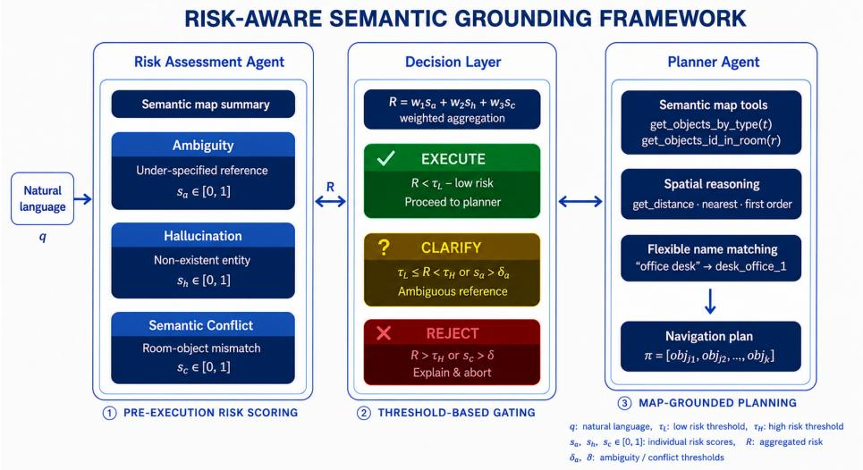
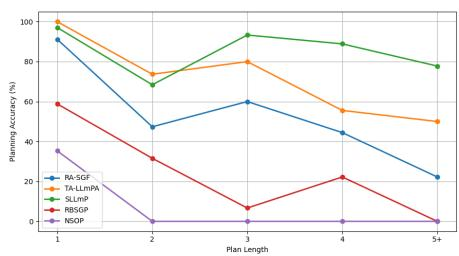
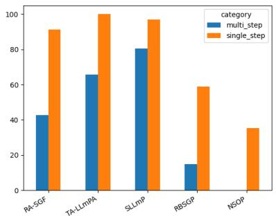

# Risk-Aware Semantic Grounding for Trustworthy LLM-Based Robot Planning

Łukasz Sobczak1[0000−0001−9439−1812], Nur Keleşoğlu1[0000−0002−0306−7281], and Sławomir Piotr Nowak1[0000−0002−0775−4935]

Institute of Theoretical and Applied Informatics, Polish Academy of Sciences, Gliwice 44-100, Poland {lsobczak,nkelesoglu,snowak}@iitis.pl

Abstract. Large language models (LLMs) are increasingly used as highlevel planners in robot navigation, but their outputs may become unreliable when instructions are ambiguous, unsupported by the environment, or semantically inconsistent. This paper presents a Risk-Aware Semantic Grounding framework for trustworthy LLM-based robot planning. Unlike existing LLM-based planners that primarily optimize plan generation, we formulate semantic grounding reliability as a multi-dimensional risk estimation problem. The proposed architecture explicitly models grounding uncertainty through ambiguity, hallucination and semantic-conflict risks before planning occurs, enabling the system to decide whether to execute the instruction, request clarification, or reject it. To evaluate the approach, we introduce TRUST-NAV, a benchmark containing both standard navigation tasks and risk-inducing instruction scenarios. Experimental results show that while conventional LLM planners achieve strong performance on valid navigation tasks, the proposed framework substantially improves ambiguity detection and semantic conflict rejection. These findings suggest that trustworthy robot planning should be evaluated not only by task completion, but also by the ability to recognize when execution should not occur.

Keywords: LLM-based robot planning · semantic grounding · trustworthy AI · risk assessment · decision making

## 1 Introduction

Large Language Models (LLMs) have recently demonstrated remarkable capabilities in natural language understanding, reasoning, and task decomposition, motivating their adoption as high-level planners in autonomous robotic systems. Recent research has explored LLMs for language-guided navigation [1–3], embodied reasoning [4], task planning [5–9], and human-robot interaction, highlighting their potential to improve the flexibility and accessibility of robotic applications.

Despite these advances, LLM-based planning remains vulnerable to reliability, safety, and trustworthiness issues. Unlike traditional planners operating on explicitly defined symbolic representations, LLMs may generate syntactically plausible yet semantically incorrect outputs. Such failures include hallucinated objects, incorrect room assignments, unsupported assumptions about the environment, and ambiguous instruction grounding. In human-centered environments, these errors may reduce task performance and lead to unsafe behavior or loss of user trust.

Existing approaches [10–13] improve planning reliability through semantic maps, tool-augmented reasoning, retrieval mechanisms, and structured environment representations. While these methods often improve task completion rates, they primarily focus on generating better plans rather than determining whether a plan should be generated at all. Consequently, many systems remain vulnerable when confronted with ambiguous instructions, references to nonexistent entities, or semantically inconsistent requests.

We argue that trustworthy robot planning should not be viewed solely as a plan-generation problem, but as a risk-aware semantic grounding problem in which the system first estimates grounding reliability and then decides whether planning is justified. This perspective shifts the objective from maximizing execution rates toward minimizing unsafe or semantically unsupported actions.

To address this challenge, we introduce a Risk-Aware Semantic Grounding Framework for LLM-based robot planning. The framework models three grounding failures: ambiguity, hallucination, and semantic conflict. Based on these risk indicators, a dedicated decision layer determines whether an instruction should be executed, clarified, or rejected before planning begins. To systematically evaluate this capability, we also introduce TRUST-NAV, a benchmark for trustworthy language-guided robot planning under both standard and risk-inducing instruction scenarios.

The main contributions of this work are as follows:

1. We formulate trustworthy robot planning as a risk estimation problem and introduce the Risk-Aware Semantic Grounding Framework, which separates execution reliability assessment from plan generation using ambiguity, hallucination, and semantic-conflict analysis.

2. We introduce a risk-aware decision mechanism that determines whether a navigation instruction should be executed, clarified, or rejected before plan generation.

3. We develop TRUST-NAV, a benchmark specifically designed to evaluate trustworthy semantic navigation under ambiguity, hallucination, and semantic conflict scenarios.

4. We show that explicit grounding-risk estimation improves ambiguity detection and semantic-conflict rejection while maintaining competitive planning performance.

The remainder of this paper is organized as follows. Section 2 reviews related work on LLM-based planning, semantic grounding, and trustworthy AI. Section 3 presents the proposed framework. Section 4 describes the experimental setup and TRUST-NAV. Section 5 presents baseline models, evaluation metrics, and reports the experimental results. Finally, Section 6 concludes the paper and discusses limitations and future work.

## 2 Related Works

This section reviews prior work in five areas: (1) semantic mapping for robot navigation, (2) language-guided navigation, (3) LLM-based planning in robotics, (4) trustworthy and uncertainty-aware LLM planning, and (5) decoupled planning architectures.

## 2.1 Semantic Mapping for Robot Navigation

Semantic mapping augments metric maps with object, region, and relational information. Early systems combined SLAM with object detection to label observed scenes [14]. Later work focused on compact and structured representations that remain expressive while being eficient to maintain [15], as well as semantic organization that supports consistent indoor navigation [16]. More recent openvocabulary scene graphs expose object-level spatial relations directly to language models for scene querying and planning [17]. These approaches treat the map as trustworthy once built, but they do not verify whether a new instruction is actually consistent with it.

## 2.2 Language-Guided Navigation

Instruction following has been studied extensively in simulation and on real robots. Benchmarks such as R2R and ALFRED require agents to execute multistep instructions with sequential subgoals and object interactions [1, 2]. One line of work maps language and perception directly to actions, which typically requires large training sets and is dificult to interpret. Another uses modular pipelines that translate instructions into symbolic goals or waypoints for classical planners [3]. While more interpretable, these systems still assume that the instruction is valid and focus on task completion rather than on detecting whether execution is appropriate.

## 2.3 LLM-Based Task Planning in Robotics

LLMs have become popular as high-level planners that decompose complex tasks into executable steps. Early prompting studies showed that pre-trained models can produce usable zero-shot plans for embodied agents [4]. SayCan grounds the model in robot afordances by scoring candidate actions according to both goal relevance and feasibility [5]. Inner Monologue incorporates environment and execution feedback into the prompt [6], while ProgPrompt and Code as Policies ask the model to generate structured programs or executable policy code [7, 8]. PaLM-E further integrates perception and language in a single model [9]. These methods significantly improve flexibility, but they mostly assume that the instruction is well-posed and that referenced entities exist, rather than explicitly estimating whether grounding is reliable.

## 2.4 Trustworthy and Uncertainty-Aware LLM Planning

The reliability of LLM planners has itself become a research topic. KnowNo uses conformal prediction to calibrate uncertainty and ask for help when the prediction set remains ambiguous [10]. Introspective planning instead prompts the model to assess its own uncertainty and choose between acting and asking, reducing both unsafe and overly cautious behavior [11]. SafeAgentBench shows that embodied agents still often accept unsafe commands [12], while MADRA introduces a training-free debate module that evaluates instruction safety before execution [13].

We share this goal but formulate the problem diferently. Rather than compressing grounding reliability into a single uncertainty score, we represent ground ing risk through three interpretable signals: ambiguity, hallucination, and semantic conflict. The decision is therefore not only whether to act or ask, but whether to execute, clarify, or reject. More importantly, we treat risk as a property of semantic grounding rather than as a property of the planner itself. This allows execution decisions to be made before planning begins and makes the reason for a rejection explicit. TRUST-NAV is built around these grounding failures rather than physical danger.

## 2.5 Decoupled Planning Architectures

Splitting high-level task planning from low-level motion control is a long-standing idea that improves robustness, modularity, and reuse [18]. We extend this principle by inserting a risk-assessment stage between language understanding and motion execution. Because this stage is rule-based and does not require training, it can be tuned on a small validation set and allows us to isolate the contribution of risk gating from the planner itself and from the underlying map representation.

## 3 Methodology

We propose a Risk-Aware Semantic Grounding Framework (RA-SGF) that augments conventional instruction-following pipelines for home-service robots with an explicit, pre-execution safety layer. Rather than delegating ambiguity and grounding errors entirely to the planning agent, our approach introduces two dedicated components that act before any navigation plan is generated: a Risk Assessment Agent and a Decision Layer. The overall architecture is illustrated in Fig 1.

Formally, let $\mathcal { M } = ( \mathcal { O } , \mathcal { R } )$ denote the semantic map of the environment, where O is the set of objects and R is the set of rooms. Each object $o _ { i } \in \mathcal { O }$ is described by a tuple $( i d _ { i } , t y p e _ { i } , p o s _ { i } , p r o p s _ { i } )$ encoding its unique identifier, semantic type, 2-D position, and a set of key-value properties. Each room $r _ { j } \in \mathcal { R }$ is described by a tuple $( i d _ { j } , t y p e _ { j } , O _ { j } )$ , where $O _ { j } \subseteq { \mathcal { O } }$ is the set of objects contained within room $r _ { j }$ . Given a natural-language instruction q and a starting position $p _ { 0 } \in \mathbb { R } ^ { 2 }$ , the goal is to produce an ordered sequence of object identifiers $\pi = [ o _ { 1 } , o _ { 2 } , \ldots , o _ { n } ]$ constituting the navigation plan, or to request clarification / reject the instruction when grounding is insuficiently reliable.

  
Fig. 1: Architecture of the proposed Risk-Aware Semantic Grounding framework. Grounding risk is estimated prior to planning to support execute, clarify, or reject decisions.

## 3.1 Risk Assessment Agent

The Risk Assessment Agent is an independent LLM agent that operates on the raw instruction q and a compact textual summary of M injected into its system prompt. It produces three scalar risk scores, each representing a distinct failure mode in semantic grounding:

1. Ambiguity score $s _ { a } \in [ 0 , 1 ] ;$ : measures the degree to which q is underspecified or admits multiple valid groundings without a discriminating spatial or semantic constraint. A score of 0 indicates a unique, unambiguous referent; a score of 1 indicates that the instruction cannot be grounded without further user input.

2. Hallucination score $s _ { h } \in [ 0 , 1 ] ;$ : measures the extent to which q references objects, rooms, or properties that do not exist in M. A score of 0 indicates that all mentioned entities are present in the map; a score of 1 indicates that the primary navigational target is entirely absent.

3. Semantic conflict score $s _ { c } \in [ 0 , 1 ]$ : measures the presence of logical contradictions between the instruction and the map topology, most commonly a room-object mismatch (e.g., referencing a refrigerator located in a bedroom when no such configuration exists in M). A score of 0 denotes full consistency; a score of 1 denotes a direct contradiction.

The three scores are aggregated into a single overall risk score $R \in [ 0 , 1 ]$ via a weighted linear combination:

$$
R = w _ { a } s _ { a } + w _ { h } s _ { h } + w _ { c } s _ { c } , \quad w _ { a } + w _ { h } + w _ { c } = 1 ,\tag{1}
$$

where $w _ { a } , w _ { h }$ , and $w _ { c }$ are non-negative scalar weights reflecting the relative severity of each failure mode. In our experiments we set $w _ { a } = 0 . 3 0 , w _ { h } = 0 . 4 0$ and $w _ { c } = 0 . 3 0$ , assigning the highest weight to hallucination as it represents the most unrecoverable failure: executing a plan toward a non-existent target cannot be corrected at runtime without replanning. The weights were selected empirically on a small validation subset and were not optimized on the test benchmark.

## 3.2 Decision Layer

The Decision Layer is a deterministic, rule-based gate parameterized by two soft thresholds $\tau _ { e }$ and $\tau _ { c }$ (with $\tau _ { e } \leq \tau _ { c } )$ and three hard per-dimension ceilings $\delta _ { a } , \delta _ { h }$ $\delta _ { c } \mathbf { : }$

$$
d ( q ) = \left\{ \begin{array} { l l } { \mathrm { r e j e c t } } & { \mathrm { i f } \ s _ { h } > \delta _ { h } \ \mathrm { o r } \ s _ { c } > \delta _ { c } , } \\ { \mathrm { c l a r i f y } } & { \mathrm { i f } \ s _ { a } > \delta _ { a } , } \\ { \mathrm { e x e c u t e } } & { \mathrm { i f } \ R \leq \tau _ { e } , } \\ { \mathrm { c l a r i f y } } & { \mathrm { i f } \ \tau _ { e } < R \leq \tau _ { c } , } \\ { \mathrm { r e j e c t } } & { \mathrm { i f } \ R > \tau _ { c } . } \end{array} \right.\tag{2}
$$

The hard-ceiling checks (first two cases) are evaluated before the soft thresholds to prevent scenarios in which a high single-dimension risk is masked by low scores in the remaining dimensions. For instance, an instruction with $s _ { h } = 0 . 9$ but $s _ { a } = s _ { c } = 0 . 0$ yields $R = 0 . 3 6$ under our default weights, which falls within the clarification band $\tau _ { e } < R \leq \tau _ { c }$ and would therefore trigger only a request for clarification, even though the primary navigational target is entirely absent from M; the hard ceiling $\delta _ { h }$ ensures that such instructions are rejected outright, regardless of the aggregate score. In our default configuration we use $\tau _ { e } = 0 . 3 0$ $\tau _ { c } = 0 . 7 0 , \delta _ { a } = 0 . 4 0 , \delta _ { h } = 0 . 8 0$ , and $\delta _ { c } = 0 . 8 5$

The separation of hard and soft decision criteria provides two complementary properties: precision (hard ceilings handle clear-cut, unambiguous failures with minimal false positives) and sensitivity (soft thresholds handle borderline cases where aggregate evidence suggests elevated risk). This design also exposes interpretable, adjustable parameters that practitioners can tune to match the risk tolerance of a specific deployment environment.

## 3.3 Planner Agent

When the Decision Layer outputs execute, control is transferred to the Planner Agent, which queries the semantic map through a set of tool functions and generates an ordered navigation plan π. The Planner Agent employs flexible name matching to resolve natural-language object descriptions to map identifiers: given a mention such as “ofice desk”, the agent first retrieves the set of object identifiers in the ofice room via get\_objects\_id\_in\_room, then intersects this set with the results of get\_objects\_by\_type("desk"), and selects the unique matching object. This two-stage lookup reduces the rate of spurious clarification requests caused by surface-form mismatches between natural-language names and map ontology labels.

When the instruction specifies multiple targets without an explicit ordering, the agent resolves the visitation sequence using a nearest-first greedy strategy. Given the robot’s current position $\bar { p } \in \mathbb { R } ^ { 2 }$ and a set of candidate targets $T =$ $\big \{ o 1 , \dots , o _ { k } \big \}$ , the next waypoint is selected as:

$$
o ^ { * } = \arg \operatorname* { m i n } _ { o _ { i } \in T } \ \| p o s _ { i } - p \| _ { 2 } ,\tag{3}
$$

where posi denotes the 2-D position of object $o _ { i }$ and the search iterates over the remaining unvisited targets until $T = \emptyset$

The agent responds in a structured JSON format containing three fields: (i) a decision field (execute / clarify / reject) reflecting any residual uncertainty discovered during grounding, (ii) a plan field containing the ordered list of object identifiers, and (iii) an answer field providing a natural-language confirmation or explanation for the operator.

The complete pipeline for a single instruction q at starting position $p _ { 0 }$ is summarized in Algorithm 1.

Algorithm 1 Risk-Aware Semantic Grounding   
Require: instruction $q ,$ starting position $p _ { 0 } .$ , semantic map ${ \mathcal { M } } ,$ thresholds   
$\tau _ { e } , \tau _ { c } , \delta _ { a } , \delta _ { h } , \delta _ { c }$ , weights $w _ { a } , w _ { h } , w _ { c }$   
Ensure: decision d, navigation plan π, response α   
1: $( s _ { a } , s _ { h } , s _ { c } ) \gets \mathrm { R }$ iskAssessmentAgent(q, M)   
2: $R  w _ { a } s _ { a } + w _ { h } s _ { h } + w _ { c } s _ { c }$   
3: d ← DecisionLayer $( s _ { a } , s _ { h } , s _ { c } , R , \tau _ { e } , \tau _ { c } , \delta _ { a } , \delta _ { h } , \delta _ { c } )$   
4: if d = execute then   
5: (π, α) ← PlannerAgent(q, p0, M)   
6: else if d = clarify then   
7: π ← [ ]; α ← ClarificationMessage(q, sa)   
8: else   
9: π ← [ ]; α ← RejectionMessage $( q , s _ { h } , s _ { c } )$   
10: end if   
11: return $( d , \pi , \alpha )$

## 4 Experimental Setup and Risk-Oriented Benchmark

## 4.1 Experiment Environment: Smart Home Case

The experimental environment is based on a single-floor apartment-style smart home designed to reflect a realistic residential setting, as illustrated in Fig. 2. The total area of the apartment is 12 × 8 meters, corresponding to 96 m2. The environment is partitioned into eight semantically distinct regions, each representing a functional space commonly found in a household.

  
Fig. 2: Smart home environment for a home assistant robot

Specifically, the smart home comprises two bedrooms, a living room, a kitchen, an ofice, a bathroom, an entrance hall, and a corridor that connects the rooms. Each region is explicitly defined by fixed spatial boundaries and contains representative furniture and household objects (e.g., beds, desks, sofas, kitchen appliances) that serve as navigation and task targets in the experiments.

In the designed smart home environment, the mobile robot is assumed to start from a fixed and known initial position at coordinates (x, y) = (0.2, 4.0) near the entrance door. This assumption simplifies the experimental setup by eliminating uncertainty in the robot’s initial localization and allows the evaluation to focus specifically on high-level planning and task execution performance.

## 4.2 TRUST-NAV Benchmark

To systematically evaluate the reliability and trustworthiness of LLM-based robotic planning systems, we introduce the TRUST-NAV (Trustworthy Navigation Benchmark). It consists of five query categories representing diferent levels of planning complexity and risk. The first two categories evaluate standard planning capabilities, whereas the remaining categories focus on risk-aware decision making. The complete benchmark contains 206 natural-language instructions. The composition of the benchmark is summarized in Table 1.

Table 1: Composition of the TRUST-NAV benchmark.
<table><tr><td>Category</td><td>Number of Queries</td><td>Percentage (%)</td></tr><tr><td>Single-Step Planning</td><td>34</td><td>16.50</td></tr><tr><td>Multi-Step Planning</td><td>61</td><td>29.61</td></tr><tr><td>Ambiguous Instructions</td><td>41</td><td>19.90</td></tr><tr><td>Hallucination Scenarios</td><td>40</td><td>19.42</td></tr><tr><td>Semantic Conflict Scenarios</td><td>30</td><td>14.56</td></tr><tr><td>Total</td><td>206</td><td>100</td></tr></table>

– Single-Step Planning: navigation instructions involving a single target object (e.g., Go to the sofa in the living room). The expected behavior is to generate and execute a valid plan.

Multi-Step Planning: instructions containing ordered sequences of two to six navigation targets. These tasks evaluate task decomposition, sequential reasoning, and execution-order preservation.

Ambiguous Instructions: underspecified instructions that admit multiple valid groundings (e.g., Go to the chair). A trustworthy system is expected to request clarification rather than arbitrarily select a target.

– Hallucination Scenarios: instructions containing references to entities that do not exist in the environment (e.g., Go to the piano). The expected behavior is to reject the instruction and report the inconsistency.

– Semantic Conflict Scenarios: instructions whose referenced entities exist individually but form an invalid combination (e.g., a refrigerator in a bedroom). These tasks evaluate semantic consistency verification prior to planning.

The proposed benchmark therefore evaluates not only planning accuracy but also a system’s ability to identify uncertainty, prevent hallucinations, and enforce semantic consistency. Such capabilities are essential for the deployment of trustworthy LLM-driven robotic systems operating in real-world human environments.

To support reproducibility and future research, the source code, benchmark, and evaluation scripts are publicly available at https://github.com/iitis/Risk-Aware-Semantic-Grounding.

## 5 Results and Discussion

The proposed framework is evaluated from two complementary perspectives: planning performance and trustworthiness-aware decision making. While conventional navigation benchmarks focus primarily on task completion, trustworthy robotic systems must also recognize instructions that should be clarified or rejected before execution.

Accordingly, we first evaluate planning performance on executable navigation tasks and then assess trustworthiness-aware decision making using the metrics defined in Section 5.2. All experiments were conducted using OpenAI GPT-5.4-mini as the underlying language model for all methods. The same model configuration was used across all evaluated methods to ensure a fair comparison.

## 5.1 Compared Methods

To evaluate the proposed model, we compare it against four baseline planners representing diferent levels of reasoning capability.

Baseline 1: Nearest Semantic Object Planner (NSOP) The first baseline is a minimal semantic navigation strategy that reduces each instruction to a single navigation goal. It ignores instruction sequencing, object attributes, and intermediate constraints, and instead selects the nearest instance of the most relevant object type matched from the instruction tokens and the semantic map.

Formally, let $s \in \mathbb { R } ^ { 2 }$ denote the robot start position and let $\mathcal { O } _ { t } = \{ o _ { 1 } , o _ { 2 } , \ldots , o _ { n } \}$ be the set of objects of semantic type t. The selected goal is

$$
g ^ { * } = \arg \operatorname* { m i n } _ { o \in \mathcal { O } _ { t } } \| s - p _ { o } \| _ { 2 } ,
$$

where $p _ { o }$ is the 2D position of object o. If no object type can be extracted, planning fails. This baseline serves as a lower-bound reference for a purely semantic, non-sequential, and geometry-light strategy.

Baseline 2: Rule-Based Sequential Global Planner (RBSGP) The second baseline extends NSOP with deterministic instruction decomposition for multi-step navigation. It splits an instruction into sub-instructions using temporal and conjunctive cues such as “then”, “next”, “after”, and punctuation, and processes each sub-instruction independently to extract an object type and, when available, an explicit object property.

If a matching object-property pair is found, the corresponding instance is selected; otherwise, the nearest object of the identified type is chosen using Euclidean distance. The final output is an ordered list of goal objects. While interpretable and deterministic, this baseline cannot detect ambiguity, hallucinated entities, or semantic inconsistencies.

Baseline 3: Simple LLM Planner (SLLmP) The third baseline uses an LLM to directly decompose instructions into ordered navigation targets, but removes all geometric information from the map. The LLM operates only on object identities, types, and properties embedded in the prompt, without access to object coordinates or spatial distances.

Given an instruction I and a simplified semantic map $\mathcal { M } _ { s } .$ , the planner computes

$$
\begin{array} { r } { \varPi = \mathrm { L L M } ( I , \mathcal { M } _ { s } ) , } \end{array}
$$

where $\boldsymbol { \varPi } = [ o _ { 1 } , o _ { 2 } , \ldots , o _ { k } ]$ is an ordered list of object identifiers. No geometric reasoning or feasibility checking is performed. This baseline isolates the contribution of semantic reasoning by LLMs without explicit spatial grounding.

Baseline 4: Tool-Augmented LLM Planner Agent (TA-LLmPA) The fourth baseline is a tool-augmented LLM planner that has access to the full geometric map and reasons iteratively through an agentic loop. At each step, it may call tools that retrieve object and room lists, filter objects, and compute distances. This enables it to resolve multi-step instructions, perform room-qualified lookups, and select spatially optimal visitation orders using Euclidean distance minimization (Eq. 3).

Formally, let T denote the tool set and M the full semantic map. The planner computes

$$
\boldsymbol { \Pi } = \mathrm { L L M } _ { \mathcal { T } } ( \boldsymbol { q } , \mathcal { M } ) ,
$$

where the subscript $\tau$ indicates iterative tool access before producing the final output $\boldsymbol { \varPi } = [ o _ { 1 } , o _ { 2 } , \ldots , o _ { k } ]$

The agent is instructed to return a structured JSON response with a decision field (execute / clarify / reject), the navigation plan, and a natural-language explanation. Unlike the proposed method, it has no explicit risk quantification, per-dimension scoring, or threshold-based gating. This makes it the most direct comparator, since both systems use the same underlying LLM and identical tool access; any gain can therefore be attributed to the proposed risk-aware pre-execution layer.

## 5.2 Evaluation Metrics

The proposed framework is evaluated from both planning-performance and trustworthiness perspectives. To this end, we employ five complementary metrics measuring planning correctness, ambiguity recognition, hallucination rejection, semantic-conflict detection, and overall decision reliability.

Planning Accuracy (PA). PA measures the fraction of executable queries for which the generated plan exactly matches the ground-truth object sequence:

$$
P A = { \frac { C _ { e x e c } } { N _ { e x e c } } } .\tag{4}
$$

Ambiguity Detection Rate (ADR). ADR measures the fraction of ambiguous instructions correctly classified as requiring clarification:

$$
A D R = { \frac { C _ { a m b } } { N _ { a m b } } } .\tag{5}
$$

Hallucination Rejection Rate (HRR). HRR measures the fraction of hallucinated instructions correctly rejected:

$$
H R R = \frac { C _ { h a l l } } { N _ { h a l l } } .\tag{6}
$$

Semantic Conflict Rejection Rate (SCR). SCR measures the fraction of semantically inconsistent instructions correctly rejected:

$$
S C R = \frac { C _ { c o n f } } { N _ { c o n f } } .\tag{7}
$$

Decision Accuracy (DA). The proposed framework assigns each instruction to one of three outcomes:

$$
D \in \{ e x e c u t e , c l a r i f y , r e j e c t \}\tag{8}
$$

Overall decision reliability is measured as

$$
D A = \frac { C _ { d e c i s i o n } } { N } ,\tag{9}
$$

where N is the total number of benchmark queries and $C _ { d e c i s i o n }$ is the number of correctly predicted decisions.

## 5.3 Planning Performance

We first evaluate planning performance on executable navigation tasks from TRUST-NAV, i.e., the Single-Step and Multi-Step categories. Table 2 and Fig. 3 summarize the results.

As expected, planning accuracy decreases as task complexity increases. The strongest multi-step performance is achieved by SLLmP (80.33%), while TA-LLmPA attains perfect single-step accuracy (100.00%) but drops to 65.57% on multi-step tasks. The proposed RA-SGF achieves 91.18% and 42.62%, respectively.

This reduction is expected, as the proposed framework prioritizes reliable preexecution decision making over maximizing execution rates. By explicitly identifying instructions that should be clarified or rejected, the framework adopts a more conservative strategy than conventional planners. Consequently, planning accuracy alone does not fully capture system reliability, motivating the trustworthiness-oriented evaluation presented next.

Table 2: Overall planning accuracy (%) on the TRUST-NAV benchmark.
<table><tr><td>Planner</td><td>Single-Step</td><td>Multi-Step</td></tr><tr><td>Baseline 1: NSOP</td><td>35.29</td><td>0.00</td></tr><tr><td>Baseline 2: RBSGP</td><td>58.82</td><td>14.75</td></tr><tr><td>Baseline 3: SLLmP</td><td>97.06</td><td>80.33</td></tr><tr><td>Baseline 4: TA-LLmPA</td><td>100.00</td><td>65.57</td></tr><tr><td>Proposed Method: RA-SGF</td><td>91.18</td><td>42.62</td></tr></table>

  
(a) Planning accuracy as a function of plan length.

  
(b) Comparison of single-step and multistep planning performance.  
Fig. 3: Planning performance of all evaluated planners.

## 5.4 Evaluation under Risk-Inducing Scenarios

TRUST-NAV also evaluates whether a planner can recognize instructions that should not be executed. In realistic deployments, robots may receive ambiguous, unsupported, or semantically inconsistent requests, where generating a plan is insuficient and the system must first decide whether execution is appropriate. To assess this capability, we measure decision accuracy across all benchmark categories.

Decision Accuracy (DA) Table 3 reports decision accuracy across all TRUST-NAV categories. Unlike planning accuracy, which measures whether the generated plan is correct, decision accuracy evaluates whether the system selects the appropriate high-level action (execute, clarify, or reject).

The results show a clear distinction between raw planning performance and trustworthy decision making. SLLmP obtains the highest overall decision accuracy (84.95%), largely because of strong performance on standard navigation tasks. The proposed RA-SGF is designed for more dificult cases and therefore prioritizes safe pre-execution decisions over maximizing overall execution rates. As a result, it does not achieve the highest score on every category, but it performs best on the two failure modes most closely related to trustworthy grounding.

Ambiguity Detection Rate (ADR) The proposed RA-SGF achieves the highest ADR (87.80%), outperforming SLLmP (78.05%) and TA-LLmPA (58.54%). This improvement comes from explicitly modeling ambiguity before plan generation, which allows the system to request clarification instead of committing to an arbitrary grounding. The result shows that ambiguity remains dificult for conventional LLM-based planners, even when they produce plausible plans.

Table 3: Decision accuracy (%) across diferent TRUST-NAV benchmark categories.
<table><tr><td>Planner</td><td>Step</td><td>Step</td><td>guous</td><td>nation</td><td>Single Multi Ambi- Halluci- Semantic Conflict</td><td>Overall</td></tr><tr><td>Baseline 1: NSOP</td><td>55.88</td><td>65.57</td><td>0.00</td><td>82.50</td><td>13.33</td><td>46.60</td></tr><tr><td>Baseline 2: RBSGP</td><td>85.29</td><td>100.00</td><td>0.00</td><td>77.50</td><td>13.33</td><td>60.68</td></tr><tr><td>Baseline 3: SLLmP</td><td>97.06</td><td>93.44</td><td>78.05</td><td>67.50</td><td>86.67</td><td>84.95</td></tr><tr><td>Baseline 4: TA-LLmPA</td><td>100.00</td><td>78.69</td><td>58.54</td><td>92.50</td><td>86.67</td><td>82.04</td></tr><tr><td>Proposed Method: RA-SGF</td><td>91.18</td><td>72.13</td><td>87.80</td><td>82.50</td><td>96.67</td><td>83.98</td></tr></table>

Hallucination Rejection Rate (HRR) For hallucination rejection, TA-LLmPA performs best (92.50%), while the proposed method reaches 82.50%. Even so, it still outperforms SLLmP (67.50%) and reliably rejects unsupported references. This suggests that hallucinated entities are often easier to detect through direct tool access to the semantic map, so explicit risk modeling ofers smaller gains here than in ambiguity or semantic conflict.

Semantic Conflict Rejection Rate (SCR) The proposed method RA-SGF achieves the highest SCR (96.67%), compared with 86.67% for both TA-LLmPA and SLLmP. This result indicates that semantic conflicts require relational reasoning, not just entity verification, since all referenced objects may exist while their combination is still invalid. The dedicated semantic-conflict analysis in the Risk Assessment Agent therefore provides a substantial benefit in detecting logically inconsistent instructions before planning begins.

Overall, the ADR and SCR results support the main hypothesis of this work: explicit risk-aware semantic grounding is especially valuable when instructions are ambiguous or internally inconsistent, i.e., when generating an incorrect plan would be worse than declining execution.

## 6 Conclusion

This paper introduced a Risk-Aware Semantic Grounding Framework for trustworthy LLM-based robot planning. Unlike conventional planning architectures that focus primarily on generating executable navigation plans, the proposed framework explicitly evaluates the reliability of semantic grounding before execution through dedicated ambiguity, hallucination and semantic-conflict analysis.

To evaluate this capability, we introduced TRUST-NAV, a benchmark containing both standard navigation tasks and risk-inducing instruction scenarios. The benchmark enables systematic evaluation of not only planning performance but also trustworthiness-aware decision making.

Experimental results demonstrate an important distinction between planning accuracy and decision reliability. While conventional LLM planners achieve strong performance on valid navigation tasks, they remain vulnerable when confronted with ambiguous instructions, unsupported references, and semantically inconsistent requests. In contrast, the proposed framework achieves the highest ambiguity detection rate (ADR, 87.80%) and semantic conflict rejection rate (SCR, 96.67%), demonstrating that explicit risk assessment substantially improves robustness in scenarios where executing an incorrect plan may be more harmful than declining execution.

More broadly, our results suggest a shift in evaluation philosophy for LLMbased robotics: trustworthy systems should be assessed not only by how often they act correctly, but also by how reliably they recognize when action should not be taken. As LLM-based robots become increasingly integrated into humancentered environments, trustworthy decision-making mechanisms will be essential for ensuring safe and reliable operation.

Limitations: TRUST-NAV focuses on grounding-related failures in a static indoor environment and does not currently model perception errors, dynamic scene changes, or long-horizon embodied tasks. Furthermore, the benchmark is limited to a single semantic environment. As a result, the reported findings should be interpreted as evidence of the efectiveness of grounding-risk estimation rather than a complete evaluation of trustworthy embodied intelligence.

Future Work: Future work will investigate adaptive threshold calibration, richer semantic consistency models, larger and more diverse benchmark environments, and the integration of risk-aware grounding with real-world robotic platforms operating in dynamic environments.

Acknowledgments. This work was partly supported by the National Centre for Research and Development (NCBR) and co-funded by the European Union under the European Funds for Modern Economy (FENG) Programme (SMART Konsorcja), project no. FENG.01.01-IP.01-A0GV/24-00, “Advanced maintenance and diagnostic tool for IT start-ups”.

Disclosure of Interests. The authors have no competing interests to declare that are relevant to the content of this article.

## References

1. P. Anderson, Q. Wu, D. Teney, J. Bruce, M. Johnson, N. Sünderhauf, I. Reid, S. Gould, and A. Van Den Hengel, “Vision-and-language navigation: Interpreting visually-grounded navigation instructions in real environments,” in 2018 IEEE/CVF conference on computer vision and pattern recognition. IEEE, 2018, pp. 3674–3683.

2. M. Shridhar, J. Thomason, D. Gordon, Y. Bisk, W. Han, R. Mottaghi, L. Zettlemoyer, and D. Fox, “Alfred: A benchmark for interpreting grounded instructions for everyday tasks,” in 2020 IEEE/CVF conference on computer vision and pattern recognition (CVPR). IEEE, 2020, pp. 10 737–10 746.

3. S. Tellex, T. Kollar, S. Dickerson, M. Walter, A. Banerjee, S. Teller, and N. Roy, “Understanding natural language commands for robotic navigation and mobile manipulation,” in Proceedings of the AAAI conference on artificial intelligence, vol. 25, no. 1, 2011, pp. 1507–1514.

4. W. Huang, P. Abbeel, D. Pathak, and I. Mordatch, “Language models as zero-shot planners: Extracting actionable knowledge for embodied agents,” in International conference on machine learning. PMLR, 2022, pp. 9118–9147.

5. A. Brohan, Y. Chebotar, C. Finn, K. Hausman, A. Herzog, D. Ho, J. Ibarz, A. Irpan, E. Jang, R. Julian et al., “Do as i can, not as i say: Grounding language in robotic afordances,” in Conference on robot learning. PMLR, 2023, pp. 287–318.

6. W. Huang, F. Xia, T. Xiao, H. Chan, J. Liang, P. Florence, A. Zeng, J. Tompson, I. Mordatch, Y. Chebotar et al., “Inner monologue: Embodied reasoning through planning with language models,” in Proceedings of The 6th Conference on Robot Learning, vol. 205. PMLR, 14–18 Dec 2023, pp. 1769–1782.

7. I. Singh, V. Blukis, A. Mousavian, A. Goyal, D. Xu, J. Tremblay, D. Fox, J. Thomason, and A. Garg, “Progprompt: Generating situated robot task plans using large language models,” in 2023 IEEE International Conference on Robotics and Automation (ICRA), 2023, pp. 11 523–11 530.

8. J. Liang, W. Huang, F. Xia, P. Xu, K. Hausman, B. Ichter, P. Florence, and A. Zeng, “Code as policies: Language model programs for embodied control,” in International conference on robotics and automation. IEEE, 2023, pp. 9493–9500.

9. D. Driess, F. Xia, M. S. M. Sajjadi, C. Lynch, A. Chowdhery, B. Ichter, A. Wahid, J. Tompson, Q. Vuong, T. Yu, W. Huang, Y. Chebotar, P. Sermanet, D. Duckworth, S. Levine, V. Vanhoucke, K. Hausman, M. Toussaint, K. Gref, A. Zeng, I. Mordatch, and P. Florence, “Palm-e: an embodied multimodal language model,” in Proceedings of the 40th International Conference on Machine Learning, 2023.

10. A. Z. Ren, A. Dixit, A. Bodrova, S. Singh, S. Tu, N. Brown, P. Xu, L. Takayama, F. Xia, J. Varley, Z. Xu, D. Sadigh, A. Zeng, and A. Majumdar, “Robots that ask for help: Uncertainty alignment for large language model planners,” in Conference on Robot Learning (CoRL). PMLR, 2023, pp. 661–682.

11. K. Liang, Z. Zhang, and J. F. Fisac, “Introspective planning: Aligning robots’ uncertainty with inherent task ambiguity,” in The Thirty-eighth Annual Conference on Neural Information Processing Systems, 2024.

12. S. Yin, X. Pang, Y. Ding, M. Chen, Y. Bi, Y. Xiong, W. Huang, Z. Xiang, J. Shao, and S. Chen, “Safeagentbench: A benchmark for safe task planning of embodied llm agents,” arXiv preprint arXiv:2412.13178, 2024.

13. J. Wang, L. Zhao, and X. S. Zhang, “MADRA: Multi-agent debate for risk-aware embodied planning,” in Findings of the Association for Computational Linguistics: ACL 2026. Association for Computational Linguistics, 2026, pp. 6852–6876.

14. A. Nüchter and J. Hertzberg, “Towards semantic maps for mobile robots,” Robotics and Autonomous Systems, vol. 56, no. 11, pp. 915–926, 2008.

15. Ł. Sobczak, P. Biernacki, and J. Domańska, “Visual encoding method for semantic mapping with federated learning concept,” in Proceedings of the Twenty-sixth International Symposium on Theory, Algorithmic Foundations, and Protocol Design for Mobile Networks and Mobile Computing, 2025, pp. 428–435.

16. M. Halama, S. Nowak, and K. Połys, “Semantic orientation for indoor navigation system using large language models,” Scientific Reports, vol. 15, no. 1, p. 41519, 2025.

17. Q. Gu, A. Kuwajerwala, S. Morin, K. M. Jatavallabhula, B. Sen, A. Agarwal, C. Rivera, W. Paul, K. Ellis, R. Chellappa et al., “ConceptGraphs: Openvocabulary 3D scene graphs for perception and planning,” in IEEE International Conference on Robotics and Automation (ICRA), 2024, pp. 5021–5028.

18. L. P. Kaelbling and T. Lozano-Pérez, “Integrated task and motion planning in belief space,” The International Journal of Robotics Research, vol. 32, no. 9-10, pp. 1194–1227, 2013.