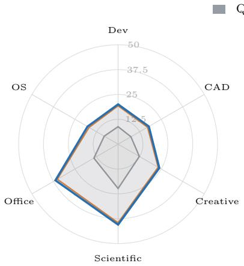
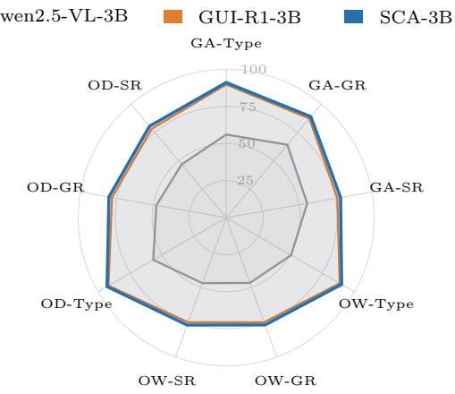
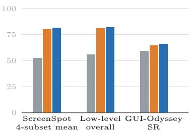
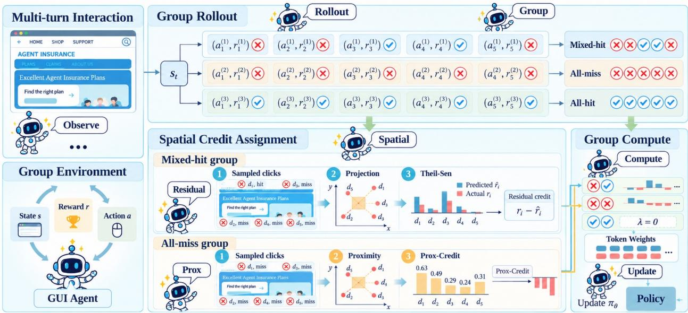

# SCA: Spatial Credit Assignment for Reinforcement Learning of GUI Agents

Shengtian Yang1, Ziyu Xiong1, Kaibing Yang1, Guangfeng Cai1, Yewen Li2, Peng Jiang3, Gai Kun3, Qingpeng Cai2, Lei Feng1,†

1Southeast University, Nanjing, China, 2Kuaishou Technology, Beijing, China, 3Unafiliated †Corresponding author

GUI agents automate tasks on digital devices by grounding language instructions in visual interfaces. Existing group-relative reinforcement learning improves GUI action prediction by comparing the rewards of multiple responses sampled from the same GUI state. However, binary evaluation treats spatially diferent failed clicks as identical and provides no relative signal when all sampled clicks fail. To address these limitations, we propose Spatial Credit Assignment (SCA), which uses the screen coordinates of sampled clicks to refine group-relative credit. Specifically, SCA predicts each held-out response’s reward from the other responses in groups containing both successes and failures, then uses the prediction residual to adjust credit. When all sampled clicks fail, SCA instead orders them by distance to the annotated target. These spatial references are used only to construct the training update; the deployed policy remains unchanged. We evaluate whether this correction improves the policy update itself by comparing its error and directional alignment with the exact return gradient in a controlled synthetic study. Across GUI grounding and ofline action-prediction benchmarks, SCA improves grounding across professional domains and achieves the strongest results among reinforcement-fine-tuned models on most action-prediction metrics, with consistent gains across the reported GUI suites.

Correspondence: yangshengtian@kuaishou.com

## 1 Introduction

GUI agents map screenshots and natural-language instructions to executable actions, such as clicking controls, selecting menu items, and entering text (Cheng et al., 2024; Luo et al., 2025; Lu et al., 2026; Wu et al., 2025; Gou et al., 2025). These tasks combine visual grounding, action-type selection, and argument generation across mobile, desktop, and web interfaces, so a useful policy must connect local screen geometry to the instruction rather than merely recognize an element. Recent work shows that reinforcement fine-tuning (RFT) can improve GUI action prediction with substantially less supervision than large-scale imitation learning (Luo et al., 2025; Lu et al., 2026). In particular, group-relative objectives such as GRPO and RLOO sample several responses to the same state and compare their rewards (Shao et al., 2024; Guo et al., 2025; Kool et al., 2019; Ahmadian et al., 2024). This training paradigm is well suited to GUI tasks because many sampled actions can be checked by a deterministic evaluator, making group credit the direct interface between evaluation and the policy update for all sampled responses during training.

However, reward-only group credit ignores the spatial structure of GUI actions. A binary evaluator gives the same reward to failed clicks at diferent locations, even when one click is close to the target and another points away from it. This produces two related challenges. In a mixed-hit group, successful and failed clicks reveal a local coordinate–reward relation, yet all misses receive the same group-relative credit. In an all-miss group, the group advantage is zero even though sampled clicks can lie at diferent distances from the target; reward-only credit therefore discards useful spatial evidence when successful clicks are rare.

Against this background, we propose Spatial Credit Assignment (SCA) for grouped GUI reinforcement learning. Specifically, SCA-Residual fits a held-out coordinate–reward trend for groups with mixed outcomes and blends the resulting residual with the ordinary group advantage. Moreover, SCA-Prox ranks actions by target proximity in all-miss groups, while all-hit groups retain the ordinary group credit. The spatial references are fitted within the current group and afect training only; inference therefore uses the trained policy alone, with no added predictor.

  
(a) Grounding capability

  
(b) Low-level task capability

  
(c) Aggregate scores  
Figure 1 Performance overview across GUI benchmarks. Panel (a) reports ScreenSpot-Pro percentages on a fixed 0–50 scale, averaging the Text and Icon columns within each domain. Panel (b) reports the Type, GR, and SR percentages on a 0–100 scale. Panel (c) summarizes the arithmetic mean of the four ScreenSpot subcolumns in Table 1, plus the Low-level Overall and GUI-Odyssey scores in Table 2. GA, OW, and OD denote GUI-Act-Web, OmniAct-Web, and OmniAct-Desktop.

We evaluate SCA on professional GUI grounding, web and desktop action prediction, and recorded cross-app mobile states. Figure 1 summarizes Tables 1 and 2. Across the completed three-seed suite, SCA reaches 26.1 across the twelve ScreenSpot-Pro subcolumns, $8 0 . 5 \pm 0 . 4 1$ on OmniAct-Desktop grounding, and $6 6 . 0 \pm 0 . 5 2$ on GUI-Odyssey. It obtains the best listed reinforcement-fine-tuning results on ScreenSpot-Pro and in ten of eleven low-level metrics. The comparison uses three-seed SCA means and listed baseline scores, while a separate synthetic study tests the spatial update against an exact return gradient.

Taken together, these results support three contributions:

• First, we formulate spatial credit assignment for grouped GUI reinforcement learning and identify the distinct mixed-hit and all-miss failure regimes of reward-only credit.

• Second, we develop SCA-Residual and SCA-Prox to use coordinate–reward trends and target proximity within the appropriate reward regimes.

• Third, we validate SCA with an exact-gradient analysis and a three-seed evaluation across GUI grounding and ofline action-prediction benchmarks.

## 2 Related Work

Group-relative reinforcement learning. GRPO, RLOO, REINFORCE-style variants, and related clipping and sampling extensions construct credit from sampled rewards (Shao et al., 2024; Guo et al., 2025; Kool et al., 2019; Ahmadian et al., 2024; Hu et al., 2025; Yu et al., 2025). Recent agentic learning systems address long-horizon planning, phase-aware specialization, progress-aware updates, setwise multi-agent credit, and ofline tool use (Li et al., 2026; Yang et al., $^ { 2 0 2 6 \mathrm { c } , \mathrm { a } , \mathrm { d } ; }$ Lyu et al., 2026). A separate line of work incorporates action dependence through learned critics, analytic control variates, or factorized baselines (Gu et al., 2017; Liu et al., 2018; Wu et al., 2018; Tucker et al., 2018). These approaches motivate using more than reward values when constructing credit. For GUI clicks, however, reward-only group comparisons leave spatially distinct actions tied whenever their binary outcomes agree. SCA addresses this limitation by fitting a coordinate–reward reference within each group. Its leave-one-out construction excludes the scored response’s reward from the fit and gate, drawing on the sample-splitting principle (Chernozhukov et al., 2018); the resulting update remains action-conditioned because the reference is evaluated at the sampled coordinate.

Spatial rewards for GUI agents. Spatial supervision ofers another way to distinguish GUI actions. $\mathrm { G U I { - } G ^ { 2 } }$ uses Gaussian reward modeling for GUI grounding (Tang et al., 2026), while SE-GUI studies self-evolutionary reinforcement learning for GUI agents (Yuan et al., 2025). Related work such as RSGround-R1 studies spatial reasoning in remote-sensing grounding (Huang et al., 2026). Target-distance shaping provides graded feedback even when a click misses the target, and SCA uses this signal in all-miss groups by standardizing and scaling target-proximity scores. Distance alone, however, assigns the same value to equally distant clicks and does not capture how reward varies with direction among the sampled actions. This motivates SCA’s mixed-hit branch, which fits a coordinate–reward trend from the other responses and assigns credit from the held-out residual. SCA thus uses target proximity when binary outcomes are constant and the observed coordinate–reward relation when both hits and misses are available; Section 4 describes the corresponding dense-reward extension used in the comparison.

GUI grounding and navigation evaluation. Visual GUI agents such as SeeClick, OS-Atlas, ShowUI, and UGround connect language instructions to screen elements (Cheng et al., 2024; Wu et al., 2025; Lin et al., 2025; Gou et al., 2025). ScreenSpot and ScreenSpot-Pro evaluate grounding across interface types and professional domains, while GUI-Act, OmniAct, GUI-Odyssey, and AndroidControl cover action prediction and interaction settings (Cheng et al., 2024; Li et al., 2025; Chen et al., 2025; Kapoor et al., 2024; Lu et al., 2025; Li et al., 2024). Beyond GUIs, recent benchmarks study auto-bidding and agent-authored world models for sequential decision making (Yang et al., 2026b; Cai et al., 2026; Chen et al., 2026). Our evaluation focuses on fixed ofline GUI states, including states drawn from trajectory datasets. In this setting, click coordinates and target annotations allow us to evaluate whether spatial credit improves grounding, while action-type and step-success metrics assess the accompanying changes in action prediction. Together, these benchmarks test whether spatial information improves GUI grounding and action prediction beyond reward-only group comparisons.

## 3 Preliminaries

SCA assigns credit after the sampled actions have been evaluated (Figure 2). In groups containing both successful and failed actions, Residual fits a coordinate–reward trend and uses deviations from that trend to refine the group advantage. In groups in which every sampled action fails, Prox assigns credit from distance to the annotated target. All-hit groups retain the standard group advantage. The spatial references are computed within each group and discarded after the update; inference therefore uses the trained policy alone during deployment.

Policy loss and credit weighting. Let $M _ { i t }$ denote the response-token mask and $\rho _ { i t } = \pi _ { \theta } ( y _ { i t } \mid y _ { i , < t } , x ) / \pi _ { \theta _ { \mathrm { o l d } } } ( y _ { i t } \mid$ $y _ { i , < t } , x )$ the token likelihood ratio. The scalar credit $A _ { i }$ returned by SCA is detached and shared across the tokens of response i. We minimize the clipped actor loss

$$
\begin{array} { r l } & { \mathcal { L } _ { \mathrm { a c t o r } } = - \displaystyle \frac { \sum _ { i , t } M _ { i t } \ell _ { i t } } { \sum _ { i , t } M _ { i t } } + \lambda _ { \mathrm { K L } } \widehat { D } _ { \mathrm { K L } } , } \\ & { \quad \ell _ { i t } = \operatorname* { m i n } \{ \rho _ { i t } \mathrm { s g } ( A _ { i } ) , \mathrm { c l i p } ( \rho _ { i t } , 1 - \varepsilon _ { c } , 1 + \varepsilon _ { c } ) \mathrm { s g } ( A _ { i } ) \} . } \end{array}\tag{1}
$$

Here $\mathrm { s g }$ denotes stop-gradient, $\varepsilon _ { c } = 0 . 2$ , and $\lambda _ { \mathrm { K L } } = 1 0 ^ { - 2 }$ . The KL term regularizes the policy against the reference model; its sampled estimator is specified in Appendix D. SCA supplies the response credit, while the token mask, likelihood ratio, clipping operation, and KL term follow the base actor objective used throughout training.

Reward construction. The primary evaluator returns a binary success indicator for each sampled action: a click receives one when it satisfies the annotated target condition and zero otherwise, while non-click actions are scored by the corresponding deterministic field checks. This reward is intentionally sparse, which exposes the tied-miss and all-miss cases addressed by SCA. For the dense-reward study, we additionally combine the Gaussian click reward and format-validity reward as $y _ { i } = 0 . 8 R _ { \mathrm { G a u s s i a n } , i } + 0 . 2 R _ { \mathrm { f o r m a t } , i }$ . The binary indicators still determine regime routing, whereas $y _ { i }$ supplies the response signal inside the mixed-hit residual fit. Thus the reward design provides a controlled comparison between standard binary credit and a denser response channel without changing the evaluator used at inference.

GUI-agent interaction model. A GUI agent receives a screenshot together with a natural-language instruction and emits a structured action. We represent an action as an action type, such as click, type, scroll, or navigation, together with arguments in the coordinate frame of the resized screenshot. For click actions, the argument is a point $a _ { i } = ( u _ { i } , v _ { i } )$ ; for text actions, it is a string field; and for scroll or navigation actions, it is a direction or target field. The policy therefore couples visual grounding with action-type and argument prediction rather than predicting an unconstrained token sequence.

States, targets, and evaluation. Each training example contains a fixed GUI state $x ,$ an instruction, and an annotated target region or target point. The evaluator parses the response into the same action schema and checks the relevant fields deterministically. A click is successful when its coordinate satisfies the target-region criterion; other actions are scored by their type, argument validity, and task-specific field checks. This evaluator produces a binary success signal for grouped reinforcement learning while preserving the coordinates needed by the spatial credit estimator.

Grouped rollout and grounding feedback. For one state, the policy samples N responses under the same instruction and screenshot. Their responses form a group on which relative credit is computed, so the comparison is across candidate actions for one state rather than across time steps of a trajectory. This distinction matters for GUI grounding: two responses can receive the same binary outcome while pointing to diferent screen locations, and an all-miss group can still contain a useful ordering by distance to the target. SCA uses this within-state spatial information only during training; the deployed agent still predicts the original action schema from the screenshot and instruction.

## 4 Method

For a GUI state $x ,$ the policy $\pi _ { \theta } ( \boldsymbol { a } \mid \boldsymbol { x } )$ samples N responses. A valid click has a coordinate $a _ { i } \in \mathbb { R } ^ { 2 }$ and reward $r _ { i }$ . We write $z ( v ) _ { i } = ( v _ { i } - \bar { v } ) / ( s ( v ) + \epsilon )$ for group standardization, where $s ( v )$ is the sample standard deviation. Binary GRPO uses $A _ { i } ^ { \mathrm { G R P O } } = \hat { z } ( r ) ,$ . All misses in a mixed group then receive the same advantage, and a group containing only misses has zero advantage. SCA uses click locations to distinguish these tied outcomes. Here, credit is assigned across responses to one state, not across the time steps of a trajectory. Each response’s credit subsequently weights its token sequence.

All coordinates use the resized-image pixel frame shared by the image processor, annotations, and parsed clicks. After computing credit, we detach it and assign it to the response tokens in the clipped actor objective (Schulman et al., 2017). SCA variants use a clip ratio of 0.2 and KL coeficient $1 0 ^ { - 2 }$ . Appendix D gives the token-level objective together with its pseudocode.

## 4.1 Spatial Credit Assignment

Predicting reward from neighboring clicks. Residual uses successful and failed clicks in a mixed-hit group to estimate how reward varies with position. We project the coordinates onto four axes: horizontal, vertical, and the two diagonals. For each rollout $i ,$ it fits a line to the other $N - 1$ coordinate–reward pairs on each axis and predicts the reward at $a _ { i }$ . We use the Theil–Sen estimator, whose slope is the median pairwise slope and whose intercept is the median residual (Theil, 1950; Sen, 1968). At the group size $N = 5 ,$ each outer fit uses four points. The four projections capture directional variation without fitting a two-dimensional model to these few samples. Holding out the scored response prevents its reward from determining its own fitted reference value.

Selecting a predictive spatial trend. We select directions by their predictive accuracy, using a second leave-oneout loop within the outer training set. A direction contributes when its held-out predictions have positive correlation with reward and lower squared error than the fold-local reward mean. Its weight is proportional to that error reduction. The resulting weighted prediction, ${ \hat { r } } _ { i } ,$ gives a reference reward at the sampled location. We score the combined validation predictions in the same way to obtain $q _ { i } ,$ then increase the spatial weight $w _ { i }$ linearly from zero at $q _ { i } = 0 . 8 0$ to one at $q _ { i } = 0 . 9 9$ . This $q$ band is the synthetic predictive-quality calibration in Appendix B. It is distinct from the runtime correlation blend thresholds $[ \rho _ { \mathrm { l o } } , \rho _ { \mathrm { h i } } ] = [ 0 . 3 , 0 . 7 ]$ used by the training implementation; the two normalized scores are not interchangeable. The full nested calculation is given in Appendix C.1.

  
Figure 2 Spatial credit within grouped GUI training. At state $s _ { t } ,$ , the policy samples actions and observes their rewards. The upper panel shows group credit $A _ { t } ^ { g }$ and the spatial correction $\bar { \boldsymbol { A } } _ { t } ^ { S } = \boldsymbol { A } _ { t } ^ { F } - \boldsymbol { A } _ { t } ^ { g }$ . Below, Prox ranks all-miss clicks by proximity scores $p _ { i } ,$ while Residual predicts mixed-hit rewards from held-out fits, forms residual credit, and blends it with group credit according to predictive skill. All-hit groups have zero spatial correction.

Assigning residual credit. The diference $\boldsymbol { r } _ { i } - \boldsymbol { \hat { r } _ { i } }$ measures how an action performs relative to the trend fitted from the other rollouts. For two misses, the action with the higher predicted reward has the more negative residual: it failed where the group suggested a better outcome. Figure 2 We standardize the residuals over the finite-prediction subset $V$ to obtain $A _ { i } ^ { \mathrm { r e s } } = z _ { V } ( r _ { V } - \hat { r } _ { V } ) _ { i }$ . Residual blends them with the original group advantage and standardizes the blended vector:

$$
A _ { i } ^ { \mathrm { R e s i d u a l } } = \left[ z \big ( w \odot A ^ { \mathrm { r e s } } + ( 1 - w ) \odot A ^ { \mathrm { G R P O } } \big ) \right] _ { i } ,\tag{2}
$$

where $\odot$ denotes elementwise multiplication. Figure 2 A miss can receive positive final credit because the update is relative to its group; Appendix C works through a five-click example. Invalid predictions have zero residual and weight. If all weights are zero, Residual returns $A ^ { \mathrm { G R P O } }$ directly. Proposition 1 describes the held-out reward separation, and Appendix C analyzes the resulting action-conditioned update.

Ordering all-miss clicks. An all-miss group has no reward variation from which to estimate a trend. Prox instead measures distance to the annotated target. For its centroid $c _ { T }$ and diagonal $d _ { T }$ , we use the length scale $\ell _ { T } = \operatorname* { m a x } ( 0 . 5 \operatorname* { m a x } ( d _ { T } , 1 ) + 5 0 , \epsilon )$ , with a 280-pixel diameter for point annotations. For valid clicks $i \in V _ { T }$ , proximity and credit are

$$
p _ { i } = \exp \left( - \frac { \| a _ { i } - c _ { T } \| _ { 2 } } { \ell _ { T } } \right) ,\tag{3}
$$

$$
A _ { i } ^ { \mathrm { P r o x } } = \alpha _ { T } z _ { V _ { T } } ( p _ { V _ { T } } ) _ { i } ,\tag{4}
$$

with zero credit outside $V _ { T }$ . The coeficient $\alpha _ { T } = 0 . 3 \operatorname* { m i n } ( \mathrm { s t d } _ { 0 } ( p _ { V _ { T } } ) / 0 . 1 5 , 1 )$ scales the branch by the spread of the proximity scores. Thus closer clicks receive higher credit, and a group of nearly equidistant misses receives a small update. Figure 2

SCA uses Prox for all-miss groups, Residual for groups containing both successful and failed actions, and the original group advantage for all-hit groups. With dense reward, routing still follows the binary success indicators $h _ { i } .$ . The response channel $y _ { i } = 0 . 8 R _ { \mathrm { G a u s s i a n } , i } + 0 . 2 R _ { \mathrm { f o r m a t } , i }$ supplies the Residual residual, while a parallel fit on $h _ { i }$ supplies its gate. The dense-reward variant uses $z ( y )$ for the remaining groups. Appendix D specifies the update, including degenerate fits and invalid coordinates for each rollout.

Regime routing and edge cases. For each sampled state, the evaluator returns a binary reward vector and the group is assigned to exactly one regime. Mixed-hit groups use the held-out spatial trend because the group contains both positive and negative outcomes. groups in which every sampled action fails bypass regression because the response rewards are constant; Prox supplies the only directional signal available from the annotated target. All-hit groups retain the base group advantage because there is no failed response whose credit needs correction. Invalid coordinates, tied proximity scores, and failed fits are masked before standardization. If no valid spatial prediction remains, the implementation returns the original group advantage, so the estimator has a defined fallback for every sampled rollout.

Cross-fitting and computational cost. The scored response is excluded from the fit used to predict its reference value. This prevents its own reward from entering the prediction and then being used to score the same response. The directional ensemble uses four one-dimensional projections and a second leave-one-out validation pass; with the fixed group size N = 5, each fit uses only four training points. Thus the additional work is confined to small regressions over the rollout group and does not introduce a learned critic or an inference-time network.

Relation to the policy update. After routing, SCA standardizes the selected credit and assigns one scalar to each sampled response. That scalar is detached before weighting response tokens in the clipped objective. The evaluator, sampler, clipping rule, and KL term therefore remain unchanged. This separation lets the experiments test the credit estimator itself: the main tables measure downstream behavior, while the synthetic gradient study measures whether the resulting update preserves the direction of the exact return gradient.

## 5 Experiments

## 5.1 Implementation Details

Training and inference. We initialize SCA from Qwen2.5-VL-3B-Instruct and use the EasyR1 implementation of the clipped PPO objective with five sampled responses per GUI state. All SCA seeds use the same data, prompt, evaluator, optimizer family, and rollout protocol. Appendix A.1 summarizes the training setup. Appendix F gives the prompt and parsed action fields. Tables 1 and 2 report means and sample standard deviations over three independently trained SCA seeds. Baseline rows contain the comparison point estimates reported by GUI-R1 (Luo et al., 2025) and UI-R1 (Lu et al., 2026). We report descriptive diferences between these results.

Benchmarks and metrics. ScreenSpot and ScreenSpot-Pro measure click grounding, with ScreenSpot-Pro covering six professional interface domains. GUI-Act-Web, OmniAct-Web, and OmniAct-Desktop measure low-level action prediction across web and desktop interfaces. GUI-Odyssey supplies recorded states from cross-app mobile tasks. Following GUI-R1, we report action-type accuracy (Type), click-grounding accuracy (GR), and step success rate (SR). Appendix A.2 defines each endpoint and its evaluation protocol.

## 5.2 Experimental Results

Grounding capability. SCA scores above the listed GUI-R1 point estimates in all sixteen grounding subcolumns of Table 1, with diferences of 0.3–1.7 percentage points. The arithmetic mean of the twelve ScreenSpot-Pro subcolumns is 26.1, compared with 25.2 for GUI-R1. On ScreenSpot, the SCA results are 90.5 ± 0.30 and 73.5 ± 0.42 for Web Text and Icon, and 94.8 ± 0.28 and 66.5 ± 0.45 for Desktop Text and Icon.

Cross-benchmark consistency. The gains are not restricted to a single evaluator or interface family. ScreenSpot-Pro tests professional grounding across six domains, while GUI-Act-Web and OmniAct combine action type, grounding, and step success. The same direction across these settings suggests that the update changes the quality of credit assigned during training rather than exploiting one benchmark-specific score during training.

Error regime and target type. The two spatial branches address diferent failure modes. In mixed-hit groups, the reward residual is useful because the group contains both positive and negative observations; in groups in which every sampled action fails, target proximity is the only available ordering signal. The text/icon split provides a complementary diagnostic: improvements on both target types indicate that the training signal is useful across visual target types, while the remaining icon gap identifies a perception bottleneck rather than a missing reward signal.

Table 1 GUI grounding results on ScreenSpot-Pro and ScreenSpot. ScreenSpot-Pro contains six domains with text/icon subsets; ScreenSpot contains Web and Desktop text/icon subsets. SCA reports mean ± sample standard deviation over three independent training runs; other rows reproduce reported values. All RFT rows use a 3B-scale policy. Bold marks the highest RFT value.
<table><tr><td rowspan="3">Model</td><td colspan="10">ScreenSpot-Pro</td><td colspan="4">ScreenSpot</td></tr><tr><td>Dev</td><td></td><td>CAD</td><td></td><td>Creative</td><td></td><td>Scientific</td><td></td><td>Office</td><td></td><td>OS</td><td></td><td>Web</td><td>Desktop</td><td></td></tr><tr><td>Text Icon</td><td></td><td>Text</td><td>Icon</td><td>Text Icon</td><td></td><td>Text</td><td>Icon</td><td>Text</td><td>Icon Text</td><td>Icon</td><td>Text</td><td>Icon</td><td>Text</td><td>Icon</td></tr><tr><td colspan="10">Supervised fine-tuning</td><td></td><td></td><td></td><td></td><td></td><td></td></tr><tr><td>SeeClick</td><td>0.6</td><td>0.0</td><td>2.5 0.0</td><td>1.0</td><td>0.0</td><td>3.5</td><td>0.0</td><td>1.1</td><td>0.0</td><td>2.8</td><td>0.0</td><td>55.7</td><td>32.5</td><td>72.2</td><td>30.0</td></tr><tr><td>OS-Atlas-4B</td><td>7.1</td><td>0.0</td><td>2.0</td><td>0.0</td><td>3.0</td><td>1.4</td><td>9.0 5.5</td><td>5.1</td><td>3.8</td><td>5.6</td><td>0.0</td><td>82.6</td><td>63.1</td><td>72.1</td><td>45.7</td></tr><tr><td>ShowUI-2B</td><td>16.9</td><td>1.4</td><td>2.5</td><td>0.0</td><td>9.1</td><td>0.0 13.2</td><td>7.3</td><td>15.3</td><td>7.5</td><td>10.3</td><td>2.2</td><td></td><td></td><td></td><td></td></tr><tr><td>CogAgent-18B</td><td>14.9</td><td>0.7</td><td>7.1</td><td>3.1</td><td>9.6</td><td>0.0 22.2</td><td>1.8</td><td>13.0</td><td>0.0</td><td>5.6</td><td>0.0</td><td>70.4</td><td>28.6</td><td>74.2</td><td>20.0</td></tr><tr><td>Aria-GUI</td><td>16.2</td><td>0.0</td><td>7.6</td><td>1.6</td><td>23.7</td><td>2.1 27.1</td><td>6.4</td><td>20.3</td><td>1.9</td><td>4.7</td><td>0.0</td><td></td><td></td><td></td><td></td></tr><tr><td>UGround-7B</td><td>26.6</td><td>2.1</td><td>14.2</td><td>1.6</td><td>27.3</td><td>2.8 31.9</td><td>2.7</td><td>31.6</td><td>11.3</td><td>17.8</td><td>0.0</td><td>80.4</td><td>70.4</td><td>82.5</td><td>63.6</td></tr><tr><td>Claude-3.5-Sonnet</td><td>22.0</td><td>3.9</td><td>14.5</td><td>3.7</td><td>25.9</td><td>3.4 33.9</td><td>15.8</td><td>30.1</td><td>16.3</td><td>11.0</td><td>4.5</td><td></td><td></td><td></td><td></td></tr><tr><td>OS-Atlas-7B</td><td>33.1</td><td>1.4</td><td>12.2</td><td>4.7</td><td>28.8</td><td>2.8 37.5</td><td>7.3</td><td>33.9</td><td>5.7</td><td>27.1</td><td>4.5</td><td>90.8</td><td>74.2</td><td>91.7</td><td>62.8</td></tr><tr><td>QwenVL2.5-3B</td><td>20.3</td><td>1.8</td><td>11.2</td><td>4.7</td><td>24.6</td><td>2.8 39.5</td><td>6.4</td><td>28.6</td><td>5.7</td><td>17.8</td><td>2.2</td><td>73.0</td><td>48.5</td><td>85.7</td><td>46.2</td></tr><tr><td>QwenVL2.5-7B</td><td>31.4</td><td>1.8 15.7</td><td></td><td>5.1 27.3</td><td></td><td>3.5 40.7</td><td>7.9</td><td>39.7</td><td>8.9</td><td>32.4</td><td>6.9</td><td>87.8</td><td>68.2</td><td>90.3</td><td>62.8</td></tr><tr><td>Zero-shot</td><td></td><td></td><td></td><td></td><td></td><td></td><td></td><td></td><td></td><td></td><td></td><td></td><td></td><td></td><td></td></tr><tr><td>QwenVL-7B</td><td>0.0</td><td>0.0</td><td>0.0</td><td>0.0</td><td>0.0</td><td>0.0</td><td>0.7 0.0</td><td>0.0</td><td>0.0</td><td>0.0</td><td>0.0</td><td></td><td></td><td></td><td></td></tr><tr><td>GPT-40</td><td>1.3</td><td>0.0</td><td>2.0</td><td>0.0</td><td>1.0</td><td>0.0</td><td>2.1 0.0</td><td>1.1</td><td>0.0</td><td>0.0</td><td>0.0</td><td></td><td></td><td></td><td></td></tr><tr><td>QwenVL2.5-3B</td><td>16.2</td><td>1.4</td><td>10.2</td><td>4.7</td><td>23.3</td><td>1.4 38.2</td><td>6.4</td><td>24.3</td><td>3.8</td><td>15.0</td><td>1.1</td><td>60.8</td><td>43.5</td><td>70.1</td><td>35.0</td></tr><tr><td>QwenVL2.5-7B</td><td>33.1</td><td>2.1 12.2</td><td></td><td>6.3</td><td>23.7</td><td>3.5 36.8</td><td>7.3</td><td>37.8</td><td>7.5</td><td>30.8</td><td>6.9</td><td>86.9</td><td>65.1</td><td>89.7</td><td>60.0</td></tr><tr><td colspan="10">Reinforcement fine-tuning</td><td></td><td></td><td></td><td></td><td></td><td></td></tr><tr><td>UI-R1-3B</td><td>22.7</td><td>4.1</td><td>11.2</td><td>6.3 27.3</td><td></td><td>3.5 43.4</td><td>11.8</td><td>32.2</td><td>11.3</td><td>13.1</td><td>4.5</td><td>85.2</td><td>73.3</td><td>90.2</td><td>59.3</td></tr><tr><td>GUI-R1-3B</td><td>33.8</td><td>4.8</td><td>26.4</td><td>7.8 40.9</td><td></td><td>5.6 61.8</td><td>17.3</td><td>53.6</td><td>17.0</td><td>28.1</td><td>5.6</td><td>89.6</td><td>72.1</td><td>93.8</td><td>64.8</td></tr><tr><td colspan="10">SCA-3B (Ours) 35.0 ±0.45 5.1±0.32 27.5 ±0.40 8.2 ±0.36 42.0 ±0.42 5.9 ±0.31 63.0 ±0.50 18.0±0.38 55.0 ±0.46 17.8 ±0.35 29.5 ±0.43 6.0±0.34 90.5 ±0.30 73.5 ±0.42 94.8 ±0.28 66.5 ±0.45</td></tr></table>

Table 2 Offline GUI action-prediction results. Action-type accuracy (Type), click-grounding accuracy (GR), and step success rate (SR). SCA reports mean ± sample standard deviation over three independent training runs; comparison rows reproduce reported values. Bold marks the highest RFT value.
<table><tr><td rowspan="2">Model</td><td colspan="3">GUI-Act-Web</td><td colspan="3">OmniAct-Web</td><td colspan="3">OmniAct-Desktop</td><td rowspan="2">Low-lvl</td><td rowspan="2">GUI-Odyssey SR</td></tr><tr><td>Type</td><td>GR</td><td>SR</td><td>Type</td><td>GR</td><td>SR</td><td>Type</td><td>GR</td><td>SR Overall</td></tr><tr><td>Supervised ine-tuning</td><td></td><td></td><td></td><td></td><td></td><td></td><td></td><td></td><td></td><td></td><td></td></tr><tr><td>OS-Atlas-4B</td><td>79.22</td><td>58.57</td><td>42.62</td><td>46.74</td><td>49.24</td><td>22.99</td><td>63.30</td><td>42.55</td><td>26.94</td><td>50.71</td><td>64.58</td></tr><tr><td>OS-Atlas-7B</td><td>86.95</td><td>75.61</td><td>57.02</td><td>85.63</td><td>69.35</td><td>59.15</td><td>90.24</td><td>62.87</td><td>56.73</td><td>70.07</td><td>73.00</td></tr><tr><td>QwenVL2.5-3B</td><td>76.95</td><td>66.34</td><td>61.69</td><td>66.24</td><td>56.91</td><td>53.02</td><td>77.62</td><td>62.54</td><td>63.76</td><td>65.79</td><td>62.03</td></tr><tr><td>QwenVL2.5-7B</td><td>87.66</td><td>84.77</td><td>79.89</td><td>81.62</td><td>73.45</td><td>73.39</td><td>86.23</td><td>80.17</td><td>79.80</td><td>80.09</td><td>84.00</td></tr><tr><td>Zero-shot</td><td></td><td></td><td></td><td></td><td></td><td></td><td></td><td></td><td></td><td></td><td></td></tr><tr><td>GPT-4o</td><td>77.09</td><td>45.02</td><td>41.84</td><td>79.33</td><td>42.79</td><td>34.06</td><td>79.97</td><td>63.25</td><td>50.67</td><td>54.46</td><td>28.39</td></tr><tr><td>QwenVL2.5-3B</td><td>56.10</td><td>64.28</td><td>55.61</td><td>50.63</td><td>46.89</td><td>47.02</td><td>56.95</td><td>47.97</td><td>46.89</td><td>55.65</td><td>59.32</td></tr><tr><td>QwenVL2.5-7B</td><td>86.59</td><td>84.39</td><td>78.63</td><td>79.15</td><td>71.32</td><td>73.39</td><td>84.74</td><td>79.89</td><td>79.66</td><td>79.05</td><td>87.08</td></tr><tr><td>Reinforcement fine-tuning</td><td></td><td></td><td></td><td></td><td></td><td></td><td></td><td></td><td></td><td></td><td></td></tr><tr><td>UI-R1-3B</td><td>75.89</td><td>79.43</td><td>67.31</td><td>75.42</td><td>61.35</td><td>61.33</td><td>73.41</td><td>64.12</td><td>63.98</td><td>70.85</td><td>66.44</td></tr><tr><td>GUI-R1-3B</td><td>89.86</td><td>87.42</td><td>76.31</td><td>88.58</td><td>75.10</td><td>75.08</td><td>91.86</td><td>78.37</td><td>78.31</td><td>80.88</td><td>64.41</td></tr><tr><td>SCA-3B (Ours)</td><td>91.2 ±0.35</td><td>89.0 ±0.42</td><td>78.5 ±0.50</td><td>90.1±0.38</td><td>77.0 ±0.45</td><td>77.1 ±0.47</td><td>93.0 ±0.32</td><td>80.5±0.41</td><td>80.6±0.43</td><td>82.0±0.36</td><td>66.0±0.52</td></tr></table>

Mechanism check. The controlled synthetic study isolates credit assignment from VLM perception. We compare the estimated update with the exact return gradient using gradient MSE, cosine similarity, and norm ratio. The results support the interpretation of the main tables: spatial credit reduces update error while preserving the direction of policy improvement, and the all-miss auxiliary is used only when the reward-based fit is degenerate.

Offline action prediction. Table 2 extends the comparison to action type, grounding, and step success. SCA reaches $8 9 . 0 \pm 0 . 4 2 $ GUI-Act-Web GR, $7 7 . 0 \pm 0 . 4 5$ OmniAct-Web GR, and $8 0 . 5 \pm 0 . 4 1$ OmniAct-Desktop GR. These exceed the GUI-R1 entries by 1.58, 1.90, and 2.13 percentage points. The corresponding SCA step success rates are $7 8 . 5 \pm 0 . 5 0 , 7 7 . 1 \pm 0 . 4 7$ , and $8 0 . 6 \pm 0 . 4 3$ , and the reported low-level overall score is $8 2 . 0 \pm 0 . 3 6$

On GUI-Odyssey, SCA reaches $6 6 . 0 \pm 0 . 5 2$ , compared with 64.41 for GUI-R1 and 66.44 for UI-R1. This is 1.59 points above GUI-R1 and 0.44 below UI-R1. SCA leads the listed RFT point estimates in the ten low-level columns, while UI-R1 has the highest RFT value in the GUI-Odyssey column.

What drives the gain. The pattern across the two tables is consistent with the intended credit mechanism. The largest improvements appear in click grounding, whereas action-type accuracy changes less; this is expected because SCA changes the credit assigned to spatial actions and leaves the action parser and evaluator unchanged. The same ordering is visible across Web and Desktop settings, which reduces the chance that the gain comes from a single interface family.

Text versus icon targets. Text targets are consistently easier than icon targets for both GUI-R1 and SCA. SCA improves both groups, but the smaller absolute change on icons indicates that the method improves credit assignment without removing the underlying visual ambiguity of small or semantically weak targets. This distinction matters for interpretation: the method supplies a better training signal, while perception quality remains a separate bottleneck.

Regime-specific interpretation. The mixed-hit branch can refine the relative credit of misses using neighboring coordinate–reward pairs; the all-miss branch is the only source of a directional signal when binary rewards are constant. The exact-gradient study supports this separation: Residual remains aligned with the return gradient, while the full rule adds the Prox signal only in the regime where the residual fit is degenerate.

## 5.3 Analysis of the Main Results

Differences across professional domains. Table 3 summarizes the ScreenSpot-Pro results by domain. SCA scores higher in all six domains, with gains ranging from 0.70 to 1.10 percentage points. The largest increase is in Ofice, followed by Scientific, while the remaining domains show gains between 0.70 and 0.90 points. These diferences show that the improvement extends across several types of professional interfaces.

Text and icon targets. Averaged over the six professional domains, SCA scores 42.00 on text targets and 10.17 on icon targets, compared with 40.77 and 9.68 for GUI-R1. The respective improvements are 1.23 and 0.48 points. Icon grounding remains substantially harder for both models, and the absolute gain is smaller on icons than on text. The gains are spread across the professional domains, while icon grounding remains the lower-scoring target category.

Table 3 ScreenSpot-Pro domain means (%). Text and icon scores are equally weighted; ∆ denotes the gain over GUI-R1.

<table><tr><td>Domain</td><td>GUI-R1</td><td>SCA</td><td> $\Delta$ </td></tr><tr><td>Dev</td><td>19.30</td><td>20.05</td><td>+0.75</td></tr><tr><td>CAD</td><td>17.10</td><td>17.85</td><td>+0.75</td></tr><tr><td>Creative</td><td>23.25</td><td>23.95</td><td>+0.70</td></tr><tr><td>Scientific</td><td>39.55</td><td>40.50</td><td>+0.95</td></tr><tr><td>Office</td><td>35.30</td><td>36.40</td><td>+1.10</td></tr><tr><td>OS</td><td>16.85</td><td>17.75</td><td>+0.90</td></tr></table>

## 5.4 Exact-Gradient Analysis

The exact-gradient contextual-bandit analysis in Ta-

ble 4 separates the credit estimator from VLM perception. Binary GRPO has gradient MSE 0.16201 on the four-context mixture. SCA-Residual reaches 0.14825 with cosine 0.99985 to the exact mean gradient, and Full SCA reaches 0.14754 with cosine 0.99997. The OLS-LOO control has lower MSE but a negative cosine and a norm ratio of 0.071: its mean update is small and points away from the return gradient. MSE measures estimation error, while cosine and norm ratio describe the expected update’s direction and scale. Reading them together, Residual reduces MSE by about 8.5% relative to GRPO and retains positive alignment with the return gradient in this controlled mixture.

Why the exact-gradient check matters. This experiment is deliberately separated from benchmark accuracy. It keeps the sampled actions and return definition fixed, so changes in MSE reflect credit construction rather than a diferent policy or evaluator. The comparison also distinguishes three cases: a method can reduce error while changing direction, preserve direction while mis-scaling the update, or improve both. SCA’s residual correction is useful only when its added term ofsets estimation error; the exact-gradient reference lets us test that condition directly. Thus, the study connects the spatial rule to the quantity optimized during training and clarifies why matching a reward predictor alone would be insuficient.

Each estimator uses the same sampled actions. The target-distance LOO control in Appendix E has mean horizontal update −0.01560, compared with the exact value 0.08143. This control fits a resid ual reference against distance, rather than using distance as a reward. Its result highlights the importance of the reference’s action dependence, which Appendix E.2 relates to gradient error.

Table 4: Exact-gradient mechanism analysis. Monte Carlo estimates on a fixed four-context mixture. Norm ratio is ∥Egˆ∥2/∥gR∥2.
<table><tr><td>Estimator</td><td>Gradient MSE</td><td>Cosine</td><td>Norm ratio</td></tr><tr><td>Binary GRPO</td><td>0.16201</td><td>0.99995</td><td>1.624</td></tr><tr><td>2-D OLS-LOO</td><td>0.10082</td><td>-0.57269</td><td>0.071</td></tr><tr><td>SCA-RESIDUAL</td><td>0.14825</td><td>0.99985</td><td>1.524</td></tr><tr><td>Full SCA</td><td>0.14754</td><td>0.99997</td><td>1.597</td></tr></table>

The controlled perturbations in Appendix E.3 give a more detailed comparison of median and OLS fits at $N = 5$

Interpreting gradient error. The exact reference also separates the error of the average update from variation across sampled groups. For an estimator $\hat { g }$ with mean $\bar { g } = \mathbb { E } \hat { g }$

$$
\begin{array} { r } { \mathbb { E } \| \hat { \boldsymbol { g } } - \boldsymbol { g } _ { R } \| _ { 2 } ^ { 2 } = \mathbb { E } \| \hat { \boldsymbol { g } } - \bar { \boldsymbol { g } } \| _ { 2 } ^ { 2 } + \| \bar { \boldsymbol { g } } - \boldsymbol { g } _ { R } \| _ { 2 } ^ { 2 } . } \end{array}
$$

A lower MSE can therefore reflect reduced dispersion, a mean closer to the reference, or a trade-of between these terms. The OLS-LOO result illustrates why the direction and magnitude of the mean must also be inspected: its small norm suppresses the update while its negative cosine indicates an opposing direction. By comparison, Residual and Full SCA retain positive alignment, although their norm ratios remain above one. Their lower MSE thus accompanies a useful update direction without implying an unbiased estimator. Table 9 in Appendix E reports the mean vectors and their Monte Carlo standard errors, complementing the aggregate comparison in Table 4.

When spatial corrections help. The paired identity in Equation 8 further explains what a spatial correction must achieve. Relative to the GRPO update, the change in MSE contains the correction’s squared magnitude and its interaction with the original estimation error. Error decreases when this interaction ofsets the added squared magnitude. Reward-prediction accuracy alone does not determine that balance, because each response’s credit is multiplied by its policy score before the group update is formed. Holding out the scored reward avoids direct reuse of that observation, while the prediction still depends on the sampled coordinate. Evaluating the final, normalized update therefore tests the combined efect of the spatial fit, its gate, and credit standardization. This connects the estimator construction to the exact-gradient comparison under the same sampled actions.

## 6 Limitations

The evaluation covers one 3B backbone at N = 5 on fixed GUI states, with target annotations available for Prox. The benchmark results measure the combined rule; attributing its gains to Residual or Prox requires matched branch and distance-control experiments. Gate sensitivity, interactions with reward shaping, and scaling across model sizes remain open empirical questions. The gate calibration uses synthetic data. Online environments such as OSWorld, WebArena, and MiniWoB (Xie et al., 2024; Zhou et al., 2024; Shi et al., 2017) require recovery from actions that change subsequent observations, which the recorded-state evaluation does not test.

## 7 Conclusion

SCA uses neighboring rollout geometry to assign credit to GUI clicks. Residual handles mixed-hit groups with a cross-fitted residual, while Prox supplies a proximity signal for all-miss groups. In the reported ofline evaluation, the three-seed means are above the listed GUI-R1 point estimates on the grounding and action-prediction suites. The synthetic study measures update direction and error. Branch controls, online interaction, and broader backbones are left for future evaluation.

## References

Arash Ahmadian, Chris Cremer, Matthias Gallé, Marzieh Fadaee, Julia Kreutzer, Olivier Pietquin, Ahmet Üstün, and Sara Hooker. Back to basics: Revisiting REINFORCE-style optimization for learning from human feedback in LLMs. In ACL, 2024.

Guangfeng Cai, Kaibing Yang, Shuo He, Yu Li, Shengtian Yang, Jiaqi Lv, and Lei Feng. Beyond next-observation prediction: Agent-authored world modeling for sequential decision making. arXiv preprint arXiv:2606.25421, 2026.

Wentong Chen, Junbo Cui, Jinyi Hu, Yujia Qin, Junjie Fang, Yue Zhao, Chongyi Wang, Jun Liu, Guirong Chen, Yupeng Huo, Yuan Yao, Yankai Lin, Zhiyuan Liu, and Maosong Sun. GUICourse: From general vision language model to versatile GUI agent. In ACL, 2025.

Yi Chen, Zikang Yu, Jiahai Wang, Jinbiao Chen, Jianpeng Zhou, and Zizhen Zhang. Reinforcement learning enhanced llm agents for complex vehicle routing problems. In PPSN, 2026.

Kanzhi Cheng, Qiushi Sun, Yougang Chu, Fangzhi Xu, Yantao Li, Jianbing Zhang, and Zhiyong Wu. SeeClick: Harnessing GUI grounding for advanced visual GUI agents. In ACL, 2024.

Victor Chernozhukov, Denis Chetverikov, Mert Demirer, Esther Duflo, Christian Hansen, Whitney Newey, and James Robins. Double/debiased machine learning for treatment and structural parameters. The Econometrics Journal, 21 (1):C1–C68, 2018.

Boyu Gou, Ruohan Wang, Boyuan Zheng, Yanan Xie, Cheng Chang, Yiheng Shu, Huan Sun, and Yu Su. Navigating the digital world as humans do: Universal visual grounding for GUI agents. In ICLR, 2025.

Shixiang Gu, Timothy P. Lillicrap, Zoubin Ghahramani, Richard E. Turner, and Sergey Levine. Q-Prop: Sample-eficient policy gradient with an of-policy critic. In ICLR, 2017.

Daya Guo, Dejian Yang, Haowei Zhang, Junxiao Song, Ruoyu Zhang, Runxin Xu, Qihao Zhu, Shirong Ma, Peiyi Wang, Xiao Bi, Xiaokang Zhang, Xingkai Yu, Yu Wu, Z. F. Liu, Z. T. Xie, Y. K. Huang, Y. Q. Zhang, W. Q. Li, Z. H. Gou, Z. Shao, et al. DeepSeek-R1: Incentivizing reasoning capability in LLMs via reinforcement learning. arXiv preprint arXiv:2501.12948, 2025.

Jian Hu, Jason Klein Liu, Haotian Xu, and Wei Shen. REINFORCE++: Stabilizing critic-free policy optimization with global advantage normalization. arXiv preprint arXiv:2501.03262, 2025.

Shiqi Huang, Shuting He, and Bihan Wen. RSGround-R1: Rethinking remote sensing visual grounding through spatia reasoning. arXiv preprint arXiv:2601.21634, 2026.

Raghav Kapoor, Yash Parag Butala, Melisa Russak, Jing Yu Koh, Kiran Kamble, Waseem AlShikh, and Ruslan Salakhutdinov. OmniACT: A dataset and benchmark for enabling multimodal generalist autonomous agents for desktop and web. In ECCV, 2024.

Wouter Kool, Herke van Hoof, and Max Welling. Buy 4 REINFORCE samples, get a baseline for free! In ICLR Workshop on Deep Reinforcement Learning Meets Structured Prediction, 2019.

Kaixin Li, Ziyang Meng, Hongzhan Lin, Ziyang Luo, Yuchen Tian, Jing Ma, Zhiyong Huang, and Tat-Seng Chua. ScreenSpot-Pro: GUI grounding for professional high-resolution computer use. In ACM Multimedia, 2025.

Wei Li, William Bishop, Alice Li, Chris Rawles, Folawiyo Campbell-Ajala, Divya Tyamagundlu, and Oriana Riva. On the efects of data scale on UI control agents. In NeurIPS, 2024.

Yu Li, Guangfeng Cai, Shengtian Yang, Han Luo, Shuo Han, Xu He, Dong Li, and Lei Feng. Phgpo: Pheromone-guided policy optimization for long-horizon tool planning. arXiv preprint arXiv:2602.13691, 2026.

Kevin Qinghong Lin, Linjie Li, Difei Gao, Zhengyuan Yang, Shiwei Wu, Zechen Bai, Stan Weixian Lei, Lijuan Wang, and Mike Zheng Shou. ShowUI: One vision-language-action model for GUI visual agent. In CVPR, 2025.

Hao Liu, Yihao Feng, Yi Mao, Dengyong Zhou, Jian Peng, and Qiang Liu. Action-dependent control variates for policy optimization via Stein’s identity. In ICLR, 2018.

Quanfeng Lu, Wenqi Shao, Zitao Liu, Lingxiao Du, Fanqing Meng, Boxuan Li, Botong Chen, Siyuan Huang, Kaipeng Zhang, and Ping Luo. GUIOdyssey: A comprehensive dataset for cross-app GUI navigation on mobile devices. In ICCV, 2025.

Zhengxi Lu, Yuxiang Chai, Yaxuan Guo, Xi Yin, Liang Liu, Hao Wang, Han Xiao, Shuai Ren, Pengxiang Zhao, Guangyi Liu, Guanjing Xiong, and Hongsheng Li. UI-R1: Enhancing eficient action prediction of GUI agents by reinforcement learning. In AAAI, 2026.

Run Luo, Lu Wang, Wanwei He, Longze Chen, Jiaming Li, and Xiaobo Xia. GUI-R1: A generalist R1-style vision-language action model for GUI agents. arXiv preprint arXiv:2504.10458, 2025.

Zhiyi Lyu, Yewen Li, Longtao Zheng, Shengtian Yang, Lang Feng, Lei Feng, Peng Jiang, Kun Gai, Qingpeng Cai, and Bo An. Agentbrew: Ofline tool-use agent learning from raw real-world trajectories. arXiv preprint arXiv:2609.05837, 2026.

John Schulman, Filip Wolski, Prafulla Dhariwal, Alec Radford, and Oleg Klimov. Proximal policy optimization algorithms. arXiv preprint arXiv:1707.06347, 2017.

Pranab Kumar Sen. Estimates of the regression coeficient based on Kendall’s tau. Journal of the American Statistical Association, 63(324):1379–1389, 1968.

Zhihong Shao, Peiyi Wang, Qihao Zhu, Runxin Xu, Junxiao Song, Xiao Bi, Haowei Zhang, Mingchuan Zhang, Y. K. Li, Y. Wu, and Daya Guo. DeepSeekMath: Pushing the limits of mathematical reasoning in open language models. arXiv preprint arXiv:2402.03300, 2024.

Tianlin Shi, Andrej Karpathy, Linxi Fan, Jonathan Hernandez, and Percy Liang. World of Bits: An open-domain platform for web-based agents. In ICML, 2017.

Fei Tang, Zhangxuan Gu, Zhengxi Lu, Xuyang Liu, Shuheng Shen, Changhua Meng, Wen Wang, Wenqi Zhang, Yongliang Shen, Weiming Lu, Jun Xiao, and Yueting Zhuang. GUI-G2: Gaussian reward modeling for GUI grounding. In AAAI, 2026.

Henri Theil. A rank-invariant method of linear and polynomial regression analysis, Parts I–III. Proceedings of the Koninklijke Nederlandse Akademie van Wetenschappen, Series A, 53:386–392, 521–525, 1397–1412, 1950.

George Tucker, Surya Bhupatiraju, Shixiang Gu, Richard Turner, Zoubin Ghahramani, and Sergey Levine. The mirage of action-dependent baselines in reinforcement learning. In ICML, 2018.

Cathy Wu, Aravind Rajeswaran, Yan Duan, Vikash Kumar, Alexandre M. Bayen, Sham M. Kakade, Igor Mordatch, and Pieter Abbeel. Variance reduction for policy gradient with action-dependent factorized baselines. In ICLR, 2018.

Zhiyong Wu, Zhenyu Wu, Fangzhi Xu, Yian Wang, Qiushi Sun, Chengyou Jia, Kanzhi Cheng, Zichen Ding, Liheng Chen, Paul Pu Liang, and Yu Qiao. OS-ATLAS: A foundation action model for generalist GUI agents. In ICLR, 2025.

Tianbao Xie, Danyang Zhang, Jixuan Chen, Xiaochuan Li, Siheng Zhao, Ruisheng Cao, Toh Jing Hua, Zhoujun Cheng, Dongchan Shin, Fangyu Lei, Yitao Liu, Yiheng Xu, Shuyan Zhou, Silvio Savarese, Caiming Xiong, Victor Zhong, and Tao Yu. OSWorld: Benchmarking multimodal agents for open-ended tasks in real computer environments. In NeurIPS, 2024.

Kaibing Yang, Guangfeng Cai, Shengtian Yang, Shuo He, Yu Li, Mengyi Liu, Pengwei Chen, Jun Xu, and Lei Feng. Progress-conditioned group policy optimization for long-horizon agentic tasks. arXiv preprint arXiv:2607.22724, 2026a.

Shengtian Yang, Yewen Li, Peng Jiang, Zhiyi Lyu, Bo An, Peng Jiang, Qingpeng Cai, and Lei Feng. Platformbid: An auto-bidding benchmark from a unified advertising platform’s perspective. In KDD, 2026b.

Shengtian Yang, Yu Li, Shuo He, Yewen Li, Qingpeng Cai, Peng Jiang, and Lei Feng. Phase-aware mixture of experts for agentic reinforcement learning. In ICML, 2026c.

Shengtian Yang, Ziyu Xiong, Yu Li, Yewen Li, Qingpeng Cai, and Lei Feng. Srpo: Setwise relative policy optimization for multi-agent llms. arXiv preprint arXiv:2609.08452, 2026d.

Qiying Yu, Zheng Zhang, Ruofei Zhu, Yufeng Yuan, Xiaochen Zuo, Yu Yue, Weinan Dai, Tiantian Fan, Gaohong Liu, Juncai Liu, LingJun Liu, Xin Liu, Haibin Lin, Zhiqi Lin, Bole Ma, Guangming Sheng, Yuxuan Tong, Chi Zhang, Mofan Zhang, Ru Zhang, Wang Zhang, Hang Zhu, Jinhua Zhu, Jiaze Chen, Jiangjie Chen, Chengyi Wang, Hongli Yu, Yuxuan Song, Xiangpeng Wei, Hao Zhou, Jingjing Liu, Wei-Ying Ma, Ya-Qin Zhang, Lin Yan, Yonghui Wu, and Mingxuan Wang. DAPO: An open-source LLM reinforcement learning system at scale. In NeurIPS, 2025.

Xinbin Yuan, Jian Zhang, Kaixin Li, Zhuoxuan Cai, Lujian Yao, Jie Chen, Enguang Wang, Qibin Hou, Jinwei Chen, Peng-Tao Jiang, and Bo Li. SE-GUI: Enhancing visual grounding for GUI agents via self-evolutionary reinforcement learning. In NeurIPS, 2025.

Shuyan Zhou, Frank F. Xu, Hao Zhu, Xuhui Zhou, Robert Lo, Abishek Sridhar, Xianyi Cheng, Tianyue Ou, Yonatan Bisk, Daniel Fried, Uri Alon, and Graham Neubig. WebArena: A realistic web environment for building autonomous agents. In ICLR, 2024.

## A Experimental Details

## A.1 Training configuration and comparison sources

All SCA headline runs use Qwen2.5-VL-3B-Instruct with five responses per GUI state, the same EasyR1 clipped objective, prompt, evaluator, and optimizer family across seeds. The runtime correlation blend uses $[ \rho _ { \mathrm { l o } } , \rho _ { \mathrm { h i } } ] = [ 0 . 3 , 0 . 7 ]$ ; the separate synthetic predictive-quality calibration is described in Appendix B. The main-table SCA entries are three-seed summaries supplied with the manuscript; baseline entries are comparison point estimates reported by the cited works. Comparisons are descriptive because paired test-set uncertainty, matched training compute, and exact evaluator equivalence have not been established for every row. Sample standard deviations therefore describe SCA seed variation and do not claim statistical significance against published baselines.

## A.2 Metrics and aggregation

Tables 1 and 2 define the performance values used throughout the paper. Type denotes action-type accuracy, GR denotes click-grounding accuracy, and SR denotes step success. The GUI-Odyssey column concerns predictions at recorded states, rather than closed-loop task completion.

For ScreenSpot-Pro, the mean displayed in the text is the unweighted mean of the twelve domain–UI-type scores in Table 1. For ScreenSpot, Figure 1 averages only the four displayed Web/Desktop Text/Icon scores. The Low-level Overall column is reproduced from Table 2. All improvements in the text are absolute percentage-point diferences, calculated before rounding. The sample SD in each SCA cell measures variation across training seeds. Baseline rows are comparison point estimates; the reported diferences are descriptive rather than paired significance tests.

## A.3 Recorded-case evaluator

The case examples use a parsed action type and its applicable argument. For a grounding action at reference $( x ^ { * } , y ^ { * } )$ , the coordinate acceptance test is $( ( x - x ^ { * } ) / W ) ^ { 2 } + ( ( y - y ^ { * } ) / H ) ^ { 2 } < 0 . 1 4 ^ { 2 }$ . Text arguments use token-set F1 at least 0.5; other actions use type match. The examples preserve their original screenshot, instruction, predicted coordinate, and evaluator outcome. These tests specify the acceptance rule used for the illustrated cases.

## B Gate Calibration

The soft gate is calibrated independently of GUI training and test metrics. The candidate grid is $q _ { \mathrm { l o } } ~ \in$ {0.70, 0.75, 0.80} crossed with $q _ { \mathrm { h i } } \in \{ 0 . 9 5 , 0 . 9 7 5 , 0 . 9 9 \}$ . For each candidate, a paired simulation draws 10,000 groups from each of 17 pre-specified scenarios: five Bernoulli nulls, clean linear-logit and box signals, and coordinate-, label-, and combined-noise variants. We calibrate the operating point at $N = 5$ and retain $N \in \{ 8 , 1 6 \}$ as out-of-distribution stress settings. All rate denominators include every generated rollout, including predictor-invalid cases.

The selection rule imposes 14 one-sided constraints with Bonferroni family-wise error rate 0.05: for each Bernoulli null, the simultaneous 95% upper bound on gate activation is at most 0.10 and on gate weight at least 0.9 is at most 0.02; for each clean signal family, the simultaneous lower bounds on paired activation lift and mean gate weight are at least 0.01. For each generated signal group, the paired lift is its active-rollout fraction minus the expected fraction under exact enumeration of all binary label assignments that preserve that group’s hit count and coordinates; the reported bound averages these group-paired diferences. Among feasible bands, the rule maximizes $q _ { \mathrm { l o } }$ and then $q _ { \mathrm { h i } } .$ selecting [0.80, 0.99] with seed 20260807. Seeds 20260804–20260806 were used while developing the synthetic scenarios and candidate grid. The selected band was then evaluated once, without reselection, on seed 20260808 and passed all blocking constraints (Table 5). This holdout changes the random draw within the same synthetic family, providing a repeatability check for the selected band.

Table 5 Selection and one-shot holdout study for the fixed $N = 5$ gate (10,000 groups per scenario; selection seed 20260807; holdout seed 20260808). “Null active” and “null strong” are simultaneous 95% upper bounds; “clean lift” and “clean mean weight” are simultaneous lower bounds.
<table><tr><td>Constraint summary</td><td>Required</td><td>Selection</td><td>Holdout</td></tr><tr><td>Maximum null active-rollout rate</td><td>&lt; 0.1000</td><td>0.0801</td><td>0.0793</td></tr><tr><td>Maximum null rollout rate with u  $y \ge 0 . 9$ </td><td>V 0.0200</td><td>0.0171</td><td>0.0155</td></tr><tr><td>Minimum clean paired activation lift</td><td>&gt; 0.0100</td><td>0.0139</td><td>0.0159</td></tr><tr><td>Minimum clean mean gate weight</td><td>0.0100</td><td>0.0179</td><td>0.0189</td></tr></table>

## C Cross-Fitting Properties and Worked Example

## C.1 Directional prediction and nested selection

For rollout $i ,$ let $I _ { - i } = \left\{ 1 , \dots , N \right\} \backslash \left\{ i \right\}$ . The four unit directions are $( 1 , 0 ) , ( 0 , 1 ) , ( 1 , 1 ) / \sqrt { 2 }$ , and $( 1 , - 1 ) / \sqrt { 2 }$ The projected coordinate is $u _ { j , d } = e _ { d } ^ { \mathrm { ~ \tiny ~ { ~ 1 ~ } ~ } } a _ { j }$ . Fitting on $I _ { - i }$ gives $\hat { r } _ { i , d } = f _ { i , d } ( u _ { i , d } )$ . In the inner loop, a fit on $I _ { - i } \setminus \{ j \}$ gives $\tilde { r } _ { i , j , d }$ , with null prediction $\begin{array} { r } { m _ { i , j } = ( N - 2 ) ^ { - 1 } \sum _ { k \in I _ { - i } \backslash \{ j \} } r _ { k } } \end{array}$ . For finite predictions with positive prediction–reward correlation and nonzero null error, the skill is

$$
s _ { i , d } = \left[ 1 - \frac { \sum _ { j \in I _ { - i } } ( r _ { j } - \tilde { r } _ { i , j , d } ) ^ { 2 } } { \sum _ { j \in I _ { - i } } ( r _ { j } - m _ { i , j } ) ^ { 2 } } \right] _ { + } ,\tag{5}
$$

and it is zero otherwise. Positive skills give weights $\beta _ { i , d } = s _ { i , d } / \sum _ { d ^ { \prime } } s _ { i , d ^ { \prime } }$ . These weights combine both the outer predictions and the inner validation traces: $\begin{array} { r } { \hat { r } _ { i } = \sum _ { d } \beta _ { i , d } \hat { r } _ { i , d } } \end{array}$ and $\begin{array} { r } { \tilde { r } _ { i , j } = \sum _ { d } \beta _ { i , d } \tilde { r } _ { i , j , d } . } \end{array}$ . Applying the same skill calculation to the combined trace gives $q _ { i }$ . The gate is ${ w _ { i } = \mathrm { c l i p } ( ( q _ { i } - 0 . 8 0 ) / 0 . 1 9 , 0 , 1 ) }$ . Binary predictions are clipped to [−1, 2] before scoring or residualization. If no candidate has positive skill, rollout i has no valid prediction and receives zero spatial weight. Appendix D.1 details the remaining numerical cases.

## C.2 Properties and worked example

Proposition 1 (Held-out reward separation). Consider a mixed-hit binary group with complete coordinates. For rollout $i ,$ fix the sampled actions and rewards $r _ { - i }$ . The cross-fitted prediction ${ \hat { r } } _ { i } ,$ candidate weights $\beta _ { i , d }$ ensemble skill $q _ { i }$ , and gate $w _ { i }$ are invariant to changes in $r _ { i }$ that preserve the mixed-hit route.

Proof. The outer candidates use $I _ { - i } .$ , and every nested candidate uses a subset of $I _ { - i }$ . Candidate skill, aggregation weights, the ensemble trace, and the gate are therefore functions of $a _ { 1 : N }$ and $r _ { - i }$ . The held-out reward is used later to form residual and group-relative credit; it is absent from its own prediction and gate under the fixed-route condition.

For the sampled token sequence $Y _ { i } ,$ let $S _ { i } = \nabla _ { \theta } \log \pi _ { \theta } ( Y _ { i } \mid x )$ and let $H _ { i } = H _ { i } ( a _ { 1 : N } , r _ { - i } ; x )$ denote its cross-fitted spatial prediction. The simplified residual update satisfies

$$
\mathbb { E } \Bigg [ \frac { 1 } { N } \sum _ { i } S _ { i } ( r _ { i } - H _ { i } ) \Bigg ] = g _ { R } - \mathbb { E } \Bigg [ \frac { 1 } { N } \sum _ { i } S _ { i } H _ { i } \Bigg ] ,\tag{6}
$$

where $g _ { R } = \nabla _ { \theta } \mathbb { E } [ r ( Y , x ) ]$ . The second term is the spatial correction introduced by action-conditioned credit. Since $H _ { i }$ is evaluated at the sampled action, excluding $r _ { i }$ does not imply $\mathbb { E } [ S _ { i } H _ { i } ] = 0$ . Section E measures the resulting direction, scale, and error in the synthetic setting.

Inputs to spatial credit. Table 6 distinguishes the information used by each rule. Residual’s feature map is $e _ { d } ^ { \top } a _ { j }$ Given the sampled actions, validity masks, and supplied response and routing channels, its calculation does not read a target box, centroid, or diagonal. Those channels may already encode target supervision through the evaluator. Prox and distance-based rules additionally use target geometry to construct their spatial signal.

Table 6 Information used to construct credit. The task evaluator supplies scalar rewards; spatial rules use the additional quantities listed.
<table><tr><td>Rule</td><td>Spatial reference</td><td>Target geometry</td></tr><tr><td>Binary GRPO</td><td>None; normalize binary group rewards</td><td>In the evaluator</td></tr><tr><td>Distance shaping</td><td>Fixed function of action-to-target distance</td><td>Read explicitly</td></tr><tr><td>Distance LOO</td><td>Reward trend fitted against target distance</td><td>Read explicitly</td></tr><tr><td>SCA-Residual</td><td>Reward trend fitted against sampled coordinates</td><td>In the evaluator</td></tr><tr><td>SCA-Prox</td><td>Exponential proximity, scaled after normalization</td><td>Read explicitly</td></tr></table>

Illustrative mixed group. Table 7 works through five sampled actions. GRPO assigns the same credit to all three misses, whereas Residual uses their diferent fitted references. The first miss has positive final credit: its observed reward 0 exceeds the extrapolated reference −0.423. The reference is a clipped linear prediction, not a success probability. The example illustrates relative residual credit, including its ability to assign a miss more credit than a hit in the same group.

Table 7 A deterministic five-click calculation. Values are rounded to three decimals. A dash denotes an invalid prediction, with zero gate weight.
<table><tr><td>Click  $a _ { i }$ </td><td>Reward  $r _ { i }$ </td><td>GRPO</td><td>Prediction  $\hat { r } _ { i }$ </td><td>Gate  $w _ { i }$ </td><td>Residual</td></tr><tr><td>(0,0)</td><td>0</td><td>-0.730</td><td>-0.423</td><td>1.000</td><td>0.770</td></tr><tr><td>(1,2)</td><td>0</td><td>-0.730</td><td>0.309</td><td>0.190</td><td>-1.095</td></tr><tr><td>(2,1)</td><td>0</td><td>-0.730</td><td>0.309</td><td>0.190</td><td>-1.095</td></tr><tr><td>(4,5)</td><td>1</td><td>1.095</td><td></td><td>0.000</td><td>0.710</td></tr><tr><td>(5,4)</td><td>1</td><td>1.095</td><td></td><td>0.000</td><td>0.710</td></tr></table>

## D Algorithm

With response-token mask $M _ { i t }$ and likelihood ratio $\rho _ { i t } = \pi _ { \theta } ( y _ { i t } \mid y _ { i , < t } , x ) / \pi _ { \theta _ { \mathrm { o l d } } } ( y _ { i t } \mid y _ { i , < t } , x )$ , the SCA actor uses

$$
{ \mathcal { L } } _ { \mathrm { a c t o r } } = - { \frac { \sum _ { i , t } M _ { i t } \operatorname* { m i n } \{ \rho _ { i t } \ : \mathrm { s g } ( A _ { i } ) , \mathrm { c l i p } ( \rho _ { i t } , 1 - \varepsilon _ { c } , 1 + \varepsilon _ { c } ) \ : \mathrm { s g } ( A _ { i } ) \} } { \sum _ { i , t } M _ { i t } } } + \lambda _ { \mathrm { K L } } { \widehat { D } } _ { \mathrm { K L } } ,\tag{7}
$$

where $\varepsilon _ { c } = 0 . 2$ and $\lambda _ { \mathrm { K L } } = 1 0 ^ { - 2 }$ . The implemented low-variance KL term is the masked mean of $\mathrm { c l i p } ( \exp ( \delta _ { i t } ) -$ $\delta _ { i t } - 1 , - 1 0 , 1 0 )$ with $\delta _ { i t } = \log \pi _ { \mathrm { r e f } } - \log \pi _ { \theta }$

## D.1 Numerical implementation

Degenerate projected pairs are omitted from median-slope fitting. A direction with no finite candidate prediction receives zero skill. Binary outer and nested predictions are clipped to [−1, 2] before residualization and gate scoring. A non-positive prediction–reward correlation, non-finite statistic, degenerate null SSE, or non-positive skill sets the candidate quality to zero. In the gated mixed-hit Residual path, if no candidate remains or any coordinate in the calibrated $N = 5$ group is invalid, the group returns ordinary grouprelative credit. The all-miss Prox path instead operates on its nonempty valid-coordinate subset as defined in Eq. equation 4. All standardizations use a stabilized sample standard deviation and return zero on a degenerate vector. The training launcher sets the gate band to [0.80, 0.99].

Fit count. For D directions and N responses, Residual performs DN outer fits and $D N ( N - 1 )$ inner fits. With D = 4 and $N = 5 ,$ , this is 20 four-point fits and 80 three-point fits per mixed-hit group. Each outer fit considers at most six coordinate pairs and each inner fit at most three. This work uses the completed rollout group; it requires no additional policy generations and no fitted predictor at inference.

Algorithm 1 Strict SCA-Residual credit for one binary-reward group   
Require: $G = \{ ( a _ { i } , r _ { i } ) \} _ { i = 1 } ^ { N }$ , directions $\{ e _ { d } \} _ { d = 1 } ^ { D }$ , gate band $[ q _ { \mathrm { l o } } , q _ { \mathrm { h i } } ]$   
1: $A ^ { \mathrm { G R P O } }  \dot { z } ( r )$   
2: if all rewards are equal or any rollout coordinate is invalid then   
3: return $A ^ { \mathrm { G R P O } }$   
4: end if   
5: for $i = 1 , \ldots , N$ do   
6: $I _ { - i } \gets \{ 1 , \dots , N \} \setminus \{ i \}$   
7: for direction d do   
8: Fit $f _ { i , d }$ on $I _ { - i }$ and predict $\boldsymbol { { \hat { r } } } _ { i , d }$   
9: for $j \in I _ { - i }$ do   
10: Fit on $I _ { - i } \setminus \{ j \}$ and predict $\tilde { r } _ { i , j , d }$   
11: $m _ { i , j }  \operatorname { m e a n } \{ r _ { k } : k \in I _ { - i } \setminus \{ j \} \}$   
12: end for   
13: Clip binary outer and nested predictions to $[ - 1 , 2 ]$   
14: Compute signed positive skill $s _ { i , d }$ using Eq. equation 5   
15: end for   
16: if at least one candidate has positive skill then   
17: Skill-weight candidates to obtain $\hat { r } _ { i }$ and nested predictions   
18: Score aggregate nested predictions to obtain $q _ { i }$   
19: if $\hat { r } _ { i }$ is finite and $q _ { i } > 0$ then   
20: $w _ { i }  \mathrm { c l i p } ( ( q _ { i } - q _ { \mathrm { l o } } ) / ( q _ { \mathrm { h i } } - q _ { \mathrm { l o } } ) , 0 , 1 )$   
21: else   
22: Mark i prediction-invalid; set $\hat { r } _ { i } \gets \mathrm { N a N }$ and $w _ { i } \gets 0$   
23: end if   
24: else   
25: Mark i prediction-invalid; set $\hat { r } _ { i } \gets \mathrm { N a N }$ and $w _ { i } \gets 0$   
26: end if   
27: end for   
28: if maxi wi = 0 then   
29: return $A ^ { \mathrm { G R P O } }$   
30: end if   
31: $V \gets \{ i : \hat { r } _ { i }$ is finite}   
32: $A _ { i } ^ { \mathrm { r e s } }  z _ { V } ( r _ { V } - \hat { r } _ { V } ) _ { i }$ for $i \in V ;$ ; 0 otherwise   
33: return $z ( w \odot A ^ { \mathrm { r e s } } + ( 1 - w ) \odot A ^ { \mathrm { G R P O } } )$

## E Exact-Gradient Analysis

## E.1 Synthetic setting

The audit uses a diagonal Gaussian policy $a \mid x _ { s } \sim \mathcal { N } ( \mu , I _ { 2 } )$ with shared mean parameter $\mu = ( 0 , 0 )$ and an axis-aligned target box $T _ { s } = [ c _ { s , 1 } - h _ { s , 1 } , c _ { s , 1 } + h _ { s , 1 } ] \times [ c _ { s , 2 } - h _ { s , 2 } , c _ { s , 2 } + h _ { s , 2 } ]$ . The objective is the exact binary return $J _ { s } ( \mu ) = \mathrm { P r } ( a \in T _ { s } )$ . For general policy standard deviation σ, let $L _ { k } = ( c _ { s , k } - h _ { s , k } - \mu _ { k } ) / \sigma$ $U _ { k } = ( c _ { s , k } + h _ { s , k } - \mu _ { k } ) / \sigma , \ : p _ { k } = \Phi ( U _ { k } ) - \Phi ( L _ { k } )$ , and $d _ { k } = [ \phi ( L _ { k } ) - \phi ( U _ { k } ) ] / \sigma$ . Then $J _ { s } ~ = ~ p _ { 1 } p _ { 2 }$ and $\nabla _ { \mu } J _ { s } = \left( d _ { 1 } p _ { 2 } , p _ { 1 } d _ { 2 } \right)$ , which is the exact reference used in Table 8.

Table 8 gives every context. The audit uses seed 20260803, $\sigma = 1 , N = 5 ,$ , and 100,000 independently sampled groups per context. All estimators receive the same sampled actions. The uniform contextual mixture pools 400,000 group gradients and compares their mean with the arithmetic mean of the four exact context gradients. These synthetic mixture outcomes support the estimator analysis.

## E.2 Gradient error

For a sampled response $Y _ { i } ,$ let $S _ { i } = \nabla _ { \theta } \log \pi _ { \theta } ( Y _ { i } \mid x )$ . Before PPO clipping, the on-policy group update is $\begin{array} { r } { \hat { g } = N ^ { - 1 } \sum _ { i } S _ { i } A _ { i } } \end{array}$ . On the same sampled group, Residual and GRPO therefore satisfy $\hat { g } _ { C } = \hat { g } _ { G } + X$ , where $\overset { \circ } { X } = N ^ { - 1 } \overset { \smile } { \sum } _ { i } \overset { \cdot } { S } _ { i } \overset { \cdot } { ( A _ { i } ^ { \mathrm { R e s i d u a l } } - A _ { i } ^ { \mathrm { G R P O } } ) }$ . Writing $g _ { R }$ for the exact return gradient and expanding the squared

Table 8 Exact-gradient contextual-bandit scenarios. c is target center, h is target half-extent, and P(hit) is analytic at $\mu = ( 0 , 0 )$
<table><tr><td>Scenario</td><td> $c _ { x }$ </td><td> $c _ { y }$ </td><td> $h _ { x }$ </td><td> $h _ { y }$ </td><td> $P ( \mathrm { h i t } )$ </td><td> $\nabla _ { x } J$ </td><td> $\nabla _ { y } J$ </td></tr><tr><td>Dense offset</td><td>0.35</td><td>-0.20</td><td>1.20</td><td>1.20</td><td>0.56418</td><td>0.12015</td><td>-0.06842</td></tr><tr><td>Balanced offset</td><td>0.45</td><td>0.25</td><td>0.85</td><td>0.70</td><td>0.28076</td><td>0.09896</td><td>0.05948</td></tr><tr><td>Sparse offset</td><td>0.90</td><td>0.55</td><td>0.55</td><td>0.45</td><td>0.08733</td><td>0.07110</td><td>0.04489</td></tr><tr><td>Rare/far</td><td>1.45</td><td>-0.80</td><td>0.45</td><td>0.35</td><td>0.02615</td><td>0.03550</td><td>-0.02009</td></tr></table>

Table 9 Estimated mean gradient and component-wise Monte Carlo standard error on the uniform contextual mixture. The exact row has no sampling error.
<table><tr><td>Estimator</td><td>Mean  $g _ { x } \pm \mathrm { M C S E }$ </td><td> $\mathrm { M e a n } \ g _ { y } \pm \mathrm { M C S E }$ </td></tr><tr><td>Exact reference</td><td>0.08143</td><td>0.00396</td></tr><tr><td>Binary GRPO</td><td> $0 . 1 3 2 2 0 \pm 0 . 0 0 0 4 5$ </td><td> $0 . 0 0 7 7 0 \pm 0 . 0 0 0 4 4$ </td></tr><tr><td>2-D OLS-LOO</td><td> $- 0 . 0 0 3 0 7 \pm 0 . 0 0 0 3 4$ </td><td> $- 0 . 0 0 4 8 9 \pm 0 . 0 0 0 3 4$ </td></tr><tr><td>2-D Ridge-LOO</td><td> $- 0 . 0 0 3 0 4 \pm 0 . 0 0 0 3 4$ </td><td> $- 0 . 0 0 4 9 0 \pm 0 . 0 0 0 3 4$ </td></tr><tr><td>SCA-RESIDUAL</td><td> $0 . 1 2 3 9 6 \pm 0 . 0 0 0 4 3$ </td><td> $0 . 0 0 8 1 8 \pm 0 . 0 0 0 4 2$ </td></tr><tr><td>Target-distance LOO</td><td> $- 0 . 0 1 5 6 0 \pm 0 . 0 0 0 4 5$ </td><td> $- 0 . 0 0 4 1 6 \pm 0 . 0 0 0 4 5$ </td></tr><tr><td>Full SCA</td><td> $0 . 1 2 9 9 5 \pm 0 . 0 0 0 4 3$ </td><td> $0 . 0 0 7 3 8 \pm 0 . 0 0 0 4 2$ </td></tr><tr><td>SCA-RESIDUAL without final gate</td><td> $0 . 0 9 8 9 1 \pm 0 . 0 0 0 4 1$ </td><td> $0 . 0 0 9 0 9 \pm 0 . 0 0 0 4 0$ </td></tr></table>

errors gives

$$
\begin{array} { r } { \mathbb { E } \| \hat { g } _ { C } - g _ { R } \| _ { 2 } ^ { 2 } - \mathbb { E } \| \hat { g } _ { G } - g _ { R } \| _ { 2 } ^ { 2 } = \mathbb { E } \| X \| _ { 2 } ^ { 2 } + 2 \mathbb { E } \langle \hat { g } _ { G } - g _ { R } , X \rangle . } \end{array}\tag{8}
$$

Thus gradient MSE decreases when the correction opposes the baseline error strongly enough to ofset its own squared magnitude. This condition concerns the score-weighted, normalized update, whereas reward fitting concerns $r _ { i } - \hat { r } _ { i }$ . Section 5.4 measures the former directly against the exact gradient in the synthetic mixture.

## E.3 Controlled corruption

We directly perturb one reward or one coordinate in 50,000 synthetic groups per scenario, while measuring the change on the other rollouts. Table 10 reports gradient drift and the change in exact-gradient MSE. The two estimators are close in reward-flip settings; OLS is stronger for the balanced coordinate spike, while the median ensemble has a slightly smaller MSE increase for the sparse coordinate spike. The preferred fit therefore depends on the perturbation in these small-group settings.

Table 10 Controlled corruption study; smaller is better for both metrics.
<table><tr><td>Context</td><td>Corruption</td><td>Estimator</td><td>Drift</td><td> $1 0 ^ { 3 }$  MSE ∆</td></tr><tr><td>Balanced</td><td>reward flip</td><td>median ensemble</td><td>0.146</td><td>-0.36</td></tr><tr><td>Balanced</td><td>reward flip</td><td>OLS ensemble</td><td>0.145</td><td>-1.32</td></tr><tr><td>Balanced</td><td>coordinate spike</td><td>median ensemble</td><td>0.042</td><td>9.24</td></tr><tr><td>Balanced</td><td>coordinate spike</td><td>OLS ensemble</td><td>0.038</td><td>8.21</td></tr><tr><td>Sparse</td><td>reward flip</td><td>median ensemble</td><td>0.021</td><td>-2.42</td></tr><tr><td>Sparse</td><td>reward flip</td><td>OLS ensemble</td><td>0.022</td><td>-2.61</td></tr><tr><td>Sparse</td><td>coordinate spike</td><td>median ensemble</td><td>0.009</td><td>2.35</td></tr><tr><td>Sparse</td><td>coordinate spike</td><td>OLS ensemble</td><td>0.009</td><td>2.40</td></tr></table>

## F Prompt Templates and Recorded Cases

This appendix makes the evaluation interface concrete. The prompt follows the GUI-R1 instruction format and is shared across the grounding and action-prediction benchmarks; only the admissible action set changes with the benchmark. Each recorded case below is drawn from the released evaluation replay and keeps the original screenshot, instruction, coordinates, and evaluator outcome.

## F.1 Prompt templates

The ScreenSpot and ScreenSpot-Pro runs use the following user message, where {instruction} is the benchmark instruction and {history} is the action history (None for a single-step case):

## Grounding Prompt

You are RUN1-R1. a reasoning GUI Agent Assistant. In this UI screenshot <image>. I want vou to continue executing the command ’{instruction}’, with the action history being ’{history}’. Please provide the action to perform (enumerate from [’click’]), the point where the cursor is moved to (integer) if a click is performed, and any input text required to complete the action. Output the thinking process in <think></think>tags, and the final answer in <answer></answer>tags as follows: <think>... </think><answer>[{’action’: ’click’, ’point’: [x, y], ’input\_text’: ’no input text [default]’}]</answer>

OmniAct uses the same message skeleton with a benchmark-specific action set:

## Unified Action Prompt

You are GU-R1 a reasoning GUI Agent Assistant In this UL screenshot <image≥ I want vou to continue executing the command ’{instruction}’, with the action history being ’{history}’. Please provide the action to perform (enumerate from {action\_set}), the point where the cursor is moved to (integer) if a click is performed, and any input text required to complete the action. Output the thinking process in <think></think>tags, and the final answer in <answer></answer>tags as follows: <think>... </think><answer>[{’action’: enum[...], ’point’: [x, y], ’input\_text’: ’no input text [default]’}]</answer>

## Benchmark Action Vocabularies

Benchmark Action vocabulary   
ScreenSpot / ScreenSpot-Pro click   
OmniAct-Web press\_tab, moveto, rightclick, press\_enter, scroll,   
click, press\_down, hotkey, press\_space, doubleclick   
OmniAct-Desktop click, moveto, press\_pgdn

The grounding script uses the identifier ‘RUN1-R1‘; the OmniAct scripts use ‘GUI-R1‘. For non-coordinate actions, the parser uses the sentinel point [-100,-100]; pointer actions use the benchmark screenshot coordinate frame. SCA receives the parsed coordinates and scalar rewards through this message/evaluator interface.

## F.2 Verifiable action fields

Each answer is parsed as $o _ { i } = \big ( o _ { i } ^ { \mathrm { a c t } } , o _ { i } ^ { \mathrm { p o i n t } } , o _ { i } ^ { \mathrm { t e x t } } \big )$ . Evaluation checks the action type and its applicable argument: an accepted coordinate for pointer actions, token-set $\mathrm { F 1 \ge 0 . 5 }$ for text, and type match otherwise. We set $h _ { i } = \mathbb { I } [ o _ { i } ^ { \mathrm { a c t } } = g ^ { \mathrm { a c t } } ] \mathbb { I } [ \mathrm { A r g O K } ( o _ { i } , g ) ]$ , with $h _ { i } = 0$ for malformed outputs. Binary runs use $r _ { i } = h _ { i } ;$ shaped runs use $h _ { i }$ for SCA routing and the shaped scalar for policy credit.

F.3 Recorded evaluation cases  

## Case 2: Desktop Map

Source: OmniAct-Desktop, output index 8, dataset row 16.   
Task: change the current map display to satellite view.   
History: None.   
Parsed SCA output: action = click; point = (2465, 37).   
Ground truth: action = click; point = (2413, 39).   
Evaluation: Correct action and accepted coordinate.

  
Orange ellipse: ground-truth target. Blue cross: parsed SCA coordinate.

  
Case summary. The three cases cover a standard web click, a high-resolution desktop click, and a double-click action. They illustrate the prediction and evaluation interface; the rollout-level credit construction is shown separately by the deterministic mixed-group example in Appendix C.