# SEEK BEFORE YOU MOVE: EVIDENCE SEEKING FOR PROGRESS GROUNDING IN VISION-LANGUAGE NAVI-GATION

Zhimin Wang1,2, Meiyuan Zhu1, Duo Wu1,2, Linjia Kang1 Yajun Wang3,4, Yuan Ni5, Xiaohang Wang5, Tianlu Pan2 Jingyan Jiang1, Yaowei Wang6,2,†, Zhi Wang1,†

1Tsinghua University 2Pengcheng Laboratory 3South China University of Technology 4International Digital Economy Academy 5Ping An Technology (Shenzhen) Co., Ltd., Shenzhen, China 6Harbin Institute of Technology (Shenzhen) †Corresponding authors

## ABSTRACT

Vision-Language Navigation (VLN) requires agents to continuously ground task progress from long-horizon instructions and partial egocentric observations. Existing VLM-based navigation agents typically reason only over available observations and may remain confident even when task-relevant evidence is missing. For example, an agent may confidently proceed forward and get lost even though the landmark indicating the next turn lies outside its current field of view. We term this failure mode Progress Myopia: the agent fails to recognize unreliable progress grounding and continues acting on insufficient evidence. To address it, we propose SeekVLN, an evidence-seeking framework that couples semantic progress reasoning with active acquisition of task-relevant observations. SeekVLN is trained in two stages: First, Future-guided Reverse Generation (FRG) uses future expert actions to augment offline expert trajectories with supplementary views and evidence annotations. Supervised fine-tuning on these trajectories establishes a prior for evidence seeking and progress reasoning without additional expert interaction. However, imitation alone does not reveal whether seeking improves subsequent navigation. We therefore introduce Counterfactual Contrastive Policy Optimization (C2PO) for reinforcement fine-tuning. By comparing each evidenceseeking branch with a counterfactual direct-navigation branch from the same state, C2PO uses a contrastive reward to assign credit to seeking decisions based on subsequent navigation benefit. Experiments on simulated benchmarks show that SeekVLN achieves state-of-the-art performance, improving success rate by 12.7% and 7.5% over the base model on R2R-CE and RxR-CE, respectively. Both simulated and real-world evaluations exhibit human-like evidence-seeking behaviors for more reliable progress grounding.

## 1 INTRODUCTION

Vision-Language navigation (VLN) requires an embodied agent to follow natural-language instructions over long horizons and reach a specified goal (Anderson et al., 2018; Gu et al., 2022; Wu et al., 2024). Despite substantial progress (Hong et al., 2021; An et al., 2024; Zhang et al., 2024), reliable navigation remains challenging, because success requires continuously grounding the agent’s progress: determining completed subgoals and where to go next. In realistic environments, instruction ambiguity and partial egocentric observations often leave the agent with insufficient evidence, introducing substantial uncertainty into progress grounding.

As illustrated in Fig. 1, progress uncertainty often arises at critical decision points. In case (a), the next landmark falls outside the agent’s field of view and therefore cannot be verified from the current observation. At the fork in case (b), neither the instruction nor the current observation provides sufficient evidence to determine the correct direction. These cases illustrate how instruction ambiguity and partial observations introduce uncertainty into progress grounding: the available evidence may be insufficient to determine the agent’s current progress and the next navigation action.

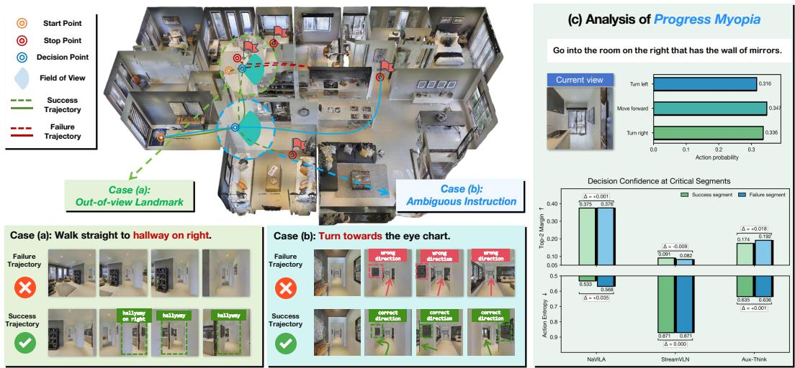  
Figure 1: Illustration of Progress Myopia. Left: out-of-view landmarks (a) and ambiguous in structions (b) make the current observation insufficient to determine the correct decision. Right: representative navigation agents show similar decision confidence and action entropy on both suc cessful and failed segments, indicating that unreliable decisions can remain highly confident.

Recent advances in vision-language models (VLMs) have improved visual understanding and longhorizon planning, motivating their use in autonomous navigation agents (Zhang et al., 2025b;a; Gao et al., 2025). Existing agents either directly predict navigation actions from historical context (Cheng et al., 2025; Wei et al., 2025; Zhang et al., 2025b), or improve progress grounding through linguistic reasoning (Wang et al., 2026) and landmark-centric representations (Wu et al., 2026). However, these methods primarily focus on improving navigation decisions from available observations, with limited attention to assessing the uncertainty in progress grounding. When task-relevant evidence is insufficient, as in cases (a) and (b) of Fig. 1, stronger visual understanding and reasoning do not necessarily enable an agent to recognize that its progress grounding is unreliable.

To examine whether existing agents can recognize this uncertainty, we compare their decision confidence on failed trajectories and success trajectories (detailed in Appendix A). If their decision confidence reflects the reliability of progress grounding, it should decrease when the agent begins to deviate from the goal. As shown in Fig. 1(c), however, three representative navigation models exhibit similar confidence in both cases. This indicates that they remain confident even after deviating from the goal. We formulate this failure mode as Progress Myopia: navigation agents fail to recognize unreliable progress grounding and continue to act based on insufficient evidence.

To address this issue, we propose SeekVLN, an evidence-seeking framework that improves progress grounding by combining semantic progress reasoning with visual evidence seeking. Rather than grounding progress based on the historical observations, SeekVLN enables the agent to recognize when the available evidence is insufficient and acquire additional task-relevant observations before executing the next navigation action. In this way, SeekVLN shifts VLN from passive reasoning to active evidence seeking for reliable progress grounding. To learn this behavior, we first introduce Future-guided Reverse Generation (FRG), which augments offline expert trajectories with supplementary views and evidence annotations. FRG reasons backward from future expert actions to determine where to seek evidence and annotate what key evidence is. Supervised fine-tuning (SFT) on the resulting trajectories establishes a prior for evidence seeking and progress reasoning without additional expert interaction. However, imitation alone does not reveal whether seeking improves subsequent navigation. We therefore introduce Counterfactual Contrastive Policy Optimization (C2PO) for reinforcement fine-tuning. When the agent chooses to seek evidence, C2PO additionally rolls out a counterfactual direct-navigation branch from the same state. By comparing the two branches, a contrastive reward assigns credit to the seeking decision based on its subsequent navigation benefit. This signal is combined with an adaptive outcome reward to jointly optimize evidence seeking and navigation.

Our main contributions are summarized as follows:

• We identify and formulate Progress Myopia, a failure mode in which VLN agents fail to recognize unreliable progress grounding under insufficient evidence.

• We propose SeekVLN, which combines semantic progress reasoning with active acquisition of task-relevant observations. FRG converts offline demonstrations into evidenceseeking supervision, and supervised fine-tuning establishes an initial evidence-seeking prior. C2PO then applies reinforcement fine-tuning, comparing evidence-seeking and direct-navigation branches from the same state to assign credit to seeking decisions.

• SeekVLN sets a new state of the art for VLN agents, improving success rate by 12.7% and 7.5% over the base model on R2R-CE and RxR-CE, respectively. Simulated and realworld evaluations further demonstrate its human-like ability to actively seek task-relevant evidence for reliable progress grounding.

## 2 RELATED WORKS

## 2.1 VLM-BASED VISION-LANGUAGE NAVIGATION

The concept of VLN was introduced as a visually grounded instruction-following problem in real 3D environments (Anderson et al., 2018). Before the recent adoption of Vision-Language Models (VLMs), representative VLN agents (Hong et al., 2021; Chen et al., 2021; 2022b; An et al., 2024) improved cross-modal state modeling and long-horizon planning through traditional deep learning. Recent VLM-based approaches (Zhang et al., 2025b; Cheng et al., 2025; Wei et al., 2025; Xue et al., 2026; Gao et al., 2025; Zhang et al., 2025a) further broaden the capabilities of navigation agents by leveraging video understanding and action modeling. However, existing VLM policies passively reason and navigate from available observations, creating an information bottleneck when task relevant evidence is missing. SeekVLN instead actively seeks additional evidence before navigation.

## 2.2 PROGRESS REASONING AND GROUNDING IN EMBODIED NAVIGATION

Progress grounding has long been a concern in VLN: agents must determine both where to move and which subgoals have been completed. Early agents used progress estimates for visual-textual grounding, backtracking, and action selection (Ma et al., 2019a;b), and explored surrounding viewpoints to reduce ambiguity before navigation (Wang et al., 2020). Recent work revisits this issue with richer reasoning mechanisms. Progress-Think (Wang et al., 2026) predicts semantic progress, Dual-Anchoring (Wu et al., 2026) addresses progress and memory drift, and AdaNav (Ding et al., 2025) and AwareVLN (Guo et al., 2026) introduce uncertainty-aware or self-aware reasoning. These approaches improve progress grounding through interpretable evaluation modules, but overlook the unreliability caused by environmental uncertainty. SeekVLN formulates this limitation as Progress Myopia and introduces an evidence-seeking framework for more reliable progress grounding.

## 2.3 REINFORCEMENT LEARNING FOR VISION-LANGUAGE NAVIGATION

Unlike imitation learning, RL optimizes VLN policies on their own rollouts, exposing recovery and exploration actions to task-level feedback (Zhang et al., 2025c; Li et al., 2026). Recent methods apply RL to VLM navigation: VLN-R1 (Qi et al., 2025) uses GRPO-style training, Nav-R1 (Liu et al., 2025b) emphasizes embodied reasoning, and ETP-R1 (Ye et al., 2025) and ActiveVLN (Zhang et al., 2025c) extend RL to topological planning and active exploration. To address sparse feedback, Li et al. (2026) introduce step-level contrastive rewards, while SeeNav-Agent (Wang et al., 2025b) combines visual prompting with step-level policy optimization. Evidence seeking poses a creditassignment challenge because its benefit emerges through later navigation. C2PO addresses this by comparing matched evidence-seeking and direct-navigation branches and rewarding the difference in short-horizon progress.

## 3 METHODOLOGY

We propose SeekVLN, an evidence-seeking framework for reliable progress grounding in VLN. As illustrated in Fig. 2, SeekVLN assesses whether the current visual context is sufficient and acquires supplementary views when needed before reasoning about progress and acting. We train this behavior in two stages. First, Future-guided Reverse Generation (FRG) constructs evidence-seeking supervision from offline expert trajectories, establishing a behavior prior. Second, Counterfactual Contrastive Policy Optimization (C2PO) jointly optimizes evidence seeking and navigation through reinforcement fine-tuning.

## 3.1 EVIDENCE-SEEKING NAVIGATION FRAMEWORK

Problem formulation. We study monocular Vision-and-Language Navigation in Continuous Environments (VLN-CE) (Krantz et al., 2020), where an agent navigates through a continuous 3D environment according to a natural-language instruction I. At decision step $t ,$ the agent receives the current observation $o _ { t }$ and a sampled visual history $\mathcal { H } _ { t } = \{ o _ { i _ { m } } \} _ { m = 1 } ^ { M }$ comprising M historical frames. The policy directly conditions on these inputs to generate the decision sequence

$$
\begin{array} { r } { y _ { t } = \pi _ { \theta } ( I , o _ { t } , \mathcal { H } _ { t } ) . } \end{array}\tag{1}
$$

Dual-mode navigation. A conventional VLN policy directly predicts a navigation action at every state. SeekVLN instead begins each decision by determining whether the available observations provide sufficient evidence for reliable progress grounding. As illustrated in Fig. 2(1), the first control token selects one of two modes:

$$
m _ { t } = \left\{ \begin{array} { l l } { \mathrm { S E E K } , } & { y _ { t } ^ { ( 1 ) } = < \mathsf { s e e k } > , } \\ { \mathrm { N A V } , } & { y _ { t } ^ { ( 1 ) } = < \mathsf { n a v } > . } \end{array} \right.\tag{2}
$$

Here, $y _ { t } ^ { ( 1 ) }$ denotes the first token of the response. If the agent selects NAV, it directly predicts the navigation action, $y _ { t } = < \mathrm { n a v } > \oplus y _ { t } ^ { \mathrm { n a v } }$ , where $\oplus$ denotes token concatenation. If the agent selects SEEK, it first acquires supplementary views and reasons over them to seek evidence and estimate progress before predicting the navigation action.

Evidence-seeking interaction. After the policy predicts <seek>, the environment appends left, front, and right views at fixed relative headings, forming the interaction prefix

$$
y _ { t } ^ { \mathrm { s e e k } } = < s \in \mathsf { e k } > \oplus \left[ o _ { t } ^ { - 9 0 ^ { \circ } } , o _ { t } ^ { 0 ^ { \circ } } , o _ { t } ^ { 9 0 ^ { \circ } } \right] \oplus < / s \mathsf { e e k } > ,\tag{3}
$$

Conditioned on the supplementary views, the policy generates <think> to begin the progressreasoning segment

$$
y _ { t } ^ { \mathrm { p r o g } } = < \mathrm { t h i n k } > \oplus \left( g _ { t } ^ { - } , g _ { t } ^ { + } , e _ { t } \right) \oplus < / \mathrm { t h i n k } > ,\tag{4}
$$

where $g _ { t } ^ { - }$ summarizes completed instruction subgoals, $g _ { t } ^ { + }$ specifies the next subgoal, and $e _ { t }$ identifies the visual evidence supporting progress grounding. Fig. 2(1) shows a concrete example of these three parts. The complete SEEK-mode sequence is

$$
y _ { t } = y _ { t } ^ { \mathrm { s e e k } } \oplus y _ { t } ^ { \mathrm { p r o g } } \oplus < \mathrm { n a v } > \oplus y _ { t } ^ { \mathrm { n a v } } .\tag{5}
$$

## 3.2 FUTURE-GUIDED REVERSE GENERATION

Learning evidence seeking requires supervision for when to acquire additional observations and what task-relevant evidence they provide. However, such annotations are not explicitly available in offline expert trajectories. We therefore introduce Future-guided Reverse Generation (FRG), which reasons backward from future expert actions to construct evidence-seeking supervision without additional expert interaction. Specifically, FRG addresses two questions: (1) When and where should the agent seek evidence? (2) What is the key evidence in the selected views?

Evidence-seeking targets. Future expert actions provide a cue for when and where additional evidence may be useful. For example, a side view may help ground an upcoming turn, whereas the front view is enough for moving along a straight hallway. Based on this observation, FRG assigns action-dependent target proportions and deterministically selects decisions for SEEK supervision, producing the mode plan m∗ (detailed in Appendix B).

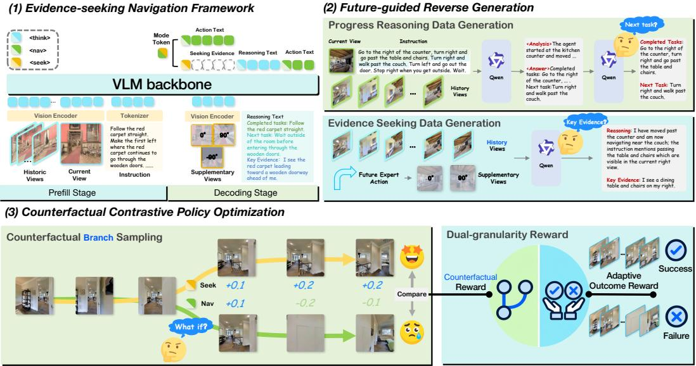  
Figure 2: Overview of SeekVLN. (1) The policy decides whether to navigate or seek evidence. (2) FRG reasons backward from future expert actions to determine where to seek evidence and annotate key evidence, while using historical context for progress annotation. (3) C2PO compares evidenceseeking and direct-navigation branches and jointly optimizes evidence-seeking and navigation.

For each selected SEEK state, FRG uses the upcoming expert action to determine where to look for evidence. The annotator VLM then receives the corresponding subset of current views, together with the instruction and observed history, and identifies the task-relevant evidence:

$$
e _ { t } = f _ { \mathrm { V L M } } ^ { \mathrm { e v } } ( I , \mathcal { H } _ { t } ^ { \ast } , \mathcal { V } _ { t } ( a _ { t } ^ { \ast } ) ) ,\tag{6}
$$

where $\nu _ { t } ( a _ { t } ^ { * } )$ denotes the current views selected according to the expert action $a _ { t } ^ { * }$

Progress-reasoning targets. As illustrated in Fig. 2 (2), given the instruction, the historical and current observations, and the provided subgoal list S(I), the annotator VLM first analyzes the current task progress, then distills the analysis into structured progress fields:

$$
\left( g _ { t } ^ { - } , g _ { t } ^ { + } \right) = f _ { \mathrm { V L M } } ^ { \mathrm { p r o g } } ( I , \mathcal { H } _ { t } ^ { * } , o _ { t } ^ { * } , S ( I ) ) ,\tag{7}
$$

Together with $e _ { t }$ , the annotation is serialized into $y _ { t } ^ { \mathrm { p r o g } } = < \mathrm { t h i n k } > \oplus \left( g _ { t } ^ { - } , g _ { t } ^ { + } , e _ { t } \right) \oplus < / \mathrm { t h i n k } >$

Prior dataset construction. Given the input context $x _ { t } ^ { * } = ( I , o _ { t } ^ { * } , \mathcal { H } _ { t } ^ { * } )$ , a NAV state is paired with the expert navigation action $y _ { t } ^ { \mathrm { n a v , * } }$ , and a SEEK state with the full response of evidence seeking, progress reasoning, and navigation action. The prior dataset is

$$
\begin{array} { r l } & { \mathcal { D } _ { \mathrm { p r i o r } } = \mathcal { D } _ { \mathrm { n a v } } \cup \mathcal { D } _ { \mathrm { s e e k } } , } \\ & { \mathcal { D } _ { \mathrm { n a v } } = \{ ( x _ { t } ^ { * } , < \mathrm { n a v } > \oplus y _ { t } ^ { \mathrm { n a v } , * } ) \mid m _ { t } ^ { * } = \mathrm { N A V } \} , } \\ & { \mathcal { D } _ { \mathrm { s e e k } } = \{ ( x _ { t } ^ { * } , y _ { t } ^ { \mathrm { s e e k } } \oplus y _ { t } ^ { \mathrm { p r o g } } \oplus < \mathrm { n a v } > \oplus y _ { t } ^ { \mathrm { n a v } , * } ) \mid m _ { t } ^ { * } = \mathrm { S E E K } \} . } \end{array}\tag{8}
$$

$\mathcal { D } _ { \mathrm { p r i o r } }$ thus jointly supervises direct navigation, evidence seeking, and progress reasoning.

## 3.3 COUNTERFACTUAL CONTRASTIVE POLICY OPTIMIZATION

Supervised fine-tuning on $\mathcal { D } _ { \mathrm { p r i o r } }$ initializes a basic behavior prior for triggering evidence seeking and reasoning over acquired views. However, imitation alone does not reveal whether a seeking decision improves subsequent navigation under on-policy interaction.

We therefore introduce Counterfactual Contrastive Policy Optimization (C2PO) to address two coupled questions: (1) How can a policy recognize insufficient evidence and trigger evidence seeking adaptively? (2) How can evidence seeking and navigation be optimized jointly? C2PO compares evidence-seeking and direct-navigation branches from the same state to assign credit to a seeking decision. The resulting contrastive reward is combined with an adaptive outcome reward, providing dual-granularity feedback to jointly optimize evidence seeking and navigation.

Counterfactual branch sampling. A sampled trajectory reveals the outcome of the chosen mode, but not what would have happened under the alternative. To assess the benefit of a seeking decision, we therefore compare evidence seeking with direct navigation from the same state. As illustrated in Fig. 2 (3), when the main rollout selects SEEK under context $( I , o _ { t } , \mathcal { H } _ { t } )$ , we clone the simulator state, observation history, and model context, then compare the factual evidence-seeking branch

$$
\tau _ { t : t + H } ^ { \mathrm { s e e k } } \sim \pi _ { \theta } ( \cdot \mid I , o _ { t } , \mathcal { H } _ { t } , m _ { t } = \mathrm { S E E K } ) .\tag{9}
$$

The counterfactual branch starts from the same state, with the first mode decision forced to NAV:

$$
\tau _ { t : t + H } ^ { \mathrm { n a v } } \sim \pi _ { \theta } ( \cdot \mid I , o _ { t } , \mathcal { H } _ { t } , m _ { t } = \mathrm { N A V } ) .\tag{10}
$$

Both branches are rolled out with the same policy for H primitive actions, isolating the local benefit of evidence seeking while controlling for the initial state and context.

Dual-granularity reward. We combine a decision-level counterfactual reward with an episode level adaptive outcome reward to jointly optimize evidence seeking and navigation. At decision t, the total reward is

$$
r _ { t } = r _ { t } ^ { \mathrm { c f } } + r _ { t } ^ { \mathrm { o u t } } .\tag{11}
$$

The counterfactual reward measures the short-horizon navigation benefit of an evidence-seeking decision. Let $\Delta d _ { h } ^ { b }$ denote the normalized reduction in geodesic distance to the goal at primitive action h in branch $b \in \{ \mathrm { s e e k } , \mathrm { n a v } \}$ . We compute the discounted progress difference between the two branches and define

$$
\begin{array}{c} r _ { t } ^ { \mathrm { c f } } = \left\{ w \mathrm { c l i p } \left( \sum _ { h = 1 } ^ { H } \gamma _ { \mathrm { c f } } ^ { h - 1 } \left( \Delta d _ { h } ^ { \mathrm { s e e k } } - \Delta d _ { h } ^ { \mathrm { n a v } } \right) , - 0 . 2 , 0 . 2 \right) ,  & { m _ { t } = \mathrm { S E E K } , } \\ { 0 , } & { m _ { t } = \mathrm { N A V } , } \end{array} \right.\tag{12}
$$

where $\gamma _ { \mathrm { c f } }$ discounts later progress and w controls the contribution of the counterfactual reward.

The adaptive outcome reward is given once at episode termination:

$$
r _ { t } ^ { \mathrm { o u t } } = \mathbb { I } [ t = T ] \left\{ { \begin{array} { l l } { 1 + 0 . 2 { \mathrm { S P L } } , } & { { \mathrm { i f ~ s u c c e s s } } , } \\ { - 0 . 5 , } & { { \mathrm { o t h e r w i s e } } , } \end{array} } \right.\tag{13}
$$

where T denotes the terminal decision.

We use the combined rewards to estimate advantages and optimize the policy and value function with PPO (Schulman et al., 2017). Counterfactual branches are sampled only during reinforcement fine-tuning and require no additional branch rollouts during evaluation.

## 4 EXPERIMENT

## 4.1 EXPERIMENTAL SETTING

Simulation Environments and Metrics. We conduct experiments in the Habitat simulator (Savva et al., 2019) using Matterport3D scenes (Chang et al., 2017), and evaluate on the val-unseen splits of R2R-CE (Krantz et al., 2020) and RxR-CE (Ku et al., 2020). Following their standard protocols, we report Navigation Error (NE), Oracle Success Rate (OSR), Success Rate (SR), and Success weighted by Path Length (SPL) on R2R-CE, and NE, SR, SPL, and normalized Dynamic Time Warping (nDTW) on RxR-CE. NE measures the final geodesic distance to the goal; OSR measures the fraction of trajectories that enter the success radius; SR evaluates success at the final position; SPL measures success weighted by navigation efficiency; and nDTW measures fidelity to the reference trajectory.

Model training. We initialize SeekVLN from the pretrained Aux-Think model (Wang et al., 2025a) and train it in two stages: SFT on the FRG prior dataset, constructed from 4K R2R-CE train split episodes with Qwen-VL-Max (Bai et al., 2023), followed by C2PO reinforcement fine-tuning on 640 sampled R2R-CE training episodes. Details of both stages are provided in Appendix C.

Table 1: Comparison of different methods on the R2R-CE and RxR-CE Val-Unseen splits. Observations include a single RGB camera (S.RGB) and depth sensor (Depth). † indicates methods without using LLMs.
<table><tr><td rowspan="2">Method</td><td colspan="2">Observation</td><td colspan="4">R2R-CE Val-Unseen</td><td colspan="4">RxR-CE Val-Unseen</td></tr><tr><td>S.RGB</td><td>Depth</td><td>NE↓</td><td>OSR↑</td><td>SR↑</td><td>SPL↑</td><td>NE↓</td><td>SR↑</td><td></td><td>SPL↑ nDTW↑</td></tr><tr><td>BEVBert† An et al. (2022)</td><td></td><td>√</td><td>4.57</td><td>67.0</td><td>59.0</td><td>50.0</td><td></td><td>一</td><td></td><td></td></tr><tr><td>ETPNav† An et al. (2024)</td><td></td><td>√</td><td>4.71</td><td>65.0</td><td>57.0</td><td>49.0</td><td>5.64</td><td>54.8</td><td>44.9</td><td>61.9</td></tr><tr><td>ENP-ETPNav† Liu et al. (2024)</td><td></td><td>√</td><td>4.69</td><td>65.0</td><td>58.0</td><td>50.0</td><td>5.51</td><td>55.3</td><td>45.1</td><td>63.0</td></tr><tr><td>Seq2Seq† Krantz et al. (2020)</td><td>√</td><td>√</td><td>7.77</td><td>37.0</td><td>25.0</td><td>22.0</td><td>12.1013.9</td><td></td><td>11.9</td><td></td></tr><tr><td>CMA† Krantz et al. (2020)</td><td>√</td><td>√</td><td>7.37</td><td>40.0</td><td>32.0</td><td>30.0</td><td></td><td></td><td></td><td></td></tr><tr><td>LAW† Raychaudhuri et al. (2021)</td><td>√</td><td>√</td><td>6.83</td><td>44.0</td><td>35.0</td><td>31.0</td><td>10.90</td><td>8.0</td><td>8.0</td><td></td></tr><tr><td>CM²† Georgakis et al. (2022)</td><td>√</td><td>√</td><td>7.02</td><td>41.0</td><td>34.0</td><td>27.0</td><td>8.98</td><td>14.4</td><td>9.2</td><td></td></tr><tr><td>WS-MGMap† Chen et al. (2022a)</td><td>√</td><td>√</td><td>6.28</td><td>47.0</td><td>38.0</td><td>34.0</td><td></td><td></td><td>一</td><td></td></tr><tr><td>sim2real† Wang et al. (2024)</td><td>√</td><td>√</td><td>5.95</td><td>55.8</td><td>44.9</td><td>30.4</td><td></td><td></td><td></td><td></td></tr><tr><td>NavMorph† Yao et al. (2025)</td><td>√</td><td>√</td><td>5.75</td><td>56.9</td><td>47.9</td><td>33.2</td><td>8.85</td><td>30.8</td><td>22.8</td><td>44.2</td></tr><tr><td>NaVid-4D Liu et al. (2025a)</td><td>√</td><td>√</td><td>5.99</td><td>55.7</td><td>43.8</td><td>37.1</td><td></td><td></td><td></td><td></td></tr><tr><td>NaVid Zhang et al. (2024)</td><td>√</td><td></td><td>5.47</td><td>49.1</td><td>37.4</td><td>35.9</td><td></td><td></td><td></td><td>一</td></tr><tr><td>Uni-NaVid Żhang et al. (2025b)</td><td>√</td><td></td><td>5.58</td><td>53.5</td><td>47.0</td><td>42.7</td><td>6.24</td><td>48.7</td><td>40.9</td><td></td></tr><tr><td>NaVILA Cheng et al. (2025)</td><td>√</td><td></td><td>5.22</td><td>62.5</td><td>54.0</td><td>49.0</td><td>6.77</td><td>49.3</td><td>44.0</td><td>58.8</td></tr><tr><td>NavFoM Zhang et al. (2025a)</td><td>√</td><td></td><td>5.01</td><td>64.9</td><td>56.2</td><td>51.2</td><td>5.51</td><td>57.4</td><td>49.4</td><td>60.2</td></tr><tr><td>StreamVLN Wei et al. (2025)</td><td>√</td><td></td><td>4.98</td><td>64.2</td><td>56.9</td><td>51.9</td><td>6.22</td><td>52.9</td><td>46.0</td><td>61.9</td></tr><tr><td>Progress-Think Wang et al. (2026)</td><td>√</td><td></td><td>4.68</td><td>63.6</td><td>60.1</td><td>53.6</td><td></td><td></td><td></td><td></td></tr><tr><td>Aux-Think Wang et al. (2025a) (base model)</td><td>√</td><td></td><td>6.08</td><td>60.0</td><td>54.8</td><td>46.9</td><td>6.24</td><td>52.2</td><td>40.2</td><td></td></tr><tr><td>SeekVLN-FRG-SFT (ours)</td><td>√</td><td></td><td>4.7</td><td>68.4</td><td>61.0</td><td>55.9</td><td>5.8</td><td>55.7</td><td>47.4</td><td>62.3</td></tr><tr><td>SeekVLN-C2PO-RFT (ours)</td><td>√</td><td></td><td>3.7</td><td>75.2</td><td>67.5</td><td>61.4</td><td>4.9</td><td>59.7</td><td>50.3</td><td>63.6</td></tr></table>

Action space. We use the same action space as NaVILA (Cheng et al., 2025). It formulates continuous navigation using a discrete high-level action space consisting of {move forward, turn left, turn right, stop}. Forward actions move the agent by 25, 50, or 75 centimeters, whereas left and right turns rotate it by 15◦, 30◦, or 45◦.

## 4.2 MAIN RESULTS

Table 1 compares SeekVLN with representative VLN methods on the R2R-CE and RxR-CE Val-Unseen splits. Both training stages contribute: FRG-SFT already surpasses the base model and most prior methods, and C2PO-RFT further sets a new state of the art on both benchmarks.

FRG-SFT results. Fine-tuning on the FRG prior dataset alone brings clear gains over the base model. On R2R-CE, SeekVLN-FRG-SFT raises SR from 54.8 to 61.0 and SPL from 46.9 to 55.9; on RxR-CE, SR improves from 52.2 to 55.7 and SPL from 40.2 to 47.4. These gains come from offline supervision only, requiring no additional environment interaction or expert queries. Notably, SPL gains exceed SR gains on both benchmarks, suggesting that evidence seeking primarily improves path efficiency by reducing unnecessary actions caused by unreliable decisions. With SFT alone, SeekVLN already outperforms prior VLM agents such as NaVILA, StreamVLN, and NavFoM on R2R-CE, and exceeds Progress-Think, which likewise adds explicit progress reasoning.

Gains from C2PO-RFT. Reinforcement fine-tuning with C2PO improves all metrics on both benchmarks. On R2R-CE, SR increases from 61.0 to 67.5 (+6.5) and SPL from 55.9 to 61.4 (+5.5) over the SFT checkpoint, achieving the best among all compared methods. On RxR-CE, SR reaches 59.7 (+4.0) and SPL 50.3 (+2.9), surpassing NavFoM (Zhang et al., 2025a), the strongest prior VLM agent, by 2.3 and 0.9 points. Since SFT has already established basic evidence-seeking behavior, these gains indicate that C2PO mainly improves when to seek and how to use the acquired evidence. The counterfactual reward plays a key role: it credits a seeking decision only when the acquired evidence improves subsequent navigation, which discourages unnecessary triggers and reinforces useful ones. RxR-CE benefits particularly from this credit assignment, as its longer and more fine-grained instructions require reliable progress grounding over longer horizons.

Overall, compared with the base model, the full two-stage training yields total gains of +12.7 SR and +14.5 SPL on R2R-CE, and +7.5 SR and +10.1 SPL on RxR-CE, establishing a new state of the art among VLM-based agents on both benchmarks.

Ablation studies. Appendix D presents controlled ablation studies to isolate the respective contributions of FRG supervision and the C2PO counterfactual reward to navigation performance.

## 4.3 DEEP DIVE INTO EVIDENCE-SEEKING BEHAVIOR

Beyond aggregate navigation metrics, we organize the behavioral analysis around three questions: (1) Does adaptive triggering outperformfixed triggering strategies? (2) Does the acquired evidence improve subsequent navigation decisions? (3) Does SeekVLN exhibit human-like evidence-seeking behavior? We answer these questions through inference-time interventions, direct behavioral metrics, and qualitative rollout visualizations, respectively.

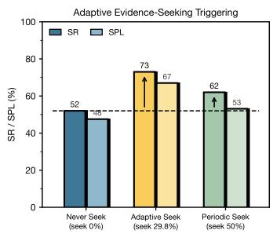

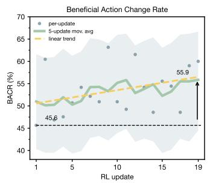

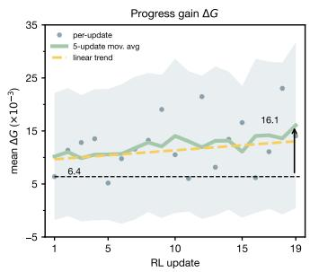  
Figure 3: Deep analysis of evidence-seeking behavior. Left: navigation success and path efficiency under three trigger strategies, highlighting the effectiveness of adaptive evidence seeking. Center: beneficial action change rate (BACR) during reinforcement fine-tuning, measuring the proportion of beneficial action changes. Right: mean short-horizon progress gain of the evidence-seeking branch over the direct-navigation branch, quantifying the navigation benefit of acquired evidence.

Adaptive Evidence-Seeking Triggering. All triggering experiments are conducted on a 100- episode subset sampled from the R2R-CE Val-Unseen split, covering diverse scenes and trajectories with varied task complexity. The strategies are realized by manually prefilling the mode token of the same trained policy (SeekVLN-C2PO-RFT): Never Seek forces <nav> at every decision, Periodic Seek prefills <seek> every two steps with <nav> at all remaining decisions, and Adaptive Seek lets the policy make its own mode decision.

We compare their seek rates and navigation performance in Fig. 3 (left): Adaptive Seek (29.8% seek rate) achieves 73% SR and 67% SPL, versus 52%/48% for Never Seek (0% seek rate) and 62%/53% for Periodic Seek (50% seek rate). These results indicate that C2PO-trained SeekVLN learns when evidence seeking is needed, achieving the strongest navigation performance among the tested triggering strategies without relying on more frequent seeking.

Effectiveness of Evidence Seeking. Evidence seeking is useful only if the subsequent navigation decisions are improved, rather than merely changing the agent’s response. We therefore define the Beneficial Action Change Rate (BACR) as

$$
\mathrm { B A C R } = \frac { N _ { \mathrm { b e n e f i c i a l } } } { N _ { \mathrm { s e e k } } } ,\tag{14}
$$

where $N _ { \mathrm { s e e k } }$ is the number of triggered states, and $N _ { \mathrm { b e n e f i c i a l } }$ counts those at which seeking changes the next action and yields greater short-horizon progress than direct navigation from the same state. Figure 3 (center) shows BACR increasing from 45.6% to 55.9% over the RL updates. To measure the magnitude of this benefit, we define the progress gain at a triggered state as

$$
\Delta G _ { t } = \sum _ { h = 1 } ^ { H } \left( \Delta d _ { h } ^ { \mathrm { s e e k } } - \Delta d _ { h } ^ { \mathrm { n a v } } \right) ,\tag{15}
$$

where $\Delta d _ { h } ^ { b }$ denotes normalized geodesic progress at primitive action h in branch b, as defined in Section 3.3. The mean $\Delta G _ { t }$ across triggered states rises from $6 . 4 \times 1 0 ^ { - 3 }$ to $1 6 . 1 \times 1 0 ^ { - 3 }$ (right). Together, the two trends suggest that C2PO learns not only to make more beneficial action changes after seeking, but also to increase their subsequent navigation advantage.

Turn around and go past the dining area, turn to the right and past the couch. Then go down the hall way a little bit and then turn left into the living room. Stop right there and wait.

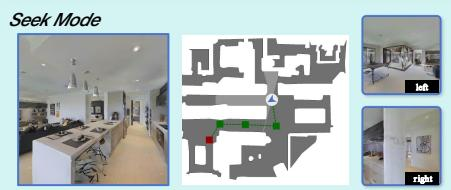  
<think>Completed tasks: None. Next task: Turn around and go past the dining area. Key Evidence: I see a dining area with a table and chairs on my left.</think><nav>The next action is turn left 45 degree.

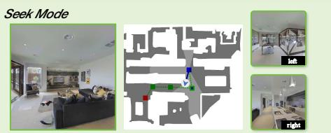  
<think>Completed tasks: Turn around and go past the dining area. Next task: turn to the right and past the couch. Key Evidence: I see a long hallway extending past a kitchen island on my right.</think><nav>The next action is turn right 45 degree.

Figure 4: Evidence seeking in simulated navigation. Two SEEK decisions along a representative trajectory. SeekVLN first identifies the dining area on the left; after completing that subgoal, it locates the hallway beyond the kitchen island on the right. In both cases, evidence seeking resolves uncertainty about instruction progress and grounds the next navigation action.  
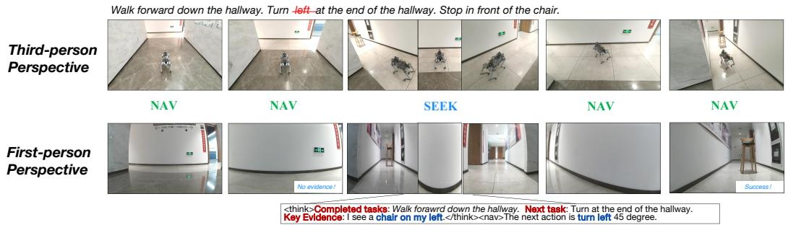  
Figure 5: Evidence seeking in real-world navigation. At the end of the hallway, the destination is not visible ahead and the instruction leaves the turn direction unspecified. SeekVLN seeks taskrelevant evidence, identifies the chair to its left, and completes the task.

Human-Like Evidence-Seeking Behavior. Figure 4 shows two targeted evidence-seeking decisions. When the dining area is outside the current view, SeekVLN finds its table and chairs to the left and turns toward it. After completing that subgoal, it locates the hallway beyond the kitchen island on the right and turns accordingly. In both cases, supplementary views resolve a specific uncertainty in progress grounding before action.

Figure 5 illustrates the same behavior in real-world navigation. At the end of the hallway, the forward view does not reveal the chair, and the instruction does not explicitly specify the left turn. SeekVLN acquires a side view, grounds the destination using the chair on its left, and completes the task. This qualitative success shows that evidence seeking can support navigation under partial observation and instruction ambiguity. The deployment protocol is detailed in Appendix E.

## 5 CONCLUSION

We introduced SeekVLN to address Progress Myopia through active evidence seeking for reliable progress grounding. FRG derives a cold-start prior from offline demonstrations, and C2PO learns evidence-seeking decisions through counterfactual credit assignment. Experiments on R2R-CE and RxR-CE demonstrate improved navigation, while simulated and real-world rollouts show targeted evidence-seeking behavior. These results highlight the value of learning when to acquire evidence and how to use it for reliable progress grounding and navigation under partial observation.

## REFERENCES

Dong An, Yuankai Qi, Yangguang Li, Yan Huang, Liang Wang, Tieniu Tan, and Jing Shao. Bevbert: Multimodal map pre-training for language-guided navigation. arXiv preprint arXiv:2212.04385, 2022.

Dong An, Hanqing Wang, Wenguan Wang, Zun Wang, Yan Huang, Keji He, and Liang Wang. Etpnav: Evolving topological planning for vision-language navigation in continuous environments. IEEE Transactions on Pattern Analysis and Machine Intelligence, 2024.

Peter Anderson, Qi Wu, Damien Teney, Jake Bruce, Mark Johnson, Niko Sunderhauf, Ian Reid,¨ Stephen Gould, and Anton Van Den Hengel. Vision-and-language navigation: Interpreting visually-grounded navigation instructions in real environments. In Proceedings of the IEEE conference on computer vision and pattern recognition, pp. 3674–3683, 2018.

Jinze Bai, Shuai Bai, Shusheng Yang, Shijie Wang, Sinan Tan, Peng Wang, Junyang Lin, Chang Zhou, and Jingren Zhou. Qwen-vl: A versatile vision-language model for understanding, localization, text reading, and beyond, 2023. URL https://arxiv.org/abs/2308.12966.

Angel X. Chang, Angela Dai, Thomas A. Funkhouser, Maciej Halber, Matthias Nießner, Manolis Savva, Shuran Song, Andy Zeng, and Yinda Zhang. Matterport3d: Learning from RGB-D data in indoor environments. In 2017 International Conference on 3D Vision, 3DV 2017, Qingdao, China, October 10-12, 2017, pp. 667–676. IEEE Computer Society, 2017. doi: 10.1109/3DV. 2017.00081. URL https://doi.org/10.1109/3DV.2017.00081.

Peihao Chen, Dongyu Ji, Kunyang Lin, Runhao Zeng, Thomas Li, Mingkui Tan, and Chuang Gan. Weakly-supervised multi-granularity map learning for vision-and-language navigation. Advances in Neural Information Processing Systems, 35:38149–38161, 2022a.

Shizhe Chen, Pierre-Louis Guhur, Cordelia Schmid, and Ivan Laptev. History aware multimodal transformer for vision-and-language navigation. Advances in Neural Information Processing Systems, 34:5834–5847, 2021.

Shizhe Chen, Pierre-Louis Guhur, Makarand Tapaswi, Cordelia Schmid, and Ivan Laptev. Think global, act local: Dual-scale graph transformer for vision-and-language navigation. In Proceedings of the IEEE/CVF Conference on Computer Vision and Pattern Recognition (CVPR), pp. 16537–16547, June 2022b.

An-Chieh Cheng, Yandong Ji, Zhaojing Yang, Zaitian Gongye, Xueyan Zou, Jan Kautz, Erdem Bıyık, Hongxu Yin, Sifei Liu, and Xiaolong Wang. Navila: Legged robot vision-language-action model for navigation. In RSS, 2025.

Xin Ding, Jianyu Wei, Yifan Yang, Shiqi Jiang, Qianxi Zhang, Hao Wu, Fucheng Jia, Liang Mi, Yuxuan Yan, Weijun Wang, Yunxin Liu, Zhibo Chen, and Ting Cao. AdaNav: Adaptive reasoning with uncertainty for vision-language navigation, 2025. URL https://arxiv.org/abs/ 2509.24387.

Chen Gao, Liankai Jin, Xingyu Peng, Jiazhao Zhang, Yue Deng, Annan Li, He Wang, and Si Liu. OctoNav: Towards generalist embodied navigation, 2025. URL https://arxiv.org/abs/ 2506.09839.

Georgios Georgakis, Karl Schmeckpeper, Karan Wanchoo, Soham Dan, Eleni Miltsakaki, Dan Roth, and Kostas Daniilidis. Cross-modal map learning for vision and language navigation. In Proceedings of the IEEE/CVF conference on computer vision and pattern recognition, pp. 15460–15470, 2022.

Jing Gu, Eliana Stefani, Qi Wu, Jesse Thomason, and Xin Eric Wang. Vision-and-language navigation: A survey of tasks, methods, and future directions. In Proceedings ofthe 60th Annual Meeting of the Association for Computational Linguistics (Volume 1: Long Papers), pp. 7606–7623, 2022.

Wenxuan Guo, Xiuwei Xu, Yichen Liu, Xiangyu Li, Hang Yin, Huangxing Chen, Wenzhao Zheng, Jianjiang Feng, Jie Zhou, and Jiwen Lu. AwareVLN: Reasoning with self-awareness for visionlanguage navigation, 2026. URL https://arxiv.org/abs/2605.22816.

Yicong Hong, Qi Wu, Yuankai Qi, Cristian Rodriguez-Opazo, and Stephen Gould. Vln bert: A recurrent vision-and-language bert for navigation. In Proceedings of the IEEE/CVF conference on Computer Vision and Pattern Recognition, pp. 1643–1653, 2021.

Jacob Krantz, Erik Wijmans, Arjun Majumdar, Dhruv Batra, and Stefan Lee. Beyond the nav-graph: Vision-and-language navigation in continuous environments. In Andrea Vedaldi, Horst Bischof, Thomas Brox, and Jan-Michael Frahm (eds.), Computer Vision - ECCV 2020 - 16th European Conference, Glasgow, UK, August 23-28, 2020, Proceedings, Part XXVIII, volume 12373 of Lecture Notes in Computer Science, pp. 104–120. Springer, 2020. doi: 10.1007/978-3-030-58604-1\ 7. URL https://doi.org/10.1007/978-3-030-58604-1\_7.

Alexander Ku, Peter Anderson, Roma Patel, Eugene Ie, and Jason Baldridge. Room-acrossroom: Multilingual vision-and-language navigation with dense spatiotemporal grounding. In Bonnie Webber, Trevor Cohn, Yulan He, and Yang Liu (eds.), Proceedings of the 2020 Conference on Empirical Methods in Natural Language Processing, EMNLP 2020, Online, November 16-20, 2020, pp. 4392–4412. Association for Computational Linguistics, 2020. doi: 10.18653/V1/2020.EMNLP-MAIN.356. URL https://doi.org/10.18653/v1/2020. emnlp-main.356.

Haoyuan Li, Rui Liu, Hehe Fan, and Yi Yang. Let’s reward step-by-step: Step-Aware contrastive alignment for vision-language navigation in continuous environments, 2026. URL https:// arxiv.org/abs/2603.09740.

Haoran Liu, Weikang Wan, Xiqian Yu, Minghan Li, Jiazhao Zhang, Bo Zhao, Zhibo Chen, Zhongyuan Wang, Zhizheng Zhang, and He Wang. Na vid-4d: Unleashing spatial intelligence in egocentric rgb-d videos for vision-and-language navigation. In 2025 IEEE International Conference on Robotics and Automation (ICRA), pp. 10607–10615. IEEE, 2025a.

Qingxiang Liu, Ting Huang, Zeyu Zhang, and Hao Tang. Nav-R1: Reasoning and navigation in embodied scenes, 2025b. URL https://arxiv.org/abs/2509.10884.

Rui Liu, Wenguan Wang, and Yi Yang. Vision-language navigation with energy-based policy. Advances in Neural Information Processing Systems, 37:108208–108230, 2024.

Chih-Yao Ma, Jiasen Lu, Zuxuan Wu, Ghassan AlRegib, Zsolt Kira, Richard Socher, and Caiming Xiong. Self-monitoring navigation agent via auxiliary progress estimation. In International Conference on Learning Representations, 2019a.

Chih-Yao Ma, Zuxuan Wu, Ghassan AlRegib, Caiming Xiong, and Zsolt Kira. The regretful agent: Heuristic-aided navigation through progress estimation. In Proceedings of the IEEE/CVF Conference on Computer Vision and Pattern Recognition (CVPR), pp. 6732–6740, June 2019b.

Zhangyang Qi, Zhixiong Zhang, Yizhou Yu, Jiaqi Wang, and Hengshuang Zhao. VLN-R1: Visionlanguage navigation via reinforcement fine-tuning, 2025. URL https://arxiv.org/abs/ 2506.17221.

Sonia Raychaudhuri, Saim Wani, Shivansh Patel, Unnat Jain, and Angel Chang. Language-aligned waypoint (law) supervision for vision-and-language navigation in continuous environments. In Proceedings of the 2021 conference on empirical methods in natural language processing, pp. 4018–4028, 2021.

Manolis Savva, Jitendra Malik, Devi Parikh, Dhruv Batra, Abhishek Kadian, Oleksandr Maksymets, Yili Zhao, Erik Wijmans, Bhavana Jain, Julian Straub, Jia Liu, and Vladlen Koltun. Habitat: A platform for embodied AI research. In 2019 IEEE/CVF International Conference on Computer Vision, ICCV 2019, Seoul, Korea (South), October 27 - November 2, 2019, pp. 9338–9346. IEEE,

2019. doi: 10.1109/ICCV.2019.00943. URL https://doi.org/10.1109/ICCV.2019. 00943.

John Schulman, Filip Wolski, Prafulla Dhariwal, Alec Radford, and Oleg Klimov. Proximal policy optimization algorithms, 2017. URL https://arxiv.org/abs/1707.06347.

Hanqing Wang, Wenguan Wang, Tianmin Shu, Wei Liang, and Jianbing Shen. Active visual information gathering for vision-language navigation. In European Conference on Computer Vision, pp. 307–322. Springer, 2020.

Shuo Wang, Yongcai Wang, Wanting Li, Xudong Cai, Fei-Yue Wang, Maiyue Chen, Kaihui Wang, Zhizhong Su, Deying Li, and Zhaoxin Fan. Aux-think: Exploring reasoning strategies for dataefficient vision-language navigation. CoRR, abs/2505.11886, 2025a. doi: 10.48550/ARXIV.2505. 11886. URL https://doi.org/10.48550/arXiv.2505.11886.

Shuo Wang, Yucheng Wang, Guoxin Lian, Yongcai Wang, Maiyue Chen, Kaihui Wang, Bo Zhang, Zhizhong Su, Yutian Zhou, Wanting Li, et al. Progress-think: Semantic progress reasoning for vision-language navigation. In Proceedings of the IEEE/CVF Conference on Computer Vision and Pattern Recognition, pp. 4076–4086, 2026.

Zhengcheng Wang, Zichuan Lin, Yijun Yang, Haobo Fu, and Deheng Ye. SeeNav-Agent: Enhancing vision-language navigation with visual prompt and step-level policy optimization, 2025b. URL https://arxiv.org/abs/2512.02631.

Zihan Wang, Xiangyang Li, Jiahao Yang, Yeqi Liu, and Shuqiang Jiang. Sim-to-real transfer via 3d feature fields for vision-and-language navigation. arXiv preprint arXiv:2406.09798, 2024.

Meng Wei, Chenyang Wan, Xiqian Yu, Tai Wang, Yuqiang Yang, Xiaohan Mao, Chenming Zhu, Wenzhe Cai, Hanqing Wang, Yilun Chen, Xihui Liu, and Jiangmiao Pang. StreamVLN: Streaming vision-and-language navigation via SlowFast context modeling, 2025. URL https: //arxiv.org/abs/2507.05240.

Kangyi Wu, Pengna Li, Kailin Lyu, Xi Lin, Lin Zhao, Qingrong He, Jinjun Wang, and Jianyi Liu. Dual-Anchoring: Addressing state drift in vision-language navigation, 2026. URL https:// arxiv.org/abs/2604.17473.

Wansen Wu, Tao Chang, Xinmeng Li, Quanjun Yin, and Yue Hu. Vision-language navigation: a survey and taxonomy. Neural Computing and Applications, 36(7):3291–3316, 2024.

Xinda Xue, Junjun Hu, Minghua Luo, Xie Shichao, Jintao Chen, Zixun Xie, Quan Kuichen, GuoWei, Zedong Chu, Mu Xu, and Zhengzhou Zhu. Omninav: A unified framework for prospective exploration and visual-language navigation. In The Fourteenth International Conference on Learning Representations, 2026. URL https://openreview.net/forum?id= zGtTQTD1zu.

Xuan Yao, Junyu Gao, and Changsheng Xu. Navmorph: A self-evolving world model for visionand-language navigation in continuous environments. In Proceedings of the IEEE/CVF International Conference on Computer Vision, pp. 5536–5546, 2025.

Shuhao Ye, Sitong Mao, Yuxiang Cui, Xuan Yu, Shichao Zhai, Wen Chen, Shunbo Zhou, Rong Xiong, and Yue Wang. ETP-R1: Evolving topological planning with reinforcement fine-tuning for vision-language navigation in continuous environments, 2025. URL https://arxiv. org/abs/2512.20940.

Jiazhao Zhang, Kunyu Wang, Rongtao Xu, Gengze Zhou, Yicong Hong, Xiaomeng Fang, Qi Wu, Zhizheng Zhang, and He Wang. Navid: Video-based vlm plans the next step for vision-and language navigation. arXiv preprint arXiv:2402.15852, 2024.

Jiazhao Zhang, Anqi Li, Yunpeng Qi, Minghan Li, Jiahang Liu, Shaoan Wang, Haoran Liu, Gengze Zhou, Yuze Wu, Xingxing Li, Yuxin Fan, Wenjun Li, Zhibo Chen, Fei Gao, Qi Wu, Zhizheng Zhang, and He Wang. Embodied navigation foundation model, 2025a. URL https://arxiv. org/abs/2509.12129.

Jiazhao Zhang, Kunyu Wang, Shaoan Wang, Minghan Li, Haoran Liu, Songlin Wei, Zhongyuan Wang, Zhizheng Zhang, and He Wang. Uni-navid: A video-based vision-language-action model for unifying embodied navigation tasks. 2025b.

Zekai Zhang, Weiye Zhu, Hewei Pan, Xiangchen Wang, Rongtao Xu, Xing Sun, and Feng Zheng. ActiveVLN: Towards active exploration via multi-turn RL in vision-and-language navigation, 2025c. URL https://arxiv.org/abs/2509.12618.

## APPENDIX CONTENTS

A Detailed Analysis of Progress Myopia 13   
A.1 Selected Representative Navigation Agents 13   
A.2 Success and Failure Segments Extraction 14   
A.3 Decision Confidence 14   
B Future-Guided Reverse Generation 14   
B.1 Candidate-State Construction 14   
B.2 Progress Reasoning Annotation . 15   
B.3 Evidence Seeking Annotation . 15   
B.4 Dataset Construction 15   
B.5 Annotation Prompts . 15   
C Training Details 18   
C.1 Supervised Fine-Tuning (SFT) . 18   
C.2 Reinforcement Fine-Tuning (C2PO) 19   
D Ablation Study 19   
D.1 Analysis of FRG 20   
D.2 Analysis of C2PO 20   
E Real-World Deployment 21

## A DETAILED ANALYSIS OF PROGRESS MYOPIA

This section provides the analysis underlying Fig. 1 (c). The analysis asks whether a navigation model’s own decision confidence can distinguish reliable decisions on successful trajectories from unreliable decisions on failed trajectories at comparable critical segments.

## A.1 SELECTED REPRESENTATIVE NAVIGATION AGENTS

We analyze three representative VLM-based navigation agents with different decision mechanisms. NaVILA (Cheng et al., 2025) directly predicts high-level navigation actions; StreamVLN (Wei et al., 2025) performs streaming action prediction from observation and action histories; and Aux-Think (Wang et al., 2025a) augments direct navigation with explicit reasoning supervision. Together, these models cover direct action prediction, history-aware navigation, and reasoningenhanced navigation.

Table 2: Target SEEK proportions by expert action. For turns, the angle denotes the cumulative rotation of consecutive turns in the same direction.
<table><tr><td>Expert action</td><td>SEEK proportion</td></tr><tr><td>Move forward</td><td>30%</td></tr><tr><td>Turn left/right  $( 1 5 ^ { \circ } )$ </td><td>30%</td></tr><tr><td>Turn left/right  $( 3 0 ^ { \circ } )$ </td><td>50%</td></tr><tr><td>Turn left/right  $( 4 5 ^ { \circ } )$ </td><td>75%</td></tr><tr><td>Turn left/right (other angles)</td><td>100%</td></tr><tr><td>Stop</td><td>0%</td></tr></table>

## A.2 SUCCESS AND FAILURE SEGMENTS EXTRACTION

We analyze 100 failed rollouts and use their corresponding expert trajectories to construct matched successful counterparts. For each failed rollout, we locate the first segment whose path similarity to the expert route falls below a predefined threshold, focusing the analysis on the onset of deviation rather than its downstream consequences. We align this segment with an equal-length segment at the corresponding position on the expert route. Decision confidence on the latter is measured under teacher forcing, allowing us to compare the model’s confidence along its failed continuation with confidence at the matched expert-guided states.

## A.3 DECISION CONFIDENCE.

To compare models with different textual output formats, we score each candidate high-level action $a \in { \mathcal { A } }$ by its length-normalized sequence log-likelihood,

$$
\ell _ { t } ( a ) = { \frac { 1 } { | a | } } \sum _ { i = 1 } ^ { | a | } \log p ( a _ { i } \mid s _ { t } , a _ { < i } ) ,\tag{16}
$$

and normalize these scores over the shared action set A:

$$
p _ { t } ( a ) = \frac { \exp ( \ell _ { t } ( a ) ) } { \sum _ { a ^ { \prime } \in \mathcal { A } } \exp ( \ell _ { t } ( a ^ { \prime } ) ) } .\tag{17}
$$

Decision confidence is the top-two margin. Let $a _ { ( 1 ) }$ and $a _ { ( 2 ) }$ be the actions with the highest and second-highest normalized probabilities, respectively:

$$
c _ { t } = p _ { t } ( a _ { ( 1 ) } ) - p _ { t } ( a _ { ( 2 ) } ) .\tag{18}
$$

We additionally report normalized action entropy as a complementary uncertainty measure. We aggregate both quantities over matched critical windows separately for successful and failed rollouts, and compute confidence intervals by resampling matched windows. Thus, similar confidence and entropy across the two outcomes indicate that the model does not reliably recognize when its progress grounding has become unreliable.

## B FUTURE-GUIDED REVERSE GENERATION

## B.1 CANDIDATE-STATE CONSTRUCTION

FRG retains every macro decision in an offline expert trajectory and assigns an action-aware target proportion of SEEK states (Table 2). For a turn, the proportion depends on the total rotation of its maximal contiguous run of turns in the same direction, rather than on the individual turn angle. For example, two consecutive $1 5 ^ { \circ }$ right turns form a $3 0 ^ { \circ }$ run, so each receives a target proportion of 50%.

We then construct a deterministic mode plan. Decisions are grouped by action detail: forward distance for MOVEFORWARD, or direction and individual turn angle for turns. Each group initially receives the integer part of its expected SEEK count. Remaining quotas are assigned to groups with the largest fractional remainders until the total matches the rounded expected count across all groups. Within each group, cumulative allocation selects the required number of SEEK decisions; the rest are labeled NAV. This preserves the action-conditioned proportions without random sampling.

## B.2 PROGRESS REASONING ANNOTATION

Progress labels are generated only for planned SEEK states. The VLM annotator receives the instruction, the provided subgoal list, the stride-two history, and the current front observation. It identifies the completed instruction prefix and the first unfinished subgoal, then refines them into the fields completed tasks and next task. The validation step requires the completed field to be a contiguous prefix of the instruction and the next-task field to be the subsequent unfinished subgoal.

## B.3 EVIDENCE SEEKING ANNOTATION

Evidence is annotated separately from progress. The annotator receives the instruction, history, and an action-conditioned subset of current replay views: the front view for forward actions and 15◦ turns, and the front view plus the corresponding side view for 30◦ and 45◦ turns. It outputs a single concise key evidence statement.

## B.4 DATASET CONSTRUCTION

We serialize each expert decision as one training example. A NAV example pairs the instruction and visual context with the expert navigation action. A SEEK example additionally includes the evidence-seeking interaction and a <think> block containing completed tasks, next task, and key evidence, followed by the expert navigation action. The resulting 4K FRG prior dataset contains 111,141 decision-level examples from 4,162 R2R-CE episodes: 68,795 NAV examples and 42,346 SEEK examples.

Seek mode example. The following record illustrates a SEEK training example. Image placeholders denote attached images.

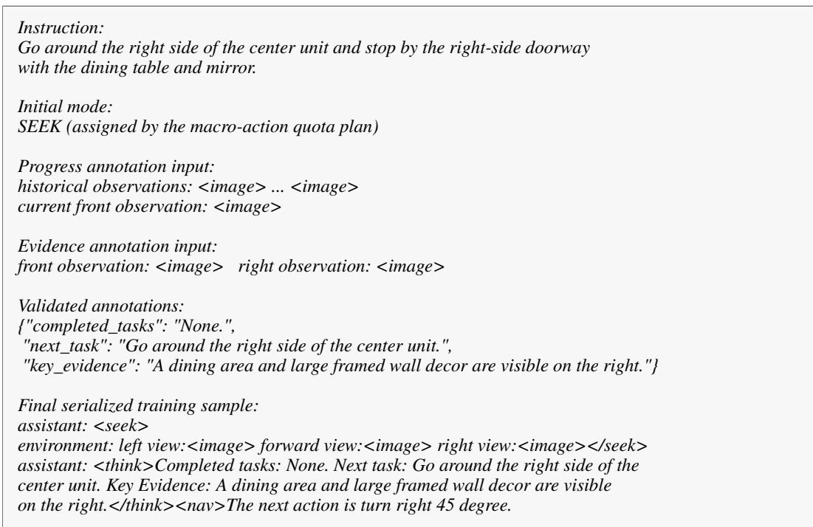

## B.5 ANNOTATION PROMPTS

## B.5.1 PROGRESS REASONING STAGE-1 PROMPT

The following is the first prompt used for progress annotation, with instance-specific fields replaced by placeholders. Historical images are attached in chronological order before the current front observation.

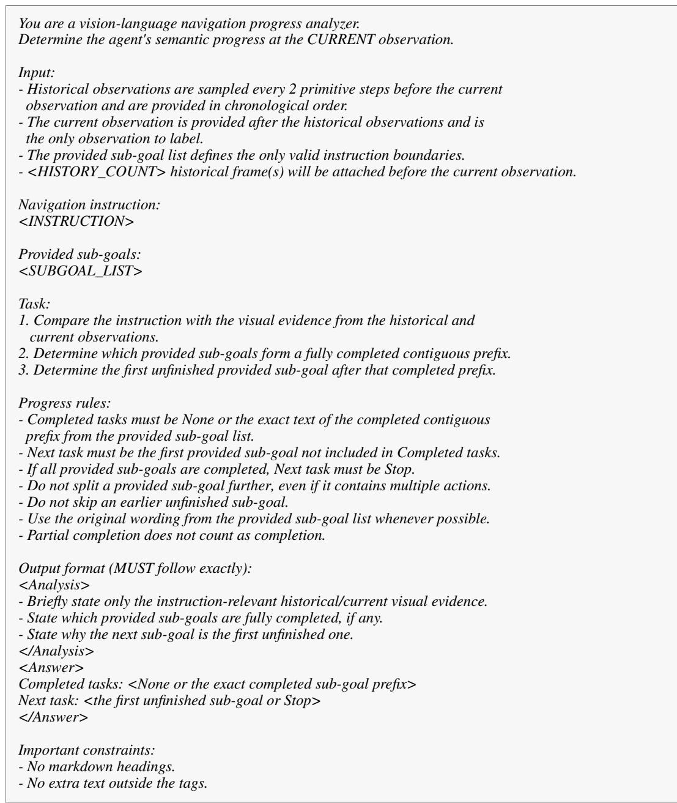

## B.5.2 PROGRESS REASONING STAGE-2 PROMPT

The second prompt refines the stage-1 response into the canonical progress fields used for serialization.

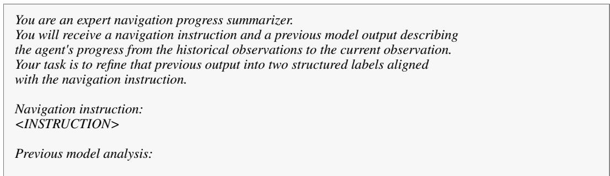

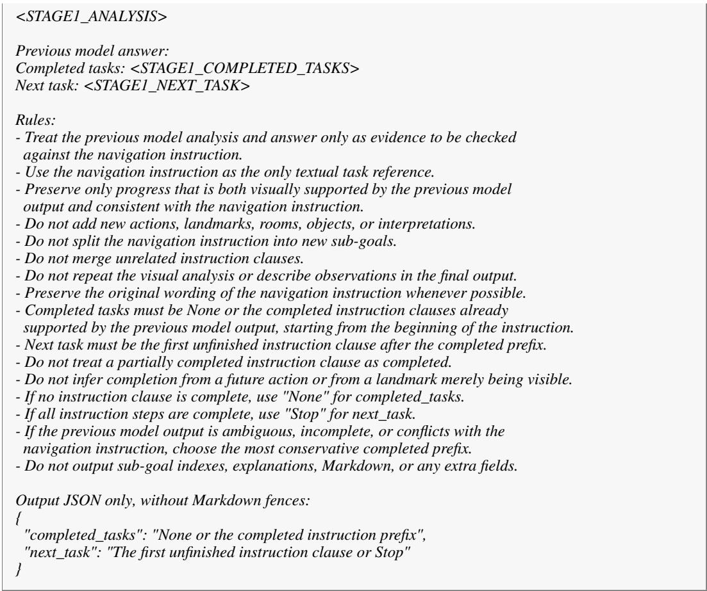  
B.5.3 EVIDENCE SEEKING ANNOTATION PROMPT

The following prompt is used for action-conditioned evidence annotation. The view names and the final directional phrase are instantiated from the target macro action.

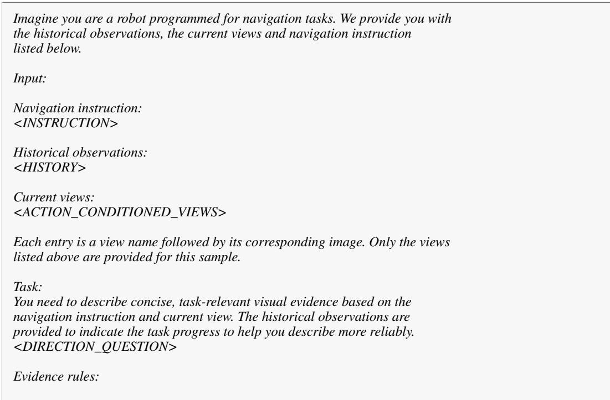

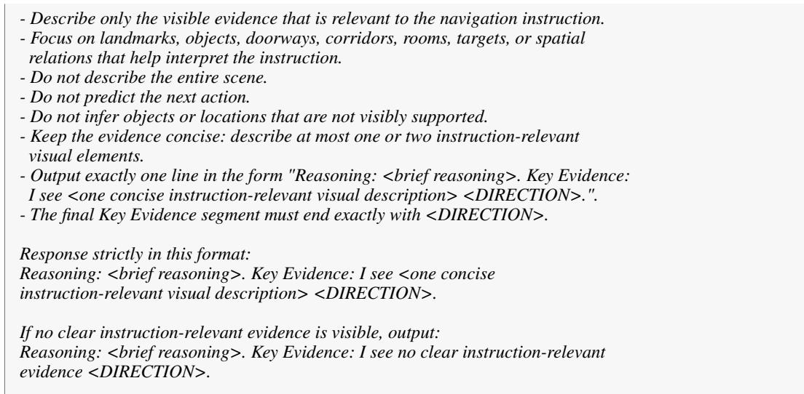  
These annotations are serialized into $\mathcal { D } _ { \mathrm { n a v } }$ and $\mathcal { D } _ { \mathrm { s e e k } }$ following Eq. 8, and the resulting $\mathcal { D } _ { \mathrm { p r i o r } }$ is used for the supervised cold-start training described in Appendix C.1.

## C TRAINING DETAILS

## C.1 SUPERVISED FINE-TUNING (FRG-SFT)

We initialize SeekVLN from the pretrained Aux-Think (Wang et al., 2025a) model by supervised fine-tuning on ${ \mathcal { D } } _ { \operatorname { p r i o r } } .$ Cold-start training learns the restricted first-token decision between <nav> and <seek>, while also learning the direct navigation response or, after evidence acquisition, the structured progress reasoning and navigation response.

Objective. We optimize a restricted mode loss together with a weighted response loss:

$$
{ \mathcal { L } } _ { \mathrm { S F T } } = \lambda _ { \mathrm { m o d e } } { \mathcal { L } } _ { \mathrm { m o d e } } + { \mathcal { L } } _ { \mathrm { r e s p } } .\tag{19}
$$

For the target mode $m _ { t } ^ { * } \in \{ < \mathrm { n a v } > , < \mathrm { s e e k } > \}$ , the mode loss is

$$
\mathcal { L } _ { \mathrm { m o d e } } = - \frac { 1 } { | \mathcal { D } _ { \mathrm { p r i o r } } | } \sum _ { t } \log \frac { \exp z _ { t , m _ { t } ^ { * } } } { \exp z _ { t , < \mathrm { n a v } > } + \exp z _ { t , < \mathrm { s e e k } > } } ,\tag{20}
$$

where $z _  t , $ · are the logits at the first assistant generation position. This restricted normalization prevents the rare mode decision from being diluted by the much longer free-form response.

For response tokens, we use

$$
\mathcal { L } _ { \mathrm { r e s p } } = - \frac { 1 } { N _ { \mathrm { v a l i d } } } \sum _ { t } \sum _ { i } \mu _ { t , i } \omega _ { t , i } \log \pi _ { \theta } ( y _ { t , i } \mid x _ { t } , y _ { t , < i } ) ,\tag{21}
$$

Here, $\mu _ { t , i }$ selects supervised tokens and $\omega _ { t , i }$ upweights structural tokens. The environment content strictly between <seek> and </seek> is masked. During interaction, the environment prefills </seek> after the supplementary views, and the policy generates <think> to begin reasoning. Both </seek> and <think> remain supervised during SFT.

The cold-start training configuration is summarized in Table 3.

Table 3: FRG SFT training configuration.
<table><tr><td>Component</td><td>Setting</td></tr><tr><td>Base model</td><td>Pretrained Aux-Think (Wang et al., 2025a)</td></tr><tr><td>Trainable modules</td><td>Language model and multimodal projector; visual encoder frozen</td></tr><tr><td>Maximum sequence length</td><td>512 tokens</td></tr><tr><td>Learning rate</td><td> $2 \times 1 0 ^ { - 5 }$ </td></tr><tr><td>Special tokens Observations input</td><td>&lt;nav&gt;, &lt;seek&gt;, &lt;/seek&gt;, &lt;think&gt;, &lt;/think&gt;</td></tr><tr><td></td><td>Current observation and up to eight sampled historical frames; left, front, and right views are added in SEEK mode</td></tr></table>

## C.2 REINFORCEMENT FINE-TUNING (C2PO)

Starting from the FRG-SFT checkpoint, we optimize SeekVLN with decision-level PPO (Schulman et al., 2017): the complete response at each navigation decision is treated as one policy action. The environment reward combines the counterfactual and adaptive outcome terms defined in Sec. 3.3, with no per-decision action penalty. We additionally use adaptive KL regularization against the frozen SFT reference policy. Training settings are summarized in Table 4.

Table 4: C2PO RFT training configuration.
<table><tr><td>Component</td><td>Setting</td></tr><tr><td>Model and data</td><td></td></tr><tr><td>Initialization</td><td>SeekVLN-FRG-SFT</td></tr><tr><td>Trainable modules</td><td>Language model and multimodal projector; visual encoder frozen</td></tr><tr><td>Value function</td><td>Separate model initialized from the SFT checkpoint</td></tr><tr><td>Visual context</td><td>Nine frames per decision</td></tr><tr><td>Training data</td><td>640 episodes sampled from the R2R-CE train split</td></tr><tr><td>Rollout and PPO</td><td></td></tr><tr><td>Episode workers</td><td>16, asynchronous</td></tr><tr><td>Episodes per update</td><td>32</td></tr><tr><td>Total updates</td><td>20</td></tr><tr><td>Advantage estimation</td><td>Decision-level GAE;  $\gamma = 1 . 0 , \lambda = 1 . 0$ </td></tr><tr><td>Advantage normalization</td><td>Per-update RMS, floor 1.0</td></tr><tr><td>PPO clip ratio / epochs</td><td>0.2 / 1</td></tr><tr><td>Actor / critic learning rate</td><td> $4 \times 1 0 ^ { - 6 } / 1 \times 1 0 ^ { - 5 }$ </td></tr><tr><td>Mini-batch size</td><td>128 decisions</td></tr><tr><td>Micro-batch per GPU</td><td>4 decisions</td></tr><tr><td>Reward and regularization Counterfactual reward</td><td>Applied only at SEEK decisions; w times a contrast clipped</td></tr><tr><td></td><td>to [−0.2, 0.2]</td></tr><tr><td>Adaptive outcome reward</td><td>1 + 0.2 SPL on success; —0.5 on failure</td></tr><tr><td>KL reference</td><td>Frozen FRG-SFT policy</td></tr><tr><td>Initial KL coefficient / target</td><td>0.2 / 0.3 per response</td></tr><tr><td>KL update horizon</td><td> $1 0 ^ { 4 }$ </td></tr><tr><td>Hardware</td><td>8 NVIDIA RTX 6000D GPUs, FSDP2</td></tr></table>

## D ABLATION STUDY

We ablate the two training stages separately: Future-guided Reverse Generation (FRG), which supplies progress-reasoning and evidence-seeking supervision, and Counterfactual Contrastive Policy Optimization (C2PO), which optimizes the policy through counterfactual branch comparison. Within each comparison, variants share the same backbone, training budget, and optimization settings except for the component under study.

We evaluate all ablations on a trajectory-deduplicated subset of R2R-CE Val-Unseen: one instruction is retained for each of the 613 unique expert trajectories. The subset preserves all 11 unseen Matterport3D scenes while avoiding repeated evaluation of the same route under multiple instructions.

## D.1 ANALYSIS OF FRG

FRG provides two complementary supervision signals: progress reasoning tracks completed and upcoming instruction subgoals, while evidence-seeking examples associate trigger decisions with task-relevant visual evidence. We remove each signal independently to assess its contribution.

Table 5: FRG ablations on the R2R-CE Val-Unseen-613 subset.
<table><tr><td rowspan="2"></td><td colspan="3">R2R-CE Val-Unseen-613</td></tr><tr><td>NE↓</td><td>SR↑</td><td>SPL↑</td></tr><tr><td>Aux-Think (base model)</td><td>5.80</td><td>52.0</td><td>45.0</td></tr><tr><td>w/o Evidence Seeking</td><td>4.86</td><td>58.6</td><td>53.3</td></tr><tr><td>w/o Progress Reasoning</td><td>4.99</td><td>58.7</td><td>53.0</td></tr><tr><td>Full FRG</td><td>4.84</td><td>60.7</td><td>55.8</td></tr></table>

Table 6: C2PO ablations on the R2R-CE Val-Unseen-613 subset.
<table><tr><td rowspan="2"></td><td colspan="2">R2R-CE Val-Unseen-613</td></tr><tr><td>NE↓ SR↑ SPL↑</td><td>Seek Rate (%)</td></tr><tr><td>SeekVLN-FRG-SFT</td><td>4.84 60.7 55.8</td><td>15.9</td></tr><tr><td>w/o CF Reward</td><td>3.94 65.1 60.4</td><td>34.3</td></tr><tr><td>Full C2PO</td><td>3.66 68.5 62.4</td><td>29.3</td></tr></table>

Table 5 shows that removing progress reasoning lowers SR by 1.96 points and SPL by 2.84 points; removing evidence-seeking supervision lowers them by 2.13 and 2.54 points, respectively. NE also rises in both variants. The consistent degradation indicates that both signals contribute to navigation performance.

## D.2 ANALYSIS OF C2PO

To isolate the contribution of branch-level credit assignment in C2PO, we remove the counterfactual reward while retaining the FRG-SFT initialization, adaptive outcome reward, and all other reinforcement fine-tuning settings.

As shown in Table 6, adding the counterfactual reward raises SR from 65.09% to 68.52% and SPL from 60.40% to 62.36%, while reducing NE from 3.94 m to 3.66 m. The seek rate also falls from 34.3% to 29.3%. Together, these results suggest that counterfactual credit assignment improves navigation through more selective and effective evidence-seeking decisions.

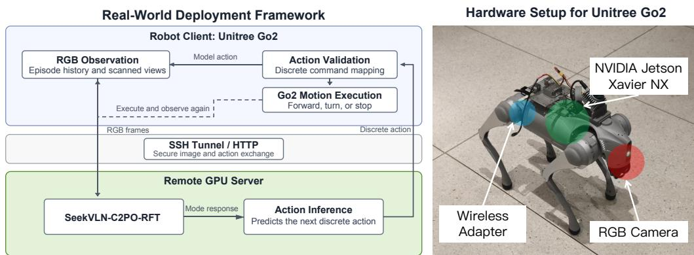  
Figure 6: Real-world SeekVLN deployment. The Go2 robot handles sensing and motion, while a remote GPU server performs policy inference. The hardware setup is shown on the right.

## E REAL-WORLD DEPLOYMENT

We deploy SeekVLN-C2PO-RFT on a Unitree Go2 using the client–server architecture in Fig. 6. The robot handles RGB observation, view acquisition, and motion execution, while the policy runs on a remote GPU server. An SSH tunnel and HTTP interface carry image observations to the server and return discrete actions to the robot.

At each decision, the model selects either a navigation or visual-search mode. For visual search, the robot acquires left, forward, and right views by turning in place. The model output is mapped to a finite set of Go2 commands: forward motion in 25 cm increments, discrete left or right turns, or stop. The local controller validates the output and executes one command before acquiring the next observation. A stop prediction indicates model-declared completion; it does not independently verify that the goal has been reached.

Camera images are converted to RGB and resized to 448 × 448 pixels for the vision encoder. Up to nine real observations are provided as history; shorter histories are not padded. For reproducibility, each run records the source images, model inputs and outputs, robot states, actions, and timing information. Motion commands are bounded, and the robot stops on inference, communication, observation, or control failure.