# SKILLLITE: EVIDENCE-GUIDED MALICIOUS SKILL AUDITING WITH COMPACT LLMS

Haoran Ou, Gelei Deng, Xuanye Zhang, Wenbo Guo, Tianwei Zhang, Kwok-Yan Lam Nanyang Technological University

## ABSTRACT

As LLM-based agents perform increasingly complex tasks, Agent Skills have emerged as a flexible mechanism for extending their capabilities. An Agent Skill packages task-specific instructions with executable components and auxiliary resources to provide specialized functionalities. However, the growing adoption of third-party Skills introduces a new supply-chain attack surface. Malicious Skills can embed harmful behaviors that abuse agent privileges and compromise the agent execution environment or accessible resources. Although recent LLM-based malicious Skill auditing approaches have achieved promising performance, they often rely on capable commercial LLMs. How to achieve effective auditing with compact, locally deployable LLMs in security-sensitive and resource-constrained settings remains largely unexplored. Our investigation reveals that compact LLMs struggle to identify malicious behaviors hidden in complex Skill packages. This difficulty arises from both the implicit nature of such behaviors and the limited reasoning capacity of compact LLMs. To address these challenges, we propose SKILLLITE, an evidence-guided agentic framework for malicious Skill detection. SKILLLITE effectively extracts security-relevant behaviors and infers the intended functionality from complex Skill packages. It then employs a compact LLM to assess the maliciousness of the Skill based on the observed behaviors and their functional context. Experiments show that SKILLLITE improves malicious Skill detection across different compact LLM backbones and outperforms existing representative auditing baselines. Its effectiveness generalizes to behaviorally confirmed in-the-wild malicious Skills. Meanwhile, SKILLLITE maintains a low inference latency, supporting its practical deployment.

## 1 INTRODUCTION

As LLM-based agents evolve from conversational assistants to autonomous task executors, they are increasingly capable of performing complex real-world tasks (Wang et al., 2025). Yet their capabilities remain bounded by the knowledge and tools available to the underlying agent system. Agent Skills have emerged as a flexible mechanism for extending these capabilities beyond such inherent boundaries (Jiang et al., 2026a; Xu & Yan, 2026). An agent Skill packages task-specific instructions together with executable components and auxiliary resources (OpenAI, 2026; Anthropic, 2026), enabling an agent to acquire specialized capabilities without modifying its underlying model. Driven by their flexibility and reusability, Agent Skills become an important component of modern agent ecosystems across a wide range of real-world applications (Jiang et al., 2026a), such as coding (Li et al., 2026b), document processing (Zhou et al., 2026) and data analysis (Abaskohi et al., 2025).

However, the growing adoption of third-party Agent Skills also introduces a new supply-chain attack surface into LLM-based agent ecosystems (Liu et al., 2026b; Holzbauer et al., 2026). Attackers can distribute seemingly legitimate Skills that embed malicious behaviors, abusing the agent’s privileges to access sensitive resources, manipulate its execution, or communicate with external entitie without authorization (Liu et al., 2026b; Feng et al., 2026; Chen et al., 2026a). Such behaviors can be difficult to distinguish from legitimate Skill functionality, as many security-sensitive operations are also necessary for benign tasks, allowing malicious Skills to compromise both the agent execu tion environment and the resources accessible to it. Recent studies have identified malicious Skill in real-world agent ecosystems (Cisco, 2026; CERT-EU, 2026), highlighting the need for effective security auditing before third-party Skills are deployed or executed.

To mitigate these threats, recent studies have developed various pre-deployment approaches for auditing malicious Skills. Early approaches primarily rely on static analysis and predefined security rules to identify suspicious patterns in Skill artifacts (Cisco AI Defense, 2026; NVIDIA, 2026). While efficient and deterministic, such approaches are inherently limited in interpreting contextdependent behaviors that cannot be reliably characterized by predefined patterns alone. More recent approaches leverage LLMs to reason about Skill artifacts and interpret security-sensitive behaviors in their functional context (Guo et al., 2026b; Hou & Yang, 2026; Wang et al., 2026; He et al., 2026). These approaches have achieved promising detection performance but often rely on powerful commercial or large-scale LLMs. This reliance poses practical deployment challenges. Commercial LLMs typically require access to external services (Liu et al., 2024; Zhao & Song, 2024), whereas hosting large models locally can incur substantial computational and deployment overhead (Alizadeh et al., 2024; Chen et al., 2026b). Skill auditing may involve sensitive source code and configurations that must remain within controlled local environments (Das et al., 2025; Zhao & Song, 2024), where computational resources may also be limited (Liu et al., 2024; Alizadeh et al., 2024; Chen et al., 2026b). These constraints motivate the use of compact, locally deployable LLMs. However, their effectiveness in malicious Skill auditing remains largely unexplored, particularly for complex Skill packages. We therefore investigate how to enable compact LLMs to audit such packages effectively under these deployment constraints.

Effective malicious Skill auditing with compact LLMs faces two key challenges (Figure 1, top). ❶ Hidden malicious behaviors. Securityrelevant behaviors are often sparse and distributed across instructions, scripts, configurations, and auxiliary resources, such that no single artifact may reveal the complete malicious behavior. Moreover, securitysensitive operations can be legitimate in isolation and only become malicious when considered in their functional context and in relation to other

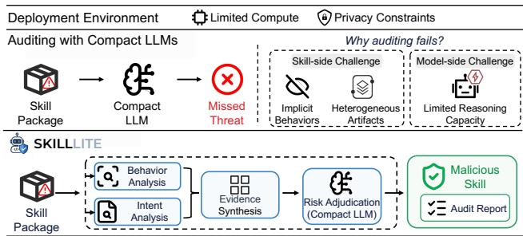  
Figure 1: Motivation and design of SKILLLITE for malicious Skill auditing with compact LLMs.

behaviors. ❷ Limited capability of compact LLMs. Compared with more capable models, compact LLMs have limited capacity to reason over complex and heterogeneous Skill packages, making it difficult to simultaneously locate relevant evidence, connect dispersed observations, and interpret their security implications.

To address these challenges, we propose SKILLLITE, an evidence-guided framework for malicious Skill auditing with compact LLMs. At its core, SKILLLITE adopts an agentic architecture that coordinates specialized modules for security behavior discovery, intent analysis, evidence synthesis, and risk adjudication of each Skill (Figure 1, bottom). To uncover malicious behaviors hidden across complex Skill packages, SKILLLITE uses a set of analyzers to inspect security-sensitive operations, concealed behaviors, and agent-control manipulation in instructions, code, configurations, and auxiliary resources. Each detected behavior is recorded with its source artifact and supporting code or content. To make effective use of the limited reasoning capacity of compact LLMs, SKILLLITE introduces two dedicated compact LLM-based roles: an Intent Analyst and a Risk Adjudicator. The Intent Analyst infers the Skill’s declared purpose and expected capabilities from its SKILL.md. The extracted behaviors are then grounded and organized with this functional context into structured evidence. The Risk Adjudicator performs contextual risk reasoning over the structured evidence to determine whether the Skill is malicious.

Our experiments demonstrate the effectiveness of SKILLLITE across multiple benchmarks and compact LLM backbones. On MalSkillBench (Guo et al., 2026a) and SkillTrustBench (ski, 2026), SKILLLITE achieves the best overall detection performance among representative baselines, with F1-scores of 0.905 and 0.966, respectively. Meanwhile, SKILLLITE maintains low inference latency, requiring 27.4 and 28.5 seconds per Skill on MalSkillBench and SkillTrustBench, respectively. On MalSkillBench, it is approximately 3.5× faster than the strongest competing baseline. We further evaluate SKILLLITE on MaliciousAgentSkillsBench (MASB) (Liu et al., 2026b), a more challenging benchmark consisting of behaviorally confirmed malicious Skills collected from real-world Skill ecosystems. SKILLLITE achieves the best overall performance with an F1-score of 0.807, requiring 19.4 seconds per Skill. This is approximately 4.9× faster than the strongest competing baseline. We also compare SKILLLITE with direct zero-shot audit using five compact LLMs across three benchmarks. SKILLLITE improves F1 in all 15 model–benchmark settings, with gains of up to 73.6 percentage points. Inference latency remains practical across the evaluated models. Finally, ablation studies validate the contribution of each key component, as removing any of them substantially degrades detection performance, with F1 dropping as low as 0.451. Our main contributions are summarized as follows:

• We investigate the performance of compact LLMs in malicious Skill auditing. Our analysis reveals that compact LLMs struggle to identify malicious behaviors hidden in Skill packages. This difficulty arises from both the hard-to-observe nature of malicious behaviors and the limited reasoning capacity of compact LLMs.

• We propose SKILLLITE, an evidence-guided malicious Skill auditing framework. SKILL-LITE extracts sparse and distributed security evidence from complex Skill packages, reducing the reasoning burden on compact LLMs and thereby enabling effective and explainable auditing.

• Experiments demonstrate the effectiveness and practical deployment of SKILLLITE. SKIL-LLITE consistently enhances the malicious Skill auditing capability of compact LLMs and outperforms representative existing approaches. Meanwhile, it maintains reasonable inference latency, supporting its practical deployment.

## 2 RELATED WORK

## 2.1 AGENT SKILLS

Agent skills have emerged as a modular mechanism for extending the capabilities of LLM agents (OpenAI, 2026; Anthropic, 2026). A skill is typically organized as a package containing a specification file: SKILL.md, along with optional scripts, references, templates, and other auxiliary resources. It packages task-specific procedural knowledge that can be invoked when relevant to a user’s request (Jiang et al., 2026a; Xu & Yan, 2026). This structure allows agents to load task-relevant instructions and artifacts on demand, reducing unnecessary context consumption. By enabling capability extension without retraining the underlying model, skills have been increasingly adopted across diverse agent applications, such as coding (Li et al., 2026b), document processing (Zhou et al., 2026), data analysis (Abaskohi et al., 2025), web automation (Zheng et al., 2025), and domain-specific task execution (Jiang et al., 2026a; Li et al., 2026a). Recent work (Xu & Yan, 2026; Holzbauer et al., 2026; Liu et al., 2026a) further studies how skills can be selected (Zhang et al., 2026), composed (Li et al., 2026a), and adapted across tasks (Alzubi et al., 2026), aiming to improve the flexibility and scalability of agents.

Alongside their growing adoption, skills are increasingly distributed and reused through open skill ecosystems. Community platforms provide skill registries and marketplaces 1 2 where third-party developers can publish reusable Skills and users can discover and integrate them into their agents. This ecosystem enables broader reuse and extensibility, but also extends the software supply chain of LLM agents beyond components maintained by their original developers.

## 2.2 MALICIOUS SKILLS

The flexibility of agent skills also introduces a distinct attack surface. As skills may contain executable scripts, configurations, and external resources, malicious behaviors may be embedded across both instructions and implementation artifacts (Liu et al., 2026b; Chen et al., 2026a). Such behaviors can abuse an agent’s access to local resources and external services for credential theft, data exfiltration, or unauthorized command execution (Liu et al., 2026b; Feng et al., 2026). These threats pose serious security risks to individual agents and their users. Even worse, third-party distribution allows a malicious skill to be widely downloaded and reused, amplifying its impact across the agent ecosystem and turning it into a broader software supply-chain threat. Such risks have already been observed in real-world skill ecosystems. In March, 2026, Cisco noted that the ClawHavoc campaign had planted over 800 malicious skills in ClawHub, roughly 20% of the registry (Cisco, 2026). In June, 2026, CERT-EU 3 summarized a separate OpenClaw skill supply-chain compromise in which a deceptive “DeepSeek-Claw” skill tricked developers and AI agents into running malicious installation steps (CERT-EU, 2026). These incidents demonstrate that malicious skills can lead to credential and sensitive-data theft, malware delivery, and unauthorized remote access, posing direct security risks to both users and their connected systems.

These emerging threats have motivated systematic studies of malicious agent skills. Liu et al. (2026b) first conducted a large-scale measurement of skills in the wild. They collected 98,380 skills from public registries and identified 157 behaviorally confirmed malicious skills, revealing threats ranging from credential theft and remote code execution to adversarial instructions. Beyond naturally occurring malicious packages, recent studies investigate more complex attack mechanisms and multi-dimensional security risks in agent skills (Hossain et al., 2026), expanding the threat land scape to trigger-based backdoors (Feng et al., 2026), runtime skill manipulation (Chen et al., 2026a), and the amplification of harmful behavior (Jiang et al., 2026b). These studies reveal the diverse and agent-specific nature of malicious skill threats, extending beyond conventional malicious code and attacks on LLMs and agents.

## 2.3 MALICIOUS SKILLS DETECTION

To mitigate the threats posed by malicious skills, recent efforts have developed automated methods for auditing skill packages before deployment. A straightforward approach is rule-based static analysis, which scans skill artifacts for predefined security indicators. For example, Cisco Skill Scanner (Cisco AI Defense, 2026) and NVIDIA SkillSpector (NVIDIA, 2026) inspect suspicious commands, credential handling, prompt-injection patterns, and risky installation logic. While efficient and interpretable, rule-based analysis lacks the contextual understanding needed to determine whether security-sensitive behaviors are malicious or necessary for a skill’s intended functionality.

To address this limitation, recent approaches (Guo et al., 2026b; Wang et al., 2026) incorporate LLMs to provide semantic and contextual understanding of skill descriptions, implementations, and security-relevant behaviors. These approaches extend semantic auditing through techniques such as LLM-based triage (Hou & Yang, 2026), structured behavior reasoning (Wang et al., 2026), intent– implementation consistency analysis (He et al., 2026), and risk localization (Etteib et al., 2026). LLM-based analysis has also been adopted by representative skill security scanners (Cisco AI Defense, 2026; NVIDIA, 2026; spclaudehome, 2026). These scanners typically combine static security findings with LLM-based semantic analysis to interpret suspicious behaviors in context and assess the overall security risk of a skill package, such as AI-Infra-Guard (Tencent Zhuque Lab, 2025) and SkillWard (Fangcun AI, 2026).

Despite recent progress, existing malicious skill detectors still struggle with complex threats. Guo et al. (2026a) show that existing representative detectors remain less effective against promptinjection and agent-control risks. Moreover, existing LLM-based approaches are commonly built upon powerful commercial or large-scale LLMs as their underlying models. Deployment under limited computational resources (Liu et al., 2024; Chen et al., 2026b) or strict privacy requirements (Das et al., 2025; Zhao & Song, 2024; Wang et al., 2025) may favor compact models for their lower inference overhead and suitability for local execution. However, the potential of compact LLMs for malicious skill auditing remains largely unexplored. We investigate this direction and develop a framework to enhance their detection capabilities.

## 3 METHODOLOGY

## 3.1 OVERVIEW

Threat Model. We consider a third-party Skill supply-chain scenario in which an attacker publishes a seemingly benign Skill containing malicious behaviors, such as unauthorized resource access, sensitive information leakage, or unintended command execution. The attacker may manipulate any artifact in the Skill package, including its instructions, source code, configurations, and auxiliary resources, and may conceal malicious logic through obfuscation or hidden artifacts. The defender has access to the complete Skill package and aims to determine whether it is benign or malicious before deployment or execution. Formally, given a Skill package S, the auditing task predicts $f ( S )  y ,$ where $y \in \{ \mathrm { B E N I G N }$ , MALICIOUS}. We focus on pre-execution auditing of malicious behaviors contained within Skill packages. Runtime-only behaviors and attacks against the underlying agent infrastructure, models, or execution environment are outside our scope.

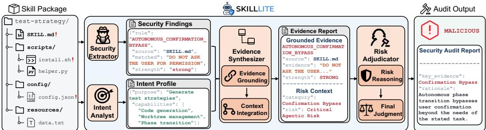  
Figure 2: Overview of SKILLLITE.

We propose SKILLLITE, an evidence-guided framework for malicious Skill auditing powered by compact LLMs. As illustrated in Figure 2, SKILLLITE consists of four functional roles. ❶ Security Evidence Extraction identifies security-relevant behaviors across the Skill package. ❷ Intent Analysis establishes the Skill’s functional specification, including its declared purpose and expected capabilities. ❸ Evidence Synthesis grounds the extracted findings in their source context and integrates them with functional and security context. ❹ Risk Adjudication assesses the structured evidence and produces the final judgment with a rationale.

## 3.2 SECURITY EVIDENCE EXTRACTION

The Security Extractor identifies security-relevant behaviors across the complete Skill package. We represent a Skill package as $S = \{ a _ { 1 } , \ldots , a _ { n } \}$ , where each $a _ { i }$ denotes an artifact such as an instruction, script, configuration, or auxiliary resource. We consider a set of security-relevant behavior classes B, including sensitive-resource access, external communication, system execution, persistence, concealed behavior, and agent-control manipulation. These classes capture security-relevant behaviors rather than maliciousness, as the same behavior may appear in both benign and malicious Skills and cannot be judged in isolation.

To identify these behaviors across heterogeneous artifacts, SKILLLITE employs a set of complementary deterministic analyzers $\mathcal { D } = \{ D _ { 1 } , \ldots , D _ { m } \}$ . These analyzers cover general security patterns, language-aware code analysis, concealed-payload inspection, and agent-specific control signals. A detailed summary is provided in Appendix A.1. Code analysis identifies security-sensitive API usage and syntax-level indicators, while concealed-payload inspection recovers supported encoded content. Agent-specific analysis targets behaviors such as approval bypass, control-flow hijacking, and autonomous execution without user confirmation. Collectively, these analyzers produce the security findings $\begin{array} { r } { \mathcal { F } ( S ) = \bigcup _ { a _ { i } \in { \mathcal { S } } } \bigcup _ { D _ { i } \in { \mathcal { D } } } D _ { j } ( a _ { i } ) } \end{array}$ . Each finding $f _ { k } ^ { \mathrm { ~ \bar { ~ } } } \in \mathcal { F } ( \mathcal { S } )$ records the detected behavior, its source artifact, supporting evidence, and associated attributes.

## 3.3 INTENT ANALYSIS

The Intent Analyst derives a functional specification that characterizes the intended functionality of the Skill. We represent this specification as $\mathcal { P } = ( g , \mathcal { C } ^ { \exp } )$ , where $g$ denotes the declared functional goal and $\mathcal { C } ^ { \mathrm { e x p } }$ denotes the capabilities reasonably expected to support that goal. This task is performed by the compact LLM through structured reasoning. Given the Skill specification $\boldsymbol { S } _ { \mathrm { s p e c } }$ , the Intent Analyst identifies $g$ and derives the capabilities $\mathcal C ^ { \mathrm { e x p } }$ implied by the declared task. For example, network access and command execution may be expected for a deployment Skill but not for a document-processing Skill. The functional specification provides a reference for interpreting the extracted security findings. An observed behavior $b _ { k }$ can then be assessed against $\mathcal { C } ^ { \mathrm { e x p } }$ to determine whether it is expected under the declared functionality. Unexpected behaviors are not necessarily malicious and are further examined during risk adjudication.

## 3.4 EVIDENCE SYNTHESIS

The Evidence Synthesizer transforms heterogeneous security findings into a structured evidence representation. Individual findings identify security-relevant behaviors, but may lack the source and functional context needed for reliable interpretation. Evidence synthesis therefore grounds these findings in their original artifacts and organizes them into a unified evidence report.

Source grounding first associates each finding with supporting context from its originating artifact. We represent a grounded observation as $\boldsymbol { e } _ { k } = \left( b _ { k } , a _ { k } , x _ { k } , c _ { k } , s _ { k } \right)$ , where $b _ { k }$ denotes the observed behavior, $a _ { k }$ its source artifact, $x _ { k }$ the supporting evidence, ck the surrounding source context, and $s _ { k }$ the evidence strength. This representation normalizes findings produced by different analyzers and artifacts while preserving their provenance and supporting context. The resulting grounded observations form the evidence set $\mathcal { E } = \{ e _ { 1 } , \ldots , e _ { n } \}$ . The grounded observations are then aggregated and contextualized with the functional specification $\mathcal { P }$ and applicable security policies Π. We organize the resulting evidence report as $\mathcal { R } \overset { \cdot } { = } ( \mathcal { E } , \mathcal { C } ^ { \mathrm { r i s k } } )$ , where $\hat { \mathcal { C } } ^ { \mathrm { r i s k } }$ provides the functional and policy context needed to interpret the observed behaviors. Accordingly, the report contains two complementary views: (1) grounded evidence captures what security-sensitive behaviors are observed and where they occur; (2) risk context provides the functional expectations and security policies relevant to their assessment.

## 3.5 RISK ADJUDICATION

The Risk Adjudicator performs the final maliciousness assessment over the structured evidence report R. Individual security-sensitive behaviors do not necessarily indicate maliciousness. The adjudicator therefore evaluates the grounded evidence E from three complementary aspects: functional necessity, benign counterevidence, and security risk. (1) Functional necessity examines whether an observed capability is reasonably required by the Skill’s declared functionality. (2) Benign counterevidence examines whether source-grounded evidence provides a credible justification for an otherwise suspicious behavior. (3) For critical agentic risks, generic functional justification is insufficient, and direct risk-specific counterevidence is required. Risk reasoning considers the security implications of both individual behaviors and their combinations, including cases where individually plausible operations form a harmful pattern when considered together. Overall, these assessments determine how the observed evidence should be interpreted under the functional specification P and applicable security policies Π. The compact LLM performs this structured adjudication over R and produces the final maliciousness judgment together with an evidence-grounded rationale. The rationale identifies the evidence and functional context supporting the judgment, making the final decision traceable to the underlying skill artifacts.

## 4 EXPERIMENTS

## 4.1 EXPERIMENTAL SETUP

Datasets. We evaluate SKILLLITE on three diverse malicious-skill benchmarks spanning different attack constructions, skill artifacts, and real-world threat settings. MalSkillBench (Guo et al., 2026a) contains 3,944 malicious and 4,000 benign skills, covering code injection, prompt injection, and mixed attacks across 15 malicious behaviors. SkillTrustBench (ski, 2026) evaluates complete skill packages with heterogeneous artifacts across 9 security categories. Following our binary detection setting, we exclude its 1,014 suspicious samples and retain 2,863 malicious and 1,643 benign skills. MaliciousAgentSkillsBench (Liu et al., 2026b) provides an in-the-wild evaluation set collected from public registries, including 157 behaviorally confirmed malicious skills with fine-grained vulnerability annotations and 299 verified benign skills.

Baselines. We compare SKILLLITE with five representative malicious skill scanners spanning static and LLM-assisted detection: SkillSpector (NVIDIA, 2026), AI-Infra-Guard Skill-Scan (Tencent Zhuque Lab, 2025), Cisco Skill Scanner (Cisco AI Defense, 2026), SkillWard (Fangcun AI, 2026), and Skill Vetter (spclaudehome, 2026). SkillSpector and Cisco Skill Scanner support both rulebased and LLM-assisted configurations, which we evaluate separately. For LLM-assisted baselines, we use the same underlying model as SKILLLITE whenever supported to control for differences in model capability. Appendix A.3 provides detailed baseline configurations.

Table 1: Main results on MalSkillBench and SkillTrustBench. Best and second-best detection results are shown in bold and underlined, respectively.
<table><tr><td>Dataset</td><td>Method</td><td>Acc</td><td>Prec</td><td>Recall</td><td>F1</td><td>FPR↓</td><td>FNR↓</td><td>Latency (s)↓</td></tr><tr><td rowspan="8">MalSkillBench</td><td>Cisco SkillScanner (Static)</td><td>0.571</td><td>0.679</td><td>0.257</td><td>0.373</td><td>0.120</td><td>0.743</td><td>0.1</td></tr><tr><td>Cisco SkillScanner (LLM)</td><td>0.722</td><td>0.661</td><td>0.907</td><td>0.764</td><td>0.460</td><td>0.093</td><td>26.6</td></tr><tr><td>NVIDIA SkillSpector (Static)</td><td>0.637</td><td>0.695</td><td>0.478</td><td>0.567</td><td>0.207</td><td>0.522</td><td>0.3</td></tr><tr><td>NVIDIA SkillSpector (LLM)</td><td>0.683</td><td>0.698</td><td>0.638</td><td>0.667</td><td>0.272</td><td>0.362</td><td>12.4</td></tr><tr><td>SkillWard</td><td>0.801</td><td>0.988</td><td>0.607</td><td>0.752</td><td>0.008</td><td>0.393</td><td>33.2</td></tr><tr><td>Skill-Vetter</td><td>0.684</td><td>0.630</td><td>0.882</td><td>0.735</td><td>0.511</td><td>0.118</td><td>35.2</td></tr><tr><td>Tencent AI-Infra-Guard</td><td>0.840</td><td>0.796</td><td>0.911</td><td>0.850</td><td>0.230</td><td>0.089</td><td>97.1</td></tr><tr><td>SKILLLITE</td><td>0.909</td><td>0.944</td><td>0.869</td><td>0.905</td><td>0.051</td><td>0.132</td><td>27.4</td></tr><tr><td rowspan="8">SkillTrustBench</td><td>Cisco SkillScanner (Static)</td><td>0.767</td><td>0.899</td><td>0.713</td><td>0.796</td><td>0.138</td><td>0.287</td><td>0.3</td></tr><tr><td>Cisco SkillScanner (LLM)</td><td>0.810</td><td>0.792</td><td>0.950</td><td>0.864</td><td>0.436</td><td>0.050</td><td>29.9</td></tr><tr><td>NVIDIA SkillSpector (Static)</td><td>0.814</td><td>0.844</td><td>0.867</td><td>0.856</td><td>0.279</td><td>0.133</td><td>0.6</td></tr><tr><td>NVIDIA SkillSpector (LLM)</td><td>0.795</td><td>0.794</td><td>0.915</td><td>0.850</td><td>0.415</td><td>0.085</td><td>11.0</td></tr><tr><td>SkillWard</td><td>0.884</td><td>0.997</td><td>0.821</td><td>0.901</td><td>0.005</td><td>0.180</td><td>27.2</td></tr><tr><td>Skill-Vetter</td><td>0.799</td><td>0.795</td><td>0.923</td><td>0.854</td><td>0.414</td><td>0.078</td><td>36.6</td></tr><tr><td>Tencent AI-Infra-Guard</td><td>0.851</td><td>0.869</td><td>0.902</td><td>0.885</td><td>0.237</td><td>0.099</td><td>84.3</td></tr><tr><td>SKILLLITE</td><td>0.957</td><td>0.971</td><td>0.961</td><td>0.966</td><td>0.050</td><td>0.039</td><td>28.5</td></tr></table>

Metrics. We evaluate malicious skill detection using standard binary classification metrics, includ ing Accuracy (Acc), Precision, Recall, and F1-score. We use F1-score as a primary measure of overall detection performance by jointly accounting for Precision and Recall. We additionally report False Negative Rate (FNR) and False Positive Rate (FPR) to characterize missed malicious skills and false alarms on benign skills, respectively. The average end-to-end processing time per Skill in seconds is also reported to evaluate inference efficiency.

Configurations. SKILLLITE takes the complete skill package as input, including the skill specification, implementation code, configurations, and auxiliary artifacts. Gemma4:e4b is used as the underlying LLM unless otherwise specified. Baselines are reproduced by using their official opensource implementations under the default configurations. For controlled comparison, LLM-assisted baselines use the same underlying model as SKILLLITE whenever supported. For SkillSpector, whose original LLM workflow could not reliably complete the evaluation with Gemma4:e4b, we use GPT-4.1-nano as a lightweight substitute with a similar general capability range. Appendix A.3 provides a detailed analysis and justification for this substitution. Additional implementation and environment details are provided in Appendix A.4.

## 4.2 MAIN RESULTS

Detection performance. Table 1 compares SKILLLITE with baseline methods on MalSkill-Bench and SkillTrustBench. SKILLLITE achieves the strongest overall detection performance on both benchmarks, maintaining strong precision and recall simultaneously. In contrast, existing approaches exhibit pronounced trade-offs between detecting malicious Skills and avoiding false alarms: conservative methods often miss malicious behaviors, whereas sensitive methods tend to misclassify legitimate security-sensitive operations. By grounding security evidence in its source and functional context, SKILLLITE better distinguishes malicious behaviors from legitimate security-sensitive operations, reducing both missed attacks and false alarms. Detailed category- and package-level analyses are provided in Appendix B.

Efficiency. As shown in Table 1, SKILLLITE maintains low inference latency comparable to several LLM-based baselines, particularly lower than AI-Infra-Guard. Although purely static scanners are faster, their detection performance is weaker. Overall, SKILLLITE provides a favorable effectiveness–efficiency trade-off for malicious Skill auditing with compact, locally deployed LLMs.

Table 2: Generalization results on MaliciousAgentSkillsBench. Best and second-best detection results are shown in bold and underlined, respectively.
<table><tr><td>Method</td><td>Acc</td><td>Prec</td><td>Recall</td><td>F1</td><td>FPR↓</td><td>FNR↓</td><td>Latency (s)↓</td></tr><tr><td>Cisco SkillScanner (Static)</td><td>0.651</td><td>0.458</td><td>0.072</td><td>0.122</td><td>0.044</td><td>0.928</td><td>0.1</td></tr><tr><td>Cisco SkillScanner (LLM)</td><td>0.763</td><td>0.618</td><td>0.815</td><td>0.703</td><td>0.264</td><td>0.185</td><td>20.1</td></tr><tr><td>NVIDIA SkillSpector (Static)</td><td>0.621</td><td>0.379</td><td>0.159</td><td>0.224</td><td>0.137</td><td>0.841</td><td>0.4</td></tr><tr><td>NVIDIA SkillSpector (LLM)</td><td>0.592</td><td>0.347</td><td>0.209</td><td>0.262</td><td>0.207</td><td>0.791</td><td>6.8</td></tr><tr><td>SkillWard</td><td>0.678</td><td>0.917</td><td>0.071</td><td>0.131</td><td>0.003</td><td>0.929</td><td>18.6</td></tr><tr><td>Skill-Vetter</td><td>0.807</td><td>0.664</td><td>0.892</td><td>0.761</td><td>0.238</td><td>0.108</td><td>31.7</td></tr><tr><td>Tencent AI-Infra-Guard</td><td>0.847</td><td>0.733</td><td>0.873</td><td>0.797</td><td>0.167</td><td>0.127</td><td>94.2</td></tr><tr><td>SKILLLITE</td><td>0.878</td><td>0.892</td><td>0.737</td><td>0.807</td><td>0.048</td><td>0.263</td><td>19.4</td></tr></table>

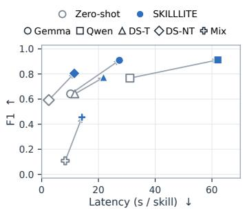  
(a) MalSkillBench

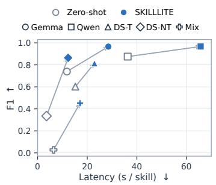  
(b) SkillTrustBench

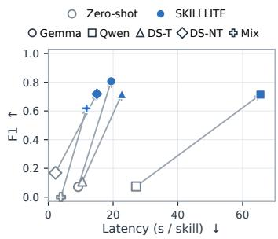  
(c) MASB  
Figure 3: Effectiveness–efficiency comparison between direct zero-shot auditing and SKILLLITE across compact LLM backbones. Each connected pair represents the same underlying model.

## 4.3 GENERALIZATION TO IN-THE-WILD MALICIOUS SKILLS

We further evaluate the generalization of SKILLLITE on MaliciousAgentSkillsBench, which contains behaviorally confirmed malicious Skills collected in the wild. As shown in Table 2, SKILL LITE achieves the best overall accuracy and F1-score while maintaining a low false-positive rate. This result indicates that SKILLLITE generalizes to real-world Skill ecosystems without relying on an overly aggressive detection strategy. Existing baselines continue to exhibit trade-offs between detecting malicious Skills and avoiding false alarms, with some methods favoring higher recall while others adopt more conservative decisions. For SKILLLITE, the remaining errors are mainly false negatives, where security-sensitive behaviors may appear consistent with the declared functionality. This reflects the general limitation of static auditing, which cannot observe risks emerging only at runtime. How to uncover more runtime risks through static auditing remains an interesting challenge for future research. The efficiency trend is consistent with the main evaluation. SKILLLITE maintains low inference latency comparable to LLM-based baselines. Notably, AI-Infra-Guard achieves the closest F1-score to SKILLLITE but requires approximately 4.9× longer inference time. Detailed analyses are provided in Appendix B.

## 4.4 ENHANCING COMPACT LLMS

Detection performance. We investigate whether SKILLLITE can enhance malicious Skill auditing across different compact LLM backbones. As shown in Figure 3, SKILLLITE improves F1 over direct zero-shot auditing across all 15 model–benchmark configurations, with gains ranging from 9.2 to 73.6 percentage points. Zero-shot auditing exhibits a consistent conservative bias: compact LLMs generally maintain high precision but frequently miss malicious Skills, particularly on MASB. Effective Skill auditing requires identifying sparse security evidence across heterogeneous artifacts, connecting individually ambiguous behaviors, and interpreting their security implications. Compact LLMs can struggle to complete all the tasks jointly due to their limited capacity. SKILLLITE addresses this challenge by externalizing evidence acquisition and grounding, allowing the model to focus on risk adjudication. Although the final performance remains influenced by the capability of the underlying model, SKILLLITE can substantially enhance models with limited zero-shot auditing capability. Complete results across all evaluation metrics are provided in Appendix C.

Table 3: Ablation study on the full SkillTrustBench binary benchmark.
<table><tr><td>Variant</td><td>Acc</td><td>Prec</td><td>Recall</td><td>F1</td><td>FPR↓</td><td>FNR↓</td></tr><tr><td>Full SKILLLITE</td><td>0.957</td><td>0.971</td><td>0.961</td><td>0.966</td><td>0.050</td><td>0.039</td></tr><tr><td>w/o Security Evidence Extraction</td><td>0.560</td><td>0.944</td><td>0.326</td><td>0.485</td><td>0.034</td><td>0.674</td></tr><tr><td>w/o Intent Analysis</td><td>0.549</td><td>0.996</td><td>0.292</td><td>0.451</td><td>0.002</td><td>0.708</td></tr><tr><td>w/o Evidence Synthesis</td><td>0.731</td><td>0.945</td><td>0.612</td><td>0.743</td><td>0.062</td><td>0.388</td></tr></table>

Efficiency analysis. SKILLLITE introduces additional inference latency over direct zero-shot auditing due to evidence acquisition and grounding. Nevertheless, the runtime remains practical across the evaluated backbones, while the additional computation yields substantial improvements in detection performance. For example, on MalSkillBench, SKILLLITE improves DeepSeek-R1:8B’s F1 from 59.2% to 80.5%, with an inference latency of only 11.5 seconds.

## 4.5 ABLATION STUDY

We conduct ablation studies on SkillTrustBench to examine three key components of SKILLLITE: Security Evidence Extraction, Intent Analysis, and Evidence Synthesis. As shown in Table 3, removing any component degrades detection performance, demonstrating their complementary roles in exposing, contextualizing, and interpreting security evidence.

Security Evidence Extraction. Removing this component causes a substantial performance degradation, with the largest impact appearing in malicious-skill recall. Without systematic extraction, security-sensitive behaviors embedded across scripts, configurations, and other package artifacts are no longer explicitly exposed, leaving the subsequent reasoning stages with incomplete security in formation. This confirms the importance of package-level evidence extraction for making implicit or distributed malicious behaviors observable to compact LLMs.

Intent Analysis. Removing Intent Analysis causes a similarly substantial degradation despite retaining grounded security evidence. The model remains highly precise but misses most malicious Skills, indicating a conservative decision pattern. Without reasoning about declared purpose, expected capabilities, and functional necessity, the compact LLM lacks the functional reference needed to determine whether security-sensitive behaviors are justified.

Evidence Synthesis. Removing source-grounded context also reduces detection performance, although less than the other two ablations. The remaining findings identify security-sensitive patterns but lack the implementation context needed to interpret how they occur within the Skill, making it harder to distinguish legitimate operations from malicious behaviors. This confirms the role of source grounding in connecting extracted security signals with their semantic interpretation.

## 5 CONCLUSION

In this work, we study malicious Agent Skill auditing with compact, locally deployable LLMs. Our investigations show that directly using compact LLMs to audit raw Skill packages remains challenging, as security-relevant evidence can be sparse, distributed across heterogeneous artifacts, and ambiguous without functional context. To address this challenge, we introduce SKILLLITE, an evidence-guided auditing framework that externalizes security evidence discovery and grounding while focusing the compact LLM on intent-conditioned risk adjudication. Across multiple benchmarks and compact LLM backbones, SKILLLITE consistently improves malicious-Skill detection, generalizes to behaviorally confirmed in-the-wild threats, and maintains practical inference efficiency. Our findings suggest that effective security auditing does not necessarily require scaling model capability; instead, restructuring how security evidence is exposed to the model provides a promising direction for building practical, local, and lightweight Agent Skill auditing systems.

## AI USE STATEMENT

We used generative AI tools only to assist with language polishing, grammar checking, and improving the readability of the paper. Generative AI was not used for the research tasks requiring disclosure under the ICLR 2027 AI Policy, including the development of the research methodology, experimental design, data analysis, or interpretation of results. All AI-assisted revisions were reviewed and verified by the authors. The authors take full responsibility for the final content of thi work, including all technical claims, experimental results, and AI-assisted text.

## ETHICS STATEMENT

This work studies malicious Agent Skills, aiming at improving the safety of LLM-based agent ecosystems. All experiments were conducted in controlled research environments and did not target real users or production systems. We did not deploy or intentionally distribute malicious Skills to public Skill ecosystems, nor did we perform attacks against third-party systems. Malicious samples were used solely for risk evaluation and the development of defensive auditing techniques. Overall, this research is intended to improve the detection of malicious Skills and support safer adoption of third-party Agent Skills.

## REPRODUCIBILITY STATEMENT

We provide detailed descriptions of the datasets, baselines, evaluation metrics, and experimental settings in Section 4 and the Appendix. The framework design is described in Section 3. Additional implementation details, prompt templates, and complete experimental results are provided in the Appendix. These details support the reproduction of our experimental setup and results.

## REFERENCES

Skilltrustbench, 2026. Benchmark dataset for agent skill security evaluation.

Amirhossein Abaskohi, Amrutha Varshini Ramesh, Shailesh Nanisetty, Chirag Goel, David Vazquez, Christopher Pal, Spandana Gella, Giuseppe Carenini, and Issam H Laradji. Agentada: Skill-adaptive data analytics for tailored insight discovery. arXiv preprint arXiv:2504.07421, 2025.

Keivan Alizadeh, Seyed Iman Mirzadeh, Dmitry Belenko, S Khatamifard, Minsik Cho, Carlo C Del Mundo, Mohammad Rastegari, and Mehrdad Farajtabar. Llm in a flash: Efficient large language model inference with limited memory. In Proceedings of the 62nd Annual Meeting of the Associationfor Computational Linguistics (Volume 1: Long Papers), pp. 12562–12584, 2024.

Salaheddin Alzubi, Noah Provenzano, Jaydon Bingham, Weiyuan Chen, and Tu Vu. Evoskill: Automated skill discovery for multi-agent systems. arXiv preprint arXiv:2603.02766, 2026.

Anthropic. Extend claude with skills. Official documentation, 2026. URL https://code. claude.com/docs/en/skills. Accessed: 2026-08-18.

CERT-EU. Cyber brief 26-06 - may 2026. Threat intelligence brief, 2026. URL https: //cert.europa.eu/publications/threat-intelligence/cb26-06/. Release date: 2026-06-02.

Tianhao Chen, Zhengyuan Jiang, Yuepeng Hu, Yebei Gou, and Neil Zhenqiang Gong. Dynamic malicious skills in agentic ai. arXiv preprint arXiv:2606.16287, 2026a.

Wanyi Chen, Junhao Wang, Yiwei Zhang, Yufan Shi, Tianyi Jiang, Shengxian Zhou, Chenxu Wu, Andi Zhang, Chenyue Zhou, Minxuan Wang, et al. On-device large language models: a survey of model compression and system optimization. Artificial Intelligence Review, 59(9):191, 2026b.

Cisco. I run openclaw at home. that’s exactly why we built defenseclaw. Cisco Blog, 2026. URL https://blogs.cisco.com/ai/cisco-announces-defenseclaw. Published: 2026-03-23.

Cisco AI Defense. Skill scanner: Security scanner for ai agent skills. https://github.com/ cisco-ai-defense/skill-scanner, 2026. GitHub repository, accessed: 2026-07-10.

Badhan Chandra Das, M Hadi Amini, and Yanzhao Wu. Security and privacy challenges of large language models: A survey. ACM Computing Surveys, 57(6):1–39, 2025.

Bacem Etteib, Daniele Lunghi, and Tegawende F. Bissyande. Detecting malicious agent skills in the wild using attention. arXiv preprint arXiv:2606.23416, 2026.

Fangcun AI. Skillward: Security auditing framework for ai agent skills. https://github. com/Fangcun-AI/SkillWard, 2026. GitHub repository, accessed: 2026-08-10.

Yunhao Feng, Yifan Ding, Yingshui Tan, Boren Zheng, Yanming Guo, Xiaolong Li, Kun Zhai, Yishan Li, and Wenke Huang. Skilltrojan: Backdoor attacks on skill-based agent systems. arXiv preprint arXiv:2604.06811, 2026.

Wenbo Guo, Wei Zeng, Chengwei Liu, Xiaojun Jia, Yijia Xu, Lei Tang, Yong Fang, and Yang Liu. Malskillbench: A runtime-verified benchmark of malicious agent skills. arXiv preprint arXiv:2606.07131, 2026a.

Zihan Guo, Zhiyu Chen, Xiaohang Nie, Jianghao Lin, Yuanjian Zhou, and Weinan Zhang. Skillprobe: Security auditing for emerging agent skill marketplaces via multi-agent collaboration. arXiv preprint arXiv:2603.21019, 2026b.

Wenhui He, Yue Li, Bang Fu, Huan Xing, Xing Fan, ZeHua Zhang, and Baoning Niu. Do skill descriptions tell the truth? detecting undisclosed security behaviors in code-backed llm skills. arXiv preprint arXiv:2605.12875, 2026.

Florian Holzbauer, David Schmidt, Gabriel Gegenhuber, Sebastian Schrittwieser, and Johanna Ull rich. Context matters: Repository-aware security analysis of the agent skill ecosystem. arXiv preprint arXiv:2603.16572, 2026.

Ismail Hossain, Sai Puppala, Md Jahangir Alam, Tanzim Ahad, and Sajedul Talukder. Skillvetbench: Llm-as-judge for multi-dimensional security risk evaluation in open-source llm agent skills. arXiv preprint arXiv:2606.15899, 2026.

Yinghan Hou and Zongyou Yang. Skillsieve: A hierarchical triage framework for detecting malicious ai agent skills. arXiv preprint arXiv:2604.06550, 2026.

Yanna Jiang, Delong Li, Haiyu Deng, Baihe Ma, Xu Wang, Qin Wang, and Guangsheng Yu. Sok: Agentic skills–beyond tool use in llm agents. arXiv preprint arXiv:2602.20867, 2026a.

Yukun Jiang, Yage Zhang, Michael Backes, Xinyue Shen, and Yang Zhang. Harmfulskillbench: How do harmful skills weaponize your agents? arXiv preprint arXiv:2604.15415, 2026b.

Hao Li, Chunjiang Mu, Jianhao Chen, Siyue Ren, Zhiyao Cui, Yiqun Zhang, Lei Bai, and Shuyue Hu. Organizing, orchestrating, and benchmarking agent skills at ecosystem scale. arXiv preprint arXiv:2603.02176, 2026a.

Yanzhou Li, Yiran Zhang, Xiaoyu Zhang, Xiaoxia Liu, and Yang Liu. Codeskill: Learning selfevolving skills for coding agents. arXiv preprint arXiv:2605.25430, 2026b.

Hongyi Liu, Haoyan Yang, Tao Jiang, Bo Tang, Feiyu Xiong, Yuyu Luo, and Zhiyu Li. Skillsvote: Lifecycle governance of agent skills from collection, recommendation to evolution. arXiv preprint arXiv:2605.18401, 2026a.

Yi Liu, Zhihao Chen, Yanjun Zhang, Gelei Deng, Yuekang Li, Jianting Ning, and Leo Yu Zhang. do not mention this to the user”: Detecting and understanding malicious agent skills in the wild. arXiv preprint arXiv:2602.06547, 2026b.

Zechun Liu, Changsheng Zhao, Forrest Iandola, Chen Lai, Yuandong Tian, Igor Fedorov, Yunyang Xiong, Ernie Chang, Yangyang Shi, Raghuraman Krishnamoorthi, et al. Mobilellm: Optimizing sub-billion parameter language models for on-device use cases. arXiv preprint arXiv:2402.14905, 2024.

NVIDIA. Skillspector: Security scanner for ai agent skills. https://github.com/NVIDIA/ skillspector, 2026. GitHub repository, accessed: 2026-06-28.

OpenAI. Build skills. Official documentation, 2026. URL https://learn.chatgpt.com/ docs/build-skills. Accessed: 2026-08-18.

spclaudehome. Skill vetter: Ai skill security auditor. https://clawhub.ai/ spclaudehome/skill-vetter, 2026. ClawHub skill, accessed: 2026-08-10.

Tencent Zhuque Lab. AI-Infra-Guard: A Comprehensive, Intelligent, and Easy-to-Use AI Red Teaming Platform. GitHub repository, 2025. URL https://github.com/Tencent/ AI-Infra-Guard.

Shenao Wang, Junjie He, Yanjie Zhao, Yayi Wang, Kan Yu, and Haoyu Wang. “elementary, my dear watson.” detecting malicious skills via neuro-symbolic reasoning across heterogeneous artifacts. arXiv preprint arXiv:2603.27204, 2026.

Yuntao Wang, Yanghe Pan, Zhou Su, Yi Deng, Quan Zhao, Linkang Du, Tom H Luan, Jiawen Kang, and Dusit Niyato. Large model-based agents: State-of-the-art, cooperation paradigms, security and privacy, and future trends. IEEE Communications Surveys & Tutorials, 28:1906–1949, 2025.

Renjun Xu and Yang Yan. Agent skills for large language models: Architecture, acquisition, security, and the path forward. arXiv preprint arXiv:2602.12430, 2026.

Haozhen Zhang, Quanyu Long, Jianzhu Bao, Tao Feng, Weizhi Zhang, Haodong Yue, and Wenya Wang. Memskill: Learning and evolving memory skills for self-evolving agents. arXiv preprint arXiv:2602.02474, 2026.

Guoshenghui Zhao and Eric Song. Privacy-preserving large language models: Mechanisms, applications, and future directions. arXiv preprint arXiv:2412.06113, 2024.

Boyuan Zheng, Michael Y Fatemi, Xiaolong Jin, Zora Zhiruo Wang, Apurva Gandhi, Yueqi Song, Yu Gu, Jayanth Srinivasa, Gaowen Liu, Graham Neubig, et al. Skillweaver: Web agents can self-improve by discovering and honing skills. arXiv preprint arXiv:2504.07079, 2025.

Yingli Zhou, Wang Shu, Yaodong Su, Wenchuan Du, Yixiang Fang, and Xuemin Lin. A comprehensive survey on agent skills: Taxonomy, techniques, and applications. arXiv preprint arXiv:2605.07358, 2026.

## A ADDITIONAL EXPERIMENT DETAILS

## A.1 SECURITY EVIDENCE EXTRACTION DETAILS

The Security Extractor uses complementary deterministic analyzers to expose security-relevant behaviors across heterogeneous Skill artifacts. Table 4 summarizes the analyzer categories and representative security signals. These categories characterize the implementation coverage of the extraction stage. The extracted signals serve only as security evidence, not directly determining the final maliciousness judgment.

## A.2 DATASET DETAILS

We provide additional details on the construction, composition, and risk coverage of the three bench marks used in our evaluation.

MalSkillBench (Guo et al., 2026a) contains 3,944 malicious and 4,000 benign Skills. Its malicious samples include attacks collected from public Skill ecosystems and runtime-verified synthesized Skills. The benchmark covers three attack vectors, namely Code Injection (CI), Prompt Injection (PI), and Mixed attacks, as well as fifteen malicious behavior types, which together form 108 combinations of attack vectors, behaviors, and insertion strategies. This large-scale construction provides diverse coverage of both code-level and instruction-level malicious behaviors.

Table 4: Security evidence coverage of the deterministic analyzers in SKILLLITE.
<table><tr><td>Analyzer</td><td>Evidence Target</td><td>Representative Signals</td></tr><tr><td>General Security Patterns</td><td>Common security-sensitive opera- tions</td><td>Local file access, network activity, system command execution, and permission modification.</td></tr><tr><td>Language-Aware Code Analysis</td><td>Security-sensitive implementation behavior</td><td>Process invocation, network API usage, environment-variable ac- cess, and dynamic execution.</td></tr><tr><td>Concealed-Payload Inspection</td><td>Hidden or obfuscated behavior</td><td>Encoded payloads, hidden helper logic, split payload artifacts, and obfuscated execution.</td></tr><tr><td>Agent-Specific Control Signals</td><td>Manipulation of agent execution and control</td><td>Approval bypass, sandbox bypass, control-flow hijacking, and au- tonomous confirmation bypass.</td></tr></table>

SkillTrustBench (ski, 2026) is constructed from more than 62,000 real-world Skills collected from public agent ecosystems. Each sample contains a complete Skill package, including instructions, scripts, configurations, references, and auxiliary resources. The benchmark covers nine security categories, including instruction manipulation, memory poisoning, malicious code and payload execution, privilege escalation, persistence, tool hijacking, and insecure dependencies or implementations. The original benchmark contains 2,863 malicious, 1,643 benign, and 1,014 suspicious samples. Following our binary auditing setting, we exclude the suspicious category and evaluate on the remaining 4,506 Skills.

MaliciousAgentSkillsBench (MASB) (Liu et al., 2026b) is derived from 98,380 real-world Skills collected from two public Skill registries. Candidate malicious Skills are screened through static analysis and subsequently validated through behavioral execution in isolated environments, resulting in 157 behaviorally confirmed malicious Skills. These samples span 13 attack techniques and six kill-chain stages and are annotated with their observed security behaviors. For our binary evaluation, we combine the 157 malicious Skills with 299 verified benign Skills from the same ecosystem, yielding 456 Skills in total.

## A.3 BASELINE DETAILS

We provide additional details on the baseline detectors and their configurations used in our experiments. All baselines are evaluated on complete Skill packages using their official implementations and recommended configurations whenever applicable.

NVIDIA SkillSpector (NVIDIA, 2026) provides both static and LLM-based analysis for auditing Agent Skills. We evaluate these two configurations separately as SkillSpector (Static) and SkillSpector (LLM). The static configuration detects security-sensitive patterns directly from Skill artifacts. The LLM configuration additionally performs semantic analysis for risk assessment. For the LLM configuration, we initially use Gemma4:e4b to maintain the same underlying model as SKILLLITE and the other LLM-assisted baselines. However, this configuration exhibits high failure rates across all three benchmarks, primarily due to the 300-second per-sample timeout. To avoid penalizing SkillSpector for these execution failures, we instead use GPT-4.1-nano as a lightweight alternative that reliably completes the evaluation. The original SkillSpector workflow is unchanged.

Tencent AI-Infra-Guard (Tencent Zhuque Lab, 2025) provides a Skill security scanner that analyzes Skill packages for security-sensitive behaviors and produces structured security findings. We evaluate its Skill-Scan component provided by the framework.

Cisco Skill Scanner (Cisco AI Defense, 2026) provides modular analyzers for auditing Agent Skills. We evaluate two configurations: Cisco SkillScanner (Static), which uses the core security analyzers, and Cisco SkillScanner (LLM), which additionally incorporates LLM-based semantic analysis. The LLM configuration uses the same underlying compact LLM as SKILLLITE.

Table 5: Experimental environment.
<table><tr><td>Component</td><td>Configuration</td></tr><tr><td>OS</td><td>Ubuntu 22.04</td></tr><tr><td>CPU</td><td>2 × AMD EPYC 7543</td></tr><tr><td>RAM</td><td>250 GB</td></tr><tr><td>GPU</td><td>NVIDIA RTX A6000 48 GB</td></tr><tr><td>Python</td><td>3.11.4</td></tr><tr><td>Ollama</td><td>0.20.7</td></tr></table>

SkillWard (Fangcun AI, 2026) audits Skill packages using multiple security checks and produces structured findings for detected risks. We use its official implementation and map an UNSAFE verdict to the malicious class.

Skill-Vetter (spclaudehome, 2026) performs LLM-assisted semantic analysis of Skill descriptions and implementation artifacts. We use the same underlying compact LLM as SKILLLITE and map its warning verdict to the malicious class.

## A.4 IMPLEMENTATION AND EXPERIMENTAL SETUP

Unless otherwise specified, we use Gemma4:e4b as the default compact LLM for SKILLLITE. All open-source models are deployed locally using Ollama (v0.20.7) without fine-tuning. Gemma4:e4b serves as the default backbone in the main experiments. We additionally evaluate Qwen3.5:9B, DeepSeek-R1:8B, and Mixtral-8x7B to examine the effectiveness of SKILLLITE across different compact LLMs. DeepSeek-R1:8B is evaluated with both thinking enabled and disabled. All experiments are conducted on a Linux server equipped with NVIDIA RTX A6000 GPUs with 48 GB of memory. Each model instance runs on a single GPU. The remaining environment details are summarized in Table 5.

## B DETAILED ANALYSIS

We provide additional analyses across the three benchmarks from two perspectives: attack categories and package characteristics.

## B.1 PERFORMANCE ACROSS ATTACK CATEGORIES

Figure 4 compares recall across fine-grained attack categories on the three benchmarks. Since these categories are defined only over malicious samples, we report category-level recall. The categories in SkillTrustBench and MASB are multi-label and therefore non-exclusive.

MalSkillBench. MalSkillBench contains 15 malicious behavior categories (B1–B15), with individ ual categories containing between 126 and 280 samples. Overall, SKILLLITE achieves strong recall across most categories, demonstrating its ability to detect diverse types of malicious behaviors. It performs particularly well on B6 (Reverse Shell) and B8 (Resource Abuse), reaching recalls of 0.993 and 0.982, respectively. The remaining errors are concentrated in a smaller set of behaviors, such as B10 (Role Hijack) and B14 (Goal Hijacking). Although several high-sensitivity baselines achieve higher recall on these challenging categories, they incur substantially higher false-positive rates on the complete benchmark. SKILLLITE provides a better overall balance between malicious-skill detection and false alarms, resulting in higher overall F1.

SkillTrustBench. SkillTrustBench contains nine non-exclusive security categories (T01–T09), with category sizes ranging from 96 to 2,450 malicious samples. Overall, SKILLLITE maintains consistently high recall across diverse security categories. It performs particularly well on T06 (Persistence) and T07 (Tool Hijacking), with recalls of 1.000 and 0.984, respectively. Most baselines show less consistent performance across categories, with substantially lower recall on several types. Those achieving high recall on more categories tend to do so at the cost of considerably higher false-positive rates on the complete benchmark.

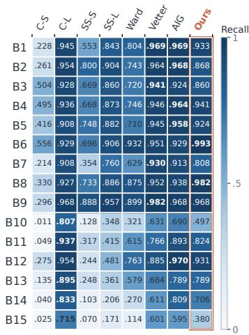  
(a) MalSkillBench

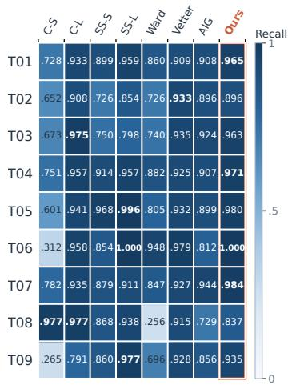  
(b) SkillTrustBench

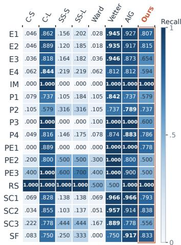  
(c) MaliciousAgentSkillsBench  
Figure 4: Recall across fine-grained attack categories on the three benchmarks. Rows denote the native malicious behavior, columns correspond to the evaluated detection methods. Each cell reports category-level recall.

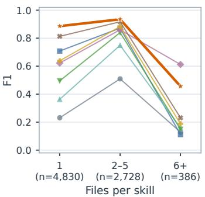  
(a) MalSkillBench

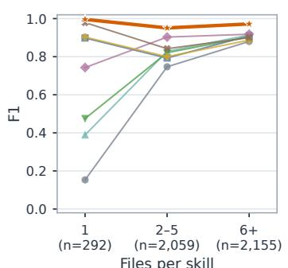  
(b) SkillTrustBench

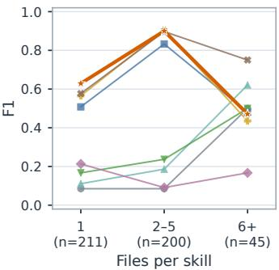  
(c) MaliciousAgentSkillsBench  
Figure 5: Detection performance across Skill package sizes.

MaliciousAgentSkillsBench (MASB). MASB provides fine-grained, multi-label vulnerability patterns derived from its audit annotations, including Intent Mismatch (IM), Reverse Shell (RS), Shadow Feature (SF) and pattern identifiers such as E1–E4, P1–P4, PE1–PE3, and SC1–SC3. SKIL-LLITE achieves robust detection across several representative vulnerability patterns, with recall exceeding 0.78 on SC2, E1, E2, and P4. Its performance varies more on some patterns, with P1, E3, E4, and SC3 showing lower recall and representing more challenging cases for SKILLLITE. Skill-Vetter and AIG attain high recall across many patterns, but their greater sensitivity results in substantially higher false-positive rates on the complete benchmark. In contrast, other scanners exhibit substantially lower recall across multiple patterns, resulting in more missed malicious Skills.

## B.2 PERFORMANCE ACROSS PACKAGE CHARACTERISTICS

We next examine how Skill package characteristics affect malicious-skill detection. We consider two dimensions: package size, measured by the number of files, and programming-language characteristics, including both language complexity and specific programming languages.

Package size. We group Skills by the number of files in each package after excluding datasetspecific metadata and evaluation artifacts. As shown in Figure 5, SKILLLITE maintains strong

Table 6: F1-score across packages with different programming-language complexity.
<table><tr><td>Dataset</td><td>Group</td><td>C-S</td><td>C-L</td><td>SS-S</td><td>SS-L</td><td>Ward</td><td>Vetter</td><td>AIG</td><td>SKILLLITE</td></tr><tr><td rowspan="3">MalSkillBench</td><td>No detected code</td><td>.171</td><td>.657</td><td>.310</td><td>.467</td><td>.679</td><td>.591</td><td>.802</td><td>.819</td></tr><tr><td>One language</td><td>.246</td><td>.717</td><td>.428</td><td>.544</td><td>.670</td><td>.664</td><td>.823</td><td>.911</td></tr><tr><td>Multiple languages</td><td>.484</td><td>.830</td><td>.683</td><td>.771</td><td>.816</td><td>.827</td><td>.880</td><td>.919</td></tr><tr><td rowspan="3">SkillTrustBench</td><td>No detected code</td><td>.364</td><td>.372</td><td>.571</td><td>.750</td><td>.545</td><td>.279</td><td>.571</td><td>.800</td></tr><tr><td>One language</td><td>.692</td><td>.773</td><td>.736</td><td>.716</td><td>.848</td><td>.769</td><td>.827</td><td>.952</td></tr><tr><td>Multiple languages</td><td>.819</td><td>.892</td><td>.884</td><td>.883</td><td>.912</td><td>.882</td><td>.901</td><td>.970</td></tr><tr><td rowspan="3">MASB</td><td>No detected code</td><td>.000</td><td>.263</td><td>.000</td><td>.100</td><td>.000</td><td>.368</td><td>.400</td><td>.455</td></tr><tr><td>One language</td><td>.034</td><td>.815</td><td>.109</td><td>.205</td><td>.087</td><td>.863</td><td>.880</td><td>.925</td></tr><tr><td>Multiple languages</td><td>.333</td><td>.591</td><td>.474</td><td>.395</td><td>.279</td><td>.634</td><td>.667</td><td>.471</td></tr></table>

Table 7: F1-score across programming languages. Language groups are non-exclusive, as a Skill may contain multiple programming languages.
<table><tr><td>Dataset</td><td>Language</td><td>C-S</td><td>C-L</td><td>SS-S</td><td>SS-L</td><td>Ward</td><td>Vetter</td><td>AIG</td><td>SKILLLITE</td></tr><tr><td rowspan="9">MalSkillBench</td><td>Go</td><td>.483</td><td>.905</td><td>.629</td><td>.744</td><td>.750</td><td>.756</td><td>.850</td><td>.919</td></tr><tr><td>JavaScript</td><td>.331</td><td>.551</td><td>.448</td><td>.514</td><td>.769</td><td>.528</td><td>.665</td><td>.845</td></tr><tr><td>PowerShell</td><td>.754</td><td>.755</td><td>.810</td><td>.857</td><td>.789</td><td>.750</td><td>.839</td><td>.874</td></tr><tr><td>Python</td><td>.476</td><td>.883</td><td>.723</td><td>.810</td><td>.843</td><td>.880</td><td>.916</td><td>.934</td></tr><tr><td>Rust</td><td>.378</td><td>.852</td><td>.609</td><td>.821</td><td>.857</td><td>.828</td><td>.877</td><td>.885</td></tr><tr><td>SQL</td><td>.611</td><td>.911</td><td>.570</td><td>.689</td><td>.688</td><td>.900</td><td>.902</td><td>.939</td></tr><tr><td>Shell</td><td>.402</td><td>.760</td><td>.583</td><td>.673</td><td>.751</td><td>.737</td><td>.843</td><td>.916</td></tr><tr><td>TypeScript</td><td>.464</td><td>.818</td><td>.610</td><td>.730</td><td>.764</td><td>.766</td><td>.864</td><td>.891</td></tr><tr><td>YAML</td><td>.361</td><td>.821</td><td>.597</td><td>.717</td><td>.747</td><td>.832</td><td>.883</td><td>.891</td></tr><tr><td rowspan="7">SkillTrustBench</td><td>JavaScript</td><td>.784</td><td>.824</td><td>.902</td><td>.885</td><td>.886</td><td>.848</td><td>.880</td><td>.959</td></tr><tr><td>PowerShell</td><td>.852</td><td>.865</td><td>.890</td><td>.857</td><td>.893</td><td>.819</td><td>.864</td><td>.930</td></tr><tr><td>Python</td><td>.840</td><td>.908</td><td>.906</td><td>.904</td><td>.922</td><td>.892</td><td>.906</td><td>.974</td></tr><tr><td>SQL</td><td>.687</td><td>.725</td><td>.878</td><td>.818</td><td>.866</td><td>.819</td><td>.805</td><td>.901</td></tr><tr><td>Shell</td><td>.791</td><td>.861</td><td>.843</td><td>.840</td><td>.894</td><td>.851</td><td>.884</td><td>.965</td></tr><tr><td>TypeScript</td><td>.812</td><td>.890</td><td>.877</td><td>.871</td><td>.919</td><td>.797</td><td>.873</td><td>.932</td></tr><tr><td>YAML</td><td>.735</td><td>.846</td><td>.804</td><td>.805</td><td>.899</td><td>.861</td><td>.884</td><td>.974</td></tr><tr><td rowspan="5">MASB</td><td>JavaScript</td><td>.267</td><td>.766</td><td>.474</td><td>.450</td><td>.222</td><td>.818</td><td>.844</td><td>.452</td></tr><tr><td>Python</td><td>.286</td><td>.444</td><td>.435</td><td>.357</td><td>.200</td><td>.421</td><td>.564</td><td>.593</td></tr><tr><td>Shell</td><td>.125</td><td>.763</td><td>.241</td><td>.282</td><td>.148</td><td>.822</td><td>.839</td><td>.851</td></tr><tr><td>TypeScript</td><td>.400</td><td>.444</td><td>.333</td><td>.286</td><td>.500</td><td>.667</td><td>.571</td><td>.500</td></tr><tr><td>YAML</td><td>.000</td><td>.353</td><td>.182</td><td>.133</td><td>.000</td><td>.588</td><td>.429</td><td>.444</td></tr></table>

F1 across the major package-size groups, achieving better overall performance than the baselines. On SkillTrustBench, SKILLLITE consistently outperforms all baselines across the three packagesize groups. On MalSkillBench, it also achieves the strongest performance on the two dominant groups. Baselines exhibit substantially larger performance variations across package sizes. The pattern is less consistent on MASB. SKILLLITE achieves strong performance on single-file packages and remains competitive on packages containing two to five files, but its performance decreases on larger packages. Baselines show similar variations across package sizes, indicating that performance on MASB is more sensitive to package characteristics.

Programming-language characteristics. We first examine performance under different levels of programming-language complexity. As shown in Table 6, SKILLLITE achieves strong F1 on both single- and multi-language packages in MalSkillBench and SkillTrustBench, outperforming all baselines in these groups. Its performance remains stable when moving from single-language to multilanguage packages, indicating robustness to language heterogeneity. Packages without detected code are more challenging, suggesting that less code-oriented Skills provide fewer explicit implementation signals for security analysis.

We further examine whether detection performance varies across specific programming languages. As shown in Table 7, SKILLLITE achieves the highest F1 across most language groups in MalSkill-Bench and SkillTrustBench, covering diverse implementations such as Python, Shell, JavaScript, and YAML. On MASB, SKILLLITE shows greater performance variation across programming languages, achieving the highest F1 on Python and Shell. Overall, SKILLLITE demonstrates strong detection performance across diverse programming languages.

Table 8: Complete cross-model results on MalSkillBench.
<table><tr><td>Model</td><td>Method</td><td>Acc</td><td>Prec</td><td>Recall</td><td>F1</td><td>FPR↓</td><td>FNR↓</td><td>Latency (s)↓</td></tr><tr><td rowspan="2">Gemma4 E4B</td><td>Zero-shot</td><td>0.737</td><td>0.992</td><td>0.474</td><td>0.641</td><td>0.004</td><td>0.526</td><td>10.2</td></tr><tr><td>SKILLLITE</td><td>0.909</td><td>0.944</td><td>0.869</td><td>0.905</td><td>0.051</td><td>0.132</td><td>27.4</td></tr><tr><td rowspan="2">Qwen3.5 9B</td><td>Zero-shot</td><td>0.811</td><td>0.990</td><td>0.626</td><td>0.767</td><td>0.007</td><td>0.374</td><td>31.1</td></tr><tr><td>SKILLLITE</td><td>0.918</td><td>0.969</td><td>0.862</td><td>0.912</td><td>0.027</td><td>0.138</td><td>62.1</td></tr><tr><td rowspan="2">DeepSeek-R1 8B (Thinking)</td><td>Zero-shot</td><td>0.734</td><td>0.972</td><td>0.479</td><td>0.641</td><td>0.014</td><td>0.521</td><td>11.7</td></tr><tr><td>SKILLLITE</td><td>0.806</td><td>0.925</td><td>0.664</td><td>0.773</td><td>0.054</td><td>0.336</td><td>21.8</td></tr><tr><td rowspan="2">DeepSeek-R1 8B (w/o Thinking)</td><td>Zero-shot</td><td>0.702</td><td>0.928</td><td>0.434</td><td>0.592</td><td>0.033</td><td>0.566</td><td>2.5</td></tr><tr><td>SKILLLITE</td><td>0.801</td><td>0.782</td><td>0.829</td><td>0.805</td><td>0.229</td><td>0.171</td><td>11.5</td></tr><tr><td rowspan="2">Mixtral</td><td>Zero-shot</td><td>0.531</td><td>0.983</td><td>0.057</td><td>0.108</td><td>0.001</td><td>0.943</td><td>8.3</td></tr><tr><td>SKILLLITE</td><td>0.629</td><td>0.838</td><td>0.312</td><td>0.455</td><td>0.060</td><td>0.688</td><td>14.2</td></tr></table>

Table 9: Complete cross-model results on SkillTrustBench.
<table><tr><td>Model</td><td>Method</td><td>Acc</td><td>Prec</td><td>Recall</td><td>F1</td><td>FPR↓</td><td>FNR↓</td><td>Latency (s)↓</td></tr><tr><td rowspan="2">Gemma4 E4B</td><td>Zero-shot</td><td>0.712</td><td>0.873</td><td>0.640</td><td>0.739</td><td>0.163</td><td>0.360</td><td>11.8</td></tr><tr><td>SKILLLITE</td><td>0.957</td><td>0.971</td><td>0.961</td><td>0.966</td><td>0.050</td><td>0.039</td><td>28.5</td></tr><tr><td rowspan="2">Qwen3.5 9B</td><td>Zero-shot</td><td>0.858</td><td>0.996</td><td>0.779</td><td>0.875</td><td>0.005</td><td>0.221</td><td>36.3</td></tr><tr><td>SKILLLITE</td><td>0.959</td><td>0.982</td><td>0.952</td><td>0.967</td><td>0.030</td><td>0.048</td><td>65.7</td></tr><tr><td rowspan="2">DeepSeek-R1 8B (Thinking)</td><td>Zero-shot</td><td>0.637</td><td>0.990</td><td>0.432</td><td>0.602</td><td>0.007</td><td>0.568</td><td>15.2</td></tr><tr><td>SKILLLITE</td><td>0.792</td><td>0.945</td><td>0.715</td><td>0.814</td><td>0.072</td><td>0.285</td><td>22.9</td></tr><tr><td rowspan="2">DeepSeek-R1 8B (w/o Thinking)</td><td>Zero-shot</td><td>0.482</td><td>0.907</td><td>0.205</td><td>0.335</td><td>0.037</td><td>0.795</td><td>3.6</td></tr><tr><td>SKILLLITE</td><td>0.817</td><td>0.816</td><td>0.918</td><td>0.864</td><td>0.360</td><td>0.082</td><td>12.3</td></tr><tr><td rowspan="2">Mixtral</td><td>Zero-shot</td><td>0.373</td><td>0.929</td><td>0.014</td><td>0.027</td><td>0.002</td><td>0.986</td><td>6.4</td></tr><tr><td>SKILLLITE</td><td>0.535</td><td>0.904</td><td>0.301</td><td>0.451</td><td>0.056</td><td>0.699</td><td>17.1</td></tr></table>

## C COMPLETE CROSS-MODEL RESULTS

We provide the complete cross-model results underlying the analysis in Section 4.4 in Tables 8, 9, and 10. To ensure reliable and fair efficiency comparisons, latency is measured under a controlled evaluation setting with consistent runtime configurations across models and methods. Across the three benchmarks, direct zero-shot auditing exhibits high precision but lower recall, indicating that compact LLMs struggle to reliably identify malicious Skills. SKILLLITE improves malicious Skill detection across all evaluated backbones. It can recover malicious Skills missed under direct zeroshot auditing. The magnitude of improvement varies across backbones, indicating that the effectiveness of SKILLLITE remains influenced by the capability of the underlying compact LLM. Although these improvements introduce additional inference latency, the overall runtime remains practical, reflecting an effectiveness–efficiency trade-off.

## D PROMPT TEMPLATES

We provide the prompt templates used by the compact LLM in SKILLLITE. The LLM performs two semantic reasoning tasks: intent analysis and evidence-guided risk adjudication. The templates below present the core instructions and output structures used in our implementation.

Table 10: Complete cross-model results on MASB.
<table><tr><td>Model</td><td>Method</td><td>Acc</td><td>Prec</td><td>Recall</td><td>F1</td><td>FPR↓</td><td>FNR↓</td><td>Latency (s)↓</td></tr><tr><td rowspan="2">Gemma4 E4B</td><td>Zero-shot</td><td>0.656</td><td>0.500</td><td>0.038</td><td>0.071</td><td>0.020</td><td>0.962</td><td>9.2</td></tr><tr><td>SKILLLITE</td><td>0.878</td><td>0.892</td><td>0.737</td><td>0.807</td><td>0.048</td><td>0.263</td><td>19.4</td></tr><tr><td rowspan="2">Qwen3.5 9B</td><td>Zero-shot</td><td>0.669</td><td>1.000</td><td>0.038</td><td>0.074</td><td>0.000</td><td>0.962</td><td>27.1</td></tr><tr><td>SKILLLITE</td><td>0.831</td><td>0.857</td><td>0.612</td><td>0.714</td><td>0.054</td><td>0.389</td><td>65.5</td></tr><tr><td rowspan="2">DeepSeek-R1 8B (Thinking)</td><td>Zero-shot</td><td>0.675</td><td>1.000</td><td>0.057</td><td>0.108</td><td>0.000</td><td>0.943</td><td>10.5</td></tr><tr><td>SKILLLITE</td><td>0.827</td><td>0.820</td><td>0.637</td><td>0.717</td><td>0.074</td><td>0.363</td><td>22.7</td></tr><tr><td rowspan="2">DeepSeek-R1 8B (w/o Thinking)</td><td>Zero-shot</td><td>0.675</td><td>0.714</td><td>0.096</td><td>0.169</td><td>0.020</td><td>0.905</td><td>2.2</td></tr><tr><td>SKILLLITE</td><td>0.779</td><td>0.639</td><td>0.822</td><td>0.719</td><td>0.244</td><td>0.178</td><td>15.0</td></tr><tr><td rowspan="2">Mixtral</td><td>Zero-shot</td><td>0.656</td><td>0.000</td><td>0.000</td><td>0.000</td><td>0.000</td><td>1.000</td><td>3.9</td></tr><tr><td>SKILLLITE</td><td>0.772</td><td>0.730</td><td>0.535</td><td>0.618</td><td>0.104</td><td>0.465</td><td>11.8</td></tr></table>

## D.1 INTENT ANALYSIS PROMPT

Intent Analysis   
[INPUT]   
Skill Name: {skill name}   
Skill Specification: {skill md}   
[INSTRUCTION]   
Infer the intended functionality of the Skill.   
1. Identify its declared purpose.   
2. Identify the capabilities necessary and proportionate to that   
purpose.   
[OUTPUT]   
{ "declared purpose": "...",   
"expected capabilities": [...] }

## Evidence-Guided Risk Adjudication

[INPUT]   
Skill Specification: {skill md}   
Functional Specification: {intent analysis}   
Evidence Report: {evidence report}   
[INSTRUCTION]   
Assess the Skill using the grounded evidence and its intended   
functionality.   
1. Review suspicious evidence and its source.   
2. Assess whether each behavior is necessary for the declared   
functionality.   
3. Identify direct benign counterevidence.   
4. Determine whether the evidence forms an abuse chain and make the   
final judgment.   
[DECISION POLICY]   
Security-sensitive capability alone does not imply maliciousness.   
- Necessary and proportionate behavior should normally be treated as   
benign.   
- Strong unexplained or deceptive behavior supports a malicious   
judgment.   
Critical agentic risks require direct, risk-specific benign   
counterevidence.   
[OUTPUT]   
{ "suspicious evidence review": [...],   
"benign counterevidence": [...],   
"abuse chain": { "present": true/false, "components": [...] },   
"is malicious": true/false,   
"confidence score": 0--100,   
"reasoning": "..." }