# SPLASH: SWITCHING PARALLEL LAYOUTS OF ATTENTION WITH SEAMLESS HANDOFF FOR LLM SERVING

Chuan Liu1,2 Shuoming Zhang1,2,\* Zhicheng Li1,2 Qianqi Sun1,2 Ruiyuan Xu1,2 Qiuchu Yu1,2 Xiyu Shi1 Huimin Cui1,2 Jiacheng Zhao1,2

1State Key Laboratory of Processors, Institute of Computing Technology Chinese Academy of Sciences, Beijing, China 2University of Chinese Academy of Sciences, Beijing, China

## ABSTRACT

No single way of parallelizing attention serves large language models well under all loads. Low concurrency favors tensor parallelism, many independent requests favor data-parallel attention, and long prompts favor context parallelism. Reasoning, agentic, and RL-rollout workloads make a fixed choice untenable: a batch that begins as many short requests ends as a few very long ones, so the best layout changes while the same requests run. Serving engines nevertheless fix one layout at launch, because changing it has meant draining requests and restarting workers. We present SPLASH, a serving system that switches the parallel layout of attention while requests are running. It builds on one observation: modern attention, with few or no KV heads, decouples where a request’s KV cache lives from how attention weights are sharded. This has two consequences. First, layouts differ only in who owns the weights and the cache, and most of that state already sits where the next layout needs it; SPLASH reuses it, moves the rest in the background of ongoing inference, and hands off at a batch boundary, making a switch nearly free: its median overhead is under 0.51% of the step it runs in. Second, the decoupling exposes a layout that existing engines lack: Decoupled Ownership Parallelism (DOP) shards attention weights as tensor parallelism does while keeping each request’s cache on a single owner as data-parallel attention does. DOP replicates neither, offers 27–60% more KV capacity than data-parallel attention, and gives the scheduler a choice when KV memory limits admission. A transition-aware scheduler follows the best of the four layouts as load changes. On B200 GPUs serving GLM-5.3, SPLASH improves end-to-end serving throughput by 1.3–1.73× over fixed-layout deployments, and the same layout regimes appear with DeepSeek-V3.2 on H200 and GLM-5.3-Flash on DCU. Our implementation is open source at https://github.com/ict-agent/SPLASH-sglang.

## 1 INTRODUCTION

Agents have turned language models from something people ask a question into something they run all day (Luo et al., 2026; Yuan et al., 2026b). A serving system must turn a fixed set of GPUs into as many answered requests as it can, whatever requests arrive. The load keeps moving: both the number of requests in flight and the length of their histories change while the system runs. The sharpest case is reinforcement-learning rollout (Guo et al., 2025; Team, 2025): each step launches thousands of generations at once, most finish quickly, and a few long reasoning traces hold the whole group until they end (Qin et al., 2026; Gao et al., 2026b).

Attention is where that variation forces a choice among three layouts: tensor parallelism (TP) (Shoeybi et al., 2019) for few requests in flight, context parallelism (CP) (Yang et al., 2025) for a prompt that outgrows one rank, and data-parallel attention (DP-attention) (SGLang Team, 2024; DeepSeek-AI, 2025) for many independent requests (Figure 2). Each trades compute, communication, and cache room differently, so each wins under some load and loses under another (Figure 1); a choice made at launch cannot follow a load that keeps moving.

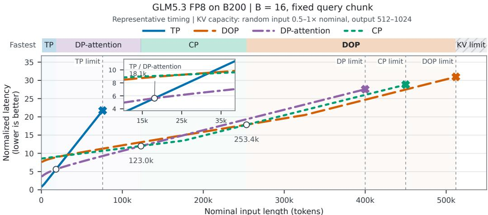  
KV limits: scenario assumptions. Latency: relative to TP at 1k; illustrative timing, not measurements.  
Figure 1: Conditional latency model for GLM-5.3 FP8 on B200 GPUs (B = 16, fixed query chunk), normalized to TP at 1k. Open circles mark changes in the fastest feasible layout; the inset enlarges the first. Crosses mark KV capacity limits, and hatched regions indicate where the KV cache exceeds the available capacity. § B gives the timing and capacity assumptions.

What stands in the way is state that cannot be rebuilt cheaply. Weights are read-only: a rank can view them differently, or receive them once, and be done. Live KV histories, by contrast, keep growing while the engine serves. Changing who owns a cache has to preserve every history, the order things were appended in, and the sequence of collectives that all ranks agree on. Engines therefore drain the batch and restart the workers, which satisfies all three but takes longest exactly when a switch pays off: the long requests that make it worthwhile are the slowest to drain.

Prior systems reconfigure parallelism online (Wu et al., 2024; Su et al., 2025; Gao et al., 2026a; Hidayetoglu et al., 2026; Chen et al., 2026; Wang et al., 2026; Zhao et al., 2026), but they either hold the batch while the change happens or cover one pair of strategies, and a switch is not free in any of them. Shift Parallelism (Hidayetoglu et al., 2026) is limited to tensor and sequence parallelism, whose caches share one head-sharded layout; MLA keeps one latent shared by all heads, so on DeepSeek-style models both layouts hold a whole copy of it on every rank and switching between them frees no cache. We present SPLASH, a serving system that makes attention layout a live choice inside one worker group, covering every switch among the layouts worth running and hiding the preparation behind ongoing inference.

Sharding the attention weights used to decide where the cache lived as well. TP shards along heads, and in multi-head attention the KV cache is indexed by heads too. Multi-query and grouped-query attention cut the number of KV heads to a handful, and MLA removed them, keeping one headshared latent history per token (Shazeer, 2019; Ainslie et al., 2023; DeepSeek-AI, 2024a;b). Where the attention weights are sharded and which rank owns a request’s KV history are now two independent choices, and a layout is one way of setting both over the same request state.

Two things follow. The first is, to our knowledge, a new layout. Once placement and ownership are separate decisions, the layouts engines run are three of their combinations, and each one keeps a redundant copy of something: TP shards the projections but, with few or no KV heads left to shard, leaves a whole history on every rank; DP-attention and CP divide the history, by request and by position respectively, and leave a whole copy of the projections. Sharding the projections, keeping each request’s history on one owner, and exchanging activations between them on every attention layer removes both copies; we call the result Decoupled Ownership Parallelism (DOP). It holds the largest cache of the four on a given group, the room decode needs once long contexts fill memory, as on accelerators with 64–192 GB per device.

The second is that a switch between any two of the four can be planned as a difference: what a rank already holds, set against what the destination needs. Moving from DP-attention to DOP, a rank keeps its KV and cuts DOP’s shards out of the full projections it already holds; moving from TP to DOP, it keeps one owner’s copy of each MLA history and retires the rest. Neither sends a byte over the network. The cost of a switch thus follows the state the destination lacks, not the size of the model or the cache. One account covers all $A _ { 4 } ^ { 2 } = 1 2$ directed switches, one per ordered pair of layouts, and three collectives supply every one of them: discard, all-gather, and all-to-all. SPLASH moves the missing state one layer at a time inside an ordinary serving step: layer i receives its new weights and KV while layer i − 1 computes. A transition-aware scheduler decides which layout to run and when a switch is worth making. In a rollout, the group runs DP-attention while the batch is wide and CP once only the long tail remains.

## Contributions.

• An ownership model that reduces TP, CP, DP-attention, and DOP to two choices, where the projections live and who owns the cache, and derives from them each layout’s per-rank footprint, its longest feasible context on a fixed group, the state each of the A2 directed switches retains, and the collective that supplies the rest: discard, all-gather, or all-to-all.

• Decoupled Ownership Parallelism, the zero-redundancy layout that the ownership model exposes: it stores every attention weight and every history once, pays a per-layer activation exchange that stays constant as contexts grow, and frees 12.69 GiB per GPU for KV over DP-attention on GLM-5.3 (B200 GPUs, FP8).

• SPLASH, a serving system that moves a running batch among all four layouts inside an ordinary serving step. On B200, one layer’s communication takes 0.29–0.30 ms for weights and 3.47–3.81 ms for KV at B = 16 and 256K tokens, while a complete switch adds 0.02– 11.76 ms end to end, against up to 667.31 ms when it blocks, because later layers’ transfers hide behind computation. Its transition-aware scheduler runs the fastest feasible layout and switches once another leads by a set margin, so the deployment follows the load.

## 2 AN OWNERSHIP MODEL OF ATTENTION LAYOUTS

This section makes the two-choice view of § 1 precise and derives from it each layout’s per-rank memory (§ 3) and the state a switch must supply (§ 4).

We consider T ranks serving one model whose dense and expert layers keep their parallelism while attention changes layout. A layout decides where the large attention projections live, sharded across the ranks or replicated on each, and which ranks hold each request’s KV history (Figure 2). Under MLA the two choices are independent: the latent cache has no head axis, so TP’s head-sharded projections leave a full copy of every history on every rank (red outline).

Footprint. Let $W _ { A }$ be the size of the projections that TP and DOP shard, k the KV bytes per context token over all cache-bearing layers $\bar { ( L ( d _ { c } + d _ { r } ) b }$ for absorbed MLA with latent width $d _ { c } ,$ rotary width $d _ { r } ,$ , and b bytes per element), and B the number of balanced requests with context s. Each rank holds

$$
\begin{array} { l l } { { M _ { \mathrm { T P } } ( s ) = W _ { A } / T + B k s , } } & { { M _ { \mathrm { D O P } } ( s ) = W _ { A } / T + B k s / T , } } \\ { { M _ { \mathrm { D P } } ( s ) = M _ { \mathrm { C P } } ( s ) = W _ { A } + B k s / T . } } & { { } } \end{array}\tag{1}
$$

Every existing layout stores one redundant copy: TP of each history, DP-attention and CP of the projections. DOP stores each projection and history once, so under a per-rank budget $M _ { \mathrm { a v a i l } }$ , it reaches the longest balanced context, $( T M _ { \mathrm { a v a i l } } - \dot { W _ { A } } ) / ( B k )$ , against $\dot { T } ( M _ { \mathrm { a v a i l } } - \dot { W _ { A } } ) / ( B k )$ for DP-attention and CP and $( M _ { \mathrm { a v a i l } } - W _ { A } / T ) / ( B k )$ for TP. Execution cost, by contrast, orders the layouts differently and shifts with context length (Figure 1; § B).

Switches. All four layouts hold the same weights and histories, so a switch between two panels of Figure 2 reduces to changing which blocks each rank holds. Let ${ \mathcal { K } } _ { r } ^ { a }$ and $\mathcal { P } _ { r , k } ^ { a }$ be the KV blocks and layer-k projection blocks that rank r holds in layout a. A switch to b keeps every block the two layouts share and supplies the difference

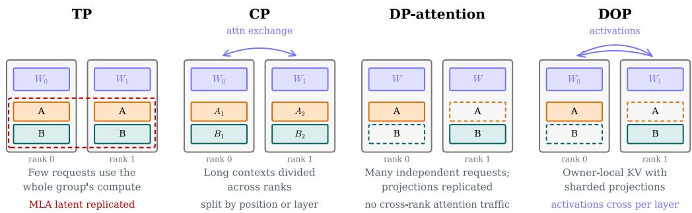  
Figure 2: Four attention layouts on two ranks serving requests A and B. Blue blocks are projections, orange and teal bars the KV of A and B, dashed blocks are absent from a rank, the red outline mark MLA’s history replicated under TP, and arrows mark attention’s cross-rank traffic.

$$
V _ { r } ^ { K } ( a \to b ) = \left| \mathcal { K } _ { r } ^ { b } \ \backslash \ \mathcal { K } _ { r } ^ { a } \right| _ { \mathrm { b y t e s } } ,\tag{2}
$$

$$
V _ { r , k } ^ { W } ( a \to b ) = \left| \mathcal { P } _ { r , k } ^ { b } \setminus \mathcal { P } _ { r , k } ^ { a } \right| _ { \mathrm { b y t e s } }\tag{3}
$$

to rank r. Three collectives supply every such difference (Figure 3, right). A rank discards when the destination needs a subset of its blocks: it keeps those and frees the rest in place, at zero network cost. It all-gathers blocks spread over the other ranks, and ranks exchange blocks all-to-all when state moves between request ownership and position sharding. Weights all-gather $( 1 - 1 / T )$ of each layer’s projections per rank when TP or DOP switches into replicated projections, a volume the model fixes, and are discarded in every other switch. KV all-gathers into TP, moves all-to-all between CP and the request-owned layouts, and is discarded in the remaining five switches; its volume grows linearly with the live context Bs.

## 3 DOP: SHARDED PROJECTIONS WITH REQUEST-OWNED KV

§ 2 leaves one combination with no redundant copy: projections sharded as in TP, and each request’s history on one owner as in DP-attention, chosen at admission from projected KV growth.

Computation. Sharded projections give each rank all N current query rows for its $H / T$ heads, $[ N , \bar { H } / T , d _ { q } ]$ , whereas attention at an owner needs its own $N _ { r }$ rows for all H heads, $[ \dot { N } _ { r } , H , d _ { q } ]$ DOP converts between the two with a variable-size all-to-all before attention and a reverse one after it, which returns head slices to the sharded value and output projections (arrows in Figure 2). Every head still attends over the complete history, so $\mathrm { D O P s }$ output matches TP’s up to floatingpoint reduction order. Unlike DeepSpeed-Ulysses (Jacobs et al., 2024), whose all-to-all regroups a sequence by head and therefore needs a cache split by head, DOP regroups rows by request and keeps each head-free MLA history whole on one owner.

Cost. With returned per-head width $d _ { z }$ , the two exchanges of one layer receive

$$
V _ { \mathrm { D O P } } = ( 1 - 1 / T ) N H ( d _ { q } + d _ { z } ) b\tag{4}
$$

bytes in aggregate, with $d _ { q } = d _ { c } + d _ { r }$ and $d _ { z } = d _ { c }$ for absorbed MLA. This volume tracks the step’s query rows, one per request in decode and the chunk in prefill, independent of context length.

Capacity. In return, DOP leaves $W _ { A } ( 1 - 1 / T )$ more bytes per rank for KV than DP-attention (Equation 1). For GLM-5.3 in FP8 at $T = 8 ,$ sharding the Q-B, KV-B, and O projections of all 78 layers frees 12.69 GiB per rank for KV (Table 3), memory DP-attention spends on replicas.

When DOP pays off. The returned memory raises throughput once it changes admission (§ 5.3), and the exchange of Equation 4 is its price, so DOP leads where contexts are long and batches are large while DP-attention leads over the middle of both axes (§ 5.2). DOP therefore complements DP-attention, and the two are cheap to switch between: DOP shares projection shards with TP and request owners with DP-attention, so a switch into DOP from either one is a pair of discards (Figure 3, right). A variant, DOP-P, caches some full projections on the owner, trading part of the returned memory for less exchange. The same design applies to MQA and GQA, where its gain depends on how much of the cache TP already splits.

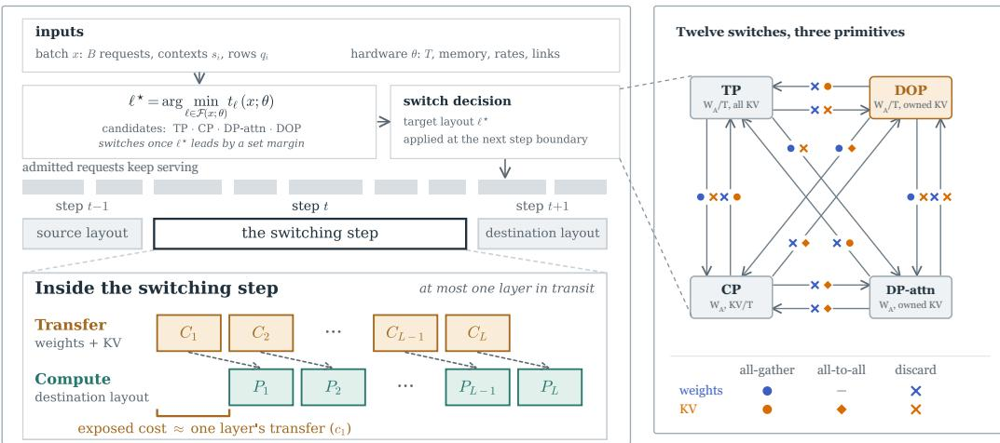  
Figure 3: SPLASH. Left: the scheduler runs the fastest feasible layout and switches once another leads by a set margin (§ 4.2). Admitted requests keep serving: layer $i \ ' s$ transfer $( C _ { i } )$ overlaps layer i − 1’s computation $( P _ { i - 1 } )$ , exposing about one layer’s transfer $( c _ { 1 } )$ with at most one layer in transit. Right: the $A _ { 4 } ^ { 2 } = 1 2$ directed switches; arrows show the primitives for weights (blue) and KV (orange). A discard keeps what the destination needs and frees the rest at zero network cost.

## 4 SPLASH: LIVE SWITCHING AMONG FOUR LAYOUTS

§ 2 fixes what each switch must supply; SPLASH supplies it while serving continues, moving the missing state one layer ahead of the computation (Figure 3), and § 4.2 decides when to switch.

## 4.1 SWITCHING WITHIN ONE STEP

1. Reuse. At the step boundary, each rank evaluates Equation 2 and Equation 3 into a manifest assigning each layer’s weights and KV one primitive (Figure 3, right): a discard keeps the blocks the destination needs, repacked into its view, and frees the rest, while an all-gather or all-to-all fetches the missing blocks. Reuse requires matching precision, quantization scales, and position convention.

2. Overlapped transfer. Layer 1’s missing state transfers first; then layer i’s collectives run on a separate stream while layer i−1 computes. When a switch enters replicated projections, the weights in flight are one layer’s projections: by the analytical count of § A, 145.73 MiB per rank for GLM-5.3 in FP8 at $T = { \dot { 8 } } ,$ , against 11.3 GiB for all 78 layers. Because the switch starts at a step boundary and each layer moves before it computes, every layer arrives as a complete, static snapshot.

3. Handoff. Layer i runs in the destination layout once its state arrives. As all ranks switch in one step, every layer’s collectives match across ranks. Requests keep their histories and workers keep running; every query reads its complete causal prefix, and indexer, position, and recurrent state move with the layer’s KV. Later steps replay the destination’s graphs, captured at startup.

4. Retire. A layer’s old pages and projection replicas are freed once its transfer completes. With at most one layer in transit and $\Delta _ { r } ^ { \mathrm { l a y e r } }$ its buffers, rank r therefore stays within

$$
\operatorname* { m a x } \{ M _ { r } ( a ) , M _ { r } ( b ) \} + \Delta _ { r } ^ { \mathrm { l a y e r } } + R _ { r } \leq H _ { r } ,\tag{5}
$$

where $M _ { r } ( a )$ and $M _ { r } ( b )$ are the source and destination footprints, $H _ { r }$ is device memory, and Rr a reserve. § G details the remaining costs.

## 4.2 TRANSITION-AWARE SCHEDULING

The scheduler is a function $\pi ( x ; \theta )$ . The hardware constants θ are the group size T, device memory $H _ { r } ,$ compute rate, weight-read, KV-read, and interconnect bandwidths, and fixed collective latency, calibrated once per deployment from microbenchmarks. The current batch x is the number of running requests $B ,$ each request’s live context $s _ { i }$ , and its query rows $q _ { i }$ in this step: the chunk length in prefill and one in decode. The output is one of the four layouts with its projection caching, CP storage, backend, and chunk size.

A candidate layout ℓ must fit in steady state,

$$
M _ { 0 , r } + W _ { r } ( \ell ) + K _ { r } ( \ell , x ) + A _ { r } ( \ell , x ) + R _ { r } \leq H _ { r } ,\tag{6}
$$

where $M _ { 0 }$ is common state, W the projection footprint, K the live KV projected from the current batch, and A scratch and graphs; the switch from the current layout must also satisfy Equation 5. The two constraints define the feasible set $\mathcal { F } ( x ; \theta )$

For each feasible $\ell ,$ the ownership model fixes its load on every rank: the projection footprint $W$ is the whole weights or a $1 / T$ shard, and KV, attention work, and KV reads each count $\bar { B , B / T }$ , or $\lceil B / T \rceil$ requests (Table 2). The stage-wise cost model of § B (Equation 10) turns these loads and θ into the per-step latency $t _ { \ell } ( x ; \theta )$ ; Figure 1 is its slice at $B = 1 6$ over context length.

A switch exposes the first layer’s transfer and any later transfer that outlasts the previous layer’s computation:

$$
\widehat { t } _ { \mathrm { e x p o s e d } } = \widehat { t } _ { \mathrm { x f e r , 1 } } + \sum _ { i = 2 } ^ { L } \left[ \widehat { t } _ { \mathrm { x f e r } , i } - \widehat { t } _ { \mathrm { c o m p } , i - 1 } \right] _ { + } .\tag{7}
$$

One layer’s communication costs 0.29–0.30 ms for weights and 3.47–3.81 ms for KV at $B = 1 6$ and 256K on B200 (§ 5.4); because later layers hide behind computation, a complete switch adds 0.02–11.76 ms end to end, under 0.51% of the step it runs in at the median (§ 5.5). Per-step latency alone therefore ranks the layouts, and the switch cost enters as a margin.

SPLASH picks

$$
\ell ^ { \star } = \arg \operatorname* { m i n } _ { \ell \in \mathcal { F } ( x ; \theta ) } t _ { \ell } ( x ; \theta ) ,\tag{8}
$$

and re-evaluates the choice as the batch evolves, replacing the current layout once $\ell ^ { \star }$ leads it by a set margin; the margin keeps the layout stable while the load hovers near a crossover.

Batch size and admission are inputs to π; choosing them jointly with the layout is future work.

## 5 EVALUATION

## 5.1 EXPERIMENTAL SETUP

Models and software. SPLASH is built atop SGLang 0.5.10. We compare TP, CP, DP-attention, and DOP using GLM-5.3 on B200, GLM-5.3-Flash on DCU, and DeepSeek-V3.2 on H200; the main text analyzes GLM-5.3 with 78 layers, FP8 weights, and FP8 KV. The DCU and H200 experiments appear in § H and § I, respectively.

Hardware and deployment. Each B200 deployment separates prefill and decode: eight GPUs on one node run prefill, and sixteen GPUs across two nodes run DP-attention decode. Prefill layouts share the same decode configuration. § C gives detailed deployment settings. The B200 switch studies use $B = 1 6$ and 256K context tokens per request.

## 5.2 FIXED-LAYOUT PERFORMANCE

Four B200 sweeps cover eight input lengths from 1K to 512K at $B = 1 6 , 3 2$ , and eight batch sizes B ∈ {1, 4, 8, 16, 32, 64, 128, 256} at 64K and 128K input. All four layouts run at every position, giving 128 measurements. B is both the request count and client concurrency; every request generates 1,024 tokens, and K denotes 1,024 tokens. Total throughput is $B ( L _ { \mathrm { i n } } { + } 1 , \bar { 0 } 2 4 ) / \dot { T } _ { \mathrm { b a t c h } }$ , including queueing, prefill, KV transfer, and decode. Each point is the mean of 10 runs (§ D).

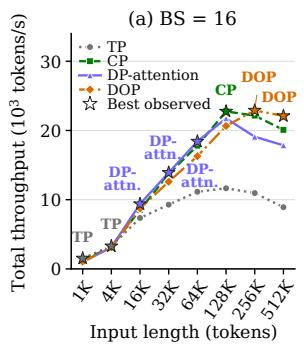

(b) BS = 32  
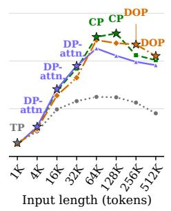

(c) Input = 64K  
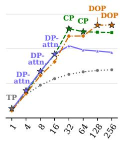  
Batch size / concurrency

(d) Input = 128K  
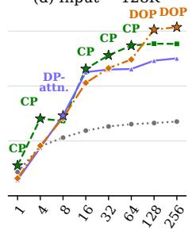  
Batch size / concurrency  
Figure 4: Fixed-layout GLM-5.3 performance on B200 with FP8 weights, common DP-attention decode, and 1K output tokens per request. (a, b) Input-length sweeps at B = 16, 32; (c, d) batchsize sweeps at 64K and 128K input. Sampled positions are equally spaced. Stars and labels mark the best recorded layout at each position.

Input length selects the layout. At B = 16, TP leads at 1K–4K, DP-attention at 16K–64K, CP at 128K, and DOP at 256K–512K (Figure 4a), the order the cost model of Figure 1 predicts; its last two crossovers, at 123.0k and 253.4k tokens, fall between the measured positions. At B = 32, TP leads at 1K, DP-attention at 4K–32K, CP at 64K–128K, and DOP at 256K–512K (Figure 4b). Across the four longest-input points, DOP reaches 21,059–23,470 tokens/s, 3.4–10.6% above CP, the runner-up.

Concurrency reorders the ranking. At 64K input, TP leads at B = 1, DP-attention at B = 4, 8, 16, CP at B = 32, 64, and DOP at B = 128, 256 (Figure 4c), so the batch sizes a rollout passes through as it drains from 256 requests to one span all four regimes. At 128K, CP leads at B = 1, 4, 16, 32, 64, DP-attention at B = 8, and DOP at B = 128, 256 (Figure 4d). Thus DOP first leads at B = 128 in both batch sweeps. Its advantage over the strongest alternative is 8.3–8.7% at 64K and 9.3–11.0% at 128K; at 128K/B = 256, it delivers 30,724 tokens/s versus CP’s 27,677.

DOP complements the other layouts. DOP leads at eight of the 32 sampled positions, while TP, DP-attention, and CP remain faster elsewhere. For example, at 128K and B = 1, 4, DOP trails CP by 42.2% and 35.1%. At B = 32, DOP’s throughput falls 3.7% from 64K to 256K, to 23,470 tokens/s, while CP’s falls 15.3%, so DOP takes the lead. These fixed-layout comparisons motivate workload-aware selection.

## 5.3 KV CAPACITY AND REQUEST ADMISSION

On B200 GPUs at memory fraction 0.85, DOP holds 8,271,360 distinct KV tokens, versus 6,497,792 for DP-attention and 6,738,944 for CP: 27.3% and 22.7% more, respectively (Table 3). TP’s replicated pools hold 1,045,312 distinct tokens. On H200 at memory fraction 0.90, DOP holds 59.7% more distinct tokens than DP-attention. On DCU with GLM-5.3-Flash, DOP retains the 19.0% larger per-owner KV pool (1,118,656 versus 940,224 tokens; Table 3).

Capacity helps when it changes admission. In the B200 experiment with GLM-5.3 at a 512K context length, DOP keeps 16 requests resident rather than 12 for DP-attention. The scheduler must weigh extra capacity against its recurring activation exchange.

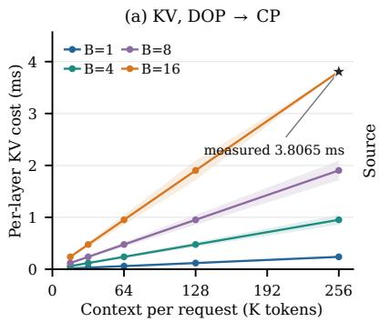

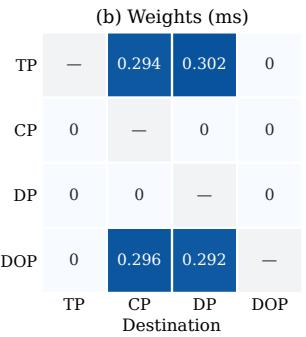

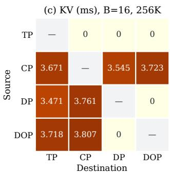  
Figure 5: Per-layer network cost of the switch primitives on B200. (a) KV cost of DOP→CP versus context, scaled linearly in Bs from the measured point (star); bands show approximately ±10% observed variation across 20 runs per case. (b) Weight cost of the twelve switches; rows are sources, columns destinations, and 0 marks no network transfer. (c) KV cost at B = 16 and 256K. DP denotes DP-attention.

Table 1: All twelve directed switches on B200 (B = 16, 256K context tokens per request). Times are milliseconds: T is the measured execution-time p50; ∆T is p50(p95) overhead over target-ready (Ready). Block. is blocking; DP is DP-attention.
<table><tr><td>Direction</td><td colspan="2">T, p50</td><td colspan="2">∆T, p50(p95)</td><td></td><td colspan="2">T, p50</td><td colspan="2">∆T, p50(p95)</td></tr><tr><td></td><td>Ready</td><td>Block. SPLASH</td><td>Block.</td><td>SPLASH</td><td>Direction</td><td>Ready</td><td>Block. SPLASH</td><td>Block.</td><td>SPLASH</td></tr><tr><td>TP →CP</td><td>2239.33 2299.43</td><td>2240.16</td><td>60.10(113.03)</td><td>0.83(1.43)</td><td>DP→TP</td><td>5404.63 6009.10</td><td>5412.74 604.47(1030.55)</td><td></td><td>8.10(13.50)</td></tr><tr><td>TP →DP</td><td>2452.25 2510.73</td><td>2453.10</td><td>58.48(108.61)</td><td>0.85(1.47)</td><td>DP→CP</td><td>2244.30 2855.93</td><td>2252.44 611.63(1035.20)</td><td></td><td>8.14(14.13)</td></tr><tr><td>TP→DOP</td><td>2011.172011.20</td><td>2011.19</td><td>0.03(0.07)</td><td>0.02(0.07)</td><td>DP→DOP</td><td>1964.621964.64</td><td>1964.64</td><td>0.02(0.10)</td><td>0.02(0.08)</td></tr><tr><td>CP→TP</td><td>5526.086132.625533.86606.53(1045.79)7.78(13.67)</td><td></td><td></td><td></td><td>DOP→TP</td><td>5432.566053.795442.33621.23(1042.87)</td><td></td><td></td><td>9.77(13.97)</td></tr><tr><td>CP→DP</td><td>2461.12 3096.172469.01635.05(1030.55)7.89(13.29)</td><td></td><td></td><td></td><td></td><td>DOP → CP 2346.75 3014.062358.50 667.31(1298.42)</td><td></td><td></td><td>11.76(16.79)</td></tr><tr><td>CP →DOP</td><td>2034.722664.642042.40629.92(1031.19)7.69(13.53)</td><td></td><td></td><td></td><td></td><td>DOP →DP 2450.66 2511.54 2451.43</td><td></td><td>60.89(107.41)</td><td>0.78(1.39)</td></tr></table>

## 5.4 SWITCH PRIMITIVE COSTS

Every switch runs one discard, all-gather, or all-to-all per state and layer (Figure 3, right), so we time these primitives one layer at a time on B200 with inference paused. A discard has zero network cost; Figure 5 reports the two collectives.

Weights cost a fixed amount. The four weight all-gathers, from TP or DOP into DP-attention or CP, each move $( 1 - 1 / T )$ of one layer’s projections per rank and take 0.292–0.302 ms per layer (Figure 5b). Their payload is independent of batch size and retained context.

KV cost scales with context. The seven KV all-gathers and all-to-alls take 3.471–3.807 ms per layer at B = 16 and 256K tokens per request (Figure 5c). Scaling linearly in Bs, the measured 3.8065 ms of DOP→ CP gives an estimated 0.238 ms at 16K for the same batch (Figure 5a).

## 5.5 LIVE SWITCHING OVERHEAD

We compare blocking, SPLASH, and a target-ready reference on B200 (Table 1). Blocking prepares all missing state before destination execution; SPLASH overlaps preparation with computation; target-ready starts with resident destination state. We report the measured times T and overheads ∆T over target-ready; § F gives the timing protocol.

Exposed overhead. Across all twelve directions, SPLASH adds 0.02–11.76 ms at p50 and 0.07– 16.79 ms at p95. Its median overhead stays below 0.51% of the corresponding target-ready median, whose latency ranges from 1.96 to 5.53 s. That latency is one prefill step of the destination layout, ordered as in Figure 4a at 256K; under chunked prefill a 256K prompt spans 16–128 such steps, so against time to first token the overhead is smaller still. For the ten directions requiring network transfers, SPLASH reduces median switching overhead by 98.24–98.78% relative to blocking. Each overhead is close to one layer’s share of the blocking cost: CP→TP adds 7.78 ms against 606.53 ms for all 78 layers, so the transfers of the other layers hide behind computation.

The missing state determines the remaining cost. Weight-only switches add 0.78–0.85 ms at the median, while KV-only switches add 7.69–9.77 ms. DOP→ CP transfers both weights and KV and has the largest overhead: 11.76 ms at p50 and 16.79 ms at p95, compared with 667.31 and 1,298.42 ms for blocking. TP→DOP and DP-attention→DOP reuse resident state and add 0.02 ms at the median, and 0.03 and 0.02 ms when blocking, respectively. The three switches into TP are measured for their overhead; SPLASH rejects any switch that would overflow the destination’s memory, as a switch into TP would at this size (Equation 6), and appendix Table 3 lists the KV capacity each layout supports. These costs support a small, direction-dependent switching margin for this workload.

## 6 RELATED WORK

Live parallelism reconfiguration. LoongServe changes sequence parallelism for long-context serving (Wu et al., 2024). Flying Serving switches DP and TP with reusable weight views and a KV adaptor, and Shift Parallelism alternates TP and sequence parallelism over compatible KV layouts (Gao et al., 2026a; Hidayetoglu et al., 2026). Moebius reconfigures TP/EP for MoE serving, and ReMP and PipeLive reconfigure model and pipeline parallelism at runtime (Wang et al., 2026; Yuan et al., 2026a; Bai et al., 2026). Their switch cost depends on which state source and target share, reaching a few hundred milliseconds for Moebius and seconds for ReMP. SPLASH makes this dependence explicit for attention inside a fixed worker group: it separates weight and KV placement, adds DOP, and prices the missing state of each switch as discards, all-gathers, and all-to-alls.

Parallel attention and serving schedules. Megatron-LM established tensor-parallel projections (Shoeybi et al., 2019; Narayanan et al., 2021); Ring Attention, Ulysses, and inference CP distribute within-context work (Liu et al., 2024a; Jacobs et al., 2024; Yang et al., 2025), and SGLang provides DP-attention and several CP storage paths (Zheng et al., 2024; SGLang Team, 2024; SGLang Project, 2026; Z.ai, 2026). Pope et al. (2023) shard multiquery attention over the batch on TPUs to avoid replicating its KV head; DOP removes the projection replicas that DP-attention keeps for absorbed MLA. Orca and Sarathi-Serve schedule iterations and prefill/decode batches (Yu et al., 2022; Agrawal et al., 2024); SPLASH chooses the attention layout beneath such schedules.

Cache representation and disaggregation. MQA, GQA, and MLA shrink stored state (Shazeer, 2019; Ainslie et al., 2023; DeepSeek-AI, 2024a;b); PagedAttention, quantization, and eviction manage what remains (Kwon et al., 2023; Liu et al., 2024b; Zhang et al., 2023), and FlashAttention and FlashInfer speed up the kernels (Dao et al., 2022; Ye et al., 2025). These change SPLASH’s profiles, not its placement decision; sparse and hybrid attention add indexer or recurrent state, which the handoff moves with each layer’s KV (Yuan et al., 2025; DeepSeek-AI, 2025; Zhang et al., 2025). DistServe, Splitwise, and Mooncake separate prefill from decode and organize serving around KV transport (Zhong et al., 2024; Patel et al., 2024; Qin et al., 2025); SPLASH gives each phase its own layout, and its switches share bandwidth with prefill-to-decode KV transfer.

## 7 DISCUSSION AND CONCLUSION

Attention layout is a choice that can change within a request’s lifetime. Viewing a layout as two ownership decisions, where the projections live and who owns each request’s history, reduces every one of the twelve switches to discards, all-gathers, and all-to-alls, and exposes DOP, which stores each projection and each history once. The evaluation confirms both consequences. On B200 GPUs serving GLM-5.3, each of the four layouts leads a regime of context length and concurrency, and following the best one improves end-to-end throughput by 1.3–1.73× over fixed-layout deployments; DOP leads at 256K–512K and at the largest batches, by 3.4–11.0% over the strongest alternative, and holds 27.3% more KV than DP-attention. The same regimes appear on H200 and DCU. Moving between regimes is cheap: one layer’s communication takes 0.29–0.30 ms for weights and 3.47– 3.81 ms for KV at B = 16 and 256K, and because later layers hide behind computation, a complete switch adds 0.02–11.76 ms end to end, 98.24–98.78% less than a blocking switch wherever state crosses the network. Workloads whose batches narrow from many short requests to a few long ones, such as RL rollout, can therefore let the layout follow the batch, and choosing batch size and admission jointly with the layout is the natural next step. § G details the remaining costs.

## AI USE STATEMENT

LLM-based tools assisted with coding, experiments and writing. The authors reviewed all AIassisted work and take full responsibility for the content of this paper.

## REFERENCES

Amey Agrawal, Nitin Kedia, Ashish Panwar, Jayashree Mohan, Nipun Kwatra, Bhargav S. Gulavani, Alexey Tumanov, and Ramachandran Ramjee. Taming throughput-latency tradeoff in LLM inference with sarathi-serve. In Ada Gavrilovska and Douglas B. Terry (eds.), 18th USENIX Symposium on Operating Systems Design and Implementation, OSDI 2024, Santa Clara, CA, USA, July 10-12, 2024, pp. 117–134. USENIX Association, 2024. URL https://www.usenix.o rg/conference/osdi24/presentation/agrawal.

Joshua Ainslie, James Lee-Thorp, Michiel de Jong, Yury Zemlyanskiy, Federico Lebrón, and Sumit Sanghai. GQA: training generalized multi-query transformer models from multi-head checkpoints. In Houda Bouamor, Juan Pino, and Kalika Bali (eds.), Proceedings of the 2023 Conference on Empirical Methods in Natural Language Processing, EMNLP 2023, Singapore, December 6-10, 2023, pp. 4895–4901. Association for Computational Linguistics, 2023. doi: 10.18653/V1/2023.EMNLP-MAIN.298. URL https://doi.org/10.18653/v1/ 2023.emnlp-main.298.

Xu Bai, Muhammed Tawfiqul Islam, Chen Wang, and Adel Nadjaran Toosi. Pipelive: Efficient live in-place pipeline parallelism reconfiguration for dynamic LLM serving. CoRR, abs/2604.12171, 2026. doi: 10.48550/ARXIV.2604.12171. URL https://doi.org/10.48550/arXiv.2 604.12171.

Haoyu Chen, Xue Li, Kun Qian, Yu Guan, Jin Zhao, and Xin Wang. Amoeba: Runtime tensor parallel transformation for llm inference services. 2026. doi: 10.48550/ARXIV.2509.19729. URL https://doi.org/10.48550/arXiv.2509.19729.

Tri Dao, Daniel Y. Fu, Stefano Ermon, Atri Rudra, and Christopher Ré. Flashattention: Fast and memory-efficient exact attention with io-awareness. In Sanmi Koyejo, S. Mohamed, A. Agarwal, Danielle Belgrave, K. Cho, and A. Oh (eds.), Advances in Neural Information Processing Systems 35: Annual Conference on Neural Information Processing Systems 2022, NeurIPS 2022, New Orleans, LA, USA, November 28 - December 9, 2022, 2022. URL http://papers.nips. cc/paper\_files/paper/2022/hash/67d57c32e20fd0a7a302cb81d36e40d 5-Abstract-Conference.html.

DeepSeek-AI. Deepseek-v2: A strong, economical, and efficient mixture-of-experts language model. CoRR, abs/2405.04434, 2024a. doi: 10.48550/ARXIV.2405.04434. URL https: //doi.org/10.48550/arXiv.2405.04434.

DeepSeek-AI. Deepseek-v3 technical report. CoRR, abs/2412.19437, 2024b. doi: 10.48550/ARX IV.2412.19437. URL https://doi.org/10.48550/arXiv.2412.19437.

DeepSeek-AI. DeepSeek-V3/R1 inference system overview. Open Infra Index, https://github .com/deepseek-ai/open-infra-index/blob/main/202502OpenSourceWee k/day\_6\_one\_more\_thing\_deepseekV3R1\_inference\_system\_overview.md, 2025. DeepSeek Open Source Week, Day 6.

DeepSeek-AI. Deepseek-v3.2: Pushing the frontier of open large language models. CoRR, abs/2512.02556, 2025. doi: 10.48550/ARXIV.2512.02556. URL https://doi.org/ 10.48550/arXiv.2512.02556.

Shouwei Gao, Junqi Yin, Feiyi Wang, and Wenqian Dong. FLYING SERVING: on-the-fly parallelism switching for large language model serving. In Proceedings of the 40th ACM International Conference on Supercomputing, ICS 2026, Belfast, United Kingdom, July 6-9, 2026, pp. 17–29. ACM, 2026a. doi: 10.1145/3797905.3800525. URL https://doi.org/10.1145/3797 905.3800525.

Wei Gao, Yuheng Zhao, Dakai An, Tianyuan Wu, Lunxi Cao, Shaopan Xiong, Ju Huang, Weixun Wang, Siran Yang, Wenbo Su, Jiamang Wang, Lin Qu, Bo Zheng, and Wei Wang. Rollpacker: Taming long-tail rollouts for RL post-training with tail batching. In Srikanth Kandula and Hakim Weatherspoon (eds.), 23rd USENIX Symposium on Networked Systems Design and Implementation, NSDI 2026, Renton, WA, May 4-6, 2026, pp. 849–866. USENIX Association, 2026b. URL https://www.usenix.org/conference/nsdi26/presentation/gao-wei.

Daya Guo, Dejian Yang, Haowei Zhang, Junxiao Song, Peiyi Wang, Qihao Zhu, Runxin Xu, Ruoyu Zhang, Shirong Ma, Xiao Bi, Xiaokang Zhang, Xingkai Yu, Yu Wu, Z. F. Wu, Zhibin Gou, Zhihong Shao, Zhuoshu Li, Ziyi Gao, Aixin Liu, Bing Xue, Bingxuan Wang, Bochao Wu, Bei Feng, Chengda Lu, Chenggang Zhao, Chengqi Deng, Chong Ruan, Damai Dai, Deli Chen, Dongjie Ji, Erhang Li, Fangyun Lin, Fucong Dai, Fuli Luo, Guangbo Hao, Guanting Chen, Guowei Li, Hao Zhang, Hanwei Xu, Honghui Ding, Huazuo Gao, Hui Qu, Hui Li, Jianzhong Guo, Jiashi Li, Jingchang Chen, Jingyang Yuan, Jinhao Tu, Junjie Qiu, Junlong Li, J. L. Cai, Jiaqi Ni, Jian Liang, Jin Chen, Kai Dong, Kai Hu, Kaichao You, Kaige Gao, Kang Guan, Kexin Huang, Kuai Yu, Lean Wang, Lecong Zhang, Liang Zhao, Litong Wang, Liyue Zhang, Lei Xu, Leyi Xia, Mingchuan Zhang, Minghua Zhang, Minghui Tang, Mingxu Zhou, Meng Li, Miaojun Wang, Mingming Li, Ning Tian, Panpan Huang, Peng Zhang, Qiancheng Wang, Qinyu Chen, Qiushi Du, Ruiqi Ge, Ruisong Zhang, Ruizhe Pan, Runji Wang, R. J. Chen, R. L. Jin, Ruyi Chen, Shanghao Lu, Shangyan Zhou, Shanhuang Chen, Shengfeng Ye, Shiyu Wang, Shuiping Yu, Shunfeng Zhou, Shuting Pan, S. S. Li, Shuang Zhou, Shaoqing Wu, Tao Yun, Tian Pei, Tianyu Sun, Tao Wang, Wangding Zeng, Wen Liu, Wenfeng Liang, Wenjun Gao, Wenqin Yu, Wentao Zhang, W. L. Xiao, Wei An, Xiaodong Liu, Xiaohan Wang, Xiaokang Chen, Xiaotao Nie, Xin Cheng, Xin Liu, Xin Xie, Xingchao Liu, Xinyu Yang, Xinyuan Li, Xuecheng Su, Xuheng Lin, X. Q. Li, Xiangyue Jin, Xiaojin Shen, Xiaosha Chen, Xiaowen Sun, Xiaoxiang Wang, Xinnan Song, Xinyi Zhou, Xianzu Wang, Xinxia Shan, Y. K. Li, Y. Q. Wang, Y. X. Wei, Yang Zhang, Yanhong Xu, Yao Li, Yao Zhao, Yaofeng Sun, Yaohui Wang, Yi Yu, Yichao Zhang, Yifan Shi, Yiliang Xiong, Ying He, Yishi Piao, Yisong Wang, Yixuan Tan, Yiyang Ma, Yiyuan Liu, Yongqiang Guo, Yuan Ou, Yuduan Wang, Yue Gong, Yuheng Zou, Yujia He, Yunfan Xiong, Yuxiang Luo, Yuxiang You, Yuxuan Liu, Yuyang Zhou, Y. X. Zhu, Yanping Huang, Yaohui Li, Yi Zheng, Yuchen Zhu, Yunxian Ma, Ying Tang, Yukun Zha, Yuting Yan, Z. Z. Ren, Zehui Ren, Zhangli Sha, Zhe Fu, Zhean Xu, Zhenda Xie, Zhengyan Zhang, Zhewen Hao, Zhicheng Ma, Zhigang Yan, Zhiyu Wu, Zihui Gu, Zijia Zhu, Zijun Liu, Zilin Li, Ziwei Xie, Ziyang Song, Zizheng Pan, Zhen Huang, Zhipeng Xu, Zhongyu Zhang, and Zhen Zhang. Deepseek-r1 incentivizes reasoning in llms through reinforcement learning. Nat., 645(8081):633–638, 2025. doi: 10.1038/S41586-025-09422-Z. URL https://doi.org/10.1038/s41586-025-09422-z.

Mert Hidayetoglu, Aurick Qiao, Michael Wyatt, Jeff Rasley, Yuxiong He, and Samyam Rajbhandari. Shift parallelism: Low-latency, high-throughput LLM inference for dynamic workloads. In Benjamin C. Lee, Harry Xu, Mark Silberstein, and Bingyao Li (eds.), Proceedings of the 31st ACM International Conference on Architectural Support for Programming Languages and Operating Systems, Volume 2, ASPLOS 2026, Pittsburgh, PA, USA, March 22-26, 2026, pp. 1749–1763. ACM, 2026. doi: 10.1145/3779212.3790219. URL https://doi.org/10.1145/377921 2.3790219.

Sam Ade Jacobs, Masahiro Tanaka, Chengming Zhang, Minjia Zhang, Reza Yazdani Aminadabi, Shuaiwen Leon Song, Samyam Rajbhandari, and Yuxiong He. System optimizations for enabling training of extreme long sequence transformer models. In Ran Gelles, Dennis Olivetti, and Petr Kuznetsov (eds.), Proceedings ofthe 43rd ACM Symposium on Principles ofDistributed Computing, PODC 2024, Nantes, France, June 17-21, 2024, pp. 121–130. ACM, 2024. doi: 10.1145/3662158.3662806. URL https://doi.org/10.1145/3662158.3662806.

Woosuk Kwon, Zhuohan Li, Siyuan Zhuang, Ying Sheng, Lianmin Zheng, Cody Hao Yu, Joseph Gonzalez, Hao Zhang, and Ion Stoica. Efficient memory management for large language model

serving with pagedattention. In Jason Flinn, Margo I. Seltzer, Peter Druschel, Antoine Kaufmann, and Jonathan Mace (eds.), Proceedings of the 29th Symposium on Operating Systems Principles, SOSP 2023, Koblenz, Germany, October 23-26, 2023, pp. 611–626. ACM, 2023. doi: 10.1145/ 3600006.3613165. URL https://doi.org/10.1145/3600006.3613165.

Hao Liu, Matei Zaharia, and Pieter Abbeel. Ringattention with blockwise transformers for nearinfinite context. In The Twelfth International Conference on Learning Representations, ICLR 2024, Vienna, Austria, May 7-11, 2024. OpenReview.net, 2024a. URL https://openrevi ew.net/forum?id=WsRHpHH4s0.

Zirui Liu, Jiayi Yuan, Hongye Jin, Shaochen (Henry) Zhong, Zhaozhuo Xu, Vladimir Braverman, Beidi Chen, and Xia Hu. KIVI: A tuning-free asymmetric 2bit quantization for KV cache. In Ruslan Salakhutdinov, Zico Kolter, Katherine A. Heller, Adrian Weller, Nuria Oliver, Jonathan Scarlett, and Felix Berkenkamp (eds.), Forty-first International Conference on Machine Learning, ICML 2024, Vienna, Austria, July 21-27, 2024, volume 235 of Proceedings ofMachine Learning Research, pp. 32332–32344. PMLR / OpenReview.net, 2024b. URL https://proceeding s.mlr.press/v235/liu24bz.html.

Michael Luo, Xiaoxiang Shi, Colin Cai, Tianjun Zhang, Justin Wong, Yichuan Wang, Chi Wang, Yanping Huang, Zhifeng Chen, Joseph E. Gonzalez, and Ion Stoica. Agentix: An efficient serving engine for LLM agents as general programs. In Srikanth Kandula and Hakim Weatherspoon (eds.), 23rd USENIX Symposium on Networked Systems Design and Implementation, NSDI 2026, Renton, WA, May 4-6, 2026, pp. 2443–2459. USENIX Association, 2026. URL https://ww w.usenix.org/conference/nsdi26/presentation/luo.

Deepak Narayanan, Mohammad Shoeybi, Jared Casper, Patrick LeGresley, Mostofa Patwary, Vijay Korthikanti, Dmitri Vainbrand, Prethvi Kashinkunti, Julie Bernauer, Bryan Catanzaro, Amar Phanishayee, and Matei Zaharia. Efficient large-scale language model training on GPU clusters using megatron-lm. In Bronis R. de Supinski, Mary W. Hall, and Todd Gamblin (eds.), International Conference for High Performance Computing, Networking, Storage and Analysis, SC 2021, St. Louis, Missouri, USA, November 14-19, 2021, pp. 58. ACM, 2021. doi: 10.1145/3458817.3476209. URL https://doi.org/10.1145/3458817.3476209.

Pratyush Patel, Esha Choukse, Chaojie Zhang, Aashaka Shah, Íñigo Goiri, Saeed Maleki, and Ricardo Bianchini. Splitwise: Efficient generative LLM inference using phase splitting. In 51st ACM/IEEE Annual International Symposium on Computer Architecture, ISCA 2024, Buenos Aires, Argentina, June 29 - July 3, 2024, pp. 118–132. IEEE, 2024. doi: 10.1109/ISCA5907 7.2024.00019. URL https://doi.org/10.1109/ISCA59077.2024.00019.

Reiner Pope, Sholto Douglas, Aakanksha Chowdhery, Jacob Devlin, James Bradbury, Jonathan Heek, Kefan Xiao, Shivani Agrawal, and Jeff Dean. Efficiently scaling transformer inference. In Dawn Song, Michael Carbin, and Tianqi Chen (eds.), Proceedings of the Sixth Conference on Machine Learning and Systems, MLSys 2023, Miami, FL, USA, June 4-8, 2023. mlsys.org, 2023. URL https://proceedings.mlsys.org/paper\_files/paper/2023/hash/c4 be71ab8d24cdfb45e3d06dbfca2780-Abstract-mlsys2023.html.

Ruoyu Qin, Zheming Li, Weiran He, Jialei Cui, Feng Ren, Mingxing Zhang, Yongwei Wu, Weimin Zheng, and Xinran Xu. Mooncake: Trading more storage for less computation - A kvcache-centric architecture for serving LLM chatbot. In Haryadi S. Gunawi and Vasily Tarasov (eds.), 23rd USENIX Conference on File and Storage Technologies, FAST 2025, Santa Clara, CA, February 25-27, 2025, pp. 155–170. USENIX Association, 2025. URL https://www.usenix.org /conference/fast25/presentation/qin.

Ruoyu Qin, Weiran He, Weixiao Huang, Yangkun Zhang, Yikai Zhao, Bo Pang, Xinran Xu, Yingdi Shan, Yongwei Wu, and Mingxing Zhang. Seer: Online context learning for fast synchronous LLM reinforcement learning. In 20th USENIX Symposium on Operating Systems Design and Implementation (OSDI 26), pp. 883–901, Seattle, WA, July 2026. USENIX Association. ISBN 978-1-939133-55-7. URL https://www.usenix.org/conference/osdi26/prese ntation/qin.

SGLang Project. [Roadmap] Context Parallelism (2026 Q3). GitHub issue #21788, https://gi thub.com/sgl-project/sglang/issues/21788, 2026. Accessed September 2026.

SGLang Team. SGLang v0.4: Zero-overhead batch scheduler, cache-aware load balancer, faster structured outputs. LMSYS Org Blog, https://www.lmsys.org/blog/2024-12-0 4-sglang-v0-4/, 2024. Introduces data-parallel attention for DeepSeek models.

Noam Shazeer. Fast transformer decoding: One write-head is all you need. CoRR, abs/1911.02150, 2019. URL http://arxiv.org/abs/1911.02150.

Mohammad Shoeybi, Mostofa Patwary, Raul Puri, Patrick LeGresley, Jared Casper, and Bryan Catanzaro. Megatron-lm: Training multi-billion parameter language models using model parallelism. CoRR, abs/1909.08053, 2019. URL http://arxiv.org/abs/1909.08053.

Qidong Su, Wei Zhao, Xin Li, Muralidhar Andoorveedu, Chenhao Jiang, Zhanda Zhu, Kevin Song, Christina Giannoula, and Gennady Pekhimenko. Seesaw: High-throughput LLM inference via model re-sharding. In Matei Zaharia, Gauri Joshi, and Yingyan (Celine) Lin (eds.), Proceedings ofthe Eighth Conference on Machine Learning and Systems, MLSys 2025, Santa Clara, CA, USA, May 12-15, 2025. OpenReview.net/mlsys.org, 2025. URL https://openreview.net/f orum?id=YDksTjY3YY.

Kimi Team. Kimi k1.5: Scaling reinforcement learning with llms. CoRR, abs/2501.12599, 2025. doi: 10.48550/ARXIV.2501.12599. URL https://doi.org/10.48550/arXiv.2501. 12599.

Shaoyu Wang, Yizhuo Liang, Jaeyong Song, Chong Li, and Seo Jin Park. Moebius: Serving mixtureof-expert models with seamless runtime parallelism switch. CoRR, abs/2606.26607, 2026. doi: 10.48550/ARXIV.2606.26607. URL https://doi.org/10.48550/arXiv.2606.26 607.

Bingyang Wu, Shengyu Liu, Yinmin Zhong, Peng Sun, Xuanzhe Liu, and Xin Jin. Loongserve: Efficiently serving long-context large language models with elastic sequence parallelism. In Emmett Witchel, Christopher J. Rossbach, Andrea C. Arpaci-Dusseau, and Kimberly Keeton (eds.), Proceedings of the ACM SIGOPS 30th Symposium on Operating Systems Principles, SOSP 2024, Austin, TX, USA, November 4-6, 2024, pp. 640–654. ACM, 2024. doi: 10.1145/3694715.3695948. URL https://doi.org/10.1145/3694715.3695948.

Amy Yang, Jingyi Yang, Aya Ibrahim, Xinfeng Xie, Bangsheng Tang, Grigory Sizov, Jongsoo Park, and Jianyu Huang. Context parallelism for scalable million-token inference. In Matei Zaharia, Gauri Joshi, and Yingyan (Celine) Lin (eds.), Proceedings of the Eighth Conference on Machine Learning and Systems, MLSys 2025, Santa Clara, CA, USA, May 12-15, 2025. OpenReview.net/mlsys.org, 2025. URL https://openreview.net/forum?id=Vmf09yVJhT.

Zihao Ye, Lequn Chen, Ruihang Lai, Wuwei Lin, Yineng Zhang, Stephanie Wang, Tianqi Chen, Baris Kasikci, Vinod Grover, Arvind Krishnamurthy, and Luis Ceze. Flashinfer: Efficient and customizable attention engine for LLM inference serving. In Matei Zaharia, Gauri Joshi, and Yingyan (Celine) Lin (eds.), Proceedings of the Eighth Conference on Machine Learning and Systems, MLSys 2025, Santa Clara, CA, USA, May 12-15, 2025. OpenReview.net/mlsys.org, 2025. URL https://openreview.net/forum?id=RXPofAsL8F.

Gyeong-In Yu, Joo Seong Jeong, Geon-Woo Kim, Soojeong Kim, and Byung-Gon Chun. Orca: A distributed serving system for transformer-based generative models. In Marcos K. Aguilera and Hakim Weatherspoon (eds.), 16th USENIX Symposium on Operating Systems Design and Implementation, OSDI 2022, Carlsbad, CA, USA, July 11-13, 2022, pp. 521–538. USENIX Association, 2022. URL https://www.usenix.org/conference/osdi22/present ation/yu.

Haipeng Yuan, Kaining Zheng, Yongshu Bai, Yuchen Zhang, Yunquan Zhang, Baodong Wu, Xiang Gao, and Daning Cheng. Remp: Low-downtime runtime model-parallelism reconfiguration for LLM serving. CoRR, abs/2606.18741, 2026a. doi: 10.48550/ARXIV.2606.18741. URL https://doi.org/10.48550/arXiv.2606.18741.

Jingyang Yuan, Huazuo Gao, Damai Dai, Junyu Luo, Liang Zhao, Zhengyan Zhang, Zhenda Xie, Yuxing Wei, Lean Wang, Zhiping Xiao, Yuqing Wang, Chong Ruan, Ming Zhang, Wenfeng Liang, and Wangding Zeng. Native sparse attention: Hardware-aligned and natively trainable

sparse attention. In Wanxiang Che, Joyce Nabende, Ekaterina Shutova, and Mohammad Taher Pilehvar (eds.), Proceedings of the 63rd Annual Meeting of the Association for Computational Linguistics (Volume 1: Long Papers), ACL 2025, Vienna, Austria, July 27 - August 1, 2025, pp. 23078–23097. Association for Computational Linguistics, 2025. doi: 10.18653/V1/2025.ACL-L ONG.1126. URL https://doi.org/10.18653/v1/2025.acl-long.1126.

Yichao Yuan, Ankita Nayak, Souvik Kundu, and Nishil Talati. Agentic AI workload characteristics. CoRR, abs/2605.26297, 2026b. doi: 10.48550/ARXIV.2605.26297. URL https://doi.or g/10.48550/arXiv.2605.26297.

Z.ai. Scaling pain of coding agent serving: Lessons from debugging GLM-5 at scale. https://z. ai/blog/scaling-pain, 2026. Describes LayerSplit, a layer-wise KV-cache partitioning scheme for prefill context parallelism in SGLang.

Yu Zhang, Zongyu Lin, Xingcheng Yao, Jiaxi Hu, Fanqing Meng, Chengyin Liu, Xin Men, Songlin Yang, Zhiyuan Li, Wentao Li, Enzhe Lu, Weizhou Liu, Yanru Chen, Weixin Xu, Longhui Yu, Yejie Wang, Yu Fan, Longguang Zhong, Enming Yuan, Dehao Zhang, Yizhi Zhang, T. Y. Liu, Haiming Wang, Shengjun Fang, Weiran He, Shaowei Liu, Yiwei Li, Jianlin Su, Jiezhong Qiu, Bo Pang, Junjie Yan, Zhejun Jiang, Weixiao Huang, Bohong Yin, Jiacheng You, Chu Wei, Zhengtao Wang, Chao Hong, Yutian Chen, Guanduo Chen, Yucheng Wang, Huabin Zheng, Feng Wang, Yibo Liu, Mengnan Dong, Zheng Zhang, Siyuan Pan, Wenhao Wu, Yuhao Wu, Longyu Guan, Jiawen Tao, Guohong Fu, Xinran Xu, Yuzhi Wang, Guokun Lai, Yuxin Wu, Xinyu Zhou, Zhilin Yang, and Yulun Du. Kimi linear: An expressive, efficient attention architecture. CoRR, abs/2510.26692, 2025. doi: 10.48550/ARXIV.2510.26692. URL https://doi.org/10.48550/arXiv.2510.26692.

Zhenyu Zhang, Ying Sheng, Tianyi Zhou, Tianlong Chen, Lianmin Zheng, Ruisi Cai, Zhao Song, Yuandong Tian, Christopher Ré, Clark W. Barrett, Zhangyang Wang, and Beidi Chen. H2O: heavy-hitter oracle for efficient generative inference of large language models. In Alice Oh, Tristan Naumann, Amir Globerson, Kate Saenko, Moritz Hardt, and Sergey Levine (eds.), Advances in Neural Information Processing Systems 36: Annual Conference on Neural Information Processing Systems 2023, NeurIPS 2023, New Orleans, LA, USA, December 10 - 16, 2023, 2023. URL http://papers.nips.cc/paper\_files/paper/2023/hash/6ceefa7b1 5572587b78ecfcebb2827f8-Abstract-Conference.html.

Long Zhao, Qinghe Wang, Jiaan Zhu, Youhui Bai, Zewen Jin, Chaoyi Ruan, Shannon Wang, and Cheng Li. Accelerating long-tail generation in synchronous RLHF training via adaptive tensor parallelism. In Proceedings of the 55th International Conference on Parallel Processing, ICPP 2026, Singapore, 28 September 2026 - 1 October 2026, pp. 1092–1102. ACM, 2026. doi: 10.114 5/3832810.3832831. URL https://doi.org/10.1145/3832810.3832831.

Lianmin Zheng, Liangsheng Yin, Zhiqiang Xie, Chuyue Sun, Jeff Huang, Cody Hao Yu, Shiyi Cao, Christos Kozyrakis, Ion Stoica, Joseph E. Gonzalez, Clark W. Barrett, and Ying Sheng. Sglang: Efficient execution of structured language model programs. In Amir Globersons, Lester Mackey, Danielle Belgrave, Angela Fan, Ulrich Paquet, Jakub M. Tomczak, and Cheng Zhang (eds.), Advances in Neural Information Processing Systems 37: Annual Conference on Neural Information Processing Systems 2024, NeurIPS 2024, Vancouver, BC, Canada, December 10 - 15, 2024, 2024. URL http://papers.nips.cc/paper\_files/paper/2024/hash /724be4472168f31ba1c9ac630f15dec8-Abstract-Conference.html.

Yinmin Zhong, Shengyu Liu, Junda Chen, Jianbo Hu, Yibo Zhu, Xuanzhe Liu, Xin Jin, and Hao Zhang. Distserve: Disaggregating prefill and decoding for goodput-optimized large language model serving. In Ada Gavrilovska and Douglas B. Terry (eds.), 18th USENIX Symposium on Operating Systems Design and Implementation, OSDI 2024, Santa Clara, CA, USA, July 10-12, 2024, pp. 193–210. USENIX Association, 2024. URL https://www.usenix.org/confe rence/osdi24/presentation/zhong-yinmin.

## A WEIGHT TRANSFER ACCOUNTING

Let $S _ { A , k }$ be one complete set of layer-k attention projections whose placement changes, in the transfer format. Count each independent parameter once, including required quantization scales. A resident derived kernel copy does not require a second network transfer if it can be reconstructed locally; its materialization time and memory still count. Aggregate traffic is $\begin{array} { r } { V _ { \mathrm { s u m } , k } ^ { W } = \sum _ { r } V _ { r , k } ^ { W } } \end{array}$ counting each receive once rather than adding sends and receives or multiplying by fabric hops.

TP and DOP use the same projection shards; DP-attention and CP replicate those projections. Thus only TP or DOP switching into DP-attention or CP receives $( 1 - 1 / \bar { T } ) S _ { A , k }$ weight bytes per rank. The other directions reuse resident weights.

For standard MLA with low-rank queries, the changed matrices are Q-B, KV-B, and O. Q-A, KV-$\mathbf { A } ,$ rotary-key rows, and normalization parameters already replicated in the implementation are excluded. For hidden width d, H heads, query rank $r _ { q } .$ , latent width $d _ { c } ,$ and per-head non-rotary, rotary, and value widths $d _ { n } , d _ { r } , d _ { v }$

$$
S _ { A , k } = H \big [ b _ { Q } r _ { q } ( d _ { n } + d _ { r } ) + b _ { K V } d _ { c } ( d _ { n } + d _ { v } ) + b _ { O } d d _ { v } \big ] + S _ { \mathrm { m e t a } , k } .\tag{9}
$$

The b terms specify bytes per parameter in each transfer format. $S _ { \mathrm { m e t a } , k }$ accounts for scales and other required metadata.

DeepSeek-V3 uses $( d , H , r _ { q } , d _ { c } , d _ { n } , d _ { r } , d _ { v } ) = ( 7 1 6 8 , 1 2 8 , 1 5 3 6 , 5 1 2 , 1 2 8 , 6 4 , 1 2 8 )$ (DeepSeek-AI, 2024b). Q-B, KV-B, and O therefore occupy 72, 32, and 224 MiB in BF16, totaling 328 MiB per layer. ${ \bf A t } T = 8 $ , a sharded-to-replicated step receives 287 MiB per rank, or 2,296 MiB across the group. Uniform FP8 halves the parameter payload to 143.5 MiB per rank before scales. The same count gives 145.73 MiB per rank per layer for GLM-5.3 in FP8 at $\bar { . 7 } = 8 ( \ S 4 . 1 )$ . These are analytical sizes, not measured migration times, and measured memory differs from them because the runtime also allocates beyond the counted projection bytes: on B200, DOP’s per-GPU KV pool exceeds DP-attention’s by 12.69 GiB (Table 3), the measured value § 3 reports.

## B PER-STEP COST MODEL

To isolate the placement tradeoff, consider dense MLA inference on the same $T$ devices, with B equal-length requests and q query tokens processed per request in an iteration. Let s be the live context length including the current chunk, with $1 \leq q \leq s ,$ and $N = B q$ the current query rows. In this comparison, TP and DOP shard the large attention projections, whereas DP-attention and CP replicate them. TP replicates the shared latent KV; the other three layouts store each KV token once across the group. Request ownership and context partitioning are different ways to realize that unreplicated storage. Table 2 lists the resulting busiest-rank loads.

Table 2: Busiest-rank load for B equal-length requests on $T$ ranks, with count-balanced request ownership and ideal token partitioning for CP. KV stored and KV read count histories of ks bytes, and attention work counts one request’s attention. Equation 10 converts these loads into time. The owner entries equal $B / T$ whenever $T$ divides B, matching Equation 1.
<table><tr><td>Layout</td><td>Weights</td><td>KV stored</td><td>KV read</td><td>Attention work</td></tr><tr><td>TP</td><td> $W _ { A } / T$ </td><td>B</td><td>B</td><td> $B / T$ </td></tr><tr><td>CP</td><td> $W _ { A }$ </td><td> $B / T$ </td><td> $B / T$ </td><td> $B ^ { ' } / T$ </td></tr><tr><td>DP-attention</td><td> $W _ { A }$ </td><td> $\lceil B / T \rceil$ </td><td> $\lceil B / T \rceil$ </td><td> $\lceil B / T \rceil$ </td></tr><tr><td>DOP</td><td> $W _ { A } / T$ </td><td> $\mathbf { \dot { B } } / T \mathbf { \dot { ] } }$ </td><td> $\mathbf { \dot { B } } / T \mathbf { \dot { l } }$ </td><td> $\mathbf { \bar { \rho } } _ { B / T } \mathbf { \dot { ] } }$ </td></tr></table>

The relevant bottleneck need not stay fixed as s grows. For layout $\ell ,$ a stage-wise cost model is

$$
t _ { \ell } ^ { \mathrm { p r o j } } ( q ) = \operatorname* { m a x } \left\{ \frac { F _ { \ell } ^ { \mathrm { p r o j } } ( q ) } { \Phi _ { \ell } ^ { \mathrm { p r o j } } } , \frac { W _ { \ell } } { \beta _ { \ell } ^ { W } } \right\} ,
$$

$$
t _ { \ell } ^ { \mathrm { a t t } } ( s , q ) = \operatorname* { m a x } \left\{ \frac { F _ { \ell } ^ { \mathrm { a t t } } ( s , q ) } { \Phi _ { \ell } ^ { \mathrm { a t t } } ( s , q ) } , \frac { K _ { \ell } ^ { \mathrm { r e a d } } ( s , q ) } { \beta _ { \ell } ^ { \mathrm { K V } } ( s , q ) } \right\} ,\tag{10}
$$

$$
t _ { \ell } ( s , q ) = t _ { 0 } + t _ { \ell } ^ { \mathrm { p r o j } } ( q ) + t _ { \ell } ^ { \mathrm { a t t } } ( s , q ) + \delta _ { \ell } + \left[ R _ { \ell } ( s , q ) - \eta _ { \ell } t _ { \ell } ^ { \mathrm { a t t } } ( s , q ) \right] _ { + } .
$$

Here $F$ denotes per-rank arithmetic work, $W _ { \ell }$ resident projection weights, $K _ { \ell } ^ { \mathrm { r e a d } }$ KV bytes read, and Φ and $\beta$ effective compute and memory rates. The communication bandwidth cost $R _ { \ell }$ depends on the communication scheme and query schedule. It can overlap only with the explicitly budgeted fraction $\eta _ { \ell } \in [ 0 , 1 ]$ of attention work; collective latency $\delta _ { \ell }$ remains exposed. Such overlap requires chunked or cross-request pipelining and sufficient workspace. Projection and attention costs are added because they are dependent stages, rather than treating all work as one perfectly overlapping resource maximum.

At fixed $q ,$ dense attention work and the minimum history-read volume both grow approximately linearly with $s .$ Longer histories can therefore shift the dominant cost away from weight reads or fixed communication toward attention computation or KV bandwidth. Length alone does not force a change between the latter two limits: their asymptotic ratio is constant when effective rates are fixed. Length-dependent utilization, tiling, and communication overlap can nevertheless change realized costs and produce crossovers. DP-attention and DOP have the same owner-local core work under equal load balance; their projection and redistribution costs differ. CP exposes a different work decomposition and additional cooperation. No pairwise crossing is guaranteed by a layout name alone.

## B.1 THEORETICAL SCENARIOS FOR DCU AND H200

Figure 6 and Figure 7 provide the DCU reference and H200 counterpart to the B200 illustration in Figure 1. They use a fixed query chunk and an illustrative timing law, separate from the scheduler’s deployment-specific calibration. The DCU analysis considers GLM-5.3-Flash on BW1000 accelerators. The H200 scenario uses DeepSeek-V3.2 FP8 on H200 GPUs with $B = 3 2$

Shared timing assumptions. Let $x = L / 1 0 2 4$ for nominal input length L, and $a ( x ) = 0 . 0 5 x +$ $1 . 2 x / ( x + 8 )$ . The dimensionless reference costs are

$$
\begin{array} { r l } & { \tau _ { \mathrm { T P } } ( x ) = 0 . 4 0 + 0 . 2 5 x + [ 0 . 1 5 - 0 . 0 6 2 5 x ] _ { + } , } \\ & { \tau _ { \mathrm { D P } } ( x ) = 2 . 4 5 + a ( x ) , } \\ & { \tau _ { \mathrm { C P } } ( x ) = 2 . 5 5 + 0 . 0 5 x + [ 3 . 4 0 - 0 . 0 2 5 x ] _ { + } , } \\ & { \tau _ { \mathrm { D O P } } ( x ) = 0 . 4 5 + a ( x ) + [ 4 . 8 0 - 0 . 3 5 a ( x ) ] _ { + } . } \end{array}\tag{11}
$$

These are one parameterization of Equation 10; both owner layouts use the same core time $a ( x )$ The coefficients specify assumed utilization, communication, and overlap, rather than measured rates. The plotted latency in scenario h is

$$
\begin{array} { r } { \widetilde { t } _ { h , \ell } ( x ) = \frac { \tau _ { \ell } \left( x / \alpha _ { h } \right) } { \tau _ { \mathrm { T P } } \left( 1 / \alpha _ { h } \right) } , \qquad \alpha _ { \mathrm { D C U } } = 1 , \quad \alpha _ { \mathrm { H 2 0 0 } } = 0 . 6 2 5 2 9 8 5 6 6 9 , \quad \alpha _ { \mathrm { B 2 0 0 } } = 1 . 2 8 5 3 8 0 1 7 5 2 . } \end{array}\tag{12}
$$

The H200 and B200 factors are their sampled TP input limits divided by the reference limit of 58.875k. This capacity-based scaling changes all four curves together; it does not calibrate hardware speed, sparse attention, indexer execution, or batch-dependent kernel efficiency. Each figure is normalized independently to TP at 1k, so its vertical values do not compare absolute hardware speeds or full-request latency.

Residency assumptions. Inputs are sampled independently and uniformly from the integers in $[ \lfloor L / 2 \rfloor , L ]$ , with independent output lengths in [512, 1024]. The entire input and requested output KV are reserved. DP-attention and DOP use count-balanced, length-blind round-robin owners; CP ideally balances stored tokens. The limits use 200,000 cohorts with PCG64 seed 20260922 and a 99% all-rank residency target. The timing law is representative at nominal L, not a mean or percentile over these random cohorts.

The DCU reference uses $B = 1 6 , T = 8 , 5 2 . 8 \mathrm { G i B }$ per rank for attention weights and latent KV, a separate 1 GiB transient reserve, 24 GiB of full attention weights, and 64 KiB of KV per token across layers. Its sampled nominal-input limits are 58.9k, 232.6k, 275.6k, and 402.8k for TP, DP-attention, CP, and DOP, respectively (1k = 1024 tokens).

For DeepSeek-V3.2 FP8 on H200, the memory fraction is 0.90 and the 61-layer KV payload is 48,068 bytes/token, including FP8 latent and indexer state, their scales, and BF16 RoPE. The per-GPU token pools in TP, DP-attention, CP, DOP order are 1,000,832, 686,144, 724,736, and 948,352. They are analytical projections from GLM-5.3 H200 allocations, replacing parameter and KV payloads while keeping the non-parameter reserve fixed, not measurements of DeepSeek initialization.

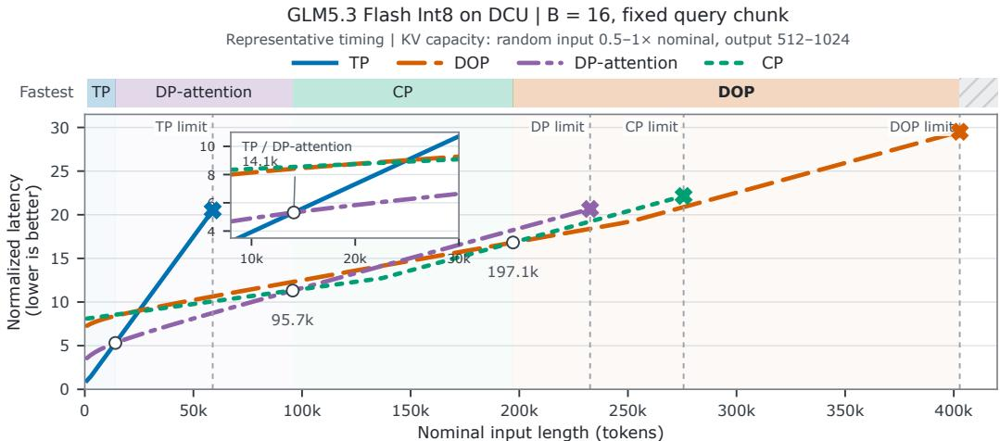  
KV limits: 99% cohort residency. Latency: relative to TP at 1k; illustrative timing, not measurements.  
Figure 6: Conditional latency model for GLM-5.3-Flash INT8 on BW1000 DCUs $( B = 1 6 ,$ fixed query chunk), normalized to TP at 1k. Open circles mark changes in the fastest feasible layout; the inset enlarges the first. Crosses mark KV capacity limits, and hatched regions indicate where the KV cache exceeds the available capacity. § B gives the timing and capacity assumptions.

At $B = 3 2$ , the corresponding sampled nominal-input limits are 36.81k, 175.93k, 217.73k, and 243.48k.  
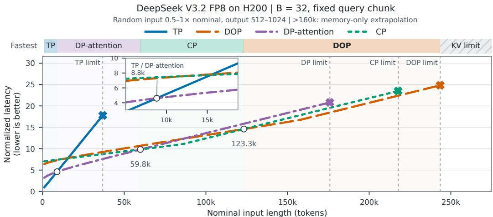  
KV limits: memory-only extrapolation. Timing: relative to TP at 1k; illustrative, not measurements.  
Figure 7: Conditional latency model for DeepSeek-V3.2 FP8 on H200 GPUs $( B = 3 2$ , fixed query chunk), normalized to TP at 1k. Open circles mark changes in the fastest feasible layout; the inset enlarges the first. Crosses mark KV capacity limits, and hatched regions indicate where the KV cache exceeds the available capacity. § B gives the timing and capacity assumptions.

The B200 illustration in Figure 1 uses GLM-5.3 FP8, $B = 1 6 ,$ , and memory fraction 0.85. Its displayed TP limit is the sampled 75.68k boundary; the DP-attention, CP, and DOP limits are the prescribed 400k, 450k, and 512k scenario boundaries, respectively, rather than the same 99% target. Across these figures, changes in model, batch, and memory allocation accompany the hardware change. The resulting crossovers are conditional illustrations, not measured switching thresholds.

## C EXPERIMENTAL CONFIGURATION

Code availability. Our implementation is open source at

https://github.com/ict-agent/SPLASH-sglang.

We ran the B200 and H200 experiments on GPU servers rented from Vast.ai $( \mathrm { h t t p s : / / v a s t . a }$ i); § C.1 and § C.3 give their configurations. All DCU experiments use BW1000 accelerators.

## C.1 B200 FIXED-LAYOUT SWEEPS

The experiments use GLM-5.3 with 78 layers, FP8 weights, BF16 activations, and FP8 E4M3 KV on SPLASH, built atop SGLang 0.5.10 with the sparse FlashMLA backend. The model’s nominal context limit is 1,048,576 tokens, and the runtime limit is 525,376 tokens.

Prefill runs on B200 GPUs on one node with TP8/EP8 and memory fraction 0.85. DP-attention and DOP use attention-DP8. Decode runs on sixteen GPUs across two nodes with TP16/DP16/EP16.

Four sweeps compare the prefill layouts at eight input lengths from 1K to 512K with $B = 1 6 , 3 2 ,$ and eight batch sizes from 1 to 256 at 64K and 128K input. Each request generates 1,024 tokens, and K denotes 1,024 tokens. Each point averages the batch end-to-end time $T _ { \mathrm { b a t c h } }$ over 10 runs; $T _ { \mathrm { b a t c h } }$ includes queueing, prefill, KV transfer, and decode. Input construction, cache flushing, and metric collection are outside that interval. Total throughput is $\dot { B } ( L _ { \mathrm { i n } } + 1 , 0 2 4 ) / T _ { \mathrm { b a t c h } } ;$ ; Table 4 lists all 128 measurements.

## C.2 DCU FIXED-LAYOUT SWEEPS

The experiments use GLM-5.3-Flash 300B with INT8 weights, FP8 KV, and 45 layers (11 MLA and 34 KDA) in SGLang’s language-only path. Prefill runs on DCUs on one node; decode runs on sixteen DCUs across two nodes with TP16/DP16/EP16.

Prefill and decode use memory fraction 0.85. Table 3 reports the KV pools and effective capacity.

Four sweeps compare the prefill layouts at eight input lengths from 1K to 512K with B = 16, 32, and nine batch sizes from 1 to 512 at 32K and 64K input. Each request generates 1,024 tokens. Each point averages the batch end-to-end time over 10 runs; that time includes queueing, prefill, KV transfer, and decode, while input construction, cache flushing, and metric collection are outside it. Total throughput uses the same definition as the B200 sweeps; Table 5 lists all 136 measurements.

## C.3 H200 FIXED-LAYOUT SWEEPS

The experiments use DeepSeek-V3.2 on H200 with one prefill instance and one decode instance (1P1D). We compare TP, CP, DP-attention, and DOP as prefill layouts.

Four sweeps cover seven input lengths from 1K to 256K at B = 16, 32, eight batch sizes from 1 to 256 at 32K input, and seven batch sizes from 1 to 128 at 64K input. Each request generates 1,024 tokens.

Each point averages the batch end-to-end time over 10 runs. Total throughput uses the same definition as the B200 and DCU sweeps. Figure 10 plots the results, and Table 6 lists all 116 measurements.

## C.4 KV CAPACITY AND DCU ADMISSION

The long-context mixed-serving experiment uses GLM-5.3-Flash with INT8 weights and FP8 KV on DCUs at memory fraction 0.85. The 240,000/1,024 comparison at 32 requests has three confirmation runs after warmup. These co-located serving experiments complement the prefill/decodedisaggregated sweeps.

Admission confirmation. A three-run confirmation of the admission effect in § H.3, at 240K input and 1K output tokens with 32 requests, gives DOP a 1.322× burst-throughput gain over DPattention (14,846.29 versus 11,228.56 input tokens/s) at a higher mean completion latency (516.84 versus 477.09 s).

Table 3: KV pools and effective capacity for accelerator groups. The platforms use different models: GLM-5.3 on B200, DeepSeek-V3.2 on H200, and GLM-5.3-Flash on BW1000 DCUs. Memory fraction is the configured allocation fraction. Pool sizes are in GiB; effective capacity counts distinct tokens across the group, excluding replicated copies. Displayed GiB values are rounded.
<table><tr><td>Device / fraction</td><td>Layout</td><td>GiB/card</td><td>GiB/group</td><td>Distinct tokens</td></tr><tr><td rowspan="4">B200 / 0.85</td><td>TP</td><td>59.84</td><td>478.72</td><td>1,045,312</td></tr><tr><td>DOP</td><td>59.19</td><td>473.51</td><td>8,271,360</td></tr><tr><td>CP</td><td>48.22</td><td>385.79</td><td>6,738,944</td></tr><tr><td>DP-attention</td><td>46.50</td><td>371.98</td><td>6,497,792</td></tr><tr><td rowspan="4">H200 / 0.90</td><td>TP</td><td>36.21</td><td>289.68</td><td>632,512</td></tr><tr><td>DOP</td><td>33.86</td><td>270.90</td><td>4,731,904</td></tr><tr><td>CP</td><td>22.93</td><td>183.47</td><td>3,204,608</td></tr><tr><td>DP-attention</td><td>21.21</td><td>169.67</td><td>2,963,456</td></tr><tr><td rowspan="4">DCU / 0.85</td><td>TP</td><td>10.27</td><td>82.16</td><td>1,786,816</td></tr><tr><td>DOP</td><td>6.43</td><td>51.44</td><td>8,949,248</td></tr><tr><td>CP</td><td>5.70</td><td>45.60</td><td>7,933,236</td></tr><tr><td>DP-attention</td><td>5.40</td><td>43.23</td><td>7,521,792</td></tr></table>

## D COMPLETE FIXED-LAYOUT RESULTS

## D.1 B200 RESULTS

Table 4 reports all 128 measurements used by Figure 4. Values are total throughput in $1 0 ^ { 3 }$ tokens/s; bold identifies the largest recorded value at each position. Overlapping shapes retain independently recorded measurements, and each configuration averages 10 runs.

## D.2 DCU RESULTS

Table 5 contains the 136 layout measurements used in Figure 8. Bold identifies the largest observed total throughput at each sampled position. Values are in $\mathrm { i 0 ^ { 3 } }$ tokens/s and rounded to three decimals. Each measurement averages 10 runs. The repeated 32K and 64K shapes at B = 16, 32 retain their respective sweep measurements.

## D.3 H200 RESULTS

Table 6 reports all 116 fixed-layout measurements for DeepSeek-V3.2 on H200 in a 1P1D deployment. Values are total throughput in $1 0 ^ { 3 }$ tokens/s, rounded to three decimals; bold identifies the largest recorded value at each sampled position. Each configuration averages 10 runs. Overlapping shapes retain their respective sweep measurements.

## E DOP IMPLEMENTATION

CP is a family of execution and storage configurations. Position-sharded CP partitions one request’s token history; layer-split storage partitions cache-bearing layers; a replicated-cache CP configuration can distribute prefill work without reducing persistent KV copies. A layer-local token pool does not represent that many complete model histories independently on every rank. SPLASH’s manifest tracks the actual head, position, and layer blocks so that both residency and migration respect these differences.

The DOP transfer implementation converts a tensor in global-row, local-head order into ownerrow, all-head order and back. It synchronizes per-owner row counts once for a forward batch and uses variable all-to-all split sizes for uneven owners. Ranks that own no rows in a batch still enter both collectives, so mixed and idle batches cannot deadlock. Packing preserves row identity, head order, and positions. Fused no-position/rotary query packing reduces collective count. Aligned data can use a 16-byte vectorized path; unaligned data uses a scalar fallback. The current transfer path requires matching TP and attention-DP sizes and rank order.

Table 4: B200 fixed-layout sweeps, in total throughput $( 1 0 ^ { 3 }$ tokens/s). Each row has B requests at client concurrency B and 1,024 output tokens per request. Input lengths are exact token counts. DP-attn. abbreviates DP-attention.
<table><tr><td>Input</td><td>B</td><td>TP</td><td>CP</td><td>DP-attn.</td><td>DOP</td></tr><tr><td colspan="6">Input-length sweep, B = 16</td></tr><tr><td>1,024</td><td>16</td><td>1.529</td><td>1.176</td><td>1.000</td><td>1.053</td></tr><tr><td>4,096</td><td>16</td><td>3.285</td><td>3.188</td><td>3.110</td><td>3.111</td></tr><tr><td>16,384</td><td>16</td><td>7.362</td><td>8.539</td><td>9.380</td><td>8.738</td></tr><tr><td>32,768</td><td>16</td><td>9.279</td><td>13.723</td><td>13.910</td><td>12.594</td></tr><tr><td>65,536</td><td>16</td><td>11.140</td><td>17.806</td><td>18.424</td><td>16.287</td></tr><tr><td>131,072</td><td>16</td><td>11.647</td><td>22.757</td><td>21.739</td><td>20.650</td></tr><tr><td>262,144</td><td>16</td><td>10.955</td><td>22.149</td><td>19.096</td><td>22.903</td></tr><tr><td>524,288</td><td>16</td><td>8.913</td><td>20.091</td><td>17.857</td><td>22.104</td></tr><tr><td colspan="6">Input-length sweep, B = 32</td></tr><tr><td>1,024</td><td>32</td><td>2.835</td><td>2.675</td><td>2.428</td><td>2.580</td></tr><tr><td>4,096</td><td>32</td><td>5.241</td><td>5.855</td><td>6.234</td><td>5.752</td></tr><tr><td>16,384</td><td>32</td><td>9.861</td><td>13.804</td><td>14.111</td><td>12.762</td></tr><tr><td>32,768</td><td>32</td><td>11.595</td><td>18.409</td><td>18.983</td><td>16.504</td></tr><tr><td>65,536</td><td>32</td><td>12.480</td><td>25.046</td><td>22.636</td><td>24.382</td></tr><tr><td>131,072</td><td>32</td><td>12.398</td><td>25.786</td><td>21.105</td><td>23.741</td></tr><tr><td>262,144</td><td>32</td><td>11.285</td><td>21.221</td><td>19.819</td><td>23.470</td></tr><tr><td>524,288</td><td>32</td><td>9.039</td><td>20.173</td><td>19.128</td><td>21.059</td></tr><tr><td colspan="6">Batch-size sweep, 64K input</td></tr><tr><td>65,536</td><td>1</td><td>2.716</td><td>2.601</td><td>2.387</td><td>2.120</td></tr><tr><td>65,536</td><td>4</td><td>6.775</td><td>7.307</td><td>7.913</td><td>7.041</td></tr><tr><td>65,536</td><td>8</td><td>9.465</td><td>13.411</td><td>13.451</td><td>12.240</td></tr><tr><td>65,536</td><td>16</td><td>11.347</td><td>18.291</td><td>18.438</td><td>16.236</td></tr><tr><td>65,536</td><td>32</td><td>12.592</td><td>25.783</td><td>20.857</td><td>23.634</td></tr><tr><td>65,536</td><td>64</td><td>13.327</td><td>24.928</td><td>19.642</td><td>23.681</td></tr><tr><td>65,536</td><td>128</td><td>13.727</td><td>24.767</td><td>19.332</td><td>26.812</td></tr><tr><td>65,536</td><td>256</td><td>13.920</td><td>24.669</td><td>18.960</td><td>26.822</td></tr><tr><td colspan="6">Batch-size sweep, , 128K input</td></tr><tr><td>131,072</td><td>1</td><td>4.330</td><td>5.514</td><td>2.913</td><td>3.189</td></tr><tr><td>131,072</td><td>4</td><td>9.011</td><td>14.061</td><td>8.771</td><td>9.123</td></tr><tr><td>131,072</td><td>8</td><td>10.603</td><td>13.644</td><td>14.613</td><td>14.196</td></tr><tr><td>131,072</td><td>16</td><td>11.873</td><td>23.128</td><td>22.534</td><td>20.571</td></tr><tr><td>131,072</td><td>32</td><td>12.633</td><td>25.600</td><td>23.010</td><td>23.250</td></tr><tr><td>131,072</td><td>64</td><td>13.053</td><td>27.376</td><td>23.105</td><td>24.838</td></tr><tr><td>131,072</td><td>128</td><td>13.263</td><td>27.709</td><td>24.622</td><td>30.281</td></tr><tr><td>131,072</td><td>256</td><td>13.526</td><td>27.677</td><td>25.044</td><td>30.724</td></tr></table>

Table 5: Updated DCU fixed-layout sweeps, in total throughput $( 1 0 ^ { 3 }$ tokens/s). Each row has B requests at client concurrency B and 1,024 output tokens per request. Input lengths are exact token counts. DP-attn. abbreviates DP-attention.
<table><tr><td>Input</td><td>B</td><td>TP</td><td>CP</td><td>DP-attn.</td><td>DOP</td></tr><tr><td colspan="6">Input-length sweep,  $B = 1 6$ </td></tr><tr><td>1,024</td><td>16</td><td>1.234</td><td>1.139</td><td>0.985</td><td>1.110</td></tr><tr><td>4,096</td><td>16</td><td>2.706</td><td>2.632</td><td>2.339</td><td>2.593</td></tr><tr><td>16,384</td><td>16</td><td>5.301</td><td>7.005</td><td>7.337</td><td>7.122</td></tr><tr><td>32,768</td><td>16</td><td>6.999</td><td>10.559</td><td>11.515</td><td>10.989</td></tr><tr><td>65,536</td><td>16</td><td>8.366</td><td>14.283</td><td>16.205</td><td>15.248</td></tr><tr><td>131,072</td><td>16</td><td>9.122</td><td>17.534</td><td>15.776</td><td>16.249</td></tr><tr><td>262,144</td><td>16</td><td>8.421</td><td>19.558</td><td>18.690</td><td>21.539</td></tr><tr><td>524,288</td><td>16</td><td>8.405</td><td>20.138</td><td>18.790</td><td>22.338</td></tr><tr><td colspan="6">Input-length sweep,  $B = 3 2$ </td></tr><tr><td>1,024 4,096</td><td>32</td><td>2.051</td><td>2.023 4.463</td><td>1.985</td><td>1.941</td></tr><tr><td>16,384</td><td>32</td><td>3.855</td><td>10.526</td><td>4.560 11.369</td><td>4.468 10.979</td></tr><tr><td>32,768</td><td>32 32</td><td>7.150</td><td>14.445</td><td>16.353</td><td>15.385</td></tr><tr><td>65,536</td><td>32</td><td>8.603 9.466</td><td>17.833</td><td>16.101</td><td>15.255</td></tr><tr><td>131,072</td><td>32</td><td>9.750</td><td>19.990</td><td>18.369</td><td>18.763</td></tr><tr><td>262,144</td><td>32</td><td>9.439</td><td>21.027</td><td>20.031</td><td>23.436</td></tr><tr><td>524,288</td><td>32</td><td>8.552</td><td>20.941</td><td>20.750</td><td>23.324</td></tr><tr><td></td><td></td><td></td><td></td><td></td><td></td></tr><tr><td colspan="6">Batch-size sweep, 32K input</td></tr><tr><td>32,768 32,768</td><td>1</td><td>1.036</td><td>0.943</td><td>0.921</td><td>0.914</td></tr><tr><td></td><td>4</td><td>3.259</td><td>3.864</td><td>3.603</td><td>3.569</td></tr><tr><td>32,768</td><td>8</td><td>5.073</td><td>6.691</td><td>6.955</td><td>6.739</td></tr><tr><td>32,768</td><td>16</td><td>7.005</td><td>10.574</td><td>11.517</td><td>10.982</td></tr><tr><td>32,768</td><td>32</td><td>8.619</td><td>14.404</td><td>16.274</td><td>15.273</td></tr><tr><td>32,768</td><td>64</td><td>9.739</td><td>18.056</td><td>16.172</td><td>17.773</td></tr><tr><td>32,768</td><td>128</td><td>10.447</td><td>20.545</td><td>19.148</td><td>20.059</td></tr><tr><td>32,768</td><td>256</td><td>10.813</td><td>22.093</td><td>20.656</td><td>24.801 25.991</td></tr><tr><td>32,768</td><td>512</td><td>11.534</td><td>22.932</td><td>22.255</td><td></td></tr><tr><td colspan="6">Batch-size sweep, 64K input</td></tr><tr><td>65,536</td><td>1</td><td>1.870</td><td>2.062</td><td>1.581</td><td>1.559</td></tr><tr><td>65,536</td><td>4</td><td>4.933</td><td>6.537</td><td>5.918</td><td>5.774</td></tr><tr><td>65,536</td><td>8</td><td>6.794</td><td>10.263</td><td>11.107</td><td>10.582</td></tr><tr><td>65,536</td><td>16</td><td>8.371</td><td>14.318</td><td>16.219</td><td>15.354</td></tr><tr><td>65,536</td><td>32</td><td>9.468</td><td>17.705</td><td>20.832</td><td>19.401</td></tr><tr><td>65,536</td><td>64</td><td>10.120</td><td>20.196</td><td>18.452</td><td>18.112</td></tr><tr><td>65,536</td><td>128</td><td>10.498</td><td>21.802</td><td>20.290</td><td>24.383</td></tr><tr><td>65,536</td><td>256</td><td>11.360</td><td>22.623</td><td>21.902</td><td>25.563</td></tr><tr><td>65,536</td><td>512</td><td>11.360</td><td>23.036</td><td>21.474</td><td>26.178</td></tr></table>

Table 6: H200/DeepSeek-V3.2 fixed-layout sweeps, in total throughput $( 1 0 ^ { 3 }$ tokens/s). Each row has B requests and 1,024 output tokens per request. Input lengths are exact token counts. DP-attn. abbreviates DP-attention.
<table><tr><td>Input</td><td>B</td><td>TP</td><td>CP</td><td>DP-attn.</td><td>DOP</td></tr><tr><td colspan="6">Input-length sweep, B = 16</td></tr><tr><td>1,024</td><td>16</td><td>0.937</td><td>0.885</td><td>0.930</td><td>0.864</td></tr><tr><td>4,096</td><td>16</td><td>1.994</td><td>2.080</td><td>2.232</td><td>2.071</td></tr><tr><td>16,384</td><td>16</td><td>5.037</td><td>6.267</td><td>6.441</td><td>5.996</td></tr><tr><td>32,768</td><td>16</td><td>6.300</td><td>10.512</td><td>10.137</td><td>9.185</td></tr><tr><td>65,536</td><td>16</td><td>7.700</td><td>13.279</td><td>11.820</td><td>11.676</td></tr><tr><td>131,072</td><td>16</td><td>6.596</td><td>17.457</td><td>11.101</td><td>14.978</td></tr><tr><td>262,144</td><td>16</td><td>5.847</td><td>13.119</td><td>10.265</td><td>14.349</td></tr><tr><td colspan="6">Input-length sweep,  $B = 3 2$ </td></tr><tr><td>1,024</td><td>32</td><td>1.769</td><td>1.680</td><td>1.667</td><td>1.598</td></tr><tr><td>4,096</td><td>32</td><td>3.612</td><td>3.842</td><td>3.964</td><td>3.867</td></tr><tr><td>16,384</td><td>32</td><td>6.782</td><td>10.880</td><td>11.069</td><td>8.985</td></tr><tr><td>32,768</td><td>32</td><td>7.955</td><td>13.913</td><td>11.900</td><td>12.064</td></tr><tr><td>65,536</td><td>32</td><td>8.177</td><td>20.386</td><td>14.402</td><td>19.170</td></tr><tr><td>131,072</td><td>32</td><td>6.225</td><td>16.843</td><td>14.567</td><td>18.584</td></tr><tr><td>262,144</td><td>32</td><td>5.935</td><td>16.488</td><td>14.026</td><td>17.186</td></tr><tr><td colspan="6">Batch-size sweep, 32K input</td></tr><tr><td>32,768</td><td>1</td><td>1.054</td><td>0.972</td><td>0.824</td><td>0.927</td></tr><tr><td>32,768</td><td>4</td><td>3.320</td><td>3.234</td><td>3.212</td><td>3.132</td></tr><tr><td>32,768</td><td>8</td><td>4.971</td><td>5.932</td><td>6.208</td><td>6.044</td></tr><tr><td>32,768</td><td>16</td><td>6.584</td><td>10.321</td><td>10.681</td><td>9.104</td></tr><tr><td>32,768</td><td>32</td><td>7.748</td><td>15.643</td><td>11.287</td><td>11.977</td></tr><tr><td>32,768</td><td>64</td><td>7.920</td><td>18.032</td><td>13.949</td><td>17.245</td></tr><tr><td>32,768</td><td>128</td><td>6.766</td><td>18.600</td><td>14.143</td><td>19.743</td></tr><tr><td>32,768</td><td>256</td><td>6.704</td><td>18.391</td><td>13.399</td><td>19.466</td></tr><tr><td colspan="6">Batch-size sweep, 64K input</td></tr><tr><td>65,536</td><td>1</td><td>1.784</td><td>2.232</td><td>1.598</td><td>1.477</td></tr><tr><td>65,536</td><td>4</td><td>4.450</td><td>5.296</td><td>5.118</td><td>5.147</td></tr><tr><td>65,536</td><td>8</td><td>6.190</td><td>10.050</td><td>10.484</td><td>8.396</td></tr><tr><td>65,536</td><td>16</td><td>7.109</td><td>13.466</td><td>11.891</td><td>12.121</td></tr><tr><td>65,536</td><td>32</td><td>7.365</td><td>16.378</td><td>15.190</td><td>14.522</td></tr><tr><td>65,536</td><td>64</td><td>7.261</td><td>16.169</td><td>14.651</td><td>17.846</td></tr><tr><td>65,536</td><td>128</td><td>6.734</td><td>16.103</td><td>13.736</td><td>18.054</td></tr></table>

The reverse exchange must preserve all contributions to the sharded output projection. An allreduce or equivalent complete reduce-scatter precedes owner-row selection. Alternatively, an ownerlocal output GEMM requires the complete compatible O weights and activations, which is a DOP-P placement. Tensor-shape checks alone cannot detect an omitted reduction.

For sparse attention, indexer cache, selected-block metadata, and positions must remain consistent with KV. For recurrent layers, the mutable state must be handed off after the last source update. Prefix sharing requires reference-count and copy-on-write handling. CUDA graphs require stable destination addresses or recapture. These states are part of the handoff contract.

## F HOT-SWITCH MEASUREMENT PROTOCOL

The B200 results in § 5.4 and § 5.5 have separate timing scopes: single-layer network communication and reported switching overhead. The following accounting defines the reported quantities and estimates.

## F.1 COMMUNICATION AND WORKLOAD SCALING

The weight payload is set by projection placement; the logical latent-KV buffer has size

$$
V _ { \mathrm { l a t e n t } } = B s r _ { \mathrm { K V } } b _ { \mathrm { K V } } ,\tag{13}
$$

where $r _ { \mathrm { K V } }$ is the latent width and $b _ { \mathrm { K V } }$ is the element size in bytes. Rotary keys, quantization scales, page metadata, and any sparse or recurrent state need separate inventories. Logical buffer volume is not the same as per-rank received bytes: the latter follows the actual state differences in Equation 2.

The B200 KV reference is $B _ { \mathrm { r e f } } = 1 6$ and $s _ { \mathrm { r e f } } = 2 6 2 , 1 4 4$ . Holding the representation and transfer implementation fixed, Figure 5a uses

$$
\widehat t _ { K } ( a  b ; B , s ) = t _ { K } ^ { \mathrm { r e f } } ( a  b ) \frac { B } { B _ { \mathrm { r e f } } } \frac { s } { s _ { \mathrm { r e f } } } ,\tag{14}
$$

with the measured DOP→CP reference of 3.8065 ms. Each operator case is measured over 20 runs.   
Shaded bands show the observed run-to-run variation of approximately ±10%.

## F.2 SWITCHING OVERHEAD

The target-ready reference begins with the same destination state already resident. For a matched timed execution interval, define

$$
\begin{array} { r } { \Delta T _ { \mathrm { b l o c k i n g } } = T _ { \mathrm { b l o c k i n g } } - T _ { \mathrm { r e a d y } } , } \\ { \Delta T _ { \mathrm { S P L A S H } } = T _ { \mathrm { S P L A S H } } - T _ { \mathrm { r e a d y } } . } \end{array}\tag{15}
$$

Table 1 reports the measured B200 execution-time p50 values and $\mathsf { p 5 0 } ( \mathsf { p 9 5 } )$ overheads at $B = 1 6$ and 256K context. Overhead quantiles are taken from the measured columns.

## G LIMITATIONS

Graph capture. CUDA graphs bind the addresses of weights and KV buffers, so every supported layout needs its own captured graphs, which SPLASH captures once at startup. Capture time and resident graph memory must be accounted for at deployment.

Memory headroom. A switch holds one layer’s buffers beyond the larger of the source and destination footprints (Equation 5). Near full memory, SPLASH defers the switch or holds admission until that headroom exists.

Imperfect overlap. Transfers share interconnect and memory bandwidth with the switching step’s own collectives and computation, which can slow that step. A switch that must move long histories, such as restoring replicated MLA KV when entering TP, can carry more bytes per layer than one layer’s computation hides; the excess lengthens the switching step (Equation 7), and the schedule charges it to the switch cost.

Short-lived regimes. A switch pays off only if the destination’s advantage outlasts the switch. When the workload oscillates faster than that, the switching margin keeps the current layout and the opportunity goes unused.

Implementation scope. The DOP transfer path requires equal TP and attention-DP degrees with one rank per owner. Nesting a CP group inside a DOP owner, speculative decoding, and heterogeneous workers are extensions beyond this design.

## H DCU EVALUATION

## H.1 EXPERIMENTAL SETUP

The fixed-layout study uses GLM-5.3-Flash 300B INT8 weights (11 MLA and 34 KDA layers) with FP8 KV in SGLang on BW1000 DCUs. A DCU node runs prefill; sixteen DCUs across two nodes run DP-attention decode. § C gives the deployment settings.

## H.2 FIXED-LAYOUT PERFORMANCE

Four DCU sweeps cover eight input lengths from 1K to 512K at $B = 1 6$ , 32 and nine batch sizes $B \in \{ 1 , 4 , 8 , 1 6 , \bar { 3 2 } , 6 4 , 1 2 8 , 2 5 6 , \bar { 5 } 1 2 \}$ at each of 32K and 64K input, with B requests at client concurrency B. All four layouts run at every position, giving 136 measurements. Every request generates 1,024 output tokens, and K denotes 1,024 tokens. Total throughput is $B ( L _ { \mathrm { i n } } + 1 , 0 2 4 ) / T _ { \mathrm { b a t c h } }$ over the batch end-to-end time, which includes queueing, prefill, KV transfer, and decode; each plotted point averages 10 runs. The 512K cases stress performance beyond the nominal 256K context; Table 5 lists all 136 values.

(a) BS = 16  
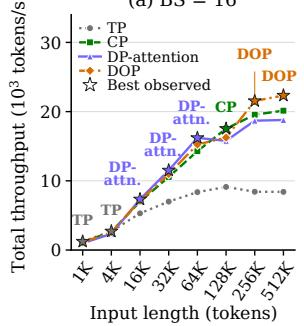

(b) BS = 32  
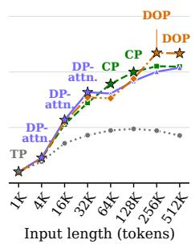

(c) Input = 32K  
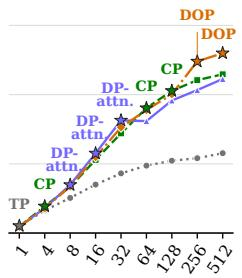  
Batch size / concurrency

(d) Input = 64K  
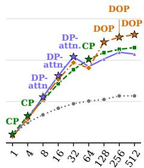  
Batch size / concurrency  
Figure 8: Each layout leads a regime; DOP leads at 256K–512K and at the largest batches. GLM-5.3-Flash with common DP-attention decode and 1K output tokens per request: (a, b) input-length sweeps at $B = 1 6 , 3 2 ;$ (c, d) batch-size sweeps at 32K and 64K input; sampled positions are equally spaced. Stars and labels mark the best recorded layout at each position.

At 256K–512K, DOP reaches $2 1 , 5 3 9 - 2 3 , 4 3 6$ tokens/s, 10.1–11.5% above CP, the strongest alternative. It also leads at $B = 2 5 6 , 5 1 2$ for 32K input and $B = 1 2 8 , 2 5 6 , 5 1 2$ for 64K input, exceeding CP by 11.8–13.6% at these five positions. At $B = 8$ , 16, 32, however, DOP trails DP-attention by 3.1–6.9% in both batch sweeps despite its larger KV pool.

The independently recorded sweeps differ at $6 4 \mathrm { K } / B = 3 2 \colon \mathrm { C P }$ leads in Figure 8b, and DP-attention in (d).

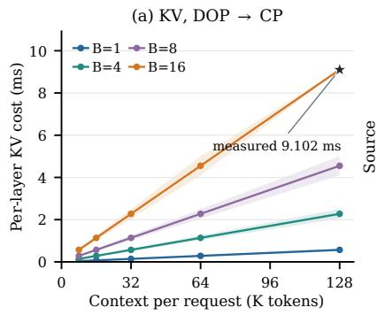

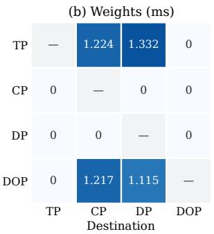

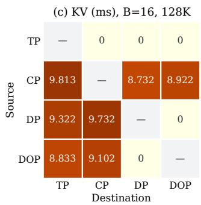  
Figure 9: Per-layer network costs. (a) KV cost of DOP→CP versus context, with linear Bs scaling summarizing the trend. The star marks the $B = 1 6 ,$ , 128K reference; bands show approximately ±10% variation across 20 runs per case. (b) Weight cost of the twelve switches; rows are sources, columns destinations, and 0 marks no network transfer. (c) KV cost at $B = 1 6$ and 128K. DP denotes DP-attention. All measurements use GLM-5.3-Flash on BW1000 DCUs.

## H.3 KV CAPACITY AND REQUEST ADMISSION

Because it shards the projections, DOP holds a 19.0% larger KV pool per DCU than DP-attention with GLM-5.3-Flash (1,118,656 versus 940,224 tokens per owner; Table 3). The table compares effective capacity across the device group in distinct tokens, accounting for KV replication.

This capacity raises throughput once it changes admission. In a co-located DCU run, which interleaves chunked prefill with decode for 240,000-token inputs and 512-token outputs, DOP overtakes DP-attention between 24 requests (17,526.79 versus 19,084.86 input tokens/s) and 32 (19,265.96 versus 16,347.98), because at 32 requests DOP admits four per owner while DP-attention admits three and queues one.

## H.4 SWITCH PRIMITIVE COSTS

We report single-layer directional measurements for GLM-5.3-Flash on BW1000 DCUs, with four nonzero weight costs and seven nonzero KV costs.

Every direction uses a discard, all-gather, or all-to-all per state and layer (Figure 3, right). A discard has zero network cost; Figure 9 reports the two collectives.

Weights cost a fixed amount. The four weight all-gathers, from TP or DOP into DP-attention or CP, each move $( 1 - 1 / T )$ of one layer’s projections per rank and take 1.115–1.332 ms per layer (Figure 9b). Their payload is independent of batch size and retained context.

KV cost scales with context. The seven KV all-gathers and all-to-alls take 8.732–9.813 ms per layer at B = 16 and 128K tokens per request (Figure 9c). The linear payload model for DOP→CP uses its 9.102 ms measurement:

$$
\widehat { t } _ { K } ( B , s ) = 9 . 1 0 2 \frac { B } { 1 6 } \frac { s } { 1 3 1 , 0 7 2 } \mathrm { m s } .
$$

At B = 16, this gives an estimated 1.138 ms at 16K (Figure 9a). Each case is measured 20 times;   
the bands show the observed run-to-run variation of approximately ±10%.

## H.5 LIVE SWITCHING OVERHEAD

Table 7 gives the measured DCU summaries for all twelve directed switches at B = 16 and 128K context tokens per request. Blocking, SPLASH, and target-ready use the definitions in § 5.5. Here T denotes the measured execution interval of one step, and $\Delta T$ the measured overhead over targetready.

Table 7: Supplied DCU switching summaries $( B = 1 6 ,$ , 128K context tokens per request). Times are milliseconds: T is the timed interval’s p50; ∆T is p50(p95) overhead over target-ready (Ready). Block. is blocking and DP denotes DP-attention.
<table><tr><td></td><td colspan="3">T, p50</td><td colspan="2">∆T, p50(p95)</td><td></td><td colspan="3">T, p50</td><td colspan="3">∆T, p50(p95)</td></tr><tr><td>Direction</td><td>Ready</td><td>Block.</td><td>SPLASH</td><td>Block.</td><td>SPLASH</td><td>Direction</td><td>Ready</td><td></td><td>Block. SPLASH</td><td></td><td>Block.</td><td>SPLASH</td></tr><tr><td> $\mathrm { T P }  \mathrm { C P }$ </td><td>694.85</td><td>790.76</td><td>696.53</td><td>95.91(176.16)</td><td>1.68(3.30)</td><td>DP→TP</td><td>1612.02</td><td>1901.83</td><td>1623.03</td><td></td><td>289.81(511.96)11.01(19.59)</td><td></td></tr><tr><td> $\mathrm { T P }  \mathrm { D P }$ </td><td>720.40</td><td>813.39</td><td>722.09</td><td>92.99(168.47)</td><td>1.69(3.35)</td><td>DP→CP</td><td>699.10</td><td>987.05</td><td></td><td>709.87 287.95(498.17)</td><td></td><td>10.77(19.75)</td></tr><tr><td>TP →DOP</td><td>611.54</td><td>611.57</td><td>611.56</td><td>0.03(0.06)</td><td>0.02(0.04)</td><td>DP→DOP</td><td>621.47</td><td>621.49</td><td>621.49</td><td></td><td>0.02(0.04)</td><td>0.02(0.04)</td></tr><tr><td>CP→TP</td><td>1543.94</td><td>41834.96</td><td></td><td>1555.04 291.02(516.72)</td><td>)11.10(20.26)</td><td>DOP→TP</td><td>1534.59</td><td>1820.64</td><td></td><td>1545.20 286.05(504.06) 10.61(18.80)</td><td></td><td></td></tr><tr><td>CP→DP</td><td>715.27</td><td>994.71</td><td></td><td>725.95279.45(517.48)10.68(18.78)</td><td></td><td>DOP→CP</td><td>692.91</td><td>1075.84</td><td></td><td>704.67382.93(659.08)11.76(20.11)</td><td></td><td></td></tr><tr><td>CP→DOP</td><td>620.30</td><td>910.63</td><td></td><td>631.42 290.33(517.24)11.12(19.04)</td><td></td><td>DOP→DP</td><td>723.57</td><td>818.80</td><td>725.29</td><td></td><td>95.23(176.48)</td><td>1.72(3.25)</td></tr></table>

Across all twelve directions, SPLASH adds 0.02–11.76 ms at p50 and 0.04–20.26 ms at p95; its median overhead stays below 1.8% of the corresponding target-ready interval. For the ten directions requiring network transfers, median overhead falls by 96.17–98.25% relative to blocking.

The aggregate quantiles do not separate initial preparation, later-layer readiness waits, and computation interference.

## I H200 EVALUATION

## I.1 EXPERIMENTAL SETUP

We compare TP, CP, DP-attention, and DOP using DeepSeek-V3.2 on H200 with one prefill instance and one decode instance (1P1D). The fixed-layout study varies the prefill layout. Every request generates 1,024 output tokens, and K denotes 1,024 tokens. The switching studies use $B = 1 6$ and 128K context tokens per request.

## I.2 FIXED-LAYOUT PERFORMANCE

Four sweeps cover seven input lengths from 1K to 256K at $B = 1 6 , 3 2 .$ eight batch sizes from 1 to 256 at 32K input, and seven batch sizes from 1 to 128 at 64K input. All four layouts run at each sampled position, giving 116 measurements. Total throughput is $B ( L _ { \mathrm { i n } } + 1 , 0 2 4 ) / T _ { \mathrm { b a t c h } }$ over the batch end-to-end time. Each point averages 10 runs; Table 6 lists all values.

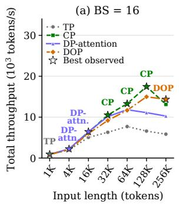

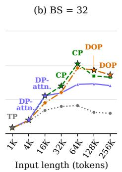

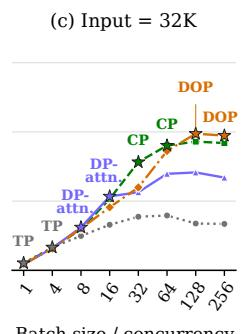

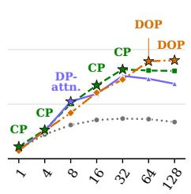  
Figure 10: Fixed-layout DeepSeek-V3.2 performance on H200 with 1P1D and 1K output tokens per request. (a, b) Input-length sweeps at $B = 1 6 , 3 2 ;$ (c, d) batch-size sweeps at 32K and 64K input. Sampled positions are equally spaced. Stars and labels mark the best recorded layout at each position.

Both input-length sweeps favor TP at 1K, DP-attention at 4K–16K, and CP at 32K–64K. At $B = 1 6 ,$ CP also leads at 128K, while DOP leads at 256K; at $B = 3 2$ , DOP leads at 128K–256K. Across these three long-input points, DOP reaches 14,349–18,584 tokens/s, 4.2–10.3% above CP, the strongest alternative. In the batch sweeps, DOP first leads at $B = 1 2 8$ for 32K input and $B = 6 4$ for 64K input. Its advantages at the two largest sampled batches are 5.8–6.1% and 10.4–12.1%, respectively. DOP leads at seven of the 29 sampled positions, while the other layouts remain faster elsewhere.

Overlapping configurations retain their independently recorded results. At 32K/B = 16, CP leads in the input-length sweep, whereas DP-attention leads in the batch-size sweep. These fixed-layout comparisons motivate workload-aware selection.

## I.3 SWITCH PRIMITIVE COSTS

The switching summaries compare all twelve directed transitions at $B \ = \ 1 6$ and 128K context tokens per request.

Figure 11 reports four nonzero weight all-gather costs of 0.6174–0.6526 ms per layer and seven nonzero KV collective costs of 3.6528–4.0020 ms per layer. Linear scaling in $\boldsymbol { B s }$ from the DOP→CP reference of 3.8870 ms summarizes the context trend. Each case is measured 20 times, with observed run-to-run variation of approximately ±10%.

## I.4 LIVE SWITCHING OVERHEAD

Table 8 compares all twelve directed switches. Blocking, SPLASH, and target-ready use the definitions in § 5.5. T denotes the measured execution interval of one step, and $\Delta T$ the measured overhead over target-ready.

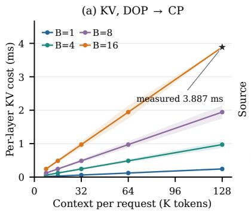

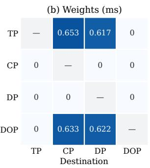

  
Figure 11: Supplied H200 per-layer network costs. (a) DOP→CP KV cost, with linear $\boldsymbol { B } \boldsymbol { s }$ scaling summarizing the trend. The star marks the $B = 1 6 .$ , 128K reference; bands show approximately $\pm 1 0 \%$ variation across 20 runs per case. (b) Weight costs of the twelve switches. (c) KV costs at $B = 1 6$ and 128K context per request. Rows are sources, columns are destinations, and 0 denotes no network transfer. DP denotes DP-attention

Table 8: Supplied H200 switching summaries at $B = 1 6$ and 128K context tokens per request. Units are milliseconds. T is the timed interval’s p50; ∆T reports p50(p95) overhead over the matched target-ready reference. Block. denotes the blocking baseline and DP denotes DP-attention.
<table><tr><td></td><td colspan="3"> $T , { \mathfrak { p s } } 0$ </td><td colspan="3">∆T, p50(p95)</td><td colspan="3"> $T , { \mathfrak { p s } } 0$ </td><td colspan="2">∆T, p50(p95)</td></tr><tr><td>Direction</td><td>Ready</td><td></td><td>Block. SPLASH</td><td>Block.</td><td>SPLASH</td><td>Direction</td><td>Ready</td><td>Block. SPLASH</td><td></td><td>Block.</td><td>SPLASH</td></tr><tr><td>TP→CP</td><td>692.85</td><td>781.58</td><td>694.31</td><td>88.73(185.40)</td><td>1.46(2.67)</td><td>DP→TP</td><td>1408.22</td><td>1929.61</td><td>1415.84</td><td>521.39(876.42) 7.62(15.05)</td><td></td></tr><tr><td>TP→DP</td><td>765.24</td><td>858.42</td><td>766.75</td><td>93.18(177.53)</td><td>1.51(2.79)</td><td>DP → CP</td><td>708.92</td><td>1217.19</td><td>717.32</td><td>508.26(846.18) 8.39(14.96)</td><td></td></tr><tr><td>TP→DOP</td><td>646.78</td><td>646.81</td><td>646.80</td><td>0.03(0.07)</td><td>0.02(0.07)</td><td>DP→DOP</td><td>652.48</td><td>652.50</td><td>652.50</td><td>0.02(0.10)</td><td>0.02(0.08)</td></tr><tr><td>CP→TP</td><td>1462.841975.32</td><td></td><td></td><td>1470.68 512.48(851.61) 7.84(15.31)</td><td></td><td>DOP →TP</td><td>1505.492022.33</td><td></td><td>1513.46</td><td>516.84(831.71) 7.97(14.52)</td><td></td></tr><tr><td>CP→DP</td><td>727.91 1231.08</td><td></td><td></td><td>735.96 503.18(883.93) 8.06(14.13)</td><td></td><td>DOP → CP</td><td></td><td>697.16 1314.54</td><td></td><td>706.81 617.38(1122.60) 9.65(17.07)</td><td></td></tr><tr><td>CP→DOP</td><td>670.15 1165.87</td><td></td><td></td><td>678.43495.72(817.95)8.27(14.77)</td><td></td><td>DOP→DP</td><td>779.45</td><td>870.01</td><td>780.88</td><td>90.56(178.69) 1.43(2.71)</td><td></td></tr></table>

SPLASH’s additional time is 0.02–9.65 ms at p50 and 0.07–17.07 ms at $\mathsf { p 9 5 ; }$ its $\mathsf { p 5 0 }$ overhead is below 1.39% of the corresponding ready p50. For the ten directions requiring network transfers, it reduces p50 overhead by 98.33–98.54% relative to blocking. The aggregate quantiles do not separate first-layer preparation, later readiness waits, and computation interference.