# STATE TRACE RATIONALE AS AUXILIARY TASK IN RE-INFORCEMENT LEARNING

Muhammad U. Nasir University of the Witwatersrand Johannesburg, South Africa muhammad.nasir@wits.ac.za

Steven D. James University of the Witwatersrand Johannesburg, South Africa steven.james@wits.ac.za

Alex Vogt   
University of the Witwatersrand   
Johannesburg, South Africa   
alex.vogt1@students.wits.ac.za   
Julian Togelius   
New York University   
New York, USA   
julian@togelius.com

## ABSTRACT

We propose STRAT, an auxiliary task that trains deep reinforcement learning (RL) agents to predict a short textual trace of their own state. Inspired by human spatial navigation, the description combines landmark, route, and survey knowledge, tracking the agent's position, inventory, goals, and immediate progress. Environment rules generate this text online without human labelling. Our method adds a single auxiliary head to a standard policy. Across 60 sparse-reward XLand-MiniGrid tasks, STRAT solves complex environments where standard RL fails outright, while compacting state representations and preventing rank collapse. Beyond performance gains, the predicted trace provides a readable account of agent beliefs at every step for no extra cost.

## 1 INTRODUCTION

Reinforcement learning (RL) algorithms are extremely general, and have been applied to a wide variety of domains such as robotics (Kober et al., 2013), games (Mnih et al., 2015; Silver et al., 2016), and language (Ouyang et al., 2022; Guo et al., 2025). This generality is due to the fact that RL algorithms only require a scalar reward signal to learn from. However, when the reward signal is sparse or terminal, it may be difficult or impossible to learn (Andrychowicz et al., 2017). In deep RL in particular, optimising for reward means that the learned representation will only capture what predicts return, which may be very little given a sparse signal.

One way to improve learning is to provide auxiliary tasks that leverage the same representation for a second prediction task (Jaderberg et al., 2016). However, deciding what to predict is not straightforward: while early work focused on cheap, task-agnostic targets such as pixels (Jaderberg et al., 2016), next observations (Pathak et al., 2017), or future latent states (Guo et al., 2020), recent work has focused on language (Lampinen et al., 2022; Mu et al., 2022), but has not asked what the description should contain or what parts are important.

We take inspiration from how people find their way through unfamiliar places. Human spatial navigation is commonly described in terms of three kinds of knowledge (Siegel & White, 1975): landmark knowledge of salient features, route knowledge that associates places with the actions taken there, and survey knowledge of the overall layout that supports novel paths. We propose that an agent should be made to predict exactly these concepts. Our method, State-Trace Rationale as Auxiliary Task STRAT, adds a single head to a deep RL agent that predicts a short templated description of the agent's state: its position and heading, the goal, the current subgoal, whether its last action made progress, and what it is carrying.

We make the following contributions. We introduce (STRAT), which equips agents with an auxiliary head to predict textual state descriptions online directly from environment rules, requiring no human labelling. We evaluate our method across 60 XLand-MiniGrid tasks (Nikulin et al., 2024) spanning four difficulty tiers, and find that STRAT outperforms a baseline RL algorithm across most of the tasks. We additionally analyse the learned representations and show that STRAT'S representations are transparent via probing beliefs, such as if target is visible, making it much more explainable. Because the head is trained to describe the agent's state, our approach also gives a readable account of what the agent believes at every step, at no extra cost.

## 2 BACKGROUND

## 2.1 PARTIALLY OBSERVABLE MARKOV DECISION PROCESSES

A partially observable Markov decision process (POMDP) is a tuple $\langle S , A , \mathcal { O } , T , R , \Omega , \gamma \rangle$ . The environment is in a state $s _ { t } ~ \in ~ S$ that the agent can partially observe through the observation $o _ { t } \sim \Omega ( \cdot \mid s _ { t } )$ . After taking action $a _ { t }$ , the state changes to $s _ { t + 1 } \sim T ( \cdot \mid s _ { t } , a _ { t } )$ , the agent receives a reward $r _ { t }$ and an observation. The goal is to maximise the expected discounted return $\mathbb { E } [ \sum _ { t } \gamma ^ { t } r _ { t } ]$ Because one observation does not fully identify the state, the best action depends on the whole history $h _ { t } = ( o _ { 1 } , a _ { 1 } , \ldots , o _ { t } )$ , or equivalently on the belief $b _ { t } = P ( s _ { t } \mid h _ { t } )$ . Computing the belief exactly is too expensive in practice, so deep RL methods learn a policy $\pi ( a _ { t } \mid h _ { t } )$ that summarises the history in a learned vector. The hidden state, goals and rules require an agent to remember and combine information over time.

## 2.2 MEMORY-BASED POLICIES AND PROXIMAL POLICY OPTIMISATION

A memory-based policy uses a sequence model to turn the history $h _ { t }$ into a vector $z _ { t } ,$ and then computes the policy $\pi _ { \theta } ( a _ { t } \mid z _ { t } )$ and the value $V _ { \phi } ( z _ { t } )$ from it. Recurrent networks (Hausknecht & Stone, 2015) are the classic choice, but they must fit the whole past into one fixed-size vector and are trained with truncated backpropagation through time. Transformer-XL (Dai et al., 2019) instead keeps a cache of activations from earlier steps and attends over it, so the model can look back over a long window at a fixed cost per step. With small changes it trains reliably in RL (Parisotto et al., 2020). $\mathbf { A }$ common approach to training the policy is Proximal Policy Optimization (PPO) (Schulman et al., 2017), an on-policy actor-critic method. Advantages $\hat { A } _ { t }$ are computed with generalised advantage estimation (Schulman et al., 2016), and the policy is updated by minimising the clipped surrogate loss

$$
\mathcal { L } _ { \mathrm { P G } } = - \mathbb { E } _ { t } \left[ \operatorname* { m i n } \Bigl ( \rho _ { t } \hat { A } _ { t } , ~ \mathrm { c l i p } ( \rho _ { t } , 1 - \epsilon , 1 + \epsilon ) \hat { A } _ { t } \Bigr ) \right] , \qquad \rho _ { t } = \frac { \pi _ { \theta } ( a _ { t } \mid z _ { t } ) } { \pi _ { \theta _ { \mathrm { o l d } } } ( a _ { t } \mid z _ { t } ) } .\tag{1}
$$

The clip stops the policy from changing too much in one update. A value regression loss ${ \mathcal { L } } _ { V } =$ $\mathbb { E } _ { t } \big \rvert ( V _ { \phi } ( z _ { t } ) - \hat { R } _ { t } ) ^ { 2 } \big \rvert$ , where $\hat { R } _ { t } = \hat { A } _ { t } + V _ { \phi _ { \mathrm { o l d } } } ( z _ { t } )$ is the GAE return, and an entropy bonus $\mathcal { H } =$ $\mathbb { E } _ { t } \big [ \mathcal { H } ( \pi _ { \theta } ( \cdot \mid z _ { t } ) ) \big ]$ are added to this objective, giving

$$
\mathcal { L } _ { \mathrm { P P O } } = \mathcal { L } _ { \mathrm { P G } } + c _ { v } \mathcal { L } _ { V } - c _ { e } \mathcal { H } .\tag{2}
$$

Because the memory links steps together, each minibatch holds whole trajectory segments together with the memory they started from, rather than single shuffled steps.

## 2.3 XLAND-MINIGRID

XLand-MiniGrid (Nikulin et al., 2024) is a set of procedurally generated gridworld tasks written in JAX. It brings the ideas of XLand (Team et al., 2021) to MiniGrid (Chevalier-Boisvert et al., 2023), and since every environment step is compiled, thousands of environments can run in parallel on one GPU. Tasks are not written by hand. Instead, each task is a ruleset sampled from a benchmark: a goal predicate from a fixed list (e.g. AgentHold, AgentNear, TileNear) plus a set of rules that change one tile into another when the agent interacts with it. Rules can chain, so reaching the goal may need several steps in a fixed order. The agent is never told the goal or the rules. It sees only a small symbolic view in front of it and its heading, and receives a single reward at the end of the episode if the goal is met. It must therefore figure out the task from the objects it sees and from what happens when it acts on them.. Because the simulator knows each ruleset's goal and rules, the exact sequence of subgoals needed to solve it can be computed for every task. We use this to generate the language targets described above.

## 3 METHODOLOGY

In this section, we will introduce how STRAT uses rationale as an auxiliary task to improve sample efficiency for PPO. The core idea behind STRAT is to give an agent an understanding of its surroundings with minimal changes. The architectural change is straightforward: STRAT adds one more head that collectively produces probabilities for different aspects of the state.

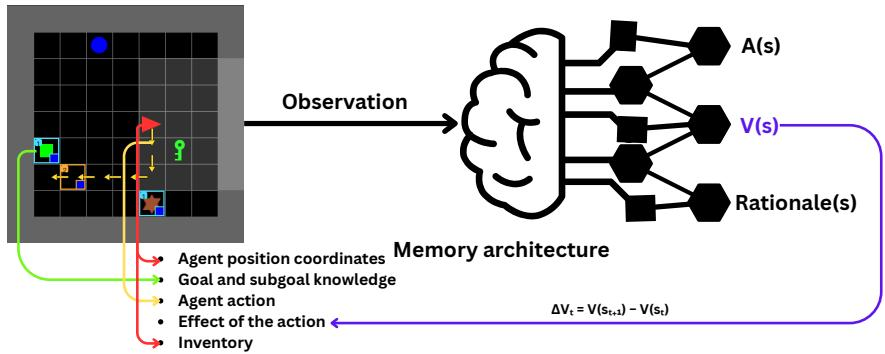  
Figure 1: A flow diagram of how STRAT gets the required labels without human intervention.

Designing labels for state-trace rationale. The main contribution of STRAT is the state-trace rationale that is predicted through the state-trace auxiliary head. This prediction is a fixed-length sequence of 90 tokens over a grounded vocabulary. Out of the 90 supervised positions, 24 are content slots that vary. The sequence is a templated natural-language description of the agent's situation composed of five lines, each with a fixed slot structure: an agent position line (“I am at position (pos-y〉 (pos\_x〉 facing (direction〉."), a goal line (“The goal is 〈goal)."), a subgoal line (“The subgoal is to (subgoal)."), an action line (“My previous action was a. It made me closer/farther/same."), and an inventory line (“Inventory holds (colour〉 (object)." or “Inventory is empty."). Motivation behind these lines comes from the Human Spatial Navigation framework (see section 1 for explaination of the framework). Agent position and action line obtains Route knowledge, goal and subgoal line gets Landmark knowledge, while inventory line adds Survey knowledge to the representation. Only the content slots vary; template tokens are constant. Labels are generated online during the rollout from the simulator state and the task specification, and are never shown to the policy as input. The agent line is filled from the agent's global position and heading in the environment state. The goal line is derived from the sampled ruleset's goal encoding, which we render into tokens (e.g. “near purple square"). The subgoal line is obtained from a causal plan precomputed for each ruleset by backward-chaining from the goal through the ruleset's production rules; the plan is a sequence of phases, each associated with a target tile, and the current phase is tracked online by detecting when the corresponding production has fired in the grid (or the required object has entered the inventory). The action slot is the executed action; the progress slot is labelled from the critic's own value estimates as the sign of $\Delta V _ { t } = V ( s _ { t + 1 } ) - V ( s _ { t } )$ thresholded at τ, so that “closer", “farther", and “same" reflect learned value progress rather than a geometric distance. The inventory line is read from the agent's pocket after the action.

Loss Function. For the loss, let P denote the set of supervised state-trace token positions, $L = | \mathcal { P } |$ and V the state-trace vocabulary. At timestep t, the state-trace head maps the memory architecture's hidden state $h _ { t }$ to logits $z _ { t , \ell } \in \mathbb { R } ^ { | \nu | }$ for each $\ell \in \mathcal { P }$ , and $y _ { t , \ell } \in \mathcal { V }$ is the target token derived from the environment state. The trace loss is the token-level cross-entropy between the predicted distribution and the target, averaged over positions:

$$
\mathrm { C E } _ { t , \ell } = - \log p _ { \theta } ( y _ { t , \ell } \mid h _ { t } ) , \qquad p _ { \theta } ( v \mid h _ { t } ) = \mathrm { s o f t m a x } ( z _ { t , \ell } ) [ v ] ,\tag{3}
$$

$$
\mathcal { L } _ { \mathrm { S T } } ( \theta ) = \mathbb { E } _ { t } \left[ \frac { 1 } { L } \sum _ { \ell \in \mathcal { P } } \mathrm { C E } _ { t , \ell } \right] ,\tag{4}
$$

where the expectation is over active timesteps of on-policy rollouts. The full objective becomes:

$$
\mathcal { L } = \mathcal { L } _ { \mathrm { P G } } + c _ { v } \mathcal { L } _ { V } - c _ { e } \mathcal { H } + \lambda _ { \mathrm { s t } } \mathcal { L } _ { \mathrm { S T } } .\tag{5}
$$

Table 1: Ruleset structure families. A task takes the first matching row. Placed is decided by whether any rule produces a goal tile; the other three are read from the backward chain, whose last phase is the goal.
<table><tr><td>Family</td><td>Difficulty</td><td>Definition</td></tr><tr><td>Placed</td><td>Easy</td><td>No rule produces the goal tile, so it is already on the grid. The goal is reach or hold.</td></tr><tr><td>Go-hold</td><td>Medium</td><td>The goal tile is crafted. The goal is reach or hold, and every earlier step is only walk or pick up.</td></tr><tr><td>Beside</td><td>Hard</td><td>The goal tile is crafted. The goal is “put A beside B,&quot; and every earlier step is only walk or pick up.</td></tr><tr><td>Align</td><td>Hardest</td><td>The goal tile is crafted, and some earlier step must line two objects up to produce a tile.</td></tr></table>

## 4 EXPERIMENTATION

In this section, we will describe our experimental setup. Our experiments addresses the important question: does STRAT improve sample efficiency compared to an identical PPO agent? Moreover, we perform extensive ablation studies to observe what aspect of STRAT matters the most.

## 4.1 ENVIRONMENT AND TASKS

All experiments use XLand-MiniGrid (Nikulin et al., 2024), a JAX-native suite of procedurally generated grid-world tasks. Each task is defined by a ruleset: a goal predicate (e.g. AgentNear, TileNear, AgentHold) together with a set of production rules that transform objects when they are brought into contact. Rules are hidden from the agent, so solving a task requires discovering the causal chain that produces the goal object. We use the 9×9 environment (XLand-MiniGrid-R1-9x9) with the symbolic observation, a 5×5 egocentric window of (tile, colour) pairs plus the agent's heading, an action space of six primitives (move forward, turn left/right, pick up, put down, toggle), and a per-episode horizon of 243 steps. Reward is sparse: a single terminal reward of $1 - 0 . 9 t / T _ { \mathrm { m a x } }$ on success and 0 otherwise. We select 20 environments each from small-1m, medium-1m, and high-1m benchmarks. We sample five tasks from each family in Table 1 on each of the three benchmarks: 15 tasks per family and 60 in total.

## 4.2 AGENT AND OPTIMISATION

The agent is a Transformer-XL (Dai et al., 2019) actor-critic. The symbolic observation is encoded by an entity/colour embedding followed by a small convolutional stack; the resulting features are concatenated with embeddings of the agent's heading, the previous action, the previous reward, and a two-dimensional episode descriptor, i.e episode progress, and projected to the transformer width The TXL memory cache is sized to cover the full episode, so the policy can attend to every step it has taken since the start of the episode. Policy and value heads are single-hidden-layer MLPs on the final transformer features. The state-trace head applies a hidden projection to the same features, adds a learned embedding for each supervised trace position, and maps each position through a shared linear layer onto the token vocabulary (section 3).

All conditions are trained with PPO and generalised advantage estimation, the only difference between conditions is the auxiliary term of the loss. Rollouts are collected from parallel environments on a single GPU, the learning rate is decayed linearly to zero, and each configuration is repeated over 10 random seeds. All curves and tables report the mean and interquartile range across seeds. Architecture, optimisation, and environment hyperparameters are listed in full in Appendix A (Table 2).

## 4.3 ABLATIONS

We perform the following ablations:

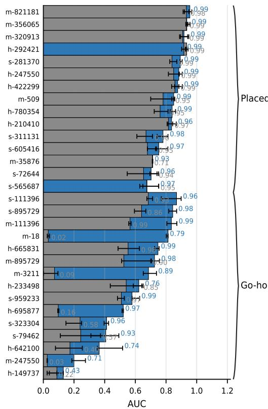

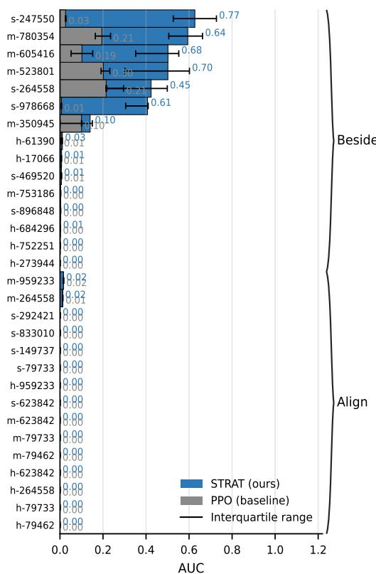  
Figure 2: Comparison of STRAT and PPO across 60 tasks. The bars represents mean normalized AUC of the learning curve. The whiskers are the interquartile range for 10 seeds. The numbers represent the mean final returns.

1. Different combinations of state-trace rationales to mimic the Human Spatial Navigation (HSN) framework (see section 1 for the definition of different types of knowledge), and the impact of each knowledge category:

(a) Goal and sub-goal only: Here we want to see whether goal and sub-goal provide STRAT with enough rationale to beat the baseline. This is akin to the agent only having Landmark Knowledge.

(b) STRAT'S position and action description only: Here we want to see if STRAT can still learn without goal, sub-goal, and inventory rationales. Position and action knowledge can be considered as Route Knowledge, as it can give the agent a place association by knowing the coordinates and if the actions are making the agent closer or not.

(c) Without STRAT's action description: Here we want to see if the value-bootstrapped action rationale provides a good signal for STRAT. These auxiliary tasks give the agent the Landmark, parts of Route and Survey knowledge. Survey Knowledge comes from knowing inventory and subgoals, as these can allow the agent to know about the features of the environment.

(d) Without STRAT's position description: Here we want to see if the position knowledge provides a good signal for STRAT. We want to see if having less Route Knowledge via having less position awareness will impact the results.

2. Action rationale by replacing value-bootstrapped rationale with Breadth-First Search (BFS) and Euclidean distance. This is an important ablation as some RL algorithms are critic-free, and if we know the geometry of the environment, we can use a distance metric or a search algorithm.

3. RNN memory backbone to demonstrate that STRAT works with any type of memory architecture, we will use Gated Recurrent Unit (GRU) (Cho et al., 2014), a type of Recurrent Neural Network (RNN) (Chung et al., 2014).

## 4.4 REPRESENTATION ANALYSIS

We analyse frozen checkpoints saved at 40 evenly spaced points during training, for STRAT,PPO, and ablations for STRAT, 10 seeds each. Each checkpoint is run with the segment length and attention-memory length used in training.

We read two representations from each checkpoint. The first is the trunk output: the vector the actor, the critic and the state-trace head all consume. The second is the per-step observation encoding that enters the memory backbone, which has no temporal context. Comparing the two tells us whether the recurrent trunk creates a difference between STRAT and the PPO baseline or whether it is already present in the per-step encoding.

## 4.4.1 MINIMUM DESCRIPTION LENGTH (MDL)

Accuracy cannot tell apart a variable that is easy to extract from one that a probe recovers only with a lot of data. We therefore also report the prequential (online) codelength of the labels given the features (Voita & Titov, 2020). The probe is refitted on growing prefixes of the data, each block doubling in size from 0.2% of the data. It is charged the codelength of each next block, and we report compression relative to a uniform code. Higher compression means the variable is more readily available in the representation.

## 4.4.2 REPRESENTATIONAL CAPACITY

To test whether the auxiliary objective prevents representational collapse, we track the dimensionality of the trunk over training with four statistics:

• Effective rank: the exponential of the entropy of the normalized singular-value spectrum (Roy & Vetterli, 2007)

• srank: the number of singular values needed to capture 99% of the spectrum

• participation ratio of the covariance eigenvalues

• dormant units: the fraction of units whose mean activation falls below 2.5% of the layer average (Sokar et al., 2023)

All four are also computed on the per-step encoding, so that any collapse can be located in the trunk or the encoder. Capacity also rises when a run learns to complete the task.

## 5 RESULTS

## 5.1 STRAT VS PPO

We start this section by comparing STRAT with a similar PPO agent as a baseline. The Figure 2 shows performance on 60 tasks. The bars show the AUC of the learning curves, and the whiskers show the interquartile range. The numbers show the achieved final return. We clearly observe a pattern: easy tasks from the Placed family across all benchmarks are easy for both methods to solve. The reason is that they are straightforward, as the goal is already placed. Go-hold is where the major difference lies. The performance of STRAT is strictly better on all of the tasks and is significantly better on many of them. These tasks are not straightforward to solve. You either have to reach a tile that may or hold it, but the agent may need to hold another tile to fulfil the goal, which makes it nontrivial to solve. The tasks that fall under Beside classification are hard tasks, and both of the methods failed to achieve good results, yet STRAT achieves considerably better returns compared to PPO in almost half of the environments. Align family of tasks are the hardest, and we see a collapse of performance for both methods. The reason is that there are no rewards for aligning two tiles as sub-goals, and the agent still needs to craft the goal tile. Previous works have shown that these kinds of tasks are learnt via curriculum learning or open-ended learning (Wang et al., 2019; Team et al., 2021; 2023).

(a) STRAT ablation on m- (b) STRAT ablation on m- (c) Value bootstrap abla- (d) Value bootstrap abla-3211 (Go-hold). Mean 18 (Go-hold). tion on s-1134 (Go-hold). tion o s-999911 (Beside). with interquartile ranges as the shaded region.  
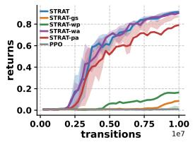

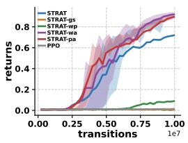

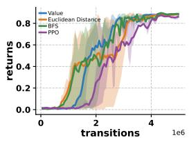

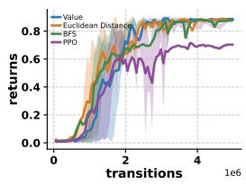

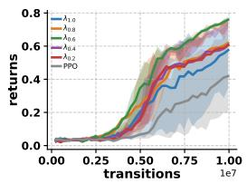  
(e) Effect of λst on h-642100 (Go-hold).

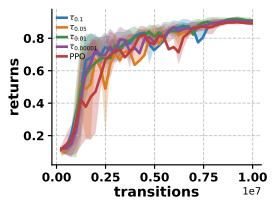  
(f) Effect of τ on s-117 (Placed).

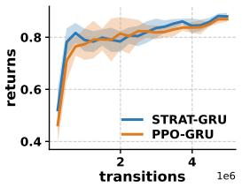  
(g) GRU on s-281370 (Placed). STRAT-TXL achieved a return of 0.99 here.

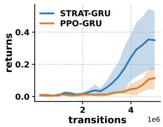  
(h) GRU on s-264558 (Beside). STRAT-TXL achieved a return of 0.77 here.  
Figure 3: Ablations, $\lambda _ { s t }$ and τ sweeps, and GRU learning curves.

## 5.2 ABLATIONS

State-trace rationales. This is the most important ablation for STRAT. Figure 3a shows results on m-3211, a task from Go-hold family which is a hard task. Here, STRAT-gs means goal and sub-goal only, STRAT-pa means STRAT'S position and action description only, STRAT-wa means without STRAT's action description, and STRAT-wgs means STRAT without goals and subgoals. Notably, the baseline performance collapses. STRAT-gs and STRAT-wp also performs significantly worse. STRAT and the versions without action description and with only position and action are performing well. Similar results are observed for another Go-hold task (m-18), but this time PPO and STRAT-gs collapse, while STRAT-wp is worse than m-3211. Other results are similar yet STRAT performs worse than other two versions. 25th and 75th percentile sits with other versions but mean is lower.

The important observation here is that providing learning signals such as goals and subgoals alone does not help. In contrast with Human Spatial Navigation (HSN) abilities, these are called landmark Knowledge (see section 1). This is intuitive: the results indicate that this information will eventually lead the agent to the goal, but it will take much more time than otherwise, which is why we get a mean return of around 0.1. Another intuitive result is that you the agent needs to have position knowledge. This is Route Knowledge in the HSN framework. If the agent can not associate where it is standing, then the performance decreases. STRAT-pa (position and action knowledge only) and STRAT-wa (without action knowledge) are also intuitive. With position and action knowledge. you have complete Route knowledge; therefore, you should be able to reach your goal, and with the help of PPO backbone algorithm, you can perform tasks. While STRAT-wa, which has position, goal and subgoal, and inventory knowledge, means that the agent has full landmark knowledge, some route and some survey knowledge (via what inventory holds). This kind of knowledge should able human to traverse through unknown places. This result shows us why all the aspects of auxiliary tasks in STRAT are needed to solve these complex tasks efficiently.

RNN backbone. As the focus of our methodology is towards auxiliary head, it makes sense to ablate the backbone memory architecture. As mentioned in subsection 4.3, we are using GRU as the memory architecture. Figure 3g shows results on an easy task (s-281370, Placed), while Figure 3h shows performance of GRU on s-264558, a substantially difficult task from Beside family of task. This demonstrates that any memory backbone can be used.

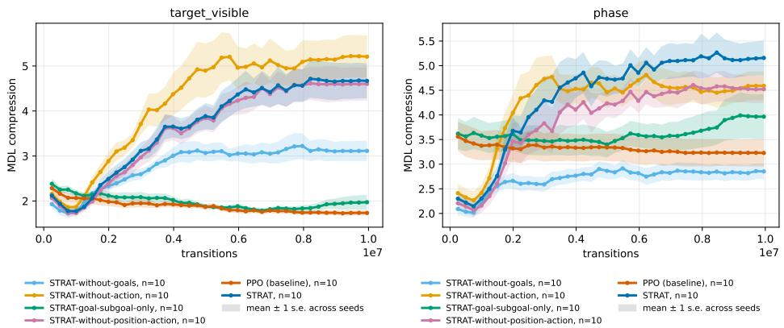  
(a) Target visibility compressed in representation. (b) Subgoal phase compressed in representation.  
Figure 4: Information compressed in the representation.

Action rationale and effects of $\lambda _ { S T }$ and τ. Here we replace value bootstrap with Breadth-First Search (BFS) and Euclidean distance. Figure 3c and 3d shows that there is not much difference in performance in BFS and euclidean distance. In some cases it proves to be better than value bootstrapping. λsT is the weight we give to the state-trace loss, and τ is the threshold for ∆V. We observe that the results are similar for sample efficiency but different in the final return achieved, as suggested by Figure 3e, and 3f. These should be considered as hyperparameters that need to be tuned

## 5.3 LEARNT REPRESENTATIONS

As described in subsection 4.4, Minimum Description Length (MDL) is the measure of how much a variable is present in the representation. Figure 4a shows target visibility in the representations. We observe that STRAT (dark blue), STRAT-wa (yellow), and STRAT-wp (pink) steadily compress this information, while STRAT-wg (light blue) plateaus after a certain degree of compression. STRAT-gs (green) and PPO fail to compress this information. This means that goal and subgoal alone are not what is needed for the representation to learn target visibility but other rationales also matter. This result indicates that to get to the landmark agent has to have either all spatial knowledge (STRAT) or position knowledge and goal knowledge (STRAT-wa), or if the agent knows that it is getting closer to the target (STRAT-wp). This is intuitive if we see it through the lens of the Human Spatial Navigation (HSN) framework. If a human has the landmark knowledge but no route knowledge, then finding the landmark in an unknown place will become difficult. Humans need some way to know that they are getting closer to the goal, either by knowing that the distance is getting smaller (action rationale in STRAT) or by knowing their own place (position rationale in STRAT). Similarly, phase of the subgoal is also compressed smoothly in STRAT, as shown in Figure 4b. STRAT, having all rationales, compresses phase information well, while not having goal information makes STRAT worse than PPO. Having only goal and subgoal rationale is also not enough. Notably, PPO does not compress phase information at all. In Appendix B we have more compression analysis for more variables, such as action, agent direction, agent position, and inventory information. With all of them, we see a similar pattern where STRAT’s observed representation creates a transparent belief of the variable in focus; therefore, it is a representation that is more explainable compared to PPO, where explainability is much less. Figure 5 shows the representational capacity. Here, we can observe that effective rank and srank (see section 3 for definitions) do not collapse for STRAT, and have a major representation difference from PPO. Figure 5 in Appendix B shows that the participation ratio is similar to effective and srank, while in dormant units, we see that there are no units for STRAT where the mean activation falls below 2.5%.

## 6 RELATED WORKS

Our work is closely related to auxiliary tasks and language rationales in Reinforcement Learning. In this section, we will look into the works that fall into these categories and are related to our work.

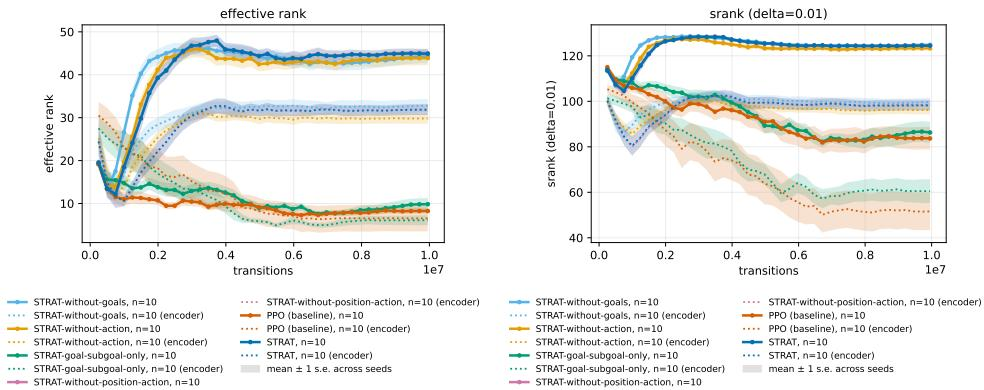  
(a) Effective rank.  
(b) Srank.  
Figure 5: Information compressed in the representation capacity.

## 6.1 AUXILIARY TASKS IN REINFORCEMENT LEARNING

When reward is sparse, the agent gets little feedback and the learned representation tends to capture only what predicts return. Auxiliary tasks add extra prediction objectives that share the agent's representation and are trained together with the RL loss, $\mathcal { L } = \mathcal { L } _ { \mathrm { R L } } \bar { + } \beta \mathcal { L } _ { \mathrm { a u x } }$ . The auxiliary heads are only used during training and do not affect how the agent acts at inference time. Early examples predicted pixel changes and reward (Jaderberg et al., 2016), depth (Mirowski et al., 2017), or the next state and the action taken (Pathak et al., 2017); later work predicted the model's own future representation (Schwarzer et al., 2020) or used contrastive objectives (Laskin et al., 2020). These tasks help most when the target matters for solving the task and cannot be read directly off the current observation, so predicting it forces the agent to remember the past or infer what is hidden. Recent work uses natural language as the target (Lampinen et al., 2022). A sentence can state what the task is, what to do next, and whether the last action helped, and such sentences can be generated automatically from the simulator's internal state without human labelling. This is the approach we take.

Language rationale in RL When the extrinsic reward does not identify which part of a long behaviour matters, the goal, the subgoal, or the reason for an action can give a policy compositional intermediate rewards. Andreas et al. (2017) made this claim with policy sketches: each task is annotated with a sequence of named subtasks, and each name is bound to a modular sub-policy that is shared across tasks. Andreas et al. (2018) showed that the description itself can be the object of learning. A model is pretrained to interpret language, and a new behaviour is then obtained by searching for a string that minimises the interpreter's loss, so language is required only in that pretraining stage. Jiang et al. (2019) placed language between a high-level policy and an instructionfollowing low-level policy, and found that the compositional form of the instruction is what lets sub-skills recombine on new tasks. The same grounding problem, in grid worlds with a fragment of English, is the subject of BabyAI (Chevalier-Boisvert et al., 2019). Later work generates the rationale in the loop with acting. ReAct interleaves free-form reasoning traces with environment actions (Yao et al., 2023), and Reflexion writes a verbal critique of a failed episode and feeds that text back as the context of the next attempt (Shinn et al., 2023).

## 7 CONCLUSION

To conclude, we present STRAT, an agent that adds an auxiliary head that include state-trace rationale in the common learned representation. We take this inspiration from Human Spatial Navigation Siegel & White (1975). We experiment on 60 tasks from three XLand-minigrid benchmarks as they have long-horizon tasks with extremely delayed and sparse rewards. We further categorise these tasks into 4 tiers of difficulty. We observe that STRAT outperforms PPO in 100% of the medium-difficulty (Go-hold) tasks, while doing better on 40% of the hard tasks (Beside), where the rest are unsolvable for both. Whereas hardest (Align) difficulty remains unsolvable for both of the methods and easy (Placed) tasks equally solved by both of the methods. We also perform extensive ablations to study the impact of each rationale. Furthermore, we observe the learnt representation through minimum description length and representational capacity. We found that STRAT representation is transparent towards many different aspects of the state, such as target visibility, phase of the subgoals etc. We conclude that the representation is much more explainable than PPO.

## 8 AI USE STATEMENT

In this work, we used generative AI tools for coding help. Code is not written completely by AI. All LLM-generated code has been carefully reviewed. It is just used to debug the code. We have not used generative AI tools for any writing or ideation purposes.

## REFERENCES

Jacob Andreas, Dan Klein, and Sergey Levine. Modular multitask reinforcement learning with policy sketches. In International Conference on Machine Learning, 2017. URL https: //arxiv. org/abs/1611.01796.

Jacob Andreas, Dan Klein, and Sergey Levine. Learning with latent language. In Proceedings of NAACL-HLT,2018.URLhttps://arxiv.org/abs/1711.00482.

Marcin Andrychowicz, Filip Wolski, Alex Ray, Jonas Schneider, Rachel Fong, Peter Welinder, Bob McGrew, Josh Tobin, Pieter Abbeel, and Wojciech Zaremba. Hindsight experience replay. Advances in Neural Information Processing Systems, 30, 2017.

Maxime Chevalier-Boisvert, Dzmitry Bahdanau, Salem Lahlou, Lucas Willems, Chitwan Saharia, Thien Huu Nguyen, and Yoshua Bengio. Babyai: A platform to study the sample efficiency of grounded language learning. In International Conference on Learning Representations, 2019. URLhttps://arxiv.org/abs/1810.08272.

Maxime Chevalier-Boisvert, Bolun Dai, Mark Towers, Rodrigo Perez-Vicente, Lucas Willems, Salem Lahlou, Suman Pal, Pablo Samuel Castro, and Jordan Terry. Minigrid & miniworld: Modular & customizable reinforcement learning environments for goal-oriented tasks. Advances in Neural Information Processing Systems, 36:73383–73394, 2023.

Kyunghyun Cho, Bart Van Merriënboer, Dzmitry Bahdanau, and Yoshua Bengio. On the properties of neural machine translation: Encoder-decoder approaches. In Proceedings of SSST-8, eighth workshop on syntax, semantics and structure in statistical translation, pp. 103–111, 2014.

Junyoung Chung, Caglar Gulcehre, KyungHyun Cho, and Yoshua Bengio. Empirical evaluation of gated recurrent neural networks on sequence modeling. arXiv preprint arXiv:1412.3555, 2014.

Zihang Dai, Zhilin Yang, Yiming Yang, Jaime G Carbonell, Quoc Le, and Ruslan Salakhutdinov. Transformer-xl: Attentive language models beyond a fixed-length context. In Proceedings of the 57th annual meeting of the association for computational linguistics, pp. 2978–2988, 2019.

Daya Guo, Dejian Yang, Haowei Zhang, Junxiao Song, Ruoyu Zhang, Runxin Xu, Qihao Zhu, Shirong Ma, Peiyi Wang, Xiao Bi, et al. DeepSeek-R1: Incentivizing reasoning capability in LLMs via reinforcement learning. arXiv preprint arXiv:2501.12948, 2025.

Zhaohan Daniel Guo, Bernardo Avila Pires, Bilal Piot, Jean-Bastien Grill, Florent Altché, Rémi Munos, and Mohammad Gheshlaghi Azar. Bootstrap latent-predictive representations for multitask reinforcement learning. In International Conference on Machine Learning, pp. 3875–3886. PMLR, 2020.

Matthew Hausknecht and Peter Stone. Deep recurrent Q-learning for partially observable MDPs. In AAAI Fall Symposium on Sequential Decision Making for Intelligent Agents, 2015.

Max Jaderberg, Volodymyr Mnih, Wojciech Marian Czarnecki, Tom Schaul, Joel Z Leibo, David Silver, and Koray Kavukcuoglu. Reinforcement learning with unsupervised auxiliary tasks. arXiv preprint arXiv:1611.05397, 2016.

Yiding Jiang, Shixiang Shane Gu, Kevin P. Murphy, and Chelsea Finn. Language as an abstraction for hierarchical deep reinforcement learning. In Advances in Neural Information Processing Systems, 2019.URLhttps://arxiv.org/abs/1906.07343.

Jens Kober, J Andrew Bagnell, and Jan Peters. Reinforcement learning in robotics: A survey. The International Journal of Robotics Research, 32(11):1238–1274, 2013.

Andrew Lampinen, Nicholas Roy, Ishita Dasgupta, Stephanie Chan, Allison Tam, James McClelland, Chen Yan, Adam Santoro, Neil Rabinowitz, Jane Wang, and Felix Hill. Tell me why! Explanations support learning relational and causal structure. In International Conference on Machine Learning, pp. 11868–11890. PMLR, 2022.

Michael Laskin, Aravind Srinivas, and Pieter Abbeel. CURL: Contrastive unsupervised representations for reinforcement learning. In International Conference on Machine Learning, pp. 5639–5650. PMLR, 2020.

Piotr Mirowski, Razvan Pascanu, Fabio Viola, Hubert Soyer, Andrew J Ballard, Andrea Banino, Misha Denil, Ross Goroshin, Laurent Sifre, Koray Kavukcuoglu, et al. Learning to navigate in complex environments. In International Conference on Learning Representations, 2017.

Volodymyr Mnih, Koray Kavukcuoglu, David Silver, Andrei A Rusu, Joel Veness, Marc G Bellemare, Alex Graves, Martin Riedmiller, Andreas K Fidjeland, Georg Ostrovski, et al. Human-level control through deep reinforcement learning. Nature, 518(7540):529–533, 2015.

Jesse Mu, Victor Zhong, Roberta Raileanu, Minqi Jiang, Noah Goodman, Tim Rocktäschel, and Edward Grefenstette. Improving intrinsic exploration with language abstractions. Advances in Neural Information Processing Systems, 35:33947–33960, 2022.

Alexander Nikulin, Vladislav Kurenkov, Ilya Zisman, Artem Agarkov, Viacheslav Sinii, and Sergey Kolesnikov. Xland-minigrid: Scalable meta-reinforcement learning environments in jax. Advances in Neural Information ProcessingSystems, 37:43809–43835, 2024.

Long Ouyang, Jeffrey Wu, Xu Jiang, Diogo Almeida, Carroll Wainwright, Pamela Mishkin, Chong Zhang, Sandhini Agarwal, Katarina Slama, Alex Ray, et al. Training language models to follow instructions with human feedback. Advances in Neural Information Processing Systems, 35: 27730–27744, 2022.

Emilio Parisotto, Francis Song, Jack Rae, Razvan Pascanu, Caglar Gulcehre, Siddhant Jayakumar Max Jaderberg, Raphael Lopez Kaufman, Aidan Clark, Seb Noury, et al. Stabilizing transformers for reinforcement learning. In International Conference on Machine Learning, pp. 7487–7498. PMLR, 2020.

Deepak Pathak, Pulkit Agrawal, Alexei A Efros, and Trevor Darrell. Curiosity-driven exploration by self-supervised prediction. In International Conference on Machine Learning, pp. 2778–2787. PMLR, 2017.

Olivier Roy and Martin Vetterli. The effective rank: A measure of effective dimensionality. In 2007 15th European signal processing conference, pp. 606–610. IEEE, 2007.

John Schulman, Philipp Moritz, Sergey Levine, Michael Jordan, and Pieter Abbeel. High-dimensional continuous control using generalized advantage estimation. In International Conference on Learning Representations, 2016.

John Schulman, Filip Wolski, Prafulla Dhariwal, Alec Radford, and Oleg Klimov. Proximal policy optimization algorithms. arXiv preprint arXiv:1707.06347, 2017.

Max Schwarzer, Ankesh Anand, Rishab Goel, R Devon Hjelm, Aaron Courville, and Philip Bachman. Data-efficient reinforcement learning with self-predictive representations. arXiv preprint arXiv:2007.05929, 2020.

Noah Shinn, Federico Cassano, Ashwin Gopinath, Karthik Narasimhan, and Shunyu Yao. Reflexion: Language agents with verbal reinforcement learning. In Advances in Neural Information Processing Systems,2023.URL https://arxiv.org/abs/2303.11366.

Alexander W Siegel and Sheldon H White. The development of spatial representations of large-scale environments. In Advances in child development and behavior, volume 10, pp. 9–55. Elsevier, 1975.

David Silver, Aja Huang, Chris J Maddison, Arthur Guez, Laurent Sifre, George Van Den Driessche, Julian Schrittwieser, Ioannis Antonoglou, Veda Panneershelvam, Marc Lanctot, et al. Mastering the game of Go with deep neural networks and tree search. Nature, 529(7587):484–489, 2016.

Ghada Sokar, Rishabh Agarwal, Pablo Samuel Castro, and Utku Evci. The dormant neuron phenomenon in deep reinforcement learning. In International Conference on Machine Learning, pp. 32145–32168. PMLR, 2023.

Adaptive Agent Team, Jakob Bauer, Kate Baumli, Satinder Baveja, Feryal Behbahani, Avishkar Bhoopchand, Nathalie Bradley-Schmieg, Michael Chang, Natalie Clay, Adrian Collister, et al. Human-timescale adaptation in an open-ended task space. arXiv preprint arXiv:2301.07608, 2023.

Open Ended Learning Team, Adam Stooke, Anuj Mahajan, Catarina Barros, Charlie Deck, Jakob Bauer, Jakub Sygnowski, Maja Trebacz, Max Jaderberg, Michael Mathieu, et al. Open-ended learning leads to generally capable agents. arXiv preprint arXiv:2107.12808, 2021.

Elena Voita and Ivan Titov. Information-theoretic probing with minimum description length. In Proceedings of the 2020 Conference on Empirical Methods in Natural Language Processing (EMNLP), pp. 183–196, 2020.

Rui Wang, Joel Lehman, Jeff Clune, and Kenneth O Stanley. Paired open-ended trailblazer (poet): Endlessly generating increasingly complex and diverse learning environments and their solutions. arXiv preprint arXiv:1901.01753, 2019.

Shunyu Yao, Jeffrey Zhao, Dian Yu, Nan Du, Izhak Shafran, Karthik Narasimhan, and Yuan Cao. React: Synergizing reasoning and acting in language models. In International Conference on LearningRepresentations, 2023. URL https://arxiv.org/abs/2210.03629.

## A HYPERPARAMETERS

You may include other additional sections here.

<table><tr><td></td><td>small-1m</td><td>medium-1m/high-1m</td></tr><tr><td>Environment</td><td></td><td></td></tr><tr><td>Environment</td><td> $\mathtt { X I } \mathtt { a n d - M i n i G r i d - R 1 } - 9 \mathtt { x } 9$ </td><td></td></tr><tr><td>Observation</td><td>symbolic 5×5 egocentric (tile, colour) + heading</td><td></td></tr><tr><td>Actions</td><td></td><td>6</td></tr><tr><td>Episode length</td><td>243</td><td></td></tr><tr><td>Reward</td><td> $1 - 0 . 9 t / T _ { \mathrm { m a x } }$ </td><td>on success, else 0</td></tr><tr><td>Architecture</td><td></td><td></td></tr><tr><td>Obs. embedding dim (entity, colour)</td><td>16</td><td>16</td></tr><tr><td>Obs. conv. stack</td><td></td><td>2×2 conv, 16–32–64 ch., ReLU, VALID</td></tr><tr><td>Action embedding dim</td><td>16</td><td>16</td></tr><tr><td>TXL layers</td><td>1</td><td>3</td></tr><tr><td>TXL hidden width D</td><td>72</td><td>144</td></tr><tr><td>TXL attention heads</td><td>2</td><td>6</td></tr><tr><td>TXL feed-forward width</td><td>144</td><td>864</td></tr><tr><td>TXL memory cache (per layer)</td><td>81</td><td></td></tr><tr><td>Positional encoding</td><td></td><td>relative (Transformer-XL)</td></tr><tr><td>Policy / value head hidden width</td><td></td><td>512</td></tr><tr><td>Head activation</td><td>128</td><td>GELU</td></tr><tr><td>State-trace head hidden width</td><td></td><td>512</td></tr><tr><td>State-trace positions</td><td></td><td></td></tr><tr><td>Vocabulary (word + number tokens)</td><td>90</td><td> $8 6 + 1 6 = 1 0 2$ </td></tr><tr><td>PPO optimisation</td><td></td><td></td></tr><tr><td>Parallel environments</td><td>256</td><td>1024</td></tr><tr><td>Steps per update (per env)</td><td></td><td></td></tr><tr><td>Inner updates per episode</td><td></td><td></td></tr><tr><td>PPO epochs</td><td></td><td></td></tr><tr><td>Minibatches</td><td></td><td></td></tr><tr><td>Minibatch size (envs)</td><td></td><td>64</td></tr><tr><td>Clip ratio €</td><td></td><td></td></tr><tr><td>Discount γ</td><td></td><td>0.999</td></tr><tr><td>GAE λ</td><td></td><td>0.95</td></tr><tr><td>Value loss coefficient</td><td></td><td>0.5</td></tr><tr><td>Entropy coefficient</td><td></td><td>0.05</td></tr><tr><td>Auxiliary weight  $\lambda _ { \mathrm { s t } }$ </td><td></td><td>1.0</td></tr><tr><td>Optimiser</td><td> $\mathrm { A d a m } ( \varepsilon = 1 0 ^ { - 8 } )$ </td><td></td></tr><tr><td>Learning rate</td><td> $3 \times 1 0 ^ { - 3 } .$ </td><td>, linear decay to 0</td></tr><tr><td>Max. gradient norm</td><td>0.5</td><td></td></tr><tr><td>Total environment steps</td><td></td><td>107</td></tr><tr><td>Seeds</td><td></td><td>{1, 7, 11, 32, 42, 47, 101, 123, 127, 145}</td></tr><tr><td></td><td></td><td></td></tr><tr><td>State-trace labels Progress threshold τ</td><td> $1 0 ^ { - 5 }$ </td><td></td></tr></table>

Table 2: Full hyperparameter settings. Values spanning both columns are shared by all benchmarks.

## B LEARNT REPRESENTATIONS

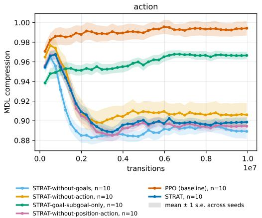  
(a) Action compressed in the representation.

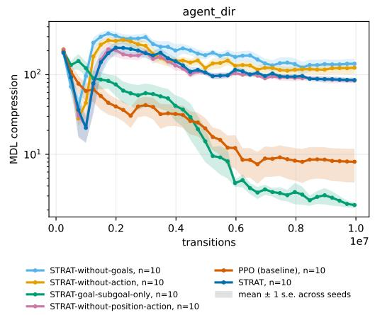  
(b) Agent direction compressed in the representation.

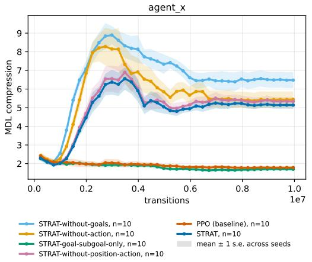  
(c) Agent x compressed in the representation.

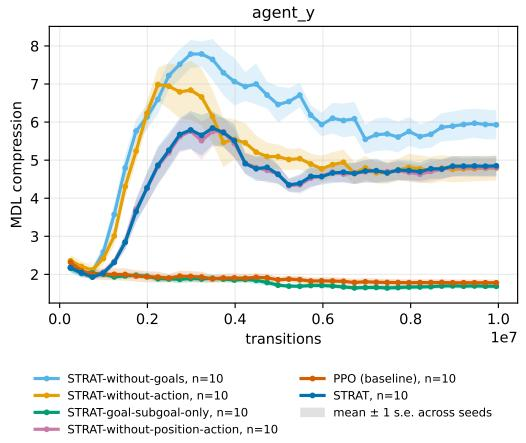  
(d) Agent y compressed in the representation.

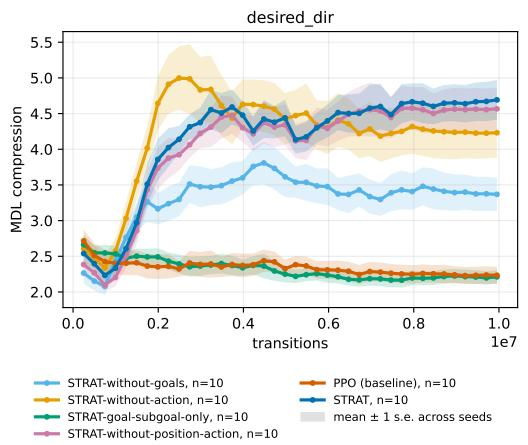  
(e) Desired direction compressed in the representation.

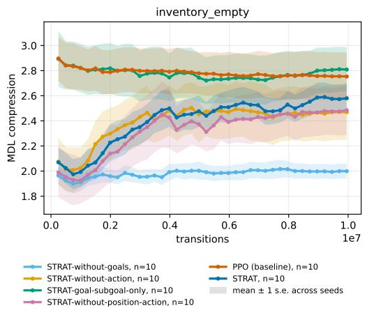  
(f) Empty inventory compressed in the representation.  
Figure 6: Minimum description length.

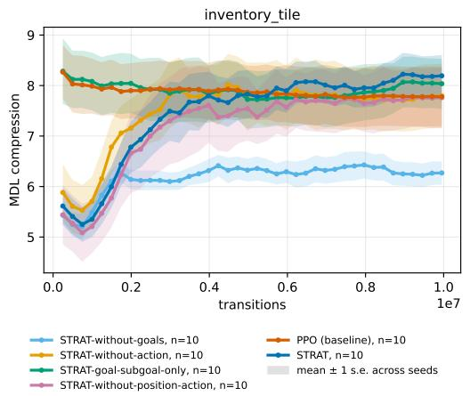  
(a) Inventory tile compressed in the representation.

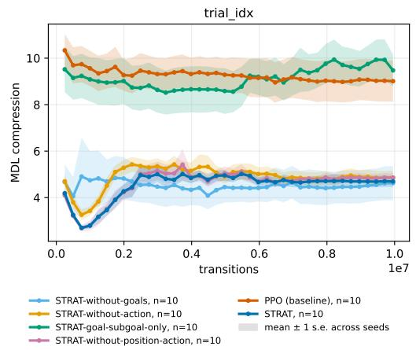  
(b) Trial index compressed in the representation.  
Figure 7: Minimum description length.

(a) Dormant trunk.  
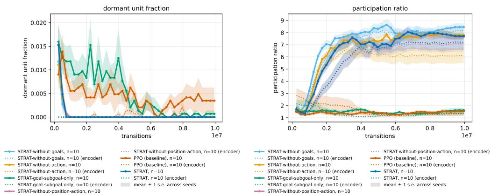  
(b) Participation ratio.  
Figure 8: Information compressed in the representation capacity.