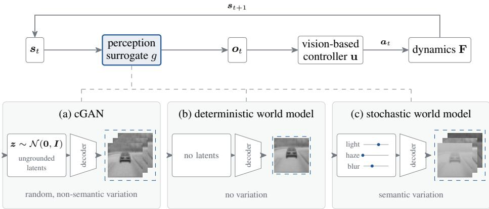
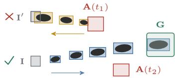
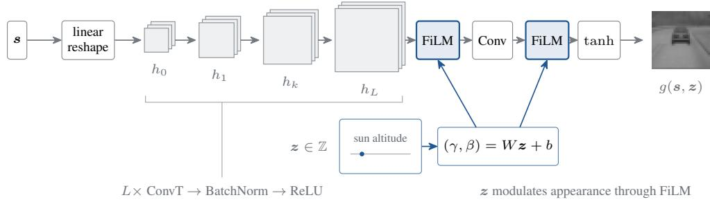
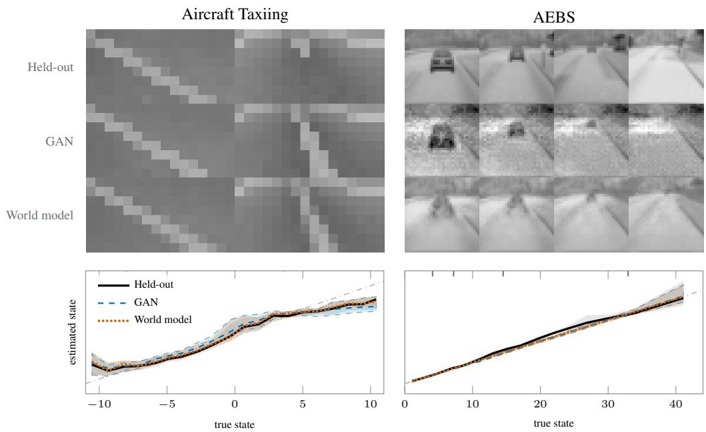
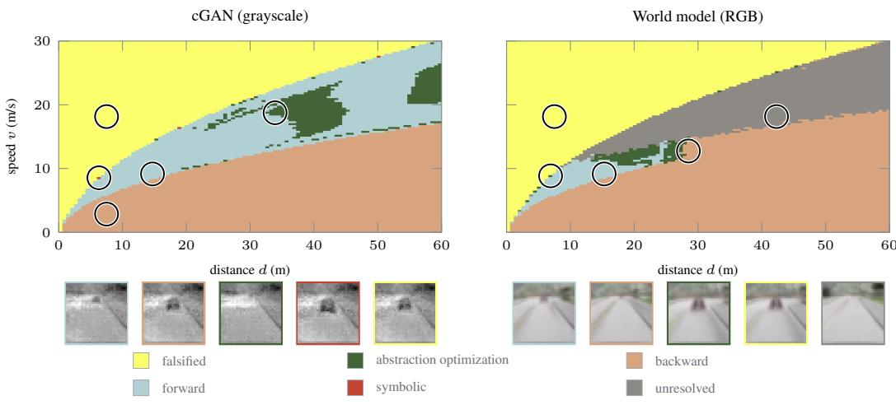

# STOCHASTIC WORLD MODELS FOR VERIFYINGVISION-BASED NEURAL FEEDBACK SYSTEMS

I. Samuel Akinwande1 Mykel J. Kochenderfer1 Clark Barrett2

1Department of Aeronautics and Astronautics, Stanford University

2Department of Computer Science, Stanford University

{samakin,mykel,barrettc}@stanford.edu

## ABSTRACT

Verifying a vision-based neural feedback system requires a model of the observations its controller acts upon. Such a model must capture the variation the sensor produces, while remaining tractable for closed-loop analysis. Generative adversarial networks (GANs) have served as perception surrogates, but they are large, reproduce complex scenes poorly, and are hard to verify. We explore stochastic world models as a richer class of perception surrogates. We train a world model with physically grounded latents, built from operations that standard verifiers bound. It reproduces held-out frames more faithfully than GAN surrogates with up to 130 times as many parameters. To verify these surrogates, we develop a procedure that combines falsification, adaptive refinement, symbolic, and backward analyses. On an emergency braking benchmark with a GAN surrogate, our procedure resolves the entire state space, 38% of which the state-of-the-art verifier left unresolved. On the RGB version of the benchmark, where no verification results have previously been reported, our procedure resolves over 80% of the state space with a world model surrogate.

## 1 INTRODUCTION

Modern autonomous systems act on uncertain, high-dimensional observations instead of exact state information. These observations are often images, and a neural network maps them to control actions, closing the loop between perception and actuation. Systems in which a neural network closes the feedback loop are called neural feedback systems, and they are increasingly deployed in safetycritical domains such as aerial navigation (Kaufmann et al., 2023), humanoid robotics (Radosavovic et al., 2024), and autonomous driving (Nebot & Berrio Perez, 2026). Verification can establish that such a system is safe before it is deployed, and while mature methods exist for classical control systems (Mitchell et al., 2005; Bansal et al., 2017), verifying neural feedback systems remains a challenge. Recent work verifies state-based neural feedback systems, whose controllers compute actions directly from the state (Akinwande et al., 2025; 2026b; Kochdumper et al., 2023; Rober et al., 2023), but the vision-based case remains largely open. The main obstacle is modeling the environment. Verifying a vision-based system requires a model of the sensor and the scene it observes, and the resulting safety guarantee holds for the real system to the extent that this model is faithful. The model must be expressive enough to capture the variation in the images the system will encounter, yet compact enough for a verifier to reason about, and these requirements often conflict.

Prior work replaces the camera with a generative adversarial network (GAN) that renders images for each state (Katz et al., 2022; Cai et al., 2025), but existing verifiers leave the resulting surrogate systems partly unresolved (Cai et al., 2025). Alternative surrogates, including variational autoencoders and formal perception models (Parameshwaran & Wang, 2025; Hsieh et al., 2022), either fail to capture the variation in the sensor’s images or are intractable to verify in closed loop. World models learn to generate the observations of an environment, and failure modes found in them have been shown to transfer to the real world (Ward et al., 2026). Geng et al. (2025) use a world model for closed-loop verification, but its architecture is deterministic. It produces a single observation per state and does not model the environmental variation that makes vision-based verification hard.

We claim that careful surrogate design can ease the tension between expressiveness and tractability. A GAN draws its variation from a noise vector with no direct physical meaning, so the box of noise values a verifier bounds corresponds to no clear range of conditions. A deterministic world model is easier to verify but has no variation to bound. We instead train a stochastic world model that concentrates the variation in a few latents grounded in physical quantities (Figure 1). We frame a vision-based neural feedback system as a state-based system whose sensor is a generative model. To verify the resulting systems, we build a procedure that combines falsification, adaptive refinement, symbolic, and backward analyses. We evaluate the world model on aircraft taxiing and emergency braking case studies, and the procedure on emergency braking. Our contributions are as follows:

• Formalization. A formalization of vision-based neural feedback systems as state-based systems whose sensor is a generative model over a set of latents. In this formalization, the state-based case is the special case where the sensor is the identity map, so analysis techniques for state-based systems extend to the vision-based setting.

• Improved Modeling. A stochastic world model with latents grounded in physical quantities, so that the possible observations at a state correspond to a box of environmental conditions. The model is built from operations that standard verifiers bound, is trained on closed-loop rollouts of the controller, and reproduces held-out frames more faithfully than the GAN surrogates of both case studies, with up to 130 times fewer parameters.

• Verification Procedure. A verification procedure that combines falsification, adaptive refinement, symbolic, and backward analyses. On the emergency braking benchmark, it resolves the entire state space with the released GAN surrogate, 38% of which the stateof-the-art verifier left unresolved. On the RGB version of the benchmark, it resolves over 80% of the state space with a world model surrogate.

## 2 RELATED WORK

Verification algorithms. A few families of methods bound a network’s behavior over an input set. Linear relaxation-based perturbation analysis (LiRPA) (Xu et al., 2020) propagates linear bounds built from per-node abstractions that are exact at affine layers and sound at nonlinearities. Mixed integer encodings represent a piecewise-linear network exactly, defining a binary variable for each unstable neuron (Tjeng et al., 2019). Abstractions may be too loose to decide a property, so complete verifiers pair abstractions with refinement via branch and bound (Xu et al., 2021; Wang et al., 2021). Refinement partitions the input set or fixes unstable activations, bounds each subproblem, and veri fies the property on every subproblem, or refutes it once one subproblem yields a counterexample. Verifiers for state-based neural feedback systems build on this machinery by composing the dynamics with the controller. Forward methods over-approximate the reachable set one step at a time, either by encoding the dynamics and controller together as a mixed-integer program (Sidrane et al., 2022; Akinwande et al., 2025) or by propagating sets or bounds through their composition (Kochdumper et al., 2023; Akinwande et al., 2026b). Backward methods compute the states from which the unsafe set is reachable (Rober et al., 2023) or the states that reach the goal (Akinwande et al., 2026a).

Perception surrogates. A perception surrogate stands in for the sensor during verification. Katz et al. (2022) replace a camera with a conditional GAN (Mirza & Osindero, 2014) that generates observations from the low-dimensional state, yielding a map from states to observations that neural network verifiers can analyze (Julian & Kochenderfer, 2019). Cai et al. (2025) verify this bench mark and introduce an emergency braking benchmark with grayscale and RGB variants (Zhang et al., 2019), leaving 38% of the grayscale system unresolved and the RGB system unverified. Other surrogates include variational autoencoders (Parameshwaran & Wang, 2025), formal models of the perception pipeline (Santa Cruz & Shoukry, 2022; Hsieh et al., 2022), and deterministic world models (Geng et al., 2025), which decode a single observation per state.

World models. World models learned from pixels have been applied to game-playing (Hafner et al., 2021) and have since served as environment surrogates across domains (Hafner et al., 2025), including driving (Wang et al., 2024). Failures found in world models have been shown to transfer to real systems (Ward et al., 2026). The latents of a world model typically carry no physical meaning, so a guarantee over a set of latents does not say which conditions it covers. Recent work argues for latents that are physically interpretable by construction (Peper et al., 2025) and learns such representations under weak supervision (Mao et al., 2026).

  
Figure 1: Perception surrogates for vision-based neural feedback systems. The surrogate g supplies the observation $\mathbf { } _  \mathbf { } \mathbf { } \mathbf { } \mathbf { } \mathbf { } \mathbf { } \mathbf { } \mathbf { } \mathbf { } \mathbf { } \mathbf { } \mathbf { } \mathbf { } \mathbf { } \mathbf { } \mathbf { } \mathbf { } \mathbf { } \mathbf { } \mathbf { } \mathbf { } \mathbf { } \mathbf { } \mathbf { } \mathbf { } \mathbf { } \mathbf { } \mathbf { } \mathbf { } \mathbf { } \mathbf { } \mathbf { } \mathbf { } \mathbf { } \mathbf { } \mathbf { } \mathbf { } \mathbf { } \mathbf { } \mathbf { } \mathbf { } \mathbf { } \mathbf { } \mathbf { } \mathbf { } \mathbf { } \mathbf { } \mathbf { } \mathbf { } \mathbf { } \mathbf { } \mathbf { } \mathbf { } \mathbf { } \mathbf { } \mathbf { } \mathbf { } \mathbf { } \mathbf { } \mathbf { } \mathbf { } \mathbf { } \mathbf { } \mathbf { } \mathbf { } \mathbf { } \mathbf { } \mathbf { } \mathbf { } \mathbf { } \mathbf { } \mathbf { } \mathbf { } \mathbf { } \mathbf { } \mathbf { } \mathbf { } \mathbf { } \mathbf { } \mathbf { } \mathbf { } \mathbf { } \mathbf { } \mathbf { } \mathbf { } \mathbf { } \mathbf { } \mathbf { } \mathbf { } \mathbf { } \mathbf { } \mathbf { } \mathbf { } \mathbf { } \mathbf { } \mathbf { } \mathbf { } \mathbf { } \mathbf { } \mathbf { } \mathbf { } \mathbf { } \mathbf { } \mathbf { } \mathbf { } \mathbf { } \mathbf { } \mathbf { } \mathbf { } \mathbf { } \mathbf { } \mathbf { } \mathbf { } \mathbf { } \mathbf { } \mathbf { } \mathbf { } \mathbf { } \mathbf { } \mathbf { } \mathbf { } \mathbf { } \mathbf { } \mathbf { } \mathbf { } \mathbf { } \mathbf { } \mathbf { } \mathbf { } \mathbf { } \mathbf { } \mathbf \mathbf { } \mathbf { } \mathbf { } \mathbf { } \mathbf { } \mathbf \mathbf { } \mathbf { } \mathbf { } \mathbf { } \mathbf \mathbf { } \mathbf { } \mathbf { } \mathbf \mathbf { } \mathbf { } \mathbf \mathbf { } \mathbf { } \mathbf \mathbf { } \mathbf \mathbf { } \mathbf { } \mathbf \mathbf { } \mathbf \mathbf { } \mathbf \mathbf { } \mathbf \mathbf { } \mathbf \mathbf { } \mathbf \mathbf { } \mathbf \mathbf { }$ the controller acts upon, and so determines the variation the closed loop can see. (a) A cGAN draws its variation from a Gaussian latent with no direct physical meaning. (b) A deterministic world model has no latent and no variation. (c) Our stochastic world model draws its variation from a few physically grounded latents, whose ranges form a box that verifiers can bound.

Combined strategies. When no single analysis decides a property, prior work combines several. Refinement tightens bounds at the cost of more subproblems, whether by partitioning the input (Everett et al., 2021), splitting only where a candidate violation survives (Rober & How, 2024), or refining wherever a counterexample proves spurious (Elboher et al., 2020; Li et al., 2026). Falsification has been paired with reachability so that one analysis directs the other (Dreossi et al., 2019a;b; Tsujio et al., 2025), and forward and backward reachability have been integrated into a single procedure for neural feedback systems (Akinwande et al., 2026a).

## 3 PROBLEM FORMULATION

Notation. We write $2 ^ { \mathbf { X } }$ for the power set of X, [i..j] for $\{ i , \ldots , j \}$ , [n] for $[ 1 . . n ]$ , and $S _ { t }$ for the t-th element of a sequence S. Functions apply to sets elementwise, with the results unioned.

## 3.1 NEURAL FEEDBACK SYSTEMS

A neural feedback system is a dynamical system controlled by a neural network. We model the system in discrete time, with a controller that acts on observations of the state, and represent it by the tuple $\mathcal { D } = \langle m , n , d , \mathbf { I } , \mathbf { F } , \mathbf { E } , \Xi , h , \mathbf { u } , B , \delta , T , \mathbf { G } , \mathbf { A } \rangle$ . The state $s \in \mathbb { R } ^ { n }$ evolves under a vector field $\bar { \mathbf { F } } = ( f _ { 1 } , \ldots , f _ { n } )$ with $f _ { i } : \mathbb { R } ^ { n } \to \mathbb { R }$ , subject to perturbations drawn from $\mathbf { E } \subseteq \mathbb { R } ^ { n }$ . A sensor $h : \mathbb { R } ^ { n } \times \Xi \to \mathbb { R } ^ { d }$ maps the state and an exogenous input ${ \pmb { \xi } } \in \Xi$ to an observation $\textbf { \em o } \in \mathbb { R } ^ { d }$ The controller u $: \mathbb { R } ^ { d } \overset { } {  } \mathbb { R } ^ { m }$ computes an action from the observation, and the action drives the dynamics through a controller-input matrix $B \in \mathbb { R } ^ { n \times m }$ . The system starts in $\mathbf { I } \subseteq \mathbb { R } ^ { n }$ , advances in steps of length δ for T steps, and is evaluated against a goal set $\mathbf { G } \subseteq \mathbb { R } ^ { n }$ and time-indexed unsafe states $\mathbf { A } : [ { \breve { 0 } } . . T ]  2 ^ { \mathbb { R } ^ { n } }$ . One step of the closed loop is

$$
n e x t ^ { \mathcal { D } } ( \pmb { s } ) : = \{ \pmb { s } + ( \mathbf { F } ( \pmb { s } ) + B \mathbf { u } ( h ( \pmb { s } , \pmb { \xi } ) ) + \epsilon ) \delta \mid \epsilon \in \mathbf { E } , \pmb { \xi } \in \Xi \} .\tag{1}
$$

Starting from $\mathbf { X } _ { 0 } \subseteq \mathbf { I } _ { \mathbf { \Delta } }$ , the trajectory $\tau ^ { \mathcal { D } } ( \mathbf { X } _ { 0 } ) : = ( \mathbf { X } _ { 0 } , \ldots , \mathbf { X } _ { T } )$ with $\mathbf { X } _ { t } : = n e x t ^ { \cal D } ( \mathbf { X } _ { t - 1 } )$ for $t \in [ T ]$ denotes the states that can be reached at each time step.

The verification literature has focused on the state-based case, where $d = n$ and $h ( \pmb { s } , \pmb { \xi } ) = \pmb { s }$ . In that setting, the controller observes the state exactly, and Ξ plays no role. This paper addresses the vision-based case, where h is a camera, $d \gg n ,$ and ξ denotes environmental factors such as lighting and weather. Such a sensor has no closed-form description, so we introduce a perception surrogate $g : \mathbb { R } ^ { n } \times \mathbb { Z } \to \mathbb { R } ^ { d }$ , a generative model that maps a state and a latent $z \in \mathbb { Z }$ to an observation. Substituting g for h and Z for Ξ in D yields the surrogate system. This framing places vision-based systems within the state-based formalism, so state-based verification techniques extend to them.

Reach-Avoid Specifications. The system D is safe if every trajectory enters the goal set at some step and no trajectory intersects the unsafe states at any step:

$$
\forall s \in \mathbf { I } . \exists t \in [ 0 . . T ] . \tau ^ { \mathcal { D } } ( \{ s \} ) _ { t } \subseteq \mathbf { G } ,\tag{2}
$$

$$
\forall t \in [ 0 . . T ] . \tau ^ { \mathcal { D } } ( \mathbf { I } ) _ { t } \cap \mathbf { A } ( t ) = \varnothing .\tag{3}
$$

Equations 2 and 3 are the reach and avoid properties (Figure 2). Since $\mathbf { \Psi } _ { n e x t } \mathcal { D }$ ranges over every $\xi \in \Xi$ , a system satisfying these properties is safe for every environmental condition in Ξ.

## 3.2 REACHABILITY ANALYSIS

Figure 2: Reach-avoid verification. Forward analysis encloses the states reachable from I (black) in boxes (blue) that miss each A(t) and end in G, so I is safe. Backward analysis encloses the states that reach ${ \bf A } ( t _ { 1 } )$ (gold), and these states meet I′, so I′ is unsafe.

Verifying a reach-avoid specification requires sound approximations of the trajectory $\tau ^ { \mathcal { D } } ( \mathbf { X } _ { 0 } )$ . Forward analysis overapproximates $\tau ^ { \mathcal { D } } ( \dot { \mathbf { X } } _ { 0 } )$ and checks it against A(t) and G at each step. Backward analysis instead over-approximates the set of states from which A is reachable within the horizon and checks that it is disjoint from I, or under-approximates the set of states that reach G and checks that it contains I. Both analyses accumulate approximation error over the horizon, since each step starts from the previous step’s approximation. Adaptive refinement (Rober & How, 2024), symbolic analysis (Akinwande et al., 2025), and combinations of forward and backward analysis (Akinwande et al., 2026a) reduce this error.

## 4 STOCHASTIC WORLD MODELS

Our world model is a renderer $g : \mathbb { R } ^ { n } \times \mathbb { Z } \to \mathbb { R } ^ { d }$ that maps a state s and a vector of latents $z \in \mathbb { Z }$ to an image. The state determines the geometry of the scene, and the latents account for variations between two images at the same state, such as the lighting. The model has no noise input, so the latents are its only source of variation. Each latent is a physical quantity ranging over an interval, so Z is a box of physical conditions. The set of images the controller can observe in state s,

$$
g ( s , \mathbb { Z } ) = \{ g ( s , z ) ~ | ~ z \in \mathbb { Z } \} ,\tag{4}
$$

is then the set of images taken under those conditions. Taking g as the perception surrogate yields a system in which z ranges over Z independently at every step.

Architecture. The model is a deconvolutional decoder in the style of DCGAN generators (Radford et al., 2016) and the DreamerV3 image decoder (Hafner et al., 2025). A linear layer lifts the state to a coarse feature map, and L transposed-convolution stages double its resolution in turn:

$$
h _ { 0 } = \mathrm { r e s h a p e } ( W _ { 0 } s + b _ { 0 } ) , \qquad h _ { k } = \mathrm { R e L U } \big ( \mathrm { B N } _ { k } ( \mathrm { C o n v T } _ { k } ( h _ { k - 1 } ) ) \big ) , \quad k \in [ L ] .\tag{5}
$$

Latents enter through feature-wise linear modulation (FiLM) (Perez et al., 2018), which rescales and shifts a feature map per channel by an affine function of z:

$$
\operatorname { F i L M } ( h ; z ) = \left( 1 + \gamma ( z ) \right) \odot h + \beta ( z ) , \qquad ( \gamma , \beta ) ( z ) = W z + b .\tag{6}
$$

FiLM is applied once to the last feature map and once to the image before the output nonlinearity, with a separate projection (W, b) each time:

$$
g ( \pmb { \mathscr { s } } , z ) = \operatorname { t a n h } \Bigl ( \operatorname { F i L M } \bigl ( \operatorname { C o n v } \bigl ( \operatorname { F i L M } ( h _ { L } ; z ) \bigr ) ; z \bigr ) \Bigr ) .\tag{7}
$$

We initialize both projections to zero, so FiLM starts as the identity and training begins from a stateonly decoder, with the latent modulation learned on top of it. The zero initialization, together with FiLM acting per channel, keeps the geometry of the image tied to the state and leaves its appearance to the latents.

Verifiability. Apart from the FiLM product, the model uses only linear, convolution, batch normalization, ReLU, and tanh layers, all of which standard verifiers bound. Batch normalization (Ioffe & Szegedy, 2015) is a per-channel affine map at inference. Layer and group normalization instead compute their statistics from the input and divide by an input-dependent standard deviation, a division that verifiers bound loosely. The FiLM product $\gamma ( z ) \odot h$ multiplies an affine function of z by a feature map that depends on s, and we bound it with the standard McCormick relaxation (Mc-Cormick, 1976) for a product of two bounded quantities.

  
Figure 3: The world model renderer $g .$ A linear layer lifts the state s to a coarse feature map, and L stages of transposed convolution, batch normalization, and ReLU upsample it. The latents z act through two FiLM modulations, which rescale and shift the last feature map and the image.

Training. The model is trained by supervised regression on simulated camera images. We collect closed-loop rollouts in which the controller acts on the true state, and record each image together with the state s and latents z at which it was rendered. The latents are held fixed within a rollout and varied across rollouts to cover Z (Appendix B). The objective is a pixel-wise $\ell _ { 1 }$ loss plus a structural similarity (SSIM) term (Wang et al., 2004) with equal weights, $\mathcal { L } = \| g ( \pmb { \mathscr { s } } , z ) - \pmb { \mathscr { o } } \| _ { 1 } + 1 -$ $\mathrm { S S I M } ( g ( s , z ) , o )$ . The model is fit to the images alone and is never tuned to the controller or the verification process. It is small enough to train in under a minute on a single H100.

## 5 VERIFICATION PROCEDURE

We extend state-based verification of neural feedback systems to the vision-based setting, building on the formalization in Section 3. Recent state-based methods combine open- and closed-loop verification (Kochdumper et al., 2023; Akinwande et al., 2026b), and we take the same approach. We start from an existing open-loop verifier (Xu et al., 2021; Wang et al., 2021) and add methods to support closed-loop analysis. We partition the initial set I uniformly into cells and resolve each cell with falsification, forward analysis, adaptive refinement, symbolic analysis, and backward analysis, which the following paragraphs describe (Algorithm 1).

Falsification is the cheapest part of the procedure, and in our experiments, uniform sampling of initial states and latents finds most failing trajectories. For each cell, the falsifier samples initial states and latents densely, and simulates each sample through the perception surrogate, the controller, and the dynamics. Trajectories that enter an unsafe set are reevaluated in higher-precision arithmetic. A cell with a confirmed unsafe trajectory is falsified, and every other cell is unresolved. A falsified cell may still contain safe states, but we mark the whole cell unsafe so that the verified region remains a sound under-approximation of the safe set.

Forward analysis computes per-step bounds on the states reachable from each unresolved cell. Sound bounds on the next states require bounds on the observations the perception surrogate can produce from the current states and any latents in $\mathbb { Z } ,$ on the actions the controller can take on those observations, and on the states the vector field F reaches under those actions. We compute these bounds by building on existing algorithms and abstractions for verifying neural networks (Wang et al., 2021) and state-based neural feedback systems (Akinwande et al., 2026b). The result is a sound over-approximation of the forward trajectories of every state in the cell. If the over-approximation satisfies the reach-avoid specifications, the cell is verified; otherwise, it remains unresolved. To reduce the conservatism of the over-approximation, we apply abstraction optimization, which tunes the free parameters of each abstraction, such as the slopes of ReLU relaxations. Our scheme builds on similar schemes for neural network (Xu et al., 2021) and state-based system (Akinwande et al., 2026b) verification.

Algorithm 1 Verification procedure.   
Require: surrogate system D with latent box Z; partition resolution N; refinement depth $D _ { A }$ for   
each analysis A   
1: for each cell C of the uniform partition of I into $N ^ { n }$ cells do   
2: if FALSIFY(C) then   
3: mark C FALSIFIED   
4: else   
5: $Q  \{ C \}$   
6: for A ∈ (FORWARD, SYMBOLIC, BACKWARD) do   
7: $Q \gets \mathsf { R e s o L v E } ( A , Q , D _ { A } )$ ▷ refined subproblems A leaves unverified   
8: end for   
9: mark C VERIFIED if $Q = \emptyset ,$ , and UNRESOLVED otherwise   
10: end if   
11: end for

Adaptive refinement reduces conservatism further by shrinking the domain over which each abstraction is built, since abstraction optimization alone can leave large portions of the state space unresolved. Our scheme combines input splitting (Rober & How, 2024), neuron splitting (Wang et al., 2021), and enclosure refinement (Akinwande et al., 2026b). Each refinement splits the problem into subproblems, and a cell is verified only if all of its subproblems are. We refine up to a fixed depth, and subproblems that remain unverified at that depth are evaluated via symbolic analysis.

Symbolic analysis keeps the correlations between steps that per-step forward analysis discards. It unrolls the closed loop over several steps, and bounds the trajectory in one shot, minimizing the approximation error that accumulates over the horizon (Section 3.2), and that abstraction optimization and refinement often cannot recover. Symbolic analysis was developed for state-based systems (Sidrane et al., 2022), and has since been extended to the vision-based setting (Cai et al., 2025). We build on the vision-based method with optimizations that make the analysis tractable for our surrogates. Symbolic analysis remains expensive, so we reserve it for the cells that the previous analyses leave unresolved.

Backward analysis over-approximates the set of states from which the closed loop reaches the unsafe set A. Forward analysis must propagate its over-approximation over the full horizon, and its abstractions loosen as that set grows, so some of its conservatism is inherent to its direction. For some problems, the backward computation is tighter. Recent work combines backward and forward analysis to verify reach-avoid specifications (Akinwande et al., 2026a), and we extend this idea to the vision-based setting. We carry the forward bound to an intermediate step, and use backward analysis from A to show that the forward set at that step cannot reach A within the remaining horizon. This combination resolves cells that forward analysis alone cannot.

## 6 EVALUATIONS

We evaluate on two vision-based control benchmarks from the surrogate verification literature. On both, we measure the fidelity of the world model against held-out images (Section 6.2). On emergency braking, the benchmark that remains open, we also run our verification procedure (Section 6.3). All bound computations run on an NVIDIA H100, and we report cost in GPU-hours.

## 6.1 CASE STUDIES

Aircraft Taxiing. We wish to verify that an aircraft taxiing down a runway stays on the runway. The state is the aircraft’s crosstrack position p and heading error θ, which evolve under a nonlinear map. A camera mounted on the wing captures images, a perception network reads them to estimate the state, and a proportional controller uses the estimate to set the steering angle.

Baselines. Authors in Katz et al. (2022) replace the camera with a conditional GAN (cGAN) trained on X-Plane images, with a two-dimensional latent that covers variation at a fixed state. To keep the resulting system verifiable, they distill the GAN into a smaller MLP. They partition the initial set into $1 2 8 \times 1 2 8$ cells and verify the surrogate system with standard neural network verification tools. Cai et al. (2025) have since verified the benchmark as well, so we focus on the modeling problem. Appendix A gives further details on the benchmark.

  
Figure 4: Held-out frames and each surrogate’s rendering at the same state. The GAN row shows the released generator of each benchmark at zero latent, and the world model row shows our model at the center of its latent box. The plots below show the state the perception network estimates from each source’s frames (crosstrack position for taxiing, distance for AEBS) against the true state, as a median and a 25–75% band over the held-out set.

Automatic Emergency Braking (AEBS). We wish to verify that an autonomous vehicle stops short of a stationary obstacle. The state is the distance to the obstacle and the vehicle’s speed. A front-facing camera captures images, a perception network reads them to estimate the distance, and a controller trained with deep deterministic policy gradient (DDPG) maps the estimate and the true speed to a braking command at 20 Hz.

Baselines. Authors in Cai et al. (2025) replace the camera with a GAN and check the property for every state in each cell of a 100 × 100 grid over the initial set and for every image the surrogate can render. They test a grayscale cGAN with a convolutional perception head and an RGB self-attention GAN (SAGAN) with an attention head. Their approach leaves 38% of the state space unresolved with the cGAN and reports no results for the SAGAN at 20 Hz.

## 6.2 MODELING QUALITY

Our world models reproduce held-out frames more faithfully than the GAN surrogates on both case studies. Since a verification result covers the set of images the surrogate can render, a higher-fidelity surrogate makes that result more informative about the system it stands in for. We measure fidelity on held-out frames by root mean square error (RMSE) and by structural similarity (SSIM), and report the results in Table 1. On Aircraft Taxiing, even our smallest world model, with 50k parameters, renders the scene better than both the 2.76M-parameter DCGAN and the 232kparameter MLP GAN distilled from it, and fidelity improves with model size. On AEBS, our world models reach higher fidelity than GANs with 14 to 130 times as many parameters. The gap is largest in SSIM, which measures whether the structure of the scene is preserved (0.713 and 0.823 for our models against 0.449 and 0.489 for the GANs). The GANs reproduce the mean intensity of the scene but lose its structure (Figure 4). The driving scene is more complex than the runway, and the modeling errors are correspondingly larger.

Table 1: Surrogate fidelity on held-out frames. The MLP GAN is distilled from the DCGAN. Bold marks the best value for each benchmark.
<table><tr><td>Benchmark</td><td>Surrogate</td><td>Params</td><td>RMSE↓</td><td>SSIM ↑</td></tr><tr><td rowspan="5">Aircraft Taxiing</td><td>DCGAN (Katz et al., 2022)</td><td>2.76M</td><td>0.0414</td><td>0.855</td></tr><tr><td>MLP GAN (Katz et al., 2022)</td><td>232k</td><td>0.0407</td><td>0.849</td></tr><tr><td>World model (ours)</td><td>50k</td><td>0.0368</td><td>0.867</td></tr><tr><td>World model (ours)</td><td>136k</td><td>0.0330</td><td>0.898</td></tr><tr><td>World model (ours)</td><td>231k</td><td>0.0320</td><td>0.904</td></tr><tr><td rowspan="2">AEBS (gray)</td><td>cGAN (Cai et al., 2025)</td><td>430k</td><td>0.1862</td><td>0.449</td></tr><tr><td>World model (ours)</td><td>30k</td><td>0.1667</td><td>0.713</td></tr><tr><td rowspan="2">AEBS (RGB)</td><td>SAGAN (Cai et al., 2025)</td><td>3.86M</td><td>0.1908</td><td>0.489</td></tr><tr><td>World model (ours)</td><td>29k</td><td>0.1181</td><td>0.823</td></tr></table>

## 6.3 VERIFICATION RESULTS

Our verification procedure completely solves the grayscale AEBS benchmark. Table 2 compares our procedure with the method of Cai et al. (2025). Their approach reaches no conclusion on 38% of the state space, while ours resolves every cell. We falsify 3,464 cells, one more than their method finds. Of the 6,536 cells we verify, forward analysis verifies 2,208, abstraction optimization and adaptive refinement 551, symbolic analysis 3, and backward analysis 3,774, including all 2,669 cells they verify (Table 5, Figure 5). Verifying the benchmark cost 1,043 GPU-hours, about 1,030 of them on the cells their method could not resolve. The 2,669 cells they verify take us under 10 GPU-hours. They report 374 GPU-hours for the whole benchmark, on hardware they do not specify.

Our verification procedure resolves over 80% of the RGB AEBS benchmark. Cai et al. (2025) report no results for their SAGAN RGB surrogate. In our experiments, the verification problem the SAGAN induces does not fit in the memory of an H100, and we are not aware of any verification procedure that can handle it. Our RGB world model reproduces held-out frames more faithfully than the SAGAN (Table 1), and with it as the surrogate, our procedure resolves over 80% of the state space in 550 GPU-hours. Of the 1,825 unresolved cells, 1,822 have not yet been analyzed. On the grayscale benchmark, our procedure resolved over 80% of the cells in 160 GPU-hours and spent the remaining 880 on the last 20%. If the RGB benchmark follows the same pattern, verifying it fully will take about 3,600 GPU-hours, roughly the time Cai et al. (2025) report for verifying most of a simpler 10 Hz version of the RGB benchmark.

Verifying attention-based perception heads remains a challenge. The RGB result in Table 2 uses a convolutional perception head in place of the attention head of the released benchmark, since efficient abstractions for attention remain an open problem. Our procedure can verify systems with attention-based heads, but at a higher cost. Table 3 reports how many cells our procedure verifies within 10 GPU-hours on the RGB world model for three perception heads (Appendix D). The convolutional head yields more than twice as many verified cells as an attention head of similar size (120 against 55). The attention head at the released size, with 1.73M parameters, is also verifiable, but only 10 cells are verified in the same budget. However, the larger head reads distances from held-out frames more than twice as accurately.

Table 2: Verification results on the 10,000 cells of the AEBS benchmark. Bold marks the better verified and unresolved counts on the cGAN. On the world model, 1,822 unresolved cells are not yet analyzed.
<table><tr><td>Surrogate</td><td>Verifier</td><td>GPU-hours</td><td>Verified</td><td>Falsified</td><td>Unresolved</td></tr><tr><td>cGAN (grayscale)</td><td>Cai et al. (2025)</td><td>374</td><td>2,669</td><td>3,463</td><td>3,868</td></tr><tr><td>cGAN (grayscale)</td><td>Ours</td><td>1,043</td><td>6,536</td><td>3,464</td><td>0</td></tr><tr><td>World model (RGB)</td><td>Ours</td><td>1 550</td><td>4,677</td><td>3,498</td><td>1,825</td></tr></table>

  
Figure 5: Each cell of the AEBS benchmark, colored by the analysis that decided it, on the released grayscale cGAN and on our RGB world model. Abstraction optimization includes adaptive refinement, and backward analysis decides every cell the baseline verifies. Most unresolved cells on the world model have not yet been analyzed. Each circle marks one cell per outcome, rendered below by that surrogate and framed in the outcome’s color.

Table 3: Cells verified within 10 GPU-hours on the RGB world model, starting from a 10×10 block, using various perception heads. Error is the mean absolute distance error on held-out frames.
<table><tr><td>Perception head</td><td>Params</td><td>Verified</td><td>GPU-hours</td><td>Error (m)</td></tr><tr><td>Convolutional</td><td>98k</td><td>120</td><td>9.75</td><td>0.384</td></tr><tr><td>Attention, small</td><td>112k</td><td>55</td><td>9.91</td><td>0.383</td></tr><tr><td>Attention, released size</td><td>1.73M</td><td>10</td><td>9.67</td><td>0.166</td></tr></table>

## 7 CONCLUSIONS AND FUTURE WORK

We investigated methods for verifying vision-based neural feedback systems through perception surrogates. We formalized such a system as a state-based system whose sensor is a generative model, and extended state-based verification techniques to it. We then trained stochastic world models with grounded latents, and on both case studies they reproduce held-out frames more faithfully than the GAN surrogates of prior work, despite having up to 130 times fewer parameters. To verify the resulting systems, we built a procedure that combines falsification, forward analysis with abstraction optimization and adaptive refinement, symbolic analysis, and backward analysis. On the grayscale emergency braking benchmark, the procedure resolves every cell, including the 38% that the stateof-the-art verifier left unresolved. On the previously unsolved RGB benchmark, it resolves over 80% of the state space using a world model surrogate.

Limitations. Our guarantees hold for the surrogate system, and our ability to transfer the guarantees depends on the fidelity of our surrogates. Our world models are trained and evaluated on simulated frames. We measure their fidelity empirically, and no formal guarantee relates the surrogate to the camera it replaces. Our RGB results are for a convolutional perception head, and we have not verified the benchmark with the released attention head. Finally, symbolic analysis contributes little. It decides three cells on the grayscale benchmark and none so far on the RGB benchmark, and we have not yet determined why.

Next steps. Tighter abstractions for attention would let us verify the released perception head, and world models trained on real camera data would test how far our fidelity results transfer. We also plan to find out why symbolic analysis helps so little, and to study harder, more nonlinear benchmarks and richer specifications.

## REFERENCES

I. Samuel Akinwande, Chelsea Sidrane, Mykel J. Kochenderfer, and Clark Barrett. Polyhedral enclosures: An efficient combinatorial abstraction for nonlinear neural feedback systems. arXiv preprint arXiv:2503.22660, 2025.

I. Samuel Akinwande, Sydney M. Katz, Mykel J. Kochenderfer, and Clark Barrett. The FABRIC strategy for verifying neural feedback systems. arXiv preprint arXiv:2603.08964, 2026a.

I. Samuel Akinwande, Mykel J. Kochenderfer, and Clark Barrett. Closing the loop: Branchand-bound for scalable verification of nonlinear neural feedback systems. arXiv preprint arXiv:2609.16298, 2026b.

Somil Bansal, Mo Chen, Sylvia Herbert, and Claire J. Tomlin. Hamilton-jacobi reachability: A brief overview and recent advances. In IEEE Conference on Decision and Control (CDC), pp. 2242–2253, 2017. doi: 10.1109/CDC.2017.8263977.

Feiyang Cai, Chuchu Fan, and Stanley Bak. Scalable surrogate verification of image-based neural network control systems using composition and unrolling. In Proceedings ofthe AAAI Conference on Artificial Intelligence, volume 39, pp. 21–30, 2025. doi: 10.1609/aaai.v39i1.31976.

Tommaso Dreossi, Alexandre Donze, and Sanjit A. Seshia. Compositional falsification of cyber-´ physical systems with machine learning components. Journal ofAutomated Reasoning, 63:1031– 1053, 2019a. doi: 10.1007/s10817-018-09509-5.

Tommaso Dreossi, Daniel J. Fremont, Shromona Ghosh, Edward Kim, Hadi Ravanbakhsh, Marcell Vazquez-Chanlatte, and Sanjit A. Seshia. VerifAI: A toolkit for the formal design and analysis of artificial intelligence-based systems. In Computer Aided Verification (CAV), Lecture Notes in Computer Science, pp. 432–442. Springer, 2019b. doi: 10.1007/978-3-030-25540-4 25.

Yizhak Yisrael Elboher, Justin Gottschlich, and Guy Katz. An abstraction-based framework for neural network verification. In Computer Aided Verification (CAV), Lecture Notes in Computer Science, pp. 43–65. Springer, 2020. doi: 10.1007/978-3-030-53288-8 3.

Michael Everett, Golnaz Habibi, and Jonathan P. How. Robustness analysis of neural networks via efficient partitioning with applications in control systems. IEEE Control Systems Letters, 5(6): 2114–2119, 2021. doi: 10.1109/LCSYS.2020.3045323.

Yuang Geng, Zhongzheng Zhang, Chengzhen Jiang, Yanru Li, Xinyang Wang, Zhuoyang Zhou, Hoang-Dung Tran, and Ivan Ruchkin. Deterministic world models for closed-loop reachability analysis of end-to-end vision-based control. arXiv preprint arXiv:2512.08991, 2025.

Danijar Hafner, Timothy Lillicrap, Mohammad Norouzi, and Jimmy Ba. Mastering Atari with discrete world models. In International Conference on Learning Representations (ICLR), 2021.

Danijar Hafner, Jurgis Pasukonis, Jimmy Ba, and Timothy Lillicrap. Mastering diverse control tasks through world models. Nature, 640:647–653, 2025. doi: 10.1038/s41586-025-08744-2.

Chiao Hsieh, Yangge Li, Dawei Sun, Keyur Joshi, Sasa Misailovic, and Sayan Mitra. Verifying controllers with vision-based perception using safe approximate abstractions. IEEE Transactions on Computer-Aided Design of Integrated Circuits and Systems, 41(11):4205–4216, 2022. doi: 10.1109/TCAD.2022.3197508.

Sergey Ioffe and Christian Szegedy. Batch normalization: Accelerating deep network training by reducing internal covariate shift. In International Conference on Machine Learning (ICML), pp. 448–456, 2015.

Kyle D Julian and Mykel J Kochenderfer. Guaranteeing safety for neural network-based aircraft collision avoidance systems. In 2019 IEEE/AIAA 38th Digital Avionics Systems Conference (DASC), pp. 1–10. IEEE, 2019.

Sydney M. Katz, Anthony L. Corso, Christopher A. Strong, and Mykel J. Kochenderfer. Verification of image-based neural network controllers using generative models. Journal of Aerospace Information Systems, 19(9):574–584, 2022. doi: 10.2514/1.I011071.

Elia Kaufmann, Leonard Bauersfeld, Antonio Loquercio, Matthias Muller, Vladlen Koltun, and¨ Davide Scaramuzza. Champion-level drone racing using deep reinforcement learning. Nature, 620(7976):982–987, 2023. doi: 10.1038/s41586-023-06419-4.

Niklas Kochdumper, Christian Schilling, Matthias Althoff, and Stanley Bak. Open- and closed-loop neural network verification using polynomial zonotopes. In NASA Formal Methods (NFM), Lecture Notes in Computer Science, pp. 16–36. Springer, 2023. doi: 10.1007/978-3-031-33170-1 2.

Jingyang Li, Fu Song, and Guoqiang Li. Counterexample guided branching via directional relaxation analysis in complete neural network verification. arXiv preprint arXiv:2603.14823, 2026.

Zhenjiang Mao, Mrinall Eashaan Umasudhan, and Ivan Ruchkin. Physically interpretable world models via weakly supervised representation learning. In ACM/IEEE International Conference on Cyber-Physical Systems (ICCPS), pp. 177–188. IEEE, 2026. doi: 10.1109/ICCPS68698.2026. 00024.

Garth P. McCormick. Computability of global solutions to factorable nonconvex programs: Part I — convex underestimating problems. Mathematical Programming, 10(1):147–175, 1976. doi: 10.1007/BF01580665.

Mehdi Mirza and Simon Osindero. Conditional generative adversarial nets. arXiv preprint arXiv:1411.1784, 2014.

Ian M. Mitchell, Alexandre M. Bayen, and Claire J. Tomlin. A time-dependent hamilton-jacobi formulation of reachable sets for continuous dynamic games. IEEE Transactions on Automatic Control, 50(7):947–957, 2005. doi: 10.1109/TAC.2005.851439.

Eduardo Nebot and Julie Stephany Berrio Perez. The era of end-to-end autonomy: Transitioning from rule-based driving to large driving models. arXiv preprint arXiv:2603.16050, 2026.

Aditya Parameshwaran and Yue Wang. Scalable and interpretable verification of image-based neural network controllers for autonomous vehicles. In ACM/IEEE International Conference on Cyber-Physical Systems (ICCPS), pp. 1–11. ACM, 2025. doi: 10.1145/3716550.3722037.

Jordan Peper, Zhenjiang Mao, Yuang Geng, Siyuan Pan, and Ivan Ruchkin. Four principles for physically interpretable world models. arXiv preprint arXiv:2503.02143, 2025.

Ethan Perez, Florian Strub, Harm de Vries, Vincent Dumoulin, and Aaron Courville. FiLM: Visual reasoning with a general conditioning layer. In AAAI Conference on Artificial Intelligence, volume 32, 2018. doi: 10.1609/aaai.v32i1.11671.

Alec Radford, Luke Metz, and Soumith Chintala. Unsupervised representation learning with deep convolutional generative adversarial networks. In International Conference on Learning Representations (ICLR), 2016.

Ilija Radosavovic, Tete Xiao, Bike Zhang, Trevor Darrell, Jitendra Malik, and Koushil Sreenath. Real-world humanoid locomotion with reinforcement learning. Science Robotics, 9(89):eadi9579, 2024. doi: 10.1126/scirobotics.adi9579.

Nicholas Rober and Jonathan P. How. Constraint-aware refinement for safety verification of neural feedback loops. IEEE Control Systems Letters, 8:3219–3224, 2024. doi: 10.1109/LCSYS.2024. 3518912.

Nicholas Rober, Sydney M. Katz, Chelsea Sidrane, Esen Yel, Michael Everett, Mykel J. Kochenderfer, and Jonathan P. How. Backward reachability analysis of neural feedback loops: Techniques for linear and nonlinear systems. IEEE Open Journal ofControl Systems, 2:108–124, 2023. doi: 10.1109/OJCSYS.2023.3265901.

Ulices Santa Cruz and Yasser Shoukry. NNLander-VeriF: A neural network formal verification framework for vision-based autonomous aircraft landing. In NASA Formal Methods (NFM), Lecture Notes in Computer Science, pp. 213–230. Springer, 2022. doi: 10.1007/978-3-031-06773-0 11.

Chelsea Sidrane, Amir Maleki, Ahmed Irfan, and Mykel J. Kochenderfer. OVERT: An algorithm for safety verification of neural network control policies for nonlinear systems. Journal of Machine Learning Research, 23(117):1–45, 2022.

Vincent Tjeng, Kai Y. Xiao, and Russ Tedrake. Evaluating robustness of neural networks with mixed integer programming. In International Conference on Learning Representations (ICLR), 2019.

Kohei Tsujio, Mohammad Abdullah Al Faruque, and Yasser Shoukry. RampoNN: A reachabilityguided system falsification for efficient cyber-kinetic vulnerability detection. arXiv preprint arXiv:2511.16765, 2025.

Shiqi Wang, Huan Zhang, Kaidi Xu, Xue Lin, Suman Jana, Cho-Jui Hsieh, and J. Zico Kolter. Beta-CROWN: Efficient bound propagation with per-neuron split constraints for neural network robustness verification. In Advances in Neural Information Processing Systems (NeurIPS), 2021.

Xiaofeng Wang, Zheng Zhu, Guan Huang, Xinze Chen, Jiagang Zhu, and Jiwen Lu. DriveDreamer: Towards real-world-driven world models for autonomous driving. In European Conference on Computer Vision (ECCV), pp. 55–72. Springer, 2024.

Zhou Wang, Alan C. Bovik, Hamid R. Sheikh, and Eero P. Simoncelli. Image quality assessment: From error visibility to structural similarity. IEEE Transactions on Image Processing, 13(4): 600–612, 2004. doi: 10.1109/TIP.2003.819861.

Isaac R. Ward, Michelle Ho, Houjun Liu, Aaron Feldman, Joseph Vincent, Liam Kruse, Sean Cheong, Duncan Eddy, Mykel J. Kochenderfer, and Mac Schwager. Foundational world model accurately detect bimanual manipulator failures. In IEEE International Conference on Robotics and Automation (ICRA), 2026.

Kaidi Xu, Zhouxing Shi, Huan Zhang, Yihan Wang, Kai-Wei Chang, Minlie Huang, Bhavya Kailkhura, Xue Lin, and Cho-Jui Hsieh. Automatic perturbation analysis for scalable certified robustness and beyond. In Advances in Neural Information Processing Systems (NeurIPS), 2020.

Kaidi Xu, Huan Zhang, Shiqi Wang, Yihan Wang, Suman Jana, Xue Lin, and Cho-Jui Hsieh. Fast and complete: Enabling complete neural network verification with rapid and massively parallel incomplete verifiers. In International Conference on Learning Representations (ICLR), 2021.

Han Zhang, Ian Goodfellow, Dimitris Metaxas, and Augustus Odena. Self-attention generative adversarial networks. In International conference on machine learning, pp. 7354–7363. Pmlr, 2019.

## APPENDIX CONTENTS

A Neural Feedback System Definitions 13   
B World Model Training 14   
C Fidelity Evaluation 14   
D Verification Procedure Settings 14   
E Verification Breakdown by Analysis 15

## A NEURAL FEEDBACK SYSTEM DEFINITIONS

For each case study we provide the tuple $\mathcal { D } = \langle m , n , d , \mathbf { I } , \mathbf { F } , \mathbf { E } , \Xi , h , \mathbf { u } , B , \delta , T , \mathbf { G } , \mathbf { A } \rangle$ from Section 3.1. Both are discrete-time systems with step $\delta ,$ and we write out the closed-loop step of Equation 1 for each. Where the controller applies a fixed transform to the output of its perception network, we fold the transform into u, so that $\mathbf { u } : \mathbb { R } ^ { d }  \mathbb { R } ^ { m }$ maps the observation to the applied control, and $B$ records only which coordinate the control drives.

Aircraft Taxiing. The state $\begin{array} { r } { \pmb { s } = ( p , \theta ) } \end{array}$ is the crosstrack position (m) and heading error (rad) of the aircraft relative to the runway centerline (Katz et al., 2022). We have $n = 2 , m = 1$ , and

$$
\mathbf { F } ( \pmb { s } ) = ( v \sin \theta , 0 ) ,
$$

with taxi speed $v = 5 \mathrm { { m } / \mathrm { { s } } }$ . The control is the heading rate $\frac { v } { L }$ tan ϕ, with wheelbase $L = 5 \mathrm { m }$ and steering angle $\phi ,$ and enters through $B = ( 0 , 1 ) ^ { \top }$ . The observations are from a wing-mounted camera, whose images are cropped, converted to grayscale, and downsampled to $8 \times 1 6$ pixels, so the observation dimension is $d = 1 2 8$ . The set $\Xi$ covers variation between frames at a fixed state, such as downtrack position. The controller $\begin{array} { r } { \mathbf { u } ( o ) = \frac { v } { L } \tan ( - 0 . 7 4 \hat { p } - 0 . 4 4 \hat { \theta } ) } \end{array}$ composes the perception network (TinyTaxiNet), which estimates $( \hat { p } , \hat { \theta } )$ from $^ { o , }$ with a proportional steering law. The remaining components are ${ \bf E } = \{ 0 \} ^ { 2 } , \delta = 0 . 0 5 , T = 3 2 0$ (a 16 s window), $\mathbf { I } = \left[ - 1 0 , 1 0 \right] \times$ $[ - 1 0 ^ { \circ } , 1 0 ^ { \circ } ] , \dot { \bf G } = \dot { \mathbb { R } } ^ { 2 }$ (so only the avoid property constrains the system), and $\mathbf { A } ( t ) = \{ s : | p | > \hat { 1 0 } \}$ the edges of the runway. The closed-loop step is

$$
\begin{array} { r } { n e x t ^ { \mathcal { D } } ( \pmb { s } ) = \Big \{ \big ( p + v \delta \sin \theta , ~ \theta + \frac { v } { L } \delta \tan \phi ( h ( \pmb { s } , \pmb { \xi } ) ) \big ) ~ \Big | ~ \pmb { \xi } \in \Xi \Big \} , } \end{array}
$$

where $\phi ( \pmb { \mathscr { o } } ) = - 0 . 7 4 \hat { p } - 0 . 4 4 \hat { \theta } .$ . The benchmark updates $\phi$ at 1 Hz and holds it between updates.   
The cGAN of Katz et al. (2022) is conditioned on s and carries two latents in [−0.8, 0.8].

Automatic Emergency Braking. The state $\pmb { s } = ( d , v )$ is the distance to the obstacle (m) and the speed of the vehicle (m/s) (Cai et al., 2025). We have $n = 2 , m = 1$ , and

$$
\mathbf { F } ( \pmb { s } ) = ( - v , - a _ { 0 } ) ,
$$

with $a _ { 0 } ~ = ~ 2 . 5 3 \mathrm { m / s ^ { 2 } }$ the deceleration at zero braking. The braking command $u \in [ 0 , 1 ]$ enters through $B = ( 0 , - a _ { 1 } ) ^ { \top }$ with $a _ { 1 } = 5 . 4 0 \mathrm { m / s ^ { 2 } }$ . Both constants are read from the plant layer of the released model. The observation is a $3 2 \times 3 2$ grayscale or RGB CARLA camera frame, combined with the speed v, so the observation has 1025 or 3073 entries. The set Ξ covers lighting and weather. The controller ${ \mathbf u } ( o ) = \pi ( \hat { d } , v )$ composes a perception head, which estimates the distance ˆd from the frame, with the released DDPG actor $\pi .$ , two ReLU layers of 400 and 300 units with output clamped to $[ 0 , 1 ]$ The remaining components are $\mathbf { E } = \{ 0 \} ^ { 2 } , \delta = 0 . 0 5 , T = 2 3 8$ (an 11.9 s window), $\mathbf { I } = [ 0 , \bar { 6 } 0 ] \times [ 0 , 3 0 ]$ partitioned into a $1 0 0 \times 1 0 0$ grid of cells verified separately, $\mathbf { G } = \left\{ s : v \le 0 \right\}$ and $\mathbf { \bar { A } } ( t ) \overset { \cdot } { = } \{ \pmb { { s } } : d \leq 0 \}$ . The closed-loop step is

$$
\mathit { n e x t } ^ { \mathcal { D } } ( s ) = \Big \{ \left( d - v \delta , \ v - \left( a _ { 0 } + a _ { 1 } \mathbf { u } ( h ( s , \pm ) ) \right) \delta \right) \Big | \ \xi \in \Xi \Big \} .
$$

The cGAN of Cai et al. (2025) is conditioned on $d$ and carries four latents in $[ - 0 . 0 1 , 0 . 0 1 ]$ , redrawn at every step.

## B WORLD MODEL TRAINING

Data. For the RGB AEBS benchmark we render frames in CARLA 0.9.16 (Town01) while the released DDPG controller acts on the true state. We collect 240 rollouts at 20 Hz, 13,056 frames in total, from initial states stratified over $d ~ \in ~ [ 5 , 6 0 ]$ and $v ~ \in ~ [ 2 , 3 0 ]$ . The latent z is the sun altitude, drawn from $[ 0 ^ { \circ } , 9 0 ^ { \circ } ]$ once per rollout. Frames are cropped, resized to $3 2 \times 3 2$ , and scaled to $[ - 1 , 1 ]$ . The state and latent are normalized by their ranges. We split the data by rollout into training, validation, and held-out sets of 150, 40, and 50 rollouts, stratified by z, so that no held-out image comes from a trajectory seen in training.

Architecture and optimization. The linear layer of Equation 5 lifts the state to a $3 2 \times 4 \times 4 \operatorname* { m a p }$ followed by $L = 3$ stages with 32, 16, and 8 channels and a $3 \times 3$ output convolution. The model has $^ { 2 8 , 5 9 1 }$ parameters. We minimize the loss of Section 4 with Adam (learning rate $2 \times 1 0 ^ { - 4 }$ , weight decay $1 0 ^ { - 4 }$ , gradient-norm clipping at 1.0, batch size 256) for 120 epochs without early stopping, and keep the final weights. Training takes about 30 s on one H100.

Perception heads. The perception heads for the RGB benchmark are trained on the CARLA frames, with the same split, an $\ell _ { 1 }$ loss on $d / 6 0$ , and the same optimizer settings for 60 epochs.

## C FIDELITY EVALUATION

Each surrogate renders an image at the recorded state of every held-out frame. The RGB world model also receives the frame’s sun altitude. GAN latents are set to the center of their range, and world models without a physical latent are rendered at the center of their latent box. All images are mapped to [0, 1] before scoring. RMSE is taken over all pixels and channels. SSIM uses a $7 \times 7$ uniform window over full windows, with $K _ { 1 } = 0 . 0 1$ and $\bar { K } _ { 2 } = 0 . 0 3$ , and is averaged over channels for RGB. Generator outputs outside [0, 1] are clipped for SSIM only.

Emergency braking. The 2,487 held-out frames are the frames of the held-out rollouts of the RGB world model’s split. The cGAN and SAGAN are the generators released by Cai et al. (2025). Their training data is not published, so we cannot confirm that these frames are held out from them.

Aircraft taxiing. We use the 10,000 downsampled frames released by Katz et al. (2022), split 80/10/10 and stratified on position and heading deciles, which leaves 1,002 held-out frames. Our world models train on the 7,996 training frames, with hyperparameters selected on the validation split. The DCGAN weights of Katz et al. (2022) were not released, so we retrain the DCGAN from their code on the same training frames (binary cross-entropy loss, batch size 256, Adam with learning rate $7 \times 1 0 ^ { - 4 }$ and $( \beta _ { 1 } , \beta _ { 2 } ) \overset { \cdot } { = } ( 0 . 5 , 0 . 9 9 )$ , 750 epochs, two latents). The MLP GAN is their released generator. It was distilled from a DCGAN trained on all 10,000 frames, so it has seen our held-out frames in training.

## D VERIFICATION PROCEDURE SETTINGS

Table 4 lists the settings of Algorithm 1 for both AEBS experiments. Each cell of the $1 0 0 \times 1 0 0$ grid is 0.6 m by 0.3 m/s. Refinement splits a cell into $K \times K$ sub-cells, and the cell is verified only when all $K ^ { 2 }$ sub-cells are. An analysis fails on a sub-cell at the first step whose distance lower bound is non-positive, and verifies it at the first step whose speed upper bound is non-positive. A sub-cell that reaches the horizon without either remains unresolved. At $K \in \{ 4 , 6 \}$ a pass stops at the first failing sub-cell. At $K \in \{ 1 , 2 \}$ every sub-cell is analyzed so that verified pieces can be reused.

Numerical soundness. Bounds are computed in float32 on the GPU with TF32 disabled, so matrix products keep full float32 precision. The sign tests that decide each sub-cell are done in float64. We do not claim soundness against floating-point error inside the bounding library. We record discrepancies between float32 and float64 to detect floating point errors in the bounding library.

Perception-head budget. The three heads of Table 3 read the same RGB world model and verify the same $1 0 \times 1 0$ block of cells, $d \in [ 1 0 . 8 , 1 6 . 8 ]$ and $v \in [ 8 . 7 , 1 1 . 7 ]$ . No cell in the block is falsified or verified before the experiment. Cells are analyzed in order of decreasing clearance, and a head that finishes the block continues on the remaining unresolved cells in the same order. GPU-hours are the sum of per-cell wall-clock times. Up to three processes shared one H100, so these times include contention between them. A head stops once its in-flight time reaches 10 hours, and a cell cut off mid-flight contributes neither a verdict nor time.

Table 4: Procedure settings for the grayscale (cGAN) and RGB (world model) experiments. “Same” means the cGAN setting.
<table><tr><td>Setting</td><td>cGAN</td><td>World model</td></tr><tr><td>Falsification</td><td>5,000 samples per cell</td><td>same</td></tr><tr><td>Targeted falsification</td><td>4,000 samples, 5 rounds</td><td>same</td></tr><tr><td>Refinement K</td><td>{1, 2, 4, 6}; 12 for three cells</td><td>{1, 2, 4, 6}</td></tr><tr><td>Abstraction optimization</td><td>20 iterations, then 5 per step; rate 0.5</td><td>same</td></tr><tr><td>Neuron splitting</td><td>off</td><td>16–64 domains; 300 s per cell</td></tr><tr><td>Symbolic analysis Backward analysis</td><td>3,600 s budget from the last forward step</td><td>120 s budget same; 300 s budget</td></tr></table>

## E VERIFICATION BREAKDOWN BY ANALYSIS

Tables 5 and 6 attribute each of the 10,000 cells to the analysis of Section 5 that decided it.

Table 5: Cells of the grayscale AEBS benchmark decided by each analysis, on the released cGAN surrogate. Backward analysis decides all 2,669 cells that Cai et al. (2025) verify.
<table><tr><td>Analysis</td><td>Verified</td><td>Falsified</td></tr><tr><td>Falsification</td><td></td><td>3,464</td></tr><tr><td>Forward analysis</td><td>2,208</td><td></td></tr><tr><td>Abstraction optimization and refinement</td><td>551</td><td></td></tr><tr><td>Symbolic analysis</td><td>3</td><td></td></tr><tr><td>Backward analysis</td><td>3,774</td><td></td></tr><tr><td>Total</td><td>6,536</td><td>3,464</td></tr></table>

Table 6: Cells of the RGB AEBS benchmark decided by each analysis, on the world-model surrogate. Of the 1,825 unresolved cells, 1,822 have not yet been analyzed.
<table><tr><td>Analysis</td><td>Verified</td><td>Falsified</td></tr><tr><td>Falsification</td><td></td><td>3,498</td></tr><tr><td>Forward analysis</td><td>305</td><td></td></tr><tr><td>Abstraction optimization and refinement</td><td>156</td><td></td></tr><tr><td>Symbolic analysis</td><td>0</td><td></td></tr><tr><td>Backward analysis</td><td>4,216</td><td></td></tr><tr><td>Total</td><td>4,677</td><td>3,498</td></tr></table>