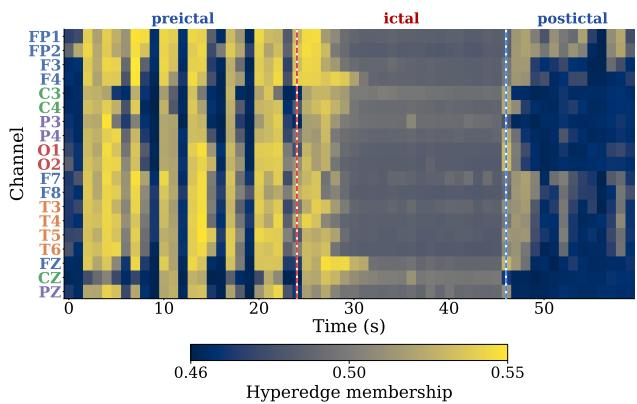
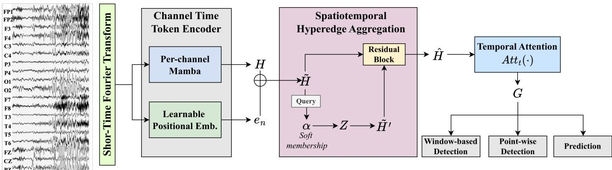
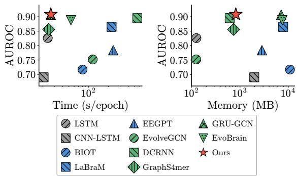
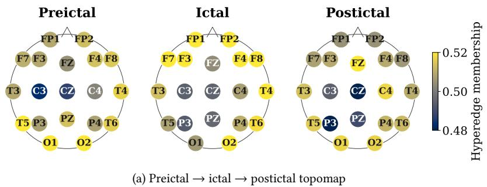
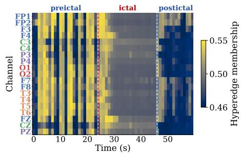
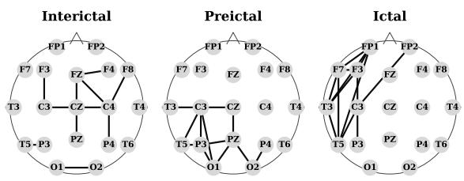
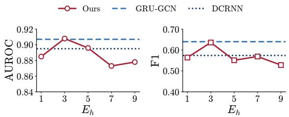
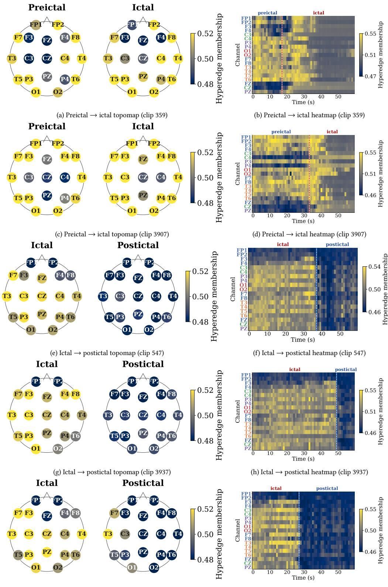

# Spatiotemporal Hyperedges for EEG Seizure Detection and Prediction

Hyunju Kim∗ hyunju@gatech.edu School of Computational Science and Engineering Georgia Institute of Technology Atlanta, GA, USA

Noseong Park noseong@kaist.ac.kr School of Computing Korea Advanced Institute of Science and Technology Daejeon, Republic of Korea

## Abstract

Seizure detection and prediction from EEG are clinically im-portant but challenging because seizures are rare, temporally localized, and propagate as coordinated events across multiple channels. Recent dynamic graph neural networks model this by running a temporal model over a sequence of per-time-step pairwise channel edges. However, this pairwise construction misses the spatiotemporal coupling that constitutes a seizure, at substantial training cost. We propose HyBrain, which summarizes spatiotemporal EEG evidence through a small set of soft hyperedges rather than pairwise edges. A per-channel Mamba backbone produces one token per (channel, second), and a spatiotemporal hyperedge block pools these tokens into �ℎ shared group embeddings through soft memberships and broadcasts them back. The same encoder serves three downstream tasks: window-based detection, one-second point-wise detection, and preictal seizure prediction. On TUSZ and CHB-MIT, HyBrain achieves the best AUROC on every reported setting against ten baselines, with the largest gap on long-clip preictal prediction. It also matches the most eficient baselines in training time and peak GPU memory. A qualitative analysis shows that even a single learned hyperedge cleanly captures the preictal → ictal → postictal trajectory on a real seizure clip.

## 1 Introduction

Epilepsy afects approximately 50 million people worldwide, and timely recognition of seizure activity is critical for preventing injuries and life-threatening complications [9, 10, 19, 24]. In clinical practice, seizure monitoring is performed on continuous multi-channel electroencephalography (EEG), a long and highdimensional time series in which seizures occupy only brief intervals scattered across hours to days of recording [3]. Reliably surfacing these rare events from large-scale streaming biosignal data is impractical for manual review, making automated EEG seizure detection a long-standing problem at the intersection of biomedical informatics and time-series data mining [27, 28].

Three families of methods have shaped EEG seizure model- ing. Early models treat EEG as a multi-channel time series and

Sheo Yon Jhin∗ sheoyon.jhin@kaist.ac.kr School of Computing Korea Advanced Institute of Science and Technology Daejeon, Republic of Korea

Nabil Imam nimam6@gatech.edu School of Computational Science and Engineering Georgia Institute of Technology Atlanta, GA, USA

  
Figure 1: Membership of one spatiotemporal hyperedge over the channel-time tokens of a 60s TUSZ clip. The membership regime shifts across phases (dashed lines), coupling the tokens of each phase into a distinguishable group-level embedding. This emerges because our model learns hyperedges well-suited for seizure detection.

apply CNNs or RNNs along the time axis only, leaving the relations among electrodes implicit [2, 20]. A second line constructs a static pairwise graph over channels and runs a GNN on top, capturing electrode relations but not how they change during a seizure [6, 30]. To capture time-varying connectivity, recent methods introduce dynamic graph neural networks (GNNs) that replace the static adjacency with a pairwise channel graph at each time step [23, 25, 29]. These models see both spatial and temporal variation, but each relation is still defined between two channels within the same time step. A heavier subfamily further applies a temporal model to the per-time-step edge sequence [13, 18], ex-plicitly tracking how each pairwise edge evolves over time. How-ever, this still does not directly model cross-time, cross-channel coupling, such as one channel at one time influencing another channel at a later time. It also decomposes a multi-channel seizure event into many bilateral edge trajectories and requires retaining edge-level activations over time, which increases the computational and memory cost of the graph pipeline.

We address these limitations with HyBrain, which learns a small set of spatiotemporal hyperedges over channel-time tokens. This formulation models channel-time coupling and group-level interaction directly, and does not require dense per-time-step pairwise graphs. The encoder follows a node → hyperedge → node flow. A per-channel Mamba backbone [14] first produces one token per (channel, second) pair. A spatiotemporal hyperedge block then pools all �� tokens into $E _ { h }$ shared group embeddings through soft memberships, and broadcasts the same �ℎ group embeddings back to every token weighted by its own member- ships, so each token absorbs the group-level context relevant to it (cf. Figure 1). A Set-Transformer–style Pooling by Multi-head Attention (PMA) readout [21] finally aggregates the updated tokens for each task head. This design summarizes the entire channel-time field through $E _ { h } \ll N T$ group embeddings rather than reconstructing it from per-time-step pairwise edges.

We evaluate HyBrain on TUSZ [27] and CHB-MIT [28] across three tasks: window-based detection, one-second point-wise de- tection, and preictal seizure prediction. The same encoder sup- ports all three tasks because HyBrain learns task-relevant hy- peredge memberships over channel-time tokens, while only the lightweight readout head is changed for each task (cf. Figure 1).

Our contributions are:

(1) We introduce learnable hyperedges over channel-time tokens that model cross-time and cross-channel coupling without pairwise decomposition.

(2) We use the same encoder for window-based detection, point-wise detection, and preictal prediction by learning task-relevant hyperedge memberships, with only the readout head changed per objective.

(3) Against ten baselines, HyBrain achieves the best AUROC across all reported detection and prediction settings on TUSZ and CHB-MIT, with the largest gain on long-clip preictal prediction, while matching the most eficient baselines in time and memory.

Code is available at https://github.com/hhyy0401/seizure.

## 2 Related Work

## 2.1 EEG Deep Learning Models

Sequential and static-graph models. Sequential models treat EEG as a multi-channel time series and apply CNNs or RNNs mainly along the temporal axis, with EEGNet [20] as a general-purpose backbone and CNN–LSTM [2] as an early seizure-focused variant. Static-graph approaches for EEG seizure detection make electrode topology explicit through a fixed adjacency: TGCN [6] introduced this idea with a hand-designed spatial graph, while self-supervised graph neural networks [30] added contrastive pretraining to alleviate label scarcity. A recent line instead pretrains large EEG foundation models on broad corpora and finetunes them on downstream clinical EEG tasks, including BIOT [36], LaBraM [17], and EEGPT [32].

Dynamic GNNs. Because a seizure unfolds as a time-varying pattern of inter-channel coordination, a dedicated line of EEG seizure detection dynamically updates the channel graph within each EEG clip. DCRNN [23] pairs a difusion-convolutional RNN with a per-clip �-NN correlation graph, EvolveGCN [25] evolves GCN parameters across time steps with a recurrent network, and GraphS4mer [29] relearns the graph at each within-clip segment and combines it with a structured state-space backbone [14, 15]. Recent state-of-the-art models further track temporal dynam- ics over edge sequences, for example with a per-edge GRU in GRU-GCN [13] or a per-edge Mamba in EvoBrain [18]. However, these methods still use pairwise edges as the basic relational unit, so higher-order coordination among multiple channels and its temporal consistency are only modeled indirectly through sequential updates or stacked layers.

Hypergraph learning. Hypergraphs extend ordinary graphs by connecting multiple nodes with one hyperedge, making them suitable for high-order group interactions. Prior hypergraph neural networks, including HGNN [11], HyperGCN [35], and AllSet [5], usually use fixed incidences from predefined groups or �-NN features. In EEG, STHGCN [22] applies this idea to emotion recognition by constructing separate spatial and temporal hypergraphs over EEG features. HyBrain instead learns inputconditioned hyperedges jointly over the channel-time grid, using a small fixed hyperedge budget for each clip.

## 2.2 EEG Seizure Tasks

Point-wise seizure detection. Clinical EEG datasets such as TUSZ [27] annotate seizure onset and ofset at one-second resolution, and detectors are expected to localize these transitions, not just classify entire clips. Classical seizure-detection systems reflected this directly, combining point-wise scoring at one-second resolution with event-level scoring based on onset latency and false-alarm rate per hour [1, 28, 33], and early deep-learning detectors preserved this resolution through CNN–RNN or temporal GCN backbones with per-second outputs [7, 26]. The recently proposed SzCORE benchmark [8] likewise lists both point-wise and event-level scoring among its recommended evaluation met- rics. Many recent dynamic-GNN detectors [18, 29], by contrast, adopt coarser supervision and assign a single binary label per 12 s or 60 s window, leaving the available second-level annotations un- used at training time. We complement this line by re-introducing point-wise detection as a first-class training objective, and report per-second results alongside the window-level ones.

Seizure prediction. Seizure prediction difers from detection in that the discriminative evidence is difuse and distributed across channels, evolving slowly over the preictal window rather than concentrated in a clearly ictal interval. Unlike point-wise detection, prediction is usually formulated as distinguishing preictal from interictal EEG under a specified seizure prediction horizon and seizure occurrence period [4, 34]. Early prediction studies and clinical reviews emphasized patient-specific preictal dynamics, early-warning time, and false-alarm burden as central challenges for deployable systems [12, 19, 24]. Recent deep-learning work has further revisited this setting as an early-warning task rather than only a detection problem [18, 31]. Prediction therefore provides a complementary evaluation setting to detection. Rather than recognizing ictal patterns that are already expressed, the model must infer a latent preictal state from subtle changes in ongoing background activity. This setting tests whether HyBrain can aggregate weak evidence over long clips through learned channel–time hyperedges.

  
Figure 2: Overview of HyBrain. A multi-channel EEG clip is first converted into one-second channel-time spectral tokens using a per-channel short-time Fourier transform (STFT). The channel-time token encoder then processes each channel independently with a Mamba backbone and adds a learnable channel embedding to preserve channel identity. The spatiotemporal hyperedge aggregation block pools all channel-time tokens into $E _ { h }$ learnable hyperedge embeddings through soft memberships and broadcasts the resulting group-level context back to the tokens, capturing high-order cross-channel and cross-time interactions. A temporal attention layer further refines intra-channel temporal dependencies, producing the shared representation �. Finally, task-specific heads adapt this shared representation to window-based seizure detection, point-wise seizure detection, and preictal seizure prediction.

## 3 Proposed Methods

## 3.1 Problem Formulation

We represent each EEG clip as a tensor $X \in \mathbb { R } ^ { N \times T \times F }$ , where � is the number of EEG channels, � is the number of one-second time steps, and � is the dimension of the per-second short-time Fourier transform (STFT) feature. A clip of length � seconds has $T = L$ time steps, and $x _ { n , t } \in \mathbb { R } ^ { F }$ denotes the spectral feature of channel � at second �.

Following standard epileptological convention, we refer to time intervals as ictal during an annotated seizure, preictal immediately preceding seizure onset, postictal immediately following seizure ofset, and interictal otherwise.

On this shared input, we study three binary tasks.

(1) Window-based detection predicts $y ^ { \mathrm { w i n } } \in \{ 0 , 1 \}$ , indicating whether the clip overlaps with seizure interval.

(2) Point-wise detection predicts $\mathbf { y } ^ { \mathrm { p t } } \in \{ 0 , 1 \} ^ { T }$ , where $y _ { t } ^ { \mathrm { p t } } = 1$ if the �-th second overlaps with a seizure.

(3) Seizure prediction predicts $y ^ { \mathrm { p r e } } \in \{ 0 , 1 \}$ , the binary classification between interictal (normal) and preictal states, where the preictal state is defined as the $\Delta _ { p } { = } 6 0 s$ window immediately before each seizure onset [18].

All tasks use the same encoder to map � into a channel-time representation $G \in \mathbb { R } ^ { N \times T \times d }$ , and task-specific heads produce either a clip-level logit or per-second logits.

## 3.2 Overall Workflow

Figure 2 shows the detailed design of our method, HyBrain. The overall workflow is as follows:

(1) A per-channel STFT converts each channel into a se-quence of one-second spectral features.

(2) In the Channel-time Token Encoder, a per-channel Mamba backbone [14] encodes these features into one token per (channel, second) pair, augmented with a learn-able channel embedding.

(3) In the Spatiotemporal Hyperedge Aggregation block, a small set of $E _ { h }$ learnable hyperedges pools the channel- time tokens into group embeddings through soft member- ships and broadcasts them back to every token, capturing high-order interactions across channels and time without explicit dynamic graph construction.

(4) A Temporal Attention layer then refines long-range temporal dependencies, producing the shared represen- tation $G \in \overset { \mathbf { \bar { \rho } } } { \mathbb { R } } ^ { N \times T \times d }$

(5) Task-Specific Heads based on PMA-style channel readouts [21] adapt � to window-based detection, point-wise detection, and seizure prediction.

## 3.3 Channel-Time Token Encoding

Each EEG channel is first converted into a one-second spec- tral sequence by a per-channel STFT, yielding $x _ { n , t } ~ \in ~ \mathbb { R } ^ { F }$ per (channel, second) pair (preprocessing details in Section 4.1). We then encode tem oral d namics within each EEG channel. For each channel $n ,$ the spectral sequence $x _ { n , 1 : T }$ is processed by a stack of $L _ { M }$ Mamba layers [14], each a selective state-space module that mixes information along the temporal axis only. Let $u _ { n , t } ^ { ( 0 ) } = W _ { \mathrm { i n } } x _ { n , t } \in \mathbb { R } ^ { d }$ , where $W _ { \mathrm { i n } } \in \mathbb { R } ^ { d \times F }$ is a learnable linear map that lifts the spectral features to the hidden dimension $d ,$ and LN(·) denotes layer normalization. At layer �, a latent state $s _ { n , t } ^ { ( l ) }$ evolves under a selective recurrence and the token is updated by

a residual layer-norm:

$$
\begin{array} { r } { s _ { n , t } ^ { ( l ) } = \overline { { A } } _ { n , t } s _ { n , t - 1 } ^ { ( l ) } + \overline { { B } } _ { n , t } u _ { n , t } ^ { ( l - 1 ) } , } \end{array}\tag{1}
$$

$$
\begin{array} { r } { \boldsymbol { u } _ { n , t } ^ { ( l ) } = \mathrm { L N } \left( \boldsymbol { u } _ { n , t } ^ { ( l - 1 ) } + \boldsymbol { C } _ { n , t } \boldsymbol { s } _ { n , t } ^ { ( l ) } \right) , } \end{array}\tag{2}
$$

where the coeficients $( \overline { { A } } _ { n , t } , \overline { { B } } _ { n , t } , C _ { n , t } )$ depend on $u _ { n , t } ^ { ( l - 1 ) }$ and fol- low Mamba’s HiPPO-initialized form [14]. Setting $H _ { n , t } = u _ { n , t } ^ { ( L _ { M } ) }$ yields the backbone output $H \in \mathbb { R } ^ { N \times T \times d }$ . Because the recurrence is per-channel, the � channels are processed independently and no cross-channel mixing happens at this stage. To preserve chan-nel identity before hyperedge aggregation, we add a learnable channel embedding $e _ { n } \in \mathbb { R } ^ { d }$ as a channel positional embedding:

$$
\tilde { H } _ { n , t } = H _ { n , t } + e _ { n } .\tag{3}
$$

## 3.4 Spatiotemporal Hyperedge Aggregation

Seizure events often appear as channel-to-channel coupling that may carry a temporal lag. We therefore introduce a spatiotempo-ral hyperedge block that proceeds in three steps: it first learns soft token-to-hyperedge memberships, then aggregates the to- kens into hyperedge embeddings, and finally updates each token by broadcasting the incident hyperedges back.

We flatten $\tilde { H } \in \mathbb { R } ^ { N \times T \times d }$ into �� channel-time tokens $\{ \tilde { h } _ { i } \} _ { i = 1 } ^ { N T }$ where each $\tilde { h } _ { i } \in \mathbb { R } ^ { d }$ corresponds to one channel at one time step, and introduce $E _ { h }$ learnable hyperedge queries $\left\{ q _ { k } \right\} _ { k = 1 } ^ { E _ { h } } \subset$ $\mathbb { R } ^ { d } .$ , where $E _ { h }$ is the number of latent hyperedges and each $q _ { k }$ represents one latent spatiotemporal hyperedge. For token � and hyperedge �, the soft membership is

$$
\alpha _ { i , k } = \sigma \left( \frac { q _ { k } ^ { \top } \tilde { h } _ { i } } { \sqrt { d } } \right) ,\tag{4}
$$

where $\sigma ( \cdot )$ is the sigmoid activation. We use sigmoid rather than softmax across hyperedges so that a token can belong to multiple hyperedges, supporting overlapping spatiotemporal patterns.

Given the memberships, each hyperedge embedding �� is the membership-weighted average of its assigned tokens, and each token is updated by broadcasting the incident hyperedge embed- dings back with the same weights:

$$
z _ { k } = \frac { \sum _ { i = 1 } ^ { N T } \alpha _ { i , k } \tilde { h } _ { i } } { \sum _ { i = 1 } ^ { N T } \alpha _ { i , k } } , \quad \tilde { h } _ { i } ^ { \prime } = \sum _ { k = 1 } ^ { E _ { h } } \alpha _ { i , k } z _ { k } .\tag{5}
$$

Here $z _ { k }$ forms a group-level representation of one coordinated spatiotemporal pattern, and $\ddot { h _ { i } ^ { \prime } }$ encodes the group-level spatiotem- poral context associated with token �.

We then fuse the original and updated tokens through a post- norm residual block:

$$
\hat { h } _ { i } = \mathrm { L N } \left( \tilde { h } _ { i } + \mathrm { G E L U } \left( W _ { \mathrm { o u t } } \tilde { h } _ { i } ^ { \prime } \right) \right) ,\tag{6}
$$

where $W _ { \mathrm { o u t } } \in \mathbb { R } ^ { d \times d }$ is a learnable linear map and GELU(·) is the activation. Intuitively, $\tilde { h } _ { i }$ provides the local channel-time evidence at position �, while $\mathrm { G E L U } ( W _ { \mathrm { o u t } } \tilde { h } _ { i } ^ { \prime } )$ injects the global, hyperedge-aggregated spatiotemporal context, so that the post- norm residual incorporates the two views.

We stack $L _ { h }$ such blocks and denote the resulting tensor by $\hat { H } ^ { ( L _ { h } ) } \ \in \ \mathbb { R } ^ { N \times \ddot { T } \times d }$ . We then add a temporal attention layer to capture residual long-range dependencies within each channel.

$$
\begin{array} { r } { G _ { n , : } = \mathrm { L N } \left( \hat { H } _ { n , : } ^ { ( L _ { h } ) } + \beta \mathrm { A } \mathrm { t t } _ { t } \left( \hat { H } _ { n , : } ^ { ( L _ { h } ) } \right) \right) , } \end{array}\tag{7}
$$

Here, $\mathrm { A t t } _ { t } ( \cdot )$ denotes multi-head self-attention along the time axis with weights shared across channels, and $\beta$ is a gate coefi- cient. The output $G \in \mathbb { R } ^ { N \times T \times d }$ is used as the shared representa- tion for downstream readout modules.

## 3.5 Task-Specific Heads and Training Objective

The shared representation � is passed to task-specific heads. All heads use a PMA-style channel readout [21] followed by a linear classifier, where the diference is whether the temporal axis is pooled before the readout or preserved for per-second prediction.

For window-based detection and seizure prediction, we use the same clip-level readout:

$$
r = { \mathrm { P M A } } \left( { \mathrm { P o o l } } _ { t } ( G ) \right) , \quad { \hat { y } } = f ( r ) .\tag{8}
$$

Here, Pool� (·) denotes average pooling over time, $f ( \cdot )$ is the task- specific linear classifier, and �ˆ is a raw logit. The two tasks use diferent labels, $y ^ { \mathrm { w i n } }$ and $y ^ { \mathrm { p r e } }$ , and are trained separately with binary cross-entropy on the sigmoid of the logit.

For point-wise detection, we keep the temporal axis and apply the PMA channel readout independently at each time step:

$$
\begin{array} { r } { r _ { t } = \mathrm { P M A } \left( G _ { : , t } \right) , \quad \hat { y } _ { t } = f _ { \mathrm { p t } } ( r _ { t } ) , \quad t = 1 , . . . , T , } \end{array}\tag{9}
$$

with PMA parameters shared across all time steps. To encode the temporal contiguity of seizure labels directly into the objective, we add a small adjacent-frame logit-smoothness regularizer:

$$
\mathcal { L } _ { \mathrm { p t } } = \frac { 1 } { T } \sum _ { t = 1 } ^ { T } \mathrm { B C E } ( \hat { y } _ { t } , y _ { t } ^ { \mathrm { p t } } ) + \lambda \cdot \frac { 1 } { T - 1 } \sum _ { t = 1 } ^ { T - 1 } \left( \hat { y } _ { t + 1 } - \hat { y } _ { t } \right) ^ { 2 } .\tag{10}
$$

Using logit-space diferences preserves informative gradients under confident predictions, while penalizing only consecutive diferences allows sharp label transitions at seizure onset and ofset.

## 3.6 Theoretical Analysis

We show that HyBrain’s hyperedge block induces an inputadaptive global mixing operator of rank at most $E _ { h }$ over all channel-time tokens, and compare its compute and activationmemory cost against representative edge-stream dynamic-GNN baselines.

Setup. A dynamic pairwise GNN over � EEG channels and � time steps maintains an adjacency $A _ { t } \in \mathbb { R } ^ { N \times N }$ at every time step, with up to $E \le N ^ { 2 }$ pairwise edges per time step. Recent edge-stream variants further apply a temporal model along the edge sequence: GRU-GCN [13] uses a per-edge GRU, and Evo-Brain [18] uses a per-edge Mamba. HyBrain instead applies a single hyperedge block with $E _ { h }$ shared hyperedges to the flat- tened �� channel-time tokens.

Proposition 3.1 (Rank- $\cdot E _ { h }$ global mixing of channel-time tokens). Fix the soft memberships � $\in \mathbb { R } ^ { N T \times E _ { h } }$ from Eq. (4), and let $\begin{array} { r } { s _ { k } = \sum _ { i = 1 } ^ { N T } \alpha _ { i , k } } \end{array}$ . The aggregate-and-broadcast step in Eq. (5) acts on the channel-time tokens as

Table 1: Per-sample asymptotic cost of representative spatiotemporal interaction blocks.
<table><tr><td>Method</td><td>Compute</td><td>Activation memory</td></tr><tr><td>GRU-style edge stream [13]</td><td> $O ( T E d ^ { 2 } )$ </td><td> $O ( T E d )$ </td></tr><tr><td>Mamba-style edge stream [18]</td><td> $O ( T E d )$ </td><td> $O ( T E d )$ </td></tr><tr><td>HyBrain hyperedge block</td><td> $O ( T N E _ { h } d )$ </td><td> $O ( T N E _ { h } + E _ { h } d )$ </td></tr></table>

$$
\tilde { h } _ { i } ^ { \prime } = \sum _ { j = 1 } ^ { N T } M _ { i j } \ : \tilde { h } _ { j } , \qquad M _ { i j } = \sum _ { k = 1 } ^ { E _ { h } } \frac { \alpha _ { i , k } \ : \alpha _ { j , k } } { s _ { k } } .
$$

The induced operator $M = A D ^ { - 1 } A ^ { \top }$ , with $A = [ \alpha _ { i , k } ] \in \mathbb { R } ^ { N T \times E _ { h } }$ and $D = \mathrm { d i a g } ( s _ { 1 } , \ldots , s _ { E _ { h } } )$ , satisfies two properties:

(1) Global support. Under sigmoid memberships, $\alpha _ { i , k } > 0 f o r$ all �, �, so $M _ { i j } > 0$ for every pair ofchannel-time tokens.

(2) Low-rank global interaction. � factors through the $E _ { h }$ hyperedges via �, so rank $( M ) \leq E _ { h }$

Proof. Substituting the hyperedge embedding into the broadcast update gives

$$
\tilde { h } _ { i } ^ { \prime } = \sum _ { k = 1 } ^ { E _ { h } } \alpha _ { i , k } \sum _ { j = 1 } ^ { N T } \frac { \alpha _ { j , k } } { s _ { k } } \tilde { h } _ { j } = \sum _ { j = 1 } ^ { N T } \left( \sum _ { k = 1 } ^ { E _ { h } } \frac { \alpha _ { i , k } \alpha _ { j , k } } { s _ { k } } \right) \tilde { h } _ { j } .
$$

Thus $M = A D ^ { - 1 } A ^ { \top }$ , where $A ~ = ~ [ \alpha _ { i , k } ] ~ \in ~ \mathbb { R } ^ { N T \times E _ { h } }$ and $D \ =$ diag $( s _ { 1 } , \ldots , s _ { E _ { h } } )$ . Therefore rank $( M ) \leq E _ { h }$ . Since sigmoid memberships are strictly positive for finite inputs, ${ M _ { i j } } \mathrm { ~ > ~ } 0$ for all $i , j .$ □

Proposition 3.1 shows that the hyperedge block couples ev- ery pair of channel-time tokens in one step, while routing the interaction through only $E _ { h }$ shared hyperedges. Table 1 com- pares the resulting per-sample asymptotic cost against the two edge-stream variants used by the strongest baselines. Compared with a Mamba-style edge stream, the edge-stream-to-hyperedge compute ratio scales as $O ( E / ( N E _ { h } ) )$ , so the hyperedge block is cheaper whenever the number of pairwise edges per time step exceeds the efective hyperedge budget $N E _ { h }$ . For dense pairwise graphs with $E = O ( N ^ { 2 } )$ , this yields a compute improve-ment of $O ( N / E _ { h } )$ and an edge-related activation-memory reduc- tion of approximately $O ( N d / E _ { h } )$ when the membership tensor $T N E _ { h }$ dominates the $E _ { h } d$ hyperedge state. For sparse graphs with $E = c N$ , where � is the average number of pairwise edges per node, the edge-stream-to-hyperedge compute ratio becomes $c / E _ { h ; }$ and the corresponding relation-related activation-memory ratio is approximately $c d / E _ { h }$ under the same dominance assumption.

Empirically, these claims are checked in three places. The efec- tiveness of the hyperedge coupling itself is tested in Section 5.1. The memory and runtime advantage is evaluated in Section 5.2. The suficiency of a small $E _ { h }$ is verified by the hyperedge sensi- tivity study in Section 5.4.

## 4 Experiments

## 4.1 Experimental Settings

Datasets and preprocessing. We evaluate on TUSZ [27] and CHB-MIT [28], using 12 s and 60 s clip settings for window-based experiments and following the data splits and evaluation protocol of EvoBrain [18]. For the input feature, raw EEG is resampled to 200 Hz, segmented into non-overlapping 1-second windows per channel, and each window is mapped to its log-magnitude STFT over the �=100 positive frequency bins. An �-second clip therefore yields $X \in \dot { \mathbb { R } } ^ { N \times L \times 1 0 0 }$ . For each subject, per-channel STFT mean and standard deviation are computed on the training split and used to normalize all splits.

For point-wise detection, we derive a per-second label $y ^ { \mathrm { p t } }$ ∈ $\{ 0 , 1 \} ^ { L }$ for each clip, where $y _ { t } ^ { \mathrm { p t } } { = } 1$ if the �-th 1-second window overlaps any annotated seizure interval. The window-level label is recovered as $y ^ { \mathrm { w i n } } = \operatorname* { m a x } _ { t } y _ { t } ^ { \mathrm { p t } }$

Tasks. We evaluate three EEG seizure-analysis tasks: windowbased seizure detection, point-wise seizure detection, and preictal seizure prediction. In window-based detection, each �-second clip $( W \in \{ 1 2 , 6 0 \} )$ is labeled positive if it overlaps with any annotated seizure interval. In point-wise detection, each one- second frame is labeled using seizure onset and ofset annota- tions, so models are evaluated at one-second temporal resolution. In seizure prediction, clips are classified as preictal or interictal. Preictal clips are drawn from the $\Delta _ { p } { = } 6 0$ s window before seizure onset, and the interictal pool is constructed by discarding all seizure-labeled segments and excluding a $\Delta _ { b } { = } 3 0 0$ s bufer around every seizure boundary so that preictal evidence does not con- taminate the negative class. Following EvoBrain [18], we report prediction on TUSZ only, since ${ \mathrm { C H B } } { \cdot } { \mathrm { M I T } } ^ { \prime } s$ smaller scale and highly patient-specific pediatric preictal signal are insuficient for cross-patient prediction.

Prediction sampling. To match the fixed clip grid used by all models, we accept a clip as preictal if its full span lies within the strict $\Delta _ { p } { = } 6 0$ s preictal window for 12 s clips, and within a 4× clip-length search window before the bufer for 60 s clips. For tractability and to keep F1 meaningful, we subsample interictal clips per patient to at most 5× that patient’s number of preictal clips, using a fixed seed and applying the same procedure to train, dev, and test splits.

Metrics. We use AUROC and F1 score as primary metrics, following EvoBrain [18]. Quantitative results are averaged over three random seeds. We report test AUROC at the checkpoint with the highest dev AUROC, and test F1 at the threshold $\tau ^ { * }$ that maximizes dev F1.

Hyperparameters. We select hyperparameters by dev AUROC. For HyBrain, we grid search the learning rate, weight decay, dropout, hidden dimension $d ,$ and the temporal-attention gate $\beta \in \{ 0 , 1 \}$ . The search space, the selected per-task values, and the shared optimization settings are listed in Appendix B. Unless otherwise specified, baseline hyperparameters follow their original implementations or the EvoBrain protocol.

Table 2: Window-based seizure detection performance on TUSZ and CHB-MIT. Mean ± std across three seeds. The best result is highlighted in bold, and the second-best is underlined. Time denotes wall-clock seconds per training epoch on a single A6000, and Memory denotes peak GPU memory during training, reported in MB.
<table><tr><td rowspan="2">Method</td><td rowspan="2"></td><td rowspan="2">Time (s/ep.) Memory (MB)</td><td colspan="2">TUSZ (12 s)</td><td colspan="2">TUSZ (60 s)</td><td colspan="2">CHB-MIT (12 s)</td></tr><tr><td>AUROC</td><td>F1</td><td>AUROC</td><td>F1</td><td>AUROC</td><td>F1</td></tr><tr><td>LSTM</td><td>31.30</td><td>88.0</td><td> $0 . 8 3 9 \pm 0 . 0 1 6$ </td><td> $0 . 4 0 3 \pm 0 . 0 6 5$ </td><td> $0 . 8 2 6 \pm 0 . 0 5 0$ </td><td> $0 . 4 2 7 \pm 0 . 0 6 7$ </td><td> $0 . 8 2 3 \pm 0 . 0 7 5$ </td><td> $0 . 0 6 4 \pm 0 . 0 0 7$ </td></tr><tr><td>CNN-LSTM</td><td>29.90</td><td>1208.1</td><td> $0 . 8 2 4 \pm 0 . 0 1 4$ </td><td> $0 . 3 6 5 \pm 0 . 0 5 3$ </td><td> $0 . 6 9 0 \pm 0 . 0 2 6$ </td><td> $0 . 2 4 2 \pm 0 . 0 2 0$ </td><td> $0 . 7 9 8 \pm 0 . 1 1 0$ </td><td> $0 . 0 4 9 \pm 0 . 0 3 2$ </td></tr><tr><td>BIOT</td><td>86.07</td><td>1850.7</td><td> $0 . 8 1 1 \pm 0 . 0 0 6$ </td><td> $0 . 3 0 1 \pm 0 . 0 1 3$ </td><td> $0 . 7 1 7 \pm 0 . 0 6 0$ </td><td> $0 . 2 9 2 \pm 0 . 0 3 6$ </td><td> $0 . 9 0 3 \pm 0 . 0 1 8$ </td><td> $0 . 0 5 4 \pm 0 . 0 9 0$ </td></tr><tr><td>LaBraM</td><td>212.9</td><td>3576.7</td><td> $0 . 8 6 3 \pm 0 . 0 1 0$ </td><td> $0 . 3 9 8 \pm 0 . 0 3 4$ </td><td> $0 . 8 6 5 \pm 0 . 0 0 7$ </td><td> $0 . 4 6 6 \pm 0 . 0 1 6$ </td><td> $0 . 7 8 7 \pm 0 . 0 1 0$ </td><td> $0 . 0 5 4 \pm 0 . 0 2 2$ </td></tr><tr><td>EEGPT</td><td>151.2</td><td>1022.1</td><td> $0 . 8 8 4 \pm 0 . 0 0 4$ </td><td> $0 . 4 3 8 \pm 0 . 0 1 0$ </td><td> $0 . 7 8 4 \pm 0 . 0 0 9$ </td><td> $0 . 3 4 3 \pm 0 . 0 0 7$ </td><td> $0 . 9 1 1 \pm 0 . 0 1 6$ </td><td> $\mathbf { 0 . 2 6 6 \pm 0 . 0 2 5 }$ </td></tr><tr><td>EvolveGCN</td><td>72.89</td><td>62.3</td><td> $0 . 8 1 2 \pm 0 . 0 0 6$ </td><td> $0 . 3 5 6 \pm 0 . 0 1 8$ </td><td> $0 . 7 5 2 \pm 0 . 0 1 0$ </td><td> $0 . 3 3 3 \pm 0 . 0 2 5$ </td><td> $0 . 8 1 0 \pm 0 . 0 1 5$ </td><td> $0 . 0 6 2 \pm 0 . 0 1 3$ </td></tr><tr><td>DCRNN</td><td>240.2</td><td>71.2</td><td> $0 . 8 9 6 \pm 0 . 0 0 3$ </td><td> $0 . 5 1 3 \pm 0 . 0 0 6$ </td><td> $0 . 8 9 5 \pm 0 . 0 1 1$ </td><td> $0 . 5 7 4 \pm 0 . 0 1 9$ </td><td> $0 . 8 7 7 \pm 0 . 0 0 6$ </td><td> $0 . 1 2 5 \pm 0 . 0 1 8$ </td></tr><tr><td>GraphS4mer</td><td>30.29</td><td>340.4</td><td> $0 . 8 8 4 \pm 0 . 0 0 2$ </td><td> $0 . 4 6 1 \pm 0 . 0 0 1$ </td><td> $0 . 8 5 6 \pm 0 . 0 1 7$ </td><td> $0 . 4 7 4 \pm 0 . 0 4 6$ </td><td> $0 . 8 9 9 \pm 0 . 0 1 5$ </td><td> $0 . 1 8 5 \pm 0 . 0 4 6$ </td></tr><tr><td>GRU-GCN</td><td>31.13</td><td>4605.5</td><td> $0 . 8 9 4 \pm 0 . 0 0 5$ </td><td> $0 . 5 2 7 \pm 0 . 0 5 9$ </td><td> $\underline { { 0 . 9 0 7 \pm 0 . 0 0 1 } }$ </td><td> $\mathbf { 0 . 6 4 0 \pm 0 . 0 1 2 }$ </td><td> $0 . 9 0 7 \pm 0 . 0 0 5$ </td><td> $0 . 1 7 1 \pm 0 . 0 2 5$ </td></tr><tr><td>EvoBrain</td><td>57.99</td><td>3981.7</td><td> $\underline { { 0 . 8 9 7 \pm 0 . 0 0 5 } }$ </td><td> $\mathbf { 0 . 5 5 8 \pm 0 . 0 2 0 }$ </td><td> $0 . 8 8 8 \pm 0 . 0 1 8$ </td><td> $0 . 5 8 3 \pm 0 . 0 3 8$ </td><td> $\underline { { 0 . 9 1 7 \pm 0 . 0 0 5 } }$ </td><td> $\underline { { 0 . 2 3 2 \pm 0 . 0 4 1 } }$ </td></tr><tr><td>Ours  $\scriptstyle ( E _ { h } = 1 )$ </td><td>29.10</td><td>332.2</td><td> $\mathbf { 0 . 8 9 9 \pm 0 . 0 0 6 }$ </td><td> $\underline { { 0 . 5 5 1 \pm 0 . 0 0 8 } }$ </td><td> $0 . 8 8 5 \pm 0 . 0 1 0$ </td><td> $0 . 5 6 4 \pm 0 . 0 4 1$ </td><td> $\underline { { 0 . 9 1 7 \pm 0 . 0 0 5 } }$ </td><td> $0 . 1 8 2 \pm 0 . 0 3 3$ </td></tr><tr><td>Ours  $\scriptstyle ( E _ { h } = 2 )$ </td><td>29.70</td><td>332.5</td><td> $0 . 8 9 4 \pm 0 . 0 0 5$ </td><td> $0 . 5 4 1 \pm 0 . 0 2 5$ </td><td> $0 . 8 9 2 \pm 0 . 0 0 2$ </td><td> $0 . 5 3 7 \pm 0 . 0 4 1$ </td><td> $0 . 9 0 7 \pm 0 . 0 0 9$ </td><td> $0 . 1 6 4 \pm 0 . 0 2 6$ </td></tr><tr><td>Ours  $\scriptstyle ( E _ { h } = 3 )$ </td><td>30.32</td><td>332.8</td><td> $0 . 8 8 0 \pm 0 . 0 0 6$ </td><td> $0 . 5 4 0 \pm 0 . 0 0 2$ </td><td> $\mathbf { 0 . 9 0 8 \pm 0 . 0 0 6 }$ </td><td> $\underline { { 0 . 6 3 6 \pm 0 . 0 2 3 } }$ </td><td> $\mathbf { 0 . 9 2 4 \pm 0 . 0 0 3 }$ </td><td> $0 . 1 9 1 \pm 0 . 0 0 9$ </td></tr></table>

Training. All models follow the EvoBrain [18] training setting, STFT preprocessing, 1:1-balanced training sampler, and the window-based runs. For point-wise detection, all baselines are adapted with a shared per-timestep readout head so that they emit one logit per second.

Baselines. We compare against ten baselines covering the three families reviewed in Section 2.2.

(1) Sequential models. LSTM [16] (2 layers, hidden 64) and CNN–LSTM [2] (2D conv-pool over channel×frequency, 2-layer LSTM).

(2) EEG foundation models. BIOT [36], LaBraM [17], and EEGPT [32], each finetuned from the released checkpoint with a linear classification head. LaBraM and EEGPT take raw EEG, BIOT uses its native spectrogram patches.

(3) Dynamic GNNs. EvolveGCN [25], DCRNN [23] (�=3 �- NN correlation graph), GraphS4mer [29], GRU-GCN [13], and EvoBrain [18].

every reported timing is measured on a single A6000. Our implementation is in PyTorch 2.5.1 with CUDA 12.1, Python 3.10, on Ubuntu 20.04 LTS.

## 4.2 Seizure Detection and Prediction

Point-wise baselines. Existing seizure detection baselines (Evo-Brain, DCRNN, GRU-GCN, LSTM, CNN-LSTM, BIOT) are orig inally designed for window-level classification, i.e., they emit a single binary prediction per �-second clip. To enable a fair comparison on the point-wise detection task, we adapt each base line by replacing its terminal readout, typically a last-timestep aggregation followed by a fully connected classifier, with a time shared per-timestep prediction head. Concretely, the backbone is kept intact and produces a hidden tensor of shape (�,� , � , �), after which the same linear projection and node aggregation are applied independently at every timestep, yielding (�,� , 1) logits. We denote these point-wise variants as Dense-EvoBrain, Dense-DCRNN, etc. This minimal modification preserves every learnable component of the original architecture and isolates the contribution of the dense temporal supervision from broader architectural changes.

Window-based Detection. Window-based seizure detection is the standard benchmark setting for recent EEG seizure models, where each fixed-length EEG clip is assigned a single seizure/non-seizure label. As shown in Table 2, HyBrain attains the highest AUROC on all three benchmarks (TUSZ 12 s, TUSZ 60 s, and CHB-MIT 12 s), and its F1 is comparable to the top method across settin s (e. ., within 0.01 of EvoBrain at TUSZ 12 s and GRU-GCN at TUSZ 60 s). Against these strongest dynamic-GNN baselines, Hy- Brain matches GRU-GCN’s training time (29.1 vs. 31.1 s/epoch), runs about 2× faster than EvoBrain (29.1 vs. 58.0 s/epoch), and uses roughly an order of magnitude less peak GPU memory than either baseline. Detailed runtime and memory measurements are reported in Table 6, and the accuracy–eficiency trade-of is visualized in Figure 3.

Environments. All experiments are conducted on a workstation equipped with NVIDIA RTX A6000 GPUs (48GB VRAM);

Point-wise Detection. The point-wise (per-second) setting is the stricter benchmark, since the model must localize seizure ac- tivity within a clip rather than emit a single clip-level label. Without smoothness regularization, HyBrain is already the strongest or second-strongest on AUROC across all three benchmarks (Table 3). Adding the temporal smoothness penalty further improves performance. Specifically, HyBrain achieves the highest AUROC on every benchmark and the highest F1 on CHB-MIT. Dense- EvoBrain remains marginally ahead only on TUSZ 12 s F1.

Three architectural choices explain HyBrain’s efectiveness on per-second prediction. First, the per-channel Mamba backbone preserves the time axis end-to-end, so per-second logits are read of a per-time-step representation rather than reconstructed from a clip-level summary at the readout. Second, the spatiotemporal hyperedge block concentrates cross-channel seizure evidence into a small set ofgroup embeddings, so each per-second decision draws on a focused, coordinated context instead of averaging

Table 3: Point-wise (per-second) seizure detection on TUSZ (12 s, 60 s) and CHB-MIT (12 s). All baselines are paper architectures adapted with a per-timestep readout head, trained with dense BCE on per-second labels.
<table><tr><td rowspan="2">Method</td><td rowspan="2"></td><td rowspan="2">Time (s/ep.) Memory (MB)</td><td colspan="2">TUSZ (12 s)</td><td colspan="2">TUSZ (60 s)</td><td colspan="2">CHB-MIT (12 s)</td></tr><tr><td>AUROC</td><td>F1</td><td>AUROC</td><td>F1</td><td>AUROC</td><td>F1</td></tr><tr><td>Dense-LSTM</td><td>28.5</td><td>415</td><td> $0 . 8 6 9 \pm 0 . 0 0 7$ </td><td> $0 . 3 6 9 \pm 0 . 0 3 1$ </td><td> $0 . 8 6 3 \pm 0 . 0 1 2$ </td><td> $0 . 3 8 8 \pm 0 . 0 2 8$ </td><td> $0 . 8 5 7 \pm 0 . 0 1 0$ </td><td> $0 . 0 6 9 \pm 0 . 0 1 6$ </td></tr><tr><td>Dense-CNN-LSTM</td><td>29.5</td><td>1804</td><td> $0 . 8 7 3 \pm 0 . 0 1 3$ </td><td> $0 . 3 7 8 \pm 0 . 0 4 4$ </td><td> $0 . 8 8 7 \pm 0 . 0 0 5$ </td><td> $0 . 4 1 0 \pm 0 . 0 0 2$ </td><td> $0 . 9 1 4 \pm 0 . 0 1 0$ </td><td> $0 . 2 1 3 \pm 0 . 0 2 6$ </td></tr><tr><td>Dense-BIOT</td><td>111.5</td><td>3889</td><td> $0 . 8 5 8 \pm 0 . 0 1 3$ </td><td> $0 . 3 4 8 \pm 0 . 0 2 7$ </td><td> $0 . 8 3 4 \pm 0 . 0 3 6$ </td><td> $0 . 3 1 5 \pm 0 . 0 4 1$ </td><td> $0 . 8 4 1 \pm 0 . 0 0 7$ </td><td> $0 . 1 0 8 \pm 0 . 0 1 6$ </td></tr><tr><td>Dense-GRU-GCN</td><td>30.0</td><td>5419</td><td> $0 . 9 1 0 \pm 0 . 0 0 3$ </td><td> $0 . 5 1 7 \pm 0 . 0 1 6$ </td><td> $0 . 9 1 8 \pm 0 . 0 0 7$ </td><td> $0 . 5 5 4 \pm 0 . 0 4 6$ </td><td> $0 . 8 5 9 \pm 0 . 0 0 3$ </td><td> $0 . 0 8 6 \pm 0 . 0 1 4$ </td></tr><tr><td>Dense-DCRNN</td><td>937.0</td><td>886</td><td> $0 . 9 1 0 \pm 0 . 0 0 4$ </td><td> $0 . 4 9 9 \pm 0 . 0 1 7$ </td><td> $0 . 9 2 2 \pm 0 . 0 0 4$ </td><td> $0 . 4 8 6 \pm 0 . 0 3 0$ </td><td> $0 . 8 8 6 \pm 0 . 0 2 0$ </td><td> $0 . 1 4 8 \pm 0 . 0 4 7$ </td></tr><tr><td>Dense-EvoBrain</td><td>69.0</td><td>3515</td><td> $0 . 9 1 8 \pm 0 . 0 0 1$ </td><td> $\mathbf { 0 . 5 7 5 \pm 0 . 0 1 1 }$ </td><td> $0 . 9 1 6 \pm 0 . 0 0 2$ </td><td> $\underline { { 0 . 5 5 8 \pm 0 . 0 0 3 } }$ </td><td> $0 . 8 8 7 \pm 0 . 0 0 4$ </td><td> $0 . 1 4 1 \pm 0 . 0 2 5$ </td></tr><tr><td>Ours</td><td>33.0</td><td>521</td><td> $0 . 9 1 3 \pm 0 . 0 0 5$ </td><td> $0 . 4 9 1 \pm 0 . 0 2 9$ </td><td> $0 . 9 1 8 \pm 0 . 0 0 7$ </td><td> $0 . 5 1 2 \pm 0 . 0 2 0$ </td><td> $0 . 9 1 0 \pm 0 . 0 0 3$ </td><td> $0 . 2 2 8 \pm 0 . 0 1 7$ </td></tr><tr><td> $\scriptstyle + \ ( \lambda = 0 . 1 )$ </td><td>33.5</td><td>521</td><td> $0 . 9 2 0 \pm 0 . 0 0 6$ </td><td> $0 . 4 8 8 \pm 0 . 0 4 0$ </td><td> $0 . 9 2 3 \pm 0 . 0 0 9$ </td><td> $0 . 5 0 4 \pm 0 . 0 4 8$ </td><td> $0 . 9 1 4 \pm 0 . 0 0 6$ </td><td> $0 . 2 4 5 \pm 0 . 0 0 7$ </td></tr><tr><td> $\scriptstyle + \ ( \lambda = 0 . 3 )$ </td><td>33.0</td><td>521</td><td> $\mathbf { 0 . 9 2 6 \pm 0 . 0 0 4 }$ </td><td> $\underline { { 0 . 5 4 8 \pm 0 . 0 4 2 } }$ </td><td> $\mathbf { 0 . 9 3 8 \pm 0 . 0 0 4 }$ </td><td> $\mathbf { 0 . 5 7 5 \pm 0 . 0 4 9 }$ </td><td> $\mathbf { 0 . 9 2 9 \pm 0 . 0 0 6 }$ </td><td> $0 . 2 3 2 \pm 0 . 0 1 5$ </td></tr><tr><td> $\mathbf { \partial } + \left( \lambda { = } 1 . 0 \right)$ </td><td>32.0</td><td>521</td><td> $\underline { { 0 . 9 2 4 } } \pm 0 . 0 0 6$ </td><td> $0 . 4 9 9 \pm 0 . 0 5 5$ </td><td> $\underline { { 0 . 9 3 3 \pm 0 . 0 0 4 } }$ </td><td> $0 . 5 5 5 \pm 0 . 0 2 9$ </td><td> $0 . 9 0 9 \pm 0 . 0 0 8$ </td><td> $\mathbf { 0 . 2 4 7 \pm 0 . 0 0 9 }$ </td></tr></table>

Table 4: Seizure prediction (preictal vs. interictal binary classification) on TUSZ.
<table><tr><td rowspan="2">Method</td><td colspan="2">12 s</td><td colspan="2">60 s</td></tr><tr><td>AUROC</td><td>F1</td><td>AUROC</td><td>F1</td></tr><tr><td>LSTM</td><td> $0 . 4 8 8 \pm 0 . 0 0 3$ </td><td> $0 . 2 5 0 \pm 0 . 0 1 9$ </td><td> $0 . 6 5 9 \pm 0 . 0 8 2$ </td><td> $0 . 2 9 5 \pm 0 . 0 1 9$ </td></tr><tr><td>CNN-LSTM</td><td> $0 . 4 1 8 \pm 0 . 0 0 9$ </td><td> $0 . 2 4 4 \pm 0 . 0 0 3$ </td><td> $0 . 6 4 1 \pm 0 . 0 1 9$ </td><td> $0 . 3 5 7 \pm 0 . 0 1 3$ </td></tr><tr><td>BIOT</td><td> $0 . 4 9 7 \pm 0 . 0 1 0$ </td><td> $0 . 2 6 0 \pm 0 . 0 2 7$ </td><td> $0 . 6 1 3 \pm 0 . 0 6 6$ </td><td> $0 . 3 4 3 \pm 0 . 0 5 7$ </td></tr><tr><td>LaBraM</td><td> $0 . 4 6 4 \pm 0 . 0 0 8$ </td><td> $0 . 2 7 2 \pm 0 . 0 1 0$ </td><td> $0 . 5 0 9 \pm 0 . 0 5 0$ </td><td> $0 . 2 5 5 \pm 0 . 0 4 5$ </td></tr><tr><td>EEGPT</td><td> $0 . 4 5 7 \pm 0 . 0 3 8$ </td><td> $0 . 2 5 0 \pm 0 . 0 6 2$ </td><td> $0 . 6 4 0 \pm 0 . 0 6 3$ </td><td> $0 . 3 1 5 \pm 0 . 0 5 6$ </td></tr><tr><td>EvolveGCN</td><td> $0 . 4 5 0 \pm 0 . 0 1 2$ </td><td> $0 . 2 2 4 \pm 0 . 0 2 1$ </td><td> $0 . 6 9 7 \pm 0 . 0 1 3$ </td><td> $0 . 3 0 4 \pm 0 . 0 3 5$ </td></tr><tr><td>DCRNN</td><td> $0 . 4 9 1 \pm 0 . 0 3 9$ </td><td> $0 . 2 6 0 \pm 0 . 0 1 5$ </td><td> $0 . 6 0 6 \pm 0 . 0 2 1$ </td><td> $0 . 2 7 0 \pm 0 . 0 2 8$ </td></tr><tr><td>GraphS4mer</td><td> $0 . 5 4 3 \pm 0 . 0 1 9$ </td><td> $0 . 2 8 3 \pm 0 . 0 2 6$ </td><td> $0 . 6 4 1 \pm 0 . 1 4 7$ </td><td> $0 . 3 3 6 \pm 0 . 1 0 8$ </td></tr><tr><td>GRU-GCN</td><td> $0 . 4 5 7 \pm 0 . 0 1 2$ </td><td> $0 . 2 4 3 \pm 0 . 0 1 3$ </td><td> $0 . 6 2 1 \pm 0 . 0 1 9$ </td><td> $0 . 3 0 8 \pm 0 . 0 2 8$ </td></tr><tr><td>EvoBrain</td><td> $0 . 4 7 6 \pm 0 . 0 0 0$ </td><td> $0 . 2 3 3 \pm 0 . 0 0 9$ </td><td> $0 . 6 2 3 \pm 0 . 0 3 9$ </td><td> $0 . 3 2 5 \pm 0 . 0 4 4$ </td></tr><tr><td>Ours  $\scriptstyle ( E _ { h } = 1 )$ </td><td> $\underline { { 0 . 5 1 9 \pm 0 . 0 0 6 } }$ </td><td> $0 . 2 5 1 \pm 0 . 0 1 2$ </td><td> $\mathbf { 0 . 7 5 8 \pm 0 . 0 2 8 }$ </td><td> $\mathbf { 0 . 4 3 4 \pm 0 . 0 3 7 }$ </td></tr><tr><td>Ours  $\scriptstyle ( E _ { h } = 2 )$ </td><td> $\mathbf { 0 . 5 6 0 \pm 0 . 0 3 1 }$ </td><td> $\mathbf { 0 . 2 7 8 \pm 0 . 0 1 1 }$ </td><td> $\underline { { 0 . 7 5 1 \pm 0 . 0 5 4 } }$ </td><td> $0 . 3 5 9 \pm 0 . 0 5 7$ </td></tr><tr><td>Ours  $\scriptstyle ( E _ { h } = 3 )$ </td><td> $0 . 5 2 1 \pm 0 . 0 6 5$ </td><td> $\underline { { 0 . 2 7 2 \pm 0 . 0 3 4 } }$ </td><td> $0 . 6 4 2 \pm 0 . 0 9 4$ </td><td> $0 . 3 2 1 \pm 0 . 0 6 3$ </td></tr></table>

Seizure Prediction. Seizure prediction, which aims to forewarn an oncoming seizure from the preictal EEG window for abortive medication or closed-loop stimulation [19, 24], is the hardest of the three tasks. As shown in Table 4, most baselines remain near chance on TUSZ 12 s and reach only the low-to-mid AUROC range on TUSZ 60 s. On TUSZ 60 s, HyBrain $\left( E _ { h } { = } 1 \right)$ extends substantial leads on both AUROC and F1 over every baseline, including dynamic-GNN methods that match it on detection. On TUSZ 12 s, it still attains the highest AUROC, with F1 comparable to the best baseline.

The preictal signal is weak, distributed across channels, and changes gradually over the 60 s interval before onset. In pairwise dynamic graphs, this pattern is represented through many edge-level trajectories, which can make the relevant preictal structure dificult to distinguish from interictal variability. A spatiotem-poral hyperedge instead pools the full 60 s window across both channel and time into a single group embedding, so the discrimi-native signal is collected in one place rather than reassembled from pieces. The 12 s setting captures only a fraction of this window and serves as a short-context stress test rather than the over every channel.Third, temporal attention further refines the per-second logits by enforcing consistency along the time axis.

Table 5: Hyperedge block ablation on TUSZ window-based detection. Δ rows are changes versus the best HyBrain configuration per column.
<table><tr><td rowspan="2">Method</td><td colspan="2">TUSZ 12 s</td><td colspan="2">TUSZ 60 s</td></tr><tr><td>AUROC</td><td>F1</td><td>AUROC</td><td>F1</td></tr><tr><td>HyBrain  $\scriptstyle ( E _ { h } = 1 )$ </td><td> $\mathbf { 0 . 8 9 9 } \pm \mathbf { 0 . 0 0 6 }$ </td><td> $\mathbf { 0 . 5 5 1 \pm 0 . 0 0 8 }$ </td><td> $0 . 8 8 5 \pm 0 . 0 1 0$ </td><td> $0 . 5 6 4 \pm 0 . 0 4 1$ </td></tr><tr><td>HyBrain  $\scriptstyle ( E _ { h } = 2 )$ </td><td> $0 . 8 9 4 \pm 0 . 0 0 5$ </td><td> $0 . 5 4 1 \pm 0 . 0 2 5$ </td><td> $0 . 8 9 2 \pm 0 . 0 0 2$ </td><td> $0 . 5 3 7 \pm 0 . 0 4 1$ </td></tr><tr><td>HyBrain  $\left( E _ { h } = 3 \right)$ </td><td> $0 . 8 8 0 \pm 0 . 0 0 6$ </td><td> $0 . 5 4 0 \pm 0 . 0 0 2$ </td><td> $\mathbf { 0 . 9 0 8 \pm 0 . 0 0 6 }$ </td><td> $\mathbf { 0 . 6 3 6 \pm 0 . 0 2 3 }$ </td></tr><tr><td>w/o hyperblock</td><td> $0 . 8 8 8 \pm 0 . 0 0 5$ </td><td> $0 . 5 0 0 \pm 0 . 0 2 8$ </td><td> $0 . 8 6 6 \pm 0 . 0 1 6$ </td><td> $0 . 5 4 4 \pm 0 . 0 3 8$ </td></tr><tr><td>∆ (vs. best)</td><td> $- 1 . 1 \mathrm { p t }$ </td><td> $- 5 . 1 \mathrm { p t }$ </td><td> $- 4 . 2 \mathrm { p t }$ </td><td> $- 9 . 2 \mathrm { p t }$ </td></tr><tr><td>w/o Mamba</td><td> $0 . 9 0 0 \pm 0 . 0 0 3$ </td><td> $0 . 5 4 0 \pm 0 . 0 2 0$ </td><td> $0 . 8 8 8 \pm 0 . 0 2 1$ </td><td> $0 . 6 0 9 \pm 0 . 0 5 4$ </td></tr><tr><td>∆ (vs. best)</td><td> $+ 0 . 1 \mathrm { p t }$ </td><td> $- 1 . 1 \mathrm { p t }$ </td><td> $- 2 . 0 \mathrm { p t }$ </td><td> $- 2 . 7 \mathrm { p t }$ </td></tr></table>

primary clinical operating window, which is why absolute numbers stay low across all methods even though HyBrain still leads.

## 5 Additional Analyses

We analyze HyBrain along four axes. We first isolate the contribution of the spatiotemporal hyperedge block (Section 5.1) and quantify its accuracy–eficiency trade-of against baselines (Section 5.2). We then visualize what the hyperedges learn on a representative seizure clip (Section 5.3) and study its sensitivity to the number of hyperedges $E _ { h }$ (Section 5.4).

## 5.1 Ablation Study

To isolate the contribution of the spatiotemporal hyperedge ag- gregation block, we remove Eqs. (4)–(6) of Section 3.4 (soft membership $\alpha _ { i , k } ,$ hyperedge aggregation $z _ { k }$ and broadcast $\tilde { h } _ { i } ^ { \prime } ,$ and the post-residual mixing), keeping the rest of the encoder intact. “w/o Mamba” replaces the per-channel Mamba encoder with a GRU in the per-task best configuration $( E _ { h } = 1$ for 12 s, $E _ { h } = 3$ for 60 s), keeping all else unchanged.

Table 5 reports the efect on TUSZ window-based detection. Removing the block drops 1.1 pt AUROC and 5.1 pt F1 on TUSZ 12 s, and 4.2 pt AUROC and 9.2 pt F1 on TUSZ 60 s, against the best HyBrain configuration on each task. The cost is larger on the 60 s setting, where the longer clip exposes more cross-channel and cross-time structure for the block to model. Swapping the backbone costs less than removing the hyperedge block (Table 5):

Table 6: Computational eficiency of seizure detection on TUSZ 60 s. Inference denotes average milliseconds per EEG segment. Memory-cost values above 1 indicate higher cost than ours, whereas values below 1 indicate lower cost.
<table><tr><td>Method</td><td>Time (s/ep.)</td><td>Infer. (ms/seg.)</td><td>Memory (MB)</td><td>Memory cost</td></tr><tr><td>LSTM</td><td>31.30</td><td>0.013</td><td>88.0</td><td>0.26×</td></tr><tr><td>CNN-LSTM</td><td>29.90</td><td>0.264</td><td>1208.1</td><td>3.63×</td></tr><tr><td>BIOT</td><td>86.07</td><td>3.264</td><td>1850.7</td><td>5.56×</td></tr><tr><td>LaBraM</td><td>212.9</td><td>9.429</td><td>3576.7</td><td>10.75×</td></tr><tr><td>EEGPT</td><td>151.2</td><td>4.425</td><td>1022.1</td><td>3.07×</td></tr><tr><td>EvolveGCN</td><td>72.89</td><td>0.691</td><td>62.3</td><td>0.19×</td></tr><tr><td>DCRNN</td><td>240.2</td><td>3.869</td><td>71.2</td><td>0.21×</td></tr><tr><td>GraphS4mer</td><td>30.29</td><td>0.181</td><td>340.4</td><td>1.02×</td></tr><tr><td>GRU-GCN</td><td>31.13</td><td>2.340</td><td>4605.5</td><td>13.84×</td></tr><tr><td>EvoBrain</td><td>57.99</td><td>4.781</td><td>3981.7</td><td>11.96×</td></tr><tr><td>HyBrain  $\scriptstyle ( E _ { h } = 1 )$ </td><td>29.10</td><td>0.216</td><td>332.2</td><td>1.00×</td></tr><tr><td>HyBrain  $\scriptstyle ( E _ { h } = 2 )$ </td><td>29.70</td><td>0.219</td><td>332.5</td><td>1.00×</td></tr><tr><td>HyBrain  $\scriptstyle ( E _ { h } = 3 )$ </td><td>30.32</td><td>0.218</td><td>332.8</td><td>1.00×</td></tr></table>

the hyperedge aggregation, not the backbone, is the critical com-ponent. This supports the eficiency-efectiveness argument in Section 3.6: its value scales with the channel-time grid, and the PMA readout alone cannot replace it.

## 5.2 Efectiveness of HyBrain

Table 6 and Figure 3 examine the accuracy-eficiency trade-of on TUSZ 60 s detection, where HyBrain achieves state-of-the- art performance. Excluding LSTM as a basic recurrent baseline, only GraphS4mer matches HyBrain’s eficiency on both axes (1.00× time, 1.02× memory, relative to HyBrain $\left( E _ { h } = 3 \right) ,$ ). Every other baseline is substantially worse than HyBrain on at least one of the two axes. The largest gaps appear in the edge-stream dynamic-GNN baselines, where the edge-level temporal model is the dominant memory bottleneck. As Section 3.6 explains, GRU-GCN and EvoBrain must retain one edge activation per pairwise edge at every time step, whereas HyBrain bypasses dy- namic graph construction entirely and stores only one membership weight per token-hyperedge pair. Empirically, the measured total GPU memory ratios are 13.84× (GRU-GCN) and 11.96× (EvoBrain). The same bottleneck appears at inference time: Hy Brain reduces per-segment latency by up to 95.5% relative to these edge-stream baselines. Large pretrained encoders (BIOT, LaBraM, EEGPT) are both memory-intensive (3.07–10.75×) and slow to train (2.84–7.02×). The lighter dynamic-GNN baselines, EvolveGCN and DCRNN, use less memory than HyBrain (0.19×, 0.21×), but pay for it with 2.40× and 7.92× longer training time. Together, these choices yield state-of-the-art AUROC on TUSZ 60 s at substantially lower compute and memory cost than the competitive baselines.

## 5.3 Visualization: From Pairwise Relations to Spatiotemporal Hyperedges

Figure 4 visualizes the membership of one learned hyperedge on a TUSZ 60 s clip spanning the preictal → ictal → postictal trajectory. The membership exhibits fluctuating preictal bursts before the annotated onset, transitions to a sustained and spa- tially broad pattern during the ictal interval, and is suppressed after the annotated ofset. This three-phase membership pattern constitutes a compact, phase-discriminative signature from a single hyperedge.

  
Figure 3: Accuracy-eficiency plots on TUSZ 60 s detection, showing AUROC versus training time per epoch (left) and peak GPU memory (right).

Figure 5 provides a pairwise EvoBrain visualization for com-parison. EvoBrain represents EEG connectivity through pairwise channel graphs at selected time points, so each visualization shows relations only within a fixed temporal slice. In contrast, HyBrain learns memberships over channel-time tokens, so a sin-gle hyperedge can trace a coordinated spatiotemporal pattern across the preictal, ictal, and postictal trajectory. This representation is more compact than a per-time-step pairwise graph and preserves cross-time structure that pairwise visualizations de- compose.

## 5.4 Hyperedge Sensitivity

Figure 6 examines how performance varies with the number of hyperedges $E _ { h }$ on the TUSZ 60 s detection task. Across $E _ { h } \in$ {1, 3, 5, 7, 9}, AUROC remains within [0.868, 0.908] and F1 within [0.537, 0.636], with maximum spreads of 0.040 and 0.099.

This stability indicates that the seizure-relevant structure on TUSZ is captured by a few coordinated channel-time groups. A single learnable hyperedge $( E _ { h } = 1 )$ already captures the phase- discriminative behavior shown in Figure $^ { 4 , }$ and $E _ { h } ~ = ~ 3$ gives the best 60 s result within a narrow, stable performance range. This robustness across $E _ { h }$ supports the eficiency argument in Section 3.6: HyBrain retains global channel-time reach through a low-rank hyperedge representation, so it can model seizurerelated coordination without scaling up to many pairwise edges or many latent groups.

## 6 Conclusion

We proposed HyBrain, a lightweight encoder that replaces pertime-step pairwise graph construction with a small set of learn-able spatiotemporal hyperedges over channel-time tokens. On TUSZ and CHB-MIT, the same encoder reaches state-of-the-art

  
(b) Preictal → ictal → postictal heatmap

Figure 4: Membership of one learned hyperedge on a TUSZ 60 s clip that traverses the full preictal → ictal → postictal trajectory. (a) Per-channel topomaps for each phase. (b) Membership over time. Dashed lines mark the labeled ictal interval.  

Figure 5: EvoBrain’s pairwise EEG connectivity visualization across interictal, preictal, and ictal states, shown alongside Figure 4 for comparison.  
  
Figure 6: Sensitivity of HyBrain to the number of hyper edges $E _ { h }$ on TUSZ 60 s detection. Left: AUROC. Right: F1.

AUROC on window-based detection, one-second point-wise de- tection, and preictal seizure prediction. The largest margin ap- pears on long-clip prediction, and HyBrain uses up to an order of magnitude less peak GPU memory than the edge-stream dynamic-GNN baselines. A single learned hyperedge remains active across the entire preictal → ictal → postictal trajectory which indicates that one group embedding sufices to support both detection and prediction. These results indicate that a com- pact spatiotemporal hyperedge formulation can match or exceed edge-stream dynamic GNNs on EEG seizure tasks at substantially lower computational cost, particularly when the seizure-relevant signal is distributed across channels rather than concentrated in clearly separable pairwise relations.

## A Additional Hyperedge Visualizations

Across clips and seizure subtypes, we observe the same qualitative pattern as in Figure 4. Preictal segments show a mild, laterally focused rise in membership, ictal segments become broadly ac- tive across channels, and postictal segments retain a decaying residual structure that remains distinguishable from the interictal baseline.

## B Hyperparameters

For HyBrain, we grid search learning rate $\{ 3 { \times } 1 0 ^ { - 4 } , 5 { \times } 1 0 ^ { - 4 } , 1 0 ^ { - 3 }$ , 2× $1 0 ^ { - 3 } \}$ , weight decay $\{ 5 { \times } 1 0 ^ { - 4 } , 1 0 ^ { - 3 } , 2 { \times } 1 0 ^ { - 3 } \}$ , dropout $\{ 0 . 0 , 0 . 1 , 0 . 2 \}$ hidden dimension � ∈ {128, 192} (the feature width ofthe Mamba backbone and hyperedge layers), and the temporal-attention gate $\beta \in \{ 0 , 1 \}$ , selecting by dev AUROC. The selected hidden dimen-sion is $d \ : = \ : 1 2 8 \ : ( d \ : = \ : 1 9 2$ for 12 s window detection on both datasets), with $\beta = 1$ for detection and $\beta = 0$ for prediction. The learning rate is $1 0 ^ { - 3 } \ : ( 5 { \times } 1 0 ^ { - 4 }$ for CHB-MIT 12 s window detec- tion and $3 \times 1 0 ^ { - 4 }$ for 12 s point-wise detection), and the weight decay is $5 \times 1 0 ^ { - 4 }$ . Dropout is 0.2 on TUSZ and 0.1 on CHB-MIT for window-based detection, and 0.0 otherwise. All models are trained with Adam and gradient clipping 5 for up to 40 epochs, with early stopping on dev AUROC using patience 5. Training batch sizes are 128 for TUSZ 12 s window detection, 64 for pre- diction, and 32 otherwise, and the test batch size is 64.

## References

[1] Nabeel Ahammad, Thasneem Fathima, and Paul Joseph. 2014. Detection of epileptic seizure event and onset using EEG. BioMed research international 2014, 1 (2014), 450573.

[2] David Ahmedt-Aristizabal, Tharindu Fernando, Simon Denman, Lars Petersson, Matthew J Aburn, and Clinton Fookes. 2020. Neural memory networks for seizure type classification. In 2020 42nd Annual International Conference of the IEEE Engineering in Medicine & Biology Society (EMBC). IEEE, 569–575.

[3] Gregory K Bergey, Martha J Morrell, Eli M Mizrahi, Alica Goldman, David King-Stephens, Dileep Nair, Shraddha Srinivasan, Barbara Jobst, Robert E Gross, Donald C Shields, et al. 2015. Long-term treatment with responsive brain stimulation in adults with refractory partial seizures. Neurology 84, 8 (2015), 810–817.

[4] Hsiang-Han Chen and Vladimir Cherkassky. 2020. Performance metrics for online seizure prediction. Neural Networks 128 (2020), 22–32.

[5] Eli Chien, Chao Pan, Jianhao Peng, and Olgica Milenkovic. 2022. You are allset: A multiset function framework for hypergraph neural networks. In ICLR.

[6] Ian C Covert, Balu Krishnan, Imad Najm, Jiening Zhan, Matthew Shore, John Hixson, and Ming Jack Po. 2019. Temporal graph convolutional networks for automatic seizure detection. In Machine learning for healthcare conference. PMLR, 160–180.

[7] Jef Craley, Christophe Jouny, Emily Johnson, David Hsu, Raheel Ahmed, and Archana Venkataraman. 2022. Automated seizure activity tracking and onset zone localization from scalp EEG using deep neural networks. PloS one 17, 2 (2022), e0264537.

  
(i) Ictal → postictal topomap (clip 4303)  
(j) Ictal → postictal heatmap (clip 4303)  
Figure 7: Additional learned-hyperedge visualizations on TUSZ 60 s test clips. Rows (a)-(b) and (c)-(d) show preictal → ictal transitions; rows (e)-(f), (g)-(h), and (i)-(j) show ictal → postictal transitions. In every preictal → ictal example, the membership rises sharply across channels before or at the annotated onset; in every ictal → postictal example, the membership decays through the annotated ofset.

[8] Jonathan Dan, Una Pale, Alireza Amirshahi, William Cappelletti, Thorir Mar Ingolfsson, Xiaying Wang, Andrea Cossettini, Adriano Bernini, Luca Benini, Sándor Beniczky, et al. 2025. SzCORE: A seizure community open-source research evaluation framework for the validation of EEG-based automated seizure detection algorithms. Epilepsia 66, S3 (2025), 14–24.

[9] Orrin Devinsky, Dale C Hesdorfer, David J Thurman, Samden Lhatoo, and George Richerson. 2016. Sudden unexpected death in epilepsy: epidemiology, mechanisms, and prevention. The Lancet Neurology 15, 10 (2016), 1075–1088.

[10] Jerome Engel. 2013. Seizures and epilepsy. Vol. 83. Oxford University Press.

[11] Yifan Feng, Haoxuan You, Zizhao Zhang, Rongrong Ji, and Yue Gao. 2019. Hypergraph neural networks. In AAAI.

[12] Kais Gadhoumi, Jean-Marc Lina, Florian Mormann, and Jean Gotman. 2016. Seizure prediction for therapeutic devices: A review. Journal ofneuroscience methods 260 (2016), 270–282.

[13] Jianfei Gao and Bruno Ribeiro. 2022. On the equivalence between temporal and static equivariant graph representations. In ICML.

[14] Albert Gu and Tri Dao. 2023. Mamba: Linear-time sequence modeling with selective state spaces. arXiv preprint arXiv:2312.00752 (2023).

[15] Albert Gu, Karan Goel, and Christopher Ré. 2022. Eficiently modeling long sequences with structured state spaces. In ICLR.

[16] Sepp Hochreiter and Jürgen Schmidhuber. 1997. Long short-term memory. Neural computation 9, 8 (1997), 1735–1780.

[17] Wei-Bang Jiang, Liming Zhao, and Bao-Liang Lu. 2024. Large brain model for learning generic representations with tremendous EEG data in BCI. In ICLR.

[18] Rikuto Kotoge, Zheng Chen, Tasuku Kimura, Yasuko Matsubara, Takufumi Yanagisawa, Haruhiko Kishima, and Yasushi Sakurai. 2025. Evobrain: Dy namic multi-channel eeg graph modeling for time-evolving brain networks. Advances in Neural Information Processing Systems 38 (2025), 144514–144543.

[19] Levin Kuhlmann, Klaus Lehnertz, Mark P Richardson, Björn Schelter, and Hitten P Zaveri. 2018. Seizure prediction—ready for a new era. Nature Reviews Neurology 14, 10 (2018), 618–630.

[20] Vernon J Lawhern, Amelia J Solon, Nicholas R Waytowich, Stephen M Gordon, Chou P Hung, and Brent J Lance. 2018. EEGNet: a compact convolutional neural network for EEG-based brain–computer interfaces. Journal ofneural engineering 15, 5 (2018), 056013.

[21] Juho Lee, Yoonho Lee, Jungtaek Kim, Adam Kosiorek, Seungjin Choi, and Yee Whye Teh. 2019. Set transformer: A framework for attention-based permutation-invariant neural networks. In International conference on machine learning. PMLR, 3744–3753.

[22] Menghang Li, Min Qiu, Li Zhu, and Wanzeng Kong. 2023. Feature hypergraph representation learning on spatial-temporal correlations for EEG emotion reco nition. Cognitive Neurodynamics 17, 5 (2023), 1271–1281.

[23] Ya uan Li, Rose Yu, C rus Shahabi, and Yan Liu. 2018. Difusion Convolutional Recurrent Neural Network: Data-Driven Trafic Forecasting. In ICLR.

[24] Florian Mormann, Ralph G Andrzejak, Christian E Elger, and Klaus Lehnertz. 2007. Seizure prediction: the long and winding road. Brain 130, 2 (2007),

314–333.

[25] Aldo Pareja, Giacomo Domeniconi, Jie Chen, Tengfei Ma, Toyotaro Suzumura, Hiroki Kanezashi, Tim Kaler, Tao Schardl, and Charles Leiserson. 2020. Evolvegcn: Evolving graph convolutional networks for dynamic graphs. In AAAI.

[26] Khaled Saab, Jared Dunnmon, Christopher Ré, Daniel Rubin, and Christopher Lee-Messer. 2020. Weak supervision as an eficient approach for automated seizure detection in electroencephalography. NPJ digital medicine 3, 1 (2020), 59.

[27] Vinit Shah, Eva Von Weltin, Silvia Lopez, James Riley McHugh, Lillian Veloso, Meysam Golmohammadi, Iyad Obeid, and Joseph Picone. 2018. The temple university hospital seizure detection corpus. Frontiers in neuroinformatics 12 (2018), 83.

[28] Ali Hossam Shoeb. 2009. Application ofmachine learning to epileptic seizure onset detection and treatment. Ph. D. Dissertation. Massachusetts Institute of Technology.

[29] Siyi Tang, Jared A Dunnmon, Qu Liangqiong, Khaled K Saab, Tina Baykaner, Christopher Lee-Messer, and Daniel L Rubin. 2023. Modeling multivariate biosignals with graph neural networks and structured state space models. In Conference on health, inference, and learning. PMLR, 50–71.

[30] Siyi Tang, Jared A Dunnmon, Khaled Saab, Xuan Zhang, Qianying Huang, Florian Dubost, Daniel L Rubin, and Christopher Lee-Messer. 2021. Self-supervised graph neural networks for improved electroencephalographic seizure analysis. arXiv preprint arXiv:2104.08336 (2021).

[31] Nhan Duy Truong, Anh Duy Nguyen, Levin Kuhlmann, Mohammad Reza Bonyadi, Jiawei Yang, Samuel Ippolito, and Omid Kavehei. 2018. Convolutional neural networks for seizure prediction using intracranial and scalp electroencephalogram. Neural networks 105 (2018), 104–111.

[32] Guagnyu Wang, Wenchao Liu, Yuhong He, Cong Xu, Lin Ma, and Haifeng Li. 2024. Eegpt: Pretrained transformer for universal and reliable representation of eeg signals. NeurIPS (2024).

[33] Scott B Wilson, Mark L Scheuer, Cheryl Plummer, Bryan Young, and Steve Pacia. 2003. Seizure detection: correlation of human experts. Clinical Neuro physiology 114, 11 (2003), 2156–2164.

[34] M Winterhalder, T Maiwald, HU Voss, R Aschenbrenner-Scheibe, J Timmer, and A Schulze-Bonhage. 2003. The seizure prediction characteristic: a general framework to assess and compare seizure prediction methods. Epilepsy & Behavior 4, 3 (2003), 318–325.

[35] Naganand Yadati, Madhav Nimishakavi, Prateek Yadav, Vikram Nitin, Anand Louis, and Partha Talukdar. 2019. Hypergcn: A new method for training graph convolutional networks on hypergraphs. Advances in neural information processing systems 32 (2019).

[36] Chaoqi Yang, M Westover, and Jimeng Sun. 2023. Biot: Biosignal transformer for cross-data learnin in the wild. NeurIPS (2023).