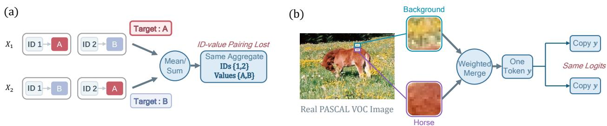
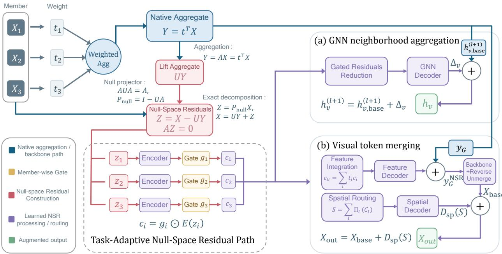
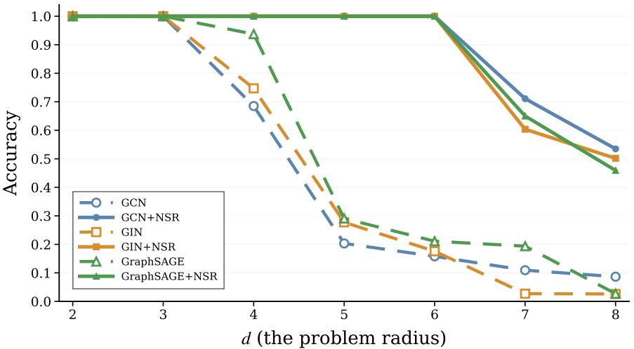
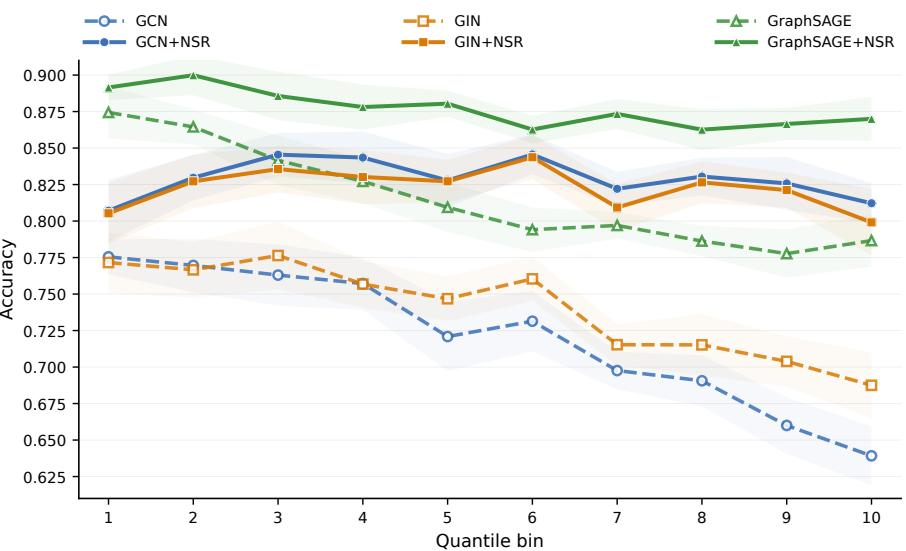
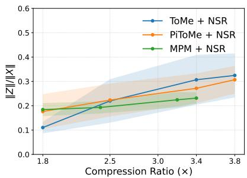
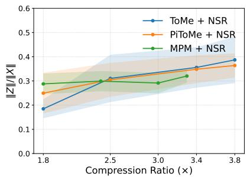
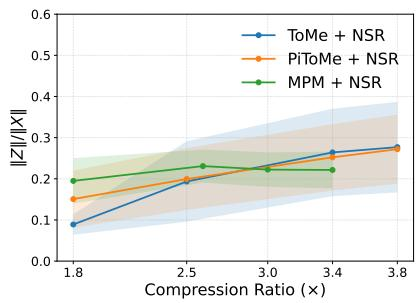
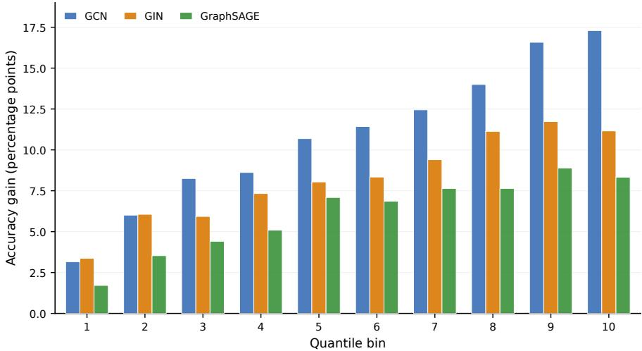
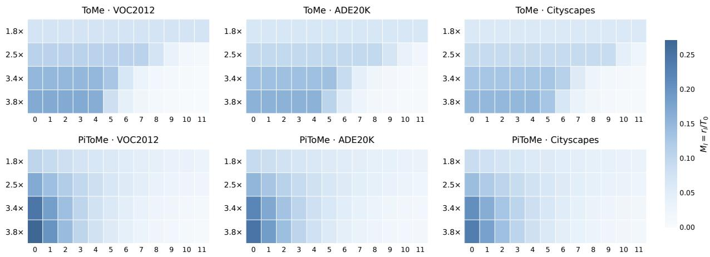

# TASK-RELEVANT NULL-SPACE RESIDUALS FOR NON-INJECTIVE NEURAL MAPPINGS

Bizu Feng1,2,3, Zhimu Yang4, Shuming Wang2,3, Yuan Cheng1,2 Shaode Yu4, Xiaojun Qian1, Zixin Hu1,2,\*

1Institute of Artificial Intelligence Innovation and Industry, Fudan University, Shanghai, China 2Shanghai Academy of AI for Science, Shanghai, China 3Human Phenome Institute, Fudan University, Shanghai, China 4School of Information and Communication Engineering, Communication University of China, Beijing, China

bzfeng25@m.fudan.edu.cn, muyuzhierchengse@gmail.com smwang@m.fudan.edu.cn, cheng\_yuan@fudan.edu.cn yushaodecuc@cuc.edu.cn, qianxiaojun@fudan.edu.cn

Correspondence: huzixin@fudan.edu.cn

## ABSTRACT

Non-injective mappings in neural networks map distinct inputs to the same representation, thereby implicitly inducing equivalence relations in the input space. However, the input differences eliminated by these mappings may still be required by downstream tasks, creating a mismatch between operatorinduced indistinguishability and task-required distinctions. For non-injective linear operators realized in the current forward pass, their null spaces exactly characterize these invisible input variations. We propose Task-Relevant Null-Space Residuals (NSR), a general residual framework for non-injective linear mappings. NSR combines null-space component extraction from pre-mapping representations, member-level encoding and gating, and application-specific integration to exploit potentially taskrelevant information under downstream supervision while preserving the original aggregation or merging rules. We evaluate NSR in two structurally different settings: token merging and graph aggregation. In token merging, NSR achieves higher semantic segmentation performance than the corresponding compressed baselines in 34 out of 36 evaluated configurations, with a maximum observed gain of 31.51 mIoU points under strong compression. In graph aggregation, NSR achieves 100% training accuracy on Tree-NeighborsMatch at depths d = 2–6 across three backbones, alongside gains on heterophilic node classification and molecular graph regression. Together, these results support null-space residuals as a practical complement to non-injective linear mappings, enabling downstream models to learn from input distinctions invisible in the original operator’s output.

## 1 Introduction

Many representation transformations in neural networks are non-injective: distinct inputs can be mapped to the same output, making them indistinguishable to any subsequent computation that depends only on that output. Such indistinguishability does not necessarily hinder the task; when these inputs require the same prediction, ignoring their differences is appropriate. The issue is that inputs identified by the mapping may still correspond to different task targets Jacobsen et al. [2018a]. Therefore, a non-injective mapping not only transforms representations but also determines, through its structure, which inputs are indistinguishable in its output. These operator-induced input equivalences need not be compatible with downstream task requirements (Fig. 1). Making a distinction invisible to an operator does not mean that the task no longer requires it.

Starting from this general problem, we focus on non-injective linear mappings, including computational steps in adaptive operations that take a linear form once the current member groups and weights have been determined. The key reason for this scope is that, for a fixed linear operator, two inputs produce the same output if and only if their difference lies in its null space. Thus, the null space provides an exact description of input variations invisible to the operator. For operations with input-dependent grouping or weights, this characterization is conditioned on the linear operator realized in the current forward pass. Linear neighborhood aggregation in graph neural networks and weighted token merging with the current groups and weights fixed are two structurally different instances of this setting Kipf and Welling [2016], Bolya et al. [2023].

  
Figure 1: Operator-induced indistinguishability need not align with downstream task requirements: distinct inputs may produce the same mapped representation while requiring different task outputs.

  
Figure 2: Overview of NSR. Null-space residuals are extracted from pre-mapping representations based on the current linear operator and transformed into usable complementary information through a learnable branch under task supervision. The original mapping branch retains its computation rule.

This perspective leads to the question studied in this work: Can we retain the original mapping rule while providing the model with a separate pathway to learn to exploit input variations invisible in the original operator’s output?

To this end, we propose Task-Relevant Null-Space Residuals (NSR), a general residual framework for non-injective linear mappings, with its overall structure shown in Fig. 2. NSR uses the current operator to explicitly extract nullspace components from pre-mapping representations as candidate complementary signals. Within a task-supervised complementary pathway, residual encoding, member-wise gating, and application-specific integration jointly transform these components into task-adaptive updates, enabling downstream models to exploit distinctions invisible in the original operator’s output. In graph aggregation and token merging, NSR instantiates this pathway while preserving the original aggregation or merging rules. Our main contributions are as follows:

• Operator–task mismatch. We characterize the mismatch between the input equivalence classes induced by the currently realized non-injective linear operator and the distinctions required by downstream tasks, providing an operator-level basis for constructing complementary information.

• Null-space residual framework. We propose NSR, a general task-supervised residual framework for noninjective linear mappings. The framework is not limited to null-space extraction but comprises operator-defined null-space component extraction, member-level encoding and gating, and application-specific integration.

• Experimental evidence across structures and tasks. Token-merging experiments cover three compression methods, three semantic-segmentation datasets, and multiple compression levels, with NSR achieving higher mIoU than the corresponding compressed baselines in 34 of 36 evaluated configurations. In graph aggregation, the complete NSR pathway achieves 100% training accuracy on Tree-NeighborsMatch at depths d = 2–6 across three backbones, alongside gains on heterophilic node classification and molecular graph regression.

## 2 Related Work

Representation invariance and null-space methods. Invariance to input variations does not always align with task requirements. Neural networks can be overly sensitive to task-irrelevant variations while exhibiting excessive invariance to task-relevant changes [Jacobsen et al., 2018a]. At the architectural level, i-RevNet maintains input reconstructability through invertible intermediate transformations [Jacobsen et al., 2018b]; LiftPool uses an invertible subband decomposition and employs the detail subbands produced during downsampling for subsequent upsampling [Zhao and Snoek, 2021]. Null spaces have also been used in learning-based inverse problem solving: null-space networks constrain learned reconstruction corrections to the null space of the forward operator to preserve data consistency [Schwab et al., 2019]. NSR retains the existing non-injective main mapping without requiring it to be made invertible; its null-space components are extracted directly from accessible pre-mapping representations rather than inferred from mapped outputs. Here, the null space defines the source of candidate complementary signals, while a separate learnable branch learns how to exploit this information under downstream task supervision.

Graph aggregation and residual connections. Neighborhood aggregation is a core operation through which messagepassing GNNs construct node representations [Gilmer et al., 2017]. GCN uses degree-normalized weighted summation [Kipf and Welling, 2016]; GraphSAGE introduces several neighborhood aggregation schemes, with its mean variant combining the neighborhood mean with the central node representation [Hamilton et al., 2017]; GIN uses sum aggregation and a multilayer perceptron, relating the discriminative power of multiset aggregation to the expressive power of GNNs [Xu et al., 2019]. More generally, Deep Sets studies permutation-invariant functions through shared element-wise transformations and aggregation [Zaheer et al., 2017]. PNA combines multiple aggregation statistics with degree-dependent scalers to enrich neighborhood representations [Corso et al., 2020]. Another line of work focuses on the propagation and combination of representations across layers: Jumping Knowledge combines node representations from different propagation depths [Xu et al., 2018], while GCNII supports deeper graph convolutional networks through initial residual connections and identity mappings [Chen et al., 2020]. NSR differs in how its complementary signal is defined: it retains the backbone’s original aggregation branch and uses the null space of the current local aggregation operator to extract operator-invisible member-wise residuals from pre-aggregation representations. These residuals are then transformed into node updates through task-adaptive processing.

Token merging in vision transformers. ViT represents an image as a sequence of embedded image patches [Dosovitskiy et al., 2021]. Token merging summarizes multiple tokens into representative tokens to shorten the sequence used in subsequent computation. ToMe progressively merges similar tokens using lightweight matching [Bolya et al., 2023]; PiToMe introduces an energy score to select merging candidates, prioritizing the preservation of relatively distinctive or isolated tokens [Tran et al., 2024]; ALGM adopts a local-then-global merging strategy [Norouzi et al., 2024]; DTEM uses a separate learnable embedding module to produce dedicated representations for token matching [Lee and Hong, 2024]; MPM performs mean merging over mutually nearest-neighbor token pairs [Ravé et al., 2026]. For dense prediction tasks such as semantic segmentation, merged representations also need to be mapped back to their original spatial positions. ALGM and MPM copy merged representations back to member positions using recorded merge correspondences [Norouzi et al., 2024, Ravé et al., 2026]. This operation restores the original token count and spatial arrangement, but copying itself does not restore the original representational differences among members of the same group. NSR focuses on member-wise distinctions eliminated by weighted merging once the current groups and weights have been determined, while preserving the original selection, matching, and weight-computation rules. The same null-space residual source is used through feature and spatial paths to provide complementary information for subsequent token computation and dense prediction at the original positions, respectively.

## 3 Null-Space Residuals

We characterize operator-induced indistinguishability, construct complementary null-space residuals, and instantiate their task-supervised processing for graph aggregation and token merging.

## 3.1 Operator-Induced Indistinguishability and Task Relevance

Let $F : \mathcal { X }  \mathcal { C }$ map inputs in $\mathcal { X }$ to representations in C. If distinct inputs $x _ { 1 } , x _ { 2 } \in { \mathcal { X } }$ satisfy $F ( x _ { 1 } ) = F ( x _ { 2 } )$ any subsequent computation depending only on $F ( x )$ cannot distinguish them. This becomes a limitation when the downstream task requires that distinction; not all collapsed distinctions are task-relevant.

We focus on linear mappings and operations that take a linear form once the current groups and weights are fixed. For a fixed linear operator A and inputs $x _ { 1 } , x _ { 2 }$ in its domain,

$$
\begin{array} { r } { A x _ { 1 } = A x _ { 2 } \quad \Longleftrightarrow \quad x _ { 1 } - x _ { 2 } \in \ker ( A ) , } \end{array}\tag{1}
$$

where ker $( A )$ is the null space of vectors mapped to zero by A, exactly characterizing operator-invisible input variations. For input-dependent grouping or weights, all null-space statements are conditioned on the operator A realized in the current forward pass.

## 3.2 Null-Space Complementarity

Let $\ b { X } \in \mathbb { R } ^ { n \times d }$ contain n member representations of dimension $d ,$ and let $A \in \mathbb { R } ^ { k \times n }$ denote the current linear operator, with output $Y = A X$ . We choose a linear lift $U \in \mathbb { R } ^ { n \times k }$ satisfying $A U A = A$ Ben-Israel and Greville [2003], and define the null-space component as

$$
Z = ( I _ { n } - U A ) X ,\tag{2}
$$

where $I _ { n }$ is the $n \times n$ identity matrix and U maps the output representation back to the member space.

Proposition 1 (Null-space complementarity). The component defined above satisfies

$$
A Z = 0 , \qquad X = U Y + Z .\tag{3}
$$

Proof. Since $A U A = A$ , we have $A Z = ( A - A U A ) X = 0$ . Moreover, the definition directly gives $U Y + Z =$ $U A { \dot { X } } + ( I _ { n } - U A ) X = X$ □

Thus, every feature channel of Z lies in ker(A). For given A and $U , Y$ and Z uniquely determine $X ;$ any auxiliary signal $H ( { \dot { X } } )$ can thus be written as $H ( U Y + Z )$ ). At fixed Y, member differences are exactly differences in $\quad \sum .$ The lift $\bar { U }$ may depend on the operator and need not induce an orthogonal projection. NSR uses this decomposition to expose operator-invisible differences for task-supervised complementary processing.

## 3.3 Task-Supervised Complementary Pathway

Let $z _ { i } \in \mathbb { R } ^ { d }$ denote the i-th member residual. NSR constructs its code as

$$
c _ { i } = g _ { i } \odot E ( z _ { i } ) ,\tag{4}
$$

where $E : \mathbb { R } ^ { d }  \mathbb { R } ^ { r }$ is a residual encoder with code dimension $r , g _ { i } \in \mathbb { R } ^ { r }$ is a learnable gate generated from the member residual and its context, and $\odot$ denotes element-wise multiplication.

Member-level processing precedes reaggregation. For a linear transformation $B \in \mathbb { R } ^ { d \times r }$ shared across members, reaggregation with the original operator gives $A ( Z B ) = ( A Z ) B = 0$ . Member-dependent gating can alter their relative contributions, so the processed codes need not satisfy the same cancellation constraint.

Residual extraction specifies the source of candidate complementary information, while member-level processing and application-specific integration make this source usable for downstream prediction. Together, these stages constitute the complete NSR method. Depending on the application, the codes are aggregated or spatially routed and mapped to complementary updates, with the branch trained under the downstream task loss. The null-space properties and exact decomposition apply to the complete residual Z before encoding; member and contextual representations may additionally condition its processing through the gates.

## 3.4 NSR for Graph Aggregation

At layer l, consider the $K _ { v }$ members participating in the current aggregation at node v. The NSR branch generates messages using a linear map shared across members and stacks them row-wise as $M _ { v } \in \mathbb R ^ { K _ { v } \times d }$ . Let $t _ { v } \in \mathbb { R } ^ { \widetilde { K } _ { v } }$ denote the aggregation coefficients actually used by the backbone. The corresponding local operator is $A _ { v } = t _ { v } ^ { \top }$

For ${ t _ { v } \neq 0 }$ , choosing $U _ { v } = t _ { v } / ( t _ { v } ^ { \top } t _ { v } )$ gives $A _ { v } U _ { v } = 1$ . The resulting residual is

$$
Z _ { v } = \left( I _ { K _ { v } } - \frac { t _ { v } t _ { v } ^ { \top } } { t _ { v } ^ { \top } t _ { v } } \right) M _ { v } , \qquad t _ { v } ^ { \top } Z _ { v } = 0 ,\tag{5}
$$

which projects along the member dimension and extracts message variations invisible to the current local aggregation. The member set and coefficients follow the corresponding backbone: GCN uses normalized adjacency coefficients including self-loops; GraphSAGE uses neighborhood-mean weights, with its separate root path handled by the backbone; and GIN includes neighbor terms and a root term weighted by $1 + \epsilon ^ { ( l ) }$

The graph branch directly processes residuals in the message space, taking E to be the identity map and $r = d .$ Let $z _ { v , i }$ and $g _ { v , i }$ denote the member residual and its gate, respectively. The node update is

$$
\Delta _ { v } = F _ { \mathrm { o u t } , v } \left( \sum _ { i = 1 } ^ { K _ { v } } g _ { v , i } \odot z _ { v , i } \right) , \qquad h _ { v } ^ { ( l + 1 ) } = h _ { v , \mathrm { b a s e } } ^ { ( l + 1 ) } + \Delta _ { v } .\tag{6}
$$

Here, $h _ { v , \mathrm { b a s e } } ^ { ( l + 1 ) }$ is the update produced by the original backbone on the current input. The function $F _ { \mathrm { o u t } , v }$ includes neighborhood-dependent scaling and an output transformation that maps the residual to the backbone output dimension, with learnable parameters shared across nodes

## 3.5 NSR for Token Merging

Consider a merge group $\mathcal { G }$ of K tokens $x _ { i } \in \mathbb { R } ^ { d }$ , with original merge weights satisfying $\textstyle \sum _ { i \in { \mathcal { G } } } t _ { i } = 1$ . Collecting these weights in t, the current merge operator is $A g = t ^ { \top }$

To match copy-based unmerging, we choose $U _ { \mathcal { G } } = \mathbf { 1 } _ { K }$ , where $\mathbf { 1 } _ { K }$ is the all-ones vector. Since $A _ { \mathcal { G } } U _ { \mathcal { G } } = 1$ , Sec. 3.2 gives

$$
y _ { \mathcal { G } } = \sum _ { i \in \mathcal { G } } t _ { i } x _ { i } , \qquad z _ { i } = x _ { i } - y _ { \mathcal { G } } , \qquad \sum _ { i \in \mathcal { G } } t _ { i } z _ { i } = 0 .\tag{7}
$$

NSR encodes each member residual $z _ { i }$ as $c _ { i } \in \mathbb { R } ^ { r }$ following Sec. 3.3 and uses the same codes through feature and spatial residual paths.

Feature residual. NSR aggregates the codes with the original merge weights and adds the decoded correction to the merged representation:

$$
c _ { \mathcal { G } } = \sum _ { i \in \mathcal { G } } t _ { i } c _ { i } , \qquad y _ { \mathcal { G } } ^ { \mathrm { N S R } } = y _ { \mathcal { G } } + D _ { \mathrm { f e a t } } ( c _ { \mathcal { G } } ) .\tag{8}
$$

Here, $D _ { \mathrm { f e a t } } : \mathbb { R } ^ { r }  \mathbb { R } ^ { d }$ decodes the group code into token features. The updated representation continues through the backbone as a single token, allowing within-group variations to affect subsequent transformations.

Spatial residual. Copy-based unmerging cannot recover within-group distinctions. NSR therefore retains member codes and their correspondence to original patch positions.

For L merge events, let $C _ { l } \in \mathbb { R } ^ { N _ { l } \times r }$ collect the $N _ { l }$ member codes retained at event l. The routing operation $\Pi _ { l }$ assigns these codes to the $N _ { 0 }$ original patch positions using the recorded correspondence. All events share the same code dimension r, giving

$$
S = \sum _ { l = 1 } ^ { L } \Pi _ { l } ( C _ { l } ) , \qquad X _ { \mathrm { o u t } } = X _ { \mathrm { b a s e } } + D _ { \mathrm { s p } } ( S ) .\tag{9}
$$

Here, $S \in \mathbb { R } ^ { N _ { 0 } \times r }$ accumulates spatial codes, and $X _ { \mathrm { b a s e } } \in \mathbb { R } ^ { N _ { 0 } \times d }$ is the representation after standard unmerging, including preceding feature-residual updates. At the end of the backbone, $D _ { \mathrm { s p } }$ decodes the accumulated codes into d-dimensional position-specific updates; the codes are not processed as an additional token sequence by the Transformer. Both paths preserve the original token-selection, matching, and weight-computation rules, as well as the predefined merge schedule.

## 4 Experiments

## 4.1 Experimental Setup

Semantic segmentation is evaluated on the official validation splits of Pascal VOC 2012 Everingham et al. [2012], Cityscapes Cordts et al. [2016], and ADE20K Zhou et al. [2017], using mIoU. All models use an ImageNetpretrained Russakovsky et al. [2015] DeiT-Tiny/16 backbone Touvron et al. [2021] and a linear segmentation head. We compare ToMe Bolya et al. [2023], PiToMe Tran et al. [2024], and MPM Ravé et al. [2026] with their NSR-augmented counterparts, using the uncompressed Full-ViT as a reference.

Graph experiments use GCN Kipf and Welling [2016], GraphSAGE Hamilton et al. [2017], and GIN Xu et al. [2019]. Heterophilic node classification uses Roman-empire, Amazon-ratings, Minesweeper, Tolokers, and Questions Platonov et al. [2023a]. The first two use accuracy, while the others use ROC-AUC. Tree-NeighborsMatch Alon and Yahav [2021] evaluates training fit on binary trees of depths 2–8. Molecular graph regression uses the 12,000-graph ZINC subset Dwivedi et al. [2023], evaluated by test MAE. Heterophilic node classification and ZINC use four messagepassing layers with a hidden dimension of 128; the tree task at depth d uses d + 1 message-passing layers with a hidden dimension of 32.

Each Original–NSR comparison uses the same backbone configuration, optimization settings, and training budget. Segmentation models additionally share pretrained parameter initialization, data ordering, and compression-control configurations. Segmentation models are trained for 100 epochs and evaluated using the final checkpoint; heterophilic node classification and ZINC select checkpoints by validation performance. Specific network configurations, preprocessing, and training protocols are provided in Appendix A. The computation-reduction operating point (WP) is defined as the ratio of Full-ViT GFLOPs to those of the original compressed baseline. Computation is estimated analyti cally from the actual forward structure. Cityscapes computation is reported per input window, corresponding to one window in full-image sliding-window inference. Data processing, complete training configurations, and computationalaccounting conventions are provided in Appendix A, while the construction of compression configurations is described in Appendix F.

## 4.2 Results

## 4.2.1 Token Merging

Table 1 reports semantic-segmentation performance and the absolute gain over the corresponding compressed baseline, $\Delta _ { \mathrm { N S R } } = \mathrm { \bar { m I o U } _ { N S R } - m I o \bar { U } _ { B a s e } . }$

Across the 36 evaluated configurations, NSR achieves higher mIoU than the corresponding compressed baseline in 34 cases. The two lower results occur under mild compression and differ from the corresponding baselines by no more than 0.04 points. The observed gains are generally larger under stronger compression, with ToMe showing maximum gains of 31.51 and 20.83 points on Pascal VOC and Cityscapes, respectively. These results indicate that NSR can provide substantial performance recovery across different merging mechanisms, with the magnitude varying across operators and compression configurations. NSR can also outperform a less compressed original model while requiring less computation. On ADE20K, ToMe with NSR at the 3.4× operating point achieves 34.11 mIoU at 3.443 GFLOPs, exceeding the 31.44 mIoU achieved by the original 2.5× ToMe at 4.202 GFLOPs.

## 4.2.2 Graph Aggregation

Tree-NeighborsMatch. This task requires the root to predict the value at the leaf associated with a query key, and therefore depends on key–value associations. Consider the first local aggregation after the concatenated key and value features undergo an initial linear embedding: each member representation consists of a key encoding, a value encoding, and a shared bias. Fix two sibling leaves with distinct keys, swap two values with distinct encodings in the message space, and keep all other inputs and aggregation coefficients unchanged. If the two leaves have equal coefficients, the aggregate at their parent remains unchanged; however, when the query is fixed to one of these keys, the correct answer changes. This gives an explicit instance of task-relevant local indistinguishability.

Following the task construction and training-fit evaluation protocol of Alon and Yahav [2021], we use Tree-NeighborsMatch to diagnose whether GNNs can fit long-range key–value associations. Training accuracy is the benchmark’s intended metric for detecting fitting failures as tree depth increases. We use $d + 1$ message-passing layers on binary trees of depths $d = 2 \ – 8$ and adopt random seed 11 from their reference implementation. Each model is trained once at each depth, and we report the highest training accuracy attained during that run. As shown in Figure 3, the original backbones exhibit degraded fitting as depth increases, whereas all three NSR variants achieve 100% training accuracy at $d = 2 \mathrm { - } 6$ and substantially outperform their counterparts at $d = 7 ,$ 8. These results support the complementary pathway’s effectiveness in improving training fit.

Heterophilic node classification. In Table 2, NSR increases the reported metric in 13 of the 15 backbone–dataset combinations. The largest gains occur on Roman-empire, where accuracy improves by 10.85, 6.12, and 8.25 percentage points for GCN, GraphSAGE, and GIN, respectively.

Platonov et al. Platonov et al. [2023a] identify Roman-empire as the only one of these five datasets with Label Informativeness (LI) appreciably above zero. LI quantifies how much information a neighbor’s label provides about a node’s label Platonov et al. [2023b]. The larger NSR gains on Roman-empire are consistent with this label structure: preserving fine-grained distinctions compressed by aggregation may be more valuable when neighborhoods contain stronger task-predictive information. Performance changes vary across datasets and backbones, consistent with the premise that residual utility depends on task relevance and the model’s ability to exploit it. LI is defined from graph labels and serves as auxiliary context here, rather than a direct measurement of the hidden-feature residuals processed by NSR.

Table 1: Semantic-segmentation results across merging methods and compression configurations. Bold marks the higher mIoU in each Original–NSR pair. $\Delta _ { \mathrm { N S R } }$ is computed from unrounded mIoU.
<table><tr><td colspan="7">Original</td></tr><tr><td>Dataset</td><td>Method</td><td>WP</td><td>GFLOPs↓</td><td>mIoU ↑</td><td>GFLOPs↓</td><td>mIoU ↑  $\Delta _ { \mathrm { N S R } } \uparrow$ </td></tr><tr><td rowspan="9">VOC</td><td rowspan="3">Full-ViT</td><td>1.0×</td><td>1.254</td><td>64.85</td><td></td><td></td><td></td></tr><tr><td>1.8×</td><td>0.698</td><td>62.81</td><td>0.750</td><td>64.23</td><td>+1.43</td></tr><tr><td>2.5×</td><td>0.492</td><td>44.58</td><td>0.533</td><td>59.54</td><td>+14.95</td></tr><tr><td rowspan="3">ToMe</td><td>3.4×</td><td>0.373</td><td>18.31</td><td>0.407</td><td>49.82</td><td>+31.51</td></tr><tr><td>3.8×</td><td>0.333</td><td>16.98</td><td>0.365</td><td>46.23</td><td>+29.25</td></tr><tr><td>1.8×</td><td>0.698</td><td>61.48</td><td>0.736</td><td>62.44</td><td>+0.96</td></tr><tr><td rowspan="3">PiToMe</td><td>2.5×</td><td>0.501</td><td>55.77</td><td>0.536</td><td>59.19</td><td>+3.42</td></tr><tr><td>3.4×</td><td>0.368</td><td>43.70</td><td>0.400</td><td>54.02</td><td>+10.31</td></tr><tr><td>3.8×</td><td>0.332</td><td>37.32</td><td>0.362</td><td>50.66</td><td>+13.34</td></tr><tr><td rowspan="3">MPM</td><td>1.8× 2.4×</td><td>0.699 0.512</td><td>61.99</td><td>0.714</td><td>62.64</td><td>+0.65</td></tr><tr><td>3.0×</td><td>0.429</td><td>58.87 54.93</td><td>0.530</td><td>59.74</td><td>+0.86</td></tr><tr><td>3.3×</td><td>0.376</td><td>51.34</td><td>0.448 0.395</td><td>57.63 54.85</td><td>+2.70 +3.51</td></tr><tr><td rowspan="6">Cityscapes</td><td>Full-ViT</td><td>1.0×</td><td>30.533</td><td>71.83</td><td>一</td><td>一</td><td></td></tr><tr><td></td><td>1.8×</td><td>16.983</td><td>71.71</td><td>18.697</td><td>71.67</td><td>-0.04</td></tr><tr><td rowspan="3">ToMe</td><td>2.5×</td><td>12.191</td><td>65.83</td><td>13.633</td><td>70.59</td><td>+4.76</td></tr><tr><td>3.4×</td><td>8.984</td><td>54.08</td><td>10.155</td><td>69.41</td><td>+15.33</td></tr><tr><td>3.8×</td><td>8.037</td><td>47.33</td><td>9.125</td><td>68.16</td><td>+20.83</td></tr><tr><td rowspan="4">PiToMe</td><td>1.8×</td><td>16.910</td><td>69.70</td><td>18.118</td><td>69.80</td><td>+0.10</td></tr><tr><td>2.5× 3.4×</td><td>12.213 8.962</td><td>69.01</td><td>13.370</td><td>71.28</td><td>+2.27</td></tr><tr><td>3.8×</td><td>8.041</td><td>65.77 64.21</td><td>10.025</td><td>69.00</td><td>+3.23</td></tr><tr><td>1.8×</td><td>16.817</td><td></td><td>9.062</td><td>68.95</td><td>+4.74</td></tr><tr><td rowspan="4"></td><td>MPM</td><td>11.918</td><td>70.86</td><td>17.098</td><td>71.34</td><td>+0.48</td></tr><tr><td>2.6× 3.0×</td><td></td><td>67.86</td><td>12.328</td><td>69.75</td><td>+1.89</td></tr><tr><td>3.4×</td><td>10.067</td><td>67.21</td><td>10.557</td><td>68.40</td><td>+1.19</td></tr><tr><td></td><td>9.090</td><td>65.20</td><td>9.624</td><td>68.02</td><td>+2.82</td></tr><tr><td rowspan="8">ADE20K</td><td>Full-ViT</td><td>1.0×</td><td>10.463</td><td>37.60</td><td></td><td></td><td></td></tr><tr><td></td><td>1.8×</td><td>5.817</td><td>36.60</td><td>6.347</td><td>37.41</td><td>+0.81</td></tr><tr><td rowspan="3">ToMe</td><td>2.5×</td><td>4.202</td><td>31.44</td><td>4.643</td><td>37.07</td><td>+5.64</td></tr><tr><td>3.4×</td><td>3.085</td><td>17.67</td><td>3.443</td><td>34.11</td><td>+16.44</td></tr><tr><td>3.8×</td><td>2.750</td><td>12.44</td><td>3.082</td><td>33.74</td><td>+21.31</td></tr><tr><td rowspan="3">PiToMe</td><td>1.8×</td><td>5.801</td><td>36.38</td><td>6.181</td><td>37.94</td><td>+1.56</td></tr><tr><td>2.5×</td><td>4.180</td><td>34.78</td><td>4.540</td><td>35.95</td><td>+1.17</td></tr><tr><td>3.4× 3.8×</td><td>3.076</td><td>31.39</td><td>3.404</td><td>35.65</td><td>+4.26</td></tr><tr><td rowspan="4">MPM</td><td></td><td>2.757</td><td>30.07</td><td>3.071</td><td>34.17</td><td>+4.11</td></tr><tr><td>1.8×</td><td>5.804</td><td>37.49</td><td>5.977</td><td>37.48</td><td>-0.01</td></tr><tr><td>2.4×</td><td>4.443</td><td>36.59</td><td>4.656</td><td>36.93</td><td>+0.34</td></tr><tr><td>3.2×</td><td>3.304</td><td>33.57</td><td>3.454</td><td>35.74</td><td>+2.16</td></tr><tr><td rowspan="4"></td><td></td><td></td><td></td><td></td><td></td><td></td></tr><tr><td></td><td></td><td></td><td></td><td></td><td></td></tr><tr><td>3.4×</td><td></td><td></td><td></td><td></td><td></td></tr><tr><td></td><td>3.055</td><td>32.69</td><td>3.213</td><td>35.38</td><td>+2.69</td></tr></table>

Table 2: Node-classification results on the five heterophilic graph benchmarks. Values are the mean and sample standard deviation (%) over the ten official splits. The higher score within each backbone pair is shown in bold.
<table><tr><td></td><td></td><td>Roman-empire</td><td>Amazon-ratings  $\mathbf { A c c . } \left( \% \right) \uparrow$ </td><td>Minesweeper  $\mathrm { R O C - A U C } \left( \% \right) \uparrow$ </td><td>Tolokers</td><td>Questions</td></tr><tr><td>Backbone</td><td>Variant</td><td> $\operatorname { A c c . } \ ( { \mathcal { T } } _ { O } ) \uparrow$ </td><td> $4 9 . 4 1 \pm 0 . 5 7$ </td><td> $9 0 . 2 0 \pm 0 . 6 6$ </td><td> $\mathrm { R O C - A U C } \left( \% \right) \uparrow$   $\mathbf { 8 4 . 9 0 \pm 0 . 9 0 }$ </td><td> $\mathrm { R O C - A U C } \left( \% \right) \uparrow$ </td></tr><tr><td rowspan="2">GCN</td><td>Original +NSR</td><td> $7 2 . 0 5 \pm 0 . 6 4$   ${ \bf 8 2 . 9 0 \pm 0 . 7 1 }$ </td><td> ${ \bf 4 9 . 6 7 \pm 0 . 5 7 }$ </td><td> ${ \bf 9 2 . 0 9 \pm 0 . 6 3 }$ </td><td> $8 4 . 3 6 \pm 0 . 7 3$ </td><td> $7 5 . 3 2 \pm 1 . 3 5$   ${ \bf 7 8 . 2 5 \pm 1 . 2 1 }$ </td></tr><tr><td></td><td></td><td> $4 9 . 5 6 \pm 0 . 5 5$ </td><td></td><td></td><td></td></tr><tr><td rowspan="2">GIN</td><td>Original +NSR</td><td> $7 4 . 0 0 \pm 0 . 7 9$   ${ \bf 8 2 . 2 5 \pm 0 . 6 5 }$ </td><td> ${ \bf 5 0 . 4 7 \pm 0 . 5 7 }$ </td><td> $8 6 . 9 0 \pm 0 . 5 7$   $\mathbf { 8 9 . 4 1 \pm 1 . 0 9 }$ </td><td> $8 3 . 0 6 \pm 0 . 8 8$   ${ \bf 8 3 . 1 8 \pm 0 . 8 7 }$ </td><td> $7 4 . 8 1 \pm 1 . 5 7$   ${ \bf 7 5 . 0 6 \pm 1 . 4 0 }$ </td></tr><tr><td></td><td></td><td></td><td></td><td></td><td></td></tr><tr><td rowspan="2">GraphSAGE</td><td>Original</td><td> $8 1 . 5 9 \pm 0 . 5 5$ </td><td> $5 2 . 3 3 \pm 0 . 3 7$ </td><td> $\mathbf { 9 3 . 3 7 \pm 0 . 4 0 }$ </td><td> $8 3 . 2 8 \pm 0 . 5 6$ </td><td> $7 4 . 8 2 \pm 0 . 9 1$ </td></tr><tr><td>+NSR</td><td> $\mathbf { 8 7 . 7 1 \pm 0 . 6 1 }$ </td><td> ${ \bf 5 2 . 7 2 \pm 0 . 7 5 }$ </td><td> $9 2 . 7 5 \pm 0 . 4 8$ </td><td> $\mathbf { 8 4 . 5 0 \pm 0 . 6 3 }$ </td><td> ${ \bf 7 5 . 0 7 \pm 2 . 1 6 }$ </td></tr></table>

Label-based null-space diagnostic. We further examine the relationship between NSR gains and label structure in the aggregation null space on Roman-empire. We project member one-hot label encodings onto the null space of the corresponding local aggregation operator, compute normalized projection energies, and average them over the target node’s computation tree with weights given by local member counts. This yields a node-level diagnostic score. The score is computed after training and is not used for training, hyperparameter selection, or model selection. Its full definition is provided in Appendix E.

  
Figure 3: Training accuracy on Tree-NeighborsMatch across tree depths. Dashed and solid curves denote the original GCN, GIN, and GraphSAGE models and their NSR variants, respectively. Each point is the highest training accuracy attained in the corresponding run.

  
Figure 4: Within each official split, test nodes are divided into ten approximately equal-frequency bins, with the horizontal axis ordering the bins from low to high scores. Lines show the mean accuracy of the corresponding bin across the ten official splits, and shaded bands of the same color indicate the mean ± one sample standard deviation.

Figure 4 shows that the original backbones’ mean accuracy generally decreases across higher score bins, while the NSR variants remain relatively stable, producing an overall widening accuracy gap. This association is consistent with the motivation of learning to exploit aggregation-invisible distinctions. The corresponding gain curves are provided in Appendix E.

ZINC graph regression. To test whether NSR can serve as a more general mechanism for compensating information discarded by aggregation, we evaluate graph-level molecular property regression on ZINC. This setting differs from the preceding experiments in data semantics, prediction granularity, and learning objective: the model predicts a continuous molecular property through repeated local aggregation and graph-level readout. To keep aggregation backbones consistent across graph tasks, we retain the original node-feature-based formulations of GCN, GraphSAGE, and GIN, using only atom types and molecular connectivity without bond-type attributes.

Table 3 shows that NSR lowers the mean test MAE of all three backbones, with absolute reductions of 0.1785, 0.0360, and 0.0542 for GCN, GIN, and GraphSAGE, respectively. This supports the effectiveness of the complete NSR pathway beyond matching and node classification, extending to graph-level regression.

Table 3: Test MAE on the ZINC subset. Values are the mean and standard deviation over ten random seeds; lower values are better.
<table><tr><td>Backbone</td><td>Original</td><td>+NSR</td></tr><tr><td>GCN</td><td> $0 . 4 7 3 2 \pm 0 . 0 0 6 7$ </td><td> $\mathbf { 0 . 2 9 4 7 \pm 0 . 0 0 5 0 }$ </td></tr><tr><td>GIN</td><td> $0 . 3 4 5 1 \pm 0 . 0 0 9 3$ </td><td> $\mathbf { 0 . 3 0 9 1 \pm 0 . 0 0 9 3 }$ </td></tr><tr><td>GraphSAGE</td><td> $0 . 4 3 7 3 \pm 0 . 0 0 8 6$ </td><td> $\mathbf { 0 . 3 8 3 1 \pm 0 . 0 1 2 5 }$ </td></tr></table>

These graph experiments provide complementary evidence: Tree-NeighborsMatch examines fitting under explicit local mismatch; the heterophily experiments extend evaluation to real graph data, with the label-based diagnostic examining how predictive gains relate to label structure; and ZINC extends validation to graph-level regression. Together, they support using null-space residuals to complement the original aggregation.

Overall, experiments across token merging and graph aggregation support the practical value of NSR in exploiting operator-invisible member distinctions to improve task performance while preserving the original mapping rules. Comparisons and ablations in both settings provide further evidence for the framework’s design (Appendix G).

## 5 Conclusion

Motivated by the potential mismatch between operator-induced input equivalences and downstream task requirements, we propose Task-Relevant Null-Space Residuals (NSR), a general residual framework for non-injective linear mappings. NSR combines operator-defined null-space residual extraction, member-level encoding and gating, and applicationspecific integration into a task-supervised complementary pathway while preserving the original aggregation or merging rules. The null space of the currently realized linear operator defines candidate complementary information, while downstream supervision guides its use. Experiments in graph aggregation and token merging demonstrate improvements across multiple models and configurations. These results support a practical design principle: for many-to-one neural computation, explicitly providing access to operator-invisible variations has practical value.

## References

Jörn-Henrik Jacobsen, Jens Behrmann, Richard Zemel, and Matthias Bethge. Excessive invariance causes adversarial vulnerability. arXiv preprint arXiv:1811.00401, 2018a.

Thomas N. Kipf and Max Welling. Semi-supervised classification with graph convolutional networks. arXiv preprint arXiv:1609.02907, 2016.

Daniel Bolya, Cheng-Yang Fu, Xiaoliang Dai, Peizhao Zhang, Christoph Feichtenhofer, and Judy Hoffman. Token Merging: Your ViT but Faster. In International Conference on Learning Representations, 2023.

Jörn-Henrik Jacobsen, Arnold W. M. Smeulders, and Edouard Oyallon. i-RevNet: Deep invertible networks. In International Conference on Learning Representations, 2018b.

Jiaojiao Zhao and Cees G. M. Snoek. LiftPool: Bidirectional ConvNet pooling. In International Conference on Learning Representations, 2021.

Johannes Schwab, Stephan Antholzer, and Markus Haltmeier. Deep null space learning for inverse problems: Convergence analysis and rates. Inverse Problems, 2019. doi: 10.1088/1361-6420/aaf14a.

Justin Gilmer, Samuel S. Schoenholz, Patrick F. Riley, Oriol Vinyals, and George E. Dahl. Neural message passing for quantum chemistry. In Proceedings ofthe 34th International Conference on Machine Learning, volume 70 of Proceedings ofMachine Learning Research, pages 1263–1272. PMLR, 2017.

William L. Hamilton, Rex Ying, and Jure Leskovec. Inductive representation learning on large graphs. In Advances in Neural Information Processing Systems, volume 30, 2017.

Keyulu Xu, Weihua Hu, Jure Leskovec, and Stefanie Jegelka. How powerful are graph neural networks? In International Conference on Learning Representations, 2019.

Manzil Zaheer, Satwik Kottur, Siamak Ravanbakhsh, Barnabas Poczos, Ruslan Salakhutdinov, and Alexander J. Smola. Deep sets. In Advances in Neural Information Processing Systems, volume 30, 2017.

Gabriele Corso, Luca Cavalleri, Dominique Beaini, Pietro Liò, and Petar Velickoviˇ c. Principal neighbourhood´ aggregation for graph nets. In Advances in Neural Information Processing Systems, volume 33, 2020.

Keyulu Xu, Chengtao Li, Yonglong Tian, Tomohiro Sonobe, Ken-ichi Kawarabayashi, and Stefanie Jegelka. Representation learning on graphs with jumping knowledge networks. In Proceedings ofthe 35th International Conference on Machine Learning, volume 80 of Proceedings ofMachine Learning Research, pages 5453–5462. PMLR, 2018.

Ming Chen, Zhewei Wei, Zengfeng Huang, Bolin Ding, and Yaliang Li. Simple and deep graph convolutional networks. In Proceedings ofthe 37th International Conference on Machine Learning, volume 119 of Proceedings ofMachine Learning Research, pages 1725–1735. PMLR, 2020.

Alexey Dosovitskiy, Lucas Beyer, Alexander Kolesnikov, Dirk Weissenborn, Xiaohua Zhai, Thomas Unterthiner, Mostafa Dehghani, Matthias Minderer, Georg Heigold, Sylvain Gelly, Jakob Uszkoreit, and Neil Houlsby. An Image is Worth 16x16 Words: Transformers for Image Recognition at Scale. In International Conference on Learning Representations, 2021.

Hoai-Chau Tran, Duy M. H. Nguyen, Duy M. Nguyen, TrungTin Nguyen, Ngan Le, Pengtao Xie, Daniel Sonntag, James Zou, Binh T. Nguyen, and Mathias Niepert. Accelerating Transformers with Spectrum-Preserving Token Merging. In Advances in Neural Information Processing Systems, volume 37, pages 30772–30810, 2024.

Narges Norouzi, Svetlana Orlova, Daan de Geus, and Gijs Dubbelman. ALGM: Adaptive Local-then-Global Token Merging for Efficient Semantic Segmentation with Plain Vision Transformers. In Proceedings of the IEEE/CVF Conference on Computer Vision and Pattern Recognition, 2024.

Dong Hoon Lee and Seunghoon Hong. Learning to Merge Tokens via Decoupled Embedding for Efficient Vision Transformers. In Advances in Neural Information Processing Systems, volume 37, pages 54079–54104, 2024.

Simon Ravé, Pejman Rasti, and David Rousseau. MPM: Mutual Pair Merging for Efficient Vision Transformers. In IEEE/CVF Conference on Computer Vision and Pattern Recognition – Findings Track (CVPRF), 2026.

Adi Ben-Israel and Thomas N. E. Greville. Generalized Inverses: Theory and Applications. Springer, 2 edition, 2003. doi: 10.1007/b97366.

M. Everingham, L. Van Gool, C. K. I. Williams, J. Winn, and A. Zisserman. The PASCAL visual object classes challenge 2012 (VOC2012) results. PASCAL Visual Object Classes Challenge, 2012.

Marius Cordts, Mohamed Omran, Sebastian Ramos, Timo Rehfeld, Markus Enzweiler, Rodrigo Benenson, Uwe Franke, Stefan Roth, and Bernt Schiele. The Cityscapes dataset for semantic urban scene understanding. In Proceedings of the IEEE Conference on Computer Vision and Pattern Recognition, 2016.

Bolei Zhou, Hang Zhao, Xavier Puig, Sanja Fidler, Adela Barriuso, and Antonio Torralba. Scene parsing through ADE20K dataset. In Proceedings of the IEEE Conference on Computer Vision and Pattern Recognition, 2017.

Olga Russakovsky, Jia Deng, Hao Su, Jonathan Krause, Sanjeev Satheesh, Sean Ma, Zhiheng Huang, Andrej Karpathy, Aditya Khosla, Michael Bernstein, Alexander C. Berg, and Li Fei-Fei. ImageNet large scale visual recognition challenge. International Journal ofComputer Vision, 115(3):211–252, 2015. doi: 10.1007/s11263-015-0816-y.

Hugo Touvron, Matthieu Cord, Matthijs Douze, Francisco Massa, Alexandre Sablayrolles, and Hervé Jégou. Training data-efficient image transformers & distillation through attention. In Proceedings ofthe 38th International Conference on Machine Learning, volume 139 of Proceedings ofMachine Learning Research, pages 10347–10357. PMLR, 2021.

Oleg Platonov, Denis Kuznedelev, Michael Diskin, Artem Babenko, and Liudmila Prokhorenkova. A critical look at the evaluation of GNNs under heterophily: Are we really making progress? In International Conference on Learning Representations, 2023a.

Uri Alon and Eran Yahav. On the bottleneck of graph neural networks and its practical implications. In International Conference on Learning Representations, 2021.

Vijay Prakash Dwivedi, Chaitanya K. Joshi, Anh Tuan Luu, Thomas Laurent, Yoshua Bengio, and Xavier Bresson. Benchmarking graph neural networks. Journal of Machine Learning Research, 24(43):1–48, 2023.

Oleg Platonov, Denis Kuznedelev, Artem Babenko, and Liudmila Prokhorenkova. Characterizing graph datasets for node classification: Homophily-heterophily dichotomy and beyond. In Advances in Neural Information Processing Systems, volume 36, 2023b.

Ilya Loshchilov and Frank Hutter. Decoupled weight decay regularization. In International Conference on Learning Representations, 2019.

Diederik P. Kingma and Jimmy Ba. Adam: A method for stochastic optimization. In International Conference on Learning Representations, 2015.

Adam Paszke, Sam Gross, Francisco Massa, Adam Lerer, James Bradbury, Gregory Chanan, Trevor Killeen, Zeming Lin, Natalia Gimelshein, Luca Antiga, Alban Desmaison, Andreas Kopf, Edward Yang, Zachary DeVito, Martin

Raison, Alykhan Tejani, Sasank Chilamkurthy, Benoit Steiner, Lu Fang, Junjie Bai, and Soumith Chintala. PyTorch: An imperative style, high-performance deep learning library. In Advances in Neural Information Processing Systems, volume 32, 2019.

Matthias Fey and Jan Eric Lenssen. Fast graph representation learning with PyTorch Geometric. arXiv preprint arXiv:1903.02428, 2019.

Ross Wightman. PyTorch Image Models. GitHub repository, 2019.

Biao Zhang and Rico Sennrich. Root mean square layer normalization. In Advances in Neural Information Processing Systems, volume 32, 2019.

## A Implementation and Experimental Details

This appendix describes the implementation of NSR for token merging and graph aggregation and supplements the experimental settings in the main text. In both applications, NSR constructs member residuals using the members and weights of the current aggregation operation and transforms them into task-adaptive updates through a learnable branch.

## A.1 Datasets, Baselines, and Experimental Protocols

This section provides the datasets, comparison settings, training and evaluation protocols, and computational-accounting conventions for the experiments in the main text. The implementations of NSR for token merging and graph aggregation are described in Appendices A.2 and A.3, respectively.

Semantic-segmentation data and preprocessing. Pascal VOC 2012 Everingham et al. [2012] contains 20 foreground classes and one background class, with 1,464 training images and 1,449 validation images. Cityscapes Cordts et al. [2016] uses the fine-annotation split, containing 2,975 training images and 500 validation images with 19 evaluated semantic classes. ADE20K Zhou et al. [2017] contains 20,210 training images and 2,000 validation images covering 150 semantic classes. All experiments use the official training and validation splits.

VOC 2012 retains its original class encoding. ADE20K maps valid class labels to 0–149, and Cityscapes maps the original annotations to its 19 training classes. Invalid labels are assigned the ignore index 255 and excluded from both the loss and evaluation metrics. All images are normalized using the ImageNet channel means and standard deviations.

For VOC and ADE20K, training augmentation consists of aspect-ratio-preserving random resizing, random cropping, and horizontal flipping with probability 0.5. The resizing scale is sampled from 0.5–2.0, and the crop sizes are 224×224 and 512 × 512, respectively. Validation resizes the shorter image side to 224 and 512, respectively, followed by a center crop of the corresponding size. Cityscapes uses random resizing, photometric distortion, 512 × 1024 random cropping, and horizontal flipping. Validation performs sliding-window inference on full images, using a 512 × 1024 window and a 341 × 682 stride. Class logits are averaged in overlapping regions. Geometric transformations are applied jointly to images and labels, with nearest-neighbor interpolation used for labels.

Compared methods and controlled comparisons. The segmentation experiments compare ToMe, PiToMe, and MPM with their respective NSR-augmented versions and include the uncompressed Full-ViT as a reference. All models use the same DeiT-Tiny/16 segmentation architecture. ToMe and PiToMe retain their token-size-based merging weights, while MPM retains mutual-nearest-neighbor pairing and arithmetic-mean merging. The merge locations and within-group weights are summarized in Table 5.

Graph experiments use GCN, GraphSAGE, and GIN, with NSR branches added to their neighborhood aggregation layers. Residual construction follows the member sets and aggregation coefficients used by the corresponding backbone, as specified in Table 6. Each pair shares the same backbone configuration, task inputs, loss function, and training protocol.

Before segmentation training, shared backbone and segmentation-head parameters are copied across the compared models. Random seeds are reset and data loaders are reconstructed for each model, ensuring consistent data ordering and training budgets on the same dataset. Each Original–NSR pair uses the same compression-control configuration; adding NSR preserves the original token-selection, matching, and merging rules.

Semantic-segmentation training and evaluation. All segmentation models use an ImageNet-pretrained DeiT-Tiny/16 backbone. After the representations are restored to the original patch grid, LayerNorm and a linear classification layer produce class logits, which are bilinearly upsampled to the input image resolution. The backbone, segmentation head, and NSR parameters are trained jointly under downstream segmentation supervision.

Table 4: Tree-NeighborsMatch configurations. Effective batches larger than 256 are implemented using gradient accumulation.
<table><tr><td>Tree depth</td><td>Generated samples</td><td>Message-passing layers</td><td>Nominal effective batch size</td></tr><tr><td>2</td><td>96</td><td>3</td><td>64</td></tr><tr><td>3</td><td>8,000</td><td>4</td><td>64</td></tr><tr><td>4</td><td>16,000</td><td>5</td><td>1,024</td></tr><tr><td>5</td><td>32,000</td><td>6</td><td>1,024</td></tr><tr><td>6</td><td>32,000</td><td>7</td><td>1,024</td></tr><tr><td>7</td><td>32,000</td><td>8</td><td>2,048</td></tr><tr><td>8</td><td>32,000</td><td>9</td><td>2,048</td></tr></table>

Training uses pixel-wise cross-entropy and AdamW Loshchilov and Hutter [2019], with an initial learning rate of $1 0 ^ { - 4 }$ and weight decay of $1 0 ^ { - 4 }$ . The learning rate follows polynomial decay with power 0.9, updated at each training iteration. Configurations with warm-up first increase the learning rate linearly to its initial value. Training runs for 100 epochs on all three datasets. CUDA training uses automatic mixed precision and gradient scaling.

For each semantic-segmentation configuration, we report validation mIoU from the final checkpoint of a single training run. The mIoU is computed from the confusion matrix accumulated over the entire validation set and averaged over classes with nonzero union. The mIoU is computed from the confusion matrix accumulated over the entire validation set and averaged over classes with nonzero union. The main results and GFLOPs are reported in Table 1, with additional performance and parameter results in Table 8.

Heterophilic node classification. We use Roman-empire, Amazon-ratings, Minesweeper, Tolokers, and Questions Platonov et al. [2023a]. Roman-empire is a word-dependency graph derived from an English Wikipedia article, Amazon-ratings is a product co-purchasing network, and Minesweeper is a synthetic graph based on the corresponding game. Tolokers and Questions are interaction networks constructed from a crowdsourcing platform and a questionanswering service, respectively. Dataset statistics are provided in Table 16. We follow the ten fixed splits supplied with the benchmark. Roman-empire and Amazon-ratings use classification accuracy, while the remaining three datasets use ROC-AUC.

The models use four message-passing layers, a hidden dimension of 128, and dropout of 0.5. Training uses the full graph, with cross-entropy loss computed only on training nodes. Adam Kingma and Ba [2015] uses an initial learning rate of $1 0 ^ { - 3 }$ and weight decay of $5 \times 1 0 ^ { - 4 }$ , with the gradient norm clipped to 1. Each official split uses random seed 42, and evaluation is performed every ten epochs.

The learning-rate scheduler monitors the validation metric, with a reduction factor of 0.5, a patience of 50 evaluations, and a minimum learning rate of $1 0 ^ { - 6 }$ . Training runs for at most 3,000 epochs and stops after 100 validation evaluations without improvement. For each split, we report the test score of the checkpoint with the best validation metric. Final results are the mean and sample standard deviation over the ten splits. Results are reported in Table 2.

Tree-NeighborsMatch. We follow the task construction of Alon and Yahav Alon and Yahav [2021] and use training accuracy to examine fitting ability on this controlled matching task. The root must predict the value stored at the leaf associated with its query key. Each leaf contains a key–value pair, and node inputs concatenate one-hot encodings of keys and values. We use complete binary trees of depths 2–8, with edges directed from children to parents and self-loops included. Examples are divided into 80% training and 20% test sets using label-stratified splitting, without a separate validation set.

For a tree of depth d, the model uses d + 1 message-passing layers and a hidden dimension of 32. Table 4 lists the generated sample counts, message-passing depths, and nominal effective batch sizes.

Training uses cross-entropy and Adam with an initial learning rate of $1 0 ^ { - 3 }$ , without dropout or weight decay, for at most 50,000 epochs. Learning-rate scheduling and early stopping both monitor training accuracy, with patience values of 1,000 and 2,000 epochs, respectively. All models use random seed 11 and are trained once at each tree depth. We report the highest training accuracy attained during each run. Figure 3 shows training fit across tree depths.

ZINC. We use the 12,000-graph ZINC subset Dwivedi et al. [2023], with fixed training, validation, and test splits containing 10,000, 1,000, and 1,000 graphs, respectively. The task is molecular property regression, evaluated by

MAE, for which lower values indicate better performance. All models use atom types and graph connectivity without bond-type features.

Atom types are mapped to 128-dimensional learnable embeddings. The models use four message-passing layers, a hidden dimension of 128, and dropout of 0.5. Training minimizes the $L _ { 1 }$ loss using Adam, with an initial learning rate of $1 0 ^ { - 3 }$ , weight decay of $1 0 ^ { - 5 }$ , and a batch size of 128. The gradient norm is clipped to 1, and training runs for at most 400 epochs.

Validation MAE determines both learning-rate scheduling and checkpoint selection. The scheduler uses a patience of 20 epochs, a reduction factor of 0.5, and a minimum learning rate of $1 \dot { 0 } ^ { - 5 }$ . Early stopping uses a patience of 100 epochs. After training, the checkpoint with the lowest validation MAE is restored and evaluated once on the test set. Table 3 reports the mean and standard deviation of test MAE over random seeds 0–9.

Operating points and configuration consistency. Token-merging experiments cover operating points from mild to aggressive compression. The computation-reduction factor is defined as $C = F _ { \mathrm { F u l l } } / F _ { \mathrm { B a s e } }$ , where $F _ { \mathrm { F u l l } }$ and $F _ { \mathrm { B a s e } }$ denote the GFLOPs of the uncompressed Full-ViT and the original compressed baseline, respectively. Each method adjusts only its native compression controls to approach the target computation budget.

ToMe varies the planned number of tokens merged per layer, PiToMe varies the token-retention ratio, and MPM varies the Transformer blocks at which merging is applied. The original matching rules, weight computations, and merging mechanisms remain unchanged. Because MPM pairing depends on input content and model representations, the compression factors achieved during calibration and final evaluation may differ. We retain the selected insertion schedule and report the computation corresponding to final evaluation.

Each Original–NSR pair uses the same compression-control configuration: ToMe shares the planned merge count and layer-wise merge configuration; PiToMe shares the retention ratio, margin schedule, and matching mode schedule; and MPM shares the insertion-block schedule. NSR does not increase compression to compensate for its additional computational overhead, and its total GFLOPs are reported separately. The configurations for the three methods are provided in Tables 9, 10, and 11, respectively. The complete configuration-search procedure is described in Appendix F.

Computational accounting. Computation is estimated analytically from the model’s forward structure, counting one multiply–accumulate as one FLOP. The calculation includes patch embedding, attention, MLPs, the main matching and merging operations, and the linear segmentation head. For NSR models, it additionally includes residual encoding, gating, feature decoding, spatial writeback, and spatial decoding. Normalization, activation, indexing operations, and final upsampling are excluded. Parameter counts include all trainable parameters of the complete model.

For ToMe and PiToMe, layer-wise token counts are determined by the compression configurations. For MPM, computation is calculated from each sample’s valid pair counts and then averaged across samples, excluding the additional cost of batch padding. Cityscapes GFLOPs correspond to a single 512 × 1024 input window, and MPM pair statistics are collected from center windows of validation images. Total computation for full-image sliding-window inference also depends on the number of windows.

Computing environment. Experiments were conducted on four compute instances, each equipped with 16 CPU cores, 128 GB of RAM, and one NVIDIA A100 GPU. The implementation is based on PyTorch Paszke et al. [2019]. Graph experiments use PyTorch Geometric Fey and Lenssen [2019] and torch-scatter, while vision experiments use timm Wightman [2019] and torchvision.

## A.2 Token-Merging Implementation

All semantic-segmentation models use an ImageNet-pretrained DeiT-Tiny/16 backbone. For different input resolutions, the pretrained patch positional embeddings are resized to the target grid using bicubic interpolation, while the positional embedding of the classification token is retained. After the backbone representations are restored to the original patch grid, LayerNorm and a linear classification layer produce class logits, which are bilinearly upsampled to the input image resolution.

ToMe, PiToMe, and MPM use the same NSR branch architecture. For each method, residuals are constructed from the member groups and weights produced by its merging operation. Table 5 summarizes the merge locations and within-group weights.

ToMe and PiToMe use proportional attention based on token size. MPM uses mutual-nearest-neighbor pairing and arithmetic-mean merging. The classification token participates in backbone attention but is excluded from matching and merging. The operating-point configurations of all three methods are provided in Appendix F.

Table 5: Integration of NSR with the three token-merging methods. Each method retains its merge location and weighting rule. Token size denotes the number of original patches represented by a token.
<table><tr><td>Method</td><td>Merge location</td><td>Within-group weights</td></tr><tr><td>ToMe</td><td>After the attention residual update and before the MLP</td><td>Normalized token-size weights</td></tr><tr><td>PiToMe</td><td>After the attention residual update and before the MLP</td><td>Normalized token-size weights</td></tr><tr><td>MPM</td><td>Before a designated Transformer block</td><td>Equal weights of  $1 / 2$  within each pair</td></tr></table>

For a merge group ${ \mathcal { G } } ,$ , NSR computes the merged representation using the original within-group weights and extracts the residual of each member relative to that representation. For ToMe and PiToMe, all source tokens assigned to the same destination are organized into a complete merge group. Each valid MPM group contains two members. Valid-member masks exclude padded entries introduced by batching, and singleton groups produce no residual update.

The residual encoder consists of RMSNorm Zhang and Sennrich [2019] followed by a bias-free linear layer that maps the d-dimensional residual to a code of dimension $d _ { c } = 6 4$ . The gating network receives the concatenation of the normalized member residual, member representation, and group representation. It uses two linear layers with dimensions $3 d  3 2  6 4$ , a GELU activation between them, and a sigmoid output to generate member-dependent, channel-wise weights. The member and group representations condition the gate, while the information encoded by the residual encoder comes from the member residual.

The same member codes support the feature and spatial residual paths. The feature path aggregates the member codes using the original merge weights and applies a bias-free 64 → d linear decoder. The resulting update is added to the current merged token, which continues through the backbone. Different merge locations have separate encoders, gating networks, and feature decoders.

The spatial path maintains the correspondence between current tokens and original patch positions. At each merge event, a member code is written to the original positions covered by that member and accumulated in a fixed $N _ { 0 } \times$ 64 code tensor. After the backbone computation, the merge events are reversed to restore the original patch ordering. A single shared bias-free linear decoder maps the accumulated codes to position-specific updates, which are added to the restored patch representations. The spatial code tensor is initialized separately for each forward pass and is not processed as an additional token sequence by the Transformer.

Both the feature decoders and the final spatial decoder are zero-initialized. Consequently, with identical shared parameters, the NSR-augmented model initially preserves the output of its corresponding merging baseline. The original and NSR-augmented models use the same matching rules, weight-computation procedures, and predefined compression configurations. NSR constructs its residuals from the groups realized at each merge event.

The feature-only and spatial-only ablations retain the corresponding update path. The post-merge-only control generates a feature update from the merged group representation without using member residuals or spatial correspondences. The associated results are reported in Appendix G.

## A.3 Graph-Aggregation Implementation

The graph experiments use GCN, GIN, and GraphSAGE as backbones. All models first map node inputs into the hidden representation space and then apply multiple message-passing layers. Each message-passing layer has a separate NSR branch, with no parameter sharing across layers.

The graph branch applies its own bias-free $d $ d linear layer to the node representations participating in the current aggregation and stacks the resulting messages row-wise to form the member-message matrix $M _ { v }$ in Section 3.4. The parameters of this linear layer are shared across members. Using the member set and aggregation coefficients $t _ { v }$ of the corresponding backbone, the branch applies the null-space projection in Eq. (5) to $M _ { \imath }$ to extract member-level residuals. The projection properties are derived in Appendix B. The implementation uses scatter operations grouped by destination node and does not explicitly materialize local projection matrices.

Table 6 specifies the members and coefficients used by each backbone.

Each branch follows the incoming-edge and self-loop handling of its corresponding backbone. The separate root branch of GraphSAGE is retained in the backbone. For GIN, the residual construction includes both the neighbor aggregation terms and the separate root term. The evaluated GIN configuration uses a fixed ϵ = 0.

Member residuals are modulated by channel-wise gates. The gating network concatenates the source-node representation, destination-node representation, and member residual. It consists of two linear layers with dimensions ${ \bar { 3 d } } \to d \to d ,$ a GELU activation, and a sigmoid output. The bias of its final linear layer is initialized to −2. The gated residuals are summed by destination node and scaled by the inverse square root of the number of participating members. The resulting node-level representation is passed through LayerNorm, Dropout, and a $d \to d \to d$ output network with a GELU activation between its linear layers to produce the correction.

Table 6: Member sets and aggregation coefficients used by the NSR graph branches.
<table><tr><td>Backbone</td><td>Members</td><td>Aggregation coefficients</td></tr><tr><td>GCN</td><td>Incoming messages in the normalized backbone graph, including self-loops</td><td>Degree-normalized GCN coefficients</td></tr><tr><td>GraphSAGE</td><td>Neighbor messages specified by the input edge list</td><td>Neighborhood-mean weights</td></tr><tr><td>GIN</td><td>Neighbor messages and a separate root message</td><td>1 for neighbors and  $1 + \epsilon$  for the root</td></tr></table>

For GCN and GraphSAGE, the baseline layer applies graph convolution, LayerNorm, GELU, and Dropout, followed by a residual addition to the layer input. The GIN convolution contains two successive Linear–BatchNorm–ReLU stages. Its output is passed through Dropout and added to the layer input. In all cases, the NSR correction is added to the corresponding baseline layer update, retaining the original backbone structure.

Node classification applies a linear classifier to the final node representations. Tree-NeighborsMatch reads out only the root representation. ZINC uses global mean pooling to obtain a graph representation, followed by a linear regression head.

## B Supplementary Derivations for NSR

This section explains why the residual operator in the main text is a null-space projection and verifies that the lifts used for graph aggregation and token merging satisfy the conditions of the general construction. All derivations concern the linear operator realized in a single computation event. When group assignments or weights depend on the input, they are held fixed at the values realized for that event.

## B.1 Null-Space Projection Properties

Following the notation in Sec. 3.2, let $A \in \mathbb { R } ^ { k \times n }$ denote the current linear operator, where n and k are the numbers of input and output members, respectively. Let $U \in \mathbb { R } ^ { n \times k }$ be a linear lift from the output representation space to the input member space, satisfying $A \bar { U } A = A$ Ben-Israel and Greville [2003]. Define the residual operator as $P = I _ { n } - \bar { U } A$ where $I _ { n }$ is the $n \times n$ identity matrix.

We verify that P maps inputs into the null space of A and leaves vectors in that null space unchanged. Write ker $\left( A \right) \doteq \left\{ q \in \mathbb { R } ^ { n } : { \bar { A } } q = { \bar { 0 } } \right\}$ . Using $A U A = { \bar { A } }$ , we obtain

$$
\begin{array} { c } { { A P = A - A U A = 0 , } } \\ { { P ^ { 2 } = I _ { n } - 2 U A + U ( A U A ) = I _ { n } - U A = P . } } \end{array}\tag{10}
$$

The identity $A P = 0$ implies that the range of $P$ is contained in ker(A). Conversely, for any $q \in \ker ( A )$ , we have $P q = q - U A q = q ,$ , so ker(A) is also contained in the range of P. Together with $P ^ { \mathbf { \bar { 2 } } } = P$ , these relations establish that $P$ is a projection onto $\ker ( A )$ , though not necessarily an orthogonal projection. Thus, the residual operator in the main text projects each feature channel onto directions invisible to the original operator and acts as the identity on those directions.

## B.2 Specialization to Graph Aggregation and Token Merging

The two applications use different lifts: graph aggregation lifts along the aggregation coefficient vector, whereas token merging copies the merged representation back to the member positions. We verify below that both choices satisfy $A U A = A$ , allowing direct application of Proposition 1.

Graph aggregation. Fix a local aggregation at node v. Let $K _ { v } \geq 1$ be the number of participating members and let $t _ { v } \in \mathbb { R } ^ { K _ { v } }$ be the nonzero vector of aggregation coefficients. This operation reduces the member messages to a single output through a weighted sum, with operator $A _ { v } = t _ { v } ^ { \top } \in \mathbb { R } ^ { 1 \times K _ { \iota } }$ . Following the construction in Sec. 3.4, choose the lift $\mathbf { \bar { \mathbf { \Gamma } } } U _ { v } = t _ { v } \bar { \mathbf { \Gamma } } ( t _ { v } ^ { \top } t _ { v } ) \bar { \in } \mathbb { R } ^ { K _ { v } \times 1 }$

  
(a) ADE20K

  
(b) Pascal VOC

  
(c) Cityscapes  
Figure 5: Relative null-space residual magnitude $\rho _ { Z } \dot { = } \| Z \| _ { F } / \| X \| _ { F }$ for the trained +NSR token-merging models on (a) ADE20K, (b) Pascal VOC, and (c) Cityscapes. For each compression setting, the solid line reports the mean across merging blocks in which NSR is constructed, and the shaded region shows the corresponding mean ± one standard deviation.

Since $t _ { v } ^ { \top } t _ { v } > 0$ , this lift is well defined, and

$$
A _ { v } U _ { v } = \frac { t _ { v } ^ { \top } t _ { v } } { t _ { v } ^ { \top } t _ { v } } = 1 , \qquad A _ { v } U _ { v } A _ { v } = A _ { v } .\tag{11}
$$

This choice therefore satisfies the condition of the general construction, and the graph residual in the main text is obtained by a null-space projection for the current local aggregation operator. The member set and coefficients are those of the aggregation actually performed by the corresponding backbone.

Token merging. Consider a realized merge group G containing $K \geq 1$ tokens. Let $t \in \mathbb { R } ^ { K }$ be the merge weights, satisfying $t ^ { \top } \mathbf { 1 } _ { K } = 1$ , where ${ \bf 1 } _ { K }$ is the K-dimensional all-ones column vector. The merge operator is $A _ { \mathcal { G } } = t ^ { \breve { \top } } \in \mathbb { R } ^ { \breve { 1 } \times K }$ Following the copy-based unmerging used in Sec. 3.5, choose $U _ { \mathcal { G } } = \mathbf { 1 } _ { K } \in \mathbb { R } ^ { K \times 1 }$ , which copies the same merged representation to every member position in the group.

The weight normalization gives

$$
A _ { \mathcal { G } } U _ { \mathcal { G } } = t ^ { \top } \mathbf { 1 } _ { K } = 1 , \qquad A _ { \mathcal { G } } U _ { \mathcal { G } } A _ { \mathcal { G } } = A _ { \mathcal { G } } .\tag{12}
$$

Thus, the copy-based lift also satisfies the condition of the general construction, and the difference between the member representations and the copied merged representation is the corresponding null-space residual. This conclusion depends only on the normalization of the weights within the current group and does not require uniform weights.

These verifications connect both residual constructions to the unified formulation in the main text. Their null-space properties and complementarity follow directly from Proposition 1.

## C Numerical Verification of NSR for Token Merging

To verify that the implemented NSR construction is consistent with its theoretical null-space definition, we examine both the null-space constraint and the magnitude of the resulting residuals. For each realized token-merging operation, let A denote the corresponding linear aggregation operator, X the input token representations, and Z the residual defined in Eq. (7). We measure

$$
\epsilon _ { \mathrm { n u l l } } = \| A Z \| _ { \infty } , \qquad \rho _ { Z } = \frac { \| Z \| _ { F } } { \| X \| _ { F } } .\tag{13}
$$

Here, $\epsilon _ { \mathrm { n u l l } }$ measures the numerical violation of the null-space constraint $A Z = 0$ , while $\rho _ { Z }$ characterizes the residual magnitude relative to the input representation.

Figure 5 shows that the relative residual magnitude generally increases with stronger compression for ToMe and PiToMe across the three datasets, whereas MPM varies more mildly and is occasionally non-monotonic. These results show that the null-space residual is numerically non-negligible and that its magnitude depends on both the merging operator and the compression strength.

Table 7 reports the complementary constraint check. Across all datasets and merging methods, the maximum observed violation is on the order of $1 0 ^ { - 6 }$ or below, with an overall maximum of $1 . 7 6 \times \mathrm { \overline { { 1 0 } } ^ { - 6 } }$ . Thus, the constructed residuals satisfy $A Z \approx 0$ to a small numerical tolerance across the evaluated settings. Together with Figure 5, these results verify that NSR constructs residual components with non-negligible magnitude while remaining effectively invisible to the original merging operator.

Table 7: Maximum null-space violation $\epsilon _ { \mathrm { n u l l } } = \| A Z \| _ { \infty }$ for the trained +NSR models. Each entry is the maximum observed value over all evaluated compression settings and merging blocks.
<table><tr><td>Dataset</td><td>ToMe</td><td>PiToMe</td><td>MPM</td></tr><tr><td>ADE20K</td><td> $9 . 0 2 \times 1 0 ^ { - 7 }$ </td><td> $9 . 5 4 \times 1 0 ^ { - 7 }$ </td><td> $9 . 5 4 \times 1 0 ^ { - 7 }$ </td></tr><tr><td>Pascal VOC</td><td> $7 . 3 8 \times 1 0 ^ { - 7 }$ </td><td> $6 . 2 8 \times 1 0 ^ { - 7 }$ </td><td> $4 . 7 7 \times 1 0 ^ { - 7 }$ </td></tr><tr><td>Cityscapes</td><td> $1 . 7 6 \times 1 0 ^ { - 6 }$ </td><td> $9 . 5 4 \times 1 0 ^ { - 7 }$ </td><td> $4 . 7 7 \times 1 0 ^ { - 7 }$ </td></tr></table>

## D Additional Performance and Parameter Results for Token Merging

Table 8 supplements the main token-merging results with pixel accuracy (Pixel Acc.), model parameter counts (Params), and Compression Gap Closure for ToMe, PiToMe, and MPM across different compression settings on PASCAL VOC, Cityscapes, and ADE20K. These results provide an additional view of the performance recovery achieved by NSR and its associated parameter overhead.

In terms of model size, all Original Token Merging models have the same number of parameters as the corresponding uncompressed Full-ViT, consistent with the design of these methods, which introduce no additional learnable parameters. This agreement also provides an auxiliary check on the correct implementation of the Token Merging baselines from the perspective of model size. After introducing NSR, the relative parameter increases are 3.56%–10.23%, 1.78%–9.61%, and 4.25%–9.90% on PASCAL VOC, Cityscapes, and ADE20K, respectively, indicating that NSR introduces only limited additional parameter overhead. In particular, MPM incurs lower overhead in some settings; for example, at the 1.8× setting on Cityscapes, its parameter count increases by only 1.78%.

In terms of segmentation performance, NSR achieves higher Pixel Acc. than the corresponding compressed baseline in 35 of the 36 evaluated settings, with larger observed recovery under stronger compression. For example, for ToMe at the 3.8× setting on PASCAL VOC and ADE20K, NSR increases the parameter count by only 8.56% and 9.90%, while improving Pixel Acc. by 0.1376 and 0.2543, respectively. These results further show that NSR can effectively mitigate the segmentation-performance degradation caused by Token Merging under strong compression while introducing limited additional parameter overhead.

To complement the absolute mIoU gains in Table 1, we report Compression Gap Closure, which measures the fraction of the performance gap between the original compressed baseline and Full-ViT that is closed by NSR. For the evaluated configurations, where $\mathrm { m I o U _ { F u l l } > m I o U _ { B a s e } } .$ , it is defined as

$$
\mathrm { G a p C l o s u r e } = \frac { \mathrm { m I o U } _ { \mathrm { N S R } } - \mathrm { m I o U } _ { \mathrm { B a s e } } } { \mathrm { m I o U } _ { \mathrm { F u l l } } - \mathrm { m I o U } _ { \mathrm { B a s e } } } \times 1 0 0 \% ,\tag{14}
$$

where $\mathrm { m I o U _ { F u l l } , \ m I o U _ { B a s e } } .$ , and $\mathrm { m I o U } _ { \mathrm { N S R } }$ denote the mIoU of Full-ViT, the corresponding original compressed baseline, and its NSR-augmented counterpart, respectively. A Gap Closure of 100% indicates that the NSR-augmented model matches Full-ViT; values above 100% indicate that it surpasses Full-ViT, while negative values indicate a decrease relative to the compressed baseline.

The final column of Table 8 reports Gap Closure for all 36 compression configurations. NSR closes a substantial fraction of the performance gap across multiple merging methods and datasets. For example, ToMe at the 3.4× operating point on PASCAL VOC gains 31.51 mIoU points, closing 67.7% of the gap to Full-ViT. On ADE20K, PiToMe at 1.8× reaches a Gap Closure of 127.1%, consistent with its mIoU exceeding Full-ViT.

Because the metric normalizes by the Full-ViT–baseline performance gap, it is sensitive to small reference gaps. For example, ToMe at 1.8× on Cityscapes has a Gap Closure of −33.3%, although its absolute mIoU change is only −0.04. Gap Closure is therefore interpreted together with the absolute mIoU values and gains in Table 1.

## E Label-Based Null-Space Diagnostic: Definition and Supplementary Analysis

This appendix provides the full definition of the diagnostic score used in the main text, the binning procedure, and supplementary results on accuracy gains.

For a local aggregation event $u ,$ let $S _ { u } \in \mathbb { R } ^ { k _ { u } \times C }$ contain the one-hot label encodings of the participating members, where $k _ { u }$ is the number of members and $C$ is the number of classes. Let $t _ { u } \in \mathbb { R } ^ { k _ { u } }$ be the nonzero aggregation coefficient vector actually used by the corresponding backbone. Following the graph-aggregation residual projection in Eq. (5), we define

$$
P _ { u } = I _ { k _ { u } } - \frac { t _ { u } t _ { u } ^ { \top } } { t _ { u } ^ { \top } t _ { u } } , \qquad r _ { u } = \frac { \| P _ { u } S _ { u } \| _ { F } ^ { 2 } } { \| S _ { u } \| _ { F } ^ { 2 } + \epsilon } ,\tag{15}
$$

Table 8: Additional semantic-segmentation results for token merging with and without NSR. WP denotes the computation-reduction operating point of the original compressed baseline relative to Full-ViT. Pixel Acc. and Params are reported separately for Original and +NSR. Within each Original–NSR pair, the higher Pixel Acc. is shown in bold. Gap Closure is computed from unrounded mIoU values according to Eq. (14) and reported to one decimal place.
<table><tr><td rowspan="2">Dataset</td><td rowspan="2"></td><td colspan="2">Pixel Acc. ↑</td><td colspan="2">Params</td><td rowspan="2">Gap Closure ↑</td></tr><tr><td>Method WP</td><td>Original</td><td>+NSR Original</td><td>+NSR</td></tr><tr><td rowspan="9">ToMe VOC PiToMe</td><td rowspan="3">Full-ViT</td><td>1.0×</td><td>0.9062</td><td></td><td>5,528,853</td><td></td><td></td></tr><tr><td>1.8×</td><td>0.8988</td><td>0.9030</td><td>5,528,853</td><td>6,094,485</td><td>69.7%</td></tr><tr><td>2.5×</td><td>0.8248</td><td>0.8873</td><td>5,528,853</td><td>6,094,485</td><td>73.8%</td></tr><tr><td rowspan="5"></td><td>3.4×</td><td>0.7131 0.7111</td><td>0.8607 0.8487</td><td>5,528,853</td><td>6,048,373</td><td>67.7%</td></tr><tr><td>3.8×</td><td></td><td></td><td>5,528,853</td><td>6,002,261</td><td>61.1%</td></tr><tr><td>1.8×</td><td>0.8934</td><td>0.8978</td><td>5,528,853</td><td>6,094,485</td><td>28.5%</td></tr><tr><td>2.5×</td><td>0.8722</td><td>0.8869</td><td>5,528,853</td><td>6,094,485</td><td>37.6%</td></tr><tr><td>3.4× 3.8×</td><td>0.8241 0.7978</td><td>0.8696 0.8595</td><td>5,528,853</td><td>6,094,485</td><td>48.8%</td></tr><tr><td rowspan="4">MPM</td><td></td><td></td><td></td><td>5,528,853</td><td>6,094,485</td><td>48.5%</td></tr><tr><td>1.8× 2.4×</td><td>0.8969 0.8866</td><td>0.8991</td><td>5,528,853</td><td>5,725,589</td><td>22.7%</td></tr><tr><td></td><td>0.8735</td><td>0.8893</td><td>5,528,853</td><td>5,817,813</td><td>14.5%</td></tr><tr><td>3.0× 3.3×</td><td>0.8601</td><td>0.8827 0.8753</td><td>5,528,853</td><td>6,002,261</td><td>27.2%</td></tr><tr><td>Full-ViT</td><td>1.0×</td><td>0.9517</td><td></td><td>5,528,853</td><td>6,094,485</td><td>26.0%</td></tr><tr><td rowspan="10">Cityscapes</td><td></td><td></td><td></td><td></td><td>5,884,051</td><td></td><td></td></tr><tr><td rowspan="3">ToMe</td><td>1.8×</td><td>0.9508</td><td>0.9507</td><td>5,884,051</td><td>6,449,683</td><td>-33.3%</td></tr><tr><td>2.5×</td><td>0.9390</td><td>0.9497</td><td>5,884,051</td><td>6,449,683</td><td>79.3%</td></tr><tr><td>3.4× 3.8×</td><td>0.9046 0.8860</td><td>0.9463</td><td>5,884,051</td><td>6,449,683</td><td>86.4%</td></tr><tr><td rowspan="5">PiToMe</td><td></td><td></td><td>0.9446</td><td>5,884,051</td><td>6,449,683</td><td>85.0%</td></tr><tr><td>1.8×</td><td>0.9489</td><td>0.9495</td><td>5,884,051</td><td>6,449,683</td><td>4.7%</td></tr><tr><td>2.5×</td><td>0.9454</td><td>0.9492</td><td>5,884,051</td><td>6,449,683</td><td>80.5%</td></tr><tr><td>3.4×</td><td>0.9375</td><td>0.9459</td><td>5,884,051</td><td>6,449,683</td><td>53.3%</td></tr><tr><td>3.8×</td><td>0.9333</td><td>0.9448</td><td>5,884,051</td><td>6,449,683</td><td>62.2%</td></tr><tr><td rowspan="3">MPM</td><td>1.8×</td><td>0.9493</td><td>0.9501</td><td>5,884,051</td><td>5,988,563</td><td>49.5%</td></tr><tr><td>2.6×</td><td>0.9443</td><td>0.9476</td><td>5,884,051</td><td>6,219,123</td><td>47.6%</td></tr><tr><td>3.0× 3.4×</td><td>0.9429</td><td>0.9469</td><td>5,884,051</td><td>6,265,235</td><td>25.8%</td></tr><tr><td rowspan="5"></td><td></td><td>0.9379</td><td>0.9453</td><td>5,884,051</td><td>6,449,683</td><td>42.5%</td></tr><tr><td>Full-ViT 1.0×</td><td>0.7708</td><td></td><td>5,712,726</td><td></td><td></td></tr><tr><td>1.8×</td><td>0.7687</td><td>0.7693</td><td>5,712,726</td><td>6,278,358</td><td>81.4%</td></tr><tr><td>2.5× ToMe</td><td>0.7272</td><td>0.7661</td><td>5,712,726</td><td>6,278,358</td><td>91.5%</td></tr><tr><td>3.4× 3.8×</td><td>0.5661</td><td>0.7548</td><td>5,712,726</td><td>6,278,358</td><td>82.5%</td></tr><tr><td rowspan="8">ADE20K PiToMe</td><td></td><td>0.4963</td><td>0.7506</td><td>5,712,726</td><td>6,278,358</td><td>84.7%</td></tr><tr><td rowspan="3">1.8×</td><td></td><td></td><td></td><td></td><td></td><td>127.1%</td></tr><tr><td>2.5×</td><td>0.7662 0.7545</td><td>0.7704 0.7636</td><td>5,712,726 5,712,726</td><td>6,278,358 6,278,358</td><td>41.4%</td></tr><tr><td>3.4×</td><td>0.7332</td><td>0.7601</td><td>5,712,726</td><td>6,278,358</td><td>68.6%</td></tr><tr><td></td><td>3.8×</td><td>0.7160</td><td>0.7532</td><td>5,712,726</td><td>6,278,358</td><td>54.5%</td></tr><tr><td rowspan="5">MPM</td><td>1.8×</td><td></td><td>0.7713</td><td>5,712,726</td><td>5,955,574</td><td>-7.0%</td></tr><tr><td>2.4×</td><td>0.7685</td><td></td><td></td><td></td><td>33.6%</td></tr><tr><td>3.2×</td><td>0.7653</td><td>0.7659</td><td>5,712,726</td><td>6,001,686</td><td></td></tr><tr><td></td><td>0.7486</td><td>0.7622</td><td>5,712,726</td><td>6,186,134</td><td>53.7%</td></tr><tr><td>3.4×</td><td>0.7432</td><td>0.7583</td><td>5,712,726</td><td>6,278,358</td><td>54.8%</td></tr></table>

where $\epsilon > 0$ is a numerical stabilizer. Since $P _ { u }$ is the orthogonal projection onto ker $( t _ { u } ^ { \top } )$ , it satisfies $t _ { u } ^ { \top } P _ { u } S _ { u } = 0$ Thus, $r _ { u }$ measures the normalized projection energy of the label encodings in the null space of this local aggregation. Both the member set and the aggregation coefficients follow the aggregation definition of the corresponding backbone. This score operates on label encodings and does not directly measure task-relevant information loss in the model’s hidden features.

For a model with L message-passing layers, let $\mathcal { T } _ { v } ^ { ( L ) }$ denote the set of local aggregation events in the unfolded computation tree of target node v. We define the node-level diagnostic score as

$$
R _ { v } ^ { ( L ) } = \frac { \sum _ { u \in \mathcal { T } _ { v } ^ { ( L ) } } k _ { u } r _ { u } } { \sum _ { u \in \mathcal { T } _ { v } ^ { ( L ) } } k _ { u } } ,\tag{16}
$$

  
Figure 6: Mean accuracy gain from NSR across diagnostic-score bins on Roman-empire. Bins are the same as those in Figure 4. Within each official split, the gain is computed as the accuracy of the NSR-augmented model minus that of the Original model. The figure reports the mean over the ten official splits.

where u denotes a local aggregation event in the computation tree and $k _ { u }$ is the number of members in that event. This weighted average summarizes the local diagnostic scores within the target node’s computation tree. All scores are computed from ground-truth labels after training and are not used for training, hyperparameter selection, or model selection.

On Roman-empire, we compute $R _ { v } ^ { ( L ) }$ for the test nodes separately for each official split and each of the GCN, GIN, and GraphSAGE backbones. Bin boundaries are determined by score deciles, with nodes having identical scores kept in the same bin. The Original and +NSR models are compared on the same nodes within each bin. Bins are constructed independently within each split, and cross-split statistics are aggregated by bin index, ordered from low to high scores.

Figure 4 in the main text reports the mean accuracy in each bin. Figure 6 further shows the accuracy gain within the same bins. For bin b in split s, we define

$$
\Delta \mathrm { A c c } _ { s , b } = \mathrm { A c c } _ { + \mathrm { N S R } , s , b } - \mathrm { A c c } _ { \mathrm { O r i g i n a l } , s , b } ,\tag{17}
$$

and average $\Delta \mathrm { A c c } _ { s , b }$ over the ten official splits. For all three backbones, the mean gain exhibits an overall increasing trend with the score-bin index, with local fluctuations. This figure presents the differences underlying the accuracy results in the main text and provides a complementary view of how NSR gains are distributed across score bins in this experiment.

## F Operating-Point Construction

We define the computation-reduction factor as

$$
C = { \frac { F _ { \mathrm { F u l l } } } { F _ { \mathrm { c o m p r e s s e d } } } } ,\tag{18}
$$

where $F _ { \mathrm { F u l l } }$ and $F _ { \mathrm { c o m p r e s s e d } }$ denote the GFLOPs of the uncompressed Full-ViT and the corresponding token-merging baseline, respectively. For the token-merging experiments, the reported WP values serve as nominal labels for configurations constructed using this ratio; the achieved computation-reduction factors, which need not equal these labels, are reported in the Achieved columns of the configuration tables below. For a target reduction factor $C _ { \mathrm { t a r g e t } } ,$ each method searches only within its native compression-control space to match the target computation budget as closely as possible, without modifying its original matching or merging mechanism.

ToMe. ToMe controls compression through the planned number of tokens r merged per layer. For each target computation budget, we search over all valid integer values of r and select

$$
r ^ { * } = \arg \operatorname* { m i n } _ { r } \left| \frac { F _ { \mathrm { F u l l } } } { F _ { \mathrm { T o M e } } ( r ) } - C _ { \mathrm { t a r g e t } } \right| ,\tag{19}
$$

Table 9: ToMe compression configurations on the three semantic segmentation datasets. Target and Achieved denote the target and realized computation-reduction factors, respectively. Selected r is the planned number of tokens merged per layer. GFLOPs denotes the computation of the corresponding baseline.
<table><tr><td>Dataset</td><td>Target</td><td>Selected r</td><td>Achieved</td><td>GFLOPs</td></tr><tr><td rowspan="4">VOC2012</td><td>1.8×</td><td>14</td><td>1.797×</td><td>0.6980</td></tr><tr><td>2.5×</td><td>21</td><td>2.550×</td><td>0.4918</td></tr><tr><td>3.4×</td><td>29</td><td>3.367×</td><td>0.3725</td></tr><tr><td>3.8×</td><td>33</td><td>3.768×</td><td>0.3329</td></tr><tr><td rowspan="4">ADE20K</td><td>1.8×</td><td>66</td><td>1.799×</td><td>5.8169</td></tr><tr><td>2.5×</td><td>98</td><td>2.490×</td><td>4.2015</td></tr><tr><td>3.4×</td><td>140</td><td>3.392×</td><td>3.0850</td></tr><tr><td>3.8×</td><td>161</td><td>3.805×</td><td>2.7500</td></tr><tr><td rowspan="4">Cityscapes</td><td>1.8×</td><td>124</td><td>1.798×</td><td>16.9827</td></tr><tr><td>2.5×</td><td>187</td><td>2.505×</td><td>12.1911</td></tr><tr><td>3.4×</td><td>266</td><td>3.399×</td><td>8.9841</td></tr><tr><td>3.8×</td><td>304</td><td>3.799×</td><td>8.0367</td></tr></table>

where $F _ { \mathrm { T o M e } } ( r )$ denotes the GFLOPs of the ToMe baseline with compression parameter r. The actual number of merged tokens $r _ { l }$ at layer l follows the original ToMe merging rules and is constrained by the number of remaining tokens.

PiToMe. PiToMe controls compression through the retention ratio q. The number of tokens merged at Transformer block l is

$$
r _ { l } = \lfloor T _ { l } ( 1 - q ) \rfloor ,\tag{20}
$$

where T denotes the number of patch tokens before merging at that block, excluding the CLS token. We deterministically search q over [0.5, 0.999] with a step size of 0.001, while keeping the original energy-based token selection, margin schedule, and matching mode schedule unchanged.

MPM. Since the actual number of merged tokens in MPM depends on the input features, we construct different operating points by searching the insertion-block schedule without modifying its mutual-nearest-neighbor matching or arithmetic-mean merging mechanism. We use 32 and 200 images from the training split for coarse search and refinement, respectively. Candidate schedules are generated by adding, removing, or moving insertion blocks, and the final schedule is selected according to its distance from the target computation-reduction factor, without using validation mIoU.

Because MPM matching depends on the input content and model representations, the compression factors estimated during calibration and achieved during final validation may differ. We report both values and keep the selected insertion schedule fixed during final evaluation.

Configuration consistency. For each operator and operating point, the baseline and its NSR-augmented counterpart share the same compression-control configuration. ToMe shares r and the layer-wise merge schedule; PiToMe shares the retention ratio, layer-wise merge schedule, margin schedule, and matching mode schedule; and MPM shares the insertion-block schedule. NSR does not search for a more aggressive compression configuration to compensate for its additional computational overhead.

All Transformer block indices reported below are zero-based.

## F.1 ToMe Compression Configurations

Table 9 reports the selected r, achieved computation-reduction factor, and GFLOPs for ToMe on the three datasets. Since the actual layer-wise merge count is constrained by the number of remaining tokens, the selected r may not be fully applied at every layer. The corresponding layer-wise compression distributions are visualized in Fig. 7.

## F.2 PiToMe Compression Configurations

PiToMe uses the same margin schedule across all datasets and operating points:

$$
m = [ 0 . 7 5 , \ 0 . 6 8 7 5 , \ 0 . 6 2 5 , \ 0 . 5 6 2 5 , \ 0 . 5 , \ 0 . 4 3 7 5 , \ 0 . 3 7 5 , \ 0 . 3 1 2 5 , \ 0 . 2 5 , \ 0 . 1 8 7 5 , \ 0 . 1 2 5 , \ 0 . 0 6 2 5 ] .\tag{21}
$$

Table 10: PiToMe compression configurations on the three semantic segmentation datasets. q denotes the retention ratio. All operating points use the same margin and matching mode schedules. GFLOPs denotes the computation of the corresponding baseline.
<table><tr><td>Dataset</td><td>Target</td><td>Retention ratio q</td><td>Achieved</td><td>GFLOPs</td></tr><tr><td rowspan="4">VOC2012</td><td>1.8×</td><td>0.895</td><td>1.796×</td><td>0.6983</td></tr><tr><td>2.5×</td><td>0.829</td><td>2.503×</td><td>0.5010</td></tr><tr><td>3.4×</td><td>0.754</td><td>3.407×</td><td>0.3681</td></tr><tr><td>3.8×</td><td>0.725</td><td>3.783×</td><td>0.3316</td></tr><tr><td rowspan="4">ADE20K</td><td>1.8×</td><td>0.908</td><td>1.804×</td><td>5.8011</td></tr><tr><td>2.5×</td><td>0.849</td><td>2.503×</td><td>4.1799</td></tr><tr><td>3.4×</td><td>0.781</td><td>3.401×</td><td>3.0765</td></tr><tr><td>3.8×</td><td>0.752</td><td>3.795×</td><td>2.7572</td></tr><tr><td rowspan="4">Cityscapes</td><td>1.8×</td><td>0.913</td><td>1.806×</td><td>16.9101</td></tr><tr><td>2.5×</td><td>0.859</td><td>2.500×</td><td>12.2127</td></tr><tr><td>3.4×</td><td>0.794</td><td>3.407×</td><td>8.9615</td></tr><tr><td>3.8×</td><td>0.767</td><td>3.797×</td><td>8.0407</td></tr></table>

Table 11: MPM compression configurations on the three semantic segmentation datasets. Target denotes the search target, while Reported point is the operating-point label used in the final experiments. Search and Achieved denote the computation-reduction factors obtained during calibration and final validation, respectively. GFLOPs denotes the computation of the final baseline. A range i–j in Insertion blocks includes all consecutive block indices from i to j, inclusive.
<table><tr><td colspan="5">Reported</td></tr><tr><td>Dataset</td><td>Target</td><td>point</td><td>Insertion blocks</td><td>Search</td><td>Achieved</td><td>GFLOPs</td></tr><tr><td rowspan="4">VOC2012</td><td>1.8×</td><td>1.8×</td><td>[0,4,5,9]</td><td>1.801×</td><td>1.793×</td><td>0.6994</td></tr><tr><td>2.5×</td><td>2.4×</td><td>[0–1,3,5–6,10]</td><td>2.494×</td><td>2.449×</td><td>0.5122</td></tr><tr><td>3.0×</td><td>3.0×</td><td>[0-2,4-6,8-11]</td><td>3.004×</td><td>2.926×</td><td>0.4286</td></tr><tr><td>3.8×</td><td>3.3×</td><td>[0-11]</td><td>3.438×</td><td>3.332×</td><td>0.3764</td></tr><tr><td rowspan="4">ADE20K</td><td>1.8×</td><td>1.8×</td><td>[2,4,7,9,11]</td><td>1.803×</td><td>1.803×</td><td>5.8041</td></tr><tr><td>2.5×</td><td>2.4×</td><td>[0–1,4,7,9,11]</td><td>2.507×</td><td>2.355×</td><td>4.4431</td></tr><tr><td>3.4×</td><td>3.2×</td><td>[0-4,7-11]</td><td>3.412×</td><td>3.167×</td><td>3.3035</td></tr><tr><td>3.8×</td><td>3.4×</td><td>[0-11]</td><td>3.691×</td><td>3.425×</td><td>3.0553</td></tr><tr><td rowspan="4">Cityscapes</td><td>1.8×</td><td>1.8×</td><td>[0,2]</td><td>1.800×</td><td>1.816×</td><td>16.8170</td></tr><tr><td>2.5×</td><td>2.6×</td><td>[1-6,10]</td><td>2.487×</td><td>2.562×</td><td>11.9181</td></tr><tr><td>3.0×</td><td>3.0×</td><td>[0-2,4-7,10]</td><td>2.966×</td><td>3.033×</td><td>10.0667</td></tr><tr><td>3.4×</td><td>3.4×</td><td>[0-11]</td><td>3.271×</td><td>3.359×</td><td>9.0903</td></tr></table>

Here, m specifies the margin parameter of each Transformer block in execution order. The first six blocks use BSM mode, while the remaining six blocks use standard mode. The CLS token never participates in matching or merging.

Table 10 summarizes the retention ratio, achieved computation-reduction factor, and GFLOPs for each operating point.   
The corresponding layer-wise compression distributions are shown in Fig. 7.

## F.3 MPM Compression Configurations

MPM constructs different computation operating points by adjusting its insertion-block schedule. Table 11 summarizes the target reduction factors, selected insertion blocks, and compression factors achieved during calibration and final validation.

As shown in Table 11, the final computation-reduction factor of MPM may differ from its calibration estimate. For example, the 2.5× target on ADE20K achieves 2.507× during calibration but 2.355× during final validation. This difference is associated with the dependence of content-adaptive matching on the input and model representations, while the selected insertion schedule remains unchanged during final evaluation.

For the 3.8× targets on VOC2012 and ADE20K, and the 3.4× target on Cityscapes, all 12 Transformer blocks are used as MPM insertion points. These configurations exhaust the available insertion positions under the current experimental protocol. We therefore report their achieved compression factors rather than treating the original targets as exactly matched.

  
Figure 7: Layer-wise token-merging distributions of ToMe and PiToMe on VOC2012, ADE20K, and Cityscapes. The top and bottom rows correspond to ToMe and PiToMe, respectively, while the three columns correspond to VOC2012, ADE20K, and Cityscapes from left to right. The horizontal axis indicates the Transformer block index, and the vertical axis indicates the target computation-reduction factor. Color represents the normalized number of merged tokens, $M _ { l } = r _ { l } / T _ { 0 }$ . All subplots share the same color scale, with darker colors indicating a larger fraction of the initial patch tokens merged at the corresponding block.

## F.4 Layer-wise Token Merging Distributions

To further illustrate the layer-wise compression behavior across operators and operating points, Fig. 7 presents the normalized token-merging distributions of ToMe and PiToMe on the three datasets. The normalized number of merged tokens at Transformer block l is defined as

$$
M _ { l } = \frac { r _ { l } } { T _ { 0 } } ,\tag{22}
$$

where $r _ { l }$ denotes the actual number of tokens merged at block $l ,$ and $T _ { 0 }$ denotes the initial number of patch tokens entering the ViT, excluding the CLS token. This normalization enables comparison of layer-wise merging quantities across different input resolutions on a common scale.

As shown in Fig. 7, stronger target compression leads to greater token reduction in the early layers for both ToMe and PiToMe, while their layer-wise merging patterns differ. ToMe maintains a relatively stable merge count in the initial blocks before the remaining token count imposes a tighter upper bound. In contrast, PiToMe uses a shared retention ratio, resulting in progressively decreasing merge counts as the remaining token sequence becomes shorter. Similar patterns are observed across the three datasets, indicating that the NSR evaluation covers token-merging configurations with different layer-wise compression patterns rather than a single reduction pattern.

## G Additional Comparisons and Ablations

## G.1 Comparison with Post-Merge-Only Refinement

NSR is motivated by a potential mismatch between operator-induced indistinguishability and task-required distinctions: member-level variations invisible to an operator may still be needed for downstream prediction. This comparison examines whether additional processing of operator-visible merged representations can reproduce the gains of the complete NSR pathway.

To this end, we introduce a post-merge-only control based on merged representations. It takes the output $y _ { G }$ of each merge group as input, generates a feature update through encoding, gating, and decoding, and adds this update back to the corresponding merged representation. This branch only processes the group representations already produced by the operator. It does not access pre-merge member representations or null-space residuals, nor does it introduce spatial memory or a write-back path. All models use the same backbone architecture, training protocol, merging rules, and predefined compression configurations.

In NSR, the null space of the currently realized linear operator defines the source of candidate complementary residuals, while the encoder, member-wise gating, and application-specific integration jointly provide a task-supervised mechanism for exploiting these residuals. Accordingly, this comparison evaluates the complete pathway against local refinement of the merged representations.

Table 12: Comparison with a local residual correction based only on merged representations. Best and second-best results at each operating point are shown in bold and underlined, respectively.
<table><tr><td>Compressor</td><td>Compression</td><td>Base</td><td>Post-merge-only</td><td>Full NSR</td></tr><tr><td rowspan="4">ToMe</td><td>1.8×</td><td>0.6281</td><td>0.6274</td><td>0.6423</td></tr><tr><td>2.5×</td><td>0.4458</td><td>0.4395</td><td>0.5954</td></tr><tr><td>3.4×</td><td>0.1831</td><td>0.1778</td><td>0.4982</td></tr><tr><td>3.8×</td><td>0.1698</td><td>0.1683</td><td>0.4623</td></tr><tr><td rowspan="4">PiToMe</td><td>1.8×</td><td>0.6148</td><td>0.6181</td><td>0.6244</td></tr><tr><td>2.5×</td><td>0.5577</td><td>0.5593</td><td>0.5919</td></tr><tr><td>3.4×</td><td>0.4370</td><td>0.4198</td><td>0.5402</td></tr><tr><td>3.8×</td><td>0.3732</td><td>0.3683</td><td>0.5066</td></tr><tr><td rowspan="4">MPM</td><td>1.8×</td><td>0.6199</td><td>0.6203</td><td>0.6264</td></tr><tr><td>2.4×</td><td>0.5887</td><td>0.5837</td><td>0.5974</td></tr><tr><td>3.0×</td><td>0.5493</td><td>0.5609</td><td>0.5763</td></tr><tr><td>3.3×</td><td>0.5134</td><td>0.5225</td><td>0.5485</td></tr></table>

As shown in Table 12, the effect of the post-merge-only refinement varies across compressors and operating points: it provides small improvements in some settings but reduces baseline performance in others. In contrast, Full NSR outperforms both the corresponding baseline and the post-merge-only control in every setting reported in the table, with more pronounced gains in several aggressive compression settings. For example, at the 3.4× operating point of ToMe, the post-merge-only refinement decreases mIoU from the baseline value of 0.1831 to 0.1778, whereas Full NSR increases it to 0.4982.

These results show that, in the evaluated settings, additional local processing of the merged representations alone does not reproduce the gains of the complete NSR pathway. Spatial routing is specific to the token-merging instantiation for dense prediction and is absent from the graph-aggregation instantiation, where NSR also improves performance across multiple backbones and tasks, providing complementary evidence for the generality of the same design principle across structurally different settings. Section G.2 examines how the residuals are integrated through feature updates and spatial routing, separately and jointly. Section G.3 further compares explicitly extracted residuals with raw member features while retaining both integration paths.

## G.2 Ablation of information-integration pathways within NSR

We examine Feature Integration and Spatial Routing as two application-specific ways of using null-space residual information in token merging. Copy-based unmerging restores the original token layout by copying each group representation to its member positions, but does not recover the original feature differences between those members. Both NSR variants extract member null-space residuals and process them through the residual encoder and memberdependent gates. Feature Integration uses the resulting codes to update merged tokens, allowing member differences to influence subsequent backbone computation. Spatial Routing uses the member codes to generate feature corrections at the corresponding original patch positions. We evaluate the two paths separately in NSR-Feature and NSR-Spatial, respectively, and jointly in Full NSR. All three NSR variants use the same null-space residual construction. Comparisons among these variants therefore examine how the residuals are integrated, with the original baseline providing a reference without the NSR pathway.

As shown in Table 13, The strong performance of NSR-Spatial in several configurations shows that spatial utilization of null-space residuals can provide substantial benefits. Full NSR achieves the highest mIoU in ten of the twelve settings, indicating an advantage from jointly using the two paths in most evaluated configurations. For example, at the 3.4× and 3.8× operating points of PiToMe, jointly enabling the two paths improves mIoU from 0.5008 and 0.4810 with the spatial path alone to 0.5402 and 0.5066, respectively.

At the 2.4× operating point of MPM, the feature-only and spatial-only variants achieve mIoU values of 0.5837 and 0.5778, respectively, neither exceeding the baseline value of 0.5887, whereas Full NSR reaches 0.5974. These results support a complementary role for the two paths in some configurations: jointly using null-space residual information through local feature correction and compensation at the corresponding spatial positions can yield gains not achieved by either path alone.

Table 13: Ablation of Feature Integration and Spatial Routing. Best and second-best results at each operating point are shown in bold and underlined, respectively.
<table><tr><td>Compressor</td><td>Compression</td><td>Base</td><td>NSR-Feature</td><td>NSR-Spatial</td><td>Full NSR</td></tr><tr><td rowspan="4">ToMe</td><td>1.8×</td><td>0.6281</td><td>0.6351</td><td>0.6308</td><td>0.6423</td></tr><tr><td>2.5×</td><td>0.4458</td><td>0.4347</td><td>0.5985</td><td>0.5954</td></tr><tr><td>3.4×</td><td>0.1831</td><td>0.1693</td><td>0.4823</td><td>0.4982</td></tr><tr><td>3.8×</td><td>0.1698</td><td>0.1632</td><td>0.4576</td><td>0.4623</td></tr><tr><td rowspan="4">PiToMe</td><td>1.8×</td><td>0.6148</td><td>0.6138</td><td>0.6258</td><td>0.6244</td></tr><tr><td>2.5×</td><td>0.5577</td><td>0.5687</td><td>0.5873</td><td>0.5919</td></tr><tr><td>3.4×</td><td>0.4370</td><td>0.4162</td><td>0.5008</td><td>0.5402</td></tr><tr><td>3.8×</td><td>0.3732</td><td>0.3783</td><td>0.4810</td><td>0.5066</td></tr><tr><td rowspan="4">MPM</td><td>1.8×</td><td>0.6199</td><td>0.6187</td><td>0.6211</td><td>0.6264</td></tr><tr><td>2.4×</td><td>0.5887</td><td>0.5837</td><td>0.5778</td><td>0.5974</td></tr><tr><td>3.0×</td><td>0.5493</td><td>0.5468</td><td>0.5647</td><td>0.5763</td></tr><tr><td>3.3×</td><td>0.5134</td><td>0.5325</td><td>0.5367</td><td>0.5485</td></tr></table>

Table 14: Input-source ablation within the token-merging instantiation of NSR on Pascal VOC. RawSource directly encodes pre-merge member features while retaining the complete NSR architecture. Base denotes the corresponding original merging baseline. WP follows the operating-point labels used in the main experiments. Values are mIoU on a 0–1 scale; higher is better. The best result at each operating point is shown in bold.
<table><tr><td>Compressor</td><td>WP</td><td>Base</td><td>RawSource</td><td>Full NSR</td></tr><tr><td>ToMe</td><td>1.8×</td><td>0.6281</td><td>0.6349</td><td>0.6423</td></tr><tr><td></td><td>2.5×</td><td>0.4458</td><td>0.5930</td><td>0.5954</td></tr><tr><td></td><td>3.4×</td><td>0.1831</td><td>0.4912</td><td>0.4982</td></tr><tr><td></td><td>3.8×</td><td>0.1698</td><td>0.4490</td><td>0.4623</td></tr><tr><td>PiToMe</td><td>1.8×</td><td>0.6148</td><td>0.6201</td><td>0.6244</td></tr><tr><td></td><td>2.5×</td><td>0.5577</td><td>0.5899</td><td>0.5919</td></tr><tr><td></td><td>3.4×</td><td>0.4370</td><td>0.5034</td><td>0.5402</td></tr><tr><td></td><td>3.8×</td><td>0.3732</td><td>0.4972</td><td>0.5066</td></tr><tr><td>MPM</td><td>1.8×</td><td>0.6199</td><td>0.6226</td><td>0.6264</td></tr><tr><td></td><td>2.4×</td><td>0.5887</td><td>0.5839</td><td>0.5974</td></tr><tr><td></td><td>3.0×</td><td>0.5493</td><td>0.5658</td><td>0.5763</td></tr><tr><td></td><td>3.3×</td><td>0.5134</td><td>0.5435</td><td>0.5485</td></tr></table>

## G.3 Ablation of the Input Source within NSR

We examine the input-source choice within the token-merging instantiation of the complete NSR framework. To this end, we construct a raw-member-source control, denoted RawSource, by replacing $z _ { i } = x _ { i } - y _ { G }$ with $x _ { i }$ as the source supplied to both the encoder and the source input of the gating network. The member and group representations that additionally condition the gate remain unchanged. RawSource retains the same normalization modules, encoder, gating network, feature decoder, spatial routing, and final spatial decoder as Full NSR. The two variants also use the same valid-member masks and singleton handling, parameterization, initialization, training protocol, and predefined compression configurations. RawSource retains within-group variations. Full NSR versus RawSource evaluates this internal source choice, whereas Full NSR versus Base evaluates the complete NSR method.

As shown in Table 14, Full NSR achieves higher mIoU than RawSource in all twelve evaluated configurations, with improvements ranging from 0.20 to 3.68 mIoU points. For example, at the 3.4× operating point of PiToMe, Full NSR achieves 0.5402 mIoU compared with 0.5034 for RawSource. RawSource also improves over the corresponding original baseline in eleven configurations, showing that directly retaining and processing member information is beneficial in most evaluated settings. The additional gains of Full NSR support the practical value of explicit null-space residual extraction within the same complete pathway architecture.

A possible explanation is that explicit residual extraction reduces the need for the complementary encoder to represent components already available through the current merged representation. This may allow the finite-dimensional codes to focus more effectively on operator-invisible member variations, while the member and group representations continue to provide context for gating.

## G.4 Complementary Pathway and Input-Source Ablation for Graph Aggregation

We compare Base, Post-aggregation-only, RawSource, and Full NSR on Roman-empire using GCN, GraphSAGE, and GIN. Post-aggregation-only generates corrections solely from the current aggregate, without accessing member representations or residuals, while matching the trainable parameter count of Full NSR. RawSource replaces $Z _ { v }$ in Eq. (5) with the unprojected messages $M _ { v }$ , including the corresponding gate input, while retaining the member set, contextual inputs, remaining branch structure, and initialization. All configurations share the same data splits, backbone settings, optimization protocol, training budget, and validation-based model selection. Table 15 reports the results; Base and Full NSR are the same as in Table 2.

Table 15: Graph-aggregation ablations on Roman-empire. Values are test accuracy (%), reported as the mean and sample standard deviation over the ten official splits. The best result in each column is shown in bold.
<table><tr><td>Configuration</td><td>GCN</td><td>GraphSAGE</td><td>GIN</td></tr><tr><td>Base</td><td> $7 2 . 0 5 \pm 0 . 6 4$ </td><td> $8 1 . 5 9 \pm 0 . 5 5$ </td><td> $7 4 . 0 0 \pm 0 . 7 9$ </td></tr><tr><td>Post-aggregation-only</td><td> $7 5 . 3 0 \pm 0 . 6 9$ </td><td> $8 4 . 0 0 \pm 0 . 4 6$ </td><td> $7 6 . 0 1 \pm 0 . 6 2$ </td></tr><tr><td>RawSource</td><td> $7 9 . 2 1 \pm 0 . 4 1$ </td><td> $8 5 . 5 7 \pm 0 . 6 4$ </td><td> $8 0 . 6 9 \pm 0 . 5 1$ </td></tr><tr><td>Full NSR</td><td> ${ \bf 8 2 . 9 0 \pm 0 . 7 1 }$ </td><td> $\mathbf { 8 7 . 7 1 \pm 0 . 6 1 }$ </td><td> ${ \bf 8 2 . 2 5 \pm 0 . 6 5 }$ </td></tr></table>

All three backbones exhibit the same mean-performance ordering: Base < Post-aggregation-only < RawSource < Full NSR. Additional post-aggregation processing helps, but Full NSR exceeds this control by 7.60, 3.71, and 6.24 percentage points for GCN, GraphSAGE, and GIN, respectively. RawSource’s advantage over Post-aggregation-only supports the value of retaining and processing member information. Full NSR further improves over RawSource by 3.69, 2.14, and 1.56 percentage points. Since RawSource also retains member differences, this comparison supports the practical value of explicitly extracting operator-defined residuals within the same branch architecture.

Unlike the visual instantiation, the graph branch contains no spatial memory or write-back path (Figure 2). These results therefore complement the token-merging ablations: both the complete pathway and its residual-source choice remain beneficial without visual spatial integration. Together, the findings support the NSR framework of combining operator-defined complementary information with member-level processing and application-specific integration.

## H Heterophilic Dataset Statistics

To complement the heterophilic graph experiments in the main text, Table 16 presents the statistics of the five main heterophilic graph benchmarks, including graph structural properties, node attributes, and label-related metrics. These statistics are taken from Platonov et al. [2023a] and provide additional context for understanding the experimental results across different datasets.

Table 16: Statistics of the five heterophilic graph benchmarks, as reported by Platonov et al. [2023a].
<table><tr><td>Statistic</td><td>Roman-empire</td><td>Amazon-ratings</td><td>Minesweeper</td><td>Tolokers</td><td>Questions</td></tr><tr><td>Nodes</td><td>22662</td><td>24492</td><td>10000</td><td>11758</td><td>48921</td></tr><tr><td>Edges</td><td>32927</td><td>93050</td><td>39402</td><td>519000</td><td>153540</td></tr><tr><td>Avg. degree</td><td>2.91</td><td>7.60</td><td>7.88</td><td>88.28</td><td>6.28</td></tr><tr><td>Global clustering</td><td>0.29</td><td>0.32</td><td>0.43</td><td>0.23</td><td>0.02</td></tr><tr><td>Avg. local clustering</td><td>0.39</td><td>0.58</td><td>0.44</td><td>0.53</td><td>0.03</td></tr><tr><td>Diameter</td><td>6824</td><td>46</td><td>99</td><td>11</td><td>16</td></tr><tr><td>Node features</td><td>300</td><td>300</td><td>7</td><td>10</td><td>301</td></tr><tr><td>Classes</td><td>18</td><td>5</td><td>2</td><td>2</td><td>2</td></tr><tr><td>Edge homophily</td><td>0.05</td><td>0.38</td><td>0.68</td><td>0.59</td><td>0.84</td></tr><tr><td>Adjusted homophily</td><td>-0.05</td><td>0.14</td><td>0.01</td><td>0.09</td><td>0.02</td></tr><tr><td>Label informativeness</td><td>0.11</td><td>0.04</td><td>0.00</td><td>0.01</td><td>0.00</td></tr></table>

Notably, Roman-empire exhibits relatively high Label Informativeness (LI), and NSR achieves more pronounced performance gains on this dataset. This observation is consistent with the discussion in the main text that task-relevant information may influence the performance benefits of NSR, providing additional context for understanding the experimental results across different datasets.