# TEACHING LLMS TO GENERATE CHALLENGING MILP INSTANCES VIA SOLVER FEEDBACK

Jitin Singla<sup>⋆</sup> IIT Roorkee jsingla@bt.iitr.ac.in

Parikshit Pareek<sup>⋆</sup> IIT Roorkee pareek@ee.iitr.ac.in

Pratik Jawanpuria IIT Bombay pratik.jawanpuria@iitb.ac.in

Parag Singla IIT Delhi parags@cse.iitd.ac.in

## ABSTRACT

Generating optimization instances that are both feasible and computationally chal lenging is crucial for benchmarking solvers and training learning-based optimization algorithms. Existing non-LLM generators rely on seed instances or parameter tuning, resulting in high test-time computational cost, while existing LLM generators lack explicit hardness measures. Recent reinforcement learning methods with verifier feedback evaluate only binary correctness, which is misaligned with generating challenging problems. We note that an optimization solver reports the cost of solving at several stages of its pipeline, and leverage this to design a reward that scores both the solvability and the hardness of generated problems, measured by branch-and-bound nodes and post-cut relaxation gaps. Our key idea is a challenger-solver asymmetric self-play approach, where an LLM challenger generates progressively harder instances and the solver verifies feasibility and hardness, so no seed or training MILP instances are required. We fine-tune Gemma-4-12B and Qwen3.5-4B with GRPO and a size curriculum into OptiScribe-12B and OptiScribe-4B, which generate feasible yet challenging MILP problems from natural language instructions. On capacitated facility location and max-cut, OptiScribe-12B raises median SCIP search nodes by 1.7–5 and post-cut gaps by 1.1–1.7 over its base model and improves the feasibility rate on facility location by 9–19 points, while OptiScribe-4B raises median nodes by up to 15.6 . The problems cover a wider difficulty range than public benchmarks of the same size, follow instructions on density and difficulty, and can tune solver settings for families that public libraries lack. These results indicate that optimization-specific rewards, used in self-play mode, can teach LLMs to generate high-difficulty optimization benchmarks. We will release our code and models publicly on acceptance.

## 1 INTRODUCTION

Generating hard test instances for a given class of optimization problems has long been recognized as a problem in its own right (Hooker, 1995; Selman et al., 1996; Smith-Miles and Bowly, 2015). Hardness is usually known only after a solver has run, and instances produced by naive random generation are mostly easy (Cheeseman et al., 1991; Mitchell et al., 1992). For mixed-integer linear programs (MILPs), which model scheduling, logistics, network design and energy systems, such instances are in practical demand. Solver developers need large and diverse instance sets for benchmarking and stress tests (Gleixner et al., 2021), and learning-augmented solvers need training instances from the right distribution (Gasse et al., 2019; Bengio et al., 2021). Yet public collections cover only a narrow slice of problem types and sizes, and at a given size their instances tend to be either trivial or very hard, with little in between (Section 4.2). Solver effort, the usual proxy for hardness, can be increased artificially by making instances larger, loosening big-M constraints, or scaling coefficients badly, without making the problem structurally harder. A generator of hard MILP instances must therefore find where hardness lives without taking these shortcuts.

Although MILP instance generators have drawn growing attention (Bowly, 2019; Geng et al., 2023; Li et al., 2025), most do not learn what makes an instance hard. Their difficulty is set by hand, inherited from seed instances, or imposed by search after generation. Hand-written random generators, widely used in learning-based work, often yield small or easy instances (Prouvost et al., 2020; Huang et al., 2024). Seed-based methods edit given instances and aim to preserve their difficulty (Geng et al., 2023; Guo et al., 2024; Liu et al., 2024), so their outputs stay close to the seeds and cannot be produced without them. LLM-based methods evolve or retrieve generator programs (Li et al., 2025; Yang et al., 2025), but the LLM itself is never trained on hardness. Their difficulty comes from a solver-in-the-loop parameter search that must be rerun for each new class and size. A new family or size therefore needs new seeds, a new search or both.

Our starting point is that a MILP solver does more than return an answer. It also records how hard it worked, in branch-and-bound nodes explored and relaxation gap closed by cutting planes. We use this record to train a language model to write hard instances, which then needs no solver call at generation. Given a short prompt naming a MILP family and a target size, the model acts as a challenger and emits an instance in a compact index-set template. Training uses no instances beyond one formatting exemplar, which is never edited. A frozen branch-and-cut solver acts as verifier. The loop resembles challenger-solver self-play (Zhao et al., 2025; Huang et al., 2026; Dong and Ma, 2025), where difficulty is defined by a co-trained solver whose skill shifts during training. Our verifier is fixed instead, so hardness is measured on one scale across checkpoints and base models.

We propose a reward designed to prevent the model from inflating solver effort without making the problem harder. A multiplicative validity gate requires a parseable, feasible instance with a finite optimum and rules out unbounded continuous variables, aggregated big-M links, and extreme coefficient ranges. Hardness is scored from branch-and-bound nodes and the post-cut root gap, both read after root cuts (Achterberg, 2009), so weaknesses that cutting planes repair earn little and difficulty confined to solvers with weaker cuts is largely not rewarded. A size term keeps instances near the requested size, so hardness cannot be bought with scale. Since hardness learned against one solver may still reflect its blind spots, we re-solve every instance at evaluation with HiGHS and the commercial solver Gurobi, neither of which enters training. We train with GRPO (Shao et al., 2024) and a curriculum that increases the variable count over time.

We train OPTISCRIBE-12B models from Gemma-4-12B-it (Gemma Team et al., 2026) and OPTIS-CRIBE-4B models from Qwen3.5-4B (Qwen Team, 2025). On capacitated facility location (CFL) and max-cut, both models generate harder instances than their base models. For OPTISCRIBE-12B, median SCIP branch-and-bound nodes rise by 1.7–5.0 on CFL and 1.9–4.5 on max-cut, median post-cut root gaps rise by 1.1–1.7 , and the feasible rate on CFL improves by 9–19 points. The ordering of models holds at sizes larger than those seen in training and under the two held-out solvers. Our generator also produces instances across the difficulty range between the trivial and very hard instances that dominate public benchmarks of similar size. Overall, our contributions are as follows.

• Learning hardness from a fixed verifier: a seed-free self-learning loop in which an LLM challenger learns hardness against a frozen solver (Section 3).

• A reward that resists false hardness: a validity-gated hardness score read after presolve and root cuts, with size and structural-diversity terms (Section 3.2).

• Language-controlled generation: The trained model generates instances directly from text, keeps the base model’s ability to follow instructions on domain and difficulty, and shifts each instruction toward harder instances. Such instances can be used to tune a solver for a problem type that public libraries lack (Section 4.5).

• Released generators and evaluation: OPTISCRIBE-12B, OPTISCRIBE-4B, and an evaluation protocol that checks hardness ordering across the used solvers.

Table 1: Comparison with verifier-in-the-loop RL and MILP instance generators.
<table><tr><td>Method</td><td>Artifact</td><td>Difficulty Signal</td><td>Difficulty Scale</td><td>Learns Hardness</td><td>Input at Generation</td><td>Solver at Inference control</td><td>Text</td></tr><tr><td colspan="8">Verifier-in-the-loop RL</td></tr><tr><td>Absolute Zero</td><td>Code task</td><td>Solver success rate</td><td>Relative</td><td>√</td><td>Past tasks</td><td>√</td><td>x</td></tr><tr><td>R-Zero</td><td>Question</td><td>Majority agreement</td><td>Relative</td><td>√</td><td>None</td><td>x</td><td>x</td></tr><tr><td>STP</td><td>Conjecture</td><td>Prover pass rate</td><td>Relative</td><td>√</td><td>Seed theorems</td><td>x</td><td>x</td></tr><tr><td colspan="8">MILP instance generators</td></tr><tr><td>Random Gens.</td><td>Instance</td><td>None</td><td>Hand-set</td><td>x</td><td>Parameters</td><td>x</td><td>x</td></tr><tr><td>G2MILP</td><td>Instance</td><td>None</td><td>Preserved</td><td>x</td><td>Seed instances</td><td>x</td><td>x</td></tr><tr><td>ACM-MILP</td><td>Instance</td><td>None</td><td>Preserved</td><td>x</td><td>Seed instances</td><td>x</td><td>x</td></tr><tr><td>MILP-StuDio</td><td>Instance</td><td>Solve timeª</td><td>Preserved</td><td>x</td><td>Seed instances</td><td>xa</td><td>x</td></tr><tr><td>MILP-Evolve</td><td>Code</td><td>Time, nodes, gap, size</td><td>Absolute</td><td>x</td><td>Seed classes</td><td>√</td><td>x</td></tr><tr><td>MILP-Retrieval</td><td>Code</td><td>Similarity, time</td><td>Absolute</td><td>x</td><td>Target instance</td><td>√</td><td>x</td></tr><tr><td>OPTISCRIBE (Ours) Instance</td><td></td><td>Validity, nodes, gap</td><td>Absolute</td><td>√</td><td>Exemplar</td><td>x</td><td>√</td></tr></table>

Relative: difficulty is set against co-trained model (drifts during training). Preserved: reproduces supplied-seed difficulty. Hand-set: fixed via manual parameters. Learns hardness: generator trained on a difficulty signal. Text control: hardness specified in natural language. <sup>a</sup>MILP-StuDio generates instances without a solver; only its hard-instance study solves edits and keeps the slowest.

## 2 BACKGROUND AND RELATED WORK

## 2.1 VERIFIER-IN-THE-LOOP RL

Recent work lets language models write their own training problems and score them with a verifier. Absolute Zero (Zhao et al., 2025) trains one model to propose and solve code-reasoning tasks, rewarding tasks it solves only some of the time. R-Zero (Huang et al., 2026) alternates a Challenger and a Solver from one base model and rewards questions on which the Solver matches its own majority vote about half the time, a label that weakens as questions get harder. STP (Dong and Ma, 2025) rewards conjectures the current prover proves only occasionally, with every proof checked by a formal verifier. In all three, difficulty is relative to a co-trained model, so the target moves during training and checkpoints share no fixed scale. Their verifiers also return only pass or fail, whereas a MILP solver reports how much effort a solve took. SIRL (Chen et al., 2025) and ORLM (Huang et al., 2025) use a solver to check formulations of user-provided problems, so they reward correctness rather than effort and create no new problems. We instead reward solver effort under a fixed verifier, which gives difficulty an absolute scale (Table 1).

## 2.2 MILP INSTANCE GENERATORS

Most MILP instance generators do not learn what makes an instance hard. Hand-written generators for set cover, combinatorial auctions and facility location (Balas and Ho, 1980; Leyton-Brown et al., 2000; Cornuéjols et al., 1991) set difficulty through size and density and supply most training data in learning-based work (Gasse et al., 2019; Prouvost et al., 2020), yet at moderate sizes solvers often close their instances quickly (Huang et al., 2024). Instance-space methods evolve instances toward target regions of a feature space (Smith-Miles and Bowly, 2015; Bowly, 2019). Seed-based methods edit existing instances by masked graph reconstruction (Geng et al., 2023), grouped constraint modification (Guo et al., 2024) or block manipulation (Liu et al., 2024). They aim to preserve the seed’s difficulty and need seeds of the target family, and MILP-StuDio obtains hard instances only by keeping the slowest of repeated edits. LLM-based methods write generator programs instead. MILP-Evolve (Li et al., 2025) evolves generator code with a frozen LLM and keeps parameter settings whose instances hit solver-measured targets (size, solve time, node count, integrality gap). MILP-Retrieval (Yang et al., 2025) retrieves the library program closest to a target instance and tunes it by Bayesian optimization on solve time. In both, difficulty comes from searched parameters, the search reruns for each class and size, and solve-time targets vary with hardware and random seeds (Lodi and Tramontani, 2013). None accepts a natural-language specification, so a user cannot simply ask for a denser graph or a harder instance. Our generator is trained directly against solver effort, needs no seed instance or solver call at generation, and takes its specification as text (Table 1).

## 2.3 MILPS AND SOLVER EFFORT SIGNALS

We consider MILPs of the form

$$
\begin{array} { r l r l } { \mathcal { T } : } & { \boldsymbol { z } ^ { \star } = \displaystyle \operatorname* { m i n } _ { \boldsymbol { x } _ { C } , \boldsymbol { x } _ { D } } ~ \boldsymbol { c } ^ { \top } \big [ \boldsymbol { x } _ { C } ; \boldsymbol { x } _ { D } \big ] } & { \mathrm { s . t . } } & { \boldsymbol { A } \big [ \boldsymbol { x } _ { C } ; \boldsymbol { x } _ { D } \big ] \leq \boldsymbol { b } , } & { \boldsymbol { \ell } \leq \big [ \boldsymbol { x } _ { C } ; \boldsymbol { x } _ { D } \big ] \leq \boldsymbol { u } , } \\ & { } & { \boldsymbol { x } _ { C } \in \mathbb { R } ^ { d } , ~ \boldsymbol { x } _ { D } \in \mathbb { Z } ^ { n - d } , ~ \boldsymbol { c } \in \mathbb { R } ^ { n } , ~ \boldsymbol { A } \in \mathbb { R } ^ { m \times n } , ~ \boldsymbol { b } \in \mathbb { R } ^ { m } , } \end{array}\tag{1}
$$

where n is the number of variables, m the number of constraints, and d the number of continuous variables. A discrete variable with bounds 0 and 1 is binary. Bounds may be infinite, and we set $z ^ { \star } = + \infty$ if is infeasible and $z ^ { \star } = - \infty$ if it is unbounded.

A branch-and-cut solver works in four phases, and each reports a quantity that could serve as a reward. Presolve shrinks  to an equivalent instance by propagating bounds, fixing forced variables, and tightening coefficients. A large reduction signals redundancy rather than difficulty. The root relaxation drops integrality and gives a bound $z _ { \mathrm { L P } } \leq z ^ { \star }$ , and the difference $z ^ { \star } - z _ { \mathrm { L P } }$ is the integrality gap of the formulation. The root cutting loop adds valid inequalities that tighten this bound to $z _ { \mathrm { c u t } } ,$ with $z _ { \mathrm { L P } } \leq z _ { \mathrm { c u t } } \leq z ^ { \star }$ . Search then closes the remaining gap $z ^ { \star } - z _ { \mathrm { c u t } }$ using $N ( { \mathcal { T } } )$ branch-and-bound nodes. In Section 3.2, we design a reward function using these quantities.

## 3 PROPOSED SEED-FREE ASYMMETRIC SELF-PLAY APPROACH

Our goal is an LLM that, given a MILP family and a target size, writes a valid instance that is hard to solve. With no library of hard instances to learn from, the model must discover hardness itself. It proposes instances, a solver attempts them, and the model is rewarded by the solver’s effort, learning over training which choices make the solver work harder.

## 3.1 CHALLENGER AND VERIFIER

We build on challenger-solver self-play, but unlike prior work we do not train the solver. The LLM policy $\pi _ { \theta }$ acts as the challenger and proposes instances, while a branch-and-cut solver  with a fixed configuration acts as the verifier, checking feasibility, proving optimality, and reporting the search effort required. Because only the challenger learns, the game is asymmetric. Training is also seed-free. Prompts only mention problem family, target size, output format, and one worked example at a different size. We never use example to target hardness, or instance corpus, or solver call at inference time. Appendix A gives the training prompt.

## 3.2 A SOLVER-EFFORT REWARD

We build the reward from the quantities the solver reports (Section 2.3). As discussed earlier, it must separate an instance that the solver closes at the root from one that forces a long search, without being inflated by formulations that only look hard.

Where to read the reward: Rewarding the raw gap $| z ^ { \star } - z _ { \mathrm { L P } } |$ would also reward weak but equivalent formulations. For example, $\begin{array} { r } { \sum _ { j } x _ { j } \ \leq \hat { M } z } \end{array}$ with a large M lets the relaxation take a fractional z and inflates the gap, although the decision problem is unchanged. Disaggregated links $x _ { j } \leq u _ { j } z$ largely remove this, and presolve and cuts often do so anyway. We therefore read the reward after presolve and the root cutting loop, so that it measures the difficulty that remains after the solver’s own repairs. Section 4.4 gives supporting evidence that difficulty read before cuts can be specific to one solver. We define reward for each completion $o _ { i } .$ , which parsed into an instance $\mathcal { T } _ { i }$ as:

$$
R _ { i } = V ( \mathcal { T } _ { i } ) \cdot \Big [ w _ { H } H ( \mathcal { T } _ { i } ) + w _ { v } r _ { \mathrm { v a r } } ( \mathcal { T } _ { i } ) + w _ { d } r _ { \mathrm { d i v } } ( \mathcal { T } _ { i } ) \Big ] ,\tag{2}
$$

where V is a validity gate, H the hardness, $r _ { \mathrm { v a r } }$ a size term, and $r _ { \mathrm { d i v } }$ a diversity term, with weights $( w _ { H } , w _ { v } , w _ { d } )$ . The gate $V ( \mathbb { Z } _ { i } ) \in \{ 0 , 1 \}$ equals 1 only if the instance parses, matches the requested family, and the solver finds a feasible solution with a finite optimum. It also requires bounded continuous variables, a bounded coefficient range, and no big-M constraint that ties many continuous variables to one binary, which rules out apparent hardness that vanishes under presolve or comes from ill-conditioning (Appendix B.1). For a valid instance, hardness combines the post-cut gap with the size of the search tree,

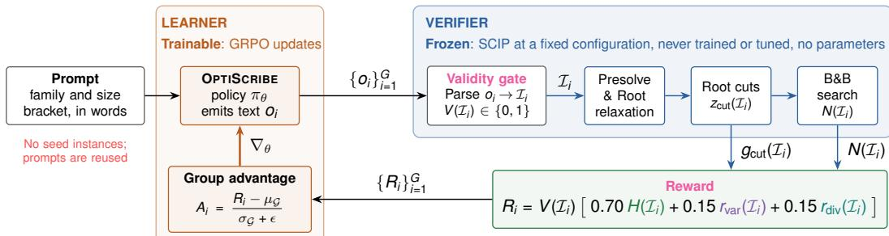  
Figure 1: Seed-free asymmetric self-play with trainable challenger and frozen verifier. From a prompt naming a family and a size bracket, the policy generates G=64 instances $\mathcal { T } _ { i } ,$ which SCIP solves with a fixed configuration. The verifier returns the validity gate $V$ , post-cut gap $g _ { \mathrm { c u t } }$ and node count $N _ { \cdot }$ , to compute hardness H. H is then combined with size $r _ { \mathrm { v a r } }$ and diversity $r _ { \mathrm { d i v } }$ rewards for GRPO-based Challender update. The untrained verifier keeps difficulty on a fixed scale.

$$
H ( \mathcal { T } _ { i } ) = 0 . 2 5 r _ { \mathrm { c u t } } ( \mathcal { T } _ { i } ) + 0 . 7 5 r _ { \mathrm { n o d e } } ( \mathcal { T } _ { i } ) ,\tag{3}
$$

$$
g _ { \mathrm { c u t } } ( \overline { { L } } _ { i } ) = \frac { \left| z _ { i } ^ { \star } - z _ { \mathrm { c u t , } i } \right| } { \tau \left| z _ { i } ^ { \star } \right| } , r _ { \mathrm { c u t } } ( \overline { { L } } _ { i } ) = \mathrm { c l i p } \big ( g _ { \mathrm { c u t } } ( \overline { { L } } _ { i } ) , 0 , 1 \big ) , r _ { \mathrm { n o d e } } ( \overline { { L } } _ { i } ) = \mathrm { c l i p } \bigg ( \frac { \log N ( \overline { { L } } _ { i } ) } { \log N _ { \mathrm { r e f } } } , 0 , 1 \bigg )\tag{4}
$$

With $\tau = 0 . 1 0$ , relative gaps are resolved up to 10% and larger ones are capped, and the absolute value makes $r _ { \mathrm { c u t } }$ independent of the optimization sense. Node counts are heavy-tailed, so $r _ { \mathrm { n o d e } }$ is log-scaled with $N _ { \mathrm { r e f } } = 5 { , } 0 0 0$ and is zero for an instance solved at the root $( N = 1 )$ . Because a large post-cut gap does not guarantee a long search, the node term gets the larger weight and the gap term serves for shaping. Since the easiest way to raise $r _ { \mathrm { n o d e } }$ is to write larger instances, the size term rewards closeness to the requested size,

$$
r _ { \mathrm { v a r } } ( { \mathcal Z } _ { i } ) ~ = ~ \mathrm { e x p } \Bigl ( - \alpha \frac { | n _ { i } - n ^ { \star } | } { n ^ { \star } } \Bigr ) ,\tag{5}
$$

where $n _ { i }$ is the realized variable count, $n ^ { \star }$ the midpoint of the requested bracket, and $\alpha = 3$ . The term is soft, so an instance outside the bracket loses at most $w _ { v } .$ . The diversity term $r _ { \mathrm { d i v } }$ ranks each valid instance by how rare its structural fingerprint is within its group, which discourages the policy from collapsing onto one structure. It averages exactly 0.5 in every group and therefore only redistributes advantage among valid instances (Appendix B.2). Appendix B.3 gives a worked example of the complete reward. We also train OPTISCRIBE-4B-xH, that drops the diversity term and moves its weight to hardness.

## 3.3 INSTANCE REPRESENTATION

Each instance is written in a compact index-set template rather than as an explicit coefficient matrix. The template has a header (family and optimization sense), a structure block (index sets, variable types and bounds, an objective, and constraint families quantified over the sets), and a data block of numeric arrays. A deterministic parser expands this text into an explicit MILP. Because the structure block does not grow with the instance, token cost grows with the number of parameters rather than the number of constraints (Appendix C). Token caps are set per size bracket from the length distribution of complete instances, and a completion that exceeds its cap fails to parse and receives zero reward.

## 3.4 TRAINING LOOP

Figure 1 illustrates a single training iteration. Given a prompt $p ,$ the policy samples a group of G completions $\{ o _ { i } \} _ { i = 1 } ^ { G } .$ . We parse each completion into an instance $\mathcal { T } _ { i }$ (Section 3.3), solve it with , and compute its reward $R _ { i } \left( 2 \right)$ . We fine-tune the policy with LoRA (Hu et al., 2022) using group relative policy optimization (GRPO) (Shao et al., 2024), which takes the within-group standardized reward as the advantage, $A _ { i } = ( R _ { i } - \mathrm { m e a n } _ { j } R _ { j } ) / ( \mathrm { s t d } _ { j } R _ { j } + \epsilon )$ . A completion is therefore reinforced only when it outperforms its peers for the same prompt, for example by yielding a harder instance, or a valid one where its peers fail. We apply the clipped GRPO update with a KL penalty that keeps the policy close to the base model (Appendix D). Each group is drawn from a single problem family and size bracket, and families alternate across steps, so instances are never compared across families.

## 4 EMPIRICAL RESULTS AND DISCUSSION

We train two base LLMs, Gemma-4-12B and Qwen3.5-4B, on three standard MILP families that differ in structure: capacitated facility location (CFL) has linking constraints, linearized Max-Cut is a graph problem, and multiple knapsack is a packing problem. We evaluate the generated instances along two axes, their gain in hardness over the untrained base model and their standing against public benchmarks of similar size, and then examine robustness, design choices and uses. Our experiments address six questions. 1) Do trained models generate harder instances than their base models (Section 4.1)? 2) How do these instances compare with public benchmarks of similar size (Section 4.2)? 3) Does the added difficulty hold under solvers not used in training (Section 4.3)? 4) How do reward design choices, in particular where the reward is read, affect the results (Section 4.4)? 5) Can the trained model still be steered with language (Section 4.5)? 6) Can generated instances be used to tune solver settings (Section 4.6)?

Experimental setup: We train each base model in two ways. The curriculum models, OPTIS-CRIBE-12B and OPTISCRIBE-4B, train on three size brackets in succession, 76–110 (B0), 111–170 (B1) and 171–225 (B2) variables, with each stage initialized from the previous one. The direct models, OPTISCRIBE-12B-D and OPTISCRIBE-4B-D, train on B2 alone with the same reward and hyperparameters. We evaluate on B1, B2, B3 (226–350) and B4 (351–500), so B3 and B4 test size extrapolation. Gemma-4-12B is our primary model, and the smaller Qwen3.5-4B replicates the main results and carries the node-reference and reward-weight ablations. Unless stated otherwise, the reward weights are $( w _ { H } , w _ { v } , w _ { d } ) = ( 0 . 7 0 , 0 . 1 5 , 0 . 1 5 )$ , and SCIP runs on one thread with a 50,000-node cap (Appendix D.2). All models receive identical prompts (Appendix A) with matched sampling seeds, so comparisons are paired. We report parse rate, feasible rate, branch-and-bound nodes and the post-root-cut gap $| z ^ { \star } - z _ { \mathrm { c u t } } | / | z ^ { \star } |$ , where more nodes and larger gaps mean more solver effort. We avoid solve time, which depends on the machine, except in Section 4.6. Appendices D and E detail the curriculum, geometry choice, hyperparameters and measurement conventions.

## 4.1 TRAINED MODELS GENERATE HARDER INSTANCES THAN THEIR BASE MODELS

Table 2 reports paired comparisons for Gemma. In every bracket, OPTISCRIBE-12B generates the hardest CFL and Max-Cut instances, raising median nodes over Gemma-4-12B by 1.7–5.0 (CFL) and 1.9–4.5 (Max-Cut) and median post-cut gaps by 1.4–1.7 and 1.1–1.3 . The gains persist at the unseen sizes B3–B4 (2.4 nodes on CFL, 2.4 /1.9 on Max-Cut), and the central 95% range of node counts is 1.7–5.2 wider, covering a broader span of difficulty. On CFL, parse and feasible rates also rise by 9–15 and 9–19 points. On Max-Cut, where Gemma-4-12B already parses nearly everything, the only notable drop (76.6% vs. 98.8% parsed at B4) comes mostly from unfinished completions, as every parsed OPTISCRIBE-12B instance is feasible.

Direct training at the target size fails for Gemma. OPTISCRIBE-12B-D became unstable as more completions hit the token cap and scored zero, and we stopped it after 47 of 61 updates (Appendix Figure 5), with nodes and gaps near or below those of Gemma-4-12B. Multiple knapsack stays easy for all models, with median gaps of about 0.5% (Appendix G.2).

A second base model: To test transfer across LLMs, we repeat the analysis on Qwen3.5-4B (Table 3). OPTISCRIBE-4B matches or improves parsing (by up to 17 points on CFL), raises median nodes by 2.9–11.6 on Max-Cut and 1.6–15.6 on CFL, and raises median gaps by 9.7–11.1 and 0.8–2.1 points, respectively. Unlike Gemma, Qwen trains stably at the target bracket (OPTISCRIBE-4B-D improves on Qwen3.5-4B in 21 of 24 cells), yet within the training brackets OPTISCRIBE-4B still beats OPTISCRIBE-4B-D in 10 of 12 comparisons, with one tie. The curriculum is thus necessary for Gemma and beneficial for Qwen. Qwen models also tend to generate harder instances than Gemma (Appendix Figures 9 and 10), partly because Qwen3.5-4B is already stronger on Max-Cut, so the difference reflects the base models rather than the framework.

Table 2: Main results for CFL and Max-Cut under SCIP. 256 instances per arm and bracket. Nodes is the median node count and Gap the median post-root-cut gap $( \times 1 0 ^ { - 3 } )$ , both over feasible instances, with the 2.5th and 97.5th percentiles in brackets. Bold marks the best value.
<table><tr><td rowspan="2">Bracket Arm</td><td rowspan="2"></td><td colspan="4">Capacitated Facility Location (CFL)</td><td colspan="4">Max-Cut</td></tr><tr><td>Parse ↑ Feas ↑</td><td></td><td>Nodes ↑</td><td>Gap↑</td><td>Parse ↑ Feas ↑</td><td></td><td>Nodes ↑</td><td>Gap↑</td></tr><tr><td rowspan="3">B1</td><td>Gemma-4-12B</td><td>78.9</td><td>72.7</td><td>22[1,456]</td><td>18 [1,63]</td><td>100.0</td><td>85.9</td><td>41 [15,91]</td><td>258 [182, 314]</td></tr><tr><td>OPTISCRIBE-12B-D</td><td>84.8</td><td>82.4</td><td>21 [1,388]</td><td>18[1,55]</td><td>99.6</td><td>89.1</td><td>41 [15,90]</td><td>260 [190, 315]</td></tr><tr><td>OPTISCRIBE-12B</td><td>94.1</td><td>91.8</td><td>109 [2, 755]</td><td>30 [2,74]</td><td>100.0</td><td>89.1</td><td>142 [29, 297]</td><td>338 [237, 392]</td></tr><tr><td rowspan="3">B2</td><td>Gemma-4-12B</td><td>88.3</td><td>86.7</td><td>224[1,1873]</td><td>22 [4, 63]</td><td>99.6</td><td>91.8</td><td>81 [29, 182]</td><td>298 [237,354]</td></tr><tr><td>OPTISCRIBE-12B-D</td><td>85.5</td><td>85.2</td><td>170[1,1587]</td><td>24 [2,65]</td><td>99.6</td><td>96.9</td><td>85 [31, 193]</td><td>300 [238, 355]</td></tr><tr><td>OPTISCRIBE-12B</td><td>99.6</td><td>96.5</td><td>391[1,3539]</td><td>35 [3, 82]</td><td>99.6</td><td>89.8</td><td>364[103,821]</td><td>396 [316,456]</td></tr><tr><td rowspan="3">B3</td><td>Gemma-4-12B</td><td>86.3</td><td>82.0</td><td>293 [1,6272]</td><td>20[2,52]</td><td>100.0</td><td>95.3</td><td>423 [201,744]</td><td>395 [332, 446]</td></tr><tr><td>OPTISCRIBE-12B-D</td><td>87.5</td><td>86.7</td><td>211[1,5591]</td><td>20 [2, 62]</td><td>98.8</td><td>95.7</td><td>369[148,676]</td><td>377 [317,436]</td></tr><tr><td>OPTISCRIBE-12B</td><td>98.0</td><td>94.9</td><td>710 [2, 18296]</td><td>27 [2,70]</td><td>99.6</td><td>96.1</td><td>1002 [510, 1770]</td><td>465 [405, 529]</td></tr><tr><td rowspan="3">B4</td><td>Gemma-4-12B</td><td>76.6</td><td>75.8</td><td>420[1,20671]</td><td>16[1,64]</td><td>98.8</td><td>97.3</td><td>1350 [823, 2180]</td><td>485 [426, 537]</td></tr><tr><td>OPTISCRIBE-12B-D</td><td>69.1</td><td>68.4</td><td>194 [0, 10658]</td><td>14[1,40]</td><td>82.4</td><td>80.5</td><td>1096 [477, 1801]</td><td>456 [379,515]</td></tr><tr><td>OPTISCRIBE-12B</td><td>85.5</td><td>84.4</td><td>1014[2, 34277]</td><td>25 [2, 58]</td><td>76.6</td><td>76.6</td><td>2578[1011, 8122]</td><td>546 [467, 623]</td></tr></table>

Table 3: Qwen arms against untrained Qwen3.5-4B under SCIP. Parsing and median post-root-cut gap are differences in percentage points (pp). Nodes is the ratio of median node counts. 128 completions per model and cell, feasible instances only. OPTISCRIBE-4B-xH raises the hardness weight and drops the diversity term. Bold marks the largest value.
<table><tr><td colspan="2"></td><td colspan="3">Max-Cut</td><td colspan="3">Capacitated facility location</td></tr><tr><td>Bracket</td><td>Arm</td><td>Parsing (pp)</td><td>Nodes</td><td>Gap (pp)</td><td>Parsing (pp)</td><td>Nodes</td><td>Gap (pp)</td></tr><tr><td rowspan="3">111-170</td><td>OPTISCRIBE-4B-D</td><td>+4.69</td><td>4.96×</td><td>+10.61</td><td>+14.84</td><td>2.23×</td><td>-0.27</td></tr><tr><td>OPTISCRIBE-4B</td><td>+2.34</td><td>5.08×</td><td>+10.74</td><td>+17.19</td><td>12.23×</td><td>+1.14</td></tr><tr><td>OPTISCRIBE-4B-xH</td><td>+9.38</td><td>7.22×</td><td>+13.40</td><td>+17.19</td><td>26.68×</td><td>+2.75</td></tr><tr><td rowspan="3">171-225</td><td>OPTISCRIBE-4B-D</td><td>-0.78</td><td>4.74×</td><td>+10.40</td><td>+1.56</td><td>6.93×</td><td>+1.13</td></tr><tr><td>OPTISCRIBE-4B</td><td>+0.78</td><td>5.26×</td><td>+11.02</td><td>+1.56</td><td>15.63×</td><td>+1.45</td></tr><tr><td>OPTISCRIBE-4B-xH</td><td>+0.78</td><td>6.56×</td><td>+14.14</td><td>+1.56</td><td>26.51×</td><td>+1.81</td></tr><tr><td rowspan="3">226-350</td><td>OPTISCRIBE-4B-D</td><td>-1.56</td><td>3.38×</td><td>+12.37</td><td>+8.59</td><td>12.69×</td><td>+0.54</td></tr><tr><td>OPTISCRIBE-4B</td><td>0.00</td><td>2.85×</td><td>+9.66</td><td>+9.38</td><td>7.64×</td><td>+2.08</td></tr><tr><td>OPTISCRIBE-4B-xH</td><td>+5.47</td><td>3.82×</td><td>+13.38</td><td>+9.38</td><td>31.51×</td><td>+0.53</td></tr><tr><td rowspan="3">351-500</td><td>OPTISCRIBE-4B-D</td><td>+6.25</td><td>16.63×</td><td>+12.62</td><td>+3.12</td><td>2.76×</td><td>+0.19</td></tr><tr><td>OPTISCRIBE-4B</td><td>+7.81</td><td>11.58×</td><td>+11.11</td><td>+4.69</td><td>1.61×</td><td>+0.83</td></tr><tr><td>OPTISCRIBE-4B-xH</td><td>+7.81</td><td>28.83×</td><td>+14.35</td><td>+5.47</td><td>11.14×</td><td>+0.37</td></tr></table>

## 4.2 GENERATED INSTANCES FILL GAPS IN PUBLIC BENCHMARKS

We pool public instances with 111–500 variables from eight sources, including MIPLIB 2010/2017, MILP-Evolve, and D-MIPLIB (full list and citations in Appendix G.4). We compare public mixedinteger instances against our CFL pools, and public pure-integer instances against our Max-Cut pools, using OPTISCRIBE-12B, two OPTISCRIBE-4B runs $( N _ { \mathrm { r e f } } = 5 { , } 0 0 0$ and 50,000, Section 4.4), and OPTISCRIBE-4B-xH (Figure 2). Public coverage in this range is sparse and largely bimodal. Among the 60 mixed-integer instances, most are either trivial ( 10 nodes) or nearly hit the 50,000-node cap, while the pure-integer set adds only a narrow band around 1,000–10,000 nodes. Our generated pools span the full difficulty spectrum, with several instances reaching the cap, and OPTISCRIBE-4B-xH reaches the cap about twice as often as the other pools. Public mixed-integer instances solved to optimality typically end with gaps below  6%, similar to our CFL pools, whereas our Max-Cut pools retain much larger post-cut gaps (41.9–49.9% vs. 11.9%). Standard synthetic generators are easier still at this scale. Their pooled median instance is solved at the root and none needs more than 189 nodes, against median node counts of 347 on CFL and 634 on Max-Cut for OPTISCRIBE-12B (Appendix G.3). Since our generator produces instances of a requested family and size on demand, we use it for tuning in Section 4.6.

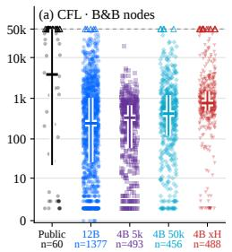

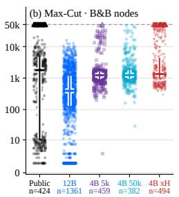

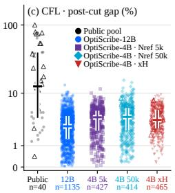

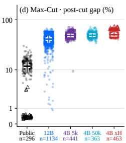

Figure 2: Generated instances against public benchmarks, 111–500 variables. Public mixedinteger instances against generated CFL (a, c) and public pure-integer instances against generated Max-Cut (b, d). (a, b) SCIP nodes, (c, d) post-root-cut gap in percent. Points are single instances, all weighted equally. Crossbars are medians and vertical bars the interquartile range. Triangles mark instances that hit the 50,000-node cap (dashed line), and their gaps are measured against the best incumbent.  
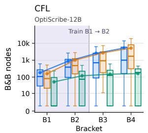

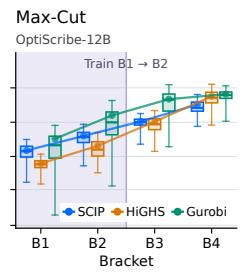

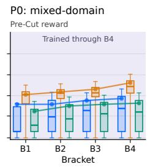

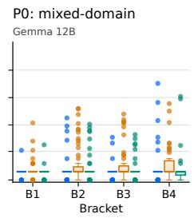  
Figure 3: Node counts under three solvers. (a, b) OPTISCRIBE-12B CFL and Max-Cut instances under SCIP (training solver), HiGHS and Gurobi, with training brackets shaded. (c) A model trained on prompt P0 with a pre-cut reward and HiGHS in the loop, through all four brackets. (d) Untrained Gemma-4-12B on P0. Boxes show median and interquartile range, dots are outliers, lines join per-bracket medians. Log vertical axis.

## 4.3 THE HARDNESS ORDERING HOLDS UNDER HELD-OUT SOLVERS

Since the reward comes from SCIP, the model could learn instances that are hard only for SCIP. We re-solve all instances with HiGHS and Gurobi 13.0.3, neither used in training (Figure 3a,b). For OPTISCRIBE-12B, median nodes grow with size under every solver. HiGHS follows SCIP’s trend, while Gurobi needs fewer nodes on CFL and more on Max-Cut. The model ranking is unchanged: OPTISCRIBE-12B has the highest median in every bracket except CFL B1 under Gurobi, where all medians are root-solved (Appendix G.5). Whenever both prove optimality, SCIP and Gurobi agree on the optimal value within tolerance, so the difficulty is not an artifact of numerical error.

## 4.4 REWARD DESIGN: READOUT POINT, NODE REFERENCE AND WEIGHTS

We ablate three reward choices. Readout point. Section 3.2 discussed that a reward read before root cuts can be inflated by weak formulations. A model trained with a pre-cut reward and HiGHS in the loop, on the mixed-domain prompt P0 (Appendix F), illustrates this. Its instances tie binaries to continuous sums through single loose big-M rows and leave 67–95% of variables without an upper bound, so the LP relaxation opens facilities almost for free. Tightening M to a valid value left HiGHS node counts unchanged on all 1,715 instances. SCIP’s root cuts, by contrast, repair the relaxation, and disabling them raises SCIP’s node count by a median factor of 8–10. SCIP and Gurobi therefore solve one-third to over half of these instances at the root, and HiGHS at most 6% (Figure 3 c,d;

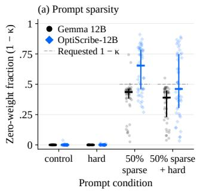

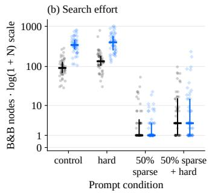

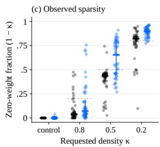  
Figure 4: Language control over Max-Cut. Bracket 171–225, 48 instances per model/prompt, with SCIP. (a) Share of zero-weight vertex pairs, 1  κ, under each prompt. Dashed lines are requested values. (b) Branch-and-bound nodes. (c) Realized zero-weight share vs. requested density. Points are single completions, horizontal bars are medians and vertical bars span the interquartile range.

Appendix Figure 6), which is why we read the reward after root cuts. Raising the node reference $N _ { \mathrm { r e f } } .$ where the node term in equation 4 saturates, to 50,000 for Qwen changes little inside the training brackets (Appendix Figure 7). Outside them it raises CFL node gains at B3/B4 (24.5 /5.7 vs. 7.6 /1.6 ) but lowers Max-Cut at B4 (6.6 vs. 11.6 ) and costs over 10 points of parse rate. The hardness weight acts as a dial. Raising it and dropping the diversity term (OPTISCRIBE-4B-xH) gives the highest node count in every cell of Table 3. That is 3.8–28.8 (Max-Cut) and 11.1–31.5 (CFL) over Qwen3.5-4B, or 1.2–2.5 and 1.7–6.9 over OPTISCRIBE-4B, with no parse-rate loss but tighter clustering in Figure 2, i.e. less diversity.

## 4.5 LANGUAGE CONTROL IS PRESERVED ON MAX-CUT

An LLM generator should do what the prompt says. For Max-Cut at 171–225 variables, we append one unseen sentence to a fixed prompt, requesting a harder instance, a sparser graph at target edge density κ, or both (Appendix Table 14), and sample 48 completions per sentence from Gemma-4-12B and OPTISCRIBE-12B (Figure 4). Both modelsfollow the density instructions. For requested densities 0.8/0.5/0.2, median realized densities are 0.96/0.56/0.18 for Gemma-4-12B and 0.93/0.35/0.10 for OPTISCRIBE-12B, which overshoots but keeps the order. “Harder” raises node counts from 92 to 135 for Gemma-4-12B and from 344 to 400 for OPTISCRIBE-12B, so training raises the level at which a sentence lands (3.7 and 3.0 over Gemma-4-12B) without amplifying its marginal effect. On CFL, OPTISCRIBE-12B does not track the analogous density request, though its instances still become easier (Appendix Figure 8). The effect is bounded by problem structure. Our Max-Cut LP bound equals the total edge weight (Appendix C.2), so sparser graphs raise the maximum cut’s share of it. At densities 0.5 and 0.2 the median share rises from about 0.6 to 0.86–1.00, the bound becomes nearly tight and SCIP often closes at the root, and even “harder” with a sparse request reaches a median of only 3 nodes. New requirements can thus be stated as unseen sentences, and the trained model follows them within what the family’s mathematics allows.

## 4.6 GENERATED INSTANCES SUPPORT SOLVER TUNING

Solver tuning works best on instances that match the target workload, but public collections often miss the right family or size. We test whether OPTISCRIBE-12B can fill that gap by tuning SCIP on 40 generated instances with 226–350 variables and evaluating the chosen setting on held-out instances. In-distribution utility: MILP-Evolve has no CFL instances at this size, so we generated them with OPTISCRIBE-12B and tested on 24 held-out generated instances. The best setting caps aggregation-based cutting planes at five rounds at the root (instead of no round limit), reducing mean solve time by 16.0% (95% bootstrap CI 6.3–25.5%) with identical optimal values. Out-of-distribution transfer: We selected among 10 SCIP configurations on generated Max-Cut instances and applied the winning configuration unchanged to 40 same-size MILP-Evolve combinatorial-auction instances. The wining configuration disables cutting planes and solves 35/40 instances within 10 s, compared to

14/40 with default settings. It also cuts mean PAR2<sup>1</sup> from 15.15 to 7.50 s (paired difference 7.64 s, 95% bootstrap CI 9.43 to 5.88 s). Tuning directly on MILP-Evolve selects the same setting. Generated instances thus recover the setting chosen on the target library, and they allow tuning for a family and size that the library lacks.

## 5 CONCLUSIONS AND LIMITATIONS

We showed that solver effort after root cuts is a usable reward for teaching LLMs to write hard MILP instances. With a frozen verifier and no seed instances or instance corpus, OPTISCRIBE-12B and OPTISCRIBE-4B generate harder CFL and Max-Cut instances than their base models at trained and larger sizes, and the ranking holds for two held-out solvers. The instances cover difficulty levels that public benchmarks of similar size leave sparse, and stay controllable through natural-language requests such as density and difficulty. They are also useful in practice: settings tuned on them match those tuned on MILP-Evolve, and they allow tuning for a family and size that public libraries lack.

Our study has limitations. It covers three families, and multiple knapsack stays easy for every model. Generated instances currently have at most 500 variables. We train each arm once and tune on a small set of instances. Broader families, larger problems, and wider evaluations are left for future work.

## AUTHOR CONTRIBUTIONS

J.S. and P.P. developed the methodology, implemented the system, ran the experiments, and performed the analysis. All other authors contributed to study design and interpretation of results, provided feedback throughout the project, and participated in writing, reviewing, and approving the final manuscript. P.S. arranged the computational resources required for the project.

## REFERENCES

Tobias Achterberg. Scip: Solving constraint integer programs. Mathematical Programming Computation, 1(1):1–41, 2009. doi: 10.1007/s12532-008-0001-1.

Egon Balas and Andrew Ho. Set covering algorithms using cutting planes, heuristics, and subgradient optimization: a computational study. In Combinatorial Optimization, volume 12 of Mathematical Programming Studies, pages 37–60. Springer, 1980.

Yoshua Bengio, Andrea Lodi, and Antoine Prouvost. Machine learning for combinatorial optimization: A methodological tour d’horizon. European Journal ofOperational Research, 290(2):405–421, 2021. doi: 10.1016/j.ejor.2020.07.063.

Suresh Bolusani, Mathieu Besançon, Ambros Gleixner, Timo Berthold, Claudia D’Ambrosio, Gonzalo Muñoz, Joseph Paat, and Dimitri Thomopulos. The MIP workshop 2023 computational competition on reoptimization. Mathematical Programming Computation, 16:255–266, 2024. doi: 10.1007/s12532-024-00256-w.

Simon Bowly. Stress Testing Mixed Integer Programming Solvers through New Test Instance Generation Methods. PhD thesis, University of Melbourne, 2019.

Peter C. Cheeseman, Bob Kanefsky, and William M. Taylor. Where the really hard problems are. In IJCAI, 1991.

Yitian Chen, Jingfan Xia, Siyu Shao, Dongdong Ge, and Yinyu Ye. Solver-informed RL: Grounding large language models for authentic optimization modeling. In Advances in Neural Information Processing Systems (NeurIPS), 2025.

Gérard Cornuéjols, Ramaswamy Sridharan, and Jean-Michel Thizy. A comparison of heuristics and relaxations for the capacitated plant location problem. European Journal of Operational Research, 50(3):280–297, 1991.

<sup>1</sup>Penalized average runtime, the mean solve time with each unsolved instance counted at twice the time limit (Froleyks et al., 2021).

Kefan Dong and Tengyu Ma. STP: Self-play LLM theorem provers with iterative conjecturing and proving. In Proceedings of the 42nd International Conference on Machine Learning (ICML), volume 267 of Proceedings ofMachine Learning Research, pages 14114–14136. PMLR, 2025.

Nils Froleyks, Marijn Heule, Ashlin Iser, Matti Järvisalo, and Martin Suda. SAT competition 2020. Artificial Intelligence, 301:103572, 2021. doi: 10.1016/j.artint.2021.103572.

Maxime Gasse, Didier Chételat, Nicola Ferroni, Laurent Charlin, and Andrea Lodi. Exact combinatorial optimization with graph convolutional neural networks. In Advances in Neural Information Processing Systems, volume 32, pages 15587–15596, 2019. URL https://proceedings.neurips. cc/paper/2019/file/d14c2267d848abeb81fd590f371d39bd-Paper.pdf.

Gemma Team, Sherif El Abd, Vaibhav Aggarwal, Robin Algayres, Alek Andreev, Olivier Bachem, et al. Gemma 4 Technical Report. arXiv preprint arXiv:2607.02770, 2026. URL https://arxiv. org/abs/2607.02770.

Zijie Geng, Xijun Li, Jie Wang, Xiao Li, Yongdong Zhang, and Feng Wu. A deep instance generative framework for MILP solvers under limited data availability. In Advances in Neural Information Processing Systems (NeurIPS), 2023.

Ambros Gleixner, Gregor Hendel, Gerald Gamrath, Tobias Achterberg, Michael Bastubbe, Timo Berthold, Philipp M. Christophel, Kati Jarck, Thorsten Koch, Jeff Linderoth, Marco Lübbecke, Hans Mittelmann, Derya Ozyurt, Ted Ralphs, Domenico Salvagnin, and Yuji Shinano. MIPLIB 2017: data-driven compilation of the 6th mixed-integer programming library. Mathematical Programming Computation, 13(3):443–490, 2021. doi: 10.1007/s12532-020-00194-3.

Ziao Guo, Yang Li, Chang Liu, Wenli Ouyang, and Junchi Yan. ACM-MILP: Adaptive constraint modification via grouping and selection for hardness-preserving MILP instance generation. In Proceedings of the 41st International Conference on Machine Learning (ICML), volume 235 of Proceedings ofMachine Learning Research, pages 16869–16890. PMLR, 2024.

J. N. Hooker. Testing heuristics: We have it all wrong. Journal ofHeuristics, 1(1):33–42, 1995.

Edward J. Hu, Yelong Shen, Phillip Wallis, Zeyuan Allen-Zhu, Yuanzhi Li, Shean Wang, Lu Wang, and Weizhu Chen. LoRA: Low-rank adaptation of large language models. In International Conference on Learning Representations, 2022. URL https://openreview.net/forum?id= nZeVKeeFYf9.

Chengsong Huang, Wenhao Yu, Xiaoyang Wang, Hongming Zhang, Zongxia Li, Ruosen Li, Jiaxin Huang, Haitao Mi, and Dong Yu. R-zero: Self-evolving reasoning llm from zero data. In The Fourteenth International Conference on Learning Representations (ICLR), 2026.

Chenyu Huang, Zhengyang Tang, Shixi Hu, Ruoqing Jiang, Xin Zheng, Dongdong Ge, Benyou Wang, and Zizhuo Wang. ORLM: A customizable framework in training large models for automated optimization modeling. Operations Research, 73(6):2986–3009, 2025. doi: 10.1287/opre.2024. 1233.

Weimin Huang, Taoan Huang, Aaron M. Ferber, and Bistra Dilkina. Distributional MIPLIB: a multi-domain library for advancing ML-guided MILP methods. arXiv preprint arXiv:2406.06954, 2024.

Thorsten Koch, Tobias Achterberg, Erling Andersen, Oliver Bastert, Timo Berthold, Robert E. Bixby, Emilie Danna, Gerald Gamrath, Ambros M. Gleixner, Stefan Heinz, Andrea Lodi, Hans D. Mittelmann, Ted K. Ralphs, Domenico Salvagnin, Daniel E. Steffy, and Kati Wolter. MIPLIB 2010. Mathematical Programming Computation, 3(2):103–163, 2011. doi: 10.1007/s12532-011-0025-9.

Kevin Leyton-Brown, Mark Pearson, and Yoav Shoham. Towards a universal test suite for combinatorial auction algorithms. In Proceedings of the 2nd ACM Conference on Electronic Commerce, pages 66–76, 2000.

Sirui Li, Janardhan Kulkarni, Ishai Menache, Cathy Wu, and Beibin Li. Towards foundation models for mixed integer linear programming. In The Thirteenth International Conference on Learning Representations (ICLR), 2025.

Haoyang Liu, Jie Wang, Wanbo Zhang, Zijie Geng, Yufei Kuang, Xijun Li, Yongdong Zhang, Bin Li, and Feng Wu. MILP-StuDio: MILP instance generation via block structure decomposition. In Advances in Neural Information Processing Systems (NeurIPS), 2024.

Andrea Lodi and Andrea Tramontani. Performance variability in mixed-integer programming. In Theory Driven by Influential Applications, INFORMS TutORials in Operations Research, pages 1–12. INFORMS, 2013. ISBN 978-0-9843378-4-2. doi: 10.1287/educ.2013.0112.

David Mitchell, Bart Selman, and Hector Levesque. Hard and easy distributions of SAT problems. In AAAI, 1992.

Dimitri J. Papageorgiou, George L. Nemhauser, Joel Sokol, Myun-Seok Cheon, and Ahmet B. Keha. MIRPLib – a library of maritime inventory routing problem instances: Survey, core model, and benchmark results. European Journal of Operational Research, 235(2):350–366, 2014. doi: 10.1016/j.ejor.2013.12.013.

Antoine Prouvost, Justin Dumouchelle, Lara Scavuzzo, Maxime Gasse, Didier Chételat, and Andrea Lodi. Ecole: A gym-like library for machine learning in combinatorial optimization solvers. In Learning Meets Combinatorial Algorithms Workshop at NeurIPS 2020, 2020.

Qwen Team. Qwen3 technical report, 2025. URL https://arxiv.org/abs/2505.09388.

Bart Selman, David G Mitchell, and Hector J Levesque. Generating hard satisfiability problems. Artificial Intelligence, 81(1-2):17–29, 1996.

Zhihong Shao, Peiyi Wang, Qihao Zhu, Runxin Xu, Junxiao Song, Xiao Bi, Haowei Zhang, Mingchuan Zhang, Y. K. Li, Y. Wu, and Daya Guo. Deepseekmath: Pushing the limits of mathematical reasoning in open language models, 2024. URL https://arxiv.org/abs/2402.03300.

Kate Smith-Miles and Simon Bowly. Generating new test instances by evolving in instance space. Computers & Operations Research, 63:102–113, 2015.

Haoyu Peter Wang, Jialin Liu, Xiaohan Chen, Xinshang Wang, Pan Li, and Wotao Yin. DIG-MILP: A deep instance generator for mixed-integer linear programming with feasibility guarantee. Transactions on Machine Learning Research, 2024. URL https://openreview.net/forum?id= psDvcWtFdE.

Alinson S. Xavier, Feng Qiu, Xiaoyi Gu, Berkay Becu, and Santanu S. Dey. MIPLearn: An extensible framework for learning-enhanced optimization (version 0.4), 2024.

Tianxing Yang, Huigen Ye, and Hua Xu. Code retrieval for MILP instance generation, 2025. URL https://arxiv.org/abs/2505.11526.

Andrew Zhao, Yiran Wu, Yang Yue, Tong Wu, Quentin Xu, Yang Yue, Matthieu Lin, Shenzhi Wang, Qingyun Wu, Zilong Zheng, and Gao Huang. Absolute zero: Reinforced self-play reasoning with zero data. In Advances in Neural Information Processing Systems (NeurIPS), 2025.

# Appendix: Teaching LLMs to Generate Challenging MILP Instances via Solver Feedback

## A THE GENERATION PROMPT

## A.1 SCOPE AND DELIVERY

Both models OPTISCRIBE-12B and OPTISCRIBE-4B are trained with the same prompt. The models only differ only in the underlying base model and in the chat template applied by that model’s tokenizer. Concretely, the rendered prompt is passed in as a single user message, with no system prompt. Each training row has the form:

```jsonl
{"role": "user", "content": [{"type": "text", "text": <rendered prompt>}]}
```

The trainer then applies the model’s chat template. As a result, the only input-level difference between the two models is the template wrapper (Gemma’s <start\_of\_turn>user versus Qwen’s <|im\_start|>user), not the prompt body.

We render one prompt per training example using a function family f {Capacitated Facility Location, Max-cut, Multiple knapsack}, the curriculum bracket b, and an in-context exemplar.

## A.2 TEMPLATE

Every prompt is the concatenation of seven blocks in fixed order:

1. a one-line task statement,

2. FAMILY / MANDATORY MATHEMATICS: the per-family structural mandate (Listing 2),

3. SIZE: the variable-count interval $[ \ell _ { b } , u _ { b } ]$ for the bracket plus a natural-language geometry hint (Table 4),

4. FEASIBILITY PROCEDURE: a per-family construction recipe with one bracketdependent numeric constant substituted in (Table 4),

5. WHAT YOU MUST NOT DO: four shared prohibitions (Listing 3);

6. PRECEDENCE: the conflict rule (Listing 3);

7. EXAMPLE: one complete in-context exemplar, followed by the strict output-format instruction.

Listing 1: Template skeleton. Braced tokens are substituted per training example.

Write ONE mixed-integer linear program in the format shown by the example below.   
{MANDATE[family]}   
SIZE: the problem must have between {lo} and {hi} variables in total. Aim for {geometry\_hint}.   
A two-index family x[A,B] contributes |A| x |B| variables; a one-index family x[A] contributes   
|A|. Choose the set sizes so the total lands in range.   
FEASIBILITY PROCEDURE (follow it; do not merely aim at the outcome):   
{procedure[family] with {caphint} substituted}   
A model with no feasible solution is worth nothing, and so is one whose optimum is obvious.   
{BANS}   
{PRECEDENCE}   
EXAMPLE of the required format and mathematics:   
{exemplar}   
Now write a NEW problem of the same family at the size requested above.   
Output exactly ONE problem.   
OUTPUT FORMAT -- this is strict:   
Begin with the MILP header line. End with the DATA block. Stop immediately after the closing   
brace of the DATA block.

Write NO comments, NO explanation, NO reasoning, NO checks, and no text before or after the   
model. Every line you write must be part of the model itself.

## A.3 PER-FAMILY MANDATES

## Listing 2: The three family mandates, verbatim.

=== Capacitated facility location ===   
FAMILY: tight facility location.   
MANDATORY MATHEMATICS (the names are yours; the structure is not):   
- CONTINUOUS flow variables indexed by TWO sets, x[F,D], each with an explicit finite   
upper bound   
- BINARY open variables indexed by one set, y[F]   
- a demand row per customer: for d in D: sum f in F: x[f,d] >= dem[d]   
- a PER-PAIR link: for f in F, d in D: x[f,d] - dem[d]\*y[f] <= 0   
- a capacity row per depot WITHOUT any binary: for f in F: sum d in D: x[f,d] <= cap[f]   
- a minimisation objective over flow cost plus opening cost   
=== Multiple knapsack ===   
FAMILY: multiple knapsack (packing items into containers).   
MANDATORY MATHEMATICS (the names are yours; the structure is not):   
- one family of BINARY variables indexed by TWO sets, x[I,K] (item, container)   
- each item used at most once: for i in I: sum k in K: x[i,k] <= 1   
this row MUST be \`<=\`, never \`=\` -- with \`=\` a tight capacity makes the problem   
impossible instead of hard   
- a weighted capacity row per container: for k in K: sum i in I: w[i]\*x[i,k] <= cap[k]   
- a MAXIMISATION objective over a two-index profit, p[i,k]   
=== Maximum cut, linearised ===   
FAMILY: maximum cut on a graph, written in the standard linearised form.   
MANDATORY MATHEMATICS (the names are yours; the structure is not):   
- BINARY node variables indexed by one set, x[V]   
- BINARY edge variables indexed by two sets, y[V,V]   
- BOTH of these rows, as a pair, over the same (i,j):   
for i in V, j in V: y[i,j] - x[i] - x[j] <= 0   
for i in V, j in V: y[i,j] + x[i] + x[j] <= 2   
Neither row alone models a cut: the first alone lets y be 0 everywhere, the second   
alone lets y be 1 everywhere.   
- a MAXIMISATION objective over a two-index edge weight, w[i,j]

## A.4 SHARED BLOCKS

Listing 3: Prohibitions and precedence rule, identical for every family and bracket.

WHAT YOU MUST NOT DO:   
1. Do not leave any continuous variable without an explicit finite upper bound.   
\`var x[F,D] 0 inf continuous\` is invalid. State a real number.   
2. Do not write an aggregated single-binary link -- one binary switching off a SUM of two or   
more continuous columns, as in \`sum d in D: x[f,d] - 1000\*y[f] <= 0\`. A per-pair link,   
\`x[f,d] - dem[d]\*y[f] <= 0\`, is the correct form.   
3. Do not use coefficients spanning more than four orders of magnitude. Keep every nonzero   
within a factor of 10,000 of every other.   
4. Do not omit any mandatory row above, and do not add a row that makes another one   
non-binding.   
PRECEDENCE, when these instructions appear to conflict:   
the validity gates dominate these instructions, and these instructions dominate the exemplar.   
The exemplar shows ONE way to satisfy the mandate. It is not the only way, and where it   
differs from the instructions above, the instructions win.

## A.5 PER-CELL PARAMETERS

Only two things vary with the curriculum bracket: the geometry hint in the SIZE line and one numeric constant in the FEASIBILITY PROCEDURE. The procedure sentences are otherwise fixed per family:

• Facility Location: “Pick every demand dem[d] as an integer from 5 to 20. Then set EVERY cap[f] to c, and every opening cost fopen[f] to an integer from 120 to 260, large enough that opening one more depot is a real decision, not free.”

• Multiple knapsack: “Pick every weight w[i] as an integer from 10 to 30 and every profit p[i,k] as an integer from 20 to 60. Then set EVERY cap[k] to c. Do not compute it from the weights, just use that number.”

• Max-cut: “Set w[i,i] = 0 on the whole diagonal. For every pair i below $j ,$ set w[i,j] to an integer from 1 to 20. Every single pair, leaving none at zero. Then mirror it: $\mathsf { w } [ \mathsf { j } , \mathsf { i } ] =$ w[i, $, \mathrm { j } \mathrm { } ] . \ '$ (No bracket-dependent constant.)

Every geometry hint in Table 4 lands inside its bracket (CFL: $| F | | D | + | F | ;$ multiple knapsack: $| I | | \dot { K } | ;$ Max-Cut: $| V | ^ { 2 } + | V | )$ . For CFL the constant c also guarantees feasibility for any demand draw: in every cell $| \dot { F } | c \geq 2 0 | D$ , so total capacity exceeds the largest possible total demand.

Table 4: Geometry hint and capacity constant c by family and bracket. Multiple knapsack is not trained at 76–110: no screened geometry for that family branched at that size, so the cell is excluded from the curriculum rather than assigned a hint.
<table><tr><td>Family</td><td>Bracket</td><td>Geometry hint (SIZE line)</td><td>C</td></tr><tr><td>CFL</td><td>76-110</td><td>about 8 depots and 12 customers</td><td>41</td></tr><tr><td>CFL</td><td>111-170</td><td>about 10 depots and 15 customers</td><td>41</td></tr><tr><td>CFL</td><td>171-225</td><td>about 14 depots and 13 customers</td><td>26</td></tr><tr><td>CFL CFL</td><td>226-350 351-500</td><td>about 16 depots and 17 customers about 20 depots and 20 customers</td><td>29 28</td></tr><tr><td>Multiple knapsack</td><td>76-110</td><td>not trained at this bracket</td><td></td></tr><tr><td>Multiple knapsack Multiple knapsack</td><td>111-170 171-225</td><td>about 42 items and 4 containers about 48 items and 4 containers</td><td>105 120</td></tr><tr><td>Multiple knapsack Multiple knapsack</td><td>226-350 351-500</td><td>about 48 items and 6 containers</td><td>80</td></tr><tr><td></td><td></td><td>about 48 items and 8 containers</td><td>60</td></tr><tr><td></td><td></td><td></td><td></td></tr><tr><td>Max-cut</td><td>76-110</td><td>about 9 nodes</td><td></td></tr><tr><td>Max-cut</td><td>111-170</td><td>about 12 nodes</td><td></td></tr><tr><td>Max-cut</td><td>171-225</td><td>about 13 nodes</td><td></td></tr><tr><td></td><td></td><td></td><td></td></tr><tr><td>Max-cut</td><td>226-350</td><td>about 16 nodes</td><td></td></tr><tr><td>Max-cut</td><td>351-500</td><td>about 20 nodes</td><td></td></tr></table>

## A.6 IN-CONTEXT EXEMPLAR

Each prompt carries exactly one exemplar, drawn uniformly at random from a fixed pool of three per family. Exemplars are rendered at a fixed geometry that does not depend on the bracket: CFL’s pool has 104, 150 and 104 variables, Multiple knapsack’s and Max-cut’s pools are at 192 and 182 variables respectively. The exemplar therefore lies inside the requested interval only in a few brackets. In lower brackets it is larger than requested, and in higher brackets smaller. Its data are also not re-drawn with the bracket’s constant. The exemplar in Listing 4 has capacities 22–25, whereas the procedure asks for 41. The PRECEDENCE block exists to resolve these conflicts in favour of the instructions. Provenance comments are stripped before embedding so that comment lines are not demonstrated as part of the output format.

## A.7 A COMPLETE RENDERED PROMPT

Listing 4 is one prompt exactly as the model receives it (CFL at bracket 111–170), before the chat template is applied.

Listing 4: A complete training prompt: family CFL, bracket 111–170. The DATA line is a single long line in the original and is wrapped here.

Write ONE mixed-integer linear program in the format shown by the example below.   
FAMILY: tight facility location.   
MANDATORY MATHEMATICS (the names are yours; the structure is not):   
- CONTINUOUS flow variables indexed by TWO sets, x[F,D], each with an explicit finite   
upper bound   
- BINARY open variables indexed by one set, y[F]   
- a demand row per customer: for d in D: sum f in F: x[f,d] >= dem[d]   
- a PER-PAIR link: for f in F, d in D: x[f,d] - dem[d]\*y[f] <= 0

- a capacity row per depot WITHOUT any binary: for f in F: sum d in D: x[f,d] <= cap[f]   
- a minimisation objective over flow cost plus opening cost   
SIZE: the problem must have between 111 and 170 variables in total. Aim for about 10 depots and 15 customers.   
A two-index family x[A,B] contributes |A| x |B| variables; a one-index family x[A] contributes   
|A|. Choose the set sizes so the total lands in range.   
FEASIBILITY PROCEDURE (follow it; do not merely aim at the outcome):   
Pick every demand dem[d] as an integer from 5 to 20. Then set EVERY cap[f] to 41, and every opening cost fopen[f] to   
,→ an integer from 120 to 260 -- large enough that opening one more depot is a real decision, not free.   
A model with no feasible solution is worth nothing, and so is one whose optimum is obvious.   
WHAT YOU MUST NOT DO:   
1. Do not leave any continuous variable without an explicit finite upper bound.   
\`var x[F,D] 0 inf continuous\` is invalid. State a real number.   
2. Do not write an aggregated single-binary link -- one binary switching off a SUM of two or   
more continuous columns, as in \`sum d in D: x[f,d] - 1000\*y[f] <= 0\`. A per-pair link,   
\`x[f,d] - dem[d]\*y[f] <= 0\`, is the correct form.   
3. Do not use coefficients spanning more than four orders of magnitude. Keep every nonzero   
within a factor of 10,000 of every other.   
4. Do not omit any mandatory row above, and do not add a row that makes another one   
non-binding.   
PRECEDENCE, when these instructions appear to conflict:   
the validity gates dominate these instructions, and these instructions dominate the exemplar.   
The exemplar shows ONE way to satisfy the mandate. It is not the only way, and where it   
differs from the instructions above, the instructions win.   
EXAMPLE of the required format and mathematics:   
MILP tight\_facility min   
set F 10   
set D 14   
par cost[F,D]   
par fopen[F]   
par dem[D]   
par cap[F]   
var x[F,D] 0 20 continuous   
var y[F] 0 1 binary   
obj min sum f in F, d in D: cost[f,d]\*x[f,d] + sum f in F: fopen[f]\*y[f]   
con demand: for d in D: sum f in F: x[f,d] >= dem[d]   
con link: for f in F, d in D: x[f,d] - dem[d]\*y[f] <= 0   
con cap: for f in F: sum d in D: x[f,d] <= cap[f]   
DATA: {"cost":[[6,12,1,10,5,1,15,9,9,8,13,14,4,7],[1,8,10,13,14,12,11,1,11,8,10,12,11,15],[1,15,7,11,9,14,6,8,11,13,6,   
,→ 14,1,4],[13,14,8,11,9,2,7,2,2,12,12,15,11,6],[12,3,11,10,8,11,11,2,7,8,7,15,14,1],[6,9,9,14,3,13,11,1,15,7,3,15,3,   
,→ 2],[6,6,4,4,9,5,6,6,15,8,4,4,5,15],[11,3,7,5,11,8,2,12,14,7,14,14,7,11],[11,6,11,11,11,14,14,6,11,3,12,4,14,8],[4,   
,→ 2,8,6,1,13,9,13,14,5,14,10,9,13]],"fopen":[198,172,240,154,202,242,255,175,173,165],"dem":[12,14,12,11,11,20,8,13,   
,→ 11,15,18,14,20,20],"cap":[22,23,25,23,23,23,25,23,25,23]}   
Now write a NEW problem of the same family at the size requested above.   
Output exactly ONE problem.   
OUTPUT FORMAT — this is strict:   
Begin with the MILP header line. End with the DATA block. Stop immediately after the closing   
brace of the DATA block.   
Write NO comments, NO explanation, NO reasoning, NO checks, and no text before or after the   
model. Every line you write must be part of the model itself.

## B THE SOLVER-BASED GRPO REWARD FUNCTION

In this section, we present the details of two reward components that were reffered to Appendix section for more details: Validity gate and Structural diversity.

## B.1 THE VALIDITY GATE

The validity gate for instance <sub>i</sub> generated while training is $\begin{array} { r } { V ( \mathcal { T } _ { i } ) = \prod _ { k = 1 } ^ { 6 } \mathbf { 1 } [ g _ { k } ( \mathcal { T } _ { i } ) ] } \end{array}$ with the following conditions.

g Parse: The emitted instance expands under the fixed grammar, with all index sets declared, all referenced parameters present and all rows well formed.

g<sub>2</sub> Well posed: The solver returns a feasible and a finite optimal value within the node cap and the wall-clock limit. Infeasible models, unbounded models and killed solves all fail here.

g Bounded variables: Every continuous variable carries a finite upper bound. Without this gate the policy inflates relaxation gaps with unbounded variables which is a route to apparent hardness that vanishes under standard pre-processing.

g<sub>4</sub> No aggregated single-binary link: No constraint gates a sum of continuous variables through a single binary with one large coefficient. The banned pattern couples many continuous columns to one switch, which we found makes instances easier for the solver, not harder, while inflating superficial structure.

g<sub>5</sub> Coefficient range: The ratio of the largest to the smallest nonzero magnitude over the constraint matrix and objective is at most $1 0 ^ { 4 }$ . This blocks hardness manufactured from numerical ill-conditioning, which is an artefact of tolerances rather than of combinatorial structure.

g<sub>6</sub> Family compliance: Declared index sets, variable types and row families match the family named in the prompt.

## B.2 STRUCTURAL DIVERSITY

GRPO only compares completions within the same sampling group, so we also measure structural diversity within a group. We compress each instance to a simple fingerprint $\phi ( I )$ . For each constraint row we record: (i) the row sense, (ii) the number of nonzeros, (iii) how many of those nonzeros sit in integer columns, and (iv) the set of coefficient signs. The fingerprint is the multiset of these row “types”. By design it forgets variable names, coefficient magnitudes, and row order. That is deliberate. Two instances that differ only cosmetically should map to the same fingerprint, which otherwise the diversity term would reward mere renaming, which is exactly the failure mode it is meant to avoid.

Let $\mathcal { G } = \{ I _ { 1 } , \ldots , I _ { m } \}$ denote the valid completions in a sampling group, i.e., those that pass the validity gate (invalid completions are dropped and receive score 0). Hence m is at most the nominal group size. For each completion $I _ { k } ,$ , define

$$
c _ { k } \ = \ \big | \{ j : \phi ( I _ { j } ) = \phi ( I _ { k } ) \} \big | , \qquad \rho _ { k } \ = \ - c _ { k } ,\tag{6}
$$

where $c _ { k }$ is the number of group members that share $I _ { k } \ ' _ { \mathrm { { s } } }$ fingerprint, and $\rho _ { k }$ is a simple “rarity” score (less frequent fingerprints yield larger $\rho _ { k } )$ ). We then turn these rarities into tie-averaged ranks and rescale to [0, 1]:

$$
r _ { k } = L _ { k } + { \frac { T _ { k } - 1 } { 2 } } , \qquad L _ { k } = \left| \left\{ j : c _ { j } > c _ { k } \right\} \right| , \qquad T _ { k } = \left| \left\{ j : c _ { j } = c _ { k } \right\} \right| ,\tag{7}
$$

$$
r _ { \mathrm { d i v } } ( k ) = \left\{ \begin{array} { l l } { \displaystyle \frac { r _ { k } } { m - 1 } , } & { m > 1 , } \\ { 0 . 5 , } & { m = 1 . } \end{array} \right.\tag{8}
$$

Note that $L _ { k }$ and $T _ { k }$ count completions (not distinct fingerprints), and $T _ { k }$ includes k itself. By construction, $r _ { \mathrm { d i v } } ( k ) \in [ 0 , 1 ]$

This definition is intentionally neutral in the two degenerate regimes. If a group collapses to a single fingerprint, then every completion has $c _ { j } = m$ , the ranks tie, and $r _ { \mathrm { d i v } } \equiv 0 . 5$ . If every fingerprint is unique, then every completion has $c _ { j } = 1$ , the ranks tie again, and $r _ { \mathrm { d i v } } \equiv 0 . 5$ as well. In both cases the term is constant within the group and therefore cannot create spurious advantage differences. The statistic becomes informative only when a group contains a mix of common and rare structures. Because GRPO normalizes rewards within each group, only within-group variation in $r _ { \mathrm { d i v } }$ affects the update. The term is zero-sum around 0.5 and it lowers the advantage of over-represented structures and raises that of under-represented ones, discouraging the policy from concentrating mass on a single structure.

In our experiments, each group is drawn from a single family, and families alternate between optimization steps. This ensures the advantage never pits (say) knapsack against max-cut, so $r _ { \mathrm { d i v } }$ always measures within-family structural variety.

## B.3 WORKED EXAMPLE

Consider a completion in a group of 64 at the bracket 171–225, so $n ^ { \star } = 1 9 8$ , which parses, passes every gate, is detected as compliant, and solves to optimality with 196 variables, 1207 nodes,

$z ^ { \star } = z _ { \mathrm { I P } } = 4 8 2 0$ , and root dual bound $z _ { \mathrm { c u t } } = 4 5 1 0$ . Then

$$
\begin{array} { r l } & { r _ { \mathrm { n o d e s } } = \log 1 2 0 7 / \log 5 0 0 0 = 0 . 8 3 3 , } \\ & { r _ { \mathrm { c u t } } = 3 1 0 / ( 0 . 1 0 \times 4 8 2 0 ) = 0 . 6 4 3 , } \\ & { ~ H = 0 . 7 5 \cdot 0 . 8 3 3 + 0 . 2 5 \cdot 0 . 6 4 3 = 0 . 7 8 6 , } \\ & { r _ { \mathrm { v a r } } = \exp ( - 3 \cdot 2 / 1 9 8 ) = 0 . 9 7 0 , } \end{array}
$$

With a within-group diversity rank of 0.42,

$$
R = 0 . 7 0 \cdot 0 . 7 8 6 + 0 . 1 5 \cdot 0 . 9 7 0 + 0 . 1 5 \cdot 0 . 4 2 = 0 . 7 5 9 .\tag{9}
$$

## C COMPACT INDEX-SET TEMPLATE

Each instance is written in two parts. The structure block describes the model once, its index sets, parameter tables, variable families, a single objective, and constraint families quantified over the sets. The data block is a JSON object that provides the values for each parameter table as nested arrays. We never write the coefficient matrix A in equation 1 and instead, a deterministic parser reconstructs it by expanding each family over its index sets. Table 5 summarizes the grammar statements.

Table 5: Statements of the index-set template: Each line of the structure block is one statement. S and T are declared index sets, $i \in S$ and $j \in T$ are their running indices, and op is one of $< = , > =$ =. Indices are bound by sum and for clauses; in a var statement, the running index of each set is its lowercase name.
<table><tr><td>Statement</td><td>Meaning</td></tr><tr><td>MILP &lt;family&gt; &lt;min|max&gt;</td><td>Three-token header with problem class, family name and optimization sense.</td></tr><tr><td>set S &lt;size&gt;</td><td>Index set  $S = \{ 1 , \ldots , | S | \} .$ </td></tr><tr><td>par p[S,T]</td><td>Parameter table  $p \in \mathbb { R } ^ { | S | \times | T | }$  , values given in the data block. Variable family  ${ \bf \dot { \sigma } } _ { v _ { i j } , ( i , j ) } \in S \times T ,$  with type continuous,</td></tr><tr><td>var v[S,T] [&lt;lb&gt; &lt;ub&gt;] &lt;type&gt;</td><td>integer or binary. A bound is a number or a parameter entry indexed by the running indices of the family, e.g. dem[d]. Bounds are omitted for binary, which fixes them to [0, 1].</td></tr><tr><td>obj &lt;min|max&gt; &lt;sum&gt; + &lt;sum&gt;</td><td>Objective, a sum of terms such as sum i in S, j in T: c[i,j]*v[i,j].</td></tr><tr><td>con &lt;name&gt;: for i in S{, j in T}: &lt;lhs&gt; op &lt;rhs&gt;</td><td>Constraint family with one row for every element of the product of the listed sets.</td></tr><tr><td>DATA: {&quot;p&quot;: [[...],...], ...}</td><td>Numerical values of every declared parameter, nested row- major over its index sets.</td></tr></table>

Expansion: The parser applies five rules. First, each variable family is instantiated row-major over its index sets, and the columns of equation 1 are ordered by family in declaration order. Second, each constraint family produces one row per element of its for sets, again row-major. Third, a product of a parameter entry and a variable, such as dem[d]\*z[f], becomes the numerical coefficient of that variable, so every row stays linear. Fourth, variable terms on the right-hand side are moved to the left with their sign reversed. Fifth, repeated occurrences of the same variable in a row are merged by summing their coefficients, so that, e.g., x[i] + x[j] with $i = j$ becomes $2 x _ { i }$

## C.1 CAPACITATED FACILITY LOCATION

Let F be the set of facilities and D the set of customers. A binary variable $z _ { f }$ opens facility f at fixed cost $o _ { f } .$ , and a continuous variable $x _ { f d }$ is the amount customer d receives from facility f at unit cost

$c _ { f d } .$ . With demand $\delta _ { d }$ and capacity $\kappa _ { f }$ ,

$$
\begin{array} { l l } { \displaystyle { \operatorname* { m i n } _ { x , z } \quad \sum _ { f \in { \cal F } } o _ { f } z _ { f } + \sum _ { f \in { \cal F } } \sum _ { d \in { \cal D } } c _ { f d } x _ { f d } } } & { \mathrm { ~ ( 1 0 ) } } \\ { \mathrm { s . t . } \quad } & { \sum _ { f \in { \cal F } } x _ { f d } \geq \delta _ { d } , } \\ & { x _ { f d } - \delta _ { d } z _ { f } \leq 0 , } \\ & { \sum _ { d \in { \cal D } } x _ { f d } \leq \kappa _ { f } , } \\ & { 0 \leq x _ { f d } \leq \delta _ { d } , \quad z _ { f } \in \{ 0 , 1 \} , \qquad f \in { \cal F } , \ d \in { \cal D } . } \end{array} \quad \quad \begin{array} { l l } { \displaystyle { ( 1 0 ) } } \\ { \displaystyle { ( \mathrm { d e m } . \mathrm { ~ } ) } } \\ { \displaystyle { ( \mathrm { d e m a n d } ) } } \\ { \displaystyle { ( \mathrm { l i n k } ) } } \\ { \displaystyle { ( \mathrm { c a p a c i t y } ) } } \\ { \displaystyle { f \in { \cal F } , \ d \in { \cal D } . } } \end{array}
$$

The instance has $n = | F | ( 1 + | D | )$ variables, of which $| F |$ are binary, and $m = | D | + | F | | D | + | F |$ rows. The link is written per facility and customer pair with coefficient equal to the column bound $\delta _ { d } .$ and the capacity row carries no binary. This is the disaggregated form discussed in Section $^ { 3 , }$ so the instance passes gates $g _ { 3 }$ and $g _ { 4 }$ of Appendix B.1 by construction. The same model in the template reads

MILP facility\_location min   
set F 2   
set D 3   
par fopen[F]   
par cap[F]   
par dem[D]   
par cost[F,D]   
var x[F,D] 0 dem[d] continuous   
var z[F] binary   
obj min sum f in F: fopen[f]\*z[f] + sum f in F, d in D: cost[f,d]\*x[f,d]   
con demand: for d in D: sum f in F: x[f,d] >= dem[d]   
con link: for f in F, d in D: x[f,d] - dem[d]\*z[f] <= 0   
con capacity: for f in F: sum d in D: x[f,d] <= cap[f]   
DATA: {"fopen":[20,70], "cap":[28,32], "dem":[6,18,6],   
"cost":[[1,2,2],[2,4,2]]}

Changing $\left| F \right| \mathrm { o r } \left| D \right|$ changes the two set lines and the array lengths in DATA, and nothing else. For this data the columns are $x _ { 1 1 } , x _ { 1 2 } , x _ { 1 3 } , x _ { 2 1 } , x _ { 2 2 } , x _ { 2 3 }$ followed by $z _ { 1 } , z _ { 2 }$ , and the expansion gives $n = 8$ variables and $m = 1 1$ rows,

$$
\begin{array} { r l r l } & { x _ { 1 1 } + x _ { 2 1 } \geq 6 , } & { x _ { 1 2 } + x _ { 2 2 } \geq 1 8 , } & { x _ { 1 3 } + x _ { 2 3 } \geq 6 , } \\ & { x _ { 1 1 } - 6 z _ { 1 } \leq 0 , } & { x _ { 1 2 } - 1 8 z _ { 1 } \leq 0 , } & { x _ { 1 3 } - 6 z _ { 1 } \leq 0 , } \\ & { x _ { 2 1 } - 6 z _ { 2 } \leq 0 , } & { x _ { 2 2 } - 1 8 z _ { 2 } \leq 0 , } & { x _ { 2 3 } - 6 z _ { 2 } \leq 0 , } \\ & { x _ { 1 1 } + x _ { 1 2 } + x _ { 1 3 } \leq 2 8 , } & { x _ { 2 1 } + x _ { 2 2 } + x _ { 2 3 } \leq 3 2 , } \end{array}
$$

with objective $2 0 z _ { 1 } + 7 0 z _ { 2 } + x _ { 1 1 } + 2 x _ { 1 2 } + 2 x _ { 1 3 } + 2 x _ { 2 1 } + 4 x _ { 2 2 } + 2 x _ { 2 3 }$ and bounds $x _ { f d } \in [ 0 , \delta _ { d } ]$ Total demand is 30, which exceeds $\kappa _ { 1 } = 2 8 ,$ , so facility 1 cannot serve all customers alone. Opening only facility 2 is feasible but costs 166, whereas opening both costs $v ^ { \star } = 1 4 4$ , attained for instance by $x _ { 1 1 } = 6 , x _ { 1 2 } = 1 8 , x _ { 2 3 } = 6$ . The optimum is not unique, since customer 3 costs the same from either facility and any split with $x _ { 1 3 } \leq 4$ is also optimal. The LP relaxation instead sets $z _ { 1 } = 1 4 / 1 5$ and $\dot { z _ { 2 } } = 1 / 1 \dot { 5 }$ , just enough to cover the two units that facility 1 cannot supply, and attains $v _ { \mathrm { L P } } = 1 2 0 2 / 1 5 \approx 8 0 .$ 13. Most of the relaxation gap comes from paying the fixed cost of the second facility fractionally.

## C.2 MAX-CUT LINEARIZATION

Let $V$ be the vertex set and $w _ { i j } \geq 0$ the weight of the ordered pair $( i , j )$ , with $w _ { i i } = 0 .$ . A binary $x _ { i }$ assigns vertex i to one side of the cut, and a binary $y _ { i j }$ may equal one only when the pair $( i , j )$ is cut,

$$
\operatorname* { m a x } _ { x , y } \quad \sum _ { i \in V } \sum _ { j \in V } w _ { i j } y _ { i j }\tag{11}
$$

$$
\mathrm { s . t . } \quad y _ { i j } - x _ { i } - x _ { j } \leq 0 ,
$$

$$
i , j \in V ,\tag{cut_a}
$$

$$
y _ { i j } + x _ { i } + x _ { j } \leq 2 ,
$$

$$
i , j \in V ,\tag{cut_b}
$$

$$
x _ { i } \in \{ 0 , 1 \} , \quad y _ { i j } \in \{ 0 , 1 \} ,
$$

$$
i , j \in V .
$$

Row (cut\_a) sets $y _ { i j } = 0$ when both endpoints have $x = 0$ , and row (cut\_b) sets $y _ { i j } = 0$ when both have $x = 1$ . For $w _ { i j } > 0$ an optimal solution therefore has $y _ { i j } = 1$ exactly when $x _ { i } \neq x _ { j }$ . For $w _ { i j } = 0 , y _ { i j }$ is unconstrained on cut pairs and does not affect the objective. The same two rows force $y _ { i i } = 0 .$ . The instance has $n = | V | + | V | ^ { 2 }$ binary variables and $m = 2 | V | ^ { 2 }$ rows, and the pair $\{ i , j \}$ enters the objective with effective weight $w _ { i j } + w _ { j i }$ . In the template,

MILP max\_cut max   
set V 3   
par w[V,V]   
var x[V] binary   
var y[V,V] binary   
obj max sum i in V, j in V: w[i,j]\*y[i,j]   
con cut\_a: for i in V, j in V: y[i,j] - x[i] - x[j] <= 0   
con cut\_b: for i in V, j in V: y[i,j] + x[i] + x[j] <= 2   
DATA: {"w":[[0,4,1],[0,0,3],[2,0,0]]}

The expansion gives n = 12 and m = 18. For the pair (1, 2), for instance, it produces $y _ { 1 2 } - x _ { 1 } - x _ { 2 } \leq$ 0 and $y _ { 1 2 } + x _ { 1 } + x _ { 2 } \leq 2$ , and for the diagonal entry (1, 1) it produces $y _ { 1 1 } - 2 x _ { 1 } \leq 0$ and $y _ { 1 1 } + 2 x _ { 1 } \leq 2$ The effective weights are 4 on 1, 2 , 3 on 2, 3 and $1 + 2 = 3$ on 1, 3 , so the total off-diagonal weight is $W _ { \mathrm { o f f } } = 1 0$ . A triangle can cut at most two of its three edges, and the optimum $v ^ { \star } = 7$ is attained by separating vertex 2 from 1, 3 , or equally vertex 1 from $\{ { \bar { 2 } } , 3 \}$ . The point $\begin{array} { r } { x _ { i } = \frac { 1 } { 2 } , y _ { i j } = 1 } \end{array}$ satisfies every row, and $y _ { i j } \leq 1$ , so the LP relaxation attains $\begin{array} { r } { v _ { \mathrm { L P } } = \sum _ { i , j } w _ { i j } = W _ { \mathrm { o f f } } = \mathrm { \bar { 1 } 0 } } \end{array}$ , using $w _ { i i } = 0$ . The relative relaxation gap $( v _ { \mathrm { L P } } - v ^ { \star } ) / v _ { \mathrm { L P } }$ is then 1 s with cut share $s = v ^ { \star } / W _ { \mathrm { o f f } } = 0 . 7$

## C.3 LENGTH OF THE COMPACT AND EXPANDED ENCODINGS

Table 6 compares our template with a fully expanded encoding that spells out every objective term, constraint row, and variable declaration using short identifiers (e.g., x\_3\_7, y\_2\_5), evaluated on the training geometries in Appendix E. For each instance, we sample data uniformly from the prompt ranges and in the max-cut weight matrix, roughly half of the off-diagonal entries are zero. We report lengths in characters. Because the structure block is fixed within each problem family, the compact encoding grows only through its data block. For these dense families the data block and the number of nonzeros in A are of the same order, $O ( | F | | D | )$ and $O ( | V | ^ { 2 } )$ respectively, so the saving is a constant factor, driven by writing each parameter value once instead of spelling out identifiers and operators for every nonzero.

Table 6: Encoding length in characters: n and m are the numbers of variables and constraints after expansion. Compact is the index-set template including its data block, and Expanded writes every constraint explicitly. Ratio is Compact divided by Expanded.
<table><tr><td>Family</td><td>Geometry</td><td>n</td><td>m</td><td>Compact</td><td>Expanded</td><td>Ratio</td></tr><tr><td>Facility location</td><td>|F|=8, |D|=12</td><td>104</td><td>116</td><td>786</td><td>7,827</td><td>0.10</td></tr><tr><td>Facility location</td><td>|F|=10, |D|=15</td><td>160</td><td>175</td><td>962</td><td>12,279</td><td>0.08</td></tr><tr><td>Max-cut</td><td>|V|=9</td><td>90</td><td>162</td><td>438</td><td>6,401</td><td>0.07</td></tr><tr><td>Max-cut</td><td> $| \dot { V } | \dot { = } 1 2$ </td><td>156</td><td>288</td><td>585</td><td>11,727</td><td>0.05</td></tr></table>

## D IMPLEMENTATION DETAILS

## D.1 SIZE CURRICULUM

We use instance size (number of variables) as the curriculum axis. The direct arms (OPTISCRIBE-12B-D, OPTISCRIBE-4B-D) train only on the target bracket, 171–225 variables. The curriculum arms (OPTISCRIBE-12B, OPTISCRIBE-4B) move through three rungs, 76–110  111–170  171–225, training for 61 steps per rung and initializing each rung from the previous rung’s checkpoint.

The smaller rungs are mostly about teaching the model to produce outputs of the right length. As instances get larger, they more often hit the token cap. A truncated instance typically fails to parse and therefore gets a score of zero. When Gemma-4-12B is trained directly on the largest bracket, the valid share drops from over 90% to under 60% and training becomes unstable, so we stop that run after 47 of 61 updates (Appendix G.1). Warm-starting each rung from a model that already produces complete instances at a slightly smaller size largely avoids this failure mode. By contrast, both Qwen arms stay near 100% validity throughout, so the curriculum is important for Gemma but not for Qwen.

We also need each rung to contain instances that actually branch, otherwise the node-based reward term is identically zero and GRPO gets no hardness signal. For each rung, we therefore screen candidate index-set sizes with the training solver and keep those whose instances branch at least as often as the target-bracket configuration (Appendix E). In this screen, CFL tends to branch when facilities are few and customers are many, while multiple knapsack never branches at 76–110 variables. As a result, the first rung trains only CFL and $\mathbf { M a x - C u t } .$ , and knapsack is introduced at the second rung.

## D.2 TRAINING CONFIGURATION

Each arm starts from its model’s instruction-tuned checkpoint and is fine-tuned with LoRA. We compute GRPO statistics within a single problem family and size bracket, alternating families across steps. All other hyperparameters are held fixed across arms and rungs (Table 7); the only difference is the size-bracket schedule.

Table 7: Training and reward configuration. Settings are fixed across arms and rungs. Only the size-bracket schedule differs.
<table><tr><td colspan="2">Policy and optimization</td><td colspan="2">Reward and solver</td></tr><tr><td>Base models</td><td>Gemma-4-12B-it, Qwen3.5-4B</td><td> $N _ { \mathrm { r e f } }$ </td><td>5,000</td></tr><tr><td>Adaptation</td><td>LoRA, rank 16</td><td>Node cap</td><td>50,000</td></tr><tr><td>Algorithm</td><td>GRPO, group  $G = 6 4$ </td><td>Wall-clock kill (training)</td><td>20 s</td></tr><tr><td>Learning rate</td><td> $5 \times 1 0 ^ { - 5 }$ </td><td>In-loop solver</td><td>SCIP 10.0</td></tr><tr><td>KL coefficient  $\beta$ </td><td>0.1</td><td>Evaluâtion-only solvers</td><td>HiGHS, Gurobi 13.0.3</td></tr><tr><td>Decoding</td><td> $T = 1 . 0 , \mathrm { t o p } \mathrm { - } p = 0 . 9 5$ </td><td></td><td></td></tr><tr><td>Steps per rung</td><td colspan="3">61</td></tr></table>

## D.3 MEASUREMENT

We proxy instance hardness using (i) the branch-and-bound node count and (ii) the post-root-cut optimality gap $| z ^ { \star } - z _ { \mathrm { c u t } } | / | z ^ { \star } |$ . We do not use wall-clock solve time because it is machine-dependent. Within each model, all arms are run on the same prompts with matched random seeds, so we make paired comparisons seed-by-seed. For each table cell we generate completions from three prompts that are identical except for the in-context exemplar. This tests sampling depth over exemplars rather than breadth over many distinct prompts. Each Gemma cell contains 256 completions and each Qwen cell contains 128.

If an instance hits the node cap, we keep it and record the node count at the cap. Consequently, high-percentile node statistics should be interpreted as lower bounds. If a solve is terminated by the wall-clock limit, we exclude it from the node and gap summaries, but we still count it in the denominators for parse and feasible rates. The difference between these rates therefore equals the share of killed runs. The default evaluation limit is 300 s for two smaller brackets and 3,600 for larger two brackets and for the language-control study.

## E RUNG GEOMETRIES

What we mean by a geometry: A curriculum rung sets a target variable-count bracket, but an instance is determined by index-set sizes (facilities/customers, vertices, items/knapsacks). For each family and bracket we pick one fixed geometry (index-set cardinalities), which uniquely fixes the number of variables n (e.g., facility location: $n = | F | ( 1 + | D | )$ ; max-cut: $n = | V | + | \bar { V } | ^ { 2 } ;$ ; knapsack: $n = | I | | K | )$ . We pass this to the model as a single sentence specifying the bracket and a plausible shape $( \mathbf { e . g . , \tilde { \ n } 1 1 - 1 7 0 }$ variables; about 10 depots and 15 customers”). The in-context exemplar is always shown at a fixed default geometry (facility location $n = 1 5 0$ , max-cut $n = 1 8 2 .$ , knapsack $n = 1 9 2 )$ . At small rungs it can be larger than the requested bracket, so the prompt explicitly tells the model to follow the instructions, not the exemplar.

Why we screen geometries: Some shapes are uninformative. If most instances solve at the root, the node-based reward is near zero and GRPO sees little within-group variation. We therefore want geometries that are not only hard, but also have noticeable spread.

Screening protocol: Before training (no LM involved), we screened candidate geometries using the family’s reference instance builder. For each geometry we generated 12 randomized instances and solved them with SCIP under the training configuration (node cap $5 \times 1 0 ^ { 4 }$ , 20 s time limit, $N _ { \mathrm { r e f } } = 5 0 0 0$ in H equation 3). All 336 runs finished. This is only a sanity check. If correctly built instances never branch, model-written ones may not either. Each family already had a pre-curriculum “target-bracket” geometry (171–225 variables) and we treat this as an anchor baseline. We kept a candidate geometry only if (i) at least as many of its 12 instances branched as the anchor (facility location/max-cut: 100%; knapsack: 75%), and (ii) the standard deviation of H across the 12 instances exceeded 0.02. Among those that passed, we kept (per family and bracket) the geometry with the largest $\sigma _ { H }$

Outcome: Table 8 lists all 28 rows (3 anchors, 25 candidates). Seven candidates passed and five were kept: facility location $\lvert F \lvert = 8 , \lvert D \lvert = 1 2 \ ( n { = } 1 0 4 )$ and $\lvert F \rvert { = } 1 0 , \lvert D \rvert { = } 1 5 ( n { = } 1 6 0 )$ ; max-cut $\lvert V \rvert { = } 9$ (n=90) and $\begin{array} { r } { { \cal { V } } | = 1 2 ~ ( n { = } 1 5 6 ) ; } \end{array}$ ; knapsack $\lvert I \rvert { = } 4 2 , \lvert K \rvert { = } 4 \ ( n { = } 1 6 8 )$ . For max-cut, the two non-kept passing candidates lost a near-tie (e.g., 0.112 vs. 0.110 in the 76–110 bracket), which 12 instances can barely separate. For facility location, the branching-rate check was the bottleneck and some rejected shapes had higher median H but branched on only 58–92% of instances. No knapsack geometry in the 76–110-variable bracket passed. Across eight candidates with $| K | = 2 \ : \mathrm { t o } \ : 5$ , at most half of the instances branched (vs. the anchor’s 75%), and six of the eight have median H exactly zero. This means the median instance is solved at the root with no post-cut gap. Knapsack is therefore absent from the first bracket training and only enters at the second. Since the first rung trains facility location and max-cut only, its curriculum effect is not fully separable from the change in family mix.

Table 8: Screened rung geometries: Each row is 12 constructed instances solved by SCIP in the training configuration. n is the variable count, which equals the realized count in every row. Nodes and H are medians over the 12 instances, $\sigma _ { H }$ is the standard deviation of H, and >1 node is the share of instances that branch. Status A marks the family’s target-bracket anchor, which sets the branching bar. ✓ marks the kept geometry, a candidate that passed both conditions but lost the tie-break, and a blank a rejected candidate.
<table><tr><td>Family</td><td colspan="5">Geometry</td><td>Bracket Nodes</td><td></td><td>H</td><td> $\sigma _ { H }$  &gt;1 node (%)</td><td></td><td>Status</td></tr><tr><td rowspan="11">Facility location</td><td></td><td></td><td> $| F | = 1 4 , | D | = 1 3$ </td><td>196</td><td>171-225</td><td></td><td>48.5</td><td>0.426 0.155</td><td></td><td>100.0</td><td>A</td></tr><tr><td></td><td> $| { \cal F } | = 1 2 , | { \cal D } | = 7$ </td><td></td><td>96</td><td>76-110</td><td></td><td>11.0 0.165</td><td>0.205</td><td></td><td>75.0</td><td></td></tr><tr><td></td><td> $\lvert F \rvert { = } 1 0 , \lvert D \rvert { = } 9$ </td><td></td><td>100</td><td>76-110</td><td></td><td>9.0</td><td>0.251</td><td>0.203</td><td>75.0</td><td></td></tr><tr><td></td><td> $| { \cal F } | = 1 3 , | { \cal D } | = 7$ </td><td></td><td>104 104</td><td>76-110</td><td></td><td>10.5</td><td>0.221</td><td>0.176</td><td>58.3</td><td>√</td></tr><tr><td></td><td> $| { \cal F } | = 8 , | { \cal D } | = 1 2$ </td><td></td><td></td><td>76-110</td><td></td><td>7.0</td><td>0.173</td><td>0.124</td><td>100.0</td><td></td></tr><tr><td></td><td> $| F | = 1 3 , | D | = 1 0$   $| { \cal F } | = 1 2 , | { \cal D } | = 1 2$ </td><td></td><td>143 156</td><td>111-170 111-170</td><td></td><td>38.5</td><td>0.399</td><td>0.170</td><td>91.7</td><td></td></tr><tr><td></td><td></td><td> $| F | = 1 0 , | D | = 1 5$ </td><td>160</td><td>111-170</td><td></td><td>34.5 36.0</td><td>0.341 0.421</td><td>0.155 0.081</td><td>91.7</td><td>√</td></tr><tr><td></td><td></td><td> $| F | = 1 5 , | D | = 1 0$ </td><td></td><td></td><td>111-170</td><td>47.0</td><td>0.376</td><td>0.213</td><td>100.0 83.3</td><td></td></tr><tr><td rowspan="5">Max-cut</td><td> $| V | { = } 1 3$ </td><td></td><td></td><td>165</td><td></td><td></td><td></td><td></td><td></td><td></td></tr><tr><td></td><td></td><td></td><td>182</td><td>171-225</td><td>50.5</td><td>0.580</td><td>0.108</td><td>100.0</td><td>A</td></tr><tr><td>|V|=9 |v|=10</td><td></td><td></td><td>90 110</td><td>76-110 76-110</td><td>7.0</td><td>0.407</td><td>0.112</td><td>100.0</td><td>√</td></tr><tr><td>|V|=11</td><td></td><td></td><td></td><td></td><td>12.0</td><td>0.427</td><td>0.110</td><td>100.0</td><td>0</td></tr><tr><td>|v|=12</td><td></td><td></td><td>132 156</td><td>111-170 111-170</td><td>18.0 30.0</td><td>0.504 0.549</td><td>0.086 0.116</td><td>100.0 100.0</td><td>0  $\checkmark$ </td></tr><tr><td rowspan="11">Multiple knapsack</td><td></td><td> $| I | = 4 8 , | K | = 4$ </td><td></td><td></td><td>192</td><td>171-225</td><td>2.0</td><td>0.061</td><td>0.058</td><td>75.0</td><td>A</td></tr><tr><td></td><td>|I|=48,|K|=2</td><td></td><td></td><td>96</td><td>76-110</td><td>1.0</td><td>0.000</td><td>0.080</td><td>25.0</td><td></td></tr><tr><td></td><td></td><td>|I|=32, |K|=3</td><td></td><td>96</td><td>76-110</td><td>1.0</td><td>0.000</td><td>0.030</td><td>16.7</td><td></td></tr><tr><td></td><td></td><td>|I|=24, |K|=4</td><td></td><td>96</td><td>76-110</td><td>1.0</td><td>0.000</td><td>0.030</td><td>16.7</td><td></td></tr><tr><td></td><td></td><td>|I|=34, |K|=3</td><td></td><td>102</td><td>76-110</td><td>1.0</td><td>0.000</td><td>0.065</td><td>41.7</td><td></td></tr><tr><td></td><td></td><td>|I|=36, |K|=3</td><td></td><td>108</td><td>76-110</td><td>1.5</td><td>0.031</td><td>0.129</td><td>50.0</td><td></td></tr><tr><td></td><td></td><td>|I|=27, |K|=4</td><td></td><td>108</td><td>76-110</td><td>1.0</td><td>0.000</td><td>0.093</td><td>16.7</td><td></td></tr><tr><td></td><td></td><td> $| I | { = } 5 5 , | K | { = } 2$ </td><td></td><td>110</td><td>76-110</td><td>1.0</td><td>0.000</td><td>0.029</td><td>33.3</td><td></td></tr><tr><td></td><td></td><td> $| I | { = } 2 2 , | K | { = } 5$ </td><td></td><td>110</td><td>76-110</td><td>1.0</td><td>0.000</td><td>0.017</td><td>8.3</td><td></td></tr><tr><td></td><td></td><td> $\vert I \vert { = } 3 6 , \vert K \vert { = } 4$ </td><td></td><td>144</td><td>111-170</td><td>1.0</td><td>0.000</td><td>0.043</td><td>41.7</td><td></td></tr><tr><td></td><td></td><td> $| I | { = } 4 0 , | K | { = } 4$ </td><td></td><td>160</td><td>111-170</td><td>1.5</td><td>0.031</td><td>0.118</td><td>50.0</td><td>√</td></tr><tr><td></td><td></td><td> $\lvert I \rvert = 4 2 , \lvert K \rvert = 4$ </td><td></td><td>168</td><td>111-170</td><td>2.0</td><td>0.061</td><td>0.131</td><td>75.0</td><td></td></tr><tr><td></td><td></td><td> $| I | { = } 2 8 , | K | { = } 6$ </td><td></td><td>168</td><td>111-170</td><td>1.0</td><td>0.000</td><td>0.017</td><td>8.3</td><td></td></tr><tr><td></td><td></td><td> $| I | { = } 3 4 , | K | { = } 5$ </td><td></td><td>170</td><td>111-170</td><td>1.0</td><td>0.000</td><td>0.182</td><td>41.7</td><td></td></tr></table>

## F THE P0 GENERATION PROMPT

P0 is the prompt used for the training where reward was designed using pre-cut gap.

## F.1 SYSTEM MESSAGE

Listing 5: P0 system message.
<table><tr><td></td><td>You are OptiScribe, an expert in operations research and mathematical optimization. You create realistic, well-posed</td><td></td><td></td><td></td></tr><tr><td></td><td> MIXED-INTEGER Linear Programming (MILP) problems in a COMPACT index-set format that separates structure (written</td><td></td><td></td><td></td></tr><tr><td> once) from data (numbers in a JSON block).</td><td></td><td></td><td></td><td></td></tr><tr><td></td><td></td><td></td><td></td><td></td></tr><tr><td></td><td></td><td></td><td></td><td></td></tr><tr><td> operations, and more. Your problems have realistic coefficients, meaningful constraints, integer/binary decisions,</td><td></td><td></td><td>You draw from deep knowledge of real-world optimization: manufacturing, logistics, finance, energy systems, healthcare</td><td></td></tr><tr><td> and clear optimization objectives.</td><td></td><td></td><td></td><td></td></tr><tr><td></td><td></td><td></td><td></td><td></td></tr><tr><td></td><td>## Compact index-set format (MILP)</td><td></td><td></td><td></td></tr><tr><td></td><td></td><td></td><td></td><td></td></tr><tr><td></td><td>The compact index-set format describes a Linear Program as a STRUCTURE block (text) plus a DATA block (one JSON line). The constraint matrix is NEVER written out -- it is implied by index patterns and rebuilt by expansion. Write</td><td></td><td></td><td></td></tr><tr><td></td><td> each variable family and constraint family ONCE; never enumerate variables one by one.</td><td></td><td></td><td></td></tr><tr><td></td><td></td><td></td><td></td><td></td></tr><tr><td></td><td>STRUCTURE lines (in this order):</td><td></td><td></td><td></td></tr><tr><td>LP &lt;name&gt; &lt;min|max&gt;</td><td></td><td></td><td></td><td></td></tr><tr><td></td><td></td><td>problem class and objective sense</td><td></td><td></td></tr><tr><td></td><td></td><td></td><td></td><td></td></tr><tr><td></td><td></td><td></td><td></td><td></td></tr><tr><td></td><td></td><td></td><td></td><td></td></tr><tr><td></td><td></td><td></td><td></td><td></td></tr><tr><td></td><td></td><td></td><td></td><td></td></tr><tr><td></td><td></td><td></td><td></td><td></td></tr><tr><td></td><td></td><td></td><td></td><td></td></tr><tr><td></td><td></td><td></td><td></td><td></td></tr><tr><td></td><td></td><td></td><td></td><td></td></tr></table>

set <NAME> <size> an index set, e.g. set I 10   
par <name>[<SET>,...] a parameter table; its numbers live in DATA   
var <name>[<SET>,...] <lb> <ub> <type> a variable family over those sets; type = continuous   
obi ≤minlmax> sum ≤i in S. i in I....≥: ≤terms> obiective summed over index sets   
con <label>: for <i in S,...>: sum <j in T,...>: <lhs> <op> <rhs> a CONSTRAINT FAMILY   
con <op> <rhs>: <idx>:<coef> ... (optional) one explicit row, vars by 0-based index   
<op> is one of <= >= = . <rhs> is a number or a parameter ref like cap[i].   
Terms look like c[i,j]\*x[i,j] (parameter times variable) or just x[i,j].   
DATA line   
DATA: {"<par>": <nested JSoN array indexed by its sets. row-maior>. ...)   
WORKED EXAMPLE -- a 2x3 transportation problem (6 variables):   
LP transport min   
set P 2   
set M 3   
par c[P,M]   
par sup[P]   
par dem[M]   
var x[P,M] 0 inf continuous   
obj min sum p in P, m in M: c[p,m]\*x[p,m]   
con supply: for p in P: sum m in M: x[p,m] <= sup[p]   
con demand: for m in M: sum p in P: x[p,m] >= dem[m]   
DATA: {"c":[[4,6,5],[7,3,8]],"sup":[50,60],"dem":[20,30,25]}   
This expands to variables x\_0\_0..x\_1\_2, two supply rows and three demand rows.   
RULES:   
- Index variables in a family range over their declared sets; x[i,j] is the variable at position (i,j).   
- The NUMBER OF DECISION VARIABLES equals the product of the variable family's set sizes.   
- Every parameter referenced must be declared with \`par\` and given values in DATA, shaped by its sets.   
- The problem must be feasible and bounded.   
## MILP extension (integer and binary variables)   
This is a MIXED-INTEGER linear program. The format is identical to the LP index-set format above,   
with ONE extension to the \`var\` line's type slot, which is now one of \`continuous | integer | binary\`:   
var x[I,J] 0 inf continuous a continuous family (as in LP)   
var y[I] 0 5 integer a general-integer family, explicit bounds [0,5]   
var z[I,J] binary a BINARY family -- its bounds are IMPLICIT 0/1 (write no bounds)   
RULES for integer/binary variables:   
- A \`binary\` variable is ALWAYS in {0,1}. Do NOT write its bounds, and NEVER write a constraint row   
that restates a 0/1 bound (e.g. \`z[i] <= 1\`); declare it with the \`binary\` type instead.   
- Put a general integer's bounds in its \`var\` DECLARATION (\`var y[I] 0 5 integer\`), never as rows.   
- Mixed-type linear rows are allowed and encouraged: a big-M linking row couples a continuous   
variable to a binary decision, e.g. \`sum j: x[i,j] - 100\*z[i] <= 0\` forces all \`x[i,.]=0\` when   
z[i]=0 and permits flow up to the big-M when z[i]=1.   
WORKED MILP EXAMPLE -- capacitated fixed-charge (6 continuous flows + 3 binary open/close):   
MILP fixed\_charge min   
set I 3   
set J 2   
par f[I]   
par c[I,J]   
par d[J]   
var x[I,J] 0 inf continuous   
var z[I] binary   
obj min sum i in I, j in J: c[i,j]\*x[i,j] + sum i in I: f[i]\*z[i]   
con demand: for j in J: sum i in I: x[i,j] >= d[j]   
con link: for i in I: sum j in J: x[i,j] - 100\*z[i] <= 0   
DATA: {"f":[50,40,60],"c":[[4,6],[7,3],[5,8]],"d":[8,5]}   
This is a GENUINE MILP: its LP relaxation opens facilities fractionally, so the integer optimum   
differs from the relaxation (a non-trivial integrality gap). \`demand\` couples the flow variables;   
\`link\` is a big-M family coupling flow to the open/close binaries; no binary is bounded by a row.   
## Output Rules   
Output ONLY the formulation: the structure lines, then a single final line that starts with "DATA:" and contains the   
,→ JSON. Start your output with "MILP ". No explanations, no markdown, no other text.

## F.2 USER MESSAGE

Braces mark the three per-prompt quantities (Table 9). Everything else is fixed.

Listing 6: P0 user message. {exemplar} is the few-shot instance of Listing 7.

Here are examples of MILP problems in the COMPACT index-set format:

```markdown
<example_1>
{exemplar}
</example_1>
Generate a NEW, original MIXED-INTEGER LP problem about **{domain}** in the SAME compact index-set format.
SPECIFICATIONS:
- The EXPANDED problem must have about {n} decision variables. Choose index-set sizes whose PRODUCT is about {n} (e.g.
,→ for ~100 use two sets of size 10; for ~12 use sizes 3 and 4).
- About {k} of those decision variables should be INTEGER or BINARY (declare them with the `integer`/`binary` type).
,→ The rest are continuous.
- It must be a GENUINE MILP: the integer/binary decisions must actually matter, so that the LP relaxation (dropping
,→ integrality) is NOT already integral. Use integer/binary variables to model indivisible choices -- open/close,
,→ select, count, assign -- not just continuous quantities rounded.
- Use 2 to 4 DISTINCT constraint families with DIFFERENT index patterns. At least TWO must be COUPLING families --
,→ families whose expanded rows each sum over an index set of size >= 2, so every row links MULTIPLE variables (a row-
,→ sum family, a column-sum family, a weighted budget/knapsack `sum i: w[i]*z[i] <= C`, or a set-cover/assignment
,→ family `sum i: z[i,j] = 1`).
- Demonstrate BIG-M LINKING as a first-class pattern: couple a continuous variable to a binary decision with a row
,→ like `for i in I: sum j in J: x[i,j] - M[i]*z[i] <= 0`, where the big-M is a NUMERIC constant (e.g. `- 1000*z[i]`)
,→ or an indexed parameter `M[i]` declared with `par M[I]`, so that z[i]=0 shuts the continuous variables off and z[
,→ i]=1 permits them up to the big-M.
- Put simple per-variable limits in the `var` DECLARATION as bounds (`var x[I,J] 0 50 continuous`, `var y[I] 0 5
,→ integer`), NOT as constraint rows. NEVER write a constraint row that restates a declared bound. FORBIDDEN: writing
,→ a binary's 0/1 bounds as rows (e.g. `z[i] <= 1`) -- declare it with the `binary` type, which makes 0/1 implicit.
- Express the objective and constraints as index-set families (`sum i in S, j in T: ...`, `for i in S: sum j in T:
,→ ...`) so the structure is written ONCE -- do NOT enumerate variables individually.
- Put every numeric coefficient in the final DATA line as JSON arrays shaped by the sets.
- Use realistic coefficients for the domain.
- The problem MUST be feasible and bounded.
HOW CONSTRAINT ROWS EXPAND (your output is expanded and solved as a MILP):
- `con lbl: for i in S: sum j in T: ... <op> ...` expands to |S| rows; each row sums |T| variables.
- `con lbl: for i in S, j in T: ... <op> ...` expands to |S|*|T| single-variable rows -- use sparingly, only for
,→ genuinely per-cell limits.
- `con lbl: sum i in S, j in T: ... <op> ...` (no `for`) is 1 global row over all |S|*|T| variables.
HOW TO ENSURE FEASIBILITY (your output is expanded and solved by a MIP solver):
Build the numbers around a feasible integer operating point so that adding more constraints never makes the problem
,→ infeasible:
1. Put simple bounds in the var DECLARATION; keep binaries as the `binary` type (implicit 0/1).
2. Pick a concrete feasible point: choose which binaries are 1 (e.g. enough facilities open), then a modest continuous
,→ /integer allocation consistent with those choices.
3. Set each right-hand side FROM that point with a little slack:
- for a `<=` row, choose rhs >= (the row's left-hand side at the point);
- for a `>=` row, choose rhs <= (the row's left-hand side at the point);
- for an `=` row, choose rhs = (the row's left-hand side at the point).
4. For a big-M row `sum x - M*z <= 0`, pick M at least as large as the largest total the continuous variables can
,→ reach, so an open (z=1) facility is not artificially throttled.
5. Do not put contradictory families on the same variables.
Output the structure lines, then a single final line starting with "DATA:". Start with "MILP " -- nothing else before
,→ or after.
```

## F.3 FEW-SHOT EXEMPLAR

Every P0 training prompt at every curriculum bracket carried the same 5-variable instance (Listing 7).

Listing 7: The fixed training exemplar: 5 variables, 21 lines.  
MILP optmath\_milp\_86390 max   
set S0 4   
set S1 1   
par c\_x1[S1]   
var z0[S0] binary   
var x1[S1] 0 inf continuous   
obj max sum i in S1: c\_x1[i]\*x1[i]   
con = 2: 0:1 1:1 2:1 3:1   
con <= 2000012: 4:1 0:1000000 1:1000000   
con <= 2000011: 4:1 0:1000000 2:1000000   
con <= 2000013: 4:1 0:1000000 3:1000000   
con <= 2000013: 4:1 1:1000000 0:1000000   
con <= 2000012: 4:1 1:1000000 2:1000000   
con <= 2000011: 4:1 1:1000000 3:1000000   
con <= 2000012: 4:1 2:1000000 0:1000000   
con <= 2000015: 4:1 2:1000000 1:1000000   
con <= 2000013: 4:1 2:1000000 3:1000000

con <= 2000011: 4:1 3:1000000 0:1000000   
con <= 2000011: 4:1 3:1000000 1:1000000   
con <= 2000015: 4:1 3:1000000 2:1000000   
DATA: {"c\_x1":[1.0]}

## F.4 PER-PROMPT SAMPLED QUANTITIES

The integer target is stated as a count (“About k of those decision variables. . . ”), not a percentage. Sampling ρ uniformly and rounding would request fractions that do not exist at small n, at n = 14 the attainable values are k/14, spaced 0.071 apart, so the model would be penalised for a rounding error it cannot avoid. Drawing k first removes that.

Table 9: The three quantities resampled for every P0 prompt. n is drawn uniformly from the current curriculum bracket; the integer count k is drawn first and the fraction derived as $\rho ^ { \star } = k / n$ , so that the requested fraction is always attainable at that n.
<table><tr><td>Symbol</td><td>Meaning</td><td>Distribution</td></tr><tr><td>n</td><td>target variable count</td><td>U(curriculum bracket)</td></tr><tr><td> $k$ </td><td>target integer/binary count</td><td> $\mathcal { U } \{ \lceil 0 . 0 5 n \rceil , \ldots , \lfloor 0 . 5 0 n \rfloor \}$ </td></tr><tr><td> $\rho ^ { \star }$ </td><td>implied integer fraction</td><td>k/n (derived, not sampled)</td></tr><tr><td>domain</td><td>application domain string</td><td>uniform over a fixed pool of 25 domains</td></tr></table>

## G ADDITIONAL RESULTS

## G.1 TRAINING DYNAMICS

Figure 5 tracks each reward term during training, with rejected completions scored zero. By construction the diversity term averages exactly 0.5 over valid completions (Appendix B.2), so its curve is half the valid share. It shows how direct training fails on Gemma. The valid share of OPTISCRIBE-12B-D falls from above 90% to below 60%, and its node score falls with it. The run became unstable and we stopped it after 47 updates. OPTISCRIBE-12B dips when it moves to a larger rung and recovers within that rung. Both Qwen models stay near a valid share of 100%, including OPTISCRIBE-4B-D, which trains on the target size from the start. This is why the curriculum matters for Gemma and not for Qwen.

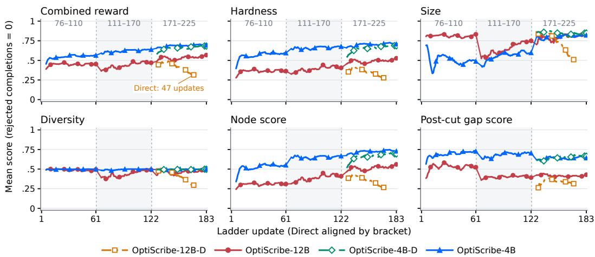  
Figure 5: Training curves: Mean score per update over all completions, with rejected completions scored 0. Panels show the combined reward R, the hardness H, the size term $r _ { \mathrm { v a r } } ,$ the diversity term $r _ { \mathrm { d i v } } ,$ the node score $r _ { \mathrm { n o d e } }$ and the post-cut gap score $r _ { \mathrm { c u t } }$ . Curriculum models train 61 updates on each of 76–110, 111–170 and 171–225. Direct models train on 171–225 only and are aligned with the last rung. OPTISCRIBE-12B-D became unstable and was stopped after 47 updates. The diversity term averages exactly 0.5 over valid completions, so its curve is half the valid share.

## G.2 MULTIPLE KNAPSACK

Table 10 reports multiple knapsack, the third training family, at the two brackets on which it was trained. No model makes it hard. Median node counts stay between 3 and 5 and median gaps at $4 { \mathrm { - } } 5 \times 1 0 ^ { - 3 }$ for every model. Knapsack also sat out the first curriculum rung because no geometry at 76–110 variables branched (Appendix E). We regard it as an open case for the method.

Table 10: Multiple knapsack under SCIP at the two trained brackets. Columns as in Table 2. No model generates hard knapsack instances, and training leaves node counts and gaps essentially unchanged.
<table><tr><td>Bracket</td><td>Arm</td><td>Parse ↑</td><td>Feas ↑</td><td>Nodes ↑</td><td>Gap↑</td></tr><tr><td rowspan="3">111-170</td><td>Gemma-4-12B</td><td>88.3</td><td>85.5</td><td>3</td><td>5</td></tr><tr><td>OPTISCRIBE-12B-D</td><td>77.0</td><td>75.4</td><td>3</td><td>5</td></tr><tr><td>OPTISCRIBE-12B</td><td>93.4</td><td>91.4</td><td>5</td><td>5</td></tr><tr><td rowspan="3">171-225</td><td>Gemma-4-12B</td><td>91.8</td><td>90.2</td><td>5</td><td>4</td></tr><tr><td>OPTISCRIBE-12B-D</td><td>69.1</td><td>64.5</td><td>3</td><td>4</td></tr><tr><td>OPTISCRIBE-12B</td><td>87.5</td><td>82.8</td><td>5</td><td>4</td></tr></table>

## G.3 STANDARD SYNTHETIC GENERATORS

Learning-for-MILP papers often benchmark on four synthetic families, i.e., set cover, independent set, combinatorial auction, and capacitated facility location, available in Ecole (Gasse et al., 2019; Prouvost et al., 2020). We ran these generators and solved them with the same SCIP settings as our instances (Table 11). In the 111–500 variable range, 55% solve at the root and none exceeds 189 nodes. Even at the published sizes (up to 10,100 variables) the median is 21 nodes and the maximum 853. Facility location is the closest structural match, but despite a similar integer share (generator: 0.059, our CFL: 0.063), OPTISCRIBE-12B needs much more search (median 347 vs 1 node), likely because these generators were tuned around SCIP 6 while SCIP 10 presolves and cuts more aggressively.

Table 11: Standard synthetic generators vs. OPTISCRIBE-12B under SCIP. Four families from Gasse et al. (2019) (Ecole; Prouvost et al., 2020). Top block rescales to 111–500 variables, bottom uses published sizes. Variables is the median variable count. Branching is the share needing > 1 node. SCIP uses a 50,000-node cap and a 300 s limit. No standard-generator instance hits either. OPTISCRIBE-12B node stats exclude 300 s timeouts (2.6% CFL, 6.4% Max-Cut).
<table><tr><td>Source Variables Nodes p50 Nodes p90 Nodes max</td></tr><tr><td>Branching (%) Standard generators, 111–500 variables, 250 instances each</td></tr><tr><td>Combinatorial auction 319 4 11 70 78.0</td></tr><tr><td>Independent set 299 1 15 189 48.8</td></tr><tr><td>Set cover 304 1 5 28 33.6</td></tr><tr><td>Facility location 272 1 3 20 18.8</td></tr><tr><td>Pooled 1 8 189 44.8</td></tr><tr><td>Standard generators, published sizes, 25 instances each</td></tr><tr><td>Combinatorial auction 500 13 50 120 100.0</td></tr><tr><td>Independent set 500 15 229 853 84.0</td></tr><tr><td>Set cover 1,000 37 387 590 100.0</td></tr><tr><td>Facility location 10,100 136 384 492 100.0</td></tr><tr><td>Pooled 21 271 853 96.0</td></tr><tr><td>OPTISCRIBE-12B, 111–500 variables, standard prompt</td></tr><tr><td>CFL 196 347 4,655 50,000 96.3 Max-Cut 210 634 2,643 14,678 100.0</td></tr><tr><td></td></tr></table>

## G.4 PUBLIC BENCHMARK SOURCES

Table 12 lists the public sources pooled in Section 4.2. From each source we keep instances with 111–500 variables. We then split them by variable type: mixed-integer instances are compared against our CFL pools, and pure-integer instances against our Max-Cut pools.

Table 12: Public MILP instance sources used in Section 4.2.
<table><tr><td>Source</td><td>Description</td></tr><tr><td>MIPLIB 2010 (Koch et al., 2011)</td><td>Fifth edition of the Mixed Integer Programming Library.</td></tr><tr><td>MIPLIB 2017 (Gleixner et al., 2021)</td><td>Sixth edition of the Mixed Integer Programming Library, compiled with a data-driven selection procedure.</td></tr><tr><td>MILP-Evolve (Li et al., 2025)</td><td>MILP problem classes generated by an evolutionary framework based on large language models (LLMs).</td></tr><tr><td>D-MIPLIB (Huang et al., 2024)</td><td>Distributional MIPLIB: a multi-domain library of MILP instance distributions for machine-learning-guided methods.</td></tr><tr><td>DIG-MILP (Wang et al., 2024)</td><td>Instances from the DIG-MILP study, which uses a deep generator (a variational autoencoder, VAE) that guarantees feasibility.</td></tr><tr><td>MIPcc23 (Bolusani et al., 2024)</td><td>MIP Workshop 2023 Computational Competition on reoptimization. Each instance series contains related instances of the same size.</td></tr><tr><td>MIPLearn (Xavier et al., 2024)</td><td>Benchmark problems distributed with the MIPLearn framework for learning-enhanced optimization.</td></tr><tr><td>MIRPLIB (Papageorgiou et al., 2014)</td><td>Library of maritime inventory routing problem instances.</td></tr></table>

## G.5 NODE COUNTS OF ALL MODELS UNDER THREE SOLVERS

Table 13 extends Figure 3 to all three Gemma models. The ordering of Table 2 holds under each solver. OPTISCRIBE-12B has the highest median in every cell except CFL at 111–170 under Gurobi, where the median instance of every model is solved at the root. On CFL, OPTISCRIBE-12B-D is at or below the base model under every solver and in every bracket. Absolute counts differ by solver. Gurobi needs far fewer nodes than SCIP on CFL and more on Max-Cut.

Table 13: Median branch-and-bound nodes under three solvers. All three Gemma models, both families and all four brackets. SCIP is the training solver. HiGHS and Gurobi never enter training. Max-Cut instances are solved as maximization. Bold marks the highest median in each bracket and solver. OPTISCRIBE-12B is highest in every cell except CFL at 111–170 under Gurobi, where the median instance of every model is solved at the root.
<table><tr><td rowspan="2">Bracket</td><td rowspan="2">Arm</td><td colspan="3">CFL</td><td rowspan="2"></td><td colspan="3">Max-cut)</td></tr><tr><td>SCIP↑</td><td>HiGHS ↑</td><td>Gurobi↑</td><td>SCIP↑</td><td>HiGHS↑</td><td>Gurobi↑</td></tr><tr><td rowspan="3">111-170</td><td>Gemma-4-12B</td><td>22</td><td>19</td><td>1</td><td></td><td>41</td><td>27</td><td>10</td></tr><tr><td>OPTISCRIBE-12B-D</td><td>21</td><td>16</td><td>1</td><td></td><td>41</td><td>29</td><td>15</td></tr><tr><td>OPTISCRIBE-12B</td><td>109</td><td>79</td><td>1</td><td>142</td><td></td><td>59</td><td>214</td></tr><tr><td rowspan="3">171-225</td><td>Gemma-4-12B</td><td>224</td><td>277</td><td>58</td><td></td><td>81</td><td>41</td><td>36</td></tr><tr><td>OPTISCRIBE-12B-D</td><td>170</td><td>179</td><td>2</td><td></td><td>85</td><td>41</td><td>44</td></tr><tr><td>OPTISCRIBE-12B</td><td>391</td><td>491</td><td>69</td><td></td><td>364</td><td>158</td><td>982</td></tr><tr><td rowspan="3">226-350</td><td>Gemma-4-12B</td><td>293</td><td>480</td><td>53</td><td></td><td>423</td><td>200</td><td>412</td></tr><tr><td>OPTISCRIBE-12B-D</td><td>211</td><td>194</td><td>1</td><td></td><td>369</td><td>163</td><td>302</td></tr><tr><td>OPTISCRIBE-12B</td><td>710</td><td>956</td><td>126</td><td></td><td>1002</td><td>873</td><td>4379</td></tr><tr><td rowspan="3">351-500</td><td>Gemma-4-12B</td><td>420</td><td>539</td><td>69</td><td>1350</td><td></td><td>1826</td><td>4363</td></tr><tr><td>OPTISCRIBE-12B-D</td><td>194</td><td>230</td><td>1</td><td></td><td>1096</td><td>1303</td><td>3353</td></tr><tr><td>OPTISCRIBE-12B</td><td>1014</td><td>1539</td><td>176</td><td></td><td>2578</td><td>5041</td><td>6101</td></tr></table>

## G.6 TRIVIAL INSTANCES

Figure 6 reports the share of instances each solver solves at the root node. For OPTISCRIBE-12B, which was trained with SCIP, SCIP and HiGHS solve at most 7% of CFL instances at the root and almost no Max-Cut instances. Gurobi solves 35–52% of CFL instances at the root but almost no Max-Cut instances. The pre-cut model, trained with HiGHS, behaves differently. HiGHS solves at most 6% of its instances at the root, while SCIP solves 33–57% and Gurobi 38–49%. Its instances are still solved at the root less often than the base model’s on the same prompt, which SCIP and Gurobi solve at the root 85–98% of the time.

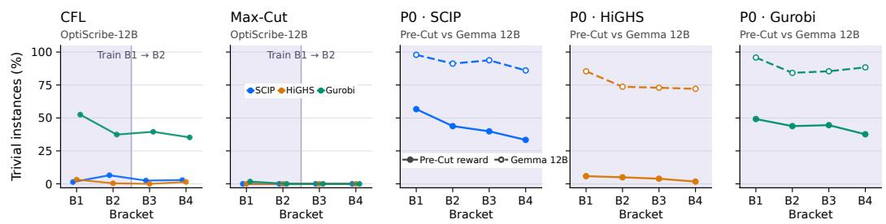  
Figure 6: Share of instances solved at the root under three solvers. The two left panels show OPTISCRIBE-12B on CFL and Max-Cut, with shading on the training brackets. The three right panels show prompt P0 under SCIP, HiGHS and Gurobi, for the pre-cut model (solid) and untrained Gemma-4-12B (dashed). The pre-cut model was trained with HiGHS in the loop. HiGHS rarely solves its instances at the root, but SCIP and Gurobi often do.

## G.7 SENSITIVITY TO THE NODE REFERENCE

Figure 7 compares two OPTISCRIBE-4B runs that differ in $N _ { \mathrm { r e f } }$ and in the training node cap. Inside the training range their node and gap gains are similar. Beyond it they differ on nodes and parsing but not on the gap. On CFL, $N _ { \mathrm { r e f } } = 5 0 { , } 0 0 0$ gives larger node gains at B3 and B4 (24.5 and 5.7 against 7.6 and 1.6 ). On Max-Cut it gives a smaller node gain at B4 (6.6 against 11.6 ), and its parse rate falls 13–15 points below the base model at B3 and B4. Post-cut gap gains stay close to each other at every size. Neither setting is better on every metric.

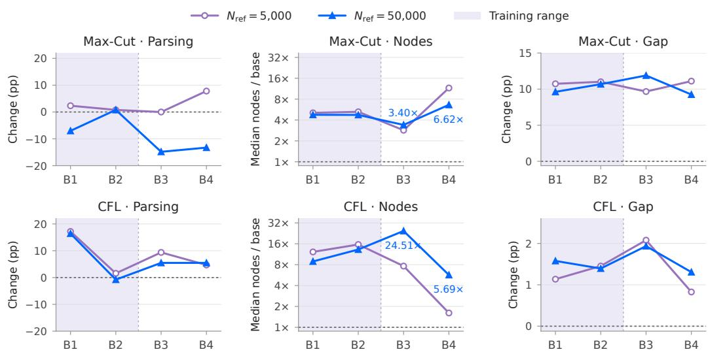  
Figure 7: Sensitivity to the node reference $N _ { \mathrm { r e f } }$ for OPTISCRIBE-4B. Each panel shows the change against untrained Qwen3.5-4B for a model trained with $N _ { \mathrm { r e f } } = 5 { , } 0 0 0$ , the default, and one trained with $N _ { \mathrm { r e f } } = 5 0 { , } 0 0 0$ . The top row is Max-Cut and the bottom row is CFL. Parsing and Gap are changes in percentage points, where Gap is the median post-root-cut gap. Nodes is the ratio of median node counts. Shading marks the training brackets. The two runs also differ in their training node cap.

## G.8 LANGUAGE CONTROL DETAILS

Table 14 lists the prompt conditions. On Max-Cut the density request is a reliable dial. At requested densities of 0.5 and 0.2, every seed of both models lowers its density against the same seed under the control prompt (Figure 8b). At 0.8 the change is small, and 73% of base seeds and 83% of OPTISCRIBE-12B seeds move by at least 0.02. Sparse instances also solve roughly ten times faster for both models (Figure 8a).

On CFL the density sentence asks that only a fraction of facilities be economical for each customer. The base model follows it, with median κ of 0.80, 0.53 and 0.07 for requests of 0.8, 0.5 and 0.2. OPTISCRIBE-12B does not, giving 0.97, 0.84 and 0.88. It keeps serving costs close together, which is the opposite of what the sentence asks. Its instances still become easy under this sentence, with median nodes falling from 203 to between 1 and 5, through a change we have not identified. On CFL the word “harder” raises median nodes for both models, from 142 to 215 and from 203 to 464, but with 48 completions neither paired change is significant.

Instructions cost the trained model less validity. Appending any sentence lowers the base model’s CFL parse rate from 94% to as low as 67%. For OPTISCRIBE-12B it falls from 98% to no lower than 90%. On Max-Cut both models parse every completion under every sentence. OPTISCRIBE-12B writes the complete header in all of them, against 40–85% for the base model.

Table 14: Prompt conditions for the language-control study. Each condition appends one sentence to the production prompt at a fixed position. Everything else is byte-identical across conditions and models. This includes the row form, the size request, the exemplar pool, the token cap, the decoding settings and the seed of each completion. κ is the coupling density. On Max-Cut it is the fraction of vertex pairs with nonzero effective weight $w _ { i j } + w _ { j i }$ . On CFL it is the mean fraction of facilities whose serving cost is within 10 of each customer’s cheapest option. $\kappa ^ { \mathrm { r e q } }$ is the value the sentence asks for.
<table><tr><td>Tag</td><td> $\kappa ^ { \mathrm { r e q } }$ </td><td>Sentence appended to the production prompt</td></tr><tr><td>control</td><td></td><td>(nothing appended)</td></tr><tr><td>harder</td><td></td><td>Make this instance as hard as possible for a branch-and-bound solver to prove optimal.</td></tr><tr><td>easier</td><td></td><td>Make this instance easy, a warm-up example that a solver should finish almost immediately.</td></tr><tr><td>Max-Cut</td><td></td><td></td></tr><tr><td>sparser</td><td></td><td>0.8/0.5/0.2 Use a graph in which about P percent of the vertex pairs are joined by an edge; every remaining pair must have weight zero.</td></tr><tr><td>sparser + harder 0.5</td><td></td><td>The sentence above at  $P = 5 0 ,$  followed by the difficulty sentence.</td></tr><tr><td>CFL sparser</td><td></td><td>0.8/0.5/0.2 For each customer only about P percent of the facilities should</td></tr><tr><td></td><td></td><td>be economical; every other facility must cost that customer at least ten times its cheapest option.</td></tr><tr><td>sparser + harder 0.5</td><td></td><td>The sentence above at  $P = 5 0$  , followed by the difficulty sentence.</td></tr></table>

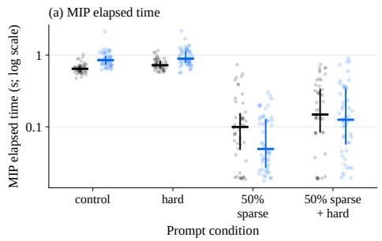

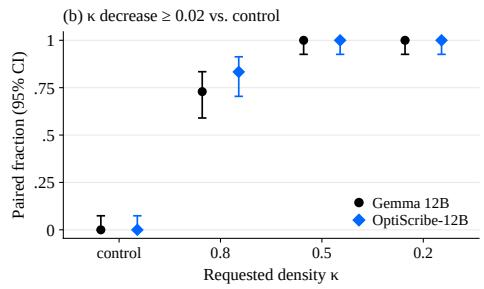  
Figure 8: More on the Max-Cut density instruction. Bracket 171–225, 48 completions per model and prompt. (a) SCIP solve time per instance on a log scale. Sparse requests cut solve time by roughly an order of magnitude for both models. (b) Fraction of seeds whose density falls by at least 0.02 against the same seed under the control prompt, with 95% confidence intervals. Every seed moves at requested densities of 0.5 and 0.2.

## G.9 INSTANCE PROPERTIES BY BRACKET

Figures 9 and 10 break the results down by bracket for all six models. Three points matter for reading the main tables. First, feasibility given a parse stays between about 86% and 100% for every model, so validity differences come mostly from parsing. Second, constraint-matrix density falls with size at the same rate for every model, so trained models do not buy hardness with denser matrices. Third, size targeting weakens at the largest bracket. At 351–500, OPTISCRIBE-12B lands 56% of CFL and 75% of Max-Cut instances inside the requested bracket. OPTISCRIBE-4B misses the Max-Cut bracket often at every size, landing inside it for only 18–71% of instances.

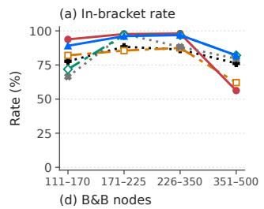

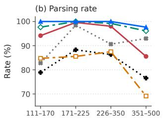

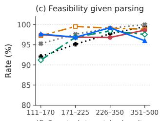

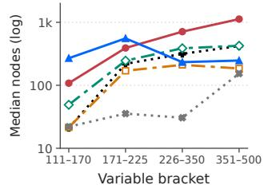

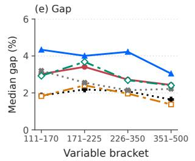

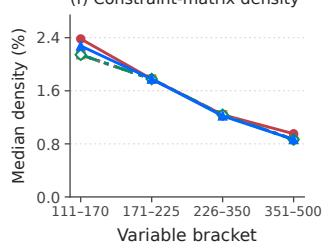  
Gemma 12B Qwen-4B OptiScribe-12B-D OptiScribe-12B OptiScribe-4B-D OptiScribe-4B  
Figure 9: CFL instance properties by size bracket under SCIP, for all six models. (a) Share of instances whose variable count falls inside the requested bracket. (b) Parse rate. (c) Feasible rate among parsed completions. (d) Median branch-and-bound nodes. (e) Median post-root-cut gap in percent. (f) Median constraint-matrix density, the share of nonzero entries. Curriculum models are trained on 76–225 variables and direct models on 171–225.

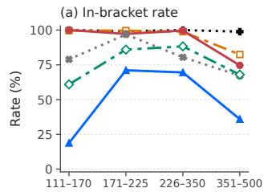

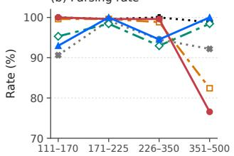

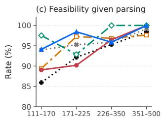

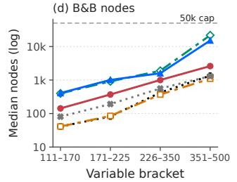

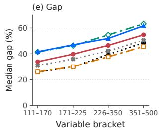

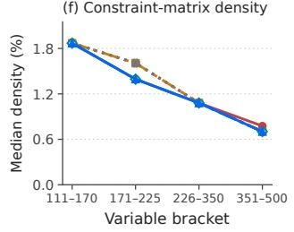  
Gemma 12B Qwen-4B OptiScribe-12B-D OptiScribe-12B OptiScribe-4B-D OptiScribe-4B  
Figure 10: Max-Cut instance properties by size bracket under SCIP, for all six models. Panels as in Figure 9. The dashed line in (d) is the 50,000 node cap.

## G.10 THE SENSE TOKEN ON MAX-CUT

The Max-Cut header is MILP max\_cut max. Untrained Gemma-4-12B writes the final sense token in only 48–69% of completions, against 94–98% for OPTISCRIBE-12B-D and 100% for OPTISCRIBE-12B. Without the token our parser reads the objective as a minimization, whose optimum is zero and is found at the root. The prompt always asks for maximization, so in evaluation we solve every Max-Cut instance as a maximization. The rule applies to all models alike, so the Max-Cut gains in Table 2 do not come from the header. We suspect the base model drops the token because the family name already contains the word max, but we have not tested this.