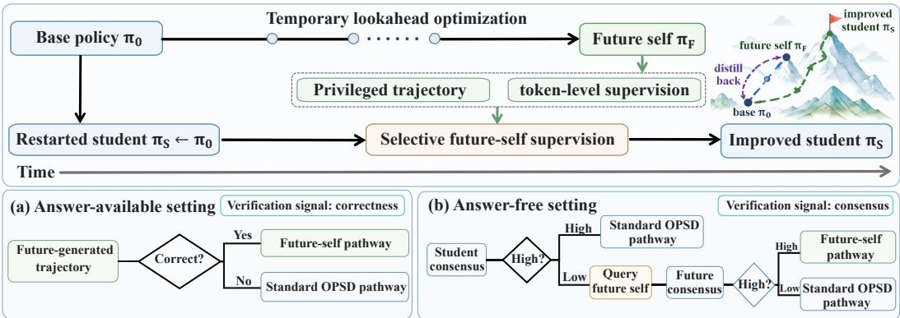
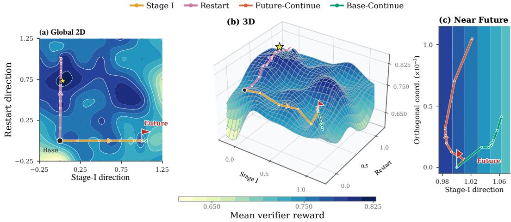
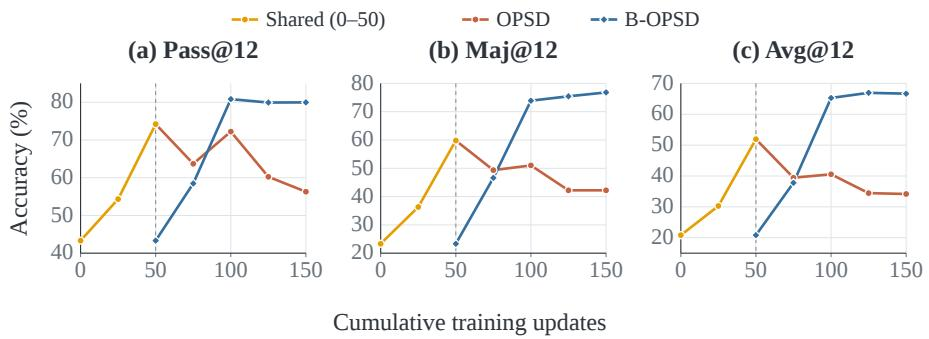
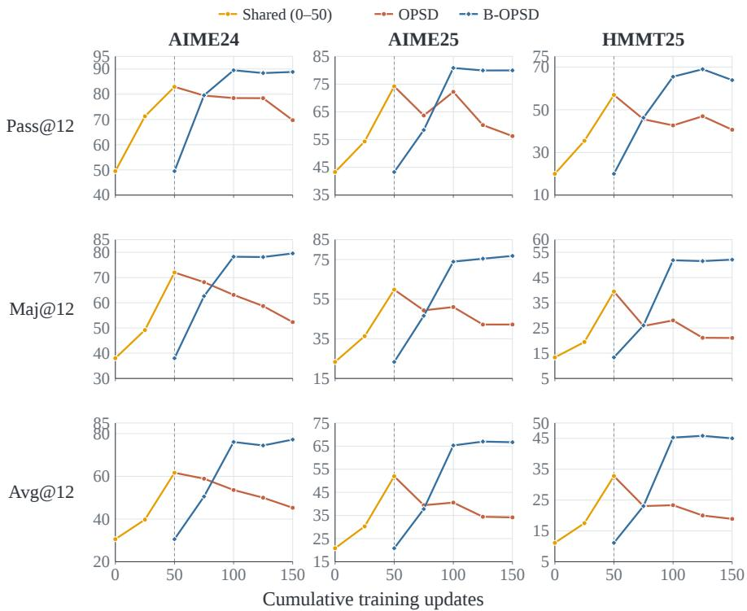

# TRAIN AHEAD, DISTILL BACK: BOOTSTRAPPING ON-POLICY SELF-DISTILLATION FOR LARGE LANGUAGEMODELS

Zheng Zhang1,2∗, Xinyue Tan1∗, Lufei Li1, Xinyi Zhang3, Yexin Li2†, Kan Ren1†

1School of Information Science and Technology, ShanghaiTech University

2State Key Laboratory of General Artificial Intelligence, BIGAI

3Hefei University of Technology

{zhangzheng2024,tanxy2024,renkan}@shanghaitech.edu.cn

## ABSTRACT

On-policy self-distillation (OPSD) improves large language models by letting a self-teacher with privileged information provide dense token-level supervision on the model’s own trajectories. Yet existing methods typically construct the selfteacher from the current, initial, or slowly averaged policy state, leaving the quality of supervision constrained by the teacher’s ability to exploit privileged information. We ask whether the model’s own optimization progress can instead be recycled into a stronger self-teacher. In this paper, we introduce Bootstrapped On-Policy Self-Distillation (B-OPSD), which temporarily trains the policy ahead to obtain a future teacher, restores the student to the original policy state, and then uses the future teacher to supervise the restarted student. The future teacher improves supervision in two complementary ways, it can generate more reliable privileged trajectories and, conditioned on them, provide more informative tokenlevel targets along the restarted student’s on-policy trajectories. Experiments on mathematical reasoning with Qwen3-4B and Qwen3-8B show consistent improvements over standard OPSD in both settings, including gains from 27.50 to 41.30 and from 48.80 to 64.44 in the rollout-privileged setting. Our findings point to a broader principle for self-improving models that future learning progress can be distilled backward, preserving acquired knowledge while bootstrapping beyond the optimization state that produced it.

## 1 INTRODUCTION

On-policy self-distillation (OPSD) has emerged as a promising paradigm for improving the reasoning capabilities of large language models (LLMs) without relying on a stronger external teacher (Penaloza et al., 2026; Shenfeld et al., 2026; Zhang et al., 2026c). It uses the same model as both teacher and student, with the teacher additionally conditioned on privileged information such as reference solutions, final answers or successful rollouts (Gkountouras et al., 2026; Zhao et al., 2026). This privileged context enables the self-teacher to provide dense token-level supervision along the student’s own trajectories.

However, the quality of OPSD depends not only on what privileged information is available, but also on how effectively the self-teacher can exploit it. Existing methods have explored increasingly informative privileged signals, including final answers and model-generated rollouts (Hubotter et al.,¨ 2026; Li et al., 2026a; Tian et al., 2026). Yet their self-teachers are typically constructed from the initial, current, or slowly averaged policy state (Shenfeld et al., 2026; Hubotter et al., 2026). As a¨ result, even informative privileged context is interpreted by a teacher whose capability remains tied to roughly the same stage of optimization as the learner. This motivates a complementary question. Can a model recycle its own optimization progress into stronger supervision for an earlier version of itself?

  
Figure 1: Overview of B-OPSD. We first train the base policy π0 forward to obtain a future self πF, then restart the student from π and distill from π when future supervision is reliable. The future self supplies both privileged trajectories and token-level targets. In the answer-available setting, reliability is determined by correctness; in the answer-free setting, it is determined by student and future consensus.

We introduce Bootstrapped On-Policy Self-Distillation (B-OPSD), a train-ahead-and-distill-back framework that turns temporary optimization progress into supervision. Starting from the initial policy, we perform a short sequence of temporary OPSD updates to obtain a future policy, which we use as the future teacher. We then restore the student to its original state and distill from this improved self. The future teacher improves both the source and use of privileged information. It can generate more reliable privileged trajectories and, conditioned on them, provide more informative token-level targets along the restarted student’s own trajectories. The student therefore remains on-policy with respect to its restarted state while benefiting from knowledge acquired later in optimization. Rather than simply continuing from a stronger checkpoint, B-OPSD separates the progress captured by that checkpoint from the optimization state that produced it.

We instantiate B-OPSD in both answer-available and answer-free settings. When gold answers are available, verified future-policy trajectories selectively activate future-teacher supervision. Without gold answers, B-OPSD uses agreement among model generations and queries the future teacher when the restarted student’s own consensus is insufficient. This novel selective mechanism applies stronger supervision where the current policy provides a less reliable learning signal, while retaining standard OPSD elsewhere.

Experiments on three widely adopted public benchmarks with two open-source LLMs show consistent and substantial improvements over standard OPSD. Controlled analyses show that both the future teacher and its compatible privileged trajectories contribute to the improvement, and that future supervision is most effective early in restarted training. Comparisons of matched training budget further show that our proposed B-OPSD is more effective in learning and the gains are not solely by the additional updates used to construct the future teacher. As shown in optimization-landscape analysis in Section 5.5.1, distilling back from the future can redirect the restarted student toward higher-reward regions than simply continuing optimization from the future checkpoint. Together, these results suggest that optimization progress can serve not only as updated parameters, but also as a reusable source of supervision for self-improvement.

## Our main contributions are as follows:

• We propose B-OPSD, a train-ahead-and-distill-back framework that converts optimization progress into supervision for an earlier policy state while preserving on-policy learning for the restarted student.

• We show that future supervision improves both the source and interpretation of privileged information, enabling selective self-distillation with and without reference answers.

• Across two model scales and three mathematical reasoning benchmarks, B-OPSD consistently improves standard OPSD, while controlled analyses show that the gains arise from how future progress is reused as supervision rather than from additional optimization alone.

## 2 RELATED WORK

On-Policy Self-Distillation. OPSD enables a model to serve as both teacher and student under different contexts (Zhang et al., 2026a; Li et al., 2026c; Yang et al., 2026d; Narozniak et al., 2026). The student generates trajectories, while the teacher additionally conditions on privileged information and provides token-level supervision along these trajectories. The two key components of OPSD are the privileged information and the model serving as the teacher. Several types of privileged information are commonly used: final answer (Tian et al., 2026; Yang et al., 2026a), reference solution (Zhao et al., 2026; Shen et al., 2026), model-generated rollouts (Hubotter et al., 2026; Li et al.,¨ 2026a), structured guidance (Xia et al., 2026; Gu et al., 2026). Regarding the choice of teacher model, common designs include a frozen copy of the initial student (Fu et al., 2026; Yang et al., 2026c), an exponential moving average (EMA) of the student parameters (Zhang et al., 2026b; Jin et al., 2026; Hubotter et al., 2026), and a teacher that shares the current student’s parameters exactly¨ (Stein et al., 2026; Yang et al., 2026b).

Learning across Optimization States. Model optimization produces a sequence of intermediate states that may contain complementary supervisory information. Most existing methods (Yang et al., 2019; Laine & Aila, 2017; Zhang et al., 2024; Wang et al., 2022a;b) reuse states from earlier stages of optimization to guide subsequent learning. Laine & Aila (2017) and Tarvainen & Valpola (2017) aggregate predictions or parameters from historical model states to construct more stable training targets. Wei et al. (2026) merges multiple checkpoints into a consolidated teacher that guides sub sequent policy training. Several lines of work (Flennerhag et al., 2022; Du et al., 2022; Oh et al., 2025) have explored using later optimization states to guide earlier stages of learning. For example, Qin et al. (2026) obtains a stronger policy by continuing RLVR and injects its verifier-confirmed trajectories into the earlier policy’s rollout groups for RL training. Li et al. (2026b) extrapolates an RLVR-induced policy update to construct a synthetic teacher, which is then distilled back into the policy. Nevertheless, how to use future policy states as teachers remains underexplored, particularly in OPSD. Our method uses the future teacher to provide stronger trajectories as privileged information and improved token-level targets.

## 3 PRELIMINARY

On-Policy Self-Distillation. Given a problem $x \sim \mathcal { D }$ , the student samples a trajectory $y \sim \pi _ { \theta } ( \cdot \ |$ x). The same model serves as a self-teacher by additionally conditioning on privileged information z. OPSD aligns the student’s next-token distribution with the teacher’s along student-generated trajectories using the forward KL divergence:

$$
\mathcal { L } _ { \mathrm { O P S D } } ( \theta ) = \mathbb { E } _ { x \sim \mathcal { D } , y \sim \pi _ { \theta } ( \cdot | x ) } \left[ \frac { 1 } { | y | } \sum _ { t = 1 } ^ { | y | } D _ { \mathrm { K L } } \left( \mathrm { s g } [ \pi _ { \theta } ( \cdot \mid x , z , y _ { < t } ) ] \parallel \pi _ { \theta } ( \cdot \mid x , y _ { < t } ) \right) \right] .\tag{1}
$$

Here, $y _ { < t }$ denotes the trajectory prefix, and $\mathrm { s g } [ \cdot ]$ is the stop-gradient operator, which prevents gradients from propagating through the teacher branch.

## 4 METHODOLOGY

## 4.1 LEARNING FROM A FUTURE SELF

We introduce B-OPSD, which converts temporary OPSD progress into supervision for an earlier policy state. Let $\pi _ { 0 }$ denote the initial policy and A an OPSD update. We perform K lookahead updates starting from $\pi _ { 0 }$ to obtain a future self,

$$
\pi _ { F } = { \mathcal A } ^ { K } ( \pi _ { 0 } ) .\tag{2}
$$

We then freeze $\pi _ { F }$ and restart the student from $\pi _ { S } = \pi _ { 0 }$ . During restarted training, the student generates the on-policy trajectories along which distillation is performed. For each update, we select one of two supervision pathways, each pairing a teacher with a trajectory used as privileged information. (i) In the future-self pathway, πF generates the privileged trajectory and, conditioned on it, provides token-level targets. (ii) In the standard OPSD pathway, the frozen $\pi _ { 0 }$ provides these targets, conditioned on privileged information available in the training setting.

Once the teacher and privileged trajectory are selected, we use the following token-level distillation objective to update the student in either pathway. Let $y _ { S }$ denote the student trajectory, $y _ { P }$ the privileged trajectory, and $\pi _ { T }$ the frozen teacher:

$$
\mathcal { L } _ { \mathrm { d i s t i l } } ( \pi _ { S } , \pi _ { T } ; y _ { S } , y _ { P } ) = \frac { 1 } { | y _ { S } | } \sum _ { t = 1 } ^ { | y _ { S } | } D _ { \mathrm { K L } } \left( \mathrm { s g } [ \pi _ { T } ( \cdot \ | \ x , y _ { P } , y _ { S , < t } ) ] \parallel \pi _ { S } ( \cdot \ | \ x , y _ { S , < t } ) \right) ,\tag{3}
$$

where $\pi _ { T }$ is the frozen teacher selected by the pathway.

We study two settings that differ in whether gold answers are available during training: an answeravailable setting with gold answers for verifying trajectories, and an answer-free setting that relies on agreement among generated answers. In the answer-available setting, we use the future-self pathway when a future-generated trajectory is verified as correct. In the answer-free setting, we use the future-self pathway when the restarted student’s answers show insufficient agreement but the future policy’s answers reach the agreement threshold. Otherwise, we follow standard OPSD. In both settings, distillation remains on-policy with respect to the restarted student.

## 4.2 ANSWER-AVAILABLE SETTING.

We first consider a setting in which gold answers are available for trajectory verification and gold reasoning traces provide a fallback source of privileged information. The overall procedure consists of the following two stages, with the complete workflow detailed in Algorithm 1.

Stage I: Construct the future self. To construct the future self, we initialize the policy from π0 and perform $K$ OPSD updates. At each update, an incorrect on-policy trajectory generated by the student serves as the student trajectory, while a frozen copy of the initial policy serves as the teacher and provides target token distributions conditioned on additional privileged information. The privileged information is selected according to a self-generated-first principle: a correct studentgenerated trajectory is used whenever available, with the gold reasoning trace serving as a fallback. This lookahead stage yields the future policy $\pi _ { F }$ , which represents an improved policy state reached after K self-distillation updates from $\pi _ { 0 }$

Stage II: Restart student and learn from the future self. After constructing $\pi _ { F }$ , we freeze it and reinitialize the student as $\pi _ { S } = \pi _ { 0 }$ . For each problem, the student generates a set of on-policy trajectories, from which an incorrect one is selected as the student trajectory. The future policy then generates a candidate reasoning trajectory whose correctness determines the source of supervision. When this trajectory is correct, we take the future-self pathway: the frozen $\pi _ { F } ,$ , conditioned on the future-generated trajectory, provides the target token distributions. Otherwise, we take the standard OPSD pathway, using the frozen $\pi _ { 0 }$ as the teacher and conditioning it on either a correct studentgenerated trajectory or, when none is available, the gold reasoning trace.

## 4.3 ANSWER-FREE SETTING

We next consider an answer-free setting in which training has access only to problem statements, without gold answers or reasoning traces. In this setting, we use agreement among model-generated answers as a proxy for correctness. The overall procedure consists of two stages, with the complete workflow detailed in Algorithm 2.

Stage I: Construct the future self. We initialize the student from $\pi _ { 0 }$ and perform K OPSD updates. For each problem, the student samples N on-policy trajectories and derives a pseudo-label aˆ by majority vote over their final answers. A trajectory that disagrees with aˆ is selected as the student trajectory for distillation, while a trajectory supporting aˆ serves as privileged information. A frozen copy of the initial policy $\pi _ { 0 } .$ , conditioned on this privileged trajectory, serves as the teacher and provides the target token distributions. Thus, in the absence of gold answers, the lookahead stage constructs its training signal entirely from agreement among the student’s own rollouts. The policy obtained after these $\bar { K }$ updates is denoted by $\pi _ { F }$ and serves as the future self.

Stage II: Restart student and learn from the future self. After constructing $\pi _ { F } .$ , we freeze it and reinitialize the student as $\pi _ { S } = \pi _ { 0 }$ . For each problem, the restarted student samples $N$ onpolicy trajectories and takes their most frequent final answer as a pseudo-label $\hat { a } _ { S }$ . If more than half of these trajectories support $\hat { a } _ { S }$ , we follow the standard OPSD pathway: the frozen $\pi _ { 0 }$ serves as the teacher, conditioned on a student-generated trajectory supporting ${ \hat { a } } _ { S } .$ Otherwise, we sample $N$ trajectories from $\pi _ { F }$ and take their most frequent final answer as a pseudo-label ${ \hat { a } } _ { F } .$ If more than half of the future trajectories support ${ \hat { a } } _ { F } ,$ , we take the future-self pathway: $\pi _ { F }$ serves as the teacher, conditioned on a future-generated trajectory supporting $\hat { a } _ { F }$ . If this agreement threshold is not met, we fall back to the standard OPSD pathway using $\hat { a } _ { S }$ and a student-generated trajectory supporting it. In all cases, distillation is performed along a restarted student’s trajectory whose answer disagrees with the pseudo-label used for supervision.

Table 1: Main results comparison across mathematical reasoning benchmarks under the answeravailable setting. OPSD follows the original reference-solution setting, while OPSD† denotes our rollout-based variant with student-rollout PI. The best results are highlighted in bold.
<table><tr><td>Model</td><td>Method</td><td>Privileged Information</td><td>n</td><td>AIME24</td><td>AIME25</td><td>HMMT25</td><td> $\operatorname { A v g } .$ </td></tr><tr><td rowspan="5">Qwen3-8B</td><td>Base</td><td>一</td><td>一</td><td>30.55</td><td>20.83</td><td>11.11</td><td>20.83</td></tr><tr><td>OPSD</td><td>reference solution</td><td>1</td><td>52.50</td><td>38.89</td><td>20.28</td><td>37.22</td></tr><tr><td>B-OPSD</td><td>reference solution</td><td>1</td><td>58.61</td><td>46.39</td><td>27.50</td><td>44.17</td></tr><tr><td>OPSD†</td><td>Student rollout</td><td>8</td><td>61.67</td><td>51.94</td><td>32.78</td><td>48.80</td></tr><tr><td>B-OPSD</td><td>Future rollout</td><td>8</td><td>76.94</td><td>66.94</td><td>49.44</td><td>64.44</td></tr><tr><td rowspan="5">Qwen3-4B</td><td>Base</td><td>一</td><td>一</td><td>20.00</td><td>19.17</td><td>10.83</td><td>16.67</td></tr><tr><td>OPSD</td><td>reference solution</td><td>1</td><td>32.78</td><td>24.72</td><td>16.39</td><td>24.62</td></tr><tr><td>B-OPSD</td><td>reference solution</td><td>1</td><td>36.67</td><td>27.22</td><td>18.33</td><td>27.41</td></tr><tr><td>OPSD†</td><td>Student rollout</td><td>8</td><td>33.33</td><td>28.33</td><td>20.83</td><td>27.50</td></tr><tr><td>B-OPSD</td><td>Future rollout</td><td>8</td><td>50.56</td><td>44.17</td><td>29.17</td><td>41.30</td></tr></table>

## 5 EXPERIMENTS

## 5.1 EXPERIMENTAL SETTINGS

Models and Baselines. We use Qwen3-4B and Qwen3-8B (Yang et al., 2025) as the policy models, with thinking disabled throughout training and evaluation. We use vanilla OPSD (Zhao et al., 2026) as the primary baseline. Unless otherwise specified, all subsequent analysis experiments use Qwen3-4B as the policy model.

Implementation Details. We train on the OPSD split of OpenThoughts-Math-30K (Guha et al., 2026), which contains 29,434 problems. Each update samples 32 problems. We consider both single-rollout (n = 1) and multi-rollout (n = 8) settings, corresponding to 32 and 256 trajectories per update, respectively. Responses are sampled with a temperature of 1.1, top-p of 0.95, and top-k of 20, with a maximum length of 4,096 tokens. We optimize LoRA adapters with rank 64, scaling factor 128, and a learning rate of $5 \times 1 0 ^ { - 6 }$

Evaluation. We evaluate on AIME 2024 (MAA, 2024), AIME 2025 (MAA, 2025), and HMMT February 2025 (HMMT, 2025). For each problem, we sample 12 responses with a temperature of 1.0, top-p of 0.8, and no top-k truncation. We set the maximum response length to 38,912 tokens. We report three metrics: AVG@12, the average accuracy over 12 sampled responses; PASS@12, the fraction of problems for which at least one of the 12 responses is correct; and MAJ@12, the accuracy of the majority-voted answer. All metrics are reported as percentages.

## 5.2 MAIN RESULTS

B-OPSD outperforms OPSD across both protocols in the answer-available setting. Table 1 compares B-OPSD with OPSD under two answer-available protocols. Following the original OPSD formulation (Zhao et al., 2026), the n = 1 setting uses a reference solution as privileged information.

Table 2: Main results comparison across mathematical reasoning benchmarks under the answer-free setting. OPSD† denotes our self-majority variant.
<table><tr><td>Model</td><td>Method</td><td>AIME24</td><td>AIME25</td><td>HMMT25</td><td>Avg.</td></tr><tr><td rowspan="3">Qwen3-8B</td><td>Base</td><td>30.55</td><td>20.83</td><td>11.11</td><td>20.83</td></tr><tr><td>OPSD†</td><td>61.11</td><td>52.22</td><td>32.67</td><td>48.67</td></tr><tr><td>B-OPSD</td><td>72.22</td><td>59.72</td><td>40.28</td><td>57.41</td></tr><tr><td rowspan="3">Qwen3-4B</td><td>Base</td><td>20.00</td><td>19.17</td><td>10.83</td><td>16.67</td></tr><tr><td>OPSD†</td><td>35.00</td><td>27.50</td><td>17.78</td><td>26.76</td></tr><tr><td>B-OPSD</td><td>40.56</td><td>29.72</td><td>19.72</td><td>30.00</td></tr></table>

In this setting, B-OPSD improves the average score from 24.62 to 27.41 on Qwen3-4B and from 37.22 to 44.17 on Qwen3-8B. For the rollout-based variant, OPSD uses a correct student-generated rollout as privileged information, whereas B-OPSD uses a correct future-policy rollout. The average score rises from 27.50 to 41.30 on Qwen3-4B and from 48.80 to 64.44 on Qwen3-8B. B-OPSD improves performance on all three benchmarks in both settings. Together, these results show that B-OPSD improves OPSD with either source of privileged information, with the largest gains when the future policy provides both the privileged rollout and token-level supervision.

B-OPSD outperforms OPSD in the answer-free setting using only model-generated training signals. Table 2 compares B-OPSD with OPSD in the answer-free setting, where the training data provide only problem statements and neither gold answers nor reference solutions are available. Under this setting, B-OPSD improves the average score from 26.76 to 30.00 for Qwen3-4B and from 48.67 to 57.41 for Qwen3-8B, with gains on all three benchmarks. These results show that future-policy supervision remains effective when the training signal is constructed entirely from model-generated rollouts. Appendix G further shows that the future majority is more accurate on routed problems.

## 5.3 ABLATION STUDIES FOR B-OPSD

We examine the contributions of the future teacher and privileged information (PI), as well as whether their combination in B-OPSD provides benefits beyond direct OPD. Table 3 compares base and future teachers with PI generated by either the student or the future policy, and also includes a variant that omits PI when the future teacher is selected. Table 4 further compares B-OPSD with direct OPD from Qwen3-14B and Future Qwen3-4B.

Future teacher improves performance under either PI source. Replacing the base teacher with the future teacher raises the average score from 27.50 to 34.07 with student PI and from 23.34 to 41.30 with future PI. Thus, the future teacher contributes beyond generating a rollout for PI: using it as the teacher improves performance even when the PI source is held fixed. This finding supports the design of B-OPSD: temporarily training ahead provides a more effective teacher for the student.

Future rollouts provide the most effective PI for the future teacher. Without PI, future supervision yields an average score of 23.24. Conditioning the future teacher on a student rollout raises this to 34.07, while using its own rollout further improves it to 41.30. This advantage is specific to the future teacher: the base teacher performs better with a student rollout than with a future rollout (27.50 vs. 23.34). This reversal suggests a teacher–PI compatibility effect: the base teacher benefits more from student rollouts, whereas the future teacher benefits most from its own rollouts. PI is therefore most effective when its source aligns with the teacher that uses it.

Comparison with direct OPD baselines. We evaluate direct OPD using Qwen3-14B as an external teacher and the OPSD-trained Future Qwen3-4B as a self-bootstrapped teacher. The two teachers have comparable standalone performance, yet their distilled students obtain average scores of only 19.17 and 24.72, respectively, compared with 41.30 for B-OPSD (Table 4). Teacher performance and protocol details are provided in Appendix F.

Table 3: Ablation of the teacher and PI in B-OPSD under the answer-available setting.
<table><tr><td>Teacher</td><td>PI</td><td>AIME24</td><td>AIME25</td><td>HMMT25</td><td> $\operatorname { A v g } .$ </td></tr><tr><td>Base</td><td>Student rollout</td><td>33.33</td><td>28.33</td><td>20.83</td><td>27.50</td></tr><tr><td>Base</td><td>Future rollout</td><td>26.67</td><td>26.67</td><td>16.67</td><td>23.34</td></tr><tr><td>Future</td><td>None</td><td>28.61</td><td>25.56</td><td>15.56</td><td>23.24</td></tr><tr><td>Future</td><td>Student rollout</td><td>41.67</td><td>36.94</td><td>23.61</td><td>34.07</td></tr><tr><td>Future</td><td>Future rollout</td><td>50.56</td><td>44.17</td><td>29.17</td><td>41.30</td></tr></table>

Table 4: Comparison with direct OPD under the answer-available setting. All methods train a Qwen3-4B student. Direct OPD uses the listed teacher on every training example without PI, whereas B-OPSD uses selective future supervision with verified future-rollout PI.
<table><tr><td>Method</td><td>Teacher</td><td>PI</td><td>AIME24</td><td>AIME25</td><td>HMMT25</td><td>Avg.</td></tr><tr><td>OPD</td><td>Qwen3-14B</td><td>None</td><td>23.61</td><td>21.67</td><td>12.22</td><td>19.17</td></tr><tr><td>OPD</td><td>Future Qwen3-4B</td><td>None</td><td>31.67</td><td>25.56</td><td>16.94</td><td>24.72</td></tr><tr><td>B-OPSD</td><td>Future Qwen3-4B</td><td>Future rollout</td><td>50.56</td><td>44.17</td><td>29.17</td><td>41.30</td></tr></table>

## 5.4 IN-DEPTH ANALYSIS OF FUTURE-TEACHER SUPERVISION

In this section, we examine how the construction and timing of the future teacher affect student performance.

## 5.4.1 EFFECTS OF TEACHER CONSTRUCTION

Teachers constructed by training ahead yield the strongest student performance. We compare five teacher configurations: a fixed base policy (Base), the current student (Self), an exponential moving average of the student (EMA), and future teachers constructed from the Base and EMA variants, denoted Future (Base) and Future (EMA). All variants normally use a correct student rollout as PI; when future supervision is activated, a correct future rollout is used instead. Further details are provided in Appendix E. Table 5 shows that Base, Self, and EMA achieve similar average scores of 27.50, 25.09, and 25.83, respectively. Future (Base) raises the score to 41.30, while Future (EMA) achieves the highest score of 52.50. These gains across both Base and EMA configurations support our use of training ahead to construct a future teacher.

## 5.4.2 TIMING OF FUTURE-TEACHER SUPERVISION

Future supervision is most effective at the start of student training. We fix the future teacher to $\pi _ { F } = \pi _ { 5 0 }$ and apply it during a 25-step window at different stages. All variants start from $\pi _ { 0 }$ and use the base teacher outside that window. As shown in Table 6, applying future supervision at Steps 0–25 yields an average score of 41.30. The score falls to 30.19 when the window moves to Steps 25–50 and to 27.96 at Steps 50–75, approaching the 27.50 obtained without future supervision. Introducing the same future teacher early therefore has a greater effect on the trained student than introducing it later.

## 5.5 RATIONALE FOR KEY DESIGN CHOICES

In this section, we examine two choices in B-OPSD: restarting the student from the base policy and using model-generated trajectories as privileged information.

## 5.5.1 RESTARTING THE STUDENT FROM THE BASE POLICY

Preceding analysis shows that future supervision is most effective early in student training. We now examine why B-OPSD restarts the student from $\pi _ { 0 }$ instead of continuing optimization from $\pi _ { F }$

Table 5: Student performance after training with different teacher configurations. Numbers in parentheses denote gains over the initial model’s average score of 16.67.
<table><tr><td>Teacher source</td><td>AIME24</td><td>AIME25</td><td>HMMT25</td><td>Avg. (Gain)</td></tr><tr><td>Base</td><td>33.33</td><td>28.33</td><td>20.83</td><td>27.50 (+10.83)</td></tr><tr><td>Self</td><td>29.17</td><td>29.17</td><td>16.94</td><td>25.09 (+8.42)</td></tr><tr><td>EMA</td><td>32.50</td><td>28.61</td><td>16.39</td><td>25.83 (+9.16)</td></tr><tr><td>Future (Base)</td><td>50.56</td><td>44.17</td><td>29.17</td><td>41.30 (+24.63)</td></tr><tr><td>Future (EMA)</td><td>66.67</td><td>55.83</td><td>35.00</td><td>52.50 (+35.83)</td></tr></table>

Table 6: Effect of future-supervision timing on policy performance. All variants start from $\pi _ { 0 }$ . The fixed future teacher $\pi _ { 5 0 }$ is used during the indicated 25-step window, and the base teacher is used otherwise.
<table><tr><td>Future-supervision window</td><td>AIME24</td><td>AIME25</td><td>HMMT25</td><td>Avg.</td></tr><tr><td>None</td><td>33.33</td><td>28.33</td><td>20.83</td><td>27.50</td></tr><tr><td>Steps 50–75</td><td>34.44</td><td>30.28</td><td>19.17</td><td>27.96</td></tr><tr><td>Steps 25–50</td><td>37.78</td><td>30.56</td><td>22.22</td><td>30.19</td></tr><tr><td>Steps 0–25</td><td>50.56</td><td>44.17</td><td>29.17</td><td>41.30</td></tr></table>

Restarting the student from $\pi _ { 0 }$ leads to a higher-reward region. Figure 2 compares the restarted student with two alternatives that continue from π : one is supervised by the base teacher, and the other by the future teacher. Following Li et al. (2018), we project their LoRA checkpoints onto a shared two-dimensional parameter plane and measure mean verifier reward on held-out problems. In this projection, both continuation trajectories remain near $\pi _ { F }$ , whereas the restarted student moves toward a region with higher reward. Details of the visualization are provided in Appendix H. These results suggest that using $\pi _ { F }$ to supervise a student restarted from $\pi _ { 0 }$ can lead to a more effective optimization than continuing training from $\pi _ { F }$

## 5.5.2 SELECTION OF PRIVILEGED INFORMATION

Model-generated rollouts provide more effective PI than final answers or reference solutions. To examine this choice, we fix the base teacher and $n = 8$ and compare four forms of PI: a final answer, a dataset-provided reference solution, a correct student rollout, and the same rollout with its boxed answer removed. The corresponding prompt templates are provided in Appendix D. Table 7 shows that the final answer alone produces the largest KL on answer tokens, but the smallest KL on reasoning tokens and the lowest downstream score of 18.98. A correct rollout achieves 27.50. Removing its boxed answer retains 93.7% of its reasoning-token KL and yields a score of 25.83, suggesting that the reasoning trajectory supplies most of the useful information in PI. The source of that trajectory also matters. Replacing the reference solution with a correct student rollout increases reasoning-token KL from 0.0585 to 0.0746 and downstream performance from 20.83 to 27.50. These results motivate the use of rollout-based PI and the stronger n = 8 student-rollout OPSD baseline in our main comparisons.

## 5.6 TRAINING EFFICIENCY

Constructing the future teacher requires 50 optimization updates. To determine whether B-OPSD’s gains are simply due to more training, we compare it with uninterrupted OPSD at the same cumulative update count. Specifically, after s updates of the restarted student, B-OPSD is compared with OPSD at update $5 0 + s ,$ counting the 50 updates used to construct the future teacher.

B-OPSD reaches higher peak performance than vanilla OPSD within the same cumulative update budget. Figure 3 compares their evaluation performance on AIME25 using Qwen3-8B. After the first 50 updates, OPSD continues from $\pi _ { 5 0 }$ , whereas B-OPSD restarts from $\pi _ { 0 }$ and learns from $\pi _ { 5 0 }$ as its future teacher. The restarted student initially performs worse, but subsequently surpasses uninterrupted OPSD and achieves higher peak scores on all three evaluation metrics. This result indicates that the gain cannot be explained solely by the additional updates used to construct the future teacher. Results for the remaining benchmarks and metrics are reported in Appendix C.

  
Figure 2: Optimization trajectories under restart and continuation. (A) Two-dimensional verifier-reward landscape and optimization trajectories in a shared parameter plane. (B) Corresponding three-dimensional view. (C) Magnified view around $\pi _ { F } ,$ showing the two continuation trajectories. Darker colors indicate higher reward on the held-out problems. The red flag marks $\pi _ { F } .$ , small dots denote evaluated grid models, circular path markers denote evaluated training checkpoints, and the star marks the maximum of the interpolated surface.

Table 7: Effect of privileged information on OPSD. All variants use $n = 8$ and a fixed base teacher. Performance is averaged across AIME24, AIME25, and HMMT25.
<table><tr><td>Teacher PI</td><td colspan="2">Raw KL per token</td><td>Downstream</td></tr><tr><td></td><td>Reasoning</td><td>Answer</td><td>Mean AVG@ 12↑</td></tr><tr><td>Final answer only</td><td>0.0221</td><td>0.5268</td><td>18.98</td></tr><tr><td>Reference solution</td><td>0.0585</td><td>0.3531</td><td>20.83</td></tr><tr><td>Correct rollout without boxed answer</td><td>0.0699</td><td>0.1251</td><td>25.83</td></tr><tr><td>Correct rollout</td><td>0.0746</td><td>0.2527</td><td>27.50</td></tr></table>

## 6 CONCLUSION

Our study shows that effective OPSD depends jointly on the capability of the self-teacher and the privileged information it interprets. We proposed Bootstrapped On-Policy Self-Distillation (B-OPSD), which demonstrates that optimization progress can be turned into stronger supervision for an earlier policy state, with future-generated trajectories providing the greatest benefit when paired with the future teacher. Our analyses further reveal that this supervision is most effective early after restart and can lead to better learning trajectories than simply continuing from the future checkpoint. Overall, our findings position optimization progress as a reusable source of supervision, broadening self-improvement beyond simply accumulating better parameters.

## REFERENCES

Ye Du, Yujun Shen, Haochen Wang, Jingjing Fei, Wei Li, Liwei Wu, Rui Zhao, Zehua Fu, and Qingjie LIU. Learning from future: A novel self-training framework for semantic segmentation. In Alice H. Oh, Alekh Agarwal, Danielle Belgrave, and Kyunghyun Cho (eds.), Advances in Neural Information Processing Systems, 2022. URL https://openreview.net/forum? id=0tG59j2efs.

  
Figure 3: Comparison of AIME25 performance at matched cumulative update budgets for Qwen3- 8B. The gray line in each panel marks the end of future-policy construction. The B-OPSD curve begins there with the student restored to $\pi _ { 0 } ,$ while OPSD continues from $\pi _ { 5 0 }$

Sebastian Flennerhag, Yannick Schroecker, Tom Zahavy, Hado van Hasselt, David Silver, and Satinder Singh. Bootstrapped meta-learning. In International Conference on Learning Representations, 2022. URL https://openreview.net/forum?id=b-ny3x071E5.

Yu Fu, Longxuan Yu, Haz Sameen Shahgir, Zhipeng Wei, Hui Liu, N Benjamin Erichson, and Yue Dong. Reducing the safety tax in llm safety alignment with on-policy self-distillation. arXiv preprint arXiv:2605.15239, 2026.

John Gkountouras, Josip Jukic, and Ivan Titov. Consensus as privileged context for label-free self-´ distillation. arXiv preprint arXiv:2607.13643, 2026.

Siyi Gu, Jialin Chen, Sophia Zhou, Arman Cohan, and Rex Ying. Rethinking reward supervision: Rubric-conditioned self-distillation. arXiv preprint arXiv:2606.19327, 2026.

Etash Guha, Ryan Marten, Sedrick Keh, Negin Raoof, Georgios Smyrnis, Hritik Bansal, Marianna Nezhurina, Jean Mercat, Trung Vu, Zayne Sprague, et al. Openthoughts: Data recipes for reasoning models. In International Conference on Learning Representations, volume 2026, pp. 108059–108130, 2026.

HMMT. HMMT February 2025 Archive, 2025. URL https://www.hmmt.org/www/ archive/282. Problems and solutions.

Jonas Hubotter, Frederike L¨ ubeck, Lejs Deen Behric, Anton Baumann, Marco Bagatella, Daniel¨ Marta, Ido Hakimi, Idan Shenfeld, Thomas Kleine Buening, Carlos Guestrin, and Andreas Krause. Reinforcement learning via self-distillation. In Forty-third International Conference on Machine Learning, 2026. URL https://openreview.net/forum?id=QkfkxyRizZ.

Yiqiao Jin, Yiyang Wang, Lucheng Fu, Yijia Xiao, Yinyi Luo, Haoxin Liu, B Aditya Prakash, Josiah Hester, Jindong Wang, and Srijan Kumar. Unisd: Towards a unified self-distillation framework for large language models. arXiv preprint arXiv:2605.06597, 2026.

Samuli Laine and Timo Aila. Temporal ensembling for semi-supervised learning. In International Conference on Learning Representations, 2017. URL https://openreview.net/forum? id=BJ6oOfqge.

Gengsheng Li, Tianyu Yang, Junfeng Fang, Mingyang Song, Mao Zheng, Haiyun Guo, Dan Zhang, Jinqiao Wang, and Tat-Seng Chua. Unifying group-relative and self-distillation policy optimization via sample routing. arXiv preprint arXiv:2604.02288, 2026a.

Hao Li, Zheng Xu, Gavin Taylor, Christoph Studer, and Tom Goldstein. Visualizing the loss landscape of neural nets. In S. Bengio, H. Wallach, H. Larochelle, K. Grauman, N. Cesa-Bianchi, and R. Garnett (eds.), Advances in Neural Information Processing Systems, volume 31, pp. 6391–6401. Curran Associates, Inc., 2018. URL https://proceedings.neurips.cc/paper\_files/paper/2018/file/ a41b3bb3e6b050b6c9067c67f663b915-Paper.pdf.

Yang Li, Semih Yavuz, and Shafiq Joty. Rise: Recursive improvement via self-extrapolating policy distillation. arXiv preprint arXiv:2609.05295, 2026b.

Yijiang Li, Bingyang Wang, Yijun Liang, Yunjie Tian, Di Fu, and Nuno Vasconcelos. On-policy self-distillation without any supervision. arXiv preprint arXiv:2608.06296, 2026c.

MAA. American invitational mathematics examination (aime). https://maa.org/, 2024.

MAA. American invitational mathematics examination (aime). https://maa.org/, 2025.

Gaetan Narozniak, G¨ erard Biau, R´ emi Munos, Ahmad Rammal, and Pierre Marion. Distilling llm´ feedback for lean theorem proving. arXiv preprint arXiv:2605.30861, 2026.

Minjae Oh, Yunho Choi, Dongmin Choi, and Yohan Jo. Future policy approximation for offline reinforcement learning improves mathematical reasoning. arXiv preprint arXiv:2509.19893, 2025.

Emiliano Penaloza, Dheeraj Vattikonda, Nicolas Gontier, Alexandre Lacoste, Laurent Charlin, and Massimo Caccia. Privileged information distillation for language models. arXiv preprint arXiv:2602.04942, 2026.

Chuanyu Qin, Chenxu Yang, Qingyi Si, Naibin Gu, Dingyu Yao, Zheng Lin, Peng Fu, Nan Duan, and Jiaqi Wang. Near-future policy optimization. arXiv preprint arXiv:2604.20733, 2026.

Zhanming Shen, Jintao Tong, Shaotian Yan, Chen Shen, Hao Chen, Wentao Ye, Xiaomeng Hu, Rui Miao, Haobo Wang, Junbo Zhao, et al. Purified opsd: On-policy self-distillation without losing how to think. arXiv preprint arXiv:2607.02234, 2026.

Idan Shenfeld, Mehul Damani, Jonas Hubotter, and Pulkit Agrawal. Self-distillation enables con-¨ tinual learning. In Forty-third International Conference on Machine Learning, 2026. URL https://openreview.net/forum?id=qA6FgH0nnZ.

Alex Stein, Furong Huang, and Tom Goldstein. Gates: Self-distillation under privileged context with consensus gating. arXiv preprint arXiv:2602.20574, 2026.

Antti Tarvainen and Harri Valpola. Mean teachers are better role models: Weight-averaged consistency targets improve semi-supervised deep learning results. Advances in neural information processing systems, 30, 2017.

Yang Tian, Rui Wang, Xumeng Wen, Junjie Li, Shizhao Sun, Lei Song, Jiang Bian, and Bo Zhao. Pbsd: Privileged bayesian self-distillation for long-horizon credit assignment. arXiv preprint arXiv:2606.09348, 2026.

Chaofei Wang, Qisen Yang, Rui Huang, Shiji Song, and Gao Huang. Efficient knowledge distillation from model checkpoints. In Alice H. Oh, Alekh Agarwal, Danielle Belgrave, and Kyunghyun Cho (eds.), Advances in Neural Information Processing Systems, 2022a. URL https://openreview.net/forum?id=0ltDq6SjrfW.

Kerong Wang, Hanye Zhao, Xufang Luo, Kan Ren, Weinan Zhang, and Dongsheng Li. Bootstrapped transformer for offline reinforcement learning. In Alice H. Oh, Alekh Agarwal, Danielle Belgrave, and Kyunghyun Cho (eds.), Advances in Neural Information Processing Systems, 2022b. URL https://openreview.net/forum?id=ZFjPtJsQPOv.

Tong Wei, Yijun Yang, Changhao Zhang, Junliang Xing, Yuanchun Shi, Zongqing Lu, and Deheng Ye. Gtr-turbo: Merged checkpoint is secretly a free teacher for agentic vlm training. In Proceedings of the IEEE/CVF Conference on Computer Vision and Pattern Recognition, pp. 26476– 26486, 2026.

Mingxuan Xia, Yuhang Yang, Chao Ye, Shuai Zhu, Shenzhi Yang, Guangcheng Zhu, Yuhang Zhang, Cheng Peng, Haobo Wang, and Siqing Wang. Enhancing rubric-based rl via self-distillation. arXiv preprint arXiv:2607.18082, 2026.

An Yang, Anfeng Li, Baosong Yang, Beichen Zhang, Binyuan Hui, Bo Zheng, Bowen Yu, Chang Gao, Chengen Huang, Chenxu Lv, et al. Qwen3 technical report. arXiv preprint arXiv:2505.09388, 2025.

Chenglin Yang, Lingxi Xie, Chi Su, and Alan L Yuille. Snapshot distillation: Teacher-student optimization in one generation. In 2019 IEEE/CVF Conference on Computer Vision and Pattern Recognition (CVPR), pp. 2854–2863. IEEE, 2019.

Chenxu Yang, Chuanyu Qin, Qingyi Si, Minghui Chen, Naibin Gu, Dingyu Yao, Zheng Lin, Weiping Wang, Jiaqi Wang, and Nan Duan. Self-distilled rlvr. arXiv preprint arXiv:2604.03128, 2026a.

Fan Yang, Rui Meng, and Yuxin Wen. Why does feedback-augmented self-distillation fail to improve retrieval-interleaved search agents? arXiv preprint arXiv:2607.17558, 2026b.

Meilin Yang, Zixuan Ding, Jianhao Nie, Weite Zhang, Yuxin Zhang, Zhiming Shao, Li Yu, and Zhe Fu. Adaptive supervised anchoring for on-policy self-distillation. arXiv preprint arXiv:2608.07935, 2026c.

Yuxiao Yang, Xiaoyun Wang, and Weitong Zhang. Ogls-sd: On-policy self-distillation with outcome-guided logit steering for llm reasoning. arXiv preprint arXiv:2605.12400, 2026d.

Guibin Zhang, Jiayang Lyu, Ran Sun, Xinlei Yu, Haoyu Zhao, Qibing Ren, and Shuicheng Yan. Latent on-policy self-distillation. arXiv preprint arXiv:2608.13040, 2026a.

Yubo Zhang, Xinhong Ma, Zezhong Tan, and Ziqiang Dong. I-sdpo: Instance-level adaptive selfdistillation policy optimization. arXiv preprint arXiv:2608.12957, 2026b.

Yuwei Zhang, Sha Li, Changlong Yu, Qin Lu, Shuowei Jin, Chengyu Dong, Haoran Liu, Ilgee Hong, Xintong Li, Zhenyu Shi, et al. Learning with rare success but rich feedback via reflectionenhanced self-distillation. arXiv preprint arXiv:2605.12741, 2026c.

Zheng Zhang, Peng Yao, Mingxiao Chen, Liang Zeng, Pengfei Shao, Shuwei Shen, and Ronald X Xu. Scac: A semi-supervised learning approach for cervical abnormal cell detection. IEEE Journal ofBiomedical and Health Informatics, 28(6):3501–3512, 2024.

Siyan Zhao, Zhihui Xie, Mengchen Liu, Jing Huang, Guan Pang, Feiyu Chen, and Aditya Grover. Self-distilled reasoner: On-policy self-distillation for large language models. In Forty-third International Conference on Machine Learning, 2026. URL https://openreview.net/ forum?id=Jpxfof0EaS.

## A ALGORITHMIC DETAILS

This section presents the complete procedures of B-OPSD under the answer-available and answerfree settings. Both begin with temporary OPSD updates to construct a future teacher, then restore the student to its initial state and train it using supervision from that teacher. The two algorithms differ in how they select privileged information and determine when to use the future teacher: the answeravailable setting uses known correct answers, whereas the answer-free setting relies on agreement among generated answers.

## B IMPLEMENTATION DETAILS

The reproducible codes will be published upon the acceptance of the paper.

We use Qwen3-4B and Qwen3-8B in non-thinking mode. The original OPSD setting uses $n =$ 1: each update samples one student trajectory for each of 32 problems, and the dataset reference solution is provided as privileged information to the teacher.

Our $n = 8 \mathrm { O P S D }$ baseline samples eight stochastic student trajectories for each problem, giving 256 candidate trajectories per update. These candidates are reduced to one training row per problem. In the answer-available setting, we use the longest parseable gold-correct rollout as PI and the longest parseable gold-wrong rollout as the student trajectory. If all student rollouts are incorrect, the dataset reference solution is used as PI.

Algorithm 1 B-OPSD in the Answer-Available Setting   
Require: Base policy $\pi _ { 0 } ;$ dataset $\mathcal { D } = \{ ( x , a , y ^ { \star } ) \}$ , where a is the gold answer and $y ^ { \star }$ is the gold   
reasoning trace; lookahead steps $K ;$ sample size N   
Notation: Distil $1 ( \pi _ { S } , \pi _ { T } ; y _ { S } , y _ { P } )$ updates only $\pi _ { S }$ using Eq. 3, with frozen teacher $\pi _ { T }$ , student   
trajectory $y _ { S }$ , and privileged trajectory $y _ { P }$   
1: Stage I: Construct the future self   
2: $\pi _ { F }  \pi _ { 0 }$   
3: for $k = 1 , \ldots , K$ do   
4: Sample $( x , a , y ^ { \star } ) \sim \mathcal { D }$   
5: Sample $\dot { \mathcal { Y } } = \{ \boldsymbol { y } ^ { ( i ) } \sim \pi _ { F } ( \cdot \mid \boldsymbol { x } ) \} _ { i = 1 } ^ { N }$   
6: if Y contains an incorrect trajectory then   
7: Select an incorrect $y ^ { - } \in \mathcal { V }$ ▷ On-policy student trajectory   
8: Select a correct $y ^ { + } \in \mathcal { V }$ if available; otherwise set $y ^ { + } \gets y ^ { \star }$   
9: $\pi _ { F } \gets \mathrm { D i s t i l l } ( \pi _ { F } , \pi _ { 0 } ; y ^ { - } , y ^ { + } )$ ▷ Base policy as teacher   
10: end if   
11: end for   
12: Freeze $\pi _ { F }$   
13: Stage II: Restart student and learn from the future self   
14: $\pi _ { S }  \pi _ { 0 }$   
15: for each training update do   
16: Sample $( x , \mathsf { \bar { a } } , y ^ { \star } ) \sim \mathcal { D }$   
17: Sample $\mathcal { V } _ { S } = \{ y _ { S } ^ { ( i ) } \sim \pi _ { S } ( \cdot \mid x ) \} _ { i = 1 } ^ { N }$   
18: if $\mathcal { { V } } _ { S }$ contains an incorrect trajectory then   
19: Select an incorrect $y _ { S } ^ { - } \in \mathcal { V } _ { S }$ ▷ On-policy student trajectory   
20: Sample $y _ { F } \sim \pi _ { F } ( \cdot \mid \stackrel { \sim } { x } )$   
21: if $y _ { F }$ is correct then   
22: $\pi _ { S }  \mathrm { D i s t i l l } ( \pi _ { S } , \pi _ { F } ; y _ { S } ^ { - } , y _ { F } )$ ▷ Future-self pathway   
23: else   
24: Select a correct $y _ { S } ^ { + } \in \mathcal { V } _ { S }$ if available; otherwise set $y _ { S } ^ { + }  y ^ { \star }$   
25: $\pi _ { S }  \mathrm { D i s t i l l } ( \pi _ { S } , \pi _ { 0 } ; y _ { S } ^ { - } , y _ { S } ^ { + } )$ ▷ Standard OPSD pathway   
26: end if   
27: end if   
28: end for   
29: return $\pi _ { S }$

The answer-available Future experiments use the same $n = 8$ student rollouts. During the Futuresupervision window, the frozen future policy produces one additional greedy rollout for each active problem, with temperature 0, top-p 1.0, and top-k disabled. A verified correct rollout activates the future teacher and is used as PI; otherwise, the example follows the Base OPSD pathway. Training rollouts use temperature 1.1, top-p 0.95, top-k 20, and a maximum length of 4,096 tokens. Evaluation uses 12 sampled responses per problem with temperature 1.0, top-p 0.8, no top-k truncation, and a maximum response length of 38,912 tokens. The evaluation context length is 40,960 tokens.

Parameter-efficient training. We train LoRA adapters with rank 64 and scaling factor 128. The adapters are inserted into the query, key, value, and output projections of self-attention, as well as the gate, up, and down projections of the feed-forward blocks. We use AdamW with learning rate $5 \times \bar { 1 0 } ^ { - 6 }$ , betas (0.9, 0.999), zero weight decay, a constant learning-rate schedule, and gradient-norm clipping at 0.1. We use one optimizer epoch per generated batch and a per-GPU actor micro batch size of one. No entropy bonus, PPO importance sampling ratio, or separate old-policy correction is used in the OPSD objective.

Token-level distillation. For every active response position, the teacher and student distributions are computed over the full vocabulary. Only response tokens contribute to the loss; prompt and padding positions are masked out.

Algorithm 2 B-OPSD in the Answer-Free Setting   
Require: Base policy $\pi _ { 0 } ;$ unlabeled dataset $\mathcal { D } = \{ x \}$ ; lookahead steps $K ;$ sample size N   
Notation: $\mathrm { D i s t i l l } ( \pi _ { S } , \pi _ { T } ; y _ { S } , y _ { P } )$ updates only πS using Eq. equation 3, with frozen teacher $\pi _ { T } .$   
student trajectory $y _ { S } .$ , and privileged trajectory $y _ { P } .$   
For a rollout set, the pseudo-label is its most frequent final answer; its support is the number of   
rollouts producing that answer.   
1: Stage I: Construct the future self   
2: $\pi _ { F }  \pi _ { 0 }$   
3: for $k = 1 , \ldots , K$ do   
4: Sample a problem $x \sim \mathcal { D }$   
5: Sample $\bar { y ^ { } } = \{ y ^ { ( i ) } \sim \pi _ { F } ( \cdot \mid x ) \} _ { i = 1 } ^ { N }$   
6: Obtain pseudo-label aˆ from $\mathcal { V }$   
7: if Y contains a trajectory inconsistent with aˆ then   
8: Select $y ^ { + } \in \bar { \mathcal { V } }$ consistent with aˆ ▷ Privileged trajectory   
9: Select $y ^ { - } \in \mathcal { V }$ inconsistent with aˆ ▷ Student trajectory   
10: $\pi _ { F } \gets \mathrm { D i s t i l l } ( \pi _ { F } , \pi _ { 0 } ; y ^ { - } , y ^ { + } )$ ▷ Base policy as teacher   
11: end if   
12: end for   
13: Freeze $\pi _ { F }$   
14: Stage II: Restart student and learn from the future self   
15: $\pi _ { S }  \pi _ { 0 }$   
16: for each training update do   
17: Sample a problem $x \sim \mathcal { D }$   
18: Sample $\mathcal { V } _ { S } = \{ y _ { S } ^ { ( i ) } \sim \pi _ { S } ( \cdot \mid x ) \} _ { i = 1 } ^ { N }$   
19: Obtain pseudo-label $\hat { a } _ { S }$ and support $c _ { S }$ from $\mathcal { { V } } _ { S }$   
20: if $\mathcal { { V } } _ { S }$ contains no trajectory inconsistent with $\hat { a } _ { S }$ then   
21: continue ▷ No student trajectory for distillation   
22: else if $c _ { S } > N / 2$ then   
23: Select $y _ { S } ^ { + } \in \mathcal { V } _ { S }$ consistent with $\hat { a } _ { S }$   
24: Select $y _ { S } ^ { - } \in \mathcal { V } _ { S }$ inconsistent with $\hat { a } _ { S }$   
25: $\pi _ { S }  \mathrm { D i s t i l l } ( \pi _ { S } , \pi _ { 0 } ; y _ { S } ^ { - } , y _ { S } ^ { + } )$ ▷ Standard OPSD pathway   
26: else   
27: Sample $\mathcal { V } _ { F } = \{ y _ { F } ^ { ( i ) } \sim \pi _ { F } ( \cdot \mid x ) \} _ { i = 1 } ^ { N }$   
28: Obtain pseudo-label $\hat { a } _ { F }$ and support $c _ { F }$ from $y _ { F }$   
29: if $c _ { F } > ^ { \overline { { N } } / 2 }$ then   
30: Select $y _ { F } ^ { + } \in \mathcal { V } _ { F }$ consistent with $\hat { a } _ { F }$ ▷ Privileged trajectory   
31: Select $y _ { S } ^ { - } \in \mathcal { V } _ { S }$ inconsistent with $\hat { a } _ { F }$ ▷ Student trajectory   
32: $\pi _ { S }  \mathrm { D i s t i l l } ( \pi _ { S } , \pi _ { F } ; y _ { S } ^ { - } , y _ { F } ^ { + } )$ ▷ Future-self pathway   
33: else   
34: Select $y _ { S } ^ { + } \in \mathcal { V } _ { S }$ consistent with $\hat { a } _ { S }$   
35: Select $y _ { S } ^ { - } \in \mathcal { V } _ { S }$ inconsistent with $\hat { a } _ { S }$   
36: $\pi _ { S }  \mathrm { D i s t i l l } ( \pi _ { S } , \pi _ { 0 } ; y _ { S } ^ { - } , y _ { S } ^ { + } )$ ▷ Standard OPSD fallback   
37: end if   
38: end if   
39: end for   
40: return $\pi _ { S }$

Trajectory selection and verification. For the answer-available $n \ = \ 8$ baseline, the longest parseable gold-correct student rollout is preferred as PI and the longest parseable gold-wrong rollout is used as the student trajectory. On all-wrong groups, the PI candidate is excluded from studenttarget selection and the dataset reference solution is used as the PI fallback. For the n = 1 reproduction, the single student rollout is used as the on-policy trajectory and the dataset reference solution remains the PI; no multi-rollout selection is performed.

  
Figure 4: Matched-budget training dynamics across benchmarks and metrics. Columns show AIME24, AIME25, and HMMT25; rows show PASS@12, MAJ@12, and AVG@12. The gray dashed line marks the end of the 50 lookahead updates. The curves are compared at shared cumulative budgets of 50, 75, 100, 125, and 150 updates.

For answer-free training, the final answers extracted from the sampled \boxed{} expressions are aggregated by plurality vote. The longest rollout supporting the selected answer is used as privileged information, and the longest rollout disagreeing with the selected answer is used as the student trajectory. The future pathway is queried only when the student group does not have a strict majority; it is accepted only when the future group has a strict majority and an eligible student trajectory disagrees with the future majority answer. If either condition fails, the update falls back to standard OPSD. A response is marked invalid when generation reaches the maximum length without an end-of-sequence token. The final answer is the last parseable \boxed{} expression, and mathematical equivalence is checked with a symbolic verifier followed by normalized string matching when parsing fails.

Data and evaluation protocol. Training uses the OPSD split of OpenThoughts-Math-30K, containing 29,434 problems. The evaluation suite consists of AIME 2024, AIME 2025, and HMMT February 2025. We report average accuracy over sampled responses, pass rate, and majority-vote accuracy. The complete prompt templates and the additional teacher-source protocols are given in Appendices D and E.

## C ADDITIONAL RESULTS

Figure 4 reports the complete matched-budget comparison across all benchmarks and metrics.

## D PRIVILEGED-INFORMATION PROMPT TEMPLATES

PI is provided only to the teacher. The student receives the original problem followed by the instruction to reason step by step and place the final answer in \boxed{}. We use three prompt templates according to the content of the PI. The answer-only template supplies only the verified final answer and is used in the PI-content ablation in Table 7. The reference-solution template is used for dataset-provided solutions. The candidate-solution template is used for verified student and future-policy rollouts. Braced fields below are replaced with the corresponding problem, answer, or reasoning trajectory.

Answer-Only PI Prompt   
Problem: {problem}   
Here is the verified final answer to this problem:   
=== Final Answer Begin ===   
{answer}   
=== Final Answer End ===   
After reading the verified final answer above, make sure you   
understand what answer your reasoning should derive---do not merely   
copy or restate it. Now, using your own words and independent   
reasoning, derive the same final answer to the problem above. Think   
step by step, explore different approaches, and don’t be afraid to   
backtrack or reconsider if something doesn’t work out:   
Please reason step by step, and put your final answer within \boxed{}.

Problem: {problem}   
Here is a reference solution to this problem:   
=== Reference Solution Begin ===   
{solution}   
=== Reference Solution End ===   
After reading the reference solution above, make sure you truly   
understand the reasoning behind each step---do not copy or paraphrase   
it. Now, using your own words and independent reasoning, derive the   
same final answer to the problem above. Think step by step, explore   
different approaches, and don’t be afraid to backtrack or reconsider   
if something doesn’t work out:   
Please reason step by step, and put your final answer within \boxed{}.

## Model-Generated Rollout PI Prompt

Problem: {problem}   
Here is a candidate solution to this problem:   
=== Candidate Solution Begin ===   
{solution}   
=== Candidate Solution End ===   
After reading the candidate solution above, make sure you truly   
understand the reasoning behind each step---do not copy or paraphrase   
it. Now, using your own words and independent reasoning, derive the   
final answer to the problem above. Think step by step, explore   
different approaches, and don’t be afraid to backtrack or reconsider   
if something doesn’t work out:   
Please reason step by step, and put your final answer within \boxed{}.

## E TEACHER-SOURCE PROTOCOL

This section specifies the Qwen3-4B teacher constructions used in Table 5. All variants use the same training data, rollout-based PI selection, optimizer, and evaluation protocol; they differ in the policy that produces the token-level targets and, for the future variants, the short period during which future supervision is enabled.

Table 8: Teacher constructions for the Qwen3-4B teacher-source comparison. Both future variants restart the student from the base checkpoint and keep the future policy frozen. Future supervision is applied conditionally during the first 25 restarted-student updates; subsequent updates use the corresponding Base or EMA teacher.
<table><tr><td>Variant</td><td>Token-level teacher</td><td>Future construction</td><td></td><td>Restarted-student schedule</td></tr><tr><td>Base</td><td>Frozen initial policy πo</td><td></td><td></td><td>The fixed teacher is used throughout training.</td></tr><tr><td>Self</td><td>Current student policy πs</td><td></td><td></td><td>The teacher is synchronized with the current student at every update.</td></tr><tr><td>EMA</td><td>Exponential moving aver- age πs</td><td></td><td></td><td>The EMA teacher is updated af- ter each student update with rate 0.05.</td></tr><tr><td>Future (Base)</td><td>Frozen future policy when The checkpoint after 50 Future supervision is enabled selected; otherwise Base</td><td>OPSD updates with the Base teacher</td><td></td><td>for updates 1–25; Base is used as the fallback and for all later updates.</td></tr><tr><td></td><td>Future (EMA) Frozen future policy when selected; otherwise EMA</td><td>EMA teacher</td><td></td><td>The checkpoint after 50 Future supervision is enabled OPSD updates with the for updates 1-25; EMA is used as the fallback and for all later updates.</td></tr></table>

Table 9: Standalone performance of the Qwen3-4B initialization and the two teachers used for direct OPD. Future Qwen3-4B is obtained after 50 lookahead OPSD updates.
<table><tr><td>Model</td><td>AIME24</td><td>AIME25</td><td>HMMT25</td><td>Avg.</td></tr><tr><td>Qwen3-4B</td><td>20.00</td><td>19.17</td><td>10.83</td><td>16.67</td></tr><tr><td>Future Qwen3-4B</td><td>27.78</td><td>26.11</td><td>17.78</td><td>23.89</td></tr><tr><td>Qwen3-14B</td><td>30.00</td><td>25.83</td><td>13.33</td><td>23.05</td></tr></table>

For Base, Self, and EMA, a verified correct student rollout is used as PI when available, with the reference solution as a fallback. During the initial future-supervision phase, the frozen future policy generates one greedy rollout when the student rollout is incorrect. A verified correct future rollout activates the future teacher and also serves as its PI; otherwise, training follows the corresponding Base or EMA pathway. Thus, Future (EMA) differs from EMA only through the first 25 restartedstudent updates, after which both use the same EMA teacher construction.

## F DIRECT OPD WITH QWEN3-14B AND THE FUTURE TEACHER

We evaluate direct OPD with two frozen teachers: Qwen3-14B and the Future Qwen3-4B checkpoint obtained after 50 OPSD updates.

OPD protocol. Both variants train a Qwen3-4B student on the same on-policy responses used in the corresponding OPSD setting. The teacher is conditioned only on the original problem and provides token-level targets for every training example, without PI or selective routing. We optimize the full-vocabulary forward KL $D _ { \mathrm { K L } } ( p _ { T } | | p _ { S } )$ at each response-token position. All remaining rollout, optimization, and evaluation settings follow Appendix B.

Teacher capability. Table 9 compares their standalone performance. Future Qwen3-4B and Qwen3-14B obtain similar average scores of 23.89 and 23.05, respectively, although their results differ across individual benchmarks. Both outperform the initial Qwen3-4B checkpoint on average.

Table 10: Majority-vote accuracy on answer-free training problems routed to the future-self pathway. Gold answers are used only for evaluation.
<table><tr><td>Model</td><td>Routed problems</td><td>Student Maj.</td><td>Future Maj.</td><td>Gain</td></tr><tr><td>Qwen3-4B</td><td>72</td><td>65.3</td><td>70.8</td><td>+5.6</td></tr><tr><td>Qwen3-8B</td><td>75</td><td>66.7</td><td>73.3</td><td>+6.7</td></tr></table>

Distillation results. The corresponding distillation results are reported in Table 4. Despite their comparable standalone averages, direct OPD from Qwen3-14B reaches 19.17 and direct OPD from Future Qwen3-4B reaches 24.72, whereas B-OPSD reaches 41.30. These results highlight two advantages of B-OPSD: it outperforms OPD from the larger Qwen3-14B teacher without relying on an external model, and it substantially improves over direct distillation from the same Future Qwen3-4B teacher.

## G FUTURE-SELF MAJORITY ACCURACY ON ROUTED PROBLEMS

We further examine the answer-free problems for which the future-self pathway is selected. Gold answers are used only for this post-hoc analysis. As shown in Table 10, the majority-voted answer from the future policy is more accurate than that from the restarted student for both model sizes. This confirms that future routing provides a more reliable pseudo-label on the problems where it is used.

## H VERIFIER-REWARD LANDSCAPE CONSTRUCTION

We implement the verifier-reward landscape as a two-dimensional optimization-landscape visualization over Qwen3-4B LoRA checkpoints.

Parameter plane. For each adapted module l, we represent a LoRA checkpoint by its effective weight update $\Delta W _ { l } = ( \alpha _ { l } / r _ { l } ) B _ { l } \dot { A } _ { l }$ . The base model is the origin. The first direction u is the effective update from Base to the Stage-I Future checkpoint $\pi _ { F } = \pi _ { 5 0 }$ . The second direction is the Baseto-Restart update at step 100 after removing its projection onto u; we rescale this orthogonal component to match ∥u∥. A coordinate (x, y) therefore represents the effective update xu + yv. Saved checkpoints are projected onto the same plane using Frobenius inner products over the adapted modules. We estimate these inner products using 2,048 uniformly sampled effective-update coordinates per module, averaged over three fixed sketch seeds. Each grid point is instantiated as a rank-128 LoRA adapter by combining the two rank-64 direction adapters.

Compared trajectories. Stage I trains from $\pi _ { 0 }$ for 50 updates to obtain $\pi _ { F }$ . Restart returns to π0 and enables supervision from $\pi _ { F }$ during updates 1–25. Both continuation variants resume from $\pi _ { F }             \colon$ Future-Continue enables the same future supervision during updates 51–75, whereas Base-Continue keeps the base teacher throughout. Restart and Future-Continue use the base-teacher pathway outside their respective future-supervision windows.

Reward surface and trajectories. We evaluate a $7 \times 7$ grid with both coordinates ranging from −0.25 to 1.25 in increments of 0.25. Each point is evaluated on the same 48 math problems drawn after excluding examples used by the Stage-I, Continue, and Restart runs, with four non-thinking rollouts per problem. We use temperature 1.1, top-p = 1.0, and a maximum response length of 8192 tokens. Mean verifier reward is the fraction of the resulting 192 responses with a correct final answer.

The plotted paths comprise five Stage-I checkpoints, six checkpoints from each continuation branch, and eleven Restart checkpoints. We evaluate all 49 grid points and 28 checkpoints under the same protocol, then use a smoothed thin-plate-spline interpolation to visualize the reward surface between the evaluated locations. The markers on the paths denote the directly evaluated checkpoints; the interpolation is used only for the background surface.