# TRANSOLVER-σ: JOINT SPECTRAL-PHYSICALSUBSPACE MODELING FOR NEURAL PDE SOLVING

Haonan Shangguan1,∗, Hang Zhou1,∗, Haixu Wu2, Yuezhou Ma1, Jianmin Wang1, Mingsheng Long1,†

1School of Software, BNRist, Tsinghua University 2MIT CSAIL

{sghn25,zhou-h23}@mails.tsinghua.edu.cn

{jimwang,mingsheng}@tsinghua.edu.cn

∗Equal contribution. †Corresponding author.

## ABSTRACT

Neural solvers offer efficient surrogates for numerical simulation of partial differential equations (PDEs). For time-dependent problems, strong one-step accuracy does not necessarily translate into reliable autoregressive rollout. We observe that a solver based only on physical-state modeling can achieve lower one-step error, whereas its spectral-only counterpart can become more accurate at later rollout steps. Motivated by this observation, we present Transolver-σ, a neural PDE solver based on joint spectral–physical subspace modeling. Within each block, adaptive physical-state interactions and spectral transformations are modeled in dedicated latent subspaces, whose responses are recomposed to enable information exchange between the two representations. Within the physical subspace, we introduce Slice-Residual Physics-Attention (SRPA), which preserves an explicit slice-space identity path while retaining learnable cross-slice interaction. In parallel, an axis-factorized Fourier operator captures global spectral structure. Across five well-established PDE benchmarks spanning steady-state prediction and timedependent dynamics, Transolver-σ achieves state-of-the-art with a benchmarkaveraged relative error reduction of 33.4% over the strongest baseline for each metric, while consistently improving autoregressive rollout over single-operator counterparts. Transolver-σ further delivers strong gains on coupled multiphysics systems and real-world fluid and combustion measurements from RealPDEBench, demonstrating its effectiveness beyond standard simulation benchmarks.

## 1 INTRODUCTION

Partial differential equations (PDEs) govern physical processes ranging from fluid dynamics to material deformation. High-fidelity numerical solvers remain indispensable, but repeatedly solves for parameter sweeps or optimization can be computationally prohibitive. Neural operators offer a promising alternative by learning mappings between function spaces and providing fast, data-driven surrogates (Kovachki et al., 2023; Li et al., 2021). For time-dependent problems, however, singlestep precision alone does not guarantee long-term reliability. During autoregressive rollout, predictions are recursively fed back as inputs, causing error accumulation over time. We refer to a solver’s capacity to maintain predictive fidelity under such recursive deployment as its rollout robustness.

Autoregressive prediction can be fundamentally harder than single-step prediction. Rollout error contains not only the error introduced at the current prediction step, but also errors already present in the model-generated history. As a result, a model that performs well under teacher forcing may behave very differently once it has to continue from its own predictions. Existing work tackles this problem mainly through training strategies that expose models to their own outputs or through iterative prediction refinement (Brandstetter et al., 2022; Lippe et al., 2023). Here we study a complementary question from the perspective of model architecture: how should neural operator architectures be structured to better reconcile local single-step precision with long-term rollout robustness?

Figure 1(a) provides a simple diagnostic. We construct two counterparts with comparable parameter budgets. Physolver follows Transolver and models the field through input-adaptive physical states (Wu et al., 2024), whereas Specsolver follows F-FNO and performs axis-factorized spectral transformations (Li et al., 2021; Tran et al., 2023). Under teacher forcing, Physolver gives the lower

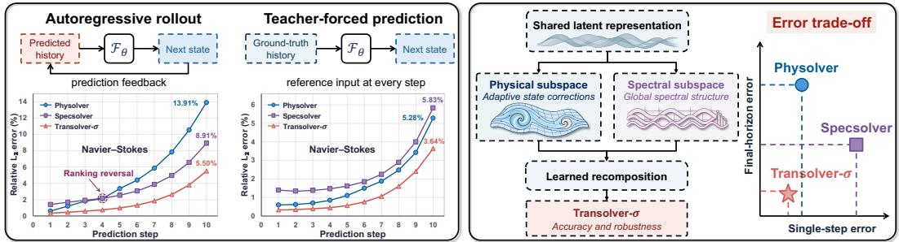  
(a) Single-step accuracy does not ensure rollout robustness  
(b) Joint spectral-physical modeling for balanced error trade-off

Figure 1: Single-step accuracy does not guarantee rollout robustness. (a) Error dynamics under teacher-forced prediction (ground-truth inputs) versus autoregressive rollout (recursive inputs) on 2D Navier–Stokes. Physolver achieves lower single-step error, whereas Specsolver achieves lower error at later rollout steps. (b) Conceptual overview of Transolver-σ, which leverages joint spectral physical modeling via learned recomposition to achieve a balanced error trade-off.

single-step error. Under autoregressive rollout, however, Specsolver becomes more accurate at later prediction steps. In other words, the operator that is better for the next-step prediction is not necessarily the one that remains better after repeated application. This contrast suggests that physical-state and spectral modeling offer different advantages across the rollout horizon, motivating their integration within a single architecture to exploit these complementary behaviors.

The remaining question is how to unify these two mechanisms effectively. The key design question is how to preserve the distinct roles of physical-state and spectral updates while allowing them to exchange information throughout the network. We therefore introduce Transolver-σ, which performs joint spectral–physical subspace modeling within every block (Figure 1(b)). Inspired by channel splitting in ShuffleNet V2 (Ma et al., 2018) and spatial–spectral channel allocation in Fast Fourier Convolution (Chi et al., 2020), each block first builds a shared latent representation and then splits its channels into dedicated physical and spectral subspaces. The physical operator models adaptive interactions among learned physical states, while the spectral operator applies axis-factorized Fourier transformations. Their responses are then concatenated and recomposed through a full-channel SwiGLU network (Shazeer, 2020). In this way, the two mechanisms remain distinct during their own updates but can exchange information before the next block, through repeated recomposition.

We further revisit the physical-state update itself. Vanilla Physics-Attention updates the slice states using attention alone, without a residual connection in slice space. LinearNO removes the sliceto-slice attention through a linear-attention reformulation (Hu et al., 2026b), but consequently dispenses with a dedicated inter-slice interaction stage. We therefore introduce Slice-Residual Physics-Attention (SRPA), which adds an explicit residual connection to the slice-space update. SRPA carries the incoming slice states to deslicing through an explicit identity path and adds a learnably scaled attention correction, starting from an exact slice-space identity at initialization. We show when attention harms through replacement but helps through residual correction (Appendix A.2).

We evaluate Transolver-σ across steady-state and time-dependent PDEs, coupled multiphysics simulations, and real-world measurements. It consistently outperforms single-operator counterparts across four dynamical systems and achieves the lowest error on all eight metrics over five canon ical PDE benchmarks, with a benchmark-averaged relative reduction of 33.4%. Further gains are observed on coupled reacting-flow problems and RealPDEBench measurements (Hu et al., 2026a).

Our key contributions are summarized as follows:

• Joint Spectral–Physical Modeling: We introduce Transolver-σ, which assigns physicalstate and spectral operators to dedicated latent subspaces and recomposes their responses within each block, enabling the two representations to interact throughout the network.

• Slice-Residual Physics-Attention: We introduce SRPA, a residual reformulation of Physics-Attention that preserves an explicit slice-space identity path while retaining learnable cross-slice interaction. This design improves over both vanilla Physics-Attention and removing slice-to-slice attention in our controlled comparisons.

• Broad Empirical Validation: Transolver-σ consistently achieves state-of-the-art performance across canonical PDE benchmarks, while improving autoregressive rollout over four dynamical systems and demonstrating strong generalization to coupled multiphysics simulations and real-world experimental measurements.

## 2 RELATED WORK

## 2.1 NEURAL PDE SOLVERS

Neural PDE solvers based on operator learning approximate mappings between function spaces to represent families of PDE solutions (Kovachki et al., 2023). Spectral approaches parameterize these mappings through basis expansions, with FNO implementing kernel integrals in the Fourier domain (Li et al., 2021). F-FNO combines axis-factorized spectral layers with a residual architecture and training refinements to support efficient, deeper operator networks (Tran et al., 2023). LSM applies spectral methods in learned latent spaces, while GINO couples geometry-aware graph operators with Fourier processing on regular latent grids (Wu et al., 2023; Li et al., 2023b).

Attention-based operators model global interactions through input-dependent weights. Galerkin Transformer connects efficient attention with operator projections (Cao, 2021), GNOT extends attention to heterogeneous inputs and irregular geometries (Hao et al., 2023), and FactFormer factorizes multidimensional interactions along spatial axes for improved computational efficiency (Li et al., 2023a). Unisolver improves cross-PDE generalization by conditioning a Transformer on explicit PDE components (Zhou et al., 2025). Beyond efficiency, these methods also differ in the representation space over which attention is performed. Transolver aggregates mesh features into learned physical states and applies attention to capture global physical interactions (Wu et al., 2024). Transolver++ improves state distinctiveness and parallelism, while Transolver-3 scales training and inference to complex industrial-scale geometries (Luo et al., 2025; Zhou et al., 2026). LinearNO reformulates Physics-Attention as linear attention and removes the explicit slice-to-slice attention stage (Hu et al., 2026b). In contrast, SRPA retains cross-slice interaction while introducing an explicit residual path, making attention a residual update in slice space rather than a direct replacement.

Several recent neural operators combine spectral processing with attention to exploit both physical and frequency-domain representations (Rahman et al., 2024; Yue et al., 2025). CoDA-NO uses Fourier neural operators to construct function-valued attention for multiphysics learning (Rahman et al., 2024), while HPM learns a unified spectral–physical space that directly couples physical states with spectral basis functions (Yue et al., 2025). Transolver-σ takes a different approach: it assigns physical-state attention and spectral processing to dedicated latent subspaces, allowing each to model the input independently before their features are recombined within each block. This repeated recomposition enables information from both representations to propagate through the network.

## 2.2 MITIGATING ERROR ACCUMULATION IN PDE ROLLOUTS

Autoregressive neural PDE solvers reuse their predictions as future inputs, allowing errors to propagate over the rollout horizon. Existing methods address this problem through training, prediction refinement, or hybrid numerical integration. MP-PDE uses pushforward training to expose the model to self-generated states and temporal bundling to reduce feedback steps (Brandstetter et al., 2022). PDE-Refiner instead applies diffusion-inspired iterative refinement to improve long-horizon prediction (Lippe et al., 2023). DRIFT-Net couples a low-frequency spectral branch with an image-space branch to preserve global structure and reduce drift during closed-loop rollout (Li & Salim, 2026). Our work instead organizes physical-state and spectral operators into dedicated latent subspaces and repeatedly recomposes their responses across blocks to improve autoregressive prediction.

## 3 TRANSOLVER-σ

To address the discrepancy between one-step prediction and autoregressive rollout performance, we present Transolver-σ, a novel network architecture built on joint spectral–physical subspace modeling. Within each block, physical-state interactions and spectral transformations are modeled in dedicated latent subspaces, whose features are recomposed to enable effective information exchange.

Problem Setup. We consider PDE prediction on a spatial domain $\Omega \subset \mathbb { R } ^ { d }$ sampled at $N$ grid points $\mathbf { g } \in \mathbb { R } ^ { N \times d }$ . Given input fields $\dot { \mathbf { X } } \in \mathbb { R } ^ { N \times C _ { \mathrm { i n } } }$ , we learn a neural operator $\mathcal { F } _ { \theta }$ to predict

$$
\widehat { \mathbf { U } } = \mathcal { F } _ { \theta } ( \mathbf { X } ; \mathbf { g } ) \in \mathbb { R } ^ { N \times C _ { \mathrm { o u t } } } .
$$

For steady-state problems, the model directly predicts the corresponding solution fields. For timedependent problems, X contains $T _ { \mathrm { i n } }$ historical frames and the model predicts the next $T _ { \mathrm { o u t } }$ frames,

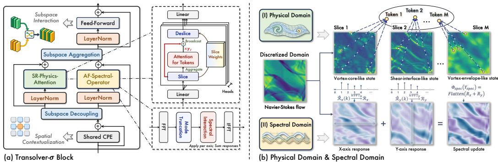  
Figure 2: Transolver-σ architecture and spectral–physical modeling. (a) Transolver-σ performs specialized physical and spectral modeling in decoupled latent subspaces, followed by learned recomposition. (b) The physical branch captures intrinsic state interactions through slice-based modeling, while the spectral branch captures global spatial variations along individual axes.

with $C _ { \mathrm { o u t } } = T _ { \mathrm { o u t } } q$ for q output field channels per frame. During autoregressive rollout, each predicted block is appended to the history and the most recent $T _ { \mathrm { i n } }$ frames are used for the next model call. See Appendix B.1 for task-specific settings and rollout configurations.

## 3.1 JOINT SPECTRAL–PHYSICAL SUBSPACE MODELING

Physical-state and spectral operators represent spatial interactions through different intermediate representations. Physics-Attention organizes spatial features into input-adaptive physical states and models interactions among them (Wu et al., 2024). Fourier operators instead model global structure through frequency modes in a prescribed spectral basis (Li et al., 2021). These two representations therefore provide distinct inductive biases: physical-state modeling adapts its interaction structure specific to the current field, whereas spectral modeling employs a fixed global basis.

Rather than forcing these two forms of representation into a shared operator, Transolver-σ assigns physical-state and spectral transformations to dedicated channel subspaces. Each subspace can specialize under its own operator, while their responses are recomposed within every block to exchange information across successive layers. As illustrated in Figure 2(a), Transolver-σ first lifts the input fields X and coordinates g into latent features $\mathbf { H } ^ { ( 0 ) } \in \mathbb { R } ^ { \breve { N } \times C }$ , followed by L dual-subspace blocks. In each block, conditional positional encoding (CPE) (Chu et al., 2023) injects spatial context before the features are evenly split into spectral and physical channel subspaces:

$$
\begin{array} { r } { \overline { { \mathbf { H } } } ^ { ( \ell ) } = \mathbf { H } ^ { ( \ell ) } + \mathrm { C P E } _ { \ell } ( \mathbf { H } ^ { ( \ell ) } ) , \qquad [ \mathbf { H } _ { \mathrm { s p e c } } ^ { ( \ell ) } , \mathbf { H } _ { \mathrm { p h y } } ^ { ( \ell ) } ] = \mathrm { S p l i t } _ { C / 2 } ( \overline { { \mathbf { H } } } ^ { ( \ell ) } ) , } \end{array}\tag{1a}
$$

$$
\widetilde { \mathbf { H } } _ { * } ^ { ( \ell ) } = \mathbf { H } _ { * } ^ { ( \ell ) } + \Phi _ { * } ^ { ( \ell ) } \left( \mathrm { L N } _ { * } ^ { ( \ell ) } ( \mathbf { H } _ { * } ^ { ( \ell ) } ) \right) , \qquad * \in \{ \mathrm { s p e c } , \mathrm { p h y } \} ,\tag{1b}
$$

$$
\mathbf { H } _ { \mathrm { c a t } } ^ { ( \ell ) } = \mathrm { C o n c a t } \Big ( \widetilde { \mathbf { H } } _ { \mathrm { s p e c } } ^ { ( \ell ) } , \widetilde { \mathbf { H } } _ { \mathrm { p h y } } ^ { ( \ell ) } \Big ) , \qquad \mathbf { H } ^ { ( \ell + 1 ) } = \mathbf { H } _ { \mathrm { c a t } } ^ { ( \ell ) } + \mathrm { S w i G L U } _ { \ell } \Big ( \mathrm { L N } ^ { ( \ell ) } ( \mathbf { H } _ { \mathrm { c a t } } ^ { ( \ell ) } ) \Big ) .\tag{1c}
$$

Here, the two operators capture complementary spatial dynamics: $\Phi _ { \mathrm { p h y } }$ denotes Slice-Residual Physics-Attention, which models adaptive interactions among intrinsic physical states, while $\Phi _ { \mathrm { s p e c } }$ denotes the axis-factorized Fourier operator for global spectral modeling. The two subspaces are updated independently and then recomposed within each block through a full-channel SwiGLU network, enabling information exchange between physical and spectral representations. After L blocks, layer normalization and a linear readout produce the target fields $\widehat { \mathbf { U } } \in \mathbb { R } ^ { N \times C _ { \mathrm { o u t } } }$

## 3.2 SLICE-RESIDUAL PHYSICS-ATTENTION

To overcome the quadratic complexity of point-to-point self-attention in discretized domains, Transolver introduced Physics-Attention, which groups spatial points into M intrinsic physical tokens via soft slicing and models interactions strictly in the token space (Wu et al., 2024). However, a key limitation of vanilla Physics-Attention lies in its state update rule: at each layer, the aggregated slice tokens Z are completely overwritten by the attention-mixed values ∆Z. Across deeper layers, this repeated replacement increasingly mixes slice representations, weakening distinctions among physical states and reducing token diversity (Figure 5c) (Appendix A.1). A recent alternative, LinearNO, reformulates Physics-Attention as linear attention and removes the separate slice-to-slice attention stage while preserving input-adaptive global aggregation (Hu et al., 2026b).

We argue that inter-slice interactions can help capture non-local physical correlations, but should refine the existing slice states rather than replace them. To this end, we propose Slice-Residual Physics-Attention (SRPA). By introducing an explicit residual path in the physical token space, SRPA retains the primary slice identities Z and incorporates the attention response ∆Z as a learnably scaled residual correction $( { \bf Z ^ { + } } = { \bf Z } + \gamma _ { \ell } \bar { \Delta { \bf Z } } )$ As illustrated in Figure 3, SRPA preserves slice identities while enabling effective inter-slice refinement.

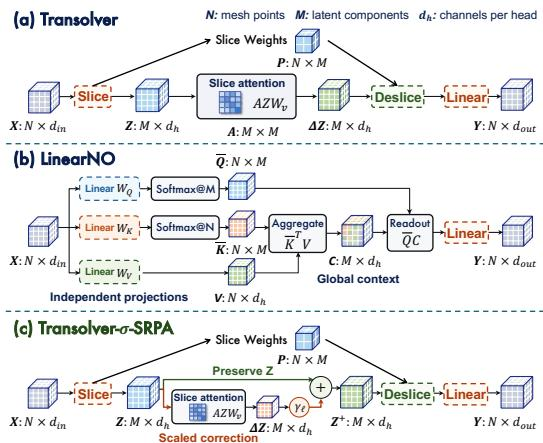

Formally, given the normalized physical subspace features $\begin{array} { r l r } { { \mathbf Y } _ { \mathrm { p h y } } } & { { } = } & { \mathrm { L N } _ { \mathrm { p h y } } { \mathbf ( } { \mathbf { H } } _ { \mathrm { p h y } } { \mathbf ) } } \end{array}$ ∈ $\mathbb { R } ^ { N \times C _ { \mathrm { p h y } } }$ , we first apply separate projections to obtain routing and feature representations, then partition outputs into $n _ { h }$ heads with head dimension $d _ { h } = C _ { \mathrm { p h y } } / n _ { h }$ . For each head, we denote these representations by ${ \bf R } , { \bf F } \in \mathbb { R } ^ { N \times d _ { h } }$ . The point-to-slice routing matrix $\mathbf { P } \in \mathbb { R } ^ { N \times M }$ softly assigns N spatial points to M physical slice to-

Figure 3: Comparison of slice-based operator updates. (a) Transolver updates physical states with solely attention. (b) LinearNO uses linear global-context aggregation. (c) SRPA retains slice states with scaled residual attention.

kens $( M \ll N )$ , forming slice states $\mathbf { Z } \in \mathbb { R } ^ { M \times d _ { h } }$ as defined in Equation 2, where D normalizes each physical token by its total spatial mass, and temperature τ controls assignment sharpness across the domain. $\mathbf { W } _ { s } \in \dot { \mathbb { R } } ^ { d _ { h } \times M }$ and $\mathbf { b } _ { s } \in \mathbb { R } ^ { M }$ are the learnable routing weight and bias. ${ \mathbf { 1 } } _ { N } , { \mathbf { 1 } } _ { M }$ are all-ones vectors, and $\varepsilon > 0$ stabilizes slice normalization.

Next, rather than replacing Z directly, SRPA performs multi-head self-attention across the M physical tokens to compute an interaction response ∆Z, which is added back to Z as a scaled residual correction ( Equation 3), where $\mathbf { W } _ { q } , \mathbf { W } _ { k } , \mathbf { W } _ { v } \in \mathbb { R } ^ { d _ { h } \times d _ { h } }$ are projection matrices. A is the sliceattention matrix, and softmax normalizes each row over M entries. The scalar $\gamma _ { \ell }$ is initialized to zero following ReZero (Bachlechner et al., 2021). This ensures an exact identity mapping in slice space at initialization, with subsequent inter-slice corrections controlled by the learned scale.

$$
\begin{array} { r l r l } & { \mathbf P = \operatorname { s o f t m a x } _ { M } \left( \frac { \mathbf R \mathbf W _ { s } + \mathbf 1 _ { N } \mathbf b _ { s } ^ { \top } } { \tau } \right) , \quad } & & { \mathbf A = \operatorname { s o f t m a x } _ { M } \left( \frac { ( \mathbf Z \mathbf W _ { q } ) ( \mathbf Z \mathbf W _ { k } ) ^ { \top } } { \sqrt { d _ { h } } } \right) , } \\ & { \mathbf D = \operatorname { d i a g } \left( \mathbf P ^ { \top } \mathbf 1 _ { N } + \varepsilon \mathbf 1 _ { M } \right) , \quad } & & { ( 2 ) \quad } & & { \Delta \mathbf Z = \mathbf A \mathbf Z \mathbf W _ { v } , } \\ & { \mathbf Z = \mathbf D ^ { - 1 } \mathbf P ^ { \top } \mathbf F . } & & { \mathbf Z ^ { + } = \mathbf Z + \gamma \varepsilon \Delta \mathbf Z . } \end{array}\tag{3}
$$

Finally, the refined slice tokens $\mathbf { Z } ^ { + }$ are mapped back to spatial domain points via deslicing using the routing weights P, concatenated across heads, and projected to yield the physical operator output:

$$
\begin{array} { r l } & { \mathbf { O } ^ { ( r ) } = \mathbf { P } ^ { ( r ) } \mathbf { Z } ^ { + , ( r ) } , \qquad r = 1 , \dots , n _ { h } , } \\ & { \Phi _ { \mathrm { p h y } } ( \mathbf { Y } _ { \mathrm { p h y } } ) = \operatorname { P r o j } _ { o } \left( \operatorname { C o n c a t } _ { r = 1 } ^ { n _ { h } } \mathbf { O } ^ { ( r ) } \right) \in \mathbb { R } ^ { N \times C _ { \mathrm { p h y } } } . } \end{array}\tag{4}
$$

Here, r indexes heads, ${ \mathbf O } ^ { ( r ) }$ is the desliced head output, and $\mathrm { P r o j } _ { o }$ is the output projection. Crucially, the inner residual path carries the unmixed slice state Z into the deslicing stage $( \mathbf { P } \mathbf { Z } )$ , whereas the outer block residual in Equation 1b bypasses the physical operator $\Phi _ { \mathrm { p h y } }$ through $\mathbf { H } _ { \mathrm { p h y } } . \mathbf { \Gamma } \mathbf { A p } .$ pendix A.1 provides conditional pairwise and centered-variation bounds for slice-space updates.

## 3.3 AXIS-FACTORIZED SPECTRAL OPERATOR

While Slice-Residual Physics-Attention captures content-adaptive spatial interactions in the physical subspace, the spectral subspace plays a complementary role by modeling global spatial struc

Table 1: Results on Standard Benchmarks. Relative $L _ { 2 }$ errors (in %) of pressure p, vorticity ω, velocity u, and smoke density d across standard benchmarks, where “avg.” and “final” denote horizon-aggregated and final-frame errors. Our results are reported as mean ± std over three runs.
<table><tr><td rowspan="2">MODELS</td><td colspan="2">NAVIER- DARCY STOKES</td><td colspan="2">2D KOLMOGOROV</td><td colspan="2">3D ISOTROPIC</td><td colspan="2">3D SMOKE</td></tr><tr><td>p</td><td>ω</td><td> $\omega _ { \mathrm { a v g . } }$ </td><td> $\omega _ { \mathrm { f i n a l } }$ </td><td>u</td><td>p</td><td>u</td><td>d</td></tr><tr><td>U-Net (2015)</td><td>0.80</td><td>19.82</td><td>32.81</td><td>47.24</td><td>35.76</td><td>48.49</td><td>44.10</td><td>14.95</td></tr><tr><td>ViT (2021)</td><td>0.47</td><td>4.64</td><td>17.19</td><td>27.19</td><td>31.66</td><td>44.54</td><td>38.41</td><td>12.86</td></tr><tr><td>FNO (2021)</td><td>1.08</td><td>15.56</td><td>29.78</td><td>45.67</td><td>33.82</td><td>46.34</td><td>42.55</td><td>13.44</td></tr><tr><td>F-FNO (2023)</td><td>0.77</td><td>23.22</td><td>24.53</td><td>38.61</td><td>23.03</td><td>32.64</td><td>37.13</td><td>12.36</td></tr><tr><td>RNO (2025)</td><td>0.54</td><td>8.94</td><td>18.93</td><td>29.14</td><td>22.37</td><td>30.72</td><td>28.51</td><td>11.53</td></tr><tr><td>HPM (2025)</td><td>0.46</td><td>7.34</td><td>34.19</td><td>58.81</td><td>24.85</td><td>39.11</td><td>55.23</td><td>14.94</td></tr><tr><td>DRIFT-Net (2026)</td><td>0.45</td><td>4.32</td><td>13.83</td><td>23.97</td><td>14.56</td><td>22.64</td><td>28.99</td><td>10.82</td></tr><tr><td>FactFormer (2023a)</td><td>0.47</td><td>4.23</td><td>14.29</td><td>25.11</td><td>13.87</td><td>21.74</td><td>23.37</td><td>9.19</td></tr><tr><td>Transolver (2024)</td><td>0.58</td><td>9.00</td><td>43.98</td><td>75.03</td><td>26.42</td><td>39.47</td><td>61.08</td><td>16.33</td></tr><tr><td>Transolver++ (2025)</td><td>0.49</td><td>7.19</td><td>47.51</td><td>79.07</td><td>26.23</td><td>39.67</td><td>61.14</td><td>16.25</td></tr><tr><td>EddyFormer (2025)</td><td>0.66</td><td>4.25</td><td>12.69</td><td>21.99</td><td>12.70</td><td>19.43</td><td>25.87</td><td>9.35</td></tr><tr><td>LinearNO (2026b)</td><td>0.50</td><td>6.99</td><td>33.37</td><td>56.14</td><td>22.86</td><td>37.14</td><td>50.04</td><td>14.18</td></tr><tr><td rowspan="2">Transolver-σ (Ours)</td><td>0.40</td><td>2.79</td><td>2.52</td><td>4.14</td><td>10.80</td><td>15.65</td><td>17.43</td><td>7.07</td></tr><tr><td>±0.01</td><td>±0.05</td><td>±0.05</td><td>±0.07</td><td>±0.16</td><td>±0.23</td><td>±0.25</td><td>±0.09</td></tr><tr><td>RELATIVE PROMOTION</td><td>11.1%</td><td>34.0%</td><td>80.1%</td><td>81.2%</td><td>15.0%</td><td>19.4%</td><td>25.4%</td><td>23.1%</td></tr></table>

ture through retained Fourier modes. Rather than using a multi-dimensional Fourier operator with parameter complexity $\mathcal { O } ( C _ { \mathrm { s p e c } } ^ { 2 } K ^ { d } )$ , we adopt an axis-factorized spectral operator inspired by F-FNO (Tran et al., 2023). K denotes the common per-axis mode budget. This factorization enables efficient spectral modeling in deep backbones with reduced parameter growth while providing constraints that help mitigate trajectory drift during autoregressive rollout over prediction horizons.  
Specifically, for a d-dimensional field, 1D real Fast Fourier Transforms (rFFT) are applied independently along each spatial axis $a \in \{ 1 , \ldots , d \}$ . The lowest $K _ { a }$ Fourier modes are filtered via learnable complex channel-mixing matrices, transformed back via inverse rFFT, and summed across axes to form the updated representation in spectral space (Figure 2(b)). The full formulation, mode truncation details, and implementation conventions are provided in Appendix B.3.

## 4 EXPERIMENTS

We conduct extensive experiments to evaluate Transolver-σ, extending from five canonical PDE benchmarks to two coupled multiphysics problems and four real-world tasks. Covering both steadystate and time-dependent systems, these evaluations assess field prediction accuracy and autoregressive rollout robustness across numerical simulations and experimental measurements.

## 4.1 EXPERIMENTAL SETUP

Benchmarks Our evaluation spans a broad range of steady-state and time-dependent PDEs in both 2D and 3D, across diverse problem settings, including Darcy flow and Navier–Stokes from FNO (Li et al., 2021), and Kolmogorov flow, isotropic turbulence, and smoke buoyancy from Fact-Former (Li et al., 2023a). Beyond simulation-generated benchmarks, we further evaluate on RealPDEBench (Hu et al., 2026a), which provides real-world experimental measurements of fluid and combustion dynamics, offering a more realistic test of neural PDE solvers beyond numerical simulation. We additionally include the coupled reacting-flow benchmarks IgnitHIT and EvolveJet from REALM (Mao et al., 2025). Full benchmark details are provided in Appendix B.1.

Baselines We comprehensively compare Transolver-σ with 12 baselines, covering representative transform-domain and hybrid neural operators, such as FNO (Li et al., 2021), DRIFT-Net (Li & Salim, 2026), etc.; Transformer-based PDE solvers, including Transolver (Wu et al., 2024), LinearNO (Hu et al., 2026b), etc.; and general-purpose architectures such as U-Net (Ronneberger et al., 2015) and ViT (Dosovitskiy et al., 2021), etc. For RealPDEBench and REALM, we additionally compare against the baselines reported in their original studies (Hu et al., 2026a; Mao et al., 2025).

Table 2: Results on RealPDEBench. RMSE, relative $L ^ { 2 } .$ , and Fourier-space RMSE (fRMSE) across four real-world measurement tasks. Params denotes the mean parameter count (M) across tasks.
<table><tr><td rowspan="2">MODELS</td><td rowspan="2">(M)</td><td colspan="3">PARAMS|CONTROLLED CYLINDER</td><td colspan="3">FSI</td><td colspan="3">FOIL</td><td colspan="3">COMBUSTION</td></tr><tr><td>|RMSE Rel</td><td> $L ^ { 2 }$ </td><td>fRMSE</td><td>RMSE Rel L2 fRMSE|RMSE Rel</td><td></td><td></td><td></td><td> $L ^ { 2 }$ </td><td>fRMSE</td><td>ERMSE Rel</td><td> $L ^ { 2 }$ </td><td>fRMSE</td></tr><tr><td>U-Net</td><td>23.08</td><td>0.80</td><td>5.55</td><td>0.10</td><td>0.85</td><td>5.83</td><td>0.07</td><td>1.00</td><td>1.59</td><td>0.11</td><td>2.16</td><td>54.87</td><td>0.26</td></tr><tr><td>CNO</td><td>8.00</td><td>0.81</td><td>5.83</td><td>0.09</td><td>1.05</td><td>7.41</td><td>0.09</td><td>1.36</td><td>2.53</td><td>0.18</td><td>2.48</td><td>60.30</td><td>0.32</td></tr><tr><td>DeepONet</td><td>3.53</td><td>3.09</td><td>23.99</td><td>0.58</td><td>3.50</td><td>25.02</td><td>0.51</td><td>2.22</td><td>3.63</td><td>0.28</td><td>2.29</td><td>57.51</td><td>0.28</td></tr><tr><td>FNO</td><td>109.10</td><td>0.97</td><td>7.23</td><td>0.12</td><td>1.29</td><td>8.92</td><td>0.12</td><td>1.30</td><td>2.28</td><td>0.15</td><td>2.26</td><td>56.64</td><td>0.27</td></tr><tr><td>WDNO</td><td>233.15</td><td>1.15</td><td>9.27</td><td>0.14</td><td>1.17</td><td>8.17</td><td>0.11</td><td>1.62</td><td>4.44</td><td>0.18</td><td>3.80</td><td>86.05</td><td>0.55</td></tr><tr><td>MWT</td><td>2.90</td><td>1.02</td><td>7.47</td><td>0.11</td><td>1.28</td><td>9.10</td><td>0.10</td><td>1.33</td><td>2.27</td><td>0.15</td><td>2.21</td><td>55.60</td><td>0.27</td></tr><tr><td>GK-Transformer</td><td>59.20</td><td>1.03</td><td>7.67</td><td>0.12</td><td>1.27</td><td>9.16</td><td>0.11</td><td>1.42</td><td>2.45</td><td>0.18</td><td>2.47</td><td>60.83</td><td>0.31</td></tr><tr><td>Transolver</td><td>4.30</td><td>1.71</td><td>12.00</td><td>0.24</td><td>2.36</td><td>15.67</td><td>0.27</td><td>2.20</td><td>3.70</td><td>0.27</td><td>3.75</td><td>78.25</td><td>0.50</td></tr><tr><td>DPOT-S-FT</td><td>38.73</td><td>0.84</td><td>5.98</td><td>0.10</td><td>1.05</td><td>7.46</td><td>0.08</td><td>1.06</td><td>1.66</td><td>0.10</td><td>2.09</td><td>53.49</td><td>0.24</td></tr><tr><td>DPOT-L-FT</td><td>667.75</td><td>0.84</td><td>6.03</td><td>0.10</td><td>0.99</td><td>6.87</td><td>0.08</td><td>1.05</td><td>1.59</td><td>0.11</td><td>2.08</td><td>53.31</td><td>0.24</td></tr><tr><td>Transolver-σ</td><td>3.13</td><td>0.65</td><td>5.20</td><td>0.06</td><td>0.74</td><td>5.55</td><td>0.06</td><td>0.47</td><td>1.40</td><td>0.08</td><td>1.86</td><td>52.86</td><td>0.18</td></tr></table>

Implementations For fair comparison, we set the hidden dimension $C$ to 128 or 256 and the number of blocks L to a task-specific value in {4, 6, 8}, keeping the model size comparable to Transformer-based PDE solvers such as Transolver (Wu et al., 2024) and LinearNO (Hu et al., 2026b). All main experiments are conducted on a single NVIDIA A100 GPU. We primarily report relative $L ^ { 2 }$ errors for field prediction and autoregressive rollout, while following the original evaluation protocols of RealPDEBench and REALM for their task-specific metrics. See Appendix B for comprehensive implementation details and metric definitions, and training configurations.

## 4.2 MAIN RESULTS

Standard Benchmarks As shown in Table 1, Transolver-σ achieves state-of-the-art performance on five widely used PDE benchmarks spanning steady-state prediction and time-dependent dynamics in both 2D and 3D. It obtains the lowest errors on all eight metrics, with a benchmark-averaged relative error reduction of 33.4% over the strongest per-metric baselines. The gains further extend to 3D dynamics, where Transolver-σ reduces velocity and density errors on smoke buoyancy by 25.4% and 23.1%. Overall, these results demonstrate the consistent effectiveness of joint spectral–physical modeling across diverse PDE systems and forecasting settings. Moreover, scaling experiments further show performance gains from more data, finer grids, and larger models (Appendix E.1).

RealPDEBench: Real-World Experimental Measurements To further assess performance beyond simulation-based benchmarks, we evaluate Transolver-σ on RealPDEBench (Hu et al., 2026a), the first scientific ML benchmark built on real-world physical measurements paired with numerical simulations across diverse operating conditions. As shown in Table 2, Transolver-σ achieves superior performance across all four tasks and metrics, reducing Foil RMSE by 53.0% and Combustion fRMSE by 25.0% over the strongest respective baselines. Moreover, it surpasses U-Net, the strongest model reported in RealPDEBench, with only 13.6% of its parameters (3.13M vs. 23.08M), achieving better accuracy with substantially lower model complexity and computational overhead.

REALM: Coupled Multiphysics Dynamics To push the evaluation beyond standalone fields and empirical measurements, we further challenge Transolver-σ on complex multi-field coupled reacting flows from REALM (IgnitHIT and EvolveJet). Coupled multiphysics systems present severe challenges for neural operators, as non-linear cross-field interactions often trigger explosive error accumulation during long-horizon dynamic rollouts. As reported in Appendix E (Table 9), Transolver-σ outperforms all baselines, further validating our joint spectral–physical modeling.

## 4.3 MODEL ANALYSIS

Single-Step Accuracy vs. Rollout Robustness Evaluating autoregressive forecasts across four dynamical systems reveals a fundamental trade-off in single-domain modeling: short-term precision does not guarantee long-horizon stability. As shown in Figure 4(a–d), the relative advantage of physical-only (Physolver) and spectral-only (Specsolver) models shifts as prediction leads grow. In contrast, Transolver-σ achieves lower errors at every prediction lead across all four systems, cutting rollout-averaged error by 35.6%–68.7% relative to the stronger single-domain counterpart (Figure 4(e)). These findings confirm that joint physical-state and spectral modeling is important for suppressing error accumulation in autoregressive rollouts (details in Appendix B.2 and Appendix E.3).

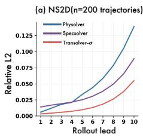

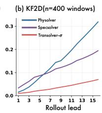

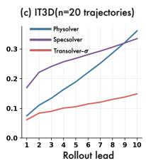

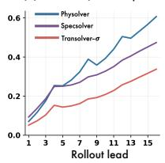

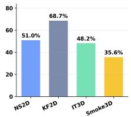  
Figure 4: Autoregressive forecasting errors across four dynamical systems. (a–d) Relative $L ^ { 2 }$ errors over prediction leads on Standard Benchmarks, with n the evaluation sample count. (e) Percentage reduction in rollout-averaged error over the stronger single-domain baseline.

Efficiency We compare training efficiency with representative PDE solvers selected for their predictive performance and architectural relevance (Figure 5(a,b)). Transolver-σ requires the least parameter storage across both tasks while maintaining competitive training times. Specifically, on NS2D, Transolver-σ reduces relative $L _ { 2 }$ error by 34.0% compared with FactFormer, the strongest baseline on this task (2.79% vs. 4.23%; Table 1). In the efficiency comparison, it has a 3.4× smaller parameter-storage footprint and 1.05× the mean training speed of FactFormer (Appendix F).

Ablations. We conduct ablation studies on Darcy, NS2D, and Smoke3D to evaluate our core design choices (Table 3). First, bypassing either subspace branch or replacing our parallel architecture with sequential hybrid configurations degrades performance on dynamic tasks, with the full model reducing Smoke3D velocity error by 16.0% over the stronger sequential baseline. Second, removing shared CPE, restricting cross-subspace mixing via grouped SwiGLU (NS2D error increases from 2.79% to 4.32%), or replacing SRPA with vanilla Physics-Attention (Wu et al., 2024) consistently increases errors across all metrics. These comparisons collectively support the effectiveness of our joint subspace organization, full-channel recomposition, and slice-residual updates.

Table 3: Ablations of Transolver-σ. Relative $L _ { 2 }$ errors (%) for pressure p, vorticity ω, velocity u, and density d. Branch ablations use identity mappings; “w/o Cross-Branch FFN” removes cross-branch mixing while retaining grouped SwiGLU. SRPA → PA replaces SRPA with Physics-Attention.
<table><tr><td rowspan="2">VARIANT</td><td>DARCY</td><td>NS-2D</td><td colspan="2">SMOKE-3D</td></tr><tr><td>p</td><td>ω</td><td>u</td><td>d</td></tr><tr><td rowspan="2">w/o Physical Branch w/o Spectral Branch</td><td>0.65</td><td>4.96</td><td>26.29</td><td>8.97</td></tr><tr><td>0.40</td><td>7.94</td><td>29.02</td><td>10.15</td></tr><tr><td rowspan="2">Physical → Spectral Spectral → Physical</td><td>0.42</td><td>3.04</td><td>20.75</td><td>7.78</td></tr><tr><td>0.42</td><td>3.15</td><td>21.88</td><td>8.06</td></tr><tr><td rowspan="2">w/o Shared CPE w/o Cross-Branch FFN</td><td>0.42</td><td>3.69</td><td>23.56</td><td>8.59</td></tr><tr><td>0.43</td><td>4.32</td><td>25.53</td><td>9.04</td></tr><tr><td rowspan="2">SRPA → PA</td><td>0.42</td><td>3.07</td><td>19.53</td><td>7.50</td></tr><tr><td>0.40</td><td>2.79</td><td>17.43</td><td>7.07</td></tr></table>

Slice-Attention Analysis As presented in Table 4, vanilla Physics-Attention can paradoxically degrade performance relative to its no-attention counterpart—a failure mode also reflected in LinearNO (Hu et al., 2026b), which removes separate slice-to-slice attention through a linear-attention reformulation. Crucially, this limitation stems not from unnecessary inter-slice interaction, but from the update mechanism itself: vanilla attention replaces existing slice states with attention-mixed values without an explicit slice-space identity path, eroding feature distinctions as queries repeatedly draw from concentrated keys. SRPA addresses this by retaining incoming slice states and appending a learnably scaled residual correction, allowing cross-slice interaction to refine rather than replace representations. Consequently, SRPA converts slice attention from a detrimental update into a beneficial correction, reducing errors on Darcy and NS2D by 9.5% and 13.5%, respectively, over the no-attention baseline. Complementary visualizations in Figure 5(c,d) confirm that Transolver-σ exhibits spatially structured routing across more slices with less key concentration, supporting our design goal of preserving distinct states during interaction (Appendix D.1).

Case study Figure 6 compares spatial error maps of Transolver-σ, EddyFormer, and DRIFT-Net on representative simulation and experimental cases. In Navier–Stokes, the baselines exhibit pronounced band-shaped errors, while Transolver-σ shows weaker errors along the same structures. The FSI case likewise shows weaker localized errors for Transolver-σ than the baselines.

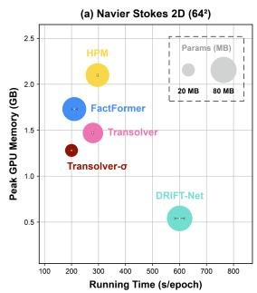

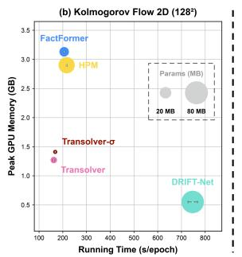

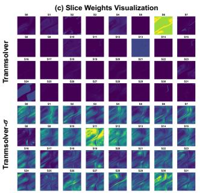

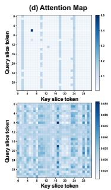

Figure 5: Training efficiency and learned representations. (a,b) Epoch time and peak GPU memory on NS2D (642) and Kolmogorov flow $( 1 \bar { 2 } 8 ^ { 2 } )$ , with bubble area indicating parameter storage and error bars denoting ±1 standard deviation over three runs. (c, d) Spatial routing maps and sliceattention matrices extracted from the final layer on NS2D.  
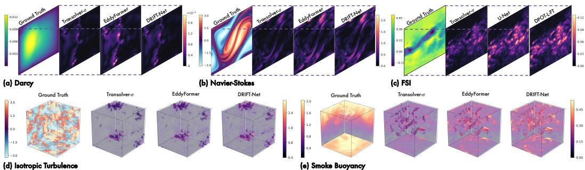  
Figure 6: Case study on error maps of different models. Within each task, models share the same test case, prediction time, spatial view, and error scale. See Appendix D.2 for more details.

We further compare Physolver, Specsolver, and Transolver-σ across successive autoregressive leads (Appendix D.2). In NS2D, Physolver’s initially small errors develop into pronounced bands at later leads, while Specsolver exhibits weaker late-stage errors. On Kolmogorov flow, both singledomain models show increasingly prominent error patterns, whereas Transolver-σ maintains lower error intensity throughout the displayed sequence. Together with the three-dimensional cases, these visualizations provide a spatial view of the rollout differences quantified in Figure 4.

Layer-wise SRPA Corrections To examine how SRPA uses its residual path after training, we inspect learned scales and realized correction ratios across five PDE tasks. Each ratio measures the joint norm of the scaled slice-attention correction relative to the incoming states; we evaluate three

fixed held-out cases per task. Corrections concentrate primarily in Darcy’s first layer but remain measurable throughout all eight Smoke3D layers. Learned scale magnitudes alone do not determine the realized corrections. These task- and layer-dependent profiles complement the preceding update

Table 4: Effects of slice-attention updates.
<table><tr><td>Model</td><td>Slice-space update</td><td>Darcy</td><td>NS2D</td></tr><tr><td>LinearNO</td><td>一</td><td>0.5033</td><td>6.9871</td></tr><tr><td>Transolver</td><td>AZWv</td><td>0.5807</td><td>9.0315</td></tr><tr><td>– w/o Slice Attention</td><td>Z</td><td>0.4724</td><td>7.7124</td></tr><tr><td>– with SRPA</td><td> $\mathbf { Z } + \gamma _ { \ell } \mathbf { A } \mathbf { Z } \mathbf { W } _ { v }$ </td><td>0.4275</td><td>6.6735</td></tr></table>

comparison, illustrating nonuniform use of residual interactions (Appendix D.1).

## 5 CONCLUSION

We introduce Transolver-σ, a neural PDE solver that improves both field prediction and autoregressive rollout through joint spectral–physical subspace modeling. The key design is to preserve adaptive physical-state interactions and spectral transformations in dedicated latent subspaces, while repeatedly recomposing their responses across the network. Within the physical subspace, Slice-Residual Physics-Attention further improves state interaction by refining, rather than replacing, the incoming slice representations. Transolver-σ achieves a benchmark-averaged relative error reduction of 33.4% across five canonical PDE benchmarks, with consistent gains extending to coupled multiphysics simulations and real-world measurements. Rollout comparisons and ablations further demonstrate the complementary behaviors of physical-state and spectral modeling, while highlighting the importance of dedicated subspace organization and cross-subspace recomposition. These findings suggest that neural PDE solvers can benefit from preserving specialized physical and spectral representations while explicitly learning their interactions.

## AI USE STATEMENT

We used generative AI tools for language polishing, grammar checking, and translation, and to assist in developing and refining the theoretical analyses and mathematical proofs in Appendix A. All AI-assisted content was carefully reviewed and checked by the authors. In particular, the authors reviewed the stated assumptions and independently checked the derivations and logical steps of all AI-assisted proofs, verifying that the mathematical claims follow under the stated conditions. The authors take full responsibility for the correctness and integrity of the final manuscript, including all AI-assisted content.

## REFERENCES

Thomas Bachlechner, Bodhisattwa Prasad Majumder, Huanru Henry Mao, Garrison W. Cottrell, and Julian McAuley. ReZero is all you need: Fast convergence at large depth. In Proceedings of the Thirty-Seventh Conference on Uncertainty in Artificial Intelligence, volume 161 of Proceedings ofMachine Learning Research, pp. 1352–1361, 2021.

Johannes Brandstetter, Daniel E. Worrall, and Max Welling. Message passing neural PDE solvers. In International Conference on Learning Representations, 2022.

Shuhao Cao. Choose a transformer: Fourier or Galerkin. In Advances in Neural Information Processing Systems, volume 34, pp. 24924–24940, 2021.

Lu Chi, Borui Jiang, and Yadong Mu. Fast Fourier convolution. In Advances in Neural Information Processing Systems, volume 33, 2020.

Xiangxiang Chu, Zhi Tian, Bo Zhang, Xinlong Wang, and Chunhua Shen. Conditional positional encodings for vision transformers. In The Eleventh International Conference on Learning Representations, 2023.

Alexey Dosovitskiy, Lucas Beyer, Alexander Kolesnikov, Dirk Weissenborn, Xiaohua Zhai, Thomas Unterthiner, Mostafa Dehghani, Matthias Minderer, Georg Heigold, Sylvain Gelly, Jakob Uszkoreit, and Neil Houlsby. An image is worth 16x16 words: Transformers for image recognition at scale. In International Conference on Learning Representations, 2021.

Yiheng Du and Aditi Krishnapriyan. EddyFormer: Accelerated neural simulations of threedimensional turbulence at scale. In Advances in Neural Information Processing Systems, volume 38, 2025. doi: 10.52202/085713-3454.

Zhongkai Hao, Zhengyi Wang, Hang Su, Chengyang Ying, Yinpeng Dong, Songming Liu, Ze Cheng, Jian Song, and Jun Zhu. GNOT: A general neural operator transformer for operator learning. In Proceedings ofthe 40th International Conference on Machine Learning, volume 202 of Proceedings ofMachine Learning Research, pp. 12556–12569, 2023.

Peiyan Hu, Haodong Feng, Hongyuan Liu, Tongtong Yan, Wenhao Deng, Tianrun Gao, Rong Zheng, Haoren Zheng, Chenglei Yu, Chuanrui Wang, Kaiwen Li, Zhi-Ming Ma, Dezhi Zhou, Xingcai Lu, Dixia Fan, and Tailin Wu. RealPDEBench: A benchmark for complex physical systems with real-world data. In The Fourteenth International Conference on Learning Representations, 2026a.

Wenjie Hu, Sidun Liu, Peng Qiao, Zhenglun Sun, and Yong Dou. Transolver is a linear transformer: Revisiting physics-attention through the lens of linear attention. Proceedings ofthe AAAI Conference on Artificial Intelligence, 40(1):408–416, 2026b. doi: 10.1609/aaai.v40i1.37003.

Nikola Kovachki, Zongyi Li, Burigede Liu, Kamyar Azizzadenesheli, Kaushik Bhattacharya, Andrew Stuart, and Anima Anandkumar. Neural operator: Learning maps between function spaces with applications to PDEs. Journal ofMachine Learning Research, 24(89):1–97, 2023.

Jiayi Li and Flora D. Salim. DRIFT-Net: A spectral-coupled neural operator for PDEs learning. In International Conference on Learning Representations, 2026.

Zijie Li, Dule Shu, and Amir Barati Farimani. Scalable transformer for PDE surrogate modeling. In Advances in Neural Information Processing Systems, volume 36, 2023a.

Zongyi Li, Nikola Kovachki, Kamyar Azizzadenesheli, Burigede Liu, Kaushik Bhattacharya, Andrew Stuart, and Anima Anandkumar. Fourier neural operator for parametric partial differential equations. In International Conference on Learning Representations, 2021.

Zongyi Li, Nikola Kovachki, Chris Choy, Boyi Li, Jean Kossaifi, Shourya Otta, Mohammad Amin Nabian, Maximilian Stadler, Christian Hundt, Kamyar Azizzadenesheli, and Animashree Anandkumar. Geometry-informed neural operator for large-scale 3d PDEs. In Advances in Neural Information Processing Systems, volume 36, 2023b.

Phillip Lippe, Bastiaan S. Veeling, Paris Perdikaris, Richard E. Turner, and Johannes Brandstetter. PDE-refiner: Achieving accurate long rollouts with neural PDE solvers. In Advances in Neural Information Processing Systems, volume 36, 2023.

Ilya Loshchilov and Frank Hutter. Decoupled Weight Decay Regularization. In International Conference on Learning Representations, 2019.

Wenbin Lu, Yihan Chen, Junnan Xu, Wei Li, Junwei Zhu, and Jianwei Zheng. Solving partial differential equations via radon neural operator. In Advances in Neural Information Processing Systems, volume 38, 2025. doi: 10.52202/085713-5247.

Huakun Luo, Haixu Wu, Hang Zhou, Lanxiang Xing, Yichen Di, Jianmin Wang, and Mingsheng Long. Transolver++: An accurate neural solver for PDEs on million-scale geometries. In Proceedings of the 42nd International Conference on Machine Learning, volume 267 of Proceedings of Machine Learning Research, pp. 41432–41449, 2025.

Ningning Ma, Xiangyu Zhang, Hai-Tao Zheng, and Jian Sun. ShuffleNet V2: Practical guidelines for efficient CNN architecture design. In European Conference on Computer Vision, pp. 116–131, 2018.

Runze Mao, Rui Zhang, Xuan Bai, Tianhao Wu, Teng Zhang, Zhenyi Chen, Minqi Lin, Bocheng Zeng, Yangchen Xu, Yingxuan Xiang, et al. Benchmarking neural surrogates on realistic spatiotemporal multiphysics flows. arXiv preprint arXiv:2512.18595, 2025.

Md Ashiqur Rahman, Robert Joseph George, Mogab Elleithy, Daniel Leibovici, Zongyi Li, Boris Bonev, Colin White, Julius Berner, Raymond A. Yeh, Jean Kossaifi, Kamyar Azizzadenesheli, and Anima Anandkumar. Pretraining codomain attention neural operators for solving multiphysics PDEs. In Advances in Neural Information Processing Systems, volume 37, pp. 104035–104064, 2024. doi: 10.52202/079017-3306.

Olaf Ronneberger, Philipp Fischer, and Thomas Brox. U-Net: Convolutional networks for biomedical image segmentation. In Medical Image Computing and Computer-Assisted Intervention – MICCAI 2015, volume 9351 of Lecture Notes in Computer Science, pp. 234–241, 2015. doi: 10.1007/978-3-319-24574-4\_28.

Noam Shazeer. Glu variants improve transformer. arXiv preprint arXiv:2002.05202, 2020.

Alasdair Tran, Alexander Mathews, Lexing Xie, and Cheng Soon Ong. Factorized fourier neural operators. In International Conference on Learning Representations, 2023.

Haixu Wu, Tengge Hu, Huakun Luo, Jianmin Wang, and Mingsheng Long. Solving highdimensional PDEs with latent spectral models. In Proceedings of the 40th International Conference on Machine Learning, volume 202 of Proceedings of Machine Learning Research, pp. 37417–37438, 2023.

Haixu Wu, Huakun Luo, Haowen Wang, Jianmin Wang, and Mingsheng Long. Transolver: A fast transformer solver for PDEs on general geometries. In Proceedings of the 41st International Conference on Machine Learning, volume 235 of Proceedings of Machine Learning Research, pp. 53681–53705, 2024.

Xihang Yue, Yi Yang, and Linchao Zhu. Holistic physics solver: Learning PDEs in a unified spectral–physical space. In Proceedings ofthe 42nd International Conference on Machine Learning, volume 267 of Proceedings ofMachine Learning Research, pp. 73877–73896, 2025.

Hang Zhou, Yuezhou Ma, Haixu Wu, Haowen Wang, and Mingsheng Long. Unisolver: PDEconditional transformers towards universal neural PDE solvers. In Proceedings of the 42nd International Conference on Machine Learning, volume 267 of Proceedings ofMachine Learning Research, pp. 79061–79088. PMLR, 13–19 Jul 2025.

Hang Zhou, Haixu Wu, Haonan Shangguan, Yuezhou Ma, Huikun Weng, Jianmin Wang, and Mingsheng Long. Transolver-3: Scaling up transformer solvers to industrial-scale geometries. In International Conference on Machine Learning, 2026.

Appendix roadmap Appendix A presents theoretical analyses and proofs. Appendix B collects benchmarks, metrics, and implementation details. Appendix C contains ablation analyses; Appendix D presents learned representations and prediction showcases. Appendices E and F contain additional experiments and the full efficiency analysis, respectively.

## A THEORETICAL ANALYSIS AND PROOFS

We develop a conditional explanation of why an attention response can be harmful as a replacement yet useful as a residual correction. We first characterize the slice–deslice path and changes in pairwise differences and total centered variation. We then connect these changes to prediction loss under explicit task conditions. A separate finite-horizon analysis explains how prediction errors propagate through feedback.

## A.1 GEOMETRY OF SLICE-SPACE UPDATES

We analyze the slice-space updates in Section 3.2, separating aggregation from inter-slice interactions. We first characterize the no-attention slice–deslice kernel, then establish conditional bounds on pairwise differences and centered slice variation. Both results concern a single head before output projection, with attention dropout disabled. The attention matrices are evaluated at a given input and may depend on it.

## No-Attention Slice–Deslice Kernel

Proposition 1 (Conditional slice–deslice kernel). Fix a nonnegative routing matrix $\mathbf { P } \in \mathbb { R } ^ { N \times M }$ whose rows sum to one, as in Equation 2. Let $\mathbf { D } = \mathrm { d i a g } ( \mathbf { P } ^ { \top } \mathbf { \tilde { 1 } } _ { N } + \varepsilon \mathbf { 1 } _ { M } )$ with $\varepsilon > 0 ;$ removing cross-slice attention gives the following slice–deslice output:

$$
{ \bf O } _ { 0 } = { \bf K } _ { \mathrm { s d } } { \bf F } , \qquad { \bf K } _ { \mathrm { s d } } = { \bf P } { \bf D } ^ { - 1 } { \bf P } ^ { \top } .\tag{5}
$$

The matrix $\mathbf { K } _ { \mathrm { s d } }$ is symmetric positive semidefinite and rank $( \mathbf { K } _ { \mathrm { s d } } ) \leq M .$

Proof. Equation 2 gives ${ \bf Z } = { \bf D } ^ { - 1 } { \bf P } ^ { \top } { \bf F }$ . The no-attention slice-space update is the identity, so deslicing yields $\mathbf { O } _ { 0 } = \mathbf { P } \mathbf { Z } = \mathbf { K } _ { \mathrm { s d } } \mathbf { F }$ . Because D is positive diagonal, $\mathbf { \tilde { K } } _ { \mathrm { s d } } ^ { \top } = \mathbf { K } _ { \mathrm { s d } }$ . For any $\mathbf { x } \in \mathbb { R } ^ { N }$

$$
\mathbf { x } ^ { \top } \mathbf { K } _ { \mathrm { s d } } \mathbf { x } = \left\| \mathbf { D } ^ { - 1 / 2 } \mathbf { P } ^ { \top } \mathbf { x } \right\| _ { 2 } ^ { 2 } \geq 0 ,\tag{6}
$$

which proves positive semidefiniteness. Finally, rank $( \mathbf { K } _ { \mathrm { s d } } ) \le \mathrm { r a n k } ( \mathbf { P } ) \le M .$

For fixed routing, the kernel combines mesh features through shared slice memberships without interactions between distinct slice tokens. The routing matrix P is itself learned from the input. The complete no-attention operator therefore remains input-conditioned, rather than reducing to a globally fixed linear kernel. This result concerns the shared-routing factorization of Transolver, not LinearNO’s more general parameterization with independent queries and keys. The kernel need not be an identity or an orthogonal projection. Writing $\begin{array} { r } { s _ { m } = \sum _ { n } p _ { n m } } \end{array}$ also gives ${ \bf K } _ { \mathrm { s d } } \mathbf { 1 } _ { N } = { \bf P } ( \mathfrak { s } _ { m } / ( \mathfrak { s } _ { m } + \varepsilon ) ) _ { m = 1 } ^ { M } \mathrm { : }$ : the stabilizer prevents exact constant preservation in general.

Conditional Mixing Pressure and Residual Control For comparison, the three slice-space updates have the following forms:

$$
\begin{array} { r l } & { \mathcal { T } _ { \mathrm { v a n } } ( \mathbf { Z } ) = \mathbf { A } \mathbf { Z } \mathbf { W } _ { v } , } \\ & { \mathcal { T } _ { \mathrm { n o a t t n } } ( \mathbf { Z } ) = \mathbf { Z } , } \\ & { \mathcal { T } _ { \mathrm { S R P A } } ( \mathbf { Z } ) = \mathbf { Z } + \gamma \mathbf { A } \mathbf { Z } \mathbf { W } _ { v } . } \end{array}\tag{7}
$$

The vanilla update provides interaction without an explicit identity path; the no-attention variant retains states without separate cross-slice refinement. SRPA combines both paths, with the residual scalar controlling the added interaction response $\Delta \mathbf { Z } = \mathbf { A } \mathbf { Z } \mathbf { W } _ { v }$ defined in Equation 3. $\mathbf { A } \mathbf { t } \gamma = 0$ deslicing still produces the slice–deslice output PZ characterized above, before the output projection. The slice-space identity therefore preserves a different representation from the outer residual path carrying $\mathbf { H } _ { \mathrm { p h y } }$ . In particular, $\gamma = 1$ does not recover vanilla attention, since the Z term remains. We next quantify how these updates affect differences between slices.

Proposition 2 (Pairwise refinement and diameter control). For rows $\mathbf { z } _ { i }$ of Z, define diam $( \mathbf { Z } ) \mathbf { \tau } =$ $\operatorname* { m a x } _ { i , j } \| { \bf z } _ { i } - { \bf z } _ { j } \| _ { 2 }$ . Let A be a row-stochastic matrix and define $\begin{array} { r } { \eta ( { \bf A } ) = \frac { 1 } { 2 } \operatorname* { m a x } _ { i , j } \sum _ { k } | a _ { i k } - a _ { j k } | . } \end{array}$

Set $c = \eta ( \mathbf { A } ) \| \mathbf { W } _ { v } \| _ { 2 } , [ q ] _ { + } = \operatorname* { m a x } ( q , 0 )$ , and $\mathcal { T } _ { \gamma } ( \mathbf { Z } ) = \mathbf { Z } + \gamma \mathbf { A } \mathbf { Z } \mathbf { W } _ { \tau }$ . For $\begin{array} { r } { \eta _ { i j } = \frac { 1 } { 2 } \| \mathbf { a } _ { i } - \mathbf { a } _ { j } \| . } \end{array}$ 1 and $\begin{array} { r } { \Delta \mathbf { Z } = \mathbf { A } \mathbf { Z } \mathbf { W } _ { v } , } \end{array}$ , each pair satisfies

$$
\begin{array} { r } { \| \Delta \mathbf { z } _ { i } - \Delta \mathbf { z } _ { j } \| _ { 2 } \leq \eta _ { i j } \| \mathbf { W } _ { v } \| _ { 2 } \operatorname { d i a m } ( \mathbf { Z } ) , } \end{array}\tag{8}
$$

$$
\| ( \mathbf { z } _ { i } ^ { + } - \mathbf { z } _ { j } ^ { + } ) - ( \mathbf { z } _ { i } - \mathbf { z } _ { j } ) \| _ { 2 } \leq | \gamma | \eta _ { i j } \| \mathbf { W } _ { v } \| _ { 2 } \mathrm { d i a m } ( \mathbf { Z } ) .
$$

Consequently, the output diameters obey

$$
\begin{array} { r l } & { \mathrm { d i a m } ( \mathbf { A } \mathbf { Z } \mathbf { W } _ { v } ) \leq c \mathrm { d i a m } ( \mathbf { Z } ) , } \\ & { \mathrm { d i a m } ( \mathcal { T } _ { \gamma } ( \mathbf { Z } ) ) \geq [ 1 - | \gamma | c ] _ { + } \mathrm { d i a m } ( \mathbf { Z } ) , } \\ & { \mathrm { d i a m } ( \mathcal { T } _ { \gamma } ( \mathbf { Z } ) ) \leq ( 1 + | \gamma | c ) \mathrm { d i a m } ( \mathbf { Z } ) . } \end{array}\tag{9}
$$

For eachfixed attention matrix withfinite unmasked softmax logits, $\eta ( \mathbf { A } ) < 1$

Proof of Proposition 2. Let $\mathbf { Y } = \mathbf { Z } \mathbf { W } _ { v } .$ . For two rows i and j of A, set $\mathbf { r } = \mathbf { a } _ { i } - \mathbf { a } _ { j }$ . Since A is row-stochastic, $\textstyle \sum _ { k } r _ { k } = 0$ . Define $\begin{array} { r } { \alpha = \frac { 1 } { 2 } \| \mathbf { r } \| _ { 1 } . \operatorname { I f } \alpha = 0 } \end{array}$ , the two output rows are equal. Otherwise, the normalized positive and negative parts of r define probability vectors p and ${ \bf q } ,$ and

$$
\begin{array} { l } { ( \mathbf { A Y } ) _ { i } - ( \mathbf { A Y } ) _ { j } = \alpha \displaystyle \Biggl ( \sum _ { k } p _ { k } \mathbf { y } _ { k } - \sum _ { m } q _ { m } \mathbf { y } _ { m } \Biggr ) } \\ { = \alpha \displaystyle \sum _ { k , m } p _ { k } q _ { m } ( \mathbf { y } _ { k } - \mathbf { y } _ { m } ) . } \end{array}\tag{10}
$$

The triangle inequality gives

$$
\| ( \mathbf { A } \mathbf { Y } ) _ { i } - ( \mathbf { A } \mathbf { Y } ) _ { j } \| _ { 2 } \leq \alpha \mathrm { d i a m } ( \mathbf { Y } ) \leq \alpha \| \mathbf { W } _ { v } \| _ { 2 } \mathrm { d i a m } ( \mathbf { Z } ) .\tag{11}
$$

Since $\alpha = \eta _ { i j }$ , this proves the first pairwise bound; the residual difference changes by $\gamma ( \Delta \mathbf { z } _ { i } - \Delta \mathbf { z } _ { j } )$ proving the second. Maximizing over $i , j$ proves the first inequality in Equation 9. For the upper residual bound, apply the triangle inequality to every pair of rows:

$$
| | ( \mathbf { z } _ { i } - \mathbf { z } _ { j } ) + \gamma [ ( \mathbf { A Y } ) _ { i } - ( \mathbf { A Y } ) _ { j } ] | | _ { 2 } \leq ( 1 + | \gamma | c ) \mathrm { d i a m } ( \mathbf { Z } ) .\tag{12}
$$

For the lower bound, choose a pair $( i ^ { * } , j ^ { * } )$ that attains diam $( \mathbf { Z } )$ and apply the reverse triangle inequality. This yields $( 1 - | \gamma | c ) \dim ( \mathbf { Z } )$ when the factor is nonnegative; the diameter is always nonnegative otherwise. This proves the lower residual bound in Equation 9.

Finally, finite softmax logits give $a _ { i k } > 0$ for all $i , k .$ The equivalent identity

$$
\eta ( \mathbf { A } ) = 1 - \operatorname* { m i n } _ { i , j } \sum _ { k } \operatorname* { m i n } ( a _ { i k } , a _ { j k } )\tag{13}
$$

then implies $\eta ( \mathbf { A } ) \ < \ 1$ for the fixed matrix because every pair of rows has positive overlap. A uniform contraction factor over all inputs would require a uniform lower bound on that overlap. Softmax positivity alone does not provide such a bound. □

Identical attention rows If every row of A equals $\mathbf { a } ^ { \top }$ , then $\Delta \mathbf { Z } = \mathbf { 1 } _ { M } \mathbf { c } ^ { \top }$ for $\mathbf { c } ^ { \top } = \mathbf { a } ^ { \top } \mathbf { Z } \mathbf { W } _ { v }$ Vanilla attention makes all output slices identical, whereas ${ \bf z } _ { i } ^ { + } - { \bf z } _ { i } ^ { + } = { \bf z } _ { i } - { \bf z } _ { j }$ for every pair. Thus the same interaction that removes all slice differences when used as a replacement preserves them exactly when added as a residual.

Centered slice variation Diameter concerns the most separated pair. To measure all pairs together, let $\mathbf { I I } = \mathbf { I } _ { M } - M ^ { - 1 } \mathbf { 1 } _ { M } \mathbf { 1 } _ { M } ^ { \top }$ and define $V ( \mathbf { Z } ) = \| \mathbf { I I } \bar { \mathbf { Z } } \| _ { F }$ . Then

$$
V ( \mathbf { Z } ) ^ { 2 } = \frac { 1 } { 2 M } \sum _ { i , j = 1 } ^ { M } \| \mathbf { z } _ { i } - \mathbf { z } _ { j } \| _ { 2 } ^ { 2 } .\tag{14}
$$

This measures total pairwise variation, rather than rank or a lower bound on each individual distance. Proposition 3 (Centered-variation control). For row-stochastic A, put $\boldsymbol { \kappa } = \| \boldsymbol { \Pi } \mathbf { A } \boldsymbol { \Pi } \| _ { 2 } \| \mathbf { W } _ { v } \| _ { 2 }$ . Then

$$
V ( \Delta \mathbf { Z } ) \leq \kappa V ( \mathbf { Z } ) ,
$$

$$
( 1 - | \gamma | \kappa ) _ { + } V ( \mathbf { Z } ) \leq V ( \mathbf { Z } + \gamma \Delta \mathbf { Z } ) \leq ( 1 + | \gamma | \kappa ) V ( \mathbf { Z } ) ,\tag{15}
$$

where $( x ) _ { + } = \operatorname* { m a x } \{ x , 0 \}$

Proof. Row stochasticity gives ${ \bf A } { \bf 1 } _ { M } = { \bf 1 } _ { M }$ and hence $\Pi \mathbf { A } \mathbf { Z } = \Pi \mathbf { A } \Pi \mathbf { Z }$ . Submultiplicativity proves the first bound; the triangle and reverse triangle inequalities prove the other two. □

Row stochasticity alone does not imply $\kappa < 1$ . Similarly, strictly positive softmax weights imply $\eta ( \mathbf { A } ) < 1$ , but not $\eta ( \mathbf { A } ) \lVert \mathbf { W } _ { v } \rVert _ { 2 } < 1$ The coefficient η is the finite-state Dobrushin coefficient; its diameter interpretation is consistent with the general contraction framework of Gaubert and $\mathrm { Q u . }$ For a given input with $V ( \mathbf { Z } ) > 0 ,$ the realized centered ratio $\lvert \gamma \rvert \lVert \boldsymbol { \mathbf { I I } } \boldsymbol { \Delta } \boldsymbol { \mathbf { Z } } \rVert _ { F } / V ( \boldsymbol { \mathbf { Z } } )$ directly bounds the relative change in V. This differs from the uncentered correction ratios reported in Appendix D.1. The latter quantify total update magnitude, including common-mode changes.

Successive updates For an idealized recursion containing only slice-space updates, define separate coefficients on each trajectory $r \in \{ \mathrm { v a n } , \mathrm { r e s } \}$

$$
\begin{array} { r l } & { c _ { \ell } ^ { r } = \eta ( \mathbf { A } _ { \ell } ^ { r } ) \lVert \mathbf { W } _ { v , \ell } ^ { r } \rVert _ { 2 } , } \\ & { \kappa _ { \ell } ^ { r } = \lVert \mathbf { I I A } _ { \ell } ^ { r } \mathbf { I I } \rVert _ { 2 } \lVert \mathbf { W } _ { v , \ell } ^ { r } \rVert _ { 2 } . } \end{array}
$$

Starting from the same $\mathbf { Z } _ { 0 }$ , repeated application of Propositions 2 and 3 gives

$$
\begin{array} { r l } & { \displaystyle \mathrm { d i a m } ( \mathbf { Z } _ { L } ^ { \mathrm { v a n } } ) \leq \left( \prod _ { \ell = 0 } ^ { L - 1 } c _ { \ell } ^ { \mathrm { v a n } } \right) \mathrm { d i a m } ( \mathbf { Z } _ { 0 } ) , } \\ & { \displaystyle \mathrm { d i a m } ( \mathbf { Z } _ { L } ^ { \mathrm { r e s } } ) \geq \left( \prod _ { \ell = 0 } ^ { L - 1 } ( 1 - | \gamma _ { \ell } | c _ { \ell } ^ { \mathrm { r e s } } ) _ { + } \right) \mathrm { d i a m } ( \mathbf { Z } _ { 0 } ) , } \end{array}\tag{16}
$$

and, for total centered variation,

$$
\begin{array} { r l } & { { \displaystyle { V } ( { \mathbf Z } _ { L } ^ { \mathrm { v a n } } ) \leq \left( \prod _ { \ell = 0 } ^ { L - 1 } \kappa _ { \ell } ^ { \mathrm { v a n } } \right) V ( { \mathbf Z } _ { 0 } ) } , } \\ & { { \displaystyle V ( { \mathbf Z } _ { L } ^ { \mathrm { r e s } } ) \geq \left( \prod _ { \ell = 0 } ^ { L - 1 } ( 1 - | \gamma _ { \ell } | \kappa _ { \ell } ^ { \mathrm { r e s } } ) _ { + } \right) V ( { \mathbf Z } _ { 0 } ) } . } \end{array}\tag{17}
$$

These bounds follow by induction and do not identify the coefficients across the two trajectories. Uniformly $c _ { \ell } ^ { \mathrm { v a n } } \ \leq \ c < 1$ gives geometric diameter contraction; uniformly $\kappa _ { \ell } ^ { \mathrm { v a n } } \leq \kappa < 1$ gives geometric contraction of V. For residual updates, assume diam $( { \bf Z } _ { 0 } ) > 0$ (equivalently $V ( \mathbf { Z } _ { 0 } ) > 0 )$ The respective finite-depth lower bound is strictly positive when $\lvert \gamma _ { \ell } \rvert c _ { \ell } ^ { \mathrm { r e s } } < 1 , \mathrm { o r } \lvert \gamma _ { \ell } \rvert \kappa _ { \ell } ^ { \mathrm { r e s } } < 1$ , at every layer. In each case, if these nonnegative step coefficients are also summable, the infinite product is positive, giving a depth-independent lower bound. Small steps alone do not imply this summability condition.

In the complete architecture, routing, deslicing, projections, and feature mixing intervene between slice updates. For either measure V = diam or $\dot { \mathcal { V } } = V$ , an extension along the actual residual trajectory requires

$$
\begin{array} { r } { \mathcal { V } ( \mathbf { Z } _ { \ell + 1 } ) \geq b _ { \ell } \mathcal { V } ( \mathbf { Z } _ { \ell } ^ { + } ) , \qquad b _ { \ell } \geq 0 , } \end{array}
$$

where $\mathbf { Z } _ { \rho } ^ { + }$ is the updated state and $\mathbf { Z } _ { \ell + 1 }$ the next incoming slice representation. The corresponding residual product then acquires factors $b _ { \ell } ;$ a positive finite-depth lower bound requires a nonzero initial measure and strictly positive residual and transition factors. This is a condition on the realized representations, allowing routing and other branches to contribute to the next state. It does not assume that $\mathbf { Z } _ { \rho } ^ { + }$ alone determines $\mathbf { Z } _ { \ell + 1 }$ Zero initialization preserves the incoming state inside SRPA at initialization; the learned scales control subsequent corrections.

## A.2 WHEN RESIDUAL INTERACTION IMPROVES PREDICTION

The preceding bounds explain preservation of slice differences. To connect preservation to accuracy, we now state conditions under which an interaction hurts as a replacement but helps as a residual. These are sufficient conditions, not assumptions on every possible task.

Shared-gate comparison Fix S inputs and all upstream parameters at one block. Collect the slice states of all $n _ { h }$ heads in $\mathbf { Z } = ( \mathbf { Z } _ { s , r } )$ and their responses in $\Delta \mathbf { Z } = ( \mathbf { A } _ { s , r } \mathbf { Z } _ { s , r } \mathbf { W } _ { v , r } )$ . Use the cohort inner product

$$
\langle \mathbf { X } , \mathbf { Y } \rangle _ { \mathcal { D } } = S ^ { - 1 } \sum _ { s = 1 } ^ { S } \sum _ { r = 1 } ^ { n _ { h } } \langle \mathbf { X } _ { s , r } , \mathbf { Y } _ { s , r } \rangle _ { F }
$$

and its induced norm. The projection Π acts on each head. The three alternatives are $\mathbf { Z }$ (no slice attention), $\Delta \mathbf { Z }$ (replacement), and $\mathbf { Z } + \gamma \Delta \mathbf { Z } \ \mathrm { ( S R P A ) }$ , with a single real $\gamma$ shared across all inputs and heads, as in one SRPA block. The learnable block gate $\gamma _ { \ell } \in .$ R is unconstrained and initialized to zero; the analysis permits either sign. Suppose

$$
s _ { Z } = \| \mathbf { I } \mathbf { Z } \| _ { \mathcal { D } } > 0 , \qquad \| \mathbf { I } \Delta \mathbf { Z } \| _ { \mathcal { D } } \leq q s _ { Z } , \qquad 0 \leq q < 1 .\tag{18}
$$

For example, Proposition 3 supplies this condition if every head has $\kappa _ { s , r } \leq q .$

Theorem 1 (Useful refinement of an informative state). Let an ideal slice target be $\mathbf { T } = \mathbf { Z } + \mathbf { E } ,$ with

$$
\begin{array} { r } { 0 < e = \| \mathbf { E } \| _ { \mathcal { D } } < \frac { 1 } { 2 } ( 1 - q ) s _ { Z } , \qquad \Delta \mathbf { Z } \neq 0 , } \\ { | \langle \mathbf { E } , \Delta \mathbf { Z } \rangle _ { \mathcal { D } } | \geq \alpha e \| \Delta \mathbf { Z } \| _ { \mathcal { D } } , \qquad 0 < \alpha \leq 1 . \qquad } \end{array}
$$

Under equation 18, define $\gamma _ { * } = \langle \mathbf { E } , \Delta \mathbf { Z } \rangle _ { \mathcal { D } } / \| \Delta \mathbf { Z } \| _ { \mathcal { D } } ^ { 2 }$ and choose $\gamma = \theta \gamma _ { * } , 0 < \theta \leq 1$ . For squared slice-target loss, the three alternatives satisfy

$$
\begin{array} { r l } & { \mathcal { L } _ { \mathrm { S R P A } } \leq [ 1 - \theta ( 2 - \theta ) \alpha ^ { 2 } ] e ^ { 2 } < \mathcal { L } _ { \mathrm { n o } } = e ^ { 2 } < \mathcal { L } _ { \mathrm { v a n } } , } \\ & { \| \gamma \Delta \mathbf { Z } \| _ { \mathcal { D } } \leq \theta e , } \\ & { \| \mathbf { I I } ( \mathbf { Z } + \gamma \Delta \mathbf { Z } ) \| _ { \mathcal { D } } \geq s _ { Z } - \theta e > q s _ { Z } \geq \| \mathbf { I I } \Delta \mathbf { Z } \| _ { \mathcal { D } } . } \end{array}\tag{19}
$$

Proof. Orthogonal projection and the reverse triangle inequality give

$$
\| \Delta \mathbf { Z } - \mathbf { Z } \| _ { \mathcal { D } } \geq \| \mathbf { I } ( \Delta \mathbf { Z } - \mathbf { Z } ) \| _ { \mathcal { D } } \geq ( 1 - q ) s _ { Z } .
$$

Thus

$$
\begin{array} { r } { \sqrt { \mathscr { L } _ { \mathrm { v a n } } } = \| \Delta \mathbf { Z } - \mathbf { Z } - \mathbf { E } \| _ { \mathcal { D } } \geq ( 1 - q ) s _ { Z } - e > e . } \end{array}
$$

Writing $c = \langle \mathbf { E } , \Delta \mathbf { Z } \rangle _ { \mathcal { D } }$ and $d = \lVert \Delta \mathbf { Z } \rVert _ { \mathcal { D } } > 0$ gives

$$
\mathcal { L } _ { \mathrm { S R P A } } = \| \gamma \Delta \mathbf { Z } - \mathbf { E } \| _ { \mathcal { D } } ^ { 2 } = e ^ { 2 } - \theta ( 2 - \theta ) c ^ { 2 } / d ^ { 2 } .
$$

The alignment assumption proves the strict loss improvement. Cauchy–Schwarz gives $| \gamma | d \mathbf { \Omega } =$ $\theta | c | / d \bar { \leq } \theta e$ . Projecting this bound and applying the reverse triangle inequality proves the centeredvariation statement. □

Here the no-attention state already contains task-relevant differences, and the interaction has a component along its remaining target error. Replacement discards too much of that state; the shared residual scale extracts a useful correction whose norm is bounded by the remaining error. The ideal latent target is a modeling assumption. The next proposition states an analogous result directly for observed output targets.

A nonempty example Consider one input and one head with two channels:

$$
\mathbf { Z } = \left( \begin{array} { l l } { - 1 } & { 0 } \\ { 1 } & { 0 } \end{array} \right) , \qquad \mathbf { A } = \left( \begin{array} { l l } { 0 . 7 5 } & { 0 . 2 5 } \\ { 0 . 2 5 } & { 0 . 7 5 } \end{array} \right) , \qquad \mathbf { W } _ { v } = \mathbf { I } _ { 2 } , \qquad \mathbf { T } = \left( \begin{array} { l l } { - 1 . 1 } & { - 0 . 1 } \\ { 1 . 1 } & { 0 . 1 } \end{array} \right) .
$$

Here $\Delta \mathbf { Z } = { \begin{array} { l } { { \frac { 1 } { 2 } } \mathbf { Z } } \end{array} }$ has nonzero centered variation. The conditions of Theorem 1 hold with $\begin{array} { r } { q \ = \ \frac { 1 } { 2 } } \end{array}$ $s _ { Z } = { \sqrt { 2 } } , e = 0 . 2$ , and $\alpha = 1 / \sqrt { 2 }$ . The shared optimum $\gamma _ { * } = 0 . 2$ gives

$$
\begin{array} { r l } & { \mathcal { L } _ { \mathrm { n o } } = \Vert \mathbf { Z } - \mathbf { T } \Vert _ { F } ^ { 2 } = 0 . 0 4 , } \\ & { \mathcal { L } _ { \mathrm { v a n } } = \Vert \Delta \mathbf { Z } - \mathbf { T } \Vert _ { F } ^ { 2 } = 0 . 7 4 , } \\ & { \mathcal { L } _ { \mathrm { S R P A } } = \Vert \mathbf { Z } + 0 . 2 \Delta \mathbf { Z } - \mathbf { T } \Vert _ { F } ^ { 2 } = 0 . 0 2 . } \end{array}
$$

The nonuniform interaction corrects the first-channel discrepancy while leaving the orthogonal second-channel error. Thus useful residual refinement need not recover the entire target: it reduces loss while retaining centered variation $1 . 1 { \sqrt { 2 } } .$ , compared with ${ \scriptstyle { \frac { 1 } { 2 } } } { \sqrt { 2 } }$ after replacement. Replicating the example across inputs and heads preserves the same shared gate and the strict ordering.

Proposition 4 (Output-space extension under a fixed downstream network). Retain equation 18. For each input, let $G _ { s }$ denote the fixed network downstream of the selected slice update, including deslicing, projections, residual paths, and subsequent blocks. All other inputs to this network are heldfixed; its intermediate activations are recomputed when the slice input changes. Let G collect the outputs and Y their targets, with the output cohort norm defined by

$$
\| \mathbf { V } \| _ { \mathcal { D } } = ( S ^ { - 1 } \sum _ { s = 1 } ^ { S } \| \mathbf { V } _ { s } \| _ { F } ^ { 2 } ) ^ { 1 / 2 } .
$$

Assume, for some $m > 0 ,$

$$
\begin{array} { r l } & { \| G ( \Delta \mathbf { Z } ) - G ( \mathbf { Z } ) \| _ { \mathcal { D } } \geq m \| \mathbf { I I } ( \Delta \mathbf { Z } - \mathbf { Z } ) \| _ { \mathcal { D } } , } \\ & { 2 \varepsilon _ { 0 } < m ( 1 - q ) s _ { Z } , \qquad \varepsilon _ { 0 } = \| G ( \mathbf { Z } ) - \mathbf { Y } \| _ { \mathcal { D } } . } \end{array}\tag{20}
$$

Define $\phi ( \gamma ) = \| G ( \mathbf { Z } + \gamma \Delta \mathbf { Z } ) - \mathbf { Y } \| _ { \mathcal { D } } ^ { 2 }$ . Suppose ϕ is differentiable on $[ - r _ { 0 } , r _ { 0 } ]$ , its derivative is β-Lipschitz there, with $r _ { 0 } , \beta > 0 ,$ , and $\bar { g } = \phi ^ { \prime } ( 0 ) \neq 0$ . The latter implies $\begin{array} { r } { \dot { d } = \| \Delta \dot { \mathbf Z } \| _ { \mathcal { D } } > 0 . } \end{array}$ . For any $0 < \xi < 1 _ { \cdot }$ , choose

$$
0 < t < \operatorname* { m i n } \{ r _ { 0 } , 2 | g | / \beta , \xi s _ { Z } / d \} , \qquad t q < 1 - q .
$$

Then the shared gate $\gamma = - t$ sign(g) satisfies

$$
\begin{array} { r l } & { \phi ( \gamma ) < \phi ( 0 ) < \| G ( \Delta \mathbf { Z } ) - \mathbf { Y } \| _ { D } ^ { 2 } , } \\ & { \| { \gamma } \mathbf { I I } \Delta \mathbf { Z } \| _ { D } \leq \| { \gamma } \Delta \mathbf { Z } \| _ { \mathcal { D } } < \xi s _ { Z } , } \\ & { \| \mathbf { I I } ( \mathbf { Z } + \gamma \Delta \mathbf { Z } ) \| _ { \mathcal { D } } > q s _ { Z } \geq \| \mathbf { I I } \Delta \mathbf { Z } \| _ { \mathcal { D } } . } \end{array}\tag{21}
$$

Proof. The reverse triangle inequality and equation 20 give

$$
\| G ( \Delta \mathbf { Z } ) - \mathbf { Y } \| _ { \mathcal { D } } \geq m ( 1 - q ) s _ { Z } - \varepsilon _ { 0 } > \varepsilon _ { 0 } .
$$

Integrating the Lipschitz derivative along the gate interval gives $\phi ( \gamma ) \leq \phi ( 0 ) + g \gamma + \beta \gamma ^ { 2 } / 2$ . The chosen sign and step yield $\phi ( \gamma ) \leq \phi ( 0 \bar { ) } - t \bar { | { g } | } + \beta t ^ { 2 } / 2 \stackrel {  } { < } \phi ( 0 )$ . The additional step restriction gives $\| \gamma \Delta \mathbf { Z } \| _ { \mathcal { D } } = t d < \xi s _ { Z } ;$ ; orthogonal projection cannot increase this norm. Since $s _ { Z } \leq \| \mathbf { Z } \| _ { \mathcal { D } }$ it also follows that $\| \gamma \Delta \mathbf { \bar { Z } } \| _ { \mathcal { D } } < \xi \| \mathbf { \bar { Z } } \| _ { \mathcal { D } }$ , so the total correction is small relative to the incoming state. Finally, equation 18 gives $\| \dot { \mathbf { I I } } ( \mathbf { Z } + \gamma \Delta \mathbf { Z } ) \| _ { \mathcal { D } } \geq ( 1 - t q ) s _ { Z } > q s _ { Z }$ . The admissible interval is nonempty, including when $q = 0$ □

Isolating the effect of slice differences A stronger sufficient condition separates centered changes from common-mode changes. Define

$$
\mathbf { Z } _ { c } = \mathbf { Z } + \mathbf { \Pi } \mathbf { I } ( \Delta \mathbf { Z } - \mathbf { Z } ) .
$$

This replaces the centered part of each head while retaining its incoming slice mean. Under the remaining assumptions of Proposition 4, its conclusions also hold if the two inequalities in equation 20 are replaced by

$$
\begin{array} { r l } & { \| G ( \mathbf { Z } _ { c } ) - G ( \mathbf { Z } ) \| _ { \mathcal { D } } \geq m _ { c } \| \mathbf { \boldsymbol { \Pi } } ( \Delta \mathbf { Z } - \mathbf { Z } ) \| _ { \mathcal { D } } , } \\ & { \| G ( \Delta \mathbf { Z } ) - G ( \mathbf { Z } _ { c } ) \| _ { \mathcal { D } } \leq b _ { \mathrm { c m } } , } \\ & { m _ { c } ( 1 - q ) s _ { Z } > 2 \varepsilon _ { 0 } + b _ { \mathrm { c m } } , \qquad m _ { c } > 0 , \quad b _ { \mathrm { c m } } \geq 0 . } \end{array}\tag{22}
$$

Indeed, the triangle and reverse triangle inequalities give

$$
\begin{array} { r l } & { \| G ( \Delta \mathbf { Z } ) - \mathbf { Y } \| _ { \mathcal { D } } \geq \| G ( \mathbf { Z } _ { c } ) - G ( \mathbf { Z } ) \| _ { \mathcal { D } } } \\ & { \qquad - \| G ( \Delta \mathbf { Z } ) - G ( \mathbf { Z } _ { c } ) \| _ { \mathcal { D } } - \varepsilon _ { 0 } } \\ & { \qquad \geq m _ { c } ( 1 - q ) s _ { Z } - b _ { \mathrm { c m } } - \varepsilon _ { 0 } > \varepsilon _ { 0 } . } \end{array}
$$

The shared-gate descent and correction bounds then follow from the same proof. The first condition now requires an output response to changing slice differences at fixed means; $b _ { \mathrm { { c m } } }$ limits how much the remaining common-mode change can cancel that response. A readout depending only on slice means cannot satisfy this condition, since $( 1 - q ) s _ { Z } > 0$ but $G ( \mathbf { Z } _ { c } ) = G ( \mathbf { Z } )$ . For the nonuniformattention example with identity readout, ${ \bf Z } _ { c } = \Delta { \bf Z } ,$ and $m _ { c } = 1 , b _ { \mathrm { c m } } = 0$ satisfy all three conditions.

Meaning of the conditions The first inequality in equation 20 requires the complete replacement displacement to have a sufficiently large effect on the prediction output, relative to its centered magnitude. The output response may involve both centered and common-mode components; the condition does not attribute it exclusively to lost slice differences. It concerns one comparison direction rather than global invertibility. For a linear prediction map, a positive minimum singular value on the subspace containing $\Delta \mathbf { Z } - \mathbf { Z }$ is sufficient. When G is differentiable, $g = 2 \langle { \cal G } ( { \bf \bar { Z } } ) -$ Y, $. D G ( \mathbf { Z } ) [ \Delta \mathbf { Z } ] \rangle _ { \mathcal { D } } ;$ a nonzero value identifies a useful signed direction for the shared gate. For the abstract identity readout $G ( \mathbf { X } ) = \mathbf { X }$ and $\mathbf { Y } = \mathbf { T }$ in the example above, one may take $m =$ 1, $\varepsilon _ { 0 } = 0 . 2 , g = - 0 . 2$ , and $\beta = 1$ Taking $r _ { 0 } = 1 , \xi = 0 . 2 $ , and $t = 0 . 2$ satisfies all step restrictions, so the output-space conditions can hold simultaneously. Both the alignment and the derivative are aggregated across the cohort: contributions from different inputs or heads can cancel. The improvement is in the cohort loss and allows trade-offs between individual inputs; it does not require each input to improve.

Theorem 1 and Proposition 4 establish the ordering of no-attention, replacement, and residual interaction under stated task conditions. They explain how preserving an informative state and using the same interaction as a correction can change attention’s contribution from harmful to beneficial. The guarantee is existence of a shared improving gate for a fixed comparison cohort and fixed surrounding parameters; learning and generalization determine whether it is realized after training. At the hypothesis-class level, setting every SRPA gate to zero recovers the corresponding no-slice-attention network. Consequently, the infimum of empirical loss over the SRPA class is no larger than that over the no-slice-attention class, whether or not either infimum is attained. Strict improvement requires additional conditions such as those above. The no-slice-attention control in Table 4 follows this update rule; LinearNO has a different parameterization. The theoretical comparison holds the responses and surrounding parameters fixed, whereas the table reports independently trained models with potentially different routing, attention, and prediction parameters. The analysis uses squared cohort loss as an analytic surrogate, while the table reports relative $L _ { 2 }$ error. The established loss ordering does not directly imply the same ordering under every benchmark aggregation metric. The experiments therefore offer a complementary comparison of trained models, rather than numerical instances of the fixed-parameter loss inequalities.

## A.3 ARCHITECTURE-AGNOSTIC FINITE-HORIZON ERROR PROPAGATION

The following architecture-agnostic analysis separates approximation error from propagation of errors already present in an autoregressive input. Here $\| \cdot \|$ denotes the Euclidean norm of a vectorized state or output block, and matrix norms are its induced operator norm. For $T _ { \mathrm { i n } } = T _ { \mathrm { o u t } } = 1$ let ${ \bf u } _ { n } = \mathrm { v e c } ( \bar { \bf U } _ { n } ) \in \mathbb { R } ^ { N C _ { \mathrm { o u t } } }$ denote the vectorized exact state. Write $\mathbf { f } _ { n } : \mathbb { R } ^ { N \overleftrightarrow { C } _ { \mathrm { { o u t } } } }  \mathbb { R } ^ { N C _ { \mathrm { { o u t } } } }$ for the learned state update, with coordinates and supplied exogenous conditions held fixed. Thus, $\widehat { \mathbf { u } } _ { n + h + 1 } = \mathbf { f } _ { n + h } ( \widehat { \mathbf { u } } _ { n + h } )$ defines the vectorized autoregressive prediction at each successive step. Define the prediction error and the local approximation error along the exact trajectory as

$$
\mathbf { e } _ { n + h } = \widehat { \mathbf { u } } _ { n + h } - \mathbf { u } _ { n + h } ,
$$

$$
\delta _ { n + h } = { \bf f } _ { n + h } ( { \bf u } _ { n + h } ) - { \bf u } _ { n + h + 1 } .\tag{23}
$$

Subtracting the true next state gives the exact decomposition

$$
\mathbf { e } _ { n + h + 1 } = \delta _ { n + h } + \mathbf { f } _ { n + h } ( \mathbf { u } _ { n + h } + \mathbf { e } _ { n + h } ) - \mathbf { f } _ { n + h } ( \mathbf { u } _ { n + h } ) .\tag{24}
$$

Assume $\mathbf { f } _ { n + h }$ is continuously differentiable on a neighborhood of the segment joining the true and predicted inputs. Define

$$
\overline { { \mathbf { J } } } _ { n + h } = \int _ { 0 } ^ { 1 } D \mathbf { f } _ { n + h } ( \mathbf { u } _ { n + h } + t \mathbf { e } _ { n + h } ) d t .
$$

Then equation 24 equals $\mathbf { e } _ { n + h + 1 } = \delta _ { n + h } + \overline { { \mathbf { J } } } _ { n + h } \mathbf { e } _ { n + h }$ . If the Jacobian is $L _ { n + h }$ -Lipschitz on that neighborhood, expansion at the true input also gives

$$
\begin{array} { r l } & { \mathbf { e } _ { n + h + 1 } = \delta _ { n + h } + D \mathbf { f } _ { n + h } ( \mathbf { u } _ { n + h } ) \mathbf { e } _ { n + h } + \mathbf { r } _ { n + h } , } \\ & { \| \mathbf { r } _ { n + h } \| \leq \frac { 1 } { 2 } { L } _ { n + h } \| \mathbf { e } _ { n + h } \| ^ { 2 } . } \end{array}\tag{25}
$$

For any bounds $a _ { h } ~ \geq ~ \| \overline { { \mathbf { J } } } _ { n + h } \|$ , repeated substitution and the triangle inequality yield the finitehorizon bound

$$
\| \mathbf { e } _ { n + H } \| \leq \left( \prod _ { j = 0 } ^ { H - 1 } a _ { j } \right) \| \mathbf { e } _ { n } \| + \sum _ { k = 0 } ^ { H - 1 } \left( \prod _ { j = k + 1 } ^ { H - 1 } a _ { j } \right) \| \delta _ { n + k } \| ,\tag{26}
$$

where empty products equal one. This follows by induction from $\| \mathbf { e } _ { n + h + 1 } \| \leq \| \delta _ { n + h } \| + a _ { h } \| \mathbf { e } _ { n + h } \|$ With an exact initial history, the first term vanishes. Both local prediction defects and subsequent amplification therefore determine rollout error; small one-step defects alone need not imply small errors at a longer horizon.

For general history and output-block lengths, let $q$ denote the number of predicted physical variables per frame, so that $\dot { C } _ { \mathrm { o u t } } = \dot { T } _ { \mathrm { o u t } } q$ under the notation in Problem Setup. For histories of these variables, let $\mathbf { s } _ { k } \in \mathbf { \mathbb { R } } ^ { T _ { \mathrm { i n } } N q }$ vectorize the exact $T _ { \mathrm { i n } }$ -frame history at model call $k .$ . The complete deployed update predicts $T _ { \mathrm { o u t } }$ frames using $\mathcal { F } _ { \theta }$ , appends them to the history, and retains the most recent $T _ { \mathrm { i n } }$ frames. With supplied conditions held fixed at each call, this defines a history-update map $\mathbf { f } _ { k } ^ { \mathrm { h i s t } } : \mathbb { R } ^ { T _ { \mathrm { i n } } N q }  \mathbb { R } ^ { T _ { \mathrm { i n } } ^ { \perp } N q }$ , distinct from the map that outputs only the new frames. Equations 24– $2 6$ apply to this complete map under their respective smoothness assumptions, using errors in the history state and its exact next history. Here, k counts model calls, each advancing $T _ { \mathrm { o u t } }$ forecast frames, rather than individual physical prediction leads. Framewise errors are evaluated from the corresponding predicted block, including frames not retained in history when $T _ { \mathrm { o u t } } > T _ { \mathrm { i n } }$ . To bound the entire block, write $B _ { k } ( \mathbf { s } )$ for the $T _ { \mathrm { o u t } }$ -frame output map and $\mathbf { y } _ { k }$ for its exact target. If $\boldsymbol { B } _ { k }$ is $L _ { k } ^ { \mathrm { o u } \dagger }$ t-Lipschitz on the segment between $\mathbf { s } _ { k }$ and the predicted history $\widehat { \mathbf { s } } _ { k }$ , then

$$
\begin{array} { r } { \| \mathcal { B } _ { k } ( \widehat { \mathbf { s } } _ { k } ) - \mathbf { y } _ { k } \| \leq \| \mathcal { B } _ { k } ( \mathbf { s } _ { k } ) - \mathbf { y } _ { k } \| + L _ { k } ^ { \operatorname { o u t } } \| \widehat { \mathbf { s } } _ { k } - \mathbf { s } _ { k } \| . } \end{array}\tag{27}
$$

This follows by adding and subtracting $B _ { k } ( \mathbf { s } _ { k } )$ . Combined with equation 26 for the history state, it bounds errors in all $T _ { \mathrm { o u t } }$ output frames, including those discarded before the next model call.

The propagation term depends on both the model and its accumulated input error, rather than identifying a Jacobian norm in isolation. This architecture-independent relation motivates evaluating repeated deployment in addition to predictions from exact inputs. It does not assign local error or propagation sensitivity exclusively to either branch of Transolver-σ. Throughout the paper, rollout stability denotes empirical robustness over the evaluated finite horizon, not a formal numerical or asymptotic guarantee. Appendix E.3 evaluates an exact finite-difference decomposition on stored checkpoints, avoiding the small-error approximation in Equation 25.

## A.4 CONDITIONAL SPECTRAL–PHYSICAL COMPLEMENTARITY IN ROLLOUTS

Sections A.1–A.2 analyze the slice update; here we study why combining two representation families can help recursive prediction. The mechanism is directional: a small one-step error can omit a weak but persistent dynamical effect, whereas a larger error can decay under repeated deployment. We first identify structural properties of the two operator cores, then prove a ranking reversal in a finite-capacity model and give conditions under which approximate learned recomposition preserves a joint advantage. All results are conditional; Fourier parameterization alone does not impose contraction.

What the operator structures imply The norm below is Euclidean after vectorization, with induced operator norm $\| \cdot \| _ { 2 }$ and Frobenius norm $\| \cdot \| _ { F }$ for matrices. For the axis-factorized linear spectral core S, orthonormal Fourier transforms, truncation, and mode-wise channel matrices give

$$
\| D S \| _ { 2 } = \| S \| _ { 2 } \leq \sum _ { a = 1 } ^ { d } \operatorname* { m a x } _ { 0 \leq k < K _ { a } } \| \mathbf { W } _ { a } ( k ) \| _ { 2 } .\tag{28}
$$

Indeed, each axis transform is unitary in its full Fourier representation, truncation is an orthogonal projection, and each multiplier is block diagonal in that basis; apply the triangle inequality to the axis sum. For real FFTs this argument uses the conjugate-symmetric full spectrum and the real projection at self-conjugate frequencies. The bound concerns the spectral core, before normalization, residual paths, and nonlinear recomposition. It neither bounds the full network by itself nor implies that its multipliers are contractive.

For the physical core, consider one head and let O denote the linear part of its pointwise output projection. We omit the constant output bias, which does not affect the derivative:

$$
\boldsymbol { \Psi } ( \mathbf { Y } ) = \mathcal { O } ( \mathbf { P } ( \mathbf { Y } ) \mathcal { G } ( \mathbf { Z } ( \mathbf { Y } ) ) ) .
$$

Here $\mathcal { G }$ maps the $M \times d _ { h }$ slice tensor to an equally sized token response, including the identity and scaled attention for SRPA. Assume differentiability at the input and that each routing row depends only on a fixed local neighborhood of that point, as in the convolutions in Appendix B.3. The chain rule gives

$$
{ \cal D } \Psi ( { \bf Y } ) [ { \bf V } ] = \mathcal { O } \left( \begin{array} { l } { ( { \cal D } { \bf P } ( { \bf Y } ) [ { \bf V } ] ) \mathcal { G } ( { \bf Z } ) } \\ { + { \bf P } { \cal D } \mathcal { G } ( { \bf Z } ) [ { \cal D } { \bf Z } ( { \bf Y } ) [ { \bf V } ] ] } \end{array} \right) .\tag{29}
$$

The first term is local in its input perturbation. After vectorization, the second factors through an $M d _ { h }$ -dimensional token space and has rank at most $M d _ { h }$ ; across heads the corresponding bound is $M C _ { \mathrm { p h y } }$ . This retains routing derivatives rather than freezing the adaptive weights. Their coefficients depend on the state, so this structural factorization supplies no automatic small-gain bound. It also does not make the complete, multilayer physical-only model a rank-M operator. These facts motivate a controlled comparison of structured propagation and limited interaction capacity.

A representation model with complementary omissions Work on an n-dimensional real resolved space. Let $\mathbf { B } _ { F }$ be a fixed orthogonal real Fourier transform matrix, and suppose the exact one-call evolution is

$$
\begin{array} { r l r l } & { \mathbf { u } _ { k + 1 } = \mathbf { T } \mathbf { u } _ { k } , } & & { \mathbf { T } = \mathbf { I } - h \mathbf { L } , \quad \quad \mathbf { L } = \mathbf { L } _ { 0 } + \mathbf { R } , } \\ & { \mathbf { L } _ { 0 } = \mathbf { B } _ { F } ^ { \top } \operatorname { d i a g } ( \mathbf { d } ) \mathbf { B } _ { F } , } & & { \mathbf { R } = \mathbf { U C U } ^ { \top } . } \end{array}\tag{30}
$$

Assume $\mathbf { d } \geq 0 , \mathbf { C } \succeq 0 , \mathrm { r a n k } ( \mathbf { R } ) \leq r < n .$ , and $0 < \mu \mathbf { I } \preceq \mathbf { L } \preceq \Lambda \mathbf { I }$ . Choose $0 < h \le \Lambda ^ { - 1 }$ and put $\chi = 1 - h \mu < 1$ . Then $0 \preceq \mathbf { T } \preceq \chi \mathbf { I }$ . The Fourier-diagonal term describes dissipation in the prescribed Fourier basis; a low-rank positive interaction can describe additional damping on a few spatial structures and generally couples Fourier modes. With the common local path fixed to the identity, define

$$
\begin{array} { r l } & { \mathcal { C } _ { \mathrm { p h y } } = \{ \mathbf { I } + \mathbf { K } : \mathrm { r a n k } ( \mathbf { K } ) \leq r \} , } \\ & { \mathcal { C } _ { \mathrm { s p e c } } = \{ \mathbf { B } _ { F } ^ { \top } \mathrm { d i a g } ( \mathbf { a } ) \mathbf { B } _ { F } : \mathbf { a } \in \mathbb { R } ^ { n } \} , } \\ & { \mathcal { C } _ { \mathrm { j o i n t } } = \{ \mathbf { S } + \mathbf { K } : \mathbf { S } \in \mathcal { C } _ { \mathrm { s p e c } } , \mathrm { r a n k } ( \mathbf { K } ) \leq r \} . } \end{array}\tag{31}
$$

These classes isolate the two core structures. The spectral class allows independent gains on all resolved Fourier coordinates; it does not impose the axis-additive symbol or retained-mode budget of the implementation. The physical class fixes the common local path to the identity and limits the rank of its correction. Neither is the full hypothesis class of its deep single-branch counterpart. The joint class allocates both types of capacity; this comparison does not assert equal parameter counts or that two full-width baselines fit into two half-width branches.

Theorem 2 (Complementary approximation and rollout ranking reversal). Let the initial state be zero-mean with covariance I, and train each matrix class in equation 31 by minimizing $\mathbb { E } \Vert \widehat { \mathbf { T } } \mathbf { u } _ { 0 } - \mathbf { \mu }$ $\mathbf { T u } _ { 0 } \parallel ^ { 2 }$ . Write $\lambda _ { 1 } \geq \cdots \geq \lambda _ { n } > 0$ and $\mathbf { v } _ { i } f o r$ an orthonormal eigensystem of L. One physical minimizer and the unique spectral minimizer are

$$
\begin{array} { r l } & { { \bf T } _ { \mathrm { p h y } } = { \bf I } - h \displaystyle \sum _ { i = 1 } ^ { r } \lambda _ { i } { \bf v } _ { i } { \bf v } _ { i } ^ { \top } , } \\ & { { \bf T } _ { \mathrm { s p e c } } = { \bf B } _ { F } ^ { \top } \mathrm { d i a g } ( \mathrm { d i a g } ( { \bf B } _ { F } { \bf T } { \bf B } _ { F } ^ { \top } ) ) { \bf B } _ { F } . } \end{array}\tag{32}
$$

Define $\begin{array} { r } { E _ { m } ( k ) ^ { 2 } = \mathbb { E } \Vert \mathbf { T } _ { m } ^ { k } \mathbf { u } _ { 0 } - \mathbf { T } ^ { k } \mathbf { u } _ { 0 } \Vert ^ { 2 } f o r m \in \{ \mathrm { p h y } , \mathrm { s p e c } \} } \end{array}$ . Then

$$
\begin{array} { r l } & { E _ { \mathrm { p h y } } ( 1 ) ^ { 2 } = h ^ { 2 } \displaystyle \sum _ { i > r } \lambda _ { i } ^ { 2 } , } \\ & { E _ { \mathrm { s p e c } } ( 1 ) ^ { 2 } = h ^ { 2 } \| \mathrm { o f d i a g } ( \mathbf B _ { F } \mathbf R \mathbf B _ { F } ^ { \top } ) \| _ { F } ^ { 2 } , } \\ & { E _ { \mathrm { p h y } } ( k ) ^ { 2 } = \displaystyle \sum _ { i > r } [ 1 - ( 1 - h \lambda _ { i } ) ^ { k } ] ^ { 2 } \longrightarrow n - r , } \\ & { E _ { \mathrm { s p e c } } ( k ) ^ { 2 } \le 4 n \chi ^ { 2 k } \longrightarrow 0 . } \end{array}\tag{33}
$$

Consequently, $\begin{array} { r } { i f \sum _ { i > r } \lambda _ { i } ^ { 2 } < \lVert \mathrm { o f f d i a g } ( { \bf B } _ { F } { \bf R } { \bf B } _ { F } ^ { \top } ) \rVert _ { F } ^ { 2 } } \end{array}$ , the physical minimizer is strictly better at one step, but the spectral minimizer is strictly better at every sufficiently large finite k. Moreover, $\mathbf { T } \in \mathcal { C } _ { \mathrm { j o i n t } }$

Proof. Isotropic covariance turns each expected squared error into a squared Frobenius norm. For any rank-at-most-r matrix K, let $\mathbf { P } _ { K }$ project onto its row space. Since $\mathbf { \bar { K } ( I - P } _ { K } ) = 0$

$$
\| \mathbf { K } + h \mathbf { L } \| _ { F } ^ { 2 } \geq h ^ { 2 } \operatorname { t r } ( \mathbf { L } ^ { 2 } ( \mathbf { I } - \mathbf { P } _ { K } ) ) \geq h ^ { 2 } \sum _ { i > r } \lambda _ { i } ^ { 2 } .
$$

For the last inequality, in the eigenbasis of L the diagonal entries of $\mathbf { P } _ { K }$ lie in [0, 1] and sum to at most $r ;$ their weighted sum with weights $\lambda _ { i } ^ { 2 }$ is at most $\textstyle \sum _ { i = 1 } ^ { r } \lambda _ { i } ^ { 2 }$ . The displayed physical minimizer attains the bound. Orthogonal projection onto the Fourier-diagonal matrices yields the spectral minimizer and its off-diagonal residual. Since every diagonal entry of $\mathbf { B } _ { F } \mathbf { L B } _ { F } ^ { \dagger }$ lies in $[ \mu , \Lambda ]$ $\lVert \mathbf { T } _ { \mathrm { s p e c } } \rVert _ { 2 } \leq \chi .$ . The physical minimizer commutes with T and acts as the identity on the omitted eigenvectors, giving its exact k-step error. The triangle inequality gives $\| \mathbf { T } _ { \mathrm { s p e c } } ^ { k } - \mathbf { T } ^ { k } \| _ { F } \leq 2 \sqrt { n } \chi ^ { k }$ without assuming these two matrices commute. Their limits establish the strict eventual reversal. Finally, $\mathbf { T } = \left( \mathbf { I } - h \mathbf { L } _ { 0 } \right) - h \mathbf { R }$ belongs to the joint class. □

The theorem also gives a computable sufficient horizon. Since $0 \leq 1 - h \lambda _ { i } \leq \chi$ , equation 33 implies

$$
E _ { \mathrm { p h y } } ( k ) \geq \sqrt { n - r } ( 1 - \chi ^ { k } ) , \qquad E _ { \mathrm { s p e c } } ( k ) \leq 2 \sqrt { n } \chi ^ { k } .
$$

Thus $E _ { \mathrm { s p e c } } ( k ) < E _ { \mathrm { p h y } } ( k )$ whenever

$$
\chi ^ { k } < \frac { \sqrt { n - r } } { 2 \sqrt { n } + \sqrt { n - r } } .
$$

This is a sufficient bound, not the earliest crossing time.

The identity-plus-low-rank fit captures the strongest directions but omits weaker damping: its multiplier is 1 rather than $1 - h \lambda _ { i }$ on each omitted direction. The spectral fit retains damping but misses cross-mode coupling; the joint class represents both. Fixing the identity path is essential. For example, allowing a scalar local decay admits

$$
\widetilde { \mathbf T } _ { \mathrm { p h y } } = ( 1 - h \mu ) \mathbf I - h \sum _ { i = 1 } ^ { r } ( \lambda _ { i } - \mu ) \mathbf v _ { i } \mathbf v _ { i } ^ { \top } ,
$$

whose omitted-direction multiplier is $\chi < 1$ . The persistent identity modes therefore follow from the stated class constraint, rather than from physical-state modeling in general.

Persistent excitation The unforced result isolates dissipative omission. Its vanishing spectral error is an absolute-error statement with decaying reference states, not a claim of vanishing relative error. The same omission has a distinct consequence under a sustained external input.

Corollary (Omitted damping under a common forcing). Keep the matricesfrom Theorem 2, initialize all states at zero, and add the same known forcing $\sigma \mathbf { v } _ { i } , \sigma > 0 , i > r ,$ at every call. Writing $E _ { m } ^ { \mathrm { f } } ( k ) = \| \mathbf { u } _ { k } ^ { m } - \mathbf { u } _ { k } \|$ , one has

$$
\begin{array} { r l } & { E _ { \mathrm { p h y } } ^ { \mathrm { f } } ( k ) = \sigma \left[ k - \frac { 1 - ( 1 - h \lambda _ { i } ) ^ { k } } { h \lambda _ { i } } \right] \longrightarrow \infty , } \\ & { E _ { \mathrm { s p e c } } ^ { \mathrm { f } } ( k ) \le \cfrac { 2 \sigma } { 1 - \chi } . } \end{array}\tag{34}
$$

Consequently the spectral predictor has smaller error for all sufficiently large finite $k ;$ the exact joint representation reproduces theforced trajectory.

Proof. On $\mathbf { v } _ { i } ,$ the physical and exact responses are respectively $k \sigma { \bf v } _ { i }$ and $\sigma [ 1 ~ - ~ ( 1 ~ -$ $h \lambda _ { i } ) ^ { \mathbf { \bar { k } } } ] ( h \lambda _ { i } ) ^ { - 1 } \mathbf { v } _ { i }$ . Their difference gives the first equality. Contractivity bounds the exact and spectral state norms by $\sigma / ( 1 - \chi )$ , so their error is at most twice this value. The diverging physical error eventually exceeds that bound. Using the exact matrix and the same forcing gives the joint claim. □

This forced comparison establishes eventual superiority over the omitted damping mode; it does not assert a strict one-call reversal from the zero initial state, where all predictors output the same forcing.

Approximate joint representation Exact representability is not needed for controlled accumulation. $\mathrm { I f } \ \| \widehat { \mathbf { T } } _ { \mathrm { j o i n t } } - \mathbf { T } \| _ { 2 } \leq \epsilon \mathrm { a n d } \epsilon < 1 - \chi$ , then $\| \widehat { \mathbf T } _ { \mathrm { j o i n t } } \| _ { 2 } \le \chi + \epsilon < 1$ . For exact states bounded by $R _ { 0 }$ , a common initial state, and identical known additive forcing in both updates, subtraction gives

$$
\| \mathbf { e } _ { k } ^ { \mathrm { j o i n t } } \| \le \epsilon R _ { 0 } G _ { k } ( \chi + \epsilon ) , \qquad G _ { k } ( a ) = \sum _ { j = 0 } ^ { k - 1 } a ^ { j } .\tag{35}
$$

Indeed, $\mathbf { e } _ { k + 1 } = \widehat { \mathbf { T } } _ { \mathrm { j o i n t } } \mathbf { e } _ { k } + ( \widehat { \mathbf { T } } _ { \mathrm { j o i n t } } - \mathbf { T } ) \mathbf { u } _ { k }$ ; induction proves the bound and the uniform error envelope

$$
\operatorname* { s u p } _ { k \geq 0 } \| \mathbf { e } _ { k } ^ { \mathrm { j o i n t } } \| \leq \frac { \epsilon R _ { 0 } } { 1 - \chi - \epsilon } .
$$

This does not require convergence of the error sequence. Spectral truncation, axis factorization, finite branch width, and imperfect fitting must all be included in ϵ when using this approximation model.

A concrete nonzero-error instance is given in real Fourier coordinates by

$$
\begin{array} { r } { \begin{array} { r l } & { \mathbf { L } _ { 0 } = \mathrm { d i a g } ( 0 . 0 8 , 0 . 1 0 , 0 . 1 2 , 0 . 1 4 ) , } \\ & { \mathbf { U } = \frac { 1 } { 2 } ( 1 , 1 , 1 , 1 ) ^ { \top } , \qquad \mathbf { C } = 0 . 4 , \quad h = 1 , \quad r = 1 . } \end{array} } \end{array}
$$

Use the minimizers in equation 32 and $\widehat { \mathbf { T } } _ { \mathrm { j o i n t } } = \mathbf { I } - \mathbf { L } _ { 0 } - 0 . 3 9 \mathbf { U } \mathbf { U } ^ { \top }$ . Here $\epsilon = 0 . 0 1$ and one may choose $\mu = 0 . 0 8 , \Lambda = 0 . 5 4$ , so the contraction condition holds. Direct matrix powers yield the following expected squared errors:

<table><tr><td>k</td><td>physical</td><td>spectral</td><td>joint</td></tr><tr><td>1</td><td>0.0370</td><td>0.1200</td><td> $1 . 0 0 \times 1 0 ^ { - 4 }$ </td></tr><tr><td>5</td><td>0.5853</td><td>0.2701</td><td> $9 . 9 3 \times 1 0 ^ { - 6 }$ </td></tr><tr><td>10</td><td>1.4030</td><td>0.1611</td><td> $4 . 5 1 \times 1 0 ^ { - 7 }$ </td></tr></table>

These are analytical example values, not benchmark measurements. Both single-branch predictors minimize their own one-step objective, the joint error is nonzero, and the spectral and exact matrices do not commute. The first reversal occurs at call $k = 4 \colon$ the physical and spectral squared errors are 0.4183 and 0.2818, respectively. Thus the ordering changes within a short finite horizon, well before the asymptotic limit.

Transfer to nonlinear learned recomposition Theorem 2 establishes complementary representation in a controlled matrix model. We next quantify how much approximation error an ideal joint advantage can tolerate. Let $f _ { \star , k }$ be a specified ideal joint map; in the linear construction, it is $f _ { \star } ( u ) = \mathbf { T } u$ , or Tu plus the common forcing. The actual architecture approximates a joint map through latent-channel recomposition inside each block, rather than through an output ensemble.

Proposition 5 (Finite-horizon tolerance to recomposition error). Suppose $f _ { \star , k }$ is a-Lipschitz, $a \geq 0 ,$ on a common rollout domain containing the ideal and actual joint states through K calls. Suppose also that the actual joint map satisfies $\bar { \| } f _ { \mathrm { j o i n t } , k } ( u ) - f _ { \star , k } ( u ) \| \le \eta$ on that domain, for every $0 \leq$ $k < K$ . All trajectories start from the same exact state and use the same supplied conditions. Let $E _ { m } ( k )$ denote the actual state-error norm for m ∈ {phy, spec, ⋆, joint}, and put

$$
\Delta _ { k } = \operatorname* { m i n } \{ E _ { \mathrm { p h y } } ( k ) , E _ { \mathrm { s p e c } } ( k ) \} - E _ { \star } ( k ) .
$$

For any prescribed set of calls $\mathcal { T } \subseteq \{ 1 , \dots , K \} , i f \Delta _ { k } > \eta G _ { k } ( a )$ for all $k \in \mathcal { Z } _ { : }$ , then

$$
E _ { \mathrm { j o i n t } } ( k ) < \operatorname* { m i n } \{ E _ { \mathrm { p h y } } ( k ) , E _ { \mathrm { s p e c } } ( k ) \} , \qquad k \in \mathbb { Z } .\tag{36}
$$

The same statement holdsfor root-mean-square errors over a common initial-state distribution when the assumptions hold uniformly, the errors havefinite second moments, and $E _ { m } ( k )$ and $\Delta _ { k }$ use that root-mean-square norm.

Proof. Let $d _ { k }$ be the distance between the joint and ideal trajectories. Adding and subtracting $f _ { \star , k }$ at the actual joint input gives $d _ { k + 1 } \leq \eta + a d _ { k }$ , with $d _ { 0 } \ = \ 0$ Hence $d _ { k } \ \leq \ \eta G _ { k } ( a )$ and $\bar { E } _ { \mathrm { j o i n t } } ( k ) \leq E _ { \star } ( k ) + \eta \bar { G _ { k } } ( a )$ . The margin assumption proves the strict ordering; Minkowski’s inequality gives the distributional version. The argument uses only the ideal map’s Lipschitz constant, not a derivative bound on the approximation residual. □

In the linear construction, $E _ { \star } ( k ) = 0 .$ , and the representation classes establish realizability independently of the comparison margin. On a bounded rollout domain, sufficiently small nonzero realization error retains any positive finite collection of ideal margins. For the actual network, this approximation condition must hold at the allocated half-width branch budgets and across visited states. No contraction or derivative bound on the realization residual is needed for this transfer result, although large $G _ { k } ( a )$ reduces its tolerance.

Another possible ideal map selects complementary state components:

$$
f _ { \star , k } ( u ) = \mathbf { Q } _ { \mathrm { m i x } } f _ { \mathrm { s p e c } , k } ( u ) + ( \mathbf { I } - \mathbf { Q } _ { \mathrm { m i x } } ) f _ { \mathrm { p h y } , k } ( u ) ,
$$

where $\mathbf { Q } _ { \mathrm { m i x } }$ is a fixed orthogonal projection chosen from the dynamics or representation structure before comparing errors. Its true-input defect selects corresponding components of the branch defects. Subsequent propagation still determines whether the required rollout margin is positive. This projection acts on the predicted state, not the latent channel halves, and is an optional comparison construction; it need not equal the diagonal-plus-low-rank map in the theorem.

How a physical contribution can reduce injection without excessive gain A complementary description uses a fixed-parameter intervention: let $S _ { k }$ be the same joint network with every physicaloperator response $\Phi _ { \mathrm { p h y } } ^ { ( \ell ) } ( \cdot )$ set to zero, retaining the outer identity paths, recomposition layers, and all other parameters. Define $\mathcal { C } _ { k } = f _ { \mathrm { j o i n t } , k } - S _ { k }$ . This is an exact functional decomposition through the complete nonlinear network; $S _ { k }$ is not the separately trained Specsolver. For the exact target yk at a true input uk, put $r _ { k } = y _ { k } - S _ { k } ( u _ { k } )$ and $c _ { k } = \mathcal { C } _ { k } ( u _ { k } )$ . Then

$$
\| f _ { \mathrm { j o i n t } , k } ( u _ { k } ) - y _ { k } \| ^ { 2 } = \| r _ { k } \| ^ { 2 } - 2 \langle r _ { k } , c _ { k } \rangle + \| c _ { k } \| ^ { 2 } .\tag{37}
$$

Thus $2 \langle r _ { k } , c _ { k } \rangle > \| c _ { k } \| ^ { 2 }$ is exactly the condition for reducing that input’s squared defect relative to the intervention. If, on a common convex rollout domain containing the exact and joint trajectories, the maps are continuously differentiable and $\| D S _ { k } \| _ { 2 } \le a _ { 0 } , \| D \mathcal { C } _ { k } \| _ { 2 } \le a _ { c }$ , then the joint gain is at most $a _ { 0 } + a _ { c }$ Together with a uniform true-input defect bound δ, this yields $E _ { \mathrm { j o i n t } } ( k ) \ \leq$ $\delta G _ { k } ( a _ { 0 } + a _ { c } )$ from exact initialization. It identifies two separate requirements: useful correction alignment and controlled sensitivity of that correction. Comparing this upper bound with another model’s upper bound does not prove actual superiority; equation 36 instead uses a genuine error margin. Nor need a more accurate joint model have a smaller Jacobian norm than the spectral model: reducing defects in persistent directions can suffice.

Cross-component propagation and multi-frame deployment The directional form of Section A.3 is obtained by unrolling its exact integrated-Jacobian recurrence:

$$
e _ { k } = \sum _ { j = 0 } ^ { k - 1 } ( \overline { { J } } _ { k - 1 } \cdot \cdot \cdot \overline { { J } } _ { j + 1 } ) \delta _ { j } , \qquad e _ { 0 } = 0 .
$$

Empty products are identities, and the product order is chronological from right to left. For any fixed orthogonal state-space projection $\mathbf { Q } _ { \mathrm { m i x } } ,$ , put ${ \bf Q } _ { 1 } = { \bf Q } _ { \mathrm { m i x } }$ and $\mathbf { Q } _ { 2 } = \mathbf { I } - \mathbf { Q } _ { \operatorname* { m i x } }$ . Suppose $\lVert \mathbf { Q } _ { i } \overline { { J } } _ { k } \mathbf { Q } _ { j } \rVert _ { 2 } \leq A _ { i j }$ and $\lVert \mathbf { Q } _ { i } \delta _ { k } \rVert \le \epsilon _ { i }$ uniformly along the compared trajectory segments. Set $x _ { k } = ( \| \mathbf { Q } _ { 1 } e _ { k } \| , \| \mathbf { Q } _ { 2 } e _ { k } \| ) ^ { \top } , \epsilon = ( \epsilon _ { 1 } , \epsilon _ { 2 } ) ^ { \top }$ , and $\mathbf { A } = ( A _ { i j } ) \geq 0$ . Applying the triangle inequality to each projected recurrence and then induction gives the componentwise bound

$$
x _ { k } \leq \sum _ { j = 0 } ^ { k - 1 } \mathbf { A } ^ { j } \boldsymbol \epsilon .\tag{38}
$$

This finite-horizon result permits amplification and cross-component transfer. Under the stronger conditions

$$
A _ { 1 1 } < 1 , \qquad A _ { 2 2 } < 1 , \qquad A _ { 1 2 } A _ { 2 1 } < ( 1 - A _ { 1 1 } ) ( 1 - A _ { 2 2 } ) ,
$$

the nonnegative $2 \times 2$ matrix has spectral radius below one: its largest eigenvalue is

$$
\textstyle { \frac { 1 } { 2 } } ( A _ { 1 1 } + A _ { 2 2 } + { \sqrt { ( A _ { 1 1 } - A _ { 2 2 } ) ^ { 2 } + 4 A _ { 1 2 } A _ { 2 1 } } } ) < 1 .
$$

Consequently $x _ { k } \le ( { \bf I } - { \bf A } ) ^ { - 1 } \epsilon$ for all k if the bounds persist. This controls an error envelope, not a claim that the nonlinear error trajectory converges.

For $T _ { \mathrm { i n } } ~ > ~ 1$ or $T _ { \mathrm { o u t } } > 1$ , use the complete history-update maps defined in Section A.3. Here k counts model calls, not forecast frames. The nonlinear transfer and component bounds then control history error; omitted output frames require the separate block-output bound equation 27, or its corresponding joint–ideal comparison. The single-frame dissipative matrix model is not assumed for that full history shift.

These results separate representational complementarity from guaranteed training outcomes. The linear model derives distinct omissions and a strict reversal; the realization margin quantifies how much imperfect recomposition that advantage can tolerate. The alignment and component bounds specify sufficient conditions on the complete learned maps. They can be examined using matched true inputs, prescribed perturbations, and fixed-parameter branch interventions. The existing decomposition in Appendix E.3 motivates this analysis but does not measure all of these conditions. All new errors here are Euclidean or root-mean-square quantities, not an assertion of identical ordering under every relative-L benchmark aggregation.

## B IMPLEMENTATION DETAILS

This appendix complements Section 4.1 with task protocols, metric definitions, available training settings, and result sources. Shared benchmark conventions are separated from the measurement protocols for individual analyses in Appendices C, D, and F. We distinguish the experimental groups below to keep each configuration within its evaluated setting.

Experimental groups and comparison scope Table 1 reports the main benchmark comparison, including three-run means and standard deviations for SpecTransolver. Table 3 studies component interventions within the proposed architecture; Table 4 instead compares slice-update rules in Transolver and an independent LinearNO baseline. Both ablation tables report means over three independently trained runs per configuration, using the final checkpoint from each run. Their results do not represent repeated evaluations of the same checkpoint.

Figure 4 evaluates finite-horizon prediction curves, while Appendix E.3 separates error injection and propagation on the specified evaluation samples. Appendix F measures training costs under dedicated workloads and configurations. Neither diagnostic sample variation nor runtime repetitions supply the training-run standard deviations in Table 1.

## B.1 BENCHMARKS

We evaluate Transolver-σ on eleven tasks spanning canonical PDEs, experimental measurements from RealPDEBench, and coupled reactive flows from REALM. Table 5 summarizes their physical fields and spatial representations; Table 6 lists the canonical data splits and forecasting settings. Darcy is a steady-state prediction task, while the remaining benchmarks involve time-dependent fields. For forecasting, $T _ { \mathrm { i n } }$ denotes the input history length, $T _ { \mathrm { o u t } }$ the number of frames predicted per model call, and H the total prediction horizon, all measured in frames. Details follow for each benchmark.

Darcy This benchmark predicts steady fluid pressure from the permeability of a porous medium on the unit square (Li et al., 2021). The underlying elliptic equation has a fixed forcing term and zero pressure on the boundary; permeability varies between samples. We use the data generated on a 421 × 421 grid and subsample it to $8 5 \times 8 5$ for the main experiments. The input and output are the permeability and pressure at each grid point, with 1,000 samples for training and 200 for testing.

Navier–Stokes (NS2D) This task models two-dimensional incompressible flow on a periodic unit square, using the vorticity formulation of the Navier–Stokes equations (Li et al., 2021). The viscosity is $1 0 ^ { - 5 }$ , and trajectories differ in their initial vorticity fields. Each field is represented on a $6 4 \times 6 4$ grid, and ten observed frames are used to predict the following ten frames. We use 1,000 training and 200 test trajectories, without normalizing the input or output vorticity fields.

Kolmogorov Flow (KF2D) This benchmark describes periodically forced, two-dimensional turbulence at Reynolds number 1000, with periodic spatial boundaries (Li et al., 2023a). The prediction target is vorticity on a 128 × 128 grid. We use 100 training and 20 test trajectories, each containing 160 frames over ten seconds. Given ten observed frames, the model predicts four frames per call and is evaluated over a sixteen-frame horizon.

Table 5: Overview of the evaluated benchmarks. Dimensions are spatial; canonical forecasting configurations are summarized in Table 6.
<table><tr><td>Benchmark</td><td>Data type</td><td>Spatial dim.</td><td>Grid</td><td>Input</td><td>Output</td></tr><tr><td colspan="6">Canonical PDE benchmarks</td></tr><tr><td>Darcy</td><td>Simulation</td><td>2D</td><td> $8 5 ^ { 2 }$ </td><td>Coefficient a</td><td>Pressure p</td></tr><tr><td>Navier-Stokes</td><td>Simulation</td><td>2D</td><td> $6 4 ^ { 2 }$ </td><td>ω history</td><td>Vorticity ω</td></tr><tr><td>Kolmogorov flow</td><td>Simulation</td><td>2D</td><td> $1 2 8 ^ { 2 }$ </td><td>ω history</td><td>Vorticity ω</td></tr><tr><td>Isotropic turbulence</td><td>Simulation</td><td>3D</td><td> $6 0 ^ { 3 }$ </td><td> $( \mathbf { u } , p )$  history</td><td> $\mathbf { u } , p$ </td></tr><tr><td>Smoke buoyancy</td><td>Simulation</td><td>3D</td><td> $6 4 ^ { 3 }$ </td><td> $( \mathbf { u } , d )$  history</td><td> $\mathbf { u } , d$ </td></tr><tr><td colspan="6">RealPDEBench: experimental measurements</td></tr><tr><td>Controlled Cylinder Measurement 2D</td><td></td><td></td><td> $1 2 8 \times 2 5 6$ </td><td>Velocity history</td><td> $u , v$ </td></tr><tr><td>FSI</td><td>Measurement</td><td>2D</td><td> $1 2 8 ^ { 2 }$ </td><td>Velocity history</td><td> $u , v$ </td></tr><tr><td>Foil</td><td>Measurement</td><td>2D</td><td> $1 2 8 \times 2 5 6$ </td><td>Velocity history</td><td> $u , v$ </td></tr><tr><td>Combustion</td><td>Measurement</td><td>2D</td><td> $1 2 8 ^ { 2 }$ </td><td>Intensity history</td><td>Intensity I</td></tr><tr><td colspan="6">REALM: coupled multiphysics simulations</td></tr><tr><td>IgnitHIT</td><td>Simulation</td><td>2D</td><td> $1 2 8 ^ { 2 }$ </td><td>Field history</td><td>Coupled fields</td></tr><tr><td>EvolveJet</td><td>Simulation</td><td>2D</td><td> $2 5 6 ^ { 2 }$ </td><td>Field history</td><td>Coupled fields</td></tr></table>

Table 6: Canonical PDE benchmarks and forecasting configurations. Train and test sizes count source sequences for time-dependent tasks and individual samples for Darcy, rather than extracted windows. $T _ { \mathrm { i n } } , T _ { \mathrm { o u t } }$ , and H denote the input history length, frames predicted per model call, and total forecasting horizon, respectively, all measured in frames. $p ,$ ω, u, and d denote pressure, vorticity, velocity, and smoke density.
<table><tr><td>Task</td><td>Temporal type</td><td>Grid</td><td>Target fields</td><td>Train</td><td>Test</td><td> $T _ { \mathrm { i n } }$ </td><td> $T _ { \mathrm { o u t } }$ </td><td>H</td></tr><tr><td>Darcy</td><td>Steady-state</td><td> $8 5 ^ { 2 }$ </td><td>p</td><td>1,000</td><td>200</td><td>一</td><td>一</td><td>一</td></tr><tr><td>Navier-Stokes</td><td>Time-dependent</td><td> $6 4 ^ { 2 }$ </td><td>ω</td><td>1,000</td><td>200</td><td>10</td><td>1</td><td>10</td></tr><tr><td>Kolmogorov flow</td><td>Time-dependent</td><td> $1 2 8 ^ { 2 }$ </td><td> $\omega$ </td><td>100</td><td>20</td><td>10</td><td>4</td><td>16</td></tr><tr><td>Isotropic turbulence</td><td>Time-dependent</td><td> $6 0 ^ { 3 }$ </td><td>u, p</td><td>1,000</td><td>100</td><td>10</td><td>2</td><td>10</td></tr><tr><td>Smoke buoyancy</td><td>Time-dependent</td><td> $6 4 ^ { 3 }$ </td><td> $\mathbf { u } , d$ </td><td>2,000</td><td>200</td><td>4</td><td>4</td><td>16</td></tr></table>

Isotropic Turbulence (IT3D) This task considers three-dimensional incompressible turbulence with periodic boundaries and Taylor Reynolds number 84 (Li et al., 2023a). Each 60 × 60 × 60 grid stores three velocity components and pressure. The dataset contains 1,000 training and 100 test trajectories, with twenty frames spanning one second. The model receives ten frames and forecasts the next ten in two-frame blocks.

Smoke Buoyancy (Smoke3D) This benchmark couples incompressible flow with smoke transport, where the density field produces an upward buoyancy force (Li et al., 2023a). Each 64×64×64 grid records velocity and smoke density. We use 2,000 training and 200 test trajectories, with twenty frames over fifteen seconds. Four input frames yield sixteen forecast frames in four-frame blocks.

Controlled Cylinder This RealPDEBench task measures flow around a cylinder under periodic external control (Hu et al., 2026a). Reynolds number and control frequency vary across cases. From measured velocity histories on a 128 × 256 grid, the model predicts the subsequent two-component velocity field and its response to control.

Fluid–Structure Interaction (FSI) FSI records the coupling between fluid forces and the motion of a vibrating cylinder (Hu et al., 2026a). The cases vary Reynolds number, mass ratio, and structural damping. The task forecasts both velocity components on a 128 × 128 grid from observed histories.

Foil This benchmark provides measured cross-sections of three-dimensional foil flows under different angles of attack and Reynolds numbers (Hu et al., 2026a). The planar observations contain wake structures influenced by three-dimensional flow dynamics. We forecast the two measured velocity components on a 128 × 256 grid.

Combustion This task uses chemiluminescence images of swirl-stabilized ammonia/methane/air flames from RealPDEBench (Hu et al., 2026a). The images provide a scalar intensity field describing the evolving flame. We predict subsequent 128 × 128 intensity fields from observed images.

IgnitHIT IgnitHIT models ignition and flame growth in two-dimensional homogeneous isotropic turbulence, using a premixed hydrogen–oxygen mixture (Mao et al., 2025). Ignition geometry and turbulence vary across trajectories. We forecast the coupled physical fields on a 128 × 128 grid. The dataset contains thirty frames per trajectory, with a 26/5/5 training/validation/test split.

EvolveJet EvolveJet models premixed methane–oxygen jet flames under strong shear that deforms and mixes reacting layers (Mao et al., 2025). We predict coupled fields on a 256 × 256 grid. Each trajectory contains forty frames; the training/validation/test split is fixed at 24/3/3.

Data Preparation Dataset-level normalization parameters for Darcy, KF2D, IT3D, and Smoke3D are derived exclusively from their training splits and reused unchanged during testing. Predictions are mapped back to the corresponding target-field scale before error evaluation. For NS2D, the loader uses stored vorticity tensors without additional dataset-level field normalization.

RealPDEBench experiments follow its Real-world Training protocol, preserving the published parameter-aware splits and Gaussian normalization. The input history and output block each contain ten frames for Controlled Cylinder and twenty for FSI, Foil, and Combustion. Our results in Table 2 evaluate one model call over the complete output block, giving prediction horizons H = 10, 20, 20, 20, respectively. Predictions are not fed back for subsequent output blocks. Slidingwindow strides are 20, 10, 20, and 1 for Controlled Cylinder, FSI, Foil, and Combustion, respec tively. Predictions are inverse-normalized before the benchmark metrics are computed.

For REALM, species mass fractions undergo a Box–Cox transform with exponent 0.1, followed by channelwise standardization using training statistics.

## B.2 METRICS

We evaluate field prediction using relative $L ^ { 2 }$ error, supplemented by the benchmark-specific error and correlation measures for RealPDEBench and REALM. The definitions and reporting conventions are summarized below.

Relative $L ^ { 2 }$ Error for Physical Fields Let $\mathbf { y } _ { i }$ and $\widehat { \mathbf { y } } _ { i }$ denote the reference and predicted fields for test sample i. The reported relative error averages the sample-wise norm ratios:

$$
E _ { \mathrm { r e l } } = \frac { 1 } { n } \sum _ { i = 1 } ^ { n } \frac { \| \widehat { \mathbf { y } } _ { i } - \mathbf { y } _ { i } \| _ { 2 } } { \| \mathbf { y } _ { i } \| _ { 2 } } ,
$$

where n is the number of evaluated samples. For Darcy, each vector contains a spatial pressure field. For the dynamic canonical tasks, it contains one field component over all spatial points and forecast frames. Thus, NS2D is evaluated over each complete ten-frame prediction before averaging across samples; the “avg.” columns likewise use the full forecast. The “final” column instead evaluates only the last predicted frame. For IT3D and Smoke3D, velocity error averages the three componentwise relative errors; pressure and density are evaluated separately. Canonical errors are evaluated in physical units after inverse normalization where applicable. They are reported as percentages, with lower values indicating more accurate predictions.

RMSE and Fourier-Space Error RealPDEBench additionally reports root mean squared error (RMSE) and Fourier-space RMSE (fRMSE) (Hu et al., 2026a). RMSE measures the magnitude of field differences, whereas fRMSE measures discrepancies in their frequency representation under the benchmark convention. Its relative $L ^ { 2 }$ error combines the evaluated channels and forecast frames within each sample before averaging across samples. All three metrics in Table 2 are multiplied by 100; only relative $L ^ { 2 }$ thereby represents a percentage.

REALM Error We follow the official REALM evaluation protocol in the normalized field space (Mao et al., 2025). Squared errors are averaged within each available physical group and summed across groups, including species, temperature, density, velocity, and pressure where present. The train, validation, and test errors retain the benchmark’s native scale.

Pearson Correlation for Physical Fields REALM also assesses spatial agreement using the Pearson correlation between predicted and reference physical fields (Mao et al., 2025):

$$
r = \frac { \sum _ { j } ( y _ { j } - \bar { y } ) ( \widehat { y } _ { j } - \overline { { \hat { y } } } ) } { \sqrt { \sum _ { j } ( y _ { j } - \bar { y } ) ^ { 2 } } \sqrt { \sum _ { j } ( \widehat { y } _ { j } - \overline { { \hat { y } } } ) ^ { 2 } } } ,
$$

where $j$ indexes spatial points and the bars denote spatial means. Correlations are evaluated on decoded physical fields and averaged over channels and rollout steps. Table 9 reports 100r, with higher values indicating closer spatial correspondence.

Autoregressive Rollout Evaluation Figure 4 evaluates physical-only, spectral-only, and joint models on identical test inputs within each task. It uses 200 NS2D trajectories, 400 KF2D windows from 20 sequences, and 20 trajectories each for IT3D and Smoke3D. Block lengths and horizons follow Table 6. After the observed history, complete predicted blocks are fed back without access to future ground truth. The horizontal axis counts forecast frames, rather than model calls.

At each lead, we average sample-wise relative $L ^ { 2 }$ errors to obtain the plotted error curve. Reported rollout reductions compare the temporal mean of this curve against the lower temporal mean of the two single-domain references. This average of per-frame errors differs from the whole-sequence norm used for the main benchmark scores.

## B.3 IMPLEMENTATIONS

Model and Training Configurations Transolver-σ is implemented in PyTorch, and the main benchmark experiments are conducted on a single NVIDIA A100 GPU. Table 7 summarizes the training budgets and model configurations for the canonical and external benchmarks. The Darcy, KF2D, IT3D, and Smoke3D epoch budgets match the released FactFormer configurations (Li et al., 2023a); NS2D uses 500 epochs. For REALM, the matched FFNO settings use two-step training rollouts, with gradients through the final step, and a OneCycle schedule with maximum learning rate $1 0 ^ { - 3 }$ . Batch sizes are listed in Table 7. For the main results of our model, we train with three independent seeds, 42, 43, and 44, and evaluate the final checkpoint from each run. The component and slice-update comparisons also use final checkpoints and report three-run means. Appendix E.2 provides the means and standard deviations for the main benchmark results.

Baseline Sources For Table 1, the FNO and F-FNO results on Darcy and NS2D follow the comparison in Wu et al. (2024); those on KF2D, IT3D, and Smoke3D are taken from Li et al. (2023a).

Table 7: Training and model configurations of Transolver-σ. Canonical training configurations like the AdamW optimizer (Loshchilov & Hutter, 2019) are shared by the baselines trained in this study. C, L, h, and M denote latent width, depth, attention heads, and physical slices, respectively. The spectral and physical subspaces each use half of C. K denotes the retained Fourier modes.
<table><tr><td rowspan="2">Benchmark</td><td colspan="4">Training Configuration</td><td colspan="4">Model Configuration</td></tr><tr><td>Budget Batch Peak LR Optimizer</td><td></td><td></td><td></td><td>Width C L</td><td>Depth Heads Slices Modes h</td><td>M</td><td>K</td></tr><tr><td colspan="9">Canonical PDE benchmarks</td></tr><tr><td>Darcy</td><td>500</td><td>4</td><td> $1 0 ^ { - 3 }$ </td><td>AdamW</td><td>128</td><td>8</td><td>8</td><td>32</td><td>4</td></tr><tr><td>NS2D</td><td>500</td><td>2</td><td> $1 0 ^ { - 3 }$ </td><td>AdamW</td><td>256</td><td>8</td><td>8</td><td>32</td><td>4</td></tr><tr><td>KF2D</td><td>50</td><td>8</td><td> $1 0 ^ { - 3 }$ </td><td>AdamW</td><td>128</td><td>8</td><td>8</td><td>32</td><td>8</td></tr><tr><td>IT3D</td><td>160</td><td>2</td><td> $1 0 ^ { - 3 }$ </td><td>AdamW</td><td>128</td><td>8</td><td>8</td><td>32</td><td>6</td></tr><tr><td>Smoke3D</td><td>100</td><td>1</td><td> $1 0 ^ { - 3 }$ </td><td>AdamW</td><td>128</td><td>8</td><td>8</td><td>32</td><td>6</td></tr><tr><td colspan="10">RealPDEBench</td></tr><tr><td>Controlled Cylinder</td><td>20k iters</td><td>4</td><td> $1 0 ^ { - 3 }$ </td><td>AdamW</td><td>128</td><td>8</td><td>8</td><td>32</td><td>8</td></tr><tr><td>FSI</td><td>20k iters</td><td>4</td><td> $1 0 ^ { - 3 }$ </td><td>AdamW</td><td>128</td><td>8</td><td>8</td><td>32</td><td>8</td></tr><tr><td>Foil</td><td>20k iters</td><td>4</td><td> $1 0 ^ { - 3 }$ </td><td>AdamW</td><td>128</td><td>8</td><td>8</td><td>32</td><td>8</td></tr><tr><td>Combustion</td><td>20k iters</td><td>4</td><td> $1 0 ^ { - 3 }$ </td><td>AdamW</td><td>128</td><td>8</td><td>8</td><td>32</td><td>8</td></tr><tr><td colspan="10">REALM</td></tr><tr><td>IgnitHIT</td><td>20k iters</td><td>26</td><td> $1 0 ^ { - 3 }$ </td><td>AdamW</td><td>128</td><td>4</td><td>8</td><td>32</td><td>32</td></tr><tr><td>EvolveJet</td><td>20k iters</td><td>12</td><td> $1 0 ^ { - 3 }$ </td><td>AdamW</td><td>256</td><td>6</td><td>8</td><td>32</td><td>48</td></tr></table>

Canonical budgets are measured in epochs. RealPDEBench uses 20,000 optimizer updates; REALM budgets are reported in iterations. REALM follows the dataset-specific FFNO-M/FFNO-L configurations in Mao et al. (2025), Tables S.7 and S.9; Peak LR denotes the maximum learning rate of the OneCycle schedule.

We train all remaining baselines, including FactFormer, using the same task-specific training configurations as our model. The imported FNO and F-FNO results retain their source protocols. For RealPDEBench (Table 2) and REALM (Table 9), we retain the baseline results from the official benchmark comparisons and add our model’s results. Specifically, the RealPDEBench entries come from the Real-world Training category of Hu et al. (2026a), excluding the aggregate “ML Average” row; the REALM entries for IgnitHIT and EvolveJet come from Mao et al. (2025). The suffix FT denotes the imported fine-tuned DPOT variants.

Architecture and Operator Details This appendix expands the architecture in Section 3.1, the physical update in Section 3.2, and the spectral operator in Section 3.3. Batch dimensions are omitted throughout the equations, and spatial convolutions operate on grid-shaped features before returning to pointwise notation.

Input Encoding and Recomposition The input encoder concatenates field values with the configured positional representation, then applies a pointwise multilayer perceptron. A learned channel offset is broadcast to all grid points, and a time embedding is added when time conditioning is enabled. Within each block, CPE uses a depthwise convolution of kernel size three and padding one, preserving the spatial shape. Each channel has its own convolution kernel. The shared CPE stage supplies spatial context before splitting and leaves channel mixing to the subsequent operators and recomposition. The spectral channels precede the physical channels in both the split and concatenation operations. SwiGLU applies two affine maps to the normalized concatenated features, followed by elementwise gating and an output map:

$$
\mathrm { S w i G L U } ( \mathbf { H } ) = \left[ \mathrm { S i L U } ( \mathbf { H } \mathbf { W } _ { g } + \mathbf { b } _ { g } ) \odot \left( \mathbf { H } \mathbf { W } _ { u } + \mathbf { b } _ { u } \right) \right] \mathbf { W } _ { d } + \mathbf { b } _ { d } .\tag{39}
$$

Here, biases are broadcast over points, ⊙ is elementwise multiplication, and the intermediate width is $C _ { f } = \lfloor 2 \rho C / 3 \rfloor$ for the configured expansion ratio $\rho .$ The input matrices $\mathbf { W } _ { g } , \mathbf { W } _ { u } \in \mathbb { R } ^ { C \times C _ { f } }$ and output matrix $\bar { \mathbf { W } _ { d } } \in \mathbb { R } ^ { C _ { f } \times C }$ mix channels at each grid point.

SRPA Implementation The total hidden width C is divisible by $2 n _ { h }$ , giving head width $d _ { h } =$ $C _ { \mathrm { p h y } } / n _ { h }$ with $C _ { \mathrm { p h y } } = C / 2$ . The routing and feature projections use separate depthwise convolutions of kernel size five and padding two, each followed by a pointwise projection of kernel size one. Both projections act on the full normalized physical subspace $\mathbf { Y } _ { \mathrm { p h y } }$ before their outputs are partitioned into heads. The routing affine map and the query, key, and value projections share parameters across heads within each block. In Equation 2, $\mathbf { W } _ { s } \in \mathbb { R } ^ { d _ { h } \times M }$ and $\mathbf { b } _ { s } \in \mathbb { R } ^ { M }$ parameterize the routing scores. Here, ${ \mathbf { 1 } } _ { q }$ denotes a length-q vector of ones, so $\mathbf { 1 } _ { N } \mathbf { b } _ { s } ^ { \top }$ broadcasts the bias across points. The routing map includes a bias, while the query, key, and value maps are bias-free; the output projection includes a bias. The effective temperature for head r is $\tau _ { r } = \mathrm { c l i p } ( \widetilde { \tau } _ { r } , 0 . 1 , 5 )$ , with $\widetilde { \tau } _ { r }$ initialized to 0.5 and learned independently for each head. We use $\varepsilon = 1 0 ^ { - 5 }$ in the slice normalization to avoid dividing by vanishing slice mass. Each block’s residual scalar $\gamma _ { \ell }$ is initialized to zero and remains unconstrained during training, with the same learned value applied to every input and all heads and channels in that block. The unscaled attention response is $\Delta \bar { \mathbf Z } ,$ and the residual correction is $\gamma _ { \ell } \Delta \mathbf { Z } ,$ , as in Equation 3. This update adds one scalar and $\mathcal { O } ( M C _ { \mathrm { p h y } } )$ arithmetic per block, leaving the asymptotic attention cost unchanged. The main equations omit optional dropout after the attention softmax and output projection. All conditional mixing bounds concern the deterministic attention matrix before dropout, or equivalently the attention used during inference.

Axis-Factorized Spectral Operator The operator in Section 3.3 applies parallel one-dimensional transforms to a shared input. For a d-dimensional domain discretized into $\begin{array} { r } { N = \prod _ { a = 1 } ^ { d } n _ { a } } \end{array}$ points, the normalized spectral features $\mathbf { Y } _ { \mathrm { s p e c } } ~ = ~ \mathrm { L N } _ { \mathrm { s p e c } } ( \mathbf { H } _ { \mathrm { s p e c } } ) ~ \in ~ \mathbb { R } ^ { N \times C _ { \mathrm { s p e c } } }$ are reshaped into ${ \textbf { V } } \in$ $\mathbb { R } ^ { n _ { 1 } \times \cdots \times n _ { d } \times C _ { \mathrm { s p e c } } }$

Each axis uses the same normalized spectral input. For each spatial axis $a \in \{ 1 , \ldots , d \}$ , we apply an orthonormally normalized one-dimensional real Fourier transform:

$$
\widehat { \mathbf { V } } _ { a } = \mathrm { r F F T } _ { a } ( \mathbf { V } ) .\tag{40}
$$

Only the lowest $K _ { a }$ modes are retained and transformed using learnable complex channel-mixing matrices $\mathbf { W } _ { a } ( k ) \in \mathbb { C } ^ { C _ { \mathrm { s p e c } } \times C _ { \mathrm { s p e c } } }$

$$
\begin{array} { r } { \widehat { \mathbf { R } } _ { a } ( k ) = \left\{ \begin{array} { l l } { \widehat { \mathbf { V } } _ { a } ( k ) \mathbf { W } _ { a } ( k ) , } & { 0 \leq k < K _ { a } , } \\ { \mathbf { 0 } , } & { \mathrm { o t h e r w i s e } . } \end{array} \right. } \end{array}\tag{41}
$$

The same channel matrix ${ \mathbf W } _ { a } ( k )$ is applied at every location along the remaining spatial coordinates. The effective retained count is capped at $\lfloor n _ { a } / 2 \rfloor + 1$ when the configured mode budget exceeds the available one-sided spectrum. The filtered spectrum is mapped back using orthonormally normalized irFFT, with the inverse transform restoring the original length $n _ { a } \mathrm { . }$

$$
\begin{array} { r } { { \bf R } _ { a } = \mathrm { i r F F T } _ { a } ( \widehat { \bf R } _ { a } ) . } \end{array}\tag{42}
$$

Finally, the axis-wise responses are aggregated and flattened to recover the pointwise representation:

$$
\Phi _ { \mathrm { s p e c } } ( \mathbf { Y } _ { \mathrm { s p e c } } ) = \mathrm { F l a t t e n } \left( \sum _ { a = 1 } ^ { d } { \bf R } _ { a } \right) \in \mathbb { R } ^ { N \times C _ { \mathrm { s p e c } } } .\tag{43}
$$

The truncation level $K _ { a }$ controls the number of retained frequency modes along each axis, with all higher-frequency coefficients set to zero. Unless otherwise specified, we use the same mode budget across axes, $\operatorname { i . e . , } K _ { a } = K$ . Compared with a full $d \mathrm { - }$ dimensional Fourier operator with parameter complexity $\mathcal { O } ( C _ { \mathrm { s p e c } } ^ { 2 } K ^ { d } )$ , axis factorization reduces the complexity to $\mathcal { O } ( d C _ { \mathrm { s p e c } } ^ { \mathrm { i } _ { 2 } } K )$ per layer, making repeated spectral updates practical in deep Transolver-σ backbones. The current implementation operates on structured grids, as required by its convolutions and axis-wise FFTs. Mode truncation specifies the retained spectral representation; it does not constrain learned multipliers to be contractive. The branch residual, physical update, and nonlinear recomposition must also be considered when interpreting complete-model rollout behavior.

## C FULL ABLATIONS

Component Ablations Table 3 reports the component ablations. All reported errors are relative ${ \bar { L } } ^ { 2 }$ errors multiplied by 100; the evaluated outputs are Darcy pressure, NS2D vorticity, and Smoke3D velocity and density. For each task, the variants are constructed by changing the designated components of our model while keeping the data split, training budget, optimizer settings, and checkpoint-selection rule fixed. Each entry is the arithmetic mean of three training runs, evaluated at their final checkpoints with the same task-specific error metric. The interventions test different aspects of block organization, as follows.

• Branch removal. The physical or spectral update is replaced by an identity mapping in the corresponding channel subspace. The remaining backbone is retained; this differs from training a standalone full-width physical-only or spectral-only solver.

• Sequential hybrids. Physical-then-spectral and spectral-then-physical updates replace the parallel organization, testing the order and placement of the two operator types.

• Shared spatial context. Removing the shared CPE tests its contribution before subspacespecific updates.

• Cross-branch mixing. Two separate grouped SwiGLU mappings replace full-channel recomposition, retaining within-branch transformations while preventing that FFN from mixing the two channel groups.

• Slice update. Replacing SRPA with Physics-Attention tests the slice-state update within the complete joint architecture.

The full model’s Smoke3D velocity error is 17.43%, compared with 20.75% for the stronger sequential hybrid, a 16.0% relative reduction. For NS2D, restricting the FFN to grouped transformations changes the error from 2.79% to 4.32%. These comparisons support the tested organization and information exchange. Removing trainable operators can also change capacity; these interventions are not, by definition, an equal-parameter sweep.

Update comparison Table 4 is a separate experiment comparing vanilla Transolver, its no-sliceattention and SRPA variants, and LinearNO. Within each task, the four models use the same training settings and are evaluated at the final checkpoint of each of three independent training runs. The table reports the arithmetic mean of these three scores. Evaluation uses the same relative $L ^ { 2 }$ metric, percentage scaling, and spatial, temporal, and field aggregation as the corresponding Darcy or NS2D entry in Table 1. Thus, NS2D follows the main benchmark’s forecasting evaluation rather than introducing a separate single-step metric for this comparison. The no-attention variant retains slice aggregation and deslicing, while removing the separate attention operation between slice tokens. LinearNO (Hu et al., 2026b) is an independent linear-attention architecture, not an equivalent implementation of this Transolver variant. Both alternatives outperform vanilla Transolver, but SRPA achieves the lowest errors on both tasks. Relative to the no-attention variant, SRPA reduces the reported Darcy and NS2D errors by 9.5% and 13.5%, respectively. These reductions are calculated as $( e _ { \mathrm { n o a t t n } } - e _ { \mathrm { S R P A } } ) / e _ { \mathrm { n o a t t n } }$ using the values in the table. Thus, the comparisons support changing the interaction rule rather than discarding cross-slice attention altogether. The SRPA row modifies Transolver’s slice update and does not denote the complete two-subspace SpecTransolver model. Its results can therefore differ from Table 1 and Table 3. This comparison combines the identity path and learned scale, without isolating zero initialization from an unscaled residual update.

Relation to the conditional analysis Equation 7 and Proposition 2 in Appendix A.1 formalize replacement and residual refinement through conditional diameter bounds. These bounds concern slice-space updates, not the complete network. The bounds depend on the learned scale, attention weights, and value projection; zero initialization does not ensure small corrections after training.

Number of Slices M The reported architecture uses a fixed slice count for each configuration.   
The component comparisons establish neither slice-count sensitivity nor an optimal count.

## D ADDITIONAL VISUALIZATIONS

The following visualizations support the main model analyses in Section 4. Each analysis retains its own evaluated samples, configurations, and measurement scope.

## D.1 LEARNED SLICES

Learned routing and slice interactions complement the update comparison in Appendix C.

Visualization setup Figure $5 ( \mathrm { c } , \mathrm { d } )$ compares Transolver and Transolver-σ on the same held-out NS2D case. Both models receive ten consecutive vorticity frames on a 64×64 grid, and we visualize their final physics-attention block during inference. Both use eight blocks, total hidden width 256, eight attention heads, and 32 slices, following Table 7. Transolver-σ divides its hidden channels equally between physical and spectral subspaces and retains four Fourier modes per axis.

Routing and attention maps We extract the routing and slice-attention tensors defined in Section 3.2 from the final block of each trained model. For head $r ,$ these tensors are $\mathbf { P } ^ { ( r ) } \in \mathbb { R }$ 4096×32 and $\mathbf { A } ^ { ( r ) } \in \mathbb { R } ^ { 3 2 \times 3 2 }$ , respectively. The figure displays their averages over the $n _ { h } ~ = ~ 8$ heads, $\begin{array} { r } { \overline { { \mathbf { P } } } = n _ { h } ^ { - 1 } \sum _ { r = 1 } ^ { n _ { h } } \mathbf { P } ^ { ( r ) } } \end{array}$ and $\begin{array} { r } { \dot { \overline { { \mathbf { A } } } } = n _ { h } ^ { - 1 } \sum _ { r = 1 } ^ { n _ { h } } \dot { \mathbf { A } ^ { ( r ) } } } \end{array}$ . Each routing column is reshaped to the spatial grid, with S0–S31 indexing the slices learned independently by each model. Attention rows correspond to query slices and columns to key slices, so vertical bands indicate repeated access to particular keys. Each attention matrix is scaled to its own observed minimum and maximum, emphasizing the distribution of key access within each model. These matrices show attention weights; the realized SRPA corrections also include the value projection and learned residual scale, as analyzed below.

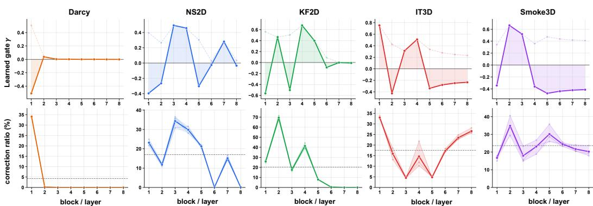  
Figure 7: Learned residual scales and realized SRPA corrections. Columns show eight-layer profiles for Darcy, NS2D, KF2D, isotropic turbulence (IT3D), and Smoke3D. Top: solid curves show signed $\gamma _ { \ell } ;$ pale dashed curves show $| \gamma _ { \ell } |$ , with shading between the signed curve and zero. Bottom: correction ratios in slice-token space before deslicing and output projection, expressed as percentages. Thin curves show three fixed held-out cases; thick curves show their means, with shading spanning their range. Horizontal dashed lines indicate means across all cases and layers. Ratios use joint norms over heads, slices, and channels before case averaging. Layers are one-based; vertical scales vary across tasks. Neither shaded region is a confidence interval.

Observed organization and interpretation In the visualized case, Transolver concentrates routing and key access on a small subset of slices. Transolver-σ exhibits spatially structured routing across more slices, with key access distributed more broadly across the attention matrix. These patterns are consistent with our design of retaining distinct slice states while allowing cross-slice interaction to refine their representations. Together with the error reductions in Table 4, these visualizations illustrate learned slice organization and effective residual refinement.

## Layer-wise SRPA Corrections

Measurement protocol We analyze one trained Transolver-σ checkpoint per task using the final eight-block configurations in Table 8, consistent with Table 7. Each block’s signed residual scale γ is read directly from the checkpoint and is independent of the evaluated input. Correction ratios are measured on three fixed held-out cases per task, each processed separately with batch size one. Single-step evaluation uses the training normalization and input window, without updating model parameters. Read-only hooks capture slice states and attention responses before deslicing and output projection; enabling the hooks leaves all evaluated predictions unchanged.

Table 8: Checkpoint configurations for layer-wise SRPA analysis. L, $C , n _ { h }$ , M, and K denote block count, total hidden width, attention heads, slices, and Fourier modes per axis, respectively. IT3D denotes isotropic turbulence.
<table><tr><td>Task</td><td>Grid</td><td>L</td><td>C</td><td> $n _ { h }$  M</td><td>K</td></tr><tr><td>Darcy</td><td> $8 5 ^ { 2 }$ </td><td>8</td><td>128</td><td>8 32</td><td>4</td></tr><tr><td>NS2D</td><td> $6 4 ^ { 2 }$ </td><td>8</td><td>256</td><td>8 32</td><td>4</td></tr><tr><td>KF2D</td><td> $1 2 8 ^ { 2 }$ </td><td>8</td><td>128</td><td>8 32</td><td>8</td></tr><tr><td>IT3D</td><td> $6 0 ^ { 3 }$ </td><td>8</td><td>128</td><td>8 32</td><td>6</td></tr><tr><td>Smoke3D</td><td> $6 4 ^ { 3 }$ </td><td>8</td><td>128</td><td>8 32</td><td>6</td></tr></table>

Joint-head correction ratio We retain the zero-based block index ℓ from Section 3.1; the figure labels this block as Layer ℓ + 1. For case c and head r, let $\mathbf { Z } _ { \ell , c } ^ { ( r ) } \in \mathbb { R } ^ { M \times d _ { h } }$ denote the incoming slice states, with $d _ { h } = C / ( 2 n _ { h } )$ . The unscaled attention response from Equation 3 is $\Delta \mathbf { Z } _ { \ell , c } ^ { ( r ) }$ ; the actual residual correction is $\gamma _ { \ell } \Delta \mathbf { Z } _ { \ell , c } ^ { ( r ) }$ . For nonzero input-state norm, the measured ratio is

$$
\begin{array} { r l r } {  { \Delta \mathbf { Z } _ { \ell , c } ^ { ( r ) } = \mathbf { A } _ { \ell , c } ^ { ( r ) } \mathbf { Z } _ { \ell , c } ^ { ( r ) } \mathbf { W } _ { v , \ell } , } } \\ & { } & { \rho _ { \ell , c } = | \gamma _ { \ell } | \frac { ( \displaystyle \sum _ { r = 1 } ^ { n _ { h } } \displaystyle \sum _ { m = 1 } ^ { M } \displaystyle \sum _ { j = 1 } ^ { d _ { h } } [ \Delta \mathbf { Z } _ { \ell , c } ^ { ( r ) } ] _ { m j } ^ { 2 } ) ^ { 1 / 2 } } { ( \displaystyle \sum _ { r = 1 } ^ { n _ { h } } \displaystyle \sum _ { m = 1 } ^ { M } \displaystyle \sum _ { j = 1 } ^ { d _ { h } } [ \mathbf { Z } _ { \ell , c } ^ { ( r ) } ] _ { m j } ^ { 2 } ) ^ { 1 / 2 } } . } \end{array}\tag{44a}
$$

(44b)

This is a single vectorized $L _ { 2 }$ norm ratio over all heads, slices, and channels, not an arithmetic mean of per-head ratios. Unlike the routing and attention maps in Figure $5 ( \mathrm { c } , \mathrm { d } )$ , the tensors are not averaged over heads before measurement. We then average per-case ratios over cases and layers:

$$
\overline { { \rho } } _ { \ell } = \frac { 1 } { 3 } \sum _ { c = 1 } ^ { 3 } \rho _ { \ell , c } ,
$$

$$
\overline { { \rho } } = \frac { 1 } { L } \sum _ { \ell = 0 } ^ { L - 1 } \overline { { \rho } } _ { \ell } .\tag{45}
$$

Figure 7 reports percentage ratios; ranges reflect variation across inputs rather than training seeds.

Observed correction profiles Darcy’s mean correction ratio falls from 34.03% in Layer 1 to 0.20% in Layer 2, with all later layers at approximately 0.004% or less. By contrast, Smoke3D maintains 16.75%–34.86% across all eight layers. NS2D and KF2D exhibit selective multi-layer corrections with near-zero responses in some later layers, while IT3D retains measurable corrections throughout all eight layers, with stronger corrections in its final two layers. Scale magnitude alone does not determine correction strength. In KF2D, Layer 4 has larger |γ| than Layer 2 (0.679 vs. 0.465), but a smaller correction ratio (41.44% vs. 69.51%). Together, the profiles reveal how the trained model distributes residual interactions across tasks and layers. Darcy concentrates slice refinement near the network input, whereas Smoke3D sustains substantial corrections throughout all eight layers. The correction ratio captures the joint contribution of the learned scale and attention response, while the sign of $\gamma _ { \ell }$ determines the correction’s orientation. These measurements complement Table 4 by locating and quantifying residual slice interactions.

## D.2 SHOWCASES

These cases extend the main-text comparison in Figure 6 with successive rollout leads for physicalonly, spectral-only, and joint models. They complement the aggregate curves in Figure 4; each visualization concerns one case, not a dataset-wide statistic.

Error-map conventions In Figure 6, each task uses the same test sample, prediction time, and physical variable or channel set across models. Scalar error maps show absolute prediction errors; maps combining multiple channels use the channel-wise $L ^ { 2 }$ norm at each spatial location. Spatial views, colormaps, and error limits are shared across models within each task. Reference fields use their own value scales, while brighter error-map colors indicate larger deviations from the reference.

Autoregressive cases Figures 8–11 show one case each for NS2D, KF2D, isotropic turbulence (IT3D), and Smoke3D. Rows correspond to Physolver, Specsolver, and Transolver-σ from top to bottom; columns indicate successive physical prediction leads. Predictions are fed back without future observations, following the rollout protocol in Appendix B.2. The displayed fields are vorticity ω in NS2D and KF2D, x-velocity $u _ { x }$ in IT3D, and smoke density d in Smoke3D. Each panel shows the pointwise absolute error in the displayed field. Within each dataset, all models and leads share one error scale, with its upper limit set by the 99.5th error percentile.

Three-dimensional visualization For IT3D and Smoke3D, we apply light three-dimensional Gaussian smoothing to the error volume, with a standard deviation of 0.75 grid cells. The smoothed volume is projected along each spatial direction onto three outer cube faces, with selected high-error interior voxels retained. Smoothing and color saturation affect only the visualization; the quantitative metrics are computed from unsmoothed arrays.

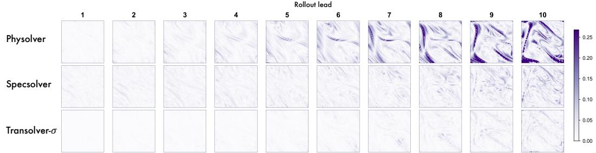  
Figure 8: Autoregressive error maps on NS2D. Columns show leads 1–10 for the same test case. Rows show Physolver, Specsolver, and Transolver-σ from top to bottom, using a shared error scale. Physolver develops pronounced error bands at later leads; Transolver-σ retains weaker spatial errors across the displayed sequence.

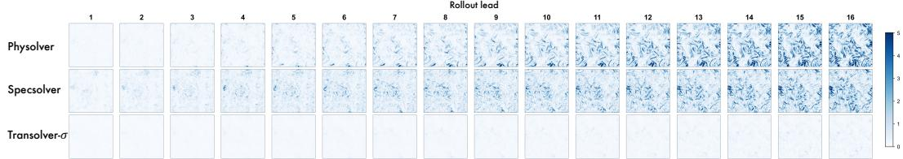  
Figure 9: Autoregressive error maps on KF2D. Columns show leads 1–16 for the same test case. Rows show Physolver, Specsolver, and Transolver-σ from top to bottom, using a shared error scale. Errors are more prominent in both single-domain models than in Transolver-σ.

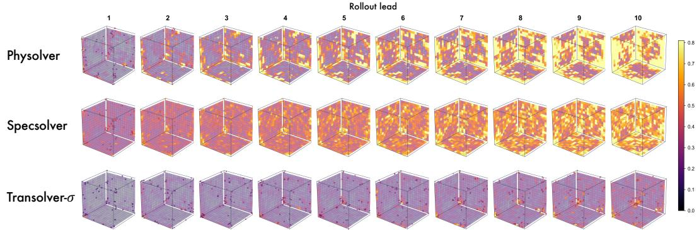  
Figure 10: Autoregressive error maps on isotropic turbulence (IT3D). Columns show leads 1–10 for the same test case. Rows show Physolver, Specsolver, and Transolver-σ from top to bottom, using a shared error scale. The single-domain models develop more extensive high-error regions at later leads than Transolver-σ.

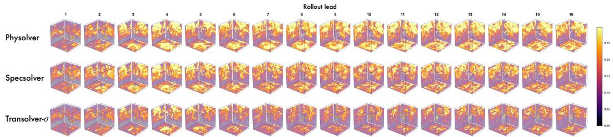  
Figure 11: Autoregressive error maps on Smoke3D. Columns show leads 1–16 for the same test case. Rows (top to bottom): Physolver, Specsolver, and Transolver-σ, all sharing one error scale. Transolver-σ has weaker localized errors at later leads; spatial patterns evolve non-monotonically.

## E ADDITIONAL EXPERIMENTS

Additional REALM Results Table 9 reports the complete results on IgnitHIT and EvolveJet, including correlation and training, validation, and test errors. Metric scales and baseline sources are specified in Appendices B.2 and B.3; Table 7 summarizes the matched experimental configurations.

(c) Parameter Scaling  
Table 9: Results on REALM. Correlation (×100, higher is better) and training, validation, and test errors (lower is better) on IgnitHIT and EvolveJet. Errors follow the original benchmark scale, and baseline results are taken from the official comparison. Our results are averaged over three training runs evaluated at their final checkpoints; standard deviations are provided in Appendix E.2. Best and second-best results are bold and underlined, respectively.
<table><tr><td rowspan="2">MODELS</td><td colspan="4">IGNITHIT</td><td colspan="4">EVOLVEJET</td></tr><tr><td>Corr</td><td>train</td><td>val</td><td>test</td><td>Corr</td><td>train</td><td>val</td><td>test</td></tr><tr><td>CNext</td><td>96.09</td><td>2.47</td><td>3.17</td><td>2.71</td><td>92.56</td><td>1.06</td><td>4.25</td><td>2.59</td></tr><tr><td>CROP</td><td>94.91</td><td>0.20</td><td>5.24</td><td>4.37</td><td>84.95</td><td>1.66</td><td>3.70</td><td>3.41</td></tr><tr><td>DPOT</td><td>94.19</td><td>1.47</td><td>6.15</td><td>5.90</td><td>87.71</td><td>2.10</td><td>5.32</td><td>3.36</td></tr><tr><td>DeepONet</td><td>68.60</td><td>39.63</td><td>48.54</td><td>48.25</td><td>62.20</td><td>7.85</td><td>28.79</td><td>18.33</td></tr><tr><td>F-FNO</td><td>97.36</td><td>0.52</td><td>1.86</td><td>1.87</td><td>95.08</td><td>0.54</td><td>2.50</td><td>0.98</td></tr><tr><td>FNO</td><td>92.49</td><td>5.50</td><td>8.45</td><td>6.91</td><td>90.40</td><td>0.96</td><td>7.21</td><td>2.97</td></tr><tr><td>FactFormer</td><td>95.70</td><td>0.62</td><td>2.74</td><td>2.91</td><td>92.76</td><td>0.57</td><td>2.15</td><td>1.54</td></tr><tr><td>GNOT</td><td>92.71</td><td>8.18</td><td>12.94</td><td>13.38</td><td>85.81</td><td>5.03</td><td>12.57</td><td>7.47</td></tr><tr><td>ONO</td><td>78.76</td><td>38.21</td><td>46.32</td><td>39.60</td><td>37.45</td><td>75.29</td><td>88.59</td><td>70.96</td></tr><tr><td>Transolver</td><td>86.85</td><td>14.86</td><td>23.25</td><td>13.93</td><td>50.62</td><td>71.50</td><td>77.78</td><td>56.10</td></tr><tr><td>U-NO</td><td>93.94</td><td>1.03</td><td>4.88</td><td>5.59</td><td>86.09</td><td>4.16</td><td>5.31</td><td>4.09</td></tr><tr><td>Transolver-σ</td><td>98.49</td><td>0.47</td><td>1.50</td><td>1.49</td><td>95.93</td><td>0.03</td><td>1.31</td><td>0.63</td></tr></table>

## E.1 MODEL SCALABILITY

We study scalability on Darcy flow along three axes: training-set size, spatial resolution, and model capacity controlled by hidden width. Figure 12 shows decreasing prediction errors along all three axes, with progressively smaller gains toward the largest settings.

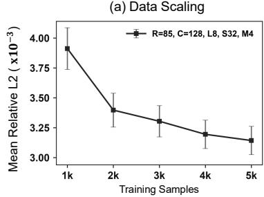

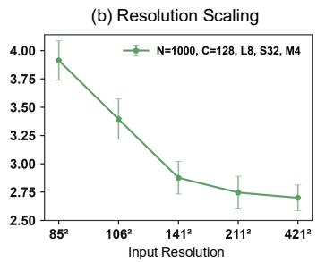

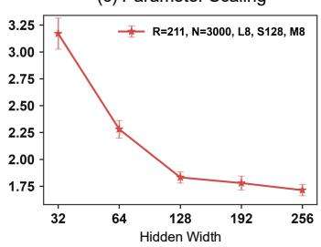  
Figure 12: Scalability on Darcy flow. Relative $L ^ { 2 }$ error as a function of (a) training-set size, (b) grid resolution, and (c) hidden width. Each point is the mean over the same 200 test cases; error bars show $1 . 9 6 s / \sqrt { 2 0 0 }$ , where s is the standard deviation of the per-case errors. The legends use S for slices and M for Fourier modes, corresponding to M and K in the manuscript.

Experimental settings All configurations use eight blocks, eight attention heads, MLP ratio two, and no dropout, with a global batch size of four. We train with AdamW and a OneCycle schedule, using peak learning rate $1 0 ^ { - 3 } .$ , weight decay $1 0 ^ { - 5 }$ , and warmup fraction 0.3. The objective combines relative $L ^ { 2 }$ loss with derivative loss weighted by 0.1, and evaluation uses the final checkpoint. Table 10 summarizes the three sweeps, each with its own fixed training settings.

Data scaling We increase the training set from 1,000 to 5,000 cases while fixing resolution $8 5 ^ { 2 }$ width 128, 32 slices, and four Fourier modes. Each configuration uses 200 epochs and 1,245,289 trainable parameters. The initial training set is extended using the same Darcy generation process, while the 200 test cases remain fixed. Mean relative error decreases from 0.003912 to 0.003143, a 19.7% reduction, with the largest gain between 1,000 and 2,000 training cases.

Resolution scaling We train at resolutions $8 5 ^ { 2 } , 1 0 6 ^ { 2 } , 1 4 1 ^ { 2 } , 2 1 1 ^ { 2 }$ , and $4 2 1 ^ { 2 }$ , obtained from the original $4 2 1 ^ { 2 }$ fields with strides 5, 4, 3, 2, and 1. All resolutions use 1,000 training cases, width 128, 32 slices, four Fourier modes, and 200 epochs. The parameter count remains fixed at 1,245,289, and each model is evaluated on its corresponding grid. Increasing resolution reduces mean error from 0.003912 to 0.002699, a 31.0% improvement, showing the benefit of finer spatial discretization.

Parameter scaling We increase hidden width from 32 to 256, using 3,000 training cases, resolution $2 1 1 ^ { 2 }$ , 128 slices, eight Fourier modes, and 100 epochs. The parameter count increases from 125,161 to 6,964,889, while mean error decreases from 0.003170 to 0.001713, a 46.0% reduction. The strongest gains occur up to width 128, followed by smaller improvements at widths 192 and 256. Together, these results show that the model benefits from additional data, finer grids, and increased capacity within the evaluated Darcy settings.

Table 10: Darcy scaling results. Relative $L ^ { 2 }$ errors $( \times 1 0 ^ { - 3 } )$ are mean ± standard deviation across 200 test cases. Data and resolution sweeps use 200 epochs; width scaling uses 100.
<table><tr><td colspan="6">Data scaling:  $8 5 ^ { 2 } ~ g r i d , C = 1 2 8 , M = 3 2 , K = 4$ </td></tr><tr><td>Training cases Error</td><td>1,000 3.912 ± 1.259</td><td>2,000  $3 . 3 9 7 \pm 1 . 0 2 2$ </td><td>3,000 3.304 ± 0.943</td><td>4,000  $3 . 1 9 5 \pm 0 . 8 5 9$ </td><td>5,000 3.143 ± 0.853</td></tr><tr><td colspan="6">Resolution scaling: 1,000 training cases,</td></tr><tr><td>Grid</td><td> $8 5 ^ { 2 }$ </td><td> $1 0 6 ^ { 2 }$ </td><td> $C = 1 2 8 , M = 3 2 , K = 4$   $1 4 1 ^ { 2 }$ </td><td> $2 1 1 ^ { 2 }$ </td><td> $4 2 1 ^ { 2 }$ </td></tr><tr><td>Error</td><td>3.912 ± 1.259</td><td>3.394 ± 1.281</td><td> $2 . 8 7 6 \pm 1 . 0 4 2$ </td><td> $2 . 7 4 5 \pm 1 . 0 4 3$ </td><td>2.699 ± 0.812</td></tr><tr><td colspan="6">Parameter scaling: 3,000 training cases, 2112 grid, M = 128, K = 8</td></tr><tr><td>Width C</td><td>32</td><td>64</td><td>128</td><td>192</td><td>256</td></tr><tr><td>Parameters</td><td> $1 2 5 , 1 6 1$ </td><td>462,937</td><td> $1 , 7 7 6 , 4 8 9$ </td><td> $^ { 3 , 9 4 6 , 3 7 7 }$ </td><td>6,964,889</td></tr><tr><td></td><td></td><td></td><td> $1 . 8 3 2 \pm 0 . 3 8 8$ </td><td> $1 . 7 7 9 \pm 0 . 4 7 3$ </td><td></td></tr><tr><td>Error</td><td> $3 . 1 7 0 \pm 1 . 0 4 1$ </td><td> $2 . 2 8 0 \pm 0 . 5 9 4$ </td><td></td><td></td><td> $1 . 7 1 3 \pm 0 . 3 8 3$ </td></tr></table>

## E.2 STANDARD DEVIATIONS

We report means and sample standard deviations over three independent training runs, using seeds 42, 43, and 44 and each run’s final checkpoint. Tables 11–13 cover the canonical benchmarks, RealPDEBench, and REALM, respectively. Following the main comparisons, we include the strongest baseline for each metric to place the variation across runs in context. Transolver-σ reduces mean errors on canonical and RealPDEBench tasks, and improves correlations and test errors on REALM.

Table 11: Standard deviations on the canonical benchmarks. Relative $L ^ { 2 }$ errors (%) are reported as mean ± standard deviation over three training runs. Strongest baseline values are taken from Table 1: DRIFT-Net for Darcy, FactFormer for NS2D and Smoke3D, and EddyFormer for KF2D and IT3D.
<table><tr><td rowspan="2">Model</td><td>Darcy</td><td>NS2D</td><td colspan="2">KF2D</td><td colspan="2">IT3D</td><td colspan="2">Smoke3D</td></tr><tr><td>p</td><td>ω</td><td>Avg.</td><td>Final</td><td>u</td><td>p</td><td>u</td><td>d</td></tr><tr><td>Strongest baseline Transolver-σ</td><td>0.45  $0 . 4 0 { \scriptstyle \pm 0 . 0 1 }$ </td><td>4.23  $2 . 7 9 _ { \pm 0 . 0 5 }$ </td><td>12.69  $2 . 5 2 _ { \pm 0 . 0 5 }$ </td><td>21.99  $4 . 1 4 _ { \pm 0 . 0 7 }$   $1 0 . 8 0 { \scriptstyle \pm 0 . 1 6 }$ </td><td>12.70</td><td>19.43</td><td>23.37</td><td>9.19</td></tr></table>

Table 12: Standard deviations on RealPDEBench. Our entries show mean ± standard deviation across three training runs; all metrics retain the 100× display scale of the main comparison. Strongest baseline values are taken from Table 2.
<table><tr><td>Metric</td><td>Model</td><td>Controlled Cylinder</td><td>FSI</td><td>Foil</td><td>Combustion</td></tr><tr><td>RMSE</td><td>Strongest baseline Transolver-σ</td><td>0.80  $0 . 6 5 0 { \scriptstyle \pm 0 . 0 1 0 }$ </td><td>0.85  $0 . 7 4 3 { \scriptstyle \pm 0 . 0 1 5 }$ </td><td>1.00  $0 . 4 7 0 { \scriptstyle \pm 0 . 0 1 0 }$ </td><td>2.08  $1 . 8 6 0 _ { \pm 0 . 0 4 0 }$ </td></tr><tr><td>Relative  $L ^ { 2 }$ </td><td>Strongest baseline Transolver-σ</td><td>5.55  $5 . 2 0 0 { \scriptstyle \pm 0 . 0 8 0 }$ </td><td>5.83  $5 . 5 5 0 { \scriptstyle \pm 0 . 0 8 0 }$ </td><td>1.59  $1 . 4 0 3 { \scriptstyle \pm 0 . 0 2 5 }$ </td><td>53.31  $5 2 . 8 5 7 { \scriptstyle \pm 0 . 5 5 0 }$ </td></tr><tr><td>fRMSE</td><td>Strongest baseline Transolver-σ</td><td>0.09  $0 . 0 6 0 { \scriptstyle \pm 0 . 0 0 2 }$ </td><td>0.07  $0 . 0 6 0 { \scriptstyle \pm 0 . 0 0 2 }$ </td><td>0.10  $0 . 0 8 0 { \scriptstyle \pm 0 . 0 0 2 }$ </td><td>0.24  $0 . 1 8 0 { \scriptstyle \pm 0 . 0 0 4 }$ </td></tr></table>

Table 13: Standard deviations on REALM. Our entries show mean ± standard deviation over three training runs. Correlations are multiplied by 100; errors retain the benchmark scale. Strongest baseline values are taken from Table 9.
<table><tr><td>Dataset</td><td>Model</td><td>Correlation</td><td>Train error</td><td>Val. error</td><td>Test error</td></tr><tr><td>IgnitHIT</td><td>Strongest baseline Transolver-σ</td><td>97.36 98.493±0.267</td><td>0.20 0.470±0.010</td><td>1.86 1.503±0.035</td><td>1.87 1.493±0.035</td></tr><tr><td>EvolveJet</td><td>Strongest baseline Transolver-σ</td><td>95.08 95.930±0.255</td><td>0.54 0.030±0.001</td><td>2.15 1.310±0.030</td><td>0.98 0.630±0.020</td></tr></table>

## E.3 EXACT ROLLOUT ERROR DECOMPOSITION

The local expansion in Appendix A.3 separates new prediction error from the response to an imperfect history. We measure these contributions along free rollouts using an exact decomposition of the prediction error into injection, propagation, and their interaction.

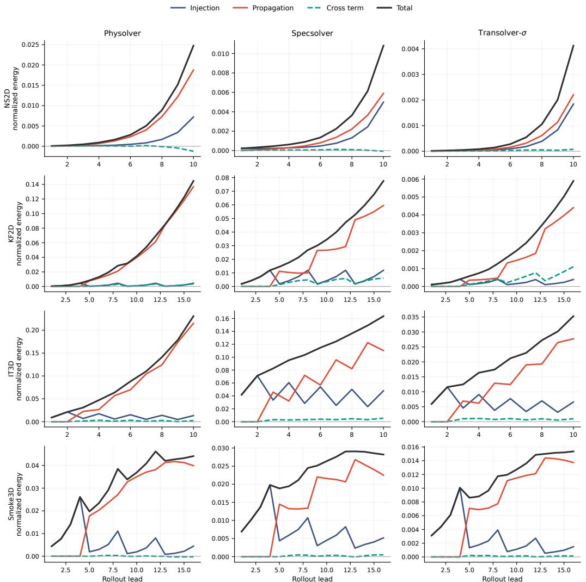  
Figure 13: Exact error decomposition during free rollout. Rows correspond to NS2D, KF2D, IT3D, and Smoke3D; columns compare Physolver, Specsolver, and Transolver-σ. Injection, propagation, and their signed cross term sum to the total normalized error energy in Equation 47. Panel-specific vertical scales must be read when comparing magnitudes. The KF2D spectral-only model retains eight modes per axis. Leads count predicted frames; the associated block lengths are 1, 4, 2, 4. The decomposition tracks how local prediction errors and feedback-induced deviations jointly contribute to rollout error.

Evaluation setup We compare physical-only, spectral-only, and joint models on the same cases, observed histories, output-block lengths, and rollout horizons within each task. The joint model uses the parallel spectral–physical architecture in Section 3.1, with the canonical configurations in Table 7. Table 14 lists evaluation samples, output-block lengths, and prediction horizons.

Table 14: Evaluation settings for the exact error decomposition. n counts trajectories (windows for KF2D); $T _ { \mathrm { o u t } }$ denotes output frames per call and H the total horizon.
<table><tr><td>Task</td><td>n</td><td> $T _ { \mathrm { o u t } }$ </td><td>H</td></tr><tr><td>NS2D</td><td>200</td><td>1</td><td>10</td></tr><tr><td>KF2D</td><td>400</td><td>4</td><td>16</td></tr><tr><td>IT3D</td><td>100</td><td>2</td><td>10</td></tr><tr><td>Smoke3D</td><td>200</td><td>4</td><td>16</td></tr></table>

Exact decomposition and aggregation For a fixed model $f ,$ let $\mathbf { x } _ { k }$ and $\widehat { \mathbf { x } } _ { k }$ denote the true and freely rolled-out histories at block boundary k. All outputs below are expressed in the physical units used for evaluation. For the reference output block $\mathbf { y } _ { k } .$ , define

$$
\begin{array} { r l } & { \delta _ { k } = f ( \mathbf { x } _ { k } ) - \mathbf { y } _ { k } , } \\ & { \pi _ { k } = f ( \widehat { \mathbf { x } } _ { k } ) - f ( \mathbf { x } _ { k } ) , } \\ & { \mathbf { e } _ { k } = f ( \widehat { \mathbf { x } } _ { k } ) - \mathbf { y } _ { k } = \delta _ { k } + \pi _ { k } . } \end{array}\tag{46}
$$

True-history predictions measure error injection; their difference from free-history predictions measures accumulated history effects. At each lead, we extract the corresponding frame from these blocks. For a nonzero target frame $\mathbf { y } ,$ , normalized error energy satisfies

$$
\frac { \| \mathbf { e } \| _ { 2 } ^ { 2 } } { \| \mathbf { y } \| _ { 2 } ^ { 2 } } = \underbrace { \frac { \| \delta \| _ { 2 } ^ { 2 } } { \| \mathbf { y } \| _ { 2 } ^ { 2 } } } _ { \mathrm { i n j e c t i o n } } + \underbrace { \frac { \| \boldsymbol { \pi } \| _ { 2 } ^ { 2 } } { \| \mathbf { y } \| _ { 2 } ^ { 2 } } } _ { \mathrm { p r o p a g a t i o n } } + \underbrace { \frac { 2 \langle \delta , \boldsymbol { \pi } \rangle } { \| \mathbf { y } \| _ { 2 } ^ { 2 } } } _ { \mathrm { c r o s s t e r m } } .\tag{47}
$$

We compute each normalized term per case and then average over cases at each lead. The cross term is signed and records alignment or cancellation between the two error components. The total is the mean squared relative error, providing an additive energy view of the rollout errors in Figure 4. For multi-frame outputs, the true history is supplied at each block boundary, and all frames in that block share this conditioning. Norms jointly cover spatial positions and all output fields in each evaluated frame. Predictions and targets are denormalized before measurement. For Smoke3D, we apply the prescribed Dirichlet boundary operator to predictions before forming both diagnostic components.

Error accumulation during rollout Figure 13 shows that propagation energy exceeds injection energy at the final lead in all twelve panels. This highlights the contribution of accumulated history error to finite-horizon prediction. For NS2D, the physical-only model’s final injection and propagation energies are approximately 0.00720 and 0.01876, compared with 0.00184 and 0.00221 for the joint model. Thus, the joint model reduces both fresh prediction error and the feedback-induced component along its rollout trajectory in this comparison. The signed cross term explains how these components combine, including partial cancellation in the physical-only NS2D result. For multiframe outputs, the within-block variation reflects changing prediction lead under a shared input history. Together, these measurements complement the prediction-error curves by separating fresh prediction error, feedback-induced deviations, and their interaction.

## F FULL EFFICIENCY ANALYSIS

We complement Figure 5(a,b) with the configurations and measurement protocol used to compare training costs on NS2D and Kolmogorov flow. We compare HPM, DRIFT-Net, FactFormer, Transolver, and Transolver-σ, covering hybrid and attention-based PDE solvers.

Model configurations Table 15 lists the dedicated efficiency configurations. For HPM, Fact-Former, Transolver, and Transolver-σ, we match backbone depth, hidden width, and head count within each task. DRIFT-Net uses its official T hierarchy, and each model retains its native operator structure. For Transolver-σ, both the accuracy and efficiency experiments on Kolmogorov flow use eight blocks and eight Fourier modes per axis.

HPM and Transolver use their structured-mesh implementations with MLP ratio two, reference size eight, and unified positional encoding. FactFormer uses rotary positions, kernel and latent multipliers of two, and head dimension 64. DRIFT-Net uses stage depths (4, 4, 4, 4), widths (48, 96, 192, 384), head counts (3, 6, 12, 24), and skip settings (2, 2, 2, 0), with MLP ratio four. Its ConvNeXt residual and spectral branch are retained. Transolver-σ uses shared CPE, equal-width physical and spectral subspaces, and full-channel SwiGLU recomposition with MLP ratio two. Its NS2D implementation uses fused scaled dot-product attention for the slice-residual update.

Table 15: Model configurations for training-efficiency measurements. $L , C ,$ and h denote backbone depth, width, and head count; M and K denote slice count and retained Fourier modes per axis. Model-specific settings preserve the respective native operator structures.
<table><tr><td>Model</td><td>NS2D (L, C, h)</td><td>Kolmogorov (L, C, h)</td><td>Operator settings</td></tr><tr><td>HPM</td><td>(8,256, 8)</td><td>(8, 128, 8)</td><td>128 fixed frequencies</td></tr><tr><td>DRIFT-Net</td><td></td><td>Official T hierarchy</td><td>Patch 4, window 16</td></tr><tr><td>FactFormer</td><td>(8,256,8)</td><td>(8, 128, 8)</td><td>Head dimension 64</td></tr><tr><td>Transolver</td><td>(8,256,8)</td><td>(8,128,8)</td><td>M = 32</td></tr><tr><td>Transolver-σ</td><td>(8,256,8)</td><td>(8, 128, 8)</td><td> $M = 3 2$   $K = 4 \mathrm { ( N S 2 D ) } , K = 8 \mathrm { ( K F 2 D ) }$ </td></tr></table>

Training workloads NS2D uses 1,000 unnormalized vorticity trajectories on a $6 4 ^ { 2 }$ grid, with ten history frames and ten supervised frames. Each update accumulates gradients from ten single-frame predictions, advances the history with the reference frames, and performs one AdamW step. The loss sums per-sample, per-frame relative $L ^ { 2 }$ errors. With batch size two, an epoch contains 500 optimizer updates and 5,000 batched forward passes with their associated backward passes.

Kolmogorov uses 100 training trajectories, spatially downsampled to $1 2 8 ^ { 2 }$ and temporally subsampled by a factor of two. Each trajectory contains 160 sampled frames, normalized using training statistics, and provides 134 windows with ten history frames and sixteen available forecast frames. The timed workload supervises four frames per window, giving 13,400 windows and 6,700 updates per epoch at batch size two. Each update evaluates relative $\overline { { L ^ { 2 } } }$ loss over the four-frame outputs and performs one backward pass and one AdamW step. FactFormer retains four internal latentpropagation steps. Learning rates are $1 0 ^ { - 3 }$ for NS2D and $5 \times 1 0 ^ { - 4 }$ for Kolmogorov, with weight decays $1 0 ^ { - 5 }$ and $1 0 ^ { - 4 }$ , respectively.

Time and memory measurements All models are measured sequentially on the same GPU in FP32, with TF32 and cuDNN benchmarking disabled. We use Python 3.12.3, CUDA 12.8, and PyTorch 2.7, with identical data-loading settings across models within each task. After twenty warmup updates, we time complete training epochs with CUDA synchronization at the start and end. Timing includes data loading, device transfer, gradient clearing, forward and backward computation, and optimizer updates. Validation, visualization, checkpoint saving, and logging are outside the timed region. We report mean epoch time and sample standard deviation over three independent timing processes, varying model order across rounds.

Peak training memory is the maximum allocated GPU tensor memory, including parameters, gradients, optimizer states, and activations, in decimal GB. Parameter storage is the total byte size of parameter tensors, including frozen and complex-valued parameters, in decimal MB. Ordinary buffers and optimizer states contribute to training memory but are excluded from parameter storage.

Efficiency comparison Transolver-σ has the lowest parameter storage among the compared models on both tasks, together with competitive epoch times. On NS2D, it uses 19.44 MB compared with FactFormer’s 66.92 MB, a reduction of approximately 71%. Their mean epoch times are 200.132 and 210.461 seconds, respectively, corresponding to approximately 1.05× training throughput under the matched workload. Parameter storage and peak training memory capture different costs: HPM’s Kolmogorov configuration includes 33.55 MB of frozen frequency bases within its 39.92 MB parameter storage. Transolver-σ also uses a 4.19 MB positional buffer, which is included in peak training memory. These measurements characterize the storage and computational costs of the operator configurations under each task’s training workload.