# VIF-BENCH: EVALUATING VISUAL INSTRUCTION FOL-LOWING IN MULTI-REFERENCE IMAGE GENERATION

Yuta Oshima<sup>1,∗</sup> Masakazu Yoshimura<sup>1,∗</sup> Masahiro Suzuki<sup>1</sup>

Yutaka Matsuo<sup>1</sup> Hiroki Furuta

<sup>1</sup>The University of Tokyo

{yuta.oshima, masakazu.yoshimura}@weblab.t.u-tokyo.ac.jp

## ABSTRACT

Recent multimodal image generation models can take multiple images and textual instructions as input, enabling reference-based generation guided not only by text but also by visual instructions such as layouts, arrows, and pose cues. However, existing benchmarks do not evaluate the joint setting in which multiple references must be composed under multiple and heterogeneous visual-instruction images. To address this gap, we introduce VIF-Bench, a benchmark of 1,241 tasks designed to assess the edge of model capabilities in this joint setting by covering: (i) multi-reference generation (up to 7) under multiple heterogeneous visual instructions (up to 6), (ii) cases where reference images can potentially compete with visual instructions (e.g., a strongly posed subject vs. a target pose), and (iii) controlled comparison of visual instructions with text descriptions at different levels of specificity. Using these capabilities, we uncover three findings: (1) models face an adherence–artifact trade-off: once models reach stronger visual instruction adherence, stronger adherence tends to coincide with more instruction artifacts in generated images, (2) visual instruction adherence tends to be lower on tasks whose reference images carry a salient state of the controlled attribute (e.g., a neon-lit subject under a light-direction instruction), most consistently for light and wind, and (3) for models that can understand visual instructions, it is often better to provide visual constraints directly rather than describe them in text; when using text, a moderate level of detail works better than an exhaustive description. VIF-Bench is released as an open benchmark to establish a basis for fair comparison in controllable multi-reference image generation.

## 1 INTRODUCTION

Recent image generation models, built on large multimodal LLM backbones, have advanced to a stage where they can generate not only from textual prompts but also by understanding multiple reference images and visual control marks (Google DeepMind, 2025a;b; OpenAI, 2025a;c; Wu et al., 2025a). Both multi-reference image generation (Wu et al., 2025b; Xia et al., 2025b; Oshima et al., 2026b; Zhang et al., 2026b; Huang et al., 2026), which recomposes subjects and backgrounds in new contexts, and visual-instruction-following generation (Chen et al., 2025a; Zhang et al., 2026a; Xia et al., 2025a; Ghazanfari et al., 2025), which interprets control marks such as layouts, masks, and arrows, share a common foundation: they both rely on the visual understanding capability of VLMs to interpret visual inputs at a semantic rather than pixel level. In practical workflows, users want to specify not only what to generate but also how to compose it. Given multiple references, users may specify placement via layouts, 3D orientation cues (rendered as pyramids), and global effects such as wind or lighting via arrows. Such control is directly relevant to a wide range of applications, including advertising (Inoue et al., 2023; Morita et al., 2025), virtual try-on (Choi et al., 2024; Hu et al., 2026), and content creation (Ruiz et al., 2022; Zhou et al., 2024; Xu et al., 2026).

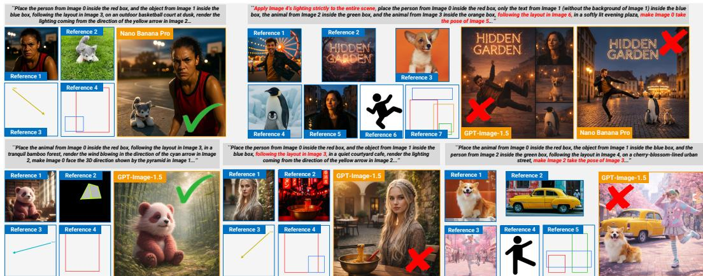  
Figure 1: Overview of VIF-Bench. VIF-Bench covers challenges in multi-reference, multi-visual-instruction settings, including multiple references (up to 7) with multiple visual instructions (up to 6) and potential reference– visual-instruction conflicts, such as lighting conflicts (bottom middle) or pose conflicts (bottom right). VIF-Bench covers various types of visual instructions, including layout, 3D orientation, pose, and wind/light direction.

However, existing benchmarks evaluate multi-reference generation and visual control largely in isolation, and therefore do not fully capture the challenges that arise when the two are combined. They do not evaluate how multiple independent subject references interact with multiple visual instruction images, especially when reference images interfere with the instructions. Moreover, a further challenge arises from how these visual controls are represented in recent multimodal generators. Unlike earlier approaches that rely on dedicated conditioning modules (Zhang et al., 2023b), recent models (Google DeepMind, 2025a; OpenAI, 2025a; Wu et al., 2025a) interpret layouts, arrows, and orientation cues directly as image inputs. This unified image-based interface introduces failure modes specific to visual instructions: models may reproduce the instruction marks themselves in the output or fail to preserve the intended constraint. Existing benchmarks do not capture these failure modes in settings with multiple references and heterogeneous visual instructions.

To evaluate this setting, we introduce VIF-Bench, which jointly assesses multi-reference composition and heterogeneous visual-instruction following (Figure 1). VIF-Bench comprises 1,241 tasks designed to assess the edge of model capabilities in this joint setting by covering: (i) multi-reference generation (up to 7) under multiple heterogeneous visual instructions (up to 6), (ii) cases where reference images can potentially compete with visual instructions (e.g., a strongly posed subject vs. a target pose), and (iii) controlled comparison of visual instructions with text descriptions at different levels of specificity. Using VIF-Bench, we identify three major findings: (1) models face an adherence–artifact trade-off: once models reach stronger visual instruction adherence, stronger adherence tends to coincide with more instruction artifacts, (2) visual instruction adherence tends to be lower on tasks whose reference images carry a salient state of the controlled attribute (e.g., a neon-lit subject under a light-direction instruction), most consistently for light and wind, and (3) for models that can understand visual instructions, it is often better to provide visual constraints directly rather than describe them in text; when using text, a moderate level of detail works better than an exhaustive description. These findings reveal limitations specific to jointly satisfying multiple references and heterogeneous visual constraints. We release VIF-Bench as an open benchmark for evaluating controllable multi-reference image generation.

## 2 RELATED WORKS

## 2.1 CONTROLLABLE TEXT-TO-IMAGE GENERATION

Diffusion models have achieved state-of-the-art performance in high-fidelity image synthesis (Sohl-Dickstein et al., 2015; Ho et al., 2020). Large pretrained diffusion models with textual conditioning, such as Stable Diffusion (Rombach et al., 2022; Podell et al., 2024; Esser et al., 2024) and FLUX (Labs, 2024; Labs et al., 2025), form the foundation of modern text-to-image generation. To improve controllability, prior work has introduced additional conditioning channels, including spatial maps such as edges, depth, segmentation, and boxes (Zhou et al., 2024; Zhang et al., 2023b; Li et al., 2023; Xu et al., 2026), as well as identity-preserving reference conditioning through fine-tuning or adapters (Ruiz et al., 2022; Ye et al., 2023; Mou et al., 2023). Recent multimodal image generation models further extend this direction by jointly processing text and image inputs within a unified framework. For example, closed-source systems such as GPT-Image (OpenAI, 2025a;c; 2026) and Nano Banana (Google DeepMind, 2025a;b; 2026) enable integrated image generation and editing from mixed text-image prompts. Similarly, open-source models such as Qwen-Image (Wu et al., 2025a) and FLUX Kontext (Labs et al., 2025) demonstrate high-quality and flexible image generation and editing, and numerous unified generative models continue to emerge (Wu et al., 2025a;b; Xia et al., 2025b; Wu et al., 2025c; Deng et al., 2025; Xie et al., 2024). These advances show that image generation models are becoming increasingly capable of interpreting heterogeneous inputs, including reference images, styles, spatial layouts, and other visual cues (Chen et al., 2025a; Xia et al., 2025a; Zhang et al., 2026a). VIF-Bench asks whether such models can actually follow these visual instructions when multiple reference subjects must be composed together.

Table 1: Comparison among major benchmarks for reference-based image generation, editing, and visualinstruction following. #Refs denotes the maximum number of reference images provided within a task, and #VIs denotes the maximum number of explicit visual-instruction images that can be combined within a single task. Reference–VI Conflict indicates whether the benchmark explicitly identifies potential conflict cases in which attributes implied by a reference image may compete with the corresponding visual instruction. VIF-Bench jointly evaluates multiple references and heterogeneous visual instructions while explicitly identifying reference– visual-instruction conflict. <sup>†</sup>DreamOmni3 only studies scribble-guided editing.
<table><tr><td>Benchmark</td><td>#Size</td><td>#Refs</td><td>#VIs</td><td>Reference-VI Conflict</td><td>Metrics</td></tr><tr><td>Without visual instructions</td><td></td><td></td><td></td><td></td><td></td></tr><tr><td>DreamBooth (Ruiz et al., 2022)</td><td>75</td><td>1</td><td></td><td>X</td><td>CLIP, DINO</td></tr><tr><td>OmniContext (Wu et al., 2025b)</td><td>400</td><td>3</td><td></td><td>x</td><td>GPT (3 dim.)</td></tr><tr><td>DreamOmni2 (Xia et al., 2025b)</td><td>319</td><td>4</td><td></td><td>x</td><td>Gemini, Doubao (ByteDance, 2025)</td></tr><tr><td>MultiBanana (Oshima et al., 2026b)</td><td>3,769</td><td>8</td><td></td><td>x</td><td>GPT, Gemini (5 dim.)</td></tr><tr><td>With visual instructions</td><td></td><td></td><td></td><td></td><td></td></tr><tr><td>MultiRef (Chen et al., 2025a)</td><td>1,990</td><td>6</td><td>1</td><td>X</td><td>GPT (3 dim), modality-specific metrics</td></tr><tr><td>VIBE (Zhang et al., 2026a)</td><td>1,034</td><td>1</td><td>1</td><td>x</td><td>GPT (3 dim.)</td></tr><tr><td>DreamOmni3 (Xia et al., 2025a)</td><td>731</td><td>4</td><td>2†</td><td>X</td><td>Gemini, Doubao (ByteDance, 2025)</td></tr><tr><td>VIF-Bench (Ours)</td><td>1,241</td><td>7</td><td>6</td><td></td><td>GPT, Gemini, Qwen (6 dim.)</td></tr></table>

## 2.2 BENCHMARKS FOR REFERENCE-BASED GENERATION

Benchmarks for reference-based image generation trace back to DreamBooth (Ruiz et al., 2022), which evaluates subject-driven generation conditioned on a single subject. Subsequent studies have extended this setting to multiple references, introducing benchmarks for multi-reference generation (Zong et al., 2024; Sushko et al., 2025; Wu et al., 2025b; Xia et al., 2025b; Oshima et al., 2026b; Chen et al., 2026). Other studies have extended this setting to visual instruction following. MultiRef (Chen et al., 2025a) supports multiple reference images, but each task uses at most a single visual-instruction image. VIBE (Zhang et al., 2026a) covers regions, morphological cues such as pose and orientation, and arrows, and can combine multiple visual operations within a single annotated image. DreamOmni3 (Xia et al., 2025a) supports up to two visual-instruction images, but focuses only on scribble-based control. Existing benchmarks therefore do not evaluate the joint setting targeted in this work, where multiple references must be composed simultaneously under several heterogeneous visual-instruction images. See Appendix E for further discussion.

## 3 VIF-BENCH

## 3.1 CONSTRUCTION OF VIF-BENCH

Image Collection. We construct the reference-image pool from both real and synthetic images. Real images are collected from LAION-5B (Schuhmann et al., 2022), DreamBooth (Ruiz et al., 2022), and DreamOmni2 (Xia et al., 2025b), while synthetic images are generated by Nano Banana (Google DeepMind, 2025a) and GPT-Image-1 (OpenAI, 2025a). Combining multiple data sources covers both common subject references and scarce attribute-specific references, such as hairstyle, makeup, facial expression, and object surface.

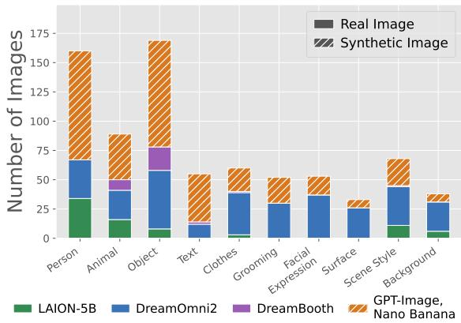

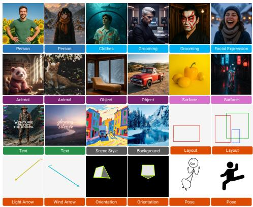  
Figure 2: (Left) Per-category counts of reference images in VIF-Bench, broken down into three families: Main Reference (i.e., person, animal, object, text), Sub Reference (i.e., clothes, grooming, facial expression, surface), and Scene Context (scene style, background). Combining multiple real-image datasets with synthetic images from image-generation models lets us populate not only the common Main Reference categories but also Sub Reference categories that are scarce in general-purpose datasets (e.g., grooming, facial expression, and object surface), yielding a balanced pool across the taxonomy. (Right) Examples of reference images and visual instructions sampled from VIF-Bench. We prepare various types of visual instructions, such as layout, light arrow, wind arrow, orientation, and human pose.

Category Classification. Following prior multi-reference image-generation benchmarks (Xia et al., 2025b; Oshima et al., 2026b), we hierarchically classify the collected images into three groups: Main Reference, Sub Reference, and Scene Context. GPT-5 (OpenAI, 2025b) first automatically labels the images, which we then manually verify and correct. Main Reference denotes the primary subject and consists of person, animal, object, and text. Objects are further divided into versatile, indoor-only, and outdoor-only according to their plausible placement environments. Sub Reference specifies attributes of a main subject: for people, we consider clothes, grooming (e.g., hairstyle and makeup), and facial expression; for objects, we consider surface properties such as color and material. Scene Context consists of scene style and background, which specify the overall appearance of the generated scene. This hierarchy prevents semantically inconsistent task construction, such as assigning a facial-expression reference to an object.

Task Construction. Each task is constructed by combining hierarchically organized reference images with visual instructions. The input conditions are broadly divided into per-subject conditions, associated with individual main subjects, and global conditions, associated with the scene as a whole. The former include sub-references, pose references, and 3D orientation pyramids, while the latter include style modifiers, backgrounds, and directional arrows. Concretely, we (1) sample $N _ { m a i n } \in \{ 1 , 2 , 3 , 4 \}$ main subjects together with their associated references, (2) ask GPT-5 (OpenAI, 2025b) to propose a bounding-box layout, per-subject 3D orientations, and wind/light arrow directions, which are then rendered as visual-instruction images, and (3) generate a textual instruction from the resulting reference structure using a deterministic template. These visual instructions are constructed to precisely specify the target spatial and geometric conditions and to enable unambiguous evaluation of instruction following, allowing task construction to scale to a large benchmark. To ensure task validity, all constructed tasks first undergo automatic consistency checks and are then verified by Gemini (Gemini Team, 2023) and human annotators; unnatural, ambiguous, or inconsistent tasks are corrected or removed. Pose references, orientation cues, and directional arrows follow visual-control formulations used in prior visual-instruction benchmarks (Zhang et al., 2026a). Bounding-box layouts are likewise a standard spatial-control interface widely used in prior work (Li et al., 2023; Zhou et al., 2024). Thus, while VIF-Bench procedurally generates visual instructions in a controlled manner for reliable evaluation, the instruction representations themselves follow established and practical visual-control paradigms. We additionally construct three text-converted variants for a stratified 200-task subset, enabling controlled comparison of instruction modality and specificity. Further construction details are provided in Appendix C.5.

Conflict Detection. We define conflict tasks as cases in which a reference image contains a salient state along an attribute that is also controlled by the corresponding visual instruction, creating the potential for the reference-implied state to compete with the requested control. For example, if a person in the reference image is strongly side-lit while a light arrow specifies frontal illumination, the model must override the lighting implied by the reference and follow the visual instruction. We identify conflict along four axes:

• Orientation conflict. A potential conflict is declared when the subject in the reference image has a clear facing direction, and the target orientation specified by the visual instruction departs substantially from it. Concretely, we target cases where the yaw difference between the reference and the instruction is large, or where the left/right facing direction is flipped.

• Light conflict. A potential conflict is declared when the reference image contains a distinctive light source that strongly shapes the scene’s appearance—such as neon or moonlight—rather than ordinary daylight or uniform illumination, and the task includes a light visual instruction.

• Wind conflict. We declare a potential conflict when the reference image contains elements whose appearance changes substantially under wind, such as hair or fabric, and the task includes a wind visual instruction.

• Pose conflict. We declare a potential conflict when a person in the reference image is in a clear, distinctive pose and a pose visual instruction is assigned to that person.

We do not define a conflict criterion for layout because layout specifies the spatial arrangement of the overall scene rather than an intrinsic attribute of a reference image. We first automatically label the reference-specific attributes required for these judgments with VLMs, then manually verify and correct them. By design, these labels identify potential conflicts based on reference content: orientation can be compared directly against the target via a yaw estimate, whereas for light, wind, and pose we flag cases where the controlled attribute is salient in the reference and must be re-rendered to satisfy the visual instruction. Further details for benchmark construction are shown in Appendix C.

## 3.2 STATISTICS IN VIF-BENCH

Image Statistics. The reference-image pool consists of 777 images (Figure 2; Left). Main Reference contains 160 person images, 89 animal images, 169 object images, and 55 text images. Sub Reference contains 60 clothes images, 52 grooming images, 53 facial-expression images, and 33 surface images. Scene Context contains 68 scene-style images and 38 background images. For text typography, such as language and font, we reuse the main text-reference pool. By source, 78 images are from LAION-5B (Schuhmann et al., 2022), 307 from DreamOmni2 (Xia et al., 2025b), 33 from DreamBooth (Ruiz et al., 2022), and 359 are synthetic images generated by Nano Banana (Google DeepMind, 2025a) and GPT-Image-1 (OpenAI, 2025a), resulting in a mixture of real and synthetic images.

Task Statistics. The evaluated set consists of 1,241 tasks. As shown in Figure 3 (a, b), the number of reference images and visual instructions per task is broadly distributed: tasks contain between 1 and 7 reference images (166, 272, 306, 299, 161, 32, and 5 tasks, respectively) and between 1 and 6 visual-instruction images (549, 493, 171, 23, 4, and 1 tasks, respectively). Broken down by type (Figure 3; c), layout is adopted in all 1,241 tasks and serves as the common backbone, with orientation (315), wind (250), light (233), and pose (141) co-occurring on top of it. We include layout in every task by design because spatial placement is a fundamental component of multi-reference composition and bounding boxes provide a simple, widely used control interface (Inoue et al., 2023; Feng et al., 2024), while the remaining visual instructions are layered on top as optional controls.

Conflict Statistics. Among the 1,241 tasks, 438 contain at least one conflict between a referenceimage attribute and its visual instruction, whereas 803 contain no such conflict. At the instruction-type level, orientation conflict cases occur in 106 of the 315 tasks containing an orientation instruction (33.7%), pose conflict in 82 of 141 pose tasks (58.2%), wind conflict in 153 of 250 wind tasks (61.2%), and light conflict in 172 of 233 light tasks (73.8%). Because a single task may contain multiple conflict types, these categories are not exclusive.

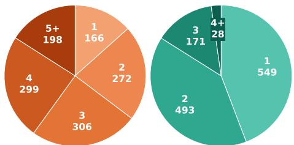  
(a) References per task (b) Visual instructions

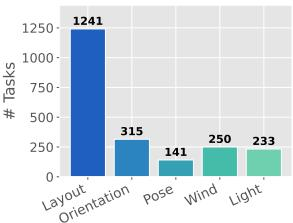  
(c) Adoption counts by kind

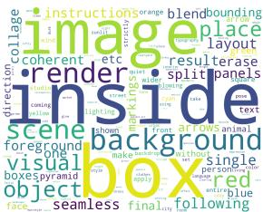  
(d) Word cloud

Figure 3: Statistics of the VIF-Bench evaluated set (1,241 tasks). (a) Distribution of the number of reference images per task. (b) Distribution of the number of visual-instruction images per task. (c) Adoption counts of visual instructions by kind. (d) Word cloud of the textual instructions. It primarily consists of terms that describe a wide range of object categories and words indicating spatial directions.

## 3.3 EVALUATION SETTING

Because large-scale human evaluation is prohibitively expensive, we adopt VLM-based evaluation, which is widely used in recent multimodal-generation benchmarks (Ku et al., 2023; Na et al., 2024; Oshima et al., 2025). Gemini 2.5 Flash (Gemini Team, 2023) and GPT-5 (OpenAI, 2025b) independently evaluate all generated images, and we report their average score. Following prior reference-based image-generation benchmarks (Ye et al., 2025; Wu et al., 2025b; Oshima et al., 2026b), we retain the core evaluation dimensions of instruction following, reference consistency, and overall image quality. We further separate overall image quality into Scene Coherence and Visual Quality for more fine-grained assessment. Accordingly, each image is evaluated on a 10-point scale along six criteria: Text Instruction Following, Reference Consistency, Vision Instruction Adherence, Visual Instruction Cleanliness, Scene Coherence, and Visual Quality. Text Instruction Following and Reference Consistency assess adherence to the textual instruction and preservation of reference subjects, while Scene Coherence and Visual Quality assess overall scene consistency and perceptual quality. To capture failure modes specific to image-based visual control in recent multimodal image generation models (Google DeepMind, 2025a; OpenAI, 2025a; Wu et al., 2025a), we separately evaluate Vision Instruction Adherence and Visual Instruction Cleanliness. The former measures whether the generated image satisfies the constraints specified by the visual instructions, while the latter measures whether instruction elements such as layout boxes and arrows remain in the output.

## 4 EXPERIMENTS

We evaluate a representative set of state-of-the-art multi-reference image generators on the full 1,241- task VIF-Bench benchmark. The closed-source models include Nano Banana Pro (Google DeepMind, 2025b), Nano Banana (Google DeepMind, 2025a), GPT-Image-1.5 (OpenAI, 2025c), and GPT-Image-1 (OpenAI, 2025a), while the open-source models include DreamOmni2 (Xia et al., 2025b), FLUX.1 Kontext (Labs et al., 2025), Qwen-Image-Edit-2511, and Qwen-Image-Edit-2509 (Wu et al., 2025a). Each model receives the reference sequence and structured prompt defined in Section 3.1. Each generated image is independently evaluated by Gemini 2.5 Flash (Gemini Team, 2023) and GPT-5 (OpenAI, 2025b) using the six criteria described in Section 3.3, and we report the average of the two judges. See Appendix A for the results of Qwen3-VL (Bai et al., 2025) as judge, Appendix F.4 for additional qualitative results, and Appendix G for the detailed discussion about evaluation.

## 4.1 OVERALL AND PER-VISUAL-INSTRUCTION EVALUATION

Table 2 reports the overall performance of each generator across the six evaluation criteria. Closedsource models outperform open-source models overall. However, Visual Instruction Adherence remains challenging even for the strongest models, with the best score reaching only 5.67. This indicates that satisfying visual instructions, beyond preserving multiple reference subjects, remains a major challenge for current generators. Separating Visual Instruction Adherence from Visual Instruction Cleanliness reveals a two-regime adherence–artifact pattern (Figure 4; Left). Openweight models generally score low on Adherence, indicating that they often fail to follow the visual instructions in the first place. Closed models form a higher-adherence regime, but within this group, models with stronger Adherence tend to show lower Cleanliness. The GPT-Image models achieve high Cleanliness but relatively lower Adherence, whereas the Nano Banana models show stronger Adherence with more residual instruction marks. This closed-model adherence–artifact trade-off is also qualitatively illustrated in Figure 7 (Left).

Table 2: Overall VIF-Bench scores for each generator under the six evaluation criteria. We additionally report results for the agentic multi-step variants of GPT-Image-1.5 and Nano Banana Pro.
<table><tr><td>Model</td><td>Text Instruction Following</td><td>Reference Consistency</td><td>Visual Instruction Adherence</td><td>Visual Instruction Cleanliness</td><td>Scene Coherence</td><td>Visual Quality</td><td>Avg.</td></tr><tr><td>GPT-Image-1.5</td><td>6.79</td><td>8.12</td><td>4.57</td><td>9.39</td><td>7.84</td><td>8.88</td><td>7.60</td></tr><tr><td>+ multi-step</td><td>6.53</td><td>7.29</td><td>4.43</td><td>9.80</td><td>8.24</td><td>8.89</td><td>7.53</td></tr><tr><td>Nano Banana Pro</td><td>6.07</td><td>8.27</td><td>5.67</td><td>6.27</td><td>7.01</td><td>8.48</td><td>6.96</td></tr><tr><td>+ multi-step</td><td>6.85</td><td>7.37</td><td>5.09</td><td>8.37</td><td>8.03</td><td>8.69</td><td>7.40</td></tr><tr><td>GPT-Image-1</td><td>6.51</td><td>7.84</td><td>4.35</td><td>9.69</td><td>7.99</td><td>8.90</td><td>7.55</td></tr><tr><td>Nano Banana</td><td>6.40</td><td>8.39</td><td>5.23</td><td>7.09</td><td>7.13</td><td>8.55</td><td>7.13</td></tr><tr><td>Qwen-Image-2511</td><td>3.01</td><td>3.38</td><td>2.50</td><td>7.78</td><td>5.62</td><td>7.33</td><td>4.94</td></tr><tr><td>Qwen-Image-2509</td><td>2.54</td><td>2.85</td><td>2.31</td><td>6.89</td><td>4.31</td><td>4.68</td><td>3.93</td></tr><tr><td>DreamOmni2</td><td>2.86</td><td>3.88</td><td>2.32</td><td>5.57</td><td>5.33</td><td>7.86</td><td>4.64</td></tr><tr><td>FLUX.1 Kontext</td><td>2.90</td><td>4.04</td><td>2.38</td><td>5.16</td><td>5.25</td><td>7.91</td><td>4.61</td></tr></table>

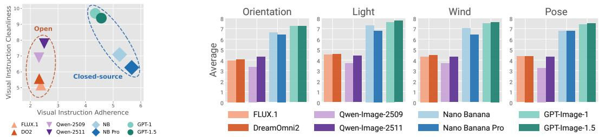  
Figure 4: (Left) Two-regime adherence–artifact pattern across generators. The models separate into two distinct clusters (dashed ellipses): open-weight models group tightly at low adherence, whereas closed models form a separate cluster at higher adherence. Within the closed cluster, however, stronger adherence tends to coincide with reduced cleanliness, suggesting a trade-off between the two objectives. (Right) Average VIF-Bench score on tasks containing each visual-instruction type. Visual instructions adopted in VIF-Bench are sensitive to improvements within model families.

Figure 4 (Right) reports the average score on tasks containing each visual-instruction type. Across all visual-instruction types, closed-source models consistently outperform open-source models, indi cating a capability gap across different forms of visual control. At the same time, visual instructions in VIF-Bench are sensitive to improvements within model families: in most cases, they capture gains from model fine-tuning or newer versions, such as from FLUX.1 Kontext to DreamOmni2, from Qwen-Image-Edit-2509 to 2511, and from GPT-Image-1 to 1.5. Together, these trends demonstrate that VIF-Bench is sufficiently discriminative to capture both broad capability gaps across model families and incremental improvements across successive model variants.

## 4.2 EFFECT OF THE NUMBER OF REFERENCES AND VISUAL INSTRUCTIONS

Figure 5 plots scores against the number of references and visual-instruction images for four representative generators (full results in Appendix F.2). Adding references degrades all three criteria. With a single reference, open-weight models trail closed ones only modestly in Reference Consistency and Visual Instruction Adherence, but with five or more references both fall to near the floor of the scale, whereas closed models largely retain their Reference Consistency. The large open/closed gap in these criteria in Table 2 thus stems mainly from multi-reference tasks. Closed models also diverge: Nano Banana Pro retains much of its Adherence, whereas GPT-Image-1.5 drops sharply, and this is where the adherence–artifact trade-off of Section 4.1 emerges (Appendix F.2).

In contrast, from one to three visual instructions, Adherence remains nearly unchanged for both closed models and stays low for both open-weight models, whereas the same increase in references lowers it substantially. Adherence thus reflects each generator’s ability to interpret visual instructions more than their number; additional ones instead mainly lower Text Instruction Following.

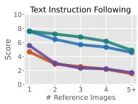

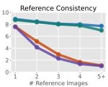  
DreamOmni2

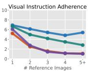  
Qwen-Image-Edit-2511

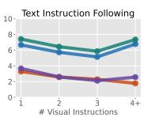  
Nano Banana Pro GPT-Image-1.5

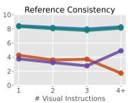

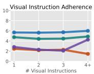

Figure 5: (Left) Scores versus the number of reference images for four representative generators. More references degrade all three criteria and drive the open-weight models to near the floor in Reference Consistency and Visual Instruction Adherence, whereas the closed models largely retain Reference Consistency; among the closed models, Nano Banana Pro retains much of its Adherence while GPT-Image-1.5 drops sharply. (Right) Scores versus the number of visual-instruction images. In contrast to the number of references, Adherence changes far less with more visual instructions and depends mostly on the generator itself, while additional visual instructions mainly lower Text Instruction Following.  
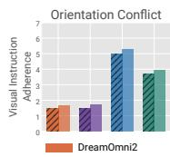

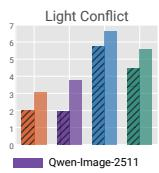

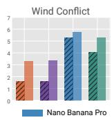

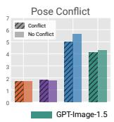

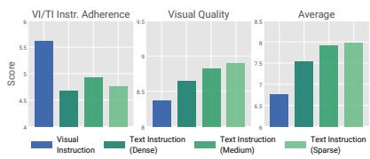  
Figure 6: (Left) Visual Instruction Adherence on conflict and no-conflict subsets for Orientation, Light, Wind, and Pose. Conflict generally reduces adherence, with particularly pronounced gaps for Light and Wind; for Pose, the reduction is visible only for generators with non-trivial adherence. (Right) Comparison between visual instructions (VIs) and text-converted instructions at different levels of granularity for Nano Banana Pro. VI and TI Dense approximately match information content and primarily differ in modality; TI Medium and TI Sparse progressively remove information. All conditions are evaluated against the original VI, so the comparison among text variants measures recovery of the original constraint under increasing textual abstraction.

## 4.3 REFERENCE–VISUAL-INSTRUCTION CONFLICT

Figure 6 (Left) compares Visual Instruction Adherence between conflict and no-conflict subsets for each instruction type. Across the representative generators, the conflict subsets generally show lower adherence, although the gap varies by instruction type. The gap is largest for Light and Wind and smaller for Orientation. For Pose, the reduction appears in the generators that attain non-trivial adherence in the first place (Nano Banana Pro and GPT-Image-1.5), whereas the open-weight models already score near the floor on pose tasks regardless of conflict, leaving little room for a further drop. These results suggest that salient reference attributes may make it harder to follow visual instructions targeting the same attribute. Qualitative examples in Figure 7 (Right) illustrate cases where models retain pose or lighting cues from the reference rather than fully following the target visual instruction. Further per-generator results and conflict-subset statistics are provided in Appendix F.1.

## 4.4 HOW SHOULD VISUAL CONSTRAINTS BE SPECIFIED?

Visual constraints can vary in representation and level of detail, which may affect how well models follow them. We first isolate representation modality by comparing the original visual instruction (VI) with TI Dense, which verbalizes nearly all information encoded by the VI. For Nano Banana Pro, which shows strong VI-adherence in VIF-Bench, the original VI achieves higher adherence than its dense textual counterpart (Figure 6; Right). This suggests that, when a model can reliably interpret visual instructions, presenting precise spatial or geometric constraints can be more effective than verbalizing the same information. In contrast, GPT-Image-1.5 benefits from text conversion, indicating that the preferred modality depends on the model’s VI-understanding capability (Appendix F.3).

We next consider a practical textual interface, where users may not verbalize every coordinate, angle, or joint configuration in a VI. We progressively abstract TI Dense into TI Medium and TI Sparse. These variants intentionally contain different amounts of information, and we evaluate all outputs against the original VI as an oracle specification. The score measures how well each textual representation recovers the original constraint, rather than how closely it adheres to the provided text. TI Medium recovers the original constraint better than TI Dense despite omitting fine-grained values, suggesting that reducing verbal complexity can offset some information loss. With TI Sparse, however, further simplification removes information needed to convey the original intent. Visual instructions thus offer a compact way to convey precise constraints without requiring exhaustive verbalization, while textual instructions require a balance between detail and abstraction.

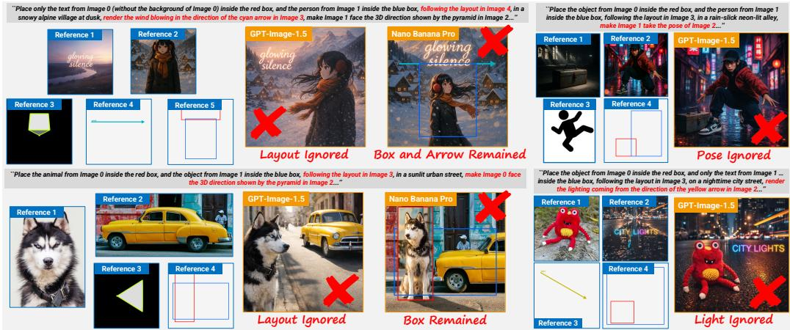  
Figure 7: Qualitative examples of VIF-Bench. (Left) The adherence–artifact trade-off among closed models: layout drift in GPT-Image-1.5 and residual instructions in Nano Banana Pro. (Right) Reference–visualinstruction conflict in pose or lighting results in ignorance of visual instructions.

## 4.5 AGENTIC MULTI-STEP GENERATION

We investigate whether VIF-Bench tasks can be solved more reliably by decomposing them into simpler sub-tasks. GPT-5 plans 2–4 sub-tasks and assigns a subset of the reference images to each; at every step, the generator receives the previous output, the sub-task instruction, and the newly assigned references, and its output is passed on. The final image is evaluated against the original task. This pipeline raises Nano Banana Pro’s average score from 6.96 to 7.40 but slightly lowers GPT-Image-1.5’s, from 7.60 to 7.53. For both generators, however, the per-criterion changes follow the adherence–artifact pattern of Section 4.1: Visual Instruction Cleanliness rises (Nano Banana Pro: 6.27 to 8.37; GPT-Image-1.5: 9.39 to 9.80) while Visual Instruction Adherence falls (Nano Banana Pro: 5.67 to 5.09; GPT-Image-1.5: 4.57 to 4.43), indicating that the tension between the two objectives also holds within a single generator and that decomposition moves along the trade-off rather than escaping it. Splitting the references across steps further reduces Reference Consistency by weakening subject grounding within each step. The benefit of agentic decomposition therefore depends on the generator and the criterion.

## 4.6 RELIABILITY OF VLM JUDGES

To validate our VLM-based evaluation protocol, we measure Pearson’s linear correlation coefficient and Spearman’s rank-order correlation coefficient between each VLM judge and human ratings on a uniformly randomly sampled subset of 168 generated images. We additionally report Human–Human agreement as a reference. As shown in Table 3, GPT-5 and Gemini 2.5 Flash both show positive correlations with human evaluations across all criteria, achieving correlation values of 0.78/0.75 and 0.74/0.71, respectively, for the Average Score. Full results are shown in Appendix G.2.

Table 3: Correlation between human and VLM judges on average scores for the 168-image human-evaluation subset. Qwen3-VL-32B is included as an open-source judge.
<table><tr><td>Judge</td><td>Pearson r</td><td>Spearman r</td></tr><tr><td>GPT-5</td><td>0.78</td><td>0.75</td></tr><tr><td>Gemini 2.5</td><td>0.74</td><td>0.71</td></tr><tr><td>Qwen3-VL</td><td>0.73</td><td>0.70</td></tr><tr><td>Human</td><td>0.80</td><td>0.78</td></tr></table>

## 5 CONCLUSION

VIF-Bench enables systematic evaluation of multi-reference generation under heterogeneous visual constraints, including potential reference–VI conflicts and controlled VI––TI comparisons at different levels of specificity. Our evaluation reveals three findings: current models exhibit an adherence–artifact tension when following visual instructions; visual instruction adherence tends to be lower when references carry a salient state of the controlled attribute; and the best representation of a visual constraint depends on the model’s VI capability, with direct VIs benefiting strong VI-following models and intermediate textual specificity outperforming exhaustive verbalization. Together, these results highlight both the remaining limitations of multimodal generators and the importance of how visual constraints are represented.

## AI USE STATEMENT

In this work, we used generative AI tools to create synthetic datasets and implement methods. In particular, generative models are integral components of the VIF-Bench pipeline described in the paper: Nano Banana and GPT-Image-1 generate part of the synthetic reference-image pool; GPT-5 proposes visual instructions (bounding-box layouts, 3D orientations, and wind/light arrow directions) and pre-labels reference attributes; and GPT-5, Gemini 2.5 Flash, and Qwen3-VL-32B serve as VLM judges in the evaluation protocol. We have not used generative AI tools to develop theoretical models or conceptual frameworks, to propose or refine hypotheses, to design research methodology or experiments, or to interpret results, and the remaining required-disclosure tasks (formulating mathematical claims, providing critical ingredients for proving mathematical claims, and assisting in the writing of proofs) are not applicable to this work. Additionally, we used generative AI tools to create and modify scientific figures and images, create and edit software code, create research artifacts, and draft parts of the manuscript. We have reviewed all AI-assisted work. All AI-proposed tasks and labels underwent automatic consistency checks and were verified and corrected by human annotators; the VLM-based judging protocol was validated against human ratings on a 168-image subset, including an open-source judge; AI-assisted code was verified and tested for correctness by the authors; and all AI-drafted text and figures were reviewed and edited by the authors, with technical claims checked against the experimental results. We take responsibility for the final content of this work, including text, claims, and artifacts produced with the aid of generative AI.

## ETHICS STATEMENT

VIF-Bench is a diagnostic benchmark intended to advance the controllability and reliability of multireference image generation by exposing failure modes that are invisible to generic image-quality metrics, with positive implications for applications such as advertising, virtual try-on, and content creation, where faithfulness to user-specified composition matters more than aesthetic polish. At the same time, like any benchmark in the image-generation space, VIF-Bench indirectly contributes to the broader ecosystem of generative imaging, which carries well-known misuse risks, including deepfakes, non-consensual intimate imagery, identity fraud, and visual misinformation that can manipulate public opinion or harass individuals. The very capabilities VIF-Bench is designed to evaluate—faithful placement of specified subjects, control over facing direction, and adherence to global lighting and force cues— also make synthetic media more convincing and, therefore, more dangerous when misused. We will mitigate this risk by releasing the benchmark as an evaluation-only resource that excludes model weights, and new generative tooling, and by building it on references drawn from existing public datasets, so that no new identifiable persons are introduced.

## REPRODUCIBILITY STATEMENT

All results in this paper are collected using stable-version API endpoints for the VLM judges. Additionally, we introduce an open-source judge (Qwen3-VL-32B) to ensure VIF-Bench remains evaluable even without closed-source API access. We released the code (https://github.com/ shim0114/VIF-Bench) and the benchmark (https://huggingface.co/datasets/ shim0114/VIF-Bench).

## ACKNOWLEDGEMENTS

We appreciate the funding support from Google Japan. MS was supported by JSPS KAKENHI Grant Number JP23H04974.

## REFERENCES

Shuai Bai, Yuxuan Cai, Ruizhe Chen, Keqin Chen, Xionghui Chen, Zesen Cheng, Lianghao Deng, Wei Ding, Chang Gao, Chunjiang Ge, Wenbin Ge, Zhifang Guo, Qidong Huang, Jie Huang, Fei Huang, Binyuan Hui, Shutong Jiang, Zhaohai Li, Mingsheng Li, Mei Li, Kaixin Li, Zicheng Lin, Junyang Lin, Xuejing Liu, Jiawei Liu, Chenglong Liu, Yang Liu, Dayiheng Liu, Shixuan Liu, Dunjie Lu, Ruilin Luo, Chenxu Lv, Rui Men, Lingchen Meng, Xuancheng Ren, Xingzhang Ren, Sibo Song, Yuchong Sun, Jun Tang, Jianhong Tu, Jianqiang Wan, Peng Wang, Pengfei Wang, Qiuyue Wang, Yuxuan Wang, Tianbao Xie, Yiheng Xu, Haiyang Xu, Jin Xu, Zhibo Yang, Mingkun Yang, Jianxin Yang, An Yang, Bowen Yu, Fei Zhang, Hang Zhang, Xi Zhang, Bo Zheng, Humen Zhong, Jingren Zhou, Fan Zhou, Jing Zhou, Yuanzhi Zhu, and Ke Zhu. Qwen3-vl technical report, 2025. URL https://arxiv.org/abs/2511.21631.

Samyadeep Basu, Mehrdad Saberi, Shweta Bhardwaj, Atoosa Malemir Chegini, Daniela Massiceti, Maziar Sanjabi, Shell Xu Hu, and Soheil Feizi. Editval: Benchmarking diffusion based text-guided image editing methods, 2023. URL https://arxiv.org/abs/2310.02426.

ByteDance. Doubao. https://www.doubao.com/, 2025.

Mathilde Caron, Hugo Touvron, Ishan Misra, Hervé Jégou, Julien Mairal, Piotr Bojanowski, and Armand Joulin. Emerging properties in self-supervised vision transformers. arXiv preprint arXiv:2104.14294, 2021.

Ruoxi Chen, Dongping Chen, Siyuan Wu, Sinan Wang, Shiyun Lang, Peter Sushko, Gaoyang Jiang, Yao Wan, and Ranjay Krishna. Multiref: Controllable image generation with multiple visual references. In Proceedings of the 33rd ACM International Conference on Multimedia, pp. 13325–13331, 2025a.

Tsai-Shien Chen, Aliaksandr Siarohin, Willi Menapace, Yuwei Fang, Kwot Sin Lee, Ivan Skorokhodov, Kfir Aberman, Jun-Yan Zhu, Ming-Hsuan Yang, and Sergey Tulyakov. Multi-subject open-set personalization in video generation. In Proceedings of the IEEE/CVF Conference on Computer Vision and Pattern Recognition, 2025b.

Zhihan Chen, Yuhuan Zhao, Yijie Zhu, Xinyu Yao, Mengcong Ren, Suwen Wang, Qiuyang Yin, Yuchen Sun, Qin Wang, and Lu Xin. Mibe: Multi-subject interaction benchmark and evaluator for personalized image generation, 2026. URL https://arxiv.org/abs/2607.01383.

Yisol Choi, Sangkyung Kwak, Kyungmin Lee, Hyungwon Choi, and Jinwoo Shin. Improving diffusion models for authentic virtual try-on in the wild. arXiv preprint arXiv:2403.05139, 2024.

Siddhartha Datta, Alexander Ku, Deepak Ramachandran, and Peter Anderson. Prompt expansion for adaptive text-to-image generation. In Proceedings ofthe 62nd Annual Meeting ofthe Association for Computational Linguistics (Volume 1: Long Papers), pp. 3449–3476, Bangkok, Thailand, August 2024. Association for Computational Linguistics. doi: 10.18653/v1/2024.acl-long.189. URL https://aclanthology.org/2024.acl-long.189/.

Chaorui Deng, Deyao Zhu, Kunchang Li, Chenhui Gou, Feng Li, Zeyu Wang, Shu Zhong, Weihao Yu, Xiaonan Nie, Ziang Song, Guang Shi, and Haoqi Fan. Emerging properties in unified multimodal pretraining. arXiv preprint arXiv:2505.14683, 2025.

Patrick Esser, Sumith Kulal, Andreas Blattmann, Rahim Entezari, Jonas Müller, Harry Saini, Yam Levi, Dominik Lorenz, Axel Sauer, Frederic Boesel, Dustin Podell, Tim Dockhorn, Zion English, Kyle Lacey, Alex Goodwin, Yannik Marek, and Robin Rombach. Scaling rectified flow transformers for high-resolution image synthesis, 2024.

Weixi Feng, Wanrong Zhu, Tsu-jui Fu, Varun Jampani, Arjun Akula, Xuehai He, Sugato Basu, Xin Eric Wang, and William Yang Wang. Layoutgpt: Compositional visual planning and generation with large language models. Advances in Neural Information Processing Systems, 36, 2024.

Hiroki Furuta, Heiga Zen, Dale Schuurmans, Aleksandra Faust, Yutaka Matsuo, Percy Liang, and Sherry Yang. Improving dynamic object interactions in text-to-video generation with ai feedback. arXiv preprint arXiv:2412.02617, 2024.

Gemini Team. Gemini: A family of highly capable multimodal models. arXiv preprint arXiv:2312.11805, 2023.

Sara Ghazanfari, Wei-An Lin, Haitong Tian, and Ersin Yumer. Spotedit: Evaluating visually-guided image editing methods. arXiv preprint arXiv:2508.18159, 2025.

Google DeepMind. Nano banana: Gemini 2.5 flash image model. https://developers. googleblog.com/en/introducing-gemini-2-5-flash-image/, 2025a. Accessed: 2025-10-31.

Google DeepMind. Nano banana pro. https://deepmind.google/models/ gemini-image/pro/, 2025b. Accessed: 2025-11-27.

Google DeepMind. Veo 3.1. https://deepmind.google/models/veo/, 2025c. Accessed: 2026-09-14.

Google DeepMind. Nano banana 2: Combining pro capabilities with lightning-fast speed. https: //blog.google/innovation-and-ai/technology/ai/nano-banana-2/, 2026. Accessed: 2026-4-30.

Zhen Han, Zeyinzi Jiang, Yulin Pan, Jingfeng Zhang, Chaojie Mao, Chen-Wei Xie, Yu Liu, and Jingren Zhou. ACE: All-round creator and editor following instructions via diffusion transformer. In The Thirteenth International Conference on Learning Representations, 2025. URL https: //openreview.net/forum?id=Bpn8q40n1n.

Yaru Hao, Zewen Chi, Li Dong, and Furu Wei. Optimizing prompts for text-to-image generation. In A. Oh, T. Naumann, A. Globerson, K. Saenko, M. Hardt, and S. Levine (eds.), Advances in Neural Information Processing Systems, volume 36, pp. 66923–66939. Curran Associates, Inc., 2023. doi: 10.52202/075280-2923. URL https://proceedings.neurips.cc/paper\_files/paper/2023/file/ d346d91999074dd8d6073d4c3b13733b-Paper-Conference.pdf.

Keno Harada, Yudai Yamazaki, Masachika Taniguchi, Edison Marrese-Taylor, Takeshi Kojima, Yusuke Iwasawa, and Yutaka Matsuo. When instructions multiply: Measuring and estimating LLM capabilities of multiple instructions following. In Christos Christodoulopoulos, Tanmoy Chakraborty, Carolyn Rose, and Violet Peng (eds.), Findings ofthe Associationfor Computational Linguistics: EMNLP 2025, pp. 16506–16526, Suzhou, China, November 2025. Association for Computational Linguistics. ISBN 979-8-89176-335-7. doi: 10.18653/v1/2025.findings-emnlp.896. URL https://aclanthology.org/2025.findings-emnlp.896/.

Yun He, Di Jin, Chaoqi Wang, Chloe Bi, Karishma Mandyam, Hejia Zhang, Chen Zhu, Ning Li, Tengyu Xu, Hongjiang Lv, et al. Multi-if: Benchmarking llms on multi-turn and multilingual instructions following. arXiv preprint arXiv:2410.15553, 2024.

Zefeng He, Siyuan Huang, Xiaoye Qu, Yafu Li, Tong Zhu, Yu Cheng, and Yang Yang. Gems: Agent-native multimodal generation with memory and skills. arXiv preprint arXiv:2603.28088, 2026.

Amir Hertz, Ron Mokady, Jay Tenenbaum, Kfir Aberman, Yael Pritch, and Daniel Cohen-Or. Prompt-to-prompt image editing with cross-attention control. In The Eleventh International Conference on Learning Representations, 2023. URL https://openreview.net/forum? id=\_CDixzkzeyb.

Jonathan Ho, Ajay Jain, and Pieter Abbeel. Denoising diffusion probabilistic models. In Advances in Neural Information Processing Systems, volume 33, pp. 6840–6851, 2020.

Junyao Hu, Zhongwei Cheng, Waikeung Wong, and Xingxing Zou. Garments2look: A multireference dataset for high-fidelity outfit-level virtual try-on with clothing and accessories. In Proceedings of the IEEE/CVF Conference on Computer Vision and Pattern Recognition (CVPR), 2026.

Lianghua Huang, Wei Wang, Zhi-Fan Wu, Yupeng Shi, Chen Liang, Tong Shen, Han Zhang, Huanzhang Dou, Yu Liu, and Jingren Zhou. Chatdit: A training-free baseline for task-agnostic free-form chatting with diffusion transformers, 2024a.

Wenwang Huang, Yusen Fu, Junjie Wang, Mengfei Huang, Yulin Li, Gan Liu, Jing Cai, Yancheng He, and Zhuotao Tian. Scaling multi-reference image generation with dynamic reward optimization, 2026. URL https://arxiv.org/abs/2606.26947.

Yuzhou Huang, Liangbin Xie, Xintao Wang, Ziyang Yuan, Xiaodong Cun, Yixiao Ge, Jiantao Zhou, Chao Dong, Rui Huang, Ruimao Zhang, and Ying Shan. Smartedit: Exploring complex instructionbased image editing with multimodal large language models. In Proceedings of the IEEE/CVF Conference on Computer Vision and Pattern Recognition (CVPR), pp. 8362–8371, June 2024b.

Naoto Inoue, Kotaro Kikuchi, Edgar Simo-Serra, Mayu Otani, and Kota Yamaguchi. LayoutDM: Discrete Diffusion Model for Controllable Layout Generation. In Proceedings ofthe IEEE/CVF Conference on Computer Vision and Pattern Recognition (CVPR), pp. 10167–10176, 2023.

Yuxin Jiang, Yufei Wang, Xingshan Zeng, Wanjun Zhong, Liangyou Li, Fei Mi, Lifeng Shang, Xin Jiang, Qun Liu, and Wei Wang. FollowBench: A multi-level fine-grained constraints following benchmark for large language models. In Lun-Wei Ku, Andre Martins, and Vivek Srikumar (eds.), Proceedings ofthe 62nd Annual Meeting ofthe Associationfor Computational Linguistics (Volume 1: Long Papers), pp. 4667–4688, Bangkok, Thailand, August 2024. Association for Computational Linguistics. URL https://aclanthology.org/2024.acl-long.257.

Sunwoo Kim, Minkyu Kim, and Dongmin Park. Test-time alignment of diffusion models without reward over-optimization. In The Thirteenth International Conference on Learning Representations, 2025.

Takeshi Kojima, Shixiang (Shane) Gu, Machel Reid, Yutaka Matsuo, and Yusuke Iwasawa. Large language models are zero-shot reasoners. In Advances in Neural Information Processing Systems, volume 35, pp. 22199–22213, 2022.

Max Ku, Dongfu Jiang, Cong Wei, Xiang Yue, and Wenhu Chen. Viescore: Towards explainable metrics for conditional image synthesis evaluation, 2023.

Philippe Laban, Hiroaki Hayashi, Yingbo Zhou, and Jennifer Neville. LLMs get lost in multi-turn conversation. In The Fourteenth International Conference on Learning Representations, 2026. URL https://openreview.net/forum?id=VKGTGGcwl6.

Black Forest Labs. Flux. https://github.com/black-forest-labs/flux, 2024.

Black Forest Labs, Stephen Batifol, Andreas Blattmann, Frederic Boesel, Saksham Consul, Cyril Diagne, Tim Dockhorn, Jack English, Zion English, Patrick Esser, Sumith Kulal, Kyle Lacey, Yam Levi, Cheng Li, Dominik Lorenz, Jonas Müller, Dustin Podell, Robin Rombach, Harry Saini, Axel Sauer, and Luke Smith. Flux.1 kontext: Flow matching for in-context image generation and editing in latent space, 2025. URL https://arxiv.org/abs/2506.15742.

LAION-AI. aesthetic-predictor, 2022. URL https://github.com/LAION-AI/ aesthetic-predictor.

Yuheng Li, Haotian Liu, Qingyang Wu, Fangzhou Mu, Jianwei Yang, Jianfeng Gao, Chunyuan Li, and Yong Jae Lee. Gligen: Open-set grounded text-to-image generation. arXiv:2301.07093, 2023.

Pengyang Ling, Lin Chen, Pan Zhang, Huaian Chen, Yi Jin, and Jinjin Zheng. Freedrag: Feature dragging for reliable point-based image editing. In Proceedings of the IEEE/CVF Conference on Computer Vision and Pattern Recognition, pp. 6860–6870, 2024.

Nelson F. Liu, Kevin Lin, John Hewitt, Ashwin Paranjape, Michele Bevilacqua, Fabio Petroni, and Percy Liang. Lost in the middle: How language models use long contexts. Transactions of the Associationfor Computational Linguistics, 12:157–173, 2024. doi: 10.1162/tacl\_a\_00638. URL https://aclanthology.org/2024.tacl-1.9/.

Shilong Liu, Zhaoyang Zeng, Tianhe Ren, Feng Li, Hao Zhang, Jie Yang, Chunyuan Li, Jianwei Yang, Hang Su, Jun Zhu, et al. Grounding dino: Marrying dino with grounded pre-training for open-set object detection. arXiv preprint arXiv:2303.05499, 2023.

Yiwei Ma, Jiayi Ji, Ke Ye, Weihuang Lin, Yonghan Zheng, Qiang Zhou, Xiaoshuai Sun, Rongrong Ji, et al. I2ebench: A comprehensive benchmark for instruction-based image editing. In The Thirty-eighth Annual Conference on Neural Information Processing Systems, 2024.

Kohsei Matsutani, Shota Takashiro, Gouki Minegishi, Takeshi Kojima, Yusuke Iwasawa, and Yutaka Matsuo. RL squeezes, SFT expands: A comparative study of reasoning LLMs. In The Fourteenth International Conference on Learning Representations, 2026. URL https://openreview. net/forum?id=N2lMNqJsBw.

Daiki Miyake, Akihiro Iohara, Yu Saito, and Toshiyuki Tanaka. Negative-prompt inversion: Fast image inversion for editing with text-guided diffusion models. In 2025 IEEE/CVF Winter Conference on Applications of Computer Vision (WACV), pp. 2063–2072, 2025. doi: 10.1109/WACV61041.2025.00207.

Ryugo Morita, Stanislav Frolov, Brian Bernhard Moser, Takahiro Shirakawa, Ko Watanabe, Andreas Dengel, and Jinjia Zhou. Tkg-dm: Training-free chroma key content generation diffusion model. In Proceedings of the IEEE/CVF Conference on Computer Vision and Pattern Recognition (CVPR), pp. 13031–13040, June 2025.

Chong Mou, Xintao Wang, Liangbin Xie, Yanze Wu, Jian Zhang, Zhongang Qi, Ying Shan, and Xiaohu Qie. T2i-adapter: Learning adapters to dig out more controllable ability for text-to-image diffusion models. arXiv preprint arXiv:2302.08453, 2023.

Chong Mou, Xintao Wang, Jiechong Song, Ying Shan, and Jian Zhang. Dragondiffusion: Enabling drag-style manipulation on diffusion models. In The Twelfth International Conference on Learning Representations, 2024. URL https://openreview.net/forum?id=OEL4FJMg1b.

Sanghyeon Na, Yonggyu Kim, and Hyunjoon Lee. Boost your own human image generation model via direct preference optimization with ai feedback. arXiv preprint arXiv:2405.20216, 2024.

Thao Nguyen, Yuheng Li, Utkarsh Ojha, and Yong Jae Lee. Visual instruction inversion: Image editing via image prompting. In Thirty-seventh Conference on Neural Information Processing Systems, 2023. URL https://openreview.net/forum?id=l9BsCh8ikK.

Ku Onoda, Paavo Parmas, Hiroki Furuta, Soichiro Nishimori, Yuta Oshima, Shohei Taniguchi, and Yutaka Matsuo. Multi-axis max@k reinforcement learning for representative diversity in text-to-image generation, 2026. URL https://arxiv.org/abs/2607.14962.

OpenAI. Gpt-4 technical report. arXiv preprint arXiv:2303.08774, 2023.

OpenAI. Sora, 2024. URL https://openai.com/index/sora/.

OpenAI. Gpt-4o image generation. https://openai.com/index/ introducing-4o-image-generation/, 2025a. Accessed: 2025-10-31.

OpenAI. Gpt-5. https://openai.com/index/introducing-gpt-5/, 2025b. Accessed: 2025-11-14.

OpenAI. The new chatgpt images is here. https://openai.com/index/ new-chatgpt-images-is-here/, 2025c. Accessed: 2026-4-30.

OpenAI. Introducing chatgpt images 2.0. https://openai.com/index/ introducing-chatgpt-images-2-0/, 2026. Accessed: 2026-4-30.

Yuta Oshima, Masahiro Suzuki, Yutaka Matsuo, and Hiroki Furuta. Inference-time text-to-video alignment with diffusion latent beam search. In The Thirty-ninth Annual Conference on Neural Information Processing Systems, 2025. URL https://openreview.net/forum?id= c9EAmyYPOv.

Yuta Oshima, Yusuke Iwasawa, Masahiro Suzuki, Yutaka Matsuo, and Hiroki Furuta. Worldpack: Dynamic frame compression for long-context video world modeling. Transactions on Machine Learning Research, 2026a. ISSN 2835-8856. URL https://openreview.net/forum? id=zJuiG3PiNJ.

Yuta Oshima, Daiki Miyake, Kohsei Matsutani, Yusuke Iwasawa, Masahiro Suzuki, Yutaka Matsuo, and Hiroki Furuta. Multibanana: A challenging benchmark for multi-reference text-to-image generation. In Proceedings ofthe IEEE/CVF Conference on Computer Vision and Pattern Recognition (CVPR), pp. 448–460, June 2026b.

Xingang Pan, Ayush Tewari, Thomas Leimkühler, Lingjie Liu, Abhimitra Meka, and Christian Theobalt. Drag your gan: Interactive point-based manipulation on the generative image manifold. In Special Interest Group on Computer Graphics and Interactive Techniques Conference Conference Proceedings, SIGGRAPH ’23, pp. 1–11. ACM, 2023. doi: 10.1145/3588432.3591500. URL http://dx.doi.org/10.1145/3588432.3591500.

Dustin Podell, Zion English, Kyle Lacey, Andreas Blattmann, Tim Dockhorn, Jonas Müller, Joe Penna, and Robin Rombach. SDXL: Improving latent diffusion models for high-resolution image synthesis. In The Twelfth International Conference on Learning Representations, 2024. URL https://openreview.net/forum?id=di52zR8xgf.

Alec Radford, Jong Wook Kim, Chris Hallacy, Aditya Ramesh, Gabriel Goh, Sandhini Agarwal, Girish Sastry, Amanda Askell, Pamela Mishkin, Jack Clark, Gretchen Krueger, and Ilya Sutskever. Learning transferable visual models from natural language supervision. arXiv preprint arXiv:2103.00020, 2021.

Nikhila Ravi, Valentin Gabeur, Yuan-Ting Hu, Ronghang Hu, Chaitanya Ryali, Tengyu Ma, Haitham Khedr, Roman Rädle, Chloe Rolland, Laura Gustafson, Eric Mintun, Junting Pan, Kalyan Vasudev Alwala, Nicolas Carion, Chao-Yuan Wu, Ross Girshick, Piotr Dollar, and Christoph Feichtenhofer. SAM 2: Segment anything in images and videos. In The Thirteenth International Conference on Learning Representations, 2025. URL https://openreview.net/forum? id=Ha6RTeWMd0.

Robin Rombach, Andreas Blattmann, Dominik Lorenz, Patrick Esser, and Björn Ommer. Highresolution image synthesis with latent diffusion models. arXiv preprint arXiv:2112.10752, 2022.

Nataniel Ruiz, Yuanzhen Li, Varun Jampani, Yael Pritch, Michael Rubinstein, and Kfir Aberman. Dreambooth: Fine tuning text-to-image diffusion models for subject-driven generation. arXiv preprint arxiv:2208.12242, 2022.

Shreshth Saini, Neil Birkbeck, Yilin Wang, Balu Adsumilli, and Alan C. Bovik. Cachedsearch: Training-free cached exploration for test-time search in video diffusion, 2026. URL https: //arxiv.org/abs/2607.23159.

Christoph Schuhmann, Romain Beaumont, Richard Vencu, Cade Gordon, Ross Wightman, Mehdi Cherti, Theo Coombes, Aarush Katta, Clayton Mullis, Mitchell Wortsman, et al. Laion-5b: An open large-scale dataset for training next generation image-text models. Advances in neural information processing systems, 35:25278–25294, 2022.

Yongliang Shen, Kaitao Song, Xu Tan, Dongsheng Li, Weiming Lu, and Yueting Zhuang. Hugginggpt: Solving ai tasks with chatgpt and its friends in hugging face. In A. Oh, T. Naumann, A. Globerson, K. Saenko, M. Hardt, and S. Levine (eds.), Advances in Neural Information Processing Systems, volume 36, pp. 38154–38180. Curran Associates, Inc., 2023. doi: 10.52202/ 075280-1657. URL https://proceedings.neurips.cc/paper\_files/paper/ 2023/file/77c33e6a367922d003ff102ffb92b658-Paper-Conference.pdf.

Shelly Sheynin, Adam Polyak, Uriel Singer, Yuval Kirstain, Amit Zohar, Oron Ashual, Devi Parikh, and Yaniv Taigman. Emu edit: Precise image editing via recognition and generation tasks. In Proceedings of the IEEE/CVF Conference on Computer Vision and Pattern Recognition (CVPR), pp. 8871–8879, June 2024.

Yujun Shi, Chuhui Xue, Jiachun Pan, Wenqing Zhang, Vincent YF Tan, and Song Bai. Dragdiffusion: Harnessing diffusion models for interactive point-based image editing. arXiv preprint arXiv:2306.14435, 2023.

Charlie Snell, Jaehoon Lee, Kelvin Xu, and Aviral Kumar. Scaling llm test-time compute optimally can be more effective than scaling model parameters. arXiv preprint arXiv:2408.03314, 2024.

Jascha Sohl-Dickstein, Eric Weiss, Niru Maheswaranathan, and Surya Ganguli. Deep unsupervised learning using nonequilibrium thermodynamics. In Proceedings of the 32nd International Conference on Machine Learning, volume 37, pp. 2256–2265, 2015.

Peter Sushko, Ayana Bharadwaj, Zhi Yang Lim, Vasily Ilin, Ben Caffee, Dongping Chen, Mohammadreza Salehi, Cheng-Yu Hsieh, and Ranjay Krishna. Realedit: Reddit edits as a large-scale empirical dataset for image transformations. In Proceedings of the IEEE/CVF Conference on Computer Vision and Pattern Recognition (CVPR), pp. 13403–13413, June 2025.

Yunjie Tian, Qixiang Ye, and David Doermann. Yolov12: Attention-centric real-time object detectors. arXiv preprint arXiv:2502.12524, 2025.

Su Wang, Chitwan Saharia, Ceslee Montgomery, Jordi Pont-Tuset, Shai Noy, Stefano Pellegrini, Yasumasa Onoe, Sarah Laszlo, David J. Fleet, Radu Soricut, Jason Baldridge, Mohammad Norouzi, Peter Anderson, and William Chan. Imagen editor and editbench: Advancing and evaluating text-guided image inpainting. In Proceedings ofthe IEEE/CVF Conference on Computer Vision and Pattern Recognition (CVPR), pp. 18359–18369, June 2023.

Zhenyu Wang, Aoxue Li, Zhenguo Li, and Xihui Liu. Genartist: Multimodal llm as an agent for unified image generation and editing. In A. Globerson, L. Mackey, D. Belgrave, A. Fan, U. Paquet, J. Tomczak, and C. Zhang (eds.), Advances in Neural Information Processing Systems, volume 37, pp. 128374–128395. Curran Associates, Inc., 2024. doi: 10.52202/ 079017-4077. URL https://proceedings.neurips.cc/paper\_files/paper/ 2024/file/e7c786024ca718f2487712bfe9f51030-Paper-Conference.pdf.

Chenfei Wu, Jiahao Li, Jingren Zhou, Junyang Lin, Kaiyuan Gao, Kun Yan, Sheng ming Yin, Shuai Bai, Xiao Xu, Yilei Chen, Yuxiang Chen, Zecheng Tang, Zekai Zhang, Zhengyi Wang, An Yang, Bowen Yu, Chen Cheng, Dayiheng Liu, Deqing Li, Hang Zhang, Hao Meng, Hu Wei, Jingyuan Ni, Kai Chen, Kuan Cao, Liang Peng, Lin Qu, Minggang Wu, Peng Wang, Shuting Yu, Tingkun Wen, Wensen Feng, Xiaoxiao Xu, Yi Wang, Yichang Zhang, Yongqiang Zhu, Yujia Wu, Yuxuan Cai, and Zenan Liu. Qwen-image technical report, 2025a. URL https://arxiv.org/abs/ 2508.02324.

Chenyuan Wu, Pengfei Zheng, Ruiran Yan, Shitao Xiao, Xin Luo, Yueze Wang, Wanli Li, Xiyan Jiang, Yexin Liu, Junjie Zhou, Ze Liu, Ziyi Xia, Chaofan Li, Haoge Deng, Jiahao Wang, Kun Luo, Bo Zhang, Defu Lian, Xinlong Wang, Zhongyuan Wang, Tiejun Huang, and Zheng Liu. Omnigen2: Exploration to advanced multimodal generation. arXiv preprint arXiv:2506.18871, 2025b.

Shaojin Wu, Mengqi Huang, Wenxu Wu, Yufeng Cheng, Fei Ding, and Qian He. Less-to-more generalization: Unlocking more controllability by in-context generation. arXiv preprint arXiv:2504.02160, 2025c.

Bin Xia, Bohao Peng, Jiyang Liu, Sitong Wu, Jingyao Li, Junjia Huang, Xu Zhao, Yitong Wang, Ruihang Chu, Bei Yu, and Jiaya Jia. Dreamomni3: Scribble-based editing and generation, 2025a. URL https://arxiv.org/abs/2512.22525.

Bin Xia, Bohao Peng, Yuechen Zhang, Junjia Huang, Jiyang Liu, Jingyao Li, Haoru Tan, Sitong Wu, Chengyao Wang, Yitong Wang, Xinglong Wu, Bei Yu, and Jiaya Jia. Dreamomni2: Multimodal instruction-based editing and generation, 2025b. URL https://arxiv.org/abs/2510. 06679.

Shitao Xiao, Yueze Wang, Junjie Zhou, Huaying Yuan, Xingrun Xing, Ruiran Yan, Shuting Wang, Tiejun Huang, and Zheng Liu. Omnigen: Unified image generation. arXiv preprint arXiv:2409.11340, 2024.

Zeqi Xiao, Yushi Lan, Yifan Zhou, Wenqi Ouyang, Shuai Yang, Yanhong Zeng, and Xingang Pan. Worldmem: Long-term consistent world simulation with memory, 2025. URL https: //arxiv.org/abs/2504.12369.

Jinheng Xie, Weijia Mao, Zechen Bai, David Junhao Zhang, Weihao Wang, Kevin Qinghong Lin, Yuchao Gu, Zhijie Chen, Zhenheng Yang, and Mike Zheng Shou. Show-o: One single transformer to unify multimodal understanding and generation. arXiv preprint arXiv:2408.12528, 2024.

Ruihang Xu, Dewei Zhou, Fan Ma, and Yi Yang. Contextgen: Contextual layout anchoring for identity-consistent multi-instance generation. In The Fourteenth International Conference on Learning Representations, 2026.

Zhipei Xu, Xuanyu Zhang, Runyi Li, Zecheng Tang, Qing Huang, and Jian Zhang. Fakeshield: Explainable image forgery detection and localization via multi-modal large language models. In International Conference on Learning Representations, 2025.

Binxin Yang, Shuyang Gu, Bo Zhang, Ting Zhang, Xuejin Chen, Xiaoyan Sun, Dong Chen, and Fang Wen. Paint by example: Exemplar-based image editing with diffusion models. arXiv preprint arXiv:2211.13227, 2022.

Zhengyuan Yang, Jianfeng Wang, Linjie Li, Kevin Lin, Chung-Ching Lin, Zicheng Liu, and Lijuan Wang. Idea2img: Iterative self-refinement with gpt-4v for automatic image design and generation. In European conference on computer vision, pp. 167–184. Springer, 2024.

Hu Ye, Jun Zhang, Sibo Liu, Xiao Han, and Wei Yang. Ip-adapter: Text compatible image prompt adapter for text-to-image diffusion models. arXiv preprint arxiv:2308.06721, 2023.

Yang Ye, Xianyi He, Zongjian Li, Bin Lin, Shenghai Yuan, Zhiyuan Yan, Bohan Hou, and Li Yuan. Imgedit: A unified image editing dataset and benchmark. arXiv preprint arXiv:2505.20275, 2025.

Po-Hung Yeh, Kuang-Huei Lee, and Jun-Cheng Chen. Training-free diffusion model alignment with sampling demons. arXiv preprint arXiv:2410.05760, 2024.

Qifan Yu, Wei Chow, Zhongqi Yue, Kaihang Pan, Yang Wu, Xiaoyang Wan, Juncheng Li, Siliang Tang, Hanwang Zhang, and Yueting Zhuang. Anyedit: Mastering unified high-quality image editing for any idea. In Proceedings ofthe IEEE/CVF Conference on Computer Vision and Pattern Recognition (CVPR), pp. 26125–26135, June 2025.

Huanyu Zhang, Xuehai Bai, Chengzu Li, Chen Liang, Haochen Tian, Haodong Li, Ruichuan An, Yifan Zhang, Anna Korhonen, Zhang Zhang, Liang Wang, and Tieniu Tan. How well do models follow visual instructions? vibe: A systematic benchmark for visual instruction-driven image editing, 2026a. URL https://arxiv.org/abs/2602.01851.

Jingxu Zhang, Daneul Kim, Yueming Pan, Dong Chen, Kai Qiu, Yang Liu, Yifan Yang, Qi Dai, Xiaoyan Sun, and Chong Luo. Rcedit-500k: Reference completion for image-conditioned image editing. In European Conference on Computer Vision (ECCV), 2026b.

Kai Zhang, Lingbo Mo, Wenhu Chen, Huan Sun, and Yu Su. Magicbrush: A manually annotated dataset for instruction-guided image editing. In Advances in Neural Information Processing Systems, 2023a.

Lvmin Zhang, Anyi Rao, and Maneesh Agrawala. Adding conditional control to text-to-image diffusion models, 2023b.

Richard Zhang, Phillip Isola, Alexei A Efros, Eli Shechtman, and Oliver Wang. The unreasonable effectiveness of deep features as a perceptual metric. In CVPR, 2018.

Xiaohan Zhang, Yuqing Wen, Junlin Chen, Yuqi Tang, Yiting He, Lizhuo Shao, Weiming Zhu, Tengfei Liu, Yang Shi, Jialu Chen, Yuanxing Zhang, and Huaxiong Li. Multiref-compass: Towards comprehensive evaluation of multi-reference-to-audio-video generation, 2026c. URL https: //arxiv.org/abs/2607.14189.

Zengqun Zhao, Ziquan Liu, Yu Cao, Shaogang Gong, Zhensong Zhang, Jifei Song, Jiankang Deng, and Ioannis Patras. Latsearch: Latent reward-guided search for faster inference-time scaling in video diffusion. In European Conference on Computer Vision (ECCV), 2026.

Dewei Zhou, You Li, Fan Ma, Xiaoting Zhang, and Yi Yang. Migc: Multi-instance generation controller for text-to-image synthesis. In Proceedings of the IEEE/CVF Conference on Computer Vision and Pattern Recognition, pp. 6818–6828, 2024.

Jeffrey Zhou, Tianjian Lu, Swaroop Mishra, Siddhartha Brahma, Sujoy Basu, Yi Luan, Denny Zhou, and Le Hou. Instruction-following evaluation for large language models. arXiv preprint arXiv:2311.07911, 2023.

Zhuofan Zong, Dongzhi Jiang, Bingqi Ma, Guanglu Song, Hao Shao, Dazhong Shen, Yu Liu, and Hongsheng Li. Easyref: Omni-generalized group image reference for diffusion models via multimodal llm, 2024. URL https://arxiv.org/abs/2412.09618.

## APPENDIX

## A RESULTS OF QWEN3-VL JUDGE

In Section 4, we report evaluation results based on the average scores assigned by Gemini 2.5 and GPT-5. As shown in Section 4.6, Qwen3-VL-32B-Instruct (Bai et al., 2025) exhibits a high level of agreement with human evaluations, with correlations comparable to those of GPT-5 (OpenAI, 2025b) and Gemini 2.5 (Gemini Team, 2023) (see Table 3). While we evaluate the closed-source judges using fixed API versions, their continued availability and exact reproducibility may still depend on external API access. We therefore additionally evaluate all outputs with Qwen3-VL-32B-Instruct, a fixed-version open-weight model, to provide a fully reproducible evaluation setting. This also makes the benchmark more accessible to researchers without access to proprietary VLM APIs.

Table 4 reports the scores obtained using Qwen3-VL-32B-Instruct as the sole evaluator, following the same scoring procedure described in Section 3.3. The generator ranking is preserved except for a swap between DreamOmni2 and FLUX.1 Kontext, which differ by less than 0.1 under every judge. The adherence–artifact trade-off is also reproduced within each generator. With multi-step decomposition, Visual Instruction Cleanliness rises (Nano Banana Pro: from 6.60 to 8.42; GPT-Image-1.5: from 9.48 to 9.85) while Visual Instruction Adherence falls (Nano Banana Pro: from 7.74 to 7.08; GPT-Image-1.5: from 7.90 to 7.19). Likewise, the update from GPT-Image-1 to GPT-Image-1.5 raises Adherence from 7.40 to 7.90 while lowering Cleanliness from 9.81 to 9.48. Qwen3-VL is more lenient on Adherence and compresses the four closed models into a 0.5-point band (7.40–7.90), so it does not resolve the cross-family gap on which GPT-5 and Gemini independently agree (see Table 6); among the three judges, only GPT-5 reaches human–human agreement on this criterion (0.76/0.72 vs. 0.75/0.74; Table 7). These results support Qwen3-VL-32B-Instruct as a reproducible judge for overall comparison and indicate that our main conclusions do not hinge on the judge choice. We expect this fixed, open-weight judge to provide a useful baseline for future evaluations on our benchmark.

Table 4: Overall VIF-Bench scores for each generator under the six evaluation criteria, evaluated by Qwen3-VL. We additionally report results for the agentic multi-step variants of GPT-Image-1.5 and Nano Banana Pro.
<table><tr><td>Model</td><td>Text Instruction Following</td><td>Reference Consistency</td><td>Visual Instruction Adherence</td><td>Visual Instruction Cleanliness</td><td>Scene Coherence</td><td>Visual Quality</td><td>Avg.</td></tr><tr><td>GPT-Image-1.5 + multi-step</td><td>8.27</td><td>9.34</td><td>7.90</td><td>9.48</td><td>8.87</td><td>9.74</td><td>8.93</td></tr><tr><td>Nano Banana Pro</td><td>7.88</td><td>8.75</td><td>7.19</td><td>9.85</td><td>8.85</td><td>9.69</td><td>8.70</td></tr><tr><td>+ multi-step</td><td>7.34 7.58</td><td>9.30 8.51</td><td>7.74</td><td>6.60</td><td>7.69</td><td>9.46</td><td>8.02</td></tr><tr><td></td><td></td><td></td><td>7.08</td><td>8.42</td><td>8.43</td><td>9.55</td><td>8.26</td></tr><tr><td>GPT-Image-1</td><td>8.01</td><td>9.27</td><td>7.40</td><td>9.81</td><td>8.95</td><td>9.72</td><td>8.86</td></tr><tr><td>Nano Banana</td><td>7.62</td><td>9.48</td><td>7.76</td><td>7.46</td><td>7.93</td><td>9.52</td><td>8.29</td></tr><tr><td>Qwen-Image-2511</td><td>4.21</td><td>4.93</td><td>3.02</td><td>7.65</td><td>5.08</td><td>8.75</td><td>5.61</td></tr><tr><td>Qwen-Image-2509</td><td>3.21</td><td>3.64</td><td>2.59</td><td>6.76</td><td>3.37</td><td>5.54</td><td>4.19</td></tr><tr><td>DreamOmni2</td><td>4.36</td><td>5.45</td><td>3.42</td><td>5.72</td><td>4.55</td><td>8.61</td><td>5.35</td></tr><tr><td>FLUX.1 Kontext</td><td>4.57</td><td>5.74</td><td>3.63</td><td>5.30</td><td>4.65</td><td>8.73</td><td>5.44</td></tr></table>

## B IMPLEMENTATION DETAILS

Code and Benchmark. The code is released at https://github.com/shim0114/ VIF-Bench, and the benchmark is released at https://huggingface.co/datasets/ shim0114/VIF-Bench.

API versions. We used the following API endpoints. For the VLM judges, we fixed the endpoint versions to ensure reproducibility.

• For image generation models: gemini-3-pro-image-preview, gemini-2.5-flash-image, gpt-image-1.5, gpt-image-1.

• For VLM evaluation: gemini-2.5-flash, gpt-5-2025-08-07.

Each task is generated with output size forced to 1024×1024.

Cost. A full judging pass over the 1,241-task evaluated set with two judges for a single generator costs approximately \$47 end-to-end. The breakdown by judge is: GPT-5 ∼\$35 in total, and Gemini 2.5 Flash ∼\$12 in total.

## C DETAILS OF TASK CONSTRUCTION

## C.1 LAION-5B IMAGE FILTERING

For reference images sourced from LAION-5B (Schuhmann et al., 2022), we applied the filtering procedure below. First, to remove images that are unsuitable as references in terms of composition (foreground subject too small, or visually unclear), we ran YOLOv12 (Tian et al., 2025) object detection on every image, and then performed semantic segmentation with SAM (Ravi et al., 2025) conditioned on the detected bounding boxes. We discarded an image if it satisfied any of the following: (i) the area of the bounding box covers less than 2% of the entire image, (ii) the segmented region inside the bounding box covers less than 30% of the box, or (iii) the CLIP similarity (Radford et al., 2021) between the YOLO-predicted class name and the bounding-box region is below 20. On the other hand, we retained images with no detected objects, since we judged them useful as references for backgrounds or style-level content. After this stage, about 48% of the original images remained. Next, to remove images inappropriate as references (unsafe content, charts, screenshots of system messages, etc.), we combined automatic screening with Gemini (Gemini Team, 2023) and human review. For inappropriate content, we specifically targeted hate, harassment, violence, self-harm, sexual content, nudity, shocking content, illegal activity, and other distressing material, ultimately excluding about 3% of the remaining images. We also manually verified and removed near-duplicate synthetic images.

## C.2 LANGUAGE COVERAGE OF TEXT REFERENCES

For the main text reference, we follow the design of MultiBanana (Oshima et al., 2026b) and cover three languages: English, Chinese, and Japanese. This lets us diversify not only typography but also language itself, both in tasks where text is the primary reference and in tasks where typography serves as a secondary reference.

## C.3 VISUAL INSTRUCTION CONSTRUCTION

Here we describe, for each visual instruction in our benchmark, the construction procedure and design choices we made to make the visual instructions easy to read as control signals and prevent them from leaking into the final generated image.

Layout. For each main reference, we let GPT-5 (OpenAI, 2025b) propose a 2D bounding box, which is then drawn as a colored rectangle on a 1024×1024 canvas. In the proposal, we instruct the model to avoid collage-like or grid-like arrangements, prefer overlap, depth cues, and a common ground plane, ensure that no single box covers the entire canvas, and keep a margin of at least 0.05 from the canvas edges, so that the final generated image reads as a single natural picture. This prevents the layout instruction from being interpreted as an instruction to “tile” images side by side, which would make the final output look like a collage or split panel. We also require the proposed bounding boxes to be tied to the canonical image index of the input (Image\_ $\underline { { 0 } } , \mathtt { I m a g e \_ 1 } , \dots )$ . This prevents the correspondence between subjects and visual instructions from drifting in tasks with multiple references.

Orientation. For each main reference whose orientation is meaningful (i.e., person, animal, or object), we have GPT-5 propose a 3D facing direction in terms of two angles: yaw and pitch. Here, $\mathsf { y a w } = 0 ^ { \circ }$ corresponds to the viewer/camera direction, $+ 9 0 ^ { \circ }$ to screen-right, $- 9 0 ^ { \circ }$ to screen-left, and $1 8 0 ^ { \circ }$ to the back, while positive pitch denotes upward and negative pitch downward. Based on these angles, we render a single 3D square pyramid (black background, gray fill, yellow-green outline) for each main reference. The pyramid’s square base corresponds to the front of the subject, and the apex to the back. In the proposal, we impose the visibility constraints $| y a w | < 6 0 ^ { \circ } , | \bar { p i t c h } | < 6 0 ^ { \circ }$ , and $| y a w | + | p i t c h | \leq 7 5 ^ { \circ }$ , and additionally forbid near-frontal angles $( | y a w | < 1 5 ^ { \circ }$ and $| p i t c h | < 1 5 ^ { \circ } )$ This excludes angles where the pyramid collapses visually and the orientation becomes unreadable, and restricts the visual instruction to a range that remains interpretable. We also make the role separation explicit: when a layout is available, the apex anchor uses the center of the layout box, and when no layout is available, the anchor position is purely for rendering and does not encode placement. This keeps orientation limited to facing direction, separate from layout’s placement role.

Wind and light arrow. We let GPT-5 propose, in normalized canvas coordinates, the start and end points of a 2D directed arrow. Wind arrows are drawn in cyan and light arrows in yellow; when both are present, they are drawn together on a single arrow image. The semantics are: for wind, the start denotes the wind source, and the end denotes the direction the wind blows toward; for light, the start denotes the light source, and the end denotes where the light falls. In the proposal, we constrain the arrow length to be $\geq 0 . 4$ and require it to stay $\geq 0 . 0 5$ inside the canvas edges. This is because arrows that are too short or squashed against the edge are hard to read as directional cues, and because wind and light arrows can coexist in the same image, whereas fixing color and tail/head semantics prevent confusion between the two.

Pose. Unlike other visual instructions, pose is specified not by coordinates but by adding a pose reference image. Pose references come from the curated pose pairs in VIBE (Zhang et al., 2026a) and are attached only when a person main reference is present. When a task has multiple person mains, we assign a pose reference to each and explicitly name the target person in the textual instruction. This avoids ambiguity about which person main a pose reference should apply to.

## C.4 CONFLICT DETECTION

Here we describe the algorithm we use to label the conflict tasks. The procedure consists of three stages: pre-labeling on the reference pool side, per-task label matching, and evaluation of the conflict condition for each visual-instruction kind. First, for every image in the reference pool, we use GPT-5 to pre-assign attribute labels needed for conflict detection, including the subject’s facing direction (yaw and the reliability of its estimate), the distinctiveness of the lighting (e.g., whether there is a special, colored, or localized light source), the wind responsiveness (whether the image contains elements such as hair, fabric, or smoke whose appearance changes under wind), and the distinctiveness of the pose (whether the subject is in a non-neutral pose with a clearly readable action). Next, for each task, we read off the configuration of main references and visual instructions from the layout information and the reference hierarchy, and we link each main-reference image to its corresponding entry in the reference pool via hash matching, thereby making the pre-assigned attributes available for each main reference in the task. Finally, for each visual instruction type included in the task, we evaluate the conditions described below; if at least one of the orientation, light, wind, or pose conditions is met, we label the task as the corresponding conflict task.

Orientation conflict. An orientation conflict is declared when the subject in the reference image has a clear facing direction, and that direction disagrees with the direction specified by the visual instruction. Concretely, we only enter the judgment when the facing direction estimated from the reference image (denoted source) is reliable, and we then compare it with the direction specified by the pyramid (denoted target). We declare a conflict when the minimum angular difference between source and target $\mathrm { i s } \geq 6 0 ^ { \circ }$ , or when the two have opposite signs. We include sign mismatch to capture left/right flips such as “the reference subject faces left, but the visual instruction specifies right.” This is needed because relying on the angular difference alone would miss cases such as yaw 30<sup>◦</sup> and yaw −20<sup>◦</sup>: the difference is only 50<sup>◦</sup>, but the left/right facing direction has actually flipped, and the appearance changes substantially.

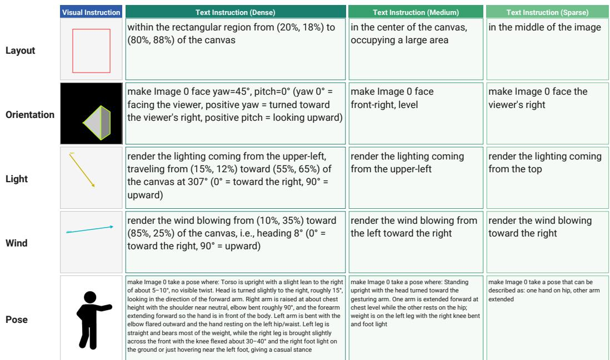  
Figure 8: Examples of converting visual instructions (VIs) into text instructions (TIs) at three levels of granularity. From Dense to Sparse, information conveyed by the VI is progressively abstracted or removed. For example, Orientation is simplified from explicit yaw/pitch values to “front-right, level” and then to “the viewer’s right,” while Pose is compressed from a detailed joint-level description to a short phrase capturing only its main configuration.

Light conflict. Light conflict occurs when the reference image contains distinctive lighting that strongly shapes the scene’s appearance and the task includes a light arrow. By distinctive lighting, we mean lighting that is clearly different from ordinary daylight or uniform indoor illumination, such as nighttime artificial light, neon, moonlight, window-beam light, spotlights, strong backlight, colored light, or any case where the lighting itself dominates the overall impression of the image.

Wind conflict. Wind conflict applies when the reference image contains elements whose appearance changes substantially with wind, and the task includes a wind arrow. Such elements include hair, clothing, fur, feathers, fabric, paper, smoke, and flames, whose shapes or flows change with wind direction and strength.

Pose conflict. A pose conflict is declared when a person in the reference image is in a clear and distinctive pose, and a pose reference is attached to that person. By distinctive pose, we mean a pose that is not neutral, such as a standing or front-facing still pose, but one in which the subject’s action or posture is clearly readable from the image. Note that pose reference images taken from VIBE are by construction intended to express explicit poses, and are therefore treated as distinctive poses by default.

Layout. A layout specifies a spatial arrangement over the whole scene rather than an intrinsic attribute of any reference image, so it is not subject to conflict detection.

## C.5 CONVERTING VISUAL INSTRUCTIONS INTO TEXT INSTRUCTIONS

Visual instructions (VIs), such as layout previews, 3D orientation pyramids, wind/light arrows, and pose references, provide a concise and intuitive way to specify spatial and directional constraints. Although the same constraints can in principle be expressed as text instructions (TIs), matching the precision of a VI may require explicitly verbalizing fine-grained information such as coordinates, viewing angles, and joint configurations. We therefore ask two questions: whether failures arise from the underlying constraint or from visual interpretation, and how the granularity of a textual description affects instruction following.

To this end, we replace each VI with one of three text variants: TI Dense, TI Medium, or TI Sparse. TI Dense preserves nearly all information in the original VI; TI Medium replaces exact numerical values with coarser discrete descriptions; and TI Sparse retains only the most salient spatial or directional attributes. Comparing VI with TI Dense approximately isolates the effect of modality under matched information content, while the three TI variants reveal how performance changes as textual specificity is reduced.

All variants are constructed from the same 200-task subset, sampled with a fixed seed from tasks containing at least one non-layout VI and stratified to 50 tasks per subject count (n=1–4). The subset contains 96 tasks with an orientation instruction, 116 with a wind or light arrow, and 38 with a pose reference; every task contains a layout instruction. For each TI condition, we remove the corresponding VI images, re-index the remaining reference images, and remove the trailing clause asking the model to erase visual markings. Only the wording and granularity of the converted VI clauses differ across the three TI variants. Importantly, the judge is always given the original task with the original VI images and instruction, rather than the rewritten TI, so the scores measure adherence to the original visual constraint rather than agreement with a coarsened textual description.

For layout, orientation, and arrow instructions, the underlying structured annotations—bounding boxes, yaw/pitch angles, and arrow endpoints— let us construct the TI variants deterministically using templates. This gives precise control over the information retained at each granularity and avoids conversion errors from a language model. Pose references are available only as images, so for each unique pose image we use a single GPT-5 vision call to jointly produce the TI Dense, TI Medium, and TI Sparse descriptions, keeping the three variants mutually consistent. Figure 8 illustrates how each VI is progressively abstracted across the three text variants.

TI Dense. This variant preserves as much information as possible from the original VI. For layout, it specifies the exact bounding box using corner coordinates as percentages of the canvas (e.g., “within the rectangular region from (13%, 8%) to (87%, 92%) of the canvas”). For orientation, it gives the exact yaw and pitch in degrees together with the sign convention. For arrows, it specifies the start and end points in canvas percentages and the heading angle; wind is described as blowing from the start point toward the end point, while light is described as arriving from the arrow’s origin. For pose, it provides a three-to-five-sentence joint-level description covering the torso, head, arms, and legs, including approximate angles and heights. TI Dense is thus the closest textual counterpart to the original VI, but requires information conveyed directly by the VI to be explicitly verbalized.

TI Medium. This variant replaces continuous or fine-grained quantities with a small number of discrete categories. For layout, it specifies the 3×3 grid cell containing the bounding-box center together with a three-level size label (small, medium, or large), while discarding the exact corners. Orientation is reduced to one of eight facing directions and three pitch levels. Arrow direction is quantized into eight compass directions, yielding descriptions such as “blowing from left to right” or “coming from the upper-left.” Pose is summarized in one or two sentences describing the torso, arms, and legs without numerical values. Compared with TI Dense, this representation is easier to specify but omits exact positions and angles.

TI Sparse. This variant retains only coarse spatial or directional information. Layout specifies only the horizontal third of the image—left, middle, or right—without vertical position or size. Orientation is reduced to four directions with no pitch information, and arrow direction to four cardinal directions. Pose is represented by a short phrase describing its main configuration, such as “one hand on hip, other arm extended.” TI Sparse substantially reduces textual complexity, but discards information such as box size, vertical position, fine-grained angles, and individual joint configurations.

## D FURTHER STATISTICS

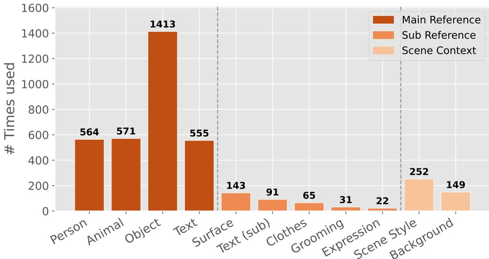  
Figure 9: Reference adoption counts on the VIF-Bench evaluated set (1,241 tasks). Each bar reports how many times a reference type is used, grouped into Main Reference, Sub Reference, and Scene Context.

Figure 9 shows how often each reference type is adopted across the 1,241 tasks of our evaluated set, grouped into Main Reference, Sub Reference, and Scene Context and colored consistently with the reference-count distribution in Figure 3. Main references (the primary subjects) are adopted 564 times for person, 571 for animal, 1,413 for object, and 555 for text. The object count is larger than the others because, unlike the single-form person, animal, and text categories, objects are further split by their plausible placement environment into versatile (usable both indoors and outdoors), indoor-only, and outdoor-only; the object bar therefore aggregates three sub-types, breaking down into 512 versatile, 459 indoor-only, and 442 outdoor-only adoptions. Consequently, person, animal, and text remain at a comparable scale (roughly 550–570 adoptions each), while object—being an umbrella over three environment-conditioned variants—accumulates a proportionally larger total. Sub-references specify attributes of a main subject and are therefore tied to a specific main-subject type: on the person side we adopt clothes 65 times, grooming (hairstyle and make-up) 31 times, and facial expression 22 times; on the object side we adopt surface (color and material) 143 times; and on the text side text 91 times. Because each sub-reference type is only applicable to a compatible main subject—clothes, grooming, and facial expression apply to people, surface applies to objects, and text applies to text subjects—a sub-reference can be adopted only when the corresponding main type is present in the task. Consequently, the sub-reference counts are inherently uneven: they are upper-bounded by how often the associated main category appears (e.g., person for grooming, object for surface) and by whether a task chooses to specify that attribute. This subject-conditioned hierarchy also prevents semantically inconsistent task construction, such as assigning a facial-expression reference to an object. Scene context, which specifies the overall appearance of the generated scene, is adopted 252 times for scene style and 149 for background.

## E COMPARISON WITH PRIOR WORKS

Table 1 compares benchmarks by the maximum number of visual-instruction images provided within a single task. This image-level definition is distinct from the semantic number of visual operations encoded in those images. In VIBE (Zhang et al., 2026a), multiple visual operations may be combined within a single annotated image in its multi-task setting; we therefore count it as one visual-instruction image at the image level, rather than treating it as semantically containing only a single instruction. MultiRef (Chen et al., 2025a) supports multiple reference images, but each task uses at most a single visual-instruction image. DreamOmni3 (Xia et al., 2025a) can involve up to two scribbleannotated images in a task, but these use a single scribble-based instruction modality rather than multiple heterogeneous visual-instruction types. VIF-Bench instead requires models to jointly process multiple independent reference images together with multiple visual-instruction images, integrating heterogeneous constraints such as layout, orientation, pose, wind, and lighting.

Beyond comparison in Table 1, we also examine how recent state-of-the-art image generators perform on an existing multi-reference benchmark. We evaluate Nano Banana Pro and GPT-Image-1.5 on MultiRef (Chen et al., 2025a), which assesses heterogeneous visual-reference conditions using three Overall Assessment dimensions: Image Quality (IQ), Instruction Following (IF), and Source Fidelity (SF). As shown in Table 5, GPT-Image-1.5 achieves an average score of 0.848, exceeding the 0.771 score of the ground-truth images under MultiRef’s Overall Assessment protocol. This suggests that the current MultiRef evaluation provides relatively limited headroom for distinguishing the strongest recent generators. These quantitative findings are echoed by qualitative inspection (Figure 10).

Table 5: Comparison with prior methods on MultiRef (Chen et al., 2025a). IQ, IF, and SF denote Image Quality, Instruction Following, and Source Fidelity, respectively.
<table><tr><td>Model</td><td>IQ</td><td>IF</td><td>SF</td><td>Avg.</td></tr><tr><td>Show-o (Xie et al., 2024)</td><td>0.764</td><td>0.616</td><td>0.462</td><td>0.614</td></tr><tr><td>OmniGen (Xiao et al., 2024)</td><td>0.730</td><td>0.532</td><td>0.438</td><td>0.567</td></tr><tr><td>ACE (Han et al., 2025)</td><td>0.740</td><td>0.655</td><td>0.528</td><td>0.641</td></tr><tr><td>ChatDiT (Huang et al., 2024a)</td><td>0.811</td><td>0.713</td><td>0.574</td><td>0.699</td></tr><tr><td>Claude + SD 2.1 (Rombach et al., 2022)</td><td>0.812</td><td>0.726</td><td>0.572</td><td>0.703</td></tr><tr><td>Claude + SD 3 (Esser et al., 2024)</td><td>0.876</td><td>0.817</td><td>0.658</td><td>0.784</td></tr><tr><td>Claude + SD 3.5 (Esser et al., 2024)</td><td>0.913</td><td>0.853</td><td>0.691</td><td>0.819</td></tr><tr><td>Gemini + SD 2.1 (Rombach et al., 2022)</td><td>0.791</td><td>0.708</td><td>0.547</td><td>0.682</td></tr><tr><td>Gemini + SD 3 (Esser et al., 2024)</td><td>0.856</td><td>0.804</td><td>0.639</td><td>0.766</td></tr><tr><td>Gemini + SD 3.5 (Esser et al., 2024)</td><td>0.893</td><td>0.839</td><td>0.676</td><td>0.803</td></tr><tr><td>Ground Truth</td><td>0.842</td><td>0.803</td><td>0.668</td><td>0.771</td></tr><tr><td>Nano Banana Pro (Google DeepMind, 2025b)</td><td>0.800</td><td>0.743</td><td>0.660</td><td>0.734</td></tr><tr><td>GPT-Image-1.5 (OpenAI, 2025c)</td><td>0.879</td><td>0.856</td><td>0.810</td><td>0.848</td></tr></table>

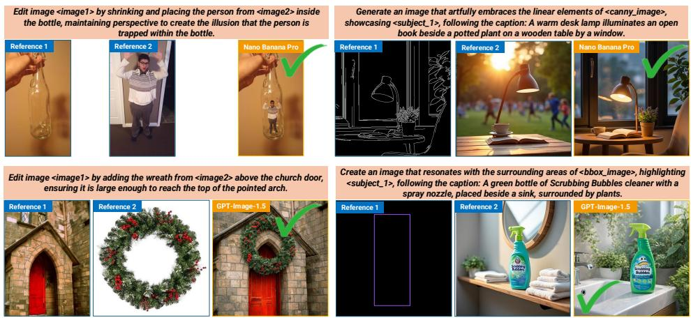  
Figure 10: Example of MultiRef benchmark. These tasks are almost fully solvable by advanced models such as Nano Banana Pro and GPT-Image-1.5, and each task uses at most a single visual-instruction image.

## F FURTHER RESULTS

## F.1 FURTHER RESULTS FOR REFERENCE–VISUAL-INSTRUCTION CONFLICT

We provide a more detailed analysis of reference–visual-instruction conflict across all evaluated generators. Among the 1,241 tasks in VIF-Bench, 438 contain at least one conflict between an attribute implied by a reference image and a visual instruction controlling the same attribute, while 803 contain no such conflict. At the instruction-type level, conflicts occur in 106 of the 315 Orientation tasks (33.7%), 172 of the 233 Light tasks (73.8%), 153 of the 250 Wind tasks (61.2%), and 82 of the 141 Pose tasks (58.2%). These categories are not mutually exclusive, since a single task may contain conflicts for multiple visual-instruction types.

Figure 11 extends the analysis in Figure 6 (Left) to all eight generators and all evaluation criteria. For each visual-instruction type, we split the corresponding tasks into conflict and no-conflict subsets and report the average score on each criterion for each generator. Below, we focus on Visual Instruction Adherence (third row), the criterion directly targeted by the conflict. The full results show that the effect of conflict depends strongly on the controlled attribute. For Orientation, adherence is lower on the conflict subset for every generator, although the gap is relatively modest. The effect is substantially larger for Light and Wind: all eight generators obtain lower adherence on conflict tasks, indicating that salient lighting conditions or wind-responsive appearance already present in a reference can strongly interfere with the corresponding visual instruction.

The raw per-generator scores further show that this effect is not simply driven by a particular model family. For Light, the conflict–no-conflict decrease ranges from approximately 0.78 to 1.85 points across the eight generators, while for Wind it ranges from approximately 0.51 to 1.86 points. For Orientation, the decrease is smaller, ranging from approximately 0.08 to 0.68 points. A simple average over the eight per-generator scores gives conflict versus no-conflict adherence of 2.77 versus 3.08 for Orientation, 3.46 versus 4.67 for Light, and 2.99 versus 4.43 for Wind.

Pose exhibits a different pattern. The effect is more model-dependent: Nano Banana, Nano Banana Pro, and GPT-Image-1.5 show lower adherence on pose-conflict tasks, whereas several open-weight models show little difference or a small change in the opposite direction. These open-weight models score near the floor on pose tasks in both subsets, so the absence of a gap likely reflects a floor effect rather than robustness to conflict. Accordingly, averaging across all eight generators yields only a small aggregate difference for Pose (3.11 versus 3.17). This suggests that reference–visual-instruction interference is particularly systematic for Light and Wind, while the effect of a conflicting reference pose depends more strongly on the generator.

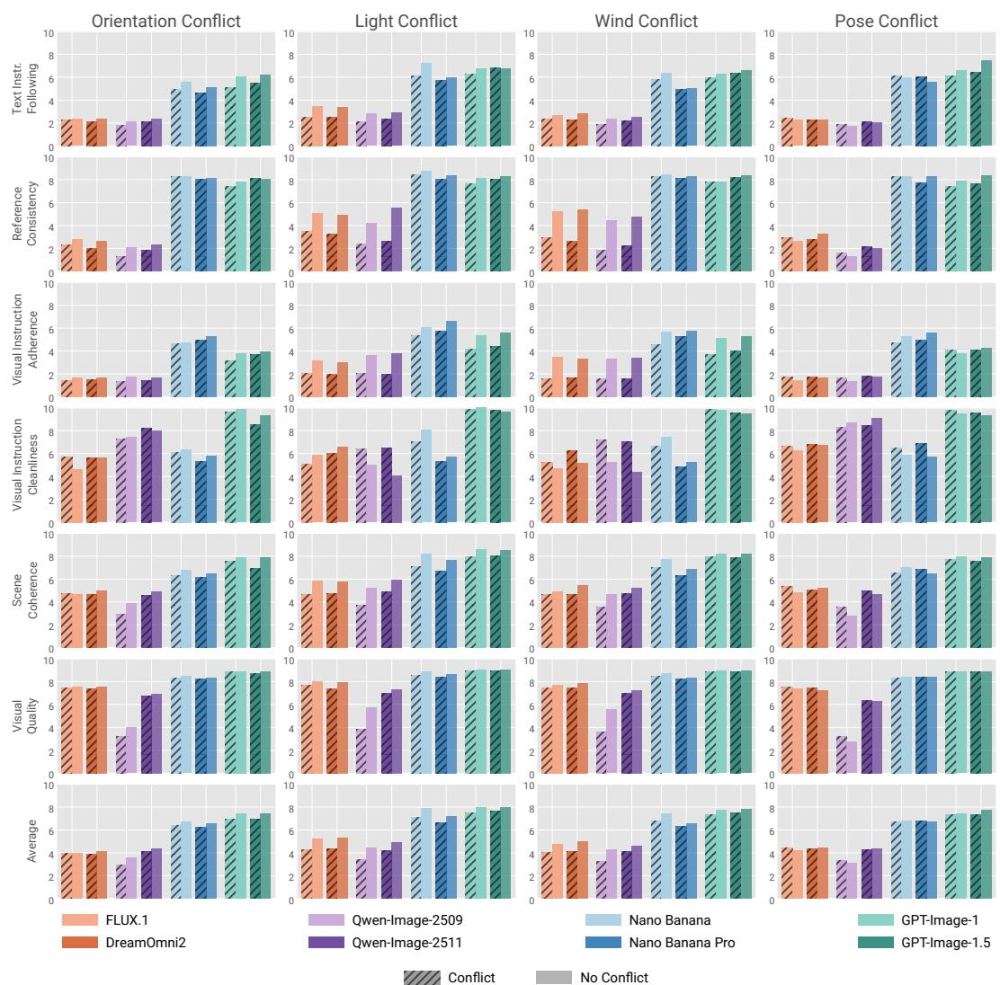  
Figure 11: Full per-generator analysis of reference–visual-instruction conflict. For each visual-instruction type (columns), we compare conflict (hatched) and no-conflict subsets across all eight generators on the six evaluation criteria and their average (rows). On Visual Instruction Adherence (third row), conflict consistently reduces scores for Orientation, Light, and Wind, with substantially larger gaps for Light and Wind, whereas the effect for Pose is more model-dependent.

## F.2 FURTHER RESULTS FOR THE NUMBER OF REFERENCES AND VISUAL INSTRUCTIONS

Figure 12 extends Figure 5 to all generators and all criteria, together with their average. As in Section 4.2, tasks are binned by the number of reference images or visual-instruction images.

Number of reference images. Every generator scores lower with five or more references than with one on every criterion except Visual Instruction Cleanliness. Reference Consistency separates the two model groups most clearly: the open-weight generators start relatively close to the closed ones with a single reference but fall to near the floor with five or more, whereas the closed generators decline only moderately. Since the judge assigns the minimum Reference Consistency score whenever any subject is missing or replaced (Appendix J), these near-floor scores suggest that, according to the judges, at least one referenced subject is missing or replaced in most of these outputs. Visual Instruction Adherence for the open-weight generators likewise falls near the floor. Text Instruction Following, in contrast, drops by a similar amount in both groups, so its open/closed gap remains roughly constant. Visual Quality of the closed generators stays high in every bin, and Qwen-Image-Edit-2509 is the only generator whose Visual Quality collapses. Its successor, Qwen-Image-Edit-2511, starts at a similar level but declines only moderately, so the Visual Quality gain from 2509 to 2511 in Table 2 arises largely from multi-reference tasks. Scene Coherence declines for all generators, more steeply for the Nano Banana models than for the GPT-Image models.

Emergence of the adherence–artifact trade-off. Visual Instruction Cleanliness follows familydependent trends that connect to the adherence–artifact trade-off in Section 4.1. With a single reference, the closed generators are nearly tied in Visual Instruction Adherence, and all keep Cleanli ness high. With five or more references, they split into two groups: the Nano Banana models retain higher adherence but leave more instruction marks, whereas the GPT-Image models remain clean but lose much of their adherence. The trade-off among closed models thus emerges as references accumulate. For the open-weight generators, Cleanliness is instead higher with five or more references than with one. Because this increase coincides with near-floor adherence, it suggests that their outputs neither follow nor reproduce the visual instructions, but rather than following them cleanly.

Number of visual instructions. Compared with references, the number of visual instructions has a weaker effect. From one to three visual instructions, the Average score decreases for every generator, but always less than it does over the same increase in references; the two effects are closest for Nano Banana Pro and the GPT-Image models. For every generator, Visual Instruction Adherence changes only slightly and far less than with references, even though the judge caps adherence by the worst violation among all visual instructions (Appendix J). Instead, Text Instruction Following, Reference Consistency, Scene Coherence, and Visual Quality decrease for every generator, typically most in Text Instruction Following and Scene Coherence. Visual Instruction Cleanliness moves in both directions: it drops for Nano Banana Pro and Qwen-Image-Edit-2511 but rises for DreamOmni2 and FLUX.1 Kontext. The 4+ bin contains few tasks and shows large model-dependent deviations in both directions; for example, the Average score drops for GPT-Image-1 but rises for GPT-Image-1.5.

## F.3 FURTHER RESULTS FOR VISUAL VS. TEXT-CONVERTED INSTRUCTIONS

Figure 13 reports the full results for Nano Banana Pro and GPT-Image-1.5 across all evaluation criteria. Unlike Nano Banana Pro, whose Visual Instruction Adherence is highest with the original VI, GPT-Image-1.5 has relatively weak VI adherence and benefits from converting the same constraints into text. Even for GPT-Image-1.5, the most detailed TI Dense is not optimal: TI Medium achieves the highest VI/TI Instruction Adherence, suggesting that, for this model, moderately abstracted descriptions are easier to follow than either the visual instructions or exhaustive textual ones. For the remaining metrics, performance generally improves as the instruction becomes less restrictive, reflecting greater freedom to preserve reference content and overall image quality. Visual Instruction Cleanliness also increases substantially when moving from VI to TI, as the visual instruction images— and hence the marks that could be reproduced in the output—are no longer provided. Importantly, we evaluate all generations using the VLM judges against the original task, including its original VI images, rather than against the converted TI. We use the original VI as the oracle specification so that the comparison measures how well each textual representation recovers the constraint encoded by the VI, rather than how well the output matches a potentially coarsened textual instruction.

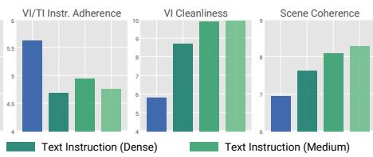

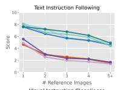

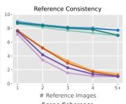

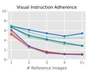

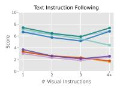

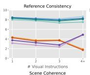

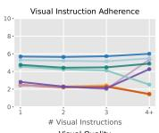

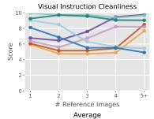

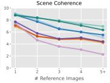

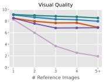

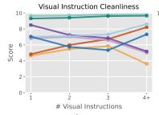

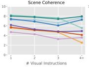

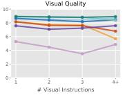

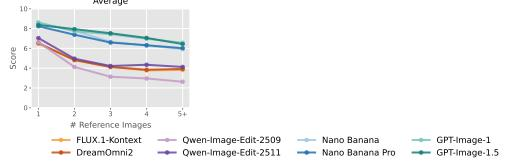

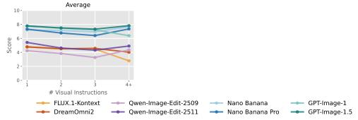  
Figure 12: (Left) Full results as a function of the number of reference images for all generators. We merge tasks with five or more reference images into the 5+ bin. For every generator, all criteria except Visual Instruction Cleanliness are lower with five or more references than with one. Cleanliness decreases for the Nano Banana models but increases for the open-weight generators, whose adherence approaches the floor. (Right) Full results as a function of the number of visual-instruction images for all generators. Tasks with four or more visual instructions are merged into the 4+ bin, which contains few tasks. The effect is weaker than that of the number of reference images.

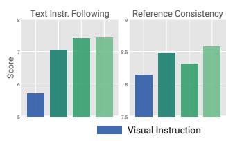

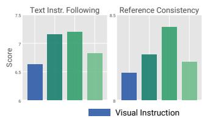

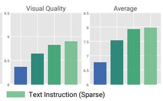

(a) Nano Banana Pro  
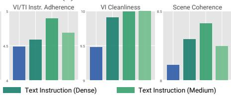

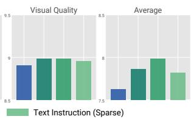  
(b) GPT-Image-1.5  
Figure 13: Full comparison of visual instructions (VIs) and text-converted instructions at three levels of granularity for Nano Banana Pro and GPT-Image-1.5. Nano Banana Pro achieves its highest VI/TI Instruction Adherence with the original VI, whereas GPT-Image-1.5 benefits from text conversion and performs best with TI Medium. Other criteria generally improve as the constraints are relaxed; in particular, Visual Instruction Cleanliness increases when VI images are removed. We evaluate all conditions against the original task and its original VIs.

## F.4 ADDITIONAL QUALITATIVE RESULTS

Figure 14 and Figure 15 show additional qualitative examples of VIF-Bench.

Place the object from Image 0 inside the red box, and the animal from Image 1 inside the blue box, following the layout in Image 3, on a serene sandy beach, make Image 1 face the 3D direction shown by the pyramid in Image 2 (the pyramid's wider square face = Image 1's front), render the result as a single seamless image where foreground and background blend into one coherent scene (not a collage, not split panels), and erase any visual instructions (bounding boxes, arrows, markings, etc.) from the final image.

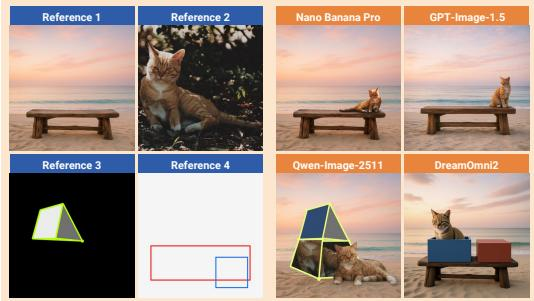

Place the person from Image 0 inside the red box, and the object from Image 1 inside the blue box, following the layout in Image 3, in a quiet residential driveway, render the lighting coming from the direction of the yellow arrow in Image 2, render the result as a single seamless image where foreground and background blend into one coherent scene (not a collage, not split panels), and erase any visual instructions (bounding boxes, arrows, markings, etc.) from the final image.

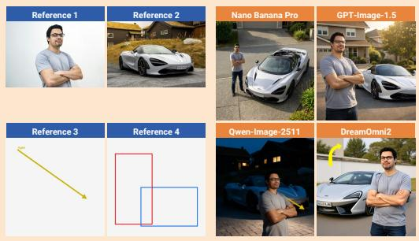  
Place the object from Image 0 inside the red box, the object from Image 1 inside the blue box, and the object from Image 2 inside the green box, following the layout in Image 3, in a quiet city street, render the result as a single seamless image where foreground and background blend into one coherent scene (not a collage, not split panels), and erase any visual instructions (bounding boxes, arrows, markings, etc.) from the final image.

Place the object from Image 0 inside the red box, and the object from Image 1 inside the blue box, following the layout in Image 3, set the background to the scene shown in Image 2, render the result as a single seamless image where foreground and background blend into one coherent scene (not a collage, not split panels), and erase any visual instructions (bounding boxes, arrows, markings, etc.) from the final image.

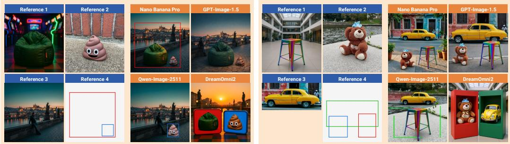

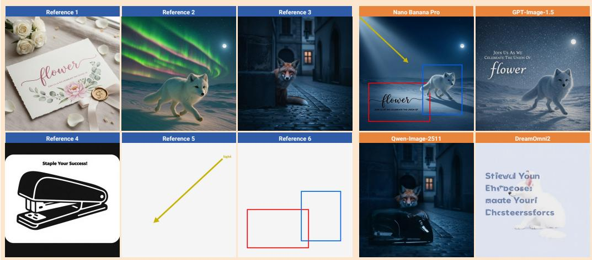  
Figure 14: Qualitative example of VIF-Bench.

Place the animal from Image 0 inside the red box, the person from Image 1 inside the blue box, and the object from Image 2 inside the green box, following the layout in Image 5, in a rainy neon-lit city street at night, render the wind blowing in the direction of the cyan arrow in Image 4, render the lighting coming from the direction of the yellow arrow in Image 4, make Image 0 face the 3D direction shown by the pyramid in Image 3 (the pyramid's wider square face = Image 0's front), render the result as a single seamless image where foreground and background blend into one coherent scene (not a collage, not split panels), and erase any visual instructions (bounding boxes, arrows, markings, etc.) from the final image.

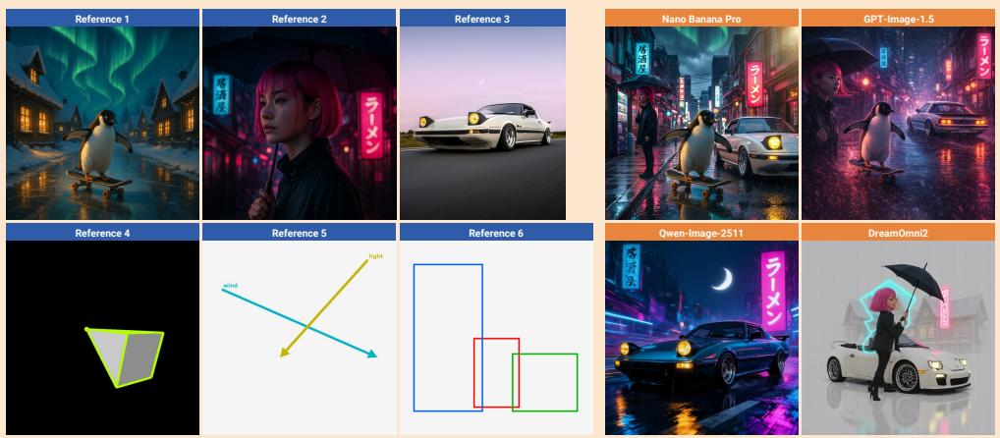

Place the person from Image 0 inside the red box, only the text from Image 1 (without the background of Image 1) inside the blue box, and the person from Image 2 inside the green box, following the layout in Image 4, in a lantern-lit city square, make Image 2 face the 3D direction shown by the pyramid in Image 3 (the pyramid's wider square face = Image 2's front), render the result as a single seamless image where foreground and background blend into one coherent scene (not a collage, not split panels), and erase any visual instructions (bounding boxes, arrows, markings, etc.) from the final image  
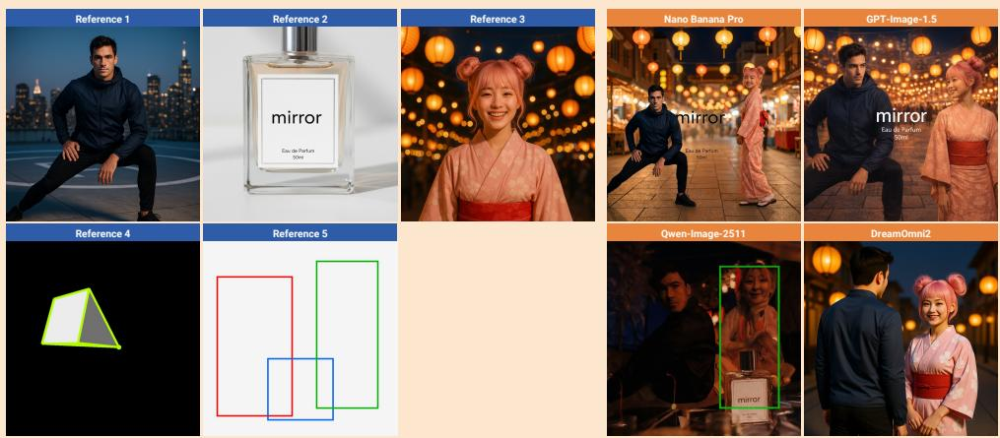

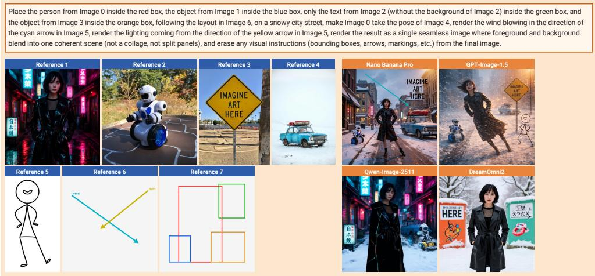  
Figure 15: Qualitative example of VIF-Bench.

## G FURTHER DISCUSSION FOR EVALUATION

## G.1 ROBUSTNESS TO JUDGE-SPECIFIC PREFERENCES

To examine whether the benchmark conclusions depend on preferences specific to a particular VLM judge, we report the evaluation results separately for GPT-5 and Gemini 2.5 Flash. Each entry in Table 6 reports GPT-5 / Gemini. Although GPT-5 and Gemini assign somewhat different absolute scores on individual criteria, their Average Scores produce the same generator ranking. This indicates that VIF-Bench’s overall conclusions are robust to the choice between the two primary judges and are unlikely to reflect preferences specific to either model.

Table 6: Generator scores evaluated separately by GPT-5 and Gemini 2.5 Flash. Each entry reports GPT-5 / Gemini.
<table><tr><td>Model</td><td>Text Instr.</td><td>Ref. Consist.</td><td>Vis. Adher.</td><td>Vis. Clean.</td><td>Scene</td><td>Quality</td><td>Avg.</td></tr><tr><td>GPT-Image-1</td><td>6.39 / 6.63</td><td>8.08 / 7.59</td><td>4.16 / 4.54</td><td>9.74 / 9.63</td><td>7.62 / 8.37</td><td>8.95 / 8.86</td><td>7.49 / 7.60</td></tr><tr><td>GPT-Image-1.5</td><td>6.70 / 6.89</td><td>8.45 / 7.79</td><td>4.22 / 4.91</td><td>9.41 / 9.37</td><td>7.51 / 8.16</td><td>8.99 / 8.77</td><td>7.55 / 7.65</td></tr><tr><td>Nano Banana Pro</td><td>6.12 / 6.02</td><td>8.82 / 7.72</td><td>5.52 / 5.82</td><td>6.30 / 6.24</td><td>7.17 / 6.84</td><td>8.83 / 8.13</td><td>7.13 / 6.80</td></tr><tr><td>Nano Banana</td><td>6.42 / 6.38</td><td>8.84 / 7.93</td><td>4.93 / 5.54</td><td>7.13 / 7.05</td><td>7.11/7.15</td><td>8.81 / 8.28</td><td>7.21 / 7.06</td></tr><tr><td>Qwen-Image-2511</td><td>2.79 / 3.23</td><td>3.42/3.34</td><td>2.55 / 2.44</td><td>7.82 / 7.73</td><td>5.02 / 6.22</td><td>7.41/7.26</td><td>4.84 / 5.04</td></tr><tr><td>DreamOmni2</td><td>2.62 / 3.09</td><td>4.03 / 3.74</td><td>2.25 / 2.39</td><td>5.55 / 5.59</td><td>4.53 / 6.13</td><td>7.97 / 7.75</td><td>4.49 / 4.78</td></tr><tr><td>FLUX.1 Kontext</td><td>2.60 / 3.20</td><td>4.23 / 3.86</td><td>2.33 / 2.43</td><td>5.12 / 5.20</td><td>4.45 / 6.06</td><td>8.01 / 7.82</td><td>4.46 / 4.76</td></tr><tr><td>Qwen-Image-2509</td><td>2.36 / 2.72</td><td>2.87 /2.83</td><td>2.38 / 2.24</td><td>7.03 / 6.76</td><td>3.63 / 4.99</td><td>4.35 / 5.02</td><td>3.77 / 4.09</td></tr></table>

## G.2 CROSS JUDGE CORRELATION

To validate our VLM-based evaluation protocol, we measure Pearson’s linear correlation coefficient and Spearman’s rank-order correlation coefficient between each VLM judge and human ratings on a 168-image human-evaluation subset. We additionally report Human–Human agreement as a reference. As shown in Table 7, GPT-5 and Gemini 2.5 Flash both show positive correlations with human evaluations across all criteria, achieving PLCC/SRCC values of 0.78/0.75 and 0.74/0.71, respectively, for the Average Score. In particular, GPT-5 achieves 0.76/0.72 for Visual Instruction Adherence, comparable to the Human–Human agreement of 0.75/0.74. To examine whether this agreement is specific to the two closed-source judges, we additionally evaluate Qwen3-VL-32B (Bai et al., 2025) as an open-source judge. Qwen3-VL-32B achieves 0.73/0.70 on the Average Score, comparable to Gemini. These results indicate that the VIF-Bench evaluation protocol is not specific to a particular proprietary VLM and can also be instantiated with an open-source judge.

Table 7: Correlation between human and VLM judges. Each entry reports PLCC / SRCC on the 168-image human-evaluation subset. Qwen3-VL-32B is included as an open-source judge.
<table><tr><td>Metric</td><td>Gemini-Human</td><td>GPT-5-Human</td><td>Qwen3-VL-Human</td><td>Human-Human</td></tr><tr><td>Text Instr. Follow.</td><td>0.69 / 0.67</td><td>0.72 / 0.69</td><td>0.64 / 0.69</td><td>0.63 / 0.63</td></tr><tr><td>Reference Consist.</td><td>0.73 / 0.72</td><td>0.73 / 0.71</td><td>0.67 / 0.69</td><td>0.75 / 0.78</td></tr><tr><td>Visual Instr. Adher.</td><td>0.53 / 0.60</td><td>0.76 / 0.72</td><td>0.61 / 0.63</td><td>0.75 / 0.74</td></tr><tr><td>Visual Instr. Clean.</td><td>0.70 / 0.72</td><td>0.71 / 0.72</td><td>0.71 / 0.72</td><td>0.76 / 0.78</td></tr><tr><td>Scene Coherence</td><td>0.48 / 0.45</td><td>0.53 / 0.55</td><td>0.51 / 0.50</td><td>0.58 / 0.59</td></tr><tr><td>Visual Quality</td><td>0.49 / 0.57</td><td>0.57 / 0.63</td><td>0.49 / 0.59</td><td>0.57 / 0.60</td></tr><tr><td>Average</td><td>0.74 / 0.71</td><td>0.78 / 0.75</td><td>0.73 / 0.70</td><td>0.80 / 0.78</td></tr></table>

## G.3 CONSISTENCY WITH AESTHETIC PREDICTORS

To further validate the Visual Quality evaluation, we compare the VLM-based scores with conventional image-quality predictors. Specifically, we compute correlations with LAION Aesthetic Predictor (AP) v1 and v2 (LAION-AI, 2022) over 168 generated images. Table 8 reports the PLCC and SRCC for GPT-5, Gemini, Qwen3-VL-32B, and human Visual Quality ratings. All three VLM judges show moderate positive correlations with both aesthetic predictors, indicating that their Visual Quality assessments are broadly consistent with conventional image-level quality measures. At the same time, GPT-5 Visual Quality scores achieve a PLCC/SRCC of 0.57/0.63 with human ratings, as reported in Table 7. These results provide complementary evidence that the VLM-based Visual Quality criterion captures perceptual quality in a manner consistent with both dedicated aesthetic predictors and human judgments.

Table 8: Correlation between Visual Quality scores and LAION Aesthetic Predictor (AP) (LAION-AI, 2022) v1/v2 over 168 generated images.
<table><tr><td>Score source</td><td>n</td><td>AP v1 PLCC</td><td>AP v1 SRCC</td><td>AP v2 PLCC</td><td>AP v2 SRCC</td></tr><tr><td>GPT-5 Visual Quality</td><td>168</td><td>0.566</td><td>0.506</td><td>0.680</td><td>0.598</td></tr><tr><td>Gemini Visual Quality</td><td>168</td><td>0.472</td><td>0.382</td><td>0.551</td><td>0.468</td></tr><tr><td>Qwen3-VL-32B Visual Quality</td><td>168</td><td>0.540</td><td>0.438</td><td>0.640</td><td>0.524</td></tr><tr><td>Human Visual Quality</td><td>168</td><td>0.415</td><td>0.380</td><td>0.497</td><td>0.435</td></tr></table>

## G.4 CONSISTENCY WITH DETECTOR-BASED SPATIAL JUDGMENTS

We further examine whether the VLM-based evaluation of visual-instruction adherence can be complemented by specialized geometric metrics. In particular, following the layout instructions, we use Grounding DINO (Liu et al., 2023) to localize the target subjects in 168 generated images and compare the detected regions with their instructed layout regions. We consider two geometric measures. Bounding-box IoU measures the intersection-over-union between the detected subject box and its target layout box. Center-in-region rate measures whether the center of the detected subject falls inside the instructed region. We then compute the correlation between these geometric measures and human ratings.

As shown in Table 9, the specialized geometric metrics exhibit moderate correlations with human judgments. For comparison, GPT-5 achieves a PLCC / SRCC of 0.76 / 0.72 for Visual Instruction Adherence, close to the human–human agreement of 0.75 / 0.74. These results indicate that the VLM judge can capture spatial instruction-following behavior at least competitively with these detector-based alternatives, while remaining applicable to visual instructions beyond bounding-box layouts.

Table 9: Correlation of detector-based geometric metrics (Liu et al., 2023) with human ratings over 168 layout examples.
<table><tr><td>Geometric metric</td><td>n</td><td>PLCC</td><td>SRCC</td></tr><tr><td>Bounding-box IoU</td><td>168</td><td>0.357</td><td>0.435</td></tr><tr><td>Center-in-region rate</td><td>168</td><td>0.508</td><td>0.551</td></tr></table>

## G.5 DIVERSITY UNDER REPEATED GENERATION

The primary VIF-Bench evaluation measures whether a generated image satisfies its references and instructions, but does not directly measure variation across repeated generations. To examine this aspect, we select 12 tasks and generate five outputs for each task and model using identical references and instructions. Following Kim et al. (2025), we measure diversity among repeated outputs using the mean pairwise CLIP (Radford et al., 2021) distance and mean pairwise LPIPS (Zhang et al., 2018). The tasks are grouped by the number of major visual instructions, denoted by $N _ { \mathrm { V I } }$

Overall, variation across repeated generations tends to increase as the number of visual constraints grows, while the Average Score decreases. For Nano Banana Pro, for example, CLIP diversity increases from 0.078 at $N _ { \mathrm { V I } } = 1$ to 0.216 at $N _ { \mathrm { V I } } = 4 .$ , while the Average Score decreases from 7.74 to 6.48. GPT-Image-1.5 remains comparatively stable for $N _ { \mathrm { V I } } \leq 3$ , but at $N _ { \mathrm { V I } } = 4$ its diversity increases and its Average Score drops substantially. Importantly, greater variation is not necessarily desirable in the strongly constrained setting considered by VIF-Bench. When all reference and visual-instruction constraints are satisfied, repeated outputs are expected to remain within a relatively restricted set of valid solutions. As task complexity increases, different generations may instead violate different subsets of the constraints, causing the outputs to diverge in different directions. The observed increase in diversity may therefore reflect generation instability rather than useful creative variation. Distinguishing diversity that preserves instruction fidelity from variation caused by inconsistent constraint satisfaction remains an important direction for future evaluation.

Table 10: Diversity across repeated generations from identical references and instructions. We generate five outputs for each task. Higher CLIP and LPIPS distances indicate greater variation.
<table><tr><td>Model</td><td> $N _ { \mathrm { V I } }$ </td><td>#Tasks</td><td>CLIP div. ↑</td><td>LPIPS div. ↑</td><td>Avg. Score ↑</td></tr><tr><td>GPT-Image-1.5</td><td>1</td><td>3</td><td>0.066</td><td>0.412</td><td>8.55</td></tr><tr><td>GPT-Image-1.5</td><td>2</td><td>3</td><td>0.042</td><td>0.381</td><td>8.58</td></tr><tr><td>GPT-Image-1.5</td><td>3</td><td>3</td><td>0.079</td><td>0.438</td><td>8.49</td></tr><tr><td>GPT-Image-1.5</td><td>4</td><td>3</td><td>0.124</td><td>0.505</td><td>6.03</td></tr><tr><td>Nano Banana Pro</td><td>1</td><td>3</td><td>0.078</td><td>0.481</td><td>7.74</td></tr><tr><td>Nano Banana Pro</td><td>2</td><td>3</td><td>0.142</td><td>0.542</td><td>7.40</td></tr><tr><td>Nano Banana Pro</td><td>3</td><td>3</td><td>0.173</td><td>0.567</td><td>7.04</td></tr><tr><td>Nano Banana Pro</td><td>4</td><td>3</td><td>0.216</td><td>0.578</td><td>6.48</td></tr></table>

## H EXTENDED RELATED WORK

Table 11: Further comparison among major benchmarks for reference-based image generation, editing, and visual-instruction following.
<table><tr><td>Benchmark</td><td>#Size</td><td>#Refs</td><td>#VIs</td><td>Reference-VI Conflict</td><td>Metrics</td></tr><tr><td colspan="6">Without visual instructions</td></tr><tr><td>EditBench (Wang et al., 2023)</td><td>240</td><td>1</td><td></td><td>X</td><td>CLIP (Radford et al., 2021)</td></tr><tr><td>EditVal (Basu et al., 2023)</td><td>648</td><td>1</td><td></td><td></td><td>CLIP, VLM, manual</td></tr><tr><td>EmuEdit (Sheynin et al., 2024)</td><td>3,055</td><td>1</td><td></td><td></td><td>L1, CLIP, DINO (Caron et al., 2021)</td></tr><tr><td>MagicBrush (Zhang et al., 2023a)</td><td>1,053</td><td>1</td><td></td><td></td><td>L1, L2, CLIP, DINO</td></tr><tr><td>AnyEdit (Yu et al., 2025)</td><td>1,250</td><td>1</td><td></td><td></td><td>L1, CLIP, DINO</td></tr><tr><td>I2EBench (Ma et al., 2024)</td><td>2,240</td><td>1</td><td></td><td></td><td>GPT (OpenAI, 2023)</td></tr><tr><td>ImgEdit-Bench (Ye et al., 2025)</td><td>811</td><td>1</td><td></td><td></td><td>GPT (3 dim.), Fake Det. (Xu et al., 2025)</td></tr><tr><td>DreamBooth (Ruiz et al., 2022)</td><td>75</td><td>1</td><td></td><td>××××××××××</td><td>CLIP, DINO</td></tr><tr><td>OmniContext (Wu et al., 2025b)</td><td>400</td><td>3</td><td></td><td></td><td>GPT (3 dim.)</td></tr><tr><td>DreamOmni2 (Xia et al., 2025b)</td><td>319</td><td>4</td><td></td><td></td><td>Gemini, Doubao (ByteDance, 2025)</td></tr><tr><td>MultiBanana (Oshima et al., 2026b)</td><td>3,769</td><td>8</td><td></td><td></td><td>GPT, Gemini (5 dim.)</td></tr><tr><td colspan="6">With visual instructions</td></tr><tr><td>MultiRef (Chen et al., 2025a)</td><td>1,990</td><td>6</td><td>1</td><td>X</td><td>GPT (3 dim), modality-specific metrics</td></tr><tr><td>VIBE (Zhang et al., 2026a)</td><td>1,034</td><td>1</td><td>1</td><td>X</td><td>GPT (3 dim.)</td></tr><tr><td>DreamOmni3 (Xia et al., 2025a)</td><td>731</td><td>4</td><td>2†</td><td>X</td><td>Gemini, Doubao (ByteDance, 2025)</td></tr><tr><td>VIF-Bench (Ours)</td><td>1,241</td><td>7</td><td>6</td><td></td><td>GPT, Gemini, Qwen (6 dim.)</td></tr></table>

Benchmark for image editing. Instruction-based image editing can be viewed as one of the earliest forms of reference-conditioned image generation, where the source image serves as a dense reference whose content must be preserved except for the instructed change. Benchmarks in this line, including MagicBrush (Zhang et al., 2023a), EMU-Edit (Sheynin et al., 2024), SmartEdit (Huang et al., 2024b), I2E-Bench (Ma et al., 2024), and ImgEdit (Ye et al., 2025), accordingly assume a single reference image and a textual edit instruction, and therefore do not address compositional multi-reference settings. Table 11 shows further comparison with prior benchmarks.

Visual-instruction editing. While early instruction-based image editing methods largely rely on natural-language prompts (Hertz et al., 2023; Miyake et al., 2025), recent work has explored richer visual instruction channels that allow users to specify edit intent more directly and unambiguously. VIBE (Zhang et al., 2026a) also emphasizes this motivation, describing visual instructions as a “more natural and efficient interaction paradigm” for communicating spatial and structural intent. Exemplar- and demonstration-based methods condition editing on reference images or before–after visual examples, enabling users to convey appearance or stylistic changes that are difficult to describe in text (Yang et al., 2022; Nguyen et al., 2023). Spatially grounded conditioning further exposes low-level visual controls, such as edges, depth maps, poses, segmentation maps, and sketches, to constrain the edited image’s geometry and layout (Zhang et al., 2023b). In parallel, interactive manipulation methods allow users to specify geometric changes through points or drag handles, providing fine-grained control over object pose, shape, and position (Pan et al., 2023; Shi et al., 2023; Mou et al., 2024; Ling et al., 2024). Complementary to these model-centric efforts, recent datasets and benchmarks such as MagicBrush (Zhang et al., 2023a) and RealEdit (Sushko et al., 2025) study instruction-guided editing in more realistic settings, highlighting the gap between synthetic editing tasks and practical user intent.

Test-time Scaling and Agents for Multimodal Generation. Test-time scaling (TTS), which improves model capabilities by allocating additional computation at inference time, has its roots in the development of reasoning in large language models (Kojima et al., 2022; Snell et al., 2024; Matsutani et al., 2026). This paradigm has recently been extended to image and video generation, where a growing body of work improves generation quality and human preferences (Furuta et al., 2024; Onoda et al., 2026) by scaling inference-time computation without updating model parameters (Yeh et al., 2024; Zhao et al., 2026; Saini et al., 2026). Image generation agents are a type of TTS, and they combine prompt adaptation (Hao et al., 2023; Datta et al., 2024), tool orchestration (Shen et al., 2023; Wang et al., 2024), and visual feedback (Yang et al., 2024) to improve model outputs. GEMS (He et al., 2026) integrates iterative generation with trajectory memory and reusable skills.

Instruction-following evaluation in LLMs. IFEval (Zhou et al., 2023), FollowBench (Jiang et al., 2024), Multi-IF (He et al., 2024), Multi-Instructions (Harada et al., 2025), and related (Liu et al., 2024; Laban et al., 2026) all observe that LLMs “game” scoring by satisfying instructions in letter rather than spirit.

## I LIMITATIONS AND FUTURE WORK

Synthetic-reference bias and source coverage. The reference-image pool combines real images from LAION-5B (Schuhmann et al., 2022), DreamOmni2 (Xia et al., 2025b), and DreamBooth (Ruiz et al., 2022) with synthetic images generated by Nano Banana and GPT-Image-1. Prior work evaluating this style of curated mixed-source pool has confirmed that statistical bias remains low and that the resulting datasets are reliable for benchmarking purposes (Oshima et al., 2026b), so we do not consider this a blocking risk. As a coverage improvement, however, future versions of VIF-Bench would benefit from broadening the synthetic side to include outputs from additional generators such as Qwen-Image (Wu et al., 2025a) and FLUX (Labs et al., 2025), so that the source distribution is no longer concentrated on the GPT-Image and Nano Banana families.

Visual-instruction diversity. The five kinds of visual instructions in VIF-Bench—layout boxes, wind/light arrows, 3D orientation pyramids, and pose references—follow the design of prior work (Zhang et al., 2026a), where the effectiveness of each instruction kind has already been validated. The space of plausible visual instructions, however, is wider than the five we currently cover. On the more structured end, future extensions could automatically generate additional instruction kinds, e.g., human skeletons or part-segmentation maps; on the more freeform end, they could include hand-drawn instructions such as rough scribbles, doodles, or arrow sketches that better reflect how a human user might communicate compositional intent in practice. Evaluating models against this broader range would test not only whether they follow the well-defined visual-instruction kinds we use here, but whether they generalize to the full distribution of compositional cues a creative user is likely to draw.

Extension to video generation. The evaluation philosophy of VIF-Bench naturally extends to subject-driven video generation (Google DeepMind, 2025c; OpenAI, 2024; Chen et al., 2025b; Zhang et al., 2026c), where multiple references and heterogeneous visual instructions must be satisfied consistently over time without leaving residual instruction marks. In videos, constraints such as layout, orientation, pose, lighting, wind, and arrow-specified motion must remain coherent across frames, motivating frame-level evaluation of visual instruction adherence and both spatial and temporal evaluation of scene coherence. Moreover, past observations or visual memories maintained by video-generation world models (Xiao et al., 2025; Oshima et al., 2026a) could be treated as multiple references, enabling evaluation of long-term subject and state consistency as well as memory–instruction interactions when past visual context conflicts with current instructions.

## J PROMPTS

This appendix lists the full prompts used in VIF-Bench’s construction and evaluation pipeline.

## J.1 VISUAL INSTRUCTIONS PROPOSAL PROMPTS

Below we list the four prompts used to propose visual instructions during task construction. A VLM (e.g., GPT-5 (OpenAI, 2025b)) receives the sampled main reference images and the canvas dimensions $W \times H$ , and returns a JSON record that is then rendered into the corresponding visual-instruction image (layout boxes, direction arrows, or 3D orientation pyramids, as shown in Figure 2; Right).

## Layout Proposal Prompt

You are a visual layout designer. You are given N reference subject images in order:   
{listing}   
Propose a composition on a canvas of W × H pixels that will render as ONE seamless   
natural image—foreground and background integrated, as if it were a single photograph   
or illustration. AVOID collage-like or grid-like arrangements that produce visible panel   
boundaries.   
For EACH reference image, decide where its main subject should be placed on the canvas.   
Return ONLY a JSON object with this exact shape (no markdown, no commentary):   
“canvas”: [W, H],   
“boxes”: [   
{“index”: 0, “box”: [x<sub>min</sub>, y<sub>min</sub>, x<sub>max</sub>, y<sub>max</sub>]},   
{“index”: 1, “box”: [x<sub>min</sub>, y<sub>min</sub>, x<sub>max</sub>, y<sub>max</sub>]},   
]   
}   
Rules:   
1. Box format is [x<sub>min</sub>, y<sub>min</sub>, x<sub>max</sub>, y<sub>max</sub>] normalized to [0.0, 1.0] (top-left origin).   
2. index MUST reference the image ordering above (0-based), so each box is tied to a   
specific source image.   
3. Include one box per input image, in index order.   
4. NO BOX MAY SPAN THE ENTIRE IMAGE, regardless of how many boxes there are.   
Every box must leave visible margin from the canvas edges: $x _ { \mathrm { m i n } } \geq 0 . 0 5 , y _ { \mathrm { m i n } } \geq 0 . 0 5 .$   
$x _ { \mathrm { m a x } } \mathrm { \ ' } \leq 0 . 9 5 , y _ { \mathrm { m a x } } \leq 0 . 9 5 .$ . A box that covers 90%+ of both dimensions is forbidden even in   
single-subject tasks—leave background space around the subject.   
5. Composition goal: the final image should read as a single cohesive scene. Prefer overlap  
ping placements, foreground-background depth cues, and natural spatial relationships (e.g.,   
smaller objects in front of larger subjects, subjects sharing a common ground plane).   
6. AVOID tight grids, equal-sized side-by-side panels, or any arrangement that would make   
the final image look like separate pictures pasted together. Leave room for background /   
negative space to connect the subjects.   
7. Boxes may overlap when the composition calls for it.

## Arrow Proposal Prompt

You are a visual scene designer. You are given N reference subject images that will be   
composed into one scene on a W × H canvas:   
{listing}   
Your job is to propose ONE directional arrow PER requested kind, indicating the direction of   
an environmental factor across the canvas. Each arrow has a TAIL (start) and a HEAD (end),   
in normalized canvas coordinates (top-left origin, range [0.0, 1.0]).   
Requested arrows:   
- wind: Wind arrow. The TAIL is where the wind originates, the HEAD is the direction the   
wind blows TOWARDS. Choose a direction that is physically plausible for the scene (e.g.,   
across the subjects, not aimed straight into the ground).   
Return ONLY a JSON object with this exact shape (no markdown, no commentary):   
“canvas”: [W, H],   
“arrows”: [   
{“label”: “wind”, “start”: [x, y], “end”: [x, y]}   
]   
Rules:   
1. Coordinates are normalized to [0.0, 1.0]; (0, 0) = top-left, (1, 1) = bottom-right.   
2. Each arrow MUST have meaningful length (Euclidean distance between start and end   
≥ 0.4 in normalized units), so the direction is unambiguous when rendered.   
3. Keep BOTH endpoints inside the canvas with at least 0.05 margin from any edge (i.e.,   
0.05 ≤ x, y ≤ 0.95).   
4. The arrow must clearly indicate direction, not be a near-zero-length blob.   
5. Include exactly one arrow per requested kind, in the order listed above.   
6. Do NOT add arrows for kinds that were not requested.

## Light Arrow Proposal Prompt

You are a visual scene designer. You are given N reference subject images that will be   
composed into one scene on a W × H canvas:   
{listing}   
Your job is to propose ONE directional arrow PER requested kind, indicating the direction of   
an environmental factor across the canvas. Each arrow has a TAIL (start) and a HEAD (end),   
in normalized canvas coordinates (top-left origin, range [0.0, 1.0]).   
Requested arrows:   
- light: Light arrow. The TAIL is at the light source, the HEAD points TOWARDS where   
the light falls on the subjects. Choose a key-light direction consistent with the scene (typically   
from above, off-axis, never straight up from the ground). Return ONLY a JSON object with   
this exact shape (no markdown, no commentary):   
“canvas”: [W, H],   
“arrows”: [   
{“label”: “light”, “start”: [x, y], “end”: [x, y]}   
Rules:   
1. Coordinates are normalized to [0.0, 1.0]; (0, 0) = top-left, (1, 1) = bottom-right.   
2. Each arrow MUST have meaningful length (Euclidean distance between start and end   
≥ 0.4 in normalized units), so the direction is unambiguous when rendered.   
3. Keep BOTH endpoints inside the canvas with at least 0.05 margin from any edge (i.e.,   
0.05 ≤ x, y ≤ 0.95).   
4. The arrow must clearly indicate direction, not be a near-zero-length blob.   
5. Include exactly one arrow per requested kind, in the order listed above.   
6. Do NOT add arrows for kinds that were not requested.

```prolog
Orientation Proposal Prompt
You are a visual scene designer. The composition uses a W × H canvas. For each subject
listed below, decide which 3D direction that subject should FACE in the final image.
Subjects requiring a facing direction:
{subject_descriptor_lines}
{layout_preview_sentence}
Coordinate convention (right-handed, camera at origin looking down $- Z ; + Z = \mathrm { O U T }$ of the
screen toward the viewer):
- yaw = 0<sup>◦</sup> → subject faces TOWARD the viewer (+Z)
- yaw = +90<sup>◦</sup> → subject faces SCREEN-RIGHT (+X)
- yaw = 180<sup>◦</sup> → subject faces AWAY from viewer (−Z)
- yaw = −90<sup>◦</sup> → subject faces SCREEN-LEFT $( - X )$
- diagonals → 3/4 views (e.g., yaw = 45<sup>◦</sup> = front-right 3/4 from the camera)
- pitch = 0<sup>◦</sup> → level
- pitch = +30<sup>◦</sup> → looking UP (head tilted up)
- pitch = −30<sup>◦</sup> → looking DOWN
Pick yaw + pitch that are physically and aesthetically plausible for the subject given the
composition:
- People commonly face slightly toward the camera or toward another subject.
- Animals often face toward food, another subject, or where action is.
- Outdoor objects (cars, buildings) face along their natural axis (front of the vehicle, entrance
of the building).
CONSTRAINT (the rendered pyramid must be visually distinguishable):
- |yaw| < 60<sup>◦</sup> AND |pitch $< 6 0 ^ { \circ }$
- |yaw| + |pitch| ≤ 75<sup>◦</sup>
- NOT (|yaw| < 15<sup>◦</sup> AND |pitch| $< 1 5 ^ { \circ } )$ : at least one of |yaw|, |pitch| must be $\geq 1 5 ^ { \circ }$ . The
(yaw, pitch) region too close to (0, 0) renders as a flat square and is excluded.
Pick angles inside this region. Examples of valid (yaw, pitch): (+15, 0), (0, +15),
(+30, −15), (−30, +15), (+45, −30), (−45, +30), (0, −45), (+15, −45), (−15, +45),
(+45, +15).
Return ONLY a JSON object with this exact shape (no markdown, no commentary):
{
“canvas”: [W, H],
“cones”: [
{
“main_index”: ⟨int⟩,
“yaw_deg”: ⟨number; |yaw| < 60⟩,
“pitch_deg”: ⟨number; |pitch| < 60⟩,
“rationale”: “⟨one short sentence explaining the choice⟩”
}
]
}
Rules:
1. Include exactly ONE cone entry per subject listed above.
2. Respect the CONSTRAINT above. Do not output (yaw, pitch) close to (0, 0) or with
magnitude $\geq 6 0 ^ { \circ }$ in any single axis.
3. Do NOT propose apex, length, or base radius—those are fixed by the renderer.
```

## J.2 JUDGE PROMPT

The judge prompt is fed to each judge VLM (Gemini 2.5 Flash and GPT-5) in the canonical input order: (1) the N reference images, (2) the visual instructions, (3) the textual instruction given to the generator, and (4) the generated output image. The judge produces a free-form “Reasoning” segment followed by one numerical score per criterion on a 1–10 scale.

## VIF-Bench Judge Prompt

You are a STRICT evaluator for a multi-reference image generation system. You will be given reference images, visual instructions, the textual instruction given to the generator, and the generated output image.

Reference Images: {reference\_image\_files}

Visual Instructions: {visual\_instruction\_files}

Instruction: {instruction}

Generated Image: {generated\_image\_file}

Your task is to evaluate the generated image from six independent perspectives, each on a 10-point scale. For each criterion, follow the hard caps strictly: a violation triggers a fixed score ceiling regardless of the rest of the image.

## 1. Text Instruction Following

Evaluate how faithfully the generated image follows the textual requirements in the instruction that are not visual instructions. This includes global requirements that shape the whole scene (the overall style, the background setting) and per-subject requirements that bind a specific attribute to a specific main subject. For text references, only the text itself must appear in the output, without the background of the text reference image. If any of these requirements is ignored, the score must not exceed 5. If a per-subject attribute is applied to the wrong subject, or the required overall style is not applied at all, the score must not exceed 4. If the background of a text reference is carried into the output, the score must not exceed 5.

## 2. Reference Consistency

Evaluate subject fidelity along identity, shape, texture, and font dimensions. If a subject is missing from the output or replaced with a different subject, the score must be 1. If any single subject fails recognizable detail matching with its reference, the score must not exceed 6.

3. Vision Instruction Adherence (STRICT)

Evaluate adherence to ALL visual instructions provided in this task, which may include: (a) layout boxes — each subject must occupy its assigned colored box; (b) 3D orientation pyramids — each subject must face the direction indicated by its pyramid (front = square base, back = apex); (c) wind/light arrows — global wind/illumination in the scene must follow the cyan/yellow arrow direction; (d) pose references — the designated person must take the pose shown in the pose reference. Apply the following hard caps. When multiple visual instructions are present, the WORST violation across them determines the cap. If subjects are swapped across the colored bounding boxes (wrong color-to-subject mapping), OR a pose reference is applied to the wrong person, the score must be 1. If any subject is clearly misplaced relative to its assigned box, OR a subject’s facing direction is clearly opposite (e.g., left/right flipped, or front/back reversed) to its orientation pyramid, OR the rendered wind/light direction is clearly opposite to its arrow, OR the designated person’s pose clearly does not match the pose reference, the score must not exceed 3. If any subject visibly protrudes outside its assigned box, OR the facing direction / wind / light / pose only loosely matches the visual instruction (recognizable but inaccurate), the score must not exceed 6.

## 4. Visual Instruction Cleanliness (STRICT)

Evaluate whether any visual-instruction mark has been carried over into the generated image, or newly drawn on top of it. Visual-instruction marks include: rectangular layout frames, 3D orientation pyramids, direction arrows (wind/light), and any other recognizable instructional overlay. Count one "complete mark" as one recognizable instance of any of the above (e.g., one full box, one full pyramid, one full arrow). Partial or faint remnants that are still recognizable count as marks; only fully integrated, unrecognizable traces are exempt. If any recognizable mark of any kind remains in the output, the score must not exceed 6. If exactly one complete mark is preserved or drawn into the output, the score must be 4. If two or more complete marks remain (of any kind, in any combination), the score must be 1.

## 5. Scene Coherence

Evaluate foreground-background integration and semantic coherence between subjects. If the result reads as an obvious collage of pasted parts, the score must not exceed 3. If there is a style or lighting mismatch between subjects and background, the score must not exceed 5. If subjects from semantically distinct situational contexts are blended in a pixel-smooth but incoherent way, the score must not exceed 4.

## 6. Visual Quality

Evaluate the overall perceptual quality of the image, independent of instruction following. Assess whether the image is visually appealing and aesthetically coherent. This criterion has no caps tied to other criteria.

Each of the six scores must be evaluated independently. Do not force any score to be tied to or capped by another score except as stated above.

First, explain the reasoning, then present the final assessment.

Start the reasoning with Reasoning: .

After explaining the reasoning, present the final assessment in the format:

Text Instruction Following: ⟨A number from 1 to 10⟩.

Reference Consistency: ⟨A number from 1 to 10⟩.

Vision Instruction Adherence: ⟨A number from 1 to 10⟩.

Visual Instruction Cleanliness: ⟨A number from 1 to 10⟩.

Scene Coherence: ⟨A number from 1 to 10⟩.

Visual Quality: ⟨A number from 1 to 10⟩.