# VISTA: Value-Informed Event Appraisal for Multimodal Emotion Conflict

Jiale Dai1,\*,#, Liuxian Ma2,\*, Xiaoke Niu1, Wenjing Zhang3, Huiying Zhao3, Zhaoxiang Liu3, Shiguo Lian3, Guojie Song1,†,#

1State Key Laboratory of General Artificial Intelligence, School of Intelligence Science and Technology, Peking University 2College of Artificial Intelligence, Tsinghua University

3China United Network Communications Group Co., Ltd.

\*Strictly equal contribution; either author order is equally valid.

†Corresponding author.

Conflicting emotional cues can be individually valid: a subdued voice may reflect a blocked goal while a smile satisfies a social obligation. Their interpretation depends on what the event means to the person. We introduce VISTA (Value-Informed Semantic Trust Arbitration), a learned seven-field appraisal interface that conditions modality arbitration on concerns, event relations, and expression conditions while retaining a joint-evidence residual. A log-odds decomposition separates emotion expectation from cue diagnosticity, motivating an interface that lets appraisal change how evidence is interpreted. With a shared Qwen2.5-Omni-7B backbone and matched training examples and steps, VISTA reaches 64.5% conflict accuracy on CA-MER, improving on modality gating by 2.5 percentage points on conflict and 0.2 on consistency. Shufling appraisal across scenes or removing its decision connection reduces this benefit. A common frozen-backbone probe reaches 0.600 macro CCC for appraisal readout, compared with 0.505 for emotion-only fine-tuning. Evaluations across five benchmarks connect recognition under increasing conflict with appraisal readout and downstream decision use. Together, the analyses and experiments support scene-specific appraisal as an intermediate representation that helps interpret conflicting emotional evidence.

Keywords: Multimodal emotion recognition, cross-modal conflict, value-informed appraisal Contact: # daijiale26@stu.pku.edu.cn # gjsong@pku.edu.cn

## 1 Introduction

An unsuccessful candidate smiles and says “Congratulations” to the winner, yet speaks in a subdued voice. The words and smile may perform public courtesy, while the voice reflects a blocked goal (Figure 1). The recognition problem is to interpret conflicting emotional evidence about the same person.

A measurable source of recognition dificulty. Cross-modal afective disagreement afects a substantial portion of annotated data. Our audit of the public CH-SIMS labels finds diferent sentiment polarities across text, audio, and vision in 1,117 of 2,281 clips (49.0%) under a fixed three-class mapping (Yu et al., 2020; Zhang et al., 2021). In social-media image–text data, Pan & Meng (2024) report 42.5% inconsistency on filtered MVSA-Single. These observations motivate an explicit boundary between broad afective disagreement and strong conflict.

Defining conflict. We identify pairwise conflict from modality-specific afect annotations for the same target and event. For at least two annotated modalities $\mathcal { M } .$ , annotations $q ^ { m }$ , discrepancy $d ,$ and a fixed threshold $\tau ,$ define

$$
\kappa _ { \tau } ( X ) = \mathbf { 1 } \left\{ \operatorname* { m a x } _ { m < n , m , n \in \mathcal { M } } d ( q ^ { m } , q ^ { n } ) > \tau \right\} .\tag{1}
$$

For categorical afect, $d ( u , v ) = \mathbf { 1 } \{ u \not \equiv v \}$ and $\tau = 0$ encode disagreement, including neutral versus non-neutral polarity. Strong scalar conflict instead uses $d ( u , v ) = | u - v |$ and τ = 1 on [−1, 1] (Wang & Wu, 2025). Our primary CA-MER evaluation retains its fixed partitions: exactly one unimodal label agrees with the multimodal reference; the other disagrees (Han et al., 2025). EmoMM compares modality polarity to a joint reference (Sun et al., 2026a). Appendix E.1 gives the label audit, benchmark boundaries, and their relation to the reported conflict-strength groups.

Multimodal recognition must determine both which observations to trust and what those observations imply. Cross-modal attention and shared/private representations organize complementary evidence, while balanced optimization addresses unequal use of modalities (Tsai et al., 2019; Hazarika et al., 2020; Peng et al., 2022). Conflict-aware evaluation further asks which stream agrees with the afective reference (Han et al., 2025; Sun et al., 2026a). Yet a clearly observed cue can support diferent emotions in diferent circumstances: a smile accompanying rejection may express courtesy, relief, or satisfaction. Assessing signal reliability alone leaves this interpretive question open. The challenge is to connect a cue to the person’s relation to the event, so that its diagnostic role can change with the scene. The expressions serve diferent roles: congratulations address the colleague, while vocal tone can reflect the candidate’s own outcome. Their disagreement can therefore inform how private concerns are managed publicly.

Appraisal theory provides that connection through goals, expectations, agency, coping, and norms (Lazarus, 1991; Scherer, 2001). Values describe broader priorities, such as achievement or maintaining relationships (Schwartz, 2012); a concern specifies what the person seeks to attain or protect in this event. Wanting the role makes rejection a setback, while public courtesy can explain the accompanying smile. The relevant reference is local to the event; a person’s broader priorities need not be inferred as a fixed profile. These relations suggest an explicit interface between multimodal evidence and afect prediction: represent the event relative to the person’s concerns, then use that representation when interpreting its emotional cues.

We introduce VISTA, Value-Informed Semantic Trust Arbitration. Its seven-field appraisal organizes concerns, event relations, and expression conditions to condition both modality arbitration and afect prediction (Figure 2). This interface makes the scene’s evaluative meaning available where conflicting evidence is interpreted.

The contributions form a single argument. Design rationale: separating emotion expectation from cue diagnosticity motivates appraisal-dependent interpretation; representation refinement specifies when an explicit interface can help. Learned interface: VISTA connects event appraisal to arbitration and prediction. Discriminating evidence: matched controls locate the gain in conflict, while shufling, generic bottlenecks, removed decision access, and paired interventions examine its source. Five benchmarks distinguish conflict resolution, appraisal readout, and recognition scope; the appendix retains complete supervision and cost results.

## 2 Background and Related Work

Multimodal learning under disagreement. DifEmo operationalizes strong sentiment conflict through unimodal annotation gaps (Wang & Wu, 2025); CA-MER and EmoMM extend evaluation to categorical conflict and polarity disagreement, with MoSEAR and CHASE as associated methods (Han et al., 2025; Sun et al., 2026a). CHASE uses conflict to steer attention, whereas VISTA supplies an explicit concern-relative interpretation to both arbitration and prediction. Our controlled gate comparison tests this decision role on a common backbone.

Appraisal and value representations. Appraisal theory relates emotion to goals, expectations, agency, coping, and norms (Lazarus, 1991; Scherer, 2001); regulation shapes the observable response (Gross, 1998). Early work proposed inferring appraisal from nonverbal signals (Mortillaro et al., 2015). ValueNet uses value representations for emotion classification, and ValueEval studies values in arguments (Qiu et al., 2022; Kiesel et al., 2023). CAREBench evaluates appraisal reasoning and interventions (Sun et al., 2026b); ECFlow uses appraisal for emotion–cause extraction (Liang et al., 2026); THERADIA supplies human audiovisual appraisal annotations (Fournier et al., 2025). Expectation-based appraisal predicts emotion labels and shifts (Wang et al., 2026); $\mathrm { \Delta \dot { A G } \mathrm { - } C T R ^ { 2 } }$ instead organizes appraisal chains for support retrieval (Chu et al., 2026).

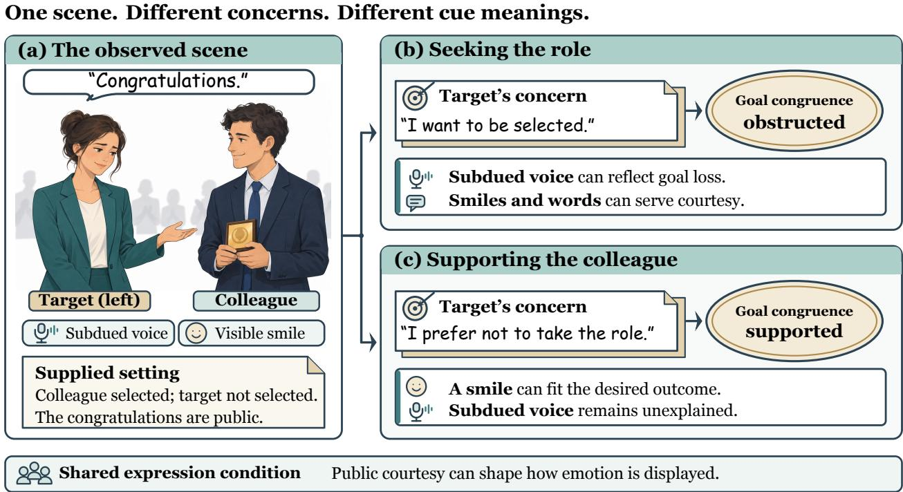  
Constructed comparison; supplied context; conditional readings, not model predictions.  
Figure 1 : The same cues can have different meanings under different concerns. This constructed comparison holds the observed event and cues fixed while changing the supplied goal of the candidate on the left. Goal congruence changes with that goal; the shared public setting supplies a condition on expression. The interpretations are conditional readings, not model predictions.

These tasks emphasize what appraisal predicts or retrieves. Table 6 in Appendix A contrasts these roles with recognition-time cue interpretation. VISTA uses it to condition the interpretation of conflicting sensory evidence: concerns and expression conditions inform arbitration and prediction, while correspondence and connection tests examine the interface’s contribution.

Intermediate concepts and explanations. Concept bottlenecks support concept supervision and intervention (Koh et al., 2020); post-hoc variants enable concept-level model edits (Yuksekgonul et al., 2023). VISTA retains a direct evidence pathway, making appraisal an auxiliary decision interface. Explanation faithfulness is a separate question (Turpin et al., 2023): dependence on internal appraisal, the content of a displayed rationale, and the semantic role of a computational route require distinct evidence.

## 3 Value-Informed Semantic Trust Arbitration

## 3.1 Scene meaning and the diagnosticity of emotional cues

VISTA uses event meaning to interpret and combine emotional evidence. We derive how appraisal changes cue diagnosticity, implement this interaction through modality arbitration, and analyze its representational role. Let $X = ( x ^ { t } , x ^ { a } , x ^ { v } , C )$ denote text, audio, video, and recognition-time context; y is the afective target. A cue is diagnostic when it distinguishes afective hypotheses within a scene.

For hypotheses y1, y0, cue u, and appraisal z, define posterior log odds $L ( u , z ) = \log [ P ( y _ { 1 } \mid u , z ) / P ( y _ { 0 } \mid u , z ) ]$ Bayes’ rule gives, for positive probabilities,

$$
L ( u , z ) = \underbrace { \log \frac { P ( y _ { 1 } \mid z ) } { P ( y _ { 0 } \mid z ) } } _ { b ( z ) \colon \mathrm { e m o t i o n ~ e x p e c t a t i o n } } + \underbrace { \log \frac { P ( u \mid y _ { 1 } , z ) } { P ( u \mid y _ { 0 } , z ) } } _ { \ell ( u , z ) \colon \mathrm { c u e ~ d i a g n o s t i c i t y } } ,\tag{2}
$$

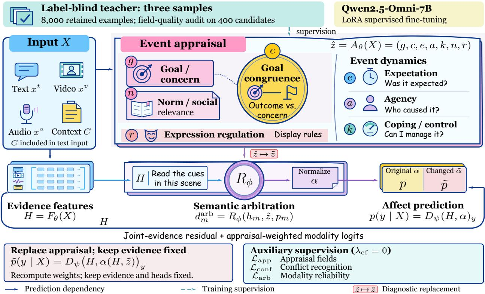  
Figure 2 : An explicit appraisal interface for multimodal recognition. Appraisal sets modality weights α; prediction combines weighted unimodal logits with joint evidence. Replacing appraisal at fixed evidence produces the readout ${ \tilde { p } } .$ The lower panels show this diagnostic and the supervision roles.

A blocked goal can change $b ;$ a courtesy obligation can change a smile’s contribution ℓ. At fixed b, the latter alone can cross the binary zero–one boundary $b + \ell = 0$ . For four supported cue–appraisal conditions, contrast two cues across two appraisals:

$$
\begin{array} { r l } & { \mathcal { T } = [ L ( u _ { 1 } , z _ { 1 } ) - L ( u _ { 0 } , z _ { 1 } ) ] - [ L ( u _ { 1 } , z _ { 0 } ) - L ( u _ { 0 } , z _ { 0 } ) ] } \\ & { \quad = [ \ell ( u _ { 1 } , z _ { 1 } ) - \ell ( u _ { 0 } , z _ { 1 } ) ] - [ \ell ( u _ { 1 } , z _ { 0 } ) - \ell ( u _ { 0 } , z _ { 0 } ) ] . } \end{array}\tag{3}
$$

Both b terms cancel: nonzero I rules out an additive representation $L ( u , z ) = s ( u ) + t ( z )$ and motivates cue–appraisal interactions. Appendix C derives this restriction and a smile/courtesy example. Here z is conceptual; predicted ${ \hat { z } } = A ( X )$ can itself depend on the cue, so b(zˆ) need not exclude cue information. This decomposition supplies a design criterion: the decision pathway should allow appraisal to change the interpretation of a cue, beyond shifting an emotion prior.

## The event-level appraisal state is

$$
z = ( g , c , e , a , k , n , r ) ,\tag{4}
$$

where the fields denote goal/concern, goal congruence, expectation, agency, coping/control, norm/social relevance, and expression regulation. Concern identifies what matters; congruence relates the outcome to it. Expectation, agency, and control distinguish anticipation, cause, and available remedies; norms and regulation distinguish social standards from emotional display.

Here value-informed refers to the evaluative reference supplied by g and n: c records goal support, while r describes expression conditions. Each field stores its value, confidence, evidence, and validity mask; Appendix A specifies the field types and missing-value rules. Section 4.3 tests removing r.

## 3.2 The appraisal-conditioned decision pathway

Let $H = F _ { \boldsymbol \theta } ( X ) = \{ h _ { T } , h _ { A } , h _ { V } , h _ { A V T } \}$ contain separate unimodal forward passes and a joint pass. Each representation is read at the input-end position of the Thinker’s final layer, after final normalization and before appraisal generation. For classification, the predicted state ${ \hat { z } } = A _ { \theta } ( X )$ conditions the modality scores:

$$
u _ { m } = W _ { m } h _ { m } , \qquad p _ { m } = \mathrm { s o f t m a x } ( u _ { m } ) ,
$$

$$
d _ { m } ^ { \mathrm { a r b } } = R _ { \phi } ( h _ { m } , \hat { z } , p _ { m } ) , \qquad \alpha _ { m } ( H , \hat { z } ) = { \frac { b _ { m } e ^ { d _ { m } ^ { \mathrm { a r b } } } } { \sum _ { j } b _ { j } e ^ { d _ { j } ^ { \mathrm { a r b } } } } } .\tag{5}
$$

where $m \in \{ T , A , V \} , b _ { m } \in \{ 0 , 1 \}$ indicates availability, and at least one modality is available. The classifier combines logits before normalization:

$$
p _ { \Theta } ( y \mid X ) = D _ { \psi } ( H , \alpha ( H , \hat { z } ) ) _ { y } = \mathrm { s o f t m a x } \Bigg ( W _ { f } h _ { A V T } + \sum _ { m } \alpha _ { m } ( H , \hat { z } ) u _ { m } \Bigg ) _ { y } .\tag{6}
$$

Appraisal changes prediction through the weights, while the residual retains joint evidence. This coupling implements the cue–appraisal interaction motivated by Equation 3: at fixed H and availability, an appraisal change gives $\begin{array} { r } { \Delta \log ( p _ { y } / p _ { y ^ { \prime } } ) = \sum _ { m } \Delta \alpha _ { m } ( u _ { m , y } - u _ { m , y ^ { \prime } } ) } \end{array}$ , with $\begin{array} { r } { \sum _ { m } \Delta \alpha _ { m } = 0 } \end{array}$ . Equal branch margins therefore cancel, while greater disagreement gives scene-matched reweighting more scope to change a class preference; Appendix D.4 proves the identity and bounds this change by the margin range. The internal α allocates weight among unimodal branches; the residual contributes separately. These weights difer from the predictive posterior and input-masking diagnostic αdiag.

## 3.3 Learning and interventions

The system uses Qwen2.5-Omni-7B with LoRA supervised fine-tuning (Xu et al., 2025; Hu et al., 2022). Three label-blind samples from the same teacher provide seven-field pseudo-appraisals; filtering and adjudication retain 8,000 of 10,256 candidates, including partially masked field targets. A separate 400-candidate audit measures field coverage, sampling consistency, and grounding (Appendix J). Inference uses predicted appraisal; human appraisal is reserved for an oracle comparison.

In the isolated label-visible condition, copying is 21.0% versus 3.0% under label-blind supervision, while grounding is 67.0% versus 73.0%, despite higher field consistency. This distinction supports scene grounding as a criterion for appraisal supervision (Appendix J).

Training combines final-task and unimodal losses with appraisal, conflict, and arbitration supervision, using coeficients (1, 1, 0.5, 0.5, 0.5) (Equation 52). Field-type losses are normalized within fields and then over valid fields; supervision masks retain partial labels. The counterfactual coeficient is $\lambda _ { \mathrm { c f } } = 0$ , so paired interventions evaluate learned responses to changed meaning. Appendix M specifies the training configuration and loss normalization.

At fixed evidence and availability, replacing zˆ by $\tilde { z }$ gives

$$
p _ { \Theta } ( y \mid X ; \tilde { z } ) = D _ { \psi } ( H , \alpha ( H , \tilde { z } ) ) _ { y } .\tag{7}
$$

Shufling tests scene correspondence; within-emotion shufling restricts donors by emotion as an ofline diagnostic. The connection ablation retains appraisal supervision and removes z from arbitration, whereas rewriting an external explanation holds H, z, and α fixed. Section 4.3 reports these variants; Appendix D distinguishes fixed-checkpoint replacement from retraining.

## 3.4 Decision-relevant representation refinement

Appraisal can recover decision distinctions omitted by a compressed H, while remaining a function of the same input X.

Table 1 : CA-MER accuracy (%). Conflict averages the video-aligned and audio-aligned subsets. The four trained models share their common-stage examples and optimization schedule. Complete output-validity results and protocol-reassessed external methods are in Appendix G.
<table><tr><td>Method</td><td>Video-aligned</td><td>Audio-aligned</td><td>Conflict</td><td>Consistent</td><td>Overall</td></tr><tr><td>Qwen2.5-Omni Base</td><td>49.0</td><td>60.0</td><td>54.5</td><td>68.0</td><td>59.0</td></tr><tr><td>Emotion-SFT</td><td>55.0</td><td>65.0</td><td>60.0</td><td>73.0</td><td>64.3</td></tr><tr><td>Generic-CoT-SFT</td><td>57.0</td><td>66.0</td><td>61.5</td><td>74.0</td><td>65.7</td></tr><tr><td>Modality-Gate-SFT</td><td>58.0</td><td>66.0</td><td>62.0</td><td>74.0</td><td>66.0</td></tr><tr><td>VISTA</td><td>61.0</td><td>68.0</td><td>64.5</td><td>74.2</td><td>67.7</td></tr></table>

Proposition 1 (Decision-relevant representation refinement). For fixed deterministic $H \ = \ F ( X )$ and ${ \hat { Z } } = A ( X )$ with finite labels, let $\begin{array} { r } { \mathcal { R } ^ { * } ( U ) = 1 - \mathbb { E } [ \operatorname* { m a x } _ { y } P ( Y = y \mid U ) ] } \end{array}$ denote Bayes zero–one risk. Then

$$
\begin{array} { r } { \mathcal { R } ^ { * } ( H , \hat { Z } ) \leq \mathcal { R } ^ { * } ( H ) , \qquad \mathcal { R } ^ { * } ( X , \hat { Z } ) = \mathcal { R } ^ { * } ( X ) . } \end{array}\tag{8}
$$

The first inequality is strict exactly when, for a positive-probability set of h, no label maximizes the refined posteriors almost surely under ${ \hat { Z } } \mid { \overline { { H } } } = h$

Proof sketch. Let $v _ { y } = P ( Y = y \mid H , \hat { Z } )$ and $y _ { H }$ be a Bayes label given H. The tower property gives $P ( Y = y \mid H ) = \operatorname { \mathbb { E } } [ v _ { y } \mid H ]$ , hence

$$
\Delta _ { \mathrm { r e p r } } : = \mathcal { R } ^ { * } ( H ) - \mathcal { R } ^ { * } ( H , \hat { Z } ) = \mathbb { E } \big [ \operatorname* { m a x } _ { y } v _ { y } - v _ { y _ { H } } \big ] \geq 0 .\tag{9}
$$

Equality holds exactly when $y _ { H }$ remains optimal almost surely; $( X , A ( X ) )$ and X carry the same information. Positive Bayes-risk reduction requires a decision distinction, not merely changed confidence. If $\hat { Z }$ is already determined by H, this gain is zero. Appendix C.3 gives the full proof, including ties. For an analytical binary example, let a constant H merge equally likely appraisal states with class-1 posteriors 0.8 and 0.2. Preserving this distinction lowers Bayes error from 0.5 to 0.2 (Appendix C.3).

For fixed H and ${ \hat { Z } } ,$ , let $f _ { U }$ be a learned classifier with risk $\mathcal { R } ( f _ { U } ) = \mathcal { R } ^ { * } ( U ) + \epsilon _ { U }$ , where $\epsilon _ { U } \geq 0$ . Substitution for $U = H$ and $( H , { \hat { Z } } )$ yields

$$
\mathcal { R } ( f _ { H } ) - \mathcal { R } ( f _ { H , \hat { Z } } ) = \Delta _ { \mathrm { r e p r } } + \epsilon _ { H } - \epsilon _ { H , \hat { Z } } .\tag{10}
$$

Improvement occurs exactly when $\epsilon _ { H , \hat { Z } } - \epsilon _ { H } < \Delta _ { \mathrm { r e p r } } :$ appraisal can help through decision distinctions or lower readout error. Section 4.3 tests intermediate organization and scene correspondence through generic and shufled appraisal. The decomposition separates representational opportunity from the readout that realizes it; Equation 6 accesses appraisal through its constrained weighting function. Matched recognition and connection contrasts assess the resulting decision behavior. Appendix C.3 derives the excess-risk posterior form; Appendix C.2 bounds appraisal-error propagation.

## 4 Experiments

The design in Section 3 makes a specific prediction: appraisal should help most when a cue admits competing emotional interpretations. We first test where the recognition gain occurs, then use correspondence and connection controls to examine what the interface contributes. Interventions and complementary tasks test the resulting account beyond the primary comparison.

## 4.1 Evaluation design

Tasks and evaluation modes. CA-MER provides video-aligned, audio-aligned, and consistent subsets (Han et al., 2025). We normalize outputs and average the first two accuracies for conflict. On EmoMM, we evaluate common-stage checkpoints without adaptation (Sun et al., 2026a). We adapt to CH-SIMS $\mathrm { v 2 }$ and MELD for sentiment accuracy across train-defined conflict groups and seven-class emotion recognition, respectively (Liu et al., 2022; Poria et al., 2019). On THERADIA, we separately evaluate frozen-backbone appraisal probes and downstream emotion-intensity regression (Fournier et al., 2025). Appendix E details the protocols and shared corpus sources.

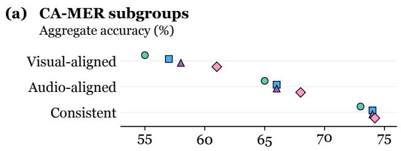

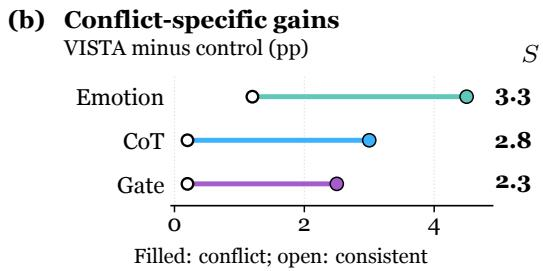

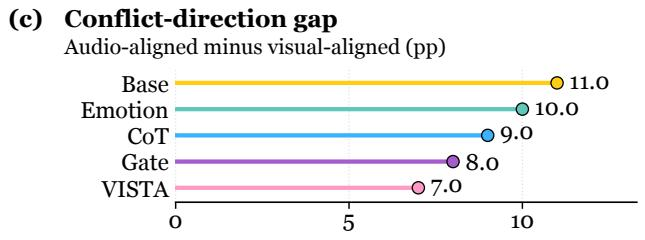

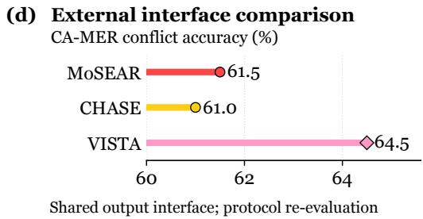  
Figure 3 : Conflict resolution beyond stronger reasoning and gating. (a) Subgroup accuracy. (b) Conflict and consistent gains; S is their diference. (c) The audio–video accuracy gap. (d) External methods re-evaluated under the common output interface. Points show aggregate scores; gains and gaps use percentage points.

Matched common training. The four trained models share Qwen2.5-Omni-7B, 8,000 examples, and the optimization schedule in Section 3.3; Base is frozen. Generic-CoT-SFT and VISTA both average 360 target tokens. The gate and VISTA have 12.19M and 12.39M trainable parameters. Scores are aggregates; contrasts use unrounded values. Appendices N and K give the configuration and compute record.

Conflict specificity. For a comparator $B ,$ define

$$
S ( B ) = \underbrace { \mathrm { A c c } _ { \mathrm { c o n f } } ( \mathrm { V I S T A } ) - \mathrm { A c c } _ { \mathrm { c o n f } } ( B ) } _ { \Delta _ { \mathrm { c o n f } } ( B ) } - \underbrace { \mathrm { A c c } _ { \mathrm { c o n s } } ( \mathrm { V I S T A } ) - \mathrm { A c c } _ { \mathrm { c o n s } } ( B ) } _ { \Delta _ { \mathrm { c o n s } } ( B ) } .\tag{11}
$$

Positive $S$ means that improvement is larger on the observed conflict subsets than on consistent inputs. This descriptive contrast complements absolute accuracy; all group scores and diferences appear in Appendix F.

## 4.2 The improvement concentrates on conflicting evidence

VISTA reaches 64.5% conflict and 67.7% overall accuracy (Table 1). Against Modality-Gate-SFT, the 2.5-point conflict gain accompanies a 0.2-point consistency gain (S = 2.3), locating the benefit where the streams disagree.

Against generic reasoning, visual- and audio-aligned gains of 4.0 and 2.0 points contrast with 0.2 on consistency, giving S = 2.8; against Emotion-SFT, S = 3.3. Figure 3 separates these efects. Under the common normalized interface, MoSEAR and CHASE reach 61.5% and 61.0% conflict accuracy, respectively, placing VISTA 3.0 and 3.5 points higher. These protocol-reassessed scores are distinct from published results.

Emotion-SFT tests label training, Generic-CoT-SFT supplies reasoning at the same mean target length, and Modality-Gate-SFT tests learned weighting. The latter two nearly match VISTA on consistency but separate on conflict; gains in both alignment directions extend to cases favoring either stream. The next tests examine which properties of appraisal accompany this advantage.

## 4.3 Scene correspondence and decision access strengthen recognition

Higher accuracy alone does not establish why appraisal helps. Figure 4 therefore separates decision access, semantic content, and scene correspondence. Retaining appraisal supervision but removing its forward decision connection gives 62.5% conflict accuracy, versus 64.5% for full VISTA. A generic semantic bottleneck reaches 63.2%, while renaming the appraisal fields retains 64.2%. These controls associate the additional benefit with the organized appraisal input used by prediction.

Table 2 : Directed response and selective stability. Direction is agreement with the annotated target-probability direction; class change counts label flips. Both use 150 relevant pairs; stability uses 150 irrelevant rewrites. Rates are percentages; ∆p and ∆ log-odds retain native scales.
<table><tr><td>Method</td><td>Direction</td><td>Class change</td><td>∆p</td><td>∆log-odds</td><td>Stability</td></tr><tr><td>Emotion-SFT</td><td>62.0</td><td>24.0</td><td>0.050</td><td>0.201</td><td>91.0</td></tr><tr><td>Generic-CoT-SFT</td><td>66.0</td><td>28.0</td><td>0.070</td><td>0.281</td><td>90.0</td></tr><tr><td>Modality-Gate-SFT</td><td>63.0</td><td>25.0</td><td>0.055</td><td>0.221</td><td>91.0</td></tr><tr><td>VISTA</td><td>75.0</td><td>36.0</td><td>0.120</td><td>0.484</td><td>92.0</td></tr></table>

Table 3 : Recognition across conditions and tasks (%). EmoMM uses no benchmark-specific adaptation; CH-SIMS v2 and MELD use task-adapted models (Base is zero-shot). Acc2 is binary accuracy, Q4 the highest-conflict group, and wF1 weighted F1.
<table><tr><td rowspan="2">Method</td><td colspan="2">EmoMM accuracy</td><td colspan="2">CH-SIMS v2 Acc2</td><td>MELD</td></tr><tr><td>Conflict</td><td>Conflict + missing</td><td>Overall</td><td>Q4</td><td>wF1</td></tr><tr><td>Qwen2.5-Omni Base</td><td>46.5</td><td>38.0</td><td>79.4</td><td>70.0</td><td>59.55</td></tr><tr><td>Emotion-SFT</td><td>47.5</td><td>38.0</td><td>84.0</td><td>77.0</td><td>65.49</td></tr><tr><td>Generic-CoT-SFT</td><td>48.0</td><td>38.6</td><td>84.3</td><td>77.8</td><td>65.69</td></tr><tr><td>Modality-Gate-SFT</td><td>49.0</td><td>40.0</td><td>84.8</td><td>79.2</td><td>65.74</td></tr><tr><td>VISTA</td><td>52.0</td><td>43.5</td><td>85.9</td><td>81.5</td><td>66.94</td></tr></table>

Scene correspondence provides a further distinction. Cross-sample shufling gives 62.0%, whereas restricting donors to the same emotion class gives 63.7%. The latter preserves the donor’s emotion category but loses 0.8 points, supporting information tied to the particular event. Removing expression regulation gives 63.6%. Removing appraisal, conflict, or reliability supervision gives 63.2%, 63.5%, or 63.0%, respectively; Table 19 retains every variant.

The interface also difers from a displayed explanation. Editing the external rationale with internal state fixed leaves accuracy at 64.5%; corrupting internal appraisal while preserving the explanation gives 62.0%. Native visual/audio weights change from 0.42/0.30 on video-aligned inputs to 0.25/0.47 on audio-aligned inputs. These conditional means complement the replacement tests; together, the contrasts connect the representation analysis in Section 3.4 to a scene-matched input that participates in prediction.

## 4.4 Relevant changes elicit directed, selective responses

The preceding tests remove or disrupt information. A complementary test asks whether changing relevant meaning produces a directed response while irrelevant reformulations preserve the decision. Table 2 reports 150 relevant intervention pairs and 150 separate irrelevant-rewrite pairs. Direction agreement concerns the target probability; label change concerns the predicted class.

The reported results combine 75.0% direction agreement with 92.0% rewrite stability. The 36.0% label-change rate distinguishes directed probability movements from those large enough to cross a class boundary.

Input masking gives a +0.040 target-modality diagnostic shift (controls: +0.015–+0.020), distinct from native α. These are behavioral evaluations of the learned interface: the final configuration uses $\lambda _ { \mathrm { c f } } = 0 .$ . Appendix H.1 gives the complete paired record.

## 4.5 The pattern extends across conflict strength and evaluation modes

Table 3 and Figure 5 extend the evaluation to increasing conflict strength, missing evidence, and ordinary emotion recognition.

150 valid pairs; 150 irrelevant rewrites

(a) Appraisal content and decision access Loss from full VISTA: 64.5 / 74.2 (conflict / consistent)  
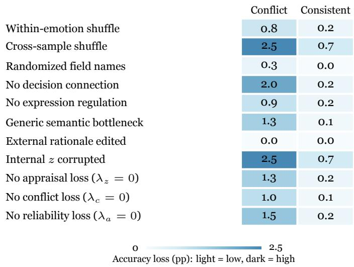

(b) Condition-dependent weights Native modality weights α  
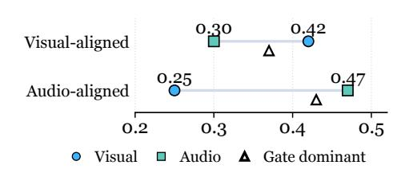

(c) Intervention response
<table><tr><td rowspan=1 colspan=6>Direction / label change / irrelevant stability (%)Dir.    Change   Stable</td></tr><tr><td rowspan=1 colspan=1>Emotion</td><td rowspan=1 colspan=1>62</td><td rowspan=1 colspan=1></td><td rowspan=1 colspan=1>24</td><td rowspan=1 colspan=1></td><td rowspan=1 colspan=1>91</td></tr><tr><td rowspan=1 colspan=1>CoT</td><td rowspan=1 colspan=1>66</td><td rowspan=1 colspan=1></td><td rowspan=1 colspan=1>28</td><td rowspan=1 colspan=1></td><td rowspan=1 colspan=1>90</td></tr><tr><td rowspan=1 colspan=1>Gate</td><td rowspan=1 colspan=1>63</td><td rowspan=1 colspan=1></td><td rowspan=1 colspan=1>25</td><td rowspan=1 colspan=1></td><td rowspan=1 colspan=1>91</td></tr><tr><td rowspan=1 colspan=1>VISTA</td><td rowspan=1 colspan=1>75</td><td rowspan=1 colspan=1></td><td rowspan=1 colspan=1>36</td><td rowspan=1 colspan=1></td><td rowspan=1 colspan=1>92</td></tr></table>

Figure 4 : From scene-specific appraisal to selective responses. (a) Accuracy losses under appraisal and training variants. (b) Native modality weights; triangles show the gate’s dominant-modality weight. (c) Direction agreement, label changes, and irrelevant-rewrite stability on two separate 150-pair sets. Native weights are distinct from masking-derived diagnostics.

Conflicting and absent evidence. EmoMM conflict and conflict-plus-missingness accuracy reach 52.0% and 43.5%, gains of 4.0 and 4.9 points over Generic-CoT-SFT. The consistency-to-conflict drop is 4.3 points, versus 6.6–7.5 for trained controls. Appendix G gives all conditions and the CHASE comparison, whose router used EmoMM supervision.

Greater conflict, greater benefit. On CH-SIMS v2, the gain over Emotion-SFT grows from 0.2 points in Q1 to 4.5 in Q4. Q4 accuracy reaches 81.5% and MAE falls from 0.365 to 0.315. This progression strengthens the conflict-specific account across training-defined intensity groups (Figure 5a).

From readable appraisal to useful appraisal. Identical frozen-backbone probes yield THERADIA macro CCC 0.600 for VISTA versus 0.505 for Emotion-SFT. Downstream ten-emotion CCC is 0.390 without appraisal, 0.415 with disconnected auxiliary supervision, 0.450 with generated appraisal, and 0.480 with human appraisal. The 0.035 gain over auxiliary-only training complements the CA-MER connection contrast: readable appraisal also supports prediction (Appendix I).

Recognition scope and practical cost. MELD weighted-F1 improves by 1.46 points over Emotion-SFT, with higher recall in all seven classes (Table 3). VISTA uses 72 GPU-hours per seed and 15.5 s median latency, versus 40 hours/13.5 s for equal-length Generic-CoT and 64 hours/6.0 s for gating. Appendices K and L retain full resources and class results.

The role of learning. Frozen appraisal prompting gives 56.0% conflict accuracy versus 56.4% for generic reasoning; training reverses this ordering (64.5% versus 61.5%), supporting the learned interface. Appendices G and J retain the prompting and supervision audits.

Frozen backbone; identical linear probes  
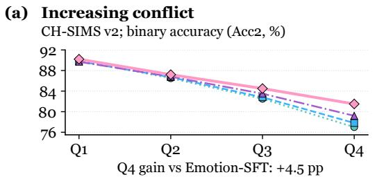

(b) Conflict and missingness EmoMM; frozen transfer, VISTA minus control (pp)
<table><tr><td>Emotion</td><td>+1.3</td><td>+4.5</td><td>+2.8</td><td>+5.5</td></tr><tr><td>CoT</td><td>+0.8</td><td>+4.0</td><td>+2.6</td><td>+4.9</td></tr><tr><td>Gate</td><td>+0.7</td><td>+3.0</td><td>+1.7</td><td>+3.5</td></tr><tr><td></td><td>Aligned</td><td>Conflict 0</td><td>Missing</td><td>Both 5.5</td></tr><tr><td colspan="7">Gain (pp): light = low, dark = high</td></tr></table>

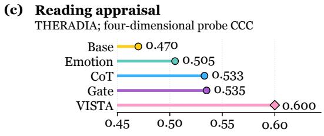

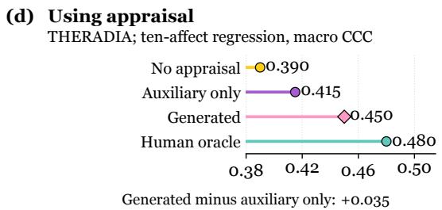  
Figure 5 : Conflict strength, frozen evaluation, and appraisal readout. (a) Task-adapted CH-SIMS v2 binary accuracy by conflict group. (b) EmoMM gains without benchmark-specific adaptation. (c) THERADIA four-dimensional probe CCC on frozen backbones. (d) Ten-label emotion-intensity regression CCC with diferent appraisal access; human appraisal is an oracle.

## 5 Discussion and Conclusion

VISTA connects what an event means to a person with how its emotional evidence is used. Distinguishing emotion expectation from cue diagnosticity motivates a concern-relative appraisal that reweights modality logits alongside joint evidence. Recognition gains concentrate on conflict; correspondence, connection, and intervention tests connect this benefit to the scene-specific interface. The analysis explains when reweighting can alter a class preference and when appraisal can refine a compressed representation. Together, these results establish a concrete route from scene meaning to conflict-sensitive emotion recognition.

## AI use statement

We used AI assistants in two roles. First, for manuscript preparation, including grammar checking, text polishing, and assistance with conceptual framing, mathematical arguments, result interpretation, and figure preparation. Second, for routine coding assistance during implementation, including annotation processing and visualization. The illustrative scene in Figure 1 was AI-generated; model-generated appraisal supervision is described in Section 3.3. The method, experimental design, and all implementation decisions afecting the reported results were finalized by the authors, who verified all AI-assisted output and take full responsibility for this paper.

## Ethics statement

Appraisal is a contextual hypothesis about an event, rather than a durable personal attribute or a judgment of moral worth. Goals, norms, and expression vary across people and settings. Consequential uses require contextspecific validation and human review; conversational and audiovisual data require attention to participant privacy and dataset access conditions. Appendix N discusses responsible interpretation.

## Reproducibility statement

Appendix C gives the analytical assumptions and full derivations. Appendix E describes datasets and conflict protocols, Appendix J records supervision, and Appendix M specifies common training and task adaptation. Appendix N maps the complete experimental evidence. The appendices report the complete experimental results, scoring conventions, and links between the analyses, tables, and figures. For the independent publiclabel prevalence audit, Appendix E.1 specifies the label mapping, exact comparison rule, sample counts, and data provenance.

## References

Yuqi Chu, Lizi Liao, Jinggui Liang, Boyang Li, and Richang Hong. Beyond semantic similarity: Appraisal-guided chain-of-thought reasoning and retrieval for multimodal emotional support conversations. In Findings of the Association for Computational Linguistics: ACL 2026, pp. 17104–17119. Association for Computational Linguistics, 2026. doi: 10.18653/v1/2026.findings-acl.844. URL https://aclanthology.org/2026.findings-acl.844/.

Quanqi Du, Loic De Langhe, Els Lefever, and Veronique Hoste. Sentiment analysis on video transcripts: Comparing the value of textual and multimodal annotations. In Proceedings of the Tenth Workshop on Noisy and Usergenerated Text, pp. 10–15. Association for Computational Linguistics, 2025. doi: 10.18653/v1/2025.wnut-1.2. URL https://aclanthology.org/2025.wnut-1.2/.

Hippolyte Fournier, Sina Alisamir, Safaa Azzakhnini, Isabella Zsoldos, Eléonore Trân, Gérard Bailly, Frédéric Elisei, Béatrice Bouchot, Brice Varini, Patrick Constant, Joan Fruitet, Franck Tarpin-Bernard, Solange Rossato, François Portet, Olivier Koenig, Hanna Chainay, and Fabien Ringeval. THERADIA WoZ: An ecological corpus for appraisalbased afect research in healthcare. IEEE Transactions on Afective Computing, 16(3):2233–2244, 2025. doi: 10.1109/TAFFC.2025.3557465. URL https://arxiv.org/abs/2405.06728.

James J. Gross. The emerging field of emotion regulation: An integrative review. Review of General Psychology, 2(3):271– 299, 1998. doi: 10.1037/1089-2680.2.3.271. URL https://journals.sagepub.com/doi/10.1037/1089-2680.2.3.271.

Zhiyuan Han, Beier Zhu, Yanlong Xu, Peipei Song, and Xun Yang. Benchmarking and bridging emotion conflicts for multimodal emotion reasoning. In Proceedings of the 33rd ACM International Conference on Multimedia, pp. 5528–5537, 2025. doi: 10.1145/3746027.3754856. URL https://arxiv.org/abs/2508.01181.

Devamanyu Hazarika, Roger Zimmermann, and Soujanya Poria. MISA: Modality-invariant and -specific representations for multimodal sentiment analysis. In Proceedings of the 28th ACM International Conference on Multimedia, pp. 1122–1131, 2020. doi: 10.1145/3394171.3413678. URL https://arxiv.org/abs/2005.03545.

Edward J. Hu, Yelong Shen, Phillip Wallis, Zeyuan Allen-Zhu, Yuanzhi Li, Shean Wang, Lu Wang, and Weizhu Chen. LoRA: Low-rank adaptation of large language models. In International Conference on Learning Representations, 2022. URL https://openreview.net/forum?id=nZeVKeeFYf9.

Johannes Kiesel, Milad Alshomary, Nailia Mirzakhmedova, Maximilian Heinrich, Nicolas Handke, Henning Wachsmuth, and Benno Stein. SemEval-2023 task 4: ValueEval: Identification of human values behind arguments. In Proceedings of the 17th International Workshop on Semantic Evaluation (SemEval-2023), pp. 2287–2303. Association for Computational Linguistics, 2023. doi: 10.18653/v1/2023.semeval-1.313. URL https://aclanthology.org/2023.seme val-1.313/.

Pang Wei Koh, Thao Nguyen, Yew Siang Tang, Stephen Mussmann, Emma Pierson, Been Kim, and Percy Liang. Concept bottleneck models. In Proceedings of the 37th International Conference on Machine Learning, volume 119 of Proceedings of Machine Learning Research, pp. 5338–5348, 2020. URL https://proceedings.mlr.press/v119/koh 20a.html.

Richard S. Lazarus. Emotion and Adaptation. Oxford University Press, 1991. doi: 10.1093/oso/9780195069945.001.0001. URL https://academic.oup.com/book/53474.

Qiao Liang, Ying Shen, Yao Liu, Tiantian Chen, and Lin Zhang. Why do emotions change? appraisal-guided reasoning for emotion–cause triplet extraction in conversations. In Proceedings of the 64th Annual Meeting of the Association for Computational Linguistics (Volume 1: Long Papers), pp. 11750–11772. Association for Computational Linguistics, 2026. doi: 10.18653/v1/2026.acl-long.539. URL https://aclanthology.org/2026.acl-long.539/.

Yihe Liu, Ziqi Yuan, Huisheng Mao, Zhiyun Liang, Wanqiuyue Yang, Yuanzhe Qiu, Tie Cheng, Xiaoteng Li, Hua Xu, and Kai Gao. Make acoustic and visual cues matter: CH-SIMS v2.0 dataset and AV-Mixup consistent module. In Proceedings of the 2022 International Conference on Multimodal Interaction, pp. 247–258, 2022. doi: 10.1145/3536221.3556630. URL https://arxiv.org/abs/2209.02604.

Marcello Mortillaro, Ben Meuleman, and Klaus R. Scherer. Automated recognition of emotion appraisals. In Jordi Vallverdú (ed.), Handbook of Research on Synthesizing Human Emotion in Intelligent Systems and Robotics, pp. 338–351. Information Science Reference, 2015. doi: 10.4018/978-1-4666-7278-9.ch016. URL // te.unige.ch/unige:97396.

Qiuyu Pan and Zuqiang Meng. Hybrid uncertainty calibration for multimodal sentiment analysis. Electronics, 13(3): 662, 2024. doi: 10.3390/electronics13030662. URL https://doi.org/10.3390/electronics13030662.

Xiaokang Peng, Yake Wei, Andong Deng, Dong Wang, and Di Hu. Balanced multimodal learning via on-the-fly gradient modulation. In Proceedings of the IEEE/CVF Conference on Computer Vision and Pattern Recognition, pp. 8238–8247, 2022. URL https://openaccess.thecvf.com/content/CVPR2022/html/Peng\_Balanced\_Multimod al\_Learning\_via\_On-the-Fly\_Gradient\_Modulation\_CVPR\_2022\_paper.html.

Soujanya Poria, Devamanyu Hazarika, Navonil Majumder, Gautam Naik, Erik Cambria, and Rada Mihalcea. MELD: A multimodal multi-party dataset for emotion recognition in conversations. In Proceedings of the 57th Annual Meeting of the Association for Computational Linguistics, pp. 527–536. Association for Computational Linguistics, 2019. doi: 10.18653/v1/P19-1050. URL https://aclanthology.org/P19-1050/.

Liang Qiu, Yizhou Zhao, Jinchao Li, Pan Lu, Baolin Peng, Jianfeng Gao, and Song-Chun Zhu. ValueNet: A new dataset for human value driven dialogue system. Proceedings of the AAAI Conference on Artificial Intelligence, 36(10):11183– 11191, 2022. doi: 10.1609/aaai.v36i10.21368. URL https://ojs.aaai.org/index.php/AAAI/article/view/21368.

Klaus R. Scherer. Appraisal considered as a process of multilevel sequential checking. In Klaus R. Scherer, Angela Schorr, and Tom Johnstone (eds.), Appraisal Processes in Emotion: Theory, Methods, Research, pp. 92–120. Oxford University Press, 2001. doi: 10.1093/oso/9780195130072.003.0005. URL https://academic.oup.com/book/53557/ chapter/422115725.

Shalom H. Schwartz. An overview of the Schwartz theory of basic values. Online Readings in Psychology and Culture, 2(1), 2012. doi: 10.9707/2307-0919.1116. URL https://scholarworks.gvsu.edu/orpc/vol2/iss1/11/.

Yueru Sun, Yimeng Zhang, Haoyu Gu, Nuo Chen, Dong She, Xianrong Yao, Yang Gao, and Zhanpeng Jin. EmoMM: Benchmarking and steering MLLM for multimodal emotion recognition under conflict and missingness. In Findings of the Association for Computational Linguistics: ACL 2026, pp. 20351–20371. Association for Computational Linguistics, 2026a. doi: 10.18653/v1/2026.findings-acl.1018. URL https://aclanthology.org/2026.findings-acl.101 8/.

Zhaoyue Sun, Hainiu Xu, Andero Uusberg, James J. Gross, Petr Slovak, and Yulan He. CAREBench: Evaluating LLMs’ emotion understanding by assessing cognitive appraisal reasoning. arXiv preprint arXiv:2605.17176, 2026b. URL https://arxiv.org/abs/2605.17176.

Yao-Hung Hubert Tsai, Shaojie Bai, Paul Pu Liang, J. Zico Kolter, Louis-Philippe Morency, and Ruslan Salakhutdinov. Multimodal transformer for unaligned multimodal language sequences. In Proceedings of the 57th Annual Meeting of the Association for Computational Linguistics, pp. 6558–6569. Association for Computational Linguistics, 2019. doi: 10.18653/v1/P19-1656. URL https://aclanthology.org/P19-1656/.

Miles Turpin, Julian Michael, Ethan Perez, and Samuel Bowman. Language models don’t always say what they think: Unfaithful explanations in chain-of-thought prompting. In Advances in Neural Information Processing Systems, volume 36, pp. 74952–74965, 2023. doi: 10.52202/075280-3275. URL https://proceedings.neurips.cc/paper\_files /paper/2023/hash/ed3fea9033a80fea1376299fa7863f4a-Abstract.html.

Xiaowei Wang, Jayant Teotia, Rui Mao, Wandeep Kaur Ratan Singh, Sabrina Binti Tiun, and Erik Cambria. Appraisal theory-informed emotion prediction. In Proceedings of the Fifteenth Language Resources and Evaluation Conference, pp. 11345–11358. ELRA Language Resource Association, 2026. doi: 10.63317/3rx3wu7m6cgn. URL https://aclanthology.org/2026.lrec-1.887/.

Yufei Wang and Mengyue Wu. Evaluation of data inconsistency for multi-modal sentiment analysis. In Man-Machine Speech Communication, volume 2312 of Communications in Computer and Information Science, pp. 299–310. Springer, 2025. doi: 10.1007/978-981-96-1045-7\_25. URL https://arxiv.org/abs/2406.03004.

Jin Xu, Zhifang Guo, Jinzheng He, Hangrui Hu, Ting He, Shuai Bai, Keqin Chen, Jialin Wang, Yang Fan, Kai Dang, Bin Zhang, Xiong Wang, Yunfei Chu, and Junyang Lin. Qwen2.5-Omni technical report. arXiv preprint arXiv:2503.20215, 2025. URL https://arxiv.org/abs/2503.20215.

Wenmeng Yu, Hua Xu, Fanyang Meng, Yilin Zhu, Yixiao Ma, Jiele Wu, Jiyun Zou, and Kaicheng Yang. CH-SIMS: A chinese multimodal sentiment analysis dataset with fine-grained annotation of modality. In Proceedings of the 58th Annual Meeting of the Association for Computational Linguistics, pp. 3718–3727. Association for Computational Linguistics, 2020. doi: 10.18653/v1/2020.acl-main.343. URL https://aclanthology.org/2020.acl-main.343/.

Mert Yuksekgonul, Maggie Wang, and James Zou. Post-hoc concept bottleneck models. In International Conference on Learning Representations, 2023. URL https://openreview.net/forum?id=nA5AZ8CEyow.

Sheng Zhang, Min Chen, Jincai Chen, Yuan-Fang Li, Yiling Wu, Minglei Li, and Chuanbo Zhu. Combining cross-modal knowledge transfer and semi-supervised learning for speech emotion recognition. Knowledge-Based Systems, 229: 107340, 2021. doi: 10.1016/j.knosys.2021.107340. URL https://doi.org/10.1016/j.knosys.2021.107340.

## Appendix

Value-Informed Event Appraisal for Multimodal Emotion Conflict

## VISTA

## Concepts and evaluation

A The seven appraisal fields 14   
A.1 Field types and missing labels 14   
A.2 Appraisal unit and evidence .. 14   
A.3 Evidence anchors 15   
A.4 Underspecified scenes 16   
A.5 Related appraisal interfaces 16   
B Paired scene interpretations 16   
B.1 Outcome and concern 17   
B.2 Public and private expression 17   
B.3 Agency, norms, and blame 17   
C Cue meaning and representation 18   
C.1 Emotion priors and cue meaning .. 18   
C.2 Appraisal uncertainty . . 20   
C.3 Representation refinement 21   
D Appraisal and scene interventions 22   
D.1 Correspondence, access, content 22   
D.2 Scene and representation edits 23   
D.3 Response versus label change 23   
D.4 Appraisal and weighted readout 23   
D.5 Semantic organization 25   
D.6 Grounding in observed context 25   
E Datasets and scoring conventions 26   
E.1 Conflict definitions and error burden ... 26   
E.2 Benchmark metrics and scoring . . 29   
E.3 Complementary evaluation settings 30   
F Conflict specificity 31   
F.1 Both conflict directions 31

## Results and experimental record

G Recognition and mechanism tests 32   
G.1 CA-MER and output validity 32   
G.2 EmoMM: conflict and missingness 32   
G.3 CH-SIMS v2: conflict intensity 32   
G.4 Appraisal and training ablations 33   
G.5 Frozen prompts and explanations 34   
H Counterfactual response 35   
H.1 Paired tests and success criteria 35   
H.2 Diagnostic modality weights 36   
I Appraisal readout and use 37   
I.1 Frozen-backbone appraisal probes 37   
I.2 Appraisal in emotion prediction 37   
J Appraisal supervision and quality 38   
J.1 Teacher generation and masks 38   
J.2 Data selection and retention 39   
J.3 Seven-field quality audit 39   
J.4 Label-visibility diagnostic 40   
J.5 Second-pass explanation audit 41   
K Resources and remaining errors 41   
K.1 Training and inference costs 41   
K.2 Corrected, introduced, shared errors . 42   
L MELD and class recall 43   
M Training and task adaptation 43   
M.1 Common training controls . 43   
M.2 Training loss and valid labels 44   
M.3 Checkpoint use and adaptation 45   
M.4 Cross-task result overview 45   
N Reporting and evidence map 45   
N.1 Units, denominators, and precision 45   
N.2 Complete evidence map 46

## A Reading the seven appraisal fields

The appraisal schema gives the model a reference for interpreting an event: what the person seeks to attain or protect, how the outcome bears on that concern, and how the situation shapes its expression. Its usefulness depends on preserving these relations. An outcome description such as “the candidate was not selected” records what happened. Goal congruence additionally asks whether that outcome obstructed something the candidate wanted. A smile records an expression; expression regulation concerns the conditions under which that expression was produced. This distinction between an observation and its event-relative interpretation organizes the seven fields.

## A.1 Field types and missing supervision

Each field stores four components: value, confidence, evidence, and mask. Table 4 specifies the value space. Evidence anchors connect a field to the input; confidence records the certainty of that judgment, while the mask determines whether it supplies a valid supervision target. Confidence is recorded separately from supervision weights.

Table 4 : Typed appraisal interface. These value spaces distinguish scene semantics, expressive conditions, and missing information. Each norm bit has its own validity mask.
<table><tr><td>Field</td><td>Type</td><td>Values</td></tr><tr><td>g</td><td>Short text</td><td>Goal or concern supported by the scene</td></tr><tr><td>C</td><td>Categorical</td><td>promotes, obstructs, irrelevant</td></tr><tr><td>e</td><td>Categorical</td><td>expected, violated, uncertain</td></tr><tr><td>a</td><td>Categorical</td><td>self, other, environment, shared, unknown</td></tr><tr><td>k</td><td>Continuous</td><td>[0, 1] coping/control value</td></tr><tr><td>n</td><td>Four binary entries</td><td>politeness, identity, status, relationship</td></tr><tr><td>r</td><td>Categorical</td><td>none, suppressed, masked, exaggerated, social_maintenance</td></tr></table>

A missing field is stored as null and excluded by its mask; it is not replaced with numerical zero. The output state a = unknown is retained when applicable but does not provide a valid agency target. Each bit of n is set to false only when the input supports a negative judgment; absent evidence leaves that bit missing. Thus, missing coping information is distinct from $k = 0 .$ , and an unresolved norm is distinct from an explicitly absent one. Appraisal losses follow these types and normalize over valid supervision, as specified in Appendix M.

## A.2 The unit of appraisal and its evidence

An appraisal is indexed by a recognition target, an event, and the time at which the response is interpreted. Write this unit as $( p , \omega , \tau )$ , where p is the person whose afect is being recognized and ω is the relevant outcome or interaction. This indexing supplies a semantic contract for Equation 4; it is not an additional model input. In a selection scene, the candidate’s unsuccessful application and the colleague’s successful application concern the same announcement but diferent target–event relations. After an appeal becomes possible, the candidate’s control can change even though the original outcome does not.

The fields answer diferent types of question. The concern g identifies an object to attain or protect. Congruence c evaluates the relation between that object and ω. Expectation e concerns what was anticipated before ω; agency a concerns its attributed cause. Control k concerns available responses after or during the event. Norms n identify standards relevant to the event or interaction, and regulation r concerns how the resulting response is displayed. These semantic types explain why the seven entries cannot be replaced by seven interchangeable positive–negative scores.

For example, let O be the event outcomes described in the available context and let $\succeq _ { p , g }$ denote the target’s stated or context-supported preference ordering relative to concern g. Comparing the observed outcome $o \in \mathcal { O }$ with the pertinent alternative o gives a conceptual reading of congruence:

$$
o \succ _ { p , g } o _ { 0 } : \ \mathrm { s u p p o r t s } \ g , \qquad o \prec _ { p , g } o _ { 0 } : \ \mathrm { o b s t r u c t s } \ g .\tag{12}
$$

The alternative $o _ { 0 }$ is fixed by the comparison, such as receiving versus not receiving the position. Holding that comparison fixed while changing the concern isolates its evaluative role. An unestablished preference relation leaves the judgment unresolved; it does not imply indiference. This ordering is a semantic device rather than an implemented utility function. It makes the role of concern precise: changing g can change the ordering while the event fact o remains fixed.

A linked interpretation rather than seven independent observations. An evidence anchor and the inference made from it play diferent roles. “I applied because I wanted to lead the project” supports the concern; “the position went to someone else” establishes the outcome; their relation supports obstruction. A final-decision announcement also bears on immediate control, while the presence of the selected colleague bears on expressive obligations. These conclusions reuse observations, so agreement among fields is not independent corroboration. Their value is in making the dependencies explicit: congruence must refer to the stated concern, agency to the appraised event, and regulation to the observed display under the relevant interaction conditions. A coherent goal edit can therefore require a congruence edit, as developed in Appendix D.

## A.3 Evidence anchors and inferential distinctions

Table 5 describes how to read each field from available context. An evidence anchor is material in the scene that bears on the question; it need not directly state the appraisal. For instance, a prior request to join a committee can support an inference about the relevant goal, while the committee’s decision establishes the outcome. Relating those two observations supplies the congruence judgment.

Table 5 : A semantic reading guide for the seven fields. Evidence anchors identify relevant observations; the final column specifies the relation to interpret.
<table><tr><td>Field</td><td>Evidence anchor</td><td>Distinction to preserve</td></tr><tr><td>Goal concern</td><td>Requests, commitments, prior choices, or stated priorities in the available context</td><td>The current object of concern, such as obtaining this role, is more specific than a general value such as achievement.</td></tr><tr><td>Goal congruence</td><td>The observed outcome together with evidence about the relevant goal</td><td>Whether the event supports or obstructs the goal; the same external outcome can have different signs for different concerns.</td></tr><tr><td>Expectation</td><td>Prior plans, predictions, promises, or established patterns</td><td>Expectedness concerns anticipation. An undesired event can be expected, and a desirable event can be surprising.</td></tr><tr><td>Agency</td><td>Actions, decisions, attributions, and identified participants</td><td>Who or what produced the outcome; identifying a responsible agent does not by itself establish intent or blame.</td></tr><tr><td>Coping / control</td><td>Available remedies, remaining choices, resources, or finality of the decision</td><td>The person&#x27;s capacity to alter or manage the consequences, distinct from responsibility for causing them.</td></tr><tr><td>Norm / social relevance</td><td>Roles, relationships, agreed procedures, audience, and obligations</td><td>Which interpersonal standards bear on this situation, including whether an outcome or an expression is socially expected.</td></tr><tr><td>Expression regulation</td><td>Expression in relation to the event, audience, and other cues</td><td>Whether suppression, masking, or exaggeration helps explain the display; a visible smile alone does not establish masking.</td></tr></table>

Binding appraisal to the person and event. A useful concern is specific enough to relate to the outcome. “Protecting an important relationship” becomes informative when the relationship and the threatened interaction are identifiable. The same scene can contain several people with diferent concerns, so a successfu outcome for one person need not be successful for the recognition target. It can also involve more than one concern for that person: losing a competition may obstruct achievement while an appropriate congratulation preserves a relationship. The schema organizes this coexistence without requiring a one-to-one mapping from a value category to an emotion.

Table 6 : Related approaches by decision role. Selected methods organized by the information used, the decision it informs, and the evaluation target.
<table><tr><td>Approach</td><td>Organizing signal</td><td>Decision role</td><td>Evaluation focus</td></tr><tr><td>Wang et al. (2026)</td><td>Expectations and their violations</td><td>Predict emotion labels and shifts Emotion labels and transition</td><td>dynamics</td></tr><tr><td>AG-CTR² (Chu et al., 2026)</td><td>Event understanding, appraisal, Retrieve support using appraisal Support generation and and coping</td><td>chains</td><td>retrieval-query quality</td></tr><tr><td>CHASE (Sun et al., 2026a)</td><td>Modality hidden states and attention preferences</td><td>Detect conflict and steer head-level attention</td><td>Recognition under conflict and missingness</td></tr><tr><td>VISTA</td><td>Concerns, event relations, and expression conditions</td><td>Condition modality arbitration and affect prediction</td><td>Conflict gains, correspondence, and decision access</td></tr></table>

Keeping related fields distinct. Agency and control occupy diferent positions in an account of the event. A committee may make a decision that the candidate can appeal, or make a decision that is final. Conversely, the candidate may have caused a problem that another person now controls. Norms and regulation are similarly related but distinct. A norm can judge the event itself, such as whether a selection procedure was fair, or prescribe an appropriate response. A public occasion can create an obligation to be courteous; whether a particular display serves that obligation is a further question about regulation. Separating these questions prevents a single contextual fact from being counted as several independent reasons for an emotion label.

## A.4 Underspecified scenes and unresolved appraisals

A short clip may reveal the outcome while omitting the concern, the expectation, or the available response.   
In this semantic guide, an unresolved field remains an open question. Lack of evidence for obstruction does not imply that a goal was supported, and lack of a visible attempt to intervene does not establish low control.   
Likewise, an unspecified expectation cannot be filled by assuming that every negative outcome was surprising.   
The missing-value and validity rules in Appendix A.1 preserve these distinctions in the training targets.

The other fields can remain informative when one question is unresolved. A clear announcement of a final decision can support low immediate control even when the candidate’s expectations are unknown. A formal public exchange can establish an expressive obligation without establishing the private emotional response. Such partial interpretations preserve useful evidence while keeping the final afective judgment responsive to the full multimodal input.

## A.5 Appraisal interfaces and their decision roles

Table 6 complements Section 2 by distinguishing the information organized by each interface, the decision it informs, and the corresponding evaluation target.

## B Paired scenes for concern-relative interpretation

These constructed analytical illustrations examine three distinct roles of appraisal: identifying what an outcome means, interpreting a public display, and distinguishing disappointment from blame. They are not benchmark samples, model outputs, or members of the counterfactual evaluation. Contextual premises are supplied explicitly; the resulting interpretations are plausible rather than uniquely determined emotion labels.

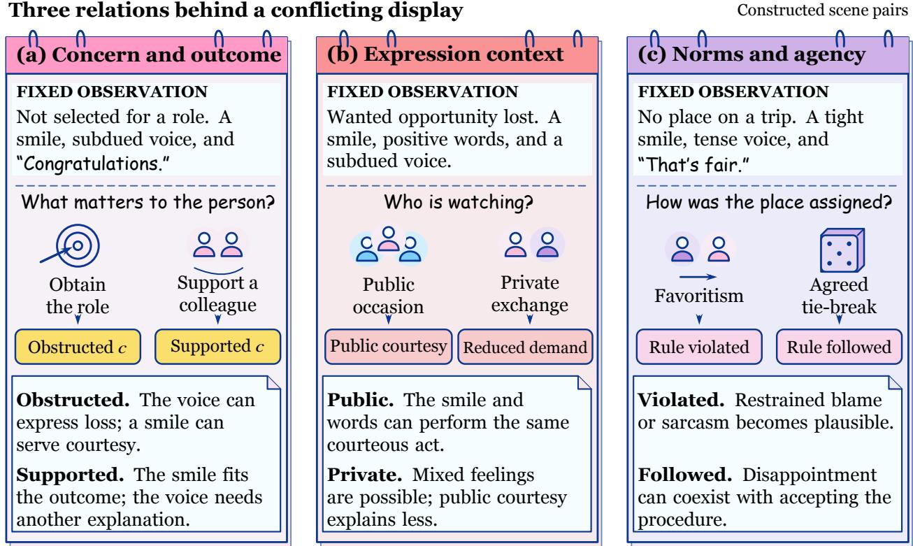  
Supplied premises define coherent comparisons, not benchmark examples, unique emotion labels, or isolated causal effects.  
Figure 6 : The context changes what a cue can mean. Each constructed pair holds the described surface observation fixed while changing the goal, audience, or allocation rule. The contrasts illustrate appraisal relations; they are not evaluated predictions.

## B.1 The same outcome can support different concerns

A candidate is not selected for a role. They smile, say “Congratulations,” and speak in a subdued voice. If they actively sought the position, the outcome obstructs their goal; courtesy can explain why the positive display coexists with disappointment. If they entered to support a colleague and preferred to avoid the responsibility, the same outcome supports their stated purpose. The subdued voice then needs another explanation, such as fatigue, if the context supports it. Goal congruence thus relates an event to a concern: “not selected” alone does not determine whether the outcome is unfavorable. Identifying the concern changes the coherent explanations of the cues even when the final emotion remains uncertain.

## B.2 The same setback can be expressed under different social demands

After losing a wanted opportunity, a person smiles and says “I’m happy for them” in a subdued voice. In front of the selected colleague and an audience, the smile and words can perform the same courteous act. Their agreement need not outweigh the subdued prosody: two cues may share an expressive purpose. In a private conversation with a trusted friend, that public demand is reduced. The same words might express happiness for the colleague alongside personal disappointment, or an attempt at self-regulation. The setting changes the available explanations without choosing one automatically. Norm and regulation fields connect the setback to the conditions under which its response becomes observable.

## B.3 Agency and norms distinguish disappointment from blame

A person denied a wanted place on a trip says “That’s fair” with a tight smile and tense voice. If a manager bypassed an agreed procedure to favor a friend, sarcasm or restrained blame becomes plausible. If an agreed random tie-break was followed, the sentence can acknowledge the rule while the voice expresses disappointment. Agency locates responsibility; norms supply the standard for evaluating the allocation. Neither replaces goal congruence: a fair procedure can still yield an unwanted outcome. This pair changes agency and norms together, illustrating a coherent scene contrast rather than a single-coordinate intervention.

## C Cue diagnosticity and representational interpretation

## C.1 Emotion expectation and cue diagnosticity

This section develops the log-odds decomposition in Equation 2. For two afective hypotheses $y _ { 1 } , y _ { 0 }$ , a cue event $E = e ,$ , and appraisal $Z = z$ , Bayes’ rule gives, whenever the conditioning probabilities and denominators are positive,

$$
\frac { P ( y _ { 1 } \mid e , z ) } { P ( y _ { 0 } \mid e , z ) } = \underbrace { \frac { P ( y _ { 1 } \mid z ) } { P ( y _ { 0 } \mid z ) } } _ { \mathrm { e m o t i o n ~ e x p e c t a t i o n ~ c u e ~ d i a g n o s t i c i t y } } .\tag{13}
$$

The first factor concerns which emotion fits the event appraisal. The second concerns how much the cue distinguishes the two emotions within that appraisal. A blocked goal can make disappointment more plausible; a courtesy obligation can make a smile compatible with disappointment, changing the smile’s diagnostic role. Improving the first factor alone would not demonstrate improved cue interpretation. These semantic roles do not map one-to-one onto the branches in Equation 6: Appraisal-conditioned weights can reflect both expected afect and changing cue diagnosticity, while the joint residual preserves evidence beyond the schema. Path interventions locate a computational dependency; identifying its semantic role additionally requires examining how cue use changes with appraisal.

Equation 13 is a conditional-probability identity, not a likelihood model fitted by VISTA. It assumes no independence between modalities and supplies no causal efect. Here z is a conceptual conditioning state; the predicted appraisal ${ \hat { z } } = A ( X )$ can itself depend on the cue, so its first factor is not an estimate made with that cue excluded. It adds no independent observation beyond X. The following analysis characterizes possible uses of this information, without assuming that VISTA implements a Bayes module.

How a fixed cue can cross the decision boundary. Write $b ( z )$ for the log prior odds, $\ell ( e , z )$ for the log likelihood ratio, and $L ( e , z )$ for the log posterior odds. Equation 13 becomes

$$
\begin{array} { c } { { L ( e , z ) = b ( z ) + \ell ( e , z ) , } } \\ { { L ( e , z ^ { \prime } ) - L ( e , z ) = b ( z ^ { \prime } ) - b ( z ) + \ell ( e , z ^ { \prime } ) - \ell ( e , z ) . } } \end{array}\tag{14}
$$

For binary zero–one decisions, $y _ { 1 }$ is preferred exactly when $\ell ( e , z ) > - b ( z )$ . Thus even at a fixed emotional expectation, a change in cue likelihood can move the posterior across the boundary. Conversely, a prior change can move the decision while leaving cue diagnosticity fixed. The two mechanisms produce the same kind of final-label change but explain it diferently.

Figure 7 gives exact arithmetic for a constructed example. Let $y _ { 1 }$ be satisfaction, $y _ { 0 }$ disappointment, and e a positive display. Two expression conditions, $z _ { f }$ (ordinary expression) and $z _ { c } \ \mathrm { ( c o u r t e s y ) }$ , share $P ( y _ { 1 } \mid z ) = 0 . 4$ and $P ( e \mid y _ { 1 } , z ) = 0 . 8$ . Set $P ( e \mid y _ { 0 } , z _ { f } ) = 0 . 2$ and $P ( e \mid y _ { 0 } , z _ { c } ) = 0 . 6$ . Then

$$
\begin{array} { c } { { P ( y _ { 1 } \mid e , z _ { f } ) = \frac { 0 . 4 \cdot 0 . 8 } { 0 . 4 \cdot 0 . 8 + 0 . 6 \cdot 0 . 2 } = \frac { 8 } { 1 1 } , } } \\ { { P ( y _ { 1 } \mid e , z _ { c } ) = \frac { 0 . 4 \cdot 0 . 8 } { 0 . 4 \cdot 0 . 8 + 0 . 6 \cdot 0 . 6 } = \frac { 8 } { 1 7 } . } } \end{array}\tag{15}
$$

The display remains more likely under satisfaction in both conditions, but its likelihood ratio decreases from 4 to $4 / 3$ . With prior odds $2 / 3 ,$ , this is enough to change the preferred hypothesis. The example illustrates reduced diagnosticity rather than declaring a courteous display intrinsically negative.

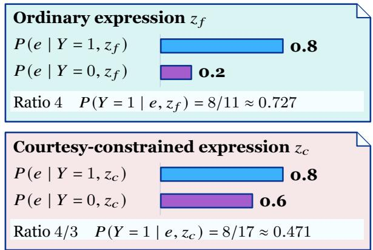

The same cue can cross a decision boundary

� = positive display; � = 1 satisfaction; � = 0 disappointment.

$$
\log \mathrm { i t } \ P ( Y = 1 \mid e , z ) = b ( z ) + \ell ( e , z ) , \qquad b = \log \mathrm { i t } \ P ( Y = 1 \mid z ) , \quad \ell = \log \frac { P ( e \mid 1 , z ) } { P ( e \mid 0 , z ) } .
$$

## (a) Fixed cue and prior

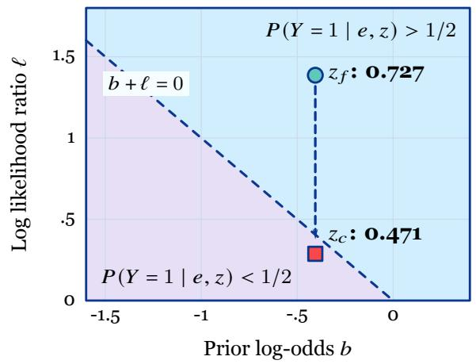  
Courtesy makes a positive display compatible with disappointment. The example moves ℓ at fixed �; a different concern can also move �. Specified probabilities, not fitted outputs.

Same prior: $P ( Y = 1 \mid z ) = 0 . 4 .$

Figure 7 : A context-dependent cue in a constructed probability model. Both conditions have prior satisfaction probability 0.4 and positive-display likelihood 0.8 under satisfaction. The likelihood under disappointment changes from 0.2 to 0.6, giving posteriors $8 / 1 1$ and $8 / 1 7$ . The log-odds plane separates emotional expectation from cue diagnosticity; its boundary is $b + \ell = 0$ . These are exact analytical calculations, not model predictions or fitted probabilities.

A cue contrast removes a purely contextual prior shift. At a fixed appraisal, compare two cue events $e _ { 1 } , e _ { 0 }$ and define

$$
T ( z ) = { \cal L } ( e _ { 1 } , z ) - { \cal L } ( e _ { 0 } , z ) = \ell ( e _ { 1 } , z ) - \ell ( e _ { 0 } , z ) .\tag{16}
$$

Subtracting again across appraisals gives $T ( z ^ { \prime } ) - T ( z )$ , the mixed contrast I in Equation 3, in which both prior terms cancel. Under this probability model, a nonzero contrast establishes that the relative contribution of the two cues depends on appraisal; a context-only additive prior shift cannot produce it. This is a sharper semantic question than whether the final prediction changes after replacing appraisal. In an empirical test, the cue and appraisal contrasts would also need a common log-odds response scale and coherent conditioning states. The reported aggregate interventions do not supply this four-condition cue comparison.

Additive scores and cue–appraisal interactions. The contrast also characterizes the restriction imposed by an additive score. On a product domain of cue and appraisal values with positive conditional probabilities, fix a reference pair $( u _ { 0 } , z _ { 0 } )$ . Define

$$
\begin{array} { c c } { { s ( u ) = L ( u , z _ { 0 } ) - L ( u _ { 0 } , z _ { 0 } ) , ~ } } & { { t ( z ) = L ( u _ { 0 } , z ) , } } \\ { { J ( u , z ) = L ( u , z ) - L ( u _ { 0 } , z ) - L ( u , z _ { 0 } ) + L ( u _ { 0 } , z _ { 0 } ) . } } & { { ~ } } \end{array}\tag{17}
$$

Direct substitution yields

$$
L ( u , z ) = s ( u ) + t ( z ) + J ( u , z ) .\tag{18}
$$

Thus all anchored contrasts vanish if and only if the log-odds surface is additively separable. A nonzero J cannot be absorbed into any context-only ofset while keeping the cue score context-independent. The need for an interaction concerns reproducing the conditional score: an additive model can still predict the same labels on some examples despite having diferent scores. The product-domain assumption matters because all four conditional states must be defined; unsupported cue–scene combinations do not supply an identifiable contrast.

This gives a design reason to expose evidence and appraisal jointly to a predictor. Equation 6 permits that dependence through appraisal-conditioned modality weights, while $D ( H , \alpha )$ preserves the joint-evidence residual. The argument does not select a unique architecture or assign prior and diagnosticity terms to separate neural branches. With predicted appraisal, an empirical four-condition test would additionally distinguish recomputing $A ( X )$ after a cue change from replacing its output while fixing the evidence.

The same constructed model makes this contrast explicit without introducing additional parameters. Take $e _ { 1 }$ to be a positive display and $e _ { 0 }$ its absence. Under ordinary expression, the two likelihood ratios are 4 and $( 1 - 0 . 8 ) / ( 1 - 0 . 2 ) = 1 / 4 ;$ under courtesy they are $4 / 3$ and $( 1 - 0 . 8 ) / ( 1 - 0 . 6 ) = 1 / 2 .$ . Consequently,

$$
\begin{array} { r } { T ( z _ { f } ) = \log 1 6 , \qquad T ( z _ { c } ) = \log ( 8 / 3 ) , \qquad T ( z _ { c } ) - T ( z _ { f } ) = - \log 6 . } \end{array}\tag{19}
$$

Courtesy reduces the contrast between displaying and withholding a positive response, while the contextual prior remains fixed. These exact quantities concern the constructed distribution in Equation 15; they are not measured efects of VISTA’s interventions.

Agreement between modalities need not multiply the evidence. For two observed cues $e _ { t } , e _ { v } ,$ the exact joint likelihood ratio factors as

$$
{ \frac { P ( e _ { t } , e _ { v } \mid y _ { 1 } , z ) } { P ( e _ { t } , e _ { v } \mid y _ { 0 } , z ) } } = { \frac { P ( e _ { t } \mid y _ { 1 } , z ) } { P ( e _ { t } \mid y _ { 0 } , z ) } } { \frac { P ( e _ { v } \mid e _ { t } , y _ { 1 } , z ) } { P ( e _ { v } \mid e _ { t } , y _ { 0 } , z ) } } .\tag{20}
$$

The second factor measures what the visual cue adds after the text cue is known. If a smile and a congratulation serve a shared courtesy act, they can be strongly dependent given the afective hypothesis and appraisal. Multiplying their marginal likelihood ratios can then double-count shared information. Equation 20 neither privileges text nor assumes a processing order: the chain rule can be written in either order. It explains why agreement among modalities and independent evidence for an emotion are diferent properties.

## C.2 Uncertain and imperfect appraisal

A partially specified event can support several appraisal hypotheses. To make their use explicit, consider an analytical setting with residual scene evidence $W = w$ , a cue $E = e$ , and finitely many states z. Define the pre-cue weights $\rho _ { z } = P ( z \mid w )$ and posterior weight $\pi _ { z } = P ( z \mid e , w )$ . The law of total probability gives

$$
\begin{array} { c c } { { p ( y \mid e , w ) = \displaystyle \sum _ { z } K _ { z } ( y ) \pi _ { z } , } } & { { \qquad K _ { z } ( y ) = P ( y \mid e , z , w ) , } } \\ { { } } & { { } } \\ { { \pi _ { z } = \displaystyle \frac { P ( e \mid z , w ) \rho _ { z } } { \sum _ { z ^ { \prime } } P ( e \mid z ^ { \prime } , w ) \rho _ { z ^ { \prime } } } . } } \end{array}\tag{21}
$$

Uncertainty is therefore averaged at the probability level, with weights conditioned on the evidence being explained. Averaging log odds, taking the most likely state first, or averaging with pre-cue weights generally gives another prediction.

For example, assign equal pre-cue weight to the two constructed states in Equation 15. Their display probabilities are 0.44 and 0.68, so observing the display changes the appraisal weights to $1 1 / 2 8$ and $1 7 / 2 8$ The resulting satisfaction probability is

$$
{ \frac { 1 1 } { 2 8 } } { \frac { 8 } { 1 1 } } + { \frac { 1 7 } { 2 8 } } { \frac { 8 } { 1 7 } } = { \frac { 4 } { 7 } } \simeq 0 . 5 7 1 4 .\tag{22}
$$

An unweighted average of the two conditional posteriors would instead be approximately 0.5989. The calculation shows exactly where evidence about expression conditions enters a coherent uncertain interpretation. It does not prescribe a posterior representation or marginalization procedure for the implemented model.

Proposition 2 (Propagation of appraisal uncertainty). In the finite-state analytical model of Equation 21, let $\begin{array} { r } { p = \sum _ { z } \pi _ { z } K _ { z } } \end{array}$ and $\begin{array} { r } { \tilde { p } = \sum _ { z } \tilde { \pi } _ { z } \tilde { K } _ { z } } \end{array}$ be two afect distributions. With total variation $\begin{array} { r } { \mathrm { T V } ( u , v ) = \frac { 1 } { 2 } \sum _ { j } | u _ { j } - v _ { j } | } \end{array}$ define

$$
\delta = \mathrm { T V } ( \pi , { \tilde { \pi } } ) , \qquad \eta = \sum _ { z } { \tilde { \pi } } _ { z } \mathrm { T V } ( K _ { z } , { \tilde { K } } _ { z } ) .\tag{23}
$$

Then $\mathrm { T V } ( p , \tilde { p } ) \leq \delta + \eta$ . If p has maximizing label $y ^ { * }$ with margin $\gamma = p ( y ^ { \ast } ) - \operatorname* { m a x } _ { y \neq y ^ { \ast } } p ( y )$ , its decision is preserved whenever $\gamma > 2 ( \delta + \eta )$

Proof. Insert $\textstyle \sum _ { z } { \tilde { \pi } } _ { z } K _ { z }$ between the two mixtures and apply the triangle inequality. Since every $K _ { z }$ sums to one,

$$
\begin{array} { r l } & { \mathrm { T V } ( p , \tilde { p } ) \leq \displaystyle \frac { 1 } { 2 } \sum _ { y } \left. \sum _ { z } ( \pi _ { z } - \tilde { \pi } _ { z } ) K _ { z } ( y ) \right. + \sum _ { z } \tilde { \pi } _ { z } \mathrm { T V } ( K _ { z } , \tilde { K } _ { z } ) } \\ & { \qquad \leq \displaystyle \frac { 1 } { 2 } \sum _ { z } \left. \pi _ { z } - \tilde { \pi } _ { z } \right. + \eta = \delta + \eta . } \end{array}\tag{24}
$$

Each label probability changes by at most this total variation. Hence the gap between $y ^ { * }$ and any competitor decreases by at most $2 ( \delta + \eta )$ , proving the margin statement. □

The two terms separate misallocating probability among scene interpretations from misreading the cues within an interpretation. When the kernels are shared, $\eta = 0 \colon$ uncertain appraisal can be harmless to a high-margin decision and consequential near a boundary. A wrong point estimate can also matter little if its induced afect distribution resembles that of the correct state. Field agreement alone does not determine either term. This links the semantic audit to recognition: the relevant question is which appraisal errors alter the competing afective explanations, not how many field names difer.

## C.3 What a predicted representation can contribute

Because ${ \hat { Z } } = A ( X )$ is computed from the recognition input, it introduces no new observation beyond X. Its potential benefit is representational: the schema can retain distinctions omitted by a compressed evidence representation $H = F ( X )$ , or make existing distinctions easier for a learned decision rule to use. Proposition 1 makes the distinction precise for finite-label classification with zero–one loss. The continuous appraisal and afect-regression evaluations use their respective prediction losses and CCC metrics.

Assumptions and conditioning. The maps F and A are fixed when risks are evaluated, as after training. Conditional posteriors are understood up to probability-zero states; a fixed ordering of the finite labels resolves ties. The analysis imposes neither conditional independence among modalities nor a suficiency assumption on H. In particular, it does not require the semantic appraisal to be correct: any additional deterministic representation obeys the Bayes-risk inequality, while its decision value depends on the distinctions it retains.

Proof of Proposition 1. Write $v _ { y } ( h , z ) = P ( Y = y ~ \vert ~ H = h , \hat { Z } = z )$ and select a coarse Bayes label $y _ { h } \in$ arg maxy $\cdot P ( Y = y \mid H = h )$ . The tower property gives $P ( Y = y \mid H = h ) = \mathbb { E } [ v _ { y } ( h , \hat { Z } ) \mid H = h ]$ . Since the maximum of finitely many coordinates is convex,

$$
\operatorname* { m a x } _ { y } \mathbb { E } [ v _ { y } ( h , \hat { Z } ) \mid h ] \leq \mathbb { E } [ \operatorname* { m a x } _ { y } v _ { y } ( h , \hat { Z } ) \mid h ] .\tag{25}
$$

Averaging and subtracting from one proves the inequality. More explicitly, the exact gain is

$$
\Delta _ { \mathrm { r e p r } } = \mathbb { E } \biggl [ \operatorname* { m a x } _ { y } v _ { y } \bigl ( H , \hat { Z } \bigr ) - v _ { y _ { H } } \bigl ( H , \hat { Z } \bigr ) \biggr ] .\tag{26}
$$

The integrand is nonnegative. The gain vanishes exactly when yH is also a maximizing label of the refined posterior almost surely. Equivalently, for almost every h, there is a label that maximizes the posteriors for almost every z under ${ \hat { Z } } \mid { \bar { H } } = h$ . If such a common maximizer fails to exist on a set of h with positive probability, the conditional nonnegative gap is positive there and so is its expectation. This proves both the equality and strictness conditions, including posterior ties. Finally, X and $( X , A ( X ) )$ generate the same information, so their conditional label distributions, and hence Bayes risks, agree. □

For a concrete strict case, suppose $H = h _ { 0 }$ is constant and two equiprobable appraisal states have class-1 probabilities 0.8 and 0.2. The coarse posterior is 0.5 and its Bayes error is 0.5; retaining the state gives error 0.2. If the probabilities are instead 0.6 and 0.9, both states favor class 1 and both representations have error 0.25. Posterior variation matters to classification exactly when it reveals a decision distinction. If $\hat { Z }$ is already determined by H, the common-maximizer condition holds automatically.

How much a collapsed appraisal distinction can cost. The strictness condition has a closed form for two binary-label appraisal states within a fixed evidence state $H = h$ . Let $P ( \hat { Z } = z _ { + } \mid h ) = q \in ( 0 , 1 )$ , and let $p _ { + } > 1 / 2 > p _ { - }$ be the class-1 posteriors in the two states. Write their opposing decision margins as $m _ { + } = 2 p _ { + } - 1 > 0$ and $m _ { - } = 1 - 2 p _ { - } > 0$ . The coarse posterior is $\bar { p } = q p _ { + } + ( 1 - q ) p _ { - }$ , so the conditional Bayes-risk reduction is

$$
\begin{array} { l } { { \Delta ( h ) = \mathrm { m i n } \{ \bar { p } , 1 - \bar { p } \} - q ( 1 - p _ { + } ) - ( 1 - q ) p _ { - } } } \\ { { { } } } \\ { { { } = \mathrm { m i n } \{ q m _ { + } , ( 1 - q ) m _ { - } \} . } } \end{array}\tag{27}
$$

If the coarse classifier selects class 1, its excess conditional error occurs in state z and equals $( 1 - q ) m _ { - }$ . If it selects class 0, the corresponding cost is $q m _ { + }$ . The coarse Bayes rule chooses the smaller of these costs, which proves the formula and includes the case $\bar { p } = 1 / 2$ . The gain is therefore controlled jointly by the frequency and decision margin of the distinction being collapsed. In this two-state setting, averaging $\Delta ( h )$ over H recovers Equation 9; for $q = 1 / 2 , p _ { + } = 0 . 8 , p _ { - } = 0 . 2$ , the gain is 0.3. If both states share an optimal label, the gain is zero instead, as in the $0 . 6 / 0 . 9$ example above. These are analytical distributions, not estimated appraisal posteriors.

From representation opportunity to trained risk. For any readout $f _ { U }$ , its excess zero–one risk has the posterior form

$$
\epsilon _ { U } = \mathbb { E } \left[ \operatorname* { m a x } _ { y } P ( Y = y \mid U ) - P ( Y = f _ { U } ( U ) \mid U ) \right] \geq 0 .\tag{28}
$$

Substituting $\mathcal { R } ( f _ { U } ) = \mathcal { R } ^ { * } ( U ) + \epsilon _ { U }$ for $U = H$ and $U = ( H , { \hat { Z } } )$ gives Equation 10. Hence the refined readout improves exactly when $\epsilon _ { H , \hat { Z } } - \epsilon _ { H } < \Delta _ { \mathrm { r e p r } }$ . A positive representation opportunity can absorb some additional readout error; a suficiently large increase in that error can instead ofset it. Even when $\Delta _ { \mathrm { r e p r } } = 0$ , an explicit schema can help a trained predictor if it makes the same Bayes decision easier to learn, reducing excess risk. When $\hat { Z }$ is a function of $H$ , this latter route is the only one of the two available.

For the $0 . 8 / 0 . 2$ construction, an optimal coarse readout has risk 0.5. A refined readout that ignores appraisal and always predicts class 1 has the same risk: its excess risk 0.3 exactly ofsets the representation gain. A refined readout that selects the wrong label in each state has risk 0.8 and excess risk 0.6; the correct refined Bayes readout has risk 0.2 and excess risk zero. The same representation opportunity can therefore yield improvement, equality, or deterioration according to how the readout uses it.

Connection to the experimental comparisons. Generic semantics versus structured appraisal tests the choice of intermediate organization; cross-sample and within-emotion shufling probe scene correspondence. These comparisons examine design consequences for learned behavior. Equation 10 compares readouts of fixed H and $( H , { \hat { Z } } )$ ; separately trained common-backbone systems need not share the same learned $F .$ Their aggregate accuracies therefore do not identify $\Delta _ { \mathrm { r e p r } }$ or either excess-risk term. Likewise, appraisal replacement changes the arbitration weights and does not by itself estimate the cue interaction in Equation 3. The theory specifies why joint conditioning and decision-relevant distinctions can matter; the experiments assess their benefit in the observed conflict settings.

## D A guide to appraisal and scene interventions

The contrasts distinguish whether appraisal belongs to the current scene, whether the decision uses it, and how prediction responds when scene meaning changes.

## D.1 Correspondence, connection, and content

For a fixed input, write

$$
q _ { X } ( z ) = D _ { \psi } \big ( H , \alpha ( H , z ) \big ) , \qquad H = F _ { \theta } ( X ) .\tag{29}
$$

The usual prediction evaluates this function at the predicted appraisal ${ \hat { z } } = A _ { \theta } ( X )$ . An alternative appraisal supplies a diferent reference for interpreting the same evidence. Table 7 organizes the reported contrast families by the dependency they target.

Table 7 : Interpretive roles of the intervention families. Each row identifies a distinct question about the appraisal conditioned decision pathway.
<table><tr><td>Contrast</td><td>Reference retained</td><td>Dependency examined</td></tr><tr><td>Cross-sample shuffle</td><td>The current input and recognition task</td><td>Does another sample&#x27;s appraisal supply the same useful interpretation as the scene&#x27;s own appraisal?</td></tr><tr><td>Within-emotion shuffle</td><td>The current input and the donor&#x27;s emotion identity</td><td>Does event-specific correspondence matter beyond the donor appraisal&#x27;s association with the same class?</td></tr><tr><td>Appraisal with no decision</td><td>Auxiliary appraisal supervision</td><td>Does appraisal improve prediction when its forward connection to the decision is removed?</td></tr><tr><td>connection Generic semantic bottleneck</td><td>An intermediate semantic route to the same recognition task</td><td>Does organizing content as event appraisal contribute beyond the supplied semantic alternative?</td></tr><tr><td>Rationale/ internal-state corruption</td><td>One of verbal presentation and internal appraisal is retained while the other is altered</td><td>Is the observed dependence stronger on displayed explanation text or on the internal appraisal information?</td></tr><tr><td>Relevant change / irrelevant paraphrase</td><td>The pairing identifies what event meaning should change or remain invariant</td><td>Does the response follow a relevant change while remaining stable to a reformulation of the same meaning?</td></tr></table>

Within-emotion shufling preserves a donor’s emotion identity while changing its relation to the current scene. Scenes that share an emotion can difer in their concerns, responsible agents, and expression conditions. Cross-sample shufling relaxes even that class-level constraint. When strata use test gold labels, within-emotion shufling is a gold-stratified ofline mechanism diagnostic. Both replacements keep the checkpoint fixed and exchange the complete state. The connection ablation preserves auxiliary appraisal supervision while removing z from arbitration; the ablated model is retrained. It asks whether predicting appraisal is suficient without using it to select modality weights. Stop-gradient retains the forward information and changes its learning path, so it is a distinct operation.

## D.2 Scene edits and representation replacement

A scene edit can change both $H = F ( X )$ and A(X). Direct replacement of z in $q _ { X } ( z )$ holds the evidence representation fixed. A training-term ablation changes the learned system. These intervention channels examine diferent dependencies even when they concern the same field.

Scene coherence also matters. If the goal changes while the outcome stays fixed, goal congruence may need to change with it. If the setting becomes public, the norm and expression-regulation interpretation may change together. A single-coordinate substitution can be useful as a representation probe, while a coherent event edit may involve several related fields. The paired scenes in Appendix B illustrate the latter relation between event facts and appraisal.

## D.3 Relevant response and label change are separate judgments

A relevant event change need not force a new final label. An appeal can increase perceived control while leaving disappointment plausible; a formal congratulation can change a smile’s diagnostic role without changing the strongest afective interpretation. Pair evaluation therefore distinguishes changes in appraisal, cue interpretation, and final prediction. Irrelevant paraphrases provide the complementary test: wording changes while the concern, outcome, and expression conditions are preserved.

## D.4 How appraisal changes the weighted readout

The classification pathway makes the response to appraisal replacement explicit. Fix the checkpoint, every representation in H, and the availability mask b. Let $\mathcal { M } _ { b } = \{ m : b _ { m } = 1 \}$ be the nonempty set of available

modalities. For a reference appraisal z and replacement $\tilde { z } ,$ write $\alpha = \alpha ( H , z ) , \tilde { \alpha } = \alpha ( H , \tilde { z } )$ , and $\Delta \alpha = \tilde { \alpha } - \alpha$ The branch logits $u _ { m } = W _ { m } h _ { m }$ and residual $\rho = W _ { f } h _ { A V T }$ remain fixed. The two final logit vectors are

$$
v ( z ) = \rho + \sum _ { m \in \mathcal { M } _ { b } } \alpha _ { m } u _ { m } , \qquad v ( \tilde { z } ) = \rho + \sum _ { m \in \mathcal { M } _ { b } } \tilde { \alpha } _ { m } u _ { m } .\tag{30}
$$

Figure 8 illustrates this comparison. Appraisal changes the allocation among the fixed branch logits; the shared residual cancels when taking their diference.

## (a) Keep evidence, heads, and available modalities fixed

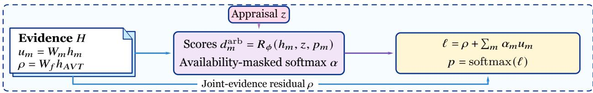

(b) Replace appraisal; compare the weights  
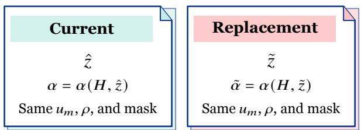  
Only the arbitration weights change.  
Appraisal reweighting acts on disagreement among modality margins. Identical margins cancel under a weight change; the joint residual cancels in the fixed-evidence contrast.

Figure 8 : Appraisal replacement in the implemented weighted readout. With the checkpoint, all evidence representations $H ,$ and available modalities fixed, reference and replacement appraisals produce diferent weights over the same unimodal logits. The joint-evidence residual is shared. For any class pair, the resulting logit-margin change is the weight change dotted with the branch margins; its magnitude is bounded by their range times half the $\ell _ { 1 }$ weight change. The comparison describes how appraisal-dependent arbitration changes a class preference.

Exact margin change. For two classes $y , y ^ { \prime } .$ , define each branch’s margin $d _ { m } ^ { y , y ^ { \prime } } = u _ { m , y } - u _ { m , y ^ { \prime } }$ and the final margin $M _ { y , y ^ { \prime } } ( z ) = v _ { y } ( z ) - v _ { y ^ { \prime } } ( z )$ . Since the final probabilities are a softmax, this also equals $\log [ q _ { X } ( z ) ( y ) / q _ { X } ( z ) ( y ^ { \prime } ) ]$ ]. Subtraction in Equation 30 gives

$$
M _ { y , y ^ { \prime } } ( \tilde { z } ) - M _ { y , y ^ { \prime } } ( z ) = \sum _ { m \in \mathcal { M } _ { b } } \Delta \alpha _ { m } d _ { m } ^ { y , y ^ { \prime } } , \qquad \sum _ { m \in \mathcal { M } _ { b } } \Delta \alpha _ { m } = 0 .\tag{31}
$$

The second identity follows because both weight vectors sum to one. Thus, moving weight from a branch with a smaller $y - y ^ { \prime }$ margin to one with a larger margin increases the final preference for $y$ relative to $y ^ { \prime } .$ Opposing branch margins give appraisal a concrete means of changing which interpretation is favored. If all available branches have the same margin for this class pair, every redistribution leaves that margin unchanged.

A bound governed by branch disagreement. Let $d _ { \operatorname* { m a x } } = \operatorname* { m a x } _ { m \in \mathcal { M } _ { b } } d _ { m } ^ { y , y ^ { \prime } }$ and $\begin{array} { r } { d _ { \operatorname* { m i n } } = \operatorname* { m i n } _ { m \in \mathcal { M } _ { b } } d _ { m } ^ { y , y ^ { \prime } } } \end{array}$ . The zero-sum identity yields the range bound

$$
\big | M _ { y , y ^ { \prime } } ( \tilde { z } ) - M _ { y , y ^ { \prime } } ( z ) \big | \le \frac { d _ { \operatorname* { m a x } } - d _ { \operatorname* { m i n } } } { 2 } \| \Delta \alpha \| _ { 1 } .\tag{32}
$$

To prove it, subtract $c = ( d _ { \operatorname* { m a x } } + d _ { \operatorname* { m i n } } ) / 2$ inside the sum in Equation 31. This leaves the sum unchanged, and $| d _ { m } ^ { y , y ^ { \prime } } - c | \leq ( d _ { \operatorname* { m a x } } - d _ { \operatorname* { m i n } } ) / 2$ . The triangle inequality completes the proof. Equivalently, the total positive and negative weight changes each have mass $\| \Delta \alpha \| _ { 1 } / 2$ . The bound is attained when that mass is transferred between branches at the two extreme margins, whenever the corresponding weights are feasible.

These identities connect arbitration to conflicting evidence: appraisal can afect a class comparison when available branches difer in their support for that comparison. The sign of the weighted change determines which class is favored; the bound does not prescribe that sign or guarantee higher accuracy. The shared residual afects the reference margin and hence whether a given change crosses a decision boundary. In a multiclass task, identifying the new predicted label requires comparing the final logits across all classes.

The fixed-H comparison isolates the implemented forward use of appraisal. Scene edits can also change branch logits and the residual, while retraining the connection ablation can change the whole predictor. Aggregate shufle accuracies measure recognition after replacement; estimating Equation 31 per example additionally requires the paired internal weights and logits. External explanations are evaluated separately by holding H, z, and α fixed while rewriting the displayed text.

## D.5 Semantic organization and evaluative references

The tested variants separate field names, represented content, scene correspondence, and decision access. Randomized field names retain 64.2% conflict accuracy, close to the complete system’s 64.5%; a generic semantic bottleneck gives 63.2%. The diference is associated with the organized appraisal content rather than the literal names of the fields. The goal and norm fields provide its evaluative reference, while expression regulation relates that reference to the observed display.

Goal congruence is defined relative to the person’s concern. Consequently, coherent appraisal edits can involve more than one field: a changed goal can change congruence, and a changed audience can change social relevance and regulation. The constructed scenes in Appendix B make these dependencies explicit. The empirical intervention categories in Appendix H.1 test directed responses to relevant changes, while unrelated reformulations test stability.

## D.6 Grounding the interface in observed context

Context C contains information available at recognition time. The goal and setting in Figure 1 are supplied premises; the illustration establishes a conditional interpretation of the same cue. In data, grounding asks whether utterances, visible events, or conversation history support the predicted field.

The field audit evaluates 400 candidates, recording coverage, sampling consistency, and adequate evidence separately. A field can be consistent across teacher samples yet poorly grounded; label-visible supervision makes this distinction concrete in Appendix J. Partial-field masking retains supported relations without treating every field as observed. Likewise, a wrong goal, an unsupported regulation inference, and a perceptual failure belong to diferent error categories. The grouped error analysis in Appendix K connects these interpretive distinctions to the final recognition outcomes.

## E Dataset roles and scoring conventions

Table 8 : Public dataset context and the role of each evaluation. Dataset composition and the evaluation question are listed separately.
<table><tr><td>Dataset</td><td>Public context</td><td>Role in this paper</td></tr><tr><td>CA-MER</td><td>1,500 examples: 500 video-aligned, 500 audio-aligned, 500 consistent</td><td>Primary comparison of conflict and consistent performance</td></tr><tr><td>EmoMM</td><td>4,000 base examples from Chinese CH-SIMS v2.0 and English CMU-MOSI; multimodal and unimodal sentiment annotations</td><td>Alignment, conflict, missingness, and their combination</td></tr><tr><td>CH-SIMS v2.0</td><td>4,402 labeled and 10,161 unlabeled Chinese clips, with multimodal and unimodal sentiment information</td><td>Binary accuracy (Acc2) across four conflict groups</td></tr><tr><td>THERADIA</td><td>2,735 affect-annotated clips from interactions during cognitive exercises, with appraisal</td><td>Frozen-representation appraisal probes and emotion-intensity regression</td></tr><tr><td>MELD</td><td>annotations 13,708 utterances across 1,433 dialogues; official train/development/test sizes of 9,989/1,109/2,610</td><td>Ordinary seven-class conversational emotion recognition</td></tr></table>

CA-MER and the evaluation interface. CA-MER supplies three annotation-defined groups, each with 500 examples: video-aligned conflict, audio-aligned conflict, and consistency (Han et al., 2025). The present experiment uses a normalized output interface for all compared systems. Conflict Avg is the macro average of the two conflict accuracies; consistent accuracy, overall accuracy, and invalid-output rate are reported separately. MoSEAR and CHASE are evaluated through this same interface (Table 15). These local scores are distinguished from their original papers’ open-vocabulary evaluation scores. The public benchmark’s semantic set-matching convention is illustrated below as metric context, not used to reinterpret the present accuracy columns.

Nine-class output parsing. The canonical vocabulary is angry, happy, surprise, fear, sad, worry, neutral, doubt, and contempt. The parser first strictly parses JSON and extracts a unique string-valued final\_label. It then applies Unicode NFKC normalization, trims leading and trailing whitespace, lowercases the string, applies the fixed synonyms in Table 9, and checks the canonical vocabulary. A missing field, multiple answers, refusal, or unknown category is invalid and counts as an error in the main accuracy denominator. The output parser does not select an answer manually from explanatory prose.

Table 9 : Fixed synonym normalization for the CA-MER interface. Canonical labels pass through unchanged. The mapping is applied after JSON extraction and string normalization.
<table><tr><td>Input</td><td>Canonical</td><td>Input</td><td>Canonical</td></tr><tr><td>anger</td><td>angry</td><td>sadness</td><td>sad</td></tr><tr><td>happiness</td><td>happy</td><td>worried</td><td>worry</td></tr><tr><td>surprised</td><td>surprise</td><td>doubtful</td><td>doubt</td></tr><tr><td>fearful; afraid</td><td>fear</td><td>contemptuous</td><td>contempt</td></tr></table>

## E.1 Conflict definitions and error burden

Equation 1 separates the afect annotations used to define a conflict from the model whose recognition performance is evaluated. An eligible comparison concerns the same person, event, and temporal unit, with at least two available, afect-annotated modalities. Recognition-time context C can explain a disagreement, but is not a fourth independently annotated afect channel. In particular, an error made by VISTA does not determine membership in the conflict subset.

Scalar sentiment: a specified scale and strict cutof. For modality-only ratings $s _ { i } ^ { m } \in [ - 1 , 1 ]$ , the maximum pairwise gap has the equivalent range form

$$
\delta _ { i } = \operatorname* { m a x } _ { m < n } | s _ { i } ^ { m } - s _ { i } ^ { n } | = \operatorname* { m a x } _ { m } s _ { i } ^ { m } - \operatorname* { m i n } _ { m } s _ { i } ^ { m } , \qquad \kappa _ { \tau } ( X _ { i } ) = \mathbf { 1 } \{ \delta _ { i } > \tau \} .\tag{33}
$$

The strong-conflict screening rule in Wang & Wu (2025) fixes $\tau = 1$ . It operates on the original rating scale supplied by separate modality annotations (Liu et al., 2022), and uses strict >: a gap exactly equal to 1 does not qualify. It should not be applied to arbitrary numeric category identifiers. The 661/4,402 count refers to the labeled CH-SIMS v2.0 corpus before severe cases are selected for the DifEmo test. Table 11 keeps that corpus denominator separate from the test and error-audit denominators.

Categorical afect: agreement classes and benchmark eligibility. Let ≡ denote the benchmark’s afect-label equivalence. A categorical pair has $d ( q ^ { m } , q ^ { n } ) = \mathbf { 1 } \{ q ^ { m } \not \equiv q ^ { n } \}$ , with $\tau = 0$ . For our audit of the original CH-SIMS release (Yu et al., 2020), we use the fixed sentiment mapping in Zhang et al. (2021):

$$
q ( s ) = \left\{ \begin{array} { l l } { - 1 , } & { s < - 0 . 1 , } \\ { 0 , } & { - 0 . 1 \leq s \leq 0 . 1 , } \\ { + 1 , } & { s > 0 . 1 . } \end{array} \right. \quad \quad K _ { i } = { \bf 1 } \{ | \{ q ( s _ { i } ^ { t } ) , q ( s _ { i } ^ { a } ) , q ( s _ { i } ^ { v } ) \} | > 1 \} .\tag{34}
$$

All 2,281 released clips have complete modality ratings and unique video–clip identifier pairs; none is excluded. Summing Ki gives 1,117/2,281, or 48.97% (49.0% in the introduction). This is a fresh descriptive count from public annotations, independent of VISTA predictions. It includes 455 clips with both positive and negative modalities, and 662 additional clips whose disagreement involves neutral and one non-neutral polarity. Each clip is counted once, even if multiple modality pairs disagree. The release contains movie, television-series, and variety-show clips (Yu et al., 2020); the frequency characterizes this corpus. Table 10 gives pairwise and split-level counts. All counts follow Equation 34, comparing the original decimal annotations directly with the stated thresholds.

Table 10 : Public-label audit of cross-modal disagreement on CH-SIMS. All rows use Equation 34, with a restricted modality pair for the three pairwise rows. Pairwise rows overlap and are not summed. The final three rows partition the full corpus by the released split.
<table><tr><td>Comparison / population</td><td>Disagreement</td><td>Eligible clips</td><td>Rate (%)</td></tr><tr><td>Any text-audio-video pair</td><td>1,117</td><td>2,281</td><td>48.97</td></tr><tr><td>Text-audio</td><td>800</td><td>2,281</td><td>35.07</td></tr><tr><td>Text-video</td><td>945</td><td>2,281</td><td>41.43</td></tr><tr><td>Audio-video</td><td>602</td><td>2,281</td><td>26.39</td></tr><tr><td>Any pair: train</td><td>676</td><td>1,368</td><td>49.42</td></tr><tr><td>Any pair: validation</td><td>231</td><td>456</td><td>50.66</td></tr><tr><td>Any pair: test</td><td>210</td><td>457</td><td>45.95</td></tr></table>

For CA-MER’s audio, video, and multimodal construction labels $( q ^ { a } , q ^ { v } , q ^ { a v } )$ , the evaluated groups are

$$
\begin{array} { l } { { \mathcal { D } _ { v } = \{ i : q _ { i } ^ { v } \equiv q _ { i } ^ { a v } , ~ q _ { i } ^ { a } \not = q _ { i } ^ { a v } \} , } } \\ { { \mathcal { D } _ { a } = \{ i : q _ { i } ^ { a } \equiv q _ { i } ^ { a v } , ~ q _ { i } ^ { v } \not = q _ { i } ^ { a v } \} , } } \\ { { \mathcal { D } _ { 0 } = \{ i : q _ { i } ^ { a } \equiv q _ { i } ^ { v } \equiv q _ { i } ^ { a v } \} . } } \end{array}\tag{35}
$$

Thus $\mathcal { D } _ { \mathrm { c o n f } } = \mathcal { D } _ { v } \cup \mathcal { D } _ { a }$ and $\mathcal { D } _ { \mathrm { c o n s } } = \mathcal { D } _ { 0 }$ . These are the public, annotator-checked partitions (Han et al., 2025). Cases with all three labels diferent lie outside this three-group evaluation. The fixed category membership is independent of the evaluated model’s confidence and output parser. “Aligned” describes agreement with the multimodal reference, not temporal synchronization.

Complementary definitions and ordered severity. EmoMM defines conflict when at least one available modality’s annotated polarity difers from the multimodal reference; missingness is a separate controlled condition (Sun et al., 2026a). Writing pol for the polarity mapping, its reference-based predicate is $\kappa _ { \mathrm { r e f } } ( X ) =$ $\mathbf { 1 } \{ \exists m : \mathrm { p o l } ( q ^ { m } ) \neq \mathrm { p o l } ( q ^ { \mathrm { j o i n t } } ) \}$ . It can flag a case even when unimodal polarities agree with each other but disagree with the joint reference. Polarity also difers from fine-grained afect categories: anger and sadness can be categorically distinct yet both negative. The CH-SIMS v2.0 Q1–Q4 results in Table 17 use conflict strength calculated from unimodal labels, with group boundaries fixed on the training set. Equation 33 documents the literature’s separate strong-conflict prevalence criterion; the label-visibility diagnostic additionally uses the reported threshold $C \geq 2 \ \mathrm { ( A p p e n d i x \ J ) }$ . These named evaluation rules are not interchangeable.

Evidence across settings. In filtered Twitter image–text data, Pan & Meng (2024) report 42.5% inconsistency in MVSA-Single and 26.0% in MVSA-Multiple; their rule counts neutral versus positive/negative labels after opposite-polarity pairs have been removed. For user-generated video reviews, Du et al. (2025) report 63.69% agreement between textual and multimodal sentiment labels on UniC, hence 36.31% disagreement. These complementary observations establish substantial cross-modal variation across data settings; the comparison target, annotation granularity, and corpus sampling determine which frequency is measured.

Table 11 : Quantitative motivation with explicit denominators. A public-label audit, published corpus analyses, and selected evaluation subsets answer diferent questions. Arithmetic gaps are calculated from the cited values.
<table><tr><td>Quantity</td><td>Reported evidence</td><td>Population and interpretation</td></tr><tr><td>Three-modal disagreement</td><td>48.97% (1,117/2,281)</td><td>Our public-label audit of CH-SIMS: at least two unimodal polarity labels differ; Table 10.</td></tr><tr><td>Image-text inconsistency</td><td>42.5% / 26.0%</td><td>Filtered MVSA-Single / Multiple; neutral versus positive or negative modality labels (Pan &amp; Meng, 2024).</td></tr><tr><td>Text-joint disagreement</td><td>36.31%</td><td>UniC video reviews: complement of 63.69% text-only versus multimodal label agreement (Du et al., 2025).</td></tr><tr><td>Strong-conflict prevalence</td><td>15.0% (661/4,402)</td><td>Labeled CH-SIMS v2.0 clips screened at  $\delta > 1 ;$  corpus frequency (Wang &amp;  ${ \mathrm { W u } } ,$  2025).</td></tr><tr><td>Conflict difficulty</td><td>23.53 pp</td><td>MulT binary accuracy: 89.13% aligned, 65.60% conflict; selected DiffEmo tests, 173 examples per group (Wang &amp; Wu, 2025).</td></tr><tr><td>Primary benchmark mix</td><td>1,000/1,500 conflict</td><td>CA-MER&#x27;s equal allocation across two conflict directions and consistency; evaluation design (Han et al., 2025).</td></tr></table>

Three distinct error questions. For a common evaluation population, let $E _ { i } = \mathbf { 1 } \{ \hat { y } _ { i } \neq y _ { i } \}$ denote a specified single-label prediction error and $K _ { i } = \kappa _ { \tau } ( X _ { i } )$ . Conflict prevalence is $\pi = P ( K = 1 ) ;$ conditional error rates are $e _ { 1 } = P ( E = 1 \mid K = 1 )$ and $e _ { 0 } = P ( E = 1 \mid K = 0 )$ . Bayes’ rule gives the fraction of errors that occur on conflict inputs:

$$
\rho = P ( K = 1 \mid E = 1 ) = { \frac { \pi e _ { 1 } } { \pi e _ { 1 } + ( 1 - \pi ) e _ { 0 } } } , \qquad P ( E = 1 ) > 0 .\tag{36}
$$

This is a concentration of errors within a common sampling frame. Causal attribution additionally asks which errors would change under a specified conflict-resolution intervention. An error-category audit supplies a diferent descriptive quantity. For an error group G and category $k ,$ write

$$
\eta ( k \mid G ) = { \frac { \# \{ { \mathrm { r e v i e w e d ~ e r r o r s ~ i n ~ } } G { \mathrm { ~ a s s i g n e d ~ c a t e g o r y ~ } } k } \} } { \# \{ { \mathrm { r e v i e w e d ~ e r r o r s ~ i n ~ } } G \} }  .\tag{37}
$$

The final error analysis instead conditions on three paired-model groups: errors made only by Emotion-SFT, errors made only by VISTA, and errors shared by both models. Table 31 preserves these separate denominators. A category share within one of these groups is neither a corpus conflict prevalence nor the fraction of all recognition errors caused by conflict.

Equation 36 requires prevalence and both conditional rates from the same population. The corpus screening frequency and severity-selected DifEmo test rates therefore remain separate measurements.

Threshold sensitivity and a reproducible audit. For a fixed eligible sample and a common rating scale,

$$
\widehat { \pi } ( \tau ) = \frac { 1 } { N } \sum _ { i = 1 } ^ { N } \mathbf { 1 } \{ \delta _ { i } > \tau \} , \quad \tau _ { 1 } < \tau _ { 2 } \implies \widehat { \pi } ( \tau _ { 2 } ) \leq \widehat { \pi } ( \tau _ { 1 } ) .\tag{38}
$$

A threshold changes which severity levels are counted; monotonic prevalence does not imply monotonic model error. A reproducible analysis stores sample IDs, independently obtained modality labels, missingness, rating normalization, the fixed comparison rule, prediction and reference labels, and any audit category. It reports the eligible count, conflict count, and error count together. Threshold selection uses annotation semantics or validation data and is fixed before examining test performance; a sensitivity curve can then report how prevalence and recognition change across cutofs. These definitions specify the records needed to reproduce prevalence and error-burden estimates.

## E.2 Public benchmark metrics and the normalized interface

Let $\mathcal { P } _ { i }$ and $\mathcal { G } _ { i }$ denote predicted and reference emotion sets after semantic matching in the public CA-MER protocol. With $t _ { i } = | \mathcal { P } _ { i } \cap \mathcal { G } _ { i } | , p _ { i } = | \mathcal { P } _ { i } |$ , and $g _ { i } = | \mathcal { G } _ { i } |$ , its nonempty-set metrics are

$$
a _ { i } = \frac { t _ { i } } { p _ { i } } , \qquad r _ { i } = \frac { t _ { i } } { g _ { i } } , \qquad b _ { i } = \frac { a _ { i } + r _ { i } } 2 .\tag{39}
$$

These quantities explain why a published open-vocabulary score and a local normalized-interface accuracy can difer. In particular, the public Acc is precision-like for multiple predicted labels. Figure 9 gives an exact constructed illustration. It contains no trained-model evaluation results.

(a) Read the matched label sets  
Constructed example; after semantic matching  
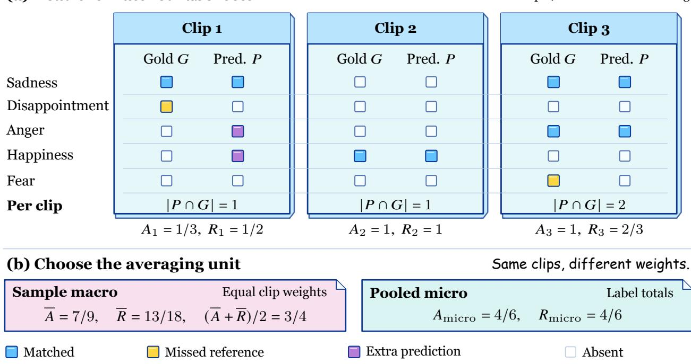  
Figure 9 : A constructed illustration of the public set-matching metric. After semantic matching, three illustrative clips give equal-clip Acc $7 / 9 .$ , recall $1 3 / 1 8 .$ and their arithmetic mean $3 / 4 .$ . Pooling memberships instead gives $2 / 3$ for both metrics. This public-protocol example is separate from the normalized-interface experiments reported in this paper.

Equal-clip averages and pooled memberships assign diferent weights:

$$
a _ { \mathrm { p o o l } } = \frac { \sum _ { i } t _ { i } } { \sum _ { i } p _ { i } } = \sum _ { i } \frac { p _ { i } } { \sum _ { j } p _ { j } } a _ { i } , \qquad r _ { \mathrm { p o o l } } = \frac { \sum _ { i } t _ { i } } { \sum _ { i } g _ { i } } = \sum _ { i } \frac { g _ { i } } { \sum _ { j } g _ { j } } r _ { i } .\tag{40}
$$

Accordingly, the present work compares MoSEAR, CHASE, and VISTA only under their shared normalized interface; their original published scores remain distinct comparison contexts.

Conflict and overall subset weights. CA-MER’s two conflict directions receive equal weight in Conflict Avg. Across the three equally sized groups,

$$
A _ { \mathrm { c o n f } } = \frac { A _ { v } + A _ { a } } { 2 } , \qquad A _ { \mathrm { a l l } } = \frac { A _ { v } + A _ { a } + A _ { \mathrm { c o n s } } } { 3 } = \frac { 2 } { 3 } A _ { \mathrm { c o n f } } + \frac { 1 } { 3 } A _ { \mathrm { c o n s } } .\tag{41}
$$

For VISTA, the displayed subgroup means give $( 6 1 . 0 + 6 8 . 0 + 7 4 . 2 ) / 3 \approx 6 7 . 7 \%$ , matching the reported overall accuracy after rounding. The conflict gain and conflict specificity ask complementary questions: how much recognition improves under conflict, and how much of that improvement exceeds the consistent-condition gain.

## E.3 Complementary evaluation settings

EmoMM: evaluation without benchmark-specific adaptation. EmoMM draws 2,000 Chinese and 2,000 English base examples and constructs conflict and missing-modality conditions (Sun et al., 2026a). Our evaluation follows the source-level test split with 800 sources; a source can generate multiple condition-specific inputs, so this source count is distinct from the input count for any condition. In our evaluation, all five core models transfer without EmoMM adaptation. Conflict-plus-missing inputs overlap with the missing condition, so the four-condition macro average is an equally weighted condition summary rather than full-sample accuracy. CHASE is listed separately because its original router used EmoMM supervision. EmoMM and the common training pool share CH-SIMS v2 source material. Freezing specifies the absence of EmoMM-specific updates; sample disjointness requires a separate source-identity comparison.

CH-SIMS v2.0: task adaptation and conflict severity. Trained models receive CH-SIMS-specific adaptation; Base is evaluated zero-shot. On complete text, audio, and video labels $y _ { i } ^ { T } , y _ { i } ^ { A } , y _ { i } ^ { V } \in [ - 1 , 1 ]$ , conflict intensity is

$$
\begin{array} { r l } & { C _ { i } = | y _ { i } ^ { T } - y _ { i } ^ { A } | + | y _ { i } ^ { T } - y _ { i } ^ { V } | + | y _ { i } ^ { A } - y _ { i } ^ { V } | } \\ & { \quad = 2 \left( \underset { m \in \{ T , A , V \} } { \operatorname* { m a x } } y _ { i } ^ { m } - \underset { m \in \{ T , A , V \} } { \operatorname* { m i n } } y _ { i } ^ { m } \right) \in [ 0 , 4 ] . } \end{array}\tag{42}
$$

Thus $C _ { i } \geq 2$ means a unimodal range of at least 1. It measures label disagreement on the original scale; a missing modality label is not replaced by zero.

Our protocol specifies train/development/test sizes of $2 , 7 2 2 / 6 4 7 / 1 , 0 3 4 . ^ { 1 }$ The training split defines Q1–Q4 by lexicographically sorting the pair $( C _ { i } , h _ { i } )$ , where $h _ { i }$ is a stable-ID hash used to break ties. With 2,722 complete training examples, the cut keys are at ranks 680, 1,361, and 2,041. For a test key $q = ( C , h )$ and ordered cut keys $b _ { 1 } , b _ { 2 } , b _ { 3 }$ , the groups are $q \leq b _ { 1 } , b _ { 1 } < q \leq b _ { 2 } , b _ { 2 } < q \leq b _ { 3 }$ , and $q > b _ { 3 }$ . Training-defined keys are applied unchanged to test inputs; rounding the conflict values alone would discard the tie rule.

Acc2 includes zero-valued reference labels and splits sentiment into $\leq 0$ and > 0. MAE uses the [−1, 1] target scale. An invalid generated output counts as incorrect for Acc2 and receives an absolute-error penalty of 2 for MAE. Table 17 reports Acc2 for all four groups, overall Acc2, and Q4 MAE. Unlabeled public clips are not added to a labeled evaluation denominator.

THERADIA: representation and downstream use. The THERADIA WoZ split contains 1,110 training, 851 development, and 774 test video entries; field-valid sample counts depend on the annotation required by each task. For our appraisal probe, each backbone is frozen and receives the same four-dimensional linear readout. Novelty, intrinsic pleasantness, goal conduciveness, and coping are the available human appraisal dimensions (Fournier et al., 2025). Novelty is not identified with VISTA’s Expectation field, and these labels do not cover the entire seven-field schema. A separate regression predicts the intensities of ten named emotions to evaluate whether appraisal improves downstream prediction (Appendix I).

MELD: ordinary recognition. In our evaluation, trained models receive MELD-specific adaptation; Base uses zero-shot evaluation. Weighted-F1, macro-F1, and accuracy assess seven-class conversational emotion recognition (Poria et al., 2019). Table 32 and Appendix L report the aggregate and available class-specific results.

## F Conflict specificity and directional improvement

Let $A _ { \mathrm { { c o n f } } } ( M )$ and $A _ { \mathrm { { c o n s } } } ( M )$ denote the conflict and consistent scores of model M under a shared evaluation. Relative to a comparator B, specificity has two equivalent readings:

$$
\begin{array} { r } { S ( \mathrm { V I S T A } , B ) = \big [ A _ { \mathrm { c o n f } } ( \mathrm { V I S T A } ) - A _ { \mathrm { c o n f } } ( B ) \big ] - \big [ A _ { \mathrm { c o n s } } ( \mathrm { V I S T A } ) - A _ { \mathrm { c o n s } } ( B ) \big ] } \\ { = \big [ A _ { \mathrm { c o n s } } ( B ) - A _ { \mathrm { c o n f } } ( B ) \big ] - \big [ A _ { \mathrm { c o n s } } ( \mathrm { V I S T A } ) - A _ { \mathrm { c o n f } } ( \mathrm { V I S T A } ) \big ] . } \end{array}\tag{43}
$$

It measures the excess gain on conflict inputs, or equivalently the contraction of the conflict deficit. Emotion-SFT has a $7 3 . 0 - 6 0 . 0 = 1 3 . 0$ pp deficit and VISTA a $7 4 . 2 - 6 4 . 5 = 9 . 7$ pp deficit, yielding $S = 3 . 3$ pp. Against Generic-CoT-SFT and the learned gate, VISTA’s conflict gains remain larger than its consistent gains (Table 12).

Table 12 : CA-MER conflict specificity (pp). The same comparator is used for both gains. Contrasts are calculated before rounding the displayed accuracies.
<table><tr><td>Comparator</td><td> $\Delta _ { \mathrm { c o n f } }$ </td><td> $\Delta _ { \mathrm { c o n s } }$ </td><td>S</td></tr><tr><td>Emotion-SFT</td><td>4.5</td><td>1.2</td><td>3.3</td></tr><tr><td>Generic-CoT-SFT</td><td>3.0</td><td>0.2</td><td>2.8</td></tr><tr><td>Modality-Gate-SFT</td><td>2.5</td><td>0.2</td><td>2.3</td></tr></table>

## F.1 Improvement in both conflict directions

Write $\Delta _ { v } = A _ { v } ( \mathrm { V I S T A } ) - A _ { v } ( B )$ and $\Delta _ { a } = A _ { a } ( \mathrm { V I S T A } ) - A _ { a } ( B )$ . Their mean and half-diference are

$$
\begin{array} { c } { { \displaystyle \mu _ { B } = \frac { \Delta _ { v } + \Delta _ { a } } { 2 } , \qquad d _ { B } = \frac { \Delta _ { v } - \Delta _ { a } } { 2 } , } } \\ { { \displaystyle ( \Delta _ { v } , \Delta _ { a } ) = ( \mu _ { B } + d _ { B } , \mu _ { B } - d _ { B } ) . } } \end{array}\tag{44}
$$

Both directions improve precisely when $\mu _ { B } > | d _ { B } |$ . Subtracting the same consistent gain gives

$$
S _ { v } = \Delta _ { v } - \Delta _ { \mathrm { c o n s } } , \qquad S _ { a } = \Delta _ { a } - \Delta _ { \mathrm { c o n s } } , \qquad { \frac { S _ { v } + S _ { a } } { 2 } } = S .\tag{45}
$$

Table 13 shows positive gains and positive directional specificity against all three trained controls. Thus the average conflict improvement is shared by both annotation-defined conflict directions.

Table 13 : Directional control contrasts (pp). Calculated from the displayed subgroup means in Table 14. The final column is the reduction in the audio-minus-video disparity.
<table><tr><td>Comparator</td><td> $\Delta _ { v }$ </td><td> $\Delta _ { a }$ </td><td> $\Delta _ { \mathrm { { c o n s } } }$ </td><td> $S _ { v }$ </td><td> $S _ { a }$ </td><td> $2 d _ { B }$ </td></tr><tr><td>Emotion-SFT</td><td>6.0</td><td>3.0</td><td>1.2</td><td>4.8</td><td>1.8</td><td>3.0</td></tr><tr><td>Generic-CoT-SFT</td><td>4.0</td><td>2.0</td><td>0.2</td><td>3.8</td><td>1.8</td><td>2.0</td></tr><tr><td>Modality-Gate-SFT</td><td>3.0</td><td>2.0</td><td>0.2</td><td>2.8</td><td>1.8</td><td>1.0</td></tr></table>

Specificity under representation interventions. The full system has $S = 3 . 3$ pp against Emotion-SFT. Crosssample shufling and cutting appraisal’s decision connection each give $S = 1 . 5$ pp; same-emotion shufling gives S = 2.7 pp. The paired contrast identity

$$
d _ { \mathrm { c o n f } } ( V ) - d _ { \mathrm { c o n s } } ( V ) = S ( \mathrm { V I S T A } , B ) - S ( V , B ) , d _ { u } ( V ) = A _ { u } ( \mathrm { V I S T A } ) - A _ { u } ( V ) ,\tag{46}
$$

connects the ablations to the conflict-specific gain. For cross-sample shufling, the conflict and consistent decreases are 2.5 and 0.7 pp, giving a 1.8 pp loss of specificity. For same-emotion shufling they are 0.8 and 0.2 pp, giving 0.6 pp. These descriptive contrasts assess how much the observed advantage depends on the

supplied appraisal state, without interpreting a share of accuracy gain as a fraction of causally attributable errors.

Specificity is reported together with absolute accuracies because a positive diference in gains alone need not imply improvement. The present comparisons have both. These aggregate scores and contrasts are descriptive; they do not establish statistical significance or formal non-inferiority.

## G Complete recognition results and mechanism controls

## G.1 CA-MER: all subsets and output validity

Table 14 supplies every subset, aggregate, and output-validity measurement. Conflict Avg gives equal weight to the visual and audio conflict directions. The main-text comparison emphasizes conflict specificity; the full table also reports overall accuracy and output validity for every model.

Table 14 : Complete CA-MER results (%). All five core models use Qwen2.5-Omni-7B and the same normalized output interface. Conflict Avg is $( A _ { v } + A _ { a } ) / 2$
<table><tr><td>Method</td><td>Visual</td><td>Audio</td><td>Conflict Avg</td><td>Consistent</td><td>Overall</td><td>Invalid</td></tr><tr><td>Base</td><td>49.0</td><td>60.0</td><td>54.5</td><td>68.0</td><td>59.0</td><td>0.5</td></tr><tr><td>Emotion-SFT</td><td>55.0</td><td>65.0</td><td>60.0</td><td>73.0</td><td>64.3</td><td>0.2</td></tr><tr><td>Generic-CoT-SFT</td><td>57.0</td><td>66.0</td><td>61.5</td><td>74.0</td><td>65.7</td><td>0.4</td></tr><tr><td>Modality-Gate-SFT</td><td>58.0</td><td>66.0</td><td>62.0</td><td>74.0</td><td>66.0</td><td>0.4</td></tr><tr><td>VISTA</td><td>61.0</td><td>68.0</td><td>64.5</td><td>74.2</td><td>67.7</td><td>0.7</td></tr></table>

Table 15 : External methods under the normalized CA-MER interface. These reevaluations are separate from the methods originally published open-vocabulary scores. Diferences are in pp.
<table><tr><td>Method</td><td>Conflict Avg (%)</td><td>VISTA gain</td></tr><tr><td>MoSEAR</td><td>61.5</td><td>3.0</td></tr><tr><td>CHASE</td><td>61.0</td><td>3.5</td></tr><tr><td>VISTA</td><td>64.5</td><td></td></tr></table>

## G.2 EmoMM: conflict, missingness, and their intersection

VISTA transfers to EmoMM without additional adaptation. Relative to Generic-CoT-SFT, its gains are 4.0 pp under conflict and 4.9 pp under conflict plus missingness. The consistent-to-conflict decrease is 4.3 pp for VISTA, compared with 7.5, 7.5, and 6.6 pp for Emotion-SFT, Generic-CoT-SFT, and Modality-Gate-SFT. Table 16 also includes CHASE’s protocol reevaluation. Its original router used EmoMM supervision; it attains higher accuracy than VISTA under missingness (49.3 versus 46.8) and combined conflict and missingness (44.5 versus 43.5). This comparison distinguishes conflict transfer from the additional challenge of recovering absent evidence.

## G.3 CH-SIMS v2.0: increasing conflict intensity

The adapted VISTA model gains 0.2, 0.7, 2.0, and 4.5 pp over Emotion-SFT from Q1 to Q4. The highestconflict group’s MAE falls from 0.365 to 0.315. Table 17 includes zero-shot Base, the complete quartile profile, overall binary accuracy, and Q4 regression error.

A common trend under all three controls. Define $g _ { q } ( B ) = A _ { q } ( \mathrm { V I S T A } ) - A _ { q } ( B )$ . The endpoint contrast and the descriptive least-squares slope across ordered group indices are

$$
E _ { B } = g _ { 4 } ( B ) - g _ { 1 } ( B ) , \qquad \beta _ { B } = \frac { \sum _ { q = 1 } ^ { 4 } ( q - 2 . 5 ) g _ { q } ( B ) } { 5 } .\tag{47}
$$

Table 16 : Complete EmoMM accuracy (%). The five core models use frozen transfer. CHASE is a separate protocol reevaluation with prior EmoMM supervision. Macro Avg weights conditions equally; overlapping missingness conditions prevent interpreting it as full-sample overall accuracy.
<table><tr><td>Method</td><td>Consistent</td><td>t Conflict Missing</td><td></td><td>Conflict + missing</td><td>Macro Avg</td></tr><tr><td>Base</td><td>52.1</td><td>46.5</td><td>43.3</td><td>38.0</td><td>45.0</td></tr><tr><td>Emotion-SFT</td><td>55.0</td><td>47.5</td><td>44.0</td><td>38.0</td><td>46.1</td></tr><tr><td>Generic-CoT-SFT</td><td>55.5</td><td>48.0</td><td>44.2</td><td>38.6</td><td>46.6</td></tr><tr><td>Modality-Gate-SFT</td><td>55.6</td><td>49.0</td><td>45.1</td><td>40.0</td><td>47.4</td></tr><tr><td>VISTA</td><td>56.3</td><td>52.0</td><td>46.8</td><td>43.5</td><td>49.7</td></tr><tr><td>CHASE (reevaluated)</td><td>53.2</td><td>51.3</td><td>49.3</td><td>44.5</td><td>49.6</td></tr></table>

Table 17 : CH-SIMS v2.0 by conflict strength. Q1–Q4 use increasing conflict intensity with boundaries set on training data. Acc2 is binary accuracy in percent; Q4 MAE retains its original scale. Base is zero-shot; the four trained methods receive task adaptation.
<table><tr><td>Method</td><td>Q1</td><td>Q2</td><td>Q3</td><td>Q4</td><td>Overall Acc2</td><td>Q4 MAE↓</td></tr><tr><td>Base</td><td>87.5</td><td>82.5</td><td>77.5</td><td>70.0</td><td>79.4</td><td>0.460</td></tr><tr><td>Emotion-SFT</td><td>90.0</td><td>86.5</td><td>82.5</td><td>77.0</td><td>84.0</td><td>0.365</td></tr><tr><td>Generic-CoT-SFT</td><td>89.8</td><td>86.7</td><td>82.8</td><td>77.8</td><td>84.3</td><td>0.355</td></tr><tr><td>Modality-Gate-SFT</td><td>89.7</td><td>86.8</td><td>83.5</td><td>79.2</td><td>84.8</td><td>0.337</td></tr><tr><td>VISTA</td><td>90.2</td><td>87.2</td><td>84.5</td><td>81.5</td><td>85.9</td><td>0.315</td></tr></table>

All three comparisons have their largest gain in Q4 and a positive endpoint contrast (Table 18); the gain over Emotion-SFT increases at every group. Group indices express severity order, not equal measured increments of conflict; these slopes summarize the four aggregate gains rather than an individual-level causal response.

Table 18 : CH-SIMS gains calculated from Table 17. Gains and endpoint contrasts are in pp; slopes are in pp per group index.
<table><tr><td>Comparator</td><td>g1</td><td>g2</td><td>g3</td><td>g4</td><td> $E _ { B }$ </td><td> $\beta _ { B }$ </td></tr><tr><td>Emotion-SFT</td><td>0.2</td><td>0.7</td><td>2.0</td><td>4.5</td><td>4.3</td><td>1.42</td></tr><tr><td>Generic-CoT-SFT</td><td>0.4</td><td>0.5</td><td>1.7</td><td>3.7</td><td>3.3</td><td>1.11</td></tr><tr><td>Modality-Gate-SFT</td><td>0.5</td><td>0.4</td><td>1.0</td><td>2.3</td><td>1.8</td><td>0.60</td></tr></table>

## G.4 The complete appraisal and training ablations

Table 19 separates the content of appraisal, its connection to the decision, and its supervision. Cross-sample shufling reduces conflict accuracy by 2.5 pp, whereas shufling within the same emotion class reduces it by 0.8 pp. Randomizing field names changes the score by 0.3 pp; replacing the representation with a generic semantic bottleneck changes it by 1.3 pp. The combination favors informative scene-specific content and decision access over the names of the fields alone.

Changing the external explanation while holding the internal state fixed leaves the reported accuracies unchanged. Corrupting the internal appraisal while retaining the explanation reproduces the cross-sampleshufle scores. VISTA uses $\lambda _ { \mathrm { c f } } = 0 \colon$ its counterfactual evaluation is therefore a behavioral test, not an ablation of an active counterfactual training loss. Removing appraisal, conflict, and reliability supervision gives conflict reductions of 1.3, 1.0, and 1.5 pp, respectively.

Native modality weights. VISTA’s visual weight exceeds its audio weight on visual-aligned conflict, and the ordering reverses on audio-aligned conflict (Table 20). The gate’s corresponding dominant weights are 0.37 and 0.43. These subset means describe conditional weighting behavior. They are distinct from the shared masking diagnostic $\alpha _ { \mathrm { d i a g } }$ used for the interventions in Appendix H.

Table 19 : Complete CA-MER mechanism controls. Accuracy is in percent; changes and specificity are in pp. S is always relative to Emotion-SFT. “Auxiliary on $\mathrm { l y } ^ { \mathrm { , , } }$ retains appraisal supervision but cuts its decision connection. The $\lambda _ { \mathrm { c f } } = 0$ row repeats the full configuration.
<table><tr><td>Condition</td><td>Conflict Consistent</td><td></td><td> $\Delta _ { \mathrm { c o n f } }$ </td><td>S</td></tr><tr><td>Full VISTA</td><td>64.5</td><td>74.2</td><td></td><td>0.03.3</td></tr><tr><td>Within-emotion appraisal shuffle</td><td>63.7</td><td>74.0</td><td>-0.8</td><td>2.7</td></tr><tr><td>Cross-sample appraisal shuffle</td><td>62.0</td><td>73.5</td><td>-2.5 1.5</td><td></td></tr><tr><td>Field-name randomization</td><td>64.2</td><td>74.2</td><td>-0.3</td><td>3.0</td></tr><tr><td>Auxiliary only; decision connection cut</td><td>62.5</td><td>74.0</td><td>-2.0</td><td>1.5</td></tr><tr><td>No expression regulation r</td><td>63.6</td><td>74.0</td><td>-0.9</td><td>2.6</td></tr><tr><td>Generic semantic bottleneck</td><td>63.2</td><td>74.1</td><td>-1.3</td><td>2.1</td></tr><tr><td>External explanation changed; internal z fixed</td><td>64.5</td><td>74.2</td><td>0.0</td><td>3.3</td></tr><tr><td>Internal z corrupted; external explanation retained</td><td>62.0</td><td>73.5</td><td>-2.5</td><td>1.5</td></tr><tr><td>No appraisal supervision  $( \lambda _ { z } = 0 )$ </td><td>63.2</td><td>74.0</td><td>-1.3</td><td>2.2</td></tr><tr><td>No conflict supervision  $( \lambda _ { c } = 0 )$ </td><td>63.5</td><td>74.1</td><td>-1.0</td><td>2.4</td></tr><tr><td>No reliability supervision  $( \lambda _ { a } = 0 )$ </td><td>63.0</td><td>74.0</td><td>-1.5</td><td>2.0</td></tr><tr><td>(full configuration)  $\lambda _ { \mathrm { c f } } = 0$ </td><td>64.5</td><td>74.2</td><td>0.03.3</td><td></td></tr></table>

Table 20 : Reported native modality weights α. Dashes mark gate weights for which no separate value is available; these entries are not inferred from normalization. These are weights on their original scale.
<table><tr><td>Method</td><td>Conflict subset</td><td>Visual weight</td><td>Audio weight</td></tr><tr><td>Modality-Gate-SFT</td><td>Visual-aligned</td><td>0.37</td><td></td></tr><tr><td>Modality-Gate-SFT</td><td>Audio-aligned</td><td></td><td>0.43</td></tr><tr><td>VISTA</td><td>Visual-aligned</td><td>0.42</td><td>0.30</td></tr><tr><td>VISTA</td><td>Audio-aligned</td><td>0.25</td><td>0.47</td></tr></table>

## G.5 Frozen-backbone prompts and explanation quality

All four prompting conditions hold the backbone frozen. Appraisal prompting improves Conflict Avg from 54.5 to 56.0% relative to direct prediction, while generic conflict CoT reaches 56.4%. Appraisal prompting also produces the longest outputs and the largest invalid-output rate (Table 21). Thus the trained system’s improvement is not explained by a superior appraisal prompt alone.

Table 21 : Complete frozen-model prompt comparison. Recognition and invalid-output rates are percentages; output length is the mean token count.
<table><tr><td>Prompt</td><td>Conflict Avg</td><td>Consistent</td><td>Invalid</td><td>Output tokens</td></tr><tr><td>Direct</td><td>54.5</td><td>68.0</td><td>0.5</td><td>8</td></tr><tr><td>Modality decomposition</td><td>55.8</td><td>69.0</td><td>0.8</td><td>210</td></tr><tr><td>Generic conflict CoT</td><td>56.4</td><td>69.0</td><td>1.0</td><td>290</td></tr><tr><td>Appraisal prompt</td><td>56.0</td><td>68.5</td><td>1.8</td><td>440</td></tr></table>

The independent second-pass audit evaluates explanations after the emotion label has been locked. Groundedappraisal rates are 52.0% for Direct and 60.0% for Appraisal prompt. This measures explanation quality under the audit protocol, separately from the first-pass recognition scores. More grounded explanations do not by themselves imply that the corresponding appraisal prompt has higher conflict accuracy than every alternative.

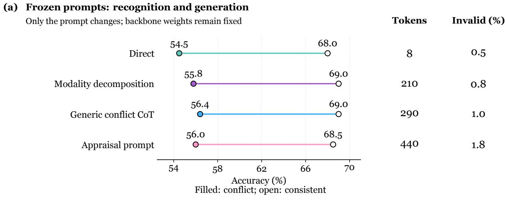  
Figure 10 : What prompting supplies before training. (a) Conflict and consistent accuracy of four frozen-backbone prompts, with output length and invalid-output rates. (b) Grounded-appraisal rates of 52.0% for Direct and 60.0% for Appraisal prompt in a separate explanation audit. That audit locks the predicted label before eliciting the second-pass explanation.

## H Counterfactual response and irrelevant rewrites

## H.1 Two paired tests with different success criteria

The evaluation contains 150 valid intervention pairs and a separate set of 150 irrelevant-rewrite pairs. A valid intervention changes information relevant to the afective interpretation; its direction score asks whether the target-category probability moves in the annotated direction. An irrelevant rewrite tests whether the predicted label remains unchanged. These criteria distinguish sensitivity to a meaningful change from stability under a semantically irrelevant one. The paired-input test changes X and can therefore change both evidence H and appraisal $z ;$ a state-only replacement with fixed X is a separate intervention.

For a fixed set of paired predictions with target category $y _ { i } ^ { \star }$ , paired inputs $( X _ { i } , X _ { i } ^ { \prime } )$ , and annotated direction $d _ { i } \in \{ - 1 , + 1 \}$ , the direction criterion is

$$
\mathrm { D i r } = { \frac { 1 } { N } } \sum _ { i = 1 } ^ { N } { \bf 1 } \{ d _ { i } \left[ p ( y _ { i } ^ { \star } \mid X _ { i } ^ { \prime } ) - p ( y _ { i } ^ { \star } \mid X _ { i } ) \right] > 0 \} .\tag{48}
$$

The target category and direction are fixed before either prediction is scored. A zero directional change is a failure, and invalid model outputs remain failures in the fixed direction-score denominator. A label can remain the most likely class while its probability moves in the appropriate direction. The valid-intervention label-change rate,

$$
{ \mathrm { C h a n g e } } = { \frac { 1 } { N } } \sum _ { i } { \bf 1 } \{ \hat { y }  ( X _ { i } ^ { \prime } ) \neq \hat { y } ( X _ { i } ) \} ,\tag{49}
$$

is therefore a separate measurement, not a substitute for direction compliance. Irrelevant-rewrite stability uses the complementary equality criterion on its own pair set. The signed probability diference averages $d _ { i } [ p ( y _ { i } ^ { \star } ~ \mid ~ X _ { i } ^ { \prime } ) ~ - ~ p ( y _ { i } ^ { \star } ~ \mid ~ X _ { i } ) ]$ . The signed log-odds diference uses the same target and direction, with probabilities clipped to $[ 1 0 ^ { - 6 } , 1 - 1 0 ^ { - 6 } ]$ for numerical stability. These continuous summaries use pairs with defined probabilities; their valid count is distinct from the fixed binary-score denominator.

Tables 22 and 23 retain the source-reported aggregate precision. These aggregate percentages are not converted into integer per-run counts or reconstructed uncertainty estimates.

Table 22 : Complete paired intervention results. Direction, label change, and rewrite stability are percentages. Probability and log-odds diferences retain their original scales. Valid interventions and irrelevant rewrites each contain 150 pairs.
<table><tr><td>Method</td><td></td><td>Direction Label change</td><td> $\Delta p$ </td><td></td><td>△log-odds Rewrite stability</td></tr><tr><td>Emotion-SFT</td><td>62.0</td><td></td><td>24.0 0.050</td><td>0.201</td><td>91.0</td></tr><tr><td>Generic-CoT-SFT</td><td>66.0</td><td></td><td>28.00.070</td><td>0.281</td><td>90.0</td></tr><tr><td>Modality-Gate-SFT</td><td>63.0</td><td></td><td>25.00.055</td><td>0.221</td><td>91.0</td></tr><tr><td>VISTA</td><td>75.0</td><td></td><td>36.00.120</td><td>0.484</td><td>92.0</td></tr></table>

The reported paired measurements combine sensitivity to meaningful changes with stability under irrelevant rewrites. VISTA’s target-probability and log-odds diferences are 0.120 and 0.484, compared with 0.070 and 0.281 for Generic-CoT-SFT; its valid-intervention label-change rate is 36.0% and irrelevant-rewrite stability is 92.0%. The final training configuration does not use a counterfactual loss $( \lambda _ { \mathrm { c f } } = 0 )$

## H.2 Intervention dimensions and diagnostic weighting

The six intervention types are goal/concern (g), goal congruence (c), Expectation (e), coping/control (k), norm/social relevance (n), and expression regulation (r), each containing 25 pairs. Table 23 gives the four available type-specific direction-compliance rates; goal/concern and Expectation have no separately reported rates. This field set difers from the six-field mutual-information diagnostic, which includes agency and excludes free-text goal/concern.

Table 23 : Available VISTA intervention-type results. Each of the six types has 25 pairs; type-specific percentages are available for the four listed types. The remaining two types contribute to the 150-pair aggregate but have no separately reported rates.
<table><tr><td>Intervention type</td><td>Pairs</td><td>Direction compliance (%)</td></tr><tr><td>Goal congruence</td><td>25</td><td>84.0</td></tr><tr><td>Expression regulation</td><td>25</td><td>81.0</td></tr><tr><td>Coping / control</td><td>25</td><td>68.0</td></tr><tr><td>Social norm</td><td>25</td><td>69.0</td></tr></table>

A common masking diagnostic. Fix the original input’s predicted class $y _ { 0 } = { \hat { y } } ( X )$ and measure the positive probability drop after masking modality m:

$$
\delta _ { m } = \operatorname* { m a x } \{ 0 , p ( y _ { 0 } \mid X ) - p ( y _ { 0 } \mid X _ { \backslash m } ) \} , \qquad \alpha _ { \mathrm { d i a g } , m } = \frac { \delta _ { m } + 0 . 0 1 } { \sum _ { j \in \{ V , A , T \} } \delta _ { j } + 0 . 0 3 } .\tag{50}
$$

Video masking retains the audio track; audio masking retains text; text masking removes both the transcript and dialogue history. Each masked input is evaluated by a fresh forward pass. With all three modalities included, zero drops yield uniform diagnostic weights of 1/3. For a diagnostic over M available modalities, the smoothing total is 0.01M.

The target-modality change in this diagnostic is +0.040 for VISTA, compared with the reported control range of +0.015–+0.020. These diagnostic weights are distinct from the model-native α in Table 20: they summarize output changes across fresh masked-input evaluations and can reflect the fusion residual, the arbitration branch, and their interactions. They describe perturbation response without assigning the full prediction’s causal contribution to an individual branch.

## I Appraisal representation and downstream prediction

## I.1 A shared linear probe on frozen representations

THERADIA supplies human appraisal annotations for four dimensions. Every core model freezes its backbone and trains the same Linear(3584, 4) + sigmoid probe. The probe has 3584 × 4 + 4 = 14,340 parameters, so probe capacity is fixed across the five models. The evaluation asks how well those appraisal judgments can be read from each representation, using the concordance correlation coeficient (CCC).

The four targets are novelty, intrinsic pleasantness, goal conduciveness, and coping. Features are standardized with training-set statistics alone. Probe training minimizes mean squared error with learning rate $5 \times 1 0 ^ { - 4 }$ batch size 64, at most 50 epochs, and early-stopping patience $5 ;$ the checkpoint is selected by development-set macro CCC. The backbone remains frozen throughout this probe fit.

Table 24 : THERADIA appraisal readout: CCC by dimension. All models use the same four-output linear probe on a frozen backbone. Macro CCC averages the four dimensions.
<table><tr><td>Method</td><td>Novelty</td><td>Pleasantness</td><td>Goal</td><td>Coping</td><td>Macro CCC</td></tr><tr><td>Base</td><td>0.400</td><td>0.470</td><td>0.490</td><td>0.520</td><td>0.470</td></tr><tr><td>Emotion-SFT</td><td>0.440</td><td>0.500</td><td>0.530</td><td>0.550</td><td>0.505</td></tr><tr><td>Generic-CoT-SFT</td><td>0.470</td><td>0.530</td><td>0.560</td><td>0.570</td><td>0.533</td></tr><tr><td>Modality-Gate-SFT</td><td>0.470</td><td>0.530</td><td>0.560</td><td>0.580</td><td>0.535</td></tr><tr><td>VISTA</td><td>0.540</td><td>0.590</td><td>0.620</td><td>0.650</td><td>0.600</td></tr></table>

VISTA raises macro CCC by 0.095 over Emotion-SFT and improves all four dimensions. Its aggregate MAE, RMSE, Pearson correlation, and Spearman correlation are 0.086, 0.111, 0.658, and 0.625, respectively (Table 25). Novelty and Expectation remain diferent constructs: the four-dimensional probe evaluates the available human dimensions, not complete seven-field correctness.

Table 25 : Aggregate VISTA appraisal-probe metrics on THERADIA. All quantities retain their native numerical scale.
<table><tr><td>Macro CCC ↑</td><td>MAE↓</td><td>RMSE↓</td><td>Pearson ↑</td><td>Spearman ↑</td></tr><tr><td>0.600</td><td>0.086</td><td>0.111</td><td>0.658</td><td>0.625</td></tr></table>

## I.2 Using appraisal to predict ten emotion intensities

The downstream task predicts intensities for ten named emotions: annoyed, anxious, confident, desperate, frustrated, happy, interested, relaxed, satisfied, and surprised. These are the THERADIA core emotion labels, rather than general core-afect axes. Auxiliary appraisal supervision alone gives 0.415 macro CCC, compared with 0.390 without appraisal. Connecting model-generated appraisal to the decision raises CCC to 0.450, a further 0.035 improvement over auxiliary-only training and 0.060 over no appraisal. Human appraisal supplies privileged information and reaches 0.480 (Table 26). The four-output probe and ten-output downstream task have distinct targets; the probe’s architecture and fitting schedule describe the appraisal-readout experiment.

Table 26 : THERADIA downstream emotion-intensity regression. The task predicts ten named emotion intensities; the metric is macro CCC. Human appraisal is an oracle condition, separate from inference using model-generated appraisal.
<table><tr><td>Appraisal condition</td><td>Macro CCC</td><td>Gain over none</td></tr><tr><td>No appraisal</td><td>0.390</td><td>0.000</td></tr><tr><td>Auxiliary only; decision connection cut</td><td>0.415</td><td>0.025</td></tr><tr><td>Model-generated appraisal</td><td>0.450</td><td>0.060</td></tr><tr><td>Human appraisal (oracle)</td><td>0.480</td><td>0.090</td></tr></table>

Frozen representations; identical Linear(3584, 4) + sigmoid probes

## (a) Four human-annotated appraisal dimensions

<table><tr><td rowspan="2"></td><td>Novelty</td><td>Pleasantness</td><td>Goal</td><td>Coping</td><td>Macro CCC</td></tr><tr><td>Base 0.400</td><td>0.470</td><td>0.490</td><td>0.520</td><td>0.470</td></tr><tr><td>Emotion-SFT</td><td>0.440</td><td>0.500</td><td>0.530</td><td>0.550</td><td>0.505</td></tr><tr><td>Generic-CoT</td><td>0.470</td><td>0.530</td><td>0.560</td><td>0.570</td><td>0.533</td></tr><tr><td>Modality gate</td><td>0.470</td><td>0.530</td><td>0.560</td><td>0.580</td><td>0.535</td></tr><tr><td>VISTA</td><td>0.540</td><td>0.590</td><td>0.620</td><td>0.650</td><td>0.600</td></tr></table>

VISTA: MAE 0.086 ∙ RMSE 0.111 ∙ Pearson 0.658 ∙ Spearman 0.625 CCC color scale: 0.35 (light) to 0.65 (dark). Novelty is distinct from expectation.

## (b) Appraisal in downstream affect regression

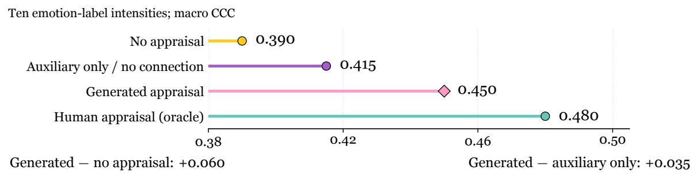  
Figure 11 : From readable appraisal to useful appraisal. (a) Five frozen backbone representations under a common four-dimensional linear probe, evaluated by dimension-wise and macro CCC. (b) Downstream regression of ten emotion intensities under four appraisal conditions. Model-generated appraisal gives 0.450 macro CCC, versus 0.415 with auxiliary supervision alone; human appraisal is a privileged test-time reference.

The probe and downstream experiment serve diferent purposes. The former measures the readability of human appraisal dimensions at matched probe capacity; the latter tests the usefulness of an appraisal input to afect prediction. Together they support a representation that is both aligned with the available appraisal labels and useful when connected to the downstream predictor. The remaining 0.030 CCC gap quantifies the distance from generated appraisal to the privileged human-appraisal condition.

## J Supervision construction, field quality, and label visibility

## J.1 Teacher generation and field masks

One Qwen2.5-Omni-7B teacher generates three samples per input with temperature 0.7, top-p 0.9, a maximum of 512 output tokens, and seeds 101, 102, and 103. These repeated samples measure sampling consistency within the same teacher. The fixed template has SHA256

## c2812f36f754d70875bd69c25534eab697d57c9f88c34d486b4d6d74c432caa3

Each field stores its value, confidence, evidence, and validity mask separately. Missing values remain null; confidence does not automatically become a supervision weight. Agency value unknown can appear in an output but is masked for supervision. The four binary social-relevance components—politeness, identity, status, and relationship—each have their own mask. A component receives false when evidence supports a negative judgment; absent evidence leaves it missing. This representation supports partial supervision at the level of individual fields and social-relevance components.

## J.2 From candidate pool to retained training set

The candidate pool contains 10,256 examples. The final common training set retains 8,000: 2,123 from CH-SIMS v2.0, 866 from THERADIA, and 5,011 from MELD. The retention process yields 2,872 automatically accepted examples, 1,231 accepted after human adjudication, and 3,897 retained with partial-field masking; 2,256 candidates are rejected (Table 27). These counts describe the complete candidate disposition. The separate 400-example field audit below is not the count of all human-adjudicated examples.

Table 27 : Complete pseudo-appraisal data accounting. The left block partitions all candidates; the right block partitions the retained training set by source. Partial masking retains an example while masking unsupported fields.
<table><tr><td>Candidate disposition</td><td>Count</td><td>Retained source</td><td>Count</td></tr><tr><td>Automatically accepted</td><td>2,872</td><td>CH-SIMS v2.0</td><td>2,123</td></tr><tr><td>Accepted after human adjudication</td><td>1,231</td><td>THERADIA</td><td>866</td></tr><tr><td>Retained with partial-field masking</td><td>3,897</td><td>MELD</td><td>5,011</td></tr><tr><td>Rejected</td><td>2,256</td><td></td><td></td></tr><tr><td>All candidates</td><td>10,256</td><td>All retained</td><td>8,000</td></tr></table>

## J.3 Seven-field audit on 400 candidates

The audit samples 106 CH-SIMS, 43 THERADIA, and 251 MELD candidates, covering conflict, ambiguity, and consistency strata within each source. Two raters independently assess the candidates, with method names and teacher conditions blinded; a third rater adjudicates disagreements. Human agreement refers to the two original judgments before adjudication, whereas teacher sampling consistency concerns the three generated samples.

Coverage uses all 400 audited candidates as its denominator: for example, goal congruence is valid for 296 examples, giving 296/400 = 74.0%. Fields can coexist within a candidate, so their valid counts are not additive. Sampling consistency uses the candidates with suficiently many valid samples for that field as its denominator. For goal text g, semantic comparison uses a frozen goal/concern categorization. Table 28 summarizes quality at the field level. The social-norm row records 136 available fields out of 400 candidates (34.0% coverage); each of its four binary components retains its own validity mask, so this aggregate is distinct from component-specific coverage.

Grounding judgments have three outcomes: yes for explicit input support, no for unsupported or contradicted content, and uncertain when the evidence does not settle the judgment. The grounded proportion is the number of yes judgments divided by all non-missing generated fields; uncertain remains in this denominator and is a separate judgment category. Agency and goal congruence have grounded proportions of 84.0% and 81.0%; expectation, social norm, and expression regulation have coverage of 43.0%, 34.0%, and 43.0%. The schema therefore combines broadly supported event judgments with more selectively available contextual ones.

Table 28 : Seven-field audit. Coverage is the valid count divided by 400 candidates. Sampling consistency and grounded proportion are percentages with their field-specific denominators. Multiple fields may be valid in the same example; n retains the reported field-level aggregate.
<table><tr><td>Field</td><td colspan="3">Valid N Coverage consistency</td><td>Grounded</td></tr><tr><td>Goal / concern g</td><td>240</td><td>60.0</td><td>80.0</td><td>76.0</td></tr><tr><td>Goal congruence c</td><td>296</td><td>74.0</td><td>85.0</td><td>81.0</td></tr><tr><td>Expectation e</td><td>172</td><td>43.0</td><td>76.0</td><td>67.0</td></tr><tr><td>Agency a</td><td>260</td><td>65.0</td><td>86.0</td><td>84.0</td></tr><tr><td>Coping / control k</td><td>192</td><td>48.0</td><td>81.0</td><td>73.0</td></tr><tr><td>Social norm n</td><td>136</td><td>34.0</td><td>78.0</td><td>68.0</td></tr><tr><td>Expression regulation r</td><td>172</td><td>43.0</td><td>80.0</td><td>72.0</td></tr></table>

Coverage and utility are distinct. Expression regulation is valid in 43.0% of audited candidates, while removing the field reduces conflict accuracy by 0.9 pp in the mechanism comparison. Partial-field masking preserves examples without forcing every field to be inferred from insuficient evidence.

## (a) Field audit: coverage and semantic support

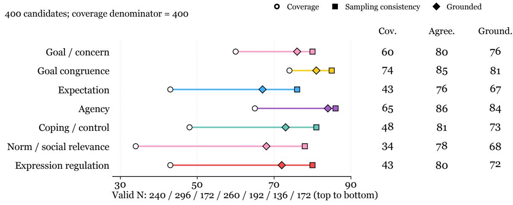

## (b) Candidate selection and retained sources

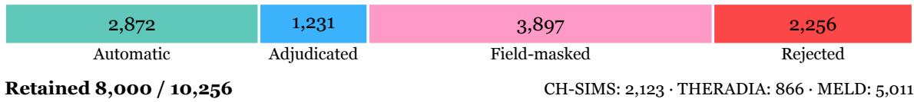

## (c) Isolated label-visibility diagnostic

<table><tr><td></td><td>Field agree.</td><td>Grounded</td><td>Copying</td><td>MI (bits)</td><td>Dev Acc2</td><td>Conflict Acc2</td></tr><tr><td>Label-blind</td><td>0.53</td><td>73.0</td><td>3.0</td><td>0.120</td><td>84.5</td><td>80.5</td></tr><tr><td>Label-visible</td><td>0.65</td><td>67.0</td><td>21.0</td><td>0.240</td><td>85.0</td><td>81.2</td></tr></table>

No ground-truth labels at evaluation; conflict subset: $C \geq 2 .$

Figure 12 : Supervision from selection to decision quality. (a) Coverage, sampling consistency, grounded proportion, and valid count for all seven fields in the 400-candidate audit. (b) Disposition of all 10,256 candidates and dataset sources of the 8,000 retained examples. (c) Label-blind versus label-visible teacher diagnostics, with the latter trained in an isolated copy. Percentages, field-consistency scores, and mutual information retain their distinct units.

## J.4 An isolated label-visibility diagnostic

The main pipeline generates appraisal without revealing the true emotion label to the teacher. A label-visible comparison uses an isolated training copy. Both are evaluated on CH-SIMS development examples without supplying true labels at evaluation, and the conflict subset uses $C \geq 2$

Label-copy rate counts field outputs containing a predefined target-label term or synonym, divided by all auditable outputs; quotations from the input evidence are recorded separately. Grounding, copying, and sampling consistency describe complementary properties of generated supervision. Human agreement is computed from the raters’ original decisions and is distinct from the field-consistency score reported in Table 29.

The mutual-information diagnostic uses $\mathcal { F } = \{ c , e , a , k , n , r \}$ and the CH-SIMS binary sentiment label Y. Goal text g is excluded. Coping k is discretized into five fixed equal-width bins, n is encoded as a four-bit combination, and missing states are represented separately; agency unknown is not a valid attribution category. Each field–label contingency table uses Dirichlet 0.5 smoothing, with information measured in bits. For each field, 1,000 label permutations estimate the finite-sample bias:

$$
I _ { f } ^ { \mathrm { c o r r } } = \mathrm { m a x } \Bigg \{ 0 , ~ I ( Z _ { f } ; Y ) - \frac { 1 } { 1 0 0 0 } \sum _ { b = 1 } ^ { 1 0 0 0 } I ( Z _ { f } ; Y ^ { ( b ) } ) \Bigg \} , \qquad I _ { \mathrm { a p p } } = \frac { 1 } { 6 } \sum _ { f \in \mathcal { F } } I _ { f } ^ { \mathrm { c o r r } } .\tag{51}
$$

Thus the reported MI is an equal-weight mean of six bias-corrected field scores.

Table 29 : Label-visibility diagnostic. Field consistency retains the reported score scale; grounded proportion, copying, and Acc2 are percentages. MI is the mean bias-corrected field–label mutual information in bits (Equation 51). Both development evaluations hide true labels.
<table><tr><td>Teacher condition</td><td></td><td></td><td></td><td></td><td></td><td>Consistency Grounded Copying MI (bits) Dev Acc2 Conflict Acc2</td></tr><tr><td>Label-blind</td><td>0.53</td><td>73.0</td><td>3.0</td><td>0.120</td><td>84.5</td><td>80.5</td></tr><tr><td>Label-visible, isolated</td><td>0.65</td><td>67.0</td><td>21.0</td><td>0.240</td><td>85.0</td><td>81.2</td></tr></table>

Making the teacher label-aware increases field consistency from 0.53 to 0.65 and appraisal–label MI from 0.120 to 0.240 bits, while copying rises from 3.0% to 21.0% and grounding falls from 73.0% to 67.0%. Development accuracy increases by 0.5 pp overall and 0.7 pp on the conflict subset. Higher label association and higher scene grounding are consequently diferent properties. The observed MI increase alone neither establishes source leakage nor replaces a grounding assessment; the isolated label-visible condition is a diagnostic of supervision design.

## J.5 Second-pass explanation audit

A separate pilot audit uses 150 examples, with 50 examples in each of its three strata. The first prediction is locked before a second-pass explanation is generated. The grounded-appraisal rates are 52.0% for Direct and 60.0% for Appraisal prompt (Figure 10). This protocol measures explanation quality after the recognition decision; the second pass does not update that decision.

## K Computation and the structure of remaining errors

## K.1 Training and inference resources

Table 30 compares training and inference resources for the four methods. The four methods share 8,000 training examples, three epochs, 375 optimization steps, efective batch size 64, LoRA rank 16, and seeds 42, 43, and 44. Their auxiliary heads yield diferent trainable parameter counts. Generic-CoT-SFT and VISTA share a mean target length of 360 tokens, allowing computation to be compared at matched average output length.

Table 30 : Complete resource accounting. Training columns concern the common stage; inference is measured on one A100 at batch size 1. GPU-hours are per seed and peak memory is GiB per GPU. P50 and P95 are inference latency percentiles in seconds.
<table><tr><td>Method</td><td>Params (M)</td><td>) GPU-h</td><td>Peak GiB</td><td></td><td>P50 (s) P95 (s) Tokens</td><td></td></tr><tr><td>Emotion-SFT</td><td>10.12</td><td>32.0</td><td>42.0</td><td>1.2</td><td>4.0</td><td>8</td></tr><tr><td>Generic-CoT-SFT</td><td>10.12</td><td>40.0</td><td>45.0</td><td>13.5</td><td>26.0</td><td>360</td></tr><tr><td>Modality-Gate-SFT</td><td>12.19</td><td>64.0</td><td>52.0</td><td>6.0</td><td>13.0</td><td>96</td></tr><tr><td>VISTA</td><td>12.39</td><td>72.0</td><td>56.0</td><td>15.5</td><td>31.0</td><td>360</td></tr></table>

VISTA uses 72 GPU-h per seed versus 40 for Generic-CoT-SFT, and has P50 latency 15.5 s versus 13.5 s. Its three-seed common training totals 216 GPU-h. That total excludes teacher generation, separate task adaptation, ablations, and extra diagnostic calls. The resources measure the cost of the evaluated systems, rather than claiming identical auxiliary capacity or total computation across methods.

## (a) Common-stage resources and inference cost

Shared bar scale: 0–30% within the named error group.
<table><tr><td></td><td>Emotion-SFT</td><td>Generic-CoT</td><td>Modality gate</td><td>VISTA</td></tr><tr><td>Trainable parameters (M)</td><td>10.12</td><td>10.12</td><td>12.19</td><td>12.39</td></tr><tr><td>GPU-hours / seed</td><td>32.0</td><td>40.0</td><td>64.0</td><td>72.0</td></tr><tr><td>Peak VRAM (GiB / GPU)</td><td>42.0</td><td>45.0</td><td>52.0</td><td>56.0</td></tr><tr><td>Inference P50 (s)</td><td>1.2</td><td>13.5</td><td>6.0</td><td>15.5</td></tr><tr><td>Inference P95 (s)</td><td>4.0</td><td>26.0</td><td>13.0</td><td>31.0</td></tr><tr><td>Output tokens</td><td>8</td><td>360</td><td>96</td><td>360</td></tr><tr><td colspan="5">VISTA common-stage total: 216 GPU-hours for three seeds.</td></tr></table>

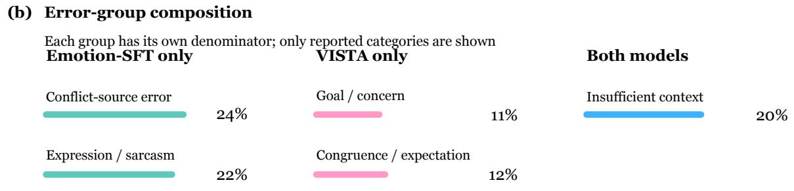  
Figure 13 : Resources and error groups. (a) All six reported training and inference resource measurements for the four trained methods. (b) The five available error-category shares, separated by the three paired-model error groups that define their denominators. These shares are not a complete error partition and are not pooled across groups.

## K.2 Errors corrected, introduced, and shared

The paired error analysis groups examples by whether Emotion-SFT, VISTA, or both make an error. Within examples where only Emotion-SFT errs, conflict-source mistakes account for 24.0% and expression regulation/sarcasm mistakes for 22.0%. Within examples where only VISTA errs, goal/concern mistakes account for 11.0% and congruence/Expectation mistakes for 12.0%. Among examples where both models err, insuficient context accounts for 20.0% (Table 31).

This grouping links the method’s gain to concrete interpretation problems without obscuring errors introduced by the intermediate appraisal. It also separates an absent contextual cue from a failure to interpret an available one: better arbitration can improve the latter, while the former requires information beyond the observed input.

Table 31 : Available paired-error audit results. Each percentage uses the group in its first column as the denominator. The table lists the reported categories rather than a full partition; entries must not be summed across error groups or interpreted as corpus prevalence.
<table><tr><td>Error group</td><td>Reported error category</td><td>Share (%)</td></tr><tr><td>Only Emotion-SFT wrong</td><td>Conflict-source identification</td><td>24.0</td></tr><tr><td>Only Emotion-SFT wrong</td><td>Expression regulation / sarcasm</td><td>22.0</td></tr><tr><td>Only VISTA wrong</td><td>Goal / concern</td><td>11.0</td></tr><tr><td>Only VISTA wrong</td><td>Goal congruence / Expectation</td><td>12.0</td></tr><tr><td>Both models wrong</td><td>Insufficient context</td><td>20.0</td></tr></table>

## L Ordinary conversational recognition and class recall

MELD tests whether the conflict-oriented representation remains useful for ordinary seven-class conversational emotion recognition. Trained models receive the task-specific adaptation described in Appendix M; Base is evaluated zero-shot. VISTA reaches 66.94% weighted-F1, 52.89% macro-F1, and 67.85% accuracy (Table 32). Its reported weighted-F1 gain over Emotion-SFT is 1.46 pp, computed from the unrounded scores.

Table 32 : Complete MELD results (%). Diferences are in pp relative to Emotion-SFT and are calculated before rounding, so they need not equal subtraction of the displayed rounded means.
<table><tr><td>Method</td><td>Weighted-F1</td><td>Macro-F1</td><td>Accuracy</td><td>∆wF1</td></tr><tr><td>Base</td><td>59.55</td><td>43.73</td><td>60.59</td><td>-5.93</td></tr><tr><td>Emotion-SFT</td><td>65.49</td><td>50.65</td><td>66.48</td><td>0.00</td></tr><tr><td>Generic-CoT-SFT</td><td>65.69</td><td>51.12</td><td>66.64</td><td>+0.20</td></tr><tr><td>Modality-Gate-SFT</td><td>65.74</td><td>50.84</td><td>66.73</td><td>+0.25</td></tr><tr><td>VISTA</td><td>66.94</td><td>52.89</td><td>67.85</td><td>+1.46</td></tr></table>

The final evaluation reports increased recall in all seven emotion classes relative to Emotion-SFT. Table 33 gives the available class-specific measurements: disgust rises from 18.0 to 21.0%, fear from 20.0 to 23.0%, and sadness from 39.0 to 41.5%. VISTA’s neutral recall is 81.7%. These improvements accompany substantial remaining diferences among emotion classes, which weighted-F1 alone does not display.

Table 33 : Available MELD class-recall measurements (%). The table includes the available numerical recall values; a dash marks an unreported comparator value.
<table><tr><td>Emotion</td><td>Emotion-SFT VISTA</td></tr><tr><td>Disgust</td><td>18.0 21.0 23.0</td></tr><tr><td>Fear</td><td>20.0</td></tr><tr><td>Sadness</td><td>39.0 41.5</td></tr><tr><td>Neutral</td><td>81.7</td></tr></table>

The ordinary-recognition result complements the conflict gains rather than imposing a separate non-inferiority test. The final aggregate report does not supply uncertainty intervals, and the paper makes no formal significance or non-inferiority determination from the displayed diferences.

## M Shared training and task adaptation

## M.1 What is held fixed across the core comparison

All five core models use Qwen2.5-Omni-7B. Base is the frozen pretrained model. Emotion-SFT learns the final emotion or sentiment label; Generic-CoT-SFT adds generic reasoning; Modality-Gate-SFT learns modality gating; VISTA combines structured appraisal, conflict recognition, and semantic arbitration. The four trained methods share the common-stage conditions in Table 34. Auxiliary heads difer, as reflected in the parameter counts in Table 30.

Table 34 : Common-stage training configuration. These settings apply to all four trained core methods. Additional task adaptation and the common THERADIA probe are specified separately.  
Setting Final configuration   
Backbone Qwen2.5-Omni-7B Thinker   
Frozen components Audio encoder, visual encoder, and Talker   
Retained training examples 8,000   
Epochs / optimization steps 3 / 375   
Efective batch size 64   
LoRA targets q\_proj, k\_proj, v\_proj, o\_proj in 28 layers   
LoRA rank / alpha / dropout 16 / 32 / 0.05   
Optimizer AdamW; $\beta = ( 0 . 9 , 0 . 9 5 )$ ; weight decay 0.01   
Learning rates LoRA: $5 \times 1 0 ^ { - 5 } ;$ ; added heads: $1 0 ^ { - 4 }$   
Schedule Cosine; warmup for 5% of optimizer steps   
Numerical configuration bf16; gradient-norm clipping at 1   
Input budget 8,192 total tokens; 1,024 text tokens; at most 16 video frames   
Decoding Greedy; maximum 512 generated tokens, apart from Base’s short classification   
interface   
Random seeds 42, 43, 44   
Generic-CoT / VISTA mean 360 / 360 tokens   
target length   
VISTA counterfactual coefi $\lambda _ { \mathrm { c f } } = 0$   
cient

The pretrained weight revision is ae9e1690543fd5c0221dc27f79834d0294cba00. The common-stage step count is $8 , 0 0 0 \times 3 / 6 4 = 3 7 5 ;$ downstream task adaptation is a separate optimization stage. Checkpoint selection maximizes the equally weighted mean of MELD development accuracy and CH-SIMS development Acc2 after putting both on the same numerical scale; a tie selects the earlier checkpoint. The development criteria are separate from the held-out test measurements.

## M.2 Training objective and missing supervision

The final training objective combines the emotion task, unimodal tasks, appraisal fields, conflict recognition, and arbitration:

$$
\mathcal { L } = \mathcal { L } _ { \mathrm { e m o } } + 1 . 0 \mathcal { L } _ { \mathrm { u n i } } + 0 . 5 \mathcal { L } _ { \mathrm { a p p } } + 0 . 5 \mathcal { L } _ { \mathrm { c o n f } } + 0 . 5 \mathcal { L } _ { \mathrm { a r b } } , \qquad \lambda _ { \mathrm { c f } } = 0 .\tag{52}
$$

The ablation notation uses the aliases $\mathcal { L } _ { z } = \mathcal { L } _ { \mathrm { a p p } } , \mathcal { L } _ { c } = \mathcal { L } _ { \mathrm { c o n f } } ,$ , and $\mathcal { L } _ { a } = \mathcal { L } _ { \mathrm { a r b } }$ . Classification targets use cross-entropy and continuous targets use mean squared error; a unimodal task contributes only when that modality has a valid target. Every supervised component is normalized over its valid targets. For component $j ,$

$$
\mathcal { L } _ { j } = \frac { \sum _ { i } w _ { i } M _ { i j } \ell _ { i j } } { \sum _ { i } w _ { i } M _ { i j } + \epsilon } , \qquad w _ { i } = \left\{ \begin{array} { l l } { 1 + 0 . 5 C _ { i } , } & { \mathrm { a ~ v a l i d ~ c o n f i c t ~ l a b e l ~ i s ~ a v a l l a b l e } , } \\ { 1 , } & { \mathrm { o t h e r w i s e } , } \end{array} \right.\tag{53}
$$

where $M _ { i j }$ is the supervision-validity mask and ϵ stabilizes the denominator. The conflict quantity $C _ { i }$ is defined in Equation 42. A missing target contributes neither a loss nor a denominator weight.

Within appraisal, $c , e , a , r$ use categorical losses, k uses regression, and the four n indicators use individually masked binary cross-entropy. The goal/concern field $g$ uses a text loss divided by its number of valid target tokens. Each field is first normalized internally; the sample-level appraisal loss then averages its valid fields. A sample with no valid appraisal fields is excluded from the appraisal denominator. Thus target length and the number of social-relevance bits do not implicitly determine field weight. Missing values remain null, agency unknown is excluded as a supervision target, and an n bit is false only when negative evidence supports it. Confidence and validity masks are separate quantities; confidence is not automatically used as a loss weight.

## M.3 Checkpoint use across evaluation tasks

Table 35 distinguishes direct evaluation, task adaptation, and probing. EmoMM evaluates the commonstage checkpoint without additional adaptation; CH-SIMS and MELD use adapted task predictors, while THERADIA compares frozen representations at equal probe capacity. These checkpoint roles describe optimization stages; source-corpus relationships are specified in Appendix E.

Table 35 : Evaluation-stage use of the core models. The labels identify distinct experimental protocols rather than a single checkpoint condition for every task.
<table><tr><td>Evaluation</td><td>Base</td><td>Four trained methods</td></tr><tr><td>CA-MER</td><td>Frozen Base</td><td>Common-stage trained models; normalized output interface</td></tr><tr><td>EmoMM</td><td>Frozen Base</td><td>Common-stage checkpoint; no EmoMM adaptation</td></tr><tr><td>CH-SIMS v2.0</td><td>Zero-shot</td><td>Separate task adaptation; train-defined conflict groups</td></tr><tr><td>MELD</td><td>Zero-shot</td><td>Separate task adaptation for seven emotion classes</td></tr><tr><td>THERADIA probe</td><td>Frozen backbone + common probe</td><td>Frozen backbone + common probe</td></tr></table>

## M.4 The complete cross-task result overview

Table 36 places the six reported headline measurements together. The comparisons retain each task’s metric and evaluation protocol. They are not averaged into an artificial universal score: conflict accuracy, appraisal CCC, and ordinary weighted-F1 answer diferent parts of the scientific question.

Table 36 : Complete six-metric overview. Classification and F1 values are percentages; THERADIA CCC retains its native scale. CA-MER conflict is the macro average of its two directions, CH-SIMS Q4 is binary accuracy, and THERADIA is the four-dimensional probe macro CCC.
<table><tr><td>Method</td><td></td><td>CA conflict CA consistent</td><td>EmoMM conflict SIMS Q4</td><td></td><td>CCC</td><td>MELD wF1</td></tr><tr><td>Base</td><td>54.5</td><td>68.0</td><td>46.5</td><td>70.0</td><td>0.470</td><td>59.55</td></tr><tr><td>Emotion-SFT</td><td>60.0</td><td>73.0</td><td>47.5</td><td>77.0</td><td>0.505</td><td>65.49</td></tr><tr><td>Generic-CoT-SFT</td><td>61.5</td><td>74.0</td><td>48.0</td><td>77.8</td><td>0.533</td><td>65.69</td></tr><tr><td>Modality-Gate-SFT</td><td>62.0</td><td>74.0</td><td>49.0</td><td>79.2</td><td>0.535</td><td>65.74</td></tr><tr><td>VISTA</td><td>64.5</td><td>74.2</td><td>52.0</td><td></td><td>81.5 0.600</td><td>66.94</td></tr></table>

## N Reporting conventions and reproducibility map

## N.1 Quantities, denominators, and precision

Appraisal z is an event-level state containing goal/concern, goal congruence, Expectation, agency, coping/control, social norm, and expression regulation. Classification accuracy, F1, recall, and other rates are percentages; their diferences are percentage points. CCC, MAE, RMSE, correlations, probability diferences, and modality weights retain their native scales. Appendix M specifies training and adaptation.

For the recognition and readout comparisons, the reporting rule computes each metric from the unrounded predictions of seeds 42, 43, and 44 separately, averages the three seed-level metrics equally, and rounds once for display. In particular, F1 and CCC are computed within each seed before averaging. Teacher sampling, shufling, and bootstrap randomness do not create additional independent training runs. Reported contrasts use the unrounded evaluation values: MELD’s VISTA–Emotion-SFT weighted-F1 gain is 1.46 pp, versus 1.45 pp from the rounded means. Newly derived contrasts (Table 18) use displayed values. The paired analyses retain the aggregate precision specified in Appendix H. Aggregate scores alone do not determine seed standard deviations, confidence intervals, significance tests, or non-inferiority decisions.

Denominators are 10,256 candidates for selection; 8,000 retained examples for source counts; 400 candidates for coverage; 150 pairs each for valid interventions and irrelevant rewrites; and the corresponding error group for each error share. The six intervention types each have 25 pairs; aggregate rates are not inverted into per-run counts. For direction compliance, invalid model outputs are failures in the fixed evaluation denominator. Continuous probability and log-odds summaries require defined probabilities and use their own valid counts. Native α and masking-based $\alpha _ { \mathrm { d i a g } }$ remain distinct.

Training history and source identity. Common training, task adaptation, and development-set checkpoint selection define diferent uses of a sample. Source identity spans those stages and can difer from a dataset’s local clip ID: two diferently named examples may share a video, dialogue, session, subject, or overlapping media interval. A source-disjointness claim therefore requires a canonical source comparison as well as exact clip/media matching. No EmoMM-specific adaptation, as used here, describes the optimization protocol; it does not establish source disjointness from the shared CH-SIMS v2 training material.

## N.2 A complete map of the final experimental evidence

Table 37 locates all experiments, including the output-validity, prompt, external-method, class-recall, and resource analyses that complement the main comparisons.

Table 37 : A guide to the complete experimental evidence. All experiment families and their numerical results.
<table><tr><td>Evidence family</td><td>Question and complete contents</td><td>Location</td></tr><tr><td>Core settings and definitions</td><td>Backbone, shared training, task adaptation, units, and six-metric overview</td><td>Tables 34–36; this section</td></tr><tr><td>CA-MER recognition</td><td>All subsets, overall accuracy, invalid output, external reevaluations</td><td>Tables 14, 15</td></tr><tr><td>Conflict specificity</td><td>All three control contrasts and directional decomposition</td><td>Tables 12, 13</td></tr><tr><td>EmoMM</td><td>All four conditions and CHASE reevaluation</td><td>Table 16</td></tr><tr><td>CH-SIMS v2.0</td><td>All conflict groups, overall Acc2, Q4 MAE</td><td>Table 17</td></tr><tr><td>MELD</td><td>Weighted-F1, macro-F1, accuracy, unrounded differences, class recall</td><td>Tables 32, 33</td></tr><tr><td>THERADIA</td><td>All five four-dimensional probes, aggregate metrics, downstream</td><td>Tables 24–26</td></tr><tr><td>Mechanism controls</td><td>conditions All 13 appraisal/training configurations and native weights</td><td>Tables 19, 20</td></tr><tr><td>Counterfactual</td><td>All five paired metrics, available type rates, masking diagnostic</td><td>Tables 22, 23;</td></tr><tr><td>behavior</td><td></td><td>Appendix H</td></tr><tr><td>Frozen prompting</td><td>All four prompts, length, invalid output, second-pass grounding audit</td><td>Table 21; Figure 10</td></tr><tr><td>Supervision</td><td>Candidate/source counts, all seven fields, six label-visibility metrics</td><td>Tables 27–29</td></tr><tr><td>Resources and errors</td><td>All six cost metrics and five reported group-specific error shares</td><td>Tables 30, 31</td></tr></table>

Public-label prevalence is an independent analysis. The public CH-SIMS audit uses a fixed sentiment mapping on all 2,281 released clips, finding 1,117 conflicts independently of VISTA predictions and training selection (Appendix E.1). Appendix E.1 specifies the released data, fixed label mapping, exact comparison rule, and split-level counts.

Scope of each empirical claim. The comparisons support conflict gains, appraisal readout and downstream utility, and intervention sensitivity. Prompting, missingness, class recall, and latency characterize their operating conditions. These aggregates do not separately estimate the Bayes-risk terms or fixed-evidence logit contrasts developed in Appendices C.3 and D.4.

Responsible interpretation of event appraisal. Appraisal is an event-specific hypothesis, not a durable personal attribute or moral judgment. Goals, norms, and expression vary across people and settings; unsupported fields should remain uncertain or masked. Consequential applications require context-specific validation and human review. Conversational and audiovisual data require participant privacy and compliance with dataset access conditions.