# WEFT: Scaling Tool-Use Post-Training for General-Purpose Agents

Bo Mao1∗ Hang He1,3∗ Linting Wang2∗ Lizhi Lin5∗ Maosen Zhou2∗ Guanming Liu2 Jinxiu Liu5 Tianyu Huai1,3 Chaoyun Zhang5 Bingxuan Li5 Kepeng Lei5 Guanting Dong4 Zhou Shao5† Rui Zheng5 Hang Yan5 Jie Zhou1† Chengcheng Wan1,3 Tao Gui2,3 Liang He1 Xipeng Qiu2,3

1East China Normal University 2Fudan University 3Shanghai Innovation Institute 4Renmin University of China 5Shanghai Qiji Zhifeng Co., Ltd

shaozhou@qijizhifeng.com jzhou@cs.ecnu.edu.cn

## Abstract

Recent efforts to scale tool-use post-training have largely centered on the synthesis of executable environments, which constitute only one component of a broader agentic interaction system comprising the environment, task, agent harness, and evaluator. Scaling environments in isolation, however, does not guarantee commensurate gains in model performance, because reliable learning signals depend on coherent interactions among all components of the agentic interaction system. To address this problem, we introduce WEFT (Whole-system Evolution For Tool-use Post-training), which couples scalable agentic interaction system construction, execution-driven self-evolution, and stable post-training. WEFT scales agentic interaction system construction across environment breadth, task complexity, and interaction diversity. Execution-driven self-evolution iteratively uses execution traces and state evidence to attribute failures and revise the responsible components, with fresh rollouts evaluating the changes and providing evidence for subsequent evolution rounds. For stable post-training at scale, WEFT addresses both optimization and execution reliability: prefix-preserving sampling retains verified progress and atomic-turn credit assignment localizes learning signals, while MegaMCP maintains isolated, recoverable state across concurrent rollouts over shared tool services. Extensive experiments across various models and benchmarks demonstrate the effectiveness of WEFT for tool-use post-training. WEFT-8B and WEFT-14B outperform all evaluated matched-size environment-scaling baselines on BFCL V4, τ2-Bench, and Claw-Eval. In particular, WEFT-14B improves over Agent-World-14B by 6.41, 2.23, and 12.27 percentage points. WEFT-35B-A3B further extends these gains to more challenging long-horizon workflow benchmarks, including Toolathlon-Verified and AutomationBench.

## 1 Introduction

Large language model (LLM) agents use tools to interact with stateful environments and accomplish complex, multi-step tasks. Solving these tasks requires agents to track environment state changes and adapt their actions to environment feedback (Zhou et al., 2024; Xie et al., 2024; Trivedi et al., 2024; Yao et al., 2025). Effective post-training of such agents depends on diverse interaction trajectories and reliable supervision based on task outcomes. Recent work has explored the programmatic synthesis of executable environments to expand the range of tools and task scenarios available for post-training (Song et al., 2026b; Dong et al., 2026; Wang et al., 2026; Tu et al., 2026).

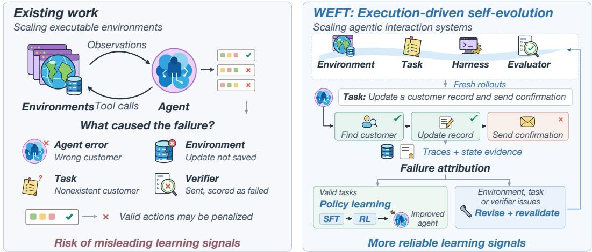  
Figure 1: WEFT improves the agentic interaction system through execution feedback. Fresh rollout evaluate these changes and guide the next round of refinement toward more reliable learning signals.

However, scaling executable environments alone does not ensure reliable learning signals. Training experience emerges from an agentic interaction system comprising the environment, task, agent harness, and evaluator. An executable environment does not guarantee that tasks are feasible or their outcomes are correctly evaluated. Task failures may arise from faulty tool implementations, infeasible tasks, or verification errors, rather than model limitations alone. Attributing these failures to the policy can penalize valid behavior and introduce misleading learning signals (Cai et al., 2025a; Xu et al., 2026b). Effective scaling therefore requires not only broader environment coverage, but also continual improvement of the complete agentic interaction system. Execution experience must support both policy learning and the identification and revision of problematic components.

To this end, we introduce WEFT, an end-to-end tool-use post-training framework integrating scalable agentic interaction system construction, execution-driven self-evolution, and stable training. It combines stateful environment synthesis and verifiable cross-tool task composition with diverse task-disclosure settings and agent harnesses to jointly scale environment breadth, task complexity, and interaction diversity. Using execution traces and state evidence, WEFT distinguishes policy failures on valid tasks from environment, task, or verifier issues, guiding targeted component revisions to improve the reliability of training experience and learning signals at their source. Fresh rollouts assess revisions and uncover new issues for continued evolution. For efficient, stable post-training, prefixpreserving rejection sampling constructs high-quality trajectories by retaining verified progress and resampling only failed atomic tasks. For reinforcement learning (RL), task filtering assesses verifier reliability to select training tasks, while atomic-turn credit assignment provides finer-grained learning signals. MegaMCP avoids repeated MCP deployment by sharing tool services across concurrent rollouts. It isolates each rollout’s database and workspace state, using snapshots to support retries and candidate sampling from identical states.

We post-train Qwen3-8B, Qwen3-14B, and Qwen3.5-35B-A3B with WEFT and evaluate the resulting models on five benchmarks spanning tool calling, multi-turn interaction, and long-horizon task execution. WEFT-8B and WEFT-14B outperform all evaluated matched-size environment-scaling baselines on the aggregate scores of BFCL V4 (Patil et al., 2025), τ2-Bench (Barres et al., 2025), and Claw-Eval (Ye et al., 2026). WEFT-35B-A3B achieves 45.99% on Toolathlon-Verified (Li et al., 2026) and 26.50% on AutomationBench (Shepard & Salimans, 2026). Controlled experiments further demonstrate the value of continually improving the agentic interaction system: with the task set and rollout budget fixed, three self-evolution rounds reduce the tool-call error rate in selected training trajectories by 45.5% relative to the initial construction and improve three downstream benchmark scores by 3.65–5.25 percentage points. Ablations also show performance gains from diverse taskdisclosure views and agent harnesses, prefix-preserving rejection sampling, and atomic-turn credit assignment. Systems experiments show that MegaMCP reduces data transfer, memory use, and cold-start latency during concurrent rollouts.

Our main contributions are:

• We introduce WEFT, an end-to-end tool-use post-training framework that expands the scope of scaling from executable environments to complete agentic interaction systems.

• We develop execution-driven self-evolution of the agentic interaction system for reliable learning signals. Execution experience guides failure attribution and targeted component revisions. Fresh rollouts assess changes and uncover new issues for subsequent evolution rounds.

• We support stable post-training through algorithmic design and execution infrastructure. We develop efficient prefix-preserving rejection sampling to construct high-quality trajectories for supervised fine-tuning. In reinforcement learning, task filtering screens verifier reliability, and atomic-turn credit assignment provides finer-grained learning signals. For infrastructure, MegaMCP maintains isolated, recoverable state across concurrent rollouts over shared tool services.

## 2 Related Work

Environment and task scaling. Scaling tool-use training involves both executable environments and the tasks built within them. Stateful environments support interaction and evaluation against actual outcomes (Zhou et al., 2024; Xie et al., 2024; Trivedi et al., 2024). Automated generation expands environment and compositional task resources (Hu et al., 2025a; Sullivan et al., 2025; Shi et al., 2026a), while environment-scaling approaches combine programmatic synthesis with task verification for post-training (Song et al., 2026b; Tu et al., 2026; Wang et al., 2026). These efforts span workspace tasks (Bai et al., 2026a), web environments (Bai et al., 2026b; Zhang et al., 2026), software engineering (Jain et al., 2025; Yang et al., 2025), and terminal tasks (Gandhi et al., 2026). Beyond domain coverage, task construction also varies interaction structure: real execution traces ground task derivation (Chen et al., 2026a), while topology-aware sampling and structured dependencies support complex interactions (Xu et al., 2026a; Shi et al., 2026b). WEFT focuses on cross-MCP task composition, linking execution-verified atomic tasks through dependencies, entity bindings, and grounded initial state to support a shared long-horizon goal.

Agent interaction and rollout systems. Tool-use interaction spans API invocation (Patil et al., 2024; Qin et al., 2024), interleaved reasoning and action (Yao et al., 2023), and user interaction in evaluation and data generation (Yao et al., 2025; Barres et al., 2025; Lu et al., 2025; Prabhakar et al., 2025). Harness design provides model-oriented computer interfaces (Yang et al., 2024) and execution and evaluation frameworks (Wang et al., 2025a; de Chezelles et al., 2025). Studies compare harness effects under shared tasks (Yao et al., 2026) and identify performance degradation under prompt formulations that differ from training (Aissi et al., 2025). Training systems explore mixed-harness rollouts (Song et al., 2026a) and decouple agent execution from optimization (Luo et al., 2025). WEFT treats interaction diversity and execution support together: the same grounded task is presented through distinct disclosure formats and native harnesses, while MegaMCP shares tool services across rollouts with isolated, recoverable database and workspace state.

Self-improvement. Self-improvement methods differ in what they revise. Behavioral approaches refine outputs through self-feedback (Madaan et al., 2023), use verbal reflection to guide subsequent attempts (Shinn et al., 2023), or accumulate executable skills through exploration (Wang et al., 2024). Task adaptation targets capability gaps (Dong et al., 2026), adjusts difficulty (Zeng et al., 2026), or jointly trains an environment designer and a solver (Liu et al., 2026). System-level approaches search over agent programs (Hu et al., 2025b), revise harnesses using execution traces (Lin et al., 2026), and coordinate the synthesis, auditing, and repair of databases, environments, and trajectories (Chen et al., 2026b). WEFT focuses on attributing execution failures to the components that need revision, distinguishing policy failures on valid tasks from defects in environments, tasks, or verifiers.

Tool-use post-training. Trajectory synthesis combines data generation with quality control. Rulebased checks, execution, and semantic verification filter training data (Liu et al., 2024, 2025). Tool relationships and graph structure guide coherent multi-turn dialogue synthesis (Wang et al., 2025b; Yin et al., 2025), while trajectories containing feedback and correction improve generalization (Fu et al., 2025). For trajectory collection, WEFT preserves verified prefixes and their environment state across local failures, applying rejection sampling at atomic-task boundaries.

Reinforcement learning raises questions of optimization stability, reward reliability, and credit assignment. Work on group-relative optimization (Shao et al., 2024) and multi-turn training stability (Wang et al., 2025c) is complemented by studies of reward errors under imperfect verifiers (Cai et al., 2025b). Credit assignment methods differ in their comparison units: GiGPO groups actions by recurring states across trajectories (Feng et al., 2025), PivotRL samples local continuations at informative intermediate turns in demonstrations (Yi et al., 2026), and BPO compares sibling terminal returns after branching from sandbox snapshots (He et al., 2026). WEFT instead compares candidate atomic turns from identical histories and environment states, computing group-relative advantages from the current task’s binary completion outcome rather than terminal returns.

## 3 Method

WEFT organizes tool-use post-training around the agentic interaction system, with execution supporting both policy learning and continual system improvement. We jointly expand environment breadth, task complexity, and interaction diversity through stateful environment synthesis, verifiable task composition, and rollouts across multiple task views and agent harnesses (Section 3.1). Execution traces and state evidence support outcome verification, failure attribution, and targeted component revision; fresh rollouts with the updated system assess the changes and inform subsequent revisions (Section 3.2; Figure 2). To support stable post-training on these interactions, we combine prefixpreserving rejection sampling, task filtering, and atomic-turn credit assignment with MegaMCP’s isolated, recoverable concurrent execution (Section 3.3).

## 3.1 Constructing Scalable Agentic Interaction Systems

Scaling agentic interaction systems requires not only diverse tool environments, but also coherent tasks and varied interaction settings. WEFT synthesizes stateful environments from tool specifications, generates and validates reusable atomic tasks, and composes them into cross-MCP workflows with explicit dependencies and grounded initial states. We vary task-disclosure settings and agent harnesses while preserving task objectives and completion conditions. Together, these choices expand environment breadth, task complexity, and interaction diversity. The resulting rollouts provide execution traces and state evidence for subsequent verification and self-evolution.

## 3.1.1 Stateful Environment Synthesis

Shared state and execution contracts. We construct MCP tool definitions from public tool documentation and business requirements, specifying descriptions and input and output schemas. We define two types of state for tool operations, database state and workspace state; tools may operate on either or both. An environment synthesis agent infers shared entities, read and write dependencies, and state transitions from the complete tool set. It instantiates a shared database schema to validate types and relational constraints. The schema and MCP definitions guide contracts specifying argument-to-state mappings, reads, writes, and returns; these artifacts jointly guide FastAPI backend generation. For workspace state, existing file-oriented runtimes bind to isolated workspaces.

Execution-based validation. Running interfaces are checked against MCP tool names and argument schemas, then tested with generated normal and boundary calls. Queries are checked against state; updates against database or workspace differences and subsequent reads. Structural, mapping, and runtime or state-access errors trigger schema, contract, and backend revisions, respectively. Backends passing revalidation become independently executable MCP servers.

## 3.1.2 Cross-MCP Task Composition

Certified atomic tasks. A task synthesis agent uses each certified MCP’s definitions, schema, and contracts to generate atomic tasks and end-to-end (E2E) tests. An atomic task is an MCP’s smallest independently executable and verifiable unit, realizing one intent through bounded tool calls. Construction uses (i) E2E execution validation, checking completion against returns and persistent state after real calls from independent initial states; (ii) tool-chain orthogonality, pruning identical or contained ordered chains; (iii) tool coverage, measuring the fraction of MCP tools covered by retained chains. Failures, redundancy, and uncovered tools guide incremental generation and revision of the reusable task and test library, preserving validated tasks (Appendix A.1).

Coverage-aware sampling. Configurable profiles specify ranges for atomic-task count, MCP count, and domain breadth; corpus proportions set generation quotas. Sampling favors underrepresented

Constructing Scalable Agentic Interaction Systems

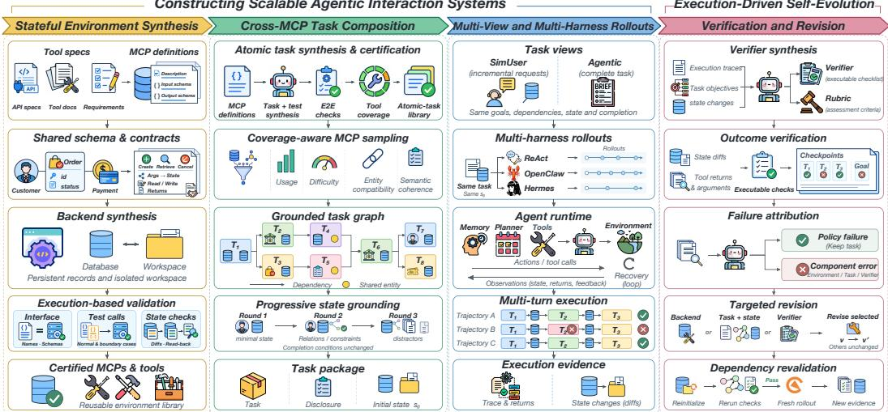  
Figure 2: Construction and execution-driven self-evolution in WEFT. Certified atomic tasks form grounded cross-MCP workflows with resettable state. Views and harnesses diversify rollouts, whose traces and state evidence guide verification, failure attribution, and iterative component revision.

domains and MCPs using capacity and usage statistics, reserving surplus capacity for composition. Candidates are ranked by shared entities, complementary operations, and functional redundancy. An evaluation model checks MCP descriptions for a coherent business objective. Usage is updated before sampling tasks from accepted combinations; rejections trigger resampling within the profile (Appendix A.2).

Grounded task graph. A composition agent links selected atomic tasks into a directed acyclic graph for a shared business objective: nodes specify intents, inputs, and outcomes; edges encode information and state dependencies. Entity bindings align business objects across MCPs. The graph distinguishes given information from information retrieved through tools. Deterministic checks ensure nodes use selected tasks, bindings are conflict-free, and inputs come from initial state or upstream outcomes. A stable topological order governs disclosure and execution.

Progressive state grounding. From the graph and MCP schemas, contracts, or workspace structures, a state-initialization agent builds initial state in three rounds: (i) entity initialization establishe target entities and minimal executable state; (ii) relation completion adds cross-tool relations and constraints; (iii) context enrichment adds historical records and distractors. All rounds preserve entity correspondence and completion conditions. States passing schema and task-reachability checks become resettable initial snapshots.

## 3.1.3 Multi-View and Multi-Harness Rollouts

Task views. We vary request and information disclosure while keeping task objectives, dependencies, initial state, completion conditions, and MCP interfaces fixed across views and harnesses. Both views retain user-known inputs and upstream information. (i) Agentic mode provides a complete brief for autonomous planning. (ii) SimUser mode uses a user-simulation agent with persona sampling to disclose requests in dependency order. Each atomic task defines an atomic-task turn allowing multiple tool calls. A final reply without tool calls ends the turn; SimUser then issues the next request. Independently, vague, partial, andfull vary disclosure explicitness.

Harness scaling. Our infrastructure routes the same task to ReAct, OpenClaw, or Hermes for sandboxed rollouts, retaining each harness’s prompts, memory, planning loop, tool-call protocol, and error recovery. ReAct supports both views; OpenClaw and Hermes use Agentic mode.

## 3.2 Execution-Driven Self-Evolution

Rollouts across task views and agent harnesses produce training trajectories and can also reveal environment, task, or verifier problems missed by construction checks. WEFT uses execution traces and state evidence to verify task outcomes, distinguish policy errors from component problems, and revise the affected components. Fresh rollouts with the updated agentic interaction system evaluate these revisions and inform the next round, improving the reliability of learning signals through repeated execution and revision.

## 3.2.1 Verification from Execution Evidence

Verification checks atomic-task completion using (i) state changes, captured by database or workspace differences; (ii) tool returns. Given completion conditions and a reference execution accepted by a semantic evaluation model, a verifier-generating agent produces and saves deterministic checks and a corresponding rubric. The checks are tested on reference evidence and revised using execution feedback; subsequent rollouts need not follow the reference tool-call sequence.

For trajectory τ, K checkpoints cover atomic tasks and the overall objective. Each $r _ { k } ( \tau )$ is 1 when all checkpoint conditions hold and 0 otherwise; the trajectory score is their mean:

$$
R ( \tau ) = \frac { 1 } { K } \sum _ { k = 1 } ^ { K } r _ { k } ( \tau ) .\tag{1}
$$

## 3.2.2 Attribution-Guided Revision

Failure attribution. An attribution agent examines task graphs, traces, checkpoint outcomes, and state evidence to distinguish policy failures on valid tasks from environment, task, or verifier problems. Patterns across views and harnesses help localize failures; disagreements between rubric-based and executable scores guide verifier revision. Policy failures alone leave tasks unchanged.

Targeted component revision. We route environment problems to backends, task or state problems to task graphs and initial states, and evaluation problems to verifiers. An evolution agent uses the current version and supporting evidence to revise only the selected components. Task semantics remain fixed across views within a version.

Dependency revalidation and iterative refinement. We re-instantiate affected environments and task states and rerun construction checks. Fresh rollouts on passing versions assess repairs and reveal unresolved or new problems. Alternating execution and revision drives iterative evolution of the agentic interaction system through its own execution experience.

## 3.3 Stable Tool-Use Post-Training

Construction and self-evolution provide the environments and tasks for training, while stable posttraining also requires high-quality training data and reliable learning signals. WEFT uses prefixpreserving rejection sampling to construct supervised fine-tuning data and combines task filtering with fine-grained rewards to provide reliable, stable learning signals for reinforcement learning (Figure 3). MegaMCP provides scalable rollout support for both training stages.

## 3.3.1 Prefix-Preserving Rejection Sampling

Rejecting complete trajectories after local failures discards successful progress. We use atomic-task turns as rejection units: the teacher executes tasks in dependency order, each checked by its verifier. Successful traces and database and workspace states are retained for subsequent tasks. On failure, we discard the attempt, restore pre-turn history and state, and resample only that task, with up to k additional retries. Once all tasks pass, retained segments form a complete trajectory for SFT.

## 3.3.2 Reinforcement Learning with Atomic-Turn Credit Assignment

Task and verifier consistency filtering. Verifiers may reject valid solutions or reward incomplete executions. Before RL, a rubric-guided LLM judge independently scores each task’s pilot rollouts. We retain tasks only when both Pearson and Spearman correlations with executable scores meet selection criteria. RL uses only executable rewards.

Atomic-turn group-relative credit assignment. Rollouts follow a fixed topological order of the task graph, with one atomic task per turn. At turn t, a frozen rollout policy independently samples G segments from the same history in isolated, identical states restored by MegaMCP. Each segment may contain multiple tool calls. The atomic-task verifier gives $r _ { t } ^ { ( i ) } = 1$ on completion and 0 otherwise. A uniformly selected passing segment (or failed segment if all fail) supplies history and state for the next turn. All candidates contribute to training.

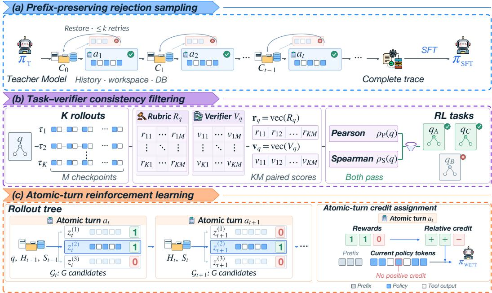  
Figure 3: Post-training in WEFT. (a) Verified prefixes form SFT trajectories. (b) RL task filtering compares rubric-based and executable scores. (c) Atomic-turn RL assigns local credit, masking positive credit for detected undesirable patterns.

We normalize rewards within each atomic-task group:

$$
A _ { t } ^ { ( i ) } = \frac { r _ { t } ^ { ( i ) } - \bar { r } _ { t } } { \operatorname { s d } ( \mathbf { r } _ { t } ) + \epsilon } , \qquad \bar { r } _ { t } = \frac { 1 } { G } \sum _ { i = 1 } ^ { G } r _ { t } ^ { ( i ) } ,\tag{2}
$$

where $\mathbf { r } _ { t }$ contains group rewards and $\epsilon > 0$ stabilizes normalization. Clipped GRPO applies these advantages only to current-turn policy tokens, excluding prefixes, with token-mean aggregation across groups. Equal rewards give zero advantages, leaving only KL and entropy regularization.

Deterministic checks flag no-progress repetition, malformed tool-call or reasoning structures, and interface violations, even in successful segments. Flagged assistant turns receive token advantages min $( A _ { t } ^ { ( i ) }$ , 0), removing only positive credit. Unflagged turns, including later recovery, retain their advantages; KL and entropy regularization remain unchanged.

## 3.3.3 MegaMCP: Shared Serving for Isolated Rollouts

Prefix-preserving sampling and atomic-turn RL require large-scale concurrent execution, along with local retries and candidate sampling from identical states. Deploying MCPs separately in each rollout’s sandbox requires repeated provisioning of server code, initial databases, and workspaces, while incurring per-rollout process startup and memory overhead. MegaMCP therefore separates reusable tool services from each rollout’s mutable state (Figure 4). It hosts MCP services outside agent sandboxes and shares worker processes among compatible sessions, reducing repeated deployment, startup costs, and memory use. Each rollout retains private database and workspace state, with snapshots supporting state restoration. Local retries and candidate sampling can thus start from identical states without replaying previously completed interactions.

Registry and process sharing. The registry stores MCP metadata, source code, and tool definitions as content-addressed records with monotonically increasing versions. Static analysis screens for process-global side effects and assigns a load class that limits how many instances share a process. Other servers use stronger isolation tiers. A prefork master preloads common web and database dependencies, then creates workers on demand. Each worker imports MCP servers as separate modules and binds requests to the requesting session’s private database.

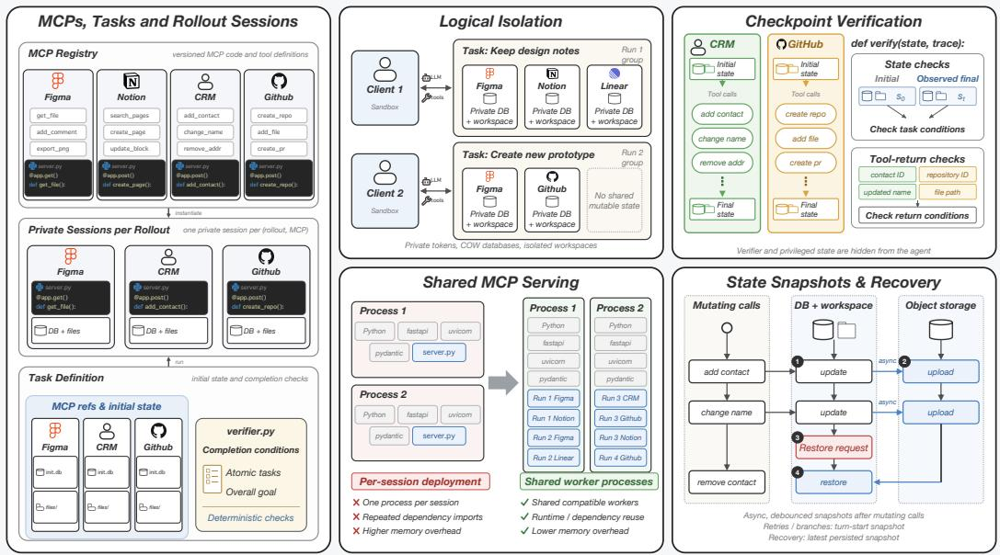  
Figure 4: Overview of MegaMCP. A task’s constituent MCPs are instantiated as private sessions within a unified lifecycle group. Compatible sessions share Python processes while retaining isolated mutable state. Initial and final databases and the complete tool-call ledger provide verification evidence, while persistent checkpoints support recovery and reloading.

Private state and session lifecycle. A task references its MCPs by registry identifier and its initial databases by object-storage location, optionally including an executable verifier. Each run creates a session group containing one private session per MCP. Databases are copy-on-write clones of immutable initial snapshots, and mutable workspaces are isolated across runs. Pausing or resuming a task suspends or restores its MCP sessions and sandboxes as a group. Agents access server-side state through MCP tools; internal database files, server workspace paths, and credentials remain hidden. Each session has an individual access token.

Idle-session management. Agent generation leaves tool services idle between calls, with a median interval exceeding ten seconds. After a cooling window, MegaMCP offloads an idle session group’s runtime while retaining its sessions, credentials, and workspaces. The next tool call reloads the group. Longer-idle groups are checkpointed and evicted from local disk, releasing resources between periods of active tool use.

State recovery. Database and workspace snapshots support local retries for SFT and RL candidate sampling from identical states. After mutating calls, debounced asynchronous checkpoints persist consistent snapshots to object storage under immutable, generation-fenced keys. Resumption and crash recovery load the latest persisted snapshot rather than replaying the full interaction. Workers monitor disk and memory pressure, stop accepting placements when unhealthy, and migrate affected sessions to healthy workers. Generation fencing prevents writes from workers that no longer own a session, and a reaper completes interrupted shutdowns idempotently. Persistent snapshots also support re-execution after environment or task revision.

Verification and operational feedback. MegaMCP retains each session’s initial database, final database after a group-wide freeze, and full tool-call ledger with arguments, results, and outcomes. The verifier runs within the serving layer, which directly supplies these immutable artifacts for task verification and reward computation. Its code and privileged state remain inaccessible to the agent, preventing reward hacking through direct inspection or modification of verifier internals. Per-tool error rates and crash statistics are associated with the responsible MCP definitions, guiding server revalidation or stronger isolation in the execution-driven self-evolution loop (Section 3.2).

(a) MCP domain distribution  
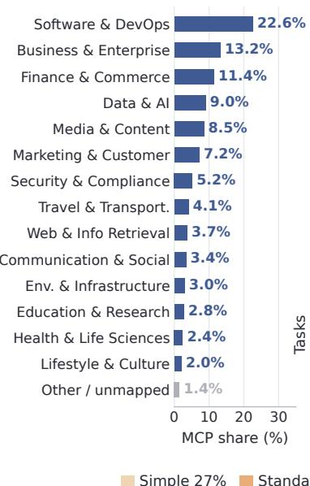

(b) Corpus size  
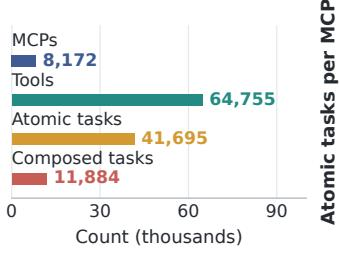

(c) MCP capacity  
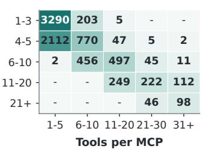

(d) Task length  
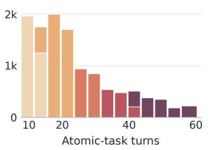

(e) Task composition  
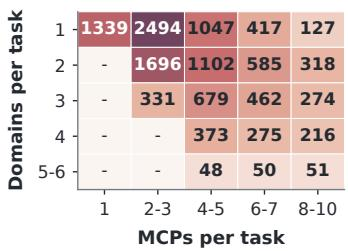  
Simple 27% Standard 36% Moderate 15% Complex 10% Expert 12%

Figure 5: Scale and composition of tool environments and agent tasks. (a) MCP distribution across macro domains. (b) Total numbers of MCPs, tools, certified atomic tasks, and composed tasks. (c) MCP counts by tool and atomic-task inventories. (d) Atomic-task turns per composed task, colored by difficulty; legend percentages give the difficulty mix. (e) Task counts by the numbers of MCPs and primary domains. Heatmap cells report counts in the corresponding bins.

## 4 Experiments

We evaluate whether WEFT improves performance across tool-use benchmarks and examine how these gains arise. Our analysis studies how to obtain more training value from existing tasks, improve the interaction system through execution feedback, and use local verification for sampling and credit assignment. We then measure the serving costs of supporting these rollouts with MegaMCP.

## 4.1 Experimental Setup

Environment and task statistics. We construct 8,172 executable MCPs with 64,755 tools and 41,695 certified atomic tasks. Figure 5(a–c) shows domain coverage and per-MCP capacity. Software & DevOps is the largest domain, accounting for 22.6% of MCPs. Larger tool inventories tend to support larger atomic-task libraries. The 11,884 composed tasks have a median length of 20 atomic-task turns (Figure 5(d–e)). Most tasks span multiple MCPs, and more than half involve multiple domains. Five construction-time difficulty profiles, Simple, Standard, Moderate, Complex, and Expert, specify increasing task length and breadth across MCPs and domains. These tasks require sustained cross-MCP interaction. Retaining intermediate progress and state continuity is therefore central to collecting their trajectories.

Models and training data. We post-train Qwen3-8B, Qwen3-14B, and Qwen3.5-35B-A3B from their base models. We use Kimi K3 (Kimi Team, 2026) to generate supervised fine-tuning (SFT) trajectories for all 11,884 certified composed tasks. For reinforcement learning (RL), we select 1,954 of 5,000 candidate tasks using task and verifier consistency filtering (Section 3.3.2).

Evaluation. The main comparison and RL study use BFCL V4 (Patil et al., 2025), τ2-Bench (Barres et al., 2025), and Claw-Eval (Ye et al., 2026). The data-construction ablations use Toolathlon-Verified (Li et al., 2026), AutomationBench (Shepard & Salimans, 2026), and Claw-Eval. Evaluation follows each benchmark’s native harness and official aggregate metric.

Table 1: Main results on agentic tool-use benchmarks. Scores (%) are grouped by total model parameters. Bold and underlined values mark the best and second-best reported scores in each group; dashes denote unreported results.
<table><tr><td rowspan="2">Method</td><td colspan="8">BFCL V4</td><td colspan="4">τ2-Bench</td><td>Claw-Eval</td></tr><tr><td>WebSearch Memory Multi-T. No live</td><td></td><td></td><td></td><td>Live</td><td>Relev. Irrelev.</td><td></td><td>Avg.</td><td>Retail Telecom Airline Avg.</td><td></td><td></td><td></td><td>Avg.</td></tr><tr><td colspan="10">Small- and Medium-Scale Open-Source Models (7B–32B)</td><td></td><td></td><td></td><td></td></tr><tr><td>O TOUCAN-7B</td><td>21.0</td><td>18.5</td><td>17.8</td><td>81.0</td><td>73.9</td><td>81.3</td><td>78.6</td><td>36.6</td><td>22.8</td><td>10.5</td><td>20.0</td><td>17.7</td><td></td></tr><tr><td>心 Qwen3-8B</td><td>7.0</td><td>17.6</td><td>35.4</td><td>90.2</td><td>80.9</td><td>81.3</td><td>77.2</td><td>40.4</td><td>34.0</td><td>18.0</td><td>26.5</td><td>26.2</td><td>25.6</td></tr><tr><td>Simulator-8B</td><td>17.5</td><td>6.0</td><td>4.1</td><td>47.6</td><td>44.6</td><td>31.3</td><td>87.3</td><td>23.9</td><td>32.2</td><td>29.2</td><td>34.0</td><td>31.8</td><td></td></tr><tr><td># EnvScaler-8B</td><td>23.0</td><td>21.9</td><td>47.1</td><td>88.5</td><td>82.2</td><td>93.8</td><td>74.6</td><td>47.6</td><td>49.6</td><td>32.7</td><td>31.5</td><td>37.9</td><td>22.6</td></tr><tr><td>白 AWM-8B</td><td>9.5</td><td>15.7</td><td>34.9</td><td>90.2</td><td>80.5</td><td>93.8</td><td>73.9</td><td>40.0</td><td>41.23</td><td>23.47</td><td>38.50</td><td>34.4</td><td>22.6</td></tr><tr><td>ScaleEnv-8B à EnvACE-8B</td><td>12.25</td><td></td><td></td><td></td><td></td><td></td><td></td><td></td><td>50.9</td><td>27.2</td><td>37.5</td><td>38.5</td><td></td></tr><tr><td>Q Agent-World-8B</td><td>47.0</td><td>24.03</td><td>45.29</td><td>87.59</td><td>81.20</td><td></td><td>83.19</td><td>46.04</td><td>48.9</td><td>17.3</td><td>44.0</td><td>36.7</td><td></td></tr><tr><td>Q Agent-World-14B</td><td>53.0</td><td>21.7 23.9</td><td>44.5</td><td>83.3</td><td>79.6</td><td>93.8</td><td>80.2</td><td>51.4</td><td>72.8</td><td>50.9</td><td>40.0</td><td>61.8</td><td>30.5</td></tr><tr><td>女</td><td></td><td></td><td>53.9</td><td>82.3</td><td>79.3</td><td>93.8</td><td>81.0</td><td>55.8</td><td>74.5</td><td>56.1</td><td>52.0</td><td>65.4</td><td>31.5</td></tr><tr><td>Qwen3-14B 0 AWM-14B</td><td>4.0 10.0</td><td>19.8</td><td>36.9</td><td>90.0</td><td>82.4</td><td>81.3</td><td>79.4</td><td>41.0</td><td>55.3</td><td>14.9</td><td>27.0</td><td>32.4</td><td>24.7</td></tr><tr><td>六 Qwen3-32B</td><td>26.0</td><td>19.8 15.7</td><td>37.6 43.3</td><td>90.2</td><td>81.5</td><td>75.0</td><td>79.4</td><td>42.4</td><td>63.6</td><td>17.8</td><td>31.5</td><td>39.0</td><td>26.1</td></tr><tr><td></td><td></td><td></td><td></td><td>90.3</td><td>82.0</td><td>81.3</td><td>82.4</td><td>46.7</td><td>59.5</td><td>27.2</td><td>48.0</td><td>44.9</td><td></td></tr><tr><td>H WEFT-8B H WEFT-14B</td><td>49.5 68.00</td><td>33.12 49.25</td><td>47.75 52.38</td><td>77.9</td><td>69.5 66.69</td><td>81.25 62.5</td><td>66.88 84.75</td><td>62.21 74.56</td><td>52.28 71.93</td><td>72.81</td><td>42.0</td><td>62.25 67.63</td><td>35.78 43.77</td></tr><tr><td colspan="10">79.02</td><td>76.32 52.0</td><td></td><td></td><td></td></tr><tr><td colspan="10">Large-Scale Open-Source Models (35B–685B)</td><td></td><td></td><td></td><td></td></tr><tr><td>nex-n2-mini-35b</td><td>72.50</td><td>39.14</td><td>62.12</td><td>72.02</td><td></td><td>61.44 56.25</td><td>96.30</td><td>63.94</td><td>74.56</td><td>73.68</td><td>68.00</td><td>72.08</td><td>69.75</td></tr><tr><td>Qwen3.5-35B-A3B </td><td>54.0</td><td></td><td></td><td></td><td></td><td></td><td></td><td>67.3</td><td></td><td></td><td></td><td>81.2</td><td>65.4</td></tr><tr><td>Qwen3-235B-A22B DeepSeek-V3.2-685B</td><td>69.5</td><td>23.9 54.2</td><td>45.4 37.4</td><td>37.4 34.9</td><td>68.9 53.7</td><td>87.5 37.5</td><td>81.7 93.2</td><td>47.9 54.1</td><td>71.9 81.1</td><td>58.0 96.2</td><td>45.6 63.8</td><td>58.5 80.3</td><td></td></tr><tr><td> WEFT-35B-A3B</td><td>55.0</td><td>66.02</td><td>54.62</td><td>73.5</td><td></td><td>71.21 68.75</td><td>83.39</td><td>63.4 71.93</td><td></td><td>85.09</td><td>66.0</td><td>74.34</td><td>64.0</td></tr></table>

## 4.2 Main Results

WEFT-8B and WEFT-14B outperform all evaluated matched-size environment-scaling baselines on BFCL V4, τ2-Bench, and Claw-Eval (Table 1). WEFT-14B achieves the highest aggregate scores in the 7B–32B group, exceeding Agent-World-14B by 6.41, 2.23, and 12.27 percentage points, respectively. WEFT-8B also improves all three scores over Agent-World-8B, by 0.88, 0.45, and 5.28 points.

The category breakdown reveals recurring strengths in BFCL Memory and $\tau ^ { 2 } .$ -Bench Telecom. Relative to the corresponding Agent-World models, WEFT-8B gains 11.42 and 21.91 points on these two categories, while WEFT-14B gains 25.35 and 20.22 points. WEFT-14B also improves BFCL WebSearch by 15.00 points, reaching 68.00%. These strengths persist in the larger model: WEFT-35B-A3B scores 66.02% on Memory, the highest reported score in the 35B–685B group and 11.82 points above the next-best result. Its Telecom score of 85.09% ranks second behind DeepSeek-V3.2 (96.2%) and exceeds nex-n2-mini-35b by 11.41 points. Memory and Telecom therefore emerge as recurring strengths across the evaluated model sizes, rather than isolated high scores at a single scale.

On the advanced benchmarks Toolathlon-Verified and AutomationBench, WEFT-35B-A3B achieves 45.99% and 26.50%, respectively (Table 2), extending the evaluation beyond the main benchmarks to more demanding multi-tool workflows.

## 4.3 Understanding the Post-Training Gains

Task Views and Harness Scaling We test whether a fixed set of tasks can provide more useful training experience through different forms of interaction (Table 2). Under ReAct, SimUser alone scores below Agentic on all three benchmarks, yet combining the two outperforms either view, averaging 3.18 points over Agentic. Thus, a view that is weaker in isolation can still improve the training mixture. Adding OpenClaw and Hermes with the view mixture fixed yields a further 9.71- point mean gain: 13.58 on Toolathlon-Verified, 12.83 on AutomationBench, and 2.71 on Claw-Eval. All gains are measured under benchmark-native harnesses. Thus, a fixed task set can support richer training through multiple disclosure views and execution frameworks. This provides a way to expand useful training experience when new executable, verifiable tasks are difficult to obtain.

Table 2: Task views and harness scaling. Benchmark scores (%) of WEFT-35B-A3B under different training-data configurations with the task set fixed.
<table><tr><td rowspan="2">Benchmark</td><td colspan="3">Disclosure views</td><td colspan="3">Harness scaling (cumulative)</td></tr><tr><td>Agentic</td><td>SimUser</td><td>Both</td><td>ReAct</td><td>+ OpenClaw + Hermes</td><td></td></tr><tr><td>Toolathlon-Verified</td><td>27.78</td><td>19.44</td><td>32.41</td><td>32.41</td><td>39.51</td><td>45.99</td></tr><tr><td>AutomationBench</td><td>10.50</td><td>4.67</td><td>13.67</td><td>13.67</td><td>22.00</td><td>26.50</td></tr><tr><td>Claw-Eval</td><td>59.55</td><td>57.51</td><td>61.29</td><td>61.29</td><td>63.58</td><td>64.00</td></tr></table>

Toolathlon-Verified AutomationBench Claw-Eval Tool-use errors

Execution-Driven Self-Evolution Execution traces can also guide improvements to the interaction system that produces them. With the task set and rollout budget fixed, we compare the initial construction $( r = 0 )$ with up to three self-evolution rounds (Figure 6). Toolerror rate measures the fraction of tool calls returning errors in selected teacher trajectories, including errors from which the teacher recovers. Three rounds reduce tool-error rate from 1.76% to 0.96% (45.5% relative) and improve Toolathlon-Verified, AutomationBench, and Claw-Eval by 5.25, 4.33, and 3.65 points. The first two rounds capture most of the gains on AutomationBench and Claw-Eval, while Toolathlon-Verified continues to improve in the third round as tool errors decline monotonically. The reduction in errors within selected trajectories shows that outcome filtering still leaves room to improve the underlying interactions. Alongside the downstream gains, this supports using execution experience both as policy-training data and as evidence for revising the system that generates it.

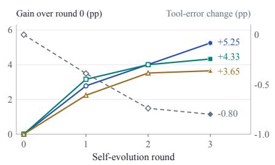  
Figure 6: Self-evolution across rounds.

Prefix-Preserving Rejection Sampling Figure 7 compares prefix-preserving and end-to-end sampling with the task pool, verifier, and accepted-trace count fixed. Each allows $\bar { k \in \{ 1 , 2 , 3 \} }$ additional retries per atomic-task turn or full trajectory, respectively. At each retry limit k, prefix-preserving sampling outperforms end-to-end sampling. At k = 3, it gains 1.85 points on Toolathlon-Verified and 2.17 on AutomationBench, with Claw-Eval nearly tied. Since the accepted-trace count is fixed, these gains concern the training value of the resulting SFT data, not an increase in the number of accepted examples. For tasks with verifiable and recoverable intermediate states, the results support using local task boundaries as rejection units while retaining completed progress.

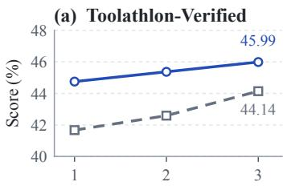

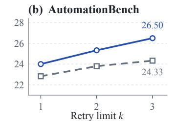

(c) Claw-Eval  
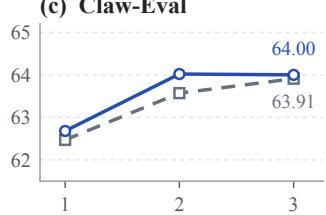  
Figure 7: Rejection sampling across retry limits. Downstream scores of WEFT-35B-A3B.

Reinforcement Learning and Credit Assignment RL gains depend on how verified outcomes are assigned to policy updates. We compare trajectory-level and atomic-turn GRPO with SFT initialization, task pool, reward verification, and positive-credit masking fixed (Table 3; Appendix C.1). Trajectory-level GRPO improves BFCL V4 and Claw-Eval but decreases $\tau ^ { \dot { 2 } } .$ -Bench scores relative to SFT by 3.17 and 0.84 points for 8B and 14B, respectively. Atomic-turn GRPO instead improves all three benchmarks at both sizes, exceeding the trajectory-level variant by 5.69 and 4.43 points on $\tau ^ { 2 } { \mathrm { - } } \mathrm { B e n c h }$ . The largest atomic-turn gains over SFT occur on Claw-Eval: 4.59 points for 8B and 8.54 for 14B. Thus, local credit assignment both improves on SFT and avoids the $\tau ^ { 2 } .$ -Bench regression observed with trajectory-level updates. This contrast supports assigning each segment credit for its own task outcome, rather than applying an advantage derived from average completion over the full trajectory to every turn. Local completion checks can therefore serve as both evaluation criteria and the basis for assigning learning signals to the relevant policy decisions.

Table 3: RL gains and credit assignment. Benchmark scores (%) after SFT and RL.
<table><tr><td rowspan="2">Training configuration</td><td colspan="3">WEFT-8B</td><td colspan="3">WEFT-14B</td></tr><tr><td>BFCL V4</td><td> $\tau ^ { 2 } { \mathrm { - B e n c h } }$ </td><td>Claw-Eval</td><td>BFCL V4</td><td> $\tau ^ { 2 } { \mathrm { - B e n c h } }$ </td><td>Claw-Eval</td></tr><tr><td>SFT</td><td>52.02</td><td>59.73</td><td>31.19</td><td>59.69</td><td>64.04</td><td>35.23</td></tr><tr><td>+ RL (trajectory-level GRPO)</td><td>52.25</td><td>56.56</td><td>34.92</td><td>60.47</td><td>63.20</td><td>41.64</td></tr><tr><td>+ RL (atomic-turn GRPO)</td><td>52.28</td><td>62.25</td><td>35.78</td><td>62.21</td><td>67.63</td><td>43.77</td></tr></table>

RL Training Curves Figure 8 complements the final benchmark scores with the optimization history of WEFT-14B. Mean trajectory reward increases overall while policy entropy declines. The reported reward averages binary checkpoint outcomes over the full trajectory, tracking task completion across the workflow; training advantages use the current atomic task’s binary reward. Appendix C.2 details trajectory reconstruction and reward aggregation.

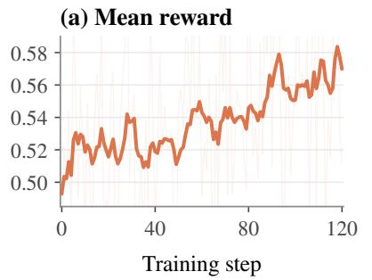

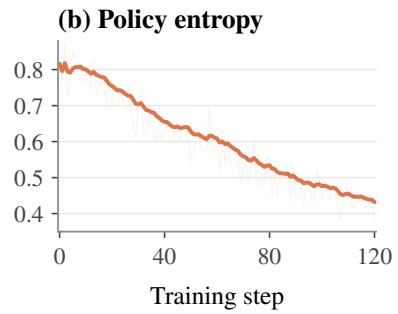  
Figure 8: RL training curves of WEFT-14B. (a) Mean trajectory reward; (b) policy entropy.

MegaMCP at Rollout Scale We compare shared and sandbox-local MCP serving on identical task traces to measure the cost of repeatedly deploying tool services (Figure 9). At 1,000 tasks, MegaMCP reduces total sandbox upload, including runner files, from 773.5 to 34.8 MiB (95.5%) by removing repeated delivery of MCP source and initialized databases. Sharing processes also reduces resident memory by 77.6% for 52 instances in 8 processes and by 95.7% for 50 sessions in one process, relative to one process per session. These reductions show that independent rollout state need not require a separate deployment of the full tool-service stack for every rollout. With both systems cold at 100 tasks, median time to the first tool call falls from 10.455 to 4.794 s (54.1%). Shared serving thus reduces the cost of repeatedly initializing tool services while preserving isolated rollout state. Appendix D details the timing conditions and reports full latency measurements and historical 1,000-task cold-repeat records.

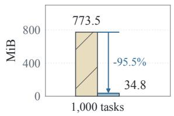  
(a) Upload volume

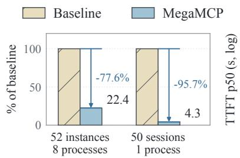  
(b) Resident memory

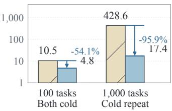  
(c) Time to first tool call  
Figure 9: MegaMCP resource use and startup latency. (a) Total sandbox upload. (b) Memory relative to one process per session. (c) Median time to first tool call (log scale); 1,000-task bars show historical cold repeats. Local serving is the baseline in (a,c); conditions are in Appendix D.

## 5 Conclusion

WEFT shows that scaling tool-use post-training is fundamentally a systems problem rather than a matter of simply increasing the number of environments. Its central principle is to give execution experience a dual role: as data for policy learning and as evidence for improving the interaction system that produces it. Controlled experiments show that diversity across tasks, disclosure views, and agent harnesses broadens the training distribution; execution-driven self-evolution reduces tool-call errors and improves downstream performance; and stable sampling, fine-grained credit assignment, and scalable rollout infrastructure make these gains effective at scale. Overall, these findings support system-level scaling for reliable tool-use agents.

## References

Mohamed Salim Aissi, Clément Romac, Thomas Carta, Sylvain Lamprier, Pierre-Yves Oudeyer, Olivier Sigaud, Laure Soulier, and Nicolas Thome. Reinforcement learning for aligning large language models agents with interactive environments: Quantifying and mitigating prompt overfitting. In Findings of the Association for Computational Linguistics: NAACL 2025, pp. 7045–7061, Albuquerque, New Mexico, April 2025. Association for Computational Linguistics. doi: 10.18653/v1/ 2025.findings-naacl.390. URL https://aclanthology.org/2025.findings-naacl.390/.

Fei Bai, Huatong Song, Shuang Sun, Daixuan Cheng, Yike Yang, Chuan Hao, Renyuan Li, Feng Chang, Yuan Wei, Ran Tao, Bryan Dai, Jian Yang, Wayne Xin Zhao, and Ji-Rong Wen. ClawGym: A scalable framework for building effective claw agents, 2026a. URL https://arxiv.org/ abs/2604.26904.

Hao Bai, Alexey Taymanov, Tong Zhang, Aviral Kumar, and Spencer Whitehead. Webgym: Scaling training environments for visual web agents with realistic tasks, 2026b. URL https://arxiv. org/abs/2601.02439.

Victor Barres, Honghua Dong, Soham Ray, Xujie Si, and Karthik Narasimhan. τ2-Bench: Evaluating conversational agents in a dual-control environment, 2025. URL https://arxiv.org/abs/ 2506.07982.

Shihao Cai, Runnan Fang, Jialong Wu, Baixuan Li, Xinyu Wang, Yong Jiang, Liangcai Su, Liwen Zhang, Wenbiao Yin, Zhen Zhang, Fuli Feng, Pengjun Xie, and Xiaobin Wang. AutoForge: Automated environment synthesis for agentic reinforcement learning, 2025a. URL https:// arxiv.org/abs/2512.22857.

Xin-Qiang Cai, Wei Wang, Feng Liu, Tongliang Liu, Gang Niu, and Masashi Sugiyama. Reinforcement learning with verifiable yet noisy rewards under imperfect verifiers, 2025b. URL https://arxiv.org/abs/2510.00915.

Aili Chen, Chi Zhang, Junteng Liu, Jiangjie Chen, Chengyu Du, Yunji Li, Ming Zhong, Qin Wang, Zhengmao Zhu, Jiayuan Song, Ke Ji, Junxian He, Pengyu Zhao, and Yanghua Xiao. DIVE: Scaling diversity in agentic task synthesis for generalizable tool use, 2026a. URL https: //arxiv.org/abs/2603.11076.

Jiaao Chen, Jingyuan Qi, Mingye Gao, Wei-Chen Wang, Hanrui Wang, and Di Jin. Eigendata: A self-evolving multi-agent platform for function-calling data synthesis, auditing, and repair, 2026b. URL https://arxiv.org/abs/2603.05553.

Thibault Le Sellier de Chezelles, Maxime Gasse, Alexandre Lacoste, Massimo Caccia, Alexandre Drouin, Léo Boisvert, Megh Thakkar, Tom Marty, Rim Assouel, Sahar Omidi Shayegan, Lawrence Keunho Jang, Xing Han Lù, Ori Yoran, Dehan Kong, Frank F. Xu, Siva Reddy, Graham Neubig, Quentin Cappart, Russ Salakhutdinov, and Nicolas Chapados. The BrowserGym Ecosystem for Web Agent Research. Transactions on Machine Learning Research, 2025. URL https://openreview.net/forum?id=5298fKGmv3.

Guanting Dong, Junting Lu, Junjie Huang, Wanjun Zhong, Longxiang Liu, Shijue Huang, Zhenyu Li, Yang Zhao, Xiaoshuai Song, Xiaoxi Li, Jiajie Jin, Yutao Zhu, Hanbin Wang, Fangyu Lei, Qinyu Luo, Mingyang Chen, Zehui Chen, Jiazhan Feng, Ji-Rong Wen, and Zhicheng Dou. Agent-World: Scaling real-world environment synthesis for evolving general agent intelligence, 2026. URL https://arxiv.org/abs/2604.18292.

Lang Feng, Zhenghai Xue, Tingcong Liu, and Bo An. Group-in-group policy optimization for LLM agent training. In Advances in Neural Information Processing Systems, volume 38, pp. 46375–46408. Curran Associates, Inc., 2025. doi: 10.52202/ 085713-1544. URL https://proceedings.neurips.cc/paper\_files/paper/2025/ hash/420c9f777c0b4f78d515e53cf74d58b2-Abstract-Conference.html.

Dayuan Fu, Keqing He, Yejie Wang, Wentao Hong, Zhuoma GongQue, Weihao Zeng, Wei Wang, Jingang Wang, Xunliang Cai, and Weiran Xu. AgentRefine: Enhancing agent generalization through refinement tuning. In International Conference on Learning Representations, pp. 65185–65204, 2025. URL https://proceedings.iclr.cc/paper\_files/paper/2025/ hash/a3cc50126338b175e56bb3cad134db0b-Abstract-Conference.html.

Kanishk Gandhi, Shivam Garg, Noah D. Goodman, and Dimitris Papailiopoulos. Endless terminals: Scaling rl environments for terminal agents, 2026. URL https://arxiv.org/abs/2601. 16443.

Bowei He, Yankai Chen, Xiaokun Zhang, and Xue Liu. Branching policy optimization: Sandboxnative language agent reinforcement learning, 2026. URL https://arxiv.org/abs/2607. 14171.

Mengkang Hu, Pu Zhao, Can Xu, Qingfeng Sun, Jian-Guang Lou, Qingwei Lin, Ping Luo, and Saravan Rajmohan. AgentGen: Enhancing Planning Abilities for Large Language Model based Agent via Environment and Task Generation. In Proceedings of the 31st ACM SIGKDD Conference on Knowledge Discovery and Data Mining V.1, pp. 496–507. ACM, 2025a. doi: 10.1145/3690624. 3709321. URL https://doi.org/10.1145/3690624.3709321.

Shengran Hu, Cong Lu, and Jeff Clune. Automated Design of Agentic Systems. In International Conference on Learning Representations, pp. 21344–21377, 2025b. URL https://proceedings.iclr.cc/paper\_files/paper/2025/file/ 36b7acf6f6010652b3f2a433774a66fe-Paper-Conference.pdf.

Naman Jain, Jaskirat Singh, Manish Shetty, Tianjun Zhang, Liang Zheng, Koushik Sen, and Ion Stoica. R2E-Gym: Procedural Environment Generation and Hybrid Verifiers for Scaling Open-Weights SWE Agents. In Second Conference on Language Modeling, 2025. URL https: //openreview.net/forum?id=7evvwwdo3z.

Kimi Team. Kimi K3: Open frontier intelligence, 2026. URL https://arxiv.org/abs/2607. 24653.

Junlong Li, Wenshuo Zhao, Jian Zhao, Weihao Zeng, Haoze Wu, Xiaochen Wang, Rui Ge, Yuxuan Cao, Yuzhen Huang, Wei Liu, Junteng Liu, Zhaochen Su, Yiyang Guo, Fan Zhou, Lueyang Zhang, Juan Michelini, Xingyao Wang, Xiang Yue, Shuyan Zhou, Graham Neubig, and Junxian He. The Tool Decathlon: Benchmarking Language Agents for Diverse, Realistic, and Long-Horizon Task Execution. In International Conference on Learning Representations, pp. 53359–53394, 2026. URL https://proceedings.iclr.cc/paper\_files/paper/2026/ file/5783212d85c205ef823b8974d44872c5-Paper-Conference.pdf.

Jiahang Lin, Shichun Liu, Chengjun Pan, Lizhi Lin, Shihan Dou, Zhiheng Xi, Xuanjing Huang, Hang Yan, Zhenhua Han, Tao Gui, and Yu-Gang Jiang. Agentic harness engineering: Observabilitydriven automatic evolution of coding-agent harnesses, 2026. URL https://arxiv.org/abs/ 2604.25850.

Bo Liu, Simon Yu, Yiding Jiang, Ao Qu, Andrew Zhao, Zichen Liu, Junsu Kim, Zijian Zhou, Seungone Kim, Tongzheng Ren, Mickel Liu, Hanfei Yu, Zhaorun Chen, Weiyan Shi, Paul Pu Liang, Luke Zettlemoyer, Yejin Choi, and Natasha Jaques. SPADE: Self-play in adaptive synthetic executable environments, 2026. URL https://arxiv.org/abs/2608.19197.

Weiwen Liu, Xu Huang, Xingshan Zeng, Xinlong Hao, Shuai Yu, Dexun Li, Shuai Wang, Weinan Gan, Zhengying Liu, Yuanqing Yu, Zezhong Wang, Yuxian Wang, Wu Ning, Yutai Hou, Bin Wang, Chuhan Wu, Xinzhi Wang, Yong Liu, Yasheng Wang, Duyu Tang, Dandan Tu, Lifeng Shang, Xin Jiang, Ruiming Tang, Defu Lian, Qun Liu, and Enhong Chen. ToolACE: Winning the Points of LLM Function Calling. In International Conference on Learning Representations, pp. 41359–41381, 2025. URL https://proceedings.iclr.cc/paper\_files/paper/2025/ file/663865ea167425c6c562cb0b6bcf76c7-Paper-Conference.pdf.

Zuxin Liu, Thai Hoang, Jianguo Zhang, Ming Zhu, Tian Lan, Shirley Kokane, Juntao Tan, Weiran Yao, Zhiwei Liu, Yihao Feng, Rithesh Murthy, Liangwei Yang, Silvio Savarese, Juan Carlos Niebles, Huan Wang, Shelby Heinecke, and Caiming Xiong. APIGen: Automated PIpeline for Generating Verifiable and Diverse Function-Calling Datasets. In Advances in Neural Information Processing Systems, volume 37, pp. 54463–54482. Curran Associates, Inc., 2024. doi: 10.52202/079017-1725. URL https://proceedings.neurips.cc/paper\_files/paper/2024/file/ 61cce86d180b1184949e58939c4f983d-Paper-Datasets\_and\_Benchmarks\_Track.pdf.

Jiarui Lu, Thomas Holleis, Yizhe Zhang, Bernhard Aumayer, Feng Nan, Haoping Bai, Shuang Ma, Shen Ma, Mengyu Li, Guoli Yin, Zirui Wang, and Ruoming Pang. ToolSandbox: A Stateful, Conversational, Interactive Evaluation Benchmark for LLM Tool Use Capabilities. In Findings of the Association for Computational Linguistics: NAACL 2025, pp. 1160–1183. Association for Computational Linguistics, 2025. doi: 10.18653/v1/2025.findings-naacl.65. URL https: //aclanthology.org/2025.findings-naacl.65/.

Xufang Luo, Yuge Zhang, Zhiyuan He, Zilong Wang, Siyun Zhao, Dongsheng Li, Luna K. Qiu, and Yuqing Yang. Agent Lightning: Train ANY AI agents with reinforcement learning, 2025. URL https://arxiv.org/abs/2508.03680.

Aman Madaan, Niket Tandon, Prakhar Gupta, Skyler Hallinan, Luyu Gao, Sarah Wiegreffe, Uri Alon, Nouha Dziri, Shrimai Prabhumoye, Yiming Yang, Shashank Gupta, Bodhisattwa Prasad Majumder, Katherine Hermann, Sean Welleck, Amir Yazdanbakhsh, and Peter Clark. Self-refine: Iterative refinement with self-feedback. In A. Oh, T. Naumann, A. Globerson, K. Saenko, M. Hardt, and S. Levine (eds.), Advances in Neural Information Processing Systems, volume 36, pp. 46534–46594. Curran Associates, Inc., 2023. doi: 10.52202/075280-2019. URL https://proceedings.neurips.cc/paper\_files/paper/ 2023/file/91edff07232fb1b55a505a9e9f6c0ff3-Paper-Conference.pdf.

Shishir G. Patil, Tianjun Zhang, Xin Wang, and Joseph E. Gonzalez. Gorilla: Large Language Model Connected with Massive APIs. In Advances in Neural Information Processing Systems, volume 37, pp. 126544–126565. Curran Associates, Inc., 2024. doi: 10.52202/079017-4020. URL https://proceedings.neurips.cc/paper\_files/paper/ 2024/file/e4c61f578ff07830f5c37378dd3ecb0d-Paper-Conference.pdf.

Shishir G. Patil, Huanzhi Mao, Fanjia Yan, Charlie Cheng-Jie Ji, Vishnu Suresh, Ion Stoica, and Joseph E. Gonzalez. The berkeley function calling leaderboard (BFCL): From tool use to agentic evaluation of large language models. In Proceedings of the 42nd International Conference on Machine Learning, volume 267, pp. 48371–48392. PMLR, 2025. URL https://proceedings. mlr.press/v267/patil25a.html.

Akshara Prabhakar, Zuxin Liu, Ming Zhu, Jianguo Zhang, Tulika Manoj Awalgaonkar, Shiyu Wang, Zhiwei Liu, Haolin Chen, Thai Hoang, Juan Carlos Niebles, Shelby Heinecke, Weiran Yao, Huan Wang, Silvio Savarese, and Caiming Xiong. APIGen-MT: Agentic Pipeline for Multi-Turn Data Generation via Simulated Agent-Human Interplay. In Advances in Neural Information Processing Systems, volume 38. Curran Associates, Inc., 2025. doi: 10.52202/085713-2184. URL https://proceedings.neurips.cc/paper\_files/paper/2025/file/ 5e3661f7fe4c8ac5652d62eb3d3c96ea-Paper-Datasets\_and\_Benchmarks\_Track.pdf.

Yujia Qin, Shihao Liang, Yining Ye, Kunlun Zhu, Lan Yan, Yaxi Lu, Yankai Lin, Xin Cong, Xiangru Tang, Bill Qian, Sihan Zhao, Lauren Hong, Runchu Tian, Ruobing Xie, Jie Zhou, Mark Gerstein, Dahai Li, Zhiyuan Liu, and Maosong Sun. ToolLLM: Facilitating Large Language Models to Master 16000+ Real-world APIs. In International Conference on Learning Representations, pp. 9695–9717, 2024. URL https://proceedings.iclr.cc/paper\_files/paper/2024/ file/28e50ee5b72e90b50e7196fde8ea260e-Paper-Conference.pdf.

Zhihong Shao, Peiyi Wang, Qihao Zhu, Runxin Xu, Junxiao Song, Xiao Bi, Haowei Zhang, Mingchuan Zhang, Y. K. Li, Y. Wu, and Daya Guo. Deepseekmath: Pushing the limits of mathemat ical reasoning in open language models, 2024. URL https://arxiv.org/abs/2402.03300.

Daniel Shepard and Robin Salimans. AutomationBench, 2026. URL https://arxiv.org/abs/ 2604.18934.

Dingfeng Shi, Jingyi Cao, Qianben Chen, Weichen Sun, Weizhen Li, Hongxuan Lu, Fangchen Dong, Tianrui Qin, King Zhu, Minghao Liu, Yuchen Eleanor Jiang, Jian Yang, Ge Zhang, Jiaheng Liu, Changwang Zhang, Jun Wang, and Wangchunshu Zhou. TaskCraft: Automated Generation of Agentic Tasks. In International Conference on Learning Representations, pp. 43714–43734, 2026a. URL https://proceedings.iclr.cc/paper\_files/paper/2026/ file/48644509339cb3076f7b0407c7588af6-Paper-Conference.pdf.

Wenhang Shi, Jinhao Dong, Yiren Chen, Zhe Zhao, Shuqing Bian, Wei Lu, and Xiaoyong Du. Scaling agentic capabilities via grounded interaction synthesis, 2026b. URL https://arxiv.org/abs/ 2606.02001.

Noah Shinn, Federico Cassano, Ashwin Gopinath, Karthik Narasimhan, and Shunyu Yao. Reflexion: language agents with verbal reinforcement learning. In A. Oh, T. Naumann, A. Globerson, K. Saenko, M. Hardt, and S. Levine (eds.), Advances in Neural Information Processing Systems, volume 36, pp. 8634–8652. Curran Associates, Inc., 2023. doi: 10.52202/075280-0377. URL https://proceedings.neurips.cc/paper\_files/paper/ 2023/file/1b44b878bb782e6954cd888628510e90-Paper-Conference.pdf.

Huatong Song, Fei Bai, Ming Yang, Renyuan Li, Jia Deng, Jujie He, Zhange Zhang, Daixuan Cheng, Yan Xing, Qi Yun, Xuxing Chen, Danyang Li, Feng Chang, Chuan Hao, Ran Tao, Jian Yang, Bryan Dai, Wayne Xin Zhao, Mingjie Tang, and Ji-Rong Wen. ClawGym II: Exploring black-box RL on agent harness, 2026a. URL https://arxiv.org/abs/2608.16798.

Xiaoshuai Song, Haofei Chang, Guanting Dong, Yutao Zhu, Ji-Rong Wen, and Zhicheng Dou. EnvScaler: Scaling Tool-Interactive Environments for LLM Agent via Programmatic Synthesis. In Findings of the Association for Computational Linguistics: ACL 2026, pp. 8326–8357. Association for Computational Linguistics, 2026b. doi: 10.18653/v1/2026.findings-acl.407. URL https: //aclanthology.org/2026.findings-acl.407/.

Michael Sullivan, Mareike Hartmann, and Alexander Koller. Procedural Environment Generation for Tool-Use Agents. In Proceedings ofthe 2025 Conference on Empirical Methods in Natural Language Processing, pp. 18544–18562. Association for Computational Linguistics, 2025. doi: 10.18653/v1/2025.emnlp-main.936. URL https://aclanthology.org/2025.emnlp-main. 936/.

Harsh Trivedi, Tushar Khot, Mareike Hartmann, Ruskin Manku, Vinty Dong, Edward Li, Shashank Gupta, Ashish Sabharwal, and Niranjan Balasubramanian. AppWorld: A Controllable World of Apps and People for Benchmarking Interactive Coding Agents. In Proceedings of the 62nd Annual Meeting ofthe Associationfor Computational Linguistics (Volume 1: Long Papers), pp. 16022– 16076. Association for Computational Linguistics, 2024. doi: 10.18653/v1/2024.acl-long.850. URL https://aclanthology.org/2024.acl-long.850/.

Dunwei Tu, Hongyan Hao, Hansi Yang, Yihao Chen, Yi-Kai Zhang, Zhikang Xia, Yu Yang, Yueqing Sun, Xingchen Liu, Furao Shen, Qi Gu, Hui Su, and Xunliang Cai. ScaleEnv: Scaling environment synthesis from scratch for generalist interactive tool-use agent training, 2026. URL https: //arxiv.org/abs/2602.06820.

Guanzhi Wang, Yuqi Xie, Yunfan Jiang, Ajay Mandlekar, Chaowei Xiao, Yuke Zhu, Linxi Fan, and Anima Anandkumar. Voyager: An Open-Ended Embodied Agent with Large Language Models. Transactions on Machine Learning Research, 2024. URL https://openreview.net/forum? id=P8E4Br72j3.

Xingyao Wang, Boxuan Li, Yufan Song, Frank F Xu, Xiangru Tang, Mingchen Zhuge, Jiayi Pan, Yueqi Song, Bowen Li, Jaskirat Singh, Hoang Tran, Fuqiang Li, Ren Ma, Mingzhang Zheng, Bill Qian, Daniel Shao, Niklas Muennighoff, Yizhe Zhang, Binyuan Hui, Junyang Lin, Robert Brennan, Hao Peng, Heng Ji, and Graham Neubig. OpenHands: An Open Platform for AI Software Developers as Generalist Agents. In International Conference on Learning Representations, pp. 65882–65919, 2025a. URL https://proceedings.iclr.cc/paper\_files/paper/2025/ file/a4b6ad6b48850c0c331d1259fc66a69c-Paper-Conference.pdf.

Zezhong Wang, Xingshan Zeng, Weiwen Liu, Liangyou Li, Yasheng Wang, Lifeng Shang, Xin Jiang, Qun Liu, and Kam-Fai Wong. ToolFlow: Boosting LLM Tool-Calling Through Natural and

Coherent Dialogue Synthesis. In Proceedings of the 2025 Conference of the Nations of the Americas Chapter of the Association for Computational Linguistics: Human Language Technologies (Volume 1: Long Papers), pp. 4246–4263. Association for Computational Linguistics, 2025b. doi: 10. 18653/v1/2025.naacl-long.214. URL https://aclanthology.org/2025.naacl-long.214/.

Zhaoyang Wang, Canwen Xu, Boyi Liu, Yite Wang, Siwei Han, Zhewei Yao, Huaxiu Yao, and Yuxiong He. Agent World Model: Infinity Synthetic Environments for Agentic Reinforcement Learning. In International Conference on Machine Learning, 2026. URL https://openreview. net/forum?id=OvLnVkV14P.

Zihan Wang, Kangrui Wang, Qineng Wang, Pingyue Zhang, Linjie Li, Zhengyuan Yang, Xing Jin, Kefan Yu, Minh Nhat Nguyen, Licheng Liu, Eli Gottlieb, Yiping Lu, Kyunghyun Cho, Jiajun Wu, Li Fei-Fei, Lijuan Wang, Yejin Choi, and Manling Li. Ragen: Understanding self-evolution in llm agents via multi-turn reinforcement learning, 2025c. URL https://arxiv.org/abs/2504. 20073.

Tianbao Xie, Danyang Zhang, Jixuan Chen, Xiaochuan Li, Siheng Zhao, Ruisheng Cao, Toh Jing Hua, Zhoujun Cheng, Dongchan Shin, Fangyu Lei, Yitao Liu, Yiheng Xu, Shuyan Zhou, Silvio Savarese, Caiming Xiong, Victor Zhong, and Tao Yu. OSWorld: Benchmarking Multimodal Agents for Open-Ended Tasks in Real Computer Environments. In Advances in Neural Information Processing Systems, volume 37, pp. 52040–52094. Curran Associates, Inc., 2024. doi: 10.52202/079017-1650. URL https://proceedings.neurips.cc/paper\_files/paper/2024/file/ 5d413e48f84dc61244b6be550f1cd8f5-Paper-Datasets\_and\_Benchmarks\_Track.pdf.

Minrui Xu, Zilin Wang, Mengyi DENG, Zhiwei Li, Zhicheng Yang, Xiao Zhu, Yinhong Liu, Boyu Zhu, Baiyu Huang, Chao Chen, Heyuan Deng, Fei Mi, Lifeng Shang, Xingshan Zeng, and Zhijiang Guo. EnvFactory: Scaling tool-use agents via executable environments synthesis and robust RL, 2026a. URL https://arxiv.org/abs/2605.18703.

Zhangchen Xu, Yuetai Li, Fengqing Jiang, Bhaskar Ramasubramanian, Luyao Niu, Basel Alomair, Bill Yuchen Lin, and Radha Poovendran. TinyV: Reducing False Negatives in Verification Improves RL for LLM Reasoning. Transactions on Machine Learning Research, 2026b. URL https://openreview.net/forum?id=HMGsqApBM3.

John Yang, Carlos Jimenez, Alexander Wettig, Kilian Lieret, Shunyu Yao, Karthik Narasimhan, and Ofir Press. SWE-agent: Agent-Computer Interfaces Enable Automated Software Engineering. In Advances in Neural Information Processing Systems, volume 37, pp. 50528–50652. Curran Associates, Inc., 2024. doi: 10.52202/ 079017-1601. URL https://proceedings.neurips.cc/paper\_files/paper/2024/ file/5a7c947568c1b1328ccc5230172e1e7c-Paper-Conference.pdf.

John Yang, Kilian Lieret, Carlos Jimenez, Alexander Wettig, Kabir Khandpur, Yanzhe Zhang, Binyuan Hui, Ofir Press, Ludwig Schmidt, and Diyi Yang. SWE-smith: Scaling Data for Software Engineering Agents. In Advances in Neural Information Processing Systems, volume 38. Curran Associates, Inc., 2025. doi: 10.52202/085713-3239. URL https://proceedings.neurips.cc/paper\_files/paper/2025/file/ 8b86cf5ace600c48fd188efbb8dedec8-Paper-Datasets\_and\_Benchmarks\_Track.pdf.

Shunyu Yao, Jeffrey Zhao, Dian Yu, Nan Du, Izhak Shafran, Karthik Narasimhan, and Yuan Cao. ReAct: Synergizing Reasoning and Acting in Language Models. In International Conference on Learning Representations, 2023. URL https://openreview.net/forum?id=WE\_vluYUL-X.

Shunyu Yao, Noah Shinn, Pedram Razavi, and Karthik Narasimhan. τ-bench: A Benchmark for Tool-Agent-User Interaction in Real-World Domains. In International Conference on Learning Rep resentations, pp. 9965–10017, 2025. URL https://proceedings.iclr.cc/paper\_files/ paper/2025/hash/1b126cc38b8638e07bef37e7b2bb72bf-Abstract-Conference.html.

Yilun Yao, Xinyu Tan, Chao-Hsuan Liu, Yaoming Li, Zhengyang Wang, Wenhan Yu, Zhewen Tan, Yuxuan Tian, Guangxiang Zhao, Lin Sun, Xiangzheng Zhang, and Tong Yang. Harness-Bench: Measuring harness effects across models in realistic agent workflows, 2026. URL https: //arxiv.org/abs/2605.27922.

Bowen Ye, Rang Li, Qibin Yang, Yuanxin Liu, Linli Yao, Hanglong Lv, Zhihui Xie, Chenxin An, Lei Li, Lingpeng Kong, Qi Liu, Zhifang Sui, and Tong Yang. Claw-Eval: Towards trustworthy evaluation of autonomous agents, 2026. URL https://arxiv.org/abs/2604.06132.

Junkeun Yi, Damon Mosk-Aoyama, Baihe Huang, Ritu Gala, Charles Wang, Sugam Dipak Devare, Khushi Bhardwaj, Abhibha Gupta, Oleksii Kuchaiev, Jiantao Jiao, Jian Zhang, and Venkat Srinivasan. PivotRL: High accuracy agentic post-training at low compute cost, 2026. URL https://arxiv.org/abs/2603.21383.

Fan Yin, Zifeng Wang, I-Hung Hsu, Jun Yan, Ke Jiang, Yanfei Chen, Jindong Gu, Long Le, Kai-Wei Chang, Chen-Yu Lee, Hamid Palangi, and Tomas Pfister. Magnet: Multi-turn Tool-use Data Synthesis and Distillation via Graph Translation. In Proceedings of the 63rd Annual Meeting of the Association for Computational Linguistics (Volume 1: Long Papers), pp. 32600–32616. Association for Computational Linguistics, 2025. doi: 10.18653/v1/2025.acl-long.1566. URL https://aclanthology.org/2025.acl-long.1566/.

Zhiyuan Zeng, Hamish Ivison, Yiping Wang, Lifan Yuan, Shuyue Stella Li, Zhuorui Ye, Siting Li, Jacqueline He, Runlong Zhou, Tong Chen, Chenyang Zhao, Yulia Tsvetkov, Simon Shaolei Du, Natasha Jaques, Hao Peng, Pang Wei Koh, and Hannaneh Hajishirzi. RLVE: Scaling Up Reinforcement Learning for Language Models with Adaptive Verifiable Environments. In International Conference on Machine Learning, 2026. URL https://openreview.net/forum?id=DRqjMnDQGq.

Ziyun Zhang, Zezhou Wang, Xiaoyi Zhang, Zongyu Guo, Jiahao Li, Bin Li, and Yan Lu. InfiniteWeb: Scalable Web Environment Synthesis for GUI Agent Training. In Proceedings ofthe 64th Annual Meeting of the Association for Computational Linguistics (Volume 1: Long Papers), pp. 28465– 28492. Association for Computational Linguistics, 2026. doi: 10.18653/v1/2026.acl-long.1313. URL https://aclanthology.org/2026.acl-long.1313/.

Shuyan Zhou, Frank F. Xu, Hao Zhu, Xuhui Zhou, Robert Lo, Abishek Sridhar, Xianyi Cheng, Tianyue Ou, Yonatan Bisk, Daniel Fried, Uri Alon, and Graham Neubig. WebArena: A Realistic Web Environment for Building Autonomous Agents. In International Conference on Learning Representations, 2024. URL https://openreview.net/forum?id=oKn9c6ytLx.

## A Additional Method Details

## A.1 Atomic-Task Construction and Certification

This section details the three checks used to construct atomic-task libraries in Section 3.1.2. Each task description records the intent, required inputs, ordered tool chain, and completion conditions.

E2E execution validation. Each test starts from an independently initialized environment state and executes MCP tools. A task passes when returned observations and persistent state satisfy its completion conditions. Passing tasks accumulate in $V ;$ test, response, and state diagnostics from failures accumulate in F for repair. Passing tasks are retained without regeneration.

Tool-chain orthogonality. Let $\ell _ { i }$ denote the ordered tool-name sequence of task $a _ { i } \in V$ . Two tasks are redundant when either chain is a subsequence of the other:

$$
\ell _ { i } \preceq \ell _ { j } \quad \mathrm { o r } \quad \ell _ { j } \preceq \ell _ { i } .
$$

Here ⪯ preserves order but does not require contiguity, and includes equality. For example, $( u _ { 1 } , u _ { 3 } ) \preceq$ $( u _ { 1 } , u _ { 2 } , u _ { 3 } )$ . Filtering removes the task with the strictly contained chain; identical chains retain the earlier task. Sharing tools alone does not imply redundancy. Each round filters $V$ to obtain the retained set A and redundancy feedback D.

Tool coverage. Coverage is the number of distinct MCP tools in the retained task chains divided by the MCP’s total number of tools. We compute it after orthogonality filtering, using the declared tool chains of retained tasks. Let T denote the MCP tool set and $\bar { \boldsymbol { T } } _ { a }$ the tools in task a’s chain. Uncovered tools guide further generation toward the target coverage η.

Incremental construction. Algorithm 1 combines these checks, using failure, redundancy, and coverage feedback in the ongoing synthesis conversation. The budget R includes the initial validation round. Construction stops when the target coverage is reached, the round budget is exhausted, or no new candidates remain. We return the retained tasks and attained coverage, and save the tasks, E2E tests, and validation reports.

Algorithm 1 Incremental Atomic-Task Construction and Certification   
Input: Certified MCP m with tools T, state schema, and execution contracts;   
synthesis agent g, target coverage η, maximum validation rounds $R \geq 1$   
Output: Filtered task set A and attained tool coverage c   
1: V ← ∅; F ← ∅   
2: B ← SYNTHESIZE(g, m)   
3: for r = 1, . . . , R do   
4: (P, Fr) ← VALIDATEE2E(m, B) ▷ Independent state per task   
5: $\dot { V }  \dot { V } \cup P ; F  F \cup F _ { r }$   
6: (A, D) ← FILTERORTHOGONAL(V)   
7: $\textstyle { \dot { C } } \gets \bigcup _ { a \in A } T _ { a }$   
8: $c  \vert C \vert / \vert T \vert$   
9: if (A ̸= ∅ and c ≥ η) or r = R then   
10: break   
11: end if   
12: B ← REVISEANDEXPAND(g, m, V, F, D, T \ C)   
13: Remove from B tasks whose identifiers already occur in V   
14: if B = ∅ then   
15: break   
16: end if   
17: end for   
18: return (A, c)

## A.2 Cross-MCP Task Composition

The atomic-task library is unevenly distributed across MCPs and domains. To control the resulting task distribution, we use five difficulty profiles, Simple, Standard, Moderate, Complex, and Expert. Each specifies ranges for atomic-task count, MCP count, and domain breadth, together with a target corpus proportion. These dimensions control task length, the number of services to coordinate, and the range of business contexts involved.

Given the requested corpus size, largest-remainder allocation converts profile proportions into integer quotas. Within a profile’s constraints, the sampler uses atomic-task capacity and historical usage to select domains and MCPs, favoring capabilities underrepresented in generated tasks. It ranks candidate combinations by shared entities, complementary operations, and functional redundancy. The profile mixture controls corpus-level difficulty, while coverage-aware selection broadens the capabilities represented within each profile.

Composition requires a surplus of candidate atomic tasks because not every local objective fits a shared scenario. For a selected MCP set M and target atomic-task count k, we require

$$
\sum _ { m \in M } c _ { m } \geq \lceil \rho k \rceil , \qquad \rho > 1 ,
$$

where $c _ { m }$ is the number of certified atomic tasks in MCP m and $\rho$ provides a proportional capacity surplus. A semantic evaluation model checks whether the selected MCPs support a coherent shared objective. Accepted combinations count toward the profile quota and update usage statistics before an atomic-task set is sampled. Rejected combinations are resampled within the same profile.

## B Training and Evaluation Details

## B.1 Training Configuration

SFT sampling. Kimi K3 (Kimi Team, 2026) generates SFT trajectories using prefix-preserving rejection sampling with up to k = 3 retries per atomic-task turn, allowing up to four attempts including the initial attempt.

RL task selection. We independently synthesize 5,000 candidate task–verifier pairs. For each task, Nex-N2-mini generates 16 pilot rollouts, which are independently scored by a rubric-based LLM judge and an executable verifier. We select pairs based on consistency between the two sets of scores, following Section 3.3.2. The resulting 1,954 tasks are used for both the 8B and 14B models.

RL optimization. The 8B and 14B models use atomic-turn GRPO with the optimization and rollout settings in Table 4. The reference policy is fixed at each model’s RL initialization checkpoint.

Table 4: RL training configuration. Optimization and rollout settings for the 8B and 14B models.
<table><tr><td>Configuration</td><td>Setting</td></tr><tr><td>Optimizer</td><td>Adam</td></tr><tr><td>Learning rate and schedule</td><td> $1 0 ^ { - 6 } ,$  constant</td></tr><tr><td>Adam moments</td><td> $\beta _ { 1 } = 0 . 9 , \beta _ { 2 } = 0 . 9 8$ </td></tr><tr><td>Weight decay / gradient clipping</td><td>0.1/1.0</td></tr><tr><td>Training precision</td><td>BF16</td></tr><tr><td>PPO lower / upper clipping</td><td>0.20 / 0.28 (ratio interval [0.80, 1.28])</td></tr><tr><td>Reference KL</td><td>K2 estimator, coefficient 10−3</td></tr><tr><td>Reward-side KL / entropy coefficient</td><td>0/0</td></tr><tr><td>Loss aggregation</td><td>Global token mean</td></tr><tr><td>Sampling temperature</td><td>1.0</td></tr><tr><td>Top-p / top-k</td><td>1.0 / disabled</td></tr><tr><td>Maximum context length</td><td>131,072 tokens; no additional fixed per-turn generation cap</td></tr><tr><td>Maximum assistant turns</td><td>100</td></tr><tr><td>Token interface</td><td>Token-in/token-out (TITO)</td></tr><tr><td>TIS mode</td><td>Token-level weighting with out-of-range masking</td></tr><tr><td>TIS acceptance interval</td><td>[0.5, 2.0]; no batch weight normalization</td></tr><tr><td>Dynamic sampling</td><td>Complete groups with reward standard deviation  $> 1 0 ^ { - 6 }$ </td></tr><tr><td>Infrastructure failure retries</td><td>At most two physical attempts per logical rollout</td></tr></table>

Token alignment and importance sampling. TITO preserves sampled token IDs and token-level rollout log-probabilities for trainable model outputs. The training backend consumes these token sequences without retokenizing the complete trajectory. Prompts, tool observations, inserted template tokens, and model-specific boundary replacements are excluded from the training loss. Token-level truncated importance sampling (TIS) weights the policy loss by the ratio between training-backend old-policy and rollout-policy probabilities. We retain weights in [0.5, 2.0] and mask tokens outside this interval rather than clipping their weights to its endpoints. The TIS mask also applies to the KL term, while the loss denominator remains the original valid-token count.

Selective credit masking. We detect format and tool-interface errors, repeated tool interactions without progress, and excessive within-turn repetition of text or tool calls. For a flagged assistant turn, we set positive advantages to zero on all model-generated tokens while retaining negative advantages. Original rewards, subsequent recovery turns, and the KL term remain unchanged.

Dynamic sampling and failure handling. Dynamic sampling discards incomplete or constantreward groups and samples new groups to replenish the training batch. Physical retries address recoverable infrastructure failures, not low-reward outcomes.

## B.2 Evaluation Details

The main comparison and RL study use BFCL ${ \mathrm { V } } 4 , \tau ^ { 2 }$ -Bench, and Claw-Eval. The data-construction ablations use Toolathlon-Verified, AutomationBench, and Claw-Eval. Evaluation follows each benchmark’s native harness and official aggregate metric.

External baseline results. The BFCL V4 and $\tau ^ { 2 } .$ -Bench scores of Qwen3.5-35B-A3B in Table 1 are taken from its official model card. Its Claw-Eval average is reported in the Qwen3.5-35B-A3B comparison column of the official Qwen3.6-35B-A3B model card. For $\tau ^ { 2 }$ -Bench, Qwen follows the official setup except in the airline domain, where it applies the fixes specified in the Claude Opus 4.5 system card.

## C Additional Experimental Results

## C.1 Credit-Assignment Granularity

With SFT initialization, task pool, reward verification, and positive-credit masking fixed, we compare trajectory-level and atomic-turn GRPO. The former assigns one advantage from the trajectory’s mean checkpoint reward to all turns; the latter computes advantages within atomic-turn groups from binary task rewards. Atomic-turn GRPO improves every benchmark at both scales (Table 3).

## C.2 RL Training Curves

Reward reporting. For the 14B model, each training step samples 16 tasks. For reward reporting, each task contributes 16 complete root-to-leaf trajectories reconstructed from the final rollout layer, giving 256 trajectories per step.

Trajectory aggregation. For the reward curve in Figure 8, we reconstruct complete trajectories by backtracking from each leaf in the final rollout layer to the root. Each trajectory’s reward is the mean of its binary checkpoint outcomes (Equation 1). We average these rewards within each task group and then across task groups in the batch. This reported statistic reflects completion over the full task; training advantages use the current atomic task’s binary reward within each atomic-turn group.

## D MegaMCP Serving Evaluation

We compare MegaMCP with local MCP serving inside E2B sandboxes using identical task traces. Local serving packages MCP source, initialized databases, and server processes into each sandbox. MegaMCP instead shares the servers while isolating mutable state by session. Both configurations use the same tool interfaces, initial states, planned calls, and end-of-task cleanup.

Workloads and timing boundaries. The cold-start comparison contains 100 tasks, 400 MCP sessions, and 3,791 planned tool calls, with sandbox creation and provisioning timed for both configurations. A larger workload contains 1,000 tasks, 4,000 sessions, and 39,864 planned calls, with up to 1,000 calls in flight. In this larger workload, local servers are prewarmed, while MegaMCP session provisioning is included in the timed interval. The cold-start comparison therefore measures startup under matched timing boundaries; the larger workload measures execution at rollout scale under the stated deployment conditions.

Table 5: Data uploaded to agent sandboxes (MiB). Workload data comprise the query, MCP source, and initialized databases; runner files contain the replay driver and dynamic configuration.
<table><tr><td>Workload</td><td>Serving path</td><td>Query</td><td>MCP source</td><td>Initdb</td><td>Workload data</td><td>Runner files</td><td>Total</td><td>Workload reduction</td></tr><tr><td>100 tasks, cold</td><td>Local</td><td>0.315</td><td>45.908</td><td>25.195</td><td>71.418</td><td>2.865</td><td>74.282</td><td></td></tr><tr><td>100 tasks, cold</td><td>MegaMCP</td><td>0.315</td><td>0</td><td>0</td><td>0.315</td><td>2.893</td><td>3.208</td><td>99.559%</td></tr><tr><td>1,000 tasks, warmed</td><td>Local</td><td>3.123</td><td>484.494</td><td>255.641</td><td>743.259</td><td>30.283</td><td>773.542</td><td></td></tr><tr><td>1,000 tasks, warmed</td><td>MegaMCP</td><td>3.123</td><td>0</td><td>0</td><td>3.123</td><td>31.717</td><td>34.841</td><td>99.580%</td></tr></table>

Provisioning data. MegaMCP removes repeated delivery of MCP source and initialized databases (Table 5). At 1,000 tasks, workload upload falls from 743.259 to 3.123 MiB, a 99.580% reduction; the 100-task comparison shows a similar 99.559% reduction. Including runner files, total upload decreases by 95.496% and 95.682%, respectively. Shared serving thus reduces data transfer while preserving the same task queries and private session state.

Table 6: Serving latency. TTFT is measured from the beginning of the timed interval to the first tool call; end-to-end latency additionally includes trace execution and cleanup. Latencies and wall time are in seconds.
<table><tr><td>Workload</td><td>Serving path</td><td>TTFT p50</td><td>TTFT p95</td><td>E2E p50</td><td>E2E p95</td><td>Wall time</td></tr><tr><td>100 tasks, cold</td><td>Local</td><td>10.455</td><td>14.460</td><td>24.271</td><td>79.673</td><td>332.469</td></tr><tr><td>100 tasks, cold</td><td>MegaMCP</td><td>4.794</td><td>6.198</td><td>18.609</td><td>71.006</td><td>321.383</td></tr><tr><td>1,000 tasks, warmed</td><td>Local</td><td>0.009</td><td>0.016</td><td>15.097</td><td>107.217</td><td>501.220</td></tr><tr><td>1,000 tasks, warmed</td><td>MegaMCP</td><td>39.281</td><td>69.983</td><td>74.056</td><td>175.964</td><td>587.394</td></tr></table>

Latency and lifecycle completion. Both configurations complete every task lifecycle. Under matched cold-start timing, MegaMCP reduces median time to the first tool call by 54.1%, median end-to-end latency by 23.3%, and total wall time by 3.3% (Table 6). At 1,000 tasks, MegaMCP completes all lifecycles but incurs higher latency than the prewarmed local servers, with its session provisioning still included in the measurement. The results distinguish the reduction in repeated data transfer from the remaining cost of provisioning concurrent sessions.

Historical cold and warmed runs. Table 7 reports historical cold and warmed runs on the same set of 1,000 tasks. The cold-repeat bars in Figure 9(c) use the two rows named Cold repeat, whose recorded median TTFT values are 428.6 s for local serving and 17.4 s for MegaMCP. The complete primary comparisons and their timing boundaries are reported in Table 6.

Table 7: Historical 1,000-task serving runs. Wall time and median TTFT are in seconds; stages retain the names in the experiment records.
<table><tr><td>Stage</td><td>Serving</td><td>Wall (s)</td><td>TTFT p50 (s)</td></tr><tr><td>Cold baseline</td><td>Local</td><td>859.7</td><td>348.9</td></tr><tr><td>Early cold</td><td>MegaMCP</td><td>278.5</td><td>22.7</td></tr><tr><td>Stabilized cold</td><td>MegaMCP</td><td>548.1</td><td>22.2</td></tr><tr><td>Cold repeat</td><td>Local</td><td>968.9</td><td>428.6</td></tr><tr><td>Cold repeat</td><td>MegaMCP</td><td>550.3</td><td>17.4</td></tr><tr><td>First warmed</td><td>Local</td><td>500.7</td><td>1.278</td></tr><tr><td>First warmed</td><td>MegaMCP</td><td>625.9</td><td>39.7</td></tr><tr><td>Final warmed</td><td>Local</td><td>501.2</td><td>0.009</td></tr><tr><td>Final warmed</td><td>MegaMCP</td><td>587.4</td><td>39.3</td></tr></table>

Resident memory. Figure 9(b) summarizes resident memory under process sharing. For each configuration, we report memory use relative to a baseline with a separate process for each session (Table 8). The 50-session configuration occupies 110 MiB in one process.  
Table 8: MegaMCP resident memory. Memory use is expressed as a percentage of the corresponding baseline, which runs a separate process for each session.
<table><tr><td>Configuration</td><td>Processes</td><td>Relative memory (%)</td><td>Reduction (%)</td></tr><tr><td>52 server instances</td><td>8</td><td>22.4</td><td>77.6</td></tr><tr><td>50 sessions</td><td>1</td><td>4.3</td><td>95.7</td></tr></table>