# WELIKE2PARTY! IN-CONTEXT MOTION TRANSFER FOR MULTI-HUMAN IMAGE ANIMATION

Sangeyl Lee1, Seunghyun Shin2, Seungho Park1, Wooseok Jeon1, Hae-Gon Jeon1 ∗   
1Department of Artificial Intelligence, Yonsei University   
2AI Graduate School, GIST

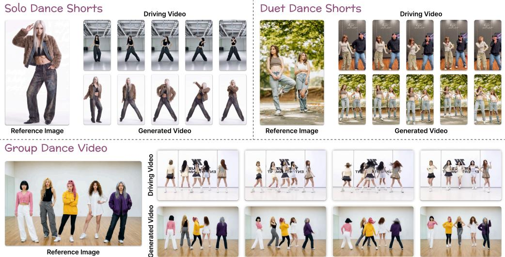  
Figure 1: Human image animation with WeLike2Party. Given a reference image and a driving video, WeLike2Party animates the reference subjects while preserving their appearance and identitymotion correspondence. Our framework enables the creation of both solo and group dance videos.

## ABSTRACT

Human image animation aims to transfer motion from a driving video to subjects in a reference image. Despite remarkable progress in video generation, achieving high-fidelity animation of multiple interacting subjects remains a challenge. Many existing approaches rely on explicit motion representations such as 2D skeletons or parametric body meshes and struggle to preserve identity-motion binding under inter-person occlusion. To address this limitation, we propose WeLike2Party, a multi-human animation framework built on direct in-context video conditioning without explicit pose or mesh extraction at inference. We further introduce Reference Asymmetric RoPE Conditioning to preserve fine-grained appearance details, and Identity Binding Supervision to associate each reference identity with its intended motion trajectory. To support cross-identity training, we construct MotionTwin, a large-scale synthetic dataset comprising 14.4K cross-identity video pairs with shared subject and camera motions, totaling 84.3 hours of photorealistic video. We additionally present MotionTwin-Bench, a cross-identity benchmark specifically designed to evaluate subject-level visual fidelity and identity-motion binding. Extensive experiments on MotionTwin-Bench and real-world videos demonstrate that WeLike2Party outperforms recent state-of-the-art methods in subject-level visual fidelity, identity-motion binding, and overall perceptual quality, particularly in multi-person interactions with substantial occlusion. To validate its robustness, we provide examples of MotionTwin and results on Project page.

## 1 INTRODUCTION

Imagine generating a realistic video of yourself dancing with your favorite performers (See Fig. 1).   
Driven by recent advances in video generation models (Blattmann et al., 2023; HaCohen et al., 2024;

Wan et al., 2025), human image animation enables such scenarios by transferring motion from a driving video to subjects in a reference image while preserving their identity.

Existing approaches (Xu et al., 2024b; Hu, 2024; Zhang et al., 2024; Zhu et al., 2024; Wang et al., 2025a; Tu et al., 2025) condition video generation on explicit motion representations, such as 2D skeletal maps or parametric 3D human meshes, extracted using off-the-shelf estimators. These representations allow identity references and motion conditions to be extracted from the same video, enabling self-supervised training without paired cross-identity data.

While these methods achieve promising results, errors in the estimated motion representations can propagate to the generated video and introduce visual artifacts. These limitations become particularly pronounced in multi-person scenarios, where inter-person occlusion complicates motion estimation and identity association. For example, skeletal pose estimators can produce missing or incorrectly assigned joints when subjects overlap. The limited subject-specific information in skeletons further hinders the association between motion cues and individual identities. Parametric body meshes provide richer geometric information, but frame-level estimation errors can still introduce temporally inconsistent motion guidance. Moreover, inter-person occlusion can disrupt subject association across frames, causing identity switches in mesh tracking and incorrect identity-motion binding.

To address these limitations, we propose WeLike2Party (WL2P), an in-context motion conditioning framework for multi-human image animation that directly transfers motion from a driving video without relying on explicit intermediate representations. Specifically, we concatenate the visual representations of the reference image, the driving video, and the noisy target video into a single sequence, so that the model can jointly leverage identity, motion, and interaction cues during denoising. However, na¨ıve in-context conditioning struggles to generate high-quality multi-human videos due to the loss of per-subject appearance detail and the absence of explicit supervision on motion binding.

Therefore, we introduce two components tailored for high-fidelity multi-human motion transfer built on the in-context conditioning framework. First, Reference Asymmetric RoPE Conditioning (RARC) incorporates a reference image at a higher resolution than the target video by rescaling its spatial coordinates to the target grid’s range before applying Rotary Position Embedding (RoPE) (Su et al., 2024). This enables target tokens to retrieve fine-grained details from the reference through self-attention. Second, Identity Binding Supervision (IBS) explicitly supervises attention between target and reference image tokens using ground-truth per-subject instance masks, encouraging each reference identity to remain associated with its intended motion trajectory throughout generation.

Training such a direct in-context conditioning model, however, requires paired cross-identity videos that share the same underlying motion while depicting different identities. Existing datasets rarely provide this correspondence, particularly for multi-human interactions. We therefore construct MotionTwin, a large-scale synthetic multi-human dataset containing 84.3 hours of photorealistic 1080p video organized into 14.4K cross-identity video pairs. Using Unreal Engine 5, each pair is generated by retargeting the same motion onto different combinations of rigged human avatars while independently varying subject identity and scene appearance. The dataset draws from 12.4K single- and multi-person motion sequences, 4.5K distinct combinations of human assets, and 357 high dynamic range image (HDRI) environments. We further apply an automatic filtering pipeline to remove physically implausible interactions and improve the quality of the training pairs. We additionally introduce MotionTwin-Bench, consisting of 300 cross-identity video pairs from the same pipeline, for evaluating subject-level visual fidelity and identity-motion binding.

We demonstrate the effectiveness of WL2P through comparisons on our benchmark and additional evaluation on diverse real-world image-video pairs using VBench, VBench++(Huang et al., 2024; 2025) and user study. The results show improvements over recent state-of-the-art methods in persubject fidelity, motion transfer, identity-motion binding, and overall perceptual quality.

## 2 RELATED WORK

Human image animation aims to synthesize a video of a reference subject following a desired motion sequence. Most existing methods encode driving motion using compact explicit representations, such as 2D poses, DensePose, landmarks, or parametric body models, while separately conditioning on reference appearance (Xu et al., 2024b; Hu, 2024; Zhang et al., 2024; Zhu et al., 2024; Wang et al., 2025a; Tu et al., 2025; Cheng et al., 2025; Zhang et al., 2025). Although this formulation enables self-supervised training, it commonly discards fine-grained geometry and interaction cues, and propagates estimator errors into the generated video, especially for the case where multiple subjects overlap or exchange positions. Recent multi-character animation methods mitigate these issues through instance-aware conditions and explicit correspondence mechanisms, including flow and depth guidance, tracking-mask guidance, graph-based matching, identifier-aware representations, and 4D supervision (Xue et al., 2025; Wang et al., 2025b; Chen et al., 2026; Ling et al., 2026; Hu et al., 2026b;a; Ding et al., 2026). However, these approaches still largely rely on explicit motion representations and their associated estimation pipelines. To bypass this dependency, recent works directly condition on driving videos, preserving richer motion and interaction cues at inference (Luo et al., 2026; Yan et al., 2026a; Wang et al., 2026). Nevertheless, these methods are trained on paired datasets synthesized by pose-driven animation models, so their motion correspondence inherits errors from the synthesis pipeline. Moreover, SCAIL-2 requires inference-time per-subject masks to specify identity-motion correspondence, while DreamActor-M2 and Wan-Animate 2 provide no explicit mechanism for identity binding and degrade substantially in multi-subject scenarios.

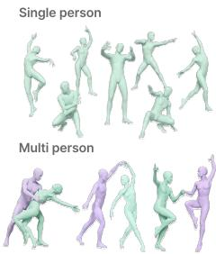  
(a) Motion Collecting

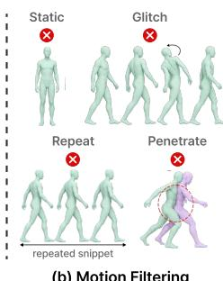  
(b) Motion Filtering

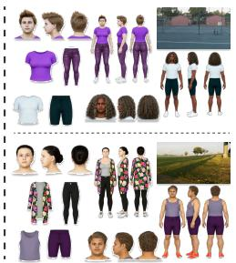  
(c) Appearance Sampling

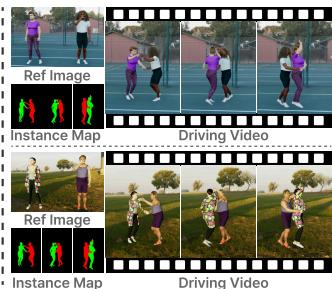  
(d) Paired Rendering  
Figure 2: MotionTwin curation pipeline. We collect and filter diverse SMPL-X motions, sample different avatar appearances, and render cross-identity video pairs with shared motion. Multi-person pairs additionally provide reference images and instance maps for identity correspondence.

In contrast, we construct multi-human cross-identity training pairs, covering up to seven subjects, by directly retargeting the same underlying motion and camera trajectory to different identities. This provides ground-truth motion correspondence without relying on pose-driven animation models for data synthesis. Moreover, WL2P uses per-subject instance masks only as training supervision (Sec. 4.4), requiring neither external pose estimation nor subject-wise binding masks during inference.

## 3 DATASET: MOTIONTWIN

Training WL2P requires a cross-identity pair dataset consisting of three components: an identity reference image, a driving video, and a target video. Specifically, the driving and target videos share the same pose sequence and camera trajectory while depicting different subjects and scenes, and the identity reference image provides the target subject identities. Since collecting such precisely synchronized cross-identity data in the real world is nearly impossible, we construct a large-scale synthetic multi-human dataset using Unreal Engine 5 (Epic Games, 2026) as illustrated in Fig. 2.

We first collect diverse single and multi-person 3D motion sequences from publicly available human motion datasets (Mahmood et al., 2019; Xu et al., 2024a; Li et al., 2024; Burkanova et al., 2025; Fieraru et al., 2020; Khirodkar et al., 2024; Yin et al., 2023; Le et al., 2023) (See Fig. 2(a)). We then convert them into a unified SMPL-X representation by normalizing the frame rate and coordinate convention. Since these datasets originate from heterogeneous capture and reconstruction pipelines, their raw motion quality varies substantially. Furthermore, they often contain motions unsuitable for animation videos, such as static or excessively traveling movements.

To support realistic and dynamic human animation, we apply an automatic filtering procedure inspired by prior motion curation practices (Fan et al., 2025; Lin et al., 2023) (See Fig. 2(b)). For static segments, we measure the mean per-DoF temporal pose variation and discard the clips when it falls below $1 0 ^ { - 3 }$ radians per frame. For rotation glitches, we detect them based on frame-to-frame geodesic angular velocity, classifying joint rotations that exceed 60◦ per frame as implausible jumps. We further constrain each clip to the longest sub-window whose horizontal root-trajectory extent stays within 8 m, as larger excursions move beyond a static single-camera field of view. Lastly, we reduce redundant motion by removing repeated choreography and extracting at most two windows from each long motion sequence. For multi-person sequences, we additionally filter severe inter-person mesh penetration using distance-field-based collision measures (Jiang et al., 2020; Ugrinovic et al., 2024).

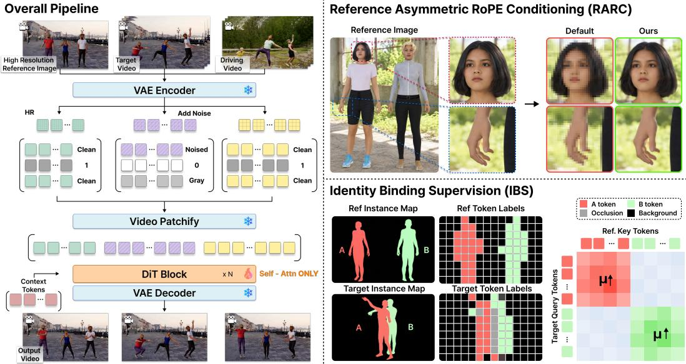  
Figure 3: Overview of WL2P. WL2P jointly conditions a DiT on the reference image, driving video, and noisy target video. RARC preserves fine-grained reference details through high-resolution encoding, and IBS enforces subject-level identity-motion correspondence via attention supervision.

Sequences with maximum penetration depth exceeding 4 cm are rejected, while shallow contacts from natural interactions are preserved.

After filtering, each motion sequence is rendered into two appearance variants with distinct avatar identities, garments, hairstyles, lighting, and backgrounds (See Fig. 2(c)). We further introduce body-shape variation between the two variants by symmetrically perturbing the estimated body shape, producing differences in body build, including height and weight. This exposes the model to motion correspondence across different body proportions, improving robustness when the driving and target subjects have substantially different body shapes during inference. Human appearances are constructed from a diverse asset collection (Black et al., 2023; Tesch et al., 2026), and scene environments are sampled from 357 HDRIs (PolyHaven, 2022).

During the rendering procedure, reference images are constructed differently for single- and multiperson sequences (See Fig. 2(d)). For single-person scenes, the reference image is sampled directly from the target video. For multi-person scenes, where occlusion may prevent all subjects from being visible in a single frame, we render reference images by placing subjects side by side following the subject order observed in the first frame of the target video. We additionally generate instance masks in Blender (Blender Online Community, 2023) using the corresponding posed geometry and camera settings to provide subject-level correspondence in Sec. 4.4.

In total, MotionTwin contains 14.4K cross-identity pairs, corresponding to 28.9K photorealistic videos and 84.3 hours of content at 1920 × 1080 resolution. In particular, our dataset consists of 8.3K single-person motion pairs and 6.1K multi-person motion pairs, the latter ranging from two to seven interacting subjects. Every multi-person pair is further accompanied by a rest-pose reference image and per-person instance maps, providing 12.3K reference images with ground-truth identity correspondence between the reference image and the target video. These paired videos provide direct supervision for effective motion transfer and identity-motion binding.

## 4 PROPOSED METHOD: WL2P

In this section, we propose WL2P, a framework for multi-human image animation. We first introduce the DiT backbone in Sec. 4.1 and explain our in-context conditioning layout in Sec. 4.2. We then describe two key components designed for multi-human image animation: (i) RARC, which improves the representation of fine-grained appearance details (See Sec. 4.3), and (ii) IBS, which enhances the association between reference identities and their corresponding motion (See Sec. 4.4). An overview of our framework is illustrated in Fig. 3.

## 4.1 PRELIMINARY

Latent Video Diffusion Transformer. We build WL2P on Wan2.1-I2V-14B (Wan et al., 2025), an image-conditioned DiT operating in the latent space of a 3D variational autoencoder (VAE) (Kingma & Welling, 2013). Given an input video $\mathbf { x } \in \mathbb { R } ^ { \frac { 1 } { 3 } \times F \times H \times W }$ consisting of F frames, the VAE encoder $\mathcal { E }$ compresses it into a latent $\mathbf { z } _ { 0 }$ with $C _ { z } = 1 6$ channel dimensions:

$$
\begin{array} { r } { \mathbf { z } _ { 0 } = \mathcal { E } ( \mathbf { x } ) \in \mathbb { R } ^ { C _ { z } \times F ^ { \prime } \times H ^ { \prime } \times W ^ { \prime } } , \qquad F ^ { \prime } = \frac { F - 1 } { 4 } + 1 , \quad H ^ { \prime } = \frac { H } { 8 } , \quad W ^ { \prime } = \frac { W } { 8 } . } \end{array}\tag{1}
$$

Then, the diffusion forward process adds Gaussian noise $\mathbf { \epsilon } \epsilon \sim \mathcal { N } ( \mathbf { 0 } , \mathbf { I } )$ to the clean latent $\mathbf { z } _ { 0 }$ according to the timestep $\tau \in [ 0 , 1 ]$

$$
{ \bf z } _ { \tau } = ( 1 - \tau ) { \bf z } _ { 0 } + \tau \epsilon , \qquad { \bf u } = \epsilon - { \bf z } _ { 0 } ,\tag{2}
$$

where u denotes a target velocity.

To incorporate image conditioning, a video with the input image I in the first frame and zeros in the remaining frames is encoded by E, yielding an image latent $\mathbf { z } _ { I } \in \mathbb { R } ^ { C _ { z } \times F ^ { \prime } \times H ^ { \prime } \times W ^ { \prime } }$ . To explicitly indicate which latent positions are provided as conditioning, a binary mask is temporally packed into m $\in \{ 0 , 1 \} ^ { 4 \times F ^ { \prime } \times \mathbf { \dot { H } } ^ { \prime } \times W ^ { \prime } }$ with ones at the first latent frame and zeros elsewhere. They are then concatenated channel-wise with the noisy latent ${ \bf z } _ { \tau }$ and projected into a token sequence:

$$
\begin{array} { r } { \mathbf { X } = \operatorname { P a t c h E m b e d } ( [ \mathbf { z } _ { \tau } ; \mathbf { m } ; \mathbf { z } _ { I } ] _ { \mathrm { c h } } ) \in \mathbb { R } ^ { F ^ { \prime } h w \times d } , \qquad h = \frac { H ^ { \prime } } { 2 } , \quad w = \frac { W ^ { \prime } } { 2 } } \end{array}\tag{3}
$$

where $[ \cdot ] _ { \mathrm { c h } }$ denotes channel-wise concatenation and d is the hidden dimension of the DiT. Given a conditioning context c for cross-attention, the DiT $\mathbf { v } _ { \theta }$ is optimized to predict the target velocity u using the following flow-matching objective:

$$
\begin{array} { r } { \mathcal { L } _ { \mathrm { F M } } ( \theta ) = \mathbb { E } _ { \mathbf { z } _ { 0 } , \epsilon , \tau , \mathbf { c } } \left[ \| \mathbf { v } _ { \theta } ( \mathbf { X } , \tau , \mathbf { c } ) - \mathbf { u } \| _ { 2 } ^ { 2 } \right] . } \end{array}\tag{4}
$$

3D Rotary Position Embedding. Our base model employs three-dimensional rotary positional embeddings (3D-RoPE) to encode the temporal and spatial locations of video tokens within selfattention. Let a token position be represented as $\mathbf { p } = ( p ^ { \dot { t } } , p ^ { h } , p ^ { w } )$ , where $p ^ { t }$ indexes the latent frame and $p ^ { h } , p ^ { w }$ denote the height and width coordinates, respectively. For each coordinate $p$ and RoPE frequency $\omega _ { k }$ , a rotation is defined as:

$$
\begin{array} { r } { \mathcal { R } ( p ; \omega _ { k } ) = \left[ \begin{array} { c c } { \cos ( p \omega _ { k } ) } & { - \sin ( p \omega _ { k } ) } \\ { \sin ( p \omega _ { k } ) } & { \cos ( p \omega _ { k } ) } \end{array} \right] . } \end{array}\tag{5}
$$

The same rotation is applied to query and key features so that each attention layer can capture relative positional distances between tokens while preserving their content information.

## 4.2 IN-CONTEXT CONDITIONING

In-context visual conditioning methods inject additional visual context into a DiT by concatenating clean condition tokens with noisy target tokens into a single sequence, allowing self-attention to directly exchange information between them (Luo et al., 2025; Yan et al., 2026a; Wang et al., 2026). Compared with auxiliary control branches (Zhang et al., 2024; Wang et al., 2025a; Cheng et al., 2025), this design lets every target token attend directly to every condition token, faithfully transferring identities and motions to the target video. Thus, we adopt this method to jointly process the identity reference image $\mathrm { I _ { r e f } }$ , the driving video $\mathrm { V _ { d r v } }$ , and the target video $\mathrm { V _ { t g t } }$ based on the vanilla Image-to-Video (I2V) conditioning stream in Eq. 3 without any architectural modification.

Following previous in-context conditioning setups, we treat $\mathrm { I _ { r e f } }$ and $\mathrm { V _ { d r v } }$ as observed conditions and $\mathrm { V _ { t g t } }$ as the segment to be generated. Each segment is independently encoded by the VAE encoder E into a clean latent $\mathbf { z } _ { s } \in \mathbb { R } ^ { C _ { z } \times F _ { s } ^ { \prime } \times H _ { s } ^ { \prime } \times W _ { s } ^ { \prime } }$ , where $s \in \{ \mathrm { r e f } , \mathrm { d r v } , \mathrm { t g t } \}$ and $F _ { \mathrm { r e f } } ^ { \prime } = 1$ . Here, each segment is set as follows:

$$
( \widetilde { \mathbf { z } } _ { s } , \mathbf { m } _ { s } , \widetilde { \mathbf { z } } _ { s } ^ { I } ) = \left\{ \begin{array} { l l } { ( \mathbf { z } _ { s } , \mathbf { 1 } , \mathbf { z } _ { s } ) } & { s \in \{ \mathrm { r e f } , \mathrm { d r v } \} , } \\ { ( \mathbf { z } _ { \mathrm { t g t } , \tau } , \mathbf { 0 } , \mathbf { z } _ { \emptyset } ) } & { s = \mathrm { t g t } , } \end{array} \right.\tag{6}
$$

where $\mathbf { z } _ { \mathrm { t g t } , \tau }$ is the noisy target latent at timestep $\boldsymbol { \tau } , \mathbf { z } _ { \emptyset }$ is the VAE encoding of zero-filled frames that the I2V model assigns to target frames, and 1 and 0 are all-one and all-zero masks of size

$4 \times F _ { s } ^ { \prime } \times H _ { s } ^ { \prime } \times W _ { s } ^ { \prime }$ . Since the base model is pretrained with the same masking strategy, m naturally serves as an indicator distinguishing condition tokens from target tokens.

We then patchify each segment and concatenate the resulting tokens along the sequence dimension:

$$
\mathbf { X } _ { s } = \mathrm { P a t c h E m b e d } \big ( [ \tilde { \mathbf { z } } _ { s } ; \mathbf { m } _ { s } ; \tilde { \mathbf { z } } _ { s } ^ { I } ] _ { \mathrm { c h } } \big ) \in \mathbb { R } ^ { N _ { s } \times d } , \qquad \mathbf { X } = [ \mathbf { X } _ { \mathrm { r e f } } ; \mathbf { X } _ { \mathrm { t g t } } ; \mathbf { X } _ { \mathrm { d r v } } ] _ { \mathrm { s e q } } ,\tag{7}
$$

where $N _ { s }$ is the number of tokens in segment s and $[ \cdot ] _ { \mathrm { s e q } }$ denotes sequence-wise concatenation.

## 4.3 RARC: REFERENCE ASYMMETRIC ROPE CONDITIONING

While in-context conditioning effectively transfers the global appearance of the reference image to the target video, fine-grained details such as faces and hands are barely preserved due to the spatial downsampling of the 3D VAE and patch embedding (Eqs. 1 and 3). A straightforward solution is to encode $\mathrm { I _ { r e f } }$ at a higher resolution while keeping the target and driving videos unchanged. However, directly assigning RoPE coordinates to this denser reference grid places the reference tokens outside the coordinate range observed during pretraining. Such position extrapolation is known to disrupt the spatial understanding of pretrained DiTs and produce repetitive or implausible content (Zhuo et al., 2024; Zhao et al., 2025). We therefore propose RARC, which assigns fractional spatial RoPE coordinates to the reference tokens so that they remain within the spatial range of the target tokens.

Let $h \times w$ denote the spatial token grid of the target and driving videos, and $h _ { r } \times w _ { r }$ the denser grid obtained by encoding $\mathrm { I _ { r e f } }$ at a higher resolution. For a reference token at grid position $( i , j )$ , we assign the spatial coordinates as

$$
\tilde { p } _ { i } ^ { h } = i \frac { h } { h _ { r } } , \qquad \tilde { p } _ { j } ^ { w } = j \frac { w } { w _ { r } } , \qquad i \in \{ 0 , \dots , h _ { r } - 1 \} , ~ j \in \{ 0 , \dots , w _ { r } - 1 \} .\tag{8}
$$

The pretrained rotation $\mathcal { R } ( \tilde { p } ; \omega _ { k } )$ in Eq. 5 is then evaluated directly at these fractional coordinates along the height and width axes.

Under this mapping, segments with different spatial densities share a common RoPE coordinate frame: a target token at $( a , b )$ attends to a reference token at $( i , j )$ with the relative displacement $( a - i h / h _ { r } , b - j w / w _ { r } )$ instead of $( a - i , b - j )$ . Consequently, rather than enforcing strict spatial correspondence between the reference image $\mathrm { I _ { r e f } }$ and the target video $\mathrm { V _ { t g t } }$ , RARC provides spatial cues useful for self-attention to learn which appearance details to transfer to each target region.

## 4.4 IBS: IDENTITY BINDING SUPERVISION

The flow-matching objective in Eq. 4 does not specify which reference identity should correspond to each target subject. This ambiguity becomes more problematic in multi-human animation, where multiple subjects may overlap or exchange positions with each other. As a result, the model may produce identity swaps or drifts, where the identity of one reference subject is attached to the motion of another or gradually blends with an interacting subject. To address this issue, we introduce IBS, which directly supervises reference-to-target attention using ground-truth instance masks from MotionTwin to preserve subject-level identity association.

Subject labels. IBS is applied to multi-person pairs, for which MotionTwin provides instance maps of P subjects in both $\mathrm { I _ { r e f } }$ and $\mathrm { V _ { t g t } }$ . We first downsample the instance masks to the reference and target token grids. For each token x, let $\ell ( x ) \in \{ 0 , 1 , \ldots , { \overset { \cdot } { P } } \}$ be the subject that occupies the largest area of its region, where 0 denotes the background and $c ( x ) \ \bar { \in } \ [ 0 , 1 ]$ the fraction of the region covered by that subject. We discard background tokens and tokens with $c ( x ) < \gamma$ , which mostly lie on subject boundaries or occluded areas. The remaining tokens form the set of labeled target tokens $\mathcal { Q }$ and, for each subject $p ,$ the set of labeled reference tokens ${ \boldsymbol { \mathcal { K } } } _ { p }$ , whose union is denoted by K.

Binding loss. For target token $u \in \mathcal { Q }$ and reference token $v \in \kappa$ , we compute the attention over the labeled reference tokens and the probability of attending to the correct subject:

$$
a _ { u v } ^ { l , m } = \frac { \exp \left( \langle \mathbf { q } _ { u } ^ { l , m } , \mathbf { k } _ { v } ^ { l , m } \rangle / \sqrt { d _ { h } } \right) } { \sum _ { v ^ { \prime } \in K } \exp \left( \langle \mathbf { q } _ { u } ^ { l , m } , \mathbf { k } _ { v ^ { \prime } } ^ { l , m } \rangle / \sqrt { d _ { h } } \right) } , \qquad \mu _ { u } ^ { l , m } = \sum _ { v \in K _ { \ell ( u ) } } a _ { u v } ^ { l , m } ,\tag{9}
$$

where $\mathbf { q }$ and k are the query and key at block l and head $m ,$ and $d _ { h }$ is the head dimension. IBS maximizes $\mu _ { u } ^ { l , m }$ weighted by the label confidence:

$$
\mathcal { L } _ { \mathrm { I B S } } = - \frac { 1 } { \left| \boldsymbol { \mathcal { B } } \right| M \left| \boldsymbol { \mathcal { Q } } \right| } \sum _ { l \in B } \sum _ { m = 1 } ^ { M } \sum _ { u \in \boldsymbol { \mathcal { Q } } } c ( u ) \log \mu _ { u } ^ { l , m } ,\tag{10}
$$

Table 1: Quantitative evaluation compared to state-of-the-art methods on MotionTwin-Bench.
<table><tr><td rowspan="3">Method</td><td colspan="4">Full-frame Fidelity</td><td colspan="3">Subject Fidelity</td><td colspan="2">Identity Binding</td></tr><tr><td>PSNR↑</td><td>SSIM↑</td><td>LPIPS↓</td><td>FVD↓</td><td>mPSNR↑</td><td>mSSIM↑</td><td>mLPIPS↓</td><td>IAA↑</td><td> $\mathbf { I A A _ { c r o s s } } \uparrow$ </td></tr><tr><td>MultiAnimate (Hu et al., 2026b)</td><td>20.22</td><td>0.7112</td><td>0.3283</td><td>226.61</td><td>18.41</td><td>0.7326</td><td>0.2029</td><td>0.8360</td><td>0.8192</td></tr><tr><td>Wan-Animate 2 (Wang et al., 2026)</td><td>17.18</td><td>0.5957</td><td>0.4609</td><td>277.51</td><td>15.91</td><td>0.6786</td><td>0.2969</td><td>0.6035</td><td>0.5955</td></tr><tr><td>SCAIL (Yan et al., 2026b)</td><td>17.42</td><td>0.5681</td><td>0.3856</td><td>164.33</td><td>18.11</td><td>0.7192</td><td>0.2188</td><td>0.8514</td><td>0.8422</td></tr><tr><td>SCAIL-2 (Yan et al., 2026a)</td><td>17.68</td><td>0.5775</td><td>0.3659</td><td>120.75</td><td>17.55</td><td>0.7097</td><td>0.2334</td><td>0.8406</td><td>0.8335</td></tr><tr><td>WeLike2Party (Ours)</td><td>25.14</td><td>0.7939</td><td>0.1123</td><td>35.51</td><td>25.38</td><td>0.8685</td><td>0.0691</td><td>0.9569</td><td>0.9496</td></tr></table>

where B is the set of supervised blocks and M is the number of heads. By normalizing attention only over reference tokens, IBS controls how attention is distributed among different identities rather than increasing the overall reliance on the reference image. It does not require pixel-level alignment between the reference image and target video, since only subject-level correspondence is supervised. We apply IBS only at high noise levels since coarse subject layouts are mainly determined in early denoising stages (Wu et al., 2024; Choi et al., 2022). Note that IBS is used only during training and does not introduce neither additional parameters nor inference cost. The overall training objective combines the flow-matching loss in Eq. 4 with the IBS loss weighted by $\beta$ as:

$$
\begin{array} { r } { \mathcal { L } = \mathcal { L } _ { \mathrm { F M } } + \beta \mathcal { L } _ { \mathrm { I B S } } . } \end{array}\tag{11}
$$

## 5 EXPERIMENTAL RESULTS

## 5.1 IMPLEMENTATION DETAILS

We train only the self-attention blocks of the Wan2.1-I2V-14B backbone while keeping the remaining parameters frozen. Training is performed on four NVIDIA B200 GPUs using BF16 mixed precision. The reference image is resized to a 720pixel short side, while the target and driving videos contain 81 frames at $6 4 0 \times \bar { 3 } 5 2$ resolution for training and $8 3 2 \times 4 8 0$ resolution for inference. We optimize the model with AdamW for 34K steps, using a learning rate of 1 $. \times 1 0 ^ { - 5 }$ . At inference, an 81-frame 480p clip takes 6.5 minutes on one B200 GPU. For IBS, we set $\gamma = 0 . 7$ and $\beta = 0 . 0 5$ and restrict IBS to high-noise timesteps, corresponding to the top 40% of the noise range. Additional details are provided in Appendix B.

## 5.2 EVALUATION PROTOCOL

We evaluate identity-motion binding and visual fidelity on MotionTwin-Bench and real-world inputs.

MotionTwin-Bench. To evaluate reconstruction fidelity and identity-motion binding against ground truth, we construct a benchmark of 300 cross-identity video pairs using the rendering pipeline in Sec. 3. We report PSNR, SSIM (Wang et al., 2004), LPIPS (Zhang et al., 2018) and FVD (Unterthiner et al., 2018) for overall video fidelity. Subject-level fidelity is measured with mPSNR, mSSIM, and mLPIPS using ground-truth per-subject instance masks. We further introduce Identity Assignment Accuracy (IAA) to assess identity-motion binding. Using ground-truth instance masks, we match generated subject regions to reference identities based on color-histogram distances, assigning each frame a score of 1 if all assignments are correct and 0 otherwise. IAA averages these scores over all frames, while the occlusion-focused variant, $\mathrm { I A A } _ { \mathrm { c r o s s } } .$ , considers only frames including inter-person occlusion. Further details are provided in Appendix C.

Real-world evaluation. To assess performance beyond the rendered benchmark, we evaluate on real-world inputs. For quantitative comparison, we use 161 internet-collected image-video pairs containing both single and multi subjects and report video and frame quality from VBench (Huang et al., 2024) and I2V quality from VBench++ (Huang et al., 2025). These measures assess perceptual quality and consistency with the reference image. Qualitative comparisons and a user study provide complementary assessments of individual identity preservation and motion assignment.

Compared methods. We compare WL2P with recent open-source character animation models, including SCAIL (Yan et al., 2026b), SCAIL-2 (Yan et al., 2026a), Wan-Animate 2 (Wang et al., 2026), and MultiAnimate (Hu et al., 2026b). Following the official implementation, we generate per-subject masks with SAM3 (Carion et al., 2026) for MultiAnimate and SCAIL-2.

## 5.3 COMPARISON WITH STATE-OF-THE-ART METHODS

Quantitative evaluations. As shown in Tab. 1, WL2P achieves the best results across reconstruction fidelity and identity-motion binding on the benchmark. MultiAnimate provides the strongest image reconstruction results among the baselines, whereas SCAIL attains the highest binding accuracy. WL2P improves both aspects jointly, with the gains in masked metrics confirming better reconstruction within subject regions. Its lower FVD indicates closer agreement with the target video distribution, and its advantage in $\mathrm { I A A } _ { \mathrm { c r o s s } }$ supports more reliable identity assignment under inter-person occlusion.

Table 2: Quantitative evaluation compared to state-of-the-art methods on the real-world scenario. We report mean and standard deviation for the user study.
<table><tr><td rowspan="2">Method</td><td colspan="2">VBench</td><td rowspan="2">VBench++</td><td colspan="3">User Study</td></tr><tr><td>V-Quality↑ F-Quality↑</td><td></td><td>I2V-Quality↑ | Id-Motion Bind↑</td><td>Id Preserve↑</td><td>Visual Quality↑</td></tr><tr><td>MultiAnimate (Hu et al., 2026b)</td><td>79.99</td><td>81.40</td><td>85.62</td><td> $2 . 5 7 5 \pm 1 . 3 2 4$ </td><td> $2 . 3 5 5 \pm 1 . 4 3 5$ </td><td> $2 . 4 8 0 \pm 1 . 3 1 7$ </td></tr><tr><td>Wan-Animate 2 (Wang et al., 2026)</td><td>81.58</td><td>83.09</td><td>87.61</td><td> $2 . 3 8 5 \pm 1 . 1 8 8$ </td><td> $2 . 5 5 8 \pm 1 . 0 8 6$ </td><td> $2 . 4 3 0 \pm 1 . 1 7 4$ </td></tr><tr><td>SCAIL (Yan et al., 2026b)</td><td>82.84</td><td>83.61</td><td>85.91</td><td> $\underline { { 3 . 1 5 3 } } \pm 1 . 4 7 3$ </td><td> ${ \underline { { 3 . 3 3 8 } } } \pm 1 . 4 0 8$ </td><td> $\underline { { 3 . 2 0 5 } } \pm 1 . 4 3 1$ </td></tr><tr><td>SCAIL-2 (Yan et al., 2026a)</td><td>82.70</td><td>84.13</td><td>88.41</td><td> $2 . 8 4 5 \pm 1 . 2 1 2$ </td><td> $2 . 7 2 8 \pm 1 . 2 2 4$ </td><td> $2 . 8 6 0 \pm 1 . 2 5 3$ </td></tr><tr><td>WeLike2Party (Ours)</td><td>83.26</td><td>84.63</td><td>88.73</td><td> ${ \bf 4 . 0 4 3 \pm 1 . 2 3 5 }$ </td><td> $\mathbf { 4 . 0 2 2 \pm 1 . 2 0 6 }$ </td><td> $\mathbf { 4 . 0 2 5 \pm 1 . 2 5 8 }$ </td></tr></table>

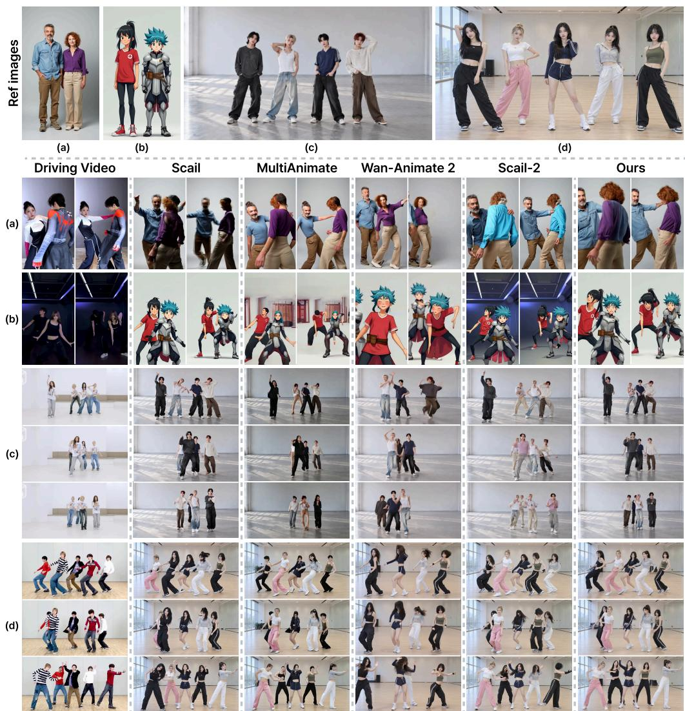  
Figure 4: Qualitative comparison. MultiAnimate transfers the driving subjects’ hairstyles and faces (a to d), Wan-Animate 2 merges or drops subjects (b to d), SCAIL swaps identities (c, d), and SCAIL-2 copies the driving background (b), alters clothing colors (a, c), and duplicates subjects (c). WL2P preserves each reference subject’s appearance and binds it to the intended motion.

The real-world results in Tab. 2 show that WL2P also leads in video, frame, and I2V quality. The improvement in reference consistency along with perceptual quality supports the robustness of our model, which is also applicable to real inputs.

Table 3: Ablation study on RARC and IBS. “Base + HR ref.” uses high-resolution reference images with standard RoPE and no coordinate rescaling.
<table><tr><td rowspan="2">Method</td><td colspan="4">Full-frame Fidelity</td><td colspan="3">Subject Fidelity</td><td colspan="2">Identity Binding</td></tr><tr><td>PSNR↑</td><td>SSIM↑</td><td>LPIPS↓</td><td>FVD↓</td><td>mPSNR↑</td><td>mSSIM↑</td><td>mLPIPS↓</td><td>IAA↑</td><td> $\mathrm { I A A _ { c r o s s } \uparrow }$ </td></tr><tr><td>Base</td><td>22.47</td><td>0.7022</td><td>0.1542</td><td>48.81</td><td>22.92</td><td>0.8122</td><td>0.1232</td><td>0.8982</td><td>0.8891</td></tr><tr><td>Base + RARC</td><td>23.61</td><td>0.7090</td><td>0.1264</td><td>44.07</td><td>24.21</td><td>0.8487</td><td>0.0851</td><td>0.9241</td><td>0.9171</td></tr><tr><td>Base + HR ref.</td><td>22.50</td><td>0.6655</td><td>0.1395</td><td>46.21</td><td>23.55</td><td>0.8396</td><td>0.0947</td><td>0.8969</td><td>0.8900</td></tr><tr><td>Base + IBS</td><td>24.49</td><td>0.7419</td><td>0.1156</td><td>36.55</td><td>24.70</td><td>0.8581</td><td>0.0772</td><td>0.9303</td><td>0.9210</td></tr><tr><td>Full (Ours)</td><td>25.14</td><td>0.7939</td><td>0.1123</td><td>35.51</td><td>25.38</td><td>0.8685</td><td>0.0691</td><td>0.9569</td><td>0.9496</td></tr></table>

Qualitative evaluations. Fig. 4 presents qualitative comparisons for single- and multi-person animation, focusing on subject-level visual fidelity and identity-motion binding. MultiAnimate tend to reproduce the body proportions of the driving subjects rather than those of the reference subjects and exhibits noticeable appearance degradation. Wan-Animate 2 frequently suffers from identity bleeding, with distinct subjects blending into a single figure. SCAIL and SCAIL-2 produce the most visually faithful results among the baselines in these examples, but remain susceptible to identity drift as the number of subjects increases and inter-person occlusions become more complex. In contrast, WL2P shows high-fidelity multi-human animations, preserving each reference subject’s appearance and maintaining its association with the intended motion throughout these challenging interactions.

User study. We conduct a user study with 20 participants through Amazon Mechanical Turk (MTurk) (Crowston, 2012) to evaluate 20 real-world video clips. For each clip, participants view the reference image, driving video, and outputs from WL2P and the four baselines. The outputs are anonymized and displayed simultaneously in randomized order. Participants rank the five methods from 1 (best) to 5 (worst) for identity preservation, identity-motion binding, and overall visual quality. We convert ranks to scores from 5 (best) to 1 (worst) and average them across clips and participants. As shown in Tab. 2, WL2P achieves the highest mean preference scores across all three criteria. These results support that WL2P produces user-favored animations while preserving each reference identity and its association with the intended motion.

## 5.4 ABLATION STUDIES

To assess the impact of RARC and IBS, we conduct ablation studies on MotionTwin-Bench as shown in Tab. 3. First, we train a vanilla in-context model as the baseline and evaluate the effect of adding each component separately. Notably, this baseline already achieves competitive subject fidelity and identity-motion binding, suggesting that useful subject correspondences can emerge from paired training alone. Next, we compare two variants trained with the same high-resolution reference images: RARC and standard RoPE without coordinate rescaling. RARC improves subject fidelity by exploiting finer reference details, whereas standard RoPE performs comparably to or worse than the baseline. We attribute this gap to positional distribution shifts caused by reference resolution changes between training and inference. RARC mitigates this mismatch through fractional coordinate rescaling, as discussed in Appendix D. Finally, IBS improves both IAA and $\mathrm { I A A } _ { \mathrm { c r o s s } }$ over the baseline, showing that explicit attention supervision further strengthens identity-motion binding.

## 6 CONCLUSION

We present WeLike2Party, an in-context framework for multi-human image animation that transfers motion directly from driving videos without explicit pose or mesh estimation. Within this framework, RARC combines high-resolution reference encoding with fractional spatial RoPE to preserve fine-grained appearance details. IBS introduces an auxiliary loss on target-to-reference attention to encourage correct identity-motion binding, using per-subject instance masks. Furthermore, we introduce MotionTwin to support paired cross-identity training and MotionTwin-Bench to evaluate subject-level visual fidelity and identity-motion binding with ground-truth targets and correspondences. Together, these contributions bring the idea of dancing with your favorite performers closer to reality, with each subject retaining their distinct appearance and following the intended motion.

Limitations and Future Works. While WeLike2Party produces high-quality multi-human animations across diverse subjects and motions, there is still room for improvement. First, fine-grained identity details may degrade as more subjects share a fixed-resolution output frame, leaving fewer pixels per person. Subject-specific face embeddings could help preserve facial identity under dynamic motion and at small on-screen scales. Second, WL2P remains computationally expensive, which limits its applicability to interactive animation. Future work could explore efficient attention mechanisms and model distillation to reduce inference cost while preserving appearance fidelity and identity-motion binding. Another promising direction is to extend MotionTwin with independently controlled camera trajectories and subject motions, providing structured supervision for models that support separate control over camera and human motion.

## AI USE STATEMENT

In this work, we used generative AI tools to polish the manuscript for readability and grammar. We have not used generative AI tools to develop the research methodology, implement the proposed method, or interpret experimental results. All AI-assisted edits were reviewed and revised by the authors to ensure technical correctness and consistency with the intended claims. We take responsibility for the final content of this work, including text, claims or artifacts produced with the aid of generative AI.

## ETHICS STATEMENT

Our work focuses on multi-human image animation and introduces a synthetic dataset constructed from existing motion resources and rendered human avatars. The dataset construction process does not involve collecting new personally identifiable information from human subjects. For real-world evaluation and qualitative figures, we use driving videos collected from publicly available online sources and reference images that are either synthetically generated or drawn from public sources. These materials are used solely for research evaluation and illustration, are not part of the released resources, and will be removed upon request from the individuals depicted or the rights holders. The proposed method and released resources are intended for research purposes only. As with other human image and video generation methods, the model could potentially be misused to create misleading or unauthorized content. We therefore encourage responsible use and careful consideration of consent, privacy, and applicable licenses when using reference images and driving videos.

## REPRODUCIBILITY STATEMENT

For reproducibility, we provide detailed descriptions of the WL2P architecture, training objectives, and MotionTwin construction pipeline in the paper. The training and evaluation code, model checkpoints, and benchmark data will be released after the final decision.

## REFERENCES

Jianhong Bai, Menghan Xia, Xiao Fu, Xintao Wang, Lianrui Mu, Jinwen Cao, Zuozhu Liu, Haoji Hu, Xiang Bai, Pengfei Wan, et al. Recammaster: Camera-controlled generative rendering from a single video. In 2025 IEEE/CVF International Conference on Computer Vision (ICCV), pp. 14834–14844. IEEE, 2025.

Michael J Black, Priyanka Patel, Joachim Tesch, and Jinlong Yang. Bedlam: A synthetic dataset of bodies exhibiting detailed lifelike animated motion. In 2023 IEEE/CVF conference on computer vision and pattern recognition (CVPR), pp. 8726–8737. IEEE, 2023.

Andreas Blattmann, Tim Dockhorn, Sumith Kulal, Daniel Mendelevitch, Maciej Kilian, Dominik Lorenz, Yam Levi, Zion English, Vikram Voleti, Adam Letts, et al. Stable video diffusion: Scaling latent video diffusion models to large datasets. arXiv preprint arXiv:2311.15127, 2023.

Blender Online Community. Blender - a 3D modelling and rendering package. https://www. blender.org, 2023.

Bermet Burkanova, Yasaman Etesam, Payam Jome Yazdian, Trinity Evans, Chuxuan Zhang, Zoe Stanley, Paige Tuttos¨ ´ı, and Angelica Lim. Compas3d: A dataset and benchmark for interactive motion. arXiv preprint arXiv:2507.19684, 2025.

Nicolas Carion, Laura Gustafson, Yuan-Ting Hu, Shoubhik Debnath, Ronghang Hu, Didac Suris Coll-Vinent, Chaitanya Ryali, Kalyan Vasudev Alwala, Haitham Khedr, Andrew Huang, et al. Sam 3: Segment anything with concepts. In International conference on learning representations, volume 2026, pp. 138846–138923, 2026.

Di Chang, Yichun Shi, Quankai Gao, Jessica Fu, Hongyi Xu, Guoxian Song, Qing Yan, Yizhe Zhu, Xiao Yang, and Mohammad Soleymani. Magicpose: Realistic human poses and facial expressions retargeting with identity-aware diffusion. arXiv preprint arXiv:2311.12052, 2023.

Junhao Chen, Mingjin Chen, Jianjin Xu, Xiang Li, Junting Dong, Mingze Sun, Hongxiang Li, Yuhang Yang, Hao Zhao, Xiao-Xiao Long, et al. Dancetogether: Generating interactive multi-person video without identity drifting. In International Conference on Learning Representations, volume 2026, pp. 30428–30471, 2026.

Weifeng Chen, Yatai Ji, Jie Wu, Hefeng Wu, Pan Xie, Jiashi Li, Xin Xia, Xuefeng Xiao, and Liang Lin. Control-a-video: Controllable text-to-video diffusion models with motion prior and reward feedback learning. arXiv preprint arXiv:2305.13840, 2023.

Gang Cheng, Xin Gao, Li Hu, Siqi Hu, Mingyang Huang, Chaonan Ji, Ju Li, Dechao Meng, Jinwei Qi, Penchong Qiao, et al. Wan-animate: Unified character animation and replacement with holistic replication. arXiv preprint arXiv:2509.14055, 2025.

Jooyoung Choi, Jungbeom Lee, Chaehun Shin, Sungwon Kim, Hyunwoo Kim, and Sungroh Yoon. Perception prioritized training of diffusion models. In 2022 IEEE/CVF Conference on Computer Vision and Pattern Recognition (CVPR), pp. 11462–11471. IEEE, 2022.

Kevin Crowston. Amazon mechanical turk: A research tool for organizations and information systems scholars. In Shaping the Future ofICT Research. Methods and Approaches: IFIP WG 8.2, Working Conference, Tampa, FL, USA, December 13-14, 2012. Proceedings, pp. 210–221. Springer, 2012.

Yanbo Ding, Xirui Hu, Guo Zhi, Yan Zhang, Xinrui Wang, Zhixiang He, Chi Zhang, Yali Wang, and Xuelong Li. Mtvcraft: Tokenizing 4d motion for arbitrary character animation. In International Conference on Learning Representations, volume 2026, pp. 10087–10118, 2026.

Epic Games. Unreal Engine 5. https://www.unrealengine.com/en-US/ unreal-engine-5, 2026. Accessed: 2026-02-28.

Ke Fan, Shunlin Lu, Minyue Dai, Runyi Yu, Lixing Xiao, Zhiyang Dou, Junting Dong, Lizhuang Ma, and Jingbo Wang. Go to zero: Towards zero-shot motion generation with million-scale data. In 2025 IEEE/CVF International Conference on Computer Vision (ICCV), pp. 13336–13348. IEEE, 2025.

Mihai Fieraru, Mihai Zanfir, Elisabeta Oneata, Alin-Ionut Popa, Vlad Olaru, and Cristian Sminchisescu. Three-dimensional reconstruction of human interactions. In 2020 IEEE/CVF Conference on Computer Vision and Pattern Recognition (CVPR), pp. 7212–7221. IEEE, 2020.

Yuwei Guo, Ceyuan Yang, Anyi Rao, Maneesh Agrawala, Dahua Lin, and Bo Dai. Sparsectrl: Adding sparse controls to text-to-video diffusion models. In European Conference on Computer Vision, pp. 330–348. Springer, 2024.

Yoav HaCohen, Nisan Chiprut, Benny Brazowski, Daniel Shalem, Dudu Moshe, Eitan Richardson, Eran Levin, Guy Shiran, Nir Zabari, Ori Gordon, et al. Ltx-video: Realtime video latent diffusion. arXiv preprint arXiv:2501.00103, 2024.

Hao He, Yinghao Xu, Yuwei Guo, Gordon Wetzstein, Bo Dai, Hongsheng Li, and Ceyuan Yang. Cameractrl: Enabling camera control for text-to-video generation. arXiv preprint arXiv:2404.02101, 2024a.

Xuanhua He, Quande Liu, Shengju Qian, Xin Wang, Tao Hu, Ke Cao, Keyu Yan, and Jie Zhang. Idanimator: Zero-shot identity-preserving human video generation. arXiv preprint arXiv:2404.15275, 2024b.

Li Hu. Animate anyone: Consistent and controllable image-to-video synthesis for character animation. In Proceedings of the IEEE/CVF conference on computer vision and pattern recognition, pp. 8153– 8163, 2024.

Xirui Hu, Yanbo Ding, Jiahao Wang, Tingting Shi, Yali Wang, Guo Zhi, and Weizhan Zhang. Motionweaver: Holistic 4d-anchored framework for multi-humanoid image animation. In International Conference on Learning Representations, volume 2026, pp. 31667–31705, 2026a.

Yingcheng Hu, Haowen Gong, Chuanguang Yang, Zhulin An, Yongjun Xu, and Songhua Liu. Multianimate: Pose-guided image animation made extensible. In Proceedings ofthe IEEE/CVF Conference on Computer Vision and Pattern Recognition (CVPR), pp. 9306–9316, June 2026b.

Ziqi Huang, Yinan He, Jiashuo Yu, Fan Zhang, Chenyang Si, Yuming Jiang, Yuanhan Zhang, Tianxing Wu, Qingyang Jin, Nattapol Chanpaisit, et al. Vbench: Comprehensive benchmark suite for video generative models. In 2024 IEEE/CVF Conference on Computer Vision and Pattern Recognition (CVPR), pp. 21807–21818. IEEE, 2024.

Ziqi Huang, Fan Zhang, Xiaojie Xu, Yinan He, Jiashuo Yu, Ziyue Dong, Qianli Ma, Nattapol Chanpaisit, Chenyang Si, Yuming Jiang, et al. Vbench++: Comprehensive and versatile benchmark suite for video generative models. IEEE Transactions on Pattern Analysis and Machine Intelligence, 2025.

Wen Jiang, Nikos Kolotouros, Georgios Pavlakos, Xiaowei Zhou, and Kostas Daniilidis. Coherent reconstruction of multiple humans from a single image. In 2020 IEEE/CVF Conference on Computer Vision and Pattern Recognition (CVPR), pp. 5578–5587. IEEE, 2020.

Yuming Jiang, Tianxing Wu, Shuai Yang, Chenyang Si, Dahua Lin, Yu Qiao, Chen Change Loy, and Ziwei Liu. Videobooth: Diffusion-based video generation with image prompts. In 2024 IEEE/CVF Conference on Computer Vision and Pattern Recognition (CVPR), pp. 6689–6700. IEEE, 2024.

Rawal Khirodkar, Jyun-Ting Song, Jinkun Cao, Zhengyi Luo, and Kris Kitani. Harmony4d: A video dataset for in-the-wild close human interactions. Advances in Neural Information Processing Systems, 37:107270–107285, 2024.

Diederik P Kingma and Max Welling. Auto-encoding variational bayes. arXiv preprint arXiv:1312.6114, 2013.

Nhat Le, Thang Pham, Tuong Do, Erman Tjiputra, Quang D Tran, and Anh Nguyen. Music-driven group choreography. In 2023 IEEE/CVF Conference on Computer Vision and Pattern Recognition (CVPR), pp. 8673–8682. IEEE, 2023.

Siyao Li, Tianpei Gu, Zhitao Yang, Zhengyu Lin, Ziwei Liu, Henghui Ding, Lei Yang, and Chen Change Loy. Duolando: Follower gpt with off-policy reinforcement learning for dance accompaniment. In International Conference on Learning Representations, volume 2024, pp. 810–829, 2024.

Jing Lin, Ailing Zeng, Shunlin Lu, Yuanhao Cai, Ruimao Zhang, Haoqian Wang, and Lei Zhang. Motion-x: A large-scale 3d expressive whole-body human motion dataset. Advances in Neural Information Processing Systems, 36:25268–25280, 2023.

Haotian Ling, Zequn Chen, Qiuying Chen, Donglin Di, Yongjia Ma, Hao Li, Chen Wei, Zhulin Tao, and Xun Yang. Everybodydance: Bipartite graph–based identity correspondence for multicharacter animation. Advances in Neural Information Processing Systems, 38:14123–14151, 2026.

Mingshuang Luo, Shuang Liang, Zhengkun Rong, Yuxuan Luo, Tianshu Hu, Ruibing Hou, Hong Chang, Yong Li, Yuan Zhang, and Mingyuan Gao. Dreamactor-m2: Universal character image animation via spatiotemporal in-context learning. In Proceedings ofthe Special Interest Group on Computer Graphics and Interactive Techniques Conference Conference Papers, pp. 1–11, 2026.

Yawen Luo, Xiaoyu Shi, Jianhong Bai, Menghan Xia, Tianfan Xue, Xintao Wang, Pengfei Wan, Di Zhang, and Kun Gai. Camclonemaster: Enabling reference-based camera control for video generation. In Proceedings of the SIGGRAPH Asia 2025 Conference Papers, pp. 1–10, 2025.

Naureen Mahmood, Nima Ghorbani, Nikolaus F Troje, Gerard Pons-Moll, and Michael J Black. Amass: Archive of motion capture as surface shapes. In Proceedings of the IEEE/CVF international conference on computer vision, pp. 5442–5451, 2019.

PolyHaven. Poly haven. https://polyhaven.com/hdris, 2022.

Seunghyun Shin, Dongmin Shin, Jisu Shin, Hae-Gon Jeon, and Joon-Young Lee. Video color grading via look-up table generation. In 2025 IEEE/CVF International Conference on Computer Vision (ICCV), pp. 19141–19152. IEEE, 2025.

Seunghyun Shin, Jifei Song, Wooseok Jeon, Hae-Gon Jeon, and Jiankang Deng. Trimotion: Modalityagnostic camera control for video generation. In European Conference on Computer Vision, pp. 1–18. Springer, 2026.

Jianlin Su, Murtadha Ahmed, Yu Lu, Shengfeng Pan, Wen Bo, and Yunfeng Liu. Roformer: Enhanced transformer with rotary position embedding. Neurocomputing, 568:127063, 2024.

Joachim Tesch, Giorgio Becherini, Prerana Achar, Anastasios Yiannakidis, Muhammed Kocabas, Priyanka Patel, and Michael Black. Bedlam2. 0: Synthetic humans and cameras in motion. Advances in Neural Information Processing Systems, 38, 2026.

Shuyuan Tu, Zhen Xing, Xintong Han, Zhi-Qi Cheng, Qi Dai, Chong Luo, and Zuxuan Wu. Stableanimator: High-quality identity-preserving human image animation. In 2025 IEEE/CVF Conference on Computer Vision and Pattern Recognition (CVPR), pp. 21096–21106. IEEE, 2025.

Nicolas Ugrinovic, Boxiao Pan, Georgios Pavlakos, Despoina Paschalidou, Bokui Shen, Jordi Sanchez-Riera, Francesc Moreno-Noguer, and Leonidas Guibas. Multiphys: Multi-person physicsaware 3d motion estimation. In 2024 IEEE/CVF Conference on Computer Vision and Pattern Recognition (CVPR), pp. 2331–2340. IEEE, 2024.

Thomas Unterthiner, Sjoerd Van Steenkiste, Karol Kurach, Raphael Marinier, Marcin Michalski, and Sylvain Gelly. Towards accurate generative models of video: A new metric & challenges. arXiv preprint arXiv:1812.01717, 2018.

Team Wan, Ang Wang, Baole Ai, Bin Wen, Chaojie Mao, Chen-Wei Xie, Di Chen, Feiwu Yu, Haiming Zhao, Jianxiao Yang, Jianyuan Zeng, Jiayu Wang, Jingfeng Zhang, Jingren Zhou, Jinkai Wang, Jixuan Chen, Kai Zhu, Kang Zhao, Keyu Yan, Lianghua Huang, Mengyang Feng, Ningyi Zhang, Pandeng Li, Pingyu Wu, Ruihang Chu, Ruili Feng, Shiwei Zhang, Siyang Sun, Tao Fang, Tianxing Wang, Tianyi Gui, Tingyu Weng, Tong Shen, Wei Lin, Wei Wang, Wei Wang, Wenmeng Zhou, Wente Wang, Wenting Shen, Wenyuan Yu, Xianzhong Shi, Xiaoming Huang, Xin Xu, Yan

Kou, Yangyu Lv, Yifei Li, Yijing Liu, Yiming Wang, Yingya Zhang, Yitong Huang, Yong Li, You Wu, Yu Liu, Yulin Pan, Yun Zheng, Yuntao Hong, Yupeng Shi, Yutong Feng, Zeyinzi Jiang, Zhen Han, Zhi-Fan Wu, and Ziyu Liu. Wan: Open and advanced large-scale video generative models. arXiv preprint arXiv:2503.20314, 2025.

Guangyuan Wang, Li Hu, Dechao Meng, Zhongyi Zhang, Peng Zhang, Mingyang Huang, Ruoshi Zhang, Ke Sun, Zhe Zhang, Xingjun Wang, et al. Wan-animate-2: Pushing the application boundaries of character animation. arXiv preprint arXiv:2608.06009, 2026.

Xiang Wang, Hangjie Yuan, Shiwei Zhang, Dayou Chen, Jiuniu Wang, Yingya Zhang, Yujun Shen, Deli Zhao, and Jingren Zhou. Videocomposer: Compositional video synthesis with motion controllability. Advances in Neural Information Processing Systems, 36:7594–7611, 2023.

Xiang Wang, Shiwei Zhang, Changxin Gao, Jiayu Wang, Xiaoqiang Zhou, Yingya Zhang, Luxin Yan, and Nong Sang. Unianimate: Taming unified video diffusion models for consistent human image animation. Science China Information Sciences, 68(10):200103, 2025a.

Zhenzhi Wang, Yixuan Li, Yanhong Zeng, Yuwei Guo, Dahua Lin, Tianfan Xue, and Bo Dai. Multiidentity human image animation with structural video diffusion. In 2025 IEEE/CVF International Conference on Computer Vision (ICCV), pp. 11937–11947. IEEE, 2025b.

Zhou Wang, Alan C Bovik, Hamid R Sheikh, and Eero P Simoncelli. Image quality assessment: from error visibility to structural similarity. IEEE transactions on image processing, 13(4):600–612, 2004.

Tianxing Wu, Chenyang Si, Yuming Jiang, Ziqi Huang, and Ziwei Liu. Freeinit: Bridging initialization gap in video diffusion models. In European conference on computer vision, pp. 378–394. Springer, 2024.

Liang Xu, Xintao Lv, Yichao Yan, Xin Jin, Shuwen Wu, Congsheng Xu, Yifan Liu, Yizhou Zhou, Fengyun Rao, Xingdong Sheng, et al. Inter-x: Towards versatile human-human interaction analysis. In 2024 IEEE/CVF Conference on Computer Vision and Pattern Recognition (CVPR), pp. 22260–22271. IEEE, 2024a.

Zhongcong Xu, Jianfeng Zhang, Jun Hao Liew, Hanshu Yan, Jia-Wei Liu, Chenxu Zhang, Jiashi Feng, and Mike Zheng Shou. Magicanimate: Temporally consistent human image animation using diffusion model. In 2024 IEEE/CVF Conference on Computer Vision and Pattern Recognition (CVPR), pp. 1481–1490. IEEE, 2024b.

Jingyun Xue, WANG HongFa, Qi Tian, Yue Ma, Andong Wang, Zhiyuan Zhao, Shaobo Min, Wenzhe Zhao, Kaihao Zhang, Heung-Yeung Shum, et al. Towards multiple character image animation through enhancing implicit decoupling. In International Conference on Learning Representations, volume 2025, pp. 60445–60470, 2025.

Wenhao Yan, Fengjia Guo, Zhuoyi Yang, and Jie Tang. Scail-2: Unifying controlled character animation with end-to-end in-context conditioning. arXiv preprint arXiv:2606.10804, 2026a.

Wenhao Yan, Sheng Ye, Zhuoyi Yang, Jiayan Teng, ZhenHui Dong, Kairui Wen, Xiaotao Gu, Yong-Jin Liu, and Jie Tang. Scail: Towards studio-grade character animation via in-context learning of 3d-consistent pose representations. In Proceedings of the IEEE/CVF Conference on Computer Vision and Pattern Recognition, pp. 4450–4460, 2026b.

Yifei Yin, Chen Guo, Manuel Kaufmann, Juan Jose Zarate, Jie Song, and Otmar Hilliges. Hi4d: 4d instance segmentation of close human interaction. In 2023 IEEE/CVF Conference on Computer Vision and Pattern Recognition (CVPR), pp. 17016–17027. IEEE, 2023.

Jiaming Zhang, Shengming Cao, Rui Li, Xiaotong Zhao, Yutao Cui, Xinglin Hou, Gangshan Wu, Haolan Chen, Yu Xu, Limin Wang, et al. Steadydancer: Harmonized and coherent human image animation with first-frame preservation. arXiv preprint arXiv:2511.19320, 2025.

Richard Zhang, Phillip Isola, Alexei A Efros, Eli Shechtman, and Oliver Wang. The unreasonable effectiveness of deep features as a perceptual metric. In 2018 IEEE/CVF conference on computer vision and pattern recognition, pp. 586–595. IEEE, 2018.

Yuang Zhang, Jiaxi Gu, Li-Wen Wang, Han Wang, Junqi Cheng, Yuefeng Zhu, and Fangyuan Zou. Mimicmotion: High-quality human motion video generation with confidence-aware pose guidance. arXiv preprint arXiv:2406.19680, 2024.

Min Zhao, Guande He, Yixiao Chen, Hongzhou Zhu, Chongxuan Li, and Jun Zhu. RIFLEx: A free lunch for length extrapolation in video diffusion transformers. In Forty-second International Conference on Machine Learning, 2025. URL https://openreview.net/forum?id= v3B79m7t8Z.

Guangcong Zheng, Teng Li, Rui Jiang, Yehao Lu, Tao Wu, and Xi Li. Cami2v: Camera-controlled image-to-video diffusion model. arXiv preprint arXiv:2410.15957, 2024.

Shenhao Zhu, Junming Leo Chen, Zuozhuo Dai, Zilong Dong, Yinghui Xu, Xun Cao, Yao Yao, Hao Zhu, and Siyu Zhu. Champ: Controllable and consistent human image animation with 3d parametric guidance. In European Conference on Computer Vision, pp. 145–162. Springer, 2024.

Le Zhuo, Ruoyi Du, Han Xiao, Yangguang Li, Dongyang Liu, Rongjie Huang, Wenze Liu, Xiangyang Zhu, Fu-Yun Wang, Zhanyu Ma, et al. Lumina-next: Making lumina-t2x stronger and faster with next-dit. Advances in Neural Information Processing Systems, 37:131278–131315, 2024.

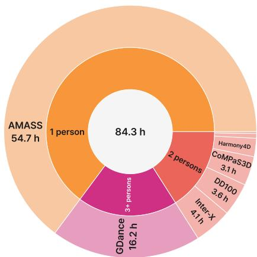

<table><tr><td>Source</td><td>Subjects</td><td>Clips</td><td>Hours</td><td>Mean len. (s)</td></tr><tr><td>AMASS</td><td>1</td><td>8,270</td><td>54.7</td><td>11.9</td></tr><tr><td>Inter-X</td><td>2</td><td>1,189</td><td>4.1</td><td>6.2</td></tr><tr><td>DD100</td><td>2</td><td>780</td><td>3.6</td><td>8.2</td></tr><tr><td>CoMPaS3D</td><td>2</td><td>716</td><td>3.1</td><td>7.9</td></tr><tr><td>Harmony4D</td><td>2</td><td>248</td><td>2.0</td><td>14.4</td></tr><tr><td>CHI3D</td><td>2</td><td>253</td><td>0.5</td><td>3.6</td></tr><tr><td>Hi4D</td><td>2</td><td>94</td><td>0.2</td><td>4.0</td></tr><tr><td>GDance</td><td>2-7</td><td>2,877</td><td>16.2</td><td>10.1</td></tr><tr><td>MotionTwin</td><td>1-7</td><td>14,427</td><td>84.3</td><td>10.5</td></tr></table>

Figure 5: MotionTwin statistics. Left: hours of rendered video by group size (inner ring) and motion source (outer ring). Right: clips and hours per source.

## A ADDITIONAL DETAILS ON MOTIONTWIN DATASET

In this section, we provide additional details on our MotionTwin dataset. An overview of MotionTwin is depicted in Fig. 6.

Data distribution. MotionTwin contains 14,427 motion clips, each rendered twice with different identities, for a total of 84.3 h of rendered video. As shown in Fig. 5, the motions are drawn from eight public human motion corpora: single-person clips from AMASS (Mahmood et al., 2019) (8,270 clips, 54.7 h), two-person clips from Inter-X (Xu et al., 2024a), DD100 (Li et al., 2024), CoMPaS3D (Burkanova et al., 2025), CHI3D (Fieraru et al., 2020), Harmony4D (Khirodkar et al., 2024), and Hi4D (Yin et al., 2023) (3,280 clips, 13.5 h in total), and clips with three to seven dancers from GDance (Le et al., 2023) (2,877 clips, 16.2 h). Multi-person clips make up 42.7% of the clips and 35.2% of the hours in total. Every clip is accompanied by per-subject instance maps, and every multi-person clip by rendered identity-reference images.

Motion preprocessing. All source motions are converted into SMPL-X parameter sequences and standardized to 30 fps. We remove unsuitable motions including static segments, excessive global displacement, and rotation artifacts. For each clip, we retain sub-windows whose horizontal root trajectory remains within 8 m. For multi-person sequences, we preserve interaction geometry by jointly centering subjects and reject clips with severe inter-person mesh penetration.

Rendering pipeline. All videos are rendered with Unreal Engine 5.3 (Epic Games, 2026) using the BEDLAM rendering framework (Black et al., 2023; Tesch et al., 2026). Filtered motion clips are converted from SMPL-X parameters into per-frame vertex animations and rendered with diverse avatar and scene configurations. For single-person clips, cameras use near-frontal views and smoothly track the subject motion. For multi-person clips, a static camera captures the entire group. The two appearance variants of each pair share identical motion, camera trajectory, and temporal length while differing in subject identity, clothing, hairstyle, body shape, and scene appearance. Instance masks are generated by rasterizing the corresponding posed SMPL-X geometry with identical camera parameters. For multi-person clips, identity references are rendered separately in canonical standing poses while preserving the target identities.

Assets. Human appearances are constructed from BEDLAM (Black et al., 2023) and BED-LAM 2.0 (Tesch et al., 2026), including diverse body shapes, garments, hairstyles, and skin appearances. Each pair is rendered with two distinct identity configurations without sharing identity-specific assets. Body-shape variation is introduced by perturbing SMPL-X shape coefficients, producing differences in height and body proportions between paired subjects. Scene environments are sampled from 357 HDRI maps from Poly Haven (PolyHaven, 2022), covering diverse indoor and outdoor environments.

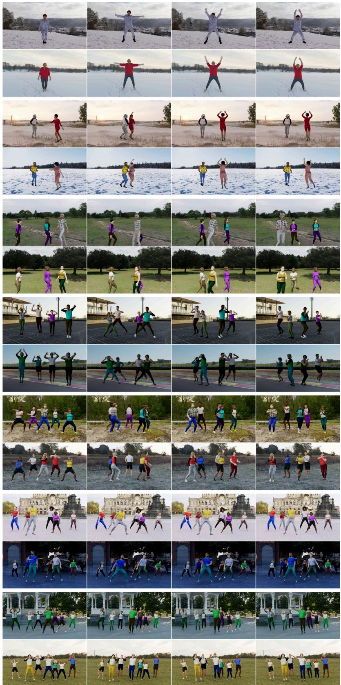  
Figure 6: Overview of MotionTwin. Samples with 1–7 people across diverse scenes.

## B ADDITIONAL DETAILS ON TRAINING WL2P

We update only the self-attention modules of the Wan2.1-I2V-14B backbone in all 40 transformer blocks, including the query, key, value, and output projections. This amounts to 4.20B trainable parameters out of 16.39B (25.6%). For optimization, we train with AdamW (weight decay 0.01) at a constant learning rate of $1 \times 1 0 ^ { - 5 }$ without warmup, gradient clipping at 1.0, one sample per GPU on four NVIDIA B200 GPUs (effective batch size $^ { 4 , }$ no gradient accumulation), bf16 mixed precision, and DeepSpeed ZeRO stage 2. Following the official Wan2.2-Animate-14B configuration, we use a single fixed text prompt for all training samples and at inference. Classifier-free guidance is applied only to the text condition with a scale of 5.0, while the reference image and driving video conditions are shared between the conditional and unconditional branches.

IBS details. Subject labels are assigned on the token grids of the reference image and of every target latent frame (16 pixels per token): a token receives the label of the subject covering the largest part of its $1 6 \times 1 6$ region if that fraction is at least $\gamma = 0 . 7$ , and is left unlabeled otherwise (background, boundaries, occluded areas). IBS is active only for samples in which at least two subjects survive labeling in both the reference and the target. Queries and keys are taken after RoPE from the selfattention modules, and the loss is computed per attention head and averaged over heads and blocks as in Eq. 10. No extra parameters are introduced and inference is unchanged. For efficiency, at most 256 labeled target tokens per subject are sampled as queries in each sample. The keys are all labeled reference-image tokens, and the softmax in Eq. 9 is taken over these keys only. The loss is weighted by $\beta = 0 . 0 5$ and applied only at flow-matching timesteps $\tau \geq 0 . 6$ in Eq. 11.

## C ADDITIONAL DETAILS ON MOTIONTWIN-BENCH

Benchmark construction. MotionTwin-Bench is constructed from held-out clips that are strictly separated from the training set. The benchmark follows the same rendering pipeline and appearance generation process as the training set. For the multi-human motion scenarios, we select challenging interaction windows with large motion, frequent turning, and close inter-person interactions, while removing sequences with severe mesh interpenetration. Per-subject instance maps are generated for both variants to provide ground-truth identity correspondence.

Reference images. For each multi-person benchmark pair, the identity-reference image is rendered using the same camera, HDRI, and lighting configuration as the target video to maintain appearance consistency. Subjects are placed according to their initial ordering in the target window and rendered in canonical standing poses facing the camera. The reference image and its instance map are generated using the same geometry-based procedure as the target videos, providing ground-truth identity correspondence.

Identity assignment metrics. For multi-person windows we evaluate whether each generated subject carries the intended reference identity. Identity Assignment Accuracy (IAA) is the fraction of frames in which all subjects are assigned to their correct reference identity. $\mathrm { I A A } _ { \mathrm { c r o s s } }$ restricts the average to frames in which at least two subject bounding boxes overlap $\mathrm { ( I o U > 0 . 1 ) }$ , i.e., frames with inter-person proximity or occlusion, where identity-motion binding is most challenging.

Assignment procedure. Since the generated motion follows the driving video, the ground-truth per-subject instance maps of the target window locate each subject in every generated frame; the question is only which reference identity appears there. For each reference subject, we compute an appearance signature from the reference image restricted to that subject’s instance region, and for each generated subject region the same signature from the generated frame. The signature is 27-dimensional: the mean CIELAB color (3) and an 8-bin histogram of each RGB channel (24), both normalized. We then find the one-to-one assignment between generated regions and reference subjects that minimizes the total $L _ { 2 }$ signature distance (exhaustive over permutations, $P \leq 4 )$ , and a frame counts as correct only if this assignment is the identity mapping. Because the signatures are computed inside ground-truth regions, the procedure is insensitive to pose and to small misalignments and measures only whether the right appearance was placed on the right trajectory.

Table 4: Quantitative evaluation compared to state-of-the-art methods on single-person animation. MotionTwin-Bench metrics are computed on the 75 single-subject windows, and VBench metrics on the 36 single-subject real-world clips.
<table><tr><td rowspan="2">Method</td><td colspan="4">BindJudge</td><td colspan="2">Vbench</td><td>Vbench++</td></tr><tr><td>PSNR↑</td><td>SSIM↑</td><td>LPIPS↓</td><td>FVD↓</td><td>V-Quality↑</td><td>F-Quality↑</td><td>I2V-Quality↑</td></tr><tr><td>MultiAnimate (Hu et al., 2026b)</td><td>20.126</td><td>0.5377</td><td>0.2283</td><td>317.51</td><td>80.32</td><td>81.64</td><td>85.61</td></tr><tr><td>Wan-Animate 2 (Wang et al., 2026)</td><td>20.926</td><td>0.5846</td><td>0.2447</td><td>216.85</td><td>81.84</td><td>83.11</td><td>86.91</td></tr><tr><td>SCAIL (Yan et al., 2026b)</td><td>18.389</td><td>0.4571</td><td>0.2654</td><td>263.70</td><td>80.97</td><td>82.31</td><td>86.33</td></tr><tr><td>SCAIL-2 (Yan et al., 2026a)</td><td>18.754</td><td>0.4608</td><td>0.2877</td><td>273.18</td><td>82.49</td><td>84.10</td><td>88.91</td></tr><tr><td>Wan2.2-Animate-14B (Cheng et al., 2025)</td><td>17.691</td><td>0.4621</td><td>0.3353</td><td>267.81</td><td>81.25</td><td>82.53</td><td>86.39</td></tr><tr><td>SteadyDancer (Zhang et al., 2025)</td><td>19.738</td><td>0.5035</td><td>0.2830</td><td>233.54</td><td>80.86</td><td>84.31</td><td>94.67</td></tr><tr><td>WeLike2Party (Ours)</td><td>22.328</td><td>0.6316</td><td>0.1903</td><td>147.70</td><td>83.41</td><td>85.09</td><td>90.15</td></tr></table>

## D ADDITIONAL EXPERIMENTS

Single-person evaluation. We evaluate WL2P on the single-person subsets of MotionTwin-Bench and the real-world benchmark to verify that its multi-person design does not compromise singleperson animation. We additionally compare with Wan2.2-Animate-14B (Cheng et al., 2025) and SteadyDancer (Zhang et al., 2025), which are specifically designed for single-person animation. Since subject fidelity and identity binding metrics are formulated for multi-person scenarios, we report only full-frame fidelity metrics.

As shown in Tab. C, WL2P achieves the best reconstruction fidelity and FVD on the single-person subset of MotionTwin-Bench, including comparisons with single-person-only methods. On real-world clips, WL2P achieves the best video and frame quality, while remaining competitive in I2V quality. These results indicate that WL2P retains strong single-person animation performance despite being designed for multi-person settings.

Ablation study on RARC. Fig. 7 compares RARC with the variant that encodes the reference at the same high resolution but keeps native integer RoPE coordinates. Simply enlarging the reference does not recover fine details. The extra tokens fall outside the spatial range seen during pretraining, so the model cannot reliably localize which reference region each target token should attend to. As a result, fingers are merged into a blob (red boxes), even though the overall body motion is transferred. With RARC, the same tokens are mapped into the target coordinate range, and the model renders distinct, correctly separated fingers and preserves face appearance throughout the gesture (green boxes). The second example shows the same behavior as the first one. This confirms that the gain comes from placing the denser reference grid within the pretrained RoPE range rather than from higher reference resolution alone.

## E MORE RELATED WORK

Controllable video diffusion models. Controllable video diffusion models complement text prompts with auxiliary signals that provide fine-grained control over spatial structure, subject motion, appearance, and viewpoint. For instance, structural guidance has been introduced through various modalities such as depth, edge, sketch, and mask sequences (Chen et al., 2023; Wang et al., 2023; Guo et al., 2024), while human-centric animation methods commonly use 2D poses, facial landmarks, or parametric body models as kinematic priors (Chang et al., 2023; Xu et al., 2024b; Hu, 2024; Zhang et al., 2024; Zhu et al., 2024). Reference images and identity embeddings further constrain subject appearance (Jiang et al., 2024; He et al., 2024b; Shin et al., 2025; Tu et al., 2025), whereas explicit camera-pose sequences and Plucker-ray embeddings enable trajectory-level viewpoint control (He¨ et al., 2024a; Zheng et al., 2024; Bai et al., 2025; Shin et al., 2026). More recently, in-context visual conditioning methods directly process tokenized reference or driving videos within diffusion transformers, avoiding the information bottleneck imposed by compact explicit representations (Luo et al., 2025; Yan et al., 2026a; Wang et al., 2026). However, directly incorporating rich visual context does not by itself resolve subject-wise correspondence when multiple identities and motions coexist. In this work, we focus on this challenge in multi-human image animation, where accurate motion transfer requires preserving the association between each subject identity and its corresponding motion throughout generation.

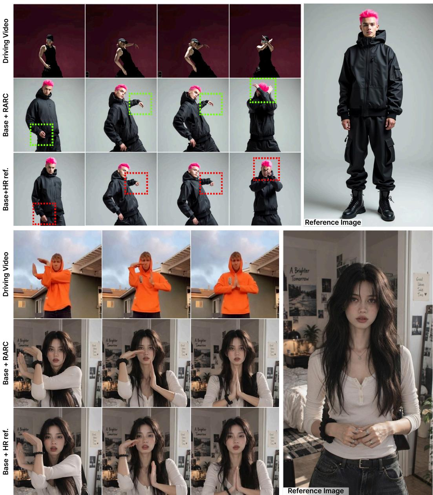  
Figure 7: Qualitative ablation of RARC. Both variants receive the same high-resolution reference image and driving video and differ only in how reference tokens are positioned. With RARC, fingers are rendered distinctly and the face stays intact under fast motion (top, green), whereas assigning native integer RoPE coordinates (Base+HR ref.) yields merged fingers (top, red). The second example (bottom) shows the same trend for hand gestures near the face, where Base+HR ref. blurs the fingers and exhibits identity drift while RARC preserves both.

## F ADDITIONAL QUALITATIVE RESULTS

Ref image  
Driving video  
MultiAnimate  
Wan-Animate 2  
Scail-2  
Ours  
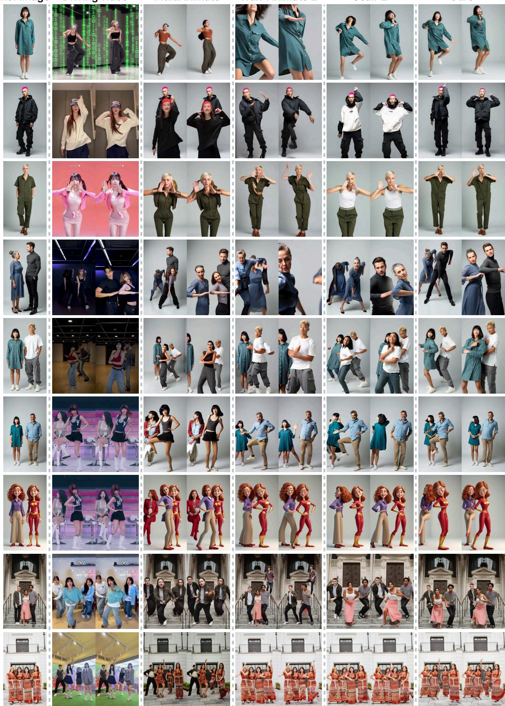  
Figure 8: Additional qualitative results.

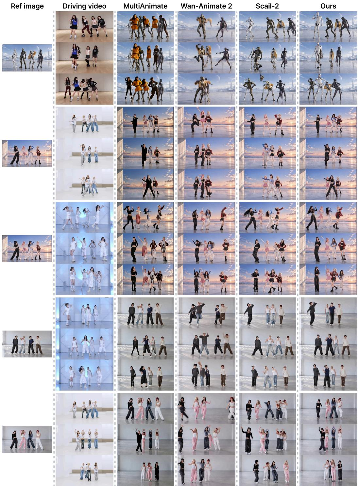  
Figure 9: Additional qualitative results.

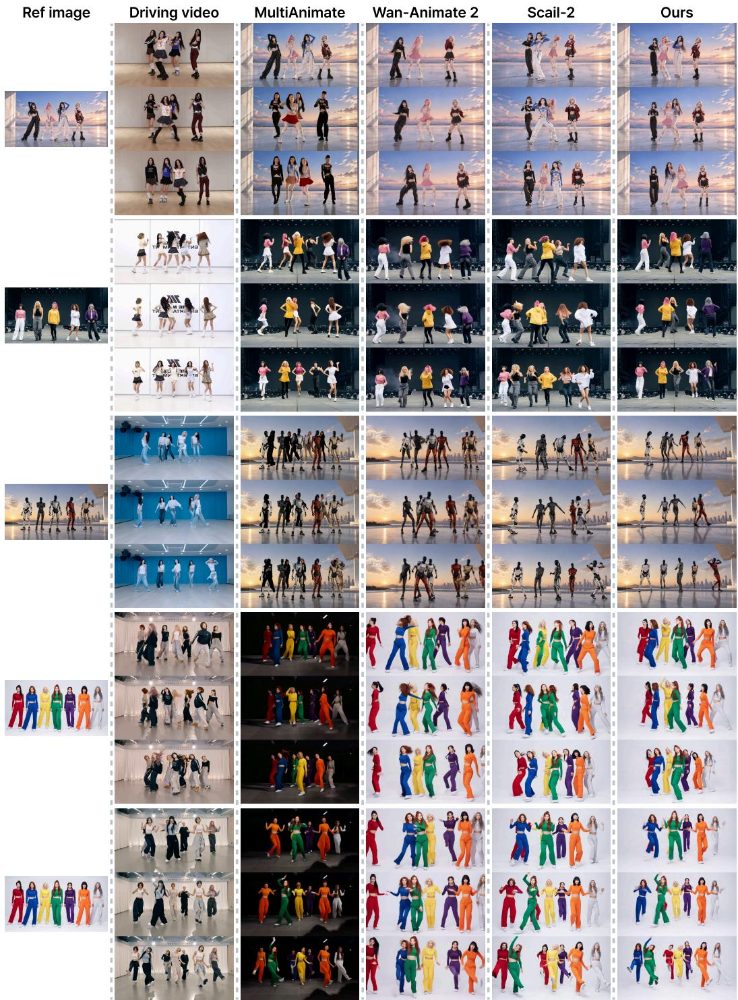  
Figure 10: Additional qualitative results.