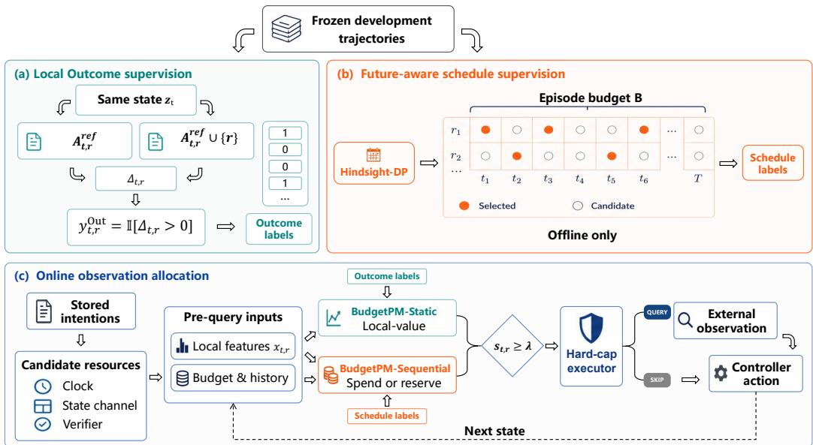
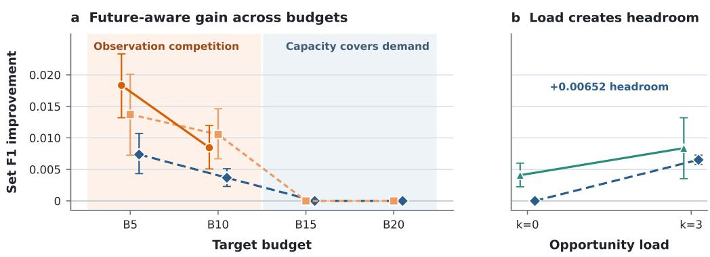
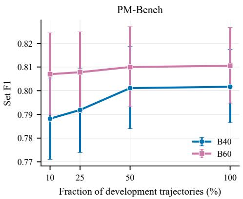
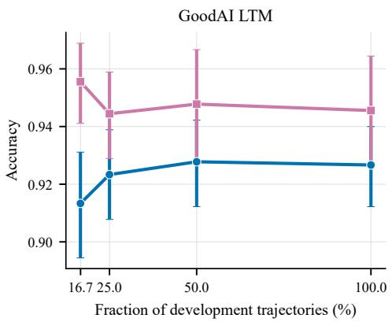

# WHEN SHOULD AGENTS CHECK EXTERNAL STATE? BUDGETING OBSERVATIONS FOR STORED INTENTIONS

Zhengkun Di1, Bin Shi1, Kai Sun1, Yiming Xu1, Bo Dong2

1School of Computer Science and Technology, Xi’an Jiaotong University, Xi’an, China

2School of Distance Education, Xi’an Jiaotong University, Xi’an, China

dizhengkun@stu.xjtu.edu.cn, shibin@xjtu.edu.cn,

sunkai@xjtu.edu.cn, xym0924@stu.xjtu.edu.cn, dong.bo@xjtu.edu.cn

## ABSTRACT

Prospective memory allows an agent to retain an intention tied to a future condition, but the stored intention does not reveal whether that condition currently holds. Checking it may require web access, multi-step tool use, and paid calls. Existing systems decide when intentions require attention, but do not allocate the resulting observations under a shared budget. We introduce the first resource-allocation formulation for the external observations required by stored intentions under a shared episode budget. BudgetPM offers two policy variants that share a hard-budget executor. BudgetPM-Static uses a lightweight Logistic scorer to learn whether a check improves the current decision. BudgetPM-Sequential distills full-episode hindsight schedules into a lightweight policy that decides when to spend or reserve capacity using only pre-query information at deployment. We evaluate BudgetPM against two public memory-agent systems, five matched controls, and four handdesigned monitoring or budget-adaptation rules. Across two benchmarks and three backbones, BudgetPM-Static outperforms adapted Mem0 and PMA workflows. On PM-Bench, its Logistic scorer reaches competitive quality–cost operating points alongside higher-capacity scorers and retains 99.9–100% of unconstrained quality with 42–54% fewer observations. Under severe scarcity and the same hard caps, BudgetPM-Sequential exceeds the strongest tested natural monitoring schedule by 1.92–2.58 Set F1 points. It reaches the same Set F1 and on-time recall with 16–33% fewer observations. Matched attribution, exact-cost analysis, and a fixedbudget load intervention link this gain to competition between present and future opportunities. These results yield a demand–capacity design rule: local gating works when capacity covers demand, while future-aware supervision adds value when observations compete across time.

## 1 INTRODUCTION

Long-running agents often retain instructions whose execution depends on external state. Consider “Release the order when the inspection status changes to passed in the supplier portal.” The agent can remember this instruction, but it must still log in to the portal and inspect its current state to determine whether the condition has been met. A status check may involve web access, authentication, several tool calls, model inference, or paid API access. Repeated checks can therefore incur substantial interaction and computational costs (Kapoor & Nair, 2025; Liu et al., 2025).

As an agent retains more intentions, they create recurring demands for fresh information. Recent work brings prospective memory into agent systems, where agents retain intentions for future action and act when the corresponding conditions are satisfied (Liu & Gabriel, 2026; Wu et al., 2026; Zhang et al., 2026c). These systems use predefined rules or prompted agents to decide when an intention requires attention and when more evidence should be requested (Zhao & Wu, 2026). They do not, however, allocate repeated external checks when those checks compete for limited observation capacity.

Fixed-interval polling, more frequent checks near an expected trigger, and backoff after unchanged observations are natural solutions. They may work well when trigger times are predictable or capacity is ample. When event timing varies, fixed intervals may delay detection. Checks concentrated near an expected trigger may miss early changes or waste calls when the event is delayed. Backoff may postpone detection after a long unchanged period. More fundamentally, each rule relies on a preset cadence, an expected trigger time, or past observations. None directly compares the value of checking now with the value of preserving capacity for future opportunities. This leads to two questions: which observations are useful now, and when should an agent reserve capacityforfuture checks?

We introduce BUDGETPM with two policy variants and a shared hard-budget executor. Static learns whether an observation improves the current decision. Sequential learns from full-episode hindsight schedules how to spend or reserve capacity across time. Full-episode information is used only for offline supervision. At deployment, both policies use the observable pre-query state, and the executor enforces the per-step and episode budgets.

Our experiments evaluate BudgetPM at three levels. Complete-system comparisons span two benchmarks and three backbones, where Static achieves the highest end-to-end task quality. Matched local-selection tests show that its lightweight Logistic scorer reaches competitive quality–cost operating points alongside LambdaMART and a fixed ensemble. Static also preserves 99.9–100% of unconstrained PM-Bench quality with 42–54% fewer observations. Temporal tests compare Sequential with four hand-designed rules and one matched future-blind control. Under the same hard caps, Sequential exceeds the strongest natural schedule by 1.92–2.58 Set F1 points. It uses 16–33% fewer observations to match the schedule’s Set F1 and on-time recall. Budget sweeps and a fixed-budget load intervention link these gains to competition between present and future checks.

Our contributions are:

• Budgeted external-state checks. We formulate how the observations required by stored intentions should share an episode budget.

• Lightweight future-aware allocation. BUDGETPM combines local-value estimation, offline schedule supervision, and hard-budget execution. Sequential distills full-episode schedules into a lightweight deployment policy.

• A demand–capacity boundary. Natural schedules, matched temporal policies, exact-cost analysis, and a fixed-budget intervention show when future-aware allocation adds value beyond local selection.

## 2 RELATED WORK

Memory systems and prospective triggers. Memory-augmented agents preserve experience through reflection, virtual context, structured stores, and learned memory operations (Park et al., 2023; Shinn et al., 2023; Packer et al., 2023; Chhikara et al., 2025; Xu et al., 2026; Yu et al., 2026). Recent systems improve the efficiency of memory construction, retrieval, summarization, and module selection (Zhang et al., 2026b; Liao et al., 2026; Zhang et al., 2026a; Lei et al., 2026). Prospectivememory work instead asks when a stored intention becomes relevant. PMA decides when to surface a reminder (Wu et al., 2026), and TriggerBench tests whether an agent responds to triggering evidence in its context (Zhang et al., 2026c). PM-Bench includes triggers that require active queries to hidden state (Liu & Gabriel, 2026); PIS uses structured rules and a small language model to decide whether such a query is needed (Zhao & Wu, 2026). LongMemEval and MemoryArena broaden long-term memory evaluation (Wu et al., 2024; He et al., 2026), while OSL-MR allocates storage or context across retained memories (Kang et al., 2026). These systems decide when an intention needs attention and what evidence may resolve it. BudgetPM addresses the next allocation problem: how repeated external-state checks should share limited capacity.

Budget-aware external interaction. FrugalGPT, RouteLLM, and WISERouter allocate computation under cost or workload constraints (Chen et al., 2023; Ong et al., 2025; Li et al., 2026). BATS uses explicit tool-call budgets. CostBench evaluates cost-aware multi-turn tool planning, and When2Tool learns when calls are useful (Liu et al., 2025; 2026b; Sun et al., 2026). These works show that external interaction can be limited by cost, workload, or call quota. BudgetPM connects these lines of work by treating the external-state checks required by stored intentions as consumers of a shared call budget.

Sequential observation allocation. State-sensing and value-of-information work asks when state is worth its acquisition cost (Kapoor & Nair, 2025; Krause & Guestrin, 2009). Adaptive submodularity and active feature acquisition formalize sequential information gathering (Golovin & Krause, 2011; Shim et al., 2018). Bandits with knapsacks and constrained MDPs link decisions through consumable resources (Badanidiyuru et al., 2018; Jain et al., 2022). INTENT plans future priced tool use with a learned world model (Liu et al., 2026a). These formulations explain why spending capacity now can reduce the options available later. BudgetPM asks when current-value selection is sufficient and when limited capacity requires allocation across time. It constructs full-episode schedules offline (Rusu et al., 2015) and distills them into a lightweight deployment policy.

## 3 BUDGETPM: ALLOCATING EXTERNAL-STATE CHECKS

BudgetPM receives active intentions from an upstream memory system and decides which externalstate resources to query under the available budget. Figure 1 shows how frozen trajectories provide local Outcome labels for Static (panel a) and hindsight-DP schedule labels for Sequential (panel b). At deployment (panel c), either policy uses only pre-query inputs, and a shared executor enforces the per-step and episode budgets.

  
Figure 1: Overview of BudgetPM. Frozen development trajectories provide cached observation results for constructing (a) local Outcome labels and (b) hindsight-DP schedule labels under an episode budget. At deployment (c), Static or Sequential uses only pre-query inputs; thresholded proposals pass through a shared hard-cap executor that enforces the per-step and episode limits. Future information is used only for offline supervision.

## 3.1 PROBLEM FORMULATION

Consider an episode ξ of T steps. Before step t, the history $h _ { t }$ contains the active intentions and all observations collected so far. These intentions identify queryable external-state resources $\mathcal { R } _ { t }$ such as a clock, calendar, package-status provider, or semantic verifier. Because one resource may serve several intentions, a single query can resolve several triggers. Querying $r \in \mathcal { R }$ t costs a known amount $c ( r ) > 0$

An online policy π uses $h _ { t }$ to choose a query set $S _ { t } ^ { \pi } ( \xi ) \subseteq \mathcal { R } _ { t }$ . Across the episode, these choices produce a trajectory $\tau _ { \xi } ( \pi )$ , whose task quality is measured by $M ( \tau _ { \xi } ( \pi ) )$ . Under the episode-level

hard budget B, the objective is

$$
\begin{array} { r l } { \underset { \pi } { \operatorname* { m a x } } } & { \mathbb { E } _ { \xi } [ M ( \tau _ { \xi } ( \pi ) ) ] } \\ { \mathrm { s . t . } } & { \displaystyle \sum _ { t = 1 } ^ { T } \displaystyle \sum _ { r \in S _ { t } ^ { \pi } ( \xi ) } c ( r ) \leq B \quad \forall \xi , } \end{array}\tag{1}
$$

where the expectation is over episodes and provider or controller randomness. BudgetPM fits two variants from frozen development trajectories: Static uses labels of current-decision improvement, whereas Sequential uses labels from budget-constrained full-episode schedules. Both are lightweight scorers and share the same hard-cap executor.

## 3.2 BUDGETPM-STATIC: LOCAL OUTCOME SUPERVISION

Static asks whether an available external-state check would improve the current decision. Retrieval may associate several intentions with the same resource, so the policy scores resources rather than individual memories.

At each recorded step, a frozen trajectory provides the pre-query controller state $z _ { t }$ and cached outcomes for a candidate set $A _ { t } \subseteq \mathcal R _ { t }$ . For any $A \subseteq A _ { t }$ , we insert its cached evidence into $z _ { t }$ and recompose the action $a _ { t } ( A ; z _ { t } )$ . The step-level metric $M _ { t }$ scores this action, whereas M in Equation 1 scores the episode. For compactness, define

$$
m _ { t } ( A ) : = M _ { t } ( a _ { t } ( A ; z _ { t } ) ) .
$$

For each candidate resource $r \in A _ { t } .$ , let $A _ { t , r } ^ { \mathrm { r e f } } \subseteq A _ { t } \setminus \{ r \}$ be a comparison set that excludes $r .$ The frozen local Outcome effect is the score change caused by adding r to this same set:

$$
\begin{array} { r } { \Delta _ { t , r } = m _ { t } \big ( A _ { t , r } ^ { \mathrm { r e f } } \cup \{ r \} \big ) - m _ { t } \big ( A _ { t , r } ^ { \mathrm { r e f } } \big ) , \qquad y _ { t , r } ^ { \mathrm { O u t } } = \mathbb { I } [ \Delta _ { t , r } > 0 ] . } \end{array}\tag{2}
$$

Here $\mathbb { I } [ \cdot ]$ is the indicator function. Thus, $y _ { t , r } ^ { \mathrm { O u t } } = 1$ when evidence from $r$ improves the current decision under the comparison set. Recomposition keeps $z _ { t }$ fixed and only creates training labels; at deployment, each policy updates its own budget, query history, and task state.

## 3.3 BUDGETPM-SEQUENTIAL: FUTURE-AWARE SCHEDULE SUPERVISION

Local Outcome labels measure current value, but not when the episode budget should be spent. Sequential learns this timing from schedules optimized over the complete frozen episode. Its hindsight-DP teacher uses dynamic programming (Bellman, 1966) to maximize the frozen episode score under budget B.

Episode-level schedule optimization. A schedule $S _ { 1 : T } = ( S _ { 1 } , \ldots , S _ { T } )$ selects $S _ { t } \subseteq A _ { t }$ at each step within the per-step limits. Let $Q _ { \xi } ( S _ { 1 : T } )$ be the frozen episode score produced by all selected evidence. The teacher solves

$$
S _ { 1 : T } ^ { \star } \in \arg \operatorname* { m a x } _ { S _ { t } \subseteq A _ { t } } \ Q _ { \xi } ( S _ { 1 : T } ) \quad \mathrm { s . t . } \quad \sum _ { t = 1 } ^ { T } \sum _ { r \in S _ { t } } c ( r ) \leq B .\tag{3}
$$

Dynamic programming extends partial schedules one step at a time. At each cumulative cost, it removes a state if another state is at least as good on every statistic used by $Q _ { \xi }$ . A fixed rule breaks exact ties. The maximizing schedule defines the binary target $y _ { t , r } ^ { \mathrm { S e q } } = \mathbb { I } [ r \in S _ { t } ^ { \star } ]$ ] for each candidate. Full-episode information is used only to construct these offline targets.

## 3.4 POLICY FITTING AND ONLINE ALLOCATION

Both variants share the same scoring-and-execution pipeline. Static uses local pre-query features; Sequential adds nine observable budget and history features, including remaining budget, episode progress, and recent query usage. We denote either feature vector by $x _ { t , r }$ . After standardization, a class-balanced logistic regression model $f _ { \theta }$ produces the score $s _ { t , r } = f _ { \theta } ( x _ { t , r } )$ (Pedregosa et al., 2011). Static is trained on $y _ { t , r } ^ { \mathrm { { O u t } } }$ , whereas Sequential is trained on $y _ { t , r } ^ { \mathrm { S e q } }$ . Model fitting uses development trajectories only.

At each step, the active intentions determine $\mathcal { R } _ { t }$ . Before any external call, BudgetPM constructs $x _ { t , r }$ from $h _ { t }$ and scores every candidate. Those with $s _ { t , r } \geq \lambda .$ , where $\lambda$ is the operating threshold, form the proposal set $P _ { t }$ . The hard-cap executor selects a feasible subset under the remaining episode budget, per-step cost cap L, and per-step query-count cap $N _ { \mathrm { m a x } } ,$ as shown in Algorithm 1. The selected set is fixed before any provider is called, so neither scoring nor selection uses the current query results.

Algorithm 1 BudgetPM online observation allocation   
Require: Trained scorer $f _ { \theta } ,$ operating threshold λ, episode cap $B ,$   
per-step cost cap $L ,$ per-step query-count cap $N _ { \mathrm { m a x } } ,$ horizon $T$   
1: Initialize remaining budget $B _ { \mathrm { r e m } } \stackrel { \cdot } {  } \dot { B }$ and observable history $h _ { 1 }$   
2: for $t = 1 , \dots , T$ do   
3: Generate distinct candidate resources $\mathcal { R } _ { t }$ from active intentions in $h _ { t }$   
4: Build all pre-query features; score $s _ { t , r } \gets f _ { \theta } ( x _ { t , r } )$   
5: Form proposals $\begin{array} { r } { P _ { t } \gets \{ r \in \mathcal { R } _ { t } : s _ { t , r } \geq \lambda \} } \end{array}$   
6: Sort Pt by decreasing $( s _ { t , r } / c ( r ) , s _ { t , r } )$ , then increasing resource ID   
7: Initialize selected set $\dot { S _ { t } } \gets \emptyset$ and step cost $u \gets 0$   
8: for each r in the sorted proposals do   
9: if $u + c ( r ) \leq$ min $( \hat { B } _ { \mathrm { r e m } } , L )$ and $\left. S _ { t } \right. < N _ { \operatorname* { m a x } }$ x then   
10: $S _ { t } \mathbin { \stackrel { . . . } {  } } S _ { t } \cup \{ r \} ; u \gets u + c ( r )$   
11: end if   
12: end for   
13: Commit the plan and charge its cost: $B _ { \mathrm { r e m } }  B _ { \mathrm { r e m } } - u$   
14: Query only $\hat { S } _ { t }$ and pass the returned evidence to the controller   
15: Execute the controller action and update $h _ { t + 1 }$ , including spend history   
16: end for

The executor skips an unaffordable proposal and continues scanning the list. The query-count cap is $N _ { \mathrm { m a x } } = \infty$ when unset.

Threshold calibration. We select λ from out-of-fold predictions on the development set $D .$ . Under unit costs, let $C _ { D } ( \lambda )$ count queries after per-step filtering and before the episode cap; $C _ { D } ^ { \mathrm { m a x } }$ is the count when all candidates are proposed. For target budget fraction $b ,$ define

$$
K _ { b } = \mathrm { r o u n d } ( b C _ { D } ^ { \mathrm { m a x } } ) .
$$

Let $\Lambda _ { D } ^ { \mathrm { O O F } }$ be the set of distinct out-of-fold scores on D. We choose

$$
\lambda _ { b } = \mathop { \mathrm { a r g m i n } } _ { \lambda \in \Lambda _ { D } ^ { \mathrm { O O F } } } \left| C _ { D } ( \lambda ) - K _ { b } \right| ,\tag{4}
$$

with ties favoring the higher threshold. The threshold controls the proposal rate; the shared executor guarantees the per-step and episode limits. Feature and calibration details are in Appendix A. The matched label control in Section 4 tests the contribution of Outcome supervision.

## 3.5 EXACT-COST STRUCTURAL HEADROOM

Structural headroom asks whether future-aware scheduling can improve the full-episode outcome at the same cost. Current-greedy selects the feasible subset with the highest present-step frozenrecomposition score; let $S _ { 1 : T } ^ { \mathrm { C G } }$ denote its schedule. On the same frozen episode, hindsight DP produces $S _ { 1 : T } ^ { \mathrm { D P } }$ at the exact integer query cost used by current-greedy. Define

$$
\begin{array} { r } { Q _ { \mathrm { C G } } : = Q _ { \xi } ( S _ { 1 : T } ^ { \mathrm { C G } } ) , \qquad Q _ { \mathrm { D P } } : = Q _ { \xi } ( S _ { 1 : T } ^ { \mathrm { D P } } ) . } \end{array}
$$

Their quality difference is the structural headroom

$$
H = Q _ { \mathrm { D P } } - Q _ { \mathrm { C G } } .
$$

A positive H means that a better full-episode allocation exists at the same cost. Both teachers use the same current-step outcomes; only DP compares future opportunities. An additional analysis fixes per-step cost to separate allocation across time from resource choice within a step (Appendix C.3.3). Thus, H diagnoses temporal allocation headroom; learned-policy gains are evaluated separately.

## 4 EXPERIMENTAL SETUP

Evaluation overview. We evaluate BudgetPM at three levels: complete-system comparisons measure end-to-end effectiveness; matched controls isolate local and temporal supervision; exact-cost teachers and a fixed-budget load intervention test when allocation across time can improve quality.

Benchmarks and metrics. PM-Bench (Liu & Gabriel, 2026) provides seven-day streams with visible, temporal, and latent-state prospective-memory cues. We budget clock and named statechannel queries and report episode Set F1, which also serves as $Q _ { \xi }$ in Equation 3. Temporal experiments report on-time recall, the fraction of reference triggers resolved before they become late. GoodAI LTM (Castillo-Bolado et al., 2024) provides prospective-memory and trigger-response tasks. We gate its semantic-verifier calls and report macro accuracy over the two components.

Observation costs and budgets. We count state-provider or semantic-verifier calls as interaction cost. Bq denotes an episode cap set to approximately $q \%$ of the mean number of feasible queries on the development set, rounded to an integer. For PM-Bench, B5/B10/B15/B20/B40/B60/B80 permit 10/21/31/42/84/126/168 queries, based on an all-relevant mean cost of 209.4. GoodAI B20/B40/B60/B80 permit 10/21/31/41 queries, based on an all-semantic mean cost of 51.5. PM-Bench temporal experiments use unit costs and a per-step cap of two queries.

Supervision construction. PM-Bench fixes scenario timing and provider events independently of query decisions, so all policies face the same opportunity sequence. Its Outcome labels use the singleton-versus-empty effect $( A _ { t , r } ^ { \mathrm { r e f } } = \varnothing ) ;$ GoodAI uses the leave-one-out effect $( A _ { t , r } ^ { \mathrm { r e f } } = A _ { t } \setminus \{ r \} )$ . For schedule supervision, the PM-Bench DP retains cumulative (TP, FP) states at each integer cost and removes states dominated in both statistics.

Budget regimes. We use B20–B80 to study local selection on both benchmarks and PM-Bench B5–B20 to locate the onset of temporal competition. Static is calibrated at B20–B80 and reuses its frozen B20 threshold at B5/B10. Myopic and Sequential are calibrated separately for their target caps. Temporal experiments use unit costs to isolate allocation. Heterogeneous-price results appear in Appendix D.2.

Complete-system comparison. The complete-system comparison measures end-to-end task quality under each system’s native workflow. At B60, BudgetPM-Static is compared with Mem0 (Chhikara et al., 2025) and PMA (Wu et al., 2026) across 30 seeds and three backbones: Llama-3-8B, Qwen2.5- 14B, and Qwen3-14B (Grattafiori et al., 2024; Qwen et al., 2025; Yang et al., 2025). Subsequent matched tests share the candidate space, controller, and executor and use Llama-3-8B unless stated otherwise. Full details appear in Appendix B.1.

Local-gating controls. All controls use the same candidate-query space, episode cap, and hard-cap executor. They vary either the selection signal or the scorer. Relevance directly uses PM-Bench retrieval relevance; GoodAI uses the corresponding trigger-text similarity. Random-feasible and unconstrained references appear in Appendix B.4. To test the value of the supervision target, we define the Matched Due label $y _ { t , r } ^ { \mathrm { D u e } } = \mathbb { I } [ r$ is needed to resolve a trigger due at t]. It marks current trigger need, not the observation’s effect on task score. The Outcome-trained Static gate and Matched Due share the same features, Logistic model, development data, calibration, ordering, and executor. Only the supervision label changes. To test whether Outcome supervision requires a more expressive scorer, LambdaMART (Burges, 2010) and a fixed hurdle/pairwise Ensemble replace the Logistic scorer while retaining the same Outcome-supervised workflow.

Future-aware supervision controls. Myopic isolates future-aware supervision. It imitates an offline current-greedy teacher that evaluates current-step outcomes, whereas Sequential imitates hindsight DP, which can also compare future opportunities. Both policies use the same 36 pre-query features, Logistic model, fitting procedure, grouped out-of-fold protocol, threshold grid, ordering rule, and hard-cap executor. They are evaluated on paired runs of the same task traces. Sequential minus Myopic therefore measures the contribution of future-aware supervision. Exact-cost hindsight DP minus current-greedy measures structural headroom.

Natural monitoring baselines. Periodic-Outcome, Deadline-Outcome, and Deadline+Backoff-Outcome share Static’s frozen Outcome scorer and differ only in how they distribute queries over time. Periodic-Outcome uses a uniform cadence. Deadline-Outcome prioritizes clock checks when an unresolved intention enters its visible time window, and Deadline+Backoff-Outcome additionally reduces state-channel polling after unchanged observations. Pacing-LB adjusts Static’s threshold using the remaining budget and horizon; its B5/B10 thresholds are selected on development weeks.

The natural schedules test deployable timing rules, while Myopic isolates the value of future-aware supervision.

Within each temporal test, all policies are evaluated on the same task trace and share the per-step limit, episode cap, and hard-cap executor. The three natural schedules are swept over 20 caps to form Set F1 and on-time recall curves against realized observation cost. Pacing-LB is evaluated at B5/B10. These comparisons ask whether explicit timing rules can match Sequential’s Set F1 and on-time recall with comparable observation use.

Opportunity-load intervention. The value of temporal allocation depends on both demand and capacity. At the B10 PM-Bench operating point, we hold the 21-query cap fixed and vary the number of latent-state trigger opportunities. The k = 0 condition uses the unmodified background; $k = 3$ adds 21 opportunities while the horizon, query prices, task construction, and paired background remain fixed. One Myopic and one Sequential policy are trained across both loads and deployed unchanged from observable pre-query state. We compare structural headroom $H _ { k }$ and learned gain $G _ { k } = Q _ { \mathrm { S e q } , k } - Q _ { \mathrm { M y o } , k }$ across the two loads, where Q denotes mean held-out episode Set F1. Compiler, weighting, and out-of-fold details appear in Appendix C.4.

Data splits. PM-Bench development, system/local analysis, confirmation, severe-scarcity, and boundary studies use distinct seed ranges summarized in Appendix A.1. GoodAI groups complete trajectories for out-of-fold fitting. The controlled-load study trains on 50 paired development weeks and evaluates 240 paired held-out weeks.

Statistical analysis. We report paired 95% bootstrap intervals (Efron & Tibshirani, 1993) with 100,000 resamples unless noted otherwise. Each resampling unit is a complete PM-Bench week/scenario or GoodAI trajectory. Paired load conditions are resampled together by base seed. A prespecified power calculation fixes the controlled-load sample size (Appendix C.4).

## 5 RESULTS

## 5.1 BUDGETPM-STATIC LEADS COMPLETE-SYSTEM COMPARISONS ACROSS BACKBONES

BudgetPM-Static achieves the highest end-to-end task quality in all six backbone–benchmark combi nations (Table 1). The gap to the strongest Mem0/PMA workflow ranges from 0.362 to 0.452 Set F1 on PM-Bench and from 0.433 to 0.920 accuracy on GoodAI. With Qwen3-14B, the BudgetPM workflow reaches 0.885 PM-Bench Set F1 and 0.944 GoodAI accuracy.

Table 1: Complete-workflow task quality averaged over seeds 4000–4029. BudgetPM uses Static at B60; Mem0 and PMA retain their adapted native workflows. Controlled allocation tests follow; full protocol and GoodAI component scores appear in Appendix B.1.
<table><tr><td>Backbone</td><td>System</td><td>PM-Bench Set F1</td><td>GoodAI Macro Acc.</td></tr><tr><td rowspan="3">Llama-3-8B</td><td>Mem0</td><td>0.201</td><td>0.000</td></tr><tr><td>PMA</td><td>0.398</td><td>0.026</td></tr><tr><td>BUDGETPM (Static)</td><td>0.811</td><td>0.946</td></tr><tr><td rowspan="3">Qwen2.5-14B</td><td>Mem0</td><td>0.484</td><td>0.450</td></tr><tr><td>PMA</td><td>0.490</td><td>0.513</td></tr><tr><td>BUDGETPM (Static)</td><td>0.852</td><td>0.946</td></tr><tr><td rowspan="3">Qwen3-14B</td><td>Mem0</td><td>0.433</td><td>0.500</td></tr><tr><td>PMA</td><td>0.432</td><td>0.500</td></tr><tr><td>BUDGETPM (Static)</td><td>0.885</td><td>0.944</td></tr></table>

The gate trained with Llama transfers to both Qwen backbones without retraining or recalibration (Appendix B.2).

## 5.2 A LIGHTWEIGHT OUTCOME GATE REACHES THE LEARNED QUALITY–COST FRONTIER

Table 2 asks whether Outcome gating requires a high-capacity scorer. Static uses a single Logistic model. LambdaMART and Ensemble use the same Outcome-supervised workflow with more expressive scorers. At B40, Static achieves 0.814 F1 with 3.53 fewer queries than LambdaMART and 5.56 fewer than Ensemble. At B60/B80, its F1 remains within 0.002 of LambdaMART. Static also retains 99.9% of unconstrained All relevant F1 at B60 with 54.1% fewer queries and preserves the full 0.820 F1 at B80 with 41.9% fewer queries.

Table 2: Matched PM-Bench local-selection controls on 30 paired weeks (seeds 6000–6029). Row names identify the selection signal and scorer. Each budget reports mean Set F1 (↑) and realized query cost (↓); unconstrained All relevant achieves 0.820 F1 at cost 195.03.
<table><tr><td></td><td colspan="2">B20</td><td colspan="2">B40</td><td colspan="2">B60</td><td colspan="2">B80</td></tr><tr><td>Selection / scorer</td><td>F1</td><td>Cost</td><td>F1</td><td>Cost</td><td>F1</td><td>Cost</td><td>F1</td><td>Cost</td></tr><tr><td>Relevance heuristic</td><td>0.592</td><td>12.33</td><td>0.592</td><td>12.47</td><td>0.785</td><td>114.30</td><td>0.806</td><td>138.37</td></tr><tr><td>Matched Due + Logistic</td><td>0.773</td><td>34.37</td><td>0.808</td><td>60.97</td><td>0.816</td><td>89.27</td><td>0.819</td><td>115.27</td></tr><tr><td>Outcome + LambdaMART</td><td>0.782</td><td>35.23</td><td>0.812</td><td>64.90</td><td>0.821</td><td>88.83</td><td>0.820</td><td>109.73</td></tr><tr><td>Outcome + Ensemble</td><td>0.761</td><td>31.67</td><td>0.809</td><td>66.93</td><td>0.819</td><td>88.73</td><td>0.820</td><td>115.07</td></tr><tr><td>Outcome + Logistic (Static)</td><td>0.771</td><td>31.17</td><td>0.814</td><td>61.37</td><td>0.819</td><td>89.47</td><td>0.820</td><td>113.23</td></tr></table>

The matched-cost analysis reaches the same conclusion (Appendix B.3). LambdaMART leads Static by 0.0055 F1 at a mean cost of 40 queries, while Static leads by 0.0037 at 60. Their gaps narrow to 0.0021 and 0.0005 at 90 and 100 queries. Static and LambdaMART therefore lead at different operating points. The lightweight Logistic gate captures the main Outcome-gating trade-off; additional model capacity changes selected points rather than producing a consistent gain. Matched Due supervision and the capacity controls separately identify the roles of the supervision target and scorer (Appendices B.5 and D.2).

Static extends the quality–cost advantage to semantic verification. On GoodAI, it reaches 0.946/0.951 accuracy at B60/B80, gains of 1.33/1.67 percentage points over the task-specific Due gate while reducing mean query use by 0.24/0.44 (Table 9). Full budget and matched-supervision results appear in Appendices B.6 and B.5.

These results show that local-value gating preserves task quality across the standard-budget range.   
We next test tighter budgets, where useful checks begin to compete across time.

## 5.3 SEQUENTIAL IMPROVES OBSERVATION EFFICIENCY OVER NATURAL MONITORING

Under the same hard caps, Sequential exceeds Deadline-Outcome, the strongest of the three natural schedules, by 1.92–2.58 Set F1 points at B5/B10 on both tests. Its on-time recall gain is 2.28–2.94 points. Its mean F1 is also higher than Pacing-LB in all four comparisons.

Among the tested operating points, Deadline-Outcome requires 1.50× as many observations as Sequential at B5 and 1.19–1.20× at B10 to match its mean Set F1 and on-time recall. Periodic requires 3.49–4.70× as many observations (Table 3). Sequential therefore provides the same observed service with 33% fewer observations at B5 and 16–17% fewer at B10.

Table 3: Observation cost required by each natural schedule to match Sequential’s Set F1 and on-time recall, relative to Sequential (1.00×; lower is better).
<table><tr><td>Test</td><td>Budget</td><td>Deadline</td><td>Deadline+Backoff</td><td>Periodic</td></tr><tr><td rowspan="2">Severe</td><td>B5</td><td>1.50×</td><td>1.50×</td><td>4.70×</td></tr><tr><td>B10</td><td>1.20×</td><td>1.40×</td><td>4.08×</td></tr><tr><td rowspan="2">Boundary</td><td>B5</td><td>1.50×</td><td>1.50×</td><td>4.19×</td></tr><tr><td>B10</td><td>1.19×</td><td>1.39×</td><td>3.49×</td></tr></table>

## 5.4 FUTURE-AWARE SUPERVISION EXPLAINS THE LOW-BUDGET GAIN

Sequential improves over Myopic on both disjoint tests. The two policies differ only in supervision, so this advantage measures the value of learning from future-aware schedules (Figure 2a).

On boundary weeks 9000–9029, Static exhausts both the B5 and B10 budgets in every week. After the budget is exhausted, 544 and 277 positive opportunities remain, respectively. These opportunities

  
Figure 2: Future-aware gains follow the demand–capacity boundary. a: Sequential-minus-Myopic Set F1 gains on two disjoint tests and exact-cost structural headroom are positive at B5/B10, where observations compete, and zero at B15/B20, where capacity covers demand. b: At fixed B10, the controlled-load test shows that increasing opportunity load creates 0.00652 exact-cost headroom while Sequential remains above Myopic. Error bars show paired-bootstrap 95% CIs.

are spread nearly uniformly across episode quarters. This pattern explains why reserving capacity can create exact-cost headroom and learned gains.

## 5.5 OPPORTUNITY COMPETITION DETERMINES THE SCARCITY BOUNDARY

At the same cost, hindsight DP exceeds current-greedy by +0.00737 F1 at B5 and +0.00367 at B10. Requiring the same number of queries at every step removes the gap, attributing it to allocation across time (Appendix C.3.3). At B15/B20, the two teachers agree on development data, so the deployed policies are identical. Held-out exact-cost analysis also finds zero headroom (Figure 2a).

At fixed B10, increasing opportunity load from k = 0 to k = 3 raises exact-cost structural headroom from 0 to +0.00652 F1. Under the same cap, the pooled Sequential policy gains +0.00407 and +0.00836 over Myopic at the two loads. The learned policies have their own realized costs (Figure 2b).

Together, the budget sweep and load intervention show that demand relative to capacity—not the nominal budget alone—sets the boundary. Structural headroom and Sequential’s learned gain follow the same transition across budgets. At a fixed budget, higher opportunity load creates new headroom, and the learned gain moves in the same direction. The learning target should therefore match the regime: local value when capacity covers useful checks, and temporal allocation when present and future opportunities compete.

## 6 DISCUSSION AND CONCLUSION

BudgetPM treats the external-state checks required by stored intentions as a resource-allocation problem. Static estimates current observation value; Sequential learns how to distribute checks across an episode from future-aware offline schedules. Both deploy as lightweight pre-query policies under a shared hard-budget executor.

Across two benchmarks and three backbones, Static leads adapted Mem0/PMA workflows. On PM-Bench, its lightweight Logistic scorer provides competitive quality–cost operating points alongside LambdaMART and preserves 99.9–100% of unconstrained quality with 42–54% fewer observations. Under severe scarcity and the same hard caps, Sequential exceeds the strongest natural schedule by 1.92–2.58 Set F1 points. That schedule needs 1.19–1.50× as many observations to match Sequential’s Set F1 and on-time recall. Two disjoint matched tests also confirm Sequential’s advantage over Myopic.

The budget sweep and load intervention reveal a demand–capacity boundary: local-value learning suffices when capacity covers useful checks, while future-aware allocation adds value when present and future checks compete. More broadly, stored intentions create future demand for external evidence. BudgetPM establishes this memory–observation interface and shows why agent memory systems should jointly manage stored intentions and the observations needed to act on them.

## REFERENCES

Ashwinkumar Badanidiyuru, Robert Kleinberg, and Aleksandrs Slivkins. Bandits with knapsacks. Journal ofthe ACM (JACM), 65(3):1–55, 2018.

Richard Bellman. Dynamic programming. science, 153(3731):34–37, 1966.

Christopher JC Burges. From ranknet to lambdarank to lambdamart: An overview. Learning, 11 (23-581):81, 2010.

David Castillo-Bolado, Joseph Davidson, Finlay Gray, and Marek Rosa. Beyond prompts: Dynamic conversational benchmarking of large language models. Advances in Neural Information Processing Systems, 37:42528–42565, 2024.

Lingjiao Chen, Matei Zaharia, and James Zou. Frugalgpt: How to use large language models while reducing cost and improving performance. arXiv preprint arXiv:2305.05176, 2023.

Prateek Chhikara, Dev Khant, Saket Aryan, Taranjeet Singh, and Deshraj Yadav. Mem0: Building production-ready ai agents with scalable long-term memory. arXiv preprint arXiv:2504.19413, 2025.

Bradley Efron and Robert J. Tibshirani. An Introduction to the Bootstrap. Chapman and Hall/CRC, 1993.

Daniel Golovin and Andreas Krause. Adaptive submodularity: Theory and applications in active learning and stochastic optimization. Journal of Artificial Intelligence Research, 42:427–486, 2011.

Aaron Grattafiori, Abhimanyu Dubey, Abhinav Jauhri, Abhinav Pandey, Abhishek Kadian, Ahmad Al-Dahle, Aiesha Letman, Akhil Mathur, Alan Schelten, Alex Vaughan, et al. The llama 3 herd of models. arXiv preprint arXiv:2407.21783, 2024.

Charles R Harris, K Jarrod Millman, Stéfan J Van Der Walt, Ralf Gommers, Pauli Virtanen, David Cournapeau, Eric Wieser, Julian Taylor, Sebastian Berg, Nathaniel J Smith, et al. Array programming with numpy. nature, 585(7825):357–362, 2020.

Zexue He, Yu Wang, Churan Zhi, Yuanzhe Hu, Tzu-Ping Chen, Lang Yin, Ze Chen, Tong Arthur Wu, Siru Ouyang, Zihan Wang, et al. Memoryarena: Benchmarking agent memory in interdependent multi-session agentic tasks. arXiv preprint arXiv:2602.16313, 2026.

Arushi Jain, Sharan Vaswani, Reza Babanezhad, Csaba Szepesvari, and Doina Precup. Towards painless policy optimization for constrained mdps. In Uncertainty in Artificial Intelligence, pp. 895–905. PMLR, 2022.

Qingcan Kang, Liu Mingyang, Shixiong Kai, Kaichao Liang, Tao Zhong, and Mingxuan Yuan. Learning what to remember: Observability-safe memory retention via constrained optimization for long-horizon language agents. arXiv preprint arXiv:2606.10616, 2026.

Vansh Kapoor and Jayakrishnan Nair. Mdps with a state sensing cost. arXiv preprint arXiv:2505.03280, 2025.

Andreas Krause and Carlos Guestrin. Optimal value of information in graphical models. Journal of Artificial Intelligence Research, 35:557–591, 2009.

Songxin Lei, Kun Ouyang, Weilin Ruan, Yuqian Wu, Zhijiang Guo, Yushi Sun, and Fugee Tsung. Memorycpt: An end-to-end agent memory framework for cost-performance trade-off. arXiv preprint arXiv:2608.04843, 2026.

Yifei Li, Zihui Gao, and Laks VS Lakshmanan. Wiserouter: Llm routing with workload budget constraint. arXiv preprint arXiv:2607.23765, 2026.

Yuxin Liao, Le Wu, Min Hou, Hao Liu, Han Wu, and Zishu Wang. Leanmem: Simple and efficient long-term memory for llm agents. arXiv preprint arXiv:2608.03463, 2026.

Genglin Liu and Saadia Gabriel. Pm-bench: Evaluating prospective memory of llm agents. In Third Conference on Language Modeling, 2026.

Hanbing Liu, Chunhao Tian, Nan An, Ziyuan Wang, Pinyan Lu, Changyuan Yu, and Qi Qi. Budgetconstrained agentic large language models: Intention-based planning for costly tool use. arXiv preprint arXiv:2602.11541, 2026a.

Jiayu Liu, Cheng Qian, Zhaochen Su, Qing Zong, Shijue Huang, Bingxiang He, and Yi R Fung. Costbench: Evaluating multi-turn cost-optimal planning and adaptation in dynamic environments for llm tool-use agents. In Proceedings of the 64th Annual Meeting of the Association for Computational Linguistics (Volume 1: Long Papers), pp. 12826–12858, 2026b.

Tengxiao Liu, Zifeng Wang, Jin Miao, I Hsu, Jun Yan, Jiefeng Chen, Rujun Han, Fangyuan Xu, Yanfei Chen, Ke Jiang, et al. Budget-aware tool-use enables effective agent scaling. arXiv preprint arXiv:2511.17006, 2025.

Isaac Ong, Amjad Almahairi, Vincent Wu, Wei-Lin Chiang, Tianhao Wu, Joseph E Gonzalez, Mohammed Kadous, and Ion Stoica. Routellm: Learning to route llms from preference data. In International Conference on Learning Representations, volume 2025, pp. 34433–34448, 2025.

Charles Packer, Sarah Wooders, Kevin Lin, Vivian Fang, Shishir G Patil, Ion Stoica, and Joseph E Gonzalez. Memgpt: Towards llms as operating systems. arXiv preprint arXiv:2310.08560, 2023.

Joon Sung Park, Joseph O’Brien, Carrie Jun Cai, Meredith Ringel Morris, Percy Liang, and Michael S Bernstein. Generative agents: Interactive simulacra of human behavior. In Proceedings ofthe 36th annual acm symposium on user interface software and technology, pp. 1–22, 2023.

Fabian Pedregosa, Gaël Varoquaux, Alexandre Gramfort, Vincent Michel, Bertrand Thirion, Olivier Grisel, Mathieu Blondel, Peter Prettenhofer, Ron Weiss, Vincent Dubourg, et al. Scikit-learn: Machine learning in python. the Journal of machine Learning research, 12:2825–2830, 2011.

Qwen, An Yang, Baosong Yang, Beichen Zhang, Binyuan Hui, et al. Qwen2.5 Technical Report. arXiv preprint arXiv:2412.15115, 2025. URL https://arxiv.org/abs/2412.15115.

Andrei A Rusu, Sergio Gomez Colmenarejo, Caglar Gulcehre, Guillaume Desjardins, James Kirkpatrick, Razvan Pascanu, Volodymyr Mnih, Koray Kavukcuoglu, and Raia Hadsell. Policy distillation. arXiv preprint arXiv:1511.06295, 2015.

Hajin Shim, Sung Ju Hwang, and Eunho Yang. Joint active feature acquisition and classification with variable-size set encoding. Advances in neural information processing systems, 31, 2018.

Noah Shinn, Federico Cassano, Ashwin Gopinath, Karthik Narasimhan, and Shunyu Yao. Reflexion: Language agents with verbal reinforcement learning. Advances in neural information processing systems, 36:8634–8652, 2023.

Chung-En Sun, Linbo Liu, Ge Yan, Zimo Wang, and Tsui-Wei Weng. Llm agents already know when to call tools–even without reasoning. arXiv preprint arXiv:2605.09252, 2026.

Di Wu, Hongwei Wang, Wenhao Yu, Yuwei Zhang, Kai-Wei Chang, and Dong Yu. Longmemeval: Benchmarking chat assistants on long-term interactive memory. arXiv preprint arXiv:2410.10813, 2024.

Yifan Wu, Lizhu Zhang, Yuhang Zhou, Mingyi Wang, Bo Peng, Serena Li, Xiangjun Fan, and Zhuokai Zhao. Remember when it matters: Proactive memory agent for long-horizon agents. arXiv preprint arXiv:2607.08716, 2026.

Wujiang Xu, Zujie Liang, Kai Mei, Hang Gao, Juntao Tan, and Yongfeng Zhang. A-mem: Agentic memory for llm agents. Advances in Neural Information Processing Systems, 38:17577–17604, 2026.

An Yang, Anfeng Li, Baosong Yang, Beichen Zhang, Binyuan Hui, Bo Zheng, Bowen Yu, Chang Gao, Chengen Huang, Chenxu Lv, et al. Qwen3 technical report. arXiv preprint arXiv:2505.09388, 2025.

Yi Yu, Liuyi Yao, Yuexiang Xie, Qingquan Tan, Jiaqi Feng, Yaliang Li, and Libing Wu. Agentic memory: Learning unified long-term and short-term memory management for large language model agents. In Proceedings of the 64th Annual Meeting of the Association for Computational Linguistics (Volume 1: Long Papers), pp. 21457–21483, 2026.

Haozhen Zhang, Haodong Yue, Tao Feng, Quanyu Long, Jianzhu Bao, Bowen Jin, Weizhi Zhang, Xiao Li, Jiaxuan You, Chengwei Qin, et al. Learning query-aware budget-tier routing for runtime agent memory. arXiv preprint arXiv:2602.06025, 2026a.

Jiaquan Zhang, Chaoning Zhang, Shuxu Chen, Zhenzhen Huang, Pengcheng Zheng, Zhicheng Wang, Ping Guo, Fan Mo, Sung-Ho Bae, Jie Zou, et al. Lightweight llm agent memory with small language models. In Proceedings of the 64th Annual Meeting of the Association for Computational Linguistics (Volume 1: Long Papers), pp. 12914–12929, 2026b.

Tianhua Zhang, Xinjiang Wang, Qianxi Zhang, Qi Chen, Kun Li, Yaoqi Chen, Dingdong Wang, Helen Meng, and Yan Lu. Triggerbench: Investigating prospective memory for large language models. arXiv preprint arXiv:2606.23459, 2026c.

Jinqing Zhao and Chengcan Wu. Making prospective memory slm-shaped: Typed intention stores for small-model agents. arXiv preprint arXiv:2609.01272, 2026.

## A IMPLEMENTATION AND DATA CONSTRUCTION

This appendix specifies the data and learning procedures. Appendix B follows the system and gating studies; Appendix C reports the Sequential and scarcity studies; Appendix D presents robustness and design evidence.

## A.1 DATA SPLITS AND EVALUATION ROLES

Table 4 collects the PM-Bench splits used in this paper. The standard-budget studies use the released V9 generator and its native variation in horizon and task count. Controlled-load pairs use the frozen paired generator described in Appendix C.4. OOF folds keep each complete week/scenario, or paired base seed, intact.

Table 4: PM-Bench split roles. A pair contains one k = 0 and one $k = 3$ week.
<table><tr><td>Role</td><td>Seed range</td><td>Size</td></tr><tr><td>Static and standard-budget development</td><td>2000-2019</td><td>20 weeks</td></tr><tr><td>System comparison and Static analysis</td><td>4000-4029</td><td>30 weeks</td></tr><tr><td>Static confirmation</td><td>6000-6029</td><td>30 weeks</td></tr><tr><td>Severe-scarcity test</td><td>8000-8029</td><td>30 weeks</td></tr><tr><td>Boundary confirmation</td><td>9000-9029</td><td>30 weeks</td></tr><tr><td>Controlled-load development</td><td>20000-20049</td><td>50 pairs</td></tr><tr><td>Controlled-load final test</td><td>21000-21239</td><td>240 pairs</td></tr></table>

Static confirmation and the matched-cost frontier use weeks 6000–6029. The frontier evaluates additional operating points of the same frozen policies. Teacher headroom and deployed-policy results use the source rollouts specified for each analysis. The supplement’s pmbench\_split\_audit package records the 50 development/analysis week hashes and original manifests; its verifier checks distinct content and zero overlap. The adjacent confirmation package records weeks 6000–6029.

The PM-Bench BudgetPM pipeline retains the benchmark’s state providers, action space, and Set F1 scorer. The LLM receives visible natural-language headers, updates, step text, and public channel names. It emits structured create/update/cancel operations, followed by deterministic verification and menu matching. The native system-baseline adapters are specified in Appendix B.1. GoodAI uses 12 development trajectories and evaluates seeds 4000–4029.

## A.2 FEATURES, TRAINING, AND CALIBRATION

PM-Bench uses 27 pre-query features. Calendar and timing features encode sinusoidal time, weekday, urgency, and the nearest signed and absolute time distance. Resource and candidate features include resource cost, clock identity, candidate counts, sum/max retrieval relevance, and channel resolvability. The remaining features summarize legacy and calibrated utility, priority and miss cost, unknown conditions, and trigger-type fractions. GoodAI adds seven features: semantic-resource identity, semantic-trigger fraction, token and fuzzy trigger similarity, mean memory age, repeat fraction, and active-memory count. Wall-clock calendar features are neutralized for semantic resources because runner time is not task evidence.

The nine temporal features for Myopic and Sequential are computed before each decision. At one-indexed step t of horizon T, with cap B, remaining budget $R _ { t }$ , and target fraction $b ,$ the first six features are b; $R _ { t } / B ; ~ ( t - 1 ) / \stackrel { \cdot } { \operatorname* { m a x } } ( 1 , T - 1 ) ; ~ \stackrel { \sim } ( T - \stackrel { \sim } t + 1 ) / T ; ~ R _ { t } \stackrel { \sim } ( T - t + 1 )$ ; and $( B - R _ { t } ) / B - ( t - 1 ) / \operatorname* { m a x } ( 1 , T - 1 )$ . The final three are query counts over the previous five and ten steps divided by 10 and 20, respectively, and the previous step’s query count divided by two. Empty spend histories contribute zero. The last three normalizers reflect PM-Bench’s two-query per-step cap.

Static fitting and calibration. Static uses standardized Logistic regression (Pedregosa et al., 2011) with inverse regularization strength $C = 1$ , L2 regularization, lbfgs, balanced class weights, max\_iter=5000, and tolerance $1 0 ^ { - 4 }$ The preserved environment is Python 3.10.19, scikitlearn 1.7.2, and NumPy 1.24.4 (Harris et al., 2020). Cross-fitting groups complete PM-Bench weeks/scenarios into five folds (20 development weeks), and complete GoodAI trajectories into four folds (12 development trajectories). Equation 4 selects Static thresholds from OOF scores to match the target query count. The sigmoid output is a positive-label score, not a calibrated posterior probability.

Table 5: Frozen Static thresholds selected on development data.
<table><tr><td>Benchmark</td><td>Labels</td><td>B20</td><td>B40</td><td>B60</td><td>B80</td></tr><tr><td>PM-Bench</td><td>Outcome</td><td>0.51608</td><td>0.33971</td><td>0.12289</td><td>0.00283</td></tr><tr><td rowspan="3">GoodAI</td><td>Due</td><td>0.62312</td><td>0.32715</td><td>0.15360</td><td>0.03700</td></tr><tr><td>Outcome</td><td>0.78747</td><td>0.28710</td><td>0.08381</td><td>0.02749</td></tr><tr><td>Due</td><td>0.80578</td><td>0.29739</td><td>0.08343</td><td>0.02729</td></tr></table>

For the severe-budget Static references, B5 and B10 use the B20 threshold clamp. Intermediate fractions use linear threshold interpolation.

Temporal-policy fitting under severe scarcity. Myopic and Sequential use the same standardized Logistic family with $C = 1 , 1 \mathrm { b } \pounds _ { \mathfrak { g s } }$ , balanced class weights, and max\_iter=4000. Their thresholds are selected from $0 . 0 5 , 0 . 0 7 5 , \ldots , 0 . 9 5$ to maximize mean complete-week OOF Set F1. Ties favor lower realized cost and then the higher threshold. This quality-based selection differs from Static’s target-count calibration.

Pooled fitting across opportunity loads. Automatic class weighting is disabled. Within each teacher dataset, let $n _ { k , y }$ count rows with condition $k \in \{ 0 , 3 \}$ and teacher membership label $y \in \{ 0 , 1 \}$ . Each row receives raw weight $1 / ( 4 n _ { k , y } )$ , rescaled so the mean row weight is one. Thus the four condition–label cells have equal total weight. Standardization uses the same row weights. Paired load variants remain in the same OOF fold. One threshold per teacher is selected from the same grid by equal-weight mean complete-week OOF F1 across the two loads. The selected Myopic/Sequential thresholds are 0.775/0.725 and are shared across $k = 0$ and $k = 3$

Executor settings and pre-query features. Every PM-Bench method uses the same per-step cap of two queries. We selected this value on the released reference-week development split and kept it fixed for all multi-week comparisons. Unit-cost resources are ordered by score. The general executor uses the heuristic score/cost order.

All gate features are constructed before any state provider is invoked. Priority, miss cost, confidence, actions, and trigger structure are internal memory fields emitted by the LLM compiler from visible instructions and updates; they are not copied from scenario task records or the scorer. Candidate relevance uses these stored fields and the current visible observation. Urgency and time distance are deterministic functions of the stored trigger and current timestamp. Channel resolvability, unknowncondition counts, and trigger-type fractions inspect only the stored trigger graph and public channel schema. “Legacy” and “calibrated” utility are deterministic combinations of relevance, compilerprovided risk fields, urgency, and resolvability. The engine calls a selected channel provider only after the feature rows have been returned and the gate has committed its plan. Consequently, none of the 27 features contains the current query result, a future observation, the due set, or the local-effect label.

The timestamp is visible step metadata used to form pre-query calendar and urgency features. It helps the allocator decide when to query. Selecting the clock resource adds its result to the controller evidence and consumes budget.

The upstream PM-Bench state-channel actionability gate is fixed at 0.005 across all matched traces. It defines the compiler-side candidate interface and is distinct from BudgetPM’s budget-specific threshold. The semantic-verifier pipeline analogously uses a fixed 0.05 gate.

## A.3 OUTCOME-LABEL CONSTRUCTION BY FROZEN REPLAY

PM-Bench contains 4,332 candidate-resource rows over 20 development weeks/scenarios; GoodAI contains 670 rows over 12 development trajectories. PM-Bench’s collection scheduler snapshots every relevant provider without committing state and enumerates every affordable subset. Its Outcome target uses the singleton-versus-empty comparison in Equation 2. GoodAI collects every candidate semantic query and uses the leave-one-out deletion comparison in the same equation. All provider/verifier acquisition occurs in the source rollout. Subsequent label enumeration, teacher construction, and DP reuse cached outcomes and deterministic recomposition, with no additional LLM calls. The resulting scorers and thresholds are fitted once and reused across deployment episodes.

Scenario steps and external channel contents are fixed by the generated seed. Observation choices update query history and remaining budget, while executed actions update task- and memorycompletion state. Outcome effects are computed under deterministic frozen recomposition, with the stored compiler/base response, provider/verifier results, candidate set, and benchmark scorer held fixed. For structural diagnostics, DP operates on the fixed full-subset source trajectory and opportunity sequence. Myopic and Sequential deployment runs instead advance their own online budget and history states.

## B SYSTEM COMPARISONS AND LOCAL OBSERVATION GATING

## B.1 COMPLETE-SYSTEM BASELINE PROTOCOL

The system-level comparison in Table 1 uses the same 30 held-out seeds (4000–4029) for every backbone–system pair. We average PM-Bench Set F1 and GoodAI macro accuracy over seeds. The prospective-memory and trigger-response components are also reported separately. Mem0 and Proactive Memory Agent provide public end-to-end memory-agent baselines; matched BudgetPM controls provide mechanism-level comparisons.

Comparison scope and execution settings. The Mem0/PMA adapters supply memory context to the benchmark agent, which selects actions through the official PM-Bench interface. These runs retain the benchmark tool-request limits and have no BudgetPM episode-level observation cap or learned observation gate. BudgetPM uses its Static policy with the B60 threshold and hard-cap executor. Thus the system comparison evaluates complete workflows, while the shared-controller comparisons in Sections 5.2 and 5.4 test gating and future-aware supervision, respectively.

Mem0 uses its memory extraction and retrieval pipeline; PMA uses its proactive memory pipeline. The Llama-3-8B adapters use a fixed context-compaction rule to fit the 8192-token window and a compact, schema-compatible Mem0 extraction prompt. The frozen rule preserves system instructions, task anchors, and recent turns, then shortens injected memory context when necessary. PM-Bench action completions are capped at 768 tokens. These implementation settings are part of the evaluated system adapters.

Table 6: Complete Mem0 and PMA quality matrix on seeds 4000–4029. The GoodAI column reports macro accuracy with prospective-memory / trigger-response component accuracy in parentheses.
<table><tr><td>Backbone</td><td>System</td><td>PM-Bench Set F1</td><td>GoodAI Macro Acc. (Pros. / Trigger)</td></tr><tr><td rowspan="2">Llama-3-8B</td><td>Mem0</td><td>0.201</td><td>0.000 (0.000/0.000)</td></tr><tr><td>PMA</td><td>0.398</td><td>0.026 (0.013/0.038)</td></tr><tr><td rowspan="2">Qwen2.5-14B</td><td>Mem0</td><td>0.484</td><td>0.450 (0.013/0.887)</td></tr><tr><td>PMA</td><td>0.490</td><td>0.513 (0.027/1.000)</td></tr><tr><td rowspan="2">Qwen3-14B</td><td>Mem0</td><td>0.433</td><td>0.500 (0.000/1.000)</td></tr><tr><td>PMA</td><td>0.432</td><td>0.500 (0.013/0.987)</td></tr></table>

## B.2 BACKBONE TRANSFER WITHOUT RETRAINING

The transfer evaluation covers Llama-3-8B (Grattafiori et al., 2024), Qwen2.5-14B (Qwen et al., 2025), and Qwen3-14B (Yang et al., 2025). The gate learned with the primary Llama-3-8B pipeline transfers without retraining or threshold recalibration; the agent backbone is the sole changed component.

Table 7: Zero-adaptation transfer. Each cell is quality / mean query cost over 30 held-out seeds 4000–4029. Qwen3 reports B60, the complete-system operating point.
<table><tr><td></td><td colspan="2">PM-Bench</td><td colspan="2">GoodAI</td></tr><tr><td>Model</td><td>B40</td><td>B60</td><td>B40</td><td>B60</td></tr><tr><td>Llama-3-8B</td><td>0.802 / 62.97</td><td>0.811 / 90.90</td><td>0.927 / 20.17</td><td>0.946 / 30.13</td></tr><tr><td>Qwen2.5-14B</td><td>0.821 / 76.63</td><td>0.852 / 105.10</td><td>0.927 /20.17</td><td>0.946 / 30.13</td></tr><tr><td>Qwen3-14B</td><td></td><td>0.885 / 121.87</td><td></td><td>0.944 / 30.13</td></tr></table>

For Qwen3-14B at B60, the mean PM-Bench Set F1 is 0.8847 (95% CI [0.8717, 0.8957]); GoodAI accuracy is 0.9444 [0.9244, 0.9622]. GoodAI prospective-memory and trigger-response accuracies are 0.9867 and 0.9022. The same frozen Static gate and thresholds are used for every backbone, demonstrating zero-adaptation transfer across model families.

## B.3 STATIC GATING AT MATCHED REALIZED COST

To compare static methods at similar realized query cost, we evaluate each fixed policy over 13 development-derived operating points and interpolate F1 at matched mean costs. The comparison separates the selection signal from scorer capacity. Relevance uses the retrieval score directly. The Task-specific Due gate follows its original Logistic training and calibration recipe. Matched Due and Static are matched Logistic gates trained with Due and Outcome labels, respectively. The matched LambdaMART (Burges, 2010) and hurdle/pairwise ensemble retain Outcome supervision and increase scorer capacity.

Table 8: Interpolated F1 at fixed mean realized-query costs on held-out PM-Bench weeks 6000–6029. The 13 operating points are fixed from development data; values interpolate adjacent points on each frozen policy curve.
<table><tr><td>Method</td><td>40</td><td>60</td><td>90</td><td>100</td></tr><tr><td>Relevance heuristic</td><td>0.6643</td><td>0.7168</td><td>0.7722</td><td>0.7774</td></tr><tr><td>Task-specific Due/Logistic</td><td>0.7690</td><td>0.7877</td><td>0.8070</td><td>0.8103</td></tr><tr><td>Matched Due/Logistic</td><td>0.7818</td><td>0.8067</td><td>0.8165</td><td>0.8191</td></tr><tr><td>Outcome/LambdaMART</td><td>0.7897</td><td>0.8090</td><td>0.8211</td><td>0.8205</td></tr><tr><td>Outcome/Ensemble</td><td>0.7761</td><td>0.8018</td><td>0.8194</td><td>0.8201</td></tr><tr><td>Outcome/Logistic (Static)</td><td>0.7842</td><td>0.8127</td><td>0.8190</td><td>0.8200</td></tr></table>

At matched realized costs, Static improves over the task-specific Due gate at all four reported costs. At 60 queries, the gain over this gate is 0.0250 F1. Across the full 13-point sweep, Static also contributes quality–cost frontier points at target settings B20–B55. Static and LambdaMART lead at different costs: LambdaMART is higher by 0.0055 F1 at 40 queries, whereas Static is higher by 0.0037 at 60. Their differences narrow to 0.0021 and 0.0005 at 90 and 100 queries. Thus, the lightweight Logistic gate reaches competitive operating points without relying on the higher-capacity scorer.

The corresponding GoodAI comparison uses seeds 4000–4029 and the semantic query interface. Table 9 shows higher accuracy for Static at B60/B80 with slightly lower realized cost. The taskspecific Due gate uses its original training and calibration recipe, so this table compares complete gates rather than isolating the supervision label.

Table 9: GoodAI gate comparison on 30 paired analysis trajectories. The first two rows give macro accuracy / mean realized semantic-verifier queries; the last gives the accuracy gain computed before rounding.
<table><tr><td>Method</td><td>B60</td><td>B80</td></tr><tr><td>Task-specific Due gate</td><td>0.932 / 30.37</td><td>0.934 / 40.07</td></tr><tr><td>Static</td><td>0.946 / 30.13</td><td>0.951 / 39.63</td></tr><tr><td>Static gain (pp)</td><td>+1.33</td><td>+1.67</td></tr></table>

## B.4 RANDOM-FEASIBLE AND UNCONSTRAINED BASELINES

Random feasible samples from the candidate queries that are currently feasible under the same per-step and episode caps. All relevant on PM-Bench and All semantic on GoodAI execute every candidate query after candidate generation. They use neither the episode cap nor the per-step cap and serve as unconstrained references.

Table 10: Random feasible selection and unconstrained query references. Random entries average three repetitions per seed (PM-Bench: confirmation seeds 6000–6029; GoodAI: seeds 4000–4029) and are quality / mean realized cost. The unconstrained row has no target budget.
<table><tr><td>Benchmark Method</td><td></td><td>B20</td><td>B40</td><td>B60</td><td>B80</td></tr><tr><td>PM-Bench</td><td>Random feasible All relevant</td><td>0.613 / 38.58</td><td>0.655 / 74.70 0.820 / 195.03 (unconstrained)</td><td>0.696 / 105.30</td><td>0.735 / 128.16</td></tr><tr><td>GoodAI</td><td>Random feasible All semantic</td><td>0.579 / 9.37</td><td>0.664 / 20.04 0.993 / 57.67 (unconstrained)</td><td>0.756 / 30.40</td><td>0.836 / 40.03</td></tr></table>

Random selection trails learned gating throughout the budget range. On PM-Bench, Static at B80 matches the unconstrained 0.820 Set F1 while using 41.9% fewer queries, quantifying the efficiency gained by selective observation.

## B.5 MATCHED OUTCOME–DUE SUPERVISION CONTROL

We report the matched label comparison defined in Section 4. The gate architecture, development data, calibration procedure, and executor are held fixed to isolate the effect of Outcome versus Due-state supervision.

Table 11: Matched Outcome-versus-Due control. Every cell uses identical data volume, features, logistic capacity, calibration, executor, and hard cap. Entries are quality / mean realized cost on analysis seeds 4000–4029.
<table><tr><td>Benchmark</td><td>Supervision</td><td>B20</td><td>B40</td><td>B60</td><td>B80</td></tr><tr><td rowspan="2">PM-Bench</td><td>Due state</td><td>0.762 / 36.33</td><td>0.798 / 63.53</td><td>0.808 / 92.90</td><td>0.810 / 114.57</td></tr><tr><td>Outcome</td><td>0.760 / 30.57</td><td>0.802 / 62.97</td><td>0.811 / 90.90</td><td>0.811 / 115.60</td></tr><tr><td rowspan="2">GoodAI</td><td>Due state</td><td>0.787 / 9.83</td><td>0.924 / 20.17</td><td>0.941 / 30.20</td><td>0.948 / 39.73</td></tr><tr><td>Outcome</td><td>0.789 / 9.87</td><td>0.927 / 20.17</td><td>0.946 / 30.13</td><td>0.951 / 39.63</td></tr></table>

At PM-Bench B20, Outcome supervision achieves 0.760 F1 with 5.76 fewer queries than Due-state supervision. It improves F1 at B40–B80 and across GoodAI budgets. This comparison identifies task effect as a useful gating target beyond trigger need.

## B.6 REMAINING-BUDGET PACING

Pacing is a variant of Static that keeps its Outcome scorer and hard-cap executor. At each step, it scales the calibrated target fraction by the ratio of remaining budget to remaining estimated horizon, clips the result to [0, 1], and looks up the corresponding score threshold. PM-Bench uses the exact scenario length. GoodAI uses the development-median horizon of 66 decisions. For fractions strictly between zero and one, the standard-budget Pacing artifact clamps threshold lookup to the nearest 20% or 80% endpoint outside its calibrated range and interpolates within it. Fractions zero and one mean query none/all before hard-cap filtering. The additional B5/B10-calibrated variant is specified in Appendix C.3.2.

Table 12: Static versus remaining-budget-paced Outcome gating. Each entry is quality / mean realized cost on analysis seeds 4000–4029.
<table><tr><td>Benchmark</td><td>Budget</td><td>Static</td><td>Pacing</td></tr><tr><td rowspan="4">PM-Bench</td><td>B20</td><td>0.760 / 30.57</td><td>0.770 / 40.87</td></tr><tr><td>B40</td><td>0.802 / 62.97</td><td>0.804 / 79.47</td></tr><tr><td>B60</td><td>0.811 / 90.90</td><td>0.811 / 112.00</td></tr><tr><td>B80</td><td>0.811 / 115.60</td><td>0.811 / 130.40</td></tr><tr><td rowspan="4">GoodAI</td><td>B20</td><td>0.789 / 9.87</td><td>0.790 / 9.93</td></tr><tr><td>B40</td><td>0.927 / 20.17</td><td>0.928 / 20.63</td></tr><tr><td>B60</td><td>0.946 / 30.13</td><td>0.967 / 30.40</td></tr><tr><td>B80</td><td>0.951 / 39.63</td><td>0.971 / 40.07</td></tr></table>

On PM-Bench, Static reaches the same B60/B80 quality as Pacing with 21.10/14.80 fewer queries. On GoodAI, Pacing raises B60/B80 accuracy to 0.967/0.971 with less than half an additional query. Remaining-budget adaptation therefore complements the shared executor when increased utilization benefits the task, while Static supplies the lower-cost operating point.

## B.7 INTERPOLATION TO UNSEEN BUDGETS

For this interpolation check, Relevance is the PM-Bench retrieval heuristic. Similarity is the corresponding GoodAI trigger-text heuristic. Task-specific Due gate is the Logistic baseline with its original training and calibration recipe. Budget-tuned ens. is the fixed-route, higher-capacity PM-Bench ensemble. Static is the final Outcome-supervised local policy in BudgetPM.

Table 13: Unseen-budget interpolation on analysis seeds 4000–4029. Each cell is mean quality / realized cost.
<table><tr><td>Benchmark</td><td>Method</td><td>B30</td><td>B50</td><td>B70</td></tr><tr><td rowspan="4">PM-Bench</td><td>Relevance</td><td>0.580 / 14.70</td><td>0.753 / 81.43</td><td>0.793 / 133.03</td></tr><tr><td>Task-specific Due gate</td><td>0.777 / 61.50</td><td>0.803 / 96.10</td><td>0.807 / 113.67</td></tr><tr><td>Budget-tuned ens.</td><td>0.767 / 43.40</td><td>0.784 / 71.47</td><td>0.806 / 96.27</td></tr><tr><td>Static</td><td>0.789 / 50.10</td><td>0.807 / 71.60</td><td>0.811 / 96.73</td></tr><tr><td rowspan="3">GoodAI</td><td>Similarity</td><td>0.637 / 12.23</td><td>0.677 / 24.97</td><td>0.672 / 35.73</td></tr><tr><td>Task-specific Due gate</td><td>0.906 / 15.40</td><td>0.959 / 23.83</td><td>0.941 / 35.10</td></tr><tr><td>Static</td><td>0.904 / 15.53</td><td>0.956 / 24.27</td><td>0.953 / 34.57</td></tr></table>

Static leads at all three PM-Bench interpolation budgets. On GoodAI, it reaches 0.904/0.956/0.953 accuracy at B30/B50/B70 and leads at B70 by 0.012 while using 0.53 fewer queries. The frozen calibration supports intermediate operating points across both benchmarks.

## B.8 OUTCOME-LABEL SAMPLE EFFICIENCY

This experiment quantifies how much replay supervision is needed to learn the local gate. We fit on subsets of the development trajectories and evaluate on the same 30 analysis seeds (4000–4029).

  
Figure 3: Held-out quality versus Outcome-label data. Error bars are paired bootstrap 95% CIs over analysis seeds 4000–4029. GoodAI reaches an early performance plateau.

## C FUTURE-AWARE ALLOCATION UNDER LIMITED CAPACITY

## C.1 BUDGET UTILIZATION AND ORACLE-GAP DECOMPOSITION

Across the primary Llama-3-8B analysis and confirmation traces at B20–B80, every above-threshold Static proposal fits within the episode cap. These budgets form the local-selection regime identified in the main text: gating determines efficiency, and the executor guarantees feasibility.

For the episode-level structural analysis, we replay complete per-step query subsets and optimize aggregate episode Set F1 on the fixed full-subset recomposition trajectory. DP is constrained to exactly match the reconstructed Static rule’s integer query cost. This diagnostic uses dedicated full-subset collection trajectories; Section 5.2 reports policy-induced Static costs from deployment rollouts.

Table 14: Exact-cost hindsight analysis on seeds 4000–4029, using 30 dedicated frozen full-subset collection trajectories. “Reconstructed Static cost” is evaluated on the collection trajectory; “Later positives” counts positive singleton opportunities strictly after the reconstructed Static rule first exhausts the episode cap, averaged over weeks. The total oracle gap can reflect both current-value ranking and temporal allocation; it is not a direct measure of temporal headroom.
<table><tr><td></td><td>Reconstructed Static cost</td><td>Total oracle gap (DP–Static) [95% CI]</td><td>Exhaustion rate</td><td>Later positives</td></tr><tr><td>Budget</td><td></td><td></td><td></td><td></td></tr><tr><td>B5 B10</td><td>10.00 21.00</td><td>+0.0457 [0.0406, 0.0508] +0.0794 [0.0718, 0.0873]</td><td>1.00 1.00</td><td>17.60 7.93</td></tr><tr><td>B20</td><td>30.00</td><td>+0.0741 [0.0680, 0.0804]</td><td>0.00</td><td>0.00</td></tr><tr><td>B40</td><td>56.93</td><td>+0.0342 [0.0296, 0.0391]</td><td>0.00</td><td>0.00</td></tr><tr><td>B60</td><td>89.93</td><td>+0.0253 [0.0208, 0.0299]</td><td>0.00</td><td>0.00</td></tr><tr><td>B80</td><td>115.50</td><td>+0.0245 [0.0202, 0.0289]</td><td>0.00</td><td>0.00</td></tr></table>

A future-blind current-greedy oracle separates current-value ranking from temporal allocation. At exact realized cost, DP-minus-current-greedy is +0.0063 ([0.0040, 0.0087]) at B5 and +0.0028 ([0.0015, 0.0041]) at B10. The difference is zero at B20/B40, where current-greedy matches DP on the frozen recomposition problem. Positive singleton opportunities are temporally diffuse across the analysis trajectories (197/201/193/205 by quarter), as are the development Outcome counts (106/108/94/83). These comparisons identify temporal allocation headroom at B5/B10 and no headroom at B20/B40. The larger DP–reconstructed-Static gap also reflects better ranking of current observations.

## C.2 SEVERE-SCARCITY POLICY COMPARISON

The matched Myopic and Sequential policies are trained on 4,332 candidate rows from development weeks 2000–2019. The two teachers have matched global positive-label counts: 200 at B5 and 383 at B10. OOF selection yields Myopic/Sequential thresholds 0.950/0.250 at B5 and 0.850/0.875 at B10.

The final evaluation uses 30 held-out weeks disjoint from development and preceding analysis weeks. All compared policies are evaluated on the same compiled task trace within a week and share the same hard-budget executor. Table 15 reports the paired severe-scarcity contrasts; Table 16 gives absolute policy performance.

Table 15: Primary sequential-minus-matched-myopic contrasts on weeks 8000–8029. Intervals are paired complete-week bootstrap intervals with 100,000 resamples.
<table><tr><td>Budget</td><td>∆F1 [95% CI]</td><td>∆cost [95% CI]</td><td>Wins</td><td>Ties</td></tr><tr><td>B5</td><td>+0.0183 [0.0132, 0.0233]</td><td>0 [0, 0]</td><td>25</td><td>2</td></tr><tr><td>B10</td><td>+0.0085 [0.0051, 0.0120]</td><td>-0.23 [-0.47, -0.07]</td><td>19</td><td>9</td></tr></table>

Table 16: Absolute policy performance on severe-scarcity weeks 8000–8029. Entries are mean episode Set F1 / realized cost over 30 weeks. Pacing-LB is calibrated at B5/B10; Pacing retains the original standard-budget thresholds.
<table><tr><td>Policy</td><td>B5</td><td>B10</td></tr><tr><td>Static</td><td>0.6225 / 10.00</td><td>0.6944 / 21.00</td></tr><tr><td>Pacing</td><td>0.6225 / 10.00</td><td>0.6944 /21.00</td></tr><tr><td>Pacing-LB</td><td>0.6435 / 10.00</td><td>0.7159 / 20.93</td></tr><tr><td>Periodic-Outcome</td><td>0.5620 / 10.00</td><td>0.5874 /20.73</td></tr><tr><td>Myopic</td><td>0.6367 / 10.00</td><td>0.7159 / 20.90</td></tr><tr><td>Sequential</td><td>0.6550 / 10.00</td><td>0.7243 / 20.67</td></tr></table>

The corresponding spending profiles show that mean quarter-wise spend for Static/Myopic/Sequential is 7.47/2.53/0.00/0.00, 5.67/3.70/0.13/0.50, and 3.70/5.30/1.00/0.00 at B5; at B10 it is 8.13/7.90/4.50/0.47, 6.17/6.80/5.97/1.97, and 5.43/6.43/5.67/3.13. Relative to Static, Sequential imitation moves mean cap exhaustion from 0.311 to 0.519 episode progress at B5. At B10, Static exhausts in every week at mean progress 0.653, whereas Sequential imitation exhausts in 25/30 weeks and does so at mean progress 0.862 among those weeks. At B5, Sequential reallocates first-quarter spend into the middle of the episode; at B10, it extends allocation into the final quarter. These budget-specific profiles show how Sequential redistributes queries across the episode.

## C.3 SCARCITY BOUNDARY ACROSS FOUR BUDGETS

The boundary confirmation evaluates B5/B10/B15/B20 on 30 disjoint weeks using the same caps, outcome definitions, policy classes, and bootstrap procedure. Teacher agreement on the development trajectories provides an important interpretation of the boundary: current-greedy and hindsight-DP disagree on 310 steps (328 channel labels) at B5 and 16 steps at B10, and agree throughout B15/B20. The separately fitted Myopic and Sequential policies are therefore identical at deployment at B15/B20, including their normalization, coefficients, intercept, threshold, cap, and ordering.

Table 17 reports the paired learned contrasts, reproducing the same B10–B15 scarcity boundary.   
Whole-week compiler-event robustness analyses are reported in Appendix D.1.

Table 17: Primary boundary-confirmation contrasts on weeks 9000–9029. Intervals are paired complete-week bootstrap intervals with 100,000 resamples.
<table><tr><td>Budget</td><td>∆F1 [95% CI]</td><td>∆cost [95% CI]</td><td>Wins</td><td>Ties</td></tr><tr><td>B5</td><td>+0.0137 [0.0072, 0.0201]</td><td>0 [0, 0]</td><td>21</td><td>5</td></tr><tr><td>B10</td><td>+0.0105 [0.0067, 0.0146]</td><td>-0.07[−0.17, 0]</td><td>22</td><td>6</td></tr><tr><td>B15</td><td>0 [0, 0]</td><td>0 [0, 0]</td><td>0</td><td>30</td></tr><tr><td>B20</td><td>0 [0, 0]</td><td>0 [0, 0]</td><td>0</td><td>30</td></tr></table>

The temporal spending profiles show how Sequential redistributes queries across the episode. At B5, Myopic spends 6.43/3.13/0.10/0.33 queries by quarter, whereas Sequential spends 4.10/5.17/0.73/0. At B10 the corresponding profiles are 6.80/6.93/6.03/1.23 and 6.33/6.13/6.03/2.43; Sequential exhausts in 28/30 weeks at mean progress 0.849 among exhausted weeks, versus 30/30 at 0.777 for Myopic. At B15/B20 all timing summaries match exactly between the two learned policies, as required by runtime identity.

Table 18: Absolute policy performance on boundary weeks 9000–9029. Entries are mean episode Set F1 / realized cost over 30 weeks. Pacing-LB is calibrated at B5/B10; Pacing retains the original standard-budget thresholds.
<table><tr><td>Policy</td><td>B5</td><td>B10</td><td>B15</td><td>B20</td></tr><tr><td>Static</td><td>0.6236 / 10.00</td><td>0.6970 / 21.00</td><td>0.7459 / 29.57</td><td>0.7574 /32.13</td></tr><tr><td>Pacing</td><td>0.6236 / 10.00</td><td>0.6970 / 21.00</td><td>0.7472 /30.70</td><td>0.7669 / 41.23</td></tr><tr><td>Pacing-LB</td><td>0.6441 / 10.00</td><td>0.7151 / 21.00</td><td></td><td></td></tr><tr><td>Periodic-Outcome</td><td>0.5662 / 10.00</td><td>0.5975 / 20.63</td><td>0.6256 / 30.00</td><td>0.6461 / 36.37</td></tr><tr><td>Myopic</td><td>0.6340 / 10.00</td><td>0.7144 / 21.00</td><td>0.7486 / 29.23</td><td>0.7583 / 39.80</td></tr><tr><td>Sequential</td><td>0.6477 / 10.00</td><td>0.7250 / 20.93</td><td>0.7486 / 29.23</td><td>0.7583 / 39.80</td></tr></table>

## C.3.1 NATURAL MONITORING SCHEDULES AND QUALITY–COST FRONTIERS

We compare Sequential with three deployment-feasible schedules. For a unit-cost cap K, Periodic-Outcome places K opportunities uniformly over normalized episode time and uses the frozen Static Outcome scorer to select the highest-scoring unresolved resource. Deadline-Outcome keeps this cadence for state channels but prioritizes clock checks while an unresolved intention is inside its declared time window. Deadline+Backoff-Outcome uses the same clock rule and exponentially increases the interval between unchanged state checks, resetting after a change or newly relevant memory. All schedule inputs are observable before querying, and all policies share the candidate space, Outcome scorer, per-step limit, and hard-cap executor.

Backoff parameters are selected on analysis weeks 4000–4029 from initial interval {1, 2}, factor {1.5, 2}, and maximum interval {4, 8}. The selection rule maximizes mean Set F1 across caps 10 and 21, with lower cost and simpler parameters as tie breakers. It selects (2, 1.5, 4). We then freeze all controls and sweep 20 caps from 5 to 210 on the two disjoint test sets.

Table 19: Sequential minus practical controls at matched B5/B10 caps. Entries are Set F1 differences with paired 95% CIs.
<table><tr><td>Control</td><td>Test</td><td>B5</td><td>B10</td></tr><tr><td rowspan="2">Pacing-LB</td><td>Severe</td><td>+0.0115 [0.0037, 0.0197]</td><td>+0.0084 [0.0047, 0.0121]</td></tr><tr><td>Boundary</td><td>+0.0036 [-0.0023, 0.0096]</td><td>+0.0099 [0.0072, 0.0128]</td></tr><tr><td rowspan="2">Periodic</td><td>Severe</td><td>+0.0930 [0.0851, 0.1009]</td><td>+0.1370 [0.1260, 0.1481]</td></tr><tr><td>Boundary</td><td>+0.0816 [0.0753, 0.0879]</td><td>+0.1275 [0.1196, 0.1353]</td></tr><tr><td rowspan="2">Deadline</td><td>Severe</td><td>+0.0258 [0.0204, 0.0314]</td><td>+0.0194 [0.0140, 0.0248]</td></tr><tr><td>Boundary</td><td>+0.0192 [0.0123, 0.0259]</td><td>+0.0192 [0.0137, 0.0249]</td></tr><tr><td rowspan="2">Deadline+Backoff</td><td>Severe</td><td>+0.0303 [0.0245, 0.0361]</td><td>+0.0277 [0.0207, 0.0355]</td></tr><tr><td>Boundary</td><td>+0.0218 [0.0139, 0.0295]</td><td>+0.0254 [0.0185, 0.0328]</td></tr></table>

Deadline-Outcome is the strongest natural schedule at the matched operating points. Table 20 asks a complementary question: how much observation cost each control needs to reach both Sequential’s mean Set F1 and mean on-time recall. The deadline rule closes much of the gap to a uniform cadence, yet Sequential reaches the same observed service point with 33% fewer observations at B5 and 16–17% fewer at B10.

Table 20: Minimum observed cost that matches both Sequential’s mean Set F1 and on-time recall. Values summarize the 20-cap sweep.
<table><tr><td>Test</td><td>Target</td><td>Sequential</td><td>Deadline</td><td>Deadline+Backoff</td><td>Periodic</td></tr><tr><td rowspan="2">Severe</td><td>B5</td><td>10.00</td><td>15.00</td><td>15.00</td><td>47.03</td></tr><tr><td>B10</td><td>20.67</td><td>24.80</td><td>29.00</td><td>84.40</td></tr><tr><td rowspan="2">Boundary</td><td>B5</td><td>10.00</td><td>15.00</td><td>15.00</td><td>41.93</td></tr><tr><td>B10</td><td>20.93</td><td>24.93</td><td>29.10</td><td>73.13</td></tr></table>

## C.3.2 PACING CALIBRATED FOR LOW BUDGETS

Pacing-LB retains the frozen Static Outcome scorer, the remaining-budget pacing rule, and the common hard-cap executor. For each of B5 and B10, we add one low-budget threshold knot to a separate copy of the frozen scorer; all other knots remain unchanged. We search thresholds

0.05, 0.075, . . . , 0.95, 0.975, 0.99 on the same 20 complete development weeks 2000–2019. Selection maximizes mean week-level Set F1, breaking ties by lower mean realized cost and then a higher threshold. The selected knots are 0.99 at B5 and 0.925 at B10. Tuning changes only these two threshold knots; the frozen Outcome scorer is selected on development weeks and applied unchanged to both evaluation splits.

Each policy is evaluated on the same task trace and uses the same hard cap within a test week. Table 19 reports the paired Sequential-minus-Pacing-LB differences with 100,000 complete-week bootstrap resamples. Tables 16 and 18 give absolute quality and realized cost alongside Static and Myopic.

## C.3.3 HELD-OUT EXACT-COST ANALYSIS

On the same held-out weeks 9000–9029, we compute the exact-cost structural comparison offline on the frozen full-subset recomposition trajectories without refitting either learned policy. Hindsight DP is constrained in each week to exactly the realized integer cost of the future-blind current-greedy oracle.

Figure 2a summarizes these exact-cost comparisons in the main text. The corresponding currentgreedy / exact-cost-DP means are 0.6714/0.6788 at B5, 0.7832/0.7869 at B10, 0.8305/0.8305 at B15, and 0.8310/0.8310 at B20. The paired DP-minus-current intervals are +0.00737 [0.00433, 0.01071], +0.00367 [0.00230, 0.00512], 0 [0, 0], and 0 [0, 0], respectively. Costs are matched exactly at 10.00, 21.00, 26.50, and 26.57 queries. At B15/B20, current-greedy matches the exact-cost DP quality; the few schedule substitutions preserve F1.

Decomposing temporal and within-step headroom. To distinguish changes in query timing from changes in resource choice, we add an exact restricted optimizer on the same 30 frozen boundary weeks. For each week, let SFix maximize episode Set F1 while using exactly the current-greedy number of queries at each step. All resources have unit cost here, so the restriction also fixes per-step cost. The exact-total-cost DP can change that allocation across steps. Thus, on each week,

$$
Q _ { \mathrm { D P } } - Q _ { \mathrm { C G } } = \underbrace { Q _ { \mathrm { D P } } - Q _ { \mathrm { F i x } } } _ { \mathrm { a c r o s s - s t e p a l l o c a t i o n } } + \underbrace { Q _ { \mathrm { F i x } } - Q _ { \mathrm { C G } } } _ { \mathrm { w i t h i n - s t e p c h o i c e } } .
$$

Table 21 reports the paired results. The within-step component is exactly zero in every one of the 120 week–budget cells. Positive B5/B10 headroom therefore comes entirely from permitting a different query-count allocation across steps. This is a retrospective decomposition of the frozen trajectories used for Figure 2a; the controlled-load trajectories in panel b are separate.

Table 21: Exact-cost headroom decomposition on 30 frozen PM-Bench boundary weeks. Brackets give paired-bootstrap 95% confidence intervals for the across-step component. Within-step choice is zero in every week.
<table><tr><td>Budget</td><td>Full DP – CG</td><td>Across-step allocation</td><td>Within-step choice</td></tr><tr><td>B5</td><td>+0.00737</td><td>+0.00737 [0.00433, 0.01071]</td><td>0</td></tr><tr><td>B10</td><td>+0.00367</td><td>+0.00367 [0.00230, 0.00512]</td><td>0</td></tr><tr><td>B15</td><td>0</td><td>0 [0, 0]</td><td>0</td></tr><tr><td>B20</td><td>0</td><td>0 [0, 0]</td><td>0</td></tr></table>

The remaining diagnostics tell the same story. Frozen positive singleton opportunities are nearly uniform by episode quarter (193/197/204/207). Reconstructed Static exhausts its cap in 100%/100%/60%/13.3% of weeks at B5/B10/B15/B20. Its conditional mean exhaustion progress is 0.314/0.656/0.855/0.797, and positive singleton opportunities after exhaustion total 544/277/72/26. Exact-cost DP–current-greedy disagreements occur on 551/305/8/4 steps in 30/29/5/4 weeks. By quarter, these counts are 179/100/91/181, 127/23/13/142, 3/0/0/5, and 1/0/0/3. Late opportunities remain present as allocation headroom collapses, linking the boundary to available capacity rather than opportunity disappearance.

## C.4 CONTROLLED-LOAD STUDY DESIGN

Frozen compiler specification. The controlled-load study uses a frozen Llama-3-8B compiler with an 8192-token context window, a 512-token completion reservation, bounded prompt serialization, and bullet-level atomic commits. On 30 held-out $k = 0 / k = 3$ validation pairs, the compiler produces no unresolved failures, and every intervention record passes the structured semantic checks.

Policy development. The controlled-load policies are trained on 50 paired development weeks (seeds 20000–20049). The 36-feature representation excludes k and condition identity, and the two load variants of each base seed remain in the same OOF fold. The Myopic and Sequential thresholds are 0.775 and 0.725, respectively, using the four-cell condition–teacher-label weighting described above. On development data, the two teachers disagree at zero steps for $k = 0$ and 796 steps for $k = 3$ , with disagreement present in all 50 high-load weeks.

Final paired test. For base seed i and load $k \in \{ 0 , 3 \}$ , let $Q _ { \mathrm { S e q } , i , k }$ and $Q _ { \mathrm { M y o } , i , k }$ denote the corresponding per-seed episode qualities, and define the per-seed learned gain $G _ { i , k } = Q _ { \mathrm { S e q } , i , k } -$ $Q _ { \mathrm { M y o } , i , k }$ . Let $\overset { \cdot } { \rho } = \mathrm { C o r r } ( \bar { G } _ { i , 0 } , \bar { G } _ { i , 3 } )$ denote the Pearson correlation across paired base seeds between the two load-specific learned gains. We prespecify $\rho = - 0 . 2 5$ for sample-size planning. We choose the final sample size using a prespecified power rule. Among multiples of ten at or above 200, the smallest $\mathbf { \bar { \rho } } _ { N }$ with at least 80% two-sided power for a 0.005 F1 interaction is $N = 2 4 0$ . We fix the compiler, policy artifacts, thresholds, hard-cap executor, and paired bootstrap procedure before evaluation. The resulting learned and structural contrasts are reported in Table ${ } ^ { 2 2 ; }$ absolute performance is in Table 23. Sequential uses approximately 0.95 and 0.90 more queries than Myopic at $k = 0$ and $k = 3 ,$ , with F1 gains of 0.00407 and 0.00836, respectively. Every policy remains within the same hard cap.

Table 22: Paired controlled-load evaluation at B10 on 240 held-out base seeds. Learned entries are Sequential minus Myopic. Structural headroom is exact-cost DP minus the future-blind currentgreedy oracle. Brackets give paired bootstrap 95% confidence intervals.
<table><tr><td>Condition</td><td>Learned ∆F1 (policy costs)</td><td>Structural ∆F1 (exact cost)</td></tr><tr><td>k = 0</td><td>+0.00407 [0.00224, 0.00599]</td><td>0 [0,0]</td></tr><tr><td>k = 3</td><td>+0.00836 [0.00353, 0.01320]</td><td>+0.00652 [0.00580, 0.00726]</td></tr><tr><td> $I _ { L } = G _ { 3 } - G _ { 0 }$ </td><td>+0.00429 [-0.00064, +0.00922]</td><td>一</td></tr></table>

Table 23: Absolute performance at fixed B10 on controlled-load test seeds 21000–21239. Entries are mean episode Set F1 / realized cost. Learned policies are evaluated with their deployed histories; the two structural references share frozen full-subset trajectories and are matched at exact cost.
<table><tr><td>Policy or structural reference</td><td> $k = 0$ </td><td> $k = 3$ </td></tr><tr><td>Myopic</td><td>0.7131 / 18.95</td><td>0.5670 / 19.96</td></tr><tr><td>Sequential</td><td>0.7171 / 19.90</td><td>0.5754 / 20.86</td></tr><tr><td>Current-greedy</td><td>0.7384 / 14.58</td><td>0.6763 / 21.00</td></tr><tr><td>Hindsight DP (exact cost)</td><td>0.7384 / 14.58</td><td>0.6828 / 21.00</td></tr></table>

At $k = 0 .$ , structural headroom is zero. The learned contrast follows each policy’s realized cost, whereas the structural comparison holds cost fixed on the frozen trajectory.

## D ROBUSTNESS AND DESIGN ANALYSES

## D.1 ROBUSTNESS TO COMPILER-EVENT EXCLUSIONS

Across complete-week compiler-event exclusion rules, mean Sequential gains remain positive at B5 and B10 (Table 24). All B5 intervals and four of five B10 intervals exclude zero. The boundary split (9000–9029) contains 41 shared events across 19 weeks, and every policy is evaluated on the same task trace within a week.

Table 24: Boundary robustness to compiler-event exclusions. Each row excludes whole paired weeks; intervals use 100,000 complete-week bootstrap resamples. “Future-linked” means an inferred affected benchmark object has a later positive instance.
<table><tr><td>Retained set</td><td>n</td><td>B5 ∆F1 [95% CI]</td><td>B10 ∆F1 [95% CI]</td></tr><tr><td>Full set</td><td>30</td><td>+0.0137 [0.0072, 0.0201]</td><td>+0.0105 [0.0067, 0.0146]</td></tr><tr><td>No current-positive exception</td><td>16</td><td>+0.0171 [0.0088, 0.0259]</td><td>+0.0078 [0.0023, 0.0143]</td></tr><tr><td>No future-linked exception</td><td>15</td><td>+0.0142 [0.0059, 0.0232]</td><td>+0.0096 [0.0033, 0.0165]</td></tr><tr><td>No mutation-bearing exception</td><td>12</td><td>+0.0140 [0.0044, 0.0245]</td><td>+0.0080 [0.0006, 0.0163]</td></tr><tr><td>No exception of any kind</td><td>11</td><td>+0.0148 [0.0044, 0.0261]</td><td>+0.0071 [-0.0005, 0.0162]</td></tr></table>

## D.2 SUPERVISION TARGETS AND HETEROGENEOUS COSTS

Table 25 compares supervision targets and query-price profiles on analysis seeds 4000–4029, with B40/B60 hard caps and at most two queries per step. Models and thresholds are selected using only the 20 development trajectories. Binary Outcome/Logistic uses binary Outcome labels; alternatives use magnitude weighting, hurdle expected gain, direct regression on $\Delta _ { t , r } .$ , or pairwise gain/cost. Heterogeneous-price rows divide each score by query cost. Mild costs assign (0.5, 1, 2) to clock, snapshot, and delta resources; skewed costs assign (0.25, 1, 4). Episode caps scale with each profile’s maximum feasible development cost.

Table 25: Marginal-target and heterogeneous-cost comparisons. Each cell is PM-Bench F1 / mean realized cost on analysis seeds 4000–4029.
<table><tr><td>Cost profile</td><td>Target / scorer</td><td>B40</td><td>B60</td></tr><tr><td rowspan="5">Unit</td><td>Binary Outcome / Logistic</td><td>0.802 / 62.83</td><td>0.811 / 90.90</td></tr><tr><td>Magnitude-weighted Outcome / Logistic</td><td>0.802 / 62.77</td><td>0.811 / 91.23</td></tr><tr><td>Hurdle expected gain</td><td>0.800 / 62.97</td><td>0.809 / 93.27</td></tr><tr><td>Direct effect / Ridge</td><td>0.776 / 66.70</td><td>0.797 / 94.63</td></tr><tr><td>Pairwise gain / cost</td><td>0.804 / 68.83</td><td>0.809 / 95.77</td></tr><tr><td rowspan="3">Mild</td><td>Relevance / cost</td><td>0.765 / 83.48</td><td>0.794 / 125.58</td></tr><tr><td>Binary Outcome / Logistic / cost</td><td>0.801 / 85.83</td><td>0.813 / 126.05</td></tr><tr><td>Hurdle expected gain / cost</td><td>0.800 / 85.45</td><td>0.813 / 127.88</td></tr><tr><td rowspan="3">Skewed</td><td>Relevance / cost</td><td>0.794 / 152.01</td><td>0.793 / 181.78</td></tr><tr><td>Binary Outcome / Logistic / cost</td><td>0.801 / 145.22</td><td>0.809 / 205.47</td></tr><tr><td>Hurdle expected gain / cost</td><td>0.804 / 147.18</td><td>0.809 / 206.79</td></tr></table>

The Binary Outcome/Logistic row here and the Static row in Table 12 use separately frozen development-selected thresholds, yielding B40 costs of 62.83 and 62.97, respectively.

Under unit costs, binary Outcome supervision matches the quality of richer targets with fewer queries: pairwise gain/cost uses 6.00 and 4.87 additional queries at B40 and B60. Under heterogeneous costs, Binary Outcome/Logistic improves over Relevance/cost by +0.0358 and +0.0188 F1 under mild costs, and by +0.0069 and +0.0157 under skewed costs. These results support binary Outcome supervision as a simple quality–cost choice across all three price profiles.

## D.3 PAIRWISE RESOURCE-INTERACTION ANALYSIS

For every PM-Bench development decision t with at least two distinct candidate resources $r , s \in \mathcal { R } _ { t }$ we compute the local pairwise interaction

$$
J _ { t } ( r , s ) = m _ { t } ( \{ r , s \} ) - m _ { t } ( \{ r \} ) - m _ { t } ( \{ s \} ) + m _ { t } ( \emptyset ) .\tag{5}
$$

All 4,709 required four-subset interaction calculations are available across 1,383 decisions. Interactions are exactly zero in 99.47% of cases; the remaining 0.53% are nonpositive. The median and 90th-percentile absolute interaction are zero, and the maximum is 0.333. This structure supports the singleton-based Outcome supervision used on PM-Bench.