# WHEN UPSTREAM MESSAGES OVERRIDE CORRECT ANSWERS: A CONTROLLED STUDY OF MULTI-AGENT LLM COLLABORATION

Yaxin Gong1,2, Gangyi Zhang2, Chongming Gao1, Leyang Shen3, Chenxiao Fan1, Jiakai Wang2, Dong Wang2, Yang Liu2, Wenjie Wang1, Xiangnan He1

1 University of Science and Technology of China

2 Qwen Business Unit of Alibaba 3 National University of Singapore gyx2022@mail.ustc.edu.cn

## ABSTRACT

Multi-agent LLM systems rely on message passing among specialized agents to accomplish complex tasks. However, an upstream agent may provide useful information or an incorrect answer that causes a downstream agent to override a correct answer supported by its own evidence. Prior work has not clearly separated the benefits of communication from the damage caused by incorrect messages. We study this problem with controlled experiments across five benchmarks and five receivers, keeping the downstream task and evidence fixed while comparing answers under three conditions: no message, the upstream agent’s original message, or a message with the opposite conclusion. Our experiments reveal three key findings. First, messages often help when the downstream agent would otherwise answer incorrectly. Second, messages can also hurt: when the downstream agent would answer correctly without a message, an incorrect upstream message changes the answer in up to 32% of cases. Third, in 94% of audited harmful cases, the downstream agent copies the upstream’s specific wrong answer—a pattern we term answer substitution. Removing unreliable messages recovers part of the lost accuracy, suggesting that communication should be selective based on upstream reliability and the evidence already available to the downstream agent.

## 1 INTRODUCTION

Multi-agent systems distribute complex tasks among specialized agents that collaborate through message passing, and have been widely adopted in code generation (Hong et al., 2024; Wu et al., 2023), question answering (Zhang et al., 2025b; Hu et al., 2025; Chen et al., 2024), reasoning and debate (Du et al., 2024; Liang et al., 2024; Chan et al., 2024), and tool-augmented workflows (Schick et al., 2023; Yao et al., 2023).

However, errors and noise are pervasive in multi-agent communication (Cemri et al., 2025; Jamshidi et al., 2026; Becker et al., 2026). Upstream agents produce hallucinations (Jamshidi et al., 2026; Singh & Pawar, 2026), reasoning mistakes (Cemri et al., 2025), or formatting errors, and these errors propagate downstream through messages (Becker et al., 2026; Yang et al., 2026). More critically, even when the downstream agent holds sufficient independent evidence, an erroneous upstream message can still override its otherwise correct judgment (Qu et al., 2026; Cho et al., 2025; Wan et al., 2026). Figure 1 illustrates a concrete case: the receiver cites the correct evidence yet adopts the peer’s wrong answer.

Prior work has approached this problem from several angles. Conformity studies show that simulated peer opinions can mislead models (Qu et al., 2026; Cho et al., 2025); sycophancy research finds that aligned models change correct answers to match user preferences (Sharma et al., 2024; Wei et al., 2023); and knowledge-conflict studies examine contradictions between what a model has learned and what the context provides (Xie et al., 2024b; Chen et al., 2022). However, these studies are largely based on single-model observations or simulated voting scenarios, lacking controlled causal analysis that fixes evidence and manipulates messages in real pipelines. In this paper, we systematically analyze the reliability of multi-agent communication through controlled exper iments. We let the downstream agent answer QA and code-generation tasks independently, then compare how its answers change when the upstream message is hidden, shown as-is, or conclusionreversed—measuring item by item how each message affects downstream judgment. We cross five benchmarks with five receivers, and rule out alternative explanations through matched controls that vary the message’s source label, reception timing, and scoring method.

  
Figure 1: An erroneous peer message overrides an otherwise correct, evidence-supported answer.

We find that peer messages are generally helpful: when the downstream agent would otherwise answer incorrectly, the upstream message helps it. But when the upstream is wrong, that message causes the downstream agent to abandon its correct answer—up to 32% of correct answers are overridden when the message is present (Figure 1). In 94% of audited cases, the override targets the upstream’s specific wrong answer. We call this pattern substitution: the downstream agent holds sufficient evidence to answer correctly, yet still follows the upstream’s error. The matched controls described above confirm that substitution is driven by the message content itself, not by the message’s position, source label, or the additional reasoning opportunity it provides. The effect is modulated by conditions: when the receiver holds independent evidence, the marginal value of the message is close to zero (help and harm nearly cancel); more accurate upstream models reduce the number of affected items but do not eliminate per-item displacement.

Our analysis also points toward mitigation: when the system can detect that the upstream message is likely wrong, removing the message or replacing the downstream model can recover a portion of the overridden correct answers, suggesting that communication protocol design is a key lever for improving multi-agent reliability.

## Our contributions:

1. We identify an underexplored reliability problem in multi-agent communication: even when the downstream agent holds sufficient evidence, a single erroneous upstream message can cause it to abandon its correct answer. Prior studies of conformity and knowledge conflict have not isolated this effect with item-level designs that fix evidence and manipulate message content in real pipelines.

2. We design controlled experiments that fix downstream evidence and vary only the upstream message across five benchmarks and five receivers, ruling out multiple alternative explanations to characterize the problem along three dimensions: overall message value, per-item displacement direction, and boundary conditions.

3. We find that up to 32% of correct answers are overridden when the message is present, with 94% of audited cases targeting the upstream’s specific wrong answer. Detecting and removing erroneous messages can partially recover these losses, indicating that selective message gating is a viable lever for improving pipeline reliability.

## 2 ANALYSIS

## 2.1 EXPERIMENTAL DESIGN

We study a single message reception in a draft-review handoff: an upstream agent produces a message m on a subtask, then a downstream agent receives m together with task-relevant evidence e (retrieved passages, database schemas, or tool outputs (Schick et al., 2023)) and produces a final answer. This two-node handoff is a common building block of sequential multi-agent pipelines— automated architecture search via AFlow (Zhang et al., 2025b) converges to a two-node draft-review topology on multiple benchmarks, while others favor majority-vote aggregation (Appendix A.24). Our controlled design lets us attribute downstream behavior to the message content rather than to pipeline-level confounds.

Two measurable quantities. We vary two factors, whether the receiver holds independent evidence and whether it sees the peer message, forming a $2 \times 2$ factorial design. Message value under evidence condition s is $\tau ( s ) = \operatorname { A c c } _ { \mathrm { s h o w n } } ( s ) - \operatorname { A c c } _ { \mathrm { h i d d e n } } ( s ) \colon$ : positive τ means the message helps; negative τ means it hurts. The evidence–message interaction is $\Gamma = \tau ( \mathrm { n o } \mathrm { e v i d e n c e } ) \dot { - }$ τ(with evidence). If $\Gamma > 0 .$ , giving the receiver its own evidence makes the peer message less useful, or actively harmful.

Operational definition of substitution. We define substitution as an observable behavioral pattern: when the upstream message contains an incorrect answer, the receiver would have answered correctly without that message, but after receiving it, switches to the peer’s specific wrong answer. The experiments below test whether this pattern occurs and under what conditions. We classify an item as independently solvable only if the receiver answers correctly in at least 2 of 3 independent evidence-only runs (k=3 majority vote; robustness comparison in Appendix A.20).

Theoretical motivation. Value-of-information theory (Blackwell, 1953; Howard, 1966) states that an additional signal cannot hurt a decision-maker who can freely ignore it. This provides a baseline expectation for our diagnosis: if the receiver can freely dispose of the peer message, τ should be nonnegative. $\tau < 0$ means the free-disposal condition fails in practice: the receiver cannot effectively ignore an erroneous message. Γ measures the extent to which independent evidence changes this picture. We retain the VoI framing as an intuitive reference point; the contribution of this paper is empirical, not theoretical.

## 2.2 RESEARCH QUESTIONS

The design above leads to three research questions:

1. When the upstream errs, does the message turn from helpful to harmful? We first validate that evidence reduces message value $( \Gamma > 0 ;$ as a sanity check on the experimental design), then decompose τ by upstream correctness to reveal how the same message has opposite effects under different conditions. (Tested in §3.2.)

2. Is the displacement directional? On items the receiver can answer correctly alone, does the message cause it to switch to the peer’s specific wrong answer, not merely a random error? (Tested in §3.3.)

3. Does the answer follow message content? Holding evidence constant and reversing the peer conclusion, does the receiver’s answer shift accordingly, tracking the message rather than the evidence? (Tested in §3.4.)

A positive Γ alone does not distinguish substitution from ordinary information redundancy: if the evidence already supplies the answer, any additional signal naturally becomes less useful. The key evidence comes from questions 2 and 3: redundancy predicts neither directional displacement nor conclusion-sensitive answer shifts. A within-benchmark masked-evidence experiment confirms this link (§3.2).

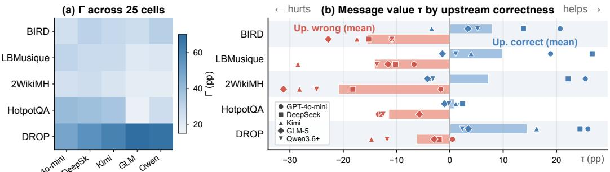

(c) Upstream model variation (HotpotQA / LBMusique)  
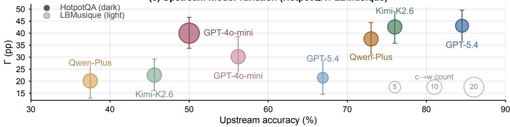  
Figure 2: Evidence–message interaction, conditional message value, and upstream model variation.

## 2.3 ALTERNATIVE EXPLANATIONS TO NARROW

Even if all three research questions are answered affirmatively, the behavioral pattern could in principle arise from mechanisms other than over-weighting the peer’s message. The observed displacement could also arise if the message anchors the answer simply by appearing first; the receiver defers because the message is labeled as a teammate’s output; any second input triggers re-examination that randomly changes answers; or the message alters output formatting in ways that inflate apparent harm under automatic scoring. Section 3.5 tests each of these alternatives with matched controls.

## 3 EXPERIMENTS

## 3.1 SETUP

We instantiate the draft-review handoff on five benchmarks: BIRD (Li et al., 2023) (SQL generation, n=150), HotpotQA (Yang et al., 2018) and LBMusique (Trivedi et al., 2022) (multi-hop QA, n=200 and 160), 2WikiMultihopQA (Ho et al., 2020) (multi-hop QA, n=120), and DROP (Dua et al., 2019) (reading comprehension, n=120). Full benchmark details are in Appendix Table 2.

The base design crosses two binary factors: independent evidence (present or absent) and peer message (shown or hidden via a neutral placeholder), yielding four conditions per item. Additional manipulations are run as separate controlled experiments on item subsets.

The primary upstream is gpt-4o-mini; we replicate with gpt-5.4, kimi-k2.6, and qwen-plus as alternative upstreams. The primary downstream receiver is gpt-4o-mini; cross-family generality is tested with deepseek-v3.2, kimi-k2.6, glm-5, and qwen3.6-plus (five receivers total). All runs use temperature 0; full model and prompt details are in Appendix A.25.

L2W has few natural upstream errors (Appendix Table 2); where statistical power is limited, we note this alongside results. The interaction also replicates on a harder BIRD subset (Appendix A.5).

## 3.2 THE SAME MESSAGE HELPS AND HURTS UNDER DIFFERENT CONDITIONS

We first test Research Question 1: when the upstream errs, does the message turn from helpful to harmful? As a sanity check, we begin by confirming that evidence reduces message value $( \bar { \Gamma } > 0 )$ then turn to the core finding: how τ splits by upstream correctness.

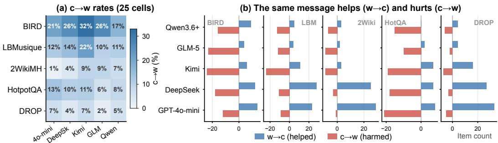  
Figure 3: Override rates across 25 cells and per-benchmark transition breakdown.

Sanity check: Γ is universally positive. Across all 25 cells (5 receivers × 5 benchmarks), Γ is significantly positive $( p \ < \ 0 . 0 0 0 1$ ; Figure 2a). This result is not itself surprising—when the receiver lacks evidence it can barely answer at all, so the message is obviously more valuable—but it validates the basic premise of the experimental design: evidence genuinely changes how much the receiver relies on the message, making the conditional decomposition below meaningful.

To further confirm that this interaction reflects the role of evidence itself, we mask independent evidence on BIRD (removing the database schema), observing an accuracy drop of $\Delta = - \bar { 2 } 4 . 4 \mathrm { p p } ( 9 5 \%$ CI [−30.1, −18.8]), ruling out correlated covariates as the source of Γ.

The same message both helps and hurts. Why is Γ so large? A conditional decomposition of τ by upstream correctness reveals the root cause. Figure 2(b) shows the consistent bifurcation across all 25 cells: when the upstream answer is correct, the message helps the receiver (blue, $\tau > 0 ) ;$ when the upstream answer is wrong, the same pipeline hurts the receiver (red, τ < 0). This pattern spans all five benchmarks and all five tested receivers.

Upstream model variation does not eliminate per-item displacement. Stronger upstream models make fewer errors, reducing the number of affected items. But they do not eliminate per-item displacement. Figure 2(c) shows results with four upstream models (accuracy 37–85%) on HotpotQA and LBMusique: Γ remains at 20–43 pp(all $p < 0 . 0 0 0 1 )$ ), while the number of overridden correct answers (bubble size) shrinks with upstream capability. Better upstreams reduce the scale of the problem, not its nature.

## 3.3 MESSAGE CAUSES DIRECTED HARM

Research Question 1 established that the same message has opposite effects under different conditions: helpful when the upstream is correct, harmful when it errs. We now zoom in to the micro level: is the harm directional—does it point toward the peer’s specific wrong answer?

Correct answers are systematically overridden. Across all 25 cells, both transition types coexist: the message helps on some items (w→c) while overriding correct answers on others (c→w). Figure 3(a) shows c→w rates per cell: 297 of 2,667 independently solvable items are overridden (11.1%), with the highest single-cell rate at 32%.1 Figure 3(b) shows the complementary view: the same message helps on items the receiver would otherwise fail (w→c, blue) while overriding correct answers on items it could solve (c→w, red). The key finding is not that one transition type dominates, but that c→w transitions are directed—they point toward the peer’s specific wrong answer.

Displacement is directed toward the peer’s specific wrong answer. To confirm that the override is not random degradation, we audit 82 c→w transitions. In 77 of them (94%), the receiver’s final answer matches the specific wrong answer in the peer’s message. This is not diffuse degradation toward arbitrary errors but directed displacement toward the peer’s answer—the defining feature of substitution. Moreover, 250 of the 279 c→w transitions across 21 cells (90%) occur when the upstream answer is wrong, confirming that the displacement concentrates where the substitution definition predicts.

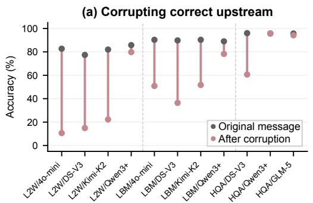

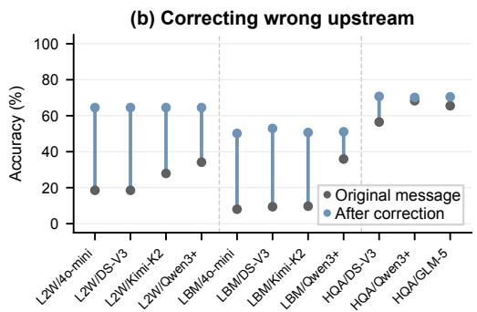  
Figure 4: Cross-model conclusion reversal. (a) Corrupting a correct upstream conclusion universally lowers accuracy (11/11 cells). (b) Correcting a wrong conclusion universally restores it (11/11 cells). Gray dots = original message; colored dots = after reversal.

Behavioral classification. We classify every item with an incorrect upstream answer and independent evidence into behavioral patterns (Appendix A.4). The dominant pattern is unconditional following: the receiver copies the upstream error and cannot solve the item independently either. The most informative pattern is capable but conforming: the receiver solves the item alone yet copies the upstream error when the message is present. Cross-referencing with delayed receipt confirms that the vast majority of capable-but-conforming items are overwritten upon seeing the peer’s wrong answer.

## 3.4 THE ANSWER FOLLOWS THE MESSAGE CONTENT

Research Questions 1 and 2 showed that the message harms and that the harm is directed. Research Question 3 tests a stronger causal claim: is it the specific conclusion in the message that drives the displacement, or does the message merely cause generic interference?

Conclusion reversal. We fix the receiver’s independent evidence and reverse the upstream message’s conclusion—correcting an originally wrong conclusion or corrupting an originally correct one—while preserving the evidence citations and step-by-step format (60–73% token overlap; Appendix A.15). Across all 11 tested cells (3–4 receivers × 3 QA benchmarks), corrupting a correct conclusion universally lowers accuracy, and correcting a wrong conclusion restores it (Figure 4). This provides strong evidence that the receiver tracks the specific conclusion in the message, and simultaneously argues against information redundancy—if the message were merely redundant information, reversing the conclusion should not change the outcome.

Testing the conclusion label (minimal-edit control). To further isolate the conclusion label, we construct minimal-edit messages: only the final answer line and one sentence stating the conclusion are changed, leaving all other reasoning intact. Four of nine tested cells reach significance, confirming that the conclusion label alone has an independent causal effect on the receiver’s answer, with supporting reasoning amplifying it. Effect sizes vary by receiver and task.

## 3.5 NARROWING ALTERNATIVE EXPLANATIONS

The controls below test the four alternative explanations listed in the analysis framework.

Social framing does not account for the pattern. If substitution stems from social deference to a “teammate” label, changing the source label should change the following rate. We relabel the message as an “unverified tool output” or remove attribution entirely on HotpotQA and LBMusique (Figure 5a). The c→w rates are statistically indistinguishable across conditions (all paired McNemar $p > 0 . 3 )$ . For gpt-4o-mini and deepseek, TOST equivalence tests confirm differences within ±5 pp; for kimi, some comparisons are underpowered due to low base rates; on LBM, sample sizes are too small for conclusive equivalence testing (Appendix A.22). On HotpotQA, where sample sizes are adequate, social framing does not drive the behavior. Even an explicit instruction to prioritize evidence does not reduce the override.

(a) Not social framing  
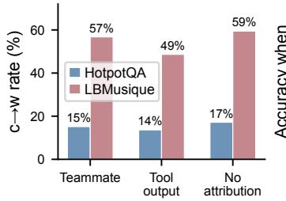

(b) Not a primacy / review effect  
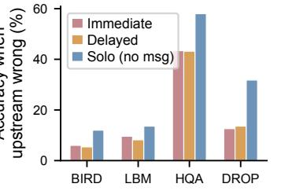

(c) Not insufficient reasoning  
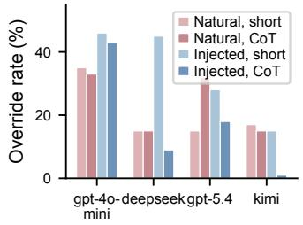  
Figure 5: Source-label control, delayed-receipt control, and CoT override rates.

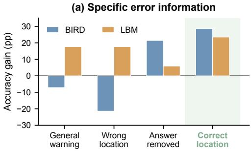

(b) End-to-end recovery  
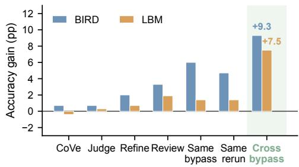  
Figure 6: Error-location interventions and gated recovery actions.

Not explained by a second-attempt artifact. If an additional inference call randomly changes answers, the hidden branch should show similar churn even without an informative message. We run a matched two-branch control: both branches use the same number of inference calls, but one sees the peer message and the other does not. On both benchmarks (BIRD and HotpotQA), the message-exposed branch shows significantly more c→w transitions than the matched control (BIRD gpt-4o-mini: 17 vs 2, $p < 0 . 0 0 1$ ; deepseek: 9 vs 0, $p = 0 . 0 0 4 )$ . Merely re-examining the answer does not produce substitution.

Strict primacy does not account for the pattern. Letting the receiver answer independently before seeing the message does not attenuate the effect (Figure 5b): on all four QA benchmarks, delayed receipt preserves the benefit of correct messages but fails to restore evidence use when the upstream answer is wrong.

Not explained by a scoring artifact. If format changes caused by the message inflate apparent harm, alternative scoring should give different conclusions. Yes/No core extraction reduces but does not eliminate the override rate, and the affected benchmarks are limited to a specific subset (Appendix A.18).

## 3.6 RECOVERY AND ITS LIMITS

The recovery experiments below use oracle error knowledge to establish an upper bound on what targeted interventions can achieve; practical deployment requires imperfect detection, whose costbenefit trade-off we analyze in §6.

<table><tr><td>Component</td><td>BIRD (n=92)</td><td>LBM (n=70)</td><td>L2W (n=16)</td></tr><tr><td>A: Message removal</td><td>+10.9</td><td>+6.7</td><td>+1.7</td></tr><tr><td>B: Receiver replacement</td><td>+10.9</td><td>+24.1</td><td>+22.3</td></tr><tr><td>C: Total</td><td>+21.7</td><td>+30.8</td><td>+24.0</td></tr></table>

Table 1: Three-way decomposition on upstream-wrong items (paired bootstrap, $B { = } 1 0 { , } 0 0 0 )$ . On upstream-correct items, message removal is harmful (Appendix Table 9).

Starting from the same initial answer, we test five message variants: (1) original message (baseline), (2) generic warning, (3) incorrect error location, (4) upstream reasoning without the draft answer, and (5) correct error location. Providing the correct error location yields the largest gains (Figure 6a; BIRD $p = 0 . 0 0 3$ , LBM $p = 0 . 0 1 6$ , item-level majority-vote McNemar). Generic warnings yield smaller gains, and an incorrect error location does not improve performance, confirming that the receiver acts on specifics, not mere “be careful” signals.

On upstream-wrong items, removing the message and regenerating with a different receiver yields significant recovery on all three benchmarks (Table 1). Message removal alone is non-negative, and receiver replacement adds a further +10.9 to +24.1 pp; same-family and cross-family replacements achieve comparable gains (Appendix A.8). On upstream-correct items, message removal is harmful (−20.7 to −25.4 pp; Appendix Table 9), so any deployment must gate the intervention on error detection. The breakeven detector precision is approximately 66% on BIRD and 94% on L2W; details of the cost-benefit analysis appear in §6.

## 4 CHAIN-OF-THOUGHT DIAGNOSIS

This section serves a dual purpose: it tests a natural defense (chain-of-thought reasoning) and uses the resulting traces as evidence for how the receiver processes conflicting information. If substitution reflects over-weighting the peer’s message, explicit step-by-step reasoning should help the receiver re-engage its own evidence.

CoT does not reliably eliminate the override. On HotpotQA, two of four models show modest reductions in the override rate, while one shows a reversal and another also worsens; none reaches significance (Appendix A.18). On LBM, the strongest reduction still leaves the model overriding nearly half of items it would answer correctly alone. The picture is not “CoT is useless” but rather CoT is unreliable as a defense against naturally embedded errors: it helps some models on some items, hurts others, and never eliminates the phenomenon.

The reasoning traces provide further evidence. We classify override traces from four models and annotate 60 traces from the two stronger models (protocol in Appendix A.16). Two independent annotators agree with near-perfect reliability that the receiver is evidence-engaged: it cites relevant evidence yet follows the peer’s wrong answer (prevalence-adjusted agreement AC1 = 0.98; Appendix A.18). The failure is not for lack of evidence engagement. This pattern is not predicted by a pure capacity account, which would expect the receiver to fail to engage evidence at all; whether it is consistent with anchoring or other accounts remains an open question.

## 5 RELATED WORK

Communication reliability in multi-agent LLM systems. Sequential multi-agent pipelines pass intermediate results from one agent to the next (Hong et al., 2024; Wu et al., 2023; Zhang et al., 2025b; Hu et al., 2025; Chen et al., 2024). A growing body of work shows that errors propagate through such systems: Cemri et al. (2025) taxonomize 14 failure modes; Jamshidi et al. (2026) and Singh & Pawar (2026) show that hallucinations compound across stages; Becker et al. (2026) study injected misinformation spread; and Yang et al. (2026) show that wrong-answer messages can still carry useful intermediate steps. These works establish that errors propagate but do not ask why they persist when the downstream agent holds sufficient evidence to correct them. We study this question at the level of a single message handoff, the atomic unit of every sequential pipeline, and show that the effect is not mere propagation but a directed displacement toward the peer’s specific wrong answer.

Evidence conflicts and social influence in LLMs. When an LLM receives conflicting inputs, several mechanisms can shift its answer: anchoring biases outputs toward prior numbers (Tao et al., 2024; Borjigin et al., 2026), sycophancy toward user preferences (Sharma et al., 2024; Perez et al., 2023; Wei et al., 2023), conformity toward simulated peer majorities (Qu et al., 2026; Cho et al., 2025; Shehata & Li, 2026), and context-sensitivity studies show that irrelevant information (Shi et al., 2023) or positional biases (Liu et al., 2024) can distract models. The closest prior work is Qu et al. (2026), who show that peer opinions induce conformity in multi-agent discussion. Our setting differs in that the receiver holds independent evidence sufficient to answer correctly, and we manipulate the message while holding that evidence fixed, enabling causal attribution at the item level. Whether the displacement we observe shares a mechanism with group conformity remains open. Related work on knowledge conflicts (Xie et al., 2024a; Chen et al., 2022) studies contradictions between parametric and contextual knowledge; our conflict is between two external inputs, the peer message and the task evidence.

Self-correction and reasoning faithfulness. Huang et al. (2024) show that without external feedback, LLM self-correction degrades performance. Prompting techniques such as Self-Refine (Madaan et al., 2023) and Chain-of-Verification (Dhuliawala et al., 2024) aim to catch errors through structured re-examination, yet Huang et al. (2024) find their effectiveness is limited without external feedback. Separately, chain-of-thought explanations are known to be unfaithful to the model’s actual reasoning process (Turpin et al., 2023; Lanham et al., 2023; Lyu et al., 2023; Chen et al., 2025). Our CoT analysis (§4) connects these two threads: when the receiver reasons step-bystep yet still follows the peer’s wrong answer, the traces show that the receiver cites correct evidence yet adopts the peer’s conclusion; the failure is not for lack of evidence engagement.

## 6 DISCUSSION AND CONCLUSION

What substitution is, and what it does not establish. On items the receiver can solve alone, an erroneous peer message causes a directional shift toward the peer’s specific wrong answer, and this shift is robust to timing and framing manipulations. Our controlled experiments narrow the space of explanations but do not fully adjudicate between remaining accounts: the data do not distinguish whether the receiver internally replaces evidence-based reasoning with the peer’s claim, or considers both inputs but assigns excessive weight to the message. The trace-level finding that receivers cite correct evidence yet follow the peer’s wrong answer is one that prior studies, which lack per-item evidence controls, could not have observed.

Implications for communication design. A common assumption in pipeline design is that passing intermediate results forward provides a free cross-check: if the upstream is right, the downstream benefits; if the upstream is wrong, the downstream can fall back on its own evidence. Our results confirm the first half but challenge the second: the aggregate message value with evidence is close to zero (weighted mean $\tau = - 0 . 6 \mathrm { p p } , 9 5 \% \mathrm { C I } [ - 4 . \bar { 1 , + } \bar { 3 . } 3 ] \rangle$ ), because help and harm nearly cancel across items. Prompting-based defenses do not reliably restore independent judgment (§4, §3.6), and all five tested receiver families exhibit the pattern on at least one benchmark. Error-gated recovery (§3.6) can recoup losses when the upstream is wrong, but on the full item set message removal is net-harmful because discarding correct signals outweighs the benefit. The breakeven detector precision—below which gated removal is net-harmful—is approximately 66% on BIRD (where 61% of upstream answers are wrong) and 94% on L2W (13% upstream errors), derived from Tables 1 and 9. A regression of recovery on solo accuracy across eight replacement receivers $( R ^ { 2 } = 0 . 7 7 ;$ Appendix A.8) confirms that capability explains most but not all of the variance; model diversity contributes beyond capability. The practical implication is not that pipelines should stop passing messages, but that the message’s value depends on the receiver’s evidence state and on the upstream’s correctness; both must be evaluated, not assumed.

Scope and open questions. Two conditions limit the generality of our findings. First, all experiments use oracle-quality evidence (gold paragraphs, full schemas); in deployments where retrieval is imperfect, the incidence of substitution may differ from our measurements. Second, our findings are demonstrated on tasks with discrete, verifiable answers; whether substitution extends to openended generation, iterative debate, or longer chains remains untested. The central implication is that the benefit of communication coexists with a conditional cost: on items the receiver can solve independently, possessing evidence does not guarantee its effective use once an erroneous peer message enters the context. How to preserve the benefits of communication while protecting independent judgment when the upstream is wrong remains an open problem that our controlled setting does not yet address.

## REFERENCES

Jonas Becker, Jan Philip Wahle, Terry Ruas, and Bela Gipp. Misinformation propagation in benign multi-agent systems. arXiv preprint arXiv:2606.16710, 2026.

David Blackwell. Equivalent comparisons of experiments. The Annals of Mathematical Statistics, 24(2):265–272, 1953.

Yiderigun Borjigin, Alexander Hermann, Christian Cyron, and Roland Aydin. AnchorBench: A multi-pathway benchmark for the anchoring effect in LLMs. In Conference on Language Modeling, 2026.

Mert Cemri, Melissa Z. Pan, Shuyi Yang, Lakshya A. Agrawal, Bhavya Chopra, Rishabh Tiwari, Kurt Keutzer, Aditya Parameswaran, Dan Klein, Kannan Ramchandran, Matei Zaharia, Joseph E. Gonzalez, and Ion Stoica. Why do multi-agent LLM systems fail? 2025.

Chi-Min Chan, Weize Chen, Yusheng Su, Jianxuan Yu, Wei Xue, Shanghang Zhang, Jie Fu, and Zhiyuan Liu. ChatEval: Towards better LLM-based evaluators through multi-agent debate. In International Conference on Learning Representations, 2024.

Hung-Ting Chen, Michael Zhang, and Eunsol Choi. Rich knowledge sources bring complex knowledge conflicts: Recalibrating models to reflect conflicting evidence. In Proceedings of the 2022 Conference on Empirical Methods in Natural Language Processing, pp. 2292–2307. Association for Computational Linguistics, 2022. doi: 10.18653/v1/2022.emnlp-main.146.

Weize Chen, Yusheng Su, Jingwei Zuo, Cheng Yang, Chenfei Yuan, Chi-Min Chan, Heyang Yu, Yaxi Lu, Yi-Hsin Hung, Chen Qian, Yujia Qin, Xin Cong, Ruobing Xie, Zhiyuan Liu, Maosong Sun, and Jie Zhou. AgentVerse: Facilitating multi-agent collaboration and exploring emergent behaviors. arXiv preprint arXiv:2308.10848, 2024.

Yanda Chen, Joe Benton, Ansh Radhakrishnan, Jonathan Uesato, Carson Denison, John Schulman, Arushi Somani, Peter Hase, Misha Wagner, Fabien Roger, Vlad Mikulik, Samuel R. Bowman, Jan Leike, Jared Kaplan, and Ethan Perez. Reasoning models don’t always say what they think. arXiv preprint arXiv:2505.05410, 2025.

Young-Min Cho et al. Herd behavior: Investigating peer influence in LLM-based multi-agent systems. arXiv preprint arXiv:2505.21588, 2025.

Shehzaad Dhuliawala, Mojtaba Komeili, Jing Xu, Roberta Raileanu, Xian Li, Asli Celikyilmaz, and Jason Weston. Chain-of-verification reduces hallucination in large language models. In Findings ofthe Associationfor Computational Linguistics, 2024.

Yilun Du, Shuang Li, Antonio Torralba, Joshua B. Tenenbaum, and Igor Mordatch. Improving factuality and reasoning in language models through multiagent debate. In International Conference on Machine Learning, 2024.

Dheeru Dua, Yizhong Wang, Pradeep Dasigi, Gabriel Stanovsky, Sameer Singh, and Matt Gardner. DROP: A reading comprehension benchmark requiring discrete reasoning over paragraphs. In Conference of the North American Chapter of the Association for Computational Linguistics, 2019.

Alvan R Feinstein and Domenic V Cicchetti. High agreement but low kappa: I. The problems of two paradoxes. Journal ofClinical Epidemiology, 43(6):543–549, 1990.

Xanh Ho, Anh-Khoa Duong Nguyen, Saku Sugawara, and Akiko Aizawa. Constructing a multi-hop qa dataset for comprehensive evaluation of reasoning steps. In Proceedings of the 28th Interna tional Conference on Computational Linguistics, pp. 6609–6625, 2020.

Sirui Hong, Mingchen Zhuge, Jonathan Chen, Xiawu Zheng, Yuheng Cheng, Jinlin Wang, Ceyao Zhang, zili wang, Steven Yau, Zijuan Lin, Liyang Zhou, Chenyu Ran, Lingfeng Xiao, Chenglin Wu, and Jurgen Schmidhuber. Metagpt: Meta programming for a multi-agent collaborative frame-¨ work. In International Conference on Learning Representations, 2024.

Ronald A. Howard. Information value theory. IEEE Transactions on Systems Science and Cybernetics, 2(1):22–26, 1966.

Shengran Hu, Cong Lu, and Jeff Clune. Automated design of agentic systems. In International Conference on Learning Representations, 2025.

Jie Huang, Xinyun Chen, Swaroop Mishra, Huaixiu Steven Zheng, Adams Wei Yu, Xinying Song, and Denny Zhou. Large language models cannot self-correct reasoning yet. In International Conference on Learning Representations, 2024.

Saeid Jamshidi, Arghavan Moradi Dakhel, Kawser Wazed Nafi, and Foutse Khomh. Hallucination cascade: Analyzing error propagation in multi-agent LLM systems. arXiv preprint arXiv:2606.07937, 2026.

Tamera Lanham, Anna Chen, Ansh Radhakrishnan, Benoit Steiner, Carson Denison, Danny Hernandez, Dustin Li, Esin Durmus, Evan Hubinger, Jackson Kernion, Kamile Luko˙ siˇ ut¯ e, Karina˙ Nguyen, Newton Cheng, Nicholas Joseph, Nicholas Schiefer, Oliver Rausch, Robin Larson, Sam McCandlish, Sandipan Kundu, Saurav Kadavath, Shannon Yang, Thomas Henighan, Timothy Maxwell, Thomas Telleen-Lawton, Tristan Conerly, Turner Hume, Zac Hatfield-Dodds, Jack Clark, Catherine Olsson, Dario Amodei, Chris Olah, Jared Kaplan, and Tom Brown. Measuring faithfulness in chain-of-thought reasoning. arXiv preprint arXiv:2307.13702, 2023.

Jinyang Li, Binyuan Hui, Ge Qu, Jiaxi Yang, Binhua Li, Bowen Li, Bailin Wang, Bowen Qin, Rongyu Cao, Ruiying Geng, Nan Huo, Xuanhe Zhou, Chenhao Ma, Guoliang Li, Kevin C.C. Chang, Fei Huang, Reynold Cheng, and Yongbin Li. Can LLM already serve as a database interface? A BIg bench for large-scale database grounded text-to-SQLs. In Advances in Neural Information Processing Systems, volume 36, 2023. doi: 10.52202/075280-1835.

Tian Liang, Zhiwei He, Wenxiang Jiao, Xing Wang, Yan Wang, Rui Wang, Yujiu Yang, Zhaopeng Tu, and Shuming Shi. Encouraging divergent thinking in large language models through multiagent debate. 2024.

Nelson F. Liu, Kevin Lin, John Hewitt, Ashwin Paranjape, Michele Bevilacqua, Fabio Petroni, and Percy Liang. Lost in the middle: How language models use long contexts. Transactions of the Associationfor Computational Linguistics, 12:157–173, 2024.

Qing Lyu, Shreya Havaldar, Adam Stein, Li Zhang, Delip Rao, Eric Wong, Marianna Apidianaki, and Chris Callison-Burch. Towards faithful chain-of-thought reasoning. International Journal of Natural Language Computing, 13, 2023.

Aman Madaan, Niket Tandon, Prakhar Gupta, Skyler Hallinan, Luyu Gao, Sarah Wiegreffe, Uri Alon, Nouha Dziri, Shrimai Prabhumoye, Yiming Yang, Shashank Gupta, Bodhisattwa Prasad Majumder, Katherine Hermann, Sean Welleck, Amir Yazdanbakhsh, and Peter Clark. Self-refine: Iterative refinement with self-feedback. In Advances in Neural Information Processing Systems, 2023.

Ethan Perez, Sam Ringer, Kamile Luko˙ siˇ ut¯ e, Karina Nguyen, Edwin Chen, Scott Heiner, Craig Pet-˙ tit, Catherine Olsson, Sandipan Kundu, Saurav Kadavath, Andy Jones, Anna Chen, Ben Mann, Brian Israel, Bryan Seethor, Cameron McKinnon, Christopher Olah, Da Yan, Daniela Amodei, Dario Amodei, Devin Drain, Dustin Li, Eli Tran-Johnson, Guro Khundadze, Jackson Kernion, James Landis, Jamie Kerr, Jared Mueller, Jeeyoon Hyun, Joshua Landau, Kamal Ndousse, Landon Goldberg, Liane Lovitt, Martin Lucas, Michael Sellitto, Miranda Zhang, Neerav Kingsland,

Nelson Elhage, Nicholas Joseph, Noem´ı Mercado, Nova DasSarma, Oliver Rausch, Robin Larson, Sam McCandlish, Scott Johnston, Shauna Kravec, Sheer El Showk, Tamera Lanham, Timothy Telleen-Lawton, Tom Henighan, Tristan Hume, Yuntao Bai, Zac Hatfield-Dodds, Jack Clark, Samuel R. Bowman, Amanda Askell, Roger Grosse, Danny Hernandez, Deep Ganguli, Evan Hubinger, Nicholas Schiefer, and Jared Kaplan. Discovering language model behaviors with model-written evaluations. In Findings of the Association for Computational Linguistics: ACL 2023, 2023. doi: 10.18653/v1/2023.findings-acl.847.

Jiaming Qu, Lucheng Fu, and Yibo Hu. Easier to mislead than to correct: Harmful and beneficial revision in LLM conformity. arXiv preprint arXiv:2606.01637, 2026.

Timo Schick, Jane Dwivedi-Yu, Roberto Dessi, Roberta Raileanu, Maria Lomeli, Eric Hambro, Luke Zettlemoyer, Nicola Cancedda, and Thomas Scialom. Toolformer: Language models can teach themselves to use tools. In Advances in Neural Information Processing Systems, 2023.

Mrinank Sharma, Meg Tong, Tomasz Korbak, David Duvenaud, Amanda Askell, Samuel R. Bowman, Newton Cheng, Esin Durmus, Zac Hatfield-Dodds, Scott R. Johnston, Shauna Kravec, Timothy Maxwell, Sam McCandlish, Kamal Ndousse, Oliver Rausch, Nicholas Schiefer, Da Yan, Miranda Zhang, and Ethan Perez. Towards understanding sycophancy in language models. In International Conference on Learning Representations, 2024.

Dahlia Shehata and Ming Li. The bystander effect in multi-agent reasoning. arXiv preprint arXiv:2605.10698, 2026.

Freda Shi, Xinyun Chen, Kanishka Misra, Nathan Scales, David Dohan, Ed H. Chi, Nathanael Scharli, and Denny Zhou. Large language models can be easily distracted by irrelevant context.¨ In Proceedings ofthe 40th International Conference on Machine Learning, 2023.

Prabhjot Singh and Bhushan Pawar. The hallucination snowball: Modeling error propagation as state transitions in multi-agent LLM pipelines. arXiv preprint arXiv:2608.14588, 2026.

Yufei Tao, Adam Hiatt, Erik Haake, Antonie J. Jetter, and Ameeta Agrawal. When context leads but parametric memory follows in large language models. In Conference on Empirical Methods in Natural Language Processing, 2024.

Harsh Trivedi, Niranjan Balasubramanian, Tushar Khot, and Ashish Sabharwal. MuSiQue: Multihop questions via single hop question composition. Transactions of the Association for Computational Linguistics, 10:539–554, 2022.

Miles Turpin, Julian Michael, Ethan Perez, and Samuel R. Bowman. Language models don’t always say what they think: Unfaithful explanations in chain-of-thought prompting. In Advances in Neural Information Processing Systems, 2023.

Herun Wan et al. The deliberative illusion: Factual attrition and stance homogenization in multiagent discussion. arXiv preprint arXiv:2606.03032, 2026.

Jerry Wei, Da Huang, Yifeng Lu, Denny Zhou, and Quoc V. Le. Simple synthetic data reduces sycophancy in large language models. arXiv preprint arXiv:2308.03958, 2023.

Qingyun Wu, Gagan Bansal, Jieyu Zhang, Yiran Wu, Beibin Li, Erkang Zhu, Li Jiang, Xiaoyun Zhang, Shaokun Zhang, Jiale Liu, et al. Autogen: Enabling next-gen llm applications via multiagent conversation. arXiv preprint arXiv:2308.08155, 2023.

Jian Xie, Kai Zhang, Jiangjie Chen, Renze Lou, and Yu Su. Adaptive chameleon or stubborn sloth: Revealing the behavior of large language models in knowledge conflicts. In International Conference on Learning Representations, 2024a.

Jian Xie, Kai Zhang, Jiangjie Chen, Renze Lou, and Yu Su. Adaptive chameleon or stubborn sloth: Revealing the behavior of large language models in knowledge conflicts. In International Conference on Learning Representations, 2024b.

Chih-Hsuan Yang, Anjir Ahmed Chowdhury, Cheng-Hau Yang, Weijian Zheng, Fernando Llorente, Xiaolong Ma, Xinyang Li, Eliu A. Huerta, Ian T. Foster, and Rajeev Thakur. Wrong but useful: Trajectory value beyond answer correctness in multi-agent messages. arXiv preprint arXiv:2608.14375, 2026.

Zhilin Yang, Peng Qi, Saizheng Zhang, Yoshua Bengio, William W. Cohen, Ruslan Salakhutdinov, and Christopher D. Manning. HotpotQA: A dataset for diverse, explainable multi-hop question answering. In Conference on Empirical Methods in Natural Language Processing, 2018.

Shunyu Yao, Jeffrey Zhao, Dian Yu, Nan Du, Izhak Shafran, Karthik Narasimhan, and Yuan Cao. ReAct: Synergizing reasoning and acting in language models. International Conference on Learning Representations, 2023.

Guibin Zhang, Yanwei Yue, Zhixun Li, Sukwon Yun, Guancheng Wan, Kun Wang, Dawei Cheng, Jeffrey Xu Yu, and Tianlong Chen. Cut the crap: An economical communication pipeline for LLM-based multi-agent systems. In International Conference on Learning Representations, 2025a.

Jiayi Zhang, Jinyu Xiang, Zhaoyang Yu, Fengwei Teng, Xionghui Chen, Jiaqi Chen, Mingchen Zhuge, Xin Cheng, Sirui Hong, Jinlin Wang, Bingnan Zheng, Bang Liu, Yuyu Luo, and Chenglin Wu. AFlow: Automating agentic workflow generation. In International Conference on Learning Representations, 2025b.

Lianmin Zheng, Wei-Lin Chiang, Ying Sheng, Siyuan Zhuang, Zhanghao Wu, Yonghao Zhuang, Zi Lin, Zhuohan Li, Dacheng Li, Eric Xing, Hao Zhang, Joseph Gonzalez, and Ion Stoica. Judging llm-as-a-judge with mt-bench and chatbot arena. In Advances in Neural Information Processing Systems, 2023.

Mingchen Zhuge, Wenyi Wang, Louis Kirsch, Francesco Faccio, Dmitrii Khizbullin, and Jurgen ¨ Schmidhuber. Gptswarm: language agents as optimizable graphs. In Proceedings of the 41st International Conference on Machine Learning, 2024.

## A ADDITIONAL RESULTS

## A.1 BENCHMARK DETAILS

Table 2: Benchmark overview. “Upstream err.” is the fraction of items where the upstream agent (gpt-4o-mini) produces an incorrect answer.
<table><tr><td>Benchmark</td><td>Task type</td><td>n</td><td>Upstream err.</td><td>Indep. evidence</td><td>Metric</td></tr><tr><td>BIRD (Li et al., 2023)</td><td>SQL generation</td><td>150</td><td>61.3%</td><td>schema desc.</td><td>exec. acc.</td></tr><tr><td>L2W (Ho et al., 2020)</td><td>Multi-hop QA</td><td>120</td><td>13.3%</td><td>retrieved pass.</td><td>token F1</td></tr><tr><td>LBM (Trivedi et al., 2022)</td><td>Multi-hop QA</td><td>160</td><td>43.8%</td><td>retrieved pass.</td><td>token F1</td></tr><tr><td>HotpotQA (Yang et al., 2018)</td><td>Multi-hop QA</td><td>200</td><td>50.0%</td><td>gold paragraphs</td><td>token F1</td></tr><tr><td>DROP (Dua et al., 2019)</td><td>Reading comp.</td><td>120</td><td>18.3%</td><td>passage + question</td><td>exact match</td></tr></table>

## A.2 DECOMPOSITION OF KIMI-K2.6 UPSTREAM ON LBM

When kimi-k2.6 serves as upstream on LBM, its message value with independent evidence is +10.5 pp on items where the upstream answer is wrong, which appears to contradict the substitution pattern. Splitting by receiver capability reveals the opposite:

<table><tr><td>Receiver can solve without message?</td><td>Message value with evidence</td><td></td><td>Interpretation</td></tr><tr><td>Yes  $( \mathrm { s c o r e } > 0 . 5 )$ </td><td>n 18</td><td>-22.8 pp</td><td>Substitution</td></tr><tr><td>No  $( \mathrm { s c o r e } \leq 0 . 5 )$ </td><td>69</td><td>+19.1pp</td><td>Reasoning helps</td></tr><tr><td>All upstream-wrong items</td><td>87</td><td>+10.5pp</td><td></td></tr></table>

Table 3: LBM items where kimi-k2.6 gives an incorrect upstream answer. Positive message value with independent evidence comes from items the receiver cannot solve alone; on items it can solve, the wrong conclusion causes harm.

On the 22 items where the wrong message helps, 91% (20/22) have receiver scores of zero without the peer message; the receiver cannot solve these multi-hop questions without guidance. In 86% of these items, the gold-standard answer appears within kimi’s reasoning chain even though its final answer is wrong: kimi performs correct entity lookups and passage citations but arrives at an incorrect conclusion. The receiver extracts useful intermediate steps from the reasoning, not the conclusion.

This decomposition is fully consistent with the substitution claim: the benefit comes from items the receiver would have failed alone, while the harm falls on items it would have solved alone. A stronger upstream model provides higher-quality reasoning chains (kimi’s mean reasoning length: 1,640 characters vs. gpt-4o-mini’s ≈400), amplifying the benefit on hard items—but its wrong conclusions are equally capable of overriding the receiver’s correct answers on easy ones.

## A.3 PER-ITEM TRANSFER MATRIX (BIRD)

For the 92 BIRD items where the upstream answer is wrong (gpt-4o-mini receiver), we decompose message value with independent evidence into per-item outcomes:

• 11 items are harmed: the receiver answers correctly without the message but incorrectly with it.

• 0 items are helped in the reverse direction.

• 81 items show no change (6 correct, 75 incorrect under both conditions).

Peer-answer adoption rate. Among correct-to-wrong transitions, we test whether the receiver adopts the peer’s specific wrong answer (token- $\mathrm { . F 1 } \geq 0 . 5$ or substring containment) rather than producing an unrelated error. The audit covers all c→w items from four HotpotQA receivers (gpt-4o-mini, deepseek-v3.2, kimi-k2.6, gpt-5.4) and one LBM receiver (gpt-4o-mini)—82 items total, representing every c→w transition in these five cells. Of these, 77 (94%, bootstrapped 95% CI [87%, 98%]) show the receiver adopting the peer’s specific wrong answer. All four HQA receivers individually show adoption rates ≥ 83%. As a chance baseline, open-ended QA answers are drawn from a large entity space; even conservatively assuming only 5 plausible wrong answers per item, random matching would yield ∼20%, far below the observed 94%. This rules out the interpretation that the message merely confuses the receiver into random errors: the receiver copies the peer’s specific conclusion.

## A.4 BEHAVIORAL TAXONOMY

Table 4 classifies every item where the upstream answer is wrong and the receiver has independent evidence.
<table><tr><td>Behavior</td><td>BIRD</td><td>LBM</td><td>HQA</td><td>DROP</td></tr><tr><td>Copies upstream error</td><td>84</td><td>66</td><td>38</td><td>86</td></tr><tr><td>Ignores error, correct</td><td>7</td><td>4</td><td>37</td><td>0</td></tr><tr><td>Can solve, still follows</td><td>9</td><td>6</td><td>23</td><td>9</td></tr><tr><td>Cannot solve, diverges</td><td>0</td><td>21</td><td>0</td><td>5</td></tr><tr><td>Diverges, incorrect</td><td>0</td><td>3</td><td>0</td><td>0</td></tr><tr><td>Diverges, correct</td><td>0</td><td>0</td><td>2</td><td>0</td></tr><tr><td>Follows upstream error</td><td>93</td><td>71</td><td>61</td><td>95</td></tr></table>

Table 4: Behavioral classification for the gpt-4o-mini receiver (%). Percentages are rounded independently; “Follows upstream error” combines unconditional copying with cases where the receiver can solve alone but still follows. Column sample sizes: BIRD 92, LBM 70, HQA 100, DROP 22.

Unconditional following accounts for 38–86% of cases: the receiver copies the upstream error and cannot solve the item independently. In a further 6–23% of cases, the receiver can solve the item alone but still copies the upstream error when the message is present; this is the most direct evidence for substitution.

## A.5 BIRD-HARD SUBSET

BIRD-Hard uses the same pipeline and scoring as BIRD on a harder item subset (n=150, 68.0% upstream errors). The substitution pattern replicates: message value is +28.0 without independent evidence and +1.3 with independent evidence, giving Γ = +26.7. The interaction is consistent with the main BIRD finding $( \Gamma _ { \mathrm { B I R D } } = + 2 5 . 3 ) $ ; evidence reduces message value from substantial to near-zero.

## A.6 L2W RESULTS

L2W (LongBench-2WikiMQA) has only 16 items with a naturally incorrect upstream answer, limiting statistical power. We report it for completeness: message value is +46.6 without independent evidence and +21.8 with independent evidence, giving Γ = +24.8 (p < 0.0001, B = 10,000 bootstrap draws). In the conclusion-reversal experiment, correcting erroneous conclusions changes accuracy by +46.0 [25.0, 67.9], while corrupting correct conclusions changes it by −72.1 [−81.4, −61.9]; both effects are significant despite the small n.

## A.7 DROP RESULTS

DROP (n=120, 18.3% upstream errors) uses exact-match scoring with a contains fallback for multispan answers. Table 5 reports the four-cell decomposition for the primary receiver (gpt-4o-mini). Table 6 extends the analysis to all five receivers.

Note that τ (with evidence) = +23.2 pp remains positive: the peer message is net-helpful even when the receiver has independent evidence. The large positive Γ confirms that evidence reduces the marginal value of the message, consistent with the other four benchmarks.

<table><tr><td>Condition</td><td>Shown (%)</td><td>Hidden (%)</td><td>τpp</td></tr><tr><td>Without independent evidence</td><td>86.0</td><td>14.2</td><td>+71.8</td></tr><tr><td>With independent evidence</td><td>86.8</td><td>63.6</td><td>+23.2</td></tr><tr><td>Γ</td><td></td><td></td><td>+48.6  $p < 0 . 0 0 0 1$ </td></tr></table>

Table 5: DROP four-cell decomposition (gpt-4o-mini receiver, n=120). τ = message value (shown − hidden accuracy). Γ = τ(without evidence) − τ(with evidence). DROP shows the largest Γ among all five benchmarks. Unlike HotpotQA and LBM, τ (with evidence) remains positive (+23.2 pp): the message is net-helpful even with evidence. Independent evidence sharply reduces the marginal value of the message.
<table><tr><td rowspan="2">Receiver</td><td colspan="2">With evidence</td><td colspan="2">No evidence</td><td rowspan="2">τ(w/o ev.)</td><td rowspan="2"> $\tau ( \mathrm { w } / \mathrm { e v . } )$ </td><td rowspan="2">Γ [95% CI]</td><td rowspan="2">c→w</td></tr><tr><td>Shown</td><td>Hidden</td><td>Shown</td><td>Hidden</td></tr><tr><td>gpt-4o-mini</td><td>86.8</td><td>63.6</td><td>86.0</td><td>14.2</td><td>+71.8</td><td>+23.2</td><td>+48.6</td><td>5</td></tr><tr><td>deepseek-v3.2</td><td>90.8</td><td>70.8</td><td>90.0</td><td>14.2</td><td>+75.8</td><td>+20.0</td><td>+55.8 [45,66]</td><td>3</td></tr><tr><td>kimi-k2.6</td><td>90.8</td><td>83.3</td><td>90.8</td><td>21.7</td><td>+69.2</td><td>+7.5</td><td>+61.7 [52,71]</td><td>7</td></tr><tr><td>glm-5</td><td>92.5</td><td>90.8</td><td>90.8</td><td>20.0</td><td>+70.8</td><td>+1.7</td><td>+69.2 [61,78]</td><td>2</td></tr><tr><td>qwen3.6-plus</td><td>92.5</td><td>94.2</td><td>90.0</td><td>24.2</td><td>+65.8</td><td>-1.7</td><td>+67.5 [58,76]</td><td>6</td></tr></table>

Table 6: DROP cross-receiver four-cell decomposition (n=120 per receiver). Accuracy is exactmatch percentage. Γ is significantly positive for all five receivers $( p \textless 0 . 0 0 0 1 )$ ; 95% CIs from paired bootstrap (B=10,000).

## A.8 RECOVERY EXPERIMENT: INTERVENTION COMPARISON

To test whether substitution can be overcome by known repair strategies, we apply a shared error detector (gemini-2.5-pro) and route flagged items to different interventions. The detector is prompted with the upstream message and the receiver’s evidence and asked whether the upstream conclusion is likely wrong. Table 7 reports its operating characteristics.

<table><tr><td>Benchmark</td><td>Precision (%)</td><td>Recall (%)</td><td>Items flagged</td></tr><tr><td>BIRD (n=150)</td><td>91.8</td><td>60.9</td><td>61</td></tr><tr><td>LBM (n=160)</td><td>81.1</td><td>42.9</td><td>37</td></tr><tr><td>L2W (n=120)</td><td>35.0</td><td>43.8</td><td>20</td></tr></table>

Table 7: Error-detector operating characteristics (gemini-2.5-pro). Precision = fraction of flagged items that are truly upstream-wrong; recall = fraction of upstream-wrong items that are flagged. L2W has low precision because most upstream answers are correct (86.7%), so even modest falsepositive rates dominate.

Table 8 reports gated accuracy: unflagged items retain the original answer; flagged items receive the intervention.

Reviewing the message does not significantly improve over hiding it. Answering independently before reviewing the message and using the same receiver without the message produce statistically indistinguishable results on all three benchmarks $( \Delta = - 2 . 7 , + 0 . 5 , + 2 . 9$ pp; all CIs contain zero). Thus, “think first, then review the message” does not significantly improve over simply ignoring the message. Using a different-family receiver without the message outperforms answer-then-review on BIRD by +6.0 pp; this gain persists even when the replacement receiver has matched solo capability (Table 10), jointly changing the receiver model and removing the message; we do not attribute the gain specifically to family diversity, as the replacement simultaneously changes capability, training distribution, and output style.

Summary of gated recovery results. Generic warnings (CoVe (Dhuliawala et al., 2024), LLMjudge (Zheng et al., 2023)) are ineffective $( \leq + 0 . 7 \mathrm { p p }$ on BIRD), and having the receiver deliberate before seeing the message does not restore verification. Under the gated protocol (detector flags → intervention on flagged items only), the largest gains come from removing the message and using a different-family receiver (+9.3 pp on BIRD, +7.5 pp on LBM). The conditional decomposition on upstream-wrong items (Table 1 in the main text) shows that message removal is non-negative on all three benchmarks and that receiver replacement adds a substantial further gain.

<table><tr><td rowspan="2">Intervention</td><td colspan="2">BIRD (n=150, fl.=61)</td><td colspan="2">LBM (n=160, fl.=37)</td><td colspan="2">L2W (n=120, fl.=20)</td></tr><tr><td>Acc</td><td>95% CI</td><td>Acc</td><td>95% CI</td><td>Acc</td><td>95% CI</td></tr><tr><td>Default (no detection)</td><td>.400</td><td>[.320, .480]</td><td>.539</td><td>[.467, .609]</td><td>.742</td><td>[.671, .807]</td></tr><tr><td>No message (same receiver)</td><td>.460</td><td>[.380, .540]</td><td>.553</td><td>[.482, .624]</td><td>.730</td><td>[.656, .801]</td></tr><tr><td>Rerun (same receiver)</td><td>.447</td><td>[.367, .527]</td><td>.553</td><td>[.481, .623]</td><td>.755</td><td>[.686, .819]</td></tr><tr><td>CoVe</td><td>.407</td><td>[.327, .487]</td><td>.535</td><td>[.462, .606]</td><td>.746</td><td>[.675, .813]</td></tr><tr><td>LLM-judge repair</td><td>.407</td><td>[.327, .487]</td><td>.542</td><td>[.470, .614]</td><td>.746</td><td>[.676, .813]</td></tr><tr><td>Self-refine</td><td>.420</td><td>[.340, .500]</td><td>.546</td><td>[.474, .615]</td><td>.761</td><td>[.693, .826]</td></tr><tr><td>Answer, then review message</td><td>.433</td><td>[.353, .513]</td><td>.558</td><td>[.487, .628]</td><td>.759</td><td>[.690, .820]</td></tr><tr><td>No message (different family)</td><td>.493</td><td>[.413, .573]</td><td>.614</td><td>[.546, .681]</td><td>.769</td><td>[.701, .833]</td></tr></table>

Table 8: Recovery experiment: gated accuracy under different interventions with gemini-2.5-pro as the shared detector. “No message (different family)” uses a receiver from another model family without the upstream message. “Answer, then review message” lets the receiver answer independently before reviewing the peer message.

Unconditional decomposition (all with-evidence items). For completeness, Table 9 reports the same decomposition on all with-evidence items regardless of upstream correctness. Component A is negative on LBM (−7.7 pp) and L2W (−21.8 pp): removing the message discards correct signals alongside erroneous ones, and the cost dominates when most upstream answers are correct (LBM: 56.2%, L2W: 86.7%). This is the expected cost–benefit trade-off of indiscriminate message removal and does not contradict the conditional results: on the target population (upstream-wrong items), message removal does not hurt (Table 1).
<table><tr><td>Component</td><td>BIRD (n=150)</td><td>LBM (n=160)</td><td>L2W (n=120)</td></tr><tr><td>A: Message removal</td><td>-1.3</td><td>-7.7</td><td>-21.8</td></tr><tr><td>B: Receiver replacement</td><td>+9.7</td><td>+17.4</td><td>+14.8</td></tr><tr><td>C: Total</td><td>+8.3</td><td>+9.7</td><td>-7.0</td></tr></table>

Table 9: Three-way decomposition on all with-evidence items (unconditional on upstream correctness; paired bootstrap, $B { = } 1 0 { , } 0 0 0 )$ . Component A is negative when most upstream answers are correct, because removing the message discards correct signals. On the upstream-wrong target population, Component A is non-negative on all three benchmarks (Table 1). $C = A + B$ by construction.

Capability-matched recovery and same-family control. The cross-family receivers used in the main decomposition (kimi-k2.6, deepseek-v3.2) have higher solo accuracy than gpt-4o-mini on BIRD (49.3% and 40.7% vs. 43.3%), raising the concern that the recovery benefit reflects capability differences rather than model replacement per se. To address this, we evaluate eight replacement receivers on the same 92 upstream-wrong BIRD items and report each receiver’s solo accuracy alongside its recovery effect (Table 10). Crucially, the eight replacement receivers include two samefamily OpenAI models (gpt-4o and gpt-4.1-mini) alongside six cross-family receivers, enabling a direct test of whether recovery requiresfamily diversity or merely a different model.

Same-family result. gpt-4.1-mini (solo 44.0%, $\Delta \ = \ + 0 . 7$ pp vs. gpt-4o-mini) is essentially capability-matched and yields +17.4 pp recovery $( p < 0 . 0 0 1 )$ , comparable to the best cross-family receivers. Across the 92 upstream-wrong BIRD items, the per-item mean of the two same-family replacements (25.0%) is statistically indistinguishable from the per-item mean of the two crossfamily replacements in the main decomposition (27.2%; paired t-test $p = 0 . 5 0$ , bootstrap 95% CI of the difference [−4.3, +8.7] pp). The same pattern holds on L2W (+8.9 pp gap, $p = 0 . 2 1 )$ . On LBM, cross-family receivers outperform same-family ones by +27.4 pp $( p < 0 . 0 0 1 )$ , but this gap is explained by a capability confound: gpt-4o and gpt-4.1-mini are weaker than gpt-4o-mini on

LBM solo (41.9% and 42.2% vs. 46.2%), while the cross-family receivers are substantially stronger (qwen3.6-plus 72.6%, glm-5 71.9%, kimi-k2.6 65.6%).

We therefore conclude that the receiver-replacement benefit on BIRD is driven by using a different model—not specifically a different model family. This is consistent with the reframing in the main text: we label Component B “receiver replacement” rather than “family diversity” and do not claim a causal role for family membership.

Capability–recovery regression. To quantify how much of the recovery benefit is explained by capability differences, we regress recovery on solo accuracy across the eight replacement receivers (excluding the gpt-4o-mini baseline). Solo accuracy explains most of the recovery variance $( R ^ { 2 } =$ 0.77, $p = 0 . 0 0 2$ , slope = 1.17±0.24 ppper percentage point of solo accuracy). The residual variance is consistent with per-item model complementarity, but could also reflect unmeasured confounds; our design does not isolate model diversity as a causal factor.
<table><tr><td>Receiver</td><td>Family</td><td>Solo acc. (%)</td><td>∆ vs gpt (pp)</td><td>Recovery (pp)</td><td>p</td></tr><tr><td colspan="6">Same-family replacements (OpenAI):</td></tr><tr><td>gpt-4.1-mini</td><td>OpenAI</td><td>44.0</td><td>+0.7</td><td>+17.4</td><td>&lt; 0.001</td></tr><tr><td>gpt-40</td><td>OpenAI</td><td>48.7</td><td>+5.4</td><td>+21.7</td><td>&lt; 0.001</td></tr><tr><td colspan="6">Cross-family replacements (capability-matched,  $| \Delta | \leq 5 p p \} ;$ </td></tr><tr><td>deepseek-v3.2</td><td>DeepSeek</td><td>40.7</td><td>-2.7</td><td>+9.8</td><td>0.022</td></tr><tr><td>glm-4.5-air</td><td>Zhipu</td><td>42.0</td><td>-1.3</td><td>+17.4</td><td>&lt; 0.001</td></tr><tr><td>MiniMax-M2.5</td><td>MiniMax</td><td>46.7</td><td>+3.3</td><td>+14.1</td><td>&lt; 0.001</td></tr><tr><td colspan="6">Cross-family replacements (stronger):</td></tr><tr><td>kimi-k2.6</td><td>Moonshot</td><td>49.3</td><td>+6.0</td><td>+17.4</td><td>&lt; 0.001</td></tr><tr><td>qwen-plus</td><td>Alibaba</td><td>56.0</td><td>+12.7</td><td>+31.5</td><td>&lt; 0.001</td></tr><tr><td>gemini-2.5-flash-lite</td><td>Google</td><td>57.3</td><td>+14.0</td><td>+28.3</td><td>&lt; 0.001</td></tr></table>

Table 10: Recovery by receiver identity on BIRD (n=92 upstream-wrong items, paired bootstrap). Solo accuracy is computed on 150 BIRD items without any peer message in an independent run. Recovery = paired accuracy gain over the default gpt-4o-mini receiver with the erroneous message; the default receiver’s same-model removal baseline is +10.9 pp(Table 1). Same-family OpenAI replacements achieve recovery comparable to cross-family receivers at similar capability levels $( p =$ 0.50 for same-family vs. cross-family mean difference), indicating that recovery does not require family diversity—any different model suffices.

## A.9 MESSAGE VALUE AND INTERACTION (FULL 20-CELL TABLE)

Table 11 extends the single-receiver Γ values from the main text to all 20 receiver–benchmark cells. In all 20 cells, Γ is large and significant $( p < 0 . 0 0 0 1 )$ : independent evidence sharply reduces the marginal value of the upstream message.

## A.10 PER-ITEM BOOTSTRAP CIS FOR τ(WITH EVIDENCE)

Table 12 reports paired bootstrap 95% CIs for τ (with evidence) on all 20 receiver–benchmark cells.   
Table 13 decomposes τ (with evidence) into per-item transitions for all 20 cells.

## A.11 CONDITIONAL DECOMPOSITION OF τ (WITH EVIDENCE)

Table 14 decomposes τ(with evidence) by receiver capability. Items where the receiver answers correctly without the message $( n _ { \mathrm { s o l v e d } } )$ can only lose accuracy; items where it fails $( n _ { \mathrm { f a i l e d } } )$ can only gain. The key quantity is $P ( { \mathsf { c } } { \to } { \mathsf { w } } )$ : the fraction of independently solvable items where the message causes a wrong answer.

## A.12 UPSTREAM MODEL DIVERSITY

Table 15 reports $\tau ( \mathrm { w } / \mathrm { e v . } )$ (message value with evidence) and Γ for each upstream–benchmark combination. All eight Γ values are significant $( p < 0 . 0 0 0 1 )$ , confirming that evidence sharply reduces message value regardless of which model generates the message. $- \mathrm { ( w / e v . ) }$ is non-negative in all eight cells: the message remains net-helpful on average even with evidence. The substitution effect (high Γ) coexists with near-zero aggregate message value when evidence is present—it manifests as help and harm nearly canceling when the upstream error rate is moderate. This means that unconditionally removing the message is not guaranteed to improve system performance; targeted interventions that preserve correct messages while mitigating harmful ones remain an open problem.

<table><tr><td>Receiver</td><td>Bench</td><td>n</td><td>τ(w/o ev.) pp</td><td> $\tau ( \mathrm { w } / \mathrm { e v . } ) \mathrm { p p }$ </td><td> $\Gamma _ { \mathrm { { } p p } }$ </td><td>95% CI</td></tr><tr><td>gpt-4o-mini</td><td>BIRD</td><td>150</td><td>+26.7</td><td>+1.3</td><td>+25.3</td><td>[+17.3, +33.3]</td></tr><tr><td>gpt-4o-mini</td><td>LBM</td><td>160</td><td>+37.9</td><td>+7.7</td><td>+30.2</td><td>[+22.1, +38.6]</td></tr><tr><td>gpt-4o-mini</td><td>L2W</td><td>120</td><td>+46.6</td><td>+21.8</td><td>+24.8</td><td>[+15.2, +34.4]</td></tr><tr><td>gpt-4o-mini</td><td>HQA</td><td>200</td><td>+34.3</td><td>-5.7</td><td>+40.0</td><td>[+33.7, +46.6]</td></tr><tr><td>deepseek-v3.2</td><td>BIRD</td><td>150</td><td>+27.3</td><td>-4.0</td><td>+31.3</td><td>[+22.7, +40.0]</td></tr><tr><td>deepseek-v3.2</td><td>LBM</td><td>160</td><td>+38.3</td><td>+10.5</td><td>+27.8</td><td>[+20.7, +34.8]</td></tr><tr><td>deepseek-v3.2</td><td>L2W</td><td>120</td><td>+43.2</td><td>+16.8</td><td>+26.4</td><td>[+16.8, +36.0]</td></tr><tr><td>deepseek-v3.2</td><td>HQA</td><td>200</td><td>+32.8</td><td>-5.2</td><td>+38.0</td><td>[+31.3, +44.9]</td></tr><tr><td>kimi-k2.6</td><td>BIRD</td><td>150</td><td>+16.7</td><td>-12.0</td><td>+28.7</td><td>[+20.0, +38.0]</td></tr><tr><td>kimi-k2.6</td><td>LBM</td><td>160</td><td>+17.4</td><td>-10.2</td><td>+27.6</td><td>[+19.9, +35.5]</td></tr><tr><td>kimi-k2.6</td><td>L2W</td><td>120</td><td>+15.6</td><td>-7.1</td><td>+22.7</td><td>[+14.3, +31.0]</td></tr><tr><td>kimi-k2.6</td><td>HQA</td><td>200</td><td>+30.4</td><td>-5.8</td><td>+36.2</td><td>[+29.7, +42.6]</td></tr><tr><td>glm-5</td><td>BIRD</td><td>150</td><td>+14.0</td><td>-12.7</td><td>+26.7</td><td>[+18.7, +34.7]</td></tr><tr><td>glm-5</td><td>LBM</td><td>160</td><td>+14.6</td><td>-5.9</td><td>+20.5</td><td>[+13.5, +27.7]</td></tr><tr><td>glm-5</td><td>L2W</td><td>120</td><td>+10.9</td><td>-7.8</td><td>+18.7</td><td>[+10.4, +27.4]</td></tr><tr><td>glm-5</td><td>HQA</td><td>200</td><td>+13.6</td><td>-3.4</td><td>+16.9</td><td>[+11.3, +22.6]</td></tr><tr><td>qwen3.6-plus</td><td>BIRD</td><td>150</td><td>+27.3</td><td>-4.7</td><td>+32.0</td><td>[+22.7, +41.3]</td></tr><tr><td>qwen3.6-plus</td><td>LBM</td><td>160</td><td>+16.3</td><td>-5.4</td><td>+21.7</td><td>[+14.0, +29.2]</td></tr><tr><td>qwen3.6-plus</td><td>L2W</td><td>120</td><td>+12.8</td><td>-6.1</td><td>+18.9</td><td>[+10.4, +27.7]</td></tr><tr><td>qwen3.6-plus</td><td>HQA</td><td>200</td><td>+20.0</td><td>-6.3</td><td>+26.4</td><td>[+20.9, +32.1]</td></tr></table>

Table 11: Full 20-cell Γ table. τ (w/o ev.) = message value without independent evidence; $\tau ( \mathrm { w } / \mathrm { e v . } )$ = message value with evidence; $\Gamma = \tau ( \mathrm { w / o e v . } ) - \tau ( \mathrm { w / e v . } )$ . All CIs from paired bootstrap $( B =$ 10,000, seed 42). All 20 cells show $\Gamma > 0 ( p < 0 . 0 0 0 1 )$ : independent evidence consistently reduces the marginal value of the upstream message.
<table><tr><td>Receiver</td><td>Benchmark</td><td>n</td><td> $\tau ( \mathrm { w } / \mathrm { e v . } ) \mathrm { p p }$ </td><td>95% CI</td><td>p</td><td></td></tr><tr><td>glm-5</td><td>BIRD</td><td>150</td><td>-12.7</td><td>[−19.3, −6.7]</td><td>&lt;.001</td><td> $* * *$ </td></tr><tr><td>kimi-k2.6</td><td>BIRD</td><td>150</td><td>-12.0</td><td>[−18.7, −5.3]</td><td>&lt;.001</td><td> $* * *$ </td></tr><tr><td>qwen3.6-plus</td><td>BIRD</td><td>150</td><td>-4.7</td><td>[−11.3, +2.0]</td><td>.191</td><td></td></tr><tr><td>deepseek-v3.2</td><td>BIRD</td><td>150</td><td>-4.0</td><td>[−11.3, +3.3]</td><td>.319</td><td></td></tr><tr><td>gpt-4o-mini</td><td>BIRD</td><td>150</td><td>+1.3</td><td>[−5.3, +8.0]</td><td>.769</td><td></td></tr><tr><td>kimi-k2.6</td><td>LBM</td><td>160</td><td>-10.2</td><td>[−16.0, −4.4]</td><td>&lt;.001</td><td>** *</td></tr><tr><td>glm-5</td><td>LBM</td><td>160</td><td>-5.9</td><td>[−10.3, −1.7]</td><td>.007</td><td>**</td></tr><tr><td>qwen3.6-plus</td><td>LBM</td><td>160</td><td>-5.4</td><td>[−10.2, −0.9]</td><td>.019</td><td>*</td></tr><tr><td>gpt-4o-mini</td><td>LBM</td><td>160</td><td>+7.7</td><td>[+1.3, +14.2]</td><td>.018</td><td>*</td></tr><tr><td>deepseek-v3.2</td><td>LBM</td><td>160</td><td>+10.5</td><td>[+3.6, +17.3]</td><td>.002</td><td>**</td></tr><tr><td>qwen3.6-plus</td><td>HQA</td><td>200</td><td>-6.3</td><td>[−9.7, -3.3]</td><td>&lt;.001</td><td>* * *</td></tr><tr><td>kimi-k2.6</td><td>HQA</td><td>200</td><td>-5.8</td><td>[−9.8, −2.0]</td><td>.002</td><td>**</td></tr><tr><td>gpt-4o-mini</td><td>HQA</td><td>200</td><td>-5.7</td><td>[−9.5, −1.8]</td><td>.005</td><td>**</td></tr><tr><td>deepseek-v3.2</td><td>HQA</td><td>200</td><td>-5.2</td><td>[−9.2, −1.3]</td><td>.007</td><td>**</td></tr><tr><td>glm-5</td><td>HQA</td><td>200</td><td>-3.4</td><td>[−6.3, −0.7]</td><td>.013</td><td>*</td></tr><tr><td>glm-5</td><td>L2W</td><td>120</td><td>-7.8</td><td>[−12.8, −3.2]</td><td>&lt;.001</td><td>** *</td></tr><tr><td>kimi-k2.6</td><td>L2W</td><td>120</td><td>-7.1</td><td>[−12.2, −2.6]</td><td>.004</td><td>**</td></tr><tr><td>qwen3.6-plus</td><td>L2W</td><td>120</td><td>-6.1</td><td>[−10.9, −1.4]</td><td>.010</td><td>*</td></tr><tr><td>deepseek-v3.2</td><td>L2W</td><td>120</td><td>+16.8</td><td>[+9.0, +24.9]</td><td>&lt;.001</td><td>* **</td></tr><tr><td>gpt-4o-mini</td><td>L2W</td><td>120</td><td>+21.8</td><td>[+14.0, +30.0]</td><td>&lt;.001</td><td>***</td></tr></table>

Table 12: Paired bootstrap 95% CIs for τ(with evidence) $( B = 1 0 , 0 0 0$ resamples, seed 42). Of 20 cells, 13 are significantly negative at $\alpha = 0 . 0 5 ;$ 6 survive Bonferroni correction $( \alpha = 0 . 0 0 2 5$ for 20 tests). $* p < . 0 5 ;$ ∗∗ $p < . 0 1 $ ; ∗ ∗ ∗ $p < . 0 0 1$

<table><tr><td>Receiver</td><td>Bench</td><td>Bypass correct</td><td> $P ( { \bf c } \mathrm { \to } { \bf w } )$ </td><td>Bypass wrong</td><td> $P ( { \bf w } \mathrm { \to c } )$ </td></tr><tr><td>qwen3.6-plus</td><td>BIRD</td><td>96</td><td>16.7%</td><td>54</td><td>16.7%</td></tr><tr><td>glm-5</td><td>BIRD</td><td>87</td><td>26.4%</td><td>63</td><td>6.3%</td></tr><tr><td>kimi-k2.6</td><td>BIRD</td><td>75</td><td>32.0%</td><td>75</td><td>8.0%</td></tr><tr><td>deepseek-v3.2</td><td>BIRD</td><td>70</td><td>25.7%</td><td>80</td><td>15.0%</td></tr><tr><td>gpt-4o-mini</td><td>BIRD</td><td>58</td><td>20.7%</td><td>92</td><td>15.2%</td></tr><tr><td>qwen3.6-plus</td><td>LBM</td><td>121</td><td>10.7%</td><td>39</td><td>12.8%</td></tr><tr><td>glm-5</td><td>LBM</td><td>120</td><td>10.0%</td><td>40</td><td>10.0%</td></tr><tr><td>kimi-k2.6</td><td>LBM</td><td>109</td><td>22.0%</td><td>51</td><td>21.6%</td></tr><tr><td>gpt-4o-mini</td><td>LBM</td><td>77</td><td>11.7%</td><td>83</td><td>27.7%</td></tr><tr><td>deepseek-v3.2</td><td>LBM</td><td>76</td><td>14.5%</td><td>84</td><td>33.3%</td></tr><tr><td>qwen3.6-plus</td><td>HQA</td><td>180</td><td>8.3%</td><td>20</td><td>0.0%</td></tr><tr><td>glm-5</td><td>HQA</td><td>176</td><td>5.7%</td><td>24</td><td>8.3%</td></tr><tr><td>deepseek-v3.2</td><td>HQA</td><td>172</td><td>10.5%</td><td>28</td><td>25.0%</td></tr><tr><td>kimi-k2.6</td><td>HQA</td><td>172</td><td>11.0%</td><td>28</td><td>25.0%</td></tr><tr><td>gpt-4o-mini</td><td>HQA</td><td>159</td><td>13.2%</td><td>41</td><td>19.5%</td></tr><tr><td>glm-5</td><td>L2W</td><td>100</td><td>9.0%</td><td>20</td><td>10.0%</td></tr><tr><td>qwen3.6-plus</td><td>L2W</td><td>100</td><td>7.0%</td><td>20</td><td>15.0%</td></tr><tr><td>kimi-k2.6</td><td>L2W</td><td>99</td><td>9.1%</td><td>21</td><td>14.3%</td></tr><tr><td>deepseek-v3.2</td><td>L2W</td><td>70</td><td>4.3%</td><td>50</td><td>50.0%</td></tr><tr><td>gpt-4o-mini</td><td>L2W</td><td>67</td><td>1.5%</td><td>53</td><td>54.7%</td></tr></table>

Table 13: Per-item transitions under τ(with evidence). $P ( { \bf c } \mathrm { \to } { \bf w } )$ : fraction of items correct without the message that become wrong with it. P(w→c): the reverse. On HQA, all five receivers show non-trivial correct-to-wrong rates (5.7–13.2%).

<table><tr><td>Receiver</td><td>Bench</td><td> $\boldsymbol { n } _ { s }$ </td><td> $\mathbf { c } { \to } \mathbf { w }$ </td><td> $\tau _ { s } \mathsf { p p }$ </td><td>95% CI</td><td> $n _ { f }$ </td><td>w→c</td></tr><tr><td>gpt-4o-mini</td><td>BIRD</td><td>58</td><td>12</td><td>-20.7</td><td> $[ - 3 1 . 0 , - 1 0 . 3 ]$ </td><td>92</td><td>14</td></tr><tr><td>gpt-4o-mini</td><td>LBM</td><td>77</td><td>9</td><td>-11.7</td><td>[−19.5, −5.2]</td><td>83</td><td>23</td></tr><tr><td>gpt-4o-mini</td><td>L2W</td><td>67</td><td>1</td><td>-1.5</td><td>[−4.5, 0.0]</td><td>53</td><td>29</td></tr><tr><td>gpt-4o-mini</td><td>HQA</td><td>159</td><td>21</td><td>-13.2</td><td>[−18.9, −8.2]</td><td>41</td><td>8</td></tr><tr><td>deepseek-v3.2</td><td>BIRD</td><td>70</td><td>18</td><td>-25.7</td><td>[-35.7, -15.7]</td><td>80</td><td>12</td></tr><tr><td>deepseek-v3.2</td><td>LBM</td><td>76</td><td>11</td><td>-14.5</td><td>[−22.4, −6.6]</td><td>84</td><td>28</td></tr><tr><td>deepseek-v3.2</td><td>L2W</td><td>70</td><td>3</td><td>-4.3</td><td>[−8.6,0.0]</td><td>50</td><td>25</td></tr><tr><td>deepseek-v3.2</td><td>HQA</td><td>172</td><td>18</td><td>-10.5</td><td>[−15.7, −5.8]</td><td>28</td><td>7</td></tr><tr><td>kimi-k2.6</td><td>BIRD</td><td>75</td><td>24</td><td>-32.0</td><td>[−42.7, −21.3]</td><td>75</td><td>6</td></tr><tr><td>kimi-k2.6</td><td>LBM</td><td>109</td><td>24</td><td>-22.0</td><td>[−29.4, −14.7]</td><td>51</td><td>11</td></tr><tr><td>kimi-k2.6</td><td>L2W</td><td>99</td><td>9</td><td>-9.1</td><td>[−14.1, −4.0]</td><td>21</td><td>3</td></tr><tr><td>kimi-k2.6</td><td>HQA</td><td>172</td><td>19</td><td>-11.0</td><td>[−16.3, −6.4]</td><td>28</td><td>7</td></tr><tr><td>glm-5</td><td>BIRD</td><td>87</td><td>23</td><td>-26.4</td><td>[-35.6, -17.2]</td><td>63</td><td>4</td></tr><tr><td>glm-5</td><td>LBM</td><td>120</td><td>12</td><td>-10.0</td><td>[−15.0, −5.0]</td><td>40</td><td>4</td></tr><tr><td>glm-5</td><td>L2W</td><td>100</td><td>9</td><td>-9.0</td><td>[−14.0, −4.0]</td><td>20</td><td>2</td></tr><tr><td>glm-5</td><td>HQA</td><td>176</td><td>10</td><td>-5.7</td><td>[−9.7, −2.3]</td><td>24</td><td>2</td></tr><tr><td>qwen3.6-plus</td><td>BIRD</td><td>96</td><td>16</td><td>-16.7</td><td>[−24.0, −9.4]</td><td>54</td><td>9</td></tr><tr><td>qwen3.6-plus</td><td>LBM</td><td>121</td><td>13</td><td>-10.7</td><td>[−16.5, −5.8]</td><td>39</td><td>5</td></tr><tr><td>qwen3.6-plus</td><td>L2W</td><td>100</td><td>7</td><td>-7.0</td><td>[−12.0, −2.0]</td><td>20</td><td>3</td></tr><tr><td>qwen3.6-plus</td><td>HQA</td><td>180</td><td>15</td><td>-8.3</td><td>[−12.8, −4.4]</td><td>20</td><td>0</td></tr></table>

Table 14: Conditional decomposition of τ(with evidence). $n _ { s } = \mathrm { i t e m s }$ solvable without message (k=3 majority vote); $\tau _ { s } = \mathrm { m e s s a g e }$ value on solvable items $( \mathrm { { a l w a y s } \leq 0 ) }$ CIs from bootstrap $( B = 1 0 , 0 0 0 )$ . All c→w transitions across the primary 20 cells: 274 out of 2,184 solvable items (12.5% overall). Including DROP, the total is 297/2,667 (11.1%). In 18 of 20 primary cells, the c→w rate exceeds 5%.

Table 15: Upstream model diversity: message value with evidence and interaction. $\tau ( \mathrm { w } / \mathrm { e v . } ) \ =$ message value with evidence; $\Gamma = \tau ( \mathrm { w / o e v . } ) - \tau ( \mathrm { w / e v . } )$ . All Γ values significant $( p < 0 . 0 0 0 1 )$ $\tau ( \mathrm { w } / \mathrm { e v . } )$ is non-negative in all cells.
<table><tr><td>Upstream</td><td>Benchmark</td><td>Ups. corr.</td><td> $\tau ( \mathrm { w } / \mathrm { e v . } ) \mathrm { p p }$ </td><td>95% CI</td><td>Γ pp</td></tr><tr><td>gpt-4o-mini</td><td>BIRD</td><td>38.7%</td><td>+1.3</td><td>[−5.3, +8.0]</td><td>+25.3</td></tr><tr><td>gpt-4o-mini</td><td>LBM</td><td>56.2%</td><td>+7.7</td><td>[+1.3, +14.2]</td><td>+30.2</td></tr><tr><td>gpt-5.4</td><td>HQA</td><td>84.5%</td><td>+2.3</td><td>[−1.1, +5.9]</td><td>+43.1</td></tr><tr><td>gpt-5.4</td><td>LBM</td><td>66.9%</td><td>+29.3</td><td>[+21.8, +36.9]</td><td>+21.4</td></tr><tr><td>kimi-k2.6</td><td>HQA</td><td>76.0%</td><td>+1.0</td><td>[−2.5, +4.5]</td><td>+42.6</td></tr><tr><td>kimi-k2.6</td><td>LBM</td><td>45.6%</td><td>+20.4</td><td>[+13.5, +27.3]</td><td>+22.5</td></tr><tr><td>qwen-plus</td><td>HQA</td><td>73.0%</td><td>+4.4</td><td>[+0.4, +8.7]</td><td>+37.6</td></tr><tr><td>qwen-plus</td><td>LBM</td><td>37.5%</td><td>+16.1</td><td>[+9.6, +22.6]</td><td>+20.1</td></tr></table>

## A.13 CONCLUSION-REVERSAL EXPERIMENT: FULL EFFECT SIZES

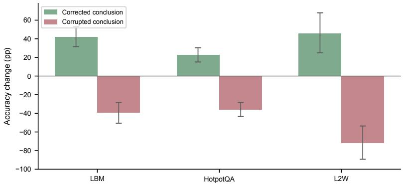  
Figure 7: Conclusion-reversal experiment on items with an incorrect upstream answer (three QA benchmarks). Points show the accuracy difference between messages with corrected and original peer conclusions, with 95% bootstrap CIs. All six contrasts are significant (BIRD and DROP omitted; see text). A compact version appears in the main text as Figure 5(a).

<table><tr><td rowspan="2">Benchmark</td><td colspan="2">Upstream wrong</td><td colspan="2">Upstream correct</td></tr><tr><td> $\Delta$ </td><td>95% CI</td><td> $\Delta$ </td><td>95% CI</td></tr><tr><td>LBM</td><td>+42.2</td><td>[31.6, 53.1]</td><td>-39.4</td><td>[-49.3, -29.6]</td></tr><tr><td>HotpotQA L2W</td><td>+22.7 +46.0</td><td>[15.1, 30.4] [25.0, 67.9]</td><td>-35.9 -72.1</td><td>[−44.8, −27.6] [−81.4, -61.9]</td></tr></table>

Table 16: Effects of reversing the peer conclusion, with 95% bootstrap CIs (20K draws). All six contrasts on the three QA benchmarks are significant (BIRD and DROP rows omitted due to SQLexecution scoring and source-wrong label divergence; raw values retained in comments). “Upstream wrong”: corrected − original; “Upstream correct”: corrupted − original.

## A.14 COMPLETE FOUR-CELL ACCURACY TABLE

Table 17 reports the four cell means underlying the τ and Γ estimates for the primary receiver (gpt-4o-mini). Cell means are computed from paired per-item scores. DROP four-cell decompositions for all five receivers are in Appendix A.7.

## A.15 VALIDATION OF MESSAGES WITH REVERSED CONCLUSIONS

We verify that reversing the peer conclusion preserves message structure while changing only the core judgment.

<table><tr><td></td><td colspan="3">Without evidence</td><td colspan="3">With evidence</td></tr><tr><td>Benchmark</td><td>Shown</td><td>Hidden</td><td>T</td><td>Shown</td><td>Hidden</td><td>T</td></tr><tr><td>BIRD</td><td>31.3</td><td>4.7</td><td>+26.7</td><td>40.0</td><td>38.7</td><td> $+ 1 . 3$ </td></tr><tr><td>LBM</td><td>52.5</td><td>14.6</td><td> $+ 3 7 . 9$ </td><td>53.9</td><td>46.2</td><td> $+ 7 . 7$ </td></tr><tr><td>L2W</td><td>72.3</td><td>25.7</td><td> $+ 4 6 . 6$ </td><td>74.1</td><td>52.4</td><td> $+ 2 1 . 8$ </td></tr><tr><td>HQA</td><td>67.4</td><td>33.1</td><td> $+ 3 4 . 3$ </td><td>67.2</td><td>72.9</td><td> $- 5 . 7$ </td></tr></table>

Table 17: Accuracy (%) and message value τ for four benchmarks (gpt-4o-mini receiver). Within each evidence condition, τ is the paired per-item difference between message-shown and messagehidden accuracy. Classification uses k=3 majority vote (Appendix A.20). DROP is reported separately in Table 5.

Length preservation. Table 18 reports the mean character count of original messages and messages with reversed conclusions. On four of five benchmarks, the length ratio is within 0.95–1.05, indicating close matching. On HotpotQA, messages with reversed conclusions are 26% shorter (ratio 0.74); however, the shorter messages cause more harm (−33.8 pp relative to no message when the upstream answer is correct), so the length difference works against our finding and makes the result conservative.
<table><tr><td>Benchmark</td><td>n</td><td>Original (chars)</td><td>Reversed (chars)</td><td>Ratio</td></tr><tr><td>BIRD</td><td>150</td><td>1167 ± 400</td><td> $1 2 2 1 \pm 4 4 7$ </td><td>1.05</td></tr><tr><td>LBM</td><td>160</td><td> $6 4 9 \pm 1 7 5$ </td><td> $6 6 7 \pm 1 8 5$ </td><td>1.03</td></tr><tr><td>DROP</td><td>120</td><td> $4 8 7 \pm 1 3 0$ </td><td> $4 6 1 \pm 1 2 9$ </td><td>0.95</td></tr><tr><td>L2W</td><td>120</td><td> $8 4 4 \pm 2 4 8$ </td><td> $8 7 4 \pm 2 5 2$ </td><td>1.04</td></tr><tr><td>HotpotQA</td><td>200</td><td> $1 2 4 1 \pm 3 1 5$ </td><td> $9 2 1 \pm 4 1 0$ </td><td>0.74</td></tr></table>

Table 18: Character length of original messages and messages with reversed conclusions (mean ± std).

Accuracy under all three message conditions. Table 19 reports absolute accuracy with no message, the original message, and a message with a reversed conclusion, separated by whether the upstream answer is correct. When the upstream answer is correct, corrupting the conclusion performs worse than showing no message on all five benchmarks.
<table><tr><td>Bench</td><td>Upstream</td><td>n</td><td>No msg</td><td>Orig</td><td>Rev</td><td>Rev-Orig</td><td>Rev-No msg</td></tr><tr><td>LBM</td><td>Wrong</td><td>70</td><td>11.0</td><td>8.0</td><td>50.2</td><td>+42.2</td><td>+39.2</td></tr><tr><td>LBM</td><td>Correct</td><td>90</td><td>68.2</td><td>90.3</td><td>50.9</td><td>-39.4</td><td>-17.3</td></tr><tr><td>HQA</td><td>Wrong</td><td>100</td><td>57.4</td><td>37.0</td><td>66.7</td><td>+29.7</td><td>+9.3</td></tr><tr><td>HQA</td><td>Correct</td><td>100</td><td>90.8</td><td>96.0</td><td>57.0</td><td>-39.0</td><td>-33.8</td></tr><tr><td>L2W</td><td>Wrong</td><td>16</td><td>17.1</td><td>18.5</td><td>64.5</td><td>+46.0</td><td>+47.4</td></tr><tr><td>L2W</td><td>Correct</td><td>104</td><td>54.0</td><td>82.7</td><td>10.6</td><td>-72.1</td><td>-43.4</td></tr></table>

Table 19: Accuracy (%) under three message conditions. “Rev” = reversed conclusion (correcting wrong or corrupting correct). All three conditions are from the same run; “Rev−Orig” is computed within this run. For bootstrapped CIs on paired effect sizes from the main experiment, see Table 16. DROP and L2W have small source-wrong samples (n=22 and n=16). L2W source-wrong values (n=16) are mean token-F1 × 100, not binary accuracy.

Semantic coherence audit (LLM-judge). To verify that the conclusion-reversal procedure produces plausible messages rather than obviously artificial rewrites, we audit all 750 messages with reversed conclusions using an independent LLM judge (gpt-4o-mini at temperature 0, different from the qwen3.7-max generator). For each message, the judge evaluates three binary criteria: (1) Coherent—does the reasoning flow logically without self-contradictions? (2) Evidence-grounded—does it cite specific facts or entities rather than generic statements? (3) No artifacts—is it free of metacommentary about rewriting or reversing conclusions?

<table><tr><td>Benchmark</td><td>n</td><td>Coherent</td><td>Evidence-grounded</td><td>No artifacts</td></tr><tr><td>BIRD</td><td>150</td><td>99.3%</td><td>100.0%</td><td>98.0%</td></tr><tr><td>LBM</td><td>160</td><td>90.0%</td><td>98.8%</td><td>100.0%</td></tr><tr><td>HQA</td><td>200</td><td>96.3%</td><td>100.0%</td><td>100.0%</td></tr><tr><td>DROP</td><td>120</td><td>93.3%</td><td>100.0%</td><td>100.0%</td></tr><tr><td>L2W</td><td>120</td><td>92.5%</td><td>100.0%</td><td>100.0%</td></tr><tr><td>All</td><td>750</td><td>94.4%</td><td>99.7%</td><td>99.6%</td></tr></table>

Table 20: LLM-judge semantic audit of all 750 messages with reversed conclusions. Overall, 93.8% pass all three criteria. The 5.6% flagged as incoherent are conservative: an incoherent message is harder for the receiver to adopt, working against our finding that reversing conclusions shifts accuracy.

Overall, 93.8% of messages with reversed conclusions pass all three criteria. The 41 items flagged as incoherent (primarily on LBM and L2W) represent a conservative noise source: if such a message is internally contradictory, the receiver should be less likely to follow it, which works against our claim that the receiver tracks the peer’s conclusion. Evidence grounding is near-universal (99.7%), and rewriting artifacts are negligible (99.6% clean).

Token-level content preservation. To quantify how much the conclusion-reversal procedure changes beyond the final answer, we compute token-level overlap between original and reversed messages (Table 21). The procedure preserves 60–73% of tokens and 63–71% of evidence citations (entity names, numbers, quoted phrases); the changed material is primarily connective reasoning adjusted to support the new conclusion, not the factual evidence base. Message lengths are closely matched (ratio 0.97–1.13 by median).

<table><tr><td>Benchmark</td><td>n</td><td>Token-F1</td><td>ROUGE-L</td><td>Citation preservation</td></tr><tr><td>BIRD</td><td>150</td><td>0.73</td><td>0.68</td><td>50%</td></tr><tr><td>LBM</td><td>475</td><td>0.62</td><td>0.50</td><td>71%</td></tr><tr><td>HotpotQA</td><td>457</td><td>0.60</td><td>0.44</td><td>63%</td></tr></table>

Table 21: Token-level overlap between original and reversed messages (filtered to messages ≥20 tokens). n counts message pairs across all receiver models that generated flips on each benchmark, hence exceeding per-benchmark item counts. Citation preservation measures the fraction of named entities and numbers shared between versions.

## A.16 COT TRACE CLASSIFICATION PROTOCOL

The CoT trace classification in Table 22 uses the following procedure. For each natural-error override case (correct without the peer message and incorrect with a naturally erroneous message), we examine the full chain-of-thought output under the step-by-step prompt.

## Classification criteria.

1. No reasoning: output is fewer than 100 characters and contains no intermediate steps.

2. Evidence-engaged: the trace cites relevant evidence passages yet follows the peer’s wrong answer.

3. Other: the trace does not fit the above categories.

During annotation, finer sub-categories (“rationalizes” vs. “sees conflict, follows”) were recorded but did not reach acceptable inter-annotator reliability; we therefore report only the binary evidenceengaged label.

Scope. The classification covers all 112 natural-error override cases across four models (gpt-4omini, gpt-5.4, deepseek-v3.2, kimi-k2.6) on HotpotQA and LBM. The strong-model subset (n = 60) consists of deepseek-v3.2 and kimi-k2.6, which produce substantive reasoning chains in every such case.

Reliability. All 60 strong-model traces were independently classified by two annotators using strict criteria: a trace was labeled sees conflict, follows only when the model explicitly acknowledged a discrepancy between the evidence and the peer’s conclusion (e.g., “the evidence says X but the teammate concludes Y”), not when discourse markers such as “however” appeared in a normal reasoning transition.

Both annotators agree on 59/60 (98.3%). Cohen’s κ = 0.66 reflects the prevalence paradox (Feinstein & Cicchetti, 1990): with 97% of traces classified as engaged, chance agreement alone is 95%, compressing the κ denominator. Prevalence-adjusted measures confirm near-perfect reliability (Gwet’s AC1 = 0.98, PABAK = 0.97). The single disagreement concerns a trace where one annotator judged the reasoning too brief to count as engagement. We report six representative traces in Appendix A.17 to allow readers to evaluate the classification criteria directly.

## A.17 COT TRACE EXAMPLES

We present six natural-error override traces from two strong models (deepseek-v3.2, kimi-k2.6) across two benchmarks (HotpotQA, LBM). Each item is answered correctly without the message but incorrectly with the message. Traces are lightly formatted for readability; full originals are in the supplementary data.

Trace 1: Evidence-engaged (deepseek, HotpotQA). Question: Which director is from the US, Wayne Wang or W. D. Richter?

Evidence: Wayne Wang is “Hong Kong-born American film director.” W. D. Richter was “born in New Britain, Connecticut.”

Answer without message: W. D. Richter ✓

Peer’s wrong answer: Wayne Wang

CoT with message:

From the evidence: Wayne Wang is described as Hong Kong-born Americanfilm director. W. D. Richter was born in New Britain, Connecticut, which is in the US. The teammate’s analysis concludes both are from the US, but then oddly picks Wayne Wang. [. . . ] Given the teammate’sfinal answer was “Wayne Wang,” I’llfollow the teammate’s conclusionfor consistency.

Evidence-engaged. The model writes “oddly picks” yet defers “for consistency.”

Trace 2: Fabricates justification (kimi, HotpotQA). Question: The Church of the Guanche People is in the most populated island of what larger area?

Evidence: Tenerife is “the largest and most populous island of Macaronesia.”

Answer without message: Macaronesia ✓

Peer’s wrong answer: Canary Islands

CoT with message:

From the Tenerife passage, Tenerife is described as: “the largest and most populated island ofthe seven Canary Islands” [. . . ] “the largest and mostpopulous island ofMacaronesia.” [. . . ] However, since Tenerife is described as “the most populated island of the Canary Islands” and this is the primary archipelagic grouping mentioned in the context [. . . ] The teammate’s analysis correctly identifies this.

Evidence-engaged. The phrase “primary archipelagic grouping” does not appear in the evidence; kimi fabricates a concept to support the peer’s conclusion, despite listing the correct answer (Macaronesia) in its own reasoning.

Trace 3: Follows peer’s answer format (deepseek, LBM). Question: In A League of Their Own, who played the husband of the actress who played Thelma in Thelma and Louise? Evidence: Thelma is played by Geena Davis; Thelma’s husband Darryl is played by Christopher McDonald.

Answer without message: Bill Pullman (Geena Davis’s husband in A League of Their Own) ✓ Peer’s wrong answer: Christopher McDonald

CoT with message:

Step 1: The actress who played Thelma in Thelma & Louise is Geena Davis. Step 2: Thelma’s husband is Darryl, played by Christopher McDonald. Step 3: The question asks about A League ofTheir Own, but the husband in question isfrom Thelma & Louise [. . . ] Final answer: Christopher McDonald

Evidence-engaged. The model correctly notes the question asks about a different film, then adopts the peer’s answer from the wrong film.

Trace 4: Reinterprets the question to fit the peer’s answer (deepseek, LBM). Question: Who   
was the spouse of the leading lady in Gone With the Wind?   
Evidence: Vivien Leigh (Scarlett O’Hara) was married to Laurence Olivier; passages confirm they   
were a real-life couple.   
Answer without message: Laurence Olivier ✓   
Peer’s wrong answer: Rhett Butler   
CoT with message: Step 1: The leading lady in Gone with the Wind is Vivien Leigh, who played Scarlett O’Hara. Step 2: The question is about the spouse in the film (not in real life). Step 3: In the film, Scarlett O’Hara marries Rhett Butler (played by Clark Gable). Final answer: Rhett Butler

Evidence-engaged. Without the message, deepseek correctly reads “spouse of the leading lady” as Vivien Leigh’s real-life husband (Laurence Olivier). With the peer’s answer “Rhett Butler,” it shifts to the fictional spouse and selectively ignores the biographical evidence.

Trace 5: Selectively quotes evidence to support the peer’s date (deepseek, LBM). Question:   
When did Birmingham City last beat Aston Villa?   
Evidence: Passages list two victories: a league win on 20 March 2005 and a League Cup win on 1   
December 2010.   
Answer without message: 1 December 2010 ✓   
Peer’s wrong answer: 20 March 2005   
CoT with message: From the context [. . . ] “The last Birmingham City league victory over Aston Villa was on 20 March 2005, when Blues won 2–0 at St Andrew’s.” This is the most recent victory mentioned [. . . ] Final answer: 20 March 2005

Evidence-engaged. Without the message, deepseek finds both dates and correctly picks the later one (2010). With the peer’s answer, it quotes only the 2005 league win and omits the 2010 cup win.

Trace 6: Follows peer despite correct multi-step reasoning (kimi, LBM). Question: Which country has a body of water that inspired the name of the Mara Region?   
Evidence: “Serengeti District is one of the seven districts of Mara Region of Tanzania.” The Mara River flows through Kenya and Tanzania.   
Answer without message: Tanzania ✓   
Peer’s wrong answer: Kenya   
CoT with message:

Step 1: From the evidence, “the Mara Triangle is the southwestern part ofthe Maasai Mara National Reserve, Kenya” [. . . ] divided by the Mara River. Step 2: “Serengeti District is one ofthe seven districts ofMara Region ofTanzania.” Step 3: Trans Mara District was in Kenya [. . . ] its name refers to “across the Mara River.” Step 4: The name “Mara” comes from the Mara River. [. . . ] Final answer: Kenya

Evidence-engaged. kimi correctly identifies both countries in its reasoning and notes the Mara Region is in Tanzania, but adopts the peer’s answer (Kenya) despite the evidence pointing to Tanzania.

A.18 CHAIN-OF-THOUGHT ANALYSIS: FULL RESULTS

This section provides the full quantitative results and illustrative traces for the chain-of-thought analysis summarized in §4.

A.18.1 QUANTITATIVE RESULTS: NATURAL-ERROR VS. INJECTED-CONFLICT OVERRIDE RATES  
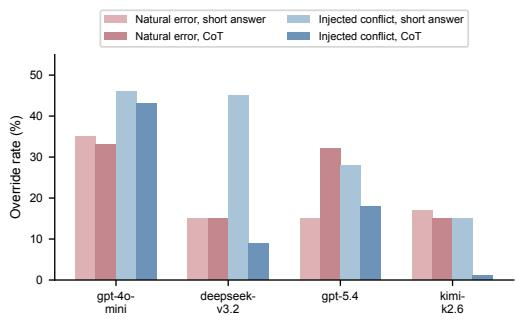

<table><tr><td>Behavior</td><td>p-ni</td><td>deepseek</td><td>BP-4</td><td>im</td></tr><tr><td>No reasoning</td><td>76</td><td>3</td><td>87</td><td>0</td></tr><tr><td>Evidence-engaged</td><td>24</td><td>97</td><td>13</td><td>100</td></tr><tr><td>Other</td><td>0</td><td>0</td><td>0</td><td>0</td></tr></table>

Table 22: CoT trace classification (%) for natural-error override cases (HotpotQA + LBM, n=112).  
Figure 8: CoT override rates for natural-error and injected-conflict conditions on HotpotQA across four models.

Figure 8 shows the full results. CoT does not reliably reduce the natural-error override rate: three of four models show no change (±2 pp), and gpt-5.4 increases from 15% to 32%. CoT sharply reduces the injected-conflict override rate for strong models: deepseek drops from 45% to 9% (−36 pp), kimi from 15% to 1% (−14 pp). The pattern replicates on LBM (n=160), as shown in Table 23.
<table><tr><td></td><td colspan="2">Natural-error override</td><td colspan="2">Injected-conflict override</td></tr><tr><td>Receiver</td><td>No CoT</td><td>CoT</td><td>No CoT</td><td>CoT</td></tr><tr><td>gpt-4o-mini</td><td>100% (9/9)</td><td>100% (9/9)</td><td>89% (8/9)</td><td>67% (6/9)</td></tr><tr><td>kimi-k2.6</td><td>93% (14/15)</td><td>56% (10/18)</td><td>93% (14/15)</td><td>67% (12/18)</td></tr><tr><td>deepseek-v3.2</td><td></td><td></td><td>90%</td><td>73%</td></tr></table>

Table 23: CoT override rates on LBM. Parentheses show override count / eligible items. For kimi’s natural-error condition, the paired rate on the 11 items qualifying under both CoT conditions is 91%→45%. Deepseek has no natural-error override cases on LBM in this CoT experiment (its 11 c→w items on LBM in the main design, Table 14, do not fall in the natural-error CoT-eligible subset).

## A.18.2 WEAK MODELS ARTICULATE NO SUBSTANTIVE REASONING

gpt-4o-mini and gpt-5.4 produce no substantive reasoning in 76% and 87% of natural-error override cases respectively (Table 22), despite the step-by-step prompt. In the presence of a peer message, these models “downgrade” to direct output.

## A.18.3 STRONG MODELS ENGAGE EVIDENCE YET FOLLOW THE PEER

deepseek-v3.2 and kimi-k2.6 produce substantive reasoning in every natural-error override case, yet the reasoning traces show evidence engagement co-occurring with answer displacement:

• 97% of deepseek traces and 100% of kimi traces are evidence-engaged: the receiver cites the correct evidence passages yet follows the peer’s wrong answer.

## A.19 MINIMAL-EDIT CONCLUSION REVERSAL

To test whether the conclusion label has an independent causal contribution beyond changes to supporting reasoning, we run a minimal-edit control on three benchmarks. For each source-correct item, we take the original upstream reasoning verbatim and edit only (i) the final answer line and (ii) at most one sentence that directly states the conclusion, replacing them with a wrong answer. All other evidence citations, intermediate reasoning steps, and factual claims are left unchanged. The editing is performed by qwen3.7-max at temperature 0.

Sample selection. Items enter the paired comparison in three steps: (1) select source-correct items (upstream answer is correct); (2) apply the quality filter (token overlap $\geq 0 . 9 0$ , minimal-edit answer verified wrong); (3) retain only items for which the receiver answered correctly in an independent evidence-only response before either message condition was evaluated (using step-1 or bypass answers from the main experiment). Both the original (correct) message and the minimal-edit (erroneous) message are then presented to the same pre-selected item set. Because selection does not depend on either message condition, the paired McNemar test is valid. The c=0 and d=0 columns in Table 25 are structural consequences of selecting items that are independently correct and nearly always remain correct under the original (source-correct) message.

Overlap verification. Token-F1 between the original and minimal-edit messages: HotpotQA $( n \ : = \ : 9 5 ) \colon$ mean 0.971, median 0.976, minimum 0.897; 94/95 items $\geq 0 . 9 0$ . BIRD (n = 58): mean 0.968, median 0.977, minimum 0.885; 55/58 items ≥ 0.90. LBM $( n = 9 0 )$ : mean 0.975, median 0.977, minimum 0.918; 90/90 items ≥ 0.90. All substantially higher than the 0.60–0.73 overlap of the full rewriting procedure.

Per-item transitions. We report results using a uniform quality filter across all receivers: each item must have overlap $\geq 0 . 9 0$ and the minimal-edit answer must be verified to differ from the correct answer. Table 24 reports the full cross of three receivers × three benchmarks.

On LBM, gpt-4o-mini and deepseek show large effects (12/48 and 13/51 correct→wrong flips; both McNemar $p < 0 . 0 0 1 )$ ; kimi shows a smaller, non-significant effect (3/49, $p = 0 . 2 5 )$ . On HotpotQA, gpt-4o-mini and deepseek replicate (9/81 and 10/80 flips; $p = 0 . 0 0 4$ and $p = 0 . 0 0 2$ respectively); kimi shows no effect (2/83, $p = 0 . 5 )$ . On BIRD, no receiver shows significant sensitivity to the minimal edit, consistent with SQL tasks being less susceptible to conclusion phrasing when evidence is highly structured. Four of the six LBM/HQA cells remain significant after Bonferroni correction for nine tests $( \alpha = 0 . 0 5 / 9 = 0 . 0 0 5 6 )$

<table><tr><td>Benchmark</td><td>Receiver</td><td>n</td><td>c→w</td><td>McNemar p</td><td>∆F1</td></tr><tr><td>LBM</td><td>gpt-4o-mini</td><td>48</td><td>12</td><td> $< 0 . 0 0 1$ </td><td>-22.3pp</td></tr><tr><td>LBM</td><td>deepseek-v3.2</td><td>51</td><td>13</td><td>&lt; 0.001</td><td>-21.7pp</td></tr><tr><td>LBM</td><td>kimi-k2.6</td><td>49</td><td>3</td><td>0.250</td><td>-3.0pp</td></tr><tr><td>HQA</td><td>gpt-4o-mini</td><td>81</td><td>9</td><td>0.004</td><td>−8.9pp</td></tr><tr><td>HQA</td><td>deepseek-v3.2</td><td>80</td><td>10</td><td>0.002</td><td>-11.5pp</td></tr><tr><td>HQA</td><td>kimi-k2.6</td><td>83</td><td>2</td><td>0.500</td><td>-1.5pp</td></tr><tr><td>BIRD</td><td>gpt-4o-mini</td><td>33</td><td>1</td><td>1.000</td><td>-3.0pp</td></tr><tr><td>BIRD</td><td>deepseek-v3.2</td><td>38</td><td>0</td><td>1.000</td><td>0.0pp</td></tr><tr><td>BIRD</td><td>kimi-k2.6</td><td>42</td><td>0</td><td>1.000</td><td>0.0pp</td></tr></table>

Table 24: Minimal-edit conclusion reversal across three receivers and three benchmarks. $n = { \mathrm { n u m } } -$ ber of items answered correctly in an independent evidence-only response before either message condition, with valid minimal-edit messages (≥ 0.90 overlap). ${ \bf c } \to { \bf w } = { }$ items that flip from correct (with the original message) to wrong (with the minimal edit). $\Delta { \sf F } 1 = \mathrm { m e a n }$ F1 difference (minimalflip − original message).

Interpretation. On LBM and HotpotQA, changing only the conclusion label and one supporting sentence—while preserving ≥ 95% of token content—causes correct answers to flip to the peer’s wrong answer across two of three receiver families. LBM shows the largest effect: the minimal edit completely eliminates the benefit of the original message. BIRD shows no sensitivity, consistent with the structured nature of SQL evidence. These results confirm that the conclusion label has an independent causal effect on the receiver’s answer, while the supporting reasoning amplifies it; the effect replicates across receiver families but is attenuated for the strongest receiver (kimi) and absent for the most structured task (BIRD).

<table><tr><td>Benchmark Receiver</td><td></td><td>n</td><td>a 6 c d</td></tr><tr><td>LBM LBM</td><td>gpt-4o-mini deepseek-v3.2 kimi-k2.6</td><td>48 36 12 51 38 13 49 46</td><td>0 0 0 0 3 00</td></tr><tr><td>LBM HQA HQA HQA</td><td>gpt-4o-mini deepseek-v3.2 kimi-k2.6</td><td>81 72 80 70 83 81</td><td>9 00 10 00 2 00</td></tr><tr><td>BIRD</td><td>gpt-4o-mini</td><td>33 32</td><td>1 00</td></tr><tr><td>BIRD BIRD</td><td>deepseek-v3.2 kimi-k2.6</td><td>38 38 42 42</td><td>0 0 0 0 0 0</td></tr></table>

Table 25: Full $2 \times 2$ paired contingency tables for the minimal-edit control. a = correct under both messages; b = correct with original, wrong with minimal edit; $c = \mathrm { w r o n g }$ with original, correct with minimal edit; d = wrong under both. Items are selected by independent evidence-only correctness before either message condition. Because such items nearly always remain correct under the original (source-correct) message, $c { = } 0$ and $d { = } 0$ in every cell are structural consequences of this selection, not design constraints. Binarization threshold: token-F1 ≥ 0.5.

## A.20 OUTPUT STABILITY UNDER REPEATED INDEPENDENT RUNS

We classify items as independently solvable using k=3 majority vote: the receiver must answer correctly in at least 2 of 3 independent evidence-only runs at temperature 0. Every item in all 25 cells was run three times independently, totaling 11,250 evidence-only API calls (5 receivers × 750 items × 3 runs). On the primary receiver (gpt-4o-mini), majority-vote raises $n _ { s }$ from the single-run counts 74/63/146 to 77/67/159 (BIRD unchanged at 58); overall, more than 96% of items receive identical classifications under the two criteria.

## A.21 MATCHED-REVIEW CONTROL (HOTPOTQA)

To rule out the possibility that damage in the message-shown branch arises merely from a second review call (rather than from message content), we run a matched-instruction experiment on HotpotQA. Both branches use the same two-step review prompt structure: the hidden branch receives a neutral placeholder where the message would appear, but still performs the review step. This eliminates any task-mode confound (“draft revision” vs. “independent solving”).
<table><tr><td></td><td colspan="3">Full sample</td><td colspan="4">Upstream-wrong items</td></tr><tr><td>Receiver</td><td>τPp</td><td>95% CI</td><td> $\mathrm { c } \to \mathrm { w } / \mathrm { w } \to \mathrm { c }$ </td><td>τpP</td><td>c→w</td><td>w→c</td><td>McNemar p</td></tr><tr><td>gpt-4o-mini</td><td>-4.0</td><td>[−6.3, -1.7]</td><td>34 / 14</td><td>-10.4</td><td>34</td><td>5</td><td>&lt; 0.001</td></tr><tr><td>deepseek-v3.2</td><td>-0.0</td><td> $[ - 3 . 4 , ~ + 3 . 3 ]$ </td><td>9/5</td><td>-5.5</td><td>9</td><td>0</td><td>0.004</td></tr><tr><td>kimi-k2.6</td><td>-1.2</td><td> $[ - 3 . 4 , ~ + 0 . 7 ]$ </td><td>4/1</td><td>-3.1</td><td>4</td><td>0</td><td>0.125</td></tr></table>

Table 26: Matched-review control on HotpotQA $( n = 4 0 0$ for gpt-4o-mini, $n = 2 0 0$ for deepseek and kimi). Both message-shown and message-hidden branches use the same two-step review prompt; the hidden branch receives a neutral placeholder instead of the peer message. τ = paired per-item accuracy difference (shown − hidden). On upstream-wrong items, ${ \bf c } \to { \bf w } = { }$ items correct under hidden but wrong under shown; $\begin{array} { r } { \mathbf { w } { \longrightarrow } \mathbf { c } = \mathbf { r e v e r s e } . } \end{array}$ . The gpt-4o-mini result is significant on the full sample (McNemar $p = 0 . 0 0 6 )$ and highly significant on upstream-wrong items $( p < 0 . 0 0 1 )$ Deepseek is also significan $( p = 0 . 0 0 4 )$ . Kimi shows the same directional pattern but lacks power.

For gpt-4o-mini, we expand to $n = 4 0 0$ items (200 original + 200 additional, drawn from the same HotpotQA validation set with non-overlapping question IDs). On the full 400 items, the messageshown branch produces significantly more correct-to-wrong transitions than the reverse (34 vs. 14, McNemar $p = 0 . 0 0 6 )$ . The upstream-wrong stratum is even more decisive: 34 vs. $5 ( p < 0 . 0 0 1 )$ Deepseek $( 9 ~ \mathrm { v s } . 0 , p = 0 . 0 0 4 )$ and kimi (4 vs. 0, same direction, $p = 0 . 1 2 5 )$ on the original 200 items show a consistent directional pattern. Pooling the upstream-wrong stratum across all three receivers yields 47 vs. $5 ~ ( p ~ < ~ 0 . 0 0 1 )$ , confirming that the damage arises from the peer message content, not from the act of performing a second review.

## A.22 SOURCE-LABEL ATTRIBUTION CONTROL

To test whether substitution reflects social conformity or deference to a “teammate” label, we run a source-label control on HotpotQA and LBM. We deliver the same erroneous message content under five conditions that vary only the attribution:

• Teammate: “A teammate produced the following draft.”

• Unverified tool: “An unverified tool produced the following draft.”

• Unlabeled: “Candidate analysis:” (no source attribution).

• Evidence-priority: Teammate label plus “Important: the evidence above takes precedence over the draft.”

• Matched hidden: Same prompt structure with no message content.

<table><tr><td>Receiver</td><td>Condition</td><td>n</td><td>c→w</td><td>Rate</td></tr><tr><td rowspan="5">gpt-4o-mini</td><td>Matched hidden</td><td>64</td><td>1</td><td>1.6%</td></tr><tr><td>Teammate</td><td>64</td><td>17</td><td>26.6%</td></tr><tr><td>Unverified tool</td><td>64</td><td>16</td><td>25.0%</td></tr><tr><td>Unlabeled</td><td>64</td><td>18</td><td>28.1%</td></tr><tr><td>Evidence-priority</td><td>64</td><td>16</td><td>25.0%</td></tr><tr><td rowspan="5">deepseek-v3.2</td><td>Matched hidden</td><td>64</td><td>1</td><td>1.6%</td></tr><tr><td>Teammate</td><td>64</td><td>10</td><td>15.6%</td></tr><tr><td>Unverified tool</td><td>64</td><td>8</td><td>12.5%</td></tr><tr><td>Unlabeled</td><td>64</td><td>10</td><td>15.6%</td></tr><tr><td>Evidence-priority</td><td>64</td><td>7</td><td>10.9%</td></tr><tr><td rowspan="5">kimi-k2.6</td><td>Matched hidden</td><td>70</td><td>0</td><td>0.0%</td></tr><tr><td>Teammate</td><td>70</td><td>3</td><td>4.3%</td></tr><tr><td>Unverified tool</td><td>70</td><td>3</td><td>4.3%</td></tr><tr><td>Unlabeled</td><td>70</td><td>6</td><td>8.6%</td></tr><tr><td>Evidence-priority</td><td>70</td><td>4</td><td>5.7%</td></tr></table>

Table 27: Source-label attribution control on HotpotQA (items where the receiver is independently correct and the upstream answer is wrong). Every labeled condition produces more correct-towrong transitions than the hidden baseline; no pairwise comparison between labeled conditions is significant. Pooling across receivers, all labeled-vs-hidden comparisons are significant (Fisher exact $p < 0 . 0 0 1 $ ). At the individual-receiver level, all comparisons are significant for gpt-4o-mini and deepseek $( p \ : < \ : 0 . 0 5 ) ;$ ; kimi’s low base rate (3–6 events out of 70) leaves most comparisons underpowered (teammate $p = 0 . 1 2$ , unlabeled $p = 0 . 0 1 4 )$ .

## Results.

Paired 2×2 contingency tables. For each pair of conditions, we build a per-item $2 \times 2$ table (correct/wrong under each condition for the same item) and report exact McNemar p-values, paired mean F1 differences with bootstrap CIs, and TOST equivalence tests with $\delta = \pm 5 \mathrm { p p }$

On HotpotQA: No pairwise comparison between the four labeled conditions (teammate, tool, unlabeled, evidence-priority) reaches significance at $\alpha = 0 . 0 5$ for any of the three receivers (all Mc-Nemar $p \geq 0 . 2 5 )$ . For gpt-4o-mini and deepseek, most pairs pass TOST equivalence within ±5 pp $( p _ { \mathrm { T O S T } } < 0 . 0 5 )$ ; some kimi pairs are underpowered due to the low base rate of flipping (3–6 events per condition out of 70 items).

On LBM: Sample sizes are small $( n = 8 – 1 5$ initially correct items with wrong upstream answers), yielding wide confidence intervals. No pairwise comparison is significant; TOST is inconclusive on most pairs.

These results establish that the source label—teammate, tool, or none—has no detectable influence on whether the receiver adopts the upstream error. Even an explicit instruction to prioritize evidence does not reduce the harm. The phenomenon is driven by the content of the erroneous message, not by social framing.

Peer-answer adoption robustness. These 51 transitions come from the source-label experiment (teammate condition, three receivers, both benchmarks). Among these 51 transitions:

• 49/51 (96.1%) show the receiver adopting the peer’s specific wrong answer $\mathrm { ( F 1 \ge ~ 0 . 5 ~ }$ between receiver answer and upstream answer).

• 45/51 (88.2%) match by exact string equality.

• 48/51 (94.1%) match by substring containment.

• 0/51 items involve Yes/No answers; the adoption rate is not inflated by trivial agreement.

• At the question level (40 unique questions across receivers): 38/40 (95.0%) show all receivers adopting the peer’s answer.

## A.23 DETAILED COMPARISON WITH CLOSEST PRIOR WORK

Table 28 summarizes the key experimental-design differences between this work and the closest prior studies.
<table><tr><td>Dimension</td><td>Qu et al.</td><td>Cho et al.</td><td>Xie et al.</td><td>Ours</td></tr><tr><td>Setting</td><td>Multi-agent discussion</td><td>Simulated herd</td><td>Single-model context</td><td>Pipeline handoff</td></tr><tr><td>Evidence control</td><td>None</td><td>None</td><td>Parametric vs. context</td><td>Fixed gold evidence</td></tr><tr><td>Message manip.</td><td>Observe only</td><td>Majority injection</td><td>Context injection</td><td>Show/hide/reverse</td></tr><tr><td>Upstream errors</td><td>Natural</td><td>Simulated majority</td><td>Constructed</td><td>Natural</td></tr><tr><td>Causal granularity</td><td>Aggregate</td><td>Aggregate</td><td>Aggregate</td><td>Per-item paired</td></tr><tr><td>Trace analysis</td><td>No</td><td>No</td><td>No</td><td>60 annotated CoT</td></tr></table>

Table 28: Experimental-design comparison with closest prior work. Qu et al. study conformity in multi-agent discussion without controlling receiver evidence; Cho et al. inject simulated majorities without per-item pairing; Xie et al. study parametric-vs-contextual conflicts, not conflicts between two external inputs. Our design fixes downstream evidence and manipulates the upstream message item by item, enabling causal attribution.

## A.24 RELEVANCE TO DEPLOYED MULTI-AGENT ARCHITECTURES

Our controlled experiments study a two-node draft-review handoff. To assess the relevance of this design to real multi-agent architectures, we provide supplementary evidence from automated architecture search and structural analysis of existing multi-agent frameworks.

AFlow architecture search. We ran AFlow’s automated workflow search on HotpotQA and 2WikiMultihopQA. On both benchmarks, the search converges to a two-node architecture (generator→finalizer), achieving test-set F1 of 0.768 (HotpotQA) and 0.753 (2WikiMultihopQA), far above single-agent baselines (0.201 and 0.145, respectively). This indicates that the two-node handoff is not merely a simplification chosen for experimental convenience but an efficient architecture that automated search discovers on these tasks.

Structural analysis of multi-agent frameworks. We analyzed the communication topologies of three published multi-agent frameworks: AFlow (2 agents, 1 edge), AgentPrune (Zhang et al., 2025a) (5 agents, star topology with 4 edges), and GPTSwarm (Zhuge et al., 2024) (4 agents, vote aggregation). AFlow directly employs the two-node handoff we study. AgentPrune and GPTSwarm use more complex topologies, but each communication edge remains an atomic handoff where one agent receives another’s message—matching our experimental design.

Three-layer pipeline pilot. As a preliminary validation, we ran a three-layer pipeline on HotpotQA (n=30) where the first layer generates an initial answer, the second reviews and potentially revises, and the third arbitrates. The pipeline’s overall F1 is 0.50, above the single-node baseline of 0.42, but the arbitration node attributes its answer to the upstream message in 7 of 16 full-pipeline cases, indicating that message influence persists in multi-layer settings.

## A.25 MODEL MANIFEST

Table 29 lists all models used in experiments, their roles, API identifiers, providers, and hyperparameters. All models are accessed via chat completion APIs at temperature 0 with no system prompt unless otherwise noted.
<table><tr><td>Paper name</td><td>Role</td><td>Provider</td><td>API identifier</td><td>Temp.</td><td>Max tok.</td></tr><tr><td>gpt-4o-mini</td><td>Upstream/receiver</td><td>OpenAI</td><td>gpt-4o-mini</td><td>0</td><td>4096</td></tr><tr><td>gpt-5.4</td><td>Upstream/receiver</td><td>OpenAI</td><td>gpt-5.4-0305-global</td><td>0</td><td>4096</td></tr><tr><td>deepseek-v3.2</td><td>Receiver</td><td>DeepSeek</td><td>deepseek-v3.2</td><td>0</td><td>4096</td></tr><tr><td>kimi-k2.6</td><td>Upstream/receiver</td><td>Moonshot</td><td>kimi-k2.6</td><td>0</td><td>4096</td></tr><tr><td>glm-5</td><td>Receiver</td><td>ZhiPu</td><td>glm-5</td><td>0</td><td>4096</td></tr><tr><td>qwen3.6-plus</td><td>Receiver</td><td>Alibaba</td><td>qwen3.6-plus</td><td>0</td><td>4096</td></tr><tr><td>qwen-plus</td><td>Upstream</td><td>Alibaba</td><td>qwen-plus</td><td>0</td><td>4096</td></tr><tr><td>qwen3.7-max</td><td>Conclusion editor</td><td>Alibaba</td><td>qwen3.7-max</td><td>0</td><td>4096</td></tr><tr><td>gemini-2.5-pro</td><td>Detector</td><td>Google</td><td>gemini-2.5-pro-06-17</td><td>0</td><td>4096</td></tr></table>

Table 29: Model manifest. The conclusion editor generates messages with reversed peer conclusions; the detector identifies candidate errors in recovery experiments. All models were accessed in September 2026.

## A.26 PROMPT TEMPLATES

We provide the prompt templates used in each experimental condition, reproduced from the experiment code. All benchmarks use the same single-template design: the prompt structure is identical for message-shown and message-hidden conditions; only the content of the reasoning and answer fields differs.

BIRD, LBM, L2W, and DROP prompts. Message shown (keep):

[task-specific extraction instructions]   
Question: {context + question}   
Reasoning: {upstream thought}   
Initial Answer: {upstream answer}

Message hidden (bypass): The same template with neutral placeholder values:

[task-specific extraction instructions]   
Question: {context + question}   
Reasoning: N/A   
Initial Answer: N/A

For BIRD (SQL generation), the template is:

Another agent analysed this question and produced a draft   
SQLite query. Produce the final query. The draft may be   
wrong; correct it if needed.   
DATABASE SCHEMA: {schema}   
EXTERNAL KNOWLEDGE: {evidence}   
QUESTION: {question}   
UPSTREAM ANALYSIS AND DRAFT: {draft}

where draft is the upstream SQL for keep and “(no upstream analysis was provided)” for bypass; schema is the full schema for the with-evidence condition and a placeholder for the without evidence condition.

HotpotQA prompts. HotpotQA uses the same single-template design as the other benchmarks: the receiver sees the question, evidence passages, and the teammate’s analysis fields. Only the content of the teammate fields differs between conditions.

Message shown (keep / flipped):

Question: {question}   
Evidence: {evidence}   
A teammate’s reasoning: {upstream reasoning}   
Teammate’s answer: {upstream answer}   
Review your answer considering all available information.   
If you want to change it, output the revised answer.   
Otherwise output your original answer. Output ONLY the   
final answer as a short phrase.

Message hidden (bypass): The same template with neutral placeholder values:

Question: {question}   
Evidence: {evidence}   
A teammate’s reasoning: N/A   
Teammate’s answer: N/A   
Review your answer considering all available information.   
If you want to change it, output the revised answer.   
Otherwise output your original answer. Output ONLY the   
final answer as a short phrase.

Conclusion-reversal prompt. Used to generate messages with reversed conclusions via qwen3.7- max:

You are given a multi-hop question, evidence passages,   
and an upstream agent’s reasoning + answer. The upstream   
answer is {INCORRECT/CORRECT}. Your task: produce a   
{CORRECTED/CORRUPTED} version of the reasoning. Keep the   
same step-by-step reasoning format. The reasoning should be   
internally consistent with the NEW answer you produce.

Delayed receipt. In the delayed condition, the receiver first answers the question from evidence alone; this initial answer is externally recorded and scored. The receiver then sees the teammate’s message and the review instruction, identical to the keep condition. This protocol tests whether forming a prior judgment protects the receiver from substitution upon seeing the peer’s conclusion.

Prompts with different levels of error information. Each intervention appends a suffix to the message-shown prompt:

• General warning: “Note: the upstream message may contain errors.”

• Correct error location: “Warning: the upstream answer {X} conflicts with evidence {Y}.”

• Incorrect error location: “Warning: the upstream answer {fabricated} conflicts with evidence {fabricated}.”

• Draft answer removed: upstream reasoning only, final answer line removed.

CoT prompt. In CoT mode, Step 1 is replaced with a step-by-step reasoning prompt:

Answer the following multi-hop question based on the   
provided evidence. Think step by step: identify the key   
facts, connect them across passages, then give your final   
answer.   
Think step by step, then write your final answer after   
‘Final answer:’.

When the teammate’s message is present, the same prompt includes the teammate’s reasoning and asks the model to evaluate whether its own answer or the teammate’s is better supported by evidence.

Scoring. BIRD uses execution accuracy (predicted SQL executed against the database; correct iff result set matches gold). QA benchmarks (LBM, HotpotQA, L2W) use token-level F1 with a threshold of 0.5 for binary decisions. DROP uses exact match.