# WISE-ATTA: When to Ask for Labels in Budgeted Active Test-Time Adaptation

Muhammad Huzaifa Lea Schonherr Thorsten Eisenhofer¨

CISPA Helmholtz Center for Information Security

{muhammad.huzaifa, schoenherr, eisenhofer}@cispa.de

Code: https://github.com/Muhammad-Huzaifaa/WISE-ATTA

## Abstract

Active test-time adaptation (ATTA) improves robustness under distribution shift by updating a deployed model during inference while selectively querying supervision. However, most existing ATTA methods implicitly assume that supervision can be requested for every incoming test batch, which can incur substantial annotation cost over long test streams. In this work, we introduce budgeted ATTA in which labels are available for only a fraction of test batches. This formulation shifts the central challengefrom deciding what to label within a batch to deciding when supervision should be applied over time. To address this challenge, we propose a budget-aware approach WISE-ATTA that allocates supervision over the test stream based on lightweight signals computed online, prioritizing periods where supervision is likely to be most useful. When a batch is selected for supervision, wefurther employ a drift-based sample selection criterion that targets samples exhibiting ongoing, unconverged adaptation dynamics, enabling effective updatesfrom a single labeled example. We evaluate this approach on synthetic corruptions (ImageNet-C) and natural distribution shifts (ImageNet-R/K/A). Across settings, WISE-ATTA achieves competitive or improved performance compared to recent ATTA methods while requiring substantiallyfewer labels. Overall, we find that the timing of supervision is a key, yet underexplored, aspect ofactive test-time adaptation.

## 1. Introduction

Modern machine learning models are routinely deployed in environments where the test distribution differs from training, for example, due to noise, changes in data acquisition, or broader domain shifts [11, 30, 33]. Test-time adaptation (TTA) addresses this challenge by updating a pretrained model on the unlabeled test stream as it becomes available, often using per-batch objectives based on entropy minimization or pseudo-label-based self-training [41, 45]. While effective over short horizons, purely unsupervised TTA can become unstable over long streams: small adaptation errors can accumulate, internal representations may drift, and performance can deteriorate as the distribution evolve [29, 45].

Table 1. Comparison of ATTA methods on ImageNet-K. WISE-ATTA achieves the lowest average error with fewer labels.
<table><tr><td>Method</td><td>Replay Buffer</td><td>Labels / Batch</td><td>Batch Sel.</td><td>Avg. Err. ↓</td></tr><tr><td>CEMA [3]</td><td>√</td><td>teacher</td><td>x</td><td>59.2</td></tr><tr><td>SimATTA [9]</td><td>√</td><td>3</td><td>x</td><td>58.2</td></tr><tr><td>HILTTA [22]</td><td>x</td><td>3</td><td>x</td><td>58.1</td></tr><tr><td>EATTA [42]</td><td>x</td><td>1</td><td>x</td><td>58.0</td></tr><tr><td>WISE-ATTA (Ours)</td><td>x</td><td>≤ 0.5</td><td>√</td><td>57.2</td></tr></table>

In response, active test-time adaptation (ATTA) augments TTA with sparse supervision, providing corrective signals that anchor the adaptation process and reduce error accumulation [9, 22, 42]. In practice, however, test-time supervision is costly: labels may require human experts or expensive teacher models [3, 22], and even low annotation rates can accumulate substantial cost over long deployments [42]. Moreover, not all test batches contribute equally to adaptation in a continual stream. This raises a central question: how should limited supervision be used during a continual test stream?

Thus far, existing ATTA methods implicitly adopt a batchcentric view of supervision. They assume that every incoming test batch is annotated and focus on reducing the number of labeled samples within each batch, for example by selecting representative [9] or highly learnable samples [42]. While effective at improving label efficiency locally, this formulation ties supervision rigidly to the batch structure of the test stream and applies it uniformly over time. Under a fixed global budget, such uniform allocation can be inefficient, as the benefit of supervision can vary substantially across batches and over the course of adaptation. As a result, existing methods leave open the question of when supervision should be applied in a continual test stream.

In this paper, we address this question and consider a budgeted ATTA setting in which supervision is available only for a limited subset of batches over a long test stream. This setting better reflects practical settings, where annotation incurs non-negligible cost and supervision may be available only intermittently due to human, computational, or latency constraints. Importantly, it changes the nature of active adaptation. Rather than only deciding what to label within a batch, effective adaptation now requires making online decisions about when a batch should be labeled. We show that explicitly reasoning about the timing of supervision plays a central role in effectively using a limited budget.

To this end, we introduce WISE-ATTA, a budget-aware approach to active test-time adaptation that estimates the utility of incoming batches and allocates a global label budget over time. As shown in Tab. 1, WISE-ATTA requires neither a replay buffer nor a teacher model, and can achieve stronger performance with fewer labels than prior ATTA methods.

A key challenge in this setting is to assess the potential benefit of supervision at the moment a batch becomes available. Such decisions must be made online and without access to ground-truth labels, relying only on statistics computed from the current model and the incoming data. WISE-ATTA addresses this with a two-stage strategy. First, it allocates supervision across the test stream by identifying batches where supervision is likely to reinforce ongoing, stable adaptation. Second, when a batch is selected, it chooses a single informative sample by comparing the model’s current predictions to a temporally smoothed exponential moving average anchor. Samples whose predictions continue to drift relative to this anchor indicate that adaptation has not yet stabilized, making them promising candidates for supervision.

We evaluate WISE-ATTA on both synthetic corruptions and natural distribution shifts, including ImageNet-C/R/K/A. Across these settings, WISE-ATTA matches or improves upon recent ATTA baselines while using substantially fewer labels, demonstrating that explicitly accounting for when supervision is applied can improve label efficiency under limited annotation budgets.

In summary, we make the following contributions:

• Budgeted active test-time adaptation. We formulate a practical budgeted ATTA setting where supervision is available only for a subset of test batches, shifting the focus from what to label to when to label.

• Selective supervision under label budgets. We propose a budget-aware approach that selectively allocates supervision over long test streams and identifies informative samples for supervision.

• Evaluation of efficacy. We demonstrate competitive performance compared to state-of-the-art ATTA methods on ImageNet-C/R/K/A with up to 50% fewer labels.

## 2. Test-Time Adaptation

Machine learning models deployed in the real world often face distribution shifts that cannot be fully anticipated at training time [11, 30, 33]. There are various ways to address this, such as improving robustness during training [12, 26, 35] or continually retraining models as new data becomes available [4, 19, 25, 31, 32, 34]. However, these approaches can be impractical when distributions evolve continuously, retraining is costly, or supervision is limited at deployment. Test-time adaptation (TTA) offers an alternative by allowing models to adapt directly during deployment using the incoming stream of test data [24, 39, 41, 45]. In its standard form, it operates without access to ground-truth labels and performs lightweight online updates as test samples arrive.

## 2.1. Online Test-Time Adaptation

We consider TTA under a streaming evaluation protocol. A model is pretrained on a source domain and then deployed in a target environment, where test samples arrive sequentially in batches. Let $\{ B _ { t } \} _ { t = 1 } ^ { T }$ denote the stream of test batches, where each batch $\boldsymbol { B } _ { t } = \{ x _ { t } ^ { i } \} _ { i = 1 } ^ { n }$ contains n unlabeled inputs observed at time $t ,$ and where $T$ is typically unknown. We assume a non-stationary environment in which the test distribution drifts over time, motivating continual adaptation. The model consists of a feature extractor $f _ { \theta _ { f } }$ with parameters $\theta _ { f }$ and a classifier $h _ { \theta _ { c } }$ with parameters $\theta _ { c } ,$ , producing logits and class probabilities

$$
z _ { t } ^ { i } = h _ { \theta _ { c } } \big ( f _ { \theta _ { f } } ( x _ { t } ^ { i } ) \big ) ,
$$

where $C$ is the number of classes. After observing each batch, the learner updates (a subset) of model parameters before proceeding to the next batch.

Entropy minimization. The standard objective for this update step is entropy minimization [41]. It is motivated by the observation that many test-time shifts primarily reduce prediction confidence without changing the predicted class. Encouraging sharper predictions allows the model to adapt to mildly shifted samples without requiring labels. For a given batch $B _ { t }$ , the entropy objective is defined as

$$
L _ { \mathrm { e n t } } ^ { t } = \frac { 1 } { n } \sum _ { i = 1 } ^ { n } H ( p _ { t } ^ { i } ) \quad \mathrm { w i t h } \quad p _ { t } ^ { i } = \mathrm { s o f t m a x } ( z _ { t } ^ { i } ) \in \mathbb { R } ^ { C } ,
$$

where $p _ { t } ^ { i }$ denotes the model prediction for input $\boldsymbol { x } _ { t } ^ { i }$ at time $t ,$ and $H ( \cdot )$ the entropy of the prediction vector. Consistent with the motivation above, most TTA methods restrict adaptation to low-entropy samples as these are likely to correspond to mild distributional drift, whereas high-entropy predictions can induce noisy gradients and unstable updates [20, 29].

## 2.2. Active Test-Time Adaptation

While unsupervised test-time adaptation can be effective initially, it can become unstable over long test streams due to error accumulation and representation drift [28, 45]. To mitigate this, active test-time adaptation (ATTA) adds limited supervision [9, 42]. In this setting, the model is allowed to query ground-truth labels for a small subset of test samples and incorporate a supervised objective during adaptation. Let $Q _ { t } \subseteq B _ { t }$ denote the labeled subset of batch $B _ { t }$ and let $p _ { t } ( x ) _ { y }$ denote the predicted probability of the ground-truth class y. Following standard practice, we use the cross-entropy loss on the queried samples,

$$
L _ { \mathrm { s u p } } ^ { t } = \frac { 1 } { | Q _ { t } | } \sum _ { ( x , y ) \in Q _ { t } } \big [ - \log p _ { t } ( x ) _ { y } \big ] ,
$$

with $L _ { \mathrm { s u p } } ^ { t } = 0$ when $Q _ { t } \ = \ \varnothing .$ . The supervised signal is combined with entropy minimization via

$$
L _ { \mathrm { t o t a l } } ^ { t } = \lambda _ { \mathrm { s u p } } L _ { \mathrm { s u p } } ^ { t } + \lambda _ { \mathrm { e n t } } L _ { \mathrm { e n t } } ^ { t } ,\tag{1}
$$

where $\lambda _ { \mathrm { s u p } }$ and $\lambda _ { \mathrm { e n t } }$ control the relative contributions of the individual terms. An analysis of which parameters to update during adaptation is provided in Appendix J.

Batch-centric label efficiency. Sparse supervision can stabilize adaptation, but obtaining labels can be expensive [3, 22]. A central goal of ATTA is therefore to maximize the benefit obtained from each queried label. Existing ATTA methods typically approach this challenge from a within-batch perspective, focusing on reducing the number of annotations required per batch by selecting samples that are either representative or highly learnable. For example, SimATTA selects samples based on entropy and clustering criteria [9], and EATTA prioritizes samples according to prediction sensitivity to feature perturbations [42]. However, this batch-centric view abstracts away the temporal structure of continual test streams. In practice, the contribution of different batches to adaptation can vary substantially over time. By applying supervision uniformly across batches, existing approaches therefore leave open a fundamental question: how should limited supervision be allocated over time?

## 3. Budgeted Active Test-Time Adaptation

We address this question by introducing a budgeted ATTA setting, where only a limited number of labels can be queried over a long stream. Instead of assuming that every batch is labeled, supervision must be used selectively over time.

Problem setting. Formally, we consider a stream of test batches $\{ B _ { t } \} _ { t = 1 } ^ { T }$ and a fixed annotation ratio $r \in [ 0 , 1 ]$ that specifies the fraction of batches for which supervision may be requested. At each time step t, the adaptation procedure decides whether to request supervision for the current batch $\boldsymbol { B } _ { t } .$ . This decision is represented by a binary action $a _ { t } \in$ {0, 1}, where $a _ { t } = 1$ indicates that batch $B _ { t }$ is selected for supervision and $a _ { t } = 0$ otherwise. If $a _ { t } = 1$ , exactly one label is queried from $B _ { t }$ , yielding a labeled set $Q _ { t } \subseteq B _ { t }$ with $| Q _ { t } | = 1 $ ; if $a _ { t } = 0 ,$ , then $Q _ { t } = \emptyset$ . The total annotation budget is enforced by the constraint

$$
\sum _ { t = 1 } ^ { T } | Q _ { t } | \leq \lfloor r T \rfloor .
$$

This setting couples two aspects of supervision usage: allocating limited supervision over time and using each queried label as effectively as possible.

To address both aspects, we introduce WISE-ATTA, which consists of (i) a budget-paced batch selection strategy that decides when to request supervision, and (ii) a drift-based single-sample selection rule that determines what to label within a selected batch. The two decisions serve distinct roles: batch selection identifies a reliable adaptation regime, while sample selection identifies where the model remains responsive to correction. Below, we describe each component in turn and then specify the adaptation update.

## 3.1. Batch Selection

We start by considering how supervision should be allocated across the stream. The goal is to identify batches where supervision is likely to yield meaningful updates, using only signals available online, without knowledge of future shifts.

Batch utility. To decide whether a batch warrants supervision, we need an unsupervised signal, since labels are unavailable at this stage. We use prediction entropy as a lightweight indicator of the model’s current adaptation regime. Low entropy corresponds to a concentrated prediction, indicating that the model assigns relatively high probability to a small number of classes. Thus, the fraction of low-entropy predictions measures how much of the current batch lies in a comparatively confident prediction region. Under the standard assumption that confidence correlates with correctness, we use this quantity as a proxy for batch-level adaptation reliability. Importantly, confidence is used here to decide when to supervise, rather than which sample to label. Unlike conventional uncertainty sampling, the batch-level objective is to identify a regime in which a sparse corrective label can be incorporated reliably into the ongoing adaptation process. Formally, for each incoming batch $\boldsymbol { B } _ { t } = \{ x _ { t } ^ { i } \} _ { i = 1 } ^ { n }$ , we define

$$
s _ { t } = \sum _ { i = 1 } ^ { n } \mathbb { I } \big [ H ( p _ { t } ^ { i } ) < \tau _ { \mathrm { e n t } } \big ] ,\tag{2}
$$

where $\tau _ { \mathrm { e n t } }$ is a fixed threshold. Intuitively, $s _ { t }$ measures the confident mass of the current batch and serves as a proxy for batch-level adaptation reliability. Alternative definitions of the batch-level utility proxy are analyzed and evaluated in Appendix B.

Utility-based allocation over time. Given the per-batch utility score $s _ { t } ,$ , we still need a policy that decides when to spend supervision over the course of the stream. Two constraints shape this decision. First, supervision is limited, so labels should be allocated to batches that are informative relative to recent observations. Recent batches provide a natural reference for the model’s current adaptation regime: both the model parameters and the input distribution evolve over time, so a utility score that appears high in absolute terms may be typical relative to the current stream state. Second, in realistic online deployments the total stream length is often unknown, ruling out policies that explicitly plan over the remaining horizon.

To address the first constraint, we maintain a sliding history buffer H of the most recent $W$ batch utility scores and request supervision whenever the current score exceeds an adaptive quantile threshold $\tau _ { t } \mathbf { : }$

$$
a _ { t } = \mathbb { I } [ s _ { t } \geq \tau _ { t } ] , \qquad \tau _ { t } = \mathrm { Q u a n t i l e } _ { 1 - \tilde { r } _ { t } } ( \mathcal { H } ) .
$$

The quantile level is governed by an effective annotation rate $\tilde { r } _ { t } \in [ 0 , 1 ]$ , which controls how permissive the policy currently is; a larger $\tilde { r } _ { t }$ lowers the threshold and admits more batches, while a smaller $\tilde { r } _ { t }$ tightens it.

To address the second constraint, we set $\tilde { r } _ { t }$ via a pacing controller that does not require knowing the stream length. Let $r \in [ 0 , 1 ]$ denote the desired long-run annotation ratio and $\begin{array} { r } { u _ { t } = \sum _ { k = 1 } ^ { t - 1 } a _ { k } } \end{array}$ the number of labels used before time $t .$ We define the budget debt as

$$
d _ { t } = r t - u _ { t } ,
$$

i.e., the gap between the cumulative usage targeted under rate r and the labels actually spent so far. The effective rate is then

$$
\tilde { r } _ { t } = r + \frac { d _ { t } } { H _ { c } } ,
$$

where $H _ { c } > 0$ is a local correction horizon. We clip $\tilde { r } _ { t }$ to $[ 0 , 1 ]$ to keep it valid as a quantile level. Intuitively, when the policy has used labels too slowly $( d _ { t } > 0 ) , \tilde { r } _ { t }$ increases and the threshold becomes more permissive; when labels have been spent too quickly $( d _ { t } < 0 )$ , r˜t decreases and the threshold tightens.

Practical refinements. We add two refinements to this strategy. First, at the start of the stream when the history buffer is still being populated $( | \mathcal { H } | < M )$ , there are too few past scores to estimate a reliable quantile threshold. During this warmup phase, we instead sample $a _ { t } \sim \mathrm { B e r n o u l l i } ( r )$ matching the target annotation rate in expectation while H fills up. Second, to prevent short-term fluctuations from causing persistent under-utilization of the budget, we apply a rate-floor correction. Let $u _ { t }$ denote the number of labels used up to time t and let $u _ { t } ^ { \star } = r t$ be the target usage. We force annotation whenever $u _ { t } + \delta < u _ { t } ^ { \star }$ , where $\delta \geq 0$ is a slack parameter that tolerates small transient deviations. We ablate these design choices in Appendix D.

## 3.2. Sample Selection

Once a batch is selected for supervision, we must decide which sample to annotate. A natural choice would be prediction entropy, but it is poorly suited here as it is a static criterion; a snapshot of confidence at a single point in time and tells us nothing about whether that confidence is the result of ongoing adaptation or a stable end state. For this, we require a temporal criterion that captures how a sample’s predictions evolve under adaptation, and thereby identifies the samples for which a label is informative. We discuss the complementary roles of entropy (batch level) and drift (sample level) in more detail in Appendix A.

Prediction drift as an adaptation signal. We capture this by examining how model predictions evolve and focus on samples whose predictions change consistently under ongoing adaptation. Such prediction drift indicates that the model is actively adjusting for these inputs, but has not yet stabilized. Supervising samples in this regime can be particularly effective as the model is receptive to correction, yet sufficiently aligned for the label to propagate reliably.

Anchor model. To this end, we maintain an exponential moving average (EMA) of the model as a temporally smoothed reference. Let $f _ { \theta _ { f } }$ and $h _ { \theta _ { c } }$ denote the current feature extractor and classifier, and let $\bar { \bar { f } } _ { \bar { \theta } _ { 1 } }$ and $\bar { h } _ { \bar { \theta } _ { c } }$ denote their EMA counterparts (the anchor model). For an incoming batch $\boldsymbol { B } _ { t } = \{ x _ { t } ^ { i } \} _ { i = 1 } ^ { n }$ , we compute class-probability predictions from the current model and the anchor, denoted $p _ { t } ^ { i }$ and $\hat { p } _ { t } ^ { i }$ , respectively, and define the prediction drift as

$$
d _ { t } ^ { i } = \lVert p _ { t } ^ { i } - \bar { p } _ { t } ^ { i } \rVert _ { 2 } .
$$

When $B _ { t }$ is selected for supervision, we query the label of the sample with the largest drift:

$$
i _ { t } ^ { \star } = \arg \operatorname* { m a x } _ { 1 \leq i \leq n } d _ { t } ^ { i } , \qquad Q _ { t } = \{ ( x _ { t } ^ { i _ { t } ^ { \star } } , y _ { t } ^ { i _ { t } ^ { \star } } ) \} .
$$

Finally, we update the anchor parameters after each batch with the current model with momentum $\mu \in ( 0 , 1 )$ :

$$
\bar { \theta } _ { f }  \mu \bar { \theta } _ { f } + ( 1 - \mu ) \theta _ { f } ,\tag{3}
$$

$$
\begin{array} { r } { \bar { \theta } _ { c }  \mu \bar { \theta } _ { c } + ( 1 - \mu ) \theta _ { c } . } \end{array}\tag{4}
$$

The drift admits a local trajectory-sensitivity interpretation. Let $\Delta _ { t } = \theta _ { t } - \bar { \theta } _ { t }$ and $J _ { t } ^ { i } = \nabla _ { \theta } p _ { \theta } ( x _ { t } ^ { i } ) | _ { \theta = \bar { \theta } _ { t } }$ . A first-order expansion gives

$$
p _ { \theta _ { t } } ( x _ { t } ^ { i } ) - p _ { \bar { \theta } _ { t } } ( x _ { t } ^ { i } ) \approx J _ { t } ^ { i } \Delta _ { t } ,\tag{5}
$$

and hence

$$
( d _ { t } ^ { i } ) ^ { 2 } \approx \Delta _ { t } ^ { \top } ( J _ { t } ^ { i } ) ^ { \top } J _ { t } ^ { i } \Delta _ { t } .\tag{6}
$$

Thus, drift measures how responsive a sample’s prediction is along the model’s recent adaptation direction, rather than its uncertainty at a single instant. Algorithm 1 summarizes the full procedure.

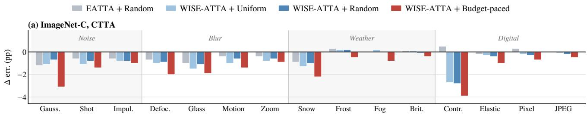

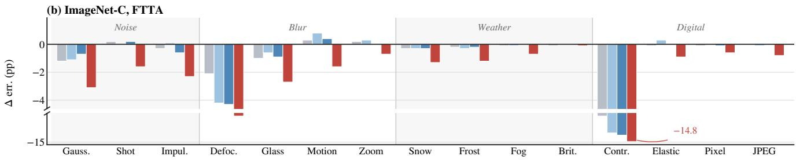

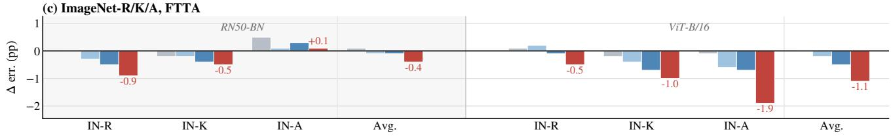  
Figure 1. Batch selection at 0.5 labels/batch. Change in error relative to EATTA [42] sample selection with uniform batch allocation; lower is better. (a) ImageNet-C under CTTA, (b) ImageNet-C under FTTA, both using ResNet-50, and (c) ImageNet-R/K/A under FTTA. Ou budget-paced batch selection consistently improves over uniform and random allocation. Full results are provided in Appendix E.

## 4. Evaluation

We evaluate WISE-ATTA in the budgeted ATTA setting from several complementary perspectives. We first isolate the contribution of budget-paced batch selection under a fixed annotation budget (Sec. 4.1). We then evaluate the effectiveness of our drift-based sample selection by comparing against prior active TTA methods under both matched and larger annotation budgets (Sec. 4.2). Next, we study performance across a range of label budgets (Sec. 4.3) and analyze how WISE-ATTA allocates supervision over time and across samples (Secs. 4.4 and 4.5). We further examine robustness to delayed label availability in Appendix H and to different online batch sizes in Appendix G. Unless stated otherwise, we use a batch size of 64. Additional implementation details, algorithmic settings, datasets, models, and reproducibility information are provided in Appendices I and K.

## 4.1. Analysis of Batch Selection Strategies

We begin by asking whether our budget-paced batch selection criterion in fact identifies the important batches to annotate; those whose supervision yields the largest adaptation gains per labeled sample. Answering this requires isolating batch selection from the orthogonal axis of which samples within a batch get annotated, since the two are easily confounded. Strong sample selector can mask a weak batch selector, and vice versa. To this end, we hold the sampleselection method fixed and vary only the batch selection strategy. We further compare the budget-paced selection against two simple strategies: UNIFORM, which spreads the annotation budget evenly across batches, and RANDOM, which allocates it stochastically. We repeat this comparison under two sample selection methods: EATTA [42] and our drift-based selector.

We run these experiments on ImageNet-C, R, K, and A. For ImageNet-C, we evaluate under two standard testtime adaptation protocols. First, fully test-time adaptation (FTTA) [41], where the model is reset to the pretrained checkpoint whenever the corruption type changes. Second, continual test-time adaptation (CTTA) [45], where adaptation proceeds over a single continuous stream without resets.

Results. Figure 1 reports the error change relative to the EATTA + UNIFORM baseline under a fixed budget of 0.5 labels per batch. Two findings stand out. First, our budgetpaced selection generally yields the largest error reductions across ImageNet-C under both CTTA and FTTA, with particularly large gains on several corruptions. Second, under matched uniform or random batch allocation, our drift-based sample selector already improves over EATTA, while combining it with budget-paced selection provides further gains. The same trend holds on ImageNet-R/K/A across both backbones, with average improvements of 0.4 and 1.1 points for RN50-BN and ViT-B-16, respectively. Overall, the results show that batch- and sample-level selection provide complementary benefits under the same annotation budget.

Table 2. ImageNet-C error (%) under CTTA (top) and FTTA (bottom). #Labels denotes the average number of queried labels per batch; BFS denotes the replay buffer size when used. † indicates methods that require a teacher model. Our methods are highlighted in gray.
<table><tr><td rowspan="2"># Labels</td><td rowspan="2">Method</td><td colspan="3">Noise</td><td colspan="4">Blur</td><td colspan="4">Weather</td><td colspan="4">Digital</td><td rowspan="2">Avg. Err.</td></tr><tr><td>Gauss.</td><td>Shot</td><td>Impul.</td><td>Defoc.</td><td>Glass</td><td>Motion</td><td>Zoom</td><td>Snow</td><td>Frost</td><td>Fog Brit.</td><td>Contr.</td><td>Elastic</td><td>Pixel</td><td>JPEG</td><td></td></tr><tr><td></td><td>TENT [41]</td><td>70.8</td><td>63.9</td><td>64.9</td><td>75.7</td><td>75.1</td><td>72.3</td><td>65.3</td><td>72.8</td><td>75.7</td><td>68.4</td><td>56.0</td><td>84.0</td><td>73.1</td><td>70.7</td><td>74.9</td><td>70.9</td></tr><tr><td>Noc-ctive</td><td>CoTTA [45]</td><td>78.2</td><td>68.6</td><td>64.3</td><td>75.2</td><td>71.5</td><td>69.6</td><td>67.5</td><td>72.0</td><td>71.4</td><td>67.2</td><td>62.3</td><td>73.5</td><td>69.4</td><td>66.8</td><td>68.6</td><td>69.8</td></tr><tr><td></td><td>SAR [29]</td><td>70.0</td><td>62.2</td><td>62.9</td><td>73.0</td><td>70.1</td><td>65.7</td><td>58.0</td><td>63.8</td><td>64.1</td><td>53.6</td><td>42.0</td><td>68.3</td><td>53.8</td><td>50.3</td><td>53.2</td><td>60.7</td></tr><tr><td></td><td>ETA [28]</td><td>65.2</td><td>59.5</td><td>61.1</td><td>70.0</td><td>69.0</td><td>63.8</td><td>57.3</td><td>58.9</td><td>60.8</td><td>48.7</td><td>39.5</td><td>58.2</td><td>48.6</td><td>45.2</td><td>48.1</td><td>56.9</td></tr><tr><td>3</td><td>SimATTA [9] (BFS = 300)</td><td>65.3</td><td>59.2</td><td>60.4</td><td>68.0</td><td>65.0</td><td>58.4</td><td>53.0</td><td>54.9</td><td>57.5</td><td>45.9</td><td>38.0</td><td>56.8</td><td>48.3</td><td>43.8</td><td>47.2</td><td>54.8</td></tr><tr><td rowspan="2"></td><td>HILTTA [22]</td><td>65.1</td><td>57.6</td><td>58.5</td><td>65.5</td><td>63.1</td><td>56.9</td><td>51.7</td><td>54.4</td><td>56.1</td><td>46.1</td><td>36.9</td><td>55.4</td><td>47.2</td><td>42.7</td><td>46.2</td><td>53.7</td></tr><tr><td>EATTA [42]</td><td>64.9</td><td>57.5</td><td>58.0 57.6</td><td>67.1 67.3</td><td>65.2</td><td>57.7</td><td>53.7</td><td>55.3</td><td>58.3</td><td>46.5</td><td>37.7</td><td>59.2</td><td>47.9</td><td>43.6</td><td>46.7</td><td>54.6 53.3</td></tr><tr><td>1</td><td>WISE-ATTA</td><td colspan="10">64.1 57.2</td><td colspan="5">54.9 46.3 41.8</td></tr><tr><td rowspan="2"># Labels Method</td><td colspan="10"></td><td colspan="5">Digital</td><td rowspan="2">Avg. Err.</td></tr><tr><td></td><td colspan="10">Noise Shot</td></tr><tr><td></td><td></td><td>Gauss.</td><td>Impul.</td><td>Defoc.</td><td></td><td>Glass Motion</td><td></td><td>Zoom</td><td>Snow</td><td>Frost</td><td>Fog</td><td>Brit.</td><td>Contr.</td><td>Elastic</td><td>Pixel</td><td>JPEG</td><td></td></tr><tr><td>Nonc-cive</td><td>TENT [41]</td><td>70.8</td><td>69.0</td><td>70.0</td><td>71.9</td><td>72.0</td><td>58.3</td><td>50.7</td><td>52.6</td><td>58.5</td><td>42.4</td><td>32.7</td><td>70.3</td><td>45.3</td><td>41.5</td><td>47.6</td><td>56.9</td></tr><tr><td></td><td>CoTTA [45]</td><td>78.2</td><td>77.8</td><td>77.2</td><td>81.8</td><td>77.8</td><td>63.8</td><td>53.2</td><td>57.6</td><td>60.4</td><td>44.1</td><td>32.8</td><td>73.5</td><td>48.9</td><td>43.0</td><td>52.6</td><td>61.5</td></tr><tr><td></td><td>SAR [29]</td><td>69.9</td><td>69.2</td><td>69.1</td><td>71.2</td><td>71.7</td><td>57.9</td><td>50.8</td><td>52.9</td><td>57.8</td><td>42.5</td><td>32.7</td><td>62.3</td><td>45.7</td><td>41.7 39.2</td><td>47.8 45.0</td><td>56.2 52.0</td></tr><tr><td></td><td>ETA [28]</td><td>65.2</td><td>62.4</td><td>63.5</td><td>66.8</td><td>66.6</td><td>52.6</td><td>47.2</td><td>48.4</td><td>53.8</td><td>40.2</td><td>32.2</td><td>54.8</td><td>42.3</td><td></td><td></td><td></td></tr><tr><td></td><td>CEMA† [3] (BJFS = 300)</td><td>64.9</td><td>69.1</td><td>62.7</td><td>66.7</td><td>66.5</td><td>52.7</td><td>48.4</td><td>48.6</td><td>54.6</td><td>40.6</td><td>33.5</td><td>57.4</td><td>43.2</td><td>40.1</td><td>45.1</td><td>52.9</td></tr><tr><td rowspan="2">3</td><td>SimATTA [9] (BFS = 300)</td><td>67.4</td><td>63.7</td><td>65.5</td><td>68.1</td><td>66.8</td><td>55.3</td><td>49.7</td><td>51.3</td><td>55.9</td><td>42.7</td><td>33.7</td><td>56.3</td><td>45.4</td><td>41.7</td><td>47.4</td><td>54.1</td></tr><tr><td>HILTTA [22]</td><td>65.0</td><td>63.1</td><td>64.5</td><td>66.1</td><td>66.3</td><td>54.4</td><td>48.4</td><td>49.8</td><td>54.8</td><td>41.4</td><td>32.5</td><td>55.6</td><td>43.6</td><td>40.5</td><td>45.8</td><td>52.8</td></tr><tr><td rowspan="2">1</td><td>EATTA [42]</td><td>64.9</td><td>62.4</td><td>63.9</td><td>68.0</td><td>66.9</td><td>51.6</td><td>47.7</td><td>47.9</td><td>54.2</td><td>40.2</td><td>31.7</td><td>64.0</td><td>42.7</td><td>39.1</td><td>44.9</td><td>52.7</td></tr><tr><td>WISE-ATTA</td><td>64.1</td><td>61.5</td><td>62.5</td><td>66.9</td><td>65.9</td><td>50.8</td><td>47.4</td><td>47.5</td><td>53.8</td><td>39.7</td><td>32.0</td><td>56.8</td><td>42.3</td><td>38.9</td><td>44.4</td><td>51.6</td></tr></table>

Table 3. Generalization under natural distribution shifts: FTTA error (%) on ImageNet-R/K/A with RN50-BN and ViT-B-16.
<table><tr><td># Labels</td><td>Method</td><td colspan="2">ImageNet-R</td><td colspan="2">ImageNet-K</td><td colspan="2">ImageNet-A</td><td colspan="2">Avg. Error</td></tr><tr><td></td><td></td><td>RN50-BN</td><td>ViT-B-16</td><td>RN50-BN</td><td>ViT-B-16</td><td>RN50-BN</td><td>ViT-B-16</td><td>RN50-BN</td><td>ViT-B-16</td></tr><tr><td>Noc-cive</td><td>TENT [41]</td><td>57.8</td><td>53.4</td><td>69.5</td><td>65.6</td><td>99.9</td><td>77.4</td><td>75.7</td><td>65.5</td></tr><tr><td></td><td>CoTTA [45]</td><td>57.3</td><td>55.4</td><td>69.9</td><td>98.2</td><td>99.8</td><td>79.3</td><td>75.7</td><td>77.6</td></tr><tr><td></td><td>SAR [29]</td><td>57.2</td><td>48.8</td><td>68.5</td><td>70.4</td><td>99.9</td><td>74.9</td><td>75.2</td><td>64.7</td></tr><tr><td></td><td>ETA [28]</td><td>54.0</td><td>48.8</td><td>64.3</td><td>59.4</td><td>99.8</td><td>75.9</td><td>72.7</td><td>61.4</td></tr><tr><td>-</td><td>CEMA† [3]</td><td>51.4</td><td>44.6</td><td>65.6</td><td>60.0</td><td>97.7</td><td>72.9</td><td>71.6</td><td>59.2</td></tr><tr><td>3</td><td>SimATTA [9]</td><td>51.3</td><td>45.1</td><td>64.0</td><td>57.2</td><td>97.2</td><td>72.4</td><td>70.8</td><td>58.2</td></tr><tr><td></td><td>HILTTA [22]</td><td>52.6</td><td>43.9</td><td>63.3</td><td>58.1</td><td>98.3</td><td>72.2</td><td>71.4</td><td>58.1</td></tr><tr><td>1</td><td>EATTA [42]</td><td>52.8</td><td>44.3</td><td>64.1</td><td>58.2</td><td>99.1</td><td>71.5</td><td>72.0</td><td>58.0</td></tr><tr><td></td><td>WISE-ATTA</td><td>51.2</td><td>42.6</td><td>63.8</td><td>57.2</td><td>97.7</td><td>69.9</td><td>70.9</td><td>56.6</td></tr></table>

## 4.2. Effectiveness of Drift-Based Sample Selection

Having established that budget-paced batch selection helps, we next ask the complementary question: given a batch, does WISE-ATTA pick the right samples to annotate? This matters because batch and sample selection are independent levers; gains from the former say nothing about the quality of the latter. To answer this, we compare WISE-ATTA against two families of baselines. The first is active TTA methods, which, like WISE-ATTA, choose which samples to annotate within the test stream: SimATTA [9] and HILTTA [22] (both querying three labels per batch), CEMA [3] (which additionally requires a replay buffer and a strong teacher), and the recent single-label method EATTA [42]. The second family are non-active, fully unsupervised TTA methods; that is, TENT [41], CoTTA [45], SAR [28], and ETA [20]. Including these is important for context as they establish the no-supervision floor. The gap between them and the active methods quantifies how much value labels can provide, and the gap toWISE-ATTA quantifies how much of that can be captured by WISE-ATTA.

Results. Table 2 reports ImageNet-C results under both CTTA and FTTA protocols, and Tab. 3 reports results on ImageNet-R/K/A. On ImageNet-C, WISE-ATTA achieves the lowest average error in both settings (CTTA: 53.3%;

FTTA: 51.6%), improving over EATTA by 1.3 and 1.1 points respectively despite using the same 1-label-per-batch budget. Notably, WISE-ATTA also outperforms the higher-budget HILTTA (3 labels per batch) by 0.4 points under CTTA and 1.2 points under FTTA, indicating that better sample selection can substantially offset more annotation effort. The same pattern holds under natural distribution shifts in Tab. 3. WISE-ATTA achieves the best average error for both models (RN50-BN: 70.9%; ViT-B-16: 56.6%), again improving over EATTA at the same budget and matching or exceeding the 3-label active baselines.

Together, this indicates that prediction drift is a stronger per-sample selection criterion than the entropy- and confidence-based signals used in prior active TTA, and that the gain transfers across both adaptation protocols and shift types.

## 4.3. Performance evaluation under varying label ratio

Thus far, we have focused on two annotation ratios $( r =$ 0.5 and $r = 1 )$ . We now broaden the view and ask how WISE-ATTA performs, and how it compares to baselines, across a wide range of r. Sweeping r lets us characterize how WISE-ATTA’s advantage scales with supervision. To isolate the effect of the batch selection strategy, we again compare against UNIFORM and RANDOM batch selection. For a fair comparison, we enforce full budget utilization for all approaches by labeling all remaining batches once the remaining budget suffices for the remaining batches.

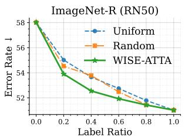

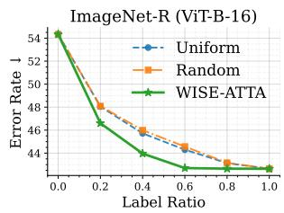

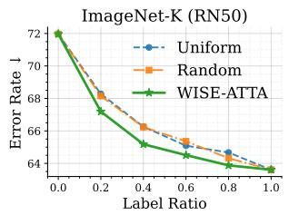

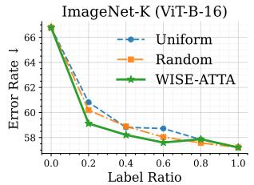  
Figure 2. Performance under varying label ratios on ImageNet-R and ImageNet-K. WISE-ATTA consistently outperforms UNIFORM and RANDOM, especially in the low-label regime.

Results. Figure 2 shows results on ImageNet-R and ImageNet-K. Across all settings, WISE-ATTA outperforms both UNIFORM and RANDOM selection, which behave similarly across label ratios and fail to exploit differences in batch utility. The gains are most pronounced in the lowbudget regime: increasing r from 0 to 0.2 improves performance by 4.12 points on ImageNet-R with RN50-BN (58.02 → 53.90) and by 7.66 points on ImageNet-K with ViT-B-16 (66.78 → 59.12). As the budget increases, WISE-ATTA approaches the performance of labeling every batch; at $r = 0 . 6 .$ , it nearly matches performance at r = 1.0 while using substantially fewer labels.

## 4.4. Label Utilization over time

To understand why WISE-ATTA is effective, we next examine how it allocates its label budget over the test stream. Visualizing the allocation tells us where in the stream WISE-ATTA chooses to spend its budget We partition the stream into ten equal time bins and report the number of labeled batches per bin (Figure 3). The dashed line indicates uniform allocation as a reference.

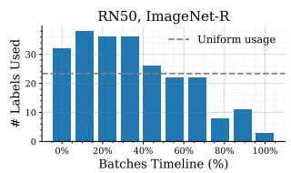

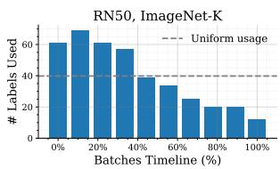

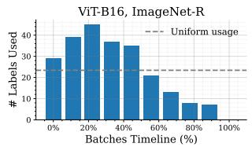

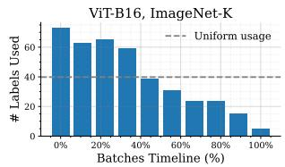  
Figure 3. Label utilization over the test-time stream.

Results. Across datasets and models, WISE-ATTA allocates labels non-uniformly, with higher density early in the stream. This behavior is desirable: when a new distribution shift is first encountered, the model is least aligned with the target domain and supervision provides the largest marginal benefit. The front-loading effect is especially pronounced on ImageNet-K, where label usage steadily decreases over time. On ImageNet-R, label allocation is broader, peaking in the early-to-mid portion of the stream (≈ $1 0 - 4 0 \% )$ . Importantly, WISE-ATTA does not exhaust the budget immediately and continues to allocate labels near the end of evaluation, allowing it to react to high-utility batches throughout.

## 4.5. Selected Sample Analysis

We now zoom in from when WISE-ATTA spends its budget to which samples it spends it on. Our sample selection is based on the observation to select samples whose predictions change in a consistent and directional manner. Figure 4 contrasts samples queried by Max-Entropy, EATTA, and WISE-ATTA.

Max-Entropy focuses on the high-entropy tail, which can contain overly ambiguous samples that are difficult to exploit with a single labeled update, leading to the weakest performance. EATTA shifts toward lower-to-moderate entropy but selects samples with relatively small prediction drift, indicating that supervision is often spent in already stable regions. In contrast, WISE-ATTA avoids the highest-entropy extremes while prioritizing samples with higher drift relative to its EMA anchor, capturing samples that are still adapting and thus responsive to corrective supervision.

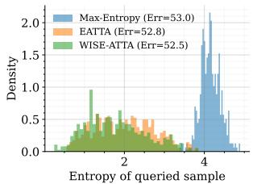  
(a)

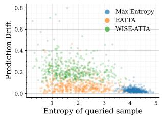  
(b)  
Figure 4. Query behavior on ImageNet-R. (a) Entropy distribution of samples queried by Max-Entropy [40], EATTA [42], and WISE-ATTA. (b) Drift (vs. EMA anchor) versus entropy for queried samples. Additional results and discussion in Appendix C.

## 5. Discussion

Our findings highlight a practical lesson for test-time adaptation: if supervision is scarce, when labels are used can be as important as which samples are labeled. Below, we take a broader perspective on this and discuss assumptions, limitations, and future work.

Adaptation under limited resources. WISE-ATTA explicitly budgets supervision, but still updates the model at every time step. In compute constrained settings, it may also be necessary to budget updates themselves. Skipping updates does not merely reduce computation; it can also changes the balance between unsupervised and supervised correction. In Appendix F, we adapt WISE-ATTA to skip unsupervised updates on non-selected batches, and find that it remains competitive despite reduced update frequency. This suggests the need for principled criteria to decide when entropy minimization should be relied upon versus when supervised correction should dominate.

Data and shift structure. We consider test streams in which each batch is dominated by a single distribution shift. This is an oversimplification for many scenarios and a natural extension is heterogeneous batches where multiple shift sources co-occur within the same batch or within short temporal windows. In such settings, batch utility may need to reflect coverage across multiple modes, rather than short-term adaptation potential alone.

Resilience to stale supervision. Our delay analysis (Sec. H) shows that ATTA methods degrade sharply when labels arrive late. This points to delay-aware extensions like recencyweighted updates, latency-aware batch selection, or query strategies that anticipate the model’s future state as a necessary step toward deployment-ready active TTA.

## 6. Related Work

Models deployed in the wild often face distribution shift, leading to significant performance degradation [11, 30, 33].

Test-time adaptation. To address this without frequent retraining, prior work has explored test-time training (TTT) and test-time adaptation (TTA). TTT optimizes an auxiliary self-supervised objective learned on the source domain at deployment and is therefore not fully off-the-shelf [8, 39]. In contrast, TTA adapts a pretrained model directly on the unlabeled test stream using unsupervised objectives such as entropy minimization or self-training [23, 41, 45]. While effective initially, unsupervised TTA can become unstable under long or severe shifts due to error accumulation, catastrophic forgetting, and drift in feature statistics [2, 16, 28, 38, 45]. To mitigate these issues, prior work filters unreliable samples [20, 28], refines pseudo-labels [2], adds regularization to reduce forgetting [1, 45], impose prototype-based constraints [6, 18, 43], or corrects feature statistics via running normalization estimates [15, 27, 47]. Nevertheless, purely unsupervised objectives remain vulnerable to confirmation bias and error accumulation, motivating occasional supervision at test time [9, 42].

Active test-time adaptation. Active learning (AL) studies how to query labels under a limited budget [21], using strategies as uncertainty, disagreement, expected model change, or diversity [36, 37, 40, 46]. Active test-time adaptation (ATTA) brings these ideas to the test-time setting, using sparse supervision to stabilize and guide online adaptation [9, 42]. Previous work in this area has focused on what to label within each batch, via uncertainty-based querying [9], online model selection [22], or teacher-guided distillation [3], with recent methods reducing supervision to even a single label per batch [42]. However, most ATTA methods assume a fixed querying cadence (i.e., labeling every batch), causing annotation cost to scale linearly with deployment length. As a result, the complementary problem of deciding when to request supervision under a global budget remains largely unexplored. Our work addresses this gap by explicitly reasoning about supervision allocation over time.

## 7. Conclusion

In this work, we study budgeted active test-time adaptation, where supervision is available only for a fraction of test batches and must be allocated over time. We introduce WISE-ATTA, which jointly decides when to query labels via budget-paced batch selection and what to label via driftbased single-sample querying. Across synthetic corruptions and natural distribution shifts, WISE-ATTA achieves competitive or improved robustness compared to prior ATTA methods while using substantially fewer labels. More broadly, our results underscore the importance of temporal supervision allocation for stable and label-efficient test-time adaptation.

## Acknowledgment

This work was funded by the German Federal Ministry of Education and Research under the grant AIgenCY (16KIS2012) and SisWiss (16KIS2330). In addition, this work was funded by zukunft.niedersachsen, the joint science funding program of the Lower Saxony Ministry of Science and Culture and the Volkswagen Foundation and the Daimler and Benz Foundation under the grant Ladenburger Kolleg, Project KonCheck.

## References

[1] Dhanajit Brahma and Piyush Rai. A probabilistic framework for lifelong test-time adaptation. In IEEE/CVF Conference on Computer Vision and Pattern Recognition (CVPR), 2023. 8

[2] Dian Chen, Dequan Wang, Trevor Darrell, and Sayna Ebrahimi. Contrastive test-time adaptation. In IEEE/CVF Conference on Computer Vision and Pattern Recognition (CVPR), 2022. 8

[3] Yaofo Chen, Shuaicheng Niu, Shoukai Xu, Hengjie Song, Yaowei Wang, and Mingkui Tan. Towards robust and efficient cloud-edge elastic model adaptation via selective entropy distillation. In International Conference on Learning Representations (ICLR), 2024. 1, 3, 6, 8

[4] Matthias De Lange, Rahaf Aljundi, Marc Masana, Sarah Parisot, Xu Jia, Ales Leonardis, Gregory Slabaugh, and Tinneˇ Tuytelaars. A continual learning survey: Defying forgetting in classification tasks. IEEE Transactions on Pattern Analysis and Machine Intelligence (TPAMI), 2021. 2

[5] Jia Deng, Wei Dong, Richard Socher, Li-Jia Li, Kai Li, and Li Fei-Fei. Imagenet: A large-scale hierarchical image database. In IEEE/CVF Conference on Computer Vision and Pattern Recognition (CVPR), 2009. 19

[6] Mario Dobler, Robert A Marsden, and Bin Yang. Robust¨ mean teacher for continual and gradual test-time adaptation. In IEEE/CVF Conference on Computer Vision and Pattern Recognition (CVPR), 2023. 8

[7] Alexey Dosovitskiy, Lucas Beyer, Alexander Kolesnikov, Dirk Weissenborn, Xiaohua Zhai, Thomas Unterthiner, Mostafa Dehghani, Matthias Minderer, Georg Heigold, Sylvain Gelly, Jakob Uszkoreit, and Neil Houlsby. An image is worth 16x16 words: Transformers for image recognition at scale. In International Conference on Learning Representations (ICLR), 2021. 19

[8] Spyros Gidaris, Praveer Singh, and Nikos Komodakis. Unsupervised representation learning by predicting image rotations. In International Conference on Learning Representations (ICLR), 2018. 8

[9] Shurui Gui, Xiner Li, and Shuiwang Ji. Active test-time adaptation: Theoretical analyses and an algorithm. In International Conference on Learning Representations (ICLR), 2024. 1, 3, 6, 8, 18

[10] Kaiming He, Xiangyu Zhang, Shaoqing Ren, and Jian Sun. Deep residual learning for image recognition. In IEEE/CVF Conference on Computer Vision and Pattern Recognition (CVPR), 2016. 19

[11] Dan Hendrycks and Thomas Dietterich. Benchmarking neural network robustness to common corruptions and perturbations. In International Conference on Learning Representations (ICLR), 2019. 1, 2, 8, 19

[12] Dan Hendrycks, Norman Mu, Ekin D Cubuk, Barret Zoph, Justin Gilmer, and Balaji Lakshminarayanan. Augmix: A simple data processing method to improve robustness and uncertainty. In International Conference on Learning Representations (ICLR), 2020. 2

[13] Dan Hendrycks, Steven Basart, Norman Mu, Saurav Kadavath, Frank Wang, Evan Dorundo, Rahul Desai, Tyler Zhu,

Samyak Parajuli, Mike Guo, et al. The many faces of robustness: A critical analysis of out-of-distribution generalization. In IEEE/CVF International Conference on Computer Vision (ICCV), 2021. 19

[14] Dan Hendrycks, Kevin Zhao, Steven Basart, Jacob Steinhardt, and Dawn Song. Natural adversarial examples. In IEEE/CVF Conference on Computer Vision and Pattern Recognition (CVPR), 2021. 19, 20

[15] Junyuan Hong, Lingjuan Lyu, Jiayu Zhou, and Michael Spranger. Mecta: Memory-economic continual test-time model adaptation. In International Conference on Learning Representations (ICLR), 2023. 8

[16] Xuefeng Hu, Gokhan Uzunbas, Sirius Chen, Rui Wang, Ashish Shah, Ram Nevatia, and Ser-Nam Lim. Mixnorm: Test-time adaptation through online normalization estimation. arXiv preprint arXiv:2110.11478, 2021. 8

[17] Sergey Ioffe. Batch normalization: Accelerating deep network training by reducing internal covariate shift. In International Conference on Machine Learning (ICML), 2015. 19

[18] Minguk Jang, Sae-Young Chung, and Hye Won Chung. Testtime adaptation via self-training with nearest neighbor information. In International Conference on Learning Representations (ICLR), 2023. 8

[19] James Kirkpatrick, Razvan Pascanu, Neil Rabinowitz, Joel Veness, Guillaume Desjardins, Andrei A Rusu, Kieran Milan, John Quan, Tiago Ramalho, Agnieszka Grabska-Barwinska, et al. Overcoming catastrophic forgetting in neural networks. Proceedings of the national academy of sciences (NAC), 2017. 2

[20] Jonghyun Lee, Dahuin Jung, Saehyung Lee, Junsung Park, Juhyeon Shin, Uiwon Hwang, and Sungroh Yoon. Entropy is not enough for test-time adaptation: From the perspective of disentangled factors. In International Conference on Learning Representations (ICLR), 2024. 2, 6, 8

[21] Dongyuan Li, Zhen Wang, Yankai Chen, Renhe Jiang, Weiping Ding, and Manabu Okumura. A survey on deep active learning: Recent advances and new frontiers. IEEE Transactions on Neural Networks and Learning Systems (TNNLS), 2024. 8

[22] Yushu Li, Yongyi Su, Xulei Yang, Kui Jia, and Xun Xu. Exploring human-in-the-loop test-time adaptation by synergizing active learning and model selection. Transactions on Machine Learning Research (TMLR), 2024. 1, 3, 6, 8, 19

[23] Jian Liang, Dapeng Hu, and Jiashi Feng. Do we really need to access the source data? source hypothesis transfer for unsupervised domain adaptation. In International Conference on Machine Learning (ICML), 2020. 8

[24] Jian Liang, Ran He, and Tieniu Tan. A comprehensive survey on test-time adaptation under distribution shifts. International Journal ofComputer Vision (IJCV), 2025. 2

[25] David Lopez-Paz and Marc’Aurelio Ranzato. Gradient episodic memory for continual learning. In Advances in Neural Information Processing Systems (NeurIPS), 2017. 2

[26] Aleksander Madry, Aleksandar Makelov, Ludwig Schmidt, Dimitris Tsipras, and Adrian Vladu. Towards deep learning models resistant to adversarial attacks. arXiv preprint arXiv:1706.06083, 2017. 2

[27] M Jehanzeb Mirza, Jakub Micorek, Horst Possegger, and Horst Bischof. The norm must go on: Dynamic unsupervised domain adaptation by normalization. In IEEE/CVF Conference on Computer Vision and Pattern Recognition (CVPR), 2022. 8

[28] Shuaicheng Niu, Jiaxiang Wu, Yifan Zhang, Yaofo Chen, Shijian Zheng, Peilin Zhao, and Mingkui Tan. Efficient testtime model adaptation without forgetting. In International Conference on Machine Learning (ICML), 2022. 2, 6, 8, 19

[29] Shuaicheng Niu, Jiaxiang Wu, Yifan Zhang, Zhiquan Wen, Yaofo Chen, Peilin Zhao, and Mingkui Tan. Towards stable test-time adaptation in dynamic wild world. In International Conference on Learning Representations (ICLR), 2023. 1, 2, 6, 19

[30] Yaniv Ovadia, Emily Fertig, Jie Ren, Zachary Nado, David Sculley, Sebastian Nowozin, Joshua Dillon, Balaji Lakshminarayanan, and Jasper Snoek. Can you trust your model’s uncertainty? evaluating predictive uncertainty under dataset shift. Advances in Neural Information Processing Systems (NeurIPS), 2019. 1, 2, 8

[31] German I Parisi, Ronald Kemker, Jose L Part, Christopher Kanan, and Stefan Wermter. Continual lifelong learning with neural networks: A review. Neural networks, 2019. 2

[32] Sylvestre-Alvise Rebuffi, Alexander Kolesnikov, Georg Sperl, and Christoph H Lampert. icarl: Incremental classifier and representation learning. In IEEE/CVF Conference on Computer Vision and Pattern Recognition (CVPR), 2017. 2

[33] Benjamin Recht, Rebecca Roelofs, Ludwig Schmidt, and Vaishaal Shankar. Do imagenet classifiers generalize to imagenet? In International Conference on Machine Learning (ICML), 2019. 1, 2, 8

[34] David Rolnick, Arun Ahuja, Jonathan Schwarz, Timothy Lillicrap, and Gregory Wayne. Experience replay for continual learning. In Neural Information Processing Systems (NeurIPS), 2019. 2

[35] Shiori Sagawa, Pang Wei Koh, Tatsunori B Hashimoto, and Percy Liang. Distributionally robust neural networks for group shifts. In International Conference on Learning Representations (ICLR), 2020. 2

[36] Ozan Sener and Silvio Savarese. Active learning for convolutional neural networks: A core-set approach. In International Conference on Learning Representations (ICLR), 2018. 8

[37] H Sebastian Seung, Manfred Opper, and Haim Sompolinsky. Query by committee. In Conference on Learning Theory (COLT), 1992. 8

[38] Yongyi Su, Xun Xu, and Kui Jia. Towards real-world test-time adaptation: Tri-net self-training with balanced normalization. In AAAI Conference on Artificial Intelligence (AAAI), 2024. 8

[39] Yu Sun, Xiaolong Wang, Zhuang Liu, John Miller, Alexei Efros, and Moritz Hardt. Test-time training with selfsupervision for generalization under distribution shifts. In International Conference on Machine Learning (ICML), 2020. 2, 8

[40] Dan Wang and Yi Shang. A new active labeling method for deep learning. In International Joint Conference on Neural Networks (IJCNN), 2014. 8

[41] Dequan Wang, Evan Shelhamer, Shaoteng Liu, Bruno Olshausen, and Trevor Darrell. Tent: Fully test-time adaptation by entropy minimization. In International Conference on Learning Representations (ICLR), 2021. 1, 2, 5, 6, 8, 18, 19

[42] Guowei Wang and Changxing Ding. Effortless active labeling for long-term test-time adaptation. In IEEE/CVF Conference on Computer Vision and Pattern Recognition (CVPR), 2025. 1, 3, 5, 6, 8, 15, 18, 19

[43] Guowei Wang, Changxing Ding, Wentao Tan, and Mingkui Tan. Decoupled prototype learning for reliable test-time adaptation. IEEE Transactions on Multimedia, 2025. 8

[44] Haohan Wang, Songwei Ge, Zachary Lipton, and Eric P Xing. Learning robust global representations by penalizing local predictive power. In Advances in Neural Information Processing Systems (NeurIPS), 2019. 19

[45] Qin Wang, Olga Fink, Luc Van Gool, and Dengxin Dai. Continual test-time domain adaptation. In IEEE/CVF Conference on Computer Vision and Pattern Recognition (CVPR), 2022. 1, 2, 5, 6, 8

[46] Donggeun Yoo and In So Kweon. Learning loss for active learning. In IEEE/CVF Conference on Computer Vision and Pattern Recognition (CVPR), 2019. 8

[47] Longhui Yuan, Binhui Xie, and Shuang Li. Robust test-time adaptation in dynamic scenarios. In IEEE/CVF Conference on Computer Vision and Pattern Recognition (CVPR), 2023. 8

## Appendix Overview

This appendix provides additional analyses, deployment studies, and implementation details supporting the main paper. It is organized into three parts.

Part I — Method Analysis and Ablations. We first examine the design and behavior of WISE-ATTA. We clarify the distinct roles of batch- and sample-level supervision (Appendix A), compare alternative batch-utility functions (Appendix B), analyze the behavior of queried samples (Appendix C), study sensitivity to the batch-selection hyperparameters (Appendix D), and provide the complete batch-selection results underlying the main-paper analysis (Appendix E).

Part II — Practical Deployment Studies. We then examine WISE-ATTA under several deployment constraints: skipping updates on non-selected batches (Appendix F), varying online batch sizes (Appendix G), and delayed label availabilit (Appendix H).

Part III — Implementation and Experimental Details. Finally, we provide the complete algorithm and hyperparameters (Appendix I), analyze which parameters should receive supervised updates (Appendix J), and provide dataset, model, and reproducibility details (Appendix K).

## Part I: Method Analysis and Ablations

## A. Batch-Level vs. Sample-Level Supervision

WISE-ATTA makes two separate supervision decisions: whether to select the current batch for supervision, and which sample to label once that batch is selected. Since these decisions address different questions, they rely on different signals.

Ideal batch. An ideal batch for supervision is not the one with the most uncertain predictions, where supervised gradients are likely to be noisy, nor the one where the model is already converged, where supervision is wasted. Instead, it is a batch in which the model is already reasonably aligned with the current target regime, so that a labeled update is likely to be reliable rather than dominated by noise. WISE-ATTA approximates this property using the number of low-entropy predictions in the batch, which serves as a proxy for batch-level adaptation stability: when many samples in the batch already receive relatively confident predictions, supervision is more likely to reinforce ongoing adaptation than to destabilize it.

Ideal sample. Within a selected batch, the goal is different. An ideal sample is neither the most confident nor the most uncertain example; instead, it should still be undergoing meaningful adaptation, so that a corrective label can have a nontrivia effect, while not being so unstable that a single supervision signal is unlikely to help. WISE-ATTA approximates this property using prediction drift relative to an EMA anchor, which singles out samples whose predictions are still changing in a structured way that results in ongoing but not yet converged adaptation dynamics.

Prediction entropy and prediction drift capture different aspects of model behavior and therefore serve complementary roles. Figure 5 shows that WISE-ATTA tends to query samples in a moderate-entropy range rather than the highest-entropy tail, consistent with this design.

## B. Impact of Batch Utility Functions

We analyze how different definitions of batch utility affect adaptation under constrained supervision. WISE-ATTA selects batches for annotation based on a utility score, and we ablate several choices for measuring batch utility. Table 4 compares entropy-based utilities (mean, top-k, and low-k entropy), drift-based utilities (mean and top-k prediction drift), and our default COUNT(H < τ).

Overall, entropy-based utilities perform worse across settings, regardless of whether we aggregate by mean, top-k, or low-k, suggesting that entropy statistics alone are not a reliable proxy for batch utility. Among drift-based variants, top-k drift is consistently stronger than mean drift and all entropy-based alternatives, likely because it better reflects whether a batch contains a small number of high-value samples for supervised updates. Finally, COUNT(H < τ) achieves the best performance overall, reducing error by an average of 0.82 points across datasets and backbones compared to using MEAN ENTROPY, suggesting that batches with more stable (low-entropy) predictions tend to yield more reliable adaptation updates.

Table 4. Effect of different batch utility functions (error %, ↓).
<table><tr><td rowspan="2">Utility Function</td><td colspan="2">ImageNet-R</td><td colspan="2">ImageNet-K</td></tr><tr><td>RN50-BN</td><td>ViT-B-16</td><td>RN50-BN</td><td>ViT-B-16</td></tr><tr><td rowspan="3">Mean Entropy Top-k Entropy Low-k Entropy</td><td>52.82</td><td>44.81</td><td>65.54</td><td>58.31</td></tr><tr><td>52.77</td><td>44.62</td><td>65.62</td><td>58.85</td></tr><tr><td>52.88</td><td>44.26</td><td>65.46</td><td>58.69</td></tr><tr><td rowspan="2">Mean Drift Top-k Drift</td><td>52.85</td><td>44.32</td><td>65.23</td><td>58.78</td></tr><tr><td>52.25</td><td>43.94</td><td>65.09</td><td>58.44</td></tr><tr><td>Count( H &lt; τ)</td><td>52.26</td><td>43.38</td><td>64.60</td><td>57.95</td></tr></table>

## C. Query Behavior

We further analyze the samples selected for annotation by different query criteria on ImageNet-R. Figure 5 shows (left) the entropy distribution of queried samples and (right) the relationship between queried-sample entropy and prediction drift defined as the discrepancy between the current model and an exponential moving average (EMA) anchor.

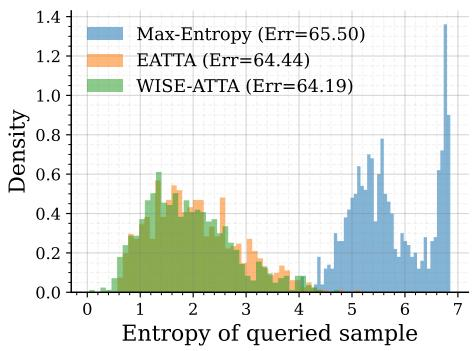  
ResNet-50

(a)  
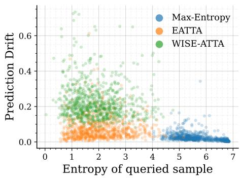  
(b)

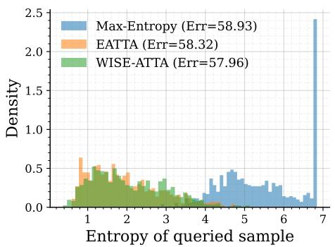  
ViT-B/16

(c)  
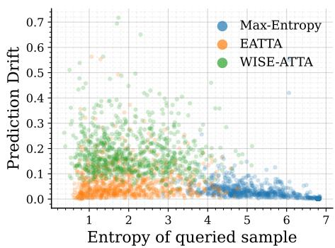  
(d)  
Figure 5. Query behavior on ImageNet-R. Left: entropy distribution of queried samples; right: prediction drift vs. entropy for samples queried by Max-Entropy, EATTA, and WISE-ATTA. Prediction drift is the discrepancy between the current model and an exponentia moving average (EMA) anchor. Across RN50-BN (top) and ViT-B-16 (bottom), WISE-ATTA avoids the highest-entropy extremes while favoring moderately uncertain samples with larger drift.

Finding. MAX-ENTROPY concentrates on extreme high-entropy samples, but these samples exhibit near-zero drift, indicating high ambiguity with limited directional signal for a single supervised update. EATTA shifts toward lower-to-moderate entropy but largely remains in a low-drift band, suggesting supervision is often spent where the model is already comparatively stable. In contrast, WISE-ATTA selects a distinct regime of moderate entropy with larger drift, matching our goal of querying samples that are both informative and learnable under a single-step update. This behavior is consistent across RN50-BN and ViT-B-16 and coincides with the best performance.

## D. Sensitivity to Batch-Selection Hyperparameters

We assess the sensitivity of WISE-ATTA to its batch-selection hyperparameters: the history window size W, the warmup length M, and the slack parameter δ. Each hyperparameter is varied while the others are held fixed, and we report error (%) on ImageNet-R/K/A with RN50-BN and ViT-B-16 in Tab. 5.

Table 5. Sensitivity to batch-selection hyperparameters on ImageNet-R/K/A with RN50-BN and ViT-B-16 (FTTA error %, ↓). The default value used throughout the paper is highlighted in gray. WISE-ATTA is robust across all three hyperparameters — the spread in average error is at most 0.5 points across each sweep.
<table><tr><td rowspan="2">Setting</td><td rowspan="2">Value</td><td colspan="2">ImageNet-R</td><td colspan="2">ImageNet-K</td><td colspan="2">ImageNet-A</td><td rowspan="2">Avg.</td></tr><tr><td>RN50-BN</td><td>ViT-B-16</td><td>RN50-BN</td><td>ViT-B-16</td><td>RN50-BN</td><td>ViT-B-16</td></tr><tr><td rowspan="2">Slack</td><td>w/o slack</td><td>52.15</td><td>43.13</td><td>64.37</td><td>58.04</td><td>98.56</td><td>71.24</td><td>64.58</td></tr><tr><td>w/ slack</td><td>52.03</td><td>43.38</td><td>64.29</td><td>58.11</td><td>98.41</td><td>71.13</td><td>64.56</td></tr><tr><td rowspan="6">History window W</td><td>1</td><td>52.59</td><td>44.40</td><td>65.01</td><td>58.50</td><td>97.89</td><td>71.84</td><td>65.04</td></tr><tr><td>50</td><td>52.06</td><td>44.07</td><td>65.16</td><td>58.10</td><td>98.32</td><td>70.81</td><td>64.75</td></tr><tr><td>100</td><td>52.42</td><td>43.70</td><td>64.91</td><td>58.35</td><td>98.39</td><td>70.57</td><td>64.72</td></tr><tr><td>150</td><td>52.16</td><td>43.54</td><td>65.13</td><td>58.07</td><td>98.39</td><td>70.57</td><td>64.64</td></tr><tr><td>250</td><td>52.03</td><td>43.38</td><td>64.29</td><td>58.11</td><td>98.41</td><td>71.13</td><td>64.56</td></tr><tr><td>300</td><td>52.12</td><td>43.58</td><td>64.63</td><td>57.85</td><td>98.39</td><td>70.57</td><td>64.52</td></tr><tr><td rowspan="4">Warmup length M</td><td>1</td><td>52.03</td><td>43.38</td><td>64.29</td><td>58.11</td><td>98.41</td><td>71.13</td><td>64.56</td></tr><tr><td>5</td><td>51.89</td><td>43.21</td><td>64.78</td><td>57.88</td><td>98.15</td><td>73.11</td><td>64.84</td></tr><tr><td>10</td><td>52.81</td><td>43.99</td><td>64.98</td><td>57.88</td><td>98.05</td><td>71.97</td><td>64.95</td></tr><tr><td>15</td><td>53.42</td><td>43.07</td><td>64.73</td><td>57.79</td><td>98.36</td><td>71.37</td><td>64.79</td></tr></table>

Observation. Overall, WISE-ATTA is reasonably stable across a broad range of settings. The average error varies only modestly across the tested values, suggesting that the proposed batch-selection rule does not depend critically on fine-tuning these hyperparameters.

Effect of slack δ. Adding slack yields a small but consistent improvement in the overall average error (64.58 → 64.56). This is consistent with the role of δ in Algorithm 1: the slack term avoids overly aggressive catch-up behavior when label usage is only slightly behind the target rate. Without slack, the controller is more reactive and may force supervision on batches whose utility is not especially high; with slack, supervision can be reserved for more informative batches.

Effect of history window W. The method is fairly robust to the history window size. Very small windows, especially W = 1, perform worse, since the quantile threshold is then estimated from too little history and becomes overly sensitive to short-term noise. As W increases, performance improves and stabilizes, with the best averages obtained for larger windows such as W = 250 and W = 300. This suggests that using a sufficiently long recent history provides a more reliable estimate of relative batch utility while still adapting to changing stream conditions.

Effect of warmup length M. Short warmup performs best, with M = 1 giving the strongest average result among the tested values. Increasing the warmup length gradually degrades performance. This is expected because the warmup phase uses random budget allocation before the utility threshold becomes active. A longer warmup therefore delays the transition to utility-based selection and spends more of the limited label budget without exploiting the batch-utility signal. In other words, once even a small amount of history is available, it is better to begin using the adaptive threshold rather than continue exploring randomly.

## E. Detailed Batch-Selection Results

We provide the complete results underlying the batch-selection analysis. We report per-corruption results on ImageNet-C under both CTTA and FTTA, as well as results on ImageNet-R/K/A across RN50-BN and ViT-B-16.

Table 6. ImageNet-C error (%) under CTTA (top) and FTTA (bottom) at a fixed annotation budget of 0.5 labels per batch. We compare uniform, random, and utility-based batch selection under matched supervision budgets. Our method is highlighted in gray.
<table><tr><td rowspan="2">Sample Selection</td><td rowspan="2">Batch Selection</td><td colspan="3">Noise</td><td colspan="4">Blur</td><td colspan="4">Weather</td><td colspan="4">Digital</td><td rowspan="2">Avg. Err.</td></tr><tr><td>Gauss.</td><td>Shot</td><td>Impul.</td><td>Defoc.</td><td>Glass</td><td>Motion</td><td>Zoom</td><td>Snow Frost</td><td>Fog</td><td>Brit.</td><td>Contr.</td><td>Elastic</td><td>Pixel</td><td>JPEG</td></tr><tr><td rowspan="3">EATTA [42]</td><td>Uniform</td><td>67.9</td><td>60.2</td><td>60.2</td><td>70.1</td><td>67.5</td><td>59.5</td><td>54.1</td><td>56.6</td><td>58.0 46.1</td><td>37.0</td><td>60.3</td><td>47.5</td><td>43.0</td><td>46.2</td><td>55.6</td></tr><tr><td>Random</td><td>66.7</td><td>59.6</td><td>59.6</td><td>69.4</td><td>66.5</td><td>59.1</td><td>53.7</td><td>55.7</td><td>58.3 46.1</td><td>37.1</td><td>60.8</td><td>47.3</td><td>43.3</td><td>46.2</td><td>55.3</td></tr><tr><td>Uniform</td><td>66.8</td><td>59.1</td><td>59.4</td><td>69.1</td><td>66.0</td><td>58.5 53.3</td><td>55.3</td><td>58.2</td><td>46.3</td><td>37.1</td><td>57.6</td><td>47.2</td><td>42.8</td><td>46.1</td><td>54.9</td></tr><tr><td rowspan="3">WISE-ATTA</td><td>Random</td><td>67.2</td><td>59.4</td><td>59.4</td><td>69.2</td><td>66.4</td><td>58.9 53.5</td><td>55.6</td><td>58.2</td><td>46.1</td><td>36.9</td><td>57.5</td><td>47.1</td><td>42.7</td><td>46.0</td><td>54.9</td></tr><tr><td>Budget-paced</td><td>64.8</td><td>58.8</td><td>59.2</td><td>68.1</td><td>65.6 58.1</td><td>53.2</td><td>54.4</td><td>57.5</td><td>45.3</td><td>36.6</td><td>56.4</td><td>46.5</td><td>42.3</td><td>45.7</td><td>54.2</td></tr><tr><td>Batch Selection</td><td>Noise</td><td colspan="4"></td><td colspan="4">FTTA Setting</td><td colspan="4"></td><td colspan="2"></td></tr><tr><td rowspan="3">Sample Selection</td><td></td><td>Gauss.</td><td>Shot</td><td></td><td>Defoc.</td><td>Blur Glass</td><td>Motion</td><td></td><td>Frost</td><td>Weather</td><td></td><td></td><td></td><td>Digital</td><td></td><td>Avg. Err.</td></tr><tr><td></td><td></td><td></td><td>Impul.</td><td></td><td></td><td>Zoom</td><td>Snow</td><td>55.6</td><td>Fog</td><td>Brit. 32.2</td><td>Contr.</td><td>Elastic</td><td>Pixel</td><td>JPEG</td><td>54.9</td></tr><tr><td>Uniform Random</td><td>67.9 66.7</td><td>64.0 64.2</td><td>65.8 65.5</td><td>74.3 72.2</td><td>70.0 69.0</td><td>53.5 53.8</td><td>48.5</td><td>49.6</td><td>41.1</td><td></td><td>72.3</td><td>43.7</td><td>40.0</td><td>45.7 45.7</td><td></td></tr><tr><td rowspan="3">WISE-ATTA</td><td></td><td></td><td></td><td></td><td></td><td></td><td>48.7</td><td>49.3</td><td>55.4</td><td>41.0</td><td>32.1</td><td>65.5</td><td>43.6</td><td>39.9</td><td></td><td>54.2</td></tr><tr><td>Uniform</td><td>66.8</td><td>64.0</td><td>65.9</td><td>70.1</td><td>69.4 54.3</td><td>48.8</td><td>49.3</td><td>55.3</td><td>41.0</td><td>32.2</td><td>60.2</td><td>44.0</td><td>40.0</td><td>45.6</td><td>53.8</td></tr><tr><td>Random Budget-paced</td><td>67.2 64.8</td><td>64.2 62.4</td><td>65.2 63.5</td><td>70.0 67.5</td><td>69.1 53.9 67.3 51.9</td><td>48.5 47.8</td><td>49.3 48.3</td><td>55.4 54.4</td><td>41.1 40.4</td><td>32.2 32.1</td><td>59.5 57.5</td><td>43.7 42.8</td><td>39.9 39.4</td><td>45.7 44.9</td><td>53.6 52.3</td></tr></table>

Table 7. Batch selection strategies under a fixed annotation budget. FTTA error (%) on ImageNet-R/K/A with RN50-BN and ViT-B-16.
<table><tr><td>Sample Selection</td><td>Batch Selection</td><td colspan="2">ImageNet-R</td><td colspan="2">ImageNet-K</td><td colspan="2">ImageNet-A</td><td colspan="2">Avg. Error</td></tr><tr><td></td><td></td><td>RN50-BN</td><td>ViT-B-16</td><td>RN50-BN</td><td>ViT-B-16</td><td>RN50-BN</td><td>ViT-B-16</td><td>RN50-BN</td><td>ViT-B-16</td></tr><tr><td rowspan="2">EATTA [42]</td><td>Uniform</td><td>53.1</td><td>44.7</td><td>65.8</td><td>59.0</td><td>98.1</td><td>72.5</td><td>72.3</td><td>58.7</td></tr><tr><td>Random</td><td>53.1</td><td>44.8</td><td>65.6</td><td>58.8</td><td>98.6</td><td>72.4</td><td>72.4</td><td>58.7</td></tr><tr><td rowspan="3">WISE-ATTA</td><td>Uniform</td><td>52.8</td><td>44.9</td><td>65.6</td><td>58.6</td><td>98.2</td><td>71.9</td><td>72.2</td><td>58.5</td></tr><tr><td>Random</td><td>52.6</td><td>44.6</td><td>65.4</td><td>58.3</td><td>98.4</td><td>71.8</td><td>72.2</td><td>58.2</td></tr><tr><td>Budget-paced</td><td>52.2</td><td>44.2</td><td>65.3</td><td>58.0</td><td>98.2</td><td>70.6</td><td>71.9</td><td>57.6</td></tr></table>

# Part II: Practical Deployment Studies

## F. Skipping Updates on Non-selected Batches

We ablate a low-resource variant of WISE-ATTA that performs no backward/update step on batches not selected by WISE-ATTA (i.e., no unsupervised entropy-minimization update on non-selected batches). Table 8 compares this setting (“without update”) against the default configuration that still applies the unsupervised update (“with update”) at a label ratio of r=0.2.

Table 8. Effect of skipping unsupervised updates on non-selected batches at label ratio r = 0.2 (FTTA error %, ↓). With update applies the unsupervised loss on non-selected batches; Without update skips the backward pass entirely. WISE-ATTA degrades the least when unsupervised updates are removed (+0.1 vs. +0.2 to +0.4 for the baselines), indicating that its gains do not rely on the unsupervised signal from skipped batches.
<table><tr><td rowspan="2">Setting</td><td rowspan="2">Method</td><td colspan="2">ImageNet-R</td><td colspan="2">ImageNet-K</td><td rowspan="2">Avg.</td><td rowspan="2">∆ Avg.</td></tr><tr><td>RN50-BN</td><td>ViT-B-16</td><td>RN50-BN</td><td>ViT-B-16</td></tr><tr><td rowspan="3">With update</td><td>Uniform</td><td>55.0</td><td>48.1</td><td>68.3</td><td>60.8</td><td>58.0</td><td></td></tr><tr><td>Random</td><td>54.5</td><td>48.7</td><td>68.2</td><td>60.2</td><td>57.9</td><td></td></tr><tr><td>WISE-ATTA</td><td>53.4</td><td>44.7</td><td>66.2</td><td>58.7</td><td>55.7</td><td></td></tr><tr><td rowspan="3">Without update</td><td>Uniform</td><td>55.0</td><td>48.2</td><td>68.6</td><td>61.0</td><td>58.2</td><td>+0.2</td></tr><tr><td>Random</td><td>55.9</td><td>48.1</td><td>68.4</td><td>60.8</td><td>58.3</td><td>+0.4</td></tr><tr><td>WISE-ATTA</td><td>53.8</td><td>45.0</td><td>65.7</td><td>58.8</td><td>55.8</td><td>+0.1</td></tr></table>

Overall, removing updates on non-selected batches has negligible impact on performance. For WISE-ATTA, the average error changes only from 55.72 → 55.82 (+0.10), while Uniform and Random change by similarly small amounts (+0.18 and +0.41, respectively). This indicates that most of the gains come from spending computation and supervision on high-utility batches, and that WISE-ATTA can be simplified for resource-constrained deployment by updating only the selected batches. Importantly, WISE-ATTA retains its advantage over Uniform/Random in this lightweight mode, suggesting that budget-aware batch selection remains effective even without background unsupervised updates.

## G. Batch Selection Under Different Online Batch Sizes

In practical deployments, the online batch size may vary due to latency and memory constraints, which can affect both adaptation dynamics and batch utility estimation. We therefore evaluate WISE-ATTA under different batch sizes on ImageNet R and ImageNet-K with RN50-BN and ViT-B-16 (Tab. 9).

Table 9. Batch-size ablation on ImageNet-R/K with RN50-BN and ViT-B-16 (FTTA error %, ↓). WISE-ATTA consistently outperforms uniform and random batch selection across all batch sizes.
<table><tr><td rowspan="2">Batch</td><td rowspan="2">Method</td><td colspan="2">ImageNet-R</td><td colspan="2">ImageNet-K</td><td colspan="2">Avg. Error</td></tr><tr><td>RN50-BN</td><td>ViT-B-16</td><td>RN50-BN</td><td>ViT-B-16</td><td>RN50-BN</td><td>ViT-B-16</td></tr><tr><td rowspan="3">16</td><td>Uniform</td><td>56.5</td><td>41.8</td><td>56.5</td><td>41.8</td><td>56.5</td><td>41.8</td></tr><tr><td>Random</td><td>57.5</td><td>42.1</td><td>57.5</td><td>42.1</td><td>57.5</td><td>42.1</td></tr><tr><td>WISE-ATTA</td><td>55.1</td><td>41.5</td><td>55.1</td><td>41.5</td><td>55.1</td><td>41.5</td></tr><tr><td rowspan="3">32</td><td>Uniform</td><td>53.0</td><td>43.2</td><td>65.1</td><td>57.5</td><td>59.0</td><td>50.4</td></tr><tr><td>Random</td><td>52.7</td><td>42.9</td><td>65.2</td><td>57.6</td><td>59.0</td><td>50.3</td></tr><tr><td>WISE-ATTA</td><td>52.1</td><td>41.9</td><td>64.5</td><td>57.1</td><td>58.3</td><td>49.5</td></tr><tr><td rowspan="3">64</td><td>Uniform</td><td>52.8</td><td>44.4</td><td>65.6</td><td>58.6</td><td>59.2</td><td>51.5</td></tr><tr><td>Random</td><td>52.9</td><td>45.4</td><td>65.6</td><td>58.5</td><td>59.2</td><td>52.0</td></tr><tr><td>WISE-ATTA</td><td>52.3</td><td>43.4</td><td>64.6</td><td>58.0</td><td>58.4</td><td>50.7</td></tr><tr><td rowspan="3">128</td><td>Uniform</td><td>54.0</td><td>47.6</td><td>67.2</td><td>59.8</td><td>60.6</td><td>53.7</td></tr><tr><td>Random</td><td>54.1</td><td>47.1</td><td>67.5</td><td>59.3</td><td>60.8</td><td>53.2</td></tr><tr><td>WISE-ATTA</td><td>53.1</td><td>45.7</td><td>65.8</td><td>58.8</td><td>59.4</td><td>52.2</td></tr></table>

Across all batch sizes, WISE-ATTA consistently outperforms UNIFORM and RANDOM batch selection, demonstrating that budget-paced selection remains effective as the granularity of online updates changes. The improvements are particularly evident for smaller batches. For example, at batch size 16, it achieves the lowest error across all settings (e.g., 55.08 vs. 56.45/57.51 on ImageNet-R (RN50-BN) and 41.53 vs. 41.77/42.14 on ImageNet-R (ViT-B-16)). Although the gap narrows at larger batch sizes, it remains the best-performing strategy throughout (e.g., at batch size 128, 53.06 vs. 53.98/54.07 on ImageNet-R (RN50-BN)).

## H. Effect of Label Annotation Delay

The analyses thus far have assumed an idealization that is rarely true in practice: that a queried label is returned to the learner instantaneously. We now zoom out from this assumption and study a setting that, despite its practical importance, has remained largely underexplored in active TTA: label annotation delay, where supervision arrives only after a fixed number of subsequent test batches. This better reflects realistic deployments, where human annotators and large teacher-model incur queueing and inference latency. To disentangle whether any observed degradation is specific to the front-loaded budget allocation or general to ATTA, we compare three methods that change one component at a time: EATTA, WISE-ATTA + UNIFORM, and full WISE-ATTA. The first two share uniform batch allocation and differ only in sample selection, while the last two share drift-based sample selection and differ only in batch selection. We evaluate on ImageNet-R and ImageNet-K.

Table 10. Effect of annotation delay at a fixed labeling rate of r = 0.5. FTTA error (%, ↓) on ImageNet-R and ImageNet-K with RN50-BN and ViT-B-16, as a function of the delay (in batches) between batch selection and label availability. WISE-ATTA is highlighted in gray.
<table><tr><td rowspan="3">Delay</td><td colspan="6">ImageNet-R</td><td colspan="6">ImageNet-K</td></tr><tr><td colspan="3">RN50-BN</td><td colspan="3">ViT-B-16</td><td colspan="3">RN50-BN</td><td colspan="3">ViT-B-16</td></tr><tr><td>EATTA</td><td>WISE+Unif.</td><td>WISE-ATTA</td><td>EATTA</td><td>WISE+Unif.</td><td>WISE-ATTA</td><td>EATTA</td><td>WISE+Unif.</td><td>WISE-ATTA</td><td>EATTA</td><td>WISE+Unif.</td><td>WISE-ATTA</td></tr><tr><td>0</td><td>54.1</td><td>53.1</td><td>52.3</td><td>47.0</td><td>44.5</td><td>43.4</td><td>65.6</td><td>65.6</td><td>64.6</td><td>60.3</td><td>59.0</td><td>58.0</td></tr><tr><td>50</td><td>54.2</td><td>54.1</td><td>52.9</td><td>46.5</td><td>46.3</td><td>47.2</td><td>67.0</td><td>66.1</td><td>65.3</td><td>81.3</td><td>68.4</td><td>67.9</td></tr><tr><td>100</td><td>54.2</td><td>54.5</td><td>54.0</td><td>54.6</td><td>56.2</td><td>57.8</td><td>66.7</td><td>66.7</td><td>65.2</td><td>85.8</td><td>74.1</td><td>71.9</td></tr><tr><td>150</td><td>54.7</td><td>54.8</td><td>54.6</td><td>70.1</td><td>59.8</td><td>62.9</td><td>66.8</td><td>66.7</td><td>65.8</td><td>88.3</td><td>89.3</td><td>92.2</td></tr><tr><td>200</td><td>54.9</td><td>54.9</td><td>54.6</td><td>70.7</td><td>69.2</td><td>70.5</td><td>67.0</td><td>67.1</td><td>66.2</td><td>89.1</td><td>89.9</td><td>93.0</td></tr></table>

Results. Table 10 reveals two interesting findings. First, all three methods degrade systematically as delay grows, confirming that stale supervision is a general failure mode of ATTA rather than an artifact of utility-driven scheduling. Second, despite this shared degradation, full WISE-ATTA still achieves the lowest error in 14 of 20 dataset model delay combinations, indicating that budget-paced batch selection retains its advantage across most of the delay regime. Degradation is most severe on ViT-B-16/ImageNet-K, where error rises from 58.0 to 93.0 as delay grows from 0 to 200. This indicates that once the model has drifted far from the query-time regime, stale labels can become actively harmful, and motivates delay-aware extensions such as recency-weighted updates or latency-aware batch selection as an important direction for future work.

# Part III: Implementation and Experimental Details

## I. Algorithm and Hyperparameters

Algorithm 1 Budget-Paced Utility Batch Selection (WISE-ATTA)   
Require: Stream $\{ B _ { t } \} _ { t \ge 1 } ;$ target ratio $r \in [ 0 , 1 ] ;$ window W; warmup M; correction horizon $H _ { c } ;$ slack δ   
1: $u _ { 0 } \gets 0 , \ \mathcal { H } \gets [ ]$ ▷ u : labels used; H: recent scores   
2: for $t = 1 , 2 , \dots$ . do   
3: $s _ { t } \gets \mathrm { U T I L I T Y } \big ( \mathcal { B } _ { t } \big )$ ▷ batch utility, Eq. (2)   
4: $u _ { t } ^ { \star } \gets r t$ ▷ target cumulative usage   
5: if $u _ { t - 1 } + \delta < u _ { t } ^ { \star }$ then   
6: $a _ { t } \gets 1$ ▷ rate-floor: catch up   
7: else if $| \mathcal { H } | < M$ then   
8: $a _ { t } \sim$ Bernoulli(r) ▷ warmup   
9: else   
10: $d _ { t } \gets r t - u _ { t - 1 } ; \ \tilde { r } _ { t } \gets \mathrm { c l i p } ( r + d _ { t } / H _ { c } , 0 , 1 )$ ▷ debt, effective rate   
11: τ ← Quantile $_ { 1 - \tilde { r } _ { t } } ( \mathcal { H } ) ; \ a _ { t } \gets \mathbb { I } [ s _ { t } \geq \tau _ { t } ]$ ▷ select if high-utility   
12: end if   
13: $u _ { t } \gets u _ { t - 1 } + a _ { t } ;$ append $s _ { t }$ to H (drop oldest if $| { \mathcal { H } } | > W )$   
14: end for

Hyperparameters. Unless stated otherwise, we use a batch size of 64, following prior work [42]; we study the sensitivity to batch size in Appendix G. Learning rates are set to $2 . 5 \times 1 0 ^ { - 4 }$ for ImageNet- $\cdot { \bf C } , 1 0 ^ { - 3 }$ for ImageNet-R/K, and $5 \times 1 0 ^ { - \mathrm { { 3 } } }$ for ImageNet-A. We use an EMA momentum of $\mu = 0 . 9$ (Equation (3)), a history window of $W = 2 5 0$ , warmup length $M = 1$ , correction horizon $H _ { c } = 5 0$ , and slack $\delta = 1 ( \mathrm { A l g o r i t h m \ 1 } )$ . The combined loss in Equation (1) uses $\lambda _ { \mathrm { s u p } } = 0 . 9$ and $\lambda _ { \mathrm { e n t } } = 0 . 1$ and is optimized with SGD. We set the entropy threshold to $\tau _ { \mathrm { e n t } } = 0 . 4 \ln ( C )$ , where C is the number of classes. All results are averaged over three random seeds and obtained on a server equipped with a NVIDIA L40 GPU.

## J. Supervised Update: Which Parameters to Adapt?

Which parameters to update. In unsupervised test-time adaptation, prior work has shown that restricting updates to normalization parameters is often sufficient and yields stable behavior over long test streams [9, 41, 42]. In the budgeted ATTA setting, however, supervision can be explicitly corrective: a queried label provides reliable information about the decision boundary. Restricting such supervision to normalization parameters alone can thus limit its impact. Therefore, we adopt a hybrid strategy. In unlabeled batches, we update only normalization parameters using entropy minimization. When a labeled sample is available, we additionally allow a supervised update of the classifier head. We validate this below.

Layer analysis for the supervised step. We investigate where supervised cross-entropy is most beneficial when only a single labeled sample is available. After the first-step normalization adaptation, we apply the supervised update to different model components and report the resulting error (Figure 6).

Across architectures and datasets, restricting supervision to the classifier head yields the most stable performance. For ViT-B-16, updating intermediate transformer blocks leads to high variance and is often worse than head-only supervision. For RN50-BN, adapting deeper residual stages consistently degrades accuracy, with error increasing sharply when supervision is applied to later blocks. These results suggest that under limited supervision, pushing supervised gradients into deeper layers can distort pretrained representations, whereas head-only supervision improves robustness.

## K. Experimental Setup

## K.1. Datasets and Models

Datasets. We consider both synthetic corruptions (ImageNet-C) and natural distribution shifts (ImageNet-R/K/A), which target complementary axes of robustness. Low-level perturbations of the imaging pipeline (noise, blur, weather, compression)

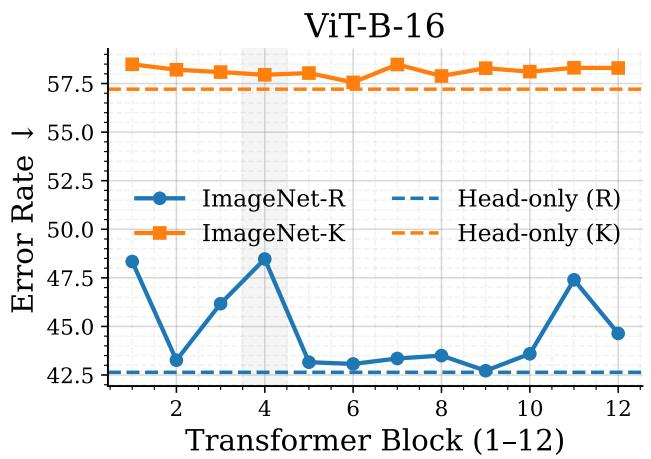  
(a) ViT-B-16

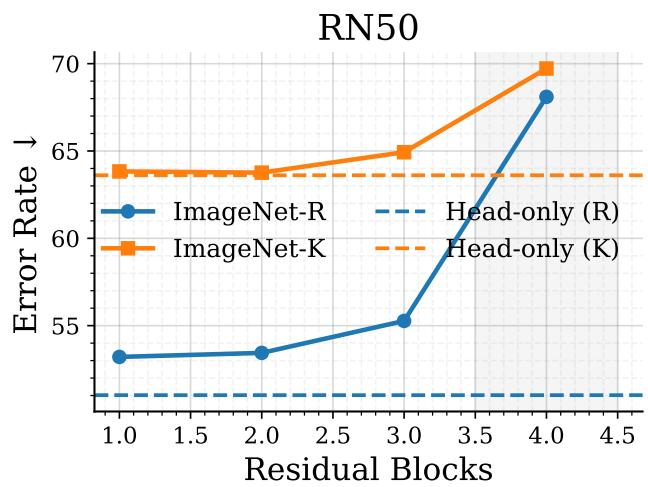  
(b) RN50-BN  
Figure 6. Layer ablation for the supervised step in two-step adaptation. Updating only the classifier head is most stable, while adapting intermediate/deeper layers often hurts under single-label supervision.

and high-level shifts in rendition and source distribution, and together span the corruption types on which prior ATTA work is evaluated. For the synthetic corruptions, we consider ImageNet-C [11], which consists of 15 corruption types at five severity levels; following prior work [22, 28, 29, 41, 42], we report results at severity level 5. To natural corruptions, we use ImageNet-R [13], ImageNet-K [44], and ImageNet-A [14], which contain renditions, sketches, and adversarially filtered images, respectively. We construct the test streams by sequentially traversing the full evaluation sets of each dataset, and report results on these complete streams (Appendix K.3).

Models. We consider two widely used vision models: ResNet-50 with Batch Normalization (RN50-BN) [10, 17] and ViT-B-16 [7], both pretrained on ImageNet-1K [5]. We always start from the same pretrained checkpoint with no access to source-domain data during adaptation.

## K.2. Reproducibility

The main paper describes the complete experimental setup, including datasets and evaluation protocols (ImageNet-C/R/K/A under FTTA/CTTA), model architectures and pretrained checkpoints (RN50-BN and ViT-B/16), optimization hyperparameters (batch size, learning rates, SGD settings, and loss weights), and all method-specific settings (e.g., W, M, H, δ, τ , and µ). We report results averaged over three random seeds (0, 41, 58). Code, configuration files, and evaluation scripts are available at https://github.com/Muhammad-Huzaifaa/WISE-ATTA.

## K.3. Dataset Details

We evaluate our methods on both synthetic corruptions and natural distribution shifts using four ImageNet-based benchmarks.

ImageNet-C. ImageNet-C [11] applies 15 common corruptions to the ImageNet-1K validation set (50,000 images), grouped into Noise, Blur, Weather, and Digital categories. Each corruption is provided at five severity levels, yielding 750,000 images per severity level and 3,750,000 in total. Following standard practice, we report results on severity level 5.

ImageNet-R. ImageNet-R [13] evaluates robustness to changes in depiction style by collecting artistic renditions (e.g., cartoons, paintings, sculptures) of ImageNet categories. It contains 30,000 images spanning 200 classes.

ImageNet-K (Sketch). ImageNet-Sketch [44] contains hand-drawn sketch representations of ImageNet objects. It includes sketches for 1,000 ImageNet classes with 50,000 images in total; we refer to this benchmark as ImageNet-K for consistency with our tables.

ImageNet-A. ImageNet-A [14] is a collection of natural adversarial examples that remain recognizable to humans but are challenging for ImageNet-trained models. It contains 7,500 images from 200 classes.