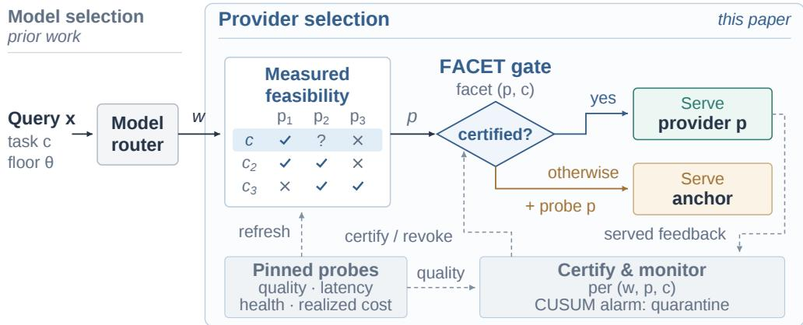
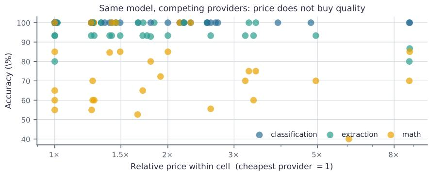
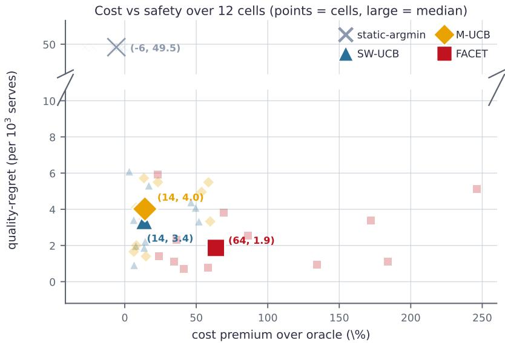
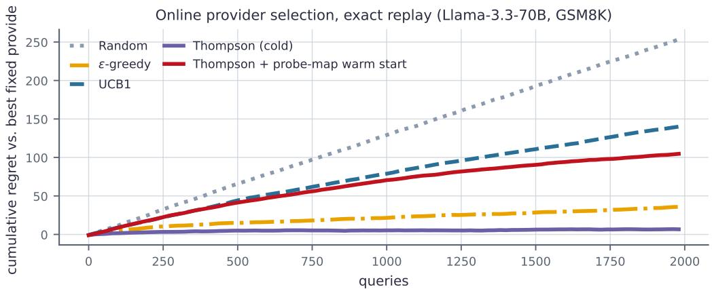
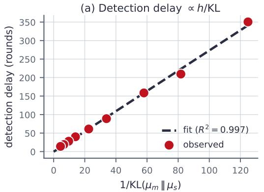
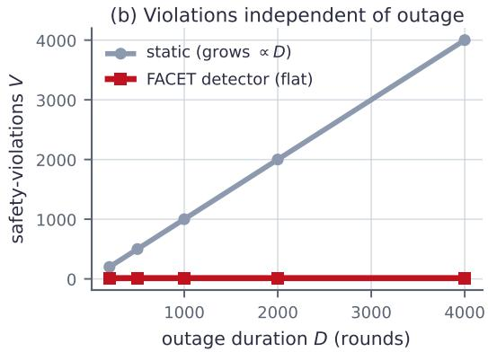

# YOU CANNOT PICK A PROVIDER FROM THE PRICELIST: MARKET-AWARE ROUTING FOR OPEN-WEIGHTLLM INFERENCE

Liang He, Jingbo Wen, Yixiong Chen, Yue Yang, Qizhen Lan, Kangning Cui, Xilu Wang

University of Sydney Johns Hopkins University Stanford University City University of Hong Kong

## ABSTRACT

Existing LLM routers choose among models using static per-model costs. We show that open-weight inference markets introduce a second, largely ignored decision axis: after choosing a model, a client must still choose which provider serves it. Measuring live endpoints across 6 open models, competing providers, multiple task types, and three measurement waves, we find that provider choice cannot be inferred from the price list. The same model can vary sharply in quality, latency, availability, and price across providers; higher-priced providers are consistently faster, but price does not reliably predict quality or availability; and provider feasibility is task-selective, with one deployment nearly normal on knowledge tasks but catastrophically degraded on multi-step reasoning. We formulate samemodel provider selection as a price-taker market-aware routing problem. A simple measured-map policy routes to the cheapest provider that is both qualityequivalent and healthy, yielding matched-quality savings while avoiding degraded endpoints. Because the map drifts, we introduce FACET, an online provider router that certifies per-(provider×task) feasibility facets and fails safe to an anchor before serving uncertified arms. Across relaxed deployment assumptions, FACET tolerates imperfect task assignment and sparse feedback, while systematic evaluator bias exposes a quality-signal trust boundary that can be mitigated with groundtruth probes or audits. Live provider runs further confirm that certification can move real traffic from a premium anchor to a substantially cheaper certified endpoint. Our results suggest that market-aware LLM routing must measure not only which model to use, but also who serves it.

## 1 INTRODUCTION

LLM inference is becoming a market-mediated service. Open-weight models such as Llama, Qwen, DeepSeek, Mistral, and Gemma are no longer served by a single source: the same weights are hosted by many competing providers, through different quantization choices (Frantar et al., 2022; Lin et al., 2024), kernels, batching and scheduling policies (Kwon et al., 2023; Agrawal et al., 2024), timeout behavior, and reliability profiles. At the same time, client-side LLM routing has become a practical way to reduce cost by selecting a model per query (Ong et al., 2025; Somerstep et al., 2025; Wang et al., 2025; Sakota et al.ˇ , 2024; Yue et al., 2024; Hu et al., 2024). Existing routers therefore ask a natural question: given a query, should we send it to a cheaper model or a stronger model?

This paper argues that this question is incomplete. In an open-weight inference market, selecting the model does not determine service. After a model router chooses, say, Llama-3.3-70B, the client must choose which provider serves it. This provider axis is not a minor implementation detail. Across providers, the same model can differ in price, latency, reliability, and answer quality. A routing system that treats ”the model” as a stable object therefore hides an important operational decision.

The central question is therefore what provider choice should be based on. Our empirical claim is simple: a provider cannot be chosen from the price list. One might expect higher price to buy higher quality, lower latency, or better availability. Our measurements reveal a more selective relationship. Higher-priced providers are consistently faster at benchmark scale, but price does not reliably predict answer quality or availability. The cheapest provider is sometimes degraded, while the most expensive provider is often neither the most accurate nor the safest. Price therefore exposes part of the cost–speed frontier, but it does not reveal whether an endpoint is feasible for a particular task. The advertised quantization label is not enough either (Li et al., 2024): two endpoints with the same label can differ sharply in accuracy. Separating a safe cheap provider from a degraded endpoint therefore requires direct, task-conditioned measurement. A key fact revealed by these measurements is that the provider axis is also not global: a provider is not simply safe or unsafe. We find task-selective failures: a deployment can be nearly normal on a knowledge benchmark, noticeably degraded on code, and catastrophically broken on multi-step reasoning. Provider rankings can even invert across tasks. This means that per-model measurement is insufficient; the routing map must be indexed by model, task, and provider. Moreover, the map ages; silent behavioral change in a served endpoint is a documented hazard for API consumers. Across three measurement waves over 43 days, prices move rarely, yet the cheapest quality-equivalent healthy provider changes because of availability recovery, rate limiting, provider exit, and silent quality slips. Market-aware routing in today’s open-weight market is therefore measurement-driven routing under drifting provider feasibility, with price dynamics that depend on sampling cadence and provider-pool depth.

  
Figure 1: The provider-selection layer. After an upstream router selects model w, provider-pinned probes maintain a task-conditioned feasibility map. FACET serves a provider only when its (p, c) facet is certified; otherwise it falls back to the anchor while probing the candidate. Served feedback supports continuous certification, revocation, and drift detection.

We make this operational by turning live measurement into the routing loop shown in Figure 1: provider-pinned probes build a task-conditioned feasibility map, the router chooses the cheapest measured-equivalent healthy provider, and online feedback updates certificates as the map drifts. We later test how this design behaves when task assignment and quality feedback are imperfect rather than oracle-clean. Following this measurement-to-routing loop, the paper makes four contributions.

1. Provider selection as a missing routing axis. We formalize same-model provider selection as the routing problem that remains after an open-weight model has been chosen, under quality, health, latency, and cost constraints.

2. Live measurement of provider heterogeneity beyond price. Using provider-pinned measurements across models, tasks, providers, and multiple waves, we show that price contains a consistent speed signal but does not reveal task-conditioned quality feasibility, which is both task-selective and time-varying.

3. Measured-map routing under drifting provider feasibility. We introduce a cheapestequivalent-healthy router that converts live measurements into matched-quality savings, and evaluate how its decisions degrade as the provider map ages.

4. Online feasibility certification beyond the clean setting. We formulate online provider selection as an inverse bandit and introduce FACET, which certifies per-(provider×task) feasibility before serving cheap endpoints. We separate the roles of certification and continuous monitoring, test robustness to imperfect task assignment and feedback, and identify ground-truth probes and audits as safeguards against systematic evaluator bias; we also validate live certification and migration.

## 2 SETTING AND MEASUREMENT

We study the client-side decision that remains after a model has already been chosen. For a query $x _ { t } ,$ , let $c _ { t }$ denote its underlying task context. The router need not observe $c _ { t }$ directly; instead, it receives an observed or inferred context signal $\hat { c } _ { t } ^ { \phantom { \dagger } } .$ , such as an application-provided label, a lightweight classifier output, or request metadata. If a query cannot be assigned confidently to a known context, it may be treated as an uncertified ”unknown” facet and fail safe. We initially evaluate the clean setting in which task context is correctly identified, and relax this assumption in Section 7.

Suppose an upstream router or application selects an open-weight model $w .$ . The remaining decision is to choose a provider $p \in \mathcal { P } ( w )$ serving it. Each provider exposes a client-visible state

$$
s _ { p } ( t ) = ( p _ { p } ( t ) , \ell _ { p } ( t ) , h _ { p } ( t ) ) ,
$$

where $p _ { p } ( t )$ is the posted token price, $\ell _ { p } ( t )$ is measured latency, and $h _ { p } ( t )$ is a health or availability signal. What is not directly known is the task-conditioned quality currently delivered by the provider. We denote this latent quality by

$$
q _ { p } ( w , c , t ) ,
$$

where $q _ { p } ( w , c , t )$ represents the expected task performance of provider $p$ for model w under context c at time t. A provider is feasible whenever its quality clears the required task-conditioned floor. Given a task-conditioned quality floor $\theta _ { w , c _ { t } }$ and, when applicable, a latency budget $\ell _ { \mathrm { m a x } }$ , the ideal provider-selection problem is

$$
\operatorname* { m i n } _ { p \in \mathcal { P } ( w ) } \mathrm { c o s t } _ { p } ( x _ { t } , t ) \qquad \mathrm { s . t . } \qquad q _ { p } ( w , c _ { t } , t ) \geq \theta _ { w , c _ { t } } , \quad h _ { p } ( t ) \geq h _ { \operatorname* { m i n } } , \quad \ell _ { p } ( t ) \leq \ell _ { \operatorname* { m a x } } .
$$

In the measured-map experiments, the quality floor is defined relative to the best measured provider in each model–task cell,

$$
\theta _ { w , c } = q _ { \mathrm { m a x } } ( w , c ) - \delta ,
$$

with $\delta \ : = \ : 0 . 0 5$ in the primary setting. When no latency SLA is specified, we take $\ell _ { \mathrm { m a x } } = \infty$ recovering the latency-unconstrained setting used in the primary experiments. Appendix F evalu ates explicit latency constraints. The measured-map router estimates the task-conditioned quality constraint from provider measurements, while FACET later maintains that constraint online.

We obtain the measurements through a public multi-provider aggregator, pinning every request to a single provider and disabling fallbacks. For each model–task–provider cell, we record accuracy, realized cost, mean latency, and availability. Our light probes cover multi-step math, extraction, sentiment classification, and code-output prediction, and we also run GSM8K (Cobbe et al., 2021), MMLU (Hendrycks et al., 2020), and HumanEval (Chen et al., 2021) at benchmark scale. Appendix D provides the full probing protocol and discusses probe-size limits, rate limiting, tokenbudget artifacts, and aggregator/geographic effects.

This provider-selection layer is orthogonal to standard model routing: RouteLLM, FrugalGPT, CARROT, and MixLLM (Ong et al., 2025; Chen et al., 2023; Somerstep et al., 2025; Wang et al., 2025; Sakota et al.ˇ , 2024; Yue et al., 2024) choose which model answers a query, whereas our layer starts after that decision and selects among providers serving the chosen model. We evaluate their composition in Section 5 and Appendix Q; broader comparisons with related routing, pricing, and serving work appear in Appendix B. The setting also differs from a classical reward bandit. Price, latency, and client-visible health are observable before routing, while task-conditioned quality is latent and must be estimated from probes or served-query feedback. The resulting feasibility constraint, $q _ { p } ( w , c _ { t } , t ) \ \geq \ \theta _ { w , c _ { t } } .$ , is therefore the unknown part of the routing decision. We use the observed market state to identify attractive candidates and spend measurement effort on determining whether those candidates may safely serve traffic. Appendix I discusses this observed-objective, latent-constraint view in relation to safe, constrained, and change-detection bandits.

## 3 THE PROVIDER AXIS IS REAL

We first ask whether provider choice remains meaningful once the model has already been selected. If a model name were a stable service contract, then providers serving the same weights should be largely interchangeable, and a client could choose among them using price, latency, or a simple health signal. The measurements show otherwise. Across the model–task cells in Table 1, the same model can be offered at prices differing by up to 8.8× and latencies differing by up to 68×, while accuracy can differ by tens of percentage points on harder tasks. In 5 cells, the cheapest provider falls below the quality floor. Provider choice therefore remains consequential even after the model itself has been fixed. More importantly, this heterogeneity has structure that matters for routing. On easy cells, several providers reach the same or nearly the same accuracy despite substantial price differences. On harder reasoning cells, the provider spread widens and some endpoints fall well below the same-model provider pool. Some cells therefore contain interchangeable providers and admit large savings, while others contain degraded endpoints that must be excluded. Selecting the cheapest measured-equivalent healthy provider yields a median saving of 50% relative to the premium provider at matched quality. Restricting the analysis to the nine non-saturated cells with measurable cross-provider quality differences still yields a 50.0% median saving, compared with 56.5% over all cells (Appendix L). Price alone does not distinguish safe from unsafe endpoints. Figure 2 shows both cheap providers that match the best endpoint and cheap providers that lose substantial accuracy. Benchmark-scale latency measurements, however, reveal a different pattern for speed: higher-priced providers are consistently faster, even though price remains uninformative about task-conditioned quality feasibility. Table 2 reveals a sharp distinction between speed and feasibility. The median price–latency correlation is −0.61, with all 21/21 benchmark-scale cells negative. By contrast, the corresponding correlations with accuracy and availability are +0.05 and 0.00, and neither exhibits a stable relationship with price across alternative measurement-run choices. Price can therefore inform the cost–speed trade-off, but cannot determine whether an endpoint clears the task-conditioned quality requirement. Appendix F reports the complete per-cell analysis and robustness checks.

Table 1: Provider dispersion across (model×task) cells. Despite using the same model, providers differ substantially in accuracy, price, and latency. The cheapest provider frequently matches higherpriced alternatives, but may fall below the quality floor in some cells.
<table><tr><td colspan="3"></td><td colspan="3">Provider heterogeneity</td><td colspan="2">Routing outcome</td></tr><tr><td>Model</td><td>Task</td><td>|P|</td><td>Acc. range</td><td></td><td>Price× Lat.×</td><td>Route price</td><td>Save</td></tr><tr><td></td><td>classification</td><td>7</td><td>100%-100%</td><td>2.3</td><td>68</td><td>$0.500</td><td>57%</td></tr><tr><td>deepseek-chat-v3.1</td><td>extraction</td><td>6</td><td>93%-100%</td><td>1.8</td><td>34</td><td>$0.625</td><td>46%</td></tr><tr><td></td><td>math</td><td>7</td><td>100%-100%</td><td>2.3</td><td>24</td><td>$0.625</td><td>46%</td></tr><tr><td></td><td>classification</td><td>5</td><td>100%-100%</td><td>2.5</td><td>4</td><td>$0.120</td><td>61%</td></tr><tr><td>gemma-3-27b-it</td><td>extraction</td><td>5</td><td>100%-100%</td><td>2.5</td><td>8</td><td>$0.120</td><td>61%</td></tr><tr><td></td><td>math</td><td>4</td><td>53%–72%†</td><td>1.9</td><td>3</td><td>$0.305</td><td>0%</td></tr><tr><td></td><td>classification</td><td>5</td><td>100%-100%</td><td>8.8</td><td>8</td><td>$0.025</td><td>89%</td></tr><tr><td>llama-3.1-8b-instruct</td><td>extraction</td><td>5</td><td>80%–93%†</td><td>8.8</td><td>10</td><td>$0.035</td><td>84%</td></tr><tr><td></td><td>math</td><td>5</td><td>56%–85%†</td><td>8.8</td><td>13</td><td>$0.220</td><td>0%</td></tr><tr><td></td><td>classification</td><td>9</td><td>100%-100%</td><td>4.8</td><td>25</td><td>$0.265</td><td>79%</td></tr><tr><td>llama-3.3-70b-instruct</td><td>extraction</td><td>10</td><td>93%-100%</td><td>5.0</td><td>6</td><td>$0.210</td><td>80%</td></tr><tr><td></td><td>math</td><td>11</td><td>40%–75%†</td><td>6.1</td><td>56</td><td>$0.265</td><td>79%</td></tr><tr><td></td><td>classification</td><td>4</td><td>100%-100%</td><td>2.0</td><td>3</td><td>$0.375</td><td>50%</td></tr><tr><td>llama-4-maverick</td><td>extraction</td><td>4</td><td>93%–93%</td><td>2.0</td><td>4</td><td>$0.375</td><td>50%</td></tr><tr><td></td><td>math</td><td>4</td><td>80%–85%</td><td>2.0</td><td>2</td><td>$0.375</td><td>50%</td></tr><tr><td></td><td>classification</td><td>41</td><td>100%-100%</td><td>1.5</td><td>2</td><td>$0.172</td><td>14%</td></tr><tr><td>mistral-small-3.2-24b-instruct</td><td>extraction</td><td></td><td>4 93%-100% †</td><td>1.5</td><td>3</td><td>$0.200</td><td>0%</td></tr><tr><td></td><td>math</td><td>4</td><td>100%-100%</td><td>1.5</td><td>4</td><td>$0.138</td><td>31%</td></tr></table>

Table 2: Benchmark-scale within-(model×task) Spearman correlations between provider price and metrics. Price is strongly associated with lower latency, but not with accuracy or availability.
<table><tr><td>Price vs.</td><td>Median Spearman</td><td>Interpretation</td></tr><tr><td>Accuracy</td><td>+0.05</td><td>no stable price-quality relation</td></tr><tr><td>Latency</td><td>-0.61</td><td>higher-priced providers are faster</td></tr><tr><td>Availability</td><td>0.00</td><td>no stable price-availability relation</td></tr></table>

  
Figure 2: Provider price does not predict same-model accuracy. Each point represents a provider serving a fixed model on a fixed task, with price normalized by the cheapest provider in the same cell. Providers with very different prices often achieve comparable accuracy.

A provider map is useful because the market contains both equivalence and failure: equivalent providers expose price savings, while degraded endpoints must be excluded. Concurrent crossprovider measurements (Li et al., 2026), aggregate model leaderboards (Chiang et al., 2024), and platform-side derankers document this variation but do not close the loop into task-conditioned routing under drift. We next show that feasibility varies across tasks and over time.

## 4 FEASIBILITY IS TASK-SELECTIVE AND DRIFTING

The previous section establishes that safe provider choice cannot be inferred from price alone. We next ask whether a provider can be certified once at the model level, or whether feasibility must be measured at a finer granularity. We evaluate GSM8K, MMLU, and HumanEval across all measured provider endpoints, yielding 93 endpoint-cells with n=150 for GSM8K and MMLU and n=100 for HumanEval. Many same-model provider sets form tight quality equivalence classes, which creates room for cheapest-equivalent routing. However, the exceptions are task-selective. The same endpoint can remain competitive on one workload while falling substantially below the provider field on another. In the clearest case, a Llama-3.3-70B deployment is close to the provider field on knowledge-oriented evaluation but becomes severely degraded on multi-step reasoning. A single provider-level safe/unsafe label is therefore too coarse; feasibility must be indexed by model, task, and provider. The complete benchmark-scale results and the 5-point TOST equivalence analysis are reported in Appendix N and Appendix U.

The map is also time-varying. We repeat the full measurement process 13 and 43 days after the initial collection. Posted prices remain mostly stable, yet the selected route changes in 4/17 comparable cells over days 0–13 and 2/18 over days 13–43. These changes are driven by availability recovery, rate limiting, provider exit, and occasional quality degradation rather than by price movement alone. The provider-level route transitions are reported in Appendix N. Finer-grained price monitoring further shows that the apparent stickiness of list prices does not imply a fixed routing state. Over a 24-hour window at 15-minute resolution, deeper provider pools exhibited multiple re-elections within a single day, while the shallower pools in our watch set remained static. Moreover, prices observed through the aggregator reflect a flat contracted rate rather than the full time-varying market price, as confirmed by direct API testing against a first-party provider’s published peak/off-peak schedule. Appendix T gives the complete analysis.

Provider feasibility therefore has two properties that matter for routing: it must be task-conditioned and cannot be assumed to remain fixed. The measured-map router addresses the first issue; once the map ages, FACET addresses the second through online feasibility certification.

## 5 MEASURED-MAP ROUTING

We next convert the measurement map into a routing policy. For each model–task cell, the router selects the cheapest provider whose measured accuracy is within 5 points of the best provider and whose availability exceeds 90%. We treat these thresholds as deployment choices rather than tuned constants. Across out-of-sample threshold sweeps, the measured-map below-floor rate is 0.0–22.2% and never exceeds cheapest- or premium-provider routing (Appendix H). The policy is intentionally simple: it tests whether direct measurement can turn provider heterogeneity into a routing decision.

In-sample, the measured-map router achieves 94% mean accuracy at 1.57× the cheapest-provider cost while keeping the below-floor rate at 0%. This is close to the 95% accuracy of the singlebest oracle, but at far lower cost than the premium policy, which pays 3.67× the cheapest provider cost and still sends 17% of cells below the quality floor. Pure cheapest-provider routing reduces cost to 1.0×, but increases the below-floor rate to 28%. The full comparison, including the random baseline, is reported in Appendix K. These savings use the five-point margin on measured accuracies, raising the question of how much of the cost advantage remains once sampling uncertainty is taken into account. On a 14-cell benchmark subset, requiring a one-sided 95% confidence interval to support the same five-point margin reduces median saving from 55% to 46%. Importantly, simply selecting the most accurate provider already saves 45% relative to the premium provider. Thus most of the statistically supported saving comes from price–quality misalignment, while the equivalence margin provides additional savings that require larger samples to certify. Appendix U reports the full confidence-based analysis. We then evaluate the same policy out of sample by selecting providers from an earlier measurement wave and scoring them on a later wave. Under the primary five-point quality margin and 90% availability threshold, the selected provider remains above the later-wave floor in all 9/9 comparable cells. This robustness is threshold-dependent: relaxing the availability threshold to 80% raises the OOS below-floor rate to 11.1%, while tightening the quality margin to two points raises it to 22.2%. Appendix H reports the complete out-of-sample threshold sweep.

Provider-layer routing also retains independent value when model selection is handled upstream. We stack it beneath a RouteLLM-style difficulty router that first selects between an 8B and a 70B model. On GSM8K, the cheapest provider is already safe, so the provider layer makes the same choice at the same cost. On MMLU and HumanEval, however, cheapest-provider routing sends 55.9% and 57.5% of queries through below-floor endpoints. Provider-aware selection reduces both rates to zero, while increasing cost only from \$328.3 to \$336.7 on MMLU and from \$319.7 to \$380.0 on HumanEval. Relative to always using the dearest provider, it also retains most of the available cost saving. The provider axis therefore does not disappear after model routing; it remains a separate decision underneath it. Appendix Q reports the full stacked evaluation. Cost minimization can nevertheless trade away latency. Across the 17 cells with at least two quality-feasible providers, the cheapest feasible endpoint incurs a median 7.8× p95-latency penalty relative to the fastest feasible endpoint. Adding an explicit latency constraint exposes the corresponding cost–speed trade-off: a 10-second SLA retains all 12/12 evaluated cells at only 1.19× the unconstrained routing cost, whereas a 1-second SLA leaves only 6/12 cells feasible and raises cost to 2.62×. Appendix F reports the complete latency analysis and deadline sweep. The measured-map router therefore captures taskconditioned provider heterogeneity, but it remains a snapshot-based policy. The next question is how to preserve this safety once the underlying provider state begins to move.

## 6 FACET: ONLINE FEASIBILITY CERTIFICATION

A measured provider map can become stale as availability, provider membership, or quality changes. Generic online bandits can adapt to these changes, but their exploration rule is problematic here: a newly attractive arm may be a catastrophically degraded provider, and exploring it means serving real user traffic. Exact-replay experiments in Appendix R show that bandits can fine-rank providers once feedback accumulates, but do not remove this early-exposure risk.

FACET exploits provider-market asymmetry: price, latency, and health are observable, while taskconditioned quality is not. Each (provider×task) pair is a separate feasibility facet. A newly attractive provider is therefore not served immediately; it first accumulates quality evidence while traffic falls back to an anchor. In replay, certification uses the 200 most recent labelled observations. Once at least $n _ { \mathrm { m i n } } = 1 2$ observations are available, a facet is certified if its windowed accuracy is within

Table 3: Ablation experiments isolating fail-safe anchoring and task-conditioned certification. Values report catastrophic exposure (below-floor served queries).
<table><tr><td rowspan="2">Scenario</td><td colspan="3">Catastrophic exposure</td></tr><tr><td>FACET (full)</td><td>No anchor</td><td>Context-blind</td></tr><tr><td>S1: Cheap mine from start</td><td>0.0%</td><td>8.3%</td><td>6.7%</td></tr><tr><td>S2: Certified arm slips mid-run</td><td>0.4%</td><td>5.6%</td><td>3.2%</td></tr><tr><td>S3: No cheap catastrophic mine</td><td>1.2%</td><td>0.0%</td><td></td></tr></table>

  
Figure 3: Cost–safety trade-off for online provider selection. FACET pays a cost premium to avoid routing traffic to uncertified low-cost providers, which cost-greedy policies may select prematurely.

8 points of the best same-task provider with at least $n _ { \mathrm { m i n } }$ observations and no more than 3 points below the task floor θ. After admission, the role shifts from certification to monitoring: certified facets are continuously checked and quarantined when their quality degrades. Replay uses these point-estimate rules; detector details and the confidence-aware live rule are given in Appendices S, C, and P. Figure 3 frames FACET as a safety–cost trade-off rather than a pure cost-minimization policy, while Table 3 isolates fail-safe anchoring and task-conditioned certification by removing each under adversarial re-election. In the anchoring ablation, S1 makes the cheapest arm a catastrophic mine from the start; S2 lets a certified cheap arm slip mid-run; S3 reflects the measured market without a cheap catastrophic mine. Removing the anchor reproduces the optimistic policy’s exposure, isolating the gain from the never-serve-uncertified rule. In the task-certification ablation, a multi-task stream interleaves GSM8K, MMLU, and HumanEval; a provider is safe on two tasks but catastrophic on the third. A context-blind certifier pools evidence across tasks, certifies globally, and then serves the unsafe task; per-facet certification avoids this failure because evidence from one task does not certify another. A simpler alternative to continuous monitoring is periodic re-measurement: every P rounds, probe all providers, refresh feasibility estimates, and serve the cheapest provider whose latest measurement clears the floor. This works when degradation is visible at a measurement round, but creates a blind interval: if a certified provider slips immediately after measurement, the router continues serving it until the next refresh.

Table 4 shows the gap between periodic re-measurement and the FACET system, but the comparison changes both admission and monitoring at once. We therefore run a component control that gives periodic re-measurement the same served-feedback monitor as FACET, leaving scheduled full-pool admission as the main difference. The result matches the division of labor. When a previously safe provider later degrades, the shared monitor is the relevant mechanism: monitored periodic routing reaches 0.3–0.5% below-floor exposure, comparable to FACET at similar total cost. Certification matters in the complementary admission regime. When the cheapest provider is below the floor from the outset, the never-serve-uncertified rule further reduces cold-start exposure, while targeted certification lowers dedicated probe spend by 8–23× relative to scheduled full-pool probing. Certification therefore protects admission and concentrates measurement on potentially useful candidates, whereas continuous monitoring protects already-certified providers under subsequent drift. Appendix M reports the 40-seed component control and the full re-probing sweeps.

Table 4: Periodic re-measurement versus FACET. A certified provider can slip between measurement rounds. Periodic re-probing reduces exposure by probing more frequently, while FACET continuously monitors served facets and uses probes only for certification (10 seeds).
<table><tr><td colspan="4">Periodic re-measurement</td><td colspan="4">FACET</td></tr><tr><td>P</td><td></td><td>Probe cost ($) Below-floor Total cost ($)</td><td></td><td>r</td><td>Probe cost ($) Below-floor Total cost ($)</td><td></td><td></td></tr><tr><td>100</td><td>1740.2</td><td>3.70%</td><td>2361</td><td>0.10</td><td>16.7</td><td>0.17%</td><td>1255</td></tr><tr><td>400</td><td>487.2</td><td>14.30%</td><td>1089</td><td>0.25</td><td>22.9</td><td>0.67%</td><td>1110</td></tr><tr><td>1600</td><td>139.2</td><td>38.60%</td><td>709</td><td>1.00</td><td>27.6</td><td>0.28%</td><td>1130</td></tr></table>

Table 5: Robustness to imperfect task assignment. Left: corruption of known task labels. Right: OOD traffic treated as uncertified or mapped to the nearest known facet. Values report catastrophic exposure (below-floor served queries; 10 seeds).
<table><tr><td colspan="3">Label corruption (known tasks)</td><td colspan="3">OOD traffic</td></tr><tr><td>Perturbation FACET</td><td></td><td>Reference</td><td>| Perturbation</td><td>FACET</td><td>Reference</td></tr><tr><td>0% error</td><td>0.00%</td><td>6.72% (context-blind)</td><td>10% 00D</td><td>0.00%</td><td>3.41% (nearest facet)</td></tr><tr><td>10% error</td><td>2.23%</td><td>6.72%</td><td>25% 0OD</td><td>0.00%</td><td>1.03%</td></tr><tr><td>20% error</td><td>3.54%</td><td>6.72%</td><td>50% 0OD</td><td>0.00%</td><td>0.24%</td></tr><tr><td>33% error</td><td>4.72%</td><td>6.72%</td><td></td><td></td><td></td></tr></table>

The experiments above clarify why FACET combines three separate mechanisms. Fail-safe anchoring prevents newly elected but uncertified providers from receiving user traffic, task-conditioned certification avoids transferring safety evidence across workloads, and continuous monitoring limits exposure when a previously certified provider later degrades. Appendix C compares the monitoring component with non-stationary bandit baselines, while Appendices J and V examine its behavior under different drift patterns and the additional cost of repeated re-certification.

This protection is not free. Whether the additional cost is worthwhile depends on the applicationlevel consequence of a below-floor answer. Against SW-UCB, the break-even point is about 17× the cost of an ordinary served query; against a frozen map or periodic refresh, it is roughly one query-price or less. Appendix E reports the full cost–safety analysis. Because these signals may be imperfect in real deployments, we next test how FACET behaves when the assumptions underlying the preceding experiments are relaxed.

## 7 BEYOND THE IDEALIZED SETTING

In deployment, task context may be wrong or unavailable, and quality feedback may be sparse, noisy, or biased. We relax these assumptions progressively. Missing or symmetric-noise evidence mainly triggers fallback, whereas systematic bias exposes a harder certification boundary.

Imperfect task assignment. We first perturb task identity. In an interleaved GSM8K–MMLU– HumanEval stream, the task label observed by the router is randomly corrupted while safety is evaluated against the true task. Table 5 (Left) shows gradual degradation: below-floor exposure rises from 0% to 4.72% at 33% label error, still below the 6.72% exposure of context-blind certification that pools all tasks. Perfect task classification is therefore not required. A separate challenge arises when queries fall outside the known task set. Reusing the nearest known facet can transfer safety evidence from an unrelated workload. FACET instead treats unknown queries as uncertified and applies the fail-safe rule. Table 5 (Right) keeps catastrophic exposure at zero as OOD traffic reaches 50%, whereas forcing unknown queries into the nearest known facet produces unsafe serves. This assumes an OOD reject signal is available; open-set detection itself is a separate problem (Appendix O).

Table 6: Live FACET deployment: 36-hour run on Llama-3.3-70B across 12 providers. Validates cold-start certification and migration; no quality slip occurred during the window.
<table><tr><td>Metric</td><td>Value Metric</td><td>Value</td></tr><tr><td colspan="3">Deployment scale</td></tr><tr><td>Served queries</td><td>538 Certification probes</td><td>130</td></tr><tr><td>Failed calls</td><td>4 Aggregate served accuracy</td><td>88.3%</td></tr><tr><td colspan="3">Serving behavior</td></tr><tr><td>Avg. price, queries 1–100 $0.924/M Avg. price, queries 301–500</td><td></td><td>$0.210/M</td></tr><tr><td>Anchor price</td><td>$1.04 /M</td><td></td></tr><tr><td colspan="3">Cost outcome</td></tr><tr><td>Serving spend</td><td>$0.0635 Probe spend</td><td>$0.0115</td></tr><tr><td>Serving-cost reduction</td><td>63.7% Total-cost reduction incl. probes</td><td>57.1%</td></tr></table>

Imperfect quality feedback. The quality signal is fundamental. We first revisit symmetric judge noise. Its near-zero below-floor exposure does not indicate evaluator robustness: with 20% random judge error, FACET serves 95–97% of traffic from the anchor. Symmetric noise therefore tests whether uncertainty induces conservative fallback. We next consider an evaluator that systematically over-credits a weak provider. With judged certification probes, exposure remains low under mild bias but increases sharply as the bias strengthens. Scoring probes against ground-truth answers protects cold-start certification. A provider that degrades after admission remains dependent on served feedback, but a small gold audit substantially reduces this exposure. These experiments identify quality feedback as a trust boundary of FACET, with mitigations rather than an assumption of an arbitrarily reliable judge. Appendix O reports the bias sweep, sparse feedback, and mitigation.

Live deployment validation. The experiments above are replay-based. We finally test whether certification and migration operate against live endpoints. We ran FACET for 36 hours on Llama-3.3-70B across 12 providers, interleaving fresh GSM8K, MMLU, and HumanEval queries. The run served 538 queries and issued 130 certification probes. Traffic began on a \$1.04/M-token anchor and moved to a certified provider at \$0.21/M tokens. Average served price fell from \$0.924/M to \$0.210/M after query 300, while served accuracy remained 88.3%. Table 6 summarizes the run. Relative to the anchor, FACET achieved a 63.7% reduction in serving cost (57.1% after including probes). No provider quality collapse occurred during this window, so the experiment validates cold-start certification and live migration rather than slip detection. It also exposed deployment issues absent from replay—false quarantine at small sample sizes and wasted probes on unavailable endpoints—addressed by confidence-aware certification and availability backoff (Appendix P).

The live run and stress tests answer different questions. The live run shows that certification can operate against real providers, while the stress tests separate uncertainty from systematic error. Imperfect task assignment, sparse feedback, and symmetric label noise mainly cause gradual degrada tion or conservative fallback; systematic evaluator bias can instead corrupt the quality signal itself. FACET therefore still requires a maintained anchor, some trustworthy quality evidence, and a way to assign or reject query context. Ground-truth certification probes and occasional audits provide practical safeguards when evaluator bias is a concern. In the limit of no task signal and no trustworthy quality evidence, no certification-based method can distinguish safe from unsafe providers.

## 8 CONCLUSION

Open-weight inference markets make model choice incomplete. The same model served by competing providers can differ enough in quality, latency, availability, and price that a provider cannot be chosen from the price list. Live measurement shows that provider feasibility is task-selective and drifting, motivating both measured-map routing and FACET’s online per-task certification. Our additional studies show that FACET’s certification and monitoring components address complementary failure modes, while systematic evaluator bias defines an explicit quality-signal trust boundary that can be mitigated with ground-truth probes or audits. Live deployment results demonstrate that certification can operate on real provider traffic and move traffic from a premium anchor to a substantially cheaper certified endpoint. These results suggest that market-aware LLM routing must decide not only which model to use, but also which provider currently has enough evidence to be trusted to serve it. We discuss limitations and scope conditions in Appendix A.

## REFERENCES

Joshua Achiam, David Held, Aviv Tamar, and Pieter Abbeel. Constrained policy optimization. In International conference on machine learning, pp. 22–31. Pmlr, 2017.

Orna Agmon Ben-Yehuda, Muli Ben-Yehuda, Assaf Schuster, and Dan Tsafrir. Deconstructing amazon ec2 spot instance pricing. ACM Transactions on Economics and Computation (TEAC), 1 (3):1–20, 2013.

Amey Agrawal, Nitin Kedia, Ashish Panwar, Jayashree Mohan, Nipun Kwatra, Bhargav Gulavani, Alexey Tumanov, and Ramachandran Ramjee. Taming {Throughput-Latency} tradeoff in {LLM} inference with {Sarathi-Serve}. In 18th USENIX symposium on operating systems design and implementation (OSDI 24), pp. 117–134, 2024.

Eitan Altman. Constrained Markov decision processes. Routledge, 2021.

Sanae Amani, Mahnoosh Alizadeh, and Christos Thrampoulidis. Linear stochastic bandits under safety constraints. Advances in Neural Information Processing Systems, 32, 2019.

Peter Auer, Nicolo Cesa-Bianchi, and Paul Fischer. Finite-time analysis of the multiarmed bandit problem. Machine learning, 47(2):235–256, 2002.

Ashwinkumar Badanidiyuru, Robert Kleinberg, and Aleksandrs Slivkins. Bandits with knapsacks. Journal ofthe ACM (JACM), 65(3):1–55, 2018.

Omar Besbes, Yonatan Gur, and Assaf Zeevi. Stochastic multi-armed-bandit problem with nonstationary rewards. Advances in neural information processing systems, 27, 2014.

Yang Cao, Zheng Wen, Branislav Kveton, and Yao Xie. Nearly optimal adaptive procedure with change detection for piecewise-stationary bandit. In The 22nd International Conference on Artificial Intelligence and Statistics, pp. 418–427. PMLR, 2019.

Lingjiao Chen, Matei Zaharia, and James Zou. Frugalgpt: How to use large language models while reducing cost and improving performance. arXiv preprint arXiv:2305.05176, 2023.

Mark Chen, Jerry Tworek, Heewoo Jun, Qiming Yuan, Henrique Ponde De Oliveira Pinto, Jared Kaplan, Harri Edwards, Yuri Burda, Nicholas Joseph, Greg Brockman, et al. Evaluating large language models trained on code. arXiv preprint arXiv:2107.03374, 2021.

Wei-Lin Chiang, Lianmin Zheng, Ying Sheng, Anastasios Nikolas Angelopoulos, Tianle Li, Dacheng Li, Hao Zhang, Banghua Zhu, Michael Jordan, Joseph E Gonzalez, et al. Chatbot arena: An open platform for evaluating llms by human preference. arXiv preprint arXiv:2403.04132, 2024.

Karl Cobbe, Vineet Kosaraju, Mohammad Bavarian, Mark Chen, Heewoo Jun, Lukasz Kaiser, Matthias Plappert, Jerry Tworek, Jacob Hilton, Reiichiro Nakano, et al. Training verifiers to solve math word problems. arXiv preprint arXiv:2110.14168, 2021.

Elias Frantar, Saleh Ashkboos, Torsten Hoefler, and Dan Alistarh. Gptq: Accurate post-training quantization for generative pre-trained transformers. arXiv preprint arXiv:2210.17323, 2022.

Aurelien Garivier and Eric Moulines. On upper-confidence bound policies for switching bandit´ problems. In International conference on algorithmic learning theory, pp. 174–188. Springer, 2011.

Dan Hendrycks, Collin Burns, Steven Basart, Andy Zou, Mantas Mazeika, Dawn Song, and Jacob Steinhardt. Measuring massive multitask language understanding. arXiv preprint arXiv:2009.03300, 2020.

Qitian Jason Hu, Jacob Bieker, Xiuyu Li, Nan Jiang, Benjamin Keigwin, Gaurav Ranganath, Kurt Keutzer, and Shriyash Kaustubh Upadhyay. Routerbench: A benchmark for multi-llm routing system. arXiv preprint arXiv:2403.12031, 2024.

Woosuk Kwon, Zhuohan Li, Siyuan Zhuang, Ying Sheng, Lianmin Zheng, Cody Hao Yu, Joseph Gonzalez, Hao Zhang, and Ion Stoica. Efficient memory management for large language model serving with pagedattention. In Proceedings of the 29th symposium on operating systems principles, pp. 611–626, 2023.

Tze Leung Lai. Information bounds and quick detection of parameter changes in stochastic systems. IEEE Transactions on Information theory, 44(7):2917–2929, 1998.

Haorui Li, Zhenghui He, Xuanzi Liu, Yang Xu, Dongsheng Liu, Jiakang Ma, Lupan Wu, Yangjie Wu, Xiongchao Tang, and Tianhui Shi. When is the same model not the same service? a measurement study of hosted open-weight llm apis. arXiv preprint arXiv:2605.02821, 2026.

Shiyao Li, Xuefei Ning, Luning Wang, Tengxuan Liu, Xiangsheng Shi, Shengen Yan, Guohao Dai, Huazhong Yang, and Yu Wang. Evaluating quantized large language models. arXiv preprint arXiv:2402.18158, 2024.

Ji Lin, Jiaming Tang, Haotian Tang, Shang Yang, Wei-Ming Chen, Wei-Chen Wang, Guangxuan Xiao, Xingyu Dang, Chuang Gan, and Song Han. Awq: Activation-aware weight quantization for on-device llm compression and acceleration. Proceedings of machine learning and systems, 6:87–100, 2024.

Fang Liu, Joohyun Lee, and Ness Shroff. A change-detection based framework for piecewisestationary multi-armed bandit problem. In Proceedings of the AAAI Conference on Artificial Intelligence, volume 32, 2018.

Gary Lorden. Procedures for reacting to a change in distribution. The annals of mathematical statistics, pp. 1897–1908, 1971.

Xupeng Miao, Chunan Shi, Jiangfei Duan, Xiaoli Xi, Dahua Lin, Bin Cui, and Zhihao Jia. Spotserve: Serving generative large language models on preemptible instances. In Proceedings ofthe 29th ACM International Conference on Architectural Support for Programming Languages and Operating Systems, Volume 2, pp. 1112–1127, 2024a.

Xupeng Miao, Chunan Shi, Jiangfei Duan, Xiaoli Xi, Dahua Lin, Bin Cui, and Zhihao Jia. Spotserve: Serving generative large language models on preemptible instances. In Proceedings of the 29th ACM International Conference on Architectural Support for Programming Languages and Operating Systems, Volume 2, pp. 1112–1127, 2024b.

Isaac Ong, Amjad Almahairi, Vincent Wu, Wei-Lin Chiang, Tianhao Wu, Joseph E Gonzalez, Mohammed Kadous, and Ion Stoica. Routellm: Learning to route llms from preference data, 2025.

Aldo Pacchiano, Mohammad Ghavamzadeh, Peter Bartlett, and Heinrich Jiang. Stochastic bandits with linear constraints. In International conference on artificial intelligence and statistics, pp. 2827–2835. PMLR, 2021.

Ewan S Page. Continuous inspection schemes. Biometrika, 41(1/2):100–115, 1954.

Marija Sakota, Maxime Peyrard, and Robert West. Fly-swat or cannon? cost-effective languageˇ model choice via meta-modeling. In Proceedings of the 17th ACM International Conference on Web Search and Data Mining, pp. 606–615, 2024.

Donald J Schuirmann. A comparison of the two one-sided tests procedure and the power approach for assessing the equivalence of average bioavailability. Journal of pharmacokinetics and biopharmaceutics, 15(6):657–680, 1987.

Seamus Somerstep, Felipe Maia Polo, Allysson Flavio Melo de Oliveira, Prattyush Mangal, M´ırian Silva, Onkar Bhardwaj, Mikhail Yurochkin, and Subha Maity. Carrot: A cost aware rate optimal router. arXiv preprint arXiv:2502.03261, 2025.

Yanan Sui, Alkis Gotovos, Joel Burdick, and Andreas Krause. Safe exploration for optimization with gaussian processes. In International conference on machine learning, pp. 997–1005. PMLR, 2015.

Xinyuan Wang, Yanchi Liu, Wei Cheng, Xujiang Zhao, Zhengzhang Chen, Wenchao Yu, Yanjie Fu, and Haifeng Chen. Mixllm: Dynamic routing in mixed large language models. In Proceedings of the 2025 Conference ofthe Nations ofthe Americas Chapter ofthe Associationfor Computational Linguistics: Human Language Technologies (Volume 1: Long Papers), pp. 10912–10922, 2025.

Herbert Woisetschlager, Arastun Mammadli, Ryan Zhang, and Shiqiang Wang. Cost-optimal¨ llm routing with limited user feedback under user satisfaction guarantees. arXiv preprint arXiv:2606.19376, 2026.

Yifan Wu, Roshan Shariff, Tor Lattimore, and Csaba Szepesvari. Conservative bandits. In´ International conference on machine learning, pp. 1254–1262. PMLR, 2016.

Gyeong-In Yu, Joo Seong Jeong, Geon-Woo Kim, Soojeong Kim, and Byung-Gon Chun. Orca: A distributed serving system for {Transformer-Based} generative models. In 16th USENIX symposium on operating systems design and implementation (OSDI 22), pp. 521–538, 2022.

Murong Yue, Jie Zhao, Min Zhang, Liang Du, and Ziyu Yao. Large language model cascades with mixture of thought representations for cost-efficient reasoning. In International Conference on Learning Representations, volume 2024, pp. 21691–21728, 2024.

Yiqun Zhang, Hao Li, Zihan Wang, Shi Feng, Xiaocui Yang, Daling Wang, Bo Zhang, Lei Bai, and Shuyue Hu. Mtrouter: Cost-aware multi-turn llm routing with history–model joint embeddings. In Proceedings of the 64th Annual Meeting of the Association for Computational Linguistics (Volume 1: Long Papers), pp. 44206–44226, 2026.

## APPENDIX CONTENTS

A Limitations 14   
B Related Work Positioning 14   
C Detector-Core Comparison 15   
D Measurement Protocol and Caveats 16   
E When Is the Safety Premium Worth Paying? 16   
F Price–Latency Trade-offs and Latency-Constrained Routing 17   
G Run-to-Run Variability . 20   
H Out-of-Sample Sensitivity to the Quality Floor and Health Threshold . 20   
I Why Provider Selection Has an Inverse-Bandit Structure 21   
Drift-Shape Stress Tests 21   
K Measured-Map Routing Results 22   
L Savings Beyond Saturated Cells 22   
M Periodic Re-Probing Baseline . 23   
Benchmark-Scale Feasibility and Multi-Wave Drift 24   
O Assumption-Relaxation Experiments 26   
P Live Provider Deployment Details . 28   
Q Composition with an Upstream Model Router 29   
R Exact-Replay Bandit Curves 29   
S Detection Guarantees 30   
T High-Frequency Price Monitoring and the Limits of Aggregator Visibility . 30   
Equivalence-Class Width: A TOST Check . 32   
V Cost-Regret Scaling . 33

## A LIMITATIONS

Our results are a measurement-driven view of the current open-weight provider market, not a claim about a fully liquid token spot market of the kind studied for cloud compute (Agmon Ben-Yehuda et al., 2013), where providers themselves arbitrage capacity across preemptible instances (Miao et al., 2024b;a). Across our coarse multi-week measurement waves, listed prices move rarely, but high-frequency monitoring shows that this apparent stability depends on sampling cadence and provider-pool depth (Appendix T). The observed savings arise mainly from cross-sectional provider dispersion at equal quality, while route validity can change through availability, provider churn, quality drift, and market re-election. The light probes use small sample sizes and resolve large gaps more reliably than marginal ones. Rapid pinned probing can induce rate limits, and all requests traverse a single aggregator from one client location. This limits causal attribution: quality degradation may stem from quantization (Li et al., 2024), kernels, serving bugs (Kwon et al., 2023), sampling configuration, or aggregator interaction. Our claims are therefore attribution-agnostic: whatever the mechanism, the endpoint-level behavior is observable by clients and matters for routing. Likewise, the observed price–latency relationship is a client-visible cross-sectional association rather than evidence that higher prices causally produce faster service; Appendix F reports the cor responding robustness checks. FACET is also not a uniformly dominant online learner. It is designed for abrupt catastrophic cheap mines and task-selective feasibility. In tight-band cells with only marginal floor crossings, sliding-window learners may be cheaper or safer; under gradual ramps or multiple concurrent mines, the detector core is less favorable. We therefore present FACET as an insurance mechanism with a construction-based safety property, not as a universal replacement for non-stationary bandits. Appendix C reports the full detector-core comparison, and Appendix J stress-tests this boundary under different drift shapes. The robustness experiments also separate convenient assumptions from minimum information requirements. FACET tolerates imperfect task assignment and sparse feedback, while symmetric label noise mainly induces conservative fallback. Systematic evaluator bias is different: it can corrupt certification unless ground-truth probes or audits provide an independent quality signal. The system therefore still requires a maintained fallback, some trustworthy evidence about served quality, and a mechanism that either assigns a query to a facet or rejects it as unknown. In particular, our OOD experiment evaluates the routing rule given an unknown-task decision; it does not solve open-set task recognition itself. In the limit of no task sig nal and no trustworthy quality evidence, safe certification is not possible. The component-ablation and biased-evaluator stress tests use a single Llama-3.3-70B/GSM8K exact-replay cell and should be interpreted as mechanism and boundary tests rather than evidence that the same numerical effects hold uniformly across all provider–task cells.

## B RELATED WORK POSITIONING

Table 7 makes explicit the decision axis studied in this paper. Existing client-side LLM routers— FrugalGPT, RouteLLM, CARROT, and MixLLM (Chen et al., 2023; Ong et al., 2025; Somerstep et al., 2025; Wang et al., 2025)—operate primarily on the model-selection axis: given a query, they decide whether to call a stronger or weaker model (Sakota et al.ˇ , 2024), or how to cascade among models (Yue et al., 2024). The table also lists a provider-side pricing mechanism and a cross-provider measurement leaderboard, neither of which closes a measurement loop into clientside provider selection. Our setting is different and composable with those routers. We assume that a model has already been selected, and study the remaining question of which provider should serve the same open-weight model. This distinction matters for evaluation. A model router does not decide among providers of the same model; it leaves that decision unmade. Conversely, our provider router does not decide whether a query should use an 8B, 70B, or frontier model. The two layers can be stacked: a model router first selects the model, then our provider router chooses the cheapest currently certified provider for that model and task.

Concurrent work extends model routing along axes that remain orthogonal to ours. Satisfactionconstrained routers optimize cost subject to a user-satisfaction target under limited feedback (Woisetschlager et al.¨ , 2026); multi-turn routers condition the model choice on conversation history (Zhang et al., 2026); and budget-paced adaptive routers handle non-stationary serving conditions. All three still choose which model answers a query, and all three take the price of that choice from a posted list. Our layer is downstream of each of them: once a model is fixed, the price actually paid and the quality actually delivered are determined by which provider serves it, and that mapping must be measured rather than looked up.

Table 7: Positioning against representative routing and measurement work. Prior client-side routers select among models; our layer selects among providers serving the same selected openweight model.
<table><tr><td></td><td>Decision axis</td><td>Cost model</td><td>Cross-provider quality</td></tr><tr><td>FrugalGPT / RouteLLM</td><td></td><td></td><td></td></tr><tr><td>CARROT / MixLLM</td><td>which model</td><td>static list price</td><td></td></tr><tr><td>PriLLM (provider-side)</td><td>sets its own price</td><td>endogenous</td><td></td></tr><tr><td>Token Arena (measurement)</td><td>— (leaderboard)</td><td></td><td>static snapshot</td></tr><tr><td>Ours</td><td>which provider</td><td>live, exogenous</td><td>measured, live</td></tr></table>

## C DETECTOR-CORE COMPARISON

The main paper presents FACET as a deployment safety layer: it combines per-task feasibility certification, fail-safe anchoring, and slip detection. This appendix isolates the detector core in isolation from the certification and fail-safe layers. The purpose of this section is not to claim that the detector core is uniformly superior to all non-stationary bandits. Rather, it clarifies the regime where the detector core helps: abrupt, large-gap quality slips of a provider that is otherwise attractive by price.

We replay each benchmark cell as a piecewise-stationary stream. The stream begins with the measured segment, then the cheapest-safe provider slips below the floor, and later recovers, with a concurrent outage of the next-cheapest provider. We compare against a static argmin policy, cost-aware Thompson sampling, sliding-window UCB (Garivier & Moulines, 2011), and M-UCB (Cao et al., 2019), a change-detection bandit that restarts on detected reward shifts. All policies are evaluated against a clairvoyant cheapest-feasible oracle (Table 8).

Table 8: FACET’s detector core versus non-stationary bandit baselines. Results cover 12 benchmark cells against a clairvoyant cheapest-feasible oracle. Each safety metric is shown at the median and at each policy’s own worst cell. Cost premium is relative to the oracle; quality-regret is the summed below-floor shortfall $\textstyle \sum _ { t } \operatorname* { m a x } ( 0 , \theta ^ { - } q _ { a _ { t } } )$ per $1 0 ^ { 3 }$ serves.
<table><tr><td rowspan="2">Policy</td><td>Cost premium</td><td colspan="2">Below-floor rate</td><td colspan="2">Quality-regret</td></tr><tr><td>vs. oracle</td><td>Median</td><td>Worst</td><td>Median</td><td>Worst</td></tr><tr><td>Static-argmin</td><td>-6%</td><td>33.0%</td><td>33.0%</td><td>49.50</td><td>49.50</td></tr><tr><td>Cost-Thompson</td><td>+4%</td><td>6.5%</td><td>47.6%</td><td>9.08</td><td>20.45</td></tr><tr><td>SW-UCB</td><td>+13%</td><td>2.4%</td><td>56.6%</td><td>3.33</td><td>6.26</td></tr><tr><td>M-UCB (change-detect)</td><td>+14%</td><td>2.5%</td><td>53.2%</td><td>3.71</td><td>6.17</td></tr><tr><td>FACET core</td><td>+59%</td><td>1.3%</td><td>42.6%</td><td>1.78</td><td>4.41</td></tr></table>

The detector core improves the median quality-regret in the abrupt-slip setting, but the improvement is conditional. Removing the own-baseline detector collapses safety because a slipping arm that dominates the serve stream is not caught by cohort comparison alone. Replacing floor-aware election with reward-maximizing election also increases below-floor serves, because a cheap sub-floor arm can still have high reward after the price term is included. Thus the detector and the floor-aware election address different failure modes.

This result should be read narrowly. The detector core is useful when the failure is an abrupt, largegap slip of a provider that is attractive by price. It does not imply that FACET dominates general non-stationary bandit methods. In tight-band cells, where arms differ only marginally around the floor, or under gradual drift, sliding-window learners can be cheaper or safer. For this reason, the main text uses the detector-core result only to support FACET’s role as an insurance layer against catastrophic cheap mines, rather than as a general-purpose replacement for adaptive bandit routing.

## D MEASUREMENT PROTOCOL AND CAVEATS

All provider measurements are collected through a public multi-provider aggregator. Each request is explicitly pinned to a single provider and provider fallback is disabled, so the observed response reflects the selected endpoint as delivered through the aggregator rather than an aggregator-selected substitute. For every model–task–provider cell, we record four client-visible quantities: accuracy, realized per-call cost, mean latency, and availability. Availability is measured as the fraction of requests successfully served under retry and back-off. Failed requests are categorized as HTTP 429, 5xx, timeout, or client-side failure. Realized cost is computed from the provider-reported or aggregator-reported token charges associated with each request.

The light-probe suite covers multiple task forms, including multi-step mathematical reasoning, information extraction, sentiment classification, and code-output prediction. Code-output prediction is introduced in the third measurement wave as an execution-verified generalization check. Because these light probes use modest sample sizes, they are intended to resolve large provider gaps rather than marginal differences of a few points. We therefore supplement them with benchmarkscale GSM8K, MMLU, and HumanEval measurements across all measured providers of the selected models.

Several caveats bound the interpretation of these measurements. First, rapid provider-pinned probing can induce client-visible rate limits. We early-abort a provider after repeated failures and report the served fraction as availability. This may differ from global provider uptime, but it reflects the service actually visible to a client using that route under the probing pattern. Second, the measurement har ness itself can introduce artifacts. In an early run, an insufficient generation-token budget truncated reasoning outputs and caused a strong model to appear severely degraded. We corrected the harness before the reported experiments, but include this failure mode because provider measurement is only meaningful when token budgets and decoding settings are sufficient for the evaluated model. Third, all measurements traverse one public aggregator and originate from one client location. Latency differences can therefore reflect aggregator behavior or geography in addition to provider-intrinsic performance. Accuracy is less exposed to this confound because it concerns response content rathe than network path. For these reasons, our measurement claims are deliberately attribution-agnostic. We do not attempt to determine whether an observed quality difference is caused by quantization (Frantar et al., 2022; Lin et al., 2024; Li et al., 2024), kernels, batching (Yu et al., 2022; Kwon et al., 2023), sampling configuration, serving bugs, rate limiting, or aggregator interaction. The routing problem only requires that the endpoint-level behavior be observable to the client: regardless of its internal cause, a provider that is currently slower, unavailable, or below the required quality floor changes the routing decision.

## E WHEN IS THE SAFETY PREMIUM WORTH PAYING?

The online policies in this paper trade two different quantities: monetary serving cost and the number of below-floor answers. A policy that is safer but more expensive cannot be declared preferable without specifying how much a deployment values avoiding a below-floor serve.

Let λ denote the application-level cost assigned to one below-floor serve, expressed in dollars. We evaluate a policy using

$$
L = \mathrm { c o s t } + \lambda \cdot N _ { \mathrm { b e l o w } } ,
$$

where $N _ { \mathrm { b e l o w } }$ is the number of below-floor serves. For a baseline policy $b ,$ FACET becomes preferable when

$$
\lambda > \lambda _ { b } ^ { \star } = \frac { \mathrm { c o s t } _ { \mathrm { F A C E T } } - \mathrm { c o s t } _ { b } } { N _ { \mathrm { b e l o w } , b } - N _ { \mathrm { b e l o w , F A C E T } } } .
$$

We compute this break-even value over the benchmark replay cells with 3000 served queries per cell. In this comparison, FACET incurs \$1583 of total cost and 257 below-floor serves. The mean cost of an ordinary served query is approximately \$0.53. Table 9 reports the resulting break-even thresholds. The result distinguishes two regimes. Relative to a frozen provider map or periodic full-pool refresh, FACET’s additional cost is recovered once avoiding a below-floor answer is valued at roughly the price of one ordinary query. The comparison with adaptive sliding-window policies is less one-sided. Against SW-UCB, the break-even value is approximately \$9.08, or about 17 ordinary query prices. This threshold makes the safety–cost trade-off application dependent. For throughputoriented batch workloads in which a poor answer can simply be retried, a sliding-window learner may be economically preferable. The balance changes when a poor answer can propagate into a more costly action, such as executing generated code, modifying persistent state, triggering a downstream workflow, or requiring human review. We therefore do not claim that FACET universally dominates adaptive bandit policies. Its value depends on the application-level consequence assigned to a below-floor serve.

Table 9: Break-even cost of avoiding one below-floor serve. FACET is preferred whenever the deployment-level loss associated with one below-floor answer exceeds λ⋆. The final column expresses the threshold in units of the mean price of an ordinary served query.
<table><tr><td rowspan="2">Baseline</td><td colspan="2">Policy outcome</td><td colspan="2">Break-even threshold</td></tr><tr><td>Cost ($)</td><td>Below-floor serves</td><td>λ* ($)</td><td>Query-price equiv.</td></tr><tr><td>Frozen map</td><td>1015</td><td>990</td><td>0.78</td><td>1.5×</td></tr><tr><td>Periodic  $P { = } 4 0 0$ </td><td>1448</td><td>595</td><td>0.40</td><td>0.8×</td></tr><tr><td>M-UCB</td><td>1241</td><td>314</td><td>6.02</td><td>11×</td></tr><tr><td>SW-UCB</td><td>1230</td><td>296</td><td>9.08</td><td>17×</td></tr></table>

## F PRICE–LATENCY TRADE-OFFS AND LATENCY-CONSTRAINED ROUTING

The primary measured-map experiments minimize provider cost subject to task-conditioned quality and health requirements, corresponding to $\ell _ { \mathrm { m a x } } = \infty$ in Section 2. Because the same measurements also reveal substantial latency dispersion, we examine whether price contains a systematic latency signal and how explicit latency requirements alter the routing decision. The analysis covers 23 model–task cells from 10 open-weight models, with 100–150 calls per endpoint. Across all latency analyses, 199 endpoint–run regressions are available from 28,151 successful timed calls. The latestrun correlation analysis contains 21 cells with complete measurements.

Table 10 shows that the service dimensions behave differently. Price has a strong and directionally consistent association with latency: every one of the 21 cells has a negative correlation, with median $\rho = - 0 . 6 1$ . Aggregating signs at the model level yields negative price–latency association for all $1 0 / 1 0$ models $( p = 0 . 0 0 2$ by a two-sided sign test). Accuracy and availability do not show the same pattern. Their median correlations are close to zero and their signs vary across cells.

As shown in Table 11, the latency result is stable to run selection: the median correlation remains between −0.57 and −0.61 and is negative in nearly every cell. The accuracy estimate, by contrast, moves from −0.224 to +0.049 depending on the run-selection rule and is never statistically significant. We therefore do not interpret the latest-run +0.049 value as evidence of a positive price– accuracy relationship. The result is not driven by a small set of specialized hardware providers. After removing Groq, Cerebras, and SambaNova, the model-level median price–latency correlation is −0.706, with all 10/10 models still negative $( p = 0 . 0 0 2 )$ . The single-aggregator measurement path remains a potential confound. Among 28,151 successful timed calls, the minimum observed end-to-end latency is 0.08 seconds, providing an upper bound on the shared client-to-aggregator path for an individual request. Extreme rankings are also stable across workloads: Groq ranks fastest in all six cells in which it appears, while DigitalOcean ranks slowest in all of its observed cells. As a stronger adversarial check, we add a fixed latency handicap D to the p95 latency of every non-cheapest provider. At $D = 1$ and 2 seconds, all $\mathbf { \dot { 1 } 7 } / 1 7$ analyzed cells still contain a strictly faster quality-feasible provider than the cheapest feasible route. The count remains $1 5 / 1 7$ at $D = 5$ seconds and $1 4 / 1 7$ at $D = 1 0$ seconds. These results support large speed differences rather than a precise ranking among middle-tier providers. For example, normalized latency rank has standard deviation 0.40 for Nebius, 0.30 for Parasail, and 0.26 for DeepInfra across observed cells. We therefore avoid claims about fine-grained provider ordering.

Table 10: Within-cell Spearman correlations between provider price and service metrics. Results use the latest benchmark-scale measurement run. Negative price–latency correlation indicates that higher-priced providers are faster.
<table><tr><td colspan="2"></td><td colspan="3">Spearman correlation with price</td></tr><tr><td colspan="2">Model</td><td>|P| Latency</td><td>Accuracy</td><td>Availability</td></tr><tr><td colspan="5">GSM8K</td></tr><tr><td>deepseek-chat-v3.1</td><td>8</td><td>-0.73</td><td>+0.14</td><td>+0.32</td></tr><tr><td>deepseek-v4-flash</td><td>16</td><td>-0.10</td><td>+0.27</td><td>+0.43</td></tr><tr><td>llama-3.1-8b-instruct</td><td>5</td><td>-0.50</td><td>+0.22</td><td>+0.35</td></tr><tr><td>1lama-3.3-70b-instruct</td><td>11</td><td>-0.77</td><td>-0.18</td><td>-0.03</td></tr><tr><td>1lama-4-maverick</td><td>4</td><td>-0.80</td><td>-0.32</td><td>+0.77</td></tr><tr><td>kimi-k2.6</td><td>16</td><td>-0.26</td><td>+0.14</td><td>0.00</td></tr><tr><td>gpt-oss-120b</td><td>18</td><td>-0.75</td><td>-0.05</td><td>+0.02</td></tr><tr><td>glm-5.2</td><td>27</td><td>-0.11</td><td>+0.15</td><td>-0.12</td></tr><tr><td colspan="5">HumanEval</td></tr><tr><td>deepseek-chat-v3.1</td><td>8</td><td>-0.80</td><td>+0.15</td><td>-0.18</td></tr><tr><td>gemma-3-27b-it</td><td>5</td><td>-0.30</td><td>-0.40</td><td>-0.05</td></tr><tr><td>1lama-3.1-8b-instruct</td><td>5</td><td>-0.50</td><td>+0.21</td><td>0.00</td></tr><tr><td>1lama-3.3-70b-instruct</td><td>11</td><td>-0.61</td><td>-0.58</td><td>-0.07</td></tr><tr><td>1lama-4-maverick</td><td>5</td><td>-0.30</td><td>-0.36</td><td>+0.71</td></tr><tr><td>mistral-small-3.2-24b-instruct</td><td>3</td><td>-1.00</td><td>+1.00</td><td>-1.00</td></tr><tr><td>gpt-oss-120b</td><td>18</td><td>-0.81</td><td>-0.36</td><td>-0.12</td></tr><tr><td colspan="5">MMLU</td></tr><tr><td>deepseek-chat-v3.1</td><td>8</td><td>-0.82</td><td>+0.05</td><td>-0.04</td></tr><tr><td>gemma-3-27b-it</td><td>4</td><td>-0.80</td><td>-0.11</td><td>0.00</td></tr><tr><td>ilama-3.1-8b-instruct</td><td>5</td><td>-0.50</td><td>+0.40</td><td>0.00</td></tr><tr><td>1lama-3.3-70b-instruct</td><td>10</td><td>-0.39</td><td>-0.75</td><td>-0.05</td></tr><tr><td>1lama-4-maverick</td><td>5</td><td>-0.80</td><td>+0.20</td><td>+0.35</td></tr><tr><td>mistral-small-3.2-24b-instruct</td><td>3</td><td>-0.50</td><td>-0.50</td><td>+0.50</td></tr><tr><td colspan="2">Median 21 cells</td><td>-0.61</td><td>+0.049</td><td>0.00</td></tr><tr><td colspan="2">Negative cells</td><td>21/21</td><td>10/21</td><td>9/21</td></tr></table>

Table 11: Robustness of within-cell price correlations to measurement-run selection. The correlation direction and the number of cells with negative correlation are reported for each service metric.
<table><tr><td></td><td colspan="2">Latency</td><td colspan="2">Accuracy</td><td colspan="2">Availability</td></tr><tr><td>Run selection</td><td>Median ρ</td><td>Negative cells</td><td>s Median ρ</td><td>Negative cells</td><td>Median ρ</td><td>Negative cells</td></tr><tr><td>Latest</td><td>-0.610</td><td>21/21</td><td>+0.049</td><td>10/21</td><td>+0.000</td><td>9/21</td></tr><tr><td>Earliest</td><td>-0.610</td><td>21/23</td><td>-0.224</td><td>14/23</td><td>+0.000</td><td>10/23</td></tr><tr><td>Across-run mean</td><td>-0.566</td><td>22/23</td><td>-0.063</td><td>13/23</td><td>+0.000</td><td>11/23</td></tr></table>

To examine where the latency difference arises, we regress each call’s latency against its generatedtoken count. The slope approximates seconds per generated token, while the intercept captures fixed request overhead. Table 12 shows that the association is concentrated in generation throughput rather than fixed request overhead, which is consistent with per-token generation speed being set by the serving stack—batching and scheduling policy, kernels, and accelerator—rather than by the request path (Yu et al., 2022; Kwon et al., 2023; Agrawal et al., 2024). Within a cell, provider output length differs by a median of 1.35× and by at most 3.04×, whereas generation throughput differs by as much as 18×. The latency gap is therefore not explained simply by cheaper providers producing longer answers. Across 199 endpoint–run regressions, the median $R ^ { \mathbf { \check { 2 } } }$ is 0.64, although 24% of fits have $R ^ { 2 } < 0 . 3$ . We consequently treat this decomposition as supporting mechanism evidence rather than as a precise latency model or causal estimate.

Table 12: Decomposition of the price–latency relationship. Correlations are computed across providers within each model–task cell.
<table><tr><td>Latency component</td><td>Median ρ with price</td><td>Negative cells</td></tr><tr><td>Seconds per generated token</td><td>-0.675</td><td>21/21</td></tr><tr><td>Fixed request overhead</td><td>+0.274</td><td>7/21</td></tr></table>

The price–latency relationship has a direct consequence for the cost-minimizing routing policy. As

Table 13: Latency consequence of choosing the cheapest quality-feasible provider.
<table><tr><td>Statistic</td><td>Value</td></tr><tr><td>Evaluation set</td><td></td></tr><tr><td>Cells with at least two feasible providers</td><td>17</td></tr><tr><td>Latency consequence</td><td></td></tr><tr><td>Median normalized speed rank of cheapest feasible provider Cheapest feasible provider is strictly slowest</td><td>1.00 9/17</td></tr><tr><td>Median p95-latency penalty vs. fastest feasible provider</td><td>7.8×</td></tr><tr><td>p95-latency penalty range</td><td>2.3-63.1×</td></tr><tr><td>Price consequence</td><td></td></tr><tr><td>Median price premium of fastest feasible provider Price-premium range</td><td>1.92× 1.41–5.56×</td></tr></table>

summarized in Table 13, the matched-quality savings in the main paper are not latency-neutral. Selecting the cheapest feasible provider incurs a median 7.8× p95-latency penalty relative to the fastest feasible provider, while buying the fastest feasible endpoint costs a median 1.92× more.

We finally impose an explicit p95-latency deadline before minimizing cost. Table 14 shows that

Table 14: Latency-constrained measured-map routing. Relative cost is normalized to the unconstrained cheapest quality-feasible route. Route changes report the fraction of feasible cells whose selected provider changes after imposing the deadline.
<table><tr><td rowspan="2"></td><td colspan="3">Routing outcome</td></tr><tr><td>Feasible cells</td><td>Relative cost</td><td>Route changes</td></tr><tr><td>30 s</td><td>12/12</td><td>1.00×</td><td>0%</td></tr><tr><td>10 s</td><td>12/12</td><td>1.19×</td><td>58%</td></tr><tr><td>5 s</td><td>12/12</td><td>1.31×</td><td>58%</td></tr><tr><td>2 s</td><td>10/12</td><td>2.03×</td><td>70%</td></tr><tr><td>1 s</td><td>6/12</td><td>2.62×</td><td>100%</td></tr></table>

moderate latency requirements preserve much of the cost advantage: a 10-second deadline leaves all 12/12 evaluated cells feasible and raises cost by only 19%. More aggressive SLAs shrink the feasible provider set. At a one-second deadline, only 6/12 cells remain feasible and the surviving routes cost 2.62× the unconstrained route.

These results clarify the role of latency in market-aware routing. Price contains useful information about the cost–speed frontier, but it cannot replace direct measurement of task-conditioned quality. The measured map can therefore impose an application-specific latency requirement before minimizing cost. We interpret the observed price–latency pattern as a cross-sectional, client-visible association rather than as a causal effect of price, and our single-aggregator measurements do not support claims about precise provider-intrinsic latency rankings.

## G RUN-TO-RUN VARIABILITY

The replay results in the main paper average over multiple random seeds. Because the point estimates across nearby probe rates are not monotone, we separately examine whether these differences exceed ordinary run-to-run variation. Table 15 reports the median and interquartile range over 20 seeds for the probe-rate sweep under drift scenario S2. The four lowest probe-rate settings have

Table 15: Run-to-run variability of the FACET probe-rate sweep. Results are computed over 20 seeds. The overlapping interquartile ranges at low probe rates show that the ordering of nearby point estimates should not be interpreted as a tuning effect.
<table><tr><td rowspan="2"></td><td colspan="2">Safety outcome</td><td rowspan="2">Monitoring cost</td></tr><tr><td>Probe rate Below-floor median</td><td>IQR</td></tr><tr><td>0.10</td><td>0.00%</td><td>[0.00, 0.80]%</td><td>Probe spend median ($) 17.0</td></tr><tr><td>0.25</td><td>0.44%</td><td>[0.00, 0.80]%</td><td>17.6</td></tr><tr><td>0.50</td><td>0.60%</td><td>[0.00, 0.88]%</td><td>28.2</td></tr><tr><td>1.00</td><td>0.14%</td><td>[0.00, 0.96]%</td><td>29.8</td></tr><tr><td>2.00</td><td>0.92%</td><td>[0.52, 1.36]%</td><td>48.9</td></tr><tr><td>4.00</td><td>1.02%</td><td>[0.52, 1.40]%</td><td>47.5</td></tr></table>

strongly overlapping interquartile ranges, all extending to zero. Their ordering therefore carries little evidence of a systematic probe-rate effect, and we do not claim that one of these operating points is optimal.

The more stable comparison is between monitoring regimes. Across the tested settings, FACET’s continuous monitoring keeps below-floor exposure roughly in the 0–1.5% range, whereas scheduled full-pool re-measurement under the corresponding drift stress reaches substantially larger exposure. The regime-level gap is much larger than the seed-to-seed variation within FACET. We therefore interpret Table 4 as evidence for continuous monitoring versus periodic refresh, rather than as evidence for fine-grained probe-rate tuning.

## H OUT-OF-SAMPLE SENSITIVITY TO THE QUALITY FLOOR AND HEALTHTHRESHOLD

The measured-map policy uses two deployment parameters: the quality margin relative to the best measured provider in a model–task cell and the minimum availability required for routing. The main experiments use a five-point quality margin and a 90% health threshold. Evaluating these parameters in sample is insufficient because the same measurements both define provider feasibility and evaluate the selected route. As shown in Table 16, the resulting in-sample below-floor rate is therefore 0% for every threshold setting by construction. We instead perform an out-of-sample sensitivity analysis using nine benchmark cells for which two measurement waves with at least 100 observations per cell are available. The earlier wave is used to construct the routing map and select a provider, while the later wave is used to evaluate whether that provider still clears the corresponding quality floor.

The out-of-sample evaluation removes the construction-induced zero of the in-sample analysis. With a two-point quality margin, the measured-map router falls below the later-wave floor in 22.2% of cells; with a five-point margin, the rate is 0.0–11.1% depending on the health threshold; and with a ten-point margin, it falls to 0.0%. Thus an aged map is not guaranteed to preserve the feasibility observed when it was constructed. The comparison with alternative provider-selection rules nevertheless remains favorable across the sweep. At the two-point margin, measured-map, cheapestprovider, and premium-provider routing have OOS below-floor rates of 22.2%, 44.4%, and 55.6%, respectively. At the five-point margin, the measured-map rate is 0.0–11.1%, compared with 22.2% for cheapest and 33.3% for premium routing. At the ten-point margin, both measured-map and cheapest routing reach 0.0%, while premium routing remains at 11.1%. The measured-map policy is therefore never worse than either comparison policy over the tested settings, while the nonzero OOS failures also reinforce the need to update or certify a provider map as it ages.

Table 16: Out-of-sample sensitivity to the quality margin and health threshold. Results cover nine benchmark cells. The earlier wave determines the route and the later wave evaluates it. Values are below-floor rates.
<table><tr><td colspan="4">Measured-map router</td><td colspan="2">OOS baselines</td></tr><tr><td>Health threshold</td><td>Cells</td><td>In-sample</td><td>OOS</td><td>Cheapest</td><td>Premium</td></tr><tr><td colspan="6">Quality margin: 2 points</td></tr><tr><td>80%</td><td>9</td><td>0.0%</td><td>22.2%</td><td>44.4%</td><td>55.6%</td></tr><tr><td>90%</td><td>9</td><td>0.0%</td><td>22.2%</td><td>44.4%</td><td>55.6%</td></tr><tr><td colspan="6">Quality margin: 5 points</td></tr><tr><td>80%</td><td>9</td><td>0.0%</td><td>11.1%</td><td>22.2%</td><td>33.3%</td></tr><tr><td>90%</td><td>9</td><td>0.0%</td><td>0.0%</td><td>22.2%</td><td>33.3%</td></tr><tr><td colspan="6">Quality margin: 10 points</td></tr><tr><td>80%</td><td>9</td><td>0.0%</td><td>0.0%</td><td>0.0%</td><td>11.1%</td></tr><tr><td>90%</td><td>9</td><td>0.0%</td><td>0.0%</td><td>0.0%</td><td>11.1%</td></tr></table>

## I WHY PROVIDER SELECTION HAS AN INVERSE-BANDIT STRUCTURE

In a classical stochastic bandit (Auer et al., 2002), the reward of each arm is initially unknown and must be learned through interaction. Same-model provider selection has a different information structure. Provider prices, latency measurements, and client-visible health signals are available before routing, while task-conditioned quality remains latent. The unknown constraint is whether the current provider quality satisfies

$$
q _ { p } ( w , c , t ) \geq \theta _ { w , c } .
$$

This reverses the usual exploration problem. Rather than exploring arms to discover which one offers the highest reward, the router first uses the observed price ordering to identify attractive candidates and then spends measurement effort to determine whether those candidates are feasible. Probes and served-query feedback therefore supply evidence about an unknown, time-varying constraint rather than about the economic objective itself.

This view is complementary to safe and constrained decision making (Wu et al., 2016; Amani et al., 2019; Pacchiano et al., 2021; Altman, 2021; Achiam et al., 2017; Sui et al., 2015), to budgetconstrained bandits (Badanidiyuru et al., 2018), and to non-stationary and change-detection bandits (Besbes et al., 2014; Garivier & Moulines, 2011; Liu et al., 2018; Cao et al., 2019). Those frame works provide mechanisms for constrained exploration or adaptation under non-stationarity. Our setting additionally exposes the economic objective directly through provider prices, while taskconditioned quality—and therefore the feasibility constraint—remains latent. FACET exploits this asymmetry by allowing price, latency, and health to nominate candidate providers while requiring certification before an uncertified candidate may receive user traffic.

## J DRIFT-SHAPE STRESS TESTS

The guarantee in the main paper is matched to a specific drift shape: an abrupt, large-gap quality slip. This section reports stress tests outside that regime. We vary the drift pattern on the flagship cell and compare FACET’s detector core to the best baseline under each condition (Table 17). The stress test supports the limitation stated in the main paper. FACET is strongest when the market contains a cheap provider that is either newly elected or abruptly becomes a large-gap mine. It is less suitable when degradation is gradual or when several arms become mines concurrently. In those regimes, sliding-window methods can detect smooth changes earlier or distribute exploration more favorably. This is why the main paper presents FACET as a fail-safe certification layer for catastrophic provider mines, rather than as a replacement for all adaptive routing methods.

Table 17: FACET’s detector core across drift shapes. Values report below-floor rate and qualityregret on the flagship cell. The detector is robust to frequent and correlated drift, but the advantage does not hold under gradual ramps or multiple concurrent mines, which are outside its abrupt-change assumption.
<table><tr><td></td><td colspan="2">FACET core</td><td colspan="2">Best baseline</td></tr><tr><td>Drift regime</td><td>Below-floor</td><td>q-regret</td><td>Below-floor</td><td>q-regret</td></tr><tr><td colspan="5">Abrupt-change regimes</td></tr><tr><td>Abrupt, spaced (assumed)</td><td>1.3%</td><td>1.9</td><td>1.4%</td><td>2.9</td></tr><tr><td>Frequent (sub-recovery)</td><td>1.3%</td><td>2.0</td><td>2.5%</td><td>4.5</td></tr><tr><td>Correlated cohort slip</td><td>3.3%</td><td>3.9</td><td>16.4%</td><td>21.0</td></tr><tr><td colspan="5">Outside the abrupt-change assumption</td></tr><tr><td>Gradual ramp</td><td>5.3%</td><td>2.2</td><td>1.3%</td><td>2.2</td></tr><tr><td>Multiple mines</td><td>3.0%</td><td>5.5</td><td>1.9%</td><td>4.0</td></tr></table>

## K MEASURED-MAP ROUTING RESULTS

We compare the measured-map router against four practitioner baselines: single-best, premium, random, and cheapest. Single-best selects the highest-accuracy measured provider, premium selects the most expensive provider, and cheapest ignores quality and routes purely by price. As shown in

Table 18: Routing policy comparison over all measured model–task cells. Relative cost normalizes each cell to its cheapest provider. Below-floor is the fraction of cells whose selected provider falls below the cell’s quality floor.
<table><tr><td>Policy</td><td>Mean acc.</td><td>Rel. cost*</td><td>Below-floor</td><td>Mean avail.</td></tr><tr><td>Single-best (quality-first)</td><td>95%</td><td>1.66×</td><td>0%</td><td>96%</td></tr><tr><td>Premium (most expensive)</td><td>92%</td><td>3.67×</td><td>17%</td><td>95%</td></tr><tr><td>Random</td><td>92%</td><td>2.19×</td><td>22%</td><td>98%</td></tr><tr><td>Cheapest (price-blind)</td><td>91%</td><td>1.00×</td><td>28%</td><td>97%</td></tr><tr><td>Ours</td><td>94%</td><td>1.57×</td><td>0%</td><td>99%</td></tr></table>

Table 18, because the same measurements define feasibility and evaluate the policy, the measuredmap router has zero below-floor rate in sample by construction. We therefore also evaluate map aging by selecting providers from an earlier measurement wave and scoring them using a later wave. Table 19 shows that an aged map is no longer perfectly safe. Its failures remain substantially

Table 19: Out-of-sample routing. Providers are selected using an earlier measurement wave and evaluated on a later wave with n≥100 benchmark accuracy.
<table><tr><td rowspan="2">Policy</td><td colspan="3">In-sample</td><td colspan="3">Out-of-sample</td></tr><tr><td>Accuracy</td><td>Below-floor</td><td>q-regret</td><td>Accuracy</td><td>Below-floor</td><td>q-regret</td></tr><tr><td>Single-best</td><td>87%</td><td>0%</td><td>0.0</td><td>87%</td><td>0%</td><td>0.0</td></tr><tr><td>Router (ours)</td><td>85%</td><td>0%</td><td>0.0</td><td>86%</td><td>11%</td><td>0.0</td></tr><tr><td>Cheapest</td><td>84%</td><td>22%</td><td>0.1</td><td>85%</td><td>22%</td><td>0.1</td></tr><tr><td>Premium</td><td>79%</td><td>44%</td><td>4.3</td><td>80%</td><td>33%</td><td>4.0</td></tr></table>

less severe than blindly routing by price, but the result motivates the online certification mechanism introduced in Section 6.

## L SAVINGS BEYOND SATURATED CELLS

A potential concern with the matched-quality saving result is that several light-probe cells are saturated: every measured provider obtains exactly the same accuracy. In such cells, preserving measured quality is trivial, and a large cost difference could therefore inflate the aggregate saving without requiring the router to distinguish among providers of different quality.

We address this by partitioning the 18 measured cells into saturated cells, where all providers have identical measured accuracy, and non-saturated cells, where measurable cross-provider quality differences exist. We then recompute the median saving of the cheapest measured-equivalent healthy provider relative to the premium provider within each subset. As shown in Table 20, removing all

Table 20: Matched-quality savings after separating saturated and non-saturated model–task cells.
<table><tr><td>Cell subset</td><td>Cells</td><td>Median saving</td></tr><tr><td>All cells</td><td>18</td><td>56.5%</td></tr><tr><td>Saturated cells only</td><td>9</td><td>56.5%</td></tr><tr><td>Non-saturated cells only</td><td>9</td><td>50.0%</td></tr></table>

nine saturated cells reduces the median saving only from 56.5% to 50.0%. The matched-quality cost advantage is therefore not driven primarily by cells in which provider quality is indistinguishable. Substantial savings remain when providers exhibit measurable quality differences and the router must explicitly exclude endpoints that fail the quality requirement.

Table 21 reports all nine non-saturated cells. The non-saturated cells also show that the saving is not

Table 21: Complete per-cell results for the nine non-saturated cells. Saving is the reduction of the selected measured-equivalent healthy route relative to the premium provider.
<table><tr><td>Model</td><td>Task</td><td>Saving</td><td>Providers</td></tr><tr><td>1lama-3.1-8b-instruct</td><td>extraction</td><td>84.1%</td><td>5</td></tr><tr><td rowspan="2">1lama-3.3-70b-instruct</td><td>math</td><td>84.1%</td><td>5</td></tr><tr><td>extraction</td><td>79.8%</td><td>10</td></tr><tr><td rowspan="2">llama-4-maverick</td><td>math</td><td>79.2%</td><td>11</td></tr><tr><td>extraction math</td><td>50.0% 50.0%</td><td>4 4</td></tr><tr><td>deepseek-chat-v3.1</td><td>extraction</td><td>45.7%</td><td>6</td></tr><tr><td>gemma-3-27b-it</td><td>math</td><td>0.0%</td><td></td></tr><tr><td>mistral-small-3.2-24b-instruct</td><td>extraction</td><td></td><td>4</td></tr><tr><td></td><td></td><td>0.0%</td><td>4</td></tr></table>

uniform: individual values range from 84.1% to 0.0%. In particular, gemma-3-27b-it/math and mistral-small-3.2-24b-instruct/extraction yield no saving. These zerosaving cases are consistent with the routing objective rather than failures of it: when the cheapest endpoint does not satisfy the quality requirement, the router must pay more for a feasible provider instead of forcing a cheaper route. The 50.0% median over the remaining quality-differentiated cells therefore reflects savings available after enforcing the measured quality constraint, rather than savings created by saturated tasks.

## M PERIODIC RE-PROBING BASELINE

We implement a deliberately simple alternative to online certification. Every P queries, the periodic policy probes every provider, replaces its previous feasibility estimate with the newest measurement, and then serves the cheapest provider whose latest measurement clears the floor. Probe cost is charged to the policy. Between refresh rounds, the policy does not receive new certification evidence.

Table 22 evaluates this policy under three representative drift regimes. S1 places a catastrophic cheap provider in the market from the beginning, so periodic measurement can observe the problem directly. S2 lets a previously certified cheap provider slip during the stream. S3 uses a harder sequence of measured-style provider changes. The baseline is intentionally competitive. When the mine is already present at a refresh point, as in S1, periodic measurement can be both safe and cheaper than FACET. Its weakness appears when a provider changes state between refreshes. In S2 and S3, serving can continue until the next global probe round even though the selected endpoint has already fallen below the floor. This is the failure mode summarized in Table 4 in the main paper.

Table 22: Periodic re-probing under three drift regimes. S1 contains a cheap mine from the start; S2 lets a certified provider slip mid-run; S3 contains repeated measured-style changes.
<table><tr><td colspan="2">Cost outcome</td><td colspan="3">Safety outcome</td></tr><tr><td rowspan="2">Policy</td><td>Cost ($)</td><td>Below-floor</td><td>Catastrophic</td><td>q-regret  $/ 1 0 ^ { 3 }$ </td></tr><tr><td></td><td></td><td></td><td></td></tr><tr><td colspan="5">S1: Cheap mine from the start</td></tr><tr><td>Periodic P = 200</td><td>1834.8</td><td>2.78%</td><td>2.78%</td><td>8.33</td></tr><tr><td>Periodic P = 500</td><td>1212.8</td><td>0.00%</td><td>0.00%</td><td>0.00</td></tr><tr><td>Periodic P = 1000</td><td>1004.2</td><td>0.00%</td><td>0.00%</td><td>0.00</td></tr><tr><td>SW-UCB</td><td>1040.3</td><td>1.79%</td><td>1.79%</td><td>5.52</td></tr><tr><td>M-UCB</td><td>1073.2</td><td>2.44%</td><td>2.44%</td><td>7.50</td></tr><tr><td>FACET</td><td>1574.6</td><td>0.00%</td><td>0.00%</td><td>0.00</td></tr><tr><td colspan="5">S2: Certified provider slips mid-run</td></tr><tr><td>Periodic P = 200 Periodic P = 500</td><td>1787.3 1160.7</td><td>5.00% 5.00%</td><td>5.00%</td><td>15.00</td></tr><tr><td>Periodic P = 1000</td><td>949.4</td><td>3.89%</td><td>5.00% 3.89%</td><td>15.00 11.67</td></tr><tr><td>SW-UCB</td><td>1035.5</td><td>1.99%</td><td>1.99%</td><td></td></tr><tr><td>M-UCB</td><td>1056.8</td><td>2.05%</td><td>2.05%</td><td>6.11</td></tr><tr><td>FACET</td><td>1483.4</td><td>0.44%</td><td>0.44%</td><td>6.34 1.32</td></tr><tr><td colspan="5">S3: Repeated measured-style changes</td></tr><tr><td>Periodic P = 200</td><td>1711.9</td><td>13.89%</td><td>13.89%</td><td>20.83</td></tr><tr><td>Periodic P = 500</td><td>1099.8</td><td>17.47%</td><td>17.47%</td><td>26.21</td></tr><tr><td>Periodic P = 1000</td><td>871.1</td><td>30.11%</td><td>30.11%</td><td>45.17</td></tr><tr><td>SW-UCB</td><td>1018.9</td><td>1.99%</td><td>1.99%</td><td>4.11</td></tr><tr><td>M-UCB</td><td>1047.2</td><td>2.33%</td><td>2.33%</td><td>4.88</td></tr><tr><td>FACET</td><td>1442.2</td><td>1.14%</td><td>1.14%</td><td>1.70</td></tr></table>

Component control with the same served-feedback monitor. Because the component control is rerun over 40 seeds, the corresponding periodic and FACET reference values differ numerically from the original operating-point sweep in Table 4, while the qualitative comparison remains unchanged. The comparison above changes both the admission mechanism and the availability of continuous served-feedback monitoring. To isolate certification, we attach the identical LLR-CUSUM and class-margin monitor used by FACET to the periodic policy. Once the monitor triggers, the provider is removed until the next scheduled full-pool re-measurement. This leaves scheduled admission in place of FACET’s certify-before-serve rule while holding the post-admission monitor fixed.

We evaluate this control over 40 random seeds in two complementary regimes. S-drift begins with a safe cheap provider that later degrades, isolating the monitoring role. S-mine0 instead places the cheapest provider below the floor from the outset, isolating admission. Table 23 separates the two roles. Under S-drift, adding the same monitor to periodic admission removes nearly all of the safety gap, because post-admission degradation is precisely the failure mode handled by the monitor. Under S-mine0, certification provides the complementary admission protection: an uncertified mine is not served while evidence is gathered. Certification also changes measurement allocation substantially. Periodic admission re-probes the full pool, whereas FACET probes only cheaper uncertified candidates, reducing dedicated probe spend by 8–23× in these operating points even though greater anchor use can leave total cost similar.

## N BENCHMARK-SCALE FEASIBILITY AND MULTI-WAVE DRIFT

The main text summarizes two properties of same-model provider feasibility: it is task-selective and it changes over time. This section reports the benchmark-scale provider measurements and the provider-level route changes across measurement waves.

Table 23: Component ablation with a matched served-feedback monitor. Below-floor values are means with 95% confidence intervals over 40 seeds. S-drift isolates post-admission monitoring; S-mine0 isolates admission of an initially unsafe provider.
<table><tr><td rowspan="2">Policy</td><td>Safety outcome</td><td colspan="3">Cost and fallback behavior</td></tr><tr><td>Below-floor</td><td>Total cost ($)</td><td>Probe cost ($)</td><td>Anchor share</td></tr><tr><td colspan="5">S-drift: Post-admission degradation</td></tr><tr><td>Periodic  $P = 4 0 0$ </td><td> $1 7 . 3 0 \pm 2 . 2 4 \%$ </td><td>1084</td><td>487</td><td>0.0%</td></tr><tr><td>Periodic  $P = 4 0 0 + { \mathrm { m o n i t o r } }$ </td><td> $0 . 4 5 \pm 0 . 1 6 \%$ </td><td>1349</td><td>487</td><td>3.6%</td></tr><tr><td>Periodic  $P = 8 0 0 + { \mathrm { m o n i t o r } }$ </td><td> $0 . 3 2 \pm 0 . 1 5 \%$ </td><td>1273</td><td>278</td><td>10.0%</td></tr><tr><td>FACET r = 0.1</td><td> $\mathbf { 0 . 2 3 \pm 0 . 1 3 \% }$ </td><td>1391</td><td>21</td><td>28.6%</td></tr><tr><td>FACET r = 1.0</td><td> $0 . 5 7 \pm 0 . 1 7 \%$ </td><td>1231</td><td>35</td><td>15.8%</td></tr><tr><td colspan="5">S-mine0: Initially unsafe provider</td></tr><tr><td>Periodic P = 400</td><td> $6 . 1 0 \pm 2 . 7 2 \%$ </td><td>1143</td><td>487</td><td>0.0%</td></tr><tr><td>Periodic  $P = 4 0 0 + { \mathrm { m o n i t o r } }$ </td><td> $0 . 1 7 \pm 0 . 0 7 \%$ </td><td>1443</td><td>487</td><td>5.1%</td></tr><tr><td>Periodic  $P = 8 0 0 + { \mathrm { m o n i t o r } }$ </td><td> $0 . 0 4 \pm 0 . 0 4 \%$ </td><td>1337</td><td>278</td><td>9.0%</td></tr><tr><td>FACET  $r = 0 . 1$ </td><td> $\mathbf { 0 . 0 0 \pm 0 . 0 0 \% }$ </td><td>1458</td><td>22</td><td>29.3%</td></tr><tr><td>FACET  $r = 1 . 0$ </td><td> $\mathbf { 0 . 0 2 \pm 0 . 0 2 \% }$ </td><td>1177</td><td>32</td><td>11.8%</td></tr></table>

We evaluate GSM8K, MMLU, and HumanEval across every measured provider of all models, yielding 93 endpoint-cells with n=150 for GSM8K and MMLU and n=100 for HumanEval. Table 24 reports the full results. Many provider sets are tightly clustered in quality, supporting the cheapest-

Table 24: Benchmark-scale verification across GSM8K, MMLU, and HumanEval. Most providers form quality-equivalent groups, but some deployments exhibit task-selective degradation.
<table><tr><td>Model</td><td>|P|</td><td>Acc. range</td><td>Cheapest (acc. @ $/1M)</td><td>Worst (acc. @ $/1M)</td><td>Sep.</td></tr><tr><td colspan="6">GSM8K</td></tr><tr><td>DeepSeek-v3.1</td><td>8</td><td>94-96%</td><td>DeepInfra (96% @ $0.60)</td><td>Mara (94% @ $1.15)</td><td></td></tr><tr><td>Gemma-3-27B</td><td>4</td><td>93-95%</td><td>DeepInfra (94% @ $0.12)</td><td>Parasail (93% @ $0.27)</td><td></td></tr><tr><td>Llama-3.1-8B</td><td>5</td><td>76–85%</td><td>DeepInfra (79% @ $0.03)</td><td>Novita (76% @ $0.03)</td><td></td></tr><tr><td>Llama-3.3-70B</td><td>11</td><td>56–96%</td><td>DeepInfra (96% @ $0.21)</td><td>Cloudflare (56% @ $1.27)</td><td>√</td></tr><tr><td>Llama-4-Maverick</td><td>5</td><td>95-97%</td><td>DigitalOcean (96% @ $0.45)</td><td>Google (95% @ $0.75)</td><td></td></tr><tr><td>Mistral-Small-24B</td><td>2</td><td>96-97%</td><td>Venice (97% @ $0.17)</td><td>Parasail (96% @ $0.19)</td><td></td></tr><tr><td colspan="6">MMLU</td></tr><tr><td>DeepSeek-v3.1</td><td>6</td><td>85-91%</td><td>DeepInfra (85% @ $0.60)</td><td>CoreWeave (85% @ $1.10)</td><td></td></tr><tr><td>Gemma-3-27B</td><td>4</td><td>78–80%</td><td>DeepInfra (78% @ $0.12)</td><td>Parasail (78% @ $0.27)</td><td></td></tr><tr><td>Llama-3.1-8B</td><td>5</td><td>64–68%</td><td>DeepInfra (64% @ $0.03)</td><td>DeepInfra (64% @ $0.03)</td><td></td></tr><tr><td>Llama-3.3-70B</td><td>11</td><td>78-84%</td><td>DeepInfra (81% @ $0.21)</td><td>Cloudflare (78% @ $1.27)</td><td></td></tr><tr><td>Llama-4-Maverick</td><td>5</td><td>77-84%</td><td>DigitalOcean (83% @ $0.45)</td><td>Google (77% @ $0.75)</td><td></td></tr><tr><td>Mistral-Small-24B</td><td>2</td><td>80-81%</td><td>DeepInfra (81% @ $0.14)</td><td>Venice (80% @ $0.17)</td><td></td></tr><tr><td colspan="6">HumanEval</td></tr><tr><td>DeepSeek-v3.1</td><td>5</td><td>91-92%</td><td>AtlasCloud (91% @ $0.62)</td><td>SiliconFlow (91% @ $0.64)</td><td></td></tr><tr><td>Gemma-3-27B</td><td>2</td><td>84–85%</td><td>Nebius (85% @ $0.20)</td><td>Parasail (84% @ $0.27)</td><td></td></tr><tr><td>Llama-3.1-8B</td><td>5</td><td>59-70%</td><td>DeepInfra (59% @ $0.03)</td><td>DeepInfra (59% @ $0.03)</td><td></td></tr><tr><td>Llama-3.3-70B</td><td>9</td><td>63–84%</td><td>DeepInfra (84% @ $0.21)</td><td>Cloudflare (63% @ $1.27)</td><td>√</td></tr><tr><td>Llama-4-Maverick</td><td>4</td><td>85-89%</td><td>DeepInfra (89% @ $0.50)</td><td>Google (85% @ $0.75)</td><td></td></tr></table>

equivalent routing regime used in the main paper. The important exceptions are task-selective: the same deployment can be near the provider field on one benchmark while falling far below it on another. The corresponding equivalence analysis is reported separately in Appendix U. We also repeat the provider measurement process 13 and 43 days after the initial collection. Across comparable cells, the selected route changes in 4/17 cells over the first interval and $2 / 1 8$ over the second. Table 25 lists the provider-level transitions. The route changes are not primarily driven by rapid list-price movement. Availability, rate limiting, provider membership, and quality can all change while prices remain unchanged. This is why the main paper separates the offline measured-map policy from the online certification problem handled by FACET.

Table 25: Decision changes across three measurement waves. Despite mostly stable prices, the cheapest feasible provider changes because of health, availability, provider churn, and quality drift.
<table><tr><td>Cell</td><td>Route before</td><td>Route after</td><td>Driver</td></tr><tr><td colspan="4">Interval 1 (days 0–13)</td></tr><tr><td>deepseek-v3.1 / extraction deepseek-v3.1 / math 1lama-3.3-70B / extraction mistral-small / classification</td><td>AtlasCloud AtlasCloud DeepInfra</td><td>DeepInfra DeepInfra Nebius</td><td>availability recovery availability recovery quality slip below floor</td></tr><tr><td>Interval 2 (days 13–43)</td><td>Venice</td><td>DeepInfra</td><td>rate limiting</td></tr><tr><td>deepseek-v3.1 / classification gemma-27B / math</td><td>DeepInfra Phala</td><td>AtlasCloud DeepInfra</td><td>availability change provider exit</td></tr></table>

## O ASSUMPTION-RELAXATION EXPERIMENTS

The main text summarizes how FACET behaves when the clean information assumptions used in the primary replay are relaxed. This section reports the individual sweeps. We separate three sources of imperfect information: task assignment, quality-label reliability, and feedback availability.

Task-label corruption. We retain the true task for scoring but randomly replace the task label seen by the router with another known task. The context-blind baseline pools all task evidence into a single provider certificate. Table 26 shows gradual degradation as task-label error increases.

Table 26: Task-label corruption. Exposure rises gradually as the task label becomes less reliable.
<table><tr><td rowspan="2">Task-label error</td><td colspan="2">Catastrophic exposure</td></tr><tr><td>FACET</td><td>Context-blind</td></tr><tr><td>0%</td><td>0.00%</td><td>6.72%</td></tr><tr><td>5%</td><td>1.06%</td><td>6.72%</td></tr><tr><td>10%</td><td>2.23%</td><td>6.72%</td></tr><tr><td>20%</td><td>3.54%</td><td>6.72%</td></tr><tr><td>33%</td><td>4.72%</td><td>6.72%</td></tr></table>

The 33% point should not be interpreted as chance-level classification for three tasks; a uniformly random three-way classifier would have an error rate of approximately 67%. The experiment instead measures the degradation over a substantial but still informative range of task-label noise.

Unknown and OOD traffic. We next replace part of the stream with queries belonging to an unseen task. The nearest-facet baseline forces the new task into an existing facet. The fail-safe variant instead treats a query flagged as unknown as uncertified. Table 27 isolates the routing consequence

Table 27: Unknown-task traffic. Fail-safe routing avoids borrowing certification from an unrelated known task.
<table><tr><td rowspan="2">OOD share</td><td colspan="2">Catastrophic exposure</td></tr><tr><td>Unknown → fail-safe</td><td>Nearest known facet</td></tr><tr><td>10%</td><td>0.00%</td><td>3.41%</td></tr><tr><td>25%</td><td>0.00%</td><td>1.03%</td></tr><tr><td>50%</td><td>0.00%</td><td>0.24%</td></tr></table>

of an available reject signal. It does not claim that FACET itself solves open-set task detection.

Noisy quality judgments. To model an imperfect evaluator, we independently flip a fraction of observed binary quality labels before they are passed to the certification mechanism. True outcomes remain hidden from the router and are used only for evaluation. Table 28 shows that the counter-

Table 28: Symmetric quality-label noise. Random label flips primarily raise fallback cost rather than below-floor exposure. Results average over 10 seeds.
<table><tr><td rowspan="2">Judge-label error</td><td>Safety outcome</td><td>Cost outcome</td></tr><tr><td>Below-floor</td><td>Total cost ($)</td></tr><tr><td>0%</td><td>0.28%</td><td>1130</td></tr><tr><td>20%</td><td>0.00%</td><td>2868</td></tr><tr><td>30%</td><td>0.00%</td><td>2942</td></tr></table>

intuitive fall in exposure under symmetric noise should not be interpreted as evaluator robustness. With 20% random label flips, 95–97% of traffic falls back to the anchor, compared with roughly 12–16% under clean feedback. The near-zero exposure therefore reflects conservative abstention at substantially higher cost.

Systematically biased quality judgments. Symmetric label noise penalizes strong and weak providers alike and therefore tends to trigger fallback. A harder failure mode is an evaluator that systematically over-credits a weak provider. We model targeted bias by changing an incorrect answer from the mine, or from the provider that will later become a mine, into a positive judgment with probability b. We additionally compare three evidence channels: certification probes scored by the same judge, certification probes scored against ground-truth answers, and ground-truth probes combined with a 5% independent audit of the currently served provider. All results below use 40 random seeds. Table 29 makes the quality signal an explicit trust boundary. With judged probes, cold-start

Table 29: Systematic evaluator bias and mitigation. Below-floor exposure under bias toward a weak provider. Parentheses report the maximum over the 40 seeds where available.
<table><tr><td></td><td colspan="3">Below-floor exposure</td></tr><tr><td>Bias</td><td>Judged probes</td><td>Gold probes</td><td>Gold + 5% audit</td></tr><tr><td colspan="6">S-mine0: Initially unsafe provider</td></tr><tr><td>Targeted 30%</td><td>0.05%</td><td></td><td>0.01%</td></tr><tr><td>Targeted 50%</td><td>0.79% (8.5)</td><td>0.04% (1.3) 0.31% (12.0)</td><td>0.03%</td></tr><tr><td>Targeted 70% Targeted 90%</td><td>4.33% (37.7)</td><td>4.97% (99.4)</td><td>0.43% (9.3)</td></tr><tr><td>Lenient 90%</td><td>72.6% 60.9%</td><td></td><td></td></tr><tr><td colspan="4">S-drift: Post-admission degradation</td></tr><tr><td>Targeted 30%</td><td>1.10%</td><td></td><td></td></tr><tr><td>Targeted 50%</td><td>2.39%</td><td>2.26%</td><td>1.13%</td></tr><tr><td>Targeted 70%</td><td>7.42%</td><td>9.16%</td><td>2.32%</td></tr><tr><td>Targeted 90%</td><td>37.4%</td><td>33.3%</td><td>7.12%</td></tr></table>

certification remains reliable under mild targeted bias but degrades sharply as the bias strengthens. Ground-truth probes largely close this admission failure: through 70% targeted bias, mean cold-start exposure remains at or below 0.31%. They do not by themselves protect a provider that becomes bad after admission, because drift detection operates on served feedback. Adding a 5% ground-truth audit supplies an independent monitoring signal and reduces exposure by roughly 2–5× in the tested biased-feedback regimes. At 90% targeted bias, the corresponding periodic baseline reaches 93.9% below-floor exposure in S-mine0 and 61.2% in S-drift.

Sparse feedback. We then reveal quality feedback for only a random fraction of served queries. As shown in Table 30, at a 5% label rate the periodic policy reaches substantially higher exposure in the same stress setting. The key trend is that the certification mechanism degrades gradually as observations become sparse rather than failing immediately once every query is no longer labeled.

Table 30: Sparse quality feedback. Safety degrades as labeled traffic becomes rare, but remains substantially better than the comparison policies at the lowest label rate. Results average over 10 seeds.
<table><tr><td rowspan="2">Observed-feedback fraction</td><td colspan="2">Below-floor exposure</td></tr><tr><td>FACET</td><td>Reference</td></tr><tr><td>100%</td><td>0.28%</td><td></td></tr><tr><td>50%</td><td>1.26%</td><td></td></tr><tr><td>20%</td><td>1.47%</td><td></td></tr><tr><td>5%</td><td>4.57%</td><td>SW-UCB: 13.32%</td></tr></table>

Joint stress test. Finally, we combine 20% quality-label error with only 20% observed feedback. This removes the clean-label and dense-feedback assumptions simultaneously. Table 31 combines

Table 31: Joint information stress test. The combination of noisy and sparse feedback sharply reduces cost efficiency, but does not produce a comparable collapse in safety.
<table><tr><td rowspan="2">Setting</td><td colspan="4">Below-floor exposure</td></tr><tr><td>FACET</td><td>Periodic</td><td>SW-UCB</td><td>Static</td></tr><tr><td>Clean</td><td>0.28%</td><td>14.30%</td><td>2.16%</td><td></td></tr><tr><td>20% noise + 20% labels</td><td>0.14%</td><td>17.00%</td><td>10.52%</td><td>65.00%</td></tr><tr><td>20% noise + 20% labels + probe rate 0.25</td><td>0.00%</td><td>17.00%</td><td>10.52%</td><td>65.00%</td></tr></table>

symmetric quality-label noise with sparse feedback, relaxing the clean-label and dense-feedback assumptions simultaneously. It should not be interpreted as removing every assumption. Certification still requires some eventual quality evidence, a maintained fallback, and a mechanism for assigning or rejecting query context. What the experiment shows is narrower: clean labels and dense feedback are not necessary for the observed fail-safe behavior, although losing them can remove much of the economic advantage.

## P LIVE PROVIDER DEPLOYMENT DETAILS

We complement the replay experiments with a continuous live run of FACET against real provider endpoints. The deployment uses Llama-3.3-70B and 12 provider routes exposed through the same pinned serving interface used by the measurement harness. Fresh GSM8K, MMLU, and HumanEval queries are interleaved during the run. Over approximately 36 hours, the system serves 538 user queries and issues 130 certification probes. Four calls fail at the API level. The maintained anchor is priced at \$1.04/M tokens, while the cheap provider eventually certified for most traffic is priced at \$0.21/M tokens. Aggregate served accuracy is 88.3%.

The run begins conservatively. Over the first 100 queries, average served price is \$0.924/M tokens because a large fraction of traffic still falls back to the anchor. As certification evidence accumulates, traffic moves toward the cheaper provider. After query 300, average served price reaches \$0.210/M tokens, indicating that the cheap route has become the dominant certified endpoint. Serving traffic costs \$0.0635 and certification probes add \$0.0115. Relative to serving the entire stream through the anchor, the resulting reduction is 63.7% for serving cost alone and 57.1% after probe cost is included.

The live run also exposed two implementation issues that are muted in exact replay.First, certification based on very small samples produced false quarantines on HumanEval. We therefore replaced the replay-style point-estimate rule with Wilson-interval tests and increased the minimum certification sample to $n _ { \mathrm { m i n } } = 2 0$ . A provider is quarantined only when its Wilson upper bound falls below the class-margin threshold. Second, an unavailable endpoint repeatedly attracted probes because it remained cheap by price, consuming a large fraction of the probing budget without producing usable quality evidence. We therefore add availability gating and exponential backoff before an endpoint can consume further certification probes.

These changes do not alter the routing principle. They make explicit that live certification depends not only on estimating quality but also on managing sampling uncertainty and endpoint availability. No genuine quality collapse occurs during the final clean deployment window, so this experiment should be interpreted as evidence for live certification and migration rather than as a real-world validation of CUSUM slip detection.

## Q COMPOSITION WITH AN UPSTREAM MODEL ROUTER

The main paper treats provider selection as a layer beneath model routing. We test this composition explicitly with a RouteLLM-style difficulty router. The upstream policy first chooses between an 8B and a 70B model, after which the provider policy chooses among endpoints serving only the selected model. This experiment is a composability stress test rather than an evaluation of a specific released RouteLLM checkpoint. Table 32 separates model selection from provider selection. On

Table 32: Provider routing underneath model routing. Cost is reported over 3000 replayed queries. When the cheapest provider is already safe, our layer leaves the route unchanged. When it is degraded, provider-aware selection trades a small cost increase over the cheapest default for substantially lower below-floor exposure.
<table><tr><td rowspan="2">Provider policy</td><td rowspan="2">Cost outcome</td><td colspan="3">Quality and safety outcome</td></tr><tr><td>Cost ($) Accuracy</td><td>Below-floor</td><td>Catastrophic</td></tr><tr><td>GSM8K</td><td></td><td></td><td></td><td></td></tr><tr><td>Dearest</td><td>1435.7</td><td>85.4%</td><td>24.6%</td><td>24.6%</td></tr><tr><td>Cheapest</td><td>222.6</td><td>92.5%</td><td>0.0%</td><td>0.0%</td></tr><tr><td>Ours</td><td>222.6</td><td>92.5%</td><td>0.0%</td><td>0.0%</td></tr><tr><td>MMLU</td><td></td><td></td><td></td><td></td></tr><tr><td>Dearest</td><td>2054.2</td><td>81.2%</td><td>44.1%</td><td>0.0%</td></tr><tr><td>Cheapest</td><td>328.3</td><td>81.2%</td><td>55.9%</td><td>0.0%</td></tr><tr><td>Ours</td><td>336.7</td><td>84.6%</td><td>0.0%</td><td>0.0%</td></tr><tr><td>HumanEval</td><td></td><td></td><td></td><td></td></tr><tr><td>Dearest</td><td>2003.6</td><td>77.1%</td><td>100.0%</td><td>42.5%</td></tr><tr><td>Cheapest</td><td>319.7</td><td>78.2%</td><td>57.5%</td><td>0.0%</td></tr><tr><td>Ours</td><td>380.0</td><td>85.3%</td><td>0.0%</td><td>0.0%</td></tr></table>

GSM8K, the cheapest endpoint is already feasible and the provider layer does nothing. On MMLU and HumanEval, the upstream model choice alone does not prevent routing through degraded samemodel endpoints. The provider layer therefore addresses a decision that remains unresolved after the upstream router has selected model capacity.

## R EXACT-REPLAY BANDIT CURVES

The main paper treats generic bandits as complementary to measurement, not as a replacement. Exact replay lets us test this cleanly because every provider’s outcome on every benchmark item is recorded; replay therefore needs no off-policy correction. We simulate a query stream on the Llama-3.3-70B GSM8K cell, which contains 11 provider arms including the catastrophic 56% endpoint (Figure 4).

The experiment shows two facts. First, online learning can fine-rank providers when enough query feedback is available. Second, generic bandits do not solve the safety problem exposed by our measurements. Their early behavior depends on whether the mine is structurally unattractive under the reward. In the measured cell, the catastrophic endpoint is also expensive, so cost-aware exploration avoids it partly by luck. If the catastrophic endpoint were cheap, an optimistic learner would explore it before detecting the failure. This motivates the fail-safe component of FACET: uncertified arms are probed but not immediately served to user traffic.

  
Figure 4: Exact-replay online provider selection on Llama-3.3-70B/GSM8K. Cost-aware Thompson sampling approaches the best fixed provider within hundreds of queries. A probe-map warm start avoids early catastrophic exploration but can slow ranking if the prior is stale or task-form shifted.

## S DETECTION GUARANTEES

This section gives the full certification and detector specification underlying the safety discussion in the main paper. In replay, certification uses a sliding window of the 200 most recent labelled observations with $n _ { \mathrm { m i n } } = 1 2$ . A facet is certified when its windowed accuracy is within 8 points of the best same-task provider with at least $n _ { \mathrm { m i n } }$ observations and at least $\theta - 0 . 0 3$ . The cohort test quarantines a facet when its windowed accuracy falls more than 8 points below that cohort best. The anchor is pre-certified and is not quarantined. Certified facets are additionally monitored by a Bernoulli likelihood-ratio CUSUM (Page, 1954; Lorden, 1971; Lai, 1998). Its threshold is $\dot { h ^ { \mathbf { \alpha } } } = \log ( 1 / 0 . 0 1 )$ , the pre-change rate $\mu _ { s }$ is the accuracy snapshot at certification, and the postchange alternative is $\bar { \operatorname* { m i n } } ( \mu _ { s } - \^ { \circ } 0 . 1 0 , \theta - 0 . 0 2 )$ . Certification and monitoring therefore address different failure modes: certification controls admission of an unverified provider, whereas CUSUM detects a provider that was previously certified but later degrades.

Detection delay. For a slip from a safe rate $\mu _ { s }$ to a mine rate $\mu _ { m } = \mu _ { s } - \Delta$ , the expected CUSUM detection delay scales as

$$
\mathbb { E } [ \tau ] \leq \frac { h } { { \mathrm { K L } } ( \mu _ { m } \| \mu _ { s } ) } + o ( h ) ,
$$

where h is the threshold. For small gaps,

$$
\mathrm { K L } ( \mu _ { m } \| \mu _ { s } ) = \frac { \Delta ^ { 2 } } { 2 \mu _ { s } ( 1 - \mu _ { s } ) } + O ( \Delta ^ { 3 } ) ,
$$

so detection delay grows as $1 / \Delta ^ { 2 } \ \mathrm { ( F i g u r e \ 5 ( a ) ) }$

Outage-duration independence. Once a slipping provider is detected and quarantined, extending the duration of the outage does not add additional below-floor serves. Thus the safety cost depends on the detection delay, not on the length of the bad interval (Figure 5(b)). These plots support the detector component but should be interpreted within the scope of the paper. The fail-safe guarantee for newly elected uncertified arms does not rely on detecting a slip after user traffic has already been served; it follows from never serving uncertified facets. The CUSUM detector is needed for a different case: a facet that was correctly certified earlier but later degrades.

## T HIGH-FREQUENCY PRICE MONITORING AND THE LIMITS OF AGGREGATOR VISIBILITY

The coarse multi-week measurements in the main text suggest relatively stable listed prices. Here we test that observation at finer temporal resolution and examine how much of the underlying price dynamics are visible through the aggregator.

  
Figure 5: Detector-core guarantees. (a) Detection delay scales linearly with $1 / \mathrm { K L } ( \mu _ { m } \| \mu _ { s } )$ across the tested range of gap sizes $( R ^ { 2 } { = } 0 . 9 9 7 )$ . (b) Below-floor serves remain flat as outage duration D grows, because the provider is quarantined after detection; a static policy accumulates violations throughout the outage.

Table 33: High-frequency price monitoring over 24 hours at 15-minute resolution. A re-election is a change in the identity of the cheapest provider for that model. Price movement and re-election frequency both increase with the number of competing providers.
<table><tr><td colspan="2"></td><td colspan="3">Market dynamics</td></tr><tr><td>Model</td><td>Providers</td><td>Price changes</td><td>Re-elections</td><td>Re-elections/day</td></tr><tr><td>deepseek-chat-v3.1</td><td>8</td><td>0</td><td>0</td><td>0.0</td></tr><tr><td>1lama-3.3-70b-instruct</td><td>12</td><td>0</td><td>0</td><td>0.0</td></tr><tr><td>deepseek-v4-pro-0813</td><td>15</td><td>2</td><td>2</td><td>2.0</td></tr><tr><td>deepseek-v4-flash-0731</td><td>30</td><td>14</td><td>3</td><td>3.0</td></tr></table>

Setup. Provider prices and availability are exposed by the aggregator’s endpoint API, which performs no inference and therefore costs nothing to poll. We recorded every provider’s price for four models every 15 minutes over a 24-hour window (388 observations), and logged a re-election whenever the cheapest provider for a model changed.

Result 1: apparent price stability depends on sampling cadence and pool depth. Table 33 shows that the coarse-grained conclusion does not hold uniformly. Two pools were indeed static. The two deeper pools were not: on a 30-provider pool we observed 14 price changes and 3 reelections in a single day, and on a 15-provider pool 2 price changes produced 2 re-elections. The re-elections were driven by ordinary competitive undercutting rather than by any scheduled event— in one case a third-party host moved below the first-party endpoint, held the lead for ten hours, and then gave it back. Within this four-pool watch set, price movement is concentrated in the deeper provider pools: the pools with 8 and 12 providers did not move at all, while those with 15 and 30 moved repeatedly. This both qualifies our own earlier claim and strengthens the motivation for online re-certification: in a deep pool the identity of the cheapest provider changes a few times per day, so a map refreshed on a daily or weekly cadence is stale by construction. It also explains the discrepancy with the main text, whose cells are mostly shallow pools observed at multi-week intervals.

Result 2 (negative, pre-registered): the aggregator does not expose time-of-day pricing. One first-party provider in our watch list publishes an explicit peak/off-peak schedule: the peak rate is twice the off-peak rate, and the peak window is a fixed weekday timetable. On one of the models it serves, that provider’s endpoint was the cheapest in the pool, and the gap to the next host was 48%. Since the published peak multiplier is 100%, we registered the prediction — before the first peak window opened, and with the monitor already running — that during peak hours the first-party price should double and the cheapest provider should change to a third-party host, reverting afterwards, on a published schedule covering 20.8% of all hours.

The prediction was falsified. Across 28 observations inside peak windows the first-party price reported by the aggregator was constant and identical to its off-peak value; no schedule-driven reelection occurred. The aggregator evidently exposes a single contracted rate rather than passing the provider’s time-of-day tariff through to clients.

Result 3: the tariff is real at the source, and only the aggregator’s view hides it. The falsified prediction leaves one alternative open: perhaps the published schedule is not applied at all. We tested this directly against the provider’s own API, bypassing the aggregator. The API returns exact token usage but not price, so we inverted the billing: we issued matched batches of requests—four batches whose output volume differs by less than 0.2% (17,969, 17,987, 17,999 and 18,000 output tokens, with unique prompts so that no request hits the prompt cache)—inside and outside peak windows, and read the account balance around each batch. Because the batches are matched in volume, the ratio of the amounts charged is the ratio of the applied rates.

The tariff is applied. The peak batch was charged substantially more than the off-peak batches for the same work, and the peak charge agreed with the published peak table to within 1% (¥0.49 observed against ¥0.49 tabulated). We do not report a precise multiplier, because the provider settles charges against the balance with a lag of hours rather than minutes: a balance that had been constant for ten minutes continued to decline three hours later, so charges cannot be attributed to individual batches with the precision needed to separate, say, 1.7× from 2.0×. What the measurement does establish, and all we claim, is directional and unambiguous: identical work costs materially more inside the peak window at the source, while the aggregator reported an unchanging price throughout those same windows.

Taken together, Results 2 and 3 give the sharpest form of the point. The same provider, at the same instant, presents two different prices depending on the channel through which it is reached: a timevarying tariff to a direct client, and a single contracted rate to a client arriving through an aggregator. Neither view is wrong; they are different market states. A router can only optimize against the state it can observe, so the exogenous price in our formulation is channel-dependent. For the aggregatormediated client that this paper studies, the practical consequence is benign— the tariff is invisible, so it can neither be exploited nor suffered—but it means that a client that switched to direct access would face a materially different, and time-varying, cost landscape than the one measured here.

We report this because the negative result is more informative than the positive one would have been. It shows that even price—the one component of provider state that is nominally published—can be an incomplete view of the true market once it reaches a client through an intermediary. Our entire argument is that a provider’s serving quality must be measured rather than read off a specification; this result extends that caution to the cost axis, and it bounds the price-taker formulation of Section 2: the exogenous price a client optimizes against is the price it can observe, which need not be the price the provider actually charges at that moment. Confirming the tariff at source would require direct first-party API access rather than routing through an aggregator, and is a different experiment from the cross-provider comparison this paper is built on: the phenomenon we study exists only where several providers serve the same weights, which is precisely what an aggregator exposes and a single first-party API does not.

## U EQUIVALENCE-CLASS WIDTH: A TOST CHECK

A key empirical structure behind the measured-map router is that many provider sets form tight equivalence classes: several providers are close enough in quality that the cheapest healthy one can be selected without sacrificing task performance. However, this structure is not universal. We therefore test equivalence directly with a two-one-sided test (TOST) (Schuirmann, 1987) at a 5-point margin between the cheapest and best provider in each benchmark cell. Equivalence is statistically established in 4/17 cells. This number should be interpreted as a lower bound rather than as an estimate of how often provider equivalence occurs. With approximately n = 150 observations and accuracy near 80%, the sampling uncertainty is comparable to or larger than the five-point equivalence margin, making the test underpowered for distinguishing small provider gaps. Failure to reject non-equivalence in the remaining cells therefore does not establish that those providers are meaningfully different.

The TOST result supports the narrower claim required by the routing analysis: there exist samemodel cells in which multiple providers are statistically indistinguishable within the specified margin. In cells where equivalence cannot be established, the router does not assume interchangeability; it instead applies the explicit per-provider quality floor. The measured-map policy is therefore floorbased rather than dependent on universal provider equivalence.

Confidence-supported routing savings. The measured-map policy above applies its five-point margin to point estimates. We therefore separately ask how much saving remains when sampling uncertainty must also support the selected provider’s quality gap. We consider 14 benchmark cells from the latest measurement wave with at least 100 items, provider availability of at least 90%, and at least three available providers per cell. For each candidate, we compute a one-sided 95% Newcombe (Wilson-score) upper confidence bound on its accuracy gap to the most accurate provider and require that upper bound to be at most five percentage points.

Under the point-estimate rule, median saving relative to the premium provider is 55%. Requiring the confidence interval to support the five-point margin reduces this to 46%. For providers selected by the point-estimate rule, the median upper confidence bound on the quality gap is 6.7 points, showing that n ≈ 150 items are often insufficient to certify a five-point margin. Importantly, simply routing to the most accurate provider already saves 45%. The statistically robust portion of the saving therefore comes primarily from the fact that the most accurate provider is typically not the most expensive one; exploiting the equivalence band provides additional saving that requires larger samples to certify.

## V COST-REGRET SCALING

The main safety guarantee concerns below-floor exposure. Cost-regret is a secondary quantity: when the router fails safe to an anchor or probes a candidate provider before admitting it, it can pay more than the clairvoyant cheapest-feasible oracle. Under spaced drift, each change triggers a bounded re-certification episode, so cost-regret should scale approximately linearly in the number of change-points.

We verify this on a controlled piecewise-stationary cell with eight arms. One cheap arm alternates between safe and mine states with fixed gap, and segment lengths are long enough for each change to resolve before the next. Median cost-regret over 12 seeds grows approximately linearly with the number of changes L. At $L \in \{ 1 , 2 , 4 , 8 , 1 6 \}$ , the per-change cost is nearly constant, with leastsquares $R ^ { 2 }$ in the range $0 . 9 7 { - } 1 . { \dot { 0 } }$ . Residual super-linearity at large L comes from finite-sample recovery noise, such as a rehabilitated arm occasionally being re-quarantined.

This result is not the central guarantee of the paper. The load-bearing safety results are that newly elected uncertified arms are never served, and that slips of certified arms incur violations only until detection. The cost-regret scaling is reported for completeness because it characterizes the price paid for this safety.