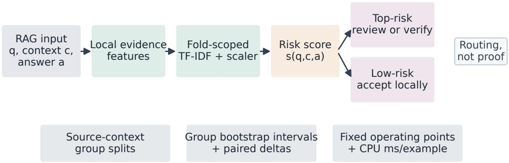
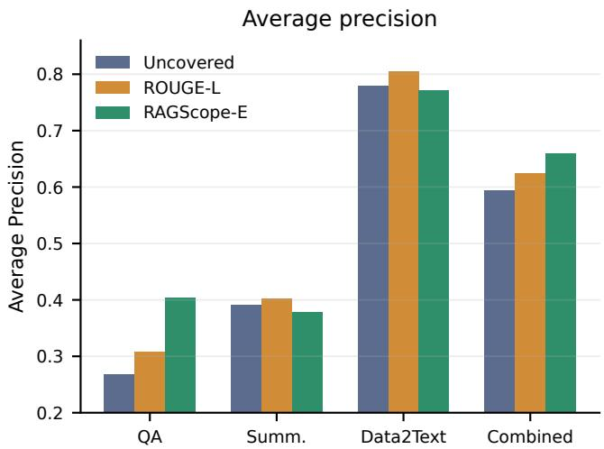
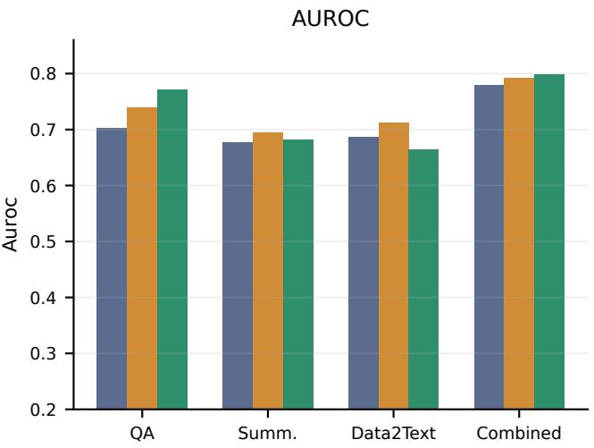
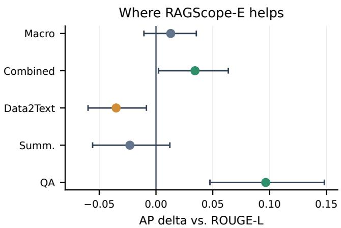
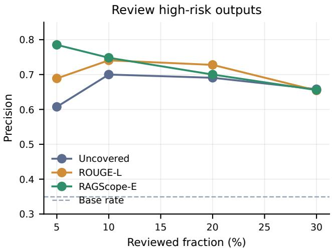
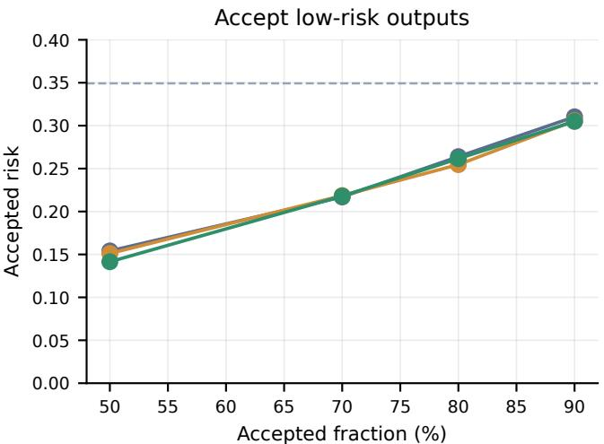
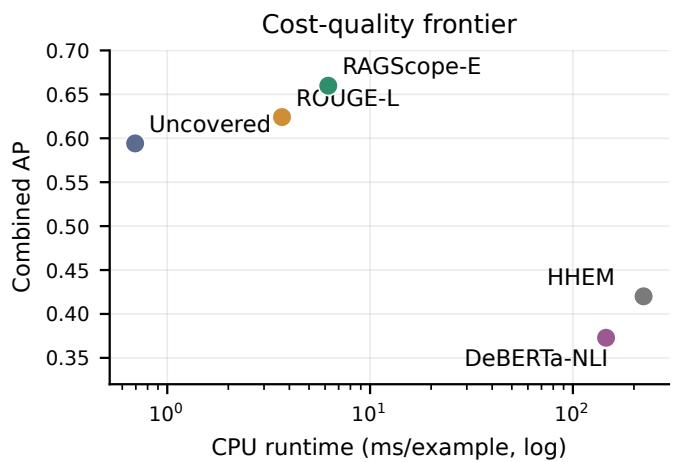

# RAGScope: A Leakage-Controlled, Cost-Aware Evidence-Gating Protocol for RAG Hallucination Triage

Zeming Liu∗, Qibai Chen†, Jingtao Zhang‡, and Hang Lyu∗

∗Brown University, United States

†Independent Researcher, United States

‡Georgia Institute of Technology, United States

Abstract—Retrieval-augmented generation (RAG) systems need inexpensive ways to route generated answers: accept lowrisk outputs, review uncertain ones, and reserve strong verifiers for the expensive tail. We present RAGScope, a leakage-controlled protocol for evaluating local evidence gates that use only the task input, retrieved context, and answer text. The protocol combines context-grouped splits, fold-scoped preprocessing, group bootstrap intervals, deployment operating points, end-to-end runtime, and explicit source-shift stress tests. On three RAGTruth tasks, the enhanced gate RAGScope-E reaches 0.798 AUROC and 0.660 average precision (AP) in pooled grouped cross-validation. Its pooled AP exceeds ROUGE-L by 0.034 with a 95% contextgroup interval of [0.002, 0.064], although the AUROC gain is not significant and ROUGE-L remains stronger on data-totext. At a top-10% review budget, RAGScope-E attains 0.748 precision; accepting the lowest-risk 50% yields 0.141 residual unfaithfulness. RAGScope-E runs in 6.22 ms/example on CPU, versus 145.75 and 223.07 ms/example for the tested DeBERTa-NLI and HHEM settings. A 14,900-example HaluBench stress test exposes the deployment boundary: an in-domain calibrated gate reaches 0.879 AUROC, but leave-source-out calibration averages only 0.466. Target-only calibration recovers to 0.675 AUROC with 100 labels per source and 0.685 with 200. Cheap evidence gates are therefore useful routing components, but learned calibration must be validated and adapted within the target domain.

## I. INTRODUCTION

RAG systems are often evaluated after an answer has already been produced: a verifier, judge, or human reviewer decides whether the answer is supported by retrieved evidence. In practice, however, teams also need a routing decision. If every answer is sent to a large verifier or human reviewer, evaluation is expensive and slow; if every answer is accepted, unsupported content can pass silently. The operational question is therefore selective: which outputs are safe enough to accept locally, and which should be escalated?

Existing factuality and RAG-evaluation methods include NLI-style consistency models, sampling-based detectors, RAG-specific metric suites, and LLM judges [1], [2], [3], [4], [5]. These methods are important, but they can add modelserving dependencies, latency, and cost to every development loop. Lightweight lexical signals are less expressive, but they are easy to run on every candidate answer and can be used as a first-stage router before stronger verification.

The risk is that simple gates are easy to overstate. If the same context appears in both train and test folds, if TF-IDF statistics are fit on the full dataset, or if only pooled benchmark metrics are reported, a cheap gate can look more general than it is. This paper therefore treats protocol design as part of the contribution. We ask what a local RAG triage study should report so that its claims remain useful under grouped examples, task heterogeneity, and realistic deployment operating points.

We make four contributions:

• We define RAGScope, a lightweight evidence-gating family together with a leakage-controlled evaluation protocol: grouped splits by source context, fold-scoped TF-IDF preprocessing, group bootstrap intervals, deploymentstyle review/accept operating points, and source-shift checks.

• We evaluate zero-shot coverage, ROUGE-L, TF-IDF, learned lexical gates, and an enhanced local gate (RAGScope-E) on RAGTruth QA, summarization, and data-to-text outputs. The strongest supported gain is pooled AP and QA triage; RAGScope-E does not dominate ROUGE-L on every task.

• We compare RAGScope-E with local DeBERTa-NLI and HHEM verifier baselines, reporting accuracy and CPU runtime to expose verifier mismatch, cost, and task-level deployment boundaries.

• We stress-test six HaluBench sources. Cross-source transfer can fail catastrophically; target-only calibration with small labeled samples restores useful ranking performance.

## II. EVIDENCE-GATING PROTOCOL

Let q be the task input, c the retrieved or provided context, and a the candidate answer. A gate returns a risk score $s ( q , c , a )$ where larger values mean higher probability of unfaithfulness. The score is used for routing rather than final factual proof: high-risk examples can be reviewed or sent to a stronger verifier, and low-risk examples can be accepted only at a chosen risk tolerance.

Figure 1 summarizes the intended use. The gate sits between a RAG generator and an expensive verifier or reviewer. It is deliberately allowed to be imperfect because it does not make the final factuality decision alone: instead, it changes which examples consume expensive verification budget. This routing view affects the evaluation. A model that slightly improves pooled AUROC may still be unhelpful if it does not enrich the reviewed queue, and a model with good review precision may still be unsafe if the automatically accepted region has high residual risk.

  
Fig. 1. RAGScope evaluates local evidence signals as a first-stage routing protocol. The key controls are fold-scoped feature construction, context-grouped evaluation, uncertainty intervals over groups, fixed review/accept operating points, and runtime accounting.

## A. Routing Metrics

Let $D ~ = ~ \{ ( q _ { i } , c _ { i } , a _ { i } , y _ { i } ) \} _ { i = 1 } ^ { n }$ and let $y _ { i } ~ = ~ 1$ denote an unfaithful answer. For a review budget $\rho ,$ the policy sorts examples by decreasing risk and reviews the top ⌈ρn⌉ examples. We report review precision,

$$
\mathrm { P r e c } _ { \rho } = \frac { \sum _ { i \in \mathrm { T o p } _ { \rho } ( s ) } { y _ { i } } } { | \mathrm { T o p } _ { \rho } ( s ) | } ,
$$

which asks how concentrated the flagged queue is. For an automatic-acceptance budget $\alpha ,$ , the policy sorts by increasing risk and accepts the lowest-risk ⌈αn⌉ examples. We report accepted risk,

$$
\operatorname { R i s k } _ { \alpha } = { \frac { \sum _ { i \in \operatorname { L o w } _ { \alpha } ( s ) } y _ { i } } { | \operatorname { L o w } _ { \alpha } ( s ) | } } .
$$

These two quantities are not substitutes for AUROC or $\operatorname { A P } ;$ they expose the threshold behavior that a deployment team must choose before using a gate.

## B. Lightweight Evidence Features

RAGScope-Z uses monotone evidence-missing signals. The simplest baseline is the fraction of non-stopword answer tokens that do not occur in the context:

$$
s _ { \mathrm { u n c o v } } ( a , c ) = 1 - \frac { | T ( a ) \cap T ( c ) | } { | T ( a ) | } .
$$

The base feature family also includes answer length, context length, answer coverage, rare-token coverage for tokens of length at least six, answer-context Jaccard overlap, questionanswer Jaccard overlap, longest contiguous supported run, best sentence-level support, numeric coverage, and numeric count. Tokens are lowercased alphanumeric spans; sentence boundaries use punctuation and line breaks; numeric matching strips commas.

RAGScope-C trains a logistic regression model over the base features:

$$
\begin{array} { r } { s _ { \mathrm { c a l } } ( q , c , a ) = \sigma ( \boldsymbol { w } ^ { \top } \phi ( q , c , a ) + b ) . } \end{array}
$$

The model uses standardization, balanced class weights, $L _ { 2 }$ regularization, and a fixed random seed. It is intended for settings with local labels and a fixed operating policy.

## C. Enhanced Local Gate

RAGScope-E adds four fully local support features to the base family: ROUGE-L risk, token-F1 risk, TF-IDF answer-context risk, and maximum sentence-level TF-IDF risk. ROUGE-L uses longest common subsequence recall over the same non-stopword tokens; token-F1 uses bag overlap; TF-IDF uses scikit-learn English stop words, L2-normalized unigram/bigram vectors, cosine similarity, and min\_df=1. No remote service, LLM, or NLI model is called. Because TF-IDF statistics are data dependent, RAGScope-E is evaluated with an outer grouped split: in each fold, TF-IDF vocabularies and IDF weights are fit only on the training fold and are then used to transform held-out examples. Standardization and logistic parameters are also fit inside the training fold using scikit-learn logistic regression with lbfgs, $C = 1$ , balanced class weights, 1,000 maximum iterations, and random seed 13.

## D. Protocol Requirements

We evaluate gates with the checklist in Table I. First, all learned RAGTruth models use StratifiedGroupKFold with group key task:source\_info, so the six answers attached to the same source context never cross train/test boundaries. Second, paired bootstrap intervals resample source-context groups rather than individual answers. Third, operating points are specified by workload fractions before evaluation: review the top-risk 5–30% or accept the lowest-risk 50–90%. Fourth, cost-quality comparisons report wall-clock CPU runtime per example for complete local inference, not only model scoring. Fifth, a learned gate is not treated as source-general merely because random or grouped cross-validation is strong: calibration is also evaluated by holding out entire dataset sources and by measuring recovery from small target-labeled samples.

TABLE I  
RAGSCOPE PROTOCOL CHECKLIST. EACH ITEM IS IMPLEMENTED BY THE RELEASED SCRIPTS AND REPORTED IN THE ARTIFACT MANIFEST.
<table><tr><td>Risk</td><td>Required control</td></tr><tr><td>Context leakage</td><td>Group splits by source context</td></tr><tr><td>Preprocess leakage</td><td>Fit TF-IDF/scalers inside folds</td></tr><tr><td>Uncertain gains</td><td>Group bootstrap and paired deltas</td></tr><tr><td>Deployment mismatch</td><td>Report review/accept points</td></tr><tr><td>Verifier cost</td><td>Measure end-to-end ms/example</td></tr><tr><td>Source shift</td><td>Hold out sources; vary target labels</td></tr></table>

## III. EXPERIMENTAL DESIGN

RQ1. How far do cheap local evidence signals go on RAGTruth triage?

RQ2. Under leakage-controlled grouped evaluation, where does RAGScope-E improve over uncovered-token fraction and ROUGE-L, and where does it fail?

RQ3. What review and automatic-acceptance operating points does the gate enable?

RQ4. How does the local gate compare with tested local verifier settings in accuracy and runtime?

RQ5. How does learned evidence calibration behave under source shift, and how many target-domain labels are needed to recover?

## A. Datasets

RAGTruth provides QA, summarization, and data-to-text outputs with response-level faithfulness labels derived from annotated hallucination spans [6]. We evaluate the processed public test splits: 900 examples per task and 2,700 examples total. Positive labels indicate unfaithful or hallucinated outputs.

HaluBench contains 14,900 context–question–answer examples from six source datasets spanning reading comprehension, finance, biomedical QA, and hallucination benchmarks [7]. Its source identifiers make it useful for a deliberately difficult transfer test. We first report five-fold in-domain CV for RAGScope-C, the same standardized logistic feature gate without TF-IDF features. We then hold out each source, train on the other five, and evaluate both the transferred calibrated gate and the training-free uncovered-token score. Finally, for each target source and $k ~ \in ~ \{ 2 5 , 5 0 , 1 0 0 , 2 0 0 \}$ , we reserve a fixed stratified 20% target test set, draw a prevalencepreserving stratified labeled sample from the remaining 80%, fit RAGScope-C only on that sample, and repeat over ten seeds.

## B. Baselines and Metrics

Cheap local baselines include uncovered-token fraction, token-F1 risk, ROUGE-L risk, TF-IDF answer-context risk, and maximum sentence-level TF-IDF risk. Learned baselines include a token-coverage logistic model, a base all-feature logistic model, and RAGScope-E. Stronger local verifier baselines include a DeBERTa-v3-small NLI cross-encoder [8] and Vectara HHEM [9]. Both are run locally on CPU. DeBERTa uses the top three context sentences selected by lexical overlap with the answer. HHEM is reported in a fuller setting using the complete context truncated to 512 tokens; a top-three-sentence HHEM run is retained as an artifact-only lightweight ablation.

We report AUROC, AP, context-group bootstrap 95% intervals, paired deltas, and operating points. AP is important because positive rates differ substantially by task: 0.178 for QA, 0.227 for summarization, and 0.643 for data-to-text. All random seeds are fixed in the released scripts. The artifact package contains per-example scores, grouped bootstrap outputs, operating-point tables, runtime JSON files, and the exact local model names used for verifier baselines. This matters because the main result depends on out-of-fold scores rather than on a single model fit to the full benchmark.

For learned local gates, every reported RAGTruth score is an out-of-fold score. This choice makes operating-point curves meaningful: a reviewed example is never scored by a model whose preprocessing or logistic parameters were fitted using that example’s source context. Bootstrap intervals use 1,000 resamples of context groups for the combined setting and pertask groups for task-specific metrics. Runtime is measured as complete local inference time per example, including feature extraction and model scoring for cheap gates and full CPU forward passes for verifier baselines.

For HaluBench leave-source-out results, 95% intervals use 1,000 within-source bootstrap resamples. Target-adaptation tables report macro averages over the six sources and standard errors over ten repeated stratified target splits. This stress test is intentionally stricter than RAGTruth grouped CV: it changes the benchmark source itself rather than only withholding contexts.

TABLE II  
EXPERIMENT MATRIX. LEARNED GATES USE CONTEXT-GROUPED SPLITS; TF-IDF FEATURES ARE FIT INSIDE EACH TRAINING FOLD.
<table><tr><td>RQ</td><td>Dataset</td><td>Control</td><td>Metric</td></tr><tr><td>RQ1</td><td>RAGTruth tasks</td><td>cheap signals</td><td>AUROC, AP</td></tr><tr><td>RQ2</td><td>RAGTruth all</td><td>group CV</td><td>AUROC, AP, delta</td></tr><tr><td>RQ3</td><td>RAGTruth</td><td>risk cutoff</td><td>precision, risk</td></tr><tr><td>RQ4</td><td>RAGTruth</td><td>verifier baselines</td><td>cost, accuracy</td></tr><tr><td>RQ5</td><td>HaluBench</td><td>source holdout/adapt.</td><td>AUROC, AP</td></tr></table>

## IV. RESULTS

## A. RQ1–RQ2: RAGTruth Triage

Table III shows the main pattern. Uncovered-token fraction and ROUGE-L are strong baselines. Figure 2 makes the same pattern visible across both AP and AUROC. RAGScope-E improves pooled AP to 0.660 and improves QA substantially, but it is worse than ROUGE-L on data-to-text and does not improve summarization AP. This makes the pooled claim useful but narrow: RAGScope-E is best viewed as a sharedqueue triage gate, not as a task-universal detector. The datato-text result is especially important for claim discipline: copy-heavy or schema-like outputs can reward long common subsequences, making a simple ROUGE-L risk score hard to beat.

TABLE III  
RAGTRUTH GROUPED RESULTS. POSITIVE LABELS ARE UNFAITHFUL OUTPUTS. THE POOLED SETTING IS USEFUL FOR A SHARED TRIAGE QUEUE; MACRO AVERAGES EXPOSE TASK-LEVEL GENERALITY.
<table><tr><td>Scope</td><td>Uncov. AUROC</td><td>Uncov. AP</td><td>ROUGE-L AUROC</td><td>ROUGE-L AP</td><td>RAGScope-E AUROC</td><td>RAGScope-E AP</td></tr><tr><td>QA</td><td>0.702</td><td>0.268</td><td>0.739</td><td>0.307</td><td>0.771</td><td>0.404</td></tr><tr><td>Summarization</td><td>0.676</td><td>0.391</td><td>0.694</td><td>0.402</td><td>0.682</td><td>0.377</td></tr><tr><td>Data-to-text</td><td>0.687</td><td>0.779</td><td>0.713</td><td>0.805</td><td>0.663</td><td>0.771</td></tr><tr><td>Macro average</td><td>0.689</td><td>0.479</td><td>0.715</td><td>0.505</td><td>0.706</td><td>0.517</td></tr><tr><td>Combined</td><td>0.779</td><td>0.594</td><td>0.792</td><td>0.624</td><td>0.798</td><td>0.660</td></tr></table>

  
Fig. 2. RAGTruth grouped performance by task and pooled queue. RAGScope-E improves the pooled AP used for a shared triage queue and gives its clearest task-level gain on QA, while ROUGE-L remains stronger on data-to-text.

TABLE IV  
PAIRED CONTEXT-GROUP BOOTSTRAP DELTAS FOR RAGSCOPE-E. INTERVALS ARE 95%; POSITIVE DELTAS FAVOR RAGSCOPE-E.
<table><tr><td>Scope/base</td><td>Metric</td><td>Delta</td><td>95%CI</td></tr><tr><td>Combined/uncov.</td><td>AUROC</td><td>0.019</td><td>[0.003, 0.034]</td></tr><tr><td>Combined/uncov.</td><td>AP</td><td>0.064</td><td>[0.029, 0.099]</td></tr><tr><td>Combined/ROUGE</td><td>AUROC</td><td>0.006</td><td>[-0.006, 0.017]</td></tr><tr><td>Combined/ROUGE</td><td>AP</td><td>0.034</td><td>[0.002, 0.064]</td></tr><tr><td>QA/ROUGE</td><td>AUROC</td><td>0.031</td><td>[0.006, 0.056]</td></tr><tr><td>QA/ROUGE</td><td>AP</td><td>0.097</td><td>[0.047, 0.148]</td></tr><tr><td>Data/ROUGE</td><td>AUROC</td><td>-0.050</td><td>[-0.073, -0.027]</td></tr><tr><td>Data/ROUGE</td><td>AP</td><td>-0.035</td><td>[-0.060, -0.008]</td></tr><tr><td>Macro/ROUGE</td><td>AUROC</td><td>-0.010</td><td>[-0.024, 0.005]</td></tr><tr><td>Macro/ROUGE</td><td>AP</td><td>0.013</td><td>[-0.011, 0.036]</td></tr></table>

Table IV clarifies statistical support. RAGScope-E significantly improves pooled AP over ROUGE-L and both pooled metrics over uncovered-token fraction. Its pooled AUROC gain over ROUGE-L is not significant, and macro deltas over ROUGE-L are not significant. Figure 3 shows why a single aggregate number would be misleading: the strongest positive AP delta is in QA, while data-to-text has a negative interval. Takeaway: the evidence supports a cost-aware pooled triage use case and a strong QA result, not per-task dominance.

  
Fig. 3. Average-precision deltas for RAGScope-E versus ROUGE-L with 95% context-group bootstrap intervals. The figure highlights the asymmetric result: QA and pooled AP improve, while data-to-text favors ROUGE-L.

Table V shows that the base lexical feature family already captures much of the signal. The enhanced features add AP, but the gain is incremental. This is why we frame the contribution as a protocol and operating study rather than as a new neural verifier.

TABLE V  
GROUPED-CV ABLATION ON RAGTRUTH COMBINED.
<table><tr><td>Variant</td><td>AUROC</td><td>AP</td></tr><tr><td>Token-coverage logit</td><td>0.782</td><td>0.606</td></tr><tr><td>Base all-feature logit</td><td>0.792</td><td>0.636</td></tr><tr><td>RAGScope-E enhanced logit</td><td>0.798</td><td>0.660</td></tr></table>

## B. RQ3: Operating Points

TABLE VI  
OPERATING POINTS WITH CONTEXT-GROUP BOOTSTRAP INTERVALS.REVIEW IS TOP-RISK 10%; ACCEPT IS LOWEST-RISK 50%.
<table><tr><td>Scope</td><td>Model</td><td>Review precision</td><td>Accepted risk</td></tr><tr><td>Combined</td><td>RAGScope-E</td><td>.748 [.685,.807]</td><td>.141 [.119,.169]</td></tr><tr><td>Combined</td><td>ROUGE</td><td>.741 [.678,.807]</td><td>.151 [.127,.171]</td></tr><tr><td>QA</td><td>RAGScope-E</td><td>.467 [.333,.600]</td><td>.067 [.044,.089]</td></tr><tr><td>QA</td><td>ROUGE</td><td>.344 [.200,.467]</td><td>.067 [.042,.093]</td></tr><tr><td>Summ.</td><td>RAGScope-E</td><td>.456 [.344,.544]</td><td>.136 [.102,.171]</td></tr><tr><td>Summ.</td><td>ROUGE</td><td>.456 [.378,.556]</td><td>.124 [.093,.156]</td></tr><tr><td>Data</td><td>RAGScope-E</td><td>.844 [.767,.911]</td><td>.536 [.493,.573]</td></tr><tr><td>Data</td><td>ROUGE</td><td>.856 [.778,.933]</td><td>.489 [.444,.529]</td></tr></table>

Table VI shows why operating points must be reported by task. The combined top-10% precision difference between RAGScope-E and ROUGE-L is small and its interval overlaps. Figure 4 adds the full combined curve: review precision remains well above the 0.349 base rate for all three cheap scores, while accepted risk rises as more examples are accepted automatically. QA shows a larger review-routing gain for RAGScope-E, whereas data-to-text is better served by ROUGE-L, especially for automatic acceptance. Takeaway: RAGScope-E is useful when the deployment has a shared high-risk review queue, but the threshold policy should still be set per task when task identity is available.

## C. RQ4: Cost Versus Local Verifiers

TABLE VII  
ACCURACY-COST COMPARISON ON RAGTRUTH COMBINED. RUNTIME IS LOCAL CPU MILLISECONDS PER EXAMPLE.
<table><tr><td>Model</td><td>AUROC</td><td>AP</td><td>ms/ex</td></tr><tr><td>Uncovered fraction</td><td>0.779</td><td>0.594</td><td>0.67</td></tr><tr><td>ROUGE-L</td><td>0.792</td><td>0.624</td><td>3.64</td></tr><tr><td>RAGScope-E</td><td>0.798</td><td>0.660</td><td>6.22</td></tr><tr><td>DeBERTa-NLI top-3</td><td>0.560</td><td>0.373</td><td>145.75</td></tr><tr><td>HHEM full ctx.</td><td>0.655</td><td>0.420</td><td>223.07</td></tr></table>

Table VII compares local verifier baselines. HHEM improves when run with full context truncated to 512 tokens rather than top-three evidence sentences, but its context-group intervals remain below RAGScope-E on the combined set: 0.655 [0.625, 0.687] AUROC and 0.420 [0.388, 0.457] AP. The result should not be read as a universal rejection of

NLI or HHEM; stronger prompting, answer decomposition, or task-specific calibration may improve them. It does show that off-the-shelf local verifiers are not automatically better on RAGTruth and are substantially slower in a CPU-only evaluation loop. Figure 5 visualizes the same tradeoff on a log runtime axis. The practical implication is not that lexical gates replace verifiers, but that a low-millisecond gate can screen every candidate before a verifier is invoked on the expensive tail.

The verifier result also illustrates why the evidence-selection policy should be reported with the model name. The DeBERTa baseline receives only the top three lexically selected context sentences, which keeps its input compact but can miss supporting evidence or contradictions outside that subset. The HHEM run receives a fuller context truncated to 512 tokens, which is more faithful to a RAG setting but slower. RAGScope-E does not solve these verifier-design choices; it offers a cheap queueing layer whose runtime is small enough to run before making them.

## D. RQ5: Source Shift and Target Adaptation

Random in-domain evaluation makes calibration look highly transferable. On all 14,900 HaluBench examples, five-fold CV gives RAGScope-C 0.879 AUROC and 0.873 AP, compared with 0.761 and 0.639 for the training-free uncovered-token score. Table VIII changes only the split: each source is now held out in full.

The pooled in-domain result does not survive source transfer. Cross-source calibration averages only 0.466 AUROC and 0.460 AP, below the zero-shot macro values of 0.644 and 0.552. The failure is not limited to a mildly harder source: the calibrated ranking inverts on held-out RAGTruth (0.218 AUROC) and falls near random on HaluEval, even though uncovered-token risk remains informative on both sources. This pattern indicates that the multifeature calibration learned source-specific relationships among answer format, coverage, and labels rather than a source-invariant hallucination boundary.

Small target-labeled samples provide a practical recovery path. With 25 labels per source, target-only calibration improves macro AP to 0.588, although its 0.639 AUROC remains near the 0.644 zero-shot value. At 50 labels it surpasses zeroshot AUROC, reaching 0.665 AUROC and 0.619 AP; 200 labels raise these to 0.685 and 0.649. The operational rule is therefore asymmetric: use monotone zero-shot signals when no target labels exist, and deploy a learned gate only after targetscoped fitting, grouped validation, and threshold selection. Source shift is not a secondary limitation of RAGScope; it is one of the protocol’s required checks.

## V. DISCUSSION AND LIMITATIONS

## A. Deployment Guidance

The safest way to use RAGScope is to treat it as a routing contract rather than a standalone detector. A team first chooses a budgeted policy: for example, review the top 10% highest-risk outputs, or accept only the lowest-risk 50% and send the rest to a stronger verifier. The policy is then validated on grouped examples using the same preprocessing boundary that will be used in deployment. If task identity is available, thresholds should be selected per task because the

  
Fig. 4. Combined RAGTruth operating curves. Left: precision among examples sent to review as the review budget grows. Right: residual unfaithfulness rate among examples accepted locally as the acceptance budget grows. The dashed line marks the combined base positive rate.

TABLE VIII  
HALUBENCH SOURCE-SHIFT STRESS TEST AND TARGET-LABEL RECOVERY. LEAVE-SOURCE-OUT ENTRIES ARE METRIC [95% BOOTSTRAP INTERVAL]. ADAPTATION ENTRIES ARE MACRO MEAN ± STANDARD ERROR OVER TEN TARGET-ONLY SPLITS.
<table><tr><td>Held-out source</td><td>Zero AUROC</td><td>Zero AP</td><td>Cross-source AUROC</td><td>Cross-source AP</td></tr><tr><td>DROP</td><td>.509 [.476,.544]</td><td>.497 [.461,.534]</td><td>.509 [.475,.544]</td><td>.505 [.463,.550]</td></tr><tr><td>FinanceBench</td><td>.487 [.451,.520]</td><td>.487 [.449,.526]</td><td>.494 [.459,.529]</td><td>.507 [.464,.556]</td></tr><tr><td>RAGTruth</td><td>.702 [.662,.741]</td><td>.268 [.229,.318]</td><td>.218 [.178,.255]</td><td>.110 [.095,.128]</td></tr><tr><td>covidQA</td><td>.731 [.709,.754]</td><td>.731 [.702,.760]</td><td>.594[.558,.631]</td><td>.553 [.511,.603]</td></tr><tr><td>HaluEval</td><td>.894 [.886,.901]</td><td>.795 [.782,.809]</td><td>.492 [.481,.503]</td><td>.597 [.584,.609]</td></tr><tr><td>PubMedQA</td><td>.540 [.504,.576]</td><td>.536 [.491,.583]</td><td>.487 [.450,.520]</td><td>.490 [.451,.537]</td></tr></table>

(b) Macro target adaptation
<table><tr><td>Training</td><td>Labels</td><td>AUROC</td><td>AP</td></tr><tr><td>zero-shot</td><td>0</td><td>.644</td><td>.552</td></tr><tr><td>cross-source</td><td>0</td><td>.466</td><td>.460</td></tr><tr><td>target-only</td><td>25</td><td>.639±.007</td><td>.588±.008</td></tr><tr><td>target-only</td><td>50</td><td> $. 6 6 5 { \pm } . 0 0 5$ </td><td>.619±.005</td></tr><tr><td>target-only</td><td>100</td><td>.675±.005</td><td>.629±.006</td></tr><tr><td>target-only</td><td>200</td><td>.685±.004</td><td>.649±.006</td></tr></table>

  
Fig. 5. Combined AP versus measured local CPU runtime. In this experiment, RAGScope-E lies on the cheap high-AP corner of the tested local methods, while the two model-based verifier settings are slower and less accurate on RAGTruth.

QA, summarization, and data-to-text results have different base rates and different best cheap baselines. If the learned gate was calibrated on another source, it should remain disabled until a target-labeled audit shows that its ranking direction and operating points transfer.

The protocol is intentionally compatible with stronger downstream checks. A system can run RAGScope-E on every answer, send the riskiest outputs to a verifier or human reviewer, and periodically audit a sample of automatically accepted outputs to recalibrate the acceptance budget. In this setting, the most useful summary is not a single AUROC number. It is a small operating report: review precision at the chosen workload, residual accepted risk, confidence intervals over context groups, milliseconds per example, and a leavesource-out or target-label stress test.

## B. Limitations

RAGScope is intentionally shallow. It cannot prove factuality, solve multi-hop reasoning, or catch contradictions that reuse the same evidence tokens. It is also sensitive to the operational queue: pooled metrics can improve when tasks have different base rates, while per-task metrics reveal where a gate is weak. For this reason, the paper reports both combined and macro/task-level results.

The verifier comparison is also scoped. We used local CPU inference, top-three lexical evidence for DeBERTa-NLI, and full-context truncation for HHEM. A production verifier could use better retrieval, answer decomposition, longer context windows, or calibration. Our claim is only that these off-theshelf local verifiers did not dominate cheap gates under the tested local protocols.

The main RAGTruth experiments use public benchmark test splits with grouped cross-validation rather than a final benchmark hidden from feature and model selection. HaluBench adds source-level stress but is itself a public benchmark, and its target-adaptation study samples labels from the same source that is later evaluated. The study therefore measures source adaptation, not temporal drift or production generalization. Future work should repeat the full operating report on timeseparated and product-specific logs.

## VI. RELATED WORK

RAGTruth provides response-level and span-level hallucination annotations for QA, summarization, and data-to-text generation [6]; HaluEval broadens hallucination evaluation across generated question-answer examples [10]. HaluBench was introduced with Lynx to evaluate hallucination judges across heterogeneous sources [7]; cross-domain transfer is also an explicit robustness criterion in other detector settings, including cross-species ultrasonic-vocalization detection [11]. RAGAS evaluates RAG pipelines with metrics for faithfulness, answer relevance, and context quality [4]. RAGScope differs by studying a low-cost routing score and by making grouped validation, operating points, cost, and source transfer joint requirements of the claim.

Factuality and hallucination detection methods often use model-based verifiers. NLI-style approaches have been effective for summarization inconsistency detection [1], [2], and TRUE re-evaluates factual consistency metrics across tasks [12]. SelfCheckGPT detects hallucinations through blackbox sampling consistency [3], while FActScore decomposes long-form generations into atomic facts [13]. LLM-as-judge methods can provide flexible evaluation but introduce cost and judge-bias concerns [5]. RAGScope is complementary: it gives a millisecond-scale signal before invoking stronger judges.

Selective classification studies models that trade coverage for lower error by deferring uncertain examples [14]. Our operating points adapt this perspective to RAG evaluation: the system can review high-risk outputs or automatically accept only low-risk outputs.

## VII. CONCLUSION

This paper presents RAGScope, a leakage-controlled, costaware protocol for local RAG hallucination triage. Under grouped RAGTruth evaluation, RAGScope-E improves pooled AP and QA triage, but not every task, and provides a lowmillisecond routing signal before the tested local verifiers. HaluBench then exposes the more important boundary: strong in-domain calibration can invert under source transfer, while 50–200 target labels recover useful ranking performance.

Cheap evidence gates are therefore viable first-stage routers only when their evaluation reports task-specific operating points, runtime, uncertainty, and target-domain transfer rather than a single pooled benchmark score.

## REFERENCES

[1] W. Kryscinski, B. McCann, C. Xiong, and R. Socher, “Evaluating the factual consistency of abstractive text summarization,” in Proceedings of the 2020 Conference on Empirical Methods in Natural Language Processing. Association for Computational Linguistics, 2020, pp. 9332– 9346. [Online]. Available: https://aclanthology.org/2020.emnlp-main. 750/

[2] P. Laban, T. Schnabel, P. N. Bennett, and M. A. Hearst, “SummaC: Re-visiting NLI-based models for inconsistency detection in summarization,” Transactions of the Association for Computational Linguistics, vol. 10, pp. 163–177, 2022. [Online]. Available: https://aclanthology.org/2022.tacl-1.10/

[3] P. Manakul, A. Liusie, and M. Gales, “SelfCheckGPT: Zeroresource black-box hallucination detection for generative large language models,” in Proceedings of the 2023 Conference on Empirical Methods in Natural Language Processing. Association for Computational Linguistics, 2023, pp. 9004–9017. [Online]. Available: https://aclanthology.org/2023.emnlp-main.557/

[4] S. Es, J. James, L. Espinosa Anke, and S. Schockaert, “RAGAs: Automated evaluation of retrieval augmented generation,” in Proceedings of the 18th Conference of the European Chapter of the Association for Computational Linguistics: System Demonstrations. Association for Computational Linguistics, 2024, pp. 150–158. [Online]. Available: https://aclanthology.org/2024.eacl-demo.16/

[5] L. Zheng, W.-L. Chiang, Y. Sheng, S. Zhuang, Z. Wu, Y. Zhuang, Z. Lin, Z. Li, D. Li, E. P. Xing, H. Zhang, J. E. Gonzalez, and I. Stoica, “Judging LLM-as-a-judge with MT-bench and chatbot arena,” 2023. [Online]. Available: https://arxiv.org/abs/2306.05685

[6] C. Niu, Y. Wu, J. Zhu, S. Xu, K. Shum, R. Zhong, J. Song, and T. Zhang, “RAGTruth: A hallucination corpus for developing trustworthy retrieval-augmented language models,” in Proceedings of the 62nd Annual Meeting of the Association for Computational Linguistics (Volume 1: Long Papers). Association for Computational Linguistics, 2024, pp. 10 862–10 878. [Online]. Available: https: //aclanthology.org/2024.acl-long.585/

[7] S. S. Ravi, B. Mielczarek, A. Kannappan, D. Kiela, and R. Qian, “Lynx: An open source hallucination evaluation model,” 2024. [Online]. Available: https://arxiv.org/abs/2407.08488

[8] P. He, J. Gao, and W. Chen, “DeBERTaV3: Improving DeBERTa using ELECTRA-style pre-training with gradient-disentangled embedding sharing,” 2021. [Online]. Available: https://arxiv.org/abs/2111.09543

[9] Vectara, “HHEM-2.1-open: A hallucination evaluation model,” Hugging Face model, 2025. [Online]. Available: https://huggingface.co/vectara/ hallucination evaluation model

[10] J. Li, X. Cheng, X. Zhao, J.-Y. Nie, and J.-R. Wen, “HaluEval: A largescale hallucination evaluation benchmark for large language models,” in Proceedings of the 2023 Conference on Empirical Methods in Natural Language Processing. Association for Computational Linguistics, 2023, pp. 6449–6464. [Online]. Available: https://aclanthology.org/ 2023.emnlp-main.397/

[11] Y. Wei, K. Long, A. Granston, and A. Rodriguez-Contreras, “USVexplorer: Robust detection of ultrasonic vocalizations with cross species generalization,” in 2026 IEEE International Conference on Acoustics, Speech and Signal Processing (ICASSP). IEEE, 2026, pp. 15 232– 15 236.

[12] O. Honovich, R. Aharoni, J. Herzig, H. Taitelbaum, D. Kukliansy, V. Cohen, T. Scialom, I. Szpektor, A. Hassidim, and Y. Matias, “TRUE: Re-evaluating factual consistency evaluation,” in Proceedings of the 2022 Conference of the North American Chapter of the Association for Computational Linguistics: Human Language Technologies. Association for Computational Linguistics, 2022, pp. 3905–3920. [Online]. Available: https://aclanthology.org/2022. naacl-main.287/

[13] S. Min, K. Krishna, X. Lyu, M. Lewis, W.-t. Yih, P. Koh, M. Iyyer, L. Zettlemoyer, and H. Hajishirzi, “FActScore: Fine-grained atomic evaluation of factual precision in long form text generation,” in Proceedings of the 2023 Conference on Empirical Methods in Natural Language Processing. Association for Computational Linguistics, 2023, pp. 12 076–12 100. [Online]. Available: https: //aclanthology.org/2023.emnlp-main.741/

[14] Y. Geifman and R. El-Yaniv, “Selective classification for deep neural networks,” 2017. [Online]. Available: https://arxiv.org/abs/1705.08500