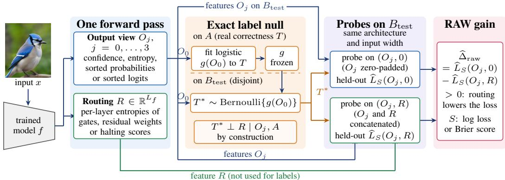
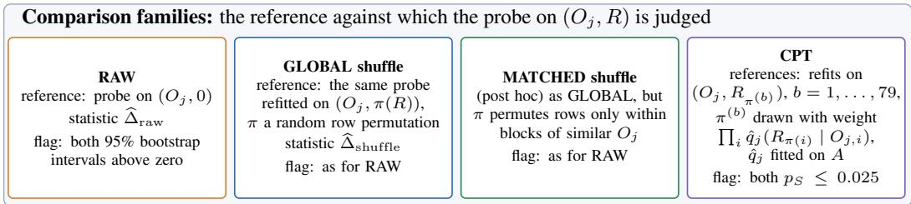
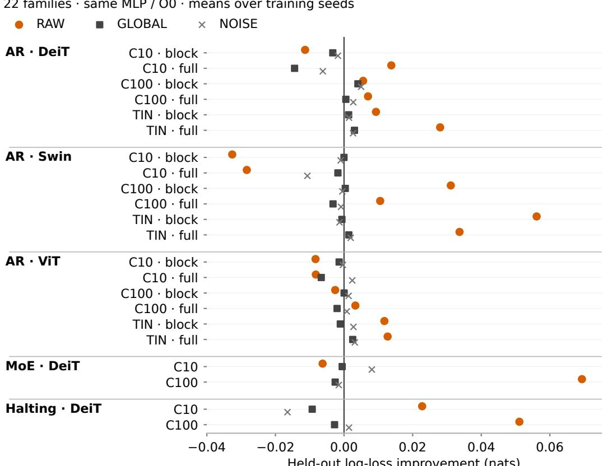
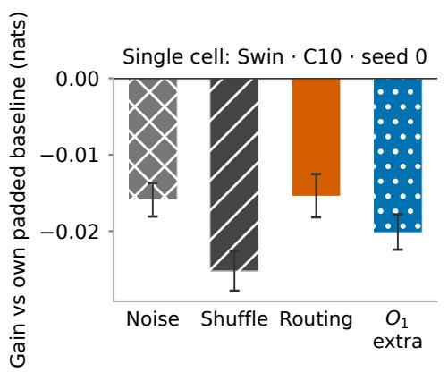
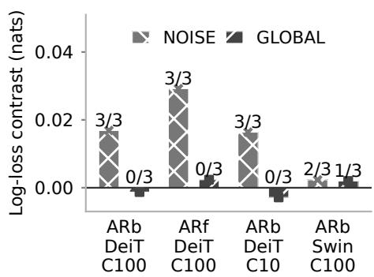
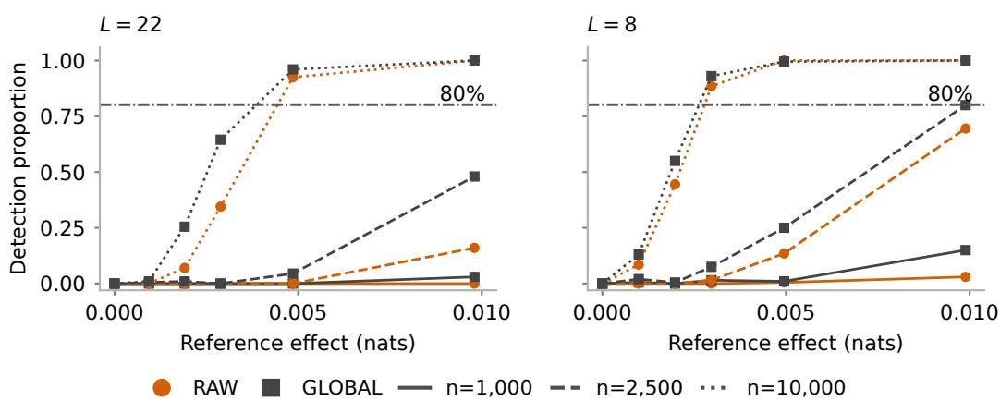
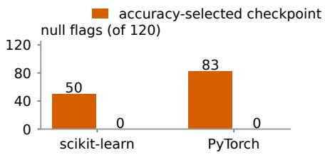
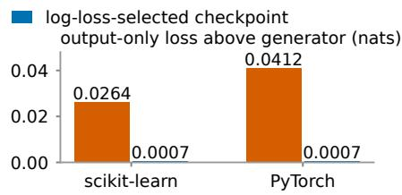

# ROUTING PROBES CAN IMPROVE WITHOUT NEW INFORMATION: AN EXACT-NULL AUDIT OF UNCERTAINTY BEYOND MODEL OUTPUTS

Wenhao Liang Mingyu Guo

Lin Yue Olaf Maennel

Wei Emma Zhang

Weitong Chen

## ABSTRACT

Routing signals of modern vision transformers—expert gates, attention-residual weights and halting scores—often improve probes that predict whether the model is correct, and the improvement is commonly read as evidence that routing carries information about errors beyond the model’s outputs. We test this inference directly: keeping real output–routing pairs, we redraw correctness labels from a frozen output-only generator fitted on disjoint data, so that routing is uninformative by construction. Under this exact label null, a width-matched MLP comparison still reports a routing gain in 51.3% of confidence-only evaluations (308/600), while a linear comparison reports none. Holding each training trajectory fixed on a six-model panel and selecting the checkpoint by validation log loss instead of validation accuracy removes the detections (50/120 to 0/120, and 83/120 to 0/120 in an independently implemented probe), identifying accuracy-based checkpoint selection as the cause; across all output views the raw detection rate falls from 27.5% (528/1,920) to zero observed detections. The repaired comparison is not sensitive, detecting an implanted signal of about 0.005 nats in 0/20 replicates in each of two matched settings, whereas a conditional permutation test built on an estimated routing law detects it in 11/20 and 10/20 and rejects rarely under the null. On real correctness labels, the conditional analysis yields model-relative evidence in five DeiT attention-residual families; in four it persists under two specified variants of the conditional law, and no family passes an additional noise criterion. Fitting a better probe and testing for incremental information are different problems, and each needs its own validation.

## 1 INTRODUCTION

Expert gates, halting scores and attention-residual weights are computed during inference and correlate with errors. Probes that read them alongside a model’s confidence can predict correctness better than probes that read the confidence alone, and gate entropy has been used in this way for segmentation uncertainty and out-of-distribution detection (Pavlitska et al., 2025; Lee et al., 2025). This paper examines a further inference: from “the probe improved” to “routing carries information about errors that the outputs do not”.

That inference does not follow from the improvement itself. If correctness depends on $O ^ { 2 }$ , adding $R = O ^ { 2 }$ helps a linear probe although O already determines R; Proposition 1 shows that the gap persists with unlimited data and equal parameter counts after zero-padding. This is the distinction between usable information and information content (Xu et al., 2020; Hewitt et al., 2021). What is less clear is how often, and for what reasons, the inference fails for the probes, sample sizes and controls used in practice, where routing and outputs are strongly dependent.

We measure this with a null whose answer is known. For each of six trained vision transformers we keep the real output–routing pairs but redraw correctness labels from a logistic function of the model’s confidence, fitted on a disjoint half of the data and then frozen (Fig. 1). Routing then carries no information beyond the outputs. A width-matched MLP probe nevertheless reports a routing gain in 308 of 600 evaluations at the confidence-only view; the linear probe reports none. Across all four output views, the MLP comparisons against globally and output-matched shuffled routing, which are intended as controls, report gains in 308 and 293 of 1,920 evaluations (§4.1).



  
Figure 1: Setup of the audit. In one forward pass a trained vision transformer $f$ maps an input x to an output view $O _ { j } \ ( j = 0 , \ldots , 3 )$ and to $\dot { R } \in \mathbb { R } ^ { L _ { f } }$ , its per-layer routing entropies. A logistic generator $g ( O _ { 0 } )$ is fitted to real correctness on half A and frozen; on the disjoint half $B _ { \mathrm { t e s t } } , T _ { i } ^ { * } \sim$ J Bernoulli $\{ g ( O _ { 0 , i } ) \}$ . Every view determines $O _ { 0 }$ and R is not used for the labels, so $T ^ { * } \perp \stackrel { * } { R }$ | $O _ { j } , A$ . Probes with the same architecture and input width are cross-fitted on $B _ { \mathrm { t e s t } }$ to predict $T ^ { * }$ from $( O _ { j } , 0 )$ and from $( O _ { j } , R )$ and scored by held-out log loss or Brier score $\widehat { L } _ { S } ;$ the RAW gain $\widehat { \Delta } _ { \mathrm { r a w } }$ of Eq. (2) is positive when routing lowers the loss. The families differ in the reference for the probe on $( O _ { j } , R )$ : the probe on $( O _ { j } , 0 ) \left( \mathrm { R A W } \right) ;$ ; the same probe refitted after a uniform (GLOBAL) or output-matched (MATCHED) permutation π of routing rows; or refits on 79 permutations drawn with weights $\textstyle \prod _ { i } { \hat { q } } _ { j } ( R _ { \pi ( i ) } \mid O _ { j , i } )$ , with $\hat { q } _ { j }$ fitted on A (CPT, Eqs. (3)–(4)). The input image is illustrative.

The MLP is scikit-learn’s MLPClassifier with early stopping enabled, which selects its checkpoint by validation accuracy while every comparison is scored by log loss and Brier score. To isolate this choice we train each probe once for a fixed number of epochs and read the same trajectory at the checkpoint preferred by validation accuracy and at the one preferred by validation log loss. Raw detections fall from 50/120 to 0/120. An independently implemented $\mathrm { P y } ^ { \prime }$ Torch probe shows the same contrast (83/120 against 0/120), as does replacing routing by independent Gaussian features (80/120 against 0/120), so the failure is not specific to this estimator and does not require routing structure. Applying log-loss selection to all 1,920 MLP evaluations of the null benchmark removes all 528 raw detections and most shuffle-control detections (§4.2).

Removing detections under the null does not make the comparison sensitive. In two matched synthetic settings with an implanted signal of about 0.005 nats, the repaired raw comparison detects it in 0/20 replicates in each and its mean fitted gain stays negative, whereas a conditional permutation test (CPT) that refits the probe on assignments drawn from an estimated conditional law of routing given outputs detects it in 11/20 and 10/20 (Berrett et al., 2020). With the true conditional law such a test has guaranteed level; with an estimated law its behaviour must be measured, and on the null benchmark it rejects in 59 of 3,840 evaluations.

Applied to real correctness labels across 22 routing families and 68 training runs, the conditional test finds replicated conditional-assignment evidence (R1) in 12 of 176 family–probe–view cells, all in five DeiT attention-residual families, and none of these passes an additional same-width noise criterion (R2). Eight of the 12 cells keep R1 under two specified variants of the conditional model, both of which fit routing less well; in the other four the number of positive seeds falls from two to one.

Our contributions are three empirical results. We measure how raw and shuffle-based probe comparisons behave under an exact label null that preserves real output–routing dependence. We isolate the effect of checkpoint selection on fixed training trajectories, in two probe implementations, and evaluate a log-loss policy across the complete MLP null benchmark. We then measure the sensitivity of the corrected comparison against a conditional reference and report the resulting model-relative evidence on real labels.

## 2 INCREMENTAL INFORMATION AND PROBE UTILITY

Population target. Fix a trained classifier and an evaluation distribution. Let $T \in \{ 0 , 1 \}$ indicate top-1 correctness, and let O and R denote specified output and routing representations. For a strictly proper loss S with finite Bayes risks, define

$$
\mathrm { G a i n } _ { S } ( R \mid O ) = { \mathcal { R } } _ { S } ^ { \star } ( O ) - { \mathcal { R } } _ { S } ^ { \star } ( O , R ) ,\tag{1}
$$

where $\begin{array} { r } { \mathcal { R } _ { S } ^ { \star } ( X ) = \operatorname* { i n f } _ { f } \mathbb { E } [ S ( f ( X ) , T ) ] } \end{array}$ is the Bayes risk over measurable predictors $f$ of T from X. Writing $\eta _ { O } = P ( T = 1 \mid O )$ and $\eta _ { O R } = P ( T = 1 \mid O , R )$ , strict propriety gives $\mathrm { G a i n } _ { S } \geq$ 0, with equality exactly when $\eta _ { O R } ~ = ~ \eta _ { O }$ almost surely, that is, when $T \perp \bar { R } \perp O$ Log loss yields $I ( \bar { T } ; R \bar { | } ~ O )$ in nats and squared loss yields $\mathbb { E } [ ( \dot { \eta _ { O R } } - \eta _ { O } ) ^ { 2 } ]$ (Gneiting & Raftery, 2007). For any deterministic summary ϕ, $I ( T ; \phi ( R ) { \bf \bar { \phi } } | ~ O ) \le { \bf \bar { \phi } } ( T ; R \ i \stackrel { . . } { O } )$ . A null result for the routing entropies used here therefore does not rule out information in the full routing trace, whereas positive information in the entropies would imply it for the trace.

Output representations. We evaluate four views: $O _ { 0 } .$ , top-class confidence after a clipped logit transform; $O _ { 1 }$ , confidence, predictive entropy, top-two margin, logit norm and runner-up probability; $O _ { 2 } ,$ sorted class probabilities; and $O _ { 3 } ,$ , sorted logits. The last two keep the shape of the scores but remove class identity, so they cannot test sufficiency of the complete, class-labelled output. The views are not nested: $O _ { 1 }$ includes the logit norm, which $O _ { 2 }$ cannot recover (App. A). Each view defines its own conditional question.

Why a probe gain can be positive under the null. A fitted probe searches a restricted function class, whereas Eq. (1) compares optimal predictors over all measurable functions. The distinction persists at the population level.

Proposition 1 (Positive probe gain under conditional sufficiency). There exist ajoint law $f o r \left( T , O \right)$ and a deterministic $R = \phi ( O )$ such that $T \perp R \mid O$ , but the logistic classes $\dot { \mathcal { F } _ { O } } = \{ \sigma \dot { ( } a O \dot { + } b ) \}$ and $\mathcal { F } _ { O , R } = \{ \sigma ( a O + c R \dot { + } b ) \}$ satisfy

$$
\operatorname* { i n f } _ { f \in \mathscr { F } _ { O } } \mathscr { R } _ { \log } ( f ) - \operatorname* { i n f } _ { f \in \mathscr { F } _ { O , R } } \mathscr { R } _ { \log } ( f ) = I ( T ; O ) > 0 .
$$

Take O uniform on $\{ - 1 , 0 , 1 \} , R = O ^ { 2 }$ and $T \mid O \sim \operatorname { B e r n o u l l i } ( \sigma ( O ^ { 2 } ) )$ . The augmented class contains the Bayes predictor. Symmetry and convexity make the best output-only logistic predictor constant, giving a gain of $H ( \mathbb { E } \bar { \eta } _ { O } ) - \mathbb { E } \bar { H } ( \eta _ { O } ) \approx 0 . 0 2 \bar { 5 } 7$ nats, although R is a function of O and the incremental information is zero. App. E gives the proof and a noisy-routing extension. Zero-padding leaves the output-only class unchanged, so equal nominal parameter counts do not equalise what the two probes can express as functions of O.

A probe gain is therefore not sufficient to infer information. The benchmark below exercises a different route to the same error. $\mathrm { A t } O _ { 0 }$ the label generator is a logistic function of $O _ { 0 }$ , so the outputonly logistic class contains it and Proposition 1 cannot explain a gain there. The MLP probes being compared share an architecture and a nominal input width, but the checkpoints selected for them can leave different fitting errors and hence different held-out losses. A richer baseline class addresses approximation error; it does not address checkpoint selection, and a better-fitted comparison is still a predictive-utility contrast rather than a test of incremental information.

## 3 THE ROUTING INFORMATION AUDIT

## 3.1 MATCHED PROBING AND THE SCREENING RULE

The routing representation is the per-layer entropy profile; a twelve-run panel also tests raw routing weights (App. D). At each output view we fit probes to four feature sets: zero-padded $O _ { j } , ( O _ { j } , R )$

$( O _ { j } , \pi ( R ) )$ and $( O _ { j } , \varepsilon )$ , where π shuffles routing rows and ε is an independent Gaussian block of the same width. The shuffle keeps the empirical distribution of routing vectors but breaks both the example assignment and the dependence on $O _ { j }$ , so it is an assignment control rather than a draw from the conditional null.

The probes are logistic regression and a one-hidden-layer MLP with 64 units, each with fixed hyperparameters for every feature set. The MLP is scikit-learn 1.6.1’s MLPClassifier with early\_stopping=True, which holds out 10% of each training fold, scores it by validation accuracy after every epoch, stops after 15 epochs without improvement and restores the weights with the best validation accuracy. Its training loss remains the regularised log loss; only the validation criterion concerns accuracy. Logistic regression has no validation-based selection. Features are standardised on training folds, predictions are cross-fitted over five folds with two repeats and averaged over repeats, and log-loss and Brier differences are bootstrapped with 2,000 paired example resamples. The resamples hold the fitted out-of-fold predictions fixed, so the intervals do not include variability from refitting the probes.

With ${ \widehat { L } } _ { S } ( X )$ the held-out loss of the probe using X, the three contrasts are

$$
\begin{array} { r l } & { \qquad \widehat { \Delta } _ { \mathrm { r a w } } = \widehat { L } _ { S } ( O _ { j } , 0 ) - \widehat { L } _ { S } ( O _ { j } , R ) , } \\ & { \qquad \widehat { \Delta } _ { \mathrm { s h u f f e } } = \widehat { L } _ { S } ( O _ { j } , \pi ( R ) ) - \widehat { L } _ { S } ( O _ { j } , R ) , } \\ & { \quad \widehat { \Delta } _ { \mathrm { n o i s e } } = \widehat { L } _ { S } ( O _ { j } , \varepsilon ) - \widehat { L } _ { S } ( O _ { j } , R ) , } \end{array}\tag{2}
$$

with positive values favouring real routing. In the label-null benchmarks a comparison is flagged when the 95% bootstrap intervals for both scores lie above zero in the same replicate. This screening rule concerns the realised fitted contrast; it has no proven level for the incremental-information null. The pre-specified screen applied to real labels requires a component to have a positive interval in at least two training seeds for each score (the seeds may differ between scores) and requires the raw, shuffle and noise components to pass for the same probe and view; App. A defines it and its Type 0–III labels, Type 0 meaning that no view passes. A post-hoc output-matched shuffle (MATCHED, App. J) restricts reassignment to local neighbourhoods in $O _ { j } ;$ it is an approximate assignment control outside the pre-specified screen.

## 3.2 A CONDITIONAL REFERENCE FOR THE PROBE STATISTIC

Because the global shuffle breaks the dependence of routing on the outputs, we also compare the observed raw contrast with contrasts computed on routing reassigned under an estimated conditional law $\hat { q } _ { j } ( R \mid O _ { j } )$ (Berrett et al., 2020). A fixed split gives disjoint halves: 5,000 examples in A for selecting and fitting $\hat { q } _ { j }$ , and 5,000 in $B _ { \mathrm { t e s t } }$ for every probe and statistic. No correctness labels enter $\hat { q } _ { j }$ The working model maps routing coordinates to normal scores by rank, predicts them from standardised $O _ { j }$ by ridge regression and uses a shared residual correlation; it is the tier selected by held-out conditional log-likelihood on A in all 272 run–view fits (App. M). Routing lies in $\mathbb { R } ^ { L _ { f } }$ with family-specific $L _ { f } \in \{ \breve { 8 } , 1 2 , 1 6 , 2 2 , 2 3 \}$ . The assignment weights are

$$
P _ { \hat { q } _ { j } } ( \pi \mid O _ { j } , \{ R _ { i } \} ) \propto \prod _ { i } \hat { q } _ { j } ( R _ { \pi ( i ) } \mid O _ { j , i } ) .\tag{3}
$$

A reversible hub-and-spoke sampler draws $B = 7 9$ reference assignments with $S = 5 0$ transition rounds per leg. Each assignment passes through the same five-fold, two-repeat fitting and selection procedure as the observed routing, with the same folds and seeds, and for each score

$$
p _ { S } = \frac { 1 + \sum _ { b = 1 } ^ { 7 9 } \mathbf { 1 } \{ \widehat { \Delta } _ { S } ^ { ( b ) } \geq \widehat { \Delta } _ { S } ^ { \mathrm { o b s } } \} } { 8 0 } .\tag{4}
$$

The grid has spacing $1 / 8 0$ , so only $p _ { S } \in \{ 0 . 0 1 2 5 , 0 . 0 2 5 \}$ meet the threshold 0.025; in the benchmarks a single conditional test is flagged when both of its p-values meet it. $\operatorname { I f } { \hat { q } } _ { j }$ were the true conditional law, the observed and reference statistics would be exchangeable and this rank test would have level at most 0.025 for any fixed fitting procedure. Because $\hat { q } _ { j }$ is estimated, its rejection rates are measured rather than guaranteed.

R1 requires both p-values to be at most 0.025 in the same training seed, and at least two such seeds in a family–probe–view cell; for the one family with five seeds this is two of five. R1 is evidence that the observed assignment is unusual under $\hat { q } _ { j } .$ , not an estimate of Gain . R2 is an additional samewidth robustness criterion: in the same seeds, real routing must also beat the Gaussian block on the same $B _ { \mathrm { t e s t } }$ examples with positive intervals for both scores, in at least two joint-positive seeds. R2 has no raw-gain or shuffle conjunct, and beating a noise block is not necessary for conditional information.

## 3.3 AN EXACT LABEL-NULL BENCHMARK

We fit one logistic generator $g ( O _ { 0 } )$ per model on A, freeze it and draw every $B _ { \mathrm { t e s t } }$ label from it (Fig. 1). Every evaluated $O _ { j }$ determines $O _ { 0 }$ , so $T ^ { * } ~ \bot ~ R ~ | ~ O _ { j }$ holds by construction up to the numerical checks of App. L. The benchmark uses six seed-0 models covering the three routing mechanisms and three backbones. Each model contributes 100 label draws at $O _ { 0 }$ and $O _ { 1 }$ and the first 60 of those draws at $O _ { 2 }$ and $O _ { 3 } ,$ giving each probe 600 evaluations at the first two views, 360 at the last two and 1,920 in total. Views and probes reuse the same 600 label vectors, so pooled counts describe the benchmark; they are not independent Bernoulli trials. The label null is exact given the generator; it does not make the estimated-q test exact.

## 4 RESULTS

The audit covers 22 families (routing variant, backbone and dataset): 18 attention-residual, two mixture-of-experts (MoE) and two soft adaptive-depth (halting) families, built on DeiT-Small, Swin-Tiny and ViT-B/16 and trained on CIFAR-10, CIFAR-100 and Tiny-ImageNet, with three training seeds per family except DeiT/C-100/AR-full with five: 68 runs with 10,000 evaluation examples each. The attention-residual checkpoints and evaluation records are those described by Liang et al. (2026) and are reused without retraining; the MoE and halting models are specified in App. N. Configuration snapshots survive for 66 of the 68 runs and all 66 include a soft-binned calibration penalty; training quality varies across runs (Table 31).

## 4.1 WHAT THE COMPARISONS REPORT UNDER THE LABEL NULL

In the benchmark of §3.3 routing carries no information beyond any evaluated view, so every flag is a false positive for a claim of incremental information, even when the routing-augmented probe really does predict the relabelled correctness better than the fitted output-only probe. The MLP raw comparison flags 308 of its 600 evaluations at $O _ { 0 }$ and 528 of 1,920 across views; the linear raw comparison flags none (Fig. 5A, App. L). The MLP comparisons against globally and outputmatched shuffled routing flag 308 and 293 of 1,920 evaluations, and the linear ones 17 and 12. The conditional test flags 30 MLP and 29 linear evaluations, 59 of 3,840 in total. The failures are heterogeneous across models: at $O _ { 0 }$ the MLP raw comparison flags between 8 and 100 of the 100 draws per model (Table 20 lists the conditional test by model).

## 4.2 CHECKPOINT SELECTION PRODUCES THE RAW DETECTIONS

At $O _ { 0 }$ the generator is a logistic function of $O _ { 0 } ,$ , so the output-only probe class contains it and Proposition 1 does not explain these flags. The ML ${ \bf \nabla } \cdot { \bf s }$ validation criterion does. Accuracy does not distinguish probability estimates that give the same hard predictions, so checkpoints with similar validation accuracy can differ substantially in log loss, and the two probes being compared need not reach their best accuracy at comparable points of training.

We instrument the stock scikit-learn estimator with a subclass that overrides only the method scoring the internal validation split (App. K), on six cells with 20 label draws each. Arm A returns the stock accuracy score and reproduces the stored estimator bit for bit (57/120 flags). Arm B returns the negative validation log loss, which changes both when training stops and which checkpoint is kept, and gives 0/120. Because A and B differ in training length as well as selection, two further arms fix the trajectory: every fit runs for 100 epochs and the same recorded trajectory is read at the checkpoint with the best validation accuracy and at the one with the lowest validation log loss. Flags fall from 50/120 to 0/120. Averaged over fits, accuracy selects epoch 18 for the output-only probe against 56 under log loss, and 37 against 42 for the routing-augmented probe, although every fit runs all 100 epochs. On the same label draws the output-only probe’s held-out loss exceeds that of the generator by 0.0264 nats under accuracy selection and by 0.0007 under log-loss selection (Table 10); the apparent routing gain is largely this shortfall of the early-selected baseline.

The same design in an independently implemented PyTorch MLP (same width, penalty definition, optimiser settings, folds, labels and scoring; different initialisation, arithmetic precision and validation draw) gives 83/120 flags at the accuracy-selected checkpoint and 0/120 at the log-loss-selected one, and 0/120 at the final epoch (Table 12). Replacing routing by independent Gaussian features of the same width leaves the pattern unchanged (80/120 against 0/120), so no routing structure is needed. Which cells fail differs between the implementations, and the overall rate is higher in Py-Torch; the direction of the effect does not depend on the estimator. With an implanted signal the accuracy-selected PyTorch comparison flags about as often as under the null (47/60 and 46/60 at about 0.005 and 0.01 nats), and the log-loss-selected one flags 1/60 and 5/60, which anticipates the sensitivity result of §4.3.

Applying the log-loss stopping-and-selection policy of arm B to all 1,920 MLP evaluations of the benchmark removes all 528 raw detections and flags no new ones (Table 1). GLOBAL and MATCHED detections fall from 308 to 27 and from 293 to 26. The fixed-trajectory result explains the raw comparison, whose baseline is the zero-padded probe; GLOBAL and MATCHED compare two augmented fits, so their decline shows that the same metric mismatch affects them, but their checkpoint dynamics were not isolated separately. Conditional-test detections change from 30 to 22, yet only four evaluations are flagged under both policies: a small change in the aggregate rate does not mean that individual decisions persist. None of the 1,920 dependent evaluations flags a raw gain under log-loss selection, which does not make the probability of such a flag zero.

## 4.3 REMOVING NULL DETECTIONS DOES NOT CREATE SENSITIVITY

Sensitivity has to be measured separately. At view O we implant a routing signal of known strength into two fixed settings, DeiT/C-100/AR-block and Swin/C-10/AR-block, with disjoint halves of 5,000 examples for the conditional model and for every statistic, and analyse the first 20 replicates of each under both MLP policies with shared labels, routing, folds, controls and reference assignments (Table 16, App. M). Under log-loss selection the raw comparison flags no null replicate, but it detects a signal of about 0.005 nats in 0/20 replicates in both settings and one of about 0.01 nats in at most 1/20. Its mean fitted gain stays negative up to 0.005 nats in both settings, so the implanted signal rarely makes the fitted contrast positive, let alone both of its intervals; these means describe the fitted probes and do not separate estimation error from regularisation or optimisation effects.

The accuracy-selected comparison is no substitute. It flags 16/20 Swin replicates with signal but also 11/20 without it (28/50 over all 50 null replicates of that setting), when the routing block is independent Gaussian noise. The conditional test on the same problems detects the 0.005-nat signal in 11/20 Swin/C-10 and 10/20 DeiT/C-100 replicates under log-loss selection (3/20 and 7/20 under accuracy selection) and flags 0/20 and 1/20 null replicates.

The wider benchmark gives the same picture for single tests (Table 4). The linear conditional test rejects 1/200 and 4/200 null replicates and all replicates at a reference gain of 0.010 nats; adding the noise conjunct lowers detection at 0.005 nats from 191/200 and 200/200 to 133/200 and 162/200. The accuracy-selected MLP rows are weaker throughout. These are single-replicate operating characteristics on fixed model outputs. They are not measurements of the cross-seed R1 or R2 rules, whose power remains unestablished, and the reference gain of a synthetic signal is not the same quantity as a conditional contrast observed on real labels.

Table 1: All 1,920 common-generator MLP evaluations under both selection policies, paired on identical labels, splits, permutation assignments and bootstrap draws. $n _ { a b }$ counts evaluations flagged by the accuracy policy (a) and by the log-loss policy (b); the accuracy column remains the behaviour of the originally defined procedure. Linear results are unchanged, because the linear probe has no validation-based selection, and are not shown. Zero detections in 1,920 dependent evaluations should not be read as a zero population detection probability. Per-view rows: Table 14.
<table><tr><td>Comparator</td><td>n</td><td>n00</td><td>n01</td><td>n10</td><td>n11</td><td>acc (%)</td><td>nll (%)</td></tr><tr><td>RAW</td><td>1920</td><td>1392</td><td>0</td><td>528</td><td>0</td><td>27.50</td><td>0.00</td></tr><tr><td>GLOBAL</td><td>1920</td><td>1598</td><td>14</td><td>295</td><td>13</td><td>16.04</td><td>1.41</td></tr><tr><td>MATCHED</td><td>1920</td><td>1617</td><td>10</td><td>277</td><td>16</td><td>15.26</td><td>1.35</td></tr><tr><td>CPT</td><td>1920</td><td>1872</td><td>18</td><td>26</td><td>4</td><td>1.56</td><td>1.15</td></tr></table>

Two separate properties explain why the conditional test behaves differently from the raw comparison. The padded baseline enters every statistic of a test as the same constant C, so with $\Delta = \bar { C _ { - } } A$ for augmented loss A, $\Delta ^ { ( b ) } \geq \Delta _ { \mathrm { o b s } }$ exactly when $A ^ { ( b ) } \leq A _ { \mathrm { o b s } } \colon$ a change to the baseline alone cannot change the $p \mathrm { - }$ value. Validity is a different matter. With the true conditional law, applying one fixed fitting and selection procedure to the observed and reference assignments makes the statistics exchangeable, whichever selection rule is used; selection can then change power and individual de cisions but not the level bound. With an estimated law, rejection rates are empirical. The doubled-S sampler check of the conditional protocol, run on one cell per view (App. M.5), moves 9 of 16 p-values by more than the specified one grid step (up to 12 steps) and changes one of eight test decisions at 0.025, so the check fails.

## 4.4 CONDITIONAL-ASSIGNMENT EVIDENCE ON REAL CORRECTNESS LABELS

On the real held-out labels R1 is positive in 12 of 176 family–probe–view cells, all in five DeiT attention-residual families (AR-block and AR-full on C-10 and C-100, AR-full on Tiny-ImageNet); ten cells are linear and two MLP, the MLP using the original accuracy-based selection (Table 23). Mean conditional contrasts in these cells range from +0.0012 to +0.0054 nats, and some individual seeds are negative. R1 states that the observed routing assignment is unusual under $\hat { q } ;$ it is modelrelative evidence, not an estimate of Gain<sub>S</sub>. No cell meets R2 (0/176): of the 28 CPT-positive seed evaluations in R1 cells, three also beat noise on both scores, in different cells. Failing R2 does not remove R1, because beating a Gaussian block is not necessary for conditional information.

Working-model diagnostics are somewhat worse in the R1-positive groups (median Mahalanobis KS 0.171 against 0.126 elsewhere at $O _ { 0 }$ and 0.180 against 0.144 at $O _ { 2 }$ , with overlapping ranges), and in DeiT/C-100/AR-full the two seeds that supply the $O _ { 0 }$ and $O _ { 2 }$ rejections also have that family’s largest discrepancies (App. M.5). Misspecification of $\hat { q }$ is therefore an alternative explanation. In a post-hoc check with a protocol fixed before the runs (Table 26, App. M.6), we recomputed every seed of the five families under two fixed variants of the working model, each with hyperparameters tuned within A by three-fold held-out conditional log-likelihood: a gradient-boosted mean (Q2), and the selected Q1 mean with an output-dependent diagonal scale and a fitted shared residual correlation (Q3). Both fit routing less well than Q1 in all 103 fits, and all three share the rank-normal Gaussian framework. The Swin and ViT cells with the same dataset, routing variant, probe and view were recomputed as a comparison group; they were selected as R1-negative under Q1, so they are not a calibration set with a known null. Eight of the 12 cells keep R1 under both variants; the three AR-block/DeiT/C-10 cells and the AR-full/DeiT/C-100 MLP cell at $O _ { 2 }$ each fall from two positive seeds to one, so for them R1 depends on the working model. None of the 24 comparison cells meets R1 under any of the three models, although 8 to 10 of their 72 seed tests are flagged. This shows stability of the eight cells to the two specified variants, with the MLP under its original selection; it does not test the Q1 mean independently, since Q3 retains it.

A separate sensitivity analysis varies the MLP selection rule under Q1. Recomputing all 272 observed-label MLP tests under log-loss selection changes the seed-level conditional flags from 19 to 21, and only nine tests are flagged under both policies; the two MLP R1 cells become a different two, AR-block/DeiT/C-100 at $O _ { 0 }$ replacing AR-full/DeiT/C-100 at $O _ { 2 }$ (Table 15). The ten linear R1 cells are unaffected, because the linear probe involves no validation-based selection. Neither these findings nor the synthetic panels determine the power of R1 or R2 at the effect sizes seen on real labels.

## 4.5 THE PRE-SPECIFIED SCREEN ACROSS 22 FAMILIES

Under accuracy selection, unadjusted MLP gains reach 0.069 nats, but no family passes the complete screen at any view under either probe, while the output positive control passes in all 22 families (Fig. 2, Table 3). Six family–probe–view combinations pass a standalone shuffle contrast without passing the screen. External V-MoE checkpoints and a raw-routing-weight panel keep their original analyses (Apps. H, D); the conditional test was not run on them.

## 5 WHAT A ROUTING-INFORMATION CLAIM SHOULD REPORT

A probe’s practical benefit and an interpretation of its features are separate claims, and a fair heldout comparison establishes only the first. For the second, our results suggest making four choices explicit; they are reporting recommendations, not conditions that guarantee a correct conclusion.

(1) Fitting and selection. Report the training loss, validation criterion and checkpoint rule of both probes, and choose one proper selection score in advance while reporting both evaluation scores. Selecting on a proper score is standard advice; what the benchmark adds is its cost when violated, 50/120 against 0/120 detections on fixed trajectories under a known null. Any comparison in which two feature sets follow different training trajectories can be affected, but this has been measured here for two MLP implementations, not in general. (2) The reference. State the reference distribution and its assumptions. Shuffling routing globally breaks its dependence on the outputs and answers a different question. For a learned statistic such as ours, the references must go through the same fitting and selection procedure as the observed assignment. (3) The representations. State what the output view and the routing summary contain; sorted probabilities and logits discard class identity, and entropy profiles discard trace detail. (4) Operating characteristics of the rule actually used, over an effect-size range relevant to the question, stating how the benchmark effect relates to the observed statistic. The sensitivity of the complete decision rule must be measured directly. Singletest power does not determine the power of a rule combining two scores and requiring at least two positive training seeds. Table 2 records these choices for this audit.

## 6 RELATED WORK

Uncertainty from outputs and internal decisions. Confidence-based error prediction and calibration motivate the output baselines (Hendrycks & Gimpel, 2017; Guo et al., 2017), and proper scores evaluate probabilities without binning choices (Gneiting & Raftery, 2007). Attention-residual aggregation (Kimi Team et al., 2026), expert routing (Shazeer et al., 2017; Fedus et al., 2022; Riquelme et al., 2021), adaptive computation (Graves, 2016) and early exits (Schuster et al., 2022) supply the internal features. Gate entropy has been used for segmentation uncertainty (Pavlitska et al., 2025) and out-of-distribution detection (Lee et al., 2025); such work targets useful prediction, which does not require the conditional-information claim examined here.

Conditional probing and prior routing audits. Usable information depends explicitly on the predictor class (Xu et al., 2020). Hewitt et al. (2021) define conditional probing as usable (V-)information beyond a baseline, estimated by comparing concatenated features with a padded baseline, the same construction used here; our population example is consistent with that framing, in which a restricted-risk gain need not be a Shannon-information gain. Control tasks (Hewitt & Liang, 2019), MDL probes (Voita & Titov, 2020) and information-theoretic probing (Pimentel et al., 2020) address related interpretation questions. Liang et al. (2026) already identify capacity and assignment confounds in attention-residual routing probes. The additions here are the measured behaviour of raw and shuffle comparisons under a label null that holds by construction, a fixed-trajectory intervention on checkpoint selection in two implementations, and the sensitivity of the corrected comparison relative to a conditional reference.

Conditional references and predictive importance. The conditional permutation test (Berrett et al., 2020) and model-X inference (Candès et al., 2018) rely on a known or well-estimated conditional law of the tested feature; we reuse the former rather than propose a new test. The hardness of unrestricted conditional-independence testing (Shah & Peters, 2020) motivates reporting diagnostics, null behaviour and sensitivity. Mentch & Zhou (2022) show that pure noise can improve out-ofsample bagging predictions and register as important, and Williamson et al. (2023) define algorithmagnostic importance through oracle predictive contrasts. Our measurements concern routing-probe comparisons under natural output–routing dependence.

## 7 LIMITATIONS

The scope is in-distribution top-1 correctness in image classification. Sorted outputs omit class identity and routing entropies omit trace detail. All R1-positive families are DeiT attention-residual, and coverage of MoE, halting and external pretrained models is limited; language-model routing, distribution shift and epistemic–aleatoric decompositions are not studied. All 66 recoverable training configurations include a soft-binned calibration penalty and two are unknown, so the results are not an audit of arbitrary cross-entropy training, and the pooled runs are not a controlled comparison of architecture quality (App. N).

The label null uses one family of label laws, a logistic function of $O _ { 0 }$ . At that view the outputonly logistic class contains the generator, so the benchmark does not exercise the approximation route of Proposition 1, and it cannot certify the conditional model for other dependences between correctness and outputs. The selection mechanism was isolated at $O _ { 0 }$ on six models, in two MLP implementations. The log-loss policy is applied to every common-generator MLP evaluation and all 68 observed-label MLP runs; the pre-specified screen, the raw-weight and external panels and the independent-split power curves keep the original accuracy-based rule. Linear probes involve no validation-based selection.

The conditional test is exact only under the true conditional law. R1 in four of the 12 cells, including every AR-block/DeiT/C-10 cell, does not persist under the two working-model variants (App. M.6). The doubled-S check fails its one-step criterion on the checked cell and changes one test decision there, so individual conditional-test decisions can depend on the sampler length; one paired-row discriminator (D3) is excluded because its cross-validation let paired counterparts cross folds (App. M.5). Neither diagnostic establishes adequacy of qˆ. The common-generator and historical fold-specific benchmarks share permutation draws, so they form a paired re-analysis rather than independent replications (App. O.6). Primary tests use 5,000 examples, bootstrap intervals condition on fitted predictions, runs share evaluation images, and R1/R2 carry no multiplicity guarantee. Non-detection cannot establish output sufficiency.

## 8 CONCLUSION

A routing feature can improve a fitted probe without adding information beyond the chosen outputs. Under a label null that preserves real output–routing dependence, the width-matched MLP comparison reported such gains in half of the confidence-only evaluations, and holding training trajectories fixed traced them to accuracy-based checkpoint selection in two independent implementations. Aligning selection with the reported score removed these detections but did not make the comparison sensitive to small signals in the tested settings. A conditional reference asks a different question, and what it can show depends on the conditional model and on the measured sensitivity of the complete decision rule.

On real correctness labels, the primary analysis finds conditional-assignment evidence in five DeiT attention-residual families, relative to an estimated conditional law. In four of these families the evidence persists under two specified variants of that law, and no family passes an additional noise criterion. These findings establish neither general routing information nor output sufficiency. Together, these results show that evidence for information beyond model outputs has to account for probe fitting, the reference distribution and the behaviour of the whole decision rule, not only for the number of probe parameters.

## AI USE STATEMENT

Generative AI tools were used throughout this project: to propose and refine hypotheses and analysis designs, to give feedback on experimental methodology, to implement, run and monitor experiment and analysis code, to interpret results, to search and summarise related literature, to prepare figures, to draft and edit the manuscript, and to check its internal consistency. This included designing, specifying before execution, implementing and running the checkpoint-selection experiments of §4.2 (including the independent PyTorch implementation), the benchmark-wide log-loss re-analysis, the working-model sensitivity analysis of §4.4, the doubled-S check and the seed audit of App. O.6. Every reported experimental value is computed from stored experiment records by the scripts in the supplementary material, and post-hoc analyses are labelled as such. The authors are responsible for the protocols, code, numerical results, interpretations and manuscript.

## ETHICS STATEMENT

The study uses image-classification benchmarks and involves no human-subject experiment or deployment. Conclusions concern the evaluated representations, models and estimators; non-detection should not be used to dismiss routing signals outside this scope.

## REPRODUCIBILITY STATEMENT

A code-and-records archive accompanying this paper, available from the authors, contains the paper source, all analysis code, the protocols (including those of the post-hoc analyses), execution logs, integrity manifests, aggregate results for every table, the per-example caches of the six benchmark models, and the per-replicate records of the label-null benchmark, the checkpoint-selection experiments, the log-loss re-analysis, the independent-split benchmarks and the conditional tests on rea labels. Its README gives tested commands for integrity checks, a recount of the headline numbers from these records, a recomputation of the conditional-test p-values of the eight primary and revision record types listed in the README (9,932 two-score tests) from their stored reference statistics, unit tests, regeneration of the tables of this revision, Figure 5 and this PDF, and a minimal end-to-end refit of one benchmark replicate. It also lists what a complete rerun would need in addition (the caches of the other 62 runs, some per-replicate records, checkpoints and images), which are omitted for size and identified by SHA-256. App. A specifies the screening rule; Apps. K, L and M describe the checkpoint intervention, the exact label-null benchmark and the conditional analysis; App. O records provenance, corrections and exclusions. The proof of Proposition 1 is in App. E.

## REFERENCES

Thomas B. Berrett, Yi Wang, Rina Foygel Barber, and Richard J. Samworth. The conditional permutation test for independence while controlling for confounders. Journal ofthe Royal Statistical Society: Series B, 82(1):175–197, 2020.

Emmanuel Candès, Yingying Fan, Lucas Janson, and Jinchi Lv. Panning for gold: Model-x knockoffs for high-dimensional controlled variable selection. Journal of the Royal Statistical Society: Series B, 80(3):551–577, 2018.

Alexey Dosovitskiy, Lucas Beyer, Alexander Kolesnikov, Dirk Weissenborn, Xiaohua Zhai, Thomas Unterthiner, Mostafa Dehghani, Matthias Minderer, Georg Heigold, Sylvain Gelly, Jakob Uszkoreit, and Neil Houlsby. An image is worth 16x16 words: Transformers for image recognition at scale. In International Conference on Learning Representations, 2021. URL https: //arxiv.org/abs/2010.11929.

William Fedus, Barret Zoph, and Noam Shazeer. Switch transformers: Scaling to trillion parameter models with simple and efficient sparsity. Journal ofMachine Learning Research, 23(120):1–39, 2022.

Tilmann Gneiting and Adrian E. Raftery. Strictly proper scoring rules, prediction, and estimation. Journal ofthe American Statistical Association, 102(477):359–378, 2007.

Alex Graves. Adaptive computation time for recurrent neural networks. arXiv preprint arXiv:1603.08983, 2016.

Chuan Guo, Geoff Pleiss, Yu Sun, and Kilian Q. Weinberger. On calibration of modern neural networks. In International Conference on Machine Learning (ICML), 2017.

Dan Hendrycks and Kevin Gimpel. A baseline for detecting misclassified and out-of-distribution examples in neural networks. In International Conference on Learning Representations (ICLR), 2017.

John Hewitt and Percy Liang. Designing and interpreting probes with control tasks. In Empirical Methods in Natural Language Processing (EMNLP), 2019.

John Hewitt, Kawin Ethayarajh, Percy Liang, and Christopher D. Manning. Conditional probing: measuring usable information beyond a baseline. In Proceedings of EMNLP, pp. 1626–1639, 2021. doi: 10.18653/v1/2021.emnlp-main.122.

Archit Karandikar, Nicholas Cain, Dustin Tran, Balaji Lakshminarayanan, Jonathon Shlens, Michael C. Mozer, and Becca Roelofs. Soft calibration objectives for neural networks. In Advances in Neural Information Processing Systems, volume 34, pp. 29768– 29779, 2021. URL https://proceedings.neurips.cc/paper/2021/hash/ f8905bd3df64ace64a68e154ba72f24c-Abstract.html.

Kimi Team et al. Attention residuals. arXiv preprint arXiv:2603.15031, 2026. URL https: //arxiv.org/abs/2603.15031.

S. I. Lee, D. Shin, and J. Park. Unseen data detection using routing entropy in mixture-of-experts for autonomous vehicles. In 2025 40th IEEE/ACM International Conference on Automated Software Engineering (ASE), 2025. doi: 10.1109/ASE63991.2025.00332.

Wenhao Liang, Lin Yue, Wei Emma Zhang, Miao Xu, Mingyu Guo, Olaf Maennel, and Weitong Chen. Probing routing-conditional calibration in attention-residual transformers. arXiv preprint arXiv:2605.09850, 2026.

Ze Liu, Yutong Lin, Yue Cao, Han Hu, Yixuan Wei, Zheng Zhang, Stephen Lin, and Baining Guo. Swin transformer: Hierarchical vision transformer using shifted windows. In Proceedings of the IEEE/CVF International Conference on Computer Vision, pp. 10012–10022, 2021.

Lucas Mentch and Siyu Zhou. Getting better from worse: Augmented bagging and a cautionary tale of variable importance. Journal of Machine Learning Research, 23(224):1–32, 2022. URL https://www.jmlr.org/papers/v23/20-1264.html.

Svetlana Pavlitska, Beyza Keskin, Alwin Faßbender, Christian Hubschneider, and J. Marius Zöllner. Extracting uncertainty estimates from mixtures of experts for semantic segmentation. In ICCV Workshops (STREAM), 2025. URL https://arxiv.org/abs/2509.04816.

Tiago Pimentel, Josef Valvoda, Rowan Hall Maudslay, Ran Zmigrod, Adina Williams, and Ryan Cotterell. Information-theoretic probing for linguistic structure. In Annual Meeting of the Associationfor Computational Linguistics (ACL), 2020.

Carlos Riquelme, Joan Puigcerver, Basil Mustafa, Maxim Neumann, Rodolphe Jenatton, André Susano Pinto, Daniel Keysers, and Neil Houlsby. Scaling vision with sparse mixture of experts. In Advances in Neural Information Processing Systems (NeurIPS), 2021.

Tal Schuster, Adam Fisch, Jai Gupta, Mostafa Dehghani, Dara Bahri, Vinh Q. Tran, Yi Tay, and Donald Metzler. Confident adaptive language modeling. In Advances in Neural Information Processing Systems (NeurIPS), 2022.

Rajen D. Shah and Jonas Peters. The hardness of conditional independence testing and the generalised covariance measure. Annals ofStatistics, 48(3):1514–1538, 2020.

Noam Shazeer, Azalia Mirhoseini, Krzysztof Maziarz, Andy Davis, Quoc Le, Geoffrey Hinton, and Jeff Dean. Outrageously large neural networks: The sparsely-gated mixture-of-experts layer. In International Conference on Learning Representations (ICLR), 2017.

Hugo Touvron, Matthieu Cord, Matthijs Douze, Francisco Massa, Alexandre Sablayrolles, and Hervé Jégou. Training data-efficient image transformers & distillation through attention. In Proceedings of the International Conference on Machine Learning, pp. 10347–10357, 2021. URL https://proceedings.mlr.press/v139/touvron21a.html.

Elena Voita and Ivan Titov. Information-theoretic probing with minimum description length. In Empirical Methods in Natural Language Processing (EMNLP), 2020.

Brian D. Williamson, Peter B. Gilbert, Noah R. Simon, and Marco Carone. A general framework for inference on algorithm-agnostic variable importance. Journal of the American Statistical Association, 118(543):1645–1658, 2023. doi: 10.1080/01621459.2021.2003200.

Yilun Xu, Shengjia Zhao, Jiaming Song, Russell Stewart, and Stefano Ermon. A theory of usable information under computational constraints. In International Conference on Learning Representations, 2020. URL https://arxiv.org/abs/2002.10689.

## A PRE-SPECIFIED PROTOCOL AND TAXONOMY RULES

The primary decision rule and taxonomy below were specified before the confirmatory runs were analysed and were not subsequently modified. Additional analysis amendments that did not change the primary decision rule are recorded in Table 32.

Estimand. ${ \cal T } = { \bf 1 }$ {argmax correct}; $O _ { j }$ an output view; R the routing trace. Our raw probe statistic for ${ \mathrm { G a i n } } _ { S } ( R \mid O _ { j } )$ is the paired held-out improvement of a probe on $( O _ { j } , R )$ over the same probe on $O _ { j }$ zero-padded to identical input dimension, for $S \in \{ \mathrm { l o g }$ loss, Brier}. It is a finite-probe statistic, not the Bayes-risk quantity itself.

Output views. $O _ { 0 }$ top-class confidence (as a logit); $O _ { 1 }$ adds predictive entropy, top-two probability margin, logit $L _ { 2 }$ norm and runner-up probability; $O _ { 2 }$ the sorted probability vector; $O _ { 3 }$ the sorted logit vector. Sorting makes the view permutation-invariant; class-identity features are a logged exclusion.

Probes. Linear: logistic regression, $C = 1 . 0 , \leq 3 0 0 0$ iterations. Nonlinear: one hidden layer of 64 units, $\alpha = 1 0 ^ { - 3 }$ , early stopping with patience $1 5 , \leq 3 0 0$ iterations, fixed seed. Hyperparameters are identical for every feature set, so search budget cannot differ between routing and baseline. Features are standardised using train-fold statistics only.

Cross-fitting. Five-fold stratified splits × two repeats (fold seeds 100, 101), identical folds for every feature set; out-of-fold predictions averaged over repeats.

Controls. (i) architecture- and dimension-matched zero-padded $O _ { j } ;$ (ii) real $R ;$ (iii) shuffled $R ,$ permuted independently within train and evaluation folds, preserving all marginals and the joint geometry while destroying the sample-level correspondence; $\mathbf { \bar { \rho } } ( \mathrm { i v } ) \varepsilon \sim \mathbf { \bar { \mathcal { N } } } ( 0 , I )$ of matching dimension.

Detection. A comparison is detected when the 95% percentile bootstrap interval over 2000 example resamples excludes zero positively in at least two training seeds for each proper score. The stored original aggregation counts passing seeds separately for log loss and Brier, so the passing seed sets need not coincide. The R2 rule explicitly requires the two CPT scores and noise contrast to pass within the same run before seed aggregation. Example-level and seed-level uncertainty are kept separate; examples are never pooled across seeds.

Taxonomy. A family is Type I if the raw gain, the real-vs-shuffle contrast and the real-vs-noise contrast are all detected at view $O _ { 0 }$ and no complete three-way pass occurs at a higher designated view; Type II if the same triple is detected at $O _ { 1 }$ but neither $O _ { 2 }$ nor $O _ { 3 } ;$ ; Type III if at $O _ { 2 }$ or $O _ { 3 } ;$ Type 0 otherwise. A family whose positive control is undetected cannot receive a Type 0 verdict.

## B SELF-ASSESSMENT AGAINST THE REPORTING STANDARD

Table 2: The audit against the four requirements of $\ S 5 \colon$ what was done for each, and the inferential limit that remains.
<table><tr><td>Requirement (§5)</td><td>This study</td></tr><tr><td>score you report</td><td>Fit and select both probes by the Log loss and Brier co-primary, out-of-fold (5-fold × 2 repeats); probes dimension-matched by zero-padding, which does not match fitting (Hazard I, App. F). The original MLP selected checkpoints by vali- dation accuracy; the corrected log-loss policy and its benchmark-wide</td></tr><tr><td>Use a conditional reference</td><td>re-analysis are in App. K. Estimated-q CPT with 79 references (App. M); GLOBAL and post-hoc MATCHED shuffles are assignment controls and the Gaussian block a representation control (Hazard II); standalone shuffle detections in five</td></tr><tr><td>State what the output view con- Four views tains</td><td>families, none meeting the frozen screen.  $O _ { 0 } – O _ { 3 } ;$  sorted views omit class identity; routing represen- tation stated (entropy profile; raw α on 12 runs, App. D).</td></tr><tr><td>Report operating characteristics for the rule you actually use</td><td>Common-generator null rates (App. L), independent-split power at  $O _ { 1 }$  and the matched panel (App. M, K); three seeds per family (five for one); output positive control 22/22; family-rule power of R1/R2 not established.</td></tr></table>

Note. A reported component check does not establish the power or validity of the full replicated rule.

## C PER-FAMILY RESULTS AT EVERY VIEW

Table 3: Positive controls pass, but no family meets the frozen full criterion. Panel A summarizes 22 families and 68 training runs; Panel B separately reports two public pretrained checkpoints. Gains are held-out log-loss improvements in nats.
<table><tr><td>Mechanism</td><td>Families Runs</td><td></td><td>Positive-control gain (range)</td><td>Max naive gain (max)</td><td>Frozen full pass (families)</td></tr><tr><td>Attention-residual</td><td>9</td><td></td><td> $2 7 \ \mathrm { \ t { 0 . 0 0 3 7 } \ t o + 0 . 0 1 4 9 }$ </td><td>+0.0561</td><td>0/9</td></tr><tr><td>block Attention-residual</td><td>9</td><td></td><td> $2 9 \ \mathrm { \ t { 0 . 0 0 3 7 } \ t o + 0 . 0 1 8 9 }$ </td><td>+0.0337</td><td>0/9</td></tr><tr><td>full MoE top-1 gate Adaptive-depth</td><td>2</td><td></td><td> $6 \ + 0 . 0 0 6 3 \mathrm { t o } + 0 . 0 1 0 7$ </td><td>+0.0693</td><td>0/2</td></tr><tr><td>halting</td><td>2</td><td></td><td> $6 \_ { \cdot } + 0 . 0 0 8 8 { \mathrm { t o } } + 0 . 0 0 8 8$ </td><td>+0.0511</td><td>0/2</td></tr><tr><td colspan="4">Total 22 68</td><td>22/22 detected up to +0.069</td><td>0 /22</td></tr><tr><td colspan="5">B. External pretrained validation (not members of the frozen taxonomy)</td><td>Positive-control Standalone Full</td></tr><tr><td>Checkpoint</td><td>(50k ImageNet)</td><td>top-1 MoE layers</td><td>gain (linear / MLP)</td><td>hits</td><td>pass (of 8) (of 8)</td></tr><tr><td>V-MoE B/16 V-MoE S/32</td><td>0.8554</td><td></td><td> $6 ~ + 0 . 0 0 0 6 / + 0 . 0 0 0 7$   $\begin{array} { l l } { 2 } & { + 0 . 0 0 1 8 / + 0 . 0 0 0 7 } \end{array}$ </td><td></td><td>2 0/8 1 0/8</td></tr><tr><td colspan="4">0.7578 Note. A family is a routing-variant/backbone/dataset cell, with three training seeds (five for DeiT/C100/AR- full). Positive-control gain is Linear  $O _ { 1 }$  versus  $O _ { 0 } ;$  full criterion requires RAW, GLOBAL and noise contrasts at the same view, both scores and seed replication.</td><td>max naive gain is the largest RAW MLP gain at</td><td> $O _ { 0 } / O _ { 1 }$  . The</td></tr></table>

Table 5 gives, for every family, the output positive-control gain and the more favourable GLOBAL contrast of the two probes at each view.

## Large gains can coexist with weak routing-specific contrasts

  
Full frozen screen: 0/22 families; non-detection does not establish absence.

Figure 2: Large probe gains need not survive routing-specific controls. All 22 families use the same MLP and $O _ { 0 } ;$ points are mean held-out log-loss contrasts across training seeds, with positive values favouring real routing. Families are ordered by mechanism, backbone and dataset, independently of outcomes. The full screen requires both scores and seed replication: 0/22 families pass across all views and both probes, which does not establish absence of incremental information.  
Table 4: Independent-split operating characteristics at view $O _ { 1 } \colon \hat { q }$ is fitted on 5,000 examples and every statistic is evaluated on the 5,000 disjoint examples. MLP rows use the original accuracy-based stopping and selection; linear rows involve no validation-based selection. Columns are the reference gain of the synthetic routing signal, a model-based quantity that is not an observed conditionalreference contrast. Rows are per-replicate single tests, not the cross-seed R1 or R2 family rules; the linear rows use 200 replicates and the MLP rows 50. The second block is the stored conjunction, CPT ∧ noise on the same test rows: a per-replicate quantity, not the cross-seed R2 rule.
<table><tr><td rowspan="2">Statistic</td><td rowspan="2">Cell</td><td rowspan="2">Probe</td><td colspan="6">Reference gain of the synthetic signal (nats)</td></tr><tr><td>0 (null)</td><td>0.0005</td><td>0.001</td><td>0.002</td><td>0.005</td><td>0.01</td></tr><tr><td>CPT</td><td>DeiT/C-100/AR-block</td><td>linear</td><td>4/200</td><td>14/200</td><td>32/200</td><td>86/200</td><td>191/200</td><td>200/200</td></tr><tr><td>CPT</td><td>DeiT/C-100/AR-block</td><td>mlp</td><td>1/50</td><td>2/50</td><td>2/50</td><td>6/50</td><td>19/50</td><td>46/50</td></tr><tr><td>CPT</td><td>Swin/C-10/AR-block</td><td>linear</td><td>1/200</td><td>25/200</td><td>51/200</td><td>129/200</td><td>200/200</td><td>200/200</td></tr><tr><td>CPT</td><td>Swin/C-10/AR-block</td><td>mlp</td><td>0/50</td><td>0/50</td><td>1/50</td><td>3/50</td><td>8/50</td><td>21/50</td></tr><tr><td>CPT ∧ noise</td><td>DeiT/C-100/AR-block</td><td>linear</td><td>1/200</td><td>1/200</td><td>4/200</td><td>22/200</td><td>133/200</td><td>198/200</td></tr><tr><td>CPT ∧ noise</td><td>DeiT/C-100/AR-block</td><td>mlp</td><td>0/50</td><td>1/50</td><td>1/50</td><td>2/50</td><td>11/50</td><td>37/50</td></tr><tr><td>CPT ∧ noise</td><td>Swin/C-10/AR-block</td><td>linear</td><td>0/200</td><td>8/200</td><td>15/200</td><td>44/200</td><td>162/200</td><td>200/200</td></tr><tr><td>CPT ∧ noise</td><td>Swin/C-10/AR-block</td><td>mlp</td><td>0/50</td><td>0/50</td><td>1/50</td><td>3/50</td><td>8/50</td><td>20/50</td></tr></table>

Table 5: No family meets the original full criterion despite positive controls in every row. All 22 families are retained, with held-out log-loss improvements in nats.
<table><tr><td>Mechanism</td><td>Backbone</td><td>Data</td><td>Runs</td><td>Pos. ctrl</td><td> $O _ { 0 }$ </td><td> $O _ { 1 }$ </td><td> $O _ { 2 }$ </td><td> $O _ { 3 }$ </td></tr><tr><td>AR-block</td><td>Swin-T</td><td>C-10</td><td>3</td><td>+0.0037</td><td>+0.0004</td><td>+0.0161</td><td>-0.0003</td><td>-0.0000</td></tr><tr><td>AR-full</td><td>Swin-T</td><td>C-10</td><td>3</td><td>+0.0037</td><td>+0.0010</td><td>+0.0152</td><td>+0.0048</td><td>-0.0003</td></tr><tr><td>AR-block</td><td>Swin-T</td><td>C-100</td><td>3</td><td>+0.0075</td><td>+0.0008</td><td>+0.0001</td><td>+0.0006</td><td>+0.0019</td></tr><tr><td>AR-full</td><td>Swin-T</td><td>C-100</td><td>3</td><td>+0.0100</td><td>+0.0006</td><td>-0.0004</td><td>-0.0001</td><td>-0.0007</td></tr><tr><td>AR-block</td><td>DeiT-S</td><td>C-10</td><td>3</td><td>+0.0050</td><td>+0.0008</td><td>-0.0003</td><td>+0.0092</td><td>-0.0000</td></tr><tr><td>AR-full</td><td>DeiT-S</td><td>C-10</td><td>3</td><td>+0.0064</td><td>+0.0007</td><td>+0.0000</td><td>-0.0002</td><td>-0.0001</td></tr><tr><td>AR-block</td><td>DeiT-S</td><td>C-100</td><td>3</td><td>+0.0108</td><td>+0.0040</td><td>+0.0005</td><td>+0.0006</td><td>+0.0006</td></tr><tr><td>AR-full</td><td>DeiT-S</td><td>C-100</td><td>5</td><td>+0.0127</td><td>+0.0012</td><td>+0.0003</td><td>+0.0001</td><td>+0.0004</td></tr><tr><td>AR-block</td><td>Swin-T</td><td>T-IN</td><td>3</td><td>+0.0083</td><td>-0.0002</td><td>+0.0012</td><td>-0.0003</td><td>+0.0001</td></tr><tr><td>AR-full</td><td>Swin-T</td><td>T-IN</td><td>3</td><td>+0.0135</td><td>+0.0016</td><td>-0.0004</td><td>-0.0003</td><td>-0.0003</td></tr><tr><td>AR-block</td><td>DeiT-S</td><td>T-IN</td><td>3</td><td>+0.0149</td><td>+0.0013</td><td>-0.0003</td><td>-0.0002</td><td>-0.0006</td></tr><tr><td>AR-full</td><td>DeiT-S</td><td>T-IN</td><td>3</td><td>+0.0189</td><td>+0.0030</td><td>+0.0017</td><td>+0.0008</td><td>+0.0006</td></tr><tr><td>AR-block</td><td>ViT-B</td><td>C-10</td><td>3</td><td>+0.0065</td><td>+0.0007</td><td>-0.0003</td><td>-0.0008</td><td>-0.0004</td></tr><tr><td>AR-full</td><td>ViT-B</td><td>C-10</td><td>3</td><td>+0.0064</td><td>+0.0013</td><td>+0.0001</td><td>-0.0004</td><td>+0.0135</td></tr><tr><td>AR-block</td><td>ViT-B</td><td>C-100</td><td>3</td><td>+0.0059</td><td>+0.0011</td><td>+0.0002</td><td>-0.0003</td><td>+0.0000</td></tr><tr><td>AR-full</td><td>ViT-B</td><td>C-100</td><td>3</td><td>+0.0071</td><td>-0.0000</td><td>-0.0005</td><td>-0.0007</td><td>-0.0011</td></tr><tr><td>AR-block</td><td>ViT-B</td><td>T-IN</td><td>3</td><td>+0.0084</td><td>+0.0003</td><td>+0.0001</td><td>+0.0000</td><td>-0.0003</td></tr><tr><td>AR-full</td><td>ViT-B</td><td>T-IN</td><td>3</td><td>+0.0094</td><td>+0.0025</td><td>-0.0003</td><td>-0.0007</td><td>-0.0005</td></tr><tr><td>MoE gate</td><td>DeiT-S</td><td>C-10</td><td>3</td><td>+0.0063</td><td>-0.0001</td><td>+0.0061</td><td>-0.0002</td><td>+0.0043</td></tr><tr><td>MoE gate</td><td>DeiT-S</td><td>C-100</td><td>3</td><td>+0.0107</td><td>+0.0005</td><td>+0.0005</td><td>+0.0002</td><td>+0.0003</td></tr><tr><td>Halting</td><td>DeiT-S</td><td>C-10</td><td>3</td><td>+0.0088</td><td>-0.0009</td><td>-0.0010</td><td>-0.0009</td><td>+0.0008</td></tr><tr><td>Halting</td><td>DeiT-S</td><td>C-100</td><td>3</td><td>+0.0088</td><td>-0.0005</td><td>-0.0002</td><td>-0.0005</td><td>-0.0004</td></tr></table>

Note. Positive control is ${ \mathrm { G a i n } } ( O _ { 1 } \mid O _ { 0 } )$ . Other columns show the more favourable GLOBAL contrast of the two probes at each view; this descriptive selection is not the full criterion. Leaving Type 0 requires RAW, GLOBAL and noise detections at the same view, both scores and seed replication.

## D RAW ROUTING-WEIGHT PANEL

For a matched panel of twelve runs in four families (AR-block/DeiT on C-10 and C-100, ARfull/DeiT/C-100 and AR-block/Swin/C-100) we extracted the token-averaged routing distribution of every attention-residual layer and concatenated it, giving $D _ { \alpha } = 1 5 4$ (both DeiT AR-block families), 299 (AR-full/DeiT) and 20 (AR-block/Swin) dimensions, against entropy profiles of 22, 23 and 8 dimensions. Extractions were validated against the stored evaluation records: accuracy agreed to four decimals in 12/12 runs, and per-layer entropies recomputed from α ranked with the stored profile at Spearman 0.977–0.991.

Running the identical set of output views on $R _ { \alpha } \colon$ the head-to-head comparison against the entropy profile at equal padding is $\leq 0$ in all four families and both probe classes (for example −0.0046 linear and −0.0127 nonlinear on AR-block/DeiT/C-100), and no family attains a Type II or Type III assignment with the richer trace. Under the pre-specified probe class and available sample sizes, access to raw routing weights does not improve these fitted probes over the entropy profile. We do not read this as evidence that the compression is information-preserving: the higher-dimensional trace is also harder to estimate at fixed $n ,$ and separating the two explanations would require a dimension-controlled study we did not run.

This panel also supplies the sharpest form of Hazard II: with $R _ { \alpha } ,$ real routing beats the Gaussian control at 3/3 seeds in three of the four families (+0.0169, +0.0292, +0.0164 nats) while beating shuffled routing in none of them.

## E PROOF OF PROPOSITION 1

Construction. Let O be uniform on $\{ - 1 , 0 , + 1 \}$ , let $\phi ( o ) = o ^ { 2 }$ and $R = \phi ( O )$ , and let $T \mid O =$ $o \sim \mathrm { B e r n } ( \eta ( o ) ) ,$ ) with $\eta ( o ) = \sigma ( o ^ { 2 } )$ , so $\eta ( \pm 1 ) = { \overset { } { \sigma } } ( 1 ) \approx 0 . 7 3 1 1$ and $\begin{array} { r } { \eta ( 0 ) = \frac { 1 } { 2 } } \end{array}$ . All probabilities lie in $( 0 , 1 )$ and O has three support points; both facts are used below.

Step 1: $T \perp R \mid O$ and the population gain is zero. Conditionally on $O = o$ the variable R equals the constant $\phi ( o )$ , and every random variable is independent of a degenerate one, so $P ( T \in \cdot , R \in$ $\cdot \mid O ) = P ( { \vec { T } } \in \cdot \mid O ) P ( { \vec { R } } \in \cdot \mid O )$ . Hence $T \perp R \mathsf { \bar { | } } O$ . Moreover $\begin{array} { r } { \bar { I } ( T ; R \vert O ) \le H ( \dot { R } \vert O ) = 0 . } \end{array}$ and $\eta _ { O R } ( o , \phi ( o ) ) = \eta _ { O } ( o )$ almost surely, so by strict propriety $\mathrm { G a i n } _ { S } \dot { ( } R \ : | \ : \dot { O } ) \dot { = } 0$ for every strictly proper S, not only for log loss.

Step 2: the augmented class attains the Bayes risk. Taking $( a , c , b ) = ( 0 , 1 , 0 )$ gives $q ( o , r ) =$ $\sigma ( \bar { r ) } = \sigma ( o ^ { 2 } ) \stackrel { - } { = } \eta ( o )$ ). Hence $\begin{array} { r } { \operatorname* { i n f } _ { \mathcal { F } _ { O , R } } \mathcal { R } _ { \log } = \mathcal { R } _ { \log } ^ { \star } = \mathbb { E } [ H ( \eta ( \dot { O } ) ) ] } \end{array}$ , and the infimum is attained.

Step 3: exact excess risk of the baseline class. For $q _ { a , b } = \sigma ( a O + b )$ the pointwise decomposition of log loss into entropy plus divergence gives

$$
\begin{array} { r } { \mathcal { R } _ { \mathrm { l o g } } ( q _ { a , b } ) - \mathcal { R } _ { \mathrm { l o g } } ^ { \star } = \Delta ( a , b ) : = \frac { 1 } { 3 } \displaystyle \sum _ { o \in \{ - 1 , 0 , 1 \} } \mathrm { K L } \big ( \eta ( o ) \big | \big | \sigma ( a o + b ) \big ) . } \end{array}
$$

Write $p = \sigma ( 1 )$ . Then $3 \Delta ( a , b ) = \mathrm { K L } ( p \| \sigma ( b - a ) ) + \mathrm { K L } ( { \textstyle \frac { 1 } { 2 } } \| \sigma ( b ) ) + \mathrm { K L } ( p \| \sigma ( b + a ) )$ . The map $z \mapsto$ KL $\boldsymbol { \mathscr { s } } ( \boldsymbol { p } \| \boldsymbol { \sigma } ( z ) ) =$ const $+ p \log ( 1 + e ^ { - z } ) + ( 1 - p ) \log ( 1 + e ^ { z } )$ is convex, so $f ( a ) =$ $\bar { \mathrm { K L } ( p | | \sigma ( b - a ) ) + \bar { \mathrm { K L } ( p | | \sigma ( b + a ) ) } }$ is convex; it is also even. A convex even function on R satisfies $f ( 0 ) \stackrel { \cdot } { \le } \frac { 1 } { 2 } ( f ( a ) + f ( - a ) ) \stackrel { \cdot } { = } f ( a )$ , so f is minimised at $a = 0$ . The middle term does not depend on a. Hence $\Delta ( a , b ) \ge \Delta ( 0 , b )$ for all $a ,$ and the best O-only logistic probe is a constant predictor $t = \sigma ( b )$

Step 4: the best constant and the value of the gap. Minimising $\begin{array} { r } { t \mapsto \sum _ { o } w _ { o } \operatorname { K L } ( \eta ( o ) \vert \vert t ) } \end{array}$ over $t \in ( 0 , 1 )$ gives first-order condition $\begin{array} { r } { \sum _ { o } w _ { o } \eta ( o ) = t , \mathrm { s o } t ^ { \star } = \mathbb { E } [ \eta ( O ) ] = \frac { 1 } { 3 } ( 2 \sigma ( 1 ) + \frac { 1 } { 2 } ) \approx 0 . 6 5 4 0 \mathrm { . } } \end{array}$ which is interior and therefore attained at $b \stackrel { \cdot } { = } \log i  t ^ { \star }$ . Using $\begin{array} { r } { \sum _ { o } w _ { o } \mathrm { K L } ( \eta ( o ) \| t ^ { \star } ) ^ { \sim } = H ( t ^ { \star } ) - } \end{array}$ $\sum _ { o } w _ { o } H ( \eta ( o ) )$

$$
\operatorname* { i n f } _ { \mathcal { F } _ { O } } \mathcal { R } _ { \mathrm { l o g } } - \operatorname* { i n f } _ { \mathcal { F } _ { O , R } } \mathcal { R } _ { \mathrm { l o g } } = H ( t ^ { \star } ) - \mathbb { E } [ H ( \eta ( O ) ) ] = I ( T ; O ) \approx 0 . 0 2 5 7 \mathrm { n a t s } ,
$$

strictly positive because η is non-constant.

Remark 1 (Beyond log loss). The strict separation extends to continuous strictly proper scoring rules for which the induced risk is continuous on the relevant compact prediction set. For such an S, let K be the closure $o f \left\{ ( \sigma ( b - a ) , \sigma ( b ) , \sigma ( b + a ) ) : ( a , b ) \in \mathbb { R } ^ { 2 } \right\}$ in $[ 0 , 1 ] ^ { 3 } .$ . For every $( a , b )$ , the middle coordinate lies between the first and third because σ is monotone. This property is closed under limits, so it holds throughout K. The target $\boldsymbol { \eta } = \left( p , \frac { 1 } { 2 } , p \right)$ with $p = \sigma ( 1 ) > \frac { 1 } { 2 }$ violates it. Hence $\eta \notin K$ . K is compact and the risk continuous on it, so the infimum over K is attained at some $\bar { q } \neq \eta ,$ and strict propriety makes it exceed the Bayes risk. For the Brier score the gap is 0.0119. We do not claim this for every strictly proper score: the argument uses continuity of the risk on K, which excludes rules whose risk is unbounded at the boundary. The zero-gain half of Proposition 1 needs no such condition and holdsfor every strictly proper $S ,$ since $\eta _ { O R } = \eta _ { O }$ almost surely.

Remark 2 (The redundancy need not be exact). Let $R _ { \delta } = \phi ( O ) + \delta Z$ with Z uniform on $[ - 1 , 1 ]$ independent of $( T , O )$ . The law of R given O does not depend on T, so $T \perp \bar { R } _ { \delta } \mid O$ remains exact and $\mathrm { G a i n } _ { S } = 0 . \ A l l$ scores are bounded on the relevant compact range, so $\mathcal { R } _ { \mathrm { l o g } }$ at $( a , c , b ) =$ (0, 1, 0) is continuous in δ and converges to $\mathcal { R } _ { \mathrm { l o g } } ^ { \star }$ as $\delta  0 ;$ hence the strict gap persists for all sufficiently small δ. It degrades smoothly rather than vanishing: the gap is 0.0257, 0.0237, 0.0190, 0.0105 and 0.0038 nats at $\delta = 0 , 0 . 2 5 , 0 . 5 , 1 , 2$ (400-node Gauss–Legendre quadrature in Z; $\delta = 0$ agrees with the closedform to $1 0 ^ { - 1 2 } )$ . Deterministic redundancy is the cleanest instance of the phenomenon, not a necessary condition for it.

Remark 3 (Scope). The gap is a property of the probe class. $H \mathcal { F } _ { O }$ were closed under substituting $R = \phi ( O ) - \bar { f o r }$ instance the class of all measurable functions of O — both infima would equal the Bayes risk and the gap would be 0. The proposition therefore does not say that probes are uninformative; it says that a probe improvement is not afunctional of $( T , O , R )$ alone, so it cannot by itself certify $\mathrm { G a i n } _ { S } ( R \mid { \bf \hat { O } } ) > 0 .$ It is a population approximation statement and is distinct from the finite-sample behaviour measured in $\ S 4 . I ,$ , which uses a far richer probe class and no exact redundancy.

A Equal width does not equalize probe fitting

  
B Noise and routing shuffles test different nulls

  
Descriptive diagnostics; seed counts are log-loss detections, not full audit passes.

Figure 3: Two control hazards motivate separate representation and assignment checks. A: a single Swin/AR-block/C10 seed-0 MLP compares each appended block with its own width-matched padded baseline (routing width 8, output-extra width 4); intervals are paired 95% bootstrap intervals. B: token-averaged routing weights are compared with noise and GLOBAL controls; labels count positive log-loss intervals among three seeds, not complete two-score passes. Both panels are descriptive; neither identifies optimisation error as the sole cause.

## F MECHANISM DIAGNOSTICS FOR THE TWO HAZARDS

These decompositions examine the probe behaviour of §4.1 and are retained as mechanism diagnostics rather than as headline evidence.

Figure 3 summarises these comparisons.

Hazard I: capacity matching is not optimisation matching. Padding equalises parameter count and architecture but not training dynamics. In a one-cell diagnostic under the original accuracyselected MLP, appending any real-valued block — Gaussian noise, shuffled routing, real routing, or genuinely informative output features — degrades held-out score relative to the zero-padded twin by comparable amounts (−0.016, −0.025, −0.015, −0.020 nats). At sweep level, 6 of the 22 families have a negative best naive MLP gain, corroborating that the padded-baseline statistic can change sign across feature representations. This pattern may be related to the selection effect of §4.2, which was established later and on a different panel; it was not separately isolated here. We do not read the single-cell decomposition as establishing a universally replicated mechanism.

Hazard II: a noise control is not a routing-assignment control. A Gaussian random-feature control asks whether extra unstructured dimensions help. A shuffle preserves the empirical distribution and internal geometry of R while destroying its original sample assignment; unlike Gaussian noise it therefore controls for routing-like feature structure, although the global shuffle also disrupts the dependence between R and O and is not an exact conditional null (§3). The two disagree in practice: real routing beats Gaussian noise at 3/3 seeds in three of four matched-panel families while beating shuffled routing in none, and in the full sweep two families (AR-full/DeiT/T-IN, AR-block/Swin/T-IN) pass the noise contrast and fail the shuffle contrast. A noise-only screen would flag those families despite the lack of assignment evidence.

## G HISTORICAL FOLD-SPECIFIC LABEL BENCHMARK AND ITS QUALIFICATION

This historical benchmark was specified before its outcomes and is retained for transparency. It used fold-specific output-only generators, so it does not by itself establish $T ^ { * } \perp R \mathsf { \bar { \Omega } } | \mathrm { \nabla } O _ { j }$ The common-generator benchmark was pre-specified to resolve this implementation-level exactness issue and supplies the primary null-validity evidence (App. L). The historical and common-generator comparisons agree qualitatively on nonlinear comparator inflation and lower CPT detection rates; local control ordering is not invariant. No historical count or taxonomy result is changed. Table 6 summarises the three label-null benchmarks used in this paper.

Table 6: The three label-null benchmarks. Only the common-generator benchmark draws labels from a single frozen function of $O _ { 0 } ,$ which is what makes its null exact conditional on that generator.
<table><tr><td>Benchmark</td><td>Label generator</td><td>Evaluation size</td><td>Exact null?</td><td>Primary role</td></tr><tr><td>Historical full-sample (App. G) seed-11 folds</td><td>fold-specific  $\hat { \eta } _ { F _ { i } } ( O _ { 0 , i } )$ </td><td>10,000 examples; 6 cells × 200 draws</td><td>no (condi- tional on fold)</td><td>historical null counts, Table 7</td></tr><tr><td>Historical fold-specific 5k (App. M.4)</td><td>same recipe on the 5k test half</td><td>5,000 examples; 1,920 label records</td><td>no</td><td>historical CPT calibration, Tables 21–22</td></tr><tr><td>Common-generator (App. L)</td><td>one frozen  $g ( O _ { 0 } )$  fitted on half A</td><td>5,000 examples; 600 label vectors, 3,840 evaluations</td><td>yes, given g</td><td>primary null validity; Table 1</td></tr></table>

## G.1 ORIGINAL FULL-10K BENCHMARK

The design was specified before any replicate was produced or inspected (App. O).

Cells (6, pre-specified, no post-hoc substitution). All use training seed 0: ARblock/DeiT/C100, AR-block/Swin/C10, AR-full/DeiT/TIN, AR-block/ViT/C100, MoE/DeiT/C10 and halting/DeiT/C100—three backbones, three datasets and all three mechanism classes. Exact artifact identifiers are in App. O.

Implemented generation rule and qualification. Every real pair $( O _ { i } , R _ { i } )$ is retained. A five-fold, correctness-stratified split with seed 11 fits logistic output-only predictors, and example i receives $g _ { i } = \hat { \eta } _ { F _ { i } } ( O _ { 0 , i } )$ from its held-out generator fold $F _ { i }$ . Synthetic labels are drawn independently as $T _ { i } ^ { \star } \sim \mathrm { B e r n o u l l i } ( g _ { i } )$ . There are 200 label draws per cell and 1,200 records in the original experiment.

The pre-specified protocol described this as an exact conditional null given $O _ { j }$ . That statement requires a common function of $O _ { 0 }$ , or further assumptions on fold membership; cross-fitting alone does not provide it. The implemented generator is a function of $( O _ { 0 } , F )$ , so the construction directly establishes independence from routing only after additionally conditioning on F and the fitted generators. The audit probes do not condition on this generator fold. A stored-output check identified the issue concretely in halting/DeiT/C-100: examples 4654 and 6709 (zero-based example indices) have identical logits and different routing profiles, but belong to different generator folds. The stored records give different generator probabilities for these identical output views. Thus the advertised exact-null argument cannot be applied to this implementation as written. We retain the recorded detection counts and qualify their interpretation; they measure behaviour under this specified recipe rather than prove rejection rates under an unrestricted conditional null given $O _ { j }$ alone.

The conditional-permutation analysis uses the same fold-specific generator recipe on its 5k test half and inherits this qualification (App. M). The independent Gaussian-routing null at zero injection in the power experiments is unaffected: routing is then independent of all label-generator inputs. Proposition 1 also remains an exact population result.

Evaluation. The same probe classes and fitting budget: 5-fold stratified × 2 repeats on identical folds, in-fold standardisation, log loss and Brier, 2000-resample paired example bootstrap, and the same component detection rule (both proper scores, within a single replicate). Unlike the original within-fold audit control, this benchmark constructs its routing permutations once on the full evaluation array before probe cross-fitting. The probability clipping threshold is $1 0 ^ { - 1 2 }$ rather than the original audit’s $1 0 ^ { - 6 }$ . Feature sets at identical input dimension: $O _ { j }$ zero-padded, $O _ { j } + R , O _ { j } +$ global assignment shuffle, $O _ { j } +$ output-matched shuffle, $O _ { j } +$ Gaussian block.

Storage. The per-replicate component indicators $D _ { \mathrm { r a w } } , D _ { \mathrm { s h u f } } , D _ { \mathrm { m a t c h e d } } , D _ { \mathrm { n o i s e } }$ are stored individually, so both joint rates are identifiable afterwards. This is a deliberate correction of the storage defect that made the conjunction rate unidentifiable in the injection benchmark (App. O).

Table 7: Historical full-sample detections concentrate in the nonlinear probe. Counts at $O _ { 0 }$ compare the original fold-specific label construction.
<table><tr><td rowspan="2">comparison</td><td colspan="2">Linear</td><td colspan="2">MLP</td></tr><tr><td>count</td><td>rate</td><td>count</td><td>rate</td></tr><tr><td>RAW</td><td>0/1200</td><td>0.000</td><td>448/1200</td><td>0.373</td></tr><tr><td>GLOBAL</td><td>10/1200</td><td>0.008</td><td>165/1200</td><td>0.138</td></tr><tr><td>MATCHED</td><td>5/1200</td><td>0.004</td><td>149/1200</td><td>0.124</td></tr><tr><td>NOISE</td><td>3/1200</td><td>0.003</td><td>477/1200</td><td>0.398</td></tr><tr><td>joint (RAW ∧ GLOBAL ∧ NOISE)</td><td>0/1200</td><td>0.000</td><td>35/1200</td><td>0.029</td></tr><tr><td>joint (RAW ∧ MATCHED ∧ NOISE)</td><td>0/1200</td><td>0.000</td><td>33/1200</td><td>0.028</td></tr></table>

Note. Denominators are 1,200 replicate–probe evaluations per comparison and probe; rates retain the recorded three-decimal precision. This historical generator is qualified in the surrounding text and does not supply the primary exact-label-null evidence.

Per-cell MLP rates at $O _ { 0 }$ (raw / global / matched / noise / joint): MoE-C10 0.055/0.250/0.205/0.270/0.005; Swin-C10 0.045/0.285/0.200/0.275/0.005; DeiT-C100 0.200/0.050/0.090/0.515/0.020; halting-C100 0.975/0.075/0.105/0.330/0.035; ViT-C100 0.095/0.030/0.050/0.315/0.000; DeiT-TIN 0.870/0.135/0.095/0.680/0.110. Global minus matched, in percentage points: +0.42 $( O _ { 0 }$ linear), +1.33 (O<sub>0</sub> MLP), +0.33 (O<sub>1</sub> linear), $+ 0 . 4 2 \ ( O _ { 1 }$ MLP). Matching locality (median permuted-pair distance in standardised $O _ { j } ) \colon ~ O _ { 0 }$ matched 0.0008 vs global 0.9609; $O _ { 1 }$ matched 0.1686 vs global 2.6884.

Rates are quoted against a 2.5% one-sided reference rate. The joint level of the two-proper-score rule is not derived, and no nominal level is claimed for it.

## H EXTERNAL PRETRAINED V-MOE VALIDATION

Two public checkpoints from Riquelme et al. (2021) were audited with the same probe classes and screen in a separate implementation: V-MoE B/16 and V-MoE S/32 (exact checkpoint identifiers in App. O), loaded through the official JAX/Flax implementation with no weight conversion, at the official evaluation resolution and preprocessing (direct resize to 384, value range [−1, 1]). Reproduced top-1 on the 50,000-image validation set is 0.8554 and 0.7578.

R is the per-MoE-layer entropy of pre-dispatch router probabilities. Capacity-constrained dispatch can make later token representations depend on other tokens in the routing group; pre-dispatch gates at a later layer therefore need not be independent of group composition. The original companion check changed another routing group while preserving the anchor’s own group. Its bit-identical result establishes only that restricted invariance. No within-anchor-group intervention supplies evidence here. Router noise is off; exact repeats check deterministic execution. The external probe uses probability clipping $1 0 ^ { - 1 2 }$ and full-array shuffles, whereas the original local audit uses $\bar { 1 0 } ^ { - 6 }$ and within-probe-fold shuffles. We retain these external results as descriptive case studies rather than claim identical calibrated procedures.

Neither checkpoint yields a within-checkpoint three-way pass at any view under either probe $( 0 / 8$ each). Three of the sixteen probe–view combinations contain a standalone detection: B/16 at $O _ { 2 }$ under the linear probe (noise contrast only) and under the MLP (shuffle and noise, raw gain absent), and S/32 at $O _ { 3 }$ under the linear probe (raw gain +0.00015 and shuffle contrast +0.00038 detected, noise contrast +0.00005 not). None forms consistent three-way evidence. The overall incrementaleffect scale in this pretrained regime is substantially smaller than in the primary audit, including the positive controls, and the 10,000-example synthetic benchmark does not directly calibrate these cases.

## I HISTORICAL SYNTHETIC COMPONENT-POWER BENCHMARK

Construction. Using real O features from two representative cells, we fit a cross-fitted ηˆ(O), draw synthetic correctness $T ^ { \star } \sim \mathrm { B e r n } ( \hat { \eta } ( O ) )$ , and inject $\boldsymbol { R _ { \lambda } } = \lambda \left( T ^ { \star } - \hat { \eta } \right) \boldsymbol { e } _ { 1 } + \varepsilon$ with $\varepsilon \sim \mathcal { N } ( 0 , I _ { L } )$ $\mathbf { A } \mathbf { t } \ \lambda = 0$ the construction satisfies $T ^ { \star } \perp R \mid$ O exactly. Each λ is calibrated to the generator’s reference information gain in nats by $\mathrm { ~ 1 ~ 5 ~ } \times \mathrm { ~ 1 0 ^ { 5 } ~ }$ -sample Monte-Carlo evaluation of the closed-form posterior, so power curves are indexed by a model-based reference effect size rather than by λ. Grid: true gain $\in \{ 0 , 0 . 0 0 0 5 , 0 . 0 0 1 , 0 . 0 0 2 , 0 . 0 0 5 , 0 . 0 1 \}$ nats; n ∈ {500, 1000, 2500, 5000, 10000}; feature dimension $\bar { L } \in \{ 8 , 2 2 \}$ ; 200 replicates per point; the linear probe, folds, proper scores and component-level detection rule as the main audit.

## Historical component-level power benchmark

Not CPT family-rule power · 200 replicates per point

  
Figure 4: Historical component-level power does not establish CPT family-rule power. RAW and GLOBAL curves show two routing widths and three sample sizes from the original synthetic benchmark, with 200 repeats per point; the full sample-size grid remains in App. I. The independentsplit linear CPT endpoint is separate (App. M); neither component curves nor that endpoint establish conjunction power.

Results (Fig. 4). At $n = 1 0 \small { , } 0 0 0$ the raw-gain statistic reaches 80% power at ≈0.003–0.005 nats and the paired shuffle contrast at ≈0.0027–0.0035 nats. The contrast is at least as sensitive as the raw gain in every simulated cell at a true effect of 0.003 nats or below, but the size of that advantage depends on the routing dimension: at a true gain of 0.002 nats and $n = 1 0 { , } 0 0 0$ the detection rates are 0.255 vs 0.070 at L = 22 and 0.550 vs 0.445 at $L = 8 .$ . The two statistics converge once both saturate, and we therefore do not claim a fixed sensitivity ratio. Under the exact null we observed no detections in 200 replicates per setting for the shuffle contrast and for the raw gain, and one in one setting for the noise contrast; for the zero-event raw-gain and shuffle settings the rule-of-three 95% upper bound is ≈1.5% per setting.

Operating characteristics of the conjunction. The benchmark stores component detection rates per cell rather than the per-replicate indicators, so the joint rate $P ( D _ { \mathrm { r a w } } \land \bar { D } _ { \mathrm { s h u f } } \land D _ { \mathrm { n o i s e } } )$ is not identified by the stored records: a joint probability is not a function of its marginals, and recovering it would require new simulations. We instead report the assumption-free Fréchet bounds $\mathrm { m a x } \bar { ( 0 , \sum p - 2 ) } ^ { } \bar { < } P ( \mathrm { j o i n t } ) \ \leq \ \mathrm { m i n } ( p _ { \mathrm { r a w } } , p _ { \mathrm { s h u f } } , p _ { \mathrm { n o i s e } } )$ over the entire grid — 60 cells, both feature dimensions, all six target effects including the exact null, all five evaluation sizes, no cell excluded (App. O). Two consequences follow. At zero injection the upper bound computed from the observed component proportions is 0.000 in all ten null cells. This is an empirical zero, not a zero upper confidence bound on the underlying detection probability. Under the alternative the raw-gain component is the binding minimum in 9 of the 10 cells at $n = 1 0 { , } 0 0 0$ , so the upper bound on joint component-detection power first reaches 0.8 at 0.0049 nats for $L = 2 2$ and 0.0030 nats for $L = 8 .$ Any actual 80%-power threshold for the conjunction must therefore be at least those values, which closely match the corresponding raw-gain thresholds because raw gain is the binding marginal. Because the benchmark applies the both-scores rule within a single replicate while the family-level rule additionally requires agreement at ${ \ge } 2$ of 3 seeds, these are joint component-detection bounds, not family-level power.

Consequence for interpretation. The observed positive controls (+0.0037 to +0.0189 nats) lie in the powered regime. On the historical linear-probe $O _ { 0 }$ slice the largest routing contrast is +0.0021 nats. Larger standalone contrasts occur at other probe–view combinations (up to +0.0161 nats; Table 5), but none satisfies the pre-specified three-way routing-specific criterion. Type 0 states that the full pre-specified criterion was not met. Only the component non-detections are interpreted against their measured component sensitivities; the conjunction carries Fréchet bounds rather than a calibrated minimum detectable effect. No verdict asserts an effect of exactly zero.

## J POST-HOC OUTPUT-MATCHED SHUFFLE SENSITIVITY ANALYSIS

Design fixed before implementation; this analysis is post-hoc and does not alter the taxonomy of §4.5. Within every training and evaluation fold we standardise $O _ { j }$ on training-fold statistics, project to min(d, 16) principal components (fit on the training fold; needed only to make nearest-neighbour search tractable at $O _ { 2 } / O _ { 3 }$ , where d reaches 200), form blocks of 10 by greedy nearest-neighbour grouping, and apply a random cyclic shift inside each block. A cyclic shift is a bijection without fixed points, so the permutation is one-to-one and self-match-free by construction. Twenty replicates per fold with fixed seeds. Each replicate is scored on its own: out-of-fold predictions are accumulated per replicate and the paired contrast $\Delta _ { b } = S ( \mathrm { m a t c h e d } _ { b } ) - S ( \mathrm { r e a l } )$ is formed one permutation against one model, exactly as for the global control. We report replicate b = 1 as the primary comparison and use the remaining 19 only to measure permutation sensitivity. An earlier version of this analysis averaged the 20 replicate predictions before scoring; because log loss and Brier are convex in the prediction, that gave the control an ensemble advantage unrelated to output matching, and it is recorded as an amendment in Table 32. All other machinery — folds, probe classes, proper scores, paired contrasts, bootstrap, detection rule — is identical to the primary audit. This is an approximate output-matched assignment shuffle, not an exact conditional randomisation test: it substantially improves output locality relative to the global shuffle while remaining an approximate assignment control, particularly at the higher-dimensional views. Table 8 lists every combination flagged by either GLOBAL draw or by MATCHED, and Table 9 quantifies how much more local MATCHED assignments are than GLOBAL ones at each view.

Table 8: No matched-shuffle candidate meets the full criterion. All combinations flagged by the original GLOBAL draw, independent GLOBAL draw or MATCHED control are retained.
<table><tr><td>Family</td><td></td><td></td><td>Probe View GLOBAL detected Matched Matched Reps Fails audit</td><td>second</td><td></td><td>contrast detected</td><td></td></tr><tr><td>AR-block/DeiT-S/C-100 Linear O0</td><td></td><td></td><td>yes</td><td></td><td>yes +0.0017</td><td>no</td><td>11/20 raw+noise</td></tr><tr><td>AR-block/DeiT-S/C-100 MLP</td><td></td><td>00</td><td>yes</td><td></td><td>no +0.0015</td><td>no</td><td>0/20 raw</td></tr><tr><td>AR-block/DeiT-S/C-10</td><td>MLP</td><td>O2</td><td>yes</td><td></td><td>no +0.0036</td><td>no</td><td>1/20 noise</td></tr><tr><td>AR-full/DeiT-S/C-10</td><td>MLP</td><td>O2</td><td>no</td><td></td><td>no +0.0009</td><td>yes</td><td>1/20 noise</td></tr><tr><td>MoE gate/DeiT-S/C-10</td><td>MLP</td><td>01</td><td>yes</td><td></td><td>no +0.0039</td><td>no</td><td>9/20 raw</td></tr><tr><td>AR-block/Swin-T/C-10</td><td>MLP</td><td>01</td><td>yes</td><td></td><td>yes +0.0105</td><td>yes</td><td>13/20 raw+noise</td></tr><tr><td>AR-full/Swin-T/C-10</td><td>MLP</td><td>01</td><td>yes</td><td></td><td>no -0.0093</td><td>no</td><td>0/20 raw+noise</td></tr><tr><td>AR-full/DeiT-S/T-IN</td><td>Linear</td><td>00</td><td>no</td><td></td><td>yes +0.0018</td><td>yes</td><td>17/20 raw</td></tr><tr><td>AR-full/DeiT-S/T-IN</td><td>MLP</td><td>O2</td><td>no</td><td></td><td>no +0.0023</td><td>yes</td><td>3/20 raw</td></tr><tr><td>AR-full/ViT-B/C-10</td><td>MLP</td><td>03</td><td>no</td><td></td><td>yes +0.0116</td><td>yes</td><td>2/20 noise</td></tr></table>

Note. MATCHED is replicate-1 held-out log-loss contrast (nats); Reps counts family-rule detections across 20 permutations. Five combinations across four families are individually detected. There are 71 family-rule flags across 3,520 replicate-level tests; these are not independent families. The two GLOBAL draws give six and four detections, with two in common. Fails names unmet RAW/noise components.

Table 9: MATCHED assignments are more local than GLOBAL assignments at every output view. Distances are summarised across all 22 families.
<table><tr><td>View</td><td>MATCHED shuffle median</td><td>p95</td><td>GLOBAL shuffle median</td><td>p95</td><td>Unmatched rate</td></tr><tr><td> $O _ { 0 }$ </td><td>0.004</td><td>2.191</td><td>0.956</td><td>2.760</td><td>0.000</td></tr><tr><td> $O _ { 1 }$ </td><td>0.744</td><td>4.828</td><td>2.695</td><td>5.277</td><td>0.000</td></tr><tr><td> $O _ { 2 }$ </td><td>4.656</td><td>23.870</td><td>10.172</td><td>26.510</td><td>0.000</td></tr><tr><td> $O _ { 3 }$ </td><td>8.393</td><td>21.561</td><td>12.131</td><td>23.150</td><td>0.000</td></tr></table>

Note. Distances use full standardised $O _ { j } ,$ , not the search projection, between each example and its routing donor. Entries are medians of family summaries; p95 is the 95th percentile. No example is unmatched. Locality weakens at higher-dimensional views; this remains an approximate assignment sensitivity check, not an exact conditional test.

## K CHECKPOINT-SELECTION EXPERIMENT

What was fixed in advance. Two protocols were written before any outcome was computed: audit/FITTING\_METRIC\_ARM\_20260921.md for a first pass that re-implemented the training loop, and audit/FITTING\_METRIC\_INSTRUMENTED\_20260921.md for the instrumented pass reported here, which supersedes it. Both are post-hoc analyses relative to the original study: neither is preregistered, and neither changes a pre-specified rule, threshold or taxonomy. The first pass is retained in results/fitting\_metric\_20260921; it reproduced the direction of the effect but not the stored count (65/120 against 57/120), which is why it was superseded.

The validation criterion. The nonlinear probe is

```prolog
MLPClassifier(hidden_layer_sizes=(64,), alpha=1e-3, max_iter=300,
early_stopping=True, n_iter_no_change=15).
```

Early stopping is off by default in scikit-learn; when it is enabled, as here, 10% of the training fold is held out (the default validation\_fraction), \_update\_no\_improvement\_count scores that split with \_score, which for a classifier is accuracy\_score on hard predictions, and the weights restored at the end of \_fit\_stochastic are those with the best validation accuracy. The training loss is the L -penalised log loss throughout. Every comparison in this paper is scored by log loss and Brier score.

Instrumentation. InstrumentedMLP subclasses MLPClassifier and overrides \_score only. The accuracy value is taken from super().\_score, so it is the stock quantity; the log loss is computed separately from probabilities via \_forward\_pass\_fast, never by substituting log\_loss into the hard-label scoring helper. \_score consumes no random state, and arm A is verified against the stock estimator on all six cells: maximum absolute difference in out-of-fold probabilities 0.0, with identical n\_iter\_.

Arms. All share hidden width 64, $\alpha = 1 0 ^ { - 3 }$ , random\_state=0, Adam, the stored folds, standardisation, labels and bootstrap draws. A returns the stock accuracy score for both stopping and selection and equals the original procedure. B returns the negative validation log loss (scikit-learn maximises the validation score), which changes the whole stopping-and-selection policy, so its effect may act through training length as well as selection. C disables early stopping, trains every fit for exactly 100 epochs and reads the one recorded trajectory twice, selecting by validation accuracy $( C _ { a c c } )$ or by validation log loss $( C _ { n l l } )$ on the inner split only. The outer test fold never chooses an epoch. Comparing $\mathbf { C } _ { \mathrm { a c c } }$ with $\mathrm { { C } _ { \mathrm { { n l l } } } }$ isolates the selection criterion at a fixed trajectory; comparing A with B does not. The selected epochs in Tables 10 and 12 are means over fits, first within each record and then over records; they are not the peak of any single trajectory, and in the C arms a checkpoint selected early does not mean that training stopped early.

Results. Table 13 records which check licenses which claim; Table 10 pools the null panel, Table 11 gives each cell, and Table 17 the implanted-signal control. The protocol fixed three readings in advance: selection criterion alone $\mathrm { ( C _ { n l l } }$ far below $\bar { \mathbf { C } } _ { \mathrm { a c c } }$ at a fixed trajectory), training length $( \mathbf { C } _ { \mathrm { { a c c } } }$ close to $\mathrm { { C } _ { \mathrm { { n l l } } } }$ while B differs from A), or no reproduction under instrumentation. The result is the first: the selection criterion accounts for the effect, since $\mathbf { C } _ { \mathrm { a c c } }$ and $\mathrm { { C } _ { \mathrm { { n l l } } } }$ share a trajectory. The detections are concentrated in some models (Table 11), so the pooled count describes this six-model panel rather than a population of models.

Independent implementation. A separate post-hoc protocol (audit/TORCH\_SELECTION PROTOCOL\_20260925.md), written before any of its outcomes were computed, repeats the C design with a PyTorch 1.13.1 MLP: one hidden layer of 64 ReLU units, binary cross-entropy plus the penalty $\textstyle { \frac { 1 } { 2 } } { \boldsymbol { \alpha } } \| { \dot { W } } \| ^ { 2 }$ /batch on weights only (scikit-learn’s definition, $\alpha = 1 0 ^ { - 5 } )$ , Adam with learning rate $1 0 ^ { - 5 }$ , batch size 200, a stratified 10% validation split of each training fold, float32 arithmetic and PyTorch’s default initialisation. Each fit runs exactly 100 epochs and is read at the first epoch with maximal validation accuracy, at the first epoch with minimal validation log loss and at the final epoch. Cells, label draws, implanted signals, folds, standardisation, clipping, bootstrap draws and the flag rule are those of the scikit-learn panel, so records pair one to one. A further null mode replaces routing by independent standard-normal features of the same width with the same labels. Table 12 reports all six cells. The pre-specified reading “reproduced” (at least 10/120 accuracyselected flags and at most 6/120 log-loss-selected flags) holds for both null modes. The cells that fail differ from the scikit-learn panel, and the overall rate is higher, which we attribute to the remaining implementation differences without having isolated them.

Table 10: Instrumented scikit-learn MLP under the label null: six cells × 20 label draws at $O _ { 0 } ;$ only the validation score changes. Arm A reproduces the stored estimator bit for bit; the C arms share one 100-epoch trajectory per fit and differ only in the checkpoint selected on the inner validation split. Gain is the mean fitted log-loss contrast; “vs $g ^ { , , }$ is the mean held-out loss minus the frozen generator’s loss on the same label draw (a diagnostic, not a population excess risk); selected and run epochs are means over fits. Flags count the 120 draws of this fixed panel, which are not independent draws of models (Table 11).
<table><tr><td rowspan="2">Arm</td><td rowspan="2">Flags</td><td rowspan="2">Gain (nats)</td><td colspan="2">vs g (nats)</td><td rowspan="2">Selected ep.</td><td rowspan="2">Run</td></tr><tr><td>output</td><td>+R</td></tr><tr><td>A: accuracy stopping and selection (stock)</td><td>57/120</td><td>+0.0169</td><td>+0.0365</td><td>+0.0196</td><td>out / +R 11 / 19</td><td>ep. 27</td></tr><tr><td>B: log-loss stopping and selection</td><td>0/120</td><td>-0.0071</td><td>+0.0008</td><td>+0.0079</td><td>35 / 40</td><td>45</td></tr><tr><td> $\mathrm { C } _ { \mathrm { a c c } } { \mathrm { : } }$  100 epochs, accuracy checkpoint</td><td>50/120</td><td>+0.0119</td><td>+0.0264</td><td>+0.0144</td><td>18/ 37</td><td>100</td></tr><tr><td> $\mathrm { C } _ { \mathrm { n l l } } \colon$  100 epochs, log-loss checkpoint</td><td>0/120</td><td>-0.0073</td><td>+0.0007</td><td>+0.0080</td><td>56 / 42</td><td>100</td></tr></table>

Table 11: Checkpoint-selection arms, per cell. Twenty label draws per cell at $O _ { 0 }$ with the MLP probe. Flagged counts are raw detections under arm A (original accuracy policy), B (log-loss policy) and the two fixed-trajectory arms $\mathbf { C } _ { \mathrm { a c c } }$ and $\mathrm { C } _ { \mathrm { n l l } } ;$ the excess columns are the fixed-trajectory arms’ mean held-out log loss of the output-only probe minus the frozen generator’s loss on the same labels.
<table><tr><td rowspan="3">Cell</td><td colspan="4">Flagged (of 20)</td><td colspan="2">Output-only excess vs g (nats)</td></tr><tr><td>A</td><td>B</td><td> $\mathrm { C _ { a c c } }$ </td><td> $\mathrm { { C } _ { \mathrm { { n l l } } } }$ </td><td> $\mathbf { C } _ { \mathrm { a c c } }$ </td><td> $\mathrm { { C } _ { \mathrm { { n l l } } } }$ </td></tr><tr><td></td><td></td><td></td><td></td><td>+0.0122</td><td></td></tr><tr><td>MoE/DeiT/C-10</td><td>7/20</td><td>0/20 0/20</td><td>4/20 2/20</td><td>0/20 0/20</td><td>+0.0141</td><td>+0.0005 +0.0005</td></tr><tr><td>AR-block/Swin/C-10 AR-block/DeiT/C-100</td><td>1/20 6/20</td><td>0/20</td><td>4/20</td><td>0/20</td><td>+0.0144</td><td>+0.0009</td></tr><tr><td>Halting/DeiT/C-100</td><td>20/20</td><td>0/20</td><td>20/20</td><td>0/20</td><td>+0.0630</td><td>+0.0008</td></tr><tr><td>AR-block/ViT/C-100</td><td>3/20</td><td>0/20</td><td>1/20</td><td>0/20</td><td>+0.0160</td><td>+0.0006</td></tr><tr><td>AR-full/DeiT/TIN</td><td>20/20</td><td>0/20</td><td>19/20</td><td></td><td>0/20 +0.0384</td><td>+0.0010</td></tr><tr><td></td><td></td><td></td><td></td><td></td><td></td><td></td></tr></table>

Table 12: Checkpoint selection on fixed 100-epoch trajectories in two implementations, view $O _ { 0 } ,$ MLP probe. Entries are raw-comparison flags (both bootstrap intervals above zero). scikit-learn: the instrumented stock estimator, arms $\mathbf { C } _ { \mathrm { a c c } }$ and $\mathrm { { C } _ { \mathrm { { n l l } } } }$ (Table 10). PyTorch: an independently implemented MLP with the same width, penalty definition, optimiser settings, folds, labels and scoring, read at the checkpoint with the best validation accuracy (acc), the lowest validation log loss (nll) or the final epoch (last). Null: labels from the frozen output-only generator with real routing (20 draws per cell) or with routing replaced by independent Gaussian features of the same width (Gaussian routing, same labels). Implanted signal: 10 draws per cell and strength.
<table><tr><td rowspan="2">Cell</td><td colspan="2">scikit-learn null</td><td colspan="3">PyTorch null</td><td colspan="3">PyTorch, null with Gaussian routing</td></tr><tr><td>acc</td><td>nll</td><td>acc</td><td>nll</td><td>last</td><td>acc</td><td>nll</td><td>last</td></tr><tr><td>AR-block/DeiT/C-100</td><td>4</td><td>0</td><td>20</td><td>0</td><td>0</td><td>19</td><td>0</td><td>0</td></tr><tr><td>AR-block/Swin/C-10</td><td>2</td><td>0</td><td>0</td><td>0</td><td>0</td><td>4</td><td>0</td><td>0</td></tr><tr><td>AR-full/DeiT/TIN</td><td>19</td><td>0</td><td>18</td><td>0</td><td>0</td><td>14</td><td>0</td><td>0</td></tr><tr><td>AR-block/ViT/C-100</td><td>1</td><td>0</td><td>20</td><td>0</td><td>0</td><td>19</td><td>0</td><td>0</td></tr><tr><td>MoE/DeiT/C-10</td><td>4</td><td>0</td><td>5</td><td>0</td><td>0</td><td>4</td><td>0</td><td>0</td></tr><tr><td>Halting/DeiT/C-100</td><td>20</td><td>0</td><td>20</td><td>0</td><td>0</td><td>20</td><td>0</td><td>0</td></tr><tr><td>All six (of 120)</td><td>50</td><td>0</td><td>83</td><td>0</td><td>0</td><td>80</td><td>0</td><td>0</td></tr><tr><td></td><td>scikit-learn</td><td></td><td>PyTorch</td><td></td><td></td><td></td><td></td><td></td></tr><tr><td>Implanted signal ≈0.005 nats (of 60)</td><td>20</td><td>0</td><td>47</td><td>1</td><td>0</td><td></td><td></td><td></td></tr><tr><td>Implanted signal ≈0.01 nats (of 60)</td><td>27</td><td>2</td><td>46</td><td>5</td><td>1</td><td></td><td></td><td></td></tr></table>

Table 13: Validation checks and observed-label evidence establish different claims. The common-generator benchmark assesses null detections, under the original accuracy-based checkpoint selection and, for the MLP half, under log-loss selection; the independent-split benchmark assesses a linear power endpoint. R1 and R2 report distinct evidential criteria.
<table><tr><td>Evidence / check</td><td>Setting</td><td>Result</td><td>Interpretation</td></tr><tr><td>Validation</td><td></td><td></td><td></td></tr><tr><td>Exact-label-null CPT</td><td>Common-generator benchmark</td><td>59/3,840 (1.54%)</td><td>All pooled gates pass; max cell 4%</td></tr><tr><td>Null comparator detections</td><td>RAW / GLOBAL / MATCHED</td><td>528 / 325 / 305 of 3,840</td><td>Contrast concentrated in MLP</td></tr><tr><td>Same, log-loss selection</td><td>MLP half re-run, paired</td><td>0 / 27 / 26 of 1,920; CPT 22</td><td>Selection rule, not function class</td></tr><tr><td>Power adequacy</td><td>Independent 5k/5k split</td><td>200/200 + 200/200</td><td>Linear endpoint only</td></tr><tr><td>Observed-label evidence</td><td></td><td></td><td></td></tr><tr><td>R1: conditional assignment</td><td></td><td>Original held-out labels 12/176 cells; 5 families</td><td>Model-relative assignment evidence</td></tr><tr><td>R2: same-width robustness</td><td>Same test rows + noise</td><td>0/176 cells; 0 families</td><td>Additional robustness unmet</td></tr></table>

Note. Null counts are replicate–probe evaluations on 5k test examples sharing label vectors; R1/R2 count family–probe–view cells with at least two positive seeds. Rows without a stated policy are accuracy-policy results, the behaviour of the originally defined procedure. Exactness concerns labels, not estimated-q CPT validity.

Table 14: Table 1 resolved by output view. Views share label draws, so rows within a comparator are not independent.
<table><tr><td>Comparator</td><td>View</td><td>n</td><td>n00</td><td>n01</td><td> $n _ { 1 0 }$ </td><td> $n _ { 1 1 }$ </td><td>acc (%)</td><td>nll (%)</td></tr><tr><td rowspan="9">RAW</td><td rowspan="4"> $O _ { 0 }$   $O _ { 1 }$ </td><td>600</td><td>292</td><td>0</td><td>308</td><td>0</td><td>51.33</td><td>0.00</td></tr><tr><td></td><td>600 508</td><td>0</td><td>92</td><td>0</td><td>15.33</td><td>0.00</td></tr><tr><td> $O _ { 2 }$  360</td><td>303</td><td>0</td><td>57</td><td>0</td><td>15.83</td><td>0.00</td></tr><tr><td> $O _ { 3 }$  360</td><td>289</td><td>0</td><td>71</td><td>0</td><td>19.72</td><td>0.00</td></tr><tr><td> $\mathrm { a l l }$ </td><td>1920</td><td>1392</td><td>0</td><td>528</td><td>0</td><td>27.50</td><td>0.00</td></tr><tr><td> $O _ { 0 }$ </td><td>600</td><td>479</td><td>2</td><td>112</td><td>7</td><td>19.83</td><td>1.50</td></tr><tr><td> $O _ { 1 }$ </td><td>600</td><td>513</td><td>2</td><td>84</td><td>1</td><td>14.17</td><td>0.50</td></tr><tr><td> $O _ { 2 }$ </td><td>360</td><td>303</td><td>5</td><td>52</td><td>0</td><td>14.44</td><td>1.39</td></tr><tr><td> $O _ { 3 }$ </td><td>360</td><td>303</td><td>5</td><td>47</td><td>5</td><td>14.44</td><td>2.78</td></tr><tr><td> $\mathrm { a l l }$  MATCHED</td><td>1920</td><td>1598</td><td>14</td><td>295</td><td>13</td><td>16.04</td><td>1.41</td></tr><tr><td rowspan="8">CPT</td><td> $O _ { 0 }$ </td><td>600</td><td>507</td><td>2</td><td>88</td><td>3</td><td>15.17</td><td>0.83</td></tr><tr><td> $O _ { 1 }$ </td><td>600</td><td>503</td><td>3</td><td>93</td><td>1</td><td>15.67</td><td>0.67</td></tr><tr><td> $O _ { 2 }$ </td><td>360</td><td>305</td><td>2</td><td>50</td><td>3</td><td>14.72</td><td>1.39</td></tr><tr><td> $O _ { 3 }$ </td><td>360</td><td>302</td><td>3</td><td>46</td><td>9</td><td>15.28</td><td>3.33</td></tr><tr><td> $\mathrm { a l l }$ </td><td>1920</td><td>1617</td><td>10</td><td>277</td><td>16</td><td>15.26</td><td>1.35</td></tr><tr><td> $O _ { 0 }$ </td><td>600</td><td>585</td><td>5</td><td>10</td><td>0</td><td>1.67</td><td>0.83</td></tr><tr><td> $O _ { 1 }$ </td><td>600</td><td>586</td><td>4</td><td>9</td><td>1</td><td>1.67</td><td>0.83</td></tr><tr><td> $O _ { 2 }$ </td><td>360</td><td>349</td><td>3</td><td>6</td><td>2</td><td>2.22</td><td>1.39</td></tr><tr><td> $O _ { 3 }$ </td><td></td><td>360</td><td>352</td><td>6</td><td>1</td><td>1</td><td>0.56</td><td>1.94</td></tr><tr><td></td><td> $\mathrm { a l l }$ </td><td>1920</td><td>1872</td><td>18</td><td>26</td><td>4</td><td>1.56</td><td>1.15</td></tr></table>

Table 15: Observed-label MLP tests recomputed under log-loss checkpoint selection with the same conditional model, split and reference assignments, for all 68 runs (272 run–view tests). Seed-level counts are single tests. R1 is positive in 2 and 2 of 88 family–view cells under the two policies, but not in the same cells: AR-block/DeiT/C-100 at $O _ { 0 }$ becomes R1-positive; AR-full/DeiT/C-100 at $O _ { 2 }$ loses R1. Post-hoc re-analysis; the accuracy-policy results are those of the pre-specified procedure.
<table><tr><td></td><td>Accuracy policy</td><td>Log-loss policy</td></tr><tr><td>Seed-level CPT flags (recomputed runs)</td><td>19/272</td><td>21/272</td></tr><tr><td>both / accuracy only / log-loss only / neither</td><td>9 / 10 / 12 / 241</td><td></td></tr><tr><td>R1 cells (family-view)</td><td>2/88</td><td>2/88</td></tr><tr><td>Mean conditional contrast, recomputed runs (nats)</td><td>+0.000379</td><td>+0.001328</td></tr></table>

Table 16: Matched synthetic panel at view $O _ { 1 }$ , MLP probe: the first 20 replicates of each setting of the independent-split benchmark (Table 4) analysed under the original accuracy-based stopping-andselection policy and under the log-loss policy, sharing labels, routing, folds, controls, conditional model and reference assignments. Counts are per-replicate flags out of $2 0 ;$ the mean raw gain is the average fitted log-loss contrast over the 20 replicates. The reference gain is a property of the implanted synthetic signal, not an observed conditional-reference contrast. CPT ∧ noise is a perreplicate conjunction, not the cross-seed R2 rule. Twenty paired replicates give coarse resolution.
<table><tr><td>Cell</td><td>(nats)</td><td>Ref. gain Selection</td><td>RAW flags</td><td>Mean RAW gain (nats)</td><td>flags</td><td>GLOBAL MATCHED flags</td><td>CPT flags</td><td>CPT∧ noise</td></tr><tr><td rowspan="2">Swin/C-10</td><td rowspan="2">0</td><td>accuracy</td><td>11/20</td><td>+0.0267</td><td>7/20</td><td>7/20</td><td>0/20</td><td>0/20</td></tr><tr><td>log loss</td><td>0/20</td><td>-0.0090</td><td>0/20</td><td>0/20</td><td>0/20</td><td>0/20</td></tr><tr><td rowspan="2">Swin/C-10</td><td rowspan="2">0.0049</td><td>accuracy</td><td>16/20</td><td>+0.0501</td><td>13/20</td><td>11/20</td><td>3/20</td><td>3/20</td></tr><tr><td>log loss</td><td>0/20</td><td>-0.0040</td><td>4/20</td><td>3/20</td><td>11/20</td><td>6/20</td></tr><tr><td rowspan="2">Swin/C-10</td><td rowspan="2">0.0098</td><td>accuracy</td><td>16/20</td><td>+0.0654</td><td>18/20</td><td>16/20</td><td>10/20</td><td>9/20</td></tr><tr><td>log loss</td><td>1/20</td><td>+0.0009</td><td>19/20</td><td>15/20</td><td>20/20</td><td>15/20</td></tr><tr><td rowspan="2">DeiT/C-100</td><td rowspan="2">0</td><td>accuracy</td><td>0/20</td><td>-0.0104</td><td>0/20</td><td>0/20</td><td>0/20</td><td>0/20</td></tr><tr><td>log loss</td><td>0/20</td><td>-0.0126</td><td>0/20</td><td>0/20</td><td>1/20</td><td>0/20</td></tr><tr><td rowspan="2">DeiT/C-100</td><td rowspan="2">0.0051</td><td>accuracy</td><td>0/20</td><td>-0.0058</td><td>3/20</td><td>5/20</td><td>7/20</td><td>3/20</td></tr><tr><td>log loss</td><td>0/20</td><td>-0.0078</td><td>4/20</td><td>5/20</td><td>10/20</td><td>3/20</td></tr><tr><td rowspan="2">DeiT/C-100 0.0102</td><td rowspan="2"></td><td>accuracy</td><td>2/20</td><td>-0.0005</td><td>14/20</td><td>15/20</td><td>18/20</td><td>16/20</td></tr><tr><td>log loss</td><td>0/20</td><td>-0.0027</td><td>12/20</td><td>16/20</td><td>19/20</td><td>14/20</td></tr></table>

Table 17: Positive control with the same pipeline: labels and a synthetic routing matrix $R _ { \lambda } \ =$ $\lambda ( T - \eta ) e _ { 1 } + \varepsilon$ carrying a known conditional signal, six cells × 10 replicates per strength. Logloss selection removes the null detections of Table 10 and also detects almost nothing here, while accuracy selection flags at close to its null rate either way. The last column shows that the augmented probe remains worse than the generator even where real signal exists.
<table><tr><td>Reference gain (nats)</td><td>Arm</td><td>Flagged</td><td>+R vs g (nats)</td></tr><tr><td>0.0050</td><td>A: accuracy stopping and selection (stock)</td><td>29/60</td><td>+0.0163</td></tr><tr><td>0.0050</td><td>B: log-loss stopping and selection</td><td>0/60</td><td>+0.0069</td></tr><tr><td>0.0050</td><td> $\mathbf { C } _ { \mathrm { { a c c } } } \mathrm { . }$  100 epochs, accuracy checkpoint</td><td>20/60</td><td>+0.0141</td></tr><tr><td>0.0050</td><td> $\mathrm { C } _ { \mathrm { n l l } } \colon$  100 epochs, log-loss checkpoint</td><td>0/60</td><td>+0.0069</td></tr><tr><td>0.0101</td><td> $\operatorname { A } { \mathrm { : } }$  accuracy stopping and selection (stock)</td><td>37/60</td><td>+0.0107</td></tr><tr><td>0.0101</td><td>B: log-loss stopping and selection</td><td>2/60</td><td>+0.0020</td></tr><tr><td>0.0101</td><td> $\mathbf { C } _ { \mathrm { { a c c } } } \mathrm { . }$  100 epochs, accuracy checkpoint</td><td>27/60</td><td>+0.0084</td></tr><tr><td>0.0101</td><td> $\mathrm { { C } _ { \mathrm { { n l l } } } \mathrm { { : } } }$  100 epochs, log-loss checkpoint</td><td>2/60</td><td>+0.0020</td></tr></table>

Reading the generator comparison. The “vs g” columns are empirical held-out losses minus the empirical loss of the frozen generator on the same realised labels, a diagnostic on one label draw rather than a population excess risk; on a finite sample the generator’s empirical loss need not be the minimum attainable. The generator never selects a checkpoint, fold or replicate. A second, fixed-design diagnostic holds covariates and fitted predictions fixed and takes expectations over a fresh label draw from the generator. For the C arms the output-only probe then carries 0.0264 nats of excess log loss under accuracy selection and 0.0009 under log-loss selection, and the routingaugmented probe 0.0146 and 0.0081. Because the incremental information is zero by construction, the identity fitted gain = baseline excess − augmented excess gives +0.0118 and −0.0073 nats (from unrounded values), within $2 \times 1 0 ^ { - 4 }$ of the measured mean gains of +0.0119 and −0.0073. The identity is an accounting check, not an independent proof of the mechanism.

What this does not show. The instrumented experiments cover $O _ { 0 }$ and the MLP probe on six cells in two implementations. The benchmark-wide re-analysis (Tables 14–16) uses the B-type log-loss policy for all 1,920 common-generator MLP evaluations, the matched panel and all 68 observedlabel runs, while the pre-specified screen and all linear evaluations keep the original rule. The fixed-trajectory intervention isolates the padded-baseline mechanism for the raw comparison only; it does not establish that every positive elsewhere in the benchmark has this cause. Changing the probe’s selection rule inside a CPT requires recomputing the observed statistic and all 79 reference statistics of every test, which the re-analysis does.

## L COMMON-GENERATOR EXACT-LABEL-NULL VALIDATION

The common-generator exact-label-null benchmark supplies the primary null-validity evidence. Its design and interpretation gates were pre-specified. It keeps the six historical model seeds, representations, probes, conditional-model fitting, scores, and CPT settings fixed while replacing the foldspecific label recipe with one common generator per model. The historical benchmark remains in App. G and Table 21; neither its counts nor the original taxonomy is changed. Figure 5 summarises the detections of §4.1 by view and the fixed-trajectory checkpoint experiment of §4.2.

## L.1 CONSTRUCTION, EXACTNESS AND IMPLEMENTATION CHECKS

Use the sorted seed-204 disjoint 5k/5k split. On A alone fit $g _ { m } ( o ) = \sigma ( \beta _ { 0 , m } + \beta _ { 1 , m } o )$ to scalar $O _ { 0 }$ and observed correctness. The fixed logistic constructor uses L2 penalty, C=1, lbfgs, intercept, tolerance $1 0 ^ { - 4 }$ , a maximum of 3000 iterations and random seed 0; no scaling, class weights or tuning is added. Freeze the model and its ordered $B _ { \mathrm { t e s t } }$ probability vector before generating labels. For each model, save 100 vectors using independent-uniform label draws in the ideal model. Replicates 0–59 are reused at all four views; 60–99 at O0/O1 only. Both probes read the same stored vector. Thus 600 unique vectors produce 1,920 model–view–replicate records and 3,840 replicate–probe evaluations per comparison, not 3,840 independent label draws.

Conditional on $\mathbf { A } , g _ { A }$ is fixed and

$$
P ( T ^ { * } = 1 \mid O _ { 0 } , R , A ) = g _ { A } ( O _ { 0 } ) , \qquad T ^ { * } \perp R \mid O _ { j } , A \quad \mathrm { i f } O _ { 0 } = h _ { j } ( O _ { j } ) .
$$

O1 contains O0; O2 recovers its clipped logit from the largest probability; O3 recovers it from the softmax of sorted logits. In stored arithmetic O0/O1/O2 recover exactly. O3’s maximum discrepancies across models are $5 . 8 \times 1 0 ^ { - 1 5 } \mathrm { t o } 2 . 1 \times 1 0 ^ { - 1 3 } .$ ; no identical stored $O _ { j }$ rows have different O0 values, so the factorisation holds on the evaluated support. Identical O0 rows also have identical generator probabilities. The broader unconditional statement needs the i.i.d.-split assumptions, not just disjoint indices. Independent uniforms are the mathematical assumption; distinct deterministic PRNG seeds prevent identical-stream reuse but do not prove independence of pseudorandom streams. Shared labels and the common fitted A induce dependence across reported analyses.

Label-generation streams use a dedicated, non-overlapping deterministic namespace (App. O.4). All 600 seeds are distinct and disjoint from the control/bootstrap/CPT namespaces. Conditional-model fitting uses A only; every probe and test statistic uses B only. All records use 79 spokes and S=50, with identical labels reused across eligible output views and probes.

Generator probabilities are not clipped; only proper-score evaluation uses the frozen $[ 1 0 ^ { - 6 } , 1 - 1 0 ^ { - 6 } ]$ clip. Table 18 separates A-fit coefficients from B diagnostics. Probability extrema, all five frozen

A Evaluations flagged under the label null (%)
<table><tr><td colspan="5">Linear probe</td><td colspan="5">MLP probe</td></tr><tr><td rowspan="2"></td><td>RAW</td><td></td><td>GLOBAL MATCHED</td><td>CPT</td><td></td><td>RAW</td><td></td><td>GLOBAL MATCHED</td><td>CPT</td></tr><tr><td>●</td><td>■</td><td>◆</td><td>▲</td><td></td><td>●</td><td>■</td><td>◆</td><td>▲</td></tr><tr><td> $O _ { 0 }$ </td><td>0.0</td><td>1.2</td><td>0.8</td><td>1.3</td><td> $O _ { 0 }$ </td><td>51.3</td><td>19.8</td><td>15.2</td><td>1.7</td></tr><tr><td> $O _ { 1 }$ </td><td>0.0</td><td>0.8</td><td>0.8</td><td>1.7</td><td> $O _ { 1 }$ </td><td>15.3</td><td>14.2</td><td>15.7</td><td>1.7</td></tr><tr><td> $O _ { 2 }$ </td><td>0.0</td><td>1.1</td><td>0.3</td><td>1.7</td><td> $O _ { 2 }$ </td><td>15.8</td><td>14.4</td><td>14.7</td><td>2.2</td></tr><tr><td> $O _ { 3 }$ </td><td>0.0</td><td>0.3</td><td>0.3</td><td>1.4</td><td> $O _ { 3 }$ </td><td>19.7</td><td>14.4</td><td>15.3</td><td>0.6</td></tr></table>

B Same training trajectories read at two checkpoints $( O _ { 0 } ,$ MLP)  


  
Figure 5: Probe comparisons under the exact label null of Fig. 1, and the role of checkpoint selection. A: percentages flagged by RAW, GLOBAL and MATCHED (both 95% bootstrap intervals above zero) and by CPT (both $p \mathrm { - }$ -values at most 0.025). MLP results use accuracy-based checkpoint selection. 600 evaluations per probe at $O _ { 0 }$ and $O _ { 1 }$ and 360 at $O _ { 2 }$ and $O _ { 3 } ,$ , sharing 600 label vectors. B: the same six models at $O _ { 0 } ,$ 20 label draws each: every MLP fit runs for 100 epochs and its trajectory is read at the checkpoint with the best validation accuracy and at the one with the lowest validation log loss, in the stock scikit-learn estimator and in an independent PyTorch implementation. Right: mean held-out loss of the output-only probe minus the frozen generator’s loss on the same label draws, a diagnostic rather than a population excess risk (Tables 10 and 12).

Table 18: A single fitted generator per model defines the label benchmark. Coefficients use A; descriptive probability and score diagnostics use B.
<table><tr><td>Model</td><td> $\beta _ { 0 }$ </td><td> $\beta _ { 1 }$ </td><td>Mean p</td><td>SD p</td><td>Observed T</td><td>Log loss</td><td>Brier</td></tr><tr><td>MoE/DeiT/C10</td><td>0.807199</td><td>1.972213</td><td>0.9228</td><td>0.1354</td><td>0.9224</td><td>0.1840</td><td>0.0534</td></tr><tr><td>ARb/Swin/C10</td><td>0.989538</td><td>1.882043</td><td>0.9035</td><td>0.1605</td><td>0.9042</td><td>0.2156</td><td>0.0665</td></tr><tr><td>ARb/DeiT/C100</td><td>0.850323</td><td>1.240079</td><td>0.6767</td><td>0.2773</td><td>0.6922</td><td>0.4312</td><td>0.1416</td></tr><tr><td>ACT/DeiT/C100</td><td>0.909690</td><td>1.316111</td><td>0.7346</td><td>0.2551</td><td>0.7356</td><td>0.4072</td><td>0.1322</td></tr><tr><td>ARb/ViT/C100</td><td>0.752829</td><td>1.321237</td><td>0.7106</td><td>0.2729</td><td>0.7234</td><td>0.4102</td><td>0.1336</td></tr><tr><td>ARf/DeiT/TIN</td><td>0.568209</td><td>1.046911</td><td></td><td>0.5468 0.2906</td><td>0.5390</td><td>0.5082</td><td>0.1689</td></tr></table>

Note. All six fits converged without warnings; no diagnostic selected a generator or changed the gate. Mean/SD $p$ describe generated probabilities; observed T is correctness prevalence.

quantiles, constructors, fitted states, warnings are retained in the numerical supplement (App. O).   
No diagnostic served as a selection or stopping threshold.

## L.2 COMPLETE CALIBRATION AND HISTORICAL COMPARISON

The operational gate requires 6–24 positives out of 600 at O0/O1 and 2–16 out of 360 at O2/O3, separately for each probe, plus no individual model–view–probe cell above 10%. All eight pooled bands and all 48 cell ceilings pass. The total is 59/3,840=1.536458%; the maximum cell is 4/100=4%. O3/MLP is at the pooled lower boundary (2/360), with both positives in ViT/C100 (2/60). These are empirical operational gates, not a joint confidence guarantee or proof that estimated-q CPT has exact nominal size. Table 19 compares historical fold-specific and common-generator detections by view and probe, and Table 20 lists all 48 model–view–probe CPT cells against the 10% ceiling.

The historical totals RAW/GLOBAL/MATCHED/CPT are 510/330/292/74, each out of 3,840; the common-generator benchmark gives 528/325/305/59, each out of 3,840 replicate–probe evaluations. The broad nonlinear CPT contrast persists, but comparator ordering is not invariant:

Table 19: The nonlinear contrast persists across label generators, while local comparator ordering changes. Entries compare historical fold-specific → common-generator detections.
<table><tr><td>View</td><td>Probe</td><td>Denominator</td><td>RAW</td><td></td><td>GLOBAL MATCHED</td><td>CPT</td></tr><tr><td>00</td><td>Linear</td><td>600</td><td>0→0</td><td>2→7</td><td>5→5</td><td>12→8</td></tr><tr><td>00</td><td>MLP</td><td>600</td><td>286→308</td><td>109→119</td><td>92→91</td><td>13→10</td></tr><tr><td>01</td><td>Linear</td><td>600</td><td>0→0</td><td>3→5</td><td>3→5</td><td>9→10</td></tr><tr><td>01</td><td>MLP</td><td>600</td><td>102→92</td><td>93→85</td><td>85→94</td><td>14→10</td></tr><tr><td>O2</td><td>Linear</td><td>360</td><td>0→0</td><td>3→4</td><td>2→1</td><td>7→6</td></tr><tr><td>02</td><td>MLP</td><td>360</td><td>59→57</td><td>63→52</td><td>67→53</td><td>6→8</td></tr><tr><td>03</td><td>Linear</td><td>360</td><td>0→0</td><td>4→1</td><td>1→1</td><td>9→5</td></tr><tr><td>03</td><td>MLP</td><td>360</td><td>63→71</td><td>53→52</td><td>37→55</td><td>4→2</td></tr></table>

Note. Each entry uses the row denominator in replicate–probe evaluations and requires both proper scores. Shared label vectors induce dependence. These are descriptive counts, not new significance tests.

Table 20: Every common-generator CPT cell meets the pre-specified ceiling. All 48 model–view– probe cells are shown.
<table><tr><td>Model</td><td>Probe</td><td>00</td><td>01</td><td>O2</td><td>03</td></tr><tr><td>MoE/DeiT/C10</td><td>Linear</td><td>2/100 (2.00%)</td><td>3/100 (3.00%)</td><td>1/60 (1.67%)</td><td>1/60 (1.67%)</td></tr><tr><td>MoE/DeiT/C10</td><td>MLP</td><td>1/100 (1.00%)</td><td>0/100 (0.00%)</td><td>2/60 (3.33%)</td><td>0/60 (0.00%)</td></tr><tr><td>ARb/Swin/C10</td><td>Linear</td><td>1/100 (1.00%)</td><td>1/100 (1.00%)</td><td>1/60 (1.67%)</td><td>0/60 (0.00%)</td></tr><tr><td>ARb/Swin/C10</td><td>MLP</td><td>1/100 (1.00%)</td><td>2/100 (2.00%)</td><td>1/60 (1.67%)</td><td>0/60 (0.00%)</td></tr><tr><td>ARb/DeiT/C100</td><td>Linear</td><td>1/100 (1.00%)</td><td>1/100 (1.00%)</td><td>1/60 (1.67%) 2/60 (3.33%)</td><td></td></tr><tr><td>ARb/DeiT/C100</td><td>MLP</td><td>2/100 (2.00%)</td><td>4/100 (4.00%)</td><td>1/60 (1.67%)</td><td>0/60 (0.00%)</td></tr><tr><td>ACT/DeiT/C100</td><td>Linear</td><td>3/100 (3.00%)</td><td>2/100 (2.00%)</td><td>1/60 (1.67%)</td><td>2/60 (3.33%)</td></tr><tr><td>ACT/DeiT/C100</td><td>MLP</td><td>2/100 (2.00%)</td><td>2/100 (2.00%)</td><td>2/60 (3.33%)</td><td>0/60 (0.00%)</td></tr><tr><td>ARb/ViT/C100</td><td>Linear</td><td>0/100 (0.00%)</td><td>1/100 (1.00%)</td><td>0/60 (0.00%)</td><td>0/60 (0.00%)</td></tr><tr><td>ARb/ViT/C100</td><td>MLP</td><td>3/100 (3.00%)</td><td>1/100 (1.00%)</td><td>1/60 (1.67%)</td><td>2/60 (3.33%)</td></tr><tr><td>ARf/DeiT/TIN</td><td>Linear</td><td>1/100 (1.00%)</td><td>2/100 (2.00%)</td><td>2/60 (3.33%)</td><td>0/60 (0.00%)</td></tr><tr><td>ARf/DeiT/TIN</td><td>MLP</td><td>1/100 (1.00%)</td><td>1/100 (1.00%)</td><td>1/60 (1.67%)</td><td>0/60 (0.00%)</td></tr></table>

Note. Entries are detections/evaluations (percent); all six models use training seed 0. The maximum is ARb/DeiT/C100, O1/MLP, 4/100=4%; no cell exceeds 10%. Exactness concerns the label null, not estimated-q CPT.

at O1/MLP, historical RAW>GLOBAL>MATCHED becomes MATCHED>RAW>GLOBAL; at O2/MLP, MATCHED>GLOBAL>RAW becomes RAW>MATCHED>GLOBAL. These are descriptive comparisons with no post-hoc significance test. Linear comparators are also low, including zero RAW detections. The common-generator benchmark resolves the label-generator objection but does not retroactively make the historical construction exact. Its q estimate may still be misspecified, and empirical seed-level calibration does not calibrate a replicated R1/R2 family rule or establish corrected MLP/full-curve/R2 power.

## M CONDITIONAL-PERMUTATION ANALYSIS: EVIDENCE AND VALIDATION

The conditional extension is a secondary analysis of the Routing Information Audit (RIA). Its primary arm uses independent halves for fitting qˆ and for the CPT statistic; it does not replace the pre-specified 10k global-shuffle screen. The common-generator benchmark is reported in App. L; methodological corrections and excluded analyses are documented in App. O.

## M.1 WORKING CONDITIONAL MODEL AND ASSIGNMENT WEIGHTS

Use a fixed seed-204 random permutation of the 10,000 examples for each run and view. Sort the first 5,000 indices for A and sort the remaining indices for $B _ { \mathrm { t e s t } }$ . q selection, scaling, empirical routing ranks and covariance fitting use A only, without correctness labels. Only routing rows from $B _ { \mathrm { t e s t } }$ are permuted; all outer probe training and evaluation folds stay within that half. Probes use five correctness-stratified folds, two repeats at seeds 100/101, with each row’s two held-out predictions averaged before proper scoring.

The working model transforms each routing coordinate by its A-sample empirical rank to a normal quantile, with linear interpolation and tail clamping. O is standardised on A; no PCA is applied to O. Q1 uses a ridge mean, Q2 a gradient-boosted mean, with shared covariance; Q3 permits outputdependent diagonal scale with shared correlation. A Ledoit–Wolf estimate regularises the residual correlation. Unstratified three-fold inner selection (seed 203) maximises held-out conditional log likelihood entirely inside A. Ridge mean penalties are $\{ 1 0 ^ { - 3 } , 1 0 ^ { - 2 } , 1 0 ^ { - 1 } , 1 , 1 0 , 1 0 0 \}$ ; scale penalties are $\{ 1 0 ^ { - 1 } , 1 , \stackrel { \cdot } { 1 0 } , 1 0 0 \}$ . The boosting grid fixes 200 iterations, learning rate 0.05, minimum leaf size 50 and 15 or 31 leaves. Q3 must improve on the best Q1/Q2 held-out likelihood by more than 1.0 nat per example. All 272 primary run–view fits select Q1. This describes an estimated working assignment model, not a verified Gaussian law for bounded routing entropies.

For $q ( r \mid o ) = h ( r ) \exp \{ \eta ( o ) ^ { \top } T ( r ) - A ( o ) \}$ , permutation weights satisfy

$$
\prod _ { i } q ( R _ { \pi ( i ) } \mid O _ { i } ) \propto \exp \Biggl \{ \sum _ { i } \eta ( O _ { i } ) ^ { \top } T ( R _ { \pi ( i ) } ) \Biggr \} .
$$

The base measure and normaliser cancel because the routing multiset and outputs are fixed. For a shared-covariance Gaussian model on transformed $z ( R )$ , the surviving term is $\hat { m } ( O _ { i } ) ^ { \top } \hat { \Sigma } ^ { - 1 } z ( R _ { \pi ( i ) } )$ . Output-dependent diagonal scale introduces additional quadratic terms. This cancellation does not remove misspecification of the output-dependent routing structure, including correlations and higher-order shape.

## M.2 CONDITIONAL SAMPLER AND PROBE SETTINGS

Each transition randomly pairs positions and performs reversible heat-bath swaps using the conditional log-weight difference. The observed assignment runs 50 rounds to a hub; each of 79 independent spokes then runs 50 rounds from that hub. With the true conditional law, this construction gives exchangeability with the observed assignment for fixed S (Berrett et al., 2020). An estimated law can be misspecified even when fitted on independent examples. Movement diagnostics do not certify conditional fidelity.

Independent deterministic random streams are assigned to model, output view, transition leg and replicate (App. O.4). Conditional-model dimensionality is family-specific (Table 30).

Linear probes use logistic regression with C=1 and a maximum of 3000 iterations. MLPs use one 64-unit hidden layer, $\mathbf { \bar { a } } \mathbf { l } \mathbf { p } \mathbf { h } \mathbf { a } \mathbf { = } \mathbf { \bar { l } } 0 ^ { - 3 }$ , a maximum of 300 iterations, early stopping with patience 15 and random seed 0. O and real/permuted R are standardised using each probe’s training fold. Gaussian blocks follow the original unscaled standard-normal convention. Score probabilities are clipped to $[ 1 0 ^ { - 6 } , 1 - 1 0 ^ { - 6 } ]$ . Baseline features are $( O _ { j } , 0 _ { L _ { f } } )$

## M.3 R1, SAME-HALF R2 AND SEED REPLICATION

R1 requires both primary p-values to be at most 0.025 within a seed, followed by at least two positive seeds in a family–probe–view cell. The 79-spoke p-value grid has resolution 1/80; both 0.0125 and 0.025 pass. Conditional effect size is $\begin{array} { r } { \dot { \Delta } _ { \mathrm { c o n d , S } } = \bar { \hat { \Delta } } _ { S } ^ { \mathrm { o b s } } - \bar { B } ^ { - 1 } \sum _ { b } \widehat { \Delta } _ { S } ^ { ( b ) } } \end{array}$ , not an estimate certified to equal the Bayes-risk gain. A negative observed raw gain can still exceed the conditional reference; this is not a logical contradiction.

The same-half robustness rule is

$$
D _ { \mathrm { R 2 , s e e d } } = D _ { \mathrm { C P T , s e e d } } \wedge D _ { \mathrm { n o i s e , s e e d } } , \qquad D _ { \mathrm { R 2 , c e l l } } = { \bf 1 } \left\{ \sum _ { \mathrm { s e e d s } } D _ { \mathrm { R 2 , s e e d } } \geq 2 \right\} .
$$

Noise positivity requires the positive-direction 95% interval to exclude zero for both log loss and Brier on the same $B _ { \mathrm { t e s t } }$ rows. There is no raw/global/matched conjunct. The executed minimum-two rule retains all five available DeiT/C-100/AR-full seeds. This means two of five for that family, not a majority rule; the protocol wording is clarified in App. O.2. No multiplicity-adjusted familywise interpretation is assigned to either R1 or R2.

## M.4 HISTORICAL FOLD-SPECIFIC PRIMARY CALIBRATION

The six fixed calibration cells each contribute 100 replicates at O0/O1 and 60 at O2/O3. Both probes are evaluated for every label record: 1,920 label records yield 3,840 two-score replicate– probe evaluations. q fitting is independent of the 5k test half; the label generator is the frozen outputonly fold-specific recipe detailed in App. G. The calibration count and gate are empirical statements under that recipe, not a proof of conditional independence for every data-dependent generator or of true-q CPT validity.

Table 21: Historical fold-specific controls differ in detection frequency. Counts compare identical test halves.
<table><tr><td>View</td><td>Probe</td><td>RAW</td><td>GLOBAL</td><td>MATCHED</td><td>CPT</td></tr><tr><td>00</td><td>Linear</td><td>0/600 (0.00%)</td><td>2/600 (0.33%)</td><td>5/600 (0.83%)</td><td>12/600 (2.00%)</td></tr><tr><td>00</td><td>MLP</td><td>286/600 (47.67%)</td><td>109/600 (18.17%)</td><td>92/600 (15.33%)</td><td>13/600 (2.17%)</td></tr><tr><td>01</td><td>Linear</td><td>0/600 (0.00%)</td><td>3/600 (0.50%)</td><td>3/600 (0.50%)</td><td>9/600 (1.50%)</td></tr><tr><td>01</td><td>MLP</td><td>102/600 (17.00%)</td><td>93/600 (15.50%)</td><td>85/600 (14.17%)</td><td>14/600 (2.33%)</td></tr><tr><td>02</td><td>Linear</td><td>0/360 (0.00%)</td><td>3/360 (0.83%)</td><td>2/360 (0.56%)</td><td>7/360 (1.94%)</td></tr><tr><td>O2</td><td>MLP</td><td>59/360 (16.39%)</td><td>63/360 (17.50%)</td><td>67/360 (18.61%)</td><td>6/360 (1.67%)</td></tr><tr><td>03</td><td>Linear</td><td>0/360 (0.00%)</td><td>4/360 (1.11%)</td><td>1/360 (0.28%)</td><td>9/360 (2.50%)</td></tr><tr><td>03</td><td>MLP</td><td>63/360 (17.50%)</td><td>53/360 (14.72%)</td><td>37/360 (10.28%)</td><td>4/360 (1.11%)</td></tr></table>

Note. Each flag requires both proper scores. Counts are replicate–probe evaluations, not replicated family detections. The fold-specific generator qualification is in App. G.

Table 22: Historical CPT cell rates vary within the pre-specified ceiling. All six models, four views and two probes are shown (48 cells).
<table><tr><td>Mechanism/backbone/data Probe</td><td></td><td>00</td><td>01</td><td>O2</td><td>03</td></tr><tr><td>MoE/DeiT/C10</td><td>Linear</td><td>1/100 (1.00%)</td><td>1/100 (1.00%)</td><td>0/60 (0.00%)</td><td>0/60 (0.00%)</td></tr><tr><td>MoE/DeiT/C10</td><td>MLP</td><td>2/100 (2.00%)</td><td>1/100 (1.00%)</td><td>3/60 (5.00%) 1/60 (1.67%)</td><td></td></tr><tr><td>ARb/Swin/C10</td><td>Linear</td><td>1/100 (1.00%)</td><td>0/100 (0.00%)</td><td>0/60 (0.00%)</td><td>0/60 (0.00%)</td></tr><tr><td>ARb/Swin/C10</td><td>MLP</td><td>3/100 (3.00%)</td><td>2/100 (2.00%)</td><td>2/60 (3.33%)</td><td>0/60 (0.00%)</td></tr><tr><td>ARb/DeiT/C100</td><td>Linear</td><td>4/100 (4.00%)</td><td>2/100 (2.00%)</td><td>1/60 (1.67%)</td><td>1/60 (1.67%)</td></tr><tr><td>ARb/DeiT/C100</td><td>MLP</td><td>2/100 (2.00%)</td><td>2/100 (2.00%)</td><td>0/60 (0.00%)</td><td>2/60 (3.33%)</td></tr><tr><td>ACT/DeiT/C100</td><td>Linear</td><td>4/100 (4.00%)</td><td>3/100 (3.00%)</td><td>4/60 (6.67%) 5/60 (8.33%)</td><td></td></tr><tr><td>ACT/DeiT/C100</td><td>MLP</td><td>2/100 (2.00%)</td><td>3/100 (3.00%)</td><td>0/60 (0.00%) 1/60 (1.67%)</td><td></td></tr><tr><td>ARb/ViT/C100</td><td>Linear</td><td>0/100 (0.00%)</td><td>1/100 (1.00%)</td><td>2/60 (3.33%) 2/60 (3.33%)</td><td></td></tr><tr><td>ARb/ViT/C100</td><td>MLP</td><td>1/100 (1.00%)</td><td>2/100 (2.00%)</td><td>0/60 (0.00%)</td><td>0/60 (0.00%)</td></tr><tr><td>ARf/DeiT/TIN</td><td>Linear</td><td>2/100 (2.00%)</td><td>2/100 (2.00%)</td><td>0/60 (0.00%)</td><td>1/60 (1.67%)</td></tr><tr><td>ARf/DeiT/TIN</td><td>MLP</td><td>3/100 (3.00%)</td><td>4/100 (4.00%)</td><td>1/60 (1.67%)</td><td>0/60 (0.00%)</td></tr></table>

Note. Entries are detections/evaluations (percent); training seed 0 throughout. ARb/ARf denote block/full attention residuals. The worst cell is ACT/DeiT/C100, O3/Linear: 5/60. This is historical fold-specific evidence.

The pooled CPT rate is 74/3,840=1.927%. The eight pooled view/probe rates range from 4/360=1.11% to 9/360=2.50%. Each passes the pre-specified operational bands: 0.86–4.14% for 600 replicates and 0.38–4.62% for 360, with no individual cell exceeding 10%. The worst individual cell is ACT halting/DeiT/C100, O3/linear, 5/60=8.33%; the best rate is zero, attained in several cells. These non-uniform rates are not replaced by the pooled mean.

Only two of the five R1-positive families have directly corresponding calibration settings, and those use training seed 0 only: DeiT/C100/AR-block and DeiT/TIN/AR-full. For the former, linear O0– O3 rates are 4/100, 2/100, 1/60 and 1/60; for the latter O0/linear is 2/100. Neither calibrates the other training seeds or the multi-seed rule. The C10 families and C100/full have no exact mechanism/backbone/dataset counterpart. No expected number of false families is inferred from a seed level pooled rejection rate.

## M.5 OBSERVED-CORRECTNESS CONDITIONAL EVIDENCE AND DIAGNOSTICS

There are 12 R1-positive cells out of 176 and five distinct positive families out of 22. All belong to the six DeiT attention-residual families (12/48 cells; 5/6 families); the other 16 families have 0/128 positive cells. Ten detections use linear probes and two use MLPs. Cell means span 0.001221– 0.005424 nats; the individual-seed range is wider and includes negative effects (Table 29). The counts remain descriptive under dependence between views, probes and shared evaluation images.

Table 23: R1 evidence appears in five families, while the additional same-width robustness criterion R2 remains unmet. All 12 R1-positive family–probe–view cells are shown, under the primary working model Q1; MLP cells use the original accuracy-based checkpoint selection (log-loss sensitivity: Table 15; working-model sensitivity: Table 26).
<table><tr><td>DeiT family</td><td>View</td><td>Probe</td><td> $\Delta _ { \mathrm { c o n d , l o g } }$ </td><td> $\Delta _ { \mathrm { c o n d , B r i e r } }$ </td><td>R1 seeds R2 seeds</td></tr><tr><td>C100 block</td><td>00</td><td></td><td>Linear +0.003954</td><td>+0.001460</td><td>3/3 1/3</td></tr><tr><td>C100 block</td><td>01</td><td></td><td>Linear +0.002577</td><td>+0.000983</td><td>3/3 0/3</td></tr><tr><td>C100 block</td><td>O2</td><td></td><td>Linear +0.002768</td><td>+0.001076</td><td>2/3 0/3</td></tr><tr><td>C100 block</td><td>03</td><td></td><td>Linear +0.002926</td><td>+0.001188</td><td>3/3 0/3</td></tr><tr><td>C100 full</td><td>00</td><td></td><td>Linear +0.001854</td><td>+0.000636</td><td>2/5 1/5</td></tr><tr><td>C100 full</td><td>00</td><td>MLP</td><td>+0.005424</td><td>+0.001585</td><td>3/5 1/5</td></tr><tr><td>C100 full</td><td>O2</td><td>MLP</td><td>+0.001221</td><td>+0.000442</td><td>2/5 0/5</td></tr><tr><td>C10 block</td><td>00</td><td></td><td>Linear +0.002462</td><td>+0.000839</td><td>2/3 0/3</td></tr><tr><td>C10 block</td><td>01</td><td></td><td>Linear +0.001867</td><td>+0.000758</td><td>2/3 0/3</td></tr><tr><td>C10 block</td><td>03</td><td></td><td>Linear +0.001900</td><td>+0.000779</td><td>2/3 0/3</td></tr><tr><td>C10 full</td><td>00</td><td></td><td>Linear +0.002332</td><td>+0.000712</td><td>2/3 0/3</td></tr><tr><td>TIN full</td><td>00</td><td></td><td>Linear +0.002423</td><td>+0.000987</td><td>2/3 0/3</td></tr></table>

Note. All families use DeiT attention-residual routing. Conditional contrasts are seed means in nats (log loss) or squared-score units (Brier), not Bayes gains. The last columns count same-seed two-score flags; R2 failure does not erase R1.

Table 24: Working-model diagnostics vary across R1-positive settings. Ranges span available seeds for each family and output view.
<table><tr><td>DeiT family View</td><td></td><td>∆LL Mahalanobis KS PIT median KS</td><td></td><td>Acceptance</td><td>Hamming</td></tr><tr><td>C100 block 00</td><td>0.013-0.016</td><td>0.146–0.171</td><td></td><td></td><td>0.014–0.016 0.477–0.4840.99977–0.99981</td></tr><tr><td>C100 block 01</td><td>0.079–0.093</td><td>0.157–0.183</td><td></td><td></td><td>0.014–0.0150.426–0.4360.99974–0.99975</td></tr><tr><td>C100 block O2</td><td>0.067–0.075</td><td>0.154–0.182</td><td></td><td></td><td>0.013–0.015 0.404–0.408 0.99969–0.99980</td></tr><tr><td>C100 block 03</td><td>0.101–0.133</td><td>0.177–0.188</td><td></td><td></td><td>0.013–0.0150.321–0.3260.99951–0.99971</td></tr><tr><td>C100 full</td><td>00 0.018–0.020</td><td>0.175–0.221</td><td></td><td></td><td>0.012–0.014 0.480–0.486 0.99979–0.99983</td></tr><tr><td>C100 full</td><td>O2 0.048–0.077</td><td>0.178–0.226</td><td></td><td></td><td>0.013–0.0150.403–0.421 0.99964–0.99980</td></tr><tr><td>C10 block</td><td>00 0.022–0.067</td><td>0.135–0.153</td><td></td><td></td><td>0.012–0.015 0.445–0.474 0.99976–0.99977</td></tr><tr><td>C10 block</td><td>01 0.083–0.121</td><td>0.141-0.160</td><td></td><td></td><td>0.012–0.015 0.397–0.424 0.99973–0.99977</td></tr><tr><td>C10 block</td><td>03 0.144–0.495</td><td>0.147–0.235</td><td></td><td></td><td>0.012–0.0180.277–0.3810.99918–0.99976</td></tr><tr><td>C10 full</td><td>00 0.031-0.038</td><td>0.124–0.157</td><td></td><td></td><td>0.015–0.0160.467–0.4690.99977–0.99979</td></tr><tr><td>TIN full</td><td>00 0.003–0.010</td><td>0.185–0.207</td><td></td><td></td><td>0.013–0.016 0.485–0.492 0.99978–0.99980</td></tr></table>

Note. All use Q1; probe duplicates share the conditional model. No moderate/strong thresholds were prespecified for KS, PIT, acceptance or Hamming. Diagnostics do not certify the true routing law.

Table 24 gives the working-model diagnostics for every R1-positive family and view. No R1-positive seed/view triggers the pre-specified F1 warning ∆LL $\leq 0 ,$ , where ∆LL is the mean held-out loglikelihood on $B _ { \mathrm { t e s t } }$ of the working model minus that of an O-independent model with the same rank-normal marginal. That does not rule out other q-model problems. At O0, the median Mahalanobis KS statistic is 0.17115 in R1-positive family/view groups versus 0.12649 elsewhere; at O2 these medians are 0.18036 and 0.14394. Their ranges overlap. In C100/full, s3/s4 supply the O0/linear and O2/MLP rejections and have that family’s two largest KS discrepancies. This is a model-fit concern, not evidence of causality. Marginal PIT is not worse in the flagged groups and is additionally standardised by held-out residual variability, so it is not an independent certificate of the fitted conditional covariance.

No pre-specified moderate/strong warning thresholds exist for Mahalanobis KS, PIT, acceptance or Hamming distance; raw values are reported without invented grades. High acceptance and near-unit Hamming distance establish movement only.

Doubled-S check. The pre-specified diagnostic $( S ~ = ~ 1 0 0$ on one cell per view; each p-value should move by at most one 1/80 step) was run on the first run in manifest order, c10-deit-ar\_blocks0, at all four views with both probes. Its first execution called the driver once per view, and the driver numbered the single requested view as index 0, so $O _ { 1 } – O _ { 3 }$ used the $O _ { 0 }$ seed stream and all four records stated $S = 5 0$ although the sampler used 100. That output is kept as a superseded diagnostic (6 of 16 p-values moved by more than one step). After the fix, each view uses its canonical seed and records $S = 1 0 0 ;$ the recomputed $O _ { 0 }$ record is identical to the first. The observed statistics reproduce the primary records to within $2 \times 1 0 ^ { - 1 2 }$ , and every $p \mathrm { - }$ value recomputed from the 79 stored reference statistics equals the stored one (Table 25).  
Table 25: Doubled-S check on c10-deit-ar\_block-s0 with the corrected canonical view seeds: $p \textmd { - }$ values recomputed from the 79 stored reference statistics at $S = 5 0$ (primary record) and $S = 1 0 0 \AA$ and their difference in grid steps of $1 / 8 0 . \ ^ { * } ;$ at most 0.025. The pre-specified criterion is a change of at most one step for every p-value.
<table><tr><td>View</td><td>Probe</td><td>Score</td><td> $p , S = 5 0$ </td><td> $p , S = 1 0 0$ </td><td>Steps</td></tr><tr><td> $O _ { 0 }$ </td><td>Linear</td><td>log loss</td><td>0.1000</td><td>0.1000</td><td>0</td></tr><tr><td> $O _ { 0 }$ </td><td>Linear</td><td>Brier</td><td>0.1000</td><td>0.1125</td><td>1</td></tr><tr><td> $O _ { 0 }$ </td><td>MLP</td><td>log loss</td><td>0.5750</td><td>0.5875</td><td>1</td></tr><tr><td> $O _ { 0 }$ </td><td>MLP</td><td>Brier</td><td>0.4250</td><td>0.5125</td><td>7</td></tr><tr><td> $O _ { 1 }$ </td><td>Linear</td><td>log loss</td><td>0.0875</td><td>0.2375</td><td>12</td></tr><tr><td> $O _ { 1 }$ </td><td>Linear</td><td>Brier</td><td>0.0625</td><td>0.1250</td><td>5</td></tr><tr><td> $O _ { 1 }$ </td><td>MLP</td><td>log loss</td><td>0.4375</td><td>0.4500</td><td>1</td></tr><tr><td> $O _ { 1 }$ </td><td>MLP</td><td>Brier</td><td>0.3250</td><td>0.4000</td><td>6</td></tr><tr><td> $O _ { 2 }$ </td><td>Linear</td><td>log loss</td><td>0.1500</td><td>0.1250</td><td>2</td></tr><tr><td> $O _ { 2 }$ </td><td>Linear</td><td>Brier</td><td>0.1125</td><td>0.0750</td><td>3</td></tr><tr><td> $O _ { 2 }$ </td><td>MLP</td><td>log loss</td><td>0.0125*</td><td>0.0250*</td><td>1</td></tr><tr><td> $O _ { 2 }$ </td><td>MLP</td><td>Brier</td><td>0.0125*</td><td>0.0250*</td><td>1</td></tr><tr><td> $O _ { 3 }$ </td><td>Linear</td><td>log loss</td><td>0.1250</td><td>0.1000</td><td>2</td></tr><tr><td> $O _ { 3 }$ </td><td>Linear</td><td>Brier</td><td>0.1375</td><td>0.1000</td><td>3</td></tr><tr><td> $O _ { 3 }$ </td><td>MLP</td><td>log loss</td><td>0.0375</td><td>0.0125*</td><td>2</td></tr><tr><td> $O _ { 3 }$ </td><td>MLP</td><td>Brier</td><td>0.0250*</td><td>0.0125*</td><td>1</td></tr></table>

9 of the 16 p-values move by more than one step, by up to 12 steps. The three $p \textmd { - }$ values at or below 0.025 at $S = 5 0$ (both $O _ { 2 } / \mathrm { M L P }$ p-values and the $O _ { 3 } / \mathrm { M L P }$ Brier p-value) remain so at $S = 1 0 0$ , and the $O _ { 3 } / \mathrm { M L P }$ log-loss $p \textmd { - }$ value falls from 0.0375 to 0.0125, so one of the eight tests changes decision. The check does not pass. Because the $S = 1 0 0$ chains use the same seed streams, the shifts are not independent Monte Carlo replicates; they show that $p \mathrm { - }$ -values of this cell depend on the number of transition rounds by more than the protocol allows, and they give no evidence for the adequacy of ${ \hat { q } } .$ The check covers one cell per view and does not measure the effect on other tests.

## M.6 WORKING-MODEL SENSITIVITY OF THE R1 CELLS

This post-hoc analysis follows aud $\dot { 1 } \ t / Q _ { - }$ SENSITIVITY\_PROTOCOL\_20260925.md, written before any of its outcomes were computed. Its scope was fixed in advance: every training seed of the five R1-positive families at the probe and view of each of the 12 R1 cells (42 seed tests), and, for each such cell, the same probe and view in the Swin and ViT families with the same dataset and routing variant (24 cells, 72 seed tests). These comparison cells are R1-negative under Q1 by the choice of scope, so they are not a calibration set with a known null. All three working models act on the rank-normal scores z of routing: Q1 and Q2 take $z \mid O \sim \mathcal { N } ( m ( O ) , C )$ with a ridge or gradientboosted mean $m ,$ and Q3 takes $\textit { z } \mid O \sim \mathcal { N } \big ( m ( O ) , D ( O ) C _ { 3 } D ( O ) \big )$ , where m is the selected Q1 mean, $D ( O )$ is the diagonal matrix of output-dependent standard deviations (a ridge regression of log squared residuals on $O )$ , and $C _ { 3 }$ is a correlation matrix shared across $O$ and fitted by Ledoit– Wolf shrinkage to the residuals scaled by $D ( O ) ^ { - 1 } ; C _ { 3 }$ is refitted, not copied from Q1. Q2 and Q3 are fixed sensitivity variants: their hyperparameters are tuned by three-fold held-out conditional log-likelihood on half $\mathbf { A } ,$ never by labels or p-values, and they are not selected in preference to Q1. Each model draws its own 79 reference assignments with $S = 5 0$ and refits the observed statistic and all references with the original probes; the MLP keeps the accuracy-based selection with which

R1 is defined, and the selection rule is not crossed with the working model. Q1 results are the stored primary records.

Table 26: Working-model sensitivity of the observed-label R1 cells. Q1 is the primary working model (ridge mean, shared residual correlation). Q2 replaces the mean by gradient boosting; Q3 keeps the selected Q1 mean and adds an output-dependent diagonal scale, with a shared residual correlation refitted on the scaled residuals. Q2 and Q3 are fixed sensitivity variants, fitted on half A with hyperparameters tuned there by three-fold held-out conditional log-likelihood; both fit less well than Q1 in all 103 fits. Each draws its own reference assignments; MLP cells use the original accuracy-based selection. Entries give the training seeds with both $p \cdot$ -values at most 0.025; <sup>×</sup> marks a cell that no longer meets the two-seed R1 rule. The last row counts R1 cells (seed-level flags in parentheses) in the comparison group: the Swin and ViT families with the same dataset and routing variant at the same probe and view, selected as R1-negative under Q1 and not a calibration set. Posthoc; stability does not establish the true conditional law.
<table><tr><td>Family</td><td>Probe</td><td>View</td><td>Q1</td><td>Q2</td><td>Q3</td></tr><tr><td>AR-block/DeiT/C-100</td><td>Linear</td><td> $O _ { 0 }$ </td><td>3/3</td><td>3/3</td><td>3/3</td></tr><tr><td>AR-block/DeiT/C-100</td><td>Linear</td><td> $O _ { 1 }$ </td><td>3/3</td><td>3/3</td><td>3/3</td></tr><tr><td>AR-block/DeiT/C-100</td><td>Linear</td><td> $O _ { 2 }$ </td><td>2/3</td><td>2/3</td><td>2/3</td></tr><tr><td>AR-block/DeiT/C-100</td><td>Linear</td><td> $O _ { 3 }$ </td><td>3/3</td><td>3/3</td><td>3/3</td></tr><tr><td>AR-full/DeiT/C-100</td><td>Linear</td><td> $O _ { 0 }$ </td><td>2/5</td><td>2/5</td><td>2/5</td></tr><tr><td>AR-full/DeiT/C-100</td><td>MLP</td><td> $O _ { 0 }$ </td><td>3/5</td><td>3/5</td><td>3/5</td></tr><tr><td>AR-full/DeiT/C-100</td><td>MLP</td><td> $O _ { 2 }$ </td><td>2/5</td><td> $1 / 5 ^ { \times }$ </td><td> $1 / 5 ^ { \times }$ </td></tr><tr><td>AR-block/DeiT/C-10</td><td>Linear</td><td> $O _ { 0 }$ </td><td>2/3</td><td> $1 / 3 ^ { \times }$ </td><td> $1 / 3 ^ { \times }$ </td></tr><tr><td>AR-block/DeiT/C-10</td><td>Linear</td><td> $O _ { 1 }$ </td><td>2/3</td><td> $1 / 3 ^ { \times }$ </td><td> $1 / 3 ^ { \times }$ </td></tr><tr><td>AR-block/DeiT/C-10</td><td>Linear</td><td> $O _ { 3 }$ </td><td>2/3</td><td> $1 / 3 ^ { \times }$ </td><td> $1 / 3 ^ { \times }$ </td></tr><tr><td>AR-full/DeiT/C-10</td><td>Linear</td><td> $O _ { 0 }$ </td><td>2/3</td><td>2/3</td><td>2/3</td></tr><tr><td>AR-full/DeiT/TIN</td><td>Linear</td><td> $O _ { 0 }$ </td><td>2/3</td><td>2/3</td><td>2/3</td></tr><tr><td colspan="2">Comparison group (24 cells, 72 seed tests)</td><td colspan="4">0 (10) 0 (8) 0 (10)</td></tr></table>

Q1 has the highest held-out log-likelihood on A in all 103 run–view fits; per example, Q2 is lower by a median of 0.29 (minimum 0.06) and Q3 by a median of 14.1 (minimum 5.0). The median spoke acceptance rate is 0.44 for Q1, 0.32 for Q2 and 0.19 for Q3, with minima 0.277, 0.126 and 0.025; the minimum mean Hamming distance between observed and reference assignments is 0.978, so every chain moves. Eight of the 12 cells keep R1 under both variants and the same four lose it under both (Table 26); in each of the four, one of the two positive seeds under Q1 is no longer positive. In the R1 cells, 28 of the 42 seed tests are flagged under Q1 and 24 and 24 under Q2 and Q3; the counts are 10, 8 and 10 of 72 in the comparison cells, none of which reaches two seeds. Q2 and Q3 describe routing less well than Q1, all three share the rank-normal Gaussian framework, and Q3 retains the Q1 mean. Their agreement therefore shows that eight cells are stable to these two specified variants; it is neither an independent test of the Q1 mean nor evidence that any of the three is the true conditional law. The 103 run–view units took 8.6 single-core hours.

Excluded discriminator (D3). The discriminator used row-wise stratified cross-validation on paired real and resampled observations, allowing an example’s output vector in a held-out row to have an opposite-labelled counterpart in training. This invalidates the intended independent held-out two-sample diagnostic; its AUC, accuracy and derived TV values are excluded from the conditionalfidelity argument. It does not alter the separately computed CPT statistics, and no post-hoc replacement discriminator is used here.

## M.7 INDEPENDENT-SPLIT LINEAR POWER ENDPOINT

The adequacy endpoint uses 400 of the 3,000 independent-split power records of Table 4: two fixed cells with 200 linear-probe replicates each (rep IDs 0–199) at the 0.010-nat target. Each replay first generates all 10,000 synthetic rows using seed 400000 + rep and the original O1/eta construction: $\bar { T } ^ { * } \sim$ Bernoulli(ˆη) and $R = \lambda ( T ^ { * } - \hat { \eta } ) \mathbf { \bar { e } } _ { 1 } + N ( 0 , I _ { L _ { f } } )$ . The stored lambda is reused. Only then is the fixed sorted seed-204 split applied. No B-test row enters q scaling/ranks, selection or covariance fitting; no A row enters the CPT statistic. All 400 records verify a disjoint 5k/5k partition, 79 spokes, S=50, both score statistics and the fixed deterministic seeds.

Table 27: Both independent-split Linear power endpoints meet the adequacy gate. Each replicate draws 10k synthetic examples before disjoint 5k fitting and 5k testing.
<table><tr><td>Cell  $L _ { f }$ </td><td>λ</td><td>Recorded gain</td><td>Positive</td><td>Power</td><td>Gate</td></tr><tr><td>ARb/DeiT/C100</td><td>22 0.3828815918</td><td>0.00993134</td><td>200/200</td><td>100%</td><td>pass</td></tr><tr><td>ARb/Swin/C10</td><td>8 0.5706916534</td><td>0.00993018</td><td>200/200</td><td>100%</td><td>pass</td></tr></table>

Note. Coefficients and recorded true gains were pre-specified. Counts are detections/200 replicates for each cell. These endpoints do not establish corrected MLP, full-curve or R2 power.

Each cell separately reaches 200/200 (100% empirical power; Table 27), passing the $\ge 0 . 8 0$ linear requirement at $\leq 0 . 0 1 0$ nats. This is an empirical proportion, not certainty of population power. No confidence interval was used as a new gate and no pooling hides a cell failure. The independentsplit endpoint does not establish the full curve, MLP power, sensitivity at every smaller effect, or the power of a replicated CPT-plus-noise conjunction. The observed-correctness conditional contrasts and the synthetic generator’s true Bayes gains are also different quantities; sharing nats as units does not make them interchangeable.

The historical fitted-q grid contains both linear and MLP records at $\mathtt { n = 5 , 0 0 0 }$ and $\mathtt { n = 1 0 , 0 0 0 }$ , but it fitted q on half of the tested rows and then scored all rows. Those overlapping-fit power curves remain archived and are not primary adequacy evidence. They are neither treated as independentsplit evidence nor used to establish a corrected MLP curve.

## M.8 ALL SAME-HALF NOISE COMPARISONS AND LOGICAL COMPLETION

The pre-specified noise-comparison set contains 28 CPT-positive seed evaluations in the 12 R1- positive cells, all listed in Table 28. Real-routing versus padded-baseline statistics replayed the stored primary observed values exactly for both scores in all 28 cases (maximum absolute discrepancy 0). The pre-recorded numerical tolerance was $1 0 ^ { - 1 2 }$ absolute, zero relative; it was not changed after seeing outcomes. The baseline replay is an integrity check, not an extra detection criterion.

The Gaussian stream preserves the original draw order despite selective evaluation (App. O.4). Paired example bootstraps use 2,000 resamples at seed 7. The conditional model and stored CPT flags are reused without refitting or resampling.

Three evaluations are joint-positive: C100/block s2 at O0/linear, C100/full s3 at O0/linear, and C100/full s4 at O0/MLP. None replicates within its cell. All other 164 cells already have fewer than two CPT-positive seeds, so logical short-circuiting determines their R2 verdicts without computing noise. An uncomputed noise flag is stored as null, not false. The final same-half primary result is 0/176 cells and zero distinct families. Historical mixed-5k/10k R2 values are superseded and supply no evidence for this result.

Table 28: Only three seed comparisons meet both noise-score conditions, in different cells. All 28 same-half comparisons in R1-positive cells are shown.
<table><tr><td>DeiT family</td><td>Seed</td><td>View</td><td>Probe</td><td>Log loss  $\times 1 0 ^ { 3 }$ </td><td> $\mathrm { B r i e r } \times 1 0 ^ { 3 }$ </td><td>Joint</td></tr><tr><td></td><td></td><td></td><td></td><td>+2.466</td><td>+0.800</td><td></td></tr><tr><td>C10 block</td><td>1 00</td><td></td><td>Linear</td><td>[-1.011,+6.198] +0.754</td><td>[-0.427,+2.054] +0.356</td><td>no</td></tr><tr><td>C10 block</td><td>1</td><td>01</td><td>Linear</td><td>[-2.048,+3.676]</td><td>[-0.703,+1.493]</td><td>no</td></tr><tr><td>C10 block</td><td>1</td><td>03</td><td>Linear</td><td>+1.044 [-2.091,+4.077]</td><td>+0.428 [-0.671,+1.533]</td><td>no</td></tr><tr><td>C10 block</td><td>2</td><td>00</td><td>Linear</td><td>-0.401 [-3.385,+2.427]</td><td>-0.071 [-1.047,+0.866]</td><td>no</td></tr><tr><td>C10 block</td><td>2</td><td>01</td><td>Linear</td><td>+1.256 [-1.517,+3.896]</td><td>+0.642 [-0.284,+1.587]</td><td></td></tr><tr><td>C10 block</td><td>2</td><td>03</td><td>Linear</td><td>+1.321 [-1.720,+4.578]</td><td>+0.664 [-0.330,+1.701]</td><td>no</td></tr><tr><td>C10 full</td><td>1</td><td>00</td><td></td><td>+2.085 [-0.850,+5.033]</td><td>+0.715</td><td>no</td></tr><tr><td>C10 full</td><td>2</td><td>00</td><td>Linear Linear</td><td>+0.659 [-2.560,+3.822]</td><td>[-0.299,+1.746] +0.406 [-0.715,+1.532]</td><td>no no</td></tr></table>

<table><tr><td>DeiT family</td><td>Seed View</td><td>Probe</td><td>Log loss  $\times 1 0 ^ { 3 }$ </td><td> $\mathrm { B r i e r } \times 1 0 ^ { 3 }$ </td><td>Joint</td></tr><tr><td></td><td></td><td>Linear</td><td>+2.725 [-0.575,+6.218]</td><td>+0.984</td><td>no</td></tr><tr><td>C100 block</td><td>0 00</td><td></td><td>+1.161</td><td>[-0.364,+2.370] +0.340</td><td></td></tr><tr><td>C100 block</td><td>0 01</td><td>Linear</td><td>[-1.853,+4.255] +1.520</td><td>[-0.916,+1.540] +0.754</td><td>no</td></tr><tr><td>C100 block</td><td>0 03</td><td>Linear</td><td>[-1.686,+4.847] +1.314</td><td>[-0.492,+2.103] +0.402</td><td>no</td></tr><tr><td>C100 block</td><td>1 00</td><td>Linear</td><td>[-1.749,+4.188] +1.055</td><td>[-0.796,+1.606]</td><td>no</td></tr><tr><td>C100 block</td><td>1 01</td><td>Linear</td><td>[-1.721,+3.943]</td><td>+0.295 [-0.817,+1.408]</td><td>no</td></tr><tr><td>C100 block</td><td>1 02</td><td>Linear</td><td>+2.503 [-0.630,+5.381]</td><td>+1.110 [-0.091,+2.218]</td><td>no</td></tr><tr><td>C100 block</td><td>1 03</td><td>Linear</td><td>+2.158 [-0.928,+5.145]</td><td>+0.901 [-0.363,+2.101]</td><td>no</td></tr><tr><td></td><td></td><td>Linear</td><td>+4.128 [+0.346,+7.800]</td><td>+1.642</td><td></td></tr><tr><td>C100 block</td><td>2 00</td><td></td><td>+1.964</td><td>[+0.225,+3.083] +0.707</td><td>yes</td></tr><tr><td>C100 block</td><td>01</td><td>Linear</td><td>[-1.242,+5.383] +3.158</td><td>[-0.527,+1.961] +1.102</td><td>no</td></tr><tr><td>C100 block</td><td>2 O2</td><td>Linear</td><td>[-0.355,+6.533] +2.913</td><td>[-0.233,+2.340] +1.532</td><td>no</td></tr><tr><td>C100 block</td><td>2 03</td><td>Linear</td><td>[-0.489,+6.582] +4.770</td><td>[+0.266,+2.869] +1.517</td><td>no</td></tr><tr><td>C100 full</td><td>1 00</td><td>MLP</td><td>[-0.679,+10.197] +3.680</td><td>[-0.538,+3.493] +1.352</td><td>no</td></tr><tr><td>C100 full</td><td>3 00</td><td>Linear</td><td>[+0.578,+6.969] +6.586</td><td>[+0.080,+2.656]</td><td>yes</td></tr><tr><td>C100 full</td><td>3 00</td><td>MLP</td><td>[+1.063,+12.119]</td><td>+2.153 [-0.077,+4.411]</td><td>no</td></tr><tr><td>C100 full</td><td>3 O2</td><td>MLP</td><td>-0.601 [-6.093,+4.771]</td><td>+0.252 [-1.928,+2.365]</td><td>no</td></tr><tr><td>C100 full</td><td>4 00</td><td>Linear</td><td>+0.377 [-2.690,+3.629]</td><td>+0.137 [-1.129,+1.444]</td><td>no</td></tr><tr><td>C100 full</td><td>4 00</td><td>MLP</td><td>+9.693 [+3.849,+15.139]</td><td>+2.847</td><td>yes</td></tr><tr><td></td><td></td><td></td><td>+1.423</td><td>[+0.472,+5.093] +0.287</td><td></td></tr><tr><td>C100 full</td><td>4 02</td><td>MLP</td><td>[-3.599,+6.333] +1.422</td><td>[-1.689,+2.274] +0.710</td><td>no</td></tr><tr><td>TIN full</td><td>1 00</td><td>Linear</td><td>[-1.680,+4.513]</td><td>[-0.477,+1.967]</td><td>no</td></tr><tr><td></td><td></td><td></td><td></td><td></td><td></td></tr><tr><td>TIN full</td><td>00</td><td>Linear</td><td>+2.881 [-0.382,+6.155]</td><td>+1.309 [-0.052,+2.601]</td><td>no</td></tr></table>

Note. Score(noise) minus score(routing), mean [95% paired-bootstrap interval], multiplied by $1 0 ^ { 3 } ; 2 , 0 0 0$ resamples, seed 7. Every listed seed is CPT-positive. Joint requires both lower endpoints above zero; all observed-statistic replay discrepancies are zero.

Table 29: Positive cell-level R1 findings include negative individual seed effects. All seed values for the 12 R1-positive cells are shown.
<table><tr><td>DeiT family</td><td>View</td><td>Probe</td><td>Seed</td><td>p (log/Brier)</td><td> $\Delta _ { \mathrm { c o n d , l o g } }$ </td><td> $\Delta _ { \mathrm { c o n d , B r i e r } }$ </td><td>R1</td></tr><tr><td>C100 block</td><td>00</td><td>Linear</td><td>0</td><td>0.0125/0.0125</td><td>+0.003883</td><td>+0.001371</td><td>yes</td></tr><tr><td>C100 block</td><td>00</td><td>Linear</td><td>1</td><td>0.0125/0.0125</td><td>+0.003140</td><td>+0.001025</td><td>yes</td></tr><tr><td>C100 block</td><td>00</td><td>Linear</td><td>2</td><td>0.0125/0.0125</td><td>+0.004838</td><td>+0.001984</td><td>yes</td></tr><tr><td>C100 block</td><td>01</td><td>Linear</td><td>0</td><td>0.0250/0.0250</td><td>+0.002201</td><td>+0.000853</td><td>yes</td></tr><tr><td>C100 block</td><td>01</td><td>Linear</td><td></td><td>0.0250/0.0125</td><td>+0.002309</td><td>+0.000865</td><td>yes</td></tr><tr><td>C100 block</td><td>01</td><td>Linear</td><td>2</td><td>0.0125/0.0125</td><td>+0.003221</td><td>+0.001231</td><td>yes</td></tr><tr><td>C100 block</td><td>O2</td><td>Linear</td><td>0</td><td>0.0375/0.0375</td><td>+0.002237</td><td>+0.000808</td><td>no</td></tr><tr><td>C100 block</td><td>O2</td><td>Linear</td><td>1</td><td>0.0125/0.0125</td><td>+0.002633</td><td>+0.001090</td><td>yes</td></tr><tr><td>C100 block</td><td>O2</td><td>Linear</td><td>2</td><td>0.0125/0.0125</td><td>+0.003435</td><td>+0.001331</td><td>yes</td></tr><tr><td>C100 block</td><td>O3</td><td>Linear</td><td>0</td><td>0.0125/0.0125</td><td>+0.002607</td><td>+0.001091</td><td>yes</td></tr><tr><td>C100 block</td><td>03</td><td>Linear</td><td>1</td><td>0.0250/0.0250</td><td>+0.002635</td><td>+0.001064</td><td>yes</td></tr><tr><td>C100 block</td><td>O3</td><td>Linear</td><td>2</td><td>0.0125/0.0125</td><td>+0.003536</td><td>+0.001411</td><td>yes</td></tr><tr><td>C100 full</td><td>00</td><td>Linear</td><td>0</td><td>0.1625/0.1500</td><td>+0.000811</td><td>+0.000365</td><td>no</td></tr><tr><td>C100 full</td><td>00</td><td>Linear</td><td>1</td><td>0.0750/0.0625</td><td>+0.001304</td><td>+0.000538</td><td>no</td></tr><tr><td>C100 full</td><td>00</td><td>Linear</td><td>2</td><td>0.2750/0.5625</td><td>+0.000605</td><td>-0.000052</td><td>no</td></tr><tr><td>C100 full</td><td>00</td><td>Linear</td><td>3</td><td>0.0125/0.0125</td><td>+0.003518</td><td>+0.001238</td><td>yes</td></tr><tr><td>C100 full</td><td>00</td><td>Linear</td><td></td><td>40.0125/0.0125</td><td>+0.003035</td><td>+0.001089</td><td>yes</td></tr><tr><td>DeiT family</td><td>View</td><td>Probe</td><td>Seed</td><td>p (log/Brier)</td><td> $\Delta _ { \mathrm { c o n d , l o g } }$ </td><td>∆cond,Brier</td><td>R1</td></tr><tr><td>C100 full</td><td>00</td><td>MLP</td><td>0</td><td>0.1000/0.1500</td><td>+0.003180</td><td>+0.001011</td><td>no</td></tr><tr><td>C100 full</td><td>00</td><td>MLP</td><td>1</td><td>0.0125/0.0125</td><td>+0.007521</td><td>+0.002057</td><td>yes</td></tr><tr><td>C100 full</td><td>00</td><td>MLP</td><td>2</td><td>0.3375/0.4875</td><td>+0.001742</td><td>+0.000190</td><td>no</td></tr><tr><td>C100 full</td><td>00</td><td>MLP</td><td>3</td><td>0.0250/0.0250</td><td>+0.006996</td><td>+0.002371</td><td>yes</td></tr><tr><td>C100 full</td><td>00</td><td>MLP</td><td>4</td><td>0.0125/0.0125</td><td>+0.007680</td><td>+0.002294</td><td>yes</td></tr><tr><td>C100 full</td><td>O2</td><td>MLP</td><td>0</td><td>0.8000/0.8500</td><td>-0.002848</td><td>-0.001041</td><td>no</td></tr><tr><td>C100 full</td><td>O2</td><td>MLP</td><td>1</td><td>0.5125/0.4500</td><td>+0.000410</td><td>+0.000162</td><td>no</td></tr><tr><td>C100 full</td><td>02</td><td>MLP</td><td>2</td><td>0.8875/0.9000</td><td>-0.003489</td><td>-0.001224</td><td>no</td></tr><tr><td>C100 full</td><td>02</td><td>MLP</td><td>3</td><td>0.0250/0.0250</td><td>+0.003445</td><td>+0.001381</td><td>yes</td></tr><tr><td>C100 full</td><td>O2</td><td>MLP</td><td>4</td><td>0.0125/0.0250</td><td>+0.008586</td><td>+0.002935</td><td>yes</td></tr><tr><td>C10 block</td><td>00</td><td>Linear</td><td>0</td><td>0.1000/0.1000</td><td>+0.001164</td><td>+0.000515</td><td>no</td></tr><tr><td>C10 block</td><td>00</td><td>Linear</td><td>1</td><td>0.0125/0.0125</td><td>+0.004131</td><td>+0.001347</td><td>yes</td></tr><tr><td>C10 block</td><td>00</td><td>Linear</td><td>2</td><td>0.0125/0.0250</td><td>+0.002093</td><td>+0.000656</td><td>yes</td></tr><tr><td>C10 block</td><td>01</td><td>Linear</td><td>0</td><td>0.0875/0.0625</td><td>+0.000968</td><td>+0.000476</td><td>no</td></tr><tr><td>C10 block</td><td>01</td><td>Linear</td><td>1</td><td>0.0125/0.0125</td><td>+0.002759</td><td>+0.000968</td><td>yes</td></tr><tr><td>C10 block</td><td>01</td><td>Linear</td><td>2</td><td>0.0250/0.0250</td><td>+0.001873</td><td>+0.000830</td><td>yes</td></tr><tr><td>C10 block</td><td>03</td><td>Linear</td><td>0</td><td>0.1250/0.1375</td><td>+0.000913</td><td>+0.000445</td><td>no</td></tr><tr><td>C10 block</td><td>03</td><td>Linear</td><td>1</td><td>0.0125/0.0125</td><td>+0.002805</td><td>+0.001028</td><td>yes</td></tr><tr><td>C10 block</td><td>03</td><td>Linear</td><td>2</td><td>0.0250/0.0250</td><td>+0.001983</td><td>+0.000864</td><td>yes</td></tr><tr><td>C10 full</td><td>00</td><td>Linear</td><td>0</td><td>0.3125/0.6625</td><td>+0.000430</td><td>-0.000122</td><td>no</td></tr><tr><td>C10 full</td><td>00</td><td>Linear</td><td>1</td><td>0.0125/0.0125</td><td>+0.003277</td><td>+0.001151</td><td>yes</td></tr><tr><td>C10 full</td><td>00</td><td>Linear</td><td>2</td><td>0.0125/0.0125</td><td>+0.003288</td><td>+0.001106</td><td>yes</td></tr><tr><td>TIN full</td><td>00</td><td>Linear</td><td>0</td><td>0.0500/0.1000</td><td>+0.001369</td><td>+0.000469</td><td>no</td></tr><tr><td>TIN full</td><td>00</td><td>Linear</td><td>1</td><td>0.0125/0.0125</td><td>+0.002212</td><td>+0.000918</td><td>yes</td></tr><tr><td>TIN full</td><td>00</td><td>Linear</td><td>2</td><td>0.0125/0.0125</td><td>+0.003687</td><td>+0.001574</td><td>yes</td></tr></table>

Note. P-values are log loss/Brier. Conditional contrasts are observed gain minus mean CPT-reference gain. Negative effects are retained; these are model-relative statistics, not Bayes gains.

Table 30: Routing width varies across families but is constant across seeds and output views. The manifest covers 22 families and 68 training runs.
<table><tr><td>Family</td><td>Backbone</td><td>Dataset</td><td> $L _ { f }$ </td><td>Seeds</td></tr><tr><td>Halting / C10</td><td>DeiT-S</td><td>CIFAR-10</td><td>12</td><td>0,1,2</td></tr><tr><td>Halting / C100</td><td>DeiT-S</td><td>CIFAR-100</td><td>12</td><td>0,1,2</td></tr><tr><td>AR-block / C100</td><td>DeiT-S</td><td>CIFAR-100</td><td>22</td><td>0,1,2</td></tr><tr><td>AR-full / C100</td><td>DeiT-S</td><td>CIFAR-100</td><td>23</td><td>0,1,2,3,4</td></tr><tr><td>AR-block / C10</td><td>DeiT-S</td><td>CIFAR-10</td><td>22</td><td>0,1,2</td></tr><tr><td>AR-full / C10</td><td>DeiT-S</td><td>CIFAR-10</td><td>23</td><td>0,1,2</td></tr><tr><td>MoE / C10</td><td>DeiT-S</td><td>CIFAR-10</td><td>12</td><td>0,1,2</td></tr><tr><td>MoE / C100</td><td>DeiT-S</td><td>CIFAR-100</td><td>12</td><td>0,1,2</td></tr><tr><td>AR-block / C100</td><td>Swin-T</td><td>CIFAR-100</td><td>8</td><td>0,1,2</td></tr><tr><td>AR-full / C100</td><td>Swin-T</td><td>CIFAR-100</td><td>16</td><td>0,1,2</td></tr><tr><td>AR-block / C10</td><td>Swin-T</td><td>CIFAR-10</td><td>8</td><td>0,1,2</td></tr><tr><td>AR-full / C10</td><td>Swin-T</td><td>CIFAR-10</td><td>16</td><td>0,1,2</td></tr><tr><td>AR-block / TIN</td><td>DeiT-S</td><td>Tiny-ImageNet</td><td>22</td><td>0,1,2</td></tr><tr><td>AR-full / TIN</td><td>DeiT-S</td><td>Tiny-ImageNet</td><td>23</td><td>0,1,2</td></tr><tr><td>AR-block / TIN</td><td>Swin-T</td><td>Tiny-ImageNet</td><td>8</td><td>0,1,2</td></tr><tr><td>AR-full / TIN</td><td>Swin-T</td><td>Tiny-ImageNet</td><td>16</td><td>0,1,2</td></tr><tr><td>AR-block / TIN</td><td>ViT-B/16</td><td>Tiny-ImageNet</td><td>22</td><td>0,1,2</td></tr><tr><td>AR-block / C100</td><td>ViT-B/16</td><td>CIFAR-100</td><td>22</td><td>0,1,2</td></tr><tr><td>AR-full / C100</td><td>ViT-B/16</td><td>CIFAR-100</td><td>23</td><td>0,1,2</td></tr><tr><td>AR-block / C10</td><td>ViT-B/16</td><td>CIFAR-10</td><td>22</td><td>0,1,2</td></tr><tr><td>AR-full / C10</td><td>ViT-B/16</td><td>CIFAR-10</td><td>23</td><td>0,1,2</td></tr><tr><td>AR-full / TIN</td><td>ViT-B/16</td><td>Tiny-ImageNet</td><td>23</td><td>0,1,2</td></tr></table>

Note. Every evaluation array has 10,000 examples; dim(O<sub>0</sub>) = 1, dim(O<sub>1</sub>) = 5, and dim $( O _ { 2 } ) = \dim ( O _ { 3 } ) =$ K classes. Listed seeds identify training runs.

## N LOCAL MODEL CONFIGURATION AND EVALUATION DATA

Backbone designs follow DeiT, Swin and ViT (Touvron et al., 2021; Liu et al., 2021; Dosovitskiy et al., 2021). All retained local checkpoints use the fixed final epoch (299) of 300-epoch training. The artifact contains effective configuration snapshots for 66 of 68 canonical runs, with a mapping to the evaluation-data registry (App. O); original snapshots for the two Tiny-ImageNet ViT seed-0 runs were not found and are explicitly marked unavailable. The per-example evaluation record and all audit calculations for those runs remain reproducible. The snapshots specify batch sizes, effective learning rates, augmentation, optimiser, and attention-residual block settings; these vary across historical training pipelines. We do not describe the pooled runs as a controlled architecture quality comparison. All 66 available configurations enable a soft-binned calibration penalty with weight 0.1 and disable its layerwise variant. The supplied training implementation adds this term to the supervised and architecture-specific losses, using 15 bins, soft-binning temperature 0.1 and absolute calibration gaps, following the soft-objective approach of Karandikar et al. (2021). For mixup soft targets, correctness uses the target argmax. The setting of the two unavailable historical configurations is unknown; these results are not an audit of arbitrary cross-entropy-only training. Attention-residual models use learned softmax weights over preceding hidden states: full routing retains prior sublayer outputs, while block routing restricts stored states to block boundaries. Exact block settings are recorded per available configuration.

The local MoE and soft adaptive-depth models use a DeiT-Small-shaped trunk: 12 layers, 384- dimensional embeddings, six heads, feed-forward width 1,536, and 16 × 16 patches at resolution 224. MoE replaces every feed-forward layer with four experts and top-1 per-token routing, scales the selected expert output by its softmax gate probability, and uses load-balancing weight 0.01. It processes every assigned token without a finite capacity limit or token dropping. Its routing trace is the entropy of token-averaged expert probabilities, normalised by log 4, at each layer. Soft adap tive depth executes all layers and combines their classification representations with stick-breaking sigmoid halting weights; the final layer receives the remainder. A ponder penalty of weight 0.01 encourages smaller expected depth. Its trace consists of per-layer binary halting entropies, including the final computed head; it is not a measurement of realised early-exit compute savings. Both use the same 300-epoch AdamW recipe (weight decay 0.05, 20-epoch warmup, cosine schedule, batch 64), with exact effective learning rates and augmentation settings in the supplied configurations.

The attention-residual checkpoints and evaluation records are those associated with Liang et al. (2026); this paper reuses them and adds audit statistics, control comparisons, pre-specified labelregeneration stress tests, the independent-split linear power endpoint and conditional-reference diagnostics, none of which constitutes an independently trained replication. The MoE and soft adaptivedepth models are the local models described above; they broaden mechanism coverage, while the statistical claims remain conditional on the specified representations and probe recipes. Training quality varies substantially within several families (Table 31), for example AR-block/DeiT/C-10 (69.5–90.6%), AR-full/Swin/C-10 (74.4–92.4%) and AR-block/ViT/C-10 (73.8–89.1%); no run is removed. The lowest AR-block/DeiT/C-10 seed contributes no R1 flag; in AR-full/DeiT/C-100 the two seeds that supply the $O _ { 0 }$ and $O _ { 2 }$ rejections (s3, s4) are that family’s two lowest-accuracy runs (70.0% and 70.4% against 70.6–72.1%) and also the two flagged by the working-model diagnostic (App. M.5); we record the coincidence without reading it as a mechanism.

Table 31: Training quality varies across retained model families. Routing widths and top-1 accuracy ranges cover all available runs.
<table><tr><td>Family</td><td>Backbone</td><td>Runs</td><td>Routing width</td><td>Accuracy range (%)</td></tr><tr><td>Halting / C10</td><td>DeiT-S</td><td>3</td><td>12</td><td>91.95–92.33</td></tr><tr><td>Halting / C100</td><td>DeiT-S</td><td>3</td><td>12</td><td>72.13-73.37</td></tr><tr><td>AR-block / C100</td><td>DeiT-S</td><td>3</td><td>22</td><td>68.42-70.13</td></tr><tr><td>AR-full / C100</td><td>DeiT-S</td><td>5</td><td>23</td><td>70.00–72.07</td></tr><tr><td>AR-block / C10</td><td>DeiT-S</td><td>3</td><td>22</td><td>69.47–90.55</td></tr><tr><td>AR-full / C10</td><td>DeiT-S</td><td>3</td><td>23</td><td>89.72–91.80</td></tr><tr><td>MoE / C10</td><td>DeiT-S</td><td>3</td><td>12</td><td>91.68–92.19</td></tr><tr><td>MoE / C100</td><td>DeiT-S</td><td>3</td><td>12</td><td>69.37-70.33</td></tr><tr><td>AR-block / C100</td><td>Swin-T</td><td>3</td><td>8</td><td>72.16–72.64</td></tr><tr><td>AR-full / C100</td><td>Swin-T</td><td>3</td><td>16</td><td>74.99–75.80</td></tr><tr><td>AR-block / C10</td><td>Swin-T</td><td>3</td><td>8</td><td>90.12–90.26</td></tr><tr><td>AR-full / C10</td><td>Swin-T</td><td>3</td><td>16</td><td>74.44–92.39</td></tr><tr><td>AR-block / TIN</td><td>DeiT-S</td><td>3</td><td>22</td><td>53.25–54.18</td></tr><tr><td>AR-full / TIN</td><td>DeiT-S</td><td>3</td><td>23</td><td>53.62–54.56</td></tr><tr><td>AR-block / TIN</td><td>Swin-T</td><td>3</td><td>8</td><td>61.22–62.14</td></tr><tr><td>AR-full / TIN</td><td>Swin-T</td><td>3</td><td>16</td><td>63.76–64.07</td></tr><tr><td>AR-block / TIN</td><td>ViT-B/16</td><td>3</td><td>22</td><td>56.01–57.31</td></tr><tr><td>AR-block / C100</td><td>ViT-B/16</td><td>3</td><td>22</td><td>68.81-71.73</td></tr><tr><td>AR-full / C100</td><td>ViT-B/16</td><td>3</td><td>23</td><td>70.51–75.11</td></tr><tr><td>AR-block / C10</td><td>ViT-B/16</td><td>3</td><td>22</td><td>73.82-89.13</td></tr><tr><td>AR-full / C10</td><td>ViT-B/16</td><td>3</td><td>23</td><td>89.46–93.12</td></tr><tr><td>AR-full / TIN</td><td>ViT-B/16</td><td>3</td><td>23</td><td>57.77–59.39</td></tr></table>

Note. No low-accuracy run is removed. Ranges span training runs, not uncertainty intervals. Artifact-key mappings are supplied in App. O.

## O REPRODUCIBILITY AND PROVENANCE

This appendix separates computational history from the scientific evidence. Corrections below preserve transparency about excluded records, generator limitations, fitted-power overlap and the samehalf robustness analysis; none changes the original taxonomy.

## O.1 ORIGINAL AUDIT CORRECTIONS

Table 32: Documented corrections preserve the original decision rule and taxonomy. Entries identify excluded records, corrected inputs and analysis amendments.
<table><tr><td>Item</td><td>Resolution</td></tr><tr><td>sification</td><td>AR-block/DeiT/C-100 clas- An interim reading labelled this family Type I on its shuffle contrast alone (+0.0021 nats, 3/3 seeds, linear). Applying the pre-specified three-way criterion literally it does not qualify: the raw gain is +0.0011 with 0/3 seeds detected, and the noise contrast reaches 0/3 seeds on Brier. Recorded</td></tr><tr><td>Excluded training record</td><td>as a partial-contrast artifact; the family is Type 0. One nominal AR-full seed was found byte-identical in weights to the cor- responding AR-block seed and was removed rather than repaired; an inde-</td></tr><tr><td>Repaired evaluation caches</td><td>pendently retrained replacement was used. Three Swin/C-100 routing caches had been overwritten; they were regener- ated from the independent checkpoints and re-verified against their stored</td></tr><tr><td>Boundary cell</td><td>evaluation records. A historical α = 0.05 boundary observation in  $\mathrm { A R \mathrm { - } f u l l / D e i T / C \mathrm { - } 1 0 0 }$  was adjudicated by two additional independent seeds  $( p = 0 . 4 1 0 , p = 0 . 4 1 0 ) ;$  the family carries five seeds.</td></tr><tr><td>Later analysis amendments</td><td>Three, each recorded before the corresponding analysis was run and none changing the primary decision rule or taxonomy. (i) A contrast-specific power benchmark was added after the raw-gain benchmark (App. I). (ii) The post-hoc matched-shuffle analysis initially averaged its 20 replicate predictions before scoring; since log loss and Brier are convex in the pre- diction this gave the control an ensemble advantage, so it was re-run scor- ing each replicate separately (App. J). The corrected analysis is the one reported. (iii) A3: the three-way conjunction&#x27;s operating characteristics were bounded post hoc from the existing benchmark; the per-replicate in- dicators needed for an exact joint rate were not retained, so Fréchet bounds are reported (App. I).</td></tr></table>

Note. Historical intermediate readings are not current scientific conclusions; the corrected evidence and remaining limitations are stated in the scientific appendices.

## O.2 CONDITIONAL-ANALYSIS CORRECTIONS

The conditional protocol was fixed before its campaign. A metadata-only routing-dimension audit corrected the common-width assumption before outcomes, preserving family-specific $L _ { f } .$ A later audit identified the historical fitted-power overlap and mixed-sample R2 component. The repair scope was fixed before execution as six reference gains {0, .0005, .001, .002, .005, .01} with 200 linear and 50 MLP replicates per cell and target, plus 28 same-half noise comparisons, with no choice based on repair outcomes; 3,000 power records were executed, of which 400 linear replicates at the 0.010-nat target form the adequacy endpoint. The original 599 Phase-B artifacts and all their hashes were verified unchanged. No primary observed-correctness CPT, primary calibration or original taxonomy result was modified.

The protocol’s repeated “2-of-3” wording and its five-seed manifest were inconsistent; the repair audit fixes the inherited minimum-two aggregation without discarding seeds. This is two of five for that family, not a majority rule. The manifests include per-file hashes; the repair aggregate hashes sorted hash/path lines joined by LF without a terminal LF. Repair runtime used Python 3.9.25, NumPy 1.26.4, SciPy 1.13.1 and scikit-learn 1.6.1, with one thread per numerical library.

All 13 required caches have pre-execution hashes unchanged through repair completion. Nine also match the older cache-provenance manifest; four later-added caches have no entry there (C100/full s3/s4 and TIN/full s1/s2). They use the manifest paths and have exact observed-score replays. Their older historical byte identity is not claimed where no older hash exists. No repair execution deviation occurred; three ignored but already-hashed log files were added in a follow-up result commit without changing any result.

The repair protocol’s pre-specified interpretation matrix assigns its first outcome category (“Out come 1” in the records) when the calibration gate and the linear adequacy endpoint pass and no cell meets same-half R2, which is what occurred. The category is an operational verdict. It does not establish validity under the true conditional law, remove the qualification of the historical generator, repair the other diagnostics or cancel the R1 evidence in five families; it supports only the statement that no evaluated cell meets the same-width robustness criterion.

## O.3 COMMON-GENERATOR COMPUTATIONAL PROVENANCE

Record names use internal task identifiers: T4 for the common-generator benchmark, T2 and Phase B for the preceding conditional-analysis records, and B0 for the pre-execution contract check, which passed 20/20 contracts. These names identify files, not scientific criteria. The benchmark protocol’s pre-specified interpretation matrix was applied as written: the conditional test passed its calibration gate; the MLP comparisons kept inflated shuffle-control detection rates (category “A” in the records); the linear comparisons had low rates for all controls (category “B”); and the ordering of the controls changed between settings (qualification “E”). The common-generator release contains 3,247 payload files and two attestations. Its aggregate uses sorted SHA256, two spaces, repository-relative path and LF lines, including the final LF; self-attestations are excluded from their own inventory. All six input identities match their applicable full-path records, including original conditional-analysis bytes where older historical manifests lack coverage.

Operational note. No completed scientific evaluation was rerun and no protocol choice changed;   
full execution logs remain in the artifact.

## O.4 DETERMINISTIC RANDOM STREAMS

Historical artifact names and seed fields use “rung” for what the manuscript calls an output view; the text uses “view” because the representations are not nested. The conditional split is exactly default\_rng(204).permutation(10000), with sorted first/last 5,000 indices. The common-generator label seed is $1 0 ^ { 9 } + 1 0 0 { , } 0 0 0$ cell\_idx + rep using the full sorted 68-tag index. All 600 label seeds are distinct and disjoint from the control/bootstrap/CPT namespaces; no mutable label RNG is shared with those consumers.

The primary seed algebra is

$$
5 , 0 0 0 , 0 0 0 + 1 0 0 , 0 0 0 { \mathrm { c e l l } } _ { - } { \mathrm { i d x } } + 1 0 , 0 0 0 { \mathrm { r u n g } } _ { - } { \mathrm { i d x } } + 1 0 0 \log + b ,
$$

where cell indices follow the sorted 68-tag manifest. Calibration and power add 1,000,000(1+rep). Power retains rung\_idx = 0, the historical field indexing the output view, although its generator uses O1. The conditional-model dimensionality is family-specific (Table 30).

The original Gaussian stream at N=5,000 uses default\_rng(1000+repeat). For each fold and view, skipped training/test permutation draws are consumed before the Gaussian block is drawn. This preserves the original stream despite selective evaluation. Paired example bootstraps use 2,000 resamples at seed 7. q is not refit and CPT is not resampled. The stored seed-level CPT flags are reused unchanged.

## O.5 IMMUTABLE ARTIFACT IDENTIFIERS

Tables 33–35 record the Git commit identifiers of the result and interpretation records, full SHA256 digests of the key protocols and result aggregates, and the mapping from artifact family keys to manuscript labels. The following identifiers locate the complete records, including historical out comes that are excluded from the current evidence. Hashes identify bytes, not statistical validity. The common-generator report is audit/T4\_COMMON\_GENERATOR\_REPORT.md; the original fullsample design is FOLLOWUP\_EXPERIMENT\_PROTOCOL.md. The complete component-power bounds are results/power/conjunction\_bounds.txt. Model and data manifests retain machine-readable family keys; Table 35 maps them to the labels used here.

Table 33: Immutable records separate results from interpretation. Identifiers locate the complete artifact history.
<table><tr><td>Artifact / purpose</td><td>Record type</td><td>Identifier</td></tr><tr><td>Conditional results (599 artifacts)</td><td>Git commit</td><td>f4d4e9d</td></tr><tr><td>Conditional interpretation</td><td>Git commit</td><td>b25e882</td></tr><tr><td>R1 adjudication</td><td>Git commit</td><td>c4ce715</td></tr><tr><td>Correction specification</td><td>Git commit</td><td>dc837c8</td></tr><tr><td>Correction implementation</td><td>Git commit</td><td>a1a6288</td></tr><tr><td>Independent-split / same-half results</td><td>Git commit</td><td>a5ff97b</td></tr><tr><td>Original numerical result record</td><td>Git commit</td><td>65fa31a</td></tr><tr><td>Correction interpretation</td><td>Git commit</td><td>3da4ab3</td></tr><tr><td>Common-generator protocol</td><td>Git commit</td><td>c59ac1b</td></tr><tr><td>Protocol attestation</td><td>Git commit</td><td>f13d981</td></tr><tr><td>Path-validation correction</td><td>Git commit</td><td>5c396a0</td></tr><tr><td>Common-generator implementation</td><td>Git commit</td><td>e92524b</td></tr><tr><td>Common-generator results</td><td>Git commit</td><td>d9d3688</td></tr><tr><td>Common-generator interpretation</td><td>Git commit</td><td>7386c4b</td></tr></table>

Note. Numerical records precede their interpretation reports. Hashes identify files; they do not establish statistical validity.

Table 34: Full SHA256 identifiers support byte-level verification. Each digest is split across two lines for readability.
<table><tr><td>Artifact</td><td>SHA256</td></tr><tr><td>Conditional protocol</td><td>cca925094bf6f8094ad2bdb625ef84f2 58c67f3f7890873e42bc7166f1c2110e</td></tr><tr><td>Conditional result aggregate</td><td>56ffda52f85f92d937bf24d78238ff19 bf34eab5f731089d566b5e60b346cdb4</td></tr><tr><td>Correction result aggregate</td><td>9ae456f6e9deb9eaf0c37d01343ffe25 0bc1944ce0b72dda6fc5bbbc46de6654</td></tr><tr><td>Common-generator protocol</td><td>6bd38cbce3109e7ed64346adb336bf4d</td></tr><tr><td>Common-generator result aggregate</td><td>37c90b395163f0690b0ba44be1b5f8cd 3c23f20feb6ac518eccea0522d1c4d59 561262ce8845ca86d558c9ec93bf3442</td></tr></table>

Table 35: Artifact family keys map to descriptive manuscript labels. Backbone and dataset retain the original manifest identity.
<table><tr><td>Artifact key</td><td>Manuscript identity</td></tr><tr><td>adepth_c10</td><td>Halting / C10 / DeiT</td></tr><tr><td>adepth_c100</td><td>Halting / C100 / DeiT</td></tr><tr><td>deit_c100_block</td><td>AR-block / C100 / DeiT</td></tr><tr><td>deit_c100_full</td><td>AR-full / C100 / DeiT</td></tr><tr><td>deit_c10_block</td><td>AR-block / C10 / DeiT</td></tr><tr><td>deit_c10_full</td><td>AR-full / C10 / DeiT</td></tr><tr><td>moe_c10</td><td>MoE / C10 / DeiT</td></tr><tr><td>moe_c100</td><td>MoE / C100 / DeiT</td></tr><tr><td>swin_c100_block</td><td>AR-block / C100 / Swin</td></tr><tr><td>swin_c100_full</td><td>AR-full / C100 / Swin</td></tr><tr><td>swin_c10_b2_block</td><td>AR-block / C10 / Swin</td></tr><tr><td>swin_c10_full</td><td>AR-full / C10 / Swin</td></tr><tr><td>tin_deit_block</td><td>AR-block / TIN / DeiT</td></tr><tr><td>tin_deit_full</td><td>AR-full / TIN / DeiT</td></tr><tr><td>tin_swin_block</td><td>AR-block / TIN / Swin</td></tr><tr><td>tin_swin_full</td><td>AR-full / TIN / Swin</td></tr><tr><td>tin_vit_block</td><td>AR-block / TIN / ViT</td></tr><tr><td>vit_c100_block</td><td>AR-block / C100 / ViT</td></tr><tr><td>vit_c100_full</td><td>AR-full / C100 / ViT</td></tr><tr><td>vit_c10_block</td><td>AR-block / C10 / ViT</td></tr><tr><td> $\mathtt { v i t \_ c l 0 \_ f u l 1 }$ </td><td>AR-full / C10 / ViT</td></tr><tr><td> $\mathtt { v i t \_ t i n \_ f u l l }$ </td><td>AR-full / TIN / ViT</td></tr><tr><td> ${ \tt c l } 0 0 - { \tt d e i t - a r \_ b l o c k - s 0 }$ </td><td>AR-block / DeiT / C100, seed 0</td></tr><tr><td> $\mathtt { c l } 0 - \mathtt { s w i n } - \mathtt { a r \_ b l o c k } - \mathtt { s 0 \_ b l o c k } \mathtt { s i } z \mathtt { e } 2$ </td><td>AR-block / Swin / C10, seed 0</td></tr><tr><td> $\mathtt { t i n - d e i t - a r \_ f u l l - s 0 }$ </td><td>AR-full / DeiT / TIN, seed 0</td></tr><tr><td> $\mathtt { c l } 0 0 - \mathtt { v i t } - \mathtt { a r \_ b l o c k } - \mathtt { s } 0$ </td><td>AR-block / ViT / C100, seed 0</td></tr><tr><td>c10-deitmoe-s0</td><td>MoE / DeiT / C10, seed 0</td></tr><tr><td> $\mathtt { c 1 0 0 - d e i t a d - s 0 }$ </td><td>Halting / DeiT / C100, seed 0</td></tr><tr><td>vmoe_b16_imagenet21k_randaug_strong_ ft_ilsvrc2012</td><td>V-MoE B/16 public checkpoint</td></tr><tr><td>vmoe_s32_last2_ilsvrc2012_randaug_  $\mathtt { l i g h t 1 \_ f t \_ i l s v r c 2 0 1 2 }$ </td><td>V-MoE S/32 public checkpoint</td></tr></table>

## O.6 SEED AUDIT

We enumerated every random seed actually consumed by the conditional analyses, either from the stored per-record seed lists or by reconstructing the seed algebra over the index ranges that were executed, and searched for reuse (code/verify\_numbers\_and\_seeds.py; output in $\mathtt { r e s u l t s / s e e d \_ a u d i t \_ 2 0 2 6 0 9 2 1 / } )$ . Because $1 0 ^ { 6 } ( 1 + \mathrm { r e p } )$ equals $1 0 ^ { 5 } \cdot 1 0 ( 1 + \mathrm { r e p } ) $ , two seeds coincide exactly when they share an output view and a (leg, b) pair and their cell indices differ by $1 0 ( 1 + \Delta \mathrm { r e p } )$ . With 68 cells this is reachable, so the aliasing is real rather than hypothetical. Three consequences matter, and one common worry does not apply.

No reuse inside a single test. Within one (cell, view) CPT, the backward leg and the 79 spokes take 80 distinct seeds, so no permutation stream is reused inside a test. This rules out one implementation failure mode; it is not itself evidence that the p-values are valid, which rests on the conditional law and the exchangeability construction.

The two null benchmarks share their permutations. Both fit the conditional model as fit\_tilt(O\_A, R\_A, seed\_inner=203) on the same auxiliary rows and seed the sampler with the same expression over the same six cells, four views and replicate range, and the sampler depends only on $( O , R )$ and the seed. We checked this at the level of the arrays rather than of a summary statistic. Recomputing the full $7 9 \ \times \ 5 , 0 0 0$ assignment matrix for c100-deit-ar\_block-s0, $O _ { 0 }$ , replicate 0 from the stored inputs reproduces the stored CPT\_assignment\_sha256 exactly (051dc0ce963ae4903cfec4f217c2f1c2 $\mathtt { e 9 3 0 2 b c 9 4 f 1 1 1 7 6 2 9 9 6 a 0 5 5 d b 7 c f b c 0 8 ) }$ , and substituting the other benchmark’s seed expression yields a bit-identical array (code/verify\_shared\_permutations.py). The second benchmark is therefore a paired re-analysis of one permutation design under a new label law: a legitimate variance-reduction choice, but not independent corroboration, and §4 reports only the common-generator counts.

Control streams alias across views. The control seed 700,000+1,000 cell\_idx+7 rung\_idx+rep repeats whenever view index and replicate shift by 1 and 7. In the common-generator benchmark 558 control seeds are shared by two to four records, so the global-shuffle assignments and Gaussian noise blocks of those records are the same draws. Label seeds use a disjoint namespace and are unaffected; the 600 label vectors are shared across views by design, as already reported. The practical effect is additional dependence among pooled comparator counts beyond the shared labels we disclose, which is a reason to read the pooled rates as descriptive operating characteristics rather than as independent Bernoulli evidence.

Cross-analysis aliasing. Observed-label CPT seeds coincide with calibration seeds at cell indices offset by 10(1 + rep), for 6,400 same-role pairs. Those runs use different families, hence different (O, R), so the permutations differ; the effect is coupling of Monte Carlo error across analyses, not shared draws.

Status. We did not rerun any analysis on this account. Identical integers are not by themselves an error, and different integers would not by themselves establish independence. What the audit changes is the reporting: the two benchmarks are paired, the pooled comparator counts carry dependence from shared control streams as well as shared labels, and a future execution should draw all streams from one hierarchical SeedSequence spawn tree, as cpt\_repair.py already does for the repair campaign.

Log-loss re-analysis campaign. The corrected-policy records live in results/nll\_ commongen\_20260921/ (1,920/1,920 common-generator MLP evaluations), results/nll\_ observed\_20260921/ (68/68 observed-label runs), results/nll\_20260921/power/ (120 matched-panel records) and results/fitting\_freshlabel\_20260921/ (120 fixeddesign records). Each record stores the policy dictionary and the SHA-256 of the stored accuracy policy record it is paired to, so pairing is verified by hash rather than by filename. A readonly audit (code/audit\_policy\_provenance.py, output results/policy\_audit\_ 20260921/AUDIT.json) checks the installed policy’s behaviour against a hand-computed negative log likelihood, then per record: the policy field, input identity by hash, assignment identity through sampler diagnostics to $1 0 ^ { - 1 2 }$ , the (79, 2) reference array and its finiteness, p-values on the $k / 8 0$ grid, the presence of all three comparators, and a producer mapping. Two limitations are recorded rather than smoothed over. Producer identity is reconstructed from the SLURM logs, because the records do not store a job identifier or a code hash; and agreement of sampler diagnostics is a pairing check, not a proof that every assignment array is bitwise identical. Array-level identity was established separately for the two null benchmarks by recomputing the 79 × 5000 assignment array and matching its SHA-256 to the stored value. Whether a record’s continuous statistics dif fer from the accuracy-policy record is a diagnostic only: two correct policies may select the same checkpoint, so identity neither disqualifies a record nor proves the implementation is right. The eight Tiny-ImageNet observed-label runs missing from the original allocation were computed on 2026- 09-25 with the same code and policy; each was checked against its stored reference assignments, and the 60 earlier records are byte-identical to their previously listed hashes. The completion run overwrote the campaign’s run-metadata file. The earlier hash list, which records the previous version of that file, is kept unchanged, a second list covers the completed campaign, and the SLURM logs of the original allocation are kept.

Analyses added on 2026-09-25. The independent PyTorch checkpoint-selection experiment (audit/TORCH\_SELECTION\_PROTOCOL\_20260925.md, 360 records), the working-model sensitivity analysis (audit/Q\_SENSITIVITY\_PROTOCOL\_20260925.md, 103 run–view units), the doubled-S check (four records) and the observed-label completion above each had their protocol or scope written before any outcome was computed. Their random streams, as coded: the PyTorch experiment draws its validation split, weight initialisation, mini-batch order and Gaussian routing block from its own SeedSequence root 20260925, and reuses the labels, implanted signals, bootstrap indices and folds of the paired scikit-learn panel, so the two implementations are evaluated on identical draws; the working-model sensitivity analysis seeds its reference assignments with the primary seed algebra of this section and the canonical view index, so its Monte Carlo draws are coupled to those of Q1; the corrected doubled-S records use the primary seeds of the same view with $S = 1 0 0 ;$ the observed-label completion uses the stored assignments. Distinct seed integers do not by themselves make streams statistically independent. The first doubled-S execution used the $O _ { 0 }$ view index for every view and recorded S = 50; the driver was fixed, the records are kept as superseded, and the recomputation is reported in App. M.5. Because the cluster queue could not start the jobs in time, the analyses ran as low-priority processes with one thread per numerical library on a shared login node; logs are in logs\_rev/. The matched-panel columns and mean gains of Table 16 are a re-aggregation of stored per-replicate records, not new runs.