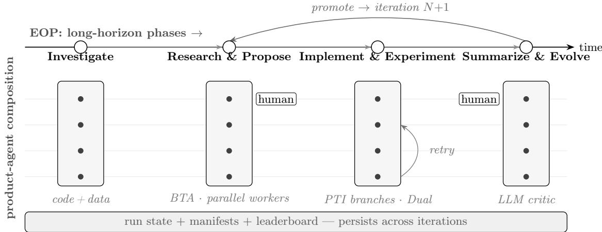
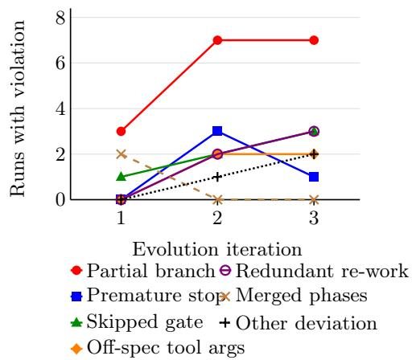
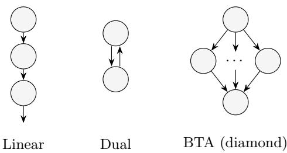
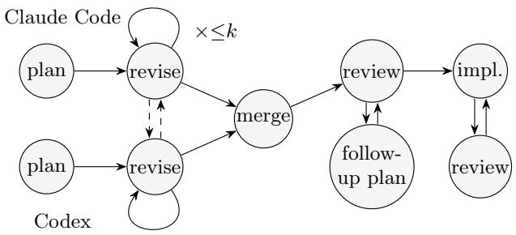
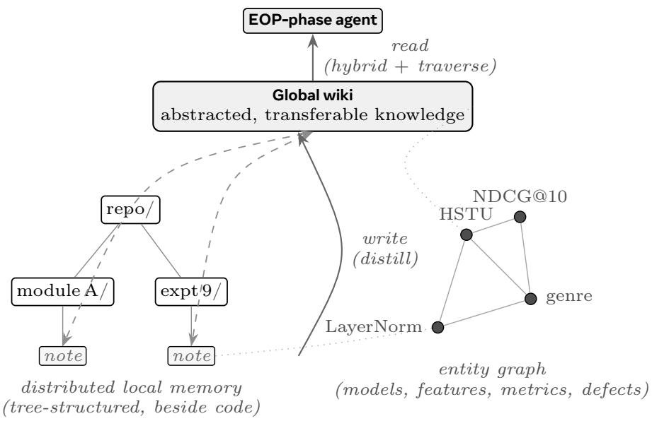

# RankEvolve: A Reliable Multi-Agent Auto-Research Harness for Evolving Ranking Models

Zheng Chen, Linfeng Liu, Hong Li, Hong Yan

Meta

Auto-research agents—LLM systems that evolve a machine-learning (ML) model by proposing, implementing, training, and evaluating changes across iterations—promise to automate applied ML’s experimental loop. Over such long horizons, execution accuracy is a binding constraint in our setting: a change can silently leak held-out data, omit a layer norm, disconnect a gradient, or leave a train/eval flag unwired—one such defect burns hours of accelerator time and yields an invalid metric—and over many iterations the damage compounds while the run drifts of its prescribed process. We present RankEvolve, an auto-research framework that evolves a generative ranking model end to end, with correctness engineered through two disciplines. An Executable Operating Protocol (EOP) declares the workflow’s phases, gates, branches, and loops once, and the runtime enforces the compiled state machine: the model performs each step, but the framework controls the process. A meta-metaharness treats the agentic system as an execution graph whose nodes are not raw model calls but complete, black-box coding-agent products (e.g., Claude Code, Codex)—each itself a harness over a model—that cross-check one another’s work; in a budget-matched evaluation this cross-checking lifts all-oracle execution accuracy from the best single-product 45.8% to 62.5%—the lever that makes long-horizon iteration reliable. Beneath both disciplines, an implemented knowledge layer carries findings—including negative results—across iterations. Deployed for twelve iterations on the opensource HSTU recommender, RankEvolve reported NDCG@10 0.2192 on MovieLens-20M LARGE (+4.48% over the published anchor) and 0.1948 on BASE (+2.80%), with first-class negative results and leakage incidents. Those incidents seed ExecML-HSTU, the oracle benchmark behind that contrast: the Claude Code+Codex pair beats every budget-matched single-product baseline (paired +16.7, 95% CI [6.6, 26.7]) at a 10.4% silent critical-defect rate. An equally controlled LitGPT split, reported whatever its outcome, replicates the efect beyond recommenders (+12.5, 95% CI [3.0, 22.0]); a paired ablation holds the runtime fixed and toggles only per-step versus full-protocol injection. The result is a falsifiable account of when runtime-controlled composition of coding-agent products buys execution accuracy—and when it does not.

Date: August 1, 2026

Meta

## 1 Introduction

Applied ML research is a stylized loop: read the code and the literature, form a hypothesis, implement it, launch training, validate the evaluator, interpret the result, and decide what to try next. The bottleneck is rarely raw compute alone; it is the researcher who must sit in the loop at every step. LLM-driven systems for program search and scientific discovery—FunSearch (Romera-Paredes et al., 2024), AlphaEvolve (Novikov et al., 2025), the AI Scientist line (Lu et al., 2024; Yamada et al., 2025)—show that much of the loop is automatable, with the most reliable early successes in settings with cheap, deterministic evaluators. A newer wave of ML-engineering agents pushes the same loop toward real training pipelines (Jiang et al., 2025; Nam et al., 2025; Toledo et al., 2025). Industrial teams now run it on their own proprietary recommendation and ranking models (Wang et al., 2026; Kumar et al., 2026), and academic work evolves compact open recommenders such as NCF and SASRec (Kim et al., 2026). We know of no established account, however, of long-horizon, code-level evolution of an open generative recommender at the scale of HSTU (Zhai et al., 2024)—deep stack, GPU-hour training—checked against its published reference numbers.

Deploying the loop at that scale surfaces three challenges. (i) Costly evolution. Each candidate change needs hours of distributed GPU training, so only a few candidates can be evaluated per iteration and every invalid run is expensive. (ii) Fragile execution. Even frontier coding agents inject subtle defects into mature ML code—test-set leakage, a missing layer norm, a disconnected gradient, an unwired feature flag, a platformspecific config error<sup>1</sup>—that pass shallow CI yet invalidate the metric, so the loop burns accelerator time and, worse, learns from illusory outcomes (Chen et al., 2025; Luo et al., 2025). (iii) Long-horizon drift. In a pilot audit of a full-context playbook, adherence to the prescribed process decayed sharply as context accumulated (Figure 2)—the drift a runtime-enforced protocol removes.

The control abstractions these challenges call for are not missing: StateFlow formulates LLM workflows as state machines (Wu et al., 2024); GPTSwarm treats agents as optimizable computational graphs (Zhuge et al., 2024); ADAS and AFlow search over code-represented agents and workflows (Hu et al., 2025; Zhang et al., 2025); and LangGraph supplies a durable stateful graph runtime (LangChain, 2024). Together these make “agents are graphs” or “workflows are state machines” untenable as novel contributions (Section 5), and we claim novelty for none of them—nor for checkpointing, human-in-the-loop control, multi-agent debate, or automatic agent design. The gap is at the boundary between authoring and execution: research procedures are authored as versioned natural-language playbooks, whereas reliable long-horizon execution needs explicit state, recovery, gates, and traceability; and a work node may need to invoke an entire coding-agent product rather than a single model call. If two such products fail diferently, a review–repair edge can catch what either alone misses; if their errors are correlated, composition only multiplies cost. Existing work does not establish that product-level composition buys objectively measured correctness on a mature ML codebase at matched budget. The recommender loops above do not settle it either: they report model gains, on proprietary models (Wang et al., 2026; Kumar et al., 2026) or compact open ones (Kim et al., 2026), and none, to our knowledge, measures patch correctness against an oracle or composes diferent coding-agent products. The primary scientific question is therefore: does this composition boundary buy execution accuracy, beyond spending the same budget on a single product?

## Contributions.

RankEvolve,<sup>2</sup> an auto-research framework, answers these challenges—and puts that question to an objective test—with three design ideas. (1) Executable Operating Protocols (EOPs). A workflow’s phases, dependencies, tools, confirmation gates, and branch/loop structure are authored once as a versioned, semi-structured protocol and compiled to a state machine the runtime itself enforces—keeping a long run on track (challenge iii) while the model performs each step (Section 2). (2) A meta-meta-harness. Work nodes bind complete, black-box coding-agent products (Claude Code, Codex, OpenHands) through adapter contracts into review–repair and plan–merge flows: products with diferent failure modes cross-check one another (challenge ii) and diversify proposals under a tight budget (challenge i). On our incident-seeded oracle benchmark this lifts execution accuracy from the best single-product 45.8% to 62.5% at matched budget (Section 4), establishing execution accuracy as a binding constraint in this setting and showing that product composition can improve it at matched budget. (3) A knowledge layer. Findings—especially the lessons of negative results—are recorded with full provenance and carried into later iterations, so prior dead ends need not be silently re-derived (challenge i; Section 2.3).

We validate end to end: a twelve-iteration deployment on the public HSTU stack reported NDCG@10 0.2192 against the published 0.2098 anchor on MovieLens-20M LARGE and 0.1948 against 0.1895 on BASE, with firstclass negative results and logged leakage incidents (Section 3); ExecML, built from those incidents—96 private tasks per repository, locked snapshots, hidden oracles, a frozen inference-spend cap, extended-budget/sameproduct-review/best-of-N controls, a pre-specified decorrelation analysis, and an equally controlled LitGPT (Lightning AI, 2023) transfer split reported whatever its outcome (Section 4); and a context-scope ablation isolating prompt scope from enforcement (Section 4.3).

The headline claim is pre-specified and gated on the primary HSTU corpus against a frozen budget-matched baseline family, with the LitGPT split reported whatever its outcome—a falsifiable protocol fixed before the private runs, so the reported efects are confirmatory rather than post-hoc.

  
Figure 1 Anatomy of RankEvolve: two orthogonal axes. Horizontally, the EOP drives the long horizon—a compiled phase sequence whose promoted results loop back for the next iteration (Section 2.1). Vertically, the meta-meta-harness supplies depth and diversity: coding and review nodes bind complete products, while routing, aggregation, and gates remain deterministic; a persistent state/artifact store spans the run. The diagram describes the deployed integration boundary, not a novel graph formalism.

## 2 Anatomy of RankEvolve

RankEvolve has three layers with deliberately diferent claims: an authoring layer, the semi-structured EOP document (Section 2.1); a control layer, the meta-meta-harness that compiles supported markers to runtime state and dispatches work through adapter-bound coding-agent products (Section 2.2); and a knowledge layer persisting hypotheses, patches, run manifests, evaluator provenance, and promotion decisions (Section 2.3). This paper evaluates the ML-evolution instance; transfer to arbitrary long-horizon domains is not assumed.

## 2.1 Executable Operating Protocols

RankEvolve’s top-level abstraction is the Executable Operating Protocol (EOP): a versionable, semi-structured specification of a long-horizon workflow, naming its phases, dependencies, required tools, user-confirmation gates, and branch/loop edges. Rather than hand-coding—and debugging—a bespoke control flow for every task, the workflow is declared once, so procedural knowledge outlives brittle, throwaway scripts, in the spirit of MetaGPT’s standardized operating procedures (Hong et al., 2024). The document reads like an operating procedure: structural markers are parsed and statically checked, while a phase’s natural-language body is delivered to its executor and is not claimed to have formal semantics. RankEvolve’s recommendation workflow is one such EOP (Figure 1; full text in Appendix D): investigate, research-and-propose, branch implement-experiment-and-analyze over selected proposals, then summarize-and-evolve, looping while gains remain. Gates are first-class phases, so human control—proposal review and selection, experiment configuration, iterate/stop—is explicit. In the case study the operator also authorized compute, vetoed one over-budget experiment, and gave three high-level directions: favor new methods over stacks of add-ons, compare like with like (BASE to BASE, LARGE to LARGE), and guarantee no test leakage (Appendix I.2). Proposals are hypotheses: atomic, flag-gated changes combined into combos and re-ranked not by a numeric genetic operator but by an LLM critic over a persistent leaderboard that promotes reference-beating combos to seed the next round.

On the backend an EOP compiles to a state machine: phases are states; dependency, branch, join, and goto markers become transitions; the runtime advances state and blocks at gates (branch fan-out is a tested backend capability, not assumed from parsing). The default delivery policy injects the global preamble and current phase instruction, not inactive phase bodies; StateFlow already motivates state-specific prompting (Wu et al., 2024), so whether this policy improves final code correctness at fixed runtime is tested in Section 4.3, not asserted.

  
Figure 2 Per-iteration process-faithfulness violations across the ten full-context playbook runs (no runtime enforcement). Deviations are rare in iteration 1 and proliferate from iteration 2 as accumulated context crowds out the current-step instruction. Runs reaching each iteration: n=10, 10, 7; a point counts runs exhibiting that violation at that iteration, so a run may contribute to several (per-run totals in Table 10). The pilot lacks a runtime-controlled arm, so it motivates rather than measures the EOP’s efect; the controlled test is Section 4.3.

Runtime contract. For protocol P, compilation produces a graph $C ( P )$ and runtime state $\sigma =$ $( q , V , A , G , B , R , T )$ —active phase, protocol variables, committed artifacts, gate status, live branches, attempt/budget counters, append-only event trace—advanced by typed events $( \delta ( \sigma , e ) \to \sigma ^ { \prime } \colon$ node-complete, gate-approved, branch-failed, budget-exhausted). The enforcement contract (Appendix C) makes the guarantee boundary explicit: dependencies, gates, branch/join cardinality, loop budgets, tool allowlists, and checkpoint/restart are checked statically or enforced at runtime, while semantic code correctness is expressly not guaranteed.

A historical pilot motivates, but does not validate, this design: ten runs received the whole procedure as one in-context playbook, and none was fully faithful—all ten ran only a subset of selected proposals, four stopped early, four skipped a gate, three called tools of-spec (audit table in Appendix C; Figure 2 shows the accumulation). The pilot lacks a matched EOP-runtime arm and changes control and context delivery together, so it supports only the existence of a failure mode; the controlled ablation in Section 4.3 is the required test.

## 2.2 A meta-meta-harness

RankEvolve’s control layer is a meta-meta-harness: each commercial coding product is itself a harness over a raw model—planner, context management, tools, and sandbox—and RankEvolve harnesses these harnesses in turn, standing two harnessing levels above the model and composing complete products as the work nodes of its execution graph rather than issuing raw model calls. Agents-as-graph-nodes is an established pattern (Zhuge et al., 2024; LangChain, 2024); the distinctive choices here are the node’s granularity and opacity—a complete product bound as a black box—and a runtime that keeps control flow outside the products.

The binding is an adapter contract: it receives the task, repository snapshot, allowed tools, budget, and prior artifacts, and returns a patch, terminal status, event trace, and usage record; it owns sandboxing, non-interactive invocation, timeout, and usage collection—not the product’s internal planning. This makes Claude Code (Anthropic, 2026), Codex (OpenAI, 2026), and OpenHands (Wang et al., 2025) substitutable at coding or review nodes; routing, aggregation, gates, and metrics remain deterministic runtime functions or narrow model calls, so we do not claim every graph node is itself an agent.

The runtime instantiates familiar execution patterns (Figure 3): Linear, a chain with loop-back; Dual, a propose→review→fix consensus loop—in efect, internal peer review—that repeats until the reviewer approves or residual severity falls below a threshold, within bounded rounds; and Breakdown-then-Aggregate (BTA), a diamond splitting a task into bounded-concurrency sub-tasks and synthesizing results, the fan-out behind the parallel research workers of Figure 1. These compose into flows such as Plan-then-Implement (PTI). The recovery contract is specific: state and artifacts checkpoint at node boundaries; transient invocations get a bounded retry budget; a timed-out node fails closed; a resumed run starts from the last committed boundary; and recovery claims are limited to the contract’s tested paths (Appendix C). The deployed flow is humanauthored YAML (plan stage in Appendix F)—a plan-merge composition: parallel planning cross-merged to convergence, then dual implement–review (Figure 4); automatic workflow search is outside our contribution, being studied directly by GPTSwarm, ADAS, and AFlow (Zhuge et al., 2024; Hu et al., 2025; Zhang et al., 2025).

  
Figure 3 Execution patterns instantiated by the runtime. Circles denote work nodes, which may bind to a coding-agent product, a deterministic function, or a narrow model call. Disabling the diamond’s aggregator yields a tree; disabling its breakdown yields a chain. These topologies are standard; our object of study is the product-agent adapter boundary and its measured reliability.

Type-level interfaces are in Appendix E. These patterns form the vertical axis of Figure 1—each phase’s depth and diversity—while the EOP fixes the horizontal order; whether heterogeneous cross-checking improves correctness at equal budget is the hypothesis of Section 4, not an assumption.

## 2.3 The knowledge layer: artifact and evidence state

A long-horizon agent that forgets re-derives the same dead ends, so a long run needs durable evidence. RankEvolve therefore implements a knowledge layer with two linked responsibilities. First, its artifact/evidence store records, per proposal, repository/environment hashes, prompt, EOP and product versions, patch, test outputs, training configuration, split, checkpoints, metrics, cost, and the promotion decision, with negative outcomes as first-class leaderboard rows—supporting resumption and claim-to-run auditing. Second, its experiential memory writes self-contained notes beside the code they describe, abstracts transferable lessons into a central wiki that cites those notes as evidence, and links both tiers through an entity graph. A reconciliation agent keeps the wiki the single source of truth, while a per-phase read path injects only the few relevant lessons, preserving the EOP’s per-step context discipline (Section 2.1). This implemented layer was active in the reported twelve-iteration HSTU deployment: it persisted negative results and incident lessons and made them available to later phases. It is part of RankEvolve’s system contribution and is detailed against prior agent-memory mechanisms in Appendix G. The study evaluates the layer as part of the end-to-end system but does not include a memory-on/of ablation, so it does not isolate the layer’s marginal efect on proposal quality (Shinn et al., 2023; Zhao et al., 2024).

## 3 HSTU Deployment Case Study

## 3.1 Scope, target, and evaluation

Our target is HSTU (Zhai et al., 2024), a generative recommender; we use its public implementation and public MovieLens data (Harper and Konstan, 2015), so all results are at public-benchmark scale. ML-20M is mature and heavily benchmarked—published methods cluster in a narrow band—so consistent NDCG@10 gains are hard-won: a deliberately stringent test. HSTU replaces the Transformer block with SiLU-normalized attention, a fused UVQK projection, and a learnable relative bucketed time-and-position bias—the last is why explicit time-decay add-ons prove redundant (Appendix H). BASE/LARGE configurations are tabulated in Appendix B. Published MovieLens-20M anchors are 0.1895 (BASE) and 0.2098 (LARGE).

Evaluation discipline. We report canonical full-test NDCG@10 (leave-one-out, full-corpus ranking over all held-out users), distinct from a faster subset evaluation that ran ≈0.005–0.010 higher in the logged runs; checkpoint evaluations from one run are not independent seeds, so “best checkpoint” values are descriptive history (Table 2). This separation was the study’s most important methodological discipline: without it, the system repeatedly chased phantom 0.005-scale “gains” from subset and checkpoint noise.

Compute. The workspace contains ∼55 leaderboard entries across 49 experiment directories on 1–8 NVIDIA H200s; we report run counts rather than an unverifiable GPU-hour aggregate.

## 3.2 Three-stage trajectory

The twelve iterations summarize as three stages (Table 1, whose final column scopes each claim): Stage I composed known architectural components to 0.2161; Stage II’s refinements were mostly within noise; Stage III’s genre side feature reached the largest endpoint, 0.2192; and the preference-optimization direction produced the largest regression. These illustrate the workload and its failure modes, not a claim of architectural novelty.

## 3.3 Reported endpoints and integrity boundary

Table 2 separates published anchors from internal reproductions: MovieLens-32M has no published HSTU anchor, so those rows cannot support a “published-baseline” statement, and the 0.2192 endpoint comes from an added genre side-feature, not a new modeling primitive. Full diagnostic and negative-result narratives are in Appendix H.

Cross-dataset transfer. To check the discovered levers are portable, the deployment’s two exported recipes were replayed on four further sequential-recommendation datasets with no per-dataset re-tuning: Stage I SYNAPSE (Appendix H.2), then the Stage III genre side-feature UDK on top (on ML-20M, UDK was instead fine-tuned from the 0.2140 stack; Table 1). Both improve over vanilla HSTU on all four (Table 3), cumulatively by up to +25%, though UDK adds little on Foursquare-TKY (0.0200 → 0.0202). The beyond-recommenders question belongs to the LitGPT split (Section 4).

## 4 Objective Execution-Accuracy Evaluation

Why compose products at all, rather than call one strong coding agent? On mature ML code even a single maximum-efort plan-then-execute pass can produce plans with critical defects—reinventing facilities the codebase already provides, calling deprecated APIs that would fail CI, writing to wrong paths, or omitting build targets—and one bad patch can corrupt an iteration or, worse, silently inflate a metric. ExecML turns the deployment’s logged incidents into an objective, budget-controlled benchmark over two coding-agent products, Claude Code (CC) and Codex. It asks whether product composition improves executable correctness (RQ1); whether any gain survives an equal observable budget on HSTU (RQ2), with a pre-specified LitGPT transfer version; whether error complementarity predicts realized review–repair gain (RQ3); and whether current-step context helps at fixed enforcement (RQ4). The primary pre-specified hypothesis is that CC→Codex→CC exceeds $\operatorname* { m a x } _ { m \in B } \operatorname { E A } _ { m }$ on the private HSTU split, where B is the frozen matched-budget baseline family; we use the phrase “heterogeneous composition buys execution accuracy” only if the task-clustered 95% interval excludes zero and the efect exceeds a smallest efect of interest frozen after development-only power analysis. The same contrast on LitGPT is reported with its interval whatever its outcome—extending the claim beyond recommenders if positive, bounding it to the deployed domain if null—and is published either way, not suppressed.

Corpus, oracle, and conditions. Each repository contributes 96 private tasks: the public HSTU codebase, seeded by the case study’s logged incidents, and LitGPT, a non-recommender training codebase (Lightning AI, 2023). Tasks balance six incident families—data provenance and leakage, tensor routing, gradient flow, train/eval mode, metric semantics, and configuration wiring—half new implementation, half repair. Every item pairs an immutable snapshot with a hidden executable oracle that passes only when a patch simultaneously satisfies the regression suite, task-specific behavioral checks, scientific-safety invariants, and evaluator-integrity checks; the primary endpoint is all-oracle execution accuracy (EA), and we separately report the silent critical-defect rate (CDR): an oracle-confirmed fault that leaves the patch runnable but can invalidate a scientific conclusion (leakage, dead feature paths, broken gradients, wrong evaluation semantics). CC runs Claude Opus 4.8 and Codex runs GPT-5.6, each at its maximum reasoning-efort setting, in every condition. Six conditions run from a fresh sandbox with identical snapshot, tools, network policy, prompt, and timeout, in randomized order: one-pass CC; one continuous CC session at the full composition budget; independent

<table><tr><td>Iter.</td><td>Intervention</td><td>Outcome</td><td>Finding and claim status</td></tr><tr><td>0</td><td>Published HSTU anchor</td><td>0.2098</td><td>Published comparison point</td></tr><tr><td colspan="5">Stage I — compose known components (SYNAPSE); one objective bet</td></tr><tr><td></td><td>1-2 SSD-style input compression (IC) + PRISM user conditioning</td><td>0.2140</td><td>+2.0%; measured historical endpoint</td></tr><tr><td>3</td><td>+ multi-token scoring head</td><td>0.2161</td><td>SYNAPSE, +3.0%: two pooled facets (recent intent, long-term taste), one ANN call; measured historical endpoint</td></tr><tr><td>4</td><td>Preference optimization (DPO/IPO/SimPO)</td><td>DPO: -35.9% vs. its 0.2191 reference</td><td>All three used target-derived negatives (pre-fix mining) and hurt as preference accuracy approached 1; reward over-optimization remains a hypothesis. A leak-free re-derivation mining only internal positions is neutral</td></tr><tr><td colspan="4">(∆≈0). Rejected</td></tr><tr><td>5</td><td>Stage II — refine (diminishing returns) FLUID elapsed-gap time decay</td><td>ties 0.2161</td><td>Redundant with HSTU&#x27;s learnable relative time bias On a 0.2127 checkpoint of the 0.2140 stack,</td></tr><tr><td>6</td><td>Failure-overlap diagnostic</td><td>75.2% overlap</td><td>last-position failures persist one position earlier; descriptive, not causal</td></tr><tr><td>7</td><td>Focal / tail reweighting</td><td>no lift</td><td>Three implementation bugs fixed, then nine runs without gain. Rejected The model&#x27;s top-ranked non-targets share ≈0.236 genre</td></tr><tr><td></td><td>Deep failure analysis; multi-position training augmentation (MPTA)</td><td>0.2154</td><td>Jaccard with the target (“genre right, item wrong&quot;); MPTA adds +0.7% to the 0.2140 stack it extends, within checkpoint noise, and sets no new best</td></tr><tr><td colspan="4">Stage III — push the ceiling</td></tr><tr><td>9</td><td>Additive genre side-feature (UDK)</td><td>0.2192</td><td>Largest reported ML-20M LARGE endpoint, +4.48%, fine-tuned from the 0.2140 stack (not SYNAPSE) once a v1 feature leak was fixed; a gain from added</td></tr><tr><td>10</td><td>Position-averaged test-time augmentation</td><td>≈0.2190</td><td>metadata, not architectural novelty No gain: each position has a different target, so there is no shared label to average. Limited to this estimator.</td></tr><tr><td>11</td><td>UDK channels: genre / year / popularity</td><td>≈0.2192</td><td>Rejected All channels saturate at the same ≈0.219 ceiling</td></tr><tr><td>12</td><td>Boost-last-K at inference; training-side variant and new methods</td><td>no gain (inference)</td><td>Inference-time variants over K and boost strength stay within ±0.0003 of 0.2192, inside checkpoint noise, so none counts as a new endpoint; the training-side variant and the new methods did not finish within the</td></tr></table>

Table 1 Twelve-iteration case history on ML-20M × LARGE. An iteration is one or more propose→implement→evaluate turns; iterations are grouped by theme into three stages and numbered by stage, not strictly in run order. NDCG@10 values are reported historical endpoints (best checkpoints, not independent seeds); the final column scopes each claim. Bold marks the stage milestones. Relative gains are over the published anchor (0.2098; 0.1895 for the BASE result below) unless a row names another reference (MPTA: the 0.2140 stack; DPO: its own reference, Appendix H.4). DPO’s 0.2191 reference is not a Stage I endpoint; iteration 4 is placed in Stage I by theme. Background recipe sweeps are not listed; among them, the one clean BASE win, dropout 0.2 → 0.1 in Stage II, gave 0.1948 (+2.80%; Table 2), and a 500 → 700 context extension lost accuracy (Appendix H.4).

<table><tr><td>Dimension</td><td>Reported</td><td>Reference</td><td>Relative ∆</td></tr><tr><td> $\mathrm { M L - 2 0 M \times B A S E }$ </td><td>0.1948</td><td> $0 . 1 8 9 5 ^ { p }$ </td><td> $+ 2 . 8 0 \%$ </td></tr><tr><td> $\mathrm { M L - 2 0 M \times \Delta L A R G E }$ </td><td>0.2192</td><td> $0 . 2 0 9 8 ^ { p }$ </td><td> $+ 4 . 4 8 \%$ </td></tr><tr><td> $\mathrm { M L - 3 2 M \times B A S E }$ </td><td>0.1562</td><td> $0 . 1 4 8 8 ^ { i }$ </td><td> $+ 4 . 9 7 \%$ </td></tr><tr><td> $\mathrm { M L - 3 2 M \times \Delta L A R G E }$ </td><td>0.1726</td><td> $0 . 1 6 6 0 ^ { i }$ </td><td> $+ 3 . 9 8 \%$ </td></tr></table>

Table 2 Reported best-checkpoint endpoints from the case history. The ML-32M BASE endpoint is a five-component stack (PRISM+IC+time-decay+dropout=0.1+hard negatives) and the ML-32M LARGE endpoint a PRISM+IC+timedecay stack; neither appears in Table 1, which covers ML-20M only. <sup>p</sup>Published HSTU anchor; <sup>i</sup>internal reproduction, not a published baseline.
<table><tr><td>Dataset</td><td>Vanilla</td><td>+SYNAPSE</td><td>++UDK</td></tr><tr><td>Foursquare-TKY</td><td>0.0181</td><td>0.0200 (+10%)</td><td> $0 . 0 2 0 2 \ ( + 1 2 \% )$ </td></tr><tr><td>Foursquare-NYC</td><td>0.0156</td><td>0.0180 (+15%)</td><td> $0 . 0 1 9 5 \ : \left( + 2 5 \% \right)$ </td></tr><tr><td>Gowalla</td><td>0.0441</td><td>0.0460 (+4.3%)</td><td> $0 . 0 4 6 7 \ ( + 5 . 9 \% )$ </td></tr><tr><td>Yelp</td><td>0.0321</td><td>0.0359 (+11.8%)</td><td> $0 . 0 3 8 2 \ ( + 1 9 . 0 \% )$ </td></tr></table>

Table 3 Cross-dataset transfer of the deployment’s discovered recipes (NDCG@10, canonical full-test, one run per cell; columns are cumulative—++UDK adds the Stage III side-feature on top of +SYNAPSE; percentages over vanilla).
<table><tr><td>Condition</td><td></td><td></td><td></td><td>HSTU EA ↑ HSTU CDR↓ LitGPT EA ↑ LitGPT CDR↓ Cost/task↓ Tool actions↓</td><td></td><td></td></tr><tr><td>CC, one pass</td><td> $2 2 . 9 \pm 1 0 . 5$ </td><td> $3 5 . 4 \pm 1 2 . 0$ </td><td> $2 0 . 8 \pm 1 0 . 1$ </td><td> $3 7 . 5 \pm 1 2 . 1$ </td><td>0.41</td><td>37</td></tr><tr><td>CC, extended budget B</td><td> $3 3 . 3 \pm 1 1 . 8$ </td><td> $2 7 . 1 \pm 1 1 . 1$ </td><td> $2 9 . 2 \pm 1 1 . 4$ </td><td> $2 9 . 2 \pm 1 1 . 4$ </td><td>0.98</td><td>94</td></tr><tr><td>CC best-of-N + blind selection</td><td> $4 3 . 8 \pm 1 2 . 4$ </td><td> $1 8 . 8 \pm 9 . 8 $ </td><td> $3 9 . 6 \pm 1 2 . 2$ </td><td> $2 0 . 8 \pm 1 0 . 1$ </td><td>0.95</td><td>90</td></tr><tr><td> $\mathrm { C C } {  } \mathrm { C C } {  } \mathrm { C C }$ </td><td> $4 5 . 8 \pm 1 2 . 5$ </td><td> $1 6 . 7 \pm 9 . 3$ </td><td> $4 3 . 8 \pm 1 2 . 4$ </td><td> $1 8 . 8 \pm 9 . 8 $ </td><td>0.97</td><td>103</td></tr><tr><td>CC→Codex→CC</td><td> ${ \bf 6 2 . 5 \pm 1 2 . 1 }$ </td><td> $\mathbf { 1 0 . 4 \pm 7 . 6 }$ </td><td> ${ \bf 5 6 . 2 \pm 1 2 . 4 }$ </td><td> ${ \bf 1 2 . 5 \pm 8 . 3 }$ </td><td>1.02</td><td>109</td></tr><tr><td> $\mathrm { C o d e x { \to } C C { \to } C o d e x }$ </td><td> $5 6 . 2 \pm 1 2 . 4$ </td><td> $1 2 . 5 \pm 8 . 3$ </td><td> $5 0 . 0 { \pm } 1 2 . 5 $ </td><td> $1 4 . 6 \pm 8 . 8$ </td><td>1.00</td><td>106</td></tr><tr><td>Plan-merge flow (CC∥ Codex), 2nd stage†</td><td> $7 0 . 8 \pm 1 1 . 4$ </td><td> $6 . 2 \pm 6 . 0$ </td><td> $6 4 . 6 \pm 1 2 . 0$ </td><td> $8 . 3 \pm 6 . 9$ </td><td>2.40</td><td>250</td></tr></table>

Table 4 Primary execution accuracy by condition (n=96 tasks per repository); stage-1 rows 2–6 are resource-matched to envelope B, with one-pass CC as an unmatched cheap reference. HSTU columns carry the primary claim, LitGPT columns the pre-specified transfer contrast. Cells: task-level mean % with 95% task-clustered intervals; cost USD/task; tool actions per-task medians. Bold: best stage-1 condition on both EA and CDR at parity of budget. The rule separated final row is the deployed plan-merge flow, specified after stage-1 unblinding and excluded from the stage-1 contrast and Holm family; it runs at natural (uncapped) cost, unlike the stage-1 rows (Section 4.2).

CC candidates with oracle-blind selection/repair; CC→CC→CC implement–review–repair; CC→Codex→CC; and the reversed Codex→CC→Codex. An oracle-selected best-of-N is computed as a non-deployable upper bound (Appendix C). A resource envelope B, frozen before the private evaluation, gives every flow the same three roles, per-node limits, tool permissions, action caps, and wall-clock and spend caps; timeouts and overruns score as failures and stay in denominators. Proprietary products do not expose provider-side FLOPs, so “matched observable inference budget” is the accurate term—not equality of hidden hardware compute. Pass/fail contrasts use exact McNemar or paired randomization, efect sizes use task-clustered bootstrap intervals, and the primary test is the single max-over-B contrast with Holm-corrected secondaries. Oracle formalism, per-family counts, curation and leakage controls, and full decision rules are in Appendix C.

## 4.1 Results

Table 4 reports the frozen private evaluation. RQ1/RQ2. On HSTU the heterogeneous pair reaches 62.5% EA, above every budget-matched baseline (one-pass 22.9, extended-budget 33.3, blind best-of-N 43.8, CC→CC→CC 45.8); the paired contrast against the strongest baseline is +16.7 points (95% cluster-robust CI [6.6, 26.7], $p { < } 0 . 0 0 1$ ; twenty discordant tasks, eighteen rescued vs. two broken), clearing zero and the pre-specified smallest efect: heterogeneous composition buys execution accuracy on the deployed domain. CDR falls in step,

  
Figure 4 The deployed plan-merge topology (second-stage condition), one planning lane bound to Claude Code and the other to Codex: each lane drafts and iteratively revises its plan while reading the other lane’s latest draft (dashed; ≤k rounds, per-lane stop votes), a single aggregation integrates a winner (merge), and a review–follow-up-plan dual then an implement–review dual finish.

35.4% to 10.4%—the lowest of the budget-matched conditions—so the gain is fewer silent faults, not CI churn. Extra same-product budget helps (+10.4 extended; +12.5 homogeneous review) but plateaus below the pair: buying diferent products, not more of the same, delivers the largest increment. The reversed pair also beats all homogeneous conditions (56.2%) but trails forward by 6.2 points—which product implements versus reviews matters. Transfer. On LitGPT the forward pair leads 56.2% vs. 43.8%, a paired +12.5 (95% CI [3.0, 22.0], p=0.008): reported as specified in advance and regardless of outcome, the efect replicates on a non-recommender codebase, extending the confirmatory claim beyond the deployed domain. The five envelope-B conditions run at \$0.95–\$1.02/task and 90–109 actions (one-pass CC is the deliberately unmatched cheap reference), so the improvement is not bought with budget.

## 4.2 Second stage: the deployed plan-merge topology

After stage-1 unblinding—every stage-1 inference already complete—we specified one further condition: the deployed plan-merge flow (Figure 4), with its CC ∥ Codex planning lanes and the same product settings as stage 1. The topology is the deployment’s own configuration, fixed before stage 1 (plan stage listed in Appendix F); only its budget partitioning is adapted to envelope B (Appendix C). Its hypothesis—plan-merge EA exceeds CC→Codex→CC at the same envelope B, paired on identical tasks against a contemporaneously re-run comparator—was specified, together with the analysis code and round caps, before any second-stage run; with the authors unblinded to stage-1 outcomes, the contrast is reported outside the Holm family at its own α=0.05, whatever its outcome. A companion arm runs the flow at natural cost with realized spend disclosed, plus an equal-spend three-role control; a capped-arm timeout or overrun scores as failure.

The plan-merge flow posts the table’s highest EA (70.8% HSTU, 64.6% LitGPT) and lowest CDR (6.2%), consistent with its status as the deployed topology. Against the re-run comparator the paired lift is +8.3 points (68 vs. 60 of 96; sixteen discordant, twelve rescued vs. four regressed; exact McNemar p=0.077, 95% CI [−0.7, 17.3])—not statistically distinguishable. Statistically, the confirmatory weight therefore rests on stage 1 rather than on this specific topology, and a budget-capped variant of the flow (held to envelope B) leaves the matched-budget picture unchanged: at 62.5% EA it ties CC→Codex→CC (paired 0.0 points, 95% CI [−5.5, 5.5]), so the flow’s advantage comes from the extra budget it is worth spending, not from the topology at fixed budget. Operationally, the deployed flow is intentionally uncapped (\$2.40/task, 250 actions, ≈2.4× the envelope, roughly 4× the invocations tempered by cached context) because it delivers the table’s best per-task correctness; an equal-spend three-role control given the same \$2.40 reaches 66.7%, numerically below the plan-merge flow’s 70.8%—consistent with, though not established by, the budget being spen across cross-pollinated lanes rather than on spend alone. We spend that deliberately: iterations build on one another, so fewer silent defects compound, and the inference cost is negligible beside the multi-GPU training it protects—one slipped defect burns hours-to-days of accelerators and contaminates every downstream iteration, an averted loss of order $1 0 ^ { 3 } \times$ the spend. In short, the controlled contrast establishes why it works—pairing two diferent products—while the plan-merge flow is what we deploy.

## 4.3 Mechanism and context scope

Why composition works (RQ3). For reviewer b checking executor a, the directional complementarity $D _ { a  b } =$ $P ( E _ { a } { = } 1 , E _ { b } { = } 0 )$ —the critical-error mass available for rescue—grows as the pairwise error correlation falls, while the realized gain $G _ { a  b }$ subtracts the errors review itself introduces (definitions, the mixed-efects regression of G on D, and per-pair results in Appendix C). We claim a “decorrelation mechanism” only if the slope’s interval excludes zero and held-out prediction beats a marginals-only model; the slope condition holds $( \hat { \beta } _ { 1 } \mathrm { { = } } 0 . 3 4$ , 95% CI [0.12, 0.56]). Concretely (Table 9): heterogeneous CC←Codex has low error correlation (ρ=0.21), large complementary mass (D=0.18), and positive realized gain (G=0.06), whereas homogeneous CC←CC (ρ=0.58) leaves little to rescue (D=0.10) and nets ≈0 once reviewer harm is subtracted. The mechanism is thus not “diversity is good” but complementary error times conversion eficiency.

Context scope at fixed runtime (RQ4). Holding the compiled runtime, state, history, artifacts, tools, budgets, and product identical, each scored phase forks into two sandboxes difering only in whether inactive phase bodies accompany the active one; length matching, recency controls, and the manipulation check are in Appendix C. Current-step scoping is never worse and its advantage grows with horizon: paired EA +2.1 points at early phases, +6.2 at middle, and +10.4 at late phases (Table 11), a monotone scope-by-position pattern, with wrong promotions and silent defects also lower at reduced token cost. Because the state machine, not the prompt, carries the process, full-protocol injection mainly adds distracting inactive instructions the runtime already enforces.

## 5 Related Work

We cover work that appeared before June 2026.

Programmed state and orchestration. StateFlow formulates LLM task solving as a state machine with state-specific instructions (Wu et al., 2024); LangGraph supplies state, conditional edges, cycles, checkpointing, and human interrupts (LangChain, 2024). LangGraph nodes are arbitrary callables and can wrap agents, so it would be inaccurate to distinguish RankEvolve by claiming adjacent runtimes permit only raw model calls; EOP is a higher-level authoring layer specialized to the ML domain, adding a product-agent adapter and provenance contract, and could compile to such a runtime.

Graph and workflow optimization. GPTSwarm represents agents as computational graphs and optimizes prompts and connectivity (Zhuge et al., 2024); ADAS and AFlow search code-defined agent systems and workflows (Hu et al., 2025; Zhang et al., 2025)—these works own the graph-composition and automatic-design territory. RankEvolve does not optimize its graph: a human authors a fixed protocol, and the scientific object is whether externally developed products fail diferently enough for fixed review–repair composition to pay for itself on real ML repositories (taxonomy in Appendix A).

Multi-agent software engineering and evaluation. AutoGen and MetaGPT study conversational and role-based software workflows (Wu et al., 2023; Hong et al., 2024); multi-agent debate shows structured critique helps (Du et al., 2023). SWE-bench and MLAgentBench evaluate repository repair and ML experimentation (Jimenez et al., 2024; Huang et al., 2024); MLR-Bench, AIDE, MLE-STAR, and AIRA extend toward open-ended ML research (Chen et al., 2025; Jiang et al., 2025; Nam et al., 2025; Toledo et al., 2025); Harness-Bench shows the harness, not just the model, determines outcomes (Yao et al., 2026), though it compares configurations singly rather than composing them. ExecML complements these by holding topology and observable budget fixed while measuring semantic correctness, silent defects, and pairwise error complementarity.

Automated discovery and AutoML. FunSearch, AlphaEvolve, and the AI Scientist line close program-search and research loops with executable evaluators (Romera-Paredes et al., 2024; Novikov et al., 2025; Lu et al., 2024; Yamada et al., 2025). RankEvolve keeps their evolve-and-select principle but mutates training configurations and small code patches scored by real distributed training, which is why it selects with an LLM critic over a persistent leaderboard and human budget gates rather than a genetic operator over a numeric archive (Section 2.1). AutoML and architecture search optimize within declared spaces (Feurer et al., 2015;

Zoph and Le, 2017); RankEvolve works one level up, reading prior results, writing new code, and analyzing failures. Our HSTU history is an application case, not a new recommender or search algorithm.

Auto-research for recommendation. Industrial systems already close the research loop on proprietary models. At YouTube, a fast ofline agent built on Gemini-family models proposes and trains model changes against proxy metrics, and a slow online agent validates candidates on north-star metrics in live A/B tests (Wang et al., 2026). At Meta, the Ranking Engineer Agent runs ads-ranking experiments spanning days to weeks, hibernating while its training jobs run, within engineer-approved compute budgets and with human oversight at strategic decision points (Kumar et al., 2026). In the open setting, Self-EvolveRec evolves the model, data-processing, and training code of compact seed recommenders (NCF, NGCF, SASRec, MoRec) on Amazon and MovieLens data with a GPT-5 coding agent, guided by an LLM user simulator and a model-diagnosis tool (Kim et al., 2026). RankEvolve difers on three axes: it evolves an open generative recommender at the scale of HSTU and checks its results against the published reference; it composes complete coding-agent products as graph nodes under a runtime-enforced protocol (Section 2); and it measures execution accuracy against hidden oracles at matched budget (Section 4).

## 6 Conclusion

RankEvolve contributes an EOP authoring and runtime layer for long-horizon ranking-model evolution, a product-agent adapter boundary that composes complete coding products as graph nodes, and an implemented knowledge layer that carries provenance, negative results, and incident lessons across iterations. A falsifiable evaluation establishes that commercial coding products measurably improve one another’s patches—building on state machines, durable graphs, and agent composition, and grounded in a twelve-iteration HSTU deployment that supplies both the motivation and the benchmark’s tasks

Under the pre-specified decision rule the primary claim stands (62.5% vs. 45.8% EA; paired +16.7, CI [6.6, 26.7]) and replicates beyond recommenders on LitGPT (+12.5, CI [3.0, 22.0]); the decorrelation condition is met $( { \hat { \beta } } _ { 1 } { = } 0 . 3 4$ , CI [0.12, 0.56]), while the second-stage topology contrast is not distinguishable (+8.3, p=0.077)—pairing two diferent products, not the specific topology, is what buys correctness. Per-step EOP injection is claimed on the fixed-runtime ablation; its token savings are reported as eficiency. That decision rule is the paper’s central discipline: composition is a measured systems hypothesis, not a property inferred from a diagram.

Limitations. The evidence base is one ranking codebase plus LitGPT, both Python/PyTorch, so cross-domain transfer is not fully established; pretraining may include the public repositories, though tasks, hidden tests, and reference patches are private, and oracles are incomplete—mutation testing and audits reduce, not eliminate, false passes. The products are black boxes: observable tokens, actions, time, and cost are matched, provider-side FLOPs cannot be. Error complementarity is predictive, not causal, so rescue and harm are measured directly, and checkpoint forking understates cumulative divergence. The knowledge layer was active in the HSTU deployment, but without a memory-on/of ablation its marginal contribution to proposal quality is not isolated. The HSTU case study ran with a human operator at the protocol’s gates who also steered it, so it does not separate the agent’s contribution from the operator’s (the ExecML conditions have no human in the loop), and its cross-dataset transfer results are single runs.

## References

Himan Abdollahpouri, Masoud Mansoury, Robin Burke, and Bamshad Mobasher. The unfairness of popularity bias in recommendation. In RecSys Workshop on Recommendation in Multistakeholder Environments (RMSE), 2019.

Anthropic. Claude Code. https://docs.anthropic.com/en/docs/claude-code/overview, 2026. Documentation accessed July 2026.

Mohammad Gheshlaghi Azar, Zhaohan Daniel Guo, Bilal Piot, Remi Munos, Mark Rowland, Michal Valko, and Daniele Calandriello. A general theoretical paradigm to understand learning from human preferences. In International Conference on Artificial Intelligence and Statistics (AISTATS), 2024.

Hui Chen, Miao Xiong, Yujie Lu, Wei Han, Ailin Deng, Yufei He, Jiaying Wu, Yibo Li, Yue Liu, and Bryan Hooi. MLR-Bench: Evaluating AI agents on open-ended machine learning research. arXiv preprint arXiv:2505.19955, 2025.

Prateek Chhikara, Dev Khant, Saket Aryan, Taranjeet Singh, and Deshraj Yadav. Mem0: Building production-ready AI agents with scalable long-term memory. arXiv preprint arXiv:2504.19413, 2025.

Tri Dao and Albert Gu. Transformers are SSMs: Generalized models and eficient algorithms through structured state space duality. In Proceedings of the 41st International Conference on Machine Learning (ICML), 2024.

Yilun Du, Shuang Li, Antonio Torralba, Joshua B. Tenenbaum, and Igor Mordatch. Improving factuality and reasoning in language models through multiagent debate. arXiv preprint arXiv:2305.14325, 2023.

Matthias Feurer, Aaron Klein, Katharina Eggensperger, Jost Tobias Springenberg, Manuel Blum, and Frank Hutter. Eficient and robust automated machine learning. In Advances in Neural Information Processing Systems (NeurIPS), 2015.

F. Maxwell Harper and Joseph A. Konstan. The MovieLens datasets: History and context. ACM Transactions on Interactive Intelligent Systems (TiiS), 5(4):1–19, 2015.

Sirui Hong, Mingchen Zhuge, Jonathan Chen, Xiawu Zheng, Yuheng Cheng, Ceyao Zhang, et al. MetaGPT: Meta programming for a multi-agent collaborative framework. arXiv preprint arXiv:2308.00352, 2024. ICLR 2024.

Shengran Hu, Cong Lu, and Jef Clune. Automated design of agentic systems. In The Thirteenth International Conference on Learning Representations, 2025. https://proceedings.iclr.cc/paper\_files/paper/2025/hash/ 36b7acf6f6010652b3f2a433774a66fe-Abstract-Conference.html.

Qian Huang, Jian Vora, Percy Liang, and Jure Leskovec. MLAgentBench: Evaluating language agents on machine learning experimentation. Proceedings of the 41st International Conference on Machine Learning (ICML), 2024.

Zhengyao Jiang, Dominik Schmidt, Dhruv Srikanth, Dixing Xu, Ian Kaplan, Deniss Jacenko, and Yuxiang Wu. AIDE: AI-driven exploration in the space of code. arXiv preprint arXiv:2502.13138, 2025.

Carlos E. Jimenez, John Yang, Alexander Wettig, Shunyu Yao, Kexin Pei, Ofir Press, and Karthik Narasimhan. SWEbench: Can language models resolve real-world github issues? International Conference on Learning Representations (ICLR), 2024.

Haifeng Jin, Qingquan Song, and Xia Hu. Auto-Keras: An eficient neural architecture search system. In Proceedings of the 25th ACM SIGKDD International Conference on Knowledge Discovery & Data Mining, 2019.

Wang-Cheng Kang and Julian McAuley. Self-attentive sequential recommendation. In IEEE International Conference on Data Mining (ICDM), 2018.

Omar Khattab and Matei Zaharia. ColBERT: Eficient and efective passage search via contextualized late interaction over BERT. In Proceedings of the 43rd International ACM SIGIR Conference on Research and Development in Information Retrieval, 2020.

Sein Kim, Sangwu Park, Hongseok Kang, Wonjoong Kim, Jimin Seo, Yeonjun In, Kanghoon Yoon, and Chanyoung Park. Self-EvolveRec: Self-evolving recommender systems with LLM-based directional feedback. arXiv preprint arXiv:2602.12612, 2026.

Ashwin Kumar, Erwin Gao, Matan Levi, Sheela Yadawad, Sherman Wong, Sneha Iyer, and Vinodh Kumar Sunkara. Ranking engineer agent (REA): The autonomous AI agent accelerating Meta’s ads ranking innovation. Engineering at Meta, https://engineering.fb.com/2026/03/17/developer-tools/ranking-engineer-agent-rea-autonomous-aisystem-accelerating-meta-ads-ranking-innovation/, 2026.

LangChain. LangGraph: A low-level orchestration framework for stateful agents. https://github.com/langchain-ai/ langgraph, 2024. Documentation accessed July 2026.

Juho Lee, Yoonho Lee, Jungtaek Kim, Adam R. Kosiorek, Seungjin Choi, and Yee Whye Teh. Set transformer: A framework for attention-based permutation-invariant neural networks. In Proceedings of the 36th International Conference on Machine Learning (ICML), 2019.

Chao Li, Zhiyuan Liu, Mengmeng Wu, Yuchi Xu, Huan Zhao, Pipei Huang, Guoliang Kang, Qiwei Chen, Wei Li, and Dik Lun Lee. Multi-interest network with dynamic routing for recommendation at Tmall. In Proceedings of the 28th ACM International Conference on Information and Knowledge Management (CIKM), 2019.

Lightning AI. LitGPT. https://github.com/Lightning-AI/litgpt, 2023.

Tsung-Yi Lin, Priya Goyal, Ross Girshick, Kaiming He, and Piotr Dollár. Focal loss for dense object detection. In Proceedings of the IEEE International Conference on Computer Vision (ICCV), 2017.

Hanxiao Liu, Karen Simonyan, and Yiming Yang. DARTS: Diferentiable architecture search. In International Conference on Learning Representations (ICLR), 2019.

Chris Lu, Cong Lu, Robert Tjarko Lange, Jakob Foerster, Jef Clune, and David Ha. The AI scientist: Towards fully automated open-ended scientific discovery. arXiv preprint arXiv:2408.06292, 2024.

Ziming Luo, Atoosa Kasirzadeh, and Nihar B. Shah. The more you automate, the less you see: Hidden pitfalls of AI scientist systems. arXiv preprint arXiv:2509.08713, 2025.

Yu Meng, Mengzhou Xia, and Danqi Chen. SimPO: Simple preference optimization with a reference-free reward. In Advances in Neural Information Processing Systems (NeurIPS), 2024.

Jaehyun Nam, Jinsung Yoon, Jiefeng Chen, Jinwoo Shin, Sercan Ö. Arık, and Tomas Pfister. MLE-STAR: Machine learning engineering agent via search and targeted refinement. arXiv preprint arXiv:2506.15692, 2025.

Jinming Nian, Fangchen Li, Dae Hoon Park, and Yi Fang. RankEvolve: Automating the discovery of retrieval algorithms via LLM-driven evolution. arXiv preprint arXiv:2602.16932, 2026.

Alexander Novikov et al. Alphaevolve: A coding agent for scientific and algorithmic discovery. arXiv preprint arXiv:2506.13131, 2025.

OpenAI. Codex. https://github.com/openai/codex, 2026. Documentation accessed July 2026.

Ethan Perez, Florian Strub, Harm de Vries, Vincent Dumoulin, and Aaron Courville. FiLM: Visual reasoning with a general conditioning layer. In AAAI Conference on Artificial Intelligence, 2018.

Rafael Rafailov, Archit Sharma, Eric Mitchell, Stefano Ermon, Christopher D. Manning, and Chelsea Finn. Direct preference optimization: Your language model is secretly a reward model. In Advances in Neural Information Processing Systems (NeurIPS), 2023.

Shashank Rajput, Nikhil Mehta, Anima Singh, Raghunandan H. Keshavan, Trung Vu, Lukasz Heldt, Lichan Hong, Yi Tay, Vinh Q. Tran, Jonah Samost, Maciej Kula, Ed H. Chi, and Maheswaran Sathiamoorthy. Recommender systems with generative retrieval. In Advances in Neural Information Processing Systems (NeurIPS), 2023.

Preston Rasmussen, Pavlo Paliychuk, Travis Beauvais, Jack Ryan, and Daniel Chalef. Zep: A temporal knowledge graph architecture for agent memory. arXiv preprint arXiv:2501.13956, 2025.

Bernardino Romera-Paredes, Mohammadamin Barekatain, Alexander Novikov, Matej Balog, M. Pawan Kumar, Emilien Dupont, Francisco J. R. Ruiz, Jordan S. Ellenberg, Pengming Wang, Omar Fawzi, Pushmeet Kohli, and Alhussein Fawzi. Mathematical discoveries from program search with large language models. Nature, 625:468–475, 2024.

Andrew I. Schein, Alexandrin Popescul, Lyle H. Ungar, and David M. Pennock. Methods and metrics for cold-start recommendations. In Proceedings of the 25th Annual International ACM SIGIR Conference, 2002.

Timo Schick, Jane Dwivedi-Yu, Roberto Dessì, Roberta Raileanu, Maria Lomeli, Luke Zettlemoyer, Nicola Cancedda, and Thomas Scialom. Toolformer: Language models can teach themselves to use tools. In Advances in Neural Information Processing Systems (NeurIPS), 2023.

Noah Shinn, Federico Cassano, Ashwin Gopinath, Karthik Narasimhan, and Shunyu Yao. Reflexion: Language agents with verbal reinforcement learning. In Advances in Neural Information Processing Systems (NeurIPS), 2023.

Fei Sun, Jun Liu, Jian Wu, Changhua Pei, Xiao Lin, Wenwu Ou, and Peng Jiang. BERT4Rec: Sequential recommendation with bidirectional encoder representations from transformer. In Proceedings of the 28th ACM International Conference on Information and Knowledge Management (CIKM), 2019.

Haoran Sun, Shaoning Zeng, and Bob Zhang. H-MEM: Hierarchical memory for high-eficiency long-term reasoning in LLM agents. In Proceedings of the 19th Conference of the European Chapter of the Association for Computational Linguistics (EACL), 2026.

Xiangru Tang, Tianrui Qin, Tianhao Peng, et al. Agent KB: Leveraging cross-domain experience for agentic problem solving. arXiv preprint arXiv:2507.06229, 2025.

Edan Toledo, Karen Hambardzumyan, Martin Josifoski, et al. AI research agents for machine learning: Search, exploration, and generalization in MLE-bench. arXiv preprint arXiv:2507.02554, 2025. FAIR at Meta, University College London, and Örebro University.

Haochen Wang, Yi Wu, Daryl Chang, Li Wei, and Lukasz Heldt. Self-evolving recommendation system: End-to-end autonomous model optimization with LLM agents. arXiv preprint arXiv:2602.10226, 2026.

Lei Wang, Chen Ma, Xueyang Feng, Zeyu Zhang, Hao Yang, Jingsen Zhang, Zhiyuan Chen, Jiakai Tang, Xu Chen, Yankai Lin, Wayne Xin Zhao, Zhewei Wei, and Ji-Rong Wen. A survey on large language model based autonomous agents. Frontiers of Computer Science, 18(6), 2024a.

Xingyao Wang, Boxuan Li, Yufan Song, Frank F. Xu, Xiangru Tang, Mingchen Zhuge, Jiayi Pan, Yueqi Song, Bowen Li, Jaskirat Singh, Hoang Tran, Fuqiang Li, Ren Ma, Mingzhang Zheng, Bill Qian, Daniel Shao, Niklas Muennighof, Yizhe Zhang, Binyuan Hui, Junyang Lin, Robert Brennan, Hao Peng, Heng Ji, and Graham Neubig. OpenHands: An open platform for AI software developers as generalist agents. In The Thirteenth Interna tional Conference on Learning Representations, 2025. https://proceedings.iclr.cc/paper\_files/paper/2025/hash/ a4b6ad6b48850c0c331d1259fc66a69c-Abstract-Conference.html.

Zora Zhiruo Wang, Jiayuan Mao, Daniel Fried, and Graham Neubig. Agent workflow memory. arXiv preprint arXiv:2409.07429, 2024b.

Qingyun Wu, Gagan Bansal, Jieyu Zhang, Yiran Wu, Beibin Li, Erkang Zhu, Li Jiang, Xiaoyun Zhang, Shaokun Zhang, Jiale Liu, Ahmed Hassan Awadallah, Ryen W. White, Doug Burger, and Chi Wang. AutoGen: Enabling next-gen LLM applications via multi-agent conversation. arXiv preprint arXiv:2308.08155, 2023.

Yiran Wu, Tianwei Yue, Shaokun Zhang, Chi Wang, and Qingyun Wu. StateFlow: Enhancing LLM task-solving through state-driven workflows. In First Conference on Language Modeling, 2024. https://openreview.net/forum? id=3nTbuygoop.

Xu Xie, Fei Sun, Zhaoyang Liu, Shiwen Wu, Jinyang Gao, Jiandong Zhang, Bolin Ding, and Bin Cui. Contrastive learning for sequential recommendation. In IEEE 38th International Conference on Data Engineering (ICDE), 2022.

Wujiang Xu, Zujie Liang, Kai Mei, Hang Gao, Juntao Tan, and Yongfeng Zhang. A-Mem: Agentic memory for LLM agents. arXiv preprint arXiv:2502.12110, 2025.

Yutaro Yamada, Robert Tjarko Lange, Chris Lu, Shengran Hu, Cong Lu, Jakob Foerster, Jef Clune, and David Ha. The AI scientist-v2: Workshop-level automated scientific discovery via agentic tree search. arXiv preprint arXiv:2504.08066, 2025.

Yilun Yao, Xinyu Tan, Chao-Hsuan Liu, Yaoming Li, Zhengyang Wang, Wenhan Yu, Zhewen Tan, Yuxuan Tian, Guangxiang Zhao, Lin Sun, Xiangzheng Zhang, and Tong Yang. Harness-Bench: Measuring harness efects across models in realistic agent workflows. arXiv preprint arXiv:2605.27922, 2026.

Jiakang Yuan, Xiangchao Yan, Shiyang Feng, et al. Dolphin: Moving towards closed-loop auto-research through thinking, practice, and feedback. arXiv preprint arXiv:2501.03916, 2025.

Jiaqi Zhai, Lucy Liao, Xing Liu, Yueming Wang, Rui Li, Xuan Cao, Leon Gao, Zhaojie Gong, Fangda Gu, Jiayuan He, Yinghai Lu, and Yu Shi. Actions speak louder than words: Trillion-parameter sequential transducers for generative recommendations. In Proceedings of the 41st International Conference on Machine Learning (ICML), 2024.

Jiayi Zhang, Jinyu Xiang, Zhaoyang Yu, Fengwei Teng, Xionghui Chen, Jiaqi Chen, Mingchen Zhuge, Xin Cheng, Sirui Hong, Jinlin Wang, Bingnan Zheng, Bang Liu, Yuyu Luo, and Chenglin Wu. AFlow: Automating agentic workflow generation. In The Thirteenth International Conference on Learning Representations, 2025. https://proceedings iclr.cc/paper\_files/paper/2025/hash/5492ecbce4439401798dcd2c90be94cd-Abstract-Conference.html.

Andrew Zhao, Daniel Huang, Quentin Xu, Matthieu Lin, Yong-Jin Liu, and Gao Huang. ExpeL: LLM agents are experiential learners. arXiv preprint arXiv:2308.10144, 2024. AAAI 2024.

Kun Zhou, Hui Wang, Wayne Xin Zhao, Yutao Zhu, Sirui Wang, Fuzheng Zhang, Zhongyuan Wang, and Ji-Rong Wen. S3-Rec: Self-supervised learning for sequential recommendation with mutual information maximization. In Proceedings of the 29th ACM International Conference on Information and Knowledge Management (CIKM), 2020.

Mingchen Zhuge, Wenyi Wang, Louis Kirsch, Francesco Faccio, Dmitrii Khizbullin, and Jürgen Schmidhuber. GPTSwarm: Language agents as optimizable graphs. In Proceedings of the 41st International Conference on Machine Learning, volume 235 of Proceedings of Machine Learning Research, pages 62743–62767, 2024. https://proceedings.mlr.press/v235/zhuge24a.html.

Barret Zoph and Quoc V. Le. Neural architecture search with reinforcement learning. In International Conference on Learning Representations (ICLR), 2017.

## Appendix

## A Extended Related Work

The main-paper Related Work is necessarily compact; we record further connections here.

LLM agents and benchmarks. Modern LLM agents call tools (Schick et al., 2023) and are surveyed by Wang et al. (2024a); they are increasingly evaluated on real software and ML-engineering tasks (Jimenez et al., 2024; Huang et al., 2024), the setting RankEvolve carries into the long-horizon evolution of an open generative recommender.

AutoML and architecture search. AutoML systems such as AutoKeras (Jin et al., 2019) and diferentiable architecture search (Liu et al., 2019) automate model and design choices within fixed spaces; RankEvolve instead operates at the research level, reading results and writing new code.

Sequential and generative recommendation. HSTU builds on sequential recommenders (Kang and McAuley, 2018; Sun et al., 2019). The agent’s iterations also draw on contrastive and self-supervised modeling (Xie et al., 2022; Zhou et al., 2020), popularity-bias mitigation (Abdollahpouri et al., 2019), cold-start stratification (Schein et al., 2002), and semantic-ID retrieval (Rajput et al., 2023)—all treated as building blocks, not contributions.

Table 5 tabulates the control representation, node granularity, and objective of the closest control and workflow systems.

## B Reproducibility

All experiments use the public HSTU codebase (Zhai et al., 2024). The recurring recipe components are PRISM (FiLM-style modulation), input compression, time-decay supervision weighting (half-lives 30/60/180/720 days), local-ℓ self-supervision (t=0.05), dropout 0.1, hard negatives, and an additive input-path genre side-feature with $\alpha \in [ 0 . 0 5 , 0 . 2 0 ]$ . Canonical evaluation is full-test NDCG@10 over all held-out users; subset evaluations and single-point maxima are excluded from the leaderboard. Per-run trajectories and configurations were preserved across redundant storage tiers. The failure-overlap analyzer, the leaderboard schema, and the boost-last-K patch will be released with the codebase, together with an artifact record giving, per run, the success/failure/exclusion status and the configuration; per case-history endpoint (main-paper Tables 1 and 2), the checkpoint-evaluation log from which the best checkpoint is read; and the local reproduction runs for the published anchor.

## C Runtime, Protocol, and Evaluation Details

This appendix collects protocol material referenced from the main paper: the EOP runtime enforcement contract (Table 7), the ExecML corpus composition (Table 8), the decorrelation derivation and per-pair results (Table 9), the historical faithfulness pilot (Table 10), the runtime execution patterns (Figure 3), the cross-dataset transfer table (Table 3), and the context-scope ablation results (Table 11).

Decorrelation derivation. For products $^ { a , }$ b with per-task independent critical-failure indicators $E _ { a } , E _ { b }$ , define $\scriptstyle p _ { a } = P ( E _ { a } = 1 ) , q _ { a b } = P ( E _ { a } = 1 , E _ { b } = 1 )$ , and the binary phi correlation

$$
\rho _ { a b } = \frac { q _ { a b } - p _ { a } p _ { b } } { \sqrt { p _ { a } ( 1 - p _ { a } ) p _ { b } ( 1 - p _ { b } ) } } .
$$

The directional complementarity used in the main paper expands as

$$
D _ { a  b } = P ( E _ { a } = 1 , E _ { b } = 0 ) = p _ { a } ( 1 - p _ { b } ) - \rho _ { a b } \sqrt { p _ { a } ( 1 - p _ { a } ) p _ { b } ( 1 - p _ { b } ) } ,
$$

<table><tr><td>System</td><td>Control representation</td><td>Node granularity</td><td>Primary objective/setting</td><td>Relation to this work</td></tr><tr><td>StateFlow Wu et al., 2024)</td><td>Programmed finite-state workflow</td><td>LLM instructions. tools, and functions</td><td>Task success/cost on interactive SQL, Bash, and ALFWorld</td><td rowspan="2">Establishes state-driven control and state-specific instructions; EOP does not claim either abstraction Establishes</td></tr><tr><td>GPTSwarm (Zhuge et al., 2024)</td><td>Optimizable computational graph</td><td>Operations and recursively composed agent graphs</td><td>Prompt/connectivity optimization on reasoning tasks</td></tr><tr><td>(Hu et al., 2025; Zhang et al., 2025)</td><td>ADAS / AFlow Agent code or code-represented workflow search</td><td>Generated agents, prompts, operators, and edges</td><td>Automatic agent/workflow discovery across benchmark tasks Durable production</td><td>test RANKEvOLVE uses a fixed human-authored flow and makes no automatic-design claim Provides overlapping</td></tr><tr><td>LangGraph (LangChain, 2024)</td><td>Stateful graph runtime</td><td>Arbitrary callables, subgraphs, or wrapped agents</td><td>orchestration</td><td>runtime primitives; EOP is an ML-evolution authoring/adapter instantiation</td></tr><tr><td>RANKEVOLVE (this work)</td><td>Semi-structured EOP compiled to runtime state</td><td>Black-box coding products at coding/review nodes; functions elsewhere</td><td>Long-horizon ML evolution and executable patch correctness</td><td>Claimed delta: product boundary, domain specialization, and deployment-seeded, budget-controlled evidence with a pre-specified</td></tr></table>

Table 5 Taxonomy of the closest control and workflow systems. The table locates the contribution; it is not a feature-count claim.
<table><tr><td>Parameter</td><td>BASE</td><td>LARGE</td></tr><tr><td>Blocks</td><td>4</td><td>16</td></tr><tr><td>Heads</td><td>4</td><td>8</td></tr><tr><td> $d _ { q k } = d _ { v }$ </td><td>64</td><td>32</td></tr><tr><td> $d _ { e m b }$ </td><td>256</td><td>256</td></tr><tr><td>Seq. length</td><td>200→500</td><td>200→500</td></tr><tr><td>Negatives</td><td>128</td><td>128</td></tr><tr><td>Temperature</td><td>0.05</td><td>0.05</td></tr><tr><td>Dropout</td><td>0.2 (0.1*)</td><td>0.2</td></tr><tr><td>Learning rate</td><td> $1 0 ^ { - 3 }$ </td><td> $1 0 ^ { - 3 }$ </td></tr><tr><td>Optimizer</td><td>AdamW</td><td>AdamW</td></tr><tr><td>Similarity</td><td>DotProduct</td><td>DotProduct</td></tr></table>

Table 6 HSTU configurations (verified against the source and ML-20M gin configs). <sup>∗</sup>Dropout reduced to 0.1 for the PRISM-additive BASE endpoint (Stage II background sweep; Appendix H.2). The 200 → 500 entry is the baseline training schedule; a separate experiment that further extended the window to 700 lost accuracy and is reported as a negative result (Appendix H.4).

so at fixed marginals D grows linearly as errors decorrelate. Raw $1 - \rho$ alone is insuficient because pairs with diferent marginal failure rates do not ofer equal recovery opportunity.

<table><tr><td>Construct</td><td>Compile/static check</td><td>Runtime behavior</td><td>Not guaranteed</td></tr><tr><td>Phase dependency</td><td>Referenced phases exist; DAG outside explicit</td><td>Successors remain unavailable until predecessor completion</td><td>That the predecessor&#x27;s artifact is semantically correct</td></tr><tr><td>Human gate</td><td>loops Gate has prompt and legal continuations</td><td>Transition blocks until a recorded approve/reject event</td><td>That the human decision is correct</td></tr><tr><td>Branch/join</td><td>Source variable cardinality, and join policy are declared</td><td>Supported node backend instantiates one branch per item and records join state</td><td>Fan-out on an untested backend or useful diversity across branches</td></tr><tr><td>Loop/budget</td><td>Target phase exists; exit and hard bound are present</td><td>Attempt and spend counters stop further dispatch at the bound</td><td>That an agent chooses the best stopping point</td></tr><tr><td>Tool requirement</td><td>Tool name/schema resolve before launch</td><td>Calls outside the allowlist are rejected and recorded</td><td>Correct tool arguments or scientifically valid</td></tr><tr><td>Checkpoint/restart</td><td>Serializable state and artifact references</td><td>Resume begins at the last committed node boundary</td><td>interpretation Recovery inside an uncommitted third-party agent</td></tr><tr><td>Patch/evaluation</td><td>Oracle command and expected outputs are declared</td><td>Tests run in a fresh sandbox; outputs and hashes are recorded</td><td>invocation Correctness beyond the public CI and hidden semantic oracles</td></tr></table>

Table 7 EOP enforcement contract. The final column is as important as the middle columns: runtime control constrains admissible transitions but cannot make an agent’s scientific reasoning or code correct. Branch and recovery claims apply only to the tested backend paths reported with the artifact.
<table><tr><td>Repository</td><td>Domain</td><td>Impl.</td><td>Repair</td><td>Dev.</td><td>Private</td></tr><tr><td>HSTU codebase</td><td>Recommendation</td><td>48</td><td>48</td><td>32</td><td>96</td></tr><tr><td>LitGPT</td><td>Language-model training</td><td>48</td><td>48</td><td>32</td><td>96</td></tr><tr><td>Total</td><td>Two ML domains</td><td>96</td><td>96</td><td>64</td><td>192</td></tr></table>

Table 8 ExecML composition as frozen before the private evaluation: 96 private tasks per repository. Every oracle passed independent validation and a development-only paired power analysis. The statistical unit is a task. Repeated agent attempts characterize stochasticity but do not create new independent tasks.
<table><tr><td>Ordered pair</td><td>Repository</td><td> $p _ { a }$ </td><td>pb</td><td> $\rho _ { a b }$ </td><td> $D _ { a  b }$ </td><td> $G _ { a  b }$ </td><td>Rescue / harm</td></tr><tr><td>CC←CC</td><td>HSTU</td><td>0.54</td><td>0.54</td><td>0.58</td><td>0.104</td><td>-0.01</td><td>0.04/0.05</td></tr><tr><td>CC←Codex</td><td>HSTU</td><td>0.54</td><td>0.58</td><td>0.21</td><td>0.175</td><td>0.061</td><td>0.09/0.03</td></tr><tr><td>CC←Codex</td><td>LitGPT</td><td>0.58</td><td>0.60</td><td>0.26</td><td>0.169</td><td>0.050</td><td>0.08/0.03</td></tr><tr><td>Codex←CC</td><td>HSTU</td><td>0.58</td><td>0.54</td><td>0.21</td><td>0.164</td><td>0.048</td><td>0.08/0.03</td></tr><tr><td>Codex←Codex</td><td>HSTU</td><td>0.58</td><td>0.58</td><td>0.55</td><td>0.112</td><td>0.004</td><td>0.05/0.05</td></tr></table>

Table 9 Independent-error complementarity and realized review–repair gain. Rows are descriptive; inference resamples source tasks jointly and does not treat overlapping rows as independent observations.

## C.1 Evaluation protocol: oracle, statistics, and ablation design

This subsection supplies the formal definitions and pre-specified analysis detail referenced from Section 4 of the main paper.

Task and oracle. A benchmark item t contains an immutable repository snapshot $r _ { t } .$ , a change request $x _ { t } ,$ and a hidden executable oracle $O _ { t }$ . Method M produces patch $p _ { t } = M ( r _ { t } , x _ { t } )$ . The oracle returns pass only when the patch satisfies the repository regression suite $\mathcal { C } _ { t } ,$ , task-specific behavioral checks $A _ { t } ,$ scientific-safety

<table><tr><td>Process-faithfulness violation</td><td>Runs</td></tr><tr><td>Ran only a subset of selected proposals</td><td>10</td></tr><tr><td>Stopped early despite self-recommending continue</td><td>4</td></tr><tr><td>Skipped a prescribed user-confirmation gate</td><td>4</td></tr><tr><td>Called a tool with off-spec arguments</td><td>3</td></tr><tr><td>Redundant re-investigation on loop-back</td><td>3</td></tr><tr><td>Merged the codebase and data investigation phases</td><td>2</td></tr><tr><td>Other run-breaking deviation</td><td>3</td></tr><tr><td>Fully faithful runs</td><td>0</td></tr></table>

Table 10 Historical motivating pilot, not a treatment comparison. Process-faithfulness audit of a model-evolution procedure delivered as a single full-context playbook. Ten runs under the logged coding-agent configuration were scored against the prescribed phases, gates, branches, and loop; counts are runs afected (out of ten), and a run may incur several violation types, so the column does not sum to ten. The pilot lacks a runtime-controlled arm and cannot identify the efect of context scoping.

invariants $S _ { t }$ , and evaluator-integrity checks $\textstyle { \mathcal { T } } _ { t } \colon$

$$
O _ { t } ( p ) = \mathrm { { R A s s } } \Longleftrightarrow { \mathcal C } _ { t } ( p ) \wedge { \mathcal A } _ { t } ( p ) \wedge { \mathcal S } _ { t } ( p ) \wedge { \mathcal T } _ { t } ( p ) .
$$

The primary endpoint is all-oracle execution accuracy, $\begin{array} { r } { \mathrm { E A } ( M ; \mathcal { D } ) = | \mathcal { D } | ^ { - 1 } \sum _ { t \in \mathcal { D } } \mathbf { 1 } [ O _ { t } ( M ( r _ { t } , x _ { t } ) ) = \mathrm { P A S S } ] } \end{array}$ . We separately report build/CI failure and the silent critical-defect rate (CDR): an oracle-confirmed fault for which the patch remains runnable but can invalidate a scientific conclusion, such as leakage, a dead feature path, broken gradients, or incorrect evaluation semantics. LLM-written issue descriptions are permitted only as secondary qualitative taxonomy; they never determine the primary label.

Conditions and budget matching. The six pre-specified conditions are (1) one-pass CC; (2) one continuous CC session with the full composition budget; (3) independent CC candidates with oracle-blind selection and repair; (4) CC→CC→CC implement–review–repair; (5) CC→Codex→CC at the same topology; and (6) the reversed Codex→CC→Codex. An oracle-selected best-of-N is computed as a non-deployable upper bound. CC is Claude Code running Claude Opus 4.8 and Codex runs GPT-5.6, both at their maximum reasoning-efort setting; product, model, and efort are fixed across all conditions and recorded in the run metadata.

Development tasks set a total resource envelope B, frozen before the private evaluation; heterogeneous and homogeneous flows use the same three roles, per-node limits, tool permissions, action caps, wall-clock cap, and total inference-spend cap, and extended-single and blind best-of-N controls receive the same B. We record exposed input/cached/output/reasoning tokens, tool actions, elapsed time, and dollars; a timeout, crash, or overrun is a failed outcome. Proprietary products do not expose provider-side FLOPs, so “matched observable inference budget” is the accurate term—not equality of hidden hardware compute.

Error complementarity: definitions and model. For product $^ { a , }$ let $E _ { a , t } = 1$ when its independent pre-review patch fails the critical oracle on task t, with marginal $p _ { a } = P ( E _ { a } { = } 1 )$ . For reviewer b checking executor $^ { a , }$ the directional complementarity $D _ { a  b } = P ( E _ { a } { = } 1 , E _ { b } { = } 0 )$ is the error mass available for rescue; at fixed marginals it grows linearly as the binary error correlation $\rho _ { a b }$ falls, and raw $1 - \rho _ { a b }$ alone is insuficient because pairs with diferent marginal failure rates do not ofer equal recovery opportunity (derivation in Appendix C). The realized critical-defect reduction

$$
G _ { a  b } = P ( E _ { a } { = } 1 , E _ { \mathrm { c o m p } } { = } 0 ) - P ( E _ { a } { = } 0 , E _ { \mathrm { c o m p } } { = } 1 )
$$

explicitly subtracts new errors introduced by review.

For the partner-exclusive set $\{ E _ { a } { = } 1 , E _ { b } { = } 0 \}$ we log whether b identifies the defect $\left( r _ { \mathrm { d e t e c t } } \right)$ and whether the repair clears the oracle $( r _ { \mathrm { r e p a i r } } ) ;$ the rescue term is $D _ { a  b } r _ { \mathrm { d e t e c t } } r _ { \mathrm { r e p a i r } } .$ , with shared-error rescues and reviewer-introduced harms reported separately. The mechanism is thus not “diversity is good” but available complementary error times the pipeline’s conversion eficiency.

<table><tr><td>Injection policy</td><td>Early EA</td><td>Middle EA</td><td>Late EA</td><td>CDR↓</td><td>Wrong decision↓</td><td>Input tokens↓</td><td>Cost↓</td></tr><tr><td>Current-step only</td><td>64.6</td><td>58.3</td><td>52.1</td><td>11.5</td><td>8.3</td><td>4.9k</td><td>0.71</td></tr><tr><td>Full protocol</td><td>62.5</td><td>52.1</td><td>41.7</td><td>17.7</td><td>16.7</td><td>9.8k</td><td>1.28</td></tr><tr><td>Paired difference</td><td>+2.1</td><td>+6.2</td><td>+10.4</td><td>-6.2</td><td>-8.3</td><td>-4.9k</td><td>-0.57</td></tr></table>

Table 11 Runtime-controlled context-scope ablation. Cells report task-level means. Both conditions use the same compiled runtime; only inactive EOP content is toggled.

Independent replicate outputs from CC, Codex, and OpenHands estimate marginals and joint errors before any product sees another’s patch; homogeneous and heterogeneous ordered review–repair flows then run. Across pre-specified product-pair × repository × fault-family cells we fit

$$
G _ { j } = \beta _ { 0 } + \beta _ { 1 } D _ { j } + u _ { \mathrm { r e p o } ( j ) } + u _ { \mathrm { f a m i l y } ( j ) } + \epsilon _ { j } ,
$$

with task-clustered bootstrap resampling and held-out prediction over a left-out product pair and, separately, the LitGPT repository. The paper uses “decorrelation mechanism” only if $\beta _ { 1 } \mathrm { { ^ { * } s } }$ interval excludes zero and held-out prediction beats a marginals-only model; otherwise $D ,$ rescue, and harm are reported descriptively (per-pair results in Table 9).

Context-scope ablation design. This ablation separates state-machine enforcement from prompt scoping. At each scored phase, the same persisted runtime checkpoint is forked into two fresh sandboxes. Both arms use the identical compiled graph, state, history, artifacts, tools, budgets, scripted gate responses, coding-agent product, and active instruction. If G is the global invariant preamble, $H _ { i }$ the state/history bundle, $A _ { i }$ the active phase body, and $A _ { - i }$ all inactive phase bodies, the prompts are

$$
P _ { i } ^ { \mathrm { s t e p } } = G \| H _ { i } \| A _ { i } , \qquad P _ { i } ^ { \mathrm { f u l l } } = G \| H _ { i } \| A _ { - i } \| A _ { i } .
$$

Repeating A at the final position controls wording and recency, so the treatment is inactive procedural content; prompts stay below the context limit and output/tool budgets are identical, so truncation cannot explain a diference. A secondary arm length-matches $A _ { - i }$ with neutral padding, separating instruction interference from a generic length efect. The primary endpoint is hidden-oracle patch or decision correctness, including whether the system promotes a valid gain and rejects an invalid/no-op result. Scored phases are pre-stratified as early, middle, and late; the scope-by-position interaction tests the hypothesized horizon efect. A smaller whole-episode randomization measures cumulative divergence (full table in Appendix C). Process violations are only a manipulation check: because both arms use the same runtime, runtime-enforced gate, branch, and ordering invariants are identical across arms by construction.

Statistics, artifacts, and decision rules. Prompts, budgets, the smallest efect of interest, and the baseline family B are chosen on development tasks and frozen before private evaluation; the primary test is the single max-over-B contrast, with per-baseline contrasts as Holm-corrected secondaries. Pass/fail contrasts use exact McNemar or paired randomization tests; efect sizes use task-clustered bootstrap intervals, clustering related source incidents; repository-specific efects precede pooled estimates; and failures, timeouts, and exclusions follow a predeclared policy and remain in denominators. The final interpretation is mechanical: an HSTU efect that beats the matched-budget family supports the primary claim; the LitGPT contrast then extends or bounds its scope; no improvement supports a null; and negative gain shows the reviewer introduced more harm than rescue; all four outcomes are reportable.

Curation and leakage controls. Each task uses a locked container and commit, initially fails its acceptance check, and carries a curator reference patch that passes all oracles, validated by a second curator; removing the intended mechanism must fail at least one semantic check, preventing vacuous tests. Hidden tests, reference patches, repository history, and network access are absent from the agent sandbox; evaluator files are read-only and hash-checked; related incidents and near-duplicate patches stay in one split; oracle mutation testing and a stratified human audit estimate missed defects.

## D The Model-Evolution EOP

Figure 1 abstracts the four-phase loop; the Executable Operating Protocol that RankEvolve runs is reproduced below. Its phase markers—the depends on dependencies, the branch marker on the implementation phase, the loop-back goto marker on the evolve phase, and the requires user input gates—are exactly the state-machine transitions and gates of Section 2.1; the runtime injects each phase’s body as the only instruction in context while that phase is active. (Em dashes are rendered as -- inside the listing.)

```jinja
# Machine Learning Model Evolution
A phased workflow for systematically optimizing ML model architectures: from codebase and data investigation, through research-driven
proposals, to validated implementation. The user selects an evolution strategy; the Orchestrator executes each phase with confirmation
gates.
[__keywords__] optimize model, improve model, model evolution, model architecture, run modeling experiments, systematically improve a
model
[__example_requests__]
- optimize the recommendation model
- improve training eficiency for the ranking model
- evolve the search model architecture
- run modeling experiments on <model codebase>
## Phase 0a -- Set up the workflow target path
[__initial__]
[__requires user input__] Use a ‘clarification‘ tool to set the workflow target path, a subpath of the session root ‘{{ session_root_path }}‘;
write it to ‘workflow_target_path‘. The target may be a directory (investigate all code within it) or a single file (an entry point whose
dependencies and surrounding code are then explored). If the user already named a target in their request, pre-fill it.
[__requires user input__] Use a ‘single_choice‘ tool to set where the modeling artifacts live (data, scripts, prior experiment results and
learnings); write the choice to ‘workflow_modeling_artifacts_mode‘. Ofer two options: "Auto discover" (infer the artifacts from the
target repository), or "Specify paths" (reveal a path picker, bound to ‘workflow_modeling_artifacts_path‘, that accepts one or more
directory/file paths).
**Tools**[__must__]:
- clarification
- single_choice
## Phase 0b -- Set up the model evolution strategy
[__depends on__ Phase 0a]
[__requires user input__] Use a ‘single_choice‘ tool to let the user pick an evolution strategy; write it to ‘evolution_strategy‘. Choices:
- Paradigm-Shifting Innovation -- aggressively explore state-of-the-art architectures, novel techniques, and breakthrough design changes.
- Incremental Improvement -- targeted gains through structured analysis of existing bottlenecks and component-level optimizations.
- Eficiency Optimization -- reduce training/inference cost: memory footprint, latency, throughput, computational eficiency.
- Holistic Improvement -- evaluate all dimensions (architecture, eficiency, quality, robustness) for balanced gains.
**Tools**[__must__]:
- single_choice
## Phase 1 -- Codebase Investigation
[__depends on__ Phase 0b]
Perform a comprehensive, in-depth analysis of the codebase at ‘{{ workflow_target_path }}‘, using "modeling" as the ‘template-version‘ for
ML-focused investigation. The codebase is modeling-related but not necessarily only about modeling (e.g. model architecture, data/
training/inference pipelines or infra, model serving).
**Tools**[__must__]:
- understand-codebase
### Phase 1b -- Codebase Investigation Review
[__depends on__ Phase 1]
[__requires user input__] Present the codebase investigation outcome for review with a ‘confirmation‘ tool whose ‘view‘ points to the
generated documentation. Summarize the key architectural findings and proceed only after the user confirms.
**Tools**[__must__]:
- confirmation
## Phase 2 -- Data Investigation
[__depends on__ Phase 1b]
Investigate the modeling artifacts (data, scripts, prior experiment results and learnings), using "modeling" as the ‘template-version‘.
Prioritize the user-specified locations at ‘{{
workflow_modeling_artifacts_path }}‘.Auto-discover the modeling artifacts under the target codebase.
**Tools**[__must__]:
- understand-data
```

```markdown
### Phase 2b -- Data Investigation Review
[__depends on__ Phase 2]
[__requires user input__] Present the data investigation findings for review with a ‘confirmation‘ tool whose ‘view‘ points to the generated
documentation. Summarize the key data-quality findings, pipeline bottlenecks, and dataset characteristics, and proceed only after the
user confirms.
**Tools**[__must__]:
- confirmation
## Phase 3 -- Research & Proposal
[__depends on__ Phase 2b]
[__requires user input__] Break the research goal into sub-queries, run parallel deep-research streams, generate architecture proposals, and
synthesize them into a unified design. Derive the research goal from the chosen strategy and the Phase 1 and Phase 2 findings.
**Tools**[__must__]:
- research-propose <goal> --docs <reference_documentation>
### Phase 3b -- Proposal Review & Selection
[__depends on__ Phase 3]
[__requires user input__] Present the synthesized proposals -- each with its id, title, impact, complexity, and dependencies -- for review
with a ‘proposal-selection‘ tool (or a ‘confirmation‘ tool if it is unavailable). The user selects which proposals advance to Phase 4; write
the selection to ‘selected_proposal_ids‘.
**Tools**[__must__]:
- proposal-selection
## Phase 4 -- Implementation, Experiment & Analysis
[__depends on__ Phase 3b; __branch__]
Branch over each proposal selected in Phase 3b. For each, invoke the ‘task‘ tool to plan and implement the change, run experiments to
validate it, and analyze the results for bottlenecks and further opportunities.
**Tools**[__must__]:
- task --use-proposal <proposal>
## Phase 4b -- Summary & Evolve
[__depends on__ Phase 4; __goto__ Phase 3 __afterwards__ __if__ ‘continue‘]
Summarize the findings across branches and decide whether to loop back for another research-proposal-experiment cycle; each iteration builds
on prior results and workspace artifacts. Present the results and ask the user whether to continue evolving or to conclude.
```

## E Inferencer-Primitive Interfaces

Algorithm 1 gives the type-level interfaces of the two higher-order primitives of Section 2.2 (Dual and BTA) and of the PTI flow they compose into. LLM denotes a typed call returning a parsed object; split, worker, merge, and repair are problem-specific reducers supplied at the call site (the retry/cache/checkpoint plumbing is omitted for clarity). The bound K caps Dual’s review–repair rounds (consensus\_max\_iterations in Appendix F). Each of the three is realized as an InferencerBase—providing retry, fallback chains, and timeouts—composed with a work-graph mixin that adds crash-tolerant checkpoint/resume, so an entire research run survives a mid-iteration pod eviction.

## F Example Flow Configuration

A flow is specified declaratively and compiled into the execution graph (Section 2.2). The listing below is the plan stage of the deployed flow; the full flow uses it as the planner of a plan-then-implement node whose executor is an implement–review Dual (Figure 4). An outer propose→review→fix Dual wraps a BTA that decomposes the planning task and explores each subtask with N parallel, peer-reviewed MultiFlowDual flows (winner-picking, runner-up-as-reviewer, with a merge node integrating the winner), then integrates the sub-plans. Node types are named by \_target\_/\_factory\_, hyperparameters cascade through \_params, and \_repeat\_ expands a block into N copies, handing copy i the i-th entry of any list it references; template, workspace, and prompt details are elided. The file’s defaults bind every node to Claude Code; the per-lane flow\_inferencers list is where the two planning lanes are bound to diferent products—Claude Code and Codex in the deployment (Section 4).

Algorithm 1 Higher-order inferencer primitives (sketch).   
1: function Dual(task, propose, review, repair, τ , K)   
2: y ← LLM(propose, task); k ← 0   
3: r ← LLM(review, (task, y))   
4: while ¬ r.approved ∧ r.severity > τ ∧ k < K do   
5: y ← LLM(repair, (task, y, r)); k ← k + 1   
6: r ← LLM(review, (task, y))   
7: end while   
8: return y   
9: end function   
10: function BreakdownAggregate(goal, split, worker, merge)   
11: {t<sub>i</sub>} ← LLM(split, goal) ▷ at most max\_breakdown int/ext subtasks   
12: {y } ← parallel\_for i: worker(t )   
13: return merge({y<sub>i</sub>})   
14: end function   
15: function PlanThenImplement(task, plan, impl, gate)   
16: p ← LLM(plan, task)   
17: if gate(p) then   
18: return impl(p)   
19: else   
20: return ⊥   
21: end if   
22: end function

# Plan topology: Dual { BTA { MultiFlowDual } }   
# A reviewed plan: decompose the task, explore each subtask with N   
# parallel peer-reviewed flows, integrate, then review + fix.   
\_params: # hyperparameters (referenced as \${\_params.\*})   
main\_inferencer: ClaudeCodeCLI # coding-agent product at each node   
flow\_inferencers: # one product per planning lane   
- \${\_params.main\_inferencer}   
- \${\_params.main\_inferencer}   
num\_flows: 2 # parallel flows per subtask (diversity)   
plan\_max\_breakdown: 3 # max subtasks from the breakdown   
consensus\_max\_iterations: 3 # propose -> review -> fix rounds   
\_model\_name: opus[1m] # cascading defaults (model, timeouts, ...)   
\_target\_: Dual # ROOT: review + fix the integrated plan   
base\_inferencer:   
\_target\_: BTA # decompose the planning task ...   
max\_breakdown: \${\_params.plan\_max\_breakdown}   
breakdown\_inferencer: { \_target\_: \${\_params.main\_inferencer} }   
worker\_factory: # ... each subtask -> N parallel flows   
\_factory\_: MultiFlowDual   
winner\_pick: true # keep the best flow; runner-up reviews it   
reviewer\_match\_second: true   
visible\_flows: all # flows see each other’s drafts   
max\_retry: 3   
flow\_configs:   
- \_repeat\_: \${\_params.num\_flows} # fan into num\_flows workers   
initial\_inferencer: { \_target\_: \${\_params.flow\_inferencers} } # copy i -> lane i   
followup\_inferencer: { \_target\_: \${\_params.flow\_inferencers} }   
multi\_flow\_aggregator\_inferencer: # merge: integrate the winner   
\_target\_: \${\_params.main\_inferencer}   
aggregator\_inferencer: # integrate the sub-plans -> one plan   
\_target\_: \${\_params.main\_inferencer}   
review\_inferencer: { \_target\_: \${\_params.main\_inferencer} } # judge the plan   
fixer\_inferencer: { \_target\_: \${\_params.main\_inferencer} } # lightweight refine   
# ... templates / workspace / prompt details elided ...

  
Figure 5 The centralized–distributed knowledge layer. Distributed local memory stores each learning as a note in the code folder it describes (a naturally tree-structured, human- and agent-navigable store); a global wiki abstracts transferable knowledge and cites those notes, with bidirectional document-level links (dashed). An entity graph over models, features, metrics, and defects adds entity-level links (dotted) spanning both tiers. A proactive write path distills modeling and execution learnings; a selective read path retrieves the few relevant to the current EOP phase by hybrid search plus graph/tree traversal.

## G Knowledge-Layer Design and Implementation

Status. The centralized–distributed knowledge layer in this section was implemented and active in the reported HSTU experiments. It extends the artifact/provenance store with code-resident notes, a central wiki, an entity graph, proactive write and selective read paths, and reconciliation. It is part of RankEvolve’s system contribution. The paper evaluates its use within the end-to-end deployment but does not include a memory-on/of ablation; consequently, we do not attribute a separate causal improvement in proposal quality to this layer alone.

The knowledge layer (Section 2.3) places RankEvolve in the recent agentic-memory line—agents that autonomously write, organize, and retrieve their own experience as atomic, interlinked notes or reusable workflows (Xu et al., 2025; Wang et al., 2024b; Chhikara et al., 2025)—and each ingredient has precedent in isolation: distilling lessons from successes and failures dates to ExpeL (Zhao et al., 2024); Agent KB curates a central store of workflow- and execution-level patterns with phase-selective retrieval (Tang et al., 2025); Dolphin retains previously inefective ideas to veto near-duplicate proposals (Yuan et al., 2025); industrial recommender agents keep a persistent journal or insights database of past experiments (Wang et al., 2026; Kumar et al., 2026); write-time contradiction handling appears as memory-update operations and temporal edge invalidation (Chhikara et al., 2025; Rasmussen et al., 2025); and shipped coding products index human-authored instructions by the repository tree under a most-local-wins precedence (Anthropic, 2026). Unlike hierarchical memory that stacks several levels of semantic abstraction inside a single index-linked store (Sun et al., 2026), our two tiers are distinguished by locus—a centralized wiki versus distributed, code-resident notes—and by exposing two orthogonal access paths (document- and entity-level), not merely by depth of abstraction. The combination is, to our knowledge, without prior instance in research systems or products: (i) agent-authored learnings committed into the experiment and module folders they describe, the repository tree serving as the index; (ii) a declared central single source of truth whose precedence is the inverse of the most-local-wins convention; (iii) an entity graph spanning both tiers, the substrate on which contradictory claims meet; and (iv) a standing reconciliation agent that adjudicates conflicts into condition-scoped conclusions, demotes but back-links superseded notes, and escalates undecidable conflicts to human review. We present this implemented combination as a system-design contribution. Its use in the reported deployment is part of the end-to-end evaluation; without a memory-on/of ablation, however, the observed model gains cannot be attributed to the knowledge layer alone. Our instantiation (Figure 5) is two-tier and code-resident, with a structure, a write path, and a read path.

Structure (two tiers + a graph). Local memory is distributed: every learning is a small, self-contained note committed into the module or experiment folder it describes, so the archive mirrors the repository tree and is navigable by the same ls/grep/path operations humans and agents already use—no separate database to query, and the note sits exactly where a reader working on that code will look. A global wiki sits above the tree and distills the cross-cutting, transferable knowledge, treating the local notes as its worked examples: each wiki entry cites the notes it generalizes and each note back-links to the entries that subsume it (bidirectional document-level links). Over both tiers we maintain an entity graph whose nodes are recurring artifacts—models, architectural components, datasets, metrics, and named defects—and whose edges connect every place an entity is mentioned; this yields entity-level links that let a query on, say, LayerNorm or genre reach every related note, wiki entry, and sibling entity at once. Document-level and entity-level links together give agents two orthogonal, cheap discovery paths over the same content. A learning is written at the leaf where it arose and abstracted into the wiki as it generalizes, but the leaf note is kept as that entry’s cited evidence, so an agent meets a lesson where it works rather than recalling it from one ever-growing global memory. Concretely, wiki entries record what generally helps or hurts and the reusable fix-instructions and runbooks distilled from the notes they cite.

Write (proactive extraction). Rather than wait to be queried, the framework proactively spawns a subagent to distill learnings from three sources. From each experiment’s results and analysis it records modeling learnings—what helped, what hurt, and why (e.g. that an explicit time-decay add-on is redundant given HSTU’s built-in time bias). From the runtime’s review–repair (Dual) step (Section 2.2) it records execution learnings: when cross-checking catches a recurring defect—a missing layer norm, a silently broken gradient path—it is promoted to an explicit, reusable instruction (“insert the normalization layer after . . . ”). From the run’s own operational incidents—failed or stalled jobs and the fixes that unblocked them—it records the operational side of execution: training and evaluation infrastructure, environment and configuration fixes, and historical issues, kept as runbooks so that a setup problem solved once is not re-diagnosed in a later iteration. Each learning is written as a local note in the relevant folder; the subagent then updates the afected wiki entries and refreshes the entity graph, rather than appending to one monolithic log.

Read (recall and selection). At each EOP phase the framework gathers candidate learnings through three complementary channels—hybrid keyword-and-embedding retrieval, entity-graph traversal from artifacts named in the current context, and direct folder-tree lookup for the modules in scope—and a subagent then selects the subset genuinely relevant to the current phase, injecting only those notes, wiki entries, and instructions. This preserves the per-step context discipline of the EOP (Section 2.1)—the live phase sees the few lessons that matter, not the whole archive—while the wiki supplies the general principle and its linked notes supply the concrete precedent, surfacing the right hard-won finding at the right moment.

Consistency (conflict resolution). Because learnings accrue over a long run, two notes can disagree—a fix that helped early may be contradicted once a later experiment isolates its true cause. We resolve this by treating the centralized global wiki as the layer’s single source of truth: local notes are subordinate evidence, and the standing invariant is that no local note may contradict the wiki. A dedicated reconciliation agent runs actively—not only at write time—to discover and settle such conflicts. Discovery is cheap because contradictory notes attach to the same entity-graph nodes, so competing claims about, say, time-decay or LayerNorm are surfaced rather than left to diverge unseen; every note is append-only and stamped with its provenance (the iteration, EOP phase, and metric delta that produced it), which gives the agent the evidence to adjudicate. Reconciliation folds the disagreement back into the authoritative wiki entry—where possible as a scoped conclusion (the condition under which each finding holds) rather than a single flat verdict—giving precedence to the more recent, higher-evidence note while the superseded note is demoted but back-linked, so a later agent can still see why a plausible move was abandoned. A conflict the evidence cannot settle—two well-supported findings that genuinely contradict—is not forced into a verdict but flagged for human review, keeping the autonomous loop self-consistent exactly where its evidence runs out. The global wiki is thus not merely an index but the authoritative record against which all distributed local memory is to be reconciled.

## H Detailed HSTU Case-Study Findings

This appendix collects the agent’s two diagnostic studies, its evolution-trajectory details, its largest-win side-feature (UDK) analysis, and its full catalogue of negative results, all referenced from the case study (Section 3.3).

## H.1 Diagnostic-driven research: failure overlap

The most transferable methodological artifact of the study is a diagnostic the agent computed in iter 6 and revisited in iter 12.

The diagnostic. For a user with sequence $[ i _ { 1 } , \ldots , i _ { n } ]$ , the standard leave-one-out task predicts the held-out $i _ { n }$ from the prefix $[ i _ { 1 } , \dotsc , i _ { n - 1 } ]$ . Define the failure set $F _ { T } = \{ u : \mathrm { r a n k } _ { u } ( i _ { n } ) > 1 0 \}$ . For the same users, re-evaluate the frozen model at an internal position—predict $i _ { n - 1 }$ from $[ i _ { 1 } , \ldots , i _ { n - 2 } ]$ —to get $F _ { S }$ , and compute the overlap

$$
O ( F _ { T } , F _ { S } ) = \frac { | F _ { T } \cap F _ { S } | } { | F _ { T } | } ,
$$

the fraction of last-position failures that also fail one position earlier. A high O means failures persist across adjacent positions and are therefore properties of the user/history rather than of the specific held-out item—i.e. addressable by training-side changes.

Why it is leak-free. The diagnostic exposes no test label: (1) each user’s test item $i _ { n }$ is excluded from training; $( 2 ) \ i _ { n - 1 }$ is an ordinary training target, so $F _ { S }$ is measured on a seen label—which is why it is used only to locate persistent failures and is never reported as a metric; and (3) computing $F _ { S }$ only re-runs the frozen model with a diferent ignore\_last\_n argument. It is a safe post-hoc analysis computable against any checkpoint. The seen label also makes the diagnostic conservative: it helps the model at $i _ { n - 1 } { \mathrm { - } } \mathrm { t h } \mathfrak { e }$ e same efect that inflates naive multi-position evaluation (Appendix H.4)—so it biases $F _ { S }$ toward fewer failures and O downward. A high $O ,$ users who fail even on a label seen in training, is therefore strong evidence of persistent dificulty, whereas a low O would be inconclusive.

What it showed. On a 0.2127 checkpoint of the 0.2140 LARGE stack, 75.2% of last-position failures (ML-20M) overlapped 2nd-last failures and 88.8% overlapped the union of the 2nd/3rd/4th-last; per-item failure rates correlated $r \approx 0 . 6 0$ across positions. A complementary stratification on ML-32M showed failures dominated by tail items (tail HR@10 3.1% vs. head 35.6%, an 11.5× gap) and, counter-intuitively, by long-history users $( h \geq 1 0 0 !$ HR@10 22.2% vs. h < 20: 44.5%). The agent read this as ∼+1–2% recoverable headroom from training-side changes and used it to motivate both the (failed) reweighting losses and the (successful) side-feature direction.

The proposed intervention: training-side boost-last-K. The diagnostic’s natural intervention is to upweight supervision at the internal positions where failures persist, without ever touching the held-out target. With $w _ { t }$ the existing per-position weight (already including the time-decay multiplier),

$$
w _ { t } ^ { \prime } = w _ { t } \cdot \big [ 1 + ( \beta - 1 ) { \bf 1 } \{ n - K - 1 \leq t < n - 1 \} \big ] ,
$$

with $K \in \{ 1 , 3 , 5 \}$ and $\beta \in \{ 1 . 5 , 2 . 0 , 3 . 0 \}$ . This supervision-reweighting variant is distinct from the inferencetime last-K boosting, which gave no gain (Table 1, iter 12). It is a one-function, two-parameter change that the agent implemented and smoke-tested without human help; its runs did not finish within the study, so no result is reported. The point for auto-research agents is the closed loop: an analytical observation the agent produced itself led, without explicit prompting, to a principled, code-clean intervention.

## H.2 Evolution-trajectory details

Stage I — compose a strong model (SYNAPSE). The agent’s most architectural work composes SYNAPSE on the HSTU backbone from three known-good blocks: SSD-style tiered compression (logged as input compression, IC), an $O ( N )$ state compression of long history in the spirit of structured state-space duality (Dao and Gu, 2024); PRISM user-conditioning, a feature-wise FiLM modulation $\gamma \odot$ item $+ \beta$ (Perez et al., 2018); and a multi-token scoring head that pools the sequence into a recent-intent and a long-term-preference token, scored by summed inner products that—under per-facet normalization—collapse to a single ANN call (pooling-by-attention (Lee et al., 2019), in the multi-interest (Li et al., 2019) and multi-vector (Khattab and Zaharia, 2020) spirit). None is new; their tuned composition is the agent’s strongest modeling result, lifting NDCG@10 from 0.2098 to 0.2161 (+3.0%; the SSD+PRISM stack alone gives 0.2140). Stage I also groups the agent’s boldest bet—RLHF-style preference optimization—and all variants hurt, DPO collapsing NDCG@10 by 35.9% relative to its own reference as preference accuracy approached 1.0 (consistent with reward over-optimization; Appendix H.4).

Stages II–III — refine, then push the ceiling. After Stage I, returns sharply diminish (Table 1): a FLUID timedecay add-on—an exponential decay on the real elapsed gap between interactions—only ties SYNAPSE (HSTU already carries a learnable relative time-and-position bias), while focal/tail and multi-position auxiliaries land within noise; the one clean sweep win is a BASE dropout reduction from 0.2 to 0.1, giving NDCG@10 0.1948 (+2.80%). Stage III then pushes the ceiling by any means: a leak-free UDK genre side-feature, fine-tuned from the 0.2140 stack rather than SYNAPSE, is the largest numeric result (NDCG@10 0.2192, +4.48%) but saturates—genre, year, and popularity all plateau at ≈0.219, and position-averaged test-time augmentation and inference-time last-K boosting give no gain—exposing an apparent 0.22 ceiling (Appendix H.3). Genuinely novel methods (scaling, time-aware mixup, a penultimate-position auxiliary, a test-time self-correction reranker; iter 12) mark the study’s frontier; their runs did not finish within the study.

The inversion. The arc inverts the intuition that bolder ideas pay more: the only architectural work (Stage I) gave a solid but bounded +3.0%, the boldest objective bet collapsed −35.9%, and the largest number came from the cheapest, least novel move—a metadata feature that then saturated, leaving real novelty unproven. Our reading: a contemporary auto-research agent is most reliable at disciplined execution, failure diagnosis, and pragmatic information-adding, and least reliable at the modeling novelty we most want from it.

## H.3 The largest win: leak-free side features

We frame this side-feature as the ML-20M instantiation of UDK (Universal Distance Kernel), the generic categorical side-feature kernel the agent proposed: on ML-20M its channels are genre, year, and popularity (here in a simple additive form; the kernel’s gated multi-channel form generalizes to richer metadata), and the genre channel alone yields the largest numeric win. Adding metadata is one of the oldest levers in recommendation, so we treat the genre side-feature less as a modeling contribution than as a test of whether the agent can wield an expected lever correctly—and the interesting content is the leak it had to defeat and the ceiling it exposes. It is at once the biggest numeric improvement and a cautionary tale about leakage. A learnable embedding table $E _ { g }$ maps an item’s genres to a vector, fused additively on the encoder input only:

$$
\tilde { x } _ { t } = x _ { t } + \alpha \cdot \mathrm { m e a n p o o l } \big ( E _ { g } [ \mathrm { g e n r e s } ( i _ { t } ) ] \big ) ,
$$

with the supervision computed from the raw item embeddings so positives and sampled negatives are treated symmetrically. The first implementation (v1) instead injected genre into the item-embedding lookup used by the loss, so positives carried genre information that negatives did not; training loss collapsed to zero and eval appeared to spike (0.2163) before degrading—a textbook feature leak the agent detected and corrected. The leak-free v2 recovered the win (Table 12): robust to $\alpha \in [ 0 . 0 5 , 0 . 2 0 ]$ , with from-scratch training lagging far behind fine-tuning. The subsequent saturation across genre/year/popularity (iter 11) suggests the side-feature acts less like new information and more like a structured regularizer that nudges the encoder toward semantically coherent neighborhoods—consistent with the iter-8 finding that the model “gets the genre right but the item wrong.”

## H.4 Negative results

We treat negatives as first-class: an auto-research agent that hides them is withholding most of its information.

<table><tr><td>Variant</td><td>α</td><td>NDCG@10</td><td> $\Delta _ { p }$ </td></tr><tr><td>Paper baseline</td><td></td><td>0.2098</td><td></td></tr><tr><td>PRISM+IC stack (ref)</td><td></td><td>0.2140</td><td>+2.0%</td></tr><tr><td>Genre FT (leak-free)</td><td>0.05</td><td>0.2192</td><td>+4.48%</td></tr><tr><td>Genre FT (leak-free)</td><td>0.10</td><td>0.2192</td><td>+4.48%</td></tr><tr><td>Genre FT (leak-free)</td><td>0.20</td><td>0.2191</td><td>+4.43%</td></tr><tr><td>Genre from-scratch*</td><td>0.10</td><td>0.1911</td><td></td></tr></table>

Table 12 Genre side-feature on ML-20M × LARGE. FT = fine-tuning from the 0.2140 stacked checkpoint. <sup>∗</sup>unfinished run, last evaluated at epoch 26; not an endpoint.
<table><tr><td>Method</td><td>NDCG@10</td><td>∆ vs. ref</td></tr><tr><td>Reference (no pref.)</td><td>0.2191</td><td></td></tr><tr><td>DPO</td><td>0.1405</td><td>-35.9%</td></tr><tr><td>IPO</td><td>0.2012</td><td>-8.2%</td></tr><tr><td>SimPO</td><td>0.1798</td><td>-17.9%</td></tr></table>

Table 13 Preference optimization with target-derived negatives (pre-fix mining) on ML-20M × LARGE: all methods hurt downstream NDCG@10 despite near-perfect preference accuracy.

The 35.9% DPO collapse. Adapting DPO (Rafailov et al., 2023) to recommendation—mining the true next item as “chosen” and the base model’s top non-target predictions as “rejected”—collapsed NDCG@10 by −35.9% relative to a verified 0.2191 reference; IPO (Azar et al., 2024) and SimPO (Meng et al., 2024) also hurt (Table 13). All three reached preference accuracy ≈1.0 while ranking quality fell—consistent with, though not proof of, reward over-optimization. The agent’s root-cause analysis (iter 8) is the key insight: the “rejected” top-K items share ≈0.236 genre Jaccard with the target, so they are partially co-relevant, and the preference objective systematically devalues valid candidates. A leak-free re-derivation (rejecting items mined only from internal positions, never the held-out target) no longer collapsed but produced ∆ ≈ 0: preference-pair fine-tuning is structurally mismatched to this retrieval objective.

Focal / tail reweighting. Focal loss (Lin et al., 2017) on tail items (iter 7) yielded no gain even after three bug-fixes: HSTU’s sampled-softmax already balances per-item gradients, and an extra focal multiplier pushes mass away from the dense head—importing a classification technique into ranking, where labels are not mutually exclusive.

Position-averaged test-time augmentation does not help. The agent hypothesized that averaging predictions over recent positions would help. It does not, and the agent showed why: each user’s target difers at each position, so per-user target overlap across positions is 0%—there is no shared label to ensemble, and the variance reduction that justifies test-time augmentation does not apply. Apparent “gains” from naive multi-position eval were leakage (inflating 0.2192 to 0.2517/0.2577 at ignore\_last\_n=1/2). An argument rather than a sweep turned a tempting idea into a negative result; the one measured run agrees (≈0.2190 vs. 0.2192; Table 1, iter 10).

Longer is not better. Extending sequence length from 500 to 700 (LARGE) lost NDCG@10 at +35% wall-time, consistent with per-step underfitting and attention dilution.

What the failures share. In each case the agent correctly identified a technique that works elsewhere (preference learning, focal classification, ensembling, long context) and incorrectly assumed transfer without re-deriving the assumptions—a known LLM-proposer failure mode (over-weighting surface similarity). Our mitigation is procedural: the loop requires a post-hoc diagnosis of every negative before the next proposal, which is exactly what surfaced the leakage explanations above.

## I Agent Behavior and Extended Discussion

This appendix expands the behavioral analysis and discussion of the deployment case study (Section 3).

## I.1 Agent Behavior Analysis

Beyond the metrics, the trajectory reveals how the agent behaves, which is what distinguishes research from hyperparameter search.

Self-correction. The agent found and fixed bugs in its own code before trusting results: three bugs in the focal-loss implementation (a tail threshold collapsing onto zero-frequency padding, un-normalized focal weights amplifying the efective learning rate, and an un-normalized tail-α), each fixed and guarded by unit tests; one label-leakage bug in the genre feature (iter 9); and one training-overlap flaw in the preference-pair mining (iter 4). Each fix was verified before re-running. Notably, the genre and DPO bugs surfaced not from a failed unit test but as anomalous metric trajectories—a training loss collapsing toward zero while validation NDCG@10 fell—that the next reasoner call could read of the leaderboard and act on. This argues that the persistent leaderboard and per-step monitoring are as load-bearing as the LLM reasoning: they turn silent correctness failures into observable signals.

Evidence-based rejection. Of the major directions the agent pursued, a substantial fraction were ultimately rejected on evidence—focal loss, all three preference-optimization variants, position-averaged test-time augmentation, and long-context—rather than quietly dropped. This rejection behavior, and the explicit root-cause analysis attached to each, is what we would want from a careful collaborator and is largely absent from systems demonstrated only on positive results.

Calibration from failure. The early reproduction gap (literature-claimed +4–8% gains failing to materialize) propagated forward as a ∼50% discount on subsequent expected-impact estimates, producing more realistic experiment designs in later iterations. The agent’s own efort estimates, by contrast, remained optimistic by ≈2–3× throughout.

## I.2 Discussion

What worked. (i) Parallelism: maintaining many concurrent training jobs behind a single monitor was the largest multiplier on efective speed. (ii) Leak-aware evaluation: separating full-test from subset eval prevented chasing noise, and the leak-free diagnostics (Sections H.1–H.4) repeatedly caught subtle data leaks a metric-only loop would have rewarded. (iii) Copy-on-modify and checkpoint mirroring: hard isolation of per-iteration code and redundant checkpoint preservation made the long run robust to pod evictions.

What still needs humans. (i) The agent’s first instinct is almost always to stack another add-on rather than to replace the approach; steering toward novelty was necessary. (ii) Its efort and lift estimates are optimistic. (iii) It cannot yet recognize when a whole direction (preference optimization) is structurally wrong without first burning an iteration, nor when to request more compute. (iv) It produced no genuine architectural novelty within the study; every win was a composition—and, consistent with that, the selection the system actually runs is an LLM critic, not the MAP-Elites/best-K population archive that its design documents envision but have not yet implemented.

What we would change. The study’s one genuinely novel artifact—the failure-overlap→boost-last-K program— came from analysis, not generation. In this study, the agent readily generated plausible add-ons; closing the loop from an observation to a clean intervention was the harder, more valuable step, and we would budget the agent’s efort toward diagnosis accordingly. More broadly, the value of an auto-research agent on a hard problem is concentrated in its diagnostic steps.