# Referential Uncertainty in Human–AI Collaboration

CHRISTIAN POELITZ, Microsoft Research, UK

FINALE DOSHI-VELEZ, Harvard University, USA

SIÂN LINDLEY, Microsoft Research, UK

Efective human–AI collaboration often requires partners to establish references through interaction. This referential grounding becomes fragile when descriptions are ambiguous, similar or distracting referents compete, or partners see diferent things. We study referential uncertainty—uncertainty over which candidate object a description refers to—in a collaborative puzzle task in which a human Helper instructs an AI Worker to place pieces. In this context, the Worker needs to identify and communicate its uncertainty, while the human Helper needs to recognize and act on it. In a real human–AI puzzle task, we show that a separately elicited belief distribution over candidate puzzle pieces is better calibrated (ECE 0.15) and better discriminates correct from incorrect placements (AUROC 0.65) than raw action-token probabilities, which are severely overconfident (0.97 mean confidence and ECE 0.44). Across three frontier vision–lan ua e models (GPT-4.1, GPT-5, GPT-5.5), we show em iricall that this elicited uncertaint increases redictabl with instruction vagueness, but not with alternative referents in context, even when those alternatives increase errors. The models seldom externalize this uncertainty, asking for clarification on only 3.5–16.7% of instruction turns. In a controlled human study (� = 210), we show that humans given only the AI Worker’s default message accept 78% of wrong placements and cannot distinguish right from wrong (AUC 0.50). Precise descriptions and, especially, well-targeted hedges reduce acceptance of wrong moves to 36%, while largely preserving acceptance of correct moves, thereby compensating for missing shared awareness, such as not seeing the Worker’s action directly. However, this benefit depends on targeting quality: a realistic hedge derived from the model’s own belief entropy inherits weaknesses in that signal and can do more harm than good. Externalized uncertainty therefore helps a human partner only when it is accurately targeted.

## 1 Introduction

Collaborative tasks often require partners to identify and manipulate relevant objects through verbal descriptions or nonverbal cues, such as pointing. For example, solving a puzzle together requires partners to establish which pieces each person is referring to. This can be challenging when descriptions are ambiguous (e.g., “the pink piece”), multiple objects match a description, or partners have asymmetric information (e.g., each partner sees only part of the puzzle) Work by Clark, Brennan, and colleagues [3, 5] examines how collaborative partners establish mutual understanding through grounding: an interactive process of building common ground. In referential communication, one partner presents a referring expression, and the partners may use clarification questions, corrections, and other evidence of understanding to establish the intended referent. Acceptance provides evidence that their understanding is suficient for the current purpose, although it may need to be revised as the interaction proceeds.

Human–AI collaboration presents similar challenges. A human and an AI agent must establish common ground about their goals, instructions, and the objects or actions under discussion. In this work, we focus on human–AI collaboration as an instance of ad hoc teamwork [1, 32], in which partners have not trained together and begin with limited shared experience. Unlike established teams, which can develop shared conventions and familiarity with one another’s capabilities, ad hoc partners must establish this understanding during the interaction. In human–AI collaboration, limited prior experience may also make it dificult for the human partner to judge the AI’s capabilities and recognize when its judgments require scrutiny [19].

The present work investigates referential uncertainty in a human–AI collaborative puzzle task [25]. A human Helper sees a target puzzle configuration, while an AI Worker sees a set of available pieces. The Helper instructs the Worker which pieces to place and where to place them. The Worker must identify and place the pieces intended by the Helper. Because the partners have asymmetric information, a description that seems suficiently specific to the Helper may fail to distinguish the intended piece from plausible alternatives available to the Worker. For example, the Helper might instruct: “Place the pink spiral piece at the top left.” If the Worker sees two pieces matching this description, the instruction leaves two plausible referents. Resolving this referential uncertainty may require further grounding befor the Worker can confidently proceed.

We examine four capabilities involved in resolving such uncertainty: the Worker’s ability to (a) identify referential uncertainty and (b) communicate it, and the Helper’s ability to (c) recognize the uncertainty and (d) act on it to resolve the ambiguity. Existing research addresses related questions through uncertainty calibration, clarification-question generation, and human reliance on AI. Our focus, however, is on how these capabilities connect within collaborative referential communication. Specifically, we investigate uncertainty over alternative referents in the immediate task context; how and when an AI should communicate that uncertainty through clarification rather than simply abstaining; whether a human collaborator recognizes the uncertainty; and whether the collaborator can provide information that resolves it.

## 1.1 Contributions

We summarize our contributions below:

• We study referential uncertainty and grounding in human–AI collaboration, distinguishing four key capabilities: the Worker’s skills in identifying and communicating this uncertainty, and the Helper’s abilities in recognizing and resolving it. Building on the collaborative puzzle benchmark of [25], we operationalize referential uncertainty as a distribution over candidate referents and design a framework to measure it using three signals—raw and temperature-calibrated action-token log-probabilities and a separately elicited (verbalized) belief distribution.

• Through extensive experiments with three state-of-the-art vision–language models (GPT-4.1, GPT-5, GPT-5.5), we assess AI agents’ abilities to represent and express referential uncertainty. Our findings highlight that a verbalized belief distribution is better calibrated than raw probabilities, particularly as instruction vagueness increases, while context modality (visual vs. textual) has only small, model-dependent efects and confusable alternative referents barely move it even as they drive error. Despite these findings, models rarely externalize this uncertainty, seldom asking for clarification and instead echoing the Helper’s brevity.

• An exploratory user study (� =210) examines human perceptions of AI Worker confidence and accuracy in a collaborative puzzle task. The study reveals that shared awareness—seeing the Worker’s board or a textual description of its chosen piece—and explicit uncertainty signals (hedging) influence perceived confidence and decision-making, though these signals must be accurately targeted to be beneficial. Inspecting whether the model’s own elicited uncertainty can serve as that externalization signal, we find that this imperfect signal can do more harm than good in human–AI collaboration.

## 1.2 Results

On a collaborative puzzle task, we find that AI agents can represent referential uncertainty but systematically fail to express it. We empirically show that among three uncertainty signals, raw action-token log-probabilities are severely over-confident (mean confidence 0.97 at 53% accuracy; ECE = 0.44), whereas a separately elicited (verbalized) belief distribution over referents is well calibrated and the best discriminator of correct from incorrect placements (AUROC $= 0 . 6 5 , \mathrm { E C E } = 0 . 1 5 )$ . Across three frontier vision–language models (GPT-4.1, GPT-5, GPT-5.5), we show that the elicited uncertainty increases predictably with independent sources of ambiguity: vaguer instructions (belief entropy increases from 1.29 to 2.77 nats; error increases from 0% to 77% from over-specified to vague), while confusable alternative in context increase error (from 19% to 50%) but barely move the elicited uncertainty. The modality—textual or visual context—has less efect, especially for more recent models

The models rarely act on their uncertainty—performing actions on most of their most-uncertain turns resulting in low accuracy (belief-entropy AUROC 0.55–0.66), asking for clarification on only 3.5% (GPT-4.1) to 16.7% (GPT-5) of instruction turns (image modality), and echoing the Helper’s brevity instead of describing their choice. A controlled human study (� = 210) confirms that these signals are what collaborative partners need: with only default messaging and limited awareness of the AI’s context, humans accept 78% of wrong placements and cannot tell right from wrong (AUC = 0.50). However, when the AI describes its action in detail and externalizes its uncertainty, wrong-move acceptance falls to 36% (with correct-move acceptance largely preserved, 74%), and partners with limited awareness detect errors about as well as those who can see the AI’s actions.

This benefit depends on which turns are hedged: the AI can hedge only from its own belief entropy, which flags errors weakly $( \mathrm { A U R O C } \approx 0 . 5 5 )$ . Following such poorly targeted hedges, partners defer to the uncertainty without making better decisions—the benefit comes from accurate targeting, not from the hedge itself.

## 2 Prior Work

Our work draws on research in several key areas: common ground and grounding, trust and appropriate reliance, and uncertainty estimation and calibration. Below, we review how conversational partners establish shared understanding, how uncertainty expressions influence reliance on AI, and how AI uncertainty can be estimated and communicated.

## 2.1 Common Ground and Grounding

Building common ground is essential to collective action and increasingly recognized as important to human–AI interaction. Clark and Brennan [4] describe roundin as a collaborative rocess throu h which artici ants establish suficient mutual understanding for their conversational purposes. This involves coordinating both content—shared knowledge, beliefs, and assumptions—and process, including identifying and repairing misunderstandings. Participants present and accept information, continually updating common ground through cues such as acknowledgments, clarification requests, relevant responses, and continued attention.

Grounding follows the principle of least collaborative efort: participants seek to minimize the joint work required to achieve mutual understanding. Rather than producing a perfect message in a single utterance, speakers may ofer provisional descriptions or divide complex information into installments, checking understanding along the way. Grounding therefore requires both speakers and listeners to signal, monitor, and repair understanding.

Research demonstrates how grounding improves communication eficiency. Krauss and colleagues [15, 16] found that participants describing novel patterns developed shared references, allowing them to use fewer words over time. Clark and Wilkes-Gibbs [6] emphasize that these references are collaboratively negotiated through clarification and repair before becoming accepted common ground. As shared referential language develops, participants require fewer words and fewer clarification or repair exchanges. Fussell and Krauss [9] also show that participants often begin with minimal descriptions and partially inaccurate assumptions about one another’s knowledge, using feedback to achieve suficient understanding. Once grounded, however, shared references tend to remain stable, even when more eficient alternatives are available [3].

In human–AI collaboration, communicating uncertainty can help participants identify gaps in understanding and determine when clarification is needed. Its efectiveness depends both on the AI’s ability to express uncertainty reliably and on the human’s ability to interpret and act on those signals. Recent work has extended this research to grounding with LLMs [29, 30] and their use of clarification questions [26], examining these issues in collaborative settings [34] and cases of referential ambiguity [23].

## 2.2 Trust and Appropriate Reliance

Related research has examined uncertainty communication primarily through its efects on human trust and reliance, rather than through the collaborative process of grounding. In particular, prior work has investigated how confidence expressions and explanations influence whether users accept AI recommendations.

Zhang et al. [37] found that displaying task-specific confidence scores made users more likely to accept high confidence recommendations than low-confidence ones. However, this did not improve decision quality because human and AI capabilities were not complementary: users also struggled with the cases in which the AI had low confidence. Similarly, Bansal et al. [2] found that explanations could encourage users to accept AI recommendations without improving performance beyond that achieved by displaying confidence estimates alone, limiting the benefits of human–AI collaboration.

Rechkemmer and Yin [27] showed that stated confidence influences users’ beliefs about the correctness of AI responses, but observed accuracy has a stronger efect on acceptance. This suggests that feedback about AI performance can be more influential than stated confidence, even when that confidence is accurate. Schemmer et al. [28] examine appropriate reliance: accepting correct AI recommendations and rejecting incorrect ones. They found that explanations increased confidence in AI and improved acceptance of correct recommendations, but did not improve rejection of incorrect recommendations.

The form of uncertainty expression also matters. Kim et al. [14] compared confident responses with hedged responses such as “I’m not sure . . . ”. Hedging reduced users’ confidence and acceptance rates without improving accuracy, suggesting that uncertainty expressions can shift reliance broadly without helping users distinguish correct from incorrect responses. Together, these findings highlight that uncertainty communication should support selective, appropriate reliance rather than simply increase or decrease trust.

## 2.3 Uncertainty Estimation and Calibration

Reliable uncertainty communication requires meaningful estimates of model uncertainty. Prior work has studied how to obtain these estimates and how they relate to AI decision-making. See Xia et al. [35] for a broader overview. Common approaches use token-level probabilities, variation across sampled responses, semantic entropy, or elicited verbal confidence.

Token-level probabilities provide a relatively inexpensive basis for uncertainty estimation when they are available. Kadavath et al. [13] showed that these probabilities can be well calibrated on some multiple-choice tasks. However, calibration is not consistent across settings [22], and token-level probabilities may be less reliable for recent reasoning models [12]. Explicit calibration methods can address these limitations, although their applicability depends on the availability of suitable calibration data [11]. Moreover, well-calibrated estimates must still be communicated efectively [31], and their expression may depend on model-internal thresholding strategies [18].

Sampling-based approaches estimate uncertainty from variation across multiple generated responses without requiring access to token-level probabilities. Farquhar et al. [7], Kuhn et al. [17] combine sampling with semantic clustering to distinguish variation in meaning from variation in wording. These approaches ofer an alternative basis for uncertainty estimation but incur additional computational cost.

A further approach elicits confidence directly by asking models to report how likely their answers are to be correct. Lin et al. [20] showed that models can be fine-tuned to express confidence estimates, while subsequent work has explored eliciting confidence from existing models through prompting. Recent evidence suggests that models are becoming more capable of verbalizing and internally representing their confidence [18]. Tian et al. [33] found that, for models fine-tuned with reinforcement learning from human feedback (RLHF), verbalized confidence can be better calibrated than raw token probabilities, particularly on multiple-choice tasks.

However, elicited confidence should be distinguished from the certainty conveyed in an ordinary answer. Zhou et al. [38] argue that RLHF can encourage overly confident answers by penalizing expressions of uncertainty, even when confidence is not explicitly requested. Finally, Xiong et al. [36] showed that elicited confidence estimates can be improved by prompting models to reason or by generating multiple answers and aggregating their agreement. These findings underscore that estimating uncertainty and expressing it appropriately are related but distinct challenges for human–AI collaboration

## 3 Task and Dataset

We study a collaborative puzzle [25] task in which a Helper guides a Worker to recreate a four-block target pattern using 24 visually ambiguous pieces. Only the Helper sees the target, while only the Worker sees the full piece set, requiring them to establish shared descriptions and coordinate placement. Across four trials (after a practice trial), the same target pieces appear in diferent configurations, allowing shared referring conventions and eficiency gains to develop. The benchmark varies whether the Helper can see the Worker’s workspace and assigns the AI to both roles to examine how visual context and role afect conversational grounding and task performance (see Table 8). In this work, we focus exclusively on tasks in which the Helper cannot see the Worker’s actions1, as these tasks showed frictions in human–AI collaboration as reported by Poelitz et al. [25]: the AI Worker rarely asked clarification questions or expressed uncertainty, while the human Helper made very little correction or clarification attempts either.

Our motivating observation was that AI Workers often described their selected pieces vaguely, sometimes simply repeating the Helper’s ambiguous description. Such responses provided little evidence that the intended piece had been selected, yet expressed no uncertainty that might prompt the Helper to check or intervene. This raises a central question: what could the Worker communicate diferently to help its partner recognize and repair misunderstandings? We investigate two possibilities: making piece descriptions more informative and adding explicit uncertainty signals. Based on these observations, we test how descriptions and uncertainty cues afect human judgments of correctness across five conditions.

## 3.1 Dataset

We use the recorded interactions from the collaborative puzzle benchmark of Poelitz et al. [25]. Our analyses focus on turns in which a human Helper instructs an AI Worker to select and place a puzzle piece. Each turn provides the conversation history including verbalized confirmations of actions like ’I placed the pieces to the top left’, the current

Table 1. Human-study conditions. All conditions retain the underlying recorded placement. The first four form the primary comparison family; Self-hedged forms the secondary exploratory family.
<table><tr><td>Condition</td><td>Board</td><td>Worker message</td></tr><tr><td>Generic</td><td>Hidden</td><td>Original Worker message.</td></tr><tr><td>Described</td><td>Hidden</td><td>Original message plus a precise description of the selected piece.</td></tr><tr><td>Hedged</td><td>Hidden</td><td>Described message plus an uncertainty cue on oracle-selected in- correct turns.</td></tr><tr><td>Visible board</td><td>Shown</td><td>Original Worker message, with access to the Worker&#x27;s workspace.</td></tr><tr><td>Self-hedged</td><td>Hidden</td><td>Described message plus the same uncertainty cue on turns selected using elicited belief entropy.</td></tr></table>

Helper instruction, the Worker’s available pieces and workspace, and the recorded Worker response. We extend these records with manual annotations of the intended referent (See Section A.2).

We use these data in two complementary ways. First, we conduct ofline model evaluations to compare uncertainty signals, examine their sensitivity to referential dificulty, and assess whether models communicate uncertainty through clarification requests. These evaluations include both the original recorded interactions and single-prompt replays of individual turns (Section A.5). Second, we construct stimuli for a human perception study by varying the information available to observers while retaining the underlying recorded placements2.

For the human study, we select interactions from the benchmark’s non-shared-view condition, in which the Helper could not see the Worker’s workspace. We restrict the rated turns to the first two puzzle trials. This subset captures interactions before partners have accumulated extensive experience with the recurring target pieces. Using the same underlying turns across conditions allows us to compare access to the Worker’s board with changes to its verbal descriptions and uncertainty cues.

## 4 Study design

We conduct a between-subjects study to examine how Worker messages and visual access afect human judgments of referential correctness. Participants viewed a recorded Helper–Worker interaction up to a selected Worker response and evaluated that response from the Helper’s perspective. They rated the likelihood that the Worker had selected the intended piece, judged its apparent confidence, and indicated how they would respond.

The study measures judgments and intended interventions rather than behaviour in a live collaboration: participants choices did not change the recorded interaction or elicit a subsequent Worker response. (See Appendix for grading interface 14)

## 4.1 Conditions

We compare five conditions that vary the information available about the Worker’s selection (see Table 1 for a summary). The underlying placement is held fixed. The manipulations change the Worker’s message or the access to its workspace. See Fig. 1 for an illustration.

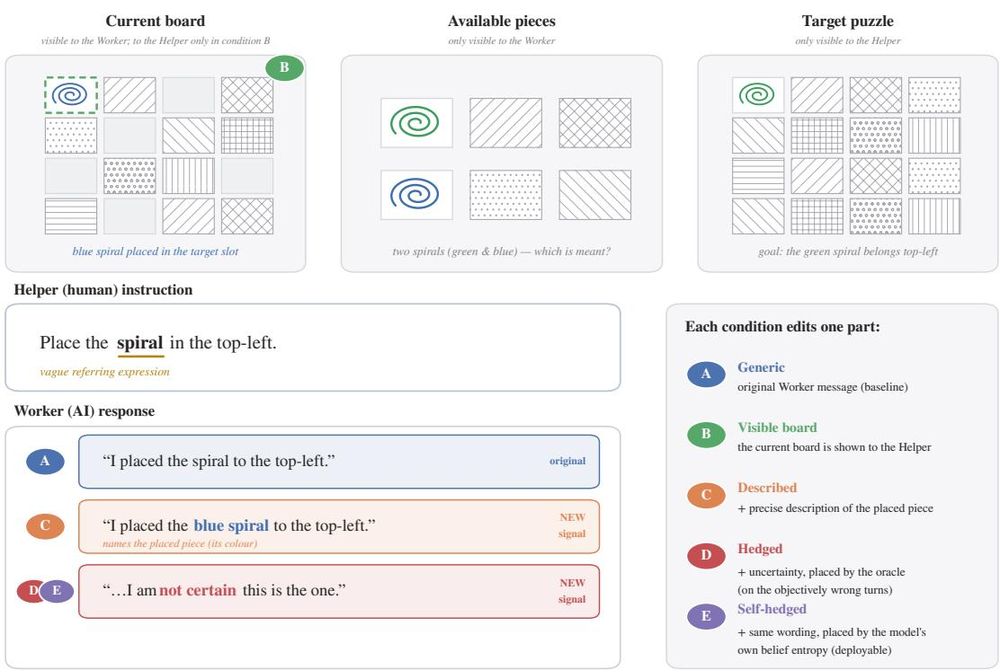  
Fig. 1. The collaborative puzzle task and the human study conditions. The partners hold asymmetric information: the Worker (AI) sees the current board and all 24 available pieces but not the target, whereas the Helper (human) sees the target patern but neither the pieces nor—by default—the Worker’s board. The Helper gives a referring instruction and the Worker selects, places a piece, and replies with a message (here, a blue spiral placed in the target slot). Each condition changes exactly one element of this same turn. Four vary only the Worker’s message while the board stays hidden: Generic (A) is the original message; Described (C) appends a precise description of the placed piece; and Hedged (D) and Self-hedged (E) additionally append an expression of uncertainty—inserted b an oracle on the objectivel wron turns (D) or, in the de lo able variant, from the Worker’s own belief entro (E). The fifth condition, Visible board, keeps the Generic message but reveals the Worker’s board to the Helper—the shared-view control (A/shared) Holding the turn fixed and varying only the message or the board’s visibility isolates how each externalized signal shapes the Helper’s perceived confidence, error detection, and willingness to act.

Primary comparison family. The Generic condition presents the original Worker messages without revealing the Worker’s board. The Described condition adds a precise description of the piece actually selected, allowing to compare that selection with the Helper’s instruction. The Hedged condition adds explicit uncertainty cues to the detailed descriptions. These cues are oracle-targeted i.e., ground-truth correctness is used to place hedges on a subset of incorrect selections, covering approximately half of the incorrect turns. Finally, the Visible board condition retains the original messages but reveals the Worker’s workspace.

Together, these conditions distinguish the efects of informative descriptions, targeted uncertainty cues, and direct visual access. Oracle-targeted hedging is an experimental intervention rather than a deployable policy, because it requires knowledge of whether a selection is incorrect.

Secondary exploratory comparison family. The Self-hedged condition uses the same hedge wording as Hedged, but selects turns usin the Worker’s se aratel elicited belief entro rather than round-truth correctness. It therefore tests a model-derived alternative that could be applied without access to the intended referent. Concretely, the hedge is placed whenever the Worker’s elicited belief entropy exceeds a fixed threshold.

## 4.2 Dependent Variables

For each rated Worker turn, participants report:

• Correctness likelihood (0–100): how likely it is that the Worker selected the intended piece.

• Apparent confidence (0–100): how confident the Worker sounds.

• Intended action: proceed/accept, change/undo, ask the Worker to explain or verify, or provide a more-specific instruction.

Correctness likelihood and apparent confidence measure distinct judgments. A participant may perceive a response as confident without believing that it is correct. See Appendix Fig. 14 for the grading UI.

We summarize responses at the participant level and report additionally rating discrimination and action discrimination as described in Section A.3 .

Additional measures include participant-level mean ratings, the distribution of intended actions, and questionnaire responses about prior attitudes toward AI and the perceived quality of the interaction. We assess discrimination using participant-level AUC and calibration using correctness ratings rescaled to [0, 1].

## 4.3 IRB

The study protocol was reviewed and approved by the relevant Institutional Review Board (IRB). All participants provided informed consent and received a post-study debrief explaining the experimental conditions, including any modifications made to the AI-generated dialogue.

## 4.4 Participants

We recruited participants through Prolific (https://www.prolific.com). Eligible participants were at least 18 years old, resident in the United Kingdom, and fluent in English, with no self-reported language-related, visual, or cognitive impairments. After excluding returned, timed-out, and rejected submissions (37 returned, 1 timed out, 2 rejected), 210 participants completed the study (based on a power analysis) and were retained for analysis (107 male, 101 female, 2 undisclosed). Their ages ranged from 18 to 76 years (mean 37.5, median 35) Each participant was randomly assigned to a single condition, yielding 41–43 participants per condition (Generic 41, Described 42, Hedged 42, Visible board 43, Self-hedged 42; Table 19). The median completion time was about 24 minutes, and participants were compensated through Prolific in line with the platform’s recommended rates. All participants provided informed consent before starting and were debriefed afterwards. We compensated the participants with GBP 12.5/hour.

## 4.5 Materials and Procedure

The study was administered as a web-based grading task linked from Prolific (see Appendix Fig. 14). After providing consent, participants read instructions describing the collaborative puzzle, the Helper’s perspective they would adopt, and the three judgements they would make; they then evaluated a sequence of recorded Worker turns and finally completed a short questionnaire on demographics and prior attitudes toward AI (Table 20). Each rated stimulus showed the flattened Helper–Worker interaction up to a single Worker response, drawn from the first two trials of the benchmark’s non-shared-view sessions; for that response the participant reported the correctness likelihood, the apparent confidence, and an intended action (see Section 4.2, Appendix Fig. 14). Across conditions we varied only the Worker’s message or the visibility of its board (see Table 1), and each participant remained in a single condition throughout.

Table 2. The three confidence signals for the same commited GPT-4.1 placement (image, on-policy; � = 554 acted turns with ground truth). All signals score the placed piece, so placement accuracy is shared; we report how well each signal’s confidence tracks correctness. AUROC is discrimination (higher beter); ECE and Brier are calibration (lower beter). �★=16.5 is the global temperature.
<table><tr><td>Confidence signal</td><td>Acc. (%)</td><td>Mean conf.</td><td>AUROC ↑</td><td>ECE↓</td><td>Brier ↓</td></tr><tr><td>Raw log-prob</td><td>53.43</td><td>0.973</td><td>0.644</td><td>0.442</td><td>0.439</td></tr><tr><td>Calibrated log-prob  $( T ^ { \star } { = } 1 6 . 5 )$ </td><td>53.43</td><td>0.531</td><td>0.623</td><td>0.157</td><td>0.271</td></tr><tr><td>Elicited belief</td><td>53.43</td><td>0.547</td><td>0.648</td><td>0.152</td><td>0.253</td></tr></table>

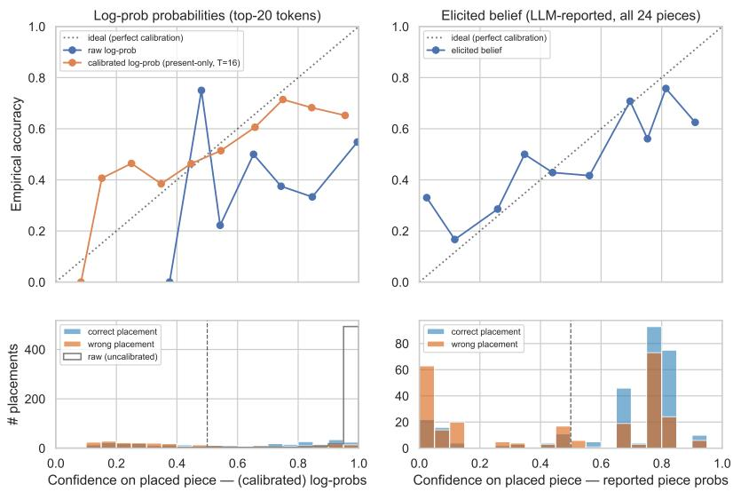  
Fig. 2. Reliability curves for the uncertainty signals: (Right) Raw action-token probabilities are over-confident; temperature scaling reduces the gap. (Left) The separately elicited belief provides the strongest combined discrimination and calibration. (Botom) Distribution of confidence on the placed piece, split by whether the placement was correct or wrong.

## 5 Measuring Accuracy and Calibration of Referential Uncertainty

We test and measure candidate uncertainty signals that could be used as deployable Self-hedged policy. We first ask whether the model represents, and can express, referential uncertainty. To answer this, we extract three signals that score the same committed placement: the raw log-prob (raw action-token log-probabilities of the placed piece-id token), the calibrated log-prob (the same log-probabilities after ground-truth-calibrated temperature scaling), and the elicited belief (a separately elicited, self-reported confidence distribution over all available pieces). See Section A.4 for details.

We measure the correctness of the placed piece by the AI worker, given the intended referent (ground truth) and the confidence in the referents using the above signals. We measure the following metrics of confidence calibration: AUROC; ECE; Brier score (see Appendix Section A.4).

All three signals discriminate correct from incorrect placements above chance $( \mathrm { A U R O C } = 0 . 6 4 4 , 0 . 6 2 3$ , and 0.648 for raw, calibrated, and elicited belief, respectively (see Table 2); $p < 1 0 ^ { - 7 } , p < 1 0 ^ { - 6 }$ , and $ { p } < 1 0 ^ { - 9 } )$ . This shows that the model carries information about whether its referential choice is correct

The elicited belief is numerically the strongest discriminator, but the pairwise gaps are small and not significant—it sits $\Delta \mathrm { A U R O C } = + 0 . 0 2 5$ above the calibrated log-probability $( 9 5 \% \mathrm { C I } \left[ - 0 . 0 2 , 0 . 0 8 \right] , p = . 2 6 )$ and $\Delta \mathrm { A U R O C } = + 0 . 0 0 3$ above the raw log-probability $( 9 5 \% \thinspace \mathrm { C I } \left[ - 0 . 0 3 , 0 . 0 7 \right] , p = . 4 1 )$ —it is, however, the only signal that pairs this discrimination with good calibration (overconfidence +0.01, 95% CI [−0.03, 0.05]; ECE = 0.15), and the only one available for the models that expose no token log-probabilities, see Fig. 2.

The raw action-token probabilities are severely overconfident (mean confidence 0.97 vs. 53% accuracy; overconfidence $+ 0 . 4 4 , 9 5 \% \mathrm { C I } \left[ 0 . 4 0 , 0 . 4 8 \right] )$ . Temperature scaling removes this $( T ^ { \star } = 1 6 . 5 ;$ overconfidence ≈ 0) but gives the numerically lowest discrimination $( \mathrm { A U R O C } = 0 . 6 2 3 ) ^ { 3 }$ . Still, being better calibrated is not the same as being useful in this case — the calibrated log-prob’s correct and wrong distributions are nearly indistinguishable, while the elicited belief additionally separates them.

For the remaining analyses, we use the separately elicited belief distribution. It combines better calibration than raw action-token probabilities with stronger discrimination than either raw or temperature-scaled probabilities. It also provides a consistent uncertainty measure across models, we do not require access to token-level log-probabilities, which are not exposed by all model APIs and are unavailable for GPT-5 and GPT-5.5 in our setup.

Next, we perform a systematic analysis on the sensitivity of the elicited confidences over specific levels of uncertainty about the referents. To compare models without collecting new live interactions, we replay individual decision points using a single prompt. See Appendix Section A.5.

## 6 Robustness Analysis - Task Dificulty and Referential Uncertainty

We are testing how sensitive the elicited uncertainties from the models are to diferent levels of vagueness in both Helper instructions and board context. We test: (a) influence of the modality of the context (images vs. textual description); (b) instruction specificity (unambiguous to vague); (c) board confusability (no alternative matching target pieces vs. a group of ambiguous pieces to the target).

## 6.1 Context Modality

In the original puzzle task [25], the puzzle context was added to the model context as byte-64 encoded png-image (needed visual encoding which might additional challenges for the model to express and act on uncertainty). We reproduced the original study using the single prompts with collated conversation (as described above) using an explicit textual description of the puzzle boards and pieces instead of the images (see Appendix Fig. 10). We compare this with the image encoded results across diferent models using the original dialogues.

Replacing the rendered board and pieces with an explicit textual description improves accuracy for the two earlier models: on turns where the model committed a placement under both modalities, GPT-4.1 rises from 52.9% to 66.0%, and GPT-5 from 58.4% to 71.7% (both $\textstyle p < 0 . 0 0 1 )$ ). GPT-5.5 is more modality-robust, with no significant diference (66.7% vs. $7 0 . 1 \% , p = 0 . 1 6 )$

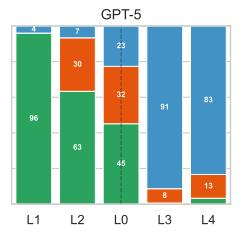

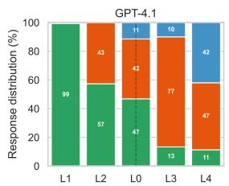

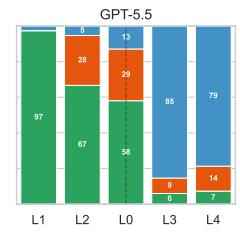

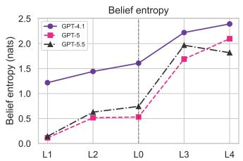  
Fig. 3. Instruction specificity (image modality) results per model. (left) stacked outcome composition of Worker response (correct piece / wrong piece / no-action) at each specificity level from overspecified (L1) to vague (L4), with the original uterance (L0) placed between L2 and L3 as the baseline (dashed); the right panel shows mean belief entropy. Accuracy falls and belief entropy rises with vagueness for all models.

The models difer in how often they act i.e, place a piece at all. GPT-4.1 and GPT-5.5 place a piece on the large majority of instructed turns under both modalities (∼ 85–90%), whereas GPT-5 produces a no-action far more often, and even more under text (23% of turns for images vs. 34% for text). We report the no-action rate here only descriptively and defer the analysis of how models ask for clarification to Section 7.

The diferences on the elicited belief-entropy diferences are small and do not track the accuracy gain. GPT-4.1 is slightly more uncertain under images than text (1.74 vs. 1.56 nats; Wilcoxon $p < 0 . 0 0 1$ , rank-biserial $r = 0 . 3 6 )$ , consistent with text being the easier encoding; GPT-5, despite being more accurate under text, is marginally more uncertain here (0.78 vs. 0.84 nats; $p < 0 . 0 0 1 , r = - 0 . 2 3 )$ ; and GPT-5.5 shows no diference $( p = 0 . 6 2 )$ . Hence, the modality that yields the better placements is not reliably the one with lower elicited uncertainty. (See also Appendix Fig. 9).

## 6.2 Instruction Specificity

Next, we study the efects on the elicited referential uncertainty on how specific the user instructions (Helper) are. For each Helper turn which resulted in the Worker to place a piece in the puzzle task benchmark [25], we rephrase what the Helper said with a specific level of specificity from overspecified (L1) to vague (L4), with (L0) the original Helper instruction (See Appendix Table 12 for more details and Table 13 for the templates used to generate the specific instruction.).

Across all three models and both modalities (see Fig. 3 for images and Appendix Fig. 11 for text), referential accuracy falls and elicited belief entropy rises monotonically as the instruction becomes vaguer; every trend is significant at $p < 0 . 0 0 1$ (see also Appendix Table 14). Coverage—the share of instructed turns on which the model commits a placement—also decreases significantly, i.e. the models increasingly produce a no-action rather than guess; we analyse this behaviour in Section 7.

For GPT-4.1, each step toward vagueness costs about 21 points of accuracy $( b \ : = \ : - 2 1 . 2 , \ : 9 5 \% \ : \mathrm { C I } \ : [ - 2 2 . 9 , - 1 9 . 6 ]$ $t ( 2 4 ) = - 2 4 . 9 , p < 0 . 0 0 1 )$ and adds about 0.31 nats of belief entropy $( b = + 0 . 3 1 3$ , 95% CI [0.275, 0.351], $t ( 2 4 ) = 1 6 . 0 ,$ $\textstyle p < 0 . 0 0 1 )$ . The newer models register the same vagueness more through withholding: their coverage drops roughly 24 points per step (vs. 9 for GPT-4.1), and their entropy rises about 0.5 nats per step (vs. 0.31).

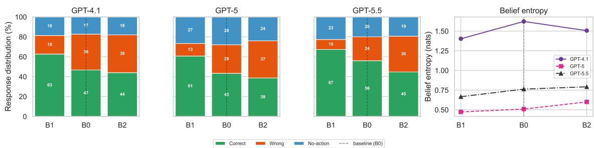  
Fig. 4. Board confusability (image modality) results per model. (left) stacked outcome composition of Worker responses (correct piece / wrong piece / no-action) and (right) mean belief entropy on a distinct board (B1), the original board (B0), and a confusable board (B2), in order of increasing confusability. Accuracy falls sharply while no-action and belief entropy barely move.

<table><tr><td></td><td>argmax switches</td><td>in cluster</td><td>∆peak on switch</td><td>∆peak when kept</td></tr><tr><td>image</td><td>38%</td><td>79%</td><td>-0.07</td><td>-0.06</td></tr><tr><td>text</td><td>46%</td><td>58%</td><td>-0.12</td><td>-0.16</td></tr></table>

Table 3. The belief peak relocates onto the same cluster. The argmax switches on 38%/46% of turns (image/text) between the distinct (B1) and confusable (B2) boards; of these, 79%/58% land inside the confusable cluster (vs. ∼15% chance, binomial $ { p ^ { < 1 0 ^ { - 4 5 } ) } }$ . The peak-height drop is the same whether the argmax switched or was kept $( \Delta _ { \mathrm { s w i t c h } } \approx \Delta _ { \mathrm { k e p t } } )$ , so switching to a look-alike carries no extra loss of confidence.

## 6.3 Board Confusability

Finally, we test the efect of confusability of the puzzle pieces with the target. We design two new board configurations for each target piece: (B1) only distinct pieces to the target pieces on the board; (B2) a set of clear similar pieces to the target on the board; and (B0) the original board. See Appendix Fig. 12 for an illustration.

Confusability sharply reduces accuracy—by 12 to 25 points per step from the distinct to the confusable board for every model and modality (all $p < 0 . 0 0 1 ;$ See Appendix Table 15)—a decline comparable to instruction vagueness. Unlike vagueness, this is barely present in the model’s expressed uncertainty. Coverage shows no significant trend for any model (the sole exception being a small decrease for GPT-5.5 in with text modality; see Appendix Fig. 13), so confusability does not prompt the models to withhold a placement, in contrast to the steep coverage drop unde vagueness. Belief entropy does rise, but only by 0.05 to 0.19 nats per step—roughly a fifth of the vagueness efect—though significantly for all three models.

We observed that errors climb with confusability while belief entropy barely moves. We therefore ask where the probability mass goes when similar referents are added to the board. Rather than spreading its belief across the confusable set of similar referents—which would raise entropy—the model relocates its peak onto a single competing piece from that set.

Comparing the confusable board (B2) with the distinct board (B1) on the same turns, the belief argmax switches on 38% of turns for images and 46% for text; of these switches, 79% (image) and 58% (text) land on a same-family cluster, far above the 15% rate expected by chance (binomial $p < 1 0 ^ { - 4 5 } ;$ ; Table 3). The peak itself stays tall: its height falls only modestly (more so in text) and by a comparable amount whether the argmax moved or was kept $( \Delta _ { \mathrm { s w i t c h } } \approx \Delta _ { \mathrm { k e p t } } )$ , so the model commits to the wrong look-alike almost as confidently as to the target.

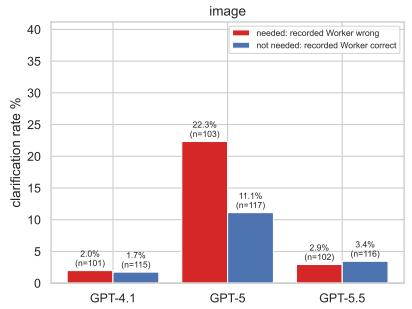

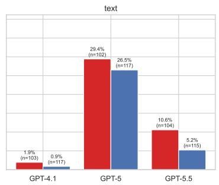  
Fig. 5. Clarification rates on turns with incorrect piece selected (could benefit from clarification) and correct select piece (would not benefit from clarification) across models model.

Because the placement follows the argmax, this one-slot shift turns a correct placement into a wrong one while the belief remains peaked—explaining why accuracy falls sharply yet entropy hardly rises.

## 7 Externalizing of Referential Uncertainty

In the previous experiments, we saw that the models do not always perform an action and that there is a trend towards no-action with increasing level of ambiguity in the user instructions. In contrast, we did not observe the same trend on the level of ambiguity in the amount the referents. Next, we inspect if and how these no-actions are expressing uncertainty and whether they ask for clarification. We check if they are generic hedges or specific questions targets on the piece with ambiguity

## 7.1 Clarification Behaviour

First, we measure how often the models ask a clarification question at each turn with a Helper instruction to place a piece. Using the ground truth pieces, we also compare to the recorded Worker’s placements and check if a question here would have possibly helped in the original study. Hence, we measure whether the model would have made a better decision and rather ask than place. (GPT4.1 places a piece almost all the time in the original study.) To measure if a model asked a question, we first filter for all responses which are not an action to place a piece. Further, we use GPT5.5 to label the response as clarification question (see Appendix for the prompts).

We observe diferent numbers of clarification across models and modality (see Fig. 5) GPT-5 asks by far the most clarifications. It asks for clarification in 16.7% of image turns and 23.8% of text turns, versus 3.5%/1.6% for GPT-4.1 and 6.2%/8.8% for GPT-5.5 (See Appendix Table 16). Almost all are explicit questions that name the confusable piece rather than generic hedges (hedging is < 1% for every model).

Taking the recorded Worker’s placement as the proxy for when a question would have helped (see Appendix Table 17), GPT-5’s clarifications in image pieces concentrate significantly on erroneous turns—22.3% where the Worker placed the wrong piece versus 11.1% where it was correct $( p = 0 . 0 2 0 )$ . On text pieces, however, the clarification rate is not significantly diferent (29.4% vs. 26.5%, $p = 0 . 3 7 )$ . GPT-4.1 and GPT-5.5 ask clarifications too rarely to show reliable targeting in either modality $\left( p \ge 0 . 1 1 \right)$

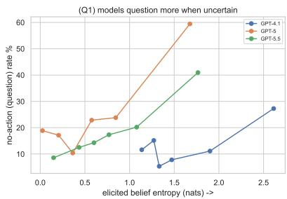

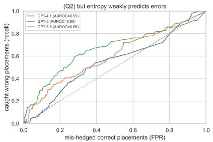  
Fig. 6. Elicited uncertainty as an externalization signal (image modality). (Left) the no-action (question) rate rises with the model’s own elicited belief entropy for all three models—they question more when their belief is more spread out. (Right) ROC of the rule “hedge if belief entropy $\geq \tau ^ { \mathfrak { n } }$ for predicting the model’s own wrong placements (scored vs. ground truth piece); all three curves sit close to the diagonal (AUROC 0.55–0.66), so belief entropy is only a weak error predictor. Models externalize uncertainty in proportion to a signal that is itself too weak to cleanly trigger a hedge.

Table 4. Comparison of GPT-4.1’s elicited referential belief between the full set of turns and the subset used in this user study.
<table><tr><td>Turn set</td><td>n</td><td> $\operatorname { A c c . } \ ( \% )$ </td><td>AUROC↑</td><td>ECE↓</td><td>Brier ↓</td></tr><tr><td>All turns</td><td>554</td><td>53.4</td><td>0.648</td><td>0.152</td><td>0.253</td></tr><tr><td>Study turns</td><td>228</td><td>36.4</td><td>0.5</td><td>0.207</td><td>0.267</td></tr></table>

## 7.2 Natural-Turn Error Prediction and Hedge Triggering

The results above show two things: First, models do externalize uncertainty on the turns where they decide to act (see left Fig. 6): the no-action rate rises with elicited belief entropy, and entropy is reliably higher on question turns than on placement turns (point-biseria $r = 0 . 1 8 – 0 . 3 9 .$ , all $p < 1 0 ^ { - 4 } ;$ ; see Appendix Table 18).

Second, that signal is a weak error predictor (see right Fig. 6). On turns where the model does act, belief entropy separates its wrong from its correct placements only weakly (AUROC 0.55–0.66). A rule that hedges whenever entropy exceeds its median would catch $5 7 - 6 8 \%$ of wrong placements but mis-hedge 41–48% of correct ones, with precision barely above the base error rate. Elicited confidence is thus a genuine but weak externalization signal: models ask in proportion to it, yet it is too coarse to serve as a reliable hedge trigger.

What ultimately matters, however, is the human Helper’s perception. We therefore turn to the human Helper and ask whether communicating this uncertainty—together with more informative piece descriptions—helps a partner tell correct from incorrect placements and act on them, and whether the model’s own weak self-signal is suficient or an oracle-targeted hedge is required.

## 8 Human Perception on Confidence and Correctness

We conducted a between-subject study where we presented participants an interaction history for the puzzle tasks up to a current turn with a Worker’s response for a Helper’s instruction to place a piece.

We restrict the study to original puzzle tasks which did not share the puzzle board and hence the Helper did not see the Worker’s actions. This was more challenging than the shared view since the Helper (could/did) not correct the Worker. Further, we only grade the first two puzzles. On these puzzle tasks the accuracy on the pieces was only 36%, compared to the 53% on all tasks. See Table 4 for comparison.

Table 5. Human study results per-condition (participant means; � = 210: 168 in the four primary conditions plus 42 in the exploratory Self-hedged condition). More detailed and hedged messages lower the perceived correctness and—only under hedging—apparent confidence; ratin and action discrimination (correct−wron ) rise in the Hed ed condition, com ared to the Generic condition, with similar results as in the Visible condition; Self-hedged condition does not show this similarly.
<table><tr><td></td><td>Generic</td><td>Described</td><td>Hedged</td><td>Visible board</td><td>Self-hedged</td></tr><tr><td>Perceived correctness (0–100)</td><td>77.6</td><td>67.3</td><td>56.1</td><td>53.7</td><td>61.5</td></tr><tr><td>Apparent confidence (0-100)</td><td>85.5</td><td>85.7</td><td>58.5</td><td>83.3</td><td>56.6</td></tr><tr><td>Rating discrimination (corr.-wrong)</td><td>-0.1</td><td>16.8</td><td>27.7</td><td>26.6</td><td>8.8</td></tr><tr><td>Accept correct moves (%)</td><td>79.0</td><td>78.6</td><td>73.7</td><td>64.8</td><td>60.1</td></tr><tr><td>Accept wrong moves (%)</td><td>78.3</td><td>57.1</td><td>36.4</td><td>30.1</td><td>50.2</td></tr><tr><td>Action discrimination (pp)</td><td>0.7</td><td>21.5</td><td>37.3</td><td>34.8</td><td>10.0</td></tr></table>

For the Self-Hedged condition, we use a threshold � such that � > �, with �=1.34 nats. We fix � by rate matching on GPT-4.1’s original turns: � is set so that the hedge-firing rate (51%) matches the empirical wrong-placement rate (52%), letting the deployable self-hedge placing the hedge on about as many turns as the oracle without using ground truth—but, because belief entropy is only a weak error signal (Section 7.2), at much lower precision (its flagged-turn counts are in Table 7).

## 8.1 Within Condition Results

As the Worker was correct on only ≈ 36% pieces, a well-calibrated Helper should discriminate sharply and often decline to proceed. In the Generic condition, we observe neither. Graders rate nearly every placement as likely correct (77.6/100) and highly confident (85.5), accept 78.3% of wrong moves, and shows no discrimination (rating gap −0.1; action gap 0.7 pp). See Table 5 for more details

A precise description (in condition Described) lowers perceived correctness to 67.3 and lowers wrong-move acceptance by 21.2 pp (to 57.1%), with an increase in rating and action discrimination to 16.8 and 21.5 pp. On the other hand, the apparent confidence does not change (85.7). Hence, the description can convey what was placed, not how sure the Worker is. Only the two hedged conditions reduce the apparent confidence (in condition Hedged to 58.5; in condition Self-hedged to 56.6).

The Hedged condition is the strongest, excluding the shared-view on the board, reducing wrong-move acceptance to 36.4% and increasing rating and action discrimination to 27.7/37.3 pp—matching the Visible board condition results (26.6/34.8 pp; 30.1% wrong accepted), despite the human never seeing the board—at only a modest cost on correct moves (accept-correct 73.7% vs. 78.6%). The Self-hedged condition shows the same low-confidence (56.6) but the graders still accept 50.2% of wrong moves and discriminate weakly (8.8/10.0 pp), close to the Generic/Described floor. (See Appendix Table 19 for individual results.)

## 8.2 Between Condition Results

We report participant-mean contrasts with the Generic condition as reference in Table 6. Relative to the Generic condition, in the Described condition, rating discrimination increased by 16.9 points (95% CI [8.7, 25.4]) and action discrimination by 20.7 pp. Wrong-move acceptance was reduced by 21.2 pp (about 27%). All three efects are statistically significant; on the other hand the confidence perception is unchanged (+0.2, n.s.).

Comparing the Hedged condition with the Described condition, perceived confidence reduces by 27.3 points (95% CI [−33.1, −21.3], � < .001) and wrong-move acceptance reduces by 20.7 pp $( p = . 0 4 9 )$ —both efects are statistically significant, but only the improvement in action discrimination (+15.9 pp) is significant within outcome, while the rating-discrimination gain (+10.9 points) is not significant.

Table 6. Study results on pairwise contrasts: participant-mean diferences Δ (positive = first condition higher). Accept-wrong and action discrimination are in percentage points; correctness, apparent confidence and rating discrimination are in rating points. Holm is corrected within each family over the 10 behavioural decision outcomes (60 primary / 40 secondary tests); the questionnaire and validit /randomisation checks are corrected/re orted se aratel . Bold = survives the lobal (within-famil ) Holm correction; ∗ = si nificant under within-outcome Holm but not lobal; unmarked = n.s. 95% bootstra CIs for the headline efects are in the text.
<table><tr><td>Contrast</td><td>Correctness</td><td>Perceived conf.</td><td>Rating discr.</td><td>Accept-wrong (pp)</td><td>Action discr. (pp)</td></tr><tr><td colspan="6">Primary family</td></tr><tr><td>Described – Generic</td><td>-10.3*</td><td>0.2</td><td>16.9</td><td>-21.2</td><td>20.7</td></tr><tr><td>Hedged – Described</td><td>-11.2*</td><td>-27.3</td><td>10.9</td><td>-20.7</td><td>15.9*</td></tr><tr><td>Hedged – Visible board</td><td>2.4</td><td>-24.9</td><td>1.1</td><td>6.3</td><td>2.6</td></tr><tr><td>Visible board – Generic</td><td>-23.9</td><td>-2.2</td><td>26.8</td><td>-48.3</td><td>34.1</td></tr><tr><td colspan="6">Secondary family (Self-hedged)</td></tr><tr><td>Self-hedged – Hedged</td><td>5.3</td><td>-1.9</td><td>-19.0</td><td>13.8*</td><td>-27.3</td></tr><tr><td>Self-hedged – Described</td><td>-5.8</td><td>-29.1</td><td>-8.1</td><td>-6.9</td><td>-11.5</td></tr></table>

The Hedged condition matches the Visible-board condition on decision quality but not on perceived confidence. The Hedged condition and the Visible board condition are indistinguishable on every decision-quality outcome (correctness: $p = . 5 6 ;$ rating discrimination: $p = . 8 6 ;$ accept-wrong: $p = . 3 1 ;$ action discrimination: $p = . 7 5 )$ , yet we observe 24.9 fewer points of perceived confidence (95% CI [−30.7, −18.9], � < .001 globally) in the Hedged condition. Board access itself (Visible board versus Generic) improves all four decision-quality outcomes (all statistically significant) but leaves apparent confidence unchanged (−2.2, n.s.).

The apparent confidence in the Self-hedged condition is comparable to the Hedged condition $( - 1 . 9 , p = . 5 1 )$ and is 29.1 points lower than in the Described condition $( p < . 0 0 1 )$ . Relative to the Hedged condition, in the Self-hedged condition we observe a 19.0 points lower rating discrimination and 27.3 pp lower action discrimination (both statistically significant) and a 13.8 pp increase in acceptance of wrong moves. Relative to the Described condition, the discrimination is not a statistically significant diference (rating: −8.1, � = .09; action: −11.5 pp, � = .14).

## 8.3 Hedging Mechanism

We report comparison results of the two hedging conditions side by side, each scored against the Described condition on the turns that are hedged in Table 7.

In the Hedged condition, (oracle flags) we put hedge exactly on wrong turns and acceptance falls 59% → 34% (−24.8 pp, Holm $p { = } . 0 1 4 ;$ resulting in a 50-point decrease in perceived confidence and 17-point decrease in correctness estimation (all statistically significant). The correct turns are not efected $( 7 9 \%  7 4 \% , \mathrm { n . } s . )$ . Note, the false-alarm row is empty as the oracle flags 36 wrong and 0 correct turns.

In the Self-hedged condition, we use the above described belief-entropy to hedge. At 69% precision (see above) the hedges mirror this: on the errors it catches, the acceptance discount is weaker and not significant (57% compared to 41%, −15.8 pp, �=.22) and on the correct turns it wrongly flags, acceptance reduces from $8 7 \%  4 9 \% ( - 3 7 \mathrm { p p } )$ . On the the error the hedge misses acceptance increase (56%→62%)

None of the diference between the Described and the Self-hedged conditions are significant—acceptance falls −15.8 pp (�=.22) on the errors the self-hedge flags and $- 1 8 . 4 \mathrm { p p } \left( p = . 0 9 \right)$ on correct turns overall (the flagged-correct false alarms alone show a descriptive −37 pp drop). So the misplaced hedge reduces the confidence estimation (desired) and the correctness estimation (undesired). Hence, its discrimination is similar to the Described condition, unlike the Hedged condition.

Table 7. Ratings by turn type for the two hedging designs, each scored against Described on the turns that design flags. Hedged flags by the oracle (objectively wrong turns; 36 wrong / 0 false alarms, precision 100%); Self-hedged flags from the Worker’s own belief entropy (29 wrong / 13 false alarms, precision 69%). Turn type crosses whether the design flagged the turn with whether the Worker was actually correct; acceptance is in percentage points, apparent confidence and correctness rating in 0–100 points. Described appears in both blocks because each restricts to that design’s flagged-turn set, and the oracle’s false-alarm row is empty by construction. Confirmatory contrasts are participant-level permutation tests, Holm-corrected within family (the oracle contrast also passes an exact dialogue-level sign-flip test); the isolated false-alarm sub-row is descriptive. Efect sizes, 95% CIs, and �-values are re orted in the text.
<table><tr><td rowspan="2">Turn type × outcome</td><td colspan="2">Oracle targeting (Hedged)</td><td colspan="2">Self targeting (Self-hedged)</td></tr><tr><td>Described</td><td>Hedged</td><td>Described</td><td>Self-hedged</td></tr><tr><td colspan="5">Flagged wrong (caught error)</td></tr><tr><td>Apparent confidence</td><td>86.5</td><td>36.3</td><td>86.3</td><td>33.6</td></tr><tr><td>Correctness rating</td><td>63.4</td><td>46.1</td><td>61.5</td><td>51.9</td></tr><tr><td>Acceptance (%)</td><td>59</td><td>34</td><td>57</td><td>41</td></tr><tr><td colspan="5">Flagged correct (false alarm)</td></tr><tr><td>Apparent confidence</td><td></td><td></td><td>87.5</td><td>35.2</td></tr><tr><td>Correctness rating</td><td></td><td></td><td>81.9</td><td>59.3</td></tr><tr><td>Acceptance (%)</td><td></td><td></td><td>87</td><td>49</td></tr><tr><td colspan="5">Unflagged wrong (missed error)</td></tr><tr><td>Apparent confidence</td><td>85.0</td><td>69.9</td><td>86.5</td><td>78.8</td></tr><tr><td>Correctness rating</td><td>55.9</td><td>41.5</td><td>61.1</td><td>67.3</td></tr><tr><td>Acceptance (%)</td><td>51</td><td>37</td><td>56</td><td>62</td></tr><tr><td colspan="5">Unflagged correct (left alone)</td></tr><tr><td>Apparent confidence</td><td>88.6</td><td>77.9</td><td>90.0</td><td>81.8</td></tr><tr><td>Correctness rating</td><td>78.3</td><td>73.4</td><td>75.1</td><td>73.4</td></tr><tr><td>Acceptance (%)</td><td>79</td><td>74</td><td>69</td><td>72</td></tr></table>

## 9 Conclusion

We studied referential uncertainty—uncertainty over which object a description refers to—in a collaborative puzzle task, decomposing it into four capabilities: the Worker identifying and communicating this uncertainty, and the Helper recognizing and acting on it.

On the representation side, the models are capable. A separately elicited belief distribution over candidate pieces is better calibrated and more discriminative of correct from incorrect placements than raw action-token probabilities, which are severely over-confident (Section 5, Table 2). This elicited uncertainty tracks controlled task dificulty: it increases as instructions become more vague (Section 6.2), while context modality (visual vs. textual) has only small, model-dependent efects (Section 6.1). It is not uniformly sensitive, however: confusable alternatives sharply raise error while barely moving the elicited uncertainty (Section 6.3), because the belief peak relocates onto a single lookalike rather than spreading out.

On the communication side, they fall short. The models seldom ask for clarification or hedge, even when their error rate would warrant it, instead echoing the Helper’s brevity (Section 7.1). Their own belief entropy is a genuine but weak per-turn error predictor (AUROC 0.55–0.66; Section 7.2), so a simple “hedge when entropy is high” rule is not yet a deployable policy.

These signals are what human partners need. In a controlled study, participants given only the generic Worker message accept most wrong placements and cannot tell correct from incorrect; precise piece descriptions and, especially, well-targeted hedges restore discrimination and roughly halve wrong-move acceptance, matching a fully visible board without ever revealing it (Table 5). The benefit, though, depends on which turns are hedged: a deployable self-hedge derived from the model’s own belief entropy inherits that signal’s weakness and can do more harm than good, also drawing attention to correctly placed pieces.

The bottleneck is therefore not uncertainty estimation alone but the quality and targeting of the uncertainty that is externalized. Future work should therefore pursue two complementary directions: fine-tuning to better calibrate the elicited belief [20, 21], and techniques that adapt when to externalize it [18]—drawing on more than raw entropy, such as the full belief distribution, candidate margins, instruction ambiguity, and context confusability. Throughout, correctness must be scored against the intended referent rather than the worker’s observed placement.

## References

[1] Shoshana Altschuller and Raquel Benbunan-Fich. 2010. Trust, performance, and the communication process in ad hoc decision-making virtual teams. Journal ofComputer-Mediated Communication 16, 1 (2010), 27–47.

[2] Gagan Bansal, Tongshuang Wu, Joyce Zhou, Raymond Fok, Besmira Nushi, Ece Kamar, Marco Tulio Ribeiro, and Daniel Weld. 2021. Does the whole exceed its parts? the efect of ai explanations on complementary team performance. In Proceedings ofthe 2021 CHI conference on human factors in computing systems. 1–16.

[3] Susan E Brennan and Herbert H Clark. 1996. Conceptual pacts and lexical choice in conversation. Journal of experimental psychology: Learning, memory, and cognition 22, 6 (1996), 1482.

[4] Herbert H. Clark and Susan Brennan. 1991. Grounding in communication. In Perspectives on socially shared cognition. https://api.semanticscholar. org/CorpusID:153811205

[5] Herbert H. Clark and Deanna Wilkes-Gibbs. 1986. Referring as a Collaborative Process. Cognition 22, 1 (1986), 1–39.

[6] Herbert H. Clark and Deanna Wilkes-Gibbs. 1986. Referring as a collaborative process. Cognition 22, 1 (1986), 1–39. doi:10.1016/0010-0277(86)90010-7

[7] Sebastian Farquhar, Jannik Kossen, Lorenz Kuhn, and Yarin Gal. 2024. Detecting Hallucinations in Large Language Models Using Semantic Entropy. Nature 630 (2024), 625–630.

[8] Tom Fawcett. 2006. An Introduction to ROC Analysis. Pattern Recognition Letters 27, 8 (2006), 861–874. doi:10.1016/j.patrec.2005.10.010

[9] Susan R Fussell and Robert M Krauss. 1992. Coordination of knowledge in communication: efects of speakers’ assumptions about what others know. Journal of personality and Social Psychology 62, 3 (1992), 378.

[10] W Brier Glenn et al. 1950. Verification of forecasts expressed in terms of probability. Monthly weather review 78, 1 (1950), 1–3.

[11] Chuan Guo, Geof Pleiss, Yu Sun, and Kilian Q Weinberger. 2017. On calibration of modern neural networks. In International conference on machine learning. PMLR, 1321–1330.

[12] Daya Guo, Dejian Yang, Haowei Zhang, Junxiao Song, Peiyi Wang, Qihao Zhu, Runxin Xu, Ruoyu Zhang, Shirong Ma, Xiao Bi, et al. 2025 Deepseek-r1: Incentivizing reasoning capability in llms via reinforcement learning. arXiv preprint arXiv:2501.12948 (2025).

[13] Saurav Kadavath, Tom Conerly, Amanda Askell, Tom Henighan, Dawn Drain, Ethan Perez, Nicholas Schiefer, Zac Hatfield-Dodds, Nova DaSilva, Eli Tran-Johnson, et al. 2022. Language Models (Mostly) Know What They Know. arXiv preprint arXiv:2207.05221 (2022).

[14] Sunnie SY Kim, Q Vera Liao, Mihaela Vorvoreanu, Stephanie Ballard, and Jennifer Wortman Vaughan. 2024. " I’m Not Sure, But...": Examining the Impact of Large Language Models’ Uncertainty Expression on User Reliance and Trust. In Proceedings of the 2024 ACM conference on fairness, accountability, and transparency. 822–835.

[15] Robert M Krauss and Sam Glucksberg. 1969. The development of communication: Competence as a function of age. Child development (1969), 255–266.

[16] Robert M Krauss and Sidney Weinheimer. 1966. Concurrent feedback, confirmation, and the encoding of referents in verbal communication. Journal of personality and social psychology 4, 3 (1966), 343.

[17] Lorenz Kuhn, Yarin Gal, and Sebastian Farquhar. 2023. Semantic Uncertainty: Linguistic Invariances for Uncertainty Estimation in Natural Language Generation. arXiv preprint arXiv:2302.09664 (2023).

[18] Dharshan Kumaran, Nathaniel Daw, Simon Osindero, Petar Veličković, and Viorica Patraucean. 2026. Causal evidence that language models use confidence to drive behaviour. Nature Machine Intelligence (2026), 1–15.

[19] ZhaoBin Li and Mark Steyvers. 2026. Learning to Trust: How Humans Mentally Recalibrate AI Confidence Signals. arXiv preprint arXiv:2603.22634 (2026).

[20] Stephanie Lin, Jacob Hilton, and Owain Evans. 2022. Teaching Models to Express Their Uncertainty in Words. Transactions on Machine Learning Research (2022). https://mlanthology.org/tmlr/2022/lin2022tmlr-teaching

[21] Gabrielle Kaili-Ma Liu, Avi Caciularu, Gal Yona, Idan Sz ektor, and Arman Cohan. 2026. Reinforcement Learnin with Metaco nitive Feedback Elicits Faithful Uncertainty Expression in LLMs. arXiv preprint arXiv:2606.32032 (2026).

[22] Charles Lovering, Michael Krumdick, Viet Dac Lai, Varshini Reddy, Seth Ebner, Nilesh Kumar, Rik Koncel-Kedziorski, and Chris Tanner. 2025. Language model probabilities are not calibrated in numeric contexts. In Proceedings of the 63rd Annual Meeting of the Association for Computational Linguistics (Volume 1: Long Papers). 29218–29257.

[23] Chris Madge, Matthew Purver, and Massimo Poesio. 2025. Referential ambiguity and clarification requests: comparing human and LLM behaviour In Proceedings ofthe Eighth Workshop on Computational Models ofReference, Anaphora and Coreference. 1–11

[24] Mahdi Pakdaman Naeini, Gregory Cooper, and Milos Hauskrecht. 2015. Obtaining well calibrated probabilities using bayesian binning. In Proceedings of the AAAI conference on artificial intelligence, Vol. 29.

[25] Christian Poelitz, Finale Doshi-Velez, and Siân Lindley. 2026. A Benchmark to Assess Common Ground in Human-AI Collaboration arXiv:2602.21337 [cs.HC] https://arxiv.org/abs/2602.21337

[26] Christian Poelitz and Nick McKenna. 2026. A Teacher-Student Approach to Creating Verified Synthetic Clarification and Correction Dialogues for TableQA Tasks. In Proceedings ofthe Fifteenth Language Resources and Evaluation Conference (LREC 2026), Vol. 11. 4199–4212.

[27] Amy Rechkemmer and Ming Yin. 2022. When confidence meets accuracy: Exploring the efects of multiple performance indicators on trust in machine learning models. In Proceedings of the 2022 chi conference on human factors in computing systems. 1–14.

[28] Max Schemmer, Niklas Kuehl, Carina Benz, Andrea Bartos, and Gerhard Satzger. 2023. Appropriate reliance on AI advice: Conceptualization and the efect of explanations. In Proceedings ofthe 28th international conference on intelligent user interfaces. 410–422

[29] Omar Shaikh, Kristina Gligoric, Ashna Khetan, Matthias Gerstgrasser, Diyi Yang, and Dan Jurafsky. 2024. Grounding Gaps in Language Model Generations. In Proceedings ofthe 2024 Conference ofthe North American Chapter ofthe Association for Computational Linguistics: Human Language Technologies (Volume 1: Long Papers) Kevin Duh Helena Gomez and Steven Bethard (Eds.). Association for Com utational Lin uistics Mexico Cit Mexico, 6279–6296. doi:10.18653/v1/2024.naacl-long.348

[30] Omar Shaikh, Hussein Mozannar, Gagan Bansal, Adam Fourney, and Eric Horvitz. 2025. Navigating Rifts in Human-LLM Grounding: Study and Benchmark. arXiv:2503.13975 [cs.CL] https://arxiv.org/abs/2503.13975

[31] Mark Steyvers, Heliodoro Tejeda, Aakriti Kumar, Catarina Belem, Sheer Karny, Xinyue Hu, Lukas W. Mayer, and Padhraic Smyth. 2025. What large lan ua e models know and what eo le think the know. Nature Machine Intelligence 7, 2 (Jan. 2025), 221–231. doi:10.1038/s42256-024-00976-

[32] Peter Stone, Gal Kaminka, Sarit Kraus, and Jefrey Rosenschein. 2010. Ad hoc autonomous agent teams: Collaboration without pre-coordination. In Proceedings ofthe AAAI conference on artificial intelligence, Vol. 24. 1504–1509

[33] Katherine Tian, Eric Mitchell, Allan Zhou, Archit Sharma, Rafael Rafailov, Huaxiu Yao, Chelsea Finn, and Christopher D Manning. 2023. Just ask for calibration: Strategies for eliciting calibrated confidence scores from language models fine-tuned with human feedback. In Proceedings of the 2023 Conference on Empirical Methods in Natural Language Processing. 5433–5442.

[34] Shirley Wu, Michel Galley, Baolin Peng, Hao Cheng, Gavin Li, Yao Dou, Weixin Cai, James Zou, Jure Leskovec, and Jianfeng Gao. 2025. CollabLLM: From Passive Responders to Active Collaborators. In International Conference on Machine Learning (ICML).

[35] Zhiqiu Xia, Jinxuan Xu, Yuqian Zhang, and Hang Liu. 2025. A survey of uncertainty estimation methods on large language models. In Findings of the Association for Computational Linguistics: ACL 2025. 21381–21396

[36] Miao Xiong, Zhiyuan Hu, Xinyang Lu, Yifei Li, Jie Fu, Junxian He, and Bryan Hooi. 2024. Can llms express their uncertainty? an empirical evaluation of confidence elicitation in llms. In International Conference on Learning Representations, Vol. 2024. 23650–23678

[37] Yunfeng Zhang, Q Vera Liao, and Rachel KE Bellamy. 2020. Efect of confidence and explanation on accuracy and trust calibration in AI-assisted decision making. In Proceedings ofthe 2020 conference on fairness, accountability, and transparency. 295–305

[38] Kaitlyn Zhou, Jena Hwang, Xiang Ren, and Maarten Sap. 2024. Relying on the unreliable: The impact of language models’ reluctance to express uncertainty. In Proceedings ofthe 62nd Annual Meeting ofthe Association for Computational Linguistics (Volume 1: Long Papers). 3623–3643

## A Appendix

## A.1 Dataset Summary

Table 8. Statistics of the source Helper–Worker interactions from the collaborative puzzle benchmark [25] that our analyses draw on (curated, referent-annotated dialogues).
<table><tr><td>Property</td><td>Value</td></tr><tr><td>Source dialogues</td><td></td></tr><tr><td>Dialogues (session × puzzle)</td><td>206</td></tr><tr><td>Sessions (Helper-Worker pairs)</td><td>44</td></tr><tr><td>View (shared / non-shared)</td><td>105 / 101 5 (P1–P5, ~41 each)</td></tr><tr><td>Puzzles per session Target size (blocks)</td><td>4</td></tr><tr><td>Completed (pair agreed solved)</td><td>164 / 206</td></tr><tr><td>Messages</td><td></td></tr><tr><td>Total (Helper / Worker / system)</td><td>3,651 (1,727 / 1,718 / 206)</td></tr></table>

## A.2 Ground-Truth Scoring

We manually annotate the intended referent $( y _ { t } ^ { \mathrm { g t } } )$ for each evaluated placement turn in the source dataset. A Worker’s observed placement is not used as the correctness target. The Worker may itself have selected an incorrect piece, so agreement with its action does not establish agreement with the Helper’s intended referent.

For a turn � on which the Worker selects piece $\widehat { y } _ { t }$ , referential correctness is defined as

$$
z _ { t } = \mathbb { I } \big [ \widehat { y } _ { t } = y _ { t } ^ { \mathtt { g t } } \big ] .\tag{1}
$$

We distinguish incorrect selections from turns on which the model makes no placement. Accuracy on committed placements will be reported together with coverage, the proportion of eligible instruction turns on which the model places a piece. A no-action response is not automatically treated as a clarification request.

## A.3 Rating and Action Discrimination

Let $r _ { j t }$ denote participant �’s correctness rating for turn �, let $a _ { j t } = 1$ indicate acceptance, and let $z _ { t } = 1$ indicate that the selected piece matches the intended referent. We define rating discrimination as

$$
D _ { j } ^ { \mathrm { r a t i n g } } = \operatorname { m e a n } ( r _ { j t } \mid z _ { t } = 1 ) - \operatorname { m e a n } ( r _ { j t } \mid z _ { t } = 0 ) ,\tag{2}
$$

and action discrimination as

$$
D _ { j } ^ { \mathrm { a c t i o n } } = P _ { j } ( a _ { j t } = 1 \mid z _ { t } = 1 ) - P _ { j } ( a _ { j t } = 1 \mid z _ { t } = 0 ) .\tag{3}
$$

Positive values indicate greater diferentiation between correct and incorrect selections. We also report acceptance rates for correct and incorrect selections separately, since an overall reduction in acceptance does not indicate improved discrimination. Action discrimination is reported in percentage points.

## A.4 Measuring Referential Uncertainty

We operationalize referential uncertainty as a probability distribution over the candidate pieces available to the Worker. We compare three signals: raw action-token probabilities, temperature-scaled action-token probabilities, and a separately elicited belief distribution. These are observable model outputs, not direct measurements of an internal belief state.

Raw action-token probabilities. For GPT-4.1, we obtain the top-� token log-probabilities (� = 20) at the pieceidentifier position in the generated action, such as PLACE piece #13 at (1,2). We map tokens to piece identifiers, sum probabilities for tokens referring to the same piece, and normalize over the represented pieces. This yields a distribution conditional on the candidate identifiers recovered from the returned token probabilities, rather than a complete distribution over all available pieces.

Temperature-scaled probabilities. We apply a single global temperature to the candidate-piece scores, assigning a fixed low score to candidates unavailable in the returned log-probabilities. For scores $s _ { t i } ,$ the scaled distribution is

$$
\dot { p } _ { t i } ^ { ( T ) } = \frac { \exp ( s _ { t i } / T ) } { \sum _ { k = 1 } ^ { 2 4 } \exp ( s _ { t k } / T ) } .\tag{4}
$$

The temperature is fitted by minimizing negative log-likelihood on an independent development set. For a fixed candidate set, temperature scaling preserves the within-turn ranking of pieces, but may change the ranking of confidence values across turns.

system: You are evaluating which puzzle piece the Helper is most likely   
referring to. There are 24 pieces (#0 through #23). Output a JSON   
object mapping each piece number (string key) to its probability;   
all 24 values must sum to 1.0. Output ONLY the JSON, no markdown.   
Example (if #19 is most likely): {"0":0.01, ..., "19":0.75, ...}   
user: <same flattened context as the action call>   
Now output ONLY the JSON probability distribution over the 24   
pieces (keys $" 0 " - " 2 3 "$ , values summing to 1.0). No explanation.  
Fig. 7. A separate belief-elicitation call swaps in a clean system prompt and appends a final JSON instruction, returning a distribution over the 24 pieces; it is never used to choose the action, leting us compare represented vs. expressed uncertainty.

Separately elicited beliefs. In a separate model call (See Fig. 7.), we provide the same pre-action context and request a probability distribution over all 24 candidate pieces. This call does not ask the model to take an action or provide a chain-of-thought explanation. Separating belief elicitation from action generation allows us to compare reported uncertainty with committed behaviour, including cases in which the selected piece difers from the elicited distribution’s highest-probability candidate.

Uncertainty estimation. We summarize distributional uncertainty using Shannon entropy:

$$
H _ { \mathrm { r e f } } ( p _ { t } ) = - \sum _ { i } p _ { t i } \ln { p _ { t i } } ,\tag{5}
$$

with $\mathbf { \nabla } \mathcal { P } { \mathbf { \ * } } i$ the probability of piece � in turn �. Entropy is measured in nats. Lower values indicate a distribution concentrated on fewer candidates, higher values indicate greater dispersion. Because the signals above difer in construction and candidate coverage, their entropy values are not treated as interchangeable scales.

Evaluation metrics. For each evaluated placement �, let $z _ { t }$ indicate correctness and let $c _ { t } = p _ { t , \widehat { y } _ { t } }$ denote the probability assigned to the piece actually selected by the Worker (raw, calibrated or elicited). For human judgments, we use correctness-likelihood ratings rescaled to [0, 1], $q _ { j t } = r _ { j t } / 1 0 0$ , rather than apparent-confidence ratings.

We measure discrimination using AUROC, the probability that a correct selection receives higher confidence than an incorrect selection, with ties receiving half credit [8]:

$$
{ \mathrm { A U R O C } } = P ( c ^ { + } > c ^ { - } ) + { \frac { 1 } { 2 } } P ( c ^ { + } = c ^ { - } ) ,\tag{6}
$$

where $c ^ { + }$ and $c ^ { - }$ denote confidence scores for correct and incorrect selections, respectively. Human AUROC is computed per participant using $q _ { j t }$ . For entropy-based error detection, we instead use entropy as the score and incorrect selections as the positive class.

The binary Brier score measures probabilistic accuracy [10]:

$$
\mathrm { B S } = \frac { 1 } { n } \sum _ { t = 1 } ^ { n } ( c _ { t } - z _ { t } ) ^ { 2 } .\tag{7}
$$

Lower values indicate better probabilistic predictions—the Brier score reflects more than calibration alone.

Expected calibration error (ECE) measures the weighted average absolute diference between empirical accuracy and mean confidence within confidence bins [24]:

$$
\mathrm { E C E } = \sum _ { m = 1 } ^ { M } \frac { | B _ { m } | } { n } \left| \operatorname { a c c } ( B _ { m } ) - \operatorname { c o n f } ( B _ { m } ) \right| ,\tag{8}
$$

where acc $\left( B _ { m } \right)$ and conf $\left( B _ { m } \right)$ are the mean correctness and confidence in bin $B _ { m }$ . Empty bins contribute zero. Lower ECE indicates closer agreement at the chosen binning resolution. Human ECE is computed over pooled participant–turn ratings, substituting $q _ { j t }$ for $c _ { t }$

## A.5 Models and Prompt Format

We evaluate GPT-4.1 (2025-04-14), GPT-5 (2025-08-07), and GPT-5.5 (2026-04-24) through Azure OpenAI. Action-token log-probabilities are available for GPT-4.1 but not for GPT-5 or GPT-5.5 in our evaluation setup. Cross-model comparisons therefore use the separately elicited belief distribution. For GPT-4.1 we use temperature 0, for this parameter is not available and we set the thinking efort to default.

To compare models without collecting new live interactions, we replay individual Helper turns using a single prompt (See Fig. 8.). The preceding dialogue is included under Conversation History, followed by the Helper’s instruction under Current Turn. The Worker’s board and candidate pieces are supplied either as images or as textual descriptions.

This is an of-policy evaluation in which each model responds to a recorded history that may have been generated by a diferent model. Its response is not propagated into subsequent turns. The design isolates piece-level decisions under matched contexts, but does not capture how alternative actions or clarification requests would change the subsequent conversation. For validation, single-prompt GPT-4.1 replay agrees with the original multi-turn behaviour on whether to act in 95% of evaluated cases and on the selected piece in 86% of cases.

system: <Worker system prompt from the benchmark dialogue>   
role: sees the 24 staged pieces, CANNOT see the target, must rely   
on the Helper. ACTION FORMAT: "PLACE piece #N at (x, y)" (or   
"MOVE piece from (x1,y1) to (x2,y2)"), always with a MESSAGE:   
user: <one flattened message; only the CURRENT turn carries board+pieces>   
=== Conversation History   
[turn 1] HELPER: <instruction text only> # "--- Pieces ---" stripped   
[turn 2] WORKER: <reply text only>   
=========== Current Turn (Your instructions) =====================   
<current Helper instruction> + <board & 24 pieces as IMAGE (or TEXT)>  
Fig. 8. Of-policy single-prompt format. Each recorded turn is scored with two independent calls that share the same flatened context. The dialogue up to the current turn is collapsed into one user message: earlier turns as a transcript (Conversation History, instruction text only), and the current Helper instruction (Current Turn) carrying the board and 24 pieces as an image or as text. The action call selects and places a piece (temperature 0; for GPT-4.1 we read the top-20 log-probs at the piece-number token).

## A.6 Statistical Analysis Details

Ofline model comparisons. For matched image–text evaluations, we compare placement correctness using exact McNemar tests on turns with placements under both modalities, and belief entropy using Wilcoxon signed-rank tests. We report coverage separately to distinguish accuracy diferences from diferences in the willingness to act.

For ordered instruction-specificity and board-confusability conditions, we estimate linear trends separately by model and modality. Accuracy and coverage are analysed using linear-probability models, and entropy using ordinary least squares. Standard errors are clustered by source dialogue to account for repeated observations from the same interaction.

We evaluate natural-turn hedge triggering by using elicited belief entropy to predict incorrect placements scored against ground truth piece. We report AUROC and, for a specified threshold, error recall, false-positive rate, and precision. These analyses distinguish whether uncertainty tracks controlled changes in task dificulty from whether it identifies individual errors in unmodified interactions.

Human-study comparisons. The participant is the unit of inference for condition comparisons. We aggregate repeated turn-level responses within participants and compare participant summaries using permutation tests. We report efect sizes and percentile-bootstrap confidence intervals using 10,000 resamples unless otherwise stated.

We group comparisons among Generic, Described, Hedged, and Visible board into a primary family, and comparisons of Self-hedged with the other conditions into a separate exploratory family. Holm correction controls family-wise error within the specified comparison families. Questionnaire analyses and allocation checks are reported separately

For the targeted hedging analysis, we compare judgments on flagged and un-flagged turns, further separated by ground-truth correctness. We additionally use an exact dialogue-level sign-flip test for the specified mechanism contrast to assess whether the efect is consistent across source dialogues.

See also Table 21 for a summary of all used statistical tests.

## A.7 Additional Calibration Results

Table 9. Calibration and discrimination with 95% bootstra CIs (20,000 resam les) and si nificance, for the same �=554 commited GPT-4.1 placements (image, on-policy L0; 296 correct, 258 wrong). Overconfidence = mean confidence − accuracy (calibration-in-thelarge); the AUROC �-value is a two-sided Mann–Whitney test against chance (0.5).
<table><tr><td>Signal</td><td>Mean conf.</td><td>Overconfidence</td><td>AUROC (p vs. .5)</td><td>ECE</td><td>Brier</td></tr><tr><td>Raw log-prob</td><td>0.973</td><td>+0.438 [0.40, 0.48]</td><td>0.644 [0.59, 0.68]  $( p < 1 0 ^ { - 7 } )$ </td><td>0.442 [0.40, 0.48]</td><td>0.439 [0.40, 0.48]</td></tr><tr><td>Calibrated  $( T ^ { \star } { = } 1 6 . 5 )$ </td><td>0.531</td><td>-0.003 [-0.05, 0.04]</td><td>0.623 [0.58, 0.67]  $\left( \scriptstyle { p < 1 0 } ^ { - 6 } \right)$ </td><td>0.157 [0.13, 0.21]</td><td>0.271 [0.25, 0.30]</td></tr><tr><td>Elicited belief</td><td>0.547</td><td>+0.013 [-0.03, 0.05]</td><td>0.648 [0.61, 0.70]  $\scriptstyle ( p < 1 0 ^ { - 9 } )$ </td><td>0.152 [0.13, 0.20]</td><td>0.253 [0.23, 0.28]</td></tr></table>

Table 10. Pairwise AUROC comparisons (paired bootstrap, 20,000 resamples, �=554); positive ΔAUROC favours the first signal.
<table><tr><td>Comparison</td><td>∆AUROC [95% CI]</td><td>p</td></tr><tr><td>Elicited belief – Calibrated log-prob</td><td>+0.025 [−0.02, +0.08]</td><td>.26</td></tr><tr><td>Elicited belief – Raw log-prob</td><td>+0.003 [-0.03, +0.07]</td><td>.41</td></tr><tr><td>Raw log-prob – Calibrated log-prob</td><td>+0.021 [-0.01, +0.03]</td><td>.46</td></tr></table>

## A.8 Additional Robustness Results

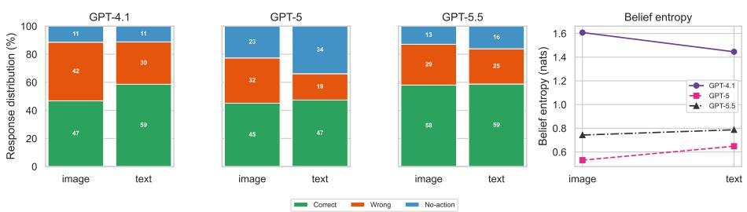  
Fig. 9. Context modality (image vs. text) results per model. (left) stacked outcome composition of Worker responses (correct piece / wrong piece / no-action); (right) mean belief entropies. Text improves accuracy for GPT-4.1 and GPT-5 and leaves GPT-5.5 unchanged, while belief entropy moves litle and inconsistently

<table><tr><td colspan="2">Image modality</td><td colspan="2">Text modality</td></tr><tr><td>[text] current state of the board [text] the possible pieces I have</td><td></td><td>Instruction: &quot;the piece has a clockwise</td><td></td></tr><tr><td rowspan="9"></td><td>[IMAGE] &lt;6x6 board screenshot&gt;</td><td colspan="2">spiral pattern ... top left (1,1)&quot;</td></tr><tr><td>[IMAGE] &lt;gallery of all 24 pieces&gt;</td><td>--- Pieces --- (24 total)</td><td></td></tr><tr><td></td><td></td><td>#0 yellow | horizontal parallel lines</td></tr><tr><td>[text] Instruction: &quot;the piece has a clockwise spiral pattern ..</td><td></td><td>#3 white | thick diagonals (UR-&gt;LL)</td></tr><tr><td>top left, row 1, column 1&quot;</td><td></td><td>#6 pink | clockwise spiral</td></tr><tr><td></td><td></td><td>#7 pink | counter-clockwise spiral</td></tr><tr><td></td><td></td><td>#15 yellow | lines radiating from center</td></tr><tr><td></td><td></td><td>| (color + pattern, 24 pieces)</td></tr><tr><td></td><td colspan="2"></td></tr><tr><td></td><td colspan="2">--- Board --- (6x6) Row0:.</td></tr><tr><td></td><td>…</td><td>(placed cells show the piece)</td></tr></table>

Fig. 10. The same turn in two context modalities. Identical instruction, board, and 24 pieces, rendered either (left) as two images—a board screenshot and a gallery of all pieces—that the Worker must read visually, or (right) as text, with each piece a color | pattern line and the board an ASCII grid. Verbal descriptions preserve distinctions that images blur: the target #6 clockwise spiral and its near-twin #7 counter-clockwise spiral are a confusable pair by sight but separable in words. This is the manipulation behind Fig. 9. (Piece list abridged to 5 of 24 for space.)

Table 11. Context modalit (ima e vs. text), aired within model on matched dialo ue turns. On-action accurac is com ared with an exact McNemar test on turns where the model commited a placement in both modalities; belief entropy with a Wilcoxon signed-rank test (efect size = matched-pairs rank-biserial �). No-action rate is reported descriptively; whether and how much models ask is anal sed in Section 7.
<table><tr><td rowspan="3">Model</td><td colspan="2">On-action acc. (%)</td><td rowspan="3">No-action (%)</td><td colspan="3">Belief entropy (nats)</td></tr><tr><td> $\mathrm { i m g } \to \mathrm { t x t }$ </td><td>McNemar p</td><td> $\mathrm { i m g } \to \mathrm { t x t }$ </td><td> $\mathrm { i m g } \to \mathrm { t x t }$ </td><td>Wilcoxon p</td></tr><tr><td>GPT-4.1</td><td> $5 2 . 9 \longrightarrow 6 6 . 0$ </td><td> $1 . 1 \times 1 0 ^ { - 7 }$ </td><td> $1 1 . 4  1 1 . 2$ </td><td> $1 . 7 4 \to 1 . 5 6$ </td><td>+0.36</td><td> $2 . 7 \times 1 0 ^ { - 1 4 }$ </td></tr><tr><td>GPT-5</td><td> $5 8 . 4  7 1 . 7 $ </td><td> $3 . 5 \times 1 0 ^ { - 9 }$ </td><td> $2 2 . 7  3 3 . 9$ </td><td> $0 . 7 8 \to 0 . 8 4$ </td><td>-0.23</td><td> $4 . 2 \times 1 0 ^ { - 7 }$ </td></tr><tr><td>GPT-5.5</td><td> $6 6 . 7  7 0 . 1$ </td><td>0.16</td><td> $1 2 . 9  1 6 . 1$ </td><td> $0 . 9 5  0 . 9 5$ </td><td>+0.02</td><td>0.62</td></tr></table>

Modality.

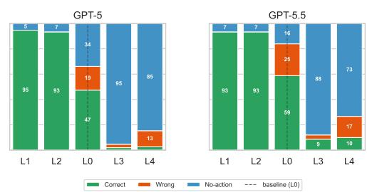

Table 12. Instruction-specificity levels. The synthetic gradient replaces the Helper’s message with a deterministic template that strips referential cues ste b ste , from iece id + full descri tion + osition down to a eneric ointer. S ecificit is ordinal across L1→L4 (most → least informative); L0 is the real human message, placed mid-axis (between L2 and L3) as the baseline. A further misleading level (L5), which describes a confusable piece, is reported in the appendix. Running example: target = the pink clockwise-spiral piece (#6).
<table><tr><td>Level</td><td>Cues provided</td><td>Example instruction</td></tr><tr><td>L0 Original</td><td>original human message</td><td>&quot;the piece has a clockwise spiral pattern ... top-left, row 1, col- umn 1”</td></tr><tr><td></td><td>L1 Over-specified piece #, colour, pattern, po- sition</td><td>&quot;Place piece #6 at (2, 3). It&#x27;s the pink piece with clockwise spiral emanating from center.&quot;</td></tr><tr><td>L2 Feature-rich</td><td>colour, pattern, position</td><td>&quot;Find the pink piece that has clockwise spiral emanating from center. Place it at (2, 3).&quot;</td></tr><tr><td>L3 Single feature</td><td>colour only</td><td>“Place the pink piece.&quot;</td></tr><tr><td>L4 Vague</td><td>no distinguishing feature</td><td>“Place the next piece.&quot;</td></tr></table>

Table 13. Instruction-specificity templates (pseudo-code); each level overwrites the current Helper instruction. Placeholders {id}, {color}, {pattern}, {pos} are filled from the target piece (e.g. piece #6 = “pink”, “clockwise spiral emanating from center”); {pos} is a fixed placeholder because only referent identity is varied. L0 is the untouched human instruction (mid-axis baseline); a furthe “misleading” template describing a confusable competitor exists in code but is not part of the reported axis.

GenerateInstruction(piece, level):   
id, color, pattern <- attributes(piece) # "pink", "clockwise spiral ..."   
pos <- "(2,3)" # fixed: only referent identity varies   
L1 over-specified : "Place piece #{id} at {pos}. "   
"It's the {color} piece with {pattern}."   
L2 feature-rich : "Find the {color} piece that has {pattern}. "   
"Place it at {pos}."   
L3 single feature : "Place the {color} piece."   
L4 vague : "Place the next piece."   
L0 baseline : <original human instruction, unchanged>

Instructions. For the target piece #6 (pink; “clockwise spiral emanating from center”) these instantiate to: L1 “Place piece #6 at (2, 3). It’s the pink piece with clockwise spiral emanating from center.”; L2 “Find the pink piece that has clockwise spiral emanating from center. Place it at (2, 3).”; L3 “Place the pink piece.”; and L4 “Place the next piece.

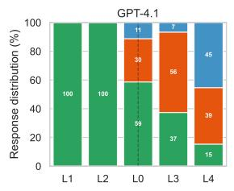

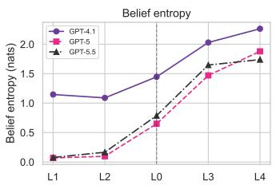  
Fig. 11. Instruction specificity (text modality) results per model. (left) stacked outcome composition of Worker response (correc piece / wrong piece / no-action) at each specificity level from overspecified (L1) to vague (L4), with the original uterance (L0) placed between L2 and L3 as the baseline (dashed); the right panel shows mean belief entropy. Accuracy falls and belief entropy rises with vagueness for all models

Table 14. Instruction specificity: linear trend in each outcome per step along the ordered axis L1 → L2 → L0 → L3 → L4 (increasing vagueness; the original uterance L0 sits mid-axis). Per-model regressions with dialogue-clustered standard errors (25 dialogues); accuracy and coverage are linear-probability models (percentage points per step), belief entropy is OLS (nats per step). All slopes � < 0.001.
<table><tr><td>Model</td><td>Modality</td><td>Accuracy (pp/step)</td><td>Coverage (pp/step)</td><td>Entropy (nats/step)</td></tr><tr><td>GPT-4.1</td><td>image</td><td>-21.2 [−22.9, −19.6]</td><td>-9.3 [−11.0, −7.5]</td><td>+0.313 [+0.275, +0.351]</td></tr><tr><td></td><td>text</td><td>-20.6 [-22.4, -18.8]</td><td>-9.7 [-12.2, -7.3]</td><td>+0.317 [+0.297, +0.338]</td></tr><tr><td>GPT-5</td><td>image</td><td>-20.2[−23.6, -16.7]</td><td>-24.3 [-25.5, -23.2]</td><td>+0.510 [+0.471, +0.550]</td></tr><tr><td></td><td>text</td><td>-18.4 [-22.6, -14.3]</td><td>-24.7[-26.3, -23.1]</td><td>+0.498 [+0.459, +0.538]</td></tr><tr><td>GPT-5.5</td><td>image</td><td>-15.5[−19.1, -12.0]</td><td>-23.2 [-25.2, -21.2]</td><td>+0.469 [+0.434, +0.503]</td></tr><tr><td></td><td>text</td><td>-16.4[-20.5, -12.3]</td><td>-21.5 [-23.6, -19.4]</td><td>+0.480 [+0.446, +0.515]</td></tr></table>

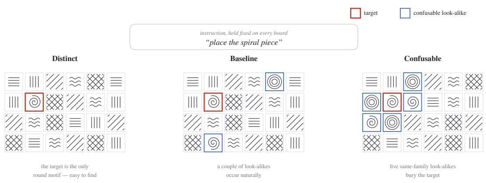  
Fig. 12. Board (environmental) confusability. The same fixed referring instruction (“place the spiral piece”) is shown against three boards alon a confusabilit axis; the instruction is held constant so that onl the com etin referents chan e. Distinct (B1): the target is the only piece of its shape family and thus the sole plausible referent. Baseline (B0): the real board seen in the dialogue, where a couple of incidental look-alikes occur naturally. Confusable (B2): five same-family, same-thickness look-alikes are inserted, burying the target among near-identical distractors. The red ring marks the intended target; the blue ring marks a confusable same-family look-alike. Moving from distinct to confusable makes it increasingly likely that the Worker commits to a look-alike—the environmental (referent-side) axis of referential uncertainty, complementary to instruction vagueness (Fig. 3).

Confusability.

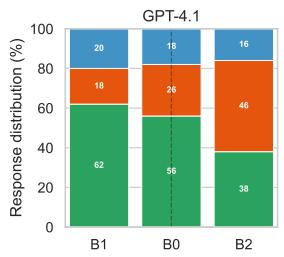

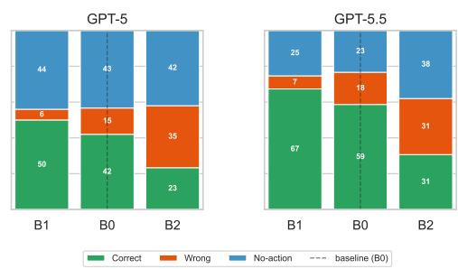

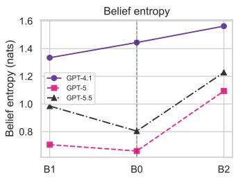  
Fig. 13. Board confusability (text modality) results per model. (left) stacked outcome composition of Worker responses (correct piece / wrong piece / no-action) and (right) mean belief entropy on a distinct board (B1), the original board (B0), and a confusable board (B2), in order of increasing confusability. Accuracy falls sharply while no-action and belief entropy barely move.

Table 15. Board confusability: linear trend in each outcome per step along the axis B1 (distinct) → B0 (original) → B2 (confusable); per-model regressions with dialogue-clustered SEs (23 dialogues). Accuracy/coverage in percentage points per step, belief entropy in nats per step. All accuracy and entropy trends are significant (� ≤ .002); coverage is non-significant except GPT-5.5 text (bold, $\begin{array} { r } { p < . 0 0 1 , } \end{array}$ ).
<table><tr><td>Model</td><td>Modality</td><td>Accuracy (pp/step)</td><td>Coverage (pp/step)</td><td>Entropy (nats/step)</td></tr><tr><td>GPT-4.1</td><td>image</td><td> $- 1 1 . 7 \left[ - 1 5 . 3 , - 8 . 1 \right]$ </td><td> $+ 0 . 3 \left[ - 0 . 8 , + 1 . 5 \right]$ </td><td>+0.052  $\left[ + 0 . 0 1 9 , + 0 . 0 8 5 \right]$ </td></tr><tr><td></td><td>text</td><td> $- 1 6 . 2 \left[ - 2 1 . 4 , - 1 0 . 9 \right]$ </td><td> $+ 2 . 0 \left[ - 0 . 3 , + 4 . 3 \right]$ </td><td>+0.114  $\cdot + 0 . 0 7 3 , + 0 . 1 5 4 ]$ </td></tr><tr><td>GPT-5</td><td>image</td><td> $- 1 5 . 9 \left[ - 2 1 . 8 , - 1 0 . 0 \right]$ </td><td> $+ 1 . 3 \left[ - 2 . 1 , + 4 . 8 \right]$ </td><td>+0.063 [+0.037, +0.090]</td></tr><tr><td></td><td>text</td><td> $- 2 4 . 6 \left[ - 3 1 . 5 , - 1 7 . 7 \right]$ </td><td> $+ 1 . 0 \left[ - 4 . 3 , + 6 . 3 \right]$ </td><td>+0.194 [+0.136, +0.251]</td></tr><tr><td>GPT-5.5</td><td>image</td><td> $- 1 5 . 8 \left[ - 2 0 . 8 , - 1 0 . 9 \right]$ </td><td> $+ 1 . 7 \left[ - 0 . 6 , + 3 . 9 \right]$ </td><td>+0.063 [+0.028, +0.097]</td></tr><tr><td></td><td>text</td><td> $- 2 0 . 1 \left[ - 2 5 . 0 , - 1 5 . 2 \right]$ </td><td> $- 6 . 3 \left[ - 1 0 . 0 , - 2 . 7 \right]$ </td><td>+0.122 [+0.074, +0.169]</td></tr></table>

## A.9 Additional Externalizing Uncertainty Results

Table 16. Judged clarification rate per model and modality. Each no-action is labeled by an LLM judge (GPT-5.5) as an explicit clarification (names the confusing piece), a generic hedge, or a non-placement turn; the rate is (explicit + hedge) over placementinstruction turns (all turns not labeled NOT PLACEMENT).
<table><tr><td>Model</td><td>Modality</td><td>N</td><td>Explicit (%)</td><td>Hedge (%)</td><td>Clarification (%)</td></tr><tr><td>GPT-4.1</td><td>image</td><td>546</td><td>2.93</td><td>0.55</td><td>3.48</td></tr><tr><td rowspan="2">GPT-5</td><td>text</td><td>561</td><td>1.25</td><td>0.36</td><td>1.60</td></tr><tr><td>image</td><td>556</td><td>15.83</td><td>0.90</td><td>16.73</td></tr><tr><td></td><td>text</td><td>562</td><td>23.13</td><td>0.71</td><td>23.84</td></tr><tr><td rowspan="2">GPT-5.5</td><td>image</td><td>549</td><td>5.65</td><td>0.55</td><td>6.19</td></tr><tr><td>text</td><td>555</td><td>8.47</td><td>0.36</td><td>8.83</td></tr></table>

Table 17. Is clarification targeted at error-prone turns? Clarification rate on turns where the recorded AI Worker (reproduced by GPT-4.1) laced the wrong iece (needed) vs. the correct iece (not needed); one-sided Fisher exact test (� : hi her when needed).
<table><tr><td>Model</td><td>Modality</td><td>Needed  $( \% , n )$ </td><td>Not needed  $( \% , n )$ </td><td>Fisher p</td></tr><tr><td>GPT-4.1</td><td>image</td><td>1.98 (101)</td><td>1.74 (115)</td><td>0.64</td></tr><tr><td></td><td>text</td><td>1.94 (103)</td><td>0.85 (117)</td><td>0.45</td></tr><tr><td>GPT-5</td><td>image</td><td>22.33 (103)</td><td>11.11 (117)</td><td>0.020</td></tr><tr><td></td><td>text</td><td>29.41 (102)</td><td>26.50 (117)</td><td>0.37</td></tr><tr><td>GPT-5.5</td><td>image</td><td>2.94 (102)</td><td>3.45 (116)</td><td>0.72</td></tr><tr><td></td><td>text</td><td>10.58 (104)</td><td>5.22 (115)</td><td>0.11</td></tr></table>

Table 18. Externalizing uncertainty on natural turns. Q1 (coupling): point-biserial correlation between questioning (no-action) and elicited belief entropy on graded beliefs, with mean entropy on ask vs. place turns (all $ { p ^ { < 1 0 ^ { - 4 } ) } }$ . Q2 (hedge trigger): on acted turns scored against ground\_truth\_piece, AUROC of belief entropy predicting a wrong placement, and the recall / false-hedge rate (FPR) / precision of the rule “hedge if entropy ≥ median” (base error rate last).
<table><tr><td></td><td></td><td colspan="3">Q1: coupling</td><td colspan="5">Q2: hedge trigger (vs. GT)</td></tr><tr><td>Model</td><td>Mod.</td><td> $r _ { \mathrm { a s k } , H }$ </td><td> $H _ { \mathrm { a s k } }$ </td><td> $H _ { \mathrm { p l a c e } }$ </td><td>AUROC</td><td>recall</td><td>FPR</td><td>prec.</td><td>base err.</td></tr><tr><td>GPT-4.1</td><td>image</td><td>0.18</td><td>1.87</td><td>1.58</td><td>0.548</td><td>0.57</td><td>0.46</td><td>0.53</td><td>47.1%</td></tr><tr><td></td><td>text</td><td>0.31</td><td>1.82</td><td>1.43</td><td>0.602</td><td>0.62</td><td>0.48</td><td>0.40</td><td>34.0%</td></tr><tr><td>GPT-5</td><td>image</td><td>0.35</td><td>0.99</td><td>0.49</td><td>0.603</td><td>0.57</td><td>0.46</td><td>0.47</td><td>41.6%</td></tr><tr><td></td><td>text</td><td>0.39</td><td>1.04</td><td>0.54</td><td>0.666</td><td>0.67</td><td>0.44</td><td>0.38</td><td>28.3%</td></tr><tr><td>GPT-5.5</td><td>image</td><td>0.31</td><td>1.16</td><td>0.72</td><td>0.659</td><td>0.68</td><td>0.41</td><td>0.45</td><td>33.3%</td></tr><tr><td></td><td>text</td><td>0.31</td><td>1.19</td><td>0.75</td><td>0.611</td><td>0.63</td><td>0.45</td><td>0.38</td><td>29.9%</td></tr></table>

## A.10 Grading Interface

  
Fig. 14. The grading interface (one trial, Generic condition). In this between-subjects study, each participant reviews the flatened interaction up to the current turn and judges the AI Worker’s placement. (a) The dialogue—the Worker’s opening status, the Helper’s instruction (here “bold diagonal lines on a white background”), and the Worker’s placement message. For that message the participant reports two 0–100 judgements, (b) apparent confidence (how confident the Worker sounds) and (c) correctness likelihood (how likely the intended piece was placed), and (d) chooses a single action: proceed, ask the Worker to change/undo, ask it to explain/verify, or give a more specific instruction. (e) As the Helper, the participant sees the target patern but not the Worker’s board; the board is revealed onl in the Visible-board condition. Across conditions we var onl the Worker’s messa e and board visibilit (Table 1), holdin the task turns fixed. The available pieces are not shown in an condition as the are also not available to see for the Helper.

## A.11 Human Perception Study Results Details

Table 19. Human study per-condition results—full descriptive breakdown (participant means; � = 210, ∼42/condition). Perception ratings are on a 0–100 scale; the action mix gives the percentage of substantive turns assigned to each of the four mutually exclusive responses (columns sum to 100% up to rounding); error sensitivity gives acceptance rates conditioned on ground-truth placement correctness. Rating discrimination = mean(correctness | correct) − mean(correctness | wrong); action discrimination = �(acce t | correct) − �(acce t | wron ). Self-hed ed is the secondar , de lo able condition.
<table><tr><td>hedged</td><td>Generic</td><td>Described</td><td>Hedged</td><td>Visible board</td><td>Self-</td></tr><tr><td>Perception (observer ratings, 0–100)</td><td></td><td></td><td></td><td></td><td></td></tr><tr><td>Correctness-likelihood</td><td>77.6</td><td>67.3</td><td>56.1</td><td>53.7</td><td>61.5</td></tr><tr><td>Apparent confidence</td><td>85.5</td><td>85.7</td><td>58.5</td><td>83.3</td><td>56.6</td></tr><tr><td>Rating discrimination (corr.-wrong)</td><td>-0.1</td><td>16.8</td><td>27.7</td><td>26.6</td><td>8.8</td></tr><tr><td>Action mix (% of substantive turns)</td><td></td><td></td><td></td><td></td><td></td></tr><tr><td>Proceed / accept</td><td>76.7</td><td>63.8</td><td>50.6</td><td>41.5</td><td>54.4</td></tr><tr><td>Change / undo</td><td>6.5</td><td>17.5</td><td>20.1</td><td>26.3</td><td>16.9</td></tr><tr><td>Ask to explain / verify</td><td>7.1</td><td>8.0</td><td>12.3</td><td>10.1</td><td>10.2</td></tr><tr><td>More-specific instruction</td><td>9.7</td><td>10.8</td><td>17.0</td><td>22.0</td><td>18.5</td></tr><tr><td>Error sensitivity (% accepted)</td><td></td><td></td><td></td><td></td><td></td></tr><tr><td>Accept correct moves</td><td>79.0</td><td>78.6</td><td>73.7</td><td>64.8</td><td>60.1</td></tr><tr><td>Accept wrong moves</td><td>78.3</td><td>57.1</td><td>36.4</td><td>30.1</td><td>50.2</td></tr><tr><td>Action discrimination (pp)</td><td>0.7</td><td>21.5</td><td>37.3</td><td>34.8</td><td>10.0</td></tr><tr><td>N participants</td><td>41</td><td>42</td><td>42</td><td>43</td><td>42</td></tr></table>

Table 20. Human post-study questionnaire (participant means; � = 210, all responded). Prior-AI items are pre-existing atitudes and act as a randomisation check (balanced across conditions); pair items are the condition-dependent subjective experience. “Helper repeated explanations” is scored higher = more repetition; the pair composite reverse-scores it (6 − �) so higher = beter. The conditions with the best decision quality (Hedged, Visible board; Table 5) yield the lowest subjective smoothness, whereas Generic—a near-perfect rubber stamp—feels the most fluent.
<table><tr><td></td><td>Scale</td><td>Generic</td><td>Described</td><td>Hedged</td><td>Visible board</td><td>Self-hedged</td></tr><tr><td colspan="7">Prior-AI attitudes (randomisation check)</td></tr><tr><td>Puzzle familiarity</td><td>1-7</td><td>3.59</td><td>3.81</td><td>2.93</td><td>3.53</td><td>3.14</td></tr><tr><td>Trust AI models</td><td>1-5</td><td>3.58</td><td>3.67</td><td>3.60</td><td>3.47</td><td>3.43</td></tr><tr><td>Understand why AI answered</td><td>1-5</td><td>3.88</td><td>3.93</td><td>3.60</td><td>3.74</td><td>3.71</td></tr><tr><td>Detect AI uncertainty</td><td>1-5</td><td>3.92</td><td>3.64</td><td>3.57</td><td>3.67</td><td>3.83</td></tr><tr><td>Prior-AI composite</td><td>1-5</td><td>3.79</td><td>3.75</td><td>3.59</td><td>3.63</td><td>3.66</td></tr><tr><td colspan="7">Interaction experience (pair items)</td></tr><tr><td>Pair on same page</td><td>1-5</td><td>3.98</td><td>3.48</td><td>3.36</td><td>2.95</td><td>3.38</td></tr><tr><td>AI understood Helper</td><td>1-5</td><td>4.08</td><td>3.60</td><td>3.24</td><td>3.30</td><td>3.24</td></tr><tr><td>Interaction was smooth</td><td>1-5</td><td>4.08</td><td>3.38</td><td>3.29</td><td>3.00</td><td>3.33</td></tr><tr><td>Helper repeated explanations</td><td>1-5</td><td>2.55</td><td>2.60</td><td>3.24</td><td>2.88</td><td>3.21</td></tr><tr><td>Pair composite</td><td>1-5</td><td>3.89</td><td>3.46</td><td>3.16</td><td>3.09</td><td>3.18</td></tr></table>

## A.12 Statistical Tests Summary

Received 20 February 2007; revised 12 March 2009; accepted 5 June 2009

Table 21. Statistical tests and inferential procedures used in the manuscript. Section references indicate the main analyses; implementation details are provided in Section A.6.
<table><tr><td>Test / procedure</td><td>Description</td><td>Applied</td></tr><tr><td>sided)</td><td>Mann-Whitney U test (two- Test whether confidence discriminates cor- rect from incorrect placements (AUROC above chance).</td><td>Section 5; Appendix, Table 9.</td></tr><tr><td>Paired bootstrap</td><td>Compare AUROC between uncertainty sig- Section 5; Appendix, Table 10. nals; estimate confidence intervals and p- values.</td><td></td></tr><tr><td>Exact McNemar test</td><td>Compare placement correctness between image and text on matched turns with</td><td>Section 6.1; Appendix, Table 11.</td></tr><tr><td>Wilcoxon signed-rank test</td><td>placements in both modalities. Compare belief entropy between matched Section 6.1; Appendix, Table 11. image and text turns.</td><td></td></tr><tr><td>Regressiontrend tests (dialogue-clustered SEs)</td><td>Test ordered trends in accuracy and cov- Section 6.2 and Section 6.3; Appendix, erage (linear-probability models) and en- Table 14 and 15. tropy (OLS).</td><td></td></tr><tr><td>Binomial test</td><td>Test whether belief-argmax switches land Section 6.3; Table 3. within the confusable cluster more often than chance.</td><td></td></tr><tr><td>Fisher&#x27;s exact test (one-sided)</td><td>Test whether clarification is more frequent Section 7.1; Appendix, Table 17. on recorded incorrect than correct place-</td><td></td></tr><tr><td>Point-biserial correlation sig- nificance test</td><td>Test the association between no- action/questioning and belief entropy.</td><td>Section 7.2; Appendix, Table 18.</td></tr><tr><td>Participant-level permutation tests</td><td>Compare condition means and targeted “Between Condition&quot; and “Hedging hedging effects.</td><td>Mechanism&quot;; Table 6 and Table 7.</td></tr><tr><td>test</td><td>Exact dialogue-level sign-flip Check the specified oracle-hedging mecha- nism contrast across source dialogues.</td><td>&quot;Hedging Mechanism&quot;; Table 7; Sec- tion A.6.</td></tr><tr><td colspan="3">Additional inferential procedures (not standalone tests)</td></tr><tr><td>dence intervals</td><td>and human-study effects/AUC; typically 10,000 resamples.</td><td>Percentile bootstrap confi- Quantify uncertainty in calibration metrics Section 5, and Section A.6; Table 9.</td></tr><tr><td>Holm multiple-testing correc- tion</td><td>Control family-wise error separately for primary and exploratory human-study comparison families.</td><td>Section 8; Tables 6 and 7; Section A.6.</td></tr></table>